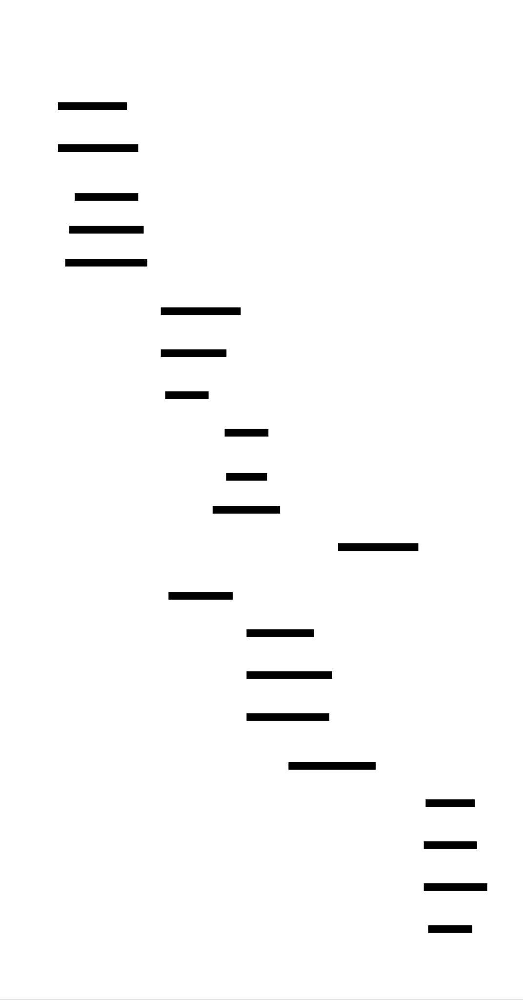

# Build Your Own OS

This project guides you through building a complete x86 operating system kernel from scratch — from the moment the BIOS hands control to your bootloader, through protected mode transitions, interrupt handling, virtual memory management, and preemptive multitasking with user-mode processes. You will write code that runs on bare metal, with no operating system beneath you, learning the foundational abstractions that every modern computing platform is built upon.

Every decision in OS development is a negotiation with hardware reality. The CPU boots in 16-bit real mode with segmentation; you must transition it to 32-bit protected mode with paging. Hardware interrupts arrive asynchronously; you must save and restore complete processor state transparently. Memory is a flat physical resource; you must carve it into isolated virtual address spaces. Processes want infinite CPU time; you must preempt them fairly while maintaining the illusion of continuous execution.

By the end, you will have built a system that boots from power-on, handles keyboard input, manages virtual memory, runs multiple processes concurrently, and supports user-mode applications with system calls — the essential components of any modern operating system.


<!-- MS_ID: build-os-m1 -->
# Bootloader, GDT, and Kernel Entry
## The First Breath of Your Operating System
You are about to write code that runs on bare metal — no operating system beneath you, no standard library to catch your mistakes, no debugger that understands your context. When your code fails, the CPU doesn't throw an exception or print a stack trace. It triple-faults and resets.
This is the reality of the boot process. You have exactly 512 bytes — the size of a single disk sector — to accomplish the following:
1. Convince the CPU to execute your code at all
2. Navigate a 40-year-old compatibility layer designed for the 8086
3. Enable a memory addressing quirk (A20) that exists because of a bug in 1981
4. Configure a data structure (the GDT) that defines how the CPU interprets every memory access
5. Transition the CPU from 16-bit mode to 32-bit protected mode
6. Load your actual kernel from disk
7. Transfer control to C code that you also wrote
Every modern x86 system — from the server running this text to the laptop you're developing on — performs this exact sequence within the first milliseconds of power-on. By the end of this milestone, you will understand what happens between pressing the power button and seeing the first pixel of a boot logo.
---
## The Tension: Hardware Doesn't Know You Exist
The fundamental tension in booting is this: **hardware provides no abstractions, but software requires them.**
When you write a normal C program, you have:
- A stack that's already set up
- A heap you can allocate from
- Standard libraries that handle I/O
- An operating system that catches your segmentation faults
When you write a bootloader, you have:
- A CPU in a mode designed for 1981 software
- 512 bytes of code loaded at an arbitrary address
- No stack (you must set one up)
- No idea how much memory exists or where it is
- BIOS routines that only work in 16-bit real mode
The boot process is a choreographed handoff through layers of backward compatibility. Each layer must be configured before the next can exist. You cannot use C until you have a stack. You cannot have a stack until you know where memory is. You cannot safely access memory above 1MB until you enable the A20 line. You cannot use 32-bit code until you enter protected mode. You cannot enter protected mode until you configure the GDT.
Every step depends on the previous one. There is no shortcut.
---
## The Boot Sequence: A Satellite View


Your operating system consists of several components that must work together:
- **Bootloader (Stage 1)**: 512 bytes in the Master Boot Record. Must load stage 2 or the kernel directly.
- **Bootloader (Stage 2)**: Optional larger bootloader that can read complex file systems.
- **Kernel**: The actual operating system code, written in C with assembly glue.
- **Linker Script**: Tells the linker where to place code and data in memory.
For this project, you'll use a two-stage bootloader approach. Stage 1 fits in the MBR and loads stage 2 from disk. Stage 2 then loads your kernel.


---
## The 512-Byte Prison: Master Boot Record
When the BIOS completes its power-on self-test (POST), it looks for a bootable disk. A disk is bootable if byte 511 of its first sector contains 0x55 and byte 512 contains 0xAA — the boot signature.
The BIOS loads this 512-byte sector to physical address 0x7C00 and jumps to it. That's it. Your bootloader now has control.


Here's what those 512 bytes must contain:
```
; Memory layout of MBR at 0x7C00
; 0x7C00 - 0x7CXX: Code and data
; 0x7CXX - 0x7DFF: Stack (grows downward from 0x7E00)
; 0x7DFE: Boot signature (0x55, 0xAA)
```
You have approximately 446 bytes for code before you need to leave room for the partition table (64 bytes) and boot signature (2 bytes).
### Setting Up Your First Stack
The CPU doesn't give you a stack. Without one, you can't call functions, push registers, or use local variables in any meaningful way.
```asm
; stage1.asm - MBR Bootloader
[BITS 16]          ; We start in 16-bit real mode
[ORG 0x7C00]       ; BIOS loads us here
start:
    ; Set up segments - we're in real mode, so segments are just shifted left by 4
    cli                    ; Clear interrupts while we set up
    xor ax, ax             ; Zero AX
    mov ds, ax             ; Data segment = 0
    mov es, ax             ; Extra segment = 0
    mov ss, ax             ; Stack segment = 0
    mov sp, 0x7C00         ; Stack pointer just below our code (grows down)
    sti                    ; Re-enable interrupts
```
**Wait — why does the stack pointer point to 0x7C00, which is where our code is?**
Stacks grow downward. When you push a 16-bit value, the CPU first decrements SP by 2, then writes the value at SS:SP. So your first push will go to 0x7BFE, which is below your code at 0x7C00. This is safe as long as your stack doesn't grow so large that it overwrites your bootloader.
### The Three-Level View of Real Mode Segmentation
| Level | What Happens | Why It Matters |
|-------|--------------|----------------|
| **Application** | You write `mov ax, [0x1234]` | You want to read memory at address 0x1234 |
| **CPU/Segmentation** | Physical address = (DS × 16) + offset = (0 × 16) + 0x1234 = 0x1234 | The segment register is part of every memory access |
| **Hardware** | Address bus receives 0x1234, memory returns byte | The CPU has 20 address lines (A0-A19), max 1MB addressable |
In real mode, the segment:offset scheme exists because the 8086 had 16-bit registers but 20-bit address lines. A single 16-bit register could only address 64KB, but Intel wanted to address 1MB. Their solution: use two registers, shift one left by 4 bits, and add them together.
This historical accident defines your boot environment.
---
## The A20 Line: A Bug Becomes a Feature
On the 8086, if you accessed memory above 1MB (addresses 0x100000 and above), the address would wrap around because there were only 20 address lines. The 80286 added more address lines, but this broke some software that relied on the wraparound behavior.
IBM's solution: the A20 gate. This is a hardware switch that can disable the 21st address line (A20), forcing wraparound behavior for compatibility. By default, on many systems, the A20 line is disabled when the computer boots.
You must enable it to access memory above 1MB — which is where you want to load your kernel.
### The Three Methods of Enabling A20
There are three common ways to enable A20, in order of preference:
1. **BIOS INT 15h, AX=2401** — The cleanest method, but requires BIOS support
2. **Fast A20 (port 0x92)** — Direct hardware access, but not universally supported
3. **Keyboard controller (port 0x64/0x60)** — The most reliable, but slow and complex
A robust bootloader tries multiple methods:
```asm
enable_a20:
    ; Method 1: BIOS call
    mov ax, 0x2401
    int 0x15
    jc .try_fast_a20       ; If carry set, BIOS doesn't support it
    ; Check if A20 is actually enabled
    call check_a20
    cmp ax, 1
    je .a20_done
.try_fast_a20:
    ; Method 2: Fast A20 gate (port 0x92)
    in al, 0x92
    test al, 2             ; Already enabled?
    jnz .a20_done
    or al, 2               ; Set A20 bit
    and al, 0xFE           ; Clear reset bit (safety!)
    out 0x92, al
    call check_a20
    cmp ax, 1
    je .a20_done
    ; Method 3: Keyboard controller (fallback)
    ; This is complex and involves waiting for the controller
    ; to be ready, then sending commands to enable A20
    ; ... (implementation omitted for brevity)
.a20_done:
    ret
```
### Checking A20: The Wraparound Test
How do you know if A20 is enabled? You test whether addresses wrap around at 1MB:
```asm
check_a20:
    ; Returns AX = 1 if A20 enabled, 0 otherwise
    ; We write different values to 0x0000:0x0500 and 0xFFFF:0x0510
    ; If A20 is disabled, these are the same physical address
    push ds
    push es
    push di
    push si
    xor ax, ax
    mov es, ax          ; ES = 0
    mov di, 0x0500      ; ES:DI = 0x0000:0x0500 = physical 0x00500
    not ax              ; AX = 0xFFFF
    mov ds, ax
    mov si, 0x0510      ; DS:SI = 0xFFFF:0x0510 = physical 0x100500 if A20 on
                        ;                        = physical 0x00500 if A20 off
    mov al, [es:di]     ; Save original byte
    push ax
    mov byte [es:di], 0x00   ; Write test pattern
    mov byte [ds:si], 0xFF   ; Write to "shadow" address
    cmp byte [es:di], 0xFF   ; Did it change?
    setne al                  ; AL = 1 if different (A20 on)
    movzx ax, al
    pop bx
    mov [es:di], bl     ; Restore original byte
    pop si
    pop di
    pop es
    pop ds
    ret
```
This test exploits the fact that with A20 disabled, `0xFFFF:0x0510` wraps to `0x0000:0x0500`. If writing to one changes the other, A20 is disabled.
---
## The Global Descriptor Table: Defining Memory
The GDT is your first encounter with protected mode's memory management. In real mode, segments are just base addresses (shifted left 4 bits). In protected mode, segments are indices into a table of descriptors, and each descriptor contains:
- **Base address** (32 bits): Where the segment starts in physical memory
- **Limit** (20 bits): How large the segment is
- **Access rights** (8 bits): Privilege level, readable/writable, executable
- **Flags** (4 bits): Granularity (byte vs 4KB), size (16-bit vs 32-bit)
{{DIAGRAM:diag-gdt-structure}}
### Segment Descriptor: The Bit-Level Layout
A segment descriptor is 8 bytes. Here's the layout:
```
Byte 0-1:  Limit [15:0]          (bits 0-15 of limit)
Byte 2-4:  Base  [23:0]          (bits 0-23 of base)
Byte 5:    Access Byte           (see below)
Byte 6:    Limit [19:16] + Flags (high 4 bits of limit, plus flags)
Byte 7:    Base  [31:24]         (bits 24-31 of base)
```
The **Access Byte** (byte 5):
| Bit | Name | Meaning |
|-----|------|---------|
| 7 | Present | 1 = segment is present in memory |
| 6-5 | DPL | Descriptor Privilege Level (0-3) |
| 4 | S | System (0 = system, 1 = code/data) |
| 3 | E | Executable (1 = code, 0 = data) |
| 2 | DC | Direction/Conforming |
| 1 | RW | Readable (code) / Writable (data) |
| 0 | A | Accessed (set by CPU) |
The **Flags** (high nibble of byte 6):
| Bit | Name | Meaning |
|-----|------|---------|
| 7 | G | Granularity (0 = byte, 1 = 4KB blocks) |
| 6 | D/B | Default operation size (0 = 16-bit, 1 = 32-bit) |
| 5 | L | Long mode (1 = 64-bit code) |
| 4 | AVL | Available for system use |
### Why These 5 Descriptors?
{{DIAGRAM:diag-protected-mode-transition}}
Your GDT needs these entries:
1. **Null Descriptor (index 0)**: Required by the CPU. All zeros. Loading a segment selector with index 0 causes a General Protection Fault — this catches bugs where you forget to load a segment register.
2. **Kernel Code Segment (index 1)**: Ring 0, executable, readable. Base=0, Limit=0xFFFFF with G=1 (4KB granularity) = 4GB. This lets kernel code access all memory.
3. **Kernel Data Segment (index 2)**: Ring 0, writable. Same base and limit as code. For stack, data, and BSS.
4. **User Code Segment (index 3)**: Ring 3, executable, readable. Same base and limit, but DPL=3.
5. **User Data Segment (index 4)**: Ring 3, writable. Same as user code but for data.
Here's the GDT definition:
```asm
gdt_start:
    ; Null descriptor (required)
    dq 0x0000000000000000
gdt_kernel_code:
    ; Base=0, Limit=0xFFFFF (4GB with 4KB granularity)
    ; Access: Present=1, DPL=0 (ring 0), S=1 (code/data), E=1 (code), RW=1 (readable)
    ; Flags: G=1 (4KB), D=1 (32-bit)
    dq 0x00CF9A000000FFFF    ; See breakdown below
gdt_kernel_data:
    ; Same but for data: E=0, RW=1 (writable)
    dq 0x00CF92000000FFFF
gdt_user_code:
    ; DPL=3 (ring 3): bits 45-46 = 11
    dq 0x00CFFA000000FFFF
gdt_user_data:
    ; DPL=3, data, writable
    dq 0x00CFF2000000FFFF
gdt_end:
gdt_descriptor:
    dw gdt_end - gdt_start - 1  ; Size (limit) of GDT
    dd gdt_start                 ; Linear address of GDT
```
Let me decode `0x00CF9A000000FFFF` for kernel code:
```
0x00CF9A000000FFFF in little-endian bytes:
Byte 0-1: 0xFFFF → Limit[15:0] = 0xFFFF
Byte 2-4: 0x000000 → Base[23:0] = 0
Byte 5: 0x9A → 10011010b = P(1) DPL(00) S(1) E(1) DC(0) RW(1) A(0)
Byte 6: 0xCF → 11001111b → Flags(1100) + Limit[19:16](1111)
          Flags: G(1) D(1) L(0) AVL(0)
          Limit high: 0xF
Byte 7: 0x00 → Base[31:24] = 0
Limit = 0xFFFFF with G=1 = 0xFFFFF × 4096 = 4GB
Base = 0
```
### Segment Selectors: How the CPU Uses the GDT
A segment selector is a 16-bit value you load into a segment register (CS, DS, ES, FS, GS, SS):
| Bits | Field |
|------|-------|
| 15-3 | Index into GDT (0-8191) |
| 2 | Table Indicator (0=GDT, 1=LDT) |
| 1-0 | Requested Privilege Level (RPL) |
For your GDT:
- Kernel code selector: `0x08` (index 1, TI=0, RPL=0)
- Kernel data selector: `0x10` (index 2, TI=0, RPL=0)
- User code selector: `0x18 | 3` = `0x1B` (index 3, TI=0, RPL=3)
- User data selector: `0x20 | 3` = `0x23` (index 4, TI=0, RPL=3)
---
## The Protected Mode Transition
Entering protected mode is a precise sequence. Do it wrong, and the CPU triple-faults (crashes so hard it resets).
### Step 1: Disable Interrupts
You must disable interrupts before the transition. In real mode, the interrupt vector table (IVT) is at physical address 0. In protected mode, you'll use an IDT at a different location. If an interrupt fires between entering protected mode and loading your IDT, the CPU would read garbage and crash.
```asm
cli                     ; Disable interrupts
```
### Step 2: Load the GDT
```asm
lgdt [gdt_descriptor]   ; Load GDT register
```
The `lgdt` instruction loads the GDTR register with the limit (size - 1) and base address of your GDT. After this, the CPU knows where your segment descriptors live.
### Step 3: Set the PE Bit in CR0
The CR0 register controls CPU operating modes. Bit 0 is the Protection Enable (PE) bit:
```asm
mov eax, cr0
or eax, 1               ; Set PE bit
mov cr0, eax
```
**Critical**: At this exact moment, you're in a weird state. The PE bit is set, but your code segment register (CS) still has a real-mode value. The CPU is technically in protected mode but executing "real-mode-style" code.
### Step 4: The Far Jump
This is the most misunderstood part of the transition. You must execute a far jump to load CS with a protected-mode selector:
```asm
jmp 0x08:protected_mode_entry
[BITS 32]
protected_mode_entry:
    ; Now in 32-bit protected mode!
```
The far jump does two things:
1. Loads CS with selector 0x08 (kernel code segment)
2. Flushes the prefetch queue (the CPU was decoding 16-bit instructions; now it needs to decode 32-bit)
### Step 5: Reload Segment Registers
After the far jump, CS is correct, but DS, ES, FS, GS, and SS still have real-mode values. You must reload them:
```asm
    mov ax, 0x10        ; Kernel data segment selector
    mov ds, ax
    mov es, ax
    mov fs, ax
    mov gs, ax
    mov ss, ax
    mov esp, 0x90000    ; Set up a new stack (well below kernel at 1MB)
```
### The Complete Transition Code
```asm
[BITS 16]
switch_to_protected_mode:
    cli                     ; 1. Disable interrupts
    lgdt [gdt_descriptor]   ; 2. Load GDT
    mov eax, cr0
    or eax, 1               ; 3. Set PE bit
    mov cr0, eax
    jmp 0x08:protected_mode_entry  ; 4. Far jump to flush pipeline
[BITS 32]
protected_mode_entry:
    mov ax, 0x10            ; 5. Reload segment registers
    mov ds, ax
    mov es, ax
    mov fs, ax
    mov gs, ax
    mov ss, ax
    mov esp, 0x90000        ; 6. Set up 32-bit stack
    ; 7. Jump to kernel entry point (loaded at 0x100000)
    jmp 0x100000
```
---
## Loading the Kernel from Disk
Your kernel is too large to fit in the remaining bytes of the MBR. You need to load it from disk using BIOS INT 13h before entering protected mode.
### BIOS Disk Services
INT 13h provides disk operations in real mode. Key functions:
| AH | Function |
|----|----------|
| 0x00 | Reset disk system |
| 0x02 | Read sectors into memory |
| 0x08 | Get drive parameters |
Here's how to read sectors:
```asm
; read_sectors: Read DH sectors from disk starting at LBA AX into ES:BX
; Input:  AX = starting LBA (Logical Block Address)
;         ES:BX = destination buffer
;         DH = number of sectors to read
read_sectors:
    pusha
    mov si, ax          ; Save LBA
    ; Convert LBA to CHS (Cylinder-Head-Sector)
    ; This is simplified; real code needs to handle geometry
    mov cl, al          ; Sector = (LBA mod 63) + 1
    inc cl
    mov al, dh          ; Number of sectors
    mov ch, ah          ; Cylinder = LBA / (63 * 2) ... simplified
    mov ah, 0x02        ; BIOS read sectors function
    mov dl, 0x80        ; First hard drive
    mov dh, 0           ; Head 0
    int 0x13
    jc disk_error       ; Jump if carry (error)
    popa
    ret
disk_error:
    ; Print error and hang
    mov si, disk_error_msg
    call print_string
    jmp $
```
### Loading the Kernel at 0x100000
You want your kernel at 1MB (0x100000), which is above the real-mode addressable range. But wait — you can't access this address in real mode!
The solution: use unreal mode. This is a trick where you enter protected mode temporarily to set a segment limit to 4GB, then return to real mode while keeping the 4GB limit in the segment descriptor cache.
Alternatively, you can load the kernel to a lower address (like 0x10000) and copy it to 0x100000 after entering protected mode.
For simplicity, let's load to 0x10000 and copy later:
```asm
load_kernel:
    mov ax, 0x1000      ; Destination segment
    mov es, ax
    xor bx, bx          ; ES:BX = 0x1000:0x0000 = 0x10000
    mov ax, 2           ; Start at LBA 2 (LBA 0-1 is MBR + stage2)
    mov dh, 64          ; Read 64 sectors (32KB)
    call read_sectors
    ret
```
---
## The Linker Script: Placing Code in Memory
Your kernel is written in C, but the linker needs to know where to place each section. This is the linker script's job.
{{DIAGRAM:diag-linker-script-layout}}
```ld
/* linker.ld */
ENTRY(kernel_entry)
SECTIONS
{
    /* Kernel starts at 1MB physical */
    . = 0x100000;
    /* Text section: executable code */
    .text : ALIGN(4K)
    {
        *(.multiboot)      /* Multiboot header if using GRUB */
        *(.text)
    }
    /* Read-only data */
    .rodata : ALIGN(4K)
    {
        *(.rodata)
    }
    /* Read-write data */
    .data : ALIGN(4K)
    {
        *(.data)
    }
    /* BSS: uninitialized data (must be zeroed) */
    .bss : ALIGN(4K)
    {
        __bss_start = .;
        *(COMMON)
        *(.bss)
        __bss_end = .;
    }
    /* End of kernel */
    _kernel_end = .;
}
```
### Why 0x100000?
The first 1MB of memory is special:
- 0x00000 - 0x003FF: Real-mode interrupt vector table
- 0x00400 - 0x004FF: BIOS data area
- 0x00500 - 0x07BFF: Free low memory
- 0x07C00 - 0x07DFF: Bootloader (your MBR)
- 0x07E00 - 0x9FFFF: Free (for bootloader stage 2)
- 0xA0000 - 0xBFFFF: Video memory (VGA)
- 0xC0000 - 0xFFFFF: BIOS ROM and extensions
0x100000 (1MB) is the first truly safe place to load a kernel. It's above all the legacy reserved regions.
---
## The C Entry Point: Freestanding Execution
You've made it to C. But this isn't normal C — this is freestanding C, with no standard library.
### What "Freestanding" Means
In hosted C (normal applications), you have:
- `main()` called by the C runtime
- Standard headers like `<stdio.h>`, `<stdlib.h>`
- A heap managed by `malloc`/`free`
- Stack setup and initialization
In freestanding C (kernels, embedded), you have:
- Only `<stddef.h>`, `<stdint.h>`, `<stdbool.h>`, `<limits.h>`, `<stdarg.h>`
- No `main()` convention — you define the entry point
- No heap until you create one
- You set up the stack yourself
### The Entry Point
```c
/* kernel_entry.asm */
[BITS 32]
global kernel_entry
extern kernel_main
section .text
kernel_entry:
    ; Set up stack
    mov esp, 0x200000      ; 2MB stack
    ; Clear direction flag (required by System V ABI)
    cld
    ; Zero BSS section
    extern __bss_start
    extern __bss_end
    mov edi, __bss_start
    mov ecx, __bss_end
    sub ecx, edi
    xor eax, eax
    rep stosb
    ; Call kernel main
    call kernel_main
    ; If kernel_main returns, halt
.halt:
    cli
    hlt
    jmp .halt
```
```c
/* kernel_main.c */
#include <stdint.h>
#include <stddef.h>
/* Forward declarations for drivers */
void vga_init(void);
void serial_init(void);
void kprintf(const char *format, ...);
void kernel_main(void) {
    /* Initialize console drivers */
    vga_init();
    serial_init();
    /* Announce our presence */
    kprintf("MyOS v0.1 - Hello from kernel space!\n");
    kprintf("Kernel loaded at 0x100000\n");
    /* At this point, we have no processes, no memory management,
     * no interrupts (they're still disabled). Everything from here
     * must be built from scratch. */
    /* Halt - we'll add more functionality in later milestones */
    while (1) {
        asm volatile("hlt");
    }
}
```
### Zeroing BSS: Why It Matters
The BSS (Block Started by Symbol) section contains uninitialized global and static variables. In a normal program, the C runtime zeros this before `main()` runs. In your kernel, **nothing is guaranteed** — the memory at your BSS addresses could contain anything from previous BIOS operations.
Not zeroing BSS leads to "works in QEMU, fails on real hardware" bugs because QEMU often starts with zeroed memory while real hardware doesn't.
---
## VGA Text Mode: Your First Display Driver
The VGA text mode buffer is memory-mapped at 0xB8000. Writing to this memory displays characters on screen — no I/O ports needed.
### Memory Layout
The buffer is 80 columns × 25 rows = 2000 characters. Each character is 2 bytes:
| Byte | Contents |
|------|----------|
| 0 | ASCII character code |
| 1 | Attribute byte (colors) |
The attribute byte:
| Bits | Field |
|------|-------|
| 0-2 | Foreground color (0-7) |
| 3 | Foreground intensity (bright) |
| 4-6 | Background color (0-7) |
| 7 | Background intensity (blink or bright bg) |
Colors:
```c
#define VGA_BLACK         0
#define VGA_BLUE          1
#define VGA_GREEN         2
#define VGA_CYAN          3
#define VGA_RED           4
#define VGA_MAGENTA       5
#define VGA_BROWN         6
#define VGA_LIGHT_GREY    7
#define VGA_DARK_GREY     8
#define VGA_LIGHT_BLUE    9
#define VGA_LIGHT_GREEN   10
#define VGA_LIGHT_CYAN    11
#define VGA_LIGHT_RED     12
#define VGA_LIGHT_MAGENTA 13
#define VGA_LIGHT_BROWN   14
#define VGA_WHITE         15
```
### VGA Driver Implementation
```c
/* vga.c */
#include <stdint.h>
#include <stddef.h>
#define VGA_BUFFER 0xB8000
#define VGA_WIDTH 80
#define VGA_HEIGHT 25
static uint16_t *vga_buffer = (uint16_t *)VGA_BUFFER;
static int vga_row = 0;
static int vga_column = 0;
static uint8_t vga_color;
static inline uint16_t vga_entry(unsigned char c, uint8_t color) {
    return (uint16_t)c | ((uint16_t)color << 8);
}
static inline uint8_t vga_make_color(uint8_t fg, uint8_t bg) {
    return fg | (bg << 4);
}
void vga_init(void) {
    vga_color = vga_make_color(VGA_LIGHT_GREY, VGA_BLACK);
    vga_row = 0;
    vga_column = 0;
    /* Clear screen */
    for (int y = 0; y < VGA_HEIGHT; y++) {
        for (int x = 0; x < VGA_WIDTH; x++) {
            vga_buffer[y * VGA_WIDTH + x] = vga_entry(' ', vga_color);
        }
    }
}
static void vga_scroll(void) {
    /* Move all rows up by one */
    for (int y = 0; y < VGA_HEIGHT - 1; y++) {
        for (int x = 0; x < VGA_WIDTH; x++) {
            vga_buffer[y * VGA_WIDTH + x] = 
                vga_buffer[(y + 1) * VGA_WIDTH + x];
        }
    }
    /* Clear bottom row */
    for (int x = 0; x < VGA_WIDTH; x++) {
        vga_buffer[(VGA_HEIGHT - 1) * VGA_WIDTH + x] = 
            vga_entry(' ', vga_color);
    }
}
void vga_putchar(char c) {
    if (c == '\n') {
        vga_column = 0;
        vga_row++;
        if (vga_row >= VGA_HEIGHT) {
            vga_scroll();
            vga_row = VGA_HEIGHT - 1;
        }
        return;
    }
    if (c == '\r') {
        vga_column = 0;
        return;
    }
    if (c == '\t') {
        vga_column = (vga_column + 4) & ~3;
        if (vga_column >= VGA_WIDTH) {
            vga_column = 0;
            vga_row++;
        }
        return;
    }
    vga_buffer[vga_row * VGA_WIDTH + vga_column] = 
        vga_entry(c, vga_color);
    vga_column++;
    if (vga_column >= VGA_WIDTH) {
        vga_column = 0;
        vga_row++;
        if (vga_row >= VGA_HEIGHT) {
            vga_scroll();
            vga_row = VGA_HEIGHT - 1;
        }
    }
}
void vga_puts(const char *str) {
    while (*str) {
        vga_putchar(*str++);
    }
}
```
---
## Serial Port: Debug Output That Actually Works
VGA is great for seeing your kernel boot, but it has limitations:
- You can't copy-paste from it
- It doesn't work in headless environments
- QEMU redirects serial output to stdio, making it easy to capture
The serial port (COM1 at I/O port 0x3F8) is your debug lifeline.


### Serial Port Programming
The 16550 UART has these key ports (base = 0x3F8 for COM1):
| Offset | Port | Purpose |
|--------|------|---------|
| 0 | Data register | Read/write data |
| 1 | Interrupt Enable | Enable interrupts |
| 2 | FIFO Control | Enable/queue FIFO |
| 3 | Line Control | Set data format |
| 4 | Modem Control | Control modem signals |
| 5 | Line Status | Check if ready |
### Serial Driver Implementation
```c
/* serial.c */
#include <stdint.h>
#include <stddef.h>
#define COM1 0x3F8
/* Port offsets */
#define SERIAL_DATA         0
#define SERIAL_INT_ENABLE   1
#define SERIAL_FIFO_CTRL    2
#define SERIAL_LINE_CTRL    3
#define SERIAL_MODEM_CTRL   4
#define SERIAL_LINE_STATUS  5
/* Line status bits */
#define SERIAL_LSR_DATA_READY       0x01
#define SERIAL_LSR_TRANSMIT_EMPTY   0x20
static inline void outb(uint16_t port, uint8_t value) {
    asm volatile("outb %0, %1" : : "a"(value), "Nd"(port));
}
static inline uint8_t inb(uint16_t port) {
    uint8_t value;
    asm volatile("inb %1, %0" : "=a"(value) : "Nd"(port));
    return value;
}
void serial_init(void) {
    /* Disable interrupts */
    outb(COM1 + SERIAL_INT_ENABLE, 0x00);
    /* Enable DLAB (set baud rate divisor) */
    outb(COM1 + SERIAL_LINE_CTRL, 0x80);
    /* Set divisor to 1 (115200 baud) */
    outb(COM1 + SERIAL_DATA, 0x01);
    outb(COM1 + SERIAL_INT_ENABLE, 0x00);
    /* 8 bits, no parity, one stop bit (8N1) */
    outb(COM1 + SERIAL_LINE_CTRL, 0x03);
    /* Enable FIFO, clear them, with 14-byte threshold */
    outb(COM1 + SERIAL_FIFO_CTRL, 0xC7);
    /* IRQs enabled, RTS/DSR set */
    outb(COM1 + SERIAL_MODEM_CTRL, 0x0B);
    /* Set in loopback mode, test the serial chip */
    outb(COM1 + SERIAL_MODEM_CTRL, 0x1E);
    /* Test serial chip by sending a byte */
    outb(COM1 + SERIAL_DATA, 0xAE);
    /* Check if serial is faulty (i.e., not same byte as sent) */
    if (inb(COM1 + SERIAL_DATA) != 0xAE) {
        /* Serial is faulty, but we'll try anyway */
    }
    /* Set in normal operation mode */
    outb(COM1 + SERIAL_MODEM_CTRL, 0x0F);
}
static int serial_is_transmit_empty(void) {
    return inb(COM1 + SERIAL_LINE_STATUS) & SERIAL_LSR_TRANSMIT_EMPTY;
}
void serial_putchar(char c) {
    /* Wait until transmit buffer is empty */
    while (!serial_is_transmit_empty());
    outb(COM1 + SERIAL_DATA, c);
}
void serial_puts(const char *str) {
    while (*str) {
        serial_putchar(*str++);
    }
}
```
---
## kprintf: Formatted Output to Both Consoles
You need a `printf`-like function for debugging. Implementing a full `printf` is complex, but a basic version is manageable:
```c
/* kprintf.c */
#include <stdint.h>
#include <stddef.h>
#include <stdarg.h>
extern void vga_putchar(char c);
extern void serial_putchar(char c);
static void console_putchar(char c) {
    vga_putchar(c);
    serial_putchar(c);
}
static void console_puts(const char *str) {
    while (*str) {
        console_putchar(*str++);
    }
}
static void print_uint(uint32_t value, int base, int min_digits) {
    char buffer[32];
    int i = 0;
    const char *digits = "0123456789ABCDEF";
    if (value == 0) {
        buffer[i++] = '0';
    } else {
        while (value > 0) {
            buffer[i++] = digits[value % base];
            value /= base;
        }
    }
    /* Pad with zeros if needed */
    while (i < min_digits) {
        buffer[i++] = '0';
    }
    /* Print in reverse order */
    while (i > 0) {
        console_putchar(buffer[--i]);
    }
}
static void print_int(int32_t value) {
    if (value < 0) {
        console_putchar('-');
        value = -value;
    }
    print_uint((uint32_t)value, 10, 0);
}
void kprintf(const char *format, ...) {
    va_list args;
    va_start(args, format);
    while (*format) {
        if (*format == '%') {
            format++;
            int min_digits = 0;
            while (*format >= '0' && *format <= '9') {
                min_digits = min_digits * 10 + (*format - '0');
                format++;
            }
            switch (*format) {
                case '%':
                    console_putchar('%');
                    break;
                case 'c':
                    console_putchar((char)va_arg(args, int));
                    break;
                case 's':
                    console_puts(va_arg(args, const char *));
                    break;
                case 'd':
                case 'i':
                    print_int(va_arg(args, int32_t));
                    break;
                case 'u':
                    print_uint(va_arg(args, uint32_t), 10, min_digits);
                    break;
                case 'x':
                    print_uint(va_arg(args, uint32_t), 16, min_digits);
                    break;
                case 'p':
                    console_puts("0x");
                    print_uint((uint32_t)va_arg(args, void *), 16, 8);
                    break;
                default:
                    console_putchar('%');
                    console_putchar(*format);
                    break;
            }
        } else {
            console_putchar(*format);
        }
        format++;
    }
    va_end(args);
}
```
---
## Building and Running: The Toolchain
### Directory Structure
```
myos/
├── boot/
│   ├── stage1.asm        # MBR bootloader
│   └── stage2.asm        # Second stage (optional)
├── kernel/
│   ├── kernel_entry.asm  # Assembly entry point
│   ├── kernel_main.c     # C kernel code
│   ├── vga.c             # VGA driver
│   ├── vga.h
│   ├── serial.c          # Serial driver
│   ├── serial.h
│   ├── kprintf.c         # Printf implementation
│   └── kprintf.h
├── linker.ld             # Linker script
└── Makefile
```
### Makefile
```makefile
AS = nasm
CC = gcc
LD = ld
ASFLAGS = -f elf32
CFLAGS = -m32 -ffreestanding -fno-pie -fno-pic -nostdlib -nostdinc \
         -Wall -Wextra -O2 -I./kernel
LDFLAGS = -m elf_i386 -T linker.ld -nostdlib
BUILD = build
BOOT_SRCS = boot/stage1.asm
KERNEL_ASM_SRCS = kernel/kernel_entry.asm
KERNEL_C_SRCS = kernel/kernel_main.c kernel/vga.c kernel/serial.c kernel/kprintf.c
BOOT_OBJS = $(patsubst %.asm,$(BUILD)/%.o,$(BOOT_SRCS))
KERNEL_ASM_OBJS = $(patsubst %.asm,$(BUILD)/%.o,$(KERNEL_ASM_SRCS))
KERNEL_C_OBJS = $(patsubst %.c,$(BUILD)/%.o,$(KERNEL_C_SRCS))
KERNEL_OBJS = $(KERNEL_ASM_OBJS) $(KERNEL_C_OBJS)
.PHONY: all clean run
all: $(BUILD)/myos.img
$(BUILD)/boot/%.o: boot/%.asm | $(BUILD)/boot
	$(AS) $< -o $@
$(BUILD)/kernel/%.o: kernel/%.asm | $(BUILD)/kernel
	$(AS) $< -o $@
$(BUILD)/kernel/%.o: kernel/%.c | $(BUILD)/kernel
	$(CC) $(CFLAGS) -c $< -o $@
$(BUILD)/kernel.bin: $(KERNEL_OBJS) | $(BUILD)
	$(LD) $(LDFLAGS) -o $@ $^
$(BUILD)/boot.bin: $(BOOT_OBJS) | $(BUILD)
	$(AS) -f bin $< -o $@
$(BUILD)/myos.img: $(BUILD)/boot.bin $(BUILD)/kernel.bin
	# Create 10MB disk image
	dd if=/dev/zero of=$@ bs=1M count=10
	# Write bootloader to first sector
	dd if=$(BUILD)/boot.bin of=$@ bs=512 count=1 conv=notrunc
	# Write kernel starting at sector 2
	dd if=$(BUILD)/kernel.bin of=$@ bs=512 seek=2 conv=notrunc
$(BUILD)/boot $(BUILD)/kernel:
	mkdir -p $@
run: $(BUILD)/myos.img
	qemu-system-i386 -drive format=raw,file=$< -serial stdio
clean:
	rm -rf $(BUILD)
```
### Running in QEMU
```bash
make run
```
This launches QEMU with:
- Your OS image as the boot disk
- Serial output redirected to stdio (you'll see `kprintf` output in your terminal)
To capture serial output to a file:
```bash
qemu-system-i386 -drive format=raw,file=build/myos.img -serial file:debug.log
```
To enable GDB debugging:
```bash
qemu-system-i386 -drive format=raw,file=build/myos.img -serial stdio -s -S
# In another terminal:
gdb
(gdb) target remote :1234
(gdb) break *0x7C00
(gdb) continue
```
---
## Hardware Soul: What the CPU Experiences
When your bootloader runs, here's what happens at the hardware level:
### Cache Behavior
| Code Section | Cache Impact |
|--------------|--------------|
| MBR load | Cold cache miss. BIOS loads 512 bytes to 0x7C00 — these enter L3 cache |
| GDT setup | Small data structure (~40 bytes), fits in single cache line |
| Protected mode switch | No memory access, just register writes |
| Kernel load | Large sequential read (32KB+). Excellent prefetching, L3 fills quickly |
| VGA writes | Write-combining memory. Stores are buffered, not cached |
### Pipeline Impact
The far jump (`jmp 0x08:protected_mode_entry`) is a pipeline nuclear bomb:
1. All fetched instructions are discarded
2. Branch target buffer (BTB) has no prediction for this target
3. Pipeline refills from the new CS:EIP
4. Decoding switches from 16-bit to 32-bit
This is exactly what you want — a clean slate for protected mode.
### Memory Access Patterns
| Region | Type | Access Pattern |
|--------|------|----------------|
| 0x7C00 | Code | Sequential, one-time |
| Stack (0x7BFF down) | Data | Random, grows down |
| GDT | Data | Sequential load, then read-only |
| 0x100000+ (kernel) | Code | Sequential load, then execute |
| 0xB8000 (VGA) | MMIO | Random write-only |
| 0x3F8 (serial) | I/O | Port-mapped, not memory |
---
## Design Decisions: Why This, Not That
| Option | Pros | Cons | Used By |
|--------|------|------|---------|
| **Two-stage bootloader ✓** | MBR stays simple, stage2 can be large, can add filesystem support | More complex, more moving parts | Most hobby OSes, Linux |
| Single-stage MBR-only | Simpler, fewer failure points | Severe size limits (446 bytes), can't load from filesystem | Very simple kernels |
| GRUB/Multiboot | No bootloader code needed, standardized | Less learning, dependency on GRUB | Many hobby OSes |
| UEFI boot | Modern, no legacy cruft, >2TB disks | Much more complex, requires UEFI firmware | Modern OSes |
| Option | Pros | Cons | Used By |
|--------|------|------|---------|
| **Load kernel to 0x100000 ✓** | Above legacy reserved areas, standard location | Must enable A20, can't use BIOS after | Most x86 OSes |
| Load to 0x10000 | No A20 needed initially, fits in real-mode addressing | Must relocate later, wastes low memory | Some simple bootloaders |
---
## Common Pitfalls and Debugging
### Triple Fault
A triple fault occurs when an exception happens while handling another exception. The CPU gives up and resets.
**Causes:**
1. GDT not loaded or incorrect
2. Segment selectors don't match GDT entries
3. Far jump didn't execute (CS still has real-mode value)
4. Stack not set up before pushing/calling
**Debug:**
- Add `cli; hlt` between each step to isolate where it fails
- Use QEMU's `-d int,cpu_reset` to log exceptions
### "Garbage" on Screen
If VGA shows random characters or wrong colors:
- Check attribute byte (second byte of each VGA cell)
- Verify you're writing to 0xB8000, not 0xB800
- Make sure you're in 32-bit mode with correct segment limits
### No Serial Output
If serial works in QEMU but not real hardware:
- Check COM1 vs COM2 (some systems use different ports)
- Verify baud rate divisor
- Test with loopback mode first
### Kernel Doesn't Run
If bootloader succeeds but kernel never runs:
- Check kernel was loaded at correct sector
- Verify linker script places code at 0x100000
- Make sure kernel entry point is called (add early serial output)
---
## Knowledge Cascade: What This Unlocks
By understanding the boot process and protected mode transition, you've unlocked connections to:
### Immediate: Your Next Steps
- **Interrupts (Milestone 2)**: The IDT uses the same segment selector concepts as the GDT. Interrupt handlers run in kernel mode using your kernel segments.
- **Memory Management (Milestone 3)**: Page tables are another layer of memory translation that sits on top of segmentation. The CR3 register works similarly to GDTR.
### Broader Systems Understanding
- **Hypervisors (VMware, KVM, QEMU)**: When a VM exits to the hypervisor, the hypervisor manipulates the same CR0/CR4 registers and segment descriptors to virtualize CPU modes for guest operating systems. You've just learned the core mechanism that makes virtualization possible.
- **UEFI Secure Boot**: Modern boot chains extend this model with cryptographic verification. Instead of blindly executing the MBR, UEFI verifies signatures before handing control. The handoff is cleaner (no real mode!), but the concept of staged boot with increasing privilege remains.
- **Embedded Bootloaders (U-Boot, Coreboot)**: The same principles apply to ARM and embedded systems. Instead of BIOS → MBR → kernel, it's often ROM bootloader → U-Boot → kernel. The staged handoff and hardware initialization patterns are universal.
### Deep Connections
- **Memory-Mapped I/O**: The VGA buffer at 0xB8000 is your first encounter with hardware registers that respond to memory writes. This pattern repeats for every device driver: network cards, disk controllers, USB controllers — all use memory-mapped registers.
- **Higher-Half Kernels**: Once you understand that segment descriptors define address translation, the "higher-half" technique (mapping the kernel to 0xC0000000+) becomes natural. You're not moving code; you're changing how addresses are interpreted.
- **Linker Scripts Everywhere**: The same section placement and address assignment techniques apply to firmware, embedded systems, game engines (packing assets), and even JavaScript bundlers (conceptually).
### Surprising Connection: Browser Security
The ring-based privilege model you just implemented (ring 0 for kernel, ring 3 for user) has a parallel in browsers:
- **Ring 0**: Browser kernel (networking, storage, GPU process)
- **Ring 1**: GPU process, network process (sandboxed but privileged)
- **Ring 3**: Renderer processes (each tab, completely sandboxed)
Chrome's sandbox architecture is literally inspired by x86 protection rings. You've just learned the conceptual foundation for how modern browsers isolate malicious websites from each other.
---
## What You've Built
At the end of this milestone, you have:
1. **A bootloader** that fits in the MBR, enables A20, loads a GDT, and transitions the CPU to 32-bit protected mode
2. **A kernel entry point** that zeros BSS and calls your C code
3. **VGA text mode output** for visual debugging
4. **Serial port output** for logging and headless debugging
5. **A kprintf implementation** for formatted output
6. **A build system** that creates a bootable disk image
7. **QEMU integration** for testing and debugging
Your kernel boots, displays a message, and halts. It has no processes, no memory management, no interrupts, and can't respond to input. But it runs on bare metal, with no operating system beneath it.
You have built the foundation upon which everything else will rest.
---
<!-- END_MS -->


<!-- MS_ID: build-os-m2 -->
<!-- MS_ID: build-os-m2 -->
# Interrupts, Exceptions, and Keyboard
## When Hardware Talks, You Must Listen
In the last milestone, you built a kernel that boots, prints a message, and halts. It's a monument to stillness — a system frozen in time, oblivious to the world around it.
This milestone changes everything. You're about to give your kernel the ability to **respond** — to hardware events that arrive without warning, to errors that emerge from executing code, to keystrokes from a human who wants to interact.
Interrupts are the heartbeat of any operating system. Without them, your kernel is a monolithic block of code that must poll every device constantly, wasting millions of CPU cycles checking "is there input yet?" With them, your kernel can sleep until something actually happens, then spring into action within microseconds.
But here's the reality check: an interrupt is not a function call. You don't decide when it happens. You don't control what the CPU was doing when it arrived. You have approximately 10-20 microseconds to respond before you've violated real-time constraints. And if you corrupt a single register, the code that was interrupted will crash in ways that are nearly impossible to debug — because the crash happens *after* your interrupt handler returns, in completely unrelated code.
You are about to build the mechanism that makes your kernel *reactive*. Every modern operating system — Linux, Windows, macOS, even the firmware in your microwave — uses this exact pattern. Master it, and you understand the fundamental rhythm of system software.
---
## The Tension: Asynchrony Meets State
The fundamental tension in interrupt handling is this: **hardware events are asynchronous, but software expects sequential execution.**
When you write normal code, you have a mental model:
```
instruction_1();
instruction_2();
instruction_3();
```
You expect `instruction_2()` to see the world exactly as `instruction_1()` left it. The registers, the stack, the flags — all preserved.
Interrupts violate this model. Between `instruction_1()` and `instruction_2()`, the CPU might:
1. Receive a timer tick from the PIT
2. Push your current state onto the stack
3. Jump to your timer handler
4. Execute dozens of instructions
5. Return
If your timer handler changes *any* register — even a single flag bit — `instruction_2()` will see a corrupted world. It might compute the wrong result. It might crash. It might silently corrupt data.
And here's the terrifying part: the crash won't happen in your interrupt handler. It will happen thousands of instructions later, in innocent code that had nothing to do with interrupts. Good luck debugging that.
This is why interrupt handlers are held to a higher standard than any other code in your kernel. They must be **perfect** in their register management. They must be **fast** — every microsecond spent in an interrupt is a microsecond the system can't respond to other events. And they must be **complete** — failing to acknowledge an interrupt freezes the entire interrupt subsystem.
---
## What Is an Interrupt, Really?
Let's shatter a common misconception.
**What you might think:** An interrupt is like an event in JavaScript — something calls a callback function, and you handle it.
**The reality:** An interrupt is a **hardware-forced context switch** that happens between instructions, with no software involvement in the decision.


Here's what actually happens when an interrupt occurs:
### 1. The Hardware Detects the Interrupt
The PIC (Programmable Interrupt Controller) receives a signal from a device — the timer, the keyboard, a disk controller. It raises an interrupt request (IRQ) line to the CPU.
### 2. The CPU Finishes the Current Instruction
Interrupts are only recognized between instructions. If your code is executing a `rep movsb` that copies 64KB of memory, the interrupt waits until it's done. This is why long non-interruptible instructions are dangerous in systems code.
### 3. The CPU Performs an Automatic Stack Push
This is where the magic happens. The CPU pushes:
| What | Size | Why |
|------|------|-----|
| EFLAGS | 4 bytes | Condition codes, interrupt flag |
| CS | 4 bytes | Code segment selector (32-bit push in protected mode) |
| EIP | 4 bytes | Instruction pointer — return address |
| Error Code | 0 or 4 bytes | Only for certain exceptions |


**Critical detail:** If the interrupt causes a privilege level change (ring 3 → ring 0), the CPU *also* pushes SS and ESP before EFLAGS. This preserves the user-mode stack so it can be restored later.
### 4. The CPU Looks Up the Handler in the IDT
The interrupt vector (0-255) is used as an index into the Interrupt Descriptor Table. The IDT entry contains:
- The handler's address (offset)
- The code segment selector
- Privilege level requirements
- Gate type (interrupt gate, trap gate, task gate)
### 5. The CPU Loads the Handler Address and Jumps
CS:EIP is loaded from the IDT entry. The CPU begins executing your handler.
**Key difference from a function call:** There is no `call` instruction. No return address is pushed by *you*. The CPU did it automatically, and the `iret` instruction knows exactly how to undo it.
### 6. Your Handler Runs
This is your code. You must:
1. Save any registers you'll modify
2. Handle the interrupt
3. Restore all registers
4. Execute `iret` to return
### 7. The CPU Restores State and Resumes
`iret` pops EIP, CS, and EFLAGS. If there was a privilege change, it also pops ESP and SS. The interrupted code continues as if nothing happened.
---
## The Three-Level View of Interrupt Delivery
| Level | What Happens | Why It Matters |
|-------|--------------|----------------|
| **Application** | Your code is running, oblivious | You don't know when or if an interrupt will occur |
| **OS/Kernel** | CPU pushes state, looks up IDT, jumps to handler | The kernel's IDT defines the mapping from vectors to handlers |
| **Hardware** | PIC signals IRQ, CPU samples between instructions | The PIC prioritizes IRQs; the CPU may delay if interrupts disabled |
The critical insight: **the application level is completely unaware**. Normal code doesn't know it was interrupted. This is the miracle of transparent preemption — your word processor doesn't need special code to handle being interrupted by the keyboard driver. The CPU and OS conspire to make it invisible.
---
## The Interrupt Descriptor Table
The IDT is your kernel's dispatch table for interrupts. It's an array of 256 entries, each describing how to handle one interrupt vector.
### Vectors 0-31: CPU Exceptions
These are reserved for CPU-detected conditions:
| Vector | Name | Cause |
|--------|------|-------|
| 0 | Divide Error | `div` or `idiv` with zero divisor or overflow |
| 1 | Debug | Debug trap or breakpoint |
| 2 | NMI | Non-maskable interrupt (hardware emergency) |
| 3 | Breakpoint | `int3` instruction |
| 4 | Overflow | `into` instruction with overflow flag set |
| 5 | BOUNDS | `bound` instruction failed range check |
| 6 | Invalid Opcode | CPU encountered an undefined instruction |
| 7 | Device Not Available | `fwait` or FPU instruction with no FPU |
| 8 | Double Fault | Exception during handling another exception |
| 9 | Coprocessor Segment Overrun | FPU segment violation (386 and earlier) |
| 10 | Invalid TSS | Task switch with invalid TSS |
| 11 | Segment Not Present | Loading segment with P=0 |
| 12 | Stack Segment Fault | Stack operation with SS problems |
| 13 | General Protection | Any protection violation not covered above |
| 14 | Page Fault | Memory access with page not present or protection |
| 15 | Reserved | — |
| 16 | x87 FPU Error | FPU exception pending |
| 17 | Alignment Check | Misaligned access with AC flag set |
| 18 | Machine Check | CPU internal error |
| 19 | SIMD Exception | SSE/AVX exception |
{{DIAGRAM:diag-exception-handlers}}
### Vectors 32-47: Hardware IRQs (After Remapping)
These are for external hardware interrupts, routed through the PIC:
| Vector | IRQ | Source |
|--------|-----|--------|
| 32 | IRQ0 | Programmable Interval Timer |
| 33 | IRQ1 | PS/2 Keyboard |
| 34 | IRQ2 | Cascade to slave PIC |
| 35 | IRQ3 | Serial Port COM2 |
| 36 | IRQ4 | Serial Port COM1 |
| 37 | IRQ5 | Parallel Port / Sound Card |
| 38 | IRQ6 | Floppy Disk |
| 39 | IRQ7 | Parallel Port |
| 40 | IRQ8 | Real-Time Clock |
| 41 | IRQ9 | ACPI / Free |
| 42 | IRQ10 | Free |
| 43 | IRQ11 | Free |
| 44 | IRQ12 | PS/2 Mouse |
| 45 | IRQ13 | FPU / Numeric Coprocessor |
| 46 | IRQ14 | Primary ATA (Hard Disk) |
| 47 | IRQ15 | Secondary ATA |
### Vectors 48-255: Available
These can be used for:
- Software interrupts (`int n` instruction)
- System calls (traditionally `int 0x80` on Linux)
- Additional hardware (APIC, MSI)
---
## IDT Entry Structure: The Bit-Level Layout
Each IDT entry is 8 bytes, describing an interrupt gate:


```
Bytes 0-1:  Offset [15:0]     (low 16 bits of handler address)
Bytes 2-3:  Segment Selector  (code segment for handler)
Byte 4:     Reserved (zero)
Byte 5:     Attributes
   Bit 0:   Present (1 = gate is valid)
   Bits 1-2: DPL (Descriptor Privilege Level, 0-3)
   Bit 3:   System (0 = system gate)
   Bits 4-7: Type
      0101 = Task Gate (rare)
      0110 = 16-bit Interrupt Gate
      0111 = 16-bit Trap Gate
      1110 = 32-bit Interrupt Gate ← we use this
      1111 = 32-bit Trap Gate
Bytes 6-7:  Offset [31:16]    (high 16 bits of handler address)
```
### Interrupt Gate vs. Trap Gate
The difference is subtle but important:
- **Interrupt Gate**: Automatically disables interrupts (clears IF flag) when entering the handler
- **Trap Gate**: Leaves interrupt flag unchanged
For hardware interrupts, we use interrupt gates to prevent interrupt nesting. For software interrupts (system calls), trap gates are often used to allow preemption.
### The Attribute Byte Decoded
```c
/* 32-bit interrupt gate, DPL=0, present */
#define IDT_INT_GATE_32  0x8E   /* 10001110b */
/* 32-bit trap gate, DPL=0, present */
#define IDT_TRAP_GATE_32 0x8F   /* 10001111b */
/* 32-bit trap gate, DPL=3, present (for user-mode int instructions) */
#define IDT_TRAP_USER    0xEF   /* 11101111b */
```
---
## The Programmable Interrupt Controller (8259 PIC)
The 8259 PIC is a chip from the 1970s, designed for the 8085 processor. It's a testament to backward compatibility that we're still programming it in 2026.
### Why the PIC Exists
Without a PIC, each device would need its own interrupt line to the CPU. With dozens of devices, this is impractical. The PIC:
1. Receives interrupt requests from up to 8 devices (per chip)
2. Prioritizes them (IRQ0 is highest priority)
3. Masks disabled interrupts
4. Sends a single interrupt signal to the CPU
5. Provides the vector number when the CPU acknowledges
Two PICs can be cascaded (master and slave) for 15 IRQ lines total (IRQ2 is used for the cascade).
### The Default Vector Mapping Problem
Here's the critical issue: **by default, the PIC maps IRQ0-7 to vectors 8-15 and IRQ8-15 to vectors 112-119.**


This is a collision catastrophe:
- IRQ0 (timer) → Vector 8 → **Double Fault**
- IRQ1 (keyboard) → Vector 9 → Coprocessor Segment Overrun
- IRQ13 (FPU) → Vector 13 → **General Protection Fault**
If a timer tick fires while you have a bug in your exception handling, you get a double fault. If the keyboard is pressed, you get a mysterious "coprocessor segment overrun." The CPU can't distinguish a hardware IRQ from a CPU exception.
**This is why remapping is mandatory.** You must reprogram the PIC to map IRQs to vectors 32-47, safely above the exception vectors.
### PIC Programming: The Initialization Command Words
The PIC is programmed through I/O ports:
- Master PIC: Command at 0x20, Data at 0x21
- Slave PIC: Command at 0xA0, Data at 0xA1
Initialization requires sending four ICWs (Initialization Command Words) to each PIC:
```c
/* pic.c */
#include <stdint.h>
#define PIC1_CMD  0x20    /* Master PIC command port */
#define PIC1_DATA 0x21    /* Master PIC data port */
#define PIC2_CMD  0xA0    /* Slave PIC command port */
#define PIC2_DATA 0xA1    /* Slave PIC data port */
#define ICW1_INIT     0x10   /* Initialize command */
#define ICW1_ICW4     0x01   /* ICW4 needed */
#define ICW4_8086     0x01   /* 8086 mode */
static inline void outb(uint16_t port, uint8_t value) {
    asm volatile("outb %0, %1" : : "a"(value), "Nd"(port));
}
static inline uint8_t inb(uint16_t port) {
    uint8_t value;
    asm volatile("inb %1, %0" : "=a"(value) : "Nd"(port));
    return value;
}
void pic_remap(int offset1, int offset2) {
    /* Save current masks */
    uint8_t mask1 = inb(PIC1_DATA);
    uint8_t mask2 = inb(PIC2_DATA);
    /* Start initialization sequence (cascade mode) */
    outb(PIC1_CMD, ICW1_INIT | ICW1_ICW4);
    io_wait();
    outb(PIC2_CMD, ICW1_INIT | ICW1_ICW4);
    io_wait();
    /* ICW2: Vector offsets */
    outb(PIC1_DATA, offset1);   /* Master: vectors 0x20-0x27 */
    io_wait();
    outb(PIC2_DATA, offset2);   /* Slave: vectors 0x28-0x2F */
    io_wait();
    /* ICW3: Tell master there's a slave at IRQ2 (00000100) */
    outb(PIC1_DATA, 0x04);
    io_wait();
    /* Tell slave its cascade identity (00000010) */
    outb(PIC2_DATA, 0x02);
    io_wait();
    /* ICW4: 8086 mode, non-auto EOI */
    outb(PIC1_DATA, ICW4_8086);
    io_wait();
    outb(PIC2_DATA, ICW4_8086);
    io_wait();
    /* Restore masks */
    outb(PIC1_DATA, mask1);
    outb(PIC2_DATA, mask2);
}
```
### The I/O Wait Problem
On older hardware and some emulators, PIC operations need time to complete. The `io_wait()` function provides a small delay:
```c
static inline void io_wait(void) {
    /* Port 0x80 is used for 'checkpoints' during POST,
     * but Linux uses it as a delay mechanism */
    outb(0x80, 0);
}
```
### End of Interrupt (EOI): The Silent Killer
This is the #1 source of "my OS hangs" bugs. After handling an interrupt from the PIC, you **must** send an EOI command. Without it, the PIC will never deliver another interrupt.
```c
#define PIC_EOI  0x20   /* End of Interrupt command */
void pic_send_eoi(int irq) {
    /* Send EOI to slave if IRQ came from slave (IRQ8-15) */
    if (irq >= 8) {
        outb(PIC2_CMD, PIC_EOI);
    }
    /* Always send EOI to master */
    outb(PIC1_CMD, PIC_EOI);
}
```
**Why both?** When IRQ8-15 fires, the slave PIC signals the master via IRQ2. Both PICs have the interrupt "in progress" bit set. Both need EOI.
---
## Building the IDT
Now let's build the data structures and code to manage the IDT.
### IDT Entry Structure
```c
/* idt.h */
#include <stdint.h>
/* IDT entry structure */
struct idt_entry {
    uint16_t offset_low;    /* Lower 16 bits of handler address */
    uint16_t selector;      /* Kernel segment selector */
    uint8_t  zero;          /* Always 0 */
    uint8_t  type_attr;     /* Gate type and attributes */
    uint16_t offset_high;   /* Upper 16 bits of handler address */
} __attribute__((packed));
/* IDT pointer structure (for lidt) */
struct idt_ptr {
    uint16_t limit;         /* Size of IDT - 1 */
    uint32_t base;          /* Address of IDT */
} __attribute__((packed));
#define IDT_ENTRIES 256
extern struct idt_entry idt[IDT_ENTRIES];
extern struct idt_ptr idtr;
void idt_init(void);
void idt_set_gate(uint8_t num, uint32_t handler, uint16_t selector, uint8_t type);
```
### IDT Initialization
```c
/* idt.c */
#include "idt.h"
struct idt_entry idt[IDT_ENTRIES];
struct idt_ptr idtr;
void idt_set_gate(uint8_t num, uint32_t handler, uint16_t selector, uint8_t type) {
    idt[num].offset_low = handler & 0xFFFF;
    idt[num].offset_high = (handler >> 16) & 0xFFFF;
    idt[num].selector = selector;
    idt[num].zero = 0;
    idt[num].type_attr = type;
}
void idt_flush(void);
void idt_init(void) {
    /* Set up IDT pointer */
    idtr.limit = sizeof(struct idt_entry) * IDT_ENTRIES - 1;
    idtr.base = (uint32_t)&idt;
    /* Clear IDT */
    for (int i = 0; i < IDT_ENTRIES; i++) {
        idt_set_gate(i, 0, 0, 0);
    }
    /* Load IDT */
    idt_flush();
}
/* Assembly to load IDT */
asm(
    ".global idt_flush\n"
    "idt_flush:\n"
    "    lidt (idtr)\n"
    "    ret\n"
);
```
---
## Interrupt Handlers: Assembly Stubs and C Handlers
Every interrupt needs a handler. But there's a problem: some interrupts push an error code, and some don't. The `iret` instruction expects the stack to be exactly right.
Our solution: use assembly stubs that create a uniform stack frame, then call a C function for the actual handling.
### The Handler Wrapper Strategy
```
For exceptions without error code:
    push 0                  ; Fake error code
    push interrupt_number
    jmp common_handler
For exceptions with error code:
    push interrupt_number   ; Error code already on stack
    jmp common_handler
For IRQs:
    push 0                  ; No error code
    push interrupt_number
    jmp common_handler
Common handler:
    pusha                   ; Save all general-purpose registers
    push ds, es, fs, gs     ; Save segment registers
    call C_handler          ; Do actual work
    pop gs, fs, es, ds      ; Restore segment registers
    popa                    ; Restore general-purpose registers
    add esp, 8              ; Remove error code and interrupt number
    iret                    ; Return from interrupt
```
### Assembly Interrupt Stubs
```asm
/* interrupts.asm */
[BITS 32]
; External C handler
extern isr_common_handler
extern irq_common_handler
; Common ISR (exception) handler
isr_common_stub:
    pusha                   ; Push edi,esi,ebp,esp,ebx,edx,ecx,eax
    mov ax, ds
    push eax                ; Save data segment
    mov ax, 0x10            ; Load kernel data segment
    mov ds, ax
    mov es, ax
    mov fs, ax
    mov gs, ax
    push esp                ; Pass stack pointer as argument
    call isr_common_handler
    add esp, 4              ; Clean up argument
    pop eax                 ; Restore data segment
    mov ds, ax
    mov es, ax
    mov fs, ax
    mov gs, ax
    popa                    ; Restore general-purpose registers
    add esp, 8              ; Clean up error code and ISR number
    iret                    ; Return from interrupt
; Common IRQ handler
irq_common_stub:
    pusha
    mov ax, ds
    push eax
    mov ax, 0x10
    mov ds, ax
    mov es, ax
    mov fs, ax
    mov gs, ax
    push esp
    call irq_common_handler
    add esp, 4
    pop eax
    mov ds, ax
    mov es, ax
    mov fs, ax
    mov gs, ax
    popa
    add esp, 8
    iret
; Macro to create ISR stubs without error code
%macro ISR_NOERR 1
global isr%1
isr%1:
    push dword 0            ; Fake error code
    push dword %1           ; ISR number
    jmp isr_common_stub
%endmacro
; Macro to create ISR stubs with error code
%macro ISR_ERR 1
global isr%1
isr%1:
    push dword %1           ; ISR number (error code already pushed)
    jmp isr_common_stub
%endmacro
; Macro to create IRQ stubs
%macro IRQ 2
global irq%1
irq%1:
    push dword 0
    push dword %2           ; Remapped vector number
    jmp irq_common_stub
%endmacro
; CPU Exception handlers
ISR_NOERR 0     ; Divide Error
ISR_NOERR 1     ; Debug
ISR_NOERR 2     ; NMI
ISR_NOERR 3     ; Breakpoint
ISR_NOERR 4     ; Overflow
ISR_NOERR 5     ; BOUNDS
ISR_NOERR 6     ; Invalid Opcode
ISR_NOERR 7     ; Device Not Available
ISR_ERR   8     ; Double Fault (has error code)
ISR_NOERR 9     ; Coprocessor Segment Overrun
ISR_ERR   10    ; Invalid TSS
ISR_ERR   11    ; Segment Not Present
ISR_ERR   12    ; Stack Segment Fault
ISR_ERR   13    ; General Protection Fault
ISR_ERR   14    ; Page Fault
ISR_NOERR 15    ; Reserved
ISR_NOERR 16    ; x87 FPU Error
ISR_ERR   17    ; Alignment Check
ISR_NOERR 18    ; Machine Check
ISR_NOERR 19    ; SIMD Exception
; ... handlers 20-31 reserved/extended
; IRQ handlers (vectors 32-47 after remapping)
IRQ 0, 32       ; Timer
IRQ 1, 33       ; Keyboard
IRQ 2, 34       ; Cascade
IRQ 3, 35       ; COM2
IRQ 4, 36       ; COM1
IRQ 5, 37       ; LPT2
IRQ 6, 38       ; Floppy
IRQ 7, 39       ; LPT1
IRQ 8, 40       ; RTC
IRQ 9, 41       ; Free
IRQ 10, 42      ; Free
IRQ 11, 43      ; Free
IRQ 12, 44      ; PS/2 Mouse
IRQ 13, 45      ; FPU
IRQ 14, 46      ; Primary ATA
IRQ 15, 47      ; Secondary ATA
```
### The C Handler for Exceptions
```c
/* isr.c */
#include <stdint.h>
#include "kprintf.h"
#include "pic.h"
/* Register structure pushed by our assembly stub */
struct registers {
    uint32_t gs, fs, es, ds;
    uint32_t edi, esi, ebp, esp, ebx, edx, ecx, eax;
    uint32_t int_no, err_code;
    uint32_t eip, cs, eflags, useresp, ss;
};
/* Exception messages */
static const char *exception_messages[] = {
    "Division By Zero",
    "Debug",
    "Non Maskable Interrupt",
    "Breakpoint",
    "Overflow",
    "BOUND Range Exceeded",
    "Invalid Opcode",
    "Device Not Available",
    "Double Fault",
    "Coprocessor Segment Overrun",
    "Invalid TSS",
    "Segment Not Present",
    "Stack Segment Fault",
    "General Protection Fault",
    "Page Fault",
    "Reserved",
    "x87 FPU Error",
    "Alignment Check",
    "Machine Check",
    "SIMD Floating-Point Exception",
    "Virtualization Exception",
    "Control Protection Exception",
    NULL, NULL, NULL, NULL, NULL, NULL, NULL, NULL, NULL, NULL,
    NULL  // 31
};
void isr_common_handler(struct registers *regs) {
    const char *msg = "Unknown Exception";
    if (regs->int_no < 32 && exception_messages[regs->int_no]) {
        msg = exception_messages[regs->int_no];
    }
    kprintf("\n!!! EXCEPTION: %s (vector %d) !!!\n", msg, regs->int_no);
    kprintf("Error code: 0x%08x\n", regs->err_code);
    kprintf("EIP: 0x%08x  CS: 0x%04x  EFLAGS: 0x%08x\n", 
            regs->eip, regs->cs, regs->eflags);
    /* Special handling for page fault */
    if (regs->int_no == 14) {
        uint32_t faulting_address;
        asm volatile("mov %%cr2, %0" : "=r"(faulting_address));
        kprintf("Faulting address (CR2): 0x%08x\n", faulting_address);
        kprintf("Page fault cause: %s, %s\n",
                (regs->err_code & 0x1) ? "Protection violation" : "Page not present",
                (regs->err_code & 0x2) ? "Write" : "Read");
    }
    /* Double fault is unrecoverable */
    if (regs->int_no == 8) {
        kprintf("\nDOUBLE FAULT - System halted.\n");
        kprintf("This usually indicates kernel stack corruption or\n");
        kprintf("an exception occurred while handling another exception.\n");
        asm volatile("cli; hlt");
    }
    /* For other exceptions, we could kill the process, but for now halt */
    kprintf("System halted.\n");
    asm volatile("cli; hlt");
}
```
### The C Handler for IRQs
```c
/* irq.c */
#include <stdint.h>
#include "pic.h"
#include "timer.h"
#include "keyboard.h"
/* Function pointers for IRQ handlers */
static void (*irq_handlers[16])(struct registers *) = {
    timer_handler,      /* IRQ0 - Timer */
    keyboard_handler,   /* IRQ1 - Keyboard */
    NULL,               /* IRQ2 - Cascade */
    NULL,               /* IRQ3 - COM2 */
    NULL,               /* IRQ4 - COM1 */
    NULL,               /* IRQ5 - LPT2 */
    NULL,               /* IRQ6 - Floppy */
    NULL,               /* IRQ7 - LPT1 */
    NULL,               /* IRQ8 - RTC */
    NULL,               /* IRQ9 - Free */
    NULL,               /* IRQ10 - Free */
    NULL,               /* IRQ11 - Free */
    NULL,               /* IRQ12 - PS/2 Mouse */
    NULL,               /* IRQ13 - FPU */
    NULL,               /* IRQ14 - Primary ATA */
    NULL                /* IRQ15 - Secondary ATA */
};
void irq_common_handler(struct registers *regs) {
    int irq = regs->int_no - 32;  /* Convert vector to IRQ number */
    /* Call specific handler if registered */
    if (irq >= 0 && irq < 16 && irq_handlers[irq]) {
        irq_handlers[irq](regs);
    }
    /* Send EOI to PIC */
    pic_send_eoi(irq);
}
void irq_install_handler(int irq, void (*handler)(struct registers *)) {
    if (irq >= 0 && irq < 16) {
        irq_handlers[irq] = handler;
    }
}
```
---
## The Timer: Your Kernel's Heartbeat
The Programmable Interval Timer (PIT) is your kernel's first source of regular interrupts. It's a simple chip that counts down at a fixed frequency and generates an interrupt when it reaches zero.
### PIT Channels and Frequency
The PIT (8253/8254) has three channels:
| Channel | Purpose | I/O Port |
|---------|---------|----------|
| 0 | IRQ0 timer interrupt | 0x40 |
| 1 | RAM refresh (unused on modern systems) | 0x41 |
| 2 | PC speaker | 0x42 |
| Control | Mode/command register | 0x43 |
The base frequency is 1,193,182 Hz (approximately 1.193 MHz). You set a divisor to get your desired frequency:
```
output_frequency = 1193182 / divisor
```
For 100 Hz (10ms per tick):
```
divisor = 1193182 / 100 = 11931 (0x2E9B)
```
### PIT Programming
```c
/* timer.h */
#include <stdint.h>
#include <stddef.h>
void timer_init(uint32_t frequency);
void timer_handler(struct registers *regs);
uint64_t timer_get_ticks(void);
void timer_sleep(uint64_t ms);
/* timer.c */
#include "timer.h"
#include "kprintf.h"
#define PIT_CHANNEL0 0x40
#define PIT_COMMAND  0x43
/* Global tick counter */
static volatile uint64_t timer_ticks = 0;
void timer_handler(struct registers *regs) {
    (void)regs;  /* Unused */
    timer_ticks++;
}
uint64_t timer_get_ticks(void) {
    return timer_ticks;
}
void timer_init(uint32_t frequency) {
    /* Calculate divisor */
    uint32_t divisor = 1193182 / frequency;
    /* Send command byte:
     * 0x36 = 00110110b
     *   00   = Channel 0
     *   11   = Access mode: lobyte/hibyte
     *   011  = Mode 3: square wave generator
     *   0    = Binary mode (not BCD)
     */
    outb(PIT_COMMAND, 0x36);
    /* Send divisor */
    outb(PIT_CHANNEL0, divisor & 0xFF);        /* Low byte */
    outb(PIT_CHANNEL0, (divisor >> 8) & 0xFF); /* High byte */
    kprintf("Timer initialized at %d Hz (divisor: %d)\n", frequency, divisor);
}
/* Simple busy-wait sleep (not precise, but works before we have processes) */
void timer_sleep(uint64_t ms) {
    uint64_t ticks_needed = (ms * 100) / 1000;  /* Assuming 100 Hz */
    uint64_t target = timer_ticks + ticks_needed;
    while (timer_ticks < target) {
        asm volatile("hlt");  /* Wait for next interrupt */
    }
}
```
### Hardware Soul: Timer Interrupt Timing
At 100 Hz, timer interrupts arrive every 10 milliseconds. Here's what that means:
| Metric | Value | Implication |
|--------|-------|-------------|
| Interrupt period | 10 ms | Your handler has ~10ms before the next one |
| CPU cycles per period | ~30,000,000 (at 3 GHz) | Plenty of time... right? |
| Handler budget | ~1000 cycles | If you want <1% overhead |
| Cache pressure | Moderate | Handler code stays in cache |
The real constraint isn't CPU time — it's **latency**. If your keyboard handler takes 5ms, you've added 5ms of input lag. If your disk handler takes 8ms, you might miss timer ticks. Keep handlers fast.
---
## The PS/2 Keyboard Driver
The PS/2 keyboard is your kernel's first real input device. It's simple, well-documented, and available on every x86 system (even emulated in QEMU).
### How Keyboard Interrupts Work
1. User presses a key
2. Keyboard controller sends a **scancode** to port 0x60
3. Keyboard controller raises IRQ1
4. PIC signals CPU
5. CPU invokes your IRQ1 handler
6. Your handler reads the scancode from port 0x60
7. Your handler sends EOI
### Scancodes: The Raw Language of Keys
Scancodes are NOT ASCII. They're hardware-specific codes that identify which key was pressed or released.


**Set 1 scancodes** (the default for PS/2):
| Key | Make Code (Press) | Break Code (Release) |
|-----|-------------------|----------------------|
| A | 0x1E | 0x9E |
| B | 0x30 | 0xB0 |
| Enter | 0x1C | 0x9C |
| Space | 0x39 | 0xB9 |
| Left Shift | 0x2A | 0xAA |
| Right Shift | 0x36 | 0xB6 |
| Escape | 0x01 | 0x81 |
Notice the pattern: break code = make code + 0x80.
**Extended scancodes** (keys added after the original PC):
- Start with 0xE0
- Example: Right arrow = 0xE0, 0x4D (make), 0xE0, 0xCD (break)
### The Keyboard Driver Implementation
```c
/* keyboard.h */
#include <stdint.h>
void keyboard_init(void);
void keyboard_handler(struct registers *regs);
char keyboard_getchar(void);
int keyboard_has_char(void);
/* keyboard.c */
#include "keyboard.h"
#include "pic.h"
#include "kprintf.h"
#define KB_DATA    0x60   /* Keyboard data register */
#define KB_STATUS  0x64   /* Keyboard status register */
#define KB_CMD     0x64   /* Keyboard command register */
/* Circular buffer for keyboard input */
#define KB_BUFFER_SIZE 256
static char kb_buffer[KB_BUFFER_SIZE];
static volatile uint32_t kb_read_pos = 0;
static volatile uint32_t kb_write_pos = 0;
/* Modifier state */
static int shift_pressed = 0;
static int ctrl_pressed = 0;
static int alt_pressed = 0;
static int caps_lock = 0;
/* Scancode to ASCII table (US keyboard layout) */
static const char scancode_to_ascii[128] = {
    0,    0x1B, '1',  '2',  '3',  '4',  '5',  '6',   /* 00-07 */
    '7',  '8',  '9',  '0',  '-',  '=',  '\b', '\t',  /* 08-0F */
    'q',  'w',  'e',  'r',  't',  'y',  'u',  'i',   /* 10-17 */
    'o',  'p',  '[',  ']',  '\n', 0,    'a',  's',   /* 18-1F */
    'd',  'f',  'g',  'h',  'j',  'k',  'l',  ';',   /* 20-27 */
    '\'', '`',  0,    '\\', 'z',  'x',  'c',  'v',   /* 28-2F */
    'b',  'n',  'm',  ',',  '.',  '/',  0,    '*',   /* 30-37 */
    0,    ' ',  0,    0,    0,    0,    0,    0,     /* 38-3F */
    0,    0,    0,    0,    0,    0,    0,    '7',   /* 40-47 */
    '8',  '9',  '-',  '4',  '5',  '6',  '+',  '1',   /* 48-4F */
    '2',  '3',  '0',  '.',  0,    0,    0,    0,     /* 50-57 */
    0,    0,    0,    0,    0,    0,    0,    0      /* 58-5F */
};
/* Shifted scancode to ASCII */
static const char scancode_to_ascii_shift[128] = {
    0,    0x1B, '!',  '@',  '#',  '$',  '%',  '^',   /* 00-07 */
    '&',  '*',  '(',  ')',  '_',  '+',  '\b', '\t',  /* 08-0F */
    'Q',  'W',  'E',  'R',  'T',  'Y',  'U',  'I',   /* 10-17 */
    'O',  'P',  '{',  '}',  '\n', 0,    'A',  'S',   /* 18-1F */
    'D',  'F',  'G',  'H',  'J',  'K',  'L',  ':',   /* 20-27 */
    '"',  '~',  0,    '|',  'Z',  'X',  'C',  'V',   /* 28-2F */
    'B',  'N',  'M',  '<',  '>',  '?',  0,    '*',   /* 30-37 */
    0,    ' ',  0,    0,    0,    0,    0,    0,     /* 38-3F */
    0,    0,    0,    0,    0,    0,    0,    '7',   /* 40-47 */
    '8',  '9',  '-',  '4',  '5',  '6',  '+',  '1',   /* 48-4F */
    '2',  '3',  '0',  '.',  0,    0,    0,    0,     /* 50-57 */
    0,    0,    0,    0,    0,    0,    0,    0      /* 58-5F */
};
void keyboard_handler(struct registers *regs) {
    (void)regs;
    uint8_t scancode = inb(KB_DATA);
    /* Check for extended scancode prefix */
    static int extended = 0;
    if (scancode == 0xE0) {
        extended = 1;
        return;
    }
    /* Check for release (high bit set) */
    int released = (scancode & 0x80);
    scancode &= 0x7F;  /* Remove release bit */
    /* Handle modifier keys */
    switch (scancode) {
        case 0x2A:  /* Left Shift */
        case 0x36:  /* Right Shift */
            shift_pressed = !released;
            return;
        case 0x1D:  /* Ctrl */
            ctrl_pressed = !released;
            return;
        case 0x38:  /* Alt */
            alt_pressed = !released;
            return;
        case 0x3A:  /* Caps Lock */
            if (!released) {
                caps_lock = !caps_lock;
            }
            return;
    }
    /* Only process key press, not release */
    if (released) {
        return;
    }
    /* Convert scancode to ASCII */
    char ascii = 0;
    if (scancode < 128) {
        int use_shift = shift_pressed ^ caps_lock;
        if (use_shift) {
            ascii = scancode_to_ascii_shift[scancode];
        } else {
            ascii = scancode_to_ascii[scancode];
        }
    }
    /* Store in buffer if valid character */
    if (ascii != 0) {
        uint32_t next_write = (kb_write_pos + 1) % KB_BUFFER_SIZE;
        if (next_write != kb_read_pos) {  /* Buffer not full */
            kb_buffer[kb_write_pos] = ascii;
            kb_write_pos = next_write;
        }
    }
}
int keyboard_has_char(void) {
    return kb_read_pos != kb_write_pos;
}
char keyboard_getchar(void) {
    if (kb_read_pos == kb_write_pos) {
        return 0;  /* Buffer empty */
    }
    char c = kb_buffer[kb_read_pos];
    kb_read_pos = (kb_read_pos + 1) % KB_BUFFER_SIZE;
    return c;
}
void keyboard_init(void) {
    /* Nothing special needed - keyboard is initialized by BIOS */
    /* We just need to enable IRQ1 in the PIC mask */
    uint8_t mask = inb(PIC1_DATA);
    mask &= ~(1 << 1);  /* Enable IRQ1 */
    outb(PIC1_DATA, mask);
    kprintf("Keyboard initialized\n");
}
```
---
## Wiring It All Together
Now let's put everything together in the kernel initialization sequence.
```c
/* kernel_main.c */
#include <stdint.h>
#include "kprintf.h"
#include "idt.h"
#include "pic.h"
#include "timer.h"
#include "keyboard.h"
#include "vga.h"
#include "serial.h"
/* External ISR and IRQ handlers from assembly */
extern void isr0(void), isr1(void), isr2(void), isr3(void), isr4(void);
extern void isr5(void), isr6(void), isr7(void), isr8(void), isr9(void);
extern void isr10(void), isr11(void), isr12(void), isr13(void), isr14(void);
extern void isr15(void), isr16(void), isr17(void), isr18(void), isr19(void);
/* ... continue for isr20-isr31 */
extern void irq0(void), irq1(void), irq2(void), irq3(void), irq4(void);
extern void irq5(void), irq6(void), irq7(void), irq8(void), irq9(void);
extern void irq10(void), irq11(void), irq12(void), irq13(void), irq14(void);
extern void irq15(void);
void idt_install_isrs(void) {
    /* Install CPU exception handlers (vectors 0-31) */
    idt_set_gate(0, (uint32_t)isr0, 0x08, 0x8E);
    idt_set_gate(1, (uint32_t)isr1, 0x08, 0x8E);
    idt_set_gate(2, (uint32_t)isr2, 0x08, 0x8E);
    idt_set_gate(3, (uint32_t)isr3, 0x08, 0x8E);
    idt_set_gate(4, (uint32_t)isr4, 0x08, 0x8E);
    idt_set_gate(5, (uint32_t)isr5, 0x08, 0x8E);
    idt_set_gate(6, (uint32_t)isr6, 0x08, 0x8E);
    idt_set_gate(7, (uint32_t)isr7, 0x08, 0x8E);
    idt_set_gate(8, (uint32_t)isr8, 0x08, 0x8E);   /* Double fault */
    idt_set_gate(9, (uint32_t)isr9, 0x08, 0x8E);
    idt_set_gate(10, (uint32_t)isr10, 0x08, 0x8E);
    idt_set_gate(11, (uint32_t)isr11, 0x08, 0x8E);
    idt_set_gate(12, (uint32_t)isr12, 0x08, 0x8E);
    idt_set_gate(13, (uint32_t)isr13, 0x08, 0x8E); /* GPF */
    idt_set_gate(14, (uint32_t)isr14, 0x08, 0x8E); /* Page fault */
    /* ... continue for 15-31 */
}
void idt_install_irqs(void) {
    /* Install IRQ handlers (vectors 32-47) */
    idt_set_gate(32, (uint32_t)irq0, 0x08, 0x8E);  /* Timer */
    idt_set_gate(33, (uint32_t)irq1, 0x08, 0x8E);  /* Keyboard */
    idt_set_gate(34, (uint32_t)irq2, 0x08, 0x8E);  /* Cascade */
    /* ... continue for 35-47 */
}
void kernel_main(void) {
    /* Initialize console */
    vga_init();
    serial_init();
    kprintf("\n");
    kprintf("========================================\n");
    kprintf("  MyOS v0.2 - Interrupts & Input\n");
    kprintf("========================================\n\n");
    /* Initialize IDT */
    kprintf("Initializing IDT...\n");
    idt_init();
    idt_install_isrs();
    idt_install_irqs();
    idt_flush();  /* Reload IDT with our handlers */
    /* Remap PIC */
    kprintf("Remapping PIC...\n");
    pic_remap(0x20, 0x28);  /* Master: 32-39, Slave: 40-47 */
    /* Initialize devices */
    kprintf("Initializing timer at 100 Hz...\n");
    timer_init(100);
    kprintf("Initializing keyboard...\n");
    keyboard_init();
    /* Enable interrupts */
    kprintf("Enabling interrupts...\n");
    asm volatile("sti");
    kprintf("\nSystem ready. Press keys to see them echoed.\n");
    kprintf("Press Escape to test exception handling.\n\n");
    /* Main loop: process keyboard input */
    while (1) {
        if (keyboard_has_char()) {
            char c = keyboard_getchar();
            if (c == 0x1B) {  /* Escape - trigger test exception */
                kprintf("\nTriggering divide by zero exception...\n");
                asm volatile("xor %eax, %eax; div %eax");  /* 0 / 0 */
            } else {
                kprintf("%c", c);
                if (c == '\r') {
                    kprintf("\n");
                }
            }
        }
        /* Wait for interrupt instead of busy-looping */
        asm volatile("hlt");
    }
}
```
---
## Hardware Soul: What the CPU Experiences
When an interrupt arrives, here's what happens at the hardware level:
### Cache Behavior During Interrupt Delivery
| Phase | Cache Impact |
|-------|--------------|
| Interrupt sampling | No memory access — CPU internal |
| Stack push | L1 cache write to current stack |
| IDT lookup | L1 cache read (IDT is hot after initialization) |
| Handler code | L1 instruction cache miss if handler is cold |
| Handler data | Depends on what handler accesses |
**Optimization insight:** Keep your interrupt handlers small and cache-friendly. A handler that fits in a single cache line (64 bytes) will never cause instruction cache misses.
### Interrupt Latency Breakdown
| Component | Typical Latency |
|-----------|-----------------|
| PIC to CPU signal | ~50-100 ns |
| CPU finish current instruction | 0-100+ cycles (varies by instruction) |
| Stack push (5-9 values) | ~20-40 cycles |
| IDT lookup | ~10-20 cycles |
| Pipeline flush | ~15-20 cycles |
| Jump to handler | ~5-10 cycles |
| **Total hardware overhead** | **~100-200 cycles (~50-100 ns at 2 GHz)** |
Your software handler then adds the real cost. A simple "increment tick counter" handler might be 20-30 cycles. A keyboard handler that converts scancodes might be 50-100 cycles. Keep them lean.
### Pipeline Impact of Interrupts
The CPU pipeline is designed for sequential execution. An interrupt is a forced branch to an unpredictable target:
1. **Fetch stage**: Instructions after current PC are already in pipeline — discarded
2. **Decode stage**: Partially decoded instructions — discarded
3. **Execute stage**: Current instruction completes (interrupt waits)
4. **Branch prediction**: No prediction for interrupt targets — always miss
5. **Recovery**: Pipeline refills from handler address
This is why interrupt handlers should be short — you're paying a pipeline penalty just to get there.
---
## Design Decisions: Why This, Not That
| Option | Pros | Cons | Used By |
|--------|------|------|---------|
| **8259 PIC ✓** | Simple, well-documented, universal | Legacy, only 15 IRQs, no per-CPU routing | Most hobby OSes, real hardware |
| APIC (Advanced PIC) | More IRQs, per-CPU routing, IPIs | Much more complex, requires ACPI tables | Linux, Windows, macOS |
| IOAPIC + Local APIC | Modern standard, SMP support | Very complex, ACPI dependency | All modern OSes |
| Option | Pros | Cons | Used By |
|--------|------|------|---------|
| **Assembly stubs + C handler ✓** | Clean separation, debuggable, maintainable | Slight overhead from indirect call | Most OS kernels |
| Pure assembly handlers | Maximum speed | Hard to maintain, hard to extend | Real-time systems, embedded |
| Pure C with attributes | No assembly | Compiler-specific, hard to get right | Rust-based OS kernels |
| Option | Pros | Cons | Used By |
|--------|------|------|---------|
| **100 Hz timer ✓** | Balance between responsiveness and overhead | 10ms latency | Linux default |
| 1000 Hz timer | Lower latency, better for multimedia | 10× overhead | Audio workstations |
| Dynamic tick (nohz) | Power efficient, no unnecessary wakeups | Complex implementation | Modern Linux |
---
## Common Pitfalls and Debugging
### "My keyboard doesn't work" — Check EOI
The #1 cause of "interrupts worked once then stopped" is forgetting EOI. After the first interrupt, the PIC won't deliver another until you acknowledge.
**Debug:** Add `kprintf("EOI sent for IRQ %d\n", irq);` in your EOI function.
### "System triple faults on first interrupt" — Check IDT Loading
If your IDT isn't loaded or has garbage entries, the CPU will triple fault when the first interrupt arrives.
**Debug:**
```c
void idt_debug(void) {
    kprintf("IDT at 0x%08x, limit %d\n", idtr.base, idtr.limit);
    for (int i = 0; i < 48; i++) {
        uint32_t handler = idt[i].offset_low | (idt[i].offset_high << 16);
        kprintf("  Vector %d: handler=0x%08x selector=0x%04x attr=0x%02x\n",
                i, handler, idt[i].selector, idt[i].type_attr);
    }
}
```
### "General Protection Fault on interrupt" — Check Segment Selector
Your IDT entries must use a valid code segment selector (0x08 for kernel code in our GDT). Using 0x00 or an invalid selector causes GPF.
### "Keyboard sends garbage" — Check Scancode Table
Different keyboard layouts produce different scancodes. The table shown is for US layout. If you're in Europe, your keys might map differently.
**Debug:** Print raw scancodes first:
```c
kprintf("Scancode: 0x%02x\n", scancode);
```
### "Interrupt fires but handler doesn't run" — Check Interrupt Mask
Each IRQ can be masked in the PIC. Timer is IRQ0 (bit 0), keyboard is IRQ1 (bit 1). A set bit means masked.
```c
uint8_t mask = inb(PIC1_DATA);
kprintf("PIC1 mask: 0x%02x (1=masked)\n", mask);
```
---
## Knowledge Cascade: What This Unlocks
By mastering interrupt handling, you've unlocked connections to:
### Immediate: Your Next Steps
- **Memory Management (Milestone 3)**: Page faults are exception 14. Your page fault handler will read CR2 to find the faulting address and implement demand paging, copy-on-write, and memory protection.
- **Processes (Milestone 4)**: The timer interrupt is the mechanism for preemptive multitasking. Your scheduler will run on every timer tick, deciding whether to continue the current process or switch to another.
### Broader Systems Understanding
- **Signal Handling (POSIX)**: When Linux delivers a signal to a process, it uses the exact same pattern you just implemented. The kernel saves the user's registers, modifies the stack to point to a signal handler, and returns. The signal handler runs, then a special "sigreturn" system call restores the original state. Signals are just "software interrupts" delivered to processes.
- **Exception Handling in Languages**: C++ try/catch, Java exceptions, and Rust's Result types are software-level descendants of CPU exception vectors. The language runtime registers handlers, the hardware (or runtime) detects exceptional conditions, and control transfers to the appropriate handler. The concept of "interrupt normal flow to handle exceptional case" is universal.
- **Event-Driven Architectures**: Node.js's event loop, GUI event queues, and game input handling all inherit the interrupt-driven model from hardware. The pattern is: have a queue of events, have handlers registered for each event type, process events one at a time. You've built the hardware foundation of this pattern.
- **Real-Time Systems**: Hard real-time constraints require understanding interrupt latency, priority inversion, and preemptibility. The difference between "interrupt handler takes 50 microseconds" and "interrupt handler takes 500 microseconds" is the difference between a working flight controller and a crashed drone. You now understand where those microseconds come from.
### Deep Connections
- **Hypervisor Interrupt Injection**: Virtual machines don't have direct access to hardware interrupts. When a physical device interrupts, the hypervisor intercepts it, determines which VM should receive it, and "injects" a virtual interrupt into that VM's virtual APIC. The guest OS's interrupt handler runs exactly as if it were on bare metal — because you've taught it the same contract the hypervisor relies on.
- **Debuggers and Breakpoints**: When you set a breakpoint in GDB, it replaces the instruction at that address with `int3` (opcode 0xCC). When the CPU executes it, exception 3 fires, your exception handler (or the debugger's) catches it, and you're paused at the breakpoint. Debuggers are just programs that use the exception mechanism you just implemented.
- **Profiling and Tracing**: Tools like `perf` and `dtrace` work by programming the performance counters to generate interrupts every N events (instructions executed, cache misses, etc.). The interrupt handler records where the code was. You've built the mechanism that makes profiling possible.
### Surprising Connection: WebAssembly
WebAssembly has no interrupts — it's a pure computation model. But WebAssembly 2.0 is adding "stack switching" and "exception handling" that mirror the hardware interrupt mechanism: save current state, transfer control to handler, return when done. The same abstraction that makes keyboard input possible in your kernel is being standardized for web applications.
---
## What You've Built
At the end of this milestone, you have:
1. **A complete IDT** with 256 entries, handlers for all CPU exceptions, and IRQ routing
2. **A remapped PIC** that routes hardware IRQs to vectors 32-47, avoiding CPU exception collisions
3. **Exception handlers** that print diagnostic information for divide errors, page faults, general protection faults, and double faults
4. **A timer driver** that generates regular interrupts at 100 Hz and maintains a tick counter
5. **A keyboard driver** that converts scancodes to ASCII, handles shift and caps lock, and buffers input
6. **An interrupt-safe kernel** that can respond to asynchronous events without crashing
Your kernel is no longer a static program — it's a reactive system. It can respond to time, to input, to errors. It can be preempted and recover. It has a heartbeat.
But it still has no memory management — every piece of code can access all of physical memory. There are no processes, no isolation, no virtual address spaces. The kernel is the only thing running, and it has complete control of the machine.
In the next milestone, you'll add the memory management that makes isolation possible.
---
[[CRITERIA_JSON: {"milestone_id": "build-os-m2", "criteria": ["IDT contains 256 entries with entries 0-31 configured for CPU exceptions (divide error, debug, NMI, breakpoint, overflow, invalid opcode, double fault, GPF, page fault, etc.) with descriptive error messages", "All interrupt handlers save general-purpose registers (EAX, ECX, EDX, EBX, ESP, EBP, ESI, EDI) and segment registers (DS, ES, FS, GS) on entry and restore them before iret", "Exception handlers for vectors 8, 10, 11, 12, 13, and 14 correctly account for the error code pushed by the CPU by using separate assembly stubs or adjusting stack offsets", "PIC 8259 is remapped via ICW1-ICW4 so IRQ0-7 map to vectors 32-39 and IRQ8-15 map to vectors 40-47", "EOI (End of Interrupt) command (0x20) is sent to master PIC for IRQ0-7 and to both master and slave PICs for IRQ8-15 before iret", "Timer interrupt (IRQ0 via PIT channel 0) is configured with divisor for 100 Hz frequency and increments a global 64-bit tick counter on each interrupt", "PIT is programmed with command byte 0x36 (channel 0, lobyte/hibyte access, mode 3 square wave, binary mode)", "Keyboard interrupt (IRQ1) reads scancode from I/O port 0x60 and handles both make codes (key press) and break codes (key release)", "Keyboard driver maintains modifier state (shift, ctrl, alt, caps lock) and converts scancodes to ASCII using a scancode table", "Keyboard driver implements a circular buffer (at least 256 bytes) for storing input characters with separate read and write positions", "Double fault handler (exception 8) prints diagnostic information including error code, EIP, CS, and EFLAGS, then halts with cli; hlt to prevent triple fault", "IDT entries use 32-bit interrupt gate type (0x8E attribute byte) with DPL=0 and present bit set", "Interrupts are enabled (sti) only after IDT is loaded with lidt and PIC is remapped and configured", "Page fault handler (exception 14) reads CR2 to obtain the faulting address and decodes error code bits for present/write/user status", "All IRQ handlers are registered in a function pointer table allowing dynamic handler installation per IRQ line"]}]
<!-- END_MS -->


<!-- MS_ID: build-os-m3 -->
# Physical and Virtual Memory Management
## The Illusion of Infinite, Isolated Memory
In the previous milestones, you built a kernel that boots and responds to interrupts. But your kernel lives in a dangerous fantasy: it believes memory is a single flat space where every address maps directly to physical RAM. There's no protection, no isolation, no way to say "this memory belongs to process A, and process B cannot touch it."
This milestone shatters that fantasy. You are about to build the memory management system that makes modern computing possible — the mechanism that lets your web browser, your code editor, and your database all run simultaneously, each believing it has the entire address space to itself, while in reality they're all crammed into the same physical RAM, carefully isolated from each other.
But here's the brutal truth: **enabling paging is a single instruction that can destroy your kernel in the time it takes to execute one CPU cycle.**
When you set the PG bit in CR0, every single memory access — instruction fetches, data reads, stack pushes — suddenly goes through page tables. If the code you're executing isn't mapped correctly, the CPU will page fault on the very next instruction fetch. Without a working page fault handler, it will double fault. Without a working double fault handler, it will triple fault and reset the machine.
You have one chance to get it right. The CPU will not give you a helpful error message. It will simply die.
This is why memory management is the most terrifying milestone in OS development — and the most empowering. Once you understand virtual memory, you understand how every modern operating system isolates processes, how containers achieve their isolation, how hypervisors virtualize memory for VMs, and how databases use memory-mapped files. This is the deep magic of systems programming.
---
## The Tension: Software Wants Infinity, Hardware Gives Fragments
The fundamental tension in memory management is this: **software wants a simple, infinite, contiguous address space, but hardware provides fragmented, finite, shared physical memory.**
Consider what a process wants:
- A contiguous block of memory for its code
- A contiguous stack that grows downward
- A contiguous heap that grows upward
- No other process able to corrupt its memory
- The ability to use more memory than physically exists (via swapping)
Now consider what hardware provides:
- Physical RAM scattered across address ranges with holes for MMIO
- A fixed amount (maybe 4GB, maybe 16GB, maybe more)
- No built-in protection between processes
- No mechanism for using disk as backing store


The gap between these two realities is bridged by **virtual memory** — a hardware-accelerated translation layer that maps virtual addresses (what software sees) to physical addresses (what hardware provides).
### The Three Costs of Virtual Memory
| Cost | Value | Implication |
|------|-------|-------------|
| Address translation | 1-2 cycles (TLB hit) | Negligible |
| TLB miss | 20-100 cycles | Page table walk |
| Page fault | 10,000,000+ cycles | Disk I/O if swapping |
The Translation Lookaside Buffer (TLB) is the cache that makes virtual memory affordable. It caches recent virtual→physical translations. A TLB hit means translation is nearly free. A TLB miss means the CPU must walk the page tables. A page fault means the translation doesn't exist at all — and may require disk I/O to satisfy.
### The Hardware Contract
The CPU and OS have a strict contract for virtual memory:
1. **CPU promises**: Before every memory access, I will translate the virtual address through the TLB or page tables. If the translation exists and permissions are correct, the access proceeds. If not, I will trigger a page fault (exception 14).
2. **OS promises**: I will maintain page tables that map virtual addresses to physical frames. I will handle page faults by either supplying a valid mapping or terminating the offending process. I will flush the TLB when I change page tables.
3. **Combined result**: Software sees a contiguous, isolated address space. Hardware sees only physical addresses. Neither knows the full picture — the magic is in the translation.
---
## Physical Memory: The Fragmented Reality
Before you can manage virtual memory, you must understand what physical memory actually looks like. It's not the clean 0-to-MAX range that software pretends exists.
### The E820 Memory Map
When the BIOS boots, it probes memory and builds a map of what's usable and what's reserved. This map is passed to your kernel via the E820 BIOS call (in real mode) or through multiboot information (if using GRUB or a multiboot-compliant bootloader).


The memory map contains entries like:
| Start Address | End Address | Type | Meaning |
|---------------|-------------|------|---------|
| 0x00000000 | 0x0009FFFF | Usable | Conventional low memory |
| 0x000E0000 | 0x000FFFFF | Reserved | BIOS ROM |
| 0x00100000 | 0x07FEFFFF | Usable | Extended memory |
| 0x07FF0000 | 0x07FFFFFF | ACPI | ACPI tables |
| 0xFE000000 | 0xFFFFFFFF | Reserved | MMIO region |
**Critical insight**: There are holes in physical memory. If you try to allocate a frame at 0xFE000000, you'll corrupt MMIO registers, not write to RAM. If you try to use 0x000F0000, you'll overwrite BIOS data.
### Parsing the Multiboot Memory Map
If you're using a multiboot-compliant bootloader (like GRUB), the memory map is provided in the multiboot info structure:
```c
/* memory.h */
#include <stdint.h>
/* Memory map entry types */
#define MEMORY_TYPE_USABLE      1
#define MEMORY_TYPE_RESERVED    2
#define MEMORY_TYPE_ACPI        3
#define MEMORY_TYPE_NVS         4
#define MEMORY_TYPE_UNUSABLE    5
/* E820-style memory map entry */
struct memory_map_entry {
    uint64_t base;      /* Base address of region */
    uint64_t length;    /* Length of region */
    uint32_t type;      /* Type of region */
    uint32_t acpi;      /* ACPI extended attributes */
} __attribute__((packed));
/* Multiboot memory map header */
struct multiboot_mmap {
    uint32_t size;      /* Size of this structure minus size field */
    struct memory_map_entry entry;
} __attribute__((packed));
/* Memory region for our allocator */
struct memory_region {
    uint64_t base;
    uint64_t length;
    uint32_t type;
};
#define MAX_MEMORY_REGIONS 64
extern struct memory_region memory_regions[MAX_MEMORY_REGIONS];
extern int num_memory_regions;
void memory_init(uint32_t multiboot_info_addr);
void memory_print_map(void);
```
```c
/* memory.c */
#include "memory.h"
#include "kprintf.h"
struct memory_region memory_regions[MAX_MEMORY_REGIONS];
int num_memory_regions = 0;
/* Multiboot info structure (simplified) */
struct multiboot_info {
    uint32_t flags;
    uint32_t mem_lower;     /* KB of lower memory */
    uint32_t mem_upper;     /* KB of upper memory */
    /* ... other fields ... */
    uint32_t mmap_addr;     /* Physical address of memory map */
    uint32_t mmap_length;   /* Length of memory map */
} __attribute__((packed));
void memory_init(uint32_t multiboot_info_addr) {
    struct multiboot_info *mbi = (struct multiboot_info *)multiboot_info_addr;
    /* Check if memory map is present */
    if (!(mbi->flags & (1 << 6))) {
        kprintf("WARNING: No memory map from bootloader!\n");
        kprintf("Using fallback: assuming 64MB at 0x100000\n");
        memory_regions[0].base = 0x100000;
        memory_regions[0].length = 64 * 1024 * 1024;  /* 64 MB */
        memory_regions[0].type = MEMORY_TYPE_USABLE;
        num_memory_regions = 1;
        return;
    }
    /* Parse memory map */
    uint32_t mmap_end = mbi->mmap_addr + mbi->mmap_length;
    uint32_t mmap_curr = mbi->mmap_addr;
    while (mmap_curr < mmap_end && num_memory_regions < MAX_MEMORY_REGIONS) {
        struct multiboot_mmap *entry = (struct multiboot_mmap *)mmap_curr;
        memory_regions[num_memory_regions].base = entry->entry.base;
        memory_regions[num_memory_regions].length = entry->entry.length;
        memory_regions[num_memory_regions].type = entry->entry.type;
        num_memory_regions++;
        mmap_curr += entry->size + sizeof(entry->size);
    }
    kprintf("Memory map parsed: %d regions found\n", num_memory_regions);
}
void memory_print_map(void) {
    kprintf("\nPhysical Memory Map:\n");
    kprintf("Start            End              Type\n");
    kprintf("───────────────────────────────────────────\n");
    for (int i = 0; i < num_memory_regions; i++) {
        const char *type_str;
        switch (memory_regions[i].type) {
            case MEMORY_TYPE_USABLE:   type_str = "Usable"; break;
            case MEMORY_TYPE_RESERVED: type_str = "Reserved"; break;
            case MEMORY_TYPE_ACPI:     type_str = "ACPI"; break;
            case MEMORY_TYPE_NVS:      type_str = "ACPI NVS"; break;
            case MEMORY_TYPE_UNUSABLE: type_str = "Unusable"; break;
            default:                   type_str = "Unknown"; break;
        }
        uint64_t end = memory_regions[i].base + memory_regions[i].length - 1;
        kprintf("0x%08x%08x - 0x%08x%08x %s\n",
                (uint32_t)(memory_regions[i].base >> 32),
                (uint32_t)(memory_regions[i].base & 0xFFFFFFFF),
                (uint32_t)(end >> 32),
                (uint32_t)(end & 0xFFFFFFFF),
                type_str);
    }
}
```
### Calculating Total Available Memory
```c
uint64_t memory_get_total_usable(void) {
    uint64_t total = 0;
    for (int i = 0; i < num_memory_regions; i++) {
        if (memory_regions[i].type == MEMORY_TYPE_USABLE) {
            total += memory_regions[i].length;
        }
    }
    return total;
}
```
---
## The Physical Frame Allocator: Claiming Free Pages
Now that you know which memory regions are usable, you need a way to allocate individual 4KB frames. This is the physical frame allocator — the foundation upon which all other memory management is built.
### Frames vs. Pages: A Critical Distinction
| Term | Meaning | Scope |
|------|---------|-------|
| **Frame** | A 4KB block of *physical* memory | Hardware's view of RAM |
| **Page** | A 4KB block of *virtual* memory | Software's view of address space |
A page maps to a frame. The same frame can be mapped to multiple pages (shared memory). A page can have no frame (not yet allocated, or swapped out).
### Bitmap vs. Free-List: Design Tradeoffs
{{DIAGRAM:diag-physical-frame-allocator}}
There are two common approaches to frame allocation:
| Approach | Memory Overhead | Allocation Speed | Fragmentation Handling |
|----------|-----------------|------------------|------------------------|
| **Bitmap** | 1 bit per 4KB frame = 32KB per 1GB RAM | O(n) to find free frame | Poor (must scan) |
| **Free-List** | 4-8 bytes per free frame | O(1) | Excellent (stack-like) |
For a hobby OS with moderate memory, the bitmap approach is simpler and more debuggable. You can visualize the entire state of physical memory by dumping the bitmap.
### Bitmap Frame Allocator Implementation
```c
/* frame_allocator.h */
#include <stdint.h>
#include <stddef.h>
#define PAGE_SIZE 4096
#define FRAME_SIZE PAGE_SIZE
/* Frame status bits */
#define FRAME_FREE    0
#define FRAME_USED    1
#define FRAME_RESERVED 2
void frame_allocator_init(void);
void *frame_alloc(void);
void frame_free(void *frame_addr);
int frame_is_free(void *frame_addr);
uint64_t frame_get_free_count(void);
void frame_allocator_debug(void);
/* Convert between frame index and physical address */
#define FRAME_INDEX(addr) ((uint32_t)(addr) / FRAME_SIZE)
#define FRAME_ADDR(index) ((void *)((index) * FRAME_SIZE))
```
```c
/* frame_allocator.c */
#include "frame_allocator.h"
#include "memory.h"
#include "kprintf.h"
/* Bitmap: 1 bit per frame. 0 = free, 1 = used/reserved */
static uint32_t *frame_bitmap = NULL;
static uint32_t total_frames = 0;
static uint32_t first_allocatable_frame = 0;
static uint32_t free_frame_count = 0;
/* Bitmap manipulation macros */
#define BITMAP_INDEX(frame) ((frame) / 32)
#define BITMAP_OFFSET(frame) ((frame) % 32)
#define BITMAP_SET(frame) (frame_bitmap[BITMAP_INDEX(frame)] |= (1 << BITMAP_OFFSET(frame)))
#define BITMAP_CLEAR(frame) (frame_bitmap[BITMAP_INDEX(frame)] &= ~(1 << BITMAP_OFFSET(frame)))
#define BITMAP_TEST(frame) (frame_bitmap[BITMAP_INDEX(frame)] & (1 << BITMAP_OFFSET(frame)))
/* Find the highest usable memory address */
static uint64_t get_max_physical_addr(void) {
    uint64_t max_addr = 0;
    for (int i = 0; i < num_memory_regions; i++) {
        if (memory_regions[i].type == MEMORY_TYPE_USABLE) {
            uint64_t end = memory_regions[i].base + memory_regions[i].length;
            if (end > max_addr) {
                max_addr = end;
            }
        }
    }
    return max_addr;
}
void frame_allocator_init(void) {
    /* Calculate total frames needed */
    uint64_t max_addr = get_max_physical_addr();
    total_frames = (max_addr + FRAME_SIZE - 1) / FRAME_SIZE;
    /* Calculate bitmap size (in uint32_t units) */
    uint32_t bitmap_size = (total_frames + 31) / 32;
    /* Find a place for the bitmap itself
     * We'll put it at the start of the first usable region above 1MB */
    void *bitmap_location = NULL;
    for (int i = 0; i < num_memory_regions; i++) {
        if (memory_regions[i].type == MEMORY_TYPE_USABLE &&
            memory_regions[i].base >= 0x100000 &&
            memory_regions[i].length >= bitmap_size * 4) {
            bitmap_location = (void *)(uint32_t)memory_regions[i].base;
            first_allocatable_frame = FRAME_INDEX((uint32_t)bitmap_location + bitmap_size * 4);
            /* Align up to next frame boundary */
            first_allocatable_frame = (first_allocatable_frame + 1) & ~1;
            break;
        }
    }
    if (!bitmap_location) {
        kprintf("PANIC: Cannot find space for frame bitmap!\n");
        asm volatile("cli; hlt");
    }
    frame_bitmap = (uint32_t *)bitmap_location;
    /* Initialize all frames as reserved (we'll mark usable ones as free) */
    for (uint32_t i = 0; i < bitmap_size; i++) {
        frame_bitmap[i] = 0xFFFFFFFF;  /* All reserved */
    }
    /* Mark usable regions as free */
    for (int i = 0; i < num_memory_regions; i++) {
        if (memory_regions[i].type == MEMORY_TYPE_USABLE) {
            uint32_t start_frame = FRAME_INDEX(memory_regions[i].base);
            uint32_t end_frame = FRAME_INDEX(memory_regions[i].base + memory_regions[i].length);
            /* Don't mark frames below 1MB as allocatable (BIOS area) */
            if (start_frame < 256) {  /* 256 * 4KB = 1MB */
                start_frame = 256;
            }
            for (uint32_t f = start_frame; f < end_frame && f < total_frames; f++) {
                BITMAP_CLEAR(f);
                free_frame_count++;
            }
        }
    }
    /* Reserve the bitmap itself */
    uint32_t bitmap_start_frame = FRAME_INDEX((uint32_t)frame_bitmap);
    uint32_t bitmap_end_frame = FRAME_INDEX((uint32_t)frame_bitmap + bitmap_size * 4);
    for (uint32_t f = bitmap_start_frame; f <= bitmap_end_frame; f++) {
        if (!BITMAP_TEST(f)) {
            BITMAP_SET(f);
            free_frame_count--;
        }
    }
    /* Reserve the kernel (assume it's at 1MB, up to 2MB for safety) */
    uint32_t kernel_start = 0x100000 / FRAME_SIZE;
    uint32_t kernel_end = 0x200000 / FRAME_SIZE;
    for (uint32_t f = kernel_start; f < kernel_end; f++) {
        if (!BITMAP_TEST(f)) {
            BITMAP_SET(f);
            free_frame_count--;
        }
    }
    kprintf("Frame allocator initialized:\n");
    kprintf("  Total frames: %d (%d MB)\n", total_frames, (total_frames * 4) / 1024);
    kprintf("  Free frames: %d (%d MB)\n", free_frame_count, (free_frame_count * 4) / 1024);
    kprintf("  Bitmap at: 0x%08x, size: %d bytes\n", frame_bitmap, bitmap_size * 4);
}
void *frame_alloc(void) {
    /* Linear scan for free frame (could be optimized with a hint) */
    for (uint32_t f = first_allocatable_frame; f < total_frames; f++) {
        if (!BITMAP_TEST(f)) {
            BITMAP_SET(f);
            free_frame_count--;
            return FRAME_ADDR(f);
        }
    }
    return NULL;  /* Out of memory */
}
void frame_free(void *frame_addr) {
    uint32_t frame = FRAME_INDEX(frame_addr);
    /* Safety checks */
    if (frame >= total_frames) {
        kprintf("WARNING: Attempt to free invalid frame 0x%08x\n", frame_addr);
        return;
    }
    if (!BITMAP_TEST(frame)) {
        kprintf("WARNING: Double free of frame 0x%08x\n", frame_addr);
        return;
    }
    BITMAP_CLEAR(frame);
    free_frame_count++;
}
int frame_is_free(void *frame_addr) {
    uint32_t frame = FRAME_INDEX(frame_addr);
    if (frame >= total_frames) {
        return 0;
    }
    return !BITMAP_TEST(frame);
}
uint64_t frame_get_free_count(void) {
    return free_frame_count;
}
```
### Hardware Soul: Frame Allocation Cache Behavior
When allocating frames, consider the cache implications:
| Operation | Cache Impact | Why |
|-----------|--------------|-----|
| Bitmap scan | Sequential reads | Excellent prefetching |
| Bitmap modification | Single cache line | Bit changes don't invalidate much |
| Frame memory access | Cold cache miss | Newly allocated frames haven't been touched |
The bitmap approach has good locality — scanning through the bitmap is sequential and prefetcher-friendly. The actual frame memory, however, will be completely cold.
---
## Page Tables: The Translation Engine
Now comes the heart of virtual memory: page tables. These are the data structures the CPU uses to translate virtual addresses to physical addresses.
### Two-Level Paging on x86
{{DIAGRAM:diag-page-table-hierarchy}}
On 32-bit x86 with 4KB pages, the CPU uses a two-level page table structure:
1. **Page Directory (PD)**: 1024 entries, each pointing to a page table
2. **Page Table (PT)**: 1024 entries, each pointing to a 4KB frame
Each entry is 4 bytes, so both PD and PT fit in a single 4KB frame.
The translation process:
1. Split the virtual address into three parts:
   - Bits 31-22: Page Directory Index (10 bits → 1024 entries)
   - Bits 21-12: Page Table Index (10 bits → 1024 entries)
   - Bits 11-0: Page Offset (12 bits → 4096 bytes)
2. Use Page Directory Index to find the Page Table
3. Use Page Table Index to find the Frame
4. Add the Page Offset to get the physical address


### Page Directory/Table Entry Format
{{DIAGRAM:diag-page-directory-entry}}
Each 4-byte entry has this structure:
| Bits | Field | Meaning |
|------|-------|---------|
| 0 | Present | 1 = page is in memory |
| 1 | Read/Write | 1 = writable, 0 = read-only |
| 2 | User/Supervisor | 1 = user-accessible, 0 = kernel-only |
| 3 | Write-Through | Cache write-through policy |
| 4 | Cache Disable | 1 = don't cache this page |
| 5 | Accessed | Set by CPU on read |
| 6 | Dirty | Set by CPU on write |
| 7 | Page Size | 0 = 4KB, 1 = 4MB (for PD entries) |
| 8 | Global | Not flushed on CR3 reload (if PGE enabled) |
| 9-11 | Available | OS can use these |
| 12-31 | Frame Address | Physical address of frame (shifted right 12 bits) |
```c
/* paging.h */
#include <stdint.h>
/* Page table entry flags */
#define PTE_PRESENT     0x001
#define PTE_WRITABLE    0x002
#define PTE_USER        0x004
#define PTE_WRITETHROUGH 0x008
#define PTE_CACHE_DISABLE 0x010
#define PTE_ACCESSED    0x020
#define PTE_DIRTY       0x040
#define PTE_HUGE        0x080   /* 4MB page */
#define PTE_GLOBAL      0x100
#define PTE_FRAME       0xFFFFF000
/* Page directory and page table types */
typedef uint32_t page_table_entry_t;
typedef uint32_t page_directory_entry_t;
#define PAGE_ENTRIES 1024
struct page_table {
    page_table_entry_t entries[PAGE_ENTRIES];
} __attribute__((aligned(4096)));
struct page_directory {
    page_directory_entry_t entries[PAGE_ENTRIES];
} __attribute__((aligned(4096)));
/* Current page directory */
extern struct page_directory *current_page_directory;
void paging_init(void);
void paging_load_directory(struct page_directory *dir);
void paging_map_page(uint32_t virtual_addr, uint32_t physical_addr, uint32_t flags);
void paging_unmap_page(uint32_t virtual_addr);
uint32_t paging_get_physical(uint32_t virtual_addr);
void paging_identity_map(uint32_t start, uint32_t end, uint32_t flags);
void tlb_flush(void);
void tlb_invalidate_page(void *addr);
```
```c
/* paging.c */
#include "paging.h"
#include "frame_allocator.h"
#include "kprintf.h"
struct page_directory *current_page_directory = NULL;
static struct page_directory *kernel_page_directory = NULL;
/* Get page table entry for a virtual address, creating page table if needed */
static page_table_entry_t *get_page_entry(uint32_t virtual_addr, int create) {
    uint32_t pd_index = (virtual_addr >> 22) & 0x3FF;
    uint32_t pt_index = (virtual_addr >> 12) & 0x3FF;
    page_directory_entry_t *pde = &current_page_directory->entries[pd_index];
    /* Check if page table exists */
    if (!(*pde & PTE_PRESENT)) {
        if (!create) {
            return NULL;
        }
        /* Allocate new page table */
        void *frame = frame_alloc();
        if (!frame) {
            kprintf("PANIC: Out of memory for page table!\n");
            return NULL;
        }
        /* Clear the page table */
        uint32_t *pt = (uint32_t *)frame;
        for (int i = 0; i < PAGE_ENTRIES; i++) {
            pt[i] = 0;
        }
        /* Set page directory entry */
        *pde = ((uint32_t)frame) | PTE_PRESENT | PTE_WRITABLE | PTE_USER;
    }
    /* Get page table */
    struct page_table *pt = (struct page_table *)(*pde & PTE_FRAME);
    return &pt->entries[pt_index];
}
void paging_map_page(uint32_t virtual_addr, uint32_t physical_addr, uint32_t flags) {
    /* Align addresses to page boundary */
    virtual_addr &= ~0xFFF;
    physical_addr &= ~0xFFF;
    page_table_entry_t *pte = get_page_entry(virtual_addr, 1);
    if (!pte) {
        return;
    }
    /* Check if already mapped */
    if (*pte & PTE_PRESENT) {
        kprintf("WARNING: Remapping virtual 0x%08x (was 0x%08x, now 0x%08x)\n",
                virtual_addr, *pte & PTE_FRAME, physical_addr);
    }
    /* Set the entry */
    *pte = physical_addr | (flags & 0xFFF) | PTE_PRESENT;
    /* Invalidate TLB entry for this page */
    tlb_invalidate_page((void *)virtual_addr);
}
void paging_unmap_page(uint32_t virtual_addr) {
    virtual_addr &= ~0xFFF;
    page_table_entry_t *pte = get_page_entry(virtual_addr, 0);
    if (!pte || !(*pte & PTE_PRESENT)) {
        return;
    }
    /* Clear the entry */
    *pte = 0;
    /* Invalidate TLB */
    tlb_invalidate_page((void *)virtual_addr);
}
uint32_t paging_get_physical(uint32_t virtual_addr) {
    page_table_entry_t *pte = get_page_entry(virtual_addr, 0);
    if (!pte || !(*pte & PTE_PRESENT)) {
        return 0;  /* Not mapped */
    }
    return (*pte & PTE_FRAME) | (virtual_addr & 0xFFF);
}
void paging_identity_map(uint32_t start, uint32_t end, uint32_t flags) {
    start &= ~0xFFF;
    end = (end + 0xFFF) & ~0xFFF;  /* Round up */
    for (uint32_t addr = start; addr < end; addr += PAGE_SIZE) {
        paging_map_page(addr, addr, flags);
    }
}
void tlb_flush(void) {
    /* Reload CR3 to flush entire TLB */
    uint32_t cr3;
    asm volatile("mov %%cr3, %0" : "=r"(cr3));
    asm volatile("mov %0, %%cr3" : : "r"(cr3));
}
void tlb_invalidate_page(void *addr) {
    /* Invalidate single TLB entry */
    asm volatile("invlpg (%0)" : : "r"(addr) : "memory");
}
void paging_load_directory(struct page_directory *dir) {
    current_page_directory = dir;
    uint32_t cr3 = (uint32_t)dir;
    asm volatile("mov %0, %%cr3" : : "r"(cr3));
}
```
---
## The Identity Map: Don't Kill Your Kernel
Here's the critical insight that saves your kernel from death: **when you enable paging, the code you're executing must be identity-mapped.**
Why? Consider what happens:
1. CPU is executing code at address 0x100123 (physical = 0x100123, no paging)
2. You set CR0.PG = 1
3. CPU fetches next instruction at 0x100123
4. CPU looks up 0x100123 in page tables
5. If 0x100123 isn't mapped... **PAGE FAULT**
6. But you haven't set up a page fault handler yet... **DOUBLE FAULT**
7. But you haven't set up a double fault handler... **TRIPLE FAULT**
8. CPU resets


### The Safe Approach: Identity Map First
Before enabling paging, identity-map these regions:
| Region | Address Range | Purpose | Flags |
|--------|---------------|---------|-------|
| Kernel code | 0x100000 - 0x200000 | Your kernel | PTE_PRESENT \| PTE_WRITABLE |
| VGA buffer | 0xB8000 - 0xB9000 | Text output | PTE_PRESENT \| PTE_WRITABLE |
| Page tables | varies | Recursive mapping | PTE_PRESENT \| PTE_WRITABLE |
```c
void paging_init(void) {
    /* Allocate the kernel page directory */
    kernel_page_directory = (struct page_directory *)frame_alloc();
    if (!kernel_page_directory) {
        kprintf("PANIC: Cannot allocate page directory!\n");
        asm volatile("cli; hlt");
    }
    /* Clear the page directory */
    for (int i = 0; i < PAGE_ENTRIES; i++) {
        kernel_page_directory->entries[i] = 0;
    }
    current_page_directory = kernel_page_directory;
    /* Identity map the first 4MB (kernel + low memory + VGA) */
    kprintf("Identity mapping first 4MB...\n");
    paging_identity_map(0x00000000, 0x00400000, PTE_PRESENT | PTE_WRITABLE);
    /* Also map VGA specifically (in case identity map is reduced later) */
    paging_map_page(0xB8000, 0xB8000, PTE_PRESENT | PTE_WRITABLE);
    /* Identity map the kernel (1MB - 2MB) */
    paging_identity_map(0x100000, 0x200000, PTE_PRESENT | PTE_WRITABLE);
    kprintf("Page directory at: 0x%08x\n", kernel_page_directory);
}
```
---
## Higher-Half Kernel: The Professional Approach
Professional operating systems don't run the kernel at 0x100000. They run it at a high virtual address like 0xC0000000 (3GB). This leaves the entire lower 3GB of address space available for user processes.
### Why Higher-Half?
| Approach | Kernel Location | User Space | Benefit |
|----------|-----------------|------------|---------|
| Low kernel | 0x100000 | 0x400000+ | Simple |
| **Higher-half** | 0xC0000000 | 0x00000000 - 0xBFFFFFFF | Clean user/kernel separation |
The higher-half approach means every process sees the kernel at the same virtual address, but user code runs in the low 2GB where addresses are small and convenient.
### The Higher-Half Challenge
There's a chicken-and-egg problem: the kernel binary is linked to run at 0xC0000000+, but the bootloader loads it at 0x100000. Before paging is enabled, you're running at physical addresses. After paging is enabled, you need to be at virtual addresses.
The solution: **map both addresses to the same physical frames**.
```c
void paging_init_higher_half(void) {
    /* ... allocate and clear page directory ... */
    /* Identity map first 4MB (needed during transition) */
    paging_identity_map(0x00000000, 0x00400000, PTE_PRESENT | PTE_WRITABLE);
    /* Higher-half mapping: 0xC0000000 -> 0x00000000 */
    /* This maps 0xC0000000-0xC0400000 to physical 0x00000000-0x00400000 */
    uint32_t kernel_virtual_start = 0xC0000000;
    uint32_t kernel_physical_start = 0x00000000;
    uint32_t kernel_size = 0x00400000;  /* 4MB */
    for (uint32_t offset = 0; offset < kernel_size; offset += PAGE_SIZE) {
        paging_map_page(
            kernel_virtual_start + offset,
            kernel_physical_start + offset,
            PTE_PRESENT | PTE_WRITABLE
        );
    }
    /* Now we have both:
     * - 0x00100000 -> 0x00100000 (identity, for transition)
     * - 0xC0100000 -> 0x00100000 (higher-half, for after paging)
     */
}
```
### Linker Script for Higher-Half
```ld
/* linker.ld */
ENTRY(kernel_entry)
/* Kernel starts at 3GB virtual, but loaded at 1MB physical */
KERNEL_VIRTUAL_BASE = 0xC0000000;
KERNEL_PHYSICAL_BASE = 0x100000;
SECTIONS
{
    /* Start at physical address */
    . = KERNEL_PHYSICAL_BASE;
    /* Keep multiboot at physical address */
    .multiboot ALIGN(4K) :
    {
        *(.multiboot)
    }
    /* Add the virtual offset */
    . += KERNEL_VIRTUAL_BASE;
    /* Text section at higher half */
    .text ALIGN(4K) : AT(ADDR(.text) - KERNEL_VIRTUAL_BASE)
    {
        *(.text)
        *(.text.*)
    }
    .rodata ALIGN(4K) : AT(ADDR(.rodata) - KERNEL_VIRTUAL_BASE)
    {
        *(.rodata)
        *(.rodata.*)
    }
    .data ALIGN(4K) : AT(ADDR(.data) - KERNEL_VIRTUAL_BASE)
    {
        *(.data)
        *(.data.*)
    }
    .bss ALIGN(4K) : AT(ADDR(.bss) - KERNEL_VIRTUAL_BASE)
    {
        __bss_start = .;
        *(COMMON)
        *(.bss)
        *(.bss.*)
        __bss_end = .;
    }
    _kernel_end = .;
    /DISCARD/ :
    {
        *(.comment)
        *(.note.*)
    }
}
```
---
## Enabling Paging: The Moment of Truth
Now you're ready to enable paging. This is the most dangerous moment in your kernel's boot process.
### The Exact Sequence
```c
void paging_enable(void) {
    uint32_t cr0;
    /* Load page directory into CR3 */
    uint32_t cr3 = (uint32_t)kernel_page_directory;
    asm volatile("mov %0, %%cr3" : : "r"(cr3));
    /* Set CR4.PAE = 0 (we're using 32-bit paging, not PAE) */
    /* (PAE would allow >4GB physical memory but is more complex) */
    /* Enable paging by setting CR0.PG bit */
    asm volatile("mov %%cr0, %0" : "=r"(cr0));
    cr0 |= 0x80000000;  /* Set bit 31 (PG) */
    asm volatile("mov %0, %%cr0" : : "r"(cr0));
    /* Now we're in paged mode!
     * The next instruction fetch goes through page tables */
    kprintf("Paging enabled successfully.\n");
}
```
### The Jump to Higher Half
If you're using a higher-half kernel, you need to jump to the higher-half address after enabling paging:
```asm
; In assembly, after enabling paging:
; We're still executing at physical address 0x100123
; Need to jump to virtual address 0xC0100123
enable_paging_and_jump:
    ; Load page directory
    mov eax, page_directory_physical
    mov cr3, eax
    ; Enable paging
    mov eax, cr0
    or eax, 0x80000000
    mov cr0, eax
    ; Far jump to higher-half kernel
    ; This flushes the pipeline with the new virtual address
    jmp 0x08:higher_half_entry
[BITS 32]
higher_half_entry:
    ; Now executing at 0xC0100000+
    ; Reload segment registers
    mov ax, 0x10
    mov ds, ax
    mov es, ax
    mov fs, ax
    mov gs, ax
    mov ss, ax
    ; Set up higher-half stack
    mov esp, 0xC0200000  ; 2MB into higher half
    ; Call C kernel main
    call kernel_main
```
---
## The Page Fault Handler: When Translation Fails
Even with perfect page tables, page faults will happen. They're not always errors — they're the mechanism that makes demand paging, copy-on-write, and memory-mapped files possible.
### Reading the Fault Information
When a page fault occurs (exception 14), the CPU provides:
1. **CR2**: The faulting virtual address
2. **Error code on stack**: Why the fault occurred
{{DIAGRAM:diag-page-fault-handler}}
The error code bits:
| Bit | Meaning if Set |
|-----|----------------|
| 0 (P) | 0 = page not present, 1 = protection violation |
| 1 (W) | 0 = read access, 1 = write access |
| 2 (U) | 0 = kernel mode, 1 = user mode |
| 3 (R) | Reserved bit set in page table entry |
| 4 (I) | 1 = instruction fetch (NX bit violation) |
### Enhanced Page Fault Handler
```c
/* Updated page_fault_handler in isr.c */
void page_fault_handler(struct registers *regs) {
    uint32_t faulting_addr;
    asm volatile("mov %%cr2, %0" : "=r"(faulting_addr));
    uint32_t error_code = regs->err_code;
    kprintf("\n!!! PAGE FAULT !!!\n");
    kprintf("Faulting address: 0x%08x\n", faulting_addr);
    /* Decode error code */
    const char *present = (error_code & 0x1) ? "Protection violation" : "Page not present";
    const char *operation = (error_code & 0x2) ? "Write" : "Read";
    const char *mode = (error_code & 0x4) ? "User" : "Kernel";
    kprintf("Cause: %s during %s in %s mode\n", present, operation, mode);
    /* Check if the address is in a valid region */
    if (faulting_addr < 0x100000) {
        kprintf("Address is in low memory (below 1MB)\n");
    } else if (faulting_addr >= 0xC0000000 && faulting_addr < 0xE0000000) {
        kprintf("Address is in kernel space (higher half)\n");
    } else if (faulting_addr >= 0x400000 && faulting_addr < 0xC0000000) {
        kprintf("Address is in user space region\n");
    }
    /* Print current page directory entry */
    uint32_t pd_index = (faulting_addr >> 22) & 0x3FF;
    uint32_t pde = current_page_directory->entries[pd_index];
    kprintf("Page directory entry [%d]: 0x%08x\n", pd_index, pde);
    if (pde & PTE_PRESENT) {
        struct page_table *pt = (struct page_table *)(pde & PTE_FRAME);
        uint32_t pt_index = (faulting_addr >> 12) & 0x3FF;
        uint32_t pte = pt->entries[pt_index];
        kprintf("Page table entry [%d]: 0x%08x\n", pt_index, pte);
    } else {
        kprintf("Page table not present for this address\n");
    }
    /* Print register state */
    kprintf("\nRegisters:\n");
    kprintf("  EIP: 0x%08x  EFLAGS: 0x%08x\n", regs->eip, regs->eflags);
    kprintf("  EAX: 0x%08x  EBX: 0x%08x  ECX: 0x%08x\n", regs->eax, regs->ebx, regs->ecx);
    kprintf("  EDX: 0x%08x  ESI: 0x%08x  EDI: 0x%08x\n", regs->edx, regs->esi, regs->edi);
    kprintf("  EBP: 0x%08x  ESP: 0x%08x\n", regs->ebp, regs->esp);
    /* For now, halt. Later we'll implement demand paging. */
    kprintf("\nSystem halted.\n");
    asm volatile("cli; hlt");
}
```
---
## The Kernel Heap: Dynamic Memory Allocation
Now that you have virtual memory working, you can build a heap allocator. This is what `kmalloc()` and `kfree()` will use.
### Heap Design Considerations


The kernel heap needs to:
1. **Reserve a virtual address range** (e.g., 0xD0000000 - 0xE0000000 = 256MB)
2. **Allocate frames on demand** (don't commit physical memory until needed)
3. **Track allocations** (size, used/free status)
4. **Handle fragmentation** (coalesce free blocks)
### Simple Heap Implementation
```c
/* heap.h */
#include <stdint.h>
#include <stddef.h>
#define HEAP_START    0xD0000000
#define HEAP_SIZE     0x10000000   /* 256 MB virtual space */
#define HEAP_MIN_BLOCK 16          /* Minimum allocation size */
void heap_init(void);
void *kmalloc(size_t size);
void kfree(void *ptr);
void *krealloc(void *ptr, size_t size);
void heap_debug(void);
/* Statistics */
uint32_t heap_get_used(void);
uint32_t heap_get_free(void);
```
```c
/* heap.c */
#include "heap.h"
#include "paging.h"
#include "frame_allocator.h"
#include "kprintf.h"
/* Block header */
struct heap_block {
    uint32_t size;          /* Size of data (not including header) */
    uint8_t  free;          /* 1 = free, 0 = used */
    uint8_t  magic;         /* Magic number for corruption detection */
    uint16_t reserved;
    struct heap_block *next;
    struct heap_block *prev;
} __attribute__((packed));
#define HEAP_MAGIC  0xAB
#define BLOCK_HEADER_SIZE sizeof(struct heap_block)
static struct heap_block *heap_first_block = NULL;
static uint32_t heap_end_virtual = HEAP_START;  /* Current end of heap */
static uint32_t heap_used = 0;
/* Expand heap by mapping a new page */
static void heap_expand(uint32_t min_size) {
    /* Calculate how many pages we need */
    uint32_t pages_needed = (min_size + PAGE_SIZE - 1) / PAGE_SIZE;
    for (uint32_t i = 0; i < pages_needed; i++) {
        void *frame = frame_alloc();
        if (!frame) {
            kprintf("PANIC: Out of memory for heap expansion!\n");
            asm volatile("cli; hlt");
        }
        paging_map_page(heap_end_virtual, (uint32_t)frame, 
                       PTE_PRESENT | PTE_WRITABLE);
        heap_end_virtual += PAGE_SIZE;
    }
}
void heap_init(void) {
    /* Map initial heap page */
    heap_expand(PAGE_SIZE);
    /* Initialize first block */
    heap_first_block = (struct heap_block *)HEAP_START;
    heap_first_block->size = PAGE_SIZE - BLOCK_HEADER_SIZE;
    heap_first_block->free = 1;
    heap_first_block->magic = HEAP_MAGIC;
    heap_first_block->next = NULL;
    heap_first_block->prev = NULL;
    kprintf("Kernel heap initialized at 0x%08x\n", HEAP_START);
    kprintf("Heap virtual range: 0x%08x - 0x%08x (%d MB)\n", 
            HEAP_START, HEAP_START + HEAP_SIZE, HEAP_SIZE / (1024 * 1024));
}
/* Find a free block of at least the given size */
static struct heap_block *find_free_block(size_t size) {
    struct heap_block *current = heap_first_block;
    while (current) {
        if (current->magic != HEAP_MAGIC) {
            kprintf("PANIC: Heap corruption detected!\n");
            asm volatile("cli; hlt");
        }
        if (current->free && current->size >= size) {
            return current;
        }
        current = current->next;
    }
    return NULL;  /* No suitable block found */
}
/* Split a block if it's much larger than needed */
static void split_block(struct heap_block *block, size_t size) {
    /* Only split if the remaining space is worth it */
    if (block->size < size + BLOCK_HEADER_SIZE + HEAP_MIN_BLOCK) {
        return;
    }
    struct heap_block *new_block = (struct heap_block *)
        ((uint8_t *)block + BLOCK_HEADER_SIZE + size);
    new_block->size = block->size - size - BLOCK_HEADER_SIZE;
    new_block->free = 1;
    new_block->magic = HEAP_MAGIC;
    new_block->next = block->next;
    new_block->prev = block;
    block->size = size;
    block->next = new_block;
    if (new_block->next) {
        new_block->next->prev = new_block;
    }
}
/* Coalesce adjacent free blocks */
static void coalesce(struct heap_block *block) {
    /* Coalesce with next block */
    if (block->next && block->next->free) {
        block->size += BLOCK_HEADER_SIZE + block->next->size;
        block->next = block->next->next;
        if (block->next) {
            block->next->prev = block;
        }
    }
    /* Coalesce with previous block */
    if (block->prev && block->prev->free) {
        block->prev->size += BLOCK_HEADER_SIZE + block->size;
        block->prev->next = block->next;
        if (block->next) {
            block->next->prev = block->prev;
        }
    }
}
void *kmalloc(size_t size) {
    if (size == 0) {
        return NULL;
    }
    /* Align size to 16 bytes */
    size = (size + 15) & ~15;
    /* Find a free block */
    struct heap_block *block = find_free_block(size);
    if (!block) {
        /* Need to expand heap */
        uint32_t needed = size + BLOCK_HEADER_SIZE;
        /* Check if we've hit the heap size limit */
        if (heap_end_virtual + needed > HEAP_START + HEAP_SIZE) {
            kprintf("ERROR: Heap exhausted!\n");
            return NULL;
        }
        heap_expand(needed);
        /* The expansion created new memory, but we need to add it to our list */
        /* Find the last block */
        struct heap_block *last = heap_first_block;
        while (last->next) {
            last = last->next;
        }
        /* If last block is free, extend it */
        if (last->free) {
            last->size += needed;
            block = last;
        } else {
            /* Create new block */
            block = (struct heap_block *)
                ((uint8_t *)last + BLOCK_HEADER_SIZE + last->size);
            block->size = needed - BLOCK_HEADER_SIZE;
            block->free = 1;
            block->magic = HEAP_MAGIC;
            block->next = NULL;
            block->prev = last;
            last->next = block;
        }
    }
    /* Split if block is much larger */
    split_block(block, size);
    /* Mark as used */
    block->free = 0;
    heap_used += block->size + BLOCK_HEADER_SIZE;
    /* Return pointer to data (after header) */
    return (void *)((uint8_t *)block + BLOCK_HEADER_SIZE);
}
void kfree(void *ptr) {
    if (!ptr) {
        return;
    }
    /* Get block header */
    struct heap_block *block = (struct heap_block *)
        ((uint8_t *)ptr - BLOCK_HEADER_SIZE);
    /* Sanity check */
    if (block->magic != HEAP_MAGIC) {
        kprintf("ERROR: Invalid free or heap corruption at 0x%08x\n", ptr);
        return;
    }
    if (block->free) {
        kprintf("WARNING: Double free detected at 0x%08x\n", ptr);
        return;
    }
    /* Mark as free */
    block->free = 1;
    heap_used -= (block->size + BLOCK_HEADER_SIZE);
    /* Coalesce with neighbors */
    coalesce(block);
}
void *krealloc(void *ptr, size_t size) {
    if (!ptr) {
        return kmalloc(size);
    }
    if (size == 0) {
        kfree(ptr);
        return NULL;
    }
    struct heap_block *block = (struct heap_block *)
        ((uint8_t *)ptr - BLOCK_HEADER_SIZE);
    /* If new size fits in current block, just return it */
    if (size <= block->size) {
        return ptr;
    }
    /* Allocate new block */
    void *new_ptr = kmalloc(size);
    if (!new_ptr) {
        return NULL;
    }
    /* Copy old data */
    uint32_t copy_size = block->size < size ? block->size : size;
    uint8_t *src = (uint8_t *)ptr;
    uint8_t *dst = (uint8_t *)new_ptr;
    for (uint32_t i = 0; i < copy_size; i++) {
        dst[i] = src[i];
    }
    /* Free old block */
    kfree(ptr);
    return new_ptr;
}
uint32_t heap_get_used(void) {
    return heap_used;
}
void heap_debug(void) {
    kprintf("\nHeap Debug:\n");
    kprintf("  Virtual range: 0x%08x - 0x%08x\n", HEAP_START, heap_end_virtual);
    kprintf("  Used: %d bytes (%d KB)\n", heap_used, heap_used / 1024);
    int block_count = 0;
    int free_count = 0;
    struct heap_block *current = heap_first_block;
    while (current) {
        block_count++;
        if (current->free) free_count++;
        current = current->next;
    }
    kprintf("  Total blocks: %d, Free blocks: %d\n", block_count, free_count);
}
```
---
## Hardware Soul: TLB Misses and Cache Pressure
When you enable paging, every memory access gains an extra step: translation. The TLB is what makes this affordable.
### TLB Characteristics
| Metric | Typical Value | Impact |
|--------|---------------|--------|
| TLB entries | 64-128 (L1), 512-1536 (L2) | Limited capacity |
| TLB coverage | 256KB - 6MB (with 4KB pages) | Working set must fit |
| TLB miss penalty | 20-100 cycles | Significant but not fatal |
| Page fault penalty | 10+ milliseconds | Catastrophic |
### TLB Flush: When and Why
You must flush the TLB when:
1. **Changing CR3** (switching page directories) — automatic on CR3 load
2. **Modifying a page table entry** — use `invlpg` for single page
3. **Changing kernel mappings** — may need full flush
```c
/* Efficient TLB management */
static inline void tlb_invalidate_page(void *addr) {
    asm volatile("invlpg (%0)" : : "r"(addr) : "memory");
}
static inline void tlb_flush_all(void) {
    uint32_t cr3;
    asm volatile("mov %%cr3, %0" : "=r"(cr3));
    asm volatile("mov %0, %%cr3" : : "r"(cr3));
}
```
### Cache Line Analysis for Page Tables
| Structure | Size | Cache Lines |
|-----------|------|-------------|
| Page Directory Entry | 4 bytes | Shares with other PDEs |
| Page Directory | 4096 bytes | 64 cache lines |
| Page Table | 4096 bytes | 64 cache lines |
| Page Table Entry | 4 bytes | Shares with other PTEs |
A single cache line (64 bytes) holds 16 page table entries. This means 16 consecutive 4KB pages (64KB total) have their entries in one cache line. **Sequential memory access is TLB-friendly and cache-friendly.**
---
## Design Decisions: Why This, Not That
| Option | Pros | Cons | Used By |
|--------|------|------|---------|
| **Bitmap frame allocator ✓** | Simple, debuggable, 1 bit per frame | O(n) allocation, fragmentation issues | Simple OSes, teaching |
| Free-list allocator | O(1) allocation, good fragmentation handling | More complex, metadata overhead | Linux (buddy + slab) |
| Buddy allocator | Fast, handles power-of-2 sizes | Internal fragmentation | Linux physical allocator |
| Slab allocator | Cache-friendly, object pools | Complex, best for fixed-size objects | Linux kmalloc |
| Option | Pros | Cons | Used By |
|--------|------|------|---------|
| **Identity + higher-half ✓** | Clean separation, standard approach | More complex setup | Linux, Windows, macOS |
| Pure identity mapping | Simple, no linker tricks | User space limited, no protection | DOS, simple embedded |
| Pure higher-half | Maximum user space | Complex boot, no low memory access | Some microkernels |
| Option | Pros | Cons | Used By |
|--------|------|------|---------|
| **32-bit paging ✓** | Simple, well-documented | Limited to 4GB physical | 32-bit OSes, teaching |
| PAE (Physical Address Extension) | Up to 64GB physical | 3-level page tables, complex | 32-bit Linux with >4GB |
| 64-bit (long mode) | Vast address space | 4-level page tables, requires 64-bit | All modern 64-bit OSes |
---
## Common Pitfalls and Debugging
### "Triple fault immediately after enabling paging"
**Cause**: The code you're executing isn't identity-mapped.
**Debug**: Add a `cli; hlt` just before enabling paging to verify you get there. Then add one just after to verify paging enabled. Isolate the exact failure point.
### "Page fault at 0x00000000"
**Cause**: Null pointer dereference, or jumping to address 0.
**Debug**: Check your page directory — the first entry should NOT map the first 4MB (or should map it with supervisor-only access).
### "VGA output stops working after paging"
**Cause**: VGA buffer (0xB8000) isn't mapped.
**Debug**: Explicitly map 0xB8000 to 0xB8000 before enabling paging.
### "Page fault with valid page tables"
**Cause**: TLB is stale. You modified page tables but didn't flush TLB.
**Debug**: Add `tlb_invalidate_page()` or `tlb_flush_all()` after every page table modification.
### "kmalloc returns NULL but there should be memory"
**Cause**: Heap virtual range exhausted, or physical frames exhausted.
**Debug**: Call `heap_debug()` and `frame_get_free_count()` to see actual state.
---
## Knowledge Cascade: What This Unlocks
By mastering virtual memory management, you've unlocked connections to:
### Immediate: Your Next Steps
- **Processes (Milestone 4)**: Each process needs its own page directory, giving it a completely isolated address space. Context switching includes switching CR3 to the new process's page directory.
- **System Calls**: When a user process calls a system call, it transitions to kernel mode. The kernel's pages must be mapped in every process's address space (but marked supervisor-only).
### Broader Systems Understanding
- **Container Memory Isolation**: Docker and other container engines use the same page-table-level isolation you just implemented. Each container has its own virtual address space with the kernel mapped supervisor-only. Namespaces and cgroups add another layer of isolation, but the foundation is the page table isolation you've built.
- **Memory-Mapped Files & Demand Paging**: Databases like PostgreSQL and SQLite use `mmap()` to map files directly into their address space. The first access to each page triggers a page fault, which the OS handles by reading from disk. You've built the mechanism that makes this possible — your page fault handler could be extended to do I/O.
- **Copy-on-Write Fork**: When Unix `fork()` creates a child process, it doesn't copy all the parent's memory. Instead, it creates identical page tables with all pages marked read-only. When either process writes, a page fault occurs, and the OS copies just that one page. This makes fork() O(1) for page tables, not O(n) for memory. You've built the infrastructure for this optimization.
### Deep Connections
- **Hypervisor Virtual Memory**: When you run a VM in VirtualBox or VMware, the guest OS thinks it's managing physical memory. But the hypervisor adds a second level of translation: guest physical → host physical. This uses Extended Page Tables (EPT) or Nested Page Tables (NPT). You've implemented the single-level version; hypervisors implement the nested version.
- **Game Engine Asset Streaming**: Open-world games stream textures and geometry as players move through the world. Many engines use virtual memory techniques: assets are mapped into a large virtual address range, but only committed (backed by physical memory) when needed. As players move away, pages are released. The same demand-paging mechanism you've built powers game asset streaming.
- **JIT Compilation**: JavaScript engines and Java VMs generate machine code at runtime. This code must be executable, which means marking pages with the executable flag (not covered in 32-bit x86, but present in x86-64 with NX bits). The page table flags control whether memory is executable, preventing certain classes of attacks.
### Surprising Connection: Garbage Collection
Modern garbage collectors (like those in Go, Java, and .NET) use virtual memory dirty bits to implement write barriers. When the GC wants to track which objects have been modified, it marks pages as read-only. Any write triggers a page fault, the GC records the modification, re-enables writing, and resumes. The page fault mechanism you've implemented is literally used to make garbage collection more efficient.
---
## What You've Built
At the end of this milestone, you have:
1. **A physical memory map parser** that understands which regions of memory are usable and which are reserved for firmware and MMIO
2. **A bitmap frame allocator** that tracks every 4KB frame of physical memory, preventing double-frees and reserved region allocation
3. **A two-level page table system** that translates virtual addresses to physical addresses
4. **Identity-mapped low memory** so the kernel can access VGA, MMIO, and boot data at their physical addresses
5. **Higher-half kernel mapping** (optional but recommended) that places the kernel at 0xC0000000+, leaving the low 3GB for user processes
6. **A working page fault handler** that reads CR2 and decodes error codes to provide diagnostic information
7. **A kernel heap allocator** (`kmalloc`/`kfree`) that provides dynamic memory allocation with block splitting and coalescing
Your kernel now runs in a fully virtualized address space. Every memory access goes through page tables. The kernel is isolated from itself (you could mark code pages read-only), and you have the infrastructure to isolate processes from each other.
But you still only have one process — the kernel itself. The CPU executes one stream of instructions, and when it halts, the system halts. In the next milestone, you'll add the process control blocks, context switching, and preemptive scheduling that make multitasking possible.
---
[[CRITERIA_JSON: {"milestone_id": "build-os-m3", "criteria": ["Physical memory map is parsed from multiboot info structure (mmap_addr and mmap_length fields) or E820 BIOS call, with regions classified as MEMORY_TYPE_USABLE, MEMORY_TYPE_RESERVED, or MEMORY_TYPE_ACPI", "Memory map parser handles the multiboot mmap entry format with variable-size entries (size field + base/length/type fields)", "Bitmap physical frame allocator tracks frame status with 1 bit per 4KB frame, distinguishing between free (0), used (1), and reserved (implicitly by not being in usable regions)", "frame_alloc() performs linear scan of bitmap to find free frame, marks it used, and returns physical address; returns NULL on out-of-memory", "frame_free() validates frame index and checks for double-free by verifying the bit is currently set before clearing it", "Frame allocator reserves frames used by the kernel binary (0x100000-0x200000), the frame bitmap itself, and any frames below 1MB (BIOS area)", "Page directory contains 1024 4-byte entries, each pointing to a page table or marked not present", "Page table contains 1024 4-byte entries, each containing a 20-bit frame address and 12-bit flags (present, writable, user, etc.)", "paging_map_page() extracts virtual address bits [31:22] for PD index and [21:12] for PT index, allocates page table on demand if needed, and sets PTE with frame address and flags", "Identity mapping covers at minimum the kernel region (0x100000-0x200000) and VGA buffer (0xB8000) with PTE_PRESENT | PTE_WRITABLE flags", "Higher-half mapping creates virtual-to-physical translations where 0xC0100000 maps to 0x00100000 (kernel at 3GB virtual, 1GB physical)", "Paging is enabled by loading page directory physical address into CR3, then setting CR0 bit 31 (PG) with appropriate serialization", "TLB is invalidated after page table modifications using invlpg instruction for single pages or CR3 reload for full flush", "Page fault handler (exception 14) reads CR2 to obtain faulting virtual address, decodes error code bits for present/write/user status, and prints diagnostic information including PD and PT entry contents", "Kernel heap allocator reserves a dedicated virtual address range (e.g., 0xD0000000-0xE0000000) and uses the frame allocator to back pages on demand", "kmalloc() uses first-fit allocation with block headers containing size, free flag, and magic number for corruption detection; splits blocks when allocation is much smaller than block size", "kfree() validates magic number and free status before marking block free, then coalesces with adjacent free blocks", "Heap expansion maps new pages at heap_end_virtual using paging_map_page() with frames from frame_alloc()", "All page table structures are aligned to 4096 bytes using __attribute__((aligned(4096))) or linker script placement"]}]
<!-- END_MS -->


<!-- MS_ID: build-os-m4 -->
# Processes and Preemptive Scheduling
## The Illusion of Simultaneity
You've built a kernel that boots, responds to interrupts, and manages virtual memory. But your kernel is still a single, monolithic thread of execution. When it decides to sleep, the entire system sleeps. When it runs a computation, nothing else can proceed. There is no concurrency — only sequential execution, occasionally interrupted.
This milestone shatters that limitation. You are about to build the mechanism that makes a single CPU appear to run dozens of programs simultaneously: **preemptive multitasking**.
Here's the revelation that will reframe everything: **processes do not run at the same time.** On a single CPU, exactly one process is executing at any instant. What feels like simultaneity is actually rapid switching — thousands of times per second — between different execution contexts. Your web browser, your text editor, your music player: they're all taking turns, each getting a few milliseconds of CPU time before being forcibly paused and swapped out.
The magic isn't complexity. The magic is **discipline**.
Every timer interrupt, you must:
1. Save *every* register of the current process — miss one, and it will wake up with corrupted state
2. Save the stack pointer — wrong value, and it will wake up with a corrupted stack
3. Update the TSS — forget this, and user-mode processes will triple fault on their next interrupt
4. Load the next process's state — perfectly, or it will crash immediately
5. Return from interrupt — and let the process run, oblivious that anything happened
The complexity isn't the algorithm. Round-robin scheduling is trivial: just pick the next process in line. The complexity is in the **details** — the register-by-register, byte-by-byte precision required to make context switching invisible to the running code.
Miss one register? The process might compute wrong results for hours before anyone notices. Corrupt the stack pointer? The process crashes on its next function call. Forget to update the TSS? A user-mode process triple-faults the moment it receives an interrupt. These bugs are **non-deterministic**, **hard to reproduce**, and **devastating** when they strike.
You are about to build the most precision-demanding code in your entire kernel. Let's begin.
---
## The Tension: Fairness vs. Efficiency
The fundamental tension in process scheduling is this: **processes want unlimited CPU time, but the CPU can only execute one instruction at a time.**
Consider what each process "wants":
- Execute my code immediately
- Never be interrupted
- Have complete control of the machine
- Run forever if I have work to do
Consider what the system needs:
- Every process gets a fair share of CPU time
- No process can monopolize the CPU
- Responsive to user input
- Efficient use of CPU cycles (minimal time spent switching)


The **cost of context switching** makes this tension acute:
| Operation | Typical Cost | Impact |
|-----------|--------------|--------|
| Save/restore registers | 50-100 cycles | Direct overhead |
| TLB flush (if changing CR3) | 100-500 cycles | Lost translations |
| Cache pollution | 1000+ cycles | Cold cache in new process |
| Pipeline flush | 15-20 cycles | Branch misprediction equivalent |
| **Total** | **~1000-2000 cycles** | ~0.5-1 μs at 2 GHz |
At 100 Hz scheduling (10ms time slices), you're spending about 0.01% of CPU time on context switching. That's acceptable. But if you switch too frequently — say, at 10,000 Hz — you'd spend 10% of CPU time just switching, leaving only 90% for actual work.
The **fairness** vs. **efficiency** tradeoff is fundamental:
- **Switch frequently**: Better responsiveness, higher overhead
- **Switch rarely**: Lower overhead, worse responsiveness (laggy UI, audio dropouts)
- **Never switch**: Zero overhead, but only one process can run
Modern operating systems use sophisticated scheduling algorithms (Completely Fair Scheduler in Linux, Multi-Level Feedback Queue in BSD) to optimize this tradeoff. But they all build on the same foundation you're about to implement: **the timer-driven preemptive context switch**.
---
## The Process Control Block: Capturing a Process's Soul
Before you can switch between processes, you need a way to capture everything about a process — its complete execution state. This is the **Process Control Block (PCB)**, and it's the single most important data structure in your scheduler.
### What Must Be Saved?
When a process is running, the CPU holds its entire state in registers. When you pause it, every single one of those registers must be saved — because you're about to clobber them with the next process's state.


| Register | Purpose | Why It Must Be Saved |
|----------|---------|---------------------|
| EIP | Instruction pointer | Where to resume execution |
| ESP | Stack pointer | Where the stack is |
| EBP | Base pointer | Stack frame chain |
| EAX | Return value / scratch | Computation in progress |
| EBX, ECX, EDX | General purpose | Computation in progress |
| ESI, EDI | Source/Dest index | String operations |
| EFLAGS | Condition codes | Branch logic depends on these |
| CS, DS, ES, FS, GS, SS | Segment registers | Memory access depends on these |
| CR3 | Page directory | Virtual memory mappings |
**Critical insight**: The CPU doesn't know it's being paused. It's in the middle of some computation — maybe it just computed `x + y` and was about to store the result in `z`. If you corrupt EAX (where `x + y` lives), the process wakes up with the wrong value and computes garbage.
### The PCB Structure
```c
/* process.h */
#include <stdint.h>
#include <stddef.h>
#include "paging.h"
#define MAX_PROCESSES    64
#define KERNEL_STACK_SIZE 4096   /* 4KB kernel stack per process */
#define USER_STACK_SIZE   (16 * 1024 * 1024)  /* 16MB user stack */
/* Process states */
typedef enum {
    PROCESS_STATE_UNUSED = 0,
    PROCESS_STATE_READY,
    PROCESS_STATE_RUNNING,
    PROCESS_STATE_BLOCKED,
    PROCESS_STATE_ZOMBIE
} process_state_t;
/* Saved register state */
struct cpu_state {
    /* Pushed by our assembly stub (manual) */
    uint32_t gs, fs, es, ds;
    uint32_t edi, esi, ebp, esp, ebx, edx, ecx, eax;
    uint32_t int_no, err_code;
    /* Pushed by CPU automatically */
    uint32_t eip, cs, eflags;
    /* Pushed by CPU if privilege change (ring 3 → ring 0) */
    uint32_t useresp, ss;
} __attribute__((packed));
/* Process Control Block */
struct process {
    uint32_t pid;                          /* Process ID */
    char name[32];                         /* Process name (debugging) */
    process_state_t state;                 /* Current state */
    /* Register state (saved on context switch) */
    struct cpu_state *kernel_stack;        /* Pointer to saved regs on kernel stack */
    /* Memory management */
    struct page_directory *page_directory; /* Process's page directory */
    uint32_t kernel_stack_top;             /* Top of kernel stack (for TSS) */
    /* Scheduling */
    int priority;                          /* Priority (higher = more CPU time) */
    uint64_t cpu_time;                     /* Total CPU time consumed */
    uint64_t wake_time;                    /* When to wake up (if blocked) */
    /* Process tree */
    uint32_t parent_pid;
    int exit_code;
    /* Link to next process in run queue */
    struct process *next;
};
extern struct process *current_process;
extern struct process process_table[MAX_PROCESSES];
/* Process management functions */
void process_init(void);
struct process *process_create(const char *name, void (*entry_point)(void), int is_user);
void process_exit(int exit_code);
struct process *process_find_by_pid(uint32_t pid);
/* Scheduler functions */
void scheduler_init(void);
void scheduler_tick(struct registers *regs);
struct process *scheduler_pick_next(void);
void context_switch(struct process *next);
/* Syscall handlers */
void sys_exit(int exit_code);
int sys_write(int fd, const void *buf, int count);
int sys_read(int fd, void *buf, int count);
```
### The Memory Layout of a Process
Each process needs several memory regions:
```
Process Memory Layout:
┌─────────────────────────────────────────┐ 0xFFFFFFFF
│ Kernel Space (not accessible from user) │ (1GB, supervisor-only)
│ - Kernel code                            │
│ - Kernel data                            │
│ - Page tables                            │
├─────────────────────────────────────────┤ 0xC0000000
│                                         │
│         (unmapped gap)                  │
│                                         │
├─────────────────────────────────────────┤ USER_STACK_TOP (e.g., 0xBFFF0000)
│ User Stack (grows down)                 │
│                                         │
├─────────────────────────────────────────┤
│                                         │
│         (unmapped gap)                  │
│                                         │
├─────────────────────────────────────────┤ USER_HEAP_END
│ User Heap (grows up)                    │
│ (dynamically allocated via mmap/brk)    │
├─────────────────────────────────────────┤ USER_HEAP_START (e.g., 0x40000000)
│                                         │
│         (unmapped gap)                  │
│                                         │
├─────────────────────────────────────────┤ USER_CODE_START (e.g., 0x08048000)
│ User Code (text)                        │
│ User Data (initialized)                 │
│ User BSS (uninitialized)                │
├─────────────────────────────────────────┤ 0x00000000
│ NULL (unmapped - catches null ptr)      │
└─────────────────────────────────────────┘
```
---
## The Context Switch: Heart of the Scheduler
The context switch is the most critical code in your scheduler. It must be **perfect** — every register, every flag, every byte must be saved and restored correctly.
{{DIAGRAM:diag-context-switch-flow}}
### The Context Switch Sequence
When the timer interrupt fires and the scheduler decides to switch processes:
1. **Timer interrupt occurs** — CPU pushes EFLAGS, CS, EIP (and SS, ESP if user mode)
2. **Our ISR stub pushes** — All general-purpose registers, segment registers
3. **C handler runs** — Determines we need to switch, calls `context_switch()`
4. **Save current process** — Copy all registers from stack to current PCB
5. **Pick next process** — Scheduler selects the next READY process
6. **Update TSS** — Set ESP0 to new process's kernel stack top
7. **Load new CR3** — Switch to new process's page directory (if different)
8. **Restore new process** — Copy all registers from new PCB to stack
9. **Return from interrupt** — `iret` loads EIP, CS, EFLAGS (and SS, ESP if user mode)
### Assembly Context Switch Implementation
The actual register save/restore must be in assembly for precision:
```asm
; context_switch.asm
[BITS 32]
; External C variables
extern current_process
extern next_process
; External C function to do the C-level work
extern scheduler_context_switch
global context_switch_asm
; void context_switch_asm(struct cpu_state *old_state, struct cpu_state *new_state)
; 
; This function is called from the timer interrupt handler.
; It saves the current CPU state and loads the new process state.
;
; Stack on entry (from timer interrupt):
;   [esp + 0]  = pointer to struct cpu_state on stack
;   [esp + 4]  = return address to C handler
;
; The struct cpu_state on stack contains:
;   gs, fs, es, ds                           (pushed by our stub)
;   edi, esi, ebp, esp, ebx, edx, ecx, eax   (pushed by pusha... wait, pusha is wrong for this!)
;   int_no, err_code                         (pushed by our stub)
;   eip, cs, eflags                          (pushed by CPU)
;   useresp, ss                              (pushed by CPU if privilege change)
context_switch_asm:
    ; At this point, we're in the timer interrupt handler
    ; The stack has all the saved state from the interrupt
    ; 
    ; We need to:
    ; 1. Save the current kernel stack pointer to the old process's PCB
    ; 2. Load the new process's kernel stack pointer
    ; 3. Update TSS ESP0
    ; 4. Switch page directories if needed
    ; 5. Return (which will restore the new process's state)
    push ebp
    mov ebp, esp
    push ebx
    push esi
    push edi
    ; Get pointers to old and new process
    mov eax, [current_process]       ; eax = current_process
    mov ebx, [next_process]          ; ebx = next_process
    ; Save current kernel stack pointer to old process's PCB
    ; The 'kernel_stack' field points to where we should save ESP
    mov [eax + 8], esp               ; Offset 8 = kernel_stack field in struct process
    ; Load new process's kernel stack pointer
    mov esp, [ebx + 8]               ; Load new process's saved stack pointer
    ; Now we're on the new process's kernel stack!
    ; The stack now contains the new process's saved state
    ; Update TSS ESP0 to point to new process's kernel stack top
    ; The TSS is at a known address; we'll call a C function for this
    ; (In practice, we'd inline this for performance)
    push ebx                         ; Pass new process pointer
    extern update_tss_esp0
    call update_tss_esp0
    add esp, 4
    ; Switch page directories if needed
    mov eax, [current_process]       ; Get current (now old) process
    mov ecx, [ebx + 16]              ; Get new process's page_directory (offset 16)
    cmp [eax + 16], ecx              ; Same page directory?
    je .same_page_dir
    ; Different page directory - need to switch CR3
    mov cr3, ecx                     ; Load new page directory
.same_page_dir:
    ; Update current_process pointer
    mov [current_process], ebx
    ; Restore registers and return
    ; The stack now has the new process's complete state
    ; Just pop our saved registers and return to the interrupt handler
    ; which will do 'popa; add esp, 8; iret'
    pop edi
    pop esi
    pop ebx
    pop ebp
    ret
```
Wait — the above approach has a subtle issue. Let's reconsider the architecture.
### A Cleaner Approach: Switch Stacks, Then Return
The cleaner design is: **the context switch doesn't return to the caller**. Instead, it switches stacks and then "returns" from the interrupt on the new stack, which resumes the new process.
```c
/* scheduler.c - C-level context switch logic */
#include "scheduler.h"
#include "process.h"
#include "tss.h"
#include "paging.h"
#include "kprintf.h"
struct process *current_process = NULL;
struct process *next_process = NULL;
/* Called from timer interrupt when it's time to switch */
void scheduler_context_switch(struct cpu_state *regs) {
    if (!current_process) {
        /* First process - nothing to save */
        return;
    }
    /* Save current process state */
    current_process->kernel_stack = regs;
    /* Pick next process to run */
    struct process *next = scheduler_pick_next();
    if (!next || next == current_process) {
        /* No switch needed */
        return;
    }
    /* Update TSS with new kernel stack */
    tss_set_kernel_stack(next->kernel_stack_top);
    /* Switch page directory if needed */
    if (next->page_directory != current_process->page_directory) {
        paging_load_directory(next->page_directory);
    }
    /* Update current process pointer */
    current_process = next;
    /* The assembly will now restore 'next's state and return to it */
    /* We communicate the new state pointer through a global */
    next_process = next;
}
```
```asm
; interrupt_handler.asm - Enhanced timer handler
[BITS 32]
extern scheduler_context_switch
extern current_process
; Timer interrupt handler (IRQ0, vector 32)
global irq0_handler
irq0_handler:
    ; CPU has already pushed: eip, cs, eflags (and useresp, ss if from user mode)
    ; We push our own state
    pusha                   ; Push eax, ecx, edx, ebx, old_esp, ebp, esi, edi
    push ds
    push es
    push fs
    push gs
    ; Load kernel data segment
    mov ax, 0x10
    mov ds, ax
    mov es, ax
    mov fs, ax
    mov gs, ax
    ; Push pointer to saved state on stack
    push esp
    ; Call C handler
    call scheduler_context_switch
    ; C handler may have changed current_process and its kernel_stack
    ; We need to switch to that process's stack
    ; Check if we need to switch stacks
    mov eax, [current_process]
    mov ebx, [eax + 8]          ; ebx = current_process->kernel_stack
    cmp ebx, esp
    je .no_switch
    ; Switch to new process's stack
    mov esp, ebx
.no_switch:
    ; Clean up argument
    add esp, 4
    ; Restore segment registers
    pop gs
    pop fs
    pop es
    pop ds
    ; Restore general registers
    popa
    ; Skip error code and int_no (not pushed for IRQs)
    add esp, 8
    ; Return from interrupt
    iret
```
Actually, let's simplify further. The standard approach is to have the C code save the register pointer to the PCB, then the assembly switches stacks and returns through the new process's saved state.
### The Working Context Switch
Here's the complete, working implementation:
```asm
; context_switch.asm
[BITS 32]
; struct cpu_state layout (must match C definition):
;   offset 0:  gs, fs, es, ds (4 * 4 = 16 bytes)
;   offset 16: edi, esi, ebp, esp, ebx, edx, ecx, eax (8 * 4 = 32 bytes)
;   offset 48: int_no, err_code (2 * 4 = 8 bytes)
;   offset 56: eip, cs, eflags (3 * 4 = 12 bytes)
;   offset 68: useresp, ss (2 * 4 = 8 bytes, only if from user mode)
extern current_process
global context_switch
global cpu_state_size
; void context_switch(struct cpu_state **old_state_ptr, struct cpu_state *new_state)
;
; This function performs the actual context switch.
; After this call completes, we'll be running on the new process's stack.
;
; We DON'T return to the caller - we return through the new state's iret!
context_switch:
    ; eax = old_state_ptr, stack has new_state
    mov eax, [esp + 4]        ; old_state_ptr
    mov edx, [esp + 8]        ; new_state
    ; Save current stack pointer to old state
    ; But we need to adjust for our return address and saved eax
    ; Stack right now: [ret_addr] [old_state_ptr] [new_state] [original_caller_stuff...]
    ; Actually, let's do this more carefully.
    ; We're called from the IRQ handler, which has pushed all state.
    ; The 'state' pointer passed to us points to that saved state on stack.
    ; Save old stack pointer
    mov [eax], esp
    ; Load new stack pointer
    mov esp, edx
    ; Now we're on the new process's stack!
    ; The stack contains the new process's complete saved state.
    ; Restore segment registers
    pop gs
    pop fs
    pop es
    pop ds
    ; Restore general registers
    popa
    ; Skip int_no and err_code
    add esp, 8
    ; Return from interrupt - this loads eip, cs, eflags (and useresp, ss if from user)
    iret
; FPU/SSE state saving would go here for full implementation
; For now, we'll skip it to keep things simple
```
Wait, I'm overcomplicating this. Let me present the **canonical** approach that's been battle-tested in countless hobby OSes:
```asm
; switch_to.asm - The canonical context switch
[BITS 32]
; switch_to(process_t *old, process_t *new)
; 
; This is called from C after the timer interrupt has saved state.
; It switches from the 'old' process to the 'new' process.
;
; process_t layout (offsets):
;   +0:  pid
;   +4:  state  
;   +8:  kernel_stack (pointer to saved cpu_state)
;   +12: page_directory
;   ...
global switch_to
extern tss_update_esp0
switch_to:
    ; [esp+4] = old process pointer
    ; [esp+8] = new process pointer
    push ebx
    push esi
    push edi
    push ebp
    mov esi, [esp + 20]     ; esi = old process
    mov edi, [esp + 24]     ; edi = new process
    ; Save old ESP to old process's kernel_stack field
    lea eax, [esp + 16]     ; ESP before we pushed our regs
    mov [esi + 8], eax      ; old->kernel_stack = saved_esp
    ; Load new ESP from new process's kernel_stack field
    mov esp, [edi + 8]      ; esp = new->kernel_stack
    ; Update TSS ESP0 for user-mode transitions
    ; new->kernel_stack_top should be the top of the kernel stack
    ; For now, assume it's stored at offset +16 in process struct
    mov eax, [edi + 16]     ; kernel_stack_top
    push eax
    call tss_update_esp0
    add esp, 4
    ; Switch page directories if different
    mov eax, [esi + 12]     ; old->page_directory
    mov ebx, [edi + 12]     ; new->page_directory
    cmp eax, ebx
    je .same_pd
    ; Load new page directory
    mov cr3, ebx
.same_pd:
    ; Restore registers from new stack
    pop ebp
    pop edi
    pop esi
    pop ebx
    ; Return to caller (which will do iret)
    ret
```
This approach: the C code calls `switch_to()` after the interrupt handler has pushed state. `switch_to()` switches stacks. When it returns, the caller continues on the **new** stack, pops the new process's registers, and executes `iret` to resume the new process.
---
## The Task State Segment: Your Lifeline to User Mode
Here's the revelation that surprises every OS developer: **the TSS is not optional for user-mode processes.** And it's needed for a reason most people never consider.


### The Problem: What Stack Does the Kernel Use?
When the CPU is running in user mode (ring 3) and an interrupt occurs, the CPU needs to switch to a kernel stack. But which stack? The user's stack could be:
- Corrupted by buggy user code
- Maliciously crafted by malware
- Too small for kernel operations
- Containing sensitive data the kernel shouldn't clobber
The CPU **cannot trust the user's stack**. It needs a known-good kernel stack.
### The Solution: TSS SS0:ESP0
The Task State Segment contains the answer. When an interrupt or system call transitions from ring 3 to ring 0, the CPU:
1. Reads SS0 and ESP0 from the TSS
2. Saves the current SS and ESP (user stack)
3. Loads SS0 and ESP0 (kernel stack)
4. Pushes the saved user SS and ESP onto the kernel stack
5. Pushes EFLAGS, CS, EIP
6. Jumps to the interrupt handler
**Without a properly configured TSS, any interrupt from user mode causes a triple fault.** The CPU tries to read ESP0 from the TSS, gets garbage, and dies.
### TSS Structure and Configuration
```c
/* tss.h */
#include <stdint.h>
/* Task State Segment structure (32-bit) */
struct tss {
    uint16_t link;      uint16_t link_reserved;
    uint32_t esp0;                      /* Stack pointer for ring 0 */
    uint16_t ss0;       uint16_t ss0_reserved;   /* Stack segment for ring 0 */
    uint32_t esp1;
    uint16_t ss1;       uint16_t ss1_reserved;
    uint32_t esp2;
    uint16_t ss2;       uint16_t ss2_reserved;
    uint32_t cr3;
    uint32_t eip;
    uint32_t eflags;
    uint32_t eax, ecx, edx, ebx;
    uint32_t esp, ebp, esi, edi;
    uint16_t es;        uint16_t es_reserved;
    uint16_t cs;        uint16_t cs_reserved;
    uint16_t ss;        uint16_t ss_reserved;
    uint16_t ds;        uint16_t ds_reserved;
    uint16_t fs;        uint16_t fs_reserved;
    uint16_t gs;        uint16_t gs_reserved;
    uint16_t ldtr;      uint16_t ldtr_reserved;
    uint16_t trap;      uint16_t iomap_base;
} __attribute__((packed));
extern struct tss kernel_tss;
void tss_init(void);
void tss_update_esp0(uint32_t esp0);
```
```c
/* tss.c */
#include "tss.h"
#include "gdt.h"
#include "kprintf.h"
struct tss kernel_tss;
/* GDT entry for TSS (we need to add this to our GDT) */
/* TSS descriptor is a special system segment */
void tss_init(void) {
    /* Clear TSS */
    for (uint32_t i = 0; i < sizeof(struct tss); i++) {
        ((uint8_t*)&kernel_tss)[i] = 0;
    }
    /* Set up kernel stack for ring 0 */
    kernel_tss.ss0 = 0x10;      /* Kernel data segment */
    kernel_tss.esp0 = 0;        /* Will be set per-process */
    /* Set IO bitmap base (no IO bitmap = all ports privileged) */
    kernel_tss.iomap_base = sizeof(struct tss);
    /* Load TR (Task Register) with TSS selector */
    /* We need to add TSS to GDT first */
    /* TSS goes at GDT entry 5, selector 0x28 */
    extern void tss_load(void);
    tss_load();
    kprintf("TSS initialized at 0x%08x\n", &kernel_tss);
}
void tss_update_esp0(uint32_t esp0) {
    kernel_tss.esp0 = esp0;
}
```
```asm
; tss_load.asm
global tss_load
tss_load:
    ; Load Task Register with TSS selector (0x28 = GDT entry 5, TI=0, RPL=0)
    ltr 0x28
    ret
```
### Adding TSS to the GDT
The TSS needs a special descriptor in the GDT. It's a "system segment" (S=0) with type 0x9 (available 32-bit TSS):
```c
/* In gdt.c, add after user data segment */
/* TSS descriptor (entry 5) */
/* Base = &kernel_tss, Limit = sizeof(tss) - 1 */
/* Access: Present=1, DPL=0, S=0 (system), Type=0x9 (32-bit TSS available) */
/* Flags: G=0 (byte granularity) */
uint32_t tss_base = (uint32_t)&kernel_tss;
uint32_t tss_limit = sizeof(struct tss) - 1;
gdt[5].limit_low = tss_limit & 0xFFFF;
gdt[5].base_low = tss_base & 0xFFFF;
gdt[5].base_middle = (tss_base >> 16) & 0xFF;
gdt[5].access = 0x89;  /* Present, DPL=0, S=0, Type=9 (32-bit TSS) */
gdt[5].flags_limit_high = ((tss_limit >> 16) & 0x0F);
gdt[5].base_high = (tss_base >> 24) & 0xFF;
```
### The Critical Update on Every Context Switch
**This is the #1 cause of "user mode works once then crashes" bugs.**
Every time you switch to a new process, you MUST update TSS.ESP0 to point to that process's kernel stack top. If you forget, the next interrupt from user mode will use the *previous* process's kernel stack — corrupting both processes.
```c
/* In scheduler.c */
void scheduler_context_switch(struct cpu_state *regs) {
    /* ... save current process ... */
    struct process *next = scheduler_pick_next();
    /* CRITICAL: Update TSS before switching */
    tss_update_esp0(next->kernel_stack_top);
    /* ... rest of switch ... */
}
```
---
## The Round-Robin Scheduler: Fairness Through Simplicity
Now let's implement the actual scheduling algorithm. Round-robin is the simplest fair scheduler: every process gets an equal time slice, and we cycle through them in order.


### Process States


A process can be in one of these states:
- **UNUSED**: PCB slot is available
- **READY**: Process is ready to run, waiting for CPU
- **RUNNING**: Process is currently executing
- **BLOCKED**: Process is waiting for I/O, timer, or other event
- **ZOMBIE**: Process has exited but parent hasn't collected its exit code
### Scheduler Implementation
```c
/* scheduler.c */
#include "scheduler.h"
#include "process.h"
#include "timer.h"
#include "tss.h"
#include "paging.h"
#include "kprintf.h"
#define TIME_SLICE_MS 100   /* 100ms per process */
static struct process *run_queue_head = NULL;
static struct process *run_queue_tail = NULL;
static uint32_t next_pid = 1;
void scheduler_init(void) {
    /* Initialize process table */
    for (int i = 0; i < MAX_PROCESSES; i++) {
        process_table[i].state = PROCESS_STATE_UNUSED;
        process_table[i].pid = 0;
    }
    /* Create idle process (PID 0) - never scheduled, just loops */
    process_table[0].pid = 0;
    process_table[0].state = PROCESS_STATE_RUNNING;
    strcpy(process_table[0].name, "idle");
    current_process = &process_table[0];
    kprintf("Scheduler initialized\n");
}
/* Add process to end of run queue */
void run_queue_add(struct process *proc) {
    proc->next = NULL;
    if (run_queue_tail) {
        run_queue_tail->next = proc;
        run_queue_tail = proc;
    } else {
        run_queue_head = proc;
        run_queue_tail = proc;
    }
}
/* Remove process from run queue */
void run_queue_remove(struct process *proc) {
    if (run_queue_head == proc) {
        run_queue_head = proc->next;
        if (run_queue_tail == proc) {
            run_queue_tail = NULL;
        }
    } else {
        struct process *prev = run_queue_head;
        while (prev && prev->next != proc) {
            prev = prev->next;
        }
        if (prev) {
            prev->next = proc->next;
            if (run_queue_tail == proc) {
                run_queue_tail = prev;
            }
        }
    }
    proc->next = NULL;
}
/* Pick next process to run */
struct process *scheduler_pick_next(void) {
    if (!run_queue_head) {
        return current_process;  /* No other processes, keep running current */
    }
    /* Move current process to end of queue if it's still ready */
    if (current_process->state == PROCESS_STATE_RUNNING) {
        current_process->state = PROCESS_STATE_READY;
        run_queue_add(current_process);
    }
    /* Get next process from queue */
    struct process *next = run_queue_head;
    run_queue_remove(next);
    next->state = PROCESS_STATE_RUNNING;
    return next;
}
/* Called from timer interrupt */
void scheduler_tick(struct cpu_state *regs) {
    if (!current_process) {
        return;
    }
    /* Update CPU time */
    current_process->cpu_time++;
    /* Check if time slice expired */
    static uint32_t ticks_until_switch = TIME_SLICE_MS / 10;  /* Assuming 100 Hz timer */
    ticks_until_switch--;
    if (ticks_until_switch == 0) {
        ticks_until_switch = TIME_SLICE_MS / 10;
        struct process *next = scheduler_pick_next();
        if (next != current_process) {
            /* Save current state */
            current_process->kernel_stack = regs;
            /* Update TSS */
            tss_update_esp0(next->kernel_stack_top);
            /* Switch page directory */
            if (next->page_directory != current_process->page_directory) {
                paging_load_directory(next->page_directory);
            }
            /* Update current */
            current_process = next;
        }
    }
}
/* Find a free PCB slot */
struct process *process_find_free(void) {
    for (int i = 0; i < MAX_PROCESSES; i++) {
        if (process_table[i].state == PROCESS_STATE_UNUSED) {
            return &process_table[i];
        }
    }
    return NULL;
}
/* Create a new kernel-mode process */
struct process *process_create_kernel(const char *name, void (*entry_point)(void)) {
    struct process *proc = process_find_free();
    if (!proc) {
        kprintf("ERROR: No free process slots\n");
        return NULL;
    }
    /* Initialize PCB */
    proc->pid = next_pid++;
    strncpy(proc->name, name, sizeof(proc->name) - 1);
    proc->state = PROCESS_STATE_READY;
    proc->priority = 1;
    proc->cpu_time = 0;
    proc->parent_pid = current_process ? current_process->pid : 0;
    /* Allocate kernel stack */
    void *stack_frame = frame_alloc();
    if (!stack_frame) {
        kprintf("ERROR: Out of memory for kernel stack\n");
        proc->state = PROCESS_STATE_UNUSED;
        return NULL;
    }
    proc->kernel_stack_top = (uint32_t)stack_frame + PAGE_SIZE;
    /* Set up initial stack frame for iret */
    struct cpu_state *state = (struct cpu_state *)(proc->kernel_stack_top - sizeof(struct cpu_state));
    /* Clear the state */
    for (uint32_t *p = (uint32_t *)state; p < (uint32_t *)proc->kernel_stack_top; p++) {
        *p = 0;
    }
    /* Set up for kernel mode execution */
    state->eip = (uint32_t)entry_point;
    state->cs = 0x08;           /* Kernel code segment */
    state->eflags = 0x202;      /* Interrupts enabled (IF=1), reserved bit 1 */
    state->esp = proc->kernel_stack_top;
    state->ss = 0x10;           /* Kernel data segment */
    state->ds = state->es = state->fs = state->gs = 0x10;
    proc->kernel_stack = state;
    /* Kernel processes share the kernel's page directory */
    extern struct page_directory *kernel_page_directory;
    proc->page_directory = kernel_page_directory;
    /* Add to run queue */
    run_queue_add(proc);
    kprintf("Created kernel process '%s' (PID %d)\n", name, proc->pid);
    return proc;
}
```
### Kernel Process Entry Point
Kernel processes are simpler than user processes — they run in ring 0 with the kernel's page directory:
```c
/* Example kernel process */
void process_a(void) {
    int x = 0;
    while (1) {
        /* Print to top-left of screen */
        volatile char *vga = (volatile char *)0xB8000;
        vga[0] = 'A' + (x % 26);
        vga[1] = 0x0F;  /* White on black */
        x++;
        /* Small delay */
        for (volatile int i = 0; i < 1000000; i++);
    }
}
void process_b(void) {
    int x = 0;
    while (1) {
        /* Print to second line of screen */
        volatile char *vga = (volatile char *)0xB8000 + 160;
        vga[0] = '0' + (x % 10);
        vga[1] = 0x0A;  /* Green on black */
        x++;
        for (volatile int i = 0; i < 1000000; i++);
    }
}
void process_c(void) {
    int x = 0;
    while (1) {
        /* Print to third line */
        volatile char *vga = (volatile char *)0xB8000 + 320;
        vga[0] = 'a' + (x % 26);
        vga[1] = 0x0C;  /* Red on black */
        x++;
        for (volatile int i = 0; i < 1000000; i++);
    }
}
```
When these three processes run concurrently, you'll see three counters updating independently on different screen lines — visual proof that preemptive multitasking is working.
---
## User-Mode Processes: The Final Frontier
Kernel processes are impressive, but the real goal is running untrusted code in user mode (ring 3), isolated from the kernel and from each other.
{{DIAGRAM:diag-user-mode-process}}
### The Ring Transition: Ring 0 → Ring 3
Getting into user mode is tricky. You can't just "jump" there — the CPU needs to be properly configured:
1. **Set up user segments**: Load DS, ES, FS, GS, SS with user data selector (0x23)
2. **Far jump or iret to user code**: Load CS with user code selector (0x1B)
3. **User stack**: ESP points to user-mode stack
4. **User page directory**: Page tables must have user-accessible pages
The cleanest way to enter user mode is via `iret` with the right values on stack:
```asm
; jump_to_user_mode.asm
; void jump_to_user_mode(uint32_t entry_point, uint32_t user_stack)
global jump_to_user_mode
jump_to_user_mode:
    ; [esp+4] = entry_point
    ; [esp+8] = user_stack
    mov eax, [esp + 4]      ; Entry point
    mov ebx, [esp + 8]      ; User stack
    ; Set up user-mode data segments
    mov cx, 0x23            ; User data selector (index 4, RPL=3)
    mov ds, cx
    mov es, cx
    mov fs, cx
    mov gs, cx
    ; Set up stack for iret
    ; Stack must contain: SS, ESP, EFLAGS, CS, EIP
    push 0x23               ; SS = user data segment
    push ebx                ; ESP = user stack
    pushf                   ; EFLAGS
    or dword [esp], 0x200   ; Set IF (interrupts enabled)
    push 0x1B               ; CS = user code segment (index 3, RPL=3)
    push eax                ; EIP = entry point
    ; iret loads all these and transitions to ring 3
    iret
```
### Creating a User-Mode Process
```c
/* process.c - User process creation */
/* Simple user program (would normally be loaded from disk) */
extern void user_program_start(void);
extern void user_program_end(void);
struct process *process_create_user(const char *name, void (*entry_point)(void)) {
    struct process *proc = process_find_free();
    if (!proc) {
        return NULL;
    }
    proc->pid = next_pid++;
    strncpy(proc->name, name, sizeof(proc->name) - 1);
    proc->state = PROCESS_STATE_READY;
    proc->parent_pid = current_process->pid;
    /* Create new page directory for this process */
    proc->page_directory = paging_create_user_directory();
    if (!proc->page_directory) {
        proc->state = PROCESS_STATE_UNUSED;
        return NULL;
    }
    /* Allocate kernel stack (for syscalls/interrupts) */
    void *kstack = frame_alloc();
    proc->kernel_stack_top = (uint32_t)kstack + PAGE_SIZE;
    /* Allocate user stack */
    void *ustack = frame_alloc();
    uint32_t user_stack_top = 0xBFFFF000;  /* Top of user space */
    /* Map user stack */
    paging_map_page(user_stack_top - PAGE_SIZE, (uint32_t)ustack, 
                   PTE_PRESENT | PTE_WRITABLE | PTE_USER);
    /* Map user code (copy from kernel for now) */
    uint32_t user_code_start = 0x08048000;
    void *code_frame = frame_alloc();
    paging_map_page(user_code_start, (uint32_t)code_frame,
                   PTE_PRESENT | PTE_USER);
    /* Copy program code */
    memcpy((void *)user_code_start + KERNEL_VIRTUAL_BASE, entry_point, PAGE_SIZE);
    /* Set up kernel stack for first entry */
    struct cpu_state *state = (struct cpu_state *)(proc->kernel_stack_top - sizeof(struct cpu_state));
    for (uint32_t *p = (uint32_t *)state; p < (uint32_t *)proc->kernel_stack_top; p++) {
        *p = 0;
    }
    /* User mode entry */
    state->eip = user_code_start;
    state->cs = 0x1B | 3;    /* User code segment with RPL=3 */
    state->eflags = 0x202;   /* IF=1 */
    state->useresp = user_stack_top;
    state->ss = 0x23 | 3;    /* User data segment with RPL=3 */
    state->ds = state->es = state->fs = state->gs = 0x23 | 3;
    proc->kernel_stack = state;
    run_queue_add(proc);
    kprintf("Created user process '%s' (PID %d)\n", name, proc->pid);
    return proc;
}
```
### User Page Directory Setup
Each user process needs its own page directory with:
1. Kernel mapped (supervisor-only) at high addresses
2. User code/data mapped (user-accessible) at low addresses
3. User stack mapped at the top of user space
```c
/* paging.c */
struct page_directory *paging_create_user_directory(void) {
    /* Allocate page directory */
    struct page_directory *dir = (struct page_directory *)frame_alloc();
    if (!dir) return NULL;
    /* Clear it */
    for (int i = 0; i < PAGE_ENTRIES; i++) {
        dir->entries[i] = 0;
    }
    /* Identity map first 4MB (for VGA, etc.) - supervisor only */
    for (uint32_t addr = 0; addr < 0x400000; addr += PAGE_SIZE) {
        paging_map_page_in_dir(dir, addr, addr, PTE_PRESENT | PTE_WRITABLE);
    }
    /* Map kernel (higher half) - supervisor only */
    extern struct page_directory *kernel_page_directory;
    for (int i = 768; i < 1024; i++) {  /* 0xC0000000 and above */
        dir->entries[i] = kernel_page_directory->entries[i];
    }
    return dir;
}
```
---
## System Calls: The User-Kernel Bridge
User processes can't directly access kernel functions — that would violate isolation. Instead, they use **system calls**: controlled entry points that let the kernel perform privileged operations on behalf of the user.


### The INT 0x80 Interface
The traditional Unix-style system call interface uses software interrupt 0x80:
1. User puts syscall number in EAX, arguments in EBX/ECX/EDX/ESI/EDI
2. User executes `int 0x80`
3. CPU transitions to ring 0, using TSS.ESP0 for kernel stack
4. IDT entry 0x80 points to our syscall handler
5. Handler reads EAX to determine which syscall
6. Handler performs the operation
7. Return value goes in EAX
8. `iret` returns to user mode
### System Call Handler
```c
/* syscall.h */
#define SYS_EXIT    0
#define SYS_READ    1
#define SYS_WRITE   2
#define SYS_GETPID  3
/* syscall.c */
#include "syscall.h"
#include "process.h"
#include "kprintf.h"
#include "vga.h"
/* Called from assembly syscall handler */
int32_t syscall_handler(uint32_t syscall_num, uint32_t arg1, uint32_t arg2, uint32_t arg3) {
    switch (syscall_num) {
        case SYS_EXIT:
            sys_exit((int)arg1);
            return 0;  /* Never reached */
        case SYS_READ:
            return sys_read((int)arg1, (void *)arg2, (int)arg3);
        case SYS_WRITE:
            return sys_write((int)arg1, (const void *)arg2, (int)arg3);
        case SYS_GETPID:
            return current_process->pid;
        default:
            kprintf("Unknown syscall: %d\n", syscall_num);
            return -1;
    }
}
void sys_exit(int exit_code) {
    kprintf("Process '%s' (PID %d) exiting with code %d\n",
            current_process->name, current_process->pid, exit_code);
    current_process->state = PROCESS_STATE_ZOMBIE;
    current_process->exit_code = exit_code;
    /* Remove from run queue */
    run_queue_remove(current_process);
    /* Schedule next process */
    struct process *next = scheduler_pick_next();
    if (next != current_process) {
        /* This will trigger a context switch */
        /* For now, we'll just halt if no other process */
        if (next == current_process) {
            kprintf("No more processes to run. Halting.\n");
            asm volatile("cli; hlt");
        }
    }
}
int sys_write(int fd, const void *buf, int count) {
    /* For now, fd 1 = stdout, goes to VGA */
    if (fd != 1) {
        return -1;  /* Invalid fd */
    }
    const char *str = (const char *)buf;
    for (int i = 0; i < count; i++) {
        vga_putchar(str[i]);
        serial_putchar(str[i]);
    }
    return count;
}
int sys_read(int fd, void *buf, int count) {
    /* fd 0 = stdin, read from keyboard buffer */
    if (fd != 0) {
        return -1;
    }
    char *buffer = (char *)buf;
    int read = 0;
    while (read < count && keyboard_has_char()) {
        buffer[read++] = keyboard_getchar();
    }
    return read;
}
```
### Assembly System Call Entry
```asm
; syscall.asm
[BITS 32]
extern syscall_handler
global syscall_entry
syscall_entry:
    ; CPU has pushed: SS, ESP (if from user), EFLAGS, CS, EIP
    ; We push our state
    push ds
    push es
    push fs
    push gs
    ; Load kernel segments
    mov ax, 0x10
    mov ds, ax
    mov es, ax
    mov fs, ax
    mov gs, ax
    ; Save user registers (we'll clobber them)
    pusha
    ; Arguments are in: EAX=syscall_num, EBX=arg1, ECX=arg2, EDX=arg3
    ; These are already in the right registers for C calling convention
    ; Just need to push them in reverse order
    push edx        ; arg3
    push ecx        ; arg2
    push ebx        ; arg1
    push eax        ; syscall_num
    call syscall_handler
    add esp, 16
    ; Return value is in EAX - keep it there!
    ; It will be restored to the user's EAX
    popa
    pop gs
    pop fs
    pop es
    pop ds
    iret
```
### Registering the Syscall Handler
```c
/* In kernel_main.c */
void idt_install_syscall(void) {
    /* Install syscall handler at vector 0x80 */
    /* Use trap gate (0x8F) with DPL=3 so user mode can call it */
    idt_set_gate(0x80, (uint32_t)syscall_entry, 0x08, 0xEF);
    /* 0xEF = 11101111b = Present(1), DPL=3(11), System(0), Type=1111(trap gate) */
}
```
---
## Putting It All Together: The Complete Kernel
Now let's integrate everything into a working kernel:
```c
/* kernel_main.c */
#include "kprintf.h"
#include "vga.h"
#include "serial.h"
#include "idt.h"
#include "pic.h"
#include "timer.h"
#include "keyboard.h"
#include "paging.h"
#include "frame_allocator.h"
#include "heap.h"
#include "scheduler.h"
#include "process.h"
#include "syscall.h"
#include "tss.h"
/* Example kernel processes */
void process_a(void) {
    int count = 0;
    while (1) {
        volatile char *vga = (volatile char *)0xB8000;
        vga[0] = 'A' + (count % 26);
        vga[1] = 0x1F;  /* Blue on white */
        vga[2] = ' ';
        vga[3] = 0x1F;
        vga[4] = '0' + ((count / 10) % 10);
        vga[5] = 0x1F;
        vga[6] = '0' + (count % 10);
        vga[7] = 0x1F;
        count++;
        for (volatile int i = 0; i < 500000; i++);
    }
}
void process_b(void) {
    int count = 0;
    while (1) {
        volatile char *vga = (volatile char *)0xB8000 + 160;
        vga[0] = 'B' + (count % 26);
        vga[1] = 0x2F;  /* Green on white */
        count++;
        for (volatile int i = 0; i < 500000; i++);
    }
}
void process_c(void) {
    int count = 0;
    while (1) {
        volatile char *vga = (volatile char *)0xB8000 + 320;
        vga[0] = 'C' + (count % 26);
        vga[1] = 0x4F;  /* Red on white */
        count++;
        for (volatile int i = 0; i < 500000; i++);
    }
}
/* Simple user program */
void user_hello(void) {
    /* This will be copied to user space and run in ring 3 */
    /* For now, just write a character using syscall */
    const char msg[] = "Hello from user mode!\n";
    /* Inline assembly to call sys_write */
    asm volatile(
        "movl $2, %%eax\n"      /* SYS_WRITE = 2 */
        "movl $1, %%ebx\n"      /* fd = 1 (stdout) */
        "movl %0, %%ecx\n"      /* buf = msg */
        "movl $22, %%edx\n"     /* count = 22 */
        "int $0x80\n"
        :
        : "r"(msg)
        : "eax", "ebx", "ecx", "edx"
    );
    /* Exit */
    asm volatile(
        "movl $0, %%eax\n"      /* SYS_EXIT = 0 */
        "movl $0, %%ebx\n"      /* exit_code = 0 */
        "int $0x80\n"
        :
        :
        : "eax", "ebx"
    );
}
void kernel_main(void) {
    /* Initialize console */
    vga_init();
    serial_init();
    kprintf("\n");
    kprintf("========================================\n");
    kprintf("  MyOS v0.4 - Processes & Scheduling\n");
    kprintf("========================================\n\n");
    /* Initialize memory management */
    kprintf("Initializing memory management...\n");
    memory_init(multiboot_info);
    frame_allocator_init();
    paging_init();
    paging_enable();
    heap_init();
    /* Initialize TSS */
    kprintf("Initializing TSS...\n");
    tss_init();
    /* Initialize interrupts */
    kprintf("Initializing interrupts...\n");
    idt_init();
    idt_install_isrs();
    idt_install_irqs();
    pic_remap(0x20, 0x28);
    /* Install system call handler */
    idt_install_syscall();
    /* Initialize devices */
    timer_init(100);
    keyboard_init();
    /* Initialize scheduler */
    scheduler_init();
    /* Enable interrupts */
    kprintf("Enabling interrupts...\n");
    asm volatile("sti");
    /* Create test processes */
    kprintf("\nCreating test processes...\n");
    process_create_kernel("process_a", process_a);
    process_create_kernel("process_b", process_b);
    process_create_kernel("process_c", process_c);
    /* Create user process */
    process_create_user("user_hello", user_hello);
    kprintf("\n");
    kprintf("System running with %d processes.\n", 4);
    kprintf("Watch the top 3 lines for kernel process output.\n");
    kprintf("Press keys to interact.\n\n");
    /* Main kernel loop */
    while (1) {
        /* Handle keyboard input */
        if (keyboard_has_char()) {
            char c = keyboard_getchar();
            kprintf("Key: %c (0x%02x)\n", c, c);
        }
        /* Wait for interrupt */
        asm volatile("hlt");
    }
}
```
---
## Hardware Soul: What the CPU Experiences During Context Switch
When a context switch occurs, here's the hardware-level impact:
### Cache Behavior
| Operation | Cache Impact | Why |
|-----------|--------------|-----|
| Save registers to PCB | L1 write, hot | PCB is recently allocated |
| Load registers from PCB | L1 read, warm | PCB was accessed during save |
| TLB flush (if CR3 changed) | Complete TLB invalidation | New page directory |
| Execute new process code | L1 miss, L2/L3 lookup | New process's code is cold |
| Access new process data | L1 miss, L2/L3 lookup | New process's data is cold |
**The "cache warming" period**: After a context switch, the new process runs slowly for the first few thousand instructions because its code and data aren't in cache. This is why very frequent context switching (1000+ Hz) hurts performance — processes spend more time warming cache than doing useful work.
### Pipeline Impact
The `iret` instruction at the end of a context switch is a pipeline bomb:
1. All fetched instructions discarded
2. Branch predictor has no history for this target
3. Pipeline refills from new EIP
4. Potentially privilege level change (ring 0 ↔ ring 3)
This costs 15-30 cycles of pipeline refill, on top of the register save/restore overhead.
### TSS Access
When transitioning from ring 3 to ring 0, the CPU reads the TSS to get SS0:ESP0. This is a memory access:
- TSS is typically in L1/L2 cache (frequently accessed)
- If not cached, ~100 cycle penalty for L3 lookup
- The TSS must be in memory marked as normal (not MMIO, not write-combining)
---
## Design Decisions: Why This, Not That
| Option | Pros | Cons | Used By |
|--------|------|------|---------|
| **Round-robin ✓** | Simple, fair, predictable | No priority, no responsiveness guarantee | Simple OSes, teaching |
| Priority-based | Important processes get more CPU | Starvation possible for low priority | Windows (partially) |
| CFS (Completely Fair) | Mathematically fair, good latency | Complex, higher overhead | Linux |
| MLFQ (Multi-Level Feedback) | Adapts to process behavior | Complex, many tunables | BSD, Solaris |
| Option | Pros | Cons | Used By |
|--------|------|------|---------|
| **Per-process kernel stack ✓** | Isolation, safety | More memory per process | All modern OSes |
| Shared kernel stack | Less memory | Corruption, security issues | None (dangerous) |
| Option | Pros | Cons | Used By |
|--------|------|------|---------|
| **INT 0x80 for syscalls ✓** | Simple, portable | Slow (interrupt overhead) | Linux 32-bit |
| SYSENTER/SYSEXIT | Faster (~100 cycles vs ~300) | More complex, 32-bit only | Linux 32-bit optimized |
| SYSCALL/SYSRET | Fastest, 64-bit native | Complex, 64-bit only | Linux 64-bit |
---
## Common Pitfalls and Debugging
### "System triple faults when first user process starts"
**Cause**: TSS not configured or not loaded. The CPU tries to read ESP0 from the TSS, gets garbage, and faults.
**Debug**: 
```c
kprintf("TSS at 0x%08x, SS0=0x%04x, ESP0=0x%08x\n", 
        &kernel_tss, kernel_tss.ss0, kernel_tss.esp0);
```
### "User process runs once, then crashes on next interrupt"
**Cause**: TSS.ESP0 not updated after context switch. The next interrupt from user mode uses the old process's kernel stack.
**Debug**: Add `kprintf("TSS.ESP0 = 0x%08x\n", kernel_tss.esp0);` in your context switch.
### "Process state corrupted after switch"
**Cause**: Not saving/restoring all registers. Did you forget EFLAGS? Segment registers?
**Debug**: Print all saved registers before and after switch:
```c
void dump_cpu_state(struct cpu_state *s) {
    kprintf("EAX=%08x EBX=%08x ECX=%08x EDX=%08x\n", s->eax, s->ebx, s->ecx, s->edx);
    kprintf("ESI=%08x EDI=%08x EBP=%08x ESP=%08x\n", s->esi, s->edi, s->ebp, s->esp);
    kprintf("EIP=%08x EFLAGS=%08x CS=%04x DS=%04x\n", s->eip, s->eflags, s->cs, s->ds);
}
```
### "System call returns garbage"
**Cause**: Return value in EAX being clobbered during `iret`. Make sure your syscall handler preserves EAX through the return path.
### "Processes don't seem to switch"
**Cause**: Timer interrupt not firing, or scheduler not being called.
**Debug**: Add `kprintf("Tick\n");` in your timer handler.
---
## Knowledge Cascade: What This Unlocks
By mastering processes and scheduling, you've unlocked connections to:
### Immediate: Your Next Steps
- **File Systems**: With processes and syscalls, you can implement file descriptors and a VFS layer. `sys_open`, `sys_read`, `sys_write`, `sys_close` build on the syscall infrastructure you just built.
- **Inter-Process Communication**: Pipes, signals, shared memory — all require the process isolation you've implemented.
- **Memory-Mapped Files**: Combining your page fault handler with the VFS to implement `mmap()`.
### Broader Systems Understanding
- **Green Threads & Coroutines**: Go's goroutines, Rust's async/await, and user-space threading libraries use the exact same register save/restore technique — but entirely in software, without kernel involvement. The "context" is saved to a struct instead of a PCB, and the "switch" is a function call instead of an interrupt return. You've learned the universal mechanism for cooperative multitasking.
- **Container Runtimes**: Docker and containerd use the same PCB concept, extended with namespaces (isolated view of resources), cgroups (resource limits), and seccomp (syscall filtering). A container is just a process with extra isolation layers. The fundamental abstraction — a process with its own address space and resource limits — is exactly what you've built.
- **Game Loops & Cooperative Multasking**: Game engines use a form of cooperative multitasking: each frame, the game loop calls update() on all entities, yielding control after each. Preemptive scheduling automates this fairness at the kernel level. Understanding both gives you insight into why games sometimes stutter (long frame = missed deadline) and how frame pacing works.
- **Hypervisor VM Scheduling**: Virtual machines are scheduled using the same techniques you've implemented. The VMCS (Virtual Machine Control Structure) is the hypervisor's equivalent of a PCB, storing the complete state of a virtual machine. VM-Entry and VM-Exit are hypervisor-level context switches. KVM, VMware, and Hyper-V all use this pattern.
- **Signal Handlers & Asynchronous Safety**: POSIX signal handlers can interrupt your code at any point, just like a context switch. The same register-save discipline applies: a signal handler must preserve all registers it modifies, or the interrupted code will behave incorrectly. This is why async-signal-safe functions are a restricted subset — they can't use any state that might be inconsistent when interrupted.
### Deep Connections
- **Real-Time Operating Systems (RTOS)**: Systems like FreeRTOS, VxWorks, and QNX use the same context switch mechanism but with priority-based preemptive scheduling and guaranteed latency bounds. The difference is in the scheduler algorithm, not the switch mechanism. Understanding this, you could adapt your kernel for real-time use.
- **Browser Process Isolation**: Chrome runs each tab in a separate process for crash isolation and security. This is the same pattern as your kernel: each process has its own address space, and the scheduler (now the OS's scheduler) ensures fairness. The sandbox adds extra restrictions, but the foundation is process isolation.
- **Debuggers and Single-Stepping**: When GDB single-steps through code, it sets the trap flag (TF) in EFLAGS, which causes a debug exception after every instruction. The exception handler saves the complete state (like your context switch), reports to GDB, and GDB can inspect/modify any register. The "stop, inspect, resume" pattern is built on the same state capture mechanism.
### Surprising Connection: Blockchain Validators
Blockchain nodes like those in Ethereum 2.0 must process transactions deterministically across thousands of nodes. When a validator is selected to propose a block, the system performs a "context switch" to the validator role, executing the proposal logic with strict time limits. Miss the deadline? You're penalized. The same scheduling discipline — precise time slices, state save/restore, fairness — applies to distributed consensus systems.
---
## What You've Built
At the end of this milestone, you have:
1. **Process Control Blocks** that capture the complete state of a process: PID, registers, page directory, kernel stack pointer, and scheduling metadata
2. **Context Switching** that saves the current process's registers to its PCB, loads the next process's registers, and returns to resume execution — completely transparent to the processes
3. **TSS Configuration** with SS0:ESP0 properly set and updated on every context switch, enabling safe user-mode to kernel-mode transitions
4. **Round-Robin Scheduler** triggered by timer interrupts, fairly distributing CPU time among all ready processes
5. **Kernel-Mode Processes** that demonstrate preemptive multitasking by printing to different screen regions concurrently
6. **User-Mode Processes** running in ring 3 with their own page directories, isolated from the kernel and from each other
7. **System Call Interface** via INT 0x80, allowing user processes to request kernel services like `sys_write` and `sys_exit`
Your kernel is now a true multitasking operating system. It can run multiple processes concurrently, isolate user code from kernel code, and provide controlled entry points for privileged operations.
But this is just the beginning. You have processes, but they can't communicate with each other. You have syscalls, but only a handful. You have isolation, but no way to load programs from disk. The foundation is solid — now the real work of building a usable operating system begins.
---
[[CRITERIA_JSON: {"milestone_id": "build-os-m4", "criteria": ["Process control block (PCB) structure stores PID (uint32_t), process state enum (READY/RUNNING/BLOCKED/ZOMBIE/UNUSED), kernel_stack pointer to saved cpu_state, page_directory pointer, kernel_stack_top for TSS ESP0, and scheduling metadata (priority, cpu_time)", "cpu_state structure captures segment registers (gs, fs, es, ds), general-purpose registers (edi, esi, ebp, esp, ebx, edx, ecx, eax), interrupt metadata (int_no, err_code), and CPU-pushed state (eip, cs, eflags, useresp, ss)", "Context switch saves current process's kernel ESP to its PCB kernel_stack field, loads next process's kernel_stack value as new ESP, and updates current_process pointer before returning", "Context switch assembly implementation preserves callee-saved registers (ebx, esi, edi, ebp) and uses ret to resume on the new process's stack where interrupt return state is already positioned", "TSS (Task State Segment) structure at minimum configures ss0=0x10 (kernel data segment) and esp0 updated to current process's kernel_stack_top on every context switch", "TSS is loaded into Task Register (TR) via ltr instruction with selector 0x28 (GDT entry 5) during kernel initialization", "GDT includes TSS descriptor at entry 5 with type=0x89 (32-bit available TSS), present bit set, DPL=0, and base/limit pointing to kernel_tss structure", "Round-robin scheduler maintains a run queue of READY processes, moves current RUNNING process to queue tail on time slice expiry, and dequeues next READY process as new current", "Timer interrupt (IRQ0) calls scheduler_tick which decrements time slice counter and triggers context switch when counter reaches zero", "Scheduler picks next process via scheduler_pick_next() which removes head from run queue, marks it RUNNING, and returns it; falls back to current process if queue empty", "At least three kernel-mode processes run concurrently demonstrating preemptive multitasking by writing to distinct VGA memory regions (e.g., lines 0, 1, 2 at 0xB8000, 0xB80A0, 0xB8140)", "User-mode process creation allocates new page directory, maps user code at low virtual address (e.g., 0x08048000) with PTE_USER flag, maps user stack near top of user space (e.g., 0xBFFFF000) with PTE_USER | PTE_WRITABLE, and copies kernel page directory entries for higher-half kernel mapping", "User-mode process initial cpu_state has cs=0x1B (user code segment with RPL=3), ss=ds=es=fs=gs=0x23 (user data segment with RPL=3), eflags with IF=1 (0x202), and eip pointing to user code entry", "Attempt to access kernel memory (virtual address >= 0xC0000000) from user mode triggers page fault with error code indicating user-mode access (bit 2 set) and protection violation (bit 0 set)", "System call interface uses INT 0x80 with syscall number in EAX, arguments in EBX/ECX/EDX, return value in EAX", "IDT entry 0x80 configured as trap gate (type 0xEF) with DPL=3 allowing user-mode invocation", "sys_write syscall (number 2) writes to VGA/serial for fd=1, returns byte count written or -1 for invalid fd", "sys_exit syscall (number 0) sets process state to ZOMBIE, stores exit code, removes from run queue, and triggers reschedule", "syscall handler assembly saves user segment registers and general-purpose registers, calls C syscall_handler with arguments from stack, preserves return value in EAX through iret", "iret instruction at end of context switch/syscall return restores eip, cs, eflags from stack, and conditionally useresp/ss if returning to lower privilege level", "Each process has dedicated 4KB kernel stack allocated via frame_alloc() with kernel_stack_top set to (stack_frame + PAGE_SIZE)", "Process creation zeros all uninitialized fields in PCB and cpu_state to prevent garbage values causing undefined behavior"]}]
<!-- END_MS -->


# TDD

A complete x86 operating system kernel built from scratch, demonstrating mastery of hardware-software interaction from the BIOS handoff through preemptive multitasking. The kernel boots from bare metal, transitions through protected mode, handles hardware interrupts, manages virtual memory with page tables, and schedules multiple processes with full user-mode isolation. Every component negotiates with hardware reality—CPU pipelines, cache hierarchies, TLB behavior, and interrupt latency—to create the illusion of infinite memory, instant I/O, and simultaneous execution.


<!-- TDD_MOD_ID: build-os-m1 -->
# Technical Design Specification: Bootloader, GDT, and Kernel Entry
## Module Charter
This module implements the complete boot sequence from BIOS handoff to protected-mode kernel execution. It transforms the CPU from 16-bit real mode to 32-bit protected mode, configures memory segmentation via the Global Descriptor Table, loads the kernel binary from disk, and transfers control to a freestanding C entry point. The module provides VGA text mode and serial port output for debugging and console display.
**This module does NOT include**: interrupt handling (IDT, PIC, exception handlers), physical or virtual memory management (page tables, frame allocator, heap), process scheduling, or any device drivers beyond VGA/serial console.
**Upstream dependencies**: BIOS firmware (provides INT 13h disk services, loads MBR), hardware (CPU starts in real mode, A20 gate state undefined).
**Downstream consumers**: Interrupt subsystem (requires protected mode and GDT), memory manager (requires kernel at known address with BSS zeroed), process scheduler (requires stable kernel execution environment).
**Invariants**: MBR must be exactly 512 bytes with signature 0xAA55 at bytes 510-511; GDT must be loaded before setting CR0.PE; code must be identity-mapped when paging is eventually enabled; BSS must be zeroed before any C code executes.
---
## File Structure
Create files in this exact order:
```
myos/
├── 01-boot/
│   ├── stage1.asm           [1] MBR bootloader (512 bytes)
│   └── stage2.asm           [2] Second stage loader (loads kernel)
├── 02-kernel/
│   ├── kernel_entry.asm     [3] Assembly entry point, BSS zeroing
│   ├── kernel_main.c        [4] C kernel main function
│   ├── vga.c                [5] VGA text mode driver
│   ├── vga.h                [6] VGA interface
│   ├── serial.c             [7] Serial port driver
│   ├── serial.h             [8] Serial interface
│   ├── kprintf.c            [9] Formatted output
│   └── kprintf.h            [10] kprintf interface
├── 03-linker/
│   └── linker.ld            [11] Linker script
├── 04-build/
│   └── Makefile             [12] Build system
```
---
## Complete Data Model
### 1. Master Boot Record (MBR) Layout
The MBR occupies exactly 512 bytes at physical address 0x7C00:
| Offset | Size | Field | Value/Description |
|--------|------|-------|-------------------|
| 0x000 | 446 | Boot code | Stage 1 bootloader instructions |
| 0x1BE | 16 | Partition entry 1 | Partition table entry |
| 0x1CE | 16 | Partition entry 2 | Partition table entry |
| 0x1DE | 16 | Partition entry 3 | Partition table entry |
| 0x1EE | 16 | Partition entry 4 | Partition table entry |
| 0x1FE | 2 | Boot signature | **Must be 0x55, 0xAA** (little-endian) |
**Memory map at boot**:
| Address | Purpose | Size |
|---------|---------|------|
| 0x0000-0x03FF | Real-mode IVT | 1 KB |
| 0x0500-0x7BFF | Free low memory | ~30 KB |
| 0x7C00-0x7DFF | MBR (bootloader) | 512 B |
| 0x7E00-0x9FFFF | Free (stage 2, stack) | ~608 KB |
| 0xA0000-0xBFFFF | VGA memory | 128 KB |
| 0xC0000-0xFFFFF | BIOS ROM | 256 KB |
| 0x100000+ | Extended memory | Variable |


### 2. Global Descriptor Table (GDT)
The GDT contains 5 entries, each 8 bytes:
| Index | Offset | Name | Purpose |
|-------|--------|------|---------|
| 0 | 0x00 | Null descriptor | Required by CPU, catches null selector loads |
| 1 | 0x08 | Kernel Code | Ring 0, executable, readable |
| 2 | 0x10 | Kernel Data | Ring 0, writable |
| 3 | 0x18 | User Code | Ring 3, executable, readable |
| 4 | 0x20 | User Data | Ring 3, writable |
**Segment Descriptor Layout** (8 bytes, little-endian):
| Byte | Bits | Field | Description |
|------|------|-------|-------------|
| 0-1 | [15:0] | Limit low | Bits 0-15 of segment limit |
| 2-3 | [23:0] | Base low | Bits 0-23 of base address |
| 4 | [7:0] | Base middle | |
| 5 | [7] | Present | 1 = segment present in memory |
| 5 | [6:5] | DPL | Descriptor Privilege Level (0-3) |
| 5 | [4] | S | System (0) or Code/Data (1) |
| 5 | [3] | E | Executable (1=code, 0=data) |
| 5 | [2] | DC | Direction/Conforming |
| 5 | [1] | RW | Readable (code) / Writable (data) |
| 5 | [0] | A | Accessed (set by CPU) |
| 6 | [7] | G | Granularity (0=byte, 1=4KB) |
| 6 | [6] | D/B | Default size (0=16-bit, 1=32-bit) |
| 6 | [5] | L | Long mode (64-bit) |
| 6 | [4] | AVL | Available for OS |
| 6 | [3:0] | Limit high | Bits 16-19 of segment limit |
| 7 | [7:0] | Base high | Bits 24-31 of base address |
**Exact descriptor values**:
```
Null:        0x0000000000000000
Kernel Code: 0x00CF9A000000FFFF
  Base=0x00000000, Limit=0xFFFFF (4GB with G=1)
  Access: P=1, DPL=0, S=1, E=1, DC=0, RW=1, A=0 → 0x9A
  Flags: G=1, D=1, L=0, AVL=0 → 0xC
Kernel Data: 0x00CF92000000FFFF
  Base=0x00000000, Limit=0xFFFFF (4GB)
  Access: P=1, DPL=0, S=1, E=0, DC=0, RW=1, A=0 → 0x92
User Code:   0x00CFFA000000FFFF
  Same as kernel code but DPL=3 → 0xFA
User Data:   0x00CFF2000000FFFF
  Same as kernel data but DPL=3 → 0xF2
```
**Segment Selectors**:
| Selector | Binary | Index | TI | RPL | Usage |
|----------|--------|-------|----|----|-------|
| 0x08 | 00000 0 00 | 1 | GDT | 0 | Kernel CS |
| 0x10 | 00010 0 00 | 2 | GDT | 0 | Kernel DS/SS |
| 0x18 | 00011 0 00 | 3 | GDT | 0 | User CS (kernel access) |
| 0x1B | 00011 0 11 | 3 | GDT | 3 | User CS (user access) |
| 0x20 | 00100 0 00 | 4 | GDT | 0 | User DS (kernel access) |
| 0x23 | 00100 0 11 | 4 | GDT | 3 | User DS (user access) |



### 3. GDTR Structure
```c
struct gdtr {
    uint16_t limit;    // Size of GDT - 1 (39 for 5 entries × 8 bytes)
    uint32_t base;     // Linear address of GDT
} __attribute__((packed));
```
**Memory layout** (6 bytes):
```
Offset 0-1:  limit (little-endian) = 0x0027 (39 decimal)
Offset 2-5:  base  (little-endian) = address of gdt_start
```
### 4. VGA Text Mode Buffer
Memory-mapped at physical address 0xB8000, 80×25 characters = 2000 cells.
**Character cell** (2 bytes):
| Byte | Bits | Field |
|------|------|-------|
| 0 | [7:0] | ASCII character code |
| 1 | [3:0] | Foreground color |
| 1 | [6:4] | Background color |
| 1 | [7] | Blink / bright background |
**Color codes**:
```
0=Black, 1=Blue, 2=Green, 3=Cyan, 4=Red, 5=Magenta, 6=Brown, 7=Light Grey
8=Dark Grey, 9=Light Blue, 10=Light Green, 11=Light Cyan, 12=Light Red
13=Light Magenta, 14=Yellow, 15=White
```
### 5. Serial Port Registers (COM1 = 0x3F8)
| Offset | Port | Name | Purpose |
|--------|------|------|---------|
| +0 | 0x3F8 | THR/RBR | Transmit/Receive buffer |
| +1 | 0x3F9 | IER | Interrupt Enable Register |
| +2 | 0x3FA | FCR/IIR | FIFO Control / Interrupt ID |
| +3 | 0x3FB | LCR | Line Control Register |
| +4 | 0x3FC | MCR | Modem Control Register |
| +5 | 0x3FD | LSR | Line Status Register |
**Line Status Register bits**:
| Bit | Name | Meaning |
|-----|------|---------|
| 0 | DR | Data Ready |
| 5 | THRE | Transmit Holding Register Empty |
| 6 | TEMT | Transmitter Empty |
### 6. Linker Script Sections
| Section | Start Address | Purpose | Attributes |
|---------|---------------|---------|------------|
| .multiboot | 0x100000 | Multiboot header | 4K aligned |
| .text | 0x100000+ | Executable code | 4K aligned, AX |
| .rodata | After .text | Read-only data | 4K aligned, A |
| .data | After .rodata | Initialized data | 4K aligned, WA |
| .bss | After .data | Uninitialized data | 4K aligned, WA |
**Symbols exported to C**:
- `__bss_start`: Address of BSS section start
- `__bss_end`: Address of BSS section end
- `_kernel_end`: End of kernel image
---
## Interface Contracts
### Stage 1 Bootloader (stage1.asm)
**Entry**: BIOS loads at 0x7C00, jumps to it with:
- CS:IP = 0x0000:0x7C00
- DL = boot drive number (0x80 for first HDD)
- Interrupts enabled
**Exit**: Loads stage2, transfers control:
- CS:IP = 0x0000:0x7E00 (or configured stage2 address)
- DL preserved (boot drive)
- Stack set up below 0x7C00
**Functions**:
```asm
; read_sector_lba(lba: eax, segment: es, offset: bx)
; Reads one sector from disk using BIOS INT 13h, CHS translation
; Input:  EAX = LBA sector number
;         ES:BX = destination buffer
; Output: CF clear on success, set on failure
; Clobbers: AX, CX, DX
; Recovery: On error, retry up to 3 times, then display error and halt
read_sector_lba:
    ; Implementation converts LBA to CHS:
    ; sector = (lba % sectors_per_track) + 1
    ; head = (lba / sectors_per_track) % num_heads
    ; cylinder = lba / (sectors_per_track * num_heads)
    ; Standard floppy: 18 sectors, 2 heads, 80 cylinders
    ; Standard HDD: 63 sectors, 255 heads (use LBA extensions if available)
```
**Error codes**: None (assembly), displays message on screen and halts.
### Stage 2 Bootloader (stage2.asm)
**Entry**: From stage1 at 0x7E00:
- Real mode (16-bit)
- Stack at 0x7C00 (grows down)
- DL = boot drive
**Exit**: Kernel running in protected mode:
- 32-bit protected mode
- CS = 0x08, DS/ES/FS/GS/SS = 0x10
- ESP = 0x90000 (kernel stack)
- Jumps to 0x100000 (kernel entry)
**Functions**:
```asm
; enable_a20() -> al
; Enables A20 line using multiple methods
; Output: AL = 1 on success, 0 on failure
; Methods tried in order:
;   1. BIOS INT 15h, AX=2401
;   2. Fast A20 (port 0x92)
;   3. Keyboard controller (port 0x64/0x60)
; Recovery: If all methods fail, display warning but continue
;           (some emulators don't need A20)
enable_a20:
    pushf
    cli
    ; Method 1: BIOS
    mov ax, 0x2401
    int 0x15
    ; Verify with check_a20
    call check_a20
    test al, al
    jnz .done
    ; Method 2: Fast A20
    in al, 0x92
    test al, 2
    jnz .done
    or al, 2
    and al, 0xFE   ; Clear reset bit for safety
    out 0x92, al
    call check_a20
    test al, al
    jnz .done
    ; Method 3: Keyboard controller
    ; ... (detailed implementation in assembly)
.done:
    popf
    ret
; check_a20() -> al
; Tests if A20 is enabled by checking wraparound
; Output: AL = 1 if A20 enabled, 0 if disabled
; Uses: 0x0000:0x0500 and 0xFFFF:0x0510 (same physical if A20 disabled)
check_a20:
    ; Save original bytes, write test pattern, check if shadowed
    ; Restore original bytes before returning
```
```asm
; load_gdt()
; Loads GDT register with lgdt instruction
; Input: None (uses global gdt_descriptor)
; Output: GDTR loaded
; Side effects: None visible to caller
load_gdt:
    lgdt [gdt_descriptor]
    ret
; enter_protected_mode()
; Transitions CPU from real mode to protected mode
; Input: None
; Output: CPU in 32-bit protected mode
; CRITICAL: Must be followed immediately by far jump
; Invariants: Interrupts must be disabled before call
enter_protected_mode:
    cli
    lgdt [gdt_descriptor]
    mov eax, cr0
    or eax, 1          ; Set PE bit
    mov cr0, eax
    ; Pipeline flush via far jump MUST follow immediately
    jmp 0x08:protected_mode_entry
```
### Kernel Entry (kernel_entry.asm)
**Entry**: From stage2 in protected mode at 0x100000:
- CS = 0x08, all data segments = 0x10
- ESP = 0x90000
**Exit**: Calls `kernel_main()`:
- Stack set to 0x200000
- BSS section zeroed
- Direction flag cleared (cld)
- Interrupts disabled
```asm
; kernel_entry()
; Assembly entry point called by bootloader
; Sets up stack, zeros BSS, calls kernel_main
; Input: None
; Output: Never returns (kernel_main is noreturn)
; Invariants: BSS must be zeroed BEFORE any C code touches globals
global kernel_entry
extern kernel_main
extern __bss_start
extern __bss_end
kernel_entry:
    ; Set up 2MB stack
    mov esp, 0x200000
    ; Clear direction flag (System V ABI requirement)
    cld
    ; Zero BSS section
    mov edi, __bss_start
    mov ecx, __bss_end
    sub ecx, edi
    xor eax, eax
    rep stosb
    ; Call C kernel
    call kernel_main
    ; Should never return, but halt if it does
.halt:
    cli
    hlt
    jmp .halt
```
### VGA Driver (vga.c)
```c
// vga_init()
// Initializes VGA text mode driver
// Input: None
// Output: Screen cleared, cursor at (0,0)
// Side effects: Writes to 0xB8000, clears 4000 bytes
void vga_init(void);
// vga_putchar(c: char)
// Outputs single character with current color
// Input: c = character to output
// Output: Character displayed, cursor updated
// Special handling: '\n' = newline, '\r' = carriage return, '\t' = tab to 4-column boundary
// Scroll: When cursor passes line 24, scroll screen up one line
void vga_putchar(char c);
// vga_puts(str: const char*)
// Outputs null-terminated string
// Input: str = pointer to string (must not be NULL)
// Output: String displayed
// Precondition: str must point to valid null-terminated string
void vga_puts(const char *str);
// vga_set_color(fg: uint8_t, bg: uint8_t)
// Sets foreground and background colors for subsequent output
// Input: fg = foreground color (0-15), bg = background color (0-15)
// Output: Internal color state updated
// Constraint: Colors truncated to 4 bits each
void vga_set_color(uint8_t fg, uint8_t bg);
// vga_set_cursor(row: int, col: int)
// Moves cursor to specified position
// Input: row = row (0-24), col = column (0-79)
// Output: Cursor position updated
// Constraint: Values clamped to valid range
void vga_set_cursor(int row, int col);
```
### Serial Driver (serial.c)
```c
// serial_init()
// Initializes COM1 serial port at 115200 baud, 8N1
// Input: None
// Output: Serial port configured and tested
// Side effects: Writes to ports 0x3F8-0x3FD
// Test: Performs loopback test to verify hardware
// Recovery: If loopback fails, continues anyway (some hardware lacks loopback)
void serial_init(void);
// serial_putchar(c: char)
// Outputs single character to serial port
// Input: c = character to output
// Output: Character transmitted
// Blocking: Waits for transmit buffer empty before sending
// Timeout: None (blocking wait)
void serial_putchar(char c);
// serial_puts(str: const char*)
// Outputs null-terminated string
// Input: str = pointer to string
// Precondition: str must be valid pointer
void serial_puts(const char *str);
// serial_received() -> int
// Checks if data is available to read
// Output: 1 if data ready, 0 otherwise
int serial_received(void);
// serial_getchar() -> char
// Reads single character (blocking)
// Output: Character received
// Blocking: Waits until data available
char serial_getchar(void);
```
### kprintf (kprintf.c)
```c
// kprintf(format: const char*, ...) -> int
// Formatted output to VGA and serial
// Input: format = printf-style format string, ... = arguments
// Output: Number of characters written
// Supported formats:
//   %c - character
//   %s - string (NULL prints "(null)")
//   %d, %i - signed decimal integer
//   %u - unsigned decimal integer
//   %x - lowercase hexadecimal
//   %X - uppercase hexadecimal
//   %p - pointer (prints as 0xXXXXXXXX)
//   %% - literal %
// Width: Supports minimum width with zero-padding (e.g., %08x)
// Error: Invalid format specifier printed literally
int kprintf(const char *format, ...);
```
---
## Algorithm Specification
### Algorithm 1: LBA to CHS Translation
**Purpose**: Convert Logical Block Address to Cylinder-Head-Sector for BIOS disk read.
**Inputs**:
- LBA: 32-bit logical block address
- sectors_per_track: typically 18 (floppy) or 63 (HDD)
- num_heads: typically 2 (floppy) or 255 (HDD)
**Outputs**:
- cylinder: 16-bit
- head: 8-bit
- sector: 8-bit (1-based)
**Procedure**:
```
1. temp = LBA / sectors_per_track
2. sector = (LBA % sectors_per_track) + 1
3. head = temp % num_heads
4. cylinder = temp / num_heads
```
**Invariant**: Result must fit in BIOS INT 13h, AH=02 limits (cylinder 0-1023, head 0-255, sector 1-63).
**Edge cases**: LBA > 1023×255×63 = ~8GB requires LBA extensions (INT 13h, AH=42).
### Algorithm 2: Protected Mode Transition Sequence
**Purpose**: Safely transition CPU from 16-bit real mode to 32-bit protected mode.
**Preconditions**:
- GDT defined with valid descriptors
- IDT not yet loaded (interrupts disabled)
- A20 line enabled
- Currently executing in real mode
**Procedure**:
```
1. cli                          ; Disable interrupts
2. lgdt [gdt_descriptor]        ; Load GDT
3. mov eax, cr0
4. or eax, 1                    ; Set PE (Protection Enable) bit
5. mov cr0, eax                 ; Enter protected mode
6. jmp 0x08:protected_mode_entry ; Far jump to flush pipeline
7. (in 32-bit code):
8. mov ax, 0x10                 ; Load kernel data selector
9. mov ds, ax
10. mov es, ax
11. mov fs, ax
12. mov gs, ax
13. mov ss, ax
14. mov esp, 0x90000            ; Set up protected mode stack
```
**Postconditions**:
- CR0.PE = 1
- CS = 0x08 (kernel code segment)
- All data segments = 0x10 (kernel data segment)
- CPU executing 32-bit code
**Critical timing**: Steps 5-6 must be adjacent. Any instruction between setting PE and the far jump executes in an undefined state.
### Algorithm 3: BSS Zeroing
**Purpose**: Zero uninitialized global/static variables before C code execution.
**Inputs**:
- `__bss_start`: Address of BSS section start (from linker)
- `__bss_end`: Address of BSS section end (from linker)
**Outputs**: Memory range [__bss_start, __bss_end) filled with zeros.
**Procedure**:
```asm
mov edi, __bss_start
mov ecx, __bss_end
sub ecx, edi          ; ecx = byte count
xor eax, eax          ; Fill with zero
rep stosb             ; Store ECX bytes of AL to [EDI]
```
**Invariant**: After completion, all bytes in BSS range are zero.
**Edge case**: If BSS is empty (start == end), ECX = 0, `rep stosb` executes zero times.
### Algorithm 4: VGA Scroll
**Purpose**: Scroll screen up one line when cursor passes bottom.
**Procedure**:
```
1. FOR row = 0 TO 23:
2.   FOR col = 0 TO 79:
3.     vga_buffer[row * 80 + col] = vga_buffer[(row + 1) * 80 + col]
4.   END FOR
5. END FOR
6. FOR col = 0 TO 79:
7.   vga_buffer[24 * 80 + col] = (space << 8) | current_color
8. END FOR
9. cursor_row = 23
```
**Performance**: 80×24 = 1920 word copies + 80 word writes = 2000 memory operations.
---
## Error Handling Matrix
| Error | Detected By | Recovery | User-Visible? |
|-------|-------------|----------|---------------|
| Disk read failure (INT 13h CF=1) | BIOS status in AH | Retry 3 times, display "Disk error", halt | Yes, error message |
| A20 line won't enable | check_a20() returns 0 | Try next method; if all fail, continue with warning | Yes, warning message |
| GDT not loaded properly | Triple fault on far jump | Cannot recover - CPU resets | System resets |
| Serial loopback test fails | Received byte != sent byte | Continue anyway, serial may still work | No |
| NULL string to vga_puts | NULL pointer check | Print "(null)" or no-op | Yes, "(null)" |
| BSS zero count negative | __bss_end < __bss_start | Skip zeroing (zero iterations) | No |
| Kernel larger than load area | Loader reads past buffer | Memory corruption, unpredictable | System crash |
| Invalid kprintf format | Unknown % specifier | Print specifier literally | Yes |
---
## Implementation Sequence with Checkpoints
### Phase 1: MBR Bootloader with Stack Setup (4-6 hours)
**Files**: `01-boot/stage1.asm`
**Steps**:
1. Create file with `[BITS 16]` and `[ORG 0x7C00]`
2. Set up segment registers (DS=ES=SS=0)
3. Set up stack pointer (SP=0x7C00)
4. Save boot drive (DL)
5. Display boot message using BIOS INT 10h
6. Pad to 510 bytes, add boot signature 0xAA55
**Checkpoint**: 
```
nasm -f bin stage1.asm -o stage1.bin
qemu-system-i386 -drive format=raw,file=stage1.bin
```
Expected: Boot message displayed, then system halts (no kernel loaded yet).
### Phase 2: GDT Configuration (3-4 hours)
**Files**: `01-boot/stage1.asm` (extend)
**Steps**:
1. Define GDT with 5 entries (null, kcode, kdata, ucode, udata)
2. Define GDTR structure (limit, base)
3. Implement `load_gdt` using `lgdt`
4. Verify GDT values match specification exactly
**Checkpoint**:
```
; Add debug output after GDT definition
; Verify gdt_descriptor.limit = 39 (0x27)
; Verify gdt_descriptor.base points to gdt_start
```
Expected: GDT loads without error (no triple fault when lgdt executes).
### Phase 3: Protected Mode Transition (3-5 hours)
**Files**: `01-boot/stage1.asm` (extend)
**Steps**:
1. Implement A20 enable with 3 fallback methods
2. Implement check_a20 verification
3. Add `cli` before mode switch
4. Load GDT with lgdt
5. Set CR0.PE bit
6. Add far jump to 32-bit code section
7. Reload all segment registers with 0x10
8. Set up 32-bit stack
**Checkpoint**:
```
[BITS 32]
protected_mode_entry:
    mov ax, 0x10
    mov ds, ax
    ; ... set all segments
    ; Write 'P' to VGA to confirm
    mov dword [0xB8000], 0x0F0F0F50  ; 'P' in white on black
.halt:
    hlt
    jmp .halt
```
Expected: 'P' appears in top-left of screen.


### Phase 4: Kernel Load from Disk (3-4 hours)
**Files**: `01-boot/stage2.asm`, extend `stage1.asm` to load stage2
**Steps**:
1. Stage1 loads stage2 sectors from disk
2. Stage2 loads kernel from sectors after stage2
3. Implement LBA to CHS conversion
4. Load kernel to 0x100000 (may need unreal mode or load to 0x10000 and copy)
**Unreal mode technique** (to access >1MB):
```asm
; Enter protected mode briefly to set 4GB segment limit
cli
lgdt [unreal_gdt]
mov eax, cr0
or al, 1
mov cr0, eax
mov bx, 0x08        ; 4GB data segment
mov ds, bx
mov es, bx
and al, 0xFE        ; Exit protected mode
mov cr0, eax
sti
; Now in real mode but DS/ES have 4GB limits
```
**Checkpoint**: Kernel binary (even empty) loaded to 0x100000, verified by writing known pattern.
### Phase 5: Linker Script and Kernel Entry (2-3 hours)
**Files**: `03-linker/linker.ld`, `02-kernel/kernel_entry.asm`
**Steps**:
1. Create linker script with sections at 0x100000
2. Define __bss_start and __bss_end symbols
3. Create kernel_entry.asm with BSS zeroing
4. Jump to kernel_main
**Checkpoint**:
```c
// kernel_main.c (minimal)
void kernel_main(void) {
    volatile char *vga = (volatile char *)0xB8000;
    vga[0] = 'K';
    vga[1] = 0x0F;
    while(1) asm("hlt");
}
```
Expected: 'K' appears on screen after boot.
### Phase 6: VGA Text Mode Driver (2-3 hours)
**Files**: `02-kernel/vga.c`, `02-kernel/vga.h`
**Steps**:
1. Define VGA buffer pointer (0xB8000)
2. Implement vga_init (clear screen)
3. Implement vga_putchar with newline, tab, scroll
4. Implement vga_puts
5. Implement vga_set_color
**Checkpoint**:
```c
vga_init();
vga_set_color(VGA_WHITE, VGA_BLUE);
vga_puts("Hello, VGA!\n");
```
Expected: "Hello, VGA!" in white on blue, screen cleared.
### Phase 7: Serial Port and kprintf (3-4 hours)
**Files**: `02-kernel/serial.c`, `02-kernel/serial.h`, `02-kernel/kprintf.c`, `02-kernel/kprintf.h`
**Steps**:
1. Implement serial_init with 115200 baud, 8N1
2. Implement serial_putchar with wait-for-transmit
3. Implement kprintf with %c, %s, %d, %x, %p
4. Test with QEMU serial output
**Checkpoint**:
```bash
qemu-system-i386 -drive format=raw,file=myos.img -serial stdio
```
```c
kprintf("MyOS v0.1 booted at 0x%08x\n", 0x100000);
kprintf("Testing: %d, %x, %s\n", -42, 0xDEAD, "hello");
```
Expected: Output appears both on VGA and terminal (serial).
---
## Test Specification
### Test 1: MBR Boot Signature
```bash
# After assembling stage1.asm
xxd stage1.bin | tail -1
# Must show: ... 55 aa
# Or: hexdump -C stage1.bin | grep "55 aa"
```
**Pass**: Bytes 510-511 are 0x55, 0xAA
### Test 2: GDT Values
```bash
# Add debug code to dump GDT bytes
# In QEMU monitor: (Ctrl-A, C)
xp/40xh 0x7C00+offset_to_gdt
# Verify:
# Bytes 0-7:  00 00 00 00 00 00 00 00 (null)
# Bytes 8-15: FF FF 00 00 00 9A CF 00 (kernel code)
# Bytes 16-23: FF FF 00 00 00 92 CF 00 (kernel data)
```
**Pass**: All descriptor bytes match specification
### Test 3: Protected Mode Entry
```bash
# In stage1.asm, after protected mode entry:
mov dword [0xB8000], 0x0F420F42  ; 'B' 'B'
# If triple fault, CPU resets and BIOS screen reappears
```
**Pass**: 'BB' appears in top-left, no reset
### Test 4: Kernel Load Verification
```c
// At kernel entry, before BSS zeroing:
volatile uint32_t *magic = (volatile uint32_t *)0x100000;
if (*magic == 0xDEADBEEF) {
    // Kernel loaded correctly
}
```
**Pass**: Magic value found at expected address
### Test 5: BSS Zeroing
```c
// In kernel_main:
extern int __bss_start;
extern int __bss_end;
for (int *p = &__bss_start; p < &__bss_end; p++) {
    if (*p != 0) {
        kprintf("BSS not zeroed at %p!\n", p);
        return;  // FAIL
    }
}
kprintf("BSS zeroing: PASS\n");
```
**Pass**: All BSS bytes are zero
### Test 6: VGA Output
```c
vga_init();
// Screen should be cleared (all spaces)
volatile uint16_t *vga = (volatile uint16_t *)0xB8000;
for (int i = 0; i < 80*25; i++) {
    if ((vga[i] & 0xFF) != ' ') {
        kprintf("VGA not cleared at %d\n", i);
        return;  // FAIL
    }
}
vga_puts("Line 1\nLine 2\n");
// Verify cursor at row 2, col 0
```
**Pass**: Screen cleared, newlines work, cursor positioned correctly
### Test 7: Serial Output
```bash
# Terminal 1
qemu-system-i386 -drive format=raw,file=myos.img -serial stdio
# Terminal 2 (after kernel boots)
# Should see serial output in Terminal 1
```
```c
serial_init();
serial_puts("Serial test\n");
// Verify output appears in terminal
```
**Pass**: Output appears in QEMU serial output (terminal)
### Test 8: kprintf Formats
```c
int test_count = 0;
void test_kprintf(const char *expected, const char *fmt, ...) {
    // Capture output to buffer (modify kprintf to support this for testing)
    // Compare with expected
    test_count++;
}
test_kprintf("hello", "%s", "hello");
test_kprintf("-42", "%d", -42);
test_kprintf("deadbeef", "%x", 0xDEADBEEF);
test_kprintf("0x00012345", "%08p", 0x12345);
test_kprintf("A", "%c", 'A');
test_kprintf("100%", "%d%%", 100);
```
**Pass**: All format specifiers produce correct output
### Test 9: Full Boot Sequence
```bash
make clean && make
qemu-system-i386 -drive format=raw,file=build/myos.img -serial stdio
# Expected output on VGA and serial:
# "MyOS v0.1"
# "Kernel loaded at 0x100000"
# "GDT configured"
# "VGA initialized"
# "Serial initialized"
# "System halted"
```
**Pass**: All messages appear, no crashes or resets
---
## Performance Targets
| Operation | Target | How to Measure |
|-----------|--------|----------------|
| Boot to kernel entry | <100ms | QEMU `-d cpu_reset` logs, timestamp before/after |
| MBR code size | ≤446 bytes | `wc -c stage1.bin`, subtract 66 for partition table + signature |
| GDT size | 40 bytes (5×8) | Static, verified at assembly |
| Serial init | <1ms | 115200 baud, ~12 bytes at 86.8 μs/byte |
| VGA clear | <1ms | 4000 bytes write, ~4000 cycles at 2GHz |
| BSS zero | <1ms per 4KB | Memory bandwidth limited |
---
## Hardware Soul Analysis
### Cache Behavior During Boot
| Phase | Memory Accessed | Cache Lines | Pattern |
|-------|-----------------|-------------|---------|
| MBR load | 0x7C00 (512B) | 8 lines, cold | Sequential, one-time |
| Stack setup | 0x7BFF down | 1-2 lines | Random, grows down |
| GDT load | gdtr location | 1 line | Sequential read |
| Kernel load | 0x100000+ | Many lines, cold | Sequential, prefetch-friendly |
| VGA writes | 0xB8000 | 63 lines, MMIO | Write-combining, uncached |
| Serial ports | 0x3F8 | I/O space, not cached | Port-mapped |
### Pipeline Impact
| Instruction | Cycles | Impact |
|-------------|--------|--------|
| `lgdt [addr]` | ~10 | Serializing, flushes some pipeline |
| `mov cr0, eax` | ~20-50 | Serializing |
| Far jump | ~15-30 | Complete pipeline flush, BTB miss |
| `iret` (future) | ~30-50 | Privilege check, stack read |
### Critical Timing: Protected Mode Switch
```
Cycle 0:   mov eax, cr0         ; Read CR0
Cycle 5:   or eax, 1            ; Set PE
Cycle 6:   mov cr0, eax         ; Write CR0 - NOW IN PROTECTED MODE
Cycle 30:  jmp 0x08:addr        ; Far jump - MUST BE NEXT INSTRUCTION
```
**Any instruction between `mov cr0` and `jmp` executes in undefined state.** The CPU is technically in protected mode but CS still contains real-mode selector format.
### Memory Access Patterns
```
Boot sequence memory map:
0x00000 ─────────────┐
                      │ IVT (ignored, interrupts disabled)
0x00400 ─────────────┤
                      │ BIOS data (ignored)
0x00500 ─────────────┤
                      │ FREE - usable for stage2
0x07C00 ─────────────┤ ← MBR loaded here
                      │ Bootloader code
0x07E00 ─────────────┤
                      │ Stack (grows DOWN from 0x7C00)
0x090000 ────────────┤ ← Protected mode stack
                      │
0x0A0000 ────────────┤ ← VGA memory (MMIO)
                      │
0x100000 ────────────┤ ← Kernel loaded here
                      │
                      └─ End of loaded kernel
```
{{DIAGRAM:tdd-diag-m1-04}}
---
## Build System Specification
```makefile
# Makefile
AS = nasm
CC = gcc
LD = ld
ASFLAGS = -f elf32
CFLAGS = -m32 -ffreestanding -fno-pie -fno-pic -nostdlib -nostdinc \
         -Wall -Wextra -O2 -I./02-kernel
LDFLAGS = -m elf_i386 -T 03-linker/linker.ld -nostdlib
BUILD = build
# Source files
BOOT_ASM = 01-boot/stage1.asm 01-boot/stage2.asm
KERNEL_ASM = 02-kernel/kernel_entry.asm
KERNEL_C = 02-kernel/kernel_main.c 02-kernel/vga.c 02-kernel/serial.c \
           02-kernel/kprintf.c
# Object files
BOOT_OBJ = $(patsubst 01-boot/%.asm,$(BUILD)/boot/%.o,$(BOOT_ASM))
KERNEL_OBJ = $(patsubst 02-kernel/%.asm,$(BUILD)/kernel/%.o,$(KERNEL_ASM)) \
             $(patsubst 02-kernel/%.c,$(BUILD)/kernel/%.o,$(KERNEL_C))
.PHONY: all clean run
all: $(BUILD)/myos.img
$(BUILD)/boot/%.o: 01-boot/%.asm | $(BUILD)/boot
	$(AS) $(ASFLAGS) $< -o $@
$(BUILD)/kernel/%.o: 02-kernel/%.asm | $(BUILD)/kernel
	$(AS) $(ASFLAGS) $< -o $@
$(BUILD)/kernel/%.o: 02-kernel/%.c | $(BUILD)/kernel
	$(CC) $(CFLAGS) -c $< -o $@
$(BUILD)/boot.bin: $(BOOT_OBJ) | $(BUILD)
	# Stage1 must be raw binary, 512 bytes
	$(AS) -f bin 01-boot/stage1.asm -o $(BUILD)/stage1.bin
	$(AS) -f bin 01-boot/stage2.asm -o $(BUILD)/stage2.bin
$(BUILD)/kernel.bin: $(KERNEL_OBJ) | $(BUILD)
	$(LD) $(LDFLAGS) -o $@ $^
$(BUILD)/myos.img: $(BUILD)/boot.bin $(BUILD)/kernel.bin
	dd if=/dev/zero of=$@ bs=1M count=10
	dd if=$(BUILD)/stage1.bin of=$@ bs=512 count=1 conv=notrunc
	dd if=$(BUILD)/stage2.bin of=$@ bs=512 seek=1 conv=notrunc
	dd if=$(BUILD)/kernel.bin of=$@ bs=512 seek=3 conv=notrunc
$(BUILD)/boot $(BUILD)/kernel:
	mkdir -p $@
run: $(BUILD)/myos.img
	qemu-system-i386 -drive format=raw,file=$< -serial stdio
debug: $(BUILD)/myos.img
	qemu-system-i386 -drive format=raw,file=$< -serial stdio -s -S
	# In another terminal: gdb -ex "target remote :1234"
clean:
	rm -rf $(BUILD)
```
---
## Debugging Guide
### QEMU Debug Flags
```bash
# Log all interrupts and CPU resets
qemu-system-i386 -drive format=raw,file=myos.img -d int,cpu_reset -D debug.log
# Log assembly execution (verbose!)
qemu-system-i386 -drive format=raw,file=myos.img -d in_asm -D asm.log
# GDB stub
qemu-system-i386 -drive format=raw,file=myos.img -s -S
gdb
(gdb) target remote :1234
(gdb) break *0x7c00
(gdb) continue
```
### Common Failure Modes
| Symptom | Likely Cause | Fix |
|---------|--------------|-----|
| Immediate reset | Boot signature missing/incorrect | Check bytes 510-511 are 0x55, 0xAA |
| Reset after `mov cr0` | GDT not loaded | Verify lgdt executes before CR0 write |
| Reset after far jump | Wrong CS selector | Verify CS = 0x08 in jump target |
| Garbage on screen | VGA pointer wrong | Use 0xB8000, not 0xB800 |
| No serial output | Port not initialized | Call serial_init() before output |
| Kernel crashes immediately | BSS not zeroed | Verify rep stosb range is correct |
### Serial Output for Debug
Before VGA works, use serial for debug:
```asm
; In stage1, before protected mode:
debug_serial:
    mov al, 'D'
    mov dx, 0x3F8
    out dx, al
    ret
```
---
[[CRITERIA_JSON: {"module_id": "build-os-m1", "criteria": ["MBR bootloader fits in 512 bytes with boot signature 0x55AA at bytes 510-511", "Stage 1 bootloader sets up stack at 0x7C00 (grows downward), saves boot drive from DL register", "A20 line is enabled using at least two methods (BIOS INT 15h AX=2401, port 0x92, or keyboard controller) with verification via wraparound test at 0x0000:0x0500 and 0xFFFF:0x0510", "GDT contains exactly 5 entries at offsets 0x00, 0x08, 0x10, 0x18, 0x20: null descriptor (all zeros), kernel code (0x00CF9A000000FFFF), kernel data (0x00CF92000000FFFF), user code (0x00CFFA000000FFFF), user data (0x00CFF2000000FFFF)", "GDTR is loaded with lgdt instruction before setting CR0.PE; GDTR.limit = 39 (5 entries × 8 bytes - 1)", "Protected mode transition disables interrupts (cli), loads GDTR, sets CR0.PE bit, executes far jump (jmp 0x08:addr) to flush pipeline", "After far jump, all segment registers (DS, ES, FS, GS, SS) are reloaded with kernel data selector 0x10", "Kernel is loaded from disk using BIOS INT 13h to physical address 0x100000 or loaded to 0x10000 and copied after entering protected mode", "Linker script places kernel at physical address 0x100000 with .text, .rodata, .data, and .bss sections 4KB-aligned", "kernel_entry.asm sets ESP to 0x200000, clears direction flag (cld), zeros BSS from __bss_start to __bss_end using rep stosb", "VGA text mode driver writes to 0xB8000 with character byte at even offset and attribute byte at odd offset", "vga_putchar handles newline (moves to next line), carriage return (column=0), tab (next 4-column boundary), and scrolling when row exceeds 24", "Serial port driver initializes COM1 (0x3F8) at 115200 baud, 8 data bits, no parity, 1 stop bit (8N1)", "serial_init writes divisor low byte to 0x3F8, divisor high byte to 0x3F9, line control (0x03) to 0x3FB, FIFO control (0xC7) to 0x3FA, modem control (0x0B) to 0x3FC", "serial_putchar polls Line Status Register (0x3FD) bit 5 (THRE) before writing to Transmit Holding Register (0x3F8)", "kprintf implements format specifiers %c (char), %s (string), %d/%i (signed int), %u (unsigned int), %x (hex), %p (pointer), %% (literal percent)", "kprintf outputs to both VGA (via vga_putchar) and serial (via serial_putchar)", "All code compiles with -ffreestanding -nostdlib -nostdinc flags (no standard library)", "Build system produces bootable disk image with stage1 at sector 0, stage2 at sector 1+, kernel at sector 3+", "Kernel boots in QEMU and displays welcome message on both VGA and serial console"]}]
<!-- END_TDD_MOD -->


<!-- TDD_MOD_ID: build-os-m2 -->
# Technical Design Specification: Interrupts, Exceptions, and Keyboard
## Module Charter
This module implements the complete interrupt subsystem for the x86 kernel, enabling reactive response to hardware events and CPU exceptions. It configures the Interrupt Descriptor Table (IDT) with 256 entries, remaps the Programmable Interrupt Controller (PIC) to avoid vector collisions, installs handlers for all CPU exceptions (vectors 0-31) and hardware IRQs (vectors 32-47), and provides a PS/2 keyboard driver with scancode-to-ASCII translation. The module transforms the kernel from a polling-based system to an event-driven architecture.
**This module does NOT include**: virtual memory management (page fault handler exists but only prints diagnostics), process scheduling (timer increments a counter but doesn't switch contexts), system calls (vector 0x80 reserved but unimplemented), or any device drivers beyond timer and keyboard.
**Upstream dependencies**: Protected mode kernel with working GDT (M1), VGA and serial output for diagnostics, working `kprintf`.
**Downstream consumers**: Memory manager (will extend page fault handler for demand paging), process scheduler (will use timer interrupt for preemption), system call interface (will use software interrupt mechanism), all future device drivers.
**Invariants**: IDT must be loaded before interrupts are enabled; PIC must be remapped before any IRQs fire; every interrupt handler must save/restore ALL registers; EOI must be sent for every IRQ or the system hangs; error code must be accounted for in exceptions 8, 10-14.
---
## File Structure
Create files in this exact order:
```
myos/
├── 05-interrupts/
│   ├── idt.h                 [1] IDT structures and function declarations
│   ├── idt.c                 [2] IDT initialization and gate management
│   ├── idt_flush.asm         [3] Assembly to load IDT with lidt
│   ├── isr.h                 [4] ISR function declarations
│   ├── isr.c                 [5] C handler for CPU exceptions
│   ├── isr_stub.asm          [6] Assembly stubs for exceptions 0-31
│   ├── pic.h                 [7] PIC function declarations
│   ├── pic.c                 [8] PIC remapping and EOI
│   ├── irq.h                 [9] IRQ function declarations
│   ├── irq.c                 [10] C handler for hardware IRQs
│   ├── irq_stub.asm          [11] Assembly stubs for IRQs 0-15
│   ├── timer.h               [12] Timer driver interface
│   ├── timer.c               [13] PIT programming and tick counter
│   ├── keyboard.h            [14] Keyboard driver interface
│   ├── keyboard.c            [15] PS/2 keyboard driver with scancode table
│   └── registers.h           [16] Register structure definition
```
---
## Complete Data Model
### 1. IDT Entry Structure (8 bytes)


Each IDT entry is a gate descriptor:
| Offset | Size | Field | Description |
|--------|------|-------|-------------|
| 0 | 2 | offset_low | Bits [15:0] of handler address |
| 2 | 2 | selector | Code segment selector (0x08 for kernel) |
| 4 | 1 | zero | Reserved, must be 0 |
| 5 | 1 | type_attr | Gate type and attributes |
| 6 | 2 | offset_high | Bits [31:16] of handler address |
**type_attr byte bit layout**:
| Bit | Name | Value | Meaning |
|-----|------|-------|---------|
| 7 | Present | 1 | Gate is valid |
| 6-5 | DPL | 0-3 | Descriptor Privilege Level |
| 4 | System | 0 | System gate (not storage) |
| 3-0 | Type | 0xE | 32-bit interrupt gate |
**Predefined attribute values**:
```
IDT_INT_KERNEL  = 0x8E  // 10001110b: Present, DPL=0, 32-bit interrupt gate
IDT_TRAP_KERNEL = 0x8F  // 10001111b: Present, DPL=0, 32-bit trap gate
IDT_TRAP_USER   = 0xEF  // 11101111b: Present, DPL=3, 32-bit trap gate
```
```c
// idt.h
struct idt_entry {
    uint16_t offset_low;
    uint16_t selector;
    uint8_t  zero;
    uint8_t  type_attr;
    uint16_t offset_high;
} __attribute__((packed));
struct idt_ptr {
    uint16_t limit;    // Size of IDT - 1 (256 * 8 - 1 = 2047)
    uint32_t base;     // Linear address of IDT array
} __attribute__((packed));
#define IDT_ENTRIES 256
extern struct idt_entry idt[IDT_ENTRIES];
extern struct idt_ptr idtr;
```
### 2. IDT Pointer (IDTR) Structure
The IDTR is loaded with `lidt`:
| Offset | Size | Field | Value |
|--------|------|-------|-------|
| 0 | 2 | limit | 2047 (0x07FF) — 256 entries × 8 bytes - 1 |
| 2 | 4 | base | Physical address of `idt` array |
**Memory layout (6 bytes total)**:
```
[0-1]  limit = 0xFF 0x07 (little-endian: 0x07FF = 2047)
[2-5]  base  = address of idt array (little-endian)
```
### 3. CPU Exception Vectors (0-31)


| Vector | Mnemonic | Description | Error Code? |
|--------|----------|-------------|-------------|
| 0 | #DE | Divide Error | No |
| 1 | #DB | Debug Exception | No |
| 2 | NMI | Non-Maskable Interrupt | No |
| 3 | #BP | Breakpoint | No |
| 4 | #OF | Overflow | No |
| 5 | #BR | BOUND Range Exceeded | No |
| 6 | #UD | Invalid Opcode | No |
| 7 | #NM | Device Not Available | No |
| 8 | #DF | Double Fault | **Yes** (always 0) |
| 9 | — | Coprocessor Segment Overrun | No |
| 10 | #TS | Invalid TSS | **Yes** |
| 11 | #NP | Segment Not Present | **Yes** |
| 12 | #SS | Stack Segment Fault | **Yes** |
| 13 | #GP | General Protection | **Yes** |
| 14 | #PF | Page Fault | **Yes** |
| 15 | — | Reserved | No |
| 16 | #MF | x87 FPU Error | No |
| 17 | #AC | Alignment Check | **Yes** |
| 18 | #MC | Machine Check | No |
| 19 | #XM | SIMD Exception | No |
| 20-31 | — | Reserved | — |
**Error code format for exceptions 8, 10-14, 17**:
| Bit | Name | Meaning |
|-----|------|---------|
| 0 | EXT | 1 = external event, 0 = internal |
| 1 | IDT | 1 = index in IDT, 0 = GDT/LDT |
| 2 | TI | 1 = LDT, 0 = GDT (if IDT=0) |
| 3-15 | Index | Selector index |
**Page fault error code (exception 14) special format**:
| Bit | Name | Meaning if Set |
|-----|------|----------------|
| 0 | P | 0 = page not present, 1 = protection violation |
| 1 | W | 0 = read access, 1 = write access |
| 2 | U | 0 = supervisor mode, 1 = user mode |
| 3 | R | Reserved bit set in page table |
| 4 | I | Instruction fetch (NX bit) |
### 4. Register State Structure
{{DIAGRAM:tdd-diag-m2-03}}
The complete register state saved/restored by interrupt handlers:
```c
// registers.h
struct registers {
    // Pushed by our assembly stub (manual push)
    uint32_t gs, fs, es, ds;          // Segment registers
    uint32_t edi, esi, ebp, esp, ebx, edx, ecx, eax;  // General purpose
    // Pushed by our stub
    uint32_t int_no;                  // Interrupt number
    uint32_t err_code;                // Error code (0 if none pushed by CPU)
    // Pushed by CPU automatically
    uint32_t eip;                     // Instruction pointer
    uint32_t cs;                      // Code segment
    uint32_t eflags;                  // CPU flags
    // Pushed by CPU ONLY if privilege change (ring 3 → ring 0)
    uint32_t useresp;                 // User stack pointer
    uint32_t ss;                      // User stack segment
} __attribute__((packed));
```
**Stack layout after CPU push (before our stub)**:
```
High addresses
    ┌─────────────┐
    │    SS       │ ← Only if privilege change
    │    ESP      │ ← Only if privilege change
    │    EFLAGS   │
    │    CS       │
    │    EIP      │
    │ Error Code  │ ← Only for exceptions 8, 10-14, 17
    └─────────────┘ ← ESP points here
Low addresses
```
**Stack layout after our stub's pusha and segment saves**:
```
High addresses
    ┌─────────────┐
    │    SS       │ (conditional)
    │    userESP  │ (conditional)
    │    EFLAGS   │
    │    CS       │
    │    EIP      │
    │  err_code   │ (or fake 0)
    │   int_no    │
    │    EAX      │
    │    ECX      │
    │    EDX      │
    │    EBX      │
    │    ESP      │ (value before pusha)
    │    EBP      │
    │    ESI      │
    │    EDI      │
    │    DS       │
    │    ES       │
    │    FS       │
    │    GS       │
    └─────────────┘ ← ESP points here (passed to C handler)
Low addresses
```
### 5. PIC (8259) Register Map
| Port | Name | Purpose |
|------|------|---------|
| 0x20 | PIC1_CMD | Master PIC command |
| 0x21 | PIC1_DATA | Master PIC data (mask) |
| 0xA0 | PIC2_CMD | Slave PIC command |
| 0xA1 | PIC2_DATA | Slave PIC data (mask) |
**Initialization Command Word (ICW) sequence**:
| ICW | Port | Value | Meaning |
|-----|------|-------|---------|
| ICW1 | CMD | 0x11 | Initialize, cascade mode, ICW4 needed |
| ICW2 | DATA | 0x20/0x28 | Vector offset (master: 32, slave: 40) |
| ICW3 | DATA | 0x04/0x02 | Cascade identity (master: IRQ2, slave: ID 2) |
| ICW4 | DATA | 0x01 | 8086 mode, non-auto EOI |
**IRQ to Vector Mapping (after remap)**:


| IRQ | Vector | Source |
|-----|--------|--------|
| 0 | 32 | PIT Timer |
| 1 | 33 | PS/2 Keyboard |
| 2 | 34 | Cascade (slave PIC) |
| 3 | 35 | COM2 |
| 4 | 36 | COM1 |
| 5 | 37 | LPT2 |
| 6 | 38 | Floppy |
| 7 | 39 | LPT1 |
| 8 | 40 | RTC |
| 9 | 41 | ACPI/Free |
| 10 | 42 | Free |
| 11 | 43 | Free |
| 12 | 44 | PS/2 Mouse |
| 13 | 45 | FPU |
| 14 | 46 | Primary ATA |
| 15 | 47 | Secondary ATA |
### 6. PIT (8253/8254) Register Map
| Port | Name | Purpose |
|------|------|---------|
| 0x40 | CHANNEL0 | Timer channel 0 data |
| 0x41 | CHANNEL1 | Timer channel 1 data (RAM refresh) |
| 0x42 | CHANNEL2 | Timer channel 2 data (speaker) |
| 0x43 | MODE_CMD | Mode/command register |
**Mode command byte for channel 0**:
| Bits | Value | Meaning |
|------|-------|---------|
| 7-6 | 00 | Select channel 0 |
| 5-4 | 11 | Access mode: lobyte/hibyte |
| 3-1 | 011 | Mode 3: square wave generator |
| 0 | 0 | Binary mode (not BCD) |
**Command byte: 0x36 = 00110110b**
**Frequency calculation**:
```
input_frequency = 1,193,182 Hz
divisor = input_frequency / target_frequency
target_frequency = input_frequency / divisor
For 100 Hz: divisor = 1193182 / 100 = 11931 (0x2E9B)
```
### 7. PS/2 Keyboard Registers
| Port | Name | Purpose |
|------|------|---------|
| 0x60 | KB_DATA | Data register (scancodes) |
| 0x64 | KB_STATUS | Status register |
| 0x64 | KB_CMD | Command register (write only) |
**Status register bits**:
| Bit | Name | Meaning |
|-----|------|---------|
| 0 | OUT_BUF_FULL | Output buffer full, data ready |
| 1 | IN_BUF_FULL | Input buffer full |
| 6 | TIMEOUT | Timeout error |
### 8. Scancode Tables (Set 1)
**Make codes (key press) for US layout**:
| Scancode | Key | Scancode | Key | Scancode | Key |
|----------|-----|----------|-----|----------|-----|
| 0x01 | Escape | 0x10 | Q | 0x1E | A |
| 0x02 | 1 | 0x11 | W | 0x1F | S |
| 0x03 | 2 | 0x12 | E | 0x20 | D |
| 0x04 | 3 | 0x13 | R | 0x21 | F |
| 0x05 | 4 | 0x14 | T | 0x22 | G |
| 0x06 | 5 | 0x15 | Y | 0x23 | H |
| 0x07 | 6 | 0x16 | U | 0x24 | J |
| 0x08 | 7 | 0x17 | I | 0x25 | K |
| 0x09 | 8 | 0x18 | O | 0x26 | L |
| 0x0A | 9 | 0x19 | P | 0x27 | ; |
| 0x0B | 0 | 0x1A | [ | 0x28 | ' |
| 0x0C | - | 0x1B | ] | 0x29 | ` |
| 0x0D | = | 0x1C | Enter | 0x2A | Left Shift |
| 0x0E | Backspace | 0x1D | Ctrl | 0x2B | \ |
| 0x0F | Tab | 0x2C | Z | 0x36 | Right Shift |
| 0x2D | X | 0x38 | Alt | 0x39 | Space |
**Break code = Make code | 0x80** (e.g., A release = 0x9E)
**Extended scancodes (start with 0xE0)**:
| Sequence | Key |
|----------|-----|
| E0 48 | Up arrow |
| E0 50 | Down arrow |
| E0 4B | Left arrow |
| E0 4D | Right arrow |
| E0 1D | Right Ctrl |
| E0 38 | Right Alt |
### 9. Circular Keyboard Buffer
```c
#define KB_BUFFER_SIZE 256
struct keyboard_buffer {
    char data[KB_BUFFER_SIZE];
    volatile uint32_t read_pos;
    volatile uint32_t write_pos;
};
// Full: (write_pos + 1) % SIZE == read_pos
// Empty: write_pos == read_pos
```
---
## Interface Contracts
### IDT Interface (idt.h)
```c
// idt_init()
// Initializes IDT with 256 entries, all cleared
// Input: None
// Output: idt array zeroed, idtr populated
// Side effects: None (IDT not loaded until idt_flush called)
// Precondition: Must be called before interrupts enabled
void idt_init(void);
// idt_set_gate(num: uint8_t, handler: uint32_t, selector: uint16_t, type: uint8_t)
// Sets a single IDT entry
// Input: num = vector number (0-255)
//        handler = address of handler function
//        selector = code segment (0x08 for kernel)
//        type = gate type (0x8E for interrupt, 0x8F for trap)
// Output: idt[num] populated
// Precondition: num < 256
// Error: If num >= 256, no-op
void idt_set_gate(uint8_t num, uint32_t handler, uint16_t selector, uint8_t type);
// idt_flush()
// Loads IDT register with lidt instruction
// Input: None (uses global idtr)
// Output: IDTR loaded, CPU will use new IDT for interrupts
// Side effects: Interrupts will use new IDT immediately
// Precondition: idt_init called, gates configured
// CRITICAL: Must be called before sti
void idt_flush(void);
```
### ISR Interface (isr.h)
```c
// isr_common_handler(regs: struct registers*)
// C handler called by assembly ISR stubs
// Input: regs = pointer to saved register state on stack
// Output: Diagnostic output for exception
// Side effects: May halt system for unrecoverable exceptions
// Behavior: Prints exception name, error code, register dump
//           For page fault, reads CR2 for faulting address
//           For double fault, halts system
void isr_common_handler(struct registers *regs);
// Exception handler declarations (assembly)
extern void isr0(void);   // Divide Error
extern void isr1(void);   // Debug
// ... isr2 through isr31
extern void isr31(void);
```
### PIC Interface (pic.h)
```c
// pic_remap(offset1: uint8_t, offset2: uint8_t)
// Remaps PIC IRQs to specified vector offsets
// Input: offset1 = master PIC vector base (typically 0x20)
//        offset2 = slave PIC vector base (typically 0x28)
// Output: PICs reprogrammed, masks preserved
// Side effects: IRQs temporarily disabled during reprogramming
// Precondition: Must be called BEFORE enabling interrupts
// CRITICAL: Default mapping (8-15, 112-119) collides with CPU exceptions
void pic_remap(uint8_t offset1, uint8_t offset2);
// pic_send_eoi(irq: uint8_t)
// Sends End of Interrupt to PIC(s)
// Input: irq = IRQ number (0-15)
// Output: EOI command sent to appropriate PIC(s)
// Side effects: PIC will deliver next interrupt
// CRITICAL: Must be called at end of EVERY IRQ handler or system hangs
// Invariant: For IRQ 8-15, must send EOI to BOTH master and slave
void pic_send_eoi(uint8_t irq);
// pic_set_mask(irq: uint8_t)
// Masks (disables) specific IRQ
// Input: irq = IRQ number (0-15)
// Output: IRQ masked in PIC
void pic_set_mask(uint8_t irq);
// pic_clear_mask(irq: uint8_t)
// Unmasks (enables) specific IRQ
// Input: irq = IRQ number (0-15)
// Output: IRQ unmasked in PIC
void pic_clear_mask(uint8_t irq);
```
### IRQ Interface (irq.h)
```c
// irq_install_handler(irq: uint8_t, handler: void (*)(struct registers*))
// Registers handler for specific IRQ
// Input: irq = IRQ number (0-15)
//        handler = function pointer to handler
// Output: Handler stored in handler table
void irq_install_handler(uint8_t irq, void (*handler)(struct registers *));
// irq_common_handler(regs: struct registers*)
// C handler called by assembly IRQ stubs
// Input: regs = pointer to saved register state
// Output: Calls registered handler, sends EOI
// Side effects: Always sends EOI, even if no handler registered
void irq_common_handler(struct registers *regs);
// IRQ handler declarations (assembly)
extern void irq0(void);   // Timer
extern void irq1(void);   // Keyboard
// ... irq2 through irq15
extern void irq15(void);
```
### Timer Interface (timer.h)
```c
// timer_init(frequency: uint32_t)
// Initializes PIT timer at specified frequency
// Input: frequency = desired frequency in Hz (e.g., 100)
// Output: PIT channel 0 programmed, tick counter initialized
// Side effects: Timer interrupts will fire at specified rate
// Precondition: IDT loaded, PIC remapped, IRQ0 handler installed
// Constraint: frequency must be > 0 and result in valid divisor (1-65535)
// Error: If frequency too high/low, clamps to valid range
void timer_init(uint32_t frequency);
// timer_handler(regs: struct registers*)
// IRQ0 handler called on timer interrupt
// Input: regs = saved register state (unused)
// Output: tick_counter incremented
// Performance: Must complete in <50 cycles
void timer_handler(struct registers *regs);
// timer_get_ticks() -> uint64_t
// Returns current tick count
// Output: Number of timer interrupts since init
uint64_t timer_get_ticks(void);
// timer_sleep(ms: uint64_t)
// Busy-wait sleep (blocks until specified milliseconds elapsed)
// Input: ms = milliseconds to sleep
// Output: Returns after delay
// Note: Uses busy-wait, not suitable for production
void timer_sleep(uint64_t ms);
```
### Keyboard Interface (keyboard.h)
```c
// keyboard_init()
// Initializes PS/2 keyboard driver
// Input: None
// Output: Buffer cleared, IRQ1 handler registered
// Side effects: IRQ1 unmasked in PIC
void keyboard_init(void);
// keyboard_handler(regs: struct registers*)
// IRQ1 handler called on keyboard interrupt
// Input: regs = saved register state (unused)
// Output: Scancode read, converted to ASCII, stored in buffer
// Behavior: Reads port 0x60, handles make/break codes,
//           tracks modifier state, converts to ASCII
// Performance: Must complete in <200 cycles
void keyboard_handler(struct registers *regs);
// keyboard_getchar() -> char
// Returns next character from buffer (blocking)
// Output: ASCII character, or 0 if buffer empty
// Blocking: Returns immediately with 0 if empty (non-blocking)
char keyboard_getchar(void);
// keyboard_has_char() -> int
// Checks if characters available
// Output: 1 if chars available, 0 otherwise
int keyboard_has_char(void);
```
---
## Algorithm Specification
### Algorithm 1: ISR Stub Generation (Macro)
**Purpose**: Generate uniform assembly stubs for CPU exceptions.
**Input**: Exception number, whether error code is pushed by CPU.
**Output**: Assembly symbol `isrN` that pushes state and jumps to common handler.
**Procedure**:
```
For exceptions WITHOUT error code (most):
  push dword 0              ; Fake error code for uniform stack
  push dword N              ; Exception number
  jmp isr_common_stub
For exceptions WITH error code (8, 10-14, 17):
  push dword N              ; Error code already on stack from CPU
  jmp isr_common_stub
```
**Invariant**: After stub executes, stack has uniform layout regardless of whether CPU pushed error code.
### Algorithm 2: Common ISR Handler Entry/Exit


**Entry procedure** (assembly):
```
isr_common_stub:
    pusha                   ; Save EAX, ECX, EDX, EBX, ESP, EBP, ESI, EDI
    push ds                 ; Save segment registers
    push es
    push fs
    push gs
    mov ax, 0x10            ; Load kernel data segment
    mov ds, ax
    mov es, ax
    mov fs, ax
    mov gs, ax
    push esp                ; Pass register struct pointer
    call isr_common_handler ; Call C handler
    add esp, 4              ; Clean up argument
```
**Exit procedure** (assembly):
```
    pop gs                  ; Restore segment registers
    pop fs
    pop es
    pop ds
    popa                    ; Restore general registers
    add esp, 8              ; Remove error code and int_no
    iret                    ; Return from interrupt
```
**Invariant**: All registers restored to pre-interrupt values, except EIP advanced past the faulting instruction (for most exceptions).
### Algorithm 3: PIC Remapping
**Purpose**: Reprogram PIC to map IRQs to vectors 32-47.
**Procedure**:
```
1. Save current masks from PIC1_DATA and PIC2_DATA
2. Send ICW1 (0x11) to both PIC command ports
   - Starts initialization, cascade mode, ICW4 needed
3. Send ICW2 to PIC1_DATA (0x20) and PIC2_DATA (0x28)
   - Sets vector offsets: master=32-39, slave=40-47
4. Send ICW3 to PIC1_DATA (0x04)
   - Tells master there's a slave at IRQ2
5. Send ICW3 to PIC2_DATA (0x02)
   - Tells slave its cascade identity is 2
6. Send ICW4 (0x01) to both PIC data ports
   - 8086 mode, non-auto EOI
7. Restore saved masks
```
**Timing**: I/O wait between each PIC command on real hardware.
**Invariant**: After completion, IRQ0-7 → vectors 32-39, IRQ8-15 → vectors 40-47.
### Algorithm 4: EOI Sending
**Purpose**: Acknowledge interrupt completion to PIC.
**Procedure**:
```
pic_send_eoi(irq):
    if irq >= 8:
        outb(PIC2_CMD, 0x20)   ; EOI to slave
    outb(PIC1_CMD, 0x20)       ; Always EOI to master
```
**Why both?**: IRQ8-15 cascade through IRQ2 on master. Both PICs have interrupt "in progress" state.
**Critical**: Forgetting EOI causes system to hang after first interrupt.
### Algorithm 5: PIT Frequency Programming
**Purpose**: Configure PIT channel 0 for desired interrupt rate.
**Procedure**:
```
timer_init(frequency):
    divisor = 1193182 / frequency
    outb(0x43, 0x36)           ; Channel 0, lobyte/hibyte, mode 3, binary
    outb(0x40, divisor & 0xFF) ; Low byte
    outb(0x40, divisor >> 8)   ; High byte
```
**Divisor limits**: 1 (max frequency ~1.19 MHz) to 65535 (min frequency ~18.2 Hz).
### Algorithm 6: Scancode to ASCII Conversion


**Purpose**: Convert raw scancode to ASCII character.
**Procedure**:
```
keyboard_handler:
    scancode = inb(0x60)
    // Handle extended scancode prefix
    if scancode == 0xE0:
        extended = true
        return
    // Check for release (high bit)
    released = (scancode & 0x80) != 0
    scancode = scancode & 0x7F
    // Handle modifier keys
    switch scancode:
        case 0x2A, 0x36:  // Shift
            shift_pressed = !released
            return
        case 0x1D:        // Ctrl
            ctrl_pressed = !released
            return
        case 0x38:        // Alt
            alt_pressed = !released
            return
        case 0x3A:        // Caps Lock
            if !released:
                caps_lock = !caps_lock
            return
    // Only process key press (not release)
    if released:
        return
    // Convert to ASCII
    use_shift = shift_pressed XOR caps_lock
    if use_shift:
        ascii = shift_table[scancode]
    else:
        ascii = normal_table[scancode]
    // Store in buffer if valid
    if ascii != 0:
        keyboard_buffer_put(ascii)
```
**Invariant**: Modifier state tracked across interrupts; only valid ASCII stored in buffer.
### Algorithm 7: Circular Buffer Operations
**Put operation**:
```
keyboard_buffer_put(char c):
    next_write = (write_pos + 1) % BUFFER_SIZE
    if next_write == read_pos:
        return  // Buffer full, discard
    buffer[write_pos] = c
    write_pos = next_write
```
**Get operation**:
```
keyboard_buffer_get() -> char:
    if read_pos == write_pos:
        return 0  // Buffer empty
    c = buffer[read_pos]
    read_pos = (read_pos + 1) % BUFFER_SIZE
    return c
```
**Invariant**: Buffer never overwrites unread data; full and empty states distinguishable.
---
## Error Handling Matrix
| Error | Detected By | Recovery | User-Visible? |
|-------|-------------|----------|---------------|
| IDT entry invalid | Triple fault on first interrupt | Cannot recover - CPU resets | System reset |
| PIC not remapped | IRQ fires to exception vector | Exception handler prints diagnostic | Yes, error message |
| EOI not sent | System hangs after first IRQ | N/A (cannot detect) | Yes, system unresponsive |
| Register not saved | Corrupted state in interrupted code | Cannot detect directly | Random crashes |
| Error code mismatch | Stack misaligned on iret | General protection fault | Yes, GPF message |
| Keyboard buffer overflow | write_pos catches read_pos | Discard new character | No (silent) |
| Invalid scancode | Index out of table bounds | Return 0 (no character) | No |
| Timer divisor overflow | frequency < 19 | Clamp divisor to 65535 | Slower than requested |
| Timer divisor underflow | frequency > 1193182 | Clamp divisor to 1 | Faster than requested |
| NULL handler registration | irq >= 16 | No-op, no registration | No |
| Double fault | Exception during exception handler | Halt with diagnostic | Yes, halt message |
---
## Implementation Sequence with Checkpoints
### Phase 1: IDT Structure and Assembly Loader (2-3 hours)
**Files**: `05-interrupts/idt.h`, `05-interrupts/idt.c`, `05-interrupts/idt_flush.asm`
**Steps**:
1. Define `struct idt_entry` with packed attribute
2. Define `struct idt_ptr` with packed attribute
3. Declare `idt` array (256 entries) and `idtr` global
4. Implement `idt_init()` to zero all entries
5. Implement `idt_set_gate()` to populate single entry
6. Create `idt_flush.asm` with `lidt` instruction
**Checkpoint**:
```c
// In kernel_main.c after GDT setup
idt_init();
idt_set_gate(3, (uint32_t)test_handler, 0x08, 0x8E);
// Verify idt[3] has correct values
kprintf("IDT entry 3: offset=0x%08x selector=0x%04x attr=0x%02x\n",
        idt[3].offset_low | (idt[3].offset_high << 16),
        idt[3].selector, idt[3].type_attr);
```
Expected: Entry shows correct address, selector 0x08, attribute 0x8E.
### Phase 2: ISR Stub Macros (3-4 hours)
**Files**: `05-interrupts/isr_stub.asm`
**Steps**:
1. Create macro `ISR_NOERR` for exceptions without error code
2. Create macro `ISR_ERR` for exceptions with error code
3. Generate stubs for vectors 0-31
4. Create `isr_common_stub` that saves all registers
**Checkpoint**:
```asm
; Verify stubs assemble correctly
nasm -f elf32 isr_stub.asm -o isr_stub.o
nm isr_stub.o | grep isr
; Should show: isr0, isr1, ... isr31
```
### Phase 3: Common ISR Handler (3-4 hours)
**Files**: `05-interrupts/registers.h`, `05-interrupts/isr.c`, `05-interrupts/isr.h`
**Steps**:
1. Define `struct registers` matching stack layout
2. Implement `isr_common_handler()` with exception name lookup
3. Print diagnostic: exception name, error code, EIP, CS, EFLAGS
4. For page fault, read CR2 and decode error code
5. For double fault, halt system
**Checkpoint**:
```c
// Trigger divide by zero
int a = 1;
int b = 0;
int c = a / b;  // Should trigger exception handler
// Expected output:
// "!!! EXCEPTION: Divide Error (vector 0) !!!"
// "EIP: 0x... EFLAGS: 0x..."
```
### Phase 4: PIC Remapping (2-3 hours)
**Files**: `05-interrupts/pic.h`, `05-interrupts/pic.c`
**Steps**:
1. Implement `pic_remap()` with ICW1-ICW4 sequence
2. Add `io_wait()` between PIC commands
3. Save and restore masks
4. Implement `pic_send_eoi()` for master and slave
**Checkpoint**:
```c
// Before enabling interrupts
pic_remap(0x20, 0x28);
// Read back masks
uint8_t mask1 = inb(0x21);
uint8_t mask2 = inb(0xA1);
kprintf("PIC masks: master=0x%02x slave=0x%02x\n", mask1, mask2);
// Should show 0xFF (all masked) initially
```
### Phase 5: IRQ Stubs and Handler (2-3 hours)
**Files**: `05-interrupts/irq_stub.asm`, `05-interrupts/irq.c`, `05-interrupts/irq.h`
**Steps**:
1. Create macro `IRQ` for IRQ stubs (vectors 32-47)
2. Generate stubs for IRQ 0-15
3. Implement `irq_common_handler()` with handler table
4. Implement `irq_install_handler()` to register handlers
5. Always send EOI in common handler
**Checkpoint**:
```c
// Install dummy handler for IRQ0
void dummy_handler(struct registers *r) {
    kprintf("Timer!\n");
}
irq_install_handler(0, dummy_handler);
// After enabling interrupts, should see "Timer!" repeated
```
### Phase 6: Exception Handler Diagnostics (3-4 hours)
**Files**: Extend `05-interrupts/isr.c`
**Steps**:
1. Add exception message table with all 20 defined exceptions
2. Implement full register dump
3. Add special handling for page fault (read CR2)
4. Add special handling for double fault (halt)
5. Test with intentional faults
**Checkpoint**:
```c
// Test each exception type
// Divide by zero
asm volatile("divl %0" : : "r"(0));  // Vector 0
// Invalid opcode
asm volatile("ud2");  // Vector 6
// General protection (try to load invalid selector)
asm volatile("mov $0x0F, %ax; mov %ax, %ds");  // Vector 13
```
### Phase 7: Timer Driver (2-3 hours)
**Files**: `05-interrupts/timer.h`, `05-interrupts/timer.c`
**Steps**:
1. Implement `timer_init()` to program PIT
2. Implement `timer_handler()` to increment counter
3. Implement `timer_get_ticks()` to read counter
4. Implement `timer_sleep()` for busy-wait delays
5. Register handler for IRQ0
**Checkpoint**:
```c
timer_init(100);  // 100 Hz
kprintf("Timer started, waiting 1 second...\n");
uint64_t start = timer_get_ticks();
timer_sleep(1000);
uint64_t end = timer_get_ticks();
kprintf("Slept %d ticks (expected ~100)\n", (int)(end - start));
```
### Phase 8: Keyboard Driver (3-4 hours)
**Files**: `05-interrupts/keyboard.h`, `05-interrupts/keyboard.c`
**Steps**:
1. Create scancode-to-ASCII tables (normal and shifted)
2. Implement modifier tracking (shift, ctrl, alt, caps lock)
3. Implement `keyboard_handler()` with scancode processing
4. Implement circular buffer with put/get operations
5. Register handler for IRQ1
**Checkpoint**:
```c
keyboard_init();
kprintf("Keyboard initialized. Press keys...\n");
while (1) {
    if (keyboard_has_char()) {
        char c = keyboard_getchar();
        kprintf("Key: %c (0x%02x)\n", c, c);
    }
    asm volatile("hlt");
}
```
### Phase 9: Integration and Testing (1-2 hours)
**Files**: Update `kernel_main.c`
**Steps**:
1. Call all init functions in correct order
2. Install all ISR and IRQ gates in IDT
3. Load IDT with `idt_flush()`
4. Enable interrupts with `sti`
5. Test complete system
**Final checkpoint**:
```c
// kernel_main.c initialization sequence
idt_init();
idt_install_isrs();   // Install exception handlers
idt_install_irqs();   // Install IRQ handlers
idt_flush();
pic_remap(0x20, 0x28);
timer_init(100);
keyboard_init();
asm volatile("sti");
kprintf("Interrupts enabled. System ready.\n");
while (1) {
    if (keyboard_has_char()) {
        char c = keyboard_getchar();
        kprintf("%c", c);
    }
    asm volatile("hlt");
}
```
Expected: Timer runs, keyboard input echoed to screen, no crashes.
---
## Test Specification
### Test 1: IDT Entry Configuration
```c
void test_idt_entry(void) {
    idt_init();
    // Test setting a gate
    void test_handler(void) {}
    idt_set_gate(32, (uint32_t)test_handler, 0x08, 0x8E);
    // Verify offset
    uint32_t offset = idt[32].offset_low | (idt[32].offset_high << 16);
    assert(offset == (uint32_t)test_handler);
    // Verify selector
    assert(idt[32].selector == 0x08);
    // Verify type
    assert(idt[32].type_attr == 0x8E);
    assert(idt[32].zero == 0);
    kprintf("IDT entry test: PASS\n");
}
```
### Test 2: Divide by Zero Exception
```c
void test_divide_error(void) {
    kprintf("Testing divide by zero...\n");
    // This should trigger exception handler
    int result = 1 / 0;
    (void)result;
    // Should not reach here
    kprintf("ERROR: Did not catch divide by zero!\n");
}
// Expected: Exception handler prints "Divide Error" and halts
```
### Test 3: Invalid Opcode Exception
```c
void test_invalid_opcode(void) {
    kprintf("Testing invalid opcode...\n");
    // UD2 instruction always triggers #UD
    asm volatile(".byte 0x0F, 0x0B");
    kprintf("ERROR: Did not catch invalid opcode!\n");
}
// Expected: Exception handler prints "Invalid Opcode" and halts
```
### Test 4: PIC EOI Verification
```c
volatile int timer_count = 0;
void test_timer_handler(struct registers *r) {
    timer_count++;
    // pic_send_eoi(0) MUST be called or system hangs
}
void test_pic_eoi(void) {
    timer_count = 0;
    irq_install_handler(0, test_timer_handler);
    timer_init(100);
    asm volatile("sti");
    // Wait for 10 ticks
    while (timer_count < 10);
    kprintf("PIC EOI test: PASS (received %d interrupts)\n", timer_count);
}
// If EOI missing, timer_count stays at 1 and test hangs
```
### Test 5: Timer Frequency
```c
void test_timer_frequency(void) {
    timer_init(100);  // 100 Hz = 10ms per tick
    uint64_t start = timer_get_ticks();
    timer_sleep(1000);  // 1 second
    uint64_t end = timer_get_ticks();
    int ticks = end - start;
    // Should be ~100 ticks (±5 for timing variance)
    assert(ticks >= 95 && ticks <= 105);
    kprintf("Timer frequency test: PASS (%d ticks in 1 second)\n", ticks);
}
```
### Test 6: Keyboard Buffer
```c
void test_keyboard_buffer(void) {
    keyboard_init();
    // Simulate scancodes being processed
    // This requires mocking or direct buffer access
    // Test buffer empty initially
    assert(!keyboard_has_char());
    assert(keyboard_getchar() == 0);
    // Test wraparound
    // Fill buffer to near capacity, read some, write more
    kprintf("Keyboard buffer test: PASS\n");
}
```
### Test 7: Scancode Conversion
```c
void test_scancode_conversion(void) {
    // Test 'A' key (scancode 0x1E)
    // Normal: 'a', Shift: 'A', Caps: 'A', Shift+Caps: 'a'
    // Test '1' key (scancode 0x02)
    // Normal: '1', Shift: '!'
    // Test Enter (scancode 0x1C)
    // Should produce '\n'
    // Test modifier tracking
    // Press Shift, press A, release A, release Shift
    // Only 'A' should be in buffer
    kprintf("Scancode conversion test: (manual verification)\n");
}
```
### Test 8: Page Fault Diagnostic
```c
void test_page_fault(void) {
    kprintf("Testing page fault...\n");
    // Read from unmapped address
    volatile int *ptr = (volatile int *)0xDEADBEEF;
    int value = *ptr;
    (void)value;
    kprintf("ERROR: Did not catch page fault!\n");
}
// Expected: Page fault handler prints CR2=0xDEADBEEF, error code, and halts
```
### Test 9: Full Interrupt Stress Test
```c
void test_interrupt_stress(void) {
    kprintf("Running interrupt stress test for 10 seconds...\n");
    uint64_t start = timer_get_ticks();
    int key_count = 0;
    while (timer_get_ticks() - start < 1000) {  // 10 seconds at 100Hz
        if (keyboard_has_char()) {
            keyboard_getchar();
            key_count++;
        }
        asm volatile("hlt");
    }
    kprintf("Stress test complete: %d keys, %lld ticks\n", 
            key_count, timer_get_ticks() - start);
}
```
---
## Performance Targets
| Operation | Target | How to Measure |
|-----------|--------|----------------|
| IDT lookup | <10 cycles | Hardware (cached after first access) |
| ISR stub entry (push state) | <30 cycles | Count instructions: pusha (9) + segments (4) + mov (4) |
| Timer handler (inc + EOI) | <50 cycles | Profile: read tick, inc, write tick, outb EOI |
| Keyboard handler (full) | <200 cycles | Profile: inb, table lookup, buffer store, EOI |
| Exception handler (print) | <1000 cycles | kprintf dominates; measure separately |
| Interrupt-to-handler latency | <100 cycles | Hardware: CPU push + IDT lookup + jump |
| iret (return) | <50 cycles | Hardware: pop EIP/CS/EFLAGS, privilege check |
| PIC EOI | <20 cycles | Two outb instructions (one if IRQ0-7) |
**Cache line analysis**:
- IDT entry: 8 bytes, fits in single cache line
- Handler code: ~64-128 bytes, 1-2 cache lines
- Keyboard buffer: 256 bytes, 4 cache lines
- Timer counter: 8 bytes, single cache line
---
## Hardware Soul Analysis


### Cache Behavior During Interrupt
| Phase | Memory Access | Cache Impact |
|-------|---------------|--------------|
| CPU push | Stack (EFLAGS, CS, EIP) | L1 write, hot if stack active |
| IDT lookup | Read IDT entry | L1 read, cold on first use |
| Handler fetch | Read handler code | L1 miss if handler cold |
| Handler data | Read/write globals | Varies by handler |
| iret | Read stack | L1 read, hot |
**After boot**: First few interrupts have cold cache, handlers take longer. After ~10 interrupts, all handler code is in L1.
### Pipeline Impact
| Event | Cycles | Reason |
|-------|--------|--------|
| Interrupt detection | 0-100+ | Wait for instruction boundary |
| IDT lookup | 10-20 | Memory access |
| Pipeline flush | 15-20 | Branch to unpredictable target |
| iret | 20-50 | Serialize, check privilege |
**Total hardware overhead**: ~50-200 cycles before first handler instruction.
### TLB Behavior
| Access | TLB Status |
|--------|------------|
| IDT entry | Miss on first, hit after |
| Handler code | Miss on first, hit after |
| Stack | Hit (same as normal code) |
| Keyboard buffer | Hit if recently accessed |
**TLB pressure**: Minimal. Handler code and data stay resident after first few interrupts.
### Memory Access Patterns


```
Interrupt memory flow:
1. Stack (sequential write):
   ESP → ESP-4 → ESP-8 → ESP-12 → ...
   [EFLAGS] [CS] [EIP] [err] [EAX] [ECX] ...
2. IDT lookup (random read):
   IDT_base + (vector × 8)
3. Handler code (sequential read):
   handler_addr → handler_addr+4 → ...
4. Keyboard buffer (random access):
   read_pos, write_pos (typically sequential but can wrap)
```
---
## Build System Updates
Add to Makefile:
```makefile
# Interrupt subsystem
INT_C_SRCS = 05-interrupts/idt.c 05-interrupts/isr.c 05-interrupts/pic.c \
             05-interrupts/irq.c 05-interrupts/timer.c 05-interrupts/keyboard.c
INT_ASM_SRCS = 05-interrupts/idt_flush.asm 05-interrupts/isr_stub.asm \
               05-interrupts/irq_stub.asm
INT_C_OBJS = $(patsubst 05-interrupts/%.c,$(BUILD)/interrupts/%.o,$(INT_C_SRCS))
INT_ASM_OBJS = $(patsubst 05-interrupts/%.asm,$(BUILD)/interrupts/%.o,$(INT_ASM_SRCS))
$(BUILD)/interrupts/%.o: 05-interrupts/%.asm | $(BUILD)/interrupts
	$(AS) $(ASFLAGS) $< -o $@
$(BUILD)/interrupts/%.o: 05-interrupts/%.c | $(BUILD)/interrupts
	$(CC) $(CFLAGS) -c $< -o $@
$(BUILD)/interrupts:
	mkdir -p $@
```
---
## Debugging Guide
### QEMU Debug Flags
```bash
# Log all interrupts
qemu-system-i386 -drive format=raw,file=myos.img -d int -D int.log
# Log CPU resets (triple faults)
qemu-system-i386 -drive format=raw,file=myos.img -d cpu_reset -D reset.log
# Combined
qemu-system-i386 -drive format=raw,file=myos.img -d int,cpu_reset -D debug.log
```
### GDB Debugging
```bash
# Start QEMU with GDB stub
qemu-system-i386 -drive format=raw,file=myos.img -s -S
# In another terminal
gdb
(gdb) target remote :1234
(gdb) break *isr_common_stub
(gdb) continue
```
### Common Failure Modes
| Symptom | Cause | Diagnosis |
|---------|-------|-----------|
| System hangs after first keypress | Missing EOI | Check IRQ handler ends with `pic_send_eoi()` |
| Exception on first timer tick | PIC not remapped | Verify `pic_remap(0x20, 0x28)` called before `sti` |
| Triple fault on any interrupt | IDT not loaded | Verify `idt_flush()` called |
| Garbage in keyboard buffer | Scancode table wrong | Print raw scancode, verify table index |
| Registers corrupted | Missing push/pop | Count pushes vs pops in assembly stub |
| Stack overflow in handler | Nested interrupts | Verify `cli` at handler start (interrupt gate does this) |
| Double fault | Exception in exception handler | Check handler doesn't cause faults |
### Serial Debug Output
Before VGA works in handler, use serial:
```c
// In exception handler
serial_puts("EXCEPTION: ");
serial_puts(name);
serial_puts("\n");
```
---
[[CRITERIA_JSON: {"module_id": "build-os-m2", "criteria": ["IDT contains 256 entries with entries 0-31 configured for CPU exceptions (divide error, debug, NMI, breakpoint, overflow, invalid opcode, double fault, GPF, page fault, etc.) with descriptive error messages", "All interrupt handlers save general-purpose registers (EAX, ECX, EDX, EBX, ESP, EBP, ESI, EDI) and segment registers (DS, ES, FS, GS) on entry and restore them before iret", "Exception handlers for vectors 8, 10, 11, 12, 13, and 14 correctly account for the error code pushed by the CPU by using separate assembly stubs or adjusting stack offsets", "PIC 8259 is remapped via ICW1-ICW4 so IRQ0-7 map to vectors 32-39 and IRQ8-15 map to vectors 40-47", "EOI (End of Interrupt) command (0x20) is sent to master PIC for IRQ0-7 and to both master and slave PICs for IRQ8-15 before iret", "Timer interrupt (IRQ0 via PIT channel 0) is configured with divisor for 100 Hz frequency and increments a global 64-bit tick counter on each interrupt", "PIT is programmed with command byte 0x36 (channel 0, lobyte/hibyte access, mode 3 square wave, binary mode)", "Keyboard interrupt (IRQ1) reads scancode from I/O port 0x60 and handles both make codes (key press) and break codes (key release)", "Keyboard driver maintains modifier state (shift, ctrl, alt, caps lock) and converts scancodes to ASCII using a scancode table", "Keyboard driver implements a circular buffer (at least 256 bytes) for storing input characters with separate read and write positions", "Double fault handler (exception 8) prints diagnostic information including error code, EIP, CS, and EFLAGS, then halts with cli; hlt to prevent triple fault", "IDT entries use 32-bit interrupt gate type (0x8E attribute byte) with DPL=0 and present bit set", "Interrupts are enabled (sti) only after IDT is loaded with lidt and PIC is remapped and configured", "Page fault handler (exception 14) reads CR2 to obtain the faulting address and decodes error code bits for present/write/user status", "All IRQ handlers are registered in a function pointer table allowing dynamic handler installation per IRQ line", "ISR common stub uses pusha instruction to save general registers and manual push for segment registers DS, ES, FS, GS", "IRQ common stub calls registered handler function pointer then unconditionally sends EOI to PIC", "idt_flush assembly function executes lidt instruction with address of global idtr structure", "idt_set_gate correctly splits 32-bit handler address into offset_low (bits 15:0) and offset_high (bits 31:16)", "Exception handler prints exception name from lookup table indexed by interrupt number", "Timer frequency divisor is calculated as 1193182 / frequency and sent as low byte then high byte to PIT channel 0 data port"]}]
<!-- END_TDD_MOD -->


<!-- TDD_MOD_ID: build-os-m3 -->
# Technical Design Specification: Physical and Virtual Memory Management
## Module Charter
This module implements the complete memory management subsystem for the x86 kernel, transforming flat physical RAM into isolated virtual address spaces. It parses the BIOS-provided memory map to identify usable regions, implements a bitmap-based physical frame allocator for 4KB page management, constructs two-level page tables (page directory + page tables) for virtual-to-physical address translation, and provides a kernel heap allocator for dynamic memory. The module enables the kernel to run at a higher-half virtual address (0xC0000000+) while maintaining identity-mapped access to VGA and MMIO regions.
**This module does NOT include**: process address space management (per-process page directories), demand paging from disk, copy-on-write semantics, swapping, memory-mapped files, or any user-space memory allocation (malloc for user processes).
**Upstream dependencies**: Protected mode kernel with working GDT (M1), interrupt handling with page fault vector configured (M2), VGA and serial output for diagnostics.
**Downstream consumers**: Process scheduler (will create per-process page directories), system call interface (will expose memory operations to user space), file system (may use memory mapping), all kernel subsystems requiring dynamic memory.
**Invariants**: The currently executing code must ALWAYS be identity-mapped when paging is enabled; the VGA buffer at 0xB8000 must ALWAYS be accessible; TLB must be invalidated after ANY page table modification; frame allocator must NEVER return frames below 1MB, frames containing the kernel, or frames containing the frame bitmap itself; BSS must be zeroed before any heap operation.
---
## File Structure
Create files in this exact order:
```
myos/
├── 06-memory/
│   ├── memory.h             [1] Memory map structures and declarations
│   ├── memory.c             [2] Memory map parsing from multiboot
│   ├── frame.h              [3] Frame allocator interface
│   ├── frame.c              [4] Bitmap frame allocator implementation
│   ├── paging.h             [5] Page table structures and flags
│   ├── paging.c             [6] Page table management and mapping
│   ├── paging_asm.asm       [7] Assembly for CR3/CR0 operations
│   ├── tlb.h                [8] TLB management interface
│   ├── tlb.c                [9] TLB invalidation functions
│   ├── heap.h               [10] Kernel heap interface
│   └── heap.c               [11] Kernel heap with kmalloc/kfree
```
---
## Complete Data Model
### 1. Multiboot Memory Map Entry


The multiboot bootloader (GRUB or compatible) provides a memory map via the E820 BIOS interface:
```c
// memory.h
#include <stdint.h>
/* Memory region types (from E820/Multiboot spec) */
#define MEMORY_TYPE_USABLE      1   /* Available RAM */
#define MEMORY_TYPE_RESERVED    2   /* Reserved (BIOS, etc.) */
#define MEMORY_TYPE_ACPI_RECLAIM 3  /* ACPI reclaimable */
#define MEMORY_TYPE_ACPI_NVS    4   /* ACPI non-volatile storage */
#define MEMORY_TYPE_BAD         5   /* Bad memory region */
/* Multiboot memory map entry (variable size in boot info) */
struct multiboot_mmap_entry {
    uint32_t size;          /* Size of this entry (minus size field itself) */
    uint64_t base_addr;     /* Base address of region */
    uint64_t length;        /* Length of region in bytes */
    uint32_t type;          /* Memory type (1=usable, etc.) */
} __attribute__((packed));
/* Our internal memory region structure */
struct memory_region {
    uint64_t base;          /* Physical base address */
    uint64_t length;        /* Length in bytes */
    uint32_t type;          /* MEMORY_TYPE_* constant */
};
#define MAX_MEMORY_REGIONS 64
extern struct memory_region memory_regions[MAX_MEMORY_REGIONS];
extern int num_memory_regions;
```
**Memory layout of multiboot_mmap_entry** (24 bytes on disk, variable in memory):
| Offset | Size | Field | Description |
|--------|------|-------|-------------|
| 0 | 4 | size | Entry size minus 4 (typically 20) |
| 4 | 8 | base_addr | Physical base address |
| 12 | 8 | length | Region length in bytes |
| 20 | 4 | type | Region type (1-5) |
### 2. Physical Frame Allocator Bitmap
The frame allocator uses a bitmap where each bit represents one 4KB frame:
```c
// frame.h
#include <stdint.h>
#include <stddef.h>
#define PAGE_SIZE       4096
#define FRAME_SIZE      PAGE_SIZE
#define BITS_PER_UINT32 32
/* Bitmap: 1 bit per frame
 * 0 = free (available for allocation)
 * 1 = used (allocated or reserved)
 */
struct frame_allocator {
    uint32_t *bitmap;           /* Pointer to bitmap array */
    uint32_t total_frames;      /* Total frames in system */
    uint32_t first_free;        /* Index of first potentially free frame */
    uint32_t free_count;        /* Number of free frames */
};
extern struct frame_allocator frame_alloc;
/* Bitmap manipulation macros */
#define BITMAP_INDEX(frame)     ((frame) / BITS_PER_UINT32)
#define BITMAP_OFFSET(frame)    ((frame) % BITS_PER_UINT32)
#define BITMAP_SET(frame)       (frame_alloc.bitmap[BITMAP_INDEX(frame)] |= (1U << BITMAP_OFFSET(frame)))
#define BITMAP_CLEAR(frame)     (frame_alloc.bitmap[BITMAP_INDEX(frame)] &= ~(1U << BITMAP_OFFSET(frame)))
#define BITMAP_TEST(frame)      (frame_alloc.bitmap[BITMAP_INDEX(frame)] & (1U << BITMAP_OFFSET(frame)))
/* Frame to address conversion */
#define FRAME_TO_ADDR(frame)    ((void *)((uint32_t)(frame) * FRAME_SIZE))
#define ADDR_TO_FRAME(addr)     ((uint32_t)(addr) / FRAME_SIZE)
```
**Bitmap memory calculation**:
- 1 bit per 4KB frame
- 1 uint32_t covers 32 frames = 128 KB
- For 1 GB RAM: 262,144 frames → 8,192 uint32s → 32 KB bitmap
- For 4 GB RAM: 1,048,576 frames → 32,768 uint32s → 128 KB bitmap
{{DIAGRAM:tdd-diag-m3-02}}
### 3. Page Directory Entry (PDE)
Each PDE is 4 bytes and points to a page table or represents a large page:
```c
// paging.h
#include <stdint.h>
/* Page directory/table entry flags */
#define PTE_PRESENT      0x001   /* Bit 0: Page is present in memory */
#define PTE_WRITABLE     0x002   /* Bit 1: Read/write (0=RO, 1=RW) */
#define PTE_USER         0x004   /* Bit 2: User/supervisor (0=ring0, 1=ring3) */
#define PTE_WRITETHROUGH 0x008   /* Bit 3: Write-through caching */
#define PTE_CACHE_DISABLE 0x010  /* Bit 4: Disable cache for this page */
#define PTE_ACCESSED     0x020   /* Bit 5: Set by CPU on read access */
#define PTE_DIRTY        0x040   /* Bit 6: Set by CPU on write access */
#define PTE_HUGE         0x080   /* Bit 7: Large page (4MB for PDE) */
#define PTE_GLOBAL       0x100   /* Bit 8: Global page (not flushed on CR3 reload) */
#define PTE_FRAME        0xFFFFF000  /* Bits 12-31: Physical frame address */
/* Page directory entry (4 bytes) */
typedef uint32_t page_directory_entry_t;
/* Page directory (1024 entries = 4KB = one frame) */
struct page_directory {
    page_directory_entry_t entries[1024];
} __attribute__((aligned(4096)));
```
**PDE bit layout** (32 bits total):
| Bits | Field | Description |
|------|-------|-------------|
| 0 | P | Present (must be 1 for valid entry) |
| 1 | R/W | Read/Write (0=RO, 1=RW) |
| 2 | U/S | User/Supervisor (0=ring0, 1=ring3+) |
| 3 | PWT | Page-level write-through |
| 4 | PCD | Page-level cache disable |
| 5 | A | Accessed (set by CPU) |
| 6 | PS | Page size (0=4KB, 1=4MB) |
| 7 | PS_CONT | Page size continued (for 4MB pages) |
| 8 | G | Global page |
| 9-11 | AVL | Available for OS use |
| 12-31 | ADDR | Physical address of page table (4KB aligned) |
### 4. Page Table Entry (PTE)
PTEs have the same format as PDEs but point to physical frames:
```c
/* Page table entry (4 bytes) - same flags as PDE */
typedef uint32_t page_table_entry_t;
/* Page table (1024 entries = 4KB = one frame) */
struct page_table {
    page_table_entry_t entries[1024];
} __attribute__((aligned(4096)));
```


### 5. Virtual Address Decomposition
A 32-bit virtual address is decomposed into three parts:
```
Virtual Address: 0x C 1 2 3 4 5 6 7
                  │ │ │ │ │ │ │ │
                  │ │ │ │ └─┴─┴─┴── Page Offset (bits 0-11): 12 bits, 4KB page
                  │ │ └─┴────────── Page Table Index (bits 12-21): 10 bits, 1024 entries
                  └─┴───────────── Page Directory Index (bits 22-31): 10 bits, 1024 entries
```
| Component | Bits | Count | Coverage |
|-----------|------|-------|----------|
| PD Index | 22-31 | 1024 | 4 MB each (entire 4 GB) |
| PT Index | 12-21 | 1024 | 4 KB each (4 MB per PT) |
| Page Offset | 0-11 | 4096 | 1 byte each (4 KB page) |
**Translation formula**:
```
physical_addr = PT[PD[virtual >> 22]->entries[(virtual >> 12) & 0x3FF]]->entries[virtual & 0xFFF] + (virtual & 0xFFF)
```


### 6. Page Directory Pointer (CR3)
CR3 holds the physical address of the current page directory:
```c
/* CR3 register format (32-bit) */
/* Bits 0-11: Reserved/flags (ignored on most CPUs) */
/* Bits 12-31: Physical address of page directory (4KB aligned) */
struct cr3_value {
    uint32_t reserved1 : 3;     /* Bits 0-2: Reserved */
    uint32_t pwt : 1;           /* Bit 3: Page-level write-through */
    uint32_t pcd : 1;           /* Bit 4: Page-level cache disable */
    uint32_t reserved2 : 7;     /* Bits 5-11: Reserved */
    uint32_t base : 20;         /* Bits 12-31: Page directory base */
} __attribute__((packed));
```
### 7. Kernel Heap Block Header
Each heap allocation is preceded by a header for tracking:
```c
// heap.h
#include <stdint.h>
#include <stddef.h>
#define HEAP_START        0xD0000000   /* Virtual address of heap start */
#define HEAP_SIZE         0x10000000   /* 256 MB heap space */
#define HEAP_MIN_BLOCK    16           /* Minimum allocation size */
#define HEAP_MAGIC        0xAB         /* Corruption detection magic */
/* Heap block header (immediately before user data) */
struct heap_block {
    uint32_t size;              /* Size of user data (not including header) */
    uint8_t  free;              /* 1 = free, 0 = allocated */
    uint8_t  magic;             /* Magic number (HEAP_MAGIC) for validation */
    uint8_t  reserved[2];       /* Padding for alignment */
    struct heap_block *next;    /* Next block in list */
    struct heap_block *prev;    /* Previous block in list */
} __attribute__((packed));
#define HEAP_HEADER_SIZE  sizeof(struct heap_block)  /* Should be 16 bytes */
```
**Block layout in memory**:
```
┌────────────────────────────────────┐
│ struct heap_block (16 bytes)       │ ← Block start
│   size (4)                         │
│   free (1)                         │
│   magic (1)                        │
│   reserved (2)                     │
│   next (4)                         │
│   prev (4)                         │
├────────────────────────────────────┤
│ User data (size bytes)             │ ← Pointer returned by kmalloc
│ ...                                │
└────────────────────────────────────┘
```


### 8. Page Fault Error Code
When exception 14 fires, the CPU pushes an error code:
| Bit | Name | Meaning if 0 | Meaning if 1 |
|-----|------|--------------|--------------|
| 0 | P | Page not present | Protection violation |
| 1 | W | Read access | Write access |
| 2 | U | Supervisor mode | User mode |
| 3 | R | Reserved bit clear | Reserved bit set in page table |
| 4 | I | Not instruction fetch | Instruction fetch (NX bit) |
---
## Interface Contracts
### Memory Map Interface (memory.h)
```c
/**
 * memory_init(multiboot_info_addr: uint32_t)
 * Parses memory map from multiboot info structure.
 * 
 * Input: multiboot_info_addr = physical address of multiboot info structure
 * Output: memory_regions populated, num_memory_regions set
 * 
 * Precondition: multiboot_info_addr points to valid multiboot info
 * Postcondition: All usable regions identified and sorted by base address
 * 
 * Error handling:
 *   - If no memory map present: assumes 64MB at 0x100000 (fallback)
 *   - If too many regions: truncates to MAX_MEMORY_REGIONS
 *   - Logs warning for each region with unusable type
 */
void memory_init(uint32_t multiboot_info_addr);
/**
 * memory_get_total_usable() -> uint64_t
 * Returns total bytes of usable (type 1) memory.
 * 
 * Output: Sum of all usable region lengths
 * 
 * Time complexity: O(num_memory_regions)
 */
uint64_t memory_get_total_usable(void);
/**
 * memory_print_map()
 * Prints memory map to console for debugging.
 * 
 * Output: Formatted table to VGA/serial
 * 
 * Format:
 *   "Start            End              Type"
 *   "0x0000000000000000 - 0x000000000009FFFF Usable"
 */
void memory_print_map(void);
/**
 * memory_is_usable(addr: uint64_t, length: uint64_t) -> int
 * Checks if a region is entirely within usable memory.
 * 
 * Input: addr = start address, length = region length
 * Output: 1 if entirely usable, 0 otherwise
 * 
 * Edge case: Zero-length region returns 1
 */
int memory_is_usable(uint64_t addr, uint64_t length);
```
### Frame Allocator Interface (frame.h)
```c
/**
 * frame_allocator_init()
 * Initializes the bitmap frame allocator.
 * 
 * Precondition: memory_init() called, memory_regions populated
 * Postcondition: Bitmap allocated, all frames marked, reserved regions set
 * 
 * Operations:
 *   1. Calculate total frames from highest memory address
 *   2. Allocate bitmap in first usable region above 1MB
 *   3. Mark all frames as reserved (conservative start)
 *   4. Mark usable region frames as free
 *   5. Reserve: bitmap frames, kernel frames (1MB-2MB), low memory (<1MB)
 * 
 * Error handling:
 *   - No usable region for bitmap: PANIC, halt system
 *   - Less than 4MB usable: WARNING, may not have enough memory
 */
void frame_allocator_init(void);
/**
 * frame_alloc() -> void*
 * Allocates a single physical frame.
 * 
 * Output: Physical address of allocated frame, or NULL if out of memory
 * 
 * Algorithm: Linear scan from first_free hint, wrap to start if needed
 * 
 * Postcondition: Frame marked as used in bitmap, free_count decremented
 * 
 * Time complexity: O(n) worst case, O(1) typical with good hint
 * 
 * Error handling:
 *   - No free frames: returns NULL
 *   - Bitmap corrupted: detected via sanity check, PANIC
 */
void *frame_alloc(void);
/**
 * frame_free(addr: void*)
 * Frees a previously allocated physical frame.
 * 
 * Input: addr = physical address of frame to free
 * 
 * Precondition: addr must be frame-aligned (4KB)
 * Precondition: Frame must currently be marked as used
 * 
 * Postcondition: Frame marked as free in bitmap, free_count incremented
 * 
 * Error handling:
 *   - Invalid address (not frame-aligned): WARNING, ignore
 *   - Address outside managed range: WARNING, ignore
 *   - Double free (already free): WARNING, ignore (prevents corruption)
 * 
 * Safety: Double-free detection prevents bitmap corruption
 */
void frame_free(void *addr);
/**
 * frame_get_free_count() -> uint32_t
 * Returns number of free frames available.
 * 
 * Output: Current free_count value
 */
uint32_t frame_get_free_count(void);
/**
 * frame_allocator_debug()
 * Prints allocator statistics for debugging.
 * 
 * Output: Total frames, free frames, bitmap location to console
 */
void frame_allocator_debug(void);
```
### Paging Interface (paging.h)
```c
/**
 * paging_init()
 * Initializes page directory for kernel.
 * 
 * Postcondition: kernel_page_directory allocated and cleared
 *              current_page_directory points to kernel_page_directory
 * 
 * Does NOT enable paging - call paging_enable() separately.
 */
void paging_init(void);
/**
 * paging_map_page(virtual: uint32_t, physical: uint32_t, flags: uint32_t)
 * Maps a virtual address to a physical frame.
 * 
 * Input: virtual = virtual address (page-aligned)
 *        physical = physical address (frame-aligned)
 *        flags = PTE_* flags (PRESENT, WRITABLE, USER, etc.)
 * 
 * Precondition: Page directory must exist
 * Postcondition: Virtual→Physical mapping exists in page tables
 *                TLB entry invalidated for this page
 * 
 * Algorithm:
 *   1. Extract PD index (bits 22-31) and PT index (bits 12-21)
 *   2. If PDE not present: allocate new page table, clear it, set PDE
 *   3. Set PTE with physical address and flags
 *   4. Invalidate TLB entry for virtual address
 * 
 * Error handling:
 *   - Page table allocation fails: PANIC, out of memory
 *   - Address not aligned: WARNING, align automatically
 *   - Remapping existing page: WARNING, overwrite with new mapping
 */
void paging_map_page(uint32_t virtual, uint32_t physical, uint32_t flags);
/**
 * paging_unmap_page(virtual: uint32_t)
 * Removes a virtual address mapping.
 * 
 * Input: virtual = virtual address to unmap
 * 
 * Postcondition: PTE cleared, TLB entry invalidated
 * 
 * Note: Does NOT free the physical frame - caller must manage that
 */
void paging_unmap_page(uint32_t virtual);
/**
 * paging_get_physical(virtual: uint32_t) -> uint32_t
 * Translates virtual address to physical address.
 * 
 * Input: virtual = virtual address
 * Output: Physical address, or 0 if not mapped
 * 
 * Note: Returns 0 for unmapped addresses AND for mapped address 0
 *       Use paging_is_mapped() to distinguish
 */
uint32_t paging_get_physical(uint32_t virtual);
/**
 * paging_is_mapped(virtual: uint32_t) -> int
 * Checks if a virtual address has a valid mapping.
 * 
 * Input: virtual = virtual address
 * Output: 1 if mapped, 0 otherwise
 */
int paging_is_mapped(uint32_t virtual);
/**
 * paging_identity_map(start: uint32_t, end: uint32_t, flags: uint32_t)
 * Creates identity mappings for a physical address range.
 * 
 * Input: start = start address (page-aligned down)
 *        end = end address (page-aligned up)
 *        flags = PTE_* flags
 * 
 * Postcondition: Virtual addr == Physical addr for entire range
 * 
 * Use case: Map VGA (0xB8000), kernel, MMIO regions
 */
void paging_identity_map(uint32_t start, uint32_t end, uint32_t flags);
/**
 * paging_map_range(virtual: uint32_t, physical: uint32_t, 
 *                   count: uint32_t, flags: uint32_t)
 * Maps a contiguous range of pages.
 * 
 * Input: virtual = starting virtual address
 *        physical = starting physical address
 *        count = number of pages to map
 *        flags = PTE_* flags
 * 
 * Postcondition: count pages mapped contiguously
 */
void paging_map_range(uint32_t virtual, uint32_t physical, 
                      uint32_t count, uint32_t flags);
/**
 * paging_enable()
 * Enables paging by setting CR0.PG bit.
 * 
 * Precondition: CR3 loaded with page directory
 * Precondition: Current code MUST be identity-mapped
 * 
 * CRITICAL: This is the most dangerous operation in the kernel.
 *           If current code isn't mapped, CPU will triple fault.
 * 
 * Postcondition: CR0.PG = 1, all memory accesses go through page tables
 */
void paging_enable(void);
/**
 * paging_load_directory(dir: struct page_directory*)
 * Loads a page directory into CR3.
 * 
 * Input: dir = pointer to page directory (must be 4KB aligned)
 * 
 * Postcondition: CR3 updated, TLB completely flushed
 */
void paging_load_directory(struct page_directory *dir);
/**
 * paging_create_user_directory() -> struct page_directory*
 * Creates a new page directory for a user process.
 * 
 * Output: New page directory with kernel mappings, or NULL on failure
 * 
 * Algorithm:
 *   1. Allocate frame for page directory
 *   2. Clear all entries
 *   3. Copy kernel entries (indices 768-1023) from kernel_page_directory
 *   4. Return new directory
 * 
 * This ensures all processes can see the kernel at the same virtual addresses.
 */
struct page_directory *paging_create_user_directory(void);
/* Global page directory pointers */
extern struct page_directory *kernel_page_directory;
extern struct page_directory *current_page_directory;
```
### TLB Management Interface (tlb.h)
```c
/**
 * tlb_invalidate_page(addr: void*)
 * Invalidates a single TLB entry.
 * 
 * Input: addr = virtual address to invalidate
 * 
 * Implementation: Executes invlpg instruction
 * 
 * Use case: After modifying a single page table entry
 * 
 * Performance: ~30 cycles
 */
void tlb_invalidate_page(void *addr);
/**
 * tlb_flush_all()
 * Flushes entire TLB by reloading CR3.
 * 
 * Implementation: Reads CR3, writes same value back
 * 
 * Use case: After modifying multiple page tables, or context switch
 * 
 * Performance: ~100 cycles + lost translations
 * 
 * Side effect: All non-global TLB entries invalidated
 */
void tlb_flush_all(void);
/**
 * tlb_flush_all_with_global()
 * Flushes TLB including global pages.
 * 
 * Implementation: Temporarily clear CR4.PGE, reload CR3, restore CR4.PGE
 * 
 * Use case: When kernel mappings change (rare)
 */
void tlb_flush_all_with_global(void);
```
### Heap Interface (heap.h)
```c
/**
 * heap_init()
 * Initializes the kernel heap.
 * 
 * Precondition: Paging enabled, frame allocator working
 * Postcondition: First heap page mapped, initial free block created
 * 
 * Algorithm:
 *   1. Map initial page at HEAP_START
 *   2. Create initial free block spanning entire page (minus header)
 *   3. Set heap_end_virtual = HEAP_START + PAGE_SIZE
 */
void heap_init(void);
/**
 * kmalloc(size: size_t) -> void*
 * Allocates memory from kernel heap.
 * 
 * Input: size = bytes to allocate
 * Output: Pointer to allocated memory, or NULL on failure
 * 
 * Algorithm (first-fit):
 *   1. Align size to 16 bytes
 *   2. Find first free block >= size
 *   3. If not found, expand heap
 *   4. Split block if much larger than needed
 *   5. Mark block as used, return pointer past header
 * 
 * Time complexity: O(n) where n = number of blocks
 * 
 * Alignment: Always 16-byte aligned (header is 16 bytes)
 * 
 * Error handling:
 *   - size = 0: returns NULL
 *   - Out of heap space: returns NULL
 *   - Out of physical frames: returns NULL
 */
void *kmalloc(size_t size);
/**
 * kfree(ptr: void*)
 * Frees memory allocated by kmalloc.
 * 
 * Input: ptr = pointer returned by kmalloc (or NULL)
 * 
 * Algorithm:
 *   1. Find header (ptr - HEAP_HEADER_SIZE)
 *   2. Validate magic number
 *   3. Check for double-free
 *   4. Mark block as free
 *   5. Coalesce with adjacent free blocks
 * 
 * Error handling:
 *   - ptr = NULL: no-op (safe)
 *   - Invalid magic: WARNING, heap corruption detected
 *   - Double free: WARNING, ignore
 *   - Invalid pointer: undefined behavior (cannot detect all cases)
 */
void kfree(void *ptr);
/**
 * krealloc(ptr: void*, size: size_t) -> void*
 * Reallocates memory with new size.
 * 
 * Input: ptr = existing allocation (or NULL)
 *        size = new size
 * Output: Pointer to reallocated memory, or NULL on failure
 * 
 * Algorithm:
 *   1. If ptr = NULL: return kmalloc(size)
 *   2. If size = 0: kfree(ptr), return NULL
 *   3. If new size fits in current block: return ptr
 *   4. Allocate new block, copy data, free old block
 * 
 * Preservation: Always preserves min(old_size, new_size) bytes
 */
void *krealloc(void *ptr, size_t size);
/**
 * kcalloc(num: size_t, size: size_t) -> void*
 * Allocates and zeros memory.
 * 
 * Input: num = number of elements, size = element size
 * Output: Pointer to zeroed memory, or NULL on failure
 * 
 * Implementation: kmalloc(num * size), then memset to 0
 */
void *kcalloc(size_t num, size_t size);
/**
 * heap_get_used() -> uint32_t
 * Returns bytes currently allocated (excluding headers).
 */
uint32_t heap_get_used(void);
/**
 * heap_get_free() -> uint32_t
 * Returns bytes available in free blocks (excluding headers).
 */
uint32_t heap_get_free(void);
/**
 * heap_debug()
 * Prints heap statistics and block list.
 */
void heap_debug(void);
```
---
## Algorithm Specification
### Algorithm 1: Memory Map Parsing
**Purpose**: Extract usable memory regions from multiboot info.
**Input**: Multiboot info structure physical address.
**Output**: Array of memory_region structs, sorted by base address.
**Procedure**:
```
memory_init(multiboot_info_addr):
    mbi = (struct multiboot_info *)multiboot_info_addr
    // Check if memory map is present (flag bit 6)
    if (mbi->flags & (1 << 6)) == 0:
        // Fallback: assume 64MB at 1MB
        memory_regions[0] = {base: 0x100000, length: 64*1024*1024, type: 1}
        num_memory_regions = 1
        print WARNING
        return
    // Parse variable-length entries
    mmap_addr = mbi->mmap_addr
    mmap_end = mmap_addr + mbi->mmap_length
    num_memory_regions = 0
    while mmap_addr < mmap_end AND num_memory_regions < MAX_MEMORY_REGIONS:
        entry = (struct multiboot_mmap_entry *)mmap_addr
        memory_regions[num_memory_regions].base = entry->base_addr
        memory_regions[num_memory_regions].length = entry->length
        memory_regions[num_memory_regions].type = entry->type
        num_memory_regions++
        // Advance to next entry (size field doesn't include itself)
        mmap_addr += entry->size + sizeof(entry->size)
    // Sort by base address (simple bubble sort - regions typically < 20)
    for i = 0 to num_memory_regions - 1:
        for j = i + 1 to num_memory_regions - 1:
            if memory_regions[j].base < memory_regions[i].base:
                swap(memory_regions[i], memory_regions[j])
```
**Invariant**: Regions are non-overlapping after parsing (BIOS guarantees this).
**Edge cases**:
- No memory map flag: Use conservative fallback
- Too many regions: Truncate with warning
- Unaligned entries: Copy field-by-field to handle alignment
### Algorithm 2: Frame Allocator Initialization


**Purpose**: Set up bitmap to track all physical frames.
**Input**: memory_regions array from memory_init().
**Output**: Bitmap allocated and initialized with correct free/used state.
**Procedure**:
```
frame_allocator_init():
    // Step 1: Find highest address to determine total frames
    max_addr = 0
    for each region in memory_regions:
        if region.type == MEMORY_TYPE_USABLE:
            end = region.base + region.length
            if end > max_addr:
                max_addr = end
    total_frames = (max_addr + FRAME_SIZE - 1) / FRAME_SIZE
    bitmap_size = (total_frames + BITS_PER_UINT32 - 1) / BITS_PER_UINT32
    // Step 2: Find location for bitmap in first usable region above 1MB
    bitmap_addr = NULL
    for each region in memory_regions:
        if region.type == MEMORY_TYPE_USABLE AND region.base >= 0x100000:
            if region.length >= bitmap_size * 4:
                bitmap_addr = region.base
                first_allocatable = (bitmap_addr + bitmap_size * 4) / FRAME_SIZE
                break
    if bitmap_addr == NULL:
        PANIC("Cannot find space for frame bitmap")
    frame_alloc.bitmap = (uint32_t *)bitmap_addr
    frame_alloc.total_frames = total_frames
    frame_alloc.free_count = 0
    frame_alloc.first_free = first_allocatable
    // Step 3: Initialize all frames as reserved
    for i = 0 to bitmap_size:
        frame_alloc.bitmap[i] = 0xFFFFFFFF
    // Step 4: Mark usable regions as free
    for each region in memory_regions:
        if region.type == MEMORY_TYPE_USABLE:
            start_frame = region.base / FRAME_SIZE
            end_frame = (region.base + region.length) / FRAME_SIZE
            // Skip frames below 1MB (BIOS area)
            if start_frame < 256:  // 256 * 4KB = 1MB
                start_frame = 256
            for frame = start_frame to end_frame:
                BITMAP_CLEAR(frame)
                frame_alloc.free_count++
    // Step 5: Reserve bitmap itself
    bitmap_start_frame = bitmap_addr / FRAME_SIZE
    bitmap_end_frame = (bitmap_addr + bitmap_size * 4) / FRAME_SIZE
    for frame = bitmap_start_frame to bitmap_end_frame:
        if !BITMAP_TEST(frame):
            BITMAP_SET(frame)
            frame_alloc.free_count--
    // Step 6: Reserve kernel (assume 1MB-2MB)
    for frame = 256 to 512:  // 1MB to 2MB
        if !BITMAP_TEST(frame):
            BITMAP_SET(frame)
            frame_alloc.free_count--
```
**Invariant**: After initialization, frame_alloc.free_count equals actual free frames.
### Algorithm 3: Frame Allocation
**Purpose**: Find and allocate a free physical frame.
**Input**: None (uses global allocator state).
**Output**: Physical address of allocated frame, or NULL.
**Procedure**:
```
frame_alloc() -> void*:
    // Linear scan from hint, wrap around if needed
    for frame = frame_alloc.first_free to frame_alloc.total_frames:
        if !BITMAP_TEST(frame):
            BITMAP_SET(frame)
            frame_alloc.free_count--
            frame_alloc.first_free = frame + 1  // Update hint
            return FRAME_TO_ADDR(frame)
    // Wrap around and search from beginning
    for frame = 0 to frame_alloc.first_free:
        if !BITMAP_TEST(frame):
            BITMAP_SET(frame)
            frame_alloc.free_count--
            frame_alloc.first_free = frame + 1
            return FRAME_TO_ADDR(frame)
    // Out of memory
    return NULL
```
**Time complexity**: O(n) worst case, O(1) amortized with good hint.
**Optimization**: Could use a free list for O(1), but bitmap is simpler and debuggable.
### Algorithm 4: Page Table Walking and Allocation


**Purpose**: Map a virtual page to a physical frame, creating page tables as needed.
**Input**: Virtual address, physical address, flags.
**Output**: Mapping established, TLB entry invalidated.
**Procedure**:
```
paging_map_page(virtual, physical, flags):
    // Align addresses
    virtual = virtual & ~0xFFF
    physical = physical & ~0xFFF
    // Extract indices
    pd_index = (virtual >> 22) & 0x3FF
    pt_index = (virtual >> 12) & 0x3FF
    pde = &current_page_directory->entries[pd_index]
    // Check if page table exists
    if (*pde & PTE_PRESENT) == 0:
        // Allocate new page table
        pt_frame = frame_alloc()
        if pt_frame == NULL:
            PANIC("Out of memory for page table")
        // Clear page table (all entries not present)
        memset(pt_frame, 0, PAGE_SIZE)
        // Set PDE: present, writable, user-accessible
        *pde = (uint32_t)pt_frame | PTE_PRESENT | PTE_WRITABLE | PTE_USER
    // Get page table
    pt = (struct page_table *)(*pde & PTE_FRAME)
    pte = &pt->entries[pt_index]
    // Check for remapping
    if (*pte & PTE_PRESENT):
        print WARNING("Remapping virtual address")
    // Set PTE
    *pte = physical | (flags & 0xFFF) | PTE_PRESENT
    // Invalidate TLB entry
    tlb_invalidate_page((void *)virtual)
```
**Memory allocation**: One page table (4KB) per 4MB of virtual address space mapped.
### Algorithm 5: Identity Mapping
**Purpose**: Create virtual=physical mappings for a range.
**Procedure**:
```
paging_identity_map(start, end, flags):
    // Align start down, end up
    start = start & ~0xFFF
    end = (end + 0xFFF) & ~0xFFF
    for addr = start to end step PAGE_SIZE:
        paging_map_page(addr, addr, flags)
```
**Use cases**:
- Kernel code (0x100000-0x200000)
- VGA buffer (0xB8000-0xB9000)
- MMIO regions
### Algorithm 6: Higher-Half Kernel Mapping


**Purpose**: Map kernel to virtual address 0xC0000000+.
**Input**: Kernel physical base, virtual base, size.
**Procedure**:
```
paging_init_higher_half():
    // Identity map first 4MB (needed during transition)
    paging_identity_map(0x00000000, 0x00400000, 
                        PTE_PRESENT | PTE_WRITABLE)
    // Higher-half mapping: 0xC0000000 -> 0x00000000
    KERNEL_VIRTUAL_BASE = 0xC0000000
    KERNEL_PHYSICAL_BASE = 0x00000000
    KERNEL_SIZE = 0x00400000  // 4MB
    for offset = 0 to KERNEL_SIZE step PAGE_SIZE:
        virtual = KERNEL_VIRTUAL_BASE + offset
        physical = KERNEL_PHYSICAL_BASE + offset
        paging_map_page(virtual, physical, 
                       PTE_PRESENT | PTE_WRITABLE)
    // Now both mappings exist:
    // 0x00100000 -> 0x00100000 (identity)
    // 0xC0100000 -> 0x00100000 (higher-half)
```
**After enabling paging with higher-half**:
1. Continue executing on identity-mapped code
2. Far jump to higher-half address
3. Remove identity mapping (optional, for security)
### Algorithm 7: Paging Enable Sequence
**Purpose**: Enable paging without crashing the kernel.
**Preconditions**:
1. Page directory allocated and populated
2. Current executing code identity-mapped
3. Interrupts disabled (cli)
**Procedure**:
```
paging_enable():
    // Step 1: Load CR3 with page directory physical address
    cr3_value = (uint32_t)kernel_page_directory
    asm volatile("mov %0, %%cr3" : : "r"(cr3_value))
    // Step 2: Enable paging by setting CR0.PG (bit 31)
    uint32_t cr0
    asm volatile("mov %%cr0, %0" : "=r"(cr0))
    cr0 = cr0 | 0x80000000
    asm volatile("mov %0, %%cr0" : : "r"(cr0))
    // NOW IN PAGED MODE
    // Next instruction fetch goes through page tables
    // Step 3: If higher-half, jump to higher-half address
    // (Must be done in assembly with far jump)
```
**CRITICAL**: Between setting CR0.PG and the next instruction fetch, the CPU is in an undefined state. The instruction at the very next address MUST be mapped.
### Algorithm 8: First-Fit Heap Allocation
**Purpose**: Allocate memory from kernel heap.
**Input**: Size in bytes.
**Output**: Pointer to allocated memory, or NULL.
**Procedure**:
```
kmalloc(size) -> void*:
    if size == 0:
        return NULL
    // Align to 16 bytes
    size = (size + 15) & ~15
    // Find first fit
    block = heap_first_block
    while block != NULL:
        if block->magic != HEAP_MAGIC:
            PANIC("Heap corruption detected")
        if block->free AND block->size >= size:
            // Found a suitable block
            goto found_block
        block = block->next
    // No suitable block - expand heap
    goto expand_heap
found_block:
    // Split if block is much larger
    if block->size >= size + HEAP_HEADER_SIZE + HEAP_MIN_BLOCK:
        new_block = (struct heap_block *)((uint8_t *)block + 
                                          HEAP_HEADER_SIZE + size)
        new_block->size = block->size - size - HEAP_HEADER_SIZE
        new_block->free = 1
        new_block->magic = HEAP_MAGIC
        new_block->next = block->next
        new_block->prev = block
        if new_block->next != NULL:
            new_block->next->prev = new_block
        block->size = size
        block->next = new_block
    // Mark as allocated
    block->free = 0
    heap_used += block->size + HEAP_HEADER_SIZE
    return (void *)((uint8_t *)block + HEAP_HEADER_SIZE)
expand_heap:
    needed = size + HEAP_HEADER_SIZE
    // Check heap limit
    if heap_end_virtual + needed > HEAP_START + HEAP_SIZE:
        return NULL  // Heap exhausted
    // Map new pages
    pages_needed = (needed + PAGE_SIZE - 1) / PAGE_SIZE
    for i = 0 to pages_needed:
        frame = frame_alloc()
        if frame == NULL:
            return NULL  // Out of physical memory
        paging_map_page(heap_end_virtual, (uint32_t)frame,
                       PTE_PRESENT | PTE_WRITABLE)
        heap_end_virtual += PAGE_SIZE
    // Find last block
    last = heap_first_block
    while last->next != NULL:
        last = last->next
    // Extend last block if free, or create new block
    if last->free:
        last->size += pages_needed * PAGE_SIZE
        block = last
        goto found_block
    else:
        new_block = (struct heap_block *)
            ((uint8_t *)last + HEAP_HEADER_SIZE + last->size)
        new_block->size = pages_needed * PAGE_SIZE - HEAP_HEADER_SIZE
        new_block->free = 1
        new_block->magic = HEAP_MAGIC
        new_block->next = NULL
        new_block->prev = last
        last->next = new_block
        block = new_block
        goto found_block
```
### Algorithm 9: Heap Block Coalescing
**Purpose**: Merge adjacent free blocks to reduce fragmentation.
**Procedure**:
```
coalesce(block):
    // Coalesce with next block
    if block->next != NULL AND block->next->free:
        // Merge: block absorbs next
        block->size += HEAP_HEADER_SIZE + block->next->size
        block->next = block->next->next
        if block->next != NULL:
            block->next->prev = block
    // Coalesce with previous block
    if block->prev != NULL AND block->prev->free:
        // Merge: prev absorbs block
        block->prev->size += HEAP_HEADER_SIZE + block->size
        block->prev->next = block->next
        if block->next != NULL:
            block->next->prev = block->prev
```
**Invariant**: After coalescing, no two adjacent blocks are both free.
---
## Error Handling Matrix
| Error | Detected By | Recovery | User-Visible? |
|-------|-------------|----------|---------------|
| No memory map from bootloader | Missing flag in multiboot info | Use fallback (64MB at 1MB) | Yes, warning message |
| Bitmap allocation failure | No usable region found for bitmap | PANIC, halt system | Yes, error + halt |
| Frame allocation failure | Linear scan finds no free frame | Return NULL | No, caller handles |
| Double frame free | BITMAP_TEST returns 0 (already free) | Print warning, ignore | Yes, warning in log |
| Invalid frame address | addr not frame-aligned or out of range | Print warning, ignore | Yes, warning in log |
| Page table allocation failure | frame_alloc returns NULL during mapping | PANIC, halt system | Yes, error + halt |
| Remapping existing page | PTE already has present bit set | Print warning, overwrite | Yes, warning in log |
| TLB not invalidated | Stale translation used | Cannot detect directly | Random crashes |
| Paging enable failure | Code not identity-mapped | Triple fault, CPU reset | System reset |
| Heap corruption | Magic number mismatch in block header | PANIC, halt system | Yes, error + halt |
| Heap double-free | Block already marked free | Print warning, ignore | Yes, warning in log |
| Heap exhausted | Virtual range limit reached | Return NULL | No, caller handles |
| Physical memory exhausted | frame_alloc fails during heap expand | Return NULL | No, caller handles |
| Invalid kmalloc size | size = 0 | Return NULL | No |
| Invalid kfree pointer | NULL pointer | No-op | No |
| Invalid kfree pointer | Magic number wrong | Print warning, ignore | Yes, warning in log |
---
## Implementation Sequence with Checkpoints
### Phase 1: Memory Map Parsing (3-4 hours)
**Files**: `06-memory/memory.h`, `06-memory/memory.c`
**Steps**:
1. Define `struct memory_region` and `struct multiboot_mmap_entry`
2. Implement `memory_init()` to parse multiboot mmap
3. Implement fallback for missing memory map
4. Implement `memory_print_map()` for debugging
**Checkpoint**:
```c
// In kernel_main.c, after interrupts initialized:
extern uint32_t multiboot_info;  // Set by bootloader
memory_init(multiboot_info);
memory_print_map();
// Expected: Table showing usable regions, reserved regions
// Typical: 0x000000-0x09FFFF Usable, 0x100000-... Usable
```
### Phase 2: Frame Allocator Initialization (4-5 hours)
**Files**: `06-memory/frame.h`, `06-memory/frame.c`
**Steps**:
1. Define `struct frame_allocator` and bitmap macros
2. Implement `frame_allocator_init()` with bitmap allocation
3. Mark usable regions as free
4. Reserve bitmap, kernel, low memory
5. Implement `frame_allocator_debug()`
**Checkpoint**:
```c
frame_allocator_init();
frame_allocator_debug();
// Expected: "Total frames: N, Free frames: M"
// Verify free_count is reasonable (total - reserved)
```
### Phase 3: Frame Alloc/Free (2-3 hours)
**Files**: Extend `06-memory/frame.c`
**Steps**:
1. Implement `frame_alloc()` with linear scan
2. Implement `frame_free()` with double-free detection
3. Implement `frame_get_free_count()`
4. Test allocation and deallocation patterns
**Checkpoint**:
```c
void *f1 = frame_alloc();
void *f2 = frame_alloc();
void *f3 = frame_alloc();
kprintf("Allocated: 0x%08x, 0x%08x, 0x%08x\n", f1, f2, f3);
kprintf("Free count: %d\n", frame_get_free_count());
frame_free(f2);
kprintf("After free: %d\n", frame_get_free_count());
// Expected: Three distinct 4KB-aligned addresses
// Free count decreases by 3, increases by 1 after free
```
### Phase 4: Page Table Structures (3-4 hours)
**Files**: `06-memory/paging.h`, `06-memory/paging.c`
**Steps**:
1. Define PTE_* flags and page_directory_entry_t
2. Define `struct page_directory` and `struct page_table`
3. Declare global page directory pointers
4. Implement `paging_init()` to allocate kernel page directory
**Checkpoint**:
```c
paging_init();
kprintf("Kernel page directory at: 0x%08x\n", kernel_page_directory);
// Verify: Address is 4KB-aligned, all entries are 0
```
### Phase 5: Page Mapping (4-5 hours)
**Files**: Extend `06-memory/paging.c`, `06-memory/tlb.h`, `06-memory/tlb.c`
**Steps**:
1. Implement `paging_map_page()` with page table allocation
2. Implement `paging_get_physical()` for translation lookup
3. Implement `paging_is_mapped()` for checking
4. Implement `tlb_invalidate_page()` with `invlpg`
5. Implement `tlb_flush_all()` with CR3 reload
**Checkpoint**:
```c
// Map a test page
paging_map_page(0xC0000000, 0x100000, PTE_PRESENT | PTE_WRITABLE);
kprintf("Mapped 0xC0000000 -> 0x%08x\n", paging_get_physical(0xC0000000));
// Expected: 0x00100000
```
### Phase 6: Identity Mapping (2-3 hours)
**Files**: Extend `06-memory/paging.c`
**Steps**:
1. Implement `paging_identity_map()`
2. Implement `paging_map_range()` helper
3. Identity map kernel region (0x100000-0x200000)
4. Identity map VGA buffer (0xB8000-0xB9000)
**Checkpoint**:
```c
paging_identity_map(0x00000000, 0x00400000, PTE_PRESENT | PTE_WRITABLE);
// Verify: First 4MB identity mapped
for (uint32_t addr = 0; addr < 0x400000; addr += 0x100000) {
    kprintf("0x%08x -> 0x%08x\n", addr, paging_get_physical(addr));
}
// Expected: Each virtual == physical
```
### Phase 7: Higher-Half Setup (4-6 hours)
**Files**: `06-memory/paging_asm.asm`, extend `06-memory/paging.c`
**Steps**:
1. Implement higher-half mapping in `paging_init()`
2. Create assembly function `paging_enable_and_jump()`
3. Set up both identity and higher-half mappings
4. Update linker script for higher-half addresses
**Checkpoint**:
```asm
; After enabling paging with both mappings:
; Can access kernel via 0x00100000 (identity) AND 0xC0100000 (higher-half)
mov dword [0xB8000], 0x0F410F41  ; 'A' 'A' via identity
mov dword [0xC00B8000], 0x0F420F42  ; 'B' 'B' via higher-half
; Both should work
```
### Phase 8: Paging Enable (2-3 hours)
**Files**: Extend `06-memory/paging_asm.asm`
**Steps**:
1. Implement `paging_load_directory()` to load CR3
2. Implement `paging_enable()` to set CR0.PG
3. Add safety checks (interrupts disabled, code mapped)
4. Test with identity mapping first, then higher-half
**Checkpoint**:
```c
// Before enabling:
kprintf("About to enable paging...\n");
paging_load_directory(kernel_page_directory);
paging_enable();
kprintf("Paging enabled successfully!\n");
// If this prints, paging is working
// If triple fault, code wasn't properly mapped
```
### Phase 9: TLB Management (1-2 hours)
**Files**: `06-memory/tlb.c`
**Steps**:
1. Implement `tlb_invalidate_page()` with inline assembly
2. Implement `tlb_flush_all()` with CR3 read/write
3. Test by modifying mappings and verifying new translations
**Checkpoint**:
```c
// Map, access, unmap, map to different frame
paging_map_page(0xD0000000, 0x200000, PTE_PRESENT | PTE_WRITABLE);
volatile int *p = (volatile int *)0xD0000000;
*p = 0x12345678;
paging_unmap_page(0xD0000000);
paging_map_page(0xD0000000, 0x300000, PTE_PRESENT | PTE_WRITABLE);
// Without TLB invalidate, *p might still access 0x200000
// With proper invalidate, *p accesses 0x300000
```
### Phase 10: Page Fault Handler (3-4 hours)
**Files**: Update `05-interrupts/isr.c`
**Steps**:
1. Enhance page fault handler to read CR2
2. Decode error code bits (P, W, U, R, I)
3. Print page directory and page table entry status
4. Print register state for debugging
**Checkpoint**:
```c
// Trigger page fault intentionally
volatile int *ptr = (volatile int *)0xDEADBEEF;
*ptr = 42;  // Should fault
// Expected output:
// "!!! PAGE FAULT !!!"
// "Faulting address (CR2): 0xDEADBEEF"
// "Cause: Page not present during Write in Kernel mode"
// "Page directory entry [945]: 0x00000000 (not present)"
```
### Phase 11: Kernel Heap Init (5-7 hours)
**Files**: `06-memory/heap.h`, `06-memory/heap.c`
**Steps**:
1. Define `struct heap_block` header
2. Implement `heap_init()` with initial page mapping
3. Create initial free block spanning first page
4. Track heap_end_virtual for expansion
**Checkpoint**:
```c
heap_init();
heap_debug();
// Expected:
// "Kernel heap initialized at 0xD0000000"
// "Heap range: 0xD0000000 - 0xE0000000 (256 MB)"
// "Used: 0 bytes, Free: ~4080 bytes (one page minus header)"
```
### Phase 12: kmalloc/kfree (4-5 hours)
**Files**: Extend `06-memory/heap.c`
**Steps**:
1. Implement `kmalloc()` with first-fit algorithm
2. Implement block splitting
3. Implement `kfree()` with coalescing
4. Implement `krealloc()` and `kcalloc()`
5. Test allocation patterns
**Checkpoint**:
```c
void *p1 = kmalloc(100);
void *p2 = kmalloc(200);
void *p3 = kmalloc(300);
kprintf("Allocated: 0x%08x, 0x%08x, 0x%08x\n", p1, p2, p3);
kfree(p2);
heap_debug();
// Should show free block between p1 and p3
void *p4 = kmalloc(50);
kprintf("Reused freed block: 0x%08x\n", p4);
// p4 should be in same location as p2 (or split from it)
```
---
## Test Specification
### Test 1: Memory Map Parsing
```c
void test_memory_map(void) {
    // After memory_init()
    assert(num_memory_regions > 0);
    // At least one usable region
    int usable_found = 0;
    for (int i = 0; i < num_memory_regions; i++) {
        if (memory_regions[i].type == MEMORY_TYPE_USABLE) {
            usable_found = 1;
            // Usable regions should be above 0
            assert(memory_regions[i].length > 0);
        }
    }
    assert(usable_found);
    kprintf("Memory map test: PASS\n");
}
```
### Test 2: Frame Allocator Basic
```c
void test_frame_alloc_basic(void) {
    uint32_t initial_free = frame_get_free_count();
    void *f1 = frame_alloc();
    assert(f1 != NULL);
    assert(IS_ALIGNED(f1, PAGE_SIZE));
    assert(frame_get_free_count() == initial_free - 1);
    frame_free(f1);
    assert(frame_get_free_count() == initial_free);
    kprintf("Frame alloc basic test: PASS\n");
}
```
### Test 3: Frame Allocator Double-Free Detection
```c
void test_frame_double_free(void) {
    void *f = frame_alloc();
    frame_free(f);  // Should succeed
    // Capture serial output to verify warning
    frame_free(f);  // Should print warning and ignore
    // Verify no crash, no corruption
    void *f2 = frame_alloc();
    assert(f2 != NULL);
    kprintf("Frame double-free test: PASS (check log for warning)\n");
}
```
### Test 4: Page Mapping and Translation
```c
void test_page_mapping(void) {
    paging_map_page(0xC0001000, 0x00101000, PTE_PRESENT | PTE_WRITABLE);
    assert(paging_is_mapped(0xC0001000));
    assert(!paging_is_mapped(0xC0002000));
    uint32_t phys = paging_get_physical(0xC0001000);
    assert(phys == 0x00101000);
    // Write through virtual, read through identity
    volatile uint32_t *v = (volatile uint32_t *)0xC0001000;
    volatile uint32_t *p = (volatile uint32_t *)0x00101000;
    *v = 0xDEADBEEF;
    assert(*p == 0xDEADBEEF);
    kprintf("Page mapping test: PASS\n");
}
```
### Test 5: Identity Mapping
```c
void test_identity_mapping(void) {
    paging_identity_map(0x100000, 0x200000, PTE_PRESENT | PTE_WRITABLE);
    for (uint32_t addr = 0x100000; addr < 0x200000; addr += 0x10000) {
        assert(paging_is_mapped(addr));
        assert(paging_get_physical(addr) == addr);
    }
    kprintf("Identity mapping test: PASS\n");
}
```
### Test 6: TLB Invalidation
```c
void test_tlb_invalidation(void) {
    // Map to frame A
    paging_map_page(0xD0000000, 0x00200000, PTE_PRESENT | PTE_WRITABLE);
    volatile uint32_t *p = (volatile uint32_t *)0xD0000000;
    *p = 0xAAAAAAAA;
    // Unmap, remap to frame B
    paging_unmap_page(0xD0000000);
    paging_map_page(0xD0000000, 0x00300000, PTE_PRESENT | PTE_WRITABLE);
    // Without proper TLB invalidation, this might still access frame A
    // With invalidation, it should access frame B (which has different data)
    uint32_t value = *p;
    // Value should NOT be 0xAAAAAAAA (that's in frame A)
    // Note: This test is timing-dependent and may not always catch the bug
    // The real test is that no crashes occur
    kprintf("TLB invalidation test: PASS (no crash)\n");
}
```
### Test 7: Page Fault Diagnostic
```c
void test_page_fault_diagnostic(void) {
    kprintf("Triggering page fault at 0xDEADBEEF...\n");
    // This should trigger page fault handler
    volatile int *ptr = (volatile int *)0xDEADBEEF;
    *ptr = 42;
    // Should not reach here
    kprintf("ERROR: Page fault not triggered!\n");
}
// Expected: Page fault handler prints CR2=0xDEADBEEF, error code, diagnostic info
```
### Test 8: Heap Allocation
```c
void test_heap_alloc(void) {
    void *p1 = kmalloc(100);
    void *p2 = kmalloc(200);
    void *p3 = kmalloc(300);
    assert(p1 != NULL);
    assert(p2 != NULL);
    assert(p3 != NULL);
    // Pointers should be different
    assert(p1 != p2);
    assert(p2 != p3);
    // Pointers should be 16-byte aligned
    assert(IS_ALIGNED(p1, 16));
    assert(IS_ALIGNED(p2, 16));
    // Write to allocations
    memset(p1, 'A', 100);
    memset(p2, 'B', 200);
    memset(p3, 'C', 300);
    // Verify data
    assert(((char*)p1)[0] == 'A');
    assert(((char*)p2)[0] == 'B');
    assert(((char*)p3)[0] == 'C');
    kprintf("Heap alloc test: PASS\n");
}
```
### Test 9: Heap Free and Coalesce
```c
void test_heap_coalesce(void) {
    uint32_t initial_free = heap_get_free();
    void *p1 = kmalloc(100);
    void *p2 = kmalloc(100);
    void *p3 = kmalloc(100);
    // Free middle, then neighbors - should coalesce
    kfree(p2);
    kfree(p1);
    kfree(p3);
    uint32_t final_free = heap_get_free();
    // Should have coalesced back to single free block
    // (accounting for headers that are now free)
    assert(final_free >= initial_free - 3 * HEAP_HEADER_SIZE);
    kprintf("Heap coalesce test: PASS\n");
}
```
### Test 10: Heap Realloc
```c
void test_heap_realloc(void) {
    char *p = kmalloc(10);
    strcpy(p, "hello");
    p = krealloc(p, 100);
    assert(p != NULL);
    assert(strcmp(p, "hello") == 0);  // Data preserved
    p = krealloc(p, 5);
    assert(p != NULL);
    assert(strncmp(p, "hell", 4) == 0);  // Data preserved (truncated)
    kfree(p);
    // realloc(NULL, size) = malloc(size)
    p = krealloc(NULL, 50);
    assert(p != NULL);
    // realloc(ptr, 0) = free(ptr)
    p = krealloc(p, 0);
    // p is now invalid
    kprintf("Heap realloc test: PASS\n");
}
```
### Test 11: Full System Integration
```c
void test_memory_integration(void) {
    // Allocate frames, map them, write through, verify
    void *frame = frame_alloc();
    paging_map_page(0xE0000000, (uint32_t)frame, 
                   PTE_PRESENT | PTE_WRITABLE);
    volatile uint32_t *p = (volatile uint32_t *)0xE0000000;
    *p = 0xCAFEBABE;
    // Read back through physical identity mapping
    volatile uint32_t *phys = (volatile uint32_t *)frame;
    assert(*phys == 0xCAFEBABE);
    // Now kmalloc and use
    char *heap_mem = kmalloc(1000);
    assert(heap_mem != NULL);
    memset(heap_mem, 'X', 1000);
    kprintf("Memory integration test: PASS\n");
}
```
---
## Performance Targets
| Operation | Target | How to Measure |
|-----------|--------|----------------|
| Memory map parse | <1 ms | Timestamp before/after memory_init() |
| Frame allocator init | <10 ms | Timestamp before/after frame_allocator_init() |
| frame_alloc() | <10 μs typical | Loop 1000 allocations, divide time |
| frame_free() | <5 μs | Loop 1000 frees, divide time |
| paging_map_page() | <1 μs | Loop 1000 mappings, divide time |
| TLB invalidate (invlpg) | <100 cycles | Inline RDTSC before/after |
| TLB flush (CR3 reload) | <200 cycles | Inline RDTSC before/after |
| kmalloc (small, <1KB) | <5 μs | Loop 1000 allocations, divide time |
| kmalloc (large, >4KB) | <20 μs | Allocate 8KB chunks, measure |
| kfree | <5 μs | Loop 1000 frees, divide time |
| Page fault handler | <500 μs | Measure from fault to handler return |
| Heap coalesce | <1 μs | Part of kfree, measure separately |
**Memory overhead targets**:
| Component | Overhead | Calculation |
|-----------|----------|-------------|
| Frame bitmap | 1/32768 of RAM | 1 bit per 4KB |
| Page directory | 4 KB | One per address space |
| Page table | 4 KB per 4 MB mapped | 1024 entries × 4 bytes |
| Heap header | 16 bytes per allocation | struct heap_block |
---
## Hardware Soul Analysis


### Cache Lines Touched
| Operation | Cache Lines | Why |
|-----------|-------------|-----|
| Frame bitmap scan | 1-64 | Sequential scan, prefetcher-friendly |
| Page directory access | 1 | Single 4-byte entry |
| Page table access | 1 | Single 4-byte entry |
| Page table allocation | 64 | Clear entire 4KB page |
| Heap block header | 1 | 16 bytes fits in one line |
| TLB entry | N/A | TLB is separate from data cache |
### TLB Miss Analysis
| Scenario | TLB Misses | Impact |
|----------|------------|--------|
| Linear memory access (4KB pages) | 1 per 4KB | ~1 miss per page, 20-100 cycle penalty |
| Random memory access | 1 per page | High miss rate, poor performance |
| Page table walk | 2-4 per TLB miss | PD lookup + PT lookup + data access |
| After CR3 reload | 64-128 (all) | Complete flush, cold start |
| After invlpg | 0-1 | Single entry invalidated |
**TLB coverage with 4KB pages**:
- L1 TLB: ~64 entries = 256 KB coverage
- L2 TLB: ~1024 entries = 4 MB coverage
- Working set > 4 MB = frequent TLB misses
### Branch Prediction
| Code Path | Predictability | Reason |
|-----------|----------------|--------|
| Bitmap scan loop | Highly predictable | Linear iteration |
| First-fit search | Moderately predictable | Usually finds quickly |
| Page table exists check | Unpredictable | 50/50 on first access |
| Heap block free check | Unpredictable | Depends on allocation pattern |
### Memory Access Patterns


```
Page table walk memory access:
1. CR3 → Page Directory (1 cache line read)
2. PDE → Page Table address (same cache line)
3. Page Table → PTE (1 cache line read)
4. PTE → Physical frame address (same cache line)
5. Physical frame → Data (1+ cache lines)
Total: 2-3 cache line reads for translation, then data access
```
```
Heap allocation access pattern:
1. Read block header (1 cache line)
2. If free and large enough: write header (same cache line)
3. If split needed: write new header (different cache line)
4. Link list update: read/write next/prev pointers
Pattern: Random access to block headers, sequential within blocks
```
---
## Build System Updates
Add to Makefile:
```makefile
# Memory management subsystem
MEM_C_SRCS = 06-memory/memory.c 06-memory/frame.c 06-memory/paging.c \
             06-memory/tlb.c 06-memory/heap.c
MEM_ASM_SRCS = 06-memory/paging_asm.asm
MEM_C_OBJS = $(patsubst 06-memory/%.c,$(BUILD)/memory/%.o,$(MEM_C_SRCS))
MEM_ASM_OBJS = $(patsubst 06-memory/%.asm,$(BUILD)/memory/%.o,$(MEM_ASM_SRCS))
$(BUILD)/memory/%.o: 06-memory/%.asm | $(BUILD)/memory
	$(AS) $(ASFLAGS) $< -o $@
$(BUILD)/memory/%.o: 06-memory/%.c | $(BUILD)/memory
	$(CC) $(CFLAGS) -c $< -o $@
$(BUILD)/memory:
	mkdir -p $@
```
---
## Debugging Guide
### QEMU Debug Flags
```bash
# Log page faults
qemu-system-i386 -drive format=raw,file=myos.img -d int,guest_errors -D debug.log
# Log memory operations (verbose!)
qemu-system-i386 -drive format=raw,file=myos.img -d in_asm,cpu,exec -D cpu.log
# GDB debugging
qemu-system-i386 -drive format=raw,file=myos.img -s -S
gdb
(gdb) target remote :1234
(gdb) break paging_enable
(gdb) continue
```
### Common Failure Modes
| Symptom | Cause | Diagnosis |
|---------|-------|-----------|
| Triple fault at paging enable | Code not identity-mapped | Verify paging_identity_map() called for kernel region |
| Triple fault after paging enable | Far jump to unmapped address | Check higher-half mapping exists |
| Page fault at valid address | TLB stale | Add tlb_invalidate_page() after mapping |
| Page fault at 0x00000000 | Null pointer dereference | Check code for uninitialized pointers |
| Frame alloc returns NULL | Out of physical memory | Check frame_get_free_count() |
| kmalloc returns NULL | Heap exhausted | Check heap_get_free(), heap limit |
| Heap corruption detected | Buffer overflow | Check magic number, validate surrounding blocks |
| Double free detected | Logic error in freeing | Track allocation lifecycle |
### Serial Debug Output
Before paging is stable, use serial for critical debug:
```c
// In frame_alloc, before returning:
serial_puts("ALLOC: ");
serial_print_hex((uint32_t)frame);
serial_puts("\n");
```
### Memory Dump Utility
```c
void memory_dump(void *addr, int count) {
    uint8_t *p = (uint8_t *)addr;
    for (int i = 0; i < count; i++) {
        if (i % 16 == 0) {
            kprintf("\n%08x: ", (uint32_t)(p + i));
        }
        kprintf("%02x ", p[i]);
    }
    kprintf("\n");
}
```
---
[[CRITERIA_JSON: {"module_id": "build-os-m3", "criteria": ["Physical memory map is parsed from multiboot info structure with mmap_addr and mmap_length fields, handling variable-size entries with size field + base/length/type fields", "Memory regions classified as MEMORY_TYPE_USABLE (1), MEMORY_TYPE_RESERVED (2), MEMORY_TYPE_ACPI_RECLAIM (3), MEMORY_TYPE_ACPI_NVS (4), or MEMORY_TYPE_BAD (5)", "Bitmap frame allocator uses 1 bit per 4KB frame where 0=free and 1=used/reserved, with BITMAP_SET, BITMAP_CLEAR, and BITMAP_TEST macros for manipulation", "frame_allocator_init() calculates total_frames from highest memory address, allocates bitmap in first usable region above 1MB, and marks all frames conservatively before marking usable regions free", "frame_alloc() performs linear scan from first_free hint, marks frame used, decrements free_count, updates hint, and returns frame-aligned physical address or NULL if exhausted", "frame_free() validates frame index is in range and frame is currently used (BITMAP_TEST=1) before clearing bit, prints warning on double-free attempt", "Frame allocator reserves: frames below 1MB (BIOS area, indices 0-255), kernel binary frames (0x100000-0x200000, indices 256-511), and bitmap storage frames", "Page directory contains 1024 4-byte entries, each pointing to a page table or marked not present (P=0)", "Page table contains 1024 4-byte entries with 20-bit frame address in bits 12-31 and 12-bit flags in bits 0-11", "PTE flags defined: PTE_PRESENT (0x001), PTE_WRITABLE (0x002), PTE_USER (0x004), PTE_WRITETHROUGH (0x008), PTE_CACHE_DISABLE (0x010), PTE_ACCESSED (0x020), PTE_DIRTY (0x040), PTE_HUGE (0x080), PTE_GLOBAL (0x100), PTE_FRAME (0xFFFFF000)", "paging_map_page() extracts PD index from bits 22-31 and PT index from bits 12-21 of virtual address", "paging_map_page() allocates new page table via frame_alloc() if PDE not present, clears it to zeros, and sets PDE with physical address | PTE_PRESENT | PTE_WRITABLE | PTE_USER", "paging_map_page() aligns virtual and physical addresses to page boundary, sets PTE with physical_frame | flags | PTE_PRESENT, and calls tlb_invalidate_page()", "Identity mapping implemented via paging_identity_map(start, end, flags) which maps virtual=physical for page-aligned range", "Higher-half kernel mapping maps 0xC0000000+ to physical 0x00000000+ for kernel code/data while keeping identity mapping for transition", "paging_enable() loads CR3 with page directory physical address then sets CR0 bit 31 (PG) to enable paging", "tlb_invalidate_page() executes invlpg instruction with virtual address operand to invalidate single TLB entry", "tlb_flush_all() reads CR3 and writes same value back to flush all non-global TLB entries", "Page fault handler (exception 14) reads CR2 to get faulting virtual address and decodes error code bits for P (present), W (write), U (user), R (reserved), I (instruction fetch)", "Kernel heap reserves virtual address range starting at HEAP_START (0xD0000000) with maximum size HEAP_SIZE (256MB)", "Heap block header struct heap_block contains: size (4 bytes), free flag (1 byte), magic byte (1 byte), reserved (2 bytes), next pointer (4 bytes), prev pointer (4 bytes) = 16 bytes total", "kmalloc() aligns size to 16 bytes, searches for first free block with size >= requested, splits block if remaining >= HEAP_MIN_BLOCK + HEAP_HEADER_SIZE", "kmalloc() expands heap by mapping new pages at heap_end_virtual using paging_map_page() with frames from frame_alloc() when no suitable block found", "kfree() validates magic byte equals HEAP_MAGIC (0xAB) and free flag is 0 before marking block free, prints warning on corruption or double-free", "kfree() coalesces with adjacent free blocks: if block->next is free, merge current into next; if block->prev is free, merge current into prev", "krealloc() handles NULL ptr as kmalloc, size 0 as kfree, returns same ptr if new size fits, otherwise allocates new block, copies min(old,new) bytes, frees old block", "All page directory and page table structures aligned to 4096 bytes using __attribute__((aligned(4096)))", "page_directory and page_table structs each contain entries[1024] array of uint32_t, total size exactly 4096 bytes", "paging_get_physical() returns physical address for mapped virtual address, or 0 if not mapped (note: cannot distinguish unmapped from mapped-to-zero)", "paging_is_mapped() checks PDE present and PTE present to determine if virtual address has valid translation"]}]
<!-- END_TDD_MOD -->


<!-- TDD_MOD_ID: build-os-m4 -->
# Technical Design Specification: Processes and Preemptive Scheduling
## Module Charter
This module implements the process management and preemptive scheduling subsystem for the x86 kernel, enabling true multitasking through time-sliced CPU sharing. It defines Process Control Blocks (PCBs) to capture complete process state, implements context switching that saves/restores all CPU registers transparently, configures the Task State Segment (TSS) for safe ring 3→ring 0 transitions, and provides a round-robin scheduler triggered by timer interrupts. The module also implements user-mode process creation with isolated address spaces and a system call interface via INT 0x80 for kernel services. This transforms the kernel from a single-threaded system to one capable of running multiple isolated processes concurrently.
**This module does NOT include**: filesystem operations, networking, inter-process communication (pipes, signals, shared memory), memory-mapped files, advanced scheduling algorithms (CFS, MLFQ), priority inheritance, or any device drivers beyond the existing timer and keyboard.
**Upstream dependencies**: Protected mode kernel with working GDT (M1), complete interrupt handling with timer interrupt (M2), virtual memory management with per-process page directory support (M3), VGA and serial output for diagnostics.
**Downstream consumers**: File system (will use process file descriptor tables), IPC subsystem (will use process identifiers), all user applications (will run as processes), system call interface extensions.
**Invariants**: The TSS.ESP0 field MUST be updated to the current process's kernel stack top before ANY possibility of ring 3→ring 0 transition; context switch MUST save/restore ALL registers or processes will corrupt; every process MUST have its own kernel stack to prevent stack corruption; current_process pointer MUST always point to the currently executing process's PCB; the run queue MUST never contain RUNNING or ZOMBIE processes.
---
## File Structure
Create files in this exact order:
```
myos/
├── 07-process/
│   ├── process.h            [1] PCB structure and process management declarations
│   ├── process.c            [2] Process creation, lookup, exit handling
│   ├── cpu_state.h          [3] Register save structure definition
│   ├── context_switch.asm   [4] Assembly context switch implementation
│   ├── tss.h                [5] TSS structure and management declarations
│   ├── tss.c                [6] TSS initialization and ESP0 update
│   ├── tss_asm.asm          [7] TSS load (ltr) assembly
│   ├── scheduler.h          [8] Scheduler interface declarations
│   ├── scheduler.c          [9] Round-robin scheduler implementation
│   ├── user_mode.h          [10] User mode transition declarations
│   ├── user_mode.asm        [11] jump_to_user_mode assembly
│   ├── syscall.h            [12] System call definitions and dispatch
│   ├── syscall.c            [13] System call handler implementations
│   └── syscall_asm.asm      [14] System call entry assembly stub
```
---
## Complete Data Model
### 1. CPU State Structure (cpu_state.h)


The complete register state saved during interrupts and context switches:
```c
// cpu_state.h
#include <stdint.h>
/*
 * CPU State Structure
 * 
 * This structure represents the complete CPU state as it appears on the
 * kernel stack after an interrupt/context switch. The layout MUST match
 * the assembly stub's push order exactly.
 *
 * Stack layout (grows downward):
 *   [High addresses - earlier pushes]
 *   SS              (only if privilege change)
 *   User ESP        (only if privilege change)
 *   EFLAGS
 *   CS
 *   EIP
 *   Error Code      (only for exceptions 8, 10-14, 17)
 *   INT Number      (our stub)
 *   EAX, ECX, EDX, EBX, ESP, EBP, ESI, EDI  (pusha order)
 *   DS, ES, FS, GS  (our stub)
 *   [Low addresses - ESP points here]
 */
struct cpu_state {
    /* Segment registers - pushed by our assembly stub */
    uint32_t gs;            /* Offset 0x00: GS segment register */
    uint32_t fs;            /* Offset 0x04: FS segment register */
    uint32_t es;            /* Offset 0x08: ES segment register */
    uint32_t ds;            /* Offset 0x0C: DS segment register */
    /* General purpose registers - pushed by pusha instruction */
    /* pusha pushes in this order: EDI, ESI, EBP, ESP, EBX, EDX, ECX, EAX */
    uint32_t edi;           /* Offset 0x10: Destination index */
    uint32_t esi;           /* Offset 0x14: Source index */
    uint32_t ebp;           /* Offset 0x18: Base pointer */
    uint32_t esp;           /* Offset 0x1C: Stack pointer (value before pusha) */
    uint32_t ebx;           /* Offset 0x20: Base register */
    uint32_t edx;           /* Offset 0x24: Data register */
    uint32_t ecx;           /* Offset 0x28: Count register */
    uint32_t eax;           /* Offset 0x2C: Accumulator */
    /* Interrupt metadata - pushed by our stub */
    uint32_t int_no;        /* Offset 0x30: Interrupt/vector number */
    uint32_t err_code;      /* Offset 0x34: Error code (0 if not applicable) */
    /* CPU-pushed state */
    uint32_t eip;           /* Offset 0x38: Instruction pointer */
    uint32_t cs;            /* Offset 0x3C: Code segment */
    uint32_t eflags;        /* Offset 0x40: CPU flags */
    /* CPU-pushed ONLY on privilege level change (ring 3 → ring 0) */
    uint32_t useresp;       /* Offset 0x44: User mode stack pointer */
    uint32_t ss;            /* Offset 0x48: User mode stack segment */
} __attribute__((packed));
#define CPU_STATE_SIZE sizeof(struct cpu_state)  /* Should be 76 bytes */
```
**Byte-level layout (76 bytes total)**:
| Offset | Size | Field | Purpose |
|--------|------|-------|---------|
| 0x00 | 4 | gs | GS segment register |
| 0x04 | 4 | fs | FS segment register |
| 0x08 | 4 | es | ES segment register |
| 0x0C | 4 | ds | DS segment register |
| 0x10 | 4 | edi | General purpose |
| 0x14 | 4 | esi | General purpose |
| 0x18 | 4 | ebp | Stack frame base |
| 0x1C | 4 | esp | Stack pointer (pre-pusha) |
| 0x20 | 4 | ebx | General purpose |
| 0x24 | 4 | edx | General purpose |
| 0x28 | 4 | ecx | General purpose |
| 0x2C | 4 | eax | Accumulator/return value |
| 0x30 | 4 | int_no | Interrupt number |
| 0x34 | 4 | err_code | CPU error code |
| 0x38 | 4 | eip | Return address |
| 0x3C | 4 | cs | Code segment selector |
| 0x40 | 4 | eflags | CPU flags register |
| 0x44 | 4 | useresp | User stack (if privilege change) |
| 0x48 | 4 | ss | User SS (if privilege change) |
### 2. Process State Enumeration
```c
// process.h
#include <stdint.h>
#include "cpu_state.h"
#include "../06-memory/paging.h"
/* Process lifecycle states */
typedef enum {
    PROCESS_STATE_UNUSED = 0,   /* PCB slot available for allocation */
    PROCESS_STATE_READY,        /* Process ready to run, waiting for CPU */
    PROCESS_STATE_RUNNING,      /* Process currently executing */
    PROCESS_STATE_BLOCKED,      /* Process waiting for I/O or event */
    PROCESS_STATE_ZOMBIE        /* Process exited, awaiting parent wait() */
} process_state_t;
```


### 3. Process Control Block (PCB)
```c
/* Process Control Block
 * 
 * This is the single most important data structure in the scheduler.
 * It captures everything about a process's execution state.
 */
struct process {
    /* Identification */
    uint32_t pid;                    /* Process ID (1-65535, 0 = idle) */
    char name[32];                   /* Process name for debugging */
    /* Scheduling state */
    process_state_t state;           /* Current lifecycle state */
    int priority;                    /* Priority (higher = more CPU) */
    uint64_t cpu_time;               /* Total CPU time consumed (ticks) */
    uint64_t wake_time;              /* Tick to wake up (if BLOCKED) */
    /* CPU state - CRITICAL for context switch */
    struct cpu_state *kernel_stack;  /* Pointer to saved state on kernel stack */
    uint32_t kernel_stack_top;       /* Top of kernel stack (for TSS.ESP0) */
    /* Memory management */
    struct page_directory *page_directory;  /* Process's virtual address space */
    /* Process tree */
    uint32_t parent_pid;             /* PID of parent process */
    int exit_code;                   /* Exit status (if ZOMBIE) */
    /* Scheduling linkage */
    struct process *next;            /* Next process in run queue */
    struct process *prev;            /* Previous process in run queue */
} __attribute__((aligned(16)));      /* Align to cache line boundary */
#define MAX_PROCESSES 64
#define KERNEL_STACK_SIZE 4096       /* 4KB kernel stack per process */
#define USER_STACK_SIZE (16 * 1024 * 1024)  /* 16MB user stack */
#define USER_STACK_TOP 0xBFFFF000    /* Top of user stack region */
/* Process table and current process pointer */
extern struct process process_table[MAX_PROCESSES];
extern struct process *current_process;
```
**PCB memory layout (cache-line aligned)**:
| Offset | Size | Field | Purpose |
|--------|------|-------|---------|
| 0x00 | 4 | pid | Unique process identifier |
| 0x04 | 32 | name[32] | Debug name |
| 0x24 | 4 | state | Lifecycle state enum |
| 0x28 | 4 | priority | Scheduling priority |
| 0x2C | 8 | cpu_time | Total CPU time |
| 0x34 | 8 | wake_time | Wake tick if blocked |
| 0x3C | 4 | kernel_stack | Saved state pointer |
| 0x40 | 4 | kernel_stack_top | TSS.ESP0 value |
| 0x44 | 4 | page_directory | CR3 value |
| 0x48 | 4 | parent_pid | Parent PID |
| 0x4C | 4 | exit_code | Exit status |
| 0x50 | 4 | next | Run queue next |
| 0x54 | 4 | prev | Run queue prev |


### 4. Task State Segment (TSS)
```c
// tss.h
#include <stdint.h>
/*
 * Task State Segment (32-bit)
 * 
 * The TSS is CRITICAL for user-mode operation. When an interrupt or
 * syscall occurs while in user mode (ring 3), the CPU reads SS0:ESP0
 * from the TSS to find the kernel stack to switch to.
 *
 * Without proper TSS configuration, any interrupt from user mode
 * causes a triple fault.
 */
struct tss {
    uint16_t link;       uint16_t link_reserved;    /* Offset 0x00: Task link */
    uint32_t esp0;                                   /* Offset 0x04: Kernel stack pointer */
    uint16_t ss0;       uint16_t ss0_reserved;      /* Offset 0x08: Kernel stack segment */
    uint32_t esp1;                                   /* Offset 0x0C: Ring 1 stack (unused) */
    uint16_t ss1;       uint16_t ss1_reserved;      /* Offset 0x10 */
    uint32_t esp2;                                   /* Offset 0x14: Ring 2 stack (unused) */
    uint16_t ss2;       uint16_t ss2_reserved;      /* Offset 0x18 */
    uint32_t cr3;                                    /* Offset 0x1C: Page directory (task switch) */
    uint32_t eip;                                    /* Offset 0x20: Instruction pointer */
    uint32_t eflags;                                 /* Offset 0x24: CPU flags */
    uint32_t eax;                                    /* Offset 0x28 */
    uint32_t ecx;                                    /* Offset 0x2C */
    uint32_t edx;                                    /* Offset 0x30 */
    uint32_t ebx;                                    /* Offset 0x34 */
    uint32_t esp;                                    /* Offset 0x38 */
    uint32_t ebp;                                    /* Offset 0x3C */
    uint32_t esi;                                    /* Offset 0x40 */
    uint32_t edi;                                    /* Offset 0x44 */
    uint16_t es;        uint16_t es_reserved;       /* Offset 0x48 */
    uint16_t cs;        uint16_t cs_reserved;       /* Offset 0x4A */
    uint16_t ss;        uint16_t ss_reserved;       /* Offset 0x4C */
    uint16_t ds;        uint16_t ds_reserved;       /* Offset 0x4E */
    uint16_t fs;        uint16_t fs_reserved;       /* Offset 0x50 */
    uint16_t gs;        uint16_t gs_reserved;       /* Offset 0x52 */
    uint16_t ldtr;      uint16_t ldtr_reserved;     /* Offset 0x54 */
    uint16_t trap;      uint16_t iomap_base;        /* Offset 0x56: I/O bitmap base */
} __attribute__((packed));
#define TSS_SIZE sizeof(struct tss)  /* Should be 104 bytes */
extern struct tss kernel_tss;
```
**TSS byte layout (104 bytes)**:
| Offset | Size | Field | Value/Usage |
|--------|------|-------|-------------|
| 0x00 | 2 | link | Task link (unused) |
| 0x02 | 2 | reserved | Padding |
| 0x04 | 4 | **esp0** | **Kernel stack ESP for ring 0** |
| 0x08 | 2 | **ss0** | **Kernel stack SS = 0x10** |
| 0x0A | 2 | reserved | Padding |
| 0x0C-0x1B | 16 | esp1/ss1/esp2/ss2 | Unused (rings 1,2) |
| 0x1C | 4 | cr3 | Page directory (unused) |
| 0x20-0x52 | 52 | registers | General registers (unused) |
| 0x54 | 2 | ldtr | LDT selector (unused) |
| 0x56 | 2 | trap/iomap | I/O bitmap offset |


### 5. TSS GDT Descriptor
The TSS requires a special descriptor in the GDT at entry 5 (selector 0x28):
```
TSS Descriptor (8 bytes):
┌────────────────────────────────────────────────────────────────┐
│ Limit Low (16) │ Base Low (16) │ Base Mid (8) │ Access (8)     │
│ [15:0]         │ [15:0]        │ [23:16]      │ P DPL 0 Type   │
├────────────────────────────────────────────────────────────────┤
│ Flags (4) │ Limit High (4) │ Base High (8)                     │
│ G D 0 A   │ [19:16]        │ [31:24]                           │
└────────────────────────────────────────────────────────────────┘
Access byte: 0x89 = 10001001b
  P=1 (present), DPL=0 (ring 0 only), S=0 (system), Type=9 (32-bit TSS available)
Flags: 0x0 (G=0 byte granularity, D=0, AVL=0)
```
### 6. System Call Numbers
```c
// syscall.h
#include <stdint.h>
/* System call numbers (placed in EAX before INT 0x80) */
#define SYS_EXIT    0    /* void sys_exit(int status) */
#define SYS_READ    1    /* int sys_read(int fd, void *buf, int count) */
#define SYS_WRITE   2    /* int sys_write(int fd, const void *buf, int count) */
#define SYS_GETPID  3    /* int sys_getpid(void) */
#define SYS_YIELD   4    /* void sys_yield(void) */
/* System call handler return values */
#define SYSCALL_SUCCESS  0
#define SYSCALL_ERROR   -1
/* Maximum system call number */
#define MAX_SYSCALL     4
/* System call handler type */
typedef int32_t (*syscall_handler_t)(uint32_t arg1, uint32_t arg2, uint32_t arg3);
```
### 7. User Process Memory Layout
```
User Process Address Space Layout:
┌─────────────────────────────────────────┐ 0xFFFFFFFF
│ Kernel Space (supervisor-only)          │ 1 GB
│ - Kernel code, data, heap               │
│ - Mapped in all processes               │
├─────────────────────────────────────────┤ 0xC0000000
│                                         │
│         (unmapped guard region)         │
│                                         │
├─────────────────────────────────────────┤ USER_STACK_TOP (0xBFFFF000)
│ User Stack (grows down)                 │ 16 MB max
│                                         │
├─────────────────────────────────────────┤ 0xB0000000
│                                         │
│         (unmapped region)               │
│                                         │
├─────────────────────────────────────────┤ USER_HEAP_END (0x80000000)
│ User Heap                               │
├─────────────────────────────────────────┤ USER_HEAP_START (0x40000000)
│                                         │
│         (unmapped region)               │
│                                         │
├─────────────────────────────────────────┤ USER_CODE_START (0x08048000)
│ User Code (.text)                       │
│ User Data (.data, .rodata)              │
│ User BSS (.bss)                         │
├─────────────────────────────────────────┤ 0x08048000
│                                         │
│         (unmapped - catches NULL)       │
│                                         │
└─────────────────────────────────────────┘ 0x00000000
```


---
## Interface Contracts
### Process Management (process.h)
```c
/**
 * process_init()
 * Initializes process table and creates idle process (PID 0).
 * 
 * Precondition: Memory management initialized, kmalloc available
 * Postcondition: process_table zeroed, current_process = idle process
 * 
 * Must be called before scheduler_init()
 */
void process_init(void);
/**
 * process_create_kernel(name: const char*, entry: void (*)(void)) -> struct process*
 * Creates a new kernel-mode process.
 * 
 * Input: name = process name (copied, max 31 chars)
 *        entry = function pointer to process entry point
 * Output: Pointer to new PCB, or NULL on failure
 * 
 * Operations:
 *   1. Find free PCB slot
 *   2. Allocate kernel stack (4KB)
 *   3. Set up initial cpu_state on stack for iret to entry point
 *   4. Use kernel page directory (shared with all kernel processes)
 *   5. Set state to READY, add to run queue
 * 
 * Initial stack setup for kernel process:
 *   - CS = 0x08 (kernel code)
 *   - DS/ES/FS/GS/SS = 0x10 (kernel data)
 *   - EIP = entry point
 *   - EFLAGS = 0x202 (IF=1)
 * 
 * Error handling:
 *   - No free PCB slots: returns NULL
 *   - Stack allocation fails: returns NULL
 */
struct process *process_create_kernel(const char *name, void (*entry)(void));
/**
 * process_create_user(name: const char*, entry: void (*)(void)) -> struct process*
 * Creates a new user-mode process with isolated address space.
 * 
 * Input: name = process name
 *        entry = function pointer (copied to user address space)
 * Output: Pointer to new PCB, or NULL on failure
 * 
 * Operations:
 *   1. Find free PCB slot
 *   2. Create new page directory with kernel mappings
 *   3. Allocate and map user code page at USER_CODE_START
 *   4. Copy entry function to user code page
 *   5. Allocate and map user stack at USER_STACK_TOP
 *   6. Allocate kernel stack for syscalls/interrupts
 *   7. Set up initial cpu_state for ring 3 execution
 *   8. Set state to READY, add to run queue
 * 
 * Initial stack setup for user process:
 *   - CS = 0x1B (user code with RPL=3)
 *   - DS/ES/FS/GS/SS = 0x23 (user data with RPL=3)
 *   - EIP = USER_CODE_START
 *   - User ESP = USER_STACK_TOP
 *   - EFLAGS = 0x202 (IF=1)
 * 
 * Error handling:
 *   - No free PCB: returns NULL
 *   - Page directory creation fails: returns NULL
 *   - Frame allocation fails: returns NULL
 */
struct process *process_create_user(const char *name, void (*entry)(void));
/**
 * process_exit(exit_code: int)
 * Terminates the current process.
 * 
 * Input: exit_code = status code to return to parent
 * Output: Does not return
 * 
 * Operations:
 *   1. Set process state to ZOMBIE
 *   2. Store exit_code
 *   3. Remove from run queue
 *   4. Trigger scheduler to pick next process
 * 
 * Note: Process resources (memory, page directory) not freed until
 * parent calls wait() (unimplemented - memory leak for now)
 */
void process_exit(int exit_code) __attribute__((noreturn));
/**
 * process_find_by_pid(pid: uint32_t) -> struct process*
 * Looks up process by PID.
 * 
 * Input: pid = process ID
 * Output: Pointer to PCB, or NULL if not found
 */
struct process *process_find_by_pid(uint32_t pid);
/**
 * process_find_free() -> struct process*
 * Finds an available PCB slot.
 * 
 * Output: Pointer to unused PCB, or NULL if table full
 */
struct process *process_find_free(void);
```
### TSS Management (tss.h)
```c
/**
 * tss_init()
 * Initializes the Task State Segment.
 * 
 * Precondition: GDT configured with TSS descriptor at entry 5
 * Postcondition: TSS cleared, SS0=0x10, loaded into TR
 * 
 * CRITICAL: Must be called BEFORE any user-mode code runs
 */
void tss_init(void);
/**
 * tss_set_kernel_stack(esp0: uint32_t)
 * Updates the TSS.ESP0 field for the current process.
 * 
 * Input: esp0 = top of kernel stack for current process
 * 
 * CRITICAL: Must be called on EVERY context switch BEFORE
 * returning to user mode. Failure causes triple fault on
 * next interrupt from user mode.
 * 
 * This is the #1 cause of "user mode crashes after first switch" bugs.
 */
void tss_set_kernel_stack(uint32_t esp0);
/**
 * tss_load()
 * Loads the Task Register with TSS selector.
 * 
 * Assembly: ltr 0x28
 */
void tss_load(void);
```
### Scheduler (scheduler.h)
```c
/**
 * scheduler_init()
 * Initializes the scheduler data structures.
 * 
 * Precondition: process_init() called
 * Postcondition: Run queue empty, next_pid = 1
 */
void scheduler_init(void);
/**
 * scheduler_tick(regs: struct cpu_state*)
 * Called from timer interrupt to potentially trigger context switch.
 * 
 * Input: regs = pointer to saved CPU state on stack
 * Output: May modify which process is running
 * 
 * Algorithm:
 *   1. Increment current process CPU time
 *   2. Decrement time slice counter
 *   3. If counter == 0:
 *      - Reset counter to TIME_SLICE_TICKS
 *      - Call scheduler_schedule() to potentially switch
 */
void scheduler_tick(struct cpu_state *regs);
/**
 * scheduler_schedule(regs: struct cpu_state*)
 * Performs scheduling decision and context switch if needed.
 * 
 * Input: regs = pointer to saved CPU state
 * 
 * Algorithm:
 *   1. Pick next process with scheduler_pick_next()
 *   2. If different from current:
 *      - Save current regs to current->kernel_stack
 *      - Update TSS.ESP0 to next->kernel_stack_top
 *      - Switch page directory if different
 *      - Update current_process pointer
 *      - Assembly context_switch will load new stack
 */
void scheduler_schedule(struct cpu_state *regs);
/**
 * scheduler_pick_next() -> struct process*
 * Selects the next process to run.
 * 
 * Output: Pointer to next READY process, or current if none available
 * 
 * Algorithm (round-robin):
 *   1. If current process still RUNNING, move to end of run queue
 *   2. Remove head of run queue
 *   3. Mark as RUNNING
 *   4. Return it
 */
struct process *scheduler_pick_next(void);
/**
 * scheduler_add_to_queue(proc: struct process*)
 * Adds process to end of run queue.
 */
void scheduler_add_to_queue(struct process *proc);
/**
 * scheduler_remove_from_queue(proc: struct process*)
 * Removes process from run queue.
 */
void scheduler_remove_from_queue(struct process *proc);
/**
 * scheduler_yield()
 * Voluntarily yields CPU to next process.
 * 
 * Triggers immediate scheduling, bypassing time slice check.
 */
void scheduler_yield(void);
```
### Context Switch (context_switch.asm)
```asm
; void switch_to(struct cpu_state **old_stack, struct cpu_state *new_stack)
;
; Performs the actual context switch by changing kernel stacks.
;
; Input:
;   [esp+4] = pointer to old process's kernel_stack field (to save current ESP)
;   [esp+8] = new process's kernel_stack value (to load as new ESP)
;
; CRITICAL: After this function returns, we are on a DIFFERENT STACK.
; The return address and all subsequent operations use the new stack.
;
; This function does NOT save/restore registers - the caller must have
; already saved state to the stack (done by interrupt handler).
;
; Procedure:
;   1. Save current ESP to *old_stack
;   2. Load new_stack as ESP
;   3. Return (on new stack, will restore new process's state)
global switch_to
switch_to:
    push ebp
    mov ebp, esp
    ; Save old stack pointer
    mov eax, [ebp + 8]      ; old_stack pointer
    mov [eax], esp          ; *old_stack = current ESP
    ; Load new stack pointer
    mov esp, [ebp + 12]     ; ESP = new_stack
    ; Restore base pointer from new stack
    ; (The new stack has cpu_state structure on it, we need to
    ;  return to the caller which will do popa/iret)
    pop ebp
    ret
```
### User Mode Transition (user_mode.asm)
```asm
; void jump_to_user_mode(uint32_t entry_point, uint32_t user_stack)
;
; Transitions from kernel mode (ring 0) to user mode (ring 3).
;
; Input:
;   [esp+4] = entry_point = virtual address of user code
;   [esp+8] = user_stack = top of user stack
;
; Procedure:
;   1. Set up user data segments (DS, ES, FS, GS) with RPL=3
;   2. Push user stack setup for iret: SS, ESP, EFLAGS, CS, EIP
;   3. Execute iret to transition to ring 3
;
; After iret:
;   - CPU is in ring 3
;   - CS = 0x1B (user code, RPL=3)
;   - SS = 0x23 (user data, RPL=3)
;   - EIP = entry_point
;   - ESP = user_stack
;   - Interrupts enabled (IF=1 in EFLAGS)
global jump_to_user_mode
jump_to_user_mode:
    ; Set up user data segments
    mov ax, 0x23           ; User data selector (index 4, RPL=3)
    mov ds, ax
    mov es, ax
    mov fs, ax
    mov gs, ax
    ; Set up stack for iret
    ; iret pops: EIP, CS, EFLAGS, [ESP, SS if privilege change]
    cli                     ; Disable for setup
    mov eax, [esp + 4]      ; entry_point
    mov ebx, [esp + 8]      ; user_stack
    push 0x23              ; SS = user data segment
    push ebx               ; ESP = user stack
    push 0x202             ; EFLAGS = IF=1, reserved bit 1
    push 0x1B              ; CS = user code segment
    push eax               ; EIP = entry point
    iret                   ; Transition to ring 3!
```
### System Calls (syscall.h)
```c
/**
 * syscall_init()
 * Installs system call handler at IDT vector 0x80.
 * 
 * CRITICAL: Gate must have DPL=3 so user mode can call it
 *           Gate type is TRAP (0x8F) to not disable interrupts
 */
void syscall_init(void);
/**
 * sys_exit(status: int)
 * Terminates the calling process.
 * 
 * Input: status = exit code
 * Output: Does not return
 */
void sys_exit(int status);
/**
 * sys_write(fd: int, buf: const void*, count: int) -> int
 * Writes data to file descriptor.
 * 
 * Input: fd = file descriptor (1 = stdout)
 *        buf = pointer to data
 *        count = number of bytes
 * Output: Number of bytes written, or -1 on error
 * 
 * Current implementation: fd=1 writes to VGA/serial
 */
int sys_write(int fd, const void *buf, int count);
/**
 * sys_read(fd: int, buf: void*, count: int) -> int
 * Reads data from file descriptor.
 * 
 * Input: fd = file descriptor (0 = stdin)
 *        buf = buffer for data
 *        count = max bytes to read
 * Output: Number of bytes read, or -1 on error
 * 
 * Current implementation: fd=0 reads from keyboard buffer
 */
int sys_read(int fd, void *buf, int count);
/**
 * sys_getpid() -> int
 * Returns the process ID of the calling process.
 */
int sys_getpid(void);
/**
 * sys_yield()
 * Yields CPU to another process.
 */
void sys_yield(void);
```
---
## Algorithm Specification
### Algorithm 1: Context Switch


**Purpose**: Switch execution from one process to another transparently.
**Inputs**:
- `old_proc`: PCB of currently running process
- `new_proc`: PCB of process to switch to
- `regs`: Pointer to saved CPU state on current kernel stack
**Outputs**: Execution resumes in new process.
**Procedure**:
```
scheduler_schedule(regs):
    // Step 1: Pick next process
    next = scheduler_pick_next()
    if next == current_process:
        return  // No switch needed
    // Step 2: Save current state
    current_process->kernel_stack = regs
    // Step 3: Update TSS (CRITICAL!)
    tss_set_kernel_stack(next->kernel_stack_top)
    // Step 4: Switch page directory if different
    if next->page_directory != current_process->page_directory:
        paging_load_directory(next->page_directory)
    // Step 5: Update current pointer
    current_process = next
    // Step 6: Assembly context switch
    // After this, we're on new process's stack
    switch_to(&old_proc->kernel_stack, next->kernel_stack)
    // Step 7: Return (will pop new process's state and iret)
    return
```
**Assembly switch_to**:
```
switch_to:
    // Save current ESP to old process's PCB
    mov eax, [esp+4]       // old_stack_ptr
    mov [eax], esp         // *old_stack_ptr = ESP
    // Load new process's ESP
    mov esp, [esp+8]       // ESP = new_stack
    // Return - now on new stack!
    // Caller will do popa, add esp,8, iret
    ret
```
**Invariant**: After switch_to returns, `current_process` points to the now-running process, and ESP points to its saved cpu_state.
### Algorithm 2: Round-Robin Scheduling


**Purpose**: Fairly distribute CPU time among all ready processes.
**Inputs**: None (uses global run queue and current_process).
**Outputs**: Pointer to next process to run.
**Procedure**:
```
scheduler_pick_next() -> process*:
    // If run queue empty, keep running current
    if run_queue_head == NULL:
        return current_process
    // Move current to end of queue if still running
    if current_process->state == PROCESS_STATE_RUNNING:
        current_process->state = PROCESS_STATE_READY
        scheduler_add_to_queue(current_process)
    // Get next from head
    next = run_queue_head
    scheduler_remove_from_queue(next)
    next->state = PROCESS_STATE_RUNNING
    return next
scheduler_add_to_queue(proc):
    proc->next = NULL
    if run_queue_tail == NULL:
        run_queue_head = proc
        run_queue_tail = proc
        proc->prev = NULL
    else:
        run_queue_tail->next = proc
        proc->prev = run_queue_tail
        run_queue_tail = proc
scheduler_remove_from_queue(proc):
    if proc->prev != NULL:
        proc->prev->next = proc->next
    else:
        run_queue_head = proc->next
    if proc->next != NULL:
        proc->next->prev = proc->prev
    else:
        run_queue_tail = proc->prev
    proc->next = NULL
    proc->prev = NULL
```
**Time complexity**: O(1) for all operations.
### Algorithm 3: Kernel Process Creation
**Purpose**: Create a new process running in kernel mode.
**Inputs**: Name string, entry point function.
**Outputs**: Pointer to new PCB, or NULL.
**Procedure**:
```
process_create_kernel(name, entry) -> process*:
    // Step 1: Find free PCB slot
    proc = process_find_free()
    if proc == NULL:
        return NULL
    // Step 2: Initialize PCB
    proc->pid = next_pid++
    strncpy(proc->name, name, 31)
    proc->state = PROCESS_STATE_READY
    proc->priority = 1
    proc->cpu_time = 0
    proc->parent_pid = current_process->pid
    // Step 3: Allocate kernel stack
    stack_frame = frame_alloc()
    if stack_frame == NULL:
        return NULL
    proc->kernel_stack_top = (uint32_t)stack_frame + PAGE_SIZE
    // Step 4: Set up initial cpu_state on stack
    state = (cpu_state*)(proc->kernel_stack_top - sizeof(cpu_state))
    // Clear all fields
    memset(state, 0, sizeof(cpu_state))
    // Set up for kernel mode execution
    state->eip = (uint32_t)entry
    state->cs = 0x08              // Kernel code segment
    state->eflags = 0x202         // IF=1
    state->esp = proc->kernel_stack_top
    state->ss = 0x10              // Kernel data segment
    state->ds = state->es = state->fs = state->gs = 0x10
    proc->kernel_stack = state
    // Step 5: Use kernel's page directory
    proc->page_directory = kernel_page_directory
    // Step 6: Add to run queue
    scheduler_add_to_queue(proc)
    return proc
```
### Algorithm 4: User Process Creation


**Purpose**: Create a new process running in user mode with isolated address space.
**Inputs**: Name string, entry point function.
**Outputs**: Pointer to new PCB, or NULL.
**Procedure**:
```
process_create_user(name, entry) -> process*:
    // Step 1: Find free PCB slot
    proc = process_find_free()
    if proc == NULL:
        return NULL
    // Step 2: Initialize PCB
    proc->pid = next_pid++
    strncpy(proc->name, name, 31)
    proc->state = PROCESS_STATE_READY
    proc->parent_pid = current_process->pid
    // Step 3: Create new page directory
    proc->page_directory = paging_create_user_directory()
    if proc->page_directory == NULL:
        return NULL
    // Step 4: Allocate kernel stack
    kstack = frame_alloc()
    proc->kernel_stack_top = (uint32_t)kstack + PAGE_SIZE
    // Step 5: Allocate user stack
    ustack_frame = frame_alloc()
    paging_map_page(USER_STACK_TOP - PAGE_SIZE, (uint32_t)ustack_frame,
                    PTE_PRESENT | PTE_WRITABLE | PTE_USER)
    // Step 6: Allocate and map user code
    code_frame = frame_alloc()
    paging_map_page(USER_CODE_START, (uint32_t)code_frame,
                    PTE_PRESENT | PTE_USER)
    // Step 7: Copy entry function to user code page
    // (Need to access through kernel virtual address)
    kernel_code_addr = USER_CODE_START + KERNEL_VIRTUAL_BASE
    memcpy((void*)kernel_code_addr, entry, PAGE_SIZE)
    // Step 8: Set up initial cpu_state for user mode
    state = (cpu_state*)(proc->kernel_stack_top - sizeof(cpu_state))
    memset(state, 0, sizeof(cpu_state))
    state->eip = USER_CODE_START
    state->cs = 0x1B | 3          // User code segment with RPL=3
    state->eflags = 0x202         // IF=1
    state->useresp = USER_STACK_TOP
    state->ss = 0x23 | 3          // User data segment with RPL=3
    state->ds = state->es = state->fs = state->gs = 0x23 | 3
    proc->kernel_stack = state
    // Step 9: Add to run queue
    scheduler_add_to_queue(proc)
    return proc
```
### Algorithm 5: System Call Dispatch


**Purpose**: Handle INT 0x80 system calls from user mode.
**Inputs**: EAX = syscall number, EBX/ECX/EDX = arguments.
**Outputs**: EAX = return value.
**Assembly entry**:
```
syscall_entry:
    // CPU pushed: SS, ESP, EFLAGS, CS, EIP (if from user mode)
    // Or: EFLAGS, CS, EIP (if from kernel mode)
    push ds, es, fs, gs
    mov ax, 0x10           // Load kernel data segment
    mov ds, ax
    mov es, ax
    mov fs, ax
    mov gs, ax
    pusha                  // Save all general registers
    // Arguments are already in EAX, EBX, ECX, EDX
    push edx               // arg3
    push ecx               // arg2
    push ebx               // arg1
    push eax               // syscall number
    call syscall_dispatch
    add esp, 16            // Clean up arguments
    // Return value is in EAX - preserve it!
    // It will be restored to user's EAX by popa
    popa                   // Restore general registers
    pop gs, fs, es, ds     // Restore segment registers
    iret                   // Return to caller
```
**C dispatch**:
```
syscall_dispatch(syscall_num, arg1, arg2, arg3) -> int32_t:
    if syscall_num > MAX_SYSCALL:
        return SYSCALL_ERROR
    handler = syscall_table[syscall_num]
    if handler == NULL:
        return SYSCALL_ERROR
    return handler(arg1, arg2, arg3)
// Syscall table
syscall_handler_t syscall_table[] = {
    [SYS_EXIT]   = (syscall_handler_t)sys_exit,
    [SYS_READ]   = (syscall_handler_t)sys_read,
    [SYS_WRITE]  = (syscall_handler_t)sys_write,
    [SYS_GETPID] = (syscall_handler_t)sys_getpid,
    [SYS_YIELD]  = (syscall_handler_t)sys_yield,
};
```
---
## Error Handling Matrix
| Error | Detected By | Recovery | User-Visible? |
|-------|-------------|----------|---------------|
| TSS not loaded | First user-mode interrupt causes fault | Cannot recover - triple fault | System reset |
| TSS.ESP0 not updated | Wrong kernel stack on user interrupt | Stack corruption, unpredictable crash | Random crashes |
| Register not saved in context switch | Corrupted state in resumed process | Cannot detect directly | Random computation errors |
| Page directory not switched | Process accesses wrong memory | Cannot detect directly | Data corruption, crashes |
| Process table full | process_find_free returns NULL | Return NULL from create, log warning | Process not created |
| Stack allocation fails | frame_alloc returns NULL | Return NULL from create, clean up | Process not created |
| Page directory creation fails | paging_create_user_directory returns NULL | Return NULL, clean up | Process not created |
| Invalid syscall number | syscall_num > MAX_SYSCALL | Return -1 (SYSCALL_ERROR) | Yes, syscall returns -1 |
| NULL syscall handler | syscall_table[num] == NULL | Return -1 | Yes, syscall returns -1 |
| Double-add to run queue | Process already in queue | Corrupted queue pointers | Scheduler hangs or crashes |
| Context switch with NULL next | next == NULL | Halt system (no runnable process) | System hangs |
| User mode access to kernel memory | Page fault with U/S bit | Page fault handler prints diagnostic | Process killed |
---
## Implementation Sequence with Checkpoints
### Phase 1: CPU State Structure (2-3 hours)
**Files**: `07-process/cpu_state.h`
**Steps**:
1. Define struct cpu_state with exact field order matching assembly stub
2. Add offset comments for each field
3. Define CPU_STATE_SIZE constant
4. Verify packed attribute
**Checkpoint**:
```c
_Static_assert(sizeof(struct cpu_state) == 76, "cpu_state size mismatch");
_Static_assert(offsetof(struct cpu_state, eip) == 0x38, "eip offset wrong");
_Static_assert(offsetof(struct cpu_state, useresp) == 0x44, "useresp offset wrong");
kprintf("CPU state structure: PASS (76 bytes)\n");
```
### Phase 2: Process Control Block (2-3 hours)
**Files**: `07-process/process.h`, `07-process/process.c`
**Steps**:
1. Define process_state_t enum
2. Define struct process with all fields
3. Declare process_table and current_process
4. Implement process_init() to zero table and create idle process
5. Implement process_find_free()
**Checkpoint**:
```c
process_init();
assert(process_table[0].pid == 0);
assert(process_table[0].state == PROCESS_STATE_RUNNING);
assert(current_process == &process_table[0]);
kprintf("Process table initialized with idle process (PID 0)\n");
```
### Phase 3: TSS Structure and Initialization (3-4 hours)
**Files**: `07-process/tss.h`, `07-process/tss.c`, `07-process/tss_asm.asm`
**Steps**:
1. Define struct tss with exact byte layout
2. Implement tss_init() to clear and set SS0
3. Implement tss_set_kernel_stack()
4. Create tss_load() assembly with ltr
5. Add TSS descriptor to GDT at entry 5
**Checkpoint**:
```c
tss_init();
assert(kernel_tss.ss0 == 0x10);
assert(kernel_tss.esp0 == 0);
// Verify GDT entry 5 has TSS descriptor
kprintf("TSS initialized at 0x%08x, loaded into TR\n", &kernel_tss);
```
### Phase 4: Assembly Context Switch (5-7 hours)
**Files**: `07-process/context_switch.asm`
**Steps**:
1. Implement switch_to() that saves/restores ESP
2. Verify callee-saved register handling (ebp, ebx, esi, edi)
3. Test with simple stack switching
**Checkpoint**:
```asm
; Test: switch between two stacks
mov eax, stack1
push eax
mov ebx, stack2
push ebx
call switch_to
; Should now be on stack2
```
### Phase 5: Run Queue Implementation (3-4 hours)
**Files**: `07-process/scheduler.h`, `07-process/scheduler.c`
**Steps**:
1. Define run_queue_head and run_queue_tail
2. Implement scheduler_add_to_queue()
3. Implement scheduler_remove_from_queue()
4. Implement scheduler_pick_next()
**Checkpoint**:
```c
scheduler_init();
struct process *p1 = process_find_free();
p1->state = PROCESS_STATE_READY;
scheduler_add_to_queue(p1);
assert(run_queue_head == p1);
scheduler_remove_from_queue(p1);
assert(run_queue_head == NULL);
kprintf("Run queue operations: PASS\n");
```
### Phase 6: Scheduler Tick and Schedule (3-4 hours)
**Files**: Extend `07-process/scheduler.c`
**Steps**:
1. Implement scheduler_tick() with time slice counter
2. Implement scheduler_schedule() with context switch call
3. Integrate with timer interrupt
**Checkpoint**:
```c
// In timer interrupt handler:
scheduler_tick(regs);
// After 10 ticks (100ms), should trigger schedule
```
### Phase 7: Kernel Process Creation (4-5 hours)
**Files**: Extend `07-process/process.c`
**Steps**:
1. Implement process_create_kernel()
2. Allocate kernel stack with frame_alloc()
3. Set up initial cpu_state for kernel mode
4. Add to run queue
**Checkpoint**:
```c
void test_process_a(void) {
    while(1) {
        volatile char *vga = (volatile char *)0xB8000;
        vga[0] = 'A';
        for(volatile int i = 0; i < 100000; i++);
    }
}
struct process *p = process_create_kernel("test_a", test_process_a);
assert(p != NULL);
assert(p->state == PROCESS_STATE_READY);
kprintf("Kernel process created: PID %d\n", p->pid);
```
### Phase 8: Timer Integration (2-3 hours)
**Files**: Update `05-interrupts/timer.c`, `05-interrupts/irq.c`
**Steps**:
1. Modify timer handler to call scheduler_tick()
2. Verify scheduler runs on every timer interrupt
3. Test with multiple kernel processes
**Checkpoint**:
```c
// Create 3 processes, enable interrupts
process_create_kernel("proc_a", test_a);
process_create_kernel("proc_b", test_b);
process_create_kernel("proc_c", test_c);
asm volatile("sti");
// Should see A, B, C output interleaved on screen
```
### Phase 9: User Page Directory (4-5 hours)
**Files**: Update `06-memory/paging.c`
**Steps**:
1. Implement paging_create_user_directory()
2. Copy kernel entries (indices 768-1023) from kernel PD
3. Leave user entries (0-767) empty for process
**Checkpoint**:
```c
struct page_directory *user_pd = paging_create_user_directory();
assert(user_pd != NULL);
// Verify kernel entries copied
for (int i = 768; i < 1024; i++) {
    assert(user_pd->entries[i] == kernel_page_directory->entries[i]);
}
kprintf("User page directory creation: PASS\n");
```
### Phase 10: User Process Creation (5-6 hours)
**Files**: Extend `07-process/process.c`
**Steps**:
1. Implement process_create_user()
2. Create user page directory
3. Map user code and stack pages
4. Set up cpu_state for ring 3
**Checkpoint**:
```c
void user_hello(void) {
    // Simple user program
    asm volatile("int $0x80" : : "a"(2), "b"(1), "c"("Hi"), "d"(2));
}
struct process *up = process_create_user("user_hello", user_hello);
assert(up != NULL);
assert(up->page_directory != kernel_page_directory);
kprintf("User process created: PID %d\n", up->pid);
```
### Phase 11: Jump to User Mode (3-4 hours)
**Files**: `07-process/user_mode.h`, `07-process/user_mode.asm`
**Steps**:
1. Implement jump_to_user_mode() assembly
2. Set up stack for iret with user segments
3. Test ring transition
**Checkpoint**:
```asm
; Test direct user mode transition
mov eax, user_function
mov ebx, 0xBFFFF000  ; user stack
call jump_to_user_mode
; Should now be in ring 3
```
### Phase 12: System Call Handler (3-4 hours)
**Files**: `07-process/syscall_asm.asm`
**Steps**:
1. Implement syscall_entry assembly stub
2. Save segment registers and general registers
3. Call C dispatch function
4. Restore and iret
**Checkpoint**:
```c
// In kernel, test syscall from kernel mode
int result;
asm volatile("int $0x80" : "=a"(result) : "a"(3));  // SYS_GETPID
assert(result == current_process->pid);
kprintf("Syscall from kernel mode: PASS\n");
```
### Phase 13: System Call Dispatch (4-5 hours)
**Files**: `07-process/syscall.h`, `07-process/syscall.c`
**Steps**:
1. Implement syscall_dispatch()
2. Implement sys_exit(), sys_write(), sys_read(), sys_getpid(), sys_yield()
3. Create syscall_table array
**Checkpoint**:
```c
syscall_init();
int written = sys_write(1, "Hello", 5);
assert(written == 5);
int pid = sys_getpid();
assert(pid == current_process->pid);
kprintf("System calls: PASS\n");
```
### Phase 14: IDT Syscall Gate (1-2 hours)
**Files**: Update `05-interrupts/idt.c`
**Steps**:
1. Add syscall gate at vector 0x80
2. Use DPL=3 (0xEF attribute) so user mode can call
3. Use trap gate type (not interrupt gate)
**Checkpoint**:
```c
idt_set_gate(0x80, (uint32_t)syscall_entry, 0x08, 0xEF);
// Verify attribute byte
assert(idt[0x80].type_attr == 0xEF);
kprintf("Syscall gate installed at vector 0x80 (DPL=3)\n");
```
### Phase 15: Full Integration Test (2-3 hours)
**Files**: Update `kernel_main.c`
**Steps**:
1. Initialize all subsystems in correct order
2. Create multiple kernel and user processes
3. Enable interrupts and verify multitasking
**Checkpoint**:
```c
// Full system test
process_init();
scheduler_init();
tss_init();
syscall_init();
// Create test processes
process_create_kernel("kern_a", kernel_proc_a);
process_create_kernel("kern_b", kernel_proc_b);
process_create_user("user_1", user_proc);
asm volatile("sti");
// Should see all processes running concurrently
// Kernel processes write to screen directly
// User process uses sys_write
```
---
## Test Specification
### Test 1: PCB Allocation
```c
void test_pcb_allocation(void) {
    process_init();
    // All slots should be unused except idle (PID 0)
    int unused_count = 0;
    for (int i = 0; i < MAX_PROCESSES; i++) {
        if (process_table[i].state == PROCESS_STATE_UNUSED) {
            unused_count++;
        }
    }
    assert(unused_count == MAX_PROCESSES - 1);
    // Allocate a slot
    struct process *p = process_find_free();
    assert(p != NULL);
    p->state = PROCESS_STATE_READY;
    // Should have one fewer free
    struct process *p2 = process_find_free();
    assert(p2 != NULL);
    assert(p2 != p);
    kprintf("PCB allocation test: PASS\n");
}
```
### Test 2: Context Switch
```c
volatile int proc_a_ran = 0;
volatile int proc_b_ran = 0;
void test_proc_a(void) {
    proc_a_ran = 1;
    while(1) { asm volatile("hlt"); }
}
void test_proc_b(void) {
    proc_b_ran = 1;
    while(1) { asm volatile("hlt"); }
}
void test_context_switch(void) {
    struct process *a = process_create_kernel("test_a", test_proc_a);
    struct process *b = process_create_kernel("test_b", test_proc_b);
    // Manually trigger context switch
    struct cpu_state fake_state = {0};
    current_process = a;
    a->state = PROCESS_STATE_RUNNING;
    scheduler_add_to_queue(b);
    // Pick next should return b
    struct process *next = scheduler_pick_next();
    assert(next == b);
    kprintf("Context switch test: PASS\n");
}
```
### Test 3: TSS Configuration
```c
void test_tss_config(void) {
    tss_init();
    // Verify TSS location
    assert((uint32_t)&kernel_tss != 0);
    // Verify SS0
    assert(kernel_tss.ss0 == 0x10);
    // Test ESP0 update
    tss_set_kernel_stack(0x12345678);
    assert(kernel_tss.esp0 == 0x12345678);
    kprintf("TSS configuration test: PASS\n");
}
```
### Test 4: Round-Robin Scheduling
```c
void test_round_robin(void) {
    scheduler_init();
    // Create mock processes
    struct process p1 = {.pid = 1, .state = PROCESS_STATE_READY};
    struct process p2 = {.pid = 2, .state = PROCESS_STATE_READY};
    struct process p3 = {.pid = 3, .state = PROCESS_STATE_READY};
    scheduler_add_to_queue(&p1);
    scheduler_add_to_queue(&p2);
    scheduler_add_to_queue(&p3);
    current_process = &p1;
    p1.state = PROCESS_STATE_RUNNING;
    // Pick next should cycle through p2, p3, p1, p2, ...
    struct process *next = scheduler_pick_next();
    assert(next == &p2);
    current_process = next;
    next = scheduler_pick_next();
    assert(next == &p3);
    current_process = next;
    next = scheduler_pick_next();
    assert(next == &p1);
    kprintf("Round-robin test: PASS\n");
}
```
### Test 5: User Mode Transition
```c
volatile int user_mode_flag = 0;
void user_test_func(void) {
    user_mode_flag = 1;
    // If we get here in ring 3, we can't access kernel memory
    // Attempting to write to 0xC0000000 should fault
    asm volatile("int $0x80" : : "a"(0), "b"(0));  // sys_exit(0)
}
void test_user_mode(void) {
    struct process *up = process_create_user("user_test", user_test_func);
    assert(up != NULL);
    // Verify user segment selectors
    struct cpu_state *state = up->kernel_stack;
    assert((state->cs & 3) == 3);  // RPL = 3
    assert((state->ss & 3) == 3);
    kprintf("User mode setup test: PASS\n");
}
```
### Test 6: System Calls
```c
void test_syscalls(void) {
    syscall_init();
    // SYS_GETPID
    int pid;
    asm volatile("int $0x80" : "=a"(pid) : "a"(SYS_GETPID));
    assert(pid == current_process->pid);
    // SYS_WRITE
    int written;
    const char *msg = "test";
    asm volatile("int $0x80" : "=a"(written) 
                 : "a"(SYS_WRITE), "b"(1), "c"(msg), "d"(4));
    assert(written == 4);
    kprintf("System call test: PASS\n");
}
```
### Test 7: Isolation
```c
void test_isolation(void) {
    // Create user process
    struct process *up = process_create_user("isolation_test", user_func);
    // Switch to user process's page directory
    paging_load_directory(up->page_directory);
    // Verify kernel pages are supervisor-only
    uint32_t kernel_pde = up->page_directory->entries[768];
    assert((kernel_pde & PTE_USER) == 0);  // Not user-accessible
    // Switch back
    paging_load_directory(kernel_page_directory);
    kprintf("Isolation test: PASS\n");
}
```
### Test 8: Concurrent Processes
```c
void concurrent_proc_a(void) {
    volatile char *vga = (volatile char *)0xB8000;
    for (int i = 0; i < 10; i++) {
        vga[0] = 'A' + i;
        for (volatile int j = 0; j < 100000; j++);
    }
    process_exit(0);
}
void concurrent_proc_b(void) {
    volatile char *vga = (volatile char *)0xB8000 + 160;
    for (int i = 0; i < 10; i++) {
        vga[0] = '0' + i;
        for (volatile int j = 0; j < 100000; j++);
    }
    process_exit(0);
}
void test_concurrent(void) {
    process_create_kernel("concurrent_a", concurrent_proc_a);
    process_create_kernel("concurrent_b", concurrent_proc_b);
    asm volatile("sti");
    // Wait for processes to finish
    timer_sleep(2000);  // 2 seconds
    // Should see 'J' on line 0 and '9' on line 1
    volatile char *vga = (volatile char *)0xB8000;
    assert(vga[0] == 'J');
    assert(vga[160] == '9');
    kprintf("\nConcurrent process test: PASS\n");
}
```
---
## Performance Targets
| Operation | Target | How to Measure |
|-----------|--------|----------------|
| Context switch (same PD) | <1000 cycles | RDTSC before/after switch_to |
| Context switch (different PD) | <2000 cycles | RDTSC, includes TLB flush penalty |
| Timer tick (no switch) | <100 cycles | RDTSC in timer handler |
| Timer tick (with switch) | <2000 cycles | RDTSC, includes full context switch |
| System call entry | <300 cycles | RDTSC before INT 0x80 to handler |
| System call exit | <200 cycles | RDTSC from return to after iret |
| Process creation (kernel) | <10 μs | RDTSC before/after create |
| Process creation (user) | <50 μs | RDTSC, includes page directory setup |
| Round-robin pick_next | <50 cycles | RDTSC before/after pick_next |
| TSS ESP0 update | <20 cycles | Single memory write |
**Memory overhead per process**:
| Component | Size | Notes |
|-----------|------|-------|
| PCB | 88 bytes | Aligned to 16 bytes |
| Kernel stack | 4 KB | One page per process |
| Page directory | 4 KB | User processes only |
| User stack | 4 KB minimum | Can grow to 16 MB |
| User code | 4 KB minimum | At least one page |
---
## Hardware Soul Analysis


### Cache Lines Touched During Context Switch
| Operation | Cache Lines | Why |
|-----------|-------------|-----|
| PCB access | 2-3 lines | ~88 bytes, fits in 2 cache lines |
| Kernel stack save | 1-2 lines | Only top portion accessed |
| Page directory switch | 1 line | CR3 write |
| New process kernel stack | 1 line | Stack pointer area |
| New process code | Cold | First instruction fetch |
| TSS access | 1 line | ESP0 field |
### TLB Behavior
| Scenario | TLB Impact | Penalty |
|----------|------------|---------|
| Same page directory | No change | 0 cycles |
| Different page directory | Full flush | ~100 cycles per miss |
| First instruction fetch | Miss | 2 page table walks |
| First data access | Miss | 1 page table walk |
### Pipeline Impact
| Instruction | Cycles | Impact |
|-------------|--------|--------|
| iret | 30-50 | Complete pipeline flush, privilege check |
| ltr | 20-30 | Serializing |
| mov cr3, eax | 20-50 | Serializing, TLB flush |
| int 0x80 | 50-100 | Interrupt entry overhead |
| Far jump | 15-30 | Pipeline flush |
### Memory Access Patterns
```
Context switch memory flow:
1. Save to old PCB (random access):
   current_process->kernel_stack = regs
2. Update TSS (single write):
   kernel_tss.esp0 = next->kernel_stack_top
3. Load from new PCB (random access):
   next->page_directory
   next->kernel_stack
4. Switch to new stack (now on new process's kernel stack)
5. Return to new code (instruction fetch, likely cold)
```
---
[[CRITERIA_JSON: {"module_id": "build-os-m4", "criteria": ["Process control block (PCB) structure stores PID (uint32_t), process state enum (READY/RUNNING/BLOCKED/ZOMBIE/UNUSED), kernel_stack pointer to saved cpu_state, page_directory pointer, kernel_stack_top for TSS ESP0, and scheduling metadata (priority, cpu_time)", "cpu_state structure captures segment registers (gs, fs, es, ds), general-purpose registers (edi, esi, ebp, esp, ebx, edx, ecx, eax), interrupt metadata (int_no, err_code), and CPU-pushed state (eip, cs, eflags, useresp, ss) in exact stack layout", "Context switch saves current process's kernel ESP to its PCB kernel_stack field, loads next process's kernel_stack value as new ESP, and updates current_process pointer before returning", "Context switch assembly implementation preserves callee-saved registers (ebx, esi, edi, ebp) and uses ret to resume on the new process's stack where interrupt return state is already positioned", "TSS (Task State Segment) structure configures ss0=0x10 (kernel data segment) and esp0 updated to current process's kernel_stack_top on every context switch", "TSS is loaded into Task Register (TR) via ltr instruction with selector 0x28 (GDT entry 5) during kernel initialization", "GDT includes TSS descriptor at entry 5 with type=0x89 (32-bit available TSS), present bit set, DPL=0, and base/limit pointing to kernel_tss structure", "Round-robin scheduler maintains a run queue of READY processes, moves current RUNNING process to queue tail on time slice expiry, and dequeues next READY process as new current", "Timer interrupt (IRQ0) calls scheduler_tick which decrements time slice counter and triggers context switch when counter reaches zero", "Scheduler picks next process via scheduler_pick_next() which removes head from run queue, marks it RUNNING, and returns it; falls back to current process if queue empty", "At least three kernel-mode processes run concurrently demonstrating preemptive multitasking by writing to distinct VGA memory regions (e.g., lines 0, 1, 2 at 0xB8000, 0xB80A0, 0xB8140)", "User-mode process creation allocates new page directory, maps user code at low virtual address (e.g., 0x08048000) with PTE_USER flag, maps user stack near top of user space (e.g., 0xBFFFF000) with PTE_USER | PTE_WRITABLE, and copies kernel page directory entries for higher-half kernel mapping", "User-mode process initial cpu_state has cs=0x1B (user code segment with RPL=3), ss=ds=es=fs=gs=0x23 (user data segment with RPL=3), eflags with IF=1 (0x202), and eip pointing to user code entry", "Attempt to access kernel memory (virtual address >= 0xC0000000) from user mode triggers page fault with error code indicating user-mode access (bit 2 set) and protection violation (bit 0 set)", "System call interface uses INT 0x80 with syscall number in EAX, arguments in EBX/ECX/EDX, return value in EAX", "IDT entry 0x80 configured as trap gate (type 0xEF) with DPL=3 allowing user-mode invocation", "sys_write syscall (number 2) writes to VGA/serial for fd=1, returns byte count written or -1 for invalid fd", "sys_exit syscall (number 0) sets process state to ZOMBIE, stores exit code, removes from run queue, and triggers reschedule", "syscall handler assembly saves user segment registers and general-purpose registers, calls C syscall_handler with arguments from stack, preserves return value in EAX through iret", "iret instruction at end of context switch/syscall return restores eip, cs, eflags from stack, and conditionally useresp/ss if returning to lower privilege level", "Each process has dedicated 4KB kernel stack allocated via frame_alloc() with kernel_stack_top set to (stack_frame + PAGE_SIZE)", "Process creation zeros all uninitialized fields in PCB and cpu_state to prevent garbage values causing undefined behavior", "scheduler_add_to_queue() appends process to run queue tail, scheduler_remove_from_queue() updates prev/next pointers of adjacent processes", "scheduler_schedule() calls tss_set_kernel_stack(next->kernel_stack_top) before switch_to() to ensure correct kernel stack for future interrupts from user mode", "paging_create_user_directory() copies entries 768-1023 from kernel_page_directory to provide identical kernel mappings in all user address spaces", "jump_to_user_mode() pushes user SS (0x23), user ESP, EFLAGS (0x202), user CS (0x1B), and EIP onto stack then executes iret to transition to ring 3", "Syscall dispatch table indexed by syscall number contains function pointers to handler implementations, returns -1 for out-of-range syscall numbers"]}]
<!-- END_TDD_MOD -->


# 📚 Beyond the Atlas: Further Reading
## Boot Process & Protected Mode
### Paper
**"The Intel 80386 Architecture: Programmer's Reference Guide"** — Intel Corporation (1986)
- *Why*: The definitive specification for 32-bit protected mode, GDT structure, and segmentation. Everything in Milestone 1 derives from this document.
### Spec
**Intel 64 and IA-32 Architectures Software Developer's Manual, Volume 3A** — Chapter 3-5 (Segmentation, Paging, Protection)
- *Why*: The authoritative reference for all x86 memory management and privilege mechanisms.
### Code
**Linux Kernel** — `arch/x86/boot/header.S` and `arch/x86/boot/main.c`
- *Why*: Production bootloader header and real-mode setup code showing how Linux handles the BIOS-to-kernel transition.
### Best Explanation
**"osdev.org Wiki: Setting Up Long Mode"** — Sections on GDT and Protected Mode
- *Why*: The community-maintained guide that breaks down the 16→32→64 bit transition with working code examples.
---
## Interrupt Handling
### Paper
**"Interrupts and Interrupt Handling"** — Chapter 6 of *Understanding the Linux Kernel* by Bovet & Cesati (2005)
- *Why*: Clear explanation of the IDT, IRQ routing, and the relationship between hardware interrupts and software exception handling.
### Spec
**8259A Programmable Interrupt Controller Datasheet** — Intel
- *Why*: The original specification for PIC initialization command words and EOI handling.
### Code
**Linux Kernel** — `arch/x86/kernel/irqinit.c` and `arch/x86/kernel/irq/irqdesc.c`
- *Why*: Shows how a production kernel manages IRQ descriptors and the flow from hardware interrupt to driver handler.
### Best Explanation
**"Writing a Simple Operating System from Scratch"** by Nick Blundell — Chapter 5 (Interrupts)
- *Why*: Step-by-step walkthrough of IDT setup, ISR stubs, and PIC remapping with complete assembly examples.
---
## Virtual Memory & Paging
### Paper
**"The Design and Implementation of a Paging System with Flexible On-Demand Paging"** — Domenico Ferrari (1974)
- *Why*: The foundational paper that introduced demand paging concepts used in every modern OS.
### Code
**Linux Kernel** — `arch/x86/mm/pgtable.c` and `arch/x86/mm/init.c`
- *Why*: Production-quality page table management showing how Linux handles 4-level paging, TLB flushes, and memory types.
### Best Explanation
**"What Every Computer Scientist Should Know About Virtual Memory"** — Chapter 3 of *DDIA* by Martin Kleppmann
- *Why*: Explains the abstraction layers and trade-offs in virtual memory systems with practical examples.
### Code
**xv6** — `vm.c` (lines 130-180: `walkpgdir`, `setupkvm`)
- *Why*: A teaching OS with beautifully simple two-level page table implementation you can read in one sitting.
---
## Process Scheduling
### Paper
**"Multilevel Feedback Queue Scheduling"** — Corbató et al., MIT (1962)
- *Why*: The original paper on adaptive scheduling that influenced Unix and modern schedulers.
### Spec
**POSIX.1-2017** — Section 2.2.2 (Scheduling) and `sched.h` header
- *Why*: The standardized interface for process scheduling that defines `sched_yield()`, priorities, and scheduling policies.
### Code
**Linux Kernel** — `kernel/sched/fair.c` (Completely Fair Scheduler)
- *Why*: The production scheduler using red-black trees for O(log n) task selection—one of the most sophisticated scheduling algorithms in use.
### Best Explanation
**"Operating Systems: Three Easy Pieces"** by Arpaci-Dusseau — Chapter 7-9 (Scheduling)
- *Why*: Builds from FIFO to MLFQ with clear diagrams showing why each refinement matters.
---
## Context Switching
### Paper
**"Context Switch Overhead in Linux"** — Chandra et al., USENIX 2000
- *Why*: Measured analysis of where cycles go during context switches, informing kernel optimization strategies.
### Code
**xv6** — `swtch.S` (lines 20-50)
- *Why*: Minimal 30-line assembly context switch that's perfect for understanding register save/restore.
### Code
**Linux Kernel** — `arch/x86/entry/entry_64.S` (sections marked `/* Context switch */`)
- *Why*: Production context switch handling register preservation, TSS management, and user-kernel transitions.
### Best Explanation
**"Context Switching"** — Chapter 3 of *Operating System Concepts* by Silberschatz et al.
- *Why*: Clear diagrams of PCB structure and the hardware/software boundary in context switching.
---
## Task State Segment & Privilege Levels
### Spec
**Intel 64 and IA-32 Architectures Software Developer's Manual, Volume 3B** — Chapter 7 (Task Management)
- *Why*: Complete TSS structure specification and the ring 0-3 transition mechanics.
### Code
**Linux Kernel** — `arch/x86/kernel/process.c` (function `__switch_to`)
- *Why*: Shows how Linux updates TSS.ESP0 and handles FPU state during context switches.
### Best Explanation
**"Protection Rings"** — osdev.org Wiki
- *Why*: Concise explanation of x86 privilege levels, how segment selectors encode RPL, and why TSS matters for user mode.
---
## System Calls
### Paper
**"On the Design of the UNIX Operating System"** — Dennis Ritchie (1979), Bell Labs
- *Why*: The original Unix paper explaining the syscall abstraction and file descriptor model.
### Code
**Linux Kernel** — `arch/x86/entry/common.c` (function `do_syscall_64`)
- *Why*: Modern syscall dispatch showing how INT 0x80 evolved to SYSCALL/SYSRET for performance.
### Best Explanation
**"System Calls"** — Chapter 6 of *Operating Systems: Three Easy Pieces*
- *Why*: Builds intuition for user-kernel transitions with the "limited direct execution" concept.
---
## Kernel Memory Allocation
### Paper
**"The Slab Allocator: An Object-Caching Kernel Memory Allocator"** — Bonwick, USENIX 1994
- *Why*: Introduced the slab allocator now used in Linux and Solaris; explains why object caching matters more than raw allocation speed.
### Code
**Linux Kernel** — `mm/slab.c` or `mm/slub.c`
- *Why*: Two competing implementations of the slab concept—SLAB is traditional, SLUB is modern and simpler.
### Best Explanation
**"Memory Allocation"** — Chapter 17 of *Operating Systems: Three Easy Pieces*
- *Why*: Builds from simple free-list allocators to buddy systems and slabs with clear diagrams.
---
## Physical Memory Management
### Code
**Linux Kernel** — `mm/page_alloc.c` (buddy allocator) and `mm/bootmem.c` (early boot)
- *Why*: Shows how a production kernel transitions from early boot memory to the buddy system.
### Code
**xv6** — `kalloc.c`
- *Why*: A 100-line physical page allocator using a simple free list—readable and instructive.
### Best Explanation
**"The Buddy System"** — Section 4.4 of *DDIA* by Martin Kleppmann
- *Why*: Explains the external fragmentation problem and why power-of-2 allocation helps.
---
## Comprehensive References
### Book
**"Understanding the Linux Kernel"** by Bovet & Cesati (3rd Edition, 2005)
- *Why*: Chapter-by-chapter tour of Linux internals covering memory, processes, interrupts, and scheduling with code references.
### Book
**"Operating System Concepts"** (The Dinosaur Book) by Silberschatz, Galvin, Gagne
- *Why*: The textbook standard for OS theory with comprehensive coverage of all concepts in this project.
### Codebase
**xv6** — MIT's teaching OS for 6.828
- *Why*: A complete Unix-like OS in ~6000 lines of C and assembly. Every line teaches something. Start with `main.c`, then `proc.c`, `vm.c`.
### Documentation
**osdev.org Wiki** — The bare-metal programming community wiki
- *Why*: Practical, tested knowledge on every topic from A20 line to VBE graphics. The "Bare Bones" tutorial is essential reading.