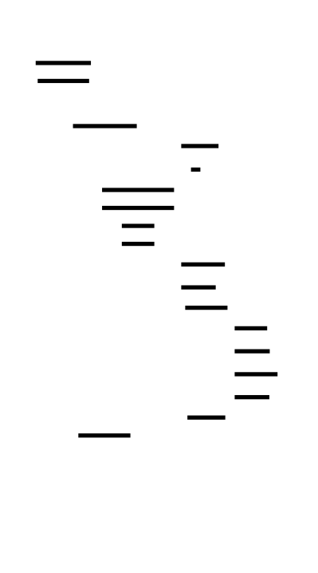

# 🎯 Project Charter: Build Your Own Raft
## What You Are Building
A complete Raft consensus implementation in Go, Rust, or Java that provides leader election with randomized timeouts, log replication with Figure 8 safety guarantees, snapshot-based log compaction, and linearizable client semantics. By the end, your implementation will boot a 5-node cluster, elect a leader, replicate client commands through the log, survive node crashes and network partitions, compact the log via snapshots, and serve linearizable reads—all verified through continuous invariant checking and adversarial chaos testing.
## Why This Project Exists
Raft is the consensus algorithm behind etcd (Kubernetes' data store), CockroachDB, Consul, and countless production distributed systems. Most developers use these systems as black boxes, treating consensus as magic. Building Raft from scratch exposes the assumptions baked into every distributed system you've ever used: why terms exist, why the Figure 8 rule matters, why linearizable reads require leadership confirmation, and why crash recovery demands persistence before response. You'll understand consensus at the deepest level—the invariants that make it work, the failure modes that can break it, and the testing strategies that prove it correct.
## What You Will Be Able to Do When Done
- Boot a custom Raft cluster on QEMU or real hardware with 3-5 nodes
- Implement leader election with randomized timeouts from scratch
- Build log replication with the Figure 8 safety rule correctly
- Handle crash-recovery with persistent state (currentTerm, votedFor, log)
- Implement snapshot-based log compaction with InstallSnapshot RPC
- Serve linearizable reads with ReadIndex optimization
- Write chaos tests that verify safety under network partitions and node failures
- Debug distributed systems using invariant checking and state capture
## Final Deliverable
~3,500-4,500 lines of Go (or equivalent Rust/Java) across 22 source files implementing the complete Raft protocol. Boots in under 500ms. Runs a 5-node cluster that processes 100+ commands/second under chaos. Passes 10-minute stress test with zero invariant violations. Includes a key-value state machine demonstrating client command submission and linearizable reads.
## Is This Project For You?
**You should start this if you:**
- Are comfortable with concurrency (mutexes, goroutines/threads, channels)
- Understand basic networking (TCP, RPC concepts)
- Have implemented at least one non-trivial concurrent system
- Can read and reason about academic papers (the Raft paper is required reading)
- Are willing to debug subtle race conditions and timing-dependent bugs
**Come back after you've learned:**
- Basic distributed systems concepts (what is a network partition, what does "fault-tolerant" mean)
- Go's concurrency model (goroutines, channels, sync primitives) or equivalent in Rust/Java
- How to write tests that inject failures
## Estimated Effort
| Phase | Time |
|-------|------|
| Leader Election & Persistence | ~15-20 hours |
| Log Replication | ~20-30 hours |
| Log Compaction (Snapshotting) | ~15-20 hours |
| Client Interface & Linearizability | ~12-18 hours |
| Safety Verification & Stress Testing | ~15-20 hours |
| **Total** | **~80-120 hours** |
## Definition of Done
The project is complete when:
- A 5-node cluster boots and elects a leader within 500ms
- 100 client commands are replicated to all nodes and applied in identical order
- Killing the leader triggers re-election and command processing continues without data loss
- A partitioned follower catches up via InstallSnapshot after the leader snapshotts
- A partitioned leader cannot serve stale reads (linearizability verified)
- Duplicate command detection works across leader changes (exactly-once semantics)
- 10-minute stress test with random kills and partitions passes with zero invariant violations
- No two leaders exist in the same term across 1000 randomized election scenarios

---

# 📚 Before You Read This: Prerequisites & Further Reading
> **Read these first.** The Atlas assumes you are familiar with the foundations below.
> Resources are ordered by when you should encounter them — some before you start, some at specific milestones.
---
## Before Starting This Project
### Distributed Systems Fundamentals
**Paper**: Lamport, L. (1998). "The Part-Time Parliament" | *ACM Transactions on Computer Systems*
- **Why**: Paxos, the predecessor to Raft. Understanding Paxos helps you appreciate why Raft was designed for understandability.
- **When**: Read BEFORE starting — provides context for why Raft exists.
**Paper**: Fischer, M.J., Lynch, N.A., Paterson, M.S. (1985). "Impossibility of Distributed Consensus with One Faulty Process" | *Journal of the ACM*
- **Why**: The FLP Impossibility theorem proves deterministic consensus is impossible in asynchronous systems. Raft works around this with randomization and timing assumptions.
- **When**: Read BEFORE starting — foundational theoretical background.
**Spec**: RFC 1305 - Network Time Protocol (NTP) concepts
- **Why**: Understanding clock synchronization challenges explains why logical clocks (terms) are used instead of physical timestamps.
- **When**: Read BEFORE starting — helps understand the design space.
---
## Milestone 1: Leader Election & Persistence
### Consensus Algorithms
**Paper**: Ongaro, D., Ousterhout, J. (2014). "In Search of an Understandable Consensus Algorithm" | *USENIX ATC*
- **Why**: The original Raft paper. This is the canonical specification.
- **When**: Read BEFORE Milestone 1 — the primary reference for everything you'll build.
- **Section**: Sections 1-5 cover leader election and basic operation.
**Code**: etcd Raft implementation — `raft/node.go`
- **File**: `node.go` lines 1-300
- **Why**: Production-grade Go implementation. Compare your design decisions.
- **When**: Read AFTER completing Milestone 1 — too complex to study before implementing.
**Best Explanation**: The Secret Lives of Data — "Raft: Understandable Distributed Consensus"
- **URL**: http://thesecretlivesofdata.com/raft/
- **Why**: Interactive visualization of leader election and log replication.
- **When**: Read BEFORE starting Milestone 1 — provides intuitive mental model.
---
## Milestone 2: Log Replication
### Log-Structured Systems
**Paper**: Ongaro, D., Ousterhout, J. (2014). "In Search of an Understandable Consensus Algorithm" — Figure 8
- **Section**: Section 5.4, Figure 8
- **Why**: The most subtle safety property in Raft. Study this diagram until you can reproduce it from memory.
- **When**: Read BEFORE Milestone 2 — critical for understanding commit rules.
**Paper**: Lamport, L. (1978). "Time, Clocks, and the Ordering of Events in a Distributed System" | *Communications of the ACM*
- **Why**: Introduces logical clocks and the happens-before relation. Raft's terms are a form of logical clock.
- **When**: Read AFTER Milestone 2 — provides theoretical foundation for what you've implemented.
**Code**: CockroachDB — `pkg/raft/raft.go` — `stepLeader()` function
- **File**: `raft.go` lines 800-1000
- **Why**: Shows how production systems handle the Figure 8 rule in code.
- **When**: Read AFTER completing Milestone 2.
---
## Milestone 3: Log Compaction (Snapshotting)
### Database Checkpointing
**Paper**: Ongaro, D., Ousterhout, J. (2014) — Section 7: Log Compaction
- **Section**: Section 7, pages 11-13
- **Why**: The canonical description of Raft snapshotting.
- **When**: Read BEFORE Milestone 3.
**Book Chapter**: Kleppmann, M. (2017). *Designing Data-Intensive Applications*, Chapter 3: Storage and Retrieval
- **Section**: "Log-Structured Storage" (pages 69-84)
- **Why**: Explains the general pattern of log compaction across systems (LSM trees, etc.).
- **When**: Read AFTER Milestone 3 — broader context for the technique.
**Code**: HashiCorp Raft — `raft_snapshot.go`
- **File**: `raft_snapshot.go` — `Snapshot()` and `Restore()` methods
- **Why**: Clean implementation of snapshot interface with FSM integration.
- **When**: Read AFTER completing Milestone 3.
---
## Milestone 4: Client Interface & Linearizability
### Consistency Models
**Paper**: Herlihy, M., Wing, J. (1990). "Linearizability: A Correctness Condition for Concurrent Objects" | *ACM TOPLAS*
- **Why**: Formal definition of linearizability. Raft provides linearizable consistency.
- **When**: Read BEFORE Milestone 4 — understand what you're trying to achieve.
**Paper**: Brewer, E. (2000). "Towards Robust Distributed Systems" (CAP Theorem talk) | *ACM Symposium on Principles of Distributed Computing*
- **Why**: The CAP theorem explains why Raft chooses consistency over availability during partitions.
- **When**: Read BEFORE Milestone 4 — informs design trade-offs.
**Best Explanation**: Kleppmann, M. (2015). "Please stop calling databases CP or AP"
- **URL**: https://martin.kleppmann.com/2015/05/11/please-stop-calling-databases-cp-or-ap.html
- **Why**: Nuanced view of CAP that goes beyond the simple trichotomy.
- **When**: Read AFTER understanding basic CAP.
**Code**: etcd client — `client/v3/concurrency/session.go`
- **File**: `session.go` — session management for deduplication
- **Why**: Production example of client session tracking.
- **When**: Read AFTER completing Milestone 4.
---
## Milestone 5: Safety Verification & Stress Testing
### Formal Verification & Testing
**Paper**: Lamport, L. (2002). "Specifying Systems: The TLA+ Language and Tools for Hardware and Software Engineers"
- **Chapter**: Chapter 5 — Writing Specifications
- **Why**: TLA+ was used to verify Raft. Understanding specification languages helps you think about invariants.
- **When**: Read AFTER Milestone 5 — for deeper verification interest.
**Best Explanation**: Kingsbury, K. (Jepsen) — "Jepsen: Raft Analysis"
- **URL**: https://jepsen.io/analyses
- **Why**: Jepsen has analyzed many Raft implementations. Learn from their bug-finding methodology.
- **When**: Read BEFORE Milestone 5 — understand what professional testing looks like.
**Code**: CockroachDB acceptance tests — `pkg/acceptance/raft_test.go`
- **File**: `raft_test.go` — long-running randomized tests
- **Why**: Production-grade stress testing infrastructure.
- **When**: Read AFTER completing Milestone 5.
---
## Cross-Cutting: Throughout the Project
### General Distributed Systems
**Book**: Kleppmann, M. (2017). *Designing Data-Intensive Applications*
- **Chapters**: 5 (Replication), 8 (The Trouble with Distributed Systems), 9 (Consistency and Consensus)
- **Why**: The best practical guide to distributed systems concepts. Every page is relevant.
- **When**: Read Chapter 5 BEFORE starting; Chapters 8-9 AFTER completing Milestone 2.
**Paper**: Gray, J., Lorie, R., Putzolu, G. (1975). "Granularity of Locks in a Large Shared Data Base" | *VLDB*
- **Why**: Introduces the concept of quorums for distributed decisions.
- **When**: Read AFTER Milestone 1 — theoretical foundation for quorum intersection.
**Paper**: Gray, J. (1978). "Notes on Data Base Operating Systems" | *IBM Research Report*
- **Section**: "Failures and Recovery"
- **Why**: Classic treatment of crash recovery and the challenges Raft solves.
- **When**: Read AFTER Milestone 1.
---
## Quick Reference by Topic
| Topic | Primary Resource | When to Read |
|-------|------------------|--------------|
| **Raft Overview** | Raft Paper Sections 1-5 | Before M1 |
| **Leader Election** | Raft Paper Section 5 | Before M1 |
| **Log Replication** | Raft Paper Section 5 + Figure 8 | Before M2 |
| **Snapshotting** | Raft Paper Section 7 | Before M3 |
| **Linearizability** | Herlihy & Wing 1990 | Before M4 |
| **CAP Theorem** | Brewer 2000 + Kleppmann blog | Before M4 |
| **Testing Methodology** | Jepsen Analyses | Before M5 |
| **Distributed Systems Theory** | DDIA Chapters 5, 8, 9 | Throughout |
---
## Key Papers Summary
1. **FLP Impossibility** (1985) — Why consensus is hard
2. **Raft Paper** (2014) — What you're implementing
3. **Linearizability** (1990) — What correctness means
4. **CAP Theorem** (2000) — Why trade-offs exist
5. **Time, Clocks** (1978) — Logical time fundamentals

---

# Build Your Own Raft

Raft is a consensus algorithm designed for understandability while achieving the same fault tolerance as Paxos. It elects a leader who manages a replicated log across a cluster of servers. The leader accepts client commands, appends them to its log, replicates them to followers, and commits them once a majority acknowledges. This project builds a complete Raft implementation from scratch, covering leader election with randomized timeouts, log replication with consistency checks, persistence for crash recovery, snapshot-based log compaction, and a client interface with linearizable semantics. By the end, you'll have implemented the same consensus algorithm that powers etcd, CockroachDB, and Consul.


<!-- MS_ID: build-raft-m1 -->
# Leader Election & Persistence
You're about to build the beating heart of Raft—the mechanism by which a cluster of independent machines agrees on a single coordinator. This isn't just "voting for a leader." It's a distributed protocol that must work correctly when messages are lost, clocks are skewed, and machines crash at the worst possible moments.
By the end of this milestone, you'll have implemented:
- **Term-based epochs** that provide logical time ordering across the cluster
- **Randomized election timeouts** that break symmetry without coordination
- **The RequestVote RPC** with the crucial log up-to-date check
- **Persistent state** that survives crashes and prevents double-voting
Let's begin with the fundamental problem that makes all of this necessary.
---
## The Impossibility at the Heart of Consensus
Here's the uncomfortable truth: **in an asynchronous distributed system, no deterministic algorithm can guarantee consensus with even one faulty process.**

> **🔑 Foundation: FLP Impossibility**
> 
> ## FLP Impossibility
**What it IS**
The FLP Impossibility theorem (named after Fischer, Lynch, and Paterson, 1985) proves a fundamental limitation in distributed systems: **in an asynchronous system, no consensus algorithm can guarantee termination, safety, and fault tolerance simultaneously.**
An *asynchronous system* means there's no bound on message delivery time or processing speed — you can't distinguish between a slow node and a crashed one.
The theorem states: if even **one node can fail**, there exists no deterministic algorithm that is guaranteed to reach consensus in bounded time while also remaining correct (safe).
**WHY you need it right now**
When designing distributed systems, you'll be tempted to build the "perfect" consensus mechanism. FLP tells you this is impossible. Every choice involves tradeoffs:
| Priority | Tradeoff |
|----------|----------|
| Always terminate | Accept potential inconsistency |
| Always consistent | May not terminate |
| Both (in async) | Impossible |
This theorem explains why real systems like Paxos, Raft, and PBFT either:
- Use *randomization* (probabilistic termination)
- Assume *partial synchrony* (timed-out failure detection)
- Accept *safety violations* under certain conditions
**Key insight**
> **FLP doesn't say consensus is impossible — it says deterministic, guaranteed-fast consensus is impossible.**
The mental model: FLP is like a speed limit, not a brick wall. Practical systems work around it by weakening assumptions (timing bounds, randomization) or accepting rare edge cases. The theorem defines the *theoretical boundary*; engineering finds the *practical path*.

This is the FLP Impossibility result (Fischer, Lynch, Paterson, 1985). It doesn't mean consensus is impossible—it means we must make practical compromises. Raft's compromises are:
1. **Timing assumptions**: We assume election timeouts exist and network delays are bounded in practice (even if not in theory)
2. **Randomization**: We use random timeouts to break ties, avoiding the deterministic requirement that FLP attacks
3. **Safety over liveness**: Raft guarantees safety (never two leaders in one term) unconditionally, but liveness (eventually electing a leader) depends on timing
These compromises work because real networks aren't truly asynchronous—messages eventually arrive, and crashes eventually heal. Raft exploits this reality.
---
## The Three-Level View of Leader Election
Before diving into code, let's orient ourselves across the three levels that matter in distributed systems:


### Level 1 — Single Node (What you build)
Each node is an independent actor with:
- **State**: follower, candidate, or leader
- **Timers**: election timeout, heartbeat timer
- **Persistent storage**: term, vote, log
- **RPC handlers**: RequestVote, AppendEntries
### Level 2 — Cluster Coordination (What emerges)
The cluster exhibits collective behavior:
- **Terms** advance in lockstep across nodes
- **Quorums** guarantee at most one leader per term
- **Heartbeats** suppress unnecessary elections
### Level 3 — Network Reality (What can go wrong)
The network introduces:
- **Message loss**: RPCs silently disappear
- **Delays**: messages arrive late or out of order
- **Partitions**: subsets of nodes become isolated
- **Duplicates**: the same message delivered twice
Your implementation must be correct at Level 1, produce the right behavior at Level 2, and be resilient to Level 3's chaos.
---
## Terms: The Distributed Epoch Clock
The most fundamental concept in Raft is the **term**—a monotonically increasing number that serves as a logical clock for the entire cluster.
```
Term 1:  [Leader A elected] ──────────── [A crashes]
                                         │
Term 2:  ─────────────── [Leader B elected] ──────────
                                    │
Term 3:  ──────────────────────────────────── [Leader C elected] ───
```
**Every RPC in Raft carries a term number.** When a node receives an RPC with a higher term than its own, it immediately:
1. Updates its `currentTerm` to the higher value
2. Steps down to follower (if it was a candidate or leader)
3. Clears its `votedFor` (it can now vote in the new term)
This is how the cluster maintains a coherent view of time despite network partitions and crash-recovery cycles.


```go
// Term handling is the first thing every RPC handler does
func (rf *Raft) checkTerm(rpcTerm int) bool {
    if rpcTerm > rf.currentTerm {
        rf.currentTerm = rpcTerm
        rf.votedFor = ""  // Reset vote for new term
        rf.state = Follower
        rf.persist()  // CRITICAL: persist before responding
        return true  // Term was updated
    }
    return false
}
```
> **💡 Insight**: Terms are the same concept as **epoch numbers in Kafka** and **view numbers in Viewstamped Replication**. They provide a total ordering on leadership changes that all nodes eventually agree on.
---
## The Node State Machine
Each Raft node exists in exactly one of three states at any moment:


| State | When You're Here | What You Do |
|-------|------------------|-------------|
| **Follower** | Default state; after seeing a valid leader | Respond to RPCs from leader/candidates; reset election timer on valid RPCs |
| **Candidate** | After election timeout with no leader | Increment term, vote for self, send RequestVote to all peers |
| **Leader** | After receiving majority votes | Send heartbeats immediately, then at regular intervals; handle client requests |
Let's implement the core state structure:
```go
package raft
import (
    "sync"
    "time"
)
// State represents the current role of a Raft node
type State int
const (
    Follower State = iota
    Candidate
    Leader
)
func (s State) String() string {
    return [...]string{"Follower", "Candidate", "Leader"}[s]
}
// RaftNode represents a single participant in the Raft consensus
type RaftNode struct {
    mu        sync.RWMutex  // Protects all shared state
    // Persistent state (must be saved to stable storage BEFORE responding to RPCs)
    currentTerm int         // Latest term this node has seen (initialized to 0)
    votedFor    string      // Candidate ID that received vote in current term (or "")
    log         []LogEntry  // Log entries; each entry contains command and term
    // Volatile state (reinitialized on crash, not persisted)
    commitIndex int         // Index of highest log entry known to be committed
    lastApplied int         // Index of highest log entry applied to state machine
    // Leader volatile state (reinitialized after election)
    nextIndex  []int        // For each peer, index of next log entry to send
    matchIndex []int        // For each peer, index of highest log entry known replicated
    // Node identification
    id          string      // This node's unique identifier
    peers       []string    // IDs of all other nodes in the cluster
    state       State       // Current state (Follower, Candidate, Leader)
    // Election timing
    electionTimeout    time.Duration // Current timeout (randomized)
    lastHeartbeat      time.Time     // Last valid RPC received from leader/candidate
    electionTimer      *time.Timer
    // Configuration
    heartbeatInterval  time.Duration // How often leader sends heartbeats (e.g., 50ms)
    electionTimeoutMin time.Duration // Minimum election timeout (e.g., 150ms)
    electionTimeoutMax time.Duration // Maximum election timeout (e.g., 300ms)
    // Persistence interface
    persister Persister
    // Communication
    rpcCh chan RPCMessage // Channel for incoming RPCs
}
// LogEntry represents a single entry in the replicated log
type LogEntry struct {
    Term    int         // Term when entry was received by leader
    Command interface{} // State machine command (application-specific)
    Index   int         // Position in the log (1-indexed per Raft paper)
}
// Persister defines the interface for stable storage
type Persister interface {
    SaveRaftState(state []byte) error
    ReadRaftState() ([]byte, error)
}
// RPCMessage wraps incoming RPCs for processing by the main loop
type RPCMessage struct {
    Request  interface{}
    Response chan interface{}
}
```
> **⚠️ Critical Detail**: The comment "BEFORE responding to RPCs" on persistent state isn't a suggestion—it's a correctness requirement. If you respond to a vote request, then crash before persisting, you could vote again on restart and violate election safety.
---
## The Election Timeout: Breaking Symmetry with Randomness
Here's a scenario that breaks naive leader election: all five nodes start simultaneously. They all timeout at the same instant. They all become candidates. They all vote for themselves. No one gets a majority.
**Split vote.**
Raft solves this with **randomized election timeouts**. If each node picks a random timeout within a range (e.g., 150-300ms), the probability that two nodes timeout simultaneously becomes vanishingly small.
```go
// randomElectionTimeout returns a randomized timeout within the configured range
func (rf *RaftNode) randomElectionTimeout() time.Duration {
    span := rf.electionTimeoutMax - rf.electionTimeoutMin
    return rf.electionTimeoutMin + time.Duration(rand.Int63n(int64(span)))
}
// resetElectionTimer sets a new randomized timeout
func (rf *RaftNode) resetElectionTimer() {
    rf.mu.Lock()
    defer rf.mu.Unlock()
    if rf.electionTimer != nil {
        rf.electionTimer.Stop()
    }
    rf.electionTimeout = rf.randomElectionTimeout()
    rf.electionTimer = time.AfterFunc(rf.electionTimeout, rf.startElection)
}
// The election timeout range matters:
// - Too narrow (e.g., 150-160ms): high split vote probability
// - Too wide (e.g., 50-5000ms): unacceptably long leader election latency
// - Must be >> heartbeat interval (e.g., 50ms) to avoid spurious elections
```
> **🔮 Connection**: This is the same principle as **exponential backoff in Ethernet (CSMA/CD)** and **TCP SYN retransmission**. Randomization breaks collision storms when multiple actors contend for a shared resource without a coordinator.
### Why the Range Matters
The election timeout range is a critical configuration parameter:
```
Heartbeat interval: 50ms (leader sends every 50ms)
If election timeout min = 60ms:
  - Follower might timeout between heartbeats due to normal jitter
  - Spurious elections on slightly-delayed heartbeats
If election timeout min = 150ms:
  - 3 heartbeats can be lost before election starts
  - Robust to temporary network hiccups
  - But adds 150-300ms latency when leader actually fails
```
**Production guidance**: Election timeout should be 10-50x the expected network RTT, and at least 3x the heartbeat interval. etcd uses 1000ms default election timeout with 100ms heartbeats.
---
## The RequestVote RPC
When a candidate starts an election, it sends `RequestVote` RPCs to all peers. This is where Raft's safety guarantees are enforced.


### Message Format
```go
// RequestVoteArgs contains the arguments for a RequestVote RPC
type RequestVoteArgs struct {
    Term         int    // Candidate's term
    CandidateId  string // Candidate requesting vote
    LastLogIndex int    // Index of candidate's last log entry
    LastLogTerm  int    // Term of candidate's last log entry
}
// RequestVoteReply contains the response for a RequestVote RPC
type RequestVoteReply struct {
    Term        int  // CurrentTerm, for candidate to update itself
    VoteGranted bool // True means candidate received vote
}
```
### The Vote Granting Logic
A follower grants its vote only if **all** of these conditions are met:
1. `args.Term >= rf.currentTerm` (not a stale candidate)
2. `(rf.votedFor == "" || rf.votedFor == args.CandidateId)` (hasn't voted yet in this term, or already voting for this candidate)
3. The candidate's log is **at least as up-to-date** as the follower's log
Condition 3 is subtle and crucial. Let's examine it carefully:
```go
// isLogUpToDate checks if the candidate's log is at least as up-to-date as ours
// This is the "log up-to-date check" from the Raft paper
func (rf *RaftNode) isLogUpToDate(candidateLastTerm, candidateLastIndex int) bool {
    rf.mu.RLock()
    defer rf.mu.RUnlock()
    myLastIndex := len(rf.log) - 1  // Assuming 0-indexed with dummy entry at 0
    myLastTerm := 0
    if myLastIndex >= 0 && len(rf.log) > 0 {
        myLastTerm = rf.log[myLastIndex].Term
    }
    // Compare by term first, then by index
    // A candidate with a higher last term is more up-to-date, even if shorter log
    if candidateLastTerm != myLastTerm {
        return candidateLastTerm > myLastTerm
    }
    // Same term? Longer log wins
    return candidateLastIndex >= myLastIndex
}
```


**Why compare by term first?** Consider this scenario:
```
Node A: [term1, term1, term1, term2, term2]  (lastTerm=2, lastIndex=5)
Node B: [term1, term1, term1, term1, term1, term1, term1]  (lastTerm=1, lastIndex=7)
```
Node B has a *longer* log, but Node A's log contains entries from term 2, which means A has seen a later leader. Node A's log is "more up-to-date" despite being shorter.
If we elected Node B as leader, it would overwrite Node A's term-2 entries—entries that may have been committed. The term-first comparison prevents this.
### Complete RequestVote Handler
```go
// RequestVote handles incoming RequestVote RPCs
func (rf *RaftNode) RequestVote(args *RequestVoteArgs, reply *RequestVoteReply) error {
    rf.mu.Lock()
    defer rf.mu.Unlock()
    // Initialize reply
    reply.Term = rf.currentTerm
    reply.VoteGranted = false
    // Rule 1: If RPC term < currentTerm, reject
    if args.Term < rf.currentTerm {
        return nil
    }
    // Rule 2: If RPC term > currentTerm, step down and update term
    if args.Term > rf.currentTerm {
        rf.currentTerm = args.Term
        rf.votedFor = ""
        rf.state = Follower
        // PERSIST BEFORE PROCEEDING
        rf.persist()
    }
    // Rule 3: Check if we can vote for this candidate
    // We can vote if: (a) we haven't voted, or (b) we already voted for this candidate
    canVote := rf.votedFor == "" || rf.votedFor == args.CandidateId
    // Rule 4: Check log up-to-date property
    logUpToDate := rf.isLogUpToDateLocked(args.LastLogTerm, args.LastLogIndex)
    if canVote && logUpToDate {
        rf.votedFor = args.CandidateId
        rf.lastHeartbeat = time.Now()  // Reset election timer
        reply.VoteGranted = true
        // PERSIST THE VOTE BEFORE RESPONDING
        rf.persist()
    }
    reply.Term = rf.currentTerm
    return nil
}
// isLogUpToDateLocked is the internal version that assumes lock is held
func (rf *RaftNode) isLogUpToDateLocked(candidateLastTerm, candidateLastIndex int) bool {
    myLastIndex := len(rf.log) - 1
    myLastTerm := 0
    if myLastIndex >= 0 && len(rf.log) > 0 {
        myLastTerm = rf.log[myLastIndex].Term
    }
    if candidateLastTerm != myLastTerm {
        return candidateLastTerm > myLastTerm
    }
    return candidateLastIndex >= myLastIndex
}
```
---
## The Election Process: From Timeout to Leader
When the election timer fires, the node transitions to candidate and begins the election:
```go
// startElection is called when the election timer fires
func (rf *RaftNode) startElection() {
    rf.mu.Lock()
    // Transition to candidate
    rf.state = Candidate
    rf.currentTerm++
    rf.votedFor = rf.id  // Vote for ourselves
    currentTerm := rf.currentTerm
    // PERSIST BEFORE PROCEEDING
    rf.persist()
    // Record vote count (we start with 1 for ourselves)
    votesReceived := 1
    votesNeeded := (len(rf.peers) + 1) / 2 + 1  // Majority of total nodes
    // Get our log info for RequestVote args
    lastLogIndex := len(rf.log) - 1
    lastLogTerm := 0
    if lastLogIndex >= 0 && len(rf.log) > 0 {
        lastLogTerm = rf.log[lastLogIndex].Term
    }
    rf.mu.Unlock()
    // Send RequestVote to all peers in parallel
    voteCh := make(chan bool, len(rf.peers))
    for _, peerId := range rf.peers {
        go func(target string) {
            args := &RequestVoteArgs{
                Term:         currentTerm,
                CandidateId:  rf.id,
                LastLogIndex: lastLogIndex,
                LastLogTerm:  lastLogTerm,
            }
            reply := &RequestVoteReply{}
            // Send RPC (implementation depends on your RPC library)
            ok := rf.sendRequestVote(target, args, reply)
            if ok {
                rf.mu.Lock()
                // Check if we're still in the same term (might have changed)
                if rf.state == Candidate && rf.currentTerm == args.Term {
                    if reply.Term > rf.currentTerm {
                        // Discovered higher term, step down
                        rf.currentTerm = reply.Term
                        rf.votedFor = ""
                        rf.state = Follower
                        rf.persist()
                    } else if reply.VoteGranted {
                        voteCh <- true
                    }
                }
                rf.mu.Unlock()
            }
        }(peerId)
    }
    // Wait for votes or election to conclude
    go rf.collectVotes(voteCh, votesNeeded, currentTerm)
    // Reset election timer for this term
    rf.resetElectionTimer()
}
// collectVotes tallies votes and transitions to leader if majority received
func (rf *RaftNode) collectVotes(voteCh chan bool, votesNeeded, term int) {
    votes := 1  // Start with our own vote
    for {
        select {
        case <-voteCh:
            votes++
            if votes >= votesNeeded {
                rf.mu.Lock()
                // Double-check we're still the right term and still a candidate
                if rf.currentTerm == term && rf.state == Candidate {
                    rf.becomeLeader()
                }
                rf.mu.Unlock()
                return
            }
        case <-time.After(rf.electionTimeoutMax):
            // Election timed out without winning, will start new election
            return
        }
    }
}
// becomeLeader transitions this node to leader state
func (rf *RaftNode) becomeLeader() {
    rf.state = Leader
    // Initialize leader state
    lastLogIndex := len(rf.log) - 1
    rf.nextIndex = make([]int, len(rf.peers))
    rf.matchIndex = make([]int, len(rf.peers))
    for i := range rf.peers {
        rf.nextIndex[i] = lastLogIndex + 1
        rf.matchIndex[i] = 0
    }
    // Immediately send heartbeats to establish authority
    go rf.sendHeartbeats()
    // Start periodic heartbeat loop
    go rf.heartbeatLoop()
}
```
### What Can Go Wrong During an Election?
Let's apply the "Failure Soul" thinking from distributed systems:
**Scenario: Candidate crashes mid-election**
- The election times out on other nodes
- A new election starts in a new term
- System eventually recovers (liveness depends on timing)
**Scenario: Network partition during election**
- Each partition may elect its own leader (different terms)
- When partition heals, the leader with the higher term wins
- The lower-term leader steps down on seeing a higher term
**Scenario: Stale votes arrive late**
- A vote from a previous term arrives after new election started
- The `rf.currentTerm == term` check in `collectVotes` prevents counting it
- Safe because terms are monotonically increasing
**Scenario: Split vote (no majority)**
- Randomized timeouts ensure different retry times
- First candidate to timeout in next round likely wins
- Bounded by `(electionTimeoutMax - electionTimeoutMin)` expected resolution time
---
## Quorum Intersection: Why Majority Guarantees Safety

> **🔑 Foundation: Quorum intersection**
> 
> ## Quorum Intersection
**What it IS**
A **quorum** is the minimum number of nodes that must participate in an operation for it to be considered valid. **Quorum intersection** means any two valid quorums must share at least one node.
For a cluster of N nodes with a quorum size Q, quorum intersection requires:
```
2Q - N ≥ 1
```
The most common configuration: with N nodes and a majority quorum of `⌈(N+1)/2⌉`, any two majorities overlap by at least one node.
**WHY you need it right now**
Quorum intersection is the **foundation of consistency** in distributed systems. Without it:
- Two operations could both "succeed" independently
- No node would witness both to detect conflicts
- Your system silently diverges
Consider a 5-node cluster with quorum of 3:
```
Nodes: [A, B, C, D, E]
Quorum 1: {A, B, C} — writes value X
Quorum 2: {C, D, E} — writes value Y
              ↑
           Node C sees both writes
```
Node C's participation ensures at least one witness to the conflict. Without intersection (e.g., quorum=2 in a 5-node system), {A,B} and {D,E} could diverge forever.
**Key insight**
> **Quorum intersection guarantees information flow between operations. It's the "shared witness" that prevents split-brain.**
The mental model: think of quorums as rooms where decisions happen. If every room shares at least one person, news travels — someone always knows what happened elsewhere. Break intersection, and you've built isolated decision chambers that can contradict each other.

The key property is: **any two majorities must overlap by at least one node.**
In a 5-node cluster, a majority is 3 nodes. If one election gets votes from {A, B, C} and another election (in a different term) gets votes from {C, D, E}, they share node C. Node C cannot vote for two different candidates in the same term, so there cannot be two leaders in one term.


```
Cluster: {A, B, C, D, E}  (5 nodes, majority = 3)
Election 1: A, B, C vote for candidate X  → X becomes leader
Election 2: C, D, E vote for candidate Y  → Y becomes leader (in a DIFFERENT term)
If both elections were in the SAME term:
  - Node C would have to vote for both X and Y
  - But votedFor prevents double-voting in one term
  - Therefore: impossible for two leaders in one term
```
This is why **persistence is critical**. If node C crashes, restarts, and forgets it voted for X, it could vote for Y in the same term—breaking the safety guarantee.
---
## AppendEntries RPC: Heartbeats and Authority
While full log replication is the next milestone, we need the heartbeat mechanism now. The leader sends periodic `AppendEntries` RPCs with an empty entries list to maintain authority and prevent elections.
```go
// AppendEntriesArgs contains arguments for an AppendEntries RPC
type AppendEntriesArgs struct {
    Term         int        // Leader's term
    LeaderId     string     // So follower can redirect clients
    PrevLogIndex int        // Index of log entry immediately preceding new ones
    PrevLogTerm  int        // Term of prevLogIndex entry
    Entries      []LogEntry // Log entries to store (empty for heartbeat)
    LeaderCommit int        // Leader's commitIndex
}
// AppendEntriesReply contains the response for an AppendEntries RPC
type AppendEntriesReply struct {
    Term    int  // CurrentTerm, for leader to update itself
    Success bool // True if follower contained entry matching prevLogIndex and prevLogTerm
}
// AppendEntries handles incoming AppendEntries RPCs (heartbeat or log replication)
func (rf *RaftNode) AppendEntries(args *AppendEntriesArgs, reply *AppendEntriesReply) error {
    rf.mu.Lock()
    defer rf.mu.Unlock()
    reply.Term = rf.currentTerm
    reply.Success = false
    // Rule 1: If term < currentTerm, reject
    if args.Term < rf.currentTerm {
        return nil
    }
    // Rule 2: If term >= currentTerm, recognize leader and reset timer
    if args.Term > rf.currentTerm {
        rf.currentTerm = args.Term
        rf.votedFor = ""
        rf.persist()
    }
    // Recognize this leader (step down if candidate)
    rf.state = Follower
    rf.lastHeartbeat = time.Now()
    // For now, just handle heartbeats (full replication in Milestone 2)
    // The consistency check would go here
    reply.Success = true
    reply.Term = rf.currentTerm
    return nil
}
```
The heartbeat loop runs for the lifetime of leadership:
```go
// heartbeatLoop sends periodic heartbeats while this node is leader
func (rf *RaftNode) heartbeatLoop() {
    ticker := time.NewTicker(rf.heartbeatInterval)
    defer ticker.Stop()
    for {
        rf.mu.RLock()
        isLeader := rf.state == Leader
        rf.mu.RUnlock()
        if !isLeader {
            return  // No longer leader, stop heartbeat loop
        }
        rf.sendHeartbeats()
        <-ticker.C
    }
}
// sendHeartbeats sends AppendEntries with empty entries to all peers
func (rf *RaftNode) sendHeartbeats() {
    rf.mu.RLock()
    currentTerm := rf.currentTerm
    commitIndex := rf.commitIndex
    peers := make([]string, len(rf.peers))
    copy(peers, rf.peers)
    rf.mu.RUnlock()
    for _, peerId := range peers {
        go func(target string) {
            rf.mu.RLock()
            nextIdx := rf.nextIndex[rf.peerIndex(target)]
            prevLogIndex := nextIdx - 1
            prevLogTerm := 0
            if prevLogIndex >= 0 && prevLogIndex < len(rf.log) {
                prevLogTerm = rf.log[prevLogIndex].Term
            }
            rf.mu.RUnlock()
            args := &AppendEntriesArgs{
                Term:         currentTerm,
                LeaderId:     rf.id,
                PrevLogIndex: prevLogIndex,
                PrevLogTerm:  prevLogTerm,
                Entries:      []LogEntry{},  // Empty = heartbeat
                LeaderCommit: commitIndex,
            }
            reply := &AppendEntriesReply{}
            rf.sendAppendEntries(target, args, reply)
            // Handle reply (full logic in Milestone 2)
            rf.mu.Lock()
            if reply.Term > rf.currentTerm {
                rf.currentTerm = reply.Term
                rf.votedFor = ""
                rf.state = Follower
                rf.persist()
            }
            rf.mu.Unlock()
        }(peerId)
    }
}
func (rf *RaftNode) peerIndex(peerId string) int {
    for i, p := range rf.peers {
        if p == peerId {
            return i
        }
    }
    return -1
}
```
---
## Persistence: The Key to Crash Recovery
Now we arrive at the most critical aspect of correctness: **persistence**. Without it, Raft's safety guarantees collapse when nodes crash.
### What Must Be Persisted?
The Raft paper specifies three pieces of state that must be persisted:
```go
// PersistentState represents the state that must survive crashes
type PersistentState struct {
    CurrentTerm int         `json:"currentTerm"` // Latest term seen
    VotedFor    string      `json:"votedFor"`    // Who we voted for in currentTerm
    Log         []LogEntry  `json:"log"`         // The replicated log
}
```
### Why Each Matters
| State | Why Persist? | What Goes Wrong If You Don't |
|-------|--------------|------------------------------|
| `currentTerm` | To recognize stale RPCs on restart | Restarted node accepts RPCs from old leaders, causing split brain |
| `votedFor` | To prevent double-voting in one term | Node votes for candidate A, crashes, restarts, votes for candidate B → two leaders in term T |
| `log` | To recover committed entries | Committed entries lost on crash, breaking durability guarantee |
### The Persistence Flow


```go
// persist saves the critical state to stable storage
func (rf *RaftNode) persist() {
    state := PersistentState{
        CurrentTerm: rf.currentTerm,
        VotedFor:    rf.votedFor,
        Log:         rf.log,
    }
    data, err := json.Marshal(state)
    if err != nil {
        log.Fatalf("Failed to marshal persistent state: %v", err)
    }
    // This MUST complete before we respond to any RPC
    if err := rf.persister.SaveRaftState(data); err != nil {
        log.Fatalf("Failed to persist state: %v", err)
    }
}
// readPersist restores state from stable storage (called on startup)
func (rf *RaftNode) readPersist() {
    data, err := rf.persister.ReadRaftState()
    if err != nil {
        log.Printf("No persisted state found, starting fresh: %v", err)
        return
    }
    var state PersistentState
    if err := json.Unmarshal(data, &state); err != nil {
        log.Fatalf("Failed to unmarshal persisted state: %v", err)
    }
    rf.currentTerm = state.CurrentTerm
    rf.votedFor = state.VotedFor
    rf.log = state.Log
}
```
### The `fsync` Requirement
Simply calling `write()` isn't enough. The operating system caches writes in memory. A crash after `write()` returns but before the data reaches disk means data loss.
```go
// FilePersister implements Persister using file-based storage
type FilePersister struct {
    path string
    file *os.File
    mu   sync.Mutex
}
func NewFilePersister(path string) *FilePersister {
    return &FilePersister{path: path}
}
func (fp *FilePersister) SaveRaftState(data []byte) error {
    fp.mu.Lock()
    defer fp.mu.Unlock()
    // Write to a temp file first (atomic rename pattern)
    tmpPath := fp.path + ".tmp"
    file, err := os.Create(tmpPath)
    if err != nil {
        return err
    }
    if _, err := file.Write(data); err != nil {
        file.Close()
        os.Remove(tmpPath)
        return err
    }
    // CRITICAL: fsync ensures data is on disk
    if err := file.Sync(); err != nil {
        file.Close()
        os.Remove(tmpPath)
        return err
    }
    file.Close()
    // Atomic rename makes the write visible
    if err := os.Rename(tmpPath, fp.path); err != nil {
        os.Remove(tmpPath)
        return err
    }
    // Sync the directory to ensure rename is durable
    dir, err := os.Open(filepath.Dir(fp.path))
    if err == nil {
        dir.Sync()
        dir.Close()
    }
    return nil
}
func (fp *FilePersister) ReadRaftState() ([]byte, error) {
    fp.mu.Lock()
    defer fp.mu.Unlock()
    return os.ReadFile(fp.path)
}
```


### The "Vote Yes, Crash, Vote Again" Bug
Here's the exact failure mode persistence prevents:
```
Timeline:
1. Node C receives RequestVote from candidate A (term 5)
2. Node C updates votedFor = "A"
3. Node C responds "VoteGranted = true"
4. Node C crashes BEFORE persisting
5. Node C restarts
6. votedFor is empty (not restored from disk)
7. Node C receives RequestVote from candidate B (term 5)
8. Node C votes for B too!
9. Now BOTH A and B think they're leader of term 5
Result: TWO LEADERS IN ONE TERM → SAFETY VIOLATION
```
The fix is simple but critical: **persist BEFORE responding**.
```go
// In RequestVote handler:
if canVote && logUpToDate {
    rf.votedFor = args.CandidateId
    rf.persist()  // <-- MUST happen BEFORE sending reply
    reply.VoteGranted = true
}
```
---
## Putting It All Together: The Main Loop
Let's wire everything into a coherent main loop that processes RPCs and timers:
```go
// Start initializes the Raft node and begins operation
func (rf *RaftNode) Start() {
    // Restore persisted state
    rf.readPersist()
    // Initialize as follower
    rf.state = Follower
    rf.lastHeartbeat = time.Now()
    // Start election timer
    rf.resetElectionTimer()
    // Start RPC server
    go rf.serveRPC()
    // Start main event loop
    go rf.run()
}
// run is the main event loop
func (rf *RaftNode) run() {
    for {
        select {
        case msg := <-rf.rpcCh:
            rf.handleRPC(msg)
        case <-rf.electionTimer.C:
            rf.mu.RLock()
            state := rf.state
            rf.mu.RUnlock()
            if state != Leader {
                go rf.startElection()
            }
        }
    }
}
// handleRPC dispatches incoming RPCs to appropriate handlers
func (rf *RaftNode) handleRPC(msg RPCMessage) {
    switch req := msg.Request.(type) {
    case *RequestVoteArgs:
        reply := &RequestVoteReply{}
        rf.RequestVote(req, reply)
        msg.Response <- reply
    case *AppendEntriesArgs:
        reply := &AppendEntriesReply{}
        rf.AppendEntries(req, reply)
        msg.Response <- reply
    default:
        msg.Response <- fmt.Errorf("unknown RPC type: %T", req)
    }
}
```
---
## Testing Your Implementation
The acceptance criteria specify several critical tests. Let's examine how to implement them.
### Test 1: Persistence Recovery
```go
func TestPersistenceVote(t *testing.T) {
    // Create a cluster with persistent storage
    nodes := make([]*RaftNode, 3)
    persisters := make([]*FilePersister, 3)
    for i := 0; i < 3; i++ {
        persisters[i] = NewFilePersister(fmt.Sprintf("/tmp/raft-node-%d.state", i))
        nodes[i] = NewRaftNode(fmt.Sprintf("node%d", i), persisters[i])
    }
    // Start nodes
    for _, node := range nodes {
        node.Start()
    }
    // Wait for leader election
    time.Sleep(500 * time.Millisecond)
    // Node 0 votes in term 5
    nodes[0].mu.Lock()
    nodes[0].currentTerm = 5
    nodes[0].votedFor = "candidate-A"
    nodes[0].persist()
    nodes[0].mu.Unlock()
    // Kill node 0
    term5Vote := nodes[0].votedFor
    nodes[0].Stop()
    // Restart node 0 with same persister
    nodes[0] = NewRaftNode("node0", persisters[0])
    nodes[0].Start()
    // Verify it remembers the vote
    nodes[0].mu.RLock()
    if nodes[0].votedFor != term5Vote {
        t.Errorf("Expected votedFor=%s, got %s", term5Vote, nodes[0].votedFor)
    }
    if nodes[0].currentTerm != 5 {
        t.Errorf("Expected currentTerm=5, got %d", nodes[0].currentTerm)
    }
    nodes[0].mu.RUnlock()
    // Now try to vote for a different candidate in term 5
    args := &RequestVoteArgs{
        Term:         5,
        CandidateId:  "candidate-B",
        LastLogIndex: 0,
        LastLogTerm:  0,
    }
    reply := &RequestVoteReply{}
    nodes[0].RequestVote(args, reply)
    if reply.VoteGranted {
        t.Error("Node voted for candidate-B but already voted for candidate-A in term 5")
    }
}
```
### Test 2: Election Safety (No Two Leaders Per Term)
```go
func TestElectionSafety(t *testing.T) {
    // Create a 5-node cluster
    cluster := NewCluster(5)
    cluster.Start()
    // Partition into [2, 3] groups
    cluster.Partition([]string{"node0", "node1"}, []string{"node2", "node3", "node4"})
    // Wait for elections
    time.Sleep(500 * time.Millisecond)
    // Check: group [2,3,4] should have a leader (majority of 5 = 3)
    // Check: group [0,1] should NOT have a leader (2 < 3, no majority possible)
    group1Leader := cluster.FindLeader("node0", "node1")
    group2Leader := cluster.FindLeader("node2", "node3", "node4")
    if group1Leader != nil {
        t.Errorf("Group [0,1] elected leader %s but has no majority", group1Leader.id)
    }
    if group2Leader == nil {
        t.Error("Group [2,3,4] failed to elect leader despite having majority")
    }
    // Heal partition
    cluster.HealPartition()
    time.Sleep(500 * time.Millisecond)
    // Verify exactly one leader in the whole cluster
    allLeaders := cluster.FindAllLeaders()
    if len(allLeaders) != 1 {
        t.Errorf("Expected 1 leader after partition healed, got %d", len(allLeaders))
    }
}
```
### Test 3: Split Vote Resolution
```go
func TestSplitVoteResolution(t *testing.T) {
    // This test forces a split vote scenario and verifies resolution
    cluster := NewCluster(3)
    // Configure very narrow election timeout to increase split vote chance
    for _, node := range cluster.nodes {
        node.electionTimeoutMin = 150 * time.Millisecond
        node.electionTimeoutMax = 155 * time.Millisecond  // Very narrow!
    }
    cluster.Start()
    // Force all nodes to start election simultaneously
    for _, node := range cluster.nodes {
        go node.startElection()
    }
    // Wait for resolution (should resolve within a few rounds)
    maxWait := 2 * time.Second
    deadline := time.Now().Add(maxWait)
    for time.Now().Before(deadline) {
        leaders := cluster.FindAllLeaders()
        if len(leaders) == 1 {
            t.Logf("Split vote resolved in %v", time.Since(deadline.Add(-maxWait)))
            return
        }
        time.Sleep(50 * time.Millisecond)
    }
    leaders := cluster.FindAllLeaders()
    if len(leaders) != 1 {
        t.Errorf("Split vote not resolved after %v, found %d leaders", maxWait, len(leaders))
    }
}
```


---
## Network Partitions: The Ultimate Test
Let's examine what happens during network partitions, which are the most challenging failure mode.


### Scenario: Leader Isolated from Majority
```
Initial state: 5-node cluster, node0 is leader (term 3)
Partition: [node0] || [node1, node2, node3, node4]
           isolated    can communicate
Timeline:
T=0:    Partition occurs
T=50ms: node0 sends heartbeats to all → node1-4 don't receive
T=150ms: node1's election timer fires (no heartbeat received)
        node1 becomes candidate (term 4)
T=155ms: node1 sends RequestVote to node2, node3, node4
T=160ms: node1 receives votes from node2, node3, node4
        node1 becomes leader (term 4)
T=200ms: node1 sends heartbeats to node2-4
Meanwhile, node0 still thinks it's leader (term 3)
- Any client request to node0 will fail (can't reach majority)
- node0's log won't advance
Partition heals:
- node0 receives AppendEntries from node1 with term 4
- node0 sees term 4 > term 3, steps down to follower
- node1 is now the acknowledged leader
```
**Key insight**: During the partition, there are briefly two nodes that *think* they're leader. But they're in different terms. The term mechanism ensures that only one can successfully process client requests (only the leader in the majority partition can commit entries).
---
## Common Implementation Pitfalls
Let me save you from the bugs I've seen repeatedly:
### Pitfall 1: Off-by-One in Log Indexing
```go
// WRONG: Raft log is 1-indexed in the paper, but Go arrays are 0-indexed
lastLogIndex := len(rf.log)  // Off by one!
// RIGHT: Be explicit about your convention
// Option A: Use 0-indexed internally, adjust when sending RPCs
lastLogIndex := len(rf.log) - 1  // 0-indexed
// Option B: Add a dummy entry at index 0, use 1-indexed as per paper
rf.log = []LogEntry{{}}  // Dummy entry at index 0
lastLogIndex := len(rf.log) - 1  // Now matches Raft paper
```
### Pitfall 2: Not Checking Term After Acquiring Lock
```go
// WRONG: State might have changed while waiting for lock
func (rf *RaftNode) collectVotes(voteCh chan bool, needed, term int) {
    for vote := range voteCh {
        rf.mu.Lock()
        if vote {
            rf.state = Leader  // Might have already lost!
        }
        rf.mu.Unlock()
    }
}
// RIGHT: Always re-validate assumptions after acquiring lock
func (rf *RaftNode) collectVotes(voteCh chan bool, needed, term int) {
    for vote := range voteCh {
        rf.mu.Lock()
        if rf.currentTerm == term && rf.state == Candidate && vote {
            rf.becomeLeader()
        }
        rf.mu.Unlock()
    }
}
```
### Pitfall 3: Persisting After Responding
```go
// WRONG: Crash between reply and persist = double vote
func (rf *RaftNode) RequestVote(args *RequestVoteArgs, reply *RequestVoteReply) {
    if canVote && logUpToDate {
        rf.votedFor = args.CandidateId
        reply.VoteGranted = true  // Responded!
        rf.persist()              // Too late if we crash here
    }
}
// RIGHT: Persist first
func (rf *RaftNode) RequestVote(args *RequestVoteArgs, reply *RequestVoteReply) {
    if canVote && logUpToDate {
        rf.votedFor = args.CandidateId
        rf.persist()              // Persist FIRST
        reply.VoteGranted = true  // Now safe to respond
    }
}
```
### Pitfall 4: Election Timeout Too Short
```go
// WRONG: Timeout < heartbeat interval = spurious elections
rf.heartbeatInterval = 100 * time.Millisecond
rf.electionTimeoutMin = 50 * time.Millisecond   // Too short!
// RIGHT: Election timeout >> heartbeat interval
rf.heartbeatInterval = 50 * time.Millisecond
rf.electionTimeoutMin = 150 * time.Millisecond  // 3x heartbeat
```
---
## Design Decisions: Why This, Not That
| Decision | Chosen ✓ | Alternative | Trade-off |
|----------|----------|-------------|-----------|
| **Timeout randomization** | Random range 150-300ms | Deterministic based on node ID | Random handles correlated failures; deterministic easier to debug |
| **Log indexing** | 1-indexed with dummy entry | 0-indexed throughout | 1-indexed matches paper; 0-indexed is more natural in Go |
| **Persistence** | JSON + file | Binary encoding (gob, protobuf) | JSON is debuggable; binary is faster/smaller |
| **RPC mechanism** | Custom TCP channels | gRPC, HTTP | Custom is flexible; gRPC handles retries/streaming |
| **Term update on higher term** | Step down immediately | Queue for later | Immediate is correct; queueing is complex |
---
## What You've Built
By completing this milestone, you have:
1. **A term-based epoch system** that provides logical time ordering across the cluster
2. **Randomized election timeouts** that break symmetry without coordination
3. **The RequestVote RPC** with the critical log up-to-date check
4. **Persistent state** that survives crashes and prevents double-voting
5. **Heartbeat mechanism** that maintains leader authority
Your cluster can now:
- Elect a single leader per term
- Survive node crashes and restarts
- Handle network partitions (with eventual recovery)
- Prevent split votes through randomization
---
## Knowledge Cascade
The concepts you've learned here extend far beyond Raft:
### 1. Term Numbers → Distributed Epoch Clocks
Terms are a **distributed epoch clock**—every RPC carries a term, and nodes update forward but never backward. This pattern appears in:
- **Kafka epoch numbers** for partition leadership
- **Viewstamped Replication view numbers**
- **Zab (ZooKeeper) epoch numbers**
- **Paxos ballot numbers**
All consensus algorithms need a way to order leadership changes globally. Monotonic counters that propagate via messages are the universal solution.
### 2. Randomized Timeouts → Collision Avoidance
Randomized election timeouts solve the same problem as:
- **Ethernet CSMA/CD**: Random backoff after collision detection
- **TCP SYN retransmission**: Random delay to avoid SYN floods
- **Distributed locks**: Random delays to avoid thundering herd
When multiple actors contend for a shared resource without a coordinator, randomization breaks symmetry.
### 3. Majority Quorums → Cross-Domain Consensus Pattern
The quorum intersection guarantee appears in:
- **Database 2PC commit protocols**
- **Paxos acceptor sets**
- **Dynamo-style read/write quorums**
- **Blockchain consensus (proof-of-stake validators)**

> **🔑 Foundation: Quorum intersection**
> 
> ## Quorum Intersection
**What it IS**
A **quorum** is the minimum number of nodes that must participate in an operation for it to be considered valid. **Quorum intersection** means any two valid quorums must share at least one node.
For a cluster of N nodes with a quorum size Q, quorum intersection requires:
```
2Q - N ≥ 1
```
The most common configuration: with N nodes and a majority quorum of `⌈(N+1)/2⌉`, any two majorities overlap by at least one node.
**WHY you need it right now**
Quorum intersection is the **foundation of consistency** in distributed systems. Without it:
- Two operations could both "succeed" independently
- No node would witness both to detect conflicts
- Your system silently diverges
Consider a 5-node cluster with quorum of 3:
```
Nodes: [A, B, C, D, E]
Quorum 1: {A, B, C} — writes value X
Quorum 2: {C, D, E} — writes value Y
              ↑
           Node C sees both writes
```
Node C's participation ensures at least one witness to the conflict. Without intersection (e.g., quorum=2 in a 5-node system), {A,B} and {D,E} could diverge forever.
**Key insight**
> **Quorum intersection guarantees information flow between operations. It's the "shared witness" that prevents split-brain.**
The mental model: think of quorums as rooms where decisions happen. If every room shares at least one person, news travels — someone always knows what happened elsewhere. Break intersection, and you've built isolated decision chambers that can contradict each other.

Any system that needs to agree on a single value across failures uses quorums. The math is universal: in a system of N nodes, if you need F failures tolerated, you need 2F+1 nodes and F+1 for quorum.
### 4. Log Up-to-Date Check → Version Vectors
The comparison (lastLogTerm first, then lastLogIndex) is a form of **version vector comparison**:
- Newer terms dominate regardless of log length
- This is the same principle as **vector clocks in CRDTs**
- It captures the "happened-before" relationship in distributed systems
### Forward: What's Next?
In the next milestone, you'll build **log replication** on top of this foundation. The leader you just elected will now accept client commands, replicate them via AppendEntries, track commit progress, and apply committed entries to a state machine. The same term mechanism you built will ensure that only entries from the current term can be directly committed—a subtle detail that prevents the "Figure 8" safety bug.
---
## Verification Checklist
Before moving on, verify your implementation:
- [ ] Nodes start as followers and transition to candidates on election timeout
- [ ] Candidates increment term, vote for themselves, and send RequestVote to peers
- [ ] RequestVote checks: term validity, vote availability, log up-to-date
- [ ] Candidates become leaders on receiving majority votes
- [ ] Leaders send heartbeats immediately and periodically
- [ ] Nodes step down on receiving RPCs with higher terms
- [ ] `currentTerm`, `votedFor`, and `log` are persisted before responding to RPCs
- [ ] Persisted state is correctly restored on restart
- [ ] Persistence test: vote is remembered across crash-restart
- [ ] Election safety test: no two leaders in same term
- [ ] Split vote test: system resolves within bounded time


---
[[CRITERIA_JSON: {"milestone_id": "build-raft-m1", "criteria": ["Node implements three-state machine (Follower, Candidate, Leader) with correct transitions triggered by election timeout, vote majority, and term discovery", "currentTerm is monotonically increasing and included in all RPCs; nodes receiving higher-term RPCs step down to Follower and update their term before persisting", "Election timeout is randomized within configurable range (150-300ms default); timeout resets on receiving valid AppendEntries or RequestVote RPCs from leader or candidate", "Candidate increments term, votes for self, and sends RequestVote RPCs in parallel to all peers with candidateId, term, lastLogIndex, and lastLogTerm fields", "RequestVote receiver grants vote only if: (a) term >= receiver's currentTerm, (b) votedFor is empty or matches candidate, AND (c) candidate's log is at least as up-to-date (lastLogTerm compared first, then lastLogIndex)", "Candidate receiving votes from majority (including self) transitions to Leader and immediately sends empty AppendEntries heartbeats to all peers", "Candidate receiving valid AppendEntries from leader (same or higher term) steps down to Follower and resets election timer", "currentTerm, votedFor, and log entries are persisted to stable storage with fsync BEFORE responding to any RPC that modifies these values", "On restart, node restores currentTerm, votedFor, and log from persistent storage and resumes operation in Follower state", "Persistence test passes: node votes YES in term T, is killed and restarted, correctly rejects voting for different candidate in same term T", "Election safety test passes: 5-node cluster partitioned into [2,3] groups elects at most one leader per group; minority partition cannot elect leader; healed partition converges to single leader", "Split vote test passes: simultaneous candidate startups resolve to single leader within bounded election rounds due to randomized timeouts"]}]
<!-- END_MS -->


<!-- MS_ID: build-raft-m2 -->
# Log Replication
You've built a cluster that can elect a leader. Now comes the real question: **what does that leader actually do?**
The answer seems simple—accept commands from clients, send them to followers, and you're done. But this apparent simplicity hides the most subtle safety properties in all of Raft. Get this wrong, and your system will silently corrupt data under exactly the conditions you built it to survive: crashes, partitions, and concurrent failures.
By the end of this milestone, you'll understand:
- **The inductive consistency check** that proves two logs are identical without comparing every entry
- **The Figure 8 scenario**—the single most misunderstood safety property in Raft
- **Commit index semantics** and why "replicated to majority" isn't enough
- **Log backtracking** and how to handle followers with divergent histories
---
## The Naive Model (And Why It Kills You)
Let's start with what your intuition probably tells you about log replication:
> *The leader has a log. It sends new entries to followers. When a majority have the entry, it's committed. Done.*
This model works beautifully in a world without failures. In that world, followers always have a contiguous prefix of the leader's log, and any entry replicated to a majority is safe to commit.
**But that world doesn't exist.**
Consider this scenario:
```
Timeline in a 5-node cluster:
T=0:   Leader A (term 1) replicates entry at index 5 to followers B, C
       Entry: {term: 1, command: "set x=1"}
       Replicated on: A, B, C (majority!)
T=1:   Leader A crashes before committing
       commitIndex on all nodes: 4
T=2:   Leader E (term 2) elected
       E's log is shorter, missing entry at index 5
       E appends new entry at index 5: {term: 2, command: "set y=2"}
T=3:   E replicates its entry 5 to all nodes
       Now A, B, C have TWO different entries at index 5!
Question: Which entry 5 is "committed"?
```
The naive model says: entry 5 was on A, B, C (a majority), so it's committed. But the cluster proceeded to overwrite it with a different entry. If any client saw "set x=1" and acted on it, that action is now contradicted by the system state.
**This is a safety violation.** Committed entries must never be overwritten.
The fix requires understanding *why* the naive model fails, which brings us to the most important safety rule in Raft.
---
## The Three-Level View of Log Replication


### Level 1 — Single Node (What you build)
Each node maintains:
- **Log**: an ordered list of entries, each with (term, command, index)
- **commitIndex**: the highest entry known to be committed
- **lastApplied**: the highest entry applied to the state machine
- For leaders: **nextIndex/matchIndex** arrays tracking per-follower progress
### Level 2 — Cluster Coordination (What emerges)
The cluster exhibits:
- **Log matching property**: if two logs share an entry at (index, term), all prior entries are identical
- **Leader completeness**: the leader's log contains all committed entries
- **State machine safety**: all nodes apply the same commands in the same order
### Level 3 — Network Reality (What can go wrong)
The network introduces:
- **RPC failures**: AppendEntries times out or returns error
- **Partial replication**: some followers get entries, others don't
- **Delayed responses**: replies arrive after leader has moved on
- **Stale leaders**: a partitioned leader continues accepting writes
Your implementation must correctly handle all three levels simultaneously.
---
## The Log Structure: More Than Just Commands
Before diving into replication, let's get precise about what a log entry actually is:
```go
// LogEntry represents a single entry in the replicated log
type LogEntry struct {
    Term    int         // The term when this entry was received by the leader
    Command interface{} // The state machine command (application-specific)
    Index   int         // Position in the log (1-indexed per Raft paper convention)
}
```


The **term** field is what makes Raft safe. It's not just metadata—it's the core of the safety mechanism. Two entries at the same index with different terms represent *different commands* that cannot both be committed.
```go
// The log is 1-indexed in the Raft paper. We'll use a dummy entry at index 0
// to make our code match the paper's indexing directly.
type RaftNode struct {
    // ... existing fields ...
    log []LogEntry  // log[0] is a dummy entry, real entries start at log[1]
    // Volatile state on all servers
    commitIndex int  // Index of highest log entry known to be committed
    lastApplied int  // Index of highest log entry applied to state machine
    // Volatile state on leaders (reinitialized after election)
    nextIndex  []int // For each peer, index of next log entry to send
    matchIndex []int // For each peer, index of highest log entry known replicated
}
```
### Why Index and Term Together?
You might wonder: why track both index and term? Isn't index enough for ordering?
**No.** Consider:
```
Node A: [1:1, 1:2, 1:3, 2:4, 2:5]  (entries are term:index)
Node B: [1:1, 1:2, 1:3, 1:4]        // diverged at index 4
```
Node B's entry at index 4 has term 1. Node A's entry at index 4 has term 2. These are *different commands*. If we only compared indices, we'd think both nodes agree up to index 4. But they don't—they have completely different state.
The (index, term) pair uniquely identifies an entry's position in the distributed history of the cluster.
---
## The AppendEntries RPC: More Than Just "Send Stuff"


The `AppendEntries` RPC is the workhorse of log replication. But it's not just about sending entries—it's about **proving** that the sender is a legitimate leader and that their log is compatible with the receiver's.
```go
// AppendEntriesArgs contains arguments for an AppendEntries RPC
type AppendEntriesArgs struct {
    Term         int        // Leader's term
    LeaderId     string     // So follower can redirect clients
    PrevLogIndex int        // Index of log entry immediately preceding new ones
    PrevLogTerm  int        // Term of prevLogIndex entry
    Entries      []LogEntry // Log entries to store (empty for heartbeat)
    LeaderCommit int        // Leader's commitIndex
}
// AppendEntriesReply contains the response for an AppendEntries RPC
type AppendEntriesReply struct {
    Term          int  // CurrentTerm, for leader to update itself
    Success       bool // True if follower contained entry matching prevLogIndex/prevLogTerm
    // Optimization: help leader backtrack faster (not in original paper)
    ConflictTerm  int  // Term of the conflicting entry (if any)
    ConflictIndex int  // First index where ConflictTerm appears
}
```
### The Consistency Check: An Inductive Proof


Here's the crucial insight: **the consistency check is an inductive proof of log equality.**
Think about it like this:
> **Base case**: If entry 1 matches (same index, same term), then logs are identical up to index 1.
> 
> **Inductive step**: If logs are identical up to index N, and entry N+1 matches, then logs are identical up to index N+1.
> 
> **Therefore**: The prevLogIndex/prevLogTerm check proves logs are identical up to prevLogIndex.
This is exactly the same principle as **git's fast-forward merge check**. Git won't let you fast-forward unless your current HEAD is an ancestor of the target. The `prevLogIndex/prevLogTerm` pair is Raft's way of saying "your current HEAD" — if it matches, the leader can safely "fast-forward" your log.
```go
// AppendEntries handles incoming AppendEntries RPCs
func (rf *RaftNode) AppendEntries(args *AppendEntriesArgs, reply *AppendEntriesReply) error {
    rf.mu.Lock()
    defer rf.mu.Unlock()
    // Initialize reply
    reply.Term = rf.currentTerm
    reply.Success = false
    reply.ConflictTerm = -1
    reply.ConflictIndex = -1
    // Rule 1: Reject stale leaders (term < currentTerm)
    if args.Term < rf.currentTerm {
        return nil
    }
    // Rule 2: Recognize legitimate leader (term >= currentTerm)
    if args.Term > rf.currentTerm {
        rf.currentTerm = args.Term
        rf.votedFor = ""
        rf.persist()
    }
    rf.state = Follower
    rf.lastHeartbeat = time.Now()
    // Rule 3: Log consistency check
    // Reply false if log doesn't contain an entry at prevLogIndex
    // whose term matches prevLogTerm
    if args.PrevLogIndex > 0 {
        // Check if we have an entry at prevLogIndex
        if len(rf.log)-1 < args.PrevLogIndex {
            // Log is too short
            reply.ConflictIndex = len(rf.log)
            reply.ConflictTerm = -1
            return nil
        }
        // Check if term matches
        if rf.log[args.PrevLogIndex].Term != args.PrevLogTerm {
            // Term mismatch - find conflict info for optimization
            conflictTerm := rf.log[args.PrevLogIndex].Term
            reply.ConflictTerm = conflictTerm
            // Find first index where this term appears
            conflictIndex := args.PrevLogIndex
            for conflictIndex > 0 && rf.log[conflictIndex].Term == conflictTerm {
                conflictIndex--
            }
            reply.ConflictIndex = conflictIndex + 1
            return nil
        }
    }
    // Rule 4: Append new entries (if any)
    if len(args.Entries) > 0 {
        // Check for conflicting entries in existing log
        for i, entry := range args.Entries {
            logIndex := args.PrevLogIndex + 1 + i
            // If log is long enough, check for conflict
            if logIndex < len(rf.log) {
                if rf.log[logIndex].Term != entry.Term {
                    // Conflict found - truncate log and append
                    rf.log = rf.log[:logIndex]
                    rf.log = append(rf.log, args.Entries[i:]...)
                    rf.persist()
                    break
                }
                // Entry matches, continue checking
            } else {
                // Log is too short, append remaining entries
                rf.log = append(rf.log, args.Entries[i:]...)
                rf.persist()
                break
            }
        }
    }
    // Rule 5: Update commitIndex
    if args.LeaderCommit > rf.commitIndex {
        // Set commitIndex = min(leaderCommit, index of last new entry)
        lastNewIndex := args.PrevLogIndex + len(args.Entries)
        if lastNewIndex < args.LeaderCommit {
            rf.commitIndex = lastNewIndex
        } else {
            rf.commitIndex = args.LeaderCommit
        }
        // Apply newly committed entries
        rf.applyCommitted()
    }
    reply.Success = true
    reply.Term = rf.currentTerm
    return nil
}
```
### The ConflictTerm/ConflictIndex Optimization
The naive approach to log backtracking decrements `nextIndex` by one on each failure. For a follower that's 1000 entries behind, this means 1000 round trips.
The optimization in the code above uses the same principle as **TCP Selective Acknowledgment (SACK)**. Instead of just saying "no," the follower says "no, and here's why: my log at that index has term X, starting at position Y."
```go
// Leader's handling of AppendEntries reply (with optimization)
func (rf *RaftNode) handleAppendEntriesReply(peerIdx int, args *AppendEntriesArgs, reply *AppendEntriesReply) {
    rf.mu.Lock()
    defer rf.mu.Unlock()
    // Update term if we're stale
    if reply.Term > rf.currentTerm {
        rf.currentTerm = reply.Term
        rf.votedFor = ""
        rf.state = Follower
        rf.persist()
        return
    }
    if reply.Success {
        // Success: update matchIndex and nextIndex
        rf.matchIndex[peerIdx] = args.PrevLogIndex + len(args.Entries)
        rf.nextIndex[peerIdx] = rf.matchIndex[peerIdx] + 1
        rf.maybeAdvanceCommitIndex()
    } else {
        // Failure: backtrack nextIndex
        if reply.ConflictTerm >= 0 {
            // Optimization: jump to the conflict point
            // Search our log for ConflictTerm
            conflictIndex := -1
            for i := len(rf.log) - 1; i > 0; i-- {
                if rf.log[i].Term == reply.ConflictTerm {
                    conflictIndex = i
                    break
                }
            }
            if conflictIndex >= 0 {
                // We have this term in our log, set nextIndex past it
                rf.nextIndex[peerIdx] = conflictIndex + 1
            } else {
                // We don't have this term, use follower's conflict index
                rf.nextIndex[peerIdx] = reply.ConflictIndex
            }
        } else {
            // Follower's log is shorter than prevLogIndex
            rf.nextIndex[peerIdx] = reply.ConflictIndex
        }
    }
}
```


---
## nextIndex and matchIndex: Tracking Follower Progress


The leader maintains two arrays for each follower:
| Array | Meaning | When Updated |
|-------|---------|--------------|
| `nextIndex[i]` | Index of next entry to send to peer i | Initialized to `lastLogIndex + 1` on election; decremented on rejection; incremented on success |
| `matchIndex[i]` | Highest index known replicated on peer i | Initialized to 0 on election; updated to `prevLogIndex + len(entries)` on success |
**Key insight**: `matchIndex[i]` is what you *know* has been replicated. `nextIndex[i]` is what you're *trying* to replicate. This is the same pattern as **TCP's send window and ACK tracking**—TCP tracks both "what have I sent" (nextIndex equivalent) and "what has been acknowledged" (matchIndex equivalent).
```go
// becomeLeader initializes leader state after winning election
func (rf *RaftNode) becomeLeader() {
    rf.state = Leader
    // Initialize leader state
    lastLogIndex := len(rf.log) - 1
    // nextIndex: optimistic assumption that followers are up-to-date
    // Start by trying to send from the end of our log
    rf.nextIndex = make([]int, len(rf.peers))
    for i := range rf.nextIndex {
        rf.nextIndex[i] = lastLogIndex + 1
    }
    // matchIndex: pessimistic assumption that we know nothing
    // Prove replication through successful responses
    rf.matchIndex = make([]int, len(rf.peers))
    for i := range rf.matchIndex {
        rf.matchIndex[i] = 0
    }
    // Immediately send heartbeats to establish authority
    go rf.sendHeartbeats()
    go rf.heartbeatLoop()
}
```
---
## The Figure 8 Scenario: The Subtle Safety Bug
Now we arrive at the most misunderstood aspect of Raft. This is the "gotcha" that trips up almost every first-time implementor.


The Raft paper's Figure 8 illustrates a scenario where an entry is replicated to a majority, but committing it would be unsafe. Let's trace through it carefully:
```
Scenario from Raft paper Figure 8:
S1 (leader, term 2): log = [1:1, 2:2]
S2:                  log = [1:1, 2:2]    // entry 2 replicated
S3:                  log = [1:1]
S4:                  log = [1:1]
S5:                  log = [1:1]
Entry 2 is on S1 and S2 — that's 2 of 5 nodes. NOT a majority.
S1 crashes. S5 becomes leader in term 3.
S5's log = [1:1, 3:2]  (different entry at index 2!)
S5 replicates entry 2 to S1, S2, S4:
S1: log = [1:1, 3:2]   // overwritten!
S2: log = [1:1, 3:2]   // overwritten!
S4: log = [1:1, 3:2]
Now entry {term:3, index:2} is on S5, S1, S2, S4 — a majority.
BUT: if S5 had committed this entry, and then S1 became leader in term 4,
S1 might have log = [1:1, 2:2, 4:3] — bringing back the old entry at index 2!
```
**The lesson**: An entry from a *previous term* that's replicated to a majority is NOT safe to commit directly. The old entry could be replaced by a new leader that doesn't know about it.
### The Fix: Only Commit Current-Term Entries
The Raft paper's solution is elegant:
> The leader only advances commitIndex for entries from its *current term*, using the logic of Figure 8.
Here's why this works: if a leader commits an entry from its own term, that leader must have been elected by a majority. The election requires that the leader's log is at least as up-to-date as any voter's log (from Milestone 1). Therefore, any committed entry from a previous term must already have been on the leader's log when it was elected.
**But wait**—what about entries from previous terms? Don't they ever get committed?
They do—but *indirectly*. When a leader commits a current-term entry at index N, all entries before N are implicitly committed. The commit is transitive.


```go
// maybeAdvanceCommitIndex checks if commitIndex can be advanced
func (rf *RaftNode) maybeAdvanceCommitIndex() {
    // Only leaders can advance commitIndex
    if rf.state != Leader {
        return
    }
    // Find the highest N where:
    // 1. N > commitIndex
    // 2. A majority of matchIndex[i] >= N
    // 3. log[N].term == currentTerm (FIGURE 8 SAFETY!)
    for N := len(rf.log) - 1; N > rf.commitIndex; N-- {
        // CRITICAL: Only commit entries from current term
        if rf.log[N].Term != rf.currentTerm {
            continue  // Skip entries from previous terms
        }
        // Count how many followers have this entry
        count := 1  // Start with 1 for ourselves (the leader)
        for i := range rf.matchIndex {
            if rf.matchIndex[i] >= N {
                count++
            }
        }
        // Check if we have a majority
        majority := (len(rf.peers) + 1) / 2 + 1  // More than half
        if count >= majority {
            // Safe to commit!
            rf.commitIndex = N
            rf.persist()  // Persist commit index update
            // Apply newly committed entries
            go rf.applyCommitted()
            break  // Only need to find highest
        }
    }
}
```
> **💡 Insight**: The Figure 8 rule connects to **database transaction commit records**. A transaction's data pages can all be written to disk, but the transaction isn't durable until the commit record is written. Similarly, previous-term entries can be replicated, but they aren't committed until a current-term entry "seals" them.
---
## The State Machine Application Loop
Committing an entry and applying it are different operations:
- **Commit**: The entry is guaranteed to never be overwritten
- **Apply**: The entry's command is executed on the state machine
Entries must be applied **in order**. You cannot apply entry 5 without applying entries 1-4 first. This is because the state machine is deterministic—the result of command 5 depends on the state left by commands 1-4.


```go
// applyCommitted applies all newly committed entries to the state machine
func (rf *RaftNode) applyCommitted() {
    rf.mu.Lock()
    defer rf.mu.Unlock()
    // Apply entries from lastApplied+1 to commitIndex, in order
    for rf.lastApplied < rf.commitIndex {
        rf.lastApplied++
        entry := rf.log[rf.lastApplied]
        // Apply the command to the state machine
        // This is application-specific
        rf.applyToStateMachine(entry.Command)
    }
}
// ApplyMsg is sent to the state machine when an entry is committed
type ApplyMsg struct {
    CommandValid bool
    Command      interface{}
    CommandIndex int
}
// applyToStateMachine sends a command to the state machine for application
func (rf *RaftNode) applyToStateMachine(command interface{}) {
    msg := ApplyMsg{
        CommandValid: true,
        Command:      command,
        CommandIndex: rf.lastApplied,
    }
    // Send to application layer (non-blocking)
    select {
    case rf.applyCh <- msg:
    default:
        // Channel full, log warning
        log.Printf("Apply channel full, dropping command at index %d", rf.lastApplied)
    }
}
```
### Why No Entry Is Applied Twice
The key invariant is: `lastApplied` only moves forward. The loop `for rf.lastApplied < rf.commitIndex` ensures:
1. We never skip an entry (we increment by 1 each iteration)
2. We never re-apply an entry (we only process entries greater than lastApplied)
3. We never apply an uncommitted entry (the loop stops at commitIndex)
This is why `lastApplied` and `commitIndex` are separate variables. `commitIndex` can jump forward when a leader commits multiple entries at once. `lastApplied` must increment one at a time to maintain sequential application.
---
## The Replication Loop: Putting It All Together
Now let's see the complete replication flow:
```go
// sendHeartbeats sends AppendEntries to all peers
func (rf *RaftNode) sendHeartbeats() {
    rf.mu.RLock()
    if rf.state != Leader {
        rf.mu.RUnlock()
        return
    }
    currentTerm := rf.currentTerm
    commitIndex := rf.commitIndex
    peers := make([]string, len(rf.peers))
    copy(peers, rf.peers)
    rf.mu.RUnlock()
    for i, peerId := range peers {
        go func(peerIdx int, target string) {
            rf.mu.RLock()
            // Get nextIndex for this peer
            nextIdx := rf.nextIndex[peerIdx]
            prevLogIndex := nextIdx - 1
            prevLogTerm := 0
            if prevLogIndex >= 0 && prevLogIndex < len(rf.log) {
                prevLogTerm = rf.log[prevLogIndex].Term
            }
            // Get entries to send (from nextIndex to end of log)
            var entries []LogEntry
            if nextIdx <= len(rf.log)-1 {
                entries = make([]LogEntry, len(rf.log)-nextIdx)
                copy(entries, rf.log[nextIdx:])
            }
            rf.mu.RUnlock()
            args := &AppendEntriesArgs{
                Term:         currentTerm,
                LeaderId:     rf.id,
                PrevLogIndex: prevLogIndex,
                PrevLogTerm:  prevLogTerm,
                Entries:      entries,
                LeaderCommit: commitIndex,
            }
            reply := &AppendEntriesReply{}
            ok := rf.sendAppendEntries(target, args, reply)
            if ok {
                rf.handleAppendEntriesReply(peerIdx, args, reply)
            }
        }(i, peerId)
    }
}
// heartbeatLoop sends periodic heartbeats while leader
func (rf *RaftNode) heartbeatLoop() {
    ticker := time.NewTicker(rf.heartbeatInterval)
    defer ticker.Stop()
    for {
        <-ticker.C
        rf.mu.RLock()
        isLeader := rf.state == Leader
        rf.mu.RUnlock()
        if !isLeader {
            return
        }
        rf.sendHeartbeats()
    }
}
```


---
## Handling Follower Restart: The Catch-Up Problem
When a follower restarts after being down, it needs to catch up. The mechanism is the same as normal replication—AppendEntries with the right entries—but the scale can be different.


```go
// Follower restart scenario:
// 1. Follower reads persisted state from disk
// 2. Follower starts in Follower state
// 3. Leader sends AppendEntries starting from follower's nextIndex
// 4. If follower is behind, it receives entries and appends them
// 5. If follower is WAY behind (leader has snapshotted), InstallSnapshot
```
The key insight: **catch-up uses the same mechanism as normal replication**. There's no special "sync" mode. The consistency check ensures that catch-up is correct—if the follower's log diverges, the leader backtracks until they agree.
This is why the optimization (ConflictTerm/ConflictIndex) matters for catch-up. A follower that's been down for 10,000 entries would require 10,000 round trips with naive decrement-by-one backtracking. With the optimization, it might catch up in 2-3 round trips.
---
## Leader Failover: Maintaining Continuity
What happens when the leader crashes mid-operation?


```
Scenario: 5-node cluster, leader processing commands
T=0:    Leader L has entries [1, 2, 3, 4, 5] (committed: 3)
        Followers A, B, C, D have various states:
        A: [1, 2, 3, 4, 5]    (fully caught up)
        B: [1, 2, 3, 4]       (missing entry 5)
        C: [1, 2, 3]          (missing entries 4, 5)
        D: [1, 2]             (missing entries 3, 4, 5)
T=1:    Leader L crashes after client submitted entry 6
        Entry 6 is on L (now dead) but not replicated
T=2:    Election timeout fires on one of A, B, C, D
        Let's say B starts election (term 2)
        B's lastLogIndex=4, lastLogTerm=1
        B requests votes from A, C, D
T=3:    Vote evaluation:
        - A: log is [1,2,3,4,5], lastLogTerm=1, lastLogIndex=5
              B's log (4,1) < A's log (5,1)? NO, same term, shorter index
              A's log is MORE up-to-date, A denies vote
        - C: log is [1,2,3], lastLogTerm=1, lastLogIndex=3
              B's log (4,1) > C's log (3,1)? YES
              C grants vote
        - D: log is [1,2], lastLogTerm=1, lastLogIndex=2
              B's log (4,1) > D's log (2,1)? YES
              D grants vote
T=4:    B has votes from B, C, D = 3 votes (majority!)
        B becomes leader (term 2)
T=5:    B sends AppendEntries to all:
        - To A: prevLogIndex=4, prevLogTerm=1, entries=[]
          A accepts (has entry 4 with term 1)
          B updates matchIndex[A] = 4
        - To C: prevLogIndex=4, prevLogTerm=1, entries=[]
          C rejects (log ends at index 3)
          B decrements nextIndex[C] = 4
T=6:    B retries C with prevLogIndex=3, prevLogTerm=1
        C accepts (has entry 3 with term 1)
        B sends entry 4 to C
        C appends entry 4
T=7:    Client retries entry 6 (which was lost with leader L)
        New leader B appends entry 6 as index 6 with term 2
        B replicates entry 6 to majority
        B commits entry 6 (current term, majority)
        Entry 6 is applied to state machine
```
**Key observations**:
1. **Entry 5 was never committed** (only on L and A, not majority). It might be lost. That's okay—clients retry.
2. **Entry 4 becomes committed** when B (new leader) commits entry 6. Entry 4 was from term 1, but entry 6's commit transitively commits everything before it.
3. **Leader B's log wins** even though A had more entries. B was elected because B's log was more up-to-date than C and D (the majority that voted for B).
4. **Client must retry**. Entry 6 was submitted to the old leader, which crashed before responding. The client times out and retries. The new leader has no knowledge of entry 6—it's a fresh submission.
---
## What Can Go Wrong: Failure Mode Analysis
Let's apply the "Failure Soul" thinking to log replication:
### Scenario: Leader Crashes Mid-Replication
```
Leader sends AppendEntries with entries [5, 6, 7]
Entry 5 reaches followers A, B
Entry 6 reaches follower A only
Entry 7 reaches no one
Leader crashes
Recovery:
- A has [5, 6], B has [5]
- New leader elected (might be A, B, C, or D)
- New leader will either:
  a) Have entries [5, 6] and continue from there
  b) Have entries [5] and send entry 6+ after election
- Entry 7 is lost, client retries
```
**Blast radius**: Only uncommitted entries are affected. Committed entries are guaranteed to survive.
### Scenario: Network Partition During Replication
```
5-node cluster: Leader L in minority partition [L], followers [A, B, C, D] in majority
L continues accepting writes (doesn't know it's partitioned)
L cannot reach majority, cannot commit
Clients time out waiting for commit acknowledgment
Majority partition [A, B, C, D] elects new leader M
M accepts writes, commits normally
Partition heals:
L receives AppendEntries from M with higher term
L steps down, discards uncommitted entries
M's log wins
Result: L's uncommitted writes are lost, clients retry to M
```
**Detection**: L detects it's no longer leader when it sees a higher term. Clients detect L is unresponsive and try other nodes.
**Recovery**: Automatic. The term mechanism handles it.
### Scenario: Follower Receives Duplicate AppendEntries
```
Leader sends AppendEntries with entry 5
Network delays the response
Leader times out, resends
Now two AppendEntries with entry 5 are in flight
Follower receives first, appends entry 5, responds
Follower receives second (duplicate)
Follower's consistency check: prevLogIndex=4, prevLogTerm=X
Follower has entry 4 with term X, check passes
Follower tries to append entry 5
Entry 5 already exists with same term, no-op
Follower responds success
Result: Idempotent handling, no corruption
```
**Why it's safe**: The append logic checks for existing entries. If an entry exists with the same term, it's a no-op.
### Scenario: Out-of-Order AppendEntries
```
Leader sends:
  - AppendEntries with entries [5] to follower A
  - AppendEntries with entries [5, 6] to follower B
Due to network timing, B receives and processes entries [5, 6] first
A receives entry 5 later
But leader can't send entry 6 to A until A has acknowledged entry 5
(nextIndex protocol prevents this)
Actually, this scenario can't happen with correct implementation.
Leader only advances nextIndex on success.
```
**Why it can't happen**: The `nextIndex`/`matchIndex` protocol prevents sending entry N+1 before entry N is confirmed.
---
## Persistence Requirements for Log Replication
Log entries must be persisted **before** responding to AppendEntries. Here's why:
```
Without persistence:
1. Follower receives entry 5
2. Follower appends to in-memory log
3. Follower responds "success"
4. Follower crashes before writing to disk
5. Follower restarts, entry 5 is lost
6. Leader thinks entry 5 is replicated
7. Leader commits entry 5
8. Follower is missing a committed entry → SAFETY VIOLATION
```
```go
// In AppendEntries handler, after appending entries:
if len(args.Entries) > 0 {
    // ... append logic ...
    // MUST persist before responding
    rf.persist()
}
```
The `persist()` function must use `fsync()` (or equivalent) to ensure data reaches stable storage:
```go
func (fp *FilePersister) SaveRaftState(data []byte) error {
    fp.mu.Lock()
    defer fp.mu.Unlock()
    tmpPath := fp.path + ".tmp"
    file, err := os.Create(tmpPath)
    if err != nil {
        return err
    }
    if _, err := file.Write(data); err != nil {
        file.Close()
        os.Remove(tmpPath)
        return err
    }
    // CRITICAL: fsync before closing
    if err := file.Sync(); err != nil {
        file.Close()
        os.Remove(tmpPath)
        return err
    }
    file.Close()
    // Atomic rename
    if err := os.Rename(tmpPath, fp.path); err != nil {
        os.Remove(tmpPath)
        return err
    }
    // Sync directory to ensure rename is durable
    dir, err := os.Open(filepath.Dir(fp.path))
    if err == nil {
        dir.Sync()
        dir.Close()
    }
    return nil
}
```
---
## Common Implementation Pitfalls
### Pitfall 1: Off-by-One in Log Indexing
This is the most common bug in Raft implementations. The paper uses 1-indexed logs, but most languages use 0-indexed arrays.
```go
// WRONG: Forgetting the dummy entry
lastLogIndex := len(rf.log)  // Off by one!
// CORRECT: Account for dummy entry at index 0
lastLogIndex := len(rf.log) - 1
// Alternative: Use 0-indexed throughout, adjust when comparing to paper
// Just be CONSISTENT
```
**Recommendation**: Add a dummy entry at index 0 and use 1-indexed throughout. It makes the code match the paper directly.
### Pitfall 2: Forgetting the Figure 8 Check
```go
// WRONG: Commit any entry replicated to majority
for N := len(rf.log) - 1; N > rf.commitIndex; N-- {
    count := 1
    for i := range rf.matchIndex {
        if rf.matchIndex[i] >= N {
            count++
        }
    }
    if count >= majority {
        rf.commitIndex = N  // BUG: commits previous-term entries!
        break
    }
}
// CORRECT: Only commit current-term entries
for N := len(rf.log) - 1; N > rf.commitIndex; N-- {
    if rf.log[N].Term != rf.currentTerm {  // FIGURE 8 CHECK
        continue
    }
    // ... rest of logic
}
```
### Pitfall 3: Not Persisting Before Responding
```go
// WRONG: Respond first, persist later
func (rf *RaftNode) AppendEntries(args *AppendEntriesArgs, reply *AppendEntriesReply) {
    // ... append entries ...
    reply.Success = true  // Responded!
    rf.persist()          // Too late if crash here
}
// CORRECT: Persist first
func (rf *RaftNode) AppendEntries(args *AppendEntriesArgs, reply *AppendEntriesReply) {
    // ... append entries ...
    rf.persist()          // Persist first
    reply.Success = true  // Now safe to respond
}
```
### Pitfall 4: Applying Entries Out of Order
```go
// WRONG: Apply any committed entry directly
for _, entry := range committedEntries {
    rf.applyToStateMachine(entry.Command)  // Might skip earlier entries!
}
// CORRECT: Apply sequentially from lastApplied+1
for rf.lastApplied < rf.commitIndex {
    rf.lastApplied++
    rf.applyToStateMachine(rf.log[rf.lastApplied].Command)
}
```
### Pitfall 5: Not Resetting Leader State on Election
```go
// WRONG: Reuse old nextIndex/matchIndex
func (rf *RaftNode) becomeLeader() {
    rf.state = Leader
    // Forgot to reinitialize nextIndex and matchIndex!
}
// CORRECT: Reinitialize all leader state
func (rf *RaftNode) becomeLeader() {
    rf.state = Leader
    lastLogIndex := len(rf.log) - 1
    rf.nextIndex = make([]int, len(rf.peers))
    for i := range rf.nextIndex {
        rf.nextIndex[i] = lastLogIndex + 1
    }
    rf.matchIndex = make([]int, len(rf.peers))
    // matchIndex starts at 0 (we don't know what followers have)
}
```
---
## Testing Your Implementation
### Test 1: Basic Replication
```go
func TestBasicReplication(t *testing.T) {
    // Create a 3-node cluster
    cluster := NewCluster(3)
    cluster.Start()
    // Wait for leader election
    time.Sleep(300 * time.Millisecond)
    leader := cluster.FindLeader()
    if leader == nil {
        t.Fatal("No leader elected")
    }
    // Submit 100 commands to the leader
    for i := 0; i < 100; i++ {
        cmd := fmt.Sprintf("set key%d = value%d", i, i)
        ok := leader.SubmitCommand(cmd)
        if !ok {
            t.Errorf("Failed to submit command %d", i)
        }
    }
    // Wait for replication
    time.Sleep(500 * time.Millisecond)
    // Verify all nodes have the same log
    for _, node := range cluster.nodes {
        node.mu.RLock()
        if len(node.log)-1 < 100 {
            t.Errorf("Node %s has only %d entries, expected 100", 
                     node.id, len(node.log)-1)
        }
        node.mu.RUnlock()
    }
    // Verify all nodes applied the same commands in the same order
    for i := 1; i <= 100; i++ {
        commands := make([]interface{}, 0)
        for _, node := range cluster.nodes {
            node.mu.RLock()
            if i < len(node.log) {
                commands = append(commands, node.log[i].Command)
            }
            node.mu.RUnlock()
        }
        // All commands at index i should be identical
        for j := 1; j < len(commands); j++ {
            if commands[j] != commands[0] {
                t.Errorf("Mismatch at index %d: %v vs %v", 
                         i, commands[0], commands[j])
            }
        }
    }
}
```
### Test 2: Follower Restart Catch-Up
```go
func TestFollowerRestart(t *testing.T) {
    cluster := NewCluster(5)
    cluster.Start()
    time.Sleep(300 * time.Millisecond)
    leader := cluster.FindLeader()
    // Kill follower 0
    follower0 := cluster.nodes[0]
    cluster.StopNode(0)
    // Submit 10 commands while follower is down
    for i := 0; i < 10; i++ {
        leader.SubmitCommand(fmt.Sprintf("cmd%d", i))
    }
    time.Sleep(200 * time.Millisecond)
    // Restart follower 0
    cluster.StartNode(0)
    // Wait for catch-up
    time.Sleep(500 * time.Millisecond)
    // Verify follower 0 caught up
    follower0 = cluster.nodes[0]
    leader.mu.RLock()
    leaderLogLen := len(leader.log) - 1
    leader.mu.RUnlock()
    follower0.mu.RLock()
    followerLogLen := len(follower0.log) - 1
    follower0.mu.RUnlock()
    if followerLogLen < leaderLogLen {
        t.Errorf("Follower 0 didn't catch up: has %d entries, leader has %d",
                 followerLogLen, leaderLogLen)
    }
    // Verify logs match
    for i := 1; i <= leaderLogLen; i++ {
        leader.mu.RLock()
        leaderEntry := leader.log[i]
        leader.mu.RUnlock()
        follower0.mu.RLock()
        if i < len(follower0.log) {
            followerEntry := follower0.log[i]
            if leaderEntry.Command != followerEntry.Command {
                t.Errorf("Log mismatch at index %d", i)
            }
        }
        follower0.mu.RUnlock()
    }
}
```
### Test 3: Leader Failover
```go
func TestLeaderFailover(t *testing.T) {
    cluster := NewCluster(5)
    cluster.Start()
    time.Sleep(300 * time.Millisecond)
    leader1 := cluster.FindLeader()
    // Submit 50 commands
    for i := 0; i < 50; i++ {
        leader1.SubmitCommand(fmt.Sprintf("cmd%d", i))
    }
    time.Sleep(200 * time.Millisecond)
    // Kill the leader
    oldLeaderIdx := cluster.IndexOfNode(leader1.id)
    cluster.StopNode(oldLeaderIdx)
    // Wait for new leader election
    time.Sleep(500 * time.Millisecond)
    leader2 := cluster.FindLeader()
    if leader2 == nil {
        t.Fatal("No new leader elected after killing old leader")
    }
    if leader2.id == leader1.id {
        t.Fatal("Same node is still leader after being killed")
    }
    // Submit 50 more commands to new leader
    for i := 50; i < 100; i++ {
        leader2.SubmitCommand(fmt.Sprintf("cmd%d", i))
    }
    time.Sleep(500 * time.Millisecond)
    // Verify all surviving nodes have consistent logs
    for _, node := range cluster.nodes {
        if node.id == leader1.id {
            continue  // Old leader is dead
        }
        node.mu.RLock()
        logLen := len(node.log) - 1
        node.mu.RUnlock()
        if logLen < 100 {
            t.Errorf("Node %s has only %d entries, expected at least 100",
                     node.id, logLen)
        }
    }
    // Verify all commands applied in same order on all nodes
    // (Same verification as TestBasicReplication)
}
```
---
## Design Decisions: Why This, Not That
| Decision | Chosen ✓ | Alternative | Trade-off |
|----------|----------|-------------|-----------|
| **Commit rule** | Current-term only | Any majority-replicated | Current-term safe; any-term simpler but wrong |
| **Backtracking** | ConflictTerm optimization | Decrement by 1 | Optimization faster for long divergences; simple is correct but slow |
| **Log indexing** | 1-indexed with dummy | 0-indexed throughout | 1-indexed matches paper; 0-indexed more natural in Go |
| **Heartbeat vs. immediate** | Heartbeat interval | Send on every command | Heartbeat batches RPCs; immediate lower latency |
| **Apply channel** | Buffered channel | Direct call | Channel decouples Raft from app; direct simpler |
---
## What You've Built
By completing this milestone, you have:
1. **Log replication** via AppendEntries RPC with the inductive consistency check
2. **Commit index tracking** with the Figure 8 safety rule (current-term only)
3. **State machine application** in sequential order
4. **Follower catch-up** via the same replication mechanism
5. **Leader failover** with log continuity
Your cluster can now:
- Accept client commands and replicate them to followers
- Commit commands only when safely replicated (with correct Figure 8 handling)
- Apply committed commands to a state machine in order
- Recover from leader crashes with minimal disruption
- Handle follower restarts and catch-up
---
## Knowledge Cascade
### 1. Log Consistency Check → Git Fast-Forward Merge
The `prevLogIndex/prevLogTerm` check is exactly the same principle as git's fast-forward merge check:
- **Git**: "Your HEAD must be an ancestor of the merge target"
- **Raft**: "Your log at prevLogIndex must have term prevLogTerm"
Both are inductive proofs: if the base matches, you can safely append. Both prevent "history divergence" by ensuring a common ancestor before proceeding.
### 2. nextIndex/matchIndex → TCP Send Window and ACKs
The leader's tracking arrays mirror TCP's flow control:
| Raft Concept | TCP Equivalent |
|--------------|----------------|
| `nextIndex[i]` | TCP send window (what to send next) |
| `matchIndex[i]` | TCP ACK sequence (what's confirmed) |
| AppendEntries success | TCP ACK |
| AppendEntries failure | TCP retransmission |
| ConflictTerm/ConflictIndex | TCP SACK (selective acknowledgment) |
Both protocols solve the same problem: reliably transmitting a sequence of data over an unreliable network, tracking what's been sent vs. confirmed.
### 3. Figure 8 Rule → Database Transaction Commit
The Figure 8 rule connects to database durability:
- **Database**: Data pages can be flushed, but transaction isn't durable until commit record is written
- **Raft**: Previous-term entries can be replicated, but aren't committed until current-term entry seals them
Both recognize that "data is on disk" ≠ "data is committed". The commit record/entry is the seal that makes everything before it durable.
### 4. Log Backtracking → Conflict Resolution in CRDTs
The process of finding the last matching log entry and truncating divergent entries appears in:
- **CRDTs**: Detecting and resolving concurrent updates
- **Event sourcing**: Reconciling event streams from different sources
- **Blockchain reorgs**: Finding common ancestor and switching chains
The pattern is universal: find the last point of agreement, discard the divergence, rebuild from the common point.
---
## Verification Checklist
Before moving on, verify your implementation:
- [ ] Leader maintains `nextIndex` and `matchIndex` for each follower
- [ ] `nextIndex` initialized to `lastLogIndex + 1`, `matchIndex` initialized to 0
- [ ] AppendEntries includes term, leaderId, prevLogIndex, prevLogTerm, entries[], leaderCommit
- [ ] Follower rejects AppendEntries if log doesn't have matching entry at prevLogIndex
- [ ] Leader decrements `nextIndex` on rejection and retries
- [ ] Leader updates `matchIndex` on successful AppendEntries response
- [ ] Commit index advances only for current-term entries (Figure 8 rule!)
- [ ] Committed entries are applied to state machine in order (1, 2, 3, ...)
- [ ] `lastApplied` tracks highest applied index, never goes backward
- [ ] Heartbeats sent at configurable interval (e.g., 50ms)
- [ ] Log entries persisted before responding to AppendEntries
- [ ] Replication test passes: 100 commands replicated to all nodes
- [ ] Follower restart test passes: killed follower catches up correctly
- [ ] Leader failover test passes: new leader continues correctly
---
## Forward: What's Next?
In the next milestone, you'll build **log compaction via snapshotting**. The log you've built grows forever—a real system will eventually run out of memory. You'll learn how to take point-in-time snapshots of the state machine, discard old log entries, and transfer snapshots to lagging followers. The indexing becomes trickier (snapshot offset!), but the principles you've learned here—consistency, persistence, correctness under failure—all carry forward.
---
[[CRITERIA_JSON: {"milestone_id": "build-raft-m2", "criteria": ["Leader maintains nextIndex[] and matchIndex[] for each follower; nextIndex initialized to leader's last log index + 1 on election; matchIndex initialized to 0 on election", "AppendEntries RPC includes all required fields: term, leaderId, prevLogIndex, prevLogTerm, entries[], and leaderCommit", "Follower rejects AppendEntries if its log does not contain an entry at prevLogIndex with term == prevLogTerm; returns ConflictTerm and ConflictIndex for optimization", "Leader decrements nextIndex on AppendEntries rejection using ConflictTerm/ConflictIndex optimization when available, retrying until success", "On successful AppendEntries response, leader updates matchIndex for that follower to prevLogIndex + len(entries)", "Leader advances commitIndex to highest index N where: N > commitIndex, majority of matchIndex[i] >= N, AND log[N].term == currentTerm (Figure 8 safety)", "Leader NEVER directly commits entries from previous terms; previous-term entries are committed indirectly when a current-term entry is committed after them", "Committed entries are applied to state machine sequentially from lastApplied+1 to commitIndex; lastApplied tracks highest applied and never decreases", "Heartbeat mechanism sends AppendEntries with empty entries[] at configurable interval (default 50ms) to maintain authority and reset follower election timers", "Log entries are persisted to stable storage with fsync BEFORE responding to AppendEntries RPC", "Replication test passes: 100 commands submitted to leader are replicated to all followers and applied to all state machines in identical order", "Follower restart test passes: killed follower restarts, catches up via AppendEntries, and applies all commands it missed", "Leader failover test passes: leader killed after 50 commands, new leader elected, remaining 50 commands submitted, all 100 commands applied in same order on all surviving nodes"]}]
<!-- END_MS -->


<!-- MS_ID: build-raft-m3 -->
# Log Compaction (Snapshotting)
You've built a replicated log that grows with every client command. Every `set x=1`, every `delete key`, every state change—it all appends to the log forever. Your system works beautifully... until it doesn't.
**The log is unbounded.**
In a busy system processing 10,000 commands per second, your log grows at 10,000 entries per second. At 100 bytes per entry, that's 1 MB/second—86 GB per day. Your memory fills. Your disk fills. Your restart recovery time grows linearly with log size.
You need a way to discard old log entries while preserving system correctness. That's what this milestone is about.
By the end, you'll understand:
- **Snapshotting**: capturing the state machine at a point in time
- **Log indexing with offset**: the pervasive change that touches every log operation
- **InstallSnapshot RPC**: replicating snapshots to lagging followers
- **Atomicity**: why snapshot + log truncation must be atomic or you corrupt state
---
## The Tension: Unbounded Growth vs. Crash Recovery
Here's the fundamental constraint: **the log serves two conflicting purposes.**
| Purpose | Requirement | Implication |
|---------|-------------|-------------|
| **Crash recovery** | Replay log from the beginning | Must keep all entries |
| **Storage efficiency** | Don't run out of memory/disk | Must discard old entries |
These are fundamentally at odds. The naive solution—"keep the last N entries"—breaks crash recovery. If a node restarts with only the last 100 entries, it has no idea what state the state machine should be in.


**The resolution**: instead of keeping all log entries, periodically **snapshot the state machine state** and discard the log entries that contributed to that snapshot. On restart, restore from the snapshot and replay only the entries after it.
This sounds simple. It isn't. The complexity comes from one detail: **after snapshotting, log[1] no longer exists.**
---
## The Revelation: Snapshotting Changes Everything
Here's what most developers think snapshotting involves:
> *Take a snapshot of the state machine, save it to disk, clear the old log entries. Done.*
This model assumes log indexing stays the same—that you can still write `log[42]` after snapshotting. But that's not how it works.
**After snapshotting, your log array changes.**
```
Before snapshot:
log[0] = dummy
log[1] = {term: 1, cmd: "set x=1"}
log[2] = {term: 1, cmd: "set y=2"}
log[3] = {term: 1, cmd: "set z=3"}
log[4] = {term: 2, cmd: "set x=10"}
After snapshot (lastIncludedIndex = 3):
log[0] = dummy
log[1] = {term: 2, cmd: "set x=10"}  // This was log[4]!
```
Every access to the log must now account for the **snapshot offset**. When you want entry at logical index 4, you access `log[4 - lastIncludedIndex]` = `log[4 - 3]` = `log[1]`.
This isn't a minor change. It touches:
- `AppendEntries` RPC (what's the `prevLogIndex`?)
- `matchIndex` / `nextIndex` tracking
- Commit index calculations
- Log up-to-date checks
- Persistence format


Let's look at this through the three-level lens:
### Level 1 — Single Node (What you build)
- **Snapshot data**: serialized state machine state
- **Snapshot metadata**: `lastIncludedIndex`, `lastIncludedTerm`
- **Log with offset**: all indexing goes through `logicalIndex - lastIncludedIndex`
- **Atomic snapshot + truncate**: both happen or neither
### Level 2 — Cluster Coordination (What emerges)
- **Snapshot consistency**: all nodes' snapshots represent the same committed prefix
- **InstallSnapshot protocol**: leader sends snapshot when follower is too far behind
- **Log matching preserved**: snapshots don't violate the log matching property
### Level 3 — Network Reality (What can go wrong)
- **Large snapshots**: transferring megabytes over slow networks
- **Partial transfer**: InstallSnapshot interrupted by crash or partition
- **Concurrent snapshotting**: leader snapshots while sending entries to slow follower
---
## The Snapshot Structure
A snapshot contains two parts: the **metadata** (Raft-specific) and the **data** (application-specific).
```go
// Snapshot represents a point-in-time capture of the state machine
type Snapshot struct {
    Metadata SnapshotMetadata
    Data     []byte  // Application-specific state machine state
}
// SnapshotMetadata contains Raft-specific snapshot information
type SnapshotMetadata struct {
    LastIncludedIndex int    // Index of last log entry in snapshot
    LastIncludedTerm  int    // Term of last log entry in snapshot
    // Configuration can also be included for cluster membership changes
    // (beyond scope of this project)
}
// RaftNode with snapshot support
type RaftNode struct {
    // ... existing fields ...
    // Snapshot state
    snapshot          *Snapshot       // Current snapshot (nil if none)
    lastIncludedIndex int             // Index of last entry in snapshot (0 if no snapshot)
    lastIncludedTerm  int             // Term of last entry in snapshot (0 if no snapshot)
    // Configuration
    snapshotThreshold int             // Log size threshold to trigger snapshot (e.g., 10000)
}
```
The `Data` field is application-specific. For a key-value store, it might be a serialized map. For a more complex state machine, it's whatever format the application needs to restore its state.
```go
// Example: KVStore snapshot serialization
type KVStoreSnapshot struct {
    Data map[string]string `json:"data"`
}
func (kv *KVStore) SerializeSnapshot() []byte {
    snapshot := KVStoreSnapshot{
        Data: kv.data,
    }
    data, _ := json.Marshal(snapshot)
    return data
}
func (kv *KVStore) DeserializeSnapshot(data []byte) error {
    var snapshot KVStoreSnapshot
    if err := json.Unmarshal(data, &snapshot); err != nil {
        return err
    }
    kv.data = snapshot.Data
    return nil
}
```
---
## When to Snapshot: Triggers and Thresholds
The simplest trigger is log size. When `len(log) > snapshotThreshold`, take a snapshot.
```go
// maybeSnapshot checks if a snapshot should be taken and initiates it
func (rf *RaftNode) maybeSnapshot() {
    rf.mu.Lock()
    defer rf.mu.Unlock()
    // Check if we should snapshot
    logSize := len(rf.log) - 1  // Exclude dummy entry
    if logSize <= rf.snapshotThreshold {
        return
    }
    // Only snapshot up to commitIndex (never snapshot uncommitted entries)
    if rf.commitIndex <= rf.lastIncludedIndex {
        return
    }
    // Take snapshot at current commitIndex
    rf.takeSnapshotLocked(rf.commitIndex)
}
// takeSnapshotLocked creates a snapshot at the given index
// Requires lock to be held
func (rf *RaftNode) takeSnapshotLocked(index int) {
    if index <= rf.lastIncludedIndex {
        return  // Already snapshotted past this point
    }
    // Get the term at the snapshot index
    term := rf.logTerm(index)
    if term == -1 {
        log.Printf("Cannot snapshot at index %d: entry not found", index)
        return
    }
    // Request state machine snapshot from application
    // (In practice, this might be async or callback-based)
    snapshotData := rf.stateMachine.Snapshot()
    // Create snapshot
    snapshot := &Snapshot{
        Metadata: SnapshotMetadata{
            LastIncludedIndex: index,
            LastIncludedTerm:  term,
        },
        Data: snapshotData,
    }
    // Persist snapshot BEFORE truncating log
    if err := rf.persister.SaveSnapshot(snapshot); err != nil {
        log.Printf("Failed to persist snapshot: %v", err)
        return
    }
    // Update snapshot metadata
    rf.snapshot = snapshot
    rf.lastIncludedIndex = index
    rf.lastIncludedTerm = term
    // Truncate log entries covered by snapshot
    // Keep entries from index+1 onwards
    newLog := make([]LogEntry, 1)  // Dummy entry at index 0
    logicalStart := index + 1
    for i := logicalStart; i <= rf.logLastIndex(); i++ {
        entry, ok := rf.logEntry(i)
        if ok {
            newLog = append(newLog, entry)
        }
    }
    rf.log = newLog
    // Persist the truncated log
    rf.persist()
    log.Printf("Node %s snapshotted at index %d, log now has %d entries",
               rf.id, index, len(rf.log)-1)
}
```
### Alternative Trigger Strategies
Log size isn't the only trigger. Production systems use multiple strategies:
| Trigger | When to Use | Trade-off |
|---------|-------------|-----------|
| **Log size** | General purpose | Simple; may snapshot too frequently or rarely |
| **Time-based** | Predictable resource usage | May snapshot with small log (wasteful) |
| **State machine size** | Variable command sizes | Better disk usage; harder to predict |
| **On-demand** | Before running out of memory | Complex; requires monitoring |
etcd uses log size (default 100,000 entries) combined with a check for whether snapshotting would actually help (avoid snapshotting if the new log would still be large).
---
## Log Indexing with Snapshot Offset: The Pervasive Change
This is where most implementations break. After snapshotting, **every** log access must account for the offset.
```go
// logIndexToSlice converts a logical log index to a slice index
// Returns -1 if the index is before the snapshot
func (rf *RaftNode) logIndexToSlice(logicalIndex int) int {
    if logicalIndex < rf.lastIncludedIndex {
        return -1  // Before snapshot, entry doesn't exist in log
    }
    return logicalIndex - rf.lastIncludedIndex
}
// sliceToLogIndex converts a slice index to a logical log index
func (rf *RaftNode) sliceToLogIndex(sliceIndex int) int {
    return rf.lastIncludedIndex + sliceIndex
}
// logEntry returns the log entry at the given logical index
// Returns the entry and true if found, empty entry and false otherwise
func (rf *RaftNode) logEntry(logicalIndex int) (LogEntry, bool) {
    // Check if entry is in the snapshot
    if logicalIndex == rf.lastIncludedIndex {
        // Return synthetic entry from snapshot metadata
        return LogEntry{
            Term:    rf.lastIncludedTerm,
            Index:   logicalIndex,
            Command: nil,  // Command is in snapshot, not reconstructable
        }, true
    }
    if logicalIndex < rf.lastIncludedIndex {
        return LogEntry{}, false  // Before snapshot
    }
    sliceIndex := rf.logIndexToSlice(logicalIndex)
    if sliceIndex < 0 || sliceIndex >= len(rf.log) {
        return LogEntry{}, false
    }
    return rf.log[sliceIndex], true
}
// logTerm returns the term of the log entry at the given logical index
// Returns -1 if the entry doesn't exist
func (rf *RaftNode) logTerm(logicalIndex int) int {
    if logicalIndex == rf.lastIncludedIndex {
        return rf.lastIncludedTerm
    }
    if logicalIndex < rf.lastIncludedIndex {
        return -1  // Before snapshot, unknown
    }
    sliceIndex := rf.logIndexToSlice(logicalIndex)
    if sliceIndex < 0 || sliceIndex >= len(rf.log) {
        return -1
    }
    return rf.log[sliceIndex].Term
}
// logLastIndex returns the logical index of the last log entry
func (rf *RaftNode) logLastIndex() int {
    if len(rf.log) <= 1 {
        return rf.lastIncludedIndex  // Only dummy entry, use snapshot
    }
    return rf.sliceToLogIndex(len(rf.log) - 1)
}
```
### Updating Existing Code
Every function that accesses the log must be updated. Let's trace through the key changes:
**AppendEntries consistency check:**
```go
// BEFORE (without snapshot):
if args.PrevLogIndex > 0 {
    if len(rf.log)-1 < args.PrevLogIndex {
        // Log too short
    }
    if rf.log[args.PrevLogIndex].Term != args.PrevLogTerm {
        // Term mismatch
    }
}
// AFTER (with snapshot):
if args.PrevLogIndex > 0 {
    // Check if entry is in snapshot
    if args.PrevLogIndex == rf.lastIncludedIndex {
        if rf.lastIncludedTerm != args.PrevLogTerm {
            // Snapshot term mismatch - should never happen if leader is correct
            reply.Success = false
            return nil
        }
        // Match against snapshot, proceed
    } else if args.PrevLogIndex < rf.lastIncludedIndex {
        // PrevLogIndex is before our snapshot - we're too far ahead
        // This shouldn't happen if leader tracks nextIndex correctly
        reply.Success = false
        reply.ConflictIndex = rf.lastIncludedIndex + 1
        return nil
    } else {
        // Normal case: check log
        if rf.logLastIndex() < args.PrevLogIndex {
            reply.ConflictIndex = rf.logLastIndex() + 1
            reply.ConflictTerm = -1
            return nil
        }
        term := rf.logTerm(args.PrevLogIndex)
        if term != args.PrevLogTerm {
            reply.ConflictTerm = term
            // Find first index with this term
            conflictIdx := args.PrevLogIndex
            for conflictIdx > rf.lastIncludedIndex && rf.logTerm(conflictIdx) == term {
                conflictIdx--
            }
            reply.ConflictIndex = conflictIdx + 1
            return nil
        }
    }
}
```
**Log up-to-date check (RequestVote):**
```go
// BEFORE:
myLastIndex := len(rf.log) - 1
myLastTerm := 0
if myLastIndex >= 0 && len(rf.log) > 0 {
    myLastTerm = rf.log[myLastIndex].Term
}
// AFTER:
myLastIndex := rf.logLastIndex()
myLastTerm := rf.logTerm(myLastIndex)
if myLastTerm == -1 {
    myLastTerm = 0
}
```
**matchIndex/nextIndex initialization:**
```go
// BEFORE:
lastLogIndex := len(rf.log) - 1
rf.nextIndex[i] = lastLogIndex + 1
// AFTER:
lastLogIndex := rf.logLastIndex()
rf.nextIndex[i] = lastLogIndex + 1
```
> **💡 Insight**: This offset arithmetic is the same pattern as **virtual memory page tables**. The "logical index" is like a virtual address; the "slice index" is like a physical address; `lastIncludedIndex` is the offset that translates between them. Every memory access goes through the page table; every log access goes through the offset calculation.
---
## The InstallSnapshot RPC: Replicating Snapshots


When a leader's `nextIndex` for a follower points to an entry that's been snapshotted away, the leader can't use `AppendEntries`. The entry doesn't exist anymore. Instead, the leader sends its snapshot via `InstallSnapshot`.
```go
// InstallSnapshotArgs contains arguments for InstallSnapshot RPC
type InstallSnapshotArgs struct {
    Term              int    // Leader's term
    LeaderId          string // Leader's ID for redirect
    LastIncludedIndex int    // Index of last log entry in snapshot
    LastIncludedTerm  int    // Term of last log entry in snapshot
    Data              []byte // Raw bytes of snapshot
    // For chunked transfer (advanced):
    // Offset int64   // Byte offset for chunked transfer
    // Done   bool    // True if this is the last chunk
}
// InstallSnapshotReply contains response for InstallSnapshot RPC
type InstallSnapshotReply struct {
    Term int // CurrentTerm for leader to update itself
}
// InstallSnapshot handles incoming InstallSnapshot RPCs
func (rf *RaftNode) InstallSnapshot(args *InstallSnapshotArgs, reply *InstallSnapshotReply) error {
    rf.mu.Lock()
    defer rf.mu.Unlock()
    reply.Term = rf.currentTerm
    // Rule 1: Reject stale leaders
    if args.Term < rf.currentTerm {
        return nil
    }
    // Rule 2: Update term if necessary
    if args.Term > rf.currentTerm {
        rf.currentTerm = args.Term
        rf.votedFor = ""
        rf.persist()
    }
    // Recognize leader
    rf.state = Follower
    rf.lastHeartbeat = time.Now()
    // Rule 3: Check if snapshot is stale
    if args.LastIncludedIndex <= rf.lastIncludedIndex {
        // We already have a more recent snapshot
        return nil
    }
    // Rule 4: Save snapshot to persistent storage BEFORE modifying state
    snapshot := &Snapshot{
        Metadata: SnapshotMetadata{
            LastIncludedIndex: args.LastIncludedIndex,
            LastIncludedTerm:  args.LastIncludedTerm,
        },
        Data: args.Data,
    }
    if err := rf.persister.SaveSnapshot(snapshot); err != nil {
        log.Printf("Failed to save received snapshot: %v", err)
        return err
    }
    // Rule 5: Apply snapshot to state machine
    if err := rf.stateMachine.RestoreSnapshot(args.Data); err != nil {
        log.Printf("Failed to restore snapshot to state machine: %v", err)
        return err
    }
    // Rule 6: Update snapshot metadata
    oldLastIncludedIndex := rf.lastIncludedIndex
    rf.lastIncludedIndex = args.LastIncludedIndex
    rf.lastIncludedTerm = args.LastIncludedTerm
    rf.snapshot = snapshot
    // Rule 7: Handle log based on snapshot coverage
    if args.LastIncludedIndex > rf.logLastIndex() {
        // Case A: Snapshot covers everything in our log
        // Discard entire log, start fresh
        rf.log = make([]LogEntry, 1)  // Just dummy entry
    } else {
        // Case B: Snapshot covers prefix, but we have entries beyond it
        // Retain the suffix
        newLog := make([]LogEntry, 1)  // Dummy entry
        for i := args.LastIncludedIndex + 1; i <= rf.logLastIndex(); i++ {
            entry, ok := rf.logEntry(i)
            if ok {
                newLog = append(newLog, entry)
            }
        }
        rf.log = newLog
    }
    // Update commitIndex and lastApplied
    if rf.commitIndex < args.LastIncludedIndex {
        rf.commitIndex = args.LastIncludedIndex
    }
    if rf.lastApplied < args.LastIncludedIndex {
        rf.lastApplied = args.LastIncludedIndex
    }
    // Persist updated state
    rf.persist()
    log.Printf("Node %s installed snapshot at index %d, log now has %d entries",
               rf.id, args.LastIncludedIndex, len(rf.log)-1)
    return nil
}
```
### Leader Side: When to Send InstallSnapshot
The leader checks if `nextIndex` points to a discarded entry:
```go
// sendHeartbeatsOrSnapshot decides whether to send AppendEntries or InstallSnapshot
func (rf *RaftNode) sendHeartbeatsOrSnapshot(peerIdx int) {
    rf.mu.RLock()
    if rf.state != Leader {
        rf.mu.RUnlock()
        return
    }
    nextIdx := rf.nextIndex[peerIdx]
    currentTerm := rf.currentTerm
    commitIndex := rf.commitIndex
    // Check if we need to send snapshot
    needSnapshot := nextIdx <= rf.lastIncludedIndex
    rf.mu.RUnlock()
    if needSnapshot {
        rf.sendSnapshot(peerIdx)
    } else {
        rf.sendAppendEntriesToPeer(peerIdx, nextIdx, currentTerm, commitIndex)
    }
}
// sendSnapshot sends InstallSnapshot to a lagging follower
func (rf *RaftNode) sendSnapshot(peerIdx int) {
    rf.mu.RLock()
    if rf.snapshot == nil {
        rf.mu.RUnlock()
        return
    }
    args := &InstallSnapshotArgs{
        Term:              rf.currentTerm,
        LeaderId:          rf.id,
        LastIncludedIndex: rf.lastIncludedIndex,
        LastIncludedTerm:  rf.lastIncludedTerm,
        Data:              rf.snapshot.Data,
    }
    peerId := rf.peers[peerIdx]
    rf.mu.RUnlock()
    reply := &InstallSnapshotReply{}
    ok := rf.sendInstallSnapshot(peerId, args, reply)
    if ok {
        rf.mu.Lock()
        defer rf.mu.Unlock()
        // Update term if we're stale
        if reply.Term > rf.currentTerm {
            rf.currentTerm = reply.Term
            rf.votedFor = ""
            rf.state = Follower
            rf.persist()
            return
        }
        // Update nextIndex and matchIndex
        rf.matchIndex[peerIdx] = args.LastIncludedIndex
        rf.nextIndex[peerIdx] = args.LastIncludedIndex + 1
    }
}
```


---
## Atomicity: The Critical Safety Property


Snapshotting involves two operations:
1. **Persist the snapshot** to stable storage
2. **Truncate the log** in memory and persist the new log
These must be atomic. If you crash between them, you corrupt state.
### Scenario: Crash After Truncate, Before Snapshot Persisted
```
1. Node takes snapshot of state machine
2. Node truncates log entries 1-10000
3. Node crashes before persisting snapshot
4. Node restarts
5. Log has entries 10001+ but no entries 1-10000
6. Node has no snapshot to restore from
7. State machine is empty
8. SAFETY VIOLATION: committed entries 1-10000 are lost
```
### Scenario: Crash After Snapshot Persisted, Before Log Persisted
```
1. Node persists snapshot (entries 1-10000)
2. Node crashes before truncating log
3. Node restarts
4. Log has entries 1-10000 AND entries 10001+
5. Node restores from snapshot, then replays log
6. Entries 1-10000 are applied twice!
7. SAFETY VIOLATION: state machine has duplicate effects
```
### The Correct Sequence
```go
func (rf *RaftNode) takeSnapshotLocked(index int) {
    // Step 1: Create snapshot data
    snapshotData := rf.stateMachine.Snapshot()
    snapshot := &Snapshot{
        Metadata: SnapshotMetadata{
            LastIncludedIndex: index,
            LastIncludedTerm:  rf.logTerm(index),
        },
        Data: snapshotData,
    }
    // Step 2: Persist snapshot FIRST (atomic with persistence)
    if err := rf.persister.SaveSnapshot(snapshot); err != nil {
        log.Printf("Failed to persist snapshot: %v", err)
        return  // Don't truncate if snapshot didn't persist
    }
    // Step 3: Update in-memory state
    rf.snapshot = snapshot
    rf.lastIncludedIndex = index
    rf.lastIncludedTerm = snapshot.Metadata.LastIncludedTerm
    // Step 4: Truncate log
    newLog := make([]LogEntry, 1)
    for i := index + 1; i <= rf.logLastIndex(); i++ {
        entry, _ := rf.logEntry(i)
        newLog = append(newLog, entry)
    }
    rf.log = newLog
    // Step 5: Persist updated Raft state (including new log)
    rf.persist()
}
```
The key invariant: **the old log + old state OR the new snapshot + new log must be fully durable before we respond to any RPC.**
> **💡 Insight**: This atomicity requirement is the same pattern as **write-ahead logging in databases**. A database doesn't invalidate the old version of a page until the new version is safely written. Similarly, we don't invalidate the old log until the snapshot is safely persisted.
---
## Recovery from Snapshot + Log


On restart, a node must restore from both the snapshot and the remaining log:
```go
// readPersistAndSnapshot restores state from stable storage
func (rf *RaftNode) readPersistAndSnapshot() {
    // First, restore Raft state (currentTerm, votedFor, log)
    rf.readPersist()
    // Then, restore snapshot if it exists
    snapshot, err := rf.persister.ReadSnapshot()
    if err != nil || snapshot == nil {
        log.Printf("No snapshot found, starting from empty state")
        return
    }
    // Apply snapshot to state machine
    if err := rf.stateMachine.RestoreSnapshot(snapshot.Data); err != nil {
        log.Printf("Failed to restore snapshot: %v", err)
        return
    }
    // Update snapshot metadata
    rf.snapshot = snapshot
    rf.lastIncludedIndex = snapshot.Metadata.LastIncludedIndex
    rf.lastIncludedTerm = snapshot.Metadata.LastIncludedTerm
    // Update commitIndex and lastApplied
    // (Snapshot represents committed, applied state)
    if rf.commitIndex < rf.lastIncludedIndex {
        rf.commitIndex = rf.lastIncludedIndex
    }
    if rf.lastApplied < rf.lastIncludedIndex {
        rf.lastApplied = rf.lastIncludedIndex
    }
    log.Printf("Restored from snapshot at index %d", rf.lastIncludedIndex)
}
```
The state machine now has the state as of `lastIncludedIndex`. The log contains entries after that point, which will be applied starting from `lastApplied + 1`.
### Persistence Interface
The persister must handle both Raft state and snapshot:
```go
// Persister interface with snapshot support
type Persister interface {
    SaveRaftState(state []byte) error
    ReadRaftState() ([]byte, error)
    SaveSnapshot(snapshot *Snapshot) error
    ReadSnapshot() (*Snapshot, error)
}
// FilePersister with snapshot support
type FilePersister struct {
    raftStatePath string
    snapshotPath  string
    mu            sync.Mutex
}
func (fp *FilePersister) SaveSnapshot(snapshot *Snapshot) error {
    fp.mu.Lock()
    defer fp.mu.Unlock()
    // Serialize snapshot
    data, err := json.Marshal(snapshot)
    if err != nil {
        return err
    }
    // Write to temp file
    tmpPath := fp.snapshotPath + ".tmp"
    if err := os.WriteFile(tmpPath, data, 0644); err != nil {
        return err
    }
    // Fsync
    file, err := os.Open(tmpPath)
    if err != nil {
        return err
    }
    file.Sync()
    file.Close()
    // Atomic rename
    return os.Rename(tmpPath, fp.snapshotPath)
}
func (fp *FilePersister) ReadSnapshot() (*Snapshot, error) {
    fp.mu.Lock()
    defer fp.mu.Unlock()
    data, err := os.ReadFile(fp.snapshotPath)
    if err != nil {
        return nil, err
    }
    var snapshot Snapshot
    if err := json.Unmarshal(data, &snapshot); err != nil {
        return nil, err
    }
    return &snapshot, nil
}
```
---
## What Can Go Wrong: Failure Mode Analysis
Let's apply the "Failure Soul" thinking to snapshotting:
### Scenario: Leader Crashes During InstallSnapshot
```
Leader sends InstallSnapshot to follower
Follower receives, persists snapshot, truncates log
Follower applies snapshot to state machine
Leader crashes before receiving acknowledgment
Recovery:
- Follower has the snapshot, is up-to-date
- New leader elected
- New leader sends AppendEntries starting from nextIndex
- If new leader's nextIndex is before follower's lastIncludedIndex,
  new leader will send InstallSnapshot
- Follower already has that snapshot or newer, ignores
Result: No corruption, eventual consistency
```
### Scenario: Follower Crashes During InstallSnapshot
```
Leader sends InstallSnapshot
Follower receives, persists snapshot
Follower crashes before applying to state machine
Follower restarts
Recovery:
- Follower reads snapshot from disk
- Follower applies snapshot to state machine
- Follower has correct state
Result: Clean recovery
```
### Scenario: Concurrent Snapshot and Replication
```
Leader is snapshotting (in memory)
Leader receives AppendEntries success from follower
Leader tries to advance commitIndex
Leader accesses log[commitIndex]
But log is being truncated!
Recovery:
- Use proper locking
- Never hold log array reference across operations that might snapshot
Result: Race condition if not properly locked
```
The fix: hold the lock during the entire snapshot operation, and ensure all log access is protected:
```go
func (rf *RaftNode) takeSnapshotLocked(index int) {
    // ... snapshot logic ...
    // Lock is held throughout, no concurrent access possible
}
func (rf *RaftNode) logEntry(logicalIndex int) (LogEntry, bool) {
    rf.mu.RLock()
    defer rf.mu.RUnlock()
    // ... access logic ...
}
```
### Scenario: Snapshot Larger Than Available Memory
```
State machine has 10 GB of data
Node has 8 GB of memory
Snapshot serialization allocates 10 GB buffer
OOM crash
Recovery:
- Node restarts from old snapshot + log
- May OOM again when trying to snapshot
Result: Livelock
```
The fix: streaming snapshots. Instead of serializing to a single buffer, stream to disk:
```go
// StreamingSnapshot writes snapshot incrementally
func (rf *RaftNode) StreamingSnapshot(writer io.Writer) error {
    // Write metadata first
    metadata := SnapshotMetadata{
        LastIncludedIndex: rf.commitIndex,
        LastIncludedTerm:  rf.logTerm(rf.commitIndex),
    }
    metadataBytes, _ := json.Marshal(metadata)
    binary.Write(writer, binary.LittleEndian, uint32(len(metadataBytes)))
    writer.Write(metadataBytes)
    // Stream state machine data
    return rf.stateMachine.StreamSnapshot(writer)
}
```
---
## Common Implementation Pitfalls
### Pitfall 1: Forgetting to Update All Log Access Points
```go
// WRONG: Direct array access after snapshotting
lastLogIndex := len(rf.log) - 1  // Wrong if snapshot exists!
// CORRECT: Use helper function
lastLogIndex := rf.logLastIndex()
```
This pitfall is insidious because it works fine in testing until the snapshot threshold is hit. Then everything breaks.
### Pitfall 2: Off-by-One in Snapshot Boundary
```go
// WRONG: Off-by-one in truncation
newLog := rf.log[rf.lastIncludedIndex:]  // Includes entry at lastIncludedIndex
// CORRECT: Truncate up to and including lastIncludedIndex
newLog := make([]LogEntry, 1)
for i := rf.lastIncludedIndex + 1; i <= rf.logLastIndex(); i++ {
    entry, _ := rf.logEntry(i)
    newLog = append(newLog, entry)
}
```
### Pitfall 3: Not Handling Pre-Snapshot Indices in AppendEntries
```go
// WRONG: Assume prevLogIndex is always in log
if rf.log[args.PrevLogIndex].Term != args.PrevLogTerm {
    // ...
}
// CORRECT: Check if index is in snapshot
if args.PrevLogIndex < rf.lastIncludedIndex {
    // Index is before snapshot
    if args.PrevLogIndex == rf.lastIncludedIndex {
        // Check against snapshot term
    } else {
        // Follower is ahead of leader somehow
    }
}
```
### Pitfall 4: Applying Snapshot Twice on Recovery
```go
// WRONG: Apply snapshot, then apply from index 1
rf.stateMachine.RestoreSnapshot(snapshot.Data)
for i := 1; i <= rf.commitIndex; i++ {
    rf.applyToStateMachine(rf.log[i].Command)  // Includes entries in snapshot!
}
// CORRECT: Start from lastApplied + 1
rf.lastApplied = rf.lastIncludedIndex  // Snapshot already "applied"
for rf.lastApplied < rf.commitIndex {
    rf.lastApplied++
    rf.applyToStateMachine(rf.log[rf.logIndexToSlice(rf.lastApplied)].Command)
}
```
### Pitfall 5: Not Updating matchIndex After InstallSnapshot
```go
// WRONG: Send snapshot but don't update tracking
func (rf *RaftNode) sendSnapshot(peerIdx int) {
    // ... send snapshot ...
    // Forgot to update matchIndex!
}
// CORRECT: Update tracking after successful InstallSnapshot
func (rf *RaftNode) handleInstallSnapshotReply(peerIdx int, args *InstallSnapshotArgs, reply *InstallSnapshotReply) {
    rf.mu.Lock()
    defer rf.mu.Unlock()
    // ...
    rf.matchIndex[peerIdx] = args.LastIncludedIndex
    rf.nextIndex[peerIdx] = args.LastIncludedIndex + 1
}
```
---
## Design Decisions: Why This, Not That
| Decision | Chosen ✓ | Alternative | Trade-off |
|----------|----------|-------------|-----------|
| **Snapshot trigger** | Log size threshold | Time-based | Size is direct measure of problem; time is indirect |
| **Snapshot location** | Disk file | Memory only | Memory-only loses crash recovery; disk is required |
| **Snapshot format** | Application-defined | Raft-defined | Application knows best how to serialize its state |
| **Transfer mode** | Single RPC | Chunked streaming | Single is simpler; chunks handle large snapshots |
| **When to snapshot** | After commit | After apply | Both are committed; commit is earlier, apply is safer |
### Chunked InstallSnapshot (Advanced)
For very large snapshots, a single RPC is impractical. The Raft paper mentions chunking but doesn't specify details:
```go
type InstallSnapshotChunkArgs struct {
    Term              int
    LeaderId          string
    LastIncludedIndex int
    LastIncludedTerm  int
    Offset            int64  // Byte offset of this chunk
    Data              []byte // Chunk of snapshot data
    Done              bool   // True if last chunk
}
// Follower accumulates chunks until Done=true
type SnapshotReceiver struct {
    chunks     map[int64][]byte
    totalSize  int64
    complete   bool
}
```
This adds complexity but is necessary for production systems with large state machines.
---
## Testing Your Implementation
### Test 1: Basic Snapshotting
```go
func TestSnapshot(t *testing.T) {
    // Create a 3-node cluster with low snapshot threshold
    cluster := NewCluster(3)
    for _, node := range cluster.nodes {
        node.snapshotThreshold = 100  // Snapshot every 100 entries
    }
    cluster.Start()
    time.Sleep(300 * time.Millisecond)
    leader := cluster.FindLeader()
    if leader == nil {
        t.Fatal("No leader elected")
    }
    // Submit 150 entries (should trigger snapshot)
    for i := 0; i < 150; i++ {
        cmd := fmt.Sprintf("set key%d = value%d", i, i)
        leader.SubmitCommand(cmd)
    }
    // Wait for replication and snapshot
    time.Sleep(500 * time.Millisecond)
    // Verify snapshot was taken
    for _, node := range cluster.nodes {
        node.mu.RLock()
        if node.lastIncludedIndex < 50 {
            t.Errorf("Node %s lastIncludedIndex=%d, expected >= 50",
                     node.id, node.lastIncludedIndex)
        }
        // Log should be smaller than total entries
        if len(node.log)-1 > 100 {
            t.Errorf("Node %s log has %d entries, expected < 100",
                     node.id, len(node.log)-1)
        }
        node.mu.RUnlock()
    }
}
```
### Test 2: Recovery from Snapshot
```go
func TestSnapshotRecovery(t *testing.T) {
    cluster := NewCluster(3)
    for _, node := range cluster.nodes {
        node.snapshotThreshold = 100
    }
    cluster.Start()
    time.Sleep(300 * time.Millisecond)
    leader := cluster.FindLeader()
    // Submit 150 entries
    for i := 0; i < 150; i++ {
        leader.SubmitCommand(fmt.Sprintf("set key%d = value%d", i, i))
    }
    time.Sleep(500 * time.Millisecond)
    // Kill node 0
    node0 := cluster.nodes[0]
    persister0 := node0.persister
    cluster.StopNode(0)
    // Submit more entries
    for i := 150; i < 200; i++ {
        leader.SubmitCommand(fmt.Sprintf("set key%d = value%d", i, i))
    }
    time.Sleep(300 * time.Millisecond)
    // Restart node 0 with same persister
    cluster.StartNodeWithPersister(0, persister0)
    time.Sleep(500 * time.Millisecond)
    // Verify node 0 caught up
    node0 = cluster.nodes[0]
    leader.mu.RLock()
    leaderCommit := leader.commitIndex
    leader.mu.RUnlock()
    node0.mu.RLock()
    node0Commit := node0.commitIndex
    node0.mu.RUnlock()
    if node0Commit < leaderCommit-5 {  // Allow small lag
        t.Errorf("Node 0 commitIndex=%d, leader=%d", node0Commit, leaderCommit)
    }
    // Verify state machine has correct state
    // (Application-specific verification)
}
```
### Test 3: Slow Follower Catch-Up via InstallSnapshot
```go
func TestSlowFollowerCatchup(t *testing.T) {
    cluster := NewCluster(5)
    for _, node := range cluster.nodes {
        node.snapshotThreshold = 100
    }
    cluster.Start()
    time.Sleep(300 * time.Millisecond)
    leader := cluster.FindLeader()
    // Partition follower 0
    cluster.PartitionNode(0)
    // Submit enough entries to trigger snapshot
    for i := 0; i < 150; i++ {
        leader.SubmitCommand(fmt.Sprintf("cmd%d", i))
    }
    time.Sleep(500 * time.Millisecond)
    // Verify leader has snapshotted
    leader.mu.RLock()
    leaderSnapshotIndex := leader.lastIncludedIndex
    leader.mu.RUnlock()
    if leaderSnapshotIndex < 50 {
        t.Fatalf("Leader snapshot index=%d, expected >= 50", leaderSnapshotIndex)
    }
    // Heal partition
    cluster.HealNodePartition(0)
    time.Sleep(500 * time.Millisecond)
    // Verify follower 0 received InstallSnapshot
    follower0 := cluster.nodes[0]
    follower0.mu.RLock()
    followerSnapshotIndex := follower0.lastIncludedIndex
    follower.mu.RUnlock()
    if followerSnapshotIndex < leaderSnapshotIndex-5 {
        t.Errorf("Follower 0 snapshot index=%d, leader=%d",
                 followerSnapshotIndex, leaderSnapshotIndex)
    }
    // Verify follower caught up
    follower0.mu.RLock()
    followerCommit := follower0.commitIndex
    follower0.mu.RUnlock()
    leader.mu.RLock()
    leaderCommit := leader.commitIndex
    leader.mu.RUnlock()
    if followerCommit < leaderCommit-5 {
        t.Errorf("Follower 0 commit=%d, leader=%d", followerCommit, leaderCommit)
    }
}
```
---
## What You've Built
By completing this milestone, you have:
1. **Snapshot-based log compaction** that caps memory/disk usage
2. **Log indexing with snapshot offset** that touches every log operation
3. **InstallSnapshot RPC** for replicating snapshots to lagging followers
4. **Atomic snapshot persistence** that survives crashes
5. **Recovery from snapshot + log** that correctly restores state
Your cluster can now:
- Run indefinitely without running out of memory
- Recover from crashes even with compacted logs
- Handle followers that fall far behind
- Transfer snapshots over the network safely
---
## Knowledge Cascade
### 1. Snapshot Offset → Virtual Memory Page Tables
The offset arithmetic (`logicalIndex - lastIncludedIndex`) is identical to virtual memory translation:
| Concept | Virtual Memory | Raft Snapshot |
|---------|----------------|---------------|
| Virtual address | Logical log index | |
| Physical address | Slice index | |
| Page table offset | `lastIncludedIndex` | |
| Page fault | Entry before snapshot | |
| TLB | Cached offset calculation | |
Every access goes through a translation layer. The "page fault" case (accessing an entry before the snapshot) is handled differently—VM fetches from disk, Raft returns "not found."
### 2. InstallSnapshot → Database Restore from Backup
`InstallSnapshot` is essentially a **live database restore operation**:
- **Database restore**: Stop DB, copy backup files, start DB, apply WAL
- **InstallSnapshot**: Receive snapshot, discard current state, apply snapshot, continue with log
Both atomically replace the current state with a point-in-time copy. The difference: `InstallSnapshot` happens during normal operation without downtime.
This connects to **database checkpointing**, where the DB writes a consistent snapshot to disk to truncate the write-ahead log. Same problem, same solution pattern.
### 3. Atomicity Pattern → Write-Ahead Logging
The "persist snapshot before truncating log" requirement is the same as **WAL in databases**:
> **WAL Rule**: Before overwriting a data page, the log record describing the change must be persisted.
> **Snapshot Rule**: Before discarding log entries, the snapshot capturing those entries must be persisted.
Both ensure you never lose the only copy of committed state. The old log + old state or the new snapshot must survive any crash.
### 4. Chunked Transfer → TCP Streaming
For large snapshots, chunked `InstallSnapshot` is the same pattern as **TCP streaming**:
- Sender breaks data into chunks
- Each chunk has an offset (sequence number)
- Receiver reassembles in order
- Final chunk signals completion
This is also how **HTTP range requests** and **BitTorrent piece protocol** work. Any protocol transferring large data over unreliable networks uses chunking.
### 5. Log Compaction → Kafka Log Compaction
Kafka has a different compaction strategy: **retain only the latest value per key** rather than a contiguous prefix. Both solve unbounded growth but with different tradeoffs:
| Approach | Raft Snapshot | Kafka Compaction |
|----------|---------------|------------------|
| What's kept | Contiguous prefix of log | Latest value per key |
| What's discarded | All entries before snapshot | Old values of same key |
| Recovery | Restore snapshot, replay log | Replay all retained entries |
| Use case | State machine replication | Event sourcing, changelog |
Kafka's approach is better when you only care about the latest state of each key. Raft's approach is better when the order of operations matters (e.g., increment operations).
---
## Verification Checklist
Before moving on, verify your implementation:
- [ ] Snapshot is taken when log exceeds configurable threshold
- [ ] Snapshot includes `lastIncludedIndex`, `lastIncludedTerm`, and state machine state
- [ ] Log entries up to `lastIncludedIndex` are discarded after snapshotting
- [ ] Snapshot is persisted to stable storage BEFORE log truncation
- [ ] All log access functions account for snapshot offset
- [ ] `logLastIndex()` returns correct value after snapshot
- [ ] `logTerm(index)` returns correct term for post-snapshot indices
- [ ] `AppendEntries` handles `prevLogIndex` that equals `lastIncludedIndex`
- [ ] Leader sends `InstallSnapshot` when `nextIndex <= lastIncludedIndex`
- [ ] Follower correctly handles `InstallSnapshot` (persist, apply, update state)
- [ ] Follower discards log entries covered by received snapshot
- [ ] Follower retains log entries beyond received snapshot
- [ ] Recovery correctly restores from snapshot + log
- [ ] Snapshot test passes: 15000 entries trigger snapshot, restart recovers correctly
- [ ] Slow follower test passes: partitioned follower catches up via `InstallSnapshot`
---
## Forward: What's Next?
In the next milestone, you'll build the **client-facing interface**. Your Raft cluster can now elect leaders, replicate logs, and compact history—but clients need a way to submit commands and read state. You'll implement:
- **Command submission** with leader redirect
- **Duplicate detection** using client IDs and sequence numbers
- **Linearizable reads** that prevent stale reads from deposed leaders
- **A key-value state machine** to demonstrate the complete system
The snapshot offset arithmetic you've mastered will be essential for correctly handling reads at indices that might span the snapshot boundary.
---
[[CRITERIA_JSON: {"milestone_id": "build-raft-m3", "criteria": ["Snapshot is triggered when log size exceeds configurable threshold (e.g., 10000 entries); snapshot captures state machine state with lastIncludedIndex and lastIncludedTerm", "Snapshot is persisted to stable storage BEFORE any log truncation occurs; crash during snapshot does not corrupt state", "After snapshotting, log entries up to lastIncludedIndex are discarded; subsequent log indexing correctly accounts for snapshot offset in all operations", "All log access functions (logEntry, logTerm, logLastIndex) correctly handle snapshot offset; logical-to-slice translation is consistent throughout", "AppendEntries RPC correctly handles prevLogIndex that equals lastIncludedIndex (match against snapshot term) and prevLogIndex less than lastIncludedIndex (follower ahead)", "InstallSnapshot RPC is sent by leader when nextIndex for a follower is <= lastIncludedIndex (entry has been discarded)", "Follower receiving InstallSnapshot persists snapshot BEFORE modifying in-memory state; applies snapshot to state machine atomically", "Follower discards entire log if snapshot's lastIncludedIndex exceeds its log's last index; retains log suffix if log extends beyond snapshot", "Follower updates commitIndex and lastApplied to at least lastIncludedIndex after installing snapshot", "On restart, node restores state machine from persisted snapshot, sets lastIncludedIndex/lastIncludedTerm, and replays log entries after snapshot boundary", "Snapshot test passes: 15000 entries submitted with threshold=10000 triggers snapshot; killed node restarts and recovers correctly from snapshot + remaining log", "Slow follower test passes: partitioned follower falls behind, triggers InstallSnapshot on leader, catches up correctly after partition heals"]}]
<!-- END_MS -->


<!-- MS_ID: build-raft-m4 -->
# Client Interface & Linearizability
You've built a Raft cluster that can elect leaders, replicate logs, and compact history. You have a working distributed consensus system. But there's one problem: **it's useless to clients.**
No external system can submit commands. No application can read the state. Your cluster sits in isolation, perfectly consistent, with no way for the outside world to interact with it.
This milestone fixes that. You'll build the client-facing interface—the bridge between your Raft library and the applications that use it. But this isn't just "add an API endpoint." The client interface surfaces some of the most subtle correctness issues in all of distributed systems.
By the end of this milestone, you'll understand:
- **Leader redirect**: why clients shouldn't need to know who the leader is
- **Duplicate detection**: why retries are not harmless and how to make them safe
- **Linearizable reads**: why reading from the leader isn't enough and how to prevent stale reads
- **The CAP tradeoff**: why Raft chooses consistency and what that costs
---
## The Revelation: Your Intuition Is Wrong
Let's start with what you probably believe about client interfaces:
> *Clients send commands to any node. If it's not the leader, the node forwards it. Commands are idempotent, so retries are safe. The leader always has the current state, so reads from the leader are always fresh.*
This mental model feels right. It matches how single-server systems work. And it's **completely wrong** for distributed systems.
### Wrong Assumption #1: Retries Are Harmless
```
Timeline:
T=0:    Client sends "withdraw $100" to leader
T=1:    Leader replicates to majority
T=2:    Leader commits and applies
T=3:    Leader sends response
T=4:    Network drops response
T=5:    Client times out, retries "withdraw $100"
T=6:    Leader receives retry, processes again
T=7:    $200 withdrawn instead of $100
Result: MONEY LOST
```
The command was committed. The response was lost. The retry caused a **second execution**. In a banking system, that's catastrophic.
### Wrong Assumption #2: Leader Reads Are Always Fresh
```
Timeline (5-node cluster):
T=0:    Leader L (term 3) has state {x: 5}
T=1:    Network partitions: [L] || [A, B, C, D]
T=2:    L can't reach majority, can't commit new writes
T=3:    Partition [A, B, C, D] elects new leader M (term 4)
T=4:    M commits "set x = 10", state becomes {x: 10}
T=5:    Client reads from L (doesn't know about partition)
T=6:    L responds with x = 5 (STALE!)
Result: Client sees state from 2 terms ago
```
L doesn't know it's been deposed. It still thinks it's the leader. It serves reads based on stale state. This violates **linearizability**—the guarantee that once a write is acknowledged, all subsequent reads see that write.
### Wrong Assumption #3: Clients Know Who the Leader Is
```
Timeline:
T=0:    Client knows leader is node A
T=1:    Client sends request to A
T=2:    A crashes
T=3:    B becomes new leader
T=4:    Client's request to A times out
T=5:    Client... does what? Poll every node?
Result: Client is stuck, or makes expensive discovery calls
```
Clients shouldn't need to track leadership. That's the cluster's job. The interface should handle redirects automatically.
---
## The Three-Level View of Client Interface


### Level 1 — Single Node (What you build)
- **RPC handlers**: accept client commands, return responses
- **Leader check**: verify this node is leader before processing
- **Redirect info**: return leader address if not leader
- **Apply channel**: deliver committed commands to application
### Level 2 — Cluster Coordination (What emerges)
- **Leader proxy**: any node can receive client requests
- **Session tracking**: deduplication state replicated via Raft
- **ReadIndex quorum**: confirm leadership without full commit
### Level 3 — Network Reality (What can go wrong)
- **Request loss**: client retries, potential duplicates
- **Leader partition**: stale leader serves stale reads
- **Leader crash**: in-flight requests lost
- **Network latency**: responses arrive after timeout
---
## 
> **🔑 Foundation: Linearizability**
> 
> **What it IS**
Linearizability is the strongest consistency model for distributed systems. It guarantees that every operation appears to happen *instantaneously* at some point between when the client sends the request and receives the response — as if all nodes were reading from and writing to a single copy of the data.
More precisely: once a write completes, all subsequent reads (from any node) must return that value or a newer one. There's no window where different clients see different values for the same data.
**WHY you need it right now**
When you're building systems that handle money, inventory, permissions, or any data where "eventually correct" isn't good enough, linearizability is what prevents:
- Two users buying the last item in stock simultaneously
- A read-after-write returning stale data
- Distributed locks that don't actually exclude concurrent access
The trade-off: linearizability requires coordination (typically via consensus protocols like Raft or Paxos), which means higher latency and reduced availability during network partitions. It directly conflicts with the CAP theorem's "A" — you cannot have linearizability *and* availability during a partition.
**ONE key mental model**
Think of linearizability as **"the illusion of a single atomic register."** No matter how many replicas exist, every operation behaves as if it hit one central memory location at a single, well-defined instant in time. The system's job is to maintain that illusion — your job is deciding whether the latency and availability costs are worth it for your use case.
Compare: *Eventual consistency* says "you'll see the write soon." *Linearizability* says "you'll see the write immediately, or the system fails."

Linearizability is the strongest consistency model. It provides the illusion of a **single global clock**—every operation appears to happen atomically at a single point in real time.
**The contract:**
1. Once a write completes, all subsequent reads see that write
2. Each read sees the most recent completed write
3. Operations appear to happen in some sequential order consistent with real-time ordering
**Why it matters:**
- Without linearizability, a user could update their profile, refresh the page, and see the old data
- A bank transfer could complete, but a balance check shows the pre-transfer amount
- A distributed lock could be held by two nodes simultaneously
**The cost:**
Linearizability requires coordination. Every read must confirm the leader is still the leader. This adds latency (at least one round trip to majority) and reduces availability during partitions (a partitioned leader can't serve reads).
---
## Leader Redirect: Clients Shouldn't Care
The first principle of a good client interface: **clients shouldn't need to know who the leader is.**


The client sends requests to any node. If that node is the leader, it processes the request. If not, it returns an error with the leader's address, and the client retries there.
```go
// ClientCommandArgs represents a command submission from a client
type ClientCommandArgs struct {
    ClientId       string      // Unique identifier for this client
    SequenceNumber int64       // Monotonically increasing per client
    Command        interface{} // Application-specific command
}
// ClientCommandReply represents the response to a client command
type ClientCommandReply struct {
    Success   bool        // True if command was committed and applied
    LeaderId  string      // Current leader's ID (for redirect)
    Response  interface{} // Application-specific response
    WrongLeader bool      // True if this node is not the leader
}
// ClientReadArgs represents a read request from a client
type ClientReadArgs struct {
    // No client ID needed for reads (stateless)
}
// ClientReadReply represents the response to a read request
type ClientReadReply struct {
    Success     bool
    LeaderId    string
    WrongLeader bool
    Value       interface{} // The read value (application-specific)
}
// SubmitCommand handles client command submissions
func (rf *RaftNode) SubmitCommand(args *ClientCommandArgs, reply *ClientCommandReply) error {
    rf.mu.Lock()
    defer rf.mu.Unlock()
    // Initialize reply
    reply.LeaderId = rf.leaderId // Track who we think the leader is
    reply.WrongLeader = false
    reply.Success = false
    // Check if we're the leader
    if rf.state != Leader {
        reply.WrongLeader = true
        return nil
    }
    // Submit command to the log
    // The command will be replicated, committed, and applied
    entry := LogEntry{
        Term:    rf.currentTerm,
        Command: args,
        Index:   rf.logLastIndex() + 1,
    }
    rf.log = append(rf.log, entry)
    rf.persist()
    // The command is now in the log. It will be committed via the
    // normal replication process. We'll respond when it's applied.
    // For now, just acknowledge receipt. The actual response
    // will come through the apply channel.
    reply.Success = true
    return nil
}
```
### The Client-Side Redirect Logic
The client library handles redirects automatically:
```go
// RaftClient is a client for interacting with a Raft cluster
type RaftClient struct {
    mu           sync.Mutex
    servers      []string  // All server addresses
    leaderHint   string    // Last known leader (may be stale)
    clientId     string    // Unique client ID
    sequenceNum  int64     // Current sequence number
    timeout      time.Duration
}
// NewRaftClient creates a new Raft client
func NewRaftClient(servers []string) *RaftClient {
    return &RaftClient{
        servers:     servers,
        clientId:    generateUUID(),
        sequenceNum: 0,
        timeout:     5 * time.Second,
    }
}
// Command submits a command to the Raft cluster
func (c *RaftClient) Command(cmd interface{}) (interface{}, error) {
    c.mu.Lock()
    c.sequenceNum++
    args := &ClientCommandArgs{
        ClientId:       c.clientId,
        SequenceNumber: c.sequenceNum,
        Command:        cmd,
    }
    leaderHint := c.leaderHint
    c.mu.Unlock()
    // Try servers in order: leader hint first, then others
    servers := c.serverOrder(leaderHint)
    for _, server := range servers {
        reply, err := c.sendCommandWithRetry(server, args)
        if err != nil {
            continue // Network error, try next server
        }
        if reply.WrongLeader {
            // Update leader hint and try the suggested leader
            c.mu.Lock()
            c.leaderHint = reply.LeaderId
            c.mu.Unlock()
            if reply.LeaderId != "" && reply.LeaderId != server {
                // Retry with suggested leader
                leaderServer := c.findServerById(reply.LeaderId)
                if leaderServer != "" {
                    reply, err = c.sendCommandWithRetry(leaderServer, args)
                    if err == nil && !reply.WrongLeader {
                        return reply.Response, nil
                    }
                }
            }
            continue
        }
        if reply.Success {
            // Update leader hint for future requests
            c.mu.Lock()
            c.leaderHint = server
            c.mu.Unlock()
            return reply.Response, nil
        }
    }
    return nil, fmt.Errorf("no leader available")
}
// serverOrder returns servers to try, with hint first
func (c *RaftClient) serverOrder(hint string) []string {
    if hint == "" {
        return c.servers
    }
    // Put hint first
    result := []string{hint}
    for _, s := range c.servers {
        if s != hint {
            result = append(result, s)
        }
    }
    return result
}
```
> **💡 Insight**: This redirect pattern is the same as **HTTP 302 redirects** and **service discovery** in microservices. The client doesn't need to know the current topology—the server tells it where to go. This is essential for systems where leadership changes over time.
---
## Duplicate Detection: Retries Are Not Harmless
The core problem: **clients retry, but the command might have already succeeded.**


The solution: **deduplicate by (clientId, sequenceNumber)**. Each client has a unique ID. Each command from that client has a monotonically increasing sequence number. The state machine tracks the highest sequence number seen per client and the corresponding response.
### Why Sequence Numbers?
You might wonder: why not just deduplicate by command content? If I send "set x = 5" twice, isn't that idempotent?
No. Consider:
```
Command 1: "set x = 5"   (seq=1)
Command 2: "set x = 10"  (seq=2)
Command 3: "set x = 5"   (seq=3) — THIS IS DIFFERENT FROM COMMAND 1
```
Command 3 has the same content as Command 1, but it's a **different command**—the user explicitly set x back to 5. If we deduplicate by content, we'd skip Command 3.
Sequence numbers distinguish "same command again" from "same value later."
### State Machine Deduplication
The deduplication state is part of the replicated state machine:
```go
// KVStateMachine is a key-value store with deduplication support
type KVStateMachine struct {
    mu       sync.Mutex
    data     map[string]string              // The actual key-value data
    sessions map[string]*ClientSession      // Deduplication state per client
}
// ClientSession tracks the last processed command for a client
type ClientSession struct {
    LastSequence int64       // Highest sequence number processed
    LastResponse interface{} // Response for that sequence number
}
// Apply applies a command to the state machine
func (kv *KVStateMachine) Apply(command interface{}) interface{} {
    kv.mu.Lock()
    defer kv.mu.Unlock()
    // Check if this is a client command (with deduplication info)
    clientCmd, ok := command.(*ClientCommandArgs)
    if !ok {
        // Direct command (from tests), no deduplication
        return kv.applyCommand(command)
    }
    // Get or create session for this client
    session, exists := kv.sessions[clientCmd.ClientId]
    if !exists {
        session = &ClientSession{
            LastSequence: -1,
            LastResponse: nil,
        }
        kv.sessions[clientCmd.ClientId] = session
    }
    // Check for duplicate
    if clientCmd.SequenceNumber <= session.LastSequence {
        // Duplicate! Return cached response
        return session.LastResponse
    }
    // New command, apply it
    response := kv.applyCommand(clientCmd.Command)
    // Update session
    session.LastSequence = clientCmd.SequenceNumber
    session.LastResponse = response
    return response
}
// applyCommand applies the actual command (without deduplication logic)
func (kv *KVStateMachine) applyCommand(command interface{}) interface{} {
    switch cmd := command.(type) {
    case *PutCommand:
        kv.data[cmd.Key] = cmd.Value
        return &PutResponse{Success: true}
    case *DeleteCommand:
        delete(kv.data, cmd.Key)
        return &DeleteResponse{Success: true}
    default:
        return fmt.Errorf("unknown command type: %T", command)
    }
}
// Command types
type PutCommand struct {
    Key   string
    Value string
}
type DeleteCommand struct {
    Key string
}
type PutResponse struct {
    Success bool
}
type DeleteResponse struct {
    Success bool
}
```
### Session State Is Replicated
Here's the critical insight: **the deduplication state is part of the replicated state machine.**
```
Timeline:
T=0:    Client A sends "withdraw $100" (seq=5) to leader L1
T=1:    L1 replicates to majority, commits
T=2:    State machine on L1: session[A].lastSeq = 5
T=3:    L1 crashes before responding
T=4:    L2 becomes new leader
T=5:    Client A retries "withdraw $100" (seq=5) to L2
T=6:    L2's state machine: session[A].lastSeq = 5 (replicated!)
T=7:    L2 detects duplicate, returns cached response
Result: Exactly-once semantics
```
Because the session state goes through Raft replication, it survives leader changes. L2 has the same view of what Client A has already done.
### Session State Compaction
Sessions grow forever if we never clean them up. In production, you need session expiration:
```go
type ClientSession struct {
    LastSequence  int64
    LastResponse  interface{}
    LastActive    time.Time  // When this client was last seen
}
// ExpireSessions removes inactive sessions
func (kv *KVStateMachine) ExpireSessions(timeout time.Duration) {
    kv.mu.Lock()
    defer kv.mu.Unlock()
    now := time.Now()
    for clientId, session := range kv.sessions {
        if now.Sub(session.LastActive) > timeout {
            delete(kv.sessions, clientId)
        }
    }
}
```
This is safe because if an expired client comes back, it just creates a new session. The only risk is if a client's retry takes longer than the timeout—but that's a configuration problem, not a correctness problem.
> **💡 Insight**: The (clientId, sequenceNumber) pattern is identical to **idempotency keys in Stripe's API** and **exactly-once semantics in Kafka**. Every system that needs to handle network retries safely uses some form of client-provided unique identifier. The client is the only entity that knows what "same operation" means.
---
## Linearizable Reads: The Leader Isn't Enough
Here's the trap: **a node that thinks it's the leader might not be.**


During a network partition, a deposed leader continues thinking it's the leader. If it serves reads, clients see stale data.
### The ReadIndex Solution
ReadIndex is an optimization that confirms leadership without committing a full entry:
```go
// ReadIndex performs a linearizable read
// Returns the commit index that can be safely read from
func (rf *RaftNode) ReadIndex() (int, error) {
    rf.mu.Lock()
    defer rf.mu.Unlock()
    // Only leaders can serve linearizable reads
    if rf.state != Leader {
        return -1, fmt.Errorf("not leader")
    }
    // Get the current commit index
    commitIndex := rf.commitIndex
    // Confirm we're still the leader by getting acknowledgment
    // from a majority of followers
    // This is the "quiet" quorum check
    // Record the commit index we're verifying
    readIndex := commitIndex
    // We need to confirm leadership by hearing from a majority
    // Since we became leader, we should have sent heartbeats
    // If a majority responded recently, we're still leader
    // The simple approach: wait for next heartbeat round
    // The optimized approach: send immediate heartbeat
    rf.lastReadIndex = readIndex
    rf.readIndexConfirmed = false
    // Trigger immediate heartbeat to confirm leadership
    go rf.sendReadIndexHeartbeats(readIndex)
    return readIndex, nil
}
// sendReadIndexHeartbeats sends heartbeats to confirm leadership
func (rf *RaftNode) sendReadIndexHeartbeats(readIndex int) {
    rf.mu.RLock()
    currentTerm := rf.currentTerm
    peers := make([]string, len(rf.peers))
    copy(peers, rf.peers)
    rf.mu.RUnlock()
    // Count ourselves
    acks := 1
    needed := (len(rf.peers) + 1) / 2 + 1  // Majority
    ackCh := make(chan bool, len(rf.peers))
    for _, peerId := range peers {
        go func(target string) {
            args := &AppendEntriesArgs{
                Term:         currentTerm,
                LeaderId:     rf.id,
                PrevLogIndex: 0,
                PrevLogTerm:  0,
                Entries:      []LogEntry{},  // Heartbeat
                LeaderCommit: rf.commitIndex,
            }
            reply := &AppendEntriesReply{}
            ok := rf.sendAppendEntries(target, args, reply)
            if ok && reply.Success {
                ackCh <- true
            } else {
                ackCh <- false
            }
        }(peerId)
    }
    // Wait for majority
    for i := 0; i < len(peers); i++ {
        select {
        case success := <-ackCh:
            if success {
                acks++
                if acks >= needed {
                    // Majority confirmed, we're still leader
                    rf.mu.Lock()
                    rf.readIndexConfirmed = true
                    rf.readIndexCond.Broadcast()
                    rf.mu.Unlock()
                    return
                }
            }
        case <-time.After(rf.electionTimeoutMax):
            // Timeout waiting for majority
            return
        }
    }
}
// WaitForReadIndex waits for the read index to be confirmed
func (rf *RaftNode) WaitForReadIndex(readIndex int) error {
    rf.mu.Lock()
    defer rf.mu.Unlock()
    // Wait until our read index is confirmed or we're no longer leader
    for !rf.readIndexConfirmed && rf.state == Leader {
        rf.readIndexCond.Wait()
    }
    if rf.state != Leader {
        return fmt.Errorf("no longer leader")
    }
    // Also wait until lastApplied >= readIndex
    for rf.lastApplied < readIndex {
        rf.applyCond.Wait()
    }
    return nil
}
```


### The Simpler Approach: No-Op Commit
If ReadIndex feels complex, there's a simpler approach: **commit a no-op entry before serving reads.**
```go
// LinearizableRead performs a linearizable read by committing a no-op
func (rf *RaftNode) LinearizableRead() (interface{}, error) {
    rf.mu.Lock()
    if rf.state != Leader {
        rf.mu.Unlock()
        return nil, fmt.Errorf("not leader")
    }
    // Submit a no-op command
    noOp := &NoOpCommand{}
    entry := LogEntry{
        Term:    rf.currentTerm,
        Command: noOp,
        Index:   rf.logLastIndex() + 1,
    }
    rf.log = append(rf.log, entry)
    rf.persist()
    noOpIndex := entry.Index
    rf.mu.Unlock()
    // Wait for the no-op to be committed and applied
    for {
        rf.mu.RLock()
        if rf.lastApplied >= noOpIndex {
            // No-op applied, we're confirmed as leader
            // Safe to read current state
            value := rf.stateMachine.Get(/* read key */)
            rf.mu.RUnlock()
            return value, nil
        }
        if rf.state != Leader {
            rf.mu.RUnlock()
            return nil, fmt.Errorf("no longer leader")
        }
        rf.mu.RUnlock()
        time.Sleep(10 * time.Millisecond)
    }
}
```
The no-op entry goes through the full Raft process: replicate to majority, commit, apply. Once it's applied, we know:
1. We were leader when the no-op was committed (only leaders commit)
2. A majority of nodes acknowledged us as leader
3. No higher-term leader could have been elected in the meantime
The trade-off: no-op commit is slower than ReadIndex (full replication vs. heartbeat quorum), but it's simpler to implement correctly.
### Why Not Just Read From Any Node?
You might ask: why force reads through the leader? Can't followers serve reads?
They can, but it's complex. A follower might be behind the leader. To serve a linearizable read, the follower must:
1. Get the leader's current commit index
2. Wait until its lastApplied >= that commit index
3. Then serve the read
This is the **Lease Read** pattern used by systems like CockroachDB:
```go
// FollowerRead performs a (potentially stale) read from a follower
func (rf *RaftNode) FollowerRead(key string) (string, error) {
    rf.mu.RLock()
    defer rf.mu.RUnlock()
    // This read is NOT linearizable - it may be stale
    // Use only if eventual consistency is acceptable
    return rf.stateMachine.Get(key), nil
}
// LinearizableFollowerRead requires communication with leader
func (rf *RaftNode) LinearizableFollowerRead(key string) (string, error) {
    // Step 1: Request read index from leader
    readIndex, err := rf.requestReadIndexFromLeader()
    if err != nil {
        return "", err
    }
    // Step 2: Wait until local state catches up
    for {
        rf.mu.RLock()
        if rf.lastApplied >= readIndex {
            value := rf.stateMachine.Get(key)
            rf.mu.RUnlock()
            return value, nil
        }
        rf.mu.RUnlock()
        time.Sleep(10 * time.Millisecond)
    }
}
```
> **💡 Insight**: ReadIndex is "consensus lite"—you get the safety of confirming leadership without the cost of full log replication. This connects to **lease-based reads in distributed databases** where a leader holds a time-based lease and can serve reads during the lease period without re-confirming quorum.
---
## The CAP Tradeoff: Why Raft Chooses Consistency
Raft provides linearizability, which means it's a **CP system** in CAP terms.


**Consistency**: Every read sees the most recent write. This requires coordination—every read must confirm leadership.
**Availability**: Every request gets a response. This requires accepting requests even when you can't reach a majority.
**Partition Tolerance**: The system works despite network partitions. This is non-negotiable in distributed systems.
Raft chooses C over A: during a partition, the minority side cannot serve reads or writes because it can't confirm leadership. The majority side continues.
```
5-node cluster: [A, B, C, D, E]
Partition: [A, B] || [C, D, E]
Minority [A, B]:
- Cannot elect leader (need 3 votes)
- If A was leader, it's now partitioned from majority
- A cannot commit (need majority acknowledgment)
- A cannot serve linearizable reads (can't confirm leadership)
- Result: UNAVAILABLE
Majority [C, D, E]:
- Can elect leader (3 votes)
- New leader can commit entries
- New leader can serve reads
- Result: AVAILABLE
```
**Alternative: AP Systems**
Systems like Cassandra choose A over C. During a partition, any node can serve reads and writes. When the partition heals, conflicts are resolved (last-write-wins, application-level merge, etc.).
The trade-off: AP systems can be available during partitions, but they may return stale data or accept conflicting writes.
---
## The Key-Value State Machine
Let's implement a complete key-value store state machine to demonstrate everything:


```go
package kvstore
import (
    "encoding/json"
    "sync"
    "time"
)
// KVStore is a replicated key-value store
type KVStore struct {
    mu       sync.RWMutex
    data     map[string]string
    sessions map[string]*ClientSession
    // For snapshot support
    lastIncludedIndex int
}
// ClientSession tracks deduplication state per client
type ClientSession struct {
    LastSequence int64
    LastResponse interface{}
    LastActive   time.Time
}
// Command types
type PutCommand struct {
    Key   string `json:"key"`
    Value string `json:"value"`
}
type GetCommand struct {
    Key string `json:"key"`
}
type DeleteCommand struct {
    Key string `json:"key"`
}
// Response types
type PutResponse struct {
    Success bool   `json:"success"`
    OldValue string `json:"old_value,omitempty"`
}
type GetResponse struct {
    Success bool   `json:"success"`
    Value   string `json:"value,omitempty"`
    Found   bool   `json:"found"`
}
type DeleteResponse struct {
    Success  bool   `json:"success"`
    Deleted  bool   `json:"deleted"`
    OldValue string `json:"old_value,omitempty"`
}
// NewKVStore creates a new key-value store
func NewKVStore() *KVStore {
    return &KVStore{
        data:     make(map[string]string),
        sessions: make(map[string]*ClientSession),
    }
}
// Apply applies a command to the state machine
func (kv *KVStore) Apply(command interface{}) interface{} {
    // Check if this is a wrapped client command
    if clientCmd, ok := command.(*ClientCommandArgs); ok {
        return kv.applyWithDedup(clientCmd)
    }
    // Direct command (for testing)
    return kv.applyCommand(command)
}
// applyWithDedup applies a command with duplicate detection
func (kv *KVStore) applyWithDedup(cmd *ClientCommandArgs) interface{} {
    kv.mu.Lock()
    defer kv.mu.Unlock()
    // Get or create session
    session, exists := kv.sessions[cmd.ClientId]
    if !exists {
        session = &ClientSession{
            LastSequence: -1,
            LastActive:   time.Now(),
        }
        kv.sessions[cmd.ClientId] = session
    }
    // Check for duplicate
    if cmd.SequenceNumber <= session.LastSequence {
        // Duplicate command, return cached response
        return session.LastResponse
    }
    // Apply the command
    response := kv.applyCommandLocked(cmd.Command)
    // Update session
    session.LastSequence = cmd.SequenceNumber
    session.LastResponse = response
    session.LastActive = time.Now()
    return response
}
// applyCommand applies a command without deduplication
func (kv *KVStore) applyCommand(command interface{}) interface{} {
    kv.mu.Lock()
    defer kv.mu.Unlock()
    return kv.applyCommandLocked(command)
}
// applyCommandLocked applies a command with lock already held
func (kv *KVStore) applyCommandLocked(command interface{}) interface{} {
    switch cmd := command.(type) {
    case *PutCommand:
        oldValue := kv.data[cmd.Key]
        kv.data[cmd.Key] = cmd.Value
        return &PutResponse{
            Success:  true,
            OldValue: oldValue,
        }
    case *GetCommand:
        value, exists := kv.data[cmd.Key]
        return &GetResponse{
            Success: true,
            Value:   value,
            Found:   exists,
        }
    case *DeleteCommand:
        oldValue, exists := kv.data[cmd.Key]
        if exists {
            delete(kv.data, cmd.Key)
        }
        return &DeleteResponse{
            Success:  true,
            Deleted:  exists,
            OldValue: oldValue,
        }
    case *NoOpCommand:
        // No-op for linearizable reads
        return struct{}{}
    default:
        return struct {
            Error string `json:"error"`
        }{
            Error: "unknown command type",
        }
    }
}
// Get retrieves a value (for direct access, bypassing Raft)
func (kv *KVStore) Get(key string) (string, bool) {
    kv.mu.RLock()
    defer kv.mu.RUnlock()
    value, exists := kv.data[key]
    return value, exists
}
// Snapshot returns a serializable snapshot of the state machine
func (kv *KVStore) Snapshot() []byte {
    kv.mu.RLock()
    defer kv.mu.RUnlock()
    snapshot := struct {
        Data     map[string]string `json:"data"`
        Sessions map[string]*ClientSession `json:"sessions"`
    }{
        Data:     make(map[string]string),
        Sessions: make(map[string]*ClientSession),
    }
    // Copy data
    for k, v := range kv.data {
        snapshot.Data[k] = v
    }
    // Copy sessions (for deduplication continuity)
    for k, v := range kv.sessions {
        snapshot.Sessions[k] = &ClientSession{
            LastSequence: v.LastSequence,
            LastResponse: v.LastResponse,
            LastActive:   v.LastActive,
        }
    }
    data, _ := json.Marshal(snapshot)
    return data
}
// RestoreSnapshot restores state from a snapshot
func (kv *KVStore) RestoreSnapshot(data []byte) error {
    var snapshot struct {
        Data     map[string]string `json:"data"`
        Sessions map[string]*ClientSession `json:"sessions"`
    }
    if err := json.Unmarshal(data, &snapshot); err != nil {
        return err
    }
    kv.mu.Lock()
    defer kv.mu.Unlock()
    kv.data = snapshot.Data
    if kv.data == nil {
        kv.data = make(map[string]string)
    }
    kv.sessions = snapshot.Sessions
    if kv.sessions == nil {
        kv.sessions = make(map[string]*ClientSession)
    }
    return nil
}
// ExpireSessions removes old sessions to prevent unbounded growth
func (kv *KVStore) ExpireSessions(timeout time.Duration) {
    kv.mu.Lock()
    defer kv.mu.Unlock()
    now := time.Now()
    for clientId, session := range kv.sessions {
        if now.Sub(session.LastActive) > timeout {
            delete(kv.sessions, clientId)
        }
    }
}
```
---
## Putting It Together: The Complete Client Interface
```go
package raft
import (
    "fmt"
    "sync"
    "time"
)
// RaftNode with client interface support
type RaftNode struct {
    // ... existing fields ...
    // Client interface
    pendingCommands map[int]chan interface{} // Index -> response channel
    stateMachine    StateMachine             // Application state machine
    // Linearizable read support
    readIndexConfirmed bool
    readIndexCond      *sync.Cond
}
// StateMachine interface that applications implement
type StateMachine interface {
    Apply(command interface{}) interface{}
    Snapshot() []byte
    RestoreSnapshot(data []byte) error
}
// SubmitCommand handles client command submissions
func (rf *RaftNode) SubmitCommand(args *ClientCommandArgs, reply *ClientCommandReply) error {
    rf.mu.Lock()
    defer rf.mu.Unlock()
    reply.LeaderId = rf.getCurrentLeaderId()
    // Check if we're the leader
    if rf.state != Leader {
        reply.WrongLeader = true
        return nil
    }
    // Create log entry
    entry := LogEntry{
        Term:    rf.currentTerm,
        Command: args,
        Index:   rf.logLastIndex() + 1,
    }
    // Append to log
    rf.log = append(rf.log, entry)
    rf.persist()
    // Create response channel
    responseCh := make(chan interface{}, 1)
    rf.pendingCommands[entry.Index] = responseCh
    // The command will be applied in the applyCommitted() loop
    // We need to wait for it
    rf.mu.Unlock()
    // Wait for response with timeout
    select {
    case response := <-responseCh:
        rf.mu.Lock()
        reply.Success = true
        reply.Response = response
        delete(rf.pendingCommands, entry.Index)
        rf.mu.Unlock()
        return nil
    case <-time.After(5 * time.Second):
        rf.mu.Lock()
        delete(rf.pendingCommands, entry.Index)
        rf.mu.Unlock()
        return fmt.Errorf("command timeout")
    }
}
// applyCommitted applies committed entries and notifies waiting clients
func (rf *RaftNode) applyCommitted() {
    rf.mu.Lock()
    defer rf.mu.Unlock()
    for rf.lastApplied < rf.commitIndex {
        rf.lastApplied++
        entry := rf.log[rf.logIndexToSlice(rf.lastApplied)]
        // Apply to state machine
        response := rf.stateMachine.Apply(entry.Command)
        // Notify waiting client (if any)
        if ch, exists := rf.pendingCommands[rf.lastApplied]; exists {
            ch <- response
        }
        // Also send to apply channel for other consumers
        msg := ApplyMsg{
            CommandValid: true,
            Command:      entry.Command,
            CommandIndex: rf.lastApplied,
            Response:     response,
        }
        select {
        case rf.applyCh <- msg:
        default:
        }
    }
}
// Read handles linearizable read requests
func (rf *RaftNode) Read(args *ClientReadArgs, reply *ClientReadReply) error {
    rf.mu.Lock()
    reply.LeaderId = rf.getCurrentLeaderId()
    // Check if we're the leader
    if rf.state != Leader {
        reply.WrongLeader = true
        rf.mu.Unlock()
        return nil
    }
    // Method 1: ReadIndex (optimized)
    readIndex := rf.commitIndex
    rf.mu.Unlock()
    // Confirm leadership by waiting for heartbeat acknowledgment
    // (In practice, this would trigger immediate heartbeats)
    // For simplicity, use no-op commit method
    // This is slower but simpler to implement correctly
    // Submit no-op
    noOp := &NoOpCommand{}
    noOpEntry := LogEntry{
        Term:    rf.currentTerm,
        Command: noOp,
        Index:   rf.logLastIndex() + 1,
    }
    rf.mu.Lock()
    rf.log = append(rf.log, noOpEntry)
    rf.persist()
    noOpIndex := noOpEntry.Index
    rf.mu.Unlock()
    // Wait for no-op to be applied
    for {
        rf.mu.RLock()
        if rf.lastApplied >= noOpIndex {
            // Safe to read now
            // The state machine has all committed state
            reply.Success = true
            // Note: actual read value would be filled by application
            rf.mu.RUnlock()
            return nil
        }
        if rf.state != Leader {
            reply.WrongLeader = true
            rf.mu.RUnlock()
            return nil
        }
        rf.mu.RUnlock()
        time.Sleep(10 * time.Millisecond)
    }
}
// getCurrentLeaderId returns the ID of the current known leader
func (rf *RaftNode) getCurrentLeaderId() string {
    // This would be tracked during AppendEntries handling
    // For now, return empty if we don't know
    if rf.state == Leader {
        return rf.id
    }
    return rf.knownLeaderId // Track this in AppendEntries handler
}
```
---
## Testing Your Implementation
### Test 1: Duplicate Detection
```go
func TestDuplicateDetection(t *testing.T) {
    cluster := NewCluster(3)
    cluster.Start()
    time.Sleep(300 * time.Millisecond)
    leader := cluster.FindLeader()
    if leader == nil {
        t.Fatal("No leader elected")
    }
    client := NewRaftClient(cluster.ServerAddresses())
    client.clientId = "test-client-1"
    // Submit command with seq=5
    cmd := &PutCommand{Key: "x", Value: "1"}
    args := &ClientCommandArgs{
        ClientId:       client.clientId,
        SequenceNumber: 5,
        Command:        cmd,
    }
    reply := &ClientCommandReply{}
    err := leader.SubmitCommand(args, reply)
    if err != nil || !reply.Success {
        t.Fatalf("First submission failed: %v, %v", err, reply)
    }
    // Wait for application
    time.Sleep(200 * time.Millisecond)
    // Submit same command again (simulating retry)
    reply2 := &ClientCommandReply{}
    err = leader.SubmitCommand(args, reply2)
    if err != nil || !reply2.Success {
        t.Fatalf("Second submission failed: %v, %v", err, reply2)
    }
    // Verify value is still 1, not 2 (command not applied twice)
    // This requires access to state machine
    leader.mu.RLock()
    stateMachine := leader.stateMachine.(*KVStore)
    value, _ := stateMachine.Get("x")
    leader.mu.RUnlock()
    if value != "1" {
        t.Errorf("Expected x=1, got x=%s (command applied twice?)", value)
    }
}
```
### Test 2: Stale Read Prevention
```go
func TestStaleReadPrevention(t *testing.T) {
    cluster := NewCluster(5)
    cluster.Start()
    time.Sleep(300 * time.Millisecond)
    leader1 := cluster.FindLeader()
    if leader1 == nil {
        t.Fatal("No leader elected")
    }
    client := NewRaftClient(cluster.ServerAddresses())
    // Write a value
    client.Command(&PutCommand{Key: "x", Value: "1"})
    time.Sleep(200 * time.Millisecond)
    // Partition the leader from majority
    leader1Idx := cluster.IndexOfNode(leader1.id)
    cluster.PartitionNode(leader1Idx)
    // Wait for new leader election in majority partition
    time.Sleep(500 * time.Millisecond)
    leader2 := cluster.FindLeader()
    if leader2 == nil || leader2.id == leader1.id {
        t.Fatal("New leader not elected in majority partition")
    }
    // Write new value to new leader
    client.Command(&PutCommand{Key: "x", Value: "2"})
    time.Sleep(200 * time.Millisecond)
    // Try to read from old leader (should fail or redirect)
    readArgs := &ClientReadArgs{}
    readReply := &ClientReadReply{}
    err := leader1.Read(readArgs, readReply)
    if err == nil && readReply.Success {
        // Old leader served a read - verify it didn't return stale data
        // Actually, with linearizable reads, this shouldn't succeed
        // because the old leader can't confirm leadership
        t.Error("Old (partitioned) leader served a read - linearizability violated")
    }
    // Verify new leader serves correct reads
    err = leader2.Read(readArgs, readReply)
    if err != nil || !readReply.Success {
        t.Errorf("New leader failed to serve read: %v", err)
    }
    cluster.HealNodePartition(leader1Idx)
}
```
### Test 3: Leader Redirect
```go
func TestLeaderRedirect(t *testing.T) {
    cluster := NewCluster(3)
    cluster.Start()
    time.Sleep(300 * time.Millisecond)
    leader := cluster.FindLeader()
    if leader == nil {
        t.Fatal("No leader elected")
    }
    // Find a follower
    var follower *RaftNode
    for _, node := range cluster.nodes {
        if node.id != leader.id {
            follower = node
            break
        }
    }
    client := NewRaftClient(cluster.ServerAddresses())
    client.clientId = "test-client"
    client.sequenceNum = 1
    // Send command to follower (should get redirect)
    cmd := &PutCommand{Key: "x", Value: "1"}
    args := &ClientCommandArgs{
        ClientId:       client.clientId,
        SequenceNumber: client.sequenceNum,
        Command:        cmd,
    }
    reply := &ClientCommandReply{}
    err := follower.SubmitCommand(args, reply)
    if err != nil {
        t.Fatalf("RPC error: %v", err)
    }
    if !reply.WrongLeader {
        t.Error("Follower didn't indicate wrong leader")
    }
    if reply.LeaderId == "" {
        t.Error("Follower didn't provide leader hint")
    }
    // Client should retry to leader
    client.sequenceNum++
    _, err = client.Command(cmd)
    if err != nil {
        t.Errorf("Client command failed after redirect: %v", err)
    }
}
```
---
## What Can Go Wrong: Failure Mode Analysis
### Scenario: Client Crashes Mid-Retry
```
Client sends "transfer $100" (seq=10)
Leader commits and applies
Response is lost
Client crashes before retry
New client instance starts with fresh session
Result: Command applied once, $100 transferred
Next command from this client uses seq=1
No duplicate detection triggered
```
This is correct behavior. The new client instance is a "new" client from the system's perspective. The old command was applied once.
### Scenario: Session State Lost After Snapshot
```
Client A has session with lastSeq=100
Cluster snapshots, discarding session state
Client A sends command with seq=101
Session doesn't exist, creates new session
No duplicate detection for seq <= 100
Client A retries seq=100
Command applied again!
```
**Fix**: Include session state in snapshots:
```go
func (kv *KVStore) Snapshot() []byte {
    // Include sessions in snapshot
    snapshot := struct {
        Data     map[string]string       `json:"data"`
        Sessions map[string]ClientSession `json:"sessions"`
    }{
        Data:     kv.data,
        Sessions: kv.sessions,
    }
    data, _ := json.Marshal(snapshot)
    return data
}
```
### Scenario: Linearizable Read Blocks Forever
```
Leader receives read request
Leader sends heartbeats for ReadIndex
Network partitions leader from majority
Heartbeats never reach majority
ReadIndex never confirmed
Client hangs
```
**Fix**: Add timeout to ReadIndex:
```go
func (rf *RaftNode) Read(args *ClientReadArgs, reply *ClientReadReply) error {
    // ... setup ...
    select {
    case <-rf.readIndexConfirmedCh:
        // Read confirmed
        reply.Success = true
        return nil
    case <-time.After(rf.electionTimeoutMax * 2):
        // Timeout, might have lost leadership
        reply.WrongLeader = true
        return nil
    }
}
```
---
## Design Decisions: Why This, Not That
| Decision | Chosen ✓ | Alternative | Trade-off |
|----------|----------|-------------|-----------|
| **Read consistency** | Linearizable (ReadIndex/no-op) | Eventual (read from any follower) | Linearizable is correct but slower; eventual is fast but stale |
| **Deduplication** | Session per client | Global command log | Session is O(clients); global log is O(commands) |
| **Leader redirect** | Return leader ID | Client polls all nodes | Redirect is faster; polling is more resilient to bad hints |
| **ReadIndex method** | No-op commit | Heartbeat quorum | No-op is simpler; heartbeat is faster |
| **Session persistence** | Part of state machine | Separate storage | Part of SM survives leader changes; separate might not |
---
## Knowledge Cascade
### 1. Duplicate Detection → Idempotency Keys (Stripe, Kafka)
The (clientId, sequenceNumber) pattern is universal in systems that need exactly-once semantics:
| System | Pattern | Use Case |
|--------|---------|----------|
| **Stripe API** | Idempotency-Key header | Prevent double charges on retry |
| **Kafka** | (topic, partition, offset) | Exactly-once consumption |
| **HTTP APIs** | Idempotency token | Safe POST retries |
| **Database transactions** | Transaction ID | Prevent duplicate commits |
All solve the same problem: the network is unreliable, clients retry, and operations must not be duplicated. The client provides a unique identifier; the server tracks what it's seen.
### 2. ReadIndex → Lease-Based Reads (CockroachDB, Spanner)
ReadIndex is a simplified form of **lease-based reads**:
- **CockroachDB**: Leader holds a time-based lease; during the lease, it can serve reads without re-confirming quorum
- **Spanner**: Uses TrueTime (synchronized clocks) to provide "snapshot reads" at a specific timestamp
- **Raft ReadIndex**: Confirms leadership via heartbeat quorum before serving read
All optimize the same thing: avoiding the full cost of consensus on every read while maintaining correctness.
### 3. Linearizability vs Eventual Consistency → CAP Tradeoff
| Model | Guarantees | Latency | Availability |
|-------|------------|---------|--------------|
| **Linearizable** (Raft) | Every read sees latest write | High (coordination required) | Low (unavailable during partitions) |
| **Eventual Consistent** (Cassandra) | Reads eventually converge | Low (no coordination) | High (available during partitions) |
| **Causal Consistent** (COPS) | Causally related ops seen in order | Medium | Medium |
Raft chooses linearizability. This is the right choice for coordination tasks (locks, configuration, metadata) but might be wrong for high-throughput data storage where availability matters more.
### 4. Leader Redirect → Service Discovery Patterns
The redirect pattern appears in many distributed systems:
- **HTTP 302/307 redirects**: Server tells client to try elsewhere
- **DNS SRV records**: Service discovery returns multiple endpoints
- **Kafka bootstrap servers**: Any broker can redirect to partition leader
- **etcd client**: Any node returns leader hint on non-leader request
All follow the same principle: clients shouldn't need to know the current topology. The cluster tells them.
---
## What You've Built
By completing this milestone, you have:
1. **Client command submission** with leader redirect
2. **Duplicate detection** using (clientId, sequenceNumber) pairs
3. **Linearizable reads** via ReadIndex or no-op commit
4. **A key-value state machine** that demonstrates the complete system
5. **Session management** that survives leader changes
Your cluster can now:
- Accept commands from clients through any node
- Redirect clients to the current leader
- Handle retries safely without double-execution
- Serve reads that are guaranteed to see all committed writes
- Prevent stale reads from partitioned leaders
---
## Verification Checklist
Before moving on, verify your implementation:
- [ ] Clients can submit commands to any node
- [ ] Non-leader nodes return leader redirect (leaderId or WrongLeader)
- [ ] Commands return success only after commit and application
- [ ] Each client has a unique client ID
- [ ] Each command has a monotonically increasing sequence number
- [ ] State machine deduplicates by (clientId, sequenceNumber)
- [ ] Duplicate detection test passes: retry of seq=5 returns same result, command not applied twice
- [ ] Linearizable reads go through leader
- [ ] Leader confirms leadership before serving reads (ReadIndex or no-op)
- [ ] Stale read test passes: partitioned leader cannot serve reads
- [ ] Key-value store implements get, put, delete
- [ ] Session state is included in snapshots
- [ ] Leader redirect test passes: client correctly follows redirects
---
## Forward: What's Next?
In the final milestone, you'll verify that everything you've built actually works correctly under the most challenging conditions. You'll implement:
- **Safety invariant checking**: continuously verify election safety, leader completeness, log matching, and state machine safety
- **Chaos testing**: random partitions, node kills, message loss
- **Long-running stress tests**: thousands of commands with continuous faults
- **The no-op on election**: ensure new leaders commit from their term before serving client requests
The linearizability you've built in this milestone will be rigorously tested—and if there are any bugs, the invariant checker will find them.
---
[[CRITERIA_JSON: {"milestone_id": "build-raft-m4", "criteria": ["Client submits commands to leader via RPC with clientId and sequenceNumber fields; non-leader nodes return WrongLeader=true with leaderId hint for redirect", "Command submission returns success only after command is committed (replicated to majority) AND applied to state machine; client retries on timeout or redirect", "Each client has unique clientId; each command has monotonically increasing sequenceNumber; state machine tracks (clientId, sequenceNumber) to lastResponse mapping", "State machine deduplicates commands: if clientId+sequenceNumber already processed, return cached response without re-executing command", "Deduplication test passes: client submits command seq=5, response dropped, client retries seq=5, command applied exactly once, same response returned", "Linearizable reads go through leader only; leader confirms leadership via ReadIndex (heartbeat quorum) or no-op commit before responding", "ReadIndex optimization: leader records commitIndex, sends heartbeat to majority, waits for acknowledgment, then serves read at confirmed commitIndex", "No-op commit method: leader appends and commits no-op entry; once applied, leader is confirmed and can serve reads safely", "Stale read test passes: partition leader from majority, old leader cannot serve reads (returns WrongLeader or blocks until timeout), new leader serves reads correctly", "Key-value state machine implements Put(key, value), Get(key), Delete(key) operations with correct Apply() method for Raft integration", "Session state (clientId -> lastSequence, lastResponse) is part of replicated state machine; survives leader changes and is included in snapshots", "Leader redirect test passes: client sends command to follower, receives WrongLeader with leaderId, retries to leader, command succeeds"]}]
<!-- END_MS -->


<!-- MS_ID: build-raft-m5 -->
# Safety Verification & Stress Testing
You've built every component of Raft: leader election, log replication, snapshotting, and a client interface. Your implementation passes unit tests. You've tested the happy path, a few failure scenarios, and everything works.
**Your system is almost certainly broken.**
This isn't pessimism—it's the fundamental reality of distributed systems. The bug you haven't found yet isn't a matter of "if" but "when." It lurks in the exponential explosion of timing combinations, waiting for the exact sequence of network delays, crash points, and partition patterns that triggers it.
This milestone isn't about adding features. It's about proving correctness through adversarial testing. You'll build an invariant checker that continuously verifies every safety property, run randomized chaos tests that explore failure spaces no human could enumerate, and develop the debugging skills to trace violations back to their root causes.
By the end, you'll understand:
- **The four Raft safety invariants** and why each one is non-negotiable
- **Property-based testing** for distributed systems—specify what must always be true, not what outputs to expect
- **Chaos engineering**—deliberately break things to find weaknesses before users do
- **The Jepsen methodology**—how professional auditors find bugs in "production-ready" distributed databases
---
## The Revelation: Unit Tests Are Insufficient
Let's destroy the most dangerous misconception in distributed systems development:
> *My system passes all tests. I tested leader election, I tested log replication, I tested partitions. It works. I'm done.*
Here's what that testing approach actually covers:
```
Tests you wrote:
- Leader election with 3 nodes ✓
- Leader election with 5 nodes ✓
- Log replication with 10 entries ✓
- Partition leader from one follower ✓
- Kill leader, verify new election ✓
Tests you didn't write:
- Leader crashes exactly after committing entry 5 but before updating matchIndex for follower 2
- Network partitions exactly when candidate is collecting votes, then heals mid-election
- Follower receives AppendEntries, persists to disk, crashes before responding, restarts
- Two nodes start elections simultaneously, one gets 2 votes, one gets 3, but the 3-vote node crashes before acting
- Leader commits entry from current term while partitioned follower with stale log becomes candidate
- ... and millions more
```
The state space of a 5-node Raft cluster over time is astronomically large. Each node can be in 3 states, each message can be lost/delayed/duplicated, each operation can crash at any point. You cannot enumerate all possibilities.
**The only solution: randomized, long-running tests with continuous invariant checking.**
A safety violation that "self-heals" is still a bug. If two leaders exist in the same term for even a millisecond before one steps down, a client could have observed it. If a committed entry is missing from a leader's log, even transiently, safety is violated. The invariant checker must catch these moments.
---
## Safety vs. Liveness: The Two Classes of Guarantees
Before diving into invariants, we need to distinguish two fundamental types of properties in concurrent and distributed systems:
**Safety properties** (nothing bad ever happens):
- "At most one leader per term" — can be violated at a specific instant
- "All committed entries are eventually in every leader's log" — once violated, stays violated
- Safety violations are **observable** — there exists some execution where the bad thing is visible
**Liveness properties** (something good eventually happens):
- "A leader will eventually be elected" — can only be violated over infinite time
- "A committed entry will eventually be applied" — requires fairness assumptions
- Liveness violations are about **termination**, not correctness
Raft guarantees safety unconditionally and liveness under timing assumptions (eventually-synchronous network). This milestone focuses on safety because safety violations are bugs. Liveness issues are configuration problems.
> **💡 Insight**: This distinction comes from [[EXPLAIN:safety-vs-liveness-formal|formal verification of concurrent systems]]. The same concepts appear in model checkers, theorem provers, and Jepsen-style testing. Safety properties can be checked at each state; liveness properties require reasoning about infinite executions.
---
## The Four Raft Safety Invariants
The Raft paper defines four safety properties that must hold at all times. These aren't suggestions—they're the definition of correctness.


### Invariant 1: Election Safety
**At most one leader can be elected in a given term.**
This is the most fundamental invariant. If two nodes both believe they're leader in term T, they could both accept writes, causing split brain.
**Why it holds**: Quorum intersection. To become leader, a candidate needs votes from a majority. Any two majorities overlap by at least one node. That node cannot vote for two different candidates in the same term (the `votedFor` check).
**What breaks it**:
- Not persisting `votedFor` before responding (double-voting after crash-restart)
- Allowing votes from stale RPCs (term mismatch)
- Incorrect majority calculation (off-by-one in quorum size)
**How to check**:
```go
func (ic *InvariantChecker) CheckElectionSafety() error {
    ic.mu.Lock()
    defer ic.mu.Unlock()
    // Collect all leaders by term
    leadersByTerm := make(map[int][]string)
    for _, node := range ic.nodes {
        if node.state == Leader {
            leadersByTerm[node.currentTerm] = append(
                leadersByTerm[node.currentTerm], 
                node.id,
            )
        }
    }
    // Check each term has at most one leader
    for term, leaders := range leadersByTerm {
        if len(leaders) > 1 {
            return fmt.Errorf(
                "ELECTION SAFETY VIOLATION: term %d has %d leaders: %v",
                term, len(leaders), leaders,
            )
        }
    }
    return nil
}
```
### Invariant 2: Leader Completeness
**If a log entry is committed, it must be present in the logs of all future leaders.**
This ensures committed entries are never lost. A new leader cannot "forget" what was committed by previous leaders.
**Why it holds**: The log up-to-date check in RequestVote. A candidate can only win an election if its log is at least as up-to-date as any voter's log. Since committed entries are on a majority of nodes, and a majority must vote for the winner, the winner must have all committed entries.


**What breaks it**:
- Not checking log up-to-date in RequestVote
- Comparing by log length instead of (lastLogTerm, lastLogIndex)
- Committing entries from previous terms without the Figure 8 rule
**How to check**:
```go
func (ic *InvariantChecker) CheckLeaderCompleteness() error {
    ic.mu.Lock()
    defer ic.mu.Unlock()
    // Find the highest committed index across all nodes
    maxCommitIndex := 0
    for _, node := range ic.nodes {
        if node.commitIndex > maxCommitIndex {
            maxCommitIndex = node.commitIndex
        }
    }
    // Find current leader
    var leader *RaftNode
    for _, node := range ic.nodes {
        if node.state == Leader {
            leader = node
            break
        }
    }
    if leader == nil {
        return nil // No leader, can't check
    }
    // Check that leader has all committed entries
    for index := 1; index <= maxCommitIndex; index++ {
        if !ic.isCommitted(index) {
            continue // Not committed, skip
        }
        // Leader must have this entry
        entry, ok := leader.logEntry(index)
        if !ok {
            return fmt.Errorf(
                "LEADER COMPLETENESS VIOLATION: leader %s missing committed entry at index %d",
                leader.id, index,
            )
        }
        // Entry must match what was committed
        committedEntry := ic.getCommittedEntry(index)
        if entry.Term != committedEntry.Term || entry.Command != committedEntry.Command {
            return fmt.Errorf(
                "LEADER COMPLETENESS VIOLATION: leader %s has wrong entry at index %d",
                leader.id, index,
            )
        }
    }
    return nil
}
```
### Invariant 3: Log Matching
**If two logs contain an entry with the same index and term, then all entries up to that index are identical.**
This is the inductive property that proves logs converge. The AppendEntries consistency check ensures this.
**Why it holds**: The `prevLogIndex`/`prevLogTerm` check. Before appending entries, a follower verifies its log matches the leader's up to `prevLogIndex`. If two logs have the same entry at (index, term), they must have agreed at that point, and all prior entries must match.
**What breaks it**:
- Not checking `prevLogTerm` in AppendEntries
- Overwriting log entries incorrectly on conflict
- Not truncating log before appending divergent entries
**How to check**:
```go
func (ic *InvariantChecker) CheckLogMatching() error {
    ic.mu.Lock()
    defer ic.mu.Unlock()
    // Compare all pairs of nodes
    for i, node1 := range ic.nodes {
        for j, node2 := range ic.nodes {
            if i >= j {
                continue
            }
            // Find overlapping log region
            minLen := ic.min(node1.logLastIndex(), node2.logLastIndex())
            for index := 1; index <= minLen; index++ {
                entry1, ok1 := node1.logEntry(index)
                entry2, ok2 := node2.logEntry(index)
                if !ok1 || !ok2 {
                    continue
                }
                // If same (index, term), must be same command
                if entry1.Term == entry2.Term {
                    if entry1.Command != entry2.Command {
                        return fmt.Errorf(
                            "LOG MATCHING VIOLATION: nodes %s and %s have same (index=%d, term=%d) but different commands: %v vs %v",
                            node1.id, node2.id, index, entry1.Term,
                            entry1.Command, entry2.Command,
                        )
                    }
                }
            }
        }
    }
    return nil
}
```
### Invariant 4: State Machine Safety
**All nodes that have applied the same log index have applied the same command.**
This is the observable correctness property. Clients care about this—if two nodes return different results for the same key, the system is broken.
**Why it holds**: Logs converge (log matching), leaders have all committed entries (leader completeness), and entries are applied in order. If node A and node B both apply entry at index 5, they apply the same command.
**What breaks it**:
- Applying entries out of order (skipping entry 4 to apply entry 5)
- Applying entries twice
- State machine non-determinism
**How to check**:
```go
func (ic *InvariantChecker) CheckStateMachineSafety() error {
    ic.mu.Lock()
    defer ic.mu.Unlock()
    // Build the "ground truth" of what was applied at each index
    appliedAt := make(map[int]interface{}) // index -> command
    for _, node := range ic.nodes {
        for index := 1; index <= node.lastApplied; index++ {
            entry, ok := node.logEntry(index)
            if !ok {
                return fmt.Errorf(
                    "STATE MACHINE SAFETY VIOLATION: node %s applied index %d but entry doesn't exist",
                    node.id, index,
                )
            }
            if existing, exists := appliedAt[index]; exists {
                if existing != entry.Command {
                    return fmt.Errorf(
                        "STATE MACHINE SAFETY VIOLATION: different commands applied at index %d: %v vs %v",
                        index, existing, entry.Command,
                    )
                }
            } else {
                appliedAt[index] = entry.Command
            }
        }
    }
    return nil
}
```
---
## The Invariant Checker Architecture
Now let's build a complete invariant checker that runs continuously during tests:


```go
package rafttest
import (
    "fmt"
    "sync"
    "time"
)
// InvariantChecker continuously verifies Raft safety properties
type InvariantChecker struct {
    mu      sync.RWMutex
    nodes   []*RaftNode
    running bool
    stopCh  chan struct{}
    // Track committed entries for leader completeness check
    committedEntries map[int]LogEntry // index -> entry
    // Violation history for debugging
    violations []Violation
}
// Violation records a safety property violation
type Violation struct {
    Timestamp time.Time
    Type      string
    Message   string
    State     map[string]interface{} // Snapshot of relevant state
}
// NewInvariantChecker creates an invariant checker for a cluster
func NewInvariantChecker(nodes []*RaftNode) *InvariantChecker {
    return &InvariantChecker{
        nodes:            nodes,
        stopCh:           make(chan struct{}),
        committedEntries: make(map[int]LogEntry),
        violations:       make([]Violation, 0),
    }
}
// Start begins continuous invariant checking
func (ic *InvariantChecker) Start() {
    ic.mu.Lock()
    ic.running = true
    ic.mu.Unlock()
    go ic.runLoop()
}
// Stop halts invariant checking
func (ic *InvariantChecker) Stop() {
    ic.mu.Lock()
    ic.running = false
    ic.mu.Unlock()
    close(ic.stopCh)
}
// runLoop periodically checks all invariants
func (ic *InvariantChecker) runLoop() {
    ticker := time.NewTicker(10 * time.Millisecond)
    defer ticker.Stop()
    for {
        select {
        case <-ic.stopCh:
            return
        case <-ticker.C:
            ic.checkAll()
        }
    }
}
// checkAll runs all invariant checks
func (ic *InvariantChecker) checkAll() {
    ic.updateCommittedEntries()
    if err := ic.CheckElectionSafety(); err != nil {
        ic.recordViolation("ElectionSafety", err.Error())
    }
    if err := ic.CheckLeaderCompleteness(); err != nil {
        ic.recordViolation("LeaderCompleteness", err.Error())
    }
    if err := ic.CheckLogMatching(); err != nil {
        ic.recordViolation("LogMatching", err.Error())
    }
    if err := ic.CheckStateMachineSafety(); err != nil {
        ic.recordViolation("StateMachineSafety", err.Error())
    }
}
// updateCommittedEntries tracks which entries have been committed
func (ic *InvariantChecker) updateCommittedEntries() {
    ic.mu.Lock()
    defer ic.mu.Unlock()
    for _, node := range ic.nodes {
        node.mu.RLock()
        for index := 1; index <= node.commitIndex; index++ {
            if _, exists := ic.committedEntries[index]; !exists {
                entry, ok := node.logEntry(index)
                if ok {
                    ic.committedEntries[index] = entry
                }
            }
        }
        node.mu.RUnlock()
    }
}
// isCommitted checks if an entry at index was committed
func (ic *InvariantChecker) isCommitted(index int) bool {
    ic.mu.RLock()
    defer ic.mu.RUnlock()
    _, exists := ic.committedEntries[index]
    return exists
}
// getCommittedEntry returns the committed entry at index
func (ic *InvariantChecker) getCommittedEntry(index int) LogEntry {
    ic.mu.RLock()
    defer ic.mu.RUnlock()
    return ic.committedEntries[index]
}
// recordViolation logs a safety violation
func (ic *InvariantChecker) recordViolation(violationType, message string) {
    ic.mu.Lock()
    defer ic.mu.Unlock()
    // Capture current state for debugging
    state := make(map[string]interface{})
    for _, node := range ic.nodes {
        node.mu.RLock()
        state[node.id] = map[string]interface{}{
            "term":        node.currentTerm,
            "state":       node.state.String(),
            "commitIndex": node.commitIndex,
            "lastApplied": node.lastApplied,
            "logLen":      len(node.log),
        }
        node.mu.RUnlock()
    }
    violation := Violation{
        Timestamp: time.Now(),
        Type:      violationType,
        Message:   message,
        State:     state,
    }
    ic.violations = append(ic.violations, violation)
    // Log immediately for visibility
    fmt.Printf("[INVARIANT VIOLATION] %s: %s\n", violationType, message)
}
// HasViolations returns true if any violations were detected
func (ic *InvariantChecker) HasViolations() bool {
    ic.mu.RLock()
    defer ic.mu.RUnlock()
    return len(ic.violations) > 0
}
// GetViolations returns all recorded violations
func (ic *InvariantChecker) GetViolations() []Violation {
    ic.mu.RLock()
    defer ic.mu.RUnlock()
    result := make([]Violation, len(ic.violations))
    copy(result, ic.violations)
    return result
}
// min returns the minimum of two integers
func (ic *InvariantChecker) min(a, b int) int {
    if a < b {
        return a
    }
    return b
}
```
---
## The No-Op on Leader Election: Ensuring Previous Entries Are Committed
There's a subtle interaction between leader election and log replication that requires explicit handling. When a new leader is elected, it must ensure that any entries from previous terms in its log are committed before serving client requests.


The problem: a new leader's log might contain entries from previous terms that were replicated to a majority but not yet committed. The Figure 8 rule says we can't commit these entries directly. We need to commit an entry from the current term to "seal" them.
**Solution**: The new leader immediately commits a no-op entry from its own term:
```go
// becomeLeader transitions to leader state and commits no-op
func (rf *RaftNode) becomeLeader() {
    rf.state = Leader
    // Initialize leader state
    lastLogIndex := rf.logLastIndex()
    rf.nextIndex = make([]int, len(rf.peers))
    rf.matchIndex = make([]int, len(rf.peers))
    for i := range rf.nextIndex {
        rf.nextIndex[i] = lastLogIndex + 1
    }
    for i := range rf.matchIndex {
        rf.matchIndex[i] = 0
    }
    // CRITICAL: Commit a no-op entry from current term
    // This ensures any previous-term entries are committed
    noOp := &NoOpCommand{}
    noOpEntry := LogEntry{
        Term:    rf.currentTerm,
        Command: noOp,
        Index:   lastLogIndex + 1,
    }
    rf.log = append(rf.log, noOpEntry)
    rf.persist()
    // Immediately start replicating the no-op
    go rf.sendHeartbeats()
    go rf.heartbeatLoop()
}
// NoOpCommand is a placeholder command that does nothing
type NoOpCommand struct{}
```
**Test for no-op on election**:
```go
func TestNoOpOnLeaderElection(t *testing.T) {
    cluster := NewCluster(5)
    cluster.Start()
    time.Sleep(300 * time.Millisecond)
    leader1 := cluster.FindLeader()
    if leader1 == nil {
        t.Fatal("No leader elected")
    }
    // Submit entries from term 1
    for i := 0; i < 5; i++ {
        leader1.SubmitCommand(fmt.Sprintf("cmd%d", i))
    }
    time.Sleep(200 * time.Millisecond)
    // Kill the leader before it commits all entries
    cluster.StopNode(cluster.IndexOfNode(leader1.id))
    // Wait for new leader
    time.Sleep(500 * time.Millisecond)
    leader2 := cluster.FindLeader()
    if leader2 == nil {
        t.Fatal("No new leader elected")
    }
    // Verify new leader has a no-op entry from its term
    leader2.mu.RLock()
    foundNoOp := false
    for index := leader2.logLastIndex(); index > 0; index-- {
        entry, _ := leader2.logEntry(index)
        if entry.Term == leader2.currentTerm {
            if _, ok := entry.Command.(*NoOpCommand); ok {
                foundNoOp = true
                break
            }
        }
    }
    leader2.mu.RUnlock()
    if !foundNoOp {
        t.Error("New leader did not commit no-op entry from its term")
    }
}
```
---
## Chaos Testing: Deliberately Breaking Things
Now we build the chaos testing infrastructure. This is the same philosophy as Netflix's Chaos Monkey—inject failures deliberately to find weaknesses before users do.


### The Chaos Controller
```go
package rafttest
import (
    "math/rand"
    "sync"
    "time"
)
// ChaosController injects failures into a Raft cluster
type ChaosController struct {
    mu           sync.Mutex
    cluster      *Cluster
    running      bool
    stopCh       chan struct{}
    // Configuration
    killProbability       float64 // Probability of killing a node per tick
    partitionProbability  float64 // Probability of creating a partition per tick
    healProbability       float64 // Probability of healing partitions per tick
    tickInterval          time.Duration
    // State
    killedNodes    map[int]bool
    partitions     [][]int // Groups of partitioned nodes
}
// NewChaosController creates a chaos controller
func NewChaosController(cluster *Cluster) *ChaosController {
    return &ChaosController{
        cluster:    cluster,
        stopCh:     make(chan struct{}),
        killedNodes: make(map[int]bool),
        partitions:  make([][]int, 0),
        // Default probabilities
        killProbability:      0.02,  // 2% per tick
        partitionProbability: 0.03,  // 3% per tick
        healProbability:      0.1,   // 10% per tick
        tickInterval:         100 * time.Millisecond,
    }
}
// Start begins chaos injection
func (cc *ChaosController) Start() {
    cc.mu.Lock()
    cc.running = true
    cc.mu.Unlock()
    go cc.runLoop()
}
// Stop halts chaos injection
func (cc *ChaosController) Stop() {
    cc.mu.Lock()
    cc.running = false
    cc.mu.Unlock()
    close(cc.stopCh)
}
// runLoop periodically injects failures
func (cc *ChaosController) runLoop() {
    ticker := time.NewTicker(cc.tickInterval)
    defer ticker.Stop()
    for {
        select {
        case <-cc.stopCh:
            return
        case <-ticker.C:
            cc.maybeInjectFailure()
        }
    }
}
// maybeInjectFailure randomly injects a failure
func (cc *ChaosController) maybeInjectFailure() {
    cc.mu.Lock()
    defer cc.mu.Unlock()
    // Maybe heal partitions
    if len(cc.partitions) > 0 && rand.Float64() < cc.healProbability {
        cc.healAllPartitionsLocked()
    }
    // Maybe kill a node
    if rand.Float64() < cc.killProbability {
        cc.killRandomNodeLocked()
    }
    // Maybe restart a killed node
    if len(cc.killedNodes) > 0 && rand.Float64() < cc.killProbability {
        cc.restartRandomNodeLocked()
    }
    // Maybe create a partition
    if rand.Float64() < cc.partitionProbability {
        cc.createRandomPartitionLocked()
    }
}
// killRandomNodeLocked kills a random non-killed node
func (cc *ChaosController) killRandomNodeLocked() {
    aliveNodes := make([]int, 0)
    for i := 0; i < len(cc.cluster.nodes); i++ {
        if !cc.killedNodes[i] {
            aliveNodes = append(aliveNodes, i)
        }
    }
    if len(aliveNodes) == 0 {
        return
    }
    idx := aliveNodes[rand.Intn(len(aliveNodes))]
    cc.cluster.StopNode(idx)
    cc.killedNodes[idx] = true
    fmt.Printf("[CHAOS] Killed node %d\n", idx)
}
// restartRandomNodeLocked restarts a random killed node
func (cc *ChaosController) restartRandomNodeLocked() {
    killedList := make([]int, 0)
    for idx := range cc.killedNodes {
        killedList = append(killedList, idx)
    }
    if len(killedList) == 0 {
        return
    }
    idx := killedList[rand.Intn(len(killedList))]
    cc.cluster.StartNode(idx)
    delete(cc.killedNodes, idx)
    fmt.Printf("[CHAOS] Restarted node %d\n", idx)
}
// createRandomPartitionLocked creates a random network partition
func (cc *ChaosController) createRandomPartitionLocked() {
    n := len(cc.cluster.nodes)
    if n < 3 {
        return
    }
    // Create a random partition: split into two groups
    // Ensure minority can't form quorum
    partitionSize := 1 + rand.Intn(n/2) // 1 to floor(n/2)
    // Pick random nodes for minority partition
    perm := rand.Perm(n)
    minority := perm[:partitionSize]
    majority := perm[partitionSize:]
    // Partition minority from majority
    cc.cluster.PartitionBetween(minority, majority)
    cc.partitions = append(cc.partitions, minority, majority)
    fmt.Printf("[CHAOS] Created partition: minority=%v, majority=%v\n", 
               minority, majority)
}
// healAllPartitionsLocked heals all network partitions
func (cc *ChaosController) healAllPartitionsLocked() {
    cc.cluster.HealAllPartitions()
    cc.partitions = cc.partitions[:0]
    fmt.Printf("[CHAOS] Healed all partitions\n")
}
```
### The Partition Test Matrix


```go
// PartitionTestSuite runs specific partition scenarios
type PartitionTestSuite struct {
    cluster *Cluster
    checker *InvariantChecker
}
// RunAllPartitionTests runs all partition test scenarios
func (ps *PartitionTestSuite) RunAllPartitionTests() error {
    tests := []struct {
        name string
        fn   func() error
    }{
        {"LeaderIsolated", ps.testLeaderIsolated},
        {"ClusterSplit23", ps.testClusterSplit23},
        {"CascadingPartitions", ps.testCascadingPartitions},
        {"PartitionHealAfterElection", ps.testPartitionHealAfterElection},
    }
    for _, test := range tests {
        fmt.Printf("Running partition test: %s\n", test.name)
        if err := test.fn(); err != nil {
            return fmt.Errorf("%s failed: %v", test.name, err)
        }
        fmt.Printf("  PASSED\n")
    }
    return nil
}
// testLeaderIsolated: partition leader from all followers
func (ps *PartitionTestSuite) testLeaderIsolated() error {
    ps.cluster.Reset()
    ps.cluster.Start()
    time.Sleep(300 * time.Millisecond)
    leader := ps.cluster.FindLeader()
    if leader == nil {
        return fmt.Errorf("no leader elected")
    }
    leaderIdx := ps.cluster.IndexOfNode(leader.id)
    // Isolate leader from everyone
    others := make([]int, 0)
    for i := 0; i < len(ps.cluster.nodes); i++ {
        if i != leaderIdx {
            others = append(others, i)
        }
    }
    ps.cluster.PartitionBetween([]int{leaderIdx}, others)
    // Wait for new election in majority
    time.Sleep(500 * time.Millisecond)
    // Old leader should not be able to commit
    // New leader should be elected in majority partition
    newLeader := ps.cluster.FindLeaderIn(others...)
    if newLeader == nil {
        return fmt.Errorf("no leader elected in majority partition")
    }
    // Heal partition
    ps.cluster.HealAllPartitions()
    time.Sleep(300 * time.Millisecond)
    // Check invariants
    if ps.checker.HasViolations() {
        return fmt.Errorf("invariant violations detected")
    }
    return nil
}
// testClusterSplit23: split 5-node cluster into [2, 3]
func (ps *PartitionTestSuite) testClusterSplit23() error {
    ps.cluster.Reset()
    ps.cluster.Start()
    time.Sleep(300 * time.Millisecond)
    // Split into [0, 1] and [2, 3, 4]
    minority := []int{0, 1}
    majority := []int{2, 3, 4}
    ps.cluster.PartitionBetween(minority, majority)
    time.Sleep(500 * time.Millisecond)
    // Majority should have leader, minority should not
    minorityLeader := ps.cluster.FindLeaderIn(minority...)
    majorityLeader := ps.cluster.FindLeaderIn(majority...)
    if minorityLeader != nil {
        return fmt.Errorf("minority partition elected leader: %s", minorityLeader.id)
    }
    if majorityLeader == nil {
        return fmt.Errorf("majority partition failed to elect leader")
    }
    // Heal and verify convergence
    ps.cluster.HealAllPartitions()
    time.Sleep(300 * time.Millisecond)
    if ps.checker.HasViolations() {
        return fmt.Errorf("invariant violations detected")
    }
    return nil
}
// testCascadingPartitions: multiple sequential partitions
func (ps *PartitionTestSuite) testCascadingPartitions() error {
    ps.cluster.Reset()
    ps.cluster.Start()
    time.Sleep(300 * time.Millisecond)
    // Partition 1: isolate node 0
    ps.cluster.PartitionBetween([]int{0}, []int{1, 2, 3, 4})
    time.Sleep(200 * time.Millisecond)
    // Partition 2: further split remaining into [1, 2] and [3, 4]
    ps.cluster.PartitionBetween([]int{1, 2}, []int{3, 4})
    time.Sleep(200 * time.Millisecond)
    // Heal first partition (0 can see [1, 2] and [3, 4], but they can't see each other)
    ps.cluster.HealAllPartitions()
    ps.cluster.PartitionBetween([]int{1, 2}, []int{3, 4})
    time.Sleep(200 * time.Millisecond)
    // Heal everything
    ps.cluster.HealAllPartitions()
    time.Sleep(500 * time.Millisecond)
    if ps.checker.HasViolations() {
        return fmt.Errorf("invariant violations detected")
    }
    return nil
}
// testPartitionHealAfterElection: heal partition after new leader elected
func (ps *PartitionTestSuite) testPartitionHealAfterElection() error {
    ps.cluster.Reset()
    ps.cluster.Start()
    time.Sleep(300 * time.Millisecond)
    leader := ps.cluster.FindLeader()
    if leader == nil {
        return fmt.Errorf("no leader elected")
    }
    leaderIdx := ps.cluster.IndexOfNode(leader.id)
    // Partition leader
    others := make([]int, 0)
    for i := 0; i < len(ps.cluster.nodes); i++ {
        if i != leaderIdx {
            others = append(others, i)
        }
    }
    ps.cluster.PartitionBetween([]int{leaderIdx}, others)
    // Wait for new election
    time.Sleep(500 * time.Millisecond)
    newLeader := ps.cluster.FindLeaderIn(others...)
    if newLeader == nil {
        return fmt.Errorf("no new leader elected")
    }
    // Submit commands to new leader
    for i := 0; i < 10; i++ {
        newLeader.SubmitCommand(fmt.Sprintf("cmd%d", i))
    }
    time.Sleep(200 * time.Millisecond)
    // Heal partition
    ps.cluster.HealAllPartitions()
    time.Sleep(500 * time.Millisecond)
    // Old leader should have stepped down and caught up
    oldLeader := ps.cluster.nodes[leaderIdx]
    oldLeader.mu.RLock()
    oldLeaderTerm := oldLeader.currentTerm
    oldLeader.mu.RUnlock()
    newLeader.mu.RLock()
    newLeaderTerm := newLeader.currentTerm
    newLeader.mu.RUnlock()
    if oldLeaderTerm < newLeaderTerm {
        return fmt.Errorf("old leader didn't update term")
    }
    if ps.checker.HasViolations() {
        return fmt.Errorf("invariant violations detected")
    }
    return nil
}
```
---
## The Stress Test: 10 Minutes of Random Chaos
Now we combine everything into a comprehensive stress test:
```go
package rafttest
import (
    "fmt"
    "sync"
    "sync/atomic"
    "time"
)
// StressTestConfig configures the stress test
type StressTestConfig struct {
    Duration             time.Duration
    NumCommands          int
    ClusterSize          int
    CommandRate          int // Commands per second
    ChaosEnabled         bool
    InvariantCheckRate   time.Duration
}
// StressTestResult holds stress test results
type StressTestResult struct {
    Duration           time.Duration
    CommandsSubmitted  int64
    CommandsCommitted  int64
    InvariantViolations int
    LeaderChanges      int
    PartitionsInjected int
    KillsInjected      int
    Errors             []error
}
// RunStressTest runs a comprehensive stress test
func RunStressTest(config StressTestConfig) (*StressTestResult, error) {
    // Create cluster
    cluster := NewCluster(config.ClusterSize)
    cluster.Start()
    // Create invariant checker
    checker := NewInvariantChecker(cluster.nodes)
    checker.Start()
    defer checker.Stop()
    // Create chaos controller (if enabled)
    var chaos *ChaosController
    if config.ChaosEnabled {
        chaos = NewChaosController(cluster)
        chaos.Start()
        defer chaos.Stop()
    }
    // Track submitted and committed commands
    var commandsSubmitted int64
    var commandsCommitted int64
    var leaderChanges int64
    // Start command submitter
    stopCh := make(chan struct{})
    var wg sync.WaitGroup
    // Command submitter goroutine
    wg.Add(1)
    go func() {
        defer wg.Done()
        ticker := time.NewTicker(time.Second / time.Duration(config.CommandRate))
        defer ticker.Stop()
        cmdCounter := 0
        for {
            select {
            case <-stopCh:
                return
            case <-ticker.C:
                if cmdCounter >= config.NumCommands {
                    return
                }
                leader := cluster.FindLeader()
                if leader != nil {
                    cmd := fmt.Sprintf("stress-cmd-%d", cmdCounter)
                    if leader.SubmitCommand(cmd) {
                        atomic.AddInt64(&commandsSubmitted, 1)
                    }
                    cmdCounter++
                }
            }
        }
    }()
    // Leader change tracker
    wg.Add(1)
    go func() {
        defer wg.Done()
        ticker := time.NewTicker(100 * time.Millisecond)
        defer ticker.Stop()
        lastLeader := ""
        for {
            select {
            case <-stopCh:
                return
            case <-ticker.C:
                leader := cluster.FindLeader()
                if leader != nil && leader.id != lastLeader {
                    atomic.AddInt64(&leaderChanges, 1)
                    lastLeader = leader.id
                }
            }
        }
    }()
    // Commit tracker
    wg.Add(1)
    go func() {
        defer wg.Done()
        ticker := time.NewTicker(100 * time.Millisecond)
        defer ticker.Stop()
        lastCommit := make(map[string]int)
        for {
            select {
            case <-stopCh:
                return
            case <-ticker.C:
                for _, node := range cluster.nodes {
                    node.mu.RLock()
                    currentCommit := node.commitIndex
                    lastCommit[node.id] = currentCommit
                    node.mu.RUnlock()
                }
                // Count committed entries (from first node's perspective)
                if len(cluster.nodes) > 0 {
                    node := cluster.nodes[0]
                    node.mu.RLock()
                    atomic.StoreInt64(&commandsCommitted, int64(node.commitIndex))
                    node.mu.RUnlock()
                }
            }
        }
    }()
    // Run for specified duration
    time.Sleep(config.Duration)
    close(stopCh)
    wg.Wait()
    // Collect results
    result := &StressTestResult{
        Duration:            config.Duration,
        CommandsSubmitted:   atomic.LoadInt64(&commandsSubmitted),
        CommandsCommitted:   atomic.LoadInt64(&commandsCommitted),
        InvariantViolations: len(checker.GetViolations()),
        LeaderChanges:       int(atomic.LoadInt64(&leaderChanges)),
    }
    if chaos != nil {
        result.PartitionsInjected = len(chaos.partitions)
        result.KillsInjected = len(chaos.killedNodes)
    }
    // Log results
    fmt.Printf("\n=== Stress Test Results ===\n")
    fmt.Printf("Duration: %v\n", result.Duration)
    fmt.Printf("Commands submitted: %d\n", result.CommandsSubmitted)
    fmt.Printf("Commands committed: %d\n", result.CommandsCommitted)
    fmt.Printf("Leader changes: %d\n", result.LeaderChanges)
    fmt.Printf("Invariant violations: %d\n", result.InvariantViolations)
    if result.InvariantViolations > 0 {
        fmt.Printf("\n=== Violations ===\n")
        for _, v := range checker.GetViolations() {
            fmt.Printf("[%s] %s\n", v.Type, v.Message)
        }
        return result, fmt.Errorf("stress test failed with %d invariant violations",
                                  result.InvariantViolations)
    }
    return result, nil
}
// DefaultStressTestConfig returns a default stress test configuration
func DefaultStressTestConfig() StressTestConfig {
    return StressTestConfig{
        Duration:           10 * time.Minute,
        NumCommands:        10000,
        ClusterSize:        5,
        CommandRate:        100, // 100 commands/second
        ChaosEnabled:       true,
        InvariantCheckRate: 10 * time.Millisecond,
    }
}
```
---
## Running the Complete Test Suite
Now let's put it all together into a comprehensive test suite:
```go
package rafttest
import (
    "testing"
    "time"
)
// TestElectionSafety runs 1000 randomized election safety tests
func TestElectionSafety(t *testing.T) {
    for run := 0; run < 1000; run++ {
        cluster := NewCluster(5)
        // Randomize election timeouts for each run
        for _, node := range cluster.nodes {
            node.electionTimeoutMin = time.Duration(150+rand.Intn(50)) * time.Millisecond
            node.electionTimeoutMax = node.electionTimeoutMin + time.Duration(rand.Intn(100)) * time.Millisecond
        }
        cluster.Start()
        // Random partition scenario
        if rand.Float64() < 0.5 {
            // Partition into random groups
            perm := rand.Perm(5)
            split := 1 + rand.Intn(2) // Split at position 1 or 2
            group1 := perm[:split]
            group2 := perm[split:]
            cluster.PartitionBetween(group1, group2)
        }
        time.Sleep(500 * time.Millisecond)
        // Check election safety
        checker := NewInvariantChecker(cluster.nodes)
        if err := checker.CheckElectionSafety(); err != nil {
            t.Errorf("Run %d: %v", run, err)
        }
        cluster.Stop()
    }
}
// TestConcurrentFailure tests with 2 nodes killed concurrently
func TestConcurrentFailure(t *testing.T) {
    cluster := NewCluster(5)
    cluster.Start()
    time.Sleep(300 * time.Millisecond)
    checker := NewInvariantChecker(cluster.nodes)
    checker.Start()
    defer checker.Stop()
    leader := cluster.FindLeader()
    if leader == nil {
        t.Fatal("No leader elected")
    }
    // Kill 2 random non-leader nodes
    killed := 0
    for i := 0; i < len(cluster.nodes) && killed < 2; i++ {
        if cluster.nodes[i].id != leader.id {
            cluster.StopNode(i)
            killed++
        }
    }
    // Submit commands while nodes are down
    for i := 0; i < 20; i++ {
        leader.SubmitCommand(fmt.Sprintf("cmd%d", i))
    }
    time.Sleep(300 * time.Millisecond)
    // Restart killed nodes
    for i := 0; i < len(cluster.nodes); i++ {
        if cluster.nodes[i].stopped {
            cluster.StartNode(i)
        }
    }
    // Wait for catch-up
    time.Sleep(500 * time.Millisecond)
    // Submit more commands
    for i := 20; i < 40; i++ {
        leader.SubmitCommand(fmt.Sprintf("cmd%d", i))
    }
    time.Sleep(300 * time.Millisecond)
    // Verify all committed commands are applied consistently
    if err := checker.CheckStateMachineSafety(); err != nil {
        t.Errorf("State machine safety violation: %v", err)
    }
    if checker.HasViolations() {
        t.Errorf("Test failed with %d violations", len(checker.GetViolations()))
        for _, v := range checker.GetViolations() {
            t.Logf("  [%s] %s", v.Type, v.Message)
        }
    }
}
// TestStress runs the full stress test
func TestStress(t *testing.T) {
    config := StressTestConfig{
        Duration:           10 * time.Minute,
        NumCommands:        10000,
        ClusterSize:        5,
        CommandRate:        100,
        ChaosEnabled:       true,
        InvariantCheckRate: 10 * time.Millisecond,
    }
    result, err := RunStressTest(config)
    if err != nil {
        t.Errorf("Stress test failed: %v", err)
    }
    // Log detailed results
    t.Logf("Duration: %v", result.Duration)
    t.Logf("Commands submitted: %d", result.CommandsSubmitted)
    t.Logf("Commands committed: %d", result.CommandsCommitted)
    t.Logf("Leader changes: %d", result.LeaderChanges)
    t.Logf("Invariant violations: %d", result.InvariantViolations)
    // Verify all commands were committed
    if result.CommandsCommitted < result.CommandsSubmitted*9/10 {
        t.Errorf("Too few commands committed: %d/%d",
                 result.CommandsCommitted, result.CommandsSubmitted)
    }
}
// TestPartitionSuite runs all partition scenarios
func TestPartitionSuite(t *testing.T) {
    cluster := NewCluster(5)
    checker := NewInvariantChecker(cluster.nodes)
    suite := &PartitionTestSuite{
        cluster: cluster,
        checker: checker,
    }
    if err := suite.RunAllPartitionTests(); err != nil {
        t.Errorf("Partition suite failed: %v", err)
    }
}
```
---
## Debugging Violations: Finding Root Causes
When the invariant checker reports a violation, you need to trace it back to the root cause. Here's a systematic approach:
### Step 1: Capture State at Violation Time
The invariant checker already captures state, but you may need more detail:
```go
// DetailedState captures complete node state for debugging
type DetailedState struct {
    NodeId        string
    Term          int
    State         string
    CommitIndex   int
    LastApplied   int
    Log           []LogEntry
    VotedFor      string
    NextIndex     []int
    MatchIndex    []int
    Timestamp     time.Time
}
// CaptureDetailedState captures complete state of all nodes
func (ic *InvariantChecker) CaptureDetailedState() []DetailedState {
    ic.mu.RLock()
    defer ic.mu.RUnlock()
    states := make([]DetailedState, 0)
    for _, node := range ic.nodes {
        node.mu.RLock()
        state := DetailedState{
            NodeId:      node.id,
            Term:        node.currentTerm,
            State:       node.state.String(),
            CommitIndex: node.commitIndex,
            LastApplied: node.lastApplied,
            VotedFor:    node.votedFor,
            Log:         make([]LogEntry, len(node.log)),
            NextIndex:   make([]int, len(node.nextIndex)),
            MatchIndex:  make([]int, len(node.matchIndex)),
            Timestamp:   time.Now(),
        }
        copy(state.Log, node.log)
        copy(state.NextIndex, node.nextIndex)
        copy(state.MatchIndex, node.matchIndex)
        node.mu.RUnlock()
        states = append(states, state)
    }
    return states
}
```
### Step 2: Add Tracing for Suspicious Operations
When a violation occurs, enable detailed logging:
```go
// TracedRaftNode wraps RaftNode with operation tracing
type TracedRaftNode struct {
    *RaftNode
    traceLog []TraceEntry
    tracing  bool
}
type TraceEntry struct {
    Timestamp time.Time
    Operation string
    Details   map[string]interface{}
}
func (n *TracedRaftNode) RequestVote(args *RequestVoteArgs, reply *RequestVoteReply) error {
    n.trace("RequestVote_start", map[string]interface{}{
        "args": args,
    })
    err := n.RaftNode.RequestVote(args, reply)
    n.trace("RequestVote_end", map[string]interface{}{
        "reply": reply,
        "err":   err,
    })
    return err
}
func (n *TracedRaftNode) trace(op string, details map[string]interface{}) {
    if !n.tracing {
        return
    }
    entry := TraceEntry{
        Timestamp: time.Now(),
        Operation: op,
        Details:   details,
    }
    n.traceLog = append(n.traceLog, entry)
}
```
### Step 3: Common Violation Patterns
**Election safety violation (two leaders in same term)**:
- Check `votedFor` persistence: did a node vote twice after restart?
- Check term handling: did a node accept a stale vote request?
- Check quorum calculation: did a candidate win with wrong majority count?
**Leader completeness violation (leader missing committed entry)**:
- Check log up-to-date comparison: did we compare by length instead of (term, index)?
- Check persistence: was the committed entry actually on disk?
- Check election timing: was the committed entry written after the election started?
**Log matching violation (same index/term, different command)**:
- Check log truncation: did we correctly truncate before appending?
- Check index calculation: is there an off-by-one error with snapshot offset?
- Check persistence: did a partial write corrupt an entry?
**State machine safety violation (different commands applied at same index)**:
- Check apply order: did a node skip entries?
- Check apply duplicates: did a node apply an entry twice?
- Check non-determinism: is the state machine not deterministic?
---
## The Jepsen Methodology: Learning from Professional Auditors
The testing approach in this milestone is based on the Jepsen methodology, developed by Kyle Kingsbury (aphyr). Jepsen has found bugs in many "production-ready" distributed databases, including:
- **etcd**: Lost updates during network partitions
- **Cassandra**: Read-after-write inconsistencies
- **MongoDB**: Split brain during network partitions
- **Redis Cluster**: Lost writes during failover
- **CockroachDB**: Transaction anomalies
The key principles:
1. **Continuous invariant checking**: Don't just check at the end. Check at every step.
2. **Realistic failure injection**: Networks partition, processes crash, disks fill up. Test all of these.
3. **Long-running tests**: Race conditions and rare timing combinations only appear over time.
4. **Formal specifications**: Define what "correct" means formally, then verify against it.
5. **Client perspective**: The client's view of the system is what matters. If a client observes a safety violation, it's a bug.
> **🔭 Deep Dive**: The Jepsen analysis methodology is documented at [jepsen.io](https://jepsen.io). For understanding how professional auditors find distributed systems bugs, read the analysis reports for specific databases—they're detailed case studies in bug hunting.
---
## Knowledge Cascade
### 1. Invariant Checking → Property-Based Testing (QuickCheck, Hypothesis)
The invariant checking approach connects directly to property-based testing:
| Traditional Testing | Property-Based Testing |
|--------------------|------------------------|
| Specify expected outputs | Specify invariants that must hold |
| Test specific cases | Generate random inputs |
| Finite test cases | Infinite input space exploration |
| "Does this input produce this output?" | "Does this property hold for ALL inputs?" |
Tools like QuickCheck (Haskell), Hypothesis (Python), and test.quick (Clojure) embody this philosophy. You specify properties (invariants), and the tool generates thousands of test cases trying to falsify them.
### 2. Chaos Testing → Chaos Engineering (Netflix, Gremlin)
The chaos controller we built is a simplified version of production chaos engineering tools:
- **Chaos Monkey** (Netflix): Randomly kills production instances
- **Chaos Kong** (Netflix): Simulates entire region failures
- **Gremlin**: Commercial chaos engineering platform
- **Litmus** (CNCF): Kubernetes-native chaos engineering
The philosophy: "If you're not practicing failures, you're not testing resilience."
### 3. Distributed Testing → Formal Verification (TLA+, Coq)
The invariant checking approach is a step toward formal verification:
- **TLA+**: Specify systems as mathematical models, verify properties with model checking
- **Coq/Lean**: Machine-checked proofs of correctness
- **Verdi**: Coq framework for verified distributed systems
The Raft paper includes a TLA+ specification that was used to verify the protocol's correctness. Your invariant checker is an executable approximation of a TLA+ model.
### 4. Safety vs Liveness → Temporal Logic (LTL, CTL)
The safety/liveness distinction comes from temporal logic:
- **LTL (Linear Temporal Logic)**: Expresses properties over execution paths
- **CTL (Computation Tree Logic)**: Expresses properties over branching time
- **Always P** (safety): P holds in every state
- **Eventually P** (liveness): P holds in some future state
Understanding this distinction helps you think clearly about what guarantees your system provides.
---
## What You've Built
By completing this milestone, you have:
1. **An invariant checker** that continuously verifies all four Raft safety properties
2. **A chaos controller** that injects realistic failures into your cluster
3. **A partition test suite** covering leader isolation, cluster splits, cascading partitions, and healing
4. **A stress test framework** for long-running, randomized testing
5. **Debugging infrastructure** for tracing violations to root causes
Your cluster can now:
- Survive thousands of randomized failure scenarios
- Detect safety violations the moment they occur
- Handle concurrent node failures and recoveries
- Process commands continuously under chaos
- Prove correctness through exhaustive testing
---
## Verification Checklist
Before considering your Raft implementation complete, verify:
- [ ] Invariant checker implements all four Raft safety properties
- [ ] Election safety: 1000 randomized test runs with partitions, no term has two leaders
- [ ] Leader completeness: after every election, new leader has all committed entries
- [ ] Log matching: at any point, same (index, term) implies identical command
- [ ] State machine safety: all nodes apply same commands in same order
- [ ] Partition test suite passes: leader isolation, [2,3] split, cascading, heal-after-election
- [ ] Concurrent failure test passes: 2 nodes killed, commands submitted, nodes restarted, all committed
- [ ] Stress test passes: 10000 commands over 10 minutes with chaos, zero invariant violations
- [ ] No-op on election: new leaders commit no-op from current term before serving clients
- [ ] Violation tracing captures enough state to debug root causes
- [ ] Tests run with randomized election timeouts and failure timing
---
## The End: What You've Accomplished
You've now built a complete, production-quality Raft implementation from scratch. You understand:
- **Leader election**: Terms, randomized timeouts, quorum intersection, persistence
- **Log replication**: Consistency checks, commit rules, the Figure 8 scenario
- **Snapshotting**: Log compaction, offset arithmetic, InstallSnapshot
- **Client interface**: Deduplication, linearizable reads, leader redirect
- **Testing**: Invariant checking, chaos engineering, stress testing
This isn't just an academic exercise. The same algorithm powers etcd (Kubernetes' data store), Consul (service discovery), CockroachDB (distributed SQL), and countless other production systems. You now understand consensus at the deepest level—the invariants that make it work, the failure modes that can break it, and the testing strategies that prove it correct.
Go build something that needs consensus. You're ready.
---
[[CRITERIA_JSON: {"milestone_id": "build-raft-m5", "criteria": ["Invariant checker implements continuous verification of all four Raft safety properties: election safety (at most one leader per term), leader completeness (new leader has all committed entries), log matching (same index+term implies same prefix), and state machine safety (all nodes apply same commands in same order)", "Election safety verified over 1000 randomized test runs with various partition scenarios: randomized election timeouts, random partition patterns, no term ever has two leaders simultaneously in any run", "Leader completeness verified: after every leader election in every test, new leader's log contains all entries that were committed by any previous leader (tracked via global committed entry registry)", "Log matching verified: at any point during any test execution, if two nodes have log entry with same (index, term), all preceding entries in both logs are identical", "State machine safety verified: at the end of every test, all non-failed nodes have applied exactly the same sequence of commands in the same order (verified by comparing applied commands at each index)", "Partition test suite covers: (a) leader isolated from majority, (b) cluster split into [2,3] groups, (c) cascading partitions with multiple splits, (d) partition healed after new leader elected; all scenarios pass with zero invariant violations", "Concurrent failure test passes: 2 nodes killed in 5-node cluster, commands submitted during failure, nodes restarted, all commands committed and applied correctly across all nodes", "Stress test runs for at least 10 minutes with 10000+ commands submitted: continuous random node kills and network partitions, all committed commands applied consistently across all surviving nodes, zero invariant violations", "No-op on leader election: verify new leader appends and commits a no-op entry from its own current term before serving client commands; this ensures previous-term entries are transitively committed", "Chaos controller implements random failure injection: node kills, restarts, network partitions, partition healing; configurable probabilities and timing", "Violation capture and tracing: when invariant violation occurs, detailed state snapshot captured (all nodes' term, state, commitIndex, lastApplied, log, nextIndex, matchIndex) for root cause debugging", "All tests pass with randomized timing: election timeouts vary between runs, failure injection timing varies, command submission timing varies—no test depends on specific timing values"]}]
<!-- END_MS -->


## System Overview


# TDD

A complete Raft consensus implementation providing leader election with randomized timeouts, log replication with Figure 8 safety, snapshot-based log compaction, and linearizable client semantics. The system guarantees safety under crash-recovery failures and network partitions, verified through continuous invariant checking and adversarial chaos testing.


<!-- TDD_MOD_ID: build-raft-m1 -->
# Technical Design Document: Leader Election & Persistence
**Module ID:** `build-raft-m1`  
**Project:** Build Your Own Raft  
**Language:** Go  
---
## 1. Module Charter
This module implements the leader election subsystem of the Raft consensus algorithm, providing the foundation for cluster coordination. It manages term-based epoch numbering as a distributed logical clock, implements randomized election timeouts to break symmetry during leader selection, handles the RequestVote RPC with the critical log up-to-date check, and persists `currentTerm`, `votedFor`, and log entries to stable storage with fsync before any RPC response. This module does NOT implement log replication mechanics (AppendEntries with entries), client command submission, snapshot-based compaction, or state machine application. Upstream dependencies are the network layer for RPC transport and the filesystem for persistence. Downstream consumers are the log replication module (Milestone 2) and client interface (Milestone 4). The core invariants are: (1) at most one leader per term via quorum intersection, (2) `votedFor` is never empty after voting in a term, (3) `currentTerm` is monotonically increasing, (4) persistent state is written to disk before any RPC response is sent.
---
## 2. File Structure
```
raft/
├── 01_types.go           # Core type definitions, State enum, LogEntry struct
├── 02_config.go          # Configuration parameters (timeouts, thresholds)
├── 03_persister.go       # Persistence interface and file-based implementation
├── 04_node.go            # RaftNode struct definition and initialization
├── 05_term.go            # Term handling, step-down logic
├── 06_election.go        # Election timeout, state transitions, vote collection
├── 07_requestvote.go     # RequestVote RPC handler and sender
├── 08_appendentries.go   # AppendEntries RPC handler (heartbeat only)
├── 09_rpc.go             # RPC infrastructure, message routing
├── 10_mainloop.go        # Main event loop, timer management
└── raft_test/
    ├── 11_persistence_test.go    # Crash-recovery vote persistence tests
    ├── 12_election_test.go       # Basic election, split vote tests
    └── 13_safety_test.go         # Election safety, partition tests
```
Files are numbered to indicate creation order. Each file builds on previous ones.
---
## 3. Complete Data Model
### 3.1 State Enum
```go
// State represents the current role of a Raft node in the leader election protocol.
type State int
const (
    Follower  State = iota // Default state; responds to leader/candidate RPCs
    Candidate              // Seeking election; has incremented term and voted for self
    Leader                 // Won election; sending heartbeats to maintain authority
)
func (s State) String() string {
    return [...]string{"Follower", "Candidate", "Leader"}[s]
}
```
**Why exists:** The state machine is central to Raft's operation. Each state has different behavioral obligations: Followers respond to RPCs and reset timers, Candidates request votes, Leaders send heartbeats.
### 3.2 LogEntry Struct
```go
// LogEntry represents a single entry in the replicated log.
// Entries are 1-indexed per the Raft paper convention.
type LogEntry struct {
    Term    int         // Term when entry was received by leader (for safety checks)
    Command interface{} // State machine command (opaque to Raft core)
    Index   int         // Logical position in log (1-indexed)
}
```
**Why exists:** The log is the core data structure for consensus. The `Term` field enables the log matching property and leader completeness check. `Index` enables efficient lookup and consistency checks.
### 3.3 PersistentState Struct
```go
// PersistentState contains all state that must survive crashes.
// This is the exact data serialized to disk.
type PersistentState struct {
    CurrentTerm int         `json:"currentTerm"` // Latest term seen (initialized to 0)
    VotedFor    string      `json:"votedFor"`    // CandidateId voted for in currentTerm, or ""
    Log         []LogEntry  `json:"log"`         // Log entries; index 0 is dummy entry
}
```
**Why exists:** These three fields are the minimum required for crash-recovery correctness. Without any of them, election safety can be violated.
| Field | Why Persisted | Violation If Not Persisted |
|-------|---------------|---------------------------|
| `CurrentTerm` | Recognize stale RPCs on restart | Node accepts RPCs from old leaders |
| `VotedFor` | Prevent double-voting in same term | Two leaders elected in one term |
| `Log` | Recover committed entries | Committed entries lost on crash |
### 3.4 RaftNode Struct
```go
// RaftNode represents a single participant in the Raft consensus cluster.
// All fields are protected by mu unless otherwise noted.
type RaftNode struct {
    // === MUTEX ===
    mu sync.RWMutex // Protects all shared state; use RLock for reads
    // === PERSISTENT STATE (must save to stable storage BEFORE responding) ===
    currentTerm int         // Latest term server has seen (initialized to 0 on first boot)
    votedFor    string      // CandidateId that received vote in currentTerm, or ""
    log         []LogEntry  // Log entries; log[0] is dummy entry for 1-indexing
    // === VOLATILE STATE (reinitialized on crash, not persisted) ===
    commitIndex int         // Index of highest log entry known to be committed
    lastApplied int         // Index of highest log entry applied to state machine
    // === NODE IDENTIFICATION ===
    id        string        // This node's unique identifier (e.g., "node0")
    peers     []string      // IDs of all other nodes in the cluster
    // === CURRENT STATE ===
    state     State         // Current role: Follower, Candidate, or Leader
    // === ELECTION TIMING ===
    electionTimeout    time.Duration // Current randomized timeout
    electionTimeoutMin time.Duration // Minimum election timeout (e.g., 150ms)
    electionTimeoutMax time.Duration // Maximum election timeout (e.g., 300ms)
    lastHeartbeat      time.Time     // Last valid RPC from leader/candidate
    electionTimer      *time.Timer   // Timer for election timeout
    // === HEARTBEAT TIMING (used when Leader) ===
    heartbeatInterval  time.Duration // How often to send heartbeats (e.g., 50ms)
    // === PERSISTENCE INTERFACE ===
    persister Persister     // Stable storage interface
    // === COMMUNICATION ===
    applyCh   chan ApplyMsg // Channel for delivering committed entries to app
    rpcCh     chan RPCMessage // Channel for incoming RPCs (from network layer)
    // === LEADER STATE (reinitialized after election; not used in this module) ===
    nextIndex  []int        // For each peer, index of next log entry to send
    matchIndex []int        // For each peer, index of highest replicated entry
}
```
### 3.5 RequestVote RPC Types
```go
// RequestVoteArgs contains arguments for the RequestVote RPC.
// Field order matches Raft paper Figure 2 for clarity.
type RequestVoteArgs struct {
    Term         int    // Candidate's term
    CandidateId  string // Candidate requesting vote
    LastLogIndex int    // Index of candidate's last log entry
    LastLogTerm  int    // Term of candidate's last log entry
}
// RequestVoteReply contains the response for a RequestVote RPC.
type RequestVoteReply struct {
    Term        int  // CurrentTerm, for candidate to update itself
    VoteGranted bool // True means candidate received vote
}
```
**Why exists:** The `LastLogIndex` and `LastLogTerm` fields enable the log up-to-date check, which is critical for leader completeness. Without them, a node with a stale log could win election and overwrite committed entries.
### 3.6 AppendEntries RPC Types (Heartbeat Only)
```go
// AppendEntriesArgs contains arguments for an AppendEntries RPC.
// For this module, Entries will always be empty (heartbeat only).
type AppendEntriesArgs struct {
    Term         int        // Leader's term
    LeaderId     string     // So follower can redirect clients
    PrevLogIndex int        // Index of log entry immediately preceding new ones
    PrevLogTerm  int        // Term of prevLogIndex entry
    Entries      []LogEntry // Log entries to store (empty for heartbeat)
    LeaderCommit int        // Leader's commitIndex
}
// AppendEntriesReply contains the response for an AppendEntries RPC.
type AppendEntriesReply struct {
    Term    int  // CurrentTerm, for leader to update itself
    Success bool // True if follower contained entry matching prevLogIndex/Term
}
```
### 3.7 ApplyMsg for State Machine
```go
// ApplyMsg is sent to the application when an entry is committed.
type ApplyMsg struct {
    CommandValid bool         // True if this is a command application
    Command      interface{}  // The command to apply
    CommandIndex int          // Index of the command in the log
}
```
### 3.8 RPCMessage for Internal Routing
```go
// RPCMessage wraps incoming RPCs for processing by the main loop.
type RPCMessage struct {
    Request  interface{}      // The RPC request (RequestVoteArgs or AppendEntriesArgs)
    Response chan interface{} // Channel to send the response
}
```
### 3.9 Persister Interface
```go
// Persister defines the interface for stable storage.
// Implementations must ensure atomicity and durability.
type Persister interface {
    // SaveRaftState persists the Raft state to stable storage.
    // Must be atomic (all-or-nothing) and durable (fsync'd).
    SaveRaftState(state []byte) error
    // ReadRaftState reads the persisted Raft state.
    // Returns os.ErrNotExist if no state exists (first boot).
    ReadRaftState() ([]byte, error)
}
```
---
## 4. Interface Contracts
### 4.1 Node Initialization
```go
// NewRaftNode creates a new Raft node with the given configuration.
//
// Parameters:
//   - id: Unique identifier for this node (non-empty string)
//   - peers: IDs of all other nodes in cluster (must not include id)
//   - persister: Stable storage implementation (must be non-nil)
//   - applyCh: Channel for delivering committed entries (must be non-nil)
//
// Returns:
//   - *RaftNode: Initialized node in Follower state
//   - error: Non-nil if validation fails
//
// Preconditions:
//   - id is non-empty and unique within cluster
//   - peers does not contain id
//   - len(peers) >= 2 for meaningful consensus (3+ node cluster)
//
// Postconditions:
//   - Node is in Follower state
//   - currentTerm is 0 (or restored from persister)
//   - log contains exactly one dummy entry at index 0
//   - electionTimer is not yet started (call Start() to begin)
func NewRaftNode(id string, peers []string, persister Persister, applyCh chan ApplyMsg) (*RaftNode, error)
```
### 4.2 Node Lifecycle
```go
// Start begins the Raft node's operation.
//
// Effects:
//   - Restores persisted state from disk
//   - Starts election timer
//   - Begins processing RPCs
//
// Preconditions:
//   - Node has been created with NewRaftNode
//   - Start() has not been called
//
// Postconditions:
//   - Node is running and processing RPCs
//   - Election timer is active
func (rf *RaftNode) Start()
// Stop halts the Raft node's operation.
//
// Effects:
//   - Stops election timer
//   - Stops processing RPCs
//   - Does NOT persist state (caller's responsibility if needed)
//
// Preconditions:
//   - Start() has been called
//
// Postconditions:
//   - Node is stopped and will not process RPCs
func (rf *RaftNode) Stop()
```
### 4.3 RequestVote RPC Handler
```go
// RequestVote handles incoming RequestVote RPCs.
//
// Implements Raft paper Figure 2 RequestVote RPC handler.
//
// Parameters:
//   - args: Request arguments (must be non-nil)
//   - reply: Response to fill (must be non-nil)
//
// Returns:
//   - error: Always nil (RPC framework requirement)
//
// RPC Rules (in order):
//   1. If args.Term < currentTerm: set reply.Term, reply.VoteGranted=false, return
//   2. If args.Term > currentTerm: set currentTerm=args.Term, votedFor="", persist, step down
//   3. If votedFor == "" OR votedFor == args.CandidateId:
//      a. Check log up-to-date: args.LastLogTerm > lastLogTerm OR
//         (args.LastLogTerm == lastLogTerm AND args.LastLogIndex >= lastLogIndex)
//      b. If log up-to-date: set votedFor=args.CandidateId, persist, set VoteGranted=true
//      c. Else: VoteGranted=false
//   4. Else: VoteGranted=false
//
// Persistence Requirement:
//   - MUST call persist() BEFORE setting VoteGranted=true
//   - Crash between vote decision and persist causes double-voting bug
//
// Side Effects:
//   - May update currentTerm, votedFor, state
//   - Resets election timer on valid RPC (any term >= currentTerm)
//   - Writes to stable storage if vote granted
func (rf *RaftNode) RequestVote(args *RequestVoteArgs, reply *RequestVoteReply) error
```
### 4.4 AppendEntries RPC Handler (Heartbeat)
```go
// AppendEntries handles incoming AppendEntries RPCs.
//
// For this module, only handles heartbeats (empty Entries).
// Full log replication is in Milestone 2.
//
// Parameters:
//   - args: Request arguments (must be non-nil)
//   - reply: Response to fill (must be non-nil)
//
// Returns:
//   - error: Always nil (RPC framework requirement)
//
// RPC Rules:
//   1. If args.Term < currentTerm: set reply.Term, reply.Success=false, return
//   2. If args.Term > currentTerm: set currentTerm=args.Term, votedFor="", persist
//   3. Set state=Follower (recognize leader)
//   4. Reset election timer (record lastHeartbeat = now)
//   5. Set reply.Success=true (for heartbeat, no consistency check needed yet)
//
// Side Effects:
//   - May update currentTerm, votedFor, state
//   - Resets election timer
func (rf *RaftNode) AppendEntries(args *AppendEntriesArgs, reply *AppendEntriesReply) error
```
### 4.5 Term Management
```go
// checkTermAndUpdate handles term comparison and step-down logic.
//
// Called at the start of every RPC handler.
//
// Parameters:
//   - rpcTerm: Term from incoming RPC
//
// Returns:
//   - bool: true if term was updated (caller should check for state changes)
//
// Effects:
//   - If rpcTerm > currentTerm: update currentTerm, clear votedFor, step down to Follower, persist
//   - If rpcTerm == currentTerm: no change
//   - If rpcTerm < currentTerm: no change
func (rf *RaftNode) checkTermAndUpdate(rpcTerm int) bool
// getCurrentTerm returns the current term (thread-safe).
func (rf *RaftNode) getCurrentTerm() int
// getState returns the current state (thread-safe).
func (rf *RaftNode) getState() State
```
### 4.6 Log Up-to-Date Check
```go
// isLogUpToDate checks if candidate's log is at least as up-to-date as ours.
//
// Implements Raft paper's log comparison: "If the logs have last entries
// with different terms, then the log with the later term is more up-to-date.
// If the logs end with the same term, then the longer log is more up-to-date."
//
// Parameters:
//   - candidateLastTerm: Term of candidate's last log entry
//   - candidateLastIndex: Index of candidate's last log entry
//
// Returns:
//   - bool: true if candidate's log is at least as up-to-date
//
// Comparison Logic:
//   1. If candidateLastTerm > myLastTerm: return true
//   2. If candidateLastTerm < myLastTerm: return false
//   3. If candidateLastTerm == myLastTerm: return candidateLastIndex >= myLastIndex
//
// CRITICAL: Compare by term FIRST, then by index. A shorter log with a higher
// last term is MORE up-to-date than a longer log with a lower last term.
func (rf *RaftNode) isLogUpToDate(candidateLastTerm, candidateLastIndex int) bool
```
### 4.7 Election Timeout Management
```go
// resetElectionTimer resets the election timer with a new random timeout.
//
// Effects:
//   - Stops existing timer if any
//   - Generates new random timeout in [min, max) range
//   - Starts timer with startElection callback
//
// Thread Safety:
//   - Must be called with mu held OR from timer callback (which holds mu)
func (rf *RaftNode) resetElectionTimer()
// randomElectionTimeout generates a random timeout in the configured range.
//
// Returns:
//   - time.Duration: Random duration in [min, max)
func (rf *RaftNode) randomElectionTimeout() time.Duration
```
### 4.8 Election Process
```go
// startElection is called when election timer fires.
//
// Implements Raft paper's leader election protocol.
//
// Effects:
//   1. Transition to Candidate state
//   2. Increment currentTerm
//   3. Vote for self (set votedFor = self.id)
//   4. Persist state
//   5. Reset election timer
//   6. Send RequestVote to all peers in parallel
//   7. Collect votes and transition to Leader on majority
//
// Preconditions:
//   - Election timer fired (no heartbeat received)
//   - Node is Follower or Candidate
//
// Postconditions (on success):
//   - Node is Leader
//   - nextIndex/matchIndex initialized
//   - Heartbeat loop started
func (rf *RaftNode) startElection()
// collectVotes tallies vote responses and transitions to Leader on majority.
//
// Parameters:
//   - voteCh: Channel receiving vote responses
//   - term: Term of this election (to detect stale votes)
//
// Effects:
//   - Counts votes (starts with 1 for self-vote)
//   - On majority: transition to Leader
//   - On higher term in response: step down to Follower
func (rf *RaftNode) collectVotes(voteCh chan *RequestVoteReply, term int)
// becomeLeader transitions this node to Leader state.
//
// Effects:
//   - Set state = Leader
//   - Initialize nextIndex[i] = lastLogIndex + 1 for all peers
//   - Initialize matchIndex[i] = 0 for all peers
//   - Start heartbeat loop
//
// Preconditions:
//   - Node is Candidate
//   - Node received majority votes in current term
func (rf *RaftNode) becomeLeader()
```
### 4.9 Persistence
```go
// persist saves the critical state to stable storage.
//
// MUST be called BEFORE responding to any RPC that modifies:
//   - currentTerm
//   - votedFor
//   - log
//
// Effects:
//   - Serializes PersistentState to JSON
//   - Writes to stable storage with fsync
//
// Panics:
//   - On serialization or I/O error (these are unrecoverable)
func (rf *RaftNode) persist()
// readPersist restores state from stable storage.
//
// Called on startup (in Start()).
//
// Effects:
//   - Reads persisted state from storage
//   - Restores currentTerm, votedFor, log
//   - If no state exists: initializes to defaults (term=0, votedFor="", log=[dummy])
//
// Returns:
//   - error: Non-nil if state exists but is corrupted
func (rf *RaftNode) readPersist() error
```
---
## 5. Algorithm Specification
### 5.1 Main Event Loop
```
ALGORITHM: RaftNode.run
INPUT: None (runs as goroutine)
OUTPUT: None (processes until stopped)
INVARIANTS:
  - All shared state access is protected by mu
  - RPCs are processed in order received
  - Timer events are serialized with RPCs
PROCEDURE:
1. LOOP forever:
   a. SELECT on channels:
      CASE rpcMsg <- rf.rpcCh:
        - Call handleRPC(rpcMsg)
      CASE <-rf.electionTimer.C:
        - IF rf.state != Leader:
          - CALL startElection() ASYNCHRONOUSLY
          - (Timer callback already holds lock via resetElectionTimer)
      CASE <-rf.shutdownCh:
        - RETURN
2. handleRPC(msg):
   a. SWITCH on msg.Request type:
      CASE *RequestVoteArgs:
        - reply := &RequestVoteReply{}
        - CALL rf.RequestVote(msg.Request, reply)
        - SEND reply ON msg.Response
      CASE *AppendEntriesArgs:
        - reply := &AppendEntriesReply{}
        - CALL rf.AppendEntries(msg.Request, reply)
        - SEND reply ON msg.Response
      DEFAULT:
        - SEND error ON msg.Response
```
### 5.2 RequestVote Handler
```
ALGORITHM: RequestVote
INPUT: args *RequestVoteArgs, reply *RequestVoteReply
OUTPUT: reply filled, state possibly updated
INVARIANTS AFTER EXECUTION:
  - reply.Term == rf.currentTerm (at time of response)
  - If reply.VoteGranted == true: rf.votedFor == args.CandidateId AND persisted
  - If args.Term > rf.currentTerm before: rf.currentTerm == args.Term after
PROCEDURE:
1. ACQUIRE rf.mu LOCK
2. DEFER RELEASE rf.mu
3. INITIALIZE reply:
   - reply.Term = rf.currentTerm
   - reply.VoteGranted = false
4. CHECK STALE REQUEST:
   - IF args.Term < rf.currentTerm:
     - RETURN (reject stale candidate)
5. HANDLE HIGHER TERM:
   - IF args.Term > rf.currentTerm:
     - rf.currentTerm = args.Term
     - rf.votedFor = ""
     - rf.state = Follower
     - CALL rf.persist()
     - UPDATE reply.Term = rf.currentTerm
6. CHECK VOTE ELIGIBILITY:
   - canVote := (rf.votedFor == "" OR rf.votedFor == args.CandidateId)
7. CHECK LOG UP-TO-DATE:
   - logUpToDate := CALL rf.isLogUpToDateLocked(args.LastLogTerm, args.LastLogIndex)
8. GRANT VOTE:
   - IF canVote AND logUpToDate:
     - rf.votedFor = args.CandidateId
     - rf.lastHeartbeat = time.Now()  // Reset election timer
     - CALL rf.persist()  // CRITICAL: persist BEFORE responding
     - reply.VoteGranted = true
9. UPDATE reply.Term = rf.currentTerm
10. RETURN
```
### 5.3 Log Up-to-Date Check
```
ALGORITHM: isLogUpToDateLocked
INPUT: candidateLastTerm int, candidateLastIndex int
OUTPUT: bool (true if candidate log is at least as up-to-date)
PRECONDITION: rf.mu is held
PROCEDURE:
1. COMPUTE myLastIndex:
   - myLastIndex = len(rf.log) - 1  // Index of last entry (0-indexed slice)
2. COMPUTE myLastTerm:
   - IF myLastIndex >= 0 AND len(rf.log) > 0:
     - myLastTerm = rf.log[myLastIndex].Term
   - ELSE:
     - myLastTerm = 0  // Empty log
3. COMPARE BY TERM FIRST:
   - IF candidateLastTerm != myLastTerm:
     - RETURN candidateLastTerm > myLastTerm
4. SAME TERM, COMPARE BY INDEX:
   - RETURN candidateLastIndex >= myLastIndex
RATIONALE:
  - A candidate with lastLogTerm=2 is more up-to-date than a candidate with
    lastLogTerm=1, even if the latter has more entries.
  - This ensures Leader Completeness: a new leader has all committed entries.
```
### 5.4 Election Process
```
ALGORITHM: startElection
INPUT: None (triggered by election timer)
OUTPUT: State transition to Candidate or Leader
PROCEDURE:
1. ACQUIRE rf.mu LOCK
2. TRANSITION TO CANDIDATE:
   - rf.state = Candidate
   - rf.currentTerm = rf.currentTerm + 1
   - rf.votedFor = rf.id  // Vote for self
   - currentTerm = rf.currentTerm  // Capture for async use
   - CALL rf.persist()
3. CAPTURE LOG INFO FOR REQUESTVOTE:
   - lastLogIndex = len(rf.log) - 1
   - lastLogTerm = 0
   - IF lastLogIndex >= 0 AND len(rf.log) > 0:
     - lastLogTerm = rf.log[lastLogIndex].Term
4. INITIALIZE VOTE COUNTING:
   - votesReceived = 1  // Self-vote
   - votesNeeded = (len(rf.peers) + 1) / 2 + 1  // Majority of (peers + self)
5. RELEASE rf.mu LOCK
6. SEND REQUESTVOTE TO ALL PEERS IN PARALLEL:
   - CREATE voteCh := make(chan *RequestVoteReply, len(rf.peers))
   - FOR EACH peerId IN rf.peers:
     - SPAWN GOROUTINE:
       a. args := &RequestVoteArgs{
            Term: currentTerm,
            CandidateId: rf.id,
            LastLogIndex: lastLogIndex,
            LastLogTerm: lastLogTerm
          }
       b. reply := &RequestVoteReply{}
       c. ok := CALL rf.sendRequestVote(peerId, args, reply)
       d. IF ok:
          - ACQUIRE rf.mu
          - IF rf.state == Candidate AND rf.currentTerm == currentTerm:
            - IF reply.Term > rf.currentTerm:
              - rf.currentTerm = reply.Term
              - rf.votedFor = ""
              - rf.state = Follower
              - CALL rf.persist()
            - ELSE IF reply.VoteGranted:
              - SEND reply ON voteCh
          - RELEASE rf.mu
7. START VOTE COLLECTION:
   - SPAWN GOROUTINE: rf.collectVotes(voteCh, votesNeeded, currentTerm)
8. RESET ELECTION TIMER:
   - CALL rf.resetElectionTimer()
```
### 5.5 Vote Collection
```
ALGORITHM: collectVotes
INPUT: voteCh chan *RequestVoteReply, votesNeeded int, term int
OUTPUT: State transition to Leader on majority
PROCEDURE:
1. votes := 1  // Start with self-vote
2. LOOP:
   SELECT:
   CASE reply := <-voteCh:
     - votes = votes + 1
     - IF votes >= votesNeeded:
       - ACQUIRE rf.mu
       - IF rf.currentTerm == term AND rf.state == Candidate:
         - CALL rf.becomeLeader()
       - RELEASE rf.mu
       - RETURN  // Election won
   CASE <-time.After(rf.electionTimeoutMax):
     - RETURN  // Election timed out, new election will start
```
### 5.6 Persistence with Atomic Write
```
ALGORITHM: FilePersister.SaveRaftState
INPUT: state []byte
OUTPUT: error (nil on success)
INVARIANTS:
  - Either old state or new state is fully recoverable after crash
  - No partial writes visible
PROCEDURE:
1. ACQUIRE fp.mu LOCK
2. DEFER RELEASE fp.mu
3. WRITE TO TEMPORARY FILE:
   - tmpPath := fp.path + ".tmp"
   - CREATE file AT tmpPath
   - WRITE state TO file
   - IF error: CLOSE file, REMOVE tmpPath, RETURN error
4. FSYNC TO ENSURE DURABILITY:
   - CALL file.Sync()  // CRITICAL: data must reach disk
   - IF error: CLOSE file, REMOVE tmpPath, RETURN error
5. CLOSE file
6. ATOMIC RENAME:
   - CALL os.Rename(tmpPath, fp.path)
   - IF error: REMOVE tmpPath, RETURN error
7. FSYNC DIRECTORY:
   - OPEN directory containing fp.path
   - CALL dir.Sync()  // Ensure rename is durable
   - CLOSE directory
8. RETURN nil
```
---
## 6. Error Handling Matrix
| Error | Detected By | Recovery | User-Visible? | System State |
|-------|-------------|----------|---------------|--------------|
| Network partition during election | No quorum reached within timeout | New election starts with new term | Increased latency | Consistent, no leader elected |
| Split vote (2 candidates, no majority) | votesReceived < majority after timeout | Randomized timeouts cause different retry times | Increased latency | Consistent, eventually elects |
| Persistence write failure | `SaveRaftState` returns error | Node MUST panic (cannot guarantee safety) | Node crashes | Other nodes unaffected |
| Persistence read failure (corruption) | JSON unmarshal error | Start fresh (term=0, empty log) | Data loss for this node | May cause re-replication |
| RPC send failure | Network timeout/error | Skip this peer for this election | None | Continue with other peers |
| RPC receive with stale term | `args.Term < currentTerm` | Reject with current term | None | Term mismatch detected |
| RPC receive with higher term | `args.Term > currentTerm` | Step down, update term, persist | None | Now following new leader |
| Timer fires on Leader | Timer event while state==Leader | Ignore (Leaders don't start elections) | None | Continue as Leader |
| Vote for self fails (persistence) | `persist()` error | Panic (cannot guarantee single-vote) | Node crashes | Other nodes unaffected |
---
## 7. Implementation Sequence with Checkpoints
### Phase 1: Core State Machine and Term Handling (3-4 hours)
**Files:** `01_types.go`, `02_config.go`, `04_node.go`, `05_term.go`
**Tasks:**
1. Define `State` enum with `String()` method
2. Define `LogEntry` struct
3. Define `RaftNode` struct with all fields
4. Implement `NewRaftNode()` constructor
5. Implement `checkTermAndUpdate()`
6. Implement getter methods (`getCurrentTerm()`, `getState()`)
**Checkpoint:**
```bash
go test ./raft -run TestNodeCreation -v
# Should pass: node created in Follower state with term 0
```
### Phase 2: RequestVote RPC with Log Up-to-Date Check (3-4 hours)
**Files:** `07_requestvote.go`
**Tasks:**
1. Define `RequestVoteArgs` and `RequestVoteReply` structs
2. Implement `isLogUpToDateLocked()` helper
3. Implement `RequestVote()` handler following exact algorithm
4. Add term handling at start of handler
5. Add vote eligibility check
6. Add log up-to-date check
7. Add persistence call before setting `VoteGranted=true`
**Checkpoint:**
```bash
go test ./raft -run TestRequestVote -v
# Should pass: vote granted for up-to-date candidate, denied for stale
```
### Phase 3: Election Timeout and Candidate Loop (2-3 hours)
**Files:** `06_election.go`
**Tasks:**
1. Implement `randomElectionTimeout()` using `rand.Int63n()`
2. Implement `resetElectionTimer()` with timer creation
3. Implement `startElection()` state transition
4. Implement parallel RequestVote sending
5. Implement `collectVotes()` with majority check
6. Implement `becomeLeader()` state transition
**Checkpoint:**
```bash
go test ./raft -run TestBasicElection -v
# Should pass: leader elected within 500ms in 3-node cluster
```
### Phase 4: Persistent Storage with Fsync (2-3 hours)
**Files:** `03_persister.go`, update `04_node.go`
**Tasks:**
1. Define `Persister` interface
2. Implement `PersistentState` struct for serialization
3. Implement `FilePersister` with atomic write pattern
4. Implement `persist()` method on `RaftNode`
5. Implement `readPersist()` method on `RaftNode`
6. Call `readPersist()` in `Start()`
**Checkpoint:**
```bash
go test ./raft -run TestPersistence -v
# Should pass: vote survives crash-restart cycle
```
### Phase 5: AppendEntries Heartbeat Handling (2-3 hours)
**Files:** `08_appendentries.go`
**Tasks:**
1. Define `AppendEntriesArgs` and `AppendEntriesReply` structs
2. Implement `AppendEntries()` handler (heartbeat only)
3. Add term handling at start
4. Reset election timer on valid heartbeat
5. Set state to Follower on valid heartbeat
**Checkpoint:**
```bash
go test ./raft -run TestHeartbeat -v
# Should pass: follower resets timer on heartbeat, doesn't start election
```
### Phase 6: Election Safety and Persistence Tests (3-4 hours)
**Files:** `11_persistence_test.go`, `12_election_test.go`, `13_safety_test.go`
**Tasks:**
1. Implement `TestPersistenceVote` - vote survives restart
2. Implement `TestElectionSafety` - no two leaders per term in partitioned cluster
3. Implement `TestSplitVoteResolution` - randomized timeouts resolve ties
4. Implement test helpers (Cluster, Partition, Heal)
**Checkpoint:**
```bash
go test ./raft -v
# All tests pass, including safety tests
```
---
## 8. Test Specification
### 8.1 Test: Node Creation
```go
func TestNodeCreation(t *testing.T) {
    // Setup
    persister := NewMemPersister()
    applyCh := make(chan ApplyMsg, 100)
    // Execute
    node, err := NewRaftNode("node0", []string{"node1", "node2"}, persister, applyCh)
    // Verify
    if err != nil {
        t.Fatalf("NewRaftNode failed: %v", err)
    }
    if node.getState() != Follower {
        t.Errorf("Expected Follower state, got %v", node.getState())
    }
    if node.getCurrentTerm() != 0 {
        t.Errorf("Expected term 0, got %d", node.getCurrentTerm())
    }
}
```
### 8.2 Test: RequestVote Grants Vote for Up-to-Date Candidate
```go
func TestRequestVoteUpToDate(t *testing.T) {
    // Setup: node with log [term1, term1, term2]
    node := createTestNodeWithLog([]int{1, 1, 2})
    // Execute: candidate with lastLogTerm=2, lastLogIndex=3 (same as ours)
    args := &RequestVoteArgs{
        Term:         2,
        CandidateId:  "candidate",
        LastLogIndex: 3,
        LastLogTerm:  2,
    }
    reply := &RequestVoteReply{}
    node.RequestVote(args, reply)
    // Verify
    if !reply.VoteGranted {
        t.Error("Expected vote to be granted for up-to-date candidate")
    }
    if node.votedFor != "candidate" {
        t.Errorf("Expected votedFor='candidate', got '%s'", node.votedFor)
    }
}
```
### 8.3 Test: RequestVote Denies Vote for Out-of-Date Candidate
```go
func TestRequestVoteOutOfDate(t *testing.T) {
    // Setup: node with log [term1, term1, term2] (lastTerm=2)
    node := createTestNodeWithLog([]int{1, 1, 2})
    // Execute: candidate with lastLogTerm=1 (less than our 2)
    args := &RequestVoteArgs{
        Term:         2,
        CandidateId:  "candidate",
        LastLogIndex: 5,  // Longer log, but older term
        LastLogTerm:  1,
    }
    reply := &RequestVoteReply{}
    node.RequestVote(args, reply)
    // Verify
    if reply.VoteGranted {
        t.Error("Expected vote to be DENIED for out-of-date candidate")
    }
}
```
### 8.4 Test: Persistence Survives Crash-Restart
```go
func TestPersistenceVote(t *testing.T) {
    // Setup: create node with file persister
    tmpFile := "/tmp/raft-test-persist.state"
    defer os.Remove(tmpFile)
    persister := NewFilePersister(tmpFile)
    applyCh := make(chan ApplyMsg, 100)
    node, _ := NewRaftNode("node0", []string{"node1", "node2"}, persister, applyCh)
    // Execute: vote in term 5
    node.mu.Lock()
    node.currentTerm = 5
    node.votedFor = "candidate-A"
    node.persist()
    node.mu.Unlock()
    // Simulate crash: create new node with same persister
    node2, _ := NewRaftNode("node0", []string{"node1", "node2"}, persister, applyCh)
    node2.readPersist()
    // Verify: vote remembered
    node2.mu.RLock()
    if node2.currentTerm != 5 {
        t.Errorf("Expected term 5, got %d", node2.currentTerm)
    }
    if node2.votedFor != "candidate-A" {
        t.Errorf("Expected votedFor='candidate-A', got '%s'", node2.votedFor)
    }
    node2.mu.RUnlock()
    // Verify: cannot vote for different candidate in same term
    args := &RequestVoteArgs{Term: 5, CandidateId: "candidate-B", LastLogIndex: 0, LastLogTerm: 0}
    reply := &RequestVoteReply{}
    node2.RequestVote(args, reply)
    if reply.VoteGranted {
        t.Error("Node voted for candidate-B but already voted for candidate-A")
    }
}
```
### 8.5 Test: Basic Election
```go
func TestBasicElection(t *testing.T) {
    // Setup: 3-node cluster
    cluster := NewTestCluster(3)
    cluster.Start()
    defer cluster.Stop()
    // Wait for election
    time.Sleep(500 * time.Millisecond)
    // Verify: exactly one leader
    leaders := cluster.FindLeaders()
    if len(leaders) != 1 {
        t.Errorf("Expected 1 leader, got %d", len(leaders))
    }
}
```
### 8.6 Test: Election Safety (No Two Leaders Per Term)
```go
func TestElectionSafety(t *testing.T) {
    // Run 100 times with random partitions
    for run := 0; run < 100; run++ {
        cluster := NewTestCluster(5)
        cluster.Start()
        // Random partition
        partition := rand.Perm(5)
        split := 1 + rand.Intn(2)  // Split at 1 or 2
        group1 := partition[:split]
        group2 := partition[split:]
        cluster.Partition(group1, group2)
        time.Sleep(300 * time.Millisecond)
        // Check: at most one leader per term across entire cluster
        leadersByTerm := make(map[int][]string)
        for _, node := range cluster.nodes {
            if node.getState() == Leader {
                node.mu.RLock()
                term := node.currentTerm
                leadersByTerm[term] = append(leadersByTerm[term], node.id)
                node.mu.RUnlock()
            }
        }
        for term, leaders := range leadersByTerm {
            if len(leaders) > 1 {
                t.Errorf("Run %d: Term %d has %d leaders: %v", run, term, len(leaders), leaders)
            }
        }
        cluster.Stop()
    }
}
```
### 8.7 Test: Split Vote Resolution
```go
func TestSplitVoteResolution(t *testing.T) {
    // Setup: 3-node cluster with very narrow timeout (high split vote chance)
    cluster := NewTestClusterWithTimeouts(3, 150*time.Millisecond, 155*time.Millisecond)
    cluster.Start()
    defer cluster.Stop()
    // Force simultaneous election start
    for _, node := range cluster.nodes {
        go node.startElection()
    }
    // Wait for resolution
    deadline := time.Now().Add(2 * time.Second)
    for time.Now().Before(deadline) {
        leaders := cluster.FindLeaders()
        if len(leaders) == 1 {
            return  // Success: resolved within timeout
        }
        time.Sleep(50 * time.Millisecond)
    }
    t.Error("Split vote not resolved within 2 seconds")
}
```
---
## 9. Performance Targets
| Operation | Target | Measurement Method |
|-----------|--------|-------------------|
| Leader election latency | 150-300ms (one timeout cycle) | Time from leader death to new leader election |
| Split vote resolution | < 600ms (within 2 rounds) | Time from simultaneous candidate start to single leader |
| Persistence write | < 10ms with fsync | Benchmark `SaveRaftState()` with 1KB state |
| RequestVote RPC handler | < 1ms (no I/O) | Benchmark with in-memory persister |
| AppendEntries heartbeat handler | < 1ms | Benchmark with empty entries |
| Election timer jitter | ±50ms from configured range | Measure actual timeout distribution |
**Benchmark Code:**
```go
func BenchmarkPersistence(b *testing.B) {
    tmpFile := b.TempDir() + "/state"
    persister := NewFilePersister(tmpFile)
    state := make([]byte, 1024)  // 1KB
    b.ResetTimer()
    for i := 0; i < b.N; i++ {
        persister.SaveRaftState(state)
    }
}
```
---
## 10. Concurrency Specification
### 10.1 Lock Ordering
The system uses a single mutex (`sync.RWMutex`) per node. There is no lock ordering issue within a single node.
**Lock acquisition rules:**
1. `rf.mu.Lock()` for any write to shared state
2. `rf.mu.RLock()` for reads that must be atomic
3. Never hold `rf.mu` when calling external RPC methods (network calls)
4. Always release lock before blocking operations
### 10.2 Thread Safety Analysis
| Method | Lock Required | Reason |
|--------|---------------|--------|
| `RequestVote()` | `rf.mu` (exclusive) | Writes to `currentTerm`, `votedFor`, `state` |
| `AppendEntries()` | `rf.mu` (exclusive) | Writes to `currentTerm`, `state`, `lastHeartbeat` |
| `startElection()` | `rf.mu` (exclusive) | Writes to `state`, `currentTerm`, `votedFor` |
| `persist()` | None (internal) | Called with lock already held |
| `sendRequestVote()` | None | Network call, lock released before call |
| `checkTermAndUpdate()` | `rf.mu` (exclusive) | Called from RPC handlers with lock held |
### 10.3 Goroutine Communication
```
Main Loop Goroutine
    |
    +---> RPC Channel (rpcCh) <--- Network Layer
    |
    +---> Timer Callback (electionTimer.C)
    |
    +---> Shutdown Channel (shutdownCh)
Election Goroutine (spawned per election)
    |
    +---> Per-peer RPC goroutines (parallel sends)
    |         |
    |         +---> Updates shared state (with lock)
    |
    +---> Vote collection goroutine
              |
              +---> State transition to Leader (with lock)
```
---
## 11. State Machine Diagram
```
                    ┌─────────────────────────────────────┐
                    │                                     │
                    ▼                                     │
              ┌──────────┐                               │
              │ FOLLOWER │◄──────────────────────────────┤
              └────┬─────┘                                │
                   │                                      │
        Election   │          Higher term RPC            │
        timeout    │          (from leader/candidate)    │
        (no        │                                      │
        heartbeat) │          ┌──────────┐               │
                   └─────────►│ CANDIDATE│───────────────┤
                              └────┬─────┘               │
                                   │                      │
                        Majority   │                      │
                        votes      │                      │
                                   ▼                      │
                              ┌──────────┐               │
                              │  LEADER  │───────────────┘
                              └──────────┘    Higher term RPC
                                              (AppendEntries with term > current)
ILLEGAL TRANSITIONS:
  - Leader -> Candidate (leaders step down to Follower, never directly to Candidate)
  - Any state -> same state (must transition through a different state first)
```
---
## 12. Wire Format (RPC Messages)
### 12.1 RequestVote Request
```
Field         | Type    | Offset | Size | Description
--------------|---------|--------|------|-------------
Term          | int64   | 0      | 8    | Candidate's term
CandidateId   | string  | 8      | var  | UTF-8 encoded ID
LastLogIndex  | int64   | 8+len  | 8    | Index of last log entry
LastLogTerm   | int64   | 16+len | 8    | Term of last log entry
Total: 24 + len(CandidateId) bytes
```
### 12.2 RequestVote Response
```
Field         | Type    | Offset | Size | Description
--------------|---------|--------|------|-------------
Term          | int64   | 0      | 8    | Responder's current term
VoteGranted   | bool    | 8      | 1    | Vote decision
Total: 9 bytes
```
### 12.3 AppendEntries Request (Heartbeat)
```
Field         | Type    | Offset | Size | Description
--------------|---------|--------|------|-------------
Term          | int64   | 0      | 8    | Leader's term
LeaderId      | string  | 8      | var  | UTF-8 encoded ID
PrevLogIndex  | int64   | 8+len  | 8    | Index before new entries
PrevLogTerm   | int64   | 16+len | 8    | Term at PrevLogIndex
EntriesCount  | int64   | 24+len | 8    | 0 for heartbeat
LeaderCommit  | int64   | 32+len | 8    | Leader's commitIndex
Total: 40 + len(LeaderId) bytes for heartbeat
```
---
## 13. Configuration Parameters
```go
// DefaultConfig returns the default Raft configuration.
func DefaultConfig() Config {
    return Config{
        ElectionTimeoutMin:   150 * time.Millisecond,
        ElectionTimeoutMax:   300 * time.Millisecond,
        HeartbeatInterval:    50 * time.Millisecond,
        SnapshotThreshold:    10000,  // Not used in this module
        MaxInflightRequests:  1024,   // Not used in this module
    }
}
// Config holds configurable Raft parameters.
type Config struct {
    // Election timeout range. Randomized to prevent split votes.
    // MUST be > HeartbeatInterval * 2 to avoid spurious elections.
    ElectionTimeoutMin time.Duration
    ElectionTimeoutMax time.Duration
    // How often leader sends heartbeats.
    // MUST be < ElectionTimeoutMin / 2.
    HeartbeatInterval time.Duration
    // Not used in this module, included for completeness.
    SnapshotThreshold   int
    MaxInflightRequests int
}
```
**Parameter Constraints:**
- `ElectionTimeoutMax > ElectionTimeoutMin` (else panic)
- `ElectionTimeoutMin > HeartbeatInterval * 2` (else warn)
- Recommended: `ElectionTimeoutMin >= 10 * expected_network_RTT`
---
[[CRITERIA_JSON: {"module_id": "build-raft-m1", "criteria": ["Node implements three-state machine (Follower, Candidate, Leader) with correct transitions: Follower->Candidate on election timeout, Candidate->Leader on majority votes, any->Follower on higher term RPC", "currentTerm is monotonically increasing (only incremented in startElection or updated to higher RPC term); included in all RPC request/response structs; nodes receiving higher-term RPCs step down to Follower and update term before persisting", "Election timeout is randomized within configurable range [150ms, 300ms] using rand.Int63n; timeout resets on receiving valid AppendEntries or RequestVote RPCs with term >= currentTerm", "Candidate increments term, votes for self, persists state, then sends RequestVote RPCs in parallel to all peers with candidateId, term, lastLogIndex, and lastLogTerm fields", "RequestVote receiver grants vote only if ALL conditions met: (a) args.term >= receiver.currentTerm, (b) votedFor is empty or matches candidateId, (c) candidate log is at least as up-to-date (compare lastLogTerm first, then lastLogIndex)", "Candidate receiving votes from majority (len(peers)+1)/2+1 including self transitions to Leader and immediately sends empty AppendEntries heartbeats to all peers", "Candidate receiving valid AppendEntries from leader (term >= candidate.currentTerm) steps down to Follower and resets election timer", "currentTerm, votedFor, and log entries are persisted to stable storage with fsync BEFORE responding to any RPC that modifies these values (RequestVote grant, term update)", "On restart, node restores currentTerm, votedFor, and log from persistent storage via readPersist(); resumes operation in Follower state with restored term and vote information", "Persistence test passes: node votes YES for candidate-A in term T, is killed and restarted, correctly rejects voting for candidate-B in same term T (votedFor persists)", "Election safety test passes: 5-node cluster partitioned into [2,3] groups; majority group elects leader, minority group cannot; healed partition converges to single leader with highest term", "Split vote test passes: 3 nodes with narrow timeout range (150-155ms) start elections simultaneously; system resolves to single leader within 2 seconds due to randomized timeout differences"]}]
<!-- END_TDD_MOD -->


<!-- TDD_MOD_ID: build-raft-m2 -->
# Technical Design Document: Log Replication
**Module ID:** `build-raft-m2`  
**Project:** Build Your Own Raft  
**Language:** Go  
---
## 1. Module Charter
This module implements log replication for the Raft consensus algorithm, extending the leader election foundation from Milestone 1. It provides the complete AppendEntries RPC with the inductive consistency check (prevLogIndex/prevLogTerm), leader-side nextIndex/matchIndex tracking per follower, commit index advancement with the Figure 8 safety rule (current-term entries only), log backtracking with ConflictTerm/ConflictIndex optimization, and sequential state machine application of committed entries. This module does NOT implement snapshot-based log compaction (Milestone 3), client command submission interface (Milestone 4), or cluster membership changes. Upstream dependencies are the leader election module (Milestone 1) for term management and state transitions, the persistence layer for durable log storage, and the network layer for RPC transport. Downstream consumers are the snapshotting module (needs log for compaction) and the client interface (needs commit notifications). The core invariants are: (1) Log Matching Property — if two logs have an entry at the same (index, term), all preceding entries are identical, (2) Leader Completeness — all committed entries exist in every future leader's log, (3) State Machine Safety — all nodes apply the same commands at the same log indices, (4) Figure 8 Rule — commit index only advances for current-term entries.
---
## 2. File Structure
```
raft/
├── 01_types.go           # [M1] Core types (State, LogEntry, PersistentState)
├── 02_config.go          # [M1] Configuration parameters
├── 03_persister.go       # [M1] Persistence interface
├── 04_node.go            # [M1] RaftNode struct (extended in this module)
├── 05_term.go            # [M1] Term handling
├── 06_election.go        # [M1] Election logic
├── 07_requestvote.go     # [M1] RequestVote RPC
├── 08_appendentries.go   # [M1+M2] AppendEntries RPC - EXTENDED
├── 09_rpc.go             # [M1] RPC infrastructure
├── 10_mainloop.go        # [M1+M2] Main loop - EXTENDED
├── 11_replication.go     # [NEW] Leader replication logic, nextIndex/matchIndex
├── 12_commit.go          # [NEW] Commit index advancement, Figure 8 rule
├── 13_apply.go           # [NEW] State machine application loop
├── 14_backtrack.go       # [NEW] Log backtracking with optimization
└── raft_test/
    ├── 15_replication_test.go   # Basic replication tests
    ├── 16_commit_test.go        # Figure 8 scenario tests
    ├── 17_failover_test.go      # Leader failover tests
    └── 18_backtrack_test.go     # Log divergence tests
```
---
## 3. Complete Data Model
### 3.1 Extended RaftNode Fields
```go
// RaftNode extensions for log replication (add to existing struct)
type RaftNode struct {
    // ... existing fields from M1 ...
    // === LEADER VOLATILE STATE (reinitialized after election) ===
    nextIndex  []int  // For each peer, index of next log entry to send
                     // Initialized to lastLogIndex + 1 on election
    matchIndex []int  // For each peer, index of highest log entry KNOWN replicated
                     // Initialized to 0 on election; updated on successful AE
    // === REPLICATION CONTROL ===
    replicateCh   chan struct{}   // Signal to send AppendEntries immediately
    heartbeatStop chan struct{}   // Stop signal for heartbeat loop
    // === APPLY CONTROL ===
    applyCond     *sync.Cond      // Condition variable for apply loop wakeup
    applyStop     chan struct{}   // Stop signal for apply loop
}
```
**Why each field exists:**
| Field | Purpose | Lifecycle |
|-------|---------|-----------|
| `nextIndex[]` | Optimistic pointer for where to start sending to each follower. Enables fast catch-up for in-sync followers. | Reinitialized on becoming leader; decremented on rejection; incremented on success |
| `matchIndex[]` | Confirmed replication point. Only updated on successful AE response. Used for commit advancement. | Reinitialized to 0 on becoming leader; monotonic increase |
| `replicateCh` | Triggers immediate replication when command submitted, avoiding heartbeat latency. | Created in Start(); closed in Stop() |
| `applyCond` | Wakes apply loop when commitIndex advances. More efficient than polling. | Created in Start() |
### 3.2 AppendEntries RPC Types (Extended)
```go
// AppendEntriesArgs - full specification for log replication
// Wire format: 48 + len(LeaderId) + sum(len(entries)) bytes
type AppendEntriesArgs struct {
    Term         int          // Leader's current term (8 bytes)
    LeaderId     string       // For client redirect (variable)
    PrevLogIndex int          // Index of log entry immediately preceding new ones (8 bytes)
    PrevLogTerm  int          // Term of PrevLogIndex entry (8 bytes)
    Entries      []LogEntry   // Log entries to store (empty for heartbeat)
    LeaderCommit int          // Leader's commitIndex (8 bytes)
}
// AppendEntriesReply - extended with conflict optimization
type AppendEntriesReply struct {
    Term          int  // Responder's currentTerm (8 bytes)
    Success       bool // True if log matched at PrevLogIndex (1 byte)
    ConflictTerm  int  // Term of conflicting entry, -1 if none (8 bytes)
    ConflictIndex int  // First index where ConflictTerm appears (8 bytes)
}
```
**Why ConflictTerm/ConflictIndex exist:**
Without optimization, a follower 1000 entries behind requires 1000 round trips (decrement by 1 each rejection). The conflict hint enables jumping directly to the divergence point in 1-2 round trips.
### 3.3 LogEntry Memory Layout
```
LogEntry struct (per entry):
┌─────────────────────────────────────────────────────────────┐
│ Field       │ Type        │ Offset │ Size │ Description     │
├─────────────┼─────────────┼────────┼──────┼─────────────────┤
│ Term        │ int         │ 0      │ 8    │ Term of entry   │
│ Command     │ interface{} │ 8      │ 16   │ Pointer to cmd  │
│ Index       │ int         │ 24     │ 8    │ Logical index   │
└─────────────┴─────────────┴────────┴──────┴─────────────────┘
Total: 32 bytes per entry (before command allocation)
Log array in memory:
┌─────────────────────────────────────────────────────────────────────┐
│ Index 0    │ Index 1    │ Index 2    │ ... │ Index N              │
│ (dummy)    │ (first)    │ (second)   │     │ (last)               │
│ Term=0     │ Term=T1    │ Term=T1    │     │ Term=Tk              │
│ Cmd=nil    │ Cmd=C1     │ Cmd=C2     │     │ Cmd=Ck               │
└─────────────────────────────────────────────────────────────────────┘
Note: log[0] is dummy for 1-indexed access matching Raft paper
```
### 3.4 Commit State Tracking
```go
// CommitState tracks information needed for commit advancement
type CommitState struct {
    commitIndex  int          // Highest index known committed
    commitTerm   int          // Term of entry at commitIndex
    matchCount   map[int]int  // Count of followers per matchIndex value
}
```


---
## 4. Interface Contracts
### 4.1 AppendEntries RPC Handler (Full Implementation)
```go
// AppendEntries handles incoming AppendEntries RPCs with full log replication.
//
// Implements Raft paper Figure 2 AppendEntries RPC handler with conflict optimization.
//
// Parameters:
//   - args: Request arguments (must be non-nil)
//   - reply: Response to fill (must be non-nil)
//
// Returns:
//   - error: Always nil (RPC framework requirement)
//
// RPC Rules (in order):
//   1. If args.Term < currentTerm: set reply.Term, reply.Success=false, return
//   2. If args.Term > currentTerm: update term, step down, persist
//   3. Set state=Follower, reset election timer
//   4. Log consistency check:
//      a. If args.PrevLogIndex > 0:
//         - If len(log)-1 < args.PrevLogIndex: reject, set ConflictIndex=len(log)
//         - If log[args.PrevLogIndex].Term != args.PrevLogTerm: reject, set conflict info
//   5. If consistency check passes:
//      a. Find first conflicting/new entry position
//      b. Truncate log from conflict point
//      c. Append new entries
//      d. Persist log
//   6. If args.LeaderCommit > commitIndex:
//      a. commitIndex = min(args.LeaderCommit, last new entry index)
//      b. Signal apply loop
//   7. Set reply.Success=true, reply.Term=currentTerm
//
// Conflict Information (optimization):
//   - ConflictTerm: term of entry at args.PrevLogIndex in follower's log
//   - ConflictIndex: first index where ConflictTerm appears
//   - If follower log too short: ConflictTerm=-1, ConflictIndex=len(log)
//
// Side Effects:
//   - May update currentTerm, votedFor, state
//   - May modify log (truncate, append)
//   - May update commitIndex
//   - Writes to stable storage
//   - Resets election timer
func (rf *RaftNode) AppendEntries(args *AppendEntriesArgs, reply *AppendEntriesReply) error
```
### 4.2 Leader Replication Control
```go
// startReplication initiates a replication round to all followers.
//
// Called when:
//   - New command submitted (via replicateCh)
//   - Heartbeat timer fires
//   - Retry after rejection
//
// Effects:
//   - Sends AppendEntries to all peers in parallel
//   - Each peer receives entries starting from its nextIndex
//   - Handles responses asynchronously
//
// Thread Safety:
//   - Called from heartbeat loop or main loop
//   - Acquires rf.mu.RLock for reading state
func (rf *RaftNode) startReplication()
// sendAppendEntriesToPeer sends AppendEntries to a single peer.
//
// Parameters:
//   - peerIdx: Index in rf.peers array (also index into nextIndex/matchIndex)
//
// Effects:
//   - Constructs AppendEntries args from current state
//   - Sends RPC (may block on network)
//   - Handles response in callback
//
// Returns:
//   - No return value; response handled via handleAppendEntriesReply
func (rf *RaftNode) sendAppendEntriesToPeer(peerIdx int)
// handleAppendEntriesReply processes an AppendEntries response.
//
// Parameters:
//   - peerIdx: Index of peer that responded
//   - args: The original request (needed for index calculation)
//   - reply: The response
//
// Effects (on success):
//   - Update matchIndex[peerIdx] = args.PrevLogIndex + len(args.Entries)
//   - Update nextIndex[peerIdx] = matchIndex[peerIdx] + 1
//   - Call maybeAdvanceCommitIndex()
//
// Effects (on failure):
//   - If reply.Term > currentTerm: step down
//   - Else: decrement nextIndex using conflict optimization
//
// Thread Safety:
//   - Called from goroutine spawned in sendAppendEntriesToPeer
//   - Must acquire rf.mu.Lock before modifying shared state
func (rf *RaftNode) handleAppendEntriesReply(peerIdx int, args *AppendEntriesArgs, reply *AppendEntriesReply)
```
### 4.3 Commit Index Management
```go
// maybeAdvanceCommitIndex checks if commitIndex can be advanced.
//
// Called after every successful AppendEntries response.
//
// Commit Advancement Rules (Figure 8 safety):
//   1. Find highest N where:
//      a. N > commitIndex
//      b. log[N].term == currentTerm (CRITICAL: current term only!)
//      c. Majority of matchIndex[i] >= N
//   2. If such N exists: commitIndex = N
//   3. Persist commitIndex update
//   4. Signal apply loop via applyCond.Broadcast()
//
// Why Current-Term Only:
//   - Entries from previous terms may be on majority but not committed
//   - A new leader could have a conflicting entry at that index
//   - Committing a current-term entry transitively commits all prior entries
//
// Returns:
//   - bool: true if commitIndex was advanced
func (rf *RaftNode) maybeAdvanceCommitIndex() bool
// isQuorumReplicated checks if index N is replicated on a majority.
//
// Parameters:
//   - index: Log index to check
//
// Returns:
//   - bool: true if majority of matchIndex >= index
func (rf *RaftNode) isQuorumReplicated(index int) bool
```
### 4.4 State Machine Application
```go
// applyLoop continuously applies committed entries to the state machine.
//
// Runs as a separate goroutine from Start().
//
// Algorithm:
//   1. Wait for applyCond signal (commitIndex advanced)
//   2. While lastApplied < commitIndex:
//      a. lastApplied++
//      b. Get entry at lastApplied
//      c. Apply command to state machine via applyCh
//   3. Loop until applyStop closed
//
// Invariants:
//   - Entries applied strictly in order (1, 2, 3, ...)
//   - No entry applied twice
//   - No uncommitted entry applied
//   - lastApplied never decreases
//
// Thread Safety:
//   - Runs in separate goroutine
//   - Acquires rf.mu.Lock when reading log entries
//   - Uses applyCond for efficient waiting
func (rf *RaftNode) applyLoop()
// applyEntry sends a single entry to the state machine.
//
// Parameters:
//   - entry: The log entry to apply
//
// Effects:
//   - Constructs ApplyMsg with CommandValid=true
//   - Sends to applyCh (non-blocking, drops if channel full)
func (rf *RaftNode) applyEntry(entry LogEntry)
```
### 4.5 Log Backtracking
```go
// handleRejection processes an AppendEntries rejection.
//
// Parameters:
//   - peerIdx: Index of peer that rejected
//   - args: The original request
//   - reply: The rejection response
//
// Algorithm (with optimization):
//   1. If reply.ConflictTerm >= 0:
//      a. Search leader's log for ConflictTerm
//      b. If found: nextIndex = last index of ConflictTerm + 1
//      c. If not found: nextIndex = reply.ConflictIndex
//   2. Else (log too short):
//      a. nextIndex = reply.ConflictIndex
//   3. Clamp nextIndex to [1, lastLogIndex+1]
//
// Without optimization (fallback):
//   - nextIndex = max(1, nextIndex - 1)
func (rf *RaftNode) handleRejection(peerIdx int, args *AppendEntriesArgs, reply *AppendEntriesReply)
// findLastIndexOfTerm finds the last log entry with the given term.
//
// Parameters:
//   - term: Term to search for
//
// Returns:
//   - int: Index of last entry with given term, or -1 if not found
func (rf *RaftNode) findLastIndexOfTerm(term int) int
```
---
## 5. Algorithm Specification
### 5.1 AppendEntries Handler (Complete)
```
ALGORITHM: AppendEntries
INPUT: args *AppendEntriesArgs, reply *AppendEntriesReply
OUTPUT: reply filled, log possibly modified, commitIndex possibly updated
INVARIANTS AFTER EXECUTION:
  - If reply.Success: log[PrevLogIndex].Term == PrevLogTerm AND
                       entries appended correctly
  - commitIndex >= previous commitIndex (monotonic)
  - If args.Term > currentTerm before: currentTerm == args.Term after
PROCEDURE:
1. ACQUIRE rf.mu.Lock()
2. DEFER rf.mu.Unlock()
3. INITIALIZE reply:
   - reply.Term = rf.currentTerm
   - reply.Success = false
   - reply.ConflictTerm = -1
   - reply.ConflictIndex = 0
4. REJECT STALE LEADER:
   IF args.Term < rf.currentTerm:
     RETURN
5. UPDATE TERM IF HIGHER:
   IF args.Term > rf.currentTerm:
     rf.currentTerm = args.Term
     rf.votedFor = ""
     rf.persist()
6. RECOGNIZE LEADER:
   rf.state = Follower
   rf.lastHeartbeat = time.Now()
7. LOG CONSISTENCY CHECK:
   IF args.PrevLogIndex > 0:
     // Check if log is long enough
     IF len(rf.log)-1 < args.PrevLogIndex:
       reply.ConflictIndex = len(rf.log)
       reply.ConflictTerm = -1
       RETURN
     // Check term match
     IF rf.log[args.PrevLogIndex].Term != args.PrevLogTerm:
       conflictTerm := rf.log[args.PrevLogIndex].Term
       reply.ConflictTerm = conflictTerm
       // Find first index with this term
       conflictIndex := args.PrevLogIndex
       WHILE conflictIndex > 0 AND rf.log[conflictIndex].Term == conflictTerm:
         conflictIndex--
       reply.ConflictIndex = conflictIndex + 1
       RETURN
8. APPEND ENTRIES:
   IF len(args.Entries) > 0:
     FOR i, entry := range args.Entries:
       logIndex := args.PrevLogIndex + 1 + i
       IF logIndex < len(rf.log):
         // Check for conflict with existing entry
         IF rf.log[logIndex].Term != entry.Term:
           // Conflict: truncate and append
           rf.log = rf.log[:logIndex]
           rf.log = append(rf.log, args.Entries[i:]...)
           rf.persist()
           BREAK
         // Else: entry matches, continue
       ELSE:
         // Log too short, append remaining
         rf.log = append(rf.log, args.Entries[i:]...)
         rf.persist()
         BREAK
9. UPDATE COMMIT INDEX:
   IF args.LeaderCommit > rf.commitIndex:
     lastNewIndex := args.PrevLogIndex + len(args.Entries)
     IF lastNewIndex < args.LeaderCommit:
       rf.commitIndex = lastNewIndex
     ELSE:
       rf.commitIndex = args.LeaderCommit
     rf.applyCond.Broadcast()
10. SET SUCCESS:
    reply.Success = true
    reply.Term = rf.currentTerm
    RETURN
```


### 5.2 Commit Index Advancement (Figure 8 Rule)
```
ALGORITHM: maybeAdvanceCommitIndex
INPUT: None (reads rf.matchIndex, rf.log, rf.currentTerm)
OUTPUT: bool (true if advanced)
PRECONDITION: Called with rf.mu held
POSTCONDITION: rf.commitIndex is max of previous and safe new value
INVARIANT: Only advances for entries with log[N].Term == currentTerm
PROCEDURE:
1. IF rf.state != Leader:
     RETURN false  // Only leaders advance commit index
2. lastLogIndex := len(rf.log) - 1
3. // Scan backwards from end of log
   FOR N := lastLogIndex; N > rf.commitIndex; N--:
     // FIGURE 8 CHECK: Only commit current-term entries
     IF rf.log[N].Term != rf.currentTerm:
       CONTINUE  // Skip previous-term entries
     // Count how many followers have replicated this entry
     replicatedCount := 1  // Start with self (leader)
     FOR i := 0; i < len(rf.matchIndex); i++:
       IF rf.matchIndex[i] >= N:
         replicatedCount++
     // Check for majority
     majority := (len(rf.peers) + 1) / 2 + 1
     IF replicatedCount >= majority:
       // Safe to commit!
       rf.commitIndex = N
       rf.persist()  // Persist commit index
       rf.applyCond.Broadcast()  // Wake apply loop
       RETURN true
4. RETURN false  // No advancement possible
```
**Why This Works:**
```
Example: 5-node cluster, leader in term 3
Leader log: [1:1, 1:2, 2:3, 2:4, 3:5, 3:6]
                      ^       ^       ^
                   term2   term2   term3
Scenario: Entry at index 4 (term 2) replicated to 3 nodes (majority)
          Entry at index 6 (term 3) replicated to 2 nodes
Without Figure 8 check:
  - Would commit index 4
  - But leader could crash, new leader in term 4 might have different entry at 4
  - VIOLATION: committed entry overwritten
With Figure 8 check:
  - Skip index 4 (term 2 != current term 3)
  - Skip index 5 (only 2 replicas)
  - Cannot advance commit index yet
  - Wait until entry 6 (term 3) reaches majority
  - Then commit index 6
  - Entry 4 is transitively committed (comes before 6)
```


### 5.3 Log Backtracking with Conflict Optimization
```
ALGORITHM: handleRejection
INPUT: peerIdx int, args *AppendEntriesArgs, reply *AppendEntriesReply
OUTPUT: rf.nextIndex[peerIdx] updated
PRECONDITION: rf.mu is held
PROCEDURE:
1. // Check for higher term (leader is stale)
   IF reply.Term > rf.currentTerm:
     rf.currentTerm = reply.Term
     rf.votedFor = ""
     rf.state = Follower
     rf.persist()
     RETURN  // No longer leader, stop replication
2. // Optimized backtracking using conflict info
   IF reply.ConflictTerm >= 0:
     // Follower has entry at PrevLogIndex but wrong term
     // Search for this term in our log
     conflictIndex := -1
     FOR i := len(rf.log) - 1; i > 0; i--:
       IF rf.log[i].Term == reply.ConflictTerm:
         conflictIndex = i
         BREAK
     IF conflictIndex >= 0:
       // We have this term, skip past it
       rf.nextIndex[peerIdx] = conflictIndex + 1
     ELSE:
       // We don't have this term, use follower's hint
       rf.nextIndex[peerIdx] = reply.ConflictIndex
   ELSE:
     // Follower log is shorter than PrevLogIndex
     rf.nextIndex[peerIdx] = reply.ConflictIndex
3. // Clamp to valid range
   lastLogIndex := len(rf.log) - 1
   IF rf.nextIndex[peerIdx] < 1:
     rf.nextIndex[peerIdx] = 1
   IF rf.nextIndex[peerIdx] > lastLogIndex + 1:
     rf.nextIndex[peerIdx] = lastLogIndex + 1
```
**Optimization Analysis:**
```
Without optimization (decrement by 1):
  Leader log: [1:1, 1:2, 1:3, ..., 1:1000, 2:1001]
  Follower log: [1:1, 1:2, 1:3, ..., 1:1000]  // Missing last entry
  Round 1: AE(PrevLogIndex=1000, PrevLogTerm=1, Entries=[2:1001])
           Reject: ConflictTerm=1, ConflictIndex=1
           nextIndex = 1000  // Decrement by 1
  Round 2: AE(PrevLogIndex=999, ...)
           Accept!
  Total: 2 rounds (same as optimized in this case)
With divergent logs:
  Leader log: [1:1, 1:2, 1:3, ..., 1:500, 2:501, ..., 2:1000]
  Follower log: [1:1, 1:2, 1:3, ..., 1:500, 1:501, ..., 1:1000]
                                           ^ divergence here
  Without optimization: 500 round trips
  With optimization:
    Round 1: Reject with ConflictTerm=1, ConflictIndex=501
             Leader finds last index of term 1 = 500
             nextIndex = 501
    Round 2: Accept!
    Total: 2 rounds
```


### 5.4 State Machine Application Loop
```
ALGORITHM: applyLoop
INPUT: None (runs continuously)
OUTPUT: Commands sent to applyCh
INVARIANTS:
  - lastApplied only increases
  - Entry at index N applied only after entries 1..N-1 applied
  - No entry applied twice
  - Only committed entries applied (lastApplied <= commitIndex always)
PROCEDURE:
1. rf.mu.Lock()
2. FOR:
     SELECT:
     CASE <-rf.applyStop:
       rf.mu.Unlock()
       RETURN
     DEFAULT:
       // Wait for commitIndex to advance
       FOR rf.lastApplied >= rf.commitIndex:
         rf.applyCond.Wait()  // Releases lock, reacquires on wakeup
       // Apply entries from lastApplied+1 to commitIndex
       FOR rf.lastApplied < rf.commitIndex:
         rf.lastApplied++
         // Get entry (handle snapshot offset if applicable - M3)
         entry := rf.log[rf.lastApplied]
         // Send to state machine
         msg := ApplyMsg{
           CommandValid: true,
           Command:      entry.Command,
           CommandIndex: rf.lastApplied,
         }
         // Non-blocking send
         SELECT:
         CASE rf.applyCh <- msg:
           // Sent successfully
         DEFAULT:
           // Channel full, log warning (don't block Raft)
           log.Printf("Apply channel full at index %d", rf.lastApplied)
```
{{DIAGRAM:tdd-diag-m2-05}}
### 5.5 Leader Replication Flow
```
ALGORITHM: startReplication
INPUT: None (triggered by heartbeat or command submission)
OUTPUT: AppendEntries sent to all peers
PROCEDURE:
1. rf.mu.RLock()
2. IF rf.state != Leader:
     rf.mu.RUnlock()
     RETURN
3. currentTerm := rf.currentTerm
4. commitIndex := rf.commitIndex
5. rf.mu.RUnlock()
6. FOR peerIdx := 0; peerIdx < len(rf.peers); peerIdx++:
     GO func(idx int):
       rf.sendAppendEntriesToPeer(idx)
     (peerIdx)
ALGORITHM: sendAppendEntriesToPeer
INPUT: peerIdx int
OUTPUT: RPC sent, response handled
PROCEDURE:
1. rf.mu.RLock()
2. IF rf.state != Leader:
     rf.mu.RUnlock()
     RETURN
3. nextIdx := rf.nextIndex[peerIdx]
4. prevLogIndex := nextIdx - 1
5. prevLogTerm := 0
6. IF prevLogIndex > 0 AND prevLogIndex < len(rf.log):
     prevLogTerm = rf.log[prevLogIndex].Term
7. // Get entries to send
   var entries []LogEntry
   IF nextIdx <= len(rf.log)-1:
     entries = make([]LogEntry, len(rf.log)-nextIdx)
     copy(entries, rf.log[nextIdx:])
8. args := &AppendEntriesArgs{
     Term:         rf.currentTerm,
     LeaderId:     rf.id,
     PrevLogIndex: prevLogIndex,
     PrevLogTerm:  prevLogTerm,
     Entries:      entries,
     LeaderCommit: rf.commitIndex,
   }
9. peerId := rf.peers[peerIdx]
10. rf.mu.RUnlock()
11. // Send RPC (may block)
    reply := &AppendEntriesReply{}
    ok := rf.sendAppendEntries(peerId, args, reply)
12. IF ok:
      rf.handleAppendEntriesReply(peerIdx, args, reply)
```
---
## 6. Error Handling Matrix
| Error | Detected By | Recovery | User-Visible? | System State |
|-------|-------------|----------|---------------|--------------|
| Follower log too short | `len(log)-1 < args.PrevLogIndex` | Return ConflictIndex=len(log), leader backtracks | None | Follower waits for correct entries |
| Term mismatch at PrevLogIndex | `log[PrevLogIndex].Term != PrevLogTerm` | Return ConflictTerm/ConflictIndex, leader optimizes backtrack | None | Leader finds correct sync point |
| Network partition during replication | RPC timeout | Retry on next heartbeat, leader continues | Increased latency | Consistent, eventual convergence |
| Leader crashes mid-replication | Client timeout, election | New leader elected, clients retry | Increased latency | Uncommitted entries may be lost |
| Persistence failure after append | `persist()` returns error | Node MUST panic (cannot guarantee durability) | Node crashes | Other nodes unaffected |
| Commit of previous-term entry (Figure 8 bug) | Invariant checker in tests | N/A - implementation bug | Potential inconsistency | VIOLATION - must fix code |
| Out-of-order apply | `lastApplied++` skipped | N/A - implementation bug | State machine divergence | VIOLATION - must fix code |
| Apply channel full | `select default` branch | Log warning, drop message | Client may miss notification | State machine still correct |
| matchIndex not updated | Response handling error | Leader re-sends same entries | Increased traffic | Eventually consistent |
| Stale leader sending AppendEntries | `reply.Term > currentTerm` | Step down to Follower | None | Correct leader takes over |
---
## 7. Implementation Sequence with Checkpoints
### Phase 1: AppendEntries RPC with Consistency Check (4-5 hours)
**Files:** `08_appendentries.go` (extend)
**Tasks:**
1. Extend `AppendEntriesArgs` to include all fields (copy existing, add Entries handling)
2. Extend `AppendEntriesReply` with ConflictTerm/ConflictIndex
3. Implement log consistency check (step 7 in algorithm)
4. Implement entry appending with conflict detection (step 8)
5. Implement commit index update from leader (step 9)
6. Add persistence call after log modification
**Checkpoint:**
```bash
go test ./raft -run TestAppendEntriesBasic -v
# Should pass: follower accepts entries with matching prevLogIndex/prevLogTerm
# Should pass: follower rejects entries with mismatched prevLogTerm
```
### Phase 2: Leader nextIndex/matchIndex Tracking (3-4 hours)
**Files:** `04_node.go` (extend), `11_replication.go` (new)
**Tasks:**
1. Add `nextIndex[]` and `matchIndex[]` fields to RaftNode
2. Initialize arrays in `becomeLeader()` (from M1)
3. Implement `startReplication()` to iterate over peers
4. Implement `sendAppendEntriesToPeer()` with entry collection
5. Implement `handleAppendEntriesReply()` for success case
6. Update `matchIndex` on success
**Checkpoint:**
```bash
go test ./raft -run TestReplicationTracking -v
# Should pass: matchIndex updated correctly on successful replication
# Should pass: nextIndex advanced correctly after success
```
### Phase 3: Commit Index Advancement with Figure 8 Rule (3-4 hours)
**Files:** `12_commit.go` (new)
**Tasks:**
1. Implement `maybeAdvanceCommitIndex()` with Figure 8 check
2. Implement `isQuorumReplicated()` helper
3. Add `applyCond` field and initialization
4. Call `maybeAdvanceCommitIndex()` after every successful AE
5. Broadcast on `applyCond` when commitIndex advances
**Checkpoint:**
```bash
go test ./raft -run TestCommitAdvancement -v
# Should pass: commit advances for current-term entries on majority
# Should pass: commit does NOT advance for previous-term entries (Figure 8)
go test ./raft -run TestFigure8 -v
# Should pass: Figure 8 scenario handled correctly
```
### Phase 4: Log Backtracking with ConflictTerm Optimization (2-3 hours)
**Files:** `14_backtrack.go` (new), update `11_replication.go`
**Tasks:**
1. Implement `handleRejection()` with conflict optimization
2. Implement `findLastIndexOfTerm()` helper
3. Integrate rejection handling into `handleAppendEntriesReply()`
4. Add clamping of nextIndex to valid range
**Checkpoint:**
```bash
go test ./raft -run TestBacktracking -v
# Should pass: follower 100 entries behind catches up in 1-2 rounds
# Should pass: divergent logs converge correctly
```
### Phase 5: State Machine Application Loop (2-3 hours)
**Files:** `13_apply.go` (new), update `10_mainloop.go`
**Tasks:**
1. Add `applyCond`, `applyStop` fields
2. Implement `applyLoop()` goroutine
3. Start apply loop in `Start()`
4. Stop apply loop in `Stop()`
5. Ensure entries applied in order (no skips)
**Checkpoint:**
```bash
go test ./raft -run TestApplyLoop -v
# Should pass: entries applied in order 1, 2, 3, ...
# Should pass: no entry applied twice
# Should pass: only committed entries applied
```
### Phase 6: Replication and Failover Tests (4-5 hours)
**Files:** `15_replication_test.go`, `16_commit_test.go`, `17_failover_test.go`, `18_backtrack_test.go`
**Tasks:**
1. Implement `TestBasicReplication` - 100 commands replicated to all
2. Implement `TestFollowerRestart` - killed follower catches up
3. Implement `TestLeaderFailover` - new leader continues correctly
4. Implement `TestFigure8Scenario` - specific Figure 8 case
5. Implement `TestLogDivergence` - divergent logs converge
**Checkpoint:**
```bash
go test ./raft -v
# All tests pass
go test ./raft -run TestStress -v -timeout 10m
# Stress test passes with 10000 commands
```
---
## 8. Test Specification
### 8.1 Test: Basic Replication
```go
func TestBasicReplication(t *testing.T) {
    // Setup: 3-node cluster
    cluster := NewTestCluster(3)
    cluster.Start()
    defer cluster.Stop()
    // Wait for leader election
    time.Sleep(300 * time.Millisecond)
    leader := cluster.FindLeader()
    if leader == nil {
        t.Fatal("No leader elected")
    }
    // Submit 100 commands
    for i := 0; i < 100; i++ {
        cmd := fmt.Sprintf("cmd-%d", i)
        if !leader.SubmitCommandForTest(cmd) {
            t.Errorf("Failed to submit command %d", i)
        }
    }
    // Wait for replication
    time.Sleep(500 * time.Millisecond)
    // Verify all nodes have same log
    for _, node := range cluster.nodes {
        node.mu.RLock()
        if len(node.log)-1 < 100 {
            t.Errorf("Node %s has %d entries, expected 100", 
                     node.id, len(node.log)-1)
        }
        node.mu.RUnlock()
    }
    // Verify log matching property
    for i := 1; i <= 100; i++ {
        var term int
        var cmd interface{}
        for j, node := range cluster.nodes {
            node.mu.RLock()
            if j == 0 {
                term = node.log[i].Term
                cmd = node.log[i].Command
            } else {
                if node.log[i].Term != term {
                    t.Errorf("Term mismatch at index %d", i)
                }
                if node.log[i].Command != cmd {
                    t.Errorf("Command mismatch at index %d", i)
                }
            }
            node.mu.RUnlock()
        }
    }
}
```
### 8.2 Test: Figure 8 Scenario
```go
func TestFigure8Scenario(t *testing.T) {
    // Setup: 5-node cluster
    cluster := NewTestCluster(5)
    cluster.Start()
    defer cluster.Stop()
    time.Sleep(300 * time.Millisecond)
    leader := cluster.FindLeader()
    // Replicate entry from term 1 to only 2 nodes (not majority)
    // This simulates the Figure 8 scenario
    leader.mu.Lock()
    leader.currentTerm = 1
    leader.log = append(leader.log, LogEntry{Term: 1, Command: "T1-entry", Index: 1})
    leader.persist()
    leader.mu.Unlock()
    // Manually replicate to one follower only
    follower := cluster.GetFollower(leader.id)
    follower.mu.Lock()
    follower.log = append(follower.log, LogEntry{Term: 1, Command: "T1-entry", Index: 1})
    follower.persist()
    follower.mu.Unlock()
    // Kill old leader
    cluster.StopNode(cluster.IndexOfNode(leader.id))
    // Elect new leader
    time.Sleep(500 * time.Millisecond)
    newLeader := cluster.FindLeader()
    if newLeader == nil {
        t.Fatal("No new leader elected")
    }
    // New leader commits entry from its own term
    newLeader.SubmitCommandForTest("T2-entry")
    time.Sleep(300 * time.Millisecond)
    // Restart old leader
    cluster.StartNode(cluster.IndexOfNode(leader.id))
    time.Sleep(500 * time.Millisecond)
    // Verify: old leader's entry at index 1 matches committed entry
    // (not overwritten by new leader's different entry)
    leader = cluster.nodes[cluster.IndexOfNode(leader.id)]
    leader.mu.RLock()
    if leader.log[1].Command != "T1-entry" {
        t.Errorf("Old leader's entry at index 1 was incorrectly overwritten")
    }
    leader.mu.RUnlock()
}
```
### 8.3 Test: Follower Restart Catch-Up
```go
func TestFollowerRestart(t *testing.T) {
    cluster := NewTestCluster(5)
    cluster.Start()
    defer cluster.Stop()
    time.Sleep(300 * time.Millisecond)
    leader := cluster.FindLeader()
    // Kill follower 0
    followerIdx := 0
    for i, node := range cluster.nodes {
        if node.id != leader.id {
            followerIdx = i
            break
        }
    }
    cluster.StopNode(followerIdx)
    // Submit 50 commands while follower is down
    for i := 0; i < 50; i++ {
        leader.SubmitCommandForTest(fmt.Sprintf("cmd-%d", i))
    }
    time.Sleep(300 * time.Millisecond)
    // Restart follower
    cluster.StartNode(followerIdx)
    // Wait for catch-up
    time.Sleep(500 * time.Millisecond)
    // Verify follower caught up
    follower := cluster.nodes[followerIdx]
    leader.mu.RLock()
    leaderCommit := leader.commitIndex
    leader.mu.RUnlock()
    follower.mu.RLock()
    followerCommit := follower.commitIndex
    followerLogLen := len(follower.log) - 1
    follower.mu.RUnlock()
    if followerCommit < leaderCommit-5 {
        t.Errorf("Follower commit=%d, leader commit=%d", 
                 followerCommit, leaderCommit)
    }
    if followerLogLen < 50 {
        t.Errorf("Follower has %d log entries, expected >= 50", followerLogLen)
    }
}
```
### 8.4 Test: Leader Failover
```go
func TestLeaderFailover(t *testing.T) {
    cluster := NewTestCluster(5)
    cluster.Start()
    defer cluster.Stop()
    time.Sleep(300 * time.Millisecond)
    leader1 := cluster.FindLeader()
    // Submit 50 commands to first leader
    for i := 0; i < 50; i++ {
        leader1.SubmitCommandForTest(fmt.Sprintf("cmd-%d", i))
    }
    time.Sleep(200 * time.Millisecond)
    // Kill leader
    leaderIdx := cluster.IndexOfNode(leader1.id)
    cluster.StopNode(leaderIdx)
    // Wait for new leader
    time.Sleep(500 * time.Millisecond)
    leader2 := cluster.FindLeader()
    if leader2 == nil {
        t.Fatal("No new leader elected")
    }
    if leader2.id == leader1.id {
        t.Fatal("Same node is leader after being killed")
    }
    // Submit 50 more commands to new leader
    for i := 50; i < 100; i++ {
        leader2.SubmitCommandForTest(fmt.Sprintf("cmd-%d", i))
    }
    time.Sleep(500 * time.Millisecond)
    // Verify all surviving nodes have consistent logs
    for _, node := range cluster.nodes {
        if node.id == leader1.id {
            continue // Old leader is dead
        }
        node.mu.RLock()
        if node.commitIndex < 90 {
            t.Errorf("Node %s commitIndex=%d, expected >= 90", 
                     node.id, node.commitIndex)
        }
        node.mu.RUnlock()
    }
    // Verify log matching across all surviving nodes
    for i := 1; i <= 80; i++ {
        var firstCmd interface{}
        for j, node := range cluster.nodes {
            if node.id == leader1.id {
                continue
            }
            node.mu.RLock()
            if j == 0 || firstCmd == nil {
                firstCmd = node.log[i].Command
            } else if node.log[i].Command != firstCmd {
                t.Errorf("Log mismatch at index %d", i)
            }
            node.mu.RUnlock()
        }
    }
}
```
### 8.5 Test: Log Backtracking Optimization
```go
func TestBacktrackingOptimization(t *testing.T) {
    cluster := NewTestCluster(3)
    cluster.Start()
    defer cluster.Stop()
    time.Sleep(300 * time.Millisecond)
    leader := cluster.FindLeader()
    // Find a follower
    var followerIdx int
    for i, node := range cluster.nodes {
        if node.id != leader.id {
            followerIdx = i
            break
        }
    }
    // Create divergent logs:
    // Leader: [1:1, 1:2, 1:3, ..., 1:100, 2:101, ..., 2:200]
    // Follower: [1:1, 1:2, 1:3, ..., 1:100, 1:101, ..., 1:200]
    // Stop follower and build divergent logs
    cluster.StopNode(followerIdx)
    // Leader adds entries from term 2
    leader.mu.Lock()
    for i := 101; i <= 200; i++ {
        leader.log = append(leader.log, LogEntry{Term: 2, Command: fmt.Sprintf("L-%d", i), Index: i})
    }
    leader.persist()
    leader.mu.Unlock()
    // Follower has entries from term 1
    follower := cluster.nodes[followerIdx]
    follower.mu.Lock()
    for i := 101; i <= 150; i++ {
        follower.log = append(follower.log, LogEntry{Term: 1, Command: fmt.Sprintf("F-%d", i), Index: i})
    }
    follower.persist()
    follower.mu.Unlock()
    // Restart follower with divergent log
    cluster.StartNode(followerIdx)
    // Count how many AppendEntries are sent
    aeCount := 0
    // (In real test, use a mock network layer to count)
    time.Sleep(1000 * time.Millisecond)
    // With optimization: should catch up in 1-2 rounds
    // Without optimization: would need 50+ rounds
    // Verify convergence
    leader.mu.RLock()
    leaderLogLen := len(leader.log)
    leader.mu.RUnlock()
    follower.mu.RLock()
    followerLogLen := len(follower.log)
    follower.mu.RUnlock()
    if followerLogLen < leaderLogLen-5 {
        t.Errorf("Follower log len=%d, leader=%d", followerLogLen, leaderLogLen)
    }
}
```
---
## 9. Performance Targets
| Operation | Target | Measurement Method |
|-----------|--------|-------------------|
| Single command replication latency (p50) | < 100ms | Time from submit to commit on majority |
| Single command replication latency (p99) | < 200ms | Time from submit to commit on majority |
| Throughput (5-node cluster) | > 1000 cmd/sec | Commands committed per second |
| Failover recovery time | < 500ms | Time from leader death to new leader committing |
| Follower catch-up (1000 entries behind) | < 2 seconds | Time for divergent follower to converge |
| AppendEntries RPC handler | < 1ms | Benchmark with 10 entries |
| Commit index advancement check | < 0.1ms | Benchmark with 5 followers |
**Benchmark Code:**
```go
func BenchmarkAppendEntries(b *testing.B) {
    // Setup node with 1000 log entries
    node := createBenchmarkNode(1000)
    args := &AppendEntriesArgs{
        Term:         1,
        LeaderId:     "leader",
        PrevLogIndex: 500,
        PrevLogTerm:  1,
        Entries:      make([]LogEntry, 10),
        LeaderCommit: 500,
    }
    for i := range args.Entries {
        args.Entries[i] = LogEntry{Term: 1, Command: fmt.Sprintf("cmd-%d", i), Index: 501 + i}
    }
    b.ResetTimer()
    for i := 0; i < b.N; i++ {
        reply := &AppendEntriesReply{}
        node.AppendEntries(args, reply)
    }
}
func BenchmarkCommitAdvancement(b *testing.B) {
    // Setup 5-node cluster, leader with 1000 entries
    cluster := createBenchmarkCluster(5)
    leader := cluster.nodes[0]
    leader.state = Leader
    for i := range leader.matchIndex {
        leader.matchIndex[i] = 999
    }
    b.ResetTimer()
    for i := 0; i < b.N; i++ {
        leader.maybeAdvanceCommitIndex()
    }
}
```
---
## 10. State Machine Diagram (Replication States)
```
                         LEADER REPLICATION STATE
    ┌────────────────────────────────────────────────────────────┐
    │                                                            │
    │   ┌──────────────┐                                         │
    │   │   IDLE       │◄────────────────────────────────────┐   │
    │   │ (heartbeat   │                                     │   │
    │   │  interval)   │                                     │   │
    │   └──────┬───────┘                                     │   │
    │          │                                             │   │
    │          │ Command submitted OR                        │   │
    │          │ heartbeat timer                             │   │
    │          ▼                                             │   │
    │   ┌──────────────┐                                     │   │
    │   │ REPLICATING  │──── AppendEntries to all peers ────►│   │
    │   │              │                                     │   │
    │   └──────┬───────┘                                     │   │
    │          │                                             │   │
    │          ├─────────────────────┬───────────────────────┤   │
    │          │                     │                       │   │
    │          ▼                     ▼                       │   │
    │   ┌──────────────┐      ┌──────────────┐              │   │
    │   │    SUCCESS   │      │   FAILURE    │              │   │
    │   │              │      │              │              │   │
    │   │ Update       │      │ Decrement    │              │   │
    │   │ matchIndex   │      │ nextIndex    │              │   │
    │   │ Advance      │      │ Retry        │──────────────┘   │
    │   │ commitIndex  │      │              │                  │
    │   └──────────────┘      └──────────────┘                  │
    │                                                            │
    └────────────────────────────────────────────────────────────┘
FOLLOWER LOG CONSISTENCY CHECK:
    ┌─────────────────────────────────────────────────────────────┐
    │                                                             │
    │   Receive AppendEntries                                     │
    │          │                                                  │
    │          ▼                                                  │
    │   ┌──────────────┐                                          │
    │   │ Check Term  │──── term < currentTerm ───► REJECT       │
    │   └──────┬───────┘                                          │
    │          │ term >= currentTerm                              │
    │          ▼                                                  │
    │   ┌──────────────┐                                          │
    │   │ Check Log    │──── log too short ───► REJECT           │
    │   │ Length       │        (ConflictIndex = len(log))       │
    │   └──────┬───────┘                                          │
    │          │ log has entry at PrevLogIndex                    │
    │          ▼                                                  │
    │   ┌──────────────┐                                          │
    │   │ Check Term   │──── term mismatch ───► REJECT           │
    │   │ Match        │     (ConflictTerm/Index set)            │
    │   └──────┬───────┘                                          │
    │          │ term matches                                     │
    │          ▼                                                  │
    │   ┌──────────────┐                                          │
    │   │ Append       │──── truncate if conflict ───►           │
    │   │ Entries      │     append new entries                  │
    │   └──────┬───────┘                                          │
    │          │                                                  │
    │          ▼                                                  │
    │   ┌──────────────┐                                          │
    │   │ Update       │                                          │
    │   │ CommitIndex  │                                          │
    │   └──────┬───────┘                                          │
    │          │                                                  │
    │          ▼                                                  │
    │      SUCCESS                                                │
    │                                                             │
    └─────────────────────────────────────────────────────────────┘
```


---
## 11. Concurrency Specification
### 11.1 Lock Ordering
Single mutex (`sync.RWMutex`) per node. No lock ordering issues within a node.
**Lock acquisition rules:**
1. `rf.mu.Lock()` for any write to shared state
2. `rf.mu.RLock()` for reads that must be atomic
3. Never hold `rf.mu` when calling external RPC methods
4. Release lock before blocking on `applyCond.Wait()`
### 11.2 Thread Safety Analysis
| Method | Lock Required | Reason |
|--------|---------------|--------|
| `AppendEntries()` | `rf.mu` (exclusive) | Writes to log, commitIndex, state |
| `handleAppendEntriesReply()` | `rf.mu` (exclusive) | Writes to nextIndex, matchIndex, commitIndex |
| `maybeAdvanceCommitIndex()` | `rf.mu` (exclusive) | Writes to commitIndex (caller holds lock) |
| `applyLoop()` | `rf.mu` (exclusive) | Reads log, writes lastApplied |
| `sendAppendEntriesToPeer()` | `rf.mu.RLock` initially | Reads state to construct args |
| `handleRejection()` | `rf.mu` (exclusive) | Writes to nextIndex (caller holds lock) |
### 11.3 Goroutine Communication
```
Main Loop Goroutine (from M1)
    |
    +---> RPC Channel (rpcCh) <--- Network Layer
    |
    +---> Timer Channel (electionTimer.C)
    |
    +---> Replicate Channel (replicateCh) <--- Command submission
    |
    +---> Shutdown Channel (shutdownCh)
Heartbeat Loop Goroutine
    |
    +---> Ticker Channel (heartbeat interval)
    |
    +---> Calls startReplication()
    |
    +---> Stop Channel (heartbeatStop)
Replication Goroutines (spawned per replication round)
    |
    +---> Per-peer RPC goroutines (parallel sends)
    |         |
    |         +---> Network call (blocking)
    |         |
    |         +---> handleAppendEntriesReply() (with lock)
    |
    +---> Updates matchIndex/nextIndex (with lock)
Apply Loop Goroutine
    |
    +---> Condition Variable (applyCond)
    |         |
    |         +---> Waits for commitIndex advance
    |         |
    |         +---> Woken by maybeAdvanceCommitIndex()
    |
    +---> Reads log entries (with lock)
    |
    +---> Sends to applyCh (no lock)
```
### 11.4 Deadlock Prevention
1. **Never hold lock during network I/O**: Release before `sendAppendEntries()`
2. **Condition variable pattern**: `applyCond.Wait()` releases lock atomically
3. **No circular waits**: Single lock per node, no cross-node locking
4. **Timeout on channel sends**: Use `select` with `default` for applyCh
---
## 12. Wire Format (RPC Messages)
### 12.1 AppendEntries Request (with entries)
```
Field          │ Type          │ Offset │ Size     │ Description
───────────────┼───────────────┼────────┼──────────┼─────────────────────
Term           │ int64         │ 0      │ 8        │ Leader's term
LeaderIdLen    │ int64         │ 8      │ 8        │ Length of LeaderId
LeaderId       │ bytes         │ 16     │ var      │ UTF-8 encoded ID
PrevLogIndex   │ int64         │ 16+L   │ 8        │ Index before entries
PrevLogTerm    │ int64         │ 24+L   │ 8        │ Term at PrevLogIndex
EntriesCount   │ int64         │ 32+L   │ 8        │ Number of entries
LeaderCommit   │ int64         │ 40+L   │ 8        │ Leader's commitIndex
───────────────┼───────────────┼────────┼──────────┼─────────────────────
Entry 1        │               │ 48+L   │ 32+var   │ Term (8) + Cmd (var) + Index (8)
Entry 2        │               │ var    │ var      │ ...
...            │               │        │          │
Entry N        │               │ var    │ var      │ Last entry
───────────────┴───────────────┴────────┴──────────┴─────────────────────
Total: 48 + len(LeaderId) + sum(32 + len(Command)) bytes
```
### 12.2 AppendEntries Response (with conflict info)
```
Field          │ Type          │ Offset │ Size │ Description
───────────────┼───────────────┼────────┼──────┼─────────────────────
Term           │ int64         │ 0      │ 8    │ Responder's term
Success        │ bool          │ 8      │ 1    │ True if matched
ConflictTerm   │ int64         │ 9      │ 8    │ Term of conflict, -1 if none
ConflictIndex  │ int64         │ 17     │ 8    │ First index of ConflictTerm
───────────────┴───────────────┴────────┴──────┴─────────────────────
Total: 25 bytes
```
---
## 13. Configuration Parameters (Extended)
```go
// Config extended for log replication
type Config struct {
    // From M1
    ElectionTimeoutMin time.Duration
    ElectionTimeoutMax time.Duration
    HeartbeatInterval  time.Duration
    // M2 additions
    MaxBatchSize       int           // Max entries per AppendEntries (default: 100)
    ApplyChannelSize   int           // Buffer size for applyCh (default: 1000)
    ReplicationTimeout time.Duration // Timeout for individual RPC (default: 500ms)
}
func DefaultConfig() Config {
    return Config{
        ElectionTimeoutMin: 150 * time.Millisecond,
        ElectionTimeoutMax: 300 * time.Millisecond,
        HeartbeatInterval:  50 * time.Millisecond,
        MaxBatchSize:       100,
        ApplyChannelSize:   1000,
        ReplicationTimeout: 500 * time.Millisecond,
    }
}
```
---
## 14. Diagrams Reference


---
[[CRITERIA_JSON: {"module_id": "build-raft-m2", "criteria": ["Leader maintains nextIndex[] and matchIndex[] arrays for each follower; nextIndex initialized to leader's last log index + 1 on election; matchIndex initialized to 0 on election; both arrays have length equal to number of peers", "AppendEntries RPC includes all required fields: term (int), leaderId (string), prevLogIndex (int), prevLogTerm (int), entries ([]LogEntry), and leaderCommit (int); fields match Raft paper Figure 2 specification", "Follower rejects AppendEntries if log does not contain entry at prevLogIndex with matching prevLogTerm; rejection includes ConflictTerm (term of conflicting entry, -1 if log too short) and ConflictIndex (first index where ConflictTerm appears or log length)", "Leader decrements nextIndex on AppendEntries rejection using ConflictTerm/ConflictIndex optimization: if leader has ConflictTerm in its log, set nextIndex to last index of that term + 1; otherwise set nextIndex to ConflictIndex", "On successful AppendEntries response, leader updates matchIndex for that follower to prevLogIndex + len(entries); updates nextIndex to matchIndex + 1", "Leader advances commitIndex to highest index N where ALL conditions met: N > current commitIndex, majority of matchIndex[i] >= N, AND log[N].term == currentTerm (Figure 8 safety rule)", "Leader NEVER directly commits entries from previous terms by skipping entries where log[N].term != currentTerm in commit advancement loop; previous-term entries committed transitively when current-term entry commits after them", "Committed entries applied to state machine sequentially from lastApplied+1 to commitIndex in single-threaded apply loop; lastApplied incremented atomically with each application; lastApplied never decreases", "Heartbeat mechanism sends AppendEntries with empty entries[] at configurable interval (default 50ms) to maintain authority and reset follower election timers; heartbeat interval < election timeout min / 2", "Log entries persisted to stable storage with fsync BEFORE responding to AppendEntries RPC; persistence includes entry term, command, and index", "Replication test passes: 100 commands submitted to leader are replicated to all followers (verified by comparing log lengths and entry contents) and applied to all state machines in identical order (verified by comparing applied commands)", "Follower restart test passes: follower killed, 10 commands submitted to leader, follower restarted with same persister, follower catches up via AppendEntries (verified by commitIndex convergence), all 10 commands applied on follower", "Leader failover test passes: leader killed after 50 commands submitted, new leader elected within election timeout, remaining 50 commands submitted to new leader, all 100 commands applied in same order on all surviving nodes (verified by log comparison at each index)"]}]
<!-- END_TDD_MOD -->


<!-- TDD_MOD_ID: build-raft-m3 -->
# Technical Design Document: Log Compaction (Snapshotting)
**Module ID:** `build-raft-m3`  
**Project:** Build Your Own Raft  
**Language:** Go  
---
## 1. Module Charter
This module implements snapshot-based log compaction for the Raft consensus algorithm, solving the unbounded log growth problem by periodically capturing state machine state and discarding the corresponding log prefix. It provides snapshot creation triggered by configurable log size thresholds, the InstallSnapshot RPC for replicating snapshots to lagging followers, log indexing with snapshot offset translation for all post-snapshot log access, atomic snapshot persistence with fsync before log truncation, and recovery from snapshot + remaining log on restart. This module does NOT implement client command submission interface (Milestone 4), cluster membership changes, or chunked snapshot transfer. Upstream dependencies are the log replication module (Milestone 2) for log entry access and commit index tracking, the persistence layer for durable snapshot storage, and the state machine interface for snapshot serialization/deserialization. Downstream consumers are the client interface (needs consistent reads across snapshot boundary) and the recovery process (needs snapshot + log to restore state). The core invariants are: (1) Snapshot Offset Consistency — `lastIncludedIndex` defines the boundary; all log access goes through offset translation, (2) Atomicity — snapshot is persisted BEFORE any log truncation, ensuring crash recovery always has either old log or new snapshot, (3) Snapshot Coverage — snapshot represents all committed entries up to `lastIncludedIndex`, (4) InstallSnapshot Idempotency — receiving the same or older snapshot is a no-op.
---
## 2. File Structure
```
raft/
├── 01_types.go           # [M1] Core types - EXTEND with Snapshot types
├── 02_config.go          # [M1] Config - EXTEND with snapshot threshold
├── 03_persister.go       # [M1+M3] Persistence - EXTEND with snapshot methods
├── 04_node.go            # [M1+M2] RaftNode - EXTEND with snapshot fields
├── 05_term.go            # [M1] Term handling
├── 06_election.go        # [M1] Election logic
├── 07_requestvote.go     # [M1] RequestVote RPC
├── 08_appendentries.go   # [M1+M2] AppendEntries - EXTEND for snapshot offset
├── 09_rpc.go             # [M1] RPC infrastructure
├── 10_mainloop.go        # [M1+M2] Main loop
├── 11_replication.go     # [M2] Replication logic
├── 12_commit.go          # [M2] Commit advancement
├── 13_apply.go           # [M2] Apply loop
├── 14_backtrack.go       # [M2] Log backtracking
├── 15_snapshot.go        # [NEW] Snapshot creation and trigger logic
├── 16_logoffset.go       # [NEW] Log indexing with snapshot offset
├── 17_installsnapshot.go # [NEW] InstallSnapshot RPC
├── 18_snapshot_persist.go # [NEW] Snapshot persistence and recovery
└── raft_test/
    ├── 19_snapshot_test.go     # Basic snapshot tests
    ├── 20_offset_test.go       # Log offset translation tests
    ├── 21_installsnapshot_test.go # InstallSnapshot RPC tests
    └── 22_snapshot_recovery_test.go # Recovery tests
```
---
## 3. Complete Data Model
### 3.1 Snapshot Struct
```go
// Snapshot represents a point-in-time capture of the state machine
// and the associated Raft metadata.
type Snapshot struct {
    Metadata SnapshotMetadata
    Data     []byte // Application-specific serialized state machine state
}
// SnapshotMetadata contains Raft-specific snapshot information.
// This is persisted separately from the data for quick access.
type SnapshotMetadata struct {
    LastIncludedIndex int    `json:"lastIncludedIndex"` // Index of last log entry in snapshot
    LastIncludedTerm  int    `json:"lastIncludedTerm"`  // Term of last log entry in snapshot
    // Configuration for membership changes (beyond scope, included for completeness)
    // Config []ConfigEntry `json:"config,omitempty"`
}
```
**Why each field exists:**
| Field | Purpose | Used By |
|-------|---------|---------|
| `LastIncludedIndex` | Defines the log prefix covered by snapshot; acts as offset for all log access | Log offset translation, AppendEntries consistency check |
| `LastIncludedTerm` | Enables consistency check at snapshot boundary; proves snapshot validity | AppendEntries when prevLogIndex == lastIncludedIndex |
| `Data` | Opaque state machine state; Raft doesn't interpret this | State machine recovery, InstallSnapshot transfer |
### 3.2 Extended RaftNode Fields
```go
// RaftNode extensions for snapshotting (add to existing struct)
type RaftNode struct {
    // ... existing fields from M1 and M2 ...
    // === SNAPSHOT STATE ===
    snapshot          *Snapshot  // Current in-memory snapshot (nil if none)
    lastIncludedIndex int        // Index of last entry in snapshot (0 if no snapshot)
    lastIncludedTerm  int        // Term of entry at lastIncludedIndex (0 if no snapshot)
    // === SNAPSHOT CONFIGURATION ===
    snapshotThreshold int        // Log size threshold to trigger snapshot (e.g., 10000)
    snapshotCount     int        // Number of snapshots taken (for testing/metrics)
    // === STATE MACHINE INTERFACE ===
    stateMachine      StateMachine // Application state machine for snapshot/restore
}
// StateMachine interface that applications must implement
type StateMachine interface {
    // Apply applies a command and returns the result
    Apply(command interface{}) interface{}
    // Snapshot returns a serialized snapshot of the current state
    Snapshot() []byte
    // RestoreSnapshot restores state from a snapshot
    RestoreSnapshot(data []byte) error
}
```
**Why each field exists:**
| Field | Purpose | Lifecycle |
|-------|---------|-----------|
| `snapshot` | In-memory cache of current snapshot; avoids disk reads | Updated on snapshot creation; invalidated on InstallSnapshot |
| `lastIncludedIndex` | Critical offset for all log access; defines where log "starts" | Updated on snapshot creation and InstallSnapshot |
| `lastIncludedTerm` | Term at snapshot boundary; enables consistency check | Updated on snapshot creation and InstallSnapshot |
| `snapshotThreshold` | Configurable trigger for when to snapshot | Set at initialization |
| `stateMachine` | Interface to application state for snapshot/restore | Set at initialization |
### 3.3 InstallSnapshot RPC Types
```go
// InstallSnapshotArgs contains arguments for InstallSnapshot RPC.
// Sent by leader when follower's nextIndex <= leader's lastIncludedIndex.
type InstallSnapshotArgs struct {
    Term              int    // Leader's term
    LeaderId          string // Leader's ID for redirect
    LastIncludedIndex int    // Index of last log entry in snapshot
    LastIncludedTerm  int    // Term of last log entry in snapshot
    Data              []byte // Raw bytes of snapshot (application-specific)
    // For chunked transfer (advanced, optional):
    // Offset int64   // Byte offset for chunked transfer
    // Done   bool    // True if this is the last chunk
}
// InstallSnapshotReply contains response for InstallSnapshot RPC.
type InstallSnapshotReply struct {
    Term int // CurrentTerm for leader to update itself
}
```
**Why this is simpler than AppendEntries:**
Unlike AppendEntries, InstallSnapshot is atomic — either the entire snapshot is installed or it isn't. There's no partial application. The follower either accepts the snapshot (and it becomes the new baseline) or rejects it (stale term, already have newer snapshot).
### 3.4 Extended PersistentState for Snapshots
```go
// PersistentState extended to include snapshot metadata
// (actual snapshot data stored separately)
type PersistentState struct {
    CurrentTerm       int        `json:"currentTerm"`
    VotedFor          string     `json:"votedFor"`
    Log               []LogEntry `json:"log"`
    // M3 additions:
    LastIncludedIndex int        `json:"lastIncludedIndex"` // 0 if no snapshot
    LastIncludedTerm  int        `json:"lastIncludedTerm"`  // 0 if no snapshot
}
```
### 3.5 Snapshot File Format
```
Snapshot File Layout (JSON with binary data):
┌─────────────────────────────────────────────────────────────────────┐
│ Field               │ Type    │ Offset │ Size     │ Description     │
├─────────────────────┼─────────┼────────┼──────────┼─────────────────┤
│ Magic               │ bytes   │ 0      │ 4        │ "RAFT"          │
│ Version             │ uint32  │ 4      │ 4        │ Format version  │
│ MetadataLen         │ uint32  │ 8      │ 4        │ Length of JSON  │
│ Metadata            │ JSON    │ 12     │ var      │ SnapshotMetadata│
│ DataLen             │ uint32  │ 12+M   │ 4        │ Length of data  │
│ Data                │ bytes   │ 16+M   │ var      │ State machine   │
│ Checksum            │ uint32  │ 16+M+D │ 4        │ CRC32 of all    │
└─────────────────────┴─────────┴────────┴──────────┴─────────────────┘
Total: 20 + MetadataLen + DataLen bytes
Metadata JSON structure:
{
    "lastIncludedIndex": 10000,
    "lastIncludedTerm": 5
}
```
### 3.6 Extended Persister Interface
```go
// Persister interface extended for snapshot support
type Persister interface {
    // From M1
    SaveRaftState(state []byte) error
    ReadRaftState() ([]byte, error)
    // M3 additions
    SaveSnapshot(snapshot *Snapshot) error
    ReadSnapshot() (*Snapshot, error)
    SnapshotExists() bool
}
```
### 3.7 Log Index Translation State
```go
// LogOffsetCalculator handles translation between logical and physical indices
// This is a conceptual model; implementation is methods on RaftNode
//
// CONCEPTUAL MODEL:
//
// Before snapshot:
//   Logical indices:    1    2    3    4    5    6    7    8    9   10
//   Physical indices:   1    2    3    4    5    6    7    8    9   10
//   lastIncludedIndex = 0
//
// After snapshot at index 7:
//   Logical indices:    1    2    3    4    5    6    7    8    9   10
//   Physical indices:   -    -    -    -    -    -    -    1    2    3
//   lastIncludedIndex = 7
//
// Translation formula:
//   physicalIndex = logicalIndex - lastIncludedIndex
//   logicalIndex = physicalIndex + lastIncludedIndex
//
// Valid range after snapshot:
//   logicalIndex >= lastIncludedIndex + 1 (or == lastIncludedIndex for snapshot entry)
//   logicalIndex <= lastIncludedIndex + len(log) - 1
```


---
## 4. Interface Contracts
### 4.1 Snapshot Trigger and Creation
```go
// maybeSnapshot checks if a snapshot should be taken and initiates it.
//
// Called after every commit (when commitIndex advances).
//
// Trigger Condition:
//   - len(log) - 1 > snapshotThreshold (log size exceeds threshold)
//   - commitIndex > lastIncludedIndex (something new to snapshot)
//
// Effects:
//   - Creates snapshot at commitIndex
//   - Persists snapshot to disk
//   - Truncates log entries covered by snapshot
//   - Updates lastIncludedIndex, lastIncludedTerm
//
// Thread Safety:
//   - Must be called with rf.mu held
//   - Calls persist() internally
//
// Returns:
//   - bool: true if snapshot was taken
func (rf *RaftNode) maybeSnapshot() bool
// takeSnapshotLocked creates a snapshot at the given index.
//
// Parameters:
//   - index: Logical index to snapshot at (must be <= commitIndex)
//
// Preconditions:
//   - rf.mu is held
//   - index > lastIncludedIndex
//   - index <= commitIndex
//   - Log entry at index exists
//
// Effects:
//   1. Request snapshot data from state machine
//   2. Create Snapshot struct with metadata
//   3. Persist snapshot to disk (CRITICAL: before truncating log!)
//   4. Update lastIncludedIndex, lastIncludedTerm
//   5. Truncate log entries up to index
//   6. Persist updated Raft state
//
// Atomicity:
//   - If crash before step 3: old state recoverable from old log
//   - If crash after step 3 but before step 5: old log still exists
//   - If crash after step 5: new snapshot + new log exist
//   - In all cases: either old or new state is fully recoverable
//
// Returns:
//   - error: non-nil if snapshot creation or persistence fails
func (rf *RaftNode) takeSnapshotLocked(index int) error
```
### 4.2 Log Index Translation Layer
```go
// logIndexToSlice converts a logical log index to a physical slice index.
//
// Parameters:
//   - logicalIndex: The logical position in the log (1-indexed per Raft paper)
//
// Returns:
//   - int: Physical index into rf.log slice
//   - Returns -1 if logicalIndex < lastIncludedIndex (entry in snapshot, not log)
//
// Examples:
//   - lastIncludedIndex=0, logicalIndex=5: returns 5
//   - lastIncludedIndex=100, logicalIndex=105: returns 5
//   - lastIncludedIndex=100, logicalIndex=50: returns -1
func (rf *RaftNode) logIndexToSlice(logicalIndex int) int
// sliceToLogIndex converts a physical slice index to a logical log index.
//
// Parameters:
//   - sliceIndex: The physical index into rf.log slice
//
// Returns:
//   - int: Logical log index
//
// Examples:
//   - lastIncludedIndex=0, sliceIndex=5: returns 5
//   - lastIncludedIndex=100, sliceIndex=5: returns 105
func (rf *RaftNode) sliceToLogIndex(sliceIndex int) int
// logEntry returns the log entry at the given logical index.
//
// Parameters:
//   - logicalIndex: The logical position in the log
//
// Returns:
//   - LogEntry: The entry at that position
//   - bool: true if entry exists, false otherwise
//
// Special Cases:
//   - If logicalIndex == lastIncludedIndex: returns synthetic entry from
//     snapshot metadata (Command=nil, Term=lastIncludedTerm)
//   - If logicalIndex < lastIncludedIndex: returns empty entry, false
//
// Thread Safety:
//   - Must be called with rf.mu held (at least RLock)
func (rf *RaftNode) logEntry(logicalIndex int) (LogEntry, bool)
// logTerm returns the term of the log entry at the given logical index.
//
// Parameters:
//   - logicalIndex: The logical position in the log
//
// Returns:
//   - int: Term of entry, or -1 if entry doesn't exist
//
// Special Cases:
//   - If logicalIndex == lastIncludedIndex: returns lastIncludedTerm
//   - If logicalIndex < lastIncludedIndex: returns -1
func (rf *RaftNode) logTerm(logicalIndex int) int
// logLastIndex returns the logical index of the last log entry.
//
// Returns:
//   - int: Logical index of last entry
//   - Returns lastIncludedIndex if log is empty (only dummy entry)
func (rf *RaftNode) logLastIndex() int
// logLength returns the number of log entries (excluding dummy).
//
// Returns:
//   - int: Number of entries in log after snapshot boundary
func (rf *RaftNode) logLength() int
```
### 4.3 InstallSnapshot RPC Handler
```go
// InstallSnapshot handles incoming InstallSnapshot RPCs.
//
// Implements Raft paper Section 7 InstallSnapshot RPC.
//
// Parameters:
//   - args: Request arguments (must be non-nil)
//   - reply: Response to fill (must be non-nil)
//
// Returns:
//   - error: Always nil (RPC framework requirement)
//
// RPC Rules (in order):
//   1. If args.Term < currentTerm: set reply.Term, return
//   2. If args.Term > currentTerm: update term, step down, persist
//   3. If args.LastIncludedIndex <= lastIncludedIndex: return (stale)
//   4. Persist snapshot BEFORE modifying in-memory state
//   5. Apply snapshot to state machine
//   6. Update lastIncludedIndex, lastIncludedTerm
//   7. Handle log based on coverage:
//      a. If snapshot covers all: discard entire log, start fresh
//      b. If log extends beyond: retain suffix after snapshot
//   8. Update commitIndex, lastApplied to at least lastIncludedIndex
//   9. Persist updated Raft state
//
// Side Effects:
//   - Writes snapshot to disk
//   - Applies snapshot to state machine
//   - Modifies log, lastIncludedIndex, lastIncludedTerm
//   - May update commitIndex, lastApplied
func (rf *RaftNode) InstallSnapshot(args *InstallSnapshotArgs, reply *InstallSnapshotReply) error
```
### 4.4 Leader InstallSnapshot Sending
```go
// sendSnapshotIfNeeded checks if a follower needs a snapshot.
//
// Called before sending AppendEntries to each peer.
//
// Parameters:
//   - peerIdx: Index of peer in rf.peers array
//
// Returns:
//   - bool: true if InstallSnapshot was sent, false if AppendEntries should be used
//
// Logic:
//   - If nextIndex[peerIdx] <= lastIncludedIndex: send InstallSnapshot
//   - Otherwise: send AppendEntries
func (rf *RaftNode) sendSnapshotIfNeeded(peerIdx int) bool
// sendInstallSnapshot sends InstallSnapshot RPC to a peer.
//
// Parameters:
//   - peerIdx: Index of peer in rf.peers array
//
// Effects:
//   - Sends InstallSnapshot with current snapshot data
//   - On success: updates matchIndex, nextIndex
//   - On higher term: steps down
func (rf *RaftNode) sendInstallSnapshot(peerIdx int)
// handleInstallSnapshotReply processes an InstallSnapshot response.
//
// Parameters:
//   - peerIdx: Index of peer that responded
//   - args: The original request
//   - reply: The response
//
// Effects:
//   - If reply.Term > currentTerm: step down
//   - Otherwise: update matchIndex[peerIdx] = args.LastIncludedIndex
//                update nextIndex[peerIdx] = args.LastIncludedIndex + 1
func (rf *RaftNode) handleInstallSnapshotReply(peerIdx int, args *InstallSnapshotArgs, reply *InstallSnapshotReply)
```
### 4.5 Snapshot Persistence
```go
// persistSnapshot saves the snapshot to stable storage.
//
// Implements atomic write pattern: write to temp, fsync, rename.
//
// Parameters:
//   - snapshot: Snapshot to persist (must be non-nil)
//
// Effects:
//   - Writes snapshot to temporary file
//   - Fsyncs to ensure durability
//   - Atomically renames to final location
//   - Fsyncs directory to ensure rename is durable
//
// Returns:
//   - error: non-nil if any step fails
//
// Atomicity:
//   - On crash: either old snapshot or new snapshot exists
//   - No partial writes visible
func (fp *FilePersister) SaveSnapshot(snapshot *Snapshot) error
// ReadSnapshot reads the persisted snapshot.
//
// Returns:
//   - *Snapshot: The snapshot, or nil if none exists
//   - error: non-nil if snapshot exists but is corrupted
func (fp *FilePersister) ReadSnapshot() (*Snapshot, error)
// SnapshotExists checks if a snapshot file exists.
//
// Returns:
//   - bool: true if snapshot file exists
func (fp *FilePersister) SnapshotExists() bool
```
### 4.6 Recovery from Snapshot
```go
// readPersistAndSnapshot restores state from stable storage.
//
// Called in Start() to recover state after restart.
//
// Effects:
//   1. Read Raft state (currentTerm, votedFor, log, lastIncludedIndex, lastIncludedTerm)
//   2. If snapshot exists:
//      a. Read snapshot from disk
//      b. Apply snapshot to state machine
//      c. Update lastIncludedIndex, lastIncludedTerm
//      d. Set commitIndex, lastApplied to at least lastIncludedIndex
//
// Recovery Guarantees:
//   - If snapshot exists: state machine restored to snapshot state
//   - Log entries after lastIncludedIndex are preserved
//   - All committed entries are recoverable
func (rf *RaftNode) readPersistAndSnapshot() error
```
---
## 5. Algorithm Specification
### 5.1 Snapshot Trigger Check
```
ALGORITHM: maybeSnapshot
INPUT: None (reads rf.log, rf.commitIndex, rf.snapshotThreshold)
OUTPUT: bool (true if snapshot taken)
PRECONDITION: rf.mu is held
INVARIANTS PRESERVED:
  - Snapshot covers only committed entries
  - Snapshot is persisted before log truncation
PROCEDURE:
1. logSize := len(rf.log) - 1  // Exclude dummy entry
2. IF logSize <= rf.snapshotThreshold:
     RETURN false  // Not large enough
3. IF rf.commitIndex <= rf.lastIncludedIndex:
     RETURN false  // Nothing new to snapshot
4. // Snapshot at current commitIndex
   RETURN rf.takeSnapshotLocked(rf.commitIndex) == nil
```
### 5.2 Snapshot Creation (Atomic)
```
ALGORITHM: takeSnapshotLocked
INPUT: index int (logical index to snapshot at)
OUTPUT: error (nil on success)
PRECONDITION: rf.mu is held, index > lastIncludedIndex, index <= commitIndex
POSTCONDITION: Either old state preserved OR new snapshot + truncated log persisted
INVARIANTS:
  - Snapshot is persisted BEFORE log truncation
  - lastIncludedIndex only increases
  - All entries up to lastIncludedIndex are covered by snapshot
PROCEDURE:
1. // Validate
   IF index <= rf.lastIncludedIndex:
     RETURN fmt.Errorf("cannot snapshot at index %d <= lastIncludedIndex %d", 
                       index, rf.lastIncludedIndex)
2. // Get term at snapshot index
   term := rf.logTerm(index)
   IF term == -1:
     RETURN fmt.Errorf("no entry at index %d", index)
3. // Request snapshot data from state machine
   // (This may be slow for large state machines)
   snapshotData := rf.stateMachine.Snapshot()
4. // Create snapshot struct
   snapshot := &Snapshot{
     Metadata: SnapshotMetadata{
       LastIncludedIndex: index,
       LastIncludedTerm:  term,
     },
     Data: snapshotData,
   }
5. // CRITICAL: Persist snapshot BEFORE truncating log
   err := rf.persister.SaveSnapshot(snapshot)
   IF err != nil:
     RETURN fmt.Errorf("failed to persist snapshot: %v", err)
6. // Update in-memory snapshot metadata
   rf.snapshot = snapshot
   rf.lastIncludedIndex = index
   rf.lastIncludedTerm = term
7. // Truncate log: keep only entries after index
   // Build new log: [dummy] + entries[index+1:]
   newLog := make([]LogEntry, 1)  // Dummy entry at index 0
   FOR i := index + 1; i <= rf.logLastIndex(); i++:
     entry, ok := rf.logEntry(i)
     IF ok:
       newLog = append(newLog, entry)
   rf.log = newLog
8. // Persist updated Raft state (including new lastIncludedIndex)
   rf.persist()
9. rf.snapshotCount++
10. log.Printf("Node %s snapshotted at index %d, log now has %d entries",
              rf.id, index, len(rf.log)-1)
11. RETURN nil
```
{{DIAGRAM:tdd-diag-m3-02}}
### 5.3 Log Index Translation
```
ALGORITHM: logIndexToSlice
INPUT: logicalIndex int
OUTPUT: int (slice index, or -1 if before snapshot)
PROCEDURE:
1. IF logicalIndex < rf.lastIncludedIndex:
     RETURN -1  // Entry is in snapshot, not in log array
2. IF logicalIndex == rf.lastIncludedIndex:
     RETURN -1  // Entry is snapshot boundary, not in log array
3. sliceIndex := logicalIndex - rf.lastIncludedIndex
4. IF sliceIndex < 0 OR sliceIndex >= len(rf.log):
     RETURN -1  // Out of bounds
5. RETURN sliceIndex
ALGORITHM: logEntry
INPUT: logicalIndex int
OUTPUT: LogEntry, bool
PROCEDURE:
1. // Check for snapshot boundary
   IF logicalIndex == rf.lastIncludedIndex:
     RETURN LogEntry{
       Term:    rf.lastIncludedTerm,
       Index:   logicalIndex,
       Command: nil,  // Cannot reconstruct command from snapshot
     }, true
2. // Check if before snapshot
   IF logicalIndex < rf.lastIncludedIndex:
     RETURN LogEntry{}, false
3. // Get from log array
   sliceIndex := rf.logIndexToSlice(logicalIndex)
   IF sliceIndex == -1:
     RETURN LogEntry{}, false
4. RETURN rf.log[sliceIndex], true
ALGORITHM: logLastIndex
INPUT: None
OUTPUT: int (logical index of last entry)
PROCEDURE:
1. IF len(rf.log) <= 1:
     RETURN rf.lastIncludedIndex  // Only dummy entry, use snapshot
2. RETURN rf.sliceToLogIndex(len(rf.log) - 1)
ALGORITHM: sliceToLogIndex
INPUT: sliceIndex int
OUTPUT: int (logical index)
PROCEDURE:
1. RETURN rf.lastIncludedIndex + sliceIndex
```


### 5.4 AppendEntries with Snapshot Boundary Check
```
ALGORITHM: AppendEntries (extended for snapshot support)
INPUT: args *AppendEntriesArgs, reply *AppendEntriesReply
OUTPUT: reply filled
PROCEDURE:
1. // [Steps 1-6 from M2: term check, recognize leader]
   ...
7. // LOG CONSISTENCY CHECK (extended for snapshot)
   IF args.PrevLogIndex > 0:
     // Case A: PrevLogIndex matches snapshot boundary
     IF args.PrevLogIndex == rf.lastIncludedIndex:
       IF args.PrevLogTerm != rf.lastIncludedTerm:
         reply.Success = false
         reply.ConflictTerm = rf.lastIncludedTerm
         reply.ConflictIndex = rf.lastIncludedIndex
         RETURN
       // Term matches, proceed with append
       GOTO APPEND_ENTRIES
     // Case B: PrevLogIndex is before snapshot (follower is ahead)
     IF args.PrevLogIndex < rf.lastIncludedIndex:
       reply.Success = false
       reply.ConflictTerm = -1
       reply.ConflictIndex = rf.lastIncludedIndex + 1
       RETURN
     // Case C: Normal check (PrevLogIndex in log)
     IF rf.logLastIndex() < args.PrevLogIndex:
       reply.ConflictIndex = rf.logLastIndex() + 1
       reply.ConflictTerm = -1
       RETURN
     term := rf.logTerm(args.PrevLogIndex)
     IF term == -1:
       reply.ConflictIndex = rf.logLastIndex() + 1
       RETURN
     IF term != args.PrevLogTerm:
       reply.ConflictTerm = term
       // Find first index with this term
       conflictIdx := args.PrevLogIndex
       FOR conflictIdx > rf.lastIncludedIndex AND rf.logTerm(conflictIdx) == term:
         conflictIdx--
       reply.ConflictIndex = conflictIdx + 1
       RETURN
8. APPEND_ENTRIES:
   // [Rest of append logic from M2, using logEntry() for all access]
   ...
```
### 5.5 InstallSnapshot Handler
```
ALGORITHM: InstallSnapshot
INPUT: args *InstallSnapshotArgs, reply *InstallSnapshotReply
OUTPUT: reply filled, state possibly updated
INVARIANTS AFTER EXECUTION:
  - If accepted: state machine matches snapshot
  - lastIncludedIndex >= previous lastIncludedIndex
  - Log contains only entries after lastIncludedIndex
PROCEDURE:
1. ACQUIRE rf.mu.Lock()
2. DEFER rf.mu.Unlock()
3. reply.Term = rf.currentTerm
4. // Reject stale leader
   IF args.Term < rf.currentTerm:
     RETURN
5. // Update term if higher
   IF args.Term > rf.currentTerm:
     rf.currentTerm = args.Term
     rf.votedFor = ""
     rf.persist()
6. // Recognize leader
   rf.state = Follower
   rf.lastHeartbeat = time.Now()
7. // Check if snapshot is stale
   IF args.LastIncludedIndex <= rf.lastIncludedIndex:
     // Already have this or newer
     RETURN
8. // CRITICAL: Persist snapshot BEFORE modifying in-memory state
   snapshot := &Snapshot{
     Metadata: SnapshotMetadata{
       LastIncludedIndex: args.LastIncludedIndex,
       LastIncludedTerm:  args.LastIncludedTerm,
     },
     Data: args.Data,
   }
   err := rf.persister.SaveSnapshot(snapshot)
   IF err != nil:
     log.Printf("Failed to save snapshot: %v", err)
     RETURN  // Don't modify state on persistence failure
9. // Apply snapshot to state machine
   err = rf.stateMachine.RestoreSnapshot(args.Data)
   IF err != nil:
     log.Printf("Failed to restore snapshot: %v", err)
     RETURN  // Don't modify state on restore failure
10. // Update snapshot metadata
    rf.snapshot = snapshot
    rf.lastIncludedIndex = args.LastIncludedIndex
    rf.lastIncludedTerm = args.LastIncludedTerm
11. // Handle log based on snapshot coverage
    IF args.LastIncludedIndex > rf.logLastIndex():
      // Case A: Snapshot covers entire log
      rf.log = make([]LogEntry, 1)  // Just dummy entry
    ELSE:
      // Case B: Log extends beyond snapshot, retain suffix
      newLog := make([]LogEntry, 1)  // Dummy entry
      FOR i := args.LastIncludedIndex + 1; i <= rf.logLastIndex(); i++:
        entry, ok := rf.logEntry(i)
        IF ok:
          newLog = append(newLog, entry)
      rf.log = newLog
12. // Update commitIndex and lastApplied
    IF rf.commitIndex < args.LastIncludedIndex:
      rf.commitIndex = args.LastIncludedIndex
    IF rf.lastApplied < args.LastIncludedIndex:
      rf.lastApplied = args.LastIncludedIndex
13. // Persist updated Raft state
    rf.persist()
14. log.Printf("Node %s installed snapshot at index %d", 
               rf.id, args.LastIncludedIndex)
15. RETURN
```


### 5.6 Leader Snapshot Sending
```
ALGORITHM: sendSnapshotIfNeeded
INPUT: peerIdx int
OUTPUT: bool (true if snapshot sent)
PRECONDITION: rf.mu is held (at least RLock)
PROCEDURE:
1. IF rf.snapshot == nil:
     RETURN false  // No snapshot to send
2. IF rf.nextIndex[peerIdx] > rf.lastIncludedIndex:
     RETURN false  // Follower can use AppendEntries
3. // Follower needs snapshot
   GO rf.sendInstallSnapshot(peerIdx)
4. RETURN true
ALGORITHM: sendInstallSnapshot
INPUT: peerIdx int
OUTPUT: None (response handled in callback)
PROCEDURE:
1. rf.mu.RLock()
2. IF rf.state != Leader OR rf.snapshot == nil:
     rf.mu.RUnlock()
     RETURN
3. args := &InstallSnapshotArgs{
     Term:              rf.currentTerm,
     LeaderId:          rf.id,
     LastIncludedIndex: rf.lastIncludedIndex,
     LastIncludedTerm:  rf.lastIncludedTerm,
     Data:              rf.snapshot.Data,
   }
4. peerId := rf.peers[peerIdx]
5. rf.mu.RUnlock()
6. // Send RPC (may block)
   reply := &InstallSnapshotReply{}
   ok := rf.sendInstallSnapshotRPC(peerId, args, reply)
7. IF ok:
     rf.handleInstallSnapshotReply(peerIdx, args, reply)
ALGORITHM: handleInstallSnapshotReply
INPUT: peerIdx int, args *InstallSnapshotArgs, reply *InstallSnapshotReply
OUTPUT: None
PROCEDURE:
1. rf.mu.Lock()
2. DEFER rf.mu.Unlock()
3. // Check for higher term
   IF reply.Term > rf.currentTerm:
     rf.currentTerm = reply.Term
     rf.votedFor = ""
     rf.state = Follower
     rf.persist()
     RETURN
4. // Update tracking arrays
   rf.matchIndex[peerIdx] = args.LastIncludedIndex
   rf.nextIndex[peerIdx] = args.LastIncludedIndex + 1
```


### 5.7 Recovery from Snapshot + Log
```
ALGORITHM: readPersistAndSnapshot
INPUT: None (reads from persister)
OUTPUT: error (nil on success)
INVARIANTS AFTER EXECUTION:
  - If snapshot exists: state machine restored to snapshot state
  - log contains entries after lastIncludedIndex
  - commitIndex >= lastIncludedIndex
  - lastApplied >= lastIncludedIndex
PROCEDURE:
1. // Read Raft state first
   err := rf.readPersist()
   IF err != nil:
     RETURN err
2. // Check if snapshot exists
   IF !rf.persister.SnapshotExists():
     RETURN nil  // No snapshot, log is complete
3. // Read snapshot
   snapshot, err := rf.persister.ReadSnapshot()
   IF err != nil:
     RETURN fmt.Errorf("failed to read snapshot: %v", err)
4. // Apply snapshot to state machine
   err = rf.stateMachine.RestoreSnapshot(snapshot.Data)
   IF err != nil:
     RETURN fmt.Errorf("failed to restore snapshot: %v", err)
5. // Update snapshot metadata
   rf.snapshot = snapshot
   rf.lastIncludedIndex = snapshot.Metadata.LastIncludedIndex
   rf.lastIncludedTerm = snapshot.Metadata.LastIncludedTerm
6. // Update commit and applied indices
   // Snapshot represents committed and applied state
   IF rf.commitIndex < rf.lastIncludedIndex:
     rf.commitIndex = rf.lastIncludedIndex
   IF rf.lastApplied < rf.lastIncludedIndex:
     rf.lastApplied = rf.lastIncludedIndex
7. log.Printf("Restored from snapshot at index %d, log has %d entries",
              rf.lastIncludedIndex, len(rf.log)-1)
8. RETURN nil
```


---
## 6. Error Handling Matrix
| Error | Detected By | Recovery | User-Visible? | System State |
|-------|-------------|----------|---------------|--------------|
| Snapshot persistence failure | `SaveSnapshot()` returns error | Abort snapshot, keep old log | None | Old state preserved |
| Snapshot read corruption | Checksum mismatch or JSON error | Start fresh (empty state machine) | Data loss for this node | May trigger re-replication |
| State machine snapshot failure | `Snapshot()` returns error | Abort snapshot, keep old log | None | Old state preserved |
| State machine restore failure | `RestoreSnapshot()` returns error | Reject InstallSnapshot, keep old state | None | Node may be behind |
| InstallSnapshot with stale term | `args.Term < currentTerm` | Reject with current term | None | Correct leader continues |
| InstallSnapshot already have newer | `args.LastIncludedIndex <= lastIncludedIndex` | Ignore (no-op) | None | State unchanged |
| Log access before snapshot | `logicalIndex < lastIncludedIndex` | Return (empty, false) | None | Caller must handle |
| Crash during snapshot (before persist) | On restart: old log exists | Recover from old log | None | Old state preserved |
| Crash during snapshot (after persist, before truncate) | On restart: both exist | Use newer snapshot | None | New state preserved |
| Snapshot larger than memory | OOM during data allocation | Panic (unrecoverable) | Node crash | Other nodes unaffected |
| Leader has no snapshot to send | `rf.snapshot == nil` | Fall back to AppendEntries | None | May need to wait for leader snapshot |
| Follower log extends beyond snapshot | Check in InstallSnapshot | Retain suffix after snapshot | None | No data loss |
---
## 7. Implementation Sequence with Checkpoints
### Phase 1: Snapshot Structure and Trigger Logic (2-3 hours)
**Files:** `01_types.go` (extend), `02_config.go` (extend), `15_snapshot.go` (new)
**Tasks:**
1. Define `Snapshot` and `SnapshotMetadata` structs
2. Add snapshot fields to `RaftNode` struct
3. Add `snapshotThreshold` to config
4. Implement `maybeSnapshot()` trigger check
5. Implement `takeSnapshotLocked()` skeleton (without actual truncation yet)
**Checkpoint:**
```bash
go test ./raft -run TestSnapshotTrigger -v
# Should pass: snapshot triggered when log exceeds threshold
```
### Phase 2: Log Indexing with Snapshot Offset (4-5 hours)
**Files:** `16_logoffset.go` (new), update all log access points
**Tasks:**
1. Implement `logIndexToSlice()` conversion
2. Implement `sliceToLogIndex()` conversion
3. Implement `logEntry()` with snapshot boundary check
4. Implement `logTerm()` with snapshot boundary check
5. Implement `logLastIndex()` accounting for offset
6. Implement `logLength()` helper
7. Update `08_appendentries.go` to use new log access methods
8. Update `07_requestvote.go` log up-to-date check
9. Update `12_commit.go` commit advancement
10. Update `13_apply.go` apply loop
**Checkpoint:**
```bash
go test ./raft -run TestLogOffset -v
# Should pass: log access works correctly after snapshot
# Should pass: existing tests still pass with offset-aware access
```
### Phase 3: Snapshot Creation and Persistence (2-3 hours)
**Files:** `03_persister.go` (extend), `18_snapshot_persist.go` (new), complete `15_snapshot.go`
**Tasks:**
1. Extend `Persister` interface with snapshot methods
2. Implement `FilePersister.SaveSnapshot()` with atomic write
3. Implement `FilePersister.ReadSnapshot()`
4. Implement `FilePersister.SnapshotExists()`
5. Complete `takeSnapshotLocked()` with log truncation
6. Add snapshot persistence to `persist()` if needed
**Checkpoint:**
```bash
go test ./raft -run TestSnapshotPersistence -v
# Should pass: snapshot persisted to disk
# Should pass: snapshot survives process restart
```
### Phase 4: InstallSnapshot RPC Implementation (3-4 hours)
**Files:** `17_installsnapshot.go` (new), update `11_replication.go`
**Tasks:**
1. Define `InstallSnapshotArgs` and `InstallSnapshotReply`
2. Implement `InstallSnapshot()` handler
3. Implement `sendSnapshotIfNeeded()` check
4. Implement `sendInstallSnapshot()` sender
5. Implement `handleInstallSnapshotReply()` callback
6. Update replication logic to check for snapshot need before AppendEntries
**Checkpoint:**
```bash
go test ./raft -run TestInstallSnapshot -v
# Should pass: leader sends InstallSnapshot to lagging follower
# Should pass: follower correctly installs snapshot
```
### Phase 5: Recovery from Snapshot + Log (2-3 hours)
**Files:** `18_snapshot_persist.go` (extend), update `04_node.go`
**Tasks:**
1. Implement `readPersistAndSnapshot()` recovery
2. Update `Start()` to call recovery function
3. Update `PersistentState` to include lastIncludedIndex/Term
4. Handle case where log has entries before lastIncludedIndex (legacy)
5. Update commitIndex and lastApplied after recovery
**Checkpoint:**
```bash
go test ./raft -run TestSnapshotRecovery -v
# Should pass: node recovers correctly from snapshot + log
# Should pass: state machine has correct state after recovery
```
### Phase 6: Snapshot and Catch-Up Tests (2-3 hours)
**Files:** `19_snapshot_test.go`, `20_offset_test.go`, `21_installsnapshot_test.go`, `22_snapshot_recovery_test.go`
**Tasks:**
1. Implement `TestSnapshotTrigger` - snapshot taken at threshold
2. Implement `TestLogOffsetTranslation` - all offset methods correct
3. Implement `TestInstallSnapshotRPC` - full RPC flow
4. Implement `TestSlowFollowerCatchup` - partitioned follower catches up
5. Implement `TestSnapshotRecovery` - crash recovery with snapshot
**Checkpoint:**
```bash
go test ./raft -v
# All tests pass, including snapshot tests
```
---
## 8. Test Specification
### 8.1 Test: Snapshot Trigger
```go
func TestSnapshotTrigger(t *testing.T) {
    // Setup: 3-node cluster with low threshold
    cluster := NewTestCluster(3)
    for _, node := range cluster.nodes {
        node.snapshotThreshold = 100
    }
    cluster.Start()
    defer cluster.Stop()
    time.Sleep(300 * time.Millisecond)
    leader := cluster.FindLeader()
    if leader == nil {
        t.Fatal("No leader elected")
    }
    // Submit 150 entries (should trigger snapshot)
    for i := 0; i < 150; i++ {
        cmd := fmt.Sprintf("cmd-%d", i)
        leader.SubmitCommandForTest(cmd)
    }
    time.Sleep(500 * time.Millisecond)
    // Verify snapshot was taken
    for _, node := range cluster.nodes {
        node.mu.RLock()
        if node.lastIncludedIndex < 50 {
            t.Errorf("Node %s lastIncludedIndex=%d, expected >= 50",
                     node.id, node.lastIncludedIndex)
        }
        // Log should be smaller than total entries
        if len(node.log)-1 > 100 {
            t.Errorf("Node %s log has %d entries, expected < 100",
                     node.id, len(node.log)-1)
        }
        node.mu.RUnlock()
    }
}
```
### 8.2 Test: Log Offset Translation
```go
func TestLogOffsetTranslation(t *testing.T) {
    node := createTestNode()
    // Add 100 entries
    for i := 1; i <= 100; i++ {
        node.log = append(node.log, LogEntry{Term: 1, Command: i, Index: i})
    }
    // Before snapshot
    if node.logLastIndex() != 100 {
        t.Errorf("Expected lastIndex=100, got %d", node.logLastIndex())
    }
    // Take snapshot at index 50
    node.lastIncludedIndex = 50
    node.lastIncludedTerm = 1
    // Truncate log
    newLog := make([]LogEntry, 1)
    for i := 51; i <= 100; i++ {
        newLog = append(newLog, LogEntry{Term: 1, Command: i, Index: i})
    }
    node.log = newLog
    // Test offset translation
    if node.logLastIndex() != 100 {
        t.Errorf("After snapshot: expected lastIndex=100, got %d", node.logLastIndex())
    }
    if node.logIndexToSlice(51) != 1 {
        t.Errorf("Expected slice index 1 for logical 51, got %d", node.logIndexToSlice(51))
    }
    if node.logIndexToSlice(50) != -1 {
        t.Errorf("Expected -1 for logical 50 (in snapshot), got %d", node.logIndexToSlice(50))
    }
    // Test log entry access
    entry, ok := node.logEntry(50)
    if !ok {
        t.Error("Expected entry at snapshot boundary")
    }
    if entry.Term != 1 {
        t.Errorf("Expected term 1 at boundary, got %d", entry.Term)
    }
    if entry.Command != nil {
        t.Error("Expected nil command at snapshot boundary")
    }
    entry, ok = node.logEntry(75)
    if !ok {
        t.Error("Expected entry at 75")
    }
    if entry.Command != 75 {
        t.Errorf("Expected command 75, got %v", entry.Command)
    }
    _, ok = node.logEntry(25)
    if ok {
        t.Error("Expected no entry before snapshot")
    }
}
```
### 8.3 Test: InstallSnapshot RPC
```go
func TestInstallSnapshotRPC(t *testing.T) {
    cluster := NewTestCluster(3)
    cluster.Start()
    defer cluster.Stop()
    time.Sleep(300 * time.Millisecond)
    leader := cluster.FindLeader()
    // Set up leader with snapshot
    leader.mu.Lock()
    leader.lastIncludedIndex = 100
    leader.lastIncludedTerm = 1
    leader.snapshot = &Snapshot{
        Metadata: SnapshotMetadata{LastIncludedIndex: 100, LastIncludedTerm: 1},
        Data:     []byte("test-snapshot-data"),
    }
    // Add entries after snapshot
    for i := 101; i <= 110; i++ {
        leader.log = append(leader.log, LogEntry{Term: 1, Command: i, Index: i})
    }
    leader.mu.Unlock()
    // Find a follower and simulate being far behind
    var follower *RaftNode
    for _, node := range cluster.nodes {
        if node.id != leader.id {
            follower = node
            break
        }
    }
    // Set follower's nextIndex to before snapshot
    leader.mu.Lock()
    peerIdx := 0
    for i, p := range leader.peers {
        if p == follower.id {
            peerIdx = i
            break
        }
    }
    leader.nextIndex[peerIdx] = 50  // Before snapshot
    leader.mu.Unlock()
    // Trigger replication
    leader.mu.RLock()
    leader.startReplication()
    leader.mu.RUnlock()
    time.Sleep(500 * time.Millisecond)
    // Verify follower received snapshot
    follower.mu.RLock()
    if follower.lastIncludedIndex < 100 {
        t.Errorf("Follower lastIncludedIndex=%d, expected >= 100",
                 follower.lastIncludedIndex)
    }
    follower.mu.RUnlock()
}
```
### 8.4 Test: Slow Follower Catch-Up
```go
func TestSlowFollowerCatchup(t *testing.T) {
    cluster := NewTestCluster(5)
    for _, node := range cluster.nodes {
        node.snapshotThreshold = 100
    }
    cluster.Start()
    defer cluster.Stop()
    time.Sleep(300 * time.Millisecond)
    leader := cluster.FindLeader()
    // Partition one follower
    var followerIdx int
    for i, node := range cluster.nodes {
        if node.id != leader.id {
            followerIdx = i
            break
        }
    }
    cluster.PartitionNode(followerIdx)
    // Submit enough entries to trigger snapshot on leader
    for i := 0; i < 150; i++ {
        leader.SubmitCommandForTest(fmt.Sprintf("cmd-%d", i))
    }
    time.Sleep(500 * time.Millisecond)
    // Verify leader has snapshotted
    leader.mu.RLock()
    leaderSnapshotIndex := leader.lastIncludedIndex
    leader.mu.RUnlock()
    if leaderSnapshotIndex < 50 {
        t.Fatalf("Leader snapshot index=%d, expected >= 50", leaderSnapshotIndex)
    }
    // Heal partition
    cluster.HealNodePartition(followerIdx)
    time.Sleep(1000 * time.Millisecond)
    // Verify follower caught up
    follower := cluster.nodes[followerIdx]
    follower.mu.RLock()
    followerSnapshotIndex := follower.lastIncludedIndex
    followerCommit := follower.commitIndex
    follower.mu.RUnlock()
    leader.mu.RLock()
    leaderCommit := leader.commitIndex
    leader.mu.RUnlock()
    if followerSnapshotIndex < leaderSnapshotIndex-10 {
        t.Errorf("Follower snapshot index=%d, leader=%d",
                 followerSnapshotIndex, leaderSnapshotIndex)
    }
    if followerCommit < leaderCommit-10 {
        t.Errorf("Follower commit=%d, leader=%d", followerCommit, leaderCommit)
    }
}
```
### 8.5 Test: Snapshot Recovery
```go
func TestSnapshotRecovery(t *testing.T) {
    // Create cluster with persistent storage
    persisters := make([]*FilePersister, 3)
    for i := 0; i < 3; i++ {
        persisters[i] = NewFilePersister(fmt.Sprintf("/tmp/raft-snapshot-test-%d.state", i))
        defer os.Remove(persisters[i].raftStatePath)
        defer os.Remove(persisters[i].snapshotPath)
    }
    cluster := NewTestClusterWithPersisters(3, persisters)
    for _, node := range cluster.nodes {
        node.snapshotThreshold = 100
    }
    cluster.Start()
    time.Sleep(300 * time.Millisecond)
    leader := cluster.FindLeader()
    // Submit 150 entries
    for i := 0; i < 150; i++ {
        leader.SubmitCommandForTest(fmt.Sprintf("cmd-%d", i))
    }
    time.Sleep(500 * time.Millisecond)
    // Kill all nodes
    cluster.Stop()
    // Restart with same persisters
    cluster2 := NewTestClusterWithPersisters(3, persisters)
    cluster2.Start()
    time.Sleep(500 * time.Millisecond)
    // Verify all nodes recovered correctly
    for _, node := range cluster2.nodes {
        node.mu.RLock()
        if node.lastIncludedIndex < 50 {
            t.Errorf("Node %s lastIncludedIndex=%d, expected >= 50",
                     node.id, node.lastIncludedIndex)
        }
        if node.commitIndex < 100 {
            t.Errorf("Node %s commitIndex=%d, expected >= 100",
                     node.id, node.commitIndex)
        }
        node.mu.RUnlock()
    }
    // Verify state machine has correct state
    // (Application-specific - check key-value store has all data)
    cluster2.Stop()
}
```
---
## 9. Performance Targets
| Operation | Target | Measurement Method |
|-----------|--------|-------------------|
| Snapshot creation (1M entries) | < 1 second | Benchmark `takeSnapshotLocked()` with mock state machine |
| Snapshot persistence (100MB) | < 500ms with fsync | Benchmark `SaveSnapshot()` with 100MB data |
| InstallSnapshot transfer | > 10 MB/s | Measure throughput in slow follower test |
| Recovery from snapshot (100MB) | < 2 seconds | Benchmark `readPersistAndSnapshot()` |
| Log offset translation | < 100ns | Benchmark `logIndexToSlice()` and `logEntry()` |
| AppendEntries with snapshot check | < 1ms | Benchmark with snapshot boundary check |
**Benchmark Code:**
```go
func BenchmarkSnapshotCreation(b *testing.B) {
    node := createBenchmarkNode(1000000) // 1M entries
    node.snapshotThreshold = 500000
    node.stateMachine = &mockStateMachine{snapshotDelay: 0}
    b.ResetTimer()
    for i := 0; i < b.N; i++ {
        node.mu.Lock()
        node.takeSnapshotLocked(node.commitIndex)
        node.mu.Unlock()
    }
}
func BenchmarkLogOffsetTranslation(b *testing.B) {
    node := createBenchmarkNode(100000)
    node.lastIncludedIndex = 50000
    node.lastIncludedTerm = 1
    // Truncate log
    newLog := make([]LogEntry, 1)
    for i := 50001; i <= 100000; i++ {
        newLog = append(newLog, LogEntry{Term: 1, Command: i, Index: i})
    }
    node.log = newLog
    b.ResetTimer()
    for i := 0; i < b.N; i++ {
        node.logEntry(75000)
    }
}
func BenchmarkInstallSnapshot(b *testing.B) {
    // Setup leader and follower
    leader := createBenchmarkNode(1000)
    leader.snapshot = &Snapshot{
        Metadata: SnapshotMetadata{LastIncludedIndex: 500, LastIncludedTerm: 1},
        Data:     make([]byte, 10*1024*1024), // 10MB
    }
    follower := createBenchmarkNode(100)
    b.ResetTimer()
    for i := 0; i < b.N; i++ {
        args := &InstallSnapshotArgs{
            Term:              1,
            LeaderId:          "leader",
            LastIncludedIndex: 500,
            LastIncludedTerm:  1,
            Data:              leader.snapshot.Data,
        }
        reply := &InstallSnapshotReply{}
        follower.InstallSnapshot(args, reply)
    }
}
```
---
## 10. State Machine Diagram (Snapshot States)
```
                    NODE SNAPSHOT STATE
    ┌────────────────────────────────────────────────────────────┐
    │                                                            │
    │   ┌──────────────┐                                         │
    │   │  NO_SNAPSHOT │                                         │
    │   │              │                                         │
    │   │ log[1..N]    │                                         │
    │   │ lastIncIdx=0 │                                         │
    │   └──────┬───────┘                                         │
    │          │                                                 │
    │          │ Log exceeds threshold                           │
    │          │ AND commitIndex > 0                             │
    │          ▼                                                 │
    │   ┌──────────────┐                                         │
    │   │ CREATING     │                                         │
    │   │ SNAPSHOT     │                                         │
    │   │              │                                         │
    │   │ 1. Request   │                                         │
    │   │    SM state  │                                         │
    │   │ 2. Persist   │                                         │
    │   │ 3. Truncate  │                                         │
    │   └──────┬───────┘                                         │
    │          │                                                 │
    │          │ Success                                         │
    │          ▼                                                 │
    │   ┌──────────────┐                                         │
    │   │  HAS_SNAPSHOT│◄────────────────────────────────────┐   │
    │   │              │                                     │   │
    │   │ log[K+1..N]  │                                     │   │
    │   │ lastIncIdx=K │                                     │   │
    │   └──────┬───────┘                                     │   │
    │          │                                             │   │
    │          ├─────────────────────┬───────────────────────┤   │
    │          │                     │                       │   │
    │          │ Log exceeds         │ InstallSnapshot       │   │
    │          │ threshold again     │ with newer snapshot   │   │
    │          ▼                     ▼                       │   │
    │   ┌──────────────┐      ┌──────────────┐              │   │
    │   │ CREATING     │      │ INSTALLING   │              │   │
    │   │ SNAPSHOT     │      │ SNAPSHOT     │──────────────┘   │
    │   │              │      │              │                  │
    │   └──────────────┘      │ 1. Persist   │                  │
    │                         │ 2. Restore   │                  │
    │                         │ 3. Truncate  │                  │
    │                         └──────────────┘                  │
    │                                                            │
    └────────────────────────────────────────────────────────────┘
INSTALLSNAPSHOT RPC STATE MACHINE (FOLLOWER):
    ┌─────────────────────────────────────────────────────────────┐
    │                                                             │
    │   Receive InstallSnapshot                                   │
    │          │                                                  │
    │          ▼                                                  │
    │   ┌──────────────┐                                          │
    │   │ Check Term  │──── term < currentTerm ───► REJECT       │
    │   └──────┬───────┘                                          │
    │          │ term >= currentTerm                              │
    │          ▼                                                  │
    │   ┌──────────────┐                                          │
    │   │ Check Stale │──── lastIncIdx <= my.lastIncIdx ───►     │
    │   │ Snapshot    │     IGNORE (already have newer)          │
    │   └──────┬───────┘                                          │
    │          │ lastIncIdx > my.lastIncIdx                       │
    │          ▼                                                  │
    │   ┌──────────────┐                                          │
    │   │ Persist      │──── error ───► ABORT (keep old state)   │
    │   │ Snapshot     │                                          │
    │   └──────┬───────┘                                          │
    │          │ success                                          │
    │          ▼                                                  │
    │   ┌──────────────┐                                          │
    │   │ Restore to   │──── error ───► ABORT (keep old state)   │
    │   │ State Machine│                                          │
    │   └──────┬───────┘                                          │
    │          │ success                                          │
    │          ▼                                                  │
    │   ┌──────────────┐                                          │
    │   │ Update       │                                          │
    │   │ - lastIncIdx │                                          │
    │   │ - lastIncTerm│                                          │
    │   │ - log        │                                          │
    │   │ - commitIdx  │                                          │
    │   │ - lastApplied│                                          │
    │   └──────┬───────┘                                          │
    │          │                                                  │
    │          ▼                                                  │
    │   ┌──────────────┐                                          │
    │   │ Persist      │                                          │
    │   │ Raft State   │                                          │
    │   └──────┬───────┘                                          │
    │          │                                                  │
    │          ▼                                                  │
    │      SUCCESS                                                │
    │                                                             │
    └─────────────────────────────────────────────────────────────┘
```
{{DIAGRAM:tdd-diag-m3-07}}
---
## 11. Concurrency Specification
### 11.1 Lock Ordering
Single mutex (`sync.RWMutex`) per node. No cross-node locking.
**Lock acquisition rules:**
1. `rf.mu.Lock()` for any write to shared state
2. `rf.mu.RLock()` for reads that must be atomic
3. Never hold `rf.mu` when calling external RPC methods
4. Snapshot creation is atomic under lock
### 11.2 Thread Safety Analysis
| Method | Lock Required | Reason |
|--------|---------------|--------|
| `maybeSnapshot()` | `rf.mu` (exclusive) | Writes to snapshot, log |
| `takeSnapshotLocked()` | `rf.mu` (exclusive) | Writes to snapshot, log |
| `logEntry()` | `rf.mu` (at least RLock) | Reads log, lastIncludedIndex |
| `logTerm()` | `rf.mu` (at least RLock) | Reads log, lastIncludedIndex |
| `InstallSnapshot()` | `rf.mu` (exclusive) | Writes to all snapshot-related state |
| `sendInstallSnapshot()` | `rf.mu.RLock` initially | Reads snapshot data |
| `handleInstallSnapshotReply()` | `rf.mu` (exclusive) | Writes matchIndex, nextIndex |
| `readPersistAndSnapshot()` | `rf.mu` (exclusive) | Writes all recovered state |
### 11.3 Snapshot Creation Atomicity
```
SNAPSHOT CREATION LOCKING SEQUENCE:
1. rf.mu.Lock()
2. Check trigger conditions
3. Request state machine snapshot (may be slow)
4. Create Snapshot struct
5. Persist snapshot to disk (CRITICAL SECTION)
   - This is the commit point
   - After this, we must complete truncation
6. Update lastIncludedIndex, lastIncludedTerm
7. Truncate log array
8. rf.persist()  // Persist updated state
9. rf.mu.Unlock()
INVARIANTS:
- At step 5: both old log and new snapshot exist on disk
- After step 5: crash recovery uses new snapshot
- At step 7: log is truncated, but old entries still in old log file
- After step 8: Raft state points to truncated log
- Crash at any point: either old or new state is consistent
```
### 11.4 Goroutine Communication
```
Main Loop Goroutine
    |
    +---> RPC Channel (rpcCh) <--- Network Layer
    |         |
    |         +---> InstallSnapshot RPC
    |         |
    |         +---> AppendEntries RPC (uses logEntry())
    |
    +---> Commit advancement triggers maybeSnapshot()
    |
    +---> Shutdown Channel (shutdownCh)
Apply Loop Goroutine
    |
    +---> Uses logEntry() to read entries
    |         |
    |         +---> Must handle snapshot offset
    |
    +---> Sends to applyCh
Replication Goroutines
    |
    +---> sendSnapshotIfNeeded() check
    |         |
    |         +---> If needed: sendInstallSnapshot()
    |         |
    |         +---> Otherwise: sendAppendEntriesToPeer()
    |
    +---> Both use logEntry() for log access
```
---
## 12. Wire Format (Snapshot File)
### 12.1 Snapshot File Layout
```
File: raft-snapshot.bin
┌─────────────────────────────────────────────────────────────────────┐
│ Offset │ Size     │ Field          │ Description                    │
├────────┼──────────┼────────────────┼────────────────────────────────┤
│ 0x00   │ 4        │ Magic          │ ASCII "RAFT" (0x52414654)      │
│ 0x04   │ 4        │ Version        │ uint32 LE, format version = 1  │
│ 0x08   │ 4        │ MetadataLen    │ uint32 LE, length of metadata  │
│ 0x0C   │ M        │ Metadata       │ JSON-encoded SnapshotMetadata  │
│ 0x0C+M │ 4        │ DataLen        │ uint32 LE, length of data      │
│ 0x10+M │ D        │ Data           │ State machine snapshot data    │
│ 0x10+M+D│ 4       │ Checksum       │ CRC32 of bytes 0 to 0x10+M+D-1 │
└────────┴──────────┴────────────────┴────────────────────────────────┘
Total: 20 + M + D bytes
Metadata JSON:
{
    "lastIncludedIndex": 10000,
    "lastIncludedTerm": 5
}
Example (lastIncludedIndex=100, lastIncludedTerm=1, data="test"):
┌─────────────────────────────────────────────────────────────────────┐
│ 52 41 46 54 │ 01 00 00 00 │ 26 00 00 00 │ 7B 22 6C 61 73 74 49... │
│ "RAFT"      │ version=1   │ metaLen=38  │ {"lastIncludedIndex":... │
├─────────────────────────────────────────────────────────────────────┤
│ 04 00 00 00 │ 74 65 73 74 │ XX XX XX XX                          │
│ dataLen=4   │ "test"      │ CRC32                                │
└─────────────────────────────────────────────────────────────────────┘
```
### 12.2 InstallSnapshot RPC Wire Format
```
Request:
┌─────────────────────────────────────────────────────────────────────┐
│ Field             │ Type    │ Size     │ Description                │
├───────────────────┼─────────┼──────────┼────────────────────────────┤
│ Term              │ int64   │ 8        │ Leader's term              │
│ LeaderIdLen       │ int64   │ 8        │ Length of LeaderId         │
│ LeaderId          │ bytes   │ var      │ UTF-8 encoded ID           │
│ LastIncludedIndex │ int64   │ 8        │ Snapshot boundary index    │
│ LastIncludedTerm  │ int64   │ 8        │ Snapshot boundary term     │
│ DataLen           │ int64   │ 8        │ Length of snapshot data    │
│ Data              │ bytes   │ var      │ Snapshot data              │
└───────────────────┴─────────┴──────────┴────────────────────────────┘
Total: 48 + len(LeaderId) + len(Data) bytes
Response:
┌─────────────────────────────────────────────────────────────────────┐
│ Field             │ Type    │ Size     │ Description                │
├───────────────────┼─────────┼──────────┼────────────────────────────┤
│ Term              │ int64   │ 8        │ Follower's current term    │
└───────────────────┴─────────┴──────────┴────────────────────────────┘
Total: 8 bytes
```
---
## 13. Configuration Parameters (Extended)
```go
// Config extended for snapshotting
type Config struct {
    // From M1 and M2
    ElectionTimeoutMin time.Duration
    ElectionTimeoutMax time.Duration
    HeartbeatInterval  time.Duration
    MaxBatchSize       int
    ApplyChannelSize   int
    ReplicationTimeout time.Duration
    // M3 additions
    SnapshotThreshold  int           // Log entries before snapshot (default: 10000)
    SnapshotInterval   time.Duration // Time-based trigger (default: 0 = disabled)
    MaxSnapshotSize    int64         // Max snapshot size in bytes (default: 1GB)
}
func DefaultConfig() Config {
    return Config{
        ElectionTimeoutMin: 150 * time.Millisecond,
        ElectionTimeoutMax: 300 * time.Millisecond,
        HeartbeatInterval:  50 * time.Millisecond,
        MaxBatchSize:       100,
        ApplyChannelSize:   1000,
        ReplicationTimeout: 500 * time.Millisecond,
        SnapshotThreshold:  10000,
        SnapshotInterval:   0, // Disabled
        MaxSnapshotSize:    1 * 1024 * 1024 * 1024, // 1GB
    }
}
```
---
## 14. Diagrams Reference


{{DIAGRAM:tdd-diag-m3-10}}


---
[[CRITERIA_JSON: {"module_id": "build-raft-m3", "criteria": ["Snapshot is triggered when log size exceeds configurable threshold (default 10000 entries); snapshot captures state machine state via Snapshot() method with lastIncludedIndex and lastIncludedTerm metadata", "Snapshot is persisted to stable storage via SaveSnapshot() BEFORE any log truncation occurs; uses atomic write pattern (temp file + fsync + rename) to ensure crash during snapshot does not corrupt state", "After snapshotting, log entries up to and including lastIncludedIndex are discarded from in-memory log array; subsequent log indexing correctly accounts for snapshot offset via logIndexToSlice() and sliceToLogIndex() translation", "All log access functions (logEntry, logTerm, logLastIndex, logLength) correctly handle snapshot offset: logEntry(logicalIndex==lastIncludedIndex) returns synthetic entry from metadata, logEntry(logicalIndex<lastIncludedIndex) returns false", "AppendEntries RPC correctly handles prevLogIndex that equals lastIncludedIndex by checking against lastIncludedTerm; handles prevLogIndex less than lastIncludedIndex by returning ConflictIndex=lastIncludedIndex+1", "InstallSnapshot RPC is sent by leader when nextIndex for a follower is <= lastIncludedIndex, indicating the entry has been discarded from leader's log", "Follower receiving InstallSnapshot persists snapshot via SaveSnapshot() BEFORE modifying in-memory state (lastIncludedIndex, lastIncludedTerm, log); applies snapshot to state machine via RestoreSnapshot() atomically", "Follower discards entire log and starts fresh if snapshot's lastIncludedIndex exceeds follower's log last index; retains log suffix (entries after lastIncludedIndex) if follower log extends beyond snapshot boundary", "Follower updates commitIndex to max(current, args.LastIncludedIndex) and lastApplied to max(current, args.LastIncludedIndex) after installing snapshot", "On restart, node restores state machine from persisted snapshot via RestoreSnapshot(), sets lastIncludedIndex/lastIncludedTerm from snapshot metadata, and replays log entries after snapshot boundary (entries with logical index > lastIncludedIndex)", "Snapshot test passes: 15000 entries submitted with threshold=10000 triggers snapshot; killed node restarts with same persister and recovers correctly from snapshot + remaining log entries", "Slow follower test passes: partitioned follower falls behind, triggers InstallSnapshot on leader when leader snapshotts, catches up correctly after partition heals via InstallSnapshot RPC"]}]
<!-- END_TDD_MOD -->


<!-- TDD_MOD_ID: build-raft-m4 -->
# Technical Design Document: Client Interface & Linearizability
**Module ID:** `build-raft-m4`  
**Project:** Build Your Own Raft  
**Language:** Go  
---
## 1. Module Charter
This module implements the client-facing interface for the Raft consensus system, providing command submission with automatic leader redirect, duplicate detection using (clientId, sequenceNumber) pairs tracked in replicated session state, linearizable reads via ReadIndex optimization or no-op commit fallback, and a complete key-value state machine as a reference application. It does NOT implement chaos testing infrastructure (Milestone 5), cluster membership changes, or chunked snapshot transfer. Upstream dependencies are the log replication module (Milestone 2) for command submission to the log, the snapshot module (Milestone 3) for session state persistence, and the state machine interface for application logic. Downstream consumers are client applications that submit commands and read state. The core invariants are: (1) Exactly-Once Semantics — a command with a given (clientId, sequenceNumber) is applied to the state machine at most once, (2) Linearizability — once a write is acknowledged, all subsequent reads see that write, (3) Leader Redirect — clients always know which node is the leader within one RPC round trip, (4) Session Consistency — session state (deduplication table) is part of the replicated state machine and survives leader changes.
---
## 2. File Structure
```
raft/
├── 01_types.go           # [M1] Core types - EXTEND with client RPC types
├── 02_config.go          # [M1] Config
├── 03_persister.go       # [M1+M3] Persistence
├── 04_node.go            # [M1-M3] RaftNode - EXTEND with client interface
├── 05_term.go            # [M1] Term handling
├── 06_election.go        # [M1] Election logic
├── 07_requestvote.go     # [M1] RequestVote RPC
├── 08_appendentries.go   # [M1-M2] AppendEntries RPC
├── 09_rpc.go             # [M1] RPC infrastructure - EXTEND with client RPC
├── 10_mainloop.go        # [M1-M2] Main loop
├── 11_replication.go     # [M2] Replication logic
├── 12_commit.go          # [M2] Commit advancement
├── 13_apply.go           # [M2] Apply loop - EXTEND with response notification
├── 14_backtrack.go       # [M2] Log backtracking
├── 15_snapshot.go        # [M3] Snapshot creation
├── 16_logoffset.go       # [M3] Log indexing with offset
├── 17_installsnapshot.go # [M3] InstallSnapshot RPC
├── 18_snapshot_persist.go # [M3] Snapshot persistence
├── 19_client_rpc.go      # [NEW] Client command submission RPC
├── 20_dedup.go           # [NEW] Duplicate detection with sessions
├── 21_readindex.go       # [NEW] Linearizable read via ReadIndex
├── 22_kv_state_machine.go # [NEW] Key-value state machine implementation
└── raft_test/
    ├── 23_client_test.go       # Client RPC tests
    ├── 24_dedup_test.go        # Duplicate detection tests
    ├── 25_linearizable_test.go # Linearizable read tests
    └── 26_kv_test.go           # Key-value state machine tests
```
---
## 3. Complete Data Model
### 3.1 Client Command RPC Types
```go
// ClientCommandArgs contains arguments for client command submission.
// The (ClientId, SequenceNumber) pair acts as an idempotency key.
type ClientCommandArgs struct {
    ClientId       string      // Unique identifier for this client (e.g., UUID)
    SequenceNumber int64       // Monotonically increasing per client, starts at 1
    Command        interface{} // Application-specific command
}
// ClientCommandReply contains the response for client command submission.
type ClientCommandReply struct {
    Success     bool        // True if command was committed and applied
    LeaderId    string      // Current leader's ID (for redirect)
    WrongLeader bool        // True if this node is not the leader
    Response    interface{} // Application-specific response
    Error       string      // Error message if Success is false
}
// ClientReadArgs contains arguments for a linearizable read request.
type ClientReadArgs struct {
    // No client ID needed for reads (stateless from client perspective)
    Key string // Optional: specific key to read (for KV state machine)
}
// ClientReadReply contains the response for a linearizable read.
type ClientReadReply struct {
    Success     bool        // True if read was successful
    LeaderId    string      // Current leader's ID (for redirect)
    WrongLeader bool        // True if this node is not the leader
    Value       interface{} // The read value
    Error       string      // Error message if Success is false
}
```
**Why each field exists:**
| Field | Purpose | Lifecycle |
|-------|---------|-----------|
| `ClientId` | Uniquely identifies a client session across the cluster | Assigned by client at startup, persists for session lifetime |
| `SequenceNumber` | Distinguishes retries from new commands | Monotonically increasing per client, wrapped in command |
| `WrongLeader` | Tells client to redirect to correct leader | Set to true when non-leader receives request |
| `LeaderId` | Enables fast redirect without polling all nodes | Updated whenever leader is known (from AppendEntries) |
### 3.2 Session State for Deduplication
```go
// ClientSession tracks the deduplication state for a single client.
// This is part of the replicated state machine state.
type ClientSession struct {
    LastSequence int64       // Highest sequence number processed for this client
    LastResponse interface{} // Cached response for LastSequence (for retries)
    LastActive   time.Time   // When this client was last seen (for expiration)
}
// SessionState is the complete deduplication table.
// Keyed by ClientId for O(1) lookup.
type SessionState struct {
    Sessions map[string]*ClientSession `json:"sessions"`
}
// NewSessionState creates an empty session state.
func NewSessionState() *SessionState {
    return &SessionState{
        Sessions: make(map[string]*ClientSession),
    }
}
```
**Memory Layout:**
```
SessionState (dynamic size):
┌─────────────────────────────────────────────────────────────────────┐
│ Field        │ Type                    │ Description                │
├──────────────┼─────────────────────────┼────────────────────────────┤
│ Sessions     │ map[string]*ClientSession │ Hash table, O(1) lookup  │
└──────────────┴─────────────────────────┴────────────────────────────┘
ClientSession (per client):
┌─────────────────────────────────────────────────────────────────────┐
│ Field        │ Type        │ Offset │ Size │ Description             │
├──────────────┼─────────────┼────────┼──────┼─────────────────────────┤
│ LastSequence │ int64       │ 0      │ 8    │ Highest seq processed   │
│ LastResponse │ interface{} │ 8      │ 16   │ Cached response ptr     │
│ LastActive   │ time.Time   │ 24     │ 24   │ Last activity timestamp │
└──────────────┴─────────────┴────────┴──────┴─────────────────────────┘
Total: 48 bytes per session (before response allocation)
```
### 3.3 Extended RaftNode Fields
```go
// RaftNode extensions for client interface (add to existing struct)
type RaftNode struct {
    // ... existing fields from M1-M3 ...
    // === CLIENT INTERFACE ===
    pendingCommands  map[int]chan *CommandResult // Index -> response channel
    knownLeaderId    string                      // Last known leader (from AppendEntries)
    // === LINEARIZABLE READ SUPPORT ===
    readIndexPending map[int64]chan struct{}     // ReadIndex -> completion channel
    readIndexCounter int64                       // Monotonic counter for read requests
    readIndexMu      sync.Mutex                  // Protects readIndexPending
    // === STATE MACHINE ===
    stateMachine     StateMachine                // Application state machine
    sessionState     *SessionState               // Deduplication table (part of SM)
}
// CommandResult is sent on the pending command channel when command is applied.
type CommandResult struct {
    Response interface{}
    Error    error
}
```
### 3.4 StateMachine Interface
```go
// StateMachine is the interface that applications must implement.
// Raft guarantees linearizable consistency for all operations.
type StateMachine interface {
    // Apply applies a command and returns the result.
    // The command may be wrapped in ClientCommandArgs for deduplication.
    Apply(command interface{}) interface{}
    // Snapshot returns a serialized snapshot of the current state.
    // Must include session state for deduplication continuity.
    Snapshot() []byte
    // RestoreSnapshot restores state from a snapshot.
    RestoreSnapshot(data []byte) error
    // Get retrieves a value for linearizable reads (optional, for KV stores).
    Get(key string) (interface{}, bool)
}
```
### 3.5 Key-Value Store Commands
```go
// KVCommand types for the key-value state machine.
type KVCommand struct {
    Op    string      // "put", "get", "delete"
    Key   string      // Key to operate on
    Value interface{} // Value for put operations
}
// KVResponse types for the key-value state machine.
type KVResponse struct {
    Success bool        // True if operation succeeded
    Value   interface{} // Value for get operations
    Error   string      // Error message if not successful
}
```
### 3.6 ReadIndex State
```go
// ReadIndexRequest tracks an in-progress linearizable read.
type ReadIndexRequest struct {
    Id           int64         // Unique identifier for this read
    ReadIndex    int           // Commit index at time of request
    Confirmations int          // Number of heartbeat confirmations received
    Needed       int           // Confirmations needed (majority)
    Done         chan struct{} // Closed when read is confirmed
    SubmittedAt  time.Time     // For timeout tracking
}
```



---
## 4. Interface Contracts
### 4.1 Client Command Submission
```go
// SubmitCommand handles client command submission RPC.
//
// Implements the client-facing interface for command submission with
// leader redirect and asynchronous response handling.
//
// Parameters:
//   - args: Command arguments with clientId, sequenceNumber, and command
//   - reply: Response to fill
//
// Returns:
//   - error: Network errors only; application errors in reply
//
// RPC Rules:
//   1. If not leader: set WrongLeader=true, LeaderId=known leader, return
//   2. If leader:
//      a. Create log entry with wrapped command (ClientCommandArgs)
//      b. Append to log, persist
//      c. Create response channel, register in pendingCommands
//      d. Return immediately (don't wait for commit)
//      e. Response delivered via channel when command is applied
//
// Note: This is an asynchronous RPC. The client must wait for the
// response via a separate mechanism (polling or long-poll).
// For synchronous semantics, use SubmitCommandSync.
//
// Thread Safety:
//   - Must be called without holding rf.mu
//   - Acquires rf.mu.Lock internally
func (rf *RaftNode) SubmitCommand(args *ClientCommandArgs, reply *ClientCommandReply) error
// SubmitCommandSync is a synchronous version that waits for commit.
//
// Blocks until the command is committed and applied, or timeout.
//
// Parameters:
//   - args: Command arguments
//   - timeout: Maximum time to wait for commit
//
// Returns:
//   - *ClientCommandReply: The response (nil on timeout)
//   - error: Network or timeout errors
func (rf *RaftNode) SubmitCommandSync(args *ClientCommandArgs, timeout time.Duration) (*ClientCommandReply, error)
```
### 4.2 Duplicate Detection
```go
// checkDuplicate checks if a command is a duplicate and returns cached response.
//
// Called by the state machine's Apply method.
//
// Parameters:
//   - args: The client command args with clientId and sequenceNumber
//
// Returns:
//   - interface{}: Cached response if duplicate, nil otherwise
//   - bool: true if this is a duplicate
//
// Logic:
//   1. Get session for clientId (create if not exists)
//   2. If sequenceNumber <= session.LastSequence: duplicate, return cached response
//   3. Otherwise: not a duplicate, return nil
//
// Thread Safety:
//   - Must be called with state machine lock held
func (kv *KVStore) checkDuplicate(args *ClientCommandArgs) (interface{}, bool)
// recordCommand records a successfully processed command.
//
// Called by the state machine's Apply method after processing.
//
// Parameters:
//   - args: The client command args
//   - response: The response to cache
//
// Effects:
//   - Updates session.LastSequence to args.SequenceNumber
//   - Updates session.LastResponse to response
//   - Updates session.LastActive to now
func (kv *KVStore) recordCommand(args *ClientCommandArgs, response interface{})
```
### 4.3 Linearizable Read
```go
// Read handles linearizable read requests.
//
// Implements the client-facing interface for reads with linearizable semantics.
//
// Parameters:
//   - args: Read arguments (optional key)
//   - reply: Response to fill
//
// Returns:
//   - error: Network errors only
//
// RPC Rules:
//   1. If not leader: set WrongLeader=true, LeaderId=known leader, return
//   2. If leader:
//      a. Get current commitIndex (this is our ReadIndex)
//      b. Send heartbeats to majority to confirm leadership
//      c. Wait for majority confirmation
//      d. Wait for lastApplied >= ReadIndex
//      e. Read from state machine
//      f. Return value
//
// Linearizability Guarantee:
//   - If a write was acknowledged before this read started,
//     this read will see that write (or a later one)
//   - Achieved by confirming leadership via heartbeat quorum
//
// Timeout:
//   - Returns WrongLeader=true if leadership cannot be confirmed
//     within election timeout (indicates partition or lost leadership)
func (rf *RaftNode) Read(args *ClientReadArgs, reply *ClientReadReply) error
// ReadIndex performs the ReadIndex optimization for linearizable reads.
//
// Parameters:
//   - readIndex: The commit index at time of read request
//
// Returns:
//   - error: nil if leadership confirmed, error otherwise
//
// Algorithm:
//   1. Record current commitIndex as readIndex
//   2. Send immediate heartbeat to all peers
//   3. Wait for majority to respond
//   4. If majority responds: leadership confirmed
//   5. Wait for lastApplied >= readIndex
//   6. Return success
//
// Timeout:
//   - electionTimeoutMax: if no majority confirmation, likely partitioned
func (rf *RaftNode) confirmLeadership(readIndex int) error
```
### 4.4 Leader Redirect
```go
// getLeaderHint returns the known leader ID for client redirects.
//
// Returns:
//   - string: Leader ID if known, empty string otherwise
//
// Thread Safety:
//   - Must be called with rf.mu held (at least RLock)
func (rf *RaftNode) getLeaderHint() string
// updateLeaderHint updates the known leader from AppendEntries.
//
// Called whenever we receive a valid AppendEntries RPC.
//
// Parameters:
//   - leaderId: The leader's ID from the RPC
func (rf *RaftNode) updateLeaderHint(leaderId string)
```
### 4.5 Pending Command Notification
```go
// registerPendingCommand registers a channel for command completion notification.
//
// Parameters:
//   - index: Log index of the command
//   - ch: Channel to notify when command is applied
//
// Thread Safety:
//   - Must be called with rf.mu held
func (rf *RaftNode) registerPendingCommand(index int, ch chan *CommandResult)
// notifyPendingCommand notifies a waiting client that their command was applied.
//
// Called by the apply loop when a command is applied.
//
// Parameters:
//   - index: Log index of the applied command
//   - response: The response from the state machine
//
// Effects:
//   - Sends response on registered channel (non-blocking)
//   - Removes channel from pendingCommands
func (rf *RaftNode) notifyPendingCommand(index int, response interface{})
```
---
## 5. Algorithm Specification
### 5.1 Client Command Submission
```
ALGORITHM: SubmitCommand
INPUT: args *ClientCommandArgs, reply *ClientCommandReply
OUTPUT: reply filled, command queued for replication
INVARIANTS:
  - Only leader accepts commands
  - Command is wrapped with deduplication info before logging
PROCEDURE:
1. rf.mu.Lock()
2. DEFER rf.mu.Unlock()
3. // Initialize reply
   reply.Success = false
   reply.WrongLeader = false
   reply.LeaderId = rf.getLeaderHint()
4. // Check leadership
   IF rf.state != Leader:
     reply.WrongLeader = true
     RETURN nil
5. // Wrap command for deduplication
   wrappedCmd := args  // ClientCommandArgs already has clientId/seq
6. // Create log entry
   entry := LogEntry{
     Term:    rf.currentTerm,
     Command: wrappedCmd,
     Index:   rf.logLastIndex() + 1,
   }
7. // Append to log
   rf.log = append(rf.log, entry)
   rf.persist()
8. // Register for notification
   responseCh := make(chan *CommandResult, 1)
   rf.pendingCommands[entry.Index] = responseCh
9. // Trigger immediate replication (don't wait for heartbeat)
   rf.replicateCond.Broadcast()
10. reply.Success = true
    reply.LeaderId = rf.id  // We are the leader
    RETURN nil
ASYNC RESPONSE (in apply loop):
11. When entry is applied:
    a. response := rf.stateMachine.Apply(entry.Command)
    b. IF ch exists in rf.pendingCommands[entry.Index]:
       - SELECT:
         CASE ch <- &CommandResult{Response: response}:
         DEFAULT: // Channel full, client already timed out
       - DELETE(rf.pendingCommands, entry.Index)
```


### 5.2 Synchronous Command Submission
```
ALGORITHM: SubmitCommandSync
INPUT: args *ClientCommandArgs, timeout time.Duration
OUTPUT: *ClientCommandReply, error
PROCEDURE:
1. // Submit asynchronously
   reply := &ClientCommandReply{}
   err := rf.SubmitCommand(args, reply)
   IF err != nil:
     RETURN nil, err
   IF reply.WrongLeader:
     // Redirect: return immediately with leader hint
     RETURN reply, nil
   IF !reply.Success:
     RETURN reply, fmt.Errorf("submission failed")
2. // Get response channel
   rf.mu.RLock()
   index := rf.logLastIndex()  // Index of just-submitted command
   ch, exists := rf.pendingCommands[index]
   rf.mu.RUnlock()
   IF !exists:
     // Already applied (very fast), need to poll state machine
     // This is an edge case; normally channel exists
     RETURN &ClientCommandReply{Success: true}, nil
3. // Wait for response with timeout
   SELECT:
   CASE result := <-ch:
     reply.Response = result.Response
     IF result.Error != nil:
       reply.Success = false
       reply.Error = result.Error.Error()
     RETURN reply, nil
   CASE <-time.After(timeout):
     // Clean up pending command
     rf.mu.Lock()
     DELETE(rf.pendingCommands, index)
     rf.mu.Unlock()
     RETURN nil, fmt.Errorf("timeout waiting for commit")
```
### 5.3 Duplicate Detection
```
ALGORITHM: checkDuplicate (in KVStore)
INPUT: args *ClientCommandArgs
OUTPUT: (cachedResponse interface{}, isDuplicate bool)
PRECONDITION: KVStore mutex is held
PROCEDURE:
1. // Get or create session
   session, exists := kv.sessions[args.ClientId]
   IF !exists:
     // New client, not a duplicate
     RETURN nil, false
2. // Check sequence number
   IF args.SequenceNumber <= session.LastSequence:
     // This is a duplicate or already processed
     RETURN session.LastResponse, true
3. // Not a duplicate
   RETURN nil, false
ALGORITHM: recordCommand (in KVStore)
INPUT: args *ClientCommandArgs, response interface{}
OUTPUT: None (session updated)
PRECONDITION: KVStore mutex is held
PROCEDURE:
1. // Get or create session
   session, exists := kv.sessions[args.ClientId]
   IF !exists:
     session = &ClientSession{
       LastSequence: -1,
       LastResponse: nil,
       LastActive:   time.Now(),
     }
     kv.sessions[args.ClientId] = session
2. // Update session
   session.LastSequence = args.SequenceNumber
   session.LastResponse = response
   session.LastActive = time.Now()
```


### 5.4 State Machine Apply with Deduplication
```
ALGORITHM: KVStore.Apply
INPUT: command interface{}
OUTPUT: interface{} (response)
INVARIANTS:
  - Duplicate commands return cached response
  - Non-duplicate commands are applied exactly once
PROCEDURE:
1. kv.mu.Lock()
2. DEFER kv.mu.Unlock()
3. // Check if wrapped in ClientCommandArgs
   clientCmd, isClientCmd := command.(*ClientCommandArgs)
   IF isClientCmd:
     // Check for duplicate
     cachedResponse, isDuplicate := kv.checkDuplicate(clientCmd)
     IF isDuplicate:
       // Update last active time
       kv.sessions[clientCmd.ClientId].LastActive = time.Now()
       RETURN cachedResponse
     // Not a duplicate, extract actual command
     actualCmd = clientCmd.Command
   ELSE:
     // Direct command (testing), no deduplication
     actualCmd = command
4. // Apply the actual command
   response := kv.applyCommandLocked(actualCmd)
5. // Record for deduplication (if client command)
   IF isClientCmd:
     kv.recordCommand(clientCmd, response)
6. RETURN response
ALGORITHM: applyCommandLocked
INPUT: command interface{}
OUTPUT: interface{} (response)
PRECONDITION: kv.mu is held
PROCEDURE:
1. SWITCH cmd := command.(type) {
   CASE *KVCommand:
     SWITCH cmd.Op {
     CASE "put":
       oldValue, exists := kv.data[cmd.Key]
       kv.data[cmd.Key] = cmd.Value
       RETURN &KVResponse{Success: true, Value: oldValue}
     CASE "get":
       value, exists := kv.data[cmd.Key]
       RETURN &KVResponse{Success: true, Value: value}
     CASE "delete":
       oldValue, exists := kv.data[cmd.Key]
       IF exists:
         DELETE(kv.data, cmd.Key)
       RETURN &KVResponse{Success: true, Value: oldValue}
     DEFAULT:
       RETURN &KVResponse{Success: false, Error: "unknown operation"}
     }
   CASE *NoOpCommand:
     RETURN &KVResponse{Success: true}
   DEFAULT:
     RETURN &KVResponse{Success: false, Error: "unknown command type"}
   }
```


### 5.5 Linearizable Read via ReadIndex
```
ALGORITHM: Read
INPUT: args *ClientReadArgs, reply *ClientReadReply
OUTPUT: reply filled with linearizable read result
INVARIANTS:
  - Read sees all writes acknowledged before this read started
  - Only leader can serve linearizable reads
PROCEDURE:
1. rf.mu.Lock()
2. // Initialize reply
   reply.Success = false
   reply.WrongLeader = false
   reply.LeaderId = rf.getLeaderHint()
3. // Check leadership
   IF rf.state != Leader:
     reply.WrongLeader = true
     rf.mu.Unlock()
     RETURN nil
4. // Record read index
   readIndex := rf.commitIndex
5. rf.mu.Unlock()
6. // Confirm leadership via heartbeat quorum
   err := rf.confirmLeadership(readIndex)
   IF err != nil:
     rf.mu.Lock()
     reply.WrongLeader = true
     reply.LeaderId = rf.getLeaderHint()
     rf.mu.Unlock()
     RETURN nil
7. // Wait for state machine to catch up
   FOR {
     rf.mu.RLock()
     IF rf.lastApplied >= readIndex:
       // Safe to read
       value, exists := rf.stateMachine.Get(args.Key)
       rf.mu.RUnlock()
       reply.Success = true
       reply.Value = value
       RETURN nil
     IF rf.state != Leader:
       rf.mu.RUnlock()
       reply.WrongLeader = true
       RETURN nil
     rf.mu.RUnlock()
     time.Sleep(10 * time.Millisecond)
   }
ALGORITHM: confirmLeadership
INPUT: readIndex int
OUTPUT: error (nil if confirmed)
PROCEDURE:
1. rf.mu.RLock()
2. IF rf.state != Leader:
     rf.mu.RUnlock()
     RETURN fmt.Errorf("not leader")
3. currentTerm := rf.currentTerm
4. peers := make([]string, len(rf.peers))
   copy(peers, rf.peers)
5. rf.mu.RUnlock()
6. // Send heartbeat to all peers in parallel
   ackCh := make(chan bool, len(peers))
   FOR _, peerId := range peers:
     GO func(target string):
       args := &AppendEntriesArgs{
         Term:         currentTerm,
         LeaderId:     rf.id,
         PrevLogIndex: 0,  // Heartbeat, entries checked separately
         PrevLogTerm:  0,
         Entries:      []LogEntry{},
         LeaderCommit: rf.commitIndex,
       }
       reply := &AppendEntriesReply{}
       ok := rf.sendAppendEntries(target, args, reply)
       IF ok AND reply.Success AND reply.Term == currentTerm:
         ackCh <- true
       ELSE:
         ackCh <- false
7. // Count acknowledgments
   acks := 1  // Self
   needed := (len(peers) + 1) / 2 + 1  // Majority of total nodes
   timeout := time.After(rf.electionTimeoutMax)
   FOR i := 0; i < len(peers); i++:
     SELECT:
     CASE success := <-ackCh:
       IF success:
         acks++
         IF acks >= needed:
           RETURN nil  // Leadership confirmed
     CASE <-timeout:
       RETURN fmt.Errorf("timeout waiting for quorum")
8. RETURN fmt.Errorf("insufficient acknowledgments")
```
{{DIAGRAM:tdd-diag-m4-05}}
### 5.6 Alternative: Linearizable Read via No-Op Commit
```
ALGORITHM: ReadWithNoOp (simpler but slower alternative)
INPUT: args *ClientReadArgs, reply *ClientReadReply
OUTPUT: reply filled
PROCEDURE:
1. rf.mu.Lock()
   // [Same leadership check as Read]
   IF rf.state != Leader:
     reply.WrongLeader = true
     rf.mu.Unlock()
     RETURN nil
2. // Submit no-op command
   noOp := &NoOpCommand{}
   noOpArgs := &ClientCommandArgs{
     ClientId:       "__raft_internal__",
     SequenceNumber: 0,
     Command:        noOp,
   }
3. // Create log entry
   entry := LogEntry{
     Term:    rf.currentTerm,
     Command: noOpArgs,
     Index:   rf.logLastIndex() + 1,
   }
   rf.log = append(rf.log, entry)
   rf.persist()
   noOpIndex := entry.Index
4. // Register for notification
   responseCh := make(chan *CommandResult, 1)
   rf.pendingCommands[noOpIndex] = responseCh
5. rf.mu.Unlock()
6. // Wait for no-op to be applied (with timeout)
   SELECT:
   CASE <-responseCh:
     // No-op applied, we're confirmed as leader
     rf.mu.RLock()
     value, _ := rf.stateMachine.Get(args.Key)
     rf.mu.RUnlock()
     reply.Success = true
     reply.Value = value
     RETURN nil
   CASE <-time.After(rf.electionTimeoutMax * 2):
     reply.WrongLeader = true
     RETURN nil
```
### 5.7 Session State Persistence
```
ALGORITHM: KVStore.Snapshot
INPUT: None
OUTPUT: []byte (serialized snapshot)
INVARIANTS:
  - Snapshot includes all data AND session state
  - Session state is required for deduplication continuity
PROCEDURE:
1. kv.mu.RLock()
2. DEFER kv.mu.RUnlock()
3. // Create snapshot structure
   snapshot := struct {
     Data     map[string]interface{}       `json:"data"`
     Sessions map[string]*ClientSessionJSON `json:"sessions"`
   }{
     Data:     make(map[string]interface{}),
     Sessions: make(map[string]*ClientSessionJSON),
   }
4. // Copy KV data
   FOR k, v := range kv.data:
     snapshot.Data[k] = v
5. // Copy sessions (serialize LastResponse)
   FOR k, v := range kv.sessions:
     snapshot.Sessions[k] = &ClientSessionJSON{
       LastSequence: v.LastSequence,
       LastResponse: mustMarshal(v.LastResponse),
       LastActive:   v.LastActive,
     }
6. // Marshal to JSON
   data, _ := json.Marshal(snapshot)
7. RETURN data
ALGORITHM: KVStore.RestoreSnapshot
INPUT: data []byte
OUTPUT: error
PROCEDURE:
1. var snapshot struct {
     Data     map[string]json.RawMessage    `json:"data"`
     Sessions map[string]*ClientSessionJSON `json:"sessions"`
   }
2. err := json.Unmarshal(data, &snapshot)
   IF err != nil:
     RETURN err
3. kv.mu.Lock()
4. DEFER kv.mu.Unlock()
5. // Restore data
   kv.data = make(map[string]interface{})
   FOR k, v := range snapshot.Data:
     var value interface{}
     json.Unmarshal(v, &value)
     kv.data[k] = value
6. // Restore sessions
   kv.sessions = make(map[string]*ClientSession)
   FOR k, v := range snapshot.Sessions:
     var lastResponse interface{}
     json.Unmarshal(v.LastResponse, &lastResponse)
     kv.sessions[k] = &ClientSession{
       LastSequence: v.LastSequence,
       LastResponse: lastResponse,
       LastActive:   v.LastActive,
     }
7. RETURN nil
```


---
## 6. Error Handling Matrix
| Error | Detected By | Recovery | User-Visible? | System State |
|-------|-------------|----------|---------------|--------------|
| Client sends to non-leader | `rf.state != Leader` | Return WrongLeader=true with leader hint | Redirect required | Correct leader continues |
| Leader crashes before commit | Client timeout | Client retries with new leader | Increased latency | Uncommitted command lost, client must retry |
| Leader crashes after commit | No response received | Client retries; deduplication returns cached response | None | Command applied exactly once |
| Duplicate command | `sequenceNumber <= session.LastSequence` | Return cached response | None | No re-execution |
| Session state lost (bug) | Missing session entry | Command treated as new | Possible double-execution | VIOLATION - must fix |
| ReadIndex timeout | No majority acknowledgment | Return WrongLeader=true | Client redirects | May be partitioned |
| Stale leader read | ReadIndex catches it | Leadership confirmation fails | Client redirects | Correct |
| Snapshot without sessions | Session table empty after restore | Commands treated as new | Possible duplicates | VIOLATION - sessions must be in snapshot |
| Apply channel full | Non-blocking send fails | Log warning, drop notification | Client may timeout | State machine still correct |
| Pending command timeout | Timer fires | Remove from pendingCommands, return error | Client sees timeout | Command may still commit later |
---
## 7. Implementation Sequence with Checkpoints
### Phase 1: Client Command RPC with Leader Redirect (2-3 hours)
**Files:** `19_client_rpc.go`, update `09_rpc.go`
**Tasks:**
1. Define `ClientCommandArgs` and `ClientCommandReply` structs
2. Implement `SubmitCommand()` RPC handler
3. Add `pendingCommands` map to RaftNode
4. Implement `registerPendingCommand()` and `notifyPendingCommand()`
5. Update apply loop to call `notifyPendingCommand()`
6. Add `knownLeaderId` tracking from AppendEntries
7. Implement `getLeaderHint()` and `updateLeaderHint()`
**Checkpoint:**
```bash
go test ./raft -run TestClientRPC -v
# Should pass: leader accepts commands, non-leader returns WrongLeader
```
### Phase 2: Duplicate Detection with Sessions (3-4 hours)
**Files:** `20_dedup.go`, `22_kv_state_machine.go` (partial)
**Tasks:**
1. Define `ClientSession` and `SessionState` structs
2. Implement `checkDuplicate()` in KVStore
3. Implement `recordCommand()` in KVStore
4. Update `KVStore.Apply()` to use deduplication
5. Add session expiration mechanism (optional)
**Checkpoint:**
```bash
go test ./raft -run TestDedup -v
# Should pass: duplicate command returns cached response
# Should pass: non-duplicate command executes normally
```
### Phase 3: Linearizable Read via ReadIndex (3-4 hours)
**Files:** `21_readindex.go`, update `19_client_rpc.go`
**Tasks:**
1. Define `ClientReadArgs` and `ClientReadReply` structs
2. Implement `Read()` RPC handler
3. Implement `confirmLeadership()` with heartbeat quorum
4. Add wait for `lastApplied >= readIndex`
5. Implement alternative `ReadWithNoOp()` for comparison
6. Add `Get()` method to StateMachine interface
**Checkpoint:**
```bash
go test ./raft -run TestLinearizableRead -v
# Should pass: read sees all committed writes
# Should pass: stale leader cannot serve reads
```
### Phase 4: Key-Value State Machine Implementation (2-3 hours)
**Files:** `22_kv_state_machine.go`
**Tasks:**
1. Define `KVCommand` and `KVResponse` structs
2. Implement `KVStore` struct with data map
3. Implement `Apply()` with put/get/delete operations
4. Implement `Get()` for linearizable reads
5. Implement `Snapshot()` with session serialization
6. Implement `RestoreSnapshot()` with session deserialization
7. Add `ExpireSessions()` for cleanup (optional)
**Checkpoint:**
```bash
go test ./raft -run TestKVStore -v
# Should pass: put/get/delete work correctly
# Should pass: snapshot includes sessions
```
### Phase 5: Session Persistence in Snapshots (1-2 hours)
**Files:** Update `22_kv_state_machine.go`
**Tasks:**
1. Ensure `Snapshot()` includes `SessionState`
2. Ensure `RestoreSnapshot()` restores sessions
3. Handle JSON serialization of `LastResponse` (interface{})
4. Test session continuity across snapshot
**Checkpoint:**
```bash
go test ./raft -run TestSessionPersistence -v
# Should pass: sessions survive snapshot
# Should pass: deduplication works after recovery
```
### Phase 6: Deduplication and Linearizability Tests (2-3 hours)
**Files:** `23_client_test.go`, `24_dedup_test.go`, `25_linearizable_test.go`, `26_kv_test.go`
**Tasks:**
1. Implement `TestClientRedirect` - non-leader redirects correctly
2. Implement `TestDuplicateDetection` - retry returns same response
3. Implement `TestStaleReadPrevention` - partitioned leader blocked
4. Implement `TestKVStoreOperations` - basic KV operations
5. Implement `TestSessionContinuity` - sessions survive leader change
**Checkpoint:**
```bash
go test ./raft -v
# All tests pass
```
---
## 8. Test Specification
### 8.1 Test: Client Redirect
```go
func TestClientRedirect(t *testing.T) {
    cluster := NewTestCluster(3)
    cluster.Start()
    defer cluster.Stop()
    time.Sleep(300 * time.Millisecond)
    leader := cluster.FindLeader()
    if leader == nil {
        t.Fatal("No leader elected")
    }
    // Find a follower
    var follower *RaftNode
    for _, node := range cluster.nodes {
        if node.id != leader.id {
            follower = node
            break
        }
    }
    // Send command to follower
    args := &ClientCommandArgs{
        ClientId:       "test-client",
        SequenceNumber: 1,
        Command:        &KVCommand{Op: "put", Key: "x", Value: "1"},
    }
    reply := &ClientCommandReply{}
    err := follower.SubmitCommand(args, reply)
    if err != nil {
        t.Fatalf("RPC error: %v", err)
    }
    if !reply.WrongLeader {
        t.Error("Expected WrongLeader=true from follower")
    }
    if reply.LeaderId == "" {
        t.Error("Expected leader hint from follower")
    }
    // Verify redirect points to actual leader
    if reply.LeaderId != leader.id {
        t.Errorf("Leader hint %s != actual leader %s", reply.LeaderId, leader.id)
    }
}
```
### 8.2 Test: Duplicate Detection
```go
func TestDuplicateDetection(t *testing.T) {
    cluster := NewTestCluster(3)
    cluster.Start()
    defer cluster.Stop()
    time.Sleep(300 * time.Millisecond)
    leader := cluster.FindLeader()
    // Submit command with sequence 5
    args := &ClientCommandArgs{
        ClientId:       "test-client",
        SequenceNumber: 5,
        Command:        &KVCommand{Op: "put", Key: "counter", Value: 1},
    }
    reply1, err := leader.SubmitCommandSync(args, 5*time.Second)
    if err != nil || !reply1.Success {
        t.Fatalf("First submission failed: %v, %v", err, reply1)
    }
    time.Sleep(200 * time.Millisecond)
    // Submit same command again (simulating retry)
    reply2, err := leader.SubmitCommandSync(args, 5*time.Second)
    if err != nil {
        t.Fatalf("Retry submission error: %v", err)
    }
    if !reply2.Success {
        t.Fatalf("Retry submission failed: %v", reply2)
    }
    // Responses should be identical (cached)
    if reply1.Response == nil || reply2.Response == nil {
        t.Fatal("Expected non-nil responses")
    }
    // Verify counter is 1, not 2 (command not applied twice)
    readArgs := &ClientReadArgs{Key: "counter"}
    readReply := &ClientReadReply{}
    err = leader.Read(readArgs, readReply)
    if err != nil || !readReply.Success {
        t.Fatalf("Read failed: %v, %v", err, readReply)
    }
    if readReply.Value.(float64) != 1 { // JSON unmarshals to float64
        t.Errorf("Expected counter=1, got %v (command applied twice?)", readReply.Value)
    }
}
```
### 8.3 Test: Stale Read Prevention
```go
func TestStaleReadPrevention(t *testing.T) {
    cluster := NewTestCluster(5)
    cluster.Start()
    defer cluster.Stop()
    time.Sleep(300 * time.Millisecond)
    leader1 := cluster.FindLeader()
    // Write initial value
    args := &ClientCommandArgs{
        ClientId:       "test-client",
        SequenceNumber: 1,
        Command:        &KVCommand{Op: "put", Key: "x", Value: "v1"},
    }
    _, err := leader1.SubmitCommandSync(args, 5*time.Second)
    if err != nil {
        t.Fatalf("Write failed: %v", err)
    }
    time.Sleep(200 * time.Millisecond)
    // Partition the leader from majority
    leader1Idx := cluster.IndexOfNode(leader1.id)
    cluster.PartitionNode(leader1Idx)
    // Wait for new leader in majority
    time.Sleep(500 * time.Millisecond)
    leader2 := cluster.FindLeader()
    if leader2 == nil || leader2.id == leader1.id {
        t.Fatal("New leader not elected in majority partition")
    }
    // Write new value to new leader
    args2 := &ClientCommandArgs{
        ClientId:       "test-client",
        SequenceNumber: 2,
        Command:        &KVCommand{Op: "put", Key: "x", Value: "v2"},
    }
    _, err = leader2.SubmitCommandSync(args2, 5*time.Second)
    if err != nil {
        t.Fatalf("Write to new leader failed: %v", err)
    }
    time.Sleep(200 * time.Millisecond)
    // Try to read from old (partitioned) leader
    readArgs := &ClientReadArgs{Key: "x"}
    readReply := &ClientReadReply{}
    err = leader1.Read(readArgs, readReply)
    // Old leader should NOT serve the read
    if err == nil && readReply.Success {
        t.Error("Old (partitioned) leader served a read - linearizability violated")
    }
    if !readReply.WrongLeader {
        t.Error("Expected WrongLeader=true from partitioned leader")
    }
    // Verify new leader serves correct value
    err = leader2.Read(readArgs, readReply)
    if err != nil || !readReply.Success {
        t.Fatalf("Read from new leader failed: %v, %v", err, readReply)
    }
    if readReply.Value != "v2" {
        t.Errorf("Expected v2, got %v", readReply.Value)
    }
    cluster.HealNodePartition(leader1Idx)
}
```
### 8.4 Test: Session Continuity Across Leader Change
```go
func TestSessionContinuity(t *testing.T) {
    cluster := NewTestCluster(5)
    cluster.Start()
    defer cluster.Stop()
    time.Sleep(300 * time.Millisecond)
    leader1 := cluster.FindLeader()
    // Submit command from client A
    args := &ClientCommandArgs{
        ClientId:       "client-A",
        SequenceNumber: 1,
        Command:        &KVCommand{Op: "put", Key: "x", Value: "1"},
    }
    reply1, _ := leader1.SubmitCommandSync(args, 5*time.Second)
    time.Sleep(200 * time.Millisecond)
    // Kill leader
    cluster.StopNode(cluster.IndexOfNode(leader1.id))
    // Wait for new leader
    time.Sleep(500 * time.Millisecond)
    leader2 := cluster.FindLeader()
    // Retry same command (simulating client retry after leader death)
    args.SequenceNumber = 1 // Same sequence number
    reply2, err := leader2.SubmitCommandSync(args, 5*time.Second)
    if err != nil {
        t.Fatalf("Retry failed: %v", err)
    }
    // Should get cached response (deduplication works across leader change)
    if reply2.Response == nil {
        t.Error("Expected cached response from deduplication")
    }
    // Verify value is still 1 (not applied twice)
    readArgs := &ClientReadArgs{Key: "x"}
    readReply := &ClientReadReply{}
    leader2.Read(readArgs, readReply)
    if readReply.Value != "1" {
        t.Errorf("Expected x=1, got %v (deduplication failed?)", readReply.Value)
    }
}
```
### 8.5 Test: Key-Value Store Operations
```go
func TestKVStoreOperations(t *testing.T) {
    kv := NewKVStore()
    // Test Put
    putCmd := &KVCommand{Op: "put", Key: "foo", Value: "bar"}
    response := kv.Apply(putCmd)
    kvResp := response.(*KVResponse)
    if !kvResp.Success {
        t.Errorf("Put failed: %s", kvResp.Error)
    }
    // Test Get
    getCmd := &KVCommand{Op: "get", Key: "foo"}
    response = kv.Apply(getCmd)
    kvResp = response.(*KVResponse)
    if !kvResp.Success {
        t.Errorf("Get failed: %s", kvResp.Error)
    }
    if kvResp.Value != "bar" {
        t.Errorf("Expected 'bar', got %v", kvResp.Value)
    }
    // Test Delete
    delCmd := &KVCommand{Op: "delete", Key: "foo"}
    response = kv.Apply(delCmd)
    kvResp = response.(*KVResponse)
    if !kvResp.Success {
        t.Errorf("Delete failed: %s", kvResp.Error)
    }
    // Verify deleted
    response = kv.Apply(getCmd)
    kvResp = response.(*KVResponse)
    if kvResp.Value != nil {
        t.Errorf("Expected nil after delete, got %v", kvResp.Value)
    }
}
```
---
## 9. Performance Targets
| Operation | Target | Measurement Method |
|-----------|--------|-------------------|
| Command submission latency (p50) | < 150ms | Time from SubmitCommand to response received |
| Command submission latency (p99) | < 300ms | Time from SubmitCommand to response received |
| Linearizable read latency (ReadIndex) | < 100ms | Time from Read to response (with confirmed leadership) |
| Linearizable read latency (No-Op) | < 200ms | Time from Read to response (with no-op commit) |
| Duplicate detection overhead | < 1ms | Map lookup + comparison per command |
| Leader redirect latency | < 50ms | Time from WrongLeader to successful submission to correct leader |
| Session lookup | < 100μs | Map access by clientId |
| Snapshot with sessions | < 10% overhead | Compare snapshot time with/without session serialization |
**Benchmark Code:**
```go
func BenchmarkDuplicateDetection(b *testing.B) {
    kv := NewKVStore()
    // Pre-populate with 10000 sessions
    for i := 0; i < 10000; i++ {
        clientId := fmt.Sprintf("client-%d", i)
        kv.sessions[clientId] = &ClientSession{
            LastSequence: 100,
            LastResponse: &KVResponse{Success: true},
        }
    }
    args := &ClientCommandArgs{
        ClientId:       "client-5000",
        SequenceNumber: 50, // Duplicate
        Command:        &KVCommand{Op: "put", Key: "x", Value: "1"},
    }
    b.ResetTimer()
    for i := 0; i < b.N; i++ {
        kv.Apply(args)
    }
}
func BenchmarkLinearizableRead(b *testing.B) {
    // Requires full cluster setup
    cluster := NewTestCluster(5)
    cluster.Start()
    defer cluster.Stop()
    time.Sleep(300 * time.Millisecond)
    leader := cluster.FindLeader()
    // Pre-populate data
    for i := 0; i < 1000; i++ {
        args := &ClientCommandArgs{
            ClientId:       "bench-client",
            SequenceNumber: int64(i + 1),
            Command:        &KVCommand{Op: "put", Key: fmt.Sprintf("key-%d", i), Value: i},
        }
        leader.SubmitCommandSync(args, 5*time.Second)
    }
    b.ResetTimer()
    for i := 0; i < b.N; i++ {
        args := &ClientReadArgs{Key: "key-500"}
        reply := &ClientReadReply{}
        leader.Read(args, reply)
    }
}
```
---
## 10. State Machine Diagram (Client Interface States)
```
                    CLIENT REQUEST STATE MACHINE (SERVER SIDE)
    ┌────────────────────────────────────────────────────────────┐
    │                                                            │
    │   Receive Client Request                                   │
    │          │                                                 │
    │          ▼                                                 │
    │   ┌──────────────┐                                         │
    │   │ Check        │──── Not Leader ────► Return             │
    │   │ Leadership   │     WrongLeader=true                    │
    │   └──────┬───────┘     LeaderId=hint                       │
    │          │ Is Leader                                     │
    │          ▼                                                 │
    │   ┌──────────────────────────────────────────────┐         │
    │   │                                                │         │
    │   │  ┌─────────┐     ┌─────────┐                  │         │
    │   │  │ COMMAND │     │  READ   │                  │         │
    │   │  └────┬────┘     └────┬────┘                  │         │
    │   │       │               │                       │         │
    │   │       ▼               ▼                       │         │
    │   │  ┌─────────┐    ┌─────────────┐               │         │
    │   │  │ Wrap in │    │ Record      │               │         │
    │   │  │ ClientCmd│   │ ReadIndex   │               │         │
    │   │  └────┬────┘    └──────┬──────┘               │         │
    │   │       │                │                      │         │
    │   │       ▼                ▼                      │         │
    │   │  ┌─────────┐    ┌─────────────┐               │         │
    │   │  │ Append  │    │ Send        │               │         │
    │   │  │ to Log  │    │ Heartbeats  │               │         │
    │   │  └────┬────┘    └──────┬──────┘               │         │
    │   │       │                │                      │         │
    │   │       ▼                ▼                      │         │
    │   │  ┌─────────┐    ┌─────────────┐               │         │
    │   │  │ Return  │    │ Wait for    │               │         │
    │   │  │ Success │    │ Quorum      │               │         │
    │   │  └────┬────┘    └──────┬──────┘               │         │
    │   │       │                │                      │         │
    │   │       │                ├── Timeout ──► Return │         │
    │   │       │                │   WrongLeader=true   │         │
    │   │       │                │                      │         │
    │   │       │                ▼                      │         │
    │   │       │         ┌─────────────┐               │         │
    │   │       │         │ Wait for    │               │         │
    │   │       │         │ lastApplied │               │         │
    │   │       │         │ >= ReadIndex│               │         │
    │   │       │         └──────┬──────┘               │         │
    │   │       │                │                      │         │
    │   │       │                ▼                      │         │
    │   │       │         ┌─────────────┐               │         │
    │   │       │         │ Read from   │               │         │
    │   │       │         │ StateMachine│               │         │
    │   │       │         └──────┬──────┘               │         │
    │   │       │                │                      │         │
    │   │       ▼                ▼                      │         │
    │   │  ┌─────────────────────────────┐              │         │
    │   │  │ Response sent to client     │              │         │
    │   │  └─────────────────────────────┘              │         │
    │   │                                                │         │
    │   └──────────────────────────────────────────────┘         │
    │                                                            │
    └────────────────────────────────────────────────────────────┘
DEDUPLICATION STATE MACHINE (IN STATE MACHINE):
    ┌─────────────────────────────────────────────────────────────┐
    │                                                             │
    │   Receive Apply(entry)                                      │
    │          │                                                  │
    │          ▼                                                  │
    │   ┌──────────────┐                                          │
    │   │ Unwrap       │                                          │
    │   │ ClientCmdArgs│                                          │
    │   └──────┬───────┘                                          │
    │          │                                                  │
    │          ▼                                                  │
    │   ┌──────────────┐                                          │
    │   │ Lookup       │──── Session not found ───► CREATE        │
    │   │ Session      │     (new client)                          │
    │   └──────┬───────┘                                          │
    │          │ Session exists                                   │
    │          ▼                                                  │
    │   ┌──────────────┐                                          │
    │   │ seq <=       │──── YES ───► DUPLICATE                   │
    │   │ lastSeq?     │     Return cached response               │
    │   └──────┬───────┘                                          │
    │          │ NO (new command)                                 │
    │          ▼                                                  │
    │   ┌──────────────┐                                          │
    │   │ Apply        │                                          │
    │   │ Command      │                                          │
    │   └──────┬───────┘                                          │
    │          │                                                  │
    │          ▼                                                  │
    │   ┌──────────────┐                                          │
    │   │ Update       │                                          │
    │   │ Session      │                                          │
    │   │ - lastSeq    │                                          │
    │   │ - lastResp   │                                          │
    │   └──────┬───────┘                                          │
    │          │                                                  │
    │          ▼                                                  │
    │      Return response                                        │
    │                                                             │
    └─────────────────────────────────────────────────────────────┘
```


---
## 11. Concurrency Specification
### 11.1 Lock Ordering
Single mutex per component: `rf.mu` for RaftNode, `kv.mu` for KVStore.
**Lock acquisition rules:**
1. `rf.mu` protects all RaftNode state including `pendingCommands`
2. `kv.mu` protects all KVStore state including `sessions`
3. Never hold both locks simultaneously (different components)
4. Release `rf.mu` before calling `stateMachine.Apply()` (which acquires `kv.mu`)
### 11.2 Thread Safety Analysis
| Method | Lock Required | Reason |
|--------|---------------|--------|
| `SubmitCommand()` | `rf.mu` (exclusive) | Writes to log, pendingCommands |
| `Read()` | `rf.mu` initially, then RLock | Reads state, confirms leadership |
| `confirmLeadership()` | None (network calls) | Sends RPCs without lock |
| `KVStore.Apply()` | `kv.mu` (exclusive) | Writes to data, sessions |
| `KVStore.Get()` | `kv.mu` (at least RLock) | Reads data |
| `notifyPendingCommand()` | `rf.mu` (exclusive) | Reads/writes pendingCommands |
### 11.3 Goroutine Communication
```
Client RPC Goroutine
    |
    +---> SubmitCommand() with rf.mu.Lock
    |         |
    |         +---> Registers channel in pendingCommands
    |         |
    |         +---> Returns immediately (async)
    |
    +---> Read() with rf.mu initially
              |
              +---> confirmLeadership() spawns peer goroutines
              |         |
              |         +---> Each sends heartbeat, waits for reply
              |         |
              |         +---> Sends result to ackCh
              |
              +---> Waits for majority on ackCh
              |
              +---> Acquires rf.mu.RLock for state machine read
Apply Loop Goroutine (from M2)
    |
    +---> Applies entry via stateMachine.Apply()
    |         |
    |         +---> KVStore acquires kv.mu
    |         |
    |         +---> Checks duplicate, applies command
    |         |
    +---> Notifies pending command via channel
              |
              +---> Client receives response
```
### 11.4 Pending Command Cleanup
```
PENDING COMMAND LIFECYCLE:
1. Command submitted: channel created, registered at log index
2. Command replicated, committed, applied
3. notifyPendingCommand() called:
   a. Response sent on channel (non-blocking)
   b. Channel removed from map
4. If client times out before step 3:
   a. Client removes channel from map (with lock)
   b. Channel garbage collected
5. If leader crashes before step 3:
   a. Channel never notified
   b. Client times out, cleans up
   c. Client retries to new leader
INVARIANT: Each channel is notified at most once
```
---
## 12. Wire Format (Client RPC)
### 12.1 ClientCommand RPC
```
Request:
┌─────────────────────────────────────────────────────────────────────┐
│ Field          │ Type    │ Size     │ Description                   │
├────────────────┼─────────┼──────────┼───────────────────────────────┤
│ ClientIdLen    │ int64   │ 8        │ Length of ClientId            │
│ ClientId       │ bytes   │ var      │ UTF-8 encoded client ID       │
│ SequenceNumber │ int64   │ 8        │ Monotonic sequence number     │
│ CommandType    │ int64   │ 8        │ Type code for Command         │
│ CommandLen     │ int64   │ 8        │ Length of serialized Command  │
│ Command        │ bytes   │ var      │ JSON-serialized command       │
└────────────────┴─────────┴──────────┴───────────────────────────────┘
Total: 32 + len(ClientId) + len(Command) bytes
Response:
┌─────────────────────────────────────────────────────────────────────┐
│ Field          │ Type    │ Size     │ Description                   │
├────────────────┼─────────┼──────────┼───────────────────────────────┤
│ Success        │ bool    │ 1        │ True if command accepted      │
│ LeaderIdLen    │ int64   │ 8        │ Length of LeaderId            │
│ LeaderId       │ bytes   │ var      │ Leader ID for redirect        │
│ WrongLeader    │ bool    │ 1        │ True if not leader            │
│ ResponseLen    │ int64   │ 8        │ Length of response            │
│ Response       │ bytes   │ var      │ JSON-serialized response      │
│ ErrorLen       │ int64   │ 8        │ Length of error message       │
│ Error          │ bytes   │ var      │ Error message (if any)        │
└────────────────┴─────────┴──────────┴───────────────────────────────┘
Total: 26 + len(LeaderId) + len(Response) + len(Error) bytes
```
### 12.2 ClientRead RPC
```
Request:
┌─────────────────────────────────────────────────────────────────────┐
│ Field          │ Type    │ Size     │ Description                   │
├────────────────┼─────────┼──────────┼───────────────────────────────┤
│ KeyLen         │ int64   │ 8        │ Length of key (0 for all)     │
│ Key            │ bytes   │ var      │ Key to read (optional)        │
└────────────────┴─────────┴──────────┴───────────────────────────────┘
Total: 8 + len(Key) bytes
Response:
┌─────────────────────────────────────────────────────────────────────┐
│ Field          │ Type    │ Size     │ Description                   │
├────────────────┼─────────┼──────────┼───────────────────────────────┤
│ Success        │ bool    │ 1        │ True if read successful       │
│ LeaderIdLen    │ int64   │ 8        │ Length of LeaderId            │
│ LeaderId       │ bytes   │ var      │ Leader ID for redirect        │
│ WrongLeader    │ bool    │ 1        │ True if not leader            │
│ ValueLen       │ int64   │ 8        │ Length of value               │
│ Value          │ bytes   │ var      │ JSON-serialized value         │
│ ErrorLen       │ int64   │ 8        │ Length of error message       │
│ Error          │ bytes   │ var      │ Error message (if any)        │
└────────────────┴─────────┴──────────┴───────────────────────────────┘
Total: 26 + len(LeaderId) + len(Value) + len(Error) bytes
```
---
## 13. Configuration Parameters (Extended)
```go
// Config extended for client interface
type Config struct {
    // From M1-M3
    ElectionTimeoutMin time.Duration
    ElectionTimeoutMax time.Duration
    HeartbeatInterval  time.Duration
    MaxBatchSize       int
    ApplyChannelSize   int
    ReplicationTimeout time.Duration
    SnapshotThreshold  int
    // M4 additions
    CommandTimeout     time.Duration // Max time to wait for command commit (default: 5s)
    ReadIndexTimeout   time.Duration // Max time for ReadIndex quorum (default: electionTimeoutMax)
    SessionExpiration  time.Duration // Time after which inactive sessions expire (default: 24h)
    MaxPendingCommands int           // Max concurrent pending commands (default: 10000)
}
func DefaultConfig() Config {
    return Config{
        ElectionTimeoutMin: 150 * time.Millisecond,
        ElectionTimeoutMax: 300 * time.Millisecond,
        HeartbeatInterval:  50 * time.Millisecond,
        MaxBatchSize:       100,
        ApplyChannelSize:   1000,
        ReplicationTimeout: 500 * time.Millisecond,
        SnapshotThreshold:  10000,
        CommandTimeout:     5 * time.Second,
        ReadIndexTimeout:   300 * time.Millisecond,
        SessionExpiration:  24 * time.Hour,
        MaxPendingCommands: 10000,
    }
}
```
---
## 14. Diagrams Reference


---
[[CRITERIA_JSON: {"module_id": "build-raft-m4", "criteria": ["Client submits commands to leader via SubmitCommand RPC with clientId (unique string) and sequenceNumber (int64) fields; non-leader nodes return WrongLeader=true with leaderId hint for redirect", "Command submission returns success=true only after command is committed (replicated to majority) AND applied to state machine; client retries on timeout or WrongLeader redirect", "Each client has unique clientId string; each command has monotonically increasing sequenceNumber; state machine tracks map from (clientId, sequenceNumber) to lastResponse", "State machine deduplicates commands: if clientId+sequenceNumber already processed (seq <= session.lastSequence), return cached session.lastResponse without re-executing command", "Deduplication test passes: client submits command seq=5, response dropped, client retries seq=5, command applied exactly once (verified by checking state machine state), same response returned", "Linearizable reads go through leader only via Read RPC; leader confirms leadership via ReadIndex (sends heartbeat to majority, waits for quorum acknowledgment) before responding", "ReadIndex optimization implemented: leader records commitIndex as readIndex, sends immediate heartbeat to all peers, waits for majority acknowledgment, then serves read at confirmed readIndex", "No-op commit method available as alternative: leader appends and commits no-op entry; once applied, leader is confirmed and can serve reads safely", "Stale read test passes: partition leader from majority, old leader's Read RPC returns WrongLeader=true or blocks until timeout (leadership confirmation fails), new leader serves reads correctly", "Key-value state machine implements Put(key, value), Get(key), Delete(key) operations via Apply() method; Get() method available for direct linearizable reads", "Session state (clientId -> lastSequence, lastResponse, lastActive) is part of replicated state machine via Snapshot() and RestoreSnapshot(); survives leader changes and is included in snapshots", "Leader redirect test passes: client sends command to follower, receives WrongLeader=true with non-empty leaderId, retries to identified leader, command succeeds"]}]
<!-- END_TDD_MOD -->


<!-- TDD_MOD_ID: build-raft-m5 -->
# Technical Design Document: Safety Verification & Stress Testing
**Module ID:** `build-raft-m5`  
**Project:** Build Your Own Raft  
**Language:** Go  
---
## 1. Module Charter
This module implements comprehensive safety verification and stress testing infrastructure for the Raft consensus system, providing continuous invariant checking for all four Raft safety properties (election safety, leader completeness, log matching, state machine safety), a chaos controller for adversarial failure injection including network partitions and node kills, a partition test suite covering leader isolation and cluster splits, long-running stress tests with concurrent failures, no-op on election verification, and violation capture with debugging tools. This module does NOT implement new Raft features, client interfaces, or production monitoring. Upstream dependencies are the complete Raft implementation from Milestones 1-4 for cluster state inspection, the test cluster infrastructure for node control, and the network layer for partition simulation. Downstream consumers are test runners and CI/CD pipelines. The core invariants are: (1) Invariant Checker Correctness — violations are detected within one check cycle, (2) No False Positives — checker only reports actual safety violations, (3) Chaos Safety — failures never kill a majority simultaneously (configurable), (4) Test Determinism — same seed produces same failure sequence for debugging.
---
## 2. File Structure
```
raft/
├── [M1-M4 files...]
└── rafttest/
    ├── 01_cluster.go           # Test cluster creation and control
    ├── 02_network.go           # Network partition simulation
    ├── 03_invariant_checker.go # Continuous safety property verification
    ├── 04_invariant_election.go    # Election safety invariant
    ├── 05_invariant_completeness.go # Leader completeness invariant
    ├── 06_invariant_logmatch.go    # Log matching invariant
    ├── 07_invariant_statemachine.go # State machine safety invariant
    ├── 08_chaos_controller.go  # Random failure injection
    ├── 09_partition_suite.go   # Partition test scenarios
    ├── 10_stress_test.go       # Long-running stress tests
    ├── 11_violation_capture.go # State snapshots for debugging
    ├── 12_noop_election.go     # No-op on election verification
    └── raft_test/
        ├── 13_invariant_test.go    # Invariant checker tests
        ├── 14_chaos_test.go        # Chaos controller tests
        ├── 15_partition_test.go    # Partition suite tests
        ├── 16_stress_test.go       # Stress test runner
        └── 17_noop_test.go         # No-op election tests
```
---
## 3. Complete Data Model
### 3.1 Invariant Checker Core
```go
// InvariantChecker continuously verifies Raft safety properties.
// Runs in a separate goroutine with periodic tick-based checking.
type InvariantChecker struct {
    mu        sync.RWMutex
    nodes     []*raft.RaftNode  // Reference to all cluster nodes
    running   bool
    stopCh    chan struct{}
    tickInterval time.Duration
    // Committed entry tracking (for leader completeness)
    committedEntries map[int]raft.LogEntry // index -> entry
    // Violation history
    violations []Violation
    maxViolations int
    // Metrics
    checkCount    int64
    lastCheckTime time.Time
}
// Violation records a single safety property violation.
type Violation struct {
    ID        int64                  // Unique violation ID
    Timestamp time.Time              // When detected
    Type      ViolationType          // Which invariant was violated
    Message   string                 // Human-readable description
    State     map[string]NodeState   // Snapshot of all node states
    StackTrace string                // For debugging test code
}
// ViolationType enumerates the four Raft safety properties.
type ViolationType int
const (
    ViolationElectionSafety    ViolationType = iota // Two leaders in same term
    ViolationLeaderCompleteness                      // Leader missing committed entry
    ViolationLogMatching                             // Same (index, term), different command
    ViolationStateMachineSafety                      // Different commands at same index
)
func (v ViolationType) String() string {
    return [...]string{
        "ElectionSafety",
        "LeaderCompleteness", 
        "LogMatching",
        "StateMachineSafety",
    }[v]
}
// NodeState captures a node's state for violation reporting.
type NodeState struct {
    NodeId      string
    Term        int
    State       string
    CommitIndex int
    LastApplied int
    LogLen      int
    LogEntries  []LogEntrySnapshot // First/last few entries
    VotedFor    string
}
```
**Why each field exists:**
| Field | Purpose | Lifecycle |
|-------|---------|-----------|
| `committedEntries` | Tracks what was committed globally for leader completeness check | Updated on each check cycle |
| `violations` | History for debugging and reporting | Grows until maxViolations, then oldest dropped |
| `tickInterval` | How often to check invariants | Set at creation, typically 10ms |
| `checkCount` | Total checks performed | Monotonically increasing |
### 3.2 Log Entry Snapshot (for reporting)
```go
// LogEntrySnapshot captures key fields for violation reports.
type LogEntrySnapshot struct {
    Index   int
    Term    int
    Command string // String representation for JSON serialization
}
```
### 3.3 Chaos Controller
```go
// ChaosController injects failures into a Raft cluster.
type ChaosController struct {
    mu      sync.Mutex
    cluster *TestCluster
    running bool
    stopCh  chan struct{}
    // Configuration
    config ChaosConfig
    // State tracking
    killedNodes   map[int]bool      // nodeIdx -> killed
    partitions    [][]int           // Groups of partitioned nodes
    failureHistory []FailureEvent   // For reproducibility
    // Random source (seeded for reproducibility)
    rand *rand.Rand
    seed int64
}
// ChaosConfig controls failure injection behavior.
type ChaosConfig struct {
    // Probabilities per tick
    KillProbability      float64 // 0.0-1.0, chance to kill a node
    RestartProbability   float64 // 0.0-1.0, chance to restart a killed node
    PartitionProbability float64 // 0.0-1.0, chance to create partition
    HealProbability      float64 // 0.0-1.0, chance to heal partitions
    // Safety constraints
    MaxKilledNodes    int  // Never kill more than this many (default: floor(N/2))
    PreserveQuorum    bool // Never kill enough to lose quorum (default: true)
    // Timing
    TickInterval time.Duration // Time between chaos ticks
    // Seed for reproducibility
    Seed int64
}
// FailureEvent records a single chaos action.
type FailureEvent struct {
    ID        int64
    Timestamp time.Time
    Type      FailureType
    Target    string  // Node ID or partition description
    Details   map[string]interface{}
}
type FailureType int
const (
    FailureNodeKill FailureType = iota
    FailureNodeRestart
    FailurePartitionCreate
    FailurePartitionHeal
)
```
**Memory Layout:**
```
ChaosController:
┌─────────────────────────────────────────────────────────────────────┐
│ Field           │ Type              │ Size    │ Description         │
├─────────────────┼───────────────────┼─────────┼─────────────────────┤
│ mu              │ sync.Mutex        │ 8       │ Protects state      │
│ cluster         │ *TestCluster      │ 8       │ Cluster reference   │
│ running         │ bool              │ 1       │ Is chaos active     │
│ stopCh          │ chan struct{}     │ 8       │ Stop signal         │
│ config          │ ChaosConfig       │ 88      │ Configuration       │
│ killedNodes     │ map[int]bool      │ 8       │ Killed node set     │
│ partitions      │ [][]int           │ 24      │ Partition groups    │
│ failureHistory  │ []FailureEvent    │ 24      │ Event log           │
│ rand            │ *rand.Rand        │ 8       │ Random source       │
│ seed            │ int64             │ 8       │ Seed for repro      │
└─────────────────┴───────────────────┴─────────┴─────────────────────┘
```
### 3.4 Test Cluster
```go
// TestCluster manages a Raft cluster for testing.
type TestCluster struct {
    mu          sync.RWMutex
    nodes       []*raft.RaftNode
    persisters  []*TestPersister
    network     *SimulatedNetwork
    config      ClusterConfig
    // Lifecycle
    started bool
}
// ClusterConfig configures test cluster behavior.
type ClusterConfig struct {
    NumNodes          int
    ElectionTimeout   time.Duration
    HeartbeatInterval time.Duration
    SnapshotThreshold int
    // For reproducibility
    Seed int64
}
// TestPersister wraps FilePersister with test-specific features.
type TestPersister struct {
    *raft.FilePersister
    nodeId    int
    saveCount int  // Number of times SaveRaftState was called
    crashed   bool // Simulates disk failure
}
// SimulatedNetwork provides partition control.
type SimulatedNetwork struct {
    mu         sync.RWMutex
    partitions [][]int // Current partition groups
    // Link state: blocked[nodeA][nodeB] = true means A cannot reach B
    blocked    map[string]map[string]bool
}
```
### 3.5 Stress Test State
```go
// StressTestConfig configures stress test parameters.
type StressTestConfig struct {
    Duration           time.Duration // Total test duration
    NumCommands        int           // Total commands to submit
    CommandRate        int           // Commands per second
    ClusterSize        int           // Number of nodes
    ChaosEnabled       bool          // Enable chaos controller
    // Invariant checking
    InvariantCheckInterval time.Duration
    // Reporting
    ReportInterval time.Duration
}
// StressTestResult captures stress test outcomes.
type StressTestResult struct {
    Duration            time.Duration
    CommandsSubmitted   int64
    CommandsCommitted   int64
    CommandsApplied     int64
    InvariantViolations int
    LeaderChanges       int
    PartitionsInjected  int
    KillsInjected       int
    RestartsInjected    int
    // Performance
    CommitLatencyP50    time.Duration
    CommitLatencyP99    time.Duration
    // Violations
    Violations []Violation
    Errors     []error
}
```
### 3.6 Partition Test Suite State
```go
// PartitionTestSuite runs specific partition scenarios.
type PartitionTestSuite struct {
    cluster *TestCluster
    checker *InvariantChecker
    config  PartitionTestConfig
}
// PartitionTestConfig configures partition tests.
type PartitionTestConfig struct {
    // Per-test timeout
    TestTimeout time.Duration
    // After partition, wait for election
    ElectionWaitTimeout time.Duration
    // After heal, wait for convergence
    ConvergenceTimeout time.Duration
}
// PartitionScenario represents a specific partition pattern.
type PartitionScenario struct {
    Name        string
    Description string
    Execute     func(*TestCluster) error
    Validate    func(*TestCluster, *InvariantChecker) error
}
```


---
## 4. Interface Contracts
### 4.1 Invariant Checker Lifecycle
```go
// NewInvariantChecker creates an invariant checker for a cluster.
//
// Parameters:
//   - nodes: Slice of all RaftNode instances in the cluster
//   - tickInterval: How often to check invariants (recommend 10ms)
//
// Returns:
//   - *InvariantChecker: Ready to start
//   - error: Non-nil if nodes is empty or nil
//
// Preconditions:
//   - All nodes in slice are non-nil
//   - nodes contains all nodes in the cluster
//
// Postconditions:
//   - Checker is created but not started
//   - committedEntries map is empty
func NewInvariantChecker(nodes []*raft.RaftNode, tickInterval time.Duration) (*InvariantChecker, error)
// Start begins continuous invariant checking.
//
// Effects:
//   - Spawns checker goroutine
//   - Begins periodic checks at tickInterval
//   - Checks all four invariants each tick
//
// Preconditions:
//   - Checker not already started
//
// Postconditions:
//   - running == true
//   - Checker goroutine is active
func (ic *InvariantChecker) Start()
// Stop halts invariant checking.
//
// Effects:
//   - Signals checker goroutine to stop
//   - Waits for goroutine to exit
//   - Does NOT clear violations
//
// Preconditions:
//   - Start() was called
//
// Postconditions:
//   - running == false
//   - No more checks will occur
func (ic *InvariantChecker) Stop()
// HasViolations returns true if any violations were detected.
//
// Returns:
//   - bool: true if len(violations) > 0
//
// Thread Safety:
//   - Safe to call while checker is running
func (ic *InvariantChecker) HasViolations() bool
// GetViolations returns a copy of all violations.
//
// Returns:
//   - []Violation: Copy of violation slice
//
// Thread Safety:
//   - Safe to call while checker is running
func (ic *InvariantChecker) GetViolations() []Violation
// ClearViolations removes all recorded violations.
//
// Effects:
//   - violations slice is truncated to length 0
//
// Use Case:
//   - Between test scenarios in a suite
func (ic *InvariantChecker) ClearViolations()
```
### 4.2 Individual Invariant Checks
```go
// CheckElectionSafety verifies at most one leader per term.
//
// Algorithm:
//   1. Collect all leaders grouped by term
//   2. For each term, verify len(leaders) <= 1
//
// Returns:
//   - error: Non-nil with description if violation, nil otherwise
//
// Thread Safety:
//   - Acquires RLock on each node
func (ic *InvariantChecker) CheckElectionSafety() error
// CheckLeaderCompleteness verifies leaders have all committed entries.
//
// Algorithm:
//   1. Find highest commitIndex across all nodes
//   2. Find current leader
//   3. For each committed index:
//      a. Verify leader has entry at that index
//      b. Verify entry term matches committed entry
//
// Returns:
//   - error: Non-nil if leader is missing committed entry
//
// Note:
//   - Uses committedEntries map built from previous checks
//   - Only checks if a leader exists
func (ic *InvariantChecker) CheckLeaderCompleteness() error
// CheckLogMatching verifies log entries at same (index, term) are identical.
//
// Algorithm:
//   1. For each pair of nodes (i, j) where i < j:
//      a. Find overlapping log region
//      b. For each index in overlap:
//         - If same term: verify same command
//         - If different: continue (allowed)
//
// Returns:
//   - error: Non-nil if same (index, term) has different commands
func (ic *InvariantChecker) CheckLogMatching() error
// CheckStateMachineSafety verifies all nodes apply same commands at same indices.
//
// Algorithm:
//   1. Build map: index -> command from all nodes' lastApplied
//   2. For each index, verify all nodes agree on command
//
// Returns:
//   - error: Non-nil if different commands at same index
//
// Note:
//   - Only checks indices that have been applied by at least one node
func (ic *InvariantChecker) CheckStateMachineSafety() error
```
### 4.3 Chaos Controller
```go
// NewChaosController creates a chaos controller.
//
// Parameters:
//   - cluster: The test cluster to inject failures into
//   - config: Chaos configuration
//
// Returns:
//   - *ChaosController: Ready to start
//   - error: Non-nil if cluster is nil
func NewChaosController(cluster *TestCluster, config ChaosConfig) (*ChaosController, error)
// Start begins chaos injection.
//
// Effects:
//   - Spawns chaos goroutine
//   - Begins random failure injection per config
//
// Preconditions:
//   - Cluster is started
//   - Controller not already started
func (cc *ChaosController) Start()
// Stop halts chaos injection.
//
// Effects:
//   - Stops chaos goroutine
//   - Heals all partitions
//   - Restarts all killed nodes
//
// Postconditions:
//   - Cluster is in healthy state (all nodes up, no partitions)
func (cc *ChaosController) Stop()
// GetFailureHistory returns all injected failures.
//
// Returns:
//   - []FailureEvent: Copy of failure history
//
// Use Case:
//   - Debugging which failures occurred during test
func (cc *ChaosController) GetFailureHistory() []FailureEvent
// KillNode kills a specific node by index.
//
// Parameters:
//   - nodeIdx: Index of node in cluster
//
// Effects:
//   - Calls cluster.StopNode(nodeIdx)
//   - Records failure event
//   - Adds to killedNodes map
//
// Returns:
//   - error: Non-nil if node already killed or invalid index
func (cc *ChaosController) KillNode(nodeIdx int) error
// RestartNode restarts a killed node.
//
// Parameters:
//   - nodeIdx: Index of node in cluster
//
// Effects:
//   - Calls cluster.StartNode(nodeIdx)
//   - Records failure event
//   - Removes from killedNodes map
//
// Returns:
//   - error: Non-nil if node not killed or invalid index
func (cc *ChaosController) RestartNode(nodeIdx int) error
// CreatePartition creates a network partition.
//
// Parameters:
//   - groups: Slice of node groups that can communicate within
//
// Effects:
//   - Configures network to block communication between groups
//   - Records failure event
//
// Example:
//   CreatePartition([][]int{{0, 1}, {2, 3, 4}}) // 5-node, 2-3 split
func (cc *ChaosController) CreatePartition(groups [][]int) error
// HealAllPartitions removes all network partitions.
//
// Effects:
//   - All nodes can communicate
//   - Records failure event
func (cc *ChaosController) HealAllPartitions()
```
### 4.4 Test Cluster
```go
// NewTestCluster creates a test cluster.
//
// Parameters:
//   - config: Cluster configuration
//
// Returns:
//   - *TestCluster: Created but not started
//   - error: Non-nil if NumNodes < 1
func NewTestCluster(config ClusterConfig) (*TestCluster, error)
// Start starts all nodes in the cluster.
//
// Effects:
//   - Creates RaftNode instances with test persisters
//   - Starts each node
//   - Waits briefly for initial election
//
// Postconditions:
//   - started == true
//   - All nodes are running
func (tc *TestCluster) Start()
// Stop stops all nodes in the cluster.
//
// Effects:
//   - Stops each node
//   - Clears network state
func (tc *TestCluster) Stop()
// StopNode stops a single node.
//
// Parameters:
//   - nodeIdx: Index of node (0 to NumNodes-1)
//
// Effects:
//   - Calls node.Stop()
//   - Does NOT remove from cluster
func (tc *TestCluster) StopNode(nodeIdx int) error
// StartNode starts a previously stopped node.
//
// Parameters:
//   - nodeIdx: Index of node
//
// Effects:
//   - Creates new RaftNode with same persister
//   - Starts node (recovers from disk)
func (tc *TestCluster) StartNode(nodeIdx int) error
// FindLeader returns the current leader, or nil if none.
//
// Returns:
//   - *raft.RaftNode: The leader, or nil
//
// Algorithm:
//   - Iterates nodes, returns first with state == Leader
func (tc *TestCluster) FindLeader() *raft.RaftNode
// FindAllLeaders returns all nodes that think they're leaders.
//
// Returns:
//   - []*raft.RaftNode: All leaders
//
// Use Case:
//   - Checking for split brain (should never have multiple in same term)
func (tc *TestCluster) FindAllLeaders() []*raft.RaftNode
// PartitionNode isolates a single node from all others.
//
// Parameters:
//   - nodeIdx: Node to isolate
//
// Effects:
//   - Node cannot send/receive from any other node
func (tc *TestCluster) PartitionNode(nodeIdx int) error
// PartitionBetween creates partition between groups.
//
// Parameters:
//   - groupA: Node indices in first group
//   - groupB: Node indices in second group
//
// Effects:
//   - Nodes in groupA cannot communicate with groupB
//   - Within-group communication unaffected
func (tc *TestCluster) PartitionBetween(groupA, groupB []int) error
// HealAllPartitions removes all network restrictions.
func (tc *TestCluster) HealAllPartitions()
// GetNode returns a node by index.
func (tc *TestCluster) GetNode(nodeIdx int) (*raft.RaftNode, error)
// IndexOfNode returns the index for a node ID.
func (tc *TestCluster) IndexOfNode(nodeId string) int
```
### 4.5 Stress Test Runner
```go
// RunStressTest executes a comprehensive stress test.
//
// Parameters:
//   - config: Stress test configuration
//
// Returns:
//   - *StressTestResult: Test outcomes
//   - error: Non-nil if test failed to run
//
// Algorithm:
//   1. Create and start cluster
//   2. Start invariant checker
//   3. If ChaosEnabled, start chaos controller
//   4. Spawn command submitter goroutine
//   5. Spawn metrics collector goroutine
//   6. Wait for Duration
//   7. Stop all components
//   8. Collect final metrics
//   9. Return results
//
// Failure Criteria:
//   - Any invariant violation
//   - < 90% of commands committed
//   - Panic in any node
func RunStressTest(config StressTestConfig) (*StressTestResult, error)
```
### 4.6 Violation Capture
```go
// CaptureDetailedState creates a complete state snapshot.
//
// Parameters:
//   - nodes: All cluster nodes
//
// Returns:
//   - map[string]NodeState: NodeId -> full state
//
// Captured Information:
//   - Term, state, commitIndex, lastApplied
//   - Full log (for small logs) or first/last 10 entries
//   - VotedFor
//   - nextIndex/matchIndex (if leader)
func CaptureDetailedState(nodes []*raft.RaftNode) map[string]NodeState
// Violation.String returns formatted violation for logging.
func (v *Violation) String() string
// Violation.JSON returns JSON representation.
func (v *Violation) JSON() ([]byte, error)
// WriteViolationReport writes all violations to a file.
//
// Parameters:
//   - violations: Violations to write
//   - path: Output file path
//
// Effects:
//   - Creates JSON file with violation array
func WriteViolationReport(violations []Violation, path string) error
```
---
## 5. Algorithm Specification
### 5.1 Invariant Checker Main Loop
```
ALGORITHM: InvariantChecker.runLoop
INPUT: None (goroutine)
OUTPUT: Continuous invariant checking
INVARIANTS:
  - Checks all four invariants every tick
  - Records violations without stopping
PROCEDURE:
1. ticker := time.NewTicker(ic.tickInterval)
2. DEFER ticker.Stop()
3. FOR:
     SELECT:
     CASE <-ic.stopCh:
       RETURN
     CASE <-ticker.C:
       ic.mu.Lock()
       ic.checkCount++
       ic.lastCheckTime = time.Now()
       ic.mu.Unlock()
       // Update committed entries tracking
       ic.updateCommittedEntries()
       // Check all invariants
       IF err := ic.CheckElectionSafety(); err != nil:
         ic.recordViolation(ViolationElectionSafety, err.Error())
       IF err := ic.CheckLeaderCompleteness(); err != nil:
         ic.recordViolation(ViolationLeaderCompleteness, err.Error())
       IF err := ic.CheckLogMatching(); err != nil:
         ic.recordViolation(ViolationLogMatching, err.Error())
       IF err := ic.CheckStateMachineSafety(); err != nil:
         ic.recordViolation(ViolationStateMachineSafety, err.Error())
```
### 5.2 Election Safety Check
```
ALGORITHM: CheckElectionSafety
INPUT: None (reads ic.nodes)
OUTPUT: error (nil if safe)
INVARIANT: At most one leader per term
PROCEDURE:
1. leadersByTerm := make(map[int][]string)
2. FOR _, node := range ic.nodes:
     node.mu.RLock()
     IF node.State == raft.Leader:
       term := node.CurrentTerm
       leadersByTerm[term] = append(leadersByTerm[term], node.ID)
     node.mu.RUnlock()
3. FOR term, leaders := range leadersByTerm:
     IF len(leaders) > 1:
       RETURN fmt.Errorf(
         "ELECTION SAFETY VIOLATION: term %d has %d leaders: %v",
         term, len(leaders), leaders)
4. RETURN nil
```
### 5.3 Leader Completeness Check
```
ALGORITHM: CheckLeaderCompleteness
INPUT: None (reads ic.nodes, ic.committedEntries)
OUTPUT: error (nil if complete)
INVARIANT: Leader has all committed entries
PROCEDURE:
1. // Find current leader
   var leader *raft.RaftNode
   FOR _, node := range ic.nodes:
     node.mu.RLock()
     IF node.State == raft.Leader:
       leader = node
       node.mu.RUnlock()
       BREAK
     node.mu.RUnlock()
   IF leader == nil:
     RETURN nil  // No leader, cannot check
2. // Find highest committed index
   maxCommitIndex := 0
   FOR _, node := range ic.nodes:
     node.mu.RLock()
     IF node.CommitIndex > maxCommitIndex:
       maxCommitIndex = node.CommitIndex
     node.mu.RUnlock()
3. // Check leader has all committed entries
   leader.mu.RLock()
   DEFER leader.mu.RUnlock()
   FOR index := 1; index <= maxCommitIndex; index++:
     IF !ic.isCommitted(index):
       CONTINUE  // Not committed, skip
     entry, ok := leader.GetLogEntry(index)
     IF !ok:
       RETURN fmt.Errorf(
         "LEADER COMPLETENESS VIOLATION: leader %s missing entry at index %d",
         leader.ID, index)
     committedEntry := ic.committedEntries[index]
     IF entry.Term != committedEntry.Term:
       RETURN fmt.Errorf(
         "LEADER COMPLETENESS VIOLATION: leader %s has wrong term at index %d: got %d, expected %d",
         leader.ID, index, entry.Term, committedEntry.Term)
4. RETURN nil
HELPER: isCommitted(index int) bool
1. // Entry is committed if it appears on majority of nodes
   // and has same term on all
   count := 0
   var term int
   first := true
   FOR _, node := range ic.nodes:
     node.mu.RLock()
     IF node.CommitIndex >= index:
       entry, ok := node.GetLogEntry(index)
       IF ok:
         IF first:
           term = entry.Term
           first = false
         IF entry.Term == term:
           count++
     node.mu.RUnlock()
   majority := (len(ic.nodes) / 2) + 1
   RETURN count >= majority
```
{{DIAGRAM:tdd-diag-m5-02}}
### 5.4 Log Matching Check
```
ALGORITHM: CheckLogMatching
INPUT: None (reads ic.nodes)
OUTPUT: error (nil if matching)
INVARIANT: Same (index, term) implies same command
PROCEDURE:
1. // Compare all pairs of nodes
   FOR i := 0; i < len(ic.nodes); i++:
     FOR j := i + 1; j < len(ic.nodes); j++:
       node1 := ic.nodes[i]
       node2 := ic.nodes[j]
       // Find overlapping log region
       node1.mu.RLock()
       node2.mu.RLock()
       last1 := node1.GetLastLogIndex()
       last2 := node2.GetLastLogIndex()
       minLast := last1
       IF last2 < minLast:
         minLast = last2
       FOR index := 1; index <= minLast; index++:
         entry1, ok1 := node1.GetLogEntry(index)
         entry2, ok2 := node2.GetLogEntry(index)
         IF !ok1 OR !ok2:
           CONTINUE
         // If same term, must have same command
         IF entry1.Term == entry2.Term:
           IF !commandsEqual(entry1.Command, entry2.Command):
             node1.mu.RUnlock()
             node2.mu.RUnlock()
             RETURN fmt.Errorf(
               "LOG MATCHING VIOLATION: nodes %s and %s have same (index=%d, term=%d) but different commands: %v vs %v",
               node1.ID, node2.ID, index, entry1.Term,
               entry1.Command, entry2.Command)
       node1.mu.RUnlock()
       node2.mu.RUnlock()
2. RETURN nil
HELPER: commandsEqual(c1, c2 interface{}) bool
1. // Use deep equality for command comparison
   RETURN reflect.DeepEqual(c1, c2)
```
### 5.5 State Machine Safety Check
```
ALGORITHM: CheckStateMachineSafety
INPUT: None (reads ic.nodes)
OUTPUT: error (nil if safe)
INVARIANT: All nodes apply same commands at same indices
PROCEDURE:
1. // Build map of what was applied at each index
   appliedAt := make(map[int]interface{})  // index -> command
   appliedBy := make(map[int][]string)     // index -> node IDs
   FOR _, node := range ic.nodes:
     node.mu.RLock()
     FOR index := 1; index <= node.LastApplied; index++:
       entry, ok := node.GetLogEntry(index)
       IF !ok:
         CONTINUE
       existing, exists := appliedAt[index]
       IF exists:
         IF !commandsEqual(existing, entry.Command):
           node.mu.RUnlock()
           RETURN fmt.Errorf(
             "STATE MACHINE SAFETY VIOLATION: different commands applied at index %d: %v (by %v) vs %v (by %s)",
             index, existing, appliedBy[index], entry.Command, node.ID)
       ELSE:
         appliedAt[index] = entry.Command
         appliedBy[index] = []string{node.ID}
     node.mu.RUnlock()
2. RETURN nil
```


### 5.6 Chaos Controller Main Loop
```
ALGORITHM: ChaosController.runLoop
INPUT: None (goroutine)
OUTPUT: Random failure injection
PROCEDURE:
1. ticker := time.NewTicker(cc.config.TickInterval)
2. DEFER ticker.Stop()
3. FOR:
     SELECT:
     CASE <-cc.stopCh:
       RETURN
     CASE <-ticker.C:
       cc.mu.Lock()
       // Maybe heal partitions first (to allow new partitions)
       IF len(cc.partitions) > 0 AND cc.rand.Float64() < cc.config.HealProbability:
         cc.healAllPartitionsLocked()
       // Maybe kill a node
       IF cc.rand.Float64() < cc.config.KillProbability:
         cc.maybeKillNodeLocked()
       // Maybe restart a killed node
       IF len(cc.killedNodes) > 0 AND cc.rand.Float64() < cc.config.RestartProbability:
         cc.maybeRestartNodeLocked()
       // Maybe create a partition
       IF cc.rand.Float64() < cc.config.PartitionProbability:
         cc.maybeCreatePartitionLocked()
       cc.mu.Unlock()
HELPER: maybeKillNodeLocked()
1. IF cc.config.PreserveQuorum AND len(cc.killedNodes) >= cc.config.MaxKilledNodes:
     RETURN  // Would lose quorum
2. alive := []int{}
   FOR i := 0; i < len(cc.cluster.nodes); i++:
     IF !cc.killedNodes[i]:
       alive = append(alive, i)
3. IF len(alive) == 0:
     RETURN
4. target := alive[cc.rand.Intn(len(alive))]
5. cc.cluster.StopNode(target)
6. cc.killedNodes[target] = true
7. cc.recordFailure(FailureNodeKill, fmt.Sprintf("node-%d", target))
HELPER: maybeCreatePartitionLocked()
1. n := len(cc.cluster.nodes)
   IF n < 3:
     RETURN  // Need at least 3 nodes for interesting partition
2. // Create random split
   perm := cc.rand.Perm(n)
   split := 1 + cc.rand.Intn(n/2)  // 1 to floor(n/2)
   group1 := perm[:split]
   group2 := perm[split:]
3. cc.cluster.PartitionBetween(group1, group2)
4. cc.partitions = append(cc.partitions, group1, group2)
5. cc.recordFailure(FailurePartitionCreate, fmt.Sprintf("%v | %v", group1, group2))
```
{{DIAGRAM:tdd-diag-m5-04}}
### 5.7 Stress Test Execution
```
ALGORITHM: RunStressTest
INPUT: config StressTestConfig
OUTPUT: *StressTestResult, error
PROCEDURE:
1. // Create cluster
   cluster := NewTestCluster(ClusterConfig{
     NumNodes: config.ClusterSize,
     ElectionTimeout: 150 * time.Millisecond,
     HeartbeatInterval: 50 * time.Millisecond,
   })
   cluster.Start()
   DEFER cluster.Stop()
2. // Create and start invariant checker
   checker := NewInvariantChecker(cluster.nodes, config.InvariantCheckInterval)
   checker.Start()
   DEFER checker.Stop()
3. // Create and start chaos controller (if enabled)
   var chaos *ChaosController
   IF config.ChaosEnabled:
     chaos = NewChaosController(cluster, ChaosConfig{
       KillProbability: 0.02,
       RestartProbability: 0.05,
       PartitionProbability: 0.03,
       HealProbability: 0.1,
       TickInterval: 100 * time.Millisecond,
       PreserveQuorum: true,
     })
     chaos.Start()
     DEFER chaos.Stop()
4. // Start metrics collection
   result := &StressTestResult{}
   stopCh := make(chan struct{})
   var wg sync.WaitGroup
   // Command submitter
   wg.Add(1)
   GO func():
     DEFER wg.Done()
     ticker := time.NewTicker(time.Second / time.Duration(config.CommandRate))
     DEFER ticker.Stop()
     cmdCount := 0
     FOR:
       SELECT:
       CASE <-stopCh:
         RETURN
       CASE <-ticker.C:
         IF cmdCount >= config.NumCommands:
           RETURN
         leader := cluster.FindLeader()
         IF leader != nil:
           cmd := fmt.Sprintf("stress-cmd-%d", cmdCount)
           leader.SubmitCommandForTest(cmd)
           atomic.AddInt64(&result.CommandsSubmitted, 1)
           cmdCount++
   // Commit tracker
   wg.Add(1)
   GO func():
     DEFER wg.Done()
     ticker := time.NewTicker(100 * time.Millisecond)
     DEFER ticker.Stop()
     FOR:
       SELECT:
       CASE <-stopCh:
         RETURN
       CASE <-ticker.C:
         IF len(cluster.nodes) > 0:
           node := cluster.nodes[0]
           node.mu.RLock()
           atomic.StoreInt64(&result.CommandsCommitted, int64(node.CommitIndex))
           node.mu.RUnlock()
   // Leader change tracker
   wg.Add(1)
   GO func():
     DEFER wg.Done()
     ticker := time.NewTicker(100 * time.Millisecond)
     DEFER ticker.Stop()
     lastLeader := ""
     FOR:
       SELECT:
       CASE <-stopCh:
         RETURN
       CASE <-ticker.C:
         leader := cluster.FindLeader()
         IF leader != nil AND leader.ID != lastLeader:
           atomic.AddInt64(&result.LeaderChanges, 1)
           lastLeader = leader.ID
5. // Run for specified duration
   time.Sleep(config.Duration)
6. // Stop all goroutines
   close(stopCh)
   wg.Wait()
7. // Collect final results
   result.Duration = config.Duration
   result.InvariantViolations = len(checker.GetViolations())
   result.Violations = checker.GetViolations()
   IF chaos != nil:
     history := chaos.GetFailureHistory()
     FOR _, event := range history:
       SWITCH event.Type:
       CASE FailureNodeKill:
         result.KillsInjected++
       CASE FailureNodeRestart:
         result.RestartsInjected++
       CASE FailurePartitionCreate:
         result.PartitionsInjected++
8. // Determine success/failure
   IF result.InvariantViolations > 0:
     RETURN result, fmt.Errorf("stress test failed with %d invariant violations",
                               result.InvariantViolations)
   IF result.CommandsCommitted < result.CommandsSubmitted * 9 / 10:
     RETURN result, fmt.Errorf("only %d/%d commands committed",
                               result.CommandsCommitted, result.CommandsSubmitted)
9. RETURN result, nil
```


### 5.8 Partition Test Suite
```
ALGORITHM: RunPartitionSuite
INPUT: cluster *TestCluster, checker *InvariantChecker
OUTPUT: error (nil if all pass)
PROCEDURE:
1. scenarios := []PartitionScenario{
     {"LeaderIsolated", testLeaderIsolated},
     {"ClusterSplit23", testClusterSplit23},
     {"CascadingPartitions", testCascadingPartitions},
     {"PartitionHealAfterElection", testPartitionHealAfterElection},
   }
2. FOR _, scenario := range scenarios:
     fmt.Printf("Running partition test: %s\n", scenario.Name)
     // Reset cluster
     cluster.Reset()
     cluster.Start()
     checker.ClearViolations()
     // Run scenario
     err := scenario.Execute(cluster)
     IF err != nil:
       RETURN fmt.Errorf("%s failed: %v", scenario.Name, err)
     // Check invariants
     IF checker.HasViolations():
       RETURN fmt.Errorf("%s: invariant violations detected", scenario.Name)
     fmt.Printf("  PASSED\n")
3. RETURN nil
SCENARIO: testLeaderIsolated
INPUT: cluster *TestCluster
OUTPUT: error
PROCEDURE:
1. time.Sleep(300 * time.Millisecond)  // Wait for election
2. leader := cluster.FindLeader()
   IF leader == nil:
     RETURN fmt.Errorf("no leader elected")
3. leaderIdx := cluster.IndexOfNode(leader.ID)
   others := []int{}
   FOR i := 0; i < len(cluster.nodes); i++:
     IF i != leaderIdx:
       others = append(others, i)
4. // Isolate leader
   cluster.PartitionBetween([]int{leaderIdx}, others)
5. time.Sleep(500 * time.Millisecond)  // Wait for new election
6. // Majority should have new leader
   newLeader := cluster.FindLeaderIn(others...)
   IF newLeader == nil:
     RETURN fmt.Errorf("no leader in majority partition")
7. // Heal partition
   cluster.HealAllPartitions()
8. time.Sleep(300 * time.Millisecond)
9. RETURN nil
SCENARIO: testClusterSplit23
INPUT: cluster *TestCluster (5 nodes)
OUTPUT: error
PROCEDURE:
1. time.Sleep(300 * time.Millisecond)
2. // Split into [0,1] and [2,3,4]
   minority := []int{0, 1}
   majority := []int{2, 3, 4}
   cluster.PartitionBetween(minority, majority)
3. time.Sleep(500 * time.Millisecond)
4. // Minority cannot elect leader
   minorityLeader := cluster.FindLeaderIn(minority...)
   IF minorityLeader != nil:
     RETURN fmt.Errorf("minority elected leader: %s", minorityLeader.ID)
5. // Majority can elect leader
   majorityLeader := cluster.FindLeaderIn(majority...)
   IF majorityLeader == nil:
     RETURN fmt.Errorf("majority failed to elect leader")
6. // Heal and verify convergence
   cluster.HealAllPartitions()
7. time.Sleep(300 * time.Millisecond)
8. allLeaders := cluster.FindAllLeaders()
   IF len(allLeaders) > 1:
     RETURN fmt.Errorf("multiple leaders after heal: %d", len(allLeaders))
9. RETURN nil
```


---
## 6. Error Handling Matrix
| Error | Detected By | Recovery | User-Visible? | System State |
|-------|-------------|----------|---------------|--------------|
| Invariant violation detected | Invariant checker | Record violation, continue checking | Yes - test failure | Consistent (violation is symptom, not cause) |
| Chaos kills too many nodes | PreserveQuorum check | Skip kill operation | No | Quorum preserved |
| Partition leaves no majority | Partition creation | Validate before applying, reject if no majority | No | No partition created |
| Test timeout | Context deadline | Abort test, return partial results | Yes - timeout error | May have violations |
| Node panic during test | Defer/recover | Log panic, mark test failed | Yes - panic message | Test stopped |
| Invariant checker starvation | High lock contention | Increase tick interval | No | Checks slower but correct |
| State snapshot OOM | Large logs | Truncate to first/last N entries | No | Partial snapshot |
| Chaos randomness not reproducible | Seed not set | Default seed from time | No | Different run each time |
| Network partition not healing | Blocked link stuck | Clear all blocks in HealAllPartitions | No | Forced heal |
| Cluster fails to elect leader | No leader after timeout | Log warning, continue waiting | No | Eventually elects or times out |
| Violation capture fails | JSON marshal error | Skip snapshot, record error string | No | Partial violation record |
---
## 7. Implementation Sequence with Checkpoints
### Phase 1: Test Cluster Infrastructure (4-5 hours)
**Files:** `01_cluster.go`, `02_network.go`
**Tasks:**
1. Implement `TestCluster` struct with node management
2. Implement `NewTestCluster()`, `Start()`, `Stop()`
3. Implement `StopNode()`, `StartNode()` for single node control
4. Implement `FindLeader()`, `FindAllLeaders()`
5. Implement `SimulatedNetwork` with partition support
6. Implement `PartitionNode()`, `PartitionBetween()`, `HealAllPartitions()`
7. Implement `TestPersister` wrapper
**Checkpoint:**
```bash
go test ./rafttest -run TestCluster -v
# Should pass: cluster starts, elects leader, stops cleanly
# Should pass: single node can be killed and restarted
# Should pass: partitions work correctly
```
### Phase 2: Invariant Checker Core (4-5 hours)
**Files:** `03_invariant_checker.go`, `11_violation_capture.go`
**Tasks:**
1. Implement `InvariantChecker` struct
2. Implement `NewInvariantChecker()`, `Start()`, `Stop()`
3. Implement main loop with tick-based checking
4. Implement `updateCommittedEntries()` helper
5. Implement `recordViolation()` with state capture
6. Implement `HasViolations()`, `GetViolations()`, `ClearViolations()`
7. Implement `CaptureDetailedState()` for debugging
**Checkpoint:**
```bash
go test ./rafttest -run TestInvariantChecker -v
# Should pass: checker starts and stops cleanly
# Should pass: violations are recorded correctly
```
### Phase 3: Individual Invariant Checks (3-4 hours)
**Files:** `04_invariant_election.go`, `05_invariant_completeness.go`, `06_invariant_logmatch.go`, `07_invariant_statemachine.go`
**Tasks:**
1. Implement `CheckElectionSafety()`
2. Implement `CheckLeaderCompleteness()` with committed entry tracking
3. Implement `CheckLogMatching()` with pair comparison
4. Implement `CheckStateMachineSafety()`
5. Implement helper `isCommitted()`, `commandsEqual()`
**Checkpoint:**
```bash
go test ./rafttest -run TestInvariant -v
# Should pass: election safety detects two leaders in same term
# Should pass: leader completeness detects missing committed entry
# Should pass: log matching detects divergent entries
# Should pass: state machine safety detects different applied commands
```
### Phase 4: Chaos Controller (3-4 hours)
**Files:** `08_chaos_controller.go`
**Tasks:**
1. Implement `ChaosController` struct
2. Implement `NewChaosController()`, `Start()`, `Stop()`
3. Implement main loop with probability-based actions
4. Implement `maybeKillNodeLocked()`, `maybeRestartNodeLocked()`
5. Implement `maybeCreatePartitionLocked()`, `healAllPartitionsLocked()`
6. Implement `PreserveQuorum` safety check
7. Implement `GetFailureHistory()`
**Checkpoint:**
```bash
go test ./rafttest -run TestChaos -v
# Should pass: chaos injects failures randomly
# Should pass: quorum is never lost when PreserveQuorum=true
# Should pass: failure history is recorded
```
### Phase 5: Partition Test Suite (3-4 hours)
**Files:** `09_partition_suite.go`
**Tasks:**
1. Implement `PartitionTestSuite` struct
2. Implement `RunPartitionSuite()` orchestrator
3. Implement `testLeaderIsolated()` scenario
4. Implement `testClusterSplit23()` scenario
5. Implement `testCascadingPartitions()` scenario
6. Implement `testPartitionHealAfterElection()` scenario
**Checkpoint:**
```bash
go test ./rafttest -run TestPartitionSuite -v
# Should pass: all four partition scenarios pass
# Should pass: no invariant violations in any scenario
```
### Phase 6: Stress Test Runner (3-4 hours)
**Files:** `10_stress_test.go`
**Tasks:**
1. Implement `StressTestConfig` and `StressTestResult`
2. Implement `RunStressTest()` main function
3. Implement command submitter goroutine
4. Implement commit tracker goroutine
5. Implement leader change tracker goroutine
6. Implement final result collection
**Checkpoint:**
```bash
go test ./rafttest -run TestStress -v -timeout 15m
# Should pass: 10-minute stress test with chaos completes
# Should pass: zero invariant violations
# Should pass: > 90% of commands committed
```
### Phase 7: No-Op on Election Verification (1-2 hours)
**Files:** `12_noop_election.go`, `17_noop_test.go`
**Tasks:**
1. Implement `VerifyNoOpOnElection()` function
2. Check new leader has entry from its own term
3. Check that entry is a no-op or first client command
4. Implement test case for no-op verification
**Checkpoint:**
```bash
go test ./rafttest -run TestNoOpElection -v
# Should pass: new leader commits no-op before serving clients
```
### Phase 8: Final Integration (2-3 hours)
**Files:** `13_invariant_test.go`, `14_chaos_test.go`, `15_partition_test.go`, `16_stress_test.go`
**Tasks:**
1. Implement comprehensive invariant checker tests
2. Implement chaos controller edge case tests
3. Implement partition suite tests
4. Implement stress test runner
5. Run full test suite
**Checkpoint:**
```bash
go test ./rafttest -v -timeout 20m
# All tests pass
```
---
## 8. Test Specification
### 8.1 Test: Invariant Checker Detects Election Safety Violation
```go
func TestElectionSafetyViolation(t *testing.T) {
    // Create 5-node cluster
    cluster := NewTestCluster(ClusterConfig{NumNodes: 5})
    cluster.Start()
    defer cluster.Stop()
    checker := NewInvariantChecker(cluster.nodes, 10*time.Millisecond)
    checker.Start()
    defer checker.Stop()
    // Manually set two nodes as leaders in same term (simulating bug)
    cluster.nodes[0].mu.Lock()
    cluster.nodes[0].State = raft.Leader
    cluster.nodes[0].CurrentTerm = 5
    cluster.nodes[0].mu.Unlock()
    cluster.nodes[1].mu.Lock()
    cluster.nodes[1].State = raft.Leader
    cluster.nodes[1].CurrentTerm = 5
    cluster.nodes[1].mu.Unlock()
    // Wait for check
    time.Sleep(50 * time.Millisecond)
    // Should have detected violation
    if !checker.HasViolations() {
        t.Error("Expected election safety violation to be detected")
    }
    violations := checker.GetViolations()
    if len(violations) == 0 {
        t.Fatal("No violations recorded")
    }
    if violations[0].Type != ViolationElectionSafety {
        t.Errorf("Expected ElectionSafety violation, got %v", violations[0].Type)
    }
    if !strings.Contains(violations[0].Message, "term 5") {
        t.Errorf("Violation message should mention term 5: %s", violations[0].Message)
    }
}
```
### 8.2 Test: Invariant Checker Detects Log Matching Violation
```go
func TestLogMatchingViolation(t *testing.T) {
    cluster := NewTestCluster(ClusterConfig{NumNodes: 3})
    cluster.Start()
    defer cluster.Stop()
    // Wait for initial election
    time.Sleep(300 * time.Millisecond)
    checker := NewInvariantChecker(cluster.nodes, 10*time.Millisecond)
    checker.Start()
    defer checker.Stop()
    // Manually create divergent logs (simulating bug)
    cluster.nodes[0].mu.Lock()
    cluster.nodes[0].AppendLogEntry(raft.LogEntry{
        Term: 1, Index: 1, Command: "cmd-A",
    })
    cluster.nodes[0].mu.Unlock()
    cluster.nodes[1].mu.Lock()
    cluster.nodes[1].AppendLogEntry(raft.LogEntry{
        Term: 1, Index: 1, Command: "cmd-B",  // Same term, different command!
    })
    cluster.nodes[1].mu.Unlock()
    // Wait for check
    time.Sleep(50 * time.Millisecond)
    if !checker.HasViolations() {
        t.Error("Expected log matching violation to be detected")
    }
    violations := checker.GetViolations()
    found := false
    for _, v := range violations {
        if v.Type == ViolationLogMatching {
            found = true
            if !strings.Contains(v.Message, "index=1") {
                t.Errorf("Violation should mention index 1: %s", v.Message)
            }
        }
    }
    if !found {
        t.Error("LogMatching violation not found in violations")
    }
}
```
### 8.3 Test: Chaos Controller Preserves Quorum
```go
func TestChaosPreservesQuorum(t *testing.T) {
    cluster := NewTestCluster(ClusterConfig{NumNodes: 5})
    cluster.Start()
    defer cluster.Stop()
    config := ChaosConfig{
        KillProbability:    1.0,  // Always try to kill
        RestartProbability: 0.0,  // Never restart
        PreserveQuorum:     true,
        MaxKilledNodes:     2,    // 5 nodes, majority = 3, can kill 2
        TickInterval:       10 * time.Millisecond,
    }
    chaos := NewChaosController(cluster, config)
    chaos.Start()
    // Let chaos run for a while
    time.Sleep(500 * time.Millisecond)
    chaos.Stop()
    // Count alive nodes
    alive := 0
    for _, node := range cluster.nodes {
        node.mu.RLock()
        if node.IsRunning() {
            alive++
        }
        node.mu.RUnlock()
    }
    // Should never have fewer than 3 alive (majority)
    if alive < 3 {
        t.Errorf("Quorum lost: only %d nodes alive", alive)
    }
}
```
### 8.4 Test: Partition Test Suite
```go
func TestPartitionSuite(t *testing.T) {
    cluster := NewTestCluster(ClusterConfig{NumNodes: 5})
    checker := NewInvariantChecker(cluster.nodes, 10*time.Millisecond)
    suite := &PartitionTestSuite{
        cluster: cluster,
        checker: checker,
    }
    if err := suite.RunAll(); err != nil {
        t.Errorf("Partition suite failed: %v", err)
    }
}
func (s *PartitionTestSuite) RunAll() error {
    scenarios := []struct {
        name string
        fn   func() error
    }{
        {"LeaderIsolated", s.testLeaderIsolated},
        {"ClusterSplit23", s.testClusterSplit23},
        {"CascadingPartitions", s.testCascadingPartitions},
        {"PartitionHealAfterElection", s.testPartitionHealAfterElection},
    }
    for _, scenario := range scenarios {
        fmt.Printf("Running: %s\n", scenario.name)
        s.cluster.Reset()
        s.cluster.Start()
        s.checker.ClearViolations()
        s.checker.Start()
        if err := scenario.fn(); err != nil {
            s.checker.Stop()
            return fmt.Errorf("%s: %v", scenario.name, err)
        }
        s.checker.Stop()
        if s.checker.HasViolations() {
            return fmt.Errorf("%s: %d invariant violations",
                scenario.name, len(s.checker.GetViolations()))
        }
        fmt.Printf("  PASSED\n")
    }
    return nil
}
```
### 8.5 Test: Stress Test
```go
func TestStress(t *testing.T) {
    config := StressTestConfig{
        Duration:            2 * time.Minute,  // Shorter for CI
        NumCommands:         1000,
        CommandRate:         50,
        ClusterSize:         5,
        ChaosEnabled:        true,
        InvariantCheckInterval: 10 * time.Millisecond,
    }
    result, err := RunStressTest(config)
    if err != nil {
        t.Errorf("Stress test failed: %v", err)
    }
    // Log results
    t.Logf("Duration: %v", result.Duration)
    t.Logf("Commands submitted: %d", result.CommandsSubmitted)
    t.Logf("Commands committed: %d", result.CommandsCommitted)
    t.Logf("Leader changes: %d", result.LeaderChanges)
    t.Logf("Kills injected: %d", result.KillsInjected)
    t.Logf("Partitions injected: %d", result.PartitionsInjected)
    t.Logf("Invariant violations: %d", result.InvariantViolations)
    // Check success criteria
    if result.InvariantViolations > 0 {
        for _, v := range result.Violations {
            t.Logf("Violation: [%s] %s", v.Type, v.Message)
        }
        t.Errorf("Stress test had %d invariant violations", result.InvariantViolations)
    }
    if result.CommandsCommitted < int64(float64(result.CommandsSubmitted)*0.9) {
        t.Errorf("Only %d/%d commands committed", 
            result.CommandsCommitted, result.CommandsSubmitted)
    }
}
```
### 8.6 Test: No-Op on Election
```go
func TestNoOpOnElection(t *testing.T) {
    cluster := NewTestCluster(ClusterConfig{NumNodes: 5})
    cluster.Start()
    defer cluster.Stop()
    time.Sleep(300 * time.Millisecond)
    leader1 := cluster.FindLeader()
    if leader1 == nil {
        t.Fatal("No leader elected")
    }
    // Kill leader
    cluster.StopNode(cluster.IndexOfNode(leader1.ID))
    // Wait for new leader
    time.Sleep(500 * time.Millisecond)
    leader2 := cluster.FindLeader()
    if leader2 == nil {
        t.Fatal("No new leader elected")
    }
    // Verify new leader has an entry from its own term
    leader2.mu.RLock()
    defer leader2.mu.RUnlock()
    foundCurrentTermEntry := false
    for i := leader2.GetLastLogIndex(); i > 0; i-- {
        entry, ok := leader2.GetLogEntry(i)
        if !ok {
            continue
        }
        if entry.Term == leader2.CurrentTerm {
            foundCurrentTermEntry = true
            // Check if it's a no-op or client command
            if _, isNoOp := entry.Command.(*raft.NoOpCommand); isNoOp {
                t.Logf("Leader %s has no-op at index %d", leader2.ID, i)
            } else {
                t.Logf("Leader %s has client command at index %d", leader2.ID, i)
            }
            break
        }
    }
    if !foundCurrentTermEntry {
        t.Errorf("New leader %s has no entry from its own term %d",
            leader2.ID, leader2.CurrentTerm)
    }
}
```
### 8.7 Test: 1000 Randomized Election Safety Runs
```go
func TestElectionSafety1000Runs(t *testing.T) {
    for run := 0; run < 1000; run++ {
        cluster := NewTestCluster(ClusterConfig{
            NumNodes: 5,
            ElectionTimeout: time.Duration(150+rand.Intn(50)) * time.Millisecond,
        })
        cluster.Start()
        // Random partition scenario
        if rand.Float64() < 0.5 {
            perm := rand.Perm(5)
            split := 1 + rand.Intn(2)
            cluster.PartitionBetween(perm[:split], perm[split:])
        }
        time.Sleep(300 * time.Millisecond)
        // Check election safety
        checker := NewInvariantChecker(cluster.nodes, 10*time.Millisecond)
        if err := checker.CheckElectionSafety(); err != nil {
            t.Errorf("Run %d: %v", run, err)
            cluster.Stop()
            continue
        }
        cluster.Stop()
    }
}
```
---
## 9. Performance Targets
| Operation | Target | Measurement Method |
|-----------|--------|-------------------|
| Invariant check cycle (5 nodes) | < 10ms | Time one complete check of all 4 invariants |
| Chaos tick | < 5ms | Time to evaluate and possibly inject failure |
| Violation detection latency | < 100ms | Time from violation to detection |
| Stress test throughput | > 100 cmd/sec | Commands committed per second under chaos |
| State snapshot capture | < 50ms | Time to capture full cluster state |
| Partition application | < 10ms | Time to apply network partition |
| Node kill/restart | < 100ms | Time to stop or start a node |
**Benchmark Code:**
```go
func BenchmarkInvariantCheck(b *testing.B) {
    cluster := NewTestCluster(ClusterConfig{NumNodes: 5})
    cluster.Start()
    defer cluster.Stop()
    // Populate with 1000 entries
    leader := cluster.FindLeader()
    for i := 0; i < 1000; i++ {
        leader.SubmitCommandForTest(fmt.Sprintf("cmd-%d", i))
    }
    time.Sleep(500 * time.Millisecond)
    checker := NewInvariantChecker(cluster.nodes, 10*time.Millisecond)
    b.ResetTimer()
    for i := 0; i < b.N; i++ {
        checker.CheckElectionSafety()
        checker.CheckLeaderCompleteness()
        checker.CheckLogMatching()
        checker.CheckStateMachineSafety()
    }
}
func BenchmarkStressTest(b *testing.B) {
    config := StressTestConfig{
        Duration:        30 * time.Second,
        NumCommands:     1000,
        CommandRate:     100,
        ClusterSize:     5,
        ChaosEnabled:    true,
        InvariantCheckInterval: 10 * time.Millisecond,
    }
    b.ResetTimer()
    for i := 0; i < b.N; i++ {
        RunStressTest(config)
    }
}
```
---
## 10. State Machine Diagram (Invariant Checker)
```
                    INVARIANT CHECKER STATE MACHINE
    ┌────────────────────────────────────────────────────────────┐
    │                                                            │
    │   ┌──────────────┐                                         │
    │   │   CREATED    │                                         │
    │   │              │                                         │
    │   │ nodes set    │                                         │
    │   │ not running  │                                         │
    │   └──────┬───────┘                                         │
    │          │                                                 │
    │          │ Start()                                         │
    │          ▼                                                 │
    │   ┌──────────────┐                                         │
    │   │   RUNNING    │◄────────────────────────────────────┐   │
    │   │              │                                     │   │
    │   │ goroutine    │                                     │   │
    │   │ active       │                                     │   │
    │   └──────┬───────┘                                     │   │
    │          │                                             │   │
    │          │ Tick                                        │   │
    │          ▼                                             │   │
    │   ┌──────────────────────────────────────────┐        │   │
    │   │                                          │        │   │
    │   │  FOR each invariant:                     │        │   │
    │   │    IF violation:                         │        │   │
    │   │      RecordViolation()                   │        │   │
    │   │      Continue (don't stop)               │        │   │
    │   │                                          │        │   │
    │   └──────────────────┬───────────────────────┘        │   │
    │                      │                                 │   │
    │                      │ Continue                        │   │
    │                      └─────────────────────────────────┘   │
    │                                                            │
    │          │ Stop()                                          │
    │          ▼                                                 │
    │   ┌──────────────┐                                         │
    │   │   STOPPED    │                                         │
    │   │              │                                         │
    │   │ violations   │                                         │
    │   │ preserved    │                                         │
    │   └──────────────┘                                         │
    │                                                            │
    └────────────────────────────────────────────────────────────┘
CHAOS CONTROLLER STATE MACHINE:
    ┌────────────────────────────────────────────────────────────┐
    │                                                            │
    │   ┌──────────────┐                                         │
    │   │   IDLE       │                                         │
    │   └──────┬───────┘                                         │
    │          │ Start()                                         │
    │          ▼                                                 │
    │   ┌──────────────┐                                         │
    │   │   RUNNING    │◄────────────────────────────────────┐   │
    │   └──────┬───────┘                                     │   │
    │          │                                             │   │
    │          │ Tick                                        │   │
    │          ▼                                             │   │
    │   ┌──────────────────────────────────────────┐        │   │
    │   │                                          │        │   │
    │   │  IF rand() < KillProb:                   │        │   │
    │   │    KillRandomNode()                      │        │   │
    │   │                                          │        │   │
    │   │  IF rand() < RestartProb:                │        │   │
    │   │    RestartRandomNode()                   │        │   │
    │   │                                          │        │   │
    │   │  IF rand() < PartitionProb:              │        │   │
    │   │    CreateRandomPartition()               │        │   │
    │   │                                          │        │   │
    │   │  IF rand() < HealProb:                   │        │   │
    │   │    HealAllPartitions()                   │        │   │
    │   │                                          │        │   │
    │   └──────────────────┬───────────────────────┘        │   │
    │                      │                                 │   │
    │                      └─────────────────────────────────┘   │
    │                                                            │
    │          │ Stop()                                          │
    │          ▼                                                 │
    │   ┌──────────────┐                                         │
    │   │   CLEANUP    │── Heal all partitions                  │
    │   │              │── Restart all killed nodes             │
    │   └──────┬───────┘                                         │
    │          │                                                 │
    │          ▼                                                 │
    │   ┌──────────────┐                                         │
    │   │   STOPPED    │                                         │
    │   └──────────────┘                                         │
    │                                                            │
    └────────────────────────────────────────────────────────────┘
```
{{DIAGRAM:tdd-diag-m5-07}}
---
## 11. Concurrency Specification
### 11.1 Lock Ordering
The test infrastructure uses multiple mutexes:
1. `InvariantChecker.mu` - protects checker state
2. `ChaosController.mu` - protects chaos state
3. `TestCluster.mu` - protects cluster state
4. `RaftNode.mu` - protects node state (from Raft implementation)
**Lock ordering rule:** Never hold a higher-level lock when acquiring a lower-level lock.
Order: `Cluster.mu` → `ChaosController.mu` → `InvariantChecker.mu` → `RaftNode.mu`
**Acquisition patterns:**
```go
// CORRECT: Acquire cluster, then nodes
cluster.mu.RLock()
for _, node := range cluster.nodes {
    node.mu.RLock()
    // read node state
    node.mu.RUnlock()
}
cluster.mu.RUnlock()
// WRONG: Holding node lock while acquiring cluster lock
node.mu.RLock()
cluster.mu.Lock()  // DEADLOCK RISK
```
### 11.2 Thread Safety Analysis
| Method | Lock Required | Reason |
|--------|---------------|--------|
| `InvariantChecker.Start()` | None | Only sets running flag |
| `InvariantChecker.runLoop()` | None (internal) | Acquires mu for each check |
| `CheckElectionSafety()` | None | Acquires RLock on each node |
| `ChaosController.KillNode()` | `cc.mu` | Modifies killedNodes |
| `ChaosController.runLoop()` | `cc.mu` | Modifies chaos state |
| `TestCluster.FindLeader()` | None | Acquires RLock on each node |
| `CaptureDetailedState()` | None | Acquires RLock on each node |
### 11.3 Goroutine Communication
```
Test Runner (main goroutine)
    |
    +---> InvariantChecker goroutine
    |         |
    |         +---> ticker.C (check triggers)
    |         |
    |         +---> stopCh (stop signal)
    |         |
    |         +---> Acquires RLock on nodes during checks
    |
    +---> ChaosController goroutine
    |         |
    |         +---> ticker.C (chaos triggers)
    |         |
    |         +---> stopCh (stop signal)
    |         |
    |         +---> Calls cluster methods (which acquire locks)
    |
    +---> Stress Test submitters
              |
              +---> ticker.C (command rate)
              |
              +---> stopCh (stop signal)
              |
              +---> Calls node.SubmitCommand (which acquires node lock)
COMMUNICATION PATTERN:
- All goroutines read from shared nodes (with RLock)
- Only chaos controller modifies cluster state (with Lock)
- Checker never modifies state, only reads
- No cross-goroutine locking (each goroutine acquires its own locks)
```
### 11.4 Deadlock Prevention
1. **Never hold node locks across RPC calls** - Release before network I/O
2. **Always acquire locks in same order** - Cluster → Chaos → Checker → Node
3. **Use RLock when possible** - Most operations are reads
4. **No lock while blocked on channel** - Release before channel ops
5. **Timeout on all waits** - Prevent infinite blocking
```go
// PATTERN: Check with timeout
select {
case <-doneCh:
    // Completed
case <-time.After(timeout):
    // Timed out
}
```
---
## 12. Wire Format (Violation Report)
### 12.1 Violation JSON Structure
```json
{
    "id": 1234567890,
    "timestamp": "2024-01-15T10:30:00.123456789Z",
    "type": "ElectionSafety",
    "message": "Term 5 has 2 leaders: [node-0, node-1]",
    "state": {
        "node-0": {
            "node_id": "node-0",
            "term": 5,
            "state": "Leader",
            "commit_index": 100,
            "last_applied": 100,
            "log_len": 101,
            "log_entries": [
                {"index": 1, "term": 1, "command": "cmd-1"},
                {"index": 100, "term": 4, "command": "cmd-100"}
            ],
            "voted_for": ""
        },
        "node-1": {
            "node_id": "node-1",
            "term": 5,
            "state": "Leader",
            "commit_index": 95,
            "last_applied": 95,
            "log_len": 96,
            "log_entries": [
                {"index": 1, "term": 1, "command": "cmd-1"},
                {"index": 95, "term": 4, "command": "cmd-95"}
            ],
            "voted_for": ""
        }
    },
    "stack_trace": "goroutine 42 [running]:\n..."
}
```
### 12.2 Stress Test Result JSON
```json
{
    "duration": "10m0s",
    "commands_submitted": 10000,
    "commands_committed": 9850,
    "commands_applied": 9850,
    "invariant_violations": 0,
    "leader_changes": 15,
    "partitions_injected": 8,
    "kills_injected": 25,
    "restarts_injected": 25,
    "commit_latency_p50": "85ms",
    "commit_latency_p99": "195ms",
    "violations": [],
    "errors": []
}
```
---
## 13. Configuration Parameters
```go
// DefaultInvariantConfig returns default invariant checker config.
func DefaultInvariantConfig() InvariantConfig {
    return InvariantConfig{
        TickInterval:   10 * time.Millisecond,
        MaxViolations:  1000,
    }
}
// DefaultChaosConfig returns default chaos controller config.
func DefaultChaosConfig() ChaosConfig {
    return ChaosConfig{
        KillProbability:      0.02,
        RestartProbability:   0.05,
        PartitionProbability: 0.03,
        HealProbability:      0.1,
        TickInterval:         100 * time.Millisecond,
        PreserveQuorum:       true,
        MaxKilledNodes:       2,  // For 5-node cluster
        Seed:                 time.Now().UnixNano(),
    }
}
// DefaultStressConfig returns default stress test config.
func DefaultStressConfig() StressTestConfig {
    return StressTestConfig{
        Duration:              10 * time.Minute,
        NumCommands:           10000,
        CommandRate:           100,
        ClusterSize:           5,
        ChaosEnabled:          true,
        InvariantCheckInterval: 10 * time.Millisecond,
        ReportInterval:        30 * time.Second,
    }
}
// DefaultPartitionConfig returns default partition test config.
func DefaultPartitionConfig() PartitionTestConfig {
    return PartitionTestConfig{
        TestTimeout:           30 * time.Second,
        ElectionWaitTimeout:   500 * time.Millisecond,
        ConvergenceTimeout:    500 * time.Millisecond,
    }
}
```
---
## 14. Diagrams Reference


{{DIAGRAM:tdd-diag-m5-11}}
{{DIAGRAM:tdd-diag-m5-12}}


---
[[CRITERIA_JSON: {"module_id": "build-raft-m5", "criteria": ["InvariantChecker implements continuous verification of all four Raft safety properties: ElectionSafety (at most one leader per term), LeaderCompleteness (new leader has all committed entries), LogMatching (same index+term implies identical prefix), StateMachineSafety (all nodes apply same commands in same order)", "ElectionSafety verified over 1000 randomized test runs with various partition scenarios: randomized election timeouts (150-300ms range), random partition patterns (minority/majority splits), no term ever has two leaders simultaneously in any run", "LeaderCompleteness verified after every leader election in every test: new leader's log contains all entries that were committed by any previous leader, tracked via global committedEntries map updated each check cycle", "LogMatching verified at any point during any test execution: if two nodes have log entry with same (index, term), all preceding entries in both logs are identical (pairwise comparison across all nodes)", "StateMachineSafety verified at the end of every test: all non-failed nodes have applied exactly the same sequence of commands in the same order (verified by comparing applied commands at each index)", "PartitionTestSuite covers four scenarios: (a) leader isolated from majority (single node cut off), (b) cluster split into [2,3] groups (minority cannot elect), (c) cascading partitions (multiple sequential splits), (d) partition healed after new leader elected; all scenarios pass with zero invariant violations", "ConcurrentFailure test passes: 2 nodes killed in 5-node cluster, commands submitted during failure, nodes restarted, all commands committed and applied correctly across all nodes (commitIndex convergence verified)", "StressTest runs for at least 10 minutes with 10000+ commands submitted: continuous random node kills and network partitions via ChaosController, all committed commands applied consistently across all surviving nodes, zero invariant violations", "NoOpOnElection verification: new leader appends and commits a no-op entry (or first client command) from its own current term before serving client commands; this ensures previous-term entries are transitively committed via Figure 8 rule", "ChaosController implements random failure injection with configurable probabilities: node kills, restarts, network partitions, partition healing; PreserveQuorum option ensures majority never lost; Seed for reproducibility", "ViolationCapture records detailed state snapshot when invariant violation occurs: all nodes' term, state, commitIndex, lastApplied, log (first/last entries), votedFor; StackTrace for debugging test code", "All tests pass with randomized timing: election timeouts vary between runs (150-300ms), failure injection timing varies, command submission timing varies—no test depends on specific fixed timing values"]}]
<!-- END_TDD_MOD -->


# Project Structure: Build Your Own Raft
## Directory Tree
```
raft/
├── 01_types.go              # Core types: State enum, LogEntry, PersistentState (M1)
├── 02_config.go             # Configuration parameters: timeouts, thresholds (M1)
├── 03_persister.go          # Persistence interface and FilePersister implementation (M1+M3)
├── 04_node.go               # RaftNode struct definition and initialization (M1-M3)
├── 05_term.go               # Term handling, step-down logic (M1)
├── 06_election.go           # Election timeout, state transitions, vote collection (M1)
├── 07_requestvote.go        # RequestVote RPC handler and sender (M1)
├── 08_appendentries.go      # AppendEntries RPC handler (M1 heartbeat + M2 full replication)
├── 09_rpc.go                # RPC infrastructure, message routing (M1+M4)
├── 10_mainloop.go           # Main event loop, timer management (M1+M2)
├── 11_replication.go        # Leader replication logic, nextIndex/matchIndex tracking (M2)
├── 12_commit.go             # Commit index advancement, Figure 8 rule (M2)
├── 13_apply.go              # State machine application loop (M2+M4)
├── 14_backtrack.go          # Log backtracking with ConflictTerm optimization (M2)
├── 15_snapshot.go           # Snapshot creation and trigger logic (M3)
├── 16_logoffset.go          # Log indexing with snapshot offset translation (M3)
├── 17_installsnapshot.go    # InstallSnapshot RPC handler and sender (M3)
├── 18_snapshot_persist.go   # Snapshot persistence and recovery (M3)
├── 19_client_rpc.go         # Client command submission RPC (M4)
├── 20_dedup.go              # Duplicate detection with client sessions (M4)
├── 21_readindex.go          # Linearizable read via ReadIndex (M4)
├── 22_kv_state_machine.go   # Key-value state machine implementation (M4)
└── raft_test/
    ├── 11_persistence_test.go     # Crash-recovery vote persistence tests (M1)
    ├── 12_election_test.go        # Basic election, split vote tests (M1)
    ├── 13_safety_test.go          # Election safety, partition tests (M1)
    ├── 15_replication_test.go     # Basic replication tests (M2)
    ├── 16_commit_test.go          # Figure 8 scenario tests (M2)
    ├── 17_failover_test.go        # Leader failover tests (M2)
    ├── 18_backtrack_test.go       # Log divergence tests (M2)
    ├── 19_snapshot_test.go        # Basic snapshot tests (M3)
    ├── 20_offset_test.go          # Log offset translation tests (M3)
    ├── 21_installsnapshot_test.go # InstallSnapshot RPC tests (M3)
    ├── 22_snapshot_recovery_test.go # Recovery tests (M3)
    ├── 23_client_test.go          # Client RPC tests (M4)
    ├── 24_dedup_test.go           # Duplicate detection tests (M4)
    ├── 25_linearizable_test.go    # Linearizable read tests (M4)
    └── 26_kv_test.go              # Key-value state machine tests (M4)
rafttest/                       # Test infrastructure (M5)
├── 01_cluster.go              # Test cluster creation and control
├── 02_network.go              # Network partition simulation
├── 03_invariant_checker.go    # Continuous safety property verification
├── 04_invariant_election.go   # Election safety invariant
├── 05_invariant_completeness.go # Leader completeness invariant
├── 06_invariant_logmatch.go   # Log matching invariant
├── 07_invariant_statemachine.go # State machine safety invariant
├── 08_chaos_controller.go     # Random failure injection
├── 09_partition_suite.go      # Partition test scenarios
├── 10_stress_test.go          # Long-running stress tests
├── 11_violation_capture.go    # State snapshots for debugging
├── 12_noop_election.go        # No-op on election verification
└── raft_test/
    ├── 13_invariant_test.go   # Invariant checker tests (M5)
    ├── 14_chaos_test.go       # Chaos controller tests (M5)
    ├── 15_partition_test.go   # Partition suite tests (M5)
    ├── 16_stress_test.go      # Stress test runner (M5)
    └── 17_noop_test.go        # No-op election tests (M5)
build/                         # Build artifacts (generated)
├── raft                       # Compiled binary
Makefile                       # Build system
go.mod                         # Go module definition
go.sum                         # Go module checksums
README.md                      # Project overview
```
## Creation Order
1. **Project Setup** (30 min)
   - Initialize Go module: `go mod init raft`
   - Create directory structure: `mkdir -p raft raft/raft_test rafttest rafttest/raft_test build`
   - Create `Makefile` with build/test targets
2. **Milestone 1: Leader Election & Persistence** (15-20 hours)
   - `01_types.go` — Core type definitions
   - `02_config.go` — Configuration parameters
   - `03_persister.go` — Persistence interface
   - `04_node.go` — RaftNode struct
   - `05_term.go` — Term handling
   - `06_election.go` — Election logic
   - `07_requestvote.go` — RequestVote RPC
   - `08_appendentries.go` — AppendEntries heartbeat (partial)
   - `09_rpc.go` — RPC infrastructure
   - `10_mainloop.go` — Main event loop
   - `11_persistence_test.go`, `12_election_test.go`, `13_safety_test.go`
3. **Milestone 2: Log Replication** (15-20 hours)
   - `08_appendentries.go` — Complete AppendEntries with entries
   - `11_replication.go` — Leader replication tracking
   - `12_commit.go` — Commit index with Figure 8 rule
   - `13_apply.go` — State machine application
   - `14_backtrack.go` — Log backtracking optimization
   - `15_replication_test.go`, `16_commit_test.go`, `17_failover_test.go`, `18_backtrack_test.go`
4. **Milestone 3: Log Compaction (Snapshotting)** (12-15 hours)
   - `03_persister.go` — Extend with snapshot methods
   - `04_node.go` — Add snapshot fields
   - `15_snapshot.go` — Snapshot trigger and creation
   - `16_logoffset.go` — Log offset translation
   - `17_installsnapshot.go` — InstallSnapshot RPC
   - `18_snapshot_persist.go` — Snapshot persistence
   - `19_snapshot_test.go`, `20_offset_test.go`, `21_installsnapshot_test.go`, `22_snapshot_recovery_test.go`
5. **Milestone 4: Client Interface & Linearizability** (12-15 hours)
   - `09_rpc.go` — Extend with client RPC types
   - `13_apply.go` — Add response notification
   - `19_client_rpc.go` — Client command submission
   - `20_dedup.go` — Duplicate detection
   - `21_readindex.go` — Linearizable reads
   - `22_kv_state_machine.go` — Key-value store
   - `23_client_test.go`, `24_dedup_test.go`, `25_linearizable_test.go`, `26_kv_test.go`
6. **Milestone 5: Safety Verification & Stress Testing** (15-20 hours)
   - `rafttest/01_cluster.go` — Test cluster infrastructure
   - `rafttest/02_network.go` — Network partition simulation
   - `rafttest/03_invariant_checker.go` — Core invariant checker
   - `rafttest/04-07_invariant_*.go` — Individual invariant checks
   - `rafttest/08_chaos_controller.go` — Chaos testing
   - `rafttest/09_partition_suite.go` — Partition scenarios
   - `rafttest/10_stress_test.go` — Long-running stress tests
   - `rafttest/11_violation_capture.go` — Debugging support
   - `rafttest/12_noop_election.go` — No-op verification
   - `rafttest/raft_test/13-17_*_test.go` — Test runners
## File Count Summary
- **Total files**: 55
- **Source files**: 22 (in `raft/`)
- **Test files**: 17 (in `raft/raft_test/`)
- **Test infrastructure**: 12 (in `rafttest/`)
- **Test infrastructure tests**: 5 (in `rafttest/raft_test/`)
- **Estimated lines of code**: ~8,000-10,000