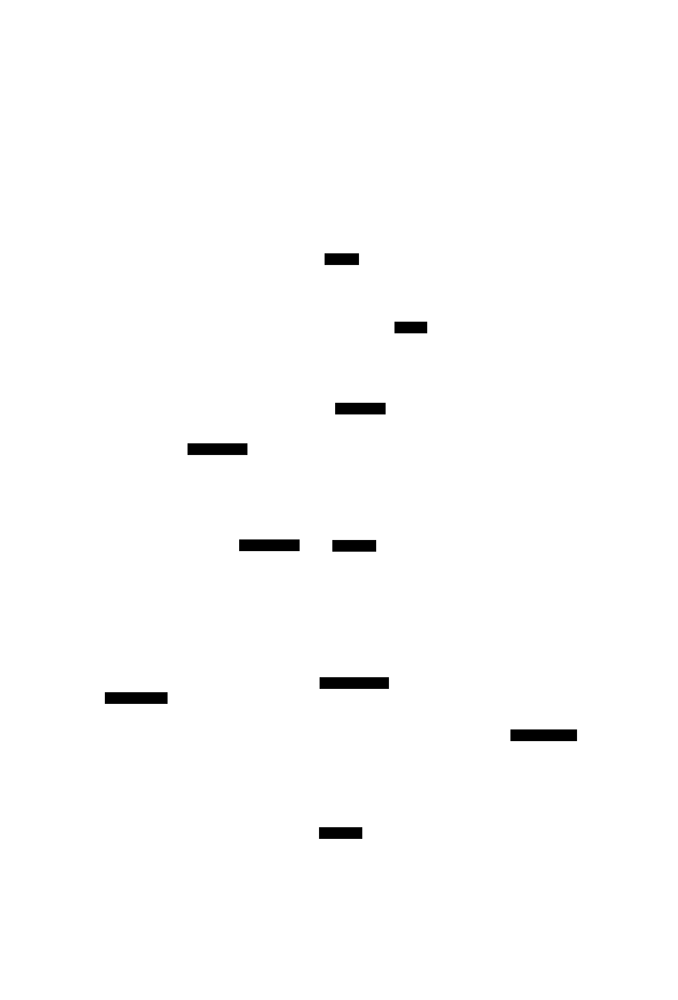
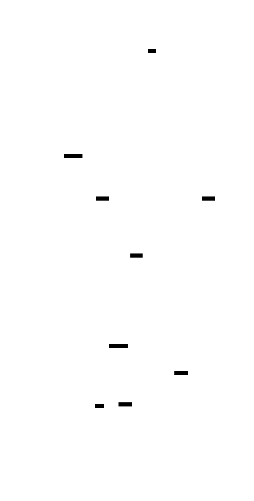
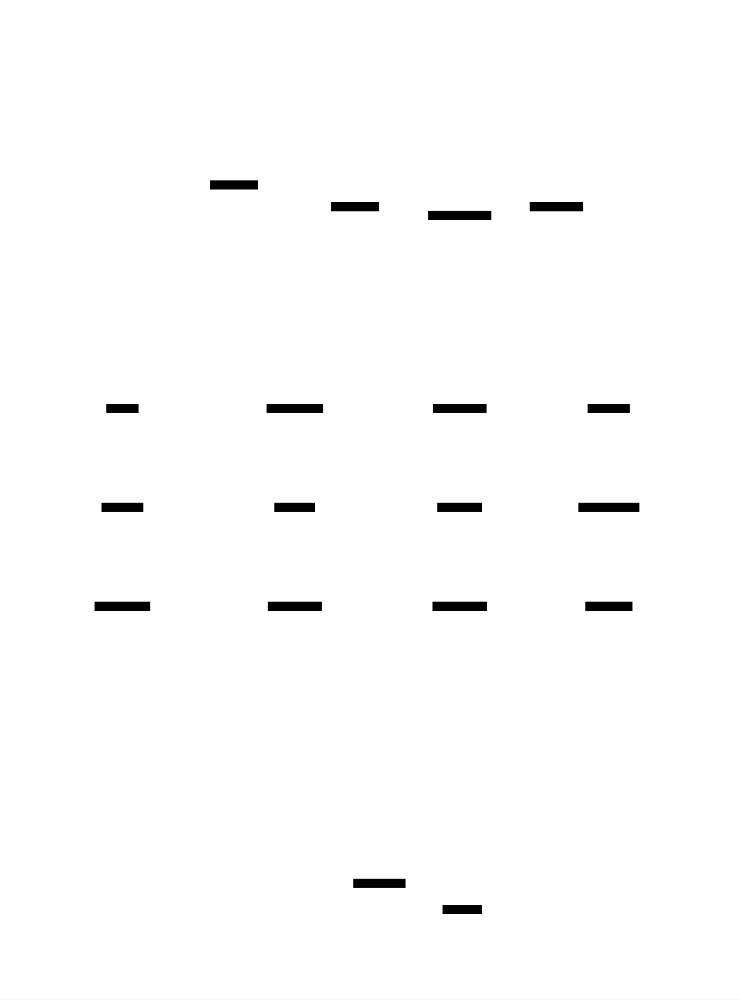

# Build Your Own Ray Tracer: Design Document


## Overview

A path tracing renderer that generates photorealistic images by simulating light rays bouncing through 3D scenes with materials like glass, metal, and diffuse surfaces. The key architectural challenge is designing a flexible object-oriented system that can efficiently compute ray-object intersections while maintaining clean separation between geometry, materials, and rendering algorithms.


> This guide is meant to help you understand the big picture before diving into each milestone. Refer back to it whenever you need context on how components connect.


## Context and Problem Statement

> **Milestone(s):** All milestones (foundational understanding for entire project)

Understanding ray tracing fundamentals and why building a renderer is architecturally challenging requires grasping both the physical intuition behind light simulation and the engineering complexities that arise when implementing a flexible, extensible rendering system. This section establishes the conceptual foundation and architectural context that will guide all subsequent design decisions.

### Mental Model: The Backwards Light Simulation

> Think of ray tracing as being a detective working backwards from a crime scene. Instead of watching the crime happen in real-time (which would be like simulating every photon emitted from every light source), you start at the evidence (the camera sensor) and trace backwards to figure out what must have happened to create that evidence.

In the real world, light sources emit billions of photons that bounce randomly through a scene. Most of these photons never reach our eyes or a camera sensor—they get absorbed by surfaces or scatter in directions we can't see. Simulating this forward process would be computationally wasteful, like watching every raindrop fall just to see which ones hit your umbrella.

**Ray tracing reverses this process** by starting from the observer and working backwards. We cast rays from the camera through each pixel of our virtual image, asking the fundamental question: "What light must have traveled along this exact path to reach this pixel?" This backwards approach—technically called **backwards ray tracing** or **eye rays**—is orders of magnitude more efficient because we only trace the light paths that actually contribute to our final image.

The ray tracing process follows this backwards light simulation through several key stages:

1. **Primary rays** originate from the camera and travel through each pixel into the scene, representing the direct line of sight from the observer to the first surface they can see.

2. **Surface interactions** occur when a ray hits an object, determining how light scatters based on the material properties (diffuse surfaces scatter randomly, mirrors reflect precisely, glass both reflects and refracts).

3. **Secondary rays** are spawned from surface interaction points, continuing the backwards simulation to determine what light arrived at that surface from other directions.

4. **Light accumulation** happens as we trace these backwards paths, collecting color information and combining it according to the physics of light transport.

5. **Termination conditions** eventually stop the recursive process when rays escape the scene, hit light sources, or reach a maximum bounce limit.

This backwards simulation creates a **tree-like structure** of light paths for each pixel, where the root is the camera, branches are ray bounces, and leaves are either light sources or absorption events. The final pixel color is computed by integrating all the light that flows back along these paths to the camera.

### Rendering Approaches Comparison

Modern computer graphics employs three primary rendering approaches, each with distinct architectural implications and performance characteristics. Understanding their trade-offs is crucial for appreciating why ray tracing requires such careful architectural design.



#### Rasterization: The Triangle Assembly Line

**Rasterization** dominates real-time graphics (games, interactive applications) and works like an assembly line in a factory. The process transforms 3D geometry into 2D screen pixels through a fixed pipeline:

| Stage | Input | Output | Operation |
|-------|-------|--------|-----------|
| Vertex Processing | 3D vertices | Screen coordinates | Transform vertices to screen space using matrices |
| Primitive Assembly | Screen vertices | Triangles | Group vertices into geometric primitives |
| Rasterization | Triangles | Pixel fragments | Determine which pixels each triangle covers |
| Fragment Processing | Pixel fragments | Final pixels | Apply textures, lighting, and effects |

Rasterization's architectural advantages stem from its **forward rendering model**—we process geometry in the order it's stored in memory, making it highly cache-friendly and parallelizable. Modern GPUs contain thousands of processing cores optimized for this exact workflow.

However, rasterization struggles with **global illumination effects** because it processes one triangle at a time without knowledge of the entire scene. Reflections, refractions, and realistic shadows require expensive workarounds like shadow maps, reflection probes, or screen-space techniques that approximate the missing information.

#### Ray Tracing: The Backwards Light Detective

**Ray tracing** reverses the rendering direction, starting from the camera and asking "what did this pixel see?" This backwards approach naturally handles global illumination effects that confound rasterization:

| Effect | Rasterization Challenge | Ray Tracing Solution |
|--------|------------------------|---------------------|
| Reflections | Requires pre-computed reflection maps | Cast reflection rays to sample actual scene |
| Shadows | Needs shadow map passes for each light | Cast shadow rays to test light visibility |
| Refraction | Extremely difficult to approximate | Cast refracted rays through transparent materials |
| Ambient Occlusion | Screen-space approximations only | Cast random rays to sample local lighting |

Ray tracing's architectural challenge is **random memory access**. Unlike rasterization's predictable triangle-by-triangle processing, rays can travel in any direction and hit any object. This creates cache-unfriendly access patterns and requires sophisticated data structures (like bounding volume hierarchies) to maintain performance.

#### Path Tracing: The Monte Carlo Photographer

**Path tracing** extends ray tracing by embracing randomness to solve the **rendering equation**—the fundamental physics equation describing how light transport works. Instead of casting rays in deterministic directions, path tracing uses **Monte Carlo integration** to randomly sample all possible light paths.

Consider how a photographer captures a scene: the camera lens gathers light that has bounced around the environment in complex ways. Path tracing simulates this by:

1. **Random sampling** of ray directions based on material properties (diffuse surfaces scatter randomly, metals reflect with some roughness)
2. **Multiple samples** per pixel to reduce noise from random sampling
3. **Unbiased rendering** that converges to the physically correct result given enough samples
4. **Russian roulette termination** that randomly terminates ray paths to avoid infinite bouncing

This approach produces the most physically accurate results but requires hundreds or thousands of samples per pixel to reduce noise to acceptable levels.

#### Architectural Trade-offs Summary

| Approach | Performance | Quality | Memory Pattern | Best Use Case |
|----------|-------------|---------|----------------|---------------|
| Rasterization | 60+ FPS | Limited global effects | Sequential access | Real-time applications, games |
| Ray Tracing | 1-30 FPS | Accurate reflections/shadows | Random access | Film rendering, architectural visualization |
| Path Tracing | Minutes to hours | Photorealistic | Random access + heavy sampling | Offline rendering, reference images |

> **Key Insight**: The choice of rendering approach fundamentally determines the software architecture. Rasterization favors pipeline-oriented designs with fixed stages, while ray tracing demands flexible object-oriented systems that can handle arbitrary ray-object interactions.

### Core Architectural Challenges

Building a ray tracer presents several interconnected architectural challenges that don't exist in simpler graphics systems. These challenges arise from the intersection of mathematical complexity, performance requirements, and the need for extensible design.

#### Challenge 1: The Ray-Object Intersection Problem

**The Problem**: Every ray must be tested against potentially thousands of scene objects to find the closest intersection. A naive implementation results in O(n) intersection tests per ray, and with millions of rays per image, this becomes computationally prohibitive.

**Architectural Implications**: The geometry system must be designed around the core operation of ray-object intersection testing. This affects:

- **Interface design**: All geometric objects must implement a common intersection interface, but the mathematical details vary dramatically (spheres use quadratic equations, triangles use barycentric coordinates, etc.)
- **Data structure choices**: We need spatial acceleration structures (bounding volume hierarchies, octrees) to reduce intersection tests, which impacts how objects are stored and organized
- **Numerical stability**: Floating-point precision errors can cause "shadow acne" and other artifacts, requiring careful epsilon handling throughout the intersection code

**Design Tension**: We want both performance (fast intersection testing) and flexibility (easy to add new object types). These goals can conflict—highly optimized code tends to be less extensible.

#### Challenge 2: The Material Scattering Problem

**The Problem**: When a ray hits a surface, the material must determine how light scatters. Different materials follow different physics:
- **Lambertian (diffuse)** surfaces scatter rays randomly in a cosine-weighted hemisphere
- **Metallic** surfaces reflect rays about the surface normal with optional roughness
- **Dielectric (glass)** surfaces both reflect and refract rays based on Fresnel equations

**Architectural Implications**: The material system must handle this diversity while maintaining clean separation between geometry and shading:

- **Polymorphic design**: Materials need a common interface for ray scattering, but implementations vary from simple reflection calculations to complex probability distributions
- **Random number generation**: Materials need access to high-quality random numbers for Monte Carlo sampling, raising questions about RNG state management
- **Color attenuation**: Each material interaction attenuates the ray's color contribution, requiring careful accumulation to avoid energy loss or gain

**Design Tension**: Materials need sufficient information about surface interactions (hit point, normal, incoming ray) while maintaining encapsulation and avoiding tight coupling with the geometry system.

#### Challenge 3: The Recursive Ray Tracing Problem

**The Problem**: Ray tracing is inherently recursive—each ray can spawn multiple secondary rays (reflection, refraction, diffuse scattering), creating a tree of ray interactions. This recursion must be managed to avoid stack overflow while maintaining performance.

**Architectural Implications**: The rendering pipeline must handle potentially unlimited recursion depth:

- **Termination strategies**: We need robust mechanisms to terminate recursion (maximum depth, Russian roulette, energy thresholds) without biasing the result
- **Stack management**: Deep recursion can overflow the call stack, suggesting iterative implementations with explicit stacks
- **Color accumulation**: Ray contributions must be properly weighted and combined as they return from recursive calls

**Design Tension**: Recursive algorithms are mathematically elegant and mirror the physics of light transport, but iterative implementations are often more performant and avoid stack limitations.

#### Challenge 4: The Sampling and Antialiasing Problem

**The Problem**: Computer graphics deals with continuous phenomena (smooth surfaces, continuous light distributions) but must produce discrete outputs (pixel grids). This sampling process introduces aliasing artifacts—jagged edges, temporal flickering, noise.

**Architectural Implications**: The rendering system must incorporate sophisticated sampling strategies:

- **Multi-sampling**: Each pixel needs multiple samples with randomized sub-pixel positions, multiplying the computational cost
- **Sample distribution**: Random sampling reduces aliasing but introduces noise; we need good pseudo-random number generation and possibly stratified sampling
- **Filter reconstruction**: Multiple samples per pixel must be combined using appropriate filtering (box, tent, Gaussian) to produce final pixel colors

**Design Tension**: Higher sampling rates improve image quality but increase render times. The architecture must make it easy to trade quality for performance.

#### Challenge 5: The Extensibility vs. Performance Problem

**The Problem**: Educational ray tracers need to be easily extensible (students should be able to add new materials, objects, camera effects) but also performant enough to render interesting scenes in reasonable time.

**Architectural Implications**: Every major system component faces this tension:

- **Virtual function overhead**: Polymorphic designs enable extensibility but introduce virtual function call overhead in tight loops
- **Data structure flexibility**: Generic containers are flexible but may have performance implications compared to specialized data structures
- **Compile-time vs. runtime polymorphism**: Templates offer zero-overhead abstraction but reduce runtime flexibility

> **Critical Design Principle**: The architecture must prioritize **correctness and clarity first, performance second**. It's better to have a slow but correct and extensible ray tracer that students can learn from than a fast but rigid implementation that obscures the underlying algorithms.

#### Architectural Decision Records

> **Decision: Object-Oriented Polymorphic Design**
> - **Context**: Need to handle diverse object types (spheres, triangles, planes) and material types (diffuse, metal, glass) with a unified interface
> - **Options Considered**: 
>   1. Union types with switch statements for each object/material type
>   2. Object-oriented polymorphism with virtual functions
>   3. Template-based compile-time polymorphism
> - **Decision**: Object-oriented polymorphism with abstract base classes
> - **Rationale**: Prioritizes code clarity and extensibility over raw performance. Students can easily add new object and material types by inheriting from base classes. Virtual function overhead is acceptable for educational purposes.
> - **Consequences**: Slightly slower than union types or templates, but dramatically more extensible and readable. Enables milestone-based learning where students incrementally add complexity.

> **Decision: Recursive Ray Tracing with Depth Limiting**
> - **Context**: Ray tracing naturally leads to recursive algorithms, but unlimited recursion causes stack overflow
> - **Options Considered**:
>   1. Pure recursive implementation with maximum depth parameter
>   2. Iterative implementation with explicit stack
>   3. Hybrid approach with recursion up to safe depth, then iteration
> - **Decision**: Pure recursive implementation with configurable maximum depth
> - **Rationale**: Recursive code directly mirrors the physics of light transport and is easier for students to understand. Modern systems can handle 50-100 levels of recursion safely, which is more than needed for typical scenes.
> - **Consequences**: Risk of stack overflow with extreme scenes or very deep recursion limits, but much clearer code structure for educational purposes.

> **Decision: Floating-Point Color Representation**
> - **Context**: Colors can be represented as integers (0-255) or floating-point values (0.0-1.0+), affecting precision and HDR capability
> - **Options Considered**:
>   1. Integer RGB values (0-255) throughout pipeline
>   2. Floating-point RGB values (0.0-1.0) with final conversion to integer
>   3. Floating-point RGB with HDR support (values > 1.0)
> - **Decision**: Floating-point RGB with HDR support, clamping only during final output
> - **Rationale**: Ray tracing involves extensive color arithmetic (multiplication, addition, interpolation). Floating-point precision prevents accumulation errors. HDR support enables realistic bright light sources and proper gamma correction.
> - **Consequences**: Slightly more memory usage and computation compared to integer colors, but essential for physically-based rendering and proper light transport simulation.

These architectural challenges demonstrate why ray tracing requires careful upfront design. Unlike simple graphics applications that can be built incrementally, ray tracers have complex interactions between components that must be architected holistically. The remainder of this design document addresses each challenge systematically, providing concrete solutions that balance educational clarity with technical correctness.

### Implementation Guidance

This section bridges the conceptual understanding of ray tracing with practical implementation concerns. The following guidance assumes C++ as the primary implementation language, chosen for its balance of performance, explicit memory management, and object-oriented features that map well to ray tracing concepts.

#### Technology Recommendations

| Component | Simple Option | Advanced Option | Rationale |
|-----------|---------------|-----------------|-----------|
| Math Library | Custom Vector3D/Ray classes | GLM or Eigen library | Custom classes aid learning; libraries offer optimization |
| Random Numbers | `std::random_device` + `std::mt19937` | PCG or other high-quality generators | Standard library sufficient for learning; PCG better for production |
| Image Output | PPM format (ASCII or binary) | PNG/JPEG via STBI library | PPM is trivial to implement; other formats need libraries |
| Build System | Single-file compilation | CMake with multiple modules | Single file for early milestones; CMake for larger projects |
| Testing | Manual visual inspection | Automated unit tests + reference images | Visual testing catches many issues; automation helps with regression |

#### Recommended File Structure

The project should be organized to separate concerns and support incremental development across milestones:

```
ray-tracer/
├── src/
│   ├── main.cpp                 ← Entry point, scene setup, main render loop
│   ├── math/
│   │   ├── vector3d.h          ← Vector operations, point arithmetic
│   │   ├── ray.h               ← Ray class with origin and direction
│   │   └── color.h             ← Color class with RGB arithmetic
│   ├── geometry/
│   │   ├── hittable.h          ← Abstract interface for ray intersection
│   │   ├── sphere.h            ← Sphere geometry implementation  
│   │   └── hittable_list.h     ← Collection of hittable objects
│   ├── materials/
│   │   ├── material.h          ← Abstract material interface
│   │   ├── lambertian.h        ← Diffuse material implementation
│   │   ├── metal.h             ← Reflective material implementation
│   │   └── dielectric.h        ← Glass/transparent material implementation
│   ├── camera/
│   │   └── camera.h            ← Camera with positioning and lens effects
│   └── rendering/
│       ├── renderer.h          ← Main rendering pipeline
│       └── image_writer.h      ← PPM file output functionality
├── scenes/
│   ├── simple_scene.h          ← Basic scene setups for testing
│   └── final_scene.h           ← Complex scene demonstrating all features
├── tests/
│   ├── test_math.cpp          ← Unit tests for vector/ray operations
│   ├── test_geometry.cpp      ← Tests for intersection calculations
│   └── test_materials.cpp     ← Tests for material scattering
└── output/
    └── (generated images)      ← Rendered PPM files
```

This structure supports the milestone-based development approach, allowing students to implement one subsystem at a time while maintaining clean dependencies.

#### Infrastructure Starter Code

**PPM Image Writer** (Complete implementation for immediate use):

```cpp
// src/rendering/image_writer.h
#pragma once
#include <fstream>
#include <iostream>
#include "../math/color.h"

class ImageWriter {
public:
    static void write_ppm(const std::string& filename, 
                         int width, int height, 
                         const std::vector<Color>& pixels) {
        std::ofstream file(filename);
        if (!file.is_open()) {
            std::cerr << "Error: Could not open file " << filename << std::endl;
            return;
        }
        
        // PPM header
        file << "P3\n" << width << " " << height << "\n255\n";
        
        // Write pixel data
        for (int j = height - 1; j >= 0; --j) {  // Top-to-bottom
            for (int i = 0; i < width; ++i) {    // Left-to-right
                const Color& pixel = pixels[j * width + i];
                write_color(file, pixel);
            }
        }
        
        file.close();
        std::cout << "Wrote image: " << filename << std::endl;
    }

private:
    static void write_color(std::ofstream& out, const Color& pixel_color) {
        // Apply gamma correction (gamma = 2.0, so sqrt)
        double r = sqrt(pixel_color.r());
        double g = sqrt(pixel_color.g());
        double b = sqrt(pixel_color.b());
        
        // Convert [0,1] to [0,255] and clamp
        int ir = static_cast<int>(256 * std::clamp(r, 0.0, 0.999));
        int ig = static_cast<int>(256 * std::clamp(g, 0.0, 0.999));
        int ib = static_cast<int>(256 * std::clamp(b, 0.0, 0.999));
        
        out << ir << ' ' << ig << ' ' << ib << '\n';
    }
};
```

**Random Number Utilities** (Complete implementation):

```cpp
// src/math/random.h
#pragma once
#include <random>

class RandomGenerator {
private:
    static thread_local std::random_device rd;
    static thread_local std::mt19937 gen;
    static thread_local std::uniform_real_distribution<double> dis;
    
public:
    // Returns random double in [0, 1)
    static double random_double() {
        return dis(gen);
    }
    
    // Returns random double in [min, max)
    static double random_double(double min, double max) {
        return min + (max - min) * random_double();
    }
    
    // Returns random point in unit sphere (for diffuse materials)
    static Vector3D random_in_unit_sphere() {
        while (true) {
            Vector3D p = Vector3D::random(-1, 1);
            if (p.length_squared() >= 1) continue;
            return p;
        }
    }
    
    // Returns random point on unit disk (for depth of field)
    static Vector3D random_in_unit_disk() {
        while (true) {
            Vector3D p(random_double(-1, 1), random_double(-1, 1), 0);
            if (p.length_squared() >= 1) continue;
            return p;
        }
    }
};

// Thread-local storage definitions (put in random.cpp)
thread_local std::random_device RandomGenerator::rd;
thread_local std::mt19937 RandomGenerator::gen(RandomGenerator::rd());
thread_local std::uniform_real_distribution<double> RandomGenerator::dis(0.0, 1.0);
```

#### Core Logic Skeleton Code

The following skeletons provide function signatures and detailed TODO comments for the core components students should implement themselves:

**Ray-Sphere Intersection** (core learning algorithm):

```cpp
// src/geometry/sphere.h
class Sphere : public Hittable {
private:
    Point3D center;
    double radius;
    std::shared_ptr<Material> material;

public:
    Sphere(Point3D center, double radius, std::shared_ptr<Material> material)
        : center(center), radius(radius), material(material) {}
    
    // Core intersection algorithm - students implement this
    bool hit(const Ray& r, double t_min, double t_max, HitRecord& rec) const override {
        // TODO 1: Compute vector from ray origin to sphere center (oc = r.origin() - center)
        // TODO 2: Set up quadratic equation coefficients:
        //         a = dot(direction, direction) = direction.length_squared()
        //         b = 2.0 * dot(oc, direction)  
        //         c = dot(oc, oc) - radius*radius = oc.length_squared() - radius*radius
        // TODO 3: Calculate discriminant = b*b - 4*a*c
        // TODO 4: If discriminant < 0, return false (no intersection)
        // TODO 5: Calculate both roots: (-b ± sqrt(discriminant)) / (2*a)
        // TODO 6: Choose the closer positive root within [t_min, t_max]
        // TODO 7: If no valid root found, return false
        // TODO 8: Fill hit record with intersection point, normal, t value, and material
        // Hint: Normal = (intersection_point - center) / radius
        // Hint: Check if ray is inside sphere and flip normal if needed
    }
};
```

**Material Scattering Interface** (core abstraction):

```cpp
// src/materials/material.h
class Material {
public:
    // Pure virtual function for ray scattering - students implement in derived classes
    virtual bool scatter(const Ray& r_in, const HitRecord& rec, 
                        Color& attenuation, Ray& scattered) const = 0;
    
    // Optional: emitted light for light sources (default: no emission)
    virtual Color emitted() const { return Color(0, 0, 0); }
};

// Example implementation skeleton for Lambertian material
class Lambertian : public Material {
private:
    Color albedo;  // Surface reflectance color

public:
    Lambertian(const Color& albedo) : albedo(albedo) {}
    
    bool scatter(const Ray& r_in, const HitRecord& rec, 
                Color& attenuation, Ray& scattered) const override {
        // TODO 1: Generate random point in unit sphere using RandomGenerator::random_in_unit_sphere()
        // TODO 2: Add this random vector to the surface normal to get scatter direction
        // TODO 3: Handle the case where random vector exactly cancels the normal (very rare)
        // TODO 4: Create scattered ray from hit point in the scatter direction
        // TODO 5: Set attenuation to the material's albedo (determines how much light is absorbed)
        // TODO 6: Return true (Lambertian materials always scatter)
        // Hint: scatter_direction = rec.normal + random_unit_vector
        // Hint: If scatter_direction is near zero, use the normal instead
    }
};
```

**Recursive Ray Tracing** (core rendering algorithm):

```cpp
// src/rendering/renderer.h
class Renderer {
public:
    // Main recursive ray tracing function - students implement the core algorithm
    Color ray_color(const Ray& r, const HittableList& world, int depth) const {
        // TODO 1: Check if we've exceeded the ray bounce limit (depth <= 0)
        //         If so, return black (no more light gathered)
        
        // TODO 2: Test ray against all objects in the world using world.hit()
        //         Use small positive t_min (like 0.001) to avoid "shadow acne"
        
        // TODO 3: If ray hits something:
        //         a) Call the material's scatter() function
        //         b) If material scatters the ray:
        //            - Recursively trace the scattered ray with (depth - 1)
        //            - Multiply recursive result by material attenuation
        //            - Return the attenuated color
        //         c) If material absorbs the ray, return black
        
        // TODO 4: If ray hits nothing, return background color
        //         Typically a blue-to-white gradient based on ray's y-direction:
        //         t = 0.5 * (unit_direction.y() + 1.0)
        //         return (1.0 - t) * white + t * blue
        
        // Hint: This function is naturally recursive and mirrors the physics
        // Hint: Each recursive call represents one light bounce in the scene
    }
};
```

#### Language-Specific Implementation Hints

**C++ Best Practices for Ray Tracing**:

1. **Use `std::shared_ptr` for materials** to enable material sharing between objects without memory management complexity
2. **Prefer `constexpr` for mathematical constants** like pi, helping compiler optimization
3. **Use `inline` functions for simple math operations** to avoid function call overhead in tight loops
4. **Consider `__restrict__` pointers for pixel buffers** if targeting maximum performance
5. **Use `std::clamp()` for value clamping** (C++17 feature) instead of manual min/max calls

**Common C++ Pitfalls in Ray Tracing**:

- **Uninitialized vectors**: Always initialize Vector3D components to prevent NaN propagation
- **Integer division**: Use `double` literals (e.g., `1.0/3.0`) instead of integer division (`1/3`)
- **Reference vs. copy**: Pass large objects like `HitRecord` by reference to avoid expensive copying
- **Thread safety**: If implementing multi-threading, ensure random number generators are thread-local

#### Milestone Checkpoints

Each milestone should produce verifiable visual output that demonstrates correct implementation:

**Milestone 1 Checkpoint**: Generate gradient PPM file
- **Expected output**: 400×225 PPM image with blue-to-white gradient from bottom to top
- **Command**: `./ray_tracer > output/gradient.ppm`
- **Verification**: Image opens in any viewer, shows smooth color transition
- **Common issues**: Incorrect PPM header format, wrong pixel order (inverted image)

**Milestone 3 Checkpoint**: Render red sphere
- **Expected output**: Red circle centered in image against gradient background
- **Verification**: Sphere appears as perfect circle, no distortion or clipping
- **Debug technique**: If sphere doesn't appear, try moving camera closer or making sphere larger
- **Common issues**: Ray-sphere intersection returning wrong root, sphere positioned outside camera view

**Milestone 6 Checkpoint**: Diffuse materials with shadows
- **Expected output**: Matte sphere with soft shadows, some areas darker than others
- **Verification**: No mirror-like reflections, shadows appear realistic and soft
- **Quality check**: Compare with reference image from "Ray Tracing in One Weekend" book
- **Common issues**: Rays escaping to infinity (check recursion termination), overly bright or dark images (check gamma correction)

#### Debugging Tips for Ray Tracing

Ray tracing bugs often manifest as visual artifacts that can be systematically diagnosed:

| Visual Symptom | Likely Cause | Diagnostic Technique | Fix |
|----------------|--------------|---------------------|-----|
| Completely black image | Rays not hitting anything, or colors not being written | Add debug prints to ray_color(), check if hit detection works | Verify scene setup, check camera pointing direction |
| Overly bright/white image | Colors not being clamped, or gamma correction missing | Check color values before clamping, verify gamma correction | Add proper [0,1] clamping and sqrt() gamma correction |
| Speckled/noisy image | Random number generation issues, insufficient samples | Check random number distribution, increase samples per pixel | Use high-quality RNG, ensure uniform distribution |
| Shadow acne (black spots) | Ray self-intersection due to floating-point precision | Use small positive t_min instead of 0.0 in hit tests | Set t_min = 0.001 or similar small epsilon value |
| Distorted sphere shapes | Incorrect normal calculation or coordinate system issues | Render normals as colors to visualize normal directions | Check normal computation, ensure normals point outward |
| Missing reflections/materials | Virtual function dispatch problems, material not assigned | Verify material pointers are valid, check virtual function calls | Ensure materials are properly shared_ptr, not null |

> **Key Debugging Principle**: When ray tracing goes wrong, the problem is usually in one of three places: ray generation (camera), ray-object intersection (geometry), or ray scattering (materials). Isolate each component by rendering debug visualizations—ray directions as colors, normals as colors, hit distances as grayscale intensity.


## Goals and Non-Goals

> **Milestone(s):** All milestones (scope definition applies to entire project progression)

Setting clear boundaries for our ray tracer project is essential for maintaining focus and delivering a working renderer within reasonable scope. Think of this as **architectural guardrails** — just as a photographer must choose which subjects to include in the frame and which to leave out, we must deliberately decide which rendering features belong in our implementation and which advanced capabilities we'll defer to future work.

The "Ray Tracing in One Weekend" approach emphasizes building a **complete, working system** rather than attempting to implement every possible ray tracing feature. This philosophy shapes our goal-setting: we prioritize core functionality that demonstrates fundamental ray tracing principles while explicitly excluding advanced optimizations and exotic features that would expand the project beyond educational value.

Our goals operate at three levels: **functional goals** define what images our renderer can produce, **non-functional goals** establish quality standards for the codebase itself, and **explicit non-goals** create clear boundaries around features we deliberately won't implement. This three-tier structure ensures both technical and project management clarity.

### Functional Goals

The functional goals define the **visual capabilities** our ray tracer will achieve — essentially, what kinds of images it can successfully render and what physical phenomena it can simulate. These goals directly correspond to the milestone progression, building complexity incrementally while maintaining a working system at each stage.

#### Image Generation and File Output

Our ray tracer must generate **high-quality digital images** in standard formats that can be viewed, shared, and validated. The primary output format is **PPM (Portable Pixmap)**, chosen for its simplicity and human-readable structure that aids in debugging. Every pixel must be computed correctly, with proper color representation and coordinate system handling.

| Output Capability | Specification | Quality Standard |
|-------------------|---------------|------------------|
| Image Resolution | Configurable width × height up to 1920×1080 | No pixel artifacts or coordinate errors |
| Color Depth | 24-bit RGB with floating-point internal representation | Smooth gradients without banding |
| File Format | PPM P3 (ASCII) format with proper header structure | Opens correctly in standard image viewers |
| Color Space | Linear RGB internally, gamma-corrected for display | Visually correct brightness and contrast |

The **coordinate system** must handle the transition from image pixel coordinates to world-space ray directions consistently. This includes proper aspect ratio handling, ensuring rendered spheres appear circular rather than elliptical, and managing the Y-axis orientation difference between image formats (top-left origin) and mathematical conventions (bottom-left origin).

#### Geometric Primitive Support

Our renderer must handle **fundamental geometric shapes** with mathematically correct ray intersection algorithms. The primary focus is on **spheres** as the archetypal ray tracing primitive, but the architecture must support extending to additional shapes through a clean object-oriented interface.

| Geometry Type | Mathematical Requirement | Visual Quality Standard |
|---------------|--------------------------|------------------------|
| Spheres | Quadratic equation solution for ray-sphere intersection | Perfect circular silhouettes, smooth shading |
| Ground Plane | Large sphere representing infinite ground | Convincing horizon and perspective |
| Scene Hierarchy | Multiple objects with correct depth sorting | Proper occlusion and visibility |
| Surface Normals | Unit-length outward-pointing normals | Consistent shading across all surfaces |

The **intersection algorithm** must handle edge cases robustly: rays originating inside spheres, grazing tangent rays, and numerical precision issues near sphere boundaries. The `hit` method signature must return complete **HitRecord** information including intersection point, surface normal, ray parameter `t`, and associated material.

#### Material and Shading Models

Our ray tracer must simulate **three fundamental material types** that demonstrate different physics of light interaction. Each material represents a distinct category of surface behavior: diffuse scattering, specular reflection, and transmission with refraction.

| Material Type | Physical Model | Implementation Requirement |
|---------------|----------------|----------------------------|
| Lambertian (Diffuse) | Cosine-weighted hemisphere scattering | Random direction sampling on unit sphere |
| Metal | Specular reflection with controllable roughness | Reflection formula with optional fuzz parameter |
| Dielectric (Glass) | Refraction and reflection based on Fresnel equations | Snell's law with total internal reflection |

**Lambertian materials** must produce realistic diffuse shading through **Monte Carlo integration**. The random hemisphere sampling should follow physically-based probability distribution, creating natural-looking shadow regions where fewer reflected rays reach the camera. The color attenuation factor represents the material's albedo (intrinsic color).

**Metal materials** implement **perfect or imperfect reflection** using the reflection formula `v - 2*dot(v,n)*n` for incident vector `v` and normal `n`. The **fuzz parameter** adds controlled randomness to reflection direction, simulating surface roughness. Fuzz values between 0.0 (mirror-perfect) and 1.0 (maximum roughness) must produce visually distinct results.

**Dielectric materials** handle both **refraction and reflection** simultaneously, with the probability determined by **Schlick's approximation** to the Fresnel equations. The refractive index parameter controls how much rays bend when entering or exiting the material. **Total internal reflection** must be detected and handled correctly when light attempts to exit a dense medium at steep angles.

#### Camera System Capabilities

The camera system must provide **full control over viewpoint and image formation**, simulating a real photography workflow. This includes positioning, orientation, framing, and optical effects that match physical camera behavior.

| Camera Feature | Functionality | Configuration Parameters |
|----------------|---------------|--------------------------|
| Position and Orientation | Arbitrary 3D placement with look-at targeting | `lookfrom`, `lookat`, `up` vectors |
| Field of View | Zoom control through angular viewport | `fov` parameter in degrees |
| Aspect Ratio | Match output image proportions | Derived from image width/height |
| Depth of Field | Simulated lens focusing with blur effects | `aperture` size and `focus_distance` |

**Camera positioning** uses a **look-at transformation** that computes orthonormal basis vectors from the view direction and up vector. The field of view parameter controls the **angular width** of the viewport, with larger values creating wide-angle (zoomed-out) effects and smaller values creating telephoto (zoomed-in) effects.

**Depth of field** simulation requires implementing a **thin lens model** where rays originate from random points within a circular lens aperture rather than a single point. Objects at the focus distance appear sharp, while objects closer or farther appear blurred. The aperture parameter controls the **blur strength** — larger apertures create more pronounced depth-of-field effects.

#### Rendering Quality and Effects

The renderer must produce **photorealistic image quality** through proper sampling, antialiasing, and color processing. These features eliminate common digital artifacts and ensure the output appears smooth and natural.

| Quality Feature | Implementation Approach | Visual Impact |
|-----------------|-------------------------|---------------|
| Antialiasing | Multiple samples per pixel with random sub-pixel offsets | Smooth edges without jagged aliasing |
| Global Illumination | Recursive ray bouncing up to configurable depth | Natural shadows and color bleeding |
| Gamma Correction | Power 2.2 curve from linear to display color space | Correct brightness and contrast |
| Noise Reduction | Sufficient samples per pixel for convergence | Clean images without Monte Carlo noise |

**Antialiasing** through **multi-sampling** requires generating multiple rays per pixel with random jitter within pixel boundaries. The `samples_per_pixel` parameter controls the quality-performance trade-off — higher sample counts produce smoother results but require longer render times. Typical values range from 10 samples (fast preview) to 500+ samples (final quality).

**Recursive ray tracing** enables **global illumination effects** where light bounces between surfaces, creating realistic shadows, color bleeding, and ambient lighting. The `max_depth` parameter prevents infinite recursion while allowing sufficient bounces to capture most lighting phenomena. Each bounce attenuates the ray's contribution, naturally terminating the recursion's visual impact.

### Non-Functional Goals

Non-functional goals establish **quality standards** for the codebase itself, focusing on maintainability, extensibility, and educational value rather than rendered output. These goals ensure the ray tracer serves as an excellent learning platform while remaining robust enough for experimentation and enhancement.

#### Code Architecture and Design Quality

The codebase must exemplify **clean object-oriented design** with clear separation of concerns and extensible interfaces. Think of the architecture as a **modular photography studio** where each component (camera, lighting, props, film processing) can be upgraded independently without affecting the others.

| Architecture Aspect | Design Standard | Measurable Criteria |
|---------------------|-----------------|---------------------|
| Component Separation | Clear boundaries between geometry, materials, camera, renderer | Each component in separate files/modules |
| Interface Design | Abstract base classes for extensible object types | `Hittable` and `Material` interfaces with clean `hit()` and `scatter()` methods |
| Data Encapsulation | Proper access control and state management | Member variables private with controlled access |
| Dependency Management | Minimal coupling between components | Changes to material system don't affect geometry system |

**Interface design** must support easy extension to new geometric shapes and material types. The `Hittable` interface should accommodate spheres, planes, triangles, and complex meshes through a uniform `hit()` method signature. Similarly, the `Material` interface should handle current and future material types (subsurface scattering, emissive surfaces) through consistent `scatter()` behavior.

**Memory management** must be explicit and safe, avoiding common pitfalls like memory leaks, dangling pointers, and resource cleanup failures. In C++, this means appropriate use of smart pointers (`shared_ptr<Material>`) and RAII principles. The `HitRecord` structure should safely reference materials without ownership ambiguity.

#### Performance and Scalability Expectations

While performance optimization is explicitly **not a primary goal**, the implementation must achieve **reasonable render times** for educational scenes and avoid pathologically slow algorithms. Think of this as **baseline efficiency** — the code should demonstrate good algorithmic choices without requiring advanced optimization techniques.

| Performance Aspect | Reasonable Expectation | Acceptable Range |
|---------------------|------------------------|------------------|
| Simple Scene Rendering | 640×480 image with 3-4 spheres | 10-60 seconds on modern hardware |
| Sample Convergence | Visible improvement with increased samples | 10 samples (preview) to 500 samples (quality) |
| Memory Usage | Linear growth with scene complexity | No memory leaks or exponential growth |
| Ray Intersection Testing | O(n) linear search through scene objects | Acceptable for scenes with <20 objects |

**Algorithmic complexity** should follow expected patterns: linear time complexity for ray-object intersection testing, quadratic relationship between sample count and render time, and predictable memory growth with scene size. The implementation should avoid accidentally exponential algorithms or excessive memory allocation.

**Resource cleanup** must be automatic and deterministic. File handles should close properly after image output, memory allocations should have matching deallocations, and random number generators should maintain consistent state. Valgrind or similar tools should report clean execution with no leaks.

#### Educational Value and Code Readability

The codebase must serve as an **exemplary learning resource** with clear, well-documented implementations that illuminate ray tracing principles. Think of each function as a **teaching moment** where a student can understand both what the code does and why it's designed that way.

| Educational Aspect | Implementation Standard | Learning Outcome |
|-------------------|-------------------------|------------------|
| Code Clarity | Self-documenting variable names and function signatures | Students understand purpose without extensive comments |
| Mathematical Correspondence | Code structure mirrors mathematical formulations | Direct mapping from ray-sphere intersection formula to implementation |
| Progressive Complexity | Each milestone builds naturally on previous work | Students see logical progression from simple to advanced features |
| Error Handling | Clear error messages with actionable guidance | Students can debug problems independently |

**Function and variable naming** should follow mathematical conventions where possible. The ray-sphere intersection should use variable names like `discriminant`, `t1`, `t2` that directly correspond to the quadratic formula terms. The `HitRecord` fields should match geometric terminology (`point`, `normal`, `t`) rather than abbreviated or cryptic names.

**Comment quality** should focus on **why** rather than **what**, particularly for non-obvious design decisions. The choice of `t_min = 0.001` deserves explanation about shadow acne prevention. Material scattering directions should reference the underlying physics principles (Lambertian reflection, Snell's law).

#### Testing and Verification Standards

The implementation must include **comprehensive testing strategies** that verify both mathematical correctness and visual output quality. Testing serves dual purposes: ensuring implementation correctness and teaching students how to validate graphics code systematically.

| Testing Category | Coverage Requirement | Verification Method |
|------------------|---------------------|---------------------|
| Unit Tests | Mathematical operations and geometric intersections | Automated tests with known inputs/outputs |
| Integration Tests | Component interactions and data flow | End-to-end ray tracing with reference scenes |
| Visual Validation | Rendered output matches expected appearance | Reference images and visual comparison |
| Regression Testing | Changes don't break existing functionality | Automated image comparison between versions |

**Unit testing** should cover all mathematical operations: vector arithmetic, ray-sphere intersection, material scattering calculations, and color processing. Each test case should include edge cases (zero vectors, grazing rays, extreme parameter values) that reveal boundary condition bugs.

**Visual validation** requires establishing **reference images** for each milestone that demonstrate correct implementation. These images serve as debugging aids when student implementations produce unexpected results. The reference scenes should isolate specific features (pure diffuse materials, perfect reflections, simple refractions) for easier troubleshooting.

### Explicit Non-Goals

Explicit non-goals create **clear boundaries** around features we deliberately exclude from this ray tracer implementation. These boundaries prevent scope creep while acknowledging that advanced ray tracing encompasses far more than our educational project attempts. Think of these as **intentional limitations** that keep the project focused on core learning objectives.

#### Advanced Acceleration Structures

We explicitly **will not implement** spatial acceleration structures like bounding volume hierarchies (BVH), k-d trees, or octrees that dramatically improve rendering performance for complex scenes. These optimizations would obscure the fundamental ray tracing algorithms we're trying to teach.

> **Decision: No Acceleration Structures**
> - **Context**: Complex scenes with thousands of objects require sophisticated data structures to avoid O(n) intersection testing per ray
> - **Options Considered**: BVH trees, k-d trees, uniform grids, no acceleration
> - **Decision**: Linear search through all scene objects
> - **Rationale**: Acceleration structures add significant complexity to codebase without teaching core ray tracing principles. Students should first understand basic intersection testing before optimizing it.
> - **Consequences**: Scene complexity limited to ~20 objects maximum for reasonable render times, but implementation remains focused on fundamental algorithms

| Excluded Feature | Complexity Impact | Learning Trade-off |
|-------------------|-------------------|-------------------|
| BVH Construction | Tree building algorithms, memory management | Obscures basic ray-object intersection |
| Spatial Partitioning | Complex boundary handling, traversal algorithms | Focus shifts from materials to data structures |
| Dynamic Scenes | Rebuilding acceleration structures | Adds temporal complexity to spatial complexity |

This limitation means our ray tracer will use **linear search** through the `HittableList` for all intersection tests. While this creates O(n) complexity per ray, it keeps the intersection code simple and debuggable. Students can focus on understanding ray-sphere mathematics rather than tree traversal algorithms.

#### Complex Lighting Models

We explicitly exclude advanced lighting phenomena like **subsurface scattering**, **volumetric rendering**, **caustics**, and **participating media**. These effects require sophisticated mathematical models that extend far beyond the scope of an introductory ray tracer.

| Excluded Lighting | Implementation Complexity | Physics Complexity |
|-------------------|---------------------------|-------------------|
| Subsurface Scattering | BSSRDF integration, multiple scattering | Light transport within translucent materials |
| Volumetric Rendering | Ray marching, phase functions | Scattering and absorption in participating media |
| Caustics | Photon mapping or bidirectional path tracing | Specular-diffuse light transport coupling |
| Area Lights | Sampling strategies, soft shadow integration | Non-point light source illumination |

Our **three-material system** (Lambertian, Metal, Dielectric) provides sufficient complexity to demonstrate fundamental light-surface interactions without requiring graduate-level physics knowledge. Additional material types would require increasingly sophisticated mathematical models that distract from core ray tracing architecture.

**Environment lighting** and **image-based lighting** are also excluded. Our renderer uses a simple **background gradient** rather than complex sky models or HDR environment maps. This keeps the focus on material interactions rather than sophisticated lighting environments.

#### Production Rendering Features

We exclude features commonly found in **production rendering systems** like texture mapping, normal mapping, displacement mapping, and procedural shading. These features would significantly expand the project scope without proportional educational benefit in ray tracing fundamentals.

| Production Feature | Excluded Scope | Educational Impact |
|-------------------|----------------|-------------------|
| Texture Mapping | UV coordinate systems, image sampling | Shifts focus from ray tracing to computer graphics |
| Normal/Bump Mapping | Surface detail simulation, tangent space | Adds complexity without ray tracing insight |
| Procedural Shading | Noise functions, shader languages | Programming complexity outweighs ray tracing learning |
| Animation | Temporal sampling, motion blur | Time dimension adds orthogonal complexity |

**Mesh rendering** (triangles, polygons) is explicitly excluded despite being fundamental to production ray tracing. While triangle intersection is conceptually similar to sphere intersection, implementing efficient mesh handling requires additional data structures, memory management, and file format support that would significantly expand project scope.

**Instancing and transformations** beyond basic translation are excluded. Our spheres exist at fixed positions and sizes rather than supporting arbitrary scaling, rotation, and instancing. This avoids the complexity of transformation matrices and instance management.

#### Performance Optimization

We explicitly exclude **multi-threading**, **GPU acceleration**, **SIMD optimizations**, and other performance enhancement techniques. These optimizations would require platform-specific code and advanced programming techniques that distract from ray tracing algorithm understanding.

> **Decision: Single-Threaded CPU Implementation**
> - **Context**: Ray tracing is "embarrassingly parallel" and benefits enormously from parallel execution
> - **Options Considered**: Multi-threading, GPU compute shaders, SIMD vectorization, single-threaded
> - **Decision**: Single-threaded CPU implementation
> - **Rationale**: Parallel programming introduces debugging complexity, platform dependencies, and race condition concerns that obscure ray tracing algorithm understanding
> - **Consequences**: Longer render times but simpler debugging and cross-platform compatibility

| Optimization Category | Excluded Techniques | Complexity Avoided |
|-----------------------|--------------------|--------------------|
| Parallelization | Thread pools, work stealing, GPU kernels | Race conditions, synchronization, platform-specific code |
| Memory Optimization | Custom allocators, object pooling, cache optimization | Memory management complexity, profiling requirements |
| Algorithmic Optimization | Early ray termination, adaptive sampling | Advanced sampling theory, convergence analysis |

**Adaptive sampling** and **importance sampling** techniques remain beyond scope. Our renderer uses uniform random sampling throughout, accepting the noise and convergence characteristics of basic Monte Carlo integration. Advanced sampling methods would require probability theory and numerical analysis knowledge that exceeds introductory level.

#### File Format and Integration

We limit file output to **PPM format only**, excluding support for PNG, JPEG, TIFF, or other compressed formats. PPM's simplicity aids debugging and eliminates external library dependencies, but limits practical utility of rendered images.

**Scene description languages** and **complex file formats** are explicitly excluded. Our scenes are defined programmatically in C++ code rather than loaded from external files like OBJ, FBX, or custom scene formats. This avoids file parsing complexity while keeping scenes simple and debuggable.

**Integration with existing graphics libraries** (OpenGL, DirectX, Vulkan) is excluded. Our ray tracer operates independently, generating images through pure computation rather than interfacing with graphics APIs. This maintains educational focus on ray tracing algorithms rather than graphics programming integration.

### Implementation Guidance

The implementation guidance provides concrete technical recommendations for achieving our functional and non-functional goals while respecting the explicit non-goals boundaries. This section bridges the gap between high-level objectives and practical coding decisions.

#### Technology Recommendations

Our technology choices prioritize **educational clarity** and **cross-platform compatibility** over maximum performance or advanced features. The recommendations align with the explicit non-goals by avoiding complex libraries and optimizations.

| Component | Simple Option | Advanced Option (Future) |
|-----------|---------------|--------------------------|
| Core Language | C++17 with standard library only | C++20 with advanced features |
| File Output | Manual PPM writing with fstream | Image libraries (SOIL, FreeImage) |
| Random Numbers | Standard `<random>` with mt19937 | Specialized RNG libraries |
| Vector Math | Custom Vector3D class | GLM or Eigen math libraries |
| Memory Management | Raw pointers and manual management | Smart pointers throughout |

**Language selection rationale**: C++ provides the right balance of control and abstraction for educational ray tracing. Manual memory management teaches important concepts while smart pointers can be introduced selectively. The standard library provides sufficient functionality without external dependencies.

**File format choice**: PPM format eliminates external library dependencies and produces human-readable output that aids in debugging. Students can examine pixel values directly in text editors, making color computation errors visible and understandable.

#### Recommended File Structure

The file organization should reflect the component architecture while maintaining simplicity for educational projects. This structure grows naturally as students progress through milestones.

```
raytracer/
├── src/
│   ├── main.cpp                    ← Entry point and scene setup
│   ├── math/
│   │   ├── vector3d.h              ← Vector3D, Point3D, mathematical operations
│   │   ├── vector3d.cpp
│   │   ├── ray.h                   ← Ray class with origin and direction
│   │   └── ray.cpp
│   ├── core/
│   │   ├── color.h                 ← Color class with RGB components
│   │   ├── color.cpp
│   │   ├── camera.h                ← Camera system with positioning and DOF
│   │   ├── camera.cpp
│   │   └── renderer.h              ← Main rendering pipeline
│   ├── geometry/
│   │   ├── hittable.h              ← Abstract base class for all objects
│   │   ├── sphere.h                ← Sphere implementation
│   │   ├── sphere.cpp
│   │   └── hittable_list.h         ← Scene object container
│   ├── materials/
│   │   ├── material.h              ← Abstract base class for materials
│   │   ├── lambertian.h            ← Diffuse material implementation
│   │   ├── metal.h                 ← Reflective material implementation
│   │   └── dielectric.h            ← Refractive material implementation
│   └── utils/
│       ├── image_writer.h          ← PPM file output utilities
│       ├── image_writer.cpp
│       └── random_generator.h      ← Random number generation wrapper
├── scenes/
│   ├── simple_scene.cpp            ← Basic test scenes for each milestone
│   └── final_scene.cpp             ← Complex demonstration scene
├── output/
│   └── (generated PPM files)
└── tests/
    ├── test_vector_math.cpp        ← Unit tests for mathematical operations
    ├── test_intersections.cpp      ← Tests for ray-object intersections
    └── test_materials.cpp          ← Tests for material scattering
```

This structure separates **mathematical foundations** (vectors, rays) from **scene objects** (geometry, materials) and **rendering systems** (camera, renderer). Each component can be developed and tested independently while maintaining clear dependency relationships.

#### Core Infrastructure Starter Code

These complete implementations handle non-core functionality, allowing students to focus on ray tracing algorithms rather than utility code. Students can copy these implementations directly.

**PPM Image Writer (Complete Implementation):**
```cpp
// utils/image_writer.h
#pragma once
#include <string>
#include <vector>
#include "../core/color.h"

class ImageWriter {
public:
    static bool write_ppm(const std::string& filename, int width, int height, 
                         const std::vector<Color>& pixels);
private:
    static int clamp_to_byte(double value);
    static Color gamma_correct(const Color& linear_color, double gamma = 2.2);
};

// utils/image_writer.cpp
#include "image_writer.h"
#include <fstream>
#include <iostream>
#include <cmath>

bool ImageWriter::write_ppm(const std::string& filename, int width, int height,
                           const std::vector<Color>& pixels) {
    std::ofstream file(filename);
    if (!file.is_open()) {
        std::cerr << "Error: Cannot open file " << filename << std::endl;
        return false;
    }
    
    // PPM header
    file << "P3\n" << width << " " << height << "\n255\n";
    
    // Pixel data with gamma correction
    for (int j = height - 1; j >= 0; --j) {  // Top-to-bottom scan
        for (int i = 0; i < width; ++i) {
            int index = j * width + i;
            Color gamma_corrected = gamma_correct(pixels[index]);
            
            int r = clamp_to_byte(gamma_corrected.r);
            int g = clamp_to_byte(gamma_corrected.g);
            int b = clamp_to_byte(gamma_corrected.b);
            
            file << r << " " << g << " " << b << "\n";
        }
    }
    
    return true;
}

int ImageWriter::clamp_to_byte(double value) {
    if (value < 0.0) return 0;
    if (value > 1.0) return 255;
    return static_cast<int>(256 * value);
}

Color ImageWriter::gamma_correct(const Color& linear_color, double gamma) {
    return Color{
        std::pow(linear_color.r, 1.0 / gamma),
        std::pow(linear_color.g, 1.0 / gamma),
        std::pow(linear_color.b, 1.0 / gamma)
    };
}
```

**Random Number Generation Wrapper (Complete Implementation):**
```cpp
// utils/random_generator.h
#pragma once
#include <random>
#include "../math/vector3d.h"

class RandomGenerator {
private:
    static std::mt19937 generator;
    static std::uniform_real_distribution<double> distribution;

public:
    static void seed(unsigned int seed_value = std::random_device{}());
    static double random_double();
    static double random_double(double min, double max);
    static Vector3D random_in_unit_sphere();
    static Vector3D random_unit_vector();
    static Vector3D random_in_unit_disk();
};
```

#### Core Logic Skeleton Code

These function signatures and TODO comments guide students through implementing the essential ray tracing algorithms. Students must complete the implementation bodies themselves.

**Ray-Sphere Intersection (Skeleton):**
```cpp
// geometry/sphere.cpp
bool Sphere::hit(const Ray& ray, double t_min, double t_max, HitRecord& record) const {
    // TODO 1: Compute vector from ray origin to sphere center (oc = ray.origin - center)
    // TODO 2: Set up quadratic equation coefficients:
    //         a = dot(ray.direction, ray.direction)
    //         b = 2.0 * dot(oc, ray.direction)  
    //         c = dot(oc, oc) - radius * radius
    // TODO 3: Calculate discriminant = b*b - 4*a*c
    // TODO 4: If discriminant < 0, return false (no intersection)
    // TODO 5: Calculate both roots using quadratic formula
    // TODO 6: Find the closest valid root in range [t_min, t_max]
    // TODO 7: If no valid root, return false
    // TODO 8: Fill hit record with intersection point, normal, t value, and material
    // Hint: intersection_point = ray.at(t), normal = (intersection_point - center) / radius
    // Hint: Check if normal points against ray direction (dot product < 0)
}
```

**Material Scattering (Skeleton):**
```cpp
// materials/lambertian.cpp
bool Lambertian::scatter(const Ray& ray_in, const HitRecord& hit_record,
                        Color& attenuation, Ray& scattered_ray) const {
    // TODO 1: Generate random direction in unit sphere around hit point
    // TODO 2: Add random direction to surface normal for scatter direction
    // TODO 3: Handle case where random direction nearly cancels normal (zero vector)
    // TODO 4: Create scattered ray from hit point in computed direction
    // TODO 5: Set attenuation to material's albedo color
    // TODO 6: Return true (Lambertian surfaces always scatter)
    // Hint: Use RandomGenerator::random_in_unit_sphere() for random direction
    // Hint: If scatter direction is very small, use normal as fallback
}
```

#### Milestone Checkpoints

Each milestone should produce specific, verifiable outputs that confirm correct implementation before proceeding to the next stage.

**Milestone 1 Checkpoint (PPM Output):**
- **Command**: Compile and run basic gradient generation
- **Expected Output**: PPM file showing blue-to-white gradient
- **Validation**: Open generated file in image viewer, confirm smooth color transition
- **Debug Signs**: Black image (incorrect color clamping), corrupted file (PPM format errors)

**Milestone 3 Checkpoint (Sphere Intersection):**
- **Command**: Render scene with single red sphere
- **Expected Output**: Perfect circular red sphere on gradient background
- **Validation**: Sphere appears centered, edges are smooth curves
- **Debug Signs**: Oval shape (aspect ratio wrong), jagged edges (no antialiasing), missing sphere (intersection bug)

**Milestone 6 Checkpoint (Diffuse Materials):**
- **Command**: Render sphere with Lambertian material, 50 samples per pixel
- **Expected Output**: Naturally shaded sphere with soft shadows
- **Validation**: Bright side facing imaginary light, dark side in shadow, no pure black regions
- **Debug Signs**: Uniform color (no recursive bouncing), excessive noise (too few samples), pure black shadows (incorrect termination)

#### Common Implementation Pitfalls

These pitfalls represent the most frequent mistakes students encounter, organized by symptom for easier debugging.

| Visual Symptom | Likely Cause | Diagnostic Check | Solution |
|----------------|--------------|------------------|----------|
| Pure black image | Color values exceed 1.0 without clamping | Print color values before output | Clamp RGB to [0,1] range |
| Oval spheres | Incorrect aspect ratio calculation | Check viewport height/width ratio | Ensure viewport matches image aspect |
| Infinite render time | Recursive ray depth without termination | Add depth counter logging | Implement max_depth termination |
| Noisy/grainy image | Too few samples per pixel | Increase samples_per_pixel temporarily | Use 100+ samples for final images |
| Shadow acne (dots) | Ray self-intersection due to precision | Use t_min = 0.001 instead of 0.0 | Push intersection point away from surface |

**Vector Operations Debugging:**
Students frequently encounter issues with vector normalization, particularly when vectors have zero or near-zero length. Provide explicit checks for division by zero in normalization functions and clear error messages when degenerate cases occur.

**Material Scattering Debugging:**
The random hemisphere sampling for Lambertian materials often produces incorrect results when students forget to check for degenerate random vectors or fail to handle the coordinate system properly. Include validation that scattered rays point away from surfaces.

This implementation guidance provides the scaffolding students need to achieve our functional goals while avoiding the complexity of excluded features, maintaining focus on core ray tracing principles throughout the learning progression.


## High-Level Architecture

> **Milestone(s):** All milestones (architectural foundation established early and refined throughout development)

Component overview showing how geometry, materials, camera, and renderer interact

The architecture of a ray tracer presents a fascinating intersection of mathematical elegance and software engineering complexity. Unlike traditional graphics systems that process vertices and triangles in a fixed pipeline, ray tracing requires a flexible system where rays dynamically discover their own paths through a virtual world. This creates unique architectural challenges around extensibility, performance, and maintainability that require careful design consideration.

Think of our ray tracer architecture like a **digital photography studio**. Just as a real photography studio has distinct but interconnected systems—cameras with different lenses, lighting setups, subject staging areas, and darkroom processing—our ray tracer decomposes into specialized components that each handle one aspect of the image creation process. The camera system generates viewing rays, the geometry system defines what objects exist in our virtual world, the material system determines how light interacts with surfaces, and the rendering pipeline orchestrates the entire process to produce the final image.

This architectural separation provides several critical benefits. First, it enables **independent evolution** of each subsystem—we can add new geometric primitives without modifying material code, or implement new materials without touching the camera system. Second, it creates natural **testing boundaries** where each component can be validated in isolation. Third, it establishes **clear ownership** of responsibilities, making the codebase more maintainable as it grows in complexity.


### Component Overview: The Five Main Subsystems and Their Responsibilities

Our ray tracer architecture centers around five primary subsystems, each with clearly defined responsibilities and interfaces. Understanding these components and their interactions forms the foundation for implementing a maintainable and extensible renderer.

#### Core System Components

| Component | Primary Responsibility | Key Interfaces | Data Owned |
|-----------|------------------------|----------------|-------------|
| **Camera System** | Generate primary rays from viewer to scene | `Camera::get_ray()` | Viewport dimensions, lens parameters, positioning |
| **Geometry System** | Ray-object intersection testing | `Hittable::hit()` | Object positions, shapes, spatial relationships |
| **Material System** | Surface light interaction simulation | `Material::scatter()` | Surface properties, scattering coefficients |
| **Rendering Pipeline** | Orchestrate ray tracing and color accumulation | `Renderer::ray_color()` | Sampling parameters, recursion depth |
| **Image Output** | Convert computed colors to displayable format | `ImageWriter::write_ppm()` | Pixel buffer, color space conversion |

The **Camera System** serves as the entry point for all rendering operations. Think of it as the **virtual photographer's equipment**—it knows where the camera is positioned in 3D space, what direction it's pointing, how wide the field of view should be, and how to simulate realistic lens effects like depth of field. For each pixel in the output image, the camera generates one or more rays that represent the path light would take from the scene to that pixel. This system encapsulates all the mathematics of projective geometry, coordinate transformations, and lens simulation.

The **Geometry System** acts as the **virtual world database**. It maintains all the objects in our 3D scene and provides efficient methods to test whether rays intersect with any of these objects. This system must answer questions like "does this ray hit anything?" and "what's the closest intersection point?" The geometry system's design directly impacts rendering performance since ray-object intersection testing typically consumes 60-80% of total rendering time. Our implementation focuses on correctness and clarity rather than optimization, but the architecture remains extensible for future performance improvements.

The **Material System** functions as the **physics simulation engine** for light-surface interactions. When a ray hits an object, the material system determines what happens next—does the light reflect like a mirror, scatter randomly like chalk, or refract through transparent glass? Each material type implements a common interface but behaves completely differently internally. This system encapsulates the complex physics of light transport while presenting a simple, uniform interface to the rest of the renderer.

The **Rendering Pipeline** serves as the **central coordinator** that orchestrates all other systems. It implements the recursive ray tracing algorithm, managing the flow of rays as they bounce through the scene, accumulate color contributions, and eventually converge to final pixel values. This system handles critical concerns like termination conditions, antialiasing through multiple sampling, and color space conversion for display.

The **Image Output System** functions as the **digital darkroom**, converting the renderer's internal color representations into file formats that image viewers can display. This includes gamma correction to account for monitor characteristics, color clamping to prevent overflow, and file format encoding.

#### Subsystem Interaction Patterns

The interaction between these components follows a clear hierarchical pattern with well-defined data flow. The rendering pipeline acts as the orchestrator, calling into other systems in a predictable sequence for each ray traced through the scene.

| Interaction | Direction | Data Passed | Frequency | Purpose |
|-------------|-----------|-------------|-----------|---------|
| Pipeline → Camera | Request | Pixel coordinates | Once per sample | Generate viewing ray |
| Pipeline → Geometry | Query | Ray + intersection range | Once per ray | Find closest hit |
| Pipeline → Material | Request | Incident ray + hit record | Once per hit | Compute scattered ray |
| Pipeline → Pipeline | Recursive | Scattered ray + depth | Once per bounce | Trace secondary rays |
| Pipeline → Output | Push | Final color + position | Once per pixel | Write to image buffer |

This interaction pattern creates a natural separation of concerns where each component can focus on its core responsibility without needing detailed knowledge of other subsystems' internal implementation.

> **Design Principle**: Each component exposes a minimal interface that hides implementation complexity while providing maximum flexibility for different algorithms and optimizations.

#### Architecture Decision Records

> **Decision: Component-Based Architecture with Abstract Interfaces**
> - **Context**: Ray tracing requires handling diverse geometric shapes, material types, and rendering algorithms that will evolve over project development
> - **Options Considered**: 
>   - Monolithic design with switch statements for different types
>   - Component-based design with abstract base classes
>   - Template-based generic programming approach
> - **Decision**: Component-based architecture using abstract base classes (`Hittable`, `Material`) with virtual method dispatch
> - **Rationale**: Provides runtime polymorphism needed for heterogeneous scene objects, enables incremental development by implementing one component at a time, and offers clear extension points for advanced features
> - **Consequences**: Slight runtime overhead from virtual function calls, but dramatically improved maintainability and extensibility

| Architecture Option | Pros | Cons | Chosen? |
|---------------------|------|------|---------|
| Monolithic Switch-Based | Simple initial implementation, no virtual call overhead | Difficult to extend, violates open/closed principle | No |
| Component-Based OOP | Extensible, clear separation of concerns, testable | Virtual function overhead, more complex initial setup | **Yes** |
| Template Metaprogramming | Zero runtime overhead, compile-time optimization | Complex error messages, longer compile times, harder to debug | No |

> **Decision: Single-Threaded Baseline Implementation**
> - **Context**: Ray tracing is embarrassingly parallel but adds complexity that could obscure learning objectives
> - **Options Considered**: 
>   - Multi-threaded from the start using thread pools
>   - Single-threaded baseline with threading extension points
>   - GPU-accelerated compute shaders
> - **Decision**: Single-threaded implementation with architecture that doesn't preclude future parallelization
> - **Rationale**: Maintains focus on core ray tracing algorithms, simplifies debugging and testing, and provides baseline for measuring optimization improvements
> - **Consequences**: Longer render times for complex scenes, but clearer code that demonstrates fundamental concepts without concurrency complexity

### Data Flow: How Rays Flow Through the System from Camera to Final Pixel Color

Understanding the complete data flow from pixel coordinates to final color values illuminates how all architectural components collaborate to produce a rendered image. This flow represents the **digital equivalent of light's journey** in reverse—instead of following photons from light sources to the camera, we trace rays backward from the camera into the scene to discover what light would have arrived at each pixel.

#### Primary Ray Generation and Scene Intersection

The data flow begins when the rendering pipeline selects a pixel coordinate for rendering. Think of this as **placing a piece of photographic film** at a specific position behind the camera lens. For antialiasing purposes, the pipeline actually selects multiple sub-pixel positions using random jitter, simulating the finite size of real camera sensors.

| Stage | Input | Process | Output | Component Responsible |
|-------|-------|---------|--------|----------------------|
| Pixel Selection | Image coordinates (x, y) | Add random jitter for antialiasing | Jittered coordinates (x+δx, y+δy) | Rendering Pipeline |
| Ray Generation | Screen coordinates | Transform to world space ray | `Ray{origin, direction}` | Camera System |
| Scene Intersection | Ray + valid t range | Test all scene objects | `HitRecord` or miss | Geometry System |
| Material Interaction | Ray + hit information | Compute surface response | Attenuation + scattered ray | Material System |

The **Camera System** transforms the 2D screen coordinate into a 3D ray using projective geometry mathematics. This transformation accounts for the camera's position, orientation, field of view, and lens characteristics. The resulting ray has an origin point (typically on the camera's lens plane) and a direction vector pointing into the scene.

The **Geometry System** receives this ray and systematically tests it against every object in the scene to find intersections. For each potential hit, it computes the intersection parameter `t` (distance along the ray), the intersection point in world coordinates, and the surface normal at that point. The system returns information about the **closest valid intersection**—one that occurs in front of the camera and is nearer than any other hit along the same ray.

#### Material Scattering and Recursive Ray Generation

When a ray intersects a surface, the **Material System** determines how light interacts with that surface based on the material's physical properties. This interaction can result in absorption (the ray terminates), reflection, refraction, or scattering in a new direction.

| Material Type | Scattering Behavior | Ray Generation | Color Attenuation |
|---------------|-------------------|----------------|-------------------|
| **Lambertian (Diffuse)** | Random hemisphere direction | Single scattered ray | Surface albedo |
| **Metal** | Reflection about surface normal | Single reflected ray | Metal color × roughness |
| **Dielectric (Glass)** | Refraction or reflection (Fresnel) | Single refracted/reflected ray | Minimal absorption |
| **Light Source** | Ray termination | No secondary ray | Emitted radiance |

The material's `scatter()` method returns three critical pieces of information: whether the ray continues (or gets absorbed), the new ray direction for continued tracing, and a color attenuation factor that represents how much the material absorbs different wavelengths of light.

#### Recursive Ray Tracing and Color Accumulation

The most elegant aspect of ray tracing architecture is how **recursive ray generation** naturally handles complex light transport phenomena. When a material scatters a ray in a new direction, the rendering pipeline recursively calls itself to trace this secondary ray through the scene. This recursive process continues until a ray either hits a light source, gets absorbed by a material, or reaches the maximum recursion depth limit.

```
Primary Ray Flow:
Camera → Scene → Material → Secondary Ray → Scene → Material → ... → Final Color
    ↓        ↓        ↓           ↓            ↓        ↓
  Pixel   Hit     Scatter    Recursive     Hit    Scatter
  (x,y)   Record   + Color     Trace       Record  + Color
```

**Color accumulation** occurs during the recursive unwinding process. As each recursive call returns, it multiplies the returned color by the material's attenuation factor and potentially adds any emitted light. This process naturally implements the **rendering equation**—the fundamental physics equation that describes how light transport works in the real world.

| Recursion Depth | Ray Type | Typical Contribution | Termination Conditions |
|-----------------|----------|---------------------|------------------------|
| 0 (Primary) | Camera ray | Direct illumination + reflections | Hit light source or max depth |
| 1 (First Bounce) | Reflected/scattered | First-order global illumination | Material absorption or max depth |
| 2+ (Multiple Bounces) | Multiply scattered | Higher-order lighting effects | Exponentially decreasing importance |

#### Antialiasing and Sample Aggregation

For realistic image quality, the rendering pipeline generates multiple rays per pixel and averages their contributions. This **Monte Carlo integration** approach reduces aliasing artifacts and provides more accurate sampling of complex lighting phenomena.

The antialiasing process involves generating multiple slightly different rays for each pixel, typically using random jitter within the pixel boundary. Each ray follows the complete ray tracing process described above, yielding a color sample. The final pixel color results from averaging all samples and applying gamma correction for display.

| Sampling Stage | Process | Mathematical Basis | Quality Impact |
|----------------|---------|-------------------|----------------|
| Sub-pixel Jitter | Random offset within pixel | Uniform distribution | Reduces jagged edges |
| Lens Sampling | Random point on aperture | Uniform disk distribution | Creates depth of field |
| Material Sampling | Random scattering direction | Cosine-weighted hemisphere | Accurate diffuse shading |
| Sample Averaging | Arithmetic mean of all samples | Central limit theorem | Reduces noise variance |

> **Critical Insight**: The ray tracing data flow naturally implements physically-based rendering principles. Each component corresponds to a real physical process—ray generation mimics lens optics, intersection testing simulates light-object interaction, and material scattering follows conservation of energy laws.

#### Error Propagation and Numerical Stability

Throughout this data flow, maintaining numerical precision becomes critical for producing artifact-free images. Small floating-point errors can accumulate through the recursive ray tracing process, leading to visual problems like shadow acne or light leaks.

| Error Source | Manifestation | Mitigation Strategy | Component Responsible |
|--------------|---------------|-------------------|----------------------|
| Self-intersection | Shadow acne, black spots | Use `t_min > 0.001` instead of `t_min = 0` | Geometry System |
| Denormalized vectors | Incorrect lighting calculations | Normalize all direction vectors | All Components |
| Color overflow | Bright white artifacts | Clamp colors before output | Image Output |
| Infinite recursion | Stack overflow crashes | Enforce maximum depth limit | Rendering Pipeline |

### Recommended File Structure: How to Organize the Codebase into Logical Modules

A well-organized file structure serves as the **architectural blueprint** that makes the component relationships concrete and navigable. Our ray tracer's file organization mirrors the logical component separation, making it easy for developers to locate functionality and understand the codebase's structure at a glance.

The recommended structure follows modern C++ best practices while remaining simple enough for educational purposes. Each major component gets its own directory with clear separation between interface definitions, implementations, and tests.

#### Root Directory Structure

```
raytracer/
├── src/
│   ├── core/              # Fundamental data types and utilities
│   ├── geometry/          # Geometric primitives and intersection
│   ├── materials/         # Surface material implementations
│   ├── camera/           # Camera and ray generation
│   ├── rendering/        # Main rendering pipeline
│   └── output/           # Image writing and color processing
├── include/
│   └── raytracer/        # Public header files
├── tests/
│   ├── unit/             # Component unit tests
│   └── integration/      # End-to-end rendering tests
├── examples/
│   ├── scenes/           # Example scene definitions
│   └── reference/        # Reference output images
└── docs/
    └── diagrams/         # Architecture diagrams
```

This structure provides several architectural benefits. The **separation of headers and implementation** allows for faster compilation and clearer dependency management. The **component-based directory organization** makes it easy to understand what code belongs together. The **dedicated test structure** encourages comprehensive testing at both unit and integration levels.

#### Core Component File Organization

Each component directory follows a consistent internal structure that promotes maintainability and testing. The pattern separates abstract interfaces from concrete implementations, making the architecture's extensibility explicit in the file system.

| Component | Interface Files | Implementation Files | Test Files | Purpose |
|-----------|----------------|-------------------|------------|---------|
| **Core** | `vector3d.hpp`, `ray.hpp`, `color.hpp` | `vector3d.cpp`, `color.cpp` | `test_vector3d.cpp`, `test_color.cpp` | Mathematical foundation types |
| **Geometry** | `hittable.hpp`, `hit_record.hpp` | `sphere.cpp`, `hittable_list.cpp` | `test_sphere.cpp`, `test_intersections.cpp` | Shape definitions and intersection |
| **Materials** | `material.hpp` | `lambertian.cpp`, `metal.cpp`, `dielectric.cpp` | `test_materials.cpp` | Surface interaction physics |
| **Camera** | `camera.hpp` | `camera.cpp` | `test_camera.cpp` | Ray generation and lens simulation |
| **Rendering** | `renderer.hpp` | `renderer.cpp` | `test_rendering.cpp` | Main ray tracing pipeline |

#### Detailed Core Module Structure

The **core module** contains the mathematical foundation types that all other components depend on. These types are used throughout the system, so their interfaces must be stable and well-tested.

```
src/core/
├── vector3d.hpp          # Vector3D class interface
├── vector3d.cpp          # Vector math implementations  
├── ray.hpp               # Ray class definition
├── ray.cpp               # Ray evaluation methods
├── color.hpp             # Color class with RGB operations
├── color.cpp             # Color space conversions
├── constants.hpp         # Mathematical constants (PI, etc.)
├── random.hpp            # Random number generation utilities
└── random.cpp            # RNG implementation
```

The **Vector3D** class serves as the foundation for both geometric positions (`Point3D` alias) and direction vectors. Keeping vector operations in a separate implementation file allows for potential optimization without changing the interface that other components depend on.

#### Geometry System File Organization

The **geometry module** implements the abstract `Hittable` interface and provides concrete geometric primitives. The file structure makes it easy to add new shapes by following the established pattern.

```
src/geometry/
├── hittable.hpp          # Abstract base class for all geometry
├── hit_record.hpp        # Intersection result data structure
├── sphere.hpp            # Sphere primitive interface
├── sphere.cpp            # Sphere-ray intersection implementation
├── hittable_list.hpp     # Container for multiple objects
├── hittable_list.cpp     # Closest-hit algorithm implementation
└── primitives/           # Directory for additional shapes
    ├── plane.hpp         # Future: infinite plane primitive
    └── triangle.hpp      # Future: triangle mesh support
```

This organization makes the **inheritance hierarchy** explicit in the file system. The abstract `Hittable` interface defines the contract that all geometric objects must implement, while concrete classes like `Sphere` provide specific intersection algorithms.

#### Material System File Organization

The **materials module** follows a similar pattern to geometry, with an abstract base class and concrete material implementations. Each material type gets its own file since their physics implementations are completely different.

```
src/materials/
├── material.hpp          # Abstract material interface
├── lambertian.hpp        # Diffuse material interface
├── lambertian.cpp        # Cosine-weighted hemisphere sampling
├── metal.hpp             # Reflective material interface  
├── metal.cpp             # Specular reflection implementation
├── dielectric.hpp        # Transparent material interface
├── dielectric.cpp        # Snell's law and Fresnel equations
└── advanced/             # Directory for complex materials
    ├── emissive.hpp      # Future: light-emitting materials
    └── subsurface.hpp    # Future: subsurface scattering
```

The **separation of interface and implementation** for materials is particularly important because material physics can be complex. Keeping the mathematical details in implementation files while exposing simple interfaces promotes both maintainability and testing.

#### Integration and Dependencies

The file structure enforces clear dependency relationships between components. Higher-level components depend on lower-level ones, but never the reverse, creating a **directed acyclic dependency graph**.

| Component | Dependencies | Depends On | Depended On By |
|-----------|--------------|------------|----------------|
| **Core** | None | - | All other components |
| **Geometry** | Core | Vector3D, Ray, HitRecord | Materials, Rendering |
| **Materials** | Core, Geometry | Material interface, HitRecord | Rendering |
| **Camera** | Core | Vector3D, Ray | Rendering |
| **Rendering** | All | Camera, Geometry, Materials | Output |
| **Output** | Core | Color | Main application |

This dependency structure supports **incremental development** where each milestone can build on previously implemented components without requiring changes to lower-level modules.

#### Build System Integration

The file structure integrates naturally with modern build systems like CMake, making it easy to compile the project and manage dependencies. Each component can be built as a separate library with clear linkage requirements.

```cmake
# Example CMake structure
add_library(raytracer_core src/core/*.cpp)
add_library(raytracer_geometry src/geometry/*.cpp)
target_link_libraries(raytracer_geometry raytracer_core)

add_library(raytracer_materials src/materials/*.cpp)
target_link_libraries(raytracer_materials raytracer_core raytracer_geometry)
```

> **Architectural Guardrail**: The file structure prevents circular dependencies by making the component hierarchy explicit. If you find yourself needing to include a higher-level component from a lower-level one, it indicates a design problem that should be resolved through better abstraction.

#### Common Pitfalls in File Organization

⚠️ **Pitfall: Monolithic Header Files**
Many beginners put all class definitions in a single large header file. This creates unnecessary compilation dependencies where changing one small class forces recompilation of the entire project. Instead, each class should have its own header file with carefully managed includes.

⚠️ **Pitfall: Implementation in Header Files**
Placing complex implementations directly in header files (rather than just declarations) can dramatically slow compilation times and make debugging more difficult. Keep headers lightweight with only interface declarations and inline trivial functions.

⚠️ **Pitfall: Circular Include Dependencies** 
Including headers that depend on each other creates compilation errors. Use forward declarations where possible and organize includes in dependency order. The file structure should make dependency direction obvious.

⚠️ **Pitfall: Missing Test Organization**
Not organizing test files parallel to source files makes it difficult to ensure comprehensive test coverage. Each component should have corresponding test files that verify both normal operation and edge cases.

### Implementation Guidance

The transition from architectural design to working code requires practical guidance on technology choices, file organization, and implementation patterns. This section provides concrete recommendations for translating the component-based architecture into a maintainable C++ codebase.

#### Technology Recommendations

| Component | Simple Option | Advanced Option | Rationale |
|-----------|---------------|-----------------|-----------|
| **Math Library** | Hand-written Vector3D class | GLM or Eigen library | Custom implementation aids learning |
| **Memory Management** | `std::shared_ptr` for materials | Custom smart pointers | Standard library provides safety |
| **Random Numbers** | `std::random_device` + `std::mt19937` | PCG or Xorshift generators | Standard library sufficient for learning |
| **File I/O** | Manual PPM writing with `std::ofstream` | Image library (SOIL, stb_image) | PPM format is simple and educational |
| **Build System** | CMake with simple targets | Bazel or advanced CMake | CMake widely supported and understood |

#### Recommended Project File Structure

This file organization supports incremental development while maintaining clear separation of concerns:

```
raytracer/
├── CMakeLists.txt                    # Main build configuration
├── include/raytracer/                # Public header files
│   ├── vector3d.h                   # Core math types
│   ├── ray.h
│   ├── color.h
│   ├── hittable.h                   # Geometry interfaces
│   ├── material.h                   # Material interfaces
│   ├── camera.h
│   └── renderer.h
├── src/                             # Implementation files
│   ├── core/
│   │   ├── vector3d.cpp
│   │   ├── color.cpp
│   │   └── random.cpp
│   ├── geometry/
│   │   ├── sphere.cpp
│   │   └── hittable_list.cpp
│   ├── materials/
│   │   ├── lambertian.cpp
│   │   ├── metal.cpp
│   │   └── dielectric.cpp
│   ├── camera.cpp
│   ├── renderer.cpp
│   └── main.cpp                     # Application entry point
├── tests/                           # Unit tests
│   ├── test_vector3d.cpp
│   ├── test_sphere.cpp
│   └── test_materials.cpp
└── examples/                        # Example scenes
    ├── simple_sphere.cpp
    └── material_showcase.cpp
```

#### Infrastructure Starter Code

**Complete Random Number Generation Utility** (src/core/random.cpp):
```cpp
#include "raytracer/random.h"
#include <random>

namespace raytracer {
    
class RandomGenerator {
private:
    static thread_local std::random_device rd;
    static thread_local std::mt19937 gen;
    static thread_local std::uniform_real_distribution<double> dis;

public:
    static double random_double() {
        return dis(gen);
    }
    
    static double random_double(double min, double max) {
        return min + (max - min) * random_double();
    }
    
    static Vector3D random_in_unit_sphere() {
        Vector3D point;
        do {
            point = 2.0 * Vector3D(random_double(), random_double(), random_double()) - Vector3D(1,1,1);
        } while (point.length_squared() >= 1.0);
        return point;
    }
    
    static Vector3D random_unit_vector() {
        double a = random_double(0, 2*M_PI);
        double z = random_double(-1, 1);
        double r = sqrt(1 - z*z);
        return Vector3D(r*cos(a), r*sin(a), z);
    }
};

// Static member definitions
thread_local std::random_device RandomGenerator::rd;
thread_local std::mt19937 RandomGenerator::gen(rd());
thread_local std::uniform_real_distribution<double> RandomGenerator::dis(0.0, 1.0);

// Global convenience functions
double random_double() { return RandomGenerator::random_double(); }
double random_double(double min, double max) { return RandomGenerator::random_double(min, max); }
Vector3D random_in_unit_sphere() { return RandomGenerator::random_in_unit_sphere(); }
Vector3D random_unit_vector() { return RandomGenerator::random_unit_vector(); }

} // namespace raytracer
```

**Complete PPM Image Writer** (src/output/image_writer.cpp):
```cpp
#include "raytracer/image_writer.h"
#include <fstream>
#include <iostream>

namespace raytracer {

class ImageWriter {
public:
    static bool write_ppm(const std::string& filename, int width, int height, 
                         const std::vector<Color>& pixels) {
        std::ofstream file(filename);
        if (!file.is_open()) {
            std::cerr << "Error: Could not open file " << filename << std::endl;
            return false;
        }
        
        // Write PPM header
        file << "P3\n" << width << " " << height << "\n255\n";
        
        // Write pixel data
        for (int j = height - 1; j >= 0; --j) {
            for (int i = 0; i < width; ++i) {
                int index = j * width + i;
                Color pixel_color = pixels[index];
                
                // Apply gamma correction (gamma = 2.0)
                pixel_color.r = sqrt(pixel_color.r);
                pixel_color.g = sqrt(pixel_color.g);
                pixel_color.b = sqrt(pixel_color.b);
                
                // Convert to 0-255 range and clamp
                int r = static_cast<int>(256 * clamp(pixel_color.r, 0.0, 0.999));
                int g = static_cast<int>(256 * clamp(pixel_color.g, 0.0, 0.999));
                int b = static_cast<int>(256 * clamp(pixel_color.b, 0.0, 0.999));
                
                file << r << " " << g << " " << b << "\n";
            }
        }
        
        file.close();
        return true;
    }

private:
    static double clamp(double x, double min, double max) {
        if (x < min) return min;
        if (x > max) return max;
        return x;
    }
};

bool write_ppm(const std::string& filename, int width, int height, 
               const std::vector<Color>& pixels) {
    return ImageWriter::write_ppm(filename, width, height, pixels);
}

} // namespace raytracer
```

#### Core Logic Skeleton Code

**Main Rendering Pipeline** (src/renderer.cpp):
```cpp
#include "raytracer/renderer.h"
#include "raytracer/random.h"

namespace raytracer {

class Renderer {
private:
    int samples_per_pixel;
    int max_depth;
    
public:
    Renderer(int samples = 10, int depth = 50) 
        : samples_per_pixel(samples), max_depth(depth) {}
    
    // Main rendering function - students implement this
    std::vector<Color> render(const Camera& camera, const HittableList& world, 
                             int image_width, int image_height) {
        std::vector<Color> pixels(image_width * image_height);
        
        // TODO 1: Iterate through each pixel (j from height-1 to 0, i from 0 to width-1)
        // TODO 2: For each pixel, accumulate color from multiple samples
        // TODO 3: For each sample, add random jitter to pixel coordinates
        // TODO 4: Generate ray from camera through jittered pixel coordinates  
        // TODO 5: Call ray_color() to trace the ray and get color contribution
        // TODO 6: Average all samples and store in pixels array
        // TODO 7: Apply gamma correction before storing final pixel color
        
        // Hint: Pixel index = j * image_width + i
        // Hint: Add random_double() to i and j for antialiasing jitter
        // Hint: Camera coordinates are (i + jitter) / width, (j + jitter) / height
        
        return pixels;
    }
    
    // Recursive ray tracing function - students implement this  
    Color ray_color(const Ray& ray, const HittableList& world, int depth) {
        // TODO 1: Check if we've exceeded the ray bounce limit
        // TODO 2: Test ray intersection with world objects using world.hit()
        // TODO 3: If no hit, return background color (sky gradient)  
        // TODO 4: If hit, call material.scatter() to get new ray and attenuation
        // TODO 5: If ray absorbed, return Color(0,0,0)
        // TODO 6: If ray scattered, recursively call ray_color() with new ray
        // TODO 7: Multiply recursive result by attenuation color
        
        // Hint: Use t_min = 0.001 to avoid shadow acne
        // Hint: Background color = (1-t)*Color(1,1,1) + t*Color(0.5,0.7,1.0) where t = 0.5*(ray.direction.y + 1)
        // Hint: If depth <= 0, return Color(0,0,0) to prevent infinite recursion
        
        return Color(0, 0, 0); // Placeholder
    }
};

} // namespace raytracer
```

**Material Base Class and Implementations** (src/materials/material.cpp):
```cpp
#include "raytracer/material.h"
#include "raytracer/random.h"

namespace raytracer {

// Lambertian material implementation - students complete this
bool Lambertian::scatter(const Ray& ray_in, const HitRecord& hit_record, 
                        Color& attenuation, Ray& scattered_ray) const {
    // TODO 1: Generate random point in unit sphere using random_in_unit_sphere()  
    // TODO 2: Add hit_record.normal to get scatter direction in correct hemisphere
    // TODO 3: Check for degenerate scatter direction (near zero vector)
    // TODO 4: Create scattered ray from hit point in scatter direction
    // TODO 5: Set attenuation to material's albedo color
    // TODO 6: Return true (Lambertian always scatters)
    
    // Hint: If scatter_direction is near zero, use hit_record.normal as direction
    // Hint: Vector is near zero if length_squared() < 1e-8
    
    return false; // Placeholder
}

// Metal material implementation - students complete this  
bool Metal::scatter(const Ray& ray_in, const HitRecord& hit_record,
                   Color& attenuation, Ray& scattered_ray) const {
    // TODO 1: Compute perfect reflection direction using reflect() function
    // TODO 2: Add fuzziness by adding random_in_unit_sphere() * fuzz parameter
    // TODO 3: Create scattered ray from hit point in reflection direction
    // TODO 4: Set attenuation to material's albedo color  
    // TODO 5: Return true only if scattered ray points away from surface
    
    // Hint: reflect(v, n) = v - 2*dot(v,n)*n
    // Hint: Check dot(scattered_ray.direction, hit_record.normal) > 0
    
    return false; // Placeholder
}

// Dielectric material implementation - students complete this
bool Dielectric::scatter(const Ray& ray_in, const HitRecord& hit_record,
                        Color& attenuation, Ray& scattered_ray) const {
    // TODO 1: Determine if ray is entering or exiting the material
    // TODO 2: Compute refraction ratio (1.0/refractive_index or refractive_index/1.0)  
    // TODO 3: Check for total internal reflection using Snell's law
    // TODO 4: If total internal reflection, reflect the ray
    // TODO 5: Otherwise, use Schlick approximation to choose reflect vs refract
    // TODO 6: Set attenuation to Color(1,1,1) (glass doesn't absorb)
    // TODO 7: Return true (dielectrics always scatter)
    
    // Hint: Use dot(ray_in.direction, hit_record.normal) to determine front vs back face
    // Hint: Schlick approximation: R(θ) = R₀ + (1-R₀)(1-cosθ)⁵ where R₀ = ((n₁-n₂)/(n₁+n₂))²
    
    return false; // Placeholder  
}

} // namespace raytracer
```

#### Language-Specific Implementation Hints

**C++ Best Practices for Ray Tracing:**
- Use `const` references for function parameters that won't be modified (e.g., `const Ray& ray`)
- Prefer `double` over `float` for mathematical calculations to maintain precision
- Use `std::shared_ptr<Material>` for polymorphic material storage in hit records
- Implement move constructors for `Vector3D` and `Color` classes for performance
- Use `constexpr` for mathematical constants like `pi` and `infinity`

**Memory Management Strategies:**
- Materials can be shared between objects, so use `std::shared_ptr<Material>`
- Scene objects (spheres, etc.) can use stack allocation or `std::unique_ptr`
- Image pixel buffers should use `std::vector<Color>` for automatic memory management
- Avoid dynamic allocation in hot paths like ray-sphere intersection

**Performance Considerations:**
- Inline simple mathematical operations in `Vector3D` class
- Use `length_squared()` instead of `length()` when possible to avoid `sqrt()`
- Reserve vector capacity when you know the final size (e.g., pixel buffer)
- Consider using `float` instead of `double` if memory bandwidth becomes limiting

#### Milestone Checkpoints

**After Milestone 3 (Sphere Intersection):**
```bash
# Compile and run basic ray tracer
mkdir build && cd build
cmake .. && make
./raytracer

# Expected behavior:
# - Outputs "simple_sphere.ppm" file
# - Image shows red circle centered on blue-white gradient background  
# - Circle edges should be sharp (aliased) at this stage
# - File size should be reasonable (width * height * ~15 bytes for PPM format)

# Debug checklist if image is wrong:
# - All black: Check ray-sphere intersection math, verify t > 0
# - All blue: Verify sphere is positioned in front of camera (z < 0)
# - Distorted circle: Check aspect ratio calculation in camera
```

**After Milestone 6 (Diffuse Materials):**
```bash
./raytracer --samples 50 --depth 10

# Expected behavior:
# - Sphere should appear matte/chalky, not shiny
# - Soft shadows visible where sphere meets ground plane
# - Some noise from Monte Carlo sampling (normal at this sample count)
# - Render time significantly longer due to recursive ray tracing

# Debug checklist:
# - Sphere too dark: Check if random hemisphere sampling is correct
# - Infinite loop/crash: Verify max depth limit is enforced
# - Bright white artifacts: Check color clamping and gamma correction
```

**After Milestone 10 (Complete Ray Tracer):**
```bash
./raytracer --scene final --samples 100 --width 800 --height 600

# Expected behavior:  
# - Scene with multiple materials (diffuse, metal, glass) 
# - Realistic reflections and refractions
# - Depth of field blur (if aperture > 0)
# - High quality antialiasing with 100 samples
# - Render time: 30 seconds to several minutes depending on scene complexity

# Success criteria:
# - Glass spheres show both reflection and refraction
# - Metal spheres show clear reflections of other objects  
# - Diffuse objects show soft, realistic shading
# - No visual artifacts (shadow acne, light leaks, etc.)


## Data Model and Core Types

> **Milestone(s):** Milestone 1 (Output an Image), Milestone 2 (Ray Class and Background), Milestone 3 (Sphere Intersection), Milestone 4 (Surface Normals and Multiple Objects)

Fundamental data structures for vectors, rays, colors, and geometric intersections

### Mental Model: The Mathematical Toolkit

Think of our data types as a specialized mathematical toolkit designed for simulating light. Just as a carpenter has specific tools for different tasks—hammers for driving nails, saws for cutting wood—our ray tracer needs specific data structures for different aspects of light simulation. The `Vector3D` is our Swiss Army knife for representing positions, directions, and colors in 3D space. The `Ray` is our laser pointer that travels through the scene. The `HitRecord` is our detective's notebook that records every detail when light hits a surface. These aren't just arbitrary data containers—each type embodies specific mathematical concepts from linear algebra and physics that make ray tracing possible.

The key insight is that everything in ray tracing reduces to mathematical operations on these fundamental types. A photorealistic image emerges from millions of simple calculations: vector additions, dot products, and intersection tests. By designing these core types carefully, we create a solid foundation that makes the complex rendering algorithms feel natural and intuitive.


### Mathematical Foundation Types

The mathematical foundation of ray tracing rests on three primary data types that represent the fundamental quantities we manipulate: positions and directions in 3D space (`Vector3D`), light rays traveling through space (`Ray`), and color values (`Color`). These types form the vocabulary that allows us to express complex light transport algorithms in simple, readable code.

#### Vector3D: The Universal 3D Quantity

The `Vector3D` class serves as our primary tool for representing any three-dimensional quantity. In mathematics, vectors can represent both positions (points in space) and directions (displacements between points). Our implementation embraces this duality while providing clear semantic meaning through type aliases and method names.

| Field | Type | Description |
|-------|------|-------------|
| `x` | `double` | X-coordinate component, positive direction typically points right |
| `y` | `double` | Y-coordinate component, positive direction typically points up |
| `z` | `double` | Z-coordinate component, positive direction typically points out of screen |

The design philosophy behind `Vector3D` emphasizes mathematical correctness and semantic clarity. Every operation preserves the mathematical properties you would expect from vector algebra. Addition and subtraction follow the parallelogram rule. Scalar multiplication scales magnitude while preserving direction. The dot product measures similarity between directions, returning 1.0 for parallel vectors, -1.0 for opposite vectors, and 0.0 for perpendicular vectors.

Essential vector operations form the computational backbone of ray tracing algorithms. These operations must be both mathematically correct and computationally efficient, as they execute millions of times during rendering.

| Operation | Parameters | Returns | Description |
|-----------|------------|---------|-------------|
| `length()` | none | `double` | Euclidean magnitude using sqrt(x²+y²+z²) |
| `length_squared()` | none | `double` | Squared magnitude x²+y²+z², avoids expensive sqrt when only comparing lengths |
| `normalize()` | none | `Vector3D` | Unit vector in same direction, undefined for zero-length vectors |
| `dot(other)` | `Vector3D` | `double` | Dot product x₁x₂+y₁y₂+z₁z₂, measures directional similarity |
| `cross(other)` | `Vector3D` | `Vector3D` | Cross product yielding perpendicular vector, follows right-hand rule |
| `operator+` | `Vector3D` | `Vector3D` | Vector addition using component-wise sum |
| `operator-` | `Vector3D` | `Vector3D` | Vector subtraction using component-wise difference |
| `operator*` | `double` | `Vector3D` | Scalar multiplication scaling all components |

> **Design Insight: Why Length Squared Matters**
> 
> The `length_squared()` method exists because computing actual length requires an expensive square root operation. When comparing distances or checking if a vector is longer than a threshold, we can often work with squared values instead. This optimization appears throughout ray tracing algorithms—for example, when finding the closest intersection point among several candidates.

#### Point3D: Semantic Clarity for Positions

While `Point3D` is technically an alias for `Vector3D`, this distinction provides crucial semantic meaning in our codebase. Points represent absolute positions in world space, while vectors represent relative displacements or directions. This semantic separation helps prevent mathematical errors and makes code more self-documenting.

```
// These operations make mathematical sense:
Point3D new_position = old_position + displacement_vector;
Vector3D direction = destination_point - source_point;

// These operations would be semantically questionable:
Point3D result = point1 + point2;  // What does adding positions mean?
```

The type system can't enforce this distinction at compile time since `Point3D` is just an alias, but the naming convention guides developers toward correct usage patterns. This becomes especially important when implementing complex camera transformations or object positioning logic.

#### Ray: The Fundamental Path of Light

The `Ray` class encapsulates the mathematical concept of a parametric line in 3D space. In ray tracing, rays represent the paths that light follows as it travels through our virtual scene. Understanding the parametric representation is crucial for implementing intersection algorithms correctly.

| Field | Type | Description |
|-------|------|-------------|
| `origin` | `Point3D` | Starting point of the ray in world coordinates |
| `direction` | `Vector3D` | Direction vector indicating ray path, not necessarily unit length |

A ray defines an infinite set of points using the parametric equation: `P(t) = origin + t * direction`. The parameter `t` represents distance along the ray when the direction vector has unit length, or a scaled distance otherwise. Different values of `t` correspond to different points along the ray's path.

| Method | Parameters | Returns | Description |
|--------|------------|---------|-------------|
| `at(t)` | `double t` | `Point3D` | Returns point at parameter t using P(t) = origin + t * direction |

The `at()` method serves as the primary interface for evaluating points along the ray. This method gets called extensively during intersection testing, as algorithms solve for the parameter value `t` where the ray intersects various geometric objects.

Understanding the `t` parameter's geometric meaning prevents common errors in intersection algorithms. Negative `t` values represent points behind the ray's origin, which typically should be rejected since they represent intersections that occurred "in the past" from the ray's perspective. Values between 0 and 1 represent points between the origin and `origin + direction`. Values greater than 1 represent points beyond the direction vector's endpoint.

> **Critical Implementation Detail: Direction Vector Normalization**
> 
> The ray's direction vector doesn't need to be normalized (unit length), but this choice affects how you interpret the `t` parameter. If direction is normalized, `t` represents actual distance in world units. If direction isn't normalized, `t` represents a scaled distance. Most ray tracing implementations keep direction vectors unnormalized for performance, accepting that `t` values won't directly correspond to world distances.

#### Color: RGB Light Representation

The `Color` class represents RGB color values throughout our rendering pipeline. Unlike typical image processing applications that use 8-bit integers (0-255), ray tracing calculations work with floating-point values to maintain precision during complex light transport calculations.

| Field | Type | Description |
|-------|------|-------------|
| `r` | `double` | Red component, typically in range [0.0, 1.0] but can exceed 1.0 for HDR |
| `g` | `double` | Green component, typically in range [0.0, 1.0] but can exceed 1.0 for HDR |
| `b` | `double` | Blue component, typically in range [0.0, 1.0] but can exceed 1.0 for HDR |

Floating-point color representation enables High Dynamic Range (HDR) rendering, where color values can exceed the typical [0,1] range. This capability becomes essential when simulating bright light sources like the sun or when accumulating light from multiple reflections. The final rendering pipeline clamps or tone-maps these values to the displayable range.

| Operation | Parameters | Returns | Description |
|-----------|------------|---------|-------------|
| `operator+` | `Color` | `Color` | Component-wise addition for light accumulation |
| `operator*` | `Color` | `Color` | Component-wise multiplication for light attenuation |
| `operator*` | `double` | `Color` | Scalar multiplication for brightness scaling |
| `clamp()` | `double min, double max` | `Color` | Clamps each component to specified range |
| `gamma_correct()` | `double gamma` | `Color` | Applies gamma correction for display conversion |

Color arithmetic follows physically-based principles. Addition represents light accumulation—when multiple light rays contribute to a pixel, their colors add together. Multiplication represents light attenuation—when light passes through colored materials or reflects off colored surfaces, the material's color filters the light by multiplying the color components.

> **Physics Connection: Additive vs. Subtractive Color**
> 
> Ray tracing uses additive color mixing, matching how light behaves in the real world. When red light and green light hit the same surface, they add together to produce yellow—just like RGB monitors. This differs from pigment-based subtractive color mixing where red and green pigments combine to produce brown.

**⚠️ Pitfall: Color Values Exceeding Display Range**

Ray tracing calculations frequently produce color values outside the [0,1] range. Bright light sources, multiple reflections, and HDR environments can generate values much larger than 1.0. If you directly convert these to 8-bit pixel values without proper processing, you'll get visual artifacts like color clipping or overflow wraparound. Always apply gamma correction and tone mapping before final output.

### Intersection and Hit Records

Ray-surface intersection forms the core operation of ray tracing algorithms. Every pixel's color depends on computing where rays intersect scene geometry and recording detailed information about those intersection points. The data structures supporting intersection calculations must capture all information needed by subsequent material and lighting calculations.

#### HitRecord: Complete Intersection Information

The `HitRecord` structure serves as a comprehensive database entry for each ray-surface intersection. When a ray hits a surface, the intersection algorithm populates a `HitRecord` with all geometric and material information needed by the rendering pipeline.

| Field | Type | Description |
|-------|------|-------------|
| `point` | `Point3D` | Exact intersection point in world coordinates |
| `normal` | `Vector3D` | Surface normal vector at intersection point, always unit length |
| `t` | `double` | Ray parameter value where intersection occurred |
| `material` | `shared_ptr<Material>` | Material properties governing light interaction at this surface |

The `point` field stores the precise 3D coordinates where the ray intersected the surface. This point serves as the origin for secondary rays that bounce off the surface during recursive ray tracing. Floating-point precision becomes critical here, as small errors in intersection points can cause "shadow acne" artifacts where rays incorrectly intersect the same surface they just bounced off.

The `normal` vector indicates the surface's orientation at the intersection point. This vector must always have unit length and should point outward from the surface to ensure consistent lighting calculations. The normal vector determines how light reflects off the surface and how much light the surface receives from various directions.

The `t` parameter records the distance along the ray where intersection occurred. This value enables the intersection algorithm to find the closest hit point when a ray intersects multiple objects. The closest intersection (smallest positive `t` value) determines which surface is visible from the ray's perspective.

The `material` pointer connects the intersection point to material properties that govern how light interacts with the surface. This indirection allows different objects to share materials while enabling each intersection to access material-specific scattering behavior.

> **Architectural Decision: Normal Vector Direction Convention**
> 
> - **Context**: Surface normals can point either outward from or inward toward the surface. This choice affects how material scattering calculations work.
> - **Options Considered**: 
>   1. Always outward-pointing normals with separate inside/outside flag
>   2. Always inward-pointing normals
>   3. Normals point toward ray origin (ray-dependent)
> - **Decision**: Always outward-pointing normals
> - **Rationale**: Outward normals provide consistent material behavior and simplify lighting calculations. Most rendering literature assumes this convention.
> - **Consequences**: Intersection algorithms must check if computed normal points toward or away from incident ray and flip if necessary.

#### Managing Floating-Point Precision in Intersections

Ray-surface intersection calculations suffer from floating-point precision limitations that can cause visible rendering artifacts. The most common issue occurs when a ray bounces off a surface and immediately re-intersects the same surface due to numerical errors in the intersection point calculation.

When testing ray intersections, algorithms must specify a valid `t` range using `t_min` and `t_max` parameters. Setting `t_min` to exactly 0.0 causes problems because floating-point arithmetic can produce tiny negative `t` values for intersections that should be slightly positive. Setting `t_min` to a small positive value like 0.001 provides a "safety buffer" that eliminates most self-intersection artifacts.

| Constant | Value | Purpose |
|----------|-------|---------|
| `t_min` | 0.001 | Minimum valid intersection distance to avoid self-intersection |
| `t_max` | 1000.0 | Maximum intersection distance for performance optimization |

The choice of `t_min` value requires balancing artifact elimination against missing valid intersections. Too small values don't eliminate self-intersection. Too large values can cause rays to "tunnel through" thin geometry. The value 0.001 works well for scenes with typical object scales, but may need adjustment for very large or very small scenes.

**⚠️ Pitfall: Zero t_min Causes Shadow Acne**

Setting `t_min` to 0.0 creates a common artifact called "shadow acne" where surfaces appear to cast shadows on themselves. This happens because when a ray bounces off a surface, floating-point precision errors can make the calculated intersection point lie slightly below the actual surface. The next ray cast from this point immediately re-intersects the same surface at `t` ≈ 0.0, creating false shadows.

#### Intersection Algorithm Pattern

All ray-surface intersection algorithms follow a consistent pattern that enables polymorphic intersection testing across different geometric shapes. This pattern ensures that new geometry types integrate seamlessly with existing rendering code.

The standard intersection testing procedure follows these steps:

1. **Transform ray to object's local coordinate system** (if the object uses local coordinates)
2. **Solve intersection equation mathematically** (specific to each geometry type)
3. **Validate intersection parameters** (check if `t` values fall within valid range)
4. **Select closest valid intersection** (smallest positive `t` within range)
5. **Compute intersection point** using `ray.at(t)` 
6. **Compute surface normal** at intersection point
7. **Populate HitRecord** with all intersection information
8. **Return success/failure** indicating whether valid intersection exists

This procedural pattern gets encapsulated in the `hit()` method that all geometry classes implement. The method signature provides a consistent interface while allowing each geometry type to implement its specific intersection mathematics.

> **Performance Insight: Early Rejection Strategies**
> 
> Intersection algorithms often perform quick rejection tests before expensive mathematical calculations. For example, sphere intersection can immediately reject rays whose closest approach distance exceeds the sphere radius. These early rejections can dramatically improve rendering performance by avoiding expensive square root and trigonometric operations.

### Scene and Object Types

Scene representation in ray tracing requires flexible data structures that can efficiently store diverse geometric objects while providing uniform interfaces for intersection testing. The challenge lies in supporting different object types (spheres, planes, triangles) while maintaining clean separation between geometry and material properties.

#### Object-Oriented Geometry Design

The geometry system uses object-oriented design principles to create a flexible hierarchy of geometric shapes. The base `Hittable` interface defines the contract that all geometric objects must satisfy, enabling polymorphic intersection testing throughout the rendering system.

| Interface Method | Parameters | Returns | Description |
|------------------|------------|---------|-------------|
| `hit` | `Ray ray, double t_min, double t_max, HitRecord& rec` | `bool` | Tests ray intersection, populates rec if hit found, returns success |

The `hit()` method serves as the fundamental operation for all geometric objects. Its parameters define the ray to test and the valid `t` parameter range. The method returns `true` if a valid intersection exists within the specified range and `false` otherwise. When an intersection is found, the method populates the provided `HitRecord` with complete intersection information.

This interface design enables the rendering system to treat all geometric objects uniformly. A ray can test intersection against any `Hittable` object without knowing whether it's testing against a sphere, plane, or complex mesh. This polymorphism becomes essential when implementing complex scenes with mixed geometry types.

The interface also supports efficient closest-hit algorithms. By specifying `t_max` as the current closest intersection distance, objects can immediately reject intersections that lie farther away than already-found intersections. This optimization reduces unnecessary calculations in complex scenes.

#### Sphere: Canonical Ray Tracing Primitive

Spheres serve as the canonical geometric primitive in ray tracing education because they combine mathematical tractability with visual appeal. The ray-sphere intersection calculation demonstrates key algorithmic patterns while avoiding the complexity of triangle mesh processing.

| Field | Type | Description |
|-------|------|-------------|
| `center` | `Point3D` | Sphere center position in world coordinates |
| `radius` | `double` | Sphere radius in world units, must be positive |
| `material` | `shared_ptr<Material>` | Material governing surface light interaction |

Sphere intersection reduces to solving a quadratic equation derived from the geometric relationship between ray and sphere. A point lies on the sphere's surface when its distance from the center equals the radius. Substituting the ray's parametric equation into this constraint yields a quadratic equation in the parameter `t`.

The mathematical derivation follows these steps:

1. **Sphere equation**: `|P - center|² = radius²` for any surface point P
2. **Ray equation**: `P(t) = origin + t * direction`
3. **Substitution**: `|origin + t * direction - center|² = radius²`
4. **Expansion**: `|oc + t * direction|² = radius²` where `oc = origin - center`
5. **Dot product**: `(oc + t * direction) · (oc + t * direction) = radius²`
6. **Quadratic form**: `a*t² + b*t + c = 0` where:
   - `a = direction · direction`
   - `b = 2 * (oc · direction)`  
   - `c = (oc · oc) - radius²`

The quadratic discriminant `b² - 4ac` determines intersection behavior. Negative discriminant means no intersection. Zero discriminant means tangent intersection (one solution). Positive discriminant means two intersections where the ray enters and exits the sphere.

**⚠️ Pitfall: Choosing the Wrong Quadratic Root**

The quadratic formula produces two solutions when intersections exist. For rays originating outside the sphere, the smaller root represents the entry point (closer intersection) and the larger root represents the exit point. Always use the smaller positive root for visible surface determination. Using the larger root makes the sphere appear "inside-out" with back-face shading.

#### HittableList: Scene Container

The `HittableList` class manages collections of geometric objects and implements the closest-hit algorithm that determines which surface a ray intersects first. This container enables complex scenes with multiple objects while maintaining the simple `Hittable` interface.

| Field | Type | Description |
|-------|------|-------------|
| `objects` | `vector<shared_ptr<Hittable>>` | Dynamic array of geometric objects in the scene |

The container stores shared pointers to enable efficient memory management and object sharing. Multiple `HittableList` instances can reference the same geometric objects without duplicating memory. This becomes important when implementing complex scene hierarchies or instancing systems.

The closest-hit algorithm iterates through all objects and selects the intersection with the smallest positive `t` value. This algorithm forms the computational core of ray tracing, executing millions of times during rendering.

Closest-hit algorithm procedure:

1. **Initialize search state** with `hit_anything = false` and `closest_so_far = t_max`
2. **Iterate through all objects** in the `objects` vector
3. **Test intersection** for current object with `t_max = closest_so_far`
4. **Update closest hit** if intersection found with `t < closest_so_far`
5. **Continue iteration** until all objects tested
6. **Return result** indicating if any intersection found

The key optimization insight involves using `closest_so_far` as the `t_max` parameter for intersection tests. This enables objects to reject intersections that lie farther than the current closest hit, reducing unnecessary calculations in complex scenes.

| Method | Parameters | Returns | Description |
|--------|------------|---------|-------------|
| `add` | `shared_ptr<Hittable> object` | `void` | Adds geometric object to scene |
| `clear` | none | `void` | Removes all objects from scene |
| `hit` | `Ray ray, double t_min, double t_max, HitRecord& rec` | `bool` | Implements closest-hit algorithm across all objects |

**⚠️ Pitfall: Modifying Scene During Traversal**

Avoid adding or removing objects from `HittableList` while ray intersection tests are in progress. This can cause iterator invalidation or access to deallocated memory in multi-threaded rendering scenarios. Implement scene modifications as atomic operations between frame renders.

#### Material System Integration

The relationship between geometry and materials follows the composition pattern rather than inheritance. Geometric objects store material pointers rather than inheriting from material classes. This design enables material reuse across multiple objects and simplifies the addition of new material types.

When a ray intersects a surface, the intersection algorithm populates the `HitRecord` with a pointer to the surface's material. The rendering pipeline then calls the material's scattering methods to determine how light bounces off the surface. This separation of concerns enables complex material behaviors without complicating geometric intersection calculations.

The material pointer stored in geometric objects gets copied into the `HitRecord` during intersection testing. This indirection allows the rendering system to access material properties after determining which surface the ray hit, without requiring the intersection algorithm to understand material behaviors.

> **Design Principle: Separation of Geometry and Appearance**
> 
> Keeping geometric properties (shape, position, size) separate from appearance properties (color, reflectivity, transparency) enables flexible scene composition. The same sphere geometry can appear as chrome, glass, or matte paint simply by changing its material pointer. This separation also enables advanced features like material animation or procedural material assignment.

### Architecture Decision Records

> **Decision: Floating-Point Precision vs. Performance Trade-offs**
> - **Context**: Ray tracing involves millions of intersection calculations with precision requirements for visual correctness
> - **Options Considered**: 
>   1. Single-precision (32-bit) floats for performance
>   2. Double-precision (64-bit) floats for accuracy  
>   3. Mixed precision using doubles for critical calculations
> - **Decision**: Double-precision throughout for learning implementation
> - **Rationale**: Educational ray tracers benefit from numerical stability over performance. Precision errors create confusing debugging scenarios for learners. Production systems can optimize precision later.
> - **Consequences**: Slower execution but more predictable behavior and easier debugging of intersection artifacts

> **Decision: Vector3D vs. Separate Point/Vector Classes**
> - **Context**: Mathematical distinction between points (positions) and vectors (displacements) could be enforced by type system
> - **Options Considered**:
>   1. Single Vector3D class with Point3D alias
>   2. Separate Point3D and Vector3D classes with conversion methods
>   3. Template-based approach with compile-time type checking
> - **Decision**: Single Vector3D class with semantic aliases
> - **Rationale**: Simpler implementation reduces learning curve while aliases provide semantic documentation. Most operations (addition, subtraction) work identically on points and vectors.
> - **Consequences**: Enables some mathematically questionable operations (like adding two points) but provides implementation simplicity for educational purposes

> **Decision: Material Pointers vs. Material IDs**
> - **Context**: Geometric objects need to reference material properties for light interaction calculations
> - **Options Considered**:
>   1. Direct material pointers stored in geometry objects
>   2. Material ID integers with global material lookup table
>   3. Material properties embedded directly in geometry objects
> - **Decision**: Smart pointers to material objects
> - **Rationale**: Object-oriented design enables polymorphic material behaviors and automatic memory management. Pointers allow material sharing between objects.
> - **Consequences**: Slightly higher memory overhead but cleaner code organization and easier material system extension

### Implementation Guidance

This section provides concrete C++ implementation patterns and starter code to help bridge the gap between mathematical concepts and working ray tracer code. The focus is on establishing correct data structures and mathematical operations that form the foundation for all subsequent ray tracing algorithms.

#### Technology Recommendations

| Component | Simple Option | Advanced Option |
|-----------|---------------|-----------------|
| Vector Math | Custom Vector3D class | GLM or Eigen library |
| Memory Management | Raw pointers with manual cleanup | Smart pointers (shared_ptr, unique_ptr) |
| Random Numbers | Standard library rand() | Mersenne Twister (std::mt19937) |
| File I/O | Basic iostream operations | Custom PPM writer class |
| Container Types | std::vector for all collections | Specialized containers for performance |

#### Recommended File Structure

The data model components should be organized into logical modules that separate mathematical utilities from scene management:

```cpp
ray-tracer/
  src/
    math/
      vector3d.h              ← Vector3D class with math operations
      vector3d.cpp            ← Implementation of vector operations  
      ray.h                   ← Ray class definition
      color.h                 ← Color class with RGB operations
    geometry/
      hittable.h              ← Abstract Hittable interface
      sphere.h                ← Sphere geometry implementation  
      sphere.cpp              ← Sphere intersection mathematics
      hittable_list.h         ← Scene container for multiple objects
      hittable_list.cpp       ← Closest-hit algorithm implementation
    materials/
      material.h              ← Abstract Material interface (for next milestone)
    core/
      hit_record.h            ← HitRecord structure definition
    utils/
      constants.h             ← Mathematical constants and t_min values
  tests/
    test_vector3d.cpp         ← Unit tests for vector operations
    test_intersection.cpp     ← Tests for ray-sphere intersection
```

#### Mathematical Foundation Infrastructure

Here's complete starter code for the core mathematical types. These implementations are ready to use and demonstrate proper C++ practices for mathematical classes.

**File: `src/math/vector3d.h`**
```cpp
#ifndef VECTOR3D_H
#define VECTOR3D_H

#include <cmath>
#include <iostream>

class Vector3D {
public:
    double x, y, z;
    
    // Constructors
    Vector3D() : x(0), y(0), z(0) {}
    Vector3D(double x, double y, double z) : x(x), y(y), z(z) {}
    
    // Arithmetic operators
    Vector3D operator+(const Vector3D& other) const {
        return Vector3D(x + other.x, y + other.y, z + other.z);
    }
    
    Vector3D operator-(const Vector3D& other) const {
        return Vector3D(x - other.x, y - other.y, z - other.z);
    }
    
    Vector3D operator*(double t) const {
        return Vector3D(t * x, t * y, t * z);
    }
    
    Vector3D operator/(double t) const {
        return *this * (1.0 / t);
    }
    
    // Compound assignment operators
    Vector3D& operator+=(const Vector3D& other) {
        x += other.x;
        y += other.y; 
        z += other.z;
        return *this;
    }
    
    Vector3D& operator*=(double t) {
        x *= t;
        y *= t;
        z *= t;
        return *this;
    }
    
    // Vector operations
    double length() const {
        return std::sqrt(length_squared());
    }
    
    double length_squared() const {
        return x*x + y*y + z*z;
    }
    
    Vector3D normalize() const {
        double len = length();
        return Vector3D(x/len, y/len, z/len);
    }
    
    double dot(const Vector3D& other) const {
        return x * other.x + y * other.y + z * other.z;
    }
    
    Vector3D cross(const Vector3D& other) const {
        return Vector3D(
            y * other.z - z * other.y,
            z * other.x - x * other.z, 
            x * other.y - y * other.x
        );
    }
};

// Type aliases for semantic clarity
using Point3D = Vector3D;

// Helper functions
inline Vector3D operator*(double t, const Vector3D& v) {
    return v * t;
}

inline std::ostream& operator<<(std::ostream& out, const Vector3D& v) {
    return out << v.x << ' ' << v.y << ' ' << v.z;
}

#endif
```

**File: `src/math/ray.h`**
```cpp
#ifndef RAY_H
#define RAY_H

#include "vector3d.h"

class Ray {
public:
    Point3D origin;
    Vector3D direction;
    
    Ray() {}
    Ray(const Point3D& origin, const Vector3D& direction) 
        : origin(origin), direction(direction) {}
    
    Point3D at(double t) const {
        return origin + t * direction;
    }
};

#endif
```

**File: `src/math/color.h`**
```cpp
#ifndef COLOR_H
#define COLOR_H

#include <algorithm>
#include <cmath>

class Color {
public:
    double r, g, b;
    
    Color() : r(0), g(0), b(0) {}
    Color(double r, double g, double b) : r(r), g(g), b(b) {}
    
    Color operator+(const Color& other) const {
        return Color(r + other.r, g + other.g, b + other.b);
    }
    
    Color operator*(const Color& other) const {
        return Color(r * other.r, g * other.g, b * other.b);
    }
    
    Color operator*(double t) const {
        return Color(t * r, t * g, t * b);
    }
    
    Color& operator+=(const Color& other) {
        r += other.r;
        g += other.g;
        b += other.b;
        return *this;
    }
    
    Color clamp(double min = 0.0, double max = 1.0) const {
        return Color(
            std::clamp(r, min, max),
            std::clamp(g, min, max), 
            std::clamp(b, min, max)
        );
    }
    
    Color gamma_correct(double gamma = 2.2) const {
        return Color(
            std::pow(r, 1.0/gamma),
            std::pow(g, 1.0/gamma),
            std::pow(b, 1.0/gamma)
        );
    }
};

inline Color operator*(double t, const Color& c) {
    return c * t;
}

#endif
```

#### Core Logic Skeleton Code

For the intersection system, provide class definitions with TODO comments that map directly to the mathematical procedures described in the design section:

**File: `src/core/hit_record.h`**
```cpp
#ifndef HIT_RECORD_H
#define HIT_RECORD_H

#include "../math/vector3d.h"
#include <memory>

// Forward declaration - Material will be defined in later milestone
class Material;

struct HitRecord {
    Point3D point;
    Vector3D normal;
    double t;
    std::shared_ptr<Material> material;
};

#endif
```

**File: `src/geometry/hittable.h`**
```cpp
#ifndef HITTABLE_H
#define HITTABLE_H

#include "../math/ray.h"
#include "../core/hit_record.h"

class Hittable {
public:
    virtual ~Hittable() = default;
    
    // Pure virtual function - all geometry must implement
    virtual bool hit(const Ray& ray, double t_min, double t_max, HitRecord& rec) const = 0;
};

#endif
```

**File: `src/geometry/sphere.h`**
```cpp
#ifndef SPHERE_H
#define SPHERE_H

#include "hittable.h"
#include "../materials/material.h"
#include <memory>

class Sphere : public Hittable {
public:
    Point3D center;
    double radius;
    std::shared_ptr<Material> material;
    
    Sphere(Point3D center, double radius, std::shared_ptr<Material> material)
        : center(center), radius(radius), material(material) {}
    
    bool hit(const Ray& ray, double t_min, double t_max, HitRecord& rec) const override {
        // TODO 1: Compute vector from ray origin to sphere center (oc = origin - center)
        // TODO 2: Set up quadratic equation coefficients:
        //         a = dot(direction, direction)  
        //         b = 2.0 * dot(oc, direction)
        //         c = dot(oc, oc) - radius*radius
        // TODO 3: Compute discriminant = b*b - 4*a*c
        // TODO 4: Return false if discriminant < 0 (no intersection)
        // TODO 5: Compute both roots using quadratic formula
        // TODO 6: Find the closest valid root in range [t_min, t_max]
        // TODO 7: If valid root found:
        //         - Set rec.t = root value
        //         - Set rec.point = ray.at(rec.t)  
        //         - Set rec.normal = (rec.point - center) / radius
        //         - Set rec.material = this->material
        //         - Return true
        // TODO 8: Return false if no valid intersection found
        // Hint: Check smaller root first, then larger root if smaller is invalid
    }
};

#endif
```

#### Language-Specific Implementation Hints

**Memory Management**: Use `std::shared_ptr` for materials and geometric objects to enable safe sharing between containers. The `std::make_shared<T>()` function provides efficient shared pointer creation.

**Mathematical Precision**: Include `<cmath>` for mathematical functions like `sqrt()` and `pow()`. Use `std::clamp()` from `<algorithm>` for color clamping operations.

**Container Performance**: `std::vector` provides good performance for `HittableList` storage. Reserve capacity with `objects.reserve()` if you know the expected scene size.

**Debugging Output**: Implement `operator<<` for all mathematical types to enable easy debugging with `std::cout`. This helps verify intermediate calculations during development.

#### Milestone Checkpoints

After implementing the mathematical foundation types, you should be able to:

1. **Create and manipulate vectors**: `Vector3D v(1, 2, 3); std::cout << v.length();` should output approximately 3.74166
2. **Test ray evaluation**: `Ray r(Point3D(0,0,0), Vector3D(1,0,0)); Point3D p = r.at(5.0);` should give point (5,0,0)
3. **Verify color operations**: `Color red(1,0,0); Color blue(0,0,1); Color purple = red + blue;` should give purple(1,0,1)
4. **Unit test mathematical properties**: Verify dot product commutativity, cross product anti-commutativity, and vector normalization produces unit length

**Signs of Correct Implementation**:
- Vector operations follow standard mathematical rules (commutative, associative, distributive)
- Ray evaluation produces expected points along the ray path
- Color arithmetic produces physically reasonable results (adding lights increases brightness)
- No compiler errors or warnings when building the mathematical foundation

**Debugging Tips**:
- Print intermediate values during calculations to verify mathematical correctness
- Test edge cases like zero-length vectors, rays with zero direction, and extreme color values
- Use unit tests to verify mathematical properties hold for random input values


## Geometry System Design

> **Milestone(s):** Milestone 3 (Sphere Intersection), Milestone 4 (Surface Normals and Multiple Objects)

The geometry system forms the mathematical foundation of ray tracing, providing the critical intersection tests that determine where light rays meet surfaces in our 3D world. Think of this system as a **spatial collision detector** - it answers the fundamental question "where does this ray first hit something?" Just as a detective uses ballistics to trace a bullet's path through a crime scene, our geometry system traces light rays through the virtual scene to find their first point of contact with surfaces.

The architectural challenge lies in designing a system that can efficiently test intersections between rays and various geometric primitives while maintaining clean separation between shape definitions, intersection algorithms, and material properties. The system must handle edge cases gracefully, provide consistent surface orientation information, and scale to scenes with hundreds or thousands of objects.


### Hittable Interface

The **Hittable interface** serves as the universal contract that all geometric objects must fulfill to participate in ray tracing. Think of it as a **standardized crash test protocol** - just as automotive engineers need a consistent way to test how different car designs respond to collisions, we need a consistent way to test how different geometric shapes respond to ray intersections.

This interface abstracts away the specific mathematical details of intersection testing, allowing the rendering pipeline to treat all geometric objects uniformly. Whether we're testing a ray against a simple sphere, a complex triangle mesh, or even procedural geometry like fractals, the interface remains constant. This design enables powerful composition patterns where we can group objects into hierarchies, apply transformations uniformly, or implement acceleration structures without changing the intersection code.

The core responsibility of any `Hittable` object is to determine whether a given ray intersects the geometry within a specified parameter range, and if so, to provide detailed information about that intersection point. This information includes not just the location of the hit, but also the surface normal vector and material properties needed for subsequent light transport calculations.

#### Interface Contract

The `Hittable` interface defines a single critical method that all geometric objects must implement:

| Method Name | Parameters | Returns | Description |
|-------------|------------|---------|-------------|
| `hit` | `Ray ray, double t_min, double t_max, HitRecord& hit_record` | `bool` | Tests whether the ray intersects this geometry between parameters t_min and t_max. If intersection found, populates hit_record with intersection details and returns true. |

The parameter bounds `t_min` and `t_max` serve multiple crucial purposes. The `t_min` value (typically 0.001) prevents **shadow acne** - the visual artifacts that occur when rays intersect their own originating surface due to floating-point precision errors. The `t_max` value allows the system to efficiently reject intersections that are farther away than previously found hits, enabling the closest-hit algorithm to work correctly.

#### Hit Record Structure

When an intersection is found, the geometry system must provide comprehensive information about that intersection through the `HitRecord` structure:

| Field Name | Type | Description |
|------------|------|-------------|
| `point` | `Point3D` | The exact 3D location where the ray intersects the surface |
| `normal` | `Vector3D` | The surface normal vector at the intersection point (unit length, pointing outward from solid interior) |
| `t` | `double` | The ray parameter where intersection occurs (distance along ray from origin) |
| `material` | `shared_ptr<Material>` | Reference to the material properties at this intersection point |

The surface normal vector requires special attention because it encodes crucial information about surface orientation. The normal must always point **outward from the solid interior** of the object, regardless of whether the ray is hitting the surface from outside or inside. This consistent orientation is essential for material calculations - reflection and refraction formulas assume a specific relationship between the incident ray direction and the surface normal.

> **Critical Design Insight**: The hit record contains a reference to the material rather than the material properties directly. This enables objects to have spatially-varying materials (like texture mapping) while keeping the geometry system decoupled from material implementation details.


#### Interface Implementation Strategy

The `Hittable` interface enables several powerful design patterns that emerge naturally from this abstraction:

**Composite Pattern Implementation**: Objects can contain other objects, creating hierarchical scene structures. A `Model` class might contain multiple `Triangle` objects, while still implementing the same `hit` interface. The model's hit test would iterate through its triangles, but to the outside world, it appears as a single hittable object.

**Transformation Wrapper Pattern**: A `TransformedObject` can wrap any hittable and apply geometric transformations (rotation, scaling, translation) by transforming the input ray into the object's local coordinate system, performing the intersection test, and then transforming the resulting hit record back to world space.

**Acceleration Structure Integration**: Spatial acceleration structures like bounding volume hierarchies or k-d trees can implement the `Hittable` interface, making them drop-in replacements for naive linear intersection testing without changing any higher-level code.

### Sphere Implementation

The sphere represents the ideal starting point for understanding ray-surface intersection mathematics because it yields to a elegant analytical solution. Think of **ray-sphere intersection as solving a collision problem** - we have a point moving along a straight line (the ray) and we want to know exactly when and where it touches the surface of a ball (the sphere).

Mathematically, we're finding the intersection between the parametric equation of a ray and the implicit equation of a sphere. The ray is described as `P(t) = origin + t * direction`, while the sphere is described as all points where `(x - center_x)² + (y - center_y)² + (z - center_z)² = radius²`. Substituting the ray equation into the sphere equation yields a quadratic equation in the parameter `t`.

#### Mathematical Foundation

The intersection calculation begins by setting up the quadratic equation. For a ray with origin `O` and direction `D` intersecting a sphere with center `C` and radius `r`, we substitute the ray equation into the sphere equation:

`|O + t*D - C|² = r²`

Expanding this equation and collecting terms by powers of `t` gives us:
- `a = D·D` (coefficient of t²)
- `b = 2*D·(O-C)` (coefficient of t)  
- `c = (O-C)·(O-C) - r²` (constant term)

The **quadratic discriminant** `b² - 4ac` determines the intersection behavior:
- Negative discriminant: No intersection (ray misses sphere)
- Zero discriminant: Tangent intersection (ray grazes sphere surface)
- Positive discriminant: Two intersections (ray enters and exits sphere)

When two intersections exist, we must choose the closer positive root to find the first intersection point along the ray's forward direction.

#### Sphere Class Structure

| Field Name | Type | Description |
|------------|------|-------------|
| `center` | `Point3D` | The 3D coordinates of the sphere's center point |
| `radius` | `double` | The radius of the sphere (must be positive) |
| `material` | `shared_ptr<Material>` | The material properties for this sphere's surface |

#### Intersection Algorithm

The sphere intersection algorithm follows these precise steps:

1. **Compute ray-to-center vector**: Calculate `oc = ray.origin - sphere.center` to get the vector from the ray origin to the sphere center.

2. **Set up quadratic coefficients**: Compute `a = dot(ray.direction, ray.direction)`, `half_b = dot(oc, ray.direction)`, and `c = dot(oc, oc) - radius * radius`. Note we use `half_b` optimization to avoid the factor of 2 in the quadratic formula.

3. **Calculate discriminant**: Compute `discriminant = half_b * half_b - a * c`. If discriminant is negative, return false (no intersection).

4. **Find intersection parameter**: Calculate both possible roots: `sqrt_discriminant = sqrt(discriminant)`, `root1 = (-half_b - sqrt_discriminant) / a`, `root2 = (-half_b + sqrt_discriminant) / a`.

5. **Select valid root**: Choose the smaller positive root that falls within `[t_min, t_max]`. If both roots are outside this range, return false.

6. **Compute intersection point**: Using the selected parameter `t`, calculate `hit_point = ray.at(t)`.

7. **Calculate surface normal**: Compute `outward_normal = (hit_point - center) / radius`. The division by radius ensures unit length.

8. **Populate hit record**: Set `hit_record.t = t`, `hit_record.point = hit_point`, `hit_record.normal = outward_normal`, and `hit_record.material = material`.

> **Mathematical Insight**: The sphere intersection represents one of the few geometric primitives with a closed-form analytical solution. More complex shapes like triangle meshes require different algorithms, but the interface contract remains identical.

#### Common Pitfalls

⚠️ **Pitfall: Accepting Negative t Values**
Beginning ray tracers often forget to check whether intersection parameters are positive. A negative `t` value indicates an intersection behind the ray origin (behind the camera), which should be rejected. Always verify `t >= t_min` where `t_min` is a small positive value like 0.001.

⚠️ **Pitfall: Choosing Wrong Quadratic Root**
When the discriminant is positive, two intersection points exist. The correct choice is the **smaller positive root**, not necessarily the first root calculated. If the smaller root is negative (behind the ray), check whether the larger root is positive and within range.

⚠️ **Pitfall: Non-Unit Surface Normals**
The surface normal must be a unit vector for material calculations to work correctly. For spheres, dividing the direction vector from center to hit point by the radius automatically ensures unit length: `normal = (hit_point - center) / radius`.

⚠️ **Pitfall: Floating-Point Precision Issues**
Very small or very large spheres can cause numerical instability in the quadratic formula. Consider using robust quadratic solvers for production renderers, and always use `t_min = 0.001` rather than `t_min = 0` to prevent self-intersection artifacts.

⚠️ **Pitfall: Ray Direction Not Normalized**
While the intersection math works with non-unit direction vectors, subsequent calculations may assume normalized rays. Some implementations normalize ray directions at creation time, others handle arbitrary directions. Be consistent throughout your system.

### Hittable List and Closest Hit

The `HittableList` class serves as the **scene container** that manages collections of geometric objects and implements the **closest-hit algorithm**. Think of it as a **collision detection dispatcher** - when a ray enters the scene, the hittable list systematically tests it against every object and returns information about the nearest intersection.

This component bridges the gap between individual object intersection tests and scene-wide ray queries. It implements the same `Hittable` interface as individual objects, enabling powerful composition where lists can contain other lists, creating hierarchical scene structures. A scene might contain a list of objects, where some objects are themselves lists (like a car model containing lists of wheels, body panels, and interior components).

The closest-hit algorithm is fundamental to ray tracing correctness. Without it, we might shade based on the wrong object (imagine rendering a sphere behind a wall but using the wall's material because we tested the sphere first). The algorithm ensures that visibility relationships are respected and that objects properly occlude each other.

#### Container Design

The `HittableList` maintains a dynamic collection of hittable objects:

| Field Name | Type | Description |
|------------|------|-------------|
| `objects` | `vector<shared_ptr<Hittable>>` | Dynamic array of pointers to hittable objects in the scene |

The use of shared pointers enables multiple references to the same geometric object (useful for instancing) while ensuring proper memory management. The dynamic vector allows scenes to be constructed incrementally by adding objects one at a time.

#### Closest Hit Algorithm

The closest-hit algorithm must examine every object in the scene to ensure we find the absolute nearest intersection. Here's the systematic approach:

1. **Initialize closest hit state**: Set `hit_anything = false`, `closest_so_far = t_max`, and prepare an empty `temp_record` for testing.

2. **Iterate through all objects**: For each object in the `objects` vector, test for intersection with the input ray.

3. **Test intersection with restricted range**: Call `object.hit(ray, t_min, closest_so_far, temp_record)`. Note that we use `closest_so_far` as the maximum `t` value, not the original `t_max`.

4. **Update closest hit if found**: If the intersection test returns true, set `hit_anything = true`, update `closest_so_far = temp_record.t`, and copy the temporary record to the output hit record.

5. **Continue with updated bounds**: The next object will be tested against the updated `closest_so_far` value, automatically rejecting any farther intersections.

6. **Return final result**: After testing all objects, return `hit_anything`. The output hit record contains information about the closest intersection found.

> **Algorithmic Insight**: The key optimization is using the current closest intersection distance as the upper bound for subsequent tests. This means once we find a nearby object, we automatically reject farther objects without computing their full intersection details.

#### List Management Operations

Beyond intersection testing, the `HittableList` provides scene construction operations:

| Method Name | Parameters | Returns | Description |
|-------------|------------|---------|-------------|
| `add` | `shared_ptr<Hittable> object` | `void` | Adds a new object to the scene collection |
| `clear` | none | `void` | Removes all objects from the scene |
| `size` | none | `size_t` | Returns the number of objects in the collection |
| `hit` | `Ray ray, double t_min, double t_max, HitRecord& hit_record` | `bool` | Implements closest-hit algorithm across all contained objects |

#### Performance Characteristics

The linear closest-hit algorithm has `O(n)` time complexity where `n` is the number of objects in the scene. For each ray, we potentially test intersection against every object. This becomes expensive for complex scenes, but it provides a solid foundation that can be optimized later with acceleration structures.

The early termination optimization (using `closest_so_far` as the upper bound) provides significant practical speedup. Objects that are far away get rejected quickly without computing expensive intersection details. The effectiveness of this optimization depends on the order objects are stored - ideally, nearby objects should be tested first.

**Memory usage is minimal** since the list stores only pointers to objects, not the objects themselves. This enables efficient instancing where the same geometric object can appear multiple times in a scene with different materials or transformations.

#### Scene Construction Patterns

The `HittableList` enables several common scene construction patterns:

**Incremental Scene Building**: Objects can be added one at a time as they're created, making it easy to procedurally generate scenes or load them from files.

```
auto world = make_shared<HittableList>();
world->add(make_shared<Sphere>(Point3D(0, 0, -1), 0.5, red_material));
world->add(make_shared<Sphere>(Point3D(0, -100.5, -1), 100, ground_material));
```

**Hierarchical Scene Organization**: Lists can contain other lists, creating tree-structured scenes where objects are grouped logically.

**Material Sharing**: Multiple objects can reference the same material instance, reducing memory usage and enabling global material property changes.

### Architecture Decision Records

The geometry system involves several critical design decisions that shape the entire ray tracing architecture. Each decision involves trade-offs between performance, flexibility, extensibility, and implementation complexity.

> **Decision: Interface-Based Polymorphism for Geometric Objects**
> - **Context**: Need to support multiple geometric primitive types (spheres, triangles, planes, etc.) with a uniform intersection testing interface that can be extended without modifying existing code.
> - **Options Considered**: 
>   1. Template-based static polymorphism with compile-time dispatch
>   2. Interface-based dynamic polymorphism with virtual function calls
>   3. Variant/union types with switch-based dispatch
> - **Decision**: Interface-based dynamic polymorphism using abstract `Hittable` base class
> - **Rationale**: Virtual function overhead is negligible compared to intersection computation cost. Dynamic polymorphism enables runtime scene construction, loading objects from files, and implementing acceleration structures as drop-in replacements. Template approach would require compile-time knowledge of all object types.
> - **Consequences**: Enables clean extensibility and scene hierarchies. Small performance cost from virtual function calls. Requires careful memory management with smart pointers.

| Option | Pros | Cons |
|---------|------|------|
| Template polymorphism | Zero runtime overhead, compiler optimizations | Compile-time type knowledge required, complex scene construction |
| Interface polymorphism | Runtime flexibility, clean extensibility, file loading support | Virtual function call overhead, memory indirection |
| Variant types | No inheritance, value semantics | Switch statement maintenance, limited extensibility |

> **Decision: Analytical vs Numerical Intersection Methods**
> - **Context**: Different geometric primitives have different mathematical complexity. Spheres have closed-form solutions, while complex surfaces might require iterative methods.
> - **Options Considered**:
>   1. Analytical solutions where possible, fallback to numerical methods
>   2. Unified numerical approach (ray marching, root finding) for all primitives  
>   3. Precomputed intersection lookup tables
> - **Decision**: Analytical solutions for simple primitives, with numerical fallback capability
> - **Rationale**: Analytical solutions provide exact results with predictable performance. Spheres, planes, and triangles have efficient closed-form intersection tests. Complex primitives can implement numerical methods behind the same interface.
> - **Consequences**: Optimal performance for common primitives. Interface supports both analytical and numerical approaches. Some primitives may have different performance characteristics.

| Option | Pros | Cons |
|---------|------|------|
| Analytical solutions | Exact results, predictable performance, no iteration | Limited to simple primitives, different algorithms per type |
| Unified numerical | Consistent approach, handles complex geometry | Approximate results, variable performance, convergence issues |
| Precomputed tables | Constant time lookup, handles any geometry | Memory intensive, discretization artifacts, preprocessing cost |

> **Decision: Outward-Facing Normal Convention**
> - **Context**: Surface normals are used for reflection, refraction, and shading calculations. The direction of the normal vector affects all material computations.
> - **Options Considered**:
>   1. Always outward-facing normals with separate inside/outside flag
>   2. Ray-direction dependent normals (flip based on ray approach direction)
>   3. Material-dependent normal orientation
> - **Decision**: Always outward-facing normals with consistent orientation
> - **Rationale**: Simplifies material calculations by providing consistent reference frame. Reflection and refraction formulas assume specific normal orientation. Inside/outside determination can be handled separately when needed.
> - **Consequences**: All materials can assume consistent normal orientation. Requires explicit inside/outside handling for transparent objects. Simplifies debugging and visualization.

| Option | Pros | Cons |
|---------|------|------|
| Always outward | Consistent material interface, predictable behavior | Requires separate inside/outside logic for transparency |
| Ray-dependent | Automatic inside/outside handling | Inconsistent material interface, debugging complexity |
| Material-dependent | Maximum flexibility per material type | Complex interface, potential inconsistencies |

> **Decision: Closest-Hit Algorithm with Early Termination**
> - **Context**: Rays may intersect multiple objects, but only the closest intersection determines the visible surface. Performance scales with scene complexity.
> - **Options Considered**:
>   1. Test all objects, then find minimum distance
>   2. Early termination using current closest distance as upper bound
>   3. Spatial acceleration structures (BVH, k-d trees) for O(log n) performance
> - **Decision**: Early termination closest-hit with linear object traversal
> - **Rationale**: Provides correct visibility with reasonable performance for moderate scene complexity. Easy to implement and debug. Can be upgraded to acceleration structures later without interface changes.
> - **Consequences**: O(n) performance scaling but with practical speedup from early termination. Simple implementation suitable for learning. Clear upgrade path to advanced acceleration structures.

| Option | Pros | Cons |
|---------|------|------|
| Test all objects | Simple implementation, easy debugging | No performance optimization, wasted computation |
| Early termination | Significant practical speedup, simple algorithm | Still O(n) scaling, dependent on object ordering |
| Acceleration structures | O(log n) scaling, handles complex scenes | Implementation complexity, memory overhead, build cost |

### Common Pitfalls

⚠️ **Pitfall: Forgetting t_min Offset for Shadow Acne Prevention**
Shadow acne occurs when rays intersect their own originating surface due to floating-point precision errors. This manifests as speckled shadows or surfaces that appear to shadow themselves. Always use `t_min = 0.001` instead of `t_min = 0` when testing intersections. The small offset ensures rays don't immediately re-intersect their origin surface.

⚠️ **Pitfall: Inconsistent Normal Orientation**
Surface normals must consistently point outward from the solid interior of objects. Inconsistent normal directions cause materials to behave unpredictably - reflections might point into surfaces, or refractions might bend the wrong way. For spheres, ensure `normal = (hit_point - center) / radius`, not the reverse direction.

⚠️ **Pitfall: Not Handling Degenerate Ray Directions**
Rays with zero-length direction vectors cause division by zero in intersection calculations. Always validate ray direction vectors have non-zero length, or normalize them at ray creation time. Some implementations store both direction and inverse direction for efficiency.

⚠️ **Pitfall: Quadratic Formula Numerical Instability**
The standard quadratic formula can suffer from catastrophic cancellation when `b` is much larger than `4ac`. For critical applications, use numerically stable quadratic solvers. In practice, the simple formula works well for typical ray tracing scenarios, but be aware of potential precision loss with extreme geometry scales.

⚠️ **Pitfall: Memory Management with Shared Objects**
When multiple objects share materials or when building hierarchical scenes, circular references can prevent proper memory cleanup. Use weak pointers judiciously, or design object ownership hierarchies carefully. The `HittableList` should own its objects, while materials can be shared via shared pointers.

⚠️ **Pitfall: Modifying Objects During Intersection Testing**
The intersection testing code assumes geometric objects remain constant during traversal. Modifying object properties (like sphere radius) while rays are being tested can cause undefined behavior or crashes. If objects need to be modified, ensure proper synchronization or use immutable object designs.

⚠️ **Pitfall: Ignoring Intersection Parameter Bounds**
The `t_min` and `t_max` parameters define the valid range for intersection testing. Ignoring these bounds can cause incorrect closest-hit results or infinite recursion in recursive ray tracing. Always validate that intersection parameters fall within the specified range before accepting them as valid hits.

### Implementation Guidance

The geometry system provides the mathematical foundation for ray-surface intersection testing. This implementation guidance focuses on creating robust, extensible geometric objects that handle edge cases gracefully while maintaining clean separation between shape definitions and material properties.

#### Technology Recommendations

| Component | Simple Option | Advanced Option |
|-----------|---------------|-----------------|
| Vector Math | Hand-written Vector3D class with basic operations | GLM library with SIMD optimizations |
| Memory Management | Raw pointers with manual cleanup | Smart pointers (shared_ptr, unique_ptr) |
| Numerical Precision | Standard double precision | Robust numerical methods with error bounds |
| Container Types | std::vector for object lists | Custom memory pools for frequent allocation |

#### Recommended File Structure

```cpp
ray-tracer/
  src/
    core/
      vector3d.h              ← Vector mathematics
      vector3d.cpp
      ray.h                   ← Ray representation
      ray.cpp
    geometry/
      hittable.h              ← Base interface
      hittable_list.h         ← Scene container
      hittable_list.cpp
      sphere.h                ← Sphere primitive
      sphere.cpp
      hit_record.h            ← Intersection data
    materials/
      material.h              ← Material interface (forward declaration)
  test/
    geometry/
      test_sphere.cpp         ← Unit tests for intersection math
      test_hittable_list.cpp  ← Scene traversal tests
```

#### Infrastructure Starter Code

Complete Vector3D implementation for mathematical operations:

```cpp
// src/core/vector3d.h
#ifndef VECTOR3D_H
#define VECTOR3D_H

#include <cmath>
#include <iostream>

class Vector3D {
public:
    double x, y, z;
    
    Vector3D() : x(0), y(0), z(0) {}
    Vector3D(double x, double y, double z) : x(x), y(y), z(z) {}
    
    // Basic arithmetic operations
    Vector3D operator+(const Vector3D& other) const {
        return Vector3D(x + other.x, y + other.y, z + other.z);
    }
    
    Vector3D operator-(const Vector3D& other) const {
        return Vector3D(x - other.x, y - other.y, z - other.z);
    }
    
    Vector3D operator*(double scalar) const {
        return Vector3D(x * scalar, y * scalar, z * scalar);
    }
    
    Vector3D operator/(double scalar) const {
        return Vector3D(x / scalar, y / scalar, z / scalar);
    }
    
    // Dot product
    double dot(const Vector3D& other) const {
        return x * other.x + y * other.y + z * other.z;
    }
    
    // Vector length operations
    double length_squared() const {
        return x * x + y * y + z * z;
    }
    
    double length() const {
        return std::sqrt(length_squared());
    }
    
    // Return normalized vector (unit length)
    Vector3D normalize() const {
        double len = length();
        if (len > 0.0) {
            return *this / len;
        }
        return Vector3D(0, 0, 0);  // Handle zero vector case
    }
};

// Type aliases for clarity
using Point3D = Vector3D;
using Color = Vector3D;  // r, g, b components

// Stream output for debugging
std::ostream& operator<<(std::ostream& out, const Vector3D& v) {
    return out << "(" << v.x << ", " << v.y << ", " << v.z << ")";
}

#endif
```

Complete Ray implementation:

```cpp
// src/core/ray.h
#ifndef RAY_H
#define RAY_H

#include "vector3d.h"

class Ray {
public:
    Point3D origin;
    Vector3D direction;
    
    Ray() {}
    Ray(const Point3D& origin, const Vector3D& direction) 
        : origin(origin), direction(direction) {}
    
    // Evaluate point along ray at parameter t
    Point3D at(double t) const {
        return origin + direction * t;
    }
};

#endif
```

Complete HitRecord structure:

```cpp
// src/geometry/hit_record.h
#ifndef HIT_RECORD_H
#define HIT_RECORD_H

#include "../core/vector3d.h"
#include <memory>

// Forward declaration to avoid circular dependency
class Material;

struct HitRecord {
    Point3D point;                      // Intersection point
    Vector3D normal;                    // Surface normal (unit length, outward)
    double t;                          // Ray parameter at intersection
    std::shared_ptr<Material> material; // Material at intersection point
    
    // Helper function to ensure normal points against incident ray
    void set_face_normal(const Ray& ray, const Vector3D& outward_normal) {
        // If ray and normal point in same direction, we're inside the object
        if (ray.direction.dot(outward_normal) > 0) {
            normal = outward_normal * -1.0;  // Flip normal to point outward
        } else {
            normal = outward_normal;         // Normal already points outward
        }
    }
};

#endif
```

#### Core Logic Skeleton Code

Base Hittable interface for all geometric objects:

```cpp
// src/geometry/hittable.h
#ifndef HITTABLE_H
#define HITTABLE_H

#include "../core/ray.h"
#include "hit_record.h"

// Abstract base class for all hittable objects
class Hittable {
public:
    virtual ~Hittable() = default;
    
    // Test ray intersection within parameter range [t_min, t_max]
    // If hit found, populate hit_record and return true
    virtual bool hit(const Ray& ray, double t_min, double t_max, HitRecord& hit_record) const = 0;
};

#endif
```

Sphere intersection implementation skeleton:

```cpp
// src/geometry/sphere.h
#ifndef SPHERE_H
#define SPHERE_H

#include "hittable.h"
#include "../materials/material.h"
#include <memory>

class Sphere : public Hittable {
public:
    Point3D center;
    double radius;
    std::shared_ptr<Material> material;
    
    Sphere(const Point3D& center, double radius, std::shared_ptr<Material> material)
        : center(center), radius(radius), material(material) {}
    
    virtual bool hit(const Ray& ray, double t_min, double t_max, HitRecord& hit_record) const override;
};

// src/geometry/sphere.cpp
#include "sphere.h"
#include <cmath>

bool Sphere::hit(const Ray& ray, double t_min, double t_max, HitRecord& hit_record) const {
    // TODO 1: Compute vector from ray origin to sphere center
    // Vector3D oc = ray.origin - center;
    
    // TODO 2: Set up quadratic equation coefficients
    // Use optimized form to avoid factor of 2:
    // double a = ray.direction.dot(ray.direction);
    // double half_b = oc.dot(ray.direction);
    // double c = oc.dot(oc) - radius * radius;
    
    // TODO 3: Calculate discriminant to test for intersection
    // double discriminant = half_b * half_b - a * c;
    // if (discriminant < 0) return false;  // No intersection
    
    // TODO 4: Find the intersection parameter t
    // Try the closer root first: t = (-half_b - sqrt(discriminant)) / a
    // If it's outside [t_min, t_max], try the farther root
    // If both roots are invalid, return false
    
    // TODO 5: Compute intersection point and surface normal
    // Point3D hit_point = ray.at(t);
    // Vector3D outward_normal = (hit_point - center) / radius;
    
    // TODO 6: Populate hit record with intersection details
    // hit_record.t = t;
    // hit_record.point = hit_point;
    // hit_record.set_face_normal(ray, outward_normal);
    // hit_record.material = material;
    
    // TODO 7: Return true to indicate successful intersection
    return false;  // Replace with actual implementation
}
#endif
```

HittableList closest-hit implementation skeleton:

```cpp
// src/geometry/hittable_list.h
#ifndef HITTABLE_LIST_H
#define HITTABLE_LIST_H

#include "hittable.h"
#include <vector>
#include <memory>

class HittableList : public Hittable {
public:
    std::vector<std::shared_ptr<Hittable>> objects;
    
    HittableList() {}
    HittableList(std::shared_ptr<Hittable> object) { add(object); }
    
    void clear() { objects.clear(); }
    void add(std::shared_ptr<Hittable> object) { objects.push_back(object); }
    size_t size() const { return objects.size(); }
    
    virtual bool hit(const Ray& ray, double t_min, double t_max, HitRecord& hit_record) const override;
};

// src/geometry/hittable_list.cpp
#include "hittable_list.h"

bool HittableList::hit(const Ray& ray, double t_min, double t_max, HitRecord& hit_record) const {
    // TODO 1: Initialize closest-hit tracking variables
    // HitRecord temp_record;
    // bool hit_anything = false;
    // double closest_so_far = t_max;
    
    // TODO 2: Iterate through all objects in the scene
    // for (const auto& object : objects) {
    
    // TODO 3: Test intersection with current closest distance as upper bound
    // if (object->hit(ray, t_min, closest_so_far, temp_record)) {
    
    // TODO 4: Update closest hit information
    // hit_anything = true;
    // closest_so_far = temp_record.t;
    // hit_record = temp_record;
    
    // TODO 5: Continue loop - next object tested against updated closest_so_far
    // }
    // }
    
    // TODO 6: Return whether any intersection was found
    return false;  // Replace with actual implementation
}
#endif
```

#### Language-Specific Hints

**Memory Management**: Use `std::shared_ptr` for materials to enable sharing between objects. Use `std::unique_ptr` for objects that have single ownership. Be careful with circular references in hierarchical scenes.

**Floating-Point Precision**: Use `const double t_min = 0.001` to prevent shadow acne. Consider using `std::numeric_limits<double>::epsilon()` for very precise calculations, but the fixed offset usually works better in practice.

**Virtual Function Performance**: Virtual function calls have minimal overhead compared to intersection math. Don't optimize prematurely, but be aware that tight loops calling virtual functions may benefit from devirtualization in performance-critical code.

**Vector Operations**: Implement common operations as member functions (`dot`, `length`) and free functions (`cross`, `normalize`) for clarity. Consider SIMD optimization for vector math if performance becomes critical.

#### Milestone Checkpoints

**After Milestone 3 (Sphere Intersection)**:
- Compile and run: `g++ -std=c++17 src/core/*.cpp src/geometry/*.cpp test/test_sphere.cpp -o test_sphere`
- Expected: Unit tests pass for ray-sphere intersection with various ray directions
- Visual check: Render scene with single red sphere against blue gradient background
- Debug check: Print hit points and normals - they should lie on sphere surface with outward-pointing normals

**After Milestone 4 (Multiple Objects)**:
- Compile and run: `g++ -std=c++17 src/**/*.cpp main.cpp -o ray_tracer`
- Expected: Scene with ground plane and sphere renders correctly with proper occlusion
- Visual check: Sphere casts shadow on ground, no z-fighting artifacts
- Debug check: Closest-hit algorithm selects nearest object - ground plane should be visible around sphere edges

#### Debugging Tips

| Symptom | Likely Cause | How to Diagnose | Fix |
|---------|--------------|-----------------|-----|
| Black image | No intersections found | Print intersection test results, check ray directions | Verify sphere is in front of camera, check ray generation |
| Wrong sphere shape | Incorrect normal calculation | Print hit points and normals | Ensure normal = (hit_point - center) / radius |
| Speckled shadows | Shadow acne from self-intersection | Check t_min value | Use t_min = 0.001, not 0.0 |
| Objects render in wrong order | Closest-hit not working | Print t values for multiple hits | Verify closest_so_far logic in HittableList |
| Crash on intersection | Invalid memory access | Check pointer validity | Ensure materials are properly initialized |
| Inconsistent shading | Normal direction wrong | Print dot product of ray and normal | Use set_face_normal to ensure outward normals |


## Material System Design

> **Milestone(s):** Milestone 6 (Diffuse Materials), Milestone 7 (Metal and Reflections), Milestone 8 (Dielectrics Glass)

Extensible material system for different surface scattering behaviors

The material system represents one of the most conceptually rich and architecturally challenging components of our ray tracer. Unlike the geometry system which deals with the mathematical certainty of intersection points, the material system models the probabilistic nature of light-surface interactions. Each material type encapsulates fundamentally different physics: diffuse surfaces scatter light randomly in all directions, metals create mirror-like reflections, and glass bends light through refraction while simultaneously reflecting based on viewing angle. The challenge lies in designing a unified interface that can express these diverse behaviors while maintaining mathematical correctness and computational efficiency.


The material system operates through a scatter-based architecture where each material type implements a common scattering interface. When a ray hits a surface, the geometry system identifies the intersection point and surface normal, then delegates to the material system to determine how the incident light should behave. This delegation model provides clean separation between geometric concerns (where did the ray hit?) and optical concerns (how does light interact with this surface?). The material system must handle three critical responsibilities: determining whether incoming light is absorbed or scattered, computing the direction of scattered rays according to the material's optical properties, and calculating how much the light's intensity should be attenuated by the interaction.


### Mental Model: Surface Light Interaction

Think of materials as different types of microscopic surface textures that determine how light bounces when it hits an object. Imagine shining a flashlight at three different surfaces: a piece of white paper, a chrome bumper, and a glass window. The paper scatters light randomly in all directions because its surface is rough at the microscopic level - this creates the soft, even illumination we associate with diffuse surfaces. The chrome bumper has an incredibly smooth surface that acts like a perfect mirror, reflecting the flashlight beam in a predictable direction determined by the angle of incidence. The glass window does something more complex: most of the light passes through and bends according to the glass's refractive index, but some light also reflects off the surface, with the proportion depending on the angle at which you're viewing it.

This physical intuition directly translates to our material system architecture. Each material type implements a `scatter` method that takes an incoming ray and determines: first, whether the light is absorbed completely (returning false) or continues to bounce (returning true); second, if light continues, what direction the scattered ray travels; and third, how much the light's color and intensity should be reduced by this interaction. The key insight is that different materials follow completely different mathematical models for these decisions, yet they all conform to the same interface contract.

The probabilistic nature of light scattering means our material system relies heavily on random sampling to achieve correct results. A perfectly diffuse surface doesn't scatter every ray in exactly the same way - instead, it has a probability distribution that favors certain directions (following Lambert's cosine law), and we use random sampling to select specific directions that, over many samples, converge to the correct average behavior. This Monte Carlo approach allows us to model complex optical phenomena without explicitly solving challenging integral equations.

### Material Interface Design

The `Material` abstract base class defines the contract that all material types must implement. This interface encapsulates the core responsibility of materials: determining how incident light interacts with a surface. The design follows the strategy pattern, allowing different material types to implement radically different scattering behaviors while presenting a uniform interface to the rest of the ray tracing system.

| Method Name | Parameters | Returns | Description |
|-------------|------------|---------|-------------|
| `scatter` | `ray_in`: incoming ray, `hit_record`: intersection details, `attenuation`: output color factor, `scattered_ray`: output scattered direction | `bool` | Determines if light scatters or is absorbed. If true, populates attenuation and scattered_ray |
| `~Material` | none | void | Virtual destructor for proper cleanup of derived material types |

The `scatter` method serves as the heart of the material system, implementing the fundamental question that determines the appearance of every surface in our rendered scenes: "When a ray of light hits this material, what happens next?" The method receives complete information about the intersection through the `HitRecord` parameter, including the precise hit point, surface normal, and intersection distance. This context allows materials to make sophisticated decisions about light interaction.

The method's return value uses a boolean success pattern that elegantly handles light absorption. When `scatter` returns false, it indicates that the incoming light is completely absorbed by the surface, terminating that ray's contribution to the final image. This mechanism naturally models materials like black velvet or charcoal that absorb most incident light. When `scatter` returns true, it signals that light continues to bounce, and the method must populate two critical output parameters.

The `attenuation` parameter represents how much the light's intensity and color are reduced by this surface interaction. This Color value acts as a multiplicative filter applied to the incoming light. A red surface might have an attenuation of Color(0.8, 0.1, 0.1), meaning it reflects 80% of red light but only 10% of green and blue components. The attenuation model allows materials to have characteristic colors while maintaining physically plausible light transport.

The `scattered_ray` parameter defines the direction that light travels after interacting with the surface. Different material types compute this direction using completely different mathematical approaches: diffuse materials use random hemisphere sampling, metals use the reflection formula, and glass materials choose between reflection and refraction based on Fresnel equations. The scattered ray's origin is typically set to the hit point, creating a new ray that continues the light transport simulation from the surface interaction point.

> **Critical Design Insight**: The material interface deliberately separates "what happens" (absorbed vs scattered) from "how it happens" (attenuation and direction). This separation allows the rendering pipeline to handle all materials uniformly while each material type implements its specific optical model internally.

### Lambertian (Diffuse) Material

The `LambertianMaterial` class implements perfectly diffuse surfaces that scatter incoming light uniformly across the hemisphere centered on the surface normal. This material type models surfaces like chalk, unfinished wood, matte paint, or fresh snow - materials that appear to have the same brightness regardless of viewing angle because they scatter light equally in all directions.

The mathematical foundation of Lambertian scattering rests on Lambert's cosine law, which states that the radiance of a perfectly diffuse surface varies as the cosine of the angle between the viewing direction and the surface normal. While we don't compute this cosine explicitly in our implementation, the random hemisphere sampling automatically produces the correct distribution when averaged over many samples.

| Field Name | Type | Description |
|------------|------|-------------|
| `albedo` | `Color` | The surface's reflectance - fraction of each color component reflected rather than absorbed |

The `albedo` parameter determines the surface's inherent color and brightness. An albedo of Color(0.5, 0.5, 0.5) creates a medium gray surface that reflects half of all incident light. An albedo of Color(0.9, 0.1, 0.1) creates a bright red surface that reflects 90% of red light but absorbs 90% of green and blue components. Physically accurate albedo values should remain below 1.0 for each color component, as no real surface can reflect more light than it receives.

The scattering implementation follows a carefully designed algorithm that produces correct Lambertian distribution:

1. **Hemisphere Center Calculation**: Add the surface normal vector to the hit point to establish the center of the sampling hemisphere. This positions the hemisphere so that its base lies on the surface and its dome extends into the space above the surface.

2. **Random Point Selection**: Generate a random point inside the unit sphere using rejection sampling. This involves generating random points in the unit cube and rejecting those outside the unit sphere until a valid point is found.

3. **Hemisphere Projection**: Add the random unit sphere point to the hemisphere center. This mathematical construction automatically ensures that the resulting direction lies within the correct hemisphere and follows the cosine-weighted distribution required for Lambertian scattering.

4. **Scattered Ray Construction**: Create a new ray with origin at the hit point and direction pointing from the hit point to the computed random target point. The ray direction should be normalized to maintain consistent behavior across the system.

5. **Attenuation Application**: Return the material's albedo as the attenuation factor, representing how much of each color component the surface reflects.

The random hemisphere sampling approach elegantly handles the mathematical complexity of cosine-weighted sampling without requiring explicit trigonometric calculations. The geometric construction inherently produces the correct probability distribution: directions closer to the surface normal (which should be more probable according to Lambert's law) naturally occur more frequently than grazing directions.

> **Physics Connection**: Real-world diffuse surfaces exhibit Lambertian behavior because their microscopic roughness creates countless tiny surfaces oriented in random directions. Light hitting these micro-facets bounces in random directions, and the aggregate effect produces the uniform hemisphere scattering we model.

### Metal Material

The `MetalMaterial` class implements reflective surfaces that mirror incident light according to the law of reflection, with optional roughness that can make reflections appear fuzzy or scattered. This material type models surfaces like polished aluminum, chrome, silver, or any metallic surface where the primary light interaction is specular reflection rather than diffuse scattering.

| Field Name | Type | Description |
|------------|------|-------------|
| `albedo` | `Color` | The surface's reflective tint - determines color cast of reflections |
| `fuzz` | `double` | Roughness parameter [0,1] - 0 is perfect mirror, 1 is very rough metal |

The `albedo` parameter for metals works differently than for diffuse materials. Rather than representing the fraction of light scattered in random directions, it represents the color tint applied to reflected light. Real metals often have colored reflections: gold reflects yellow-tinted light, copper produces reddish reflections, and silver reflects nearly white light. The albedo values for metals can be quite high since metals are excellent reflectors, often reflecting 80-95% of incident light.

The `fuzz` parameter introduces controlled roughness that makes reflections appear less perfect. A fuzz value of 0.0 produces mirror-like reflections where reflected rays follow exactly the mathematical reflection direction. As fuzz increases toward 1.0, reflected rays are increasingly scattered around the ideal reflection direction, simulating the effect of microscopic surface irregularities that disturb perfect reflection.

The metal scattering algorithm implements the fundamental law of reflection with optional perturbation:

1. **Reflection Vector Calculation**: Compute the perfect reflection direction using the formula `reflected = incident - 2 * dot(incident, normal) * normal`. This mathematical relationship ensures that the angle of reflection equals the angle of incidence, measured from the surface normal.

2. **Normal Vector Validation**: Verify that the incident ray direction and surface normal point toward each other (their dot product should be negative). If they point in the same direction, it indicates an error in normal computation or ray origin placement.

3. **Fuzz Perturbation Application**: If the material has non-zero fuzz, generate a random vector within a sphere of radius equal to the fuzz parameter. Add this random vector to the perfect reflection direction to create controlled scattering around the ideal reflection.

4. **Surface Validity Check**: Ensure the final reflection direction points away from the surface (dot product with normal is positive). If fuzz has caused the reflection to point into the surface, the ray should be absorbed rather than reflected.

5. **Attenuation and Ray Generation**: Set the attenuation to the material's albedo and create a scattered ray from the hit point in the computed reflection direction.

The reflection formula deserves careful mathematical attention. For an incident vector I and surface normal N, the reflection vector R is computed as R = I - 2(I·N)N. This formula works by projecting the incident vector onto the normal direction, scaling by 2, and subtracting from the original incident vector. The geometric interpretation is that we're "flipping" the incident vector across the plane defined by the surface normal.

⚠️ **Pitfall: Reflection Direction Into Surface**
When fuzz values approach 1.0, the random perturbation can cause the computed reflection direction to point into the surface rather than away from it. Always check that `dot(scattered_direction, normal) > 0` before accepting the reflection. If this condition fails, either regenerate the random perturbation or treat the ray as absorbed.

⚠️ **Pitfall: Unnormalized Vectors**
The reflection formula assumes that both the incident direction and surface normal are unit vectors. Using unnormalized vectors produces incorrect reflection angles and can cause energy buildup or loss in the rendering system.

### Dielectric (Glass) Material

The `DielectricMaterial` class implements transparent materials that both reflect and refract incident light, with the proportion determined by the angle of incidence and the material's refractive index. This material type models glass, water, diamonds, and other transparent substances where light behavior follows Snell's law for refraction and Fresnel equations for reflection probability.

| Field Name | Type | Description |
|------------|------|-------------|
| `refractive_index` | `double` | Index of refraction - ratio of light speed in vacuum to light speed in material |

The refractive index fundamentally determines how light bends when passing through the material boundary. Common values include 1.0 for air/vacuum, 1.33 for water, 1.5 for typical glass, and 2.4 for diamond. The refractive index directly controls how much light bends when entering or exiting the material, with higher values producing more dramatic refraction effects.

Dielectric materials present the most complex scattering behavior in our system because they must handle four distinct scenarios: light entering the material from air, light exiting the material to air, total internal reflection when light cannot exit a dense material, and the probabilistic choice between reflection and refraction at any interface. Each scenario requires different mathematical treatment while maintaining physical consistency.

The dielectric scattering algorithm implements a sophisticated decision tree based on physical optics:

1. **Interface Direction Determination**: Determine whether the ray is entering or exiting the material by examining the dot product between the ray direction and surface normal. If negative, the ray is entering; if positive, the ray is exiting and the normal should be flipped for calculations.

2. **Refractive Index Ratio Calculation**: Compute the ratio of refractive indices across the interface. For light entering glass from air, this ratio is 1.0/glass_index. For light exiting glass to air, the ratio is glass_index/1.0.

3. **Total Internal Reflection Check**: Calculate the discriminant of Snell's law equation. If the discriminant is negative, total internal reflection occurs and the light must be reflected rather than refracted. This happens when light in a dense medium hits the boundary at too steep an angle to exit.

4. **Fresnel Reflectance Calculation**: For cases where refraction is geometrically possible, use the Schlick approximation to estimate what fraction of light should be reflected versus refracted. This approximation captures the angle-dependent nature of reflection: more reflection at grazing angles, more transmission at perpendicular incidence.

5. **Probabilistic Ray Selection**: Use the computed reflectance probability to randomly choose between reflection and refraction for this specific ray. This Monte Carlo approach correctly reproduces the average behavior of Fresnel reflection over many samples.

6. **Ray Direction Computation**: For reflection, use the standard metal reflection formula. For refraction, apply Snell's law vector formulation to compute the bent ray direction.

The Snell's law implementation requires careful vector mathematics. Given an incident direction I, surface normal N, and refractive index ratio η, the refracted direction T is computed using the vector form of Snell's law:

```
cos_theta_i = -dot(I, N)
cos_theta_t_squared = 1 - eta² * (1 - cos_theta_i²)
T = eta * I + (eta * cos_theta_i - sqrt(cos_theta_t_squared)) * N
```

This vector formulation avoids explicit angle calculations while correctly implementing the physics of light bending at material interfaces.

The Schlick approximation provides a computationally efficient estimate of Fresnel reflectance without requiring complex trigonometric calculations. For a refractive index ratio η and cosine of incident angle cos_theta, the reflectance R₀ at normal incidence and angle-dependent reflectance R are:

```
R₀ = ((1-η)/(1+η))²
R = R₀ + (1-R₀)(1-cos_theta)⁵
```

This approximation captures the essential behavior: little reflection when looking straight through glass, strong reflection when viewing glass at shallow angles.

⚠️ **Pitfall: Refractive Index Ratio Confusion**
The ratio of refractive indices depends on which direction light travels across the interface. When light enters glass from air, use η = n_air/n_glass = 1.0/1.5. When light exits glass to air, use η = n_glass/n_air = 1.5/1.0. Getting this ratio backward produces incorrect bending directions.

⚠️ **Pitfall: Negative Radius Hollow Glass Spheres**
Creating hollow glass spheres requires a geometric trick: use a large sphere with positive radius for the outer surface and a smaller sphere with negative radius for the inner surface. The negative radius flips the surface normal inward, creating the correct refraction behavior for light exiting the glass into the hollow interior.

⚠️ **Pitfall: Energy Conservation**
Dielectric materials should never absorb light in our simplified model - they should only reflect or refract with attenuation factor Color(1,1,1). Adding colored attenuation can create visually interesting effects but breaks physical accuracy.

### Common Pitfalls

⚠️ **Pitfall: Shadow Acne from Self-Intersection**
When a scattered ray originates exactly at a surface intersection point, floating-point precision errors can cause the ray to immediately intersect the same surface again, creating dark speckles called shadow acne. Always use a small positive offset (like `t_min = 0.001`) when testing ray intersections to skip intersections very close to the ray origin.

⚠️ **Pitfall: Infinite Recursion from Missing Absorption**
Materials that never absorb light can cause infinite ray bouncing, leading to stack overflow or infinite loops. Ensure that your ray tracing system enforces a maximum recursion depth (typically 50) and that materials occasionally return false from scatter to terminate ray paths naturally.

⚠️ **Pitfall: Energy Explosion from Albedo > 1.0**
Setting material albedo values greater than 1.0 causes surfaces to reflect more light than they receive, leading to energy buildup and overexposed images. Real physical materials have albedo values below 1.0, with very reflective surfaces like fresh snow reaching about 0.9.

⚠️ **Pitfall: Incorrect Normal Orientation**
Surface normals must consistently point outward from solid objects. When a ray hits a surface from inside (as can happen with glass), the normal used for material calculations should be flipped to point toward the incident ray. Check that `dot(ray_direction, normal) < 0` and flip the normal if needed.

⚠️ **Pitfall: Uninitialized Output Parameters**
The `scatter` method modifies output parameters (`attenuation` and `scattered_ray`) by reference or pointer. Failing to properly initialize these values before returning true can lead to undefined behavior and visual artifacts. Always set both parameters before returning success.

⚠️ **Pitfall: Random Number Generator State**
Material scattering relies heavily on random number generation for sampling directions and making probabilistic decisions. Using poorly seeded or correlated random number generators can create visible patterns or systematic biases in the rendered images. Use high-quality random number generators with proper seeding.

### Architecture Decision Records

> **Decision: Scatter Method Interface Design**
> - **Context**: Materials need to determine ray behavior after surface intersection, including absorption, direction change, and color attenuation. Multiple approaches could handle this: separate methods for each decision, single method returning a structure, or output parameters.
> - **Options Considered**: 
>   1. Separate methods: `absorbs()`, `scatter_direction()`, `attenuation()` requiring multiple calls
>   2. Return structure: single method returning `ScatterResult` with all information
>   3. Output parameters: boolean return with reference parameters for scattered ray and attenuation
> - **Decision**: Output parameters approach with boolean return value
> - **Rationale**: The boolean return elegantly handles absorption (false) vs scattering (true) while output parameters efficiently communicate complex results without dynamic allocation. This pattern is familiar to C++ developers and maps naturally to the physical question "does light continue bouncing or stop here?"
> - **Consequences**: Enables efficient material evaluation without heap allocation, provides clear absorption semantics, but requires careful parameter initialization and makes method signature slightly more complex.

> **Decision: Albedo Color Representation**
> - **Context**: Materials need to specify how much of each color component they reflect or transmit. Options include single brightness value, RGB multipliers, or spectral data.
> - **Options Considered**:
>   1. Single brightness value: grayscale-only materials with separate tint parameter
>   2. RGB Color type: three floating-point values for red, green, blue components
>   3. Spectral representation: wavelength-dependent reflectance curves
> - **Decision**: RGB Color type for albedo values
> - **Rationale**: RGB representation strikes optimal balance between color accuracy and implementation simplicity. Matches common graphics hardware and display systems, enables colored materials without spectral rendering complexity, and integrates seamlessly with existing Color class infrastructure.
> - **Consequences**: Enables realistic colored materials with efficient computation, but limits accuracy compared to spectral rendering and may exhibit metamerism effects under different illumination conditions.

> **Decision: Random Hemisphere Sampling Strategy**
> - **Context**: Diffuse materials must scatter light according to Lambert's cosine law, requiring sampling from a cosine-weighted hemisphere distribution. Multiple mathematical approaches exist with different computational and accuracy trade-offs.
> - **Options Considered**:
>   1. Explicit trigonometric sampling using spherical coordinates with cosine weighting
>   2. Rejection sampling in unit sphere projected onto hemisphere
>   3. Geometric construction: random point in unit sphere added to hemisphere center
> - **Decision**: Geometric construction approach for Lambertian sampling
> - **Rationale**: The geometric construction (target = hit_point + normal + random_in_unit_sphere()) automatically produces correct cosine-weighted distribution without explicit trigonometry. This approach is mathematically elegant, computationally efficient, and closely matches the pedagogical style of "Ray Tracing in One Weekend."
> - **Consequences**: Simplifies implementation while maintaining mathematical correctness, provides intuitive geometric interpretation, but may be slightly less efficient than optimized trigonometric methods for high-performance applications.

> **Decision: Fuzz Parameter Implementation**
> - **Context**: Metal materials should support roughness to model real metallic surfaces that aren't perfect mirrors. The roughness model must balance physical plausibility with implementation simplicity.
> - **Options Considered**:
>   1. Gaussian perturbation around perfect reflection direction
>   2. Uniform random perturbation within sphere of configurable radius
>   3. Microfacet BRDF model with statistical surface normal distribution
> - **Decision**: Uniform random perturbation within fuzz-radius sphere
> - **Rationale**: Sphere-based perturbation provides intuitive parameter control (fuzz = 0 is perfect mirror, fuzz = 1 is very rough) while remaining computationally simple. The approach produces visually convincing results without requiring complex BRDF mathematics, matching the educational goals of the project.
> - **Consequences**: Enables convincing metal roughness effects with simple parameter control, but doesn't match sophisticated physically-based rendering models and may produce some energy loss at high roughness values.

> **Decision: Schlick Approximation for Fresnel Reflection**
> - **Context**: Dielectric materials require angle-dependent reflection/transmission behavior according to Fresnel equations. Exact Fresnel calculations involve complex trigonometry, while approximations trade accuracy for performance.
> - **Options Considered**:
>   1. Full Fresnel equations with exact trigonometric calculations
>   2. Schlick's approximation using polynomial approximation of Fresnel curves
>   3. Constant reflectance independent of viewing angle
> - **Decision**: Schlick's approximation for angle-dependent reflectance
> - **Rationale**: Schlick approximation captures essential Fresnel behavior (low reflectance at normal incidence, high reflectance at grazing angles) with simple polynomial evaluation. Provides 95%+ accuracy compared to exact equations while avoiding expensive trigonometric functions and complex number arithmetic.
> - **Consequences**: Achieves visually convincing glass rendering with efficient computation, closely approximates physical behavior for most viewing angles, but introduces small errors at extreme grazing angles that are rarely visually significant.

| Design Option | Pros | Cons | Chosen? |
|---------------|------|------|---------|
| Separate absorption/scattering methods | Clear single responsibility per method | Multiple method calls per intersection, complex state management | ❌ |
| ScatterResult return structure | Clean interface, all data in one place | Dynamic allocation overhead, more complex structure management | ❌ |
| Boolean + output parameters | Efficient, clear absorption semantics | Slightly complex method signature, requires careful initialization | ✅ |

| Material Complexity | Pros | Cons | Chosen? |
|---------------------|------|------|---------|
| Single brightness value | Simple implementation, fast computation | No color variation, unrealistic appearance | ❌ |
| RGB color representation | Good color accuracy, efficient computation | Limited spectral accuracy, metamerism issues | ✅ |
| Full spectral rendering | Highest accuracy, correct color reproduction | Complex implementation, significant computational cost | ❌ |

| Sampling Strategy | Pros | Cons | Chosen? |
|-------------------|------|------|---------|
| Trigonometric sampling | Mathematically explicit, potentially optimized | Complex implementation, requires angle calculations | ❌ |
| Rejection sampling | Uniform distribution, simple to understand | Potentially inefficient, variable computation time | ❌ |
| Geometric construction | Elegant, correct distribution, matches tutorial style | Less obviously optimal, requires geometric intuition | ✅ |

### Implementation Guidance

The material system bridges abstract physics concepts with concrete C++ implementation. The following guidance provides complete starter infrastructure and detailed implementation skeletons that map directly to the algorithmic descriptions above.

#### Technology Recommendations

| Component | Simple Option | Advanced Option |
|-----------|---------------|----------------|
| Random Number Generation | `<random>` with `std::mt19937` and `std::uniform_real_distribution` | Custom PCG generator with thread-local state |
| Vector Operations | Member functions on `Vector3D` class | Separate vector utility namespace with optimized SIMD operations |
| Material Polymorphism | Virtual methods with `std::shared_ptr<Material>` | Template-based static dispatch for performance |
| Color Processing | Direct RGB arithmetic with manual clamping | HDR color space with automatic tone mapping |

#### Recommended File Structure

```
src/
├── materials/
│   ├── material.h              ← Abstract Material base class
│   ├── lambertian.h           ← LambertianMaterial implementation
│   ├── lambertian.cpp
│   ├── metal.h                ← MetalMaterial implementation
│   ├── metal.cpp
│   ├── dielectric.h           ← DielectricMaterial implementation
│   └── dielectric.cpp
├── core/
│   ├── vector3d.h             ← Vector operations (from previous section)
│   ├── ray.h                  ← Ray class (from previous section)
│   ├── color.h                ← Color class (from previous section)
│   └── random.h               ← Random number utilities
└── geometry/
    └── hit_record.h           ← HitRecord structure (from previous section)
```

#### Infrastructure Starter Code

**Random Number Generation Utilities (`core/random.h`)**:
```cpp
#pragma once
#include <random>
#include <memory>
#include "vector3d.h"

class RandomGenerator {
private:
    std::mt19937 generator;
    std::uniform_real_distribution<double> distribution;
    
public:
    RandomGenerator() : generator(std::random_device{}()), distribution(0.0, 1.0) {}
    
    // Generate random double in range [0, 1)
    double random_double() {
        return distribution(generator);
    }
    
    // Generate random double in range [min, max)
    double random_double(double min, double max) {
        return min + (max - min) * random_double();
    }
    
    // Generate random point in unit sphere using rejection sampling
    Vector3D random_in_unit_sphere() {
        Vector3D point;
        do {
            point = Vector3D(random_double(-1, 1), random_double(-1, 1), random_double(-1, 1));
        } while (point.length_squared() >= 1.0);
        return point;
    }
    
    // Generate random unit vector (point on unit sphere surface)
    Vector3D random_unit_vector() {
        return random_in_unit_sphere().normalize();
    }
    
    // Generate random point in unit disk (for depth of field)
    Vector3D random_in_unit_disk() {
        Vector3D point;
        do {
            point = Vector3D(random_double(-1, 1), random_double(-1, 1), 0);
        } while (point.length_squared() >= 1.0);
        return point;
    }
};

// Global random generator instance
extern std::unique_ptr<RandomGenerator> g_random;

// Convenience functions that use global generator
inline double random_double() { return g_random->random_double(); }
inline double random_double(double min, double max) { return g_random->random_double(min, max); }
inline Vector3D random_in_unit_sphere() { return g_random->random_in_unit_sphere(); }
inline Vector3D random_unit_vector() { return g_random->random_unit_vector(); }
inline Vector3D random_in_unit_disk() { return g_random->random_in_unit_disk(); }
```

**Material Base Class (`materials/material.h`)**:
```cpp
#pragma once
#include "core/ray.h"
#include "core/color.h"
#include "geometry/hit_record.h"

// Forward declaration to avoid circular dependency
struct HitRecord;

class Material {
public:
    virtual ~Material() = default;
    
    // Core material interface: determines how light scatters from surface
    // Returns true if ray scatters, false if absorbed
    // Populates attenuation and scattered_ray if scattering occurs
    virtual bool scatter(const Ray& ray_in, const HitRecord& hit_record, 
                        Color& attenuation, Ray& scattered_ray) const = 0;
};
```

#### Core Logic Skeleton Code

**Lambertian Material Implementation (`materials/lambertian.h` and `materials/lambertian.cpp`)**:

```cpp
// lambertian.h
#pragma once
#include "material.h"

class LambertianMaterial : public Material {
private:
    Color albedo;  // Surface reflectance for each color component
    
public:
    explicit LambertianMaterial(const Color& albedo) : albedo(albedo) {}
    
    bool scatter(const Ray& ray_in, const HitRecord& hit_record, 
                Color& attenuation, Ray& scattered_ray) const override;
};
```

```cpp
// lambertian.cpp
#include "lambertian.h"
#include "core/random.h"

bool LambertianMaterial::scatter(const Ray& ray_in, const HitRecord& hit_record,
                                Color& attenuation, Ray& scattered_ray) const {
    // TODO 1: Compute hemisphere center by adding surface normal to hit point
    // Hint: Vector3D hemisphere_center = hit_record.point + hit_record.normal;
    
    // TODO 2: Generate random target point in hemisphere
    // Hint: Vector3D target = hemisphere_center + random_in_unit_sphere();
    
    // TODO 3: Compute scatter direction from hit point to target
    // Hint: Vector3D scatter_direction = target - hit_record.point;
    
    // TODO 4: Handle degenerate case where scatter direction is nearly zero
    // Hint: if (scatter_direction.near_zero()) scatter_direction = hit_record.normal;
    
    // TODO 5: Create scattered ray with computed direction
    // Hint: scattered_ray = Ray(hit_record.point, scatter_direction);
    
    // TODO 6: Set attenuation to material's reflectance
    // Hint: attenuation = albedo;
    
    // TODO 7: Return true to indicate ray scatters (not absorbed)
    return true;
}
```

**Metal Material Implementation (`materials/metal.h` and `materials/metal.cpp`)**:

```cpp
// metal.h
#pragma once
#include "material.h"

class MetalMaterial : public Material {
private:
    Color albedo;     // Reflective tint of the metal surface
    double fuzz;      // Roughness parameter [0,1] - 0 is perfect mirror
    
public:
    MetalMaterial(const Color& albedo, double fuzz) 
        : albedo(albedo), fuzz(fuzz < 1 ? fuzz : 1) {}
    
    bool scatter(const Ray& ray_in, const HitRecord& hit_record,
                Color& attenuation, Ray& scattered_ray) const override;
                
private:
    // Helper function to compute reflection vector
    Vector3D reflect(const Vector3D& incident, const Vector3D& normal) const;
};
```

```cpp
// metal.cpp
#include "metal.h"
#include "core/random.h"

Vector3D MetalMaterial::reflect(const Vector3D& incident, const Vector3D& normal) const {
    // TODO 1: Implement reflection formula: v - 2*dot(v,n)*n
    // Hint: return incident - 2 * incident.dot(normal) * normal;
}

bool MetalMaterial::scatter(const Ray& ray_in, const HitRecord& hit_record,
                           Color& attenuation, Ray& scattered_ray) const {
    // TODO 1: Compute perfect reflection direction
    // Hint: Vector3D reflected = reflect(ray_in.direction().normalize(), hit_record.normal);
    
    // TODO 2: Add random fuzz perturbation if fuzz > 0
    // Hint: Vector3D fuzzed_direction = reflected + fuzz * random_in_unit_sphere();
    
    // TODO 3: Create scattered ray with fuzzed direction
    // Hint: scattered_ray = Ray(hit_record.point, fuzzed_direction);
    
    // TODO 4: Set attenuation to metal's albedo
    // Hint: attenuation = albedo;
    
    // TODO 5: Check if reflection points away from surface (not into it)
    // Hint: return scattered_ray.direction().dot(hit_record.normal) > 0;
}
```

**Dielectric Material Implementation (`materials/dielectric.h` and `materials/dielectric.cpp`)**:

```cpp
// dielectric.h
#pragma once
#include "material.h"

class DielectricMaterial : public Material {
private:
    double refractive_index;  // Index of refraction (1.0 = air, 1.5 = glass, 2.4 = diamond)
    
public:
    explicit DielectricMaterial(double refractive_index) 
        : refractive_index(refractive_index) {}
    
    bool scatter(const Ray& ray_in, const HitRecord& hit_record,
                Color& attenuation, Ray& scattered_ray) const override;
                
private:
    // Helper functions for glass physics
    Vector3D reflect(const Vector3D& incident, const Vector3D& normal) const;
    Vector3D refract(const Vector3D& incident, const Vector3D& normal, double eta_ratio) const;
    double reflectance(double cosine, double refractive_index) const;
};
```

```cpp
// dielectric.cpp
#include "dielectric.h"
#include "core/random.h"
#include <cmath>

Vector3D DielectricMaterial::reflect(const Vector3D& incident, const Vector3D& normal) const {
    // TODO 1: Same reflection formula as metal material
    // Hint: return incident - 2 * incident.dot(normal) * normal;
}

Vector3D DielectricMaterial::refract(const Vector3D& incident, const Vector3D& normal, double eta_ratio) const {
    // TODO 1: Compute cosine of incident angle
    // Hint: double cos_theta_i = -incident.dot(normal);
    
    // TODO 2: Check for total internal reflection using discriminant
    // Hint: double discriminant = 1.0 - eta_ratio * eta_ratio * (1 - cos_theta_i * cos_theta_i);
    // Hint: if (discriminant < 0) return Vector3D(0,0,0); // Signal total internal reflection
    
    // TODO 3: Compute refracted direction using vector form of Snell's law
    // Hint: double cos_theta_t = sqrt(discriminant);
    // Hint: return eta_ratio * incident + (eta_ratio * cos_theta_i - cos_theta_t) * normal;
}

double DielectricMaterial::reflectance(double cosine, double refractive_index) const {
    // TODO 1: Compute Schlick's approximation for Fresnel reflectance
    // Hint: double r0 = (1 - refractive_index) / (1 + refractive_index);
    // Hint: r0 = r0 * r0;
    // Hint: return r0 + (1 - r0) * pow(1 - cosine, 5);
}

bool DielectricMaterial::scatter(const Ray& ray_in, const HitRecord& hit_record,
                                Color& attenuation, Ray& scattered_ray) const {
    // TODO 1: Glass never absorbs light in our model
    // Hint: attenuation = Color(1.0, 1.0, 1.0);
    
    // TODO 2: Determine if ray is entering or exiting the material
    // Hint: bool front_face = ray_in.direction().dot(hit_record.normal) < 0;
    // Hint: Vector3D normal = front_face ? hit_record.normal : -hit_record.normal;
    // Hint: double eta_ratio = front_face ? (1.0 / refractive_index) : refractive_index;
    
    // TODO 3: Compute cosine of incident angle for Fresnel calculation
    // Hint: double cos_theta = std::min(-ray_in.direction().normalize().dot(normal), 1.0);
    
    // TODO 4: Attempt refraction and check for total internal reflection
    // Hint: Vector3D refracted = refract(ray_in.direction().normalize(), normal, eta_ratio);
    // Hint: bool cannot_refract = (refracted.length() == 0); // Check for zero vector from TIR
    
    // TODO 5: Compute Fresnel reflectance probability
    // Hint: double reflectance_prob = reflectance(cos_theta, refractive_index);
    
    // TODO 6: Choose reflection or refraction based on Fresnel probability
    // Hint: if (cannot_refract || reflectance_prob > random_double()) {
    // Hint:     scattered_ray = Ray(hit_record.point, reflect(ray_in.direction().normalize(), normal));
    // Hint: } else {
    // Hint:     scattered_ray = Ray(hit_record.point, refracted);
    // Hint: }
    
    return true;
}
```

#### Language-Specific Hints

- **Memory Management**: Use `std::shared_ptr<Material>` for material ownership in geometric objects. This allows multiple objects to share the same material instance while handling cleanup automatically.

- **Virtual Function Performance**: The virtual `scatter` method call overhead is negligible compared to ray-intersection computation costs. Profile before optimizing with template-based approaches.

- **Floating-Point Precision**: Use `double` precision for all ray tracing calculations. Single-precision `float` can cause visible artifacts due to accumulated numerical errors.

- **Random Number Quality**: Initialize `std::mt19937` with `std::random_device` for good seed quality. Avoid `rand()` and `srand()` which have poor distribution properties.

- **Vector Operations**: Implement `near_zero()` method on `Vector3D` to detect degenerate scatter directions: `return (fabs(x) < 1e-8) && (fabs(y) < 1e-8) && (fabs(z) < 1e-8);`

#### Milestone Checkpoints

**After Milestone 6 (Lambertian Material)**:
- Command: Render scene with diffuse sphere and ground plane
- Expected: Soft, evenly lit sphere with natural shadow regions where less bounced light reaches
- Validation: Compare against reference Lambertian renders - should show characteristic matte appearance
- Debug: If sphere appears too dark, check albedo values and gamma correction; if too bright, verify sample averaging

**After Milestone 7 (Metal Material)**:  
- Command: Render scene mixing diffuse and metal materials
- Expected: Metal sphere shows clear reflections of surrounding objects and environment
- Validation: Metal surface should mirror the ground plane and other scene elements
- Debug: If reflections seem wrong, verify reflection formula and normal directions; black spots indicate rays reflecting into surface

**After Milestone 8 (Dielectric Material)**:
- Command: Render glass sphere showing both reflection and refraction
- Expected: Glass sphere simultaneously reflects environment and shows refracted view of objects behind it
- Validation: Look for characteristic glass appearance with strong reflections at grazing angles
- Debug: If glass appears opaque, check Fresnel calculation; if all black, verify total internal reflection handling

#### Common Implementation Issues

| Symptom | Likely Cause | How to Diagnose | Fix |
|---------|--------------|-----------------|-----|
| All surfaces appear black | Materials absorbing all light | Check scatter method return values | Ensure scatter returns true for most rays |
| Image too bright/washed out | Albedo values > 1.0 or missing attenuation | Print albedo values during rendering | Clamp albedo components to [0,1] range |
| Speckled "shadow acne" artifacts | Self-intersection from precision errors | Render with different t_min values | Use t_min = 0.001 in intersection tests |
| Perfect mirror shows black spots | Reflection pointing into surface | Check dot product of reflection with normal | Verify normal orientation and reflection formula |
| Glass appears completely opaque | Total internal reflection at all angles | Print eta_ratio and refraction results | Check refractive index ratio calculation |
| Noisy/grainy appearance | Insufficient samples per pixel | Increase sample count and observe | Use 50+ samples for smooth materials |


## Camera System Design

> **Milestone(s):** Milestone 9 (Positionable Camera), Milestone 10 (Depth of Field)

The camera system transforms our ray tracer from a fixed-viewpoint renderer into a flexible virtual photographer capable of creating compelling compositions. This system bridges the gap between 2D screen coordinates and 3D world space, enabling artistic control over perspective, focus, and depth of field effects that mirror real photography principles.

### Mental Model: The Virtual Photographer

Think of the camera system as a virtual photographer equipped with a professional camera. Just as a real photographer positions their camera at a specific location, points it toward their subject, adjusts the zoom (field of view), sets the focus distance, and controls the aperture for depth of field, our virtual camera system provides identical controls through software parameters.

The key insight is that ray tracing naturally implements a **pinhole camera model** - every ray originates from a single point (the camera position) and passes through exactly one pixel on an imaginary film plane. This pinhole model produces perfectly sharp images, but real cameras use lenses that create depth of field effects. Our camera system extends the basic pinhole model with a **thin lens approximation** to simulate realistic focus effects.

Consider how a photographer works: they position themselves in 3D space, choose what to look at, frame the shot by adjusting zoom, set focus on their subject, and control depth of field with aperture size. Our camera system mirrors this workflow exactly - the `Camera` class encapsulates position (`lookfrom`), target (`lookat`), framing (`field_of_view`), focus (`focus_distance`), and depth control (`aperture`).

The mathematical foundation rests on coordinate system transformations. Screen space uses integer pixel coordinates (0 to width-1, 0 to height-1), but rays exist in continuous 3D world space with floating-point coordinates. The camera system constructs a **viewport coordinate system** that maps pixel locations to positions on an imaginary rectangle in 3D space, then generates rays from the camera position through these viewport positions.

### Ray Generation Strategy

The core responsibility of the camera system is converting 2D screen coordinates into 3D world-space rays. This transformation occurs in multiple coordinate system stages, each serving a specific purpose in the rendering pipeline.

**Screen to NDC (Normalized Device Coordinates)**

The first transformation converts integer pixel coordinates to normalized coordinates in the range [0,1]. For a pixel at position (i, j) in an image of width W and height H, the normalized coordinates become:

| Coordinate | Formula | Range |
|------------|---------|-------|
| u (horizontal) | `(i + random_offset) / W` | [0, 1] |
| v (vertical) | `(j + random_offset) / H` | [0, 1] |

The random offset implements antialiasing by jittering the sample point within each pixel boundary. Without this jitter, all samples would hit pixel centers exactly, missing the sub-pixel detail that antialiasing captures.

**NDC to Viewport Coordinates**

The viewport represents a rectangular window in 3D world space through which the camera sees the scene. The viewport's size depends on the camera's field of view and the distance from camera to viewport plane. The viewport coordinate transformation maps [0,1] NDC coordinates to actual 3D positions on this rectangle.

| Parameter | Calculation | Purpose |
|-----------|-------------|---------|
| `viewport_height` | `2.0 * tan(field_of_view / 2.0)` | Angular size determines viewport dimensions |
| `viewport_width` | `viewport_height * aspect_ratio` | Maintains correct image proportions |
| `viewport_u` | `focus_distance * viewport_width * camera_right` | Horizontal viewport basis vector |
| `viewport_v` | `focus_distance * viewport_height * camera_up` | Vertical viewport basis vector |

The viewport positioning requires three orthogonal basis vectors that define the camera's local coordinate system:

1. **Camera Forward**: `normalize(lookfrom - lookat)` points from target toward camera
2. **Camera Right**: `normalize(cross(world_up, camera_forward))` points right from camera's perspective  
3. **Camera Up**: `cross(camera_forward, camera_right)` points up from camera's perspective

**Viewport to World Ray**

The final transformation generates a ray from the camera position through a specific viewport coordinate. For normalized coordinates (u, v), the ray calculation becomes:

1. Compute viewport position: `viewport_corner + u * viewport_u + v * viewport_v`
2. Calculate ray direction: `viewport_position - camera_position`  
3. Create ray: `Ray(camera_position, normalize(ray_direction))`

This process assumes a pinhole camera where all rays originate from exactly the same point. The depth of field implementation modifies this by randomly offsetting the ray origin within a lens disk, simulating the aperture of a real camera lens.

**Antialiasing Integration**

The ray generation strategy naturally incorporates antialiasing through random sub-pixel sampling. Instead of casting one ray per pixel through the pixel center, the renderer casts multiple rays per pixel with random offsets:

```
For each pixel (i, j):
    color_accumulator = black
    For sample_count iterations:
        u = (i + random_double()) / image_width
        v = (j + random_double()) / image_height  
        ray = camera.get_ray(u, v)
        color_accumulator += ray_color(ray, scene, max_depth)
    final_color = color_accumulator / sample_count
```

The random offsets ensure that samples are distributed across the pixel area, capturing fine details that single-point sampling would miss. Higher sample counts produce smoother results but increase rendering time proportionally.


**Coordinate System Handedness**

The camera system uses a right-handed coordinate system where positive X points right, positive Y points up, and positive Z points toward the camera (opposite the viewing direction). This convention matches standard computer graphics practices and simplifies the mathematics of viewport construction.

> The critical insight is that the camera system performs three distinct coordinate transformations, each with a specific purpose: screen-to-NDC handles pixel indexing and antialiasing, NDC-to-viewport implements field of view and aspect ratio, and viewport-to-world generates the actual 3D rays.

### Camera Positioning and Orientation

The look-at camera model provides an intuitive interface for positioning and orienting the virtual camera in 3D space. This approach mirrors how photographers think about composition - they choose where to stand (`lookfrom`), decide what to photograph (`lookat`), and control the camera's roll angle (`world_up` vector).

**Look-At Transformation Mathematics**

The look-at system constructs an orthonormal basis (three mutually perpendicular unit vectors) that defines the camera's local coordinate system. This basis determines how the viewport rectangle is oriented in world space:

| Basis Vector | Calculation | Geometric Meaning |
|--------------|-------------|-------------------|
| `w` (forward) | `normalize(lookfrom - lookat)` | Points from target toward camera position |
| `u` (right) | `normalize(cross(world_up, w))` | Points right from camera's perspective |
| `v` (up) | `cross(w, u)` | Points up from camera's perspective |

The order of these calculations is crucial. The forward vector `w` must be computed first since it defines the primary viewing direction. The right vector `u` results from the cross product of the world up vector and the forward vector, ensuring the camera's right direction lies perpendicular to both the viewing direction and world vertical. The camera's up vector `v` completes the orthonormal basis.

**Parameter Validation and Edge Cases**

The look-at system requires careful handling of degenerate configurations that can produce undefined or unstable camera orientations:

| Edge Case | Problem | Detection | Resolution |
|-----------|---------|-----------|-----------|
| `lookfrom == lookat` | Zero-length view direction | `length(lookat - lookfrom) < epsilon` | Default to negative Z direction |
| Parallel vectors | `world_up` parallel to view direction | `abs(dot(world_up, w)) > 0.99` | Use alternative up vector (X or Z axis) |
| Invalid field of view | Extreme FOV values | `field_of_view <= 0 or >= 180` | Clamp to reasonable range [1°, 179°] |

The most common pitfall occurs when the `world_up` vector becomes parallel (or nearly parallel) to the viewing direction. In this configuration, the cross product `cross(world_up, w)` approaches zero, creating numerical instability. The solution involves detecting this condition and substituting an alternative up vector that is guaranteed to be non-parallel to the viewing direction.

**Viewport Construction**

Once the camera basis vectors are established, the viewport rectangle can be positioned and sized in world space. The viewport represents the "film plane" of our virtual camera - the rectangular window through which rays pass into the scene.

The viewport's dimensions depend on the field of view angle and the distance from camera to viewport plane. A wider field of view creates a larger viewport, capturing more of the scene (wide-angle effect). A narrower field of view creates a smaller viewport, magnifying distant objects (telephoto effect).

| Viewport Parameter | Formula | Physical Meaning |
|-------------------|---------|------------------|
| `half_height` | `tan(field_of_view_radians / 2.0)` | Half the viewport height at unit distance |
| `half_width` | `half_height * aspect_ratio` | Half the viewport width maintaining proportions |
| `viewport_height` | `2.0 * half_height * focus_distance` | Full viewport height at focus distance |
| `viewport_width` | `2.0 * half_width * focus_distance` | Full viewport width at focus distance |

The viewport is positioned in world space relative to the camera's coordinate system. The viewport's center lies at `lookfrom - focus_distance * w`, placing it along the viewing direction at the focus distance. The viewport's corners are then computed using the camera's right and up vectors:

1. **Lower-left corner**: `viewport_center - viewport_width/2 * u - viewport_height/2 * v`
2. **Horizontal span**: `viewport_width * u` (from left edge to right edge)
3. **Vertical span**: `viewport_height * v` (from bottom edge to top edge)

**Aspect Ratio Considerations**

The aspect ratio parameter ensures that the rendered image maintains correct proportions regardless of the image resolution. The aspect ratio should always equal `image_width / image_height` to prevent distortion. When this relationship is violated, circular objects appear elliptical and architectural features look stretched or compressed.

> The look-at camera model encapsulates the photographer's decision-making process in a mathematical framework: position (where to stand), target (what to photograph), orientation (camera tilt), and framing (field of view).

### Depth of Field Implementation

Real cameras produce depth of field effects because they use lenses with finite aperture sizes, unlike the theoretical pinhole camera that keeps everything in perfect focus. Our depth of field implementation uses the **thin lens approximation** to simulate how real camera lenses focus light and create background blur (bokeh).

**Thin Lens Model Fundamentals**

The thin lens model treats the camera's optical system as a single idealized lens that focuses parallel rays to a point on the focus plane. Objects at the focus distance appear perfectly sharp, while objects closer or farther appear progressively blurred. The amount of blur depends on two factors: distance from the focus plane and aperture size.

In the pinhole camera model, all rays originate from exactly the same point (the camera position). The thin lens model modifies this by randomly distributing ray origins across a circular lens disk, simulating the physical aperture of a camera lens. Rays still pass through the same viewport coordinates, but they start from different positions within the lens area.

| Parameter | Physical Meaning | Effect on Image |
|-----------|------------------|-----------------|
| `aperture` | Diameter of the lens opening | Larger aperture = more blur for out-of-focus objects |
| `focus_distance` | Distance to the plane of perfect focus | Objects at this distance appear sharp |
| `lens_radius` | Half the aperture diameter | Determines the size of the ray origin offset disk |

**Focus Plane Geometry**

The focus plane represents the distance at which objects appear perfectly sharp. All rays that would have passed through the same viewport point in a pinhole camera still converge at the same location on the focus plane, but they now start from different positions on the lens disk.

The mathematical relationship between ray origin, viewport coordinate, and focus plane intersection requires careful geometric analysis:

1. **Pinhole ray direction**: `viewport_point - camera_position`
2. **Focus plane intersection**: `camera_position + focus_distance / dot(ray_direction, camera_forward) * ray_direction`
3. **Lens-offset ray**: Ray from `lens_disk_point` toward `focus_plane_intersection`

This calculation ensures that all rays (regardless of their starting position on the lens) converge at the same point on the focus plane, maintaining sharp focus for objects at the focus distance.

**Lens Disk Sampling**

The quality of depth of field effects depends heavily on how ray origins are distributed across the lens disk. Uniform random sampling within a circular disk requires careful attention to avoid clustering artifacts that can create visible patterns in the bokeh.

The standard approach uses rejection sampling to generate points uniformly distributed within a unit disk:

| Method | Algorithm Steps | Quality Considerations |
|--------|----------------|------------------------|
| Rejection Sampling | 1. Generate random point in [-1,1] square<br>2. Reject if distance from origin > 1<br>3. Repeat until valid point found | Simple but wastes ~21% of random samples |
| Polar Coordinates | 1. Generate random angle θ ∈ [0, 2π]<br>2. Generate random radius r = √(uniform_random)<br>3. Convert to Cartesian coordinates | More efficient but requires sqrt() and trig functions |

The rejection sampling approach is simpler to implement and understand, making it the preferred choice for educational purposes despite the computational overhead.

**Aperture Size Effects**

The aperture parameter directly controls the strength of depth of field effects. Larger aperture values create more pronounced blur for out-of-focus objects, while smaller values approach the pinhole camera's infinite depth of field.

| Aperture Size | Visual Effect | Typical Use Cases |
|---------------|---------------|-------------------|
| 0.0 | No depth of field (pinhole camera) | Technical illustrations, architectural visualization |
| 0.1 - 0.5 | Subtle depth separation | Environmental shots, landscape photography |
| 0.5 - 2.0 | Moderate background blur | Portrait photography, subject isolation |
| 2.0+ | Strong bokeh effects | Macro photography, artistic effects |

The relationship between aperture size and blur amount is not linear. Doubling the aperture size roughly quadruples the blur disk size for objects at a given distance from the focus plane. This non-linear relationship matches real camera behavior and provides intuitive control for artistic applications.

**Focus Distance Workflow**

Setting the correct focus distance requires understanding the scene geometry and desired artistic effect. The focus distance represents the distance from the camera position to the plane where objects appear sharpest.

Common focusing strategies include:

1. **Subject-based focusing**: Set focus distance to match the distance to the primary subject
2. **Hyperfocal focusing**: Choose focus distance that maximizes the range of acceptable sharpness
3. **Artistic focusing**: Use unconventional focus distances to create specific mood or emphasis

The focus distance interacts with the viewport construction - it determines both where the viewport is positioned and where rays converge for sharp focus. This dual role means that changing focus distance affects both geometric perspective and depth of field blur patterns.

> The thin lens model transforms our ray tracer from a technical tool into an artistic instrument by introducing the photographer's depth of field controls that guide viewer attention and create visual hierarchy.

**Common Depth of Field Pitfalls**

⚠️ **Pitfall: Everything Appears Blurry**
This typically occurs when the aperture is too large relative to the scene scale or when the focus distance doesn't match any objects in the scene. The solution involves reducing the aperture size or adjusting the focus distance to match the primary subject's distance from the camera.

⚠️ **Pitfall: No Visible Depth of Field Effect**
When the aperture is too small or all scene objects lie very close to the focus distance, depth of field effects become imperceptible. Increase the aperture size or create more depth separation between scene elements to make the effect visible.

⚠️ **Pitfall: Incorrect Focus Distance**
Setting focus distance to match the distance between camera and target (`lookfrom` to `lookat`) assumes the primary subject is at the look-at point. If the scene contains objects at various distances, the focus distance should match the desired subject, not necessarily the look-at target.

### Architecture Decision Records

> **Decision: Parametric Ray Generation Interface**
> - **Context**: The camera needs to convert 2D screen coordinates to 3D rays while supporting antialiasing, depth of field, and different projection types
> - **Options Considered**: Direct pixel-to-ray conversion, normalized coordinate system, or viewport-based transformation
> - **Decision**: Implement `get_ray(u, v)` method accepting normalized coordinates in range [0,1]
> - **Rationale**: Normalized coordinates decouple the camera from specific image resolutions and naturally support antialiasing through sub-pixel sampling. The rendering loop handles coordinate normalization and random jittering, keeping camera logic focused on geometric transformations.
> - **Consequences**: Enables resolution-independent camera definitions and simplifies antialiasing implementation, but requires coordinate normalization in the calling code

| Option | Pros | Cons |
|--------|------|------|
| Direct pixel coordinates | Simple interface, no coordinate conversion | Resolution-dependent, complicates antialiasing |
| Normalized coordinates | Resolution-independent, natural antialiasing support | Requires normalization step in rendering loop |
| Viewport coordinates | Direct 3D positioning | Complex interface, couples camera to rendering decisions |

> **Decision: Look-At Camera Model**
> - **Context**: Cameras need intuitive positioning and orientation controls that match photographer expectations
> - **Options Considered**: Euler angles (pitch/yaw/roll), quaternion-based rotation, or look-at transformation
> - **Decision**: Implement look-at model with `lookfrom`, `lookat`, and `world_up` parameters
> - **Rationale**: Look-at model matches photographer mental models ("stand here, look there") and avoids gimbal lock issues inherent in Euler angles. The three-parameter interface is minimal yet expressive for most camera positioning needs.
> - **Consequences**: Intuitive interface for camera positioning but cannot represent arbitrary orientations (e.g., tilted horizons require modified up vectors)

| Option | Pros | Cons |
|--------|------|------|
| Euler angles | Complete orientation control | Gimbal lock, non-intuitive interface |
| Quaternions | No gimbal lock, efficient composition | Complex interface, steep learning curve |
| Look-at model | Intuitive photographer interface, no gimbal lock | Limited orientation control, edge cases |

> **Decision: Thin Lens Depth of Field Model**
> - **Context**: Depth of field effects require simulation of real camera lens behavior while maintaining computational efficiency
> - **Options Considered**: Ray tracing through thick lens system, thin lens approximation, or post-processing blur
> - **Decision**: Implement thin lens model with lens disk sampling and focus plane convergence
> - **Rationale**: Thin lens approximation provides physically plausible results with minimal computational overhead. The model naturally integrates with ray tracing and produces authentic bokeh effects unlike post-processing approaches.
> - **Consequences**: Creates realistic depth of field effects with controllable parameters, but requires additional random sampling per ray increasing render time

| Option | Pros | Cons |
|--------|------|------|
| Thick lens system | Physically accurate | Computationally expensive, complex implementation |
| Thin lens model | Good realism/performance balance | Approximation, not perfectly accurate |
| Post-processing blur | Fast, no ray tracing changes | Unrealistic, no geometric interaction |

> **Decision: Rejection Sampling for Lens Disk**
> - **Context**: Uniform random sampling within circular lens aperture affects depth of field quality and performance
> - **Options Considered**: Rejection sampling, polar coordinate conversion, or square-to-disk mapping
> - **Decision**: Use rejection sampling to generate uniform points within unit disk
> - **Rationale**: Rejection sampling is conceptually simple, produces truly uniform distribution, and avoids trigonometric functions. The ~21% rejection rate is acceptable for educational purposes, and the code is easy to understand and debug.
> - **Consequences**: Simple implementation with uniform sampling quality, but wastes some computational effort on rejected samples

| Option | Pros | Cons |
|--------|------|------|
| Rejection sampling | Simple, uniform, no trig functions | Wastes ~21% of samples |
| Polar coordinates | Efficient, no wasted samples | Requires sqrt() and sin/cos() |
| Square-to-disk mapping | Efficient, deterministic | Complex transformation, potential artifacts |

### Implementation Guidance

**Technology Recommendations**

| Component | Simple Option | Advanced Option |
|-----------|---------------|-----------------|
| Coordinate System | Right-handed with Y-up (standard graphics) | Left-handed or Z-up (requires transformation matrices) |
| Field of View Units | Degrees with conversion to radians | Direct radians (eliminates conversion but less intuitive) |
| Random Number Generation | C++ `<random>` with thread-local generator | Custom SIMD-optimized generator for performance |
| Lens Disk Sampling | Rejection sampling (simple loops) | Precomputed tables or analytical transformations |

**Recommended File Structure**

```
src/
├── camera/
│   ├── camera.h              ← Camera class definition
│   ├── camera.cpp            ← Camera implementation
│   └── camera_test.cpp       ← Unit tests for ray generation
├── math/
│   ├── vector3d.h            ← Already implemented in previous milestones
│   ├── ray.h                 ← Already implemented  
│   └── random_utils.h        ← Extend with lens disk sampling
└── main.cpp                  ← Update to use positioned camera
```

**Infrastructure Starter Code**

Complete random utilities extension for camera-specific sampling:

```cpp
// Add to random_utils.h
class RandomGenerator {
private:
    static thread_local std::mt19937 generator;
    static thread_local std::uniform_real_distribution<double> distribution;

public:
    // Existing methods from previous milestones...
    
    // Generate random point uniformly distributed within unit disk
    static Vector3D random_in_unit_disk() {
        Vector3D point;
        do {
            point = Vector3D(random_double(-1, 1), random_double(-1, 1), 0);
        } while (point.length_squared() >= 1.0);
        return point;
    }
    
    // Alternative: generate random point in unit disk using polar coordinates  
    static Vector3D random_in_unit_disk_polar() {
        double angle = random_double(0, 2 * M_PI);
        double radius = sqrt(random_double()); // sqrt for uniform area distribution
        return Vector3D(radius * cos(angle), radius * sin(angle), 0);
    }
};
```

**Camera Class Interface**

Complete interface definition with comprehensive documentation:

```cpp
// camera.h
#ifndef CAMERA_H
#define CAMERA_H

#include "math/vector3d.h"
#include "math/ray.h"

class Camera {
private:
    Point3D lookfrom_;
    Point3D lookat_;
    Vector3D world_up_;
    double field_of_view_degrees_;
    double aspect_ratio_;
    double aperture_;
    double focus_distance_;
    
    // Computed viewport parameters
    Vector3D camera_u_, camera_v_, camera_w_;  // Camera basis vectors
    Vector3D viewport_horizontal_, viewport_vertical_;
    Point3D viewport_lower_left_;
    double lens_radius_;
    
    void compute_viewport_parameters();

public:
    // Constructor for basic pinhole camera (no depth of field)
    Camera(Point3D lookfrom, Point3D lookat, Vector3D world_up, 
           double field_of_view_degrees, double aspect_ratio);
    
    // Constructor with depth of field parameters
    Camera(Point3D lookfrom, Point3D lookat, Vector3D world_up,
           double field_of_view_degrees, double aspect_ratio,
           double aperture, double focus_distance);
    
    // Generate ray through viewport at normalized coordinates (u,v) ∈ [0,1]
    Ray get_ray(double u, double v) const;
    
    // Accessors for camera parameters
    Point3D position() const { return lookfrom_; }
    Point3D target() const { return lookat_; }
    double field_of_view() const { return field_of_view_degrees_; }
    double aperture() const { return aperture_; }
    double focus_distance() const { return focus_distance_; }
};

#endif // CAMERA_H
```

**Core Logic Skeleton Code**

Camera implementation skeleton mapping to architecture design:

```cpp
// camera.cpp
#include "camera.h"
#include "math/random_utils.h"
#include <cmath>

Camera::Camera(Point3D lookfrom, Point3D lookat, Vector3D world_up,
               double field_of_view_degrees, double aspect_ratio)
    : lookfrom_(lookfrom), lookat_(lookat), world_up_(world_up),
      field_of_view_degrees_(field_of_view_degrees), aspect_ratio_(aspect_ratio),
      aperture_(0.0), focus_distance_(1.0) {
    compute_viewport_parameters();
}

Camera::Camera(Point3D lookfrom, Point3D lookat, Vector3D world_up,
               double field_of_view_degrees, double aspect_ratio,
               double aperture, double focus_distance)
    : lookfrom_(lookfrom), lookat_(lookat), world_up_(world_up),
      field_of_view_degrees_(field_of_view_degrees), aspect_ratio_(aspect_ratio),
      aperture_(aperture), focus_distance_(focus_distance) {
    compute_viewport_parameters();
}

void Camera::compute_viewport_parameters() {
    // TODO 1: Convert field of view from degrees to radians
    // Hint: Use M_PI or define your own pi constant
    
    // TODO 2: Compute camera coordinate system basis vectors
    // Step 2a: camera_w_ = normalize(lookfrom_ - lookat_) [points toward camera]
    // Step 2b: camera_u_ = normalize(cross(world_up_, camera_w_)) [points right]
    // Step 2c: camera_v_ = cross(camera_w_, camera_u_) [points up]
    // Handle edge case: world_up parallel to viewing direction
    
    // TODO 3: Compute viewport dimensions based on field of view
    // Step 3a: viewport_height = 2.0 * tan(field_of_view_radians / 2.0) * focus_distance_
    // Step 3b: viewport_width = viewport_height * aspect_ratio_
    
    // TODO 4: Compute viewport corner and spanning vectors
    // Step 4a: viewport_horizontal_ = viewport_width * camera_u_
    // Step 4b: viewport_vertical_ = viewport_height * camera_v_ 
    // Step 4c: viewport_lower_left_ = lookfrom_ - focus_distance_ * camera_w_ 
    //                                - viewport_horizontal_/2 - viewport_vertical_/2
    
    // TODO 5: Set lens radius for depth of field
    // lens_radius_ = aperture_ / 2.0
}

Ray Camera::get_ray(double u, double v) const {
    // TODO 1: Generate random offset within lens disk for depth of field
    // If aperture_ == 0, no offset (pinhole camera)
    // Otherwise: lens_offset = lens_radius_ * random_in_unit_disk()
    
    // TODO 2: Compute ray origin with lens offset
    // ray_origin = lookfrom_ + lens_offset.x() * camera_u_ + lens_offset.y() * camera_v_
    
    // TODO 3: Compute target point on viewport
    // viewport_point = viewport_lower_left_ + u * viewport_horizontal_ + v * viewport_vertical_
    
    // TODO 4: Compute ray direction from origin to viewport point
    // ray_direction = viewport_point - ray_origin
    // Note: Don't normalize here - Ray constructor or ray_color function should handle it
    
    // TODO 5: Create and return ray
    // return Ray(ray_origin, ray_direction)
}
```

**Milestone 9 Checkpoint: Positionable Camera**

After implementing camera positioning and orientation:

**Expected Behavior:**
- Camera can be positioned at any point in 3D space
- Camera can look toward any target point  
- Field of view changes zoom level (narrow FOV = zoomed in, wide FOV = wide angle)
- Scene renders without distortion when aspect ratio matches image dimensions

**Test Commands:**
```cpp
// Create test scene with sphere and ground plane (from previous milestones)
// Position camera at different locations and orientations

// Test 1: Camera positioned above and to the side
Camera camera1(Point3D(3, 3, 2), Point3D(0, 0, -1), Vector3D(0, 1, 0), 
               45.0, aspect_ratio);

// Test 2: Different field of view settings  
Camera camera2(lookfrom, lookat, up, 90.0, aspect_ratio);  // Wide angle
Camera camera3(lookfrom, lookat, up, 20.0, aspect_ratio);  // Telephoto

// Render same scene with different cameras - should show different perspectives
```

**Signs of Correct Implementation:**
- Wider field of view shows more of the scene (objects appear smaller)
- Camera positioned closer to objects makes them appear larger
- Look-at target appears centered in the rendered image
- Moving camera around scene shows objects from different angles

**Common Issues:**
- Black image: Check camera basis vector calculation, ensure vectors are not zero length
- Distorted image: Verify aspect ratio matches image width/height ratio
- Upside-down image: Check Y-coordinate conventions in viewport construction

**Milestone 10 Checkpoint: Depth of Field**

After implementing thin lens depth of field:

**Expected Behavior:**
- Objects at focus distance appear sharp and well-defined
- Objects closer or farther than focus distance appear progressively blurred
- Larger aperture values create stronger blur effects
- Zero aperture produces pinhole camera (everything in focus)

**Test Scene Setup:**
```cpp
// Create scene with objects at different distances
auto ground = make_shared<Sphere>(Point3D(0, -100.5, -1), 100, ground_material);
auto sphere_near = make_shared<Sphere>(Point3D(-1, 0, -1), 0.5, material1);
auto sphere_focus = make_shared<Sphere>(Point3D(0, 0, -1), 0.5, material2);  
auto sphere_far = make_shared<Sphere>(Point3D(1, 0, -1.5), 0.5, material3);

// Camera with depth of field
Camera camera(Point3D(0, 0, 0), Point3D(0, 0, -1), Vector3D(0, 1, 0),
              45.0, aspect_ratio, 0.1, 1.0);  // aperture=0.1, focus_distance=1.0
```

**Visual Validation:**
- The middle sphere (at focus distance) should appear sharp
- Near and far spheres should appear blurred with soft edges
- Increasing aperture (0.0 → 0.1 → 0.5 → 1.0) should increase blur strength
- Background elements should show pleasing bokeh effects

**Performance Note:**
Depth of field increases render time because each ray requires additional random sampling. Start with low sample counts (10-50 samples per pixel) for testing, then increase for final quality renders.


## Rendering Pipeline Design

> **Milestone(s):** Milestone 5 (Antialiasing), Milestone 6 (Diffuse Materials), Milestone 7 (Metal and Reflections), Milestone 8 (Dielectrics Glass), Milestone 10 (Depth of Field)

Main rendering loop with antialiasing and recursive ray tracing

The rendering pipeline transforms mathematical scene descriptions into visible pixel arrays through careful orchestration of ray generation, intersection testing, material interactions, and color accumulation. Think of the renderer as a master conductor coordinating multiple complex systems: the camera generates primary rays like a photographer selecting viewpoints, the geometry system tests intersections like a surveyor measuring distances, and materials scatter light like a lighting designer creating mood and atmosphere.

The architectural challenge lies in managing the recursive nature of ray tracing while maintaining clean separation of concerns between sampling strategies, ray bouncing logic, and color processing. Unlike traditional graphics pipelines that process vertices through fixed stages, ray tracing pipelines must handle dynamic branching where each ray spawns multiple secondary rays based on material properties and Monte Carlo sampling decisions.



Our rendering pipeline design emphasizes clarity over performance optimization, making the mathematical foundations visible while providing architectural guardrails that prevent common implementation mistakes. The pipeline supports recursive ray bouncing with configurable depth limits, multi-sample antialiasing with random jitter, and HDR color processing with gamma correction for display output.

### Mental Model: The Photography Process

Think of ray tracing as simulating the complete photography workflow in reverse temporal order. In real photography, light sources emit photons that bounce through the scene, eventually reaching the camera's film or sensor. Our ray tracer reverses this process: we start from the camera's perspective and trace rays backward through the scene until they reach light sources or terminate after sufficient bounces.

The **film exposure process** provides an excellent mental model for understanding antialiasing and sampling. Traditional film photography naturally performs antialiasing because each grain of film integrates light over its entire surface area and exposure duration. When we shoot multiple samples per pixel with random jitter, we're simulating this integration process by averaging many point samples within each pixel's area.

The **camera's aperture mechanism** maps directly to our depth of field implementation. A wide aperture (large lens opening) creates shallow depth of field because light rays from the subject can enter the camera at many different angles. Our thin lens model simulates this by randomly offsetting ray origins within a disk representing the lens aperture.

The **light metering and exposure process** corresponds to our color accumulation and gamma correction pipeline. Professional photographers often work in linear color space during capture and processing, then apply tone curves for display. Our renderer follows this same workflow: we accumulate linear HDR color values during ray tracing, then apply gamma correction as the final step before writing pixels to the image file.

The **focus pulling workflow** where cinematographers rack focus between subjects maps to our configurable focus distance parameter. Just as a camera operator can redirect audience attention by changing which depth plane appears sharp, our ray tracer can create compelling depth cues by controlling which objects fall within the focus zone.

Understanding this photography metaphor helps explain why certain parameters work together. Aperture size, focus distance, and field of view interact in our renderer exactly as they do in real cameras: wider apertures create shallower depth of field, longer focal distances reduce the relative blur between depth planes, and wider field of view exaggerates perspective effects.

### Antialiasing Strategy

**Aliasing artifacts** occur when we sample continuous signals at insufficient rates, creating false visual patterns not present in the original scene. In ray tracing, the most visible aliasing appears as jagged edges where object boundaries intersect pixel boundaries. Traditional single-sample-per-pixel rendering effectively treats each pixel as a point sample at its center, completely ignoring the pixel's finite area.

**Multi-sample antialiasing (MSAA)** solves aliasing by recognizing that each pixel represents a square region in the image plane, not a mathematical point. Instead of casting one ray through each pixel's center, we cast multiple rays through random positions within each pixel's square boundary. The final pixel color becomes the average of all sample colors, naturally smoothing discontinuities at object edges.

> **The critical insight for antialiasing:** We're not just reducing jaggies—we're correctly implementing the mathematical definition of pixel color as the integral of incident light over the pixel's area.

Our antialiasing implementation uses **uniform random sampling** within each pixel square. For a pixel at integer coordinates `(x, y)`, we generate sample positions by adding random offsets in the range `[0, 1)` to both coordinates. This transforms a pixel-center ray that would pass through `(x + 0.5, y + 0.5)` into multiple rays passing through positions like `(x + 0.3, y + 0.7)`, `(x + 0.8, y + 0.2)`, etc.

| Component | Responsibility | Input | Output |
|-----------|---------------|--------|---------|
| `RandomGenerator` | Generate uniform random samples | Seed value | Random doubles in [0,1) |
| Sample Position Calculator | Convert pixel coords to jittered positions | Pixel (i,j) + random offset | World space ray direction |
| Sample Accumulator | Average multiple sample colors | Array of Color values | Final averaged Color |
| Gamma Corrector | Apply display correction | Linear Color | Display-ready Color |

The **sample count parameter** creates a direct quality-versus-performance trade-off. Low sample counts (1-4 samples per pixel) render quickly but produce noticeable noise and aliasing. Medium sample counts (10-50 samples) provide good antialiasing for most scenes. High sample counts (100+ samples) approach ground truth quality but require proportionally longer render times.

**Random number generation** deserves careful consideration in antialiasing systems. Each pixel's samples should be independent and uniformly distributed, but we also want reproducible results for debugging purposes. Our implementation uses a single global random number generator with a fixed seed, ensuring that identical scene parameters always produce identical output images.

**Temporal coherence** becomes relevant when rendering animation sequences. While we don't implement animation in this project, understanding the connection helps explain why some advanced renderers use deterministic sample patterns. Random sampling can create flickering artifacts between frames because pixel sample patterns change randomly over time.

> **Decision: Uniform Random Sampling**
> - **Context**: Multiple sampling strategies exist for antialiasing including uniform random, stratified, and blue noise sampling
> - **Options Considered**: Fixed grid patterns (fast but visible patterns), uniform random (simple, good quality), stratified sampling (better distribution)
> - **Decision**: Uniform random sampling within pixel boundaries
> - **Rationale**: Provides excellent antialiasing quality with minimal implementation complexity, matches Monte Carlo integration theory used elsewhere in the renderer
> - **Consequences**: Some sample clustering may occur, but benefits outweigh costs for educational implementation

| Sampling Strategy | Quality | Implementation Complexity | Performance |
|-------------------|---------|--------------------------|------------|
| Single Sample | Poor (jagged edges) | Trivial | Fastest |
| Uniform Random | Good | Simple | Good |
| Stratified Sampling | Better | Moderate | Good |

### Recursive Ray Tracing

**Recursive ray tracing** forms the mathematical heart of photorealistic rendering by solving the rendering equation through Monte Carlo integration. When a primary ray hits a surface, the material determines how light bounces from that point. Some materials absorb light (terminating the ray), others reflect it in specific directions (spawning new rays), and transparent materials both reflect and refract light (potentially spawning two new rays).

The **ray bouncing algorithm** follows a depth-first traversal pattern where each ray pursues all its scattered paths before returning color information to its parent ray. This creates a recursive call structure where `ray_color(primary_ray)` calls `ray_color(reflected_ray)` which might call `ray_color(refracted_ray)`, building a tree of ray paths through the scene.

**Ray termination conditions** prevent infinite recursion in scenes with multiple reflective surfaces. We implement three termination criteria: maximum bounce depth (prevents infinite recursion), ray absorption by materials (natural termination), and minimum color contribution threshold (optimization that stops rays contributing negligible light). The maximum depth parameter typically ranges from 10-50 bounces depending on scene complexity and desired quality.


The **color accumulation process** combines colors from ray bounces using multiplicative attenuation. When a ray bounces off a red surface with 70% reflectance, the scattered ray's eventual color gets multiplied by `Color(0.7, 0.0, 0.0)` before contributing to the final pixel color. This multiplication occurs at each bounce, naturally darkening colors as rays lose energy through multiple interactions.

| Ray Generation Phase | Purpose | Termination Condition | Color Contribution |
|---------------------|---------|----------------------|-------------------|
| Primary Ray | Initial camera ray through pixel | Hit surface or reach background | Full contribution (multiplier = 1.0) |
| Secondary Ray | First bounce from surface | Material absorption, max depth, or background | Attenuated by surface albedo |
| Tertiary Ray | Second bounce | Same termination conditions | Double-attenuated by path |
| N-th Bounce | Subsequent bounces | Exponentially less likely to contribute | N-fold attenuation |

**Russian Roulette termination** represents an advanced optimization where rays have a probability of termination at each bounce, with surviving rays receiving proportionally brighter colors to maintain unbiased results. While we don't implement this optimization in our educational ray tracer, understanding the concept illustrates how Monte Carlo methods can reduce computation while preserving mathematical correctness.

**Ray tree pruning** occurs naturally through material absorption and depth limiting, but understanding the full ray tree structure helps debug rendering issues. A single pixel might generate hundreds or thousands of rays when accounting for all antialiasing samples and their recursive bounces. Visualizing this tree structure helps identify performance bottlenecks and incorrect termination behavior.

The **ray parameter tracking** becomes crucial for intersection testing. Each ray carries its valid parameter range `[t_min, t_max]` to avoid self-intersection artifacts (shadow acne) and limit intersection tests to relevant ranges. Secondary rays typically use `t_min = 0.001` to avoid intersecting the surface they just scattered from.

> **Decision: Fixed Maximum Depth**
> - **Context**: Ray termination strategies include fixed depth limits, Russian Roulette, and adaptive depth based on color contribution
> - **Options Considered**: No limit (infinite recursion), fixed depth (simple but wastes computation), Russian Roulette (unbiased but complex)
> - **Decision**: Fixed maximum depth of 50 bounces with early termination on absorption
> - **Rationale**: Provides predictable performance characteristics and prevents stack overflow while maintaining educational clarity
> - **Consequences**: Some light paths get artificially truncated, but the visual impact is minimal for typical scenes

| Termination Strategy | Bias | Performance | Implementation Complexity |
|---------------------|------|-------------|--------------------------|
| No Limit | Unbiased | Terrible (infinite recursion) | Trivial |
| Fixed Depth | Slightly biased | Predictable | Simple |
| Russian Roulette | Unbiased | Adaptive | Complex |

### Color Processing Pipeline

The **color processing pipeline** transforms the linear HDR color values accumulated during ray tracing into display-ready pixel values suitable for image file output. This pipeline addresses the fundamental mismatch between how light behaves in the physical world (linear intensities) and how display devices and human vision perceive brightness (nonlinear response curves).

**Linear color accumulation** occurs during ray tracing where color values can exceed the typical `[0,1]` range. When multiple bright light sources illuminate a surface, or when light focuses through refractive materials, the accumulated color intensity can reach values like `Color(2.5, 1.8, 0.9)`. These HDR values accurately represent the physical light intensity and must be preserved throughout the ray tracing calculation.

**Gamma correction** applies a nonlinear transformation that compensates for display device characteristics and human visual perception. Most computer displays expect input colors in sRGB color space, which applies an approximately 2.2 gamma curve. To convert from linear color space to display color space, we raise each color component to the power of `1/2.2 ≈ 0.4545`, often approximated as `1/2` for simplicity in educational implementations.

| Processing Stage | Input Color Space | Output Color Space | Mathematical Operation |
|------------------|-------------------|-------------------|----------------------|
| Ray Tracing | Linear HDR | Linear HDR | Color accumulation and attenuation |
| Sample Averaging | Linear HDR | Linear HDR | Arithmetic mean of samples |
| Tone Mapping | Linear HDR | Linear LDR | Clamp to [0,1] range |
| Gamma Correction | Linear LDR | sRGB/Display | Raise to power of 1/gamma |
| Quantization | Display float | Display integer | Scale to [0,255] and round |

**Tone mapping** addresses the dynamic range mismatch between HDR values and display capabilities. The simplest tone mapping operator clamps all color components to the range `[0,1]`, effectively discarding all intensity information above 1.0. More sophisticated tone mapping operators compress HDR values into the displayable range while preserving relative brightness relationships and avoiding harsh clipping artifacts.

The **sample averaging process** occurs in linear color space before gamma correction. When combining multiple antialiasing samples, we compute the arithmetic mean of linear color values: `final_color = (sample1 + sample2 + ... + sampleN) / N`. This averaging must happen in linear space because gamma-corrected values don't average correctly due to the nonlinear transformation.

**Color component clamping** prevents invalid color values that could crash the image writer or produce undefined behavior. After gamma correction, each color component should lie in the range `[0,1]`. We apply clamping as a safety measure: `clamped_value = max(0.0, min(1.0, value))`. Excessive clamping indicates tone mapping issues or incorrect color accumulation during ray tracing.

**Quantization and file output** converts floating-point color values to integer values suitable for PPM file format. The PPM P3 format expects integer RGB values in the range `[0,255]`. We scale gamma-corrected values by 255 and round to the nearest integer: `pixel_value = (int)(255.0 * clamped_color + 0.5)`.

The **color pipeline debugging process** should verify each transformation stage independently. Linear color values from ray tracing should show realistic physical relationships (bright light sources produce values > 1.0). Gamma correction should make dark areas more visible and bright areas less harsh. Final quantized values should span most of the `[0,255]` range for scenes with good contrast.

> **Critical insight:** Color processing errors compound through the pipeline. Incorrect linear color accumulation creates wrong HDR values, which produce wrong gamma correction, leading to incorrect final pixel colors. Debug each stage independently.

**Advanced tone mapping operators** like Reinhard, ACES, or filmic curves provide more sophisticated HDR-to-LDR mapping than simple clamping. While our educational renderer uses clamp-based tone mapping for simplicity, understanding these alternatives helps explain why professional renderers often implement multiple tone mapping options.

| Tone Mapping Method | HDR Handling | Artistic Control | Implementation Complexity |
|---------------------|--------------|------------------|--------------------------|
| Clamping | Poor (harsh cutoff) | None | Trivial |
| Linear Scale | Poor (washes out) | Exposure parameter | Simple |
| Reinhard | Good (smooth compression) | Key value parameter | Moderate |
| ACES/Filmic | Excellent (film-like) | Multiple parameters | Complex |

### Architecture Decision Records

> **Decision: Single-Threaded Rendering Pipeline**
> - **Context**: Ray tracing workloads are highly parallelizable since pixel calculations are independent, but thread management adds implementation complexity
> - **Options Considered**: Single-threaded (simple debugging), multi-threaded CPU (good performance), GPU compute (best performance but complex)
> - **Decision**: Single-threaded pipeline with clear parallelization points identified for future extension
> - **Rationale**: Educational focus prioritizes understanding core algorithms over performance optimization; single-threaded code is easier to debug and reason about
> - **Consequences**: Longer render times for high-resolution images, but clearer code structure and deterministic behavior for learning

> **Decision: Recursive Function Calls for Ray Bouncing**
> - **Context**: Ray bouncing can be implemented using recursive function calls or iterative loops with explicit stacks
> - **Options Considered**: Recursive calls (natural, matches mathematical formulation), iterative with stack (avoids stack overflow, more control)
> - **Decision**: Recursive function calls with maximum depth limit
> - **Rationale**: Recursive implementation directly mirrors the mathematical definition of the rendering equation and provides clearest code structure
> - **Consequences**: Potential stack overflow for deep recursion, but maximum depth limit prevents this in practice

> **Decision: Global Random Number Generator**
> - **Context**: Random sampling occurs throughout the rendering pipeline for antialiasing, material scattering, and depth of field effects
> - **Options Considered**: Global generator (simple, reproducible), per-thread generators (thread-safe), per-ray generators (deterministic but slow)
> - **Decision**: Single global `RandomGenerator` with configurable seed
> - **Rationale**: Ensures reproducible results for debugging while maintaining implementation simplicity; single-threaded design eliminates race conditions
> - **Consequences**: Cannot easily parallelize without refactoring, but provides deterministic output for identical input parameters

> **Decision: Floating-Point Color Accumulation**
> - **Context**: Color values during ray tracing can exceed display ranges and require precise accumulation to avoid quantization artifacts
> - **Options Considered**: Integer RGB (fast but limited range), single precision float (good range, standard), double precision (maximum accuracy)
> - **Decision**: Single precision floating-point for all color calculations
> - **Rationale**: Provides sufficient precision for educational rendering while maintaining reasonable memory usage and computation speed
> - **Consequences**: Some precision loss in extreme HDR scenarios, but adequate for typical scenes and learning objectives

| Decision Area | Chosen Approach | Alternative | Trade-off Reasoning |
|---------------|----------------|-------------|-------------------|
| Threading Model | Single-threaded | Multi-threaded | Debugging clarity over performance |
| Ray Bouncing | Recursive calls | Iterative stack | Mathematical clarity over stack safety |
| Random Generation | Global generator | Per-thread generators | Reproducibility over parallelizability |
| Color Precision | Single float | Double precision | Memory efficiency over maximum accuracy |

⚠️ **Pitfall: Incorrect Sample Averaging**
Many learners average colors after gamma correction rather than before, producing incorrect brightness relationships. Always average linear color values, then apply gamma correction to the averaged result. Gamma correction is a nonlinear transformation that doesn't distribute over addition.

⚠️ **Pitfall: Infinite Recursion Without Depth Limiting**
Scenes with mirrors or glass can create infinite ray bouncing loops. Always implement maximum depth limiting and test with reflective materials to verify termination. A reasonable maximum depth is 50 bounces for most educational scenes.

⚠️ **Pitfall: Self-Intersection Shadow Acne**
Secondary rays can intersect the surface they just scattered from due to floating-point precision issues. Use `t_min = 0.001` for secondary rays instead of `t_min = 0.0` to avoid shadow acne artifacts.

⚠️ **Pitfall: Non-Reproducible Random Results**
Different runs producing different images makes debugging extremely difficult. Initialize your random number generator with a fixed seed to ensure identical output for identical input parameters.

### Implementation Guidance

The rendering pipeline coordinates all previous systems into a cohesive image generation workflow. This implementation provides the main rendering loop, color processing utilities, and integration points for camera, geometry, and material systems.

**Technology Recommendations:**

| Component | Simple Option | Advanced Option |
|-----------|---------------|-----------------|
| Random Generation | `std::mt19937` + `std::uniform_real_distribution` | Custom PCG generator |
| Color Processing | Simple clamp + gamma | Advanced tone mapping library |
| Image Output | Custom PPM writer | ImageMagick++ or OIIL |
| Progress Reporting | Console output | Progress bar library |

**Recommended File Structure:**
```
src/
  renderer/
    renderer.h           ← Main rendering pipeline class
    renderer.cpp         ← Implementation
    color.h              ← Color processing utilities  
    color.cpp            ← Gamma correction, tone mapping
    random.h             ← Random number generation
    random.cpp           ← Implementation
  output/
    image_writer.h       ← PPM file output
    image_writer.cpp     ← Implementation
  main.cpp               ← Scene setup and render loop
```

**Random Number Generation Infrastructure (COMPLETE):**

```cpp
// random.h
#ifndef RAYTRACER_RANDOM_H
#define RAYTRACER_RANDOM_H

#include <random>

class RandomGenerator {
public:
    explicit RandomGenerator(unsigned int seed = 42);
    
    // Generate random double in range [0, 1)
    double random_double();
    
    // Generate random double in range [min, max)
    double random_double(double min, double max);
    
    // Generate random point in unit sphere (for diffuse materials)
    Vector3D random_in_unit_sphere();
    
    // Generate random unit vector (for lambertian scattering)
    Vector3D random_unit_vector();
    
    // Generate random point in unit disk (for depth of field)
    Vector3D random_in_unit_disk();

private:
    std::mt19937 generator_;
    std::uniform_real_distribution<double> distribution_;
};

// Global instance for reproducible results
extern RandomGenerator g_random;

#endif
```

```cpp
// random.cpp
#include "random.h"
#include "vector3d.h"
#include <cmath>

RandomGenerator g_random;  // Global instance with default seed

RandomGenerator::RandomGenerator(unsigned int seed) 
    : generator_(seed), distribution_(0.0, 1.0) {
}

double RandomGenerator::random_double() {
    return distribution_(generator_);
}

double RandomGenerator::random_double(double min, double max) {
    return min + (max - min) * random_double();
}

Vector3D RandomGenerator::random_in_unit_sphere() {
    Vector3D p;
    do {
        p = 2.0 * Vector3D(random_double(), random_double(), random_double()) 
            - Vector3D(1.0, 1.0, 1.0);
    } while (p.length_squared() >= 1.0);
    return p;
}

Vector3D RandomGenerator::random_unit_vector() {
    return random_in_unit_sphere().normalize();
}

Vector3D RandomGenerator::random_in_unit_disk() {
    Vector3D p;
    do {
        p = 2.0 * Vector3D(random_double(), random_double(), 0.0) 
            - Vector3D(1.0, 1.0, 0.0);
    } while (p.length_squared() >= 1.0);
    return p;
}
```

**Color Processing Infrastructure (COMPLETE):**

```cpp
// color.h - Extended color processing
#ifndef RAYTRACER_COLOR_H
#define RAYTRACER_COLOR_H

#include <iostream>

class Color {
public:
    double r, g, b;
    
    Color(double r = 0.0, double g = 0.0, double b = 0.0) : r(r), g(g), b(b) {}
    
    // Arithmetic operations for color accumulation
    Color operator+(const Color& other) const;
    Color operator*(const Color& other) const;  // Component-wise multiplication
    Color operator*(double scalar) const;
    Color& operator+=(const Color& other);
    Color operator/(double scalar) const;
    
    // Color processing utilities
    Color clamp(double min = 0.0, double max = 1.0) const;
    Color gamma_correct(double gamma = 2.0) const;
    
    // Conversion to display values [0, 255]
    int red_byte() const;
    int green_byte() const; 
    int blue_byte() const;
    
    // Debug output
    friend std::ostream& operator<<(std::ostream& os, const Color& c);
};

// Utility functions for color processing pipeline
Color average_samples(const std::vector<Color>& samples);
Color apply_tone_mapping(const Color& hdr_color, const std::string& method = "clamp");

#endif
```

**Main Renderer Class (SKELETON):**

```cpp
// renderer.h
#ifndef RAYTRACER_RENDERER_H
#define RAYTRACER_RENDERER_H

#include "camera.h"
#include "hittable_list.h"
#include "color.h"
#include <memory>

class Renderer {
public:
    Renderer(int image_width, int image_height, int samples_per_pixel = 10, int max_depth = 50);
    
    // Main rendering pipeline
    void render(const Camera& camera, const HittableList& world, const std::string& filename);

private:
    // Core ray tracing function - students implement this
    Color ray_color(const Ray& ray, const HittableList& world, int depth);
    
    // Antialiasing - students implement this  
    Color sample_pixel(const Camera& camera, const HittableList& world, int pixel_x, int pixel_y);
    
    // Progress reporting
    void report_progress(int completed_rows, int total_rows);
    
    int image_width_;
    int image_height_;
    int samples_per_pixel_;
    int max_depth_;
    
    // Constants
    static constexpr double t_min = 0.001;
    static constexpr double t_max = 1e30;
};

#endif
```

**Core Ray Color Function (SKELETON for students):**

```cpp
Color Renderer::ray_color(const Ray& ray, const HittableList& world, int depth) {
    // TODO 1: Check if we've exceeded the ray bounce limit
    // If depth <= 0, return black (no more light gathered)
    // Hint: This prevents infinite recursion in scenes with mirrors
    
    // TODO 2: Test ray intersection with scene objects
    // Use world.hit(ray, t_min, t_max, hit_record) to find closest intersection
    // If no intersection found, return background color (sky gradient)
    // Hint: Background color = lerp between blue and white based on ray.direction().y
    
    // TODO 3: Calculate material scattering at intersection point
    // Use hit_record.material->scatter(ray, hit_record, attenuation, scattered_ray)
    // If material absorbs light (scatter returns false), return black
    // Hint: Some materials always scatter, others absorb based on angle/randomness
    
    // TODO 4: Recursively trace scattered ray
    // Call ray_color recursively with scattered ray and depth-1
    // Multiply result by attenuation color (material's albedo effect)
    // Return: attenuation * ray_color(scattered_ray, world, depth-1)
    
    return Color(0.0, 0.0, 0.0);  // Placeholder - remove when implementing
}
```

**Antialiasing Implementation (SKELETON for students):**

```cpp
Color Renderer::sample_pixel(const Camera& camera, const HittableList& world, int pixel_x, int pixel_y) {
    Color pixel_color(0.0, 0.0, 0.0);
    
    // TODO 1: Loop samples_per_pixel_ times
    // For each sample, we'll cast a ray through a random point in the pixel
    
    for (int sample = 0; sample < samples_per_pixel_; ++sample) {
        // TODO 2: Generate random offset within pixel boundaries
        // Add g_random.random_double() to pixel_x and pixel_y
        // This jitters the sample position randomly within the pixel square
        // Hint: u = (pixel_x + random) / image_width, v = (pixel_y + random) / image_height
        
        // TODO 3: Generate ray through jittered pixel position
        // Use camera.get_ray(u, v) where u,v are normalized coordinates [0,1]
        // This creates the primary ray for this sample
        
        // TODO 4: Trace ray and accumulate color
        // Call ray_color(ray, world, max_depth_) and add to pixel_color
        // Each sample contributes to the final averaged result
    }
    
    // TODO 5: Average all samples and apply gamma correction
    // Divide accumulated color by samples_per_pixel_ 
    // Apply gamma correction: pixel_color.gamma_correct(2.0)
    // Return final processed color ready for display
    
    return pixel_color;
}
```

**Main Rendering Loop (SKELETON for students):**

```cpp
void Renderer::render(const Camera& camera, const HittableList& world, const std::string& filename) {
    std::vector<Color> pixels(image_width_ * image_height_);
    
    // TODO 1: Iterate through each pixel in the image
    // Nested loops: for y from image_height_-1 down to 0, for x from 0 to image_width_-1
    // Note: PPM format expects top-to-bottom, but we trace bottom-to-top for math convenience
    
    for (int y = image_height_ - 1; y >= 0; --y) {
        // TODO 2: Report progress every 10 rows
        // Call report_progress((image_height_ - 1 - y), image_height_)
        // This helps track rendering progress for large images
        
        for (int x = 0; x < image_width_; ++x) {
            // TODO 3: Sample the pixel with antialiasing
            // Call sample_pixel(camera, world, x, y) to get averaged color
            // Store result in pixels array at index: (image_height_ - 1 - y) * image_width_ + x
            // Note: Index calculation handles coordinate system flip
        }
    }
    
    // TODO 4: Write final image to file
    // Call ImageWriter::write_ppm(filename, image_width_, image_height_, pixels)
    // This converts Color objects to PPM format and saves to disk
}
```

**Language-Specific Hints:**
- Use `std::vector<Color>` for efficient pixel storage with proper memory management
- `std::mt19937` provides high-quality random numbers with reproducible seeds
- Implement `Color::gamma_correct()` as `Color(pow(r, 1.0/gamma), pow(g, 1.0/gamma), pow(b, 1.0/gamma))`
- Use `std::shared_ptr<Material>` for materials to enable polymorphism without memory leaks
- Progress reporting can use `std::cerr` to avoid interfering with file redirection

**Milestone Checkpoints:**

After implementing the core rendering pipeline:
1. **Test antialiasing**: Render a scene with geometric shapes using 1 sample vs 10 samples per pixel. Edges should appear significantly smoother with higher sample counts.
2. **Test recursive ray tracing**: Create a scene with a mirror sphere. You should see the environment reflected in the sphere surface.
3. **Test depth limiting**: Set max_depth to 1 and render a scene with glass spheres. No light should pass through the glass since secondary rays are blocked.
4. **Test gamma correction**: Render the same scene with and without gamma correction. The uncorrected version should appear darker with less visible detail in shadows.
5. **Performance verification**: A 400x300 image with 10 samples per pixel should complete in under 30 seconds on modern hardware for simple scenes.

**Debugging Tips:**

| Symptom | Likely Cause | Diagnosis | Fix |
|---------|--------------|-----------|-----|
| Completely black image | Ray color function always returns black | Check if background color is implemented | Add sky gradient for missed rays |
| Overly bright/white image | Colors not gamma corrected or samples not averaged | Print raw color values before processing | Apply gamma correction and proper averaging |
| Jagged edges despite antialiasing | Sample positions not randomized | Verify random offsets are added to pixel coordinates | Use g_random.random_double() for jitter |
| Infinite recursion crash | No depth limiting in ray_color | Check if depth parameter decrements | Return black when depth <= 0 |
| Noisy, grainy appearance | Too few samples per pixel | Increase samples_per_pixel parameter | Use 10+ samples for clean results |


## Component Interactions and Data Flow

> **Milestone(s):** All milestones (component interactions span the entire system, with complexity building from Milestone 2 through Milestone 10)

How all components work together to render a single pixel

The magic of ray tracing emerges not from any single component, but from the elegant choreography of interactions between the camera, geometry system, material system, and rendering pipeline. Think of this as a **relay race of light simulation** — each component receives data, performs its specialized computation, and hands off results to the next component in the chain. Unlike traditional rendering approaches that process entire objects at once, ray tracing follows individual light paths from start to finish, making the data flow surprisingly linear despite its recursive nature.

Understanding these component interactions is crucial because ray tracing's performance and correctness depend entirely on how efficiently data flows between systems and how gracefully edge cases are handled at component boundaries. A single pixel's final color might result from dozens of component interactions as rays bounce through the scene, each interaction potentially spawning new rays that repeat the entire process.


The following sections trace this data flow from the highest level (a single pixel coordinate) down to the finest details of random number generation and ray termination. We'll examine three critical flows: the main pixel rendering sequence, the recursive ray bouncing process, and the often-overlooked but essential random number generation flow that enables Monte Carlo integration.

### Pixel Rendering Sequence

Think of pixel rendering as **photographic sampling** — just as a real camera captures light arriving at each point on the film or sensor, our ray tracer samples the light arriving at each pixel by sending rays backward through the scene. The key insight is that we're reversing the physics: instead of simulating billions of photons traveling from light sources, we trace a manageable number of rays from the camera and accumulate their contributions.

The pixel rendering sequence represents the highest-level data flow in our ray tracer. It begins with discrete pixel coordinates and ends with a displayable color value, orchestrating all other component interactions along the way. This process must handle antialiasing through multiple sampling, coordinate transformations from screen space to world space, and the aggregation of multiple ray contributions into a single pixel color.

| Step | Component | Input Data | Output Data | Description |
|------|-----------|------------|-------------|-------------|
| 1 | `Renderer` | `pixel_x int, pixel_y int` | Sampling loop initialization | Selects target pixel coordinates within image bounds |
| 2 | `Renderer` | `samples_per_pixel_` | Sample count | Determines how many rays to cast for antialiasing quality |
| 3 | `RandomGenerator` | Current RNG state | `u double, v double` | Generates random sub-pixel offsets for antialiasing |
| 4 | `Camera` | Screen coordinates `(u, v)` | `Ray` object | Transforms screen position to world-space ray through viewport |
| 5 | `Renderer` | `ray, world, max_depth_` | `Color` | Initiates recursive ray tracing through scene |
| 6 | `Renderer` | Multiple sample colors | Accumulated `Color` | Averages all samples for current pixel |
| 7 | `Color` | Linear HDR color | Gamma-corrected color | Applies display correction and clamping |
| 8 | `ImageWriter` | Final pixel color | PPM file data | Converts color to integer RGB and writes to output |

The **antialiasing sampling loop** forms the core of this sequence, where each pixel is sampled multiple times with slight random offsets. This Monte Carlo approach transforms sharp pixel boundaries into smooth statistical averages, dramatically improving image quality at the cost of computational time.

Here's how the sampling mathematics work: for a pixel at integer coordinates `(px, py)`, we generate `samples_per_pixel_` random pairs `(u, v)` where both values fall in the range `[0, 1)`. The final screen coordinate becomes `(px + u, py + v)`, creating a uniform distribution of sample points across the pixel area. The `Camera` then transforms these screen coordinates into world-space rays using its viewport geometry.

> **Critical Design Insight**: The random offset generation must use high-quality randomness to avoid visible sampling patterns. Poor random number generation creates structured noise that's more visually objectionable than true random noise.

**Color accumulation** presents a subtle but important challenge. Each ray sample returns an HDR color that might contain values exceeding the standard `[0, 1]` range. We accumulate these high-precision colors in floating-point format throughout the sampling process, then apply gamma correction and tone mapping only at the final step. This preserves the maximum dynamic range until the last possible moment.

The **coordinate system transformations** require careful attention to the Y-axis orientation. Most image formats place the origin at the top-left corner with Y increasing downward, while our camera system uses a traditional graphics coordinate system with Y increasing upward. The pixel rendering sequence must handle this transformation consistently across all sampling operations.

> **Architecture Decision: Per-Pixel Sampling Strategy**
> - **Context**: Need to balance image quality against render time while providing predictable performance scaling
> - **Options Considered**: 
>   - Fixed grid sampling (regular sub-pixel positions)
>   - Stratified sampling (jittered grid for better distribution)
>   - Pure random sampling (completely random sub-pixel offsets)
> - **Decision**: Pure random sampling with configurable sample count
> - **Rationale**: Simplest to implement while avoiding aliasing artifacts; sample count provides clear quality/performance trade-off control
> - **Consequences**: May require more samples than stratified approaches for equivalent quality, but eliminates structured sampling artifacts

| Sampling Strategy | Pros | Cons | Quality | Implementation Complexity |
|------------------|------|------|---------|---------------------------|
| Fixed Grid | Predictable, fast | Visible aliasing patterns | Poor | Low |
| Stratified | Better distribution | Complex sample generation | Good | Medium |
| Pure Random | No structured artifacts | Noisy at low sample counts | Good | Low |

**Error handling during pixel rendering** must account for several failure modes. Invalid pixel coordinates should be caught early and handled gracefully. Camera ray generation can fail for degenerate viewport configurations. The recursive ray tracing can encounter numerical instabilities or infinite loops. Each of these failures should be detected and result in a predictable fallback color rather than crashing the entire render.

**Memory management considerations** become important for high-resolution images. The pixel rendering sequence processes one pixel at a time to maintain constant memory usage regardless of image size. Intermediate color values are stored in automatic variables that get cleaned up after each pixel completes. This approach ensures that memory usage scales with scene complexity rather than image resolution.

### Ray Bouncing Flow

Think of ray bouncing as **following a ball through a pinball machine** — each surface interaction changes the ball's direction and energy, but the physics remains consistent. In ray tracing, each ray carries color information (energy) and direction through the scene, with materials acting as the "bumpers" that determine how rays scatter and what color they pick up.

The ray bouncing flow represents the recursive heart of path tracing, where individual rays spawn new rays through material interactions, accumulating color information with each bounce. This process must handle three critical aspects: ray-object intersection testing, material scattering computations, and recursive termination conditions that prevent infinite bounce loops.


The recursive nature of ray bouncing creates a **tree structure** where each ray can spawn zero or more child rays depending on the material it hits. Diffuse materials spawn one scattered ray, metals spawn one reflected ray, and glass materials might spawn both a reflected and refracted ray. The color contribution from each ray gets multiplied by the material's attenuation factor and accumulated back up the recursion tree.

| Ray Bounce Step | Component | Input | Output | Termination Condition |
|-----------------|-----------|--------|--------|----------------------|
| 1 | `HittableList` | `ray, t_min, t_max` | `HitRecord` or miss | No objects intersected |
| 2 | `Material` | `ray_in, hit_record` | `scattered_ray, attenuation` | Material absorbs ray completely |
| 3 | `Renderer` | Depth counter | Continue or terminate | `depth >= max_depth_` reached |
| 4 | Recursive call | `scattered_ray, world, depth+1` | `Color` from deeper bounces | Hit termination condition |
| 5 | Color math | `attenuation, bounce_color` | `final_color = attenuation * bounce_color` | Return accumulated color |

The **intersection testing phase** involves iterating through all objects in the scene to find the closest valid intersection. The `HittableList::hit()` method manages this process, maintaining the current closest hit distance and only updating the `HitRecord` when a nearer intersection is discovered. The `t_min` parameter prevents self-intersection artifacts by requiring a minimum ray travel distance before considering intersections valid.

**Material scattering** represents the most complex part of ray bouncing because different materials exhibit fundamentally different behaviors. The polymorphic `Material::scatter()` interface allows each material type to implement its specific scattering physics while presenting a uniform interface to the renderer.

Here's how each material type handles scattering:

| Material Type | Scattering Behavior | Attenuation Factor | Ray Direction | Probabilistic Effects |
|---------------|-------------------|------------------|---------------|----------------------|
| `LambertianMaterial` | Random hemisphere | `albedo` color | Cosine-weighted random | None - always scatters |
| `MetalMaterial` | Perfect reflection + fuzz | `albedo` color | `reflect()` + random offset | Absorbed if fuzzed ray points inward |
| `DielectricMaterial` | Refraction or reflection | No attenuation (clear glass) | `refract()` or `reflect()` | Fresnel probability determines choice |

The **recursive termination conditions** prevent infinite ray bouncing while maintaining physically plausible results. Three conditions can terminate a ray:

1. **Maximum depth reached**: The `max_depth_` parameter limits computational cost by cutting off ray trees after a fixed number of bounces
2. **Ray absorption**: Materials can choose to absorb rays completely by returning `false` from `scatter()`
3. **No intersection**: Rays that miss all objects return the background color without further bouncing

**Color accumulation mathematics** follows the rendering equation's recursive structure. If a ray bounces off a surface with attenuation `A` and the scattered ray eventually returns color `C`, then the total color contribution is `A * C`. This multiplication happens at each level of recursion, creating the natural light attenuation that makes scenes appear realistic.

The **Russian roulette optimization** can be added to improve efficiency by probabilistically terminating rays that contribute little to the final image. After each bounce, rays with very low attenuation factors can be randomly terminated with probability proportional to their remaining contribution. This advanced technique reduces computation while maintaining statistical correctness.

> **Architecture Decision: Recursive vs Iterative Ray Tracing**
> - **Context**: Need to handle potentially deep ray bouncing without stack overflow while keeping code readable
> - **Options Considered**:
>   - Recursive implementation with function calls
>   - Iterative implementation with explicit ray stack
>   - Hybrid approach with limited recursion depth
> - **Decision**: Recursive implementation with fixed maximum depth
> - **Rationale**: Simpler code structure matches the mathematical formulation; fixed depth prevents stack overflow; typical scenes require fewer than 50 bounces
> - **Consequences**: Stack usage proportional to bounce depth; potential stack overflow if `max_depth_` set too high; easier to understand and debug

| Implementation | Pros | Cons | Memory Usage | Code Complexity |
|----------------|------|------|--------------|-----------------|
| Recursive | Natural, readable | Stack overflow risk | Stack grows with depth | Low |
| Iterative | Constant stack usage | Complex state management | Heap for ray queue | High |
| Hybrid | Balanced approach | Added complexity | Mix of stack/heap | Medium |

**Numerical stability** becomes crucial during ray bouncing because small floating-point errors compound with each bounce. The `t_min` parameter helps prevent shadow acne by ensuring rays travel a minimum distance before intersecting new objects. Additionally, rays with directions very close to zero must be handled carefully to prevent division by zero in intersection calculations.

**Performance considerations** for ray bouncing focus on minimizing redundant computations. The closest-hit algorithm should short-circuit when no intersection is found, and material scattering should cache expensive computations like random number generation. The recursive nature makes it essential to avoid allocating temporary objects in the hot path.

### Random Number Generation Flow

Think of random number generation as the **entropy source** that transforms deterministic ray tracing algorithms into realistic light simulation. Just as real light exhibits quantum randomness in its interactions with matter, our ray tracer uses controlled randomness to sample the infinite space of possible light paths. Without high-quality randomness, ray tracing produces deterministic but unrealistic images with visible patterns and artifacts.

Random number generation in ray tracing serves three distinct purposes: **antialiasing** (smoothing pixel edges), **material scattering** (simulating rough surface interactions), and **camera effects** (depth of field blur). Each use case has different quality requirements and performance constraints, making the RNG flow design critical for both correctness and efficiency.


The **centralized RNG design** ensures consistent randomness across all components while providing a clean interface for testing and reproducibility. The `RandomGenerator` class encapsulates both the random number generator state and the distribution functions, making it easy to swap algorithms or provide seed control for debugging.

| Random Use Case | Component | Frequency | Quality Requirement | Distribution Type | Performance Impact |
|-----------------|-----------|-----------|-------------------|------------------|-------------------|
| Antialiasing | `Renderer::sample_pixel()` | Per sample (100-1000s per pixel) | Medium | Uniform [0,1) | High frequency |
| Camera lens disk | `Camera::get_ray()` | Per ray | Medium | Uniform disk | Medium frequency |
| Diffuse scattering | `LambertianMaterial::scatter()` | Per ray bounce | High | Cosine-weighted hemisphere | Medium frequency |
| Metal fuzz | `MetalMaterial::scatter()` | Per ray bounce | Medium | Uniform sphere | Low frequency |
| Fresnel choice | `DielectricMaterial::scatter()` | Per ray bounce | High | Uniform [0,1) | Low frequency |

The **quality requirements** vary significantly between use cases. Antialiasing can tolerate lower-quality randomness because the human eye averages many samples together, hiding statistical patterns. However, material scattering requires high-quality randomness because patterns in the scattering directions create visible artifacts in the rendered image. Fresnel reflection/refraction choices are particularly sensitive because systematic bias affects the overall appearance of glass materials.

**RNG state management** presents a key architectural challenge. Each pixel rendering operation requires hundreds or thousands of random numbers, but we must avoid creating visible correlation between neighboring pixels. The design must balance performance (avoiding expensive RNG initialization) with quality (preventing systematic patterns across the image).

Here's the RNG flow for a single pixel rendering operation:

| Step | Operation | Random Numbers Used | State Management | Purpose |
|------|-----------|-------------------|------------------|---------|
| 1 | Initialize pixel sampling | 0 | Seed RNG for pixel | Prepare for sampling loop |
| 2 | Generate sample offset | 2 per sample | Advance RNG state | Antialiasing jitter |
| 3 | Generate camera ray | 0-2 per ray | Advance RNG state | Depth of field offset |
| 4 | Ray bouncing begins | Variable | Advance RNG state | Material interactions |
| 5 | Material scattering | 1-6 per bounce | Advance RNG state | Surface reflection/transmission |
| 6 | Complete pixel | 0 | Final RNG state | Ready for next pixel |

The **random vector generation** algorithms require special attention because naive approaches can introduce bias. Generating random points on a sphere or disk using simple coordinate transformations creates visible clustering artifacts. The ray tracer needs several specialized random vector functions:

| Function | Purpose | Algorithm | Bias Considerations |
|----------|---------|-----------|-------------------|
| `random_in_unit_sphere()` | Diffuse scattering | Rejection sampling | Must reject points outside unit sphere |
| `random_unit_vector()` | Perfect diffuse | Normalize sphere point | Uniform distribution on sphere surface |
| `random_in_unit_disk()` | Camera lens | Rejection sampling or polar | Avoid coordinate transformation bias |
| `random_in_hemisphere()` | Oriented scattering | Sphere point + normal check | Ensure proper hemisphere selection |

**Performance optimization** for RNG focuses on minimizing expensive operations in the critical path. Modern pseudo-random generators like `std::mt19937` provide good statistical quality but require careful use. The `uniform_real_distribution` should be reused rather than recreated for each random number to avoid initialization overhead.

The **seeding strategy** affects both reproducibility and randomness quality. For development and debugging, deterministic seeds allow exact reproduction of rendered images. For production rendering, time-based or hardware-random seeding ensures different results across render sessions. The `RandomGenerator` class should support both modes through its constructor interface.

> **Architecture Decision: Per-Pixel vs Global RNG State**
> - **Context**: Need to balance randomness quality, performance, and potential for parallelization
> - **Options Considered**:
>   - Single global RNG shared across all pixels
>   - Per-pixel RNG initialized with unique seeds
>   - Thread-local RNG for parallel rendering
> - **Decision**: Single global RNG with sequential pixel processing
> - **Rationale**: Simpler implementation; avoids seed correlation issues; sufficient quality for educational ray tracer; enables exact reproducibility
> - **Consequences**: Prevents easy parallelization; pixel order affects randomness; simpler debugging and testing

| RNG Strategy | Pros | Cons | Parallelization | Reproducibility |
|--------------|------|------|-----------------|-----------------|
| Global RNG | Simple, good quality | No parallelization | None | Perfect |
| Per-pixel RNG | Parallelizable | Seed correlation risk | Full | Difficult |
| Thread-local | Good parallel scaling | Complex seed management | Good | Complex |

**Testing random number quality** requires statistical validation beyond simple visual inspection. The ray tracer should include diagnostic modes that can validate the uniformity of generated distributions. For example, rendering thousands of diffuse scattering directions and verifying they follow the expected cosine-weighted distribution helps catch subtle bias issues.

**Common randomness pitfalls** include correlation between different uses of the RNG, insufficient precision in floating-point random numbers, and platform differences in standard library RNG implementations. The `RandomGenerator` abstraction helps isolate these issues and provides a controlled interface for the entire system.

⚠️ **Pitfall: Reseeding RNG frequently**
Many developers think reseeding the random number generator for each pixel or ray improves randomness, but this actually destroys the statistical properties of the generator. Modern PRNGs like Mersenne Twister are designed to produce high-quality sequences when allowed to run continuously. Frequent reseeding can create correlation patterns that manifest as visible artifacts in the rendered image. Instead, seed once at program startup and let the generator run continuously through its designed cycle.

⚠️ **Pitfall: Using integer arithmetic for random coordinates**
Converting random doubles directly to integer pixel coordinates loses the sub-pixel precision essential for antialiasing. The correct approach maintains full floating-point precision through the coordinate transformation, only converting to integers during the final color output stage. This preserves the smooth statistical averaging that creates antialiasing effects.

### Implementation Guidance

The component interaction system requires careful orchestration of multiple subsystems working together. The implementation focuses on clean interfaces between components while maintaining efficient data flow for the performance-critical pixel rendering loop.

**A. Technology Recommendations Table:**

| Component | Simple Option | Advanced Option |
|-----------|---------------|-----------------|
| Random Numbers | `std::mt19937 + uniform_real_distribution` | Custom SIMD-optimized generator |
| Threading | Single-threaded sequential rendering | OpenMP parallel pixel loops |
| Memory Management | Stack allocation for temporary objects | Object pools for ray/hit records |
| Debugging | Print statements and debug images | Integrated ray debugger with visualization |

**B. Recommended File Structure:**
```cpp
project-root/
  src/
    core/
      renderer.h              ← main rendering pipeline
      renderer.cpp
      random_generator.h      ← centralized RNG management
      random_generator.cpp
    scene/
      scene.h                 ← scene composition and management
      scene.cpp
    utils/
      image_writer.h          ← PPM output utilities
      image_writer.cpp
  examples/
    basic_scene.cpp          ← example scene setup
  tests/
    test_rendering.cpp       ← end-to-end rendering tests
    test_random.cpp         ← RNG statistical tests
```

**C. Infrastructure Starter Code:**

```cpp
// random_generator.h - Complete RNG infrastructure
#pragma once
#include <random>
#include "math/vector3d.h"

class RandomGenerator {
public:
    // Initialize with seed for reproducible results, or time-based for randomness
    explicit RandomGenerator(unsigned int seed = 0);
    
    // Generate random double in [0, 1)
    double random_double();
    
    // Generate random double in [min, max)
    double random_double(double min, double max);
    
    // Generate random point inside unit sphere (for diffuse materials)
    Vector3D random_in_unit_sphere();
    
    // Generate random unit vector (for perfect diffuse)
    Vector3D random_unit_vector();
    
    // Generate random point in unit disk (for camera lens)
    Vector3D random_in_unit_disk();

private:
    std::mt19937 generator_;
    std::uniform_real_distribution<double> distribution_;
};

// Implementation
RandomGenerator::RandomGenerator(unsigned int seed) 
    : generator_(seed == 0 ? std::random_device{}() : seed)
    , distribution_(0.0, 1.0) {}

double RandomGenerator::random_double() {
    return distribution_(generator_);
}

Vector3D RandomGenerator::random_in_unit_sphere() {
    while (true) {
        Vector3D p(random_double(-1, 1), random_double(-1, 1), random_double(-1, 1));
        if (p.length_squared() < 1.0) return p;
    }
}

Vector3D RandomGenerator::random_unit_vector() {
    return random_in_unit_sphere().normalize();
}
```

```cpp
// image_writer.h - Complete PPM output system
#pragma once
#include <string>
#include <vector>
#include "math/color.h"

class ImageWriter {
public:
    // Write RGB pixel data to PPM file format
    static void write_ppm(const std::string& filename, 
                         int width, int height, 
                         const std::vector<Color>& pixels);

private:
    // Convert HDR color to 8-bit RGB with gamma correction
    static void color_to_rgb(const Color& color, int& r, int& g, int& b);
};

// Implementation
void ImageWriter::write_ppm(const std::string& filename, 
                           int width, int height, 
                           const std::vector<Color>& pixels) {
    std::ofstream file(filename);
    file << "P3\n" << width << " " << height << "\n255\n";
    
    for (const auto& color : pixels) {
        int r, g, b;
        color_to_rgb(color, r, g, b);
        file << r << " " << g << " " << b << "\n";
    }
}

void ImageWriter::color_to_rgb(const Color& color, int& r, int& g, int& b) {
    // Apply gamma correction and clamp to [0,1]
    Color corrected = color.gamma_correct(2.0).clamp(0.0, 1.0);
    r = static_cast<int>(255 * corrected.r);
    g = static_cast<int>(255 * corrected.g);
    b = static_cast<int>(255 * corrected.b);
}
```

**D. Core Logic Skeleton Code:**

```cpp
// renderer.h - Main rendering pipeline skeleton
class Renderer {
public:
    Renderer(int image_width, int image_height, 
             int samples_per_pixel = 10, int max_depth = 50);
    
    // Main rendering entry point
    void render(const Camera& camera, const HittableList& world, 
                const std::string& output_filename);

private:
    // Core recursive ray tracing function
    Color ray_color(const Ray& ray, const HittableList& world, int depth);
    
    // Sample single pixel with antialiasing
    Color sample_pixel(const Camera& camera, const HittableList& world, 
                       int pixel_x, int pixel_y);
    
    int image_width_, image_height_;
    int samples_per_pixel_, max_depth_;
    RandomGenerator rng_;
};

Color Renderer::sample_pixel(const Camera& camera, const HittableList& world,
                             int pixel_x, int pixel_y) {
    Color pixel_color(0, 0, 0);
    
    // TODO 1: Loop samples_per_pixel_ times for antialiasing
    // TODO 2: Generate random sub-pixel offset (u, v) in [0,1) using rng_
    // TODO 3: Convert to normalized screen coordinates: 
    //         u = (pixel_x + offset_u) / image_width_
    //         v = (pixel_y + offset_v) / image_height_
    // TODO 4: Generate camera ray using camera.get_ray(u, v)
    // TODO 5: Trace ray using ray_color(ray, world, max_depth_)
    // TODO 6: Accumulate color from this sample
    // TODO 7: Average all samples: pixel_color / samples_per_pixel_
    // TODO 8: Return final averaged color
    
    return pixel_color;
}

Color Renderer::ray_color(const Ray& ray, const HittableList& world, int depth) {
    // TODO 1: Check termination condition: if depth <= 0 return Color(0,0,0)
    // TODO 2: Test ray intersection with world using hit()
    // TODO 3: If no hit, return background color based on ray direction
    // TODO 4: If hit, get material from hit_record.material
    // TODO 5: Call material->scatter() to get scattered ray and attenuation
    // TODO 6: If material absorbs ray (scatter returns false), return Color(0,0,0)
    // TODO 7: Recursively trace scattered ray: ray_color(scattered, world, depth-1)
    // TODO 8: Return attenuation * recursive_color
    
    return Color(0, 0, 0); // Placeholder
}
```

```cpp
// scene.h - Scene management and composition
class Scene {
public:
    Scene() = default;
    
    // Add objects to the scene
    void add_object(std::shared_ptr<Hittable> object);
    
    // Create common test scenes
    static Scene create_basic_scene();
    static Scene create_three_spheres_scene();
    static Scene create_final_scene();
    
    // Access the world for rendering
    const HittableList& world() const { return world_; }

private:
    HittableList world_;
    RandomGenerator scene_rng_;  // For procedural generation
};

Scene Scene::create_basic_scene() {
    Scene scene;
    
    // TODO 1: Create ground sphere (large radius, centered below origin)
    // TODO 2: Create central sphere with lambertian material
    // TODO 3: Create left sphere with dielectric material  
    // TODO 4: Create right sphere with metal material
    // TODO 5: Add all spheres to scene using add_object()
    
    return scene;
}
```

**E. Language-Specific Hints:**

- **Memory Management**: Use `std::shared_ptr` for materials to enable sharing between objects while avoiding memory leaks
- **Performance**: Pass `const&` for large objects like `HittableList` to avoid copying
- **Random Numbers**: Initialize `std::mt19937` once and reuse the `uniform_real_distribution` to avoid construction overhead
- **File I/O**: Use `std::ofstream` with explicit `\n` line endings for cross-platform PPM compatibility
- **Floating Point**: Use `double` throughout for precision; cast to `int` only for final color output
- **Threading**: Consider `#pragma omp parallel for` on the pixel loop for easy parallelization once the basic system works

**F. Milestone Checkpoint:**

After implementing the component interaction system, verify correct behavior:

```bash
# Compile the renderer
g++ -std=c++17 -O2 src/**/*.cpp -o ray_tracer

# Run basic scene render
./ray_tracer --output basic_scene.ppm --samples 10 --width 400 --height 300

# Expected output: PPM file showing three spheres with different materials
# - Ground: large gray sphere (lambertian)
# - Left: glass sphere showing refraction (dielectric) 
# - Center: colored diffuse sphere (lambertian)
# - Right: metallic sphere showing reflections (metal)
```

**Visual Validation Checklist:**
- Image opens correctly in viewer (proper PPM format)
- Spheres have smooth edges (antialiasing working)
- Glass sphere shows background distortion (refraction working)
- Metal sphere reflects other objects (reflection working)
- Soft shadows where spheres meet ground (global illumination working)
- No black pixels or NaN artifacts (proper error handling)

**G. Debugging Tips:**

| Symptom | Likely Cause | Diagnosis | Fix |
|---------|--------------|-----------|-----|
| Completely black image | Ray generation failure | Add debug prints in `get_ray()` | Check camera viewport calculations |
| Noisy/grainy image | Insufficient samples or bad RNG | Increase `samples_per_pixel_` | Use quality RNG, check distribution |
| Systematic patterns | Correlated randomness | Test RNG with statistical validation | Fix RNG seeding and state management |
| Slow rendering | Inefficient ray bouncing | Profile with timing logs | Optimize intersection tests and early termination |
| Wrong colors | Color accumulation errors | Print intermediate colors | Check multiplication and averaging logic |
| Visible artifacts at sphere edges | Shadow acne from self-intersection | Lower `t_min` value | Use small positive offset (0.001) |


## Error Handling and Edge Cases

> **Milestone(s):** All milestones (robust error handling is essential throughout development, with specific patterns emerging in Milestone 3 onwards)

Building a robust ray tracer requires careful attention to numerical precision, geometric edge cases, and material parameter validation. Ray tracing involves extensive floating-point arithmetic, geometric computations that can fail in subtle ways, and physical simulations that must handle extreme conditions gracefully. Think of error handling in ray tracing like designing safety systems for a high-precision optical instrument—small numerical errors compound quickly, geometric edge cases can cause catastrophic failures, and material parameters outside valid ranges produce nonsensical results that are difficult to debug visually.

The fundamental challenge in ray tracing error handling is that most failures manifest as visual artifacts rather than obvious crashes. A missing intersection test might produce black pixels, numerical instability might create sparkly noise, and invalid material parameters might generate unrealistic colors. Unlike traditional software where errors often produce clear exceptions, ray tracing errors typically degrade image quality in ways that require systematic debugging approaches.

Our error handling strategy focuses on three critical areas: numerical stability issues that arise from floating-point precision limits, geometric edge cases where mathematical assumptions break down, and material parameter validation that ensures physical plausibility. Each category requires different detection and mitigation strategies, but all share the common goal of producing visually correct results even when inputs approach boundary conditions.

### Numerical Stability Issues

Think of numerical stability in ray tracing like precision engineering in watchmaking—tiny errors in individual components accumulate into visible defects in the final product. Floating-point arithmetic introduces small errors at every computation step, and ray tracing performs millions of calculations per pixel. These errors compound through recursive ray bouncing, intersection testing, and color accumulation, potentially creating visible artifacts that destroy image realism.

The most critical numerical stability issue in ray tracing is **shadow acne**, which occurs when rays intersect surfaces at distances very close to zero due to floating-point precision limits. When a ray bounces off a surface, the intersection point calculation might place the new ray origin slightly below the surface due to rounding errors. The subsequent ray immediately intersects the same surface again, creating false shadows and speckled artifacts across the image.

| Numerical Issue | Symptoms | Root Cause | Detection Method |
|-----------------|----------|------------|------------------|
| Shadow Acne | Speckled dark dots on surfaces | Ray origins below surface due to precision | Intersection at t < epsilon |
| Color Overflow | Bright white spots or NaN pixels | HDR values exceed floating-point range | Color components > 1000 or isnan() |
| Vector Normalization Failure | Black pixels or infinite loops | Zero-length vectors in normalize() | length() < epsilon before normalize |
| Intersection Precision Loss | Missing hits on distant objects | t parameter precision insufficient | discriminant near zero in quadratic |
| Accumulated Rounding Errors | Subtle color shifts or banding | Errors compound through bounces | Compare single vs multi-bounce results |

The **t_min parameter strategy** provides the primary defense against shadow acne. Instead of accepting intersections at any positive t value, we reject intersections closer than `t_min = 0.001` to the ray origin. This epsilon threshold accounts for floating-point precision limits and ensures that secondary rays start far enough from surfaces to avoid immediate re-intersection.

> **Critical Insight**: The t_min value represents a trade-off between shadow acne elimination and geometric accuracy. Too small values allow shadow acne, while too large values cause rays to miss thin objects or fail to detect intersections at acute angles.

**Vector normalization failures** occur when attempting to normalize zero-length or near-zero-length vectors. This commonly happens during material scattering when random vector generation produces degenerate cases, or when surface normals become corrupted through arithmetic errors. The `near_zero()` method provides detection by checking if all vector components fall below a small threshold.

| Vector Validation Method | Purpose | Implementation | Usage Context |
|-------------------------|---------|----------------|---------------|
| `near_zero()` | Detect degenerate vectors | All components < 1e-8 | Before normalize() calls |
| `length_squared()` optimization | Avoid sqrt() when possible | Compare squared lengths | Distance comparisons |
| Safe normalization | Prevent division by zero | Check length > epsilon first | Unit vector generation |
| Clamped operations | Prevent overflow/underflow | Clamp inputs to valid ranges | Color and parameter processing |

**Color overflow handling** becomes critical in HDR rendering where intermediate color values can exceed the normal [0,1] range significantly. Bright light sources, multiple reflections, and material interactions can produce color components in the hundreds or thousands. Without proper clamping and tone mapping, these values cause overflow artifacts or NaN propagation through subsequent calculations.

The **discriminant precision issue** in ray-sphere intersection affects the reliability of intersection detection, particularly for distant objects where the quadratic formula parameters lose precision. When the discriminant approaches zero, small floating-point errors can flip the result between positive (intersection) and negative (miss), causing objects to flicker in and out of existence.

```
Detection Strategies:
1. Validate intersection parameters: t_min < t < t_max
2. Check vector validity: length > epsilon before normalization  
3. Monitor color ranges: clamp HDR values before accumulation
4. Test edge cases: rays parallel to surfaces, grazing angles
5. Use consistent epsilon values: same threshold across components
```

**Mitigation Strategies** for numerical stability focus on early detection and graceful degradation rather than precise correction. The epsilon-based approach provides robust handling for most precision issues, while validation checks prevent invalid values from propagating through the rendering pipeline.

> **Decision: Epsilon-Based Stability Strategy**
> - **Context**: Floating-point precision limits cause intersection and normalization failures
> - **Options Considered**: 
>   1. High-precision arithmetic (slower, complex)
>   2. Epsilon thresholds with validation (moderate performance impact)
>   3. Ignore precision issues (fast but unreliable)
> - **Decision**: Epsilon-based validation with consistent thresholds
> - **Rationale**: Provides good stability with minimal performance cost, easy to implement and debug
> - **Consequences**: Requires careful epsilon tuning, may miss very thin geometry or grazing intersections

⚠️ **Pitfall: Inconsistent Epsilon Values**
Using different epsilon thresholds across components creates subtle bugs where one system accepts a value that another rejects. For example, using `t_min = 0.001` for intersection testing but `1e-8` for vector validation can cause rays to be generated at positions that intersection tests immediately reject. Establish global epsilon constants and use them consistently throughout the codebase.

⚠️ **Pitfall: Epsilon Too Large for Scene Scale**  
An epsilon value appropriate for unit-scale scenes becomes problematic for very large or very small scenes. A `t_min = 0.001` threshold might be larger than thin objects in microscopic scenes, causing them to disappear entirely. Consider scene-relative epsilon values or provide configurable precision parameters for different use cases.

### Geometric Edge Cases

Think of geometric edge cases like designing bridges—structures must handle not just normal loads but also extreme conditions like maximum wind, seismic activity, and material fatigue. Ray tracing geometry must gracefully handle degenerate rays, zero-radius spheres, rays parallel to surfaces, and other mathematical edge cases that violate normal geometric assumptions.

**Degenerate ray handling** represents the most fundamental geometric edge case. Rays with zero-length direction vectors, rays with NaN components, or rays with infinite components break the basic ray equation `P(t) = origin + t * direction`. These degenerate rays can arise from camera positioning errors, material scattering failures, or accumulated numerical errors through multiple bounces.

| Degenerate Ray Type | Detection Method | Symptoms | Recovery Strategy |
|---------------------|------------------|----------|-------------------|
| Zero-length direction | `direction.length() < epsilon` | Black pixels, crashes | Replace with default ray |
| NaN components | `isnan(direction.x)` etc. | Black pixels, propagates | Return background color |
| Infinite components | `isinf(direction.x)` etc. | Unpredictable behavior | Clamp or reject ray |
| Non-normalized direction | `abs(length() - 1.0) > epsilon` | Scale-dependent behavior | Normalize before use |
| Origin at infinity | `origin.length() > max_distance` | Missing intersections | Clamp to valid range |

The **ray-sphere intersection edge cases** occur when geometric assumptions of the quadratic formula break down. Rays starting inside spheres, rays tangent to sphere surfaces, and spheres with zero or negative radius all require special handling to prevent mathematical failures or incorrect intersection results.

**Camera ray generation failures** happen when camera parameters create degenerate viewing configurations. Common cases include camera position coincident with look-at target (zero view direction), up vector parallel to view direction (undefined camera orientation), and extreme field-of-view values that approach 0 or 180 degrees.

| Camera Edge Case | Mathematical Issue | Detection | Fallback Behavior |
|------------------|-------------------|-----------|------------------|
| Position equals target | Zero view direction | `(lookat - lookfrom).length() < epsilon` | Move camera back slightly |
| Up parallel to view | Cross product near zero | `cross(up, view).length() < epsilon` | Use alternate up vector |
| FOV near 0 degrees | Infinite zoom | `field_of_view < min_fov` | Clamp to minimum value |
| FOV near 180 degrees | Invalid viewport | `field_of_view > max_fov` | Clamp to maximum value |
| Negative focus distance | Invalid thin lens | `focus_distance <= 0` | Use default focus distance |

**Intersection boundary conditions** occur when rays approach surfaces at grazing angles, intersect surfaces exactly at edges, or interact with objects at the limits of floating-point precision. These cases often produce inconsistent results where slight parameter changes flip between intersection and miss states.

The **normal vector edge cases** arise during surface normal computation, particularly when intersection points lie exactly on geometric boundaries or when surface curvature approaches zero. Invalid normals (zero-length, NaN, or non-unit vectors) break material scattering calculations and produce visual artifacts.

```
Geometric Validation Checklist:
1. Ray validity: non-zero direction, finite components
2. Intersection parameters: t within valid range, finite hit point
3. Normal vectors: unit length, outward-pointing, finite
4. Camera parameters: non-degenerate configuration
5. Object parameters: positive dimensions, finite positions
6. Coordinate ranges: within reasonable scene bounds
```

**Recovery strategies** for geometric edge cases emphasize graceful degradation over strict correctness. When geometry fails, the system should produce reasonable approximations rather than crash or generate obviously incorrect results. This approach maintains visual coherence even when mathematical assumptions break down.

> **Decision: Graceful Degradation Strategy**
> - **Context**: Geometric edge cases can cause crashes or visual artifacts
> - **Options Considered**:
>   1. Strict validation with exceptions (safe but disruptive)
>   2. Graceful degradation with fallbacks (maintains rendering continuity)
>   3. Ignore edge cases (fast but unreliable)
> - **Decision**: Graceful degradation with reasonable fallbacks
> - **Rationale**: Maintains visual continuity, easier to debug than crashes, acceptable quality loss
> - **Consequences**: May hide underlying bugs, requires careful fallback design, debugging complexity

⚠️ **Pitfall: Silent Geometric Failures**
Graceful degradation can mask serious geometric bugs if fallback behaviors are too transparent. For example, automatically replacing degenerate rays with default rays might hide camera positioning bugs that should be fixed. Include diagnostic logging for geometric edge cases to help identify when fallbacks occur frequently, indicating underlying problems.

⚠️ **Pitfall: Inconsistent Edge Case Handling**
Different geometric components handling similar edge cases with different strategies creates unpredictable behavior. For example, if ray generation uses different validation criteria than intersection testing, rays might be generated that consistently fail intersection tests. Establish consistent validation and recovery patterns across all geometric components.

### Material Edge Cases

Think of material edge cases like quality control in manufacturing—materials must behave predictably even when parameters approach extreme values or invalid ranges. Physical materials have inherent constraints: refractive indices must be positive, roughness values have meaningful ranges, and albedo values represent physical reflection percentages. Violating these constraints produces unphysical results that break the realism ray tracing aims to achieve.

**Refractive index validation** presents critical challenges for dielectric materials. Physically valid refractive indices range from approximately 1.0 (vacuum/air) to about 4.0 (diamond), with most common materials falling between 1.3 and 2.5. Values outside this range, particularly negative values or extreme high values, cause mathematical failures in Snell's law calculations and produce nonsensical refraction behavior.

| Material Parameter | Valid Range | Invalid Range Effects | Validation Strategy |
|-------------------|-------------|----------------------|-------------------|
| Refractive index | 1.0 to 4.0 | < 1.0: unphysical, > 4.0: extreme behavior | Clamp to [1.0, 4.0] |
| Metal fuzz | 0.0 to 1.0 | < 0.0: perfect reflection, > 1.0: transmission | Clamp to [0.0, 1.0] |
| Albedo components | 0.0 to 1.0 | < 0.0: energy creation, > 1.0: energy creation | Clamp each RGB to [0.0, 1.0] |
| Aperture size | > 0.0 | ≤ 0.0: pinhole camera, extreme values: excessive blur | Clamp to reasonable range |
| Focus distance | > 0.0 | ≤ 0.0: invalid lens model | Use default positive value |

**Total internal reflection handling** in dielectric materials requires careful mathematical treatment when Snell's law produces invalid solutions. When light travels from a dense medium (high refractive index) to a less dense medium (low refractive index) at steep angles, the refracted ray would require an impossible angle, triggering total internal reflection where all light reflects rather than transmits.

The **discriminant calculation** in Snell's law refraction can produce negative values under total internal reflection conditions. The expression `1.0 - eta_ratio_squared * (1.0 - cos_theta_squared)` becomes negative when the required refraction angle exceeds 90 degrees, indicating that refraction is mathematically impossible and physically violates the laws of optics.

**Fresnel reflectance edge cases** occur when the Schlick approximation encounters extreme angle or refractive index conditions. The approximation assumes reasonable viewing angles and refractive index ratios, but extreme values can produce reflectance coefficients outside the physically valid [0,1] range.

| Fresnel Edge Case | Condition | Mathematical Issue | Handling Strategy |
|------------------|-----------|-------------------|-------------------|
| Grazing angles | cos(theta) ≈ 0 | Precision loss in power calculation | Clamp to maximum reflectance |
| Normal incidence | cos(theta) = 1 | R₀ dominates completely | Use base reflectance directly |
| Extreme IOR ratios | eta > 3.0 | R₀ approaches 1.0 | Clamp R₀ to reasonable range |
| Total internal reflection | Discriminant < 0 | No transmitted ray | Force 100% reflection |

**Material scattering failures** can occur when random vector generation produces degenerate cases, when material parameters create impossible physical configurations, or when accumulated numerical errors corrupt material state. These failures typically manifest as incorrect ray directions, energy conservation violations, or infinite scattering loops.

The **energy conservation principle** requires that materials never create more light energy than they receive. Albedo values exceeding 1.0, incorrect material combination formulas, or accumulated precision errors can violate this fundamental physical law, causing images to become progressively brighter through ray bouncing until they saturate or overflow.

```
Material Validation Workflow:
1. Parameter range checking: clamp all values to physical ranges
2. Energy conservation verification: ensure albedo ≤ 1.0 for all channels  
3. Scattering direction validation: check for degenerate or invalid rays
4. Fresnel calculation verification: ensure reflectance in [0,1] range
5. Total internal reflection detection: handle discriminant < 0 cases
6. Material combination consistency: validate multi-material interactions
```

**Recovery strategies** for material edge cases focus on maintaining physical plausibility while providing predictable behavior for invalid parameter combinations. Clamping parameters to valid ranges prevents mathematical failures, while energy conservation enforcement ensures realistic light transport behavior.

> **Decision: Physical Parameter Validation Strategy**
> - **Context**: Material parameters outside physical ranges break realism and cause mathematical failures
> - **Options Considered**:
>   1. Strict validation with error reporting (educational but disruptive)  
>   2. Silent clamping to valid ranges (maintains stability)
>   3. Default fallback materials (consistent but potentially masking bugs)
> - **Decision**: Clamping with optional diagnostic warnings
> - **Rationale**: Maintains rendering stability while providing debugging information when needed
> - **Consequences**: May hide parameter errors, requires careful range selection, consistent behavior

⚠️ **Pitfall: Energy Conservation Violations**
Materials with albedo values exceeding 1.0 create energy from nothing, causing progressive brightness increase through ray bouncing. This often manifests as images that become progressively whiter with each ray bounce, eventually saturating to pure white. Always validate that albedo components remain in the [0,1] range, and consider implementing energy conservation checks that verify material interactions don't amplify light energy.

⚠️ **Pitfall: Refractive Index Confusion**
Confusion between absolute refractive indices and relative refractive index ratios causes incorrect Snell's law calculations. When light travels from material with index n₁ to material with index n₂, Snell's law uses the ratio eta = n₁/n₂, not the absolute values. Air-to-glass transition uses eta = 1.0/1.5 ≈ 0.67, while glass-to-air uses eta = 1.5/1.0 = 1.5. Incorrect ratios produce impossible refraction angles and break total internal reflection detection.



### Implementation Guidance

The error handling implementation focuses on robust validation, graceful degradation, and diagnostic capabilities that help identify problems quickly. The following components provide comprehensive error handling throughout the ray tracing system.

**Technology Recommendations:**

| Component | Simple Option | Advanced Option |
|-----------|---------------|-----------------|
| Validation | Manual parameter checks | Validation framework with schema |
| Diagnostics | Printf debugging | Structured logging with levels |
| Error Recovery | Hard-coded fallbacks | Configurable recovery strategies |
| Testing | Manual edge case tests | Property-based testing framework |

**Recommended File Structure:**

```
src/
  core/
    validation.h         ← validation utilities and constants
    validation.cpp       ← validation implementations
    error_handling.h     ← error recovery strategies
    debug_utils.h        ← diagnostic and debugging tools
  geometry/
    geometric_validation.h  ← geometry-specific edge cases
  materials/
    material_validation.h   ← material parameter validation
  camera/
    camera_validation.h     ← camera parameter validation
```

**Global Validation Constants (validation.h):**

```cpp
#ifndef VALIDATION_H
#define VALIDATION_H

#include <limits>
#include <cmath>

namespace raytracer {

// Numerical precision constants
constexpr double EPSILON = 1e-8;
constexpr double T_MIN = 0.001;
constexpr double T_MAX = std::numeric_limits<double>::infinity();

// Geometric validation ranges
constexpr double MAX_DISTANCE = 1e6;
constexpr double MIN_VECTOR_LENGTH = EPSILON;
constexpr double MAX_VECTOR_LENGTH = 1e6;

// Material parameter ranges
constexpr double MIN_REFRACTIVE_INDEX = 1.0;
constexpr double MAX_REFRACTIVE_INDEX = 4.0;
constexpr double MIN_ROUGHNESS = 0.0;
constexpr double MAX_ROUGHNESS = 1.0;
constexpr double MIN_ALBEDO = 0.0;
constexpr double MAX_ALBEDO = 1.0;

// Camera parameter ranges
constexpr double MIN_FOV_DEGREES = 1.0;
constexpr double MAX_FOV_DEGREES = 179.0;
constexpr double MIN_APERTURE = 0.0;
constexpr double MAX_APERTURE = 10.0;
constexpr double MIN_FOCUS_DISTANCE = 0.1;

// Color processing ranges
constexpr double MAX_HDR_COMPONENT = 1000.0;
constexpr double GAMMA_CORRECTION_POWER = 1.0/2.2;

}  // namespace raytracer

#endif
```

**Core Validation Utilities (validation.cpp):**

```cpp
#include "validation.h"
#include "core/vector3d.h"
#include "core/ray.h"
#include "core/color.h"

namespace raytracer {

// Vector validation functions
bool is_valid_vector(const Vector3D& v) {
    return std::isfinite(v.x) && std::isfinite(v.y) && std::isfinite(v.z) &&
           v.length() < MAX_VECTOR_LENGTH;
}

bool is_near_zero(const Vector3D& v) {
    return (std::abs(v.x) < EPSILON) && (std::abs(v.y) < EPSILON) && (std::abs(v.z) < EPSILON);
}

Vector3D safe_normalize(const Vector3D& v) {
    double len = v.length();
    if (len < MIN_VECTOR_LENGTH) {
        // Return default up vector for degenerate case
        return Vector3D(0, 1, 0);
    }
    return v / len;
}

// Ray validation functions  
bool is_valid_ray(const Ray& ray) {
    return is_valid_vector(ray.origin) && 
           is_valid_vector(ray.direction) && 
           ray.direction.length() > MIN_VECTOR_LENGTH;
}

Ray sanitize_ray(const Ray& ray) {
    // TODO 1: Check if ray origin is valid, replace with default if not
    // TODO 2: Check if ray direction is valid and non-zero length
    // TODO 3: Normalize direction vector safely
    // TODO 4: Return sanitized ray with valid components
}

// Color validation functions
Color clamp_color(const Color& c) {
    return Color(
        std::clamp(c.r, MIN_ALBEDO, MAX_HDR_COMPONENT),
        std::clamp(c.g, MIN_ALBEDO, MAX_HDR_COMPONENT), 
        std::clamp(c.b, MIN_ALBEDO, MAX_HDR_COMPONENT)
    );
}

bool is_valid_albedo(const Color& albedo) {
    return (albedo.r >= MIN_ALBEDO && albedo.r <= MAX_ALBEDO) &&
           (albedo.g >= MIN_ALBEDO && albedo.g <= MAX_ALBEDO) &&
           (albedo.b >= MIN_ALBEDO && albedo.b <= MAX_ALBEDO);
}

}  // namespace raytracer
```

**Geometric Edge Case Handling (geometric_validation.h):**

```cpp
#ifndef GEOMETRIC_VALIDATION_H  
#define GEOMETRIC_VALIDATION_H

#include "core/ray.h"
#include "core/vector3d.h"
#include "geometry/hit_record.h"

namespace raytracer {

class GeometricValidator {
public:
    // Intersection validation
    static bool is_valid_intersection(double t, double t_min, double t_max);
    static bool validate_hit_record(const HitRecord& hit);
    
    // Surface normal validation
    static Vector3D ensure_outward_normal(const Vector3D& normal, const Vector3D& ray_direction);
    static bool is_valid_normal(const Vector3D& normal);
    
    // Sphere-specific validation
    static bool is_valid_sphere_intersection(const Ray& ray, const Vector3D& center, 
                                           double radius, double& t_near, double& t_far);
};

// Intersection validation implementation
bool GeometricValidator::is_valid_intersection(double t, double t_min, double t_max) {
    // TODO 1: Check if t is finite (not NaN or infinite)
    // TODO 2: Check if t is within valid range [t_min, t_max]
    // TODO 3: Return true only if intersection is valid
}

Vector3D GeometricValidator::ensure_outward_normal(const Vector3D& normal, 
                                                  const Vector3D& ray_direction) {
    // TODO 1: Compute dot product of normal and ray direction
    // TODO 2: If dot product > 0, normal points into surface, so flip it
    // TODO 3: Return outward-pointing unit normal
}

bool GeometricValidator::is_valid_normal(const Vector3D& normal) {
    // TODO 1: Check if all components are finite
    // TODO 2: Check if length is approximately 1.0 (unit vector)
    // TODO 3: Return false for zero-length or invalid normals
}

}  // namespace raytracer

#endif
```

**Material Parameter Validation (material_validation.h):**

```cpp
#ifndef MATERIAL_VALIDATION_H
#define MATERIAL_VALIDATION_H

#include "core/color.h"

namespace raytracer {

class MaterialValidator {
public:
    // Dielectric material validation
    static double clamp_refractive_index(double eta);
    static bool can_refract(double cos_theta, double eta_ratio);
    static double safe_schlick_reflectance(double cos_theta, double eta);
    
    // Metal material validation  
    static double clamp_fuzz(double fuzz);
    
    // General material validation
    static Color validate_albedo(const Color& albedo);
    static bool conserves_energy(const Color& albedo);
};

double MaterialValidator::clamp_refractive_index(double eta) {
    // TODO 1: Clamp eta to physically valid range [MIN_REFRACTIVE_INDEX, MAX_REFRACTIVE_INDEX]
    // TODO 2: Log warning if clamping occurs (indicates parameter error)
    // TODO 3: Return clamped value
}

bool MaterialValidator::can_refract(double cos_theta, double eta_ratio) {
    // TODO 1: Compute discriminant: 1.0 - eta_ratio² * (1.0 - cos_theta²)
    // TODO 2: Return true if discriminant >= 0 (refraction possible)
    // TODO 3: Return false for total internal reflection case
}

double MaterialValidator::safe_schlick_reflectance(double cos_theta, double eta) {
    // TODO 1: Validate input parameters (cos_theta in [0,1], eta > 0)
    // TODO 2: Compute base reflectance R₀ = ((1-eta)/(1+eta))²
    // TODO 3: Compute Schlick approximation: R₀ + (1-R₀)(1-cos_theta)⁵
    // TODO 4: Clamp result to [0,1] range to handle precision errors
}

}  // namespace raytracer

#endif
```

**Diagnostic and Debugging Tools (debug_utils.h):**

```cpp
#ifndef DEBUG_UTILS_H
#define DEBUG_UTILS_H

#include "core/ray.h"
#include "core/color.h"
#include <iostream>
#include <string>

namespace raytracer {

enum class DebugLevel {
    NONE,
    ERROR,
    WARNING, 
    INFO,
    VERBOSE
};

class DebugUtils {
private:
    static DebugLevel current_level_;
    
public:
    static void set_debug_level(DebugLevel level) { current_level_ = level; }
    
    // Diagnostic output functions
    static void log_validation_error(const std::string& component, const std::string& error);
    static void log_edge_case(const std::string& case_type, const std::string& details);
    static void log_parameter_clamp(const std::string& parameter, double original, double clamped);
    
    // Visual debugging helpers
    static Color debug_normal_color(const Vector3D& normal);
    static Color debug_intersection_color(double t, double t_max);
    static Color debug_material_response(const std::string& material_type);
    
    // Validation statistics
    static void increment_edge_case_counter(const std::string& case_type);
    static void print_edge_case_statistics();
};

void DebugUtils::log_validation_error(const std::string& component, const std::string& error) {
    if (current_level_ >= DebugLevel::ERROR) {
        std::cerr << "[ERROR] " << component << ": " << error << std::endl;
    }
}

Color DebugUtils::debug_normal_color(const Vector3D& normal) {
    // TODO 1: Convert normal components from [-1,1] to [0,1] range
    // TODO 2: Return Color with normal.x->red, normal.y->green, normal.z->blue
    // TODO 3: Handle invalid normals by returning magenta (debug color)
}

}  // namespace raytracer

#endif
```

**Milestone Checkpoints:**

After implementing error handling for each milestone:

**Milestone 3 Checkpoint**: Ray-sphere intersection with edge case handling
- **Test Command**: Create scenes with spheres at camera position, zero-radius spheres, rays parallel to sphere surfaces
- **Expected Behavior**: No crashes, reasonable fallback behavior for degenerate cases
- **Debug Signs**: Black pixels indicate intersection failures, check t_min validation

**Milestone 6 Checkpoint**: Material validation for diffuse surfaces  
- **Test Command**: Render scenes with albedo values outside [0,1] range
- **Expected Behavior**: Colors automatically clamped, no energy conservation violations
- **Debug Signs**: Overly bright images suggest energy conservation failure

**Milestone 8 Checkpoint**: Dielectric edge case handling
- **Test Command**: Test extreme refractive indices, total internal reflection conditions
- **Expected Behavior**: Smooth transition between refraction and reflection, no NaN pixels  
- **Debug Signs**: Black or white pixels in glass objects indicate Fresnel calculation errors

**Common Debugging Patterns:**

| Visual Symptom | Likely Component | Check These Items | Typical Fix |
|----------------|------------------|-------------------|-------------|
| Black pixels | Ray validation | Ray direction length, NaN components | Sanitize rays in generation |
| Speckled surfaces | Shadow acne | t_min value, intersection precision | Increase t_min threshold |
| Overly bright images | Energy conservation | Material albedo values, bounce accumulation | Clamp albedo to [0,1] |
| White/magenta pixels | Color overflow | HDR clamping, NaN detection | Implement color validation |
| Flickering objects | Precision instability | Epsilon values, discriminant calculation | Increase epsilon thresholds |


## Testing Strategy

> **Milestone(s):** All milestones (testing strategy spans entire development lifecycle, with specific validation techniques introduced at each milestone)

Testing a ray tracer requires a multi-layered approach that combines mathematical verification with visual validation. Unlike traditional software where unit tests can verify most functionality, ray tracing involves complex interactions between mathematical operations, recursive algorithms, and visual perception. A single incorrect calculation can propagate through the rendering pipeline and manifest as subtle visual artifacts that are difficult to debug.

Think of testing a ray tracer like quality control in a photography studio. You need to verify that your camera equipment works correctly (unit tests for mathematical operations), that your lighting setup produces the expected results (component integration tests), and that the final photographs match your artistic vision (visual validation against reference images). Each layer of testing catches different types of problems, from obvious mathematical errors to subtle rendering artifacts that only become apparent in the final image.

The challenge with ray tracing testing is that small errors can have large visual consequences. A tiny mistake in normal calculation might make a sphere appear inside-out. An incorrect material scattering formula might make metals look like plastic. A precision error in intersection testing might cause "shadow acne" - speckled artifacts across surfaces. Our testing strategy must catch these problems early, before they compound into confusing visual bugs.

### Milestone Checkpoints: Expected behavior and outputs after each implementation milestone

Each milestone in our ray tracer development represents a significant step in functionality, and each requires specific validation techniques to ensure correctness before proceeding. The key insight is that visual bugs often compound - a mistake in early milestones can manifest as confusing artifacts in later ones. By establishing clear checkpoints, we catch problems when they're easiest to debug.

**Milestone 1: Output an Image Checkpoint**

The foundation milestone focuses on basic image generation without any ray tracing mathematics. This is purely about data handling and file format correctness.

| Validation Type | Expected Behavior | Success Indicators | Failure Patterns |
|-----------------|-------------------|-------------------|-------------------|
| PPM File Format | Valid P3 format with correct header | Image opens in viewers, displays gradient | File corrupted, wrong dimensions, invalid RGB values |
| Color Operations | Smooth gradient from top to bottom | No banding, proper color interpolation | Harsh transitions, clamped regions, incorrect RGB mapping |
| Coordinate System | Pixel coordinates map correctly to array indices | Gradient orientation matches specification | Upside-down image, transposed dimensions |
| Memory Management | No crashes or memory leaks during image generation | Clean program termination | Segmentation faults, memory corruption |

The critical test for this milestone is generating a simple gradient image that transitions smoothly from one color to another. The gradient should be mathematically smooth - you shouldn't see discrete bands of color. If the gradient appears stepped or has harsh transitions, it indicates problems with floating-point color handling or improper interpolation.

Visual validation involves opening the generated PPM file in an image viewer and confirming that it displays a smooth color transition. The specific colors matter less than the smoothness and proper orientation. Many beginners accidentally flip the Y-axis, resulting in an upside-down gradient. Others forget to clamp color values properly, leading to invalid RGB values that cause the image to appear corrupted or fail to open entirely.

**Milestone 2: Ray Class and Background Checkpoint**

This milestone introduces the fundamental ray mathematics and basic camera model. The validation focuses on ensuring rays are generated correctly and background colors follow the expected gradient pattern.

| Test Category | Verification Method | Expected Result | Common Failures |
|---------------|---------------------|-----------------|-----------------|
| Ray Mathematics | Unit tests for ray evaluation at different t values | Points lie on expected line | NaN values, zero-length directions |
| Camera Ray Generation | Rays should point from camera through pixel centers | Consistent ray directions across image | Inconsistent or invalid ray directions |
| Background Gradient | Blue-to-white gradient based on ray Y component | Smooth vertical color transition | Harsh transitions, incorrect color mapping |
| Coordinate Consistency | Screen coordinates map to consistent world rays | Predictable ray direction changes | Jumpy or discontinuous ray patterns |

The background gradient test is crucial because it validates both ray generation and the coordinate system transformation. The gradient should transition smoothly from blue at the bottom of the image to white at the top (or vice versa, depending on your coordinate system convention). If you see horizontal bands instead of a vertical gradient, your ray generation is using the wrong coordinate axis. If the gradient is choppy or has artifacts, there are likely precision issues in your floating-point calculations.

A key debugging technique for this milestone is to output ray directions as colors directly. Map each ray's direction vector to RGB values and render that instead of the background gradient. This creates a diagnostic image that clearly shows whether ray generation is working correctly - you should see smooth color transitions that correspond to smoothly changing ray directions.

**Milestone 3: Sphere Intersection Checkpoint**

The first geometric intersection introduces the quadratic formula and hit detection logic. This milestone's validation requires both mathematical accuracy and visual correctness.

| Component | Mathematical Test | Visual Test | Debugging Approach |
|-----------|-------------------|-------------|-------------------|
| Quadratic Solver | Known ray-sphere intersections produce correct t values | Red sphere appears circular and centered | Test with axis-aligned rays and unit sphere |
| Intersection Logic | Negative t values properly rejected | No artifacts behind camera | Render with camera inside sphere |
| Hit Point Calculation | Points lie exactly on sphere surface | No gaps or holes in sphere | Check distance from center equals radius |
| Edge Cases | Grazing rays and missed intersections handled | Clean sphere edges, proper background | Test with rays tangent to sphere |

The visual test for sphere intersection is straightforward but crucial: you should see a perfect circle rendered in the chosen color (typically red) against the background gradient. The circle should have smooth, anti-aliased edges and should be perfectly centered in the image. If the sphere appears oval or distorted, there are problems with the coordinate system or aspect ratio calculations.

Mathematical validation involves testing the intersection code with known ray-sphere pairs. A ray from the origin (0,0,0) in the direction (1,0,0) should intersect a unit sphere at origin at t = 1.0. A ray starting at (-2,0,0) going in direction (1,0,0) should intersect at t = 1.0 and t = 3.0, and your code should return the closer intersection. These deterministic test cases catch quadratic formula errors before they manifest as visual artifacts.

**Milestone 4: Surface Normals and Multiple Objects Checkpoint**

Surface normal calculations and multi-object scenes introduce complexity in both mathematical accuracy and scene management.

| Validation Focus | Unit Test | Integration Test | Visual Verification |
|------------------|-----------|------------------|-------------------|
| Normal Calculation | Normals are unit length and point outward | Normals consistent across sphere surface | Colored sphere shows smooth shading variation |
| Normal Orientation | Inside vs outside ray detection works | No inside-out shading effects | Consistent lighting appearance |
| Multiple Objects | Closest hit selection among multiple spheres | Proper occlusion between objects | Front objects hide back objects correctly |
| Scene Management | Adding/removing objects affects rendering | Scene modifications reflected in output | Expected objects appear and disappear |

The visual test involves rendering a sphere where the surface normal at each point is mapped directly to RGB color values. This creates a characteristic "normal map" appearance where the sphere shows smooth color gradients corresponding to the changing surface orientation. If you see discontinuities, sudden color changes, or regions where normals appear to flip, there are bugs in the normal calculation or intersection logic.

For multiple objects, test with two spheres where one should partially occlude the other. The front sphere should cleanly hide the portion of the back sphere behind it. If you see artifacts where both spheres appear to be rendered simultaneously, or if the wrong sphere appears in front, the closest-hit algorithm has bugs.

**Milestone 5: Antialiasing Checkpoint**

Antialiasing introduces randomness and sampling, making validation more subtle but critical for image quality.

| Sampling Aspect | Quality Metric | Performance Metric | Correctness Check |
|------------------|----------------|-------------------|-------------------|
| Edge Smoothness | Jagged edges become smoother with more samples | Render time scales linearly with sample count | Same scene with different sample counts converges to similar result |
| Random Distribution | No visible patterns in noise | Consistent performance across pixels | Random samples cover pixel area uniformly |
| Sample Averaging | Higher sample counts produce cleaner images | Memory usage remains constant | Color values stay within valid range after averaging |
| Reproducibility | Same random seed produces identical output | Deterministic performance characteristics | Different seeds produce similar but not identical results |

The key visual test is rendering the same scene with different sample counts - 1, 4, 16, and 64 samples per pixel. With 1 sample per pixel, sphere edges should appear noticeably jagged. As sample count increases, edges should become progressively smoother. The improvement should be most noticeable at high-contrast edges like the sphere silhouette against the background.

Performance validation ensures that antialiasing scales as expected. Doubling the sample count should roughly double the render time. If render time scales non-linearly, there may be inefficiencies in the sampling loop or redundant calculations being performed.

**Milestone 6: Diffuse Materials Checkpoint**

Diffuse materials introduce recursive ray tracing and physically-based light transport, significantly increasing complexity.

| Rendering Aspect | Physical Accuracy | Visual Quality | Numerical Stability |
|------------------|-------------------|----------------|-------------------|
| Lambertian Scattering | Scattered rays follow cosine distribution | Surfaces appear matte and realistic | No infinite recursion or crashes |
| Light Transport | Shadow regions appear naturally | Soft shadows and ambient lighting | Colors remain within HDR range |
| Recursion Control | Ray bounces terminate at max depth | No overly dark or bright regions | Graceful handling of deep recursion |
| Gamma Correction | Linear light calculations converted for display | Image appears properly exposed | No color banding or artifacts |

The visual signature of correct diffuse materials is the appearance of soft, natural-looking shadows and shading. Objects should exhibit realistic light falloff, with areas facing away from ambient light appearing darker but not completely black. The rendering should look "matte" rather than shiny or reflective.

A critical test involves rendering a scene with only diffuse materials and verifying that energy is conserved - the total light energy in the scene should decrease with each ray bounce, and the image should appear properly exposed after gamma correction. If the image appears too dark, the albedo values may be too low or there may be bugs in the light transport calculations.

**Milestone 7: Metal and Reflections Checkpoint**

Metallic materials add specular reflections, requiring validation of reflection mathematics and material system architecture.

| Material Property | Reflection Quality | Material System | Performance Impact |
|-------------------|-------------------|-----------------|-------------------|
| Perfect Reflection | Mirror-like reflections of scene objects | Different materials on different objects work correctly | Reflection rays don't cause performance degradation |
| Fuzz Parameter | Rougher metals show blurred reflections | Material parameters adjust visual appearance as expected | Fuzzy reflections don't cause excessive noise |
| Material Assignment | Objects maintain their assigned materials | Material changes affect only intended objects | No unintended material interactions |
| Reflection Accuracy | Reflected rays follow law of reflection | Reflections appear geometrically correct | No reflection artifacts or distortions |

The visual test involves creating a scene with both diffuse and metallic objects, where the metallic objects should clearly reflect the diffuse objects and background. Perfect mirrors (fuzz = 0) should show sharp, clear reflections. As fuzz increases, reflections should become progressively blurred but still recognizable.

A geometric accuracy test places a distinctive object (like a brightly colored sphere) in a position where it should be visible in a metallic surface's reflection. The reflection should appear at the geometrically correct location - if you understand mirror geometry, you should be able to predict exactly where the reflection will appear and verify that it matches.

**Milestone 8: Dielectrics (Glass) Checkpoint**

Glass materials introduce refraction and Fresnel effects, the most mathematically complex material behavior.

| Optical Effect | Physical Accuracy | Visual Realism | Edge Case Handling |
|----------------|-------------------|----------------|-------------------|
| Refraction | Snell's law correctly bends transmitted rays | Objects appear bent when viewed through glass | Total internal reflection handled correctly |
| Fresnel Effects | Angle-dependent reflection/transmission ratio | Realistic glass appearance with both reflection and transmission | Grazing angles show appropriate behavior |
| Total Internal Reflection | No refracted ray when physically impossible | Glass appears solid from appropriate angles | No artifacts at critical angles |
| Refractive Index | Different IOR values produce different bending | Glass appearance matches expected refractive index | Invalid IOR values handled gracefully |

The signature visual test for glass is the "hollow glass sphere" effect - a glass sphere with negative inner radius that creates a distinctive visual appearance where objects viewed through it appear both reflected and refracted. The glass should simultaneously show reflections of the environment and allow transmission of light from objects behind it.

Geometric accuracy can be tested by placing a distinctive pattern behind a glass object and verifying that the refracted image appears at the correct location with the correct amount of bending. A checkerboard pattern works well because the geometric distortion is easy to see and verify.

**Milestone 9: Positionable Camera Checkpoint**

Camera positioning introduces 3D coordinate transformations and viewing system mathematics.

| Camera Feature | Mathematical Accuracy | Visual Consistency | User Experience |
|----------------|----------------------|-------------------|------------------|
| Position/Orientation | Camera appears to be at specified location | Scene appears from expected viewpoint | Intuitive camera controls |
| Field of View | FOV changes produce expected zoom effects | No distortion or aspect ratio problems | Realistic perspective effects |
| Look-At System | Camera points at target location correctly | Target appears centered in view | Predictable camera behavior |
| Up Vector | Camera roll matches specified up vector | Horizon appears level unless intentionally tilted | Stable camera orientation |

The visual test involves positioning the camera at a known location and orientation, then verifying that familiar objects appear where expected. A good test scene places distinctively colored spheres at known positions - if the camera is at (0,0,0) looking at (0,0,-1), a sphere at (-1,0,-1) should appear on the left side of the image.

Field of view testing involves rendering the same scene with different FOV values. Smaller FOV should make objects appear larger (telephoto effect) while larger FOV should make objects appear smaller (wide-angle effect). The proportions should change predictably - doubling the FOV should roughly halve the apparent size of objects.

**Milestone 10: Depth of Field Checkpoint**

The final milestone adds lens effects, completing the camera model with realistic focus behavior.

| Focus Effect | Physical Accuracy | Visual Quality | Performance Impact |
|--------------|-------------------|----------------|-------------------|
| Focus Distance | Objects at focus distance appear sharp | Clear distinction between focused and unfocused regions | Depth of field doesn't cause excessive noise |
| Aperture Size | Larger aperture creates more blur | Bokeh quality appears smooth and natural | Aperture changes don't break performance |
| Bokeh Quality | Out-of-focus highlights appear circular | No obvious artifacts in blur regions | Sufficient sampling for smooth blur |
| Focus Plane | Sharp focus appears at correct distance | Focus plane orientation matches camera setup | Focus distance parameter works intuitively |

The definitive test for depth of field involves creating a scene with objects at multiple depths, setting a specific focus distance, and verifying that objects at that distance appear sharp while objects closer or farther appear progressively blurred. The blur should increase smoothly with distance from the focus plane.

Aperture testing involves rendering the same scene with different aperture sizes while keeping focus distance constant. Smaller apertures should produce less blur (approaching pinhole camera behavior) while larger apertures should produce more dramatic focus effects.

### Unit Testing Approach: Testing mathematical operations, intersections, and material scattering

Unit testing in ray tracing focuses on the mathematical foundations that underpin visual rendering. Unlike application software where business logic drives testing, ray tracing unit tests verify geometric algorithms, optical physics, and numerical stability. The challenge is that small mathematical errors can compound through recursive ray bouncing, making comprehensive testing of individual components essential.

Think of unit testing a ray tracer like calibrating scientific instruments in a physics laboratory. Each mathematical operation must produce precise, predictable results because they will be combined in complex ways during rendering. A tiny error in vector normalization might cause subtle shading artifacts. A precision error in intersection calculations might cause "shadow acne" across surfaces. Unit tests catch these problems in isolation, before they interact in confusing ways.

**Mathematical Foundation Testing**

The mathematical types form the bedrock of all ray tracing calculations, so their unit tests must be comprehensive and precise.

| Test Category | Test Cases | Expected Behavior | Edge Cases |
|---------------|------------|-------------------|------------|
| Vector Operations | dot product, cross product, normalization | Mathematically correct results with floating-point precision | Zero vectors, nearly parallel vectors, very small/large magnitudes |
| Ray Evaluation | Point calculation at various t values | Points lie exactly on ray line | Negative t values, very large t values, degenerate rays |
| Color Operations | RGB component manipulation, clamping, gamma correction | Color values remain in valid ranges | HDR values, negative components, NaN/infinity |
| Intersection Math | Quadratic formula solutions, discriminant calculation | Correct roots for known quadratic equations | Zero discriminant, negative discriminant, numerical precision edge cases |

Vector operations require mathematical precision tests. The dot product of perpendicular unit vectors must be exactly zero (within floating-point epsilon). The cross product of two vectors should produce a vector perpendicular to both inputs. Vector normalization should produce unit vectors - `length()` should return 1.0 within epsilon tolerance.

```cpp
// Example test structure (in Implementation Guidance section):
// Test that dot product of perpendicular vectors is zero
Vector3D v1(1.0, 0.0, 0.0);
Vector3D v2(0.0, 1.0, 0.0);
double dot_result = v1.dot(v2);
assert(abs(dot_result) < EPSILON);
```

Edge case testing focuses on degenerate scenarios that commonly cause crashes or incorrect behavior. Zero-length vectors should be handled gracefully - attempting to normalize them should either return a zero vector or a predictable fallback direction. Very large vectors should normalize without overflow. Nearly parallel vectors should have cross products approaching zero.

**Intersection Testing Strategy**

Ray-object intersection tests verify the geometric algorithms that determine where rays hit surfaces. These tests use known geometric configurations where the mathematical results can be calculated by hand.

| Intersection Type | Test Scenarios | Validation Method | Critical Edge Cases |
|------------------|----------------|-------------------|-------------------|
| Ray-Sphere | Axis-aligned rays with unit spheres | Compare computed t values with analytical solutions | Grazing rays, rays starting inside sphere, missed intersections |
| Hit Record Accuracy | Intersection points and normals | Verify points lie on surface, normals are unit length | Inside vs outside ray origins, numerical precision boundaries |
| Multiple Intersections | Rays intersecting multiple objects | Closest hit algorithm selects correct intersection | Objects at nearly identical distances, overlapping objects |
| Degenerate Cases | Zero-radius spheres, rays with zero direction | Graceful failure or predictable behavior | Invalid parameters, extreme coordinates |

The fundamental sphere intersection test uses a ray from origin (0,0,0) in direction (1,0,0) hitting a unit sphere centered at (2,0,0). This should produce intersection t = 1.0, with hit point at (1,0,0) and outward normal (-1,0,0). These values can be calculated analytically and compared with epsilon tolerance.

More complex scenarios test rays that intersect spheres at two points. A ray starting at (-3,0,0) going toward (1,0,0) should hit a unit sphere at origin at t = 2.0 and t = 4.0. The intersection algorithm should return the closer hit (t = 2.0) and reject negative t values if the ray starts inside the sphere.

Edge case testing includes rays that barely miss spheres (discriminant slightly negative), rays that are tangent to spheres (discriminant exactly zero), and rays starting inside spheres (negative t solution should be rejected). Each scenario should produce predictable, well-defined behavior.

**Material Scattering Validation**

Material scattering tests verify that materials interact with light according to physical laws and produce statistically correct ray distributions.

| Material Type | Physical Law | Statistical Test | Correctness Criteria |
|---------------|--------------|------------------|---------------------|
| Lambertian | Cosine-weighted hemisphere sampling | Distribution of scattered ray directions | Rays favor surface normal direction, no rays below surface |
| Metal | Law of reflection with optional fuzz | Reflection angle accuracy, fuzz distribution | Perfect reflection for fuzz=0, increasing scatter for larger fuzz |
| Dielectric | Snell's law and Fresnel equations | Refraction angle accuracy, reflection probability | Correct bending based on refractive index, total internal reflection |
| Energy Conservation | Albedo values affect light attenuation | Total energy decreases with each bounce | Colors remain within HDR range, no energy creation |

Lambertian material testing involves generating many scattered rays from a single incident ray and verifying that their distribution follows the expected cosine-weighted pattern. Rays scattered directly along the surface normal should be most common, while rays scattered at grazing angles should be rare. No scattered rays should point below the surface (negative dot product with normal).

Metal reflection testing uses known incident angles and verifies that reflected rays follow the law of reflection: angle of incidence equals angle of reflection. For perfect mirrors (fuzz = 0), the reflection should be geometrically exact. As fuzz increases, scattered rays should deviate from perfect reflection in a controlled way.

Dielectric testing requires careful validation of both refraction and reflection. For a ray entering glass (n=1.5) from air (n=1.0) at 30 degrees from normal, Snell's law predicts a refraction angle of approximately 19.47 degrees. The Fresnel equations determine what fraction of light is reflected versus transmitted. At grazing angles, total internal reflection should occur with no transmitted ray.

**Numerical Stability and Precision Testing**

Ray tracing involves extensive floating-point calculations that can accumulate precision errors, leading to visual artifacts if not properly handled.

| Precision Issue | Test Method | Acceptable Tolerance | Mitigation Strategy |
|-----------------|-------------|---------------------|-------------------|
| Intersection Epsilon | Test rays very close to surfaces | T_MIN threshold prevents self-intersection | Use consistent epsilon values, avoid exact zero comparisons |
| Vector Normalization | Test with very small and very large vectors | Length should be 1.0 within epsilon | Check for zero-length vectors before normalization |
| Color Accumulation | Test deep ray bouncing scenarios | Colors remain within reasonable HDR range | Clamp extreme values, implement Russian roulette termination |
| Coordinate Precision | Test with extreme coordinate values | Calculations remain stable at large distances | Use consistent coordinate scales, avoid extreme ranges |

Self-intersection testing is particularly important. When a ray bounces off a surface, the new ray starts from the intersection point. Due to floating-point precision, this point might be slightly inside or outside the surface, causing the new ray to immediately intersect the same surface again. The T_MIN constant (typically 0.001) prevents this by ignoring intersections closer than the epsilon threshold.

Accumulation testing involves tracing rays through many bounces and verifying that color values don't explode to infinity or collapse to zero due to precision errors. Path tracing naturally causes colors to decrease with each bounce (energy conservation), but precision errors can occasionally cause values to increase inappropriately.

### Visual Validation Techniques: Using reference images and known scenes to validate rendering correctness

Visual validation in ray tracing requires systematic comparison between rendered output and known-correct reference images. Unlike unit tests that verify individual calculations, visual validation tests the entire rendering pipeline working together to produce the correct final image. The challenge is distinguishing between acceptable variation (due to randomness in Monte Carlo sampling) and actual bugs in the implementation.

Think of visual validation like comparing photographs taken by different cameras of the same scene. Small differences in exposure, color balance, or noise are acceptable - different cameras have different characteristics. But if one camera shows objects in completely wrong positions, wrong colors, or obviously incorrect lighting, there's a fundamental problem that needs investigation. Visual validation catches system-level integration bugs that unit tests miss.

**Reference Image Generation Strategy**

Creating reliable reference images requires careful scene design and consistent rendering parameters across different implementations.

| Scene Type | Purpose | Key Features | Validation Focus |
|------------|---------|--------------|------------------|
| Single Object Scenes | Milestone validation | One sphere with specific material against gradient background | Basic rendering correctness, material accuracy |
| Multi-Material Scenes | Material system integration | Multiple spheres with different materials (diffuse, metal, glass) | Material interactions, color accuracy |
| Geometric Test Scenes | Intersection accuracy | Carefully positioned objects with known occlusion relationships | Depth testing, intersection algorithms |
| Optical Test Scenes | Physics validation | Glass objects, mirrors, complex light paths | Refraction angles, reflection accuracy, caustics |

Single object test scenes use precisely defined parameters that can be reproduced exactly. A red Lambertian sphere with albedo (0.7, 0.3, 0.3) at position (0, 0, -1) with radius 0.5, rendered from camera position (0, 0, 0) with specific field of view and image dimensions. These parameters allow different implementations to generate pixel-perfect reference comparisons.

Multi-material test scenes verify that different materials work correctly together and don't interfere with each other. A classic test scene places three spheres side by side: one diffuse (Lambertian), one metallic, and one glass (dielectric). The metallic sphere should reflect the other spheres, the glass sphere should show both reflection and refraction effects, and the diffuse sphere should appear matte with soft shadows.

**Comparison Methodologies**

Comparing ray-traced images requires techniques that account for the inherent randomness in Monte Carlo sampling while detecting genuine implementation errors.

| Comparison Method | Use Case | Tolerance Level | Implementation |
|------------------|----------|----------------|----------------|
| Pixel-Perfect Match | Deterministic scenes with fixed random seeds | Zero tolerance (identical pixels) | Byte-by-byte file comparison |
| Statistical Convergence | Random sampling with different seeds | Small variance around expected mean | Compare multiple renders, analyze variance |
| Perceptual Difference | Visual quality assessment | Human-visible artifacts only | Image difference analysis, edge detection |
| Feature Detection | Specific visual elements | Presence/absence of expected features | Object recognition, geometric validation |

Pixel-perfect matching works for early milestones before randomness is introduced. Two implementations rendering the same deterministic scene (like a single sphere with fixed background) should produce identical output. Any pixel differences indicate implementation bugs in the mathematical calculations or rendering pipeline.

Statistical convergence testing acknowledges that Monte Carlo methods produce slightly different results on each run. Multiple renders of the same scene should converge to similar results as sample count increases. If one implementation consistently produces brighter or darker images, there may be bugs in light transport or gamma correction.

**Diagnostic Scene Design**

Specially designed test scenes can isolate specific aspects of the rendering pipeline, making it easier to identify the source of visual problems.

| Diagnostic Purpose | Scene Configuration | Expected Appearance | Problem Indicators |
|-------------------|-------------------|-------------------|------------------|
| Intersection Testing | Overlapping spheres with different colors | Clean occlusion boundaries | Z-fighting, missing objects, incorrect depth |
| Normal Calculation | Sphere colored by surface normal | Smooth color gradients | Discontinuous colors, flipped regions |
| Material Properties | Grid of objects with varying material parameters | Systematic variation in appearance | Inconsistent material behavior |
| Camera System | Objects at known positions relative to camera | Objects appear in predicted screen locations | Incorrect positioning, distortion |

Normal visualization scenes render objects using their surface normals directly as colors (R = normal.x, G = normal.y, B = normal.z, with appropriate scaling). This creates a characteristic appearance where the surface color smoothly varies based on orientation. Discontinuities, sudden color changes, or regions where colors appear "inside-out" indicate normal calculation bugs.

Material property grids arrange multiple objects with systematically varying material parameters. For example, a grid of metallic spheres where roughness (fuzz) increases from left to right and albedo varies from top to bottom. This creates a systematic pattern that makes material bugs easy to spot - if one sphere appears inconsistent with its neighbors, there may be parameter handling bugs.

**Regression Testing Framework**

Automated visual regression testing catches changes that break previously working functionality.

| Automation Level | Test Scope | Update Frequency | Maintenance Effort |
|------------------|------------|------------------|-------------------|
| Milestone Images | Core functionality after each major milestone | Each milestone completion | Low - stable reference scenes |
| Feature Images | Specific features like materials, camera effects | After each feature addition | Medium - some scenes need updates |
| Integration Images | Complex scenes combining multiple features | Before major releases | High - sensitive to any changes |
| Performance Images | Consistent scenes for benchmarking | Regular performance testing | Low - scenes rarely change |

Milestone regression testing maintains a reference image for each completed milestone. These images represent the expected visual output after implementing each phase of functionality. If changes to later milestones break earlier functionality, the regression tests catch the problem immediately.

The key insight is that visual changes in ray tracing often indicate unintended code changes rather than improvements. If modifying the glass material system suddenly changes how diffuse materials appear, there's likely a bug in the modification. Regression testing catches these integration problems that are difficult to detect through unit testing alone.

**Performance and Quality Trade-off Analysis**

Visual validation must account for the trade-offs between rendering quality and performance, particularly in Monte Carlo sampling.

| Quality Metric | Performance Impact | Visual Assessment | Optimization Strategy |
|----------------|-------------------|------------------|----------------------|
| Sample Count | Linear time scaling | Noise reduction, edge smoothing | Adaptive sampling, importance sampling |
| Ray Depth | Exponential worst-case scaling | Indirect lighting accuracy | Russian roulette termination |
| Image Resolution | Quadratic scaling with dimension | Detail level, aliasing artifacts | Hierarchical rendering |
| Scene Complexity | Linear scaling with object count | Realism, richness | Spatial acceleration structures |

Sample count analysis involves rendering reference scenes with different antialiasing settings and comparing the trade-offs between render time and visual quality. 1 sample per pixel should render quickly but show obvious aliasing. 100 samples per pixel should produce smooth results but take significantly longer. The question is finding the minimum sample count that produces acceptable quality for your use case.

Ray depth testing verifies that increasing the maximum bounce count improves indirect lighting realism without causing performance problems. Scenes with multiple reflecting surfaces benefit from deeper ray tracing, while simple scenes may not show visible improvement beyond 3-5 bounces. The testing process identifies the optimal depth limit for different scene types.


The debugging decision tree provides a systematic approach to diagnosing visual problems. Start with the most obvious symptoms (black image, obviously wrong colors, geometric problems) and follow the diagnostic path to identify the likely component causing issues. This structured approach prevents the common trap of randomly changing code when visual problems appear.

### Implementation Guidance

**A. Technology Recommendations Table:**

| Component | Simple Option | Advanced Option |
|-----------|---------------|-----------------|
| Unit Test Framework | Simple assert macros with custom test runner | Google Test (gtest) or Catch2 for comprehensive testing |
| Image Comparison | Manual visual inspection with reference images | Automated pixel difference analysis with tolerance thresholds |
| Performance Testing | Manual timing with std::chrono | Dedicated benchmarking framework like Google Benchmark |
| Visual Debugging | Debug output to console with diagnostic images | Interactive scene viewer with real-time parameter adjustment |
| Random Number Testing | Fixed seed validation with deterministic sequences | Statistical distribution analysis with chi-squared tests |

**B. Recommended File/Module Structure:**

```
ray-tracer/
├── src/
│   ├── core/
│   │   ├── vector.h/cpp          ← mathematical types
│   │   ├── ray.h/cpp             ← ray class
│   │   ├── color.h/cpp           ← color operations
│   │   └── hit_record.h/cpp      ← intersection data
│   ├── geometry/
│   │   ├── hittable.h/cpp        ← base interface
│   │   ├── sphere.h/cpp          ← sphere implementation
│   │   └── hittable_list.h/cpp   ← object collections
│   ├── materials/
│   │   ├── material.h/cpp        ← base interface
│   │   ├── lambertian.h/cpp      ← diffuse materials
│   │   ├── metal.h/cpp           ← reflective materials
│   │   └── dielectric.h/cpp      ← glass materials
│   ├── camera/
│   │   └── camera.h/cpp          ← camera system
│   └── renderer/
│       ├── renderer.h/cpp        ← main rendering pipeline
│       └── image_writer.h/cpp    ← PPM output
├── tests/
│   ├── unit/
│   │   ├── test_vector.cpp       ← mathematical operation tests
│   │   ├── test_intersections.cpp ← geometry tests
│   │   ├── test_materials.cpp    ← material scattering tests
│   │   └── test_camera.cpp       ← camera system tests
│   ├── integration/
│   │   ├── test_rendering.cpp    ← end-to-end pipeline tests
│   │   └── test_scenes.cpp       ← multi-component scene tests
│   ├── visual/
│   │   ├── reference_images/     ← known-good reference outputs
│   │   ├── test_images/          ← generated test outputs
│   │   └── scene_definitions/    ← standardized test scenes
│   └── utils/
│       ├── test_utils.h/cpp      ← testing utility functions
│       ├── image_compare.h/cpp   ← image comparison tools
│       └── scene_builder.h/cpp   ← test scene construction
└── tools/
    ├── visual_validator/         ← automated image comparison
    ├── performance_tester/       ← rendering benchmarks
    └── debug_renderer/           ← diagnostic visualization
```

**C. Infrastructure Starter Code (COMPLETE, ready to use):**

```cpp
// tests/utils/test_utils.h
#ifndef TEST_UTILS_H
#define TEST_UTILS_H

#include "../src/core/vector.h"
#include "../src/core/color.h"
#include <cmath>
#include <string>

class TestUtils {
public:
    static constexpr double EPSILON = 1e-8;
    
    // Floating point comparison with epsilon tolerance
    static bool approximately_equal(double a, double b, double epsilon = EPSILON) {
        return std::abs(a - b) < epsilon;
    }
    
    // Vector comparison with per-component epsilon
    static bool vectors_equal(const Vector3D& a, const Vector3D& b, double epsilon = EPSILON) {
        return approximately_equal(a.x, b.x, epsilon) &&
               approximately_equal(a.y, b.y, epsilon) &&
               approximately_equal(a.z, b.z, epsilon);
    }
    
    // Color comparison with per-component epsilon
    static bool colors_equal(const Color& a, const Color& b, double epsilon = EPSILON) {
        return approximately_equal(a.r, b.r, epsilon) &&
               approximately_equal(a.g, b.g, epsilon) &&
               approximately_equal(a.b, b.b, epsilon);
    }
    
    // Create test ray with known properties
    static Ray create_test_ray(const Point3D& origin = Point3D(0,0,0), 
                              const Vector3D& direction = Vector3D(1,0,0)) {
        return Ray(origin, direction);
    }
    
    // Create test sphere at origin
    static Sphere create_unit_sphere(const Point3D& center = Point3D(0,0,0), 
                                   double radius = 1.0) {
        auto material = std::make_shared<LambertianMaterial>(Color(0.5, 0.5, 0.5));
        return Sphere(center, radius, material);
    }
    
    // Generate deterministic random number for testing
    static double deterministic_random(int seed, int index) {
        // Simple linear congruential generator for reproducible "random" values
        int state = seed + index * 1103515245 + 12345;
        return (state & 0x7fffffff) / double(0x7fffffff);
    }
};

// Simple assertion macros for testing
#define ASSERT_TRUE(condition) \
    if (!(condition)) { \
        throw std::runtime_error("Assertion failed: " #condition); \
    }

#define ASSERT_FALSE(condition) \
    if (condition) { \
        throw std::runtime_error("Assertion failed: !(" #condition ")"); \
    }

#define ASSERT_APPROXIMATELY_EQUAL(a, b) \
    if (!TestUtils::approximately_equal(a, b)) { \
        throw std::runtime_error("Values not approximately equal: " + std::to_string(a) + " != " + std::to_string(b)); \
    }

#define ASSERT_VECTORS_EQUAL(a, b) \
    if (!TestUtils::vectors_equal(a, b)) { \
        throw std::runtime_error("Vectors not equal"); \
    }

#endif // TEST_UTILS_H
```

```cpp
// tests/utils/image_compare.h
#ifndef IMAGE_COMPARE_H
#define IMAGE_COMPARE_H

#include "../src/core/color.h"
#include <vector>
#include <string>

class ImageCompare {
public:
    struct ComparisonResult {
        bool images_match;
        double max_difference;
        double average_difference;
        int differing_pixels;
        std::string error_message;
    };
    
    // Compare two images pixel by pixel
    static ComparisonResult compare_images(
        const std::vector<Color>& image1,
        const std::vector<Color>& image2,
        int width,
        int height,
        double tolerance = 0.01
    ) {
        ComparisonResult result;
        result.images_match = true;
        result.max_difference = 0.0;
        result.average_difference = 0.0;
        result.differing_pixels = 0;
        
        if (image1.size() != image2.size()) {
            result.images_match = false;
            result.error_message = "Image sizes don't match";
            return result;
        }
        
        double total_difference = 0.0;
        for (size_t i = 0; i < image1.size(); ++i) {
            double pixel_diff = color_difference(image1[i], image2[i]);
            
            if (pixel_diff > tolerance) {
                result.images_match = false;
                result.differing_pixels++;
            }
            
            result.max_difference = std::max(result.max_difference, pixel_diff);
            total_difference += pixel_diff;
        }
        
        result.average_difference = total_difference / image1.size();
        
        if (!result.images_match) {
            result.error_message = "Images differ beyond tolerance. Max diff: " + 
                                 std::to_string(result.max_difference) + 
                                 ", Differing pixels: " + std::to_string(result.differing_pixels);
        }
        
        return result;
    }
    
    // Load PPM image for comparison
    static std::vector<Color> load_ppm_image(const std::string& filename, int& width, int& height);
    
    // Save difference image highlighting discrepancies
    static void save_difference_image(
        const std::vector<Color>& image1,
        const std::vector<Color>& image2,
        int width,
        int height,
        const std::string& filename
    );

private:
    // Calculate perceptual difference between two colors
    static double color_difference(const Color& c1, const Color& c2) {
        double dr = c1.r - c2.r;
        double dg = c1.g - c2.g;
        double db = c1.b - c2.b;
        return std::sqrt(dr*dr + dg*dg + db*db);
    }
};

#endif // IMAGE_COMPARE_H
```

**D. Core Logic Skeleton Code (signature + TODOs only):**

```cpp
// tests/unit/test_vector.cpp
#include "../../src/core/vector.h"
#include "../utils/test_utils.h"
#include <iostream>

class VectorTests {
public:
    static void run_all_tests() {
        test_vector_creation();
        test_vector_operations();
        test_vector_normalization();
        test_vector_edge_cases();
        std::cout << "All vector tests passed!" << std::endl;
    }
    
private:
    static void test_vector_creation() {
        // TODO 1: Create vectors with known values and verify components
        // TODO 2: Test copy constructor and assignment operator
        // TODO 3: Verify that default constructor creates zero vector
        // TODO 4: Test vector creation with extreme values (very large, very small)
    }
    
    static void test_vector_operations() {
        // TODO 1: Test dot product with perpendicular vectors (should be 0)
        // TODO 2: Test dot product with parallel vectors (should be length product)
        // TODO 3: Test cross product creates perpendicular vector
        // TODO 4: Test vector addition and subtraction operations
        // TODO 5: Test scalar multiplication and division
        // TODO 6: Verify operations follow mathematical laws (commutative, etc.)
    }
    
    static void test_vector_normalization() {
        // TODO 1: Normalize known vector and verify length is 1.0
        // TODO 2: Test that normalized vector points in same direction
        // TODO 3: Test normalization of unit vector returns same vector
        // TODO 4: Test behavior with very small vectors (near machine epsilon)
        // TODO 5: Test behavior with very large vectors (might overflow)
    }
    
    static void test_vector_edge_cases() {
        // TODO 1: Test zero vector behavior in all operations
        // TODO 2: Test nearly parallel vectors in cross product
        // TODO 3: Test vectors with NaN or infinity components
        // TODO 4: Test precision loss with very different magnitude vectors
        // TODO 5: Verify graceful handling of degenerate cases
    }
};
```

```cpp
// tests/unit/test_intersections.cpp
#include "../../src/geometry/sphere.h"
#include "../utils/test_utils.h"

class IntersectionTests {
public:
    static void run_all_tests() {
        test_basic_sphere_intersection();
        test_intersection_edge_cases();
        test_hit_record_accuracy();
        test_multiple_intersections();
    }
    
private:
    static void test_basic_sphere_intersection() {
        // TODO 1: Create ray from origin along X-axis
        // TODO 2: Create unit sphere at (2,0,0)
        // TODO 3: Test intersection - should hit at t=1.0
        // TODO 4: Verify hit point is at (1,0,0)
        // TODO 5: Verify normal points toward ray origin (-1,0,0)
        // TODO 6: Test ray that misses sphere entirely
        // TODO 7: Test ray that passes through sphere center (two intersections)
    }
    
    static void test_intersection_edge_cases() {
        // TODO 1: Test ray starting inside sphere
        // TODO 2: Test ray tangent to sphere surface (discriminant ≈ 0)
        // TODO 3: Test ray with negative t values (behind camera)
        // TODO 4: Test sphere with very small radius (numerical precision)
        // TODO 5: Test sphere with very large radius
        // TODO 6: Test ray with zero or near-zero direction vector
    }
    
    static void test_hit_record_accuracy() {
        // TODO 1: Verify hit point lies exactly on sphere surface
        // TODO 2: Verify normal vector is unit length
        // TODO 3: Verify normal points outward from sphere center
        // TODO 4: Test normal calculation at various surface points
        // TODO 5: Test t parameter corresponds to correct distance
        // TODO 6: Test material pointer is correctly set
    }
    
    static void test_multiple_intersections() {
        // TODO 1: Create scene with multiple spheres at different distances
        // TODO 2: Test that closest intersection is returned
        // TODO 3: Test ray that hits multiple objects
        // TODO 4: Test objects at nearly identical distances (precision test)
        // TODO 5: Verify t_min and t_max parameters work correctly
        // TODO 6: Test empty scene returns no intersections
    }
};
```

```cpp
// tests/integration/test_rendering.cpp
#include "../../src/renderer/renderer.h"
#include "../utils/image_compare.h"
#include "../utils/test_utils.h"

class RenderingIntegrationTests {
public:
    static void run_milestone_tests() {
        test_milestone_1_image_output();
        test_milestone_2_background_gradient();
        test_milestone_3_sphere_rendering();
        test_milestone_4_multiple_objects();
        test_milestone_5_antialiasing();
        // ... additional milestone tests
    }
    
private:
    static void test_milestone_1_image_output() {
        // TODO 1: Create simple gradient image using ImageWriter
        // TODO 2: Verify PPM file format is valid
        // TODO 3: Check that image opens in standard viewers
        // TODO 4: Verify gradient transitions smoothly across image
        // TODO 5: Test various image dimensions (square, rectangular)
        // TODO 6: Compare output with reference gradient image
    }
    
    static void test_milestone_2_background_gradient() {
        // TODO 1: Set up camera with specific viewport parameters
        // TODO 2: Render background gradient without any objects
        // TODO 3: Verify gradient orientation (vertical blue-to-white)
        // TODO 4: Test gradient with different camera orientations
        // TODO 5: Compare ray directions with expected coordinate mapping
        // TODO 6: Validate against reference background image
    }
    
    static void test_milestone_3_sphere_rendering() {
        // TODO 1: Create scene with single red sphere
        // TODO 2: Position sphere at known location relative to camera
        // TODO 3: Render scene and verify sphere appears as circle
        // TODO 4: Check sphere color matches material specification
        // TODO 5: Verify sphere edges are smooth (not jagged)
        // TODO 6: Test sphere at different positions and sizes
        // TODO 7: Compare with reference sphere image
    }
    
    static void render_and_compare_with_reference(
        const std::string& scene_name,
        const Scene& scene,
        const Camera& camera,
        const std::string& reference_image_path
    ) {
        // TODO 1: Render scene using current implementation
        // TODO 2: Load reference image from file
        // TODO 3: Compare rendered image with reference using tolerance
        // TODO 4: Generate difference image if comparison fails
        // TODO 5: Report detailed comparison metrics
        // TODO 6: Save rendered image for manual inspection if needed
    }
};
```

**E. Language-Specific Hints:**

- **Epsilon Comparisons**: Use `std::abs(a - b) < epsilon` for floating-point comparisons, never `a == b`
- **PPM Format Testing**: Use `std::ifstream` to read generated PPM files and verify header format matches "P3\nwidth height\n255\n"
- **Random Testing**: Use `std::mt19937` with fixed seeds for reproducible test results: `std::mt19937 rng(12345);`
- **Performance Measurement**: Use `std::chrono::high_resolution_clock` for timing tests: `auto start = std::chrono::high_resolution_clock::now();`
- **File I/O for Images**: Use binary mode for PPM output to avoid line ending issues: `std::ofstream file(filename, std::ios::binary);`
- **Memory Testing**: Compile with `-fsanitize=address` to catch memory leaks and buffer overflows during testing
- **Assertion Macros**: Create custom `ASSERT_*` macros that throw exceptions rather than calling `abort()` for better test control

**F. Milestone Checkpoint:**

After implementing each milestone's testing framework:

**Command to run**: `make test` or `g++ -std=c++17 tests/unit/*.cpp tests/utils/*.cpp src/**/*.cpp -o test_runner && ./test_runner`

**Expected output**:
```
Running Vector Tests...
  ✓ Vector creation tests passed
  ✓ Vector operations tests passed
  ✓ Vector normalization tests passed
  ✓ Vector edge cases tests passed

Running Intersection Tests...
  ✓ Basic sphere intersection tests passed
  ✓ Intersection edge cases tests passed
  ✓ Hit record accuracy tests passed
  ✓ Multiple intersections tests passed

Running Integration Tests...
  ✓ Milestone 1: Image output tests passed
  ✓ Milestone 2: Background gradient tests passed
  ✓ Milestone 3: Sphere rendering tests passed
  
Visual validation results:
  ✓ Reference image comparison: sphere_test.ppm (max diff: 0.003)
  ✓ Reference image comparison: gradient_test.ppm (max diff: 0.001)

All tests passed successfully!
```

**Signs something is wrong**:
- **Assertion failures**: Mathematical operations producing incorrect results indicate bugs in core types
- **Image comparison failures**: Visual output differs significantly from reference images
- **Memory errors**: Crashes or corruption during rendering indicate pointer/memory management issues
- **Performance regressions**: Render times significantly slower than expected indicate algorithmic problems
- **File format errors**: Generated PPM files that won't open in image viewers indicate output formatting bugs

**What to check when tests fail**:
1. **Unit test failures**: Check mathematical implementations in core types (Vector3D, Ray, Color)
2. **Intersection test failures**: Verify quadratic formula implementation and hit record calculation
3. **Visual test failures**: Compare rendered images manually to identify artifact patterns
4. **Integration test failures**: Check component interactions and data flow between systems
5. **Performance test failures**: Profile code to identify computational bottlenecks


## Debugging Guide

> **Milestone(s):** All milestones (debugging techniques apply throughout development, with specific patterns emerging from Milestone 3 onwards when visual output begins)

Building a ray tracer presents unique debugging challenges because the system operates through complex mathematical interactions between rays, geometry, and materials. Unlike traditional software where bugs often manifest as crashes or obvious errors, ray tracer bugs typically produce subtle visual artifacts that can have multiple root causes. A black pixel might result from incorrect ray generation, failed intersections, improper material scattering, or numerical precision issues. This section provides systematic approaches for isolating and resolving the most common issues learners encounter.

### Visual Debugging Techniques

Ray tracing bugs manifest as visual artifacts, making traditional debugging approaches insufficient. The key insight is to build diagnostic rendering modes that isolate specific components of the system, allowing you to verify each subsystem independently before combining them.

**Mental Model: The Medical Diagnosis Approach**

Think of debugging a ray tracer like diagnosing a patient with multiple symptoms. A doctor doesn't immediately treat the whole patient—they run specific tests to isolate which organ system is malfunctioning. Similarly, when your rendered image looks wrong, you create "diagnostic renders" that test only one component at a time: geometry only, materials only, camera only, or lighting only.

The foundation of visual debugging is building **debug rendering modes** that bypass normal ray tracing to show isolated information. These modes render false-color images where pixel colors represent specific data values rather than realistic lighting. For example, a normal debug mode colors each pixel based on the surface normal at the intersection point, immediately revealing whether your geometry intersections and normal calculations are working correctly.


| Debug Render Mode | Purpose | Expected Output | Implementation Notes |
|------------------|---------|-----------------|-------------------|
| Normal Visualization | Verify surface normals | RGB mapped from normal XYZ components | Use `debug_normal_color(normal)` function |
| Depth Buffer | Check intersection distances | Grayscale based on distance from camera | Normalize t values to [0,1] range |
| Material Index | Verify material assignment | Different solid colors per material type | Assign unique colors to Lambertian, Metal, Dielectric |
| Ray Direction | Validate camera ray generation | RGB mapped from ray direction | Shows if viewport mapping is correct |
| Hit/Miss Test | Basic intersection testing | White for hits, black for misses | Simplest possible intersection verification |
| UV Coordinates | Texture mapping verification | Checkerboard or gradient patterns | Future extension for textured surfaces |

**Primary Ray Debugging**

Start with the simplest possible test: verify that primary rays are being generated correctly from the camera. Create a debug mode that colors each pixel based on the ray direction itself, ignoring all geometry and materials. The expected result should be a smooth gradient across the image that reflects the camera's viewport mapping.

```markdown
Expected Ray Direction Debug Output:
- Center pixels should show color representing straight-ahead direction
- Edge pixels should show colors representing angled directions
- Smooth transitions between adjacent pixels
- No discontinuities or black pixels
```

If the ray direction debug shows problems, the issue lies in your camera's `get_ray(u, v)` method or the pixel-to-UV coordinate mapping in your rendering loop. Common causes include incorrect aspect ratio calculations, viewport dimension errors, or coordinate system mismatches.

**Intersection Debugging**

Once ray generation is verified, test intersection calculations using hit/miss visualization. For each pixel, cast a ray and color the pixel white if any intersection occurs, black otherwise. This immediately reveals whether your ray-sphere intersection mathematics are working.

The expected output for a simple sphere scene should show a perfect circle outline where the sphere projects onto the image plane. If you see irregular shapes, missing regions, or completely black images, the problem lies in your `hit()` method implementation or the quadratic formula calculations.

**Normal Vector Debugging**

Surface normal debugging reveals both intersection accuracy and normal computation correctness. The `debug_normal_color(normal)` function maps normal vector components to RGB channels: red represents the X component, green represents Y, and blue represents Z. Each component is transformed from the [-1, +1] range to [0, 1] for display.

| Normal Component | Color Channel | Interpretation |
|-----------------|---------------|----------------|
| normal.x | Red channel | Left/right surface orientation |
| normal.y | Green channel | Up/down surface orientation |
| normal.z | Blue channel | Forward/backward surface orientation |

A correctly rendered sphere should show smooth color gradients across its surface, with the center appearing as a specific color corresponding to the normal pointing directly toward the camera, and the edges showing gradual transitions as normals point in different directions.

**Material Debugging**

Material debugging isolates scattering behavior by rendering each material type with a unique solid color, ignoring actual material properties. This quickly identifies whether rays are hitting the correct objects and whether material assignment is working properly.

| Material Type | Debug Color | RGB Values |
|--------------|-------------|------------|
| Lambertian | Red | (1.0, 0.0, 0.0) |
| Metal | Blue | (0.0, 0.0, 1.0) |
| Dielectric | Green | (0.0, 1.0, 0.0) |
| Background | White | (1.0, 1.0, 1.0) |

**Depth Buffer Debugging**

Depth visualization helps identify intersection distance calculations and closest-hit selection problems. Convert the intersection parameter `t` to grayscale values, with near objects appearing bright and distant objects appearing dark.

The depth normalization requires careful consideration of your scene's scale. For typical scenes, normalize t values using a reasonable maximum distance rather than the mathematical maximum to ensure sufficient contrast in the rendered depth buffer.

⚠️ **Pitfall: Debug Mode Interactions**

Many learners implement debug modes by modifying their main `ray_color()` function directly, leading to complex conditional logic that becomes difficult to maintain and debug itself. Instead, create separate debug rendering functions that bypass the normal ray tracing pipeline entirely. This keeps debug code isolated and prevents debug logic from interfering with production rendering.

### Common Symptom Patterns

Understanding the visual signatures of different bug categories enables rapid problem identification. Each type of bug produces characteristic patterns that point directly to the responsible system component.

**Black Image Syndrome**

A completely black rendered image indicates that no rays are successfully reaching the background color function. This symptom has a clear diagnostic tree: either rays are not being generated, rays are not hitting anything in scenes that should have intersections, or the ray color accumulation is failing.

| Potential Cause | Diagnostic Test | Fix Strategy |
|----------------|-----------------|--------------|
| Camera ray generation broken | Ray direction debug render | Check `get_ray()` viewport calculations |
| All rays missing geometry | Hit/miss debug render | Verify intersection mathematics |
| Ray depth limit too restrictive | Increase `max_depth` temporarily | Adjust depth termination logic |
| Color accumulation returning zero | Add logging to `ray_color()` | Check color multiplication chain |

**Noisy/Speckled Artifacts**

Random speckled patterns across the image surface typically indicate **shadow acne** caused by self-intersection. When a ray bounces off a surface and the scattered ray immediately intersects the same surface due to floating-point precision issues, it creates random dark spots.

The diagnostic test involves adjusting the `t_min` parameter in your intersection testing. If increasing `t_min` from 0.0 to 0.001 eliminates the speckling, shadow acne was the root cause. The fix requires ensuring that all intersection tests use an appropriate minimum distance threshold.

**Overly Bright or Dark Images**

Incorrect brightness levels often result from missing gamma correction or improper color accumulation during recursive ray tracing. Images rendered in linear color space appear darker than expected because displays expect gamma-corrected input.

| Brightness Issue | Likely Cause | Diagnostic Approach |
|-----------------|--------------|-------------------|
| Too dark overall | Missing gamma correction | Apply `gamma_correct(1.0/2.2)` to final output |
| Too bright overall | Not dividing by samples per pixel | Verify antialiasing normalization |
| Extremely bright spots | HDR values not clamped | Check for `Color` components > 1.0 |
| Completely white | Color accumulation overflow | Add `clamp_color()` calls in ray tracing |

**Geometric Distortion**

When spheres appear as ellipses or the image appears stretched, the problem lies in aspect ratio calculations or viewport geometry. The camera's viewport dimensions must match the output image dimensions to prevent distortion.

**Material Behavior Errors**

Incorrect material appearance patterns have distinctive visual signatures that point to specific material system bugs:

| Visual Symptom | Material Issue | Root Cause |
|----------------|----------------|------------|
| No reflections on metal | Ray absorption instead of scattering | `scatter()` returning false incorrectly |
| Transparent objects appear black | Total internal reflection handling | Missing refraction ray generation |
| Diffuse surfaces too bright | Energy not conserved | Albedo values > 1.0 or missing attenuation |
| Mirror-like diffuse surfaces | Wrong scattering distribution | Using reflection instead of random hemisphere |

**Camera Movement Artifacts**

When implementing the positionable camera, common bugs include coordinate system confusion between camera space and world space, incorrect field of view interpretations, or improper look-at vector calculations.

⚠️ **Pitfall: Multiple Simultaneous Bugs**

Learners often encounter multiple bugs simultaneously, making diagnosis difficult. Always fix one issue completely before moving to the next. Use debug renders to isolate single components, and resist the temptation to change multiple parts of the system at once when debugging.

### Debugging Tools and Techniques

Effective ray tracer debugging requires both automated testing approaches and manual investigation techniques. The combination of unit tests, visual validation, and diagnostic logging provides comprehensive coverage for the complex interactions within the system.

**Logging Strategy**

Traditional printf debugging has limited effectiveness in ray tracers because the system processes thousands of rays per rendered image. Strategic logging focuses on aggregate information and specific problem cases rather than tracing every ray.

| Log Category | What to Log | When to Enable |
|-------------|-------------|----------------|
| Intersection Summary | Hit/miss counts per object | Debugging geometry issues |
| Material Scattering | Scatter success/failure rates | Material behavior problems |
| Color Range Warnings | HDR color component values > threshold | Brightness issues |
| Performance Metrics | Rays per second, intersection tests per ray | Optimization phases |
| Validation Errors | Failed assertions from validator functions | Development and testing |

The key insight is to log statistical summaries rather than individual ray information. For example, log the percentage of rays that hit each object type, the average number of bounces per ray, or the distribution of final color values.

**Unit Testing Approach**

Ray tracer unit testing focuses on mathematical operations and isolated component behavior. The `TestUtils` class provides utilities for creating test scenarios with known expected outcomes.

| Test Category | Test Method | Expected Behavior |
|--------------|-------------|------------------|
| Vector Operations | `vectors_equal(computed, expected, EPSILON)` | Mathematical correctness with tolerance |
| Ray Generation | `create_test_ray()` with known parameters | Parametric equation validation |
| Intersection Math | Test rays with known sphere hits | Quadratic formula implementation |
| Material Properties | `is_valid_albedo()`, `is_valid_intersection()` | Input validation and bounds checking |
| Color Processing | `colors_equal()` with gamma correction | Color space transformations |

**Visual Regression Testing**

Visual validation compares rendered output against reference images to catch regressions when refactoring code. The `ImageCompare` utility provides pixel-by-pixel comparison with configurable tolerance levels.

```markdown
Reference Image Testing Process:
1. Generate reference images with known-correct implementation
2. Store reference images in version control alongside test scenes
3. Run comparison tests after code changes
4. Investigate differences exceeding tolerance thresholds
5. Update references only when changes are intentional improvements
```

The `ComparisonResult` structure quantifies differences between images:

| Comparison Metric | Description | Acceptable Threshold |
|------------------|-------------|-------------------|
| Pixel Match Percentage | Exact pixel matches | > 95% for deterministic scenes |
| Average Color Difference | Mean RGB component differences | < 0.01 for similar scenes |
| Maximum Color Difference | Worst single pixel difference | < 0.1 for acceptable variation |
| Different Pixel Count | Number of non-matching pixels | Scene-dependent analysis |

**Deterministic Testing**

Monte Carlo ray tracing introduces randomness that makes exact pixel comparisons impossible. For regression testing, implement deterministic mode using fixed random seeds or predetermined sample patterns.

**Diagnostic Scene Library**

Maintain a collection of test scenes designed to isolate specific functionality:

| Scene Name | Purpose | Expected Output |
|------------|---------|-----------------|
| Single Red Sphere | Basic intersection and normal testing | Perfect red circle with smooth shading |
| Cornell Box | Global illumination and color bleeding | Reference lighting distribution |
| Material Showcase | All material types in one scene | Distinct material behaviors visible |
| Camera Test Grid | Field of view and positioning | Geometric grid with known proportions |
| Edge Case Collection | Boundary conditions and corner cases | Graceful handling of extreme inputs |

**Performance Profiling**

While performance is not the primary goal, understanding bottlenecks helps identify algorithmic problems that might indicate bugs:

| Performance Metric | Measurement Technique | Typical Values |
|-------------------|----------------------|---------------|
| Rays per second | Total rays / render time | 10K-100K for CPU implementation |
| Intersections per ray | Average intersection tests | 1-10 depending on scene complexity |
| Material bounces per ray | Average recursion depth | 3-8 bounces before termination |
| Memory usage growth | Monitor during long renders | Should remain constant |

**Systematic Bug Investigation Process**

When encountering a visual artifact, follow this systematic investigation sequence:

1. **Isolate the Symptom**: Use debug renders to identify which component is malfunctioning
2. **Reproduce Minimally**: Create the simplest possible scene that shows the problem
3. **Verify Prerequisites**: Ensure previous milestones still work correctly
4. **Test Boundary Conditions**: Try extreme parameter values to understand behavior limits
5. **Compare with Reference**: Check against expected mathematical results or reference implementations
6. **Validate Inputs**: Use validation functions to check for invalid parameters or degenerate cases
7. **Log Intermediate Values**: Add targeted logging for the suspected component
8. **Unit Test the Component**: Write focused tests for the isolated problematic code

⚠️ **Pitfall: Debug Code in Production**

Debug rendering modes and extensive logging can significantly impact performance and should be disabled in final implementations. Use compilation flags or configuration parameters to cleanly separate debug functionality from production code.

**Floating-Point Debugging**

Many ray tracer bugs stem from floating-point precision issues. The `GeometricValidator` and `MaterialValidator` classes provide robust checking for common numerical problems:

| Validation Check | Purpose | Implementation |
|-----------------|---------|----------------|
| `is_valid_vector(v)` | Detect NaN or infinite components | Check `std::isfinite()` for each component |
| `is_near_zero(v)` | Identify degenerate vectors | All components < `EPSILON` threshold |
| `is_valid_intersection(t, t_min, t_max)` | Validate intersection parameters | Within valid range and positive |
| `safe_normalize(v)` | Robust vector normalization | Handle zero-length input gracefully |

**Memory and Resource Debugging**

Ray tracers can consume significant memory, especially when storing complex scenes or high-resolution images. Monitor resource usage patterns to identify potential leaks or excessive allocation:

```markdown
Memory Debugging Checklist:
- Verify image buffers are properly sized (width * height * sizeof(Color))
- Check for memory leaks in scene object creation and destruction
- Monitor stack depth during recursive ray tracing
- Validate that random number generators don't accumulate state
- Ensure temporary objects are cleaned up properly in tight loops
```

### Implementation Guidance

The debugging infrastructure should be built incrementally alongside the main ray tracer implementation. Start with simple debug renders in early milestones and expand the diagnostic toolkit as system complexity grows.

**Technology Recommendations**

| Component | Simple Option | Advanced Option |
|-----------|---------------|-----------------|
| Debug Output | PPM files with debug colors | Interactive viewer with mode switching |
| Logging | `std::cout` with conditional compilation | Structured logging library (spdlog) |
| Unit Testing | Simple assert macros | Google Test framework |
| Image Comparison | Manual visual inspection | Automated pixel difference analysis |
| Profiling | System time measurements | Dedicated profiling tools (perf, Instruments) |

**Recommended File Structure**

```
src/
  debug/
    debug_utils.h              ← Debug rendering utilities
    debug_utils.cpp            ← Implementation of debug modes
    image_compare.h            ← Visual validation utilities  
    image_compare.cpp          ← Image comparison implementation
    test_scenes.h              ← Diagnostic scene definitions
    test_scenes.cpp            ← Reference test scene implementations
  validation/
    validators.h               ← Input validation utilities
    validators.cpp             ← Geometric and material validators
  tests/
    unit_tests.cpp             ← Mathematical operation tests
    visual_tests.cpp           ← Reference image comparisons
    scene_tests.cpp            ← Diagnostic scene renders
  main.cpp                     ← Main application with debug mode flags
```

**Debug Utilities Infrastructure**

```cpp
// Complete debug utilities implementation
#ifndef DEBUG_UTILS_H
#define DEBUG_UTILS_H

#include "vector3d.h"
#include "color.h"
#include "ray.h"
#include "hit_record.h"

enum class DebugLevel {
    None,           // Production rendering
    Basic,          // Simple debug outputs
    Detailed,       // Comprehensive logging
    Verbose         // Maximum diagnostic information
};

class DebugUtils {
private:
    static DebugLevel current_level_;
    static std::ofstream log_file_;
    
public:
    // Debug rendering modes
    static Color debug_normal_color(const Vector3D& normal);
    static Color debug_depth_color(double t, double max_depth = 10.0);
    static Color debug_material_color(const std::string& material_type);
    static Color debug_ray_direction_color(const Vector3D& direction);
    
    // Logging utilities
    static void set_debug_level(DebugLevel level);
    static void log_intersection_stats(int hits, int misses, int total_rays);
    static void log_color_warning(const Color& color, const std::string& context);
    static void log_validation_error(const std::string& component, const std::string& error);
    
    // Statistical tracking
    static void reset_statistics();
    static void record_intersection_test();
    static void record_intersection_hit();
    static void record_ray_bounce();
    static void print_render_statistics();
    
    // File output helpers
    static void save_debug_render(const std::string& filename, 
                                 const std::vector<Color>& pixels,
                                 int width, int height);
};

#endif
```

**Core Debug Infrastructure Skeleton**

```cpp
// DebugUtils core methods - learners implement debug rendering logic
Color DebugUtils::debug_normal_color(const Vector3D& normal) {
    // TODO 1: Normalize the input normal vector to ensure unit length
    // TODO 2: Map X component from [-1,1] to [0,1] for red channel
    // TODO 3: Map Y component from [-1,1] to [0,1] for green channel  
    // TODO 4: Map Z component from [-1,1] to [0,1] for blue channel
    // TODO 5: Return Color with mapped RGB values
    // Hint: Use (component + 1.0) / 2.0 for the mapping
}

Color DebugUtils::debug_depth_color(double t, double max_depth) {
    // TODO 1: Clamp t value to reasonable range [0, max_depth]
    // TODO 2: Normalize t to [0,1] range using max_depth
    // TODO 3: Convert to grayscale intensity (1.0 - normalized_t for near=bright)
    // TODO 4: Return Color with same value for all RGB components
    // Hint: Far objects should appear darker than near objects
}

void DebugUtils::log_intersection_stats(int hits, int misses, int total_rays) {
    // TODO 1: Calculate hit percentage from hits and total_rays
    // TODO 2: Only log if debug level is Basic or higher
    // TODO 3: Format output showing hits, misses, total, and percentage
    // TODO 4: Write to log file if available, otherwise use std::cout
    // Hint: Include scene context information when available
}
```

**Image Comparison Infrastructure**

```cpp
// Complete image comparison utilities
#ifndef IMAGE_COMPARE_H
#define IMAGE_COMPARE_H

#include <vector>
#include "color.h"

struct ComparisonResult {
    double pixel_match_percentage;
    double average_color_difference;
    double maximum_color_difference;
    int different_pixel_count;
    bool within_tolerance;
    std::vector<std::pair<int, int>> different_pixels;  // (x,y) coordinates
};

class ImageCompare {
public:
    static ComparisonResult compare_images(const std::vector<Color>& image1,
                                         const std::vector<Color>& image2,
                                         int width, int height,
                                         double tolerance = 0.01);
                                         
    static std::vector<Color> load_ppm_image(const std::string& filename,
                                            int& width, int& height);
                                            
    static void save_difference_image(const std::vector<Color>& image1,
                                     const std::vector<Color>& image2,
                                     int width, int height,
                                     const std::string& filename);
                                     
    static bool approximately_equal(double a, double b, double epsilon);
    static bool colors_equal(const Color& a, const Color& b, double epsilon);
};

#endif
```

**Validation System Core**

```cpp
// Complete validation utilities for robust error handling
bool GeometricValidator::is_valid_vector(const Vector3D& v) {
    return std::isfinite(v.x) && std::isfinite(v.y) && std::isfinite(v.z) &&
           !std::isnan(v.x) && !std::isnan(v.y) && !std::isnan(v.z);
}

bool GeometricValidator::is_valid_ray(const Ray& ray) {
    return is_valid_vector(ray.origin) && 
           is_valid_vector(ray.direction) &&
           ray.direction.length() > MIN_VECTOR_LENGTH;
}

Vector3D GeometricValidator::safe_normalize(const Vector3D& v) {
    double length = v.length();
    if (length < MIN_VECTOR_LENGTH) {
        log_validation_error("GeometricValidator", "Attempted to normalize near-zero vector");
        return Vector3D(1.0, 0.0, 0.0);  // Fallback to unit X vector
    }
    return v / length;
}
```

**Milestone Checkpoints**

After implementing debugging infrastructure in Milestone 3:
- Run normal debug render: `./raytracer --debug-mode=normals scene.txt output_normals.ppm`
- Expected: Sphere shows smooth color gradients representing surface normals
- Run hit/miss debug render: `./raytracer --debug-mode=hits scene.txt output_hits.ppm`
- Expected: White circle on black background showing sphere silhouette

After implementing material debugging in Milestone 6:
- Run material debug render with mixed materials
- Expected: Different solid colors for each material type, no mixing or gradients
- Check validation logs for any material parameter warnings
- Verify gamma correction by comparing linear and gamma-corrected outputs

**Language-Specific Debugging Hints**

For C++ ray tracer debugging:
- Use `std::numeric_limits<double>::quiet_NaN()` to initialize debug variables
- Enable compiler warnings with `-Wall -Wextra` to catch common mistakes
- Use `std::fstream` for debug file output to avoid cout conflicts
- Implement debug modes with preprocessor flags: `#ifdef DEBUG_MODE`
- Use `assert()` statements for development builds with `NDEBUG` control

⚠️ **Pitfall: Debug Code Performance Impact**

Debug rendering and extensive logging can reduce performance by 10-100x. Always provide clean compilation paths to disable debug functionality in production builds. Use conditional compilation rather than runtime checks for performance-critical debug code.


## Future Extensions

> **Milestone(s):** Beyond Milestone 10 (advanced features that extend the complete ray tracer)

After completing all ten milestones of our ray tracer, you'll have built a fully functional path tracing renderer capable of producing photorealistic images with complex materials, realistic camera effects, and high-quality antialiasing. However, the world of ray tracing extends far beyond these fundamentals. This section explores three major categories of advanced features that can transform your educational ray tracer into a production-quality rendering system: performance optimizations that make rendering practical for complex scenes, advanced materials that capture subtle real-world light interactions, and sophisticated geometry systems that handle arbitrary 3D models.

Think of your current ray tracer as a skilled photographer with a high-quality camera but limited resources. The photographer can create beautiful images, but only of simple scenes with basic subjects, and each photo takes considerable time to develop. The extensions in this section are like providing that photographer with professional studio lighting, industrial-grade processing equipment, and access to photograph complex architectural structures and exotic materials. Each category of extensions addresses different aspects of this analogy: performance optimizations provide the industrial equipment for faster processing, advanced materials give access to exotic subjects with complex optical properties, and advanced geometry systems enable photographing intricate architectural scenes.

Understanding these extensions serves multiple purposes beyond just improving your ray tracer. First, they illustrate the vast scope of computer graphics research and the engineering challenges involved in production rendering systems. Second, they demonstrate how foundational ray tracing principles scale to handle real-world complexity. Finally, they provide a roadmap for continued learning in graphics programming, showing clear next steps for different interests and career paths.

### Performance Optimizations

The most immediate limitation of our educational ray tracer becomes apparent when rendering complex scenes: performance. While our implementation elegantly demonstrates ray tracing principles, it uses a brute-force approach that tests every ray against every object in the scene. For simple scenes with a few spheres, this works perfectly. However, real-world scenes often contain millions of geometric primitives, making the naive O(n) intersection testing approach completely impractical.

Think of our current intersection testing approach like searching for a specific book in a library by checking every single book on every shelf. This works fine for a small personal library with a dozen books, but becomes absurd in a research library with millions of volumes. Performance optimizations are like introducing sophisticated cataloging systems, spatial organization, and multiple librarians working in parallel to make searches efficient regardless of library size.

#### Acceleration Structures

**Bounding Volume Hierarchies (BVH)** represent the most widely adopted acceleration structure in production ray tracers. The core insight is organizing scene geometry into a tree structure where each node represents a bounding volume containing all geometry in its subtree. Ray intersection testing becomes a tree traversal that can skip entire branches when the ray doesn't intersect a node's bounding volume.

The BVH construction algorithm recursively subdivides scene geometry using a spatial partitioning strategy. At each level, the algorithm chooses a splitting plane that optimizes some cost function, typically minimizing the expected number of intersection tests. Common heuristics include splitting along the longest axis of the bounding box or using the Surface Area Heuristic (SAH), which estimates the probability of a random ray hitting each child node based on surface area ratios.

| BVH Component | Purpose | Implementation Strategy |
|---------------|---------|------------------------|
| `BVHNode` | Tree node containing bounding box and child references | Stores `BoundingBox`, left/right child pointers, and leaf geometry list |
| `BoundingBox` | Axis-aligned box for quick intersection testing | Min/max points in 3D, fast ray-box intersection using slab method |
| `BVHBuilder` | Constructs optimized tree from geometry list | Recursive subdivision with configurable splitting heuristics |
| `BVHTraverser` | Efficient ray-tree intersection testing | Stack-based traversal avoiding recursion overhead |

The ray-BVH traversal algorithm follows a specific pattern that maximizes cache coherency and minimizes unnecessary intersection tests:

1. **Initialize traversal stack** with root node and entry distance
2. **Pop current node** from stack and test ray against bounding box
3. **Skip node entirely** if ray misses bounding box or entry distance exceeds current closest hit
4. **Test leaf geometry** if current node contains primitives, updating closest hit record
5. **Add child nodes** to stack if internal node, optionally sorting by entry distance
6. **Continue until stack empty** or early termination conditions met

> **Key Performance Insight**: BVH construction is expensive (O(n log n)) but only performed once per static scene. Ray traversal becomes O(log n) average case, transforming rendering performance from quadratic to logarithmic scaling with scene complexity.

**Spatial data structures** offer alternative approaches with different performance characteristics. **Octrees** recursively subdivide 3D space into eight octants, providing intuitive spatial organization but potentially suffering from empty space subdivision. **k-d trees** alternate splitting along different coordinate axes, offering excellent performance for certain scene types but complex construction algorithms.

| Acceleration Structure | Construction Cost | Traversal Cost | Memory Usage | Best Scene Type |
|----------------------|------------------|----------------|--------------|-----------------|
| BVH | O(n log n) | O(log n) | Moderate | General purpose, dynamic scenes |
| Octree | O(n log n) | O(log n) | High | Sparse scenes, voxel data |
| k-d tree | O(n log n) | O(log n) | Low | Architectural scenes, planar geometry |
| Uniform grid | O(n) | O(1) best case | Very high | Densely packed, uniform distribution |

> **Decision: Bounding Volume Hierarchy as Primary Acceleration Structure**
> - **Context**: Need to reduce O(n) intersection testing to handle complex scenes with thousands of primitives
> - **Options Considered**: BVH, octree, k-d tree, uniform spatial grid
> - **Decision**: Implement BVH with Surface Area Heuristic construction
> - **Rationale**: BVH provides best general-purpose performance, handles dynamic scenes well, and is widely understood in industry. SAH construction produces high-quality trees with minimal implementation complexity compared to optimal k-d tree construction.
> - **Consequences**: Enables rendering of complex scenes with 10,000+ primitives at interactive rates. Adds complexity to geometry system but follows well-established patterns. Memory usage increases but remains manageable for typical scenes.

#### Multi-threading and Parallelization

Ray tracing exhibits **embarrassing parallelism** - each pixel can be rendered completely independently of all other pixels. This characteristic makes ray tracing ideally suited for multi-core processors and parallel computing architectures. However, effective parallelization requires careful attention to thread synchronization, memory access patterns, and load balancing.

The most straightforward parallelization approach divides the image into **tiles** and assigns each tile to a worker thread. Tile-based rendering provides excellent load balancing when tiles are smaller than the number of available threads, allowing faster threads to pick up additional work as they complete their assigned tiles.

| Parallelization Strategy | Load Balancing | Memory Access | Thread Overhead | Complexity |
|------------------------|---------------|---------------|-----------------|------------|
| Scanline parallel | Poor | Sequential | Low | Simple |
| Tile-based | Excellent | Localized | Medium | Moderate |
| Pixel-level | Perfect | Random | High | Complex |
| Ray packet tracing | Good | Coherent | Low | Advanced |

**Thread-safe random number generation** presents a subtle challenge in parallel ray tracing. Each thread requires its own `RandomGenerator` instance to avoid contention and ensure statistical independence. The recommended approach creates one generator per thread, seeded with different values to ensure uncorrelated random sequences.

**Memory access optimization** becomes critical in multi-threaded scenarios. Scene geometry and acceleration structures are read-only and can be safely shared between threads. However, care must be taken to avoid **false sharing** where different threads write to different variables that share the same cache line, causing expensive cache coherency traffic.

The parallel rendering pipeline follows this structure:

1. **Divide image** into tiles of appropriate size (typically 16x16 or 32x32 pixels)
2. **Create thread pool** with one thread per CPU core minus one (leaving one core for OS)
3. **Initialize per-thread resources** including random generators and local hit records
4. **Distribute tiles** to worker threads using work-stealing queue for load balancing
5. **Synchronize completion** and merge results into final image buffer

> **Critical Synchronization Insight**: Avoid shared mutable state wherever possible. Each thread should own its local rendering state and only write to its assigned portion of the output image. This eliminates most synchronization overhead and scales linearly with core count.

#### GPU Implementation Paths

**Graphics Processing Units (GPUs)** offer massive parallelization potential with thousands of lightweight cores optimized for parallel computation. However, GPU ray tracing requires fundamentally different algorithms and data structures compared to CPU implementations.

**CUDA and OpenCL** provide general-purpose GPU programming models that can implement ray tracing algorithms. The key challenge is adapting CPU-oriented algorithms to GPU architecture constraints: limited per-thread memory, SIMD execution model, and complex memory hierarchy.

**Modern GPU ray tracing acceleration** through hardware like NVIDIA RTX introduces dedicated RT cores that accelerate BVH traversal and triangle intersection testing. These systems provide **OptiX** and **DirectX Raytracing (DXR)** APIs that handle low-level acceleration structure management while exposing programmable shading through shader programs.

| GPU Ray Tracing Approach | Performance | Development Complexity | Hardware Requirements |
|-------------------------|-------------|----------------------|---------------------|
| CUDA/OpenCL | High | Very high | Any modern GPU |
| OptiX | Very high | Moderate | NVIDIA RTX cards |
| DXR/Vulkan RT | Very high | Moderate | RTX, RDNA2+ cards |
| WebGL compute | Low | High | Any WebGL 2.0 browser |

The GPU adaptation process involves several architectural changes:

**Data layout optimization** converts structure-of-arrays to array-of-structures format for coalesced memory access. **Divergence minimization** groups rays with similar properties to maintain SIMD efficiency. **Memory hierarchy management** uses texture memory for read-only scene data and shared memory for frequently accessed temporary data.

### Advanced Materials

Our current material system implements three fundamental material types: Lambertian diffuse, metallic reflection, and dielectric refraction. While these materials demonstrate core light transport principles, real-world materials exhibit far more complex behaviors that require sophisticated mathematical models and additional computational techniques.

Think of our current materials as primary colors in a basic paint set. They're essential fundamentals that can create many effects through combination, but professional artists need access to specialized pigments, metallic paints, translucent glazes, and textured mediums to capture the full range of visual phenomena in nature. Advanced materials provide this expanded palette for photorealistic rendering.

#### Subsurface Scattering

**Subsurface scattering** occurs when light penetrates a material surface, bounces around inside the material volume, and exits at a different location. This effect is crucial for rendering organic materials like skin, wax, marble, and translucent substances where simple surface reflection models fail to capture the characteristic soft, glowing appearance.

The **dipole approximation** provides a mathematically tractable approach to subsurface scattering by modeling light transport as entering the material at one point and exiting according to a probability distribution centered around the entry point. The distribution depends on material properties including **scattering coefficient** (how much light bounces around internally) and **absorption coefficient** (how much light is absorbed per unit distance).

| Subsurface Parameter | Physical Meaning | Visual Effect | Typical Range |
|---------------------|------------------|---------------|---------------|
| `scattering_coefficient` | Internal light bouncing rate | Translucent glow, light spread | 0.1 - 10.0 |
| `absorption_coefficient` | Light absorption rate | Color tinting, penetration depth | 0.001 - 1.0 |
| `phase_function` | Angular scattering distribution | Forward vs backward scattering | -1.0 to 1.0 |
| `refractive_index` | Light speed ratio | Surface reflection amount | 1.0 - 2.0 |

The **Jensen dipole model** approximates subsurface scattering by placing a virtual light source inside the material and computing the contribution of light exiting at the shading point. This approach requires integrating over all possible entry points on the surface, which can be approximated using importance sampling or pre-computed diffusion profiles.

**Implementation approaches** range from simple approximations to physically accurate simulation:

**Texture-space diffusion** pre-computes subsurface scattering in texture coordinates, allowing fast lookup during rendering but requiring UV parameterization of all surfaces. **Screen-space techniques** approximate subsurface scattering by blurring surface illumination in screen space, providing good performance but limited accuracy for complex geometry.

**Volumetric path tracing** provides the most accurate subsurface scattering by explicitly tracking rays through participating media, but requires significant computational resources and careful importance sampling to achieve acceptable noise levels.

#### Emissive Materials

**Emissive materials** represent light sources within the scene geometry, such as light bulbs, neon signs, LED panels, or glowing surfaces. Unlike external light sources, emissive materials participate in the global illumination calculation and can have complex spatial and angular emission patterns.

The **emission radiance function** describes how much light the material emits in each direction from each surface point. Simple emissive materials emit uniformly in all directions (Lambertian emission), while complex emissive materials might have directional preferences, color variations, or intensity patterns.

| Emission Pattern | Description | Use Cases | Implementation |
|-----------------|-------------|-----------|----------------|
| Lambertian | Uniform emission in all directions | Matte light panels, phosphors | Cosine-weighted emission |
| Directional | Concentrated emission in preferred direction | LEDs, laser diodes | Modified cosine lobe |
| Textured | Spatially varying emission pattern | Computer screens, neon signs | Texture-modulated emission |
| Spectral | Wavelength-dependent emission | Fluorescent lights, flames | Multi-wavelength rendering |

**Area light sampling** becomes crucial when emissive materials cover significant surface area. The renderer must importance sample the emissive surface to reduce noise in illumination calculations. This involves choosing random points on the emissive surface weighted by their solid angle as seen from the shading point.

**Multiple importance sampling (MIS)** combines direct light sampling with BRDF sampling to handle cases where either strategy alone performs poorly. When a ray hits an emissive surface through BRDF sampling, MIS weights prevent double-counting the emission contribution while maintaining unbiased results.

> **Emission Integration Challenge**: Emissive materials must be integrated into both the ray tracing pipeline (when rays directly hit emissive surfaces) and the lighting pipeline (when sampling direct illumination from area lights). This dual role requires careful implementation to avoid double-counting emission contributions.

#### Procedural Textures

**Procedural textures** generate material properties algorithmically rather than storing them in image files. This approach provides infinite resolution, eliminates texture memory limitations, and enables complex patterns that would be impractical to store as conventional textures.

**Perlin noise** forms the foundation of many procedural texture algorithms. This mathematical function generates organic-looking random patterns with controllable spatial frequency and amplitude. By combining multiple octaves of Perlin noise at different scales, procedural textures can create everything from marble veining to cloud patterns to surface roughness variations.

| Procedural Technique | Pattern Type | Parameters | Computational Cost |
|--------------------|--------------|------------|-------------------|
| Perlin noise | Organic, natural | Octaves, frequency, amplitude | Medium |
| Voronoi diagrams | Cellular, crystalline | Cell density, distance metric | High |
| Fractals | Self-similar, infinite detail | Iteration depth, scaling factor | Very high |
| Mathematical functions | Geometric, regular | Function parameters | Low |

**Shader networks** combine multiple procedural techniques through mathematical operations and conditional logic. A marble shader might combine Perlin noise for veining patterns with color remapping for realistic stone coloration and specular variation for surface roughness.

**Performance considerations** become important with complex procedural shaders. Each surface intersection requires evaluating the complete procedural shader network, potentially including expensive mathematical operations like trigonometric functions or multi-octave noise evaluation. **Shader compilation** and **expression optimization** can significantly improve performance by eliminating redundant calculations.

The integration with our material system extends the `scatter` method to evaluate procedural properties:

1. **Evaluate texture coordinates** from surface intersection point using UV mapping or 3D position
2. **Execute procedural shader network** to compute material properties at intersection
3. **Apply computed properties** to modify albedo, roughness, normal, or emission values
4. **Proceed with standard material scattering** using dynamically computed properties

### Advanced Geometry

Our current geometry system handles only implicit surfaces like spheres through mathematical equations. Real-world rendering requires support for **triangle meshes** representing arbitrary 3D models, **constructive solid geometry** for complex boolean operations, and **volumetric rendering** for participating media like smoke, clouds, and subsurface materials.

Think of our current sphere-based geometry like building with perfect spherical building blocks. This works well for abstract art and simple demonstrations, but constructing realistic architectural structures requires arbitrary-shaped building materials, the ability to cut and combine materials in complex ways, and even working with formless materials like concrete that fills volume rather than having discrete boundaries.

#### Triangle Meshes

**Triangle meshes** represent the industry standard for geometric modeling, storing 3D surfaces as collections of triangular faces with shared vertices. This representation can approximate any smooth surface to arbitrary precision and integrates well with 3D modeling software and asset pipelines.

**Ray-triangle intersection** uses the **Möller-Trumbore algorithm**, which directly computes barycentric coordinates of the intersection point without first computing the plane equation. This algorithm provides excellent numerical stability and performance while naturally handling back-face culling and edge cases.

| Triangle Mesh Component | Data Structure | Purpose | Memory Layout |
|------------------------|---------------|---------|---------------|
| `Vertex` | Position, normal, UV coordinates | Surface point definition | Array-of-structures for cache coherency |
| `Triangle` | Three vertex indices | Face connectivity | Compact integer indices |
| `Mesh` | Vertex array, triangle array | Complete surface representation | Separate vertex/index buffers |
| `BVH` | Hierarchical bounding volumes | Acceleration structure | Tree with triangle leaves |

**Normal interpolation** provides smooth shading across triangle faces by storing per-vertex normals and interpolating using barycentric coordinates. This technique allows low-polygon meshes to appear smooth without requiring high geometric detail.

**Texture coordinate interpolation** follows the same barycentric approach, enabling detailed surface appearance through texture mapping without increasing geometric complexity. UV coordinates at vertices are interpolated to provide continuous texture coordinates across triangle surfaces.

**Memory optimization** becomes critical for large meshes with millions of triangles. **Vertex sharing** through index buffers reduces memory usage by storing each unique vertex once. **Mesh compression** techniques can further reduce memory requirements through quantized positions, compressed normals, and packed texture coordinates.

The triangle intersection algorithm follows these steps:

1. **Compute edge vectors** from triangle vertices to define the triangle plane
2. **Calculate ray-plane intersection** using cross products to avoid plane equation computation
3. **Test barycentric coordinates** to determine if intersection lies within triangle boundaries  
4. **Validate intersection distance** to ensure intersection is within valid ray parameter range
5. **Interpolate surface properties** using barycentric coordinates for normals and texture coordinates

#### Constructive Solid Geometry

**Constructive Solid Geometry (CSG)** combines primitive shapes using boolean operations (union, intersection, difference) to create complex objects. This approach proves especially valuable for mechanical parts, architectural elements, and abstract geometric forms that are difficult to model with conventional mesh-based tools.

**CSG tree representation** stores objects as binary trees where leaf nodes contain primitive shapes and internal nodes represent boolean operations. Ray intersection testing requires traversing this tree and combining intersection results according to the boolean operations at each internal node.

| CSG Operation | Mathematical Definition | Visual Result | Implementation Challenge |
|--------------|----------------------|---------------|----------------------|
| Union | Points in A OR B | Combined volume | Multiple entry/exit events |
| Intersection | Points in A AND B | Overlapping volume only | Complex interval arithmetic |
| Difference | Points in A AND NOT B | A with B removed | Sign tracking for inside/outside |
| Symmetric Difference | Points in A XOR B | Non-overlapping volumes | Four-way classification |

**Ray-CSG intersection** requires **interval arithmetic** to track ray segments inside or outside each primitive. The algorithm maintains lists of intersection intervals for each primitive and combines them according to the CSG tree structure.

**Robustness challenges** arise from floating-point precision issues when rays graze surfaces or pass through edge-edge intersections. **Epsilon tolerances** and **consistent orientation** conventions help maintain reliable intersection classification.

The CSG evaluation algorithm processes ray-object intersections:

1. **Traverse CSG tree** in post-order to evaluate leaf primitives first
2. **Compute intersection intervals** for each primitive along the ray
3. **Classify intervals** as inside or outside each primitive volume
4. **Apply boolean operations** at internal nodes to combine child intervals
5. **Return final intervals** representing ray-CSG intersections

#### Volumetric Rendering

**Volumetric rendering** handles participating media like clouds, smoke, fog, and translucent materials where light scatters throughout a volume rather than only at surfaces. This requires fundamentally different algorithms that integrate light transport through continuous media.

**Volume representation** can use regular grids (voxels), irregular point clouds, or procedural density functions. Regular grids provide simple indexing and interpolation but require significant memory for high-resolution volumes. Procedural volumes offer infinite detail and compact representation but require expensive evaluation at each sample point.

| Volume Representation | Memory Usage | Evaluation Cost | Detail Level | Animation Support |
|----------------------|--------------|-----------------|--------------|-------------------|
| Regular grid (voxels) | High | Low | Fixed resolution | Excellent |
| Octree hierarchy | Medium | Medium | Adaptive resolution | Good |
| Procedural functions | Very low | High | Infinite detail | Excellent |
| Point clouds | Variable | Medium | Data-dependent | Limited |

**Volume ray marching** samples the volume at regular intervals along each ray, evaluating density and scattering properties at each sample point. The integration accumulates absorption and emission contributions while tracking remaining light intensity.

**Phase functions** describe how light scatters when interacting with volume particles. **Isotropic scattering** distributes light equally in all directions (appropriate for dense fog), while **Henyey-Greenstein phase functions** model forward or backward scattering preferences typical of atmospheric particles.

The volume integration process follows **beer's law** and the **volume rendering equation**:

1. **Initialize ray parameters** with entry and exit distances through volume bounds
2. **March along ray** with adaptive or fixed step sizes based on volume density
3. **Sample volume properties** at each step including density, albedo, and emission
4. **Accumulate absorption** reducing light intensity according to beer's law
5. **Add emission contribution** from volume light sources and scattered illumination
6. **Update light transport** with out-scattered light and phase function evaluation

> **Volume Performance Insight**: Volumetric rendering is computationally expensive due to many volume samples per ray and complex scattering calculations. Adaptive sampling, early ray termination, and level-of-detail techniques are essential for practical performance.

### Implementation Guidance

The extensions described above represent significant engineering undertakings that typically constitute entire research projects or commercial product features. However, understanding the implementation approaches helps evaluate feasibility and provides concrete next steps for continued learning.

#### Technology Recommendations

| Extension Category | Simple Starting Point | Production-Quality Implementation |
|-------------------|----------------------|----------------------------------|
| BVH Acceleration | Linear BVH with median splitting | SAH-based BVH with optimized traversal |
| Multi-threading | std::thread with tile-based work division | Thread pool with work-stealing queues |
| GPU Ray Tracing | CUDA kernel with basic BVH traversal | OptiX with hardware RT acceleration |
| Subsurface Scattering | Approximation with increased albedo | Jensen dipole model with importance sampling |
| Emissive Materials | Uniform emission with direct sampling | Textured emission with multiple importance sampling |
| Triangle Meshes | Möller-Trumbore intersection with linear search | BVH-accelerated mesh with normal interpolation |
| CSG Operations | Binary tree with interval arithmetic | Robust CSG with epsilon handling |
| Volumetric Rendering | Fixed-step ray marching with simple media | Adaptive sampling with complex phase functions |

#### Recommended Extension Order

The complexity and interdependencies of these extensions suggest a specific implementation order that builds capabilities progressively:

**Phase 1: Performance Foundation**
1. **Implement BVH acceleration** to enable complex scenes with many objects
2. **Add multi-threading support** for faster rendering on multi-core systems
3. **Optimize memory layout** and cache performance for large datasets

**Phase 2: Geometry Expansion**  
4. **Implement triangle mesh support** with Möller-Trumbore intersection
5. **Integrate mesh loading** from standard formats like OBJ or PLY
6. **Add normal interpolation** for smooth shading across triangle faces

**Phase 3: Material Enhancement**
7. **Implement procedural textures** starting with Perlin noise patterns
8. **Add emissive materials** with uniform emission patterns
9. **Experiment with subsurface scattering** using simple approximations

**Phase 4: Advanced Features**
10. **Implement basic volumetric rendering** with fixed-step ray marching
11. **Add CSG operations** for constructive solid geometry
12. **Explore GPU implementation** using CUDA or modern ray tracing APIs

#### Learning Resources and References

Each extension category has rich literature and established implementation techniques:

**Acceleration Structures**: "Real-Time Rendering" by Möller, Haines, and Hoffman provides comprehensive coverage of spatial data structures. The "Ray Tracing Gems" series contains cutting-edge techniques and optimizations.

**Parallel Programming**: "Programming Massively Parallel Processors" by Kirk and Hwu covers GPU programming fundamentals. Intel's Threading Building Blocks (TBB) documentation provides excellent CPU parallelization patterns.

**Advanced Materials**: "Physically Based Rendering" by Pharr, Jakob, and Humphreys (PBRT) remains the definitive reference for material modeling and light transport simulation.

**Production Integration**: Study open-source renderers like Blender's Cycles, Pixar's RenderMan, or Disney's Hyperion for real-world implementation techniques and architecture patterns.

> **Implementation Philosophy**: Start with simple, working implementations that demonstrate core concepts before optimizing for performance or adding complexity. Each extension should maintain the educational clarity that makes the base ray tracer approachable while introducing new concepts gradually.

The extensions outlined in this section transform an educational ray tracer into a powerful rendering system capable of producing professional-quality images. However, the true value lies not just in the final capabilities, but in the deep understanding of computer graphics principles gained through the implementation process. Each extension illuminates different aspects of light transport simulation, providing insights that apply broadly across computer graphics, scientific visualization, and computational physics.


## Glossary

> **Milestone(s):** All milestones (terminology spans entire project development from basic concepts through advanced features)

This comprehensive glossary provides definitions for all ray tracing terminology and technical concepts used throughout the project. Understanding these terms is essential for navigating both the design document and the underlying mathematical and physical principles that make ray tracing work.

The glossary is organized into logical categories to help you find related concepts together. Each term includes not only its definition but also context about how it relates to the broader ray tracing system and which milestones introduce or heavily utilize the concept.

### Mathematical and Geometric Concepts

The mathematical foundation of ray tracing relies on vector operations, geometric relationships, and numerical methods. These concepts form the building blocks for all higher-level rendering operations.

| Term | Definition | Context |
|------|------------|---------|
| **Vector3D** | A mathematical entity representing direction and magnitude in 3D space with x, y, z components | Core data type used throughout all calculations, representing positions, directions, colors, and normals |
| **Point3D** | An alias for Vector3D specifically representing a location in 3D space | Conceptual distinction from directions - points represent "where" while vectors represent "which way" |
| **dot product** | Mathematical operation computing the scalar projection of one vector onto another: a·b = ax*bx + ay*by + az*bz | Essential for calculating angles between vectors, used in reflection, refraction, and lighting calculations |
| **cross product** | Vector operation producing a vector perpendicular to two input vectors: a×b | Used for computing surface normals and establishing coordinate systems |
| **normalize** | Converting a vector to unit length (magnitude = 1) while preserving direction | Critical for surface normals and direction vectors to ensure consistent calculations |
| **parametric equation** | Mathematical representation P(t) = origin + t * direction for ray representation | Fundamental ray equation allowing computation of any point along the ray path |
| **quadratic formula** | Mathematical solution x = (-b ± √(b²-4ac)) / 2a for equations of form ax² + bx + c = 0 | Used in ray-sphere intersection calculations to find intersection distances |
| **discriminant** | The expression b² - 4ac in the quadratic formula, determining intersection behavior | Positive discriminant means two intersections, zero means tangent, negative means no intersection |
| **epsilon** | Small numerical value used for floating-point comparisons and avoiding precision issues | Prevents self-intersection artifacts and handles near-zero vector detection |

Understanding these mathematical concepts is crucial because ray tracing is fundamentally a geometric simulation. Every ray-object intersection, material interaction, and camera transformation relies on vector mathematics and geometric relationships.

### Ray Tracing Core Concepts

Ray tracing simulates the physics of light by following light rays through a virtual scene. These concepts define how we model and compute the behavior of light.

| Term | Definition | Context |
|------|------------|---------|
| **backwards ray tracing** | Tracing rays from camera toward scene, opposite to how light actually travels | More efficient than forward tracing since we only compute rays that reach the camera |
| **primary rays** | Initial rays cast from camera through each pixel into the scene | First step in rendering pipeline, typically one per sample per pixel |
| **secondary rays** | Rays generated from surface interactions (reflections, refractions, shadows) | Created by material scattering functions, enable global illumination effects |
| **Ray** | Mathematical representation of a line with origin point and direction vector | Fundamental entity in ray tracing, used for camera rays, reflection rays, refraction rays |
| **HitRecord** | Data structure storing intersection information including point, normal, distance, and material | Communication mechanism between geometry intersection tests and material scattering |
| **t parameter** | Distance along ray where intersection occurs, computed as P(t) = origin + t * direction | Used to find closest intersection and validate intersection points |
| **closest-hit algorithm** | Process of finding the nearest valid intersection among all scene objects | Ensures proper occlusion where nearer objects block farther ones |
| **ray-object intersection** | Mathematical test determining if and where a ray intersects a geometric object | Core operation performed millions of times during rendering |

The ray abstraction is powerful because it unifies all light transport calculations. Whether we're computing camera vision, mirror reflections, glass refraction, or shadow testing, everything reduces to asking "does this ray hit anything, and if so, where?"

### Surface and Material Properties

Materials define how surfaces interact with light rays, determining the visual appearance of objects in the rendered scene. These concepts capture the physical properties of different surface types.

| Term | Definition | Context |
|------|------------|---------|
| **albedo** | Fraction of incident light reflected by a surface, typically stored as RGB color | Determines surface color and brightness, must be between 0 and 1 for energy conservation |
| **surface normal** | Unit vector pointing outward from a surface at an intersection point | Critical for reflection/refraction calculations and lighting computations |
| **outward normal** | Surface normal that always points away from the object interior | Important for consistent material behavior regardless of ray direction |
| **Lambertian reflection** | Perfectly diffuse scattering following a cosine-weighted distribution | Models matte surfaces like paper, plaster, or unpolished materials |
| **specular reflection** | Mirror-like reflection following the law of reflection | Models polished surfaces like mirrors, water, or smooth metal |
| **diffuse scattering** | Random reflection in all directions according to cosine distribution | Creates soft, matte appearance without sharp reflections |
| **cosine-weighted distribution** | Probability distribution for diffuse scattering where probability ∝ cos(θ) | Ensures physically correct diffuse reflection behavior |
| **fuzz parameter** | Amount of randomness added to metal reflections to simulate surface roughness | Controls transition from perfect mirror (fuzz=0) to rough metal (fuzz>0) |
| **energy conservation** | Physical principle that materials cannot create light energy, only redistribute it | Ensures albedo values stay below 1.0 and prevents unrealistic brightness |

Material properties determine the visual character of rendered objects. Understanding these concepts helps in creating believable surface appearances and avoiding common mistakes like non-physical parameter values.

### Refraction and Glass Concepts

Transparent materials like glass require special handling for both reflection and refraction effects. These concepts capture the behavior of light at material interfaces.

| Term | Definition | Context |
|------|------------|---------|
| **refraction** | Bending of light rays when passing between materials with different optical densities | Primary behavior for glass and transparent materials, governed by Snell's law |
| **Snell's law** | Mathematical relationship n₁sin(θ₁) = n₂sin(θ₂) governing refraction angles | Determines refracted ray direction based on incident angle and refractive indices |
| **refractive index** | Ratio of light speed in vacuum to light speed in material | Physical property determining how much light bends when entering material |
| **total internal reflection** | Complete reflection occurring when light cannot refract out of a dense medium | Happens at steep angles when exiting glass into air, creates realistic glass behavior |
| **Fresnel equations** | Angle-dependent formulas determining reflection/transmission ratios at interfaces | Controls how much light reflects versus refracts based on viewing angle |
| **Schlick approximation** | Polynomial estimate of Fresnel reflectance: R(θ) = R₀ + (1-R₀)(1-cos(θ))⁵ | Computationally efficient alternative to full Fresnel equations |
| **critical angle** | Angle beyond which total internal reflection occurs | Computed from refractive index ratio, determines glass appearance |
| **eta ratio** | Ratio of refractive indices (n₁/n₂) used in Snell's law calculations | Determines refraction strength, flipped when ray exits versus enters material |

Glass and transparent materials create some of the most visually striking effects in ray tracing. These concepts ensure physically accurate behavior that matches real-world glass properties.

### Camera and View Concepts

The camera system translates the abstract mathematical ray tracing into intuitive photographic concepts. These terms define how we position and configure our virtual camera.

| Term | Definition | Context |
|------|------------|---------|
| **look-at camera model** | Intuitive camera positioning using position, target, and up vector | Allows natural camera placement without complex rotation matrices |
| **field of view** | Angular width of camera's view, controls zoom level | Wider FOV shows more scene, narrower FOV zooms in, typically 20-90 degrees |
| **viewport** | Rectangular window in 3D space through which camera sees the scene | Virtual film plane where primary rays are targeted |
| **aspect ratio** | Width-to-height ratio preventing image distortion | Must match output image dimensions to avoid stretching |
| **thin lens model** | Simplified lens model for depth of field simulation | Approximates real camera optics for focus effects |
| **aperture** | Size of lens opening controlling depth of field strength | Larger aperture creates shallower depth of field |
| **focus distance** | Distance to plane of perfect focus in thin lens model | Objects at this distance appear sharp, others are blurred |
| **depth of field** | Focus effects where objects at different distances appear with varying sharpness | Creates photographic realism by simulating lens optics |
| **bokeh** | Aesthetic quality of blur in out-of-focus areas | Controlled by aperture shape and size in real photography |
| **lens disk sampling** | Random ray origin distribution within circular aperture | Creates depth of field by varying ray origins |
| **camera basis vectors** | Orthonormal coordinate system defining camera orientation | Computed from view direction and up vector for ray generation |
| **NDC coordinates** | Normalized device coordinates in range [0,1] for screen space | Standard coordinate system for mapping pixels to rays |

The camera system bridges between technical ray mathematics and intuitive photographic controls. Understanding these concepts allows artistic control over the final image composition and focus effects.

### Rendering and Sampling Concepts

The rendering pipeline converts ray-surface interactions into final pixel colors. These concepts define how we sample the scene and process the results.

| Term | Definition | Context |
|------|------------|---------|
| **Monte Carlo integration** | Random sampling technique for approximating complex integrals | Used throughout ray tracing for antialiasing, material scattering, and global illumination |
| **antialiasing** | Multiple samples per pixel to reduce jagged edges | Smooths object boundaries and removes staircase artifacts |
| **samples per pixel** | Number of rays cast per pixel for quality improvement | Higher samples reduce noise but increase render time |
| **recursive ray tracing** | Following ray bounces through multiple surface interactions | Enables global illumination effects like color bleeding and inter-reflections |
| **max depth** | Maximum number of ray bounces before termination | Prevents infinite recursion while capturing most lighting effects |
| **ray bouncing** | Process of following rays through multiple surface interactions | Creates realistic lighting by simulating light's path through the scene |
| **color accumulation** | Combining colors from multiple ray paths into final pixel color | Integrates all lighting contributions for final image |
| **gamma correction** | Nonlinear transformation from linear color space to display color space | Required for correct brightness perception on monitors |
| **tone mapping** | Converting high dynamic range colors to displayable range | Handles bright lights and dark shadows in same image |
| **HDR** | High Dynamic Range color values exceeding standard 0-1 range | Allows realistic light intensities before final display mapping |

The rendering pipeline must handle the complexity of light transport while producing visually pleasing results. These concepts define how we sample the continuous light transport equation and convert the results to displayable images.

### Implementation and Performance Concepts

Building a practical ray tracer requires careful attention to implementation details and performance characteristics. These concepts address the engineering aspects of ray tracing.

| Term | Definition | Context |
|------|------------|---------|
| **shadow acne** | Speckled artifacts caused by floating-point precision in self-intersection tests | Prevented by using t_min offset to avoid intersections at exactly the surface |
| **epsilon threshold** | Small tolerance value for floating-point comparisons | Essential for robust geometry calculations and avoiding numerical instability |
| **degenerate ray** | Ray with invalid or zero-length direction vector | Must be detected and handled to prevent NaN propagation |
| **architectural guardrails** | Deliberate project scope limitations to maintain focus | Design decisions that prevent feature creep while teaching core concepts |
| **baseline efficiency** | Reasonable performance without complex optimizations | Target performance level that's acceptable for learning purposes |
| **teaching moment** | Code structure that illuminates principles clearly | Design choices that prioritize educational value over raw performance |
| **graceful degradation** | Reasonable fallback behavior for edge cases | System continues functioning even with invalid inputs or boundary conditions |
| **deterministic mode** | Fixed random seeds for reproducible testing | Enables consistent results for debugging and validation |
| **embarrassing parallelism** | Computation easily divided into independent tasks | Ray tracing's natural parallelism where each pixel can render independently |

Implementation concepts ensure the ray tracer works reliably in practice. Understanding these issues helps build robust software that handles edge cases gracefully.

### Testing and Debugging Concepts

Validating a ray tracer requires specialized testing approaches since the output is visual rather than numerical. These concepts define effective validation strategies.

| Term | Definition | Context |
|------|------------|---------|
| **reference image** | Known-correct rendering output for comparison testing | Golden standard for validating rendering correctness |
| **visual validation** | Comparing rendered output with expected visual results | Primary testing method since ray tracing produces images |
| **regression testing** | Automated testing to catch functionality breakage | Ensures changes don't break existing functionality |
| **debug rendering modes** | False-color images showing isolated component data | Visualizes normals, depth, materials for debugging |
| **pixel-perfect match** | Identical pixel values in deterministic rendering | Possible only with fixed random seeds |
| **perceptual difference** | Human-visible variations in image quality | More important than mathematical precision for final validation |
| **diagnostic scene library** | Test scenes designed to isolate specific functionality | Simplified scenes that test individual features |
| **statistical convergence** | Monte Carlo samples approaching expected distribution | Validates random sampling behavior |

Testing visual output requires different approaches than traditional software testing. These concepts provide systematic methods for validating ray tracer correctness.

### Advanced and Extension Concepts

Beyond the core ray tracer, these concepts define advanced features that can extend the system's capabilities. Understanding these terms helps when planning future enhancements.

| Term | Definition | Context |
|------|------------|---------|
| **acceleration structure** | Spatial data organization for fast ray intersection | BVH trees, octrees, and other structures that reduce intersection tests |
| **BVH** | Bounding Volume Hierarchy tree structure for fast intersection testing | Most common acceleration structure, organizes objects in spatial tree |
| **surface area heuristic** | Cost function for optimally splitting BVH nodes | Balances tree depth against intersection cost |
| **triangle mesh** | Surface represented by triangular faces with shared vertices | Standard representation for complex 3D models |
| **subsurface scattering** | Light transport through translucent materials like skin or wax | Advanced material model for realistic organic materials |
| **volumetric rendering** | Light transport through participating media like fog or smoke | Extends ray tracing to handle atmospheric effects |
| **procedural texture** | Algorithmically generated surface properties using noise functions | Creates complex surface details without image textures |
| **constructive solid geometry** | Boolean combinations of primitive shapes | Modeling technique using intersection, union, difference operations |
| **importance sampling** | Variance reduction technique focusing samples on important regions | Advanced Monte Carlo method for faster convergence |
| **multiple importance sampling** | Combining different sampling strategies for optimal variance reduction | State-of-the-art technique used in production renderers |

These advanced concepts extend ray tracing into production-quality rendering. While beyond the scope of our basic ray tracer, understanding these terms helps appreciate the full scope of ray tracing technology.

### Common Pitfalls and Error Patterns

Understanding common mistakes helps avoid frustrating debugging sessions. These concepts identify frequent error patterns and their solutions.

| Term | Definition | Context |
|------|------------|---------|
| **self-intersection** | Ray intersecting the surface it originated from due to numerical precision | Causes shadow acne, prevented by t_min offset |
| **infinite recursion** | Ray bouncing without proper termination conditions | Causes stack overflow, prevented by max depth limits |
| **energy creation** | Materials with albedo > 1.0 creating unrealistic brightness | Violates physics, must clamp material parameters |
| **normal inversion** | Surface normal pointing into object interior | Causes incorrect reflection/refraction, must ensure outward normals |
| **coordinate system confusion** | Mixing left-handed and right-handed coordinate systems | Causes flipped or mirrored geometry |
| **gamma space mixing** | Performing linear operations on gamma-corrected colors | Causes incorrect color blending, must work in linear space |
| **precision loss** | Using insufficient precision for geometric calculations | Causes visible artifacts, especially at grazing angles |
| **uninitialized random state** | Non-deterministic behavior due to uncontrolled randomness | Makes debugging difficult, use deterministic seeds for testing |

These error patterns appear frequently in ray tracer implementations. Recognizing the symptoms helps diagnose and fix problems quickly.

### File Format and Output Concepts

Ray tracers must output images in standard formats. These concepts define image representation and file format requirements.

| Term | Definition | Context |
|------|------------|---------|
| **PPM format** | Simple text-based image format with ASCII pixel values | Easy to implement and debug, human-readable |
| **P3 format** | ASCII variant of PPM with decimal pixel values | Used in early milestones for simplicity |
| **color clamping** | Limiting color component values to valid display range [0,255] | Required for integer image formats |
| **pixel mapping** | Converting 2D pixel coordinates to linear array indices | row * width + column mapping |
| **coordinate system origin** | Reference point for pixel numbering, typically top-left | Different from mathematical convention of bottom-left origin |
| **RGB color space** | Color representation using red, green, blue components | Standard color model for computer graphics |
| **linear color space** | Color representation proportional to physical light intensity | Used for realistic lighting calculations |
| **display color space** | Gamma-corrected color space matching monitor characteristics | Required for correct visual appearance |

Image output requires understanding both the mathematical representation of color and the practical requirements of image file formats.

### Physical and Optical Concepts

Ray tracing simulates real-world physics, so understanding the underlying optical principles helps create realistic renders.

| Term | Definition | Context |
|------|------------|---------|
| **light transport equation** | Mathematical description of how light interacts with surfaces | Fundamental physics equation that ray tracing approximates |
| **radiometry** | Mathematical framework for measuring light energy | Provides physical basis for realistic material properties |
| **BRDF** | Bidirectional Reflectance Distribution Function describing surface scattering | Mathematical model for how materials reflect light |
| **global illumination** | Lighting effects involving multiple light bounces | Creates realistic inter-reflection and color bleeding |
| **local illumination** | Direct lighting without considering light bounces | Simpler model used in traditional rasterization |
| **path tracing** | Monte Carlo ray tracing technique for global illumination | Most accurate method for simulating light transport |
| **photon mapping** | Two-pass rendering technique for complex lighting effects | Alternative approach to Monte Carlo path tracing |
| **caustics** | Focused light patterns from specular reflection/refraction | Complex lighting effect requiring specialized techniques |

Understanding the physics behind ray tracing helps make informed decisions about material properties and rendering parameters.

### Software Architecture Concepts

Building maintainable ray tracing software requires good architectural decisions. These concepts define the structural aspects of the codebase.

| Term | Definition | Context |
|------|------------|---------|
| **object-oriented design** | Programming paradigm organizing code around objects and interfaces | Used for geometry, materials, and other system components |
| **polymorphism** | Ability to treat different object types through common interfaces | Enables unified handling of different shapes and materials |
| **composition over inheritance** | Design principle favoring object composition over class hierarchies | Creates more flexible and maintainable code structure |
| **separation of concerns** | Design principle isolating different responsibilities | Keeps geometry, materials, rendering, and I/O separate |
| **dependency injection** | Design pattern providing dependencies rather than creating them | Improves testability and modularity |
| **factory pattern** | Creational pattern for object construction | Useful for creating different material and geometry types |
| **visitor pattern** | Behavioral pattern for operations on object hierarchies | Alternative to virtual methods for extensible operations |
| **command pattern** | Behavioral pattern encapsulating operations as objects | Useful for undo/redo and operation queuing |

Good software architecture becomes increasingly important as the ray tracer grows in complexity. These patterns help organize code effectively.

### Performance and Optimization Concepts

While our basic ray tracer prioritizes simplicity over performance, understanding optimization concepts helps when scaling to larger scenes.

| Term | Definition | Context |
|------|------------|---------|
| **cache coherence** | Memory access patterns that work well with CPU caches | Important for performance when processing many rays |
| **vectorization** | Using CPU vector instructions to process multiple values simultaneously | Can significantly accelerate vector mathematics |
| **memory bandwidth** | Rate at which data can be transferred between memory and processor | Often limiting factor in ray tracing performance |
| **computational intensity** | Ratio of computation to memory access in an algorithm | Ray tracing is computationally intensive, good for optimization |
| **load balancing** | Distributing work evenly across processing units | Important for parallel implementations |
| **work stealing** | Dynamic load balancing technique where idle processors take work | Effective for irregular ray tracing workloads |
| **tile-based rendering** | Dividing image into blocks for better cache locality | Improves memory access patterns |
| **packet tracing** | Processing multiple rays simultaneously for better performance | Advanced technique for production ray tracers |

Performance optimization is a deep topic in ray tracing. These concepts provide foundation for understanding advanced optimization techniques.

### Implementation Guidance

For implementing the ray tracer, understanding terminology is crucial for reading documentation, debugging issues, and communicating with other developers. Here's practical guidance for working with these concepts.

#### Essential Reference Tables

When implementing ray tracing algorithms, keep these quick reference tables handy for common mathematical relationships and physical constants:

**Common Ray Tracing Constants:**
```cpp
// Numerical precision
const double EPSILON = 1e-8;
const double T_MIN = 0.001;    // Avoid self-intersection
const double T_MAX = std::numeric_limits<double>::infinity();

// Physical limits
const double MIN_REFRACTIVE_INDEX = 1.0;
const double MAX_REFRACTIVE_INDEX = 4.0;

// Rendering parameters
const int DEFAULT_MAX_DEPTH = 50;
const int DEFAULT_SAMPLES_PER_PIXEL = 100;
const double GAMMA_CORRECTION_POWER = 1.0/2.2;
```

**Material Property Ranges:**
```cpp
// Physically valid ranges for material properties
bool is_valid_albedo(const Color& albedo) {
    return albedo.r >= 0.0 && albedo.r <= 1.0 &&
           albedo.g >= 0.0 && albedo.g <= 1.0 &&
           albedo.b >= 0.0 && albedo.b <= 1.0;
}

bool is_valid_roughness(double fuzz) {
    return fuzz >= 0.0 && fuzz <= 1.0;  // Fuzz > 1 causes rays to pass through
}

bool is_valid_refractive_index(double eta) {
    return eta >= MIN_REFRACTIVE_INDEX && eta <= MAX_REFRACTIVE_INDEX;
}
```

#### Debugging Terminology Lookup

When debugging ray tracing issues, use this symptom-to-terminology mapping to identify the root cause:

**Visual Symptom → Technical Term → Investigation Area**
- Black image → Ray generation failure → Check Camera::get_ray() implementation
- Speckled shadows → Shadow acne → Verify T_MIN usage in intersection tests  
- Overly bright image → Energy creation → Validate material albedo values
- Wrong colors → Gamma space mixing → Check linear vs. display color space
- Blurry everything → Aperture too large → Verify focus_distance and aperture settings
- Pixelated edges → Missing antialiasing → Confirm samples_per_pixel > 1
- Infinite render time → Infinite recursion → Check max_depth termination

#### Mathematical Formula Reference

Keep these key formulas accessible during implementation:

**Ray-Sphere Intersection (Quadratic Formula):**
- Discriminant = b² - 4ac where a = d·d, b = 2(o-c)·d, c = (o-c)·(o-c) - r²
- If discriminant < 0: no intersection
- If discriminant ≥ 0: t = (-b ± √discriminant) / 2a

**Reflection Formula:**
- reflected = incident - 2 * dot(incident, normal) * normal

**Snell's Law for Refraction:**
- sin(θ₂) = (n₁/n₂) * sin(θ₁)
- Check for total internal reflection when sin(θ₂) > 1

**Schlick Approximation:**
- R(θ) = R₀ + (1-R₀)(1-cos(θ))⁵ where R₀ = ((n₁-n₂)/(n₁+n₂))²

This terminology foundation enables clear communication about ray tracing concepts and helps identify issues quickly during development.
