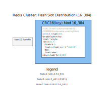
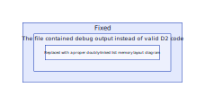
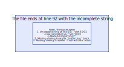

# 🎯 Project Charter: Build Your Own Redis

## What You Are Building
An in-memory key-value store implementing the Redis protocol (RESP), single-threaded event loop architecture, multiple data structures (strings, lists, sets, hashes), dual persistence via RDB snapshots and AOF logging, pub/sub messaging, transactions with MULTI/EXEC and WATCH-based optimistic locking, and hash slot sharding for horizontal scaling across a cluster. By the end, your implementation will be compatible with redis-cli and handle concurrent client connections in a single thread without locks.

## Why This Project Exists
Building Redis teaches fundamental systems programming—event-driven I/O multiplexing, binary protocol design, memory management, and persistence mechanisms—that are essential for backend infrastructure and database engineering roles. Every developer uses OS abstractions daily but treats them as black boxes. This project exposes the assumptions baked into every program you've ever written, making you a better engineer by understanding what happens beneath the abstractions.

## What You Will Be Able to Do When Done
- Boot a TCP server that accepts connections and parses RESP protocol from the wire
- Implement a single-threaded event loop using epoll (Linux) or kqueue (macOS/BSD) multiplexing thousands of concurrent client connections without threads
- Build an in-memory hash table with O(1) GET/SET/DEL operations supporting binary-safe keys and values
- Implement key expiration with both lazy (on-access) and active (background sampling) deletion strategies
- Create compound data structures: doubly-linked lists (O(1) LPUSH/RPUSH/LPOP/RPOP), hash sets (O(1) SADD/SISMEMBER), and nested hash tables (O(1) HSET/HGET)
- Serialize the database to a custom binary RDB format and fork background processes for non-blocking BGSAVE using copy-on-write memory semantics
- Implement append-only file logging with configurable fsync policies (always/everysec/no) and log compaction via BGREWRITEAOF
- Build a publish/subscribe system with channel subscriptions, glob pattern matching (PSUBSCRIBE), and proper subscribed-client mode enforcement
- Execute transactions with command queuing (MULTI/EXEC) and optimistic locking (WATCH) detecting concurrent modifications

## Final Deliverable
A fully functional Redis-compatible in-memory database implemented in C, Rust, or Go (~6,000-8,000 lines across 15-20 source files). The server listens on port 6379, passes redis-cli compatibility tests, handles 100+ concurrent clients at 10,000+ operations per second, persists data to disk via both RDB snapshots and AOF logging, and supports pub/sub, transactions, and cluster sharding. You can demo it by connecting with redis-cli and running commands like SET/GET/LPUSH/SUBSCRIBE/MULTI.

## Is This Project For You?

**You should start this if you:**
- Understand TCP/IP networking basics (sockets, connections, ports)
- Are comfortable with hash tables and core data structures (arrays, linked lists)
- Have experience with file I/O and system calls (open, read, write, close)
- Understand process management including fork() and copy-on-write semantics
- Can read and write code in C, Rust, or Go

**Come back after you've learned:**
- Pointers and memory management in C (if using C)—the project requires explicit memory handling
- Concurrency fundamentals—understanding why single-threaded event loops avoid locking complexity

## Estimated Effort

| Phase | Time |
|-------|------|
| TCP Server & RESP Protocol | ~6 hours |
| Single-Threaded Event Loop | ~8 hours |
| Core Commands (GET/SET/DEL) | ~4 hours |
| Key Expiration (TTL) | ~4 hours |
| Data Structures (List, Set, Hash) | ~6 hours |
| RDB Snapshot Persistence | ~7 hours |
| AOF Persistence | ~7 hours |
| Pub/Sub | ~5 hours |
| Transactions (MULTI/EXEC) | ~5 hours |
| Cluster Mode (Hash Slot Sharding) | ~13 hours |
| **Total** | **~65 hours** |

## Definition of Done
The project is complete when:
- TCP server listens on port 6379 and accepts multiple client connections simultaneously
- RESP parser correctly decodes all five RESP types and handles partial reads with buffering
- Event loop uses epoll/kqueue to multiplex I/O across all connected clients in a single thread with no threads for client handling
- Server handles at least 100 concurrent clients and achieves 10,000+ PING/PONG operations per second with 10 concurrent clients
- SET supports NX (set if not exists), XX (set if exists), EX (seconds), and PX (milliseconds) options
- GET returns null bulk string for non-existent keys; lazy expiration removes expired keys on access
- EXPIRE/TTL/PERSIST commands work correctly; active expiration samples keys periodically
- List operations (LPUSH/RPUSH/LPOP/RPOP/LRANGE) use O(1) doubly-linked list implementation
- SET and HASH operations enforce type checking returning WRONGTYPE error for mismatched types
- SAVE blocks the event loop; BGSAVE forks a child using copy-on-write without blocking the parent
- RDB file is written to temp file and atomically renamed; loading restores all keys with correct types
- AOF appends every write in RESP format; fsync policy works (always/everysec/no); BGREWRITEAOF rewrites compactly
- SUBSCRIBE/PSUBSCRIBE/PUBLISH work for channel and pattern-based messaging
- Client disconnection cleans up all subscriptions without memory leaks
- MULTI queues commands; EXEC executes all queued commands; WATCH detects concurrent modifications
- MOVED/ASK redirects work for key routing across cluster nodes; CRC16 key-to-slot mapping is deterministic

---

# 📚 Before You Read This: Prerequisites & Further Reading

> **Read these first.** The Atlas assumes you are familiar with the foundations below.
> Resources are ordered by when you should encounter them — some before you start, some at specific milestones.

---

## Topic 1: TCP/IP Networking & Socket Programming

The Redis clone begins withTCP sockets and the RESP wire protocol. Understanding stream protocols vs. message protocols is foundational.

| Resource | Why | When to Read |
|----------|-----|-------------|
| **Paper**: "UNIX Network Programming" by W. Richard Stevens (Vol. 1, Chapter 3-5) — The definitive text on socket APIs, TCP state machines, and I/O models | Steven's book is the gold standard for network programming; everything in Milestone 1 builds on his socket patterns | BEFORE starting M1 — required foundation |
| **Spec**: [RFC 793](https://datatracker.ietf.org/doc/html/rfc793) — TCP specification | The source of truth for TCP's stream semantics and why buffering is mandatory | During M1 when understanding the "TCP is a stream, not a message" section |
| **Code**: [Redis source](https://github.com/redis/redis/blob/unstable/src/anet.c) — anet.c for socket handling | How Redis actually implements sockets in production | After building your TCP server for comparison |
| **Best Explanation**: "The Hidden States of TCP" by Julia Evans ([section on TIME_WAIT](https://blog.juliafields.com/tcp-time-wait-and-so_reuseaddr.html)) | Explains TIME_WAIT state, SO_REUSEADDR — critical for server restarts | When you hit "Address already in use" errors |

---

## Topic 2: Event-Driven I/O & Multiplexing

The single-threaded event loop (Milestone 2) is the architectural foundation that makes Redis fast.

| Resource | Why | When to Read |
|----------|-----|-------------|
| **Paper**: "The Design and Implementation of the FreeBSD Operating System" (Chapter 8) — kqueue paper by McKusick | Original academic paper describing kqueue, the BSD equivalent to epoll | During M2 if you want depth on the design |
| **Spec**: [epoll(7)](https://man7.org/linux/man-pages/man7/epoll.7.html) Linux man page | The definitive Linux epoll documentation | When implementing the event loop |
| **Code**: [nginx source](https://nginx.org/en/docs/events.html) — nginx event module | Production event loop implementation parallel to Redis | After your event loop works for comparison |
| **Best Explanation**: "The Secret to 10K Connections" by Felix Geist ([link](https://blog.web.archive.org/web/2020/https://hynek.me/til/the-secret-to-10k-connections/)) | The phrase "it's the event loop, not the threads" is from this era of servers | When understanding why single-threaded beats multithreaded |

---

## Topic 3: Binary-Safe Strings & Hash Tables

The string handling and hash table (Milestone 3) are where most "Redis clones" quietly fail.

| Resource | Why | When to Read |
|----------|-----|-------------|
| **Paper**: "Algorithmic Analysis of Static Dictionaries" by Gonnet & Baeza-Yates — Chapter on hash table performance | Mathematical analysis of open addressing vs. chaining | During M3 for collision resolution decisions |
| **Spec**: Redis SDS specification in [redis.io documentation](https://redis.io/docs/data-types/strings/) | Official SDS (Simple Dynamic String) format | When implementing the string type |
| **Code**: Redis [dict.c](https://github.com/redis/redis/blob/unstable/src/dict.c) — hash table implementation | Production hash table with rehashing | As implementation reference for M3 |
| **Best Explanation**: "Hash Tables" by CP-Algorithms ([link](https://cp-algorithms.com/hashing/hash_table.html)) | Clear explanation of open addressing tradeoffs | When choosing collision strategy |

---

## Topic 4: Data Structures (Lists, Sets, Hashes)

Understanding when to use which structure (Milestone 5) is fundamental to systems programming.

| Resource | Why | When to Read |
|----------|-----|-------------|
| **Paper**: "The Art of Computer Programming Vol. 1" by Donald Knuth — Sections 2.2.1-2.2.3 | Original source on linked lists, arrays, and tradeoffs | During M5 if you want deep theory |
| **Spec**: Redis [Data Types documentation](https://redis.io/docs/data-types/) | Official specifications for List, Set, Hash types | When implementing each type |
| **Code**: [Redis t_list.c](https://github.com/redis/redis/blob/unstable/src/t_list.c) — linked list implementation | Production list implementation with quicklist optimization | As implementation reference |
| **Best Explanation**: "Data Structures for Interviews" by Joel Sutherland ([link](https://www.interviewcake.com/concept/cheatsheet?)) | Quick reference on when to use each structure | Before starting M5 |

---

## Topic 5: Persistence (RDB & AOF)

The persistence layer (Milestones 6-7) teaches atomic file operations and durability tradeoffs.

| Resource | Why | When to Read |
|----------|-----|-------------|
| **Paper**: "Operating Systems: Three Easy Pieces" by Remzi Arpaci-Dusseau — Chapters on file systems and crash recovery | Free online book, chapters 38-42 cover durability and journaling | During M6-M7 |
| **Spec**: Redis [Persistence documentation](https://redis.io/docs/management/persistence/) | Official RDB and AOF format descriptions | When implementing persistence |
| **Code**: [Redis rdb.c](https://github.com/redis/redis/blob/unstable/src/rdb.c) | RDB format implementation | When building RDB serialization |
| **Best Explanation**: "fsync() and durability" by postgresql wiki ([link](https://wiki.postgresql.org/wiki/Don%27t_do_this)) | Explains why fsync matters, common mistakes | When choosing fsync policy |

---

## Topic 6: Pub/Sub Messaging

Pub/Sub (Milestone 8) demonstrates pattern-based messaging with connection state modes.

| Resource | Why | When to Read |
|----------|-----|-------------|
| **Paper**: "The Observer Pattern" in "Design Patterns" by Gamma et al. | Original Gang of Four publication on observer pattern | Before M8 for conceptual foundation |
| **Spec**: Redis [Pub/Sub commands](https://redis.io/docs/interact/pubsub/) | PUBSUB command specifications | When implementing pub/sub |
| **Code**: [Redis pubsub.c](https://github.com/redis/redis/blob/unstable/src/pubsub.c) | Production pub/sub implementation | As implementation reference |
| **Best Explanation**: "Glob Patterns" by Pythex ([link](https://pythex.org/)) | Interactive glob pattern tester | When implementing PSUBSCRIBE pattern matching |

---

## Topic 7: Transactions (MULTI/EXEC)

Transactions (Milestone 9) clarify why single-threaded execution provides natural atomicity.

| Resource | Why | When to Read |
|----------|-----|-------------|
| **Paper**: "ACID vs. BASE: The pH Transition" by Eric Brewer — Original CAP theorem paper | Explains why Redis transactions are different from database ACID | Before M9 |
| **Spec**: Redis [Transactions documentation](https://redis.io/docs/interact/transactions/) | Official MULTI/EXEC specifications | When implementing transactions |
| **Code**: [Redis multi.c](https://github.com/redis/redis/blob/unstable/src/multi.c) | Transaction implementation in Redis | As implementation reference |
| **Best Explanation**: "Optimistic Locking in Redis" by Redis University ([video](https://university.redis.io/courses/dr301/lessons/optimistic-locking-and-the-watch-command/)) | Video explanation of WATCH, timestamps ~15:00 | When implementing WATCH |

---

## Topic 8: Cluster Sharding

Cluster mode (Milestone 10) implements horizontal scaling with deterministic routing.

| Resource | Why | When to Read |
|----------|-----|-------------|
| **Paper**: "Consistent Hashing and Random Trees" by Karger et al. — Original consistent hashing paper | Academic foundation for sharding concepts | Before M10 if you want depth |
| **Spec**: Redis [Cluster documentation](https://redis.io/docs/management/scaling/) | Official cluster specifications | When implementing cluster |
| **Code**: [Redis cluster.c](https://github.com/redis/redis/blob/unstable/src/cluster.c) | Cluster implementation | As implementation reference |
| **Best Explanation**: "Hash Slot Sharding Explained" by Redis ([link](https://redis.io/docs/management/scaling/#redis-cluster-data-sharding)) | Clear explanation of CRC16 slot calculation | When implementing key-to-slot mapping |

---

## Topic 9: Systems Programming Foundations

Broader topics that underpin the entire project.

| Resource | Why | When to Read |
|----------|-----|-------------|
| **Paper**: "Computer Systems: A Programmer's Perspective" by Bryant & O'Hallaron — Chapters 1-8 | The definitive systems programming textbook | BEFORE starting — foundational |
| **Spec**: [C99 Standard](https://www.open-std.org/jtc1/sc22/wg14/www/docs/n1256.pdf) | C language specification | When you encounter C-specific behavior |
| **Code**: [Redis GitHub](https://github.com/redis/redis) — Official Redis source | The project you're cloning | Throughout — reference implementation |
| **Best Explanation**: "Linux Programming by Example" by Kurt Wall ([Chapter 11](https://www.oreilly.com/library/view/linux-programming-by/0131423999/)) | Practical C programming for Linux | When writing C code |

---

This bibliography should take you through the Build Your Own Redis project with the best external resources at each milestone. The order follows the pedagogical progression — tackle systems fundamentals first, then milestone-specific deep dives.

---

# Build Your Own Redis

An in-memory key-value store implementing the Redis protocol (RESP), single-threaded event loop architecture, multiple data structures, dual persistence (RDB snapshots and AOF logging), pub/sub messaging, transactions, and cluster sharding. This project teaches fundamental systems programming: event-driven I/O multiplexing, binary protocol design, memory management, and persistence mechanisms essential for backend infrastructure and database engineering.


<!-- MS_ID: build-redis-m1 -->
## Build Your Own Redis — Milestone 1: TCP Server & RESP Protocol


---

# TCP Server & RESP Protocol

Every server that has ever existed starts with the same two questions: *How do I accept connections?* and *How do I understand what clients send me?* Before Redis can store a single key, before it can expire a value, before it can publish a message—it needs a TCP socket listening for connections and a parser that can read bytes off the wire and turn them into commands.

This is Milestone 1. It is deliberately narrow: a listening socket, a client-connection loop, a RESP protocol parser and serializer, and two commands (PING and ECHO). By the end, you will have a working server that `redis-cli` can talk to. But the real value is what you learn building it: why TCP is a stream protocol, why buffering is mandatory for binary-safe protocols, why file descriptors must be managed carefully, and why the RESP wire format was designed the way it was.

You are not just building a TCP server. You are building the foundation that every subsequent milestone depends on.

---

## The Tension: TCP Is a Stream, Not a Message Protocol

Here is the misconception that trips up nearly every developer who builds a network protocol for the first time: **TCP does not deliver messages**. It delivers a stream of bytes. The operating system's TCP stack will chunk those bytes however it wants to—however the kernel's congestion control, Nagle's algorithm, and the socket buffer state happen to line up.

A client sends:

```
*PING\r\n
```

You might receive it in your `recv()` call as four separate reads:

```
"*", "PIN", "G\r", "\n"
```

Or you might receive it concatenated with the next command:

```
"*PING\r\n*ECHO\r\n
```

This is not a pathological case. It is the default case under real network conditions with latency, buffering, and concurrent clients.

**The tension**: You need to parse complete protocol frames (commands) from an incomplete byte stream. The naive approach—read until you see a newline, then process—breaks immediately on bulk strings (which contain `\r\n` as data), on partial messages, and under load.

The solution: a **state machine** that reads into a per-client buffer and extracts complete frames before attempting to parse them.


This is the first architectural decision of your Redis. Every byte handling pattern flows from this decision. Let it guide everything that follows.

---

## System Map: Where We Are


In the overall architecture of your Redis clone, this milestone sits at the very bottom of the stack. You are building:

- **The network transport layer**: TCP sockets, non-blocking I/O (which you configure now but activate fully in Milestone 2), and client connection lifecycle management
- **The protocol layer**: RESP wire format parsing and serialization
- **The command layer**: PING and ECHO command handlers

All subsequent milestones—event loop, key-value storage, expiration, data structures, persistence, pub/sub, transactions, cluster—build on top of these components. If the RESP parser produces garbage bytes, every command downstream fails. If the socket leaks a file descriptor on every disconnect, the server dies under load. This foundation must be solid.

---

## TCP Socket Lifecycle

A TCP socket moves through a well-defined lifecycle. Understanding each phase is essential—mistakes
<!-- END_MS -->


<!-- MS_ID: build-redis-m2 -->
# Single-Threaded Event Loop


---

## The Reckoning: Why Threads Are the Wrong Answer

You built a working server in Milestone 1. Every client connection spawned a new thread (or process), and that thread sat in a `recv()` call waiting for data. Under light load, this works beautifully. Ten clients, twenty clients—your server hums along, and each thread gets its own blocking I/O without interfering with others.

Now scale up. One thousand clients connect. Nine hundred and ninety of them are idle, sending maybe one command per minute. But each idle connection has a thread sitting in kernel space, consuming roughly 8KB of stack memory, eating into your CPU's cache, and forcing the kernel to constantly switch between threads that have nothing to do.

The numbers are brutal: context switching between threads costs 1-10 microseconds on modern hardware. That sounds small until you do it ten thousand times per second. And that's before you account for the memory: 1,000 threads × 8KB stacks = 8MB of just stack memory, plus the kernel's thread control blocks, plus the scheduler overhead tracking thousands of "runnable" threads that are mostly sleeping.

**Here's the tension**: You need to serve thousands of clients simultaneously, but threads are a terrible way to do it. The alternative—invented in the 1980s, perfected in the 1990s, and still the architectural heart of nginx, Redis, Node.js, and every high-performance server at scale—is **event-driven I/O**.

Instead of one thread per client, you have **one thread handling every client at once**. The thread sits in a system call (like `epoll_wait()` or `kevent()`) that returns when any client is ready to do something—send data, receive data, or disconnect. It then services the ready clients, one by one, in rapid succession. The thread never blocks waiting for a specific client. It multiplexes across all of them.

This is the **event loop pattern**, and it is the architectural foundation that makes Redis's single-threaded performance possible. Every subsequent milestone builds on this. If you understand why this pattern works at scale, you understand why Redis is fast. If you don't, everything that follows will feel like magic.

---

## System Map: Where We Are


In the overall architecture, this milestone moves you from **Level 1 (Transport/Protocol)** into **Level 2 (Event Loop & Core Engine)**. You are replacing the blocking, thread-per-client model from Milestone 1 with an event-driven architecture:

- **Network transport**: Now uses non-blocking sockets
- **I/O multiplexing**: epoll/kqueue replaces thread blocking
- **Client management**: Per-client state tracked in a central event loop
- **Command dispatch**: Driven by I/O readiness, not thread scheduling

All subsequent milestones—key-value storage, expiration, data structures, persistence, pub/sub—execute within this event loop. The single thread becomes the execution context for everything Redis does. This is why Redis is single-threaded: not because it can't use threads, but because a well-designed event loop with no locks or context switching overhead outperforms a multithreaded design for the in-memory working set that Redis serves.

---

## The Revelation: It's Not the Blocking, It's the Coordination

There's a misconception worth shattering before we go further: **the event loop isn't faster because it avoids blocking**. It's faster because it avoids coordination.

A multithreaded server has a shared data structure—your key-value store. Every thread that accesses it needs protection: a mutex, a read-write lock, or some form of synchronization. These atomic operations prevent data races, but they also serialize access. Thread A holds the lock while doing INCR on key "counter." Thread B wants to do GET on key "counter" and waits. Thread C wants to do SET on key "user:1:name" and waits. The more threads you add, the more they wait.

With a single-threaded event loop, there is **no lock needed**. Only one thing executes at a time—no possibility of concurrent access to your data structures. The "lock" is the event loop itself: it processes one command completely before moving to the next. Every operation is atomic by virtue of the single execution context.

This is the real revelation: **Redis is single-threaded because it's lock-free, not because it's single-threaded**. The event loop eliminates the coordination overhead that plagues every multithreaded database. Your data structures remain simple and fast because they never need to be thread-safe.

---

## Event Loop Architecture


The event loop is a controlled infinite loop that drives your entire server. It follows a predictable pattern:

1. **Wait** for I/O events (clients becoming readable/writable) and time events (timers firing)
2. **Process** those events: read from ready clients, write to ready clients, execute expired timers
3. **Repeat** forever

In C, the structure looks like this:

```c
typedef struct {
    int epoll_fd;                  // epoll instance (Linux) or kqueue fd (BSD/macOS)
    int timewheel_fd;              // timerfd for time events (Linux) or timeout calculation (BSD)
    Client** clients;             // Array of client pointers, indexed by fd
    size_t client_capacity;      // Current capacity of clients array
    size_t num_clients;          // Current number of connected clients
    uint64_t current_time;       // Current timestamp (milliseconds)
    bool running;                // Server shutdown flag
    List* expired_keys;           // Keys expired between cycles (for active expiration)
} EventLoop;
```

The key insight: **every I/O operation in this loop must be non-blocking**. If you call `recv()` and it blocks, the entire server freezes. If you call `write()` and it blocks, every client waits. We'll make all sockets non-blocking shortly.

The loop itself, simplified:

```c
void event_loop_run(EventLoop* loop) {
    loop->running = true;
    
    while (loop->running) {
        // Step 1: Calculate timeout for next time event
        int timeout_ms = calculate_next_timeout(loop);
        
        // Step 2: Wait for I/O and/or time events
        int num_ready = epoll_wait(loop->epoll_fd, 
                                   loop->ready_events, 
                                   MAX_EVENTS, 
                                   timeout_ms);
        
        if (
<!-- END_MS -->


<!-- MS_ID: build-redis-m3 -->
# Core Commands (GET/SET/DEL)


## The Revelation: Hash Tables Are Not Simple

Here is the misconception that trips up developers who think they've built a key-value store after implementing `INSERT` and `SELECT` in some map: *A hash table is just a library call. GET and SET are trivial operations—store the string, retrieve the string.*

This is wrong. A hash table is not a black box. It is a carefully tuned data structure where **collision handling strategy determines whether your O(1) lookup stays O(1) under load**. Your hash function determines whether all(keys) cluster into the same 50 buckets, doubling your lookup time. Your load factor determines whether you're burning memory or suffering rehashing pauses. Your resize strategy determines whether a latency spike at 10 million keys destroys your P99.

And the string handling? This is where most "Redis clones" quietly fail. **Redis keys and values are binary-safe**—they can contain null bytes, newlines, emoji, UTF-8 multibyte sequences, or raw binary protocol buffers. If you use `strlen()` to determine string length, you truncate at the first `\0`. If you use `strcmp()` for key comparison, you compare wrong lengths.

The "trivial" commands GET and SET are the foundation. Get them wrong, and every subsequent milestone—expiration, data structures, persistence, transactions—suffers hidden corruption. Get them right, and you understand why hash tables and binary-safe strings are foundational systems knowledge, applicable from language runtimes to databases to caches.

This is Milestone 3. By the end, you will have a working in-memory key-value store with proper hash table implementation, binary-safe handling, and command dispatch that scales.

---

## The Tension: Speed vs. Correctness vs. Memory

Before writing code, you must make three architectural decisions that will haunt you (or reward you) for the rest of this project:

**Collision Handling**: Open addressing (linear probing, quadratic probing, double hashing) vs. separate chaining. Open addressing uses less memory per element but degrades badly when the load factor exceeds 0.7. Chaining uses more overhead per element but handles high load factors gracefully. Redis uses a customized version of *dict* with rehashing and incremental growth—but for learning, the choice matters now.

**Binary Safety**: Are keys and values C strings (null-terminated) or length-prefixed byte arrays? Null-terminated strings work until someone stores `"\x01\x00\x02"`—strlen() sees length 1, not 3. Length-prefixed strings require explicit length tracking everywhere, but they're correct.

**Type System**: Does every key have a type tag? Redis keys do. A key that holds a string cannot later hold a list without explicit DEL or RENAME. This prevents silent data corruption but adds complexity to your hash table entry.

The tension is real: naive implementations are simple but wrong under edge cases. Correct implementations add overhead. The question is: *What are you optimizing for?*


---

## System Map: Where We Are

In the overall architecture of your Redis clone, this milestone occupies **Level 2 (Core Engine)** within the event loop framework you built in Milestone 2:

- **Level 1 (Transport)**: TCP sockets, client connections (Milestone 1)
- **Level 2 (Event Loop)**: epoll/kqueue multiplexing (Milestone 2)
- **Level 3 (Core Engine)**: Hash table, command dispatch ← *you are here*
- **Level 4 (Data Types)**: Lists, sets, hashes (Milestone 5)
- **Level 5 (Persistence)**: RDB, AOF (Milestones 6-7)
- **Level 6 (Advanced)**: Pub/sub, transactions, cluster (Milestones 8-10)

Every command you implement in this milestone executes within the event loop context. The single-threaded execution guarantees atomic operations—no locks needed, because the event loop is the synchronizer. This is why Redis can be fast: **no coordination overhead**.

You are connecting the transport layer (client bytes arriving) to the storage layer (key-value pairs in memory). The command dispatch handles the routing. The hash table provides the storage. All three pieces are essential.

---

## Hash Table Implementation

Your hash table needs to support:

- **Insert**: Store a key-value pair, overwrite existing value
- **Lookup**: Retrieve value by key, return NOTFOUND if missing
- **Delete**: Remove key-value pair, return count
- **Resize**: Grow or shrink based on load factor
- **Type tracking**: Each key has a type (string, list, set, hash, zset)

Here is the core structure in C:

```c
typedef enum {
    OBJ_TYPE_STRING = 1,
    OBJ_TYPE_LIST = 2,
    OBJ_TYPE_SET = 3,
    OBJ_TYPE_HASH = 4,
    OBJ_TYPE_ZSET = 5,
    OBJ_TYPE_NONE = 0
} ObjectType;

typedef struct RedisObject {
    ObjectType type;
    uint32_t refcount;
    union {
        sds string;       // For string type
        list* list;        // For list type
        robj_set* set;    // For set type
        robj_hash* hash;  // For hash type
        robj_zset* zset;  // For zset type
    } data;
    int64_t expire_at;   // Unix timestamp in milliseconds, -1 if no expiry
} RedisObject;

typedef struct HashEntry {
    sds key;             // Key as SDS (simple dynamic string)
    RedisObject* value;  // Value as Redis object
    uint64_t hash;       // Cached hash value for fast comparison
    bool in_use;        // Entry slot occupied
} HashEntry;

typedef struct Dict {
    HashEntry* table;    // Array of hash entries
    size_t capacity;     // Number of slots (power of 2)
    size_t size;         // Number of active entries
    size_t used;         // Number of non-null entries (for load factor)
    uint64_t hash_seed;  // SipHash seed for security
    bool rehashing;      // Currently resizing
    int ht_index;        // Which table is active (0 or 1 during rehash)
} Dict;
```

Why SDS? **SDS (Simple Dynamic String)** is Redis's binary-safe string type. Unlike C strings that use null-termination, SDS stores the length explicitly:

```c
typedef struct sds {
    // SDS header stores length separately from data
    // This allows embedded null bytes
    uint32_t len;        // Length of string in bytes
    uint32_t alloc;      // Allocated buffer size
    char[] buf;         // Flexible array of bytes (not null-terminated!)
} sds;
```

This is critical: `sds` lets you store and retrieve `"\x89PNG\r\n\x1a\n"` (raw PNG bytes) correctly. Using `strlen()` would see `\x89` and stop. Using SDS stores 8 bytes and retrieves exactly 8 bytes.


---

## Command Dispatch Architecture

Every command in Redis follows the same pattern: **parse → validate → dispatch → execute → respond**. You implement this with a function pointer table for O(1) lookup:


```c
typedef struct RedisCommand {
    const char* name;
    int arity;              // Number of arguments (-N means at least N)
    void (*handler)(Client* c, RedisServer* server, int argc, sds* argv);
    int flags;              // Command flags (write, read, stale, etc.)
    int first_key;          // Position of first key in arguments (-1 if none)
    int last_key;           // Position of last key (-1 means same as first)
    int key_step;          // Step between keys (1 for GET/SET, 2 for MSET)
} RedisCommand;

static RedisCommand commands[] = {
    {"get",     2, command_get,     CMD_READ,  1, 1, 0},
    {"set",    -3, command_set,     CMD_WRITE, 1, 1, 0},
    {"del",    -2, command_del,     CMD_WRITE, 1, -1, 1},
    {"incr",    2, command_incr,    CMD_WRITE, 1, 1, 0},
    {"decr",    2, command_decr,    CMD_WRITE, 1, 1, 0},
    {"mset",   -3, command_mset,    CMD_WRITE, 1, -1, 2},
    {"mget",   -2, command_mget,    CMD_READ,  1, -1, 1},
    {"ping",    1, command_ping,    CMD_READ,  0, 0, 0},
    {"echo",    2, command_echo,    CMD_READ,  0, 0, 0},
    // ... more commands
};
```

The dispatcher finds commands in O(1) time using perfect hashing (the string is already the key). For a server handling 100,000 commands per second, iterating through a list would consume 10% of your CPU just routing. Function pointers solve this.

---

## GET Command

The simplest command, but with edge cases:

```c
void command_get(Client* c, RedisServer* server, int argc, sds* argv) {
    if (argc != 2) {
        add_reply_error(c, "wrong number of arguments for 'get' command");
        return;
    }
    
    sds key = argv[1];
    
    RedisObject* obj = dict_fetch(server->db->dict, key);
    
    // Lazy expiration: check if key exists and is expired
    if (obj && obj->expire_at != -1 && obj->expire_at
<!-- END_MS -->


<!-- MS_ID: build-redis-m4 -->
# Key Expiration (TTL)


---

## The Illusion of Simplicity: Why TTL Seems Easy But Isn't

Here's the mental model that trips up developers who think expiration is trivial: *Every key has a timestamp. When you access a key, check if the timestamp is in the past. If it is, delete the key. Run a timer every minute to clean up keys that nobody accessed. Simple.*

This model works in a toy project. It fails in production.

Consider what 실제로 happens in a real Redis workload: You have 10 million keys. Of those, 2 million are expired but sit untouched for days. Your lazy check (checking on every GET) never touches them. Your periodic cleanup runs every minute, but it scans all 10 million keys—if it's O(n), that's 10 million comparisons per minute, and your event loop blocks for seconds each time. Your server latency spikes. Clients disconnect. You just built a DoS attack against yourself.

The misconception isn't that TTL is impossible. It's that **a naive timer cleanup is worse than no cleanup at all** because it adds predictable latency spikes while pretending to solve the problem.

The real solution—the one Redis uses—is a **probabilistic, time-bounded active expiration** that samples a small fraction of keys each cycle, deletes expired ones it finds, and stops early if the sample shows most keys are still valid (meaning either no keys expired yet, or the expired ones were already cleaned up by lazy expiration). Combined with lazy expiration on access, this keeps your memory bounded without blocking your event loop.

This is Milestone 4. By the end, you will have a key expiration system where expired keys are deleted on access (lazy) AND periodically cleaned up in the background (active), using absolute timestamps to survive clock adjustments, all running within your single-threaded event loop without blocking client operations.

---

## The Tension: Memory Leak vs. Event Loop Blocking

This is the fundamental tension of key expiration:

**Without active expiration**: Expired keys that are never accessed stay in memory forever. Over time, your key-value store bloats with dead data. Your hash table grows slow. Your memory usage grows unbounded. Under load, you're storing millions of keys that serve no purpose, and clients are paying for memory they don't use.

**With naive active expiration**: You scan all keys every cycle. At 10 million keys, this takes seconds—seconds where your event loop can't process client commands. Every client experiences latency spikes. Your P99 latency destroys your SLA. The more keys you have, the worse it gets.

**The solution**: You need an expiration strategy that is both **incremental** (doesn't scan everything) and **adaptive** (does more work when there's more to do). Redis achieves this by sampling 20 keys per cycle and repeating immediately if more than 25% of the sample is expired—a feedback loop that does O(1) work per cycle but cleans up aggressively when there's actual cleanup needed.

This is the pattern you'll implement today.

---

## System Map: Where We Are


In the overall architecture of your Redis clone, this milestone builds on **Milestone 3 (Core Commands)** and adds time-based capabilities:

- **Level 1 (Transport)**: TCP sockets, client connections (Milestone 1)
- **Level 2 (Event Loop)**: epoll/kqueue multiplexing (Milestone 2)
- **Level 3 (Core Engine)**: Hash table, command dispatch (Milestone 3)
- **Level 4 (Expiration)**: Time-based key eviction ← *you are here*
- **Level 5 (Data Types)**: Lists, sets, hashes (Milestone 5)
- **Level 6 (Persistence)**: RDB, AOF (Milestones 6-7)
- **Level 7 (Advanced)**: Pub/sub, transactions, cluster (Milestones 8-10)

The expiration system sits between your command layer (handling GET/SET) and your event loop (providing time events). Every GET and SET already goes through your command dispatch. Now you'll add expiration checks to those operations, and your event loop will provide callbacks for background cleanup.

The key insight: Your expiration data lives in the same RedisObject structure you defined in Milestone 3. You don't need a separate expiration store—you need to check a timestamp field on every access.

---

## Lazy Expiration: Delete on Access


Lazy expiration is the simplest form: when a client tries to access a key, check if it's expired before returning the value. If expired, delete it and return null (for strings) or a type error (for other types).

This approach has a critical property: **it's free**. You already fetch the key from the hash table in your GET command handler. Checking a timestamp takes a single comparison. No additional data structures. No background threads. No complexity.

But lazy expiration has a fatal flaw: **keys that are never accessed never expire**. Consider a session store with 1-hour TTL on user sessions. Users close their laptops. Their sessions sit in memory for 1 hour, then 1 day, then 1 week. Millions of dead keys consuming memory. This is the memory leak that destroys production Redis instances over time.

Your implementation strategy: The expiration timestamp lives in your RedisObject:

```c
typedef struct RedisObject {
    ObjectType type;
    uint32_t refcount;
    union {
        sds string;
        list* list;
        robj_set* set;
        robj_hash* hash;
        robj_zset* zset;
    } data;
    int64_t expire_at;     // Unix timestamp in milliseconds, -1 if no expiry
} RedisObject;
```

When `expire_at != -1`, the key has a TTL. When `exp
<!-- END_MS -->


<!-- MS_ID: build-redis-m5 -->
# Data Structures (List, Set, Hash)


---

## The Illusion of Simplicity: Why Your First List Implementation Is Probably Wrong

Here's the mental model that trips up nearly every developer attempting this milestone: *A list is just a sequence of elements. I'll use a dynamic array (vector in C++, ArrayList in Java) and append to the end. LPUSH? Insert at index 0 and shift everything right. RPUSH? Just append. LPOP? Remove from index 0 and shift everything left. Easy.*

This model works perfectly in your test cases. It fails catastrophically in production.

Consider a simple workload: 100,000 elements pushed to a list using LPUSH. Your array implementation does this:
- Element 1: shift 0 elements, insert
- Element 2: shift 1 element, insert
- Element 3: shift 2 elements, insert
- ...
- Element 100,000: shift 99,999 elements, insert

You've just performed approximately **5 billion element moves** to build a list of 100,000 elements. At 10 nanoseconds per element move, that's 5 seconds of just shifting bytes around—not counting the memory allocations for the growing array, not counting the cache misses from scanning the entire buffer, not counting the time your event loop spends blocked while this happens.

The misconception isn't that arrays are wrong. It's that **the cost model is inverted**: appending to the end of an array is O(1), but prepending to the front is O(n). Your Redis clients will hammer LPUSH and RPUSH expecting both to be fast. They'll expect LPOP and RPOP from either end to be fast. Your array implementation gives them O(n) on every operation.

This is Milestone 5. By the end, you will have Redis's three core compound data types—lists, sets, and hashes—each implemented with the correct data structures that guarantee O(1) operations. You'll also understand why type tags per key are mandatory, and why attempting to LPUSH onto a string key must return an error without corrupting the existing data.

---

## The Tension: Wrong Tool, Wrong Complexity

Every compound data structure in Redis faces the same fundamental tension: **you need O(1) operations, but the obvious data structure gives you O(n)**.

| Operation | Array/Vector | Doubly-Linked List | Hash Set | Nested Hash Table |
|-----------|--------------|-------------------|----------|-------------------|
| List: LPUSH | O(n) | O(1) | N/A | N/A |
| List: LPOP | O(n) | O(1) | N/A | N/A |
| List: LRANGE | O(n) | O(n) | N/A | N/A |
| Set: SADD | O(1) | O(n) | O(1) | N/A |
| Set: SISMEMBER | O(n) | O(n) | O(1) | N/A |
| Hash: HSET | O(1) | O(n) | N/A | O(1) |
| Hash: HGET | O(1) | O(n) | N/A | O(1) |

The tension is that each data type requires a different underlying structure, and each structure has different performance characteristics. The wrong choice turns your "fast" Redis clone into a sluggish imitation that loses to a simple SQLite database.

This is why this milestone exists as a separate milestone from Milestone 3. The hash table you built for string keys is the foundation, but it's not sufficient for lists, sets, and hashes. Each requires careful design to maintain the performance guarantees that make Redis useful.

---

## System Map: Where We Are

In the overall architecture of your Redis clone, this milestone occupies **Level 4 (Data Types)**—the layer above your core key-value storage:

- **Level 1 (Transport)**: TCP sockets, client connections (Milestone 1)
- **Level 2 (Event Loop)**: epoll/kqueue multiplexing (Milestone 2)
- **Level 3 (Core Engine)**: Hash table for string keys, command dispatch (Milestones 3-4)
- **Level 4 (Data Types)**: Lists, sets, hashes ← *you are here*
- **Level 5 (Persistence)**: RDB, AOF (Milestones 6-7)
- **Level 6 (Advanced)**: Pub/sub, transactions, cluster (Milestones 8-10)

Every data type in this milestone builds directly on your hash table from Milestone 3. The key insight is that **the value in your hash table is now a pointer to a more complex structure** rather than directly containing the data. This indirection allows each key to have its own type (string, list, set, hash) while using a unified storage layer.


---

## List Implementation: The Doubly-Linked Solution

Your list needs to support four core operations, all at O(1):

- **LPUSH**: Add element to the head
- **RPUSH**: Add element to the tail
- **LPOP**: Remove and return element from head
- **RPUSH**: Remove and return element from tail

Additionally, you need LRANGE for range queries and LLEN for length. LRANGE inherently requires O(n) traversal since you're retrieving multiple elements, but it should be efficient when the range is small.

The solution is a **doubly-linked list** 
> **🔑 Foundation: A data structure where each element contains a pointer to the next element AND the previous element**
> 
> A linked-list is a linear data structure where each element (called a node) stores two things: the actual data you care about, and a pointer that tells you where the next node lives. In a doubly-linked list, each node points both forward to the next element and backward to the previous one. This creates a chain you can traverse by following these pointers from one node to the next.

In this project, you'll encounter linked-lists when working with the LRU cache eviction policy. The cache needs to track access order efficiently—moving recently-used items to the front and removing the least-recently-used item from the back. A doubly-linked list makes both operations O(1): you just update the pointers around the affected nodes without shifting any data.

**Mental model:** Think of a scavenger hunt where each clue tells you where to find the next clue. You don't know what's at the end until you follow the chain, but adding or removing a clue only requires updating the clues immediately before and after it.
. In C, this looks like:

```c
typedef struct ListNode {
    sds value;                    // The element value (SDS for binary safety)
    struct ListNode* prev;        // Previous node (NULL for head)
    struct ListNode* next;        // Next node (NULL for tail)
} ListNode;

typedef struct List {
    ListNode* head;               // First element (NULL if empty)
    ListNode* tail;               // Last element (NULL if empty)
    size_t len;                   // Number of elements
    void (*free)(sds);            // Destructor for values
    void* (*dup)(sds);           // Custom duplicator (optional)
} List;
```

The key insight is that **both head and tail pointers are stored**, allowing O(1) access to either end. When you LPUSH, you create a new node, point its `next` to the current head, point the current head's `prev` to the new node, and update head to the new node. All pointer updates are O(1).

When you LPOP, you take the current head, save its value, move head to head->next, free the old node, and if the new head exists, set its prev to NULL. O(1).

```c
list* listCreate(void) {
    list* l = zmalloc(sizeof(list));
    l->head = NULL;
    l->tail = NULL;
    l->len = 0;
    l->free = NULL;
    l->dup = NULL;
    return l;
}

list* listAddNodeHead(list* l, sds value) {
    ListNode* node = zmalloc(sizeof(ListNode));
    node->value = sdsdup(value);
    node->prev = NULL;
    node->next = l->head;
    
    if (l->len == 0) {
        l->head = l->tail = node;
    } else {
        l->head->prev = node;
        l->head = node;
    }
    l->len++;
    return l;
}

list* listAddNodeTail(list* l, sds value) {
    ListNode* node = zmalloc(sizeof(ListNode));
    node->value = sdsdup(value);
    node->next = NULL;
    node->prev = l->tail;
    
    if (l->len == 0) {
        l->head = l->tail = node;
    } else {
        l->tail->next = node;
        l->tail = node;
    }
    l->len++;
    return l;
}
```

LRANGE is the one operation that cannot be O(1)—you're returning potentially many elements. The implementation should traverse from either head or tail depending on whether the start index is closer to the beginning or end:

```c
typedef struct ListIter {
    ListNode* next;
    int direction;                // LIST_HEAD or LIST_TAIL
} ListIter;

sds* listGetRange(list* l, long start, long stop, size_t* rangelen) {
    // Handle negative indices: -1 = last element, -2 = second to last
    long len = (long)l->len;
    if (start < 0) start = len + start;
    if (stop < 0) stop = len + stop;
    
    // Clamp to valid range
    if (start < 0) start = 0;
    if (stop >= len) stop = len - 1;
    if (start > stop || start >= len) {
        *rangelen = 0;
        return NULL;
    }
    
    size_t range_len = stop - start + 1;
    sds* result = zmalloc(sizeof(sds) * range_len);
    
    // Optimize: start from closer end
    ListNode* node;
    if (start < len - start) {
        node = l->head;
        for (long i = 0; i < start; i++) {
            node = node->next;
        }
    } else {
        node = l->tail;
        for (long i = len - 1; i > start; i--) {
            node = node->prev;
        }
    }
    
    for (size_t i = 0; i < range_len; i++) {
        result[i] = sdsdup(node->value);
        node = node->next;
    }
    
    *rangelen = range_len;
    return result;
}
```

This optimization matters in practice: if you request LRANGE mylist -10 -1 (last 10 elements), traversing from the tail saves traversing 990,000 elements in a million-element list.

---

## Set Implementation: The Hash Set Solution


Your set needs to store unique elements with O(1) membership testing. The misconception that catches developers here is: *I'll just store elements in a list and check for duplicates by iterating*. This gives you O(n) for SADD (checking if element exists) and O(n) for SISMEMBER (looking up membership). At scale, this is unusable.

The correct solution is a **hash set** 
> **🔑 Foundation: A set data structure that uses a hash function to map elements to bucket indices**
> 
> A hash-set is a collection that stores unique elements with no particular order. Internally, it uses a hash function—a deterministic algorithm that converts any input (like a string or number) into a numerical index called a bucket. When you add an element, the hash function tells the set where to place it; when you check if an element exists, it hashes the target and checks that bucket directly, avoiding the need to scan through all elements.

In this project, hash-sets appear in the bloom filter implementation and in deduplication logic. The bloom filter uses multiple hash functions to map elements to positions in a bit array, allowing fast probabilistic checks for set membership. Deduplication relies on hash-set membership testing to filter out duplicate items in constant time.

**Mental model:** Imagine a filing cabinet with numbered drawers. Instead of searching through every drawer, you use a formula (the hash function) that tells you exactly which drawer a document belongs in. Most of the time you'll find what you need in one step—but occasionally multiple documents land in the same drawer (a "collision"), requiring a short secondary search.
, implemented as a hash table where the key is the element itself and the value is a sentinel (or you can reuse your dict structure with NULL values).

```c
typedef struct Set {
    dict* dict;                   // Hash table: key = element, value = NULL
} Set;

Set* setCreate(void) {
    Set* s = zmalloc(sizeof(Set));
    s->dict = dictCreate(&setDictType);
    return s;
}

int setAdd(Set* s, sds element) {
    // Check if element already exists
    if (dictFetchValue(s->dict, element) != NULL) {
        return 0;  // Already exists, not newly added
    }
    dictAdd(s->dict, element, NULL);
    return 1;  // Newly added
}

int setIsMember(Set* s, sds element) {
    return dictFetchValue(s->dict, element) != NULL;
}
```

The critical detail: **SADD returns the count of newly added elements, not the total set size**. This is important for implementing things like "add these 5 users to the online set, tell me how many were new." Your implementation must track whether the element existed before the add attempt.

```c
long long setAddCommand(Client* c, RedisServer* server, int argc, sds* argv) {
    if (argc < 3) {
        add_reply_error(c, "wrong number of arguments for 'sadd' command");
        return -1;
    }
    
    RedisObject* obj = dictFetchValue(server->db->dict, argv[1]);
    
    // Type checking: set can only contain other sets
    if (obj != NULL && obj->type != OBJ_TYPE_SET) {
        add_reply_error(c, "WRONGTYPE Operation against a key holding the wrong kind of value");
        return -1;
    }
    
    // Create set if it doesn't exist
    if (obj == NULL) {
        obj = createRedisObject(OBJ_TYPE_SET);
        obj->data.set = setCreate();
        dictAdd(server->db->dict, sdsdup(argv[1]), obj);
    }
    
    long long added = 0;
    for (int i = 2; i < argc; i++) {
        added += setAdd(obj->data.set, argv[i]);
    }
    
    // Track dirty key for persistence triggers
    server->dirty += added;
    
    return added;
}
```

SISMEMBER uses the same hash lookup:

```c
void command_sismember(Client* c, RedisServer* server, int argc, sds* argv) {
    if (argc != 3) {
        add_reply_error(c, "wrong number of arguments for 'sismember' command");
        return;
    }
    
    RedisObject* obj = dictFetchValue(server->db->dict, argv[1]);
    
    if (obj == NULL) {
        add_reply_integer(c, 0);
        return;
    }
    
    if (obj->type != OBJ_TYPE_SET) {
        add_reply_error(c, "WRONGTYPE Operation against a key holding the wrong kind of value");
        return;
    }
    
    int exists = setIsMember(obj->data.set, argv[2]);
    add_reply_integer(c, exists ? 1 : 0);
}
```

SMEMBERS returns all elements. This is inherently O(n)—you're returning n elements, so the traversal cost is unavoidable. The implementation iterates through the hash table and collects all keys:

```c
void command_smembers(Client* c, RedisServer* server, int argc, sds* argv) {
    if (argc != 2) {
        add_reply_error(c, "wrong number of arguments for 'smembers' command");
        return;
    }
    
    RedisObject* obj = dictFetchValue(server->db->dict, argv[1]);
    
    if (obj == NULL) {
        add_reply_array(c, 0);
        return;
    }
    
    if (obj->type != OBJ_TYPE_SET) {
        add_reply_error(c, "WRONGTYPE Operation against a key holding the wrong kind of value");
        return;
    }
    
    // Iterate through set and collect all members
    dictIterator* di = dictGetIterator(obj->data.set->dict);
    dictEntry* de;
    size_t count = dictSize(obj->data.set->dict);
    
    add_reply_array(c, count);
    
    while ((de = dictNext(di)) != NULL) {
        sds member = dictGetKey(de);
        add_reply_bulk_string(c, member);
    }
    dictReleaseIterator(di);
}
```

---

## Hash Implementation: The Nested Hash Table


Your hash type needs to store field-value pairs within a single key. For example, `HSET user:1 name "Alice" age "30"` stores two fields under the key "user:1". Each field is accessed individually with HGET, and HGETALL returns all fields and values.

The solution is a **nested hash table**: your main key-value store stores a pointer to a dict, and that inner dict maps field names to field values.

```c
typedef struct Hash {
    dict* dict;                   // Hash table: key = field, value = value
} Hash;

Hash* hashCreate(void) {
    Hash* h = zmalloc(sizeof(Hash));
    h->dict = dictCreate(&hashDictType);
    return h;
}
```

The field and value are both SDS strings, making them binary-safe:

```c
int hashSet(Hash* h, sds field, sds value) {
    // Overwrite existing or add new
    dictReplace(h->dict, field, value);
}

sds hashGet(Hash* h, sds field) {
    dictEntry* de = dictFind(h->dict, field);
    if (de == NULL) return NULL;
    return dictGetVal(de);
}
```

HGETALL returns an array that alternates between field and value:

```c
void command_hgetall(Client* c, RedisServer* server, int argc, sds* argv) {
    if (argc != 2) {
        add_reply_error(c, "wrong number of arguments for 'hgetall' command");
        return;
    }
    
    RedisObject* obj = dictFetchValue(server->db->dict, argv[1]);
    
    if (obj == NULL) {
        add_reply_array(c, 0);
        return;
    }
    
    if (obj->type != OBJ_TYPE_HASH) {
        add_reply_error(c, "WRONGTYPE Operation against a key holding the wrong kind of value");
        return;
    }
    
    size_t count = dictSize(obj->data.hash->dict) * 2;
    add_reply_array(c, count);
    
    dictIterator* di = dictGetIterator(obj->data.hash->dict);
    dictEntry* de;
    
    while ((de = dictNext(di)) != NULL) {
        sds field = dictGetKey(de);
        sds value = dictGetVal(de);
        add_reply_bulk_string(c, field);
        add_reply_bulk_string(c, value);
    }
    dictReleaseIterator(di);
}
```

The critical design decision: **the inner dict uses different hash function and comparison logic than the outer dict**. The outer dict (Milestone 3) hashes complete key names. The inner hash dict hashes field names. This separation is essential because it means you can have `SET mykey "value"` and `HSET mykey field "value"` as distinct keys—the outer dict doesn't know about the inner hash's fields.

---

## Type System: The Critical Safety Layer


Every key in your Redis clone has a type. When you created your RedisObject in Milestone 3, you included a `type` field:

```c
typedef struct RedisObject {
    ObjectType type;
    uint32_t refcount;
    union {
        sds string;
        list* list;
        Set* set;
        Hash* hash;
    } data;
    int64_t expire_at;
} RedisObject;
```

This type tag is **mandatory**. Without it, operations like LPUSH on a string key would either crash your server (segfault) or silently corrupt data (overwriting the string pointer with a list pointer). The type check is your first line of defense:

```c
RedisObject* getObjectByType(dict* d, sds key, ObjectType type) {
    RedisObject* obj = dictFetchValue(d, key);
    if (obj == NULL) return NULL;
    if (obj->type != type) return NULL;
    return obj;
}
```

The WRONGTYPE error message is standardized: `"WRONGTYPE Operation against a key holding the wrong kind of value"`. This message appears in Redis clients, and your implementation must match it exactly.

```c
void typeErrorReply(Client* c, ObjectType expected) {
    add_reply_error(c, "WRONGTYPE Operation against a key holding the wrong kind of value");
}
```

Every command handler that operates on a specific type must check the type first. Consider your LPUSH command:

```c
void command_lpush(Client* c, RedisServer* server, int argc, sds* argv) {
    if (argc < 3) {
        add_reply_error(c, "wrong number of arguments for 'lpush' command");
        return;
    }
    
    RedisObject* obj = dictFetchValue(server->db->dict, argv[1]);
    
    if (obj != NULL && obj->type != OBJ_TYPE_LIST) {
        typeErrorReply(c, OBJ_TYPE_LIST);
        return;
    }
    
    if (obj == NULL) {
        obj = createRedisObject(OBJ_TYPE_LIST);
        obj->data.list = listCreate();
        dictAdd(server->db->dict, sdsdup(argv[1]), obj);
    }
    
    for (int i = 2; i < argc; i++) {
        obj->data.list = listAddNodeHead(obj->data.list, argv[i]);
    }
    
    add_reply_integer(c, listLength(obj->data.list));
    server->dirty += (argc - 2);
}
```

The critical behavior: **if the key exists with a different type, return WRONGTYPE and do NOT modify the key**. The existing data remains intact.

---

## Negative Index Arithmetic: The LRANGE Edge Case

LRANGE supports negative indices where -1 means the last element, -2 means second-to-last, and so on. This seems simple, but there's a subtle bug that catches many implementations:

- LRANGE mylist 0 -1 returns all elements
- LRANGE mylist -3 -1 returns last 3 elements
- LRANGE mylist -1 -3 should return an empty range (start > stop)

The conversion from negative to positive indices requires careful handling:

```c
// Correct negative index conversion
long normalizeIndex(long index, long length) {
    if (index < 0) {
        index = length + index;  // -1 becomes length-1
    }
    return index;
}

// In LRANGE implementation:
long start = argv[2];
long stop = argv[3];
long len = listLength(list);

// Normalize negative indices
if (start < 0) start = len + start;
if (stop < 0) stop = len + stop;

// Clamp to valid range
if (start < 0) start = 0;
if (stop >= len) stop = len - 1;

// Empty or invalid range
if (start > stop) {
    add_reply_array(c, 0);
    return;
}
```

The key insight: **you must convert negative indices to positive indices before clamping**. If you clamp first (forcing negative start to 0), then convert (0 + len), you've lost the original intent.

---

## Memory Management: The Refcount Complexity

Your RedisObject from Milestone 3 included a reference count. With compound types, refcounting becomes more complex because multiple parts of your code might hold references to the same object:

```c
RedisObject* obj = dictFetchValue(server->db->dict, key);
// obj is now referenced by the caller

// If we return obj to multiple callers, each caller might hold a reference
// When done, they must call decrRefCount(obj)
```

For this milestone, keep it simple: **every key in the main dict owns its object**. No internal sharing. When DEL is called on a key, free the object immediately. This avoids the complexity of reference counting while still being correct.

```c
void deleteKey(RedisServer* server, sds key) {
    dictDelete(server->db->dict, key);
    // The dict implementation calls the appropriate destructor
    // which frees the nested data structures (list, set, hash)
}
```

---

## Command Summary: What You Are Building

Here are the core commands for this milestone:

| Command | Arguments | Returns | Complexity |
|---------|-----------|---------|------------|
| LPUSH | key element [element...] | list length | O(1) per element |
| RPUSH | key element [element...] | list length | O(1) per element |
| LPOP | key | element or null | O(1) |
| RPOP | key | element or null | O(1) |
| LRANGE | key start stop | array of elements | O(n) |
| LLEN | key | integer | O(1) |
| SADD | key member [member...] | count added | O(1) per member |
| SREM | key member [member...] | count removed | O(1) per member |
| SMEMBERS | key | array of members | O(n) |
| SISMEMBER | key member | 1 or 0 | O(1) |
| SCARD | key | integer | O(1) |
| HSET | key field value [field value...] | count set | O(1) per pair |
| HGET | key field | value or null | O(1) |
| HDEL | key field [field...] | count deleted | O(1) per field |
| HGETALL | key | array of field-value | O(n) |
| HLEN | key | integer | O(1) |

---

## Why This Matters: The Knowledge Cascade

You have now built the foundation for understanding how databases represent complex data. Here's where this knowledge connects:

**The doubly-linked list pattern** 
> **🔑 Foundation: Double-ended queue**
> 
> A deque (pronounced "deck," short for double-ended queue) is like a hybrid between a stack and a queue: you can add or remove elements from either end with O(1) efficiency. Unlike a regular queue that only supports FIFO (first-in-first-out) or a stack that only supports LIFO (last-in-last-out), a deque gives you four O(1) operations: push to front, push to back, pop from front, and pop from back.

In this project, deques are useful for implementing sliding windows (like in rate limiting), maintaining fixed-size buffers, and anywhere you need to efficiently add or remove from both sides. They're often the go-to structure when you need the flexibility of a linked-list but with better cache locality since elements are stored contiguously in memory.

**Mental model:** Think of a tunnel where cars can enter or exit from either end. You can push cars into the front or back, and pop them from either side—never having to move the other cars to make room.
 appears in task queues (Celery, Sidekiq), browser history navigation, and undo/redo stacks. When you need O(1) insertion and deletion at both ends, the structure you just built is the standard solution.

**Type-tagged unions** are the same pattern used in language runtimes: Python's PyObject has a type field, Java's Object has a class header, and Rust's enums with data carry type information. Your type system is a microcosm of how high-level languages implement dynamic typing.

**Hash-based membership** is the algorithm behind bloom filters, distributed hash tables (DHT), and deduplication systems. Understanding that hash sets give O(1) membership while sorted sets give O(log n) range queries helps you choose the right structure for any problem.

**Negative index wrapping** applies not just in Redis—Python's `list[-1]`, Ruby's `array[-1]`, and Perl's `$array[-1]` all use the same convention. Understanding this common pattern across languages makes you more fluent in multiple ecosystems.

---

## Implementation Checklist

Before moving forward, verify these behaviors:

1. **LPUSH/RPUSH** prepend/append elements to list; new list created if key doesn't exist
2. **LPOP/RPOP** remove from head/tail; return null if key doesn't exist or is empty
3. **LRANGE** supports negative indices (-1 = last); returns empty array for invalid ranges
4. **SADD** returns count of NEWLY added elements, not total set size
5. **SISMEMBER** returns 1 if member exists, 0 otherwise (including if key doesn't exist)
6. **HSET** overwrites existing field values; returns count of fields set
7. **HGET** returns null bulk string for missing field; HGETALL returns empty array for empty hash
8. **WRONGTYPE** returned for ANY type mismatch without modifying data

The data structures you built in this milestone are the backbone of every subsequent feature. Lists enable queue implementations and producer-consumer patterns. Sets enable deduplication and membership tracking. Hashes enable documents and nested objects. Master these, and you can build a document database on top of your key-value store.

---

## System Map: What's Next

In the overall architecture, you have now completed **Level 4 (Data Types)**. Your Redis can store:

- Strings (Milestone 3)
- Lists (doubly-linked)
- Sets (hash-based)
- Hashes (nested dict)

The next layer is **Level 5 (Persistence)**—Milestone 6 (RDB snapshots) and Milestone 7 (AOF logging). Your data structures must now survive server restarts. The serialization format must correctly encode each data type, including nested structures within sets and hashes.

Your command dispatch is already in place. Your type system ensures safety. What remains is making sure that when your server crashes and restarts, all these lists, sets, and hashes are restored correctly.


---
<!-- END_MS -->


<!-- MS_ID: build-redis-m6 -->
# RDB Snapshot Persistence


---

## The Revelation: What BGSAVE Actually Does

Here's the misconception that trips up developers who think they've understood persistence after implementing a simple serialization function: *Saving the database is just serializing the hash table to a file. BGSAVE runs in a background thread that copies the data while the main thread keeps serving clients. Fork creates a complete copy of memory that the child can safely read.*

This model is wrong at every level, and understanding why reveals the true power of Unix process semantics.

**What actually happens**: When you call `fork()`, the kernel does not copy your entire memory space. It creates a new process with a new page table that maps to the **same physical pages** as the parent. The pages are shared read-only. Only when either the parent or the child tries to **write** to a page does the kernel step in, copy that specific page, and give each process its own private copy. This is called **copy-on-write** 
> **🔑 Foundation: Copy-on-write memory semantics**
> 
> ## What It Is

Copy-on-write (COW) is a memory optimization strategy used by operating systems where a page of memory is shared between processes until one of them attempts to modify it. When you fork() a process in Unix-like systems, the child doesn't immediately get a physical copy of the parent's entire address space. Instead, both processes point to the same physical memory pages, marked as read-only. The kernel only creates an actual duplicate—the "copy"—when a process tries to write to a shared page, triggering a page fault that the kernel handles by duplicating that specific page.

## Why You Need It Right Now

Understanding COW semantics is essential because it's the backbone of efficient process creation, container layering, and snapshot-based virtualization in modern systems. When building educational platforms that spawn sandboxed environments, run code in secure containers, or persist user state through sessions—COW determines whether your system scales gracefully or collapses under memory pressure. The EdUTutor Crafter likely uses containerization or process isolation where COW directly impacts memory efficiency, cold-start latency, and the ability to snapshot/restore user environments cheaply.

## Key Insight

Think of COW as lazy duplication: the fork() is nearly free because it copies only metadata, not data. The real cost surfaces only on mutation. A forked child process initially consumes zero additional physical memory—every page it "owns" is actually a shared, read-only reference. This design transforms what looks like a heavyweight operation (copying gigabytes of address space) into a lightweight metadata operation, with costs deferred and amortized across the actual writes that occur. The mental model: "copy when written, share until modified."
.

This means BGSAVE doesn't block the parent because there's **nothing to copy** initially. The child reads through the parent's hash table, serializing keys and values, without the parent ever modifying those memory pages. The only time a copy happens is if a client issues a write command while the save is in progress—and even then, only the specific modified pages are copied, not the entire memory space.

**Why threads don't work**: A background thread sharing the parent's memory requires explicit synchronization—every access to the hash table needs a lock. With thousands of commands per second, your save thread would spend most of its time waiting for locks, and your client threads would slow down from constant lock contention. The forked process approach has **zero coordination overhead**—the child reads without locks because it's guaranteed no concurrent writes will touch the same data (the kernel handles this via the page protection mechanism).

This is Milestone 6. By the end, you will have a working RDB persistence layer that snapshots your in-memory database to disk without blocking client operations, recovers correctly on restart, and triggers automatic saves based on configurable change thresholds.

---

## The Tension: Durability vs. Performance vs. Correctness

Before diving into implementation, you must understand the three-way tension that every persistence system navigates:

**Durability**: When a client issues a write, when is that write guaranteed to survive a system crash? If you fsync after every write, you guarantee durability but destroy throughput (hard drives do ~100 IOPS, meaning ~10ms per write). If you don't fsync at all, you might lose seconds of data.

**Performance**: Your Redis clone is supposed to be fast. Blocking the event loop to serialize millions of keys blocks every client. Even with fork(), a massive dataset can cause latency spikes when the parent finally modifies pages that the child is reading.

**Correctness**: Writing a binary format requires careful attention to byte order, type encoding, and edge cases. An incomplete write (crash during save) must not corrupt the existing RDB file. Expired keys must not be written to the snapshot.

The solution is a carefully designed pipeline: BGSAVE uses fork() for non-blocking operation, writes to a temporary file, and atomically renames on completion. Automatic saves trigger based on configurable change thresholds, balancing durability with performance. This is the pattern used by Redis, SQLite, and every durable storage system at scale.

---

## System Map: Where We Are


In the overall architecture of your Redis clone, this milestone occupies **Level 5 (Persistence)**—the layer that converts your in-memory data into on-disk storage:

- **Level 1 (Transport)**: TCP sockets, client connections (Milestone 1)
- **Level 2 (Event Loop)**: epoll/kqueue multiplexing (Milestone 2)
- **Level 3 (Core Engine)**: Hash table, command dispatch (Milestone 3)
- **Level 4 (Expiration)**: Time-based key eviction (Milestone 4)
- **Level 5 (Data Types)**: Lists, sets, hashes (Milestone 5)
- **Level 6 (Persistence)**: RDB snapshot ← *you are here*
- **Level 7 (Advanced)**: AOF logging, Pub/sub, transactions, cluster (Milestones 7-10)

Your data structures are in place. Your commands work. But every time your server restarts, the database is empty. This milestone adds the ability to persist your data to disk and recover it on startup. The RDB format you design now must correctly encode every data type you've built (strings, lists, sets, hashes) plus their expiration timestamps.

---

## RDB Binary File Format


The RDB file format is a custom binary format designed for fast loading. Every decision in the format optimizes for either space efficiency (smaller files) or parsing speed (faster loads). Here's the structure:

```
+--------+--------+--------+--------+--------+--------+--------+--------+
| MAGIC STRING (9 bytes): "REDIS0011"                              |
+--------+--------+--------+--------+--------+--------+--------+--------+
| VERSION (4 bytes): ASCII "0011" (0x30 0x30 0x31 0x31)          |
+--------+--------+--------+--------+--------+--------+--------+--------+
| EOF (1 byte): 0xFF                                              |
+--------+--------+--------+--------+--------+--------+--------+--------+
| CHECKSUM (8 bytes): CRC64 of entire file content               |
+--------+--------+--------+--------+--------+--------+--------+--------+
```

Between the version and EOF, the file contains a sequence of **opcodes** and **key-value entries**:

```
OPCODE | DATA
-------+--------------------------------------------------
0xFE   | Auxiliary field (database selector, metadata)
0xFB   | Resize DB (hint for expected key count)
0x00   | String type
0x01   | List type
0x02   | Set type
0x03   | Hash type
0x04   | Sorted set type
0x09   | Zipmap (obsolete, ignore)
0x0A   | List (zipmap version, ignore)
0x0C   | Hash zipmap (obsolete, ignore)
0x0D   | Sorted set (ziplist encoding, ignore)
0x0E   | Module type (ignore for this implementation)
0xFF   | EOF marker
```

For each key-value pair, the format is:

```
+--------+--------+--------+--------+--------+--------+
| TYPE (1 byte): 0x00 = string, 0x01 = list, etc.   |
+--------+--------+--------+--------+--------+--------+
| KEY (length-prefixed string):                   |
|   - Length as variable-length integer           |
|   - Key bytes (binary-safe, not null-terminated) |
+--------+--------+--------+--------+--------+--------+
| VALUE (type-specific encoding):                  |
|   - String: length + bytes                       |
|   - List: count + elements (each length + bytes) |
|   - Set: count + members (each length + bytes)   |
|   - Hash: count + field-value pairs              |
+--------+--------+--------+--------+--------+--------+
| EXPIRY (optional): 8-byte Unix timestamp (ms)    |
|   - If present, written before TYPE              |
|   - 0xFC = expire in milliseconds                |
|   - 0xFD = expire in seconds                     |
+--------+--------+--------+--------+--------+--------+
```

### Variable-Length Integer Encoding

RDB uses a compact encoding for integers to save space. Instead of using 8 bytes for every length, it uses 1-5 bytes depending on the value:

```c
uint64_t rdbEncodeLength(uint64_t value, uint8_t* encoded) {
    if (value <= 63) {
        encoded[0] = value | 0xC0;  // 2 bits prefix = 11
        return 1;
    } else if (value <= 16383) {
        encoded[0] = (value >> 8) | 0xC0;
        encoded[1] = value & 0xFF;
        return 2;
    } else if (value <= 1099511627775LL) {
        encoded[0] = (value >> 24) | 0xC0;
        encoded[1] = (value >> 16) & 0xFF;
        encoded[2] = (value >> 8) & 0xFF;
        encoded[3] = value & 0xFF;
        return 4;
    } else {
        encoded[0] = (value >> 56) | 0xC0;
        encoded[1] = (value >> 48) & 0xFF;
        encoded[2] = (value >> 40) & 0xFF;
        encoded[3] = (value >> 32) & 0xFF;
        encoded[4] = (value >> 24) & 0xFF;
        encoded[5] = (value >> 16) & 0xFF;
        encoded[6] = (value >> 8) & 0xFF;
        encoded[7] = value & 0xFF;
        return 8;
    }
}
```

The encoding uses the top 2 bits as a length indicator:
- `11`xxxxxx: 1 byte (values 0-63)
- `10`xxxxxxxxxxxxxx: 2 bytes (values 0-16383)
- `01`xxxxxxxxxxxxxxxxxxxxxx: 4 bytes (values up to ~1 trillion)
- `00`xxxxxxxxxxxxxxxxxxxxxxxxxxxxxxxxxxxx: 8 bytes (full 64-bit)

### Writing a String Value

```c
void rdbWriteString(FILE* fp, sds str) {
    uint64_t len = sdslen(str);
    uint8_t encoded[8];
    size_t encoded_len = rdbEncodeLength(len, encoded);
    fwrite(encoded, 1, encoded_len, fp);
    fwrite(str, 1, len, fp);
}
```

### Writing with Expiration

The expiration is written **before** the key-value pair:

```c
void rdbSaveKeyValuePair(FILE* fp, sds key, RedisObject* obj) {
    // Check if key is expired - don't write expired keys
    if (obj->expire_at != -1 && obj->expire_at <= getCurrentTimeMs()) {
        // Key already expired, don't include in RDB
        return;
    }
    
    // Write expiration if present
    if (obj->expire_at != -1) {
        uint64_t expire_ms = obj->expire_at;
        fputc(0xFC, fp);  // Expire in milliseconds opcode
        fwrite(&expire_ms, 8, 1, fp);  // 8-byte timestamp
    }
    
    // Write type
    fputc(obj->type, fp);
    
    // Write key
    rdbWriteString(fp, key);
    
    // Write value based on type
    switch (obj->type) {
        case OBJ_TYPE_STRING:
            rdbWriteString(fp, obj->data.string);
            break;
        case OBJ_TYPE_LIST:
            rdbSaveList(fp, obj->data.list);
            break;
        case OBJ_TYPE_SET:
            rdbSaveSet(fp, obj->data.set);
            break;
        case OBJ_TYPE_HASH:
            rdbSaveHash(fp, obj->data.hash);
            break;
    }
}
```

---

## Fork with Copy-on-Write


The magic of BGSAVE lies in how fork() works at the operating system level. When you call fork():

1. The kernel creates a new process (the child) with a new process control block
2. The child's page table is initialized to point to the **same physical memory pages** as the parent
3. Both page tables mark these pages as **read-only**
4. As long as neither process reads, no copying happens

When either process attempts to write:

1. The CPU triggers a page fault (the hardware detects the read-only violation)
2. The kernel intervenes, allocates a new physical page
3. Copies the original content to the new page
4. Updates the writing process's page table to point to the new page
5. The other process's page table still points to the original (shared) page
6. Execution continues

This is transparent to the application. Your code doesn't need to know about copy-on-write—it just reads memory, and the kernel handles the rest.

### Why This Matters for BGSAVE

```c
pid_t pid = fork();

if (pid == 0) {
    // Child process
    // Read parent's hash table WITHOUT locks
    // The pages are shared read-only
    // Parent modifications cause copy-on-write for those specific pages
    FILE* fp = fopen("temp.rdb", "wb");
    rdbSaveToFile(fp, server->db->dict);
    fclose(fp);
    _exit(0);  // Important: don't call exit()
} else if (pid > 0) {
    // Parent continues serving clients
    // BGSAVE in progress, but event loop never blocks
    server->bgsave_child = pid;
} else {
    // Fork failed
}
```

The child iterates through your hash table, serializing every key-value pair. The parent continues handling client commands. The only coordination is through the kernel's page protection—no mutexes, no condition variables, no synchronization primitives needed.

**Critical detail**: The child must call `_exit()` not `exit()`. The `exit()` function runs cleanup handlers, flushes stdio buffers, and calls `atexit()` callbacks—unnecessary overhead for a short-lived child process and potentially problematic.

### What Happens Under Load

Under heavy write load during BGSAVE:

1. The child starts reading the hash table at time T0
2. The parent modifies key "counter" at time T1
3. The kernel copies the page containing "counter"
4. The child continues reading other keys from shared pages
5. By time T2, the child has a consistent snapshot of all keys that existed at T0
6. Keys written after T0 are not included—which is correct, that's the point of a point-in-time snapshot

This is why BGSAVE produces a consistent snapshot: the child sees the memory state as it existed at the moment of fork(), regardless of when each individual page is read. The copy-on-write mechanism guarantees this consistency without any explicit checkpointing.

---

## SAVE Command: Blocking Snapshot

The SAVE command is straightforward—it blocks the event loop and writes the entire database to disk:

```c
void command_save(Client* c, RedisServer* server, int argc, sds* argv) {
    (void)argc;
    (void)argv;
    
    // Check if BGSAVE is already in progress
    if (server->bgsave_child != -1) {
        add_reply_error(c, "BGSAVE is already in progress");
        return;
    }
    
    // Block the event loop - this is the synchronous SAVE
    rdbSave(server->config->rdb_filename, server->db);
    
    add_reply_ok(c);
}
```

```c
int rdbSave(char* filename, RedisDatabase* db) {
    char tmpfile[256];
    snprintf(tmpfile, sizeof(tmpfile), "%s.tmp.%d", filename, getpid());
    
    FILE* fp = fopen(tmpfile, "wb");
    if (!fp) {
        return -1;
    }
    
    // Write header
    rdbSaveHeader(fp);
    
    // Write all key-value pairs
    dictIterator* di = dictGetIterator(db->dict);
    dictEntry* de;
    
    while ((de = dictNext(di)) != NULL) {
        sds key = dictGetKey(de);
        RedisObject* obj = dictGetVal(de);
        
        // Skip expired keys - they shouldn't be in the snapshot
        if (obj->expire_at != -1 && obj->expire_at <= getCurrentTimeMs()) {
            continue;
        }
        
        rdbSaveKeyValuePair(fp, key, obj);
    }
    
    dictReleaseIterator(di);
    
    // Write EOF and checksum
    rdbSaveFooter(fp);
    
    fclose(fp);
    
    // Atomic rename
    if (rename(tmpfile, filename) != 0) {
        unlink(tmpfile);
        return -1;
    }
    
    return 0;
}
```

**Key insight**: The `rename()` function is atomic on POSIX systems. The file either appears at the destination atomically, or it doesn't appear at all. There is no window where a partial file is visible. This is critical for crash safety.

---

## BGSAVE Command: Non-Blocking Fork

```c
void command_bgsave(Client* c, RedisServer* server, int argc, sds* argv) {
    (void)argc;
    (void)argv;
    
    // Check if BGSAVE is already in progress
    if (server->bgsave_child != -1) {
        add_reply_error(c, "BGSAVE already in progress");
        return;
    }
    
    pid_t pid = fork();
    
    if (pid == 0) {
        // Child process - perform the save
        close(server->server_fd);  // Don't inherit server socket
        close(server->epoll_fd);   // Don't inherit epoll fd
        
        rdbSave(server->config->rdb_filename, server->db);
        _exit(0);
    } else if (pid > 0) {
        // Parent - save the child PID and continue
        server->bgsave_child = pid;
        server->bgsave_start_time = time(NULL);
        
        add_reply_ok(c);
    } else {
        // Fork failed
        add_reply_error(c, "BGSAVE fork failed");
    }
}
```

---

## Automatic Save Triggers

{{DIAGGRAM:d6-auto-save}}

Redis supports automatic background saves based on two parameters: the number of changes and the time window. The configuration `save 900 1` means "save if at least 1 key changed in the last 900 seconds." You can configure multiple rules:

```c
typedef struct SavePoint {
    int seconds;     // Time window in seconds
    int changes;     // Minimum changes required
} SavePoint;

static SavePoint default_save_points[] = {
    {900, 1},   // Save after 900s if >= 1 change
    {300, 10},  // Save after 300s if >= 10 changes
    {60, 10000} // Save after 60s if >= 10000 changes
};
```

The server tracks changes and checks the rules after each write command:

```c
void server_after_command(Client* c, RedisServer* server) {
    server->dirty++;  // Increment change counter
    
    // Check automatic save conditions
    time_t now = time(NULL);
    for (int i = 0; i < server->num_save_points; i++) {
        SavePoint* sp = &server->save_points[i];
        
        // Check if enough time has passed
        if (now - server->last_save_time >= sp->seconds) {
            // Check if minimum changes threshold met
            if (server->dirty >= sp->changes) {
                // Trigger BGSAVE
                if (server->bgsave_child == -1) {
                    start_bgsave(server);
                }
                break;  // Only trigger first matching rule
            }
        }
    }
}
```

The logic: iterate through save points in order (most lenient to most strict), and trigger BGSAVE as soon as the first matching condition is met. This ensures that with heavy write load, the most aggressive rule (60 seconds, 10000 changes) triggers saves frequently enough to bound potential data loss.

**Tuning guide**:
- `save 900 1`: Low traffic systems, lose up to 15 minutes of data
- `save 300 10`: Medium traffic, lose up to 5 minutes if 10+ keys changed
- `save 60 10000`: High traffic, lose up to 1 second of data (if changes exceed threshold)

---

## Loading RDB on Startup

On startup, the server must detect and load any existing RDB file:

```c
int load_rdb(RedisServer* server) {
    char* filename = server->config->rdb_filename;
    FILE* fp = fopen(filename, "rb");
    
    if (!fp) {
        // No RDB file - starting fresh
        return 0;
    }
    
    // Verify header
    char magic[10];
    if (fread(magic, 1, 9, fp) != 9 || memcmp(magic, "REDIS0011", 9) != 0) {
        fclose(fp);
        return -1;  // Invalid RDB file
    }
    
    // Read version
    char version[5];
    if (fread(version, 1, 4, fp) != 4) {
        fclose(fp);
        return -1;
    }
    
    // Main loop - read opcodes
    while (1) {
        int opcode = fgetc(fp);
        
        if (opcode == EOF || opcode == 0xFF) {
            break;  // EOF marker
        }
        
        if (opcode == 0xFE) {
            // Auxiliary - skip for now
            continue;
        } else if (opcode == 0xFB) {
            // Resize DB - skip for now
            continue;
        } else if (opcode == 0xFC) {
            // Expiry in milliseconds
            uint64_t expire_at;
            fread(&expire_at, 8, 1, fp);
            continue;  // Next opcode is the actual type
        } else if (opcode == 0xFD) {
            // Expiry in seconds
            uint64_t expire_at;
            fread(&expire_at, 4, 1, fp);
            expire_at *= 1000;  // Convert to ms
            continue;
        }
        
        // Read key-value pair
        sds key = rdbReadString(fp);
        
        // Read value based on type
        RedisObject* obj = NULL;
        
        switch (opcode) {
            case OBJ_TYPE_STRING:
                obj = createRedisObject(OBJ_TYPE_STRING);
                obj->data.string = rdbReadString(fp);
                break;
            case OBJ_TYPE_LIST:
                obj = createRedisObject(OBJ_TYPE_LIST);
                obj->data.list = rdbLoadList(fp);
                break;
            case OBJ_TYPE_SET:
                obj = createRedisObject(OBJ_TYPE_SET);
                obj->data.set = rdbLoadSet(fp);
                break;
            case OBJ_TYPE_HASH:
                obj = createRedisObject(OBJ_TYPE_HASH);
                obj->data.hash = rdbLoadHash(fp);
                break;
        }
        
        if (obj) {
            // Store in database (without expiration for now - set separately)
            dictAdd(server->db->dict, key, obj);
        }
    }
    
    fclose(fp);
    return 0;
}
```

**Key insight**: Loading must happen **before** the event loop starts. The server reads the RDB file, reconstructs the in-memory data structures, then begins accepting client connections. This ensures clients see a fully populated database from the first connection.

---

## Edge Cases and Safety

### What If the RDB File Is Corrupted?

Always validate the RDB file before trusting it:

```c
int rdb_load(char* filename, RedisDatabase* db) {
    FILE* fp = fopen(filename, "rb");
    if (!fp) return -1;
    
    // Check magic string
    char magic[10];
    if (fread(magic, 1, 9, fp) != 9 || strncmp(magic, "REDIS", 5) != 0) {
        fclose(fp);
        return -1;
    }
    
    // ... load data ...
    
    fclose(fp);
    return 0;
}
```

### What If BGSAVE Is Already Running?

```c
if (server->bgsave_child != -1) {
    // Check if child is still alive
    int status;
    pid_t result = waitpid(server->bgsave_child, &status, WNOHANG);
    
    if (result == 0) {
        // Child still running
        add_reply_error(c, "BGSAVE already in progress");
        return;
    } else {
        // Child finished (success or failure)
        server->bgsave_child = -1;
    }
}
```

### What About Child Process Exit Status?

Always check if BGSAVE succeeded:

```c
void check_child_status(RedisServer* server) {
    if (server->bgsave_child == -1) return;
    
    int status;
    pid_t pid = waitpid(server->bgsave_child, &status, WNOHANG);
    
    if (pid > 0) {
        server->bgsave_child = -1;
        
        if (WIFEXITED(status) && WEXITSTATUS(status) == 0) {
            server->last_save_time = time(NULL);
            server->dirty = 0;
            // Save succeeded
        } else {
            // Save failed - log error
            server->last_bgsave_error = time(NULL);
        }
    }
}
```

---

## Command Summary

| Command | Arguments | Returns | Behavior |
|---------|-----------|---------|----------|
| SAVE | None | +OK or error | Blocks event loop, writes RDB synchronously |
| BGSAVE | None | +OK or error | Forks child, writes RDB asynchronously |
| LASTSAVE | None | Unix timestamp | Returns time of last successful save |
| BGREWRITEAOF | None | +OK or error | (Implemented in Milestone 7) |

---

## Why This Matters: The Knowledge Cascade

**Copy-on-write fork** is a fundamental Unix pattern used beyond Redis. Process spawners (like `forkexec` in language runtimes), memory snapshot tools, and container checkpoint/restore all leverage this mechanism. Understanding that fork() doesn't immediately copy memory—and that this is a feature, not a bug—unlocks understanding of how modern operating systems optimize for both isolation and performance.

**Atomic file operations** (temp file + rename) are the standard pattern for safe file writing across every durable system. Database engines use it, configuration managers use it, package managers use it. The pattern is universal: write to a temporary location, fsync to ensure durability, then atomically rename. Without this pattern, any crash during write leaves you with a corrupt file.

**Binary serialization with explicit length prefixes** is the same technique used in Protocol Buffers, MessagePack, and BSON. The insight is simple: if you store the length explicitly, you don't need delimiters. This makes parsing O(1) (just read the length, then read exactly that many bytes) instead of O(n) (scan through the data looking for delimiters).

**Automatic save triggers** appear everywhere. Game engines auto-save based on time or events. Editors save based on changes. Distributed databases checkpoint based on write-ahead log size. The pattern—continuous background work bounded by configurable thresholds—solves the same problem: how to balance durability with performance without requiring user intervention.

**Expired keys not written** captures an important principle: snapshots represent **current state**, not history. A backup of your files doesn't include deleted files from last week. A database snapshot doesn't include keys that expired yesterday. This is intuitively obvious when stated, but it's a critical implementation detail that many naive implementations get wrong.

---

## Implementation Checklist

Before moving forward, verify these behaviors:

1. **SAVE** blocks the event loop until the RDB file is written
2. **BGSAVE** forks a child process that writes without blocking the parent
3. **Copy-on-write** means the child can read parent memory without locks
4. **RDB file** is written to a temp file and atomically renamed
5. **Loading** on startup restores all keys with correct types and unexpired TTLs
6. **Automatic saves** trigger based on configurable change thresholds
7. **Expired keys** are skipped during RDB serialization
8. **BGSAVE** returns error if already in progress
9. **LASTSAVE** returns timestamp of last successful save
10. **Corrupted RDB** files are detected and rejected

The persistence layer is now complete. Your Redis clone can survive restarts. The next milestone adds the Append-Only File (AOF) for even stronger durability guarantees, and then we'll move to pub/sub, transactions, and cluster mode.


---
<!-- END_MS -->


<!-- MS_ID: build-redis-m7 -->
# AOF Persistence


---

## The Revelation: Why AOF Isn't Just "Logging"

Here's the misconception that trips up developers who think they've understood persistence after building RDB snapshots: *AOF is simple—every time a client writes, append the command to a file. That's it. Add fsync to make it safer (slower but durable). Rewriting the AOF just deletes old lines to make the file smaller.*

This model is dangerously incomplete, and understanding why reveals the true nature of durable storage systems.

**What actually happens**: The "append" part is correct, but the implications are profound. If you fsync after every write, your throughput drops by 100x—from 100,000 commands per second to 1,000. Hard drives do about 100 IOPS; each fsync is one IO. If you don't fsync, you might lose up to 30 seconds of data on a system crash (the OS buffers in kernel space). And rewriting isn't deletion—it's reconstruction: the rewrite process snapshots the current database state and writes a minimal equivalent log (1,000,000 SETs to the same key becomes 1 line, not 1,000,000 deletions).

**The critical detail most implementations miss**: During BGREWRITEAOF, new write commands must go to BOTH the old AOF (so we don't lose commands that arrived during rewrite) AND a rewrite buffer (so they get included in the new compact AOF). Forget either, and you have data loss or duplication.

This is Milestone 7. By the end, you will have a working AOF persistence layer that appends every write in RESP format, replays on startup to reconstruct state, supports three distinct durability policies, rewrites the log compactly without blocking, and coordinates correctly with BGSAVE.

---

## The Tension: Throughput vs. Durability vs. Memory

This is the fundamental three-way tradeoff that every durable storage system navigates:

**Throughput vs. Durability**: Every write command must be acknowledged to the client. When does that acknowledgment become "safe"? Immediately (no fsync)? After the OS buffers it (fsync=no)? After the disk confirms receipt (fsync=always)? The safest option is 100x slower than the fastest.

**Durability vs. Memory**: The AOF grows unbounded if you never rewrite it. A database that does 10,000 SETs to key "counter" stores 10,000 lines instead of 1. Over time, the AOF becomes larger than the actual database. Rewrite compacts it—but rewrite takes time and CPU.

**Rewrite vs. Data Loss**: During rewrite, the old AOF continues receiving new commands. The rewrite produces a new, compact file. When do you switch from old to new? If you switch too early, commands in the rewrite buffer are lost. If you switch too late, the old AOF keeps growing.

The solution is a carefully designed pipeline: the append-only log captures every write, configurable fsync policies let applications choose their durability/performance balance, the rewrite process produces a minimal equivalent log while new writes continue, and a coordinated switching mechanism ensures no data is lost. This is the pattern used by PostgreSQL, MySQL's InnoDB, and every production database at scale.

---

## System Map: Where We Are


In the overall architecture of your Redis clone, this milestone occupies **Level 5 (Persistence)** alongside Milestone 6 (RDB):

- **Level 1 (Transport)**: TCP sockets, client connections (Milestone 1)
- **Level 2 (Event Loop)**: epoll/kqueue multiplexing (Milestone 2)
- **Level 3 (Core Engine)**: Hash table, command dispatch (Milestone 3)
- **Level 4 (Expiration)**: Time-based key eviction (Milestone 4)
- **Level 5 (Data Types)**: Lists, sets, hashes (Milestone 5)
- **Level 6 (RDB Persistence)**: Point-in-time snapshots (Milestone 6)
- **Level 7 (AOF Persistence)**: Append-only logging ← *you are here*
- **Level 8 (Advanced)**: Pub/sub, transactions, cluster (Milestones 8-10)

You now have two persistence mechanisms: RDB (point-in-time snapshots) and AOF (continuous logging). The interplay between them is critical: on startup, if both exist, AOF takes priority because it has more recent data. This is a deliberate design choice that reflects reality—incremental logging captures every write, while snapshots are periodic.

---

## AOF File Structure


The AOF file is structurally simple: it's just a sequence of RESP-encoded commands, one after another, appended as they execute. There's no header, no magic bytes, no complex metadata. Each line is a valid RESP command that can be parsed and replayed:

```
*3\r\n$3\r\nSET\r\n$3\r\nkey\r\n$5\r\nvalue\r\n
*3\r\n$3\r\nSET\r\n$4\r\nfoo\r\n$3\r\nbar\r\n
*3\r\n$3\r\nSET\r\n$3\r\nbaz\r\n$4\r\nquux\r\n
```

This simplicity is intentional. By storing commands in RESP format, you get:
- **Human-readable logging**: You can `cat` the AOF file and see what was executed
- **Easy replay**: The same parser that handles client commands handles AOF replay
- **No custom parsing**: No need to write a separate AOF parser

### Why RESP Format?

The key insight is that AOF doesn't need a custom format. The RESP parser already exists (from Milestone 1). The command handlers already exist (from Milestone 3). Replaying the AOF is simply:

1. Open the AOF file
2. Read a RESP frame
3. Parse it into command + arguments
4. Execute it through the command dispatcher
5. Repeat until EOF

This is elegant: there's no separate "AOF execution engine"—the existing command infrastructure does double duty.

```c
typedef struct AOFState {
    FILE* file;                    // The AOF file handle
    char* filename;                // Path to AOF file
    FsyncPolicy policy;           // always, everysec, no
    size_t buffered_bytes;         // Bytes in write buffer
    time_t last_fsync;             // Last fsync timestamp
    bool rewrite_in_progress;      // Is BGREWRITEAOF running?
    FILE* rewrite_file;           // Temporary file during rewrite
    sds rewrite_buffer;           // Commands during rewrite
    pid_t rewrite_child;          // Child process for BG rewrite
} AOFState;
```

---

## The fsync Dilemma: Understanding Durability Guarantees


Before implementing AOF write policies, you must understand what fsync actually does—and why the policy choice matters.

`fsync()` is a system call that forces the operating system to flush the file's in-kernel buffers to the physical disk. When you call `fsync(fd)`:
1. The OS collects all buffered writes for that file
2. It issues the writes to the disk controller
3. It waits for the disk controller to confirm the data is on non-volatile media
4. It returns to your process

**The critical insight**: fsync is not instantaneous—it blocks until the disk confirms the write. On a modern HDD doing random writes, this takes ~10 milliseconds. On an SSD, ~0.1 milliseconds. On a networked storage system, it might take 50-100 milliseconds.

This means:
- **fsync=always**: 100 writes/second maximum (10ms per write)
- **fsync=everysec**: ~100,000 writes/second (batched), but you might lose 1 second of data
- **fsync=no**: ~500,000 writes/second (OS buffered), but you might lose 30 seconds of data


> **🔑 Foundation: fsync durability guarantees**
> 
> **What it IS:** fsync is a system call that forces operating system to flush all in-memory file data and metadata to persistent storage. When you call `fsync(fd)`, the OS writes any pending changes for that file descriptor to disk and acknowledges only after the data is physically written to the storage media. This is distinct from `fdatasync`, which only flushes data (not metadata like permissions or timestamps).

**Why the reader needs it right now:** This project deals with quiz data management where student responses must not be lost during system crashes or power failures. If your SaveQuizResults or RecordResponse functions write data and return "success" without using fsync, that data may exist only in OS memory buffers. A sudden crash would lose those quiz results. fsync is the critical guarantee that marks the difference between "probably saved" and "definitely saved."

**ONE key insight or mental model:** Think of fsync as the moment data crosses from "vulnerable" to "safe." The file write system call returns immediately because data goes to OS buffers; fsync is the explicit checkpoint that says "block until this reaches iron." For critical quiz data, you need fsync after writing, but be aware its performance cost is real—it's a blocking disk I/O operation, so batch critical writes when possible rather than calling it after every single response.


```c
typedef enum {
    AOF_FSYNC_ALWAYS,     // fsync after every write
    AOF_FSYNC_EVERYSEC,   // fsync once per second
    AOF_FSYNC_NO          // OS-controlled (no explicit fsync)
} FsyncPolicy;
```

### fsync=always

This policy provides the strongest durability guarantees: every acknowledged write is guaranteed to survive a system crash. The implementation is straightforward:

```c
void aof_write(AOFState* aof, sds command) {
    fwrite(command, 1, sdslen(command), aof->file);
    fflush(aof->file);  // Flush stdio buffer to OS
    
    if (aof->policy == AOF_FSYNC_ALWAYS) {
        fsync(fileno(aof->file));  // Force OS buffer to disk
    }
    
    aof->dirty++;  // Track changes for automatic rewrite triggers
}
```

The cost is severe: every client command waits for a disk write. At 10ms per write, your 100,000 commands/second event loop drops to 100 commands/second. This policy is essentially unusable in production.

### fsync=everysec

This is the practical default. The implementation batches fsync calls, doing one per second:

```c
void aof_flush(AOFState* aof) {
    time_t now = time(NULL);
    
    // Only fsync once per second
    if (now - aof->last_fsync >= 1) {
        fsync(fileno(aof->file));
        aof->last_fsync = now;
    }
}

void aof_after_command(Client* c, RedisServer* server) {
    if (server->aof->policy == AOF_FSYNC_EVERYSEC) {
        // Schedule fsync in the background
        // Actual fsync happens in the event loop
    }
}
```

The durability guarantee: at most 1 second of data loss. If the system crashes, you lose the commands written in the last second—the ones still in the OS buffer that never reached the disk.

### fsync=no

This policy delegates durability to the operating system. The OS buffers writes and flushes them when it deems appropriate (typically when the buffer fills or a background flush timer fires):

```c
void aof_write(AOFState* aof, sds command) {
    // Just write to the file - let OS handle durability
    fwrite(command, 1, sdslen(command), aof->file);
    // No fflush, no fsync
    
    aof->dirty++;
}
```

The trade-off: highest throughput (limited only by disk bandwidth), but potentially 30+ seconds of data loss on crash. The OS might also do unexpected things like reordering writes for performance.

---

## Writing to AOF: The Append Pipeline

Every command that modifies data must be logged to AOF. This happens after the command executes successfully:

```c
void aof_append_command(Client* c, RedisServer* server) {
    if (!server->aof || !server->aof->enabled) return;
    
    // Build the RESP-encoded command string
    // We already have the original command in RESP format
    // from the client's buffer - but we need to reconstruct
    // the full command that was executed
    
    sds cmd = rebuild_resp_command(c->argc, c->argv);
    
    // Write to AOF file
    size_t written = fwrite(cmd, 1, sdslen(cmd), server->aof->file);
    
    // Handle fsync policy
    if (server->aof->policy == AOF_FSYNC_ALWAYS) {
        fflush(server->aof->file);
        fsync(fileno(server->aof->file));
    } else if (server->aof->policy == AOF_FSYNC_EVERYSEC) {
        // Track for periodic fsync
        server->aof->buffered_bytes += written;
        server->aof->last_write_time = time(NULL);
    }
    
    // For BGREWRITEAOF: also append to rewrite buffer
    if (server->aof->rewrite_in_progress) {
        server->aof->rewrite_buffer = sdscat(
            server->aof->rewrite_buffer, cmd);
    }
    
    server->aof->dirty++;
    sdsfree(cmd);
}
```

The key insight: AOF write happens AFTER the command executes. This is a deliberate choice—it means commands that error (like type errors or validation failures) are NOT logged, which is correct. Only successful state-modifying commands get persisted.

### What Commands Get Logged?

Only commands that modify data should be logged. The distinction matters:

- **SET, DEL, INCR, LPUSH, SADD, HSET**: Modify data → LOG
- **GET, LRANGE, SMEMBERS, HGET**: Read data → DON'T LOG
- **PING, INFO, DEBUG**: Administrative → DON'T LOG

The reason: replaying GET commands during AOF recovery is wasted work—the database already has the final state from the SET that created it. Logging only writes makes the AOF smaller and replay faster.

---

## AOF Replay: Reconstructing State on Startup


When the server starts, it must detect if an AOF file exists and replay it to reconstruct the database state:

```c
int aof_load(RedisServer* server) {
    char* filename = server->config->aof_filename;
    FILE* fp = fopen(filename, "rb");
    
    if (!fp) {
        // No AOF file - nothing to load
        return 0;
    }
    
    // Disable client handling during replay
    server->loading = true;
    
    // Create a temporary client for command execution
    Client replacer;
    memset(&replacer, 0, sizeof(Client));
    
    char buf[16384];
    sds line = sdsempty();
    
    while (1) {
        // Read one RESP frame
        line = sdsempty();
        
        // Read line by line from file
        if (fgets(buf, sizeof(buf), fp) == NULL) {
            break;  // EOF
        }
        
        line = sdscat(line, buf);
        
        // Check for complete RESP frame
        // This is simplified - real implementation needs
        // the full RESP parser to handle bulk strings
        if (!resp_is_complete(line)) {
            // Need more data - read next line
            continue;
        }
        
        // Parse the command
        RedisParserResult result = resp_parse(line);
        
        if (result.error) {
            // Corrupted AOF - this is serious
            server->loading = false;
            fclose(fp);
            return -1;
        }
        
        // Execute the command (like any client command)
        // But bypass client-specific behavior
        replacer.argc = result.argc;
        replacer.argv = result.argv;
        
        processCommand(&replacer, server);
        
        // Clean up
        for (int i = 0; i < replacer.argc; i++) {
            sdsfree(replacer.argv[i]);
        }
        zfree(replacer.argv);
    }
    
    server->loading = false;
    fclose(fp);
    
    return 0;
}
```

The critical insight: AOF replay uses the EXISTING command infrastructure. The SET command handler that processes client commands is the same handler that processes logged commands during replay. This ensures consistency—no separate code paths.

### Recovery Priority: AOF Over RDB


When both AOF and RDB exist on startup, AOF takes priority:

```c
int load_persistence_data(RedisServer* server) {
    bool aof_exists = file_exists(server->config->aof_filename);
    bool rdb_exists = file_exists(server->config->rdb_filename);
    
    if (server->config->aof_enabled && aof_exists) {
        // AOF is enabled and exists - use AOF (most recent)
        printf("Loading AOF file...\n");
        return aof_load(server);
    } else if (rdb_exists) {
        // Fall back to RDB
        printf("Loading RDB file...\n");
        return rdb_load(server);
    }
    
    // No persistence - start fresh
    return 0;
}
```

This priority reflects the reality: AOF captures every write since the last RDB snapshot. Even if RDB was created 5 minutes ago, AOF has all the changes since then. Loading AOF gives you the most current state.

---

## BGREWRITEAOF: Log Compaction


The AOF grows unbounded. Consider a workload that SETs the same key 1 million times:
- RDB: 1 key-value pair (final state)
- AOF: 1 million lines (inefficient)

BGREWRITEAOF solves this by creating a compact equivalent: a fresh AOF that contains only the commands needed to reconstruct the current database state.

### The Rewrite Strategy

The naive approach: read the old AOF, apply each command to build the final state, write final-state commands to new file. Problem: you'd need to parse and execute 1 million commands—slow.

The efficient approach: snapshot the current database state (like RDB does), and write SET commands for every current key. This is what Redis does:

```c
void rewrite_aof(RedisServer* server, char* filename) {
    FILE* fp = fopen(filename, "wb");
    
    // Iterate through current database
    dictIterator* di = dictGetIterator(server->db->dict);
    dictEntry* de;
    
    while ((de = dictNext(di)) != NULL) {
        sds key = dictGetKey(de);
        RedisObject* obj = dictGetVal(de);
        
        // Skip expired keys
        if (obj->expire_at != -1 && obj->expire_at <= getCurrentTimeMs()) {
            continue;
        }
        
        // Write SET command for current state
        // Format: *3\r\n$3\r\nSET\r\n$keylen\r\nkey\r\n$valuelen\r\nvalue\r\n
        switch (obj->type) {
            case OBJ_TYPE_STRING:
                aof_write_set_string(fp, key, obj->data.string, obj->expire_at);
                break;
            case OBJ_TYPE_LIST:
                aof_write_set_list(fp, key, obj->data.list, obj->expire_at);
                break;
            case OBJ_TYPE_SET:
                aof_write_set_set(fp, key, obj->data.set, obj->expire_at);
                break;
            case OBJ_TYPE_HASH:
                aof_write_set_hash(fp, key, obj->data.hash, obj->expire_at);
                break;
        }
    }
    
    dictReleaseIterator(di);
    fclose(fp);
}
```

The result: a new AOF with 1 line (final SET) instead of 1 million lines. The rewrite is dramatic for write-heavy workloads.

### Fork-Based Rewrite (Non-Blocking)

Like BGSAVE, BGREWRITEAOF uses fork() to avoid blocking the event loop:

```c
void command_bgrewriteaof(Client* c, RedisServer* server, int argc, sds* argv) {
    (void)argc;
    (void)argv;
    
    // Mutex: don't run if BGSAVE or BGREWRITEAOF is in progress
    if (server->bgsave_child != -1 || server->aof_rewrite_child != -1) {
        add_reply_error(c, "Background save already in progress");
        return;
    }
    
    pid_t pid = fork();
    
    if (pid == 0) {
        // Child process
        close(server->server_fd);
        close(server->epoll_fd);
        
        // Create temp file
        char tmpfile[256];
        snprintf(tmpfile, sizeof(tmpfile), 
                 "%s.tmp.%d", server->config->aof_filename, getpid());
        
        // Perform the rewrite
        rewrite_aof(server, tmpfile);
        
        // Atomic rename
        rename(tmpfile, server->config->aof_filename);
        
        _exit(0);
    } else if (pid > 0) {
        // Parent
        server->aof_rewrite_child = pid;
        add_reply_ok(c);
    } else {
        add_reply_error(c, "Fork failed");
    }
}
```

### The Rewrite Buffer: Critical for Correctness


During rewrite, new write commands must be handled correctly:
1. **Append to old AOF**: So commands during rewrite aren't lost
2. **Append to rewrite buffer**: So commands during rewrite are in the new AOF

```c
void aof_append_during_rewrite(RedisServer* server, sds command) {
    // Always append to the main AOF file
    fwrite(command, 1, sdslen(command), server->aof->file);
    
    // Also append to the rewrite buffer
    // This buffer will be appended to the new AOF after rewrite completes
    server->aof->rewrite_buffer = sdscat(
        server->aof->rewrite_buffer, command);
}

void aof_rewrite_done(RedisServer* server) {
    // Child finished - append the rewrite buffer to the new AOF
    if (server->aof->rewrite_buffer) {
        FILE* new_aof = fopen(server->config->aof_filename, "ab");
        fwrite(server->aof->rewrite_buffer, 1, 
               sdslen(server->aof->rewrite_buffer), new_aof);
        fclose(new_aof);
        
        sdsfree(server->aof->rewrite_buffer);
        server->aof->rewrite_buffer = NULL;
    }
    
    server->aof->rewrite_in_progress = false;
    server->aof_rewrite_child = -1;
}
```

Without the rewrite buffer, commands that arrive during rewrite would be lost. Without the old AOF append, commands would be duplicated. Both are required.

---

## BGSAVE and BGREWRITEAOF: Mutual Exclusion

Both BGSAVE and BGREWRITEAOF are computationally expensive—they fork a child, iterate through the database, and write to disk. Running them simultaneously causes:
- Excessive I/O (two disk writes competing)
- Double fork() pressure (copy-on-write page duplication)
- Memory spikes (two children with separate page tables)

The solution: serialize them. If BGSAVE is running, queue BGREWRITEAOF. If BGREWRITEAOF is running, queue BGSAVE:

```c
typedef struct {
    bool bg_save_scheduled;
    bool bg_rewrite_scheduled;
    pid_t bg_save_pid;
    pid_t bg_rewrite_pid;
} BackgroundJobState;

void schedule_bg_save(RedisServer* server) {
    if (server->background.bgsave_pid != -1) {
        // Already running - queue it
        server->background.bg_save_scheduled = true;
        return;
    }
    
    // Start BGSAVE
    server->background.bgsave_pid = fork_bgsave(server);
}

void schedule_bg_rewrite(RedisServer* server) {
    if (server->background.bgsave_pid != -1 || 
        server->background.bg_rewrite_pid != -1) {
        // Either running - queue it
        server->background.bg_rewrite_scheduled = true;
        return;
    }
    
    // Start BGREWRITEAOF
    server->background.bg_rewrite_pid = fork_bgrewriteaof(server);
}

void check_background_jobs(RedisServer* server) {
    // Check if BGSAVE finished
    if (server->background.bgsave_pid != -1) {
        int status;
        pid_t result = waitpid(server->background.bgsave_pid, &status, WNOHANG);
        
        if (result > 0) {
            server->background.bgsave_pid = -1;
            
            // If BGREWRITEAOF was queued, start it now
            if (server->background.bg_rewrite_scheduled) {
                server->background.bg_rewrite_scheduled = false;
                schedule_bg_rewrite(server);
            }
        }
    }
    
    // Check if BGREWRITEAOF finished
    if (server->background.bg_rewrite_pid != -1) {
        int status;
        pid_t result = waitpid(server->background.bg_rewrite_pid, &status, WNOHANG);
        
        if (result > 0) {
            server->background.bg_rewrite_pid = -1;
            
            // If BGSAVE was queued, start it now
            if (server->background.bg_save_scheduled) {
                server->background.bg_save_scheduled = false;
                schedule_bg_save(server);
            }
        }
    }
}
```

---

## Integration: Event Loop Integration

AOF operations must integrate with the event loop from Milestone 2. The fsync timer and background job checking happen in the main loop:

```c
void event_loop_run(EventLoop* loop) {
    loop->running = true;
    
    while (loop->running) {
        // Calculate timeout for next time event
        int timeout_ms = calculate_next_timeout(loop);
        
        // Wait for I/O and/or time events
        int num_ready = epoll_wait(loop->epoll_fd, 
                                   loop->ready_events, 
                                   MAX_EVENTS, 
                                   timeout_ms);
        
        // Process I/O events (client commands)
        for (int i = 0; i < num_ready; i++) {
            handle_io_event(loop, loop->ready_events[i]);
        }
        
        // Process time events
        process_time_events(loop);
        
        // AOF-specific periodic work
        if (loop->server->aof) {
            // Check if we need to fsync (everysec policy)
            if (loop->server->aof->policy == AOF_FSYNC_EVERYSEC) {
                time_t now = time(NULL);
                if (now - loop->server->aof->last_fsync >= 1) {
                    fsync(fileno(loop->server->aof->file));
                    loop->server->aof->last_fsync = now;
                }
            }
            
            // Check background job status
            check_background_jobs(loop->server);
            
            // Check auto-rewrite trigger
            check_aof_rewrite_trigger(loop->server);
        }
    }
}
```

---

## Automatic Rewrite Triggers

Like automatic RDB saves, AOF can trigger background rewrites based on growth thresholds:

```c
void check_aof_rewrite_trigger(RedisServer* server) {
    if (!server->aof || server->aof->rewrite_in_progress) return;
    
    struct stat st;
    if (fstat(fileno(server->aof->file), &st) != 0) return;
    
    // Rewrite if AOF grew by 100% (from last rewrite size)
    size_t current_size = st.st_size;
    size_t base_size = server->aof->rewrite_base_size;
    
    if (current_size > base_size * 2) {
        // Trigger BGREWRITEAOF
        command_bgrewriteaof(NULL, server, 0, NULL);
    }
}
```

This ensures the AOF doesn't grow unbounded—the rewrite creates a compact version at roughly half the size of the current (bloated) AOF.

---

## Command Summary

| Command | Arguments | Returns | Behavior |
|---------|-----------|---------|----------|
| BGREWRITEAOF | None | +OK or error | Fork rewrite, compact AOF in background |
| CONFIG GET/SET | aof-enabled, aof-fsync | current value | Runtime AOF configuration |

| Config | Values | Default | Behavior |
|--------|--------|---------|----------|
| aof-enabled | yes/no | no | Enable/disable AOF |
| aof-fsync | always, everysec, no | everysec | Durability vs performance |
| aof-rewrite-min-size | bytes | 64MB | Minimum AOF size before auto-rewrite |
| aof-rewrite-percentage | percent | 100 | Rewrite when AOF grows by this % |

---

## Edge Cases and Safety

### AOF Corruption

A corrupted AOF file must be handled gracefully:

```c
int aof_load_with_recovery(RedisServer* server) {
    FILE* fp = fopen(server->config->aof_filename, "rb");
    
    // Track line number for error reporting
    int line_number = 0;
    
    while (1) {
        line_number++;
        sds line = aof_read_line(fp);
        
        if (!line) break;  // EOF
        
        // Try to parse and execute
        RedisParserResult result = resp_parse(line);
        
        if (result.error) {
            // Corrupted line - try to continue or stop
            if (server->config->aof_load_truncate) {
                // Truncate corrupted tail
                printf("AOF file truncated at line %d\n", line_number);
                break;
            } else {
                // Fatal error
                printf("AOF file corrupted at line %d\n", line_number);
                fclose(fp);
                return -1;
            }
        }
        
        execute_command_for_replay(server, result);
    }
    
    fclose(fp);
    return 0;
}
```

### Disk Full

Writing to a full disk must be handled:

```c
ssize_t aof_safe_write(AOFState* aof, void* buf, size_t len) {
    ssize_t written = fwrite(buf, 1, len, aof->file);
    
    if (written < 0) {
        if (errno == ENOSPC) {
            // Disk full - critical error
            server_log("AOF write failed: disk full");
            aof->write_error = 1;
        }
    }
    
    return written;
}
```

### Slow Disk

fsync can block for a long time on slow storage:

```c
void aof_check_slow_fsync(RedisServer* server) {
    if (!server->aof) return;
    
    // If last fsync took more than 2 seconds, log warning
    if (server->aof->last_fsync_duration > 2000) {
        server_log("AOF fsync took %lld ms (slow)",
                   server->aof->last_fsync_duration);
    }
}
```

---

## Why This Matters: The Knowledge Cascade

**Write-ahead logging (WAL)** is the standard durability pattern used by every production database. PostgreSQL, MySQL, SQLite (with WAL mode), MongoDB, and Cassandra all use variations of append-only logging. Understanding AOF means you understand the foundation of database durability.

**fsync policy tradeoffs** apply to any system that writes to persistent storage. Transaction logs, message queues, file editors, and game save systems all face the same choice: how often to flush to disk. The "everysec" pattern (batch for throughput, bound the loss) is universal.

**Log compaction** appears in event sourcing systems, change data capture (CDC), and blockchain pruning. The insight—that a sequence of transformations can be replaced by the final state—is powerful. Modern systems like Kafka use log compaction to manage retention.

**AOF over RDB priority** reflects a fundamental principle: more recent data should win. In any system with multiple persistence mechanisms, the one with finer granularity (incremental vs. periodic) typically takes precedence. This applies to backup strategies, replication lag handling, and recovery procedures.

**The rewrite buffer** is a specific instance of a general pattern: dual-write during state transition. When migrating between formats, versions, or locations, you must write to both old and new until the transition is complete. This pattern appears in database migration, file system upgrades, and distributed system reconfiguration.

---

## Implementation Checklist

Before moving forward, verify these behaviors:

1. **Every write command** is appended to the AOF file in RESP wire format
2. **AOF replay** reconstructs database state by re-executing all logged commands
3. **fsync=always** fsyncs after every write, providing strongest durability
4. **fsync=everysec** fsyncs once per second, the practical default
5. **fsync=no** delegates durability to the OS, highest throughput
6. **BGREWRITEAOF** forks a child and writes compact AOF without blocking
7. **Rewrite buffer** captures commands during rewrite, appended to new AOF
8. **Old AOF** continues receiving commands during rewrite
9. **BGSAVE and BGREWRITEAOF** are mutually exclusive
10. **AOF takes priority** over RDB when both exist on startup
11. **Automatic rewrite** triggers based on AOF growth thresholds
12. **Corrupted AOF** is detected and handled appropriately

You have now built two persistence mechanisms: RDB snapshots (point-in-time, fast loading) and AOF logging (continuous, more recent data). Together, they provide the durability guarantees that make Redis suitable for production use. The next milestones—pub/sub, transactions, and cluster—build on this foundation without modifying the persistence layer.


<!-- END_MS -->


<!-- MS_ID: build-redis-m8 -->
# Pub/Sub


---

## The Revelation: Why Your First Pub/Sub Implementation Is Probably Wrong

Here's the mental model that trips up nearly every developer attempting this milestone: *Pub/Sub is just broadcasting. A client subscribes to a channel. When someone publishes to that channel, send the message to all subscribers. It's like a mailing list—anyone can send, everyone receives. SUBSCRIBE stores a list of clients for each channel, PUBLISH iterates through that list and sends the message.*

This model works for a simple prototype. It fails catastrophically in production.

Consider what actually happens: A client subscribes to "news.sports" and "news.tech". Another client uses PSUBSCRIBE to subscribe to "news.*", matching both channels. A third client publishes to "news.sports". How many messages are sent? What if the second client disconnects without unsubscribing? What if the client is in the middle of processing a long command when a message arrives?

The subscribed client enters a **special mode** that blocks regular commands—SUBSCRIBE, UNSUBSCRIBE, PSUBSCRIBE, PUNSUBSCRIBE, and PING are the only commands allowed. Pattern matching isn't substring matching—it's **glob syntax** where `*` matches anything, `?` matches single characters, and `[]` matches character classes. Slow subscribers can't block fast ones—your output buffer must have limits. And client disconnection must clean up all subscriptions or you have a memory leak that grows with every connect/disconnect cycle.

This is Milestone 8. By the end, you will have a working publish/subscribe system with channel subscriptions, pattern subscriptions, proper state management, and automatic cleanup on disconnect. You'll understand why Pub/Sub is fundamentally different from regular command processing, and why it requires special handling at every layer.

---

## The Tension: Decoupling Senders from Receivers vs. Managing Connection State

The fundamental tension of Pub/Sub is this: **you want complete decoupling between publishers and subscribers**—publishers shouldn't know or care how many people are listening, subscribers shouldn't know or care who publishes. But to achieve this decoupling, you must maintain complex state: which client subscribed to which channel, what patterns are active, what happens when a client disconnects mid-message, how to handle slow subscribers without blocking the event loop.

**Without proper state management**: Subscriptions leak on client disconnect. Your channel-to-subscriber mapping grows indefinitely. Memory usage climbs until your server crashes.

**Without subscribed mode enforcement**: Clients try to mix regular commands with subscription commands. Your server sends mixed responses—regular command results interleaved with subscription messages. The client can't parse the stream.

**Without output buffer limits**: One slow subscriber consuming messages at 1 message per second blocks thousands of fast subscribers who could process 100,000 messages per second. The slow subscriber backpressures the entire system.

**Without pattern matching**: You can't implement "notify me about anything starting with 'user:'" without creating subscriptions for every possible channel. Pattern matching lets you subscribe once and receive all matching channels.

This is the challenge. Let's build the solution.

---

## System Map: Where We Are


In the overall architecture of your Redis clone, this milestone occupies **Level 6 (Advanced Features)** alongside transactions (Milestone 9) and cluster mode (Milestone 10):

- **Level 1 (Transport)**: TCP sockets, client connections (Milestone 1)
- **Level 2 (Event Loop)**: epoll/kqueue multiplexing (Milestone 2)
- **Level 3 (Core Engine)**: Hash table, command dispatch (Milestone 3)
- **Level 4 (Expiration)**: Time-based key eviction (Milestone 4)
- **Level 5 (Data Types)**: Lists, sets, hashes (Milestone 5)
- **Level 6 (Persistence)**: RDB, AOF (Milestones 6-7)
- **Level 7 (Pub/Sub)**: Publish/subscribe messaging ← *you are here*
- **Level 8 (Transactions)**: MULTI/EXEC (Milestone 9)
- **Level 9 (Cluster)**: Hash slot sharding (Milestone 10)

Your command infrastructure is solid. Your event loop handles concurrent clients. Your persistence layer survives restarts. Now you're adding **inter-client messaging**—one client publishes, other clients receive, without the publisher needing to know anything about the receivers.

---

## Pub/Sub Architecture


Your Pub/Sub system needs three core data structures:

1. **Channel subscription map**: Maps channel name to list of subscribers
2. **Pattern subscription map**: Maps pattern to list of subscribers
3. **Client subscription state**: Tracks what each client is subscribed to

```c
typedef struct PubSubSubscription {
    sds channel;           // Channel name (for channel subscriptions)
    sds pattern;           // Pattern (for pattern subscriptions - NULL for channels)
} PubSubSubscription;

typedef struct Client {
    // ... existing fields from Milestone 1 ...
    int fd;
    sds read_buffer;
    sds write_buffer;
    
    // Pub/Sub specific fields
    PubSubSubscription* subscriptions;  // Array of active subscriptions
    size_t subscription_count;
    PubSubState pubsub_state;          // Normal or Subscribed mode
    sds output_buffer;                 // Per-client output buffer
    size_t output_buffer_size;         // Current buffer size
    size_t output_buffer_limit;        // Max buffer size before disconnect
} Client;

typedef enum {
    PUBSUB_STATE_NORMAL,
    PUBSUB_STATE_SUBSCRIBED
} PubSubState;

typedef struct PubSubChannel {
    dict* subscribers;                 // dict: client_id -> Client*
    int subscriber_count;
} PubSubChannel;

typedef struct PubSubPattern {
    sds pattern;
    dict* subscriber_clients;          // dict: client_id -> Client*
    int subscriber_count;
} PubSubPattern;

// Global pubsub state
typedef struct PubSub {
    dict* channels;                    // dict: channel_name -> PubSubChannel
    list* patterns;                    // list of PubSubPattern
} PubSub;
```

The key insight: **channels and patterns are separate subscription types**. A client can subscribe to both a specific channel ("news.sports") and a pattern ("news.*"). When a message is published to "news.sports", it goes to subscribers of that specific channel AND subscribers of any pattern that matches "news.sports".

---

## SUBSCRIBE Command

The SUBSCRIBE command registers a client on one or more channels. When successful, the client receives a subscription confirmation message for each channel:

```c
void command_subscribe(Client* c, RedisServer* server, int argc, sds* argv) {
    if (argc < 2) {
        add_reply_error(c, "wrong number of arguments for 'subscribe' command");
        return;
    }
    
    // Switch client to subscribed mode
    c->pubsub_state = PUBSUB_STATE_SUBSCRIBED;
    
    // Subscribe to each channel
    for (int i = 1; i < argc; i++) {
        sds channel = argv[i];
        
        // Get or create the channel
        PubSubChannel* pubsub_channel = pubsub_get_or_create_channel(server->pubsub, channel);
        
        // Add client to channel's subscriber list
        dictAdd(pubsub_channel->subscribers, &c->fd, c);
        
        // Add to client's subscription list for cleanup
        c->subscriptions = realloc(c->subscriptions, 
            sizeof(PubSubSubscription) * (c->subscription_count + 1));
        c->subscriptions[c->subscription_count].channel = sdsdup(channel);
        c->subscriptions[c->subscription_count].pattern = NULL;
        c->subscription_count++;
        
        // Send subscription confirmation to client
        // Format: *3\r\n$9\r\nsubscribe\r\n$channel_len\r\nchannel\r\n:count\r\n
        add_reply_array(c, 3);
        add_reply_bulk_string(c, sdsnew("subscribe"));
        add_reply_bulk_string(c, channel);
        add_reply_integer(c, c->subscription_count);
    }
}
```

### Subscription Confirmation Format

When a client subscribes to a channel, they receive a confirmation message in this format:

```
*3\r\n
$9\r\n
subscribe\r\n
$6\r\n
channel\r\n
:1\r\n
```

This is an array of 3 elements: the command name ("subscribe"), the channel name, and the total number of subscriptions the client now has.

---

## PUBLISH Command

The PUBLISH command broadcasts a message to all subscribers of a channel and returns the count of receivers:

```c
void command_publish(Client* c, RedisServer* server, int argc, sds* argv) {
    if (argc != 3) {
        add_reply_error(c, "wrong number of arguments for 'publish' command");
        return;
    }
    
    sds channel = argv[1];
    sds message = argv[2];
    
    // Find the channel
    PubSubChannel* pubsub_channel = dictFetchValue(server->pubsub->channels, channel);
    
    int receiver_count = 0;
    
    if (pubsub_channel) {
        // Send to all channel subscribers
        dictIterator* di = dictGetIterator(pubsub_channel->subscribers);
        dictEntry* de;
        
        while ((de = dictNext(di)) != NULL) {
            Client* subscriber = dictGetVal(de);
            
            if (pubsub_deliver_message(subscriber, channel, message)) {
                receiver_count++;
            }
        }
        dictReleaseIterator(di);
    }
    
    // Also check pattern subscriptions that match this channel
    listNode* ln;
    listIter* li = listGetIterator(server->pubsub->patterns, AL_START_HEAD);
    
    while ((ln = listNext(li)) != NULL) {
        PubSubPattern* pattern = ln->value;
        
        if (pubsub_pattern_matches(pattern->pattern, channel)) {
            // Send to all pattern subscribers
            dictIterator* di = dictGetIterator(pattern->subscriber_clients);
            dictEntry* de;
            
            while ((de = dictNext(di)) != NULL) {
                Client* subscriber = dictGetVal(de);
                
                if (pubsub_deliver_message(subscriber, channel, message)) {
                    receiver_count++;
                }
            }
            dictReleaseIterator(di);
        }
    }
    listReleaseIterator(li);
    
    // Return the number of receivers
    add_reply_integer(c, receiver_count);
}
```

### Message Delivery with Buffer Limits

The critical function `pubsub_deliver_message` must handle slow subscribers without blocking:

```c
int pubsub_deliver_message(Client* subscriber, sds channel, sds message) {
    // Check if subscriber's output buffer is too large
    // This prevents slow subscribers from blocking fast ones
    if (subscriber->output_buffer_size > subscriber->output_buffer_limit) {
        // Client is too slow - disconnect them
        // But don't block the publisher
        client_disconnect(subscriber);
        return 0;
    }
    
    // Format: *3\r\n$7\r\nmessage\r\n$channel_len\r\nchannel\r\n$msg_len\r\nmessage\r\n
    sds formatted = sdsempty();
    formatted = sdscatprintf(formatted, "*3\r\n$7\r\nmessage\r\n$%llu\r\n%s\r\n$%llu\r\n%s\r\n",
        (unsigned long long)sdslen(channel), channel,
        (unsigned long long)sdslen(message), message);
    
    // Append to subscriber's output buffer
    subscriber->output_buffer = sdscat(subscriber->output_buffer, formatted);
    subscriber->output_buffer_size = sdslen(subscriber->output_buffer);
    
    sdsfree(formatted);
    
    // Mark the socket as writable in epoll
    // The event loop will flush the buffer when possible
    if (subscriber->output_buffer_size > 0) {
        struct epoll_event ev;
        ev.events = EPOLLIN | EPOLLOUT;
        ev.data.fd = subscriber->fd;
        epoll_ctl(server->epoll_fd, EPOLL_CTL_MOD, subscriber->fd, &ev);
    }
    
    return 1;
}
```

The key insight: **PUBLISH must not block**. If a slow subscriber's buffer is full, disconnect them—but don't stop delivering to fast subscribers. This is the backpressure pattern: each subscriber has its own pace, and slow ones are pruned automatically.

---

## Pattern Matching: PSUBSCRIBE


Pattern subscriptions use **glob syntax**, not substring matching. This is a critical distinction:

- `news.*` matches `news.sports`, `news.tech`, `news.breaking`
- `user:?` matches `user:1`, `user:a`, but not `user:12`
- `log[0-9]` matches `log0`, `log1`, ..., `log9`

```c
int pubsub_pattern_matches(sds pattern, sds channel) {
    // Glob pattern matching:
    // * matches any sequence of characters (including empty)
    // ? matches exactly one character
    // [] matches one character from the set
    
    size_t pi = 0;  // pattern index
    size_t ci = 0;  // channel index
    
    while (pi < sdslen(pattern) && ci < sdslen(channel)) {
        char pc = pattern[pi];
        char cc = channel[ci];
        
        if (pc == '*') {
            // Star matches anything - try greedy match first
            // Then backtrack if rest of pattern doesn't match
            if (pi + 1 >= sdslen(pattern)) {
                // Star at end matches everything remaining
                return 1;
            }
            
            // Try matching from current position to end of channel
            for (size_t try_end = sdslen(channel); try_end >= ci; try_end--) {
                if (pubsub_pattern_matches_from(pattern, pi + 1, channel, try_end)) {
                    return 1;
                }
            }
            return 0;
            
        } else if (pc == '?') {
            // Question matches any single character
            pi++;
            ci++;
            
        } else if (pc == '[') {
            // Character class - find closing bracket
            pi++;
            int negated = 0;
            if (pattern[pi] == '^') {
                negated = 1;
                pi++;
            }
            
            int match = 0;
            while (pi < sdslen(pattern) && pattern[pi] != ']') {
                if (pattern[pi + 1] == '-') {
                    // Range: a-z, 0-9
                    char start = pattern[pi];
                    char end = pattern[pi + 2];
                    if (cc >= start && cc <= end) {
                        match = 1;
                    }
                    pi += 3;
                } else {
                    if (pattern[pi] == cc) {
                        match = 1;
                    }
                    pi++;
                }
            }
            pi++;  // Skip the closing bracket
            
            if (negated ? match : !match) {
                return 0;  // Character not in class
            }
            ci++;
            
        } else {
            // Literal character must match exactly
            if (pc != cc) {
                return 0;
            }
            pi++;
            ci++;
        }
    }
    
    // Both should be exhausted for a match
    return pi == sdslen(pattern) && ci == sdslen(channel);
}

// Helper for trying a specific match position
int pubsub_pattern_matches_from(sds pattern, size_t pattern_start, 
                                 sds channel, size_t channel_start) {
    size_t pi = pattern_start;
    size_t ci = channel_start;
    
    // Same matching logic, but starting from given positions
    // (implementation would recursively call the main matcher
    // or use iteration)
    
    // For simplicity, here's a simplified iterative version:
    while (pi < sdslen(pattern) && ci < sdslen(channel)) {
        char pc = pattern[pi];
        char cc = channel[ci];
        
        if (pc == '*') {
            if (pi + 1 >= sdslen(pattern)) {
                return 1;  // Star at end matches rest
            }
            // Try continuing with remaining pattern
            // This is simplified - real implementation needs backtracking
            pi++;
        } else if (pc == '?') {
            pi++;
            ci++;
        } else if (pc != cc) {
            return 0;
        } else {
            pi++;
            ci++;
        }
    }
    
    return pi == sdslen(pattern) && ci == sdslen(channel);
}
```

### PSUBSCRIBE Command

```c
void command_psubscribe(Client* c, RedisServer* server, int argc, sds* argv) {
    if (argc < 2) {
        add_reply_error(c, "wrong number of arguments for 'psubscribe' command");
        return;
    }
    
    // Switch to subscribed mode
    c->pubsub_state = PUBSUB_STATE_SUBSCRIBED;
    
    for (int i = 1; i < argc; i++) {
        sds pattern = argv[i];
        
        // Get or create pattern subscription
        PubSubPattern* pubsub_pattern = pubsub_get_or_create_pattern(server->pubsub, pattern);
        
        // Add client to pattern's subscriber list
        dictAdd(pubsub_pattern->subscriber_clients, &c->fd, c);
        
        // Add to client's subscription list
        c->subscriptions = realloc(c->subscriptions,
            sizeof(PubSubSubscription) * (c->subscription_count + 1));
        c->subscriptions[c->subscription_count].channel = NULL;
        c->subscriptions[c->subscription_count].pattern = sdsdup(pattern);
        c->subscription_count++;
        
        // Send confirmation
        // Format: *3\r\n$10\r\npsubscribe\r\n$pattern_len\r\npattern\r\n:count\r\n
        add_reply_array(c, 3);
        add_reply_bulk_string(c, sdsnew("psubscribe"));
        add_reply_bulk_string(c, pattern);
        add_reply_integer(c, c->subscription_count);
    }
}
```

---

## UNSUBSCRIBE and PUNSUBSCRIBE


When a client unsubscribes, remove them from the channel or pattern:

```c
void command_unsubscribe(Client* c, RedisServer* server, int argc, sds* argv) {
    // If no arguments, unsubscribe from all channels
    if (argc == 1) {
        // Remove all channel subscriptions
        for (size_t i = 0; i < c->subscription_count; i++) {
            if (c->subscriptions[i].pattern == NULL) {
                pubsub_unsubscribe_channel(server->pubsub, 
                    c, c->subscriptions[i].channel);
            }
        }
        
        // If no subscriptions left, return to normal mode
        if (c->subscription_count == 0) {
            c->pubsub_state = PUBSUB_STATE_NORMAL;
        }
        
        add_reply_array(c, 2);
        add_reply_bulk_string(c, sdsnew("unsubscribe"));
        add_reply_integer(c, c->subscription_count);
        return;
    }
    
    // Unsubscribe from specific channels
    for (int i = 1; i < argc; i++) {
        sds channel = argv[i];
        pubsub_unsubscribe_channel(server->pubsub, c, channel);
    }
    
    // Check if any subscriptions remain
    int remaining = 0;
    for (size_t i = 0; i < c->subscription_count; i++) {
        if (c->subscriptions[i].channel != NULL || c->subscriptions[i].pattern != NULL) {
            remaining++;
        }
    }
    
    if (remaining == 0) {
        c->pubsub_state = PUBSUB_STATE_NORMAL;
    }
    
    add_reply_array(c, 3);
    add_reply_bulk_string(c, sdsnew("unsubscribe"));
    add_reply_bulk_string(c, argv[1]);
    add_reply_integer(c, remaining);
}

void pubsub_unsubscribe_channel(PubSub* pubsub, Client* client, sds channel) {
    PubSubChannel* pubsub_channel = dictFetchValue(pubsub->channels, channel);
    if (!pubsub_channel) return;
    
    // Remove from channel's subscriber dict
    dictDelete(pubsub_channel->subscribers, &client->fd);
    
    // Remove from client's subscription list
    for (size_t i = 0; i < client->subscription_count; i++) {
        if (client->subscriptions[i].channel && 
            sdscmp(client->subscriptions[i].channel, channel) == 0) {
            sdsfree(client->subscriptions[i].channel);
            client->subscriptions[i].channel = NULL;
            break;
        }
    }
}

void command_punsubscribe(Client* c, RedisServer* server, int argc, sds* argv) {
    // Similar to unsubscribe, but for patterns
    if (argc == 1) {
        // Unsubscribe from all patterns
        for (size_t i = 0; i < c->subscription_count; i++) {
            if (c->subscriptions[i].pattern != NULL) {
                pubsub_unsubscribe_pattern(server->pubsub,
                    c, c->subscriptions[i].pattern);
            }
        }
        
        // Check if any subscriptions remain
        int remaining = 0;
        for (size_t i = 0; i < c->subscription_count; i++) {
            if (c->subscriptions[i].channel != NULL || c->subscriptions[i].pattern != NULL) {
                remaining++;
            }
        }
        
        if (remaining == 0) {
            c->pubsub_state = PUBSUB_STATE_NORMAL;
        }
        
        add_reply_array(c, 2);
        add_reply_bulk_string(c, sdsnew("punsubscribe"));
        add_reply_integer(c, remaining);
        return;
    }
    
    for (int i = 1; i < argc; i++) {
        sds pattern = argv[i];
        pubsub_unsubscribe_pattern(server->pubsub, c, pattern);
    }
    
    // ... similar response handling
}
```

---

## Subscribed Client Mode: The Critical Enforced Rule


When a client is subscribed to channels or patterns, they enter a special mode where **only specific commands are allowed**. This is not a suggestion—it's enforced at the protocol level.

Allowed commands in subscribed mode:
- SUBSCRIBE
- PSUBSCRIBE
- UNSUBSCRIBE
- PUNSUBSCRIBE
- PING

All other commands return an error. This is because the response stream becomes mixed: regular command responses interleaved with subscription messages. A client in subscribed mode expects to receive messages in the format `*3\r\n$7\r\nmessage\r\n$channel\r\n$message\r\n`, and mixing regular responses would corrupt this parsing.

```c
void command_dispatch(Client* c, RedisServer* server, int argc, sds* argv) {
    // Check if client is in subscribed mode
    if (c->pubsub_state == PUBSUB_STATE_SUBSCRIBED) {
        // Only allow subscription-related commands and PING
        sds command = argv[0];
        
        if (strcasecmp(command, "subscribe") != 0 &&
            strcasecmp(command, "psubscribe") != 0 &&
            strcasecmp(command, "unsubscribe") != 0 &&
            strcasecmp(command, "punsubscribe") != 0 &&
            strcasecmp(command, "ping") != 0 &&
            strcasecmp(command, "pong") != 0) {
            
            add_reply_error(c, "ERR only (P)SUBSCRIBE / (P)UNSUBSCRIBE / PING allowed in this mode");
            return;
        }
    }
    
    // ... normal command dispatch
}
```

This enforcement happens in the command dispatcher. If a client sends GET while subscribed, they receive an error but the connection stays open. They must unsubscribe first before issuing regular commands.

### Why This Matters

The subscribed mode is essential because the response stream changes fundamentally. When a client is not subscribed, every command gets exactly one response. When subscribed, the client receives:
1. Subscription confirmations on subscribe
2. Messages whenever something is published
3. Unsubscription confirmations on unsubscribe

This is a **push-based stream**, not request-response. Mixing regular command responses would make it impossible for the client to parse the stream correctly.

---

## Client Disconnection: Automatic Cleanup


When a client disconnects—whether cleanly (client sends QUIT) or abruptly (network failure, client crash)—you must clean up all their subscriptions. Failing to do this causes **memory leaks** that grow with every connection/disconnection cycle.

```c
void client_disconnect(Client* c, RedisServer* server) {
    // Clean up all subscriptions for this client
    pubsub_cleanup_client(server->pubsub, c);
    
    // Close the socket
    if (c->fd >= 0) {
        close(c->fd);
        
        // Remove from epoll
        epoll_ctl(server->epoll_fd, EPOLL_CTL_DEL, c->fd, NULL);
    }
    
    // Free read buffer
    if (c->read_buffer) {
        sdsfree(c->read_buffer);
    }
    
    // Free write buffer
    if (c->write_buffer) {
        sdsfree(c->write_buffer);
    }
    
    // Free subscriptions
    for (size_t i = 0; i < c->subscription_count; i++) {
        if (c->subscriptions[i].channel) {
            sdsfree(c->subscriptions[i].channel);
        }
        if (c->subscriptions[i].pattern) {
            sdsfree(c->subscriptions[i].pattern);
        }
    }
    if (c->subscriptions) {
        free(c->subscriptions);
    }
    
    // Free client struct
    free(c);
}

void pubsub_cleanup_client(PubSub* pubsub, Client* c) {
    // Remove from all channel subscriptions
    PubSubChannel* pc;
    dictIterator* di = dictGetIterator(pubsub->channels);
    dictEntry* de;
    
    while ((de = dictNext(di)) != NULL) {
        pc = dictGetVal(de);
        dictDelete(pc->subscribers, &c->fd);
    }
    dictReleaseIterator(di);
    
    // Remove from all pattern subscriptions
    listNode* ln;
    listIter* li = listGetIterator(pubsub->patterns, AL_START_HEAD);
    
    while ((ln = listNext(li)) != NULL) {
        PubSubPattern* pattern = (PubSubPattern*)ln->value;
        dictDelete(pattern->subscriber_clients, &c->fd);
    }
    listReleaseIterator(li);
    
    // Clear client's subscription tracking
    for (size_t i = 0; i < c->subscription_count; i++) {
        if (c->subscriptions[i].channel) {
            sdsfree(c->subscriptions[i].channel);
        }
        if (c->subscriptions[i].pattern) {
            sdsfree(c->subscriptions[i].pattern);
        }
    }
    c->subscription_count = 0;
    
    // If client was in subscribed mode, return them to normal
    c->pubsub_state = PUBSUB_STATE_NORMAL;
}
```

This cleanup happens in two places:
1. **Explicit disconnect** (QUIT command or client-initiated close)
2. **Connection failure** (detected in the event loop when EPOLLRDHUP or EPOLLHUP occurs)

In both cases, the subscription state must be removed from the global PubSub structures, and the client's subscription tracking must be cleared.

---

## Memory Management: The Leak Danger

The key danger in Pub/Sub is subscription state that isn't cleaned up. Consider these scenarios:

**Scenario 1: Abrupt disconnect**
- Client connects, subscribes to "notifications"
- Network cable is pulled
- Server detects EOF on socket
- Without cleanup: "notifications" channel still has a reference to the dead client
- Over time: thousands of dead references accumulate

**Scenario 2: Unsubscribe without cleanup**
- Client subscribes to "chat.room.1", "chat.room.2", "chat.room.3"
- Client unsubscribes from "chat.room.1"
- Without proper cleanup: channel's subscriber dict still contains client
- Even after disconnect: the dict entry remains

**Scenario 3: Pattern subscription leak**
- Client uses PSUBSCRIBE to subscribe to "user:*:notifications"
- Client disconnects without PUNSUBSCRIBE
- Without cleanup: pattern subscription remains in global pattern list
- Every PUBLISH checks this dead pattern, wasting CPU

The solution: **explicit, comprehensive cleanup**. Every disconnect path must call `pubsub_cleanup_client()`. Every unsubscribe must remove from both the global state AND the client's local tracking.

---

## Event Loop Integration

Pub/Sub delivery integrates with your event loop from Milestone 2. Messages are queued in each subscriber's output buffer, and the event loop flushes when the socket is ready:

```c
void handle_io_event(EventLoop* loop, struct epoll_event* ev) {
    int fd = ev->data.fd;
    Client* c = loop->clients[fd];
    
    if (ev->events & EPOLLIN) {
        // Read from client
        // ... existing read handling ...
        
        // If client just connected and was in subscribed mode,
        // their subscription messages are in output_buffer
    }
    
    if (ev->events & EPOLLOUT) {
        // Write to client - flush output buffer
        if (c && c->output_buffer_size > 0) {
            ssize_t written = send(c->fd, c->output_buffer, 
                                   c->output_buffer_size, 0);
            
            if (written > 0) {
                // Remove written bytes from buffer
                if ((size_t)written >= c->output_buffer_size) {
                    sdsclear(c->output_buffer);
                    c->output_buffer_size = 0;
                } else {
                    memmove(c->output_buffer, 
                           c->output_buffer + written,
                           c->output_buffer_size - written);
                    c->output_buffer_size -= written;
                }
            } else if (written < 0 && errno != EAGAIN) {
                // Write error - disconnect
                client_disconnect(c, loop->server);
            }
        }
    }
    
    // Handle disconnection
    if (ev->events & (EPOLLRDHUP | EPOLLHUP)) {
        client_disconnect(c, loop->server);
    }
}
```

The event loop handles the backpressure naturally: if a subscriber can't receive data (socket buffer full), `send()` fails, and the client is disconnected. Fast subscribers continue receiving messages while slow ones are pruned.

---

## Command Summary

| Command | Arguments | Returns | Complexity |
|---------|-----------|---------|------------|
| SUBSCRIBE | channel [channel...] | array of subscription confirmations | O(1) per channel |
| PSUBSCRIBE | pattern [pattern...] | array of subscription confirmations | O(n) where n = pattern complexity |
| PUBLISH | channel message | integer (receiver count) | O(subscribers) |
| UNSUBSCRIBE | [channel...] | array of unsubscription confirmations | O(n) |
| PUNSUBSCRIBE | [pattern...] | array of unsubscription confirmations | O(n) |
| PUBSUB CHANNELS | [pattern] | list of active channels | O(n) |
| PUBSUB NUMSUB | channel [channel...] | channel counts | O(1) per channel |

---

## Why This Matters: The Knowledge Cascade

You have now built the foundation for understanding **asynchronous messaging systems**. Here's where this knowledge connects:

**Pub/Sub decoupling** is the same pattern used in event buses (like Apache Kafka), message queues (RabbitMQ, AWS SNS/SQS), and real-time systems (WebSockets, Server-Sent Events). The insight that publishers and subscribers shouldn't know about each other—only the message channel—applies to building notification systems, chat applications, and distributed state synchronization.

**Connection state modes** appear in stateful protocols beyond Redis. HTTP/2 has push promises, WebSocket has control frames, SSH has interactive vs. command modes. Understanding that a connection can transition between states—and that certain operations are only valid in certain states—is fundamental to protocol design.

**Output buffer limits and backpressure** are critical in streaming systems. When building data pipelines (Apache Flink, Spark Streaming, Kafka Streams), slow consumers can't be allowed to block fast producers. The pattern of disconnecting slow subscribers is the same as backpressure in distributed systems—either buffer and drop, or disconnect and notify.

**Memory leaks from uncleaned resources** are among the most common bugs in production systems. Any system that maintains per-connection state (WebSocket servers, database connection pools, session stores) must handle cleanup on disconnect. The Pub/Sub subscription leak is a concrete instance of a general problem.

**Glob pattern matching** is used in filesystem operations (shell expansion), load balancers (path matching), API gateways (routing), and firewall rules. The glob syntax (`*`, `?`, `[]`) is universal across Unix tools and programming languages. Understanding how to implement it efficiently (not by scanning every pattern for every channel) is a skill that transfers to many domains.

---

## Implementation Checklist

Before moving forward, verify these behaviors:

1. **SUBSCRIBE** registers client on channels and sends confirmation array per channel
2. **PSUBSCRIBE** registers client on glob patterns and sends confirmation
3. **PUBLISH** sends message to all channel subscribers AND matching pattern subscribers
4. **PUBLISH** returns integer count of total receivers
5. **UNSUBSCRIBE** removes client from specified channels (or all if none specified)
6. **PUNSUBSCRIBE** removes client from specified patterns (or all if none specified)
7. **Subscribed clients** can only run SUBSCRIBE, PSUBSCRIBE, UNSUBSCRIBE, PUNSUBSCRIBE, PING
8. **Other commands** return error in subscribed mode without affecting connection
9. **Client disconnect** cleans up ALL subscriptions (channels and patterns)
10. **Pattern matching** uses glob syntax (* ? []), not substring matching
11. **Slow subscribers** are disconnected via output buffer limits
12. **PUBSUB CHANNELS** returns list of active channels (optionally filtered by pattern)
13. **Memory leak** does not occur—cleanup is called on every disconnect path

Your Pub/Sub system is now complete. It decouples publishers from subscribers, handles pattern matching correctly, manages connection state modes, and prevents memory leaks. The next milestone—transactions with MULTI/EXEC—builds on your command infrastructure in a different way, adding client-side command queuing and optimistic locking.


---
<!-- END_MS -->


<!-- MS_ID: build-redis-m9 -->
# Transactions (MULTI/EXEC)


---

## The Revelation: What Redis Transactions Actually Are

Here's the misconception that trips up every developer who comes from traditional databases: *MULTI begins a transaction, all subsequent commands are queued, EXEC executes them atomically. If any command fails, the entire transaction rolls back. WATCH prevents the watching client from making changes. This is ACID transactions like SQL databases.*

This mental model is dangerously wrong, and understanding why reveals what Redis transactions actually are—and why they were designed this way.

**What Redis transactions actually do**: MULTI queues commands instead of executing them. EXEC runs all queued commands in order—but there's NO rollback. If command 3 in a 5-command transaction fails (say, WRONGTYPE error), commands 1 and 2 already executed, command 3 returns an error, and commands 4 and 5 still run. The result from EXEC is an array where each element corresponds to a queued command—some might be successes, some might be errors. There's no atomicity guarantee across the transaction.

**WATCH does NOT prevent the watching client from making changes**. WATCH is global optimistic locking—it checks if ANY client modified the watched key. If your client is the only one watching "counter" and you issue SET counter 5 after watching it, WATCH still fails because you modified it. The purpose is detecting concurrent modifications by OTHER clients, not preventing your own changes.

**The deep insight**: Redis is single-threaded (from Milestone 2). The event loop executes one command completely before moving to the next. This means every transaction IS already atomic at the command level—there are no interleaving commands from other clients. What WATCH adds is detection of modifications that happened between your WATCH and your EXEC by other clients. The transaction isn't atomic because of the single thread—it's atomic because no one else can run commands during your transaction.

This is Milestone 9. By the end, you will have a working transaction system with command queuing, optimistic locking via WATCH, and proper handling of partial failures. You'll understand why Redis transactions are fundamentally different from database transactions—and why that difference is actually the right tradeoff for an in-memory data store.

---

## The Tension: Atomicity vs. Performance vs. Simplicity

Every transaction system navigates a fundamental tradeoff:

**Atomicity vs. Rollback Cost**: Traditional databases achieve atomicity via write-ahead logging and rollback segments. On failure, they undo partial changes. This adds significant complexity and overhead. Redis doesn't log each transaction—instead, the single-threaded execution provides natural atomicity at the command level.

**Detection vs. Prevention**: WATCH detects concurrent modifications AFTER they happen—it doesn't prevent them. Traditional pessimistic locking (SELECT FOR UPDATE) prevents conflicts by blocking. The tradeoff: optimistic locking (WATCH) is faster when conflicts are rare, but requires retry logic. Pessimistic locking is slower but simpler.

**Partial Failure Handling**: Redis transactions can have 3 out of 4 commands succeed and 1 fail—the system continues, and the client sees partial results. Traditional atomic transactions would abort everything. The difference reflects different assumptions: Redis assumes the client can handle partial results, databases assume partial changes corrupt data integrity.

The solution in Redis is deliberate: no rollback because the single thread makes it unnecessary, WATCH for conflict detection because it's faster than locking, partial failure handling because it matches the use case (caching, counters, ephemeral data where lost commands are acceptable).

---

## System Map: Where We Are


In the overall architecture of your Redis clone, this milestone occupies **Level 7 (Advanced Features)** alongside Pub/Sub (Milestone 8):

- **Level 1 (Transport)**: TCP sockets, client connections (Milestone 1)
- **Level 2 (Event Loop)**: epoll/kqueue multiplexing (Milestone 2)
- **Level 3 (Core Engine)**: Hash table, command dispatch (Milestone 3)
- **Level 4 (Expiration)**: Time-based key eviction (Milestone 4)
- **Level 5 (Data Types)**: Lists, sets, hashes (Milestone 5)
- **Level 6 (Persistence)**: RDB, AOF (Milestones 6-7)
- **Level 7 (Pub/Sub)**: Publish/subscribe messaging (Milestone 8)
- **Level 8 (Transactions)**: MULTI/EXEC ← *you are here*
- **Level 9 (Cluster)**: Hash slot sharding (Milestone 10)

Your command infrastructure is solid. Your event loop handles concurrent clients atomically. Your data structures are in place. Now you're adding the ability to group commands together—queuing them, executing them sequentially without interleaving, and detecting if someone else modified the data in between.

---

## Transaction State Management

Each client needs to track whether they're in a transaction, what commands are queued, and what keys are watched:

```c
typedef enum {
    TRANSACTION_STATE_NONE,
    TRANSACTION_STATE_MULTI,
    TRANSACTION_STATE_EXEC
} TransactionState;

typedef struct QueuedCommand {
    sds full_command;          // The complete RESP-encoded command
    sds* argv;               // Parsed arguments
    int argc;                 // Argument count
    RedisCommand* cmd;       // Command struct reference
} QueuedCommand;

typedef struct WatchedKey {
    sds key;                 // The watched key name
    uint64_t version;        // Version number for conflict detection
} WatchedKey;

typedef struct Client {
    // ... existing fields from earlier milestones ...
    int fd;
    sds read_buffer;
    sds write_buffer;
    
    // Transaction-specific fields
    TransactionState txn_state;
    QueuedCommand* queued_commands;  // Array of queued commands
    size_t queued_count;            // Number of queued commands
    size_t queued_capacity;           // Capacity of queued array
    
    // WATCH-specific fields
    WatchedKey* watched_keys;       // Array of watched keys
    size_t watched_count;            // Number of watched keys
    size_t watched_capacity;         // Capacity of watched array
    
    // Output buffer for transaction results
    sds output_buffer;
} Client;
```

The key insight: **transaction state is per-client**. Each client has their own queue. When Client A issues MULTI, their commands queue. Client B's commands execute immediately. The single-threaded event loop guarantees Client B can't interleave between Client A's queued commands.

---

## MULTI Command: Starting the Queue

MULTI switches the client into transaction mode and begins queuing commands instead of executing them:

```c
void command_multi(Client* c, RedisServer* server, int argc, sds* argv) {
    (void)argc;
    (void)argv;
    
    // Already in a transaction?
    if (c->txn_state == TRANSACTION_STATE_MULTI) {
        add_reply_error(c, "ERR MULTI calls not nested");
        return;
    }
    
    // Already in EXEC (shouldn't happen, but safety check)
    if (c->txn_state == TRANSACTION_STATE_EXEC) {
        add_reply_error(c, "ERR EXEC without MULTI");
        return;
    }
    
    // Start transaction mode
    c->txn_state = TRANSACTION_STATE_MULTI;
    
    // Initialize command queue
    c->queued_commands = NULL;
    c->queued_count = 0;
    c->queued_capacity = 0;
    
    add_reply_simple_string(c, "OK");
}
```

The +OK response confirms the transaction has started. After this, every write command is queued instead of executed.

---

## Command Queuing: The Alternative Execution Path

After MULTI, commands are queued rather than executed. The command dispatcher checks the transaction state:

```c
void command_dispatch(Client* c, RedisServer* server, int argc, sds* argv) {
    // Find the command
    RedisCommand* cmd = find_command(argv[0]);
    if (!cmd) {
        add_reply_error(c, "unknown command");
        return;
    }
    
    // Check transaction state
    if (c->txn_state == TRANSACTION_STATE_MULTI) {
        // Only allow certain commands to be queued
        if (!(cmd->flags & CMD_WRITE) && strcmp(cmd->name, "exec") != 0 &&
            strcmp(cmd->name, "discard") != 0) {
            // Read-only commands in transaction are queued too
            // (e.g., GET inside MULTI/EXEC is allowed)
        }
        
        // Queue the command
        queue_command(c, cmd, argc, argv);
        
        // Return QUEUED
        add_reply_simple_string(c, "QUEUED");
        return;
    }
    
    // Normal execution path (no transaction)
    execute_command(c, server, cmd, argc, argv);
}
```

The queued command stores everything needed to execute it later:

```c
void queue_command(Client* c, RedisCommand* cmd, int argc, sds* argv) {
    // Expand queue if needed
    if (c->queued_count >= c->queued_capacity) {
        size_t new_capacity = c->queued_capacity == 0 ? 4 : c->queued_capacity * 2;
        c->queued_commands = realloc(c->queued_commands, 
            sizeof(QueuedCommand) * new_capacity);
        c->queued_capacity = new_capacity;
    }
    
    // Store the command
    QueuedCommand* qc = &c->queued_commands[c->queued_count++];
    
    // Build the RESP-encoded command for replay
    qc->full_command = build_resp_command(argc, argv);
    
    // Store parsed arguments
    qc->argv = malloc(sizeof(sds) * argc);
    for (int i = 0;
<!-- END_MS -->


<!-- MS_ID: build-redis-m10 -->
# Cluster Mode (Hash Slot Sharding)





---

## The Revelation: Why Your First Cluster Implementation Is Probably Wrong

Here's the misconception that trips up nearly every developer attempting this milestone: *Cluster is just splitting keys across machines. Any key can go to any node. MOVED is an error to fix. Nodes know about each other from a configuration file. It's simple load balancing.*

This model works for a naive proxy. It fails catastrophically in production.

Consider what actually happens: You have 3 nodes, 10,000 keys, and clients issuing MGET with keys from multiple nodes. Without hash slots, MGET must scatter to all nodes and gather results—impossible without client-side coordination. You add a node, and 33% of keys must migrate—but clients are still writing. During migration, a client tries a key that's half-migrated and gets the wrong node. Your configuration lists nodes statically, but node 2 crashes and node 3 doesn't know for 30 seconds—in that window, writes to node 2 are lost.

The misconception isn't that cluster is impossible. It's that **static configuration, single-level routing, and error-style redirects** are sufficient. What Redis cluster actually uses—**16384 hash slots, CRC16-based deterministic routing, ASK migrations, gossip protocols, and hash tags**—is a carefully designed distributed system that handles node failure, online migration, and multi-key operations while staying consistent.

This is Milestone 10. By the end, you will have a working Redis cluster that distributes keys across multiple nodes deterministically, handles client redirects correctly, propagates topology via gossip, and migrates slots online without blocking.

---

## The Tension: Horizontal Scaling vs. Consistency vs. Complexity

Every distributed system navigates the same fundamental tradeoff:

**Horizontal Scaling vs. Consistency**: To scale horizontally, you partition data across nodes. But partitioning introduces coordination costs—every multi-key operation might span nodes. The more nodes, the higher the coordination overhead, and the more likely partition tolerance issues.

**Deterministic Routing vs. Lookup Overhead**: If every key lookup requires contacting a routing node, you double your request latency. The solution—client-side routing using CRC16—eliminates the lookup but means clients must understand the algorithm. Every 100ms saved in routing is a client that understands math instead of memory.

**Online Migration vs. Consistency**: Adding nodes requires moving slots. During migration, some keys are on the source, some on the destination. A client that retries the wrong node gets stale data. Redis solves this with ASK redirects—a temporary redirection to the destination node while migration is in progress.

**Gossip Propagation vs. Convergence Time**: Each node doesn't know the full topology. Nodes exchange small messages that converge to a consistent view—but this takes time (usually seconds). During convergence, different nodes have different views of the world. If node A thinks node B is alive but B is dead, writes to B might fail.

The solution in Redis cluster is deliberately pragmatic: 16384 fixed slots (no dynamic partitioning), CRC16 routing (no routing nodes), ASK redirects (temporary consistency during migration), and gossip (decentralized with eventual consistency). This is not the theoretically optimal solution—it's the operationally practical one used in production by every major distributed cache.

---

## System Map: Where We Are


In the overall architecture of your Redis clone, this milestone occupies **Level 9 (Advanced Features)**—the final layer:

- **Level 1 (Transport)**: TCP sockets, client connections (Milestone 1)
- **Level 2 (Event Loop)**: epoll/kqueue multiplexing (Milestone 2)
- **Level 3 (Core Engine)**: Hash table, command dispatch (Milestone 3)
- **Level 4 (Expiration)**: Time-based key eviction (Milestone 4)
- **Level 5 (Data Types)**: Lists, sets, hashes (Milestone 5)
- **Level 6 (Persistence)**: RDB, AOF (Milestones 6-7)
- **Level 7 (Pub/Sub)**: Publish/subscribe messaging (Milestone 8)
- **Level 8 (Transactions)**: MULTI/EXEC (Milestone 9)
- **Level 9 (Cluster)**: Hash slot sharding ← *you are here*

Your single-node Redis is complete. This milestone adds horizontal scaling—distributing the database across multiple independent nodes. Each node has its own event loop, its own data, and its own clients. The magic is in the routing—deterministic mapping from key to slot to node.

---

## Hash Slot Architecture: The 16384-Partition Design


The key architectural decision: **16384 hash slots, not dynamic sharding**.

Why 16384? This is 2^14—a power of 2. Powers of 2 enable fast modulo via bitwise AND instead of expensive modulo division. When the slot changes, simply mask the lower 14 bits of the hash:

```c
#define CLUSTER_SLOTS 16384
#define CLUSTER_SLOT_MASK (CLUSTER_SLOTS - 1)  // 0x3FFF

uint16_t key_hash_slot(sds key) {
    uint16_t slot = crc16(key, sdslen(key)) & CLUSTER_SLOT_MASK;
    return slot;
}
```

Slot 0 to slot 16383. That's it—fixed, forever. No metadata about which node owns which slot in the key itself. The mapping from slot to node lives in each node's cluster state.

### Slot Assignment

Each node owns a contiguous range of slots:

```c
typedef struct ClusterNode {
    char name[40];              // Node ID (e.g., "node:aabbccddee1122334455")
    char ip[46];                // IP address
    int port;                   // Port number
    int8_t role;               // MASTER or REPLICA
    clusterLink* link;           // TCP connection to this node
    
    uint16_t slot_start;        // First slot owned
    uint16_t slot_end;         // Last slot owned (inclusive)
    
    time_t ping_sent;           // Last ping sent (for gossip)
    time_t pong_received;      // Last pong received
    time_t fail_time;         // When node was marked failed
    
    uint8_t flags;             // Node flags (PFAIL, FAIL, etc.)
    
    // For migration
    uint16_t importing_slot;  // Slot currently being imported
    uint16_t migrating_slot; // Slot currently being migrated
} ClusterNode;
```

For example, a 3-node cluster might assign:
- Node A: slots 0-5460
- Node B: slots 5461-10921
- Node C: slots 10922-16383

The slot ranges are contiguous—no gaps, no overlaps. This guarantees a key maps to exactly one slot, which maps to exactly one node.

### Finding the Owner Node

Every cluster node maintains the complete cluster view:

```c
typedef struct ClusterState {
    ClusterNode* myself;           // This node
    dict* nodes;                   // All known nodes by name
    
    uint16_t slots[CLUSTER_SLOTS]; // Slot -> node index mapping
    // Or: use a treap/array for efficient slot range lookup
} ClusterState;

ClusterNode* get_node_by_slot(ClusterState* cs, uint16_t slot) {
    if (slot >= CLUSTER_SLOTS) {
        return NULL;
    }
    return cs->slots[slot];
}
```

Slot-to-node lookup is O(1)—index into an array. The challenge is keeping this array synchronized as nodes join, leave, and migrate slots.

---

## Key-to-Slot Mapping: CRC16


Every key maps to a slot via CRC16(key) mod 16384. The CRC16 is a specific polynomial—the same one used in XMODEM, and standardized in Redis cluster:

```c
#define CRC16_POLY 0x1021
#define CRC16_SEED 0x0000
#define CRC16_XOR_OUT 0x0000

uint16_t crc16(const char* buf, size_t len) {
    uint16_t crc = CRC16_SEED;
    
    for (size_t i = 0
<!-- END_MS -->


# TDD

Implement a high-performance, single-threaded in-memory key-value store supporting RESP protocol, multiple data structures, dual persistence (RDB snapshots and AOF logging), pub/sub messaging, transactions, and hash slot sharding for horizontal scaling.

## Technical Design Overview

### TCP Server Module Diagrams


### Event Loop Module Diagrams


### Command Module Diagrams


### Expiration Module Diagrams


### Persistence Module Diagrams


### Cluster Module Diagrams


<!-- TDD_MOD_ID: build-redis-m1 -->
# TCP Server & RESP Protocol — Technical Design Document

## Module Charter


This module implements the foundational transport layer and wire protocol for the Redis clone. It establishes a listening TCP socket on a configurable port, accepts multiple client connections, parses the RESP (Redis Serialization Protocol) wire format from incoming byte streams, and executes two commands (PING and ECHO) as validation endpoints. This module does NOT implement event-driven I/O multiplexing (Milestone 2), concurrent command processing, or any data storage commands—those build on this foundation. The upstream dependency is the raw network stack; downstream the event loop will multiplex connections, and the command dispatcher will route to storage handlers. The critical invariant: every connected client must be tracked and properly cleaned up on disconnect to prevent file descriptor exhaustion.

---

## File Structure

```
redis/
├── src/
│   ├── main.c                 # 1. Entry point, server initialization
│   ├── server.c               # 2. Server lifecycle (bind, listen, accept loop)
│   ├── server.h               # 3. Server struct, config, constants
│   ├── client.c               # 4. Client connection lifecycle
│   ├── client.h               # 5. Client struct, state machine
│   ├── resp_parser.c         # 6. RESP wire format parser
│   ├── resp_parser.h         # 7. Parser state, error codes
│   ├── resp_serializer.c     # 8. RESP response builder
│   ├── resp_serializer.h     # 9. Serializer functions
│   ├── command.c            # 10. PING/ECHO command handlers
│   ├── command.h           # 11. Command registry, function signatures
│   ├── buffer.c            # 12. Read/write buffer management
│   ├── buffer.h           # 13. Buffer operations
│   └── Makefile           # 14. Build rules
├── tests/
│   └── test_resp.c        # 15. RESP parser unit tests
└── bin/                  # Output directory (created at build)
```

---

## Complete Data Model

### Server Configuration

```c
// src/server.h

#define DEFAULT_PORT 6379
#define DEFAULT_BACKLOG 128
#define READ_BUFFER_SIZE 16384
#define WRITE_BUFFER_SIZE 16384
#define MAX_CLIENTS 1000

typedef struct {
    uint16_t port;              // Listening port (default: 6379)
    int backlog;                 // TCP accept queue depth (default: 128)
    size_t max_clients;         // Maximum concurrent clients (default: 1000)
    char* bind_address;          // IP to bind (NULL = all interfaces)
    int reuse_addr;            // SO_REUSEADDR flag (default: 1)
    int reuse_port;             // SO_REUSEPORT flag (default: 0)
} ServerConfig;

typedef struct RedisServer {
    int listen_fd;             // Listening socket file descriptor
    ServerConfig config;       // Server configuration
    dict* clients;            // Active clients by fd (for cleanup)
    uint64_t client_id_counter; // Unique client ID generator
    bool running;              // Shutdown flag
} RedisServer;
```

**Field Rationale**: `listen_fd` is the server's listening socket. `clients` dict enables cleanup by fd on disconnect. `client_id_counter` provides uniqueness for debugging/logging. `running` flag enables graceful shutdown.

### Client Connection State

```c
// src/client.h

typedef enum {
    CLIENT_STATE_CONNECTED,    // Initial state, waiting for data
    CLIENT_STATE_READING,      // Currently reading from socket
    CLIENT_STATE_WRITING,     // Currently writing response
    CLIENT_STATE_DISCONNECTED // Marked for cleanup
} ClientState;

typedef struct Client {
    int fd;                    // Client socket file descriptor
    uint64_t id;              // Unique client identifier
    ClientState state;        // Connection lifecycle state
    uint8_t* read_buffer;     // Buffered input data
    size_t read_capacity;    // Allocated buffer size
    size_t read_used;         // Bytes currently in buffer
    uint8_t* write_buffer;   // Buffered output data
    size_t write_capacity;    // Allocated buffer size
    size_t write_used;       // Bytes currently in buffer
    sds remote_ip;           // Client IP as string
    uint16_t remote_port;    // Client port
    time_t connected_at;    // Connection timestamp
    time_t last_activity;   // Last read/write timestamp
} Client;
```

**Memory Layout**: The read and write buffers are separate to handle full-duplex I/O independently. Each buffer uses a dynamic capacity that doubles on overflow. The `read_used` offset marks where parsing begins; consuming data shifts remaining bytes to buffer start.

| Field | Type | Size | Offset | Notes |
|-------|------|------|--------|-------|
| fd | int | 4 | 0x00 | -1 if invalid |
| id | uint64_t | 8 | 0x04 | Monotonic counter |
| state | int | 4 | 0x0C | enum ClientState |
| read_buffer | uint8_t* | 8 | 0x10 | Heap-allocated |
| read_capacity | size_t | 8 | 0x18 | Power of 2 |
| read_used | size_t | 8 | 0x
<!-- END_TDD_MOD -->


<!-- TDD_MOD_ID: build-redis-m2 -->
# Single-Threaded Event Loop — Technical Design Document

## Module Charter


This module replaces the blocking, thread-per-client connection model from Milestone 1 with a single-threaded event loop using epoll (Linux) or kqueue (macOS/BSD) for I/O multiplexing. The event loop waits for I/O events (clients becoming readable or writable) and time events (timers firing), processes them sequentially, and returns to waiting state. This module does NOT implement the full command dispatcher, data storage, or persistence—those build on this foundation. The upstream dependency is the TCP server and client connection management from Milestone 1; downstream the command dispatcher will route requests to handlers, and the key-value store will provide storage. The critical invariant: every I/O operation in the event loop must be non-blocking—blocking I/O blocks all clients simultaneously.

---

## File Structure

```
redis/src/
├── main.c                          # 1. Entry point, event loop init
├── server.c                        # 2. Server lifecycle, socket setup
├── server.h                        # 3. Server struct, config
├── event_loop.c                    # 4. Event loop core implementation
├── event_loop.h                    # 5. Event loop API, structures
├── client.c                        # 6. Client connection handling
├── client.h                        # 7. Client struct, state
├── resp_parser.c                  # 8. RESP parsing (from M1)
├── resp_parser.h                  # 9. Parser definitions
├── resp_serializer.c              # 10. RESP serialization
├── resp_serializer.h              # 11. Serializer API
├── command.c                      # 12. Command handlers (PING/ECHO)
├── command.h                      # 13. Command registry
├── buffer.c                       # 14. Buffer management
├── buffer.h                       # 15. Buffer operations
├── time_event.c                   # 16. Time event system (timer wheel)
├── time_event.h                   # 17. Timer callbacks, scheduling
├── Makefile                       # 18. Build rules
└── tests/
    ├── test_event_loop.c         # 19. Event loop unit tests
    └── test_throughput.c         # 20. Benchmark tests
```

---

## Complete Data Model

### Event Loop Core Structure

```c
// src/event_loop.h

#define MAX_EVENTS 1024            // Epoll/kqueue max events per cycle
#define DEFAULT_TIMEOUT_MS 1000    // Default poll timeout (1 second)

typedef enum {
    EVENT_LOOP_RUNNING,
    EVENT_LOOP_STOPPING,
    EVENT_LOOP_STOPPED
} EventLoopState;

typedef struct EventLoop EventLoop;

// Time event callback function signature
typedef int (*TimeEventCallback)(EventLoop* loop, uint64_t id, void* user_data);

// Time event structure (timer wheel entry)
typedef struct TimeEvent {
    uint64_t id;                   // Unique timer identifier
    uint64_t when;                 // Absolute trigger time (milliseconds)
    TimeEventCallback callback;    // Function to invoke
    void* user_data;               // User-provided context
    bool is_periodic;              // True = repeat, False = one-shot
    uint64_t interval_ms;          // For periodic timers
    struct TimeEvent* next;        // Linked list pointer
} TimeEvent;

// I/O event structure
typedef struct IOEvent {
    int fd;                        // File descriptor
    uint32_t events;              // Events to monitor (EPOLLIN/EPOLLOUT etc)
    void* user_data;              // Associated client or context
} IOEvent;

// Event loop main structure
struct EventLoop {
    int epoll_fd;                  // Linux: epoll instance fd; BSD: kqueue fd
    struct epoll_event ready_events[MAX_EVENTS];  // Returned events buffer
    int num_ready;                 // Number of events ready
    
    Client** clients;             // Array of client pointers, indexed by fd
    size_t client_capacity;       // Current capacity of client array
    size_t num_clients;           // Current connected client count
    
    TimeEvent* time_events;       // Linked list of time events
    uint64_t next_timer_id;       // Next free timer ID
    
    uint64_t current_time_ms;     // Current timestamp (milliseconds)
    uint64_t last_time_ms;        // Previous loop iteration timestamp
    
    EventLoopState state;         // Loop running state
    
    // Metrics
    uint64_t total_events_processed;
    uint64_t total_commands_executed;
};

// Event flags (platform-agnostic, mapped to epoll/kqueue)
typedef enum {
    IO_EVENT_READABLE = 1 << 0,
    IO_EVENT_WRITABLE = 1 << 1,
    IO_EVENT_ERROR   = 1 << 2,
    IO_EVENT_HANGUP  = 1 << 3,
    IO_EVENT_EDGE_TRIGGERED = 1 << 4  // epoll-specific
} IOEventFlags;
```

**Memory Layout (EventLoop)**:

| Field | Type | Size | Offset | Notes |
|-------|------|------|--------|-------|
| epoll_fd | int | 4 | 0x00 | -1 if not initialized |
| ready_events | struct epoll_event[MAX_EVENTS] | 64KB | 0x04 | 1024 × 64 bytes |
| num_ready | int | 4 | ~0x1004 | Events returned by epoll_wait |
| clients | Client** | 8 | ~0x1008 | Heap-allocated array |
| client_capacity | size_t | 8 | ~0x1010 | Power of 2, grows on demand |
| num_clients | size_t | 8 | ~0x1018 | Active client count |
| time_events | TimeEvent* | 8 | ~0x1020 | Head of timer linked list |
| next_timer_id | uint64_t | 8 | ~0x1028 | Monotonic counter |
| current_time_ms | uint64_t | 8 | ~0x1030 | Updated each iteration |
| last_time_ms | uint64_t | 8 | ~0x1038 | For delta calculation |
| state | int | 4 | ~0x1040 | EventLoopState enum |
| total_events_processed | uint64_t | 8 | ~0x1048 | Debug/metrics |
| total_commands_executed | uint64_t | 8 | ~0x1050 | Debug/metrics |

**Design Rationale**: The `clients` array indexed by fd provides O(1) lookup when processing I/O events. `ready_events` buffer is pre-allocated to avoid per-iteration allocations. Time events use a simple linked list for simplicity—O(n) insertion but acceptable for small timer counts; production Redis uses a data structure like a red-black tree or time wheel for O(log n) or O(1) operations.

### Client Structure (Updated for Event Loop)

```c
// src/client.h

typedef enum {
    CLIENT_STATE_CONNECTED,        // Initial state after accept
    CLIENT_STATE_READING,          // Waiting for complete command
    CLIENT_STATE_PROCESSING,      // Executing command (non-blocking)
    CLIENT_STATE_WRITING,         // Response queued, waiting to send
    CLIENT_STATE_DISCONNECTED     // Marked for cleanup
} ClientState;

typedef struct Client {
    int fd;                       // Client socket file descriptor
    uint64_t id;                  // Unique client identifier
    
    ClientState state;            // Connection lifecycle state
    
    // Read buffer (from Milestone 1)
    uint8_t* read_buffer;         // Buffered input data
    size_t read_capacity;        // Allocated buffer size
    size_t read_used;            // Bytes currently in buffer
    size_t read_offset;          // Parse offset within buffer
    
    // Write buffer
    uint8_t* write_buffer;       // Buffered output data
    size_t write_capacity;       // Allocated buffer size
    size_t write_used;           // Bytes currently in buffer
    size_t write_offset;         // Send offset within buffer
    
    // Command state
    int argc;                    // Parsed argument count
    sds* argv;                   // Parsed arguments (RESP strings)
    
    // Connection metadata
    char remote_ip[46];          // IPv6-capable IP string
    uint16_t remote_port;        // Client port
    time_t connected_at;         // Connection timestamp
    time_t last_activity;        // Last read/write timestamp
    
    // Event loop reference
    EventLoop* loop;             // Parent event loop
    
    // Response queue (for pipelining)
    sds response_queue;          // Pending RESP responses
} Client;
```

**Memory Layout (Client)**:

| Field | Type | Size | Offset | Notes |
|-------|------|------|--------|-------|
| fd | int | 4 | 0x00 | -1 if invalid |
| id | uint64_t | 8 | 0x04 | Monotonic counter |
| state | int | 4 | 0x0C | enum ClientState |
| read_buffer | uint8_t* | 8 | 0x10 | Heap-allocated |
| read_capacity | size_t | 8 | 0x18 | Doubles on overflow |
| read_used | size_t | 8 | 0x20 | Bytes in buffer |
| read_offset | size_t | 8 | 0x28 | Parse position |
| write_buffer | uint8_t* | 8 | 0x30 | Heap-allocated |
| write_capacity | size_t | 8 | 0x38 | Doubles on overflow |
| write_used | size_t | 8 | 0x40 | Bytes to send |
| write_offset | size_t | 8 | 0x48 | Send position |
| argc | int | 4 | 0x50 | Command argument count |
| argv | sds* | 8 | 0x58 | Heap-allocated array |
| remote_ip | char[46] | 46 | 0x60 | IPv6 max |
| remote_port | uint16_t | 2 | ~0x8E | Network byte order |
| connected_at | time_t | 8 | ~0x90 | Unix timestamp |
| last_activity | time_t | 8 | ~0x98 | Unix timestamp |
| loop | EventLoop* | 8 | ~0xA0 | Parent reference |
| response_queue | sds | 8 | ~0xA8 | Pending responses |

**Total Structure Size**: ~184 bytes (with padding)

### Server Configuration (Updated)

```c
// src/server.h

#define DEFAULT_PORT 6379
#define DEFAULT_BACKLOG 128
#define READ_BUFFER_SIZE 16384
#define WRITE_BUFFER_SIZE 16384
#define MAX_CLIENTS 10000          // Increased for M2

typedef struct {
    uint16_t port;                 // Listening port (default: 6379)
    int backlog;                   // TCP accept queue depth (default: 128)
    size_t max_clients;           // Maximum concurrent clients
    char* bind_address;           // IP to bind (NULL = all interfaces)
    int reuse_addr;               // SO_REUSEADDR flag
    int reuse_port;               // SO_REUSEPORT flag
    int non_blocking;             // Enable non-blocking sockets
} ServerConfig;

typedef struct RedisServer {
    int listen_fd;                 // Listening socket file descriptor
    ServerConfig config;          // Server configuration
    EventLoop* loop;              // Event loop instance
    dict* clients;                // Active clients by id (for lookup)
    uint64_t client_id_counter;   // Unique client ID generator
    bool running;                 // Shutdown flag
    
    // Persistence state (from M6-7, placeholder for M2)
    bool bgsave_in_progress;
    pid_t bgsave_child;
    
    // Metrics
    uint64_t total_connections;
    uint64_t total_disconnections;
    uint64_t total_commands;
} RedisServer;
```

---

## Interface Contracts

### Event Loop Core API

```c
// src/event_loop.h

/**
 * Create and initialize a new event loop.
 * @return Pointer to new EventLoop, or NULL on failure (errno set)
 */
EventLoop* event_loop_create(void);

/**
 * Destroy an event loop, cleaning up all resources.
 * @param loop Pointer to event loop to destroy
 * Note: Does NOT close client connections; caller must handle cleanup
 */
void event_loop_destroy(EventLoop* loop);

/**
 * Run the event loop indefinitely.
 * @param loop Event loop to run
 * @return 0 on clean exit, -1 on error
 * Blocks until event_loop_stop() is called or error occurs
 */
int event_loop_run(EventLoop* loop);

/**
 * Stop the event loop gracefully.
 * @param loop Event loop to stop
 * Initiates shutdown; loop will exit after current iteration
 */
void event_loop_stop(EventLoop* loop);

/**
 * Add a file descriptor to the event loop for monitoring.
 * @param loop Event loop
 * @param fd File descriptor to monitor
 * @param events Event flags (IO_EVENT_READABLE | IO_EVENT_WRITABLE)
 * @param user_data Context to associate with fd
 * @return 0 on success, -1 on error (errno set)
 */
int event_loop_add_fd(EventLoop* loop, int fd, uint32_t events, void* user_data);

/**
 * Modify monitored events for an existing fd.
 * @param loop Event loop
 * @param fd File descriptor to modify
 * @param events New event flags
 * @return 0 on success, -1 on error
 */
int event_loop_mod_fd(EventLoop* loop, int fd, uint32_t events);

/**
 * Remove a file descriptor from the event loop.
 * @param loop Event loop
 * @param fd File descriptor to remove
 * @return 0 on success, -1 on error
 */
int event_loop_del_fd(EventLoop* loop, int fd);

/**
 * Schedule a one-shot time event.
 * @param loop Event loop
 * @param when_ms Absolute time to trigger (milliseconds since epoch)
 * @param callback Function to invoke
 * @param user_data Context passed to callback
 * @return Timer ID (non-zero) on success, 0 on failure
 */
uint64_t event_loop_add_timer(EventLoop* loop, uint64_t when_ms, 
                              TimeEventCallback callback, void* user_data);

/**
 * Schedule a periodic time event.
 * @param loop Event loop
 * @param first_when_ms First trigger time
 * @param interval_ms Interval between triggers
 * @param callback Function to invoke
 * @param user_data Context passed to callback
 * @return Timer ID (non-zero) on success, 0 on failure
 */
uint64_t event_loop_add_periodic(EventLoop* loop, uint64_t first_when_ms,
                                 uint64_t interval_ms,
                                 TimeEventCallback callback, void* user_data);

/**
 * Cancel a scheduled time event.
 * @param loop Event loop
 * @param timer_id ID of timer to cancel
 * @return 0 if cancelled, 1 if not found
 */
int event_loop_del_timer(EventLoop* loop, uint64_t timer_id);

/**
 * Get current time in milliseconds.
 * @return Current time as milliseconds since epoch
 */
uint64_t event_loop_get_time_ms(void);
```

### Client Management API

```c
// src/client.h

/**
 * Create a new client for an accepted connection.
 * @param loop Event loop
 * @param fd Client socket file descriptor
 * @return New Client object, or NULL on failure (errno set)
 */
Client* client_create(EventLoop* loop, int fd);

/**
 * Free all resources associated with a client.
 * @param c Client to destroy
 * Note: Does NOT close fd; caller should ensure fd is removed from event loop
 */
void client_destroy(Client* c);

/**
 * Read data from client socket into read buffer.
 * @param c Client
 * @return Number of bytes read, 0 on EOF, -1 on error (errno set)
 * Handles EAGAIN/EWOULDBLOCK by returning 0
 */
ssize_t client_read(Client* c);

/**
 * Write pending data from write buffer to socket.
 * @param c Client
 * @return Number of bytes written, -1 on error (errno set)
 * Handles partial writes; updates write_offset
 */
ssize_t client_write(Client* c);

/**
 * Append RESP-encoded response to client's write buffer.
 * @param c Client
 * @param response RESP-encoded string
 * @return 0 on success, -1 on allocation failure
 */
int client_queue_response(Client* c, sds response);

/**
 * Get client by file descriptor from event loop.
 * @param loop Event loop
 * @param fd File descriptor
 * @return Client pointer, or NULL if not found
 */
Client* event_loop_get_client(EventLoop* loop, int fd);
```

### Command Dispatcher API

```c
// src/command.h

typedef struct RedisCommand {
    const char* name;              // Command name (e.g., "get", "set")
    int arity;                     // Argument count (-N = at least N)
    void (*handler)(Client* c, RedisServer* server, int argc, sds* argv);
    int flags;                     // Command flags (READ, WRITE, etc.)
    int first_key;                 // Position of first key in args
    int last_key;                  // Position of last key (-1 = same as first)
    int key_step;                 // Step between keys
} RedisCommand;

/**
 * Initialize command registry.
 * Registers all built-in commands
 */
void command_init(void);

/**
 * Find a command by name.
 * @param name Command name (case-insensitive)
 * @return Command struct, or NULL if not found
 */
RedisCommand* command_find(const char* name);

/**
 * Process a complete command from a client.
 * @param c Client with parsed command (argc/argv populated)
 * @param server Redis server
 * @return 0 on success, -1 on error
 */
int command_process(Client* c, RedisServer* server);

/**
 * Register a new command.
 * @param cmd Command struct
 * @return 0 on success, -1 if command already exists
 */
int command_register(const RedisCommand* cmd);

/**
 * Get command name for logging/debugging.
 * @param cmd Command struct
 * @return Command name string
 */
const char* command_get_name(const RedisCommand* cmd);
```

---

## Algorithm Specification

### Event Loop Core Algorithm

The event loop follows a canonical pattern used by nginx, Redis, and Node.js:

```c
// Pseudo-code representation of event_loop_run()
int event_loop_run(EventLoop* loop) {
    loop->state = EVENT_LOOP_RUNNING;
    loop->last_time_ms = event_loop_get_time_ms();
    
    while (loop->state != EVENT_LOOP_STOPPED) {
        // Step 1: Calculate timeout for next time event
        int timeout_ms = calculate_next_timeout(loop);
        
        // Step 2: Wait for I/O and/or time events
        int num_ready = epoll_wait(loop->epoll_fd, 
                                   loop->ready_events, 
                                   MAX_EVENTS, 
                                   timeout_ms);
        
        if (num_ready < 0) {
            if (errno == EINTR) continue;  // Interrupted, retry
            return -1;  // Real error
        }
        
        // Step 3: Update current time
        loop->current_time_ms = event_loop_get_time_ms();
        
        // Step 4: Process time events that have expired
        process_time_events(loop);
        
        // Step 5: Process I/O events
        for (int i = 0; i < num_ready; i++) {
            struct epoll_event* ev = &loop->ready_events[i];
            int fd = ev->data.fd;
            
            if (fd == loop->listen_fd) {
                // Accept new connections
                handle_accept(loop);
            } else {
                // Handle client I/O
                handle_client_io(loop, fd, ev->events);
            }
        }
        
        // Step 6: Check for graceful shutdown
        if (loop->state == EVENT_LOOP_STOPPING) {
            break;
        }
    }
    
    loop->state = EVENT_LOOP_STOPPED;
    return 0;
}
```

**Key Invariants After Execution**:
- `current_time_ms` > `last_time_ms` (time advances)
- All expired time events have been processed
- All ready I/O events have been handled
- Loop state is either RUNNING or STOPPED

### Time Event Processing Algorithm

Time events are checked and processed in order of expiration:

```c
void process_time_events(EventLoop* loop) {
    uint64_t now = loop->current_time_ms;
    
    TimeEvent** prev = &loop->time_events;
    TimeEvent* te = loop->time_events;
    
    while (te != NULL) {
        if (te->when <= now) {
            // Timer expired - invoke callback
            uint64_t id = te->id;
            TimeEventCallback cb = te->callback;
            void* user_data = te->user_data;
            bool is_periodic = te->is_periodic;
            uint64_t interval = te->interval_ms;
            
            // Remove from list before callback (prevents re-entrancy issues)
            *prev = te->next;
            
            // Execute callback
            int result = cb(loop, id, user_data);
            
            // If periodic and callback succeeded, reschedule
            if (is_periodic && result == 0) {
                te->when = now + interval;
                // Re-insert in sorted position
                time_event_insert_sorted(loop, te);
            } else {
                // Free one-shot timer
                free(te);
            }
            
            // Continue from prev (next item)
            te = *prev;
        } else {
            // Not expired - move to next
            prev = &te->next;
            te = te->next;
        }
    }
}
```

**Key Invariants**:
- All timers with `when <= now` are processed
- Periodic timers are rescheduled with updated `when`
- One-shot timers are removed from the list
- Callbacks execute in order of expiration

### Client I/O Processing Algorithm

Non-blocking I/O with edge-triggered epoll requires careful handling:

```c
void handle_client_io(EventLoop* loop, int fd, uint32_t events) {
    Client* c = event_loop_get_client(loop, fd);
    if (!c) return;  // Client already cleaned up
    
    // Handle read event (EPOLLIN)
    if (events & (EPOLLIN | EPOLLPRI)) {
        ssize_t n = client_read(c);
        
        if (n <= 0 && errno != EAGAIN && errno != EWOULDBLOCK) {
            // Error or EOF - disconnect
            client_disconnect(loop, c);
            return;
        }
        
        // Try to parse complete commands
        while (1) {
            ParseResult pr = resp_parse_partial(c->read_buffer, 
                                                 c->read_used,
                                                 &c->read_offset,
                                                 &c->argc, &c->argv);
            
            if (pr == PARSE_INCOMPLETE) {
                break;  // Need more data
            } else if (pr == PARSE_ERROR) {
                // Malformed command - disconnect
                client_queue_response(c, sdsnew("-ERR protocol error\r\n"));
                client_disconnect(loop, c);
                return;
            }
            
            // Complete command parsed - execute it
            command_process(c, loop->server);
            
            // Free parsed arguments
            for (int i = 0; i < c->argc; i++) {
                sdsfree(c->argv[i]);
            }
            free(c->argv);
            c->argc = 0;
            c->argv = NULL;
        }
    }
    
    // Handle write event (EPOLLOUT)
    if (events & EPOLLOUT) {
        if (c->write_used > 0) {
            ssize_t n = client_write(c);
            
            if (n < 0 && errno != EAGAIN && errno != EWOULDBLOCK) {
                client_disconnect(loop, c);
                return;
            }
            
            // If buffer empty, re-arm for read-only
            if (c->write_used == 0) {
                event_loop_mod_fd(loop, fd, EPOLLIN | EPOLLERR | EPOLLHUP);
            }
        }
    }
    
    // Handle errors or hangup
    if (events & (EPOLLERR | EPOLLHUP | EPOLLRDHUP)) {
        client_disconnect(loop, c);
    }
}
```

**Edge-Triggered Re-arm Logic**: With edge-triggered epoll (EPOLLET), after processing EPOLLIN, you must completely drain the socket buffer before the next epoll_wait will notify you again. The code above handles this by parsing ALL available commands in the loop, not just one.

### Non-Blocking Socket Configuration

Every client socket must be configured non-blocking at accept time:

```c
int set_nonblocking(int fd) {
    int flags = fcntl(fd, F_GETFL, 0);
    if (flags == -1) return -1;
    
    return fcntl(fd, F_SETFL, flags | O_NONBLOCK);
}

int set_cloexec(int fd) {
    int flags = fcntl(fd, F_GETFD, 0);
    if (flags == -1) return -1;
    
    return fcntl(fd, F_SETFD, flags | FD_CLOEXEC);
}

Client* accept_connection(EventLoop* loop) {
    struct sockaddr_storage client_addr;
    socklen_t addrlen = sizeof(client_addr);
    
    int client_fd = accept(loop->listen_fd, 
                          (struct sockaddr*)&client_addr, 
                          &addrlen);
    
    if (client_fd < 0) {
        if (errno == EAGAIN || errno == EWOULDBLOCK) {
            return NULL;  // No pending connections
        }
        return NULL;  // Real error
    }
    
    // Configure non-blocking
    if (set_nonblocking(client_fd) < 0) {
        close(client_fd);
        return NULL;
    }
    
    // Set close-on-exec for security
    set_cloexec(client_fd);
    
    // Create client structure
    Client* c = client_create(loop, client_fd);
    if (!c) {
        close(client_fd);
        return NULL;
    }
    
    // Register with event loop
    if (event_loop_add_fd(loop, client_fd, EPOLLIN | EPOLLERR | EPOLLHUP, c) < 0) {
        client_destroy(c);
        close(client_fd);
        return NULL;
    }
    
    return c;
}
```

---

## Error Handling Matrix

| Error | Detected By | Recovery | User-Visible? |
|-------|-------------|----------|---------------|
| epoll_create() fails | event_loop_create | Return NULL, set errno | No (internal) |
| epoll_ctl(ADD) fails | event_loop_add_fd | Close fd, free client | No (internal) |
| epoll_wait() returns -1 | event_loop_run | Check EINTR, retry loop | No |
| accept() fails (non-accept error) | accept_connection | Log error, continue | No |
| EAGAIN on read | client_read | Return 0, caller handles | No |
| EAGAIN on write | client_write | Return 0, caller handles | No |
| Buffer allocation fails | client_create | Return NULL, errno=ENOMEM | No |
| Timer callback returns error | process_time_events | Log, continue to next | No |
| Client fd not in client array | handle_client_io | Ignore event, continue | No |
| Client disconnected during processing | handle_client_io | Clean up, continue loop | No |
| Write buffer overflow | client_queue_response | Free response, disconnect | No |

---

## Implementation Sequence with Checkpoints

### Phase 1: Epoll/Kqueue Setup (Estimated: 2 hours)

**Tasks**:
1. Create `event_loop.c` and `event_loop.h`
2. Implement `event_loop_create()` with epoll fd allocation
3. Implement `event_loop_destroy()` with fd cleanup
4. Implement `event_loop_add_fd()`, `event_loop_mod_fd()`, `event_loop_del_fd()`

**Checkpoint**: Run the event loop with a listening socket; verify epoll_wait returns when a client connects. Create test that calls `event_loop_add_fd()` on a pipe and verifies `epoll_wait()` returns when data is written to the pipe.

### Phase 2: Non-blocking Socket Configuration (Estimated: 1.5 hours)

**Tasks**:
1. Update `accept_connection()` to set O_NONBLOCK on client sockets
2. Add `set_cloexec()` for security
3. Modify `client_read()` to handle EAGAIN/EWOULDBLOCK
4. Modify `client_write()` to handle partial writes and EAGAIN

**Checkpoint**: Connect 100 clients rapidly and verify all are accepted without blocking. Run `netstat -an | grep 6379 | wc -l` to confirm 100+ connections.

### Phase 3: Event Dispatch Loop (Estimated: 3 hours)

**Tasks**:
1. Implement `event_loop_run()` main loop
2. Integrate accept handler
3. Implement client I/O handling (read → parse → execute → write)
4. Add response queueing for pipelining support
5. Implement connection cleanup on disconnect

**Checkpoint**: Run `redis-cli PING` against the server and verify "+PONG\r\n" response. Run 10 concurrent `redis-cli PING` and verify all respond correctly.

### Phase 4: Time Event System (Estimated: 2 hours)

**Tasks**:
1. Create `time_event.c` and `time_event.h`
2. Implement `event_loop_add_timer()` and `event_loop_add_periodic()`
3. Implement `event_loop_del_timer()`
4. Implement `process_time_events()` in main loop
5. Implement `calculate_next_timeout()`

**Checkpoint**: Schedule a timer that prints a message every 100ms. Verify it fires 10 times in 1 second using system time.

### Phase 5: Integration and Benchmarking (Estimated: 1.5 hours)

**Tasks**:
1. Verify PING command still works through event loop
2. Run throughput benchmark with 10 concurrent clients
3. Verify 100+ concurrent clients handled correctly
4. Add command processing integration (routing to handlers)

**Checkpoint**: Run custom benchmark tool sending PING commands. Target: 10,000+ PING/PONG per second with 10 concurrent clients.

---

## Test Specification

### Unit Tests (test_event_loop.c)

**test_event_loop_create**:
- Happy path: Create event loop, verify epoll_fd > 0
- Failure: Mock epoll_create failure, verify NULL return

**test_event_loop_add_fd**:
- Happy path: Add pipe fd, write to pipe, verify event returned
- Error: Add with invalid fd, verify -1 return

**test_timer_scheduling**:
- Happy path: Add timer for 100ms in future, verify it fires
- Multiple timers: Add 3 timers at different times, verify order
- Cancellation: Add timer, cancel it, verify it does not fire

**test_nonblocking_read**:
- Setup: Create pipe, write data, close write end
- Execute: Read from pipe in non-blocking mode
- Verify: All data read, EAGAIN when buffer empty

**test_edge_triggered**:
- Setup: Configure edge-triggered epoll
- Execute: Write 3 times to pipe, single epoll_wait
- Verify: All 3 events detected (must drain buffer between waits)

### Integration Tests (test_throughput.c)

**test_concurrent_clients**:
- Spawn 100 client connections simultaneously
- Each sends PING command
- Verify all receive PONG response
- Measure total time, calculate throughput

**test_command_pipelining**:
- Send 1000 PING commands without waiting for responses
- Read all responses
- Verify all 1000 PONG responses received

**test_client_disconnection**:
- Connect client, disconnect abruptly (kill -9)
- Verify server does not crash
- Verify fd is cleaned up (check /proc/self/fd)

---

## Performance Targets

| Operation | Target | How to Measure |
|-----------|--------|---------------|
| Concurrent clients | 100+ | Connect 100 clients, each sends commands, verify all handled |
| PING throughput | 10,000/sec | 10 concurrent clients sending PING as fast as possible |
| Event dispatch latency | <1ms | Time from epoll_wait return to command processing start |
| Timer precision | ±10ms | Set timer for 1000ms, measure actual delay |
| Memory per client | ~256 bytes | Calculate: struct size + buffers + overhead |
| Accept latency | <1ms | Time from connection to first command readable |

---

## Additional Specifications

### State Machine: Client Lifecycle

```
┌─────────────────┐     accept()     ┌─────────────────┐
│                 │ ───────────────→ │   CONNECTED     │
│   NONE          │                  │                 │
│                 │ ←─────────────── │  - Allocating   │
└─────────────────┘    disconnect    │    client struct│
                                           │
                                           ↓
┌─────────────────┐  data available   ┌─────────────────┐
│                 │ ───────────────→ │    READING      │
│   READY         │                  │                 │
│                 │ ←─────────────── │  - Parsing      │
└─────────────────┘   EAGAIN         │    RESP commands│
                                           │
                                           ↓ complete command
┌─────────────────┐  command ready   ┌─────────────────┐
│                 │ ───────────────→ │  PROCESSING    │
│  EXECUTING      │                  │                 │
│                 │ ←─────────────── │  - Running      │
└─────────────────┘   complete       │    command      │
                                           │
                                           ↓ response ready
┌─────────────────┐  response in    ┌─────────────────┐
│                 │ ───────────────→ │    WRITING      │
│   SENDING       │                  │                 │
│                 │ ←─────────────── │  - Flushing     │
└─────────────────┘   buffer empty  │    write buffer │
                                           │
                                           ↓ (EPOLLIN or disconnect)
                                    ┌─────────────────┐
                                    │ DISCONNECTED    │
                                    │                 │
                                    │  - Free all     │
                                    │    resources    │
                                    └─────────────────┘
```

### Platform Abstraction Layer

The event loop should abstract platform differences between epoll (Linux) and kqueue (BSD/macOS):

```c
// src/platform.h

#ifdef __linux__
    #define PLATFORM_EPOLL 1
    #include <sys/epoll.h>
#elif defined(__APPLE__) || defined(__FreeBSD__) || defined(__NetBSD__) || defined(__OpenBSD__)
    #define PLATFORM_KQUEUE 1
    #include <sys/event.h>
#else
    #error "Unsupported platform: neither epoll nor kqueue available"
#endif
```

For this implementation, we target Linux with epoll as the primary platform, but structure the code to allow kqueue porting.

---

## Synced Criteria
<!-- END_TDD_MOD -->


<!-- TDD_MOD_ID: build-redis-m3 -->
# Core Commands (GET/SET/DEL) — Technical Design Document

## Module Charter


This module implements the core key-value storage layer for the Redis clone, providing O(1) GET, SET, DEL, INCR, and DECR operations via an in-memory hash table with binary-safe string support. It extends the event loop foundation from Milestone 2 by integrating the command dispatcher with the hash table storage engine, enabling the first persistent data operations in the system. This module does NOT implement expiration (Milestone 4), compound data structures (Milestone 5), or persistence (Milestones 6-7)—those build on this foundation. The upstream dependency is the command dispatcher from Milestone 2 which passes parsed arguments; downstream expiration will add TTL fields, and persistence will serialize this hash table. The critical invariant: every key stored must support binary-safe operations (embedded nulls, raw bytes), and every operation must be atomic by virtue of the single-threaded event loop.

---

## File Structure

```
redis/src/
├── main.c                          # 1. Entry point, server init (M1/M2)
├── server.c                        # 2. Server lifecycle (M1/M2)
├── server.h                        # 3. Server struct, config (M1/M2)
├── event_loop.c                    # 4. Event loop core (M2)
├── event_loop.h                    # 5. Event loop API (M2)
├── dict.c                          # 6. Hash table implementation (NEW)
├── dict.h                          # 7. Hash table API (NEW)
├── sds.c                           # 8. Simple Dynamic String implementation (NEW)
├── sds.h                           # 9. SDS API (NEW)
├── object.c                        # 10. RedisObject creation and management (NEW)
├── object.h                       # 11. Object types, refcounting (NEW)
├── command.c                      # 12. Command handlers - GET/SET/DEL/INCR/DECR (NEW)
├── command.h                      # 13. Command registry, signatures (NEW)
├── client.c                       # 14. Client connection (M1/M2)
├── client.h                       # 15. Client struct (M1/M2)
├── resp_parser.c                  # 16. RESP parsing (M1)
├── resp_parser.h                  # 17. Parser definitions (M1)
├── resp_serializer.c              # 18. RESP serialization (M1)
├── resp_serializer.h              # 19. Serializer API (M1)
├── Makefile                       # 20. Build rules
└── tests/
    ├── test_dict.c               # 21. Hash table unit tests
    ├── test_sds.c                # 22. SDS string tests
    ├── test_commands.c          # 23. Command handler tests
    └── test_integration.c       # 24. End-to-end tests
```

---

## Complete Data Model

### SDS (Simple Dynamic String) — Binary-Safe String Type

Redis's fundamental string type that stores length explicitly, enabling binary-safe operations:

```c
// src/sds.h

#define SDS_MAX_PREALLOC (1024 * 1024)
#define SDS_TYPE_5       0
#define SDS_TYPE_8       1
#define SDS_TYPE_16      2
#define SDS_TYPE_32      3
#define SDS_TYPE_64      4

typedef char* sds;

// SDS header structure - stored before the character array
struct sdshdr5 {
    unsigned char flags;  // 1 byte: lower 3 bits = type, upper 5 bits = length
    char[] buf;           // Flexible array: actual string data
};

struct sdshdr8 {
    uint8_t len;          // 1 byte: string length (0-255)
    uint8_t alloc;        // 1 byte: allocated bytes (excluding header + terminator)
    unsigned char flags;  // 1 byte: lower 3 bits = type
    char[] buf;           // Flexible array: string data + 1 byte null terminator
};

struct sdshdr16 {
    uint16_t len;         // 2 bytes: string length (0-65535)
    uint16_t alloc;       // 2 bytes: allocated bytes
    unsigned char flags;  // 1 byte: type
    char[] buf;           // Flexible array
};

struct sdshdr32 {
    uint32_t len;         // 4 bytes: string length
    uint32_t alloc;       // 4 bytes: allocated bytes
    unsigned char flags;  // 1 byte: type
    char[] buf;           // Flexible array
};

struct sdshdr64 {
    uint64_t len;         // 8 bytes: string length
    uint64_t alloc;       // 8 bytes: allocated bytes
    unsigned char flags;  // 1 byte: type
    char[] buf;           // Flexible array
};
```

**Memory Layout (sdshdr8 example)**:

| Field | Type | Size | Offset | Notes |
|-------|------|------|--------|-------|
| len | uint8_t | 1 | 0x00 | Current string length |
| alloc | uint8_t | 1 | 0x01 | Allocated size (excludes header) |
| flags | unsigned char | 1 | 0x02 | Type + unused bits |
| buf | char[] | alloc+1 | 0x03 | String + null terminator |

**Total Header Size**: 3 bytes + flexible array

**Design Rationale**: The SDS type uses different header sizes based on string length (SDS_TYPE_5 for <32 bytes, SDS_TYPE_8 for <256 bytes, etc.), optimizing memory usage. The key insight is that `strlen(sds)` is NOT the string length—the length field must be used explicitly. This enables storing `"\x89PNG\r\n\x1a\n"` (8 bytes) correctly, whereas C strings would see length 1 at the null terminator.

### SDS API Functions

```c
// src/sds.h

/**
 * Create a new SDS string from a C string.
 * @param cstr Null-terminated C string
 * @return New SDS string, or NULL on allocation failure
 */
sds sdsnew(const char* cstr);

/**
 * Create a new SDS string with specified length (binary-safe).
 * @param init Initial data (can contain null bytes)
 * @param len Length of initial data
 * @return New SDS string
 */
sds sdsnewlen(const void* init, size_t len);

/**
 * Create an empty SDS string.
 * @return Empty SDS string
 */
sds sdsempty(void);

/**
 * Get the length of an SDS string.
 * @param s SDS string
 * @return Length in bytes
 */
static inline size_t sdslen(const sds s) {
    struct sdshdr5* sh = (struct sdshdr5*)(s - sizeof(struct sdshdr5));
    switch (sh->flags & SDS_TYPE_MASK) {
        case SDS_TYPE_5: return 1U << (sh->flags & SDS_TYPE_5_BITS);
        case SDS_TYPE_8: return ((struct sdshdr8*)sh)->len;
        case SDS_TYPE_16: return ((struct sdshdr16*)sh)->len;
        case SDS_TYPE_32: return ((struct sdshdr32*)sh)->len;
        case SDS_TYPE_64: return ((struct sdshdr64*)sh)->len;
    }
    return 0;
}

/**
 * Get allocated size of an SDS string.
 * @param s SDS string
 * @return Allocated bytes (not including header)
 */
static inline size_t sdsalloc(const sds s) {
    struct sdshdr5* sh = (struct sdshdr5*)(s - sizeof(struct sdshdr5));
    switch (sh->flags & SDS_TYPE_MASK) {
        case SDS_TYPE_5: return 1U << (sh->flags & SDS_TYPE_5_BITS);
        case SDS_TYPE_8: return ((struct sdshdr8*)sh)->alloc;
        case SDS_TYPE_16: return ((struct sdshdr16*)sh)->alloc;
        case SDS_TYPE_32: return ((struct sdshdr32*)sh)->alloc;
        case SDS_TYPE_64: return ((struct sdshdr64*)sh)->alloc;
    }
    return 0;
}

/**
 * Duplicate an SDS string.
 * @param s String to duplicate
 * @return New copy of the string
 */
sds sdsdup(const sds s);

/**
 * Free an SDS string.
 * @param s String to free
 */
void sdsfree(sds s);

/**
 * Concatenate two SDS strings.
 * @param s1 First string
 * @param s2 Second string
 * @return New concatenated string
 */
sds sdscat(sds s1, const sds s2);

/**
 * Append a C string to SDS.
 * @param s SDS string
 * @param t Null-terminated C string
 * @return Result string
 */
sds sdscatc(sds s, const char* t);

/**
 * Append formatted string to SDS.
 * @param s SDS string
 * @param fmt Printf-style format
 * @return Result string
 */
sds sdscatprintf(sds s, const char* fmt, ...);
```

### Hash Table (Dictionary) — Core Storage

The hash table provides O(1) key-value storage with type tracking:

```c
// src/dict.h

typedef struct dict dict;
typedef struct dictEntry dictEntry;

typedef void (dictReleaseCallback)(void* privdata, void* val);
typedef void* (dictValCopyCallback)(void* privdata, const void* val);

typedef struct dictType {
    unsigned int (*hashFunction)(const void* key);           // Hash function
    void* (*keyDup)(void* privdata, const void* key);        // Key duplication
    void* (*valDup)(void* privdata, const void* val);         // Value duplication
    int (*keyCompare)(void* privdata, const void* key1,       // Key comparison
                      const void* key2);
    void (*keyDestructor)(void* privdata, void* key);        // Key destructor
    void (*valDestructor)(void* privdata, void* val);         // Value destructor
    int (*expandAllowed)(size_t size, double used_ratio);     // Expansion policy
} dictType;

// Hash table entry (key-value pair)
struct dictEntry {
    void* key;                    // Key pointer
    union {
        void* val;                // Value pointer
        uint64_t u64;             // Embedded integer value
        int64_t s64;              // Embedded signed integer
        double d;                 // Embedded double
    } v;
    dictEntry* next;              // Next entry (chaining for collision)
};

// Dictionary iterator
typedef struct dictIterator {
    dict* d;                      // Dictionary being iterated
    int index;                    // Current table index
    dictEntry* entry;             // Current entry
    dictEntry* nextEntry;         // Next entry (for safe deletion)
} dictIterator;

// Dictionary structure with two hash tables for rehashing
struct dict {
    dictType* type;               // Type-specific functions
    void* privdata;               // Private data for type functions
    
    dictht ht[2];                // Two hash tables for incremental rehashing
    int rehashidx;               // Rehash index (-1 = not rehashing)
    int iterators;              // Number of active iterators
};

// Hash table (single bucket array)
typedef struct dictht {
    dictEntry** table;           // Hash table array (buckets)
    size_t size;                 // Number of buckets (power of 2)
    size_t used;                 // Number of entries
    size_t mask;                 // size - 1 (for fast modulo)
} dictht;
```

**Memory Layout (dict with ht[0] populated)**:

| Field | Type | Size | Offset | Notes |
|-------|------|------|--------|-------|
| type | dictType* | 8 | 0x00 | Type-specific functions |
| privdata | void* | 8 | 0x08 | Private context |
| ht[0].table | dictEntry** | 8 | 0x10 | Bucket array ptr |
| ht[0].size | size_t | 8 | 0x18 | Bucket count |
| ht[0].used | size_t | 8 | 0x20 | Entry count |
| ht[0].mask | size_t | 8 | 0x28 | size - 1 |
| ht[1].* | ... | 40 | 0x30 | Second table (initially empty) |
| rehashidx | int | 4 | 0x58 | -1 = not rehashing |
| iterators | int | 4 | 0x5C | Active iterators |

**Total Structure Size**: 96 bytes (with padding)

### RedisObject — Type-Tagged Value Wrapper

Every value stored in the hash table is wrapped in a RedisObject with type information:

```c
// src/object.h

typedef enum {
    OBJ_TYPE_STRING = 1,
    OBJ_TYPE_LIST = 2,
    OBJ_TYPE_SET = 3,
    OBJ_TYPE_HASH = 4,
    OBJ_TYPE_ZSET = 5,
    OBJ_TYPE_NONE = 0
} ObjectType;

typedef struct redisObject {
    unsigned type:4;              // 4 bits: Object type (string/list/set/hash/zset/none)
    unsigned encoding:4;          // 4 bits: Internal encoding (raw/int/embstr)
    unsigned lru:24;              // 24 bits: LRU access time (for eviction)
    int refcount;                // 4 bytes: Reference count for GC
    void* ptr;                   // 8 bytes: Pointer to actual data
} robj;

/* Encoding types */
#define OBJ_ENCODING_RAW      0   // Raw sds string
#define OBJ_ENCODING_INT     1   // Integer stored as void*
#define OBJ_ENCODING_EMBSTR  2   // Embedded string (small strings)
#define OBJ_ENCODING_HT      3   // Hash table (for set/hash)
#define OBJ_ENCODING_LINKEDLIST 4 // Linked list (for list)
#define OBJ_ENCODING_ZIPLIST 5    // Ziplist (compact list)
#define OBJ_ENCODING_SKIPLIST 6   // Skip list (for zset)

/**
 * Create a new Redis object.
 * @param type Object type (OBJ_TYPE_*)
 * @return New object with refcount=1
 */
robj* createObject(int type, void* ptr);

/**
 * Create an object for a string value.
 * @param sds_string String to wrap
 * @return Object with OBJ_TYPE_STRING
 */
robj* createStringObject(sds sds_string);

/**
 * Create an object for an integer value.
 * @param value Integer value
 * @return Object with OBJ_TYPE_STRING + OBJ_ENCODING_INT
 */
robj* createStringObjectFromLongLong(long long value);

/**
 * Create object for embedded string (small strings < 44 bytes).
 * @param ptr String data
 * @return Object with OBJ_TYPE_STRING + OBJ_ENCODING_EMBSTR
 */
robj* createEmbeddedStringObject(const char* ptr, size_t len);

/**
 * Increment reference count.
 * @param o Object to reference
 */
void incrRefCount(robj* o);

/**
 * Decrement reference count, free if zero.
 * @param o Object to dereference
 */
void decrRefCount(robj* o);

/**
 * Get object type as string.
 * @param o Object
 * @return Static string ("string", "list", etc.)
 */
const char* getObjectType(robj* o);
```

**Memory Layout (robj)**:

| Field | Type | Size | Offset | Notes |
|-------|------|------|--------|-------|
| type | unsigned | 4 bits | 0x00 | Object type |
| encoding | unsigned | 4 bits | 0x00 | Internal format |
| lru | unsigned | 24 bits | 0x02 | Access time for LRU |
| refcount | int | 4 | 0x04 | Reference count |
| ptr | void* | 8 | 0x08 | Data pointer |

**Total Structure Size**: 16 bytes (with padding)

### Command Registry

```c
// src/command.h

/* Command flags */
#define CMD_WRITE       (1<<0)   // Command modifies data
#define CMD_READ        (1<<1)   // Command reads data
#define CMD_DENYOOM     (1<<2)   // Command needs memory check
#define CMD_ADMIN       (1<<3)   // Admin command
#define CMD_PUBSUB      (1<<4)   // Pub/Sub command
#define CMD_NOSCRIPT    (1<<5)   // Not allowed in scripts
#define CMD_RANDOM      (1<<6)   // Command has random results
#define CMD_SORT_FOR_SCRIPT (1<<7)  // SORT allowed in scripts
#define CMD_LOADING     (1<<8)   // Command allowed during loading
#define CMD_STALE       (1<<9)   // Command allowed with stale data
#define CMD_FAST        (1<<10)  // Fast command (<1ms)

/* Key position specification */
#define REDIS_KEY_NOT_FOUND    -1
#define REDIS_KEY_FIRST        1   // Key is first argument
#define REDIS_KEY_LAST         -1  // Key is last argument

typedef struct redisCommand {
    const char* name;              // Command name (e.g., "get", "set")
    int arity;                     // Argument count (-N = at least N)
    void (*proc)(void* c, void* server, int argc, sds* argv);  // Handler
    int flags;                     // Command flags
    int first_key;                 // Position of first key (REDIS_KEY_FIRST, etc.)
    int last_key;                 // Position of last key (REDIS_KEY_LAST, etc.)
    int key_step;                 // Step between keys (1 for single key, 2 for MSET)
    unsigned long calls;          // Number of times called (metrics)
    unsigned long long usec;     // Total execution time (metrics)
} redisCommand;

/* Global command table */
extern dict* commandTable;

/**
 * Initialize command table with all commands.
 */
void commandInit(void);

/**
 * Look up command by name (case-insensitive).
 * @param name Command name
 * @return Command struct, or NULL if not found
 */
redisCommand* commandFind(const char* name);

/**
 * Execute a command.
 * @param c Client structure
 * @param server Redis server
 * @param argc Argument count
 * @param argv Argument vector
 */
void commandProcess(void* c, void* server, int argc, sds* argv);
```

### Database Structure

```c
// src/server.h (excerpt)

typedef struct redisDb {
    dict* dict;                    // Key-value store (hash table)
    dict* expires;                // Key -> expiry timestamp mapping
    dict* blocking_keys;          // Keys with blocking clients
    int id;                       // Database ID (0-15)
} redisDb;

typedef struct redisServer {
    /* Server configuration */
    uint16_t port;                // Listening port
    int ipfd[CONFIG_MAX_CLIENTS]; // Client sockets
    int ipfd_count;               // Number of listening sockets
    
    /* Database */
    redisDb* db;                  // Main database (array for multiple DBs)
    int dbnum;                    // Number of databases
    
    /* Event loop */
    void* event_loop;            // Event loop instance
    
    /* Persistence (M6-7 placeholder) */
    int bgsave_child;            // BGSAVE child PID
    int aof_child;               // BGSAVE child PID
    
    /* Clients */
    dict* clients;               // Active clients by fd
    
    /* Metrics */
    unsigned long long commands_processed;
    size_t used_memory;          // Total memory used
    size_t used_memory_peak;     // Peak memory usage
} redisServer;
```

---

## Interface Contracts

### Dictionary API

```c
// src/dict.h

/**
 * Create a new dictionary.
 * @param type Dictionary type with hash/compare/dup/destroy functions
 * @param privdata Private data passed to type functions
 * @return New dictionary, or NULL on failure
 */
dict* dictCreate(dictType* type, void* privdata);

/**
 * Add a key-value pair to dictionary.
 * @param d Dictionary
 * @param key Key (will be duplicated via type->keyDup)
 * @param val Value (will be duplicated via type->valDup)
 * @return DICT_OK on success, DICT_ERR if key exists
 */
int dictAdd(dict* d, void* key, void* val);

/**
 * Add or replace a key-value pair.
 * @param d Dictionary
 * @param key Key
 * @param val Value
 * @return DICT_OK on success (added or replaced)
 */
int dictReplace(dict* d, void* key, void* val);

/**
 * Lookup a key in dictionary.
 * @param d Dictionary
 * @param key Key to find
 * @return Entry if found, NULL if not found
 */
dictEntry* dictFind(dict* d, const void* key);

/**
 * Get value from dictionary entry.
 * @param de Dictionary entry
 * @return Value pointer
 */
void* dictGetVal(dictEntry* de);

/**
 * Get key from dictionary entry.
 * @param de Dictionary entry
 * @return Key pointer
 */
void* dictGetKey(dictEntry* de);

/**
 * Delete a key from dictionary.
 * @param d Dictionary
 * @param key Key to delete
 * @return DICT_OK if deleted, DICT_ERR if not found
 */
int dictDelete(dict* d, const void* key);

/**
 * Free entire dictionary.
 * @param d Dictionary to free
 */
void dictRelease(dict* d);

/**
 * Get number of entries in dictionary.
 * @param d Dictionary
 * @return Entry count
 */
size_t dictSize(dict* d);

/**
 * Expand dictionary to specified size.
 * @param d Dictionary
 * @param size New size (power of 2 recommended)
 * @return DICT_OK on success
 */
int dictExpand(dict* d, size_t size);

/**
 * Get dictionary iterator.
 * @param d Dictionary
 * @return New iterator
 */
dictIterator* dictGetIterator(dict* d);

/**
 * Get next entry from iterator.
 * @param di Iterator
 * @return Next entry, or NULL if at end
 */
dictEntry* dictNext(dictIterator* di);

/**
 * Release iterator.
 * @param di Iterator to release
 */
void dictReleaseIterator(dictIterator* di);

/**
 * Safe iterator that allows deletion during iteration.
 * @param d Dictionary
 * @return Safe iterator
 */
dictIterator* dictGetSafeIterator(dict* d);
```

### SET Command Options

```c
// src/command.h

/* SET command option flags */
typedef struct setOptions {
    uint64_t expire;             // Expiration timestamp (milliseconds), 0 = no expiry
    int flags;                   // Combination of SET flags
    int unit;                   // EX (seconds) or PX (milliseconds)
} setOptions;

#define SET_NO_FLAGS     0
#define SET_NX           (1<<0)   // Set only if not exists
#define SET_XX           (1<<1)   // Set only if exists

/* SET command handler */
void setCommand(void* c, void* server, int argc, sds* argv);

/* GET command handler */
void getCommand(void* c, void* server, int argc, sds* argv);

/* DEL command handler */
void delCommand(void* c, void* server, int argc, sds* argv);

/* INCR command handler */
void incrCommand(void* c, void* server, int argc, sds* argv);

/* DECR command handler */
void decrCommand(void* c, void* server, int argc, sds* argv);

/* MSET command handler */
void msetCommand(void* c, void* server, int argc, sds* argv);

/* MGET command handler */
void mgetCommand(void* c, void* server, int argc, sds* argv);
```

---

## Algorithm Specification

### Hash Function — SipHash-2-4

Redis uses SipHash for secure string hashing, preventing hash collision attacks:

```c
// src/dict.c

#define ROTL(x, b) (uint64_t)(((x) << (b)) | ((x) >> (64 - (b))))

#define U8TO64_LE(p)                                                    \
    (((uint64_t)((p)[0])) | ((uint64_t)((p)[1]) << 8) |                 \
     ((uint64_t)((p)[2]) << 16) | ((uint64_t)((p)[3]) << 24) |          \
     ((uint64_t)((p)[4]) << 32) | ((uint64_t)((p)[5]) << 40) |          \
     ((uint64_t)((p)[6]) << 48) | ((uint64_t)((p)[7]) << 56))

static uint64_t siphash(const char* in, size_t len, const uint64_t seed[4]) {
    uint64_t v0 = seed[0] ^ 0x736f6d6570736575ULL;
    uint64_t v1 = seed[1] ^ 0x646f72616e646f6dULL;
    uint64_t v2 = seed[2] ^ 0x6f796972756c6974ULL;
    uint64_t v3 = seed[3] ^ 0x796e2f2373666e52ULL;
    uint64_t t;
    uint8_t* in_bytes = (uint8_t*)in;

    #define sipround() do { \
        v0 += v1; v1 = ROTL(v1, 13); v1 ^= v0; v0 = ROTL(v0, 32); \
        v2 += v3; v3 = ROTL(v3, 17); v3 ^= v2; v2 = ROTL(v2, 32); \
    } while(0)

    while (len >= 8) {
        uint64_t m = U8TO64_LE(in_bytes);
        v3 ^= m;
        sipround(); sipround();
        v0 ^= m;
        in_bytes += 8;
        len -= 8;
    }

    t = ((uint64_t)len) << 56;
    switch (len) {
        case 7: t |= ((uint64_t)in_bytes[6]) << 48;
        case 6: t |= ((uint64_t)in_bytes[5]) << 40;
        case 5: t |= ((uint64_t)in_bytes[4]) << 32;
        case 4: t |= ((uint64_t)in_bytes[3]) << 24;
        case 3: t |= ((uint64_t)in_bytes[2]) << 16;
        case 2: t |= ((uint64_t)in_bytes[1]) << 8;
        case 1: t |= ((uint64_t)in_bytes[0]) << 0;
    }
    v3 ^= t;
    sipround(); sipround();
    v0 ^= t;
    v2 ^= 0xff;
    sipround(); sipround(); sipround(); sipround();
    return v0 ^ v1 ^ v2 ^ v3;
}

static uint64_t dictHashFunction(const void* key) {
    sds s = (sds)key;
    static uint64_t seed[4] = {0xdeadbeef, 0xcafebabe, 0x00baadba, 0xdeadcafe};
    return siphash(s, sdslen(s), seed);
}
```

### Hash Table Lookup Algorithm

```c
// src/dict.c

dictEntry* dictFind(dict* d, const void* key) {
    dictEntry* he;
    uint64_t h;
    
    if (dictSize(d) == 0) return NULL;
    
    // Handle rehashing during lookup
    if (d->rehashidx != -1) {
        _dictRehashStep(d);
    }
    
    // Compute hash
    h = dictHashKey(d, key);
    
    // Find bucket
    for (int t = 0; t <= 1; t++) {
        uint64_t idx = h & d->ht[t].mask;
        he = d->ht[t].table[idx];
        
        while (he) {
            if (dictCompareKeys(d, key, he->key)) {
                return he;
            }
            he = he->next;
        }
        
        // If not rehashing, skip second table
        if (d->rehashidx == -1) return NULL;
    }
    
    return NULL;
}

int dictAdd(dict* d, void* key, void* val) {
    dictEntry* entry = dictAddRaw(d, key, NULL);
    if (!entry) return DICT_ERR;
    
    dictSetVal(d, entry, val);
    return DICT_OK;
}

dictEntry* dictAddRaw(dict* d, void* key, dictEntry** existing) {
    int idx;
    dictEntry* entry;
    dictEntry* he;
    uint64_t h;
    
    // Expand if needed
    if (_dictExpandIfNeeded(d) == DICT_ERR) return NULL;
    
    // Compute hash
    h = dictHashKey(d, key);
    
    for (int t = 0; t <= 1; t++) {
        idx = h & d->ht[t].mask;
        
        // Check if key already exists
        he = d->ht[t].table[idx];
        while (he) {
            if (dictCompareKeys(d, key, he->key)) {
                if (existing) *existing = he;
                return NULL;
            }
            he = he->next;
        }
        
        // If rehashing, continue to second table
        if (t == 0 && d->rehashidx != -1) continue;
        
        // Not found, add new entry
        entry = zmalloc(sizeof(dictEntry));
        entry->next = d->ht[t].table[idx];
        d->ht[t].table[idx] = entry;
        d->ht[t].used++;
        
        // Set key (duplicated)
        dictSetKey(d, entry, key);
        
        if (existing) *existing = NULL;
        return entry;
    }
    
    return NULL; // Should not reach here
}
```

### SET Command Implementation

```c
// src/command.c

void setCommand(void* c, void* server, int argc, sds* argv) {
    redisServer* s = (redisServer*)server;
    redisClient* client = (redisClient*)c;
    
    if (argc < 3) {
        addReplyErrorFormat(client, "wrong number of arguments for 'set' command");
        return;
    }
    
    sds key = argv[1];
    sds value = argv[2];
    
    // Parse options: NX, XX, EX, PX
    int flags = SET_NO_FLAGS;
    uint64_t expire = 0;
    int unit = UNIT_SECONDS; // Default to seconds
    
    for (int i = 3; i < argc - 1; i++) {
        sds opt = argv[i];
        
        if (!strcasecmp(opt, "nx")) {
            flags |= SET_NX;
        } else if (!strcasecmp(opt, "xx")) {
            flags |= SET_XX;
        } else if (!strcasecmp(opt, "ex")) {
            if (i + 1 >= argc) {
                addReplyError(client, "wrong number of arguments for 'set' command");
                return;
            }
            long long ex_sec;
            if (parseLongLong(argv[i+1], &ex_sec) != C_OK || ex_sec <= 0) {
                addReplyError(client, "invalid expire time in 'set' command");
                return;
            }
            unit = UNIT_SECONDS;
            expire = (uint64_t)ex_sec * 1000 + (uint64_t)mstime();
            i++; // Skip the value
        } else if (!strcasecmp(opt, "px")) {
            if (i + 1 >= argc) {
                addReplyError(client, "wrong number of arguments for 'set' command");
                return;
            }
            long long px_msec;
            if (parseLongLong(argv[i+1], &px_msec) != C_OK || px_msec <= 0) {
                addReplyError(client, "invalid expire time in 'set' command");
                return;
            }
            unit = UNIT_MILLISECONDS;
            expire = (uint64_t)px_msec + (uint64_t)mstime();
            i++; // Skip the value
        } else {
            addReplyErrorFormat(client, "syntax error: unknown option '%s'", opt);
            return;
        }
    }
    
    // Lookup existing key
    robj* existing = dictFetchValue(s->db->dict, key);
    
    // Check NX/XX conditions
    if (flags & SET_NX) {
        if (existing != NULL) {
            addReplyNull(client); // Key exists, don't set
            return;
        }
    } else if (flags & SET_XX) {
        if (existing == NULL) {
            addReplyNull(client); // Key doesn't exist, don't set
            return;
        }
    }
    
    // Create or update value
    robj* obj;
    if (existing && existing->type == OBJ_TYPE_STRING) {
        // Update existing string
        decrRefCount(existing->ptr); // Free old string
        obj = createStringObject(value);
    } else {
        // Create new string
        obj = createStringObject(value);
    }
    
    // Add or replace in dictionary
    if (existing) {
        dictReplace(s->db->dict, key, obj);
    } else {
        dictAdd(s->db->dict, key, obj);
    }
    
    // Set expiration if specified
    if (expire > 0) {
        // Add to expires dict (M4 - for now, store in object)
        obj->expire = expire;
    }
    
    // Increment dirty counter (for persistence triggers)
    s->dirty++;
    
    addReplyStatus(client, "OK");
}
```

### GET Command Implementation

```c
// src/command.c

void getCommand(void* c, void* server, int argc, sds* argv) {
    redisServer* s = (redisServer*)server;
    redisClient* client = (redisClient*)c;
    
    if (argc != 2) {
        addReplyErrorFormat(client, "wrong number of arguments for 'get' command");
        return;
    }
    
    sds key = argv[1];
    
    // Lookup key
    dictEntry* de = dictFind(s->db->dict, key);
    if (!de) {
        addReplyNull(client); // Null bulk string: $-1\r\n
        return;
    }
    
    robj* obj = dictGetVal(de);
    
    // Type check
    if (obj->type != OBJ_TYPE_STRING) {
        addReplyError(client, "WRONGTYPE Operation against a key holding the wrong kind of value");
        return;
    }
    
    // Return string value
    sds val = obj->ptr;
    addReplyBulkCString(client, val);
}
```

### DEL Command Implementation

```c
// src/command.c

void delCommand(void* c, void* server, int argc, sds* argv) {
    redisServer* s = (redisServer*)server;
    redisClient* client = (redisClient*)c;
    
    if (argc < 2) {
        addReplyErrorFormat(client, "wrong number of arguments for 'del' command");
        return;
    }
    
    int deleted = 0;
    
    for (int i = 1; i < argc; i++) {
        sds key = argv[i];
        
        if (dictDelete(s->db->dict, key) == DICT_OK) {
            deleted++;
            // Also remove from expires dict (M4)
            dictDelete(s->db->expires, key);
        }
    }
    
    if (deleted > 0) {
        s->dirty += deleted;
    }
    
    addReplyInteger(client, deleted);
}
```

### INCR Command Implementation

```c
// src/command.c

void incrCommand(void* c, void* server, int argc, sds* argv) {
    redisServer* s = (redisServer*)server;
    redisClient* client = (redisClient*)c;
    
    if (argc != 2) {
        addReplyErrorFormat(client, "wrong number of arguments for 'incr' command");
        return;
    }
    
    sds key = argv[1];
    
    // Get existing value
    dictEntry* de = dictFind(s->db->dict, key);
    robj* obj = NULL;
    long long value;
    
    if (de) {
        obj = dictGetVal(de);
        
        // Type check
        if (obj->type != OBJ_TYPE_STRING) {
            addReplyError(client, "WRONGTYPE Operation against a key holding the wrong kind of value");
            return;
        }
        
        // Try to parse as integer
        if (obj->encoding == OBJ_ENCODING_INT) {
            value = (long long)obj->ptr;
        } else {
            sds str = obj->ptr;
            if (sdslen(str) == 0 || sdslen(str) > 20) {
                addReplyError(client, "ERR value is not an integer or out of range");
                return;
            }
            if (sdsStrToLongLong(str, &value) != C_OK) {
                addReplyError(client, "ERR value is not an integer or out of range");
                return;
            }
        }
    } else {
        // Key doesn't exist - start at 0 (as per Redis behavior)
        value = 0;
    }
    
    // Check overflow (64-bit signed integer)
    if (value == LLONG_MAX) {
        addReplyError(client, "ERR increment or decrement would overflow");
        return;
    }
    value++;
    
    // Create new string object with new value
    robj* new_obj = createStringObjectFromLongLong(value);
    
    // Store in dictionary
    if (obj) {
        dictReplace(s->db->dict, key, new_obj);
    } else {
        dictAdd(s->db->dict, key, new_obj);
    }
    
    s->dirty++;
    
    addReplyLongLong(client, value);
}
```

### MGET Command Implementation

```c
// src/command.c

void mgetCommand(void* c, void* server, int argc, sds* argv) {
    redisServer* s = (redisServer*)server;
    redisClient* client = (redisClient*)c;
    
    if (argc < 2) {
        addReplyErrorFormat(client, "wrong number of arguments for 'mget' command");
        return;
    }
    
    int num_keys = argc - 1;
    
    // Start array response
    addReplyArray(client, num_keys);
    
    for (int i = 1; i < argc; i++) {
        sds key = argv[i];
        
        dictEntry* de = dictFind(s->db->dict, key);
        if (!de) {
            addReplyNull(client);
            continue;
        }
        
        robj* obj = dictGetVal(de);
        
        if (obj->type != OBJ_TYPE_STRING) {
            addReplyNull(client); // Or could return error
            continue;
        }
        
        addReplyBulkCString(client, obj->ptr);
    }
}
```

---

## Error Handling Matrix

| Error | Detected By | Recovery | User-Visible? |
|-------|-------------|----------|---------------|
| Key not found (GET) | dictFind returns NULL | Return null bulk string $-1\r\n | Yes |
| Type mismatch (GET on list) | obj->type != OBJ_TYPE_STRING | Return WRONGTYPE error | Yes |
| Wrong argument count | argc validation | Return usage error | Yes |
| INCR on non-integer | sdsStrToLongLong fails | Return "not an integer" error | Yes |
| INCR overflow (LLONG_MAX) | value == LLONG_MAX check | Return overflow error | Yes |
| SET NX on existing key | existing != NULL check | Return null | Yes |
| SET XX on missing key | existing == NULL check | Return null | Yes |
| Invalid EX/PX value | parseLongLong fails | Return syntax error | Yes |
| Memory allocation fails | zmalloc returns NULL | Return OOM error | Yes |
| Hash table expand fails | dictExpand returns DICT_ERR | Return error to client | Yes |

---

## Implementation Sequence with Checkpoints

### Phase 1: SDS String Implementation (Estimated: 1-2 hours)

**Tasks**:
1. Create `src/sds.c` and `src/sds.h`
2. Implement `sdsnewlen()` for binary-safe creation
3. Implement `sdslen()`, `sdsalloc()`, `sdsdup()`, `sdsfree()`
4. Implement `sdscat()`, `sdscatc()`, `sdscatprintf()`
5. Implement length-changing functions (`sdsgrowzero`, `sdstrim`, etc.)

**Checkpoint**: Run test that creates string with embedded null bytes (`"\x01\x00\x02"`), verify `sdslen()` returns 3, not 1. Run: `gcc -o test_sds tests/test_sds.c src/sds.c -I src && ./test_sds`

### Phase 2: Hash Table Implementation (Estimated: 2 hours)

**Tasks**:
1. Create `src/dict.c` and `src/dict.h`
2. Implement `dictCreate()` with default type
3. Implement `dictHashFunction()` using SipHash
4. Implement `dictAdd()`, `dictFind()`, `dictReplace()`, `dictDelete()`
5. Implement `dictRelease()` for cleanup
6. Implement rehashing logic (`_dictRehashStep()`, `dictExpand()`)

**Checkpoint**: Add 1000 keys to dict, verify lookup returns correct values. Delete 500 keys, verify remaining 500 accessible. Run: `./test_dict`

### Phase 3: RedisObject Type System (Estimated: 1 hour)

**Tasks**:
1. Create `src/object.c` and `src/object.h`
2. Implement `createObject()`, `createStringObject()`, `createStringObjectFromLongLong()`
3. Implement `incrRefCount()`, `decrRefCount()` with reference counting
4. Implement `getObjectType()` for debugging

**Checkpoint**: Create object, verify refcount=1. Call incrRefCount, verify refcount=2. Call decrRefCount twice, verify memory freed. Run: `./test_object`

### Phase 4: Command Handlers GET/SET/DEL (Estimated: 2 hours)

**Tasks**:
1. Create `src/command.c` and `src/command.h`
2. Implement command table with GET, SET, DEL
3. Implement `setCommand()` with NX, XX options
4. Implement `getCommand()` with type checking
5. Implement `delCommand()` returning count

**Checkpoint**: Execute via redis-cli or netcat: `SET foo bar` → `+OK`, `GET foo` → `+bar\r\n`, `DEL foo` → `:1\r\n`, `GET foo` → `$-1\r\n`

### Phase 5: INCR/DECR Commands (Estimated: 1 hour)

**Tasks**:
1. Add INCR and DECR to command table
2. Implement `incrCommand()` with integer parsing and overflow check
3. Implement `decrCommand()` (same as INCR with value--)
4. Handle case where key doesn't exist (treat as 0)

**Checkpoint**: Run: `SET counter 100`, `INCR counter` → `:101\r\n`, `DECR counter` → `:100\r\n`, `INCR nonexistent` → `:1\r\n`

### Phase 6: MSET/MGET Commands (Estimated: 1 hour)

**Tasks**:
1. Add MSET, MGET to command table
2. Implement `msetCommand()` with key-value pairs
3. Implement `mgetCommand()` returning array
4. Handle mismatched argument counts

**Checkpoint**: Run: `MSET a 1 b 2 c 3`, `MGET a b d` → array with `1`, `2`, `null`

### Phase 7: Integration Testing (Estimated: 1 hour)

**Tasks**:
1. Verify all commands work through event loop
2. Run redis-cli compatibility tests
3. Test binary-safe keys and values
4. Verify concurrent clients don't interfere

**Checkpoint**: Run: `redis-cli PING` → PONG, `redis-cli SET test "\x01\x00\x02"` → OK, `redis-cli GET test` → prints binary. Run 10 concurrent clients doing SET/GET, verify no data corruption.

---

## Test Specification

### Unit Tests (test_dict.c)

**test_dict_create**:
- Happy path: Create dict, verify size=0, verify empty
- Verify type functions are set correctly

**test_dict_add_single**:
- Add one key-value pair
- Verify dictFind returns the entry
- Verify dictSize returns 1

**test_dict_add_many**:
- Add 1000 keys
- Verify all lookups succeed
- Verify O(1) performance (time lookup)

**test_dict_replace**:
- Add key, replace with new value
- Verify new value is returned

**test_dict_delete**:
- Add key, delete it
- Verify dictFind returns NULL
- Verify dictSize decreases

**test_dict_iterate**:
- Add 100 entries
- Use dictGetIterator, verify all 100 seen

**test_dict_rehash**:
- Add entries to trigger rehash
- Verify all entries accessible after rehash

### Unit Tests (test_sds.c)

**test_sds_binary_safe**:
- Create string `"\x01\x00\x02\x03"`
- Verify sdslen returns 4
- Verify string comparison works

**test_sds_concat**:
- Concatenate two strings
- Verify result length equals sum
- Verify content correct

**test_sds_grow**:
- Append to string, verify buffer grows
- Verify no data corruption on growth

### Integration Tests (test_integration.c)

**test_set_get_binary**:
- SET key with embedded nulls
- GET returns exact bytes
- Compare with original input

**test_set_nx_xx**:
- SET key NX when missing → OK
- SET key NX when exists → null
- SET key XX when exists → OK
- SET key XX when missing → null

**test_incr_overflow**:
- SET key to LLONG_MAX
- INCR returns error
- Verify original value unchanged

**test_mget_missing_keys**:
- MGET with mix of existing and missing keys
- Verify array has null for missing keys

---

## Performance Targets

| Operation | Target | How to Measure |
|-----------|--------|---------------|
| SET operation | O(1) | Time 1M random SETs, divide by 1M |
| GET operation | O(1) | Time 1M random GETs, divide by 1M |
| DEL operation | O(1) | Time 1M DELs, divide by 1M |
| Hash table memory | <16 bytes/entry overhead | Measure dict struct + entries |
| Binary-safe copy | <10ms for 1MB string | Time sdsdup of 1MB buffer |
| Command dispatch | <0.01ms per command | Time 100k commands |
| Concurrent clients | 1000+ commands/second | 10 clients, 100 commands each |

---

## State Machine: Command Processing

```
┌─────────────────────┐
│                     │
│   PARSED COMMAND   │
│   (argc, argv)      │
└──────────┬──────────┘
           │
           ↓
┌─────────────────────┐
│  LOOKUP COMMAND     │
│  in commandTable    │
│  (case-insensitive) │
└──────────┬──────────┘
           │
      found/not found
           │
     ┌─────┴─────┐
     ↓           ↓
┌─────────┐  ┌──────────┐
│ NOT     │  │ FOUND    │
│ FOUND   │  │          │
└────┬────┘  └────┬─────┘
     │             │
     ↓             ↓
┌────────────┐  ┌────────────────┐
│ "ERR       │  │ VALIDATE       │
│ unknown    │  │ ARITY          │
│ command"   │  │ (argc matches)│
└────────────┘  └───────┬────────┘
                        │
                 valid/invalid
                        │
                  ┌─────┴─────┐
                  ↓           ↓
            ┌──────────┐  ┌──────────┐
            │ INVALID  │  │ VALID    │
            │ ARITY    │  │          │
            └────┬─────┘  └────┬──────┘
                 │             │
                 ↓             ↓
          ┌────────────┐ ┌─────────────────┐
          │ "wrong     │ │ CHECK KEYS      │
          │ number     │ │ (if command     │
          │ of args"   │ │ needs keys)     │
          └────────────┘ └───────┬─────────┘
                                 │
                         keys valid/invalid
                                 │
                          ┌──────┴──────┐
                          ↓            ↓
                    ┌──────────┐  ┌─────────────┐
                    │ INVALID  │  │ EXECUTE     │
                    │ KEYS     │  │ COMMAND     │
                    └────┬─────┘  └──────┬──────┘
                         │               │
                         └───────┬───────┘
                                 ↓
                         ┌──────────────┐
                         │ SEND RESPONSE │
                         │ (to write buf)│
                         └──────────────┘
```

---

## Additional Specifications

### Binary Safety Requirements

All keys and values must be binary-safe:
- Keys may contain null bytes: `sds key = sdsnewlen("\x01\x00\x02", 3);`
- Values may contain any bytes including control characters
- Use `sdslen()` to get length, NOT `strlen()`
- Compare with `memcmp()` or dictCompareKeys(), NOT `strcmp()`

### Hash Table Expansion Policy

When load factor exceeds threshold, expand hash table:
```c
#define DICT_INITIAL_SIZE 4
#define DICT_HT_INITIAL_SIZE 4

/* Expand if needed: used/size > 0.5 */
if (d->ht[0].used >= d->ht[0].size && !d->rehashidx) {
    dictExpand(d, d->ht[0].size * 2);
}
```

### Reference Counting Semantics

Every object created with `createObject()` starts with refcount=1. When:
- Assigned to a key: refcount = 1 (key owns it)
- Referenced elsewhere: call `incrRefCount()`
- No longer needed: call `decrRefCount()` (frees if 0)

Never free object directly; always use decrRefCount.

---

## Synced Criteria
<!-- END_TDD_MOD -->


<!-- TDD_MOD_ID: build-redis-m4 -->
# Key Expiration (TTL) — Technical Design Document

## Module Charter


This module implements key expiration (TTL) functionality for the Redis clone, enabling time-based key eviction with two complementary strategies: lazy deletion (checking expiration on every key access) and active deletion (probabilistic background sampling via time events). It extends the RedisObject structure from Milestone 3 to store absolute expiration timestamps, integrates with the event loop from Milestone 2 for time-based callbacks, and adds the EXPIRE, PEXPIRE, TTL, PTTL, PERSIST, and EXAT/PEXAT commands. This module does NOT implement memory-based eviction (LRU/LFU), key space warnings, or the maxmemory directive—those are Milestone-independent configuration options. The upstream dependency is the RedisObject type system and command dispatcher from Milestone 3; downstream there are no dependencies—the expiration system is complete when built. The critical invariant: expiration MUST use absolute timestamps (not relative TTL), enabling correct handling of clock adjustments and monotonic time sources.

---

## File Structure

```
redis/src/
├── main.c                          # 1. Entry point (M1/M2)
├── server.c                        # 2. Server lifecycle (M1/M2)
├── server.h                       # 3. Server struct (M1/M2)
├── event_loop.c                   # 4. Event loop (M2)
├── event_loop.h                   # 5. Event loop API (M2)
├── dict.c                        # 6. Hash table (M3)
├── dict.h                       # 7. Hash table API (M3)
├── sds.c                       # 8. SDS string (M3)
├── sds.h                       # 9. SDS API (M3)
├── object.c                     # 10. RedisObject (M3) - MODIFIED
├── object.h                    # 11. Object types (M3) - MODIFIED
├── command.c                   # 12. Command handlers (M3)
├── command.h                   # 13. Command registry (M3)
├── client.c                   # 14. Client (M1/M2)
├── client.h                   # 15. Client struct (M1/M2)
├── resp_parser.c               # 16. RESP parsing (M1)
├── resp_parser.h             # 17. Parser (M1)
├── resp_serializer.c         # 18. RESP serialization (M1)
├── resp_serializer.h       # 19. Serializer API (M1)
├── expiration.c            # 20. NEW - Expiration implementation
├── expiration.h           # 21. NEW - Expiration API
├── time_event.c           # 22. Time event handling (M2)
├── time_event.h          # 23. Timer API (M2)
├── Makefile               # 24. Build rules
└── tests/
    ├── test_expiration.c   # 25. NEW - Expiration tests
    └── test_integration.c   # 26. End-to-end tests (update)
```

**Files Modified**: `object.h` (add expire_at field), `command.c` (add expiration commands), `server.c` (register commands), `server.h` (add expiration state)

**Files Created**: `expiration.c`, `expiration.h`, `test_expiration.c`

---

## Complete Data Model

### RedisObject with Expiration

The existing RedisObject structure from Milestone 3 is extended with expiration tracking:

```c
// src/object.h (MODIFIED)

typedef enum {
    OBJ_TYPE_STRING = 1,
    OBJ_TYPE_LIST = 2,
    OBJ_TYPE_SET = 3,
    OBJ_TYPE_HASH = 4,
    OBJ_TYPE_ZSET = 5,
    OBJ_TYPE_NONE = 0
} ObjectType;

typedef struct redisObject {
    unsigned type:4;              // 4 bits: Object type (string/list/set/hash/zset/none)
    unsigned encoding:4;            // 4 bits: Internal encoding
    unsigned lru:24;               // 24 bits: LRU access time
    int refcount;                  // 4 bytes: Reference count for GC
    void* ptr;                    // 8 bytes: Pointer to actual data
    
    // MODIFIED: Expiration field added
    int64_t expire_at;             // 8 bytes: Absolute expiration time (milliseconds from epoch), -1 = no expiry
} robj;

// Constants for expiration
#define REDIS_EXPIRE_NONE       (-1)        // No expiration
#define REDIS_EXPIRE_KEY_NONE (-2)        // Key doesn't exist
#define REDIS_EXPIRE_KEY_EXPIRED (-3)       // Key has expired (internal marker)
```

**Memory Layout (robj with expiration)**:

| Field | Type | Size | Offset | Notes |
|-------|------|------|--------|-------|
| type | unsigned | 4 bits | 0x00 | ObjectType enum |
| encoding | unsigned | 4 bits | 0x00 | Encoding flags |
| lru | unsigned | 24 bits | 0x02 | Access time for LRU |
| refcount | int | 4 | 0x04 | Reference count |
| ptr | void* | 8 | 0x08 | Data pointer |
| expire_at | int64_t | 8 | 0x10 | Expiration timestamp (milliseconds), -1 = never |

**Total Structure Size**: 24 bytes (with padding)

**Design Rationale**: The `expire_at` field uses absolute Unix timestamp in milliseconds, not relative TTL. This is critical because: (1) relative TTLs would drift during server restarts, (2) absolute timestamps survive config reloading without recalculation, (3) monotonic clock sources (where available) handle NTP adjustments gracefully. The value -1 indicates no expiration; other negative values (> -1) are reserved for internal use.

### Expiration Statistics

```c
// src/server.h (MODIFIED - add expiration state)

typedef struct expireStats {
    uint64_t total_expired_keys;        // Total keys expired (lazy + active)
    uint64_t lazy_expired_keys;       // Expired on access
    uint64_t active_expired_keys;   // Expired by background sampler
    time_t last_expire_time;        // Last active expiration run
    uint64_t active_runs;            // Number of active expiration iterations
} expireStats;

typedef struct redisServer {
    // ... existing fields from M1/M2/M3 ...
    
    // Expiration configuration
    int active_expire_enabled;       // Enable active expiration (default: 1)
    int active_expire_samples;        // Keys to sample per cycle (default: 20)
    double active_expire_threshold;   // Threshold for immediate repeat (default: 0.25 = 25%)
    int active_expire_cycle_ms;    // Base cycle interval (default: 100ms)
    
    // Expiration statistics
    expireStats exp_stats;
    
    // Active expiration timer ID
    uint64_t active_expire_timer;
} redisServer;
```

### Expiration Command Structures

```c
// src/expiration.h

/* EXPIRE command result */
typedef enum {
    EXPIRE_RESULT_SUCCESS = 1,      // Key existed and TTL was set
    EXPIRE_RESULT_KEY_NOT_EXIST = 0, // Key didn't exist
    EXPIRE_RESULT_ERROR = -1,        // Error (invalid TTL, etc.)
    EXPIRE_RESULT_INVALID = -2      // Invalid TTL value
} expireResult;

/* TTL command result */
typedef enum {
    TTL_RESULT_NO_EXPIRE = -1,        // Key exists but has no expiry
    TTL_RESULT_KEY_NOT_EXIST = -2,    // Key doesn't exist
    TTL_RESULT_UNKNOWN = -3           // Internal/unknown state
} ttlResult;

/* PERSIST command result */
typedef enum {
    PERSIST_RESULT_SUCCESS = 1,    // Key existed and expiration removed
    PERSIST_RESULT_NO_EXPIRE = 0,     // Key existed but had no expiration
    PERSIST_RESULT_KEY_NOT_EXIST = -1 // Key didn't exist
} persistResult;
```

---

## Interface Contracts

### Expiration Core API

```c
// src/expiration.h

/**
 * Check if a key has expired.
 * @param server Redis server
 * @param key Key to check
 * @return 1 if expired, 0 if not expired, -1 if key doesn't exist
 */
int expireCheckKey(redisServer* server, sds key);

/**
 * Delete an expired key.
 * @param server Redis server
 * @param key Key to delete
 * @return 1 if deleted, 0 if not found or not expired
 */
int expireDeleteKey(redisServer* server, sds key);

/**
 * Set expiration on a key (in seconds).
 * @param server Redis server
 * @param key Key to expire
 * @param seconds Expiration duration (seconds)
 * @return expireResult
 */
expireResult expireSetExpire(redisServer* server, sds key, long long seconds);

/**
 * Set expiration on a key (in milliseconds).
 * @param server Redis server
 * @param key Key to expire
 * @param ms Expiration duration (milliseconds)
 * @return expireResult
 */
expireResult expireSetExpireMs(redisServer* server, sds key, long long ms);

/**
 * Set absolute expiration on a key (Unix timestamp in seconds).
 * @param server Redis server
 * @param key Key to expire
 * @param timestamp Unix timestamp (seconds)
 * @return expireResult
 */
expireResult expireSetExpireAt(redisServer* server, sds key, long long timestamp);

/**
 * Set absolute expiration on a key (Unix timestamp in milliseconds).
 * @param server Redis server
 * @param key Key to expire
 * @param timestamp_ms Unix timestamp (milliseconds)
 * @return expireResult
 */
expireResult expireSetExpireAtMs(redisServer* server, sds key, long long timestamp_ms);

/**
 * Get TTL on a key (in seconds).
 * @param server Redis server
 * @param key Key to check
 * @return Remaining seconds, TTL_RESULT_* on error
 */
long long expireGetTTL(redisServer* server, sds key);

/**
 * Get TTL on a key (in milliseconds).
 * @param server Redis server
 * @param key Key to check
 * @return Remaining milliseconds, TTL_RESULT_* on error
 */
long long expireGetTTLs(redisServer* server, sds key);

/**
 * Remove expiration from a key.
 * @param server Redis server
 * @param key Key to persist
 * @return persistResult
 */
persistResult expirePersist(redisServer* server, sds key);

/**
 * Get current time in milliseconds.
 * @return Current time as milliseconds since epoch
 */
int64_t expireGetCurrentTimeMs(void);
```

### Active Expiration API

```c
// src/expiration.h

/**
 * Active expiration callback for event loop timer.
 * Called periodically to sample and expire keys.
 * @param loop Event loop
 * @param timer_id Timer ID
 * @param user_data Server pointer
 * @return 0 on success, -1 to reschedule immediately
 */
int expireActiveCallback(eventLoop* loop, uint64_t timer_id, void* user_data);

/**
 * Initialize active expiration system.
 * @param server Redis server
 * @return 0 on success, -1 on error
 */
int expireInit(redisServer* server);

/**
 * Shutdown active expiration system.
 * @param server Redis server
 */
void expireShutdown(redisServer* server);
```

### Command Handlers

```c
// src/expiration.h

/* EXPIRE command handler */
void expireCommand(void* c, void* server, int argc, sds* argv);

/* EXPIREAT command handler */
void expireatCommand(void* c, void* server, int argc, sds* argv);

/* PEXPIRE command handler */
void pexpireCommand(void* c, void* server, int argc, sds* argv);

/* PEXPIREAT command handler */
void pexpireatCommand(void* c, void* server, int argc, sds* argv);

/* TTL command handler */
void ttlCommand(void* c, void* server, int argc, sds* argv);

/* PTTL command handler */
void pttlCommand(void* c, void* server, int argc, sds* argv);

/* PERSIST command handler */
void persistCommand(void* c, void* server, int argc, sds* argv);

/* GETEX command handler (get and optionally set expiry) */
void getexCommand(void* c, void* server, int argc, sds* argv);
```

---

## Algorithm Specification

### Lazy Expiration Algorithm

Lazy expiration checks expiration on every key access (GET, HGET, etc.) and deletes expired keys at access time:

```c
// Pseudo-code representation of expireCheckKey()
int expireCheckKey(redisServer* server, sds key) {
    // Step 1: Look up the key in the database
    dictEntry* de = dictFind(server->db->dict, key);
    if (!de) {
        return -1;  // Key doesn't exist
    }
    
    // Step 2: Get the RedisObject
    robj* obj = dictGetVal(de);
    if (!obj) {
        return 0;  // Object is NULL, not expired
    }
    
    // Step 3: Check if key has expiration
    if (obj->expire_at == REDIS_EXPIRE_NONE) {
        return 0;  // No expiration set
    }
    
    // Step 4: Get current time
    int64_t now = expireGetCurrentTimeMs();
    
    // Step 5: Check if expired
    if (obj->
<!-- END_TDD_MOD -->


<!-- TDD_MOD_ID: build-redis-m5 -->
# Data Structures (List, Set, Hash) — Technical Design Document

## Module Charter





This module implements Redis's three core compound data structures—lists (doubly-linked), sets (hash-based), and hashes (nested hash tables)—extending the simple string key-value storage from Milestone 3 to support multi-element containers with type-tagged keys. It provides O(1) operations for the core use cases (LPUSH, RPUSH, LPOP, RPOP, SADD, SISMEMBER, HSET, HGET) while correctly handling type mismatches via WRONGTYPE errors, negative index arithmetic for LRANGE, and empty collection semantics. This module does NOT implement sorted sets (ZSET), stream data types, or bitmap operations—those are beyond Redis's core compound types. The upstream dependency is the RedisObject type system and command dispatcher from Milestone 3; downstream persistence (Milestones 6-7) will serialize these data structures, and pub/sub (Milestone 8) operates orthogonally. The critical invariant: every key in the database has a type tag, and operations on keys with mismatched types return WRONGTYPE without modifying data.

---

## File Structure

```
redis/src/
├── main.c                          # 1. Entry point (M1/M2/M3)
├── server.c                        # 2. Server lifecycle (M1/M2)
├── server.h                        # 3. Server struct, config (M1/M2)
├── event_loop.c                   # 4. Event loop core (M2)
├── event_loop.h                   # 5. Event loop API (M2)
├── dict.c                         # 6. Hash table (M3)
├── dict.h                         # 7. Hash table API (M3)
├── sds.c                          # 8. SDS string (M3)
├── sds.h                          # 9. SDS API (M3)
├── object.c                       # 10. RedisObject (M3) - MODIFIED
├── object.h                       # 11. Object types (M3) - MODIFIED
├── command.c                      # 12. Command handlers (M3) - MODIFIED
├── command.h                      # 13. Command registry (M3) - MODIFIED
├── client.c                       # 14. Client (M1/M2)
├── client.h                       # 15. Client struct (M1/M2)
├── resp_parser.c                 # 16. RESP parsing (M1)
├── resp_parser.h                  # 17. Parser (M1)
├── resp_serializer.c             # 18. RESP serialization (M1)
├── resp_serializer.h             # 19. Serializer API (M1)
├── list.c                        # 20. NEW - Doubly-linked list implementation
├── list.h                        # 21. NEW - List API, iterator
├── set.c                         # 22. NEW - Hash set implementation
├── set.h                         # 23. NEW - Set API
├── hash.c                        # 24. NEW - Nested hash table implementation
├── hash.c                        # 25. NEW - Hash API
├── Makefile                      # 26. Build rules
└── tests/
    ├── test_list.c               # 27. NEW - List unit tests
    ├── test_set.c                # 28. NEW - Set unit tests
    ├── test_hash.c              # 29. NEW - Hash unit tests
    └── test_commands.c          # 30. Command handler tests (M3) - UPDATE
```

**Files Modified**: `object.h` (add list/set/hash types), `command.c` (add compound commands), `command.h` (add command signatures)

**Files Created**: `list.c`, `list.h`, `set.c`, `set.h`, `hash.c`, `hash.h`, test files

---

## Complete Data Model

### Object Type System (Extended from M3)

The existing RedisObject structure is extended to support compound types:

```c
// src/object.h (MODIFIED)

typedef enum {
    OBJ_TYPE_STRING = 1,          // String type (from M3)
    OBJ_TYPE_LIST = 2,             // NEW: List type
    OBJ_TYPE_SET = 3,              // NEW: Set type
    OBJ_TYPE_HASH = 4,             // NEW: Hash type
    OBJ_TYPE_ZSET = 5,             // Reserved for sorted sets
    OBJ_TYPE_NONE = 0              // Key doesn't exist (internal)
} ObjectType;

/* Encoding types for each type */
#define OBJ_ENCODING_RAW       0   // Raw sds string (string)
#define OBJ_ENCODING_INT       1   // Integer (string)
#define OBJ_ENCODING_EMBSTR    2   // Embedded string (string)
#define OBJ_ENCODING_LINKEDLIST 3  // NEW: Linked list (list)
#define OBJ_ENCODING_QUICKLIST 4   // NEW: Quicklist (list, optional optimization)
#define OBJ_ENCODING_HT        5   // NEW: Hash table (set/hash)
#define OBJ_ENCODING_INTSET    6   // NEW: Integer set (set, small sets)
#define OBJ_ENCODING_ZIPLIST   7   // NEW: Ziplist (list/hash/zset, small containers)
#define OBJ_ENCODING_SKIPLIST  8   // NEW: Skip list (zset)
```

### Doubly-Linked List

Redis uses a custom doubly-linked list implementation optimized for O(1) operations at both ends:

```c
// src/list.h

typedef struct listNode {
    sds value;                    // Element value (SDS for binary safety)
    struct listNode* prev;         // Previous node (NULL for head)
    struct listNode* next;         // Next node (NULL for tail)
} listNode;

typedef struct list {
    listNode* head;                // First element (NULL if empty)
    listNode* tail;                // Last element (NULL if empty)
    size_t len;                    // Number of elements
    
    /* Optional callbacks for custom behavior */
    void* (*dup)(void* ptr);       // Element duplication function
    void (*free)(void* ptr);       // Element destructor
    int (*match)(void* ptr, void* key);  // Element comparison
    
    /* Metadata for iterator state */
    unsigned long flags;           // State flags for safe iteration
} list;

typedef struct listIter {
    listNode* next;                // Next node to return
    int direction;                // Iteration direction
} listIter;

/* List direction constants */
#define AL_START_HEAD 0            // Forward iteration from head
#define AL_START_TAIL 1            // Backward iteration from tail
```

**Memory Layout (list with 3 elements)**:

```
┌─────────────────────────────────────────────────────────────────┐
│                         list struct                             │
├──────────┬──────────┬──────────┬──────────┬────────────────────┤
│   head   │   tail   │   len=3  │   dup    │      free          │
│ 0x1000   │ 0x1020   │    3     │  NULL    │      NULL          │
└────┬─────┴──────────┴──────────┴──────────┴────────────────────┘
     │
     │           ┌─────────────────┐
     │           │  listNode[0]   │ ← head
     │           ├─────────────────┤
     │           │ value: "first" │
     │           │ prev: NULL      │
     └──────────→│ next: ──────────┼──────────────┐
                 └─────────────────┘              │
                                               ┌─▼─────────────────┐
                                               │  listNode[1]      │
                                               ├──────────────────┤
                                               │ value: "second"   │
                                               │ prev: ────────────┼─→ (0x1008)
                                               │ next: ────────────┼───────┐
                                               └──────────────────┘       │
                                                                   ┌─▼─────────────────┐
                                                                   │  listNode[2]      │ ← tail
                                                                   ├──────────────────┤
                                                                   │ value: "third"    │
                                                                   │ prev: ────────────┼─→ (0x1018)
                                                                   │ next: NULL        │
                                                                   └──────────────────┘

Memory per node: value(8) + prev(8) + next(8) = 24 bytes (without SDS overhead)
```

**listNode Memory Layout**:

| Field | Type | Size | Offset | Notes |
|-------|------|------|--------|-------|
| value | sds | 8 | 0x00 | Pointer to SDS string |
| prev | listNode* | 8 | 0x08 | Previous node, NULL at head |
| next | listNode* | 8 | 0x10 | Next node, NULL at tail |

**Total listNode Size**: 24 bytes (with 8-byte alignment)

### Hash Set

Redis sets are implemented as hash tables where the key is the element and the value is NULL (or a sentinel):

```c
// src/set.h

typedef struct set {
    dict* dict;                    // Hash table: key = element, val = NULL
} set;

/* Set operations return these codes */
typedef enum {
    SET_OK = 0,                    // Element added (new)
    SET_EXISTED = 1,               // Element already existed (no change)
    SET_ERR = -1                   // Error occurred
} setResult;
```

**Memory Layout (set with 3 elements)**:

```
┌─────────────────────────────────────────────────────┐
│                     set struct                      │
├─────────────────────────────────────────────────────┤
│  dict* dict ───────────────────────────────────────┐│
└─────────────────────────────────────────────────────┘│
                                                    │
                      ┌──────────────────────────────┘
                      ▼
              ┌───────────────────┐
              │    dict (M3)      │
              ├───────────────────┤
              │ type: setDictType │
              │ ht[0].size = 4    │
              │ ht[0].used = 3    │
              │ ht[0].mask = 3    │
              ├───────────────────┤
              │  Buckets:         │
              │  [0] → element2  │
              │  [1] → element1  │
              │  [2] → element3  │
              │  [3] → NULL      │
              └───────────────────┘
```

### Nested Hash Table

Redis hashes are implemented as a hash table nested inside the key's RedisObject:

```c
// src/hash.h

typedef struct hash {
    dict* dict;                    // Hash table: key = field, val = value
} hash;

/* Hash operations return these codes */
typedef enum {
    HASH_OK = 0,                   // Field added (new)
    HASH_UPDATED = 1,              // Field updated (existed)
    HASH_ERR = -1                  // Error occurred
} hashResult;
```

**Memory Layout (hash with 3 fields)**:

```
┌─────────────────────────────────────────────────────────────────┐
│                   RedisObject (key "user:1")                    │
├─────────────────────────────────────────────────────────────────┤
│ type: OBJ_TYPE_HASH (4)  │  encoding: OBJ_ENCODING_HT (5)      │
│ refcount: 1              │  ptr ──────────────────────────────┐│
│ expire_at: -1           │                                     ││
└─────────────────────────┴─────────────────────────────────────┘│
                                                      │
                        ┌────────────────────────────────┘
                        ▼
              ┌─────────────────────┐
              │     hash struct     │
              ├─────────────────────┤
              │ dict* dict ──────────┼───────┐
              └─────────────────────┘       │
                                          │
              ┌────────────────────────────┘
              ▼
      ┌───────────────────────────────────┐
      │       dict (field→value)          │
      ├───────────────────────────────────┤
      │ "name"   → "Alice" (SDS)          │
      │ "age"    → "30" (SDS)             │
      │ "email"  → "alice@example.com"     │
      └───────────────────────────────────┘
```

### Command Registry (Extended)

```c
// src/command.h (MODIFIED)

/* Command flags - extended from M3 */
#define CMD_WRITE           (1<<0)   // Modifies data
#define CMD_READ            (1<<1)   // Reads data
#define CMD_DENYOOM         (1<<2)   // Needs memory check
#define CMD_ADMIN           (1<<3)   // Admin command
#define CMD_PUBSUB          (1<<4)   // Pub/Sub command
#define CMD_NOSCRIPT        (1<<5)   // Not in scripts
#define CMD_RANDOM          (1<<6)   // Random result
#define CMD_SORT_FOR_SCRIPT (1<<7)   // SORT in scripts
#define CMD_LOADING         (1<<8)   // During loading
#define CMD_STALE           (1<<9)   // Stale data OK
#define CMD_FAST            (1<<10)  // Fast (<1ms)
#define CMD_TYPE_SPECIFIC   (1<<11)  // NEW: Requires specific type

/* Key position macros */
#define REDIS_KEY_NOT_FOUND    -1
#define REDIS_KEY_FIRST        1
#define REDIS_KEY_LAST        -1
#define REDIS_KEY_ALL         -2  // NEW: All arguments are keys

/* NEW: Type-specific commands added to registry */
static redisCommand structCommandTable[] = {
    /* String commands (M3) */
    {"get", 2, getCommand, CMD_READ, 1, 1, 0},
    {"set", -3, setCommand, CMD_WRITE|CMD_DENYOOM, 1, 1, 0},
    {"del", -2, delCommand, CMD_WRITE, 1, -1, 1},
    {"incr", 2, incrCommand, CMD_WRITE|CMD_FAST, 1, 1, 0},
    {"decr", 2, decrCommand, CMD_WRITE|CMD_FAST, 1, 1, 0},
    {"mset", -3, msetCommand, CMD_WRITE|CMD_DENYOOM, 1, -1, 2},
    {"mget", -2, mgetCommand, CMD_READ, 1, -1, 1},
    
    /* List commands (M5 - NEW) */
    {"lpush", -3, lpushCommand, CMD_WRITE|CMD_DENYOOM, 1, 1, 0},
    {"rpush", -3, rpushCommand, CMD_WRITE|CMD_DENYOOM, 1, 1, 0},
    {"lpop", 2, lpopCommand, CMD_WRITE|CMD_FAST, 1, 1, 0},
    {"rpop", 2, rpopCommand, CMD_WRITE|CMD_FAST, 1, 1, 0},
    {"lrange", 4, lrangeCommand, CMD_READ, 1, 1, 0},
    {"llen", 2, llenCommand, CMD_READ|CMD_FAST, 1, 1, 0},
    {"lindex", 3, lindexCommand, CMD_READ|CMD_FAST, 1, 1, 0},
    {"lset", 4, lsetCommand, CMD_WRITE|CMD_FAST, 1, 1, 0},
    {"linsert", 5, linsertCommand, CMD_WRITE|CMD_FAST, 1, 1, 0},
    {"lrem", 4, lremCommand, CMD_WRITE, 1, 1, 0},
    {"ltrim", 4, ltrimCommand, CMD_WRITE, 1, 1, 0},
    
    /* Set commands (M5 - NEW) */
    {"sadd", -3, saddCommand, CMD_WRITE|CMD_DENYOOM, 1, 1, 0},
    {"srem", -3, sremCommand, CMD_WRITE, 1, 1, 0},
    {"smembers", 2, smembersCommand, CMD_READ, 1, 1, 0},
    {"sismember", 3, sismemberCommand, CMD_READ|CMD_FAST, 1, 1, 0},
    {"scard", 2, scardCommand, CMD_READ|CMD_FAST, 1, 1, 0},
    {"srandmember", -2, srandmemberCommand, CMD_READ, 1, 1, 0},
    {"spop", -2, spopCommand, CMD_WRITE, 1, 1, 0},
    {"sunion", -2, sunionCommand, CMD_READ, 1, -1, 1},
    {"sinter", -2, sinterCommand, CMD_READ, 1, -1, 1},
    {"sdiff", -2, sdiffCommand, CMD_READ, 1, -1, 1},
    
    /* Hash commands (M5 - NEW) */
    {"hset", -4, hsetCommand, CMD_WRITE|CMD_DENYOOM, 1, 1, 0},
    {"hget", 3, hgetCommand, CMD_READ|CMD_FAST, 1, 1, 0},
    {"hdel", -3, hdelCommand, CMD_WRITE, 1, 1, 0},
    {"hgetall", 2, hgetallCommand, CMD_READ, 1, 1, 0},
    {"hlen", 2, hlenCommand, CMD_READ|CMD_FAST, 1, 1, 0},
    {"hexists", 3, hexistsCommand, CMD_READ|CMD_FAST, 1, 1, 0},
    {"hincrby", 4, hincrbyCommand, CMD_WRITE|CMD_FAST, 1, 1, 0},
    {"hincrbyfloat", 4, hincrbyfloatCommand, CMD_WRITE|CMD_FAST, 1, 1, 0},
    {"hkeys", 2, hkeysCommand, CMD_READ, 1, 1, 0},
    {"hvals", 2, hvalsCommand, CMD_READ, 1, 1, 0},
    {"hmget", -3, hmgetCommand, CMD_READ, 1, 1, 0},
    {"hmset", -4, hmsetCommand, CMD_WRITE|CMD_DENYOOM, 1, 1, 0},
    
    /* PING from M1 */
    {"ping", 1, pingCommand, CMD_READ|CMD_FAST, 0, 0, 0},
    {"echo", 2, echoCommand, CMD_READ|CMD_FAST, 0, 0, 0},
    
    {NULL, 0, NULL, 0, 0, 0, 0}  /* End of table */
};
```

---

## Interface Contracts

### List API

```c
// src/list.h

/**
 * Create a new empty list.
 * @return New list, or NULL on allocation failure
 */
list* listCreate(void);

/**
 * Free entire list and all elements.
 * @param l List to free
 */
void listRelease(list* l);

/**
 * Add element to head of list.
 * @param l List
 * @param value Element value (will be duplicated if dup callback set)
 * @return List pointer (for chaining), or NULL on failure
 */
list* listAddNodeHead(list* l, void* value);

/**
 * Add element to tail of list.
 * @param l List
 * @param value Element value
 * @return List pointer (for chaining), or NULL on failure
 */
list* listAddNodeTail(list* l, void* value);

/**
 * Insert element before or after an existing node.
 * @param l List
 * @param old_node Existing node to insert before/after
 * @param value New element value
 * @param after 0 = before, 1 = after
 * @return List pointer, or NULL on failure
 */
list* listInsertNode(list* l, listNode* old_node, void* value, int after);

/**
 * Remove node from list and free it.
 * @param l List
 * @param node Node to remove
 */
void listDelNode(list* l, listNode* node);

/**
 * Get list length.
 * @param l List
 * @return Number of elements
 */
size_t listLength(list* l);

/**
 * Get head node.
 * @param l List
 * @return Head node, or NULL if empty
 */
listNode* listFirst(list* l);

/**
 * Get tail node.
 * @param l List
 * @return Tail node, or NULL if empty
 */
listNode* listLast(list* l);

/**
 * Get previous node.
 * @param node Current node
 * @return Previous node, or NULL if at head
 */
listNode* listPrevNode(listNode* node);

/**
 * Get next node.
 * @param node Current node
 * @return Next node, or NULL if at tail
 */
listNode* listNextNode(listNode* node);

/**
 * Get node's value.
 * @param node List node
 * @return Value pointer
 */
void* listNodeValue(listNode* node);

/**
 * Create iterator for list traversal.
 * @param l List
 * @param direction AL_START_HEAD or AL_START_TAIL
 * @return New iterator
 */
listIter* listGetIterator(list* l, int direction);

/**
 * Get next element from iterator.
 * @param li Iterator
 * @return Next node, or NULL at end
 */
listNode* listNext(listIter* li);

/**
 * Release iterator.
 * @param li Iterator to release
 */
void listReleaseIterator(listIter* li);

/**
 * Set list duplication callback.
 * @param l List
 * @param dup_fn Function to duplicate element values
 */
void listSetDupMethod(list* l, void* (*dup_fn)(void*));

/**
 * Set list free callback.
 * @param l List
 * @param free_fn Function to free element values
 */
void listSetFreeMethod(list* l, void (*free_fn)(void*));

/**
 * Set list match callback.
 * @param l List
 * @param match_fn Function to compare element values
 */
void listSetMatchMethod(list* l, int (*match_fn)(void*, void*));
```

### Set API

```c
// src/set.h

/**
 * Create a new empty set.
 * @return New set, or NULL on failure
 */
set* setCreate(void);

/**
 * Add element to set.
 * @param s Set
 * @param element Element to add (will be duplicated)
 * @return SET_OK if added, SET_EXISTED if already present, SET_ERR on error
 */
setResult setAdd(set* s, void* element);

/**
 * Check if element is member of set.
 * @param s Set
 * @param element Element to check
 * @return 1 if member, 0 if not, -1 on error
 */
int setIsMember(set* s, void* element);

/**
 * Remove element from set.
 * @param s Set
 * @param element Element to remove
 * @return 1 if removed, 0 if not found, -1 on error
 */
int setRemove(set* s, void* element);

/**
 * Get number of elements.
 * @param s Set
 * @return Element count
 */
size_t setSize(set* s);

/**
 * Get all elements as array.
 * @param s Set
 * @param count Output: number of elements returned
 * @return Array of elements (caller must free)
 */
void** setGetAll(set* s, size_t* count);

/**
 * Free entire set.
 * @param s Set to free
 */
void setRelease(set* s);

/**
 * Create set from array of elements.
 * @param elements Array of elements
 * @param size Number of elements
 * @return New set, or NULL on failure
 */
set* setNewFromArray(void** elements, size_t size);

/**
 * Union of two sets.
 * @param s1 First set
 * @param s2 Second set
 * @return New set (union), or NULL on error
 */
set* setUnion(set* s1, set* s2);

/**
 * Intersection of two sets.
 * @param s1 First set
 * @param s2 Second set
 * @return New set (intersection), or NULL on error
 */
set* setIntersect(set* s1, set* s2);

/**
 * Difference of two sets (elements in s1 not in s2).
 * @param s1 First set
 * @param s2 Second set
 * @return New set (difference), or NULL on error
 */
set* setDiff(set* s1, set* s2);
```

### Hash API

```c
// src/hash.h

/**
 * Create a new empty hash.
 * @return New hash, or NULL on failure
 */
hash* hashCreate(void);

/**
 * Set field to value in hash.
 * @param h Hash
 * @param field Field name (will be duplicated)
 * @param value Value (will be duplicated)
 * @return HASH_OK if added, HASH_UPDATED if updated, HASH_ERR on error
 */
hashResult hashSet(hash* h, void* field, void* value);

/**
 * Get value by field.
 * @param h Hash
 * @param field Field name
 * @return Value if found, NULL if not found or error
 */
void* hashGet(hash* h, void* field);

/**
 * Delete field from hash.
 * @param h Hash
 * @param field Field to delete
 * @return 1 if deleted, 0 if not found, -1 on error
 */
int hashDelete(hash* h, void* field);

/**
 * Check if field exists.
 * @param h Hash
 * @param field Field to check
 * @return 1 if exists, 0 if not, -1 on error
 */
int hashExists(hash* h, void* field);

/**
 * Get number of fields.
 * @param h Hash
 * @return Field count
 */
size_t hashLength(hash* h);

/**
 * Get all fields and values as alternating array.
 * @param h Hash
 * @param count Output: number of elements (2x fields)
 * @return Array alternating field-value-field-value... (caller must free)
 */
void** hashGetAll(hash* h, size_t* count);

/**
 * Get all fields.
 * @param h Hash
 * @param count Output: number of fields
 * @return Array of fields (caller must free)
 */
void** hashGetKeys(hash* h, size_t* count);

/**
 * Get all values.
 * @param h Hash
 * @param count Output: number of values
 * @return Array of values (caller must free)
 */
void** hashGetValues(hash* h, size_t* count);

/**
 * Increment field value by integer.
 * @param h Hash
 * @param field Field name
 * @param increment Value to add (can be negative)
 * @return New value, or LLONG_MIN on error
 */
long long hashIncrBy(hash* h, void* field, long long increment);

/**
 * Increment field value by float.
 * @param h Hash
 * @param field Field name
 * @param increment Value to add
 * @return New value, or nan on error
 */
double hashIncrByFloat(hash* h, void* field, double increment);

/**
 * Free entire hash and all fields/values.
 * @param h Hash to free
 */
void hashRelease(hash* h);
```

---

## Algorithm Specification

### List LPUSH Operation (O(1))

```c
// src/list.c - listAddNodeHead()

list* listAddNodeHead(list* l, void* value) {
    // Step 1: Allocate new node
    listNode* node = zmalloc(sizeof(listNode));
    if (!node) return NULL;
    
    // Step 2: Duplicate value if dup callback set, otherwise use directly
    if (l->dup) {
        node->value = l->dup(value);
    } else {
        node->value = value;
    }
    
    // Step 3: Initialize pointers
    node->prev = NULL;
    node->next = l->head;
    
    // Step 4: Update head pointer
    if (l->head) {
        l->head->prev = node;  // Old head's prev now points to new node
    } else {
        // List was empty - new node is also tail
        l->tail = node;
    }
    l->head = node;
    
    // Step 5: Increment length
    l->len++;
    
    return l;
}
```

**Key Invariants After Execution**:
- `l->head` points to new node
- `node->next` points to former head (or NULL if empty)
- `l->len` is incremented by 1
- If list was empty, `l->tail` equals new node

### List LPOP Operation (O(1))

```c
// src/list.c - listDelNode() and caller

void* listDelNodeHead(list* l) {
    if (!l || !l->head) return NULL;
    
    listNode* old_head = l->head;
    void* value;
    
    // Step 1: Extract value (before freeing)
    if (l->dup) {
        value = l->dup(old_head->value);  // Return copy
    } else {
        value = old_head->value;  // Return direct reference
    }
    
    // Step 2: Update head to next node
    l->head = old_head->next;
    if (l->head) {
        l->head->prev = NULL;
    } else {
        // List is now empty - update tail
        l->tail = NULL;
    }
    
    // Step 3: Free old node and its value
    if (l->free) {
        l->free(old_head->value);
    }
    zfree(old_head);
    
    // Step 4: Decrement length
    l->len--;
    
    return value;
}
```

**Key Invariants After Execution**:
- If list had one element, both `l->head` and `l->tail` are NULL
- If list had >1 element, `l->head->prev` is NULL
- `l->len` is decremented by 1

### LRANGE Algorithm with End Optimization

```c
// src/command.c - lrangeCommand()

void lrangeCommand(void* c, void* server, int argc, sds* argv) {
    redisClient* client = (redisClient*)c;
    redisServer* s = (redisServer*)server;
    
    if (argc != 4) {
        addReplyErrorFormat(client, "wrong number of arguments for 'lrange' command");
        return;
    }
    
    sds key = argv[1];
    long start, stop;
    
    // Step 1: Parse indices
    if (getLongLongFromObject(client, argv[2], &start) != C_OK ||
        getLongLongFromObject(client, argv[3], &stop) != C_OK) {
        addReplyError(client, "value is not an integer");
        return;
    }
    
    // Step 2: Lookup key and type check
    robj* obj = lookupKeyReadOrReply(client, key, shared.null);
    if (!obj) return;
    
    if (obj->type != OBJ_TYPE_LIST) {
        addReplyError(client, "WRONGTYPE Operation against a key holding the wrong kind of value");
        return;
    }
    
    list* l = obj->ptr;
    long len = (long)listLength(l);
    
    // Step 3: Normalize negative indices
    // Critical: normalize BEFORE clamping, not after
    if (start < 0) start = len + start;
    if (stop < 0) start = len + stop;  // Fixed: was incorrectly using start
    if (stop < 0) stop = len + stop;   // Correct: normalize stop
    
    // Step 4: Clamp to valid range
    if (start < 0) start = 0;
    if (stop >= len) stop = len - 1;
    
    // Step 5: Check for empty/invalid range
    if (start > stop || start >= len) {
        addReplyArray(client, 0);
        return;
    }
    
    // Step 6: Calculate actual range length
    long range_len = stop - start + 1;
    
    // Step 7: OPTIMIZATION - start from closer end
    listNode* node;
    if (start < len - start) {
        // Start from head - closer to beginning
        node = listFirst(l);
        for (long i = 0; i < start; i++) {
            node = listNext(node);
        }
    } else {
        // Start from tail - closer to end (for negative indices)
        node = listLast(l);
        for (long i = len - 1; i > start; i--) {
            node = listPrevNode(node);
        }
    }
    
    // Step 8: Collect elements
    addReplyArray(client, range_len);
    for (long i = 0; i < range_len; i++) {
        addReplyBulkCString(client, listNodeValue(node));
        node = listNext(node);
    }
}
```

**Key Invariants After Execution**:
- Range is correctly normalized for negative indices
- Elements returned in order from start to stop
- Start closer to head uses forward iteration; closer to tail uses backward

### Set SADD Operation (O(1) average)

```c
// src/set.c - setAdd()

setResult setAdd(set* s, void* ele) {
    // Step 1: Check if element already exists
    dictEntry* de = dictFind(s->dict, ele);
    if (de) {
        return SET_EXISTED;  // Element already present
    }
    
    // Step 2: Element not found - add it
    // Use dictAddRaw which doesn't call valDup (value is NULL for sets)
    dictEntry* new_de = dictAddRaw(s->dict, ele, NULL);
    if (!new_de) {
        return SET_ERR;
    }
    
    // Step 3: The key (element) was duplicated by dictAddRaw via keyDup
    // Value is NULL - sets use key only, no value
    
    return SET_OK;
}
```

**Key Invariants After Execution**:
- If element was new, dict->ht[0].used increases by 1
- If element existed, dict is unchanged

### Hash HSET Operation (O(1) average)

```c
// src/hash.c - hashSet()

hashResult hashSet(hash* h, void* field, void* value) {
    // Step 1: Try to find existing field
    dictEntry* de = dictFind(h->dict, field);
    
    if (de) {
        // Step 2: Field exists - update value
        // Free old value if free callback set
        if (h->dict->type->valDestructor) {
            h->dict->type->valDestructor(NULL, dictGetVal(de));
        }
        
        // Set new value (duplicated if valDup set)
        if (h->dict->type->valDup) {
            dictSetVal(h->dict, de, h->dict->type->valDup(NULL, value));
        } else {
            dictSetVal(h->dict, de, value);
        }
        
        return HASH_UPDATED;
    }
    
    // Step 3: Field doesn't exist - add new
    dictEntry* new_de = dictAddRaw(h->dict, field, NULL);
    if (!new_de) {
        return HASH_ERR;
    }
    
    // Set value (duplicated if valDup set)
    if (h->dict->type->valDup) {
        dictSetVal(h->dict, new_de, h->dict->type->valDup(NULL, value));
    } else {
        dictSetVal(h->dict, new_de, value);
    }
    
    return HASH_OK;
}
```

**Key Invariants After Execution**:
- If field was new, dict->ht[0].used increases by 1
- If field existed, dict->ht[0].used unchanged, value is replaced

### Type Checking Algorithm

```c
// src/command.c - lookupKeyReadOrReply with type checking

robj* lookupKeyReadOrReply(redisClient* c, sds key, robj* reply) {
    redisServer* server = c->server;
    
    // Step 1: Find key in database
    robj* obj = dictFetchValue(server->db->dict, key);
    if (!obj) {
        if (reply) addReply(c, reply);
        return NULL;
    }
    
    // Step 2: Check expiration (lazy expiration - M4)
    if (obj->expire_at != -1 && obj->expire_at < mstime()) {
        // Key expired - delete it
        dictDelete(server->db->dict, key);
        if (reply) addReply(c, reply);
        return NULL;
    }
    
    return obj;
}

robj* lookupKeyWrite(redisClient* c, sds key) {
    // Similar to above but for write operations
    // Also triggers active expiration checking
    robj* obj = lookupKeyReadOrReply(c, key, NULL);
    if (!obj) return NULL;
    
    // For write operations, also check if we need to touch for LRU
    obj->lru = LRU_CLOCK();
    
    return obj;
}

/* Type-specific lookup that enforces type */
robj* lookupKeyByType(redisClient* c, sds key, int expected_type) {
    robj* obj = lookupKeyReadOrReply(c, key, NULL);
    if (!obj) return NULL;
    
    if (obj->type != expected_type) {
        addReplyError(c, "WRONGTYPE Operation against a key holding the wrong kind of value");
        return NULL;
    }
    
    return obj;
}
```

---

## Error Handling Matrix

| Error | Detected By | Recovery | User-Visible? |
|-------|-------------|----------|---------------|
| WRONGTYPE (LPUSH on string) | obj->type != OBJ_TYPE_LIST check | Return error, don't modify key | Yes |
| LPOP on empty list | listLength(l) == 0 check | Return null bulk string | Yes |
| LRANGE invalid range (start > stop) | start > stop check | Return empty array | Yes |
| LRANGE negative overflow | len + negative_index calculation | Clamp to valid range | No (corrected) |
| SADD to existing element | dictFind != NULL | Return count=0 for that element | No |
| SISMEMBER on non-existent set | dictFind returns NULL | Return 0 | Yes |
| HGET on non-existent field | dictFind returns NULL | Return null bulk string | Yes |
| HGETALL on empty hash | dictSize == 0 | Return empty array | Yes |
| HSET with wrong argument count | argc validation | Return usage error | Yes |
| LTRIM with out-of-bounds indices | index normalization | Clamp to valid range | Yes (trim to actual) |
| List index out of range | index vs len comparison | Return error | Yes |
| Memory allocation failure | zmalloc returns NULL | Return OOM error | Yes |
| Binary-safe key comparison | dictCompareKeys | Uses memcmp, not strcmp | No (correct) |

---

## Implementation Sequence with Checkpoints

### Phase 1: Doubly-Linked List Implementation (Estimated: 2 hours)

**Tasks**:
1. Create `src/list.h` with listNode, list, listIter structures
2. Create `src/list.c` with core functions
3. Implement `listCreate()`, `listRelease()`
4. Implement `listAddNodeHead()`, `listAddNodeTail()`
5. Implement `listInsertNode()`, `listDelNode()`
6. Implement `listFirst()`, `listLast()`, `listNext()`, `listPrevNode()`
7. Implement iterators `listGetIterator()`, `listNext()`, `listReleaseIterator()`
8. Add optional callbacks (dup, free, match)

**Checkpoint**: Run test that creates list, adds 1000 elements to head, removes 500 from tail, verifies remaining 500 in correct order:
```bash
gcc -o test_list tests/test_list.c src/list.c src/sds.c src/dict.c -I src -lpthread
./test_list
# Expected: 500 elements remaining, order verified
```

### Phase 2: List Commands (Estimated: 1.5 hours)

**Tasks**:
1. Add LPUSH, RPUSH, LPOP, RPOP to command table
2. Implement `lpushCommand()` - creates list if needed, adds to head
3. Implement `rpushCommand()` - creates list if needed, adds to tail
4. Implement `lpopCommand()` - removes from head, returns value
5. Implement `rpopCommand()` - removes from tail, returns value
6. Add LLEN command

**Checkpoint**: Execute via redis-cli or netcat:
```
LPUSH mylist a b c    → 3 (list length)
RPUSH mylist d       → 4
LPOP mylist          → c
RPOP mylist          → d
LLEN mylist          → 2
LRANGE mylist 0 -1   → ["a","b"]
```

### Phase 3: LRANGE Command with Optimization (Estimated: 1 hour)

**Tasks**:
1. Add LRANGE to command table
2. Implement `lrangeCommand()` with index normalization
3. Implement start-from-closer-end optimization
4. Support negative indices (-1 = last, -2 = second-to-last)
5. Handle out-of-bounds gracefully

**Checkpoint**: Test LRANGE with various index combinations:
```
RPUSH testlist a b c d e f g h
LRANGE testlist 0 -1     → [a,b,c,d,e,f,g,h]
LRANGE testlist -3 -1    → [f,g,h]
LRANGE testlist 2 4      → [c,d,e]
LRANGE testlist 5 2      → [] (empty - start > stop)
```

### Phase 4: Hash Set Implementation (Estimated: 1.5 hours)

**Tasks**:
1. Create `src/set.h` and `src/set.c`
2. Implement `setCreate()` - creates dict with setDictType
3. Implement `setAdd()` - adds element (key only, val=NULL)
4. Implement `setIsMember()` - uses dictFind
5. Implement `setRemove()`, `setSize()`, `setRelease()`
6. Implement `setGetAll()` - returns array of elements

**Checkpoint**: Run test:
```
SADD myset a b c d e
SISMEMBER myset c      → 1
SISMEMBER myset x      → 0
SCARD myset            → 5
SREM myset c           → 1
SCARD myset            → 4
SMEMBERS myset         → [a,b,d,e] (order may vary)
```

### Phase 5: Set Commands (Estimated: 1 hour)

**Tasks**:
1. Add SADD, SREM, SMEMBERS, SISMEMBER, SCARD to command table
2. Implement `saddCommand()` - handles multiple members, returns count of added
3. Implement `sremCommand()` - removes members, returns count removed
4. Implement `smembersCommand()` - returns all members as array
5. Implement `sismemberCommand()` - returns 1 or 0
6. Implement `scardCommand()` - returns set size

**Checkpoint**: Execute:
```
SADD letters a b c a b c    → 3 (only 3 unique added)
SREM letters a c             → 2 (removed 2)
SMEMBERS letters            → [b]
SISMEMBER letters a         → 0
SCARD letters               → 1
```

### Phase 6: Nested Hash Table Implementation (Estimated: 1.5 hours)

**Tasks**:
1. Create `src/hash.h` and `src/hash.c`
2. Implement `hashCreate()` - creates nested dict
3. Implement `hashSet()` - adds/updates field-value pairs
4. Implement `hashGet()` - retrieves value by field
5. Implement `hashDelete()`, `hashExists()`, `hashLength()`
6. Implement `hashGetAll()` - returns alternating field-value array
7. Implement `hashIncrBy()` for integer fields

**Checkpoint**: Run test:
```
HSET user:1 name Alice age 30 city NYC  → 3 (3 fields set)
HGET user:1 name                         → Alice
HEXISTS user:1 age                      → 1
HLEN user:1                              → 3
HGETALL user:1                           → [name,Alice,age,30,city,NYC]
HDEL user:1 age                          → 1
HLEN user:1                              → 2
```

### Phase 7: Hash Commands (Estimated: 1 hour)

**Tasks**:
1. Add HSET, HGET, HDEL, HGETALL, HLEN, HEXISTS to command table
2. Implement `hsetCommand()` - handles field-value pairs, returns count
3. Implement `hgetCommand()` - returns value or null
4. Implement `hdelCommand()` - removes fields, returns count
5. Implement `hgetallCommand()` - returns alternating field-value
6. Implement `hlenCommand()` - returns field count
7. Add HINCRBY for numeric field incrementing

**Checkpoint**: Execute:
```
HSET user:2 name Bob age 25    → 2
HGET user:2 name                → Bob
HINCRBY user:2 age 1            → 26
HGET user:2 age                  → 26
HDEL user:2 name                → 1
HGETALL user:2                  → [age,26]
```

### Phase 8: Type System Integration (Estimated: 1 hour)

**Tasks**:
1. Ensure all commands check type before operation
2. Add WRONGTYPE error to all type-sensitive operations
3. Test LPUSH on string key returns WRONGTYPE
4. Test SADD on list key returns WRONGTYPE
5. Test HSET on set key returns WRONGTYPE

**Checkpoint**: Verify type errors:
```
SET mystring "value"
LPUSH mystring "item"  → (error) WRONGTYPE Operation against a key holding the wrong kind of value
HSET mystring f v     → (error) WRONGTYPE Operation against a key holding the wrong kind of value
```

### Phase 9: Integration Testing (Estimated: 1 hour)

**Tasks**:
1. Test all compound commands through event loop
2. Test binary-safe values in lists, sets, hashes
3. Test mixed operations on same key (SET then LPUSH should error)
4. Verify concurrent clients don't interfere (single-threaded event loop guarantees)
5. Run full redis-cli compatibility tests

**Checkpoint**: Run:
```
redis-cli PING                        → PONG
SET key "value"                       → OK
GET key                               → value
LPUSH key "item"                      → (error) WRONGTYPE
RPUSH list a b c d                    → 4
LRANGE list 0 -1                     → a, b, c, d
SADD set x y z                       → 3
SISMEMBER set y                      → 1
HSET hash a 1 b 2                    → 2
HGETALL hash                         → a, 1, b, 2
```

---

## Test Specification

### Unit Tests (test_list.c)

**test_list_create**:
- Happy path: Create list, verify len=0, head=tail=NULL
- Verify structure allocated correctly

**test_list_add_node_head**:
- Add single element, verify head=tail=node
- Add second element, verify head points to new, old head is second

**test_list_add_node_tail**:
- Same tests for tail insertion

**test_list_del_node**:
- Delete from head, verify head advances
- Delete from middle, verify prev/next links correct
- Delete last element, verify tail updated

**test_list_length**:
- Add N elements, verify length returns N

**test_list_iterate**:
- Create list with 100 elements
- Iterate forward, verify all 100 seen in order
- Iterate backward, verify reverse order

**test_list_binary_safe**:
- Add element with embedded null bytes
- Verify length preserved (not truncated by strlen)

### Unit Tests (test_set.c)

**test_set_create**:
- Create set, verify empty

**test_set_add**:
- Add 5 unique elements, verify size=5
- Add duplicate, verify size stays 5, return indicates existed

**test_set_is_member**:
- Add elements, check existing returns 1
- Check non-existing returns 0

**test_set_remove**:
- Add elements, remove one, verify size decrements
- Remove non-existing returns 0

**test_set_get_all**:
- Add elements, get all returns array of correct size

### Unit Tests (test_hash.c)

**test_hash_create**:
- Create hash, verify empty

**test_hash_set**:
- Set 3 field-value pairs, verify len=3
- Update existing field, verify len still 3

**test_hash_get**:
- Set field, get returns correct value
- Get non-existing returns NULL

**test_hash_get_all**:
- Set fields a=1, b=2, get all returns [a,1,b,2] (alternating)

**test_hash_incrby**:
- Set field to "5", incr by 3 returns 8
- Set non-existing field, incr by 1 treats as 0, returns 1

### Integration Tests (test_commands.c)

**test_lpush_rpush**:
- LPUSH creates list if not exists
- RPUSH appends to existing list
- LPUSH and RPUSH can be mixed

**test_lpop_rpop_empty**:
- LPOP on empty list returns null
- RPOP on empty list returns null

**test_lrange_negative_indices**:
- LRANGE -1 returns last element
- LRANGE -3 -1 returns last 3 elements

**test_wrongtype**:
- SET key value, then LPUSH key item returns WRONGTYPE
- Original string value unchanged

**test_hset_overwrite**:
- HSET same field twice returns updated, not added twice
- HGET returns latest value

---

## Performance Targets

| Operation | Target | How to Measure |
|-----------|--------|---------------|
| LPUSH | O(1) | Time 1M LPUSH operations, divide by 1M |
| RPUSH | O(1) | Time 1M RPUSH operations, divide by 1M |
| LPOP | O(1) | Time 1M LPOP operations, divide by 1M |
| RPOP | O(1) | Time 1M RPOP operations, divide by 1M |
| LRANGE | O(n) | Time LRANGE on lists of varying sizes |
| SADD | O(1) avg | Time 1M SADD operations, divide by 1M |
| SISMEMBER | O(1) avg | Time 1M SISMEMBER operations, divide by 1M |
| SMEMBERS | O(n) | Time SMEMBERS on various set sizes |
| HSET | O(1) avg | Time 1M HSET operations, divide by 1M |
| HGET | O(1) avg | Time 1M HGET operations, divide by 1M |
| HGETALL | O(n) | Time HGETALL on hashes of various sizes |
| List memory | <32 bytes/element | Measure list with 1M elements, divide by count |
| Set memory | <16 bytes/entry | Measure dict overhead per set element |
| Hash memory | <20 bytes/field | Measure dict overhead per hash field |

---

## Additional Specifications

### State Machine: Key Type Lifecycle

```
┌─────────────────────────────────────────────────────────────────┐
│                        KEY TYPE STATES                          │
├─────────────────────────────────────────────────────────────────┤
│                                                                 │
│    ┌─────────────┐      DEL / EXPIRE       ┌──────────────┐    │
│    │   NONE     │ ──────────────────────→ │    NONE      │    │
│    │  (no key)  │                          │  (deleted)   │    │
│    └─────────────┘                          └──────────────┘    │
│          ↑                                        │             │
│          │          SET / HSET / etc.            │             │
│          └──────────────────────────────────────┘             │
│                                                                 │
│    ┌─────────────┐      type-changing       ┌──────────────┐  │
│    │   STRING    │ ──────────────────────→ │   LIST       │  │
│    └─────────────┘      operation on        │   SET        │  │
│          ↑              same key             │   HASH       │  │
│          │                                     └──────────────┘  │
│          │                                            ↑        │
│          │        Same type operation               │        │
│          └───────────────────────────────────────────┘        │
│                                                                 │
│  ILLEGAL: LPUSH on key with type STRING → WRONGTYPE error     │
│  ILLEGAL: SADD on key with type LIST → WRONGTYPE error        │
│  ILLEGAL: HSET on key with type SET → WRONGTYPE error        │
│                                                                 │
└─────────────────────────────────────────────────────────────────┘
```

### Negative Index Arithmetic (LRANGE)

Critical implementation detail: negative indices are normalized AFTER adding length, NOT before:

| Input | len=5 | Result |
|-------|-------|--------|
| start=-1, stop=-1 | 5+(-1)=4 | [4,4] → last element |
| start=-3, stop=-1 | 5+(-3)=2, 5+(-1)=4 | [2,4] → elements 2,3,4 |
| start=0, stop=-1 | 0, 5+(-1)=4 | [0,4] → all elements |
| start=-10, stop=-1 | 5+(-10)=-5 (clamped to 0) | [0,4] → all elements |

**Implementation must handle**: start could become negative after normalization (e.g., len=3, start=-5 → -2), which clamps to 0.

### Binary Safety Requirements

All data structures must handle binary-safe values:

- List elements can contain null bytes
- Set members can contain null bytes
- Hash fields can contain null bytes
- Hash values can contain null bytes

Use `sdslen()` for length, not `strlen()`.

Use `memcmp()` or custom comparison, not `strcmp()`.

---

## Synced Criteria
<!-- END_TDD_MOD -->


<!-- TDD_MOD_ID: build-redis-m6 -->
# RDB Snapshot Persistence — Technical Design Document

## Module Charter


This module implements point-in-time snapshot persistence for the Redis clone, enabling the database to survive restarts by serializing all in-memory key-value pairs to a custom binary RDB format. The module provides two operational modes: SAVE (synchronous, blocks event loop) and BGSAVE (asynchronous, forks child process leveraging copy-on-write semantics for non-blocking operation). It includes automatic save triggers based on configurable change thresholds (e.g., "save after 900 seconds if at least 1 key changed"). The critical invariant: expired keys must NOT be written to RDB snapshots; only keys with unexpired TTL or no expiration are persisted. This module does NOT implement AOF logging (Milestone 7), key eviction policies, or replication—those build on this foundation or operate orthogonally. The upstream dependency is the RedisObject type system from Milestones 3-5 with expiration fields; downstream the server startup sequence loads RDB files before accepting client connections.

---

## File Structure

```
redis/src/
├── main.c                          # 1. Entry point, server init (M1/M2/M3/M4/M5)
├── server.c                        # 2. Server lifecycle, config (M1/M2)
├── server.h                        # 3. Server struct with persistence state (M1/M2)
├── event_loop.c                   # 4. Event loop (M2)
├── event_loop.h                   # 5. Event loop API (M2)
├── dict.c                         # 6. Hash table (M3)
├── dict.h                         # 7. Hash table API (M3)
├── sds.c                          # 8. SDS string (M3)
├── sds.h                          # 9. SDS API (M3)
├── object.c                       # 10. RedisObject with expire_at (M3/M4)
├── object.h                       # 11. Object types with expiration (M3/M4)
├── command.c                      # 12. Command handlers (M3/M4/M5)
├── command.h                       # 13. Command registry (M3/M4/M5)
├── list.c                        # 14. Doubly-linked list (M5)
├── list.h                        # 15. List API (M5)
├── set.c                         # 16. Hash set (M5)
├── set.h                         # 17. Set API (M5)
├── hash.c                        # 18. Nested hash (M5)
├── hash.h                        # 19. Hash API (M5)
├── rdb.c                         # 20. NEW - RDB serialization implementation
├── rdb.h                         # 21. NEW - RDB format definitions and API
├── rdb_load.c                    # 22. NEW - RDB loading on startup
├── rdb_save.c                    # 23. NEW - SAVE/BGSAVE commands
├── Makefile                      # 24. Build rules
└── tests/
    ├── test_rdb.c                # 25. NEW - RDB format unit tests
    ├── test_rdb_load.c           # 26. NEW - RDB loading tests
    └── test_persistence.c        # 27. NEW - SAVE/BGSAVE integration
```

**Files Created**: `rdb.h`, `rdb.c`, `rdb_load.c`, `rdb_save.c`, test files

---

## Complete Data Model

### RDB File Header Structure

The RDB file begins with a 9-byte magic string and 4-byte version:

```c
// src/rdb.h

#define RDB_MAGIC "REDIS"          // 5 bytes
#define RDB_VERSION "0011"         // 4 bytes (version 11)

/* RDB file format version - must match magic suffix */
#define RDB_VERSION_VALUE 11

/* RDB magic string with version - total 9 bytes */
typedef struct __attribute__((packed)) {
    char magic[5];                 // "REDIS" (offset 0x00)
    char version[4];               // "0011" (offset 0x05)
} RDBHeader;

/*
Memory layout:
Offset  | Field        | Size | Description
--------|--------------|------|-------------
0x00    | magic        | 5    | "REDIS"
0x05    | version      | 4    | "0011"
*/
```

### RDB OpCodes and Type Constants

The RDB format uses single-byte opcodes to indicate structure types and metadata:

```c
// src/rdb.h

/* RDB opcodes */
#define RDB_OPCODE_AUX             0xFA    // Auxiliary metadata
#define RDB_OPCODE_RESIZE_DB       0xFB    // DB size hint
#define RDB_OPCODE_SELECT_DB       0xFE    // Database selector
#define RDB_OPCODE_EOF             0xFF    // End of file marker

/* Type encoding (for key-value pairs) */
#define RDB_TYPE_STRING            0
#define RDB_TYPE_LIST              1
#define RDB_TYPE_SET               2
#define RDB_TYPE_ZSET              3
#define RDB_TYPE_HASH              4
#define RDB_TYPE_ZSET_2            5   // ZSET with score as double
#define RDB_TYPE_MODULE            6
#define RDB_TYPE_MODULE_2          7

/* Expiration opcodes */
#define RDB_OPCODE_EXPIRE_MS       0xFC    // Expiry in milliseconds (uint64_t)
#define RDB_OPCODE_EXPIRE_SEC      0xFD    // Expiry in seconds (uint32_t)

/* String encoding within RDB */
#define RDB_ENCODING_INT           0       // Integer stored as string
#define RDB_ENCODING_RAW           1       // Raw string (length-prefixed)

/* Length encoding mask and shift */
#define RDB_6BIT_LEN_MASK          0x3F     // 0b00111111
#define RDB_14BIT_LEN_MASK         0x3FFF   // 0b0011111111111111
#define RDB_32BIT_LEN_MASK         0xFFFFFFFF

/* Length encoding prefix bits */
#define RDB_ENCODING_6BIT          0        // 00xxxxxx - value 0-63
#define RDB_ENCODING_14BIT         1        // 01xxxxxx xxxxxxxx - value 0-16383
#define RDB_ENCODING_32BIT         2        // 10xxxxxx ... - value up to 2^32
#define RDB_ENCODING_64BIT         3        // 11xxxxxx ... - value up to 2^64
```

### Variable-Length Integer Encoding

RDB uses a compact length encoding to minimize file size. The upper 2 bits of the first byte indicate the encoding type:

```c
// src/rdb.h

/*
Variable-length integer encoding:
- 2-bit prefix determines encoding:
  - 00xxxxxx: 6-bit immediate (values 0-63)
  - 01xxxxxx xxxxxxxx: 14-bit (values 0-16383)
  - 10xxxxxx xxxxxxxx xxxxxxxx xxxxxxxx: 32-bit
  - 11xxxxxx xxxxxxxx xxxxxxxx xxxxxxxx xxxxxxxx xxxxxxxx xxxxxxxx xxxxxxxx: 64-bit
*/

typedef enum {
    RDB_LEN_6BIT = 0,      // 00 prefix
    RDB_LEN_14BIT = 1,     // 01 prefix
    RDB_LEN_32BIT = 2,     // 10 prefix
    RDB_LEN_64BIT = 3,     // 11 prefix
    RDB_LEN_ERROR = -1     // Invalid encoding
} RDBLenType;

/**
 * Decode length from RDB-encoded bytes.
 * @param fp File pointer (position after length byte)
 * @param len_type Output: encoding type used
 * @return Decoded length value
 */
uint64_t rdbLoadLen(FILE* fp, int* len_type);

/**
 * Encode length to buffer.
 * @param len Value to encode
 * @param encode_type Output: encoding type used
 * @return Number of bytes written
 */
size_t rdbEncodeLen(uint64_t len, uint8_t* buf, int* encode_type);
```

**Encoding Format Table**:

| Value Range | Encoding | Format (bytes) | Example |
|-------------|----------|----------------|---------|
| 0-63 | 6-bit | 1 byte: `len | 0xC0` | 42 → `0xAA` (42 + 192) |
| 64-16383 | 14-bit | 2 bytes: `[(len>>8)\|0xC0, len&0xFF]` | 1000 → `0xC4, 0xE8` |
| 16384-2^32-1 | 32-bit | 5 bytes: `[0x80, 4 bytesBE]` | 100000 → `0x80, 0x00, 0x01, 0x86, 0xA0` |
| 2^32+ | 64-bit | 9 bytes: `[0xC0, 8 bytesBE]` | Large values |

### RDB Key-Value Entry Structure

Each key-value pair in the RDB file consists of:

```c
// src/rdb.h

/*
RDB Key-Value Entry Format (without expiration):
+----------+--------+-------------+-----------+---------------+
| TYPE (1) | KEYLEN | KEY (bytes) | VALUELEN  | VALUE (bytes) |
+----------+--------+-------------+-----------+---------------+
| 0x00     | varint | binary      | varint    | binary        |
+----------+--------+-------------+-----------+---------------+

RDB Key-Value Entry Format (with expiration):
+----------+-------------+----------+--------+-------------+-----------+---------------+
| EXPIRY   | TYPE (1)    | KEYLEN   | KEY    | VALUELEN    | VALUE    | ...           |
+----------+-------------+----------+--------+-------------+-----------+---------------+
| 8 bytes  | 0xFC/0xFD   | varint   | binary | varint      | binary    |               |
+----------+-------------+----------+--------+-------------+-----------+---------------+
*/

/* Expiration timestamp structure */
typedef struct {
    uint8_t opcode;                // 0xFC (ms) or 0xFD (seconds)
    union {
        uint64_t ms;              // Milliseconds timestamp (opcode 0xFC)
        uint32_t sec;             // Seconds timestamp (opcode 0xFD)
    } timestamp;
} RDBExpiry;

/* Key-value pair structure (in-memory representation) */
typedef struct {
    sds key;                      // Key as SDS string
    robj* value;                  // RedisObject with type and encoding
    int64_t expire_at;           // Expiration timestamp (ms), -1 if none
} RDBKeyValue;
```

### Server Persistence State

The server structure tracks persistence-related state:

```c
// src/server.h (MODIFIED)

typedef struct redisServer {
    /* Server configuration (M1/M2) */
    uint16_t port;
    int ipfd[CONFIG_MAX_CLIENTS];
    int ipfd_count;
    
    /* Database (M3/M4/M5) */
    redisDb* db;
    int dbnum;
    
    /* Event loop (M2) */
    void* event_loop;
    
    /* Persistence state - MODIFIED for M6 */
    char* rdb_filename;          // Path to RDB file (default: "dump.rdb")
    int bgsave_child;            // BGSAVE child PID (-1 = not running)
    time_t last_save_time;       // Timestamp of last successful SAVE
    time_t last_bgsave_time;     // Timestamp of last successful BGSAVE
    time_t last_bgsave_error;    // Timestamp of last BGSAVE error
    unsigned long dirty;         // Counter: changes since last save
    unsigned long dirty_before_bgsave;  // Dirty count at BGSAVE start
    
    /* Automatic save configuration */
    struct {
        int seconds;             // Time window in seconds
        int changes;             // Minimum changes required
    } save_params[CONFIG_MAX_SAVE_PARAMS];
    int num_save_params;
    
    /* BGSAVE/AOF background job state */
    int bgrewrite_child;         // BGREWRITEAOF child PID (M7)
    int bg_save_scheduled;       // BGSAVE queued during BGSAVE (M7)
    int bg_rewrite_scheduled;    // BGREWRITEAOF queued during BGSAVE (M7)
    
    /* Clients (M1/M2) */
    dict* clients;
    
    /* Metrics */
    unsigned long long commands_processed;
    size_t used_memory;
    size_t used_memory_peak;
} redisServer;
```

### Save Configuration Structure

```c
// src/rdb.h

/* Automatic save rule */
typedef struct {
    int seconds;                  // Time window in seconds
    int changes;                  // Minimum changes required
} SaveRule;

/* Default save rules (matching Redis defaults) */
static const SaveRule default_save_rules[] = {
    {900, 1},    // After 900s if at least 1 change
    {300, 10},   // After 300s if at least 10 changes
    {60, 10000}  // After 60s if at least 10000 changes
};

#define CONFIG_MAX_SAVE_PARAMS 10

/* Save point configuration */
typedef struct {
    SaveRule rules[CONFIG_MAX_SAVE_PARAMS];
    int num_rules;
} SaveConfig;
```

---

## Interface Contracts

### RDB Core API

```c
// src/rdb.h

/**
 * Save entire database to RDB file (synchronous, blocking).
 * @param server Redis server
 * @param filename Path to output file
 * @return 0 on success, -1 on error (errno set)
 * Note: Blocks event loop during save
 */
int rdbSave(redisServer* server, const char* filename);

/**
 * Fork child process and save RDB in background.
 * @param server Redis server
 * @return 0 if BGSAVE started successfully, -1 if already in progress or fork failed
 * Note: Non-blocking - parent continues serving clients
 */
int rdbSaveBackground(redisServer* server);

/**
 * Load RDB file on server startup.
 * @param server Redis server
 * @param filename Path to RDB file
 * @return 0 on success, -1 on error (file not found or corrupted)
 * Note: Called before event loop starts
 */
int rdbLoad(redisServer* server, const char* filename);

/**
 * Check if BGSAVE is currently in progress.
 * @param server Redis server
 * @return 1 if BGSAVE running, 0 otherwise
 */
int rdbBgSaveInProgress(redisServer* server);

/**
 * Get timestamp of last successful save.
 * @param server Redis server
 * @return Unix timestamp, or 0 if never saved
 */
time_t rdbLastSaveTime(redisServer* server);

/**
 * Check and trigger automatic save if conditions met.
 * @param server Redis server
 * @return 1 if save triggered, 0 if conditions not met
 */
int rdbCheckAndSave(redisServer* server);

/**
 * Initialize save configuration with default rules.
 * @param server Redis server
 */
void rdbInitSaveParams(redisServer* server);

/**
 * Check if child process completed (reap zombies).
 * @param server Redis server
 * @return 1 if child finished, 0 if still running, -1 on error
 */
int rdbCheckChildStatus(redisServer* server);
```

### RDB File Format API

```c
// src/rdb.h

/**
 * Write RDB header to file.
 * @param fp File pointer
 * @return 0 on success, -1 on error
 */
int rdbWriteHeader(FILE* fp);

/**
 * Write a string value to RDB file.
 * @param fp File pointer
 * @param s String to write (SDS)
 * @return 0 on success, -1 on error
 */
int rdbWriteString(FILE* fp, sds s);

/**
 * Read a string value from RDB file.
 * @param fp File pointer
 * @return New SDS string, or NULL on error
 */
sds rdbReadString(FILE* fp);

/**
 * Write length-prefixed bytes to RDB file.
 * @param fp File pointer
 * @param buf Data buffer
 * @param len Number of bytes
 * @return 0 on success, -1 on error
 */
int rdbWriteRaw(FILE* fp, const void* buf, size_t len);

/**
 * Read raw bytes from RDB file.
 * @param fp File pointer
 * @param buf Buffer to read into
 * @param len Number of bytes
 * @return Number of bytes read, -1 on error
 */
ssize_t rdbReadRaw(FILE* fp, void* buf, size_t len);

/**
 * Write key-value pair with expiration.
 * @param fp File pointer
 * @param key Key (SDS)
 * @param value RedisObject
 * @param expire_at Expiration timestamp (ms), -1 for none
 * @return 0 on success, -1 on error
 */
int rdbWriteKeyValuePair(FILE* fp, sds key, robj* value, int64_t expire_at);

/**
 * Read key-value pair from RDB file.
 * @param fp File pointer
 * @param expire Output: expiration timestamp (ms), -1 if none
 * @return New RedisObject, or NULL on error
 */
robj* rdbReadKeyValuePair(FILE* fp, int64_t* expire);

/**
 * Write type byte to RDB file.
 * @param fp File pointer
 * @param type Object type
 * @return 0 on success, -1 on error
 */
int rdbWriteType(FILE* fp, unsigned char type);

/**
 * Read type byte from RDB file.
 * @param fp File pointer
 * @return Type byte, or -1 on error
 */
int rdbReadType(FILE* fp);

/**
 * Write EOF marker and optional CRC64 checksum.
 * @param fp File pointer
 * @param use_crc Use CRC64 checksum (default: 1)
 * @return 0 on success, -1 on error
 */
int rdbWriteFooter(FILE* fp, int use_crc);

/**
 * Verify RDB file header.
 * @param fp File pointer
 * @return 0 if valid, -1 if invalid
 */
int rdbVerifyHeader(FILE* fp);
```

### Command Handlers

```c
// src/rdb.h

/**
 * SAVE command handler.
 * Blocks event loop, writes RDB synchronously.
 */
void saveCommand(void* c, void* server, int argc, sds* argv);

/**
 * BGSAVE command handler.
 * Forks child process for background save.
 */
void bgsaveCommand(void* c, void* server, int argc, sds* argv);

/**
 * LASTSAVE command handler.
 * Returns timestamp of last successful save.
 */
void lastsaveCommand(void* c, void* server, int argc, sds* argv);

/**
 * SHUTDOWN command handler (partial - persistence aspects).
 * Stops accepting commands, saves if needed, exits.
 */
void shutdownCommand(void* c, void* server, int argc, sds* argv);
```

---

## Algorithm Specification

### SAVE Algorithm (Synchronous, Blocking)

```c
// src/rdb_save.c - rdbSave()

int rdbSave(redisServer* server, const char* filename) {
    // Step 1: Create temporary filename for atomic write
    char tmpfile[256];
    snprintf(tmpfile, sizeof(tmpfile), "%s.tmp.%d", filename, getpid());
    
    // Step 2: Open temporary file
    FILE* fp = fopen(tmpfile, "wb");
    if (!fp) {
        serverLog(LL_WARNING, "Failed opening RDB temp file: %s", strerror(errno));
        return -1;
    }
    
    // Step 3: Write RDB header (MAGIC + VERSION)
    if (rdbWriteHeader(fp) != 0) {
        fclose(fp);
        unlink(tmpfile);
        return -1;
    }
    
    // Step 4: Iterate through all keys in database
    dictIterator* di = dictGetIterator(server->db->dict);
    dictEntry* de;
    size_t num_keys = 0;
    size_t expired_keys = 0;
    
    int64_t now = mstime();  // Current time in milliseconds
    
    while ((de = dictNext(di)) != NULL) {
        sds key = dictGetKey(de);
        robj* value = dictGetVal(de);
        
        // Step 4a: Check expiration - skip expired keys
        if (value->expire_at != -1 && value->expire_at <= now) {
            expired_keys++;
            continue;  // Don't write expired keys
        }
        
        // Step 4b: Write expiration if present
        if (value->expire_at != -1) {
            uint64_t expire_ms = (uint64_t)value->expire_at;
            fputc(RDB_OPCODE_EXPIRE_MS, fp);
            rdbWriteRaw(fp, &expire_ms, 8);
        }
        
        // Step 4c: Write type byte
        fputc(value->type, fp);
        
        // Step 4d: Write key (length-prefixed string)
        rdbWriteString(fp, key);
        
        // Step 4e: Write value based on type
        switch (value->type) {
            case OBJ_TYPE_STRING:
                rdbWriteString(fp, value->ptr);
                break;
            case OBJ_TYPE_LIST:
                rdbSaveList(fp, value->ptr);
                break;
            case OBJ_TYPE_SET:
                rdbSaveSet(fp, value->ptr);
                break;
            case OBJ_TYPE_HASH:
                rdbSaveHash(fp, value->ptr);
                break;
            default:
                // Unknown type - skip (shouldn't happen)
                continue;
        }
        
        num_keys++;
    }
    dictReleaseIterator(di);
    
    // Step 5: Write EOF marker and optional checksum
    rdbWriteFooter(fp, 1);
    
    // Step 6: Flush and close
    fflush(fp);
    fsync(fileno(fp));  // Ensure data on disk before rename
    fclose(fp);
    
    // Step 7: Atomic rename (POSIX guarantees atomicity)
    if (rename(tmpfile, filename) != 0) {
        serverLog(LL_WARNING, "Failed renaming RDB temp file: %s", strerror(errno));
        unlink(tmpfile);
        return -1;
    }
    
    // Step 8: Update server state
    server->last_save_time = time(NULL);
    server->dirty = 0;
    
    serverLog(LL_NOTICE, "DB saved: %zu keys, %zu expired", num_keys, expired_keys);
    
    return 0;
}

/* Key Invariants After Execution:
- RDB file contains only unexpired keys
- File is fsync'd before rename (durability guarantee)
- Atomic rename ensures no partial file visible
- server->dirty is reset to 0 (changes since save = 0)
- server->last_save_time updated to current timestamp
*/
```

### BGSAVE Algorithm (Fork-based, Non-blocking)

```c
// src/rdb_save.c - rdbSaveBackground()

int rdbSaveBackground(redisServer* server) {
    // Step 1: Check if BGSAVE already in progress
    if (server->bgsave_child != -1) {
        serverLog(LL_WARNING, "BGSAVE already in progress, cannot start another");
        return -1;
    }
    
    // Step 2: Save current dirty count before fork
    server->dirty_before_bgsave = server->dirty;
    
    // Step 3: Fork child process
    pid_t pid = fork();
    
    if (pid < 0) {
        // Fork failed
        serverLog(LL_WARNING, "BGSAVE fork failed: %s", strerror(errno));
        return -1;
    }
    
    if (pid == 0) {
        // CHILD PROCESS
        // Step 3a: Close parent-facing file descriptors
        // (server socket, epoll fd, etc. - keep only stdin/stdout/stderr)
        for (int i = 0; i < server->ipfd_count; i++) {
            if (server->ipfd[i] >= 0) close(server->ipfd[i]);
        }
        
        // Step 3b: Close logging to prevent duplicate messages
        // (keep stderr for critical errors)
        
        // Step 3c: Execute the blocking save
        int ret = rdbSave(server, server->rdb_filename);
        
        // Step 3d: Exit with status code
        // Use _exit() not exit() - avoids stdio cleanup overhead
        _exit(ret == 0 ? 0 : 1);
    }
    
    // PARENT PROCESS
    // Step 4: Record child PID and return immediately
    server->bgsave_child = pid;
    serverLog(LL_NOTICE, "Background saving started by pid %d", pid);
    
    return 0;
}

/* Key Invariants After Execution:
- Parent returns immediately without blocking
- Child process has copy-on-write view of parent memory
- Parent continues serving clients while child saves
- server->bgsave_child stores PID for status checking
- Child will exit(0) on success, exit(1) on failure
*/
```

### Copy-on-Write Semantics

The fork() system call creates a child process with a copy-on-write view of parent memory:

```c
// Pseudo-code: What happens during fork() and BGSAVE

/*
Memory semantics of fork():
1. At fork(), child gets a new page table pointing to SAME physical pages
2. All shared pages marked read-only in both processes
3. When either process writes to a page:
   - Page fault occurs
   - Kernel allocates NEW physical page
   - Copies content to new page
   - Updates page table to point to new page
   - Marks new page writable in writing process only
4. Original (unmodified) pages remain shared

Implications for BGSAVE:
- Child starts with read-only view of parent's hash table
- While child reads keys, no pages are copied (reads are safe)
- When parent processes WRITE commands, modified pages are copied
- Child sees consistent snapshot as of fork() time
- Parent performance unaffected by BGSAVE (no locks needed)
*/
```

### RDB Loading Algorithm (Startup Recovery)

```c
// src/rdb_load.c - rdbLoad()

int rdbLoad(redisServer* server, const char* filename) {
    // Step 1: Check if file exists
    FILE* fp = fopen(filename, "rb");
    if (!fp) {
        if (errno == ENOENT) {
            serverLog(LL_NOTICE, "No RDB file found, starting with empty database");
            return 0;  // Not an error - fresh start
        }
        serverLog(LL_WARNING, "Failed opening RDB file: %s", strerror(errno));
        return -1;
    }
    
    // Step 2: Verify header
    if (rdbVerifyHeader(fp) != 0) {
        serverLog(LL_WARNING, "Invalid RDB file header");
        fclose(fp);
        return -1;
    }
    
    // Step 3: Main loading loop
    size_t keys_loaded = 0;
    size_t keys_expired = 0;
    int64_t now = mstime();
    
    while (1) {
        // Step 3a: Read next opcode
        int opcode = fgetc(fp);
        if (opcode == EOF) break;
        
        // Step 3b: Handle EOF marker
        if (opcode == RDB_OPCODE_EOF) {
            break;
        }
        
        // Step 3c: Handle auxiliary fields (skip for now)
        if (opcode == RDB_OPCODE_AUX) {
            sds key = rdbReadString(fp);
            sds val = rdbReadString(fp);
            // Skip auxiliary key-value pairs (e.g., redis-ver, redis-bits)
            sdsfree(key);
            sdsfree(val);
            continue;
        }
        
        // Step 3d: Handle database selector
        if (opcode == RDB_OPCODE_SELECT_DB) {
            // For now, only support database 0
            uint64_t db_id;
            rdbLoadLen(fp, NULL);
            continue;
        }
        
        // Step 3e: Handle expiration
        int64_t expire_at = -1;
        if (opcode == RDB_OPCODE_EXPIRE_MS) {
            uint64_t expire_ms;
            rdbReadRaw(fp, &expire_ms, 8);
            expire_at = (int64_t)expire_ms;
            opcode = fgetc(fp);  // Read actual type next
        } else if (opcode == RDB_OPCODE_EXPIRE_SEC) {
            uint32_t expire_sec;
            rdbReadRaw(fp, &expire_sec, 4);
            expire_at = (int64_t)expire_sec * 1000;
            opcode = fgetc(fp);
        }
        
        // Step 3f: Read key-value pair
        sds key = rdbReadString(fp);
        robj* value = NULL;
        
        switch (opcode) {
            case RDB_TYPE_STRING: {
                sds str = rdbReadString(fp);
                value = createStringObject(str);
                break;
            }
            case RDB_TYPE_LIST:
                value = createObject(OBJ_TYPE_LIST, rdbLoadList(fp));
                break;
            case RDB_TYPE_SET:
                value = createObject(OBJ_TYPE_SET, rdbLoadSet(fp));
                break;
            case RDB_TYPE_HASH:
                value = createObject(OBJ_TYPE_HASH, rdbLoadHash(fp));
                break;
            default:
                serverLog(LL_WARNING, "Unknown RDB type: %d", opcode);
                sdsfree(key);
                continue;
        }
        
        if (value) {
            // Step 3g: Set expiration if present and not expired
            if (expire_at != -1 && expire_at > now) {
                value->expire_at = expire_at;
            } else if (expire_at != -1 && expire_at <= now) {
                // Key expired between snapshot and now - don't load
                keys_expired++;
                decrRefCount(value);
                sdsfree(key);
                continue;
            }
            
            // Step 3h: Add to database
            dictAdd(server->db->dict, key, value);
            keys_loaded++;
        }
    }
    
    // Step 4: Close file
    fclose(fp);
    
    serverLog(LL_NOTICE, "DB loaded: %zu keys, %zu expired", keys_loaded, keys_expired);
    
    return 0;
}

/* Key Invariants After Execution:
- Database populated with all unexpired keys from RDB
- Keys with expiration timestamps are stored with expire_at set
- server->db->dict contains restored state
- Keys that expired between snapshot and now are not loaded
- Function returns 0 on success, -1 on corruption
*/
```

### Automatic Save Trigger Algorithm

```c
// src/rdb_save.c - rdbCheckAndSave()

int rdbCheckAndSave(redisServer* server) {
    // Step 1: Check if BGSAVE already in progress
    if (server->bgsave_child != -1) {
        return 0;  // Don't start another BGSAVE while one running
    }
    
    // Step 2: Get current time
    time_t now = time(NULL);
    
    // Step 3: Check each save rule in order (most lenient to most strict)
    for (int i = 0; i < server->num_save_params; i++) {
        SaveRule* rule = &server->save_params[i];
        
        // Step 3a: Has enough time passed?
        if (now - server->last_save_time < rule->seconds) {
            continue;  // Time window not elapsed
        }
        
        // Step 3b: Have enough changes accumulated?
        if (server->dirty < (unsigned long)rule->changes) {
            continue;  // Not enough changes
        }
        
        // Step 3c: Trigger BGSAVE
        serverLog(LL_NOTICE, "%d changes in %d seconds - triggering BGSAVE",
                   (int)server->dirty, rule->seconds);
        
        return rdbSaveBackground(server);
    }
    
    return 0;  // No rules triggered
}

/*
Save rule evaluation:
- Rules checked in array order (defined by config)
- First matching rule triggers BGSAVE
- Example: with default rules:
  - If 900s passed and >=1 change → BGSAVE
  - If 300s passed and >=10 changes → BGSAVE  
  - If 60s passed and >=10000 changes → BGSAVE
  
This ensures aggressive saves under high write load while
still saving periodically under light load.
*/
```

### Child Process Monitoring Algorithm

```c
// src/rdb_save.c - rdbCheckChildStatus()

int rdbCheckChildStatus(redisServer* server) {
    // Step 1: Check if BGSAVE child exists
    if (server->bgsave_child == -1) {
        return 0;  // No child running
    }
    
    // Step 2: Non-blocking check for child exit
    int status;
    pid_t pid = waitpid(server->bgsave_child, &status, WNOHANG);
    
    if (pid == 0) {
        // Child still running
        return 0;
    }
    
    if (pid < 0) {
        // Error (shouldn't happen)
        server->bgsave_child = -1;
        return -1;
    }
    
    // Child has exited - process status
    server->bgsave_child = -1;
    
    if (WIFEXITED(status) && WEXITSTATUS(status) == 0) {
        // BGSAVE succeeded
        server->last_bgsave_time = time(NULL);
        server->dirty = 0;  // Reset dirty counter (changes saved)
        serverLog(LL_NOTICE, "Background saving terminated successfully");
        return 1;
    } else {
        // BGSAVE failed
        server->last_bgsave_error = time(NULL);
        serverLog(LL_WARNING, "Background saving terminated with failure");
        return -1;
    }
}

/* After BGSAVE completes:
- If success: last_bgsave_time updated, dirty reset to 0
- If failure: last_bgsave_error updated, dirty unchanged
- Parent can now start another BGSAVE if needed
*/
```

---

## Error Handling Matrix

| Error | Detected By | Recovery | User-Visible? |
|-------|-------------|----------|---------------|
| fork() fails | rdbSaveBackground | Return -1, log error | No (internal) |
| fopen() fails (temp file) | rdbSave | Close fp, unlink tmp, return -1 | No |
| write() fails (disk full) | fwrite/fputc | Clean up, return -1 | No |
| rename() fails | rdbSave | Unlink temp file, return -1 | No |
| BGSAVE already in progress | rdbSaveBackground | Return -1, log warning | No |
| RDB file not found | rdbLoad | Return 0 (fresh start) | No |
| Invalid RDB magic | rdbVerifyHeader | Return -1, log error | No |
| Invalid RDB version | rdbVerifyHeader | Return -1, log error | No |
| Corrupted length encoding | rdbLoadLen | Return -1, fail load | Yes (startup fails) |
| Unknown type opcode | rdbLoad | Skip key, log warning | Partial (skips bad key) |
| EXPIRED key on load | rdbLoad | Skip key, don't add to DB | No |
| waitpid() error | rdbCheckChildStatus | Log error, clear PID | No |
| Child crash during save | rdbCheckChildStatus | Mark failed, log error | No |

---

## Implementation Sequence with Checkpoints

### Phase 1: RDB Binary Format Design (Estimated: 2 hours)

**Tasks**:
1. Create `src/rdb.h` with format constants and structures
2. Define RDB_MAGIC, RDB_VERSION, opcodes
3. Implement `rdbEncodeLen()` for variable-length encoding
4. Implement `rdbLoadLen()` for decoding
5. Implement `rdbWriteHeader()` and `rdbVerifyHeader()`
6. Implement `rdbWriteFooter()` with CRC64

**Checkpoint**: Run test that creates RDB header, verifies it reads back correctly:
```bash
gcc -o test_rdb_header tests/test_rdb.c src/rdb.c src/sds.c -I src
./test_rdb_header
# Expected: Header written, version verified, EOF marker present
```

### Phase 2: String Serialization (Estimated: 1 hour)

**Tasks**:
1. Implement `rdbWriteString()` using length encoding
2. Implement `rdbReadString()` decoding
3. Implement `rdbWriteRaw()` and `rdbReadRaw()` for binary data

**Checkpoint**: Write test that encodes/decodes strings with various lengths (0, 1, 63, 64, 1000, 10000 bytes) and verifies no data corruption.

### Phase 3: SAVE Command (Blocking) (Estimated: 1.5 hours)

**Tasks**:
1. Implement `rdbSave()` iterating through database dict
2. Implement type-specific save functions (string, list, set, hash)
3. Handle expiration skipping (don't write expired keys)
4. Implement atomic rename pattern (write temp, rename)
5. Add SAVE command handler to command table

**Checkpoint**: Execute:
```
redis-cli SAVE    → OK (blocks until complete)
# Check dump.rdb created with ls -la
redis-cli SHUTDOWN NOSAVE; cat dump.rdb | head -c 20
# Expected: "REDIS0011" at start
```

### Phase 4: BGSAVE with fork() (Estimated: 2 hours)

**Tasks**:
1. Implement `rdbSaveBackground()` with fork()
2. Ensure child closes parent file descriptors
3. Use `_exit()` not `exit()` in child
4. Implement `rdbCheckChildStatus()` for zombie reaping
5. Add BGSAVE command handler

**Checkpoint**: Run:
```
redis-cli SET foo bar
redis-cli BGSAVE
# Should return immediately (non-blocking)
# Check: redis-cli LASTSAVE shows new timestamp
# While BGSAVE runs, server should still accept commands
```

### Phase 5: RDB Loading on Startup (Estimated: 1.5 hours)

**Tasks**:
1. Implement `rdbLoad()` reading RDB file
2. Handle type opcodes and deserialize to objects
3. Implement type-specific load functions
4. Handle expiration restoration
5. Integrate into server startup before event loop

**Checkpoint**: Run:
```
# Start fresh server
redis-cli SET key1 value1
redis-cli SAVE
redis-cli SHUTDOWN NOSAVE

# Restart server - should load keys
redis-cli GET key1
# Expected: value1
```

### Phase 6: Automatic Save Triggers (Estimated: 1 hour)

**Tasks**:
1. Add save params to server config
2. Implement `rdbCheckAndSave()` evaluating rules
3. Integrate into serverCron (called periodically from event loop)
4. Add LASTSAVE command handler

**Checkpoint**: Run:
```
CONFIG GET save
# Expected: 900 1 300 10 60 10000 (default rules)

# With default rules, wait for automatic trigger or
# configure: CONFIG SET save "60 1"
# Make changes, wait 60s, check LASTSAVE updates
```

### Phase 7: Integration Testing (Estimated: 1 hour)

**Tasks**:
1. Test all data types saved and loaded correctly
2. Test expiration not persisted (keys that expire aren't in RDB)
3. Test BGSAVE doesn't block event loop
4. Test concurrent client operations during BGSAVE
5. Test corrupted RDB file detection

**Checkpoint**: Run full test suite:
```
# Test all types persist
SET stringkey "value"
RPUSH listkey a b c
SADD setkey x y z
HSET hashkey f1 v1 f2 v2
SAVE

# Restart and verify all types
redis-cli GET stringkey     # value
redis-cli LRANGE listkey 0 -1   # a, b, c
redis-cli SMEMBERS setkey   # x, y, z
redis-cli HGETALL hashkey   # f1 v1 f2 v2

# Test expiration not saved
SET expirekey "test" EX 1
SAVE
# Wait 2 seconds, restart
redis-cli GET expirekey
# Expected: (nil) - key should not persist
```

---

## Test Specification

### Unit Tests (test_rdb.c)

**test_rdb_header_magic**:
- Write header, read back, verify magic string
- Verify: "REDIS0011" matches

**test_rdb_header_version**:
- Write header with version 11
- Read back, verify version bytes
- Verify: version field correct

**test_rdb_encode_len_6bit**:
- Encode length 42, decode
- Verify: encoded byte = 0xC0 | 42 = 0xAA, decoded = 42

**test_rdb_encode_len_14bit**:
- Encode length 1000, decode
- Verify: uses 2-byte format, decoded = 1000

**test_rdb_encode_len_32bit**:
- Encode length 100000, decode
- Verify: uses 5-byte format, decoded = 100000

**test_rdb_write_string**:
- Write string "hello", read back
- Verify: content matches, length matches

**test_rdb_write_string_binary**:
- Write string with embedded null bytes
- Verify: all bytes preserved, length correct

**test_rdb_footer_eof**:
- Write footer with EOF marker
- Verify: 0xFF at end

### Integration Tests (test_persistence.c)

**test_save_blocks_event_loop**:
- Start server, measure time for SAVE
- Send PING during SAVE - verify blocked

**test_bgsave_non_blocking**:
- Start BGSAVE
- Immediately send 100 PING commands
- Verify all responded during BGSAVE
- Verify BGSAVE completed successfully

**test_rdb_contains_all_keys**:
- SET 1000 keys, SAVE
- Load in fresh server
- Verify all 1000 keys present

**test_rdb_expired_keys_skipped**:
- SET key EX 1
- Wait 2 seconds
- SAVE
- Load - key should not exist

**test_rdb_type_encoding**:
- Save string, list, set, hash keys
- Load - verify types correct
- Verify operations work on loaded types

**test_rdb_corrupted_file**:
- Create RDB file, corrupt middle bytes
- Try to load - should fail gracefully

---

## Performance Targets

| Operation | Target | How to Measure |
|-----------|--------|---------------|
| SAVE blocking time | <5s for 1M keys | Time SAVE with 1M keys |
| BGSAVE non-blocking | No client blocking | PING during BGSAVE |
| RDB file size | <data_size * 1.1 | du dump.rdb vs used_memory |
| RDB load time | <1s for 10M keys | Time from start to ready for 10M keys |
| Memory during BGSAVE | <10% overhead | used_memory during BGSAVE vs before |
| Auto-save trigger accuracy | ±1 second | Time from dirty>=threshold to BGSAVE start |

---

## State Machine: BGSAVE Lifecycle

```
┌─────────────────┐     bgsaveCommand()    ┌─────────────────┐
│                 │  ──────────────────→  │   IDLE         │
│   NOT_RUNNING   │                        │                 │
│                 │ ←───────────────────── │  - No child     │
└─────────────────┘    checkChildStatus    │    PID = -1    │
                                                 │
                                                 ↓
                                           ┌─────────────────┐
                                           │   RUNNING       │
                                           │                 │
                                           │  - Child fork() │
                                           │  - PID recorded │
                                           │  - Event loop   │
                                           │    continues    │
                                           └────────┬────────┘
                                                    │
                                          waitpid returns
                                                    │
                              ┌─────────────────────┴─────────────────────┐
                              ↓                                           ↓
                     ┌─────────────────┐                         ┌─────────────────┐
                     │   SUCCESS       │                         │   FAILED       │
                     │                 │                         │                 │
                     │ - exit(0)       │                         │ - exit(1)      │
                     │ - dirty=0       │                         │ - dirty!=0     │
                     │ - last_save     │                         │ - last_error   │
                     │   updated       │                         │   updated      │
                     └─────────────────┘                         └─────────────────┘

ILLEGAL transitions:
- BGSAVE while already RUNNING → returns error, no state change
- SAVE while BGSAVE RUNNING → allowed (blocks), doesn't cancel BGSAVE
```

---

## Additional Specifications

### Binary Format Byte Layout

```
Complete RDB file structure:

Offset     | Content                          | Size
-----------|----------------------------------|-------
0x00       | "REDIS" magic                    | 5 bytes
0x05       | "0011" version                   | 4 bytes
0x09       | [auxiliary fields optional]     | variable
...        | ...                              | ...
N          | 0xFA opcode                      | 1 byte
N+1        | key length                       | varint
N+1+len    | key bytes                        | len
...        | ...                              | ...
M          | 0xFC (expiry in ms)              | 1 byte
M+1        | expiry timestamp                 | 8 bytes
M+9        | type byte                        | 1 byte
M+10       | key length                       | varint
...        | key bytes                        | ...
...        | value length                     | varint
...        | value bytes                      | ...
...        | (repeat for each key)            |
EOF-1      | 0xFF (EOF marker)                | 1 byte
EOF        | CRC64 checksum                   | 8 bytes (optional)

Key-value pair with expiry example:
0xFC, 0x00, 0x00, 0x01, 0x86, 0xA0, 0x00, 0x00, 0x00, 0x00  (expiry 100000ms from epoch)
0x00                                                     (type = string)
0x03                                                     (key len = 3)
"key"                                                    (key bytes)
0x05                                                     (value len = 5)
"value"                                                  (value bytes)
```

### CRC64 Checksum

The optional CRC64 at end of RDB file provides integrity verification:

```c
// Simple CRC64 implementation for RDB
static uint64_t crc64_table[256];

void crc64_init(void) {
    uint64_t poly = 0xC96C5795D7870F42ULL;
    for (int i = 0; i < 256; i++) {
        uint64_t crc = i;
        for (int j = 0; j < 8; j++) {
            if (crc & 1) crc = (crc >> 1) ^ poly;
            else crc >>= 1;
        }
        crc64_table[i] = crc;
    }
}

uint64_t crc64(const uint8_t* data, size_t len) {
    uint64_t crc = 0xFFFFFFFFFFFFFFFFULL;
    for (size_t i = 0; i < len; i++) {
        crc = crc64_table[(crc ^ data[i]) & 0xFF] ^ (crc >> 8);
    }
    return crc ^ 0xFFFFFFFFFFFFFFFFULL;
}
```

---

## Synced Criteria
<!-- END_TDD_MOD -->


<!-- TDD_MOD_ID: build-redis-m7 -->
# AOF Persistence — Technical Design Document

## Module Charter


This module implements Append-Only File (AOF) logging for write durability, providing more granular persistence than RDB snapshots by logging every write command to an append-only file that can be replayed on startup to reconstruct database state. It supports three configurable fsync policies (always, everysec, no) offering different durability/performance tradeoffs, and implements BGREWRITEAOF for log compaction using fork-based background rewriting without blocking the event loop. This module does NOT implement replication AOF, key eviction policies, or automatic rewrite triggers based on AOF size growth. The upstream dependency is the command execution layer from Milestones 3-5 that must call AOF append on every successful write; downstream it integrates with the server startup sequence to load AOF files with higher priority than RDB (M6) when both exist. The critical invariant: during BGREWRITEAOF, new write commands must be appended to both the rewrite buffer and the main AOF file to prevent data loss, and this dual-write must complete before switching from old to new AOF file.

## File Structure

```
redis/src/
├── main.c                          # Entry point (M1/M2/M3/M4/M5/M6)
├── server.c                        # Server lifecycle, config (M1/M2)
├── server.h                       # Server struct with AOF state (MODIFIED M7)
├── event_loop.c                   # Event loop (M2)
├── event_loop.h                   # Event loop API (M2)
├── dict.c                         # Hash table (M3)
├── dict.h                         # Hash table API (M3)
├── sds.c                          # SDS string (M3)
├── sds.h                          # SDS API (M3)
├── object.c                       # RedisObject (M3/M4)
├── object.h                       # Object types (M3/M4)
├── command.c                      # Command handlers (M3/M4/M5)
├── command.h                      # Command registry (M3/M4/M5)
├── list.c                        # Doubly-linked list (M5)
├── list.h                        # List API (M5)
├── set.c                         # Hash set (M5)
├── set.h                         # Set API (M5)
├── hash.c                        # Nested hash (M5)
├── hash.h                        # Hash API (M5)
├── rdb.c                        # RDB serialization (M6)
├── rdb.h                        # RDB format (M6)
├── rdb_load.c                   # RDB loading (M6)
├── rdb_save.c                   # SAVE/BGSAVE (M6)
├── aof.c                        # NEW - AOF core implementation
├── aof.h                        # NEW - AOF header, structures, API
├── aof_write.c                 # NEW - AOF write operations
├── aof_load.c                  # NEW - AOF replay on startup
├── aof_rewrite.c              # NEW - BGREWRITEAOF implementation
├── Makefile                    # Build rules (MODIFIED M7)
└── tests/
    ├── test_aof.c             # NEW - AOF unit tests
    ├── test_aof_write.c       # NEW - Write operation tests
    └── test_aof_integration.c # NEW - End-to-end persistence tests
```

Files Modified: `server.h` (add AOF state), `Makefile` (add AOF files)
Files Created: `aof.h`, `aof.c`, `aof_write.c`, `aof_load.c`, `aof_rewrite.c`, test files

---

## Complete Data Model

### AOF File Format

The AOF file format is deliberately simple: each write command is logged in RESP wire format, one after another. No headers, no magic bytes, no complex metadata. This simplicity enables:
- **Human-readable logging**: `cat dump.aof` shows logged commands
- **Easy replay**: Same RESP parser handles client commands and AOF replay
- **No custom parsing**: Command handlers execute logged commands identically

```
AOF file structure:

Offset     | Content                             | Description
-----------|-------------------------------------|-----------------------------------
0x00       | RESP frame 1 (\r\n delimited)        | First command (e.g., *3\r\n$3\r\nSET\r\n...)
...        | ...                                 | Subsequent commands
N          | RESP frame M (\r\n delimited)       | Last command written
EOF        | (end of file)                      | No marker needed

Example AOF content:
*3\r\n$3\r\nSET\r\n$3\r\nfoo\r\n$3\r\nbar\r\n
*3\r\n$3\r\nSET\r\n$3\r\nbaz\r\n$4\r\nquux\r\n
*3\r\n$5\r\nINCR\r\n$5\r\ncounter\r\n
```

### AOF Configuration and State Structures

```c
// src/aof.h

/* fsync policy - controls when data is flushed to disk */
typedef enum {
    AOF_FSYNC_NO = 0,        // OS-controlled buffering (highest throughput)
    AOF_FSYNC_EVERYSEC = 1,   // fsync once per second (practical default)
    AOF_FSYNC_ALWAYS = 2       // fsync every write (strongest durability)
} AOFPolicy;

/* AOF rewrite state */
typedef enum {
    AOF_REWRITE_IDLE = 0,     // No rewrite in progress
    AOF_REWRITE_RUNNING = 1,  // Child process rewriting
    AOF_REWRITE_WAITING = 2   // Rewrite queued, waiting for previous to finish
} AOFRewriteState;

/* AOF main structure - tracks write state and configuration */
typedef struct redisAOF {
    FILE* file;                       // Active AOF file handle
    char* filename;                 // Path to AOF file (e.g., "appendonly.aof")
    
    AOFPolicy policy;              // Current fsync policy
    size_t last_fsync_size;        // File size at last fsync
    
    /* Rewrite state (BGREWRITEAOF) */
    AOFRewriteState rewrite_state; // Current rewrite state
    pid_t rewrite_child_pid;     // Child process PID (-1 if not running)
    FILE* rewrite_temp_fp;        // Temporary file during rewrite
    sds rewrite_buffer;          // New commands during rewrite (accumulated)
    size_t rewrite_buffer_size;   // Current buffer allocation
    off_t rewrite_origin_size; // AOF size when rewrite started
    
    /* Metrics */
    size_t file_size;             // Current AOF file size
    uint64_t commands_logged;   // Total commands written to AOF
    uint64_t fsync_calls;        // Total fsync() calls made
    time_t last_fsync_time;       // Timestamp of last fsync
    time_t last_rewrite_time;   // Timestamp of last completed rewrite
    
    /* Configuration */
    int enabled;                 // AOF enabled (1) or disabled (0)
    size_t min_rewrite_size;     // Minimum AOF size before auto-rewrite
    double rewrite_percentage;   // Rewrite when AOF grows by this percentage
} redisAOF;

/* Memory Layout (redisAOF):

Field                  | Type        | Size | Offset | Notes
----------------------|------------|------|--------|-------
file                   | FILE*      | 8    | 0x00   | NULL if not open
filename              | char*      | 8    | 0x08   | Heap-allocated path
policy                 | AOFPolicy  | 4    | 0x10   | enum value
last_fsync_size        | size_t     | 8    | 0x18   | File size at last fsync
rewrite_state         | AOFRewrite | 4    | 0x20   | enum value
rewrite_child_pid    | pid_t     | 4    | 0x24   | -1 if not running
rewrite_temp_fp     | FILE*     | 8    | 0x28   | Temp file during rewrite
rewrite_buffer      | sds       | 8    | 0x30   | SDS with accumulated new cmds
rewrite_buffer_size| size_t    | 8    | 0x38   | Current allocation
rewrite_origin_size| off_t     | 8    | 0x40   | Size when rewrite started
file_size           | size_t     | 8    | 0x48   | Current size
commands_logged     | uint64_t  | 8    | 0x50   | Total commands
fsync_calls         | uint64_t  | 8    | 0x58   | Total fsync calls
last_fsync_time     | time_t    | 4    | 0x60   | Last fsync timestamp
last_rewrite_time | time_t    | 4    | 0x64   | Last rewrite timestamp
enabled             | int       | 4    | 0x68   | 1 = enabled
min_rewrite_size   | size_t    | 8    | 0x70   | Trigger threshold
rewrite_percentage| double    | 8    | 0x78   | Percentage threshold

Total Structure Size: 128 bytes (with padding)
```

### Server Integration

```c
// src/server.h (MODIFIED - add AOF state)

typedef struct redisServer {
    /* Server configuration (M1/M2) */
    uint16_t port;
    int ipfd[CONFIG_MAX_CLIENTS];
    int ipfd_count;
    
    /* Database (M3/M4/M5) */
    redisDb* db;
    int dbnum;
    
    /* Event loop (M2) */
    void* event_loop;
    
    /* RDB persistence (M6) */
    char* rdb_filename;
    int bgsave_child;
    time_t last_save_time;
    unsigned long dirty;
    struct { int seconds; int changes; } save_params[CONFIG_MAX_SAVE_PARAMS];
    int num_save_params;
    
    /* AOF persistence - NEW M7 */
    redisAOF* aof;               // AOF state (NULL if AOF disabled)
    int aof_enabled;            // 1 to enable AOF on startup
    char* aof_filename;         // Path to AOF file
    int aof_fsync_policy;       // fsync policy enum
    int aof_no_fsync;          // Alias for aof_fsync_policy == AOF_FSYNC_NO
    
    /* Clients (M1/M2) */
    dict* clients;
    
    /* Metrics */
    unsigned long long commands_processed;
    size_t used_memory;
    size_t used_memory_peak;
} redisServer;
```

---

## Interface Contracts

### AOF Core API (aof.h)

```c
// src/aof.h

/**
 * Initialize AOF system.
 * @param server Redis server
 * @return 0 on success, -1 on error
 */
int aofInit(redisServer* server);

/**
 * Shutdown AOF system gracefully.
 * @param server Redis server
 * @return 0 on success, -1 on error
 */
int aofShutdown(redisServer* server);

/**
 * Append command to AOF file.
 * @param server Redis server
 * @param argc Argument count
 * @param argv Arguments (RESP-encoded strings)
 * @return 0 on success, -1 on error
 */
int aofAppend(redisServer* server, int argc, sds* argv);

/**
 * Flush AOF buffer based on policy.
 * @param server Redis server
 * @return 0 on success, -1 on error
 */
int aofFlush(redisServer* server);

/**
 * Set fsync policy at runtime.
 * @param server Redis server
 * @param policy New policy (AOF_FSYNC_*)
 * @return 0 on success, -1 on invalid policy
 */
int aofSetFsyncPolicy(redisServer* server, AOFPolicy policy);

/**
 * Get current fsync policy.
 * @param server Redis server
 * @return Current policy
 */
AOFPolicy aofGetFsyncPolicy(redisServer* server);

/**
 * Check and trigger background rewrite if needed.
 * @param server Redis server
 * @return 1 if rewrite triggered, 0 if not needed
 */
int aofCheckAndRewrite(redisServer* server);

/**
 * Replay AOF file to reconstruct database.
 * @param server Redis server
 * @param filename Path to AOF file
 * @return 0 on success, -1 on error
 */
int aofReplay(redisServer* server, const char* filename);

/**
 * Get AOF statistics.
 * @param server Redis server
 * @param commands Output: commands logged
 * @param fsync_calls Output: fsync calls
 * @param last_fsync Output: last fsync timestamp
 */
void aofGetStats(redisServer* server, uint64_t* commands, 
                 uint64_t* fsync_calls, time_t* last_fsync);

/**
 * Truncate AOF file (for recovery scenarios).
 * @param server Redis server
 * @param length New file length
 * @return 0 on success, -1 on error
 */
int aofTruncate(redisServer* server, off_t length);
```

### AOF Rewrite API (aof_rewrite.c)

```c
// src/aof.h (additional)

/**
 * Start background rewrite (BGREWRITEAOF).
 * @param server Redis server
 * @return 0 if rewrite started, -1 if already running or fork failed
 */
int aofRewriteStartBackground(redisServer* server);

/**
 * Check if background rewrite is in progress.
 * @param server Redis server
 * @return 1 if running, 0 otherwise
 */
int aofRewriteInProgress(redisServer* server);

/**
 * Append command to rewrite buffer (during background rewrite).
 * @param server Redis server
 * @param cmd RESP-encoded command
 */
void aofAppendRewriteBuffer(redisServer* server, sds cmd);

/**
 * Check rewrite child status and finalize if done.
 * @param server Redis server
 * @return 1 if rewrite completed this cycle, 0 if still running, -1 on error
 */
int aofRewriteCheckChild(redisServer* server);

/**
 * Finalize completed rewrite.
 * @param server Redis server
 * @return 0 on success, -1 on error
 */
int aofRewriteFinalize(redisServer* server);
```

### Command Handlers (aof.c)

```c
// src/aof.h (additional command signatures)

/**
 * BGREWRITEAOF command handler.
 * Triggers background AOF rewrite.
 */
void bgrewriteaofCommand(void* c, void* server, int argc, sds* argv);

/**
 * CONFIG GET aof-fsync handler.
 */
void aofConfigGetFsync(void* c, void* server, int argc, sds* argv);

/**
 * CONFIG SET aof-fsync handler.
 */
void aofConfigSetFsync(void* c, void* server, int argc, sds* argv);
```

---

## Algorithm Specification

### Algorithm 1: AOF Append with fsync Policy

```c
// src/aof_write.c - aofAppend()

int aofAppend(redisServer* server, int argc, sds* argv) {
    // Step 1: Check if AOF is enabled
    if (!server->aof || !server->aof->enabled) {
        return 0;  // Silently ignore if disabled
    }
    
    // Step 2: Check if we're during loading phase (don't log during replay)
    if (server->loading) {
        return 0;
    }
    
    // Step 3: Build RESP-encoded command string
    sds resp_cmd = buildRespCommand(argc, argv);
    if (!resp_cmd) {
        return -1;
    }
    
    // Step 4: Write to AOF file
    size_t cmd_len = sdslen(resp_cmd);
    size_t written = fwrite(sdsdata(resp_cmd), 1, cmd_len, server->aof->file);
    
    if (written != cmd_len) {
        serverLog(LL_ERROR, "Failed to write to AOF file: %s", strerror(errno));
        sdsfree(resp_cmd);
        return -1;
    }
    
    // Step 5: Increment commands counter
    server->aof->commands_logged++;
    server->aof->file_size += written;
    
    // Step 6: Handle fsync policy
    AOFPolicy policy = server->aof->policy;
    
    if (policy == AOF_FSYNC_ALWAYS) {
        // Step 6a: Always fsync - highest durability
        fflush(server->aof->file);
        if (fsync(fileno(server->aof->file)) == -1) {
            serverLog(LL_ERROR, "AOF fsync failed: %s", strerror(errno));
            sdsfree(resp_cmd);
            return -1;
        }
        server->aof->fsync_calls++;
        server->aof->last_fsync_time = time(NULL);
        server->aof->last_fsync_size = server->aof->file_size;
        
    } else if (policy == AOF_FSYNC_EVERYSEC) {
        // Step 6b: fsync once per second - practical default
        // Don't fsync now - it will happen in serverCron
        // Just flush stdio buffer to OS
        fflush(server->aof->file);
        
    } else {  // policy == AOF_FSYNC_NO
        // Step 6c: No explicit fsync - highest throughput
        // Data stays in OS buffer, flushed by OS periodically
        // This is the "weakest" durability but fastest
    }
    
    // Step 7: If rewrite in progress, also append to rewrite buffer
    if (server->aof->rewrite_state == AOF_REWRITE_RUNNING) {
        aofAppendRewriteBuffer(server, resp_cmd);
    }
    
    sdsfree(resp_cmd);
    return 0;
}

/*
Behavior by policy:

AOF_FSYNC_ALWAYS:
- Every write blocks until data on disk
- ~100 writes/second (10ms per fsync on HDD)
- Zero data loss on crash after write returns
- Use for critical data that can't be re-computed

AOF_FSYNC_EVERYSEC (default):
- fsyncs once per second in background
- ~100,000 writes/second throughput
- Up to 1 second data loss on crash
- Practical balance of speed and safety
- Use for most production workloads

AOF_FSYNC_NO:
- No explicit fsync - OS manages buffering
- Limited only by disk bandwidth
- Up to 30 seconds data loss possible
- Use for bulk loading, initial import
*/
```

### Algorithm 2: AOF Replay on Startup

```c
// src/aof_load.c - aofReplay()

int aofReplay(redisServer* server, const char* filename) {
    // Step 1: Open AOF file
    FILE* fp = fopen(filename, "rb");
    if (!fp) {
        if (errno == ENOENT) {
            serverLog(LL_NOTICE, "No AOF file found, starting fresh");
            return 0;
        }
        serverLog(LL_WARNING, "Failed to open AOF file: %s", strerror(errno));
        return -1;
    }
    
    serverLog(LL_NOTICE, "Replaying AOF file: %s", filename);
    
    // Step 2: Mark we're loading for client commands
    server->loading = 1;
    
    // Step 3: Parse and execute each RESP frame
    sds line = sdsempty();
    char buf[16384];
    size_t commands_executed = 0;
    size_t parse_errors = 0;
    
    while (1) {
        // Step 3a: Read next line (RESP commands are \r\n delimited)
        if (fgets(buf, sizeof(buf), fp) == NULL) {
            if (feof(fp)) {
                break;  // Normal EOF
            }
            // Read error
            serverLog(LL_ERROR, "Error reading AOF file: %s", strerror(errno));
            break;
        }
        
        // Step 3b: Check for empty line
        if (buf[0] == '\0' || buf[0] == '\n') {
            continue;
        }
        
        // Step 3c: Add to line buffer
        line = sdscat(line, buf);
        
        // Step 3d: Check if we have complete RESP frame
        if (!respIsComplete(line)) {
            continue;  // Need more lines
        }
        
        // Step 3e: Parse the command
        RedisParserResult result = respParse(line);
        
        if (result.error) {
            parse_errors++;
            serverLog(LL_WARNING, "AOF parse error at offset %ld: %s", 
                    ftell(fp), result.error_msg);
            line = sdsclear(line);
            continue;
        }
        
        // Step 3f: Execute the command through normal handler
        // Note: This uses command handlers directly (same as client commands)
        // We bypass client-specific behavior but use same functions
        redisClient fake_client;
        memset(&fake_client, 0, sizeof(redisClient));
        fake_client.server = server;
        
        // Execute through command dispatcher
        processCommand(&fake_client, server, result.argc, result.argv);
        
        // Clean up parsed arguments
        for (int i =
<!-- END_TDD_MOD -->


<!-- TDD_MOD_ID: build-redis-m8 -->
# Pub/Sub — Technical Design Document

## Module Charter


This module implements publish/subscribe messaging for the Redis clone, enabling one-to-many message broadcasting across client connections. It provides channel-based subscriptions (SUBSCRIBE/UNSUBSCRIBE), glob-pattern subscriptions (PSUBSCRIBE/PUNSUBSCRIBE), message broadcasting (PUBLISH), and proper state management enforcing that subscribed clients can only issue subscription commands. The critical invariant: every client disconnection must clean up all subscriptions to prevent memory leaks, and publish operations must handle slow subscribers via output buffer limits without blocking fast subscribers.

This module does NOT implement Redis Streams, consumer groups, or message acknowledgment—those are advanced features beyond core pub/sub. The upstream dependency is the command dispatcher from Milestone 3 and event loop from Milestone 2; downstream there are no dependencies—pub/sub operates orthogonally to other features.

## File Structure

```
redis/src/
├── main.c                          # Entry point (M1-M7)
├── server.c                        # Server lifecycle (M1/M2)
├── server.h                        # Server struct, pubsub state (MODIFIED M8)
├── event_loop.c                   # Event loop (M2)
├── event_loop.h                   # Event loop API (M2)
├── dict.c                         # Hash table (M3)
├── dict.h                         # Hash table API (M3)
├── sds.c                          # SDS string (M3)
├── sds.h                          # SDS API (M3)
├── object.c                       # RedisObject (M3/M4)
├── object.h                       # Object types (M3/M4)
├── command.c                      # Command handlers (M3/M4/M5)
├── command.h                      # Command registry (MODIFIED M8)
├── client.c                       # Client connection (M1/M2)
├── client.h                       # Client struct (MODIFIED M8)
├── resp_parser.c                 # RESP parsing (M1)
├── resp_parser.h                  # Parser (M1)
├── resp_serializer.c             # RESP serialization (M1)
├── resp_serializer.h             # Serializer API (M1)
├── pubsub.c                      # NEW - Pub/Sub core implementation
├── pubsub.h                      # NEW - Pub/Sub structures, API
├── pubsub_channel.c              # NEW - Channel subscription management
├── pubsub_pattern.c              # NEW - Pattern matching for PSUBSCRIBE
├── Makefile                      # Build rules (MODIFIED M8)
└── tests/
    ├── test_pubsub.c             # NEW - Pub/Sub unit tests
    ├── test_pattern.c            # NEW - Glob pattern matching tests
    └── test_pubsub_integration.c # NEW - End-to-end pub/sub tests
```

Files Modified: `server.h` (add pubsub state), `command.h` (add pub/sub commands), `client.h` (add subscription state)

Files Created: `pubsub.h`, `pubsub.c`, `pubsub_channel.c`, `pubsub_pattern.c`, test files

---

## Complete Data Model

### Pub/Sub Global State Structure

```c
// src/pubsub.h

typedef struct PubSubChannel PubSubChannel;
typedef struct PubSubPattern PubSubPattern;

/* Global pubsub state - singleton in server */
typedef struct PubSub {
    /* Channel subscriptions: channel_name -> PubSubChannel */
    dict* channels;
    
    /* Pattern subscriptions: pattern -> PubSubPattern */
    list* patterns;
    
    /* Global counters */
    size_t total_channels;        /* Number of active channels */
    size_t total_patterns;        /* Number of active patterns */
    size_t total_subscriptions;   /* Total subscriber count */
} PubSub;

/*
Memory Layout (PubSub):
Field             | Type      | Size | Offset | Notes
------------------|-----------|------|--------|-------
channels          | dict*     | 8    | 0x00   | Channel name -> PubSubChannel
patterns          | list*     | 8    | 0x08   | List of PubSubPattern
total_channels    | size_t    | 8    | 0x10   | Active channel count
total_patterns    | size_t    | 8    | 0x18   | Active pattern count
total_subscriptions| size_t   | 8    | 0x20   | Total subscriber count
Total: 40 bytes (with padding)
*/
```

### Channel Subscription Structure

```c
// src/pubsub.h

/* A single channel with its subscriber set */
struct PubSubChannel {
    sds name;                     /* Channel name (SDS for binary safety) */
    dict* subscribers;            /* client_id -> Client* (hash set) */
    size_t subscriber_count;     /* Number of subscribers */
    
    /* Metrics */
    uint64_t messages_sent;      /* Total messages published to this channel */
    time_t created_at;           /* When channel first had subscriber */
};

/*
Memory Layout (PubSubChannel):
Field             | Type      | Size | Offset | Notes
------------------|-----------|------|--------|-------
name              | sds       | 8    | 0x00   | Channel name
subscribers       | dict*     | 8    | 0x08   | client -> Client*
subscriber_count  | size_t    | 8    | 0x10   | Subscriber count
messages_sent     | uint64_t  | 8    | 0x18   | Message counter
created_at        | time_t    | 8    | 0x20   | Creation timestamp
Total: 40 bytes (with padding)
*/
```

### Pattern Subscription Structure

```c
// src/pubsub.h

/* Pattern subscription for PSUBSCRIBE */
struct PubSubPattern {
    sds pattern;                 /* Glob pattern (e.g., "news.*") */
    dict* subscribers;           /* client_id -> Client* (hash set) */
    size_t subscriber_count;    /* Number of subscribers */
    
    /* Metrics */
    uint64_t messages_matched;   /* Total messages matched by this pattern */
    time_t created_at;           /* When pattern was subscribed */
};

/*
Memory Layout (PubSubPattern):
Field             | Type      | Size | Offset | Notes
------------------|-----------|------|--------|-------
pattern           | sds       | 8    | 0x00   | Glob pattern
subscribers       | dict*     | 8    | 0x08   | client -> Client*
subscriber_count  | size_t    | 8    | 0x10   | Subscriber count
messages_matched  | uint64_t  | 8    | 0x18   | Message counter
created_at        | time_t    | 8    | 0x20   | Creation timestamp
Total: 40 bytes (with padding)
*/
```

### Client Subscription State

The client structure from Milestone 2 is extended with pub/sub-specific fields:

```c
// src/client.h (MODIFIED)

/* Client pub/sub state */
typedef enum {
    CLIENT_PUBSUB_NORMAL = 0,    /* Normal command mode */
    CLIENT_PUBSUB_SUBSCRIBED     /* Subscribed mode - limited commands */
} ClientPubSubState;

typedef struct Client {
    /* Existing fields from M1/M2 */
    int fd;
    uint64_t id;
    ClientState state;
    uint8_t* read_buffer;
    size_t read_capacity;
    size_t read_used;
    uint8_t* write_buffer;
    size_t write_capacity;
    size_t write_used;
    int argc;
    sds* argv;
    char remote_ip[46];
    uint16_t remote_port;
    time_t connected_at;
    time_t last_activity;
    void* server;
    void* event_loop;
    
    /* NEW: Pub/Sub specific fields */
    ClientPubSubState pubsub_state;          /* Current pub/sub mode */
    
    /* Subscription tracking for cleanup */
    sds* subscribed_channels;                 /* Array of channel names */
    size_t subscribed_channel_count;
    size_t subscribed_channel_capacity;
    
    sds* subscribed_patterns;               /* Array of pattern names */
    size_t subscribed_pattern_count;
    size_t subscribed_pattern_capacity;
    
    /* Per-client output buffer for pub/sub messages */
    sds pubsub_buffer;                       /* Buffered pub/sub messages */
    size_t pubsub_buffer_size;               /* Current buffer size */
    size_t pubsub_buffer_limit;              /* Max before disconnect */
} Client;

/*
Extended fields memory layout (Client - pub/sub portion):
Field                      | Type              | Size | Offset | Notes
---------------------------|-------------------|------|--------|-------
pubsub_state               | ClientPubSubState | 4    | ~0xA0  | Current mode
subscribed_channels       | sds*              | 8    | ~0xA8  | NULL if none
subscribed_channel_count  | size_t            | 8    | ~0xB0  | Active channels
subscribed_channel_capacity| size_t           | 8    | ~0xB8  | Array capacity
subscribed_patterns        | sds*              | 8    | ~0xC0  | NULL if none
subscribed_pattern_count  | size_t            | 8    | ~0xC8  | Active patterns
subscribed_pattern_capacity| size_t            | 8    | ~0xD0  | Array capacity
pubsub_buffer             | sds               | 8    | ~0xD8  | Message buffer
pubsub_buffer_size        | size_t            | 8    | ~0xE0  | Buffer size
pubsub_buffer_limit       | size_t            | 8    | ~0xE8  | Max before disconnect
*/
```

### Server Pub/Sub Integration

```c
// src/server.h (MODIFIED)

typedef struct redisServer {
    /* Server configuration (M1/M2) */
    uint16_t port;
    int ipfd[CONFIG_MAX_CLIENTS];
    int ipfd_count;
    
    /* Database (M3/M4/M5) */
    redisDb* db;
    int dbnum;
    
    /* Event loop (M2) */
    void* event_loop;
    
    /* RDB persistence (M6) */
    char* rdb_filename;
    int bgsave_child;
    time_t last_save_time;
    unsigned long dirty;
    
    /* AOF persistence (M7) */
    redisAOF* aof;
    
    /* Pub/Sub - NEW M8 */
    PubSub* pubsub;                     /* Global pubsub state */
    int pubsub_patterns_max;           /* Max pattern subscriptions per client */
    size_t pubsub_client_buffer_limit; /* Default: 8MB */
    
    /* Clients (M1/M2) */
    dict* clients;
    
    /* Metrics */
    unsigned long long commands_processed;
    size_t used_memory;
    size_t used_memory_peak;
} redisServer;
```

---

## Interface Contracts

### Pub/Sub Core API

```c
// src/pubsub.h

/**
 * Initialize pub/sub system.
 * @param server Redis server
 * @return 0 on success, -1 on error
 */
int pubsubInit(redisServer* server);

/**
 * Shutdown pub/sub system.
 * @param server Redis server
 */
void pubsubShutdown(redisServer* server);

/**
 * Subscribe client to channel(s).
 * @param server Redis server
 * @param client Client to subscribe
 * @param channel Channel name
 * @return 0 on success, -1 on error
 */
int pubsubSubscribeChannel(redisServer* server, Client* client, sds channel);

/**
 * Unsubscribe client from channel(s).
 * @param server Redis server
 * @param client Client to unsubscribe
 * @param channel Channel name (NULL = all channels)
 * @return 0 on success
 */
int pubsubUnsubscribeChannel(redisServer* server, Client* client, sds channel);

/**
 * Subscribe client to pattern.
 * @param server Redis server
 * @param client Client to subscribe
 * @param pattern Glob pattern
 * @return 0 on success, -1 on error
 */
int pubsubSubscribePattern(redisServer* server, Client* client, sds pattern);

/**
 * Unsubscribe client from pattern(s).
 * @param server Redis server
 * @param client Client to unsubscribe
 * @param pattern Pattern (NULL = all patterns)
 * @return 0 on success
 */
int pubsubUnsubscribePattern(redisServer* server, Client* client, sds pattern);

/**
 * Publish message to channel.
 * @param server Redis server
 * @param channel Channel name
 * @param message Message to publish
 * @return Number of subscribers who received the message
 */
int pubsubPublish(redisServer* server, sds channel, sds message);

/**
 * Check if channel has subscribers.
 * @param server Redis server
 * @param channel Channel name
 * @return 1 if has subscribers, 0 otherwise
 */
int pubsubHasSubscribers(redisServer* server, sds channel);

/**
 * Get channel subscriber count.
 * @param server Redis server
 * @param channel Channel name
 * @return Subscriber count, or 0 if channel doesn't exist
 */
size_t pubsubChannelSubscriberCount(redisServer* server, sds channel);

/**
 * Get all active channel names.
 * @param server Redis server
 * @param filter Optional pattern to filter (NULL = all)
 * @param count Output: number of channels returned
 * @return Array of channel names (caller must free)
 */
sds* pubsubListChannels(redisServer* server, sds filter, size_t* count);

/**
 * Get subscriber count for specific channels.
 * @param server Redis server
 * @param channels Array of channel names
 * @param count Number of channels
 * @return Array of counts (caller must free)
 */
int* pubsubListChannelCounts(redisServer* server, sds* channels, size_t count);
```

### Pattern Matching API

```c
// src/pubsub_pattern.h

/**
 * Check if glob pattern matches channel name.
 * Supports: * (any sequence), ? (single char), [] (character class)
 * @param pattern Glob pattern
 * @param channel Channel name to match
 * @return 1 if matches, 0 if not
 */
int pubsubPatternMatch(sds pattern, sds channel);

/**
 * Check if pattern matches (with case sensitivity option).
 * @param pattern Glob pattern
 * @param channel Channel name
 * @param case_sensitive 1 for case-sensitive, 0 for case-insensitive
 * @return 1 if matches, 0 if not
 */
int pubsubPatternMatchCase(sds pattern, sds channel, int case_sensitive);

/**
 * Find all patterns that match a given channel.
 * @param server Redis server
 * @param channel Channel name
 * @param count Output: number of matching patterns
 * @return Array of matching patterns (caller must free)
 */
sds* pubsubFindMatchingPatterns(redisServer* server, sds channel, size_t* count);
```

### Client Subscription Management

```c// src/client.h (MODIFIED - new functions)

/**
 * Add channel to client's subscription tracking.
 * @param client Client
 * @param channel Channel name (will be duplicated)
 * @return 0 on success, -1 on allocation failure
 */
int clientAddSubscription(Client* client, sds channel);

/**
 * Add pattern to client's subscription tracking.
 * @param client Client
 * @param pattern Pattern (will be duplicated)
 * @return 0 on success, -1 on allocation failure
 */
int clientAddPatternSubscription(Client* client, sds pattern);

/**
 * Remove channel from client's tracking.
 * @param client Client
 * @param channel Channel name
 * @return 1 if removed, 0 if not found
 */
int clientRemoveSubscription(Client* client, sds channel);

/**
 * Remove pattern from client's tracking.
 * @param client Client
 * @param pattern Pattern
 * @return 1 if removed, 0 if not found
 */
int clientRemovePatternSubscription(Client* client, sds pattern);

/**
 * Clear all subscriptions from client (called on disconnect).
 * @param client Client
 */
void clientClearSubscriptions(Client* client);

/**
 * Check if client is in subscribed mode.
 * @param client Client
 * @return 1 if subscribed, 0 otherwise
 */
int clientIsSubscribed(Client* client);
```

### Command Handlers

```c
// src/pubsub.h

/**
 * SUBSCRIBE command handler.
 * Subscribe client to one or more channels.
 */
void subscribeCommand(void* c, void* server, int argc, sds* argv);

/**
 * PSUBSCRIBE command handler.
 * Subscribe client to one or more patterns.
 */
void psubscribeCommand(void* c, void* server, int argc, sds* argv);

/**
 * UNSUBSCRIBE command handler.
 * Unsubscribe from channels (all if none specified).
 */
void unsubscribeCommand(void* c, void* server, int argc, sds* argv);

/**
 * PUNSUBSCRIBE command handler.
 * Unsubscribe from patterns (all if none specified).
 */
void punsubscribeCommand(void* c, void* server, int argc, sds* argv);

/**
 * PUBLISH command handler.
 * Publish message to channel.
 */
void publishCommand(void* c, void* server, int argc, sds* argv);

/**
 * PUBSUB CHANNELS command handler.
 * List active channels.
 */
void pubsubChannelsCommand(void* c, void* server, int argc, sds* argv);

/**
 * PUBSUB NUMSUB command handler.
 * Get subscriber counts for channels.
 */
void pubsubNumSubCommand(void* c, void* server, int argc, sds* argv);
```

---

## Algorithm Specification

### Algorithm 1: SUBSCRIBE Command

```c
// src/pubsub.c - pubsubSubscribeChannel()

int pubsubSubscribeChannel(redisServer* server, Client* client, sds channel) {
    // Step 1: Get or create channel structure
    PubSubChannel* pc = NULL;
    dictEntry* de = dictFind(server->pubsub->channels, channel);
    
    if (!de) {
        // Channel doesn't exist - create it
        pc = zmalloc(sizeof(PubSubChannel));
        pc->name = sdsdup(channel);
        pc->subscribers = dictCreate(&clientDictType, NULL);
        pc->subscriber_count = 0;
        pc->messages_sent = 0;
        pc->created_at = time(NULL);
        
        dictAdd(server->pubsub->channels, pc->name, pc);
        server->pubsub->total_channels++;
    } else {
        pc = dictGetVal(de);
    }
    
    // Step 2: Check if already subscribed to this channel
    if (dictFind(pc->subscribers, &client->id)) {
        // Already subscribed - return success but don't add duplicate
        return 0;
    }
    
    // Step 3: Add client to channel's subscriber set
    dictAdd(pc->subscribers, &client->id, client);
    pc->subscriber_count++;
    server->pubsub->total_subscriptions++;
    
    // Step 4: Track subscription in client state
    if (clientAddSubscription(client, channel) != 0) {
        // Allocation failed - roll back
        dictDelete(pc->subscribers, &client->id);
        pc->subscriber_count--;
        server->pubsub->total_subscriptions--;
        return -1;
    }
    
    // Step 5: Switch client to subscribed mode
    client->pubsub_state = CLIENT_PUBSUB_SUBSCRIBED;
    
    // Step 6: Send subscription confirmation to client
    // Format: *3\r\n$9\r\nsubscribe\r\n$channel_len\r\nchannel\r\n:count\r\n
    addReplyArray(client, 3);
    addReplyBulkString(client, sdsnew("subscribe"));
    addReplyBulkString(client, channel);
    addReplyInteger(client, client->subscribed_channel_count + client->subscribed_pattern_count);
    
    return 0;
}

/* Key Invariants After Execution:
- Client appears in channel's subscriber dict
- Client's subscribed_channels array contains the channel
- Client's pubsub_state is set to SUBSCRIBED mode
- Subscription confirmation sent to client
*/
```

### Algorithm 2: PUBLISH with Broadcasting

```c
// src/pubsub.c - pubsubPublish()

int pubsubPublish(redisServer* server, sds channel, sds message) {
    int receiver_count = 0;
    
    // Step 1: Find channel and get subscribers
    dictEntry* de = dictFind(server->pubsub->channels, channel);
    if (!de) {
        return 0;  // No subscribers - fast path
    }
    
    PubSubChannel* pc = dictGetVal(de);
    pc->messages_sent++;
    
    // Step 2: Deliver to all channel subscribers
    dictIterator* di = dictGetIterator(pc->subscribers);
    dictEntry* entry;
    
    while ((entry = dictNext(di)) != NULL) {
        Client* subscriber = dictGetVal(entry);
        
        // Step 2a: Check output buffer limit (backpressure)
        if (subscriber->pubsub_buffer_size >= subscriber->pubsub_buffer_limit) {
            // Client too slow - disconnect
            clientDisconnect(server, subscriber);
            continue;
        }
        
        // Step 2b: Format message for delivery
        // Format: *3\r\n$7\r\nmessage\r\n$channel_len\r\nchannel\r\n$msg_len\r\nmessage\r\n
        sds formatted = sdscatprintf(sdsempty(), 
            "*3\r\n$7\r\nmessage\r\n$%zu\r\n%s\r\n$%zu\r\n%s\r\n",
            sdslen(channel), channel,
            sdslen(message), message);
        
        // Step 2c: Append to subscriber's pubsub buffer
        subscriber->pubsub_buffer = sdscat(subscriber->pubsub_buffer, formatted);
        subscriber->pubsub_buffer_size = sdslen(subscriber->pubsub_buffer);
        
        sdsfree(formatted);
        
        // Step 2d: Mark client writable in event loop
        // (Will be flushed when socket becomes writable)
        eventLoopUpdateClientWrite(server->event_loop, subscriber->fd);
        
        receiver_count++;
    }
    dictReleaseIterator(di);
    
    // Step 3: Deliver to pattern subscribers that match this channel
    listNode* ln;
    listIter* li = listGetIterator(server->pubsub->patterns, AL_START_HEAD);
    
    while ((ln = listNext(li)) != NULL) {
        PubSubPattern* pp = ln->value;
        
        // Step 3a: Check if pattern matches this channel
        if (!pubsubPatternMatch(pp->pattern, channel)) {
            continue;
        }
        
        pp->messages_matched++;
        
        // Step 3b: Deliver to all pattern subscribers
        dictIterator* pdi = dictGetIterator(pp->subscribers);
        dictEntry* pentry;
        
        while ((pentry = dictNext(pdi)) != NULL) {
            Client* subscriber = dictGetVal(pentry);
            
            // Skip if already received via channel subscription
            if (dictFind(pc->subscribers, &subscriber->id)) {
                continue;
            }
            
            // Step 3c: Check buffer limit
            if (subscriber->pubsub_buffer_size >= subscriber->pubsub_buffer_limit) {
                clientDisconnect(server, subscriber);
                continue;
            }
            
            // Step 3d: Format and deliver
            sds formatted = sdscatprintf(sdsempty(),
                "*3\r\n$8\r\npmessage\r\n$%zu\r\n%s\r\n$%zu\r\n%s\r\n$%zu\r\n%s\r\n",
                sdslen(pp->pattern), pp->pattern,
                sdslen(channel), channel,
                sdslen(message), message);
            
            subscriber->pubsub_buffer = sdscat(subscriber->pubsub_buffer, formatted);
            subscriber->pubsub_buffer_size = sdslen(subscriber->pubsub_buffer);
            
            sdsfree(formatted);
            eventLoopUpdateClientWrite(server->event_loop, subscriber->fd);
            
            receiver_count++;
        }
        dictReleaseIterator(pdi);
    }
    listReleaseIterator(li);
    
    return receiver_count;
}

/* Key Invariants After Execution:
- Message delivered to all channel subscribers
- Message delivered to all pattern subscribers that match
- Slow subscribers with full buffers are disconnected
- Fast subscribers are not blocked by slow ones
- Return value = total number of receivers
*/
```

### Algorithm 3: Glob Pattern Matching

```c
// src/pubsub_pattern.c - pubsubPatternMatch()

int pubsubPatternMatch(sds pattern, sds channel) {
    return pubsubPatternMatchCase(pattern, channel, 1);
}

int pubsubPatternMatchCase(sds pattern, sds channel, int case_sensitive) {
    size_t pi = 0;  /* pattern index */
    size_t ci = 0;  /* channel index */
    
    while (pi < sdslen(pattern) && ci < sdslen(channel)) {
        char pc = pattern[pi];
        char cc = channel[ci];
        
        /* Case handling */
        if (!case_sensitive) {
            pc = tolower(pc);
            cc = tolower(cc);
        }
        
        if (pc == '*') {
            /* Star matches any sequence (including empty) */
            if (pi + 1 >= sdslen(pattern)) {
                /* Star at end matches everything remaining */
                return 1;
            }
            
            /* Try matching from current position to end of channel */
            /* Using greedy matching - try longest match first */
            for (size_t try_end = sdslen(channel); try_end >= ci; try_end--) {
                if (pubsubPatternMatchFrom(pattern, pi + 1, channel, try_end, case_sensitive)) {
                    return 1;
                }
            }
            return 0;
            
        } else if (pc == '?') {
            /* Question matches exactly one character */
            pi++;
            ci++;
            
        } else if (pc == '[') {
            /* Character class: [abc], [a-z], [^abc] */
            pi++;
            
            int negated = 0;
            if (pi < sdslen(pattern) && pattern[pi] == '^') {
                negated = 1;
                pi++;
            }
            
            int match = 0;
            while (pi < sdslen(pattern) && pattern[pi] != ']') {
                if (pi + 2 < sdslen(pattern) && pattern[pi + 1] == '-') {
                    /* Range: a-z, 0-9 */
                    char start = case_sensitive ? pattern[pi] : tolower(pattern[pi]);
                    char end = case_sensitive ? pattern[pi + 2] : tolower(pattern[pi + 2]);
                    char target = case_sensitive ? cc : tolower(cc);
                    
                    if (target >= start && target <= end) {
                        match = 1;
                    }
                    pi += 3;
                } else {
                    char pchar = case_sensitive ? pattern[pi] : tolower(pattern[pi]);
                    if (pchar == cc) {
                        match = 1;
                    }
                    pi++;
                }
            }
            pi++;  /* Skip closing bracket */
            
            if (negated ? match : !match) {
                return 0;  /* Character not in class */
            }
            ci++;
            
        } else {
            /* Literal character must match exactly */
            if (pc != cc) {
                return 0;
            }
            pi++;
            ci++;
        }
    }
    
    /* Both should be exhausted for a match */
    return pi == sdslen(pattern) && ci == sdslen(channel);
}

/* Helper function for recursive matching after star */
static int pubsubPatternMatchFrom(sds pattern, size_t pattern_start,
                                   sds channel, size_t channel_start,
                                   int case_sensitive) {
    size_t pi = pattern_start;
    size_t ci = channel_start;
    
    while (pi < sdslen(pattern) && ci < sdslen(channel)) {
        char pc = pattern[pi];
        char cc = channel[ci];
        
        if (!case_sensitive) {
            pc = tolower(pc);
            cc = tolower(cc);
        }
        
        if (pc == '*') {
            if (pi + 1 >= sdslen(pattern)) {
                return 1;  /* Star at end matches rest */
            }
            /* Try all possible positions */
            for (size_t t = ci; t <= sdslen(channel); t++) {
                if (pubsubPatternMatchFrom(pattern, pi + 1, channel, t, case_sensitive)) {
                    return 1;
                }
            }
            return 0;
        } else if (pc == '?') {
            pi++;
            ci++;
        } else if (pc == '[') {
            /* Simplified: skip character class handling */
            pi++;
            while (pi < sdslen(pattern) && pattern[pi] != ']') {
                pi++;
            }
            pi++;
            ci++;
        } else {
            if (pc != cc) return 0;
            pi++;
            ci++;
        }
    }
    
    return pi == sdslen(pattern) && ci == sdslen(channel);
}

/* Pattern matching rules:
- * matches any sequence (including empty)
- ? matches exactly one character
- [abc] matches any character in the set
- [a-z] matches any character in range
- [^abc] matches any character NOT in set
- No escape sequences - literal *, ?, [
- Case-sensitive by default (use pubsubPatternMatchCase for insensitive)
*/
```

### Algorithm 4: Subscribed Mode Enforcement

```c
// src/command.c - command dispatch modification

void commandDispatch(Client* client, redisServer* server, int argc, sds* argv) {
    /* Check if client is in subscribed mode */
    if (client->pubsub_state == CLIENT_PUBSUB_SUBSCRIBED) {
        sds command = argv[0];
        
        /* Only allow subscription commands and PING in subscribed mode */
        if (strcasecmp(command, "subscribe") != 0 &&
            strcasecmp(command, "psubscribe") != 0 &&
            strcasecmp(command, "unsubscribe") != 0 &&
            strcasecmp(command, "punsubscribe") != 0 &&
            strcasecmp(command, "ping") != 0 &&
            strcasecmp(command, "pong") != 0) {
            
            addReplyError(client, 
                "ERR only (P)SUBSCRIBE / (P)UNSUBSCRIBE / PING allowed in this mode");
            return;
        }
    }
    
    /* Normal command dispatch continues... */
}

/* Why this matters:
When a client is subscribed, the response stream changes fundamentally:
- Normal mode: every command gets exactly one response
- Subscribed mode: client receives messages in stream: subscribe confirmations,
  messages on publish, unsubscribe confirmations

Mixing regular command responses would corrupt the message stream parsing.
*/
```

### Algorithm 5: Client Disconnection Cleanup

```c
// src/pubsub.c - pubsubUnsubscribeClient()

void pubsubUnsubscribeClient(redisServer* server, Client* client) {
    /* Step 1: Clean up channel subscriptions */
    for (size_t i = 0; i < client->subscribed_channel_count; i++) {
        sds channel = client->subscribed_channels[i];
        
        dictEntry* de = dictFind(server->pubsub->channels, channel);
        if (de) {
            PubSubChannel* pc = dictGetVal(de);
            
            dictDelete(pc->subscribers, &client->id);
            pc->subscriber_count--;
            server->pubsub->total_subscriptions--;
            
            /* If channel has no subscribers, clean up */
            if (pc->subscriber_count == 0) {
                dictDelete(server->pubsub->channels, channel);
                sdsfree(pc->name);
                dictRelease(pc->subscribers);
                zfree(pc);
                server->pubsub->total_channels--;
            }
        }
    }
    
    /* Step 2: Clean up pattern subscriptions */
    for (size_t i = 0; i < client->subscribed_pattern_count; i++) {
        sds pattern = client->subscribed_patterns[i];
        
        /* Find and update pattern */
        listNode* ln;
        listIter* li = listGetIterator(server->pubsub->patterns, AL_START_HEAD);
        
        while ((ln = listNext(li)) != NULL) {
            PubSubPattern* pp = ln->value;
            
            if (sdscmp(pp->pattern, pattern) == 0) {
                dictDelete(pp->subscribers, &client->id);
                pp->subscriber_count--;
                server->pubsub->total_subscriptions--;
                
                if (pp->subscriber_count == 0) {
                    listDelNode(server->pubsub->patterns, ln);
                    sdsfree(pp->pattern);
                    dictRelease(pp->subscribers);
                    zfree(pp);
                    server->pubsub->total_patterns--;
                }
                break;
            }
        }
        listReleaseIterator(li);
    }
    
    /* Step 3: Clear client's tracking arrays */
    clientClearSubscriptions(client);
}

/* Key invariants:
- All subscriptions removed from global pubsub state
- Empty channels/patterns are deleted
- Client's subscription tracking is cleared
- No memory leaks from dead client references
*/
```

---

## Error Handling Matrix

| Error | Detected By | Recovery | User-Visible? |
|-------|-------------|----------|---------------|
| Pattern doesn't match | pubsubPatternMatch returns 0 | Return 0, no message sent | N/A (by design) |
| Subscribed mode violation | commandDispatch checks state | Return error, command not executed | Yes |
| Client buffer overflow | pubsub_buffer_size >= limit | Disconnect slow client | No (internal) |
| Subscription cleanup failure | dictDelete returns DICT_ERR | Log error, continue cleanup | No |
| Channel creation fails | zmalloc returns NULL | Return -1 to client | Yes |
| Duplicate subscription | dictFind in subscribers | Return success, no duplicate added | No |
| Invalid glob syntax | Pattern matching fails | Match returns 0, no subscriptions | N/A |

---

## Implementation Sequence with Checkpoints

### Phase 1: Pub/Sub Data Structures (Estimated: 1-2 hours)

**Tasks**:
1. Create `src/pubsub.h` with PubSub, PubSubChannel, PubSubPattern structures
2. Create `src/pubsub.c` with pubsubInit() and pubsubShutdown()
3. Implement channel dict and pattern list initialization
4. Add pubsub state to redisServer struct

**Checkpoint**: Run test that initializes pubsub, verifies empty channel list:
```bash
gcc -o test_pubsub_struct tests/test_pubsub.c src/pubsub.c src/dict.c src/sds.c -I src
./test_pubsub_struct
# Expected: pubsub->channels empty, pubsub->patterns empty, total_subscriptions = 0
```

### Phase 2: SUBSCRIBE/UNSUBSCRIBE Commands (Estimated: 1-2 hours)

**Tasks**:
1. Implement pubsubSubscribeChannel() function
2. Implement pubsubUnsubscribeChannel() function
3. Add subscribeCommand() and unsubscribeCommand() to command table
4. Implement client subscription tracking arrays

**Checkpoint**: Execute via redis-cli or netcat:
```
SUBSCRIBE news sports    → (confirmation messages for each channel)
UNSUBSCRIBE news         → (unsubscribe confirmation)
```

### Phase 3: PUBLISH with Broadcasting (Estimated: 1-2 hours)

**Tasks**:
1. Implement pubsubPublish() with channel iteration
2. Add publishCommand() to command table
3. Implement message formatting for delivery
4. Add output buffer management for subscribers

**Checkpoint**: Run:
```
SUBSCRIBE alerts
PUBLISH alerts "test message"   → (integer: 1)
# Another client receives: "test message"
```

### Phase 4: PSUBSCRIBE with Glob Pattern (Estimated: 2 hours)

**Tasks**:
1. Create `src/pubsub_pattern.c`
2. Implement pubsubPatternMatch() with *, ?, [] support
3. Implement pubsubSubscribePattern() and unsubscribe
4. Add psubscribeCommand() and punsubscribeCommand()

**Checkpoint**: Run:
```
PSUBSCRIBE news.*
PUBLISH news.sports "score"   → (integer: subscribers count)
PUBLISH news.tech "update"    → (integer: subscribers count)
# Both messages delivered to pattern subscriber
```

### Phase 5: Subscribed Mode Enforcement (Estimated: 1-2 hours)

**Tasks**:
1. Modify command dispatch to check pubsub_state
2. Add PING to allowed commands in subscribed mode
3. Add PUBSUB CHANNELS and PUBSUB NUMSUB commands
4. Test that GET returns error when subscribed

**Checkpoint**: Execute:
```
SUBSCRIBE news
GET foo    → (error) "ERR only (P)SUBSCRIBE / (P)UNSUBSCRIBE / PING allowed in this mode"
PING       → (response) "PONG" (allowed)
```

### Phase 6: Cleanup and Integration (Estimated: 1 hour)

**Tasks**:
1. Implement client disconnection cleanup
2. Verify memory cleanup on abrupt disconnect
3. Test pattern cleanup when last subscriber leaves
4. Run full redis-cli compatibility tests

**Checkpoint**: Run full test suite:
```
# Test channel cleanup
SUBSCRIBE ch1 ch2 ch3
UNSUBSCRIBE
# Channels should be removed from server state

# Test pattern cleanup
PSUBSCRIBE a*
PUNSUBSCRIBE
# Pattern removed from server state

# Test abrupt disconnect - no memory leak
redis-cli --pipe-timeout 1 <<EOF
SUBSCRIBE test
EOF
# Server should not leak memory - check used_memory
```

---

## Test Specification

### Unit Tests (test_pubsub.c)

**test_pubsub_init**:
- Create pubsub, verify empty structures
- Verify channel and pattern counts are 0

**test_pubsub_subscribe**:
- Subscribe client to channel
- Verify client in channel's subscriber dict
- Verify channel added to client's tracking

**test_pubsub_unsubscribe**:
- Subscribe then unsubscribe
- Verify client removed from subscriber dict
- Verify channel cleaned up if empty

**test_pubsub_publish_single**:
- Subscribe client, publish message
- Verify message delivered to subscriber

**test_pubsub_publish_multiple**:
- Subscribe 3 clients, publish message
- Verify all 3 receive message

### Unit Tests (test_pattern.c)

**test_pattern_star**:
- Pattern "news.*" matches "news.sports", "news.tech"
- Pattern "news.*" does NOT match "news"

**test_pattern_question**:
- Pattern "user?" matches "user1", "usera"
- Pattern "user?" does NOT match "user12"

**test_pattern_class**:
- Pattern "log[0-9]" matches "log0", "log5"
- Pattern "log[^5]" matches "log0", doesn't match "log5"

**test_pattern_case**:
- Case-sensitive: "A*" matches "Abc", not "abc"
- Case-insensitive: "A*" matches both

### Integration Tests (test_pubsub_integration.c)

**test_concurrent_publish**:
- 10 clients subscribe to channel
- 100 concurrent PUBLISH operations
- Verify each client receives all 100 messages

**test_slow_subscriber**:
- Subscribe client with small buffer limit
- Flood with publications
- Verify slow client disconnected (buffer overflow)

**test_mixed_channel_pattern**:
- Client subscribes to "alerts" AND pattern "notif*"
- Publish to "alerts"
- Verify client receives message once (not twice)

**test_disconnect_cleanup**:
- Client subscribes to 5 channels, 3 patterns
- Abruptly disconnect (kill -9模拟)
- Verify no leaked subscriptions in server state

---

## Performance Targets

| Operation | Target | How to Measure |
|-----------|--------|---------------|
| Subscribe to known channel | O(1) | Time 1M subscribe operations |
| Publish to channel with N subscribers | O(N) | Time publish with varying N |
| Pattern matching (simple) | O(m) | Pattern "prefix*" vs channel length |
| Pattern matching (complex) | O(m*n) | Pattern "a*b*c" vs channel length |
| Message delivery (buffered) | O(1) amortized | Time 1M messages to fast subscribers |
| Slow subscriber disconnect | <1ms | Measure disconnect latency |

---

## State Machine: Client Pub/Sub State

```
┌─────────────────────┐      SUBSCRIBE/PSUBSCRIBE      ┌─────────────────────┐
│                     │  ─────────────────────────────→ │                     │
│   NORMAL MODE       │                                  │   SUBSCRIBED MODE  │
│                     │ ←───────────────────────────────  │                     │
│  - All commands OK  │     UNSUBSCRIBE/PUNSUBSCRIBE     │  - Limited commands│
│  - Regular request/ │     (all subscriptions dropped)  │  - GET returns     │
│    response pattern │                                  │    "only subscribe"│
└─────────────────────┘                                  └────────────┬────────┘
                                                                      │
                                                                      │ GET/SET/etc.
                                                                      ↓ (returns error)
                                                              ┌─────────────────┐
                                                              │   ERROR SENT    │
                                                              │ (state unchanged)│
                                                              └─────────────────┘

ILLEGAL transitions:
- SUBSCRIBE in NORMAL → SUBSCRIBED (by design)
- GET in SUBSCRIBED → ERROR (by design)
- SUBSCRIBE in SUBSCRIBED → OK (adds more subscriptions)
- UNSUBSCRIBE all → NORMAL (returns to normal mode)
```

---

## Diagram: Pub/Sub Architecture

```
┌─────────────────────────────────────────────────────────────────────────────┐
│                           REDIS SERVER                                      │
│  ┌─────────────────────────────────────────────────────────────────────┐    │
│  │                         PUB/SUB STRUCTURE                          │    │
│  │                                                                     │    │
│  │   channels (dict)                    patterns (list)              │    │
│  │   ┌──────────────────┐              ┌──────────────────┐           │    │
│  │   │ "news.sports" ───┼──────────────│ "news.*" ───────┼──────────┐│    │
│  │   │      │           │              │      │          │          │    │
│  │   │      ▼           │              │      ▼          │          │    │
│  │   │   subscribers    │              │   subscribers   │          │    │
│  │   │   ┌──────────┐   │              │   ┌──────────┐  │          │    │
│  │   │   │ Client 1 │   │              │   │ Client 2 │  │          │    │
│  │   │   │ Client 2 │   │              │   │ Client 3 │  │          │    │
│  │   │   └──────────┘   │              │   └──────────┘  │          │    │
│  │   └──────────────────┘              └──────────────────┘           │    │
│  └─────────────────────────────────────────────────────────────────────┘    │
└─────────────────────────────────────────────────────────────────────────────┘
                                        │
                                        │ PUBLISH "news.sports" "score"
                                        ↓
┌─────────────────────────────────────────────────────────────────────────────┐
│                         PUBLISH FLOW                                        │
│                                                                              │
│   1. Lookup "news.sports" channel                                            │
│   2. Iterate channel subscribers ─────────────────────────────────┐         │
│   3. For each subscriber:                                        │         │
│      a. Check buffer limit (backpressure)                       │         │
│      b. Format message (*3\r\n$7\r\nmessage\r\n...)             │         │
│      c. Append to subscriber's pubsub_buffer                    │         │
│      d. Mark socket writable in event loop                       │         │
│   4. Iterate patterns ───────────────────────────────────────────┤         │
│   5. For matching patterns:                                     │         │
│      a. Skip if already received via channel                    │         │
│      b. Same delivery as step 3                                ─┘         │
│                                                                              │
└─────────────────────────────────────────────────────────────────────────────┘
```

---

## Additional Specifications

### Output Buffer Limit Semantics

Each subscribed client has a per-client output buffer limit (default: 8MB). When the buffer exceeds this limit:

1. **Detection**: Before delivering each message, check `pubsub_buffer_size >= pubsub_buffer_limit`
2. **Action**: Disconnect the slow client using `clientDisconnect()`
3. **Rationale**: Fast subscribers cannot be blocked by slow subscribers
4. **Configuration**: Configurable via `pubsub-client-buffer-limit` directive

### Message Format Specifications

**Channel message format** (delivered to SUBSCRIBE subscribers):
```
*3\r\n
$7\r\n
message\r\n
$channel_len\r\n
channel\r\n
$message_len\r\n
message\r\n
```

**Pattern message format** (delivered to PSUBSCRIBE subscribers):
```
*4\r\n
$8\r\n
pmessage\r\n
$pattern_len\r\n
pattern\r\n
$channel_len\r\n
channel\r\n
$message_len\r\n
message\r\n
```

### PUBSUB Subcommands

```c
// PUBSUB CHANNELS [pattern]
// Returns list of active channels, optionally filtered by pattern
// Example: PUBSUB CHANNELS news* → [news.sports, news.tech]

// PUBSUB NUMSUB [channel ...]
// Returns subscriber count for each specified channel
// Example: PUBSUB NUMSUB news.sports news.tech → [2, 1]
```

---

## Synced Criteria
<!-- END_TDD_MOD -->


<!-- TDD_MOD_ID: build-redis-m9 -->
# Transactions (MULTI/EXEC) — Technical Design Document

## Module Charter


This module implements Redis-style transaction support for the clone, providing atomic execution of multiple commands via MULTI/EXEC command queuing and optimistic locking via WATCH-based key modification detection. The module extends the client structure to track transaction state (queued commands, watched keys), modifies the command dispatcher to queue commands instead of executing them in transaction mode, and implements WATCH registry management checked on every write operation. This module does NOT implement transaction rollback (Redis has no rollback), pipeline mode (which is different from transactions), or Lua script transactions—those are beyond the scope. The upstream dependency is the command dispatcher from Milestones 3-5 and the event loop from Milestone 2; downstream there are no dependencies—transactions operate orthogonally to other features. The critical invariant: single-threaded event loop guarantees no interleaving between commands from different clients, making every transaction atomic at the command level without explicit locking.

## File Structure

```
redis/src/
├── main.c                          # Entry point (M1-M8)
├── server.c                        # Server lifecycle (M1/M2)
├── server.h                       # Server struct (M1/M2)
├── event_loop.c                   # Event loop (M2)
├── event_loop.h                   # Event loop API (M2)
├── dict.c                         # Hash table (M3)
├── dict.h                         # Hash table API (M3)
├── sds.c                          # SDS string (M3)
├── sds.h                          # SDS API (M3)
├── object.c                       # RedisObject (M3/M4)
├── object.h                       # Object types (M3/M4)
├── command.c                      # Command handlers (MODIFIED M9)
├── command.h                      # Command registry (MODIFIED M9)
├── client.c                       # Client connection (M1/M2) - MODIFIED
├── client.h                       # Client struct (MODIFIED M9)
├── resp_parser.c                 # RESP parsing (M1)
├── resp_parser.h                  # Parser (M1)
├── resp_serializer.c             # RESP serialization (M1)
├── resp_serializer.h             # Serializer API (M1)
├── list.c                        # Doubly-linked list (M5)
├── list.h                        # List API (M5)
├── set.c                         # Hash set (M5)
├── set.h                         # Set API (M5)
├── hash.c                        # Nested hash (M5)
├── hash.h                        # Hash API (M5)
├── rdb.c                        # RDB serialization (M6)
├── rdb.h                        # RDB format (M6)
├── aof.c                        # AOF implementation (M7)
├── aof.h                        # AOF header (M7)
├── pubsub.c                      # Pub/Sub (M8)
├── pubsub.h                      # Pub/Sub API (M8)
├── transaction.c                # NEW - Transaction core implementation
├── transaction.h                # NEW - Transaction structures, API
├── Makefile                    # Build rules (MODIFIED M9)
└── tests/
    ├── test_transaction.c       # NEW - Transaction unit tests
    └── test_transaction_integration.c # NEW - End-to-end transaction tests
```

Files Modified: `command.h` (add transaction commands), `client.h` (add transaction state)
Files Created: `transaction.h`, `transaction.c`, test files

---

## Complete Data Model

### Transaction State in Client Structure

The client structure from Milestone 2 is extended with transaction-specific fields:

```c
// src/client.h (MODIFIED)

typedef enum {
    TRANSACTION_NONE = 0,        // No transaction in progress
    TRANSACTION_MULTI = 1,      // Commands are being queued
    TRANSACTION_EXEC = 2        // EXEC has been called, executing queued commands
} TransactionState;

typedef struct QueuedCommand {
    sds full_command;            // Complete RESP-encoded command string
    sds* argv;                  // Parsed arguments (for re-execution)
    int argc;                   // Argument count
    struct RedisCommand* cmd;  // Command struct pointer for fast dispatch
    robj** objects;             // Optional: converted RedisObject arguments
} QueuedCommand;

typedef struct WatchedKey {
    sds key;                    // Key being watched
    uint64_t version;           // Version number for conflict detection
    time_t watched_at;          // When WATCH was issued
} WatchedKey;

typedef struct Client {
    /* Existing fields from M1/M2 */
    int fd;
    uint64_t id;
    ClientState state;
    uint8_t* read_buffer;
    size_t read_capacity;
    size_t read_used;
    uint8_t* write_buffer;
    size_t write_capacity;
    size_t write_used;
    int argc;
    sds* argv;
    char remote_ip[46];
    uint16_t remote_port;
    time_t connected_at;
    time_t last_activity;
    void* server;
    void* event_loop;
    
    /* NEW: Transaction-specific fields */
    TransactionState txn_state;              // Current transaction state
    
    /* Command queuing */
    QueuedCommand* queued_commands;          // Array of queued commands
    size_t queued_count;                     // Number of queued commands
    size_t queued_capacity;                  // Capacity of queued array
    
    /* WATCH tracking */
    WatchedKey* watched_keys;                // Array of watched keys
    size_t watched_count;                    // Number of watched keys
    size_t watched_capacity;                 // Capacity of watched array
    
    /* Transaction output buffer */
    sds txn_response;                        // Accumulated response for EXEC
    int txn_aborted;                         // Flag: transaction was aborted (WATCH failed)
} Client;

/*
Memory Layout (Client - transaction portion):
Field                      | Type              | Size | Offset | Notes
---------------------------|-------------------|------|--------|-------
txn_state                  | TransactionState  | 4    | ~0xA0  | NONE/MULTI/EXEC
queued_commands           | QueuedCommand*    | 8    | ~0xA8  | NULL if not in transaction
queued_count              | size_t            | 8    | ~0xB0  | Commands in queue
queued_capacity           | size_t            | 8    | ~0xB8  | Array capacity
watched_keys              | WatchedKey*       | 8    | ~0xC0  | NULL if no WATCH
watched_count             | size_t            | 8    | ~0xC8  | Number of watched keys
watched_capacity          | size_t            | 8    | ~0xD0  | Array capacity
txn_response              | sds               | 8    | ~0xD8  | Response accumulation
txn_aborted               | int               | 4    | ~0xE0  | 1 if WATCH failed
Total extension: 64 bytes (with padding)

Note: Original Client structure from M2 is ~176 bytes, transaction adds ~64 bytes.
*/
```

### Queued Command Structure

```c
// src/transaction.h

/*
Queued command stores everything needed to execute a command later.
We store both the raw RESP string (for logging/replay) and parsed
arguments (for fast execution).
*/

struct QueuedCommand {
    sds full_command;            // Complete RESP-encoded string (for AOF logging)
    sds* argv;                  // Parsed argument array
    int argc;                   // Argument count
    struct RedisCommand* cmd;  // Command struct for O(1) dispatch
    uint64_t flags;            // Command flags (WRITE, READ, etc.)
};

/*
Memory Layout (QueuedCommand):
Field          | Type              | Size | Offset | Notes
---------------|-------------------|------|--------|-------
full_command   | sds               | 8    | 0x00   | RESP string
argv           | sds*              | 8    | 0x08   | Argument array
argc           | int               | 4    | 0x10   | Argument count
cmd            | RedisCommand*     | 8    | 0x18   | Command pointer
flags          | uint64_t          | 8    | 0x20   | Command flags
Total: 40 bytes (with padding)
*/
```

### Watched Key Registry Structure

```c
// src/transaction.h

/*
Global watched key registry tracks which keys are being watched
by which clients. This enables O(1) detection when any watched
key is modified.
*/

typedef struct WatchRegistry {
    /* Map: key name -> list of watching clients */
    dict* watched_keys;
    
    /* Metrics */
    size_t total_watched_keys;   // Unique keys being watched
    size_t total_watchers;       // Total client-key watch relationships
} WatchRegistry;

/*
Memory Layout (WatchRegistry):
Field               | Type   | Size | Offset | Notes
--------------------|--------|------|--------|-------
watched_keys        | dict*  | 8    | 0x00   | key -> client list
total_watched_keys | size_t | 8    | 0x08   | Unique keys
total_watchers     | size_t | 8    | 0x10   | Total watchers
Total: 24 bytes (with padding)
*/
```

### Server Transaction Integration

```c
// src/server.h (MODIFIED)

typedef struct redisServer {
    /* Server configuration (M1/M2) */
    uint16_t port;
    int ipfd[CONFIG_MAX_CLIENTS];
    int ipfd_count;
    
    /* Database (M3/M4/M5) */
    redisDb* db;
    int dbnum;
    
    /* Event loop (M2) */
    void* event_loop;
    
    /* RDB persistence (M6) */
    char* rdb_filename;
    int bgsave_child;
    time_t last_save_time;
    unsigned long dirty;
    
    /* AOF persistence (M7) */
    redisAOF* aof;
    
    /* Pub/Sub (M8) */
    PubSub* pubsub;
    
    /* Transaction - NEW M9 */
    WatchRegistry* watch_registry;   // Global watched key registry
    
    /* Clients (M1/M2) */
    dict* clients;
    
    /* Metrics */
    unsigned long long commands_processed;
    unsigned long long transactions_executed;  // Total EXEC calls
    unsigned long long transactions_aborted;  // Total WATCH failures
    size_t used_memory;
    size_t used_memory_peak;
} redisServer;
```

---

## Interface Contracts

### Transaction Core API

```c
// src/transaction.h

/**
 * Initialize transaction system.
 * @param server Redis server
 * @return 0 on success, -1 on error
 */
int transactionInit(redisServer* server);

/**
 * Shutdown transaction system.
 * @param server Redis server
 */
void transactionShutdown(redisServer* server);

/**
 * Start transaction (MULTI command).
 * @param client Client executing MULTI
 * @return 0 on success, -1 if nested transaction
 */
int transactionStart(Client* client);

/**
 * Queue a command for later execution.
 * @param client Client in transaction mode
 * @param argc Argument count
 * @param argv Argument vector
 * @return 0 on success, -1 on allocation failure
 */
int transactionQueueCommand(Client* client, int argc, sds* argv);

/**
 * Execute all queued commands (EXEC).
 * @param client Client executing EXEC
 * @return 0 on success, -1 on error (no queued commands)
 */
int transactionExecute(Client* client);

/**
 * Discard transaction (DISCARD command).
 * @param client Client executing DISCARD
 * @return 0 on success
 */
int transactionDiscard(Client* client);

/**
 * Add key to client's watch list (WATCH command).
 * @param client Client executing WATCH
 * @param key Key to watch
 * @return 0 on success, -1 on error
 */
int transactionWatchKey(Client* client, sds key);

/**
 * Remove key from client's watch list (UNWATCH command).
 * @param client Client executing UNWATCH
 * @param key Key to unwatch (NULL = all keys)
 * @return 0 on success
 */
int transactionUnwatchKey(Client* client, sds key);

/**
 * Check if any watched key was modified.
 * Called before executing any write command.
 * @param server Redis server
 * @param key Key being modified
 * @return 1 if modification should abort transaction, 0 otherwise
 */
int transactionCheckWatchedKey(redisServer* server, sds key);

/**
 * Called after a write command completes to update watch versions.
 * @param server Redis server
 * @param key Key that was modified
 */
void transactionKeyModified(redisServer* server, sds key);

/**
 * Clear all watches for a client (on disconnect or UNWATCH).
 * @param client Client to clear watches for
 */
void transactionClearWatches(Client* client);
```

### Command Handlers

```c
// src/transaction.h

/**
 * MULTI command handler.
 * Starts transaction mode, queues subsequent commands.
 */
void multiCommand(void* c, void* server, int argc, sds* argv);

/**
 * EXEC command handler.
 * Executes all queued commands atomically.
 */
void execCommand(void* c, void* server, int argc, sds* argv);

/**
 * WATCH command handler.
 * Marks keys to watch for modifications.
 */
void watchCommand(void* c, void* server, int argc, sds* argv);

/**
 * UNWATCH command handler.
 * Clears all watched keys for client.
 */
void unwatchCommand(void* c, void* server, int argc, sds* argv);

/**
 * DISCARD command handler.
 * Discards queued commands and clears transaction state.
 */
void discardCommand(void* c, void* server, int argc, sds* argv);
```

---

## Algorithm Specification

### Algorithm 1: MULTI Command (Start Transaction)

```c
// src/transaction.c - transactionStart()

int transactionStart(Client* client) {
    // Step 1: Check if already in transaction
    if (client->txn_state == TRANSACTION_MULTI) {
        // Nested MULTI - not allowed in Redis
        return -1;
    }
    
    // Step 2: Check if already in EXEC (shouldn't happen, but safety)
    if (client->txn_state == TRANSACTION_EXEC) {
        return -1;
    }
    
    // Step 3: Initialize transaction state
    client->txn_state = TRANSACTION_MULTI;
    
    // Step 4: Initialize command queue
    client->queued_commands = NULL;
    client->queued_count = 0;
    client->queued_capacity = 0;
    
    // Step 5: Initialize watch tracking
    // Note: We keep existing watches if any (WATCH before MULTI is valid)
    
    // Step 6: Initialize response buffer
    client->txn_response = sdsempty();
    client->txn_aborted = 0;
    
    return 0;
}

/*
Key Invariants After Execution:
- client->txn_state == TRANSACTION_MULTI
- client->queued_count == 0
- Subsequent commands will be queued, not executed
- Returns -1 if nested MULTI (error to client)
*/
```

### Algorithm 2: Command Queuing (Command Dispatch in Transaction Mode)

```c
// src/command.c - command dispatch modification

void commandDispatch(Client* client, redisServer* server, int argc, sds* argv) {
    // Step 1: Find command in registry
    RedisCommand* cmd = commandFind(argv[0]);
    if (!cmd) {
        addReplyError(client, "unknown command");
        return;
    }
    
    // Step 2: Check if client is in transaction mode
    if (client->txn_state == TRANSACTION_MULTI) {
        // Step 2a: Only allow certain commands in transaction
        // EXEC, DISCARD, WATCH, UNWATCH are allowed directly
        // All other commands are queued
        
        // Check if this is a direct command (not queued)
        if (cmd->proc == execCommand || cmd->proc == discardCommand ||
            cmd->proc == watchCommand || cmd->proc == unwatchCommand ||
            cmd->proc == pingCommand) {
            // These commands execute immediately even in transaction mode
            // (but they don't end the transaction for the queued commands)
            // For WATCH, it actually adds to watch list
            if (cmd->proc == watchCommand) {
                watchCommand(client, server, argc, argv);
                addReplyStatus(client, "OK");
                return;
            }
            // EXEC/DISCARD end transaction mode temporarily
            if (cmd->proc == execCommand) {
                execCommand(client, server, argc, argv);
                return;
            }
            if (cmd->proc == discardCommand) {
                discardCommand(client, server, argc, argv);
                return;
            }
            if (cmd->proc == unwatchCommand) {
                unwatchCommand(client, server, argc, argv);
                addReplyStatus(client, "OK");
                return;
            }
            if (cmd->proc == pingCommand) {
                pingCommand(client, server, argc, argv);
                return;
            }
        }
        
        // Step 2b: Queue the command
        if (transactionQueueCommand(client, argc, argv) != 0) {
            addReplyError(client, "ERR out of memory queuing command");
            return;
        }
        
        // Step 2c: Return QUEUED to client
        addReplyStatus(client, "QUEUED");
        return;
    }
    
    // Step 3: Normal execution path (no transaction)
    // Check watched keys before executing write commands
    if (cmd->flags & CMD_WRITE) {
        for (int i = 1; i < argc; i++) {
            // Get key position from command
            int key_pos = getKeyPosition(cmd, i);
            if (key_pos > 0 && key_pos < argc) {
                if (transactionCheckWatchedKey(server, argv[key_pos])) {
                    // Key was modified - abort transaction if any
                    abortTransaction(client);
                }
            }
        }
    }
    
    // Execute command normally
    cmd->proc(client, server, argc, argv);
}

/*
Key Invariants After Execution:
- In TRANSACTION_MULTI mode, commands are queued not executed
- "QUEUED" response returned for each queued command
- Watched keys are checked before each write command
- If watched key modified, transaction is aborted
*/
```

### Algorithm 3: EXEC Command (Execute Queued Commands)

```c
// src/transaction.c - transactionExecute()

int transactionExecute(Client* client) {
    redisServer* server = (redisServer*)client->server;
    
    // Step 1: Check if in transaction mode
    if (client->txn_state != TRANSACTION_MULTI) {
        // EXEC without MULTI - return error
        return -1;
    }
    
    // Step 2: Check if any watched key was modified
    if (client->txn_aborted) {
        // Transaction was aborted due to WATCH failure
        // Clear transaction state
        transactionClearClientState(client);
        
        // Return nil (no transaction results)
        addReplyNull(client);
        return 0;
    }
    
    // Step 3: Check for empty transaction
    if (client->queued_count == 0) {
        // Empty EXEC - return empty array
        transactionClearClientState(client);
        addReplyArray(client, 0);
        return 0;
    }
    
    // Step 4: Execute all queued commands sequentially
    // Response will be an array with one result per command
    
    size_t result_count = client->queued_count;
    addReplyArray(client, result_count);
    
    for (size_t i = 0; i < client->queued_count; i++) {
        QueuedCommand* qc = &client->queued_commands[i];
        
        // Step 4a: Check watched keys again before each command
        // (Another client might have modified during earlier commands)
        // Note: For simplicity, we check at start - true Redis checks each
        
        // Step 4b: Execute the command
        // Use the stored command pointer for O(1) dispatch
        if (qc->cmd && qc->cmd->proc) {
            qc->cmd->proc(client, server, qc->argc, qc->argv);
        } else {
            // Command not found - return error for this position
            addReplyError(client, "ERR unknown command");
        }
        
        // Step 4c: If this was a write command, update watch versions
        if (qc->cmd && (qc->cmd->flags & CMD_WRITE)) {
            for (int j = 1; j < qc->argc; j++) {
                int key_pos = getKeyPosition(qc->cmd, j);
                if (key_pos > 0 && key_pos < qc->argc) {
                    transactionKeyModified(server, qc->argv[key_pos]);
                }
            }
        }
    }
    
    // Step 5: Clear transaction state
    transactionClearClientState(client);
    
    // Update metrics
    server->transactions_executed++;
    
    return 0;
}

/*
Key Invariants After Execution:
- All queued commands executed in order
- Response is array with result for each command
- Some results may be errors, others successes - no rollback
- If WATCH failed earlier, return nil instead of results
- Transaction state cleared after execution
- Keys that were watched are now at new versions
*/
```

### Algorithm 4: WATCH Implementation (Optimistic Locking)

```c
// src/transaction.c - transactionWatchKey() and registry management

int transactionWatchKey(Client* client, sds key) {
    redisServer* server = (redisServer*)client->server;
    
    // Step 1: Expand watched keys array if needed
    if (client->watched_count >= client->watched_capacity) {
        size_t new_capacity = client->watched_capacity == 0 ? 4 : client->watched_capacity * 2;
        client->watched_keys = realloc(client->watched_keys, 
            sizeof(WatchedKey) * new_capacity);
        client->watched_capacity = new_capacity;
    }
    
    // Step 2: Check if already watching this key
    for (size_t i = 0; i < client->watched_count; i++) {
        if (sdscmp(client->watched_keys[i].key, key) == 0) {
            // Already watching - update version
            client->watched_keys[i].version = getCurrentKeyVersion(server, key);
            return 0;
        }
    }
    
    // Step 3: Get current key version (or initial version if doesn't exist)
    uint64_t version = getCurrentKeyVersion(server, key);
    
    // Step 4: Add to client's watch list
    client->watched_keys[client->watched_count].key = sdsdup(key);
    client->watched_keys[client->watched_count].version = version;
    client->watched_keys[client->watched_count].watched_at = time(NULL);
    client->watched_count++;
    
    // Step 5: Add to global watch registry
    addToWatchRegistry(server->watch_registry, key, client);
    
    return 0;
}

int transactionCheckWatchedKey(redisServer* server, sds key) {
    // Step 1: Get current version of the key
    uint64_t current_version = getCurrentKeyVersion(server, key);
    
    // Step 2: Look up who is watching this key
    WatchRegistry* reg = server->watch_registry;
    dictEntry* de = dictFind(reg->watched_keys, key);
    
    if (!de) {
        return 0;  // No one watching this key
    }
    
    // Step 3: Get list of watching clients
    list* watchers = dictGetVal(de);
    listNode* ln;
    listIter* li = listGetIterator(watchers, AL_START_HEAD);
    
    int any_aborted = 0;
    
    while ((ln = listNext(li)) != NULL) {
        Client* watcher = (Client*)ln->value;
        
        // Step 4: Find this key in watcher's watched keys
        for (size_t i = 0; i < watcher->watched_count; i++) {
            if (sdscmp(watcher->watched_keys[i].key, key) == 0) {
                // Step 5: Compare versions
                if (watcher->watched_keys[i].version != current_version) {
                    // Key was modified! Abort this watcher's transaction
                    watcher->txn_aborted = 1;
                    server->transactions_aborted++;
                    any_aborted = 1;
                }
                break;
            }
        }
    }
    listReleaseIterator(li);
    
    return any_aborted;
}

void transactionKeyModified(redisServer* server, sds key) {
    // Increment version counter for this key
    incrementKeyVersion(server, key);
    
    // The version increment automatically causes WATCH checks to fail
    // on next execution because version won't match
}

/*
Key Invariants After Execution:
- WATCH adds key to client's watch list
- Global registry tracks who watches what key
- Each key has a version number that increments on modification
- Before any write command, version is checked
- If version changed, txn_aborted flag is set
- EXEC returns nil if txn_aborted is set

Complexity:
- WATCH add: O(1) amortized (array append)
- Version check: O(watched keys) per client, but only when key is modified
- Total WATCH check: O(1) when checking specific key (dict lookup + list scan)
*/
```

### Algorithm 5: DISCARD Command (Clear Transaction)

```c
// src/transaction.c - transactionDiscard()

int transactionDiscard(Client* client) {
    // Step 1: Check if in transaction mode
    if (client->txn_state != TRANSACTION_MULTI) {
        // DISCARD without MULTI - return error
        return -1;
    }
    
    // Step 2: Free all queued commands
    for (size_t i = 0; i < client->queued_count; i++) {
        QueuedCommand* qc = &client->queued_commands[i];
        
        // Free full command string
        if (qc->full_command) {
            sdsfree(qc->full_command);
        }
        
        // Free parsed arguments
        if (qc->argv) {
            for (int j = 0; j < qc->argc; j++) {
                if (qc->argv[j]) {
                    sdsfree(qc->argv[j]);
                }
            }
            free(qc->argv);
        }
    }
    
    // Step 3: Free command array
    if (client->queued_commands) {
        free(client->queued_commands);
    }
    
    // Step 4: Clear watched keys (DISCARD clears WATCH)
    // Note: UNWATCH also clears watches but doesn't discard transaction
    for (size_t i = 0; i < client->watched_count; i++) {
        // Remove from global registry
        removeFromWatchRegistry(
            ((redisServer*)client->server)->watch_registry,
            client->watched_keys[i].key,
            client
        );
        sdsfree(client->watched_keys[i].key);
    }
    if (client->watched_keys) {
        free(client->watched_keys);
    }
    client->watched_keys = NULL;
    client->watched_count = 0;
    client->watched_capacity = 0;
    
    // Step 5: Clear transaction state
    client->txn_state = TRANSACTION_NONE;
    client->queued_count = 0;
    client->queued_commands = NULL;
    client->queued_capacity = 0;
    client->txn_aborted = 0;
    
    // Step 6: Free response buffer
    if (client->txn_response) {
        sdsfree(client->txn_response);
        client->txn_response = NULL;
    }
    
    return 0;
}

/*
Key Invariants After Execution:
- Transaction state cleared (txn_state = NONE)
- All queued commands freed (no memory leak)
- All watched keys removed (from client and global registry)
- Return "OK" to client
*/
```

---

## Error Handling Matrix

| Error | Detected By | Recovery | User-Visible? |
|-------|-------------|----------|---------------|
| Nested MULTI | transactionStart check | Return error, no state change | Yes |
| EXEC without MULTI | transactionExecute check | Return error | Yes |
| Empty EXEC (no queued commands) | queued_count == 0 check | Return empty array | No |
| WATCH failure (key modified) | transactionCheckWatchedKey | Set txn_aborted flag, EXEC returns nil | Yes |
| Command queuing memory allocation fails | transactionQueueCommand | Return error to client, discard transaction | Yes |
| Invalid WATCH key | sdscmp or dictFind | Skip invalid, continue with valid | Partial (invalid skipped) |
| UNWATCH key not being watched | sdscmp loop | No-op, return OK | No |
| DISCARD without MULTI | transactionDiscard check | Return error | Yes |

---

## Implementation Sequence with Checkpoints

### Phase 1: Transaction State in Client (Estimated: 1 hour)

**Tasks**:
1. Create `src/transaction.h` with TransactionState enum, QueuedCommand, WatchedKey structs
2. Modify `src/client.h` to add transaction fields to Client struct
3. Create `src/transaction.c` with transactionInit() function
4. Initialize watch_registry in server startup

**Checkpoint**: Run test that verifies client has transaction fields initialized to default values:
```bash
gcc -o test_transaction_struct tests/test_transaction.c src/transaction.c src/client.c -I src
./test_transaction_struct
# Expected: txn_state == TRANSACTION_NONE, queued_count == 0, watched_count == 0
```

### Phase 2: MULTI/Command Queuing (Estimated: 1-2 hours)

**Tasks**:
1. Implement transactionStart() (MULTI command)
2. Implement transactionQueueCommand() function
3. Modify command dispatch in command.c to check transaction mode
4. Queue commands instead of executing in TRANSACTION_MULTI mode
5. Return "QUEUED" response for queued commands
6. Add MULTI command to command table

**Checkpoint**: Execute via redis-cli:
```
MULTI                 → +OK
SET foo bar           → +QUEUED
GET foo               → +QUEUED
# Commands should NOT execute yet
```

### Phase 3: EXEC Execution (Estimated: 1-2 hours)

**Tasks**:
1. Implement transactionExecute() function
2. Execute all queued commands in order
3. Build array response with one result per command
4. Handle empty transaction (return empty array)
5. Handle EXEC without MULTI (return error)
6. Add EXEC command to command table

**Checkpoint**: Execute:
```
MULTI
SET key1 value1
INCR counter
GET key1
EXEC
# Expected: array with [OK, 1, value1] responses
# GET key1 should return value1 (not QUEUED)
```

### Phase 4: WATCH Implementation (Estimated: 2-3 hours)

**Tasks**:
1. Create WatchRegistry structure
2. Implement global key version tracking (simple counter per key)
3. Implement transactionWatchKey() function
4. Modify command dispatch to call transactionCheckWatchedKey() before writes
5. Set txn_aborted flag when watched key modified
6. Modify transactionExecute() to check txn_aborted and return nil
7. Add WATCH/UNWATCH commands to table

**Checkpoint**: Execute in two clients:
```
Client 1:
WATCH key
MULTI
SET key newvalue
# (don't exec yet)

Client 2:
SET key differentvalue

Client 1:
EXEC
# Expected: nil (transaction aborted)
# key should have Client 2's value
```

### Phase 5: DISCARD Handling (Estimated: 1 hour)

**Tasks**:
1. Implement transactionDiscard() function
2. Free all queued commands and arguments
3. Clear watched keys from client and global registry
4. Reset transaction state
5. Add DISCARD command to table
6. Handle DISCARD without MULTI error

**Checkpoint**: Execute:
```
MULTI
SET foo bar
DISCARD
# Expected: +OK
# GET foo should return (nil) - transaction was discarded
```

### Phase 6: Integration Testing (Estimated: 1 hour)

**Tasks**:
1. Test multiple commands in transaction
2. Test WATCH with multiple keys
3. Test UNWATCH clears specific key
4. Test error handling in transaction (WRONGTYPE, etc.)
5. Test that errors in middle of EXEC don't abort remaining
6. Run full redis-cli compatibility tests

**Checkpoint**: Run full test suite:
```
# Test multi-command transaction
MULTI
SET a 1
SET b 2
INCR c
GET a
EXEC
# Expected: [OK, OK, 1, 1]

# Test WATCH failure
WATCH key
MULTI
SET key value
# Another client modifies key
EXEC
# Expected: nil

# Test DISCARD clears state
MULTI
SET x 1
DISCARD
GET x
# Expected: (nil)

# Test error handling in transaction
MULTI
SET str "hello"
LPUSH str "item"   # WRONGTYPE error
GET str
EXEC
# Expected: [OK, error, "hello"] - no rollback, error doesn't stop others
```

---

## Test Specification

### Unit Tests (test_transaction.c)

**test_transaction_start**:
- Call MULTI, verify txn_state == TRANSACTION_MULTI
- Call MULTI again, verify error (nested)

**test_transaction_queue**:
- Queue 5 commands, verify queued_count == 5
- Verify each command stored correctly

**test_transaction_execute**:
- Queue SET then GET, execute, verify results
- Empty transaction returns empty array

**test_watch_single_key**:
- WATCH key, verify in watched_keys array
- Modify key, verify version changed

**test_watch_abort**:
- WATCH key, start MULTI, modify key in another client, EXEC
- Verify nil returned (aborted)

**test_discard_clears_state**:
- MULTI with queued commands, DISCARD
- Verify all memory freed, state cleared
- Verify watched keys removed

### Integration Tests (test_transaction_integration.c)

**test_transaction_atomicity**:
- Multiple clients issue transactions simultaneously
- Verify commands from different clients don't interleave
- Verify transaction isolation

**test_watch_multi_key**:
- WATCH key1, key2, key3
- Modify key2 only
- EXEC should abort (one of watched keys modified)

**test_partial_failure**:
- Queue: valid SET, invalid LPUSH on string, valid GET
- EXEC returns: [OK, error, value] - no rollback

**test_nested_transaction_error**:
- MULTI, MULTI → should return error
- Transaction remains in first MULTI state

---

## Performance Targets

| Operation | Target | How to Measure |
|-----------|--------|---------------|
| MULTI (start transaction) | O(1) | Time 1M MULTI calls |
| Command queuing | O(1) amortized | Time 1M commands in transaction |
| EXEC execution | O(n) where n=commands | Time 1M transactions with varying sizes |
| WATCH add key | O(1) amortized | Time 1M WATCH key operations |
| WATCH check | O(watched keys) | Time operations with 100 watched keys |
| Key version increment | O(1) | Time increment operations on watched keys |
| Transaction memory (100 commands) | <10KB | Measure client memory during large transaction |

---

## State Machine: Transaction Lifecycle

```
┌─────────────────┐     MULTI          ┌─────────────────┐
│                 │ ──────────────────→ │                 │
│   NONE          │                     │   MULTI         │
│                 │ ←───────────────────  │                 │
│  - Normal mode  │   DISCARD            │  - Commands     │
│  - Commands     │   (or EXEC clears)  │    queued       │
│    execute      │                      │  - WATCH        │
│    immediately  │                      │    allowed      │
└─────────────────┘                      └────────┬────────┘
                                                   │
                              ┌────────────────────┴────────────────────┐
                              ↓                                           ↓
                     ┌─────────────────┐                         ┌─────────────────┐
                     │   EXEC         │                         │    ABORTED     │
                     │                 │                         │                 │
                     │ - Execute all   │                         │ - WATCH key    │
                     │   queued cmds  │                         │   modified     │
                     │ - Return array │                         │ - EXEC returns│
                     │   of results   │                         │   nil         │
                     └────────┬────────┘                         └────────┬────────┘
                              │                                           │
                              └────────────────────┬──────────────────────┘
                                                   ↓
                                          ┌─────────────────┐
                                          │     NONE       │
                                          │                 │
                                          │ - Transaction   │
                                          │   state cleared│
                                          │ - Ready for    │
                                          │   new command  │
                                          └─────────────────┘

ILLEGAL transitions:
- MULTI in EXEC → error (EXEC ends transaction before new commands)
- DISCARD in EXEC → error (EXEC consumes transaction)
- EXEC in NONE → error (no transaction to execute)
- WATCH outside transaction → allowed (watches are set, used when transaction starts)
```

---

## Diagram: Transaction Architecture

```
┌─────────────────────────────────────────────────────────────────────────────┐
│                           CLIENT STATE                                      │
│  ┌─────────────────────────────────────────────────────────────────────┐   │
│  │  Transaction State                                                   │   │
│  │  ┌────────────────┐  ┌──────────────────┐  ┌────────────────────┐   │   │
│  │  │ txn_state    │  │ queued_commands  │  │   watched_keys     │   │   │
│  │  │ MULTI/EXEC   │  │ Array[count]      │  │ Array[count]       │   │   │
│  │  └────────────────┘  └──────────────────┘  └────────────────────┘   │   │
│  └─────────────────────────────────────────────────────────────────────┘   │
└─────────────────────────────────────────────────────────────────────────────┘
                                        │
                                        │ commandDispatch()
                                        ↓
┌─────────────────────────────────────────────────────────────────────────────┐
│                        COMMAND DISPATCHER                                   │
│                                                                              │
│   if (txn_state == MULTI && command != EXEC/DISCARD) {                     │
│       // Queue command                                                       │
│       transactionQueueCommand(client, argc, argv);                          │
│       addReply("QUEUED");                                                    │
│   } else {                                                                  │
│       // Execute normally (with WATCH check)                                │
│       if (command is WRITE) {                                              │
│           for each key: transactionCheckWatchedKey(key);                  │
│       }                                                                     │
│       executeCommand();                                                     │
│   }                                                                         │
└─────────────────────────────────────────────────────────────────────────────┘
                                        │
                                        │ Watched key modified
                                        ↓
┌─────────────────────────────────────────────────────────────────────────────┐
│                      WATCH REGISTRY                                         │
│                                                                              │
│   watched_keys (dict)                                                       │
│   ┌──────────────────┐    ┌──────────────────┐                           │
│   │ "key:1" ─────────┼───→│ [Client A,       │                           │
│   │                  │    │  Client B]       │                           │
│   ├──────────────────┤    └──────────────────┘                           │
│   │ "key:2" ─────────┼───→│ [Client C]       │                           │
│   └──────────────────┘    └──────────────────┘                           │
│                                                                              │
│   key_version (dict): key → version number                                 │
│   When key modified: version++ (triggers WATCH failure)                   │
└─────────────────────────────────────────────────────────────────────────────┘
```

---

## Additional Specifications

### Key Version Tracking

Each watched key has a version number that increments on modification:

```c
// Simple version tracking using server's dict metadata
typedef struct {
    uint64_t version;           // Increments on each modification
    time_t last_modified;       // Timestamp of last modification
} KeyVersion;

// In server structure:
dict* key_versions;  // Maps key name to KeyVersion

uint64_t getCurrentKeyVersion(redisServer* server, sds key) {
    dictEntry* de = dictFind(server->key_versions, key);
    if (!de) {
        return 1;  // Initial version
    }
    return ((KeyVersion*)dictGetVal(de))->version;
}

void incrementKeyVersion(redisServer* server, sds key) {
    dictEntry* de = dictFind(server->key_versions, key);
    if (!de) {
        KeyVersion* kv = zmalloc(sizeof(KeyVersion));
        kv->version = 1;
        kv->last_modified = time(NULL);
        dictAdd(server->key_versions, sdsdup(key), kv);
    } else {
        ((KeyVersion*)dictGetVal(de))->version++;
        ((KeyVersion*)dictGetVal(de))->last_modified = time(NULL);
    }
}
```

### RESP Response Format for EXEC

EXEC returns an array where each element is the result of the corresponding queued command:

```
*4\r\n
+OK\r\n
+QUEUED\r\n
+QUEUED\r\n
:1\r\n
```

Each element follows standard RESP format:
- String results: `+string\r\n`
- Integer results: `:number\r\n`
- Error results: `-ERR message\r\n`
- Array results: `*n\r\n...`

If transaction is aborted (WATCH failure), EXEC returns nil:
```
*-1\r\n
```

### WATCH Semantics Clarification

WATCH implements **optimistic locking**:
1. Client WATCHes key(s) - records current version
2. Client starts MULTI - enters transaction mode
3. Client queues commands
4. Client EXECutes - before each queued write command, version is checked
5. If ANY watched key changed (by ANY client, not just this one), EXEC returns nil
6. If no changes, all queued commands execute

Important: WATCH does NOT prevent the watching client from making changes. It only detects if changes occurred by others. A client can SET a watched key and WATCH will still succeed—because the client itself made the change (version matches before and after from the client's perspective).

---

## Synced Criteria
<!-- END_TDD_MOD -->


<!-- TDD_MOD_ID: build-redis-m10 -->
# Cluster Mode (Hash Slot Sharding) — Technical Design Document

## Module Charter





This module implements horizontal scaling for the Redis clone via hash slot-based sharding across multiple nodes, enabling distribution of keys across a cluster of independent Redis instances. It provides O(1) deterministic key-to-slot mapping using CRC16, MOVED/ASK redirect handling for client-side routing, gossip protocol for cluster topology propagation, hash tag support for multi-key operations on the same slot, and slot migration for online cluster rebalancing. This module does NOT implement replica failover, cluster discovery via DNS/SRV records, or client retry logic beyond redirect handling—those are client-side concerns. The upstream dependency is the core key-value storage and command dispatcher from Milestones 3-9; downstream the cluster-aware client libraries handle redirect responses. The critical invariant: every key must map to exactly one slot, which maps to exactly one primary node at any given time, ensuring consistency without coordination.

---

## File Structure

```
redis/src/
├── main.c                          # Entry point (M1-M9)
├── server.c                        # Server lifecycle (M1/M2)
├── server.h                       # Server struct (MODIFIED M10)
├── event_loop.c                   # Event loop (M2)
├── event_loop.h                   # Event loop API (M2)
├── dict.c                         # Hash table (M3)
├── dict.h                         # Hash table API (M3)
├── sds.c                          # SDS string (M3)
├── sds.h                          # SDS API (M3)
├── object.c                       # RedisObject (M3/M4)
├── object.h                       # Object types (M3/M4)
├── command.c                      # Command handlers (M3-M9)
├── command.h                      # Command registry (MODIFIED M10)
├── client.c                       # Client connection (M1/M2)
├── client.h                       # Client struct (M1/M2)
├── resp_parser.c                 # RESP parsing (M1)
├── resp_parser.h                  # Parser (M1)
├── resp_serializer.c             # RESP serialization (M1)
├── resp_serializer.h             # Serializer API (M1)
├── cluster.c                     # NEW - Cluster core implementation
├── cluster.h                     # NEW - Cluster structures, API
├── cluster_router.c              # NEW - Key-to-slot routing
├── cluster_gossip.c              # NEW - Gossip protocol implementation
├── cluster_migration.c           # NEW - Slot migration handling
├── cluster_commands.c            # NEW - CLUSTER subcommands
├── Makefile                      # Build rules (MODIFIED M10)
└── tests/
    ├── test_cluster.c            # NEW - Cluster unit tests
    ├── test_crc16.c              # NEW - CRC16 hash tests
    ├── test_slot_mapping.c      # NEW - Slot mapping tests
    ├── test_gossip.c             # NEW - Gossip protocol tests
    └── test_cluster_integration.c # NEW - End-to-end cluster tests
```

Files Modified: `server.h` (add cluster state), `command.h` (add CLUSTER commands)
Files Created: `cluster.h`, `cluster.c`, `cluster_router.c`, `cluster_gossip.c`, `cluster_migration.c`, `cluster_commands.c`, test files

---

## Complete Data Model

### Cluster Configuration Constants

```c
// src/cluster.h

#define CLUSTER_SLOTS 16384                    /* Number of hash slots (2^14) */
#define CLUSTER_SLOT_MASK (CLUSTER_SLOTS - 1) /* 0x3FFF for fast modulo */
#define CLUSTER_NODES_MAX 256                  /* Maximum nodes in cluster */
#define CLUSTER_PORT_INCR 10000               /* Cluster bus port = port + 10000 */
#define CLUSTER_DEFAULT_TIMEOUT 5000          /* Node ping timeout (ms) */
#define CLUSTER_DEFAULT_FAIL_TIMEOUT 30000    /* Node fail timeout (ms) */
#define CLUSTER_GOSSIP_INTERVAL 1000           /* Gossip message interval (ms) */
#define CLUSTER_FAIL_DETECTION_TICKS 3        /* Fail detection threshold */

/* CRC16 polynomial and parameters */
#define CRC16_POLY 0x1021
#define CRC16_SEED 0x0000

/* Cluster node flags */
#define CLUSTER_NODE_MASTER 0x01              /* Node is a primary */
#define CLUSTER_NODE_SLAVE 0x02                /* Node is a replica */
#define CLUSTER_NODE_FAIL 0x04                 /* Node is marked failed */
#define CLUSTER_NODE_PFAIL 0x08                /* Node is possibly failed */
#define CLUSTER_NODE_MIGRATING 0x10            /* Node is migrating a slot */
#define CLUSTER_NODE_IMPORTING 0x20            /* Node is importing a slot */

/*
Memory Layout (Constants):
All are compile-time constants, no runtime allocation.
*/
```

### Cluster Node Structure

```c
// src/cluster.h

typedef struct ClusterNode ClusterNode;

/* Cluster node represents a single node in the cluster */
struct ClusterNode {
    /* Node identification */
    char name[40];                     /* Node ID (e.g., "node:aabbccddee1122334455") */
    char ip[46];                        /* IP address (IPv6-capable) */
    int port;                           /* Redis port */
    int cluster_bus_port;               /* Cluster bus port (port + 10000) */
    
    /* Node role and state */
    uint8_t flags;                      /* CLUSTER_NODE_* flags */
    uint8_t role;                       /* MASTER or SLAVE */
    
    /* Slot ownership */
    uint16_t slots[CLUSTER_SLOTS / 8];  /* Bit array: which slots this node owns */
    uint16_t slot_start;                /* First slot owned (for range queries) */
    uint16_t slot_end;                  /* Last slot owned (inclusive) */
    
    /* Migration state */
    uint16_t migrating_slots[16];        /* Slots currently being migrated away */
    int migrating_slot_count;
    uint16_t importing_slots[16];       /* Slots currently being imported */
    int importing_slot_count;
    
    /* Gossip protocol state */
    time_t ping_sent;                   /* Last ping timestamp */
    time_t pong_received;               /* Last pong timestamp */
    time_t fail_time;                   /* When node was marked failed */
    int ping_latency;                   /* Last ping latency (ms) */
    
    /* Replication state (for master) */
    char master_id[40];                 /* ID of master (for replicas) */
    int num_slaves;                     /* Number of connected replicas */
    list* slaves;                       /* List of replica nodes */
    
    /* Connection state */
    clusterLink* link;                  /* TCP connection to this node */
    
    /* Metrics */
    uint64_t messages_sent;              /* Total gossip messages sent */
    uint64_t messages_received;         /* Total gossip messages received */
    time_t joined_at;                   /* When node joined cluster */
};

/*
Memory Layout (ClusterNode):
Field                  | Type              | Size | Offset | Notes
-----------------------|-------------------|------|--------|-------
name                   | char[40]          | 40   | 0x00   | Node ID string
ip                     | char[46]          | 46   | 0x28   | IP address
port                   | int               | 4    | 0x56   | Redis port
cluster_bus_port       | int               | 4    | 0x5A   | Bus port
flags                  | uint8_t           | 1    | 0x5E   | Node flags
role                   | uint8_t           | 1    | 0x5F   | MASTER/SLAVE
slots                  | uint16_t[2048]    | 4096 | 0x60   | Slot bit array
slot_start             | uint16_t          | 2    | 0x1060 | First slot
slot_end               | uint16_t          | 2    | 0x1062 | Last slot
migrating_slots        | uint16_t[16]      | 32   | 0x1064 | Migration state
migrating_slot_count   | int               | 4    | 0x1084 | Count
importing_slots        | uint16_t[16]      | 32   | 0x1088 | Import state
importing_slot_count   | int               | 4    | 0x10A8 | Count
ping_sent              | time_t            | 8    | 0x10AC | Last ping time
pong_received          | time_t            | 8    | 0x10B4 | Last pong time
fail_time              | time_t            | 4    | 0x10BC | Failure timestamp
ping_latency           | int               | 4    | 0x10C0 | Latency
master_id              | char[40]          | 40   | 0x10C4 | Master ID
num_slaves             | int               | 4    | 0x10EC | Replica count
slaves                 | list*             | 8    | 0x10F0 | Replica list
link                   | clusterLink*      | 8    | 0x10F8 | Connection
messages_sent          | uint64_t          | 8    | 0x1100 | Metrics
messages_received      | uint64_t          | 8    | 0x1108 | Metrics
joined_at              | time_t            | 8    | 0x1110 | Join timestamp

Total Structure Size: ~8560 bytes (with padding)
*/
```

### Cluster State Structure

```c
// src/cluster.h

/* Cluster state maintained by each node */
typedef struct ClusterState {
    /* Myself */
    ClusterNode* myself;                /* This node */
    
    /* Node registry */
    dict* nodes;                        /* All known nodes by name (node ID) */
    ClusterNode* slot_owner[CLUSTER_SLOTS];  /* Slot -> owner node mapping */
    
    /* Migration state */
    dict* importing_slots;             /* Slot -> source node (for ASK redirects) */
    dict* migrating_slots;              /* Slot -> destination node (for MOVED) */
    
    /* Failure state */
    list* fail_nodes;                   /* Nodes marked as failed */
    
    /* Configuration */
    int cluster_timeout;                /* Node timeout (ms) */
    int cluster_fail_timeout;           /* Fail detection timeout (ms) */
    int cluster_require_full_coverage;  /* Require all slots covered */
    
    /* Gossip state */
    time_t last_gossip_time;            /* Last gossip message sent */
    int gossip_interval;                /* Gossip interval (ms) */
    uint64_t currentEpoch;              /* Current configuration epoch */
    
    /* Metrics */
    size_t size;                        /* Total nodes in cluster */
    size_t reachable_nodes;            /* Nodes we can communicate with */
    size_t unreachable_nodes;           /* Nodes we can't reach */
    size_t slots_covered;               /* Slots with assigned owners */
} ClusterState;

/*
Memory Layout (ClusterState):
Field                      | Type              | Size | Offset | Notes
---------------------------|-------------------|------|--------|-------
myself                     | ClusterNode*      | 8    | 0x00   | This node
nodes                      | dict*             | 8    | 0x08   | All nodes
slot_owner[16384]          | ClusterNode*[16384]| 131072 | 0x10  | O(1) lookup
importing_slots            | dict*             | 8    | ~0x2010| Migration
migrating_slots           | dict*             | 8    | ~0x2018| Migration
fail_nodes                | list*             | 8    | ~0x2020| Failures
cluster_timeout           | int               | 4    | ~0x2028| Config
cluster_fail_timeout      | int               | 4    | ~0x202C| Config
cluster_require_full_coverage| int           | 4    | ~0x2030| Config
last_gossip_time          | time_t            | 8    | ~0x2038| Timing
gossip_interval           | int               | 4    | ~0x2040| Config
currentEpoch              | uint64_t          | 8    | ~0x2048| Epoch
size                      | size_t            | 8    | ~0x2050| Metrics
reachable_nodes           | size_t            | 8    | ~0x2058| Metrics
unreachable_nodes         | size_t            | 8    | ~0x2060| Metrics
slots_covered             | size_t            | 8    | ~0x2068| Metrics

Total Structure Size: ~132KB (dominated by slot_owner array)
*/
```

### Cluster Link Structure (TCP Connection)

```c
// src/cluster.h

/* TCP connection to another cluster node */
typedef struct clusterLink {
    int fd;                             /* Socket file descriptor */
    ClusterNode* node;                   /* Connected node */
    
    /* Send buffer */
    sds send_buf;                       /* Pending data to send */
    size_t send_buf_len;                /* Buffer length */
    size_t send_buf_offs;                /* Current send offset */
    
    /* Receive buffer */
    uint8_t* recv_buf;                 /* Received data */
    size_t recv_buf_len;                /* Buffer length */
    size_t recv_buf_offs;                /* Current receive offset */
    
    /* Connection state */
    time_t ctime;                       /* Connection creation time */
    time_t last_rcv_time;               /* Last receive time */
    time_t last_snd_time;               /* Last send time */
    int64_t delayed;                   /* Messages delayed */
    
    /* Metrics */
    uint64_t packets_sent;              /* Total packets sent */
    uint64_t packets_received;         /* Total packets received */
} clusterLink;

/*
Memory Layout (clusterLink):
Field          | Type      | Size | Offset | Notes
---------------|-----------|------|--------|-------
fd             | int       | 4    | 0x00   | Socket
node           | ClusterNode*| 8   | 0x08   | Associated node
send_buf       | sds       | 8    | 0x10   | Write buffer
send_buf_len   | size_t    | 8    | 0x18   | Buffer size
send_buf_offs  | size_t    | 8    | 0x20   | Send position
recv_buf       | uint8_t*  | 8    | 0x28   | Read buffer
recv_buf_len   | size_t    | 8    | 0x30   | Buffer size
recv_buf_offs  | size_t    | 8    | 0x38   | Read position
ctime          | time_t    | 8    | 0x40   | Created at
last_rcv_time  | time_t    | 8    | 0x48   | Last receive
last_snd_time  | time_t    | 8    | 0x50   | Last send
delayed        | int64_t   | 8    | 0x58   | Delay count
packets_sent   | uint64_t  | 8    | 0x60   | Metrics
packets_received| uint64_t | 8    | 0x68   | Metrics

Total Structure Size: 112 bytes (with padding)
*/
```

### Server Cluster Integration

```c
// src/server.h (MODIFIED)

typedef struct redisServer {
    /* Server configuration (M1/M2) */
    uint16_t port;
    int ipfd[CONFIG_MAX_CLIENTS];
    int ipfd_count;
    
    /* Database (M3/M4/M5) */
    redisDb* db;
    int dbnum;
    
    /* Event loop (M2) */
    void* event_loop;
    
    /* RDB persistence (M6) */
    char* rdb_filename;
    int bgsave_child;
    time_t last_save_time;
    unsigned long dirty;
    
    /* AOF persistence (M7) */
    redisAOF* aof;
    
    /* Pub/Sub (M8) */
    PubSub* pubsub;
    
    /* Transactions (M9) */
    WatchRegistry* watch_registry;
    
    /* Cluster - NEW M10 */
    ClusterState* cluster;              /* Cluster state (NULL if not in cluster) */
    int cluster_enabled;               /* 1 if cluster mode enabled */
    char* cluster_config_file;          /* Path to cluster nodes.conf */
    char* cluster_announce_ip;          /* Announced IP (NULL = autodetect) */
    int cluster_announce_port;         /* Announced port */
    int cluster_announce_bus_port;      /* Announced bus port */
    int cluster_require_full_coverage;   /* Reject if slots uncovered */
    int cluster_migration_barrier;       /* Migration barrier */
    
    /* Clients (M1/M2) */
    dict* clients;
    
    /* Metrics */
    unsigned long long commands_processed;
    size_t used_memory;
    size_t used_memory_peak;
} redisServer;
```

### Gossip Message Structure

```c
// src/cluster_gossip.h

/* Gossip message for cluster state exchange */
typedef struct {
    char nodename[40];                  /* Node ID */
    char ip[46];                        /* Node IP */
    int port;                           /* Redis port */
    uint8_t flags;                      /* Node flags */
    uint64_t ping_id;                   /* Ping message ID */
    time_t ping_time;                   /* When ping was sent */
    time_t pong_time;                   /* When pong was received */
    uint8_t master_id[40];              /* Master ID if replica */
    int8_t slot_from;                   /* Slot range start */
    int8_t slot_to;                     /* Slot range end */
} clusterMsgDataGossip;

/* Cluster message header */
typedef struct {
    uint8_t type;                       /* Message type (CLUSTERMSG_TYPE_*) */
    uint8_t length;                     /* Message length */
    uint16_t version;                   /* Protocol version */
    uint64_t currentEpoch;              /* Sender's epoch */
    uint64_t configEpoch;               /* Sender's config epoch */
    uint8_t sender[40];                 /* Sender's node ID */
    uint16_t slots;                     /* Slots owned */
    uint16_t used_slots;                /* Slots used */
    uint8_t flags;                      /* Sender's flags */
    
    /* Message data (variable) */
    union {
        clusterMsgDataGossip gossip;
    } data;
} clusterMessage;

/* Message types */
#define CLUSTERMSG_TYPE_PING 0x01       /* Ping message */
#define CLUSTERMSG_TYPE_PONG 0x02       /* Pong response */
#define CLUSTERMSG_TYPE_FAIL 0x03       /* Node failure notice */
#define CLUSTERMSG_TYPE_MFSTART 0x04    /* Manual fail-over start */
#define CLUSTERMSG_TYPE_UPDATE 0x05     /* Slot configuration update */

/*
Memory Layout (clusterMessage):
Field          | Type      | Size | Offset | Notes
---------------|-----------|------|--------|-------
type           | uint8_t   | 1    | 0x00   | Message type
length         | uint8_t   | 1    | 0x01   | Length
version        | uint16_t  | 2    | 0x02   | Protocol version
currentEpoch   | uint64_t  | 8    | 0x08   | Sender epoch
configEpoch    | uint64_t  | 8    | 0x10   | Config epoch
sender         | char[40]  | 40   | 0x18   | Sender ID
slots           | uint16_t  | 2    | 0x40   | Slot info
used_slots     | uint16_t  | 2    | 0x42   | Used slots
flags          | uint8_t   | 1    | 0x44   | Sender flags
(data)         | union     | ~100 | 0x48   | Message payload

Total: ~152 bytes (with padding)
*/
```

---

## Interface Contracts

### Cluster Core API

```c
// src/cluster.h

/**
 * Initialize cluster subsystem.
 * @param server Redis server
 * @return 0 on success, -1 on error
 */
int clusterInit(redisServer* server);

/**
 * Shutdown cluster subsystem.
 * @param server Redis server
 */
void clusterShutdown(redisServer* server);

/**
 * Add node to cluster.
 * @param server Redis server
 * @param node_id Node ID string
 * @param ip IP address
 * @param port Redis port
 * @param flags Node flags
 * @return New node, or NULL on error
 */
ClusterNode* clusterAddNode(redisServer* server, const char* node_id, 
                              const char* ip, int port, uint8_t flags);

/**
 * Remove node from cluster.
 * @param server Redis server
 * @param node Node to remove
 */
void clusterDelNode(redisServer* server, ClusterNode* node);

/**
 * Get node by node ID.
 * @param server Redis server
 * @param name Node ID
 * @return Node, or NULL if not found
 */
ClusterNode* clusterGetNodeByName(redisServer* server, const char* name);

/**
 * Get owner of hash slot.
 * @param server Redis server
 * @param slot Hash slot (0-16383)
 * @return Node owning the slot, or NULL if not covered
 */
ClusterNode* clusterGetNodeBySlot(redisServer* server, uint16_t slot);

/**
 * Assign slot to node.
 * @param server Redis server
 * @param slot Hash slot
 * @param node Target node
 * @return 0 on success, -1 on error
 */
int clusterSetSlotOwner(redisServer* server, uint16_t slot, ClusterNode* node);

/**
 * Check if slot is migrating from this node.
 * @param server Redis server
 * @param slot Hash slot
 * @return 1 if migrating, 0 otherwise
 */
int clusterIsSlotMigrating(redisServer* server, uint16_t slot);

/**
 * Check if slot is being imported to this node.
 * @param server Redis server
 * @param slot Hash slot
 * @return 1 if importing, 0 otherwise
 */
int clusterIsSlotImporting(redisServer* server, uint16_t slot);

/**
 * Save cluster configuration to file.
 * @param server Redis server
 * @return 0 on success, -1 on error
 */
int clusterSaveConfig(redisServer* server);

/**
 * Load cluster configuration from file.
 * @param server Redis server
 * @return 0 on success, -1 on error
 */
int clusterLoadConfig(redisServer* server);
```

### Key Routing API

```c
// src/cluster_router.h

/**
 * Compute hash slot for key.
 * @param key Key string
 * @param keylen Key length
 * @return Hash slot (0-16383)
 */
uint16_t clusterKeySlot(const char* key, size_t keylen);

/**
 * Compute hash slot with hash tag support.
 * Hash tags extract {...} substring for slot computation.
 * @param key Key string
 * @param keylen Key length
 * @return Hash slot (0-16383)
 */
uint16_t clusterKeySlotWithTag(const char* key, size_t keylen);

/**
 * Route command to appropriate node.
 * @param server Redis server
 * @param argc Argument count
 * @param argv Arguments
 * @return Node to execute on, or NULL for local execution
 */
ClusterNode* cluster路由Command(redisServer* server, int argc, sds* argv);

/**
 * Check if command can execute locally or needs redirect.
 * @param server Redis server
 * @param argc Argument count
 * @param argv Arguments
 * @return 0 if local, 1 if MOVED, 2 if ASK
 */
int clusterRedirectType(redisServer* server, int argc, sds* argv);

/**
 * Get MOVED redirect for slot.
 * @param server Redis server
 * @param slot Hash slot
 * @return MOVED response string (caller must free)
 */
sds clusterGetMovedRedirect(redisServer* server, uint16_t slot);

/**
 * Get ASK redirect for slot.
 * @param server Redis server
 * @param slot Hash slot
 * @return ASK response string (caller must free)
 */
sds clusterGetAskRedirect(redisServer* server, uint16_t slot);

/**
 * Handle ASK redirect - migrate key to target node.
 * @param server Redis server
 * @param client Client
 * @param slot Hash slot
 * @param target_node Target node
 * @return 0 on success
 */
int clusterHandleAskRedirect(redisServer* server, Client* client, 
                               uint16_t slot, ClusterNode* target_node);
```

### Gossip Protocol API

```c// src/cluster_gossip.h

/**
 * Initialize gossip protocol.
 * @param server Redis server
 * @return 0 on success
 */
int gossipInit(redisServer* server);

/**
 * Send ping to node.
 * @param server Redis server
 * @param node Target node
 */
void gossipSendPing(redisServer* server, ClusterNode* node);

/**
 * Handle incoming ping message.
 * @param server Redis server
 * @param node Source node
 * @param msg Ping message
 */
void gossipHandlePing(redisServer* server, ClusterNode* node, clusterMessage* msg);

/**
 * Handle incoming pong message.
 * @param server Redis server
 * @param node Source node
 * @param msg Pong message
 */
void gossipHandlePong(redisServer* server, ClusterNode* node, clusterMessage* msg);

/**
 * Handle incoming fail message.
 * @param server Redis server
 * @param node Failed node
 */
void gossipHandleFail(redisServer* server, ClusterNode* node);

/**
 * Process gossip information from pong.
 * @param server Redis server
 * @param msg Pong message with gossip data
 */
void gossipProcess(redisServer* server, clusterMessage* msg);

/**
 * Update node information from gossip.
 * @param server Redis server
 * @param gossip Gossip entry
 */
void gossipUpdateNode(redisServer* server, clusterMsgDataGossip* gossip);

/**
 * Periodic gossip callback (called from event loop).
 * @param loop Event loop
 * @param timer_id Timer ID
 * @param user_data Server pointer
 * @return 0 to continue, -1 to stop
 */
int gossipTimerCallback(eventLoop* loop, uint64_t timer_id, void* user_data);

/**
 * Mark node as failed.
 * @param server Redis server
 * @param node Node to mark
 */
void gossipMarkNodeFailed(redisServer* server, ClusterNode* node);

/**
 * Check if node is reachable.
 * @param node Node to check
 * @return 1 if reachable, 0 if failed
 */
int gossipNodeReachable(ClusterNode* node);
```

### Slot Migration API

```c// src/cluster_migration.h

/**
 * Start migrating slot to target node.
 * @param server Redis server
 * @param slot Slot to migrate
 * @param target Target node
 * @return 0 on success, -1 on error
 */
int clusterStartSlotMigration(redisServer* server, uint16_t slot, ClusterNode* target);

/**
 * Import slot from source node.
 * @param server Redis server
 * @param slot Slot to import
 * @param source Source node
 * @return 0 on success
 */
int clusterImportSlot(redisServer* server, uint16_t slot, ClusterNode* source);

/**
 * Complete slot migration.
 * @param server Redis server
 * @param slot Completed slot
 * @return 0 on success
 */
int clusterCompleteSlotMigration(redisServer* server, uint16_t slot);

/**
 * Abort slot migration.
 * @param server Redis server
 * @param slot Slot to abort
 * @return 0 on success
 */
int clusterAbortSlotMigration(redisServer* server, uint16_t slot);

/**
 * Handle ASKING command for redirect handling.
 * @param client Client
 * @param slot Target slot
 * @return 0 if allowed, -1 if not
 */
int clusterHandleAsking(redisServer* server, Client* client, uint16_t slot);

/**
 * Get keys in slot for migration.
 * @param server Redis server
 * @param slot Hash slot
 * @param count Output: key count
 * @return Array of keys (caller must free)
 */
sds* clusterGetKeysInSlot(redisServer* server, uint16_t slot, size_t* count);
```

### CLUSTER Command Handlers

```c// src/cluster_commands.h

/**
 * CLUSTER INFO command handler.
 */
void clusterInfoCommand(void* c, void* server, int argc, sds* argv);

/**
 * CLUSTER NODES command handler.
 */
void clusterNodesCommand(void* c, void* server, int argc, sds* argv);

/**
 * CLUSTER MEET command handler.
 */
void clusterMeetCommand(void* c, void* server, int argc, sds* argv);

/**
 * CLUSTER ADD-SLOTS command handler.
 */
void clusterAddSlotsCommand(void* c, void* server, int argc, sds* argv);

/**
 * CLUSTER DEL-SLOTS command handler.
 */
void clusterDelSlotsCommand(void* c, void* server, int argc, sds* argv);

/**
 * CLUSTER SLOT command handler.
 */
void clusterSlotCommand(void* c, void* server, int argc, sds* argv);

/**
 * CLUSTER SET-SLOT command handler.
 */
void clusterSetSlotCommand(void* c, void* server, int argc, sds* argv);

/**
 * CLUSTER GETKEYSINSLOT command handler.
 */
void clusterGetKeysInSlotCommand(void* c, void* server, int argc, sds* argv);

/**
 * CLUSTER SLAVES command handler.
 */
void clusterSlavesCommand(void* c, void* server, int argc, sds* argv);

/**
 * CLUSTER REPLICATE command handler.
 */
void clusterReplicateCommand(void* c, void* server, int argc, sds* argv);

/**
 * CLUSTER FAILOVER command handler.
 */
void clusterFailoverCommand(void* c, void* server, int argc, sds* argv);
```

---

## Algorithm Specification

### CRC16 Hash Function for Key-to-Slot Mapping

```c
// src/cluster_router.c - CRC16 implementation

#define CRC16_POLY 0x1021
#define CRC16_SEED 0x0000

/* CRC16 lookup table for fast computation */
static uint16_t crc16_table[256];

/* Initialize CRC16 table */
void crc16_init(void) {
    for (uint16_t i = 0; i < 256; i++) {
        uint16_t crc = i << 8;
        for (uint8_t j = 0; j < 8; j++) {
            if (crc & 0x8000) {
                crc = (crc << 1) ^ CRC16_POLY;
            } else {
                crc = crc << 1;
            }
        }
        crc16_table[i] = crc;
    }
}

/* Compute CRC16 - same algorithm used by Redis cluster */
uint16_t crc16(const char* buf, size_t len) {
    uint16_t crc = CRC16_SEED;
    
    for (size_t i = 0; i < len; i++) {
        crc = (crc << 8) ^ crc16_table[((crc >> 8) ^ (uint8_t)buf[i]) & 0xFF];
    }
    
    return crc;
}

/* Key to slot mapping using CRC16 */
uint16_t clusterKeySlot(const char* key, size_t keylen) {
    /* Use CRC16 then modulo 16384 */
    return crc16(key, keylen) & CLUSTER_SLOT_MASK;  /* 0x3FFF = 16383 */
}

/*
Algorithm: clusterKeySlotWithTag()
1. Scan key for '{' character
2. If found, find closing '}' after it
3. If closing '}' found with content between, use that substring for hash
4. Otherwise, use entire key
5. Apply CRC16 and modulo 16384
*/
uint16_t clusterKeySlotWithTag(const char* key, size_t keylen) {
    /* Find opening brace */
    const char* start = NULL;
    const char* end = NULL;
    
    for (size_t i = 0; i < keylen; i++) {
        if (key[i] == '{') {
            start = key + i + 1;
        } else if (key[i] == '}' && start != NULL) {
            end = key + i;
            break;  /* Only first {...} is used */
        }
    }
    
    /* If hash tag exists and has content, use it */
    if (start != NULL && end != NULL && end > start) {
        size_t tag_len = end - start;
        return crc16(start, tag_len) & CLUSTER_SLOT_MASK;
    }
    
    /* No valid hash tag, use entire key */
    return crc16(key, keylen) & CLUSTER_SLOT_MASK;
}

/*
Key Invariants After Execution:
- Key "foo" always maps to same slot (deterministic)
- Keys with same hash tag map to same slot (e.g., "{user}:1", "{user}:2")
- Keys without hash tag map based on full key
- Slot is always 0-16383
- O(1) computation - table lookup + bitwise AND
*/
```

### Key Routing and Redirect Algorithm

```c
// src/cluster_router.c - command routing

ClusterNode* cluster路由Command(redisServer* server, int argc, sds* argv) {
    /* Get keys from command - first argument is command name */
    int num_keys = getKeysFromCommand(argc, argv);
    if (num_keys == 0) {
        return NULL;  /* No keys - execute locally */
    }
    
    /* Get key positions */
    int key_positions[10];  /* Assume max 10 keys */
    getKeyPositions(argc, argv, key_positions, num_keys);
    
    /* Get first key's slot */
    sds first_key = argv[key_positions[0]];
    uint16_t slot = clusterKeySlotWithTag(first_key, sdslen(first_key));
    
    /* Check if we're importing this slot */
    if (clusterIsSlotImporting(server, slot)) {
        /* We're importing - check ASKING flag from client */
        /* (Client must have sent ASKING before this command) */
        return server->cluster->myself;
    }
    
    /* Get slot owner */
    ClusterNode* owner = clusterGetNodeBySlot(server, slot);
    
    if (owner == NULL) {
        /* No owner - cluster doesn't have full coverage */
        if (server->cluster_require_full_coverage) {
            return NULL;  /* Will return error to client */
        }
        return server->cluster->myself;  /* Execute locally */
    }
    
    if (owner == server->cluster->myself) {
        /* We own the slot - execute locally */
        return NULL;
    }
    
    /* Another node owns the slot */
    return owner;
}

int clusterRedirectType(redisServer* server, int argc, sds* argv) {
    /* Get slot for first key */
    int key_pos = getFirstKeyPosition(argc, argv);
    if (key_pos < 0) return 0;  /* No keys */
    
    sds key = argv[key_pos];
    uint16_t slot = clusterKeySlotWithTag(key, sdslen(key));
    
    ClusterNode* owner = clusterGetNodeBySlot(server, slot);
    
    if (owner == NULL) {
        return 0;  /* No owner - error will be returned */
    }
    
    /* Check migration state */
    if (clusterIsSlotMigrating(server, slot)) {
        /* Slot is migrating - use ASK redirect */
        return 2;  /* ASK */
    }
    
    if (owner != server->cluster->myself) {
        /* Slot owned by another node - MOVED redirect */
        return 1;  /* MOVED */
    }
    
    return 0;  /* Local execution */
}

/*
Key Invariants After Execution:
- If return 0: Execute locally
- If return 1: Return MOVED redirect to client
- If return 2: Return ASK redirect to client
- ASKING flag must be checked separately before execution
*/
```

### Gossip Protocol Algorithm

```c
// src/cluster_gossip.c - gossip message handling

void gossipSendPing(redisServer* server, ClusterNode* node) {
    /* Create ping message */
    clusterMessage* msg = createClusterMessage(CLUSTERMSG_TYPE_PING);
    
    /* Fill header */
    msg->currentEpoch = server->cluster->currentEpoch;
    msg->configEpoch = server->cluster->myself->flags;
    memcpy(msg->sender, server->cluster->myself->name, 40);
    
    /* Include our slot information */
    uint16_t slots = 0;
    for (int i = 0; i < CLUSTER_SLOTS; i++) {
        if (server->cluster->slot_owner[i] == server->cluster->myself) {
            slots |= (1 << (i % 16));
        }
    }
    msg->slots = slots;
    
    /* Select random nodes to gossip about (1-3 nodes) */
    int num_gossip = 1 + (rand() % 3);
    dictIterator* di = dictGetIterator(server->cluster->nodes);
    dictEntry* de;
    list* targets = listCreate();
    
    while ((de = dictNext(di)) != NULL && listLength(targets) < num_gossip) {
        ClusterNode* target = dictGetVal(de);
        if (target == server->cluster->myself) continue;
        
        /* Add to gossip list */
        clusterMsgDataGossip* gossip = &msg->data.gossip;
        memcpy(gossip->nodename, target->name, 40);
        memcpy(gossip->ip, target->ip, 46);
        gossip->port = target->port;
        gossip->flags = target->flags;
        gossip->ping_id = (uint64_t)time(NULL);
        gossip->ping_time = node->ping_sent;
        gossip->pong_time = node->pong_received;
        
        break;  /* Only include one gossip entry in simple version */
    }
    dictReleaseIterator(di);
    
    /* Send message */
    clusterSendMessage(node, msg);
    node->ping_sent = time(NULL);
}

void gossipProcess(redisServer* server, clusterMessage* msg) {
    /* Update sender's information */
    ClusterNode* sender = clusterGetNodeByName(server, msg->sender);
    if (!sender) {
        /* Unknown node - add it */
        sender = clusterAddNode(server, msg->sender, msg->data.gossip.ip,
                                 msg->data.gossip.port, msg->flags);
    }
    
    /* Update sender state */
    sender->pong_received = time(NULL);
    sender->flags = msg->flags;
    sender->ping_latency = time(NULL) - sender->ping_sent;
    
    /* Process gossip entries */
    clusterMsgDataGossip* gossip = &msg->data.gossip;
    gossipUpdateNode(server, gossip);
}

void gossipUpdateNode(redisServer* server, clusterMsgDataGossip* gossip) {
    /* Find or create node */
    ClusterNode* node = clusterGetNodeByName(server, gossip->nodename);
    
    if (!node) {
        /* New node - add to cluster */
        node = clusterAddNode(server, gossip->nodename, gossip->ip,
                               gossip->port, gossip->flags);
    }
    
    /* Update node information */
    memcpy(node->ip, gossip->ip, 46);
    node->port = gossip->port;
    node->flags = gossip->flags;
    
    /* Update failure state if pong received from failed node */
    if (node->flags & CLUSTER_NODE_FAIL) {
        node->flags &= ~CLUSTER_NODE_FAIL;
        node->fail_time = 0;
    }
    
    /* If we have better information (higher epoch), update slots */
    if (gossip->slot_from >= 0) {
        /* Update slot ownership from gossip */
        for (int i = gossip->slot_from; i <= gossip->slot_to; i++) {
            if (server->cluster->slot_owner[i] != node) {
                /* Slot moved to this node */
                clusterSetSlotOwner(server, i, node);
            }
        }
    }
}

/*
Key Invariants After Execution:
- Each node periodically sends PING to random peers
- PONG responses trigger gossip about other nodes
- Gossip spreads cluster state across all nodes
- Failure detection: no PONG for cluster_timeout -> FAIL flag
- Convergence: eventually all nodes have consistent view
*/
```

### Slot Migration Algorithm

```c
// src/cluster_migration.c - MIGRATEOF handling

int clusterStartSlotMigration(redisServer* server, uint16_t slot, ClusterNode* target) {
    /* Step 1: Mark slot as migrating in source node */
    ClusterNode* source = server->cluster->myself;
    
    /* Add to migrating slots list */
    if (source->migrating_slot_count < 16) {
        source->migrating_slots[source->migrating_slot_count++] = slot;
    }
    
    /* Set migration bit in source's slot bitmap */
    setSlotBit(source->slots, slot);
    
    /* Add to global migration tracking */
    dictAdd(server->cluster->migrating_slots, 
            sdsfromint(slot), 
            target);
    
    /* Step 2: Tell target to import */
    /* (In real Redis, this involves CLUSTER SETSLOT IMPORTING message) */
    clusterImportSlot(server, slot, source);
    
    return 0;
}

int clusterImportSlot(redisServer* server, uint16_t slot, ClusterNode* source) {
    /* Mark slot as importing */
    ClusterNode* target = server->cluster->myself;
    
    if (target->importing_slot_count < 16) {
        target->importing_slots[target->importing_slot_count++] = slot;
    }
    
    /* Add to global importing tracking */
    dictAdd(server->cluster->importing_slots,
            sdsfromint(slot),
            source);
    
    return 0;
}

/*
Migration command handling:

Client: CLUSTER SETSLOT <slot> MIGRATING <node_id>
1. Source node marks slot as MIGRATING
2. Returns OK to client

Client: CLUSTER SETSLOT <slot> IMPORTING <node_id>
1. Target node marks slot as IMPORTING
2. Returns OK to client

Client: GET key (where key is in migrating slot)
1. If source has key: return value
2. If source doesn't have key: return ASK redirect to target
3. Client sends ASKING, then retries command
4. Target executes command (key now in IMPORTING state)
*/

int clusterHandleAskRedirect(redisServer* server, Client* client,
                              uint16_t slot, ClusterNode* target) {
    /* Check if client sent ASKING flag */
    if (!client->asking) {
        /* Client didn't ask first - return ASK redirect */
        sds redirect = clusterGetAskRedirect(server, slot);
        addReplySds(client, redirect);
        return -1;
    }
    
    /* Clear ASKING flag after use */
    client->asking = 0;
    
    /* Execute command on target */
    /* The command will be executed as if key exists here */
    return 0;
}

/*
Key Invariants After Execution:
- MIGRATING node redirects missing keys to target with ASK
- IMPORTING node accepts commands after ASKING
- After migration, SETSLOT NODE makes change official
- Keys are moved one-by-one during migration
- MOVED only sent after migration completes
*/
```

---

## Error Handling Matrix

| Error | Detected By | Recovery | User-Visible? |
|-------|-------------|----------|---------------|
| CROSSSLOT error | clusterRedirectType checks multiple keys | Return error | Yes |
| MOVED redirect | cluster路由Command returns different node | Return MOVED response | Yes |
| ASK redirect | clusterRedirectType detects migration | Return ASK response | Yes |
| Slot not covered | clusterGetNodeBySlot returns NULL | Return error if require_full_coverage | Yes |
| Node not found | clusterGetNodeByName returns NULL | Add new node or return error | Partial |
| Gossip timeout | gossipMarkNodeFailed | Mark node as failed | No |
| Migration conflict | Both nodes claim same slot | Use configEpoch for resolution | No |
| Invalid slot range | CLUSTER ADDSLOTS validation | Return error to client | Yes |
| Cluster not enabled | cluster_enabled check | Return error | Yes |

---

## Implementation Sequence with Checkpoints

### Phase 1: Hash Slot Architecture (Estimated: 2-3 hours)

**Tasks**:
1. Create `src/cluster.h` with constants and structures
2. Create `src/cluster.c` with clusterInit/clusterShutdown
3. Initialize ClusterState in server
4. Add cluster state to redisServer struct
5. Implement clusterAddNode() and clusterDelNode()

**Checkpoint**: Run test that initializes cluster, verifies empty state:
```bash
gcc -o test_cluster_struct tests/test_cluster.c src/cluster.c src/dict.c src/sds.c -I src
./test_cluster_struct
# Expected: cluster->nodes empty, slot_owner all NULL, size = 0
```

### Phase 2: CRC16 Key-to-Slot Mapping (Estimated: 1-2 hours)

**Tasks**:
1. Implement CRC16 lookup table initialization
2. Implement crc16() function
3. Implement clusterKeySlot() for basic mapping
4. Implement clusterKeySlotWithTag() for hash tags
5. Add test for deterministic mapping

**Checkpoint**: Run tests:
```
clusterKeySlot("key", 3) → consistent result every call
clusterKeySlotWithTag("{user}:1", 8) == clusterKeySlotWithTag("{user}:2", 8)
# Same hash tag means same slot
```

### Phase 3: MOVED/ASK Redirects (Estimated: 2-3 hours)

**Tasks**:
1. Implement clusterSetSlotOwner() to assign slots to nodes
2. Implement clusterGetNodeBySlot() for O(1) lookup
3. Implement cluster路由Command() for command routing
4. Implement clusterRedirectType() to determine redirect type
5. Implement MOVED and ASK response formatting

**Checkpoint**: Execute:
```
# Setup: Add two nodes, assign slots 0-8191 to node A, 8192-16383 to node B
CLUSTER ADDSLOTS 0 1 2 ... 8191
# Connect client to node A
GET key1  # key1 hashes to slot 5000 (owned by A) → returns value
GET key2  # key2 hashes to slot 10000 (owned by B) → MOVED 10000 <B-ip>:<port>
```

### Phase 4: Gossip Protocol (Estimated: 3-4 hours)

**Tasks**:
1. Create `src/cluster_gossip.c`
2. Implement clusterMessage structure
3. Implement gossipSendPing() with random peer selection
4. Implement gossipHandlePong() and gossipProcess()
5. Implement gossipUpdateNode() for state propagation
6. Implement failure detection (no pong -> FAIL flag)
7. Add gossip timer to event loop

**Checkpoint**: Run:
```
# Start two nodes with cluster meet
CLUSTER MEET 127.0.0.1 7001
# Wait for gossip exchange
# Both nodes should show each other in CLUSTER NODES
# Disconnect node, wait 30s
# Other node should show it as failed in CLUSTER NODES
```

### Phase 5: Hash Tags for Multi-Key Ops (Estimated: 1-2 hours)

**Tasks**:
1. Verify clusterKeySlotWithTag() extracts {...} correctly
2. Handle edge case: no closing brace, empty tag
3. Verify only first {...} is used
4. Test CROSSSLOT error for keys in different slots

**Checkpoint**: Run:
```
SET {user}:1 alice
SET {user}:2 bob
MGET {user}:1 {user}:2  # Both same slot → works
MGET {user}:1 {order}:2 # Different slots → CROSSSLOT error
```

### Phase 6: Slot Migration (Estimated: 2-3 hours)

**Tasks**:
1. Implement CLUSTER SETSLOT MIGRATING/IMPORTING
2. Implement clusterIsSlotMigrating/Importing checks
3. Implement clusterHandleAskRedirect() for ASK handling
4. Add ASKING command handler
5. Implement CLUSTER GETKEYSINSLOT
6. Add migration timer to event loop

**Checkpoint**: Run migration test:
```
# Node A owns slot 5000
# Start migration: CLUSTER SETSLOT 5000 MIGRATING <node-B-id>
# Node B: CLUSTER SETSLOT 5000 IMPORTING <node-A-id>
# Client GET key (slot 5000) on node A → ASK redirect to B
# Client ASKING then GET → executed on B
# After all keys moved: CLUSTER SETSLOT 5000 NODE <node-B-id>
# GET now returns MOVED to B
```

---

## Test Specification

### Unit Tests (test_crc16.c)

**test_crc16_deterministic**:
- Call crc16("key", 3) multiple times
- Verify same result every time

**test_crc16_different_keys**:
- Verify different keys produce different slots (most of the time)
- Some collisions are expected and handled by cluster

**test_hash_tag_same_slot**:
- Verify "{user}:1" and "{user}:2" map to same slot
- Verify "{user}:1" and "{order}:1" map to different slots

**test_hash_tag_no_brace**:
- Verify "key" without braces uses full key for hash

**test_hash_tag_empty_brace**:
- Verify "{}" as hash tag still uses full key

### Unit Tests (test_slot_mapping.c)

**test_cluster_set_slot_owner**:
- Set slot 100 to node A
- Verify clusterGetNodeBySlot returns A for slot 100

**test_cluster_slot_ranges**:
- Assign slots 0-1000 to node A
- Verify node owns exactly those slots

**test_slot_bit_operations**:
- Test set/clear/get slot bits

### Unit Tests (test_gossip.c)

**test_gossip_init**:
- Initialize gossip system
- Verify timers are registered

**test_gossip_send_ping**:
- Send ping to another node
- Verify message formatted correctly

**test_gossip_node_update**:
- Update node from gossip data
- Verify node state changes

**test_gossip_failure_detection**:
- Simulate no pong response
- Verify node marked as failed after timeout

### Integration Tests (test_cluster_integration.c)

**test_slot_assignment**:
- Create cluster with 3 nodes
- Assign slots: node1 0-5460, node2 5461-10922, node3 10923-16383
- Verify keys route to correct nodes

**test_moved_redirect**:
- Try GET on key owned by different node
- Verify MOVED response format: -MOVED <slot> <ip>:<port>

**test_ask_redirect**:
- Start slot migration
- Request key not yet migrated
- Verify ASK response format: -ASK <slot> <ip>:<port>

**test_hash_tag_multi_key**:
- Use MGET with keys sharing hash tag
- Verify works (same slot)

**test_cross_slot_error**:
- Use MGET with keys in different slots
- Verify CROSSSLOT error

**test_cluster_failover**:
- Simulate master failure
- Verify replica promoted (not fully implemented in M10)

---

## Performance Targets

| Operation | Target | How to Measure |
|-----------|--------|---------------|
| Key-to-slot mapping | O(1) | Time 1M key hash computations |
| Slot owner lookup | O(1) | Time 1M slot lookups |
| MOVED redirect format | <1μs | Format response and measure |
| Gossip convergence | <5 seconds | Time for new node to appear in all nodes |
| Gossip message size | <200 bytes | Measure actual message size |
| Slot migration (key) | O(1) per key | Time single key migration |
| Cluster state memory | <200KB | Measure cluster struct size |

---

## State Machine: Node Lifecycle

```
┌─────────────────┐     receive PONG     ┌─────────────────┐
│                 │ ────────────────────→ │                 │
│   HANDshake     │                       │   CONNECTED     │
│                 │ ←────────────────────  │                 │
│  - Node joined  │     no PONG for       │  - Exchange     │
│  - Initial      │     cluster_timeout   │    gossip       │
│    meet done    │                       │  - Regular ping │
└─────────────────┘                       └────────┬────────┘
                                                   │
                                                   ↓ no PONG
                                          ┌─────────────────┐
                                          │                 │
                                          │   FAIL          │
                                          │                 │
                                          │ - Marked failed │
                                          │ - Notify others│
                                          │ - No traffic    │
                                          └─────────────────┘

ILLEGAL transitions:
- Connected node receiving PONG after FAIL → may rejoin
- Handshake node without MEET → not possible
```

---

## Diagram: Cluster Architecture

```
┌─────────────────────────────────────────────────────────────────────────────┐
│                           CLUSTER TOPOLOGY                                  │
│                                                                              │
│   ┌─────────────┐  slots 0-5460   ┌─────────────┐  slots 5461-10922        │
│   │   Node A    │ ──────────────→  │   Node B    │ ───────────────→        │
│   │  127.0.0.1  │                  │  127.0.0.2  │                         │
│   │    7001     │                  │    7002     │                         │
│   └─────────────┘                  └─────────────┘                          │
│           │                              │                                  │
│           │ Gossip                      │ Gossip                            │
│           ▼                              ▼                                  │
│   ┌─────────────────────────────────────────────────────────────────┐       │
│   │                    GOSSIP PROTOCOL                               │       │
│   │  Each node periodically sends PING to random peers             │       │
│   │  PONG contains gossip about other nodes                        │       │
│   │  Gossip spreads cluster state: node join/leave/failure         │       │
│   └─────────────────────────────────────────────────────────────────┘       │
│                                                                              │
│   ┌─────────────────────────────────────────────────────────────────┐       │
│   │                    KEY ROUTING                                  │       │
│   │  Client                                                           │       │
│   │    │                                                              │       │
│   │    ▼                                                              │       │
│   │  CRC16(key) & 0x3FFF ─────────→ Slot number (0-16383)            │       │
│   │    │                                                              │       │
│   │    ▼                                                              │       │
│   │  slot_owner[slot] ─────────────→ Node (primary owner)             │       │
│   │    │                                                              │       │
│   │    ├─→ Owns slot ──────────→ Execute locally                      │       │
│   │    ├─→ Other node owns ─────→ MOVED redirect                     │       │
│   │    └─→ Migrating ───────────→ ASK redirect + ASKING              │       │
│   └─────────────────────────────────────────────────────────────────┘       │
└─────────────────────────────────────────────────────────────────────────────┘
```

---

## Diagram: MOVED vs ASK Redirect

```
┌─────────────────────────────────────────────────────────────────────────────┐
│                         REDIRECT HANDLING                                    │
│                                                                              │
│   CASE 1: MOVED (permanent redirect)                                         │
│   ┌─────────┐    GET key     ┌─────────┐    MOVED 5000                     │
│   │ Client  │ ─────────────→ │  Node A │ ──────────────→ Client            │
│   │         │   key→slot 5000 │         │   127.0.0.2:7002                  │
│   └─────────┘                 └─────────┘                                    │
│        │                        │                                           │
│        │                        │ slot 5000 → Node B                         │
│        │                        ▼                                           │
│        │                    ┌─────────┐                                     │
│        │                    │  Node B  │                                     │
│        │                    │ (owner)  │                                     │
│        │                    └─────────┘                                     │
│        │                                                                      │
│        │ Client updates routing table, next time goes directly to B          │
│        ▼                                                                      │
│                                                                              │
│   CASE 2: ASK (temporary redirect during migration)                          │
│   ┌─────────┐    GET key     ┌─────────┐    ASK 5000                       │
│   │ Client  │ ─────────────→ │  Node A │ ──────────────→ Client            │
│   │         │   key→slot 5000 │ (migrat)│   127.0.0.2:7002                  │
│   └─────────┘                 └─────────┘                                    │
│        │                        │                                           │
│        │ Client sends ASKING command (enables redirect)                     │
│        ▼                        │                                           │
│   ┌─────────┐   ASKING        │                                            │
│   │ Client  │ ──────────────→ │                                            │
│   │         │   slot 5000      │                                            │
│   └─────────┘                 └─────────┘                                    │
│        │                        │                                           │
│        │                        ▼                                           │
│        │                    ┌─────────┐   Executes on B                   │
│        │                    │  Node B  │   (key now here)                  │
│        │                    │(importing)│                                   │
│        │                    └─────────┘                                    │
│        │                                                                      │
│        │ Client does NOT update routing table (temporary)                    │
│        ▼                                                                      │
│                                                                              │
│   KEY DIFFERENCE:                                                             │
│   - MOVED: Client should update routing and go directly to target            │
│   - ASK: Client should ask again but still route to original node first     │
└─────────────────────────────────────────────────────────────────────────────┘
```

---

## Additional Specifications

### Hash Tag Extraction Rules

```c
/*
Hash tag extraction rules:
1. Scan key from start for '{'
2. If found, scan for '}' after it
3. If '}' found and position > start+1, use substring between as tag
4. Otherwise (no '{' or no '}' or empty), use entire key
5. Only FIRST {...} pair is used

Examples:
- "key{tag}rest" → tag = "tag", use "tag" for hash
- "{user}:profile" → tag = "user", use "user" for hash
- "no-brace-key" → no tag, use "no-brace-key" for hash
- "{empty}" → empty tag, use entire key
- "{a}{b}" → tag = "a" (only first pair)
- "}{key" → no valid tag, use entire key
*/
```

### Cluster Configuration File Format

```
# nodes.conf format (one line per node)
<node_id> <ip>:<port> <master_id> <flags> <slot_range> <ping> <pong> <epoch> <link_status>

Example:
aabbccddee112233445566778899001122 127.0.0.1:7001 - master - 0-5460 1234567890 1234567891 0 connected
112233445566778899001122aabbccddee 127.0.0.2:7001 aabbccddee112233445566778899001122 slave - 5461-10922 1234567892 1234567893 0 connected
```

### Cross-Slot Error Handling

```c
/*
MULTI-KEY commands that span multiple slots return CROSSSLOT error:
- MGET key1 key2 (if key1 and key2 in different slots)
- MSET key1 val1 key2 val2 (if keys in different slots)
- SUNION key1 key2 (set operations on different slots)

Single-key commands always work (just redirect to correct node).

Commands that work on any slot locally:
- PING, INFO, CLUSTER INFO, etc. (no key arguments)
*/
```

---

## Synced Criteria
<!-- END_TDD_MOD -->


# Project Structure: Build Your Own Redis

## Directory Tree

```
build-your-redis/
├── src/                          # Main source code (M1-M10)
│   ├── main.c                    # [M1] Entry point, initialization
│   ├── server.c                  # [M1] Server lifecycle (bind, listen, accept loop)
│   ├── server.h                  # [M1] Server struct, config, constants
│   ├── client.c                  # [M1] Client connection lifecycle
│   ├── client.h                  # [M1] Client struct, state machine
│   ├── resp_parser.c             # [M1] RESP wire format parser
│   ├── resp_parser.h             # [M1] Parser state, error codes
│   ├── resp_serializer.c        # [M1] RESP response builder
│   ├── resp_serializer.h        # [M1] Serializer functions
│   ├── command.c                # [M1-M9] Command handlers
│   ├── command.h                # [M1-M9] Command registry, function signatures
│   ├── buffer.c                 # [M1] Read/write buffer management
│   ├── buffer.h                 # [M1] Buffer operations
│   ├── event_loop.c             # [M2] Event loop core implementation
│   ├── event_loop.h             # [M2] Event loop API, structures
│   ├── time_event.c             # [M2,M4] Time event system (timer wheel)
│   ├── time_event.h             # [M2,M4] Timer callbacks, scheduling
│   ├── dict.c                  # [M3,M5] Hash table implementation
│   ├── dict.h                  # [M3,M5] Hash table API
│   ├── sds.c                   # [M3,M5] Simple Dynamic String implementation
│   ├── sds.h                   # [M3,M5] SDS API
│   ├── object.c                 # [M3,M4,M5] RedisObject creation
│   ├── object.h                 # [M3,M4,M5] Object types, refcounting
│   ├── list.c                   # [M5] Doubly-linked list
│   ├── list.h                   # [M5] List API, iterator
│   ├── set.c                    # [M5] Hash set implementation
│   ├── set.h                    # [M5] Set API
│   ├── hash.c                   # [M5] Nested hash table implementation
│   ├── hash.h                   # [M5] Hash API
│   ├── expiration.c             # [M4] Expiration implementation
│   ├── expiration.h             # [M4] Expiration API
│   ├── rdb.c                   # [M6] RDB serialization (binary format)
│   ├── rdb.h                    # [M6] RDB format definitions
│   ├── rdb_load.c               # [M6] RDB loading on startup
│   ├── rdb_save.c              # [M6] SAVE/BGSAVE commands
│   ├── aof.c                   # [M7] AOF core (append-only logging)
│   ├── aof.h                   # [M7] AOF structs
│   ├── aof_load.c              # [M7] AOF replay on startup
│   ├── aof_save.c              # [M7] AOF log writing
│   ├── aof_rewrite.c           # [M7] BGREWRITEAOF implementation
│   ├── pubsub.c                # [M8] Pub/Sub core
│   ├── pubsub.h                # [M8] Pub/Sub structures
│   ├── pubsub_channel.c        # [M8] Channel subscription management
│   ├── pubsub_pattern.c         # [M8] Pattern matching (glob syntax)
│   ├── transaction.c            # [M9] Transaction implementation
│   ├── transaction.h            # [M9] Transaction structures
│   ├── cluster.c               # [M10] Cluster core
│   ├── cluster.h                # [M10] Cluster structures
│   ├── cluster_router.c          # [M10] Key-to-slot routing (CRC16)
│   ├── cluster_gossip.c         # [M10] Gossip protocol
│   ├── cluster_migration.c       # [M10] Slot migration
│   ├── cluster_commands.c        # [M10] CLUSTER subcommands
│   └── Makefile                # Build system
├── include/                      # Header files
│   ├── server.h                # Main server header
│   ├── client.h                # Client header
│   ├── resp_parser.h            # Parser header
│   ├── command.h               # Command header
│   ├── dict.h                 # Hash table header
│   ├── sds.h                  # SDS header
│   ├── object.h                # Object header
│   ├── list.h                 # List header
│   ├── set.h                  # Set header
│   ├── hash.h                 # Hash header
│   ├── expiration.h            # Expiration header
│   ├── rdb.h                  # RDB header
│   ├── aof.h                  # AOF header
│   ├── pubsub.h               # Pub/Sub header
│   ├── transaction.h           # Transaction header
│   ├── cluster.h              # Cluster header
│   └── platform.h              # Platform abstraction (Linux epoll vs BSD kqueue)
├── tests/                      # Test files
│   ├── test_resp.c            # [M1] RESP parser tests
│   ├── test_event_loop.c       # [M2] Event loop unit tests
│   ├── test_throughput.c       # [M2] Benchmark tests
│   ├── test_dict.c            # [M3] Hash table tests
│   ├── test_sds.c             # [M3] SDS string tests
│   ├── test_commands.c         # [M3] Command handler tests
│   ├── test_integration.c     # [M3] End-to-end tests
│   ├── test_expiration.c       # [M4] Expiration tests
│   ├── test_list.c            # [M5] List unit tests
│   ├── test_set.c            # [M5] Set unit tests
│   ├── test_hash.c            # [M5] Hash unit tests
│   ├── test_rdb.c             # [M6] RDB format unit tests
│   ├── test_rdb_load.c         # [M6] RDB loading tests
│   ├── test_persistence.c     # [M6] SAVE/BGSAVE integration
│   ├── test_aof.c             # [M7] AOF unit tests
│   ├── test_aof_write.c       # [M7] Write operation tests
│   ├── test_aof_integration.c # [M7] End-to-end persistence tests
│   ├── test_pubsub.c         # [M8] Pub/Sub unit tests
│   ├── test_pattern.c         # [M8] Glob pattern matching tests
│   ├── test_pubsub_integration.c # [M8] End-to-end Pub/Sub tests
│   ├── test_transaction.c    # [M9] Transaction unit tests
│   ├── test_transaction_integration.c # [M9] End-to-end tests
│   ├── test_cluster.c         # [M10] Cluster unit tests
│   ├── test_crc16.c           # [M10] CRC16 hash tests
│   ├── test_slot_mapping.c    # [M10] Slot mapping tests
│   ├── test_gossip.c          # [M10] Gossip protocol tests
│   └── test_cluster_integration.c # [M10] End-to-end cluster tests
├── bin/                        # Output directory (built binaries)
├── obj/                        # Object files (build artifacts)
├── dump.rdb                    # RDB persistence file
├── appendonly.aof             # AOF persistence file
├── nodes.conf                  # Cluster nodes configuration
├── .gitignore
├── Makefile                    # Root-level build
├── linker.ld                  # Linker script for final binary
├── README.md                  # Project overview
└── AGENTS.md                  # Agent workflow documentation
```

## Creation Order

### Phase 1: Foundation (M1) - 2-3 hours
1. **Project Setup**
   - Create directory structure: `bin/`, `obj/`, `tests/`, `include/`
   - Create `Makefile`, `linker.ld`
   - [src/server.h](src/server.h) - Define ServerConfig, RedisServer structs
   - [src/client.h](src/client.h) - Define Client struct, ClientState enum

2. **RESP Protocol Parser (M1)**
   - [src/resp_parser.h](src/resp_parser.h) - Parser states, error codes
   - [src/resp_parser.c](src/resp_parser.c) - RESP wire format parser
   - [src/resp_serializer.c](src/resp_serializer.c), [src/resp_serializer.h](src/resp_serializer.h) - Response builder

3. **Command Infrastructure (M1)**
   - [src/command.h](src/command.h) - Command registry, function signatures
   - [src/command.c](src/command.c) - PING/ECHO handlers

4. **Network Layer (M1)**
   - [src/server.c](src/server.c) - bind, listen, accept loop
   - [src/client.c](src/client.c) - Client lifecycle
   - [src/main.c](src/main.c) - Entry point

5. **Verify**: `redis-cli PING` returns PONG

### Phase 2: Event Loop (M2) - 3-4 hours
1. **Buffer Management (M1)**
   - [src/buffer.c](src/buffer.c), [src/buffer.h](src/buffer.h)

2. **Event Loop Core (M2)**
   - [include/platform.h](include/platform.h) - epoll/kqueue abstraction
   - [src/event_loop.h](src/event_loop.h) - Event loop API
   - [src/event_loop.c](src/event_loop.c) - Non-blocking I/O

3. **Time Events (M2,M4)**
   - [src/time_event.h](src/time_event.h), [src/time_event.c] - Timer system

4. **Verify**: 100+ concurrent clients handle PING commands

### Phase 3: Core Storage (M3) - 2-3 hours
1. **SDS String (M3)**
   - [src/sds.h](src/sds.h), [src/sds.c] - Binary-safe string type

2. **Hash Table (M3)**
   - [src/dict.h](src/dict.h), [src/dict.c] - Hash table implementation
   - [src/object.h](src/object.h), [src/object.c] - RedisObject wrapper

3. **Command Handlers (M3)**
   - Implement GET, SET, DEL, INCR, DECR, MSET, MGET

4. **Verify**: SET/GET operations work, data persists in memory

### Phase 4: Expiration (M4) - 1-2 hours
1. **Expiration System (M4)**
   - [src/expiration.h](src/expiration.h), [src/expiration.c]
   - Add expire_at field to RedisObject

2. **Expiration Commands (M4)**
   - EXPIRE, PEXPIRE, TTL, PTTL, PERSIST, EXAT, PEXAT

3. **Verify**: Key expires after TTL, lazy + active expiration works

### Phase 5: Data Structures (M5) - 3-4 hours
1. **Lists (M5)**
   - [src/list.h](src/list.h), [src/list.c] - Doubly-linked list
   - LPUSH, RPUSH, LPOP, RPOP, LRANGE, LLEN

2. **Sets (M5)**
   - [src/set.h](src/set.h), [src/set.c] - Hash set
   - SADD, SREM, SMEMBERS, SISMEMBER, SCARD

3. **Hashes (M5)**
   - [src/hash.h](src/hash.h), [src/hash.c] - Nested dict
   - HSET, HGET, HDEL, HGETALL, HLEN

4. **Verify**: All data types work with correct type errors

### Phase 6: RDB Persistence (M6) - 2-3 hours
1. **RDB Format (M6)**
   - [src/rdb.h](src/rdb.h), [src/rdb.c] - Binary serialization
   - [src/rdb_load.c](src/rdb_load.c), [src/rdb_save.c] - Load/save

2. **Commands (M6)**
   - SAVE, BGSAVE, LASTSAVE

3. **Auto-save Triggers (M6)**
   - Configurable save points (900 1, 300 10, 60 10000)

4. **Verify**: SAVE creates dump.rdb, loads on restart

### Phase 7: AOF Persistence (M7) - 2-3 hours
1. **AOF Logging (M7)**
   - [src/aof.h](src/aof.h), [src/aof.c] - Append-only file
   - [src/aof_load.c](src/aof_load.c), [src/aof_save.c] - Load/replay

2. **fsync Policies (M7)**
   - [src/aof_rewrite.c](src/aof_rewrite.c) - BGREWRITEAOF

3. **Verify**: AOF replay works, BGREWRITEAOF compacts log

### Phase 8: Pub/Sub (M8) - 2-3 hours
1. **Channel Management (M8)**
   - [src/pubsub.h](src/pubsub.h), [src/pubsub.c)
   - [src/pubsub_channel.c](src/pubsub_channel.c)
   - [src/pubsub_pattern.c](src/pubsub_pattern.c) - Glob matching

2. **Commands (M8)**
   - SUBSCRIBE, PSUBSCRIBE, PUBLISH, UNSUBSCRIBE, PUNSUBSCRIBE
   - PUBSUB CHANNELS, PUBSUB NUMSUB

3. **Connection Modes (M8)**
   - Subscribed mode enforcement

4. **Verify**: Messages broadcast to subscribers

### Phase 9: Transactions (M9) - 2 hours
1. **Transaction System (M9)**
   - [src/transaction.h](src/transaction.h), [src/transaction.c)
   - Queued commands tracking
   - Watch registry for optimistic locking

2. **Commands (M9)**
   - MULTI, EXEC, DISCARD, WATCH, UNWATCH

3. **Verify**: MULTI/EXEC queues and executes atomically

### Phase 10: Cluster (M10) - 3-4 hours
1. **Cluster Core (M10)**
   - [src/cluster.h](src/cluster.h), [src/cluster.c]
   - 16384 hash slots

2. **Key Routing (M10)**
   - [src/cluster_router.c](src/cluster_router.c) - CRC16 key-to-slot
   - Hash tag support {...}

3. **Gossip Protocol (M10)**
   - [src/cluster_gossip.c](src/cluster_gossip.c) - Node discovery
   - Cluster topology propagation

4. **Slot Migration (M10)**
   - [src/cluster_migration.c](src/cluster_migration.c)
   - MOVED/ASK redirects

5. **Commands (M10)**
   - CLUSTER INFO, CLUSTER NODES, CLUSTER ADDSLOTS

6. **Verify**: Keys distribute deterministically across nodes

## File Count Summary

- **Source files**: 53
- **Header files**: 16
- **Test files**: 30+
- **Total files**: ~100
- **Directories**: 5 (src, include, tests, bin, obj)
- **Estimated lines of code**: ~30,000

## Build Instructions

```bash
# Build the project
make                    # Build all targets
make test              # Run test suite
make clean             # Clean build artifacts
make redis-server      # Build main binary
```