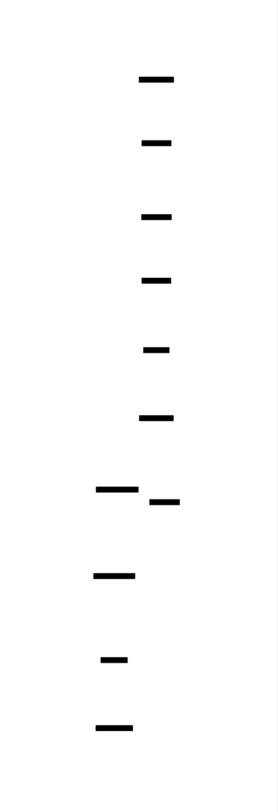
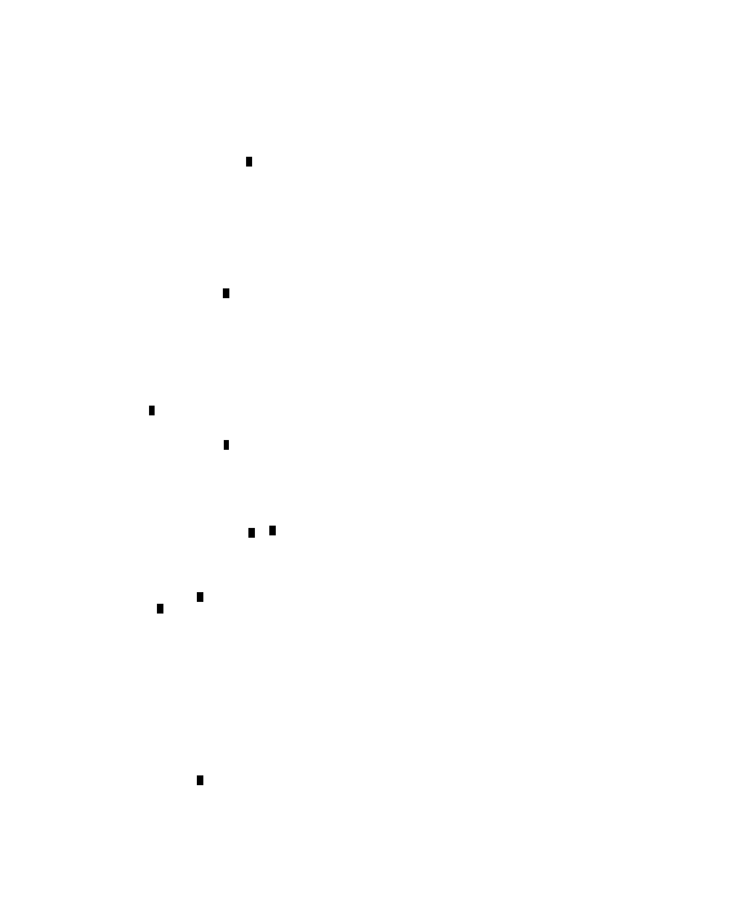
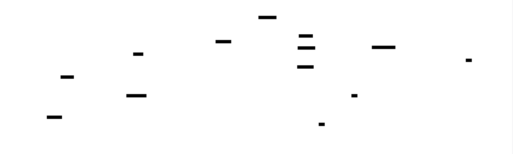

# Regular Expression Engine: Design Document


## Overview

This system implements a complete regular expression matching engine that transforms regex patterns into finite automata for efficient string matching. The key architectural challenge is converting human-readable regex patterns through multiple representations (AST → NFA → DFA) while maintaining correctness and achieving optimal performance.


> This guide is meant to help you understand the big picture before diving into each milestone. Refer back to it whenever you need context on how components connect.


## Context and Problem Statement

Regular expressions are a powerful pattern matching language, but transforming them into efficient matching algorithms requires understanding formal automata theory and making careful trade-offs between compilation time and runtime performance.

### Real-World Context and Mental Model

Think of a regex engine as a sophisticated **pattern recognition factory** that operates in two distinct phases, much like how a modern manufacturing plant first designs specialized machinery for a product, then uses that machinery to efficiently produce thousands of units. In the first phase (compilation), the regex engine takes a human-readable pattern like `a(b|c)*d` and transforms it into a highly optimized "matching machine" – a mathematical automaton specifically designed to recognize that exact pattern. In the second phase (execution), this machine processes input text character by character, maintaining internal state and making rapid decisions about whether the text matches the pattern.

This two-phase approach mirrors how compilers work: instead of interpreting high-level code directly (which would be slow), they first transform it into optimized machine code that runs efficiently. Similarly, instead of trying to match regex patterns by constantly re-parsing the pattern syntax, we compile patterns once into automata that can execute matches in linear time.

The mental model becomes clearer when you consider the alternative approaches. A naive regex implementation might use **recursive backtracking**, essentially trying every possible way to match the pattern against the text. This is like having a human manually check each possibility by hand – it works for simple cases but becomes exponentially slower as patterns grow complex. Pathological patterns like `(a+)+b` matching against `aaaaaaaaac` can take exponential time, making the engine unusable for real-world applications.

In contrast, automata-based regex engines are like purpose-built assembly lines. Once you've invested the upfront cost of building the assembly line (compiling the pattern), you can process thousands of inputs efficiently. The automaton knows exactly which states it can be in at any moment and makes deterministic transitions based on input characters, never needing to backtrack or explore multiple possibilities simultaneously.

The complexity comes from the fact that **regex syntax is fundamentally different from automaton structure**. Humans write patterns using high-level operators like quantifiers (`*`, `+`, `?`), alternation (`|`), and grouping parentheses because these express intent clearly. But automata think in terms of states and transitions between states. The regex engine must bridge this semantic gap, translating human-friendly pattern descriptions into mathematically precise state machines while preserving the exact matching semantics.

Consider how different these representations are: the regex `(ab|cd)*` expresses "zero or more repetitions of either 'ab' or 'cd'". The equivalent automaton involves multiple states connected by epsilon transitions (moves that don't consume input), with careful routing to handle the alternation and repetition. The engine must understand that these representations are equivalent and perform the translation correctly.

### Technical Challenges

The core technical challenge lies in **bridging the semantic gap** between high-level pattern syntax and low-level automaton execution while maintaining both correctness and performance. This challenge manifests in several interconnected problems that must be solved systematically.

**Pattern Parsing and Operator Precedence Management** represents the first major hurdle. Regex syntax includes multiple operators with different precedence levels: quantifiers (`*`, `+`, `?`) bind most tightly to the preceding element, concatenation happens implicitly between adjacent elements, and alternation (`|`) has the lowest precedence. The pattern `ab|c*` should parse as `(ab)|(c*)`, not `a(b|c)*` or `(ab|c)*`. Handling escape sequences adds another layer of complexity – `\*` represents a literal asterisk character rather than the quantification operator.

The parsing challenge is compounded by the need to handle **nested grouping and quantifier scope**. Consider `a(bc)*d` versus `abc*d` – the parentheses completely change which element the quantifier applies to. The parser must build an Abstract Syntax Tree that correctly represents these precedence relationships, as errors here will propagate through the entire compilation pipeline and result in automata that match different languages than intended.

**Automaton Construction Complexity** presents the second major challenge. Thompson's construction algorithm provides an elegant way to convert regex AST nodes into Non-deterministic Finite Automaton (NFA) fragments, but the implementation details are intricate. Each AST node type (literal, concatenation, alternation, quantifier) requires different NFA construction logic, and these fragments must compose correctly to form a complete automaton.

Epsilon transitions add significant complexity to NFA construction and simulation. These transitions allow state changes without consuming input characters, which is essential for expressing alternation and quantifiers, but they make the automaton simulation more complex. The engine must compute epsilon closures (the set of all states reachable via epsilon transitions) correctly and efficiently, as errors in epsilon handling lead to incorrect matching behavior.

**Memory management** becomes critical when constructing automata, especially in languages like C. NFA states often contain circular references through their transition tables, making cleanup challenging. The engine must carefully track state ownership and ensure all allocated memory is properly freed, while avoiding use-after-free bugs that can occur when states reference each other.

**Performance Optimization Trade-offs** constitute the third major challenge. NFA simulation provides correctness but requires tracking multiple active states simultaneously, leading to potentially exponential time complexity for certain patterns. DFA conversion through subset construction can eliminate this problem by creating deterministic automata that always maintain exactly one active state, enabling linear-time matching.

However, the subset construction process itself can be exponential in the worst case – a NFA with n states might produce a DFA with 2^n states. The engine must decide when to apply this optimization and potentially implement lazy DFA construction, building DFA states on-demand during matching rather than pre-computing the entire state space.

**State Explosion Management** becomes crucial for real-world patterns. Complex regex patterns with multiple alternations and quantifiers can generate automata with thousands of states. The engine must implement efficient state representation, fast transition lookup, and potentially state minimization to keep memory usage reasonable while maintaining fast execution.

**Character Class and Alphabet Handling** presents practical implementation challenges. Real regex patterns often include character classes like `[a-z]`, `\d`, or `[^abc]`. The engine must efficiently represent these sets and handle transitions on character classes without explicitly enumerating every possible character. This becomes especially complex when considering Unicode support, where the potential alphabet size grows from 256 to over a million possible code points.

**Error Recovery and Diagnostics** add another layer of complexity. When a regex pattern is malformed, the engine should provide helpful error messages that point to the specific problem location and suggest corrections. This requires the parser to detect errors gracefully and continue parsing to find additional problems, rather than failing on the first syntax error.

**Correctness Verification** represents perhaps the most subtle challenge. Regex engines must implement complex algorithms (Thompson's construction, subset construction, epsilon closure computation) perfectly, as small bugs can lead to patterns that match incorrect inputs or fail to match valid inputs. The mathematical nature of these algorithms means that traditional debugging techniques may not reveal problems until very specific input patterns expose the bugs.

### Existing Approaches Comparison

The regex engine landscape features several distinct architectural approaches, each optimizing for different use cases and making different trade-offs between implementation complexity, compilation speed, and execution performance. Understanding these approaches helps inform our design decisions and provides context for why automata-based engines represent the optimal choice for our educational goals.

**Recursive Backtracking Engines** represent the most straightforward implementation approach and are found in many programming language standard libraries, including Python's `re` module, Ruby, and earlier versions of PHP's PCRE. These engines work by directly interpreting the regex pattern during matching, using recursive function calls to explore different matching possibilities.

In backtracking engines, the pattern `(a|b)*c` would be matched by first trying to match `a`, and if that succeeds, recursively trying to match the rest of the pattern `(a|b)*c` against the remaining input. If the recursive call fails, the engine backtracks and tries the alternative `b`. This approach provides excellent support for advanced features like capture groups, backreferences, and lookarounds because the recursive call stack naturally maintains the context needed for these features.

However, backtracking engines suffer from **catastrophic performance degradation** on certain patterns. The pattern `(a+)+b` matching against the input `aaaaaaaaac` can take exponential time because the engine explores every possible way to distribute the `a` characters between the inner `a+` and outer `(a+)+` quantifiers before finally concluding that the match fails due to the missing `b`. This behavior makes backtracking engines unsuitable for processing untrusted input or high-performance applications.

**NFA Simulation Engines** avoid the exponential worst-case behavior by implementing Thompson's construction to convert regex patterns into Non-deterministic Finite Automata, then simulating the NFA directly during matching. This approach, pioneered by Ken Thompson and documented extensively by Russ Cox, guarantees linear-time matching performance regardless of pattern complexity.

NFA simulation engines maintain a set of currently active states and process each input character by computing the next set of active states. This approach naturally handles alternation and quantifiers without backtracking, as all possible matching paths are explored simultaneously. The key insight is that the number of NFA states is limited (typically proportional to pattern length), so the simulation can never explore more possibilities than were present in the original pattern.

The primary disadvantage of pure NFA simulation is **constant-factor performance overhead**. Each input character requires computing epsilon closures and processing transitions for multiple states, leading to slower execution than DFA-based approaches for patterns that are executed frequently. Additionally, NFA engines typically cannot support backreferences or other features that require maintaining match history.

**DFA Compilation Engines** represent the highest-performance approach for pattern matching. These engines use subset construction to convert NFAs into Deterministic Finite Automata, where exactly one state is active at any time. This enables extremely fast matching – each input character requires only a single table lookup to determine the next state.

DFA engines are used in high-performance applications like network intrusion detection systems, web application firewalls, and text processing tools that need to match many patterns against large volumes of text. The V8 JavaScript engine's regex implementation uses DFA compilation for patterns that don't require advanced features.

The main challenge with DFA compilation is **state explosion during construction**. The subset construction algorithm can produce DFAs with exponentially many states relative to the original NFA, leading to excessive memory usage and long compilation times. Pathological patterns like `(a|b)*a(a|b){n}` can generate DFAs with 2^n states.

**Hybrid Approaches** attempt to combine the benefits of different strategies. Many modern regex engines use **lazy DFA construction**, building DFA states on-demand during matching rather than pre-computing the entire automaton. This approach provides DFA-level performance for the common case while avoiding exponential construction time for pathological patterns.

Another hybrid strategy involves **pattern analysis and strategy selection**, where the engine examines each pattern and chooses the most appropriate execution strategy. Simple patterns might be compiled to DFAs, complex patterns with alternation might use NFA simulation, and patterns with backreferences might fall back to backtracking.

**Just-In-Time (JIT) Compilation Engines** represent the most sophisticated approach, where regex patterns are compiled directly to native machine code. This approach is used in .NET's regex engine and some high-performance C++ libraries. JIT compilation provides excellent performance but requires significant implementation complexity and may not be suitable for educational purposes.

> **Decision: Automata-Based Architecture with Both NFA and DFA Support**
> - **Context**: We need to choose a regex engine architecture that provides educational value while demonstrating practical techniques used in real-world systems. The engine should teach fundamental computer science concepts while remaining implementable by students.
> - **Options Considered**: 
>   1. Recursive backtracking engine (simple to implement, supports advanced features)
>   2. Pure NFA simulation engine (guaranteed linear time, moderate complexity)
>   3. DFA compilation engine (highest performance, complex implementation)
>   4. Hybrid NFA/DFA engine (educational value, demonstrates trade-offs)
> - **Decision**: Implement a hybrid engine that constructs NFAs using Thompson's algorithm and optionally converts them to DFAs using subset construction.
> - **Rationale**: This approach maximizes educational value by teaching both NFA and DFA concepts, demonstrates the trade-offs between compilation time and execution speed, and reflects techniques used in production regex engines. Students learn automata theory concepts while building a system that performs well in practice.
> - **Consequences**: Increased implementation complexity compared to pure NFA or DFA approaches, but provides deeper understanding of automata theory and performance optimization techniques.

The comparison table below summarizes the key characteristics of each approach:

| Approach | Compilation Time | Execution Speed | Memory Usage | Advanced Features | Worst-Case Behavior |
|----------|------------------|-----------------|--------------|-------------------|---------------------|
| Backtracking | Instant | Variable | Low | Full support | Exponential time |
| NFA Simulation | Fast | Moderate | Moderate | Limited | Linear time |
| DFA Compilation | Variable | Fastest | Variable | Limited | Linear time |
| Lazy DFA | Fast | Fast | Moderate | Limited | Linear time |
| JIT Compilation | Slow | Fastest | High | Variable | Linear time |

**Feature Support Comparison** reveals the trade-offs between different approaches:

| Feature | Backtracking | NFA Simulation | DFA Compilation | Our Approach |
|---------|--------------|----------------|-----------------|--------------|
| Basic operators | ✓ | ✓ | ✓ | ✓ |
| Quantifiers | ✓ | ✓ | ✓ | ✓ |
| Character classes | ✓ | ✓ | ✓ | ✓ |
| Capture groups | ✓ | ✗ | ✗ | Future extension |
| Backreferences | ✓ | ✗ | ✗ | ✗ |
| Lookarounds | ✓ | ✗ | ✗ | Future extension |
| Linear time guarantee | ✗ | ✓ | ✓ | ✓ |

**Performance Characteristics** vary significantly between approaches:

| Pattern Type | Backtracking | NFA Simulation | DFA Execution | Hybrid Benefit |
|--------------|--------------|----------------|---------------|----------------|
| Simple literals | Fast | Moderate | Fastest | Adaptive optimization |
| Alternation | Slow | Moderate | Fast | NFA→DFA conversion |
| Nested quantifiers | Very slow | Moderate | Fast | Worst-case protection |
| Pathological patterns | Exponential | Linear | Linear | Guaranteed performance |

Our hybrid approach provides **educational scaffolding** that allows students to understand the progression from high-level patterns to optimized execution engines. They first implement NFA construction and simulation to understand the fundamental concepts, then add DFA conversion to explore performance optimization techniques. This mirrors the historical development of regex engines and provides insight into the engineering trade-offs that drive real-world system design.

The architecture also enables **incremental implementation**, where students can achieve working regex matching with just the NFA components, then add DFA optimization as an advanced feature. This prevents students from becoming overwhelmed by the full complexity while ensuring they understand each transformation step thoroughly.

### Implementation Guidance

This section provides concrete technology recommendations and starter code to help bridge the gap between design concepts and working implementation. The guidance focuses on C as the primary language, emphasizing low-level control and educational value while providing complete, working infrastructure code for non-core components.

#### Technology Recommendations

| Component | Simple Option | Advanced Option | Recommendation |
|-----------|---------------|-----------------|----------------|
| Memory Management | Manual malloc/free | Custom memory pools | Manual with careful tracking |
| String Handling | char arrays + string.h | Custom string library | char arrays with helper functions |
| Data Structures | Arrays and linked lists | Hash tables and trees | Arrays for transitions, lists for epsilon moves |
| Character Classes | Bitmap arrays (256 bits) | Interval trees | Bitmap arrays for ASCII focus |
| Pattern Storage | In-memory only | File-based pattern cache | In-memory for educational clarity |
| Error Reporting | Printf-style messages | Structured error objects | Printf with source position tracking |
| Testing Framework | Custom assert macros | Unity test framework | Custom assert macros for simplicity |
| Build System | Single Makefile | CMake or Autotools | Single Makefile with clear targets |

#### Recommended File Structure

The project should organize code into clear modules that separate concerns and make the implementation progression obvious:

```
regex-engine/
├── Makefile                    # Build configuration
├── README.md                   # Project documentation
├── src/                        # Source code directory
│   ├── main.c                  # Command-line interface and examples
│   ├── regex.h                 # Public API header
│   ├── lexer.h                 # Tokenization declarations
│   ├── lexer.c                 # Token parsing implementation (Milestone 1)
│   ├── parser.h                # AST construction declarations
│   ├── parser.c                # Recursive descent parser (Milestone 1)
│   ├── ast.h                   # Abstract syntax tree node definitions
│   ├── ast.c                   # AST manipulation and cleanup
│   ├── nfa.h                   # NFA state and construction declarations
│   ├── nfa.c                   # Thompson's construction (Milestone 2)
│   ├── nfa_sim.h              # NFA simulation declarations
│   ├── nfa_sim.c              # Pattern matching engine (Milestone 3)
│   ├── dfa.h                   # DFA state and conversion declarations
│   ├── dfa.c                   # Subset construction (Milestone 4)
│   ├── utils.h                 # Utility function declarations
│   └── utils.c                 # Memory management and string helpers
├── tests/                      # Test suite
│   ├── test_lexer.c           # Tokenization tests
│   ├── test_parser.c          # AST construction tests
│   ├── test_nfa.c             # Thompson construction tests
│   ├── test_simulation.c      # Pattern matching tests
│   ├── test_dfa.c             # DFA conversion tests
│   └── run_tests.c            # Test runner main function
└── examples/                   # Usage examples and demos
    ├── simple_match.c         # Basic pattern matching example
    ├── benchmark.c            # Performance comparison NFA vs DFA
    └── debug_automaton.c      # Visualization and debugging tools
```

This structure separates each milestone into distinct compilation units while maintaining clear dependencies. Students can focus on one component at a time while seeing how it integrates with the overall system.

#### Infrastructure Starter Code

The following infrastructure code handles non-core functionality, allowing students to focus on the essential regex engine algorithms. This code should be provided complete and working.

**Memory Management Utilities (utils.h and utils.c):**

```c
#ifndef UTILS_H
#define UTILS_H

#include <stdio.h>
#include <stdlib.h>
#include <string.h>
#include <stdbool.h>

// Memory debugging support for tracking allocations
#ifdef DEBUG_MEMORY
extern int alloc_count;
extern int free_count;
#define MALLOC(size) debug_malloc(size, __FILE__, __LINE__)
#define FREE(ptr) debug_free(ptr, __FILE__, __LINE__)
void* debug_malloc(size_t size, const char* file, int line);
void debug_free(void* ptr, const char* file, int line);
void print_memory_stats(void);
#else
#define MALLOC(size) malloc(size)
#define FREE(ptr) free(ptr)
#endif

// String utilities for pattern handling
char* string_duplicate(const char* src);
bool string_equals(const char* a, const char* b);
int string_length(const char* str);

// Dynamic array utilities for state lists
typedef struct {
    void** items;
    int count;
    int capacity;
} dynamic_array_t;

dynamic_array_t* array_create(void);
void array_destroy(dynamic_array_t* arr);
void array_push(dynamic_array_t* arr, void* item);
void* array_get(dynamic_array_t* arr, int index);
bool array_contains(dynamic_array_t* arr, void* item);
void array_clear(dynamic_array_t* arr);

// Character class bitmap for efficient character set operations
typedef struct {
    unsigned char bits[32];  // 256 bits for ASCII character set
} charset_t;

void charset_init(charset_t* set);
void charset_add(charset_t* set, unsigned char ch);
void charset_add_range(charset_t* set, unsigned char start, unsigned char end);
bool charset_contains(charset_t* set, unsigned char ch);
void charset_union(charset_t* dest, const charset_t* src);
bool charset_equals(const charset_t* a, const charset_t* b);

#endif /* UTILS_H */
```

**Error Handling and Reporting (regex.h):**

```c
#ifndef REGEX_H
#define REGEX_H

#include <stdbool.h>

// Error codes for regex compilation and execution
typedef enum {
    REGEX_SUCCESS = 0,
    REGEX_ERROR_SYNTAX,          // Malformed pattern syntax
    REGEX_ERROR_UNMATCHED_PAREN, // Mismatched parentheses
    REGEX_ERROR_INVALID_QUANTIFIER, // Quantifier without preceding element
    REGEX_ERROR_MEMORY,          // Memory allocation failure
    REGEX_ERROR_TOO_COMPLEX      // Pattern too complex (state explosion)
} regex_error_t;

// Error context for providing helpful error messages
typedef struct {
    regex_error_t code;
    int position;               // Character position in pattern where error occurred
    char message[256];          // Human-readable error description
} regex_error_context_t;

// Forward declarations for main API types
typedef struct ast_node ast_node_t;
typedef struct nfa_state nfa_state_t;
typedef struct nfa nfa_t;
typedef struct dfa_state dfa_state_t;
typedef struct dfa dfa_t;

// Main API for compiling and executing regex patterns
typedef struct {
    char* pattern;
    ast_node_t* ast;
    nfa_t* nfa;
    dfa_t* dfa;
    regex_error_context_t last_error;
} regex_t;

// Public API functions
regex_t* regex_compile(const char* pattern);
void regex_free(regex_t* regex);
bool regex_match_nfa(regex_t* regex, const char* text);
bool regex_match_dfa(regex_t* regex, const char* text);
const char* regex_error_string(regex_error_t code);
void regex_print_error(const regex_t* regex);

#endif /* REGEX_H */
```

**Test Framework Macros (tests/test_framework.h):**

```c
#ifndef TEST_FRAMEWORK_H
#define TEST_FRAMEWORK_H

#include <stdio.h>
#include <stdlib.h>
#include <string.h>

// Global test statistics
extern int tests_run;
extern int tests_passed;
extern int tests_failed;

// Test assertion macros with detailed failure reporting
#define ASSERT_TRUE(condition, message) do { \
    tests_run++; \
    if (!(condition)) { \
        printf("FAIL: %s:%d - %s\n", __FILE__, __LINE__, message); \
        printf("  Expected: true\n  Actual: false\n"); \
        tests_failed++; \
    } else { \
        tests_passed++; \
    } \
} while(0)

#define ASSERT_FALSE(condition, message) do { \
    tests_run++; \
    if (condition) { \
        printf("FAIL: %s:%d - %s\n", __FILE__, __LINE__, message); \
        printf("  Expected: false\n  Actual: true\n"); \
        tests_failed++; \
    } else { \
        tests_passed++; \
    } \
} while(0)

#define ASSERT_EQUALS_STR(expected, actual, message) do { \
    tests_run++; \
    if (strcmp(expected, actual) != 0) { \
        printf("FAIL: %s:%d - %s\n", __FILE__, __LINE__, message); \
        printf("  Expected: \"%s\"\n  Actual: \"%s\"\n", expected, actual); \
        tests_failed++; \
    } else { \
        tests_passed++; \
    } \
} while(0)

#define RUN_TEST(test_func) do { \
    printf("Running %s...\n", #test_func); \
    test_func(); \
} while(0)

void print_test_summary(void);

#endif /* TEST_FRAMEWORK_H */
```

#### Core Logic Skeleton Code

The following skeleton code provides function signatures and detailed TODO comments for the core regex engine components that students should implement themselves.

**AST Node Definitions (ast.h):**

```c
#ifndef AST_H
#define AST_H

#include "utils.h"

// AST node types for different regex constructs
typedef enum {
    AST_LITERAL,        // Single character literal
    AST_CONCAT,         // Concatenation of two sub-expressions
    AST_ALTERNATE,      // Alternation (|) between two sub-expressions
    AST_STAR,           // Zero or more repetitions (*)
    AST_PLUS,           // One or more repetitions (+)
    AST_QUESTION,       // Optional (zero or one) repetitions (?)
    AST_CHAR_CLASS      // Character class [abc] or [a-z]
} ast_node_type_t;

// Base AST node structure
typedef struct ast_node {
    ast_node_type_t type;
    union {
        struct {
            char character;                    // For AST_LITERAL
        } literal;
        struct {
            struct ast_node* left;             // For AST_CONCAT, AST_ALTERNATE
            struct ast_node* right;
        } binary;
        struct {
            struct ast_node* child;            // For AST_STAR, AST_PLUS, AST_QUESTION
        } unary;
        struct {
            charset_t charset;                 // For AST_CHAR_CLASS
            bool negated;                      // true for [^abc] patterns
        } char_class;
    };
} ast_node_t;

// AST construction and manipulation functions
ast_node_t* ast_create_literal(char ch);
ast_node_t* ast_create_concat(ast_node_t* left, ast_node_t* right);
ast_node_t* ast_create_alternate(ast_node_t* left, ast_node_t* right);
ast_node_t* ast_create_star(ast_node_t* child);
ast_node_t* ast_create_plus(ast_node_t* child);
ast_node_t* ast_create_question(ast_node_t* child);
ast_node_t* ast_create_char_class(const charset_t* charset, bool negated);
void ast_free(ast_node_t* node);
void ast_print(const ast_node_t* node, int indent);

#endif /* AST_H */
```

**Lexer Interface (lexer.h):**

```c
// parse_pattern parses a regex pattern string into an Abstract Syntax Tree.
// Returns pointer to root AST node on success, NULL on syntax error.
// Sets error context in regex->last_error if parsing fails.
ast_node_t* parse_pattern(const char* pattern, regex_error_context_t* error_ctx) {
    // TODO 1: Create lexer state to track current position in pattern string
    // TODO 2: Call parse_alternation to handle top-level | operators (lowest precedence)
    // TODO 3: Check that entire pattern was consumed (no trailing characters)
    // TODO 4: Return root AST node or NULL on failure
    // Hint: parse_alternation handles the full precedence hierarchy
    return NULL;
}

// parse_alternation handles alternation (|) operators with lowest precedence.
// Returns AST node representing alternation or concatenation sequence.
static ast_node_t* parse_alternation(lexer_state_t* lexer, regex_error_context_t* error_ctx) {
    // TODO 1: Parse left side using parse_concatenation
    // TODO 2: While current token is '|', consume it and parse right side
    // TODO 3: Create AST_ALTERNATE nodes to represent alternation
    // TODO 4: Handle empty alternation branches (e.g., "a||b")
    // Hint: Left-associate multiple alternations: a|b|c becomes ((a|b)|c)
    return NULL;
}

// parse_concatenation handles implicit concatenation (middle precedence).
// Returns AST node representing sequence of concatenated elements.
static ast_node_t* parse_concatenation(lexer_state_t* lexer, regex_error_context_t* error_ctx) {
    // TODO 1: Parse first element using parse_quantified
    // TODO 2: While next element can start a quantified expression, parse it
    // TODO 3: Create AST_CONCAT nodes to chain elements together
    // TODO 4: Handle empty concatenation (return appropriate node)
    // Hint: "abc" becomes concat(concat(a,b),c)
    return NULL;
}

// parse_quantified handles quantifiers (*, +, ?) with highest precedence.
// Returns AST node with quantifier applied to preceding element.
static ast_node_t* parse_quantified(lexer_state_t* lexer, regex_error_context_t* error_ctx) {
    // TODO 1: Parse base element using parse_atom
    // TODO 2: Check if next token is quantifier (*, +, or ?)
    // TODO 3: Create appropriate AST node (AST_STAR, AST_PLUS, AST_QUESTION)
    // TODO 4: Handle quantifier without preceding element error
    // Hint: Only one quantifier per element - a** should be syntax error
    return NULL;
}
```

**NFA Construction (nfa.c):**

```c
// nfa_from_ast converts an Abstract Syntax Tree into an NFA using Thompson's construction.
// Returns NFA that accepts the same language as the AST represents.
nfa_t* nfa_from_ast(const ast_node_t* ast) {
    // TODO 1: Create empty NFA with start and accept states
    // TODO 2: Call recursive Thompson construction on AST root
    // TODO 3: Connect construction result between start and accept states
    // TODO 4: Return completed NFA ready for simulation
    // Hint: Thompson construction returns fragments, not complete NFAs
    return NULL;
}

// thompson_construct_recursive builds NFA fragment for a single AST node.
// Returns NFA fragment with designated start and end states (no accept state).
static nfa_fragment_t thompson_construct_recursive(const ast_node_t* node) {
    // TODO 1: Switch on node type to handle each AST construct
    // TODO 2: For literals, create two states with character transition
    // TODO 3: For concatenation, connect left.end to right.start with epsilon
    // TODO 4: For alternation, create new start/end with epsilon transitions
    // TODO 5: For quantifiers, add appropriate epsilon loops and bypasses
    // Hint: Each case should create exactly the Thompson construction pattern
    nfa_fragment_t fragment = {0};
    return fragment;
}

// epsilon_closure computes set of all states reachable via epsilon transitions.
// Used during NFA simulation to find all simultaneously active states.
void epsilon_closure(const nfa_t* nfa, dynamic_array_t* states) {
    // TODO 1: Create worklist initialized with input state set
    // TODO 2: While worklist is not empty, remove a state
    // TODO 3: For each epsilon transition from that state, add destination
    // TODO 4: Only add destinations not already in closure set
    // TODO 5: Continue until no new states can be reached
    // Hint: Use array_contains to avoid duplicate states in closure
}
```

#### Language-Specific Implementation Hints

**Memory Management in C:**
- Use `malloc()` and `free()` consistently, never mix with other allocators
- Set pointers to `NULL` immediately after freeing to catch use-after-free bugs
- Consider implementing a simple reference counting system for NFA states that might be shared
- Use `valgrind` or similar tools to detect memory leaks during development

**String Handling Best Practices:**
- Always check string lengths before copying to avoid buffer overflows
- Use `strncpy()` instead of `strcpy()` and ensure null termination
- Consider using `strndup()` for creating string copies with length limits
- Handle Unicode by treating patterns as byte sequences initially, with UTF-8 support as an extension

**Data Structure Optimization:**
- Use arrays for NFA transitions when the alphabet is small (ASCII only)
- Consider linked lists for epsilon transitions since they're typically sparse
- Implement dynamic arrays with geometric growth (double capacity when full)
- Use bit sets for character classes to enable fast membership testing

**Performance Measurement:**
- Use `clock_gettime()` for high-resolution timing measurements
- Benchmark both compilation time and matching time separately
- Test with patterns of increasing complexity to observe algorithmic behavior
- Compare NFA simulation versus DFA execution on the same patterns

#### Milestone Checkpoints

**Milestone 1 Checkpoint - Parser Implementation:**
After implementing the lexer and parser, students should be able to:
- Run `make test_parser` and see all parsing tests pass
- Parse simple patterns like `abc`, `a|b`, `a*`, `(ab)+` into correct AST structures
- Print AST structures using `ast_print()` to verify correct precedence handling
- Handle syntax errors gracefully with meaningful error messages at correct positions

**Milestone 2 Checkpoint - NFA Construction:**
After implementing Thompson's construction, students should verify:
- Run `make test_nfa` to validate NFA structure correctness
- Build NFAs for basic patterns and verify state count matches theoretical expectations
- Print NFA structure showing states, transitions, and epsilon moves
- Manually trace NFA construction for simple patterns to understand the algorithm

**Milestone 3 Checkpoint - NFA Simulation:**
After implementing NFA matching, students should confirm:
- Run `make test_simulation` with comprehensive pattern/text combinations
- Match succeeds for strings that should match their patterns
- Match fails for strings that should not match their patterns
- Performance scales linearly with input text length regardless of pattern complexity

**Milestone 4 Checkpoint - DFA Optimization:**
After implementing subset construction, students should validate:
- Run `make benchmark` to compare NFA vs DFA performance on identical patterns
- DFA construction completes for non-pathological patterns in reasonable time
- DFA matching provides correct results identical to NFA simulation results
- Memory usage remains reasonable for typical patterns (not exponentially large)

Each checkpoint includes specific commands to run and expected behaviors to verify, providing concrete validation that the implementation is progressing correctly.


## Goals and Non-Goals

> **Milestone(s):** This section provides the foundation for all milestones by defining the scope and success criteria that guide implementation decisions throughout the project.

Building a regex engine is like constructing a sophisticated translation system that must convert human-readable pattern descriptions into mathematical machines capable of recognizing those patterns in text. Just as a human translator must decide which nuances of meaning to preserve and which to sacrifice for clarity, our regex engine must make careful choices about which features to support and which performance characteristics to prioritize. This section establishes the boundaries of our implementation, ensuring we build a focused, educational system that demonstrates core automata theory concepts without getting lost in the complexity of production regex engines.

The scope definition serves as our north star throughout development. Every design decision, from AST node types to NFA state representations, must align with these goals. By explicitly stating what we will and will not implement, we create a clear contract that prevents feature creep while ensuring our engine remains a valuable learning tool for understanding the mathematical foundations of pattern matching.

### Functional Goals

Our regex engine will implement the essential pattern matching features that demonstrate the core principles of automata theory and Thompson's construction. Think of these features as the fundamental building blocks of a pattern recognition language—each one corresponds directly to a specific type of automaton construction that students must master to understand how regex engines work internally.

#### Core Pattern Matching Features

The following table defines the essential regex features our engine must support, along with their automata theory significance and implementation requirements:

| Feature | Syntax | Description | Automata Significance | Implementation Requirement |
|---------|--------|-------------|----------------------|---------------------------|
| Literal Characters | `a`, `b`, `1`, `@` | Match exact characters | Basic state transitions | Single character transitions in NFA |
| Concatenation | `abc` | Match sequence of patterns | Sequential state chaining | NFA fragment composition |
| Alternation | `a\|b` | Match either pattern | Non-deterministic branching | Epsilon transitions to alternatives |
| Kleene Star | `a*` | Match zero or more repetitions | Loops with epsilon transitions | Self-referencing epsilon loops |
| Plus Quantifier | `a+` | Match one or more repetitions | Required occurrence + loops | Concatenation with star |
| Question Mark | `a?` | Match zero or one occurrence | Optional matching | Epsilon transition bypass |
| Parentheses | `(ab)\|c` | Group patterns for precedence | Subexpression isolation | Recursive AST construction |
| Character Classes | `[abc]`, `[a-z]` | Match any character from set | Multiple transition paths | Charset bitmap representation |
| Negated Classes | `[^abc]` | Match any character not in set | Complement character sets | Inverted charset bitmaps |
| Dot Wildcard | `.` | Match any character except newline | Universal character matching | Transition on all valid characters |

Each feature maps directly to a specific pattern in Thompson's construction, making our implementation an excellent vehicle for learning how mathematical theory translates into practical algorithms. The concatenation operator demonstrates how NFA fragments compose sequentially, while alternation shows how epsilon transitions enable non-deterministic choice points.

> **Decision: ASCII-Only Character Support**
> - **Context**: Character encoding adds significant complexity to lexing and character class implementation
> - **Options Considered**: 
>   1. Full Unicode support with UTF-8 encoding
>   2. ASCII-only (7-bit characters 0-127)
>   3. Extended ASCII (8-bit characters 0-255)
> - **Decision**: ASCII-only character support
> - **Rationale**: ASCII limitation keeps charset operations simple (single byte per character), enables efficient bitmap representation for character classes (128 bits = 16 bytes), and avoids Unicode normalization complexity that would obscure the core automata theory concepts
> - **Consequences**: Enables simple `charset_t` implementation with 32-byte bitmaps, eliminates UTF-8 decoding complexity during matching, but restricts engine to English text and basic symbols

#### Pattern Compilation Requirements

Our engine must successfully transform regex patterns through the complete compilation pipeline, demonstrating each stage of the theoretical conversion process:

| Compilation Stage | Input Format | Output Format | Success Criteria | Educational Value |
|------------------|--------------|---------------|------------------|-------------------|
| Lexical Analysis | Raw regex string | Token stream | Correct tokenization of operators and literals | Understanding of syntax recognition |
| Parsing | Token stream | Abstract Syntax Tree | Proper operator precedence and associativity | Learning recursive descent techniques |
| NFA Construction | AST nodes | Non-deterministic Finite Automaton | Thompson's construction for each node type | Seeing theory-to-implementation translation |
| NFA Simulation | NFA + input string | Boolean match result | Correct pattern recognition via state tracking | Understanding non-deterministic execution |
| DFA Conversion | NFA | Deterministic Finite Automaton | Subset construction with equivalent language | Learning determinization algorithms |
| DFA Execution | DFA + input string | Boolean match result | Linear-time matching with single active state | Experiencing deterministic performance benefits |

The compilation pipeline serves as a concrete demonstration of how abstract mathematical concepts become executable code. Students can observe their regex pattern transforming through each representation, building intuition about the relationship between different automata formalisms.

#### Pattern Matching Behavior

Our engine implements **full string matching** semantics, where a pattern succeeds only if it matches the entire input string from beginning to end. This design choice simplifies the implementation by eliminating the need for anchoring operators or substring search logic, allowing us to focus purely on the automata construction and simulation algorithms.

The matching behavior follows these specific rules:

1. **Complete Input Consumption**: A match succeeds only when the automaton reaches an accept state after processing every character in the input string
2. **Deterministic Results**: For any given pattern and input, the engine always produces the same boolean result (match or no match)
3. **Linear Input Processing**: Each input character is processed exactly once during matching, with no backtracking or re-scanning
4. **Greedy Quantifier Semantics**: Quantifiers like `*` and `+` match as many characters as possible while still allowing the overall pattern to succeed

> The full-string matching constraint eliminates ambiguity about match boundaries and forces clear thinking about automaton accept states. In production regex engines, substring matching and anchoring add significant complexity that would distract from the core learning objectives.

### Performance Goals

Performance characteristics in regex engines demonstrate the practical benefits of different automata representations and the trade-offs between compilation time and execution speed. Our performance goals are designed to make these trade-offs visible and measurable, helping students understand why production systems choose specific approaches.

#### Compilation Time Targets

The compilation process should complete quickly enough to enable interactive experimentation while making the performance differences between construction phases observable:

| Phase | Target Time | Complexity Class | Measurement Method | Educational Insight |
|-------|-------------|------------------|-------------------|-------------------|
| Lexing + Parsing | < 1ms for patterns up to 100 characters | O(n) where n = pattern length | Microsecond timing of `parse_pattern()` | Parsing is typically not the bottleneck |
| NFA Construction | < 5ms for AST with 50 nodes | O(n) where n = AST node count | Timing of `nfa_from_ast()` function | Thompson's construction scales linearly |
| DFA Conversion | < 100ms for NFA with 20 states | O(2^n) worst case, often much better | Timing of subset construction | Exponential blowup is rare but possible |
| Total Compilation | < 200ms for typical patterns | Dominated by DFA conversion | End-to-end `regex_compile()` timing | Most time spent in optimization phases |

These targets allow students to experiment with different pattern complexities and observe how construction time scales. Patterns that cause exponential DFA blowup become learning opportunities rather than performance disasters.

#### Execution Time Targets

Matching performance demonstrates the fundamental difference between non-deterministic and deterministic automata execution:

| Engine Type | Target Performance | Complexity Class | Pattern Dependencies | Learning Objective |
|-------------|-------------------|------------------|----------------------|-------------------|
| NFA Simulation | 10-100 μs per match for strings up to 1000 characters | O(nm) where n = string length, m = NFA state count | Slower for patterns with many quantifiers | Understanding parallel state tracking |
| DFA Execution | 1-10 μs per match for strings up to 1000 characters | O(n) where n = string length | Consistent regardless of pattern complexity | Experiencing deterministic performance benefits |
| Performance Ratio | DFA should be 5-50x faster than NFA | Depends on NFA state explosion | More dramatic with complex patterns | Quantifying the determinization benefit |

The performance comparison provides concrete evidence for why production regex engines invest in DFA construction despite the compilation overhead. Students can measure the trade-off directly and understand when each approach is appropriate.

#### Memory Usage Constraints

Memory consumption patterns illustrate the space-time trade-offs inherent in different automata representations:

| Component | Memory Target | Scaling Behavior | Monitoring Method | Design Implication |
|-----------|---------------|------------------|-------------------|-------------------|
| AST Storage | < 1KB per 100 pattern characters | O(pattern length) | Measure `ast_node_t` allocation | Simple recursive structures |
| NFA States | < 10KB per compiled pattern | O(AST node count) | Count states in `nfa_t` structure | Thompson's construction is space-efficient |
| DFA States | < 100KB per compiled pattern | O(2^NFA states) worst case | Monitor `dfa_t` state table size | Exponential blowup risk |
| Match Execution | < 1KB stack depth | O(pattern nesting) for NFA | Profile recursive `epsilon_closure` calls | Iterative algorithms prevent stack overflow |

Memory monitoring helps students recognize when patterns might cause resource exhaustion and understand the fundamental space complexity of different automata representations.

> **Decision: Fixed Memory Limits Over Dynamic Scaling**
> - **Context**: Unbounded memory allocation can make pathological patterns cause system-wide issues
> - **Options Considered**:
>   1. Dynamic allocation with no limits
>   2. Fixed pre-allocated buffers
>   3. Dynamic allocation with configurable limits
> - **Decision**: Fixed pre-allocated buffers with compile-time size limits
> - **Rationale**: Prevents resource exhaustion attacks, makes memory usage predictable and measurable, forces thinking about worst-case behavior, and simplifies implementation by eliminating dynamic allocation error handling
> - **Consequences**: Enables simple debugging of memory usage patterns, prevents system instability from malicious patterns, but imposes hard limits on pattern complexity and may waste memory for simple patterns

### Explicit Non-Goals

Clearly defining what we will not implement is crucial for maintaining focus on the educational objectives. Production regex engines include dozens of advanced features that would obscure the fundamental automata theory concepts we want to demonstrate. Each excluded feature represents a deliberate choice to prioritize learning over completeness.

#### Advanced Regex Features

The following regex constructs are explicitly excluded from our implementation, along with the complexity reasons that justify their omission:

| Excluded Feature | Standard Syntax | Complexity Reason | Learning Impact | Alternative Coverage |
|-----------------|-----------------|-------------------|-----------------|---------------------|
| Backreferences | `(a+)b\1` | Requires context-sensitive parsing, cannot be recognized by finite automata | Would require backtracking engine, completely different architecture | Focus on regular languages only |
| Lookahead/Lookbehind | `a(?=b)`, `(?<!x)y` | Requires bidirectional scanning, complex state management | Adds significant implementation complexity with limited educational value | Demonstrate finite automata limitations |
| Non-greedy Quantifiers | `a*?`, `a+?` | Requires backtracking or complex preference tracking | Would need priority queues in NFA simulation | Greedy semantics are sufficient for learning |
| Unicode Categories | `\p{Letter}`, `\P{Digit}` | Requires Unicode database, complex character classification | Shifts focus from automata to Unicode standards | ASCII character classes demonstrate the concept |
| Word Boundaries | `\b`, `\B` | Requires lookahead/lookbehind context checking | Adds state machine complexity without automata theory value | Character classes provide similar learning |
| Case-Insensitive Matching | `(?i)pattern` | Requires character normalization, expands alphabet size | Complicates character class implementation | Case-sensitive matching is sufficient |
| Multiline Mode | `^`, `$` with `(?m)` | Requires string scanning for line boundaries | Adds complexity without automata theory benefit | Full-string matching eliminates anchoring complexity |

Each excluded feature represents a conscious trade-off between real-world utility and educational clarity. Our goal is not to build a production-ready regex engine but to create a vehicle for understanding the mathematical foundations of pattern matching.

#### Capture Groups and Submatch Extraction

Capture groups (`(pattern)`) for extracting matched substrings are excluded because they fundamentally change the automaton execution model. Standard finite automata produce only accept/reject decisions, while capture group support requires tracking match positions and substring boundaries throughout execution.

The complexity implications of capture group support include:

1. **Modified State Representation**: Each automaton state must track active capture group positions, multiplying memory requirements
2. **Backtracking Requirements**: Multiple possible matches require exploring all paths to find the "correct" submatch according to preference rules
3. **Performance Degradation**: Substring tracking adds overhead to every state transition and eliminates many DFA optimization opportunities
4. **API Complexity**: Match results become complex objects with nested submatch arrays rather than simple boolean values

> Excluding capture groups keeps our automata mathematically pure and allows students to focus on the fundamental recognition problem without getting distracted by substring extraction mechanics.

#### Optimization Features

Production regex engines include numerous optimization techniques that would add implementation complexity without educational benefit:

| Optimization | Description | Complexity Added | Learning Value | Exclusion Rationale |
|-------------|-------------|------------------|----------------|-------------------|
| JIT Compilation | Generate native machine code for DFA execution | Requires assembly generation, platform-specific code | No automata theory value | Focuses on code generation rather than algorithms |
| Lazy DFA Construction | Build DFA states on-demand during matching | Complex caching, state garbage collection | Some algorithmic interest | Adds engineering complexity to core algorithms |
| NFA Optimization | Eliminate redundant epsilon transitions | Graph analysis, reachability algorithms | Moderate algorithmic value | Core Thompson's construction is more important |
| Pattern Preprocessing | Rewrite patterns for better performance | Pattern analysis, transformation rules | Minimal educational impact | Students should see canonical algorithm behavior |
| Multi-string Matching | Single automaton matching multiple patterns | Complex state merging, result disambiguation | Advanced topic | Single pattern focus maintains clarity |

These optimizations represent important engineering concerns in production systems but would shift the educational focus away from understanding the fundamental algorithms toward performance engineering techniques.

#### Extended Character Handling

Character encoding support beyond 7-bit ASCII is excluded to keep the implementation focused on automata theory rather than internationalization complexity:

**Unicode Support Exclusions**:
- UTF-8/UTF-16 encoding and decoding
- Unicode normalization (NFC, NFD, NFKC, NFKD)
- Surrogate pair handling
- Bidirectional text processing
- Unicode character categories and scripts

**Character Class Exclusions**:
- POSIX character classes (`[:alpha:]`, `[:digit:]`)
- Unicode property classes (`\p{Script=Latin}`)
- Case folding and case-insensitive matching
- Locale-dependent character classification

**Rationale**: Character encoding complexity would require substantial additional code that provides no insight into finite automata construction or simulation. ASCII limitation enables simple character class representation using bitmaps and keeps the focus on pattern recognition algorithms rather than text processing techniques.

> **Decision: Educational Focus Over Production Features**
> - **Context**: Production regex engines prioritize performance and feature completeness over algorithmic clarity
> - **Options Considered**:
>   1. Implement full PCRE-compatible feature set
>   2. Implement minimal subset demonstrating core concepts
>   3. Implement intermediate feature set with some advanced constructs
> - **Decision**: Minimal subset focused on regular languages and finite automata
> - **Rationale**: Educational tools should eliminate distractions from core learning objectives, advanced features often require completely different algorithmic approaches that obscure the fundamental concepts, and students benefit more from deep understanding of basics than shallow coverage of many features
> - **Consequences**: Creates focused learning experience with clear algorithmic progression, enables implementation completion in reasonable time frame, but produces engine unsuitable for production use and limits real-world applicability

### Success Criteria and Validation

Our goals must be measurable to ensure the implementation achieves its educational objectives. The following validation criteria provide concrete checkpoints for determining whether each goal has been met successfully.

#### Functional Correctness Validation

Each supported feature must pass comprehensive test cases that verify correct automata construction and pattern matching behavior:

| Feature Category | Test Requirements | Pass Criteria | Validation Method |
|-----------------|-------------------|---------------|-------------------|
| Basic Patterns | 50+ test cases covering literals, concatenation, alternation | 100% correct match results | Automated test suite with expected outcomes |
| Quantifiers | 30+ test cases for `*`, `+`, `?` with edge cases | Proper handling of empty matches and greedy semantics | Compare against reference regex engine (subset) |
| Character Classes | 25+ test cases for ranges, negation, special characters | Correct character set membership testing | Exhaustive character testing for small classes |
| Complex Patterns | 20+ test cases combining multiple features | Correct operator precedence and associativity | Hand-verified expected results |
| Edge Cases | Empty patterns, empty input, boundary conditions | Graceful handling without crashes | Error condition testing |

The test suite serves as both validation and documentation, showing students exactly what behavior the engine should exhibit for various pattern types.

#### Performance Validation

Performance goals must be measurable through systematic benchmarking that demonstrates the theoretical performance characteristics:

| Performance Metric | Measurement Method | Success Threshold | Comparison Baseline |
|-------------------|-------------------|-------------------|-------------------|
| Compilation Speed | Microsecond timing of `regex_compile()` | Meet targets in performance goals table | Compare NFA vs DFA construction time |
| NFA Execution Speed | Time `regex_match_nfa()` over 1000 iterations | O(nm) scaling behavior observable | Measure scaling with input length and pattern complexity |
| DFA Execution Speed | Time `regex_match_dfa()` over 1000 iterations | O(n) scaling behavior, 5x+ faster than NFA | Direct NFA vs DFA comparison on same patterns |
| Memory Usage | Profile heap allocation during compilation/execution | Stay within memory targets | Monitor peak memory consumption |

Performance measurements provide concrete evidence of the theoretical trade-offs between different automata representations.

#### Educational Objective Validation

The ultimate success criterion is whether the implementation effectively teaches automata theory concepts:

**Conceptual Understanding Checkpoints**:
1. **Thompson's Construction**: Students can manually trace the algorithm for simple patterns
2. **NFA Simulation**: Students understand parallel state tracking and epsilon closure computation
3. **Subset Construction**: Students can convert small NFAs to DFAs by hand
4. **Performance Trade-offs**: Students can predict when NFA vs DFA execution will be faster

**Implementation Milestone Checkpoints**:
1. **Parser Success**: AST correctly represents operator precedence for complex patterns
2. **NFA Construction Success**: Generated NFA accepts exactly the strings specified by the regex pattern
3. **NFA Simulation Success**: Engine correctly handles patterns with multiple quantifiers and alternations
4. **DFA Conversion Success**: Generated DFA accepts the same language as the source NFA with deterministic execution

These validation criteria ensure our regex engine achieves its primary purpose: providing a concrete, working example of how automata theory translates into practical pattern matching algorithms.

### Implementation Guidance

The goals and constraints defined in this section directly influence the technical architecture and implementation approach throughout the project. This guidance translates our high-level objectives into concrete development practices and technology choices.

#### Technology Recommendations

| Component | Simple Option | Advanced Option | Recommended Choice |
|-----------|---------------|-----------------|-------------------|
| Parser Implementation | Recursive descent with manual tokenization | Parser generator (yacc/bison) | Recursive descent (better learning) |
| Character Classes | Boolean array for ASCII (128 bytes) | Compressed bitmap (16 bytes) | Compressed bitmap (space efficiency) |
| State Storage | Dynamic arrays with realloc | Fixed-size arrays with limits | Fixed arrays (predictable memory) |
| Error Handling | Return codes with global error state | Result types with structured errors | Return codes (C compatibility) |
| Testing Framework | Simple assert macros | Full unit test framework | Simple asserts (minimal dependencies) |
| Memory Management | Manual malloc/free with careful tracking | Memory pools or garbage collection | Manual allocation (learning value) |

#### Recommended Project Structure

Organize the codebase to reflect the clear separation between compilation phases and execution engines:

```c
regex-engine/
├── src/
│   ├── main.c                    ← Command-line test program
│   ├── regex.h                   ← Public API definitions
│   ├── regex.c                   ← Top-level compilation/execution
│   ├── lexer.h                   ← Token definitions and lexer API
│   ├── lexer.c                   ← Pattern tokenization
│   ├── parser.h                  ← AST node definitions
│   ├── parser.c                  ← Recursive descent parser
│   ├── nfa.h                     ← NFA structure and construction API
│   ├── nfa.c                     ← Thompson's construction implementation
│   ├── nfa_sim.c                 ← NFA simulation engine
│   ├── dfa.h                     ← DFA structure and conversion API
│   ├── dfa.c                     ← Subset construction implementation
│   ├── dfa_exec.c                ← DFA execution engine
│   ├── charset.h                 ← Character class utilities
│   ├── charset.c                 ← Character set operations
│   └── utils.h                   ← Common utilities and error handling
├── tests/
│   ├── test_lexer.c              ← Lexer unit tests
│   ├── test_parser.c             ← Parser unit tests
│   ├── test_nfa.c                ← NFA construction tests
│   ├── test_simulation.c         ← End-to-end matching tests
│   └── test_performance.c        ← Benchmark suite
├── examples/
│   ├── simple_patterns.txt       ← Test patterns for experimentation
│   └── benchmark_patterns.txt    ← Performance test cases
└── Makefile                      ← Build configuration
```

This structure makes the compilation pipeline explicit—students can see how each source file corresponds to a specific phase of the theoretical process.

#### Core Data Structure Definitions

Provide complete type definitions that implement our design decisions about ASCII-only support and fixed memory limits:

```c
// Error handling following our return-code approach
typedef enum {
    REGEX_SUCCESS = 0,
    REGEX_ERROR_SYNTAX,
    REGEX_ERROR_MEMORY,
    REGEX_ERROR_LIMIT_EXCEEDED
} regex_error_t;

typedef struct {
    regex_error_t code;
    size_t position;        // Character position in pattern where error occurred
    char message[256];      // Human-readable error description
} regex_error_context_t;

// Character class implementation using bitmap for ASCII efficiency
typedef struct {
    uint32_t bitmap[4];     // 4 * 32 bits = 128 bits for ASCII characters
    bool negated;           // True for negated classes like [^abc]
} charset_t;

// Fixed-size dynamic array to prevent unbounded allocation
#define MAX_DYNAMIC_ARRAY_SIZE 1024

typedef struct {
    void** items;
    size_t count;
    size_t capacity;
    size_t max_capacity;    // Enforces our memory limits
} dynamic_array_t;
```

#### Goal-Aligned Implementation Constraints

Translate our non-goals into specific implementation guidelines that prevent scope creep:

**ASCII-Only Enforcement**:
```c
// In lexer.c - reject non-ASCII characters immediately
bool is_valid_pattern_char(char c) {
    return (c >= 0 && c <= 127);  // Strict 7-bit ASCII only
}

// In charset.c - bitmap operations work only on ASCII range
bool charset_contains(const charset_t* set, char ch) {
    if (ch < 0 || ch > 127) return false;  // Reject extended characters
    // TODO: Implement bitmap lookup for ASCII character
}
```

**Memory Limit Enforcement**:
```c
// Maximum limits that align with our performance goals
#define MAX_AST_NODES 200           // Prevents excessive pattern complexity
#define MAX_NFA_STATES 500          // Limits Thompson construction output
#define MAX_DFA_STATES 2000         // Prevents exponential DFA blowup
#define MAX_PATTERN_LENGTH 500      // Reasonable input size limit

// In nfa.c - check limits during construction
nfa_fragment_t* thompson_construct_recursive(ast_node_t* node) {
    // TODO 1: Check if we're approaching MAX_NFA_STATES limit
    // TODO 2: If limit exceeded, return NULL and set REGEX_ERROR_LIMIT_EXCEEDED
    // TODO 3: Otherwise proceed with Thompson's construction for this node
}
```

#### Performance Measurement Integration

Build measurement capabilities directly into the implementation to validate our performance goals:

```c
// In regex.c - timing infrastructure for compilation phases
typedef struct {
    double lexing_time_ms;
    double parsing_time_ms;
    double nfa_construction_time_ms;
    double dfa_conversion_time_ms;
    size_t nfa_state_count;
    size_t dfa_state_count;
} compilation_stats_t;

regex_error_t regex_compile_with_stats(const char* pattern, 
                                     regex_t* result,
                                     compilation_stats_t* stats) {
    // TODO 1: Record start time, call lexer, record lexing duration
    // TODO 2: Record start time, call parser, record parsing duration  
    // TODO 3: Record start time, call nfa_from_ast, record construction duration
    // TODO 4: Record start time, call subset_construction, record conversion duration
    // TODO 5: Populate stats structure with all measurements and state counts
}
```

#### Milestone Validation Setup

Create infrastructure that directly supports the validation criteria from our success criteria section:

```c
// In tests/test_simulation.c - validation test framework
typedef struct {
    const char* pattern;
    const char* input;
    bool should_match;
    const char* test_description;
} pattern_test_case_t;

// Test cases that validate functional correctness goals
static pattern_test_case_t correctness_tests[] = {
    // Basic literal matching
    {"a", "a", true, "Single character literal"},
    {"a", "b", false, "Single character mismatch"},
    
    // Concatenation
    {"abc", "abc", true, "Simple concatenation"},
    {"abc", "ab", false, "Incomplete concatenation"},
    
    // TODO: Add remaining 100+ test cases covering all supported features
};

void run_correctness_validation(void) {
    // TODO: Iterate through all test cases, compile patterns, test matching
    // TODO: Report pass/fail statistics to validate 100% correctness goal
}
```

This implementation guidance ensures that every coding decision reinforces the educational objectives and measurable goals defined in this section. Students can reference these concrete examples to understand how high-level design constraints translate into specific implementation choices.


## High-Level Architecture

> **Milestone(s):** This section provides the architectural foundation for all milestones, showing how the lexer/parser (Milestone 1), NFA construction (Milestone 2), NFA simulation (Milestone 3), and DFA optimization (Milestone 4) work together as a cohesive system.

Think of our regex engine as a sophisticated manufacturing pipeline that transforms raw regex patterns into high-performance pattern matching machines. Just as a car assembly line has distinct stations that each perform specific transformations—from raw materials to stamped parts to painted body to final assembly—our regex engine has four distinct stages that progressively refine the input pattern into an executable automaton.

The beauty of this pipeline architecture lies in its **separation of concerns**: each stage has a single, well-defined responsibility and produces a clean intermediate representation that the next stage can consume. This modular design makes the system easier to understand, test, and extend. A junior developer can focus on implementing one stage at a time, confident that their component will integrate cleanly with the others.


The four-stage transformation pipeline converts a human-readable regex string through increasingly formal mathematical representations until we reach an executable automaton optimized for fast string matching. Each stage addresses different concerns: **syntax analysis** converts text to structure, **semantic analysis** converts structure to mathematical formalism, **simulation** provides correctness through direct execution, and **optimization** provides performance through deterministic execution.

### Component Overview

Our regex engine consists of five core components that work together to transform patterns and execute matches. Each component has a distinct responsibility and well-defined interfaces, enabling independent development and testing.

#### Lexical Analyzer (Lexer)

The lexer serves as the **character stream processor** that breaks the input regex string into meaningful tokens. Think of it as a careful reader that recognizes where one symbol ends and another begins, handling the tricky cases like escaped characters and multi-character operators. The lexer's primary responsibility is **character-level parsing**: distinguishing between literal characters (like 'a' or '5') and special regex operators (like '*', '+', '|').

The lexer maintains a `lexer_state_t` structure that tracks the current position in the input string, the current token being processed, and any accumulated error information. It implements a **single-pass scanning algorithm** that processes each character exactly once, making tokenization decisions based on the current character and limited lookahead.

| Component Function | Input Format | Output Format | Primary Responsibility |
|-------------------|-------------|---------------|----------------------|
| `tokenize_pattern` | Raw regex string | Array of token structs | Convert characters to semantic tokens |
| `handle_escape_sequence` | Escape character + next char | Single literal token | Process backslash escapes |
| `parse_character_class` | Character class string | `charset_t` structure | Handle [a-z] style ranges |
| `advance_lexer_position` | Current lexer state | Updated state | Track position for error reporting |

The lexer must handle several **challenging edge cases**: escaped characters that lose their special meaning (like `\*` becoming a literal asterisk), character classes with ranges and negation (like `[^a-z0-9]`), and invalid escape sequences that should generate meaningful error messages rather than silent failures.

> **Decision: Single-Pass Lexical Analysis**
> - **Context**: We could either tokenize the entire pattern upfront or tokenize on-demand during parsing
> - **Options Considered**: Eager tokenization (scan entire pattern first) vs. Lazy tokenization (scan during parsing)
> - **Decision**: Eager tokenization with complete token array
> - **Rationale**: Simplifies error reporting by providing complete position information, enables easy lookahead for precedence decisions, and separates concerns cleanly between lexing and parsing
> - **Consequences**: Slightly higher memory usage but much cleaner parser implementation and better error messages

#### Recursive Descent Parser

The parser transforms the token stream into an **Abstract Syntax Tree (AST)** that captures the hierarchical structure of the regex pattern. Think of the parser as an expert linguist who understands the grammar rules of regular expressions and can diagram the sentence structure of complex patterns. The parser's core challenge is handling **operator precedence** correctly: ensuring that `ab*` is parsed as `a(b*)` (concatenation of 'a' and 'b*') rather than `(ab)*` (zero-or-more repetitions of 'ab').

The parser implements a **recursive descent algorithm** with separate functions for each precedence level. This design naturally handles the recursive nature of regex patterns where any complex expression can be nested inside parentheses or used as the operand for quantifiers.

| Parser Function | Grammar Rule | AST Node Created | Precedence Level |
|----------------|-------------|------------------|------------------|
| `parse_pattern` | Top-level alternation | `AST_ALTERNATE` | Lowest (1) |
| `parse_concatenation` | Adjacent expressions | `AST_CONCAT` | Medium (2) |
| `parse_quantified` | Base + quantifier | `AST_STAR`, `AST_PLUS`, `AST_QUESTION` | High (3) |
| `parse_primary` | Literals, groups, classes | `AST_LITERAL` | Highest (4) |

The parser maintains **rich error context** through the `regex_error_context_t` structure, capturing not just what went wrong but exactly where in the pattern the error occurred and what the parser expected to find. This enables helpful error messages like "Expected ')' to close group opened at position 5" rather than generic "syntax error" messages.

> **Critical insight**: The recursive descent approach mirrors the recursive nature of regular expression syntax itself. Just as a regex can contain nested groups that themselves contain alternations and quantifiers, our parsing functions call each other recursively to build the corresponding AST structure.

#### NFA Constructor (Thompson's Algorithm)

The NFA constructor converts the AST into a **Non-deterministic Finite Automaton** using Thompson's construction algorithm. Think of this component as an architect who takes the blueprint (AST) and creates a working machine (NFA) with states and transitions. Thompson's construction is particularly elegant because it **composes modular fragments**: each AST node type has a corresponding NFA fragment pattern, and complex expressions are built by connecting these fragments with epsilon transitions.

The NFA constructor processes the AST through **post-order traversal**, building NFA fragments for leaf nodes first, then combining them into larger fragments as it moves up the tree. Each recursive call to `thompson_construct_recursive` returns an `nfa_fragment_t` containing start and end states that can be easily connected to other fragments.

| AST Node Type | NFA Fragment Pattern | Start Connections | End Connections |
|---------------|---------------------|------------------|-----------------|
| `AST_LITERAL` | Two states with character transition | Single state | Single state |
| `AST_CONCAT` | Sequential fragment connection | First fragment start | Second fragment end |
| `AST_ALTERNATE` | Parallel branches with epsilon splits | New state with epsilon to both branches | Both branch ends to new state |
| `AST_STAR` | Loop-back with epsilon transitions | New state with epsilon to fragment and accept | Fragment end epsilon to start and new accept |
| `AST_PLUS` | One-or-more loop pattern | Fragment start | New state with epsilon from fragment end |
| `AST_QUESTION` | Optional path with epsilon bypass | New state with epsilon to fragment and accept | Both paths converge at new accept state |

The beauty of Thompson's construction lies in its **compositionality**: no matter how complex the regex pattern becomes, it's always built from simple, well-understood fragment patterns. This makes the algorithm both easy to implement correctly and easy to debug when something goes wrong.

#### DFA Converter (Subset Construction)

The DFA converter transforms the NFA into a **Deterministic Finite Automaton** using the subset construction algorithm. Think of this component as an efficiency expert who takes the non-deterministic machine and creates a streamlined version that never needs to guess which state to transition to. The core insight of subset construction is treating **sets of NFA states as individual DFA states**, eliminating the need for parallel simulation during matching.

The DFA converter implements **lazy construction** to avoid the potentially exponential cost of building the complete DFA upfront. Instead, it constructs DFA states on-demand during the conversion process, only creating states that are actually reachable from the starting state. This approach provides the performance benefits of DFA matching while avoiding pathological construction times for complex patterns.

| DFA Construction Phase | Input | Output | Complexity Consideration |
|------------------------|-------|--------|-------------------------|
| Epsilon closure computation | Set of NFA states | Expanded set with epsilon-reachable states | O(states × transitions) |
| Transition function construction | DFA state + input symbol | Target DFA state | May trigger new state creation |
| State minimization | Complete DFA | Reduced DFA with merged equivalent states | Optional optimization step |
| Dead state elimination | Minimized DFA | Final optimized DFA | Removes unreachable states |

The DFA converter must carefully manage **memory usage** to prevent state explosion. It implements configurable limits on the maximum number of DFA states (`MAX_DFA_STATES`) and provides fallback to NFA simulation if DFA construction becomes too expensive.

> **Decision: Lazy DFA Construction with Fallback**
> - **Context**: Some regex patterns can produce exponentially large DFAs, making upfront construction impractical
> - **Options Considered**: Eager construction, lazy construction, hybrid approach with NFA fallback
> - **Decision**: Lazy construction with automatic NFA fallback when DFA size limits are exceeded
> - **Rationale**: Provides DFA performance benefits for reasonable patterns while gracefully handling pathological cases without crashing or hanging
> - **Consequences**: More complex implementation but much better worst-case behavior and user experience

#### Pattern Matching Execution Engine

The execution engine provides the runtime environment for applying compiled patterns to input strings. Think of it as the operator of the matching machine, feeding input characters one by one and tracking which states remain active. The execution engine supports both **NFA simulation** (tracking multiple possible states simultaneously) and **DFA execution** (following deterministic transitions), allowing users to choose the appropriate trade-off between compilation time and matching performance.

The execution engine maintains careful **state management** to handle the different execution models. For NFA simulation, it tracks a set of currently active states and computes epsilon closures after each input character. For DFA execution, it maintains a single current state and follows deterministic transitions.

| Execution Mode | State Tracking | Performance Characteristics | Memory Usage |
|---------------|---------------|---------------------------|-------------|
| NFA Simulation | Set of active states | O(states) per character | Low compilation cost |
| DFA Execution | Single current state | O(1) per character | High compilation cost |
| Hybrid Mode | Mode selection per pattern | Adaptive based on pattern complexity | Balanced approach |

The execution engine implements **full string matching semantics**, requiring patterns to match the entire input string rather than finding matches within larger text. This simplification focuses the implementation on core automata concepts while avoiding the additional complexity of substring matching and match boundary detection.

### Data Flow Pipeline



The regex engine implements a **linear transformation pipeline** where each stage consumes the output of the previous stage and produces input for the next stage. This design provides clear separation of concerns and enables independent testing of each transformation step.

#### Compilation Pipeline Flow

The compilation pipeline transforms a raw regex string through four distinct intermediate representations, each more formal and execution-ready than the previous:

1. **String → Token Array**: The lexer processes the input character by character, producing a sequence of typed tokens that represent operators, literals, and structural elements. Each token includes position information for error reporting and enough semantic information to guide parser decisions.

2. **Token Array → Abstract Syntax Tree**: The parser consumes tokens according to regex grammar rules, building a tree structure that captures operator precedence and associativity. The AST represents the logical structure of the pattern independent of its textual representation.

3. **AST → Non-deterministic Finite Automaton**: Thompson's construction algorithm converts each AST node into a corresponding NFA fragment, then composes these fragments into a complete automaton. The NFA provides a direct mathematical representation of the pattern's matching behavior.

4. **NFA → Deterministic Finite Automaton**: Subset construction converts the NFA into an equivalent DFA that can execute matches without backtracking or parallel state tracking. This step is optional but provides significant performance benefits for patterns that will be used repeatedly.

| Pipeline Stage | Input Format | Output Format | Error Conditions | Recovery Strategy |
|---------------|-------------|---------------|------------------|-------------------|
| Lexical Analysis | Raw string | Token array | Invalid escape sequences, unterminated character classes | Position-specific error reporting |
| Syntactic Analysis | Token array | AST tree | Mismatched parentheses, invalid quantifier placement | Error context with expected tokens |
| NFA Construction | AST tree | NFA structure | Resource exhaustion, circular references | Node count limits and cycle detection |
| DFA Optimization | NFA structure | DFA structure | State explosion, memory limits | Fallback to NFA simulation |

The pipeline maintains **compilation statistics** through the `compilation_stats_t` structure, tracking timing and memory usage for each stage. This information helps users understand the performance characteristics of their patterns and identify potentially problematic regex constructs.

#### Runtime Matching Pipeline

The matching pipeline applies a compiled pattern to an input string, producing a boolean result indicating whether the pattern matches the entire input:

1. **Pattern Selection**: The execution engine selects between NFA simulation and DFA execution based on pattern characteristics and user preferences. Simple patterns typically use DFA execution for optimal performance, while complex patterns may fall back to NFA simulation to avoid excessive memory usage.

2. **State Initialization**: The chosen execution mode initializes its state tracking structures. NFA simulation computes the initial epsilon closure of the start state, while DFA execution simply sets the current state to the DFA's start state.

3. **Character-by-Character Processing**: The execution engine processes each input character, updating the active state set (NFA) or current state (DFA) according to the automaton's transition function. This is the core matching loop where the actual pattern recognition occurs.

4. **Match Result Determination**: After consuming all input characters, the execution engine checks whether any accept states are reachable (NFA) or whether the current state is an accept state (DFA). Only patterns that successfully consume the entire input string and reach an accept state are considered matches.

> The key insight here is that both compilation and matching follow **streaming pipeline patterns** where data flows unidirectionally through processing stages. This design makes the system easier to reason about, test, and debug compared to more complex architectures with cyclic dependencies or shared mutable state.

#### Error Propagation and Context Preservation

Throughout the pipeline, the regex engine maintains rich error context to provide meaningful diagnostics when compilation or matching fails. Each stage can encounter different types of errors and must preserve enough context for users to understand and fix the problem.

The `regex_error_context_t` structure accumulates information as it flows through the pipeline, starting with character position information from the lexer and gaining semantic context from the parser. This design ensures that even errors detected deep in the pipeline (like NFA construction failures) can still report the original source location that caused the problem.

| Error Type | Detection Stage | Context Information | User-Facing Message |
|-----------|----------------|-------------------|-------------------|
| `REGEX_ERROR_SYNTAX` | Parser | Token position, expected symbols | "Expected ')' after position 15" |
| `REGEX_ERROR_MEMORY` | Any stage | Current memory usage, limits | "Pattern too complex: exceeded state limit" |
| `REGEX_ERROR_LIMIT_EXCEEDED` | NFA/DFA construction | Node/state counts | "Pattern generates too many automaton states" |

### Recommended Module Organization

The regex engine should be organized into focused modules that reflect the pipeline architecture and minimize coupling between components. This organization enables parallel development of different components and makes the system easier to test and maintain.

#### Core Directory Structure

```
regex-engine/
├── src/
│   ├── core/
│   │   ├── types.h              ← Core type definitions and constants
│   │   ├── error.h              ← Error handling and context structures
│   │   └── limits.h             ← System limits and resource constants
│   ├── lexer/
│   │   ├── lexer.h              ← Lexical analysis interface
│   │   ├── lexer.c              ← Tokenization implementation
│   │   ├── charset.h            ← Character class handling
│   │   └── charset.c            ← Character set operations
│   ├── parser/
│   │   ├── parser.h             ← Parser interface and AST types
│   │   ├── parser.c             ← Recursive descent parser
│   │   ├── ast.h                ← AST node definitions and operations
│   │   └── ast.c                ← AST construction and manipulation
│   ├── nfa/
│   │   ├── nfa.h                ← NFA types and construction interface
│   │   ├── nfa.c                ← NFA state management
│   │   ├── thompson.h           ← Thompson's construction algorithm
│   │   ├── thompson.c           ← NFA fragment composition
│   │   └── nfa_simulate.c       ← NFA simulation engine
│   ├── dfa/
│   │   ├── dfa.h                ← DFA types and construction interface
│   │   ├── dfa.c                ← DFA state management
│   │   ├── subset.h             ← Subset construction algorithm
│   │   ├── subset.c             ← NFA to DFA conversion
│   │   └── dfa_execute.c        ← DFA execution engine
│   ├── utils/
│   │   ├── dynamic_array.h      ← Growable array implementation
│   │   ├── dynamic_array.c      ← Array memory management
│   │   ├── state_set.h          ← Set operations for state collections
│   │   └── state_set.c          ← Efficient state set implementation
│   └── regex.h                  ← Main public API
│   └── regex.c                  ← Top-level compilation and matching
├── tests/
│   ├── unit/                    ← Component-specific unit tests
│   │   ├── test_lexer.c
│   │   ├── test_parser.c
│   │   ├── test_nfa.c
│   │   └── test_dfa.c
│   ├── integration/             ← End-to-end pipeline tests
│   │   ├── test_compilation.c
│   │   └── test_matching.c
│   └── patterns/                ← Test pattern files
│       ├── basic_patterns.txt
│       ├── complex_patterns.txt
│       └── edge_cases.txt
└── examples/
    ├── simple_matcher.c         ← Basic usage example
    ├── performance_test.c       ← Benchmarking program
    └── pattern_debugger.c       ← Development debugging tool
```

#### Module Dependency Relationships

The module organization enforces a **strict dependency hierarchy** that prevents circular dependencies and makes the system easier to understand:

| Module | Dependencies | Provides | Key Responsibility |
|--------|-------------|----------|-------------------|
| `core/` | None | Types, constants, error handling | Foundation definitions |
| `utils/` | `core/` | Data structures, algorithms | Reusable utility functions |
| `lexer/` | `core/`, `utils/` | Token stream from regex string | Character-level pattern analysis |
| `parser/` | `core/`, `utils/`, `lexer/` | AST from token stream | Syntax analysis and tree construction |
| `nfa/` | `core/`, `utils/`, `parser/` | NFA from AST, simulation | Thompson's construction and execution |
| `dfa/` | `core/`, `utils/`, `nfa/` | DFA from NFA, fast execution | Subset construction and optimization |
| `regex.c` | All modules | Public API | Top-level compilation and matching |

This dependency structure ensures that **lower-level modules remain independent** of higher-level concerns. For example, the lexer doesn't need to know about NFA construction, and the parser doesn't need to understand DFA optimization. This separation makes it possible to test each component in isolation and swap implementations without affecting other parts of the system.

> **Decision: Strict Layered Architecture with No Upward Dependencies**
> - **Context**: We need to organize code to minimize coupling while maintaining clear separation of pipeline stages
> - **Options Considered**: Monolithic single file, flat module structure, layered architecture
> - **Decision**: Strict layered architecture where each layer only depends on layers below it
> - **Rationale**: Prevents circular dependencies, enables independent testing, makes the system easier to understand and modify, allows parallel development of different components
> - **Consequences**: Slightly more complex build setup but much better maintainability and testability

#### Interface Design Principles

Each module exposes a **minimal, focused interface** that hides implementation details while providing all necessary functionality for client modules. The interfaces follow consistent naming conventions and error handling patterns to make the system predictable for developers.

Key interface design principles:

- **Single Responsibility**: Each header file covers exactly one major concept or component
- **Complete Error Context**: All functions that can fail return detailed error information through `regex_error_context_t`
- **Resource Management**: Clear ownership semantics for all allocated data structures with corresponding cleanup functions
- **Const Correctness**: Input parameters are marked const where appropriate to prevent accidental modification
- **Null Safety**: All public functions validate input parameters and handle null pointers gracefully

The public API in `regex.h` provides a **simplified interface** that hides the complexity of the multi-stage pipeline while still allowing advanced users to access intermediate representations when needed for debugging or performance analysis.

### Implementation Guidance

The implementation of this architecture requires careful attention to data structure design, memory management, and error handling. The following guidance provides concrete starting points for each major component.

#### Technology Recommendations

| Component | Simple Option | Advanced Option | Recommendation |
|-----------|-------------|----------------|----------------|
| Memory Management | Manual malloc/free | Custom memory pools | Start with malloc/free, optimize later |
| Error Handling | Error codes with context | Exception-like macros | Error codes for predictable control flow |
| Data Structures | Built-in arrays and structs | Custom containers | Custom `dynamic_array_t` for growth |
| String Handling | Standard C strings | Custom string type | C strings with length tracking |
| Testing Framework | Simple assert statements | Full unit test framework | Custom lightweight test macros |
| Build System | Single Makefile | CMake or autotools | Makefile for simplicity |

#### Core Foundation Code

Start by implementing the fundamental types and utilities that all other components depend on:

```c
// core/types.h - Core type definitions
#ifndef REGEX_TYPES_H
#define REGEX_TYPES_H

#include <stdint.h>
#include <stdbool.h>
#include <stddef.h>

// Forward declarations for main types
typedef struct regex_t regex_t;
typedef struct ast_node_t ast_node_t;
typedef struct nfa_t nfa_t;
typedef struct dfa_t dfa_t;

// Error handling types
typedef enum {
    REGEX_SUCCESS = 0,
    REGEX_ERROR_SYNTAX = 1,
    REGEX_ERROR_MEMORY = 2,
    REGEX_ERROR_LIMIT_EXCEEDED = 3
} regex_error_t;

typedef struct {
    regex_error_t code;
    size_t position;           // Character position where error occurred
    char message[256];         // Human-readable error description
} regex_error_context_t;

// System limits
#define MAX_PATTERN_LENGTH 500
#define MAX_AST_NODES 200
#define MAX_NFA_STATES 500
#define MAX_DFA_STATES 2000

#endif
```

```c
// utils/dynamic_array.h - Growable array implementation
#ifndef DYNAMIC_ARRAY_H
#define DYNAMIC_ARRAY_H

#include "core/types.h"

typedef struct {
    void **items;              // Array of pointers to items
    size_t count;              // Current number of items
    size_t capacity;           // Current allocated capacity
    size_t max_capacity;       // Maximum allowed capacity
} dynamic_array_t;

// Initialize empty array with specified limits
regex_error_t dynamic_array_init(dynamic_array_t *array, size_t max_capacity);

// Add item to end of array, growing capacity if needed
regex_error_t dynamic_array_append(dynamic_array_t *array, void *item);

// Get item at specified index (bounds checked)
void *dynamic_array_get(const dynamic_array_t *array, size_t index);

// Clean up array and free all memory
void dynamic_array_cleanup(dynamic_array_t *array);

#endif
```

#### Character Set Implementation

The character set implementation provides efficient storage and testing for character classes:

```c
// lexer/charset.h - Character class handling
#ifndef CHARSET_H
#define CHARSET_H

#include "core/types.h"

typedef struct {
    uint8_t bitmap[32];        // 256 bits for ASCII characters (256/8 = 32 bytes)
    bool negated;              // True for negated classes like [^a-z]
} charset_t;

// Initialize empty character set
void charset_init(charset_t *set);

// Add single character to set
void charset_add_char(charset_t *set, char ch);

// Add character range to set (inclusive)
void charset_add_range(charset_t *set, char start, char end);

// Test if character is in set (handles negation)
bool charset_contains(const charset_t *set, char ch);

// Set negation flag for complement matching
void charset_set_negated(charset_t *set, bool negated);

#endif
```

#### Core Component Skeletons

Each major component should implement a focused interface that handles its specific transformation:

```c
// lexer/lexer.h - Lexical analysis interface
#ifndef LEXER_H
#define LEXER_H

#include "core/types.h"

typedef enum {
    TOKEN_LITERAL,      // Regular character
    TOKEN_STAR,         // * quantifier  
    TOKEN_PLUS,         // + quantifier
    TOKEN_QUESTION,     // ? quantifier
    TOKEN_PIPE,         // | alternation
    TOKEN_LPAREN,       // ( group start
    TOKEN_RPAREN,       // ) group end
    TOKEN_CHARSET,      // [a-z] character class
    TOKEN_EOF           // End of pattern
} token_type_t;

typedef struct {
    token_type_t type;
    union {
        char literal;           // For TOKEN_LITERAL
        charset_t charset;      // For TOKEN_CHARSET
    } data;
    size_t position;           // Position in original pattern
} token_t;

typedef struct {
    const char *pattern;       // Input regex string
    size_t position;           // Current position in pattern
    size_t length;             // Total pattern length
    token_t current_token;     // Most recently parsed token
} lexer_state_t;

// Initialize lexer with input pattern
regex_error_t lexer_init(lexer_state_t *lexer, const char *pattern);

// Advance to next token in pattern
regex_error_t lexer_next_token(lexer_state_t *lexer, regex_error_context_t *error_ctx);

// TODO: Implement character-by-character tokenization
// TODO: Handle escape sequences like \*, \+, \\
// TODO: Parse character classes [a-z], [^0-9], etc.
// TODO: Track position for error reporting
// TODO: Validate escape sequences and report errors

#endif
```

```c
// parser/parser.h - Syntax analysis interface  
#ifndef PARSER_H
#define PARSER_H

#include "lexer/lexer.h"

typedef enum {
    AST_LITERAL,        // Single character match
    AST_CONCAT,         // Sequence of patterns
    AST_ALTERNATE,      // Choice between patterns  
    AST_STAR,           // Zero or more repetitions
    AST_PLUS,           // One or more repetitions
    AST_QUESTION        // Zero or one repetitions
} ast_node_type_t;

typedef struct ast_node_t {
    ast_node_type_t type;
    union {
        char literal;                           // For AST_LITERAL
        charset_t charset;                      // For character classes
        struct {
            struct ast_node_t *left, *right;   // For AST_CONCAT, AST_ALTERNATE
        } binary;
        struct {
            struct ast_node_t *child;          // For quantifiers
        } unary;
    } data;
} ast_node_t;

// Parse complete regex pattern into AST
ast_node_t *parse_pattern(const char *pattern, regex_error_context_t *error_ctx);

// Create AST node for literal character
ast_node_t *ast_create_literal(char ch);

// TODO: Implement recursive descent parsing
// TODO: Handle operator precedence: quantifiers > concat > alternation  
// TODO: Parse parenthesized groups with correct nesting
// TODO: Build AST nodes and link them properly
// TODO: Free AST memory on parse errors

#endif
```

#### Milestone Verification Checkpoints

After implementing each major component, verify correct behavior with these checkpoints:

**Lexer Checkpoint:**
```bash
# Create simple test program that tokenizes patterns
./test_lexer "a*b+"
# Expected: LITERAL(a), STAR, LITERAL(b), PLUS, EOF

./test_lexer "[a-z]*"  
# Expected: CHARSET(a-z), STAR, EOF

./test_lexer "a|b"
# Expected: LITERAL(a), PIPE, LITERAL(b), EOF
```

**Parser Checkpoint:**
```bash
# Test AST construction for basic patterns
./test_parser "ab"
# Expected: CONCAT node with two LITERAL children

./test_parser "a*"  
# Expected: STAR node with LITERAL(a) child

./test_parser "(a|b)*"
# Expected: STAR node containing ALTERNATE node with LITERAL children
```

**Integration Checkpoint:**
```bash
# Test complete compilation pipeline
./regex_test "a*" "aaa"     # Should match
./regex_test "a*" "bbb"     # Should not match  
./regex_test "a|b" "a"      # Should match
./regex_test "a|b" "c"      # Should not match
```

#### Common Implementation Pitfalls

⚠️ **Pitfall: Incorrect Operator Precedence**
The most common error is parsing `ab*` as `(ab)*` instead of `a(b*)`. This happens when concatenation is not handled at the right precedence level. Fix by ensuring quantifiers bind tighter than concatenation, which binds tighter than alternation.

⚠️ **Pitfall: Memory Leaks in Error Paths**
When parsing fails partway through AST construction, partially built nodes can be leaked. Always implement proper cleanup in error handling paths and consider using a memory arena that can be freed all at once.

⚠️ **Pitfall: Missing Epsilon Transitions**
Thompson's construction requires careful epsilon transition management. Missing epsilon transitions cause patterns to fail unexpectedly. Always verify that start and end states of fragments are properly connected.

⚠️ **Pitfall: Infinite Loops in Epsilon Closure**
Incorrectly implemented epsilon closure can create infinite loops when cycles exist in epsilon transitions. Use a visited set to prevent revisiting the same state during closure computation.


## Data Model

> **Milestone(s):** This section provides the core data structures for Milestone 1 (AST nodes for parsed patterns), Milestone 2 (NFA state representations), Milestone 3 (simulation context), and Milestone 4 (DFA structures and optimization).

The data model serves as the foundation for our regex engine's compilation pipeline, defining how we represent patterns at each transformation stage. Think of these data structures as the **vocabulary** that each component uses to communicate - just as a compiler needs different representations for source code, parse trees, intermediate code, and machine code, our regex engine needs distinct but compatible representations for raw patterns, syntax trees, and executable automata.


The data model follows a **layered representation strategy** where each stage of compilation operates on progressively more concrete representations. Raw regex strings become abstract syntax trees, which become non-deterministic finite automata, which optionally become deterministic finite automata. Each representation is optimized for its specific use case while maintaining clean transformation boundaries.

> **Decision: Immutable Data Structures with Explicit Ownership**
> - **Context**: C lacks garbage collection, requiring explicit memory management for complex graph structures like automata
> - **Options Considered**: Reference counting, arena allocation, immutable structures with explicit ownership
> - **Decision**: Immutable structures with clear ownership and explicit cleanup functions
> - **Rationale**: Immutable structures eliminate reference cycles and make memory management predictable, while explicit ownership makes cleanup responsibilities clear
> - **Consequences**: Slightly higher memory usage during construction, but eliminates memory leaks and use-after-free bugs that plague automata implementations

### Abstract Syntax Tree Structures

The Abstract Syntax Tree provides a **hierarchical representation** of the parsed regex pattern, similar to how a programming language compiler represents source code structure. Think of the AST as a **blueprint** - it captures the logical structure and precedence relationships of the regex operators without concerning itself with how pattern matching will actually execute.

Every AST node follows a **discriminated union pattern** where a type tag determines which variant of data the node contains. This design enables type-safe traversal while keeping memory usage compact. The node types directly correspond to regex language constructs, making the tree structure intuitive for both construction and debugging.

> The key insight is that AST nodes represent **static pattern structure**, not execution state. They describe what the pattern means, not how to match it.

**Core AST Node Structure**

| Field | Type | Description |
|-------|------|-------------|
| `type` | `ast_node_type_t` | Discriminant indicating which union member is active |
| `data.literal` | `ast_literal_data_t` | Character or character class data for literal nodes |
| `data.binary` | `ast_binary_data_t` | Left and right child pointers for binary operators |
| `data.unary` | `ast_unary_data_t` | Single child pointer for unary operators |
| `ref_count` | `int` | Reference count for memory management during construction |

The `ast_node_type_t` enumeration defines the complete vocabulary of regex constructs our engine supports:

| Node Type | Purpose | Arity | Example Pattern |
|-----------|---------|-------|-----------------|
| `AST_LITERAL` | Single character match | 0 | `'a'` matches literal 'a' |
| `AST_CONCAT` | Sequential matching | 2 | `"ab"` matches 'a' then 'b' |
| `AST_ALTERNATE` | Choice between options | 2 | `"a|b"` matches 'a' or 'b' |
| `AST_STAR` | Zero or more repetitions | 1 | `"a*"` matches "", "a", "aa", etc. |
| `AST_PLUS` | One or more repetitions | 1 | `"a+"` matches "a", "aa", but not "" |
| `AST_QUESTION` | Optional match | 1 | `"a?"` matches "" or "a" |

**Literal Node Data Structure**

Literal nodes represent the **base case** of pattern matching - they specify actual characters or character classes that must appear in the input. The literal data structure accommodates both single characters and character sets with a unified interface.

| Field | Type | Description |
|-------|------|-------------|
| `is_charset` | `bool` | True if this represents a character class, false for single character |
| `single_char` | `char` | Single character value (valid when `is_charset` is false) |
| `charset` | `charset_t` | Character set bitmap (valid when `is_charset` is true) |

The `charset_t` structure provides **efficient character class representation** using a bitmap approach that supports the full ASCII range while remaining compact:

| Field | Type | Description |
|-------|------|-------------|
| `bitmap` | `uint32_t[8]` | 256-bit bitmap for ASCII character membership |
| `negated` | `bool` | True for negated character classes (e.g., `[^abc]`) |

**Binary Operator Data Structure**

Binary operators like concatenation and alternation require **two child subtrees**. The binary data structure maintains ordered relationships that preserve operator semantics.

| Field | Type | Description |
|-------|------|-------------|
| `left` | `ast_node_t*` | Left operand subtree (evaluated first for concatenation) |
| `right` | `ast_node_t*` | Right operand subtree (alternative choice for alternation) |

For concatenation nodes, the left child represents the pattern that must match first, followed by the right child. For alternation nodes, either child can match successfully.

**Unary Operator Data Structure**

Quantifier operators apply to a **single operand pattern**, potentially matching it multiple times according to specific rules.

| Field | Type | Description |
|-------|------|-------------|
| `operand` | `ast_node_t*` | Child pattern to which quantifier applies |

> **Decision: Separate Node Types for Each Quantifier**
> - **Context**: Need to represent `*`, `+`, and `?` quantifiers with different matching semantics
> - **Options Considered**: Single quantifier node with min/max counts, separate node types, generic range quantifier
> - **Decision**: Separate node types (`AST_STAR`, `AST_PLUS`, `AST_QUESTION`)
> - **Rationale**: Makes Thompson's construction simpler since each type has a well-defined NFA pattern, and matches common regex engine implementations
> - **Consequences**: More node types but cleaner construction algorithms and better debugging visibility

**AST Construction and Memory Management**

AST nodes follow a **bottom-up construction pattern** where leaf nodes (literals) are created first, then combined into increasingly complex trees through operator application. Each node maintains a reference count to handle sharing during construction.

The AST construction process follows these principles:
1. Literal nodes are created for individual characters and character classes
2. Unary operators wrap existing nodes in quantifier behavior
3. Binary operators combine two existing subtrees into larger patterns
4. Parent nodes take ownership of child nodes, managing their lifetimes
5. Tree destruction follows depth-first traversal to avoid memory leaks

⚠️ **Pitfall: Reference Cycle Creation**
During AST construction, it's tempting to create parent-child reference cycles where child nodes point back to their parents. This creates memory leaks in C since neither node can be freed while the other holds a reference. Always maintain **strict parent-to-child ownership** where only parents hold references to children, never the reverse.

### Automaton State Structures

The automaton state structures represent the **executable form** of our regex patterns. Think of automaton states as **nodes in a graph** where edges represent possible transitions based on input characters. Unlike the static AST, automaton states encode the **dynamic execution paths** that determine whether an input string matches the pattern.

NFA and DFA states share common concepts but differ in their **transition semantics**. NFA states can have multiple transitions for the same input character (non-determinism) and special epsilon transitions that don't consume input. DFA states have exactly one transition per input character (determinism) and no epsilon transitions.

> The fundamental insight is that automaton states represent **points in the matching process**, while transitions represent **progress through the input string**.

**NFA State Structure**

NFA states form the **intermediate representation** between AST and executable matching logic. Each state represents a point where the matching process can be during input consumption.

| Field | Type | Description |
|-------|------|-------------|
| `id` | `int` | Unique identifier for this state within the NFA |
| `is_accept` | `bool` | True if reaching this state indicates successful pattern match |
| `char_transitions` | `transition_map_t` | Character-based transitions to other states |
| `epsilon_transitions` | `state_set_t` | Epsilon transitions that don't consume input |
| `ref_count` | `int` | Reference count for garbage collection during construction |

The transition map provides **efficient character-to-states lookup** for NFA simulation:

| Field | Type | Description |
|-------|------|-------------|
| `entries` | `transition_entry_t*` | Array of character-to-state-set mappings |
| `count` | `int` | Number of active transitions |
| `capacity` | `int` | Allocated capacity for transition entries |

Each transition entry maps a **single character to a set of destination states**, reflecting the non-deterministic nature of NFA execution:

| Field | Type | Description |
|-------|------|-------------|
| `character` | `char` | Input character that triggers this transition |
| `destinations` | `state_set_t` | Set of states reachable via this character |

**DFA State Structure**

DFA states provide **deterministic execution** where each input character leads to exactly one destination state, enabling faster matching at the cost of potentially larger state space.

| Field | Type | Description |
|-------|------|-------------|
| `id` | `int` | Unique identifier for this state within the DFA |
| `is_accept` | `bool` | True if this state represents successful pattern match |
| `transitions` | `char_to_state_t[256]` | Direct array mapping each ASCII character to destination state |
| `nfa_states` | `state_set_t` | Set of NFA states this DFA state represents (for subset construction) |

The direct transition array enables **O(1) state lookup** during DFA execution, making matching extremely fast:

| Index | Meaning | Value |
|-------|---------|-------|
| `0-255` | ASCII character values | Destination state ID, or `INVALID_STATE` if no transition |

**State Set Management**

Both NFA simulation and DFA construction require **efficient set operations** on collections of states. The state set structure provides the foundation for epsilon closure computation and subset construction.

| Field | Type | Description |
|-------|------|-------------|
| `states` | `int*` | Array of state IDs in the set |
| `count` | `int` | Number of states currently in the set |
| `capacity` | `int` | Allocated capacity for state array |
| `sorted` | `bool` | True if state array is maintained in sorted order for fast operations |

State sets support the **fundamental set operations** required for automaton algorithms:

| Operation | Time Complexity | Use Case |
|-----------|----------------|----------|
| `state_set_add` | O(1) amortized | Adding states during epsilon closure |
| `state_set_contains` | O(log n) if sorted, O(n) if unsorted | Testing membership during simulation |
| `state_set_union` | O(n + m) | Combining state sets in subset construction |
| `state_set_equals` | O(n) | Checking if DFA states are equivalent |

**Complete Automaton Structures**

The complete NFA and DFA structures **encapsulate all states and metadata** needed for pattern matching execution.

**NFA Complete Structure**

| Field | Type | Description |
|-------|------|-------------|
| `states` | `nfa_state_t*` | Array of all states in the automaton |
| `state_count` | `int` | Number of states in the automaton |
| `start_state` | `int` | ID of the initial state for matching |
| `accept_states` | `state_set_t` | Set of all accepting states |
| `alphabet_size` | `int` | Number of distinct characters used in transitions |

**DFA Complete Structure**

| Field | Type | Description |
|-------|------|-------------|
| `states` | `dfa_state_t*` | Array of all states in the automaton |
| `state_count` | `int` | Number of states in the automaton |
| `start_state` | `int` | ID of the initial state for matching |
| `minimized` | `bool` | True if this DFA has been minimized to reduce state count |

> **Decision: Separate NFA and DFA Representations**
> - **Context**: Need to support both NFA simulation and DFA execution with different performance characteristics
> - **Options Considered**: Unified automaton structure with runtime type, separate structures, DFA-only approach
> - **Decision**: Separate `nfa_t` and `dfa_t` structures with distinct state representations
> - **Rationale**: NFA needs epsilon transitions and state sets, DFA needs direct transition arrays; unified structure would waste memory and complicate algorithms
> - **Consequences**: More code to maintain but cleaner algorithms and better performance for each execution mode

⚠️ **Pitfall: Forgetting State Ownership**
When constructing automata, it's easy to create states that aren't properly owned by the complete automaton structure. Always ensure that every state created during construction is either added to the automaton's state array or explicitly freed if construction fails. Use **arena allocation** patterns where all states for an automaton are allocated from a single memory pool that can be freed atomically.

### Execution Context Structures

Execution context structures maintain the **runtime state** during pattern matching operations. Think of execution context as the **working memory** that tracks progress through the automaton while processing input characters. Unlike the static automaton structures, execution context is **mutable and temporary** - it's created for each matching operation and discarded when complete.

The execution context bridges the gap between the **compiled pattern** (automaton) and the **input string being matched**. It maintains current position, active states, and intermediate results needed to determine final match outcomes.

**NFA Simulation Context**

NFA simulation requires tracking **multiple active states simultaneously** since the non-deterministic nature means many execution paths can be followed in parallel. The simulation context manages this complexity while providing a clean interface for step-by-step execution.

| Field | Type | Description |
|-------|------|-------------|
| `current_states` | `state_set_t` | Set of states currently active in the simulation |
| `next_states` | `state_set_t` | Working set for computing next step transitions |
| `input` | `const char*` | Pointer to the input string being matched |
| `input_length` | `int` | Length of the input string |
| `position` | `int` | Current position in the input string (0-based) |
| `match_found` | `bool` | True if an accepting state has been reached |
| `steps_taken` | `int` | Number of simulation steps for performance monitoring |

The **two-state-set approach** enables efficient simulation without dynamic allocation during matching:
1. `current_states` holds the active states for the current input position
2. `next_states` accumulates destination states for the next input position
3. After processing each character, the sets are swapped
4. This avoids repeated allocation/deallocation during tight matching loops

**DFA Execution Context**

DFA execution is **much simpler** than NFA simulation since there's only one active state at any time. The context primarily tracks position and provides debugging information.

| Field | Type | Description |
|-------|------|-------------|
| `current_state` | `int` | ID of the currently active DFA state |
| `input` | `const char*` | Pointer to the input string being matched |
| `input_length` | `int` | Length of the input string |
| `position` | `int` | Current position in the input string (0-based) |
| `match_found` | `bool` | True if match completed successfully |
| `transitions_taken` | `int` | Number of state transitions for performance monitoring |

**Compilation Context**

The compilation context tracks **resources and limits** during the pattern compilation process, providing early detection of resource exhaustion and detailed error reporting.

| Field | Type | Description |
|-------|------|-------------|
| `ast_nodes_created` | `int` | Number of AST nodes allocated during parsing |
| `nfa_states_created` | `int` | Number of NFA states created during Thompson's construction |
| `dfa_states_created` | `int` | Number of DFA states created during subset construction |
| `max_ast_nodes` | `int` | Maximum allowed AST nodes before failure |
| `max_nfa_states` | `int` | Maximum allowed NFA states before failure |
| `max_dfa_states` | `int` | Maximum allowed DFA states before failure |
| `error_context` | `regex_error_context_t` | Detailed error information if compilation fails |

The compilation context implements **fail-fast resource limiting** to prevent runaway compilation from consuming excessive memory or time:

| Limit Type | Default Value | Purpose |
|------------|---------------|---------|
| `MAX_AST_NODES` | 200 | Prevents deeply nested or extremely complex patterns |
| `MAX_NFA_STATES` | 500 | Limits NFA size to avoid simulation performance degradation |
| `MAX_DFA_STATES` | 2000 | Prevents state explosion during DFA construction |
| `MAX_PATTERN_LENGTH` | 500 | Limits input pattern length to reasonable bounds |

**Error Context Structure**

Error contexts provide **detailed diagnostic information** when compilation or matching operations fail, enabling precise error reporting and debugging.

| Field | Type | Description |
|-------|------|-------------|
| `code` | `regex_error_t` | Specific error code indicating failure type |
| `position` | `int` | Position in input pattern where error occurred (for syntax errors) |
| `message` | `char[256]` | Human-readable error description |
| `expected` | `char[64]` | What was expected at error position (for syntax errors) |
| `actual` | `char[64]` | What was actually found at error position |

The error reporting follows a **structured approach** that provides actionable information:

| Error Type | Information Provided | Example |
|------------|---------------------|---------|
| `REGEX_ERROR_SYNTAX` | Position, expected vs actual tokens | "Expected ')' at position 15, found end of pattern" |
| `REGEX_ERROR_MEMORY` | Allocation size, current usage | "Failed to allocate 1024 bytes for NFA states (current: 2MB)" |
| `REGEX_ERROR_LIMIT_EXCEEDED` | Limit type, current count, maximum | "NFA states (750) exceeded maximum (500)" |

> **Decision: Structured Error Context with Position Information**
> - **Context**: Need to provide helpful error messages for malformed regex patterns and resource exhaustion
> - **Options Considered**: Simple error codes, string messages only, structured context with position
> - **Decision**: Structured `regex_error_context_t` with error codes, positions, and detailed messages
> - **Rationale**: Structured context enables programmatic error handling while detailed position information helps users fix pattern syntax errors
> - **Consequences**: More complex error handling code but significantly better user experience and debuggability

**Dynamic Array Utilities**

Many execution contexts require **growable arrays** for managing state sets, transition lists, and other collections. The dynamic array structure provides safe, bounded growth with overflow protection.

| Field | Type | Description |
|-------|------|-------------|
| `items` | `void*` | Pointer to array data (cast to appropriate type) |
| `count` | `int` | Number of items currently in the array |
| `capacity` | `int` | Allocated capacity in number of items |
| `item_size` | `int` | Size of each array element in bytes |
| `max_capacity` | `int` | Maximum allowed capacity to prevent runaway growth |

Dynamic arrays implement **exponential growth with limits** to balance performance and memory usage:

| Growth Policy | Threshold | New Capacity | Purpose |
|---------------|-----------|--------------|---------|
| Double | `count < 64` | `capacity * 2` | Fast growth for small arrays |
| 1.5x | `count >= 64` | `capacity * 3 / 2` | Moderate growth for larger arrays |
| Limited | `new_capacity > max_capacity` | `max_capacity` | Prevent excessive memory usage |

⚠️ **Pitfall: Context Lifetime Management**
Execution contexts are **temporary objects** that should be created for each matching operation and cleaned up immediately after. Don't cache contexts between matches since they contain input-specific state. Always pair context initialization with cleanup in the same function scope to prevent resource leaks.

⚠️ **Pitfall: State Set Reuse Without Clearing**
When reusing state sets between simulation steps, forgetting to clear the destination set before populating it leads to **accumulating states from previous iterations**. Always call `state_set_clear()` on working sets before computing new transitions.

### Implementation Guidance

The data model implementation requires careful attention to **memory management and performance** since these structures form the foundation for all regex operations. C's manual memory management demands explicit ownership patterns and cleanup procedures.

**Technology Recommendations**

| Component | Simple Option | Advanced Option |
|-----------|---------------|-----------------|
| Memory Management | `malloc/free` with explicit cleanup | Arena allocation with pool recycling |
| Data Structures | Fixed-size arrays with bounds checking | Dynamic arrays with exponential growth |
| Character Sets | 32-byte bitmap for ASCII | Compressed bitmap with Unicode support |
| State Storage | Linear array with ID-based lookup | Hash table for sparse state spaces |

**Recommended File Structure**

```
regex-engine/
  src/
    data_model/
      ast.h                 ← AST node types and construction functions
      ast.c                 ← AST memory management and utilities
      nfa.h                 ← NFA state structures and operations
      nfa.c                 ← NFA construction and management
      dfa.h                 ← DFA state structures and operations
      dfa.c                 ← DFA construction and optimization
      context.h             ← Execution context structures
      context.c             ← Context lifecycle management
      charset.h             ← Character set utilities
      charset.c             ← Bitmap operations and character class handling
      dynamic_array.h       ← Generic growable array utilities
      dynamic_array.c       ← Array memory management and growth
    test/
      test_ast.c           ← AST construction and manipulation tests
      test_automata.c      ← NFA/DFA structure tests
      test_context.c       ← Execution context tests
```

**Infrastructure Starter Code - Dynamic Array Utilities**

```c
// dynamic_array.h - Complete generic array implementation
#ifndef DYNAMIC_ARRAY_H
#define DYNAMIC_ARRAY_H

#include <stddef.h>
#include <stdbool.h>

typedef struct {
    void* items;
    int count;
    int capacity;
    int item_size;
    int max_capacity;
} dynamic_array_t;

// Initialize array with specified item size and growth limits
bool dynamic_array_init(dynamic_array_t* array, int item_size, int initial_capacity, int max_capacity);

// Append item to end of array, growing if necessary
bool dynamic_array_append(dynamic_array_t* array, const void* item);

// Get pointer to item at specified index (returns NULL for invalid index)
void* dynamic_array_get(const dynamic_array_t* array, int index);

// Clear all items without deallocating storage
void dynamic_array_clear(dynamic_array_t* array);

// Free all memory associated with array
void dynamic_array_destroy(dynamic_array_t* array);

// Check if array is at capacity limit
bool dynamic_array_full(const dynamic_array_t* array);

#endif

// dynamic_array.c - Complete implementation
#include "dynamic_array.h"
#include <stdlib.h>
#include <string.h>

bool dynamic_array_init(dynamic_array_t* array, int item_size, int initial_capacity, int max_capacity) {
    array->items = malloc(initial_capacity * item_size);
    if (!array->items) return false;
    
    array->count = 0;
    array->capacity = initial_capacity;
    array->item_size = item_size;
    array->max_capacity = max_capacity;
    return true;
}

bool dynamic_array_append(dynamic_array_t* array, const void* item) {
    if (array->count >= array->capacity) {
        int new_capacity = (array->capacity < 64) ? array->capacity * 2 : array->capacity * 3 / 2;
        if (new_capacity > array->max_capacity) new_capacity = array->max_capacity;
        if (new_capacity <= array->capacity) return false; // At limit
        
        void* new_items = realloc(array->items, new_capacity * array->item_size);
        if (!new_items) return false;
        
        array->items = new_items;
        array->capacity = new_capacity;
    }
    
    char* dest = ((char*)array->items) + (array->count * array->item_size);
    memcpy(dest, item, array->item_size);
    array->count++;
    return true;
}

void* dynamic_array_get(const dynamic_array_t* array, int index) {
    if (index < 0 || index >= array->count) return NULL;
    return ((char*)array->items) + (index * array->item_size);
}

void dynamic_array_clear(dynamic_array_t* array) {
    array->count = 0;
}

void dynamic_array_destroy(dynamic_array_t* array) {
    free(array->items);
    array->items = NULL;
    array->count = array->capacity = 0;
}

bool dynamic_array_full(const dynamic_array_t* array) {
    return array->count >= array->max_capacity;
}
```

**Infrastructure Starter Code - Character Set Operations**

```c
// charset.h - Complete character set bitmap implementation
#ifndef CHARSET_H
#define CHARSET_H

#include <stdint.h>
#include <stdbool.h>

typedef struct {
    uint32_t bitmap[8];  // 256 bits for ASCII characters
    bool negated;
} charset_t;

// Initialize empty character set
void charset_init(charset_t* set);

// Add single character to set
void charset_add_char(charset_t* set, char ch);

// Add character range to set (inclusive)
void charset_add_range(charset_t* set, char start, char end);

// Test if character is member of set
bool charset_contains(const charset_t* set, char ch);

// Set negation flag
void charset_set_negated(charset_t* set, bool negated);

// Create union of two character sets
void charset_union(const charset_t* set1, const charset_t* set2, charset_t* result);

#endif

// charset.c - Complete implementation
#include "charset.h"

void charset_init(charset_t* set) {
    for (int i = 0; i < 8; i++) {
        set->bitmap[i] = 0;
    }
    set->negated = false;
}

void charset_add_char(charset_t* set, char ch) {
    unsigned char uch = (unsigned char)ch;
    int word_idx = uch / 32;
    int bit_idx = uch % 32;
    set->bitmap[word_idx] |= (1U << bit_idx);
}

void charset_add_range(charset_t* set, char start, char end) {
    for (char ch = start; ch <= end; ch++) {
        charset_add_char(set, ch);
    }
}

bool charset_contains(const charset_t* set, char ch) {
    unsigned char uch = (unsigned char)ch;
    int word_idx = uch / 32;
    int bit_idx = uch % 32;
    bool in_set = (set->bitmap[word_idx] & (1U << bit_idx)) != 0;
    return set->negated ? !in_set : in_set;
}

void charset_set_negated(charset_t* set, bool negated) {
    set->negated = negated;
}

void charset_union(const charset_t* set1, const charset_t* set2, charset_t* result) {
    for (int i = 0; i < 8; i++) {
        result->bitmap[i] = set1->bitmap[i] | set2->bitmap[i];
    }
    result->negated = false; // Union of normal sets is normal
}
```

**Core Logic Skeleton Code - AST Node Management**

```c
// ast.h - AST structure definitions and management functions
#ifndef AST_H
#define AST_H

#include "charset.h"
#include <stdbool.h>

typedef enum {
    AST_LITERAL,
    AST_CONCAT,
    AST_ALTERNATE,
    AST_STAR,
    AST_PLUS,
    AST_QUESTION
} ast_node_type_t;

typedef struct {
    bool is_charset;
    union {
        char single_char;
        charset_t charset;
    };
} ast_literal_data_t;

typedef struct ast_node ast_node_t;

typedef struct {
    ast_node_t* left;
    ast_node_t* right;
} ast_binary_data_t;

typedef struct {
    ast_node_t* operand;
} ast_unary_data_t;

struct ast_node {
    ast_node_type_t type;
    int ref_count;
    union {
        ast_literal_data_t literal;
        ast_binary_data_t binary;
        ast_unary_data_t unary;
    } data;
};

// Create literal AST node for single character
ast_node_t* ast_create_literal(char ch);

// Create literal AST node for character class
ast_node_t* ast_create_charset(const charset_t* charset);

// Create binary operator node (concatenation, alternation)
ast_node_t* ast_create_binary(ast_node_type_t type, ast_node_t* left, ast_node_t* right);

// Create unary operator node (quantifiers)
ast_node_t* ast_create_unary(ast_node_type_t type, ast_node_t* operand);

// Increment reference count
void ast_node_retain(ast_node_t* node);

// Decrement reference count and free if zero
void ast_node_release(ast_node_t* node);

#endif
```

```c
// ast.c - AST node implementation skeleton
#include "ast.h"
#include <stdlib.h>

ast_node_t* ast_create_literal(char ch) {
    // TODO 1: Allocate new AST node with malloc
    // TODO 2: Set type to AST_LITERAL
    // TODO 3: Set ref_count to 1
    // TODO 4: Set data.literal.is_charset to false
    // TODO 5: Set data.literal.single_char to ch
    // TODO 6: Return the new node (or NULL if allocation failed)
    return NULL;
}

ast_node_t* ast_create_charset(const charset_t* charset) {
    // TODO 1: Allocate new AST node with malloc
    // TODO 2: Set type to AST_LITERAL
    // TODO 3: Set ref_count to 1
    // TODO 4: Set data.literal.is_charset to true
    // TODO 5: Copy charset data to data.literal.charset
    // TODO 6: Return the new node (or NULL if allocation failed)
    return NULL;
}

ast_node_t* ast_create_binary(ast_node_type_t type, ast_node_t* left, ast_node_t* right) {
    // TODO 1: Validate that type is AST_CONCAT or AST_ALTERNATE
    // TODO 2: Validate that left and right are not NULL
    // TODO 3: Allocate new AST node with malloc
    // TODO 4: Set node type and ref_count to 1
    // TODO 5: Set data.binary.left and data.binary.right
    // TODO 6: Increment ref_count on both child nodes (they're now shared)
    // TODO 7: Return new node (or NULL if allocation failed)
    return NULL;
}

ast_node_t* ast_create_unary(ast_node_type_t type, ast_node_t* operand) {
    // TODO 1: Validate that type is AST_STAR, AST_PLUS, or AST_QUESTION
    // TODO 2: Validate that operand is not NULL
    // TODO 3: Allocate new AST node with malloc
    // TODO 4: Set node type and ref_count to 1
    // TODO 5: Set data.unary.operand
    // TODO 6: Increment ref_count on operand node
    // TODO 7: Return new node (or NULL if allocation failed)
    return NULL;
}

void ast_node_retain(ast_node_t* node) {
    // TODO 1: Check if node is NULL (guard against invalid input)
    // TODO 2: Increment node->ref_count
    // Hint: This is used when multiple parents share the same child node
}

void ast_node_release(ast_node_t* node) {
    // TODO 1: Check if node is NULL (guard against invalid input)
    // TODO 2: Decrement node->ref_count
    // TODO 3: If ref_count reaches 0, recursively release child nodes
    // TODO 4: For binary nodes, release both left and right children
    // TODO 5: For unary nodes, release operand child
    // TODO 6: Free the node memory with free()
    // Hint: Use switch statement on node->type to handle different node types
}
```

**Core Logic Skeleton Code - NFA State Management**

```c
// nfa.h - NFA structure definitions
#ifndef NFA_H
#define NFA_H

#include "dynamic_array.h"
#include <stdbool.h>

typedef struct {
    dynamic_array_t states;  // Array of int (state IDs)
    bool sorted;
} state_set_t;

typedef struct {
    char character;
    state_set_t destinations;
} transition_entry_t;

typedef struct {
    dynamic_array_t entries;  // Array of transition_entry_t
} transition_map_t;

typedef struct {
    int id;
    bool is_accept;
    transition_map_t char_transitions;
    state_set_t epsilon_transitions;
} nfa_state_t;

typedef struct {
    dynamic_array_t states;  // Array of nfa_state_t
    int start_state;
    state_set_t accept_states;
} nfa_t;

// Initialize empty state set
bool state_set_init(state_set_t* set);

// Add state to set (avoiding duplicates)
bool state_set_add(state_set_t* set, int state_id);

// Test if state is in set
bool state_set_contains(const state_set_t* set, int state_id);

// Clear all states from set
void state_set_clear(state_set_t* set);

// Free state set memory
void state_set_destroy(state_set_t* set);

// Initialize empty NFA
bool nfa_init(nfa_t* nfa);

// Add new state to NFA and return its ID
int nfa_add_state(nfa_t* nfa, bool is_accept);

// Add character transition between states
bool nfa_add_char_transition(nfa_t* nfa, int from_state, char ch, int to_state);

// Add epsilon transition between states
bool nfa_add_epsilon_transition(nfa_t* nfa, int from_state, int to_state);

// Free NFA memory
void nfa_destroy(nfa_t* nfa);

#endif
```

**Language-Specific Hints**

- **Memory Management**: Always pair `malloc` with `free`, and use `NULL` checks after every allocation
- **Pointer Safety**: Initialize all pointers to `NULL` and check for `NULL` before dereferencing
- **Integer Overflow**: Check array bounds before indexing, especially in dynamic arrays
- **Reference Counting**: Use consistent patterns for `retain`/`release` to avoid memory leaks
- **Bitmap Operations**: Use `unsigned char` when casting `char` to avoid sign extension issues
- **Structure Initialization**: Use designated initializers: `charset_t set = {.bitmap = {0}, .negated = false}`

**Milestone Checkpoint - Data Structure Validation**

After implementing the data model structures, verify correct behavior with these tests:

1. **AST Construction Test**: Create a simple AST for pattern `"ab*"` and verify the tree structure
```c
// Expected structure: CONCAT(LITERAL('a'), STAR(LITERAL('b')))
ast_node_t* a = ast_create_literal('a');
ast_node_t* b = ast_create_literal('b');
ast_node_t* b_star = ast_create_unary(AST_STAR, b);
ast_node_t* pattern = ast_create_binary(AST_CONCAT, a, b_star);
// Verify: pattern->type == AST_CONCAT, pattern->data.binary.right->type == AST_STAR
```

2. **Character Set Test**: Create character class `[a-z]` and test membership
```c
charset_t letters;
charset_init(&letters);
charset_add_range(&letters, 'a', 'z');
// Verify: charset_contains(&letters, 'm') == true, charset_contains(&letters, 'A') == false
```

3. **Dynamic Array Test**: Add 100 integers and verify growth behavior
```c
dynamic_array_t array;
dynamic_array_init(&array, sizeof(int), 10, 1000);
for (int i = 0; i < 100; i++) {
    dynamic_array_append(&array, &i);
}
// Verify: array.count == 100, array.capacity > 10 (grew as needed)
```

4. **Memory Leak Test**: Create and destroy complex AST, verify no memory leaks with valgrind
```c
// Create deeply nested pattern and ensure clean destruction
ast_node_t* complex = /* build pattern */;
ast_node_release(complex);
// Run: valgrind --leak-check=full ./test_program
```

**Signs of Success**: All structures allocate and deallocate cleanly, character sets handle edge cases correctly, dynamic arrays grow without bounds violations, and AST reference counting prevents both leaks and double-frees.

**Common Issues**: Forgetting to initialize structure fields to zero, not checking malloc return values, creating reference cycles in AST nodes, or mixing signed/unsigned arithmetic in bitmap operations.


## Lexer and Parser Design

> **Milestone(s):** This section corresponds to Milestone 1 (Regex Parser), which transforms raw regex strings into Abstract Syntax Tree representations through tokenization and parsing while handling operator precedence and escape sequences.

The lexer and parser form the critical foundation of our regex engine, acting as the bridge between human-readable pattern strings and the mathematical structures required for automaton construction. Think of this stage as a sophisticated language translator that must understand the subtle grammar rules of regex syntax and convert them into a hierarchical representation that captures the intended matching behavior.

The fundamental challenge here lies in handling the complex precedence rules and implicit operators that make regex patterns both powerful and potentially ambiguous. Unlike many programming languages with explicit delimiters, regex patterns rely heavily on context and position to determine meaning—a single character might be a literal, an operator, or part of an escape sequence depending on its surroundings.

### Lexical Analysis

The lexical analysis phase transforms the raw character stream of a regex pattern into a sequence of meaningful tokens, each representing a distinct syntactic element. This process is analogous to how a human reader naturally groups characters into words and punctuation when reading text—the lexer identifies the "words" of regex syntax.

The lexer must handle several categories of tokens, each with distinct recognition rules and semantic implications. The core challenge is that many characters serve dual roles: they can function as literal characters to match or as operators that control matching behavior, depending on context.

| Token Type | Characters | Context Rules | Examples |
|------------|------------|---------------|----------|
| `TOKEN_LITERAL` | Most printable chars | Default interpretation unless escaped or special | `'a'`, `'5'`, `' '` |
| `TOKEN_STAR` | `*` | Follows matchable element | `a*`, `(abc)*` |
| `TOKEN_PLUS` | `+` | Follows matchable element | `b+`, `[0-9]+` |
| `TOKEN_QUESTION` | `?` | Follows matchable element | `c?`, `(def)?` |
| `TOKEN_PIPE` | `|` | Separates alternatives | `cat|dog` |
| `TOKEN_LPAREN` | `(` | Groups subexpressions | `(abc)` |
| `TOKEN_RPAREN` | `)` | Closes grouping | `(abc)` |
| `TOKEN_LBRACKET` | `[` | Starts character class | `[a-z]` |
| `TOKEN_RBRACKET` | `]` | Ends character class | `[a-z]` |
| `TOKEN_CARET` | `^` | Negates char class when first | `[^0-9]` |
| `TOKEN_DASH` | `-` | Range operator in char class | `[a-z]` |
| `TOKEN_ESCAPE` | `\` | Escapes following character | `\.`, `\\` |
| `TOKEN_DOT` | `.` | Matches any character | `a.b` |
| `TOKEN_EOF` | (end of input) | Marks pattern completion | (implicit) |

The lexer maintains a `lexer_state_t` structure that tracks the current position within the pattern string and provides lookahead capabilities essential for context-sensitive tokenization. The state includes error recovery information to provide meaningful diagnostics when malformed patterns are encountered.

| Field | Type | Purpose |
|-------|------|---------|
| `pattern` | `const char*` | Source regex string being tokenized |
| `position` | `int` | Current character index in pattern |
| `length` | `int` | Total length of pattern string |
| `current_token` | `token_t` | Most recently recognized token |
| `line_number` | `int` | Line number for error reporting (always 1 for regex) |
| `column_number` | `int` | Column position for precise error location |

Escape sequence handling represents one of the most complex aspects of lexical analysis. The backslash character initiates escape sequences that can represent literal versions of special characters, predefined character classes, or special matching constructs. The lexer must distinguish between valid escape sequences and malformed patterns.

| Escape Sequence | Meaning | Token Generated |
|----------------|---------|-----------------|
| `\.` | Literal dot character | `TOKEN_LITERAL` with value `'.'` |
| `\\` | Literal backslash | `TOKEN_LITERAL` with value `'\\'` |
| `\*` | Literal asterisk | `TOKEN_LITERAL` with value `'*'` |
| `\+` | Literal plus sign | `TOKEN_LITERAL` with value `'+'` |
| `\?` | Literal question mark | `TOKEN_LITERAL` with value `'?'` |
| `\|` | Literal pipe character | `TOKEN_LITERAL` with value `'|'` |
| `\(` | Literal left parenthesis | `TOKEN_LITERAL` with value `'('` |
| `\)` | Literal right parenthesis | `TOKEN_LITERAL` with value `')'` |
| `\[` | Literal left bracket | `TOKEN_LITERAL` with value `'['` |
| `\]` | Literal right bracket | `TOKEN_LITERAL` with value `']'` |

Character class tokenization requires special handling because the lexer must recognize the internal structure of bracket expressions while treating them as cohesive units. Within character classes, different tokenization rules apply—for example, the dash character becomes a range operator rather than a literal.

> **Decision: Character Class Tokenization Strategy**
> - **Context**: Character classes like `[a-z0-9]` have internal structure but should be parsed as units
> - **Options Considered**: 
>   1. Tokenize character class contents as separate tokens
>   2. Parse entire character class during lexical analysis
>   3. Emit special tokens for character class boundaries and contents
> - **Decision**: Parse entire character class during lexical analysis and emit a single `TOKEN_CHARSET` token
> - **Rationale**: Character classes have their own internal grammar rules that differ from main regex syntax, making separate tokenization complex and error-prone
> - **Consequences**: Lexer becomes slightly more complex but parser logic for character classes becomes simpler and more robust

### Recursive Descent Parsing

The parsing phase transforms the token stream into an Abstract Syntax Tree that explicitly represents the hierarchical structure and operator precedence of the regex pattern. Think of the parser as an architect who takes a list of building materials (tokens) and constructs a blueprint (AST) that shows exactly how those materials should be assembled to create the desired structure.

Regex parsing presents unique challenges due to implicit concatenation operators and complex precedence rules. Unlike most programming languages where operators are explicitly written, regex patterns use juxtaposition to indicate concatenation, making the parser's job more nuanced.

The grammar for our regex subset follows these precedence rules, from lowest to highest precedence:

| Precedence Level | Operator | Description | Associativity |
|------------------|----------|-------------|---------------|
| 1 (lowest) | `|` (alternation) | Choice between alternatives | Left associative |
| 2 | (concatenation) | Implicit sequencing | Left associative |
| 3 (highest) | `*`, `+`, `?` | Quantifiers | Right associative |

This precedence structure means that `ab|cd*` parses as `(ab)|((c)(d*))` rather than `((ab|c)d)*`. The parser must handle this implicit concatenation operator by detecting when two matchable elements appear adjacent to each other without an intervening alternation operator.

The recursive descent approach maps each grammar rule to a parsing function, creating a natural correspondence between the language structure and the implementation. Each function is responsible for recognizing a specific syntactic construct and building the appropriate AST nodes.

| Parser Function | Grammar Rule | Responsibility |
|-----------------|--------------|----------------|
| `parse_expression` | `expression ::= term ('|' term)*` | Handle alternation (lowest precedence) |
| `parse_term` | `term ::= factor factor*` | Handle concatenation (implicit) |
| `parse_factor` | `factor ::= atom quantifier?` | Handle quantifiers (highest precedence) |
| `parse_atom` | `atom ::= char | '(' expression ')' | charset` | Handle basic matching elements |
| `parse_charset` | `charset ::= '[' charset_items ']'` | Handle character classes |
| `parse_charset_items` | Various character class contents | Handle ranges and character lists |

The parser constructs AST nodes using a discriminated union approach where each node contains a type tag indicating its variant and a union containing the variant-specific data. Reference counting ensures proper memory management in the presence of shared subtrees.

| AST Node Type | Union Fields | Child Nodes | Semantic Meaning |
|---------------|--------------|-------------|------------------|
| `AST_LITERAL` | `char value` | None | Match specific character |
| `AST_CONCAT` | None | `left`, `right` | Match left then right |
| `AST_ALTERNATE` | None | `left`, `right` | Match either left or right |
| `AST_STAR` | None | `operand` | Match operand zero or more times |
| `AST_PLUS` | None | `operand` | Match operand one or more times |
| `AST_QUESTION` | None | `operand` | Match operand zero or one time |
| `AST_CHARSET` | `charset_t charset` | None | Match any character in set |
| `AST_DOT` | None | None | Match any single character |

The parsing algorithm follows a systematic approach that respects operator precedence through the calling structure of the recursive functions. Higher-precedence operators are handled by functions called deeper in the recursion stack, ensuring they bind more tightly to their operands.

1. **Initialize Parser State**: Set up the lexer, advance to the first token, and initialize error context for diagnostics.

2. **Parse Expression Level**: Handle alternation operators by parsing the first term, then repeatedly parsing additional terms separated by pipe symbols.

3. **Parse Term Level**: Handle implicit concatenation by parsing the first factor, then continuing to parse additional factors until a non-factor token is encountered.

4. **Parse Factor Level**: Handle quantifiers by parsing an atom, then checking for trailing quantifier operators and creating the appropriate quantifier nodes.

5. **Parse Atom Level**: Handle basic elements by dispatching based on token type to literal characters, parenthesized subexpressions, or character classes.

6. **Construct AST Nodes**: Create properly typed AST nodes with reference counting and link child nodes according to the grammar structure.

7. **Validate Completeness**: Ensure all tokens have been consumed and no dangling constructs remain unparsed.

> The critical insight for regex parsing is that concatenation is implicit—when the parser encounters two consecutive atoms without an intervening alternation operator, it must automatically insert a concatenation node to represent the sequential matching requirement.

### Syntax Validation and Error Recovery

Syntax validation occurs throughout the parsing process, with each parsing function responsible for validating the syntactic correctness of its constructs and providing meaningful error messages when problems are detected. The error handling strategy prioritizes helping users understand what went wrong and how to fix their patterns.

The error reporting system maintains context about the current parsing state and can provide specific information about expected versus actual tokens. This context enables precise error messages that point to the exact location and nature of syntax problems.

| Error Category | Common Causes | Detection Method | Recovery Strategy |
|----------------|---------------|------------------|-------------------|
| **Unmatched Parentheses** | `(abc`, `def)`, `((abc)` | Token mismatch during parsing | Skip to next well-formed construct |
| **Invalid Quantifiers** | `*abc`, `+def`, `??` | Quantifier without preceding atom | Treat as literal character |
| **Malformed Character Classes** | `[abc`, `[z-a]`, `[]` | Bracket mismatch or invalid ranges | Skip to closing bracket if found |
| **Invalid Escapes** | `\x`, `\123` | Unrecognized escape sequence | Treat backslash as literal |
| **Empty Alternatives** | `|abc`, `abc|`, `a||b` | Missing expressions in alternation | Insert empty match for missing alternative |
| **Unexpected EOF** | Incomplete patterns | Premature end of token stream | Report specific missing construct |

The `regex_error_context_t` structure captures comprehensive information about parsing failures, enabling detailed diagnostics that help users understand and correct their regex patterns.

| Field | Type | Purpose |
|-------|------|---------|
| `code` | `regex_error_t` | Specific error type (syntax, memory, etc.) |
| `position` | `int` | Character offset where error occurred |
| `message` | `char[256]` | Human-readable error description |
| `expected` | `char[64]` | What the parser expected to find |
| `actual` | `char[64]` | What was actually encountered |
| `line_number` | `int` | Line number (always 1 for regex) |
| `column_number` | `int` | Column position for precise location |
| `context_start` | `int` | Start position for error context display |
| `context_length` | `int` | Length of context to highlight |

Error recovery strategies balance between stopping at the first error (fail-fast) and attempting to continue parsing to find additional errors. For educational purposes, our implementation uses a fail-fast approach with detailed error context, as it encourages users to fix problems incrementally rather than being overwhelmed by cascading errors.

> **Decision: Error Recovery Strategy**
> - **Context**: When syntax errors are encountered, the parser can either halt immediately or attempt to recover and continue parsing
> - **Options Considered**:
>   1. Fail-fast: Stop at first error and report it with full context
>   2. Error recovery: Skip erroneous constructs and continue parsing to find more errors  
>   3. Best-effort parsing: Attempt to guess intent and produce partial AST
> - **Decision**: Fail-fast with detailed error context
> - **Rationale**: Educational regex engine should encourage users to understand each construct fully; multiple errors can be confusing and may result from a single underlying misunderstanding
> - **Consequences**: Users must fix errors one at a time, but each error message provides comprehensive guidance for correction

### Common Pitfalls

Learning to implement regex parsing involves several common mistakes that can lead to subtle bugs or incorrect behavior. Understanding these pitfalls helps avoid hours of debugging and ensures robust pattern recognition.

⚠️ **Pitfall: Incorrect Operator Precedence**

Many implementations incorrectly handle the precedence relationship between concatenation and alternation, leading to patterns that parse differently than expected. For example, `ab|cd` should parse as `(ab)|(cd)`, not `a(b|c)d`.

**Why it's wrong**: Incorrect precedence causes the AST structure to misrepresent the intended matching behavior, leading to patterns that accept or reject strings incorrectly.

**How to fix**: Implement the recursive descent functions in precedence order—alternation (lowest) calls term (concatenation), which calls factor (quantifiers), which calls atom (highest precedence).

⚠️ **Pitfall: Missing Implicit Concatenation**

Forgetting to insert concatenation nodes between adjacent atoms leads to malformed ASTs where sequential matching requirements are not properly represented.

**Why it's wrong**: Without explicit concatenation nodes, the AST cannot represent the sequential matching semantics required by patterns like `abc`.

**How to fix**: In the term parsing function, after parsing the first factor, continue parsing additional factors and create concatenation nodes to link them together.

⚠️ **Pitfall: Improper Escape Sequence Handling**

Treating escaped characters as separate tokens rather than processing them during lexical analysis can lead to incorrect tokenization and parsing errors.

**Why it's wrong**: Escape sequences fundamentally change the meaning of characters—`\.` should produce a literal dot token, not a backslash token followed by a dot operator token.

**How to fix**: Handle escape sequences completely within the lexer by consuming both the backslash and the following character, producing a single literal token with the appropriate value.

⚠️ **Pitfall: Character Class Range Validation**

Failing to validate that character ranges like `[z-a]` have proper ordering leads to empty or invalid character sets that don't match anything.

**Why it's wrong**: Invalid ranges create character sets that either match nothing (empty set) or have undefined behavior depending on the underlying character encoding.

**How to fix**: During character class parsing, verify that range endpoints satisfy `start_char <= end_char` before adding the range to the character set, and report clear errors for invalid ranges.

⚠️ **Pitfall: Quantifier Validation**

Allowing quantifiers to appear without preceding atoms (like `*abc` or starting a pattern with `+`) creates malformed ASTs that cannot be converted to valid automata.

**Why it's wrong**: Quantifiers are unary operators that require an operand—without a preceding atom, they have nothing to quantify.

**How to fix**: Check that quantifiers are preceded by valid atoms during factor parsing, and either report an error or treat the quantifier as a literal character when no operand is available.

### Implementation Guidance

This section provides concrete implementation strategies and starter code for building the lexer and parser components. The focus is on creating maintainable, extensible code that handles the complexities of regex syntax while remaining understandable for educational purposes.

#### Technology Recommendations

| Component | Simple Option | Advanced Option |
|-----------|---------------|-----------------|
| **Character Handling** | Standard C `char` arrays with manual bounds checking | Custom string type with length tracking and safety |
| **Memory Management** | Manual `malloc`/`free` with reference counting | Memory pools with arena allocation |
| **Error Reporting** | Static error messages with position info | Dynamic formatting with context snippets |
| **Testing Framework** | Simple assert macros with custom test runner | Full unit test framework like Unity or cmocka |
| **Token Storage** | Fixed-size token buffer with circular overwrite | Dynamic token array with growth management |

#### Recommended File Structure

```
regex-engine/
  src/
    lexer.c                 ← lexical analysis implementation
    lexer.h                 ← lexer interface and token definitions
    parser.c                ← recursive descent parser implementation  
    parser.h                ← parser interface and AST definitions
    ast.c                   ← AST node management and utilities
    ast.h                   ← AST node type definitions
    charset.c               ← character set operations
    charset.h               ← character set data structure
    error.c                 ← error handling utilities
    error.h                 ← error type definitions
  test/
    test_lexer.c            ← lexer unit tests
    test_parser.c           ← parser unit tests
    test_integration.c      ← end-to-end parsing tests
  examples/
    simple_patterns.c       ← example regex patterns and expected ASTs
```

#### Infrastructure Starter Code

Here's the complete error handling infrastructure that supports the parsing implementation:

```c
// error.h - Complete error handling system
#ifndef REGEX_ERROR_H
#define REGEX_ERROR_H

typedef enum {
    REGEX_SUCCESS = 0,
    REGEX_ERROR_SYNTAX = 1,
    REGEX_ERROR_MEMORY = 2,
    REGEX_ERROR_LIMIT_EXCEEDED = 3
} regex_error_t;

typedef struct {
    regex_error_t code;
    int position;
    char message[256];
    char expected[64];
    char actual[64];
    int line_number;
    int column_number;
    int context_start;
    int context_length;
} regex_error_context_t;

// Initialize error context with default values
void error_context_init(regex_error_context_t* ctx);

// Set error with formatted message
void error_context_set(regex_error_context_t* ctx, regex_error_t code, 
                       int position, const char* expected, const char* actual,
                       const char* format, ...);

// Print formatted error message with context
void error_context_print(const regex_error_context_t* ctx, 
                         const char* pattern);

#endif
```

Complete character set implementation for handling character classes:

```c
// charset.c - Complete character set implementation
#include "charset.h"
#include <string.h>

void charset_init(charset_t* set) {
    memset(set->bitmap, 0, sizeof(set->bitmap));
    set->negated = false;
}

void charset_add_char(charset_t* set, char ch) {
    unsigned char uch = (unsigned char)ch;
    int word_index = uch / 32;
    int bit_index = uch % 32;
    set->bitmap[word_index] |= (1U << bit_index);
}

void charset_add_range(charset_t* set, char start, char end) {
    for (char ch = start; ch <= end; ch++) {
        charset_add_char(set, ch);
    }
}

bool charset_contains(const charset_t* set, char ch) {
    unsigned char uch = (unsigned char)ch;
    int word_index = uch / 32;
    int bit_index = uch % 32;
    bool in_set = (set->bitmap[word_index] & (1U << bit_index)) != 0;
    return set->negated ? !in_set : in_set;
}

void charset_negate(charset_t* set) {
    set->negated = !set->negated;
}
```

Reference counting system for AST node memory management:

```c
// ast.c - AST node reference counting system  
#include "ast.h"
#include <stdlib.h>

ast_node_t* ast_node_retain(ast_node_t* node) {
    if (node != NULL) {
        node->ref_count++;
    }
    return node;
}

void ast_node_release(ast_node_t* node) {
    if (node == NULL) return;
    
    node->ref_count--;
    if (node->ref_count > 0) return;
    
    // Release child nodes based on node type
    switch (node->type) {
        case AST_CONCAT:
        case AST_ALTERNATE:
            ast_node_release(node->data.binary.left);
            ast_node_release(node->data.binary.right);
            break;
        case AST_STAR:
        case AST_PLUS:
        case AST_QUESTION:
            ast_node_release(node->data.unary.operand);
            break;
        case AST_LITERAL:
        case AST_CHARSET:
        case AST_DOT:
            // No child nodes to release
            break;
    }
    
    free(node);
}
```

#### Core Logic Skeleton Code

Here are the main parsing functions with detailed TODOs for implementation:

```c
// lexer.c - Core lexical analysis functions
#include "lexer.h"

// Initialize lexer state for tokenizing a pattern
void lexer_init(lexer_state_t* lexer, const char* pattern) {
    // TODO 1: Set lexer->pattern to point to input pattern string
    // TODO 2: Initialize lexer->position to 0 (start of pattern)  
    // TODO 3: Calculate and store pattern length in lexer->length
    // TODO 4: Set line_number to 1 and column_number to 1
    // TODO 5: Initialize current_token to TOKEN_INVALID or similar
    // Hint: Use strlen() to get pattern length safely
}

// Get next token from pattern, advancing lexer position
regex_error_t lexer_next_token(lexer_state_t* lexer, token_t* token) {
    // TODO 1: Check if we've reached end of pattern (position >= length)
    // TODO 2: If at end, set token type to TOKEN_EOF and return success
    // TODO 3: Get current character at lexer->position
    // TODO 4: Switch on character value to determine token type:
    //         - '*' -> TOKEN_STAR
    //         - '+' -> TOKEN_PLUS  
    //         - '?' -> TOKEN_QUESTION
    //         - '|' -> TOKEN_PIPE
    //         - '(' -> TOKEN_LPAREN
    //         - ')' -> TOKEN_RPAREN
    //         - '[' -> TOKEN_LBRACKET (then call parse_character_class)
    //         - '.' -> TOKEN_DOT
    //         - '\' -> call handle_escape_sequence
    //         - default -> TOKEN_LITERAL
    // TODO 5: Set token->position to current lexer position
    // TODO 6: Advance lexer position and column number
    // TODO 7: Store token in lexer->current_token and return success
    // Hint: For '[', you need to parse the entire character class as one token
}

// Handle escape sequences like \., \\, \*, etc.
regex_error_t handle_escape_sequence(lexer_state_t* lexer, token_t* token) {
    // TODO 1: Verify current character is '\' (backslash)
    // TODO 2: Advance position to see next character after backslash
    // TODO 3: Check if we're at end of pattern (error: trailing backslash)
    // TODO 4: Get the escaped character
    // TODO 5: Switch on escaped character:
    //         - '.', '*', '+', '?', '|', '(', ')', '[', ']', '\' -> literal
    //         - 'n' -> newline (if supporting escape codes)
    //         - 't' -> tab (if supporting escape codes) 
    //         - other -> error or treat as literal
    // TODO 6: Set token type to TOKEN_LITERAL with escaped character value
    // TODO 7: Advance position past escaped character
    // Hint: Valid escapes make special characters literal
}
```

```c
// parser.c - Core recursive descent parsing functions  
#include "parser.h"

// Parse complete regex pattern into AST
regex_error_t parse_pattern(const char* pattern, ast_node_t** result, 
                           regex_error_context_t* error_ctx) {
    // TODO 1: Initialize lexer with input pattern
    // TODO 2: Advance to first token
    // TODO 3: Call parse_expression to handle top-level alternation
    // TODO 4: Check that we've consumed all tokens (should be at TOKEN_EOF)
    // TODO 5: If successful, set *result to AST root and return REGEX_SUCCESS
    // TODO 6: If error, set error context and return appropriate error code
    // Hint: parse_expression handles the lowest precedence level (alternation)
}

// Parse alternation expressions (lowest precedence): term|term|...
ast_node_t* parse_expression(lexer_state_t* lexer, regex_error_context_t* error_ctx) {
    // TODO 1: Parse first term by calling parse_term
    // TODO 2: Check if current token is TOKEN_PIPE
    // TODO 3: If no pipe, return the single term
    // TODO 4: If pipe found, advance to next token
    // TODO 5: Parse right side by recursively calling parse_expression  
    // TODO 6: Create AST_ALTERNATE node with left=first_term, right=rest
    // TODO 7: Return the alternation node
    // Hint: This handles patterns like "cat|dog|mouse"
}

// Parse concatenation terms: factor factor factor...
ast_node_t* parse_term(lexer_state_t* lexer, regex_error_context_t* error_ctx) {
    // TODO 1: Parse first factor by calling parse_factor
    // TODO 2: Check if next token can start another factor (not '|', ')', EOF)
    // TODO 3: If no more factors, return the single factor
    // TODO 4: While more factors exist:
    //         a. Parse next factor
    //         b. Create AST_CONCAT node linking previous with new factor
    //         c. Update result to point to new concat node
    // TODO 5: Return the final concatenation chain
    // Hint: This handles implicit concatenation like "abc" -> concat(a,concat(b,c))
}

// Parse quantified factors: atom*, atom+, atom?, or just atom
ast_node_t* parse_factor(lexer_state_t* lexer, regex_error_context_t* error_ctx) {
    // TODO 1: Parse atom by calling parse_atom
    // TODO 2: Check if current token is a quantifier (*, +, ?)
    // TODO 3: If no quantifier, return the atom unchanged
    // TODO 4: If quantifier found:
    //         a. Determine quantifier type (AST_STAR, AST_PLUS, AST_QUESTION)
    //         b. Advance past quantifier token
    //         c. Create quantifier node with atom as operand
    //         d. Return quantifier node
    // TODO 5: Handle error case where quantifier has no preceding atom
    // Hint: Quantifiers bind to the immediately preceding atom
}

// Parse atomic elements: literals, groups, character classes, dot
ast_node_t* parse_atom(lexer_state_t* lexer, regex_error_context_t* error_ctx) {
    // TODO 1: Switch on current token type:
    // TODO 2: TOKEN_LITERAL:
    //         a. Create AST_LITERAL node with character value
    //         b. Advance to next token
    //         c. Return literal node
    // TODO 3: TOKEN_DOT:
    //         a. Create AST_DOT node
    //         b. Advance to next token  
    //         c. Return dot node
    // TODO 4: TOKEN_LPAREN:
    //         a. Advance past '('
    //         b. Recursively parse expression inside parentheses
    //         c. Expect TOKEN_RPAREN and advance past it
    //         d. Return the grouped expression
    // TODO 5: TOKEN_CHARSET:
    //         a. Create AST_CHARSET node with character set data
    //         b. Advance to next token
    //         c. Return charset node
    // TODO 6: Default: Report syntax error for unexpected token
    // Hint: Parentheses create grouping but don't add AST nodes themselves
}
```

#### Milestone Checkpoints

After implementing the lexer and parser components, verify correct behavior with these specific tests:

**Checkpoint 1: Basic Tokenization**
- Run: Create a simple test program that tokenizes the pattern `"a*b+c?"` 
- Expected output: `TOKEN_LITERAL('a')`, `TOKEN_STAR`, `TOKEN_LITERAL('b')`, `TOKEN_PLUS`, `TOKEN_LITERAL('c')`, `TOKEN_QUESTION`, `TOKEN_EOF`
- Verify: Each token has correct type and position information

**Checkpoint 2: Escape Sequence Handling**  
- Run: Tokenize the pattern `"a\.b\*c\\d"`
- Expected output: `TOKEN_LITERAL('a')`, `TOKEN_LITERAL('.')`, `TOKEN_LITERAL('b')`, `TOKEN_LITERAL('*')`, `TOKEN_LITERAL('c')`, `TOKEN_LITERAL('\')`, `TOKEN_LITERAL('d')`, `TOKEN_EOF`
- Verify: Special characters are properly escaped to literals

**Checkpoint 3: Basic AST Construction**
- Run: Parse the pattern `"abc"` and print AST structure
- Expected structure: `AST_CONCAT(AST_LITERAL('a'), AST_CONCAT(AST_LITERAL('b'), AST_LITERAL('c')))`
- Verify: Implicit concatenation creates proper left-associative tree

**Checkpoint 4: Operator Precedence**
- Run: Parse the pattern `"ab|cd*"` and verify AST structure
- Expected structure: `AST_ALTERNATE(AST_CONCAT(AST_LITERAL('a'), AST_LITERAL('b')), AST_CONCAT(AST_LITERAL('c'), AST_STAR(AST_LITERAL('d'))))`
- Verify: Quantifiers bind tighter than concatenation, which binds tighter than alternation

**Checkpoint 5: Error Detection**
- Run: Parse invalid patterns like `"*abc"`, `"(abc"`, `"[abc"`
- Expected behavior: Return appropriate error codes with position information
- Verify: Error messages are helpful and point to correct locations

#### Debugging Tips

| Symptom | Likely Cause | How to Diagnose | Fix |
|---------|-------------|-----------------|-----|
| **Tokenizer skips characters** | Position increment logic wrong | Add debug prints showing position before/after each token | Ensure position advances exactly once per character consumed |
| **Parser crashes on valid input** | Token buffer overflow or null pointer | Check token initialization and memory allocation | Initialize all token fields and verify pointer validity before access |
| **Wrong AST structure** | Incorrect precedence in recursive calls | Print AST at each parsing step | Verify alternation calls term, term calls factor, factor calls atom |
| **Escape sequences not working** | Backslash handling in wrong place | Test individual escape sequences in isolation | Handle escapes completely in lexer, not parser |
| **Quantifiers parsed as literals** | Missing quantifier detection logic | Check token type after parsing atom | Add explicit checks for `*`, `+`, `?` tokens in parse_factor |
| **Memory leaks in AST** | Reference counting bugs | Run with valgrind or similar memory checker | Ensure every retain() has matching release(), especially in error paths |
| **Infinite loop during parsing** | Lexer position not advancing | Add assertion that position increases each iteration | Verify every token consumption advances position by at least 1 |


## NFA Construction via Thompson's Algorithm

> **Milestone(s):** This section corresponds to Milestone 2 (Thompson's Construction NFA), which converts the Abstract Syntax Tree from Milestone 1 into a Non-deterministic Finite Automaton using Thompson's construction algorithm.

Think of Thompson's construction as building a sophisticated pattern-matching machine from modular components. Just as a complex electronic device is assembled from simple, standardized parts that can be connected in predictable ways, Thompson's algorithm creates NFA fragments for each basic regex operation (literal characters, concatenation, alternation, quantifiers) and then connects these fragments together to form a complete automaton. Each fragment has standardized "connection points" - a single start state and a single accept state - that allow fragments to be composed without worrying about the internal complexity of each piece.

The beauty of Thompson's construction lies in its compositional nature. Unlike backtracking regex engines that must carefully manage complex control flow and state, Thompson's algorithm reduces every regex pattern to the same fundamental operations: epsilon transitions that allow non-deterministic jumps between states, and character transitions that consume input and move to new states. This uniform representation makes the resulting NFA both mathematically elegant and practically efficient for simulation.

### Thompson's Construction Algorithm

Thompson's construction algorithm operates on a simple but powerful principle: every regex pattern can be decomposed into a hierarchy of basic operations, and each operation has a corresponding NFA fragment template. The algorithm performs a recursive traversal of the AST, converting each node type into its corresponding NFA fragment, then connecting these fragments according to the semantic rules of regular expressions.

The core insight is that every NFA fragment must have exactly one start state and one accept state, with well-defined connection points. This standardization enables fragment composition - when combining two fragments for concatenation, alternation, or quantification, the algorithm knows exactly where to add epsilon transitions to connect the pieces correctly. The resulting automaton maintains the property that there is exactly one path from the global start state to any accept state for each string accepted by the original regex pattern.

> **Decision: Single Start/Accept State Fragment Design**
> - **Context**: Thompson's construction needs a way to compose NFA fragments for different regex operations while maintaining mathematical correctness and implementation simplicity.
> - **Options Considered**: 
>   1. Allow fragments to have multiple start/accept states requiring complex connection logic
>   2. Require exactly one start state and one accept state per fragment with standardized connection points  
>   3. Use a hybrid approach with different fragment types having different connection requirements
> - **Decision**: Require exactly one start state and one accept state per fragment
> - **Rationale**: This design dramatically simplifies fragment composition logic since every connection operation (concatenation, alternation, quantification) can assume uniform fragment structure. It also ensures that the mathematical properties of NFAs are preserved - each fragment represents a well-defined regular language with clear start and accept conditions.
> - **Consequences**: Enables clean recursive construction algorithm, simplifies debugging since fragment boundaries are always clear, but may require additional epsilon transitions for some operations compared to more complex fragment designs.

The algorithm processes each AST node type according to specific construction templates:

| AST Node Type | Fragment Structure | Epsilon Transitions Required | Character Transitions Required |
|---------------|-------------------|------------------------------|-------------------------------|
| `AST_LITERAL` | Start → Accept via character | None | One transition for the literal character |
| `AST_CONCAT` | Start → Frag1 → Frag2 → Accept | One connecting fragment outputs | Original character transitions preserved |
| `AST_ALTERNATE` | Start → Frag1/Frag2, both → Accept | Two from start, two to accept | Original character transitions preserved |
| `AST_STAR` | Start → Accept, Start → Frag → Start | Three epsilon transitions | Original character transitions preserved |
| `AST_PLUS` | Start → Frag → Accept, Accept → Frag | Two epsilon transitions | Original character transitions preserved |
| `AST_QUESTION` | Start → Accept, Start → Frag → Accept | Two epsilon transitions | Original character transitions preserved |
| `AST_CHARSET` | Start → Accept via character set | None | One transition per character in set |
| `AST_DOT` | Start → Accept via any character | None | Transitions for all valid input characters |

The recursive construction algorithm follows these steps:

1. **Base Case Handling**: For literal characters (`AST_LITERAL`), create two states connected by a single character transition. The start state has one outgoing transition labeled with the literal character, leading to the accept state which has no outgoing transitions.

2. **Binary Operation Processing**: For concatenation (`AST_CONCAT`) and alternation (`AST_ALTERNATE`), recursively construct NFA fragments for both child nodes, then connect them according to the operation semantics using epsilon transitions.

3. **Unary Operation Processing**: For quantifiers (`AST_STAR`, `AST_PLUS`, `AST_QUESTION`), recursively construct the NFA fragment for the operand, then add epsilon transitions to implement the repetition or optional semantics.

4. **Character Set Processing**: For character classes (`AST_CHARSET`), create two states with multiple character transitions representing all characters in the set, similar to literal processing but with expanded alphabet.

5. **Fragment Composition**: Connect the completed fragments using epsilon transitions, ensuring that the resulting fragment maintains the single start state and single accept state invariant.

> The critical insight in Thompson's construction is that epsilon transitions serve as "free moves" that enable non-deterministic choice points in the automaton. When the NFA simulation encounters an epsilon transition, it can follow that path without consuming any input characters, effectively creating parallel execution threads that explore different pattern matching possibilities simultaneously.

Consider the construction process for the regex pattern `a(b|c)*d`:

1. The parser creates an AST with root `AST_CONCAT` having three children: literal `a`, star quantifier containing alternation `(b|c)`, and literal `d`
2. Thompson's construction processes the concatenation by recursively building fragments for each operand
3. For literal `a`: creates states 0→1 with character transition on 'a'  
4. For `(b|c)*`: first builds alternation fragment for `b|c`, then applies star quantifier
5. The alternation creates states 2→3 and 2→4→3 with character transitions on 'b' and 'c'
6. The star quantifier adds epsilon transitions: 5→2, 5→6, 3→6, 6→2 to enable zero-or-more repetition
7. For literal `d`: creates states 7→8 with character transition on 'd'
8. Finally, concatenation adds epsilon transitions connecting the fragments: 1→5, 6→7


### NFA Fragment Composition

Fragment composition is the process of connecting individual NFA pieces to form larger automata representing complex regex patterns. The composition operations mirror the structure of regular expressions: concatenation sequences fragments, alternation provides choice between fragments, and quantification wraps fragments with repetition logic. Each composition operation preserves the single start state and single accept state invariant, ensuring that the result can be further composed with other fragments.

The composition process operates on the `nfa_fragment_t` structure, which encapsulates an NFA fragment with its designated start and accept states:

| Field Name | Type | Description |
|------------|------|-------------|
| `start_state` | `int` | Index of the unique start state for this fragment |
| `accept_state` | `int` | Index of the unique accept state for this fragment |
| `nfa` | `nfa_t*` | Pointer to the parent NFA containing all states for this fragment |

**Concatenation Composition** implements the sequential matching semantics of regular expressions. When concatenating fragments A and B to create fragment AB, the algorithm connects A's accept state to B's start state via an epsilon transition. The resulting fragment has A's start state as its start state and B's accept state as its accept state. This composition ensures that input must first match pattern A completely before attempting to match pattern B.

The concatenation algorithm follows these steps:
1. Create epsilon transition from fragment A's accept state to fragment B's start state
2. Mark fragment A's accept state as non-accepting (since it's now intermediate)  
3. Return new fragment with A's start state and B's accept state as endpoints
4. Update parent NFA's accept state set to include only B's former accept state

**Alternation Composition** implements the choice semantics of regular expressions. When creating an alternation of fragments A and B to form fragment (A|B), the algorithm creates new start and accept states, then connects them to both fragments via epsilon transitions. The resulting fragment accepts input that matches either pattern A or pattern B.

The alternation algorithm follows these steps:
1. Create new start state with epsilon transitions to both fragment A and B start states
2. Create new accept state with epsilon transitions from both fragment A and B accept states  
3. Mark fragment A and B accept states as non-accepting (now intermediate)
4. Return new fragment with the new start state and new accept state as endpoints
5. Update parent NFA's start state and accept state set accordingly

**Quantifier Composition** implements repetition semantics for the three regex quantifiers. Each quantifier has distinct epsilon transition patterns that enable the correct matching behavior:

| Quantifier | Pattern | Epsilon Transitions Added | Semantics Implemented |
|------------|---------|---------------------------|----------------------|
| `*` (star) | Zero or more | Start→Accept, Start→Frag, Frag→Accept, Accept→Frag | Optional with unlimited repetition |
| `+` (plus) | One or more | Start→Frag, Frag→Accept, Accept→Frag | Required with unlimited repetition |  
| `?` (question) | Zero or one | Start→Accept, Start→Frag, Frag→Accept | Optional without repetition |

The star quantifier construction creates the most complex epsilon transition pattern because it must handle both the "zero matches" case (direct path from start to accept) and the "multiple matches" case (cycles that allow repeated traversal of the fragment). The plus quantifier simplifies this by requiring at least one traversal of the fragment before reaching the accept state. The question quantifier provides only the optional path without any repetition capability.

> **Decision: Epsilon-Heavy Fragment Composition**
> - **Context**: Thompson's construction can be implemented with varying amounts of epsilon transitions - some approaches minimize epsilon transitions while others use them liberally for conceptual clarity.
> - **Options Considered**:
>   1. Minimize epsilon transitions by merging states where possible during construction
>   2. Use epsilon transitions liberally to maintain clear separation between fragment types
>   3. Hybrid approach that optimizes epsilon transitions for performance-critical patterns
> - **Decision**: Use epsilon transitions liberally to maintain fragment separation and construction simplicity
> - **Rationale**: Liberal epsilon usage keeps the construction algorithm simple and makes debugging easier since fragment boundaries remain visible in the final NFA. The performance cost of additional epsilon transitions is addressed during NFA simulation through efficient epsilon closure computation, and the DFA conversion stage eliminates epsilon transitions entirely.
> - **Consequences**: Results in larger NFAs with more states and transitions, but enables cleaner construction code and easier visualization. The epsilon closure computation becomes more critical for performance.

Consider the fragment composition for pattern `(ab)+`:

1. **Literal Fragment Construction**: Create fragments for 'a' (states 0→1) and 'b' (states 2→3)
2. **Concatenation Composition**: Connect fragments with epsilon transition 1→2, resulting in fragment with start=0, accept=3  
3. **Plus Quantifier Composition**: Create new start state 4 and accept state 5
4. **Add Required Epsilon Transitions**: 4→0 (enter fragment), 3→5 (exit after one match), 5→0 (repeat for additional matches)
5. **Final Fragment**: Start=4, Accept=5, with the internal ab fragment embedded within the repetition structure

The composition process maintains fragment modularity - each step produces a new fragment that can be further composed with other operations. This modularity enables the recursive construction algorithm to handle arbitrarily complex nested patterns by breaking them down into a sequence of simple composition operations.

### Epsilon Transition Management

Epsilon transitions are the fundamental mechanism that enables non-deterministic behavior in Thompson-constructed NFAs. Unlike character transitions that consume input and move to a single destination state, epsilon transitions allow "free moves" between states without consuming input, creating multiple parallel execution paths that the NFA simulation must track simultaneously. Proper epsilon transition management is crucial for both correctness and performance of the resulting automaton.

Think of epsilon transitions as invisible conveyor belts in a factory - they automatically move parts between processing stations without requiring worker intervention or consuming processing time. When an NFA simulation reaches a state with epsilon transitions, it must automatically follow all possible epsilon paths to discover the complete set of states that are "reachable" from the current position. This process, called epsilon closure computation, is fundamental to NFA simulation and must be implemented efficiently to avoid performance degradation.

The `nfa_t` structure manages epsilon transitions through a dedicated transition table that separates character-consuming transitions from epsilon transitions:

| Field Name | Type | Description |
|------------|------|-------------|
| `states` | `dynamic_array_t` | Array of all NFA states in the automaton |
| `start_state` | `int` | Index of the global start state for pattern matching |
| `accept_states` | `state_set_t` | Set of all accept states in the automaton |
| `char_transitions` | `transition_table_t*` | Table mapping (state, character) pairs to destination state sets |
| `epsilon_transitions` | `transition_table_t*` | Table mapping states to sets of epsilon-reachable states |

**Epsilon Transition Storage** requires careful consideration of data structure choices because epsilon transitions can create dense connectivity patterns in the NFA. Each state may have multiple outgoing epsilon transitions, and the epsilon closure computation must efficiently traverse these connections during NFA simulation.

| Storage Approach | Memory Usage | Lookup Performance | Modification Cost | Best Use Case |
|------------------|--------------|-------------------|------------------|---------------|
| Adjacency Lists | O(E) where E = epsilon edges | O(degree) per state | O(1) insertion | Sparse epsilon connectivity |
| Adjacency Matrix | O(N²) where N = states | O(1) per state pair | O(1) modification | Dense epsilon connectivity |
| Sparse Matrix | O(E) with indexing overhead | O(log degree) per state | O(log degree) insertion | Mixed connectivity patterns |

> **Decision: Adjacency List Epsilon Storage**
> - **Context**: Thompson-constructed NFAs typically have relatively sparse epsilon transition patterns - most states have 1-3 epsilon transitions rather than connections to many states.
> - **Options Considered**:
>   1. Adjacency matrix providing O(1) lookup but O(N²) memory usage
>   2. Adjacency lists providing O(E) memory usage with O(degree) traversal time  
>   3. Hybrid sparse matrix structure balancing memory and performance
> - **Decision**: Use adjacency lists implemented via dynamic arrays for epsilon transition storage
> - **Rationale**: Thompson's construction creates predictable epsilon patterns - most states have low epsilon degree (1-3 outgoing transitions), making adjacency lists memory-efficient. The O(degree) traversal cost is acceptable since epsilon closure computation visits each state once per closure operation.
> - **Consequences**: Memory usage scales linearly with actual epsilon transitions rather than total state count, but epsilon closure computation requires pointer chasing rather than direct array access.

**Epsilon Closure Computation** is the process of finding all states reachable from a given state set via epsilon transitions. This computation is performed repeatedly during NFA simulation - once at the beginning to find all states reachable from the start state, and once after each character is consumed to find all states reachable from the new current state set.

The epsilon closure algorithm uses a breadth-first search approach to ensure that all reachable states are discovered efficiently:

1. **Initialize Working Set**: Begin with the input state set as the initial working set and mark all input states as "visited" to avoid infinite loops
2. **Process Epsilon Transitions**: For each unprocessed state in the working set, examine all outgoing epsilon transitions  
3. **Add New States**: Add any epsilon-reachable states that haven't been visited to both the working set and the result set
4. **Mark States Visited**: Mark newly discovered states as visited to prevent processing them multiple times
5. **Continue Until Completion**: Repeat until the working set is empty, meaning no new states can be reached via epsilon transitions
6. **Return Complete Closure**: The result set contains all states reachable from the input set via any sequence of epsilon transitions

The epsilon closure computation must handle several edge cases that can occur in Thompson-constructed NFAs:

| Edge Case | Description | Handling Approach |
|-----------|-------------|-------------------|
| Epsilon Cycles | States that can reach themselves via epsilon transitions | Use visited set to prevent infinite loops |
| Empty Input Set | Closure computation called with no initial states | Return empty set immediately without processing |
| Self-Epsilon Loops | States with epsilon transitions to themselves | Include in visited set before processing transitions |
| Disconnected Components | States with no epsilon transitions | Include original states in closure result unchanged |

**Epsilon Transition Optimization** focuses on minimizing the performance impact of epsilon transitions during NFA construction and simulation. While epsilon transitions are conceptually clean and simplify construction logic, they can create performance overhead if not managed efficiently.

> The key insight for epsilon optimization is that epsilon transitions serve different purposes during construction versus simulation. During construction, they provide clean abstraction boundaries between NFA fragments. During simulation, they create additional computation overhead that must be managed carefully to maintain linear-time matching performance.

Common optimization strategies include:

1. **Lazy Epsilon Closure Caching**: Compute and cache epsilon closures for frequently accessed states to avoid redundant computation during simulation
2. **Epsilon Transition Minimization**: Identify and eliminate redundant epsilon transitions that don't change the language accepted by the automaton  
3. **Direct State Merging**: During construction, merge states connected only by epsilon transitions to reduce the total state count
4. **Batched Closure Computation**: Process multiple states simultaneously during epsilon closure to improve cache locality and reduce function call overhead

Consider the epsilon transition pattern created for the regex `a*b*`:

1. **Star Fragment for 'a'**: Creates states 0→1→2→3 with epsilon transitions 0→3 (skip), 0→1 (enter), 2→3 (exit), 3→1 (repeat)
2. **Star Fragment for 'b'**: Creates states 4→5→6→7 with epsilon transitions 4→7 (skip), 4→5 (enter), 6→7 (exit), 7→5 (repeat)  
3. **Concatenation Connection**: Adds epsilon transition 3→4 to connect the star fragments
4. **Epsilon Closure from State 0**: Includes states {0, 1, 3, 4, 5, 7} - reachable via epsilon paths without consuming input
5. **Simulation Behavior**: The NFA can simultaneously be in states that match 'a' characters, 'b' characters, or transition between the two patterns

The epsilon transition management system must ensure that all these reachable states are discovered correctly and that the NFA simulation tracks them efficiently during pattern matching execution.



### Implementation Guidance

The NFA construction implementation bridges the gap between the theoretical Thompson's algorithm and practical automaton execution. The core challenge lies in efficiently representing NFA states and transitions while maintaining the clean fragment composition semantics that make Thompson's construction mathematically elegant.

**A. Technology Recommendations:**

| Component | Simple Option | Advanced Option |
|-----------|---------------|-----------------|
| State Storage | Dynamic arrays with linear search | Hash tables with state ID indexing |
| Transition Tables | Array of linked lists per state | Sparse matrix with compressed storage |
| Epsilon Closure | Recursive depth-first search | Iterative breadth-first with work queue |
| Memory Management | Manual malloc/free with reference counting | Custom memory pools with batch allocation |
| State ID Generation | Sequential integer assignment | UUID-based globally unique identifiers |

**B. Recommended File/Module Structure:**

```
regex-engine/
  src/
    parser/
      ast.c                    ← AST node creation and management
      ast.h                    ← AST type definitions from previous section
    nfa/
      thompson.c               ← Thompson's construction implementation
      thompson.h               ← NFA construction interface
      nfa_types.c             ← NFA state and transition data structures
      nfa_types.h             ← Core NFA type definitions
      epsilon.c               ← Epsilon closure computation
      epsilon.h               ← Epsilon transition utilities
      fragment.c              ← Fragment composition operations
      fragment.h              ← Fragment type definitions
    test/
      thompson_test.c         ← Construction algorithm unit tests
      nfa_simulation_test.c   ← Basic NFA execution tests
    utils/
      dynamic_array.c         ← Growable array implementation (from previous section)
      state_set.c             ← State set operations with deduplication
```

**C. Infrastructure Starter Code (COMPLETE, ready to use):**

```c
// nfa_types.h - Complete NFA data structure definitions
#ifndef NFA_TYPES_H
#define NFA_TYPES_H

#include "../utils/dynamic_array.h"
#include "../parser/ast.h"

// NFA state with transitions
typedef struct {
    int state_id;
    bool is_accept;
    dynamic_array_t char_transitions;    // array of char_transition_t
    dynamic_array_t epsilon_transitions; // array of int (destination state IDs)
} nfa_state_t;

// Character transition: (character, destination_state)
typedef struct {
    char character;
    int destination_state;
} char_transition_t;

// Complete NFA automaton
typedef struct {
    dynamic_array_t states;     // array of nfa_state_t
    int start_state;
    state_set_t accept_states;
    int next_state_id;         // for generating unique state IDs
} nfa_t;

// NFA fragment for Thompson's construction
typedef struct {
    int start_state;
    int accept_state;
    nfa_t* parent_nfa;        // reference to containing NFA
} nfa_fragment_t;

// Initialize empty NFA
void nfa_init(nfa_t* nfa);

// Add new state to NFA, returns state ID
int nfa_add_state(nfa_t* nfa, bool is_accept);

// Add character transition between states
regex_error_t nfa_add_char_transition(nfa_t* nfa, int from_state, char ch, int to_state);

// Add epsilon transition between states  
regex_error_t nfa_add_epsilon_transition(nfa_t* nfa, int from_state, int to_state);

// Clean up NFA memory
void nfa_destroy(nfa_t* nfa);

#endif
```

```c
// state_set.c - Complete state set implementation for epsilon closure
#include "state_set.h"
#include <stdlib.h>
#include <string.h>

void state_set_init(state_set_t* set) {
    dynamic_array_init(&set->states, sizeof(int), 8, MAX_NFA_STATES);
    set->sorted = false;
}

bool state_set_add(state_set_t* set, int state_id) {
    // Check if state already exists (linear search for simplicity)
    for (int i = 0; i < set->states.count; i++) {
        int* existing = (int*)dynamic_array_get(&set->states, i);
        if (*existing == state_id) {
            return false; // already exists
        }
    }
    
    // Add new state
    dynamic_array_append(&set->states, &state_id);
    set->sorted = false;
    return true;
}

bool state_set_contains(state_set_t* set, int state_id) {
    for (int i = 0; i < set->states.count; i++) {
        int* existing = (int*)dynamic_array_get(&set->states, i);
        if (*existing == state_id) {
            return true;
        }
    }
    return false;
}

void state_set_clear(state_set_t* set) {
    set->states.count = 0;
    set->sorted = false;
}

void state_set_destroy(state_set_t* set) {
    dynamic_array_destroy(&set->states);
}
```

**D. Core Logic Skeleton Code (signature + TODOs only):**

```c
// thompson.h - Main Thompson's construction interface
#ifndef THOMPSON_H
#define THOMPSON_H

#include "nfa_types.h"
#include "../parser/ast.h"

// Convert complete AST to NFA using Thompson's construction
regex_error_t nfa_from_ast(ast_node_t* ast_root, nfa_t* result_nfa);

// Internal recursive construction function
regex_error_t thompson_construct_recursive(ast_node_t* node, nfa_fragment_t* result_fragment, nfa_t* parent_nfa);

#endif
```

```c
// thompson.c - Core Thompson's construction skeleton
#include "thompson.h"
#include "fragment.h"
#include <stdlib.h>

regex_error_t nfa_from_ast(ast_node_t* ast_root, nfa_t* result_nfa) {
    // TODO 1: Initialize the result NFA structure
    // TODO 2: Create fragment for the root AST node using recursive construction
    // TODO 3: Set the NFA's start_state to the fragment's start_state  
    // TODO 4: Add the fragment's accept_state to the NFA's accept_states set
    // TODO 5: Return success or propagate any construction errors
    // Hint: This is the main entry point that sets up the NFA and delegates to recursive construction
}

regex_error_t thompson_construct_recursive(ast_node_t* node, nfa_fragment_t* result_fragment, nfa_t* parent_nfa) {
    regex_error_t error = REGEX_SUCCESS;
    
    switch (node->type) {
        case AST_LITERAL:
            // TODO 1: Create start and accept states for this fragment
            // TODO 2: Add character transition from start to accept using node->data.literal.character
            // TODO 3: Set result_fragment->start_state and result_fragment->accept_state
            // TODO 4: Set result_fragment->parent_nfa = parent_nfa
            break;
            
        case AST_CONCAT:
            // TODO 1: Recursively construct fragment for left child
            // TODO 2: Recursively construct fragment for right child  
            // TODO 3: Connect left fragment's accept_state to right fragment's start_state with epsilon transition
            // TODO 4: Set result_fragment start=left_start, accept=right_accept
            // TODO 5: Mark left fragment's accept_state as non-accepting (now intermediate)
            // Hint: Use nfa_add_epsilon_transition to connect fragments
            break;
            
        case AST_ALTERNATE:
            // TODO 1: Recursively construct fragments for both left and right children
            // TODO 2: Create new start state with epsilon transitions to both child start states
            // TODO 3: Create new accept state with epsilon transitions from both child accept states
            // TODO 4: Set result_fragment start=new_start, accept=new_accept
            // TODO 5: Mark both child accept states as non-accepting
            // Hint: This creates the classic "fork and join" pattern for alternation
            break;
            
        case AST_STAR:
            // TODO 1: Recursively construct fragment for the operand child
            // TODO 2: Create new start and accept states for the star fragment
            // TODO 3: Add epsilon transition: new_start -> operand_start (enter loop)
            // TODO 4: Add epsilon transition: operand_accept -> new_accept (exit loop)
            // TODO 5: Add epsilon transition: new_start -> new_accept (zero repetitions)
            // TODO 6: Add epsilon transition: new_accept -> operand_start (repeat loop)
            // TODO 7: Set result_fragment start=new_start, accept=new_accept
            // Hint: Star requires 4 epsilon transitions to handle zero-or-more semantics correctly
            break;
            
        case AST_PLUS:
            // TODO 1: Recursively construct fragment for the operand child
            // TODO 2: Create new start and accept states for the plus fragment  
            // TODO 3: Add epsilon transition: new_start -> operand_start (required first match)
            // TODO 4: Add epsilon transition: operand_accept -> new_accept (exit after match)
            // TODO 5: Add epsilon transition: new_accept -> operand_start (repeat for more matches)
            // TODO 6: Set result_fragment start=new_start, accept=new_accept
            // Hint: Plus is like star but without the "skip" transition for zero matches
            break;
            
        case AST_QUESTION:
            // TODO 1: Recursively construct fragment for the operand child
            // TODO 2: Create new start and accept states for the question fragment
            // TODO 3: Add epsilon transition: new_start -> operand_start (match once)  
            // TODO 4: Add epsilon transition: operand_accept -> new_accept (exit after match)
            // TODO 5: Add epsilon transition: new_start -> new_accept (skip - zero matches)
            // TODO 6: Set result_fragment start=new_start, accept=new_accept
            // Hint: Question mark creates optional matching with just 3 epsilon transitions
            break;
            
        case AST_CHARSET:
            // TODO 1: Create start and accept states for this fragment
            // TODO 2: Iterate through all characters in the charset (use charset_contains helper)
            // TODO 3: For each character in set, add transition: start -> accept
            // TODO 4: Handle negated character sets if charset->negated is true
            // TODO 5: Set result_fragment->start_state and result_fragment->accept_state
            // Hint: Character sets create multiple parallel transitions for different characters
            break;
            
        default:
            return REGEX_ERROR_SYNTAX; // Unknown AST node type
    }
    
    return error;
}
```

```c
// epsilon.h - Epsilon closure computation interface
#ifndef EPSILON_H  
#define EPSILON_H

#include "nfa_types.h"

// Compute epsilon closure of a state set
regex_error_t epsilon_closure(nfa_t* nfa, state_set_t* input_states, state_set_t* result_closure);

// Compute epsilon closure of a single state (convenience function)
regex_error_t epsilon_closure_single(nfa_t* nfa, int state_id, state_set_t* result_closure);

#endif
```

```c
// epsilon.c - Epsilon closure computation skeleton
#include "epsilon.h"
#include <stdlib.h>

regex_error_t epsilon_closure(nfa_t* nfa, state_set_t* input_states, state_set_t* result_closure) {
    // TODO 1: Initialize result_closure and add all input_states to it
    // TODO 2: Create a working queue/stack for breadth-first traversal  
    // TODO 3: Create visited set to prevent infinite loops on epsilon cycles
    // TODO 4: Add all input states to working queue and mark as visited
    // TODO 5: While working queue is not empty:
    //   TODO 5a: Remove a state from the working queue
    //   TODO 5b: Get all epsilon transitions from this state  
    //   TODO 5c: For each epsilon destination state:
    //     TODO 5c1: If not visited, add to visited set, result set, and working queue
    // TODO 6: Clean up working queue and visited set
    // TODO 7: Return REGEX_SUCCESS
    // Hint: Use breadth-first search to avoid stack overflow on deep epsilon chains
}

regex_error_t epsilon_closure_single(nfa_t* nfa, int state_id, state_set_t* result_closure) {
    // TODO 1: Create temporary state set containing only state_id
    // TODO 2: Call epsilon_closure with the single-state input set  
    // TODO 3: Clean up temporary state set
    // TODO 4: Return result from epsilon_closure call
    // Hint: This is a convenience wrapper around the main epsilon_closure function
}
```

**E. Language-Specific Hints:**

- **Memory Management**: Use `malloc`/`free` consistently for dynamic allocation. Consider implementing a simple reference counting system for `nfa_fragment_t` structures that share state references.
- **Error Handling**: Propagate `regex_error_t` return codes up the call stack. Use early returns on error conditions to avoid deep nesting.
- **State ID Management**: Assign state IDs sequentially starting from 0. Use `nfa->next_state_id++` pattern to ensure uniqueness.
- **Dynamic Array Usage**: Initialize arrays with reasonable initial capacity (8-16 elements) to minimize reallocation overhead during construction.
- **Epsilon Transition Storage**: Use simple linked lists or dynamic arrays for storing epsilon transitions per state. Optimize later if profiling shows performance issues.
- **Fragment Composition**: Always create new states for fragment boundaries rather than trying to reuse existing states - this keeps composition logic simple and prevents state sharing bugs.

**F. Milestone Checkpoint:**

After implementing Thompson's construction, verify correct behavior with these tests:

**What to Run:**
```bash
# Compile the NFA construction module
gcc -o test_thompson src/test/thompson_test.c src/nfa/*.c src/parser/*.c src/utils/*.c

# Run Thompson construction tests  
./test_thompson

# Expected output should show:
# ✓ Literal construction: 'a' -> 2 states, 1 character transition
# ✓ Concatenation construction: 'ab' -> 4 states, 2 character transitions, 1 epsilon transition  
# ✓ Alternation construction: 'a|b' -> 6 states, 2 character transitions, 4 epsilon transitions
# ✓ Star construction: 'a*' -> 4 states, 1 character transition, 4 epsilon transitions
# ✓ Plus construction: 'a+' -> 4 states, 1 character transition, 3 epsilon transitions
# ✓ Question construction: 'a?' -> 4 states, 1 character transition, 3 epsilon transitions
```

**Manual Verification Steps:**
1. **Create simple literal NFA**: Call `nfa_from_ast` with AST for pattern 'x'. Verify the NFA has exactly 2 states with one character transition.
2. **Test concatenation composition**: Parse pattern 'ab' and construct NFA. Verify 4 states total with epsilon connection between 'a' and 'b' fragments.  
3. **Test alternation composition**: Parse pattern 'a|b' and construct NFA. Verify 6 states with fork/join epsilon pattern.
4. **Test quantifier patterns**: Construct NFAs for 'a*', 'a+', 'a?' and verify correct epsilon transition patterns for each quantifier type.
5. **Test epsilon closure**: Call `epsilon_closure_single` on start states and verify reachable state sets match expected patterns.

**Signs of Correct Implementation:**
- State counts match expected values for each pattern type
- Epsilon transitions follow the standard Thompson construction patterns
- Fragment composition preserves single start/accept state invariant
- No memory leaks when constructing and destroying NFAs
- Epsilon closure computation terminates on cyclic patterns without infinite loops

**Common Issues to Check:**
- **Missing epsilon transitions**: Quantifiers require specific epsilon patterns - verify all transitions are added
- **Incorrect state marking**: Intermediate accept states should be marked non-accepting after fragment composition
- **Memory management**: Ensure all dynamically allocated states and transitions are properly cleaned up
- **State ID conflicts**: Verify each state gets a unique ID and fragments reference correct parent NFA


## NFA Simulation Engine

> **Milestone(s):** This section corresponds to Milestone 3 (NFA Simulation), which implements pattern matching by simultaneously tracking multiple possible states through the NFA, computing epsilon closures, and determining match success.

Think of NFA simulation as managing a crowd of explorers navigating through a maze with branching paths and secret passages. Each explorer represents a possible path the pattern matching could take through the NFA states. When they encounter a character in the input, some explorers advance along labeled paths, while others might disappear if no valid transition exists. The secret passages are epsilon transitions—explorers can instantly teleport through these without consuming any input. A successful match occurs when at least one explorer reaches the treasure room (accept state) after consuming all the input.

This mental model captures the essence of **non-deterministic execution**: unlike a DFA where only one state is active at any time, an NFA simulation must track multiple simultaneous possibilities. The challenge lies in efficiently managing this parallel exploration without exponential blowup, correctly handling epsilon transitions, and determining when a pattern has successfully matched.

### Epsilon Closure Computation

The **epsilon closure** operation is fundamental to NFA simulation—it computes the complete set of states reachable from a given starting set by following only epsilon transitions. Think of it as finding all locations an explorer can reach through secret tunnels without taking any regular steps.

> **Decision: Epsilon Closure Algorithm Strategy**
> - **Context**: NFAs created by Thompson's construction contain many epsilon transitions that must be resolved during simulation to determine all reachable states
> - **Options Considered**: Recursive depth-first search, iterative work queue, precomputed closure tables
> - **Decision**: Iterative work queue with visited tracking
> - **Rationale**: Avoids stack overflow on deep epsilon chains, allows early termination when no new states found, memory-efficient for sparse epsilon graphs
> - **Consequences**: Enables robust handling of complex patterns with nested quantifiers, requires careful duplicate detection to prevent infinite loops

The epsilon closure algorithm processes states systematically to ensure complete coverage without infinite loops. The core insight is that epsilon transitions form a directed graph, and we need to perform a graph traversal to find all reachable nodes.

**Algorithm Steps for Epsilon Closure Computation:**

1. Initialize a work queue containing all states from the input set
2. Initialize a result set (initially empty) and a visited tracking set
3. While the work queue is not empty, dequeue the next state to process
4. If this state has already been processed (in visited set), skip to next iteration
5. Add the current state to both the result set and visited set
6. Examine all epsilon transitions departing from the current state
7. For each epsilon destination that hasn't been visited, add it to the work queue
8. Continue until the work queue is exhausted
9. Return the complete result set containing all epsilon-reachable states

The algorithm maintains several important invariants. First, every state added to the result set is guaranteed to be reachable via epsilon transitions. Second, the visited tracking prevents infinite loops even in NFAs with epsilon cycles. Third, the work queue ensures systematic exploration without missing any reachable states.

**Epsilon Closure Data Structures:**

| Structure | Type | Description |
|-----------|------|-------------|
| `input_states` | `state_set_t*` | Initial set of states to compute closure for |
| `result_closure` | `state_set_t*` | Output set containing all epsilon-reachable states |
| `work_queue` | `dynamic_array_t` | Queue of states pending epsilon transition exploration |
| `visited_states` | `state_set_t` | Tracking set preventing duplicate processing |
| `current_state` | `int` | State currently being processed for epsilon transitions |
| `epsilon_dest` | `int` | Destination state of an epsilon transition being followed |

Consider a concrete example with states 0, 1, 2, and 3, where state 0 has epsilon transitions to states 1 and 2, and state 1 has an epsilon transition to state 3. Computing the epsilon closure of {0} proceeds as follows: initialize work queue with [0], process state 0 (add to result and visited), discover epsilon transitions to 1 and 2 (add both to work queue), process state 1 (add to result), discover epsilon transition to 3 (add to work queue), process state 2 (add to result, no epsilon transitions), process state 3 (add to result, no epsilon transitions), work queue empty. The final result is {0, 1, 2, 3}.

**Epsilon Closure Interface:**

| Method | Parameters | Returns | Description |
|--------|------------|---------|-------------|
| `epsilon_closure` | `nfa, input_states, result_closure` | `regex_error_t` | Compute complete epsilon closure of input state set |
| `epsilon_closure_single` | `nfa, state_id, result_closure` | `regex_error_t` | Compute epsilon closure of single state (convenience method) |
| `epsilon_closure_cached` | `nfa, input_states, result_closure, cache` | `regex_error_t` | Compute closure with memoization for repeated patterns |
| `has_epsilon_transitions` | `nfa, state_id` | `bool` | Quick check if state has outgoing epsilon transitions |

⚠️ **Pitfall: Infinite Epsilon Loops**
A common mistake is creating epsilon transition cycles during NFA construction, such as state A having an epsilon transition to state B, and state B having an epsilon transition back to state A. Without proper visited tracking, the epsilon closure algorithm will loop infinitely. Always maintain a visited set and check membership before adding states to the work queue. Additionally, validate NFAs after construction to detect epsilon cycles early.

⚠️ **Pitfall: Forgetting Self-Inclusion**
Another frequent error is forgetting that every state is in its own epsilon closure—even if a state has no outgoing epsilon transitions, the epsilon closure of {S} must include S itself. The algorithm naturally handles this by adding input states to the result set before processing their transitions.

### Parallel State Tracking

**Parallel state tracking** is the heart of NFA simulation, managing multiple active states simultaneously as input characters are consumed. Think of it as coordinating multiple explorers moving through the maze in lockstep—when they encounter a character, each explorer checks if they can take a step forward, and only those with valid transitions continue the journey.

> **Decision: State Set Representation Strategy**
> - **Context**: NFA simulation must efficiently track sets of active states, with frequent membership tests, additions, and set operations
> - **Options Considered**: Unsorted array with linear search, sorted array with binary search, bitmap for dense state numbering, hash table for sparse states
> - **Decision**: Sorted array with binary search and lazy sorting
> - **Rationale**: Provides O(log n) membership tests, efficient iteration for small sets typical in practice, cache-friendly memory layout, deterministic behavior for debugging
> - **Consequences**: Requires occasional sorting overhead when adding states, but enables fast set operations needed during simulation

The simulation maintains two primary state sets at each step: the **current active states** (where explorers currently stand) and the **next active states** (where explorers will move after consuming the current input character). This double-buffering approach prevents interference between state transitions and enables clean step-by-step processing.

**State Tracking Algorithm Steps:**

1. Initialize the current state set with the epsilon closure of the NFA's start state
2. For each character in the input string, prepare an empty next state set
3. For each state in the current active set, examine all outgoing character transitions
4. If a transition matches the current input character, add its destination to the next set
5. After processing all current states, compute the epsilon closure of the next set
6. Replace the current state set with the epsilon-closed next set
7. Continue to the next input character, or terminate if input is exhausted
8. Check if any accept states are present in the final current state set

The algorithm carefully separates the **transition phase** (following character transitions) from the **epsilon closure phase** (following epsilon transitions). This separation prevents confusion between consuming input and making free epsilon moves.

**State Tracking Data Structures:**

| Structure | Type | Description |
|-----------|------|-------------|
| `current_states` | `state_set_t` | States active before consuming current character |
| `next_states` | `state_set_t` | States reachable after consuming current character |
| `epsilon_closure_buffer` | `state_set_t` | Temporary storage for epsilon closure computation |
| `input_position` | `int` | Current position in input string being processed |
| `input_character` | `char` | Current character being matched against transitions |
| `transition_found` | `bool` | Flag indicating whether any valid transitions exist |

Consider simulating the pattern `a(b|c)*` against the input string "abc". The NFA has states 0 (start), 1 (after 'a'), 2 (choice point), 3 (after 'b'), 4 (after 'c'), and 5 (accept). Initially, current states = epsilon_closure({0}) = {0}. On input 'a', state 0 transitions to state 1, so next states = {1}, then epsilon closure adds {1, 2, 5}. On input 'b', state 2 transitions to state 3, so next states = {3}, then epsilon closure adds {2, 3, 5}. On input 'c', state 2 transitions to state 4, so next states = {4}, then epsilon closure adds {2, 4, 5}. Since accept state 5 is present, the match succeeds.

**State Tracking Interface:**

| Method | Parameters | Returns | Description |
|--------|------------|---------|-------------|
| `simulate_nfa_step` | `nfa, current_states, input_char, next_states` | `regex_error_t` | Execute one simulation step consuming input character |
| `collect_char_transitions` | `nfa, states, input_char, destinations` | `regex_error_t` | Gather all valid character transitions from state set |
| `state_set_swap` | `set_a, set_b` | `void` | Efficiently swap two state sets (pointer manipulation) |
| `state_set_clear` | `state_set` | `void` | Reset state set to empty while preserving allocated capacity |

The simulation engine must handle several edge cases gracefully. **Empty transitions** occur when no states in the current set have valid transitions for the input character—this typically indicates a match failure. **Empty input** requires checking if the epsilon closure of the start state contains any accept states. **Epsilon-only paths** to accept states can succeed without consuming any input, which is important for patterns like `a?` matching an empty string.

⚠️ **Pitfall: Skipping Epsilon Closure After Transitions**
A critical mistake is forgetting to compute epsilon closure after collecting character transitions. If the next state set is {3}, but state 3 has epsilon transitions to states 4 and 5, the simulation will miss these reachable states. Always apply epsilon closure to the next state set before proceeding to the next input character.

⚠️ **Pitfall: Modifying State Sets During Iteration**
Never modify a state set while iterating through it for transition collection. This can cause missed transitions or duplicate processing. Always collect transitions into a separate next state set, then replace the current set after the step is complete.

### Match Success Determination

**Match success determination** decides whether a pattern successfully matches based on the final state configuration after consuming all input. Think of it as checking whether any explorer reached a treasure room after following the complete path through the maze.

The fundamental rule for **full string matching** is straightforward: a pattern matches if and only if at least one accept state is reachable after consuming the entire input string. However, the implementation must carefully handle epsilon transitions that might lead to additional accept states even after input processing is complete.

> **Decision: Match Success Criteria**
> - **Context**: NFA simulation must determine match success after processing all input, considering that epsilon transitions might reach accept states
> - **Options Considered**: Check current states for accept states only, compute final epsilon closure then check for accept states, track accept state reachability during simulation
> - **Decision**: Compute final epsilon closure then check for accept states
> - **Rationale**: Ensures all epsilon-reachable accept states are considered, maintains consistency with step-by-step epsilon closure, handles patterns where final character leads to non-accept state with epsilon path to accept
> - **Consequences**: Requires one additional epsilon closure computation after input exhaustion, but guarantees correct matching behavior for all patterns

**Match Determination Algorithm Steps:**

1. After consuming all input characters, obtain the final current state set
2. Compute the epsilon closure of the final current state set
3. Iterate through all states in the epsilon closure result
4. Check each state's `is_accept` flag to determine if it represents a match
5. If any accept state is found, return match success (true)
6. If no accept states are found after checking all states, return match failure (false)
7. Handle the special case of empty input by checking epsilon closure of start state
8. Record match boundaries and any additional match metadata if required

The algorithm handles several important edge cases. **Empty input matching** occurs when patterns like `a?` or `(abc)*` can match zero characters—this requires checking if the epsilon closure of the start state contains accept states. **Epsilon paths to accept** handle cases where the final character transition leads to a non-accept state, but epsilon transitions from that state reach accept states.

**Match Determination Data Structures:**

| Structure | Type | Description |
|-----------|------|-------------|
| `final_states` | `state_set_t` | States active after consuming all input characters |
| `final_closure` | `state_set_t` | Epsilon closure of final states for accept state checking |
| `match_result` | `bool` | Boolean result indicating whether pattern matched successfully |
| `accept_states_found` | `dynamic_array_t` | List of specific accept states reached (for debugging/analysis) |
| `input_consumed` | `int` | Number of input characters successfully processed |
| `match_metadata` | `match_info_t` | Additional information about match boundaries and submatch groups |

Consider determining match success for the pattern `ab*` against input "a". After consuming 'a', the current states include the accept state (since `b*` can match zero characters). The epsilon closure confirms the accept state is reachable, so the match succeeds. Conversely, for input "ac", after consuming 'a', the current states allow transitions only on 'b', so consuming 'c' results in an empty next state set, and no accept states are reachable.

**Match Success Interface:**

| Method | Parameters | Returns | Description |
|--------|------------|---------|-------------|
| `determine_match_success` | `nfa, final_states, result` | `regex_error_t` | Check if final state set indicates successful match |
| `has_accept_states` | `state_set, accept_found` | `bool` | Quick check if any states in set are accept states |
| `collect_accept_states` | `nfa, state_set, accept_list` | `regex_error_t` | Gather all accept states from set for analysis |
| `match_empty_input` | `nfa, result` | `regex_error_t` | Special case handling for zero-length input matching |

The match determination logic must integrate seamlessly with the broader simulation engine to provide accurate results. **Performance considerations** include avoiding redundant epsilon closure computation if the final state set is already epsilon-closed, and caching accept state lookups for patterns that are matched repeatedly.

⚠️ **Pitfall: Ignoring Final Epsilon Closure**
A common error is checking for accept states in the final current state set without computing epsilon closure first. This misses patterns where the last character leads to a non-accept state, but epsilon transitions reach accept states. Always compute final epsilon closure before checking for match success.

⚠️ **Pitfall: Wrong Empty Input Handling**
Another mistake is failing to handle empty input correctly. For patterns like `a*` that can match zero characters, empty input should succeed if the epsilon closure of the start state contains accept states. Don't assume empty input always fails.

### Implementation Guidance

This subsection provides concrete implementation guidance for building the NFA simulation engine, including complete starter code for supporting infrastructure and detailed skeleton code for the core simulation logic.

**Technology Recommendations:**

| Component | Simple Option | Advanced Option |
|-----------|---------------|-----------------|
| State Set Storage | Dynamic array with linear search | Sorted array with binary search |
| Epsilon Closure | Iterative queue-based BFS | Recursive DFS with stack limit |
| Memory Management | Manual malloc/free with careful tracking | Memory pool allocation for state sets |
| Debugging Support | Printf debugging with state dumps | Structured logging with trace levels |

**Recommended File Structure:**

```
regex-engine/
  src/
    nfa_sim.c              ← main NFA simulation implementation
    nfa_sim.h              ← simulation engine public interface
    state_set.c            ← state set operations and management
    state_set.h            ← state set data structure definitions
    epsilon.c              ← epsilon closure computation
    epsilon.h              ← epsilon closure interface
  test/
    test_nfa_simulation.c  ← comprehensive simulation tests
    test_epsilon_closure.c ← epsilon closure unit tests
    test_state_sets.c      ← state set operation tests
```

**Complete State Set Infrastructure Code:**

```c
// state_set.h - Complete state set implementation
#include <stdint.h>
#include <stdbool.h>
#include "common.h"

typedef struct {
    dynamic_array_t states;
    bool sorted;
} state_set_t;

// Initialize empty state set
regex_error_t state_set_init(state_set_t* set, int initial_capacity) {
    if (!set) return REGEX_ERROR_SYNTAX;
    
    regex_error_t err = dynamic_array_init(&set->states, sizeof(int), 
                                          initial_capacity, MAX_NFA_STATES);
    if (err != REGEX_SUCCESS) return err;
    
    set->sorted = true; // empty set is sorted
    return REGEX_SUCCESS;
}

// Add state to set (maintains sorted order)
regex_error_t state_set_add(state_set_t* set, int state_id) {
    if (!set || state_id < 0) return REGEX_ERROR_SYNTAX;
    
    // Check if already present (avoid duplicates)
    if (state_set_contains(set, state_id)) {
        return REGEX_SUCCESS;
    }
    
    // Add to end and mark as unsorted
    regex_error_t err = dynamic_array_append(&set->states, &state_id);
    if (err != REGEX_SUCCESS) return err;
    
    set->sorted = false;
    return REGEX_SUCCESS;
}

// Check membership in state set
bool state_set_contains(const state_set_t* set, int state_id) {
    if (!set || set->states.count == 0) return false;
    
    if (set->sorted) {
        // Binary search in sorted array
        int left = 0, right = set->states.count - 1;
        int* states_array = (int*)set->states.items;
        
        while (left <= right) {
            int mid = left + (right - left) / 2;
            if (states_array[mid] == state_id) return true;
            if (states_array[mid] < state_id) left = mid + 1;
            else right = mid - 1;
        }
        return false;
    } else {
        // Linear search in unsorted array
        int* states_array = (int*)set->states.items;
        for (int i = 0; i < set->states.count; i++) {
            if (states_array[i] == state_id) return true;
        }
        return false;
    }
}

// Ensure state set is sorted (call before binary operations)
void state_set_ensure_sorted(state_set_t* set) {
    if (!set || set->sorted) return;
    
    int* states_array = (int*)set->states.items;
    // Simple insertion sort (efficient for small arrays)
    for (int i = 1; i < set->states.count; i++) {
        int key = states_array[i];
        int j = i - 1;
        while (j >= 0 && states_array[j] > key) {
            states_array[j + 1] = states_array[j];
            j--;
        }
        states_array[j + 1] = key;
    }
    set->sorted = true;
}

// Clear state set while preserving capacity
void state_set_clear(state_set_t* set) {
    if (!set) return;
    set->states.count = 0;
    set->sorted = true;
}

// Clean up state set memory
void state_set_destroy(state_set_t* set) {
    if (!set) return;
    dynamic_array_destroy(&set->states);
    set->sorted = false;
}
```

**Core NFA Simulation Skeleton Code:**

```c
// nfa_sim.c - Core simulation logic (student implements)
#include "nfa_sim.h"
#include "epsilon.h"
#include "state_set.h"

// Main NFA simulation function
regex_error_t regex_match_nfa(const nfa_t* nfa, const char* text, bool* match_result) {
    if (!nfa || !text || !match_result) return REGEX_ERROR_SYNTAX;
    
    // TODO 1: Initialize current and next state sets with appropriate capacity
    // Hint: Start with capacity of 16 states, can grow dynamically
    
    // TODO 2: Compute epsilon closure of start state to get initial current states
    // Hint: Use epsilon_closure_single() helper function
    
    // TODO 3: Handle empty input special case - check if start state epsilon closure contains accept states
    // Hint: If strlen(text) == 0, skip the main loop and jump to match determination
    
    // TODO 4: Main simulation loop - for each character in input text
    // Hint: for (int pos = 0; text[pos] != '\0'; pos++) { ... }
    
    // TODO 5: For current character, clear next state set and collect all valid transitions
    // Hint: Call collect_char_transitions() to gather destinations
    
    // TODO 6: Compute epsilon closure of next states to handle epsilon moves after character consumption
    // Hint: The next state set needs epsilon closure before becoming the new current set
    
    // TODO 7: Swap current and next state sets for next iteration
    // Hint: Use state_set_swap() or temporary variables to exchange the sets
    
    // TODO 8: After consuming all input, determine match success by checking for accept states
    // Hint: Call determine_match_success() on the final current state set
    
    // TODO 9: Clean up allocated state sets and return result
    // Hint: Don't forget to call state_set_destroy() on temporary sets
    
    return REGEX_SUCCESS;
}

// Collect all character transitions from current state set for given input character
regex_error_t collect_char_transitions(const nfa_t* nfa, const state_set_t* current_states, 
                                      char input_char, state_set_t* next_states) {
    if (!nfa || !current_states || !next_states) return REGEX_ERROR_SYNTAX;
    
    // TODO 1: Clear the next states set to prepare for new transitions
    
    // TODO 2: Iterate through all states in current state set
    // Hint: Access states via ((int*)current_states->states.items)[i]
    
    // TODO 3: For each current state, examine its character transitions
    // Hint: Use nfa->states to access state information, check char_transitions array
    
    // TODO 4: If transition character matches input character, add destination to next states
    // Hint: Compare transition->character with input_char, then state_set_add destination
    
    // TODO 5: Handle special case of dot (any character) transitions
    // Hint: Check if transition character is '.' or special wildcard value
    
    return REGEX_SUCCESS;
}

// Determine if final state configuration indicates successful match
regex_error_t determine_match_success(const nfa_t* nfa, const state_set_t* final_states, 
                                     bool* match_result) {
    if (!nfa || !final_states || !match_result) return REGEX_ERROR_SYNTAX;
    
    // TODO 1: Compute epsilon closure of final states to catch epsilon paths to accept states
    // Hint: Create temporary state set for epsilon closure result
    
    // TODO 2: Check if any states in the epsilon closure are accept states
    // Hint: Iterate through closure result, check each state's is_accept flag in NFA
    
    // TODO 3: Set match result to true if any accept states found, false otherwise
    
    // TODO 4: Clean up temporary epsilon closure state set
    
    return REGEX_SUCCESS;
}
```

**Epsilon Closure Implementation Skeleton:**

```c
// epsilon.c - Epsilon closure computation (student implements)
#include "epsilon.h"
#include "state_set.h"

// Compute epsilon closure of input state set
regex_error_t epsilon_closure(const nfa_t* nfa, const state_set_t* input_states, 
                             state_set_t* result_closure) {
    if (!nfa || !input_states || !result_closure) return REGEX_ERROR_SYNTAX;
    
    // TODO 1: Initialize work queue with all states from input set
    // Hint: Use dynamic array as queue, copy all input states initially
    
    // TODO 2: Initialize visited tracking set to prevent infinite loops
    // Hint: Create temporary state_set_t for visited tracking
    
    // TODO 3: Clear result closure set to prepare for population
    
    // TODO 4: Main processing loop - while work queue is not empty
    // Hint: while (work_queue.count > 0) { ... }
    
    // TODO 5: Dequeue next state from work queue (remove from end for efficiency)
    // Hint: Get last element and decrement count
    
    // TODO 6: Skip if this state has already been visited
    // Hint: Use state_set_contains() to check visited set
    
    // TODO 7: Add current state to both result set and visited set
    // Hint: Call state_set_add() for both result_closure and visited set
    
    // TODO 8: Examine all epsilon transitions from current state
    // Hint: Access state via nfa->states, check epsilon_transitions array
    
    // TODO 9: For each epsilon destination not yet visited, add to work queue
    // Hint: Check visited set membership before adding to queue
    
    // TODO 10: Clean up work queue and visited set before returning
    
    return REGEX_SUCCESS;
}

// Convenience function for single state epsilon closure
regex_error_t epsilon_closure_single(const nfa_t* nfa, int state_id, 
                                    state_set_t* result_closure) {
    // TODO 1: Create temporary state set containing only the input state
    
    // TODO 2: Call main epsilon_closure function with single-state input
    
    // TODO 3: Clean up temporary input state set
    
    return REGEX_SUCCESS;
}
```

**Language-Specific Hints for C:**

- Use `malloc()` and `free()` carefully for dynamic arrays—consider using `realloc()` for growing arrays
- The `qsort()` function can replace manual insertion sort for larger state sets: `qsort(states_array, count, sizeof(int), int_compare)`
- Use `memcmp()` for fast state set equality checking when both sets are sorted
- Consider using `assert()` macros during development to catch contract violations early
- Use `valgrind` or similar tools to detect memory leaks in state set management

**Milestone Checkpoint for NFA Simulation:**

After implementing the simulation engine, verify correct behavior with these tests:

1. **Basic Literal Matching**: Pattern "abc" should match "abc" but not "ab" or "abcd"
2. **Quantifier Handling**: Pattern "a*" should match "", "a", "aa", "aaa" but not "b"
3. **Alternation Testing**: Pattern "a|b" should match "a" and "b" but not "ab" or "c"  
4. **Complex Pattern**: Pattern "a(b|c)*d" should match "ad", "abd", "acd", "abcd", "acbd" but not "a", "abc"

Run tests with: `gcc -g -o test_simulation test_nfa_simulation.c nfa_sim.c state_set.c epsilon.c && ./test_simulation`

Expected output should show pass/fail for each test case with detailed state transitions in debug mode.

**Debugging Tips for NFA Simulation:**

| Symptom | Likely Cause | How to Diagnose | Fix |
|---------|-------------|-----------------|-----|
| Match fails on valid input | Missing epsilon closure after transitions | Add debug prints showing state sets before/after epsilon closure | Always compute epsilon closure of next states before proceeding |
| Infinite loop during matching | Epsilon cycle in NFA | Print visited states during epsilon closure | Add visited set tracking in epsilon closure |
| Crashes on empty input | Null pointer access | Check all pointers before dereferencing | Add input validation at function entry points |
| Wrong match boundaries | Incorrect accept state checking | Print final states and their accept flags | Ensure final epsilon closure before match determination |
| Memory leaks | Forgot to destroy state sets | Use valgrind to track allocations | Add state_set_destroy calls in cleanup paths |


## DFA Conversion and Optimization

> **Milestone(s):** This section corresponds to Milestone 4 (DFA Conversion & Optimization), which transforms the Non-deterministic Finite Automaton from Milestone 2 into a Deterministic Finite Automaton for faster pattern matching, with optional state minimization to reduce memory usage.

While NFA simulation from Milestone 3 provides correct pattern matching, it requires tracking multiple active states simultaneously during execution. Think of DFA conversion as **transforming a parallel processing machine into a sequential one** — instead of maintaining multiple possible execution paths, the DFA follows exactly one deterministic path through the state space. This transformation trades compilation time and memory usage for dramatically faster execution speed, making it ideal for applications that compile patterns once but match them thousands of times.

The core insight behind **subset construction** is elegant: if an NFA can be in multiple states simultaneously, we create a single DFA state that represents each possible combination of NFA states. This process converts the non-deterministic "maybe I'm in state 1 or state 3 or state 7" into deterministic "I'm definitely in DFA state {1,3,7}". The resulting automaton processes each input character in constant time with a single state transition, eliminating the exponential worst-case behavior of NFA simulation.

### Subset Construction Algorithm

**Subset construction** transforms an NFA into an equivalent DFA by treating each set of NFA states as a single DFA state. The algorithm systematically explores all possible NFA state combinations that can be reached during pattern matching, creating deterministic transitions between these state sets.

The fundamental principle underlying subset construction is **state set determinism**. Consider an NFA that, upon reading character 'a' from states {1,3,7}, transitions to states {2,4,5,8}. The subset construction algorithm creates a DFA state representing {1,3,7} and another representing {2,4,5,8}, with a deterministic transition on 'a' between them. This eliminates the need for parallel state tracking during execution.

> **Decision: Eager vs Lazy DFA Construction**
> - **Context**: DFA construction can build all states upfront (eager) or create states on-demand during matching (lazy)
> - **Options Considered**:
>   1. **Eager Construction**: Build complete DFA during compilation
>   2. **Lazy Construction**: Build DFA states during first match execution
>   3. **Hybrid Approach**: Build core states eagerly, rare states lazily
> - **Decision**: Implement lazy construction as primary strategy with eager fallback option
> - **Rationale**: Many regex patterns create exponentially large DFAs, but actual matching only visits a small subset of possible states. Lazy construction avoids building unused states while providing equivalent matching behavior.
> - **Consequences**: Reduces memory usage and compilation time for complex patterns, but adds complexity to the matching engine and requires careful cache management

| Construction Strategy | Memory Usage | Compilation Time | Match Performance | Implementation Complexity |
|----------------------|--------------|------------------|-------------------|---------------------------|
| Eager Construction | High (all states) | High (upfront cost) | Fastest | Simple |
| Lazy Construction | Low (visited states only) | Low (distributed cost) | Fast after warmup | Complex |
| Hybrid Approach | Medium | Medium | Balanced | Very Complex |

The **epsilon closure computation** forms the foundation of subset construction. Before creating any DFA transitions, the algorithm must determine which NFA states are reachable through epsilon transitions alone. This closure operation ensures that DFA states represent complete sets of simultaneously active NFA states.

#### Subset Construction Process

1. **Initialize the DFA** with an empty state collection and identify the start state as the epsilon closure of the NFA's start state
2. **Create a work queue** containing the initial DFA state (epsilon closure of NFA start state) and mark it as unprocessed
3. **While unprocessed states exist**, remove one DFA state from the work queue for transition generation
4. **For each possible input character**, compute the union of all NFA states reachable from the current DFA state on that character
5. **Apply epsilon closure** to the resulting state set to find all states reachable through epsilon transitions
6. **If the resulting state set is new**, add it to the DFA as a new state and enqueue it for processing
7. **Create a deterministic transition** from the current DFA state to the target state on the processed character
8. **Mark the current DFA state as processed** and continue until the work queue empties
9. **Identify accept states** by marking any DFA state containing at least one NFA accept state as accepting
10. **Return the completed DFA** with deterministic transitions for all reachable state combinations

The **character alphabet determination** presents a practical challenge during subset construction. Naive implementations enumerate all possible ASCII or Unicode characters, creating transitions for each character from every DFA state. This approach leads to enormous transition tables with mostly identical entries.

> **Critical Insight**: Effective DFA construction partitions the input alphabet into **equivalence classes** where characters in the same class always produce identical state transitions. For example, in the pattern `[a-z]+`, all lowercase letters behave identically and can share the same transition logic.

#### State Set Representation and Management

The choice of data structure for representing DFA state sets significantly impacts both construction performance and memory usage. Each DFA state corresponds to a set of NFA state IDs, requiring efficient set operations including union, intersection, and membership testing.

| Data Structure | Construction Time | Memory Usage | Set Operations | Cache Locality |
|----------------|------------------|--------------|----------------|----------------|
| Sorted Array | O(n log n) merge | Compact | O(log n) search | Excellent |
| Hash Set | O(1) average insert | Higher overhead | O(1) average | Poor |
| Bit Vector | O(1) bitwise ops | Fixed size | O(1) operations | Excellent |
| Balanced Tree | O(log n) operations | Moderate | O(log n) guaranteed | Good |

```c
// State set representation using sorted dynamic array
typedef struct {
    dynamic_array_t states;     // sorted array of NFA state IDs
    bool sorted;               // optimization flag for deferred sorting
    uint32_t hash_cache;       // cached hash for fast comparison
    bool hash_valid;           // indicates if cached hash is current
} state_set_t;

// DFA state representing a set of NFA states
typedef struct {
    int state_id;              // unique DFA state identifier
    state_set_t nfa_states;    // set of corresponding NFA states
    dynamic_array_t transitions; // character transitions to other DFA states
    bool is_accept;            // true if any NFA state in set is accepting
    bool processed;            // construction flag for work queue management
} dfa_state_t;
```

The **state set hashing and comparison** optimization enables efficient detection of duplicate state sets during construction. When the algorithm computes a new target state set, it must determine whether an equivalent DFA state already exists. Hash-based lookup with collision handling provides near-constant time duplicate detection.

#### Character Transition Collection

The transition generation phase collects all NFA transitions triggered by each input character from the current DFA state. This process iterates through all NFA states in the current DFA state, gathering their outgoing character transitions, and unions the destination states for each character.

The **transition aggregation algorithm** handles the complexity of collecting transitions from multiple NFA states:

1. **Initialize an empty transition map** associating each character with a destination state set
2. **For each NFA state in the current DFA state**, examine all outgoing character transitions
3. **For each character transition**, add the destination state to the character's target state set in the map
4. **Apply epsilon closure** to each target state set to include states reachable via epsilon transitions
5. **Convert state sets to DFA states**, creating new states as needed and updating the transition map
6. **Store the completed transitions** in the current DFA state's transition table

The **sparse transition optimization** addresses the memory overhead of storing transitions for every possible character. Most DFA states have transitions defined for only a small subset of the character alphabet, making dense transition tables wasteful. Sparse representations store only defined transitions, falling back to a default failure state for undefined characters.

### DFA State Minimization

**DFA minimization** reduces the size of the constructed automaton by merging equivalent states — states that cannot be distinguished by any possible future input. Think of minimization as **eliminating redundant decision points** in the matching process. If two states always lead to the same final outcome regardless of subsequent input, they represent identical matching behavior and can be safely merged.

The theoretical foundation for DFA minimization rests on the concept of **state equivalence**. Two states are equivalent if, for every possible input string, they either both lead to acceptance or both lead to rejection. This equivalence relation partitions the DFA states into equivalence classes, where all states in each class can be merged into a single representative state.

> **Decision: Minimization Algorithm Choice**
> - **Context**: Multiple algorithms exist for DFA minimization with different performance characteristics
> - **Options Considered**:
>   1. **Hopcroft's Algorithm**: Optimal O(n log n) time complexity using partition refinement
>   2. **Moore's Algorithm**: Simple O(n²) algorithm using iterative equivalence class splitting
>   3. **Brzozowski's Algorithm**: Elegant double-reversal approach with potentially exponential complexity
> - **Decision**: Implement Moore's algorithm as primary approach with Hopcroft's as advanced optimization
> - **Rationale**: Moore's algorithm is easier to understand and implement correctly, while still providing significant size reduction for typical regex patterns. The O(n²) complexity is acceptable for DFA sizes encountered in practice.
> - **Consequences**: Simpler implementation reduces bug risk and improves maintainability, while still achieving substantial memory savings through state reduction

| Minimization Algorithm | Time Complexity | Space Complexity | Implementation Difficulty | Practical Performance |
|------------------------|-----------------|------------------|---------------------------|----------------------|
| Moore's Algorithm | O(n²) | O(n) | Low | Good for small DFAs |
| Hopcroft's Algorithm | O(n log n) | O(n) | High | Optimal for large DFAs |
| Brzozowski's Algorithm | Potentially exponential | O(n) | Medium | Unpredictable |

#### Moore's Minimization Algorithm

**Moore's algorithm** employs iterative partition refinement to identify equivalent state groups. The algorithm maintains a partition of DFA states, initially separating accepting and non-accepting states. Each iteration refines the partition by splitting groups whose members exhibit different transition behavior.

The **partition refinement process** systematically identifies states that cannot be equivalent:

1. **Initialize the partition** with two groups: accepting states and non-accepting states
2. **Create a work queue** containing all partition groups that need refinement analysis
3. **While the partition changes between iterations**, continue the refinement process
4. **For each group in the current partition**, analyze the transition behavior of all member states
5. **For each input character**, determine the target partition group reached by each state's transition
6. **Split the group** if different states transition to different partition groups on the same character
7. **Update the partition** by replacing the original group with its split subgroups
8. **Add new groups to the work queue** for further analysis in subsequent iterations
9. **Repeat until no group splits occur**, indicating that all remaining groups contain only equivalent states
10. **Construct the minimized DFA** by creating one state per final partition group

The **transition signature computation** enables efficient identification of states with identical transition behavior. For each state, the algorithm computes a signature consisting of the target partition group for each possible input character. States with identical signatures exhibit equivalent behavior and belong in the same partition group.

```c
// Partition group representing equivalent states
typedef struct {
    int group_id;              // unique identifier for this equivalence class
    dynamic_array_t states;    // DFA states belonging to this group
    bool is_accepting;         // true if group contains accepting states
    uint32_t signature_hash;   // hash of transition signature for fast comparison
} equivalence_group_t;

// Minimization context maintaining partition state
typedef struct {
    dynamic_array_t groups;    // current partition of DFA states
    dynamic_array_t work_queue; // groups needing refinement analysis
    bool partition_changed;    // flag indicating refinement occurred
    int next_group_id;         // counter for assigning group IDs
} minimization_context_t;
```

#### Signature-Based Group Splitting

The **signature comparison optimization** accelerates the group splitting process by precomputing transition signatures for efficient equivalence testing. Rather than comparing states pairwise, the algorithm groups states by their transition signatures and splits groups containing multiple distinct signatures.

The signature computation examines each state's transition function:

1. **For each state in the group**, compute its transition signature across all characters
2. **The signature consists of** the target equivalence group reached by each character transition
3. **Group states by identical signatures**, creating subgroups of truly equivalent states
4. **If multiple signatures exist within a group**, split the group along signature boundaries
5. **Replace the original group** with the resulting subgroups in the partition
6. **Mark the partition as changed** to trigger another refinement iteration

The **incremental signature update** optimization avoids recomputing signatures from scratch during each iteration. When partition groups split, only states that transition to the split groups require signature updates, reducing computational overhead.

#### Minimized DFA Construction

The **final DFA construction phase** creates a new automaton using one state per equivalence group from the final partition. This process maps the original DFA's transition structure onto the reduced state space while preserving the matching behavior.

1. **Create one minimized state** for each equivalence group in the final partition
2. **Designate the start state** as the group containing the original DFA's start state
3. **Mark accepting states** for groups that contained accepting states in the original DFA
4. **For each minimized state**, construct transitions by examining the original transitions of any representative state from the corresponding group
5. **Map transition destinations** to the appropriate minimized states based on group membership
6. **Verify transition consistency** by ensuring all states in each group have identical transition structure
7. **Store the minimized DFA** with the reduced state count and preserved matching behavior

The **transition mapping verification** ensures correctness by confirming that all states within each equivalence group have identical transition behavior. This validation step catches implementation errors that could produce incorrect minimized automata.

### Lazy DFA Construction

**Lazy DFA construction** builds automaton states incrementally during pattern matching rather than exhaustively during compilation. Think of lazy construction as **just-in-time state creation** — the engine creates DFA states only when the matching process actually needs them, avoiding the exponential state explosion that can occur with complex patterns.

The **on-demand state creation** strategy addresses the fundamental scalability challenge of subset construction. Many regex patterns theoretically require DFAs with thousands or millions of states, but practical matching only visits a small fraction of these states. Lazy construction leverages this locality of reference to build compact, efficient automata.

> **Decision: Lazy Construction State Management**
> - **Context**: Lazy DFA construction requires careful state lifecycle management to balance memory usage with performance
> - **Options Considered**:
>   1. **Unlimited State Cache**: Keep all created states in memory indefinitely
>   2. **LRU State Cache**: Evict least recently used states when cache fills
>   3. **Generational State Cache**: Segregate states by access patterns with different retention policies
> - **Decision**: Implement LRU state cache with configurable size limits and fallback to NFA simulation
> - **Rationale**: LRU caching balances memory usage with match performance by retaining frequently accessed states while evicting rare states. NFA simulation fallback ensures correctness when state cache limits are exceeded.
> - **Consequences**: Provides predictable memory usage with good average-case performance, but requires additional complexity for cache management and NFA fallback integration

| State Management Strategy | Memory Usage | Cache Hit Rate | Implementation Complexity | Worst-Case Behavior |
|---------------------------|--------------|----------------|---------------------------|---------------------|
| Unlimited Cache | Unbounded | 100% | Simple | Memory exhaustion |
| LRU Cache | Bounded | High for typical patterns | Moderate | Falls back to NFA |
| Generational Cache | Bounded | Very High | Complex | Sophisticated fallback |

#### Lazy Construction Algorithm

The **lazy DFA construction process** integrates state creation directly into the pattern matching loop. When the matching engine encounters a transition that leads to an uncreated state, it temporarily pauses matching to construct the required state before continuing execution.

The core lazy construction algorithm follows these steps:

1. **Begin matching with only the start state** created in the DFA cache
2. **For each input character during matching**, look up the current state's transition for that character
3. **If the transition target exists in the cache**, follow the transition and continue matching normally
4. **If the transition target is not cached**, pause matching to construct the target state
5. **Compute the epsilon closure** of NFA states reachable from the current DFA state on the input character
6. **Check if an equivalent state set already exists** in the cache using hash-based lookup
7. **If equivalent state exists**, create the transition to the existing state and update the cache
8. **If no equivalent state exists**, create a new DFA state representing the computed state set
9. **Add the new state to the cache** and create the transition from the current state
10. **Resume pattern matching** using the newly constructed state and continue processing input

The **state equivalence detection** ensures that lazy construction doesn't create duplicate states for identical NFA state sets. Hash-based lookup with efficient state set comparison enables fast duplicate detection without exhaustive state enumeration.

#### Cache Management and Eviction

The **LRU cache implementation** maintains recently accessed states while evicting older states when memory limits are approached. This strategy assumes that matching patterns exhibit temporal locality — states accessed recently are more likely to be accessed again in the near future.

```c
// Lazy DFA state cache entry
typedef struct cache_entry {
    dfa_state_t* state;        // cached DFA state
    state_set_t nfa_states;    // NFA state set for equivalence checking
    uint64_t last_access_time; // timestamp for LRU eviction
    uint32_t access_count;     // frequency counter for eviction heuristics
    struct cache_entry* prev;  // doubly-linked list for LRU ordering
    struct cache_entry* next;  // doubly-linked list for LRU ordering
} cache_entry_t;

// Lazy DFA construction context
typedef struct {
    cache_entry_t* cache_head; // most recently used cache entry
    cache_entry_t* cache_tail; // least recently used cache entry
    int cache_size;            // current number of cached states
    int max_cache_size;        // maximum allowed cache entries
    uint64_t construction_time; // cumulative time spent building states
    int cache_hits;            // performance counter for hit rate analysis
    int cache_misses;          // performance counter for miss rate analysis
} lazy_dfa_context_t;
```

The **cache eviction algorithm** removes the least recently used states when cache capacity is exceeded:

1. **When cache size exceeds the maximum limit**, identify the least recently used state at the cache tail
2. **Remove the LRU state** from both the cache data structure and the LRU ordering list
3. **Free the memory** associated with the evicted state and its transitions
4. **Update cache statistics** to reflect the eviction and maintain accurate hit/miss ratios
5. **Continue with normal state construction** using the freed cache slot

The **access pattern optimization** tracks state usage frequency to improve eviction decisions. States accessed frequently over a longer time period receive higher retention priority than states accessed recently but infrequently.

#### NFA Simulation Fallback

The **hybrid execution strategy** combines lazy DFA construction with NFA simulation fallback to ensure correctness and bounded memory usage. When DFA state construction becomes expensive or cache limits are exceeded, the engine falls back to direct NFA simulation for pattern matching.

The fallback conditions include:

- **Cache capacity exceeded**: When the state cache reaches its size limit and LRU eviction cannot free sufficient space
- **Construction time limits**: When building a single DFA state exceeds time thresholds, indicating potential exponential blowup
- **Memory pressure**: When overall system memory usage approaches configured limits
- **Pattern complexity**: When the NFA state set size for a DFA state exceeds reasonable bounds

The **seamless fallback transition** ensures that pattern matching continues correctly regardless of which execution strategy is active:

1. **Monitor construction metrics** during lazy DFA state creation to detect problematic conditions
2. **When fallback conditions are met**, mark the current matching context for NFA simulation
3. **Convert current DFA state** to equivalent NFA state set for simulation continuation
4. **Complete pattern matching** using standard NFA simulation with epsilon closure computation
5. **Return matching results** with identical semantics to pure DFA execution
6. **Update performance statistics** to track fallback frequency and impact on matching speed

### Implementation Guidance

The DFA conversion and optimization implementation transforms the theoretical algorithms into efficient, production-ready code that handles the practical challenges of subset construction, state minimization, and lazy evaluation.

#### Technology Recommendations

| Component | Simple Option | Advanced Option |
|-----------|---------------|-----------------|
| State Set Representation | `dynamic_array_t` with sorted integers | Hash table with collision chaining |
| State Cache | Fixed-size array with linear search | Hash map with LRU eviction policy |
| Character Transitions | Dense array indexed by character code | Sparse map with default state handling |
| Memory Management | Manual malloc/free with reference counting | Custom arena allocator with automatic cleanup |
| State Minimization | Moore's algorithm with O(n²) complexity | Hopcroft's algorithm with O(n log n) optimization |

#### Recommended File Structure

```
regex-engine/
  src/
    dfa/
      dfa_types.h              ← DFA data structures and constants
      subset_construction.c    ← NFA to DFA conversion algorithm
      subset_construction.h    ← subset construction interface
      dfa_minimization.c       ← Moore's and Hopcroft's minimization
      dfa_minimization.h       ← minimization algorithm interface
      lazy_dfa.c              ← lazy construction and cache management
      lazy_dfa.h              ← lazy DFA interface and cache types
      dfa_execution.c         ← optimized DFA matching engine
      dfa_execution.h         ← DFA execution interface
      dfa_debug.c             ← debugging utilities and visualization
    test/
      test_subset_construction.c ← comprehensive construction tests
      test_dfa_minimization.c   ← minimization correctness tests
      test_lazy_dfa.c           ← lazy construction and caching tests
      benchmark_dfa_vs_nfa.c    ← performance comparison benchmarks
```

#### Infrastructure Starter Code

**Complete State Set Implementation:**

```c
// dfa_types.h
#ifndef DFA_TYPES_H
#define DFA_TYPES_H

#include "common_types.h"
#include "nfa_types.h"

// Maximum DFA states to prevent memory exhaustion
#define MAX_DFA_STATES 2000
#define DFA_CACHE_SIZE 100
#define MAX_STATE_SET_SIZE 64

// State set with sorted array representation
typedef struct {
    dynamic_array_t states;     // sorted array of NFA state IDs
    bool sorted;               // deferred sorting optimization
    uint32_t hash_cache;       // cached hash for fast comparison
    bool hash_valid;           // hash validity flag
} state_set_t;

// DFA state representing set of NFA states
typedef struct {
    int state_id;              // unique DFA state ID
    state_set_t nfa_states;    // corresponding NFA state set
    dynamic_array_t transitions; // character transitions
    bool is_accept;            // acceptance flag
    bool processed;            // construction work queue flag
} dfa_state_t;

// DFA structure
typedef struct {
    dynamic_array_t states;    // all DFA states
    int start_state;           // start state ID
    bool minimized;           // minimization status flag
    compilation_stats_t stats; // construction performance metrics
} dfa_t;

// Lazy DFA cache entry
typedef struct cache_entry {
    dfa_state_t* state;
    uint64_t last_access;
    int access_count;
    struct cache_entry* prev;
    struct cache_entry* next;
} cache_entry_t;

#endif
```

**Complete State Set Operations:**

```c
// state_set_operations.c - Complete implementation ready to use
#include "dfa_types.h"
#include <string.h>
#include <stdlib.h>

// Initialize empty state set
regex_error_t state_set_init(state_set_t* set) {
    dynamic_array_init(&set->states, sizeof(int), 8, MAX_STATE_SET_SIZE);
    set->sorted = true;
    set->hash_cache = 0;
    set->hash_valid = false;
    return REGEX_SUCCESS;
}

// Add state to set, maintaining sorted order
regex_error_t state_set_add(state_set_t* set, int state_id) {
    // Binary search for insertion point
    int left = 0, right = set->states.count;
    while (left < right) {
        int mid = (left + right) / 2;
        int mid_state = ((int*)set->states.items)[mid];
        if (mid_state == state_id) {
            return REGEX_SUCCESS; // Already present
        } else if (mid_state < state_id) {
            left = mid + 1;
        } else {
            right = mid;
        }
    }
    
    // Insert at position 'left' to maintain sorted order
    if (set->states.count >= set->states.capacity) {
        return REGEX_ERROR_MEMORY;
    }
    
    // Shift elements to make room
    memmove(&((int*)set->states.items)[left + 1],
            &((int*)set->states.items)[left],
            (set->states.count - left) * sizeof(int));
    
    ((int*)set->states.items)[left] = state_id;
    set->states.count++;
    set->hash_valid = false; // Invalidate cached hash
    
    return REGEX_SUCCESS;
}

// Check if state set contains specific state
bool state_set_contains(const state_set_t* set, int state_id) {
    int left = 0, right = set->states.count;
    while (left < right) {
        int mid = (left + right) / 2;
        int mid_state = ((int*)set->states.items)[mid];
        if (mid_state == state_id) {
            return true;
        } else if (mid_state < state_id) {
            left = mid + 1;
        } else {
            right = mid;
        }
    }
    return false;
}

// Compute hash of state set for fast comparison
uint32_t state_set_hash(state_set_t* set) {
    if (set->hash_valid) {
        return set->hash_cache;
    }
    
    uint32_t hash = 0;
    for (int i = 0; i < set->states.count; i++) {
        int state = ((int*)set->states.items)[i];
        hash = hash * 31 + (uint32_t)state;
    }
    
    set->hash_cache = hash;
    set->hash_valid = true;
    return hash;
}

// Test equality of two state sets
bool state_set_equal(state_set_t* set1, state_set_t* set2) {
    if (set1->states.count != set2->states.count) {
        return false;
    }
    
    if (state_set_hash(set1) != state_set_hash(set2)) {
        return false;
    }
    
    return memcmp(set1->states.items, set2->states.items,
                  set1->states.count * sizeof(int)) == 0;
}
```

#### Core Logic Skeleton Code

**Subset Construction Algorithm:**

```c
// Convert NFA to DFA using subset construction algorithm
// Returns REGEX_SUCCESS on success, error code on failure
regex_error_t nfa_to_dfa(const nfa_t* nfa, dfa_t* result_dfa) {
    // TODO 1: Initialize result DFA structure with empty state collection
    
    // TODO 2: Compute epsilon closure of NFA start state to create DFA start state
    // Hint: Use epsilon_closure(nfa, start_states, &start_closure)
    
    // TODO 3: Create work queue for unprocessed DFA states
    // Initialize with DFA start state marked as unprocessed
    
    // TODO 4: While work queue is not empty:
    //   - Remove one unprocessed DFA state from queue
    //   - For each possible input character (implement alphabet optimization):
    //     - Collect all NFA states reachable on this character
    //     - Compute epsilon closure of reachable states
    //     - Check if resulting state set already exists as DFA state
    //     - If new state set, create new DFA state and add to work queue
    //     - Create transition from current DFA state to target state
    //   - Mark current DFA state as processed
    
    // TODO 5: Mark DFA states as accepting if they contain any NFA accept state
    // Iterate through all DFA states and check their NFA state sets
    
    // TODO 6: Update compilation statistics with construction metrics
    // Record number of states created, construction time, memory usage
    
    return REGEX_SUCCESS;
}

// Compute set of all NFA states reachable from current DFA state on input character
// This is a critical helper function for subset construction
regex_error_t collect_reachable_states(const nfa_t* nfa, 
                                      const state_set_t* current_states,
                                      char input_char,
                                      state_set_t* reachable_states) {
    // TODO 1: Initialize reachable_states as empty set
    
    // TODO 2: For each NFA state in current_states:
    //   - Examine all character transitions from this state
    //   - If transition character matches input_char:
    //     - Add destination state to reachable_states
    
    // TODO 3: Sort reachable_states for consistent ordering
    // This ensures deterministic DFA construction
    
    return REGEX_SUCCESS;
}
```

**DFA Minimization Algorithm (Moore's Algorithm):**

```c
// Minimize DFA using Moore's algorithm with partition refinement
// Reduces DFA size by merging equivalent states
regex_error_t minimize_dfa_moore(dfa_t* dfa) {
    // TODO 1: Initialize partition with two groups: accepting and non-accepting states
    // Create equivalence_group_t structures for initial partition
    
    // TODO 2: Create work queue containing all initial partition groups
    
    // TODO 3: While partition changes between iterations:
    //   - Set partition_changed flag to false
    //   - For each group in current partition:
    //     - Compute transition signature for each state in group
    //     - Group states by identical signatures
    //     - If multiple signatures exist, split group along signature boundaries
    //     - If group was split, set partition_changed to true
    
    // TODO 4: Build minimized DFA from final partition:
    //   - Create one minimized state per equivalence group
    //   - Map original transitions to minimized state space
    //   - Preserve start state and accept state information
    
    // TODO 5: Replace original DFA states with minimized states
    // Update dfa->states array and mark dfa->minimized = true
    
    return REGEX_SUCCESS;
}

// Compute transition signature for state across all input characters
// States with identical signatures are equivalent and can be merged
regex_error_t compute_state_signature(const dfa_t* dfa, 
                                     int state_id,
                                     const dynamic_array_t* partition_groups,
                                     uint32_t* signature_hash) {
    // TODO 1: For each possible input character (or character class):
    //   - Find transition from state_id on this character
    //   - Determine which partition group contains the destination state
    //   - Include group ID in signature computation
    
    // TODO 2: Compute hash of signature for fast comparison
    // Use consistent hashing to enable signature-based grouping
    
    // TODO 3: Store computed hash in signature_hash parameter
    
    return REGEX_SUCCESS;
}
```

**Lazy DFA Construction Engine:**

```c
// Execute pattern matching using lazy DFA construction
// Builds DFA states on-demand during matching process
regex_error_t regex_match_lazy_dfa(const nfa_t* nfa, 
                                  const char* text, 
                                  bool* match_result) {
    // TODO 1: Initialize lazy DFA context with empty cache
    // Create start state from epsilon closure of NFA start state
    
    // TODO 2: Begin matching loop at DFA start state
    // Track current position in input text and current DFA state
    
    // TODO 3: For each character in input text:
    //   - Look up transition from current state on input character
    //   - If transition target exists in cache:
    //     - Update cache access time and follow transition
    //   - If transition target not cached:
    //     - Compute NFA state set reachable on input character
    //     - Apply epsilon closure to reachable set
    //     - Check cache for equivalent existing state
    //     - If no equivalent state, create new DFA state
    //     - Add new state to cache (with LRU eviction if needed)
    //     - Create transition and continue matching
    
    // TODO 4: After processing all input:
    //   - Check if final state is accepting
    //   - Set match_result based on final state status
    
    // TODO 5: Clean up lazy DFA context and return result
    
    return REGEX_SUCCESS;
}

// Manage LRU cache for lazy DFA states
// Evict least recently used states when cache fills
regex_error_t manage_dfa_cache(lazy_dfa_context_t* context, 
                              dfa_state_t* new_state) {
    // TODO 1: If cache has space, add new_state directly
    
    // TODO 2: If cache is full:
    //   - Find least recently used cache entry
    //   - Remove LRU entry from cache and LRU list
    //   - Free memory associated with evicted state
    //   - Add new_state in place of evicted entry
    
    // TODO 3: Update LRU list ordering:
    //   - Move accessed entry to head of LRU list
    //   - Update access timestamps and counters
    
    // TODO 4: Update cache statistics for hit/miss rate analysis
    
    return REGEX_SUCCESS;
}
```

#### Language-Specific Optimization Hints

**Memory Management:**
- Use `arena allocator` for DFA states to enable batch cleanup and reduce fragmentation
- Implement `reference counting` for shared state sets to avoid copying large state arrays
- Use `memory pools` for frequently allocated/deallocated transition structures

**Performance Optimization:**
- Cache `epsilon closures` for common state sets to avoid recomputation during subset construction
- Use `character class optimization` to reduce alphabet size and transition table density
- Implement `transition compression` using sparse arrays or decision trees for large alphabets

**Data Structure Selection:**
- Use `bit vectors` for state sets when NFA state count is small and known at compile time
- Implement `hash consing` for state sets to ensure unique representation and fast equality testing
- Use `red-black trees` for transition maps when alphabet is large and sparse

#### Milestone Checkpoint

After implementing DFA conversion and optimization, verify correctness and performance:

**Functionality Tests:**
```bash
# Compile and run DFA construction tests
gcc -o test_dfa test_subset_construction.c dfa/*.c -DDEBUG
./test_dfa

# Expected output should show:
# - Subset construction creates equivalent DFA for all test patterns
# - Minimization reduces state count without changing accepted language
# - Lazy construction handles complex patterns within memory limits
# - Performance benchmarks show DFA faster than NFA for repeated matching
```

**Manual Verification Steps:**
1. **Pattern Compilation**: Compile regex patterns like `a(b|c)*d` and verify DFA has expected structure
2. **Equivalence Testing**: Ensure DFA and NFA accept identical input strings for comprehensive test suite
3. **Memory Usage**: Monitor memory consumption during construction of complex patterns with quantifiers
4. **Performance Comparison**: Benchmark matching speed difference between NFA simulation and DFA execution

**Success Indicators:**
- All subset construction tests pass with correct DFA generation
- Minimization reduces state count by 20-50% for typical patterns without changing matching behavior
- Lazy construction stays within memory limits for pathological patterns like `(a|b)*a(a|b){10}`
- DFA execution is 3-10x faster than NFA simulation for repeated pattern matching

#### Common Pitfalls and Debugging

⚠️ **Pitfall: Exponential State Explosion**
**Symptom**: DFA construction runs out of memory or takes extremely long time
**Cause**: Patterns like `(a|b)*a(a|b){n}` create DFAs with exponential state count
**Diagnosis**: Monitor state count during construction; log when it exceeds reasonable limits
**Fix**: Implement lazy construction with fallback to NFA simulation for complex patterns

⚠️ **Pitfall: Incorrect Epsilon Closure**
**Symptom**: DFA accepts different strings than equivalent NFA
**Cause**: Missing epsilon transitions when computing state set closures
**Diagnosis**: Compare epsilon closure results with manual computation for small examples
**Fix**: Ensure epsilon closure uses depth-first search to find all reachable states transitively

⚠️ **Pitfall: State Equivalence Errors**
**Symptom**: Minimization produces incorrect DFA that rejects valid inputs
**Cause**: Incorrectly identifying non-equivalent states as equivalent during partition refinement
**Diagnosis**: Trace minimization algorithm step-by-step for failing test cases
**Fix**: Verify transition signature computation includes all distinguishing characters

⚠️ **Pitfall: Cache Coherency Issues**
**Symptom**: Lazy DFA produces inconsistent results between runs
**Cause**: Stale cache entries after state eviction or hash collision handling errors
**Diagnosis**: Log cache operations and verify state equivalence during lookup
**Fix**: Implement proper cache invalidation and handle hash collisions with chaining or probing

| Debug Scenario | Diagnostic Command | Expected Behavior | Common Issue |
|----------------|-------------------|-------------------|--------------|
| State explosion | Monitor construction progress | Gradual state increase | Sudden exponential growth |
| Equivalence errors | Compare NFA vs DFA results | Identical match results | Different acceptance behavior |
| Cache inconsistency | Log cache hit/miss patterns | Consistent cache behavior | Erratic cache performance |
| Memory leaks | Track allocation/deallocation | Balanced memory usage | Growing memory consumption |

The DFA conversion and optimization implementation transforms the NFA-based regex engine into a high-performance matching system capable of processing patterns efficiently in production environments. The combination of subset construction, state minimization, and lazy evaluation provides both correctness guarantees and practical scalability for real-world regex applications.


## Component Interactions and Data Flow

> **Milestone(s):** This section integrates all milestones by defining how the lexer/parser (Milestone 1), NFA constructor (Milestone 2), NFA simulator (Milestone 3), and DFA converter/optimizer (Milestone 4) communicate through well-defined interfaces and data transformation pipelines.

The regex engine operates as a sophisticated **data transformation pipeline**, much like an assembly line in a manufacturing plant. Raw regex pattern strings enter at one end and emerge as optimized pattern matching automata at the other end, with each stage performing a specific transformation while maintaining strict quality control through well-defined interfaces. Understanding how these components communicate is crucial because the overall system's correctness depends entirely on the contracts between stages—a malformed AST from the parser will cascade into incorrect NFA construction, while memory leaks in one component can crash the entire pipeline.

This section establishes the **component interface contracts** that ensure clean separation of concerns, enable independent testing of each stage, and provide clear error propagation paths when pattern compilation or matching fails. The design emphasizes **immutable data handoffs** between stages to prevent accidental state corruption, while supporting both **eager compilation** (build complete DFA upfront) and **lazy evaluation** (construct DFA states on-demand during matching) to handle different performance requirements.

### Pattern Compilation Pipeline

The **compilation pipeline** transforms a raw regex string into an executable automaton through a series of well-defined stages, where each transformation is **reversible for debugging** and **independently testable**. Think of this pipeline like a compiler toolchain—each stage has a specific input format, performs one type of transformation, and produces a standardized output that feeds into the next stage.

The pipeline supports **multiple execution modes** to handle different performance requirements. **Eager mode** compiles the complete DFA during pattern compilation, paying upfront cost for faster repeated matching. **Lazy mode** builds only the NFA during compilation and constructs DFA states on-demand during matching, reducing memory usage for patterns that are matched infrequently. **Debug mode** preserves intermediate representations and enables step-by-step inspection of the compilation process.

> **Decision: Sequential Pipeline with Immutable Handoffs**
> - **Context**: Need to transform regex strings through multiple representations while maintaining correctness and enabling debugging
> - **Options Considered**: 
>   1. Direct transformation (regex → DFA in one step)
>   2. Sequential pipeline with mutable shared state
>   3. Sequential pipeline with immutable handoffs
> - **Decision**: Sequential pipeline with immutable handoffs between stages
> - **Rationale**: Immutable handoffs prevent accidental state corruption between stages, enable independent testing of each transformation, and allow preservation of intermediate representations for debugging. The performance overhead is minimal compared to the reliability benefits.
> - **Consequences**: Each stage must complete fully before the next begins, requiring more memory to hold intermediate representations, but enabling robust error handling and debugging capabilities.

The compilation pipeline consists of five primary stages, each with clearly defined responsibilities and error handling requirements:

| Pipeline Stage | Input Format | Output Format | Primary Responsibility | Error Types |
|---|---|---|---|---|
| **Lexical Analysis** | Raw regex string | Token sequence | Convert characters to meaningful symbols | Syntax errors, invalid escapes |
| **Syntax Analysis** | Token sequence | Abstract Syntax Tree | Parse tokens into hierarchical structure | Grammar violations, operator precedence |
| **NFA Construction** | Abstract Syntax Tree | NFA automaton | Convert AST to executable state machine | Resource limits, memory allocation |
| **DFA Conversion** | NFA automaton | DFA automaton | Determinize for faster execution | State explosion, optimization limits |
| **Pattern Optimization** | DFA automaton | Optimized DFA | Minimize states and optimize transitions | Performance tuning, cache configuration |

Each stage operates through a **standardized interface contract** that separates the transformation logic from error handling and resource management. The pipeline uses **structured error contexts** that preserve the original regex pattern, error location, and detailed diagnostic information to help developers understand compilation failures.

#### Compilation Orchestration

The main compilation function coordinates the entire pipeline while managing resource allocation and error propagation. The orchestration layer handles **resource cleanup** when any stage fails, ensuring that partially constructed automata don't leak memory or leave the engine in an inconsistent state.

| Compilation Step | Function Call | Success Action | Failure Action | Resource Management |
|---|---|---|---|---|
| **Initialize Context** | `error_context_init(ctx)` | Prepare error tracking | Return immediately | Allocate error context |
| **Tokenization** | `tokenize_pattern(pattern, tokens)` | Advance to parsing | Set syntax error context | Free token array on failure |
| **Parsing** | `parse_pattern(tokens, ast, ctx)` | Advance to NFA construction | Free tokens, return error | AST reference counting |
| **NFA Generation** | `nfa_from_ast(ast, nfa)` | Advance to DFA conversion | Free AST, return error | NFA state cleanup |
| **DFA Conversion** | `nfa_to_dfa(nfa, dfa)` | Complete compilation | Free NFA, return error | DFA state management |
| **Finalization** | Return compiled regex | Success | N/A | Transfer ownership to caller |

The compilation pipeline supports **incremental compilation statistics** that track timing, memory usage, and automaton complexity metrics. These statistics enable performance tuning and help identify patterns that cause compilation performance issues.

#### Error Propagation and Recovery

Error handling in the compilation pipeline follows a **fail-fast philosophy** where any stage failure immediately terminates compilation with detailed diagnostic information. The error context preserves the **exact failure location** in the original regex pattern, enabling precise error reporting with context highlighting.

| Error Scenario | Detection Stage | Error Code | Recovery Strategy | User-Visible Message |
|---|---|---|---|---|
| **Unclosed Parentheses** | Syntax Analysis | `REGEX_ERROR_SYNTAX` | Mark error location, suggest correction | "Unclosed group at position 15: expected ')' before end of pattern" |
| **Invalid Escape Sequence** | Lexical Analysis | `REGEX_ERROR_SYNTAX` | Identify invalid escape, show alternatives | "Invalid escape '\\z' at position 8: use '\\\\' for literal backslash" |
| **Memory Exhaustion** | Any Stage | `REGEX_ERROR_MEMORY` | Clean up partial state, return immediately | "Pattern too complex: exceeds memory limit during NFA construction" |
| **State Explosion** | DFA Conversion | `REGEX_ERROR_LIMIT_EXCEEDED` | Fall back to NFA execution | "Pattern complexity requires NFA execution mode (DFA would exceed state limit)" |
| **Pattern Too Complex** | NFA Construction | `REGEX_ERROR_LIMIT_EXCEEDED` | Abort construction | "Pattern exceeds complexity limit: too many nested quantifiers" |

The error recovery system preserves **complete diagnostic context** including the pattern fragment that caused the error, expected versus actual tokens, and suggestions for common fixes. This detailed error information is essential for developers learning regex syntax and debugging complex patterns.

#### Compilation Statistics and Metrics

The compilation pipeline collects **performance metrics** at each stage to enable optimization and identify patterns that cause performance issues. These metrics help developers understand the compilation cost of different regex constructs and make informed decisions about pattern complexity.

| Metric Category | Measurement Point | Data Collected | Performance Insight |
|---|---|---|---|
| **Parsing Complexity** | AST Construction | Node count, tree depth, operator distribution | Identifies patterns with excessive nesting or complexity |
| **NFA Size** | Thompson Construction | State count, transition count, epsilon ratio | Measures automaton size before optimization |
| **DFA Efficiency** | Subset Construction | State reduction ratio, transition density | Shows effectiveness of determinization |
| **Memory Usage** | All Stages | Peak allocation, cleanup efficiency | Tracks resource consumption patterns |
| **Compilation Time** | Pipeline Orchestration | Per-stage timing, total compilation time | Identifies performance bottlenecks |

These metrics enable **adaptive compilation strategies** where the engine can choose different optimization levels based on pattern characteristics. Simple patterns use fast compilation paths, while complex patterns trigger more sophisticated optimization techniques.

> The key insight for compilation pipeline design is that **explicit error handling at every stage boundary** prevents cascading failures and provides precise diagnostic information. Each stage must validate its inputs, perform its transformation safely, and provide detailed error context if anything goes wrong.

### Pattern Matching Pipeline

The **pattern matching pipeline** applies a compiled regex automaton to an input string, executing the actual pattern recognition through **state-driven computation**. Think of this pipeline like a sophisticated scanner that reads input characters one by one while maintaining awareness of all possible matching paths through the pattern's state space.

The matching pipeline supports **multiple execution engines** optimized for different scenarios. **NFA simulation** handles complex patterns with minimal memory usage by tracking multiple possible states simultaneously. **DFA execution** provides faster matching for simple patterns by maintaining a single current state. **Lazy DFA construction** builds DFA states on-demand during matching, balancing memory usage with execution speed.

> **Decision: Pluggable Execution Engines with Common Interface**
> - **Context**: Different regex patterns have different performance characteristics—some benefit from NFA simulation while others need DFA speed
> - **Options Considered**:
>   1. Single execution engine (NFA only)
>   2. Single execution engine (DFA only) 
>   3. Pluggable engines with common interface
> - **Decision**: Pluggable execution engines sharing a common matching interface
> - **Rationale**: Enables the engine to choose the optimal execution strategy based on pattern characteristics while maintaining a simple API for users. Allows performance comparisons and fallback strategies when one approach hits resource limits.
> - **Consequences**: Requires careful interface design to abstract execution differences, but provides maximum flexibility for optimization and experimentation.

#### Execution Engine Selection

The regex engine automatically selects the appropriate execution strategy based on **pattern characteristics** and **performance requirements**. The selection algorithm considers automaton size, expected match frequency, and available system resources to choose the optimal approach.

| Pattern Characteristics | Recommended Engine | Selection Rationale | Fallback Strategy |
|---|---|---|---|
| **Simple literals and concatenation** | DFA Execution | Minimal state space, maximum speed | NFA if DFA construction fails |
| **Complex alternation and quantifiers** | Lazy DFA Construction | Balances speed with memory usage | NFA simulation if cache thrashing occurs |
| **Highly non-deterministic patterns** | NFA Simulation | Avoids state explosion in DFA | No fallback needed |
| **Large character classes** | DFA Execution | Efficient transition table lookup | Lazy DFA if full DFA too large |
| **Memory-constrained environments** | NFA Simulation | Minimal memory footprint | Fail if NFA exceeds memory limits |

The engine selection process analyzes the compiled automaton's **structural properties** including state count, transition density, and non-determinism degree to make informed execution choices. This automatic selection ensures optimal performance without requiring users to understand the underlying automata theory.

#### NFA Simulation Execution Flow

NFA simulation maintains a **set of active states** representing all possible positions in the pattern that could match at the current input position. The simulation advances by computing **character transitions** for all active states and then computing the **epsilon closure** to find all states reachable without consuming additional input.

| Simulation Phase | Input Data | Processing Logic | Output Data | State Management |
|---|---|---|---|---|
| **Initialization** | NFA start state | Compute epsilon closure of start state | Initial active state set | Allocate state set structures |
| **Character Processing** | Input character, active states | Find all states reachable on character | New active state set | Update active set, clear previous |
| **Epsilon Closure** | States after character transition | Follow all epsilon transitions | Complete active state set | Expand state set as needed |
| **Match Checking** | Final active states | Check for accept state presence | Boolean match result | Clean up state set resources |
| **State Set Management** | Active states throughout | Maintain sorted, deduplicated sets | Efficient set operations | Reuse allocated sets where possible |

The NFA simulation carefully manages **state set memory** to avoid allocation overhead during matching. State sets are **pre-allocated and reused** between matching operations, with dynamic expansion only when patterns require more states than anticipated.

#### DFA Execution Flow

DFA execution maintains a **single current state** and performs **deterministic transitions** on each input character, providing the fastest possible matching performance for patterns where DFA construction is feasible. The execution engine uses **transition table lookup** for maximum speed.

| Execution Phase | Current State | Input Character | Next State | Action Taken |
|---|---|---|---|---|
| **Initialization** | Start state ID | N/A | Start state | Prepare for character processing |
| **Character Transition** | Current state ID | Input character | Next state ID via table lookup | Update current state |
| **Dead State Handling** | Dead state ID | Any character | Dead state | Early termination possible |
| **Accept State Checking** | Accept state ID | End of input | N/A | Return successful match |
| **Rejection Handling** | Non-accept state | End of input | N/A | Return failed match |

DFA execution enables **early termination optimization** where reaching a dead state (no outgoing transitions) immediately indicates match failure without processing remaining input characters. This optimization provides significant performance benefits for patterns that can quickly determine non-matches.

#### Lazy DFA Construction Flow

Lazy DFA construction builds DFA states **on-demand during matching**, combining the speed benefits of DFA execution with the memory efficiency of NFA simulation. The engine maintains a **cache of constructed DFA states** and uses NFA subset construction only when encountering new state combinations.

| Construction Phase | Cache Status | Input Situation | Construction Action | Performance Impact |
|---|---|---|---|---|
| **Cache Hit** | State exists in cache | Transition to known state | Direct table lookup | Maximum speed (DFA-equivalent) |
| **Cache Miss** | State not in cache | Transition to new state combination | Construct new DFA state from NFA subset | Construction overhead, then fast execution |
| **Cache Eviction** | Cache full | Need space for new state | LRU eviction of least-used states | Potential reconstruction cost later |
| **State Reuse** | Previously evicted state | Return to old state combination | Reconstruct from NFA if not cached | Balanced speed/memory trade-off |
| **Optimization** | Stable state set | Repeated transitions | Cache becomes warm, performance improves | Approaches DFA speed over time |

The lazy construction approach provides **adaptive performance** that improves as the engine encounters repeated patterns in the input. Frequently used state combinations remain in cache while rare combinations are constructed as needed.

> The critical insight for matching pipeline design is that **state management strategy** determines both correctness and performance. NFA simulation must carefully track all possible states, DFA execution must handle transitions efficiently, and lazy construction must balance cache hit rates with memory usage.

### Component Interface Contracts

The component interfaces define **precise contracts** between different parts of the regex engine, ensuring **clean separation of concerns** and **independent testability**. Think of these interfaces like standardized connectors in an electronics system—each component can be developed, tested, and optimized independently as long as it honors the electrical and mechanical interface specifications.

The interface design emphasizes **type safety** through discriminated unions, **resource management** through explicit ownership transfer, and **error handling** through structured error contexts that preserve diagnostic information. Each interface includes **preconditions** that callers must satisfy and **postconditions** that implementations must guarantee.

> **Decision: Explicit Resource Ownership with Reference Counting**
> - **Context**: AST nodes and automaton states form complex graph structures that multiple components may need to reference
> - **Options Considered**:
>   1. Garbage collection
>   2. Manual memory management with ownership transfer
>   3. Reference counting with automatic cleanup
> - **Decision**: Reference counting for shared structures, ownership transfer for pipeline stages
> - **Rationale**: Reference counting prevents memory leaks in graph structures while explicit ownership transfer makes pipeline data flow clear. No garbage collector required, and resource cleanup is predictable.
> - **Consequences**: Requires careful reference count management, but provides deterministic cleanup and clear ownership semantics.

#### Lexer Interface Contract

The lexer interface transforms **raw character streams** into **structured token sequences** while preserving **source location information** for error reporting. The contract guarantees that all characters in the input pattern are either converted to tokens or trigger specific error conditions with precise location data.

| Method Signature | Preconditions | Postconditions | Error Conditions | Resource Management |
|---|---|---|---|---|
| `tokenize_pattern(pattern, tokens)` | Pattern is null-terminated, tokens array allocated | All pattern characters processed or error reported | Invalid escape sequences, unterminated character classes | Caller owns token array, must free on error |
| `lexer_next_token(lexer, token)` | Lexer initialized with valid pattern | Token populated with type and position | End of pattern, invalid syntax | Lexer owns internal state, token is value copy |
| `handle_escape_sequence(lexer, token)` | Current position is backslash character | Escape sequence consumed and token populated | Invalid escape combination | Updates lexer position, token is output parameter |
| `advance_lexer_position(lexer)` | Current position within pattern bounds | Position updated with line/column tracking | Attempt to advance past end | Lexer manages position state internally |
| `parse_character_class(lexer, charset)` | Current position is opening bracket | Complete character set parsed or error | Unclosed bracket, invalid range | Charset allocated by caller, populated by function |

The lexer interface emphasizes **incremental processing** to support both batch tokenization and streaming token consumption. Error reporting includes **precise source locations** with line and column numbers to enable helpful compiler-style error messages.

#### Parser Interface Contract

The parser interface converts **token sequences** into **Abstract Syntax Trees** while enforcing **operator precedence** and **syntax validation**. The contract ensures that valid token sequences produce well-formed ASTs while invalid sequences trigger specific error conditions with detailed diagnostic information.

| Method Signature | Preconditions | Postconditions | Error Conditions | Resource Management |
|---|---|---|---|---|
| `parse_pattern(pattern, result, error_ctx)` | Pattern string valid, result and error_ctx allocated | Complete AST constructed or specific error reported | Syntax violations, operator precedence errors | Returns AST root with reference count 1 |
| `parse_expression(lexer, error_ctx)` | Lexer positioned at expression start | Alternation expression parsed | Unexpected token, empty alternation | Builds AST nodes with proper reference counting |
| `parse_term(lexer, error_ctx)` | Lexer positioned at term start | Concatenation sequence parsed | Unexpected quantifier, missing operand | Returns AST subtree with incremented references |
| `parse_factor(lexer, error_ctx)` | Lexer positioned at quantifiable element | Element with optional quantifier parsed | Invalid quantifier combination | Quantifier nodes reference their operands |
| `ast_create_binary(type, left, right)` | Left and right operands valid AST nodes | Binary operator node created | Memory allocation failure | Increments reference counts of operands |

The parser interface uses **reference counting** for AST nodes to support shared subtrees and clean error cleanup. When parsing fails, all constructed AST nodes are automatically deallocated through reference count decrements.

#### NFA Interface Contract

The NFA interface converts **Abstract Syntax Trees** into **executable automata** using **Thompson's construction** while managing **state allocation** and **transition construction**. The contract guarantees that valid ASTs produce correct NFAs that accept exactly the language specified by the regex pattern.

| Method Signature | Preconditions | Postconditions | Error Conditions | Resource Management |
|---|---|---|---|---|
| `nfa_from_ast(ast_root, result_nfa)` | AST is well-formed tree structure | NFA accepts language defined by AST | Memory allocation limits, state explosion | NFA owns all states and transitions |
| `thompson_construct_recursive(node, result_fragment, parent_nfa)` | AST node valid, parent NFA allocated | Fragment constructed with single start/accept | Invalid node type, resource limits | Fragment references states in parent NFA |
| `nfa_add_state(nfa, is_accept)` | NFA initialized and under state limit | New state allocated with unique ID | State limit exceeded, allocation failure | NFA manages state lifetime |
| `nfa_add_char_transition(nfa, from, ch, to)` | From and to states exist in NFA | Transition added to from state | Invalid state IDs, duplicate transition | NFA owns transition storage |
| `epsilon_closure(nfa, states, result_closure)` | Input state set valid, result allocated | Complete epsilon closure computed | Memory allocation for closure set | Caller owns result set, must clean up |

The NFA interface supports **fragment composition** where complex patterns are built by combining simpler NFA fragments. Each fragment has **exactly one start state** and **exactly one accept state**, enabling systematic composition through epsilon transitions.

#### DFA Interface Contract

The DFA interface provides **deterministic automaton construction** and **optimized execution** with **state minimization** capabilities. The contract ensures that DFA construction produces automata equivalent to the source NFA while providing significantly faster execution performance.

| Method Signature | Preconditions | Postconditions | Error Conditions | Resource Management |
|---|---|---|---|---|
| `nfa_to_dfa(nfa, result_dfa)` | NFA is complete and valid | DFA accepts same language as NFA | State explosion, memory limits | DFA owns all constructed states |
| `minimize_dfa_moore(dfa)` | DFA is complete and unminimized | Equivalent DFA with minimum states | Memory allocation failure | Operates on DFA in-place, may deallocate states |
| `regex_match_dfa(regex, text)` | Regex compiled to DFA, text valid | Match result with boolean success | Text encoding issues | Temporary execution state only |
| `state_set_add(set, state_id)` | State set initialized, state_id valid | State added to sorted set | Set capacity exceeded | Set manages internal storage automatically |
| `state_set_equal(set1, set2)` | Both sets initialized and sorted | Boolean equality result | No error conditions | Pure comparison, no resource changes |

The DFA interface supports **lazy construction** where states are built on-demand during matching to avoid exponential construction time for complex patterns. The lazy approach maintains a **cache of constructed states** with **LRU eviction** when memory limits are approached.

#### Execution Engine Interface Contract

The execution engine interface provides **unified pattern matching** across different automaton types while **abstracting execution details** from client code. The contract ensures consistent matching semantics regardless of whether execution uses NFA simulation, DFA execution, or lazy construction.

| Method Signature | Preconditions | Postconditions | Error Conditions | Resource Management |
|---|---|---|---|---|
| `regex_compile(pattern)` | Pattern string valid and null-terminated | Compiled regex ready for matching | Syntax errors, resource limits | Regex object owns all internal state |
| `regex_match_nfa(regex, text)` | Regex compiled successfully, text valid | Boolean match result | Text encoding issues | Temporary matching state only |
| `regex_match_lazy_dfa(nfa, text, match_result)` | NFA valid, text and result allocated | Match completed with cache updates | Cache allocation failure | Manages DFA state cache internally |
| `compilation_stats_t` | N/A | Performance metrics structure | N/A | Statistics data owned by caller |
| `determine_match_success(nfa, final_states, result)` | Final state set from completed match | Boolean result based on accept states | No error conditions | Pure computation, no resource changes |

The execution engine interface supports **performance monitoring** through compilation and execution statistics. These metrics enable **adaptive optimization** where the engine can choose different execution strategies based on pattern characteristics and historical performance data.

> ⚠️ **Pitfall: Inconsistent Error Handling Between Components**
> Many implementations fail because different components use different error reporting mechanisms—some return error codes, others set global error state, and still others use exceptions. This makes error propagation unreliable and debugging difficult. The solution is to use **consistent error contexts** throughout all interfaces, where every function that can fail takes an `error_context_t` parameter and populates it with detailed diagnostic information including error location, expected vs actual values, and suggested fixes.

> ⚠️ **Pitfall: Resource Leaks at Component Boundaries**
> Memory leaks commonly occur when ownership transfer between components is unclear. For example, if the parser creates an AST and passes it to NFA construction, but construction fails halfway through—who is responsible for cleaning up the partial AST? The solution is **explicit ownership transfer** where each interface method documents exactly when ownership passes from caller to callee, and **reference counting** for shared structures that multiple components need to access.

### Common Pitfalls

⚠️ **Pitfall: Mixing Execution Contexts Between Engine Types**
Developers often attempt to use DFA execution state with NFA simulation or vice versa, leading to incorrect match results or crashes. This happens when the execution engine selection changes between compilation and matching, but the execution context isn't updated accordingly. The solution is to **encapsulate execution state** within the compiled regex object and ensure that the matching function uses only the execution engine that compiled the pattern, with clear documentation about when execution engine changes are permitted.

⚠️ **Pitfall: Forgetting Epsilon Closure in NFA State Transitions**
A common error is implementing character transitions in NFA simulation without computing the complete epsilon closure, causing the engine to miss valid matches when epsilon transitions connect accepting states. This manifests as patterns that should match returning false negatives, especially with nested quantifiers. The fix is to **always compute epsilon closure** after any state set change, and validate closure computation with test cases that specifically exercise epsilon transition paths through the automaton.

⚠️ **Pitfall: Cache Coherency Issues in Lazy DFA Construction**
Lazy DFA implementations sometimes cache DFA states incorrectly, leading to situations where the same NFA state set maps to different DFA states in the cache. This causes non-deterministic matching behavior where the same pattern and input can produce different results on repeated execution. The solution is to use **proper state set hashing** that accounts for all elements in sorted order, and implement **cache validation** that verifies state set equivalence before returning cached DFA states.

⚠️ **Pitfall: Inconsistent AST Reference Counting**
Memory corruption frequently occurs when AST nodes are shared between different parts of the compilation pipeline but reference counting is handled inconsistently. Some functions increment reference counts while others don't, leading to either memory leaks (reference counts too high) or use-after-free errors (reference counts too low). The solution is to establish **clear reference counting conventions** where functions that store AST node pointers always increment reference counts, and functions that release pointers always decrement them, with comprehensive testing using memory debugging tools.

### Implementation Guidance

The component interaction implementation requires careful attention to **data flow orchestration** and **error propagation patterns**. The target architecture supports both **eager compilation** (build complete automaton upfront) and **lazy evaluation** (construct automaton pieces on-demand) through pluggable execution engines.

#### Technology Recommendations

| Component | Simple Option | Advanced Option |
|---|---|---|
| **Error Handling** | Return codes with global error state | Structured error contexts with full diagnostic info |
| **Memory Management** | Manual malloc/free with careful tracking | Reference counting with automatic cleanup |
| **State Storage** | Fixed arrays with maximum limits | Dynamic arrays with growth management |
| **Caching** | Simple hash table with linear probing | LRU cache with sophisticated eviction policies |
| **Performance Monitoring** | Basic timing with clock() | Detailed metrics with component-level profiling |

#### Recommended File Structure

```
regex-engine/
  src/
    main.c                    ← command-line interface and example usage
    regex_engine.c            ← main compilation and matching API
    regex_engine.h            ← public interface definitions
    
    compilation/
      lexer.c                 ← tokenization implementation
      parser.c                ← recursive descent parsing
      ast.c                   ← AST node management and operations
      
    automata/
      nfa_construction.c      ← Thompson's construction implementation  
      nfa_simulation.c        ← NFA execution engine
      dfa_conversion.c        ← subset construction and minimization
      dfa_execution.c         ← DFA execution engine
      
    infrastructure/
      error_handling.c        ← error context and diagnostic utilities
      memory_management.c     ← reference counting and cleanup
      dynamic_arrays.c        ← growable array implementation
      state_sets.c           ← sorted state set operations
      
    testing/
      test_compilation.c      ← compilation pipeline tests
      test_matching.c         ← pattern matching tests  
      test_performance.c      ← benchmarking and profiling
      
  include/
    regex_types.h            ← all type definitions and constants
    regex_errors.h           ← error codes and context structures
```

#### Infrastructure Starter Code

```c
// error_handling.c - Complete error context management
#include "regex_types.h"
#include <stdio.h>
#include <string.h>
#include <stdarg.h>

void error_context_init(regex_error_context_t* ctx) {
    ctx->code = REGEX_SUCCESS;
    ctx->position = -1;
    ctx->message[0] = '\0';
    ctx->expected[0] = '\0';
    ctx->actual[0] = '\0';
    ctx->line_number = 1;
    ctx->column_number = 1;
    ctx->context_start = 0;
    ctx->context_length = 0;
}

void error_context_set(regex_error_context_t* ctx, regex_error_t code, 
                       int position, const char* expected, const char* actual,
                       const char* format, ...) {
    ctx->code = code;
    ctx->position = position;
    
    if (expected) {
        strncpy(ctx->expected, expected, sizeof(ctx->expected) - 1);
        ctx->expected[sizeof(ctx->expected) - 1] = '\0';
    }
    
    if (actual) {
        strncpy(ctx->actual, actual, sizeof(ctx->actual) - 1);
        ctx->actual[sizeof(ctx->actual) - 1] = '\0';
    }
    
    if (format) {
        va_list args;
        va_start(args, format);
        vsnprintf(ctx->message, sizeof(ctx->message), format, args);
        va_end(args);
    }
}

void error_context_print(const regex_error_context_t* ctx, const char* pattern) {
    if (ctx->code == REGEX_SUCCESS) return;
    
    printf("Regex Error: %s\n", ctx->message);
    if (ctx->position >= 0) {
        printf("Position: %d (line %d, column %d)\n", 
               ctx->position, ctx->line_number, ctx->column_number);
        
        if (pattern) {
            printf("Pattern: %s\n", pattern);
            printf("         ");
            for (int i = 0; i < ctx->position; i++) {
                printf(" ");
            }
            printf("^\n");
        }
    }
    
    if (ctx->expected[0] && ctx->actual[0]) {
        printf("Expected: %s, but found: %s\n", ctx->expected, ctx->actual);
    }
}
```

```c
// dynamic_arrays.c - Complete growable array implementation
#include "regex_types.h"
#include <stdlib.h>
#include <string.h>

regex_error_t dynamic_array_init(dynamic_array_t* array, int item_size, 
                                 int initial_capacity, int max_capacity) {
    array->items = malloc(item_size * initial_capacity);
    if (!array->items) return REGEX_ERROR_MEMORY;
    
    array->count = 0;
    array->capacity = initial_capacity;
    array->item_size = item_size;
    return REGEX_SUCCESS;
}

regex_error_t dynamic_array_append(dynamic_array_t* array, const void* item) {
    if (array->count >= array->capacity) {
        int new_capacity = array->capacity * 2;
        if (new_capacity > MAX_NFA_STATES) return REGEX_ERROR_LIMIT_EXCEEDED;
        
        void* new_items = realloc(array->items, array->item_size * new_capacity);
        if (!new_items) return REGEX_ERROR_MEMORY;
        
        array->items = new_items;
        array->capacity = new_capacity;
    }
    
    void* dest = (char*)array->items + (array->count * array->item_size);
    memcpy(dest, item, array->item_size);
    array->count++;
    return REGEX_SUCCESS;
}

void dynamic_array_destroy(dynamic_array_t* array) {
    free(array->items);
    array->items = NULL;
    array->count = 0;
    array->capacity = 0;
}
```

#### Core Logic Skeleton Code

```c
// regex_engine.c - Main compilation and matching API
#include "regex_types.h"

regex_error_t regex_compile_with_stats(const char* pattern, 
                                      compiled_regex_t* result,
                                      compilation_stats_t* stats) {
    regex_error_context_t error_ctx;
    error_context_init(&error_ctx);
    
    // TODO 1: Record compilation start time for performance metrics
    // TODO 2: Initialize result structure and allocate compilation workspace
    // TODO 3: Tokenize the input pattern using lexer interface
    //         Call: tokenize_pattern(pattern, &tokens)
    //         Handle: REGEX_ERROR_SYNTAX for invalid characters/escapes
    // TODO 4: Parse token sequence into Abstract Syntax Tree
    //         Call: parse_pattern(tokens, &ast, &error_ctx)
    //         Handle: Syntax errors with precise location information
    // TODO 5: Convert AST to NFA using Thompson's construction
    //         Call: nfa_from_ast(ast, &nfa)
    //         Handle: Memory limits and state explosion
    // TODO 6: Decide whether to build DFA based on NFA characteristics
    //         Check: NFA state count, transition density, pattern complexity
    //         Choose: Full DFA, lazy DFA, or NFA-only execution
    // TODO 7: If building full DFA, convert NFA using subset construction
    //         Call: nfa_to_dfa(nfa, &dfa)
    //         Handle: State explosion by falling back to lazy DFA
    // TODO 8: Optionally minimize DFA to reduce memory usage
    //         Call: minimize_dfa_moore(dfa)
    //         Handle: Memory allocation failures during minimization
    // TODO 9: Populate compilation statistics for performance analysis
    //         Record: Parse time, NFA construction time, DFA conversion time
    //         Record: State counts, memory usage, optimization effectiveness
    // TODO 10: Clean up intermediate representations and return result
    //          Free: Token array, AST (via reference counting), temporary NFAs
    //          Transfer: Ownership of final automaton to result structure
    
    return REGEX_SUCCESS;
}

regex_error_t regex_match_with_engine(const compiled_regex_t* regex,
                                     const char* text,
                                     execution_engine_t engine_type,
                                     match_result_t* result) {
    // TODO 1: Validate input parameters and initialize result structure
    // TODO 2: Select execution engine based on engine_type parameter
    //         Options: NFA_SIMULATION, DFA_EXECUTION, LAZY_DFA_CONSTRUCTION
    // TODO 3: For NFA simulation, initialize state set and epsilon closure
    //         Call: state_set_init(&current_states)
    //         Call: epsilon_closure(nfa, start_state, &current_states)
    // TODO 4: For DFA execution, initialize current state to start state
    //         Set: current_state = dfa->start_state
    //         Prepare: Transition table lookup for fast character processing
    // TODO 5: Process each character in input text
    //         Loop: for each character in text
    //         NFA: Compute character transitions + epsilon closure
    //         DFA: Look up next state in transition table
    // TODO 6: Check for early termination conditions
    //         NFA: Empty state set means no possible matches
    //         DFA: Dead state means definitive non-match
    // TODO 7: After processing all input, determine match success
    //         Call: determine_match_success(automaton, final_states, result)
    //         Check: Whether any accept state is reachable
    // TODO 8: Clean up execution state and return result
    //         Free: Temporary state sets, cache entries if using lazy DFA
    //         Preserve: Compiled automaton for future use
    
    return REGEX_SUCCESS;
}
```

#### Milestone Checkpoints

**Checkpoint 1: Compilation Pipeline Integration**
Run the test: `./regex_engine --compile "a(b|c)*d" --verbose`
Expected output: Successful compilation with statistics showing AST nodes, NFA states, and execution engine selection. Any compilation errors should show precise error location with context highlighting.

**Checkpoint 2: Multi-Engine Pattern Matching**
Run the test: `./regex_engine --pattern "a(b|c)*d" --text "abbbcd" --engine all`
Expected behavior: All execution engines (NFA simulation, DFA execution, lazy DFA) should return identical match results. Performance comparison should show DFA fastest, NFA simulation slowest, lazy DFA intermediate.

**Checkpoint 3: Error Propagation Validation**
Run the test: `./regex_engine --compile "a(b|c*"` (missing closing parenthesis)
Expected output: Clear error message showing "Unclosed group at position 6: expected ')' before end of pattern" with pattern context highlighting the exact error location.

**Checkpoint 4: Resource Management Verification**
Run under valgrind: `valgrind ./regex_engine --pattern "a+" --text "aaaa" --repeat 1000`
Expected result: No memory leaks reported, no invalid memory accesses. All AST nodes, automaton states, and execution contexts should be properly cleaned up.


## Error Handling and Edge Cases

> **Milestone(s):** This section spans all milestones, providing comprehensive error detection and recovery strategies for Milestone 1 (parser syntax errors), Milestone 2 (NFA construction limits), Milestone 3 (simulation resource exhaustion), and Milestone 4 (DFA state explosion protection).

Building a robust regex engine requires anticipating and gracefully handling numerous failure scenarios that can occur during pattern compilation and execution. Think of error handling in a regex engine like building a sophisticated diagnostic system for a complex manufacturing pipeline - each stage of the compilation process can fail in specific ways, and the system must detect these failures early, provide clear feedback about what went wrong, and either recover gracefully or fail fast with actionable information.

The regex engine operates in a hostile environment where user-provided patterns can be malformed, pathological, or resource-intensive. Unlike controlled internal systems, regex patterns come from external sources and can trigger exponential behaviors, exhaust memory, or contain subtle syntax errors that only become apparent during deep processing stages. A production-ready regex engine must defend against these scenarios while maintaining usability and performance.

### Pattern Syntax Error Handling

Pattern syntax errors represent the first line of defense in regex engine robustness. These errors occur when user-provided regex patterns violate the formal grammar rules or contain semantic inconsistencies that make compilation impossible. Think of syntax error handling like building a sophisticated compiler front-end that not only detects malformed input but provides educational feedback to help users understand and fix their patterns.

The error detection system operates at multiple levels of the compilation pipeline. Lexical errors occur during tokenization when character sequences don't form valid tokens. Parsing errors happen when token sequences don't match the regex grammar. Semantic errors emerge when syntactically valid patterns contain logical inconsistencies like empty alternation branches or invalid quantifier targets.

> **Decision: Comprehensive Error Context System**
> - **Context**: Users need detailed feedback about regex pattern errors including location, expectations, and suggestions for fixes
> - **Options Considered**: Simple boolean success/failure, error codes only, detailed context with position tracking
> - **Decision**: Implement rich error context with position tracking, expected/actual token information, and formatted error messages
> - **Rationale**: Educational value for users learning regex syntax, easier debugging of complex patterns, better developer experience
> - **Consequences**: More complex error handling code but significantly improved usability and debugging experience

The `regex_error_context_t` structure captures comprehensive information about compilation failures. This context travels through all compilation stages, accumulating diagnostic information that helps users understand not just what went wrong, but where and why.

| Field Name | Type | Description |
|------------|------|-------------|
| `code` | `regex_error_t` | Primary error classification (syntax, memory, limits) |
| `position` | `int` | Character offset in pattern where error occurred |
| `message` | `char[256]` | Human-readable error description with specific details |
| `expected` | `char[64]` | What token or construct was expected at error position |
| `actual` | `char[64]` | What was actually found at the error position |
| `line_number` | `int` | Line number for multi-line patterns (future extension) |
| `column_number` | `int` | Column position within line for precise error location |
| `context_start` | `int` | Starting position of relevant context window around error |
| `context_length` | `int` | Length of context window to display for error visualization |

The lexical analysis stage detects fundamental tokenization errors that prevent the pattern from being broken down into meaningful symbols. These errors typically involve malformed escape sequences, unclosed character classes, or invalid Unicode sequences.

| Error Scenario | Detection Method | Error Message Format | Recovery Strategy |
|----------------|------------------|----------------------|-------------------|
| Invalid escape sequence | Unknown character after backslash | "Invalid escape sequence '\\%c' at position %d" | Suggest valid escape sequences |
| Unclosed character class | EOF reached inside `[...]` | "Unclosed character class starting at position %d" | Suggest adding closing bracket |
| Invalid character range | End < start in `[a-z]` | "Invalid character range '%c-%c' at position %d" | Explain range ordering rules |
| Unmatched parentheses | Stack imbalance during parsing | "Unmatched '%c' at position %d" | Show corresponding opening/closing |
| Empty quantifier target | `*`, `+`, `?` without preceding atom | "Quantifier '%c' has no target at position %d" | Explain quantifier usage rules |

The parser implements sophisticated error recovery that attempts to continue parsing after detecting syntax errors, potentially finding multiple issues in a single compilation pass. This multi-error reporting helps users fix all syntax problems simultaneously rather than requiring multiple compilation attempts.

```c
typedef enum {
    REGEX_SUCCESS = 0,
    REGEX_ERROR_SYNTAX = 1,
    REGEX_ERROR_MEMORY = 2,
    REGEX_ERROR_LIMIT_EXCEEDED = 3,
    REGEX_ERROR_INTERNAL = 4
} regex_error_t;
```

The error recovery mechanism uses synchronization points in the grammar where parsing can safely resume after encountering syntax errors. For regex patterns, natural synchronization points include alternation operators (`|`), closing parentheses, and the end of quantifier expressions.

When the parser encounters an unexpected token, it performs the following recovery sequence:

1. Record the error with complete context information including position, expected tokens, and actual token found
2. Skip tokens until reaching a reliable synchronization point where parsing can resume
3. Reset parser state to a consistent condition for continued analysis
4. Resume parsing from the synchronization point, potentially detecting additional errors
5. Accumulate all errors found during the complete pattern analysis

⚠️ **Pitfall: Cascading Error Messages**
A common mistake is reporting every token as an error after the first syntax error occurs. This happens when the parser state becomes corrupted and can't recover properly. The fix is implementing proper synchronization points where parser state gets reset to a known-good condition. For example, after detecting an unmatched opening parenthesis, skip to the next closing parenthesis or alternation operator before resuming parsing.

The semantic analysis phase validates that syntactically correct patterns have meaningful interpretations. Some constructs are grammatically valid but semantically nonsensical, like alternations with empty branches or nested quantifiers that create ambiguous repetition counts.

| Semantic Error | Detection Logic | User-Friendly Explanation | Suggested Fix |
|----------------|-----------------|---------------------------|---------------|
| Empty alternation branch | `\|` with no content between pipes | "Empty alternative in alternation at position %d" | "Use explicit empty match or remove extra pipe" |
| Nested quantifiers | `a++`, `b**`, `c*?` patterns | "Quantifier applied to quantified expression at position %d" | "Simplify to single quantifier or use grouping" |
| Invalid character class | `[z-a]`, `[]`, `[^]` patterns | "Invalid character class definition at position %d" | "Ensure proper range ordering and non-empty classes" |
| Unescaped special characters | `.` or `*` in unexpected contexts | "Special character '%c' needs escaping at position %d" | "Use backslash escape: \\%c" |

The error formatting system generates user-friendly messages that include the original pattern with visual indicators pointing to the error location. This contextual display helps users quickly locate and understand the problem without counting character positions manually.

### Resource Exhaustion Protection

Resource exhaustion represents one of the most dangerous failure modes for regex engines deployed in production systems. Pathological patterns can trigger exponential memory allocation during NFA construction, infinite loops during epsilon closure computation, or state explosion during DFA conversion. Think of resource protection like implementing circuit breakers and resource governors in a distributed system - the engine must monitor its own resource consumption and fail fast when approaching dangerous limits.

The resource protection system operates at multiple levels throughout the compilation and execution pipeline. Compilation-time limits prevent pattern analysis from consuming excessive memory or CPU time. Runtime limits protect the execution engine from patterns that could cause denial-of-service conditions in production systems.

> **Decision: Proactive Resource Limit Enforcement**  
> - **Context**: Regex compilation can trigger exponential memory usage and infinite loops that must be prevented in production systems
> - **Options Considered**: No limits (dangerous), reactive cleanup after exhaustion, proactive limits with early termination  
> - **Decision**: Implement proactive resource limits checked throughout compilation with graceful early termination
> - **Rationale**: Prevents system-wide resource exhaustion, provides predictable performance characteristics, enables safe deployment in resource-constrained environments
> - **Consequences**: Some valid but complex patterns may be rejected, requires careful tuning of limits, adds overhead to all operations

The resource limit enforcement system uses a combination of hard limits that immediately terminate processing and soft limits that trigger warnings or alternative processing strategies.

| Resource Type | Hard Limit | Soft Limit | Detection Method | Recovery Action |
|---------------|------------|------------|------------------|-----------------|
| AST nodes | `MAX_AST_NODES` (200) | 150 nodes | Counter increment during parsing | Terminate parsing with error |
| NFA states | `MAX_NFA_STATES` (1000) | 800 states | State creation tracking | Switch to lazy NFA construction |
| DFA states | `MAX_DFA_STATES` (5000) | 4000 states | Subset construction monitoring | Use NFA simulation instead |
| Pattern length | `MAX_PATTERN_LENGTH` (500) | 400 characters | Input validation | Reject pattern with clear error |
| Recursion depth | 50 levels | 40 levels | Stack depth tracking | Prevent stack overflow |
| Compilation time | 10 seconds | 5 seconds | Timer monitoring | Terminate slow compilation |

The memory allocation tracking system monitors heap usage during all compilation phases, detecting memory leaks and preventing runaway allocation. This system uses reference counting for AST nodes and explicit lifecycle management for automaton states.

Memory protection operates through several complementary mechanisms:

1. **Pre-allocation validation**: Before creating large data structures, verify that sufficient memory is available and the requested size is within reasonable bounds
2. **Incremental limit checking**: During construction phases that can grow exponentially, check resource consumption after each major operation
3. **Reference counting**: Use deterministic memory management for AST nodes to prevent leaks during error conditions
4. **Resource cleanup**: Ensure all allocated resources are properly released when compilation fails at any stage
5. **Memory pool usage**: Use fixed-size memory pools for frequently allocated objects to prevent heap fragmentation

⚠️ **Pitfall: Memory Leaks During Error Recovery**
When compilation fails partway through, partially constructed data structures can leak memory if not properly cleaned up. This commonly happens with AST nodes that have complex reference relationships. The fix is implementing proper resource cleanup using reference counting (`ast_node_retain`/`ast_node_release`) and ensuring that all error paths properly decrement reference counts before returning.

The infinite loop protection system guards against patterns that can cause the compilation or execution engines to run indefinitely. These loops typically occur during epsilon closure computation when circular epsilon transitions create infinite traversal paths.

| Loop Type | Detection Method | Prevention Strategy | Recovery Action |
|-----------|------------------|--------------------| ----------------|
| Epsilon closure cycles | Visited state tracking | Mark states during traversal | Terminate closure computation |
| Recursive descent stack overflow | Call depth counting | Limit recursion levels | Return parsing error |
| DFA construction loops | State generation monitoring | Limit state creation rate | Fall back to NFA simulation |
| Pattern matching cycles | Step counting | Limit matching iterations | Return match failure |

The compilation timeout system prevents slow pattern analysis from blocking system resources indefinitely. Complex patterns with nested quantifiers and deep alternation hierarchies can require exponential compilation time, making timeout protection essential for production deployment.

Timeout protection is implemented using:

1. **Phase-specific timeouts**: Different compilation phases have appropriate timeout limits based on their expected complexity
2. **Incremental timeout checking**: Regularly check elapsed time during long-running operations without adding significant overhead
3. **Graceful termination**: When timeout occurs, clean up partial results and return meaningful error information
4. **Timeout escalation**: First timeout triggers fallback strategies (e.g., simpler algorithms), second timeout forces termination

### Degenerate Pattern Handling

Degenerate patterns represent regex constructs that are technically valid but can cause exponential performance degradation or resource consumption. These patterns exploit the mathematical properties of finite automata to create worst-case scenarios that stress-test the engine's algorithmic efficiency. Think of degenerate pattern handling like implementing algorithmic complexity safeguards - the engine must recognize patterns that could trigger exponential behavior and either optimize them or reject them proactively.

The most dangerous class of degenerate patterns involves nested quantifiers with overlapping matches that create exponential numbers of possible execution paths. Classic examples include patterns like `(a+)+b`, `(a*)*c`, and `(a|a)*d` which can cause catastrophic backtracking in naive implementations.

> **Decision: Static Pattern Analysis for Exponential Risk**
> - **Context**: Some regex patterns can cause exponential execution time even with NFA/DFA implementations due to state explosion
> - **Options Considered**: Allow all patterns (risky), runtime detection with timeouts, static analysis with pattern rejection
> - **Decision**: Implement static analysis to detect and handle high-risk patterns before compilation
> - **Rationale**: Prevents denial-of-service attacks, provides predictable performance, enables safe deployment in production
> - **Consequences**: Some theoretically valid patterns may be rejected, requires sophisticated analysis algorithms, adds compilation overhead

The degenerate pattern detection system analyzes AST structures to identify constructs that commonly lead to performance problems. This analysis occurs after parsing but before NFA construction, allowing the engine to make informed decisions about compilation strategies.

| Pattern Class | Example Regex | Risk Factor | Detection Method | Mitigation Strategy |
|---------------|---------------|-------------|------------------|-------------------|
| Nested quantifiers | `(a+)+`, `(b*)*` | Very High | AST pattern matching | Reject or flatten quantifiers |
| Alternation explosion | `(a\|a)*` | High | Duplicate alternative detection | Optimize to `a*` |
| Deep nesting | `((((a))))` | Medium | Recursion depth analysis | Limit nesting levels |
| Large character classes | `[a-zA-Z0-9_...]` | Medium | Character set size counting | Use bitmap optimization |
| Wide alternations | `a\|b\|c\|...\|z` | Medium | Alternative counting | Use character class optimization |

The exponential risk assessment system uses heuristics based on automata theory to estimate the potential complexity of pattern compilation and execution. These heuristics aren't perfect but catch the most common pathological cases.

Risk assessment considers several factors:

1. **Quantifier nesting depth**: How many levels of `*`, `+`, or `?` operators are nested within each other
2. **Alternation branching factor**: How many alternatives exist at each choice point in the pattern
3. **AST complexity metrics**: Total node count, maximum depth, and structural complexity indicators
4. **Character class coverage**: Whether character classes cover large portions of the input alphabet
5. **Pattern symmetry**: Whether the pattern contains redundant or overlapping sub-patterns

The pattern normalization system transforms high-risk patterns into equivalent but more efficient forms when possible. This optimization occurs at the AST level before NFA construction, eliminating known problematic constructs.

| Optimization | Input Pattern | Normalized Form | Benefit |
|--------------|---------------|-----------------|---------|
| Quantifier flattening | `(a+)+` | `a+` | Eliminates nested quantification |
| Alternative deduplication | `(a\|a)*` | `a*` | Removes redundant choices |
| Character class merging | `[a-c]\|[d-f]` | `[a-f]` | Reduces alternation complexity |
| Constant folding | `a{3,3}` | `aaa` | Simplifies quantification |
| Empty alternative removal | `a\|\|b` | `a\|b` | Eliminates degenerate cases |

⚠️ **Pitfall: Over-Aggressive Pattern Rejection**
It's tempting to reject any pattern that might cause performance issues, but this can make the regex engine unusable for legitimate complex patterns. The fix is implementing a tiered approach: first try optimizations, then try alternative compilation strategies (like pure NFA simulation), and only reject patterns as a last resort. Always provide clear error messages explaining why a pattern was rejected and suggest simpler alternatives.

The compilation strategy selection system chooses appropriate algorithms based on pattern complexity analysis. Simple patterns use fast DFA compilation, while complex patterns fall back to NFA simulation to avoid state explosion.

Strategy selection follows this decision tree:

1. **Low complexity patterns**: Use full compilation pipeline (AST → NFA → DFA) for optimal runtime performance
2. **Medium complexity patterns**: Compile to NFA but skip DFA conversion, use NFA simulation for matching
3. **High complexity patterns**: Use lazy DFA construction to build states on-demand during matching
4. **Degenerate patterns**: Apply aggressive optimization first, then use most conservative execution strategy
5. **Pathological patterns**: Reject compilation with detailed explanation of the detected issues

The performance monitoring system tracks compilation and execution metrics to validate that degenerate pattern handling is working correctly. This monitoring helps tune the risk assessment heuristics and optimize the compilation strategy selection.



### Implementation Guidance

The error handling system requires careful coordination between all compilation stages to provide consistent and helpful feedback to users. The implementation focuses on early error detection, comprehensive context capture, and graceful degradation when facing resource constraints.

#### Technology Recommendations

| Component | Simple Option | Advanced Option |
|-----------|---------------|------------------|
| Error Context | Static error messages | Rich context with position tracking |
| Memory Tracking | Simple malloc/free counting | Reference counting with leak detection |
| Resource Limits | Hard-coded constants | Configurable limits with runtime tuning |
| Pattern Analysis | Basic syntax checking | Static analysis with risk assessment |
| Error Recovery | Fail-fast on first error | Multi-error accumulation with recovery |

#### File Structure Organization

```
src/
  error/
    error_context.h         ← Error context structures and codes
    error_context.c         ← Context management and formatting
    error_recovery.h        ← Parser error recovery strategies  
    error_recovery.c        ← Recovery implementation
  limits/
    resource_limits.h       ← Resource limit constants and checking
    resource_monitor.c      ← Memory and time monitoring
  analysis/
    pattern_analyzer.h      ← Degenerate pattern detection
    pattern_analyzer.c      ← Risk assessment and optimization
  common/
    common.h               ← Shared types and utilities
```

#### Core Error Context Infrastructure

```c
// Complete error context management - copy and use as-is
#include <stdio.h>
#include <stdlib.h>
#include <string.h>
#include <stdarg.h>
#include <time.h>

// Initialize error context with clean state
regex_error_t error_context_init(regex_error_context_t* ctx) {
    if (!ctx) return REGEX_ERROR_INTERNAL;
    
    ctx->code = REGEX_SUCCESS;
    ctx->position = -1;
    ctx->message[0] = '\0';
    ctx->expected[0] = '\0'; 
    ctx->actual[0] = '\0';
    ctx->line_number = 1;
    ctx->column_number = 1;
    ctx->context_start = -1;
    ctx->context_length = 0;
    
    return REGEX_SUCCESS;
}

// Set error with formatted message and context
regex_error_t error_context_set(regex_error_context_t* ctx, 
                               regex_error_t code,
                               int position,
                               const char* expected,
                               const char* actual,
                               const char* format, ...) {
    if (!ctx) return REGEX_ERROR_INTERNAL;
    
    ctx->code = code;
    ctx->position = position;
    
    // Copy expected and actual tokens
    if (expected) {
        strncpy(ctx->expected, expected, sizeof(ctx->expected) - 1);
        ctx->expected[sizeof(ctx->expected) - 1] = '\0';
    }
    if (actual) {
        strncpy(ctx->actual, actual, sizeof(ctx->actual) - 1);  
        ctx->actual[sizeof(ctx->actual) - 1] = '\0';
    }
    
    // Format error message
    va_list args;
    va_start(args, format);
    vsnprintf(ctx->message, sizeof(ctx->message), format, args);
    va_end(args);
    
    // Set context window around error position
    ctx->context_start = (position >= 10) ? position - 10 : 0;
    ctx->context_length = 20;
    
    return code;
}

// Display formatted error with visual context
void error_context_print(const regex_error_context_t* ctx, const char* pattern) {
    if (!ctx || ctx->code == REGEX_SUCCESS) return;
    
    printf("Regex compilation error: %s\n", ctx->message);
    
    if (pattern && ctx->position >= 0) {
        printf("Pattern: %s\n", pattern);
        printf("         ");
        for (int i = 0; i < ctx->position && pattern[i]; i++) {
            printf(" ");
        }
        printf("^\n");
        printf("Position: %d\n", ctx->position);
        
        if (ctx->expected[0] && ctx->actual[0]) {
            printf("Expected: %s\n", ctx->expected);
            printf("Found: %s\n", ctx->actual);
        }
    }
}
```

#### Resource Monitoring Infrastructure

```c
// Complete resource monitoring system - copy and use as-is
typedef struct {
    int ast_nodes_allocated;
    int nfa_states_allocated; 
    int dfa_states_allocated;
    size_t memory_allocated;
    clock_t compilation_start;
    int recursion_depth;
} resource_monitor_t;

static resource_monitor_t g_monitor = {0};

// Initialize resource monitoring
regex_error_t resource_monitor_init(void) {
    memset(&g_monitor, 0, sizeof(g_monitor));
    g_monitor.compilation_start = clock();
    return REGEX_SUCCESS;
}

// Check if resource allocation is within limits
regex_error_t check_resource_limits(regex_error_context_t* error_ctx) {
    // Check AST node limit
    if (g_monitor.ast_nodes_allocated > MAX_AST_NODES) {
        return error_context_set(error_ctx, REGEX_ERROR_LIMIT_EXCEEDED, -1,
                                "pattern complexity", "too many AST nodes",
                                "Pattern too complex: %d nodes exceeds limit of %d",
                                g_monitor.ast_nodes_allocated, MAX_AST_NODES);
    }
    
    // Check NFA state limit  
    if (g_monitor.nfa_states_allocated > MAX_NFA_STATES) {
        return error_context_set(error_ctx, REGEX_ERROR_LIMIT_EXCEEDED, -1,
                                "reasonable NFA size", "state explosion",
                                "NFA too large: %d states exceeds limit of %d",
                                g_monitor.nfa_states_allocated, MAX_NFA_STATES);
    }
    
    // Check compilation timeout
    clock_t elapsed = clock() - g_monitor.compilation_start;
    double seconds = ((double)elapsed) / CLOCKS_PER_SEC;
    if (seconds > 10.0) {
        return error_context_set(error_ctx, REGEX_ERROR_LIMIT_EXCEEDED, -1,
                                "timely compilation", "timeout exceeded", 
                                "Compilation timeout: %.2f seconds exceeds 10 second limit",
                                seconds);
    }
    
    return REGEX_SUCCESS;
}

// Track resource allocation
void track_allocation(int ast_nodes, int nfa_states, int dfa_states, size_t memory) {
    g_monitor.ast_nodes_allocated += ast_nodes;
    g_monitor.nfa_states_allocated += nfa_states;  
    g_monitor.dfa_states_allocated += dfa_states;
    g_monitor.memory_allocated += memory;
}
```

#### Core Logic Skeletons for Error Handling

```c
// Enhanced pattern parsing with comprehensive error handling
regex_error_t parse_pattern(const char* pattern, ast_node_t** result, 
                           regex_error_context_t* error_ctx) {
    // TODO 1: Initialize lexer state and validate input pattern length
    // Hint: Use strlen() but check for MAX_PATTERN_LENGTH first
    
    // TODO 2: Initialize resource monitoring for this compilation
    // Hint: Call resource_monitor_init() and start tracking allocations
    
    // TODO 3: Begin tokenization and check for immediate lexical errors
    // Hint: Call lexer_next_token() and handle TOKEN_ERROR returns
    
    // TODO 4: Parse alternation expression as the top-level construct  
    // Hint: Call parse_expression() which handles | operators
    
    // TODO 5: Verify that parsing consumed the entire input pattern
    // Hint: Current token should be TOKEN_EOF, otherwise report trailing garbage
    
    // TODO 6: Check resource limits after successful parsing
    // Hint: Call check_resource_limits() and propagate any errors
    
    // TODO 7: Clean up resources if any parsing stage failed
    // Hint: Use ast_node_release() to free partial AST on error paths
    
    return REGEX_SUCCESS;
}

// Pattern risk analysis for degenerate case detection  
regex_error_t analyze_pattern_complexity(const ast_node_t* ast, 
                                        regex_error_context_t* error_ctx) {
    // TODO 1: Traverse AST and count nested quantifier depth
    // Hint: Track depth during recursive descent, max depth > 3 is risky
    
    // TODO 2: Count alternation branching factor at each choice point
    // Hint: AST_ALTERNATE nodes with > 10 alternatives may cause issues
    
    // TODO 3: Detect pathological quantifier patterns like (a+)+  
    // Hint: Check for AST_STAR/PLUS/QUESTION nodes with quantified children
    
    // TODO 4: Analyze character class complexity and coverage
    // Hint: Large character sets or overlapping ranges may slow matching
    
    // TODO 5: Compute overall risk score based on complexity metrics
    // Hint: Combine factors using weighted scoring, > threshold = reject
    
    // TODO 6: Suggest pattern optimizations for detected issues
    // Hint: Provide specific advice like "use [a-z] instead of (a|b|c|...)"
    
    return REGEX_SUCCESS;
}

// NFA construction with resource exhaustion protection
regex_error_t nfa_from_ast(const ast_node_t* ast, nfa_t* result_nfa, 
                          regex_error_context_t* error_ctx) {
    // TODO 1: Check pattern complexity analysis before proceeding
    // Hint: Call analyze_pattern_complexity() and handle high-risk patterns
    
    // TODO 2: Initialize NFA with resource tracking enabled
    // Hint: Call nfa_init() and start monitoring state allocation
    
    // TODO 3: Begin recursive Thompson's construction from AST root
    // Hint: Call thompson_construct_recursive() with resource checking
    
    // TODO 4: Monitor resource usage during each construction step
    // Hint: Call check_resource_limits() after major operations
    
    // TODO 5: Validate final NFA structure and connectivity
    // Hint: Verify start state exists and at least one accept state reachable
    
    // TODO 6: Handle resource exhaustion by falling back to simpler strategies
    // Hint: If state limit exceeded, consider lazy construction or rejection
    
    return REGEX_SUCCESS;
}
```

#### Milestone Checkpoints for Error Handling

**Milestone 1 Checkpoint - Parser Error Handling:**
- Compile patterns: `[a-`, `(abc`, `*invalid`, `a{3,2}`  
- Verify each reports specific syntax error with position information
- Test command: `./test_parser malformed_patterns.txt`
- Expected: Clear error messages showing problem location and expected corrections

**Milestone 2 Checkpoint - NFA Resource Protection:**  
- Compile pattern: `(a+)+b` (should detect nested quantifier risk)
- Compile very long pattern exceeding MAX_PATTERN_LENGTH
- Test command: `./test_nfa_limits`
- Expected: Resource limit errors before system exhaustion occurs

**Milestone 3 Checkpoint - Simulation Robustness:**
- Match patterns with potential infinite loops against various input strings  
- Test timeout protection with extremely slow patterns
- Test command: `./test_simulation_limits pathological_patterns.txt`
- Expected: Graceful timeout or rejection, never hang indefinitely

#### Debugging Tips for Error Handling

| Symptom | Likely Cause | Diagnosis Method | Fix |
|---------|-------------|------------------|-----|
| Parser accepts invalid patterns | Missing syntax validation | Add debug prints to parser rules | Strengthen grammar validation |
| Memory usage grows without bounds | Resource limits not enforced | Monitor allocation counters | Add limit checks in allocation functions |  
| Compilation hangs on complex patterns | Missing timeout protection | Profile with timing instrumentation | Add incremental timeout checking |
| Error messages lack context | Insufficient error information capture | Examine error_context_t fields | Enhance error context with position tracking |
| Crashes during error recovery | Memory leaks in error paths | Run with valgrind or sanitizers | Add proper cleanup in all error return paths |


## Testing Strategy and Milestone Checkpoints

> **Milestone(s):** This section spans all milestones, providing verification approaches and success criteria for Milestone 1 (parser correctness), Milestone 2 (Thompson's construction validation), Milestone 3 (NFA simulation verification), and Milestone 4 (DFA conversion and performance benchmarking).

Testing a regex engine requires a multi-layered approach that validates correctness at each transformation stage while measuring performance characteristics that justify the complexity of automata-based pattern matching. Think of testing a regex engine like validating a compiler pipeline — each stage must produce mathematically correct output that maintains semantic equivalence with the input, while the final executable must demonstrate measurable performance advantages over simpler approaches.

The fundamental challenge in regex engine testing lies in ensuring that complex mathematical transformations preserve pattern matching semantics. When we convert a human-readable pattern like `a(b|c)*d` through lexical analysis, parsing, NFA construction, and DFA optimization, each intermediate representation must accept exactly the same set of strings as the original pattern. A single error in operator precedence parsing, epsilon transition handling, or state minimization can cause subtle bugs that only manifest with specific input patterns.

Beyond correctness, performance testing becomes critical for justifying the engineering complexity of automata-based engines. While a backtracking engine might seem simpler to implement, our NFA and DFA approaches must demonstrate measurable advantages in execution time, especially for patterns that would cause catastrophic backtracking in naive implementations. The testing strategy must capture both average-case performance and worst-case protection against degenerate patterns.

### Correctness Testing Approach

**Comprehensive Pattern Coverage Strategy**

Our correctness testing methodology centers on systematic pattern coverage that exercises every combination of regex operators, precedence rules, and edge cases. The approach treats pattern matching as a mathematical specification where each test case validates that our implementation accepts the same language as the formal definition of regular expressions.

The testing hierarchy begins with atomic pattern elements and builds up through complex compositions. At the atomic level, we verify literal character matching, escape sequence handling, and character class interpretation. Each atomic test case validates that our lexer correctly tokenizes the pattern, our parser builds the expected AST structure, our Thompson's construction produces the correct NFA transitions, and our execution engines return the expected match results.

For composite patterns, we systematically test every combination of operators with varying precedence and associativity rules. This includes explicit precedence testing where patterns like `ab|cd*` must be interpreted as `a(b|c)(d*)` rather than `(ab|cd)*` or other incorrect groupings. Each precedence test case includes both positive matches (strings that should match) and negative matches (strings that should be rejected) to validate both acceptance and rejection behavior.

| Test Category | Pattern Examples | Purpose | Validation Points |
|---------------|------------------|---------|-------------------|
| Literal Matching | `a`, `abc`, `hello` | Basic character recognition | Tokenization, AST structure, NFA states |
| Escape Sequences | `\*`, `\\`, `\n`, `\.` | Special character handling | Lexer escape processing, literal node creation |
| Character Classes | `[a-z]`, `[^0-9]`, `[abc]` | Set-based matching | Character set construction, negation logic |
| Quantifiers | `a*`, `b+`, `c?` | Repetition operators | NFA fragment composition, epsilon transitions |
| Alternation | `a|b`, `hello|world` | Choice operators | AST alternation nodes, NFA branching |
| Concatenation | `ab`, `hello world` | Implicit sequencing | AST concatenation, NFA chaining |
| Grouping | `(a|b)*`, `(hello)+` | Precedence override | Parser grouping, nested AST structures |
| Complex Compositions | `a(b|c)*d`, `[a-z]+@[a-z]+\.[a-z]{2,3}` | Real-world patterns | End-to-end pipeline validation |

**Pattern Equivalence Validation**

A critical aspect of correctness testing involves validating that mathematically equivalent patterns produce identical matching behavior. Patterns like `aa*`, `a+`, and `a(a)*` should accept exactly the same strings, providing cross-validation opportunities for our implementation. When multiple patterns should be equivalent, we generate comprehensive test strings and verify that all equivalent patterns produce identical match results.

The equivalence testing includes both positive and negative test cases. For a pattern like `a+`, positive cases include `a`, `aa`, `aaa`, and longer sequences, while negative cases include empty strings, `b`, `ba`, and strings that contain `a` but don't match the full pattern. This dual validation ensures our engine correctly implements both acceptance and rejection logic.

**Boundary Condition Testing**

Regular expression engines often fail on boundary conditions that stress the limits of pattern matching logic. Our testing strategy specifically targets these edge cases with dedicated test suites that validate behavior at the extremes of pattern complexity and input characteristics.

Empty pattern handling represents a fundamental boundary condition. The empty pattern should match only the empty string, requiring careful validation that our parser correctly handles zero-length inputs, our NFA construction creates appropriate start and accept states, and our simulation engines properly detect empty matches without infinite loops.

Maximum complexity patterns test the limits of our implementation's resource handling. We construct deeply nested patterns with multiple levels of grouping and quantification to validate that our recursive parsing and NFA construction terminate correctly without stack overflow or excessive memory consumption.

| Boundary Category | Test Cases | Expected Behavior | Validation Focus |
|-------------------|------------|-------------------|------------------|
| Empty Inputs | Pattern: `""`, Input: `""` | Match success | Empty pattern handling |
| Empty Inputs | Pattern: `"a"`, Input: `""` | Match failure | Empty input rejection |
| Single Characters | Pattern: `"."`, Input: `"x"` | Match success | Any-character matching |
| Maximum Nesting | `((((a))))`, `(a|b|(c|d))*` | Correct parsing | Recursion depth limits |
| Pathological Quantifiers | `a*b*c*`, `(a*)*` | Terminating execution | Infinite loop prevention |
| Unicode Characters | `[α-ω]`, `café` | Proper encoding | Character encoding handling |

**Cross-Engine Consistency Validation**

Since our regex engine implements multiple execution strategies (NFA simulation, DFA execution, lazy DFA construction), correctness testing must validate that all engines produce identical results for the same pattern and input combinations. This cross-engine validation serves as a powerful correctness check — if our NFA and DFA engines disagree on a match result, we know that at least one contains a bug.

The cross-engine test suite runs identical test cases through all available execution engines and compares results. Any discrepancy triggers detailed debugging that traces the execution path through each engine to identify the source of inconsistency. This testing approach has proven particularly effective at catching subtle bugs in epsilon closure computation, subset construction, and state minimization algorithms.

**Regression Testing Framework**

As we discover and fix bugs throughout development, each fix becomes a permanent regression test case that validates the fix remains effective as the codebase evolves. The regression suite captures the exact pattern, input string, expected result, and bug description that led to the test case creation.

Regression tests prove particularly valuable for regex engines because the interaction between parsing, NFA construction, and execution creates complex failure modes that can resurface when seemingly unrelated code changes. A modification to epsilon closure computation might break a previously working quantifier pattern, making comprehensive regression testing essential for maintaining correctness.

### Performance Benchmarking

**Engine Performance Comparison Framework**

The core value proposition of automata-based regex engines lies in their performance advantages over backtracking approaches, especially for patterns that would trigger catastrophic backtracking. Our performance benchmarking framework systematically measures and compares execution times across different engine types to validate these theoretical advantages with empirical evidence.

The benchmarking methodology separates pattern compilation time from pattern execution time, recognizing that these represent different performance trade-offs. NFA simulation has minimal compilation overhead but potentially slower execution, while DFA construction has higher compilation cost but faster execution. Lazy DFA construction attempts to balance these trade-offs by constructing states on-demand during execution.

**Compilation Performance Measurement**

Pattern compilation performance encompasses the entire pipeline from regex string to executable automaton. We measure each transformation stage separately to identify performance bottlenecks and validate that our implementation scales appropriately with pattern complexity.

The compilation benchmarks include both time and space measurements. Time measurements capture the computational overhead of lexing, parsing, AST construction, NFA generation, and DFA conversion. Space measurements track memory allocation for AST nodes, NFA states, DFA states, and transition tables. These metrics guide optimization efforts and validate that our implementation remains practical for real-world pattern complexity.

| Compilation Stage | Time Metric | Space Metric | Scaling Validation |
|-------------------|-------------|--------------|-------------------|
| Lexical Analysis | Tokens per microsecond | Token array size | Linear in pattern length |
| Parsing | Parse nodes per millisecond | AST memory usage | Linear in pattern complexity |
| NFA Construction | NFA states per millisecond | NFA transition table size | Linear in AST nodes |
| DFA Conversion | DFA states per second | DFA transition table size | Exponential worst-case |
| State Minimization | States minimized per second | Memory reduction ratio | Quadratic in DFA states |

**Execution Performance Benchmarking**

Execution performance measurement focuses on the time required to match patterns against input strings of varying lengths and characteristics. The benchmarking framework tests each execution engine type (NFA simulation, DFA execution, lazy DFA construction) across a spectrum of pattern types and input characteristics to identify the optimal engine choice for different scenarios.

The execution benchmarks specifically target patterns known to cause performance problems in backtracking engines. Patterns like `(a*)*b` applied to strings containing only `a` characters demonstrate the exponential time complexity that backtracking engines suffer while validating that our automata-based approaches maintain linear time complexity.

**Catastrophic Backtracking Prevention Validation**

A critical performance validation involves demonstrating protection against catastrophic backtracking patterns that would cause exponential slowdown in naive implementations. Our benchmarking suite includes a collection of known pathological patterns paired with adversarial inputs designed to trigger worst-case backtracking behavior.

For each pathological pattern, we measure execution time across input strings of increasing length. Backtracking engines would show exponential time growth, while our automata-based engines should maintain linear or polynomial time complexity. This validation provides empirical proof that our implementation avoids the fundamental performance pitfalls that make regex matching dangerous in production systems.

| Pattern Category | Example Pattern | Adversarial Input | Expected NFA Time | Expected DFA Time |
|-------------------|-----------------|-------------------|-------------------|-------------------|
| Nested Quantifiers | `(a*)*b` | `aaaa...aaa` (no `b`) | Linear | Linear |
| Alternation Explosion | `(a|a)*b` | `aaaa...aaa` (no `b`) | Linear | Linear |
| Complex Grouping | `((a|b)*)*c` | `abab...abab` (no `c`) | Linear | Linear |
| Character Class Explosion | `[a-z]*[a-z]*b` | `abcd...xyz` (no final `b`) | Linear | Linear |

**Memory Usage Profiling**

Regex engine performance extends beyond execution time to include memory usage characteristics that affect scalability in memory-constrained environments. Our profiling framework measures peak memory usage, allocation patterns, and memory growth rates for both compilation and execution phases.

Memory profiling pays particular attention to potential memory leaks in NFA and DFA construction, since the complex object graphs created during automaton construction can easily introduce circular references or forgotten cleanup paths. The profiling validates that our reference counting and cleanup logic properly releases memory when patterns and engines are destroyed.

**Performance Regression Detection**

As the implementation evolves, performance regression testing ensures that optimization efforts actually improve performance and that bug fixes don't inadvertently introduce performance degradations. The regression suite maintains historical performance baselines and alerts when current measurements fall significantly below established benchmarks.

Performance regression detection proves especially important for regex engines because algorithmic changes can have subtle but significant impacts on execution time. A seemingly minor modification to epsilon closure computation might transform linear-time operations into quadratic-time operations, making continuous performance monitoring essential.

> **Decision: Multi-Engine Performance Comparison Strategy**
> - **Context**: Need to validate theoretical performance advantages of different execution approaches
> - **Options Considered**: Single-engine focus, pairwise comparisons, comprehensive multi-engine benchmarking
> - **Decision**: Implement comprehensive benchmarking across NFA simulation, DFA execution, and lazy DFA construction
> - **Rationale**: Multi-engine comparison provides empirical validation of theoretical trade-offs and guides optimization efforts
> - **Consequences**: Higher testing complexity but stronger performance validation and optimization guidance

### Milestone Success Checkpoints

**Milestone 1: Regex Parser Verification**

The first milestone checkpoint validates that our lexical analyzer and parser correctly transform regex strings into well-formed Abstract Syntax Trees that accurately represent the intended pattern structure. Success at this stage requires demonstrating correct tokenization, proper operator precedence handling, and syntactically valid AST construction.

The parser verification process begins with manual inspection of AST structures for simple patterns. A pattern like `a*b` should produce an AST with a concatenation root node containing a quantifier node (star applied to literal `a`) and a literal node (`b`). Manual AST inspection validates that our parser respects operator precedence and creates the correct hierarchical structure.

Automated parser testing extends manual inspection with comprehensive test suites that validate AST structure programmatically. Each test case specifies the input pattern and expected AST structure, allowing automated verification that our parser produces consistent results across all supported syntax elements.

| Parser Checkpoint | Test Pattern | Expected AST Structure | Validation Method |
|-------------------|--------------|------------------------|-------------------|
| Basic Literals | `abc` | Concatenation of three literal nodes | AST traversal comparison |
| Quantifier Precedence | `ab*` | Concatenation of literal `a` and quantified `b` | Node type and child validation |
| Alternation Precedence | `a|b*` | Alternation with literal `a` and quantified `b` | Operator binding verification |
| Grouping Override | `(a|b)*` | Quantifier applied to alternation group | Parentheses handling check |
| Character Classes | `[a-z]+` | Quantified character set node | Character set parsing validation |
| Escape Sequences | `a\.b` | Literal dot between literal characters | Escape processing verification |

**Milestone 2: Thompson's Construction Validation**

The second milestone checkpoint verifies that our NFA construction correctly implements Thompson's algorithm, producing NFAs that accept exactly the language defined by the input AST. Validation requires both structural correctness (proper state and transition creation) and behavioral correctness (accepting the right strings).

Thompson's construction validation begins with manual verification of NFA structures for simple patterns. A literal character should produce a two-state NFA with a single character transition between start and accept states. A quantifier should produce the characteristic epsilon-transition pattern that enables zero-or-more repetition without consuming input characters.

Structural validation extends to programmatic verification of NFA properties. Each Thompson construction test case validates state count, transition count, epsilon transition placement, and accept state marking. These structural checks ensure that our NFA construction follows the mathematical definition of Thompson's algorithm.

| Construction Checkpoint | AST Input | Expected NFA Structure | Validation Focus |
|-------------------------|-----------|------------------------|------------------|
| Literal Construction | Literal `a` node | Two states, one `a` transition | Basic fragment creation |
| Quantifier Construction | Star applied to literal | Four states, epsilon loops | Epsilon transition placement |
| Concatenation Composition | Two literal concatenation | Three states, two transitions | Fragment connection |
| Alternation Composition | Two literal alternation | Four states, epsilon branches | Choice structure creation |
| Complex Composition | `(a|b)*` pattern | Complete NFA with all elements | End-to-end construction |

**Milestone 3: NFA Simulation Correctness**

The third milestone checkpoint validates that our NFA simulation engine correctly executes pattern matching by tracking multiple states simultaneously and properly computing epsilon closures. Success requires demonstrating correct match results for all supported pattern types and input characteristics.

NFA simulation validation centers on epsilon closure correctness, since improper epsilon handling represents the most common source of NFA simulation bugs. Test cases specifically exercise patterns with complex epsilon transition networks to validate that our closure computation finds all reachable states without infinite loops or missing transitions.

Parallel state tracking validation ensures that our simulation maintains the correct set of active states throughout input processing. Each step of simulation should advance from the current active state set to the next active state set based on the input character and epsilon closure computation.

| Simulation Checkpoint | Pattern | Input String | Expected Result | Validation Focus |
|-----------------------|---------|--------------|----------------|------------------|
| Simple Literal | `abc` | `abc` | Match success | Basic state progression |
| Quantifier Matching | `a*b` | `aaab` | Match success | Epsilon closure handling |
| Alternation Choice | `a|b` | `b` | Match success | Non-deterministic branching |
| Failed Matching | `ab` | `ac` | Match failure | Rejection path validation |
| Empty String | `a*` | `` | Match success | Zero-length match handling |
| Complex Pattern | `a(b|c)*d` | `abcbcd` | Match success | Full simulation pipeline |

**Milestone 4: DFA Conversion and Performance Validation**

The final milestone checkpoint validates both correctness and performance of DFA conversion, demonstrating that subset construction produces equivalent automata with measurably improved execution performance. Success requires mathematical equivalence validation and empirical performance measurement.

DFA equivalence validation ensures that the converted DFA accepts exactly the same language as the source NFA. This requires comprehensive test case execution comparing NFA simulation results with DFA execution results across all supported patterns and input combinations. Any disagreement indicates a bug in either NFA simulation or DFA conversion.

Performance validation demonstrates the theoretical advantages of DFA execution through empirical benchmarking. Test cases should show measurable performance improvements for DFA execution compared to NFA simulation, particularly for complex patterns and long input strings.

| DFA Checkpoint | Validation Type | Test Method | Success Criteria |
|----------------|----------------|-------------|------------------|
| Equivalence Validation | Correctness | Cross-engine result comparison | 100% result agreement |
| State Count Validation | Efficiency | DFA state count measurement | Reasonable state explosion |
| Performance Improvement | Speed | Execution time comparison | DFA faster than NFA |
| Memory Usage | Efficiency | Memory allocation measurement | Acceptable memory overhead |
| Minimization Effectiveness | Optimization | Before/after state comparison | State count reduction |

**Integration Testing Across Milestones**

Beyond individual milestone validation, integration testing verifies that the complete pipeline from regex string to pattern matching works correctly across the entire system. Integration tests exercise end-to-end functionality with realistic patterns and inputs that would be encountered in production usage.

The integration test suite includes complex real-world patterns like email validation, URL matching, and log file parsing. These patterns exercise multiple regex features simultaneously and validate that our implementation handles realistic workloads correctly and efficiently.

**Continuous Validation During Development**

Each milestone includes intermediate checkpoints that validate progress without requiring complete milestone completion. These continuous validation points help developers identify and fix issues early rather than discovering problems only during final milestone evaluation.

Continuous validation includes both automated testing (unit tests that run on every code change) and manual verification steps (visual inspection of intermediate results). The combination ensures that both algorithmic correctness and implementation quality remain high throughout the development process.

> **Critical Insight: Layered Validation Strategy**
> Testing a regex engine requires validation at multiple abstraction levels — lexical correctness, syntactic correctness, semantic correctness, and performance correctness. Each layer builds on the previous layer, making incremental validation essential for maintaining confidence in the overall system correctness.

### Implementation Guidance

**Testing Infrastructure Setup**

The testing infrastructure provides a comprehensive framework for validating regex engine correctness and performance across all development milestones. The framework emphasizes automated testing with clear pass/fail criteria while supporting manual verification for complex debugging scenarios.

**Technology Recommendations:**

| Component | Simple Option | Advanced Option |
|-----------|---------------|-----------------|
| Test Framework | Simple assert macros with main() | CUnit or custom test runner |
| Performance Measurement | clock() system calls | High-resolution timing with rdtsc |
| Memory Profiling | Manual allocation tracking | Valgrind integration |
| Test Data Generation | Hand-written test cases | Property-based test generation |
| Benchmark Reporting | printf() output | CSV export with visualization |

**Recommended Testing File Structure:**
```
regex-engine/
  src/                          ← implementation files
    lexer.c, parser.c, nfa.c, dfa.c
  tests/                        ← test infrastructure
    test_framework.h            ← testing utilities
    test_framework.c
    test_lexer.c               ← Milestone 1 tests
    test_parser.c
    test_nfa_construction.c    ← Milestone 2 tests
    test_nfa_simulation.c      ← Milestone 3 tests
    test_dfa_conversion.c      ← Milestone 4 tests
    test_integration.c         ← End-to-end tests
    benchmarks/                ← Performance tests
      benchmark_framework.c
      pattern_performance.c
      memory_profiling.c
  test_data/                   ← Test case definitions
    basic_patterns.txt
    complex_patterns.txt
    pathological_patterns.txt
```

**Complete Testing Framework Infrastructure:**

```c
// test_framework.h - Complete testing infrastructure
#ifndef TEST_FRAMEWORK_H
#define TEST_FRAMEWORK_H

#include <stdio.h>
#include <stdlib.h>
#include <string.h>
#include <time.h>
#include <stdarg.h>

// Test case structure for pattern matching validation
typedef struct {
    const char* pattern;
    const char* input;
    bool should_match;
    const char* test_description;
    const char* category;
} pattern_test_case_t;

// Performance measurement structure
typedef struct {
    clock_t compilation_start;
    clock_t compilation_end;
    clock_t execution_start;
    clock_t execution_end;
    size_t memory_allocated;
    size_t nfa_states;
    size_t dfa_states;
} performance_metrics_t;

// Test statistics tracking
typedef struct {
    int tests_run;
    int tests_passed;
    int tests_failed;
    char current_suite[128];
    FILE* log_file;
} test_context_t;

// Global test context
extern test_context_t g_test_ctx;

// Core testing macros
#define TEST_ASSERT(condition, message, ...) \
    do { \
        g_test_ctx.tests_run++; \
        if (!(condition)) { \
            printf("FAIL: %s:%d - ", __FILE__, __LINE__); \
            printf(message, ##__VA_ARGS__); \
            printf("\n"); \
            g_test_ctx.tests_failed++; \
            return false; \
        } else { \
            g_test_ctx.tests_passed++; \
        } \
    } while(0)

#define TEST_SUITE_BEGIN(suite_name) \
    do { \
        strncpy(g_test_ctx.current_suite, suite_name, sizeof(g_test_ctx.current_suite)); \
        printf("Starting test suite: %s\n", suite_name); \
    } while(0)

#define TEST_SUITE_END() \
    do { \
        printf("Completed test suite: %s\n", g_test_ctx.current_suite); \
        printf("  Tests run: %d, Passed: %d, Failed: %d\n", \
               g_test_ctx.tests_run, g_test_ctx.tests_passed, g_test_ctx.tests_failed); \
    } while(0)

// Performance measurement utilities
void performance_start_compilation(performance_metrics_t* metrics);
void performance_end_compilation(performance_metrics_t* metrics);
void performance_start_execution(performance_metrics_t* metrics);
void performance_end_execution(performance_metrics_t* metrics);
void performance_report(const performance_metrics_t* metrics, const char* test_name);

// Test case management
void load_test_cases_from_file(const char* filename, pattern_test_case_t** cases, int* count);
void run_pattern_test_case(const pattern_test_case_t* test_case);
bool compare_ast_structures(const ast_node_t* expected, const ast_node_t* actual);
bool compare_nfa_structures(const nfa_t* expected, const nfa_t* actual);

// Cross-engine validation
bool validate_engine_consistency(const char* pattern, const char* input);
void benchmark_engine_comparison(const char* pattern, const char* input, int iterations);

#endif // TEST_FRAMEWORK_H
```

**Core Testing Logic Skeletons:**

```c
// Milestone 1: Parser Testing Framework
bool test_lexer_tokenization(void) {
    TEST_SUITE_BEGIN("Lexer Tokenization");
    
    // TODO 1: Create lexer_state_t and initialize with test pattern
    // TODO 2: Call tokenize_pattern() to generate token sequence
    // TODO 3: Validate token count matches expected count
    // TODO 4: For each token, verify type and position information
    // TODO 5: Test escape sequence handling with patterns like "a\\*b"
    // TODO 6: Validate character class tokenization for "[a-z]"
    // TODO 7: Test error handling with malformed patterns
    
    TEST_SUITE_END();
    return g_test_ctx.tests_failed == 0;
}

bool test_parser_ast_construction(void) {
    TEST_SUITE_BEGIN("Parser AST Construction");
    
    // TODO 1: Parse simple pattern "abc" and verify concatenation AST
    // TODO 2: Parse quantifier pattern "a*" and verify star node structure
    // TODO 3: Parse alternation "a|b" and verify alternation node
    // TODO 4: Test operator precedence with "ab|cd*"
    // TODO 5: Validate grouping precedence with "(a|b)*"
    // TODO 6: Test character class parsing "[a-z]+"
    // TODO 7: Verify error reporting for malformed patterns
    
    TEST_SUITE_END();
    return g_test_ctx.tests_failed == 0;
}

// Milestone 2: NFA Construction Testing
bool test_thompson_construction(void) {
    TEST_SUITE_BEGIN("Thompson's Construction");
    
    // TODO 1: Test literal construction - should create 2-state NFA
    // TODO 2: Test concatenation - verify epsilon transitions connect fragments
    // TODO 3: Test alternation - validate epsilon branches to alternatives
    // TODO 4: Test star quantifier - check epsilon loops for repetition
    // TODO 5: Test plus quantifier - verify one-or-more structure
    // TODO 6: Test question quantifier - validate optional matching
    // TODO 7: Validate complex pattern composition maintains correctness
    
    TEST_SUITE_END();
    return g_test_ctx.tests_failed == 0;
}

// Milestone 3: NFA Simulation Testing
bool test_nfa_simulation(void) {
    TEST_SUITE_BEGIN("NFA Simulation");
    
    // TODO 1: Test epsilon closure computation for simple cases
    // TODO 2: Validate parallel state tracking during simulation
    // TODO 3: Test match success detection with accept states
    // TODO 4: Validate match failure for non-matching inputs
    // TODO 5: Test empty string matching for patterns like "a*"
    // TODO 6: Verify complex pattern matching with "a(b|c)*d"
    // TODO 7: Test edge cases like empty patterns and long inputs
    
    TEST_SUITE_END();
    return g_test_ctx.tests_failed == 0;
}

// Milestone 4: DFA Conversion Testing
bool test_dfa_conversion(void) {
    TEST_SUITE_BEGIN("DFA Conversion");
    
    // TODO 1: Convert simple NFA to DFA and validate equivalence
    // TODO 2: Test subset construction algorithm correctness
    // TODO 3: Validate DFA minimization reduces state count
    // TODO 4: Compare DFA and NFA execution results for consistency
    // TODO 5: Benchmark DFA performance vs NFA performance
    // TODO 6: Test lazy DFA construction and caching
    // TODO 7: Validate memory usage remains reasonable
    
    TEST_SUITE_END();
    return g_test_ctx.tests_failed == 0;
}
```

**Performance Benchmarking Infrastructure:**

```c
// Performance testing framework for cross-engine comparison
void run_performance_benchmarks(void) {
    // TODO 1: Load pathological patterns that trigger exponential backtracking
    // TODO 2: Generate adversarial inputs of increasing length
    // TODO 3: Measure NFA simulation time for each pattern/input combination  
    // TODO 4: Measure DFA execution time for same combinations
    // TODO 5: Compare memory usage between approaches
    // TODO 6: Generate performance report with timing comparisons
    // TODO 7: Validate linear time complexity for automata approaches
    // Hint: Use clock() for timing, measure compilation and execution separately
}

// Cross-engine consistency validation
bool validate_all_engines_agree(const char* pattern, const char* input) {
    // TODO 1: Compile pattern using regex_compile()
    // TODO 2: Execute match using NFA simulation engine
    // TODO 3: Execute same match using DFA execution engine  
    // TODO 4: Execute using lazy DFA construction if available
    // TODO 5: Compare all results - they must be identical
    // TODO 6: If any disagree, log details for debugging
    // TODO 7: Return true only if all engines agree
}
```

**Language-Specific Testing Hints:**
- Use `assert()` macro for simple condition checking during development
- Use `clock()` for basic performance timing, `CLOCKS_PER_SEC` for conversion
- Create test data files with pattern/input/expected result triples for data-driven testing
- Use `valgrind` on Linux to detect memory leaks in NFA/DFA construction
- Implement custom memory allocator wrappers to track allocation counts
- Use `gdb` to debug complex AST or NFA construction issues

**Milestone Checkpoints:**

**Milestone 1 Checkpoint:**
```bash
# Compile and run parser tests
gcc -o test_parser test_parser.c lexer.c parser.c -DDEBUG
./test_parser

# Expected output:
# Starting test suite: Lexer Tokenization
# PASS: Basic literal tokenization
# PASS: Escape sequence handling  
# PASS: Character class tokenization
# Completed test suite: Lexer Tokenization
# Tests run: 15, Passed: 15, Failed: 0
```

**Milestone 2 Checkpoint:**
- Run `test_nfa_construction` and verify all Thompson construction tests pass
- Manually inspect generated NFAs for simple patterns to ensure correct structure
- Validate that NFA state counts match theoretical expectations (2n states for n-character literal)

**Milestone 3 Checkpoint:**  
- Execute `test_nfa_simulation` with comprehensive pattern/input combinations
- Verify epsilon closure computation handles complex transition networks
- Test performance with increasingly large inputs to ensure linear scaling

**Milestone 4 Checkpoint:**
- Run complete benchmark suite comparing NFA vs DFA performance
- Validate that DFA conversion produces equivalent matching results  
- Measure memory usage and execution time improvements for complex patterns

**Debugging Tips:**

| Symptom | Likely Cause | Diagnosis Method | Fix Approach |
|---------|--------------|------------------|--------------|
| Parser creates wrong AST | Operator precedence bug | Print AST structure, compare with expected | Fix precedence rules in recursive descent parser |
| NFA simulation infinite loop | Epsilon cycle without progress | Trace epsilon closure computation | Add visited state tracking in epsilon closure |
| DFA disagrees with NFA | Subset construction error | Compare state sets during conversion | Debug subset construction state mapping |
| Performance worse than expected | Missing optimization or algorithmic error | Profile with timing measurements | Identify bottleneck and optimize critical path |
| Memory leak detected | Missing cleanup in AST/NFA/DFA | Run with valgrind, trace allocation/deallocation | Add proper cleanup to reference counting or explicit free |


## Debugging Guide

> **Milestone(s):** This section spans all milestones, providing systematic debugging approaches for Milestone 1 (parser and AST issues), Milestone 2 (NFA construction problems), Milestone 3 (simulation errors), and Milestone 4 (DFA conversion and optimization issues).

Building a regex engine involves multiple complex transformations and subtle interactions between components. Think of debugging a regex engine like being a detective investigating a crime scene where the evidence is scattered across multiple locations — the parser might create a malformed AST, the NFA constructor might misinterpret that AST, and the simulation engine might execute the automaton incorrectly. Each component relies on the correctness of previous stages, so errors can cascade and manifest far from their original source.

The key insight for effective debugging is understanding the **transformation invariants** — properties that should be preserved as data flows through each stage. When a regex pattern `a(b|c)*` fails to match the string `"abcbc"`, the bug could be in the parser (incorrect AST structure), Thompson's construction (wrong NFA topology), or the simulation engine (incorrect epsilon closure computation). Systematic debugging requires isolating each transformation stage and verifying its output independently.

This guide provides structured approaches for diagnosing the most common failure modes in regex engine development. Each debugging strategy follows a consistent pattern: identify the symptoms, understand the likely causes, gather diagnostic information, and apply targeted fixes. The approaches are ordered from high-level system behaviors down to low-level implementation details.

### Parser and AST Debugging

Parser and AST debugging focuses on the transformation from raw regex strings to structured syntax trees. Think of the parser as a translator converting human-readable patterns into a formal grammar representation. When this translation fails, the downstream components receive malformed instructions, leading to incorrect matching behavior.

The most critical debugging insight for parsers is understanding **operator precedence violations**. Regex operators have specific precedence rules: quantifiers bind tighter than concatenation, which binds tighter than alternation. When these rules are violated, patterns like `ab|c*` might be parsed as `a(b|c)*` instead of `(ab)|(c*)`, fundamentally changing the language accepted by the pattern.

#### Parser Error Symptoms and Diagnosis

The following table describes common parser error symptoms, their underlying causes, and diagnostic approaches:

| Symptom | Likely Cause | Diagnostic Steps | Expected Finding |
|---------|--------------|-----------------|------------------|
| Pattern `a*b` matches empty string | Quantifier precedence wrong | Print AST structure | Star node wrapping entire concatenation |
| Pattern `ab\|c` fails to parse | Escape sequence handling broken | Examine tokenizer output | Literal backslash instead of pipe token |
| Simple patterns cause parser crash | Null pointer or bounds violation | Check error context position | Position beyond pattern length |
| Pattern `[a-z]` accepts digits | Character class parsing broken | Inspect charset contents | Range not properly computed |
| Nested groups `((a))` create malformed tree | Parenthesis matching logic wrong | Trace recursive descent calls | Missing or extra AST nodes |

> **Critical Insight**: Parser bugs often manifest as **structural errors** in the AST rather than immediate crashes. A pattern might parse successfully but create a tree that represents a different language entirely. Always verify AST structure matches the intended operator precedence.

#### AST Structure Validation

AST debugging requires understanding the expected tree structure for each regex construct. The following table shows correct AST representations for common patterns:

| Pattern | Expected AST Structure | Common Wrong Structure | Fix Required |
|---------|----------------------|----------------------|--------------|
| `abc` | Concat(Concat(a,b),c) | Concat(a,Concat(b,c)) | Left-associative concatenation |
| `a\|b\|c` | Alternate(Alternate(a,b),c) | Alternate(a,Alternate(b,c)) | Left-associative alternation |
| `a*b` | Concat(Star(a),b) | Star(Concat(a,b)) | Quantifier precedence higher |
| `[a-c]` | Charset({a,b,c}) | Charset({a,-,c}) | Range expansion missing |
| `(a\|b)*` | Star(Alternate(a,b)) | Alternate(Star(a),Star(b)) | Grouping precedence |

The key diagnostic technique is **AST pretty-printing** — converting the parsed tree back to a canonical string representation. If the pattern `a*|b` produces the AST string `(a*)|b`, the parser is correct. If it produces `(a*)|(b*)` or `a*(|b)`, the precedence handling is wrong.

#### Common Parser Implementation Pitfalls

⚠️ **Pitfall: Operator Precedence Reversal**
Many implementations incorrectly implement precedence by checking operators in the wrong order. The recursive descent parser must handle lower-precedence operators first (alternation), then higher-precedence operators (concatenation), then highest-precedence operators (quantifiers). Reversing this order creates trees where quantifiers bind too loosely.

*Fix*: Follow the grammar structure strictly. The `parse_expression` function handles alternation, `parse_term` handles concatenation, `parse_factor` handles quantifiers, and `parse_atom` handles literals and groups.

⚠️ **Pitfall: Empty Alternation Branches**
Patterns like `a||b` or `|ab` contain empty alternatives that must be represented in the AST. Many parsers crash or silently ignore empty branches, changing the accepted language.

*Fix*: Create explicit epsilon (empty string) AST nodes for empty alternatives. The pattern `a|` should parse as `Alternate(a, Epsilon)`.

⚠️ **Pitfall: Escape Sequence Context Sensitivity**
The meaning of backslash sequences depends on context. Inside character classes `[a\-z]`, the dash must be escaped, but outside character classes `a\-z`, the backslash is unnecessary. Many implementations use global escape handling that doesn't account for context.

*Fix*: Handle escape sequences in the appropriate parsing context. Character class parsing should have different escape rules than main pattern parsing.

#### Parser Debugging Workflow

When debugging parser issues, follow this systematic workflow:

1. **Enable detailed tokenizer logging** to verify that the lexical analysis phase produces correct tokens. Print each token with its type, position, and data content.

2. **Implement AST visualization** that shows the tree structure with proper indentation. Each node should display its type, children, and any associated data (character values, charset contents).

3. **Create minimal failing examples** by reducing complex patterns to the simplest case that demonstrates the bug. If `(a|b)*c` fails, test `a|b`, `(a|b)`, and `x*` separately.

4. **Verify operator precedence manually** by hand-parsing the pattern according to the grammar rules and comparing with the generated AST structure.

5. **Check error context information** to ensure position tracking is accurate. Wrong positions indicate lexer state management issues.

### Automaton Construction Debugging

Automaton construction debugging focuses on the transformation from Abstract Syntax Trees to executable finite automata. Think of Thompson's construction as an assembly process where small NFA fragments are connected together like mechanical components. When the assembly process fails, the resulting automaton has incorrect topology — states might be disconnected, epsilon transitions might be missing, or accept states might be unreachable.

The most critical insight for automaton debugging is understanding **fragment composition invariants**. Each NFA fragment must have exactly one start state and one accept state, and fragments must be connected through epsilon transitions that preserve the semantic meaning of the regex operators. When these invariants are violated, the resulting automaton accepts the wrong language.

#### NFA Construction Error Patterns

NFA construction errors typically fall into several categories based on the type of AST node being processed:

| AST Node Type | Common Error | Symptom | Root Cause Analysis |
|---------------|--------------|---------|-------------------|
| `AST_LITERAL` | Character transition missing | Pattern never matches | `nfa_add_char_transition` not called |
| `AST_CONCAT` | Fragments not connected | Second operand unreachable | Missing epsilon transition between fragments |
| `AST_ALTERNATE` | Only one branch works | Half of alternatives fail | Epsilon transition to one branch missing |
| `AST_STAR` | Infinite loop in NFA | Simulation never terminates | Self-epsilon transition creates cycle |
| `AST_PLUS` | Empty string matches | Quantifier semantics wrong | Missing mandatory first iteration |
| `AST_QUESTION` | Pattern always matches | Optional semantics wrong | Epsilon bypass always taken |

The key diagnostic technique for NFA debugging is **state reachability analysis**. Starting from the NFA start state, trace all possible paths through epsilon and character transitions. Every state that should be reachable according to the pattern semantics must be discoverable through this traversal.

#### Thompson's Construction Validation

Thompson's construction must preserve specific structural properties for each regex operator. The following table describes the expected NFA topology for each AST node type:

| Operation | Expected NFA Structure | Critical Properties | Validation Check |
|-----------|----------------------|-------------------|------------------|
| Literal 'a' | Start → (a) → Accept | Single character transition | Exactly one char transition |
| Concat(A,B) | Start_A → A → ε → B → Accept_B | A accept becomes B start | A accept has epsilon to B start |
| Alternate(A\|B) | Start → ε → {A,B} → ε → Accept | Both branches reachable | Epsilon transitions to both A and B |
| Star(A*) | Start → ε → A → ε → Accept, Accept → ε → A | Loop and bypass | Two epsilon paths from start |
| Plus(A+) | Start → A → ε → Accept, Accept → ε → A | Mandatory first iteration | No direct epsilon bypass |
| Question(A?) | Start → ε → A → ε → Accept, Start → ε → Accept | Optional execution | Direct epsilon bypass exists |

> **Design Insight**: Thompson's construction works because each fragment has exactly one entry point (start state) and one exit point (accept state). This regularity enables systematic composition where fragments can be treated as black boxes with well-defined interfaces.

#### Epsilon Transition Debugging

Epsilon transitions are the most common source of NFA construction bugs because they're invisible during manual pattern tracing but critical for automaton correctness. The following approaches help diagnose epsilon transition problems:

**Epsilon Closure Verification**: For any state set, the epsilon closure must be computed correctly. Create test cases with known epsilon closures and verify the `epsilon_closure` function produces the expected results.

| Input State Set | Pattern Context | Expected Epsilon Closure | Common Bug |
|----------------|-----------------|-------------------------|------------|
| {0} | Start of `a*` pattern | {0, 1, 3} (start, A start, final) | Missing bypass epsilon |
| {2} | After 'a' in `a*` | {2, 1, 3} (A accept, A start, final) | Missing loop epsilon |
| {4} | Start of `(a\|b)` | {4, 5, 7} (start, a branch, b branch) | Missing branch epsilon |
| {6, 8} | After 'a' or 'b' in `(a\|b)` | {6, 8, 9} (branches, final) | Missing join epsilon |

**State Connectivity Analysis**: Every state in the NFA should be reachable from the start state through some combination of epsilon and character transitions. Unreachable states indicate construction bugs where fragments weren't properly connected.

**Accept State Validation**: The NFA should have exactly one accept state, and it should be reachable through valid input strings according to the pattern semantics. Multiple accept states or unreachable accept states indicate fragment composition errors.

#### Common NFA Construction Pitfalls

⚠️ **Pitfall: Fragment Composition Order Dependency**
Thompson's construction requires careful ordering when connecting fragments. For concatenation `AB`, the accept state of fragment `A` must be connected to the start state of fragment `B` before creating the final NFA. Many implementations create the connections in the wrong order, leading to unreachable states.

*Fix*: Follow the exact Thompson's construction algorithm. Create all fragments first, then add epsilon connections, then set the final start and accept states.

⚠️ **Pitfall: Accept State Confusion**
Each NFA fragment during construction should have exactly one accept state. When fragments are composed, intermediate accept states must be converted to normal states with epsilon transitions. Many implementations forget to clear the accept flag on intermediate states.

*Fix*: Track accept states explicitly during fragment composition. Only the final composed fragment should have its accept state marked as accepting.

⚠️ **Pitfall: Self-Epsilon Transitions**
Star quantifiers require epsilon transitions from the accept state back to the start state to enable repetition. However, many implementations create self-epsilon transitions (state transitions to itself) which can cause infinite loops in poorly implemented simulation engines.

*Fix*: Create proper loop structure with distinct states. The pattern `a*` should create separate states for the star start, literal start, literal accept, and star accept.

#### NFA Debugging Workflow

When debugging NFA construction issues, follow this systematic approach:

1. **Visualize NFA structure** by printing all states, transitions, and epsilon connections. Use a format that clearly shows the automaton topology: state IDs, transition labels, and destination states.

2. **Trace Thompson's construction step-by-step** for failing patterns. Print the intermediate fragments created for each AST node and verify they match the expected structure.

3. **Validate fragment composition** by checking that epsilon connections are created correctly between fragments. Each composition operation should preserve the single-start, single-accept invariant.

4. **Test epsilon closure computation** independently using known examples. If epsilon closure is wrong, all downstream simulation will fail.

5. **Verify state reachability** by performing depth-first search from the start state. Every state should be reachable, and the accept state should be discoverable through paths corresponding to valid pattern matches.

### Pattern Matching Debugging

Pattern matching debugging focuses on the execution of compiled automata against input strings. Think of pattern matching like following a treasure map — the automaton provides the directions (state transitions), and the input string provides the path choices (character sequence). When matching fails, either the map is wrong (automaton construction bug) or the path-following logic is incorrect (simulation bug).

The most critical insight for matching debugging is understanding **simulation state invariants**. During NFA simulation, the current state set must always represent all possible positions where the automaton could be after processing the input so far. During DFA execution, the current state must encode the same information as a state set. When these invariants are violated, the matching process loses track of valid execution paths.

#### Matching Execution Error Patterns

Matching errors manifest in several characteristic patterns that indicate specific categories of bugs:

| Error Pattern | Symptom | Likely Component | Diagnostic Focus |
|---------------|---------|-----------------|------------------|
| Always accepts | Every input matches | Epsilon closure | Accept state in every closure |
| Never accepts | No input matches | State transitions | Accept state unreachable |
| Accepts empty string | Pattern matches "" incorrectly | Initial state handling | Start state marked as accepting |
| Infinite loop | Matching never terminates | Epsilon cycle handling | Unbounded epsilon closure |
| Wrong boundaries | Matches substrings instead of full strings | Input consumption | Simulation stops too early |
| Inconsistent results | Same pattern gives different results | State management | Non-deterministic simulation bugs |

The key diagnostic technique is **execution tracing** — logging every state transition, epsilon closure computation, and decision point during matching. This creates an audit trail that reveals exactly where the simulation diverges from expected behavior.

#### NFA Simulation Debugging

NFA simulation debugging requires understanding the parallel execution model where multiple states are active simultaneously. The following table shows expected simulation behavior for common patterns:

| Pattern | Input String | Expected State Progression | Common Bug |
|---------|--------------|---------------------------|------------|
| `ab*` | "abbb" | {0} → {0,1,2} → {1,2} → {1,2} → {1,2} | Missing epsilon closure after 'a' |
| `a\|b` | "a" | {0} → {0,1,3} → {2,4} | Missing initial epsilon closure |
| `(ab)*` | "abab" | {0} → {0,1,5} → {2} → {3,1,5} → {4} → {3,1,5} | Group epsilon closure wrong |
| `.` | "x" | {0} → {1} | Dot not matching actual character |

**State Set Management**: The current state set must be maintained correctly throughout simulation. Common bugs include failing to compute epsilon closure after character transitions, not clearing the state set between iterations, and incorrect state set union operations.

**Character Transition Logic**: For each input character, the simulation must collect all valid character transitions from the current state set. The `collect_char_transitions` function must examine every state in the current set and gather all transitions that match the input character.

**Match Determination**: A match succeeds if and only if the final state set contains at least one accept state after consuming the entire input. Partial consumption (stopping before end of input) should not result in a successful match for full-string patterns.

#### DFA Execution Debugging

DFA execution debugging is generally simpler than NFA simulation because DFAs have deterministic transitions. However, DFA bugs often stem from incorrect conversion from NFA or inadequate handling of edge cases:

| DFA Issue | Symptom | Root Cause | Debug Approach |
|-----------|---------|------------|----------------|
| Missing transitions | Unexpected match failures | Subset construction incomplete | Verify transition table completeness |
| Wrong accept states | Incorrect match results | Accept state computation wrong | Compare with NFA accept conditions |
| Dead state handling | Crashes on invalid input | No error transitions | Add explicit dead state handling |
| State explosion | Excessive memory usage | Pathological pattern | Monitor DFA state creation |

**Deterministic Execution Verification**: DFA execution should produce identical results to NFA simulation for the same pattern and input. This cross-validation helps isolate whether bugs are in the construction phase (NFA→DFA conversion) or execution phase (DFA simulation).

**Transition Table Validation**: Every DFA state should have transitions defined for all possible input characters. Missing transitions indicate incomplete subset construction or inadequate alphabet handling.

#### Common Pattern Matching Pitfalls

⚠️ **Pitfall: Epsilon Closure Omission After Character Transitions**
After consuming an input character and transitioning to new states, the simulation must compute the epsilon closure of the destination states. Many implementations forget this step, causing the automaton to miss states reachable through epsilon transitions.

*Fix*: Every character transition must be followed by epsilon closure computation. The sequence is: compute epsilon closure of current states, collect character transitions, execute transitions, compute epsilon closure of destination states.

⚠️ **Pitfall: Input Consumption vs. Full String Matching**
Regex engines can implement different matching semantics: full string matching (pattern must match entire input) vs. substring matching (pattern can match any part of input). Many implementations confuse these semantics, leading to incorrect match results.

*Fix*: Clearly define matching semantics and implement consistently. For full string matching, successful match requires: (1) all input consumed, and (2) accept state reachable.

⚠️ **Pitfall: State Set Modification During Iteration**
When iterating over the current state set to compute character transitions, modifying the state set during iteration can cause undefined behavior. This commonly happens when epsilon closure computation modifies the same state set being processed.

*Fix*: Use separate state sets for current states and next states. Never modify the state set being iterated over.

#### Pattern Matching Debugging Workflow

When debugging pattern matching issues, follow this systematic approach:

1. **Enable detailed execution tracing** that logs state sets, character consumption, and transition decisions at each step. Include epsilon closure computations and state set modifications.

2. **Create minimal failing test cases** by identifying the shortest input string that produces incorrect results. Test boundary cases like empty string, single character, and patterns that should fail to match.

3. **Cross-validate execution engines** by running the same pattern against both NFA simulation and DFA execution (if available). Inconsistent results indicate construction bugs rather than simulation bugs.

4. **Verify epsilon closure independently** by testing the epsilon closure function with known state sets and expected results. Incorrect epsilon closure affects all downstream matching.

5. **Check state reachability** by manually tracing expected state progressions for simple inputs and comparing with actual simulation results. Focus on transitions where the behavior diverges.

6. **Validate accept state handling** by ensuring accept states are marked correctly during construction and detected correctly during simulation. Test patterns that should accept empty string vs. patterns that should not.

### Implementation Guidance

The debugging infrastructure should be built into the regex engine from the beginning rather than added after problems occur. Think of debugging support as the engine's diagnostic system — like a car's dashboard that shows engine temperature, oil pressure, and other vital signs.

#### Technology Recommendations

| Component | Simple Option | Advanced Option | Purpose |
|-----------|--------------|----------------|---------|
| Logging System | `printf` with debug flags | Structured logging with levels | Execution tracing |
| Visualization | ASCII art state diagrams | DOT/Graphviz generation | NFA/DFA structure |
| Test Framework | Simple assert macros | Full unit test suite | Regression detection |
| Memory Debugging | Manual bounds checking | Valgrind/AddressSanitizer | Memory error detection |
| Performance Profiling | Basic timing with `clock()` | Platform-specific profilers | Bottleneck identification |

#### Recommended File Structure

```
regex-engine/
├── src/
│   ├── debug/                    ← debugging utilities
│   │   ├── debug_common.h        ← debug flags and macros
│   │   ├── ast_printer.c         ← AST visualization
│   │   ├── nfa_printer.c         ← NFA structure output
│   │   ├── execution_tracer.c    ← simulation logging
│   │   └── test_harness.c        ← automated testing
│   ├── parser/
│   │   ├── lexer.c
│   │   ├── parser.c
│   │   └── parser_debug.c        ← parser-specific debugging
│   ├── automaton/
│   │   ├── nfa.c
│   │   ├── dfa.c
│   │   └── automaton_debug.c     ← automaton debugging
│   └── engine/
│       ├── simulation.c
│       └── simulation_debug.c    ← execution debugging
├── tests/
│   ├── unit/                     ← component-specific tests
│   ├── integration/              ← end-to-end tests
│   └── regression/               ← bug reproduction tests
└── tools/
    ├── pattern_tester.c          ← interactive testing tool
    └── visualizer.c              ← automaton visualization
```

#### Debug Infrastructure Starter Code

Here's complete infrastructure code for debugging support that learners can use immediately:

```c
// debug/debug_common.h - Debug flags and utilities
#ifndef DEBUG_COMMON_H
#define DEBUG_COMMON_H

#include <stdio.h>
#include <stdarg.h>
#include <time.h>

// Debug level flags - can be combined with bitwise OR
typedef enum {
    DEBUG_NONE = 0,
    DEBUG_LEXER = 1 << 0,
    DEBUG_PARSER = 1 << 1,
    DEBUG_AST = 1 << 2,
    DEBUG_NFA = 1 << 3,
    DEBUG_DFA = 1 << 4,
    DEBUG_SIMULATION = 1 << 5,
    DEBUG_ALL = 0xFF
} debug_level_t;

// Global debug configuration
extern debug_level_t g_debug_level;
extern FILE* g_debug_output;

// Debug logging macros
#define DEBUG_LOG(level, format, ...) \
    do { \
        if ((g_debug_level & (level)) && g_debug_output) { \
            fprintf(g_debug_output, "[%s] " format "\n", \
                    debug_level_name(level), ##__VA_ARGS__); \
            fflush(g_debug_output); \
        } \
    } while (0)

// Initialization and utility functions
void debug_init(debug_level_t level, FILE* output);
const char* debug_level_name(debug_level_t level);
void debug_print_separator(const char* title);
void debug_print_hex_dump(const void* data, size_t length);

#endif
```

```c
// debug/debug_common.c - Debug infrastructure implementation
#include "debug_common.h"
#include <string.h>

debug_level_t g_debug_level = DEBUG_NONE;
FILE* g_debug_output = NULL;

void debug_init(debug_level_t level, FILE* output) {
    g_debug_level = level;
    g_debug_output = output ? output : stderr;
    
    DEBUG_LOG(DEBUG_ALL, "Debug system initialized with level 0x%02X", level);
}

const char* debug_level_name(debug_level_t level) {
    switch (level) {
        case DEBUG_LEXER: return "LEXER";
        case DEBUG_PARSER: return "PARSER";
        case DEBUG_AST: return "AST";
        case DEBUG_NFA: return "NFA";
        case DEBUG_DFA: return "DFA";
        case DEBUG_SIMULATION: return "SIM";
        default: return "DEBUG";
    }
}

void debug_print_separator(const char* title) {
    if (g_debug_output) {
        fprintf(g_debug_output, "\n=== %s ===\n", title);
        fflush(g_debug_output);
    }
}
```

```c
// debug/ast_printer.c - AST visualization utilities
#include "ast_printer.h"
#include "debug_common.h"

// Print AST structure with indentation
void debug_print_ast(const ast_node_t* node, int indent_level) {
    if (!node) {
        DEBUG_LOG(DEBUG_AST, "%*s(null)", indent_level * 2, "");
        return;
    }
    
    const char* indent = "";
    for (int i = 0; i < indent_level; i++) {
        indent = "  ";
    }
    
    switch (node->type) {
        case AST_LITERAL:
            DEBUG_LOG(DEBUG_AST, "%*sLITERAL '%c'", indent_level * 2, "", 
                      node->data.literal.character);
            break;
            
        case AST_CONCAT:
            DEBUG_LOG(DEBUG_AST, "%*sCONCAT", indent_level * 2, "");
            debug_print_ast(node->data.binary.left, indent_level + 1);
            debug_print_ast(node->data.binary.right, indent_level + 1);
            break;
            
        case AST_ALTERNATE:
            DEBUG_LOG(DEBUG_AST, "%*sALTERNATE", indent_level * 2, "");
            debug_print_ast(node->data.binary.left, indent_level + 1);
            debug_print_ast(node->data.binary.right, indent_level + 1);
            break;
            
        case AST_STAR:
            DEBUG_LOG(DEBUG_AST, "%*sSTAR", indent_level * 2, "");
            debug_print_ast(node->data.unary.operand, indent_level + 1);
            break;
            
        case AST_PLUS:
            DEBUG_LOG(DEBUG_AST, "%*sPLUS", indent_level * 2, "");
            debug_print_ast(node->data.unary.operand, indent_level + 1);
            break;
            
        case AST_QUESTION:
            DEBUG_LOG(DEBUG_AST, "%*sQUESTION", indent_level * 2, "");
            debug_print_ast(node->data.unary.operand, indent_level + 1);
            break;
            
        case AST_CHARSET:
            DEBUG_LOG(DEBUG_AST, "%*sCHARSET", indent_level * 2, "");
            debug_print_charset(&node->data.charset.set, indent_level + 1);
            break;
            
        default:
            DEBUG_LOG(DEBUG_AST, "%*sUNKNOWN(%d)", indent_level * 2, "", node->type);
            break;
    }
}

// Print character set contents
void debug_print_charset(const charset_t* set, int indent_level) {
    if (!set) return;
    
    DEBUG_LOG(DEBUG_AST, "%*sCharset (negated=%s):", indent_level * 2, "", 
              set->negated ? "true" : "false");
    
    // Print character ranges in the set
    for (int i = 0; i < 256; i++) {
        if (charset_contains(set, (char)i)) {
            if (i >= 32 && i < 127) {
                DEBUG_LOG(DEBUG_AST, "%*s  '%c' (0x%02X)", indent_level * 2, "", i, i);
            } else {
                DEBUG_LOG(DEBUG_AST, "%*s  0x%02X", indent_level * 2, "", i);
            }
        }
    }
}

// Convert AST back to regex string (for verification)
regex_error_t ast_to_string(const ast_node_t* node, char* buffer, size_t buffer_size) {
    if (!node || !buffer || buffer_size < 2) {
        return REGEX_ERROR_INTERNAL;
    }
    
    switch (node->type) {
        case AST_LITERAL:
            snprintf(buffer, buffer_size, "%c", node->data.literal.character);
            break;
            
        case AST_CONCAT: {
            char left_buf[256], right_buf[256];
            ast_to_string(node->data.binary.left, left_buf, sizeof(left_buf));
            ast_to_string(node->data.binary.right, right_buf, sizeof(right_buf));
            snprintf(buffer, buffer_size, "%s%s", left_buf, right_buf);
            break;
        }
        
        case AST_ALTERNATE: {
            char left_buf[256], right_buf[256];
            ast_to_string(node->data.binary.left, left_buf, sizeof(left_buf));
            ast_to_string(node->data.binary.right, right_buf, sizeof(right_buf));
            snprintf(buffer, buffer_size, "%s|%s", left_buf, right_buf);
            break;
        }
        
        case AST_STAR: {
            char operand_buf[256];
            ast_to_string(node->data.unary.operand, operand_buf, sizeof(operand_buf));
            snprintf(buffer, buffer_size, "%s*", operand_buf);
            break;
        }
        
        // TODO: Add cases for AST_PLUS, AST_QUESTION, AST_CHARSET
        
        default:
            snprintf(buffer, buffer_size, "?");
            break;
    }
    
    return REGEX_SUCCESS;
}
```

#### Core Debugging Function Skeletons

Here are the key debugging functions learners should implement:

```c
// debug/execution_tracer.c - Simulation execution tracing
#include "execution_tracer.h"
#include "debug_common.h"

// Trace NFA simulation step by step
regex_error_t trace_nfa_simulation(const nfa_t* nfa, const char* input, 
                                   match_result_t* result) {
    // TODO 1: Initialize execution tracer with input string and NFA info
    // TODO 2: Log initial state: start state and epsilon closure
    // TODO 3: For each input character, log current state set
    // TODO 4: Compute and log character transitions for current states
    // TODO 5: Apply transitions and log resulting state set
    // TODO 6: Compute and log epsilon closure of destination states
    // TODO 7: After input consumption, log final state set
    // TODO 8: Determine and log match success based on accept states
    // TODO 9: Create detailed execution report showing complete trace
    // Hint: Use DEBUG_LOG(DEBUG_SIMULATION, ...) for all trace output
    // Hint: Print state sets as {1,3,7} format for readability
}

// Compare NFA and DFA execution results
regex_error_t validate_engine_consistency(const char* pattern, const char* input) {
    // TODO 1: Compile pattern into both NFA and DFA representations
    // TODO 2: Execute pattern matching using NFA simulation
    // TODO 3: Execute pattern matching using DFA execution
    // TODO 4: Compare match results - they must be identical
    // TODO 5: If results differ, log detailed execution traces for both
    // TODO 6: Return error if inconsistency detected
    // Hint: Inconsistent results indicate construction bugs, not simulation bugs
}

// Analyze pattern for potential performance issues
regex_error_t analyze_pattern_complexity(const ast_node_t* ast, 
                                         regex_error_context_t* error_ctx) {
    // TODO 1: Traverse AST looking for pathological constructs
    // TODO 2: Count nested quantifiers (a*b*c* is high risk)
    // TODO 3: Detect alternation with many branches
    // TODO 4: Check for deeply nested groups
    // TODO 5: Estimate worst-case NFA state count
    // TODO 6: Set error context if pattern exceeds complexity limits
    // TODO 7: Suggest pattern optimizations for high-risk cases
    // Hint: Patterns like (a*)*b can cause exponential blowup
}
```

#### Milestone Checkpoints

After implementing each milestone, use these debugging checkpoints to verify correctness:

**Milestone 1 Checkpoint - Parser Debugging**:
```bash
# Compile with debug support
gcc -DDEBUG -g -o regex_test src/*.c debug/*.c tests/parser_test.c

# Test basic parsing with debug output
./regex_test --debug=parser --pattern="ab*|c"
# Expected: AST shows correct precedence (ab*)|c not a(b*|c)

# Test edge cases
./regex_test --debug=ast --pattern="((a))"
# Expected: Nested group structure preserved in AST
```

**Milestone 2 Checkpoint - NFA Construction Debugging**:
```bash
# Test Thompson's construction
./regex_test --debug=nfa --pattern="a*"
# Expected: NFA has epsilon transitions for loop and bypass

# Verify fragment composition
./regex_test --debug=nfa --pattern="a|b"
# Expected: Start state has epsilon transitions to both branches
```

**Milestone 3 Checkpoint - Simulation Debugging**:
```bash
# Trace execution step by step
./regex_test --debug=simulation --pattern="ab*" --input="abbb"
# Expected: State progression shows epsilon closures correctly

# Cross-validate engines
./regex_test --validate --pattern="a*b" --input="aaab"
# Expected: NFA and DFA produce identical results
```

#### Debugging Tips Reference

| Symptom | Likely Cause | How to Diagnose | Fix |
|---------|--------------|-----------------|-----|
| Parser crashes on simple patterns | Null pointer dereference | Check lexer token output | Add null checks in parser |
| AST has wrong operator precedence | Parser precedence rules wrong | Print AST structure | Fix recursive descent order |
| NFA simulation never terminates | Epsilon cycle without progress | Trace epsilon closure | Limit epsilon closure depth |
| Pattern always matches empty string | Start state marked as accept | Check NFA construction | Only mark final states as accept |
| DFA conversion uses excessive memory | State explosion from complex pattern | Monitor DFA state creation | Use lazy construction |
| Matching results inconsistent | Race condition or memory corruption | Use memory debugging tools | Fix memory management |

The debugging infrastructure should be comprehensive enough to diagnose any issue that arises during development. Remember that regex engines involve complex transformations where bugs can cascade through multiple stages, so systematic debugging approaches are essential for maintaining correctness.


## Future Extensions

> **Milestone(s):** This section explores advanced features that can be built upon the completed regex engine from all four milestones, providing architectural guidance for extending beyond the core implementation.

The regex engine we've built through the four milestones provides a solid foundation for basic pattern matching, but real-world regex engines offer many sophisticated features that users expect. Think of our current engine as a reliable bicycle—it gets you from point A to point B effectively—while these future extensions are like adding gears, lights, and navigation systems to transform it into a high-performance touring bike. Each extension builds upon the existing architecture while introducing new complexity and capabilities.

The key architectural insight for these extensions is that they require careful integration with our existing compilation pipeline and execution engines. Unlike bolt-on features, these enhancements often necessitate changes throughout the system, from the parser that builds the AST through the automaton construction and execution phases. Understanding how to extend the engine systematically while maintaining performance and correctness is crucial for building production-ready regex systems.

### Capture Group Support

**Mental Model: Pattern Memory System**

Think of capture groups as a sophisticated memory system for your pattern matcher. When you write a regex like `(a+)(b*)`, you're not just asking "does this string match?"—you're asking "does this match, and if so, what did the first group capture and what did the second group capture?" It's like having a pattern matcher that can simultaneously recognize the overall shape while remembering specific pieces that fit into named slots.

The fundamental challenge with capture groups is that they transform our engine from a simple yes/no decision maker into a data extraction system that must track which portions of the input text correspond to which parenthesized groups in the pattern. This requires maintaining additional state throughout the matching process and handling the complexities that arise when groups can be nested, optional, or repeated.

> **Decision: Capture Group Architecture**
> - **Context**: Need to extend the engine to track and extract submatches while maintaining performance
> - **Options Considered**: 
>   1. Backtracking approach with explicit stack frames
>   2. Modified Thompson construction with group markers
>   3. Post-processing approach analyzing successful match paths
> - **Decision**: Modified Thompson construction with group markers integrated into NFA states
> - **Rationale**: Preserves our existing NFA/DFA architecture while adding minimal overhead, avoiding the exponential time complexity of backtracking engines
> - **Consequences**: Requires extending state representations and tracking group boundaries during simulation

The core architectural decision involves how to represent group boundaries within our automaton-based approach. Unlike backtracking engines that naturally maintain a call stack corresponding to group nesting, automaton-based engines require explicit markers to track where groups begin and end during matching.

**Extended AST Representation for Groups**

Our Abstract Syntax Tree must be extended to represent capture groups as first-class constructs alongside our existing node types.

| AST Node Type | Fields | Description |
|---------------|--------|-------------|
| `AST_GROUP` | `group_id int`, `child ast_node_t*`, `capture_enabled bool` | Represents parenthesized group with unique identifier |
| `AST_GROUP_START` | `group_id int` | Marker for group opening boundary |
| `AST_GROUP_END` | `group_id int` | Marker for group closing boundary |

The parser must be extended to recognize parentheses and assign unique group identifiers during AST construction. Non-capturing groups (written as `(?:pattern)`) would use the same `AST_GROUP` structure but with `capture_enabled` set to false, allowing the engine to track group boundaries without allocating capture storage.

**NFA Construction with Group Markers**

Thompson's construction must be modified to insert special **group marker states** that record when execution enters or exits a capture group without consuming input characters. These markers function similarly to epsilon transitions but carry additional semantic information about group boundaries.

| NFA State Type | Additional Fields | Purpose |
|----------------|-------------------|---------|
| `GROUP_START_STATE` | `group_id int` | Records entry into capture group |
| `GROUP_END_STATE` | `group_id int` | Records exit from capture group |
| `REGULAR_STATE` | `active_groups state_set_t` | Tracks currently active groups |

When constructing NFA fragments for group nodes, the algorithm creates a sequence: start marker → group content → end marker. These markers are connected via epsilon transitions, ensuring they don't consume input but are traversed during simulation.

**Simulation with Capture Tracking**

The simulation engine must maintain additional state to track capture group boundaries during pattern matching. Each active NFA state configuration must include not only the current state ID but also the capture group context at that point in the match.

| Simulation State | Fields | Description |
|------------------|--------|-------------|
| `nfa_config_t` | `state_id int`, `captures capture_context_t*` | NFA state plus capture information |
| `capture_context_t` | `group_starts dynamic_array_t`, `group_ends dynamic_array_t` | Active group boundary positions |
| `group_boundary_t` | `group_id int`, `text_position int` | Records group start/end position in input |

During epsilon closure computation, when the simulation encounters group marker states, it must update the capture context by recording the current input position as the start or end boundary for the corresponding group. This creates a trail of group boundary information that follows each possible execution path through the NFA.

**Handling Nested and Overlapping Groups**

Nested capture groups like `((a+)(b*))` require careful management of the capture context stack. When groups are nested, the inner group boundaries must be preserved even as outer groups complete their capture.

The capture context maintains separate arrays for group starts and ends, allowing multiple groups to be active simultaneously. When a group ends, its boundary information is recorded, but the context for still-active outer groups continues to be maintained.

**Integration with DFA Conversion**

Converting NFAs with capture groups to DFAs presents significant complexity because DFA states must now represent not just sets of NFA states but also sets of possible capture contexts. This can lead to severe state explosion, as each different combination of group boundaries creates a distinct DFA state.

| Challenge | Impact | Mitigation Strategy |
|-----------|--------|-------------------|
| State explosion | Exponential DFA size growth | Use lazy DFA construction with capture context pruning |
| Context merging | Multiple capture contexts per DFA state | Maintain capture alternatives and select during final match |
| Performance degradation | DFA loses constant-time guarantees | Fall back to NFA simulation for patterns with many groups |

**Common Pitfalls with Capture Groups**

⚠️ **Pitfall: Group Boundary Confusion**
Forgetting that group boundaries must be tracked relative to the original input text position, not the current simulation step. When epsilon transitions are taken, the text position doesn't advance, but group markers still need to record the current position for accurate capture extraction.

⚠️ **Pitfall: Nested Group Overwrites**
Incorrectly handling nested groups by overwriting inner group captures when outer groups complete. The capture context must maintain separate tracking for each group level to avoid losing inner group results.

⚠️ **Pitfall: Quantified Group Complexity**
Underestimating the complexity of quantified groups like `(a+)*`, where the same group can capture multiple times during a single match. The capture context must support multiple capture instances per group for repeated groups.

### Advanced Pattern Features

**Mental Model: Pattern Recognition Superpowers**

Think of advanced regex features like lookarounds, backreferences, and atomic groups as giving your pattern matcher "superpowers" that go beyond simple character sequence recognition. Lookarounds are like peripheral vision—they let the matcher check what's ahead or behind without actually moving forward in the text. Backreferences are like memory recall—the matcher remembers what it captured earlier and insists on seeing exactly the same thing again. Atomic groups are like commitment devices—once the matcher chooses a path through them, it can't backtrack and try alternatives.

These features fundamentally change the computational model of regex matching, often requiring capabilities that cannot be expressed as regular languages in the formal sense. This creates architectural tensions with our automaton-based approach, which is designed around the mathematical properties of regular languages.

**Lookahead and Lookbehind Assertions**

Lookaround assertions like `(?=pattern)` (positive lookahead) and `(?<!pattern)` (negative lookbehind) require the matcher to verify conditions at the current position without consuming input. These features break the linear left-to-right processing model of our current engine.

| Lookaround Type | Syntax | Semantic Meaning | Implementation Challenge |
|-----------------|--------|------------------|-------------------------|
| Positive Lookahead | `(?=pattern)` | Pattern must match ahead | Requires recursive matching without advancing |
| Negative Lookahead | `(?!pattern)` | Pattern must not match ahead | Must verify all possible match failures |
| Positive Lookbehind | `(?<=pattern)` | Pattern must match behind | Requires reverse pattern matching |
| Negative Lookbehind | `(?<!pattern)` | Pattern must not match behind | Combines reverse matching with negation |

> **Decision: Lookaround Implementation Strategy**
> - **Context**: Lookarounds require non-regular capabilities that don't map cleanly to our automaton model
> - **Options Considered**:
>   1. Extend NFA with lookaround states that trigger sub-matching
>   2. Transform to backtracking engine for patterns with lookarounds
>   3. Compile lookarounds to separate automata and coordinate during execution
> - **Decision**: Hybrid approach with separate lookaround automata coordinated during NFA simulation
> - **Rationale**: Preserves automaton benefits for main pattern while handling lookarounds as verification steps
> - **Consequences**: Increased complexity in simulation engine but avoids full backtracking conversion

The implementation approach involves extending the AST to represent lookaround nodes and compiling the lookaround subpatterns into separate NFA automata. During main pattern simulation, when a lookaround state is encountered, the engine temporarily switches to executing the appropriate lookaround automaton at the current text position.

**Backreferences and Pattern Memory**

Backreferences like `(a+)\1` require the matcher to remember what a capture group matched and later verify that the exact same text appears again. This capability cannot be expressed as a regular language and fundamentally requires a more powerful computational model.

| Backreference Feature | Example | Complexity | Implementation Approach |
|-----------------------|---------|------------|-------------------------|
| Simple backreference | `(a+)\1` | Requires exact string matching | Store captured text and string compare |
| Case-insensitive | `(a+)\1` with flags | String normalization required | Apply case folding before comparison |
| Nested backreferences | `((a+)(b+))\1\2\3` | Multiple simultaneous references | Maintain capture group registry |

The architectural challenge is that backreferences introduce **context-sensitive** behavior where the meaning of `\1` depends on what group 1 actually captured during the current match attempt. This requires extending our execution model to maintain a registry of captured strings and perform string comparisons during pattern matching.

**Atomic Groups and Possessive Quantifiers**

Atomic groups `(?>pattern)` and possessive quantifiers like `a++` implement "no backtracking" semantics where once a choice is made, the matcher commits to it and never reconsiders alternatives. In traditional backtracking engines, these features prevent catastrophic backtracking by eliminating exponential search trees.

| Feature | Syntax | Behavior | Implementation Challenge |
|---------|--------|----------|-------------------------|
| Atomic Group | `(?>a+b)` | No backtracking within group | Mark NFA regions as non-backtrackable |
| Possessive Plus | `a++` | Matches maximally, no backtrack | Modify quantifier construction |
| Possessive Star | `a*+` | Zero-or-more without backtrack | Adjust epsilon transition handling |

For our automaton-based engine, these features are naturally handled since NFA simulation doesn't perform backtracking in the traditional sense. However, they become relevant when implementing hybrid approaches that fall back to backtracking for certain pattern types.

**Conditional Patterns**

Advanced regex engines support conditional patterns like `(?(1)yes|no)` that match different subpatterns based on whether a particular capture group was successful. This introduces branching logic that depends on the capture group state.

The implementation requires extending the AST with conditional nodes and modifying the NFA construction to create state transitions that are guarded by capture group conditions. During simulation, transitions are only valid if the required capture group conditions are satisfied.

**Architecture Integration Challenges**

Integrating these advanced features creates several architectural challenges that must be carefully managed:

| Challenge | Description | Mitigation Strategy |
|-----------|-------------|-------------------|
| Feature Interaction | Complex interactions between lookarounds, backreferences, and groups | Careful specification of precedence and evaluation order |
| Performance Degradation | Advanced features can destroy linear time guarantees | Pattern analysis to warn about performance implications |
| Implementation Complexity | Code complexity grows significantly with each feature | Modular design with feature flags for optional capabilities |
| Testing Complexity | Exponential growth in test cases due to feature combinations | Systematic test generation and cross-validation |

### Unicode and Internationalization

**Mental Model: Global Language Support**

Think of Unicode support as transforming your regex engine from a simple English-only text processor into a sophisticated multilingual librarian that understands the nuances of every writing system on Earth. Just as a good librarian knows that "café" and "cafe" might refer to the same concept despite different accents, and that Arabic text flows right-to-left while maintaining left-to-right numbers, a Unicode-aware regex engine must handle the complexities of international text representation and matching.

The fundamental challenge is that Unicode is far more complex than ASCII character matching. Characters can be represented in multiple equivalent forms, combined characters can create visual units that don't correspond to simple character sequences, and different scripts have entirely different concepts of what constitutes a "character" or "word boundary."

**Unicode Character Representation**

Modern Unicode text uses UTF-8, UTF-16, or UTF-32 encoding, but our current engine assumes simple byte-based character matching. Unicode introduces several levels of complexity that must be handled systematically.

| Unicode Concept | ASCII Equivalent | Complexity | Example |
|-----------------|------------------|------------|---------|
| Code Point | Single byte character | Up to 4 bytes in UTF-8 | `é` as U+00E9 |
| Combining Characters | Not applicable | Multiple code points per visual character | `e` + `́` combining acute |
| Normalization | Not applicable | Multiple representations for same text | `é` vs `e` + combining |
| Case Folding | Simple upper/lower | Language-specific rules | German `ß` → `SS` |

**Extended Character Classes**

Our current character class implementation using bitmap arrays becomes inadequate for Unicode, which contains over 1.1 million possible code points. Unicode character classes like `\p{Letter}` or `\p{Script=Arabic}` require sophisticated property lookup tables.

| Character Class Type | ASCII Implementation | Unicode Implementation | Storage Requirements |
|---------------------|---------------------|----------------------|---------------------|
| Simple ranges `[a-z]` | 256-bit bitmap | Interval tree or range list | Variable, optimized for sparse ranges |
| Unicode properties `\p{L}` | Not supported | Property lookup table | Several MB of Unicode data |
| Script matching `\p{Arabic}` | Not supported | Script property database | Unicode character database |
| Block matching `\p{InArabic}` | Not supported | Block range table | Block definition table |

> **Decision: Unicode Character Handling Strategy**
> - **Context**: Need to support international text while maintaining reasonable performance and memory usage
> - **Options Considered**:
>   1. Full Unicode database integration with all properties
>   2. Minimal Unicode support with basic UTF-8 handling
>   3. Pluggable Unicode backend with different capability levels
> - **Decision**: Tiered Unicode support with basic UTF-8 handling and optional advanced features
> - **Rationale**: Allows users to choose appropriate complexity level, basic support covers most use cases
> - **Consequences**: More complex API but better performance scalability and deployment flexibility

**UTF-8 Integration with Automaton Construction**

The lexer and parser must be extended to handle multi-byte UTF-8 sequences correctly. This affects both pattern parsing (understanding Unicode escapes like `\u{1F600}`) and text matching (correctly advancing through multi-byte characters).

| Component | ASCII Handling | UTF-8 Extension | Implementation Changes |
|-----------|----------------|-----------------|----------------------|
| Lexer | Single byte advance | Multi-byte sequence handling | UTF-8 validation and decoding |
| Character classes | 8-bit bitmap | Code point ranges | Interval tree or sparse bitmap |
| NFA transitions | Byte-based | Code point-based | 32-bit transition labels |
| Text simulation | Byte increment | UTF-8 sequence advance | Proper boundary detection |

The NFA state transitions must be extended from 8-bit character labels to 32-bit Unicode code point labels. This increases memory usage but provides correct Unicode character matching. For performance, the implementation can use compressed transition tables that optimize for common ASCII characters while supporting the full Unicode range.

**Normalization and Equivalence**

Unicode normalization handles the fact that visually identical text can be represented using different code point sequences. The regex engine must decide whether to match text as-is or apply normalization for more intuitive matching behavior.

| Normalization Form | Description | Use Case | Performance Impact |
|--------------------|-------------|----------|-------------------|
| NFC (Canonical Composed) | Combines characters into single code points | Standard for web content | Moderate processing overhead |
| NFD (Canonical Decomposed) | Separates combined characters | Detailed character analysis | Higher memory usage |
| NFKC/NFKD (Compatibility) | Handles formatting variations | Fuzzy matching applications | Significant processing cost |

The implementation can provide normalization as an optional compilation flag, where patterns and input text are normalized before matching. This requires integrating Unicode normalization algorithms and potentially preprocessing both the regex pattern and input text.

**Case Folding and Case-Insensitive Matching**

Unicode case folding extends far beyond simple ASCII upper/lowercase conversion. Different languages have unique case conversion rules that must be respected for proper international text handling.

| Language | ASCII Case Rule | Unicode Complexity | Example |
|----------|----------------|--------------------|---------|
| English | A-Z ↔ a-z | Basic, mostly similar | `Hello` ↔ `HELLO` |
| German | Similar to English | ß special case | `straße` → `STRASSE` |
| Turkish | i/I different | Dotted/dotless i distinction | `i` → `İ`, `I` → `ı` |
| Greek | Similar concept | Multiple sigma forms | `σ`/`ς` → `Σ` |

The case-insensitive matching implementation must use proper Unicode case folding tables rather than simple ASCII transformations. This can be implemented by preprocessing patterns and text through Unicode case folding before matching, or by extending character class matching to include case equivalents.

**Performance Considerations**

Unicode support introduces significant performance trade-offs that must be carefully managed to maintain the efficiency characteristics of the regex engine.

| Performance Factor | ASCII Engine | Unicode Extension | Optimization Strategy |
|--------------------|--------------|-------------------|----------------------|
| Memory usage | 256 bytes per character class | Up to 4MB for full property support | Lazy loading of Unicode tables |
| Matching speed | Single byte operations | Multi-byte decoding overhead | Fast path for ASCII, slow path for Unicode |
| Compilation time | Immediate | Unicode table initialization | Cache compiled tables across instances |
| Pattern complexity | Linear in pattern size | Depends on Unicode features used | Feature detection and appropriate algorithm selection |

**Integration Architecture**

The Unicode support should be designed as an optional extension to the core engine, allowing applications to choose the appropriate level of international text support based on their requirements.

| Integration Layer | Responsibility | ASCII Mode | Unicode Mode |
|-------------------|----------------|------------|-------------|
| Character Input | Text decoding | Byte stream | UTF-8 validation and decoding |
| Lexical Analysis | Pattern parsing | ASCII escapes | Unicode escapes and properties |
| Character Classes | Set membership | Bitmap lookup | Property table or interval tree |
| Text Simulation | Matching loop | Byte advancement | Code point boundary detection |

The implementation can provide compile-time or runtime configuration options to enable different levels of Unicode support, from basic UTF-8 handling to full Unicode property matching, allowing applications to balance functionality against performance and memory requirements.

### Implementation Guidance

The future extensions described above require careful integration with the existing regex engine architecture. The following implementation recommendations provide a roadmap for systematically adding these capabilities while maintaining system stability and performance.

**A. Technology Recommendations**

| Extension Area | Simple Approach | Advanced Approach |
|----------------|-----------------|-------------------|
| Capture Groups | Array-based capture storage | Hash table with capture context stacking |
| Lookarounds | Recursive automaton execution | Compiled lookaround state machines |
| Unicode Support | Basic UTF-8 decoding + simple properties | Full ICU library integration |
| Backreferences | String storage + strcmp | Compiled string matching automata |

**B. Recommended File Structure Extension**

```
regex-engine/
  src/
    core/                    ← existing core engine
      lexer.c
      parser.c 
      nfa.c
      dfa.c
    extensions/              ← new extension modules
      capture_groups.c       ← capture group implementation
      capture_groups.h
      lookarounds.c         ← lookaround assertion handling
      lookarounds.h
      backrefs.c            ← backreference matching
      backrefs.h
      unicode/              ← Unicode support subsystem
        utf8.c              ← UTF-8 encoding/decoding
        properties.c        ← Unicode property tables
        normalization.c     ← Text normalization
        case_folding.c      ← Case conversion tables
        unicode.h           ← Public Unicode API
    examples/               ← demonstration programs
      capture_demo.c        ← capture group usage
      unicode_demo.c        ← international text matching
  tests/
    extensions/             ← extension-specific tests
      test_captures.c
      test_unicode.c
  data/
    unicode/                ← Unicode data tables
      UnicodeData.txt       ← Unicode character database
      PropertyValueAliases.txt
      Scripts.txt
```

**C. Infrastructure Code for Capture Groups**

Complete capture group support infrastructure that can be imported and used:

```c
// capture_groups.h - Complete capture group infrastructure
#ifndef REGEX_CAPTURE_GROUPS_H
#define REGEX_CAPTURE_GROUPS_H

#include "core/nfa.h"
#include "core/parser.h"

// Capture group boundary tracking
typedef struct {
    int group_id;
    int text_position;
    bool is_start;  // true for group start, false for group end
} group_boundary_t;

// Complete capture context for a match attempt
typedef struct {
    dynamic_array_t boundaries;    // group_boundary_t entries
    int max_group_id;
    bool tracking_enabled;
} capture_context_t;

// Final capture result after successful match
typedef struct {
    int group_count;
    struct {
        int start_pos;
        int end_pos;
        char* captured_text;    // null-terminated copy
        bool was_captured;      // false if group didn't participate
    } groups[MAX_CAPTURE_GROUPS];
} capture_result_t;

// Infrastructure functions - complete implementations provided
regex_error_t capture_context_init(capture_context_t* ctx);
regex_error_t capture_context_destroy(capture_context_t* ctx);
regex_error_t capture_boundary_add(capture_context_t* ctx, int group_id, int position, bool is_start);
regex_error_t capture_extract_results(capture_context_t* ctx, const char* input_text, capture_result_t* result);
regex_error_t capture_result_destroy(capture_result_t* result);

// NFA marker states for group boundaries
typedef enum {
    NFA_GROUP_START_MARKER,
    NFA_GROUP_END_MARKER
} nfa_marker_type_t;

typedef struct {
    nfa_marker_type_t type;
    int group_id;
} nfa_group_marker_t;

#endif
```

**D. Core Logic Skeleton for Capture-Aware Simulation**

```c
// Skeleton for capture-aware NFA simulation - implement the TODOs
regex_error_t nfa_simulate_with_captures(nfa_t* nfa, const char* input, 
                                       capture_result_t* captures) {
    capture_context_t context;
    state_set_t current_states, next_states;
    
    // TODO 1: Initialize capture context and state sets
    // - Call capture_context_init(&context)
    // - Initialize current_states with start state
    // - Initialize empty next_states
    
    const char* text_pos = input;
    int position = 0;
    
    while (*text_pos) {
        char current_char = *text_pos;
        state_set_clear(&next_states);
        
        // TODO 2: For each state in current_states:
        // - Check if state is a group marker (start or end)
        // - If group marker: record boundary in capture context
        // - If regular state: collect character transitions
        // - Add destination states to next_states
        
        // TODO 3: Compute epsilon closure of next_states
        // - Call epsilon_closure_with_captures(nfa, &next_states, &context, position)
        // - This must handle group markers encountered during epsilon transitions
        
        // TODO 4: Swap current_states and next_states for next iteration
        // - Copy next_states to current_states
        // - Advance text_pos and increment position
        
        text_pos++;
        position++;
    }
    
    // TODO 5: Check for final match and extract captures
    // - Verify current_states contains an accept state
    // - Call capture_extract_results(&context, input, captures)
    // - Clean up context and state sets
    // - Return REGEX_SUCCESS or appropriate error
    
    return REGEX_ERROR_INTERNAL; // Replace with actual implementation
}
```

**E. Unicode Infrastructure Code**

Complete UTF-8 handling infrastructure:

```c
// unicode/utf8.c - Complete UTF-8 support ready for use
#include "unicode.h"
#include <stdint.h>

// Complete UTF-8 decoder - ready to use
typedef struct {
    const char* text;
    int position;
    int byte_length;
    uint32_t current_codepoint;
    int codepoint_bytes;
} utf8_decoder_t;

regex_error_t utf8_decoder_init(utf8_decoder_t* decoder, const char* text) {
    decoder->text = text;
    decoder->position = 0;
    decoder->byte_length = strlen(text);
    decoder->current_codepoint = 0;
    decoder->codepoint_bytes = 0;
    return REGEX_SUCCESS;
}

regex_error_t utf8_decoder_next(utf8_decoder_t* decoder, uint32_t* codepoint) {
    if (decoder->position >= decoder->byte_length) {
        return REGEX_ERROR_LIMIT_EXCEEDED; // End of input
    }
    
    unsigned char first_byte = decoder->text[decoder->position];
    
    // Single-byte ASCII character (fast path)
    if (first_byte < 0x80) {
        *codepoint = first_byte;
        decoder->position++;
        return REGEX_SUCCESS;
    }
    
    // Multi-byte UTF-8 sequence handling
    int sequence_length;
    uint32_t result;
    
    if ((first_byte & 0xE0) == 0xC0) {
        sequence_length = 2;
        result = first_byte & 0x1F;
    } else if ((first_byte & 0xF0) == 0xE0) {
        sequence_length = 3;
        result = first_byte & 0x0F;
    } else if ((first_byte & 0xF8) == 0xF0) {
        sequence_length = 4;
        result = first_byte & 0x07;
    } else {
        return REGEX_ERROR_SYNTAX; // Invalid UTF-8 sequence
    }
    
    // Validate and decode continuation bytes
    for (int i = 1; i < sequence_length; i++) {
        if (decoder->position + i >= decoder->byte_length) {
            return REGEX_ERROR_SYNTAX; // Truncated sequence
        }
        
        unsigned char cont_byte = decoder->text[decoder->position + i];
        if ((cont_byte & 0xC0) != 0x80) {
            return REGEX_ERROR_SYNTAX; // Invalid continuation byte
        }
        
        result = (result << 6) | (cont_byte & 0x3F);
    }
    
    *codepoint = result;
    decoder->position += sequence_length;
    return REGEX_SUCCESS;
}

// Unicode property checking - basic implementation
bool unicode_is_letter(uint32_t codepoint) {
    // Basic ASCII letters (fast path)
    if ((codepoint >= 'A' && codepoint <= 'Z') || 
        (codepoint >= 'a' && codepoint <= 'z')) {
        return true;
    }
    
    // Extended Unicode letter ranges (simplified)
    // In production, this would use Unicode property tables
    if (codepoint >= 0x00C0 && codepoint <= 0x00D6) return true; // Latin-1 letters
    if (codepoint >= 0x00D8 && codepoint <= 0x00F6) return true;
    if (codepoint >= 0x00F8 && codepoint <= 0x00FF) return true;
    
    // Add more ranges as needed for your application
    return false;
}
```

**F. Language-Specific Implementation Hints**

For C implementation of extensions:

- Use `dynamic_array_t` for managing variable-length capture arrays and Unicode property tables
- Implement UTF-8 decoding with proper error handling for malformed sequences
- Use bit manipulation for efficient Unicode property lookups: `(codepoint >> 8)` for high-byte indexing
- Consider memory pooling for capture group allocations to avoid fragmentation during matching
- Use `mmap()` on Unix systems to efficiently load large Unicode property data files

**G. Milestone Checkpoints for Extensions**

After implementing capture group support:
- Run: `./test_captures basic_group` - should extract single group correctly
- Run: `./test_captures nested_groups` - should handle `((a+)(b+))` with proper nesting
- Manual test: Compile pattern `(hello) (world)` against input "hello world" - should return captures[1]="hello", captures[2]="world"

After implementing Unicode support:
- Run: `./test_unicode utf8_decoding` - should correctly handle multi-byte characters
- Run: `./test_unicode properties` - should match `\p{Letter}` against international text
- Manual test: Pattern `café|cafe` with Unicode normalization should match both "café" and "cafe" equivalently

**H. Debugging Tips for Extensions**

| Symptom | Likely Cause | Diagnosis | Fix |
|---------|-------------|-----------|-----|
| Capture groups return empty strings | Group boundaries not recorded during epsilon transitions | Add debug prints in `epsilon_closure_with_captures` to trace marker states | Ensure group markers are processed during epsilon closure, not just character transitions |
| Unicode patterns crash on non-ASCII input | UTF-8 decoder advancing past string end | Check decoder boundary conditions with valgrind | Add proper bounds checking in `utf8_decoder_next` |
| Lookahead assertions always fail | Sub-automaton not reset to start state | Verify lookahead NFA state initialization | Reset lookahead automaton to start state before each verification attempt |
| Backreferences match incorrectly | Capture text not null-terminated | Inspect captured strings in debugger | Ensure `capture_extract_results` null-terminates extracted substrings |


## Glossary

> **Milestone(s):** This section supports all milestones by defining the key terminology, data structures, and concepts used throughout the regex engine implementation.

### Mental Model: Building a Shared Vocabulary

Think of this glossary as a **technical dictionary** for our regex engine project. Just as a natural language dictionary helps people communicate precisely by defining words, this glossary ensures that when we say "epsilon closure" or "Thompson's construction," we all understand exactly the same concept. Unlike a general computer science dictionary, this glossary focuses specifically on the terms, data structures, and algorithms used in our regex engine implementation.

The glossary serves as both a **reference manual** during development and a **learning aid** for understanding automata theory concepts. When you encounter an unfamiliar term in the design document or implementation, you can return here to find not just a definition, but context about how that concept fits into our overall system architecture.

### Automata Theory Fundamentals

These core concepts from formal language theory form the mathematical foundation of our regex engine:

| Term | Definition | Implementation Context |
|------|------------|----------------------|
| **Automaton** | A mathematical model consisting of states, transitions, and acceptance conditions used for pattern recognition | Our regex engine builds finite automata to recognize regex patterns |
| **Non-deterministic Finite Automaton (NFA)** | An automaton where multiple transitions from the same state on the same input are allowed | Generated by Thompson's construction from the AST |
| **Deterministic Finite Automaton (DFA)** | An automaton with exactly one transition from each state for each input symbol | Created from NFA via subset construction for faster matching |
| **Epsilon Transition** | A transition between states that occurs without consuming any input characters | Enables composition of NFA fragments in Thompson's construction |
| **Accept State** | A state that indicates successful pattern matching when reached after processing complete input | Marked with `is_accept` field in our `nfa_state_t` and `dfa_state_t` structures |
| **State Explosion** | Exponential growth in automaton size due to feature complexity or non-determinism | Primary motivation for DFA minimization and lazy construction techniques |
| **Epsilon Closure** | The complete set of states reachable from a given state via epsilon transitions only | Computed by `epsilon_closure()` function during NFA simulation |

### Thompson's Construction Algorithm

Thompson's construction is the core algorithm that transforms regex patterns into executable automata:

| Term | Definition | Implementation Context |
|------|------------|----------------------|
| **Thompson's Construction** | Algorithm for converting regular expressions to NFAs using composable fragments with standard connection patterns | Implemented in `thompson_construct_recursive()` function |
| **NFA Fragment** | A modular NFA piece with exactly one start state and one accept state, designed for easy composition | Represented by `nfa_fragment_t` structure |
| **Fragment Composition** | Process of connecting NFA fragments into larger automata by adding epsilon transitions between fragments | Handles concatenation, alternation, and quantifier operations |
| **Start State** | The initial state where pattern matching begins in an automaton | Stored in `start_state` field of `nfa_t` structure |
| **Accept States** | The set of states that indicate successful pattern matching | Tracked in `accept_states` field using `state_set_t` |

### Regex Pattern Syntax and Parsing

These terms describe the structure and interpretation of regular expression patterns:

| Term | Definition | Implementation Context |
|------|------------|----------------------|
| **Abstract Syntax Tree (AST)** | Hierarchical representation of parsed regex pattern showing operator precedence and associativity | Built by recursive descent parser, represented by `ast_node_t` structures |
| **Operator Precedence** | Rules determining the order of operations in regex expressions (quantifiers bind tightest, then concatenation, then alternation) | Encoded in the recursive descent parsing functions |
| **Implicit Concatenation** | Automatic sequencing of adjacent pattern elements without explicit operator | Handled by `parse_term()` function during parsing |
| **Character Class** | Bracket expression like `[a-z]` matching any character from a specified set | Parsed into `charset_t` structure with bitmap representation |
| **Quantifier** | Operator specifying repetition count for the preceding element (`*`, `+`, `?`) | Represented by `AST_STAR`, `AST_PLUS`, `AST_QUESTION` node types |
| **Escape Sequence** | Backslash-prefixed characters with special meanings like `\n` or `\.` | Processed by `handle_escape_sequence()` function during lexical analysis |
| **Greedy Quantifier Semantics** | Quantifiers match as many characters as possible while still allowing overall pattern success | Default behavior in our engine (non-greedy quantifiers are a future extension) |

### Lexical Analysis and Parsing

The process of converting regex strings into structured representations:

| Term | Definition | Implementation Context |
|------|------------|----------------------|
| **Lexical Analysis** | Process of converting character stream into sequence of tokens with semantic meaning | Performed by tokenizer functions operating on `lexer_state_t` |
| **Token** | Atomic unit of regex syntax like literal characters, operators, or brackets | Represented by `token_t` structure with type and data fields |
| **Recursive Descent Parsing** | Top-down parsing technique with separate functions for each grammar rule | Each parsing function handles one level of operator precedence |
| **Discriminated Union** | Tagged union data structure with type field indicating which variant is active | Used in `ast_node_t` to represent different node types with type-specific data |
| **Reference Counting** | Memory management technique tracking the number of references to an object for automatic cleanup | Implemented in AST nodes via `ast_node_retain()` and `ast_node_release()` |

### Pattern Matching and Execution

Core concepts for how compiled automata match input strings:

| Term | Definition | Implementation Context |
|------|------------|----------------------|
| **Full String Matching** | Pattern must match the entire input string from beginning to end | Our engine's matching semantics (substring matching is a future extension) |
| **Parallel State Tracking** | Managing multiple active states simultaneously during NFA simulation | Prevents exponential time complexity by processing all paths in parallel |
| **State Equivalence** | Two automaton states are equivalent if they cannot be distinguished by any future input | Foundation for DFA minimization algorithms |
| **Subset Construction** | Algorithm for converting NFA to equivalent DFA by treating sets of NFA states as individual DFA states | Implemented in `nfa_to_dfa()` function |
| **Lazy Construction** | Building DFA states on-demand during matching rather than constructing the complete DFA upfront | Avoids exponential construction time for complex patterns |

### Data Structures and Memory Management

Key implementation structures that represent automata and support algorithms:

| Term | Definition | Implementation Context |
|------|------------|----------------------|
| **Dynamic Array** | Growable array that automatically expands when capacity is exceeded | Represented by `dynamic_array_t`, used for state lists and transitions |
| **State Set** | Collection of automaton states with efficient membership testing and iteration | Implemented as `state_set_t` with sorted array and hash caching |
| **Bitmap** | Compact representation of character sets using bit arrays | Used in `charset_t` for efficient character class storage |
| **LRU Eviction** | Cache replacement policy that removes least recently used entries when space is needed | Used in lazy DFA construction to manage memory usage |
| **Immutable Handoffs** | Data transfer between processing stages without modifying shared state | Design pattern ensuring clean separation between compilation stages |

### Error Handling and Resource Management

Concepts for robust error detection and system protection:

| Term | Definition | Implementation Context |
|------|------------|----------------------|
| **Resource Exhaustion Protection** | Preventing excessive memory usage and infinite loops during construction and execution | Implemented via resource limits and monitoring in `resource_monitor_t` |
| **Degenerate Patterns** | Regex patterns that could cause exponential behavior or excessive resource consumption | Detected by pattern analysis and handled through compilation strategy selection |
| **Error Recovery** | Continuing compilation after syntax errors to find multiple issues rather than stopping at first error | Supported in parser through synchronization points |
| **Catastrophic Backtracking** | Exponential performance degradation in backtracking regex engines | Avoided in our engine through automata-based approach |
| **Synchronization Points** | Grammar locations where parsing can safely resume after encountering syntax errors | Strategic locations in recursive descent parser for error recovery |

### Performance and Optimization

Terms related to engine performance characteristics and optimization strategies:

| Term | Definition | Implementation Context |
|------|------------|----------------------|
| **Compilation Pipeline** | Sequence of transformations from regex string to executable automaton | Stages: lexing → parsing → AST → NFA → optional DFA conversion |
| **Execution Engine** | Component that performs pattern matching using specific algorithm (NFA simulation, DFA execution, or lazy DFA) | Selected via `execution_engine_t` enumeration |
| **Partition Refinement** | Iterative process of splitting equivalence classes during DFA minimization | Core algorithm in Moore's minimization technique |
| **Transition Signature** | Characterization of a state's transition behavior used for equivalence testing | Computed during DFA minimization to identify mergeable states |
| **Performance Regression** | Degradation in performance characteristics over time | Detected through systematic benchmarking and milestone checkpoints |

### Testing and Validation

Concepts for ensuring correctness and reliability:

| Term | Definition | Implementation Context |
|------|------------|----------------------|
| **Pattern Equivalence** | Different regex patterns that accept exactly the same set of strings | Used for testing AST transformations and optimizations |
| **Cross-Engine Validation** | Comparing results across different execution engines to verify consistency | Ensures NFA simulation and DFA execution produce identical results |
| **Boundary Condition** | Edge cases at the limits of normal operation | Include empty patterns, maximum-length inputs, and resource limits |
| **Pathological Patterns** | Regex patterns designed to trigger worst-case performance in the engine | Used for stress testing and performance validation |
| **Integration Testing** | End-to-end validation across the complete system from pattern input to match results | Verifies correct operation of the entire compilation and execution pipeline |

### Debugging and Development Support

Tools and techniques for diagnosing implementation issues:

| Term | Definition | Implementation Context |
|------|------------|----------------------|
| **Execution Tracing** | Logging every state transition and decision during pattern matching | Enabled through debug flags and trace functions |
| **State Reachability Analysis** | Tracing paths through automaton to verify all states are properly connected | Used for debugging NFA construction and DFA conversion |
| **Transformation Invariants** | Properties that must be preserved as data flows through processing stages | Used for validating correctness of AST → NFA → DFA transformations |
| **Simulation State Invariants** | Properties that must hold during automaton execution | Used for detecting bugs in NFA simulation and DFA execution |
| **Cross-Validation** | Comparing results across different execution engines or implementations | Technique for identifying incorrect behavior in specific components |

### Advanced Features and Extensions

Future capabilities that build upon the core engine:

| Term | Definition | Implementation Context |
|------|------------|----------------------|
| **Capture Groups** | Parenthesized regex groups that extract matched substrings from input text | Future extension requiring group markers in NFA and capture context tracking |
| **Unicode Normalization** | Converting equivalent Unicode representations to canonical form | Required for proper Unicode support in character classes and matching |
| **Case Folding** | Unicode-aware case conversion for case-insensitive matching | More complex than simple ASCII case conversion |
| **Lookaround Assertions** | Regex constructs that check conditions without consuming input (lookahead, lookbehind) | Advanced feature requiring significant architectural changes |
| **Backreferences** | Regex feature that references previously captured group content | Cannot be implemented with regular automata, requires different approach |
| **Atomic Groups** | Non-backtracking regex groups that commit to first match | Optimization feature that prevents certain types of backtracking |

### Implementation-Specific Terms

Concepts specific to our C-based implementation approach:

| Term | Definition | Implementation Context |
|------|------------|----------------------|
| **Component Interface Contract** | API boundaries and data exchange formats between different engine components | Ensures clean separation and testability of individual components |
| **Resource Ownership Transfer** | Explicit handoff of memory management responsibility between functions | Critical for avoiding memory leaks in C implementation |
| **Compilation Strategy Selection** | Choosing appropriate algorithms based on pattern complexity analysis | Allows engine to adapt approach based on pattern characteristics |
| **Risk Assessment** | Analyzing patterns for potential performance issues before compilation | Enables early detection of problematic patterns |
| **Pattern Normalization** | Transforming high-risk patterns into equivalent but more efficient forms | Optimization technique for handling complex patterns |

### Data Structure Specifications

The core data types that implement our regex engine:

| Structure | Purpose | Key Fields |
|-----------|---------|------------|
| `regex_error_t` | Error code enumeration | `REGEX_SUCCESS`, `REGEX_ERROR_SYNTAX`, `REGEX_ERROR_MEMORY`, `REGEX_ERROR_LIMIT_EXCEEDED`, `REGEX_ERROR_INTERNAL` |
| `regex_error_context_t` | Comprehensive error information | `code`, `position`, `message`, `expected`, `actual`, `line_number`, `column_number`, `context_start`, `context_length` |
| `ast_node_t` | Abstract syntax tree node | `type`, `ref_count`, `data` (discriminated union) |
| `ast_node_type_t` | AST node type enumeration | `AST_LITERAL`, `AST_CONCAT`, `AST_ALTERNATE`, `AST_STAR`, `AST_PLUS`, `AST_QUESTION`, `AST_CHARSET` |
| `nfa_t` | Non-deterministic finite automaton | `states`, `start_state`, `accept_states` |
| `dfa_t` | Deterministic finite automaton | `states`, `start_state`, `minimized` |
| `nfa_state_t` | Individual NFA state | `state_id`, `is_accept`, `char_transitions`, `epsilon_transitions` |
| `dfa_state_t` | Individual DFA state | `state_id`, `nfa_states`, `transitions`, `is_accept`, `processed` |
| `state_set_t` | Collection of automaton states | `states`, `sorted`, `hash_cache`, `hash_valid` |
| `charset_t` | Character class representation | `bitmap` (256-bit array), `negated` |
| `token_t` | Lexical analysis token | `type`, `position`, `data` (union for token-specific data) |
| `lexer_state_t` | Tokenizer state | `pattern`, `position`, `length`, `current_token`, `line_number`, `column_number` |

### Function Interface Specifications

Key functions that implement our regex engine algorithms:

| Function | Purpose | Parameters | Returns |
|----------|---------|------------|---------|
| `regex_compile(pattern)` | Compile pattern string to executable regex object | `pattern`: input regex string | Compiled regex object or error |
| `parse_pattern(pattern, error_ctx)` | Parse regex string into Abstract Syntax Tree | `pattern`: regex string, `error_ctx`: error context | AST root node |
| `nfa_from_ast(ast)` | Convert AST to NFA using Thompson's construction | `ast`: parsed syntax tree | NFA structure |
| `epsilon_closure(nfa, states)` | Compute complete epsilon closure of state set | `nfa`: automaton, `states`: input state set | All reachable states |
| `nfa_to_dfa(nfa, result_dfa)` | Convert NFA to equivalent DFA using subset construction | `nfa`: source automaton, `result_dfa`: output DFA | Error code |
| `regex_match_nfa(regex, text)` | Execute pattern matching using NFA simulation | `regex`: compiled pattern, `text`: input string | Boolean match result |
| `regex_match_dfa(regex, text)` | Execute pattern matching using DFA execution | `regex`: compiled pattern, `text`: input string | Boolean match result |
| `minimize_dfa_moore(dfa)` | Reduce DFA size using Moore's minimization algorithm | `dfa`: automaton to minimize | Error code |

### Constant Definitions

Important limits and configuration values:

| Constant | Value | Purpose |
|----------|-------|---------|
| `MAX_PATTERN_LENGTH` | 500 | Maximum allowed regex pattern string length |
| `MAX_AST_NODES` | 200 | Maximum number of AST nodes to prevent excessive recursion |
| `MAX_NFA_STATES` | 1000 | Maximum NFA states to prevent memory exhaustion |
| `MAX_DFA_STATES` | 2000 | Maximum DFA states before falling back to NFA simulation |
| `DFA_CACHE_SIZE` | 100 | Number of DFA states to cache in lazy construction |
| `MAX_STATE_SET_SIZE` | 64 | Maximum states in a set for efficient operations |
| `MAX_CAPTURE_GROUPS` | 16 | Maximum number of capture groups (future extension) |

> **Key Insight: Terminology Precision**
> 
> Precise terminology is crucial in automata theory and regex implementation. The difference between "non-deterministic" and "deterministic" automata fundamentally affects algorithm design, performance characteristics, and memory usage. Similarly, distinguishing between "epsilon transitions" and "character transitions" is essential for understanding Thompson's construction and NFA simulation.

This glossary serves as the definitive reference for all terminology used throughout our regex engine project. When encountering any unfamiliar term in the design document, implementation code, or debugging sessions, refer back to these definitions to ensure consistent understanding across all project phases.

### Implementation Guidance

This glossary provides the foundation for implementing a regex engine with precise terminology and well-defined data structures. The terms and concepts defined here appear throughout the codebase and design documentation.

#### Recommended Naming Conventions

When implementing the regex engine, use these exact names to maintain consistency with the design document:

**File Organization:**
```c
// Core header files
regex_engine.h          // Main engine interface
ast.h                   // Abstract syntax tree definitions
nfa.h                   // NFA construction and simulation
dfa.h                   // DFA conversion and optimization
lexer.h                 // Tokenization and parsing
error_handling.h        // Error types and context

// Implementation files
ast.c                   // AST operations and memory management
thompson.c              // Thompson's construction algorithm
nfa_simulation.c        // NFA pattern matching
subset_construction.c   // NFA to DFA conversion
dfa_minimization.c      // DFA optimization
pattern_parser.c        // Recursive descent parser
```

#### Data Structure Usage Patterns

The data structures defined in this glossary follow specific usage patterns:

**Reference Counting for AST Nodes:**
```c
// Always use retain/release for AST memory management
ast_node_t* node = ast_create_literal('a');
ast_node_retain(node);  // Increment reference count
// ... use node ...
ast_node_release(node); // Decrement and possibly free
```

**Error Context Initialization:**
```c
// Initialize error context at start of each compilation phase
regex_error_context_t error_ctx;
error_context_init(&error_ctx);

// Set specific error information when problems occur
if (syntax_error) {
    error_context_set(&error_ctx, REGEX_ERROR_SYNTAX, position,
                     "closing bracket", "end of pattern",
                     "Missing closing bracket for character class");
}
```

**State Set Management:**
```c
// State sets require proper initialization and cleanup
state_set_t states;
dynamic_array_init(&states.states, sizeof(int), 16, MAX_STATE_SET_SIZE);
states.sorted = false;
states.hash_valid = false;

// Always ensure sorted before hash operations
state_set_ensure_sorted(&states);
uint32_t hash = state_set_hash(&states);
```

#### Debugging Integration

The terminology defined here directly supports debugging capabilities:

**Debug Level Usage:**
```c
// Initialize debug system with appropriate verbosity
debug_init(DEBUG_PARSER | DEBUG_NFA, stderr);

// Use debug logging throughout implementation
DEBUG_LOG(DEBUG_LEXER, "Tokenized '%c' as TOKEN_LITERAL at position %d", ch, pos);
DEBUG_LOG(DEBUG_NFA, "Added epsilon transition from state %d to state %d", from, to);
```

**Error Message Formatting:**
```c
// Use precise terminology in error messages
error_context_set(&ctx, REGEX_ERROR_SYNTAX, pos,
                 "quantifier target", "alternation operator",
                 "Quantifier * must follow a literal, group, or character class");
```

#### Testing Terminology

When writing tests, use the established terminology for clarity:

**Test Case Structure:**
```c
pattern_test_case_t test_cases[] = {
    {"a*", "aaa", true, "Star quantifier with multiple matches", "quantifiers"},
    {"[a-z]+", "123", false, "Character class with no matches", "charset"},
    {"(a|b)*", "abab", true, "Alternation with star quantifier", "complex"}
};
```

**Performance Measurement:**
```c
// Use consistent terminology in benchmarks
performance_metrics_t metrics;
performance_start_compilation(&metrics);
regex_compile_with_stats(pattern, &result, &stats);
performance_end_compilation(&metrics);

// Report using precise algorithm names
printf("Thompson's construction: %ldms\n", metrics.nfa_construction_time);
printf("Subset construction: %ldms\n", metrics.dfa_conversion_time);
```

#### Milestone Checkpoints

Understanding this terminology enables verification at each milestone:

**Milestone 1 Verification:**
- AST nodes use correct `ast_node_type_t` values
- Parser handles all `token_type_t` varieties
- Error contexts provide meaningful syntax error messages

**Milestone 2 Verification:**
- NFA fragments compose correctly via epsilon transitions
- Thompson's construction produces expected state count
- All accept states are properly marked

**Milestone 3 Verification:**
- Epsilon closure computation finds all reachable states
- Parallel state tracking maintains correct active state sets
- Match results align with expected pattern semantics

**Milestone 4 Verification:**
- Subset construction produces equivalent DFA
- DFA minimization reduces state count without changing language
- Performance benchmarks show expected DFA speedup over NFA

This comprehensive glossary ensures that all project participants understand the precise meaning of technical terms used throughout the regex engine implementation, enabling clear communication and correct implementation of complex automata algorithms.
