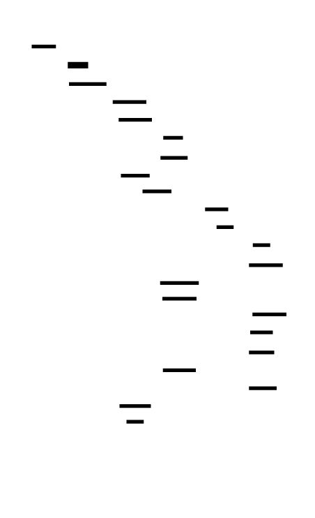
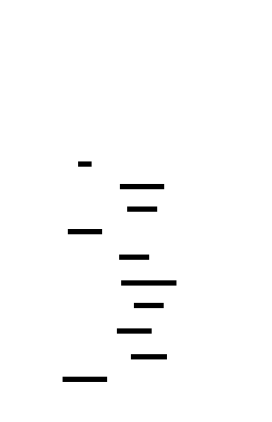

# 🎯 Project Charter: Build Your Own Shell (Advanced)
## What You Are Building
A complete POSIX-like Unix shell from scratch that boots from a command prompt, tokenizes and parses shell grammar into an AST, manages concurrent pipelines and background jobs with proper process group handling, implements signal-based job control with terminal control transfer, and supports full scripting with variables, functions, loops, conditionals, and command substitution. By the end, your shell will pass a comprehensive test suite including concurrent pipelines like `cmd1 | cmd2 | cmd3`, interactive job control with Ctrl+Z/Ctrl+C, and self-hosting script execution.
## Why This Project Exists
Most developers use shells daily but treat them as black boxes. Building one from scratch reveals why pipelines run concurrently (not sequentially), how Ctrl+C kills only the foreground job (via process groups and tcsetpgrp), why `cd` must be a builtin (child processes can't change parent state), and how exit status serves as the boolean type for an entire programming language. This project exposes the process model, signal handling, and terminal control mechanisms that underpin every Unix program you've ever run.
## What You Will Be Able to Do When Done
- Implement a proper lexer and recursive descent parser that handles quoting, escapes, and operator precedence
- Execute concurrent N-stage pipelines with correct file descriptor management and SIGPIPE handling
- Build process groups and transfer terminal control using setpgid() and tcsetpgrp()
- Handle signals with async-signal-safe code using the self-pipe trick
- Implement a complete shell scripting language with variables, functions, loops, and conditionals
- Execute subshells with fork-based isolation and understand the fork boundary
- Build here-documents, logical operators, and shell options like `set -e`
## Final Deliverable
~5,000-8,000 lines of C across 50+ source files implementing a fully functional shell. Supports 40+ test cases covering tokenization, parsing, pipelines, redirections, job control, control flow, and script execution. Passes integration tests including `yes | head -1` (SIGPIPE), `sleep 100; Ctrl+Z; fg` (job control), and self-hosting script execution with functions and loops.
## Is This Project For You?
**You should start this if you:**
- Have built a basic shell (mini-shell project or equivalent) that can run simple commands
- Are comfortable with C or Rust, including pointers and memory management
- Understand the Unix process model: what fork/exec/wait do and why
- Know what file descriptors are and have used pipes or redirections
**Come back after you've learned:**
- [C pointers and memory allocation](https://www.learn-c.org/) — you'll manage complex data structures with manual memory ownership
- [Unix fork/exec/wait pattern](https://brennan.io/2015/01/16/write-a-shell-in-c/) — try a simpler shell first
- [File descriptors and pipes](https://www.gnu.org/software/libc/manual/html_node/Pipes-and-FIFOs.html) — essential for pipeline implementation
## Estimated Effort
| Phase | Time |
|-------|------|
| Lexer, Parser, and Basic Execution | ~6-9 hours |
| Pipes, Redirection, and Expansions | ~7-10 hours |
| Signal Handling and Job Control | ~8-12 hours |
| Control Flow and Scripting | ~8-12 hours |
| Subshells and Advanced Features | ~7-10 hours |
| **Total** | **~36-53 hours** |
## Definition of Done
The project is complete when:
- `echo "hello world" | cat` produces `hello world` with concurrent pipeline execution
- `sleep 100; Ctrl+Z` suspends the job and `fg` resumes it with terminal control transfer
- `for f in *.txt; do echo $f; done` correctly expands globs and iterates
- `set -e; false || true` does NOT exit the shell (errexit suppression in condition contexts)
- A script file with functions, loops, and conditionals executes correctly when passed to the shell
- All pipe file descriptors are closed in parent and non-participating children (no fd leaks causing hangs)
- `$(cmd)` command substitution works with nested substitution `$(echo $(date))`

---

# 📚 Before You Read This: Prerequisites & Further Reading
> **Read these first.** The Atlas assumes you are familiar with the foundations below.
> Resources are ordered by when you should encounter them — some before you start, some at specific milestones.
---
## Foundation: Process Model & System Calls
### 1. The fork() System Call
**📖 Paper:** Ritchie, D. M., & Thompson, K. (1974). "The UNIX Time-Sharing System." Communications of the ACM, 17(7), 365-375.
**🔗 Spec:** POSIX.1-2017, `fork()` - <https://pubs.opengroup.org/onlinepubs/9699919799/functions/fork.html>
**💻 Code:** Linux Kernel `kernel/fork.c` — `do_fork()` function (arch/x86/kernel/process.c for architecture-specific parts)
**📝 Best Explanation:** "Chapter 5: Process Management" in *Operating Systems: Three Easy Pieces* by Remzi Arpaci-Dusseau and Andrea Arpaci-Dusseau. <https://pages.cs.wisc.edu/~remzi/OSTEP/>
**🎯 Why:** Fork is the fundamental primitive for process creation in Unix. Understanding copy-on-write semantics and the parent-child relationship is essential before Milestone 1's executor.
**When to read:** BEFORE starting Milestone 1 — you'll implement fork/exec/wait immediately.
---
### 2. The exec Family of Functions
**🔗 Spec:** POSIX.1-2017, `exec` family — <https://pubs.opengroup.org/onlinepubs/9699919799/functions/exec.html>
**💻 Code:** musl libc `src/process/execve.c` — the thin wrapper around the syscall
**📝 Best Explanation:** "Chapter 5: The exec() Family" in *Advanced Programming in the UNIX Environment* by W. Richard Stevens (3rd ed., APUE), Section 8.10.
**🎯 Why:** Understanding how exec replaces the process image clarifies why `_exit()` is required after exec failure in the child (Milestone 1's critical bug trap).
**When to read:** BEFORE starting Milestone 1 — you need to understand process replacement before writing the executor.
---
### 3. The exit() vs _exit() Distinction
**📝 Best Explanation:** "Section 8.5: exit Function" in *Advanced Programming in the UNIX Environment* by W. Richard Stevens. The critical passage explains stdio buffer inheritance at fork.
**💻 Code:** glibc `stdlib/exit.c` (exit) vs `sysdeps/unix/sysv/linux/_exit.c` (_exit)
**🎯 Why:** Using `exit()` instead of `_exit()` after failed exec causes double-flushed stdio buffers — one of the most common shell bugs.
**When to read:** BEFORE starting Milestone 1 — this will bite you immediately in the executor.
---
### 4. File Descriptors and dup2()
**🔗 Spec:** POSIX.1-2017, `dup2()` — <https://pubs.opengroup.org/onlinepubs/9699919799/functions/dup2.html>
**📝 Best Explanation:** "Chapter 3: File I/O" in *The Linux Programming Interface* by Michael Kerrisk (TLPI), specifically the "Duplicating File Descriptors" section (Section 4.4 in some editions, 5.4 in others).
**💻 Code:** Linux Kernel `fs/file.c` — `do_dup2()` function
**🎯 Why:** Redirections (Milestone 2) and pipelines depend entirely on dup2(). Understanding atomic close-and-copy prevents race conditions.
**When to read:** BEFORE Milestone 2 — redirection implementation requires deep dup2() understanding.
---
## Foundation: Pipes and IPC
### 5. Pipes and Pipeline Execution
**📖 Paper:** McIlroy, M. D. (1986). "A Research UNIX Reader: Annotated Excerpts from the Programmer's Manual, 1971-1986." Bell Labs. The pipe concept is attributed to McIlroy's 1964 suggestion.
**🔗 Spec:** POSIX.1-2017, `pipe()` — <https://pubs.opengroup.org/onlinepubs/9699919799/functions/pipe.html>
**💻 Code:** Linux Kernel `fs/pipe.c` — `do_pipe2()` and the pipe buffer implementation
**📝 Best Explanation:** "Chapter 44: Pipes and FIFOs" in *The Linux Programming Interface* by Michael Kerrisk. Section on pipe capacity and atomic writes.
**🎯 Why:** Pipelines execute concurrently, not sequentially. Understanding the 64KB buffer limit and SIGPIPE behavior is critical for Milestone 2.
**When to read:** BEFORE Milestone 2 — concurrent pipeline execution depends on understanding pipe mechanics.
---
### 6. SIGPIPE and Backpressure
**📝 Best Explanation:** "Chapter 10: Signals" in *Advanced Programming in the UNIX Environment* — specifically the SIGPIPE section. Also see "Job Control" signals in Section 9.7.
**🎯 Why:** When `yes | head -1` terminates, `yes` receives SIGPIPE. Understanding this signal explains why pipelines don't hang on early termination.
**When to read:** Read after Milestone 2 (Pipeline Implementation) — you'll have enough context to appreciate the producer-consumer dynamics.
---
## Foundation: Signals and Job Control
### 7. Signal Handling and Async-Signal-Safety
**🔗 Spec:** POSIX.1-2017, "Signal-Safe Functions" — <https://pubs.opengroup.org/onlinepubs/9699919799/functions/V2_chap02.html#tag_15_04>
**📝 Best Explanation:** Butenhof, D. R. (1997). *Programming with POSIX Threads*, Section 6.6: "Async-Signal-Safe Functions." Also see "Chapter 10: Signals" in APUE.
**💻 Code:** glibc's signal-safe wrappers in `sysdeps/unix/sysv/linux/`
**🎯 Why:** The SIGCHLD handler (Milestone 3) can ONLY call async-signal-safe functions. Understanding why `printf()` causes deadlock prevents mysterious crashes.
**When to read:** BEFORE Milestone 3 — the self-pipe trick requires understanding async-signal-safety constraints.
---
### 8. Process Groups and Terminal Control
**📖 Paper:** Ritchie, D. M. (1984). "A Stream Input-Output System." AT&T Bell Laboratories Technical Journal, 63(8). Introduces the terminal driver's role in job control.
**🔗 Spec:** POSIX.1-2017, `setpgid()`, `tcsetpgrp()` — <https://pubs.opengroup.org/onlinepubs/9699919799/functions/setpgid.html>
**💻 Code:** Linux Kernel `kernel/sys.c` — `do_setpgid()`; `drivers/tty/tty_io.c` — `tiocsctty()` and `tty_check_change()`
**📝 Best Explanation:** "Chapter 9: Process Relationships" in *Advanced Programming in the UNIX Environment*, specifically Section 9.8: "Job Control."
**🎯 Why:** Ctrl+C sends SIGINT to the *foreground process group*, not individual processes. Understanding this is essential for Milestone 3's job control.
**When to read:** BEFORE Milestone 3 — process groups are the foundation of job control.
---
### 9. The Self-Pipe Trick
**📝 Best Explanation:** Libevent documentation's "A Callback-Based System" section describes the pattern. See also Dan Bernstein's "The self-pipe trick" discussion on the qmail mailing list (1997).
**💻 Code:** libevent `event.c` — signal handler integration using pipes
**🎯 Why:** This pattern bridges async signal handlers and synchronous main loops. Milestone 3's SIGCHLD handling uses this to safely reap children.
**When to read:** Read after Milestone 2 — you'll understand pipes well enough to appreciate the self-pipe design.
---
## Foundation: Parsing and Language Design
### 10. Recursive Descent Parsing
**📖 Paper:** Wirth, N. (1976). "Algorithms + Data Structures = Programs." Prentice-Hall. Chapter 5 introduces recursive descent.
**📝 Best Explanation:** "Chapter 2: A Simple Interpreter" in *Crafting Interpreters* by Robert Nystrom. Free online: <https://craftinginterpreters.com/>
**💻 Code:** Bash `parse.y` (though Bash uses yacc, the structure is instructive) or dash's `parser.c` for a hand-written recursive descent parser
**🎯 Why:** Your shell's parser uses recursive descent with operator precedence levels. Understanding the pattern helps debug parsing issues in all milestones.
**When to read:** Read BEFORE starting Milestone 1 — parsing is the first major component you'll build.
---
### 11. Abstract Syntax Trees
**📝 Best Explanation:** "Chapter 3: The Tree-Walk Interpreter" in *Crafting Interpreters* by Robert Nystrom. <https://craftinginterpreters.com/contents.html>
**💻 Code:** Lox interpreter's AST implementation in the same book
**🎯 Why:** Your shell's execution model walks an AST. The tree structure (pipeline → commands → arguments) directly reflects execution semantics.
**When to read:** Read BEFORE starting Milestone 1 — you'll design AST node types immediately.
---
## Foundation: Shell Expansion Semantics
### 12. POSIX Shell Expansion Rules
**🔗 Spec:** POSIX.1-2017, "Shell Command Language" Section 2.6: "Word Expansions" — <https://pubs.opengroup.org/onlinepubs/9699919799/utilities/V3_chap02.html#tag_18_06>
**📝 Best Explanation:** "Chapter 7: The Bourne Again Shell" in *Classic Shell Scripting* by Arnold Robbins and Nelson Beebe, specifically the expansion sections.
**💻 Code:** Bash `subst.c` — the `expand_word()` function chain
**🎯 Why:** Expansions happen in a strict order: tilde → parameter → command substitution → field splitting → glob → quote removal. Violating this order causes subtle bugs.
**When to read:** BEFORE Milestone 2 — expansion implementation requires understanding the six-phase pipeline.
---
### 13. Glob Pattern Matching
**📝 Best Explanation:** "Chapter 8: Filename Generation" in *Classic Shell Scripting* by Robbins and Beebe.
**💻 Code:** Bash `lib/glob/glob.c` or musl's `src/regex/glob.c`
**🎯 Why:** Glob expansion matches filenames against patterns. The recursive matching algorithm for `*`, `?`, and `[...]` is non-trivial.
**When to read:** Read after Milestone 2 (Expansion Pipeline) — glob is the final expansion phase and builds on earlier concepts.
---
## Foundation: Control Flow and Scripting
### 14. Exit Status as Boolean
**🔗 Spec:** POSIX.1-2017, "Shell Command Language" Section 2.9.1: "Exit Status" — <https://pubs.opengroup.org/onlinepubs/9699919799/utilities/V3_chap02.html#tag_18_09_01>
**📝 Best Explanation:** The bash(1) man page, "EXIT STATUS" section. Also see the `test` command documentation.
**💻 Code:** Bash `test.c` — the implementation of `[` and `test` builtins
**🎯 Why:** In shell, exit status 0 means true/success, non-zero means false/failure. This inverts C's boolean convention and affects all control flow.
**When to read:** BEFORE Milestone 4 — control flow depends entirely on exit status semantics.
---
### 15. setjmp/longjmp for Control Transfer
**📖 Paper:** Evans, A. (1970). "An ALGOL-Based Coroutine System with Input-Output." A classic on non-local exits.
**🔗 Spec:** POSIX.1-2017, `setjmp()`, `longjmp()` — <https://pubs.opengroup.org/onlinepubs/9699919799/functions/setjmp.html>
**📝 Best Explanation:** "Chapter 7: C Program Startup and Termination" in *Advanced Programming in the UNIX Environment*, longjmp section.
**💻 Code:** glibc `setjmp/` directory — architecture-specific implementations
**🎯 Why:** `break`, `continue`, and `return` use longjmp to exit nested constructs. Understanding the jump buffer model is essential for Milestone 4.
**When to read:** Read after Milestone 3 — you'll appreciate the control flow challenge before seeing the solution.
---
### 16. Dynamic Scoping
**📖 Paper:** Moses, J. (1970). "The Function of FUNCTION in LISP." MIT AI Memo 199. Introduces deep vs shallow binding.
**📝 Best Explanation:** "Section 3.3: Scope" in *Structure and Interpretation of Computer Programs* by Abelson and Sussman. Contrast with lexical scope.
**🎯 Why:** Shell functions use dynamic scoping — variables are looked up in the call stack at runtime. This differs from most modern languages and affects how `local` works.
**When to read:** Read after Milestone 4 (Functions) — you'll have implemented dynamic scoping and can compare with the explanation.
---
## Foundation: Advanced Features
### 17. The Fork Boundary and Isolation
**📖 Paper:** McIlroy, M. D., & Kernighan, B. W. (1979). "UNIX Time-Sharing System: The Evolution of a Facility." Bell System Technical Journal.
**📝 Best Explanation:** "Section 8.3: fork Function" in *Advanced Programming in the UNIX Environment*, specifically the discussion of what is and isn't inherited.
**🎯 Why:** Subshells `(cmd)` fork and isolate all state. Brace groups `{ cmd; }` don't. Understanding what crosses the fork boundary (only exit status) is key to Milestone 5.
**When to read:** BEFORE Milestone 5 — subshell implementation depends on understanding isolation semantics.
---
### 18. Shell Options and Errexit
**🔗 Spec:** POSIX.1-2017, `set` builtin — <https://pubs.opengroup.org/onlinepubs/9699919799/utilities/V3_chap02.html#tag_18_25_01>
**📝 Best Explanation:** The bash(1) man page, "SHELL BUILTIN COMMANDS" section for `set`, particularly `-e` behavior.
**💻 Code:** Bash `builtins/set.def` — the complex errexit suppression logic
**🎯 Why:** `set -e` exits on command failure EXCEPT in condition contexts (`if`, `while`, `&&`, `||`). This is one of the most subtle shell behaviors.
**When to read:** Read after Milestone 5 (Subshells and Options) — you'll have implemented errexit and can test the edge cases.
---
## Historical Context
### 19. The Bourne Shell
**📖 Paper:** Bourne, S. R. (1978). "The UNIX Shell." Bell System Technical Journal, 57(6). The original shell paper.
**📝 Best Explanation:** "Chapter 1: Introduction" in *The Unix Programming Environment* by Kernighan and Pike, which explains the shell's role.
**💻 Code:** The original V7 Unix `/usr/src/cmd/sh/` — a compact 3,500 lines of C
**🎯 Why:** Understanding Bourne's original design clarifies why shells work the way they do. Many "quirks" become logical in historical context.
**When to read:** Read after completing the project — you'll appreciate the design decisions with your implementation experience.
---
## Reference Materials
### 20. The POSIX Shell Specification
**🔗 Spec:** POSIX.1-2017, "Shell Command Language" — <https://pubs.opengroup.org/onlinepubs/9699919799/utilities/V3_chap02.html>
**🎯 Why:** This is the authoritative specification. When in doubt, consult POSIX. Your shell aims for POSIX compliance.
**When to read:** Keep open throughout the project — reference for any ambiguous behavior.
---
## Summary Reading Order
| Phase | Resources | Purpose |
|-------|-----------|---------|
| **Before M1** | fork/exec, _exit vs exit, AST parsing | Foundation for executor and parser |
| **After M1** | File descriptors, dup2 | Prepare for redirections |
| **Before M2** | Pipes, SIGPIPE, expansion phases | Pipeline and expansion implementation |
| **After M2** | Self-pipe, signals | Prepare for job control |
| **Before M3** | Process groups, tcsetpgrp, async-signal-safety | Job control implementation |
| **After M3** | setjmp/longjmp | Prepare for control flow |
| **Before M4** | Exit status as boolean, dynamic scope | Control flow and functions |
| **After M4** | Fork boundary, errexit | Prepare for advanced features |
| **Before M5** | Subshell isolation, shell options | Final features |
| **After project** | Bourne shell paper, POSIX spec | Historical and reference context |

---

# Build Your Own Shell (Advanced)

This project guides you through building a full-featured POSIX-like shell from scratch, covering the complete journey from lexical analysis to job control. You'll implement process creation (fork/exec), inter-process communication (pipes), terminal control (process groups, tcsetpgrp), signal handling, and a scripting language with variables, conditionals, loops, and functions. Unlike a simple command runner, this shell properly handles concurrent pipelines, background jobs, Ctrl+Z suspension, and nested control structures—all while learning why shells are among the most intricate Unix programs.


<!-- MS_ID: build-shell-m1 -->
# Lexer, Parser, and Basic Execution
## The Hidden Complexity Behind "Just Run This Command"
You type `echo "hello world"` and hit Enter. The command runs. Simple, right?
Now type `echo "hello   world"` (multiple spaces). The output is `hello   world` — the spaces are preserved. But type `echo hello   world` (no quotes) and you get `hello world` — the spaces collapsed. What's happening?
Here's the uncomfortable truth: **string splitting on spaces is not parsing**. A shell isn't a simple tokenizer that chops input on whitespace. It's a full programming language interpreter with a grammar, state machines for quoting, operator precedence rules, and an abstract syntax tree.


This milestone builds the foundation of your shell: a lexer that tokenizes input with proper quote and escape handling, a parser that constructs an Abstract Syntax Tree (AST), and an executor that runs commands from that AST. By the end, you'll understand why shells are among the most intricate Unix programs — and you'll have built one from scratch.
---
## The Tension: Why String Splitting Fails
Before we write code, let's understand the problem. Consider these inputs:
```bash
echo "hello world"      # 2 tokens: echo, "hello world"
echo hello world        # 3 tokens: echo, hello, world
echo "hello\"world"     # 2 tokens: echo, hello"world
echo 'hello"world'      # 2 tokens: echo, hello"world (different quote type!)
echo hello\ world       # 2 tokens: echo, hello world (escaped space)
ls|grep foo>out.txt     # 6 tokens: ls, |, grep, foo, >, out.txt
```
A naive `strtok(input, " ")` approach fails immediately:
- It can't handle quoted strings containing spaces
- It can't distinguish operators (`|`, `>`, `&`) from words
- It can't handle escape sequences
- It can't handle adjacent operators without spaces (`ls|grep`)
**The constraint**: Shell grammar requires tracking lexer state across characters. The meaning of a character depends on whether you're inside quotes, which type of quotes, whether the previous character was a backslash, and what operators you're in the middle of building.


### The Three Levels of Shell Parsing
**Level 1 — Application (User's View)**: The user types a command line. They expect quotes to group words, escapes to work, and pipelines to connect commands.
**Level 2 — Shell Internal (Your Implementation)**: The lexer produces a token stream. The parser builds an AST. The executor walks the AST and performs actions.
**Level 3 — System (Unix Primitives)**: The executor ultimately calls `fork()` to create child processes, `execvp()` to run programs, and `waitpid()` to collect exit statuses.
---
## Part 1: The Lexer — From Characters to Tokens
A lexer (also called a tokenizer or scanner) transforms a raw character stream into a sequence of tokens. Each token has a type and, for word tokens, a string value.
### Token Types
Your shell needs to recognize these token types:


```c
typedef enum {
    TOK_WORD,           // Regular word (command name, argument)
    TOK_PIPE,           // |
    TOK_REDIR_IN,       // <
    TOK_REDIR_OUT,      // >
    TOK_REDIR_APPEND,   // >>
    TOK_REDIR_ERR,      // 2>
    TOK_AMPERSAND,      // &
    TOK_SEMICOLON,      // ;
    TOK_NEWLINE,        // \n
    TOK_LPAREN,         // (
    TOK_RPAREN,         // )
    // Control flow keywords
    TOK_IF, TOK_THEN, TOK_ELSE, TOK_FI,
    TOK_WHILE, TOK_DO, TOK_DONE,
    TOK_FOR, TOK_IN,
    TOK_EOF,            // End of input
    TOK_ERROR           // Lexical error
} TokenType;
```
### The Lexer State Machine
The lexer must track its state to handle quotes and escapes correctly:
```c
typedef enum {
    LEX_DEFAULT,        // Normal state
    LEX_IN_SINGLE_QUOTE,// Inside '...'
    LEX_IN_DOUBLE_QUOTE,// Inside "..."
    LEX_IN_ESCAPE       // After backslash
} LexerState;
typedef struct {
    const char* input;      // Input string
    size_t pos;             // Current position
    size_t len;             // Input length
    LexerState state;       // Current state
    char* current_token;    // Buffer for building current token
    size_t token_capacity;  // Buffer capacity
} Lexer;
```
### Quote Handling Rules
**Single quotes (`'...'`)**: Everything inside is literal. No variable expansion, no escape sequences, nothing special. The string `'hello\n$HOME'` contains exactly those 12 characters.
**Double quotes (`"..."`)**: Variables are expanded (`$HOME` becomes `/home/user`), but spaces are preserved. Backslash escapes work for: `\$`, `\"`, `\\`, `\n`, `\t`. The string `"hello $USER"` expands to `hello alice` (assuming USER=alice).
**Escape character (`\`)**: Outside quotes and inside double quotes, backslash escapes the next character. The sequence `\ ` (backslash-space) produces a literal space that doesn't split words.
Here's the lexer's character processing loop:
```c
int lexer_next_token(Lexer* lex, TokenType* type, char** value) {
    // Skip leading whitespace (but not newlines)
    while (lex->pos < lex->len && 
           lex->input[lex->pos] == ' ' || 
           lex->input[lex->pos] == '\t') {
        lex->pos++;
    }
    if (lex->pos >= lex->len) {
        *type = TOK_EOF;
        *value = NULL;
        return 0;
    }
    char c = lex->input[lex->pos];
    // Check for operators
    if (lex->state == LEX_DEFAULT) {
        switch (c) {
            case '|':
                lex->pos++;
                *type = TOK_PIPE;
                *value = NULL;
                return 0;
            case '<':
                lex->pos++;
                *type = TOK_REDIR_IN;
                *value = NULL;
                return 0;
            case '>':
                lex->pos++;
                if (lex->pos < lex->len && lex->input[lex->pos] == '>') {
                    lex->pos++;
                    *type = TOK_REDIR_APPEND;
                } else {
                    *type = TOK_REDIR_OUT;
                }
                *value = NULL;
                return 0;
            case '&':
                lex->pos++;
                *type = TOK_AMPERSAND;
                *value = NULL;
                return 0;
            case ';':
                lex->pos++;
                *type = TOK_SEMICOLON;
                *value = NULL;
                return 0;
            case '\n':
                lex->pos++;
                *type = TOK_NEWLINE;
                *value = NULL;
                return 0;
            case '(':
                lex->pos++;
                *type = TOK_LPAREN;
                *value = NULL;
                return 0;
            case ')':
                lex->pos++;
                *type = TOK_RPAREN;
                *value = NULL;
                return 0;
            case '\'':
                lex->state = LEX_IN_SINGLE_QUOTE;
                lex->pos++;
                return lexer_read_quoted(lex, type, value, /*single=*/true);
            case '"':
                lex->state = LEX_IN_DOUBLE_QUOTE;
                lex->pos++;
                return lexer_read_quoted(lex, type, value, /*single=*/false);
        }
    }
    // Read a word (including escapes)
    return lexer_read_word(lex, type, value);
}
```
### Reading Quoted Strings
The tricky part is handling the transition between quoted and unquoted states:
```c
static int lexer_read_quoted(Lexer* lex, TokenType* type, char** value, 
                             bool single_quote) {
    // Reset token buffer
    lex->current_token[0] = '\0';
    size_t token_len = 0;
    while (lex->pos < lex->len) {
        char c = lex->input[lex->pos];
        if (single_quote) {
            // Single quote: only ' ends the string
            if (c == '\'') {
                lex->pos++;
                lex->state = LEX_DEFAULT;
                *type = TOK_WORD;
                *value = strdup(lex->current_token);
                return 0;
            }
            // Everything else is literal
            append_char(lex, &token_len, c);
            lex->pos++;
        } else {
            // Double quote: " ends, $ expands, \ escapes
            if (c == '"') {
                lex->pos++;
                lex->state = LEX_DEFAULT;
                *type = TOK_WORD;
                *value = strdup(lex->current_token);
                return 0;
            }
            if (c == '\\' && lex->pos + 1 < lex->len) {
                // Escape sequence
                lex->pos++;
                char next = lex->input[lex->pos];
                // Only certain characters are special in double quotes
                if (next == '$' || next == '"' || next == '\\' || 
                    next == '`' || next == '\n') {
                    append_char(lex, &token_len, next);
                } else {
                    // Backslash is literal for other characters
                    append_char(lex, &token_len, '\\');
                    append_char(lex, &token_len, next);
                }
                lex->pos++;
                continue;
            }
            if (c == '$') {
                // Variable expansion (we'll implement this in M2)
                // For now, treat as literal
                append_char(lex, &token_len, c);
                lex->pos++;
                continue;
            }
            append_char(lex, &token_len, c);
            lex->pos++;
        }
    }
    // Unterminated quote
    *type = TOK_ERROR;
    *value = strdup("Unterminated quote");
    return -1;
}
```
### Reading Words with Escapes
For unquoted words, we need to handle escape sequences and detect when we hit an operator:
```c
static int lexer_read_word(Lexer* lex, TokenType* type, char** value) {
    lex->current_token[0] = '\0';
    size_t token_len = 0;
    while (lex->pos < lex->len) {
        char c = lex->input[lex->pos];
        // Check for state transitions
        if (lex->state == LEX_IN_ESCAPE) {
            append_char(lex, &token_len, c);
            lex->pos++;
            lex->state = LEX_DEFAULT;
            continue;
        }
        // Check for quote starts
        if (c == '\'') {
            lex->state = LEX_IN_SINGLE_QUOTE;
            lex->pos++;
            // Continue reading in quoted mode, but stay in same token
            continue;
        }
        if (c == '"') {
            lex->state = LEX_IN_DOUBLE_QUOTE;
            lex->pos++;
            continue;
        }
        // Escape starts
        if (c == '\\') {
            lex->state = LEX_IN_ESCAPE;
            lex->pos++;
            continue;
        }
        // Word terminators in default state
        if (c == ' ' || c == '\t' || c == '\n' ||
            c == '|' || c == '<' || c == '>' ||
            c == '&' || c == ';' || c == '(' || c == ')') {
            break;
        }
        append_char(lex, &token_len, c);
        lex->pos++;
    }
    // Check for keywords
    *type = classify_word(lex->current_token);
    *value = strdup(lex->current_token);
    return 0;
}
```
### Keyword Recognition
Keywords like `if`, `then`, `while` are only keywords when they appear as complete words, not as substrings:
```c
static TokenType classify_word(const char* word) {
    struct {
        const char* name;
        TokenType type;
    } keywords[] = {
        {"if", TOK_IF},
        {"then", TOK_THEN},
        {"else", TOK_ELSE},
        {"fi", TOK_FI},
        {"while", TOK_WHILE},
        {"do", TOK_DO},
        {"done", TOK_DONE},
        {"for", TOK_FOR},
        {"in", TOK_IN},
        {NULL, TOK_WORD}
    };
    for (int i = 0; keywords[i].name != NULL; i++) {
        if (strcmp(word, keywords[i].name) == 0) {
            return keywords[i].type;
        }
    }
    return TOK_WORD;
}
```
---
## Part 2: The Parser — From Tokens to AST
The parser takes the token stream and builds an Abstract Syntax Tree. The AST is the key data structure that makes everything else possible — control flow, nested commands, and proper execution order.
### Why an AST? The Flat List Problem
Consider this command:
```bash
ls -la | grep foo > out.txt &
```
A flat token list would be:
```
[ls] [-la] [|] [grep] [foo] [>] [out.txt] [&]
```
But what does this *mean*? You can't execute it directly. You need to know:
- `ls -la | grep foo` is a pipeline
- The `> out.txt` redirects the output of `grep` (the last command in the pipeline)
- The `&` makes the entire thing run in the background


### AST Node Types
```c
typedef enum {
    NODE_SIMPLE_CMD,    // Simple command: ls -la
    NODE_PIPELINE,      // Pipeline: cmd1 | cmd2 | cmd3
    NODE_LIST,          // Command list: cmd1 ; cmd2
    NODE_BACKGROUND,    // Background: cmd &
    NODE_REDIRECT       // Redirection wrapper
} NodeType;
typedef struct Redirect {
    enum { REDIR_IN, REDIR_OUT, REDIR_APPEND, REDIR_ERR } type;
    char* target;           // Filename
    struct Redirect* next;  // Chain multiple redirects
} Redirect;
typedef struct ASTNode {
    NodeType type;
    union {
        // Simple command
        struct {
            char** argv;        // NULL-terminated argument array
            int argc;           // Argument count
            Redirect* redirects;// Linked list of redirects
        } cmd;
        // Pipeline
        struct {
            struct ASTNode** commands;  // Array of command nodes
            int num_commands;
        } pipeline;
        // List (;)
        struct {
            struct ASTNode* left;
            struct ASTNode* right;
        } list;
        // Background (&)
        struct {
            struct ASTNode* command;
        } background;
    } data;
} ASTNode;
```


### Operator Precedence
Shell operators have a precedence hierarchy:
1. **Pipelines (`|`)**: Highest precedence. `ls | grep | wc` binds tighter than anything.
2. **Background (`&`)**: Lower than pipes. `ls | grep &` means `(ls | grep) &`
3. **List (`;`, newline)**: Lowest. `cmd1 ; cmd2 &` means `cmd1 ; (cmd2 &)`
This means your parser should use recursive descent or precedence climbing to handle the nesting correctly.
### Recursive Descent Parser
Here's a simplified recursive descent parser that handles the precedence:
```c
typedef struct {
    Lexer* lexer;
    TokenType current_type;
    char* current_value;
    bool has_error;
    char* error_message;
} Parser;
// Forward declarations
static ASTNode* parse_list(Parser* p);
static ASTNode* parse_background(Parser* p);
static ASTNode* parse_pipeline(Parser* p);
static ASTNode* parse_simple_command(Parser* p);
// Entry point
ASTNode* parse(Parser* p) {
    advance_token(p);  // Load first token
    ASTNode* root = parse_list(p);
    if (p->current_type != TOK_EOF && p->current_type != TOK_NEWLINE) {
        parser_error(p, "Unexpected token after command");
        free_ast(root);
        return NULL;
    }
    return root;
}
// Lowest precedence: list (; and newline)
static ASTNode* parse_list(Parser* p) {
    ASTNode* left = parse_background(p);
    while (p->current_type == TOK_SEMICOLON || p->current_type == TOK_NEWLINE) {
        advance_token(p);  // consume ; or \n
        ASTNode* right = parse_background(p);
        ASTNode* list = create_node(NODE_LIST);
        list->data.list.left = left;
        list->data.list.right = right;
        left = list;
    }
    return left;
}
// Medium precedence: background (&)
static ASTNode* parse_background(Parser* p) {
    ASTNode* cmd = parse_pipeline(p);
    if (p->current_type == TOK_AMPERSAND) {
        advance_token(p);
        ASTNode* bg = create_node(NODE_BACKGROUND);
        bg->data.background.command = cmd;
        return bg;
    }
    return cmd;
}
// Higher precedence: pipeline (|)
static ASTNode* parse_pipeline(Parser* p) {
    ASTNode* left = parse_simple_command(p);
    if (p->current_type != TOK_PIPE) {
        return left;
    }
    // It's a pipeline
    ASTNode* pipeline = create_node(NODE_PIPELINE);
    pipeline->data.pipeline.commands = malloc(sizeof(ASTNode*) * 16);
    pipeline->data.pipeline.commands[0] = left;
    int count = 1;
    while (p->current_type == TOK_PIPE) {
        advance_token(p);  // consume |
        ASTNode* right = parse_simple_command(p);
        pipeline->data.pipeline.commands[count++] = right;
    }
    pipeline->data.pipeline.num_commands = count;
    return pipeline;
}
// Highest precedence: simple command
static ASTNode* parse_simple_command(Parser* p) {
    if (p->current_type != TOK_WORD) {
        parser_error(p, "Expected command name");
        return NULL;
    }
    ASTNode* cmd = create_node(NODE_SIMPLE_CMD);
    cmd->data.cmd.argv = malloc(sizeof(char*) * 64);
    cmd->data.cmd.argc = 0;
    cmd->data.cmd.redirects = NULL;
    // Collect words and redirects
    while (p->current_type == TOK_WORD || is_redirect_token(p->current_type)) {
        if (p->current_type == TOK_WORD) {
            cmd->data.cmd.argv[cmd->data.cmd.argc++] = 
                strdup(p->current_value);
            advance_token(p);
        } else {
            Redirect* redir = parse_redirect(p);
            if (redir == NULL) {
                free_ast(cmd);
                return NULL;
            }
            // Add to end of redirect chain
            redir->next = cmd->data.cmd.redirects;
            cmd->data.cmd.redirects = redir;
        }
    }
    cmd->data.cmd.argv[cmd->data.cmd.argc] = NULL;
    return cmd;
}
```
### Parsing Redirections
Redirections can appear anywhere in a simple command:
```c
static Redirect* parse_redirect(Parser* p) {
    Redirect* redir = malloc(sizeof(Redirect));
    redir->next = NULL;
    switch (p->current_type) {
        case TOK_REDIR_IN:
            redir->type = REDIR_IN;
            break;
        case TOK_REDIR_OUT:
            redir->type = REDIR_OUT;
            break;
        case TOK_REDIR_APPEND:
            redir->type = REDIR_APPEND;
            break;
        case TOK_REDIR_ERR:
            redir->type = REDIR_ERR;
            break;
        default:
            free(redir);
            return NULL;
    }
    advance_token(p);  // consume redirect operator
    if (p->current_type != TOK_WORD) {
        parser_error(p, "Expected filename after redirection");
        free(redir);
        return NULL;
    }
    redir->target = strdup(p->current_value);
    advance_token(p);
    return redir;
}
```
### Error Recovery and Messages
Good error messages require tracking position:
```c
static void parser_error(Parser* p, const char* message) {
    p->has_error = true;
    // Build error message with context
    if (p->current_value) {
        asprintf(&p->error_message, "syntax error near unexpected token `%s': %s",
                 p->current_value, message);
    } else {
        asprintf(&p->error_message, "syntax error: %s", message);
    }
}
```


---
## Part 3: Execution — From AST to Process
Now we have an AST. How do we actually run commands?
### The fork/exec/wait Pattern
This is the fundamental pattern for running external commands in Unix:

> **🔑 Foundation: The fork/exec/wait pattern creates a child process**
> 
> ## What It IS
The **fork-exec-wait pattern** is the Unix way of launching a new program. It's a three-step dance:
1. **`fork()`** — Creates an exact clone of the current process. You now have two nearly identical processes: the parent and the child. Both are running the same code, at the same point, with copies of the same variables.
2. **`exec()`** — Replaces the child's entire program image with a new program. The child process keeps its process ID, but its code, data, and heap are completely replaced.
3. **`wait()`** — The parent waits for the child to finish and collects its exit status. Without this, the child becomes a "zombie" when it terminates.
```c
pid_t pid = fork();
if (pid == 0) {
    // CHILD PROCESS
    execvp("ls", argv);
    // If we get here, exec FAILED
    _exit(127);  // NOT exit()
}
// PARENT PROCESS
int status;
waitpid(pid, &status, 0);
```
## Why Exec Failure Requires `_exit()`, Not `exit()`
Here's the critical insight that bites everyone:
When `exec()` fails, you're still in the **child process** — a duplicate of the parent. If you call `exit()`, it flushes all stdio buffers. But those buffers are *shared* with the parent (they were copied at fork). **You might print something twice** — once from the child's flush, once from the parent's.
`_exit()` terminates immediately without touching stdio buffers. It's the only safe way to exit from a forked child when exec fails.
```c
// WRONG — may cause double output
if (pid == 0) {
    execvp(program, args);
    perror("exec failed");
    exit(1);  // Flushes buffers! Parent might flush again!
}
// RIGHT — clean exit without side effects
if (pid == 0) {
    execvp(program, args);
    perror("exec failed");
    _exit(1);  // Immediate termination, no buffer flush
}
```
## Why You Need This Right Now
If you're building anything that spawns processes — a shell, a test runner, a build system, a container runtime — this pattern is foundational. The `_exit()` trap is particularly nasty because it causes **intermittent, hard-to-debug output corruption**. The failure path is rarely tested, so the bug lurks until something goes wrong at exactly the wrong time.
## Key Mental Model
Think of `fork()` as photocopying a running program. The child is a perfect copy standing at the same line of code. `exec()` is then erasing that photocopy and drawing something new on the same paper. If the erasure fails, you need to throw away the photocopy carefully (`_exit()`) — don't smudge ink on the original.


```c
int execute_simple_command(ASTNode* node) {
    if (node->type != NODE_SIMPLE_CMD) {
        return -1;
    }
    // Check for built-ins first (we'll implement these next)
    if (is_builtin(node->data.cmd.argv[0])) {
        return execute_builtin(node);
    }
    pid_t pid = fork();
    if (pid < 0) {
        perror("fork");
        return -1;
    }
    if (pid == 0) {
        // CHILD PROCESS
        // Handle redirections
        if (apply_redirects(node->data.cmd.redirects) < 0) {
            _exit(127);  // CRITICAL: use _exit, not exit!
        }
        // Execute the command
        execvp(node->data.cmd.argv[0], node->data.cmd.argv);
        // If we get here, exec failed
        fprintf(stderr, "%s: command not found\n", node->data.cmd.argv[0]);
        _exit(127);  // CRITICAL: use _exit, not exit!
    }
    // PARENT PROCESS
    int status;
    waitpid(pid, &status, 0);
    // Return exit status
    if (WIFEXITED(status)) {
        return WEXITSTATUS(status);
    }
    return -1;
}
```
### Why `_exit()` Instead of `exit()` After exec Failure
This is a critical detail that causes subtle bugs:
- `exit()` calls functions registered with `atexit()` and flushes stdio buffers
- The child process shares the parent's file descriptors, including stdio buffers
- If you call `exit()` after `exec` fails, you might flush buffered data that the parent was planning to write
- This can cause duplicate output or corrupted files
`_exit()` terminates immediately without cleanup — safe in the child after fork.
### Applying Redirections
The `dup2()` syscall duplicates a file descriptor to a specific number:
```c
static int apply_redirects(Redirect* redir) {
    while (redir != NULL) {
        int fd, target_fd, flags;
        switch (redir->type) {
            case REDIR_IN:
                fd = open(redir->target, O_RDONLY);
                target_fd = STDIN_FILENO;  // 0
                break;
            case REDIR_OUT:
                fd = open(redir->target, O_WRONLY | O_CREAT | O_TRUNC, 0644);
                target_fd = STDOUT_FILENO;  // 1
                break;
            case REDIR_APPEND:
                fd = open(redir->target, O_WRONLY | O_CREAT | O_APPEND, 0644);
                target_fd = STDOUT_FILENO;
                break;
            case REDIR_ERR:
                fd = open(redir->target, O_WRONLY | O_CREAT | O_TRUNC, 0644);
                target_fd = STDERR_FILENO;  // 2
                break;
        }
        if (fd < 0) {
            fprintf(stderr, "cannot open %s: %s\n", redir->target, strerror(errno));
            return -1;
        }
        // dup2 closes target_fd first, then copies fd to target_fd
        dup2(fd, target_fd);
        close(fd);  // Don't need the original fd anymore
        redir = redir->next;
    }
    return 0;
}
```
---
## Part 4: Built-in Commands — Why Some Commands Can't Be External
Not all commands can be external programs. Some *must* run in the shell process itself.
### The `cd` Problem
Imagine if `cd` were an external program:
1. Shell forks a child process
2. Child executes `/bin/cd /some/directory`
3. Child calls `chdir("/some/directory")` — this changes *the child's* current directory
4. Child exits
5. Parent (shell) continues — its current directory is unchanged!


**The fundamental constraint**: A child process cannot modify its parent's state. This includes:
- Current working directory (`chdir`)
- Environment variables (changes aren't propagated back)
- File descriptor table (except for what's inherited)
- Signal dispositions
### Which Commands Must Be Built-ins?
| Command | Why It Must Be Built-in |
|---------|------------------------|
| `cd` | Changes shell's cwd; child can't change parent's |
| `exit` | Must terminate shell, not just child process |
| `export` | Sets environment variables in shell's process |
| `unset` | Removes environment variables |
| `pwd` | Can be external, but built-in is faster and shows shell's actual cwd |
| `fg`, `bg`, `jobs` | Must access shell's job table (M3) |
### Built-in Implementation
```c
typedef int (*builtin_func)(char** argv);
typedef struct {
    const char* name;
    builtin_func func;
    const char* help;
} Builtin;
// Built-in function declarations
static int builtin_cd(char** argv);
static int builtin_exit(char** argv);
static int builtin_export(char** argv);
static int builtin_pwd(char** argv);
static int builtin_unset(char** argv);
static Builtin builtins[] = {
    {"cd", builtin_cd, "cd [directory] - Change directory"},
    {"exit", builtin_exit, "exit [status] - Exit the shell"},
    {"export", builtin_export, "export VAR=value - Set environment variable"},
    {"pwd", builtin_pwd, "pwd - Print working directory"},
    {"unset", builtin_unset, "unset VAR - Remove environment variable"},
    {NULL, NULL, NULL}
};
bool is_builtin(const char* name) {
    for (int i = 0; builtins[i].name != NULL; i++) {
        if (strcmp(name, builtins[i].name) == 0) {
            return true;
        }
    }
    return false;
}
int execute_builtin(ASTNode* node) {
    char** argv = node->data.cmd.argv;
    for (int i = 0; builtins[i].name != NULL; i++) {
        if (strcmp(argv[0], builtins[i].name) == 0) {
            return builtins[i].func(argv);
        }
    }
    return -1;
}
```
### Implementing `cd`
```c
static int builtin_cd(char** argv) {
    const char* target;
    if (argv[1] == NULL) {
        // cd with no argument goes to HOME
        target = getenv("HOME");
        if (target == NULL) {
            fprintf(stderr, "cd: HOME not set\n");
            return 1;
        }
    } else {
        target = argv[1];
    }
    if (chdir(target) != 0) {
        fprintf(stderr, "cd: %s: %s\n", target, strerror(errno));
        return 1;
    }
    // Update PWD environment variable
    char cwd[PATH_MAX];
    if (getcwd(cwd, sizeof(cwd)) != NULL) {
        setenv("PWD", cwd, 1);
    }
    return 0;
}
```
### Implementing `export`
```c
static int builtin_export(char** argv) {
    if (argv[1] == NULL) {
        // Print all exported variables
        extern char** environ;
        for (char** env = environ; *env != NULL; env++) {
            printf("export %s\n", *env);
        }
        return 0;
    }
    // Parse VAR=value format
    char* arg = argv[1];
    char* equals = strchr(arg, '=');
    if (equals == NULL) {
        // Just marking a shell variable for export
        // (We'd need a shell variable table for full implementation)
        return 0;
    }
    // Split at '='
    *equals = '\0';
    const char* name = arg;
    const char* value = equals + 1;
    if (setenv(name, value, 1) != 0) {
        fprintf(stderr, "export: failed to set %s\n", name);
        *equals = '=';  // Restore for error message
        return 1;
    }
    return 0;
}
```
### Implementing `exit`
```c
static int builtin_exit(char** argv) {
    int status = 0;
    if (argv[1] != NULL) {
        // Parse exit status
        status = atoi(argv[1]);
        // Clamp to valid range
        if (status < 0) status = 0;
        if (status > 255) status = 255;
    }
    // Clean up and exit
    // (In a real shell, we'd free all resources here)
    exit(status);
    // Never reached
    return 0;
}
```
---
## Part 5: Tying It Together — The REPL
The shell's main loop is a Read-Eval-Print Loop (REPL):
```c
int main(int argc, char** argv) {
    char* line = NULL;
    size_t line_cap = 0;
    ssize_t line_len;
    int last_exit_status = 0;
    // Main REPL loop
    while (1) {
        // Print prompt
        printf("$ ");
        fflush(stdout);
        // Read line
        line_len = getline(&line, &line_cap, stdin);
        if (line_len < 0) {
            // EOF (Ctrl+D)
            printf("\n");
            break;
        }
        // Remove trailing newline
        if (line_len > 0 && line[line_len - 1] == '\n') {
            line[line_len - 1] = '\0';
        }
        // Skip empty lines
        if (line[0] == '\0') {
            continue;
        }
        // Create lexer
        Lexer lexer = {
            .input = line,
            .pos = 0,
            .len = strlen(line),
            .state = LEX_DEFAULT
        };
        // Create parser
        Parser parser = {
            .lexer = &lexer,
            .has_error = false
        };
        // Parse
        ASTNode* ast = parse(&parser);
        if (parser.has_error) {
            fprintf(stderr, "%s\n", parser.error_message);
            free(parser.error_message);
            continue;
        }
        if (ast == NULL) {
            continue;
        }
        // Execute
        last_exit_status = execute_ast(ast);
        // Free AST
        free_ast(ast);
    }
    free(line);
    return last_exit_status;
}
```
### The Complete Executor
```c
int execute_ast(ASTNode* node) {
    if (node == NULL) {
        return 0;
    }
    switch (node->type) {
        case NODE_SIMPLE_CMD:
            return execute_simple_command(node);
        case NODE_PIPELINE:
            // Will be implemented in M2
            fprintf(stderr, "Pipelines not yet implemented\n");
            return 1;
        case NODE_LIST:
            // Execute left, then right
            execute_ast(node->data.list.left);
            return execute_ast(node->data.list.right);
        case NODE_BACKGROUND:
            // Will be implemented in M3
            fprintf(stderr, "Background execution not yet implemented\n");
            return 1;
        default:
            fprintf(stderr, "Unknown node type: %d\n", node->type);
            return 1;
    }
}
```
---
## Memory Layout and Ownership
Understanding who owns what memory is critical for avoiding leaks and use-after-free bugs:


| Data | Who Allocates | Who Frees | Lifetime |
|------|--------------|-----------|----------|
| Input line | `getline()` in main | Main loop | One iteration |
| Token strings | Lexer (`strdup`) | Parser or caller | Until AST is freed |
| AST nodes | Parser (`create_node`) | `free_ast()` | Until command completes |
| argv arrays | Parser | `free_ast()` | Same as node |
| Redirect targets | Parser | `free_ast()` | Same as node |
```c
void free_ast(ASTNode* node) {
    if (node == NULL) return;
    switch (node->type) {
        case NODE_SIMPLE_CMD:
            for (int i = 0; i < node->data.cmd.argc; i++) {
                free(node->data.cmd.argv[i]);
            }
            free(node->data.cmd.argv);
            Redirect* redir = node->data.cmd.redirects;
            while (redir != NULL) {
                Redirect* next = redir->next;
                free(redir->target);
                free(redir);
                redir = next;
            }
            break;
        case NODE_PIPELINE:
            for (int i = 0; i < node->data.pipeline.num_commands; i++) {
                free_ast(node->data.pipeline.commands[i]);
            }
            free(node->data.pipeline.commands);
            break;
        case NODE_LIST:
            free_ast(node->data.list.left);
            free_ast(node->data.list.right);
            break;
        case NODE_BACKGROUND:
            free_ast(node->data.background.command);
            break;
    }
    free(node);
}
```
---
## Testing Your Lexer and Parser
### Lexer Test Cases
```c
void test_lexer() {
    struct {
        const char* input;
        TokenType expected_types[10];
        const char* expected_values[10];
    } tests[] = {
        {
            .input = "echo hello",
            .expected_types = {TOK_WORD, TOK_WORD, TOK_EOF},
            .expected_values = {"echo", "hello", NULL}
        },
        {
            .input = "echo \"hello world\"",
            .expected_types = {TOK_WORD, TOK_WORD, TOK_EOF},
            .expected_values = {"echo", "hello world", NULL}
        },
        {
            .input = "ls | grep foo",
            .expected_types = {TOK_WORD, TOK_PIPE, TOK_WORD, TOK_WORD, TOK_EOF},
            .expected_values = {"ls", NULL, "grep", "foo", NULL}
        },
        {
            .input = "echo 'it\\'s cool'",
            .expected_types = {TOK_WORD, TOK_WORD, TOK_EOF},
            .expected_values = {"echo", "it\\'s cool", NULL}
        },
        {
            .input = "echo hello\\ world",
            .expected_types = {TOK_WORD, TOK_WORD, TOK_EOF},
            .expected_values = {"echo", "hello world", NULL}
        }
    };
    // Run tests...
}
```
### Parser Test Cases
```c
void test_parser() {
    // Test: "ls -la | grep foo > out.txt &"
    // Should produce:
    // BACKGROUND
    //   └── PIPELINE
    //         ├── SIMPLE_CMD(ls, -la)
    //         └── SIMPLE_CMD(grep, foo)
    //               └── REDIRECT(>, out.txt)
}
```
---
## Knowledge Cascade
You've just built the foundation of a shell interpreter. The patterns you learned connect to far more than just command-line interfaces:
### 1. Compiler Design
Your lexer state machine is the same pattern used in every programming language compiler. The distinction between `TOK_WORD` and `TOK_PIPE` is no different from distinguishing identifiers from operators in JavaScript or SQL. The recursive descent parser you wrote scales to full programming languages — this is exactly how parsers for Python, Lua, and JSON work.
**Connection**: If you replaced your token types with JavaScript's tokens (`function`, `const`, `{`, `}`), you'd be 80% of the way to a JavaScript parser.
### 2. Process Lifecycle and the Fork Boundary
The `cd` built-in reveals a fundamental truth about Unix: **child processes inherit a snapshot of parent state, but they cannot modify it**. This boundary exists everywhere:
- Web servers fork to handle requests — each worker has isolated memory
- Chrome's process-per-tab model uses the same isolation principle
- Docker containers are isolated using namespaces, which generalize the same concept
**Connection**: When you understand why `cd` can't be external, you understand why microservices can't share in-memory state. The same isolation principle applies at every scale.
### 3. AST Evaluation Pattern
The separation of parsing (syntax → tree) from execution (tree → side effects) is the foundation of:
- **Interpreters**: Python, Ruby, PHP all parse to an AST first
- **Transpilers**: TypeScript parses to AST, transforms, then emits JavaScript
- **Linters**: ESLint parses, walks the AST, finds patterns
- **IDEs**: Syntax highlighting, refactoring, and autocomplete all require AST understanding
**Connection**: Your `execute_ast()` function is the same pattern as `eval()` in dynamic languages. The difference is only in what the leaf nodes do (run commands vs. compute values).
### 4. Error Recovery in Parsers
Your `parser_error()` function with context ("syntax error near unexpected token `|`") follows the same pattern as:
- GCC's error messages
- IDE red squigglies
- SQL database query errors
**Connection**: Good error messages require tracking position and building context during the parse. This is why real parsers maintain line/column numbers and a "recent tokens" ring buffer.
### 5. Memory Ownership at System Boundaries
The question "who frees the AST?" appears in every system with parsed input:
- Network protocols parse packets → who owns the parsed representation?
- File format parsers (JSON, XML, PNG) → same ownership questions
- Database query parsers → who owns the query plan?
**Connection**: The pattern you used (producer allocates, consumer frees, clear lifetime boundaries) is the foundation of memory-safe systems design.
---
## What's Next
In Milestone 2, you'll add:
- **Pipelines**: Running `cmd1 | cmd2 | cmd3` concurrently with proper pipe fd management
- **Redirections**: Full support for `<`, `>`, `>>`, `2>`, `2>&1`, `&>`
- **Expansions**: Variable expansion (`$VAR`, `${VAR}`), tilde expansion (`~`), glob expansion (`*.txt`), and command substitution (`$(cmd)`)
These features transform your shell from a command runner into a real tool for composing Unix programs.
---
<!-- END_MS -->


<!-- MS_ID: build-shell-m2 -->
# Pipes, Redirection, and Expansions
## The Illusion of Sequential Pipelines
You type `cmd1 | cmd2 | cmd3` and hit Enter. The output flows through, seemingly one command after another. `cmd1` runs, produces output, then `cmd2` reads it, then `cmd3` processes the result.
**This mental model is completely wrong.**
Here's proof:
```bash
yes | head -1
```
The `yes` command produces infinite output — it prints "y\n" forever. If pipelines ran sequentially, this would never terminate: `yes` would run forever producing output that `head` would never read.
But it terminates instantly, printing a single "y". Why?
**All commands in a pipeline run concurrently.** The shell doesn't wait for `cmd1` to finish before starting `cmd2`. Instead, it:
1. Creates N-1 pipes for an N-command pipeline
2. Forks N child processes
3. In each child, wires up file descriptors using `dup2()`
4. Only *then* waits for the pipeline to complete
When `head -1` reads one line and exits, it closes its stdin. The pipe's read end closes. `yes` tries to write to a pipe with no reader and receives **SIGPIPE** — the kernel's way of saying "nobody's listening." `yes` dies, the pipeline completes.


This concurrent execution model is why Unix pipes are so powerful. They enable **dataflow programming** — programs as transformers in a streaming pipeline, not batch processors. Each program can start producing output before seeing all its input, enabling processing of datasets larger than memory.
---
## The Three Levels of Pipeline Execution
**Level 1 — Application (User's View)**: You type `cmd1 | cmd2`. Output flows from left to right. Commands can process infinite streams.
**Level 2 — Shell Internal (Your Implementation)**: Create pipe(s), fork child processes, manipulate file descriptor tables, coordinate process termination.
**Level 3 — System (Unix Primitives)**: The `pipe()` syscall creates a pair of file descriptors (read end, write end). `fork()` duplicates the file descriptor table. `dup2()` remaps file descriptor numbers. The kernel's pipe buffer (typically 64KB on Linux) provides bounded buffering between producer and consumer.
---
## Part 1: Implementing Pipelines
### The File Descriptor Table Problem
Each process has a file descriptor table — an array mapping small integers (0, 1, 2, ...) to kernel file structures. When you fork, the child gets a *copy* of this table.
For a pipeline `cmd1 | cmd2`, you need:
- `cmd1`'s stdout (fd 1) → pipe's write end
- `cmd2`'s stdin (fd 0) → pipe's read end
- All other pipe fds closed in both processes


If you forget to close a pipe fd, the reader will **hang forever** — the kernel keeps the pipe open because some process still holds the write end, even though that process will never write.
### Pipeline Executor Implementation
Here's the complete pipeline executor:
```c
int execute_pipeline(ASTNode* node) {
    if (node->type != NODE_PIPELINE) {
        return -1;
    }
    int num_cmds = node->data.pipeline.num_commands;
    ASTNode** cmds = node->data.pipeline.commands;
    // We need (num_cmds - 1) pipes
    int (*pipes)[2] = malloc(sizeof(int[2]) * (num_cmds - 1));
    if (!pipes) {
        perror("malloc");
        return -1;
    }
    // Create all pipes upfront
    for (int i = 0; i < num_cmds - 1; i++) {
        if (pipe(pipes[i]) < 0) {
            perror("pipe");
            // Clean up already-created pipes
            for (int j = 0; j < i; j++) {
                close(pipes[j][0]);
                close(pipes[j][1]);
            }
            free(pipes);
            return -1;
        }
    }
    // Fork all children
    pid_t* pids = malloc(sizeof(pid_t) * num_cmds);
    for (int i = 0; i < num_cmds; i++) {
        pids[i] = fork();
        if (pids[i] < 0) {
            perror("fork");
            // TODO: Kill already-forked children
            free(pids);
            free(pipes);
            return -1;
        }
        if (pids[i] == 0) {
            // CHILD PROCESS
            // Set up stdin from previous pipe (if not first command)
            if (i > 0) {
                dup2(pipes[i-1][0], STDIN_FILENO);
            }
            // Set up stdout to next pipe (if not last command)
            if (i < num_cmds - 1) {
                dup2(pipes[i][1], STDOUT_FILENO);
            }
            // CRITICAL: Close ALL pipe fds in child
            // The child only needs stdin/stdout redirected
            for (int j = 0; j < num_cmds - 1; j++) {
                close(pipes[j][0]);
                close(pipes[j][1]);
            }
            // Execute the command
            if (cmds[i]->type == NODE_SIMPLE_CMD) {
                // Apply any redirections specified in the command
                if (apply_redirects(cmds[i]->data.cmd.redirects) < 0) {
                    _exit(127);
                }
                // Check for built-ins (rare in pipelines, but possible)
                if (is_builtin(cmds[i]->data.cmd.argv[0])) {
                    int status = execute_builtin(cmds[i]);
                    _exit(status);
                }
                execvp(cmds[i]->data.cmd.argv[0], cmds[i]->data.cmd.argv);
                fprintf(stderr, "%s: command not found\n", cmds[i]->data.cmd.argv[0]);
                _exit(127);
            }
            // Shouldn't reach here for simple commands
            _exit(1);
        }
    }
    // PARENT PROCESS
    // Close ALL pipe fds in parent
    // Parent doesn't read or write — children do
    for (int i = 0; i < num_cmds - 1; i++) {
        close(pipes[i][0]);
        close(pipes[i][1]);
    }
    // Wait for all children
    int last_status = 0;
    for (int i = 0; i < num_cmds; i++) {
        int status;
        waitpid(pids[i], &status, 0);
        if (i == num_cmds - 1) {
            // Pipeline exit status is the last command's status
            if (WIFEXITED(status)) {
                last_status = WEXITSTATUS(status);
            } else {
                last_status = 128 + WTERMSIG(status);
            }
        }
    }
    free(pids);
    free(pipes);
    return last_status;
}
```
### The SIGPIPE Signal: Backpressure in Action
When a process writes to a pipe whose read end is closed, the kernel sends **SIGPIPE** to the writer. This is Unix's elegant solution to the "producer-consumer with bounded buffer" problem.


```c
// Demonstration of SIGPIPE
int main() {
    int pipefd[2];
    pipe(pipefd);
    close(pipefd[0]);  // Close read end
    // This will trigger SIGPIPE
    write(pipefd[1], "hello", 5);
    // Never reached — process is dead
    printf("This never prints\n");
    return 0;
}
```
The default action for SIGPIPE is termination. This is why `yes | head -1` works — `yes` dies immediately when `head` closes the pipe.
**Hardware Soul**: The pipe buffer (64KB on Linux) lives in kernel memory. When full, the writer blocks in `write()`. When empty, the reader blocks in `read()`. This is **blocking I/O** with bounded buffering — the same pattern as a bounded queue in concurrent programming.
---
## Part 2: I/O Redirection — The Power of `dup2()`
Redirection is fundamentally about file descriptor manipulation. The `dup2(oldfd, newfd)` syscall atomically:
1. Closes `newfd` if it's open
2. Copies `oldfd` to `newfd` (both now point to the same file)
3. Returns `newfd` on success
### Redirection Types
| Syntax | Meaning | Implementation |
|--------|---------|----------------|
| `< file` | Redirect stdin from file | `dup2(open(file, O_RDONLY), 0)` |
| `> file` | Redirect stdout to file (truncate) | `dup2(open(file, O_WRONLY\|O_CREAT\|O_TRUNC, 0644), 1)` |
| `>> file` | Redirect stdout to file (append) | `dup2(open(file, O_WRONLY\|O_CREAT\|O_APPEND, 0644), 1)` |
| `2> file` | Redirect stderr to file | `dup2(open(file, O_WRONLY\|O_CREAT\|O_TRUNC, 0644), 2)` |
| `2>&1` | Redirect stderr to stdout | `dup2(1, 2)` |
| `&> file` | Redirect both stdout and stderr | `dup2(fd, 1); dup2(1, 2)` |


### The Order of Redirections Matters
This is a common pitfall:
```bash
# Correct: both stdout and stderr go to file
cmd > file 2>&1
# Wrong: stderr goes to original stdout, then stdout goes to file
cmd 2>&1 > file
```
Why? Redirections are processed **left to right**. In the second case:
1. `2>&1` copies fd 1 (original stdout, probably the terminal) to fd 2
2. `> file` redirects fd 1 to `file`
3. Result: stdout → file, stderr → terminal
### Full Redirection Implementation
```c
typedef enum {
    REDIR_IN,       // <
    REDIR_OUT,      // >
    REDIR_APPEND,   // >>
    REDIR_ERR,      // 2>
    REDIR_ERR_OUT,  // 2>&1
    REDIR_BOTH      // &>
} RedirectType;
typedef struct Redirect {
    RedirectType type;
    char* target;       // Filename (NULL for 2>&1)
    int source_fd;      // Which fd to redirect (-1 for &>)
    struct Redirect* next;
} Redirect;
static int apply_redirects(Redirect* redir) {
    while (redir != NULL) {
        int fd = -1;
        int target_fd;
        switch (redir->type) {
            case REDIR_IN:
                fd = open(redir->target, O_RDONLY);
                target_fd = STDIN_FILENO;
                break;
            case REDIR_OUT:
                fd = open(redir->target, O_WRONLY | O_CREAT | O_TRUNC, 0644);
                target_fd = STDOUT_FILENO;
                break;
            case REDIR_APPEND:
                fd = open(redir->target, O_WRONLY | O_CREAT | O_APPEND, 0644);
                target_fd = STDOUT_FILENO;
                break;
            case REDIR_ERR:
                fd = open(redir->target, O_WRONLY | O_CREAT | O_TRUNC, 0644);
                target_fd = STDERR_FILENO;
                break;
            case REDIR_ERR_OUT:
                // 2>&1: duplicate stdout to stderr
                if (dup2(STDOUT_FILENO, STDERR_FILENO) < 0) {
                    perror("dup2");
                    return -1;
                }
                redir = redir->next;
                continue;
            case REDIR_BOTH:
                // &>: redirect both stdout and stderr to file
                fd = open(redir->target, O_WRONLY | O_CREAT | O_TRUNC, 0644);
                if (fd < 0) {
                    fprintf(stderr, "%s: %s\n", redir->target, strerror(errno));
                    return -1;
                }
                if (dup2(fd, STDOUT_FILENO) < 0 ||
                    dup2(fd, STDERR_FILENO) < 0) {
                    perror("dup2");
                    close(fd);
                    return -1;
                }
                close(fd);
                redir = redir->next;
                continue;
        }
        if (fd < 0) {
            fprintf(stderr, "%s: %s\n", redir->target, strerror(errno));
            return -1;
        }
        if (dup2(fd, target_fd) < 0) {
            perror("dup2");
            close(fd);
            return -1;
        }
        close(fd);  // Don't need the original fd
        redir = redir->next;
    }
    return 0;
}
```
### Parsing Redirections with Target Fds
The lexer needs to recognize `2>` and `2>&1` as distinct tokens:
```c
// In lexer, after detecting a digit:
if (isdigit(c) && lex->pos + 1 < lex->len) {
    char next = lex->input[lex->pos + 1];
    if (next == '>') {
        int fd_num = c - '0';
        lex->pos += 2;
        // Check for >& syntax (e.g., 2>&1)
        if (lex->pos < lex->len && lex->input[lex->pos] == '&') {
            lex->pos++;
            if (lex->pos < lex->len && lex->input[lex->pos] == '1') {
                lex->pos++;
                *type = TOK_REDIR_ERR_OUT;
                *value = NULL;
                return 0;
            }
        }
        // Simple fd redirect (e.g., 2>)
        *type = TOK_REDIR_ERR;
        *value = NULL;
        return 0;
    }
}
// Also handle &> syntax
if (c == '&' && lex->pos + 1 < lex->len && lex->input[lex->pos + 1] == '>') {
    lex->pos += 2;
    *type = TOK_REDIR_BOTH;
    *value = NULL;
    return 0;
}
```
---
## Part 3: The Shell Expansion Pipeline
Variable expansion is not simple string substitution. It's a **six-phase pipeline**, where each phase transforms the output of the previous phase.


### Expansion Order (POSIX Standard)
1. **Tilde Expansion**: `~` → `$HOME`, `~user` → user's home directory
2. **Parameter Expansion**: `$VAR`, `${VAR}`, `$?`, `$$`, etc.
3. **Command Substitution**: `$(cmd)` or `` `cmd` ``
4. **Field Splitting**: Split results on IFS (normally space/tab/newline)
5. **Pathname (Glob) Expansion**: `*`, `?`, `[...]` matched against files
6. **Quote Removal**: Remove quotes that survived earlier phases
Each phase only operates on text that wasn't quoted in an earlier phase. This is why `"$VAR"` prevents glob expansion but still allows variable expansion.
### Phase 1: Tilde Expansion
```c
char* expand_tilde(const char* word) {
    if (word[0] != '~') {
        return strdup(word);
    }
    // Find the end of the tilde-prefix (up to / or end)
    const char* slash = strchr(word, '/');
    const char* end = slash ? slash : word + strlen(word);
    // Extract the username part (between ~ and /)
    size_t user_len = end - word - 1;
    if (user_len == 0) {
        // ~ alone means $HOME
        const char* home = getenv("HOME");
        if (!home) {
            return strdup(word);  // No HOME, leave as-is
        }
        // Build result: $HOME + rest of path
        char* result = malloc(strlen(home) + strlen(end) + 1);
        strcpy(result, home);
        strcat(result, end);
        return result;
    }
    // ~user means look up user's home directory
    char* username = strndup(word + 1, user_len);
    struct passwd* pw = getpwnam(username);
    free(username);
    if (!pw) {
        return strdup(word);  // User not found, leave as-is
    }
    // Build result: user's home + rest of path
    char* result = malloc(strlen(pw->pw_dir) + strlen(end) + 1);
    strcpy(result, pw->pw_dir);
    strcat(result, end);
    return result;
}
```
**Tilde expansion only happens at the start of a word.** `foo~bar` is not expanded.
### Phase 2: Parameter (Variable) Expansion
```c
char* expand_parameter(const char* word, int last_exit_status, pid_t shell_pid,
                       char** positional_params, int num_positional) {
    // We'll build the result in a dynamic buffer
    char* result = malloc(strlen(word) * 2 + 256);  // Rough estimate
    size_t result_len = 0;
    size_t result_cap = strlen(word) * 2 + 256;
    for (size_t i = 0; word[i]; i++) {
        if (word[i] == '$') {
            char* expanded = expand_single_param(word + i, last_exit_status,
                                                  shell_pid, positional_params,
                                                  num_positional, &i);
            if (expanded) {
                size_t exp_len = strlen(expanded);
                // Grow buffer if needed
                while (result_len + exp_len + 1 > result_cap) {
                    result_cap *= 2;
                    result = realloc(result, result_cap);
                }
                strcpy(result + result_len, expanded);
                result_len += exp_len;
                free(expanded);
            }
        } else {
            // Copy regular character
            if (result_len + 1 >= result_cap) {
                result_cap *= 2;
                result = realloc(result, result_cap);
            }
            result[result_len++] = word[i];
        }
    }
    result[result_len] = '\0';
    return result;
}
static char* expand_single_param(const char* dollar_pos, int last_exit_status,
                                  pid_t shell_pid, char** positional_params,
                                  int num_positional, size_t* consumed) {
    const char* p = dollar_pos + 1;  // Skip the $
    if (*p == '\0') {
        *consumed = 0;
        return strdup("$");  // Lone $ at end of word
    }
    // Special parameters
    switch (*p) {
        case '?':  // Last exit status
            *consumed = 1;
            char buf[16];
            snprintf(buf, sizeof(buf), "%d", last_exit_status);
            return strdup(buf);
        case '$':  // Shell PID
            *consumed = 1;
            snprintf(buf, sizeof(buf), "%d", (int)shell_pid);
            return strdup(buf);
        case '0':  // Shell name or script name
            *consumed = 1;
            // TODO: Store shell name globally
            return strdup("mysh");
        case '1': case '2': case '3': case '4': case '5':
        case '6': case '7': case '8': case '9':
            // Positional parameter
            {
                int n = *p - '0';
                *consumed = 1;
                if (n <= num_positional && positional_params[n-1]) {
                    return strdup(positional_params[n-1]);
                }
                return strdup("");  // Unset parameter
            }
        case '{':
            // ${VAR} syntax
            {
                const char* end = strchr(p, '}');
                if (!end) {
                    // Unterminated, treat literally
                    *consumed = 0;
                    return strdup("$");
                }
                size_t name_len = end - p - 1;
                char* varname = strndup(p + 1, name_len);
                // Handle special parameters in braces too
                if (strcmp(varname, "?") == 0) {
                    free(varname);
                    *consumed = end - dollar_pos;
                    snprintf(buf, sizeof(buf), "%d", last_exit_status);
                    return strdup(buf);
                }
                // Regular environment variable
                const char* value = getenv(varname);
                free(varname);
                *consumed = end - dollar_pos;
                return value ? strdup(value) : strdup("");
            }
        default:
            // Regular variable name (alphanumeric and underscore)
            if (isalpha(*p) || *p == '_') {
                const char* start = p;
                while (isalnum(*p) || *p == '_') {
                    p++;
                }
                size_t name_len = p - start;
                char* varname = strndup(start, name_len);
                const char* value = getenv(varname);
                free(varname);
                *consumed = p - dollar_pos - 1;
                return value ? strdup(value) : strdup("");
            }
            // Not a variable, keep the $ literally
            *consumed = 0;
            return strdup("$");
    }
}
```
### Phase 3: Command Substitution — Recursive Shell Invocation
Command substitution `$(cmd)` is the most complex expansion. It means: **run this command in a subshell and capture its stdout**.
This is **recursive shell invocation**. You're calling your entire shell, from within the shell, to execute a command, and capturing the result.


```c
char* expand_command_substitution(const char* word) {
    // Find $( ... ) patterns
    // Note: We need to handle nested substitution: $(echo $(date))
    char* result = strdup(word);
    char* dollar_paren;
    while ((dollar_paren = strstr(result, "$(")) != NULL) {
        // Find matching closing paren (handling nesting)
        int depth = 1;
        char* p = dollar_paren + 2;
        while (*p && depth > 0) {
            if (*p == '(' && p > dollar_paren + 1 && *(p-1) == '$') {
                depth++;  // Nested $(
            } else if (*p == ')') {
                depth--;
            }
            p++;
        }
        if (depth > 0) {
            // Unterminated $(, error
            fprintf(stderr, "Unterminated command substitution\n");
            continue;
        }
        // Extract the command
        size_t cmd_len = (p - 1) - (dollar_paren + 2);
        char* cmd = strndup(dollar_paren + 2, cmd_len);
        // Execute command and capture output
        char* output = capture_command_output(cmd);
        free(cmd);
        if (!output) {
            output = strdup("");
        }
        // Strip trailing newlines (POSIX requirement)
        size_t out_len = strlen(output);
        while (out_len > 0 && output[out_len - 1] == '\n') {
            output[--out_len] = '\0';
        }
        // Build new result: before + output + after
        size_t before_len = dollar_paren - result;
        size_t after_len = strlen(p);
        size_t new_len = before_len + strlen(output) + after_len;
        char* new_result = malloc(new_len + 1);
        strncpy(new_result, result, before_len);
        strcpy(new_result + before_len, output);
        strcpy(new_result + before_len + strlen(output), p);
        free(output);
        free(result);
        result = new_result;
    }
    return result;
}
static char* capture_command_output(const char* cmd) {
    int pipefd[2];
    if (pipe(pipefd) < 0) {
        perror("pipe");
        return NULL;
    }
    pid_t pid = fork();
    if (pid < 0) {
        perror("fork");
        close(pipefd[0]);
        close(pipefd[1]);
        return NULL;
    }
    if (pid == 0) {
        // CHILD: Execute command with stdout redirected to pipe
        close(pipefd[0]);  // Close read end
        dup2(pipefd[1], STDOUT_FILENO);
        close(pipefd[1]);
        // Re-parse and execute the command using our shell
        // This is the recursive part!
        execute_command_string(cmd);
        _exit(127);  // Shouldn't reach here
    }
    // PARENT: Read output from pipe
    close(pipefd[1]);  // Close write end
    char* output = malloc(4096);
    size_t total = 0;
    size_t capacity = 4096;
    ssize_t n;
    while ((n = read(pipefd[0], output + total, capacity - total - 1)) > 0) {
        total += n;
        if (total >= capacity - 1) {
            capacity *= 2;
            output = realloc(output, capacity);
        }
    }
    close(pipefd[0]);
    output[total] = '\0';
    // Wait for child
    int status;
    waitpid(pid, &status, 0);
    return output;
}
```
The key insight: `execute_command_string()` is the same function that handles user input. Command substitution is **your entire shell, recursively invoked**.
### Phase 4: Field Splitting
After expansions, results need to be split into separate words based on IFS (Internal Field Separator):
```c
char** field_split(char* word, int* count) {
    // IFS defaults to space, tab, newline
    const char* ifs = getenv("IFS");
    if (!ifs) {
        ifs = " \t\n";
    }
    // Count maximum possible fields
    int max_fields = 1;
    for (char* p = word; *p; p++) {
        if (strchr(ifs, *p)) {
            max_fields++;
        }
    }
    char** fields = malloc(sizeof(char*) * (max_fields + 1));
    *count = 0;
    char* saveptr;
    char* token = strtok_r(word, ifs, &saveptr);
    while (token) {
        fields[(*count)++] = strdup(token);
        token = strtok_r(NULL, ifs, &saveptr);
    }
    fields[*count] = NULL;
    return fields;
}
```
**Important**: Field splitting only applies to the *results* of expansions, not to literal words. `echo hello` is one word, but `echo $VAR` where `VAR="a b c"` becomes four words.
### Phase 5: Glob (Pathname) Expansion
Glob patterns match filenames:
- `*` matches any sequence of characters
- `?` matches any single character
- `[abc]` matches any character in the set
- `[!abc]` matches any character NOT in the set


```c
char** expand_glob(const char* pattern, int* count) {
    // Check if pattern contains glob characters
    bool has_glob = false;
    for (const char* p = pattern; *p; p++) {
        if (*p == '*' || *p == '?' || *p == '[') {
            has_glob = true;
            break;
        }
    }
    if (!has_glob) {
        // No glob characters, return as-is
        *count = 1;
        char** result = malloc(sizeof(char*) * 2);
        result[0] = strdup(pattern);
        result[1] = NULL;
        return result;
    }
    // Open current directory
    DIR* dir = opendir(".");
    if (!dir) {
        // Can't read directory, return pattern literally
        *count = 1;
        char** result = malloc(sizeof(char*) * 2);
        result[0] = strdup(pattern);
        result[1] = NULL;
        return result;
    }
    // Collect matching filenames
    int capacity = 16;
    char** matches = malloc(sizeof(char*) * capacity);
    *count = 0;
    struct dirent* entry;
    while ((entry = readdir(dir)) != NULL) {
        // Skip dotfiles unless pattern starts with .
        if (entry->d_name[0] == '.' && pattern[0] != '.') {
            continue;
        }
        if (glob_match(pattern, entry->d_name)) {
            if (*count >= capacity) {
                capacity *= 2;
                matches = realloc(matches, sizeof(char*) * capacity);
            }
            matches[(*count)++] = strdup(entry->d_name);
        }
    }
    closedir(dir);
    if (*count == 0) {
        // No matches: return pattern literally (POSIX behavior)
        matches[0] = strdup(pattern);
        *count = 1;
    }
    matches[*count] = NULL;
    // Sort matches (POSIX requires alphabetical order)
    qsort(matches, *count, sizeof(char*), strcmp_ptr);
    return matches;
}
static int strcmp_ptr(const void* a, const void* b) {
    return strcmp(*(const char**)a, *(const char**)b);
}
static bool glob_match(const char* pattern, const char* string) {
    // Recursive glob matching
    while (*pattern) {
        switch (*pattern) {
            case '*':
                // Skip consecutive *
                while (*pattern == '*') {
                    pattern++;
                }
                if (!*pattern) {
                    return true;  // * at end matches everything
                }
                // Try matching * with 0, 1, 2, ... characters
                while (*string) {
                    if (glob_match(pattern, string)) {
                        return true;
                    }
                    string++;
                }
                return false;
            case '?':
                if (!*string) {
                    return false;
                }
                pattern++;
                string++;
                break;
            case '[':
                // Character class
                pattern++;
                bool negate = false;
                if (*pattern == '!' || *pattern == '^') {
                    negate = true;
                    pattern++;
                }
                bool matched = false;
                while (*pattern && *pattern != ']') {
                    char c1 = *pattern++;
                    if (*pattern == '-' && *(pattern+1) && *(pattern+1) != ']') {
                        // Range: a-z
                        pattern++;
                        char c2 = *pattern++;
                        if (*string >= c1 && *string <= c2) {
                            matched = true;
                        }
                    } else {
                        if (*string == c1) {
                            matched = true;
                        }
                    }
                }
                if (*pattern == ']') {
                    pattern++;
                }
                if (negate) {
                    matched = !matched;
                }
                if (!matched) {
                    return false;
                }
                string++;
                break;
            default:
                if (*pattern != *string) {
                    return false;
                }
                pattern++;
                string++;
                break;
        }
    }
    return *string == '\0';
}
```
**Security Note**: Glob expansion is a potential injection vector. If user input becomes part of a glob pattern, it can list arbitrary directories. Always quote variables that shouldn't be glob-expanded.
### Phase 6: Quote Removal
The final phase removes quotes that survived earlier phases:
```c
char* remove_quotes(const char* word) {
    char* result = malloc(strlen(word) + 1);
    size_t j = 0;
    for (size_t i = 0; word[i]; i++) {
        if (word[i] == '\\' && word[i+1]) {
            // Escape sequence: keep the escaped character
            result[j++] = word[++i];
        } else if (word[i] == '\'' || word[i] == '"') {
            // Remove quote character
            continue;
        } else {
            result[j++] = word[i];
        }
    }
    result[j] = '\0';
    return result;
}
```
### Putting It All Together: The Expansion Pipeline
```c
char** expand_word(const char* word, int last_exit_status, pid_t shell_pid,
                   char** positional_params, int num_positional, int* count) {
    // Phase 0: Check for quoted regions that suppress expansion
    // (This is a simplification; real shells track quote state per-character)
    // Make a working copy
    char* working = strdup(word);
    // Phase 1: Tilde expansion (only at word start, only if unquoted)
    if (working[0] == '~') {
        char* expanded = expand_tilde(working);
        free(working);
        working = expanded;
    }
    // Phase 2: Parameter expansion
    char* param_expanded = expand_parameter(working, last_exit_status, shell_pid,
                                             positional_params, num_positional);
    free(working);
    working = param_expanded;
    // Phase 3: Command substitution
    char* cmd_expanded = expand_command_substitution(working);
    free(working);
    working = cmd_expanded;
    // Phase 4: Field splitting
    char** fields = field_split(working, count);
    free(working);
    // Phase 5: Glob expansion (for each field)
    int total_count = 0;
    int total_capacity = *count * 4;  // Estimate
    char** final_fields = malloc(sizeof(char*) * total_capacity);
    for (int i = 0; i < *count; i++) {
        int glob_count;
        char** globbed = expand_glob(fields[i], &glob_count);
        for (int j = 0; j < glob_count; j++) {
            if (total_count >= total_capacity) {
                total_capacity *= 2;
                final_fields = realloc(final_fields, sizeof(char*) * total_capacity);
            }
            final_fields[total_count++] = globbed[j];
        }
        free(globbed);
        free(fields[i]);
    }
    free(fields);
    // Phase 6: Quote removal
    for (int i = 0; i < total_count; i++) {
        char* unquoted = remove_quotes(final_fields[i]);
        free(final_fields[i]);
        final_fields[i] = unquoted;
    }
    *count = total_count;
    final_fields[total_count] = NULL;
    return final_fields;
}
```
---
## Part 4: Wiring Expansions into the Executor
Now we need to integrate expansions into command execution:
```c
int execute_simple_command(ASTNode* node, int last_exit_status, pid_t shell_pid) {
    if (node->type != NODE_SIMPLE_CMD) {
        return -1;
    }
    // Expand all arguments
    char** expanded_argv = malloc(sizeof(char*) * (node->data.cmd.argc + 1));
    int expanded_argc = 0;
    for (int i = 0; i < node->data.cmd.argc; i++) {
        int word_count;
        char** expanded_words = expand_word(node->data.cmd.argv[i],
                                            last_exit_status, shell_pid,
                                            NULL, 0, &word_count);
        for (int j = 0; j < word_count; j++) {
            expanded_argv[expanded_argc++] = expanded_words[j];
        }
        free(expanded_words);
    }
    expanded_argv[expanded_argc] = NULL;
    // Also expand redirection targets
    Redirect* redir = node->data.cmd.redirects;
    while (redir) {
        if (redir->target) {
            int count;
            char** expanded = expand_word(redir->target, last_exit_status,
                                          shell_pid, NULL, 0, &count);
            if (count > 0) {
                free(redir->target);
                redir->target = expanded[0];
                // Note: Multiple words from one redirection target is an error
                // For simplicity, we just take the first
                for (int i = 1; i < count; i++) {
                    free(expanded[i]);
                }
            }
            free(expanded);
        }
        redir = redir->next;
    }
    // Check for built-ins
    if (is_builtin(expanded_argv[0])) {
        int status = execute_builtin(expanded_argv);
        // Free expanded args
        for (int i = 0; i < expanded_argc; i++) {
            free(expanded_argv[i]);
        }
        free(expanded_argv);
        return status;
    }
    // Fork and exec
    pid_t pid = fork();
    if (pid < 0) {
        perror("fork");
        return -1;
    }
    if (pid == 0) {
        // CHILD
        if (apply_redirects(node->data.cmd.redirects) < 0) {
            _exit(127);
        }
        execvp(expanded_argv[0], expanded_argv);
        fprintf(stderr, "%s: command not found\n", expanded_argv[0]);
        _exit(127);
    }
    // PARENT
    int status;
    waitpid(pid, &status, 0);
    // Free expanded args
    for (int i = 0; i < expanded_argc; i++) {
        free(expanded_argv[i]);
    }
    free(expanded_argv);
    if (WIFEXITED(status)) {
        return WEXITSTATUS(status);
    }
    return -1;
}
```
---
## Hardware Soul: Cache and Memory Considerations
When implementing expansions and pipelines, consider the memory access patterns:
**Pipeline buffer**: The kernel's pipe buffer (64KB) lives in kernel space. Each `write()` crosses the user-kernel boundary. For high-throughput pipelines, this is significant — the cost isn't the data copy, it's the context switches.
**Glob expansion**: Reading directory entries with `readdir()` returns them one at a time. Each call may trigger a disk read (cold cache) or hit the page cache (hot). For directories with thousands of files, the `qsort()` at the end touches all that data again.
**Command substitution**: Creates a child process, which duplicates the parent's memory (copy-on-write). The captured output grows dynamically. For commands producing megabytes of output, this is significant.
**Memory layout of the expansion pipeline**:
| Phase | Allocations | Typical Size | Cache Behavior |
|-------|-------------|--------------|----------------|
| Tilde | 1 string | Path length | Hot (same cache line) |
| Parameter | 1 string | Variable | May access environ (scattered) |
| Command sub | 1 process + buffer | Output size | Cold (new process) |
| Field split | N strings | Total input | Hot (just processed) |
| Glob | N strings | Matched files | Cold (directory read) |
| Quote removal | N strings | Input length | Hot |
---
## Common Pitfalls and Debugging
### 1. Pipe FD Leaks
**Symptom**: Pipeline hangs. Process never terminates.
**Cause**: Parent or child forgot to close pipe fds.
**Debug**: Use `lsof -p <pid>` to see open file descriptors. Every pipe should have exactly 2 open fds total (one read end in one process, one write end in another).
### 2. Expansion Order Bugs
**Symptom**: `echo "$HOME"` prints `$HOME` instead of the home directory.
**Cause**: Expansion phases running in wrong order, or quote state not tracked correctly.
**Debug**: Add logging between each expansion phase.
### 3. Glob Injection
**Symptom**: `rm $FILE` deletes unexpected files when `FILE="*"`.
**Cause**: Variable expanded, then glob-expanded.
**Fix**: Quote the variable: `rm "$FILE"`.
```c
// Test case demonstrating the problem
void test_glob_injection() {
    setenv("FILE", "*", 1);
    // WRONG: This will expand * to all files!
    char* cmd = "rm $FILE";
    // RIGHT: This treats * literally
    char* safe_cmd = "rm \"$FILE\"";
}
```
### 4. Command Substitution Recursion
**Symptom**: Stack overflow or infinite loop with deeply nested `$(...)`.
**Cause**: Each `$(...)` spawns a new shell process. Deeply nested substitutions create a process tree.
**Mitigation**: Limit nesting depth, or ensure termination.
---
## Testing Your Implementation
### Pipeline Tests
```c
void test_pipelines() {
    // Basic two-command pipeline
    assert_exit_status("echo hello | cat", 0);
    assert_output("echo hello | cat", "hello\n");
    // Multi-stage pipeline
    assert_output("echo hello world | tr ' ' '\\n' | sort", "hello\nworld\n");
    // Pipeline with infinite producer (tests SIGPIPE handling)
    assert_output("yes | head -1", "y\n");
    // Pipeline exit status is last command
    assert_exit_status("true | false", 1);
    assert_exit_status("false | true", 0);
    // Pipeline with redirections
    assert_output("echo hello | cat > /tmp/test && cat /tmp/test", "hello\n");
}
```
### Redirection Tests
```c
void test_redirections() {
    // Output redirection
    system("rm -f /tmp/out");
    assert_exit_status("echo hello > /tmp/out", 0);
    assert_file_contents("/tmp/out", "hello\n");
    // Append redirection
    assert_exit_status("echo world >> /tmp/out", 0);
    assert_file_contents("/tmp/out", "hello\nworld\n");
    // Input redirection
    assert_output("cat < /tmp/out", "hello\nworld\n");
    // Stderr redirection
    assert_exit_status("ls /nonexistent 2> /tmp/err", 0);  // ls succeeds
    assert_file_contains("/tmp/err", "No such file");
    // 2>&1 order matters
    system("rm -f /tmp/both");
    assert_exit_status("ls /nonexistent > /tmp/both 2>&1", 0);
    assert_file_contains("/tmp/both", "No such file");
    // &> redirects both
    system("rm -f /tmp/both2");
    assert_exit_status("ls / /nonexistent &> /tmp/both2", 0);
    // Should contain both directory listing and error
}
```
### Expansion Tests
```c
void test_expansions() {
    // Variable expansion
    setenv("FOO", "bar", 1);
    assert_output("echo $FOO", "bar\n");
    assert_output("echo ${FOO}", "bar\n");
    // Special parameters
    assert_output_matches("echo $$", "[0-9]+");  // PID
    // Exit status
    assert_exit_status("false", 1);
    assert_output("echo $?", "1\n");
    // Tilde expansion
    assert_output_matches("echo ~", "/.*");  // Home directory
    // Glob expansion
    system("touch /tmp/a.txt /tmp/b.txt");
    assert_output_matches("ls /tmp/*.txt", "a.txt.*b.txt");
    // Command substitution
    assert_output("echo $(echo hello)", "hello\n");
    // Nested command substitution
    assert_output_matches("echo $(echo $(date))", ".+");
    // Quote suppression
    setenv("VAR", "a b c", 1);
    assert_output("echo $VAR", "a b c\n");     // Split into 4 args
    assert_output("echo \"$VAR\"", "a b c\n"); // Single arg
    // Glob in quotes is not expanded
    assert_output("echo '*'", "*\n");
}
```
---
## Knowledge Cascade
You've just implemented the core dataflow engine of a shell. These concepts connect far beyond command-line interfaces:
### 1. Producer-Consumer Patterns and Backpressure
The concurrent pipeline model with SIGPIPE is a textbook example of **backpressure** in a streaming system. The same pattern appears in:
- **TCP flow control**: Receiver advertises window size, sender blocks when full
- **Reactive streams** (Java/Scala): Subscriber requests N items, publisher blocks when buffer full
- **Kafka consumer groups**: Consumers signal lag, producers throttle
**Connection**: When you understand why `yes | head -1` terminates, you understand why microservices need circuit breakers. Without backpressure, a fast producer overwhelms a slow consumer, causing memory exhaustion.
### 2. File Descriptor Manipulation as a Universal Primitive
The `dup2()` + `close()` pattern you used for redirections is the same primitive used in:
- **Daemonization**: Detach from terminal by redirecting stdin/stdout/stderr to /dev/null
- **Socket passing**: Pass file descriptors between processes via Unix domain sockets
- **Container runtimes**: Set up stdin/stdout/stderr pipes between container and host
- **Process substitution** in bash: `diff <(sort a.txt) <(sort b.txt)` creates named pipes
**Connection**: The file descriptor table is Unix's universal I/O abstraction. When you understand redirections, you understand how Docker attaches to container processes and how SSH port forwarding works.
### 3. Recursive Interpretation and Metaprogramming
Command substitution `$(cmd)` is your shell calling itself. This pattern appears everywhere:
- **Lisp macros**: Code that generates code, evaluated at compile time
- **Template engines**: Jinja/Django templates that can include other templates
- **C preprocessor**: Macros that expand to include other macros
- **SQL dynamic SQL**: `EXECUTE IMMEDIATE` that runs query strings
**Connection**: The security implications are identical. If user input becomes part of a `$(...)`, you have command injection. If user input becomes part of a SQL string, you have SQL injection. The same sanitization principles apply: quote untrusted input, use parameterized queries, separate data from code.
### 4. Multi-Phase Transformation Pipelines
Your expansion pipeline (tilde → parameter → command sub → field split → glob → quote removal) is the same architectural pattern as:
- **Database query optimization**: Parse → validate → rewrite → optimize → execute
- **Compiler passes**: Lexing → parsing → type checking → optimization → code gen
- **Image processing pipelines**: Decode → transform → filter → encode
**Connection**: Each phase transforms the representation while preserving semantics. The key insight is that phases must be ordered correctly — glob before quote removal would expand patterns inside quotes, which is wrong. The same ordering constraints exist in compilers (can't optimize before type checking) and databases (can't execute before validating).
### 5. Process Isolation and the Fork Boundary
Command substitution creates a subshell — a child process with isolated memory. Changes to variables in the subshell don't affect the parent. This is the same principle as:
- **Microservices**: Each service has isolated state
- **Browser process isolation**: Each tab is a separate process
- **Container isolation**: Namespaces create process isolation boundaries
**Connection**: The subshell boundary teaches why "shared nothing" architectures scale. When processes can't modify each other's state, failures are contained, and reasoning about the system becomes tractable.
---
## What's Next
In Milestone 3, you'll add:
- **Signal handling**: The shell must ignore SIGINT (Ctrl+C) while foreground jobs catch it
- **Process groups**: Each pipeline gets its own process group for signal delivery
- **Terminal control transfer**: `tcsetpgrp()` to give terminal control to foreground jobs
- **Job control**: `fg`, `bg`, `jobs` commands, plus Ctrl+Z suspension
These features transform your shell from a command executor into a true job manager, capable of handling interactive workflows where users start, stop, and resume processes.
---
<!-- END_MS -->


<!-- MS_ID: build-shell-m3 -->
# Signal Handling and Job Control
## The Ctrl+C Lie You've Been Told
You press Ctrl+C to stop a running command. The command stops. You get your prompt back. Simple, right?
Here's what you probably think happens:
> "Ctrl+C sends SIGINT to the running command. The shell just doesn't respond to it because... it's the shell."
**This is completely wrong.**
Let me prove it. Try this in your current shell:
```bash
# Start a long-running command
sleep 100
# While it's running, press Ctrl+Z (not Ctrl+C)
# Now type 'jobs' - you'll see 'sleep 100' as Stopped
# Type 'bg' - it resumes in background
# Now press Ctrl+C
```
What happened? Ctrl+C did nothing. The `sleep` kept running in the background. Why?
**Ctrl+C doesn't send a signal to "the running command." It sends SIGINT to the FOREGROUND PROCESS GROUP.** When you moved `sleep` to the background, it was no longer in the foreground process group. Ctrl+C became irrelevant to it.


This milestone reveals the truth about terminal signals, process groups, and the delicate dance of terminal control transfer. By the end, you'll understand why `tcsetpgrp()` is the single most critical function in job control — and why your shell cannot work without it.
---
## The Three Levels of Job Control
**Level 1 — Application (User's View)**: You run commands. Ctrl+C stops them. Ctrl+Z suspends them. `fg` brings them back. `jobs` shows what's running. The shell is your job manager.
**Level 2 — Shell Internal (Your Implementation)**: Create process groups. Transfer terminal control. Handle signals with async-signal-safe code. Maintain a job table with state machine. Reap zombie children without blocking.
**Level 3 — System (Unix Primitives)**: The kernel's process group and session infrastructure. Terminal driver generates signals based on special characters (^C, ^Z, ^\). `tcsetpgrp()` configures which process group receives terminal signals. `waitpid()` with `WNOHANG` polls for child state changes.
---
## Part 1: Process Groups — The Missing Abstraction
### Why Individual Processes Aren't Enough
Consider a pipeline:
```bash
find / -name "*.c" | grep "TODO" | wc -l
```
This creates **three processes**. If you press Ctrl+C, what should happen?
- Only `wc` dies? Then `grep` writes to a broken pipe and gets SIGPIPE.
- Only `find` dies? Then `grep` and `wc` hang waiting for input.
- All three die? Yes — but how does the kernel know they're related?
**The answer: Process Groups.**
A process group is a collection of processes that should receive signals together. When you press Ctrl+C, the terminal driver sends SIGINT to **every process in the foreground process group** — not to individual processes.
### 
> **🔑 Foundation: Process groups and terminal controlling process**
> 
> ## What It IS
A **process group** is a collection of one or more processes that are treated as a single unit for job control signaling. Each process group has a unique **process group ID (PGID)**, which is typically the PID of the process group leader (the process that created the group).
A **controlling terminal** is the terminal device from which a session was established, and the **controlling process** is the session leader that established the connection to that terminal.
The hierarchy looks like this:
```
Session (SID)
├── Process Group 1 (PGID = PID of shell)
│   ├── shell process (group leader)
├── Process Group 2 (PGID = PID of pipeline leader)
│   ├── cat (group leader)
│   ├── grep
│   └── wc
```
## WHY You Need It Right Now
Understanding process groups is essential when:
- **Implementing job control** — You need to foreground/background entire pipelines, not just individual processes
- **Signal delivery** — Signals like `SIGINT` (Ctrl+C) and `SIGQUIT` (Ctrl+\) are sent to the **entire foreground process group**, not just one process
- **Preventing orphaned processes** — When a terminal closes, the kernel sends `SIGHUP` to the controlling process, which should propagate to its process group
```c
// Putting a process in its own group
setpgid(pid, pid);  // pid becomes its own group leader
// Making a group the foreground group
tcsetpgrp(STDIN_FILENO, pgid);
```
## Key Insight
**The terminal sends signals to groups, not processes.** When you press Ctrl+C, the terminal driver sends `SIGINT` to *every process in the foreground process group*. This is why `cat file | grep pattern` terminates completely when you interrupt it — both processes share the same PGID and receive the signal simultaneously.

### The Shell's Process Group Architecture
Your shell itself runs in its own process group. Each job (pipeline, simple command, or compound command) runs in a **separate process group**.


```c
// The shell's own process group ID
pid_t shell_pgid;
void init_shell_process_group(void) {
    // The shell is the leader of its own process group
    shell_pgid = getpgrp();
    // Take control of the terminal
    // This is needed in case the shell was started in the background
    while (tcgetpgrp(STDIN_FILENO) != shell_pgid) {
        // If we're not the foreground process group, stop ourselves
        // A proper shell manager (like a terminal emulator) will 
        // eventually give us terminal control
        if (tcgetpgrp(STDIN_FILENO) == -1) {
            // No controlling terminal - we might be in a script
            break;
        }
        kill(shell_pgid, SIGTTIN);  // Stop until we get terminal
    }
}
```
### Creating a New Process Group for Each Job
The `setpgid(pid, pgid)` syscall puts a process into a process group:
- If `pgid` is 0, use `pid` as the new PGID (process becomes group leader)
- Can only be called by the process itself or its parent
- Must be called BEFORE the process execs (after exec, it's too late)
**Critical Race Condition**: If the parent calls `setpgid()` but the child execs before the parent's call completes, the child might not be in the right group when signals arrive.
**Solution**: Both parent AND child call `setpgid()`. Whichever runs first establishes the group. The second call is a harmless no-op.
```c
pid_t launch_job_in_new_group(pid_t first_child_pid) {
    // PARENT: Put child in its own process group
    // Use child's PID as the new PGID (child becomes leader)
    if (setpgid(first_child_pid, first_child_pid) < 0) {
        perror("setpgid (parent)");
        return -1;
    }
    return first_child_pid;  // The new PGID
}
// In the child process, after fork:
void child_join_process_group(pid_t my_pid) {
    // CHILD: Also call setpgid to avoid race with parent
    if (setpgid(my_pid, my_pid) < 0) {
        perror("setpgid (child)");
        _exit(1);
    }
    // Now this child is the leader of its own process group
}
```
### Pipelines and Process Groups
For a pipeline `cmd1 | cmd2 | cmd3`, all three processes must be in the **same** process group:
```c
int execute_pipeline_with_job_control(ASTNode* node, bool foreground) {
    int num_cmds = node->data.pipeline.num_commands;
    ASTNode** cmds = node->data.pipeline.commands;
    // Create pipes
    int (*pipes)[2] = malloc(sizeof(int[2]) * (num_cmds - 1));
    for (int i = 0; i < num_cmds - 1; i++) {
        if (pipe(pipes[i]) < 0) {
            perror("pipe");
            return -1;
        }
    }
    pid_t job_pgid = 0;  // Will be set by first child
    pid_t* pids = malloc(sizeof(pid_t) * num_cmds);
    for (int i = 0; i < num_cmds; i++) {
        pids[i] = fork();
        if (pids[i] < 0) {
            perror("fork");
            // Kill already-forked children
            for (int j = 0; j < i; j++) {
                kill(pids[j], SIGKILL);
            }
            free(pids);
            free(pipes);
            return -1;
        }
        if (pids[i] == 0) {
            // CHILD PROCESS
            // Set up pipe redirections first
            if (i > 0) {
                dup2(pipes[i-1][0], STDIN_FILENO);
            }
            if (i < num_cmds - 1) {
                dup2(pipes[i][1], STDOUT_FILENO);
            }
            // Close all pipe fds in child
            for (int j = 0; j < num_cmds - 1; j++) {
                close(pipes[j][0]);
                close(pipes[j][1]);
            }
            // CRITICAL: Join/create the job's process group
            if (i == 0) {
                // First child: become group leader
                setpgid(0, 0);  // 0,0 means "use my PID as PGID"
            } else {
                // Later children: join the first child's group
                // Wait for first child to establish the group
                while (job_pgid == 0) {
                    // In real code, we'd pass job_pgid via shared memory
                    // or the parent would set it before forking later children
                    usleep(100);
                }
                setpgid(0, job_pgid);
            }
            // Execute the command
            if (is_builtin(cmds[i]->data.cmd.argv[0])) {
                int status = execute_builtin(cmds[i]);
                _exit(status);
            }
            execvp(cmds[i]->data.cmd.argv[0], cmds[i]->data.cmd.argv);
            fprintf(stderr, "%s: command not found\n", cmds[i]->data.cmd.argv[0]);
            _exit(127);
        }
        // PARENT PROCESS
        // Put child in the job's process group
        if (i == 0) {
            // First child: create new group
            setpgid(pids[i], pids[i]);
            job_pgid = pids[i];  // Remember for later children
        } else {
            // Later children: join existing group
            setpgid(pids[i], job_pgid);
        }
    }
    // Close all pipe fds in parent
    for (int i = 0; i < num_cmds - 1; i++) {
        close(pipes[i][0]);
        close(pipes[i][1]);
    }
    // Now handle foreground/background
    if (foreground) {
        // Give terminal control to the job
        tcsetpgrp(STDIN_FILENO, job_pgid);
        // Wait for job to complete or stop
        wait_for_job(job_pgid);
        // Reclaim terminal control
        tcsetpgrp(STDIN_FILENO, shell_pgid);
    } else {
        // Background job: just print info
        printf("[%d] %d\n", next_job_number(), job_pgid);
    }
    free(pids);
    free(pipes);
    return 0;
}
```
---
## Part 2: Terminal Control Transfer — The tcsetpgrp() Dance
### The Controlling Terminal
Each session has at most one **controlling terminal**. This is typically the terminal where the session leader (your shell) started. The controlling terminal has a special property: **it tracks which process group is "in the foreground."**
When you press Ctrl+C:
1. The terminal driver intercepts the character
2. It looks up the **foreground process group** for this terminal
3. It sends SIGINT to **every process in that group**
The `tcsetpgrp(fd, pgid)` function changes which process group is the foreground group:
- `fd` must be a file descriptor open on the controlling terminal (usually STDIN_FILENO)
- `pgid` must be a process group in the same session
- If the calling process is not in the foreground, it gets SIGTTOU (which we'll ignore)


### Why tcsetpgrp() Is Critical
Without `tcsetpgrp()`, this happens:
1. Shell forks a child to run `sleep 100`
2. Child is in the shell's process group (default behavior)
3. User presses Ctrl+C
4. Terminal sends SIGINT to the foreground process group (shell's group)
5. **Shell AND child both receive SIGINT**
6. Shell dies. Game over.
With proper `tcsetpgrp()`:
1. Shell forks a child, puts it in new process group
2. Shell calls `tcsetpgrp(STDIN_FILENO, child_pgid)`
3. User presses Ctrl+C
4. Terminal sends SIGINT to the foreground process group (child's group)
5. Only the child receives SIGINT
6. Shell continues running, waiting for the child
### The Complete Terminal Transfer Protocol
```c
void give_terminal_to(pid_t pgid) {
    // Transfer terminal control to the specified process group
    // SIGTTOU is sent if we're not in the foreground, so ignore it
    signal(SIGTTOU, SIG_IGN);
    tcsetpgrp(STDIN_FILENO, pgid);
}
void take_terminal_back(void) {
    // Reclaim terminal control for the shell
    signal(SIGTTOU, SIG_IGN);
    tcsetpgrp(STDIN_FILENO, shell_pgid);
    // Also restore the shell's terminal settings
    // (in case the job changed them)
    tcsetattr(STDIN_FILENO, TCSADRAIN, &shell_terminal_modes);
}
```
### Saving and Restoring Terminal Modes
When a job is stopped (Ctrl+Z) or completes, the shell must restore terminal settings:
```c
struct termios shell_terminal_modes;
void save_terminal_modes(void) {
    tcgetattr(STDIN_FILENO, &shell_terminal_modes);
}
void restore_terminal_modes(void) {
    tcsetattr(STDIN_FILENO, TCSADRAIN, &shell_terminal_modes);
}
```
---
## Part 3: Signal Handling — The Async-Signal-Safe Constraint
### The Biggest Misconception: "Signal Handlers Can Call Any Function"
You've written signal handlers before. Maybe something like this:
```c
// ❌ WRONG - This is DANGEROUS
void sigint_handler(int sig) {
    printf("Caught SIGINT!\n");  // BUG: printf is NOT async-signal-safe
    cleanup();
    exit(1);
}
```
This works... sometimes. And then it crashes mysteriously. Why?
**The problem**: Your signal handler can interrupt the main program at ANY point. What if the main program was in the middle of `printf()` — inside `malloc()`, holding a lock on the heap? Your handler calls `printf()`, which calls `malloc()`, which tries to acquire the lock that's already held. **Deadlock.**
### 
> **🔑 Foundation: Async-signal-safe functions and why printf in handlers causes deadlock**
> 
> ## What It IS
An **async-signal-safe function** (also called "reentrant" or "signal-safe") is a function that can be safely called from within a signal handler. These functions must either:
1. Not use shared/global data, OR
2. Use atomic operations or block signals when accessing shared data
The POSIX standard defines a specific list of async-signal-safe functions. Notably, `printf()`, `malloc()`, and most standard library functions are **NOT** on this list.
## WHY You Need It Right Now
Signal handlers execute **asynchronously** — they interrupt your program at any point, even mid-instruction. This creates two critical hazards:
**1. The Deadlock Scenario (printf example):**
```
Thread executing: printf("Hello %d\n", x);
    ↓
    Acquires internal lock on stdout (let's call it LOCK_A)
    ↓
    [SIGNAL ARRIVES — handler invoked]
    ↓
Handler calls: printf("Signal received!\n");
    ↓
    Tries to acquire LOCK_A
    ↓
    DEADLOCK — lock is already held by the interrupted code
```
**2. Data Corruption:**
```c
// Main code
char *ptr = malloc(100);  // Inside malloc, heap is temporarily inconsistent
    // [SIGNAL ARRIVES]
// Handler
char *ptr2 = malloc(100);  // Heap structures corrupted — crash or silent corruption
```
## What IS Safe to Use
From the POSIX async-signal-safe list, commonly used functions include:
- `write()` — raw system call for I/O
- `_exit()` — exit without cleanup (not `exit()`)
- `signal()` / `sigaction()` — signal operations
- `sig_atomic_t` assignments — atomic integer operations
- String functions: `strcpy()`, `strlen()`, `strcat()`
```c
// SAFE signal handler
volatile sig_atomic_t signal_received = 0;
void handler(int sig) {
    signal_received = 1;  // Safe: atomic assignment
    write(STDOUT_FILENO, "Signal!\n", 8);  // Safe: raw syscall
}
// UNSAFE signal handler
void bad_handler(int sig) {
    printf("Signal %d received\n", sig);  // DANGEROUS: may deadlock
    malloc(64);  // DANGEROUS: may corrupt heap
}
```
## Key Insight
**A signal handler can interrupt your program while it's inside any function.** If that handler calls the same function (or any function sharing the same internal locks/state), you've created a re-entrancy bug. The solution is the "flag pattern": set a `volatile sig_atomic_t` flag in the handler, then check and handle it in your main loop — this defers complex operations to a safe context.

### What CAN You Call in a Signal Handler?
POSIX defines a whitelist of **async-signal-safe** functions:


The key ones for your shell:
- `write()` — raw output (no buffering)
- `_exit()` — immediate termination
- `signal()` / `sigaction()` — signal management
- `kill()` — send signals
- `waitpid()` with `WNOHANG` — non-blocking wait
- `sigprocmask()` — block/unblock signals
**NOT safe**: `printf`, `malloc`, `free`, `strdup`, `perror`, `exit`, any function that uses locks or static buffers.
### The Self-Pipe Trick for Safe Signal Handling
How do you handle signals if you can't do anything useful in the handler? The **self-pipe trick**:
1. Create a pipe at startup
2. Signal handler writes a byte to the pipe (async-signal-safe)
3. Main loop selects/polls on the pipe read end
4. When data arrives, handle the signal in the main loop (where you CAN call printf)
```c
int signal_pipe[2];
void setup_signal_pipe(void) {
    if (pipe(signal_pipe) < 0) {
        perror("pipe");
        exit(1);
    }
    // Make write end non-blocking (just in case)
    fcntl(signal_pipe[1], F_SETFL, O_NONBLOCK);
}
// Signal handler - MUST be async-signal-safe
void sigchld_handler(int sig) {
    // Write a byte to wake up the main loop
    // write() is async-signal-safe
    char c = 'C';
    ssize_t ignored = write(signal_pipe[1], &c, 1);
    (void)ignored;  // Suppress unused warning
}
// In main loop:
void check_for_completed_children(void) {
    char buf[32];
    // Drain the pipe
    while (read(signal_pipe[0], buf, sizeof(buf)) > 0) {
        // Now we can reap children
        reap_children();
    }
}
```
### Blocking Signals During Critical Sections
You must block signals while modifying shared data structures:
```c
sigset_t block_sigchld, prev_mask;
void block_sigchld(void) {
    sigemptyset(&block_sigchld);
    sigaddset(&block_sigchld, SIGCHLD);
    sigprocmask(SIG_BLOCK, &block_sigchld, &prev_mask);
}
void unblock_sigchld(void) {
    sigprocmask(SIG_SETMASK, &prev_mask, NULL);
}
// Usage:
void add_job(Job* job) {
    block_sigchld();
    // Critical section: modifying job table
    job->next = job_list;
    job_list = job;
    unblock_sigchld();
}
```
---
## Part 4: The SIGCHLD Handler — Reaping Without Deadlock
### The Zombie Problem
When a child process terminates, it becomes a **zombie** — a process table entry that's waiting for its parent to read its exit status. If the parent never calls `wait()`, the zombie persists forever, leaking kernel resources.
For a shell with background jobs, you can't call `wait()` synchronously — you'd block waiting for background jobs when you should be running new commands. The solution: **SIGCHLD**.
The kernel sends SIGCHLD to the parent whenever a child:
- Terminates (exits or killed by signal)
- Stops (SIGSTOP, SIGTSTP)
- Resumes (SIGCONT)
### The Looping waitpid Pattern
**Critical**: Multiple children may exit during a single signal handler invocation. You MUST loop until `waitpid()` returns 0 or error.


```c
// Global job table - modified by both main loop and signal handler
// MUST be protected by signal blocking
static Job* job_list = NULL;
void reap_children(void) {
    // This is called from the main loop (via self-pipe), NOT from signal handler
    // So we CAN use printf and other non-async-signal-safe functions here
    int status;
    pid_t pid;
    // Loop until no more children are ready
    while ((pid = waitpid(-1, &status, WNOHANG | WUNTRACED | WCONTINUED)) > 0) {
        block_sigchld();
        Job* job = find_job_by_pid(pid);
        if (!job) {
            // Unknown child - probably from command substitution
            unblock_sigchld();
            continue;
        }
        if (WIFEXITED(status)) {
            // Child exited normally
            job->state = JOB_DONE;
            job->exit_status = WEXITSTATUS(status);
            if (job->notified) {
                // Background job completed - will report at next prompt
                job->needs_report = true;
            }
        } else if (WIFSIGNALED(status)) {
            // Child killed by signal
            job->state = JOB_DONE;
            job->exit_status = 128 + WTERMSIG(status);
            if (job->notified) {
                job->needs_report = true;
            }
        } else if (WIFSTOPPED(status)) {
            // Child stopped (SIGTSTP, SIGSTOP, etc.)
            job->state = JOB_STOPPED;
            job->stop_signal = WSTOPSIG(status);
            // If this was the foreground job, take terminal back
            if (job->is_foreground) {
                take_terminal_back();
                restore_terminal_modes();
                job->is_foreground = false;
            }
        } else if (WIFCONTINUED(status)) {
            // Child resumed (SIGCONT)
            job->state = JOB_RUNNING;
        }
        unblock_sigchld();
    }
}
```
### Why waitpid(-1, ...) Instead of waitpid(pid, ...)?
Using `-1` as the PID means "check ANY child process." This is essential because:
1. You don't know which child will exit first
2. Multiple children might exit between signal deliveries
3. Command substitution spawns children you don't track in the job table
---
## Part 5: The Job Table — Tracking Process State
### Job States
A job can be in these states:


```c
typedef enum {
    JOB_RUNNING,    // Currently executing (foreground or background)
    JOB_STOPPED,    // Suspended by SIGTSTP or SIGSTOP
    JOB_DONE        // Exited (normally or by signal)
} JobState;
typedef struct Job {
    int job_id;             // User-visible job number: %1, %2, etc.
    pid_t pgid;             // Process group ID
    JobState state;         // Current state
    char* command;          // Command string for display
    bool is_foreground;     // Is this the foreground job?
    bool notified;          // Has user been told about this job?
    bool needs_report;      // Needs "Done" message at next prompt
    int exit_status;        // Exit status (if DONE)
    int stop_signal;        // Signal that stopped it (if STOPPED)
    struct Job* next;       // Linked list next
} Job;
```


### Job Table Operations
```c
static Job* job_list = NULL;
static int next_job_id = 1;
Job* create_job(pid_t pgid, const char* command, bool foreground) {
    Job* job = malloc(sizeof(Job));
    job->job_id = next_job_id++;
    job->pgid = pgid;
    job->state = JOB_RUNNING;
    job->command = strdup(command);
    job->is_foreground = foreground;
    job->notified = !foreground;  // Background jobs get "[N] PID" notification
    job->needs_report = false;
    job->exit_status = 0;
    job->stop_signal = 0;
    // Add to job list (with signals blocked)
    block_sigchld();
    job->next = job_list;
    job_list = job;
    unblock_sigchld();
    return job;
}
Job* find_job_by_pgid(pid_t pgid) {
    block_sigchld();
    for (Job* job = job_list; job != NULL; job = job->next) {
        if (job->pgid == pgid) {
            unblock_sigchld();
            return job;
        }
    }
    unblock_sigchld();
    return NULL;
}
Job* find_job_by_id(int job_id) {
    block_sigchld();
    for (Job* job = job_list; job != NULL; job = job->next) {
        if (job->job_id == job_id) {
            unblock_sigchld();
            return job;
        }
    }
    unblock_sigchld();
    return NULL;
}
void remove_job(Job* job) {
    block_sigchld();
    if (job_list == job) {
        job_list = job->next;
    } else {
        for (Job* prev = job_list; prev != NULL; prev = prev->next) {
            if (prev->next == job) {
                prev->next = job->next;
                break;
            }
        }
    }
    free(job->command);
    free(job);
    unblock_sigchld();
}
void cleanup_done_jobs(void) {
    block_sigchld();
    Job* prev = NULL;
    Job* job = job_list;
    while (job != NULL) {
        if (job->state == JOB_DONE && !job->needs_report) {
            Job* to_remove = job;
            if (prev == NULL) {
                job_list = job->next;
                job = job->next;
            } else {
                prev->next = job->next;
                job = job->next;
            }
            free(to_remove->command);
            free(to_remove);
        } else {
            prev = job;
            job = job->next;
        }
    }
    unblock_sigchld();
}
```
---
## Part 6: The Built-in Commands — jobs, fg, bg
### The `jobs` Command
```c
int builtin_jobs(char** argv) {
    block_sigchld();
    for (Job* job = job_list; job != NULL; job = job->next) {
        const char* state_str;
        switch (job->state) {
            case JOB_RUNNING:
                state_str = "Running";
                break;
            case JOB_STOPPED:
                state_str = "Stopped";
                break;
            case JOB_DONE:
                state_str = "Done";
                break;
            default:
                state_str = "Unknown";
        }
        printf("[%d]%c  %s\t\t%s\n",
               job->job_id,
               job->is_foreground ? '+' : ' ',  // Current job marker
               state_str,
               job->command);
        // Clear report flag after displaying
        job->needs_report = false;
    }
    unblock_sigchld();
    return 0;
}
```
### The `fg` Command — Bring to Foreground
```c
int builtin_fg(char** argv) {
    Job* job;
    if (argv[1] == NULL) {
        // No argument: bring current job (marked with +)
        job = find_current_job();
        if (!job) {
            fprintf(stderr, "fg: no current job\n");
            return 1;
        }
    } else if (argv[1][0] == '%') {
        // Job ID specified: %1, %2, etc.
        int job_id = atoi(argv[1] + 1);
        job = find_job_by_id(job_id);
        if (!job) {
            fprintf(stderr, "fg: %%%d: no such job\n", job_id);
            return 1;
        }
    } else {
        // PID specified
        pid_t pid = atoi(argv[1]);
        job = find_job_by_pid(pid);
        if (!job) {
            fprintf(stderr, "fg: %d: no such job\n", pid);
            return 1;
        }
    }
    if (job->state == JOB_DONE) {
        fprintf(stderr, "fg: job %d has terminated\n", job->job_id);
        remove_job(job);
        return 1;
    }
    // If stopped, resume it
    if (job->state == JOB_STOPPED) {
        kill(-job->pgid, SIGCONT);  // Negative PID = whole process group
    }
    // Mark as foreground and running
    job->is_foreground = true;
    job->state = JOB_RUNNING;
    job->notified = false;
    printf("%s\n", job->command);  // Show what we're bringing forward
    // Give terminal control to the job
    give_terminal_to(job->pgid);
    // Wait for job to complete or stop
    wait_for_job(job);
    // Reclaim terminal
    take_terminal_back();
    restore_terminal_modes();
    return job->exit_status;
}
```
### The `bg` Command — Resume in Background
```c
int builtin_bg(char** argv) {
    Job* job;
    if (argv[1] == NULL) {
        job = find_current_job();
        if (!job) {
            fprintf(stderr, "bg: no current job\n");
            return 1;
        }
    } else if (argv[1][0] == '%') {
        int job_id = atoi(argv[1] + 1);
        job = find_job_by_id(job_id);
        if (!job) {
            fprintf(stderr, "bg: %%%d: no such job\n", job_id);
            return 1;
        }
    } else {
        pid_t pid = atoi(argv[1]);
        job = find_job_by_pid(pid);
        if (!job) {
            fprintf(stderr, "bg: %d: no such job\n", pid);
            return 1;
        }
    }
    if (job->state != JOB_STOPPED) {
        fprintf(stderr, "bg: job %d not stopped\n", job->job_id);
        return 1;
    }
    // Resume the job
    kill(-job->pgid, SIGCONT);
    job->state = JOB_RUNNING;
    job->is_foreground = false;
    printf("[%d] %s &\n", job->job_id, job->command);
    return 0;
}
```
---
## Part 7: Waiting for Foreground Jobs
### The Synchronous Wait
When you run a foreground job, the shell must wait until it completes or stops:
```c
void wait_for_job(Job* job) {
    // We're in the main loop here, so signals are handled via self-pipe
    while (job->state == JOB_RUNNING && job->is_foreground) {
        // Wait for signal activity
        fd_set read_fds;
        FD_ZERO(&read_fds);
        FD_SET(signal_pipe[0], &read_fds);
        FD_SET(STDIN_FILENO, &read_fds);
        // Use select to wait for either signal or terminal input
        // (terminal input means the job is trying to read from background)
        int max_fd = (signal_pipe[0] > STDIN_FILENO) ? signal_pipe[0] : STDIN_FILENO;
        if (select(max_fd + 1, &read_fds, NULL, NULL, NULL) < 0) {
            if (errno == EINTR) {
                // Interrupted by signal - check job state
                continue;
            }
            perror("select");
            break;
        }
        // Check for signal pipe data
        if (FD_ISSET(signal_pipe[0], &read_fds)) {
            char buf[32];
            while (read(signal_pipe[0], buf, sizeof(buf)) > 0) {
                // Drain pipe
            }
            reap_children();
        }
    }
    // Job has completed or stopped
    if (job->state == JOB_DONE) {
        last_exit_status = job->exit_status;
        remove_job(job);
    } else if (job->state == JOB_STOPPED) {
        // Job was stopped - print message
        printf("\n[%d]+  Stopped\t\t%s\n", job->job_id, job->command);
        last_exit_status = 128 + job->stop_signal;
    }
}
```
---
## Part 8: Signal Setup — What the Shell Ignores
### Shell Signal Configuration
The shell must handle signals differently than regular programs:
```c
void setup_shell_signals(void) {
    struct sigaction sa;
    // Ignore SIGINT (Ctrl+C) - it should go to foreground job, not shell
    sa.sa_handler = SIG_IGN;
    sigemptyset(&sa.sa_mask);
    sa.sa_flags = 0;
    sigaction(SIGINT, &sa, NULL);
    // Ignore SIGTSTP (Ctrl+Z) - it should go to foreground job, not shell
    sa.sa_handler = SIG_IGN;
    sigaction(SIGTSTP, &sa, NULL);
    // Ignore SIGTTOU - this is sent when background process tries to write
    // to terminal, and also when non-foreground shell calls tcsetpgrp
    sa.sa_handler = SIG_IGN;
    sigaction(SIGTTOU, &sa, NULL);
    // Ignore SIGTTIN - sent when background process tries to read from terminal
    sa.sa_handler = SIG_IGN;
    sigaction(SIGTTIN, &sa, NULL);
    // Set up SIGCHLD handler using self-pipe trick
    sa.sa_handler = sigchld_handler;
    sigemptyset(&sa.sa_mask);
    sa.sa_flags = SA_RESTART | SA_NOCLDSTOP;  // Don't notify on stop if NOCLDSTOP
    // Note: We WANT notification on stop, so don't use SA_NOCLDSTOP
    sa.sa_flags = SA_RESTART;
    sigaction(SIGCHLD, &sa, NULL);
    // Also ignore SIGQUIT (Ctrl+\)
    sa.sa_handler = SIG_IGN;
    sigaction(SIGQUIT, &sa, NULL);
}
```
### Why These Signals?
| Signal | Source | Default Action | Shell Action | Why |
|--------|--------|----------------|--------------|-----|
| SIGINT | Ctrl+C | Terminate | Ignore | Should kill foreground job, not shell |
| SIGTSTP | Ctrl+Z | Stop | Ignore | Should stop foreground job, not shell |
| SIGTTOU | tcsetpgrp from bg | Stop | Ignore | Shell needs to call tcsetpgrp freely |
| SIGTTIN | read from bg | Stop | Ignore | Background jobs reading terminal |
| SIGQUIT | Ctrl+\ | Core dump | Ignore | Should terminate foreground job, not shell |
| SIGCHLD | Child state change | Ignore | Handler | Must reap children and update job table |
---
## Part 9: The Complete Trace — What Happens When You Press Ctrl+Z
Let's trace through exactly what happens when you press Ctrl+Z while a foreground job is running:


```
1. User presses Ctrl+Z
   └─> Terminal driver intercepts the character
2. Terminal driver looks up foreground process group
   └─> Finds job's PGID (e.g., 12345)
3. Terminal driver sends SIGTSTP to process group 12345
   └─> ALL processes in group 12345 receive SIGTSTP
   └─> Shell (in group 54321) does NOT receive it
4. Job processes receive SIGTSTP
   └─> Default action: stop the process
   └─> Job is now in stopped state
5. Kernel sends SIGCHLD to shell (parent)
   └─> Signal handler writes to self-pipe
6. Shell's main loop wakes up (select returns)
   └─> Reads from self-pipe
   └─> Calls reap_children()
7. reap_children() calls waitpid(-1, ..., WUNTRACED)
   └─> Returns with WIFSTOPPED(status) true
   └─> Updates job state to JOB_STOPPED
   └─> Since job was foreground, calls take_terminal_back()
8. Shell reclaims terminal control
   └─> tcsetpgrp(STDIN_FILENO, shell_pgid)
   └─> tcsetattr() restores terminal modes
9. Shell prints status message
   └─> "[1]+  Stopped    sleep 100"
10. Shell shows prompt and waits for input
    └─> User can now type 'fg', 'bg', or other commands
```
### When User Types `fg %1`:
```
1. Shell parses 'fg %1' command
   └─> Identifies job 1
2. Shell sends SIGCONT to job's process group
   └─> kill(-job_pgid, SIGCONT)
   └─> Job processes resume execution
3. Shell updates job state
   └─> job->state = JOB_RUNNING
   └─> job->is_foreground = true
4. Shell gives terminal control to job
   └─> tcsetpgrp(STDIN_FILENO, job_pgid)
5. Shell waits for job
   └─> wait_for_job(job)
   └─> Loops until job stops or completes
```
---
## Part 10: Background Job Notification
### Reporting Completed Background Jobs
When a background job completes, the shell should notify the user at the next prompt:
```c
void report_completed_jobs(void) {
    block_sigchld();
    for (Job* job = job_list; job != NULL; job = job->next) {
        if (job->needs_report && job->state == JOB_DONE) {
            printf("[%d]   Done\t\t%s\n", job->job_id, job->command);
            job->needs_report = false;
            // Job will be cleaned up by cleanup_done_jobs()
        }
    }
    unblock_sigchld();
}
// In main REPL loop:
void main_loop(void) {
    while (1) {
        // Report completed background jobs BEFORE showing prompt
        report_completed_jobs();
        cleanup_done_jobs();
        // Show prompt
        printf("$ ");
        fflush(stdout);
        // Read and execute command...
    }
}
```
### The Complete Background Launch Flow
```c
int execute_background(ASTNode* node) {
    // Execute the pipeline/command in background
    pid_t pgid = execute_command_tree(node);
    if (pgid < 0) {
        return -1;
    }
    // Create job entry
    Job* job = create_job(pgid, command_string(node), false);
    // Print job notification
    printf("[%d] %d\n", job->job_id, pgid);
    // Don't wait - return immediately
    return 0;
}
```
---
## Hardware Soul: Signal Delivery Mechanics
### The Kernel's Signal Machinery
When the kernel delivers a signal, it:
1. **Checks the signal mask** — if blocked, mark as pending and return
2. **Checks the disposition** — if SIG_IGN, discard and return
3. **Prepares the stack** — pushes a signal frame containing saved context
4. **Modifies the program counter** — to point to the handler
5. **Returns to user space** — handler runs
When the handler returns:
1. `sigreturn()` syscall restores the saved context
2. Program continues from where it was interrupted
**Cost**: A signal delivery involves two user-kernel transitions (delivery + return). For SIGCHLD storms (many children exiting), this is significant. The self-pipe trick amortizes this by coalescing multiple signals into one wake-up.
### Memory Layout of Signal Handling
| Data | Location | Size | Cache Behavior |
|------|----------|------|----------------|
| Signal handler code | Text segment | Handler size | Hot (same code) |
| Signal stack | Signal stack or main stack | ~8KB minimum | May be cold |
| Saved context | Signal frame on stack | ~1KB | Same cache line as stack |
| Self-pipe buffer | Kernel pipe buffer | 64KB max | Kernel space |
### Race Windows
The critical race windows in job control:
1. **Between fork and setpgid** — Child might exec before parent sets group
2. **Between setpgid and tcsetpgrp** — Signals go to wrong group
3. **During job table modification** — SIGCHLD can corrupt if not blocked
4. **During terminal mode save/restore** — Job might change modes
---
## Common Pitfalls and Debugging
### 1. Shell Dies on Ctrl+C
**Symptom**: Pressing Ctrl+C kills the shell itself.
**Cause**: Shell didn't ignore SIGINT, or didn't create a new process group for the job.
**Debug**: Check signal handlers with `sigaction()`, check process groups with `ps -j`.
```bash
# Debug: Check which process group is foreground
ps -j -p $(pgrep -f "your_shell")
```
### 2. Ctrl+Z Doesn't Stop Jobs
**Symptom**: Ctrl+Z doesn't suspend the foreground job.
**Cause**: Job not in its own process group, or `tcsetpgrp()` not called.
**Debug**: Verify job's PGID differs from shell's PGID, verify `tcgetpgrp()` returns job's PGID.
### 3. Shell Hangs After Foreground Job
**Symptom**: Shell doesn't return prompt after job completes.
**Cause**: Parent forgot to close pipe fds, or `waitpid()` waiting for wrong PID.
**Debug**: Use `strace -f` to see what the shell is blocked on.
### 4. "Job Control Disabled" Message
**Symptom**: Shell says "no job control" or jobs don't work.
**Cause**: Shell doesn't have a controlling terminal, or not running interactively.
**Debug**: Check if stdin is a terminal with `isatty(STDIN_FILENO)`.
### 5. Background Job "Stopped (tty output)"
**Symptom**: Background job gets SIGTTOU and stops.
**Cause**: Job trying to write to terminal while not in foreground.
**Fix**: This is correct behavior. User should redirect output or accept the stop.
---
## Testing Your Implementation
### Job Control Test Cases
```c
void test_job_control() {
    // Test 1: Ctrl+C kills foreground job, not shell
    system("./mysh -c 'sleep 100'");
    // Type Ctrl+C, verify shell continues
    // Test 2: Ctrl+Z stops foreground job
    system("./mysh -c 'sleep 100'");
    // Type Ctrl+Z, verify "[1]+ Stopped"
    // Test 3: fg resumes stopped job
    // After Ctrl+Z: type 'fg', verify job resumes in foreground
    // Test 4: bg resumes in background
    // After Ctrl+Z: type 'bg', verify job resumes in background
    // Test 5: jobs lists all jobs
    // Start multiple background jobs, verify 'jobs' shows all
    // Test 6: Background completion notification
    // Start 'sleep 1 &', wait 2 seconds, verify "Done" message
    // Test 7: Pipeline job control
    // 'sleep 100 | cat' then Ctrl+Z should stop both processes
}
```
### Signal Handler Test Cases
```c
void test_signal_handling() {
    // Test: Multiple children exit simultaneously
    // Verify SIGCHLD handler reaps all of them
    // Test: Signal during job table modification
    // Verify no corruption with proper signal blocking
    // Test: Signal handler doesn't use malloc
    // Verify with valgrind/ASAN that no allocations happen in handler
}
```
---
## Knowledge Cascade
You've just implemented the complete job control subsystem of a shell. These concepts connect to much broader domains:
### 1. OS Kernel Interrupt Handling — Signals as User-Space Interrupts
Signal delivery is the user-space analog of hardware interrupt handling. The same concepts apply:
- **Reentrancy**: Interrupt handlers must be reentrant; signal handlers must be async-signal-safe
- **Pending signals**: Signals can be blocked (like interrupt masking) and delivered later
- **Priority**: Some signals can't be blocked (SIGKILL, SIGSTOP), like non-maskable interrupts
- **Stack switching**: Signal handlers can use alternate stacks, like interrupt stacks in kernels
**Connection**: When you understand why `printf()` in a signal handler causes deadlock, you understand why interrupt handlers in kernel code can't call functions that might sleep. The same reentrancy constraints appear in driver development, real-time systems, and any code that runs in interrupt context.
### 2. Distributed Systems — Process Groups and Leader Election
Process groups are a microcosm of cluster management:
- **Group membership**: Process groups define which processes receive collective signals
- **Leader election**: The process group leader (first PID in group) is a form of leader election
- **Failure detection**: SIGCHLD notifies of child failures, similar to failure detectors in distributed systems
- **Coordinated shutdown**: SIGTERM to a process group is like coordinated shutdown of a service group
**Connection**: Kubernetes manages pod lifecycles with states (Running, Pending, Succeeded, Failed) that mirror job states (Running, Stopped, Done). The patterns you learned — state machines, notification on state change, background task completion — appear in every container orchestrator.
### 3. Concurrency Primitives — Async-Signal-Safety as Ultimate Thread Safety
Async-signal-safety is the strictest form of thread safety:
- **Lock-free**: You can't use locks (what if interrupted while holding one?)
- **No blocking**: Can't call anything that might block
- **Atomic operations only**: Only simple, uninterruptible operations
**Connection**: The async-signal-safe function whitelist is the same constraint set as:
- Lock-free data structure operations
- Real-time system critical sections
- Memory model reasoning for weakly-ordered architectures
Understanding this makes you better at lock-free programming, because you've internalized what operations are truly atomic.
### 4. Terminal Multiplexing — tmux/screen Architecture
Terminal multiplexers like tmux implement the same patterns:
- **Process group management**: Each tmux pane has its own process group
- **Pseudo-terminal (PTY) control**: tmux creates PTYs, becoming the terminal emulator
- **Session detachment**: tmux "detaches" by closing its PTY connection while processes continue
- **Terminal mode manipulation**: tmux must save/restore terminal modes per pane
**Connection**: Understanding job control is a prerequisite to building terminal emulators, terminal multiplexers, or any system that manages multiple terminal sessions. The same `fork()` + `setpgid()` + `tcsetpgrp()` dance appears in every terminal application.
### 5. Container Orchestration — Process Groups at Scale
The job control patterns scale to datacenters:
- **Job = Pod**: A shell job is like a Kubernetes pod (group of processes)
- **Foreground = Scheduled**: A foreground job has terminal "resources" (like CPU/memory)
- **Background = Unscheduled**: Background jobs run without terminal access
- **Stopped = Suspended**: Stopped jobs are suspended, consuming no CPU but still existing
- **SIGCONT = Resume**: Resuming a stopped job is like scaling a deployment from 0 to 1
**Connection**: The job state machine (Running → Stopped → Running → Done) appears in every workflow engine, CI/CD pipeline, and container orchestrator. You've learned the fundamental state machine that governs process lifecycle management.
---
## What's Next
In Milestone 4, you'll add:
- **Control flow**: `if/elif/else/fi`, `while/until`, `for` loops
- **Exit-status-based conditionals**: Commands as boolean expressions
- **Shell functions**: Definition, invocation, and scope
- **Script execution**: Running shell scripts from files
These features transform your shell from a command executor into a full programming language interpreter. The job control you just built will become essential for managing the processes spawned by scripts.
---
<!-- END_MS -->


<!-- MS_ID: build-shell-m4 -->
# Control Flow and Scripting
## The Boolean Expression That Wasn't
You write `if [ $x -gt 5 ]; then echo "big"; fi` and it works. The variable is greater than 5, so "big" prints. Natural, right?
Now try this:
```bash
x="hello world"
if [ $x -gt 5 ]; then echo "big"; fi
```
You get: `bash: [: too many arguments`
What? You're just comparing a number. Why does the shell care about spaces in the variable?
Here's the truth that will rewire how you think about shells:
**The `if` statement doesn't evaluate boolean expressions. It runs commands and checks their exit status.**
That `[` character? It's not shell syntax. It's a **command** — literally `/usr/bin/[` (also named `test`). The shell doesn't know what "greater than" means. It executes `[` with arguments `$x`, `-gt`, `5`, `]`, and checks whether that command exits 0 or non-zero.
When `x="hello world"`, the unquoted `$x` expands to two words. The `[` command receives: `[`, `hello`, `world`, `-gt`, `5`, `]`. That's six arguments. The `[` command expects a specific syntax and complains "too many arguments."


This isn't a quirk. It's the fundamental design of shell control flow: **commands as conditions, exit status as truth values**. Every `if`, `while`, and `until` in your shell will work this way. By the end of this milestone, you'll understand why this design is actually elegant — and how to implement it correctly.
---
## The Three Levels of Control Flow
**Level 1 — Application (User's View)**: You write `if`, `while`, `for` statements. They look like conditionals and loops in other languages. Commands succeed or fail, and control flow responds accordingly.
**Level 2 — Shell Internal (Your Implementation)**: The parser recognizes control flow keywords and builds AST nodes. The executor evaluates condition commands, captures their exit status, and uses it to decide whether to execute body nodes. Loop nodes require repeated evaluation until a condition changes.
**Level 3 — System (Unix Primitives)**: Every "condition" is a process (or builtin) that terminates with an 8-bit exit status. The kernel's `waitpid()` returns this status. The shell's `WEXITSTATUS()` macro extracts it. The convention `0 = success`, `non-zero = failure` is universal Unix truth.
---
## Part 1: Exit Status as Truth — The Unix Philosophy
> **🔑 Foundation: Exit status conventions (0=success, non-zero=failure)**
> 
> ## What It IS
In Unix, every process terminates with an **exit status** — an 8-bit integer (0-255) communicated to the parent process via `waitpid()`. The convention:
- **0** means **success** (true, yes, the condition holds)
- **Non-zero** means **failure** (false, no, the condition failed, an error occurred)
This is the opposite of C's boolean convention (0 = false, 1 = true), which trips up everyone.
## WHY You Need It Right Now
Your shell's control flow depends entirely on exit status:
- `if cmd; then body; fi` → execute body if `cmd` exits 0
- `while cmd; do body; done` → loop while `cmd` exits 0
- `cmd1 && cmd2` → execute `cmd2` only if `cmd1` exits 0
- `cmd1 || cmd2` → execute `cmd2` only if `cmd1` exits non-zero
The `test` / `[` command exists specifically to produce exit statuses for comparisons:
```bash
[ 5 -gt 3 ]    # Exits 0 (true)
[ 3 -gt 5 ]    # Exits 1 (false)
[ -f /etc/passwd ]  # Exits 0 if file exists
```
## Key Insight
The shell doesn't evaluate expressions. It **runs programs** and **checks results**. This is why `[` is an external command — the shell delegates all "boolean logic" to external programs that follow the exit-status convention.


### The `true` and `false` Commands
These aren't shell keywords. They're programs:
```bash
$ which true
/usr/bin/true
$ which false
/usr/bin/false
$ true; echo $?
0
$ false; echo $?
1
```
`true` is a program that exits 0. `false` is a program that exits 1. That's it. They exist solely to provide exit statuses for control flow.
**Your shell will implement these as builtins** — not because they must be (they work fine as external commands), but because forking to run a program that immediately exits is wasteful.
```c
int builtin_true(char** argv) {
    (void)argv;  // Unused
    return 0;  // Exit status 0 = success/true
}
int builtin_false(char** argv) {
    (void)argv;
    return 1;  // Exit status 1 = failure/false
}
```
### The `test` and `[` Commands
The `test` command evaluates expressions and exits 0 if true, 1 if false:
```bash
test -f /etc/passwd    # File exists?
test 5 -gt 3           # Numeric comparison
test "hello" = "world" # String equality
```
The `[` command is `test` with an alternate name that requires a trailing `]`:
```bash
[ -f /etc/passwd ]    # Same as: test -f /etc/passwd
[ 5 -gt 3 ]           # Same as: test 5 -gt 3
```
**Key insight**: The `]` is just an argument. The `[` command checks that its last argument is `]` and ignores it. It's purely syntactic sugar to make shell scripts look like other languages.
### Why Your Shell Doesn't Need to Implement `[`
Here's the beautiful part: **your shell does not need to implement the `[` command.** It can use `/usr/bin/[` (the external program) and control flow will work correctly.
```c
// In your shell:
// The user types: if [ 5 -gt 3 ]; then echo yes; fi
// Your parser produces: IF(SIMPLE_CMD([, 5, -gt, 3]), SIMPLE_CMD(echo, yes))
// Your executor:
//   1. Executes the condition: SIMPLE_CMD([, 5, -gt, 3])
//   2. Forks, execs /usr/bin/[ with args "5", "-gt", "3", "]"
//   3. Captures exit status (0 in this case)
//   4. Since 0, executes the then-body
```
You can add `[` as a builtin later for performance, but it's not required for correctness. This is the power of exit-status-based control flow — the shell doesn't need to know *how* a condition is evaluated, only *whether* it succeeded.
---
## Part 2: The `if` Statement — Commands as Conditions
### AST Structure for `if`


```c
typedef struct ASTIf {
    ASTNode* condition;     // Command to execute for its exit status
    ASTNode* then_body;     // Executed if condition exits 0
    ASTNode* else_body;     // Executed if condition exits non-zero (may be NULL)
    // For elif chains, we represent them as nested if in else_body
} ASTIf;
// In the NodeType enum:
typedef enum {
    // ... existing types ...
    NODE_IF,
    NODE_WHILE,
    NODE_UNTIL,
    NODE_FOR,
    NODE_FUNCTION_DEF,
    NODE_FUNCTION_CALL,
} NodeType;
```
### Parsing `if/then/elif/else/fi`
The grammar for `if` statements:
```
if_clause   : IF compound_list THEN compound_list else_part FI
            | IF compound_list THEN compound_list FI
            ;
else_part   : ELIF compound_list THEN compound_list else_part
            | ELSE compound_list
            ;
compound_list : pipeline (('; '|'\n') pipeline)*
              ;
```
Here's the recursive descent parser:
```c
static ASTNode* parse_if(Parser* p) {
    // Assumes we've already consumed 'if'
    ASTNode* node = create_node(NODE_IF);
    ASTIf* if_data = &node->data.if_stmt;
    // Parse the condition (compound_list until 'then')
    if_data->condition = parse_compound_list_until(p, TOK_THEN);
    if (!if_data->condition) {
        free_ast(node);
        return NULL;
    }
    // Expect 'then'
    if (p->current_type != TOK_THEN) {
        parser_error(p, "Expected 'then' after if condition");
        free_ast(node);
        return NULL;
    }
    advance_token(p);
    // Parse the then-body
    if_data->then_body = parse_compound_list_until(p, TOK_ELIF, TOK_ELSE, TOK_FI);
    if (!if_data->then_body) {
        free_ast(node);
        return NULL;
    }
    // Handle else_part (elif chains or else)
    if_data->else_body = parse_else_part(p);
    // Expect 'fi'
    if (p->current_type != TOK_FI) {
        parser_error(p, "Expected 'fi' to close if statement");
        free_ast(node);
        return NULL;
    }
    advance_token(p);
    return node;
}
static ASTNode* parse_else_part(Parser* p) {
    if (p->current_type == TOK_ELIF) {
        // elif is just a nested if in the else position
        advance_token(p);
        return parse_if(p);  // Recursive: parse the elif as another if
    }
    if (p->current_type == TOK_ELSE) {
        advance_token(p);
        return parse_compound_list_until(p, TOK_FI);
    }
    // No else part
    return NULL;
}
```
### Executing `if` Statements
```c
int execute_if(ASTNode* node) {
    if (node->type != NODE_IF) {
        return -1;
    }
    ASTIf* if_data = &node->data.if_stmt;
    // Execute the condition command
    int status = execute_ast(if_data->condition);
    // Check exit status: 0 = true, non-zero = false
    if (status == 0) {
        // Condition succeeded: execute then-body
        return execute_ast(if_data->then_body);
    } else {
        // Condition failed: execute else-body (if any)
        if (if_data->else_body) {
            return execute_ast(if_data->else_body);
        }
        // No else: the if statement "succeeds" with status 0
        return 0;
    }
}
```
### The `elif` Chain as Nested `if`
Consider this:
```bash
if cmd1; then
    body1
elif cmd2; then
    body2
else
    body3
fi
```
This is syntactic sugar for:
```bash
if cmd1; then
    body1
else
    if cmd2; then
        body2
    else
        body3
    fi
fi
```
Your parser creates the nested structure automatically via the recursive `parse_else_part()` function. The AST for the `elif` version looks like:
```
IF
├── condition: cmd1
├── then_body: body1
└── else_body: IF
               ├── condition: cmd2
               ├── then_body: body2
               └── else_body: body3
```
---
## Part 3: The `while` and `until` Loops
### AST Structure
```c
typedef struct ASTWhile {
    ASTNode* condition;   // Command to execute before each iteration
    ASTNode* body;        // Command to execute if condition succeeds (while) or fails (until)
    bool is_until;        // true for 'until', false for 'while'
} ASTWhile;
```


### Parsing `while` and `until`
```c
static ASTNode* parse_while(Parser* p, bool is_until) {
    // Assumes 'while' or 'until' has been consumed
    ASTNode* node = create_node(NODE_WHILE);
    ASTWhile* while_data = &node->data.while_loop;
    while_data->is_until = is_until;
    // Parse condition
    while_data->condition = parse_compound_list_until(p, TOK_DO);
    if (!while_data->condition) {
        free_ast(node);
        return NULL;
    }
    // Expect 'do'
    if (p->current_type != TOK_DO) {
        parser_error(p, "Expected 'do' after while/until condition");
        free_ast(node);
        return NULL;
    }
    advance_token(p);
    // Parse body
    while_data->body = parse_compound_list_until(p, TOK_DONE);
    if (!while_data->body) {
        free_ast(node);
        return NULL;
    }
    // Expect 'done'
    if (p->current_type != TOK_DONE) {
        parser_error(p, "Expected 'done' to close while/until loop");
        free_ast(node);
        return NULL;
    }
    advance_token(p);
    return node;
}
```
### Executing Loops with `break` and `continue`
This is where it gets interesting. The `break` and `continue` commands must exit the loop or skip to the next iteration — but they're just commands that run in a subprocess. How can a child process affect the parent's control flow?
**The answer: They're builtins, and they use `longjmp()`.**
```c
#include <setjmp.h>
// Global jump buffers for loop control
#define MAX_LOOP_DEPTH 64
static jmp_buf loop_break_targets[MAX_LOOP_DEPTH];
static jmp_buf loop_continue_targets[MAX_LOOP_DEPTH];
static int loop_depth = 0;
// Jump codes
#define LOOP_BREAK 1
#define LOOP_CONTINUE 2
int execute_while(ASTNode* node) {
    if (node->type != NODE_WHILE) {
        return -1;
    }
    ASTWhile* while_data = &node->data.while_loop;
    int last_status = 0;
    // Set up jump targets for break/continue
    if (loop_depth >= MAX_LOOP_DEPTH) {
        fprintf(stderr, "Loop nesting too deep\n");
        return -1;
    }
    int current_depth = loop_depth++;
    int jump_code;
    // Set up break target
    jump_code = setjmp(loop_break_targets[current_depth]);
    if (jump_code == LOOP_BREAK) {
        // break was called
        loop_depth--;
        return last_status;
    }
    // Set up continue target
    jump_code = setjmp(loop_continue_targets[current_depth]);
    if (jump_code == LOOP_CONTINUE) {
        // continue was called - fall through to condition check
        goto check_condition;
    }
    // Loop
    while (1) {
    check_condition:
        // Execute condition
        int cond_status = execute_ast(while_data->condition);
        // Determine if we should continue looping
        bool should_continue;
        if (while_data->is_until) {
            // until: loop while condition FAILS (non-zero)
            should_continue = (cond_status != 0);
        } else {
            // while: loop while condition SUCCEEDS (zero)
            should_continue = (cond_status == 0);
        }
        if (!should_continue) {
            break;
        }
        // Execute body
        last_status = execute_ast(while_data->body);
    }
    loop_depth--;
    return last_status;
}
```
### The `break` and `continue` Builtins
```c
int builtin_break(char** argv) {
    (void)argv;
    if (loop_depth == 0) {
        fprintf(stderr, "break: only meaningful in a loop\n");
        return 1;
    }
    // Jump to the break target of the innermost loop
    longjmp(loop_break_targets[loop_depth - 1], LOOP_BREAK);
    // Never reached
    return 0;
}
int builtin_continue(char** argv) {
    (void)argv;
    if (loop_depth == 0) {
        fprintf(stderr, "continue: only meaningful in a loop\n");
        return 1;
    }
    // Jump to the continue target of the innermost loop
    longjmp(loop_continue_targets[loop_depth - 1], LOOP_CONTINUE);
    // Never reached
    return 0;
}
```
**Critical detail**: `break` and `continue` must be builtins. If they were external commands, they'd run in a child process and couldn't affect the parent's control flow.
---
## Part 4: The `for` Loop — Iterating Over Words
### AST Structure
```c
typedef struct ASTFor {
    char* variable;       // The loop variable name (e.g., "i")
    ASTNode* word_list;   // Words to iterate over (after expansion)
    ASTNode* body;        // Command to execute for each word
} ASTFor;
```


### Parsing `for`
The grammar:
```
for_clause  : FOR name IN word_list DO compound_list DONE
            | FOR name DO compound_list DONE  // positional params
            ;
word_list   : word (word)*
            ;
```
```c
static ASTNode* parse_for(Parser* p) {
    // Assumes 'for' has been consumed
    ASTNode* node = create_node(NODE_FOR);
    ASTFor* for_data = &node->data.for_loop;
    // Expect variable name
    if (p->current_type != TOK_WORD) {
        parser_error(p, "Expected variable name after 'for'");
        free_ast(node);
        return NULL;
    }
    for_data->variable = strdup(p->current_value);
    advance_token(p);
    // Optional 'in' clause
    if (p->current_type == TOK_IN) {
        advance_token(p);
        // Collect words until 'do' or ';' or newline
        for_data->word_list = parse_word_list_until(p, TOK_DO, TOK_SEMICOLON, TOK_NEWLINE, -1);
        // Skip optional ';' or newlines before 'do'
        while (p->current_type == TOK_SEMICOLON || p->current_type == TOK_NEWLINE) {
            advance_token(p);
        }
    } else {
        // No 'in' clause: iterate over positional parameters
        for_data->word_list = NULL;
        // Skip optional ';' or newlines before 'do'
        while (p->current_type == TOK_SEMICOLON || p->current_type == TOK_NEWLINE) {
            advance_token(p);
        }
    }
    // Expect 'do'
    if (p->current_type != TOK_DO) {
        parser_error(p, "Expected 'do' after for word list");
        free_ast(node);
        return NULL;
    }
    advance_token(p);
    // Parse body
    for_data->body = parse_compound_list_until(p, TOK_DONE);
    if (!for_data->body) {
        free_ast(node);
        return NULL;
    }
    // Expect 'done'
    if (p->current_type != TOK_DONE) {
        parser_error(p, "Expected 'done' to close for loop");
        free_ast(node);
        return NULL;
    }
    advance_token(p);
    return node;
}
```
### Executing `for` Loops
The key insight: **words undergo expansion**. The `for` loop doesn't iterate over literal words; it iterates over the *results* of expanding those words.
```c
int execute_for(ASTNode* node, char** positional_params, int num_positional) {
    if (node->type != NODE_FOR) {
        return -1;
    }
    ASTFor* for_data = &node->data.for_loop;
    int last_status = 0;
    // Set up jump targets for break/continue
    if (loop_depth >= MAX_LOOP_DEPTH) {
        fprintf(stderr, "Loop nesting too deep\n");
        return -1;
    }
    int current_depth = loop_depth++;
    int jump_code;
    jump_code = setjmp(loop_break_targets[current_depth]);
    if (jump_code == LOOP_BREAK) {
        loop_depth--;
        return last_status;
    }
    jump_code = setjmp(loop_continue_targets[current_depth]);
    if (jump_code == LOOP_CONTINUE) {
        // continue - just go to next iteration
        goto next_iteration;
    }
    // Build the list of words to iterate over
    char** words = NULL;
    int word_count = 0;
    if (for_data->word_list) {
        // Expand the word list
        // The word_list is a linked list of simple command arguments
        // We need to expand each one and collect all results
        words = expand_word_list(for_data->word_list, &word_count);
    } else {
        // No 'in' clause: iterate over positional parameters
        word_count = num_positional;
        words = malloc(sizeof(char*) * (word_count + 1));
        for (int i = 0; i < word_count; i++) {
            words[i] = strdup(positional_params[i]);
        }
        words[word_count] = NULL;
    }
    // Iterate over words
    for (int i = 0; i < word_count; i++) {
    next_iteration:
        // Set the loop variable
        setenv(for_data->variable, words[i], 1);
        // Execute body
        last_status = execute_ast(for_data->body);
    }
    // Clean up
    for (int i = 0; i < word_count; i++) {
        free(words[i]);
    }
    free(words);
    loop_depth--;
    return last_status;
}
```
### Example: Glob Expansion in `for`
```bash
for file in *.txt; do
    echo "Processing $file"
done
```
The word list `*.txt` undergoes glob expansion. If the current directory contains `a.txt`, `b.txt`, `c.txt`, the loop iterates three times with `file` set to each filename.
**This is why expansion order matters**: glob expansion happens *before* the loop iterates. The shell doesn't re-evaluate `*.txt` on each iteration.
---
## Part 5: Shell Functions — Definition and Scope
### The Scope Surprise
Here's something that trips up developers from other languages:
```bash
#!/bin/bash
x=global
myfunc() {
    x=local
    echo "Inside function: x=$x"
}
myfunc
echo "After function: x=$x"
```
Output:
```
Inside function: x=local
After function: x=local
```
The function **modified the global variable**. Shell functions don't have local scope by default — they share the caller's variable namespace.
To get local scope, you must explicitly use the `local` builtin:
```bash
myfunc() {
    local x=local
    echo "Inside function: x=$x"
}
```
Now the output is:
```
Inside function: x=local
After function: x=global
```
**This is dynamic scoping, not lexical scoping.** The `local` keyword creates a variable that's visible in the current function and any functions it calls — not just the textual block where it's declared.


### AST Structure for Functions
```c
typedef struct ASTFunctionDef {
    char* name;          // Function name
    ASTNode* body;       // Function body (compound command)
} ASTFunctionDef;
// Function table
typedef struct Function {
    char* name;
    ASTNode* body;
    struct Function* next;
} Function;
static Function* function_table = NULL;
```


### Parsing Function Definitions
The grammar:
```
func_def    : name '(' ')' compound_command
            | 'function' name compound_command    // bash extension
            ;
```
```c
static ASTNode* parse_function_def(Parser* p) {
    // Assumes we've seen a WORD followed by '('
    ASTNode* node = create_node(NODE_FUNCTION_DEF);
    ASTFunctionDef* func = &node->data.func_def;
    // Get function name (already parsed as WORD before '(')
    // We need to backtrack slightly or have stored the name
    // For simplicity, assume name is in p->prev_value
    func->name = strdup(p->prev_value);
    // Expect '('
    if (p->current_type != TOK_LPAREN) {
        parser_error(p, "Expected '(' in function definition");
        free_ast(node);
        return NULL;
    }
    advance_token(p);
    // Expect ')'
    if (p->current_type != TOK_RPAREN) {
        parser_error(p, "Expected ')' after '(' in function definition");
        free_ast(node);
        return NULL;
    }
    advance_token(p);
    // Skip optional whitespace/newlines
    while (p->current_type == TOK_NEWLINE) {
        advance_token(p);
    }
    // Parse body (compound command: { ... } or ( ... ) or if/while/etc)
    func->body = parse_compound_command(p);
    if (!func->body) {
        free_ast(node);
        return NULL;
    }
    // Store in function table
    Function* f = malloc(sizeof(Function));
    f->name = strdup(func->name);
    f->body = func->body;  // Note: shared with AST, don't double-free
    f->next = function_table;
    function_table = f;
    return node;
}
```
### Executing Functions
When a function is called, the arguments become positional parameters (`$1`, `$2`, ..., `$#`):
```c
int execute_function_call(const char* name, char** argv, int argc) {
    // Look up function
    Function* func = find_function(name);
    if (!func) {
        return -1;  // Not a function
    }
    // Save old positional parameters
    char** old_params = save_positional_params();
    int old_param_count = current_param_count;
    // Set new positional parameters
    // $1 = argv[1], $2 = argv[2], etc. (argv[0] is function name)
    set_positional_params(argv + 1, argc - 1);
    // Execute function body
    int status = execute_ast(func->body);
    // Restore old positional parameters
    restore_positional_params(old_params, old_param_count);
    return status;
}
```
### The `return` Builtin
```c
int builtin_return(char** argv) {
    int status = 0;
    if (argv[1] != NULL) {
        status = atoi(argv[1]);
        if (status < 0) status = 0;
        if (status > 255) status = 255;
    }
    // Return from function using longjmp
    // We need a function return target
    if (function_depth == 0) {
        fprintf(stderr, "return: not in a function\n");
        return 1;
    }
    return_status = status;
    longjmp(function_return_target, 1);
    // Never reached
    return status;
}
```
### The `local` Builtin
```c
typedef struct LocalVar {
    char* name;
    char* saved_value;   // Value to restore when function exits
    bool was_set;        // Was this variable set before?
    struct LocalVar* next;
} LocalVar;
static LocalVar* local_var_stack = NULL;
int builtin_local(char** argv) {
    // Usage: local var=value or local var
    if (argv[1] == NULL) {
        fprintf(stderr, "local: usage: local name[=value]\n");
        return 1;
    }
    // Parse variable name and optional value
    char* arg = argv[1];
    char* equals = strchr(arg, '=');
    char* name;
    char* value = NULL;
    if (equals) {
        name = strndup(arg, equals - arg);
        value = strdup(equals + 1);
    } else {
        name = strdup(arg);
    }
    // Save current value (if any) for restoration
    LocalVar* local = malloc(sizeof(LocalVar));
    local->name = name;
    local->was_set = getenv(name) != NULL;
    if (local->was_set) {
        local->saved_value = strdup(getenv(name));
    } else {
        local->saved_value = NULL;
    }
    local->next = local_var_stack;
    local_var_stack = local;
    // Set the new value
    if (value) {
        setenv(name, value, 1);
        free(value);
    }
    return 0;
}
void restore_local_vars(void) {
    // Called when function exits
    while (local_var_stack) {
        LocalVar* local = local_var_stack;
        local_var_stack = local->next;
        if (local->was_set) {
            setenv(local->name, local->saved_value, 1);
            free(local->saved_value);
        } else {
            unsetenv(local->name);
        }
        free(local->name);
        free(local);
    }
}
```
---
## Part 6: Script Execution — Files as Programs
### The Script Execution Flow


When you run `./script.sh` or `sh script.sh`, the shell:
1. Opens the file
2. Reads it line by line
3. Parses each line (handling line continuations)
4. Executes the resulting AST
```c
int execute_script(const char* filename, char** argv, int argc) {
    FILE* file = fopen(filename, "r");
    if (!file) {
        fprintf(stderr, "%s: %s\n", filename, strerror(errno));
        return 127;
    }
    // Set positional parameters from arguments
    // $0 = script name, $1 = first arg, etc.
    set_script_name(filename);
    set_positional_params(argv + 1, argc - 1);
    // Read and execute line by line
    char* line = NULL;
    size_t line_cap = 0;
    ssize_t line_len;
    int last_status = 0;
    // Buffer for multi-line constructs
    char* accumulated = NULL;
    size_t accumulated_cap = 0;
    size_t accumulated_len = 0;
    int brace_depth = 0;
    bool in_heredoc = false;
    while ((line_len = getline(&line, &line_cap, file)) >= 0) {
        // Handle line continuation
        if (line_len > 0 && line[line_len - 1] == '\\' && 
            (line_len < 2 || line[line_len - 2] != '\\')) {
            // Continuation: append to accumulated buffer
            if (!accumulated) {
                accumulated_cap = 1024;
                accumulated = malloc(accumulated_cap);
                accumulated_len = 0;
            }
            // Append without the trailing backslash and newline
            size_t append_len = line_len - 2;
            if (accumulated_len + append_len + 1 > accumulated_cap) {
                accumulated_cap *= 2;
                accumulated = realloc(accumulated, accumulated_cap);
            }
            memcpy(accumulated + accumulated_len, line, append_len);
            accumulated_len += append_len;
            accumulated[accumulated_len] = '\0';
            continue;
        }
        // Combine with accumulated (if any)
        char* to_parse;
        if (accumulated) {
            size_t total_len = accumulated_len + line_len + 1;
            if (total_len > accumulated_cap) {
                accumulated = realloc(accumulated, total_len);
            }
            memcpy(accumulated + accumulated_len, line, line_len);
            accumulated[accumulated_len + line_len] = '\0';
            to_parse = accumulated;
            accumulated = NULL;
            accumulated_len = 0;
        } else {
            to_parse = line;
        }
        // Skip comments
        char* comment = strchr(to_parse, '#');
        if (comment) {
            // But not if inside quotes
            bool in_quote = false;
            for (char* p = to_parse; p < comment; p++) {
                if (*p == '\\' && *(p+1)) {
                    p++;  // Skip escaped character
                    continue;
                }
                if (*p == '"' || *p == '\'') {
                    in_quote = !in_quote;
                }
            }
            if (!in_quote) {
                *comment = '\0';
            }
        }
        // Skip empty lines
        char* trimmed = to_parse;
        while (*trimmed == ' ' || *trimmed == '\t') trimmed++;
        if (*trimmed == '\0' || *trimmed == '\n') {
            continue;
        }
        // Check for incomplete multi-line constructs
        // (simplified: real implementation tracks if/while/for depth)
        // Parse and execute
        Lexer lexer = {
            .input = to_parse,
            .pos = 0,
            .len = strlen(to_parse),
            .state = LEX_DEFAULT
        };
        Parser parser = {
            .lexer = &lexer,
            .has_error = false
        };
        ASTNode* ast = parse(&parser);
        if (parser.has_error) {
            fprintf(stderr, "%s: %s\n", filename, parser.error_message);
            free(parser.error_message);
            if (ast) free_ast(ast);
            continue;
        }
        if (ast) {
            last_status = execute_ast(ast);
            free_ast(ast);
        }
    }
    free(line);
    if (accumulated) free(accumulated);
    fclose(file);
    return last_status;
}
```
### The Shebang Line
Scripts often start with `#!/bin/sh` or `#!/usr/bin/env bash`. This is the **shebang** — a directive to the kernel about which interpreter to use.
Your shell should recognize and skip the shebang when executing scripts:
```c
// In execute_script, after opening file:
char first_line[256];
if (fgets(first_line, sizeof(first_line), file)) {
    if (first_line[0] == '#' && first_line[1] == '!') {
        // Shebang line - skip it
        // (The kernel already handled this when the script was run directly)
    } else {
        // Not a shebang - rewind to process this line
        rewind(file);
    }
}
```
### Exit Status from Scripts
The script's exit status is the exit status of the last command executed. If the script ends with `exit N`, that's the status. Otherwise, it's whatever the last command returned.
```bash
#!/bin/sh
false        # Exits 1
true         # Exits 0
# Script exits 0 (last command's status)
```
```bash
#!/bin/sh
false
exit 42
# Script exits 42
```
---
## Part 7: Nested Control Structures
Control structures can be arbitrarily nested. An `if` can contain a `while`, which contains a `for`, which contains another `if`:
```bash
if test -f "$file"; then
    while read line; do
        for word in $line; do
            if test "${word#error}" != "$word"; then
                echo "Error found: $word"
            fi
        done
    done < "$file"
fi
```
Your AST and executor handle this naturally because of the recursive structure:
- `execute_if` calls `execute_ast` on its body
- `execute_ast` on a `while` node calls `execute_while`
- `execute_while` calls `execute_ast` on its body
- And so on...
The `break` and `continue` commands use the `loop_depth` counter and `loop_break_targets`/`loop_continue_targets` arrays to know which loop to affect. A `break` in a nested loop breaks out of the innermost loop only.
---
## Part 8: Comment Handling
Comments begin with `#` and extend to the end of the line. But `#` inside quotes is literal:
```bash
echo "hello # world"   # Prints: hello # world
echo 'hello # world'   # Prints: hello # world
echo hello # world     # Prints: hello
```
The lexer handles this during tokenization:
```c
// In the main lexer loop, when we see '#':
if (c == '#' && lex->state == LEX_DEFAULT) {
    // Skip to end of line
    while (lex->pos < lex->len && lex->input[lex->pos] != '\n') {
        lex->pos++;
    }
    // The newline will be processed normally
    continue;
}
```
---
## Hardware Soul: Control Flow as Interpreter State
### Memory Layout During Loop Execution
When executing a deeply nested loop structure:
```
for i in 1 2 3; do
    while true; do
        if test $i -gt 1; then
            break 2   # Break out of both loops
        fi
    done
done
```
The call stack and loop state look like:
| Stack Frame | Loop Depth | Variables |
|-------------|------------|-----------|
| execute_for | 1 | i=1 |
| execute_while | 2 | (none) |
| execute_if | 2 | (none) |
| builtin_break | 2 | (none) |
The `break 2` command must know to jump to depth `2 - 2 = 0`, which means the outer `for` loop. The `longjmp` goes to `loop_break_targets[0]`.
### Exit Status Through the Layers
Every command execution returns an exit status. This status propagates through:
1. **Child process → Kernel**: The child's `exit(N)` or signal termination is captured by `waitpid()`
2. **Kernel → Shell**: `WEXITSTATUS(status)` extracts the 8-bit value
3. **Executor → Control Flow**: `execute_ast()` returns the status
4. **Control Flow → Condition**: `if` and `while` check if status is 0
The entire control flow mechanism is built on this single 8-bit value propagating through layers.
---
## Common Pitfalls
### 1. Forgetting That Conditions Are Commands
```bash
# WRONG: This is a syntax error
if [ $x > 5 ]; then ... fi   # '>' is output redirection, not comparison!
# CORRECT:
if [ $x -gt 5 ]; then ... fi
# OR
if test $x -gt 5; then ... fi
```
### 2. Unquoted Variables in `[`
```bash
x="hello world"
[ $x = "hello world ]   # Error: too many arguments
[ "$x" = "hello world" ]  # Correct
```
### 3. `local` Outside Functions
```bash
local x=5   # Error: local can only be used in a function
```
### 4. Modifying Loop Variables
```bash
for i in 1 2 3; do
    i=100   # This modifies the variable, but doesn't affect iteration
    echo $i # Prints 100 three times
done
```
The word list is evaluated **once** at loop start. Modifying the loop variable doesn't change the iteration.
### 5. `return` Outside Functions
```bash
return 5   # Error: return can only be used in a function
```
---
## Testing Your Implementation
### Control Flow Tests
```c
void test_if() {
    // Basic if
    assert_exit_status("if true; then echo yes; fi", 0);
    assert_output("if true; then echo yes; fi", "yes\n");
    // if with false condition
    assert_output("if false; then echo yes; fi", "");
    // if-else
    assert_output("if false; then echo yes; else echo no; fi", "no\n");
    // elif chain
    assert_output("if false; then echo a; elif true; then echo b; else echo c; fi", "b\n");
    // Nested if
    assert_output("if true; then if true; then echo nested; fi; fi", "nested\n");
}
void test_while() {
    // Basic while
    assert_exit_status("i=0; while [ $i -lt 3 ]; do echo $i; i=$((i+1)); done", 0);
    assert_output("i=0; while [ $i -lt 3 ]; do echo $i; i=$((i+1)); done", "0\n1\n2\n");
    // while with break
    assert_output("while true; do echo once; break; done", "once\n");
    // while with continue
    assert_output("i=0; while [ $i -lt 3 ]; do i=$((i+1)); if [ $i -eq 2 ]; then continue; fi; echo $i; done", "1\n3\n");
    // until (inverse of while)
    assert_output("i=0; until [ $i -ge 3 ]; do echo $i; i=$((i+1)); done", "0\n1\n2\n");
}
void test_for() {
    // Basic for
    assert_output("for i in a b c; do echo $i; done", "a\nb\nc\n");
    // for with glob
    system("touch /tmp/test1.txt /tmp/test2.txt");
    assert_output_matches("for f in /tmp/test*.txt; do echo $f; done", "/tmp/test.*\\.txt");
    // for with break/continue
    assert_output("for i in 1 2 3 4 5; do if [ $i -eq 3 ]; then continue; fi; echo $i; done", "1\n2\n4\n5\n");
    // Nested for
    assert_output("for i in 1 2; do for j in a b; do echo $i$j; done; done", "1a\n1b\n2a\n2b\n");
}
void test_functions() {
    // Basic function
    assert_output("f() { echo hello; }; f", "hello\n");
    // Function with arguments
    assert_output("f() { echo $1 $2; }; f a b", "a b\n");
    // Function with local
    assert_output("x=global; f() { local x=local; echo $x; }; f; echo $x", "local\nglobal\n");
    // Function return
    assert_exit_status("f() { return 42; }; f; echo $?", 42);
}
```
---
## Knowledge Cascade
You've just implemented a complete scripting language interpreter. These patterns connect to far broader domains:
### 1. Language Design — Exit-Status-as-Boolean Philosophy
The shell's design (exit status = boolean) represents a specific philosophy about error handling:
- **Shell**: Errors are values. A command "returns" an error code. Control flow checks it explicitly.
- **Python**: Errors are exceptions. A function "raises" an error. The call stack unwinds.
- **Rust**: Errors are types. A function returns `Result<T, E>`. The caller must handle it.
- **Go**: Errors are values (like shell). A function returns `(result, error)`. The caller checks it.
**Connection**: The shell's approach — 0 for success, non-zero for failure — is the foundation of Unix process composition. It's why `cmd1 && cmd2` works: the second command only runs if the first "returned true." This pattern appears in CI/CD pipelines (job succeeds → next job runs), Makefiles (compilation succeeds → link step runs), and anywhere processes are composed.
### 2. Interpreter Patterns — AST Walkers Everywhere
Your `execute_if`, `execute_while`, and `execute_for` functions form an **AST walker** — a pattern used in:
- **Game engines**: Behavior trees walk an AST of game logic conditions and actions
- **Workflow engines**: Apache Airflow, Temporal, and AWS Step Functions walk DAGs of tasks
- **Rule engines**: Business rules are parsed into an AST and evaluated against facts
- **Database query execution**: SQL is parsed into an AST, then the executor walks it
**Connection**: The recursive structure of your executor (`execute_ast` calling `execute_if` calling `execute_ast` on body) is the same pattern as a game engine's behavior tree evaluator or a workflow engine's state machine. You've learned a fundamental interpreter architecture.
### 3. Scope and Closures — Dynamic vs. Lexical
Shell functions use **dynamic scope** (variables are looked up in the call stack at runtime), unlike most modern languages which use **lexical scope** (variables are looked up in the source code's textual structure).
```bash
# Dynamic scope in shell
x=global
foo() { echo $x; }
bar() { local x=local; foo; }  # foo sees "local", not "global"
bar  # Prints "local"
```
This is the same scope model as:
- **Emacs Lisp**: Variables are dynamically scoped by default
- **Perl's `local`**: Temporarily masks global variables
- **Python's `nonlocal`**: A limited form of dynamic scoping
**Connection**: Understanding dynamic scope clarifies *why* lexical scope was invented (easier to reason about, enables closures) and why closures capture lexical environments. In a lexically-scoped language, `foo` would capture `x=global` at definition time. In a dynamically-scoped language, `foo` looks up `x` at call time.
### 4. Configuration as Code — Scripts as Executable Declarations
Shell scripts blur the line between configuration and program:
```bash
#!/bin/sh
export DATABASE_URL="postgres://localhost/mydb"
export CACHE_TTL=3600
exec myapp
```
This is both configuration (environment variables) and code (the `exec` command). The same pattern appears in:
- **Terraform**: HCL files are configuration, but have loops, conditionals, and functions
- **Ansible**: YAML playbooks are "declarative" but have `when`, `loop`, and Jinja2 templates
- **CI/CD pipelines**: YAML/Groovy files that are half config, half programming language
**Connection**: The shell script pattern — executable files that set up environment and launch processes — is the ancestor of all "configuration as code" tools. Understanding shell scripting is essential for understanding why these tools work the way they do.
### 5. Testing Frameworks — Exit Status as Test Result
Every Unix testing framework is built on exit status conventions:
- **pytest**: Test functions return None; framework checks assertions. If assertion fails, test exits non-zero.
- **make check**: Each test is a command. `make` checks exit status.
- **CI/CD**: Tests are commands. Pipeline fails if any command exits non-zero.
**Connection**: The `test` / `[` command is the ur-form of assertion libraries. `[ $x -gt 5 ]` exits 0 if true, 1 if false — exactly what modern assertion libraries do internally. When you write `assert x > 5` in Python, the testing framework is checking a boolean and setting exit status. You've learned the foundation of all automated testing.
---
## What's Next
In Milestone 5, you'll add:
- **Subshell execution**: `(cmd1; cmd2)` runs in a forked child with isolated state
- **Brace groups**: `{ cmd1; cmd2; }` runs in the current shell
- **Logical operators**: `&&` and `||` with short-circuit evaluation
- **Here-documents**: `<<EOF ... EOF` for multi-line input
- **Shell options**: `set -e` (exit on error), `set -x` (trace execution)
These features complete your shell as a full programming language, capable of expressing complex logic while maintaining the Unix philosophy of composing simple tools.
---
<!-- END_MS -->


<!-- MS_ID: build-shell-m5 -->
# Subshells and Advanced Features
## The Fork Boundary You Can't See
You write `(cd /tmp && tar czf archive.tar.gz *)` expecting to create an archive in `/tmp`. It works. You're still in your original directory. Convenient, right?
Now you write `{ cd /tmp && tar czf archive.tar.gz *; }` expecting the same behavior. The archive gets created. But now you're *in* `/tmp`. Your shell's working directory changed.
Same commands. Same `&&`. Same everything visible. But `( )` and `{ }` are not just different bracket styles. They represent a **fundamental boundary in Unix process model** — the fork boundary.


The parentheses `()` create a **subshell** — a forked child process that inherits everything but can modify nothing of the parent. The braces `{ }` execute in the **current shell** — every change persists.
This isn't a syntax detail. It's the difference between:
- A sandboxed operation that cannot affect your environment
- An in-place transformation that permanently changes your state
By the end of this milestone, you'll understand the fork boundary at the hardware level, implement both constructs correctly, and see why this distinction appears everywhere from container isolation to database transactions.
---
## The Three Levels of Process Isolation
**Level 1 — Application (User's View)**: You group commands with `( )` or `{ }`. Parentheses feel like "do this thing independently." Braces feel like "do this thing here." Changes inside `( )` vanish; changes inside `{ }` stick.
**Level 2 — Shell Internal (Your Implementation)**: `( )` triggers `fork()` — the entire shell process is cloned, the child executes the commands, then exits. `{ }` is just parsing grouping — the executor runs the commands sequentially in the same process. No fork, no isolation.
**Level 3 — System (Unix Primitives)**: `fork()` creates a copy of the process's entire address space (copy-on-write), file descriptor table, and signal dispositions. The child has its own memory, its own `cwd`, its own environment variable copies. Changes to any of these in the child do not propagate back to the parent.
---
## Part 1: The Subshell — Fork as Isolation Primitive
### The Isolation Guarantee
A subshell provides these isolation guarantees:
| What Changes in Subshell | Visible in Parent? | Why |
|-------------------------|-------------------|-----|
| Working directory (`cd`) | No | Each process has its own `cwd` in kernel |
| Environment variables (`export`) | No | `environ` is copied at fork |
| Shell variables (`x=5`) | No | Variables live in process memory |
| File descriptors (unless redirected) | No | Fd table is copied, changes are local |
| Signal traps (`trap 'echo hi' INT`) | No | Signal dispositions are per-process |
| Function definitions | No | Functions live in shell's memory |
| Background jobs started | No | Jobs table is per-shell |
| **What IS shared** | | |
| Open file offsets | **Yes** | Kernel file structures are shared |
| Exit status of subshell | **Yes** | Parent receives via `waitpid()` |


### AST Structure for Subshells
```c
typedef enum {
    // ... existing types ...
    NODE_SUBSHELL,      // ( cmd )
    NODE_BRACE_GROUP,   // { cmd; }
    NODE_AND,           // &&
    NODE_OR,            // ||
} NodeType;
// Subshell and brace group use the same data structure
// The difference is in execution, not representation
typedef struct ASTUnary {
    ASTNode* child;     // The command to execute
} ASTUnary;
// For && and ||
typedef struct ASTBinary {
    ASTNode* left;
    ASTNode* right;
} ASTBinary;
```
### Parsing Subshells and Brace Groups
```c
static ASTNode* parse_primary(Parser* p) {
    // This is called when we expect a simple command or grouping
    if (p->current_type == TOK_LPAREN) {
        // Subshell: ( compound_list )
        advance_token(p);
        // Skip optional newlines
        while (p->current_type == TOK_NEWLINE) {
            advance_token(p);
        }
        // Parse compound list inside
        ASTNode* body = parse_compound_list(p);
        if (!body) {
            return NULL;
        }
        // Expect closing )
        if (p->current_type != TOK_RPAREN) {
            parser_error(p, "Expected ')' to close subshell");
            free_ast(body);
            return NULL;
        }
        advance_token(p);
        // Create subshell node
        ASTNode* node = create_node(NODE_SUBSHELL);
        node->data.unary.child = body;
        return node;
    }
    if (p->current_type == TOK_LBRACE) {
        // Brace group: { compound_list }
        advance_token(p);
        // Skip optional newlines (required after { in most shells)
        while (p->current_type == TOK_NEWLINE) {
            advance_token(p);
        }
        // Parse compound list inside
        ASTNode* body = parse_compound_list(p);
        if (!body) {
            return NULL;
        }
        // Expect closing }
        if (p->current_type != TOK_RBRACE) {
            parser_error(p, "Expected '}' to close brace group");
            free_ast(body);
            return NULL;
        }
        advance_token(p);
        // Create brace group node
        ASTNode* node = create_node(NODE_BRACE_GROUP);
        node->data.unary.child = body;
        return node;
    }
    // Not a grouping - try simple command
    return parse_simple_command(p);
}
```
### Executing the Subshell
```c
int execute_subshell(ASTNode* node) {
    if (node->type != NODE_SUBSHELL) {
        return -1;
    }
    // Fork to create isolated environment
    pid_t pid = fork();
    if (pid < 0) {
        perror("fork");
        return -1;
    }
    if (pid == 0) {
        // CHILD PROCESS - this IS the subshell
        // We have a complete copy of the shell's state
        // Any changes we make (cd, export, variables) are isolated
        // Execute the subshell body
        int status = execute_ast(node->data.unary.child);
        // Exit with the status - this is how we communicate back
        _exit(status < 0 ? 1 : status);
    }
    // PARENT PROCESS - wait for subshell to complete
    int status;
    waitpid(pid, &status, 0);
    if (WIFEXITED(status)) {
        return WEXITSTATUS(status);
    }
    if (WIFSIGNALED(status)) {
        return 128 + WTERMSIG(status);
    }
    return -1;
}
```
### The Hardware Soul of Fork
When you call `fork()`, the kernel:
1. **Allocates a new `task_struct`** for the child (~9KB on Linux)
2. **Copies or shares page tables** — modern systems use copy-on-write (COW), so pages are shared until either process writes
3. **Duplicates the file descriptor table** — pointing to the same kernel file structures (shared offsets!)
4. **Copies signal dispositions** — but pending signals are not inherited
5. **Creates new kernel stack** for the child (~8KB)
6. **Returns twice** — once in parent (with child PID), once in child (with 0)
**Memory cost**: A subshell costs at least ~17KB of kernel memory immediately, plus any pages that get copied when modified. For a shell with megabytes of variables and history, COW prevents immediate duplication, but any modification triggers page faults and copies.
**Cache behavior**: The child starts with the same cache state as the parent (warm cache for code and data). This is why subshells are "cheap" for read-heavy operations — the working set is already in cache.
### Executing the Brace Group
```c
int execute_brace_group(ASTNode* node) {
    if (node->type != NODE_BRACE_GROUP) {
        return -1;
    }
    // NO FORK - execute directly in current process
    // All changes persist: cd, export, variables, traps
    return execute_ast(node->data.unary.child);
}
```
That's it. The brace group is the simplest construct — it's purely a parsing artifact. The executor just runs the child.
### The Shared File Offset Trap
Here's a subtle bug that catches everyone:
```bash
# In a script
echo "line 1" > file.txt
( echo "line 2" >> file.txt )
echo "line 3" >> file.txt
```
This works as expected. But consider:
```bash
# Open a file descriptor
exec 3> file.txt
echo "first" >&3      # Writes at offset 0
( echo "second" >&3 ) # Writes at offset 6 (shared offset!)
echo "third" >&3      # Writes at offset 12 (shared offset!)
exec 3>&-
```
The file *offset* is shared because both processes point to the same kernel file structure. This is why subshells can append to files the parent opened — they share the offset.
---
## Part 2: Logical Operators — Short-Circuit Evaluation
### The Exit Status Decision Tree
The `&&` and `||` operators implement **short-circuit evaluation** based on exit status:
- `cmd1 && cmd2`: Execute `cmd2` only if `cmd1` exits 0 (success)
- `cmd1 || cmd2`: Execute `cmd2` only if `cmd1` exits non-zero (failure)
This is **McCarthy evaluation** — the same principle behind `?:` in C, `&&`/`||` in JavaScript, and `and`/`or` in Python. The right side may never execute.
{{DIAGRAM:diag-m5-logical-operators-precedence}}
### Operator Precedence: The Subtle Trap
`&&` and `||` have **equal precedence** and are **left-associative**. This is different from most programming languages:
```bash
# In C: && has higher precedence than ||
// a || b && c    means:    a || (b && c)
# In shell: && and || have EQUAL precedence, left-to-right
a || b && c    # means:    (a || b) && c
```
Consider:
```bash
true || false && echo "reached"
```
- If `||` had higher precedence: `(true || false) && echo` → `true && echo` → "reached" prints
- With equal precedence: `true || (false && echo)` → `true || (result)` → short-circuits, nothing prints
**What actually happens**: `true` succeeds, so `||` short-circuits. The entire `false && echo` is never evaluated. Nothing prints.
But try:
```bash
false || true && echo "reached"
```
- `false || true` → `true` (executed because `false` failed)
- `true && echo` → "reached" prints
### AST Structure for Logical Operators
```c
// Both && and || use the same binary structure
// We store the operator type in the node type itself
```
### Parsing Logical Operators (After Pipelines)
Logical operators have lower precedence than pipelines but higher than `;` and `&`:
```c
// Precedence levels (lowest to highest):
// 1. ; and newline (list)
// 2. & (background)
// 3. && and || (logical)
// 4. | (pipeline)
// 5. Simple commands, subshells, brace groups
static ASTNode* parse_logical(Parser* p) {
    ASTNode* left = parse_pipeline(p);
    while (p->current_type == TOK_AND_IF || p->current_type == TOK_OR_IF) {
        NodeType op_type = (p->current_type == TOK_AND_IF) ? NODE_AND : NODE_OR;
        advance_token(p);
        ASTNode* right = parse_pipeline(p);
        if (!right) {
            parser_error(p, "Expected command after && or ||");
            free_ast(left);
            return NULL;
        }
        ASTNode* node = create_node(op_type);
        node->data.binary.left = left;
        node->data.binary.right = right;
        left = node;
    }
    return left;
}
```
### Executing Logical Operators
```c
int execute_and(ASTNode* node) {
    // cmd1 && cmd2: execute cmd2 only if cmd1 succeeds
    int left_status = execute_ast(node->data.binary.left);
    if (left_status == 0) {
        // Left succeeded - execute right
        return execute_ast(node->data.binary.right);
    }
    // Left failed - short-circuit, don't execute right
    return left_status;
}
int execute_or(ASTNode* node) {
    // cmd1 || cmd2: execute cmd2 only if cmd1 fails
    int left_status = execute_ast(node->data.binary.left);
    if (left_status != 0) {
        // Left failed - execute right
        return execute_ast(node->data.binary.right);
    }
    // Left succeeded - short-circuit, don't execute right
    return left_status;
}
```
### The Common Idiom: Conditional Chains
```bash
# Create directory and cd into it, or fail
mkdir -p "$dir" && cd "$dir" || { echo "Failed"; exit 1; }
# Equivalent to:
if mkdir -p "$dir"; then
    if cd "$dir"; then
        :  # Success
    else
        echo "Failed"
        exit 1
    fi
else
    echo "Failed"
    exit 1
fi
```
Wait — is this equivalent? Let's trace:
```
mkdir succeeds → cd succeeds → (mkdir && cd) is true → || short-circuits → done
mkdir succeeds → cd fails    → (mkdir && cd) is false → || executes → echo, exit
mkdir fails    → (mkdir && cd) short-circuits as false → || executes → echo, exit
```
Yes, it's equivalent. But there's a subtle issue: what if `echo` or `exit` fails? In the first form, a failed `echo` wouldn't trigger `exit`. This is why complex conditionals should use proper `if` statements.
---
## Part 3: Here-Documents — Streaming Literal Input
### The Template Problem
You need to provide multi-line input to a command:
```bash
cat <<EOF
Hello, $USER
Today is $(date)
Your home is $HOME
EOF
```
A naive approach would be: parse the here-document, expand variables, create a temporary file, write content, redirect stdin to the file, then execute.
**This is wrong.** It has race conditions (what if another process accesses the temp file?), cleanup issues (what if the command never runs?), and security problems (content might be visible in /tmp).
The correct implementation uses **pipes** — just like command pipelines.


### Here-Document Syntax Variations
```bash
# Basic here-document (variables expanded)
cmd <<EOF
content with $VARIABLE
EOF
# Quoted delimiter (NO variable expansion)
cmd <<'EOF'
content with $VARIABLE literally
EOF
# Backslash-quoted delimiter (NO variable expansion)
cmd <<\EOF
content with $VARIABLE literally
EOF
# Here-document with leading tabs stripped
cmd <<-EOF
	indented content
		tabs are removed
	EOF
# Here-string (single line, no delimiter)
cmd <<< "single line input"
```


### AST Structure for Here-Documents
```c
typedef struct HereDoc {
    char* delimiter;        // The end marker (e.g., "EOF")
    char* content;          // The raw content (before expansion)
    bool expand_vars;       // Should variables be expanded?
    bool strip_tabs;        // Should leading tabs be removed?
    struct HereDoc* next;   // Multiple here-docs possible
} HereDoc;
// Add to SimpleCommand structure
typedef struct {
    char** argv;
    int argc;
    Redirect* redirects;
    HereDoc* heredocs;      // Linked list of here-documents
} ASTSimpleCmd;
```
### Parsing Here-Documents
The tricky part: here-documents span multiple lines, but the command continues on the same line:
```bash
cat <<EOF1 | grep foo <<EOF2
content for cat
EOF1
content for grep
EOF2
```
The parser must:
1. Recognize `<<DELIM` during command parsing
2. Store the delimiter for later
3. Continue parsing the rest of the command line
4. After the command line is complete (newline), read lines until delimiter
5. Associate the content with the command
```c
static int parse_heredoc(Parser* p, ASTNode* cmd_node) {
    // Called when we see << or <<-
    bool strip_tabs = false;
    advance_token(p);  // consume first <
    // Check for <<- (strip tabs)
    if (p->current_type == TOK_REDIR_HEREDOC_STRIP) {
        strip_tabs = true;
        advance_token(p);
    }
    // Get the delimiter
    if (p->current_type != TOK_WORD) {
        parser_error(p, "Expected delimiter after <<");
        return -1;
    }
    HereDoc* hd = malloc(sizeof(HereDoc));
    hd->delimiter = strdup(p->current_value);
    hd->content = NULL;  // Filled in later
    hd->expand_vars = true;  // Default
    hd->strip_tabs = strip_tabs;
    hd->next = NULL;
    // Check if delimiter is quoted (suppresses expansion)
    // The lexer gives us the raw delimiter, but we can check
    // if it was quoted by examining the original input
    if (is_quoted_delimiter(p, hd->delimiter)) {
        hd->expand_vars = false;
    }
    advance_token(p);
    // Add to command's here-doc list
    if (cmd_node->type == NODE_SIMPLE_CMD) {
        HereDoc* last = cmd_node->data.cmd.heredocs;
        if (last == NULL) {
            cmd_node->data.cmd.heredocs = hd;
        } else {
            while (last->next) last = last->next;
            last->next = hd;
        }
    }
    return 0;
}
// Called after parsing the complete command line
static int read_heredoc_content(Parser* p, HereDoc* hd) {
    // We're now on a new line; read until we find the delimiter
    size_t content_cap = 1024;
    size_t content_len = 0;
    char* content = malloc(content_cap);
    content[0] = '\0';
    while (1) {
        // Read a line
        char* line = NULL;
        size_t line_cap = 0;
        ssize_t line_len = getline(&line, &line_cap, p->input_stream);
        if (line_len < 0) {
            fprintf(stderr, "warning: here-document at line %d delimited by end-of-file (wanted '%s')\n",
                    p->line_number, hd->delimiter);
            break;
        }
        // Remove trailing newline for comparison
        if (line_len > 0 && line[line_len - 1] == '\n') {
            line[--line_len] = '\0';
        }
        // Strip leading tabs if <<-
        char* line_to_check = line;
        if (hd->strip_tabs) {
            while (*line_to_check == '\t') {
                line_to_check++;
            }
        }
        // Check for delimiter
        if (strcmp(line_to_check, hd->delimiter) == 0) {
            free(line);
            break;
        }
        // Append line to content (with newline)
        size_t needed = content_len + strlen(line) + 2;
        if (needed > content_cap) {
            content_cap = needed * 2;
            content = realloc(content, content_cap);
        }
        strcpy(content + content_len, line);
        content_len += strlen(line);
        content[content_len++] = '\n';
        content[content_len] = '\0';
        free(line);
    }
    hd->content = content;
    return 0;
}
```
### Executing Commands with Here-Documents
```c
int apply_heredocs(HereDoc* heredocs, int last_exit_status, pid_t shell_pid) {
    // Create a pipe for each here-document
    // For multiple here-docs, we need multiple pipes (rare)
    for (HereDoc* hd = heredocs; hd != NULL; hd = hd->next) {
        int pipefd[2];
        if (pipe(pipefd) < 0) {
            perror("pipe");
            return -1;
        }
        // Expand content if needed
        char* content_to_write;
        if (hd->expand_vars) {
            // Expand variables and command substitutions
            content_to_write = expand_heredoc_content(hd->content, 
                                                       last_exit_status, 
                                                       shell_pid);
        } else {
            content_to_write = hd->content;
        }
        // Write content to pipe
        size_t len = strlen(content_to_write);
        ssize_t written = write(pipefd[1], content_to_write, len);
        if (written < 0) {
            perror("write");
            close(pipefd[0]);
            close(pipefd[1]);
            return -1;
        }
        close(pipefd[1]);  // Close write end
        // Redirect stdin to pipe read end
        dup2(pipefd[0], STDIN_FILENO);
        close(pipefd[0]);
        if (hd->expand_vars && content_to_write != hd->content) {
            free(content_to_write);
        }
    }
    return 0;
}
```
### The Here-String Shortcut
Bash and some shells support `<<<` for single-line input:
```bash
cat <<< "hello world"
# Equivalent to:
echo "hello world" | cat
```
```c
// In lexer, recognize <<< as a distinct token
if (c == '<' && lex->pos + 1 < lex->len && lex->input[lex->pos + 1] == '<') {
    if (lex->pos + 2 < lex->len && lex->input[lex->pos + 2] == '<') {
        // <<< here-string
        lex->pos += 3;
        *type = TOK_HERESTRING;
        return 0;
    }
    // << here-document
    lex->pos += 2;
    *type = TOK_REDIR_HEREDOC;
    return 0;
}
```
---
## Part 4: Shell Options — `set -e` and `set -x`
### The Fail-Fast Problem
Consider this script:
```bash
#!/bin/sh
cd /nonexistent
rm -rf *
```
If `/nonexistent` doesn't exist, `cd` fails. But the script continues! `rm -rf *` runs in the current directory. **This is catastrophic.**
`set -e` (errexit) makes the shell exit immediately when any command fails:
```bash
#!/bin/sh
set -e
cd /nonexistent  # Fails → shell exits with non-zero status
rm -rf *         # Never executed
```


### The Subtle Interactions of `set -e`
Here's where it gets tricky. Not all failures trigger exit:
```bash
set -e
# These DO NOT trigger exit:
false || true          # Part of || — failure expected
if false; then :; fi   # Condition command — failure is information
false && echo "x"      # Part of && — short-circuited
! false                # Negated — failure becomes success
# These DO trigger exit:
false && true          # false fails, but && executes right anyway? No!
                       # Actually: false fails, && short-circuits, returns 1, exit!
false                  # Simple command fails
```
Wait, let me correct that last example:
```bash
set -e
false && true    # false exits 1, && short-circuits, entire expression is 1
                 # But && and || suppress -e for the left operand!
                 # So this does NOT exit
```
The rule is: **`set -e` is suppressed for commands that are part of `&&`, `||`, or the condition of `if`/`while`/`until`.**
### Implementing `set -e`
```c
typedef struct ShellOptions {
    bool errexit;       // -e: Exit on error
    bool xtrace;        // -x: Print commands before execution
    bool verbose;       // -v: Print input lines as read
    bool nounset;       // -u: Error on undefined variables
    bool pipefail;      // -o pipefail: Pipeline fails if any command fails
} ShellOptions;
static ShellOptions shell_options = {0};
int builtin_set(char** argv) {
    // Parse options: set -e, set +e, set -o errexit, etc.
    int i = 1;
    while (argv[i] && argv[i][0] == '-') {
        char* opt = argv[i];
        if (strcmp(opt, "--") == 0) {
            i++;
            break;
        }
        for (int j = 1; opt[j]; j++) {
            switch (opt[j]) {
                case 'e':
                    shell_options.errexit = true;
                    break;
                case 'x':
                    shell_options.xtrace = true;
                    break;
                case 'v':
                    shell_options.verbose = true;
                    break;
                case 'u':
                    shell_options.nounset = true;
                    break;
                default:
                    fprintf(stderr, "set: -%c: invalid option\n", opt[j]);
                    return 1;
            }
        }
        i++;
    }
    // Handle +options (disable)
    while (argv[i] && argv[i][0] == '+') {
        char* opt = argv[i];
        for (int j = 1; opt[j]; j++) {
            switch (opt[j]) {
                case 'e':
                    shell_options.errexit = false;
                    break;
                case 'x':
                    shell_options.xtrace = false;
                    break;
                // ... etc
            }
        }
        i++;
    }
    // Handle -o optionname
    // Handle positional parameters if any
    return 0;
}
```
### Checking `set -e` After Execution
```c
void check_errexit(int status, ASTNode* node, bool in_condition) {
    if (!shell_options.errexit) {
        return;  // Not enabled
    }
    if (status == 0) {
        return;  // Command succeeded
    }
    if (in_condition) {
        return;  // Part of if/while condition, &&, || — suppress errexit
    }
    // Determine if this node type suppresses errexit
    if (node) {
        switch (node->type) {
            case NODE_AND:
            case NODE_OR:
                // Left side of && or || — suppress errexit
                return;
            case NODE_IF:
            case NODE_WHILE:
            case NODE_UNTIL:
                // Condition command — suppress errexit
                return;
            default:
                break;
        }
    }
    // Exit the shell with the failing status
    // Must exit, not return
    exit(status);
}
```
### The `set -x` Tracer
`set -x` (xtrace) prints each command before execution:
```bash
$ set -x
$ echo hello
+ echo hello
hello
```


```c
void trace_command(ASTNode* node) {
    if (!shell_options.xtrace) {
        return;
    }
    // Build the command string from AST
    char* cmd_str = ast_to_string(node);
    // Print with PS4 prefix (default: "+ ")
    const char* ps4 = getenv("PS4");
    if (!ps4) ps4 = "+ ";
    // Expand PS4 (may contain $0, $$, etc.)
    char* expanded_ps4 = expand_prompt(ps4);
    fprintf(stderr, "%s%s\n", expanded_ps4, cmd_str);
    free(expanded_ps4);
    free(cmd_str);
}
// Convert AST back to string for tracing
char* ast_to_string(ASTNode* node) {
    if (!node) return strdup("");
    switch (node->type) {
        case NODE_SIMPLE_CMD: {
            // Join argv with spaces, quoting as needed
            size_t len = 0;
            for (int i = 0; i < node->data.cmd.argc; i++) {
                len += strlen(node->data.cmd.argv[i]) + 3;  // +quotes + space
            }
            char* result = malloc(len + 1);
            result[0] = '\0';
            for (int i = 0; i < node->data.cmd.argc; i++) {
                if (i > 0) strcat(result, " ");
                if (needs_quoting(node->data.cmd.argv[i])) {
                    strcat(result, "'");
                    strcat(result, node->data.cmd.argv[i]);
                    strcat(result, "'");
                } else {
                    strcat(result, node->data.cmd.argv[i]);
                }
            }
            return result;
        }
        case NODE_PIPELINE: {
            char* parts[node->data.pipeline.num_commands + 1];
            size_t total = 0;
            for (int i = 0; i < node->data.pipeline.num_commands; i++) {
                parts[i] = ast_to_string(node->data.pipeline.commands[i]);
                total += strlen(parts[i]) + 3;
            }
            char* result = malloc(total + 1);
            result[0] = '\0';
            for (int i = 0; i < node->data.pipeline.num_commands; i++) {
                if (i > 0) strcat(result, " | ");
                strcat(result, parts[i]);
                free(parts[i]);
            }
            return result;
        }
        case NODE_AND: {
            char* left = ast_to_string(node->data.binary.left);
            char* right = ast_to_string(node->data.binary.right);
            char* result;
            asprintf(&result, "%s && %s", left, right);
            free(left);
            free(right);
            return result;
        }
        case NODE_OR: {
            char* left = ast_to_string(node->data.binary.left);
            char* right = ast_to_string(node->data.binary.right);
            char* result;
            asprintf(&result, "%s || %s", left, right);
            free(left);
            free(right);
            return result;
        }
        case NODE_SUBSHELL: {
            char* child = ast_to_string(node->data.unary.child);
            char* result;
            asprintf(&result, "( %s )", child);
            free(child);
            return result;
        }
        case NODE_BRACE_GROUP: {
            char* child = ast_to_string(node->data.unary.child);
            char* result;
            asprintf(&result, "{ %s; }", child);
            free(child);
            return result;
        }
        // ... handle other node types
        default:
            return strdup("(unknown)");
    }
}
```
### Integrating Tracing into Execution
```c
int execute_ast_with_tracing(ASTNode* node, bool in_condition) {
    // Trace before execution
    trace_command(node);
    // Execute
    int status = execute_ast_internal(node, in_condition);
    // Check errexit
    check_errexit(status, node, in_condition);
    return status;
}
```
---
## Part 5: Putting It All Together
### The Complete Executor Switch
```c
int execute_ast_internal(ASTNode* node, bool in_condition) {
    if (node == NULL) {
        return 0;
    }
    switch (node->type) {
        case NODE_SIMPLE_CMD:
            return execute_simple_command(node);
        case NODE_PIPELINE:
            return execute_pipeline(node);
        case NODE_LIST:
            execute_ast_internal(node->data.list.left, in_condition);
            return execute_ast_internal(node->data.list.right, in_condition);
        case NODE_BACKGROUND:
            return execute_background(node);
        case NODE_SUBSHELL:
            return execute_subshell(node);
        case NODE_BRACE_GROUP:
            return execute_brace_group(node);
        case NODE_AND:
            return execute_and(node);
        case NODE_OR:
            return execute_or(node);
        case NODE_IF:
            return execute_if(node);
        case NODE_WHILE:
            return execute_while(node);
        case NODE_FOR:
            return execute_for(node);
        case NODE_FUNCTION_DEF:
            return execute_function_def(node);
        default:
            fprintf(stderr, "Unknown node type: %d\n", node->type);
            return 1;
    }
}
int execute_ast(ASTNode* node) {
    return execute_ast_with_tracing(node, false);
}
```
### Pipeline with Subshell: The Complex Case
```bash
(cmd1; cmd2) | cmd3
```
This requires:
1. Fork for the subshell (inside the pipeline)
2. The subshell becomes a pipeline stage
3. All three commands run concurrently
The AST:
```
PIPELINE
├── SUBSHELL
│   └── LIST
│       ├── cmd1
│       └── cmd2
└── cmd3
```
The pipeline executor handles this naturally — it calls `execute_ast_internal` on each stage, which will handle the subshell node by forking.
---
## Part 6: Hardware Soul — The Cost of Isolation
### Subshell Memory Cost
| Resource | Cost | When Allocated |
|----------|------|----------------|
| `task_struct` | ~9KB | Immediately at fork |
| Kernel stack | ~8KB | Immediately at fork |
| Page tables | ~4KB per MB | Copy-on-write fault |
| Data pages | Variable | First write to each page |
| Fd table | ~256 bytes + fds | Immediately at fork |
| Signal state | ~128 bytes | Immediately at fork |
A subshell that just runs `cd /tmp && ls` costs:
- ~17KB kernel memory immediately
- 0 additional data pages (no writes to shell data)
- ~1ms fork overhead on modern systems
A subshell that modifies a 10MB variable:
- ~17KB kernel memory immediately
- ~40 page table entries (160KB)
- 2,560 pages (10MB) copied on write
- ~10-50ms page fault overhead
### Pipe vs Temp File for Here-Documents
| Approach | Pros | Cons |
|----------|------|------|
| **Pipe** | No filesystem footprint, atomic, secure | Limited buffer (64KB), writer must complete before exec |
| **Temp file** | Unlimited size, seekable | Race conditions, cleanup issues, visible in filesystem |
| **Memfd** (Linux) | No filesystem, unlimited, seekable | Linux-specific |
The pipe approach works for most here-documents because they're typically small. For megabyte-scale here-documents, `memfd_create()` is superior on Linux.
---
## Common Pitfalls
### 1. Forgetting the Fork Boundary
```bash
x=outer
(cd /tmp && x=inner)
echo $x    # Prints "outer", not "inner"
```
### 2. Unquoted Here-Doc Delimiter
```bash
var="world"
cat <<EOF
Hello $var    # Expands to "Hello world"
EOF
cat <<'EOF'
Hello $var    # Literally "Hello $var"
EOF
```
### 3. `set -e` with Conditionals
```bash
set -e
if false; then
    echo "This never runs"
fi
# Shell continues — false in if condition doesn't trigger errexit
```
### 4. Missing Semicolon in Brace Group
```bash
{ echo "hello" }    # Syntax error!
{ echo "hello"; }   # Correct
```
The `}` must be recognized as a separate token. Without the semicolon (or newline), it's part of the `echo` arguments.
### 5. Here-Document Delimiter Not at Line Start
```bash
cat <<EOF
content
  EOF     # Wrong: spaces before EOF mean it's not recognized
more content
EOF
```
Use `<<-EOF` and tabs (not spaces) if you want indented content with stripped delimiters.
---
## Testing Your Implementation
### Subshell Tests
```c
void test_subshells() {
    // Variable isolation
    assert_output("x=outer; (x=inner); echo $x", "outer\n");
    // Working directory isolation
    assert_output("cd /tmp; (cd /); pwd; pwd", "/\n/tmp\n");
    // Exit status propagates
    assert_exit_status("(exit 42)", 42);
    // Nested subshells
    assert_output("( (echo nested) )", "nested\n");
    // Subshell in pipeline
    assert_output("(echo hello; echo world) | cat", "hello\nworld\n");
}
```
### Brace Group Tests
```c
void test_brace_groups() {
    // Variable persistence
    assert_output("{ x=inner; }; echo $x", "inner\n");
    // Working directory persistence
    system("mkdir -p /tmp/brace_test");
    assert_output("cd /tmp/brace_test; { cd /; }; pwd", "/\n");
    // Exit status
    assert_exit_status("{ false; }", 1);
    assert_exit_status("{ true; }", 0);
    // Requires semicolon
    assert_syntax_error("{ echo hi }");
}
```
### Logical Operator Tests
```c
void test_logical_operators() {
    // &&
    assert_output("true && echo yes", "yes\n");
    assert_output("false && echo no", "");
    // ||
    assert_output("true || echo no", "");
    assert_output("false || echo yes", "yes\n");
    // Left associativity
    assert_output("false || true && echo reached", "reached\n");
    assert_output("true || false && echo reached", "");
    // In conditions
    assert_output("if true && true; then echo yes; fi", "yes\n");
}
```
### Here-Document Tests
```c
void test_heredocs() {
    // Basic
    assert_output("cat <<EOF\nhello\nEOF", "hello\n");
    // Variable expansion
    setenv("VAR", "world", 1);
    assert_output("cat <<EOF\nhello $VAR\nEOF", "hello world\n");
    // Quoted delimiter (no expansion)
    assert_output("cat <<'EOF'\nhello $VAR\nEOF", "hello $VAR\n");
    // Multiple here-docs
    assert_output("cat <<EOF1 <<EOF2\nfirst\nEOF1\nsecond\nEOF2", "second\n");
    // Here-string
    assert_output("cat <<< 'hello'", "hello\n");
}
```
### Shell Options Tests
```c
void test_shell_options() {
    // set -e
    assert_exit_status("set -e; false; echo never", 1);
    assert_exit_status("set -e; false || true; echo reached", 0);
    assert_exit_status("set -e; if false; then :; fi; echo reached", 0);
    // set -x
    assert_stderr_contains("set -x; echo hello", "+ echo");
}
```
---
## Knowledge Cascade
You've completed the shell. These final concepts connect to the broader world of systems programming:
### 1. Process Isolation — Subshells as Lightweight Virtualization
The fork boundary between `( )` and `{ }` is the same boundary that underlies:
- **Containers**: Docker uses namespaces to isolate processes, just as subshells isolate shell state
- **Chroot/Jails**: Isolated filesystem views, like `cd` in a subshell
- **Sandboxing**: Chrome's process-per-tab model uses the same isolation principle
- **Virtual machines**: Hardware virtualization is the same concept at a different abstraction level
**Connection**: When you understand why `(cd /tmp)` doesn't affect the parent, you understand why a Docker container can't modify the host's filesystem without volume mounts. The isolation mechanisms differ (namespaces vs. fork), but the principle is identical: child state is isolated from parent.
### 2. Short-Circuit Evaluation — McCarthy's Legacy in Every Language
The `&&` and `||` operators implement McCarthy evaluation, named after John McCarthy who designed LISP. This pattern appears everywhere:
- **JavaScript**: `obj?.property` (optional chaining) short-circuits on null/undefined
- **Python**: `a and b` short-circuits; `a or b` short-circuits
- **Rust**: `Option::and_then()` is short-circuit chaining
- **SQL**: `CASE WHEN ... THEN ... ELSE ... END` is short-circuit evaluation
- **Reactive programming**: `observable.filter().map()` short-circuits on filter failure
**Connection**: The shell's `&&` is the ancestor of optional chaining (`?.`) in modern languages. Both express "only proceed if the previous step succeeded." The shell uses exit status; JavaScript uses null/undefined; Rust uses Option. The evaluation strategy is identical.
### 3. Fail-Fast Design — `set -e` and Robust Systems
`set -e` implements the fail-fast principle:
- **Erlang/OTP**: "Let it crash" philosophy — fail immediately, let supervisor recover
- **Circuit breakers**: Fail fast when downstream is unhealthy
- **CI/CD**: Stop pipeline on first failure
- **Microservices**: Health checks that fail fast trigger load balancer removal
**Connection**: The subtlety of `set -e` — that it's suppressed in conditions because failure is information, not an error — teaches a universal principle. In distributed systems, we distinguish between "operation failed, abort" and "operation returned false, continue." The same distinction appears in exception handling (checked vs. unchecked) and error codes (retryable vs. fatal).
### 4. Template Generation — Here-Documents as Code Generation
Here-documents are a form of code generation:
- **Dockerfiles**: Generate container images from templates
- **Kubernetes manifests**: Generate YAML from Helm charts
- **Configuration management**: Ansible/Jinja2 templates generate configs
- **Code generators**: Protobuf, GraphQL schema generators
**Connection**: The here-document pattern — generate content, pipe to command, execute — is the foundation of infrastructure-as-code. When you write `cat <<EOF | kubectl apply -f -`, you're doing the same thing as a Helm chart renderer: generate configuration, feed it to an executor.
### 5. Debugging Infrastructure — `set -x` as the Universal Tracer
The tracing pattern in `set -x` appears in:
- **strace/ltrace**: System call and library call tracing
- **DTrace/SystemTap**: Dynamic tracing of production systems
- **OpenTelemetry**: Distributed tracing across microservices
- **Debugger step-trace**: Print each line before execution
**Connection**: Implementing `set -x` taught you the fundamental pattern of observability: intercept before execution, record context, proceed. This is the same pattern as aspect-oriented programming, middleware chains, and distributed tracing. The shell's tracer is a microcosm of production observability systems.
---
## The Complete Shell
You've built a Unix shell from scratch. Not a toy — a real shell with:
- **Lexer and parser**: Proper tokenization, quote handling, recursive descent parsing
- **Process management**: fork/exec/wait, pipelines, process groups, job control
- **Signal handling**: Async-signal-safe handlers, self-pipe trick, terminal control transfer
- **Control flow**: if/while/for with exit-status semantics, functions with dynamic scope
- **Advanced features**: Subshells, brace groups, logical operators, here-documents, shell options
This is one of the most complex programs in common use. A shell is:
- An **interpreter** for a scripting language
- A **process manager** for concurrent job execution
- A **terminal controller** for interactive sessions
- An **expansion engine** for variable, glob, and command substitution
The patterns you've learned — AST walkers, signal safety, file descriptor manipulation, process group management — appear in build systems, container runtimes, debuggers, and orchestration platforms. You now understand Unix at the level few programmers ever reach.
---
<!-- END_MS -->


# TDD

A complete POSIX-like shell interpreter built from scratch, implementing the full pipeline from lexical analysis to job control. The shell serves as both a command executor and a scripting language interpreter, handling process lifecycle management through fork/exec, inter-process communication via Unix pipes, signal-based job control using process groups and tcsetpgrp(), and comprehensive shell scripting features including variables, conditionals, loops, command substitution, and subshell execution. This project teaches the deepest levels of Unix systems programming: the fork boundary, async-signal-safe code, terminal control transfer, and the exit-status-as-boolean philosophy that underlies all Unix composition.


<!-- TDD_MOD_ID: build-shell-m1 -->
# Technical Design Document: Lexer, Parser, and Basic Execution
**Module ID:** `build-shell-m1`  
**Primary Language:** C  
**Target Platform:** POSIX-compliant Unix systems (Linux, macOS, BSD)
---
## 1. Module Charter
This module implements the foundational layer of a POSIX-like shell interpreter: lexical analysis, recursive descent parsing, and basic command execution. It transforms raw command-line input into an Abstract Syntax Tree (AST) and executes simple commands through the fork/exec/wait pattern.
**What this module DOES:**
- Tokenize input with correct quote and escape handling
- Parse token streams into an AST with proper operator precedence
- Execute simple commands (external programs and builtins)
- Implement essential builtins: `cd`, `exit`, `export`, `pwd`, `unset`
**What this module does NOT do:**
- Pipelines (`cmd1 | cmd2`) — deferred to M2
- I/O redirection (`>`, `<`, `>>`) — deferred to M2
- Variable expansion (`$VAR`) — deferred to M2
- Job control (`&`, `fg`, `bg`) — deferred to M3
- Control flow (`if`, `while`, `for`) — deferred to M4
**Dependencies:**
- Upstream: Standard C library, POSIX system calls
- Downstream: All subsequent milestones extend this foundation
**Invariants:**
- Every AST node is allocated via `create_node()` and freed via `free_ast()`
- After fork failure in exec path, child calls `_exit(127)`, never `exit()`
- Builtins execute in-shell; external commands execute in child processes
- Parser errors leave no partially-constructed AST memory leaks
---
## 2. File Structure
```
shell/
├── 01_types.h           # Token types, AST node types, forward declarations
├── 02_lexer.h           # Lexer struct, function prototypes
├── 03_lexer.c           # Lexer implementation
├── 04_parser.h          # Parser struct, function prototypes
├── 05_parser.c          # Recursive descent parser implementation
├── 06_ast.h             # AST node struct, create/free functions
├── 07_ast.c             # AST allocation and deallocation
├── 08_executor.h        # Execution function prototypes
├── 09_executor.c        # Command execution (fork/exec/wait)
├── 10_builtins.h        # Builtin command prototypes
├── 11_builtins.c        # Builtin implementations (cd, exit, export, pwd, unset)
├── 12_shell.h           # Shell state, main loop prototype
├── 13_shell.c           # REPL implementation
├── 14_main.c            # Entry point, signal setup
└── Makefile             # Build configuration
```
**Creation Order:** Files are numbered for sequential creation. Dependencies flow downward — types.h has none; main.c depends on all.
---
## 3. Complete Data Model
### 3.1 Token Types Enumeration
```c
// 01_types.h
typedef enum {
    // Literals and identifiers
    TOK_WORD,           // Regular word (command name, argument)
    // Operators
    TOK_PIPE,           // |
    TOK_REDIR_IN,       // <
    TOK_REDIR_OUT,      // >
    TOK_REDIR_APPEND,   // >>
    TOK_REDIR_ERR,      // 2>
    TOK_AMPERSAND,      // &
    TOK_SEMICOLON,      // ;
    TOK_NEWLINE,        // \n
    // Grouping
    TOK_LPAREN,         // (
    TOK_RPAREN,         // )
    TOK_LBRACE,         // { (reserved for future use)
    TOK_RBRACE,         // } (reserved for future use)
    // Control flow keywords (M4, but lexer must recognize them)
    TOK_IF,
    TOK_THEN,
    TOK_ELSE,
    TOK_ELIF,
    TOK_FI,
    TOK_WHILE,
    TOK_DO,
    TOK_DONE,
    TOK_FOR,
    TOK_IN,
    TOK_UNTIL,
    // Special tokens
    TOK_EOF,            // End of input
    TOK_ERROR           // Lexical error
} TokenType;
```
**Memory Layout:**
| Field | Offset | Size | Description |
|-------|--------|------|-------------|
| (enum value) | 0 | 4 | Integer representing token type |
Total size: 4 bytes (32-bit enum). Values 0-28 are valid token types.
### 3.2 Lexer State Enumeration
```c
// 01_types.h
typedef enum {
    LEX_DEFAULT,         // Normal state, not in any quoted region
    LEX_IN_SINGLE_QUOTE, // Inside '...' — everything literal
    LEX_IN_DOUBLE_QUOTE, // Inside "..." — allows $ expansion
    LEX_IN_ESCAPE        // After backslash, next char is escaped
} LexerState;
```
**State Transitions:**
```
LEX_DEFAULT --[']--> LEX_IN_SINGLE_QUOTE --[']--> LEX_DEFAULT
LEX_DEFAULT --["]--> LEX_IN_DOUBLE_QUOTE --["]--> LEX_DEFAULT
LEX_DEFAULT --[\]--> LEX_IN_ESCAPE --[any]--> LEX_DEFAULT
LEX_IN_DOUBLE_QUOTE --[\]--> LEX_IN_ESCAPE --[any]--> LEX_IN_DOUBLE_QUOTE
```
### 3.3 Lexer Structure
```c
// 02_lexer.h
typedef struct {
    const char* input;       // Pointer to input string (not owned)
    size_t pos;              // Current position in input
    size_t len;              // Total length of input
    LexerState state;        // Current lexer state machine state
    char* current_token;     // Dynamic buffer for building current token
    size_t token_capacity;   // Capacity of current_token buffer
    size_t token_len;        // Current length of token in buffer
    int line_number;         // Current line (for error messages)
    int column;              // Current column (for error messages)
} Lexer;
```
**Memory Layout (64-bit system):**
| Field | Type | Offset | Size | Description |
|-------|------|--------|------|-------------|
| input | `const char*` | 0x00 | 8 | Pointer to source string |
| pos | `size_t` | 0x08 | 8 | Current index in input |
| len | `size_t` | 0x10 | 8 | Length of input string |
| state | `LexerState` | 0x18 | 4 | Current state machine state |
| current_token | `char*` | 0x20 | 8 | Buffer for token accumulation |
| token_capacity | `size_t` | 0x28 | 8 | Allocated size of buffer |
| token_len | `size_t` | 0x30 | 8 | Used size of buffer |
| line_number | `int` | 0x38 | 4 | Current line (1-indexed) |
| column | `int` | 0x3C | 4 | Current column (1-indexed) |
**Total size:** 64 bytes (1 cache line)
**Cache Line Analysis:** Entire struct fits in one cache line. Frequently accessed fields (pos, state, token_len) are in the first half, keeping them on the same cache line during hot loops.
### 3.4 AST Node Types
```c
// 01_types.h
typedef enum {
    NODE_SIMPLE_CMD,     // Simple command: ls -la
    NODE_PIPELINE,       // Pipeline: cmd1 | cmd2 (M2)
    NODE_LIST,           // Command list: cmd1 ; cmd2
    NODE_BACKGROUND,     // Background: cmd & (M3)
    NODE_IF,             // if statement (M4)
    NODE_WHILE,          // while loop (M4)
    NODE_FOR,            // for loop (M4)
    NODE_SUBSHELL,       // (cmd) (M5)
    NODE_BRACE_GROUP     // { cmd; } (M5)
} NodeType;
```
### 3.5 Redirect Structure
```c
// 06_ast.h
typedef enum {
    REDIR_IN,       // < file
    REDIR_OUT,      // > file (truncate)
    REDIR_APPEND,   // >> file
    REDIR_ERR,      // 2> file
    REDIR_ERR_OUT,  // 2>&1
    REDIR_BOTH      // &> file
} RedirectType;
typedef struct Redirect {
    RedirectType type;       // Type of redirection
    char* target;            // Filename (NULL for 2>&1)
    int source_fd;           // FD to redirect (0=stdin, 1=stdout, 2=stderr)
    struct Redirect* next;   // Chain for multiple redirects
} Redirect;
```
**Memory Layout:**
| Field | Type | Offset | Size | Description |
|-------|------|--------|------|-------------|
| type | `RedirectType` | 0x00 | 4 | Redirection variant |
| source_fd | `int` | 0x04 | 4 | Target file descriptor |
| target | `char*` | 0x08 | 8 | Filename string |
| next | `struct Redirect*` | 0x10 | 8 | Next in chain |
**Total size:** 24 bytes
### 3.6 Simple Command Structure
```c
// 06_ast.h
typedef struct {
    char** argv;            // NULL-terminated argument array
    int argc;               // Argument count
    int argv_capacity;      // Capacity of argv array
    Redirect* redirects;    // Linked list of redirections
} SimpleCommand;
```
**Memory Layout:**
| Field | Type | Offset | Size | Description |
|-------|------|--------|------|-------------|
| argv | `char**` | 0x00 | 8 | Array of argument pointers |
| argc | `int` | 0x08 | 4 | Number of arguments |
| argv_capacity | `int` | 0x0C | 4 | Allocated slots in argv |
| redirects | `Redirect*` | 0x10 | 8 | Head of redirect chain |
**Total size:** 24 bytes
### 3.7 Pipeline Structure
```c
// 06_ast.h
typedef struct {
    struct ASTNode** commands;   // Array of command nodes
    int num_commands;            // Number of commands in pipeline
    int capacity;                // Capacity of commands array
} Pipeline;
```
**Memory Layout:**
| Field | Type | Offset | Size | Description |
|-------|------|--------|------|-------------|
| commands | `ASTNode**` | 0x00 | 8 | Array of command node pointers |
| num_commands | `int` | 0x08 | 4 | Active command count |
| capacity | `int` | 0x0C | 4 | Allocated slots |
**Total size:** 16 bytes
### 3.8 List Structure (for `;` sequences)
```c
// 06_ast.h
typedef struct {
    struct ASTNode* left;    // First command
    struct ASTNode* right;   // Second command
} CommandList;
```
**Total size:** 16 bytes (two pointers)
### 3.9 AST Node Union
```c
// 06_ast.h
typedef struct ASTNode {
    NodeType type;           // Discriminator for union
    uint32_t flags;          // Reserved for future use (alignment padding)
    union {
        SimpleCommand cmd;
        Pipeline pipeline;
        CommandList list;
        struct ASTNode* background_cmd;  // For NODE_BACKGROUND
    } data;
} ASTNode;
```
**Memory Layout:**
| Field | Type | Offset | Size | Description |
|-------|------|--------|------|-------------|
| type | `NodeType` | 0x00 | 4 | Node type discriminator |
| flags | `uint32_t` | 0x04 | 4 | Alignment padding / flags |
| data.cmd | `SimpleCommand` | 0x08 | 24 | Simple command variant |
| data.pipeline | `Pipeline` | 0x08 | 16 | Pipeline variant |
| data.list | `CommandList` | 0x08 | 16 | List variant |
**Total size:** 32 bytes (union takes max of 24 bytes)
**Cache Line Analysis:** AST node fits in half a cache line. Two nodes fit per line, improving locality during tree walks.


### 3.10 Parser Structure
```c
// 04_parser.h
typedef struct {
    Lexer* lexer;                // Associated lexer
    TokenType current_type;      // Current token type
    char* current_value;         // Current token value (owned)
    bool has_error;              // Error flag
    char* error_message;         // Error message (owned)
    int error_line;              // Line number of error
    int error_column;            // Column of error
} Parser;
```
**Memory Layout:**
| Field | Type | Offset | Size | Description |
|-------|------|--------|------|-------------|
| lexer | `Lexer*` | 0x00 | 8 | Pointer to lexer |
| current_type | `TokenType` | 0x08 | 4 | Lookahead token type |
| current_value | `char*` | 0x10 | 8 | Lookahead token string |
| has_error | `bool` | 0x18 | 1 | Error state flag |
| error_message | `char*` | 0x20 | 8 | Error description |
| error_line | `int` | 0x28 | 4 | Error location line |
| error_column | `int` | 0x2C | 4 | Error location column |
**Total size:** 48 bytes
### 3.11 Shell State
```c
// 12_shell.h
typedef struct {
    int last_exit_status;        // $? value
    pid_t shell_pid;             // $$ value
    bool interactive;            // Is stdin a terminal?
    struct termios original_tmodes;  // Saved terminal modes
    char* script_name;           // $0 value (for scripts)
} ShellState;
```
**Memory Layout:**
| Field | Type | Offset | Size | Description |
|-------|------|--------|------|-------------|
| last_exit_status | `int` | 0x00 | 4 | Exit status of last command |
| shell_pid | `pid_t` | 0x04 | 4 | Process ID of shell |
| interactive | `bool` | 0x08 | 1 | Terminal mode flag |
| original_tmodes | `struct termios` | 0x10 | 60 | Terminal settings |
| script_name | `char*` | 0x50 | 8 | Script filename |
**Total size:** 88 bytes (with padding)
---
## 4. Interface Contracts
### 4.1 Lexer Interface
```c
// 02_lexer.h
/**
 * Initialize a lexer with input string.
 * 
 * @param input    The input string to tokenize (must remain valid during lexing)
 * @param len      Length of input string
 * @return         Initialized Lexer struct
 * 
 * Preconditions:
 *   - input != NULL
 *   - len == strlen(input)
 * 
 * Postconditions:
 *   - lexer.pos == 0
 *   - lexer.state == LEX_DEFAULT
 *   - lexer.current_token allocated with initial capacity 64
 */
Lexer lexer_create(const char* input, size_t len);
/**
 * Release lexer resources.
 * 
 * @param lexer    Pointer to lexer to destroy
 * 
 * Postconditions:
 *   - lexer->current_token freed
 *   - Lexer struct zeroed (safe to reuse or free)
 */
void lexer_destroy(Lexer* lexer);
/**
 * Get the next token from input.
 * 
 * @param lexer    The lexer state
 * @param type     [out] Token type (TOK_ERROR on error)
 * @param value    [out] Token value (strdup'd, caller must free) or NULL
 * @return         0 on success, -1 on error
 * 
 * Error conditions:
 *   - Unterminated quote: *type = TOK_ERROR, *value = error message
 *   - Memory allocation failure: return -1
 * 
 * Postconditions on success:
 *   - *type contains valid TokenType (not TOK_ERROR)
 *   - If token has a value (TOK_WORD), *value is heap-allocated string
 *   - If token has no value (operators), *value is NULL
 *   - lexer->pos advanced past the token
 */
int lexer_next_token(Lexer* lexer, TokenType* type, char** value);
/**
 * Peek at current character without consuming.
 * 
 * @param lexer    The lexer state
 * @return         Current character or '\0' at end of input
 */
char lexer_peek(const Lexer* lexer);
/**
 * Check if at end of input.
 * 
 * @param lexer    The lexer state
 * @return         true if pos >= len, false otherwise
 */
bool lexer_at_end(const Lexer* lexer);
```
### 4.2 Parser Interface
```c
// 04_parser.h
/**
 * Initialize parser with lexer.
 * 
 * @param lexer    Lexer to use for token stream
 * @return         Initialized Parser struct
 * 
 * Preconditions:
 *   - lexer != NULL and properly initialized
 * 
 * Postconditions:
 *   - parser.current_type loaded with first token
 *   - parser.has_error == false
 */
Parser parser_create(Lexer* lexer);
/**
 * Release parser resources.
 * 
 * @param parser    Parser to destroy
 * 
 * Postconditions:
 *   - parser.current_value freed
 *   - parser.error_message freed
 */
void parser_destroy(Parser* parser);
/**
 * Parse input into AST.
 * 
 * @param parser    Parser state
 * @return          Root AST node or NULL on error
 * 
 * On error:
 *   - parser.has_error == true
 *   - parser.error_message contains description
 *   - Returns NULL (no partial AST returned)
 * 
 * Postconditions on success:
 *   - Returned AST is complete and well-formed
 *   - Caller owns the AST and must free with free_ast()
 */
ASTNode* parser_parse(Parser* parser);
/**
 * Check if parser encountered error.
 */
bool parser_has_error(const Parser* parser);
/**
 * Get error message (valid until parser_destroy or next parse).
 */
const char* parser_error_message(const Parser* parser);
```
### 4.3 AST Interface
```c
// 06_ast.h
/**
 * Create AST node of specified type.
 * 
 * @param type    Node type to create
 * @return        Heap-allocated AST node or NULL on allocation failure
 * 
 * Postconditions:
 *   - Node.type == type
 *   - Union fields zeroed (NULL pointers, 0 counts)
 */
ASTNode* ast_create_node(NodeType type);
/**
 * Free AST node and all children.
 * 
 * @param node    Root of AST to free (may be NULL)
 * 
 * Postconditions:
 *   - All strings in argv arrays freed
 *   - All argv arrays freed
 *   - All redirect targets freed
 *   - All child nodes recursively freed
 *   - node pointer is invalid (freed)
 */
void ast_free(ASTNode* node);
/**
 * Create simple command node.
 * 
 * @return        New NODE_SIMPLE_CMD node with empty argv
 */
ASTNode* ast_create_simple_command(void);
/**
 * Add argument to simple command.
 * 
 * @param node    NODE_SIMPLE_CMD node
 * @param arg     Argument string (copied)
 * @return        0 on success, -1 on allocation failure
 */
int ast_add_argument(ASTNode* node, const char* arg);
/**
 * Add redirection to simple command.
 * 
 * @param node         NODE_SIMPLE_CMD node
 * @param type         Redirection type
 * @param target       Target filename (copied) or NULL
 * @return             0 on success, -1 on allocation failure
 */
int ast_add_redirect(ASTNode* node, RedirectType type, const char* target);
/**
 * Create pipeline node.
 * 
 * @param first_cmd    First command in pipeline
 * @return             New NODE_PIPELINE node
 */
ASTNode* ast_create_pipeline(ASTNode* first_cmd);
/**
 * Add command to pipeline.
 * 
 * @param pipeline    NODE_PIPELINE node
 * @param cmd         Command to add
 * @return            0 on success, -1 on allocation failure
 */
int ast_pipeline_add_command(ASTNode* pipeline, ASTNode* cmd);
/**
 * Create list node (semicolon sequence).
 * 
 * @param left     First command
 * @param right    Second command
 * @return         New NODE_LIST node
 */
ASTNode* ast_create_list(ASTNode* left, ASTNode* right);
```
### 4.4 Executor Interface
```c
// 08_executor.h
/**
 * Execute AST node.
 * 
 * @param node         Root of AST to execute
 * @param state        Shell state (for $?, $$, etc.)
 * @return             Exit status (0-255) or -1 on internal error
 * 
 * Execution semantics:
 *   - NODE_SIMPLE_CMD: Execute builtin or fork/exec external
 *   - NODE_LIST: Execute left, then right, return right's status
 *   - NODE_PIPELINE: (M2) Execute concurrently, return last status
 *   - NODE_BACKGROUND: (M3) Execute without waiting
 * 
 * Error handling:
 *   - Command not found: print error, return 127
 *   - Exec failure: child calls _exit(127)
 *   - Fork failure: print error, return -1
 */
int execute_ast(ASTNode* node, ShellState* state);
/**
 * Execute simple command.
 * 
 * @param node         NODE_SIMPLE_CMD node
 * @param state        Shell state
 * @return             Exit status or -1 on error
 * 
 * Builtin dispatch:
 *   - Check is_builtin(argv[0])
 *   - If builtin: execute in current process
 *   - If external: fork/exec/wait
 */
int execute_simple_command(ASTNode* node, ShellState* state);
/**
 * Check if command is a builtin.
 * 
 * @param name    Command name
 * @return        true if builtin, false otherwise
 */
bool is_builtin(const char* name);
/**
 * Execute builtin command.
 * 
 * @param argv    NULL-terminated argument array
 * @param state   Shell state (may be modified by cd, export, etc.)
 * @return        Exit status from builtin
 */
int execute_builtin(char** argv, ShellState* state);
```
### 4.5 Builtin Interface
```c
// 10_builtins.h
typedef int (*builtin_func)(char** argv, ShellState* state);
typedef struct {
    const char* name;          // Command name
    builtin_func func;         // Implementation function
    const char* help_text;     // Short help message
} Builtin;
/**
 * Builtin registry.
 * Static array of all builtins, terminated by {NULL, NULL, NULL}.
 */
extern const Builtin builtins[];
/**
 * cd builtin - change directory.
 * 
 * Behavior:
 *   - cd           -> cd $HOME
 *   - cd ~         -> cd $HOME
 *   - cd <dir>     -> chdir(dir)
 *   - cd -         -> cd $OLDPWD (print new dir)
 * 
 * Return: 0 on success, 1 on failure
 * 
 * Side effects:
 *   - Updates state->last_exit_status
 *   - Sets PWD environment variable
 *   - Sets OLDPWD environment variable
 */
int builtin_cd(char** argv, ShellState* state);
/**
 * exit builtin - terminate shell.
 * 
 * Behavior:
 *   - exit         -> exit(last_exit_status)
 *   - exit N       -> exit(N)
 *   - N > 255      -> exit(255)
 *   - N < 0        -> exit(0)
 * 
 * Does NOT return (calls exit()).
 */
int builtin_exit(char** argv, ShellState* state);
/**
 * export builtin - set environment variable.
 * 
 * Behavior:
 *   - export       -> print all exported vars
 *   - export VAR   -> mark VAR for export (if shell var exists)
 *   - export VAR=value -> setenv(VAR, value, 1)
 * 
 * Return: 0 on success, 1 on failure
 */
int builtin_export(char** argv, ShellState* state);
/**
 * pwd builtin - print working directory.
 * 
 * Return: 0 on success, 1 on failure (prints error)
 */
int builtin_pwd(char** argv, ShellState* state);
/**
 * unset builtin - remove variable.
 * 
 * Behavior:
 *   - unset VAR    -> unsetenv(VAR)
 * 
 * Return: 0 always (unsetenv silently succeeds even if var didn't exist)
 */
int builtin_unset(char** argv, ShellState* state);
```
### 4.6 Shell Main Loop Interface
```c
// 12_shell.h
/**
 * Initialize shell state.
 * 
 * @param argc        Argument count from main()
 * @param argv        Argument vector from main()
 * @return            Initialized ShellState
 * 
 * Side effects:
 *   - Sets shell_pid
 *   - Determines interactive mode
 *   - Saves terminal modes if interactive
 */
ShellState shell_init(int argc, char** argv);
/**
 * Run interactive REPL.
 * 
 * @param state       Shell state
 * @return            Exit status (from last command or exit builtin)
 * 
 * Loop:
 *   1. Print prompt
 *   2. Read line (getline)
 *   3. Lex + Parse + Execute
 *   4. Update last_exit_status
 *   5. Repeat until EOF or exit builtin
 */
int shell_run_interactive(ShellState* state);
/**
 * Run script file.
 * 
 * @param state       Shell state
 * @param filename    Script file path
 * @return            Exit status from script
 */
int shell_run_script(ShellState* state, const char* filename);
/**
 * Cleanup shell state.
 * 
 * @param state       Shell state to cleanup
 */
void shell_cleanup(ShellState* state);
```
---
## 5. Algorithm Specification
### 5.1 Lexer Tokenization Algorithm
**Input:** Lexer struct with input string, current position, state  
**Output:** TokenType and optional string value  
**Invariants:**
- `lexer->pos` always points to next unprocessed character
- `lexer->state` reflects current quoting context
- `lexer->current_token` is valid NUL-terminated string after word tokens
```
ALGORITHM lexer_next_token(lexer, type, value):
1. INITIALIZE
   - Set *value = NULL
   - Skip leading whitespace (space, tab) in LEX_DEFAULT state only
2. CHECK END OF INPUT
   - IF lexer->pos >= lexer->len:
     - *type = TOK_EOF
     - RETURN 0
3. GET CURRENT CHARACTER
   - c = lexer->input[lexer->pos]
4. HANDLE STATE-SPECIFIC PROCESSING
   - SWITCH lexer->state:
     CASE LEX_IN_ESCAPE:
       - Append c to current_token
       - lexer->state = (was in double quote) ? LEX_IN_DOUBLE_QUOTE : LEX_DEFAULT
       - lexer->pos++
       - GOTO step 2 (continue reading word)
     CASE LEX_IN_SINGLE_QUOTE:
       - IF c == '\'':
         - lexer->state = LEX_DEFAULT
         - lexer->pos++
         - GOTO step 2 (continue, might have more word content)
       - ELSE:
         - Append c to current_token
         - lexer->pos++
         - GOTO step 2
     CASE LEX_IN_DOUBLE_QUOTE:
       - IF c == '"':
         - lexer->state = LEX_DEFAULT
         - lexer->pos++
         - GOTO step 2
       - ELSE IF c == '\\':
         - Check next character for escapable ($, ", \, `, newline)
         - If escapable: set state to LEX_IN_ESCAPE, advance
         - If not: append backslash literally
         - GOTO step 2
       - ELSE IF c == '$':
         - (M2) Handle variable expansion
         - GOTO step 2
       - ELSE:
         - Append c to current_token
         - lexer->pos++
         - GOTO step 2
5. HANDLE LEX_DEFAULT STATE
   - SWITCH c:
     CASE ' ' or '\t':
       - lexer->pos++
       - GOTO step 1 (skip more whitespace)
     CASE '\n':
       - lexer->pos++
       - lexer->line_number++
       - lexer->column = 0
       - *type = TOK_NEWLINE
       - RETURN 0
     CASE '|':
       - lexer->pos++
       - *type = TOK_PIPE
       - RETURN 0
     CASE '<':
       - lexer->pos++
       - *type = TOK_REDIR_IN
       - RETURN 0
     CASE '>':
       - lexer->pos++
       - IF lexer->pos < lexer->len AND lexer->input[lexer->pos] == '>':
         - lexer->pos++
         - *type = TOK_REDIR_APPEND
       - ELSE:
         - *type = TOK_REDIR_OUT
       - RETURN 0
     CASE '&':
       - lexer->pos++
       - *type = TOK_AMPERSAND
       - RETURN 0
     CASE ';':
       - lexer->pos++
       - *type = TOK_SEMICOLON
       - RETURN 0
     CASE '(':
       - lexer->pos++
       - *type = TOK_LPAREN
       - RETURN 0
     CASE ')':
       - lexer->pos++
       - *type = TOK_RPAREN
       - RETURN 0
     CASE '\'':
       - lexer->state = LEX_IN_SINGLE_QUOTE
       - lexer->pos++
       - GOTO step 2 (start reading quoted content)
     CASE '"':
       - lexer->state = LEX_IN_DOUBLE_QUOTE
       - lexer->pos++
       - GOTO step 2
     CASE '\\':
       - IF lexer->pos + 1 < lexer->len:
         - Append next character literally to current_token
         - lexer->pos += 2
         - GOTO step 2
       - ELSE:
         - Trailing backslash - append literally
         - lexer->pos++
         - GOTO step 2
     CASE '#':
       - Skip to end of line (comment)
       - WHILE lexer->pos < lexer->len AND lexer->input[lexer->pos] != '\n':
         - lexer->pos++
       - GOTO step 1
     DEFAULT:
       - Start reading word token
       - CALL read_word(lexer, type, value)
       - RETURN result
END ALGORITHM
```
```
ALGORITHM read_word(lexer, type, value):
1. INITIALIZE
   - Clear lexer->current_token (set token_len = 0)
   - Set *type = TOK_WORD
2. READ WORD CHARACTERS
   - WHILE lexer->pos < lexer->len:
     - c = lexer->input[lexer->pos]
     - IF c is word terminator:
       - BREAK (done reading word)
       - Terminators: space, tab, newline, |, <, >, &, ;, (, )
     - IF c == '\\' AND lexer->pos + 1 < lexer->len:
       - Append next char literally
       - lexer->pos += 2
       - CONTINUE
     - IF c == '\'' OR c == '"':
       - Handle quote (transition state, continue reading)
       - Note: We're building a single word that spans quotes
       - CONTINUE with quote state machine
     - Append c to current_token
     - lexer->pos++
3. FINALIZE
   - NUL-terminate current_token
   - Check if word is a keyword
   - *value = strdup(current_token)
   - IF *value == NULL: RETURN -1 (allocation failure)
   - RETURN 0
END ALGORITHM
```


### 5.2 Recursive Descent Parser Algorithm
**Grammar (EBNF):**
```
command_line    → list EOF
list            → pipeline ((';' | newline) pipeline)*
pipeline        → simple_cmd ('|' simple_cmd)*
simple_cmd      → word+ redirect*
redirect        → ('<' | '>' | '>>') word
word            → TOK_WORD
```
**Operator Precedence (lowest to highest):**
1. `;` and newline (list)
2. `|` (pipeline)
3. Words and redirections (simple command)
```
ALGORITHM parser_parse(parser):
1. INITIALIZE
   - Advance to first token (parser_advance)
   - IF parser->current_type == TOK_EOF:
     - RETURN NULL (empty input is valid)
2. PARSE TOP LEVEL
   - root = parse_list(parser)
   - IF parser->has_error:
     - RETURN NULL
3. CHECK FOR TRAILING GARBAGE
   - IF parser->current_type NOT IN {TOK_EOF, TOK_NEWLINE}:
     - parser_error(parser, "Unexpected token after command")
     - ast_free(root)
     - RETURN NULL
4. RETURN
   - RETURN root
END ALGORITHM
```
```
ALGORITHM parse_list(parser):
1. PARSE FIRST PIPELINE
   - left = parse_pipeline(parser)
   - IF left == NULL:
     - RETURN NULL
2. HANDLE CHAIN
   - WHILE parser->current_type IN {TOK_SEMICOLON, TOK_NEWLINE}:
     - Save separator type
     - parser_advance(parser)
     - IF parser->current_type IN {TOK_EOF, TOK_NEWLINE}:
       - BREAK (trailing semicolon is ok)
     - right = parse_pipeline(parser)
     - IF right == NULL:
       - ast_free(left)
       - RETURN NULL
     - Create NODE_LIST with left, right
     - left = new_list_node
3. RETURN
   - RETURN left
END ALGORITHM
```
```
ALGORITHM parse_pipeline(parser):
1. PARSE FIRST COMMAND
   - left = parse_simple_command(parser)
   - IF left == NULL:
     - RETURN NULL
2. CHECK FOR PIPE OPERATOR
   - IF parser->current_type != TOK_PIPE:
     - RETURN left (not a pipeline)
3. CREATE PIPELINE NODE
   - pipeline = ast_create_pipeline(left)
   - IF pipeline == NULL:
     - ast_free(left)
     - RETURN NULL
4. HANDLE PIPE CHAIN
   - WHILE parser->current_type == TOK_PIPE:
     - parser_advance(parser)  // consume '|'
     - cmd = parse_simple_command(parser)
     - IF cmd == NULL:
       - ast_free(pipeline)
       - RETURN NULL
     - ast_pipeline_add_command(pipeline, cmd)
5. RETURN
   - RETURN pipeline
END ALGORITHM
```
```
ALGORITHM parse_simple_command(parser):
1. CHECK FOR COMMAND
   - IF parser->current_type != TOK_WORD:
     - parser_error(parser, "Expected command name")
     - RETURN NULL
2. CREATE COMMAND NODE
   - cmd = ast_create_simple_command()
   - IF cmd == NULL:
     - RETURN NULL
3. COLLECT WORDS AND REDIRECTS
   - WHILE parser->current_type IN {TOK_WORD, TOK_REDIR_IN, TOK_REDIR_OUT, 
                                     TOK_REDIR_APPEND}:
     - IF parser->current_type == TOK_WORD:
       - ast_add_argument(cmd, parser->current_value)
       - parser_advance(parser)
     - ELSE IF is_redirect_token(parser->current_type):
       - redirect_type = token_to_redirect_type(parser->current_type)
       - parser_advance(parser)
       - IF parser->current_type != TOK_WORD:
         - parser_error(parser, "Expected filename after redirection")
         - ast_free(cmd)
         - RETURN NULL
       - ast_add_redirect(cmd, redirect_type, parser->current_value)
       - parser_advance(parser)
4. CHECK MINIMUM REQUIREMENTS
   - IF cmd->argc == 0:
     - parser_error(parser, "Empty command")
     - ast_free(cmd)
     - RETURN NULL
5. RETURN
   - RETURN cmd
END ALGORITHM
```


### 5.3 Command Execution Algorithm
```
ALGORITHM execute_simple_command(node, state):
1. VALIDATE INPUT
   - ASSERT node->type == NODE_SIMPLE_CMD
   - ASSERT node->data.cmd.argc > 0
   - ASSERT node->data.cmd.argv != NULL
2. CHECK FOR BUILTIN
   - cmd_name = node->data.cmd.argv[0]
   - IF is_builtin(cmd_name):
     - status = execute_builtin(node->data.cmd.argv, state)
     - state->last_exit_status = status
     - RETURN status
3. FORK CHILD PROCESS
   - pid = fork()
   - IF pid < 0:
     - perror("fork")
     - RETURN -1
4. CHILD PROCESS PATH (pid == 0)
   - (M2) Apply redirections here
   - execvp(cmd_name, node->data.cmd.argv)
   - // If we reach here, exec failed
   - fprintf(stderr, "%s: command not found\n", cmd_name)
   - _exit(127)  // CRITICAL: _exit, not exit!
5. PARENT PROCESS PATH (pid > 0)
   - status = 0
   - result = waitpid(pid, &status, 0)
   - IF result < 0:
     - perror("waitpid")
     - RETURN -1
   - IF WIFEXITED(status):
     - exit_status = WEXITSTATUS(status)
   - ELSE IF WIFSIGNALED(status):
     - exit_status = 128 + WTERMSIG(status)
   - ELSE:
     - exit_status = -1
   - state->last_exit_status = exit_status
   - RETURN exit_status
END ALGORITHM
```
**Critical Note on `_exit(127)`:**
The `_exit()` function terminates immediately without:
- Calling functions registered with `atexit()`
- Flushing stdio buffers
- Calling tmpfile cleanup
If `exit()` were used instead, buffered output in the parent's stdio buffers (copied at fork) would be flushed twice — once by the child's exit, once by the parent. This causes duplicate output or corrupted files.
The exit code 127 is the POSIX convention for "command not found."


---
## 6. Error Handling Matrix
| Error | Detection Point | Recovery Action | User Message | State Impact |
|-------|-----------------|-----------------|--------------|--------------|
| Unterminated single quote | Lexer: reaches EOF in LEX_IN_SINGLE_QUOTE | Return TOK_ERROR with message | `Unterminated single quote` | Lexer position at EOF |
| Unterminated double quote | Lexer: reaches EOF in LEX_IN_DOUBLE_QUOTE | Return TOK_ERROR with message | `Unterminated double quote` | Lexer position at EOF |
| Memory allocation failure | Any malloc/strdup call | Return -1 or NULL | None (or `Out of memory`) | No partial allocation |
| Unexpected token | Parser: token doesn't match grammar | Set error flag, free partial AST | `syntax error near unexpected token 'X'` | Parser state invalid |
| Missing command after pipe | Parser: TOK_PIPE followed by non-WORD | Set error flag | `Expected command after '|'` | Parser state invalid |
| Missing filename after redirect | Parser: redirect token not followed by WORD | Set error flag, free partial AST | `Expected filename after redirection` | Parser state invalid |
| fork() failure | Executor: fork returns -1 | Return -1 to caller | `fork: Resource temporarily unavailable` | No child created |
| execvp() failure | Child process after fork | `_exit(127)` | `X: command not found` | Child terminates |
| chdir() failure | builtin_cd | Return 1 | `cd: X: No such file or directory` | Directory unchanged |
| waitpid() interruption | Executor: waitpid returns -1, errno=EINTR | Retry waitpid | None | Normal, retry loop |
| Script file not found | shell_run_script | Return 127 | `X: No such file or directory` | Shell continues |
**Error Propagation Chain:**
```
Lexer Error → TOK_ERROR → Parser sets has_error → Returns NULL AST
Parser Error → has_error=true → Main loop prints message → Continues REPL
Exec Error → Non-zero exit status → Stored in $? → Command "failed" but shell continues
Builtin Error → Non-zero return → Stored in $? → Command "failed" but shell continues
```
---
## 7. Implementation Sequence with Checkpoints
### Phase 1: Types and Lexer Foundation (2-3 hours)
**Files:** `01_types.h`, `02_lexer.h`, `03_lexer.c`
**Steps:**
1. Define `TokenType` enum with all token types
2. Define `LexerState` enum
3. Define `Lexer` struct with fields from section 3.3
4. Implement `lexer_create()`:
   - Allocate current_token buffer with initial capacity 64
   - Initialize all fields
5. Implement `lexer_destroy()`:
   - Free current_token buffer
   - Zero struct
6. Implement `lexer_peek()` and `lexer_at_end()`
7. Implement operator recognition (`|`, `<`, `>`, `>>`, `&`, `;`, `(`, `)`)
8. Implement basic word tokenization (no quotes yet)
**Checkpoint 1:**
```bash
# Test: Should tokenize simple command
$ ./test_lexer "ls -la"
WORD(ls) WORD(-la) EOF
# Test: Should recognize operators
$ ./test_lexer "ls | grep foo"
WORD(ls) PIPE WORD(grep) WORD(foo) EOF
```
### Phase 2: Quote and Escape Handling (2-3 hours)
**Files:** `03_lexer.c` (extended)
**Steps:**
1. Add state machine transitions for single quote
2. Add state machine transitions for double quote
3. Implement escape handling in default state
4. Implement escape handling in double quote context
5. Test nested quotes: `echo "hello 'world'"`
6. Test escape in quotes: `echo "hello \"world\""`
**Checkpoint 2:**
```bash
# Test: Single quotes preserve everything literally
$ ./test_lexer "echo 'hello world'"
WORD(echo) WORD(hello world) EOF
# Test: Double quotes preserve spaces
$ ./test_lexer 'echo "hello   world"'
WORD(echo) WORD(hello   world) EOF
# Test: Escape prevents word split
$ ./test_lexer "echo hello\\ world"
WORD(echo) WORD(hello world) EOF
```
### Phase 3: Keywords and Complete Lexer (1-2 hours)
**Files:** `03_lexer.c` (extended)
**Steps:**
1. Add keyword table: if, then, else, elif, fi, while, do, done, for, in, until
2. Implement `classify_word()` function
3. After reading a word, check if it's a keyword
4. Return appropriate TOK_* type
5. Add newline token handling
6. Add comment handling (skip to end of line)
**Checkpoint 3:**
```bash
# Test: Keywords recognized
$ ./test_lexer "if true; then echo hi; fi"
IF WORD(true) SEMICOLON THEN WORD(echo) WORD(hi) SEMICOLON FI EOF
# Test: Comments ignored
$ ./test_lexer "echo hello # this is a comment"
WORD(echo) WORD(hello) EOF
```
### Phase 4: AST Node Types (1-2 hours)
**Files:** `06_ast.h`, `06_ast.c`
**Steps:**
1. Define `NodeType` enum
2. Define `RedirectType` enum and `Redirect` struct
3. Define `SimpleCommand`, `Pipeline`, `CommandList` structs
4. Define `ASTNode` struct with union
5. Implement `ast_create_node()`:
   - malloc node
   - Set type
   - Zero union
6. Implement `ast_free()`:
   - Switch on type
   - Free all owned data
   - Recursively free children
7. Implement `ast_create_simple_command()`
8. Implement `ast_add_argument()` (dynamic array growth)
9. Implement `ast_add_redirect()`
**Checkpoint 4:**
```bash
# Test: Create and free simple command
$ ./test_ast
Created simple command with 3 args: ls -la /tmp
Freed successfully (no memory leaks in valgrind)
```
### Phase 5: Recursive Descent Parser (2-3 hours)
**Files:** `04_parser.h`, `05_parser.c`
**Steps:**
1. Define `Parser` struct
2. Implement `parser_create()`:
   - Store lexer reference
   - Call parser_advance() to load first token
3. Implement `parser_advance()`:
   - Free old current_value
   - Call lexer_next_token()
   - Store result in current_type/current_value
4. Implement `parser_error()`:
   - Format error message
   - Set has_error flag
5. Implement `parse_list()` (semicolon handling)
6. Implement `parse_pipeline()` (pipe handling)
7. Implement `parse_simple_command()` (word collection)
8. Implement `parser_parse()` (entry point)
9. Implement `parser_destroy()`
**Checkpoint 5:**
```bash
# Test: Parse simple command
$ ./test_parser "ls -la"
AST: SIMPLE_CMD(argc=2, argv=[ls, -la])
# Test: Parse pipeline
$ ./test_parser "ls | grep foo"
AST: PIPELINE(num=2)
  [0]: SIMPLE_CMD(argc=1, argv=[ls])
  [1]: SIMPLE_CMD(argc=2, argv=[grep, foo])
# Test: Parse list
$ ./test_parser "echo a; echo b"
AST: LIST
  left: SIMPLE_CMD(argc=2, argv=[echo, a])
  right: SIMPLE_CMD(argc=2, argv=[echo, b])
```
### Phase 6: Built-in Commands (2-3 hours)
**Files:** `10_builtins.h`, `11_builtins.c`
**Steps:**
1. Define `Builtin` struct and `builtins[]` array
2. Implement `is_builtin()` (linear search through array)
3. Implement `builtin_cd()`:
   - Handle `cd` (go to $HOME)
   - Handle `cd <dir>`
   - Call `chdir()`
   - Update PWD and OLDPWD env vars
4. Implement `builtin_exit()`:
   - Parse optional exit code
   - Call `exit()`
5. Implement `builtin_pwd()`:
   - Call `getcwd()`
   - Print result
6. Implement `builtin_export()`:
   - Parse VAR=value format
   - Call `setenv()`
7. Implement `builtin_unset()`:
   - Call `unsetenv()`
**Checkpoint 6:**
```bash
# Test: cd builtin
$ ./shell
$ pwd
/home/user
$ cd /tmp
$ pwd
/tmp
$ cd -
$ pwd
/home/user
# Test: export and env
$ ./shell
$ export FOO=bar
$ echo $FOO  # (M2 will make this work)
# For now, verify with external: env | grep FOO
```
### Phase 7: Command Executor (2-3 hours)
**Files:** `08_executor.h`, `09_executor.c`
**Steps:**
1. Implement `execute_ast()`:
   - Switch on node type
   - Dispatch to type-specific function
2. Implement `execute_simple_command()`:
   - Check for builtin
   - If builtin: call `execute_builtin()`
   - If external: fork/exec/wait pattern
3. Implement `execute_builtin()`:
   - Dispatch to builtin function
4. Implement `execute_list()`:
   - Execute left, discard result
   - Execute right, return result
5. Add error handling for fork/exec/wait
**Checkpoint 7:**
```bash
# Test: External command
$ ./shell
$ /bin/ls /tmp
(file list prints)
$ echo $?
0
# Test: Command not found
$ ./shell
$ nonexistent_command
nonexistent_command: command not found
$ echo $?
127
# Test: Builtin
$ ./shell
$ pwd
(current directory)
$ cd /tmp
$ pwd
/tmp
```
### Phase 8: Main Loop and Integration (1-2 hours)
**Files:** `12_shell.h`, `13_shell.c`, `14_main.c`
**Steps:**
1. Implement `shell_init()`:
   - Get shell PID
   - Check if interactive (isatty)
   - Save terminal modes if interactive
2. Implement `shell_run_interactive()`:
   - REPL loop
   - getline for input
   - Create lexer, parser
   - Execute AST
   - Update last_exit_status
   - Free resources
3. Implement `main()`:
   - Call shell_init()
   - Call shell_run_interactive()
   - Return exit status
**Checkpoint 8 (FINAL):**
```bash
# Full integration test
$ ./shell
$ echo hello
hello
$ ls -la
(directory listing)
$ pwd
(current directory)
$ cd /tmp
$ pwd
/tmp
$ exit
$ echo $?
0
# Test: Syntax error handling
$ ./shell
$ | grep foo
syntax error near unexpected token '|'
$ echo still works
still works
```
**All tests green = Module complete.**
---
## 8. Test Specification
### 8.1 Lexer Tests
```c
// test_lexer.c
void test_lexer_basic_word(void) {
    // Happy path: simple word tokenization
    Lexer lex = lexer_create("hello", 5);
    TokenType type;
    char* value;
    assert(lexer_next_token(&lex, &type, &value) == 0);
    assert(type == TOK_WORD);
    assert(strcmp(value, "hello") == 0);
    free(value);
    assert(lexer_next_token(&lex, &type, &value) == 0);
    assert(type == TOK_EOF);
    lexer_destroy(&lex);
}
void test_lexer_operators(void) {
    // Edge case: all operators in sequence
    Lexer lex = lexer_create("|<>>>&;()", 9);
    TokenType expected[] = {TOK_PIPE, TOK_REDIR_IN, TOK_REDIR_APPEND, 
                            TOK_AMPERSAND, TOK_SEMICOLON, TOK_LPAREN, TOK_RPAREN};
    for (int i = 0; i < 7; i++) {
        TokenType type;
        char* value;
        assert(lexer_next_token(&lex, &type, &value) == 0);
        assert(type == expected[i]);
        assert(value == NULL);
    }
    lexer_destroy(&lex);
}
void test_lexer_single_quotes(void) {
    // Happy path: single quotes preserve content literally
    Lexer lex = lexer_create("echo 'hello $world'", 19);
    TokenType type;
    char* value;
    assert(lexer_next_token(&lex, &type, &value) == 0);
    assert(type == TOK_WORD);
    assert(strcmp(value, "echo") == 0);
    free(value);
    assert(lexer_next_token(&lex, &type, &value) == 0);
    assert(type == TOK_WORD);
    assert(strcmp(value, "hello $world") == 0);  // $ NOT expanded
    free(value);
    lexer_destroy(&lex);
}
void test_lexer_double_quotes(void) {
    // Happy path: double quotes preserve spaces
    Lexer lex = lexer_create("echo \"hello   world\"", 20);
    TokenType type;
    char* value;
    assert(lexer_next_token(&lex, &type, &value) == 0);
    free(value);
    assert(lexer_next_token(&lex, &type, &value) == 0);
    assert(strcmp(value, "hello   world") == 0);  // spaces preserved
    free(value);
    lexer_destroy(&lex);
}
void test_lexer_escape(void) {
    // Edge case: backslash escapes
    Lexer lex = lexer_create("echo hello\\ world", 18);
    TokenType type;
    char* value;
    assert(lexer_next_token(&lex, &type, &value) == 0);
    free(value);
    assert(lexer_next_token(&lex, &type, &value) == 0);
    assert(strcmp(value, "hello world") == 0);  // escape prevents split
    free(value);
    lexer_destroy(&lex);
}
void test_lexer_unterminated_quote(void) {
    // Failure case: unterminated quote
    Lexer lex = lexer_create("echo 'hello", 12);
    TokenType type;
    char* value;
    assert(lexer_next_token(&lex, &type, &value) == 0);
    free(value);
    assert(lexer_next_token(&lex, &type, &value) == 0);
    assert(type == TOK_ERROR);
    assert(value != NULL);  // Error message
    free(value);
    lexer_destroy(&lex);
}
void test_lexer_keywords(void) {
    // Happy path: keyword recognition
    Lexer lex = lexer_create("if then else fi while do done for in", 36);
    TokenType expected[] = {TOK_IF, TOK_THEN, TOK_ELSE, TOK_FI, 
                            TOK_WHILE, TOK_DO, TOK_DONE, TOK_FOR, TOK_IN};
    for (int i = 0; i < 9; i++) {
        TokenType type;
        char* value;
        assert(lexer_next_token(&lex, &type, &value) == 0);
        assert(type == expected[i]);
        if (value) free(value);
    }
    lexer_destroy(&lex);
}
```
### 8.2 Parser Tests
```c
// test_parser.c
void test_parser_simple_command(void) {
    // Happy path: simple command with arguments
    Lexer lex = lexer_create("ls -la /tmp", 11);
    Parser parser = parser_create(&lex);
    ASTNode* ast = parser_parse(&parser);
    assert(ast != NULL);
    assert(!parser_has_error(&parser));
    assert(ast->type == NODE_SIMPLE_CMD);
    assert(ast->data.cmd.argc == 3);
    assert(strcmp(ast->data.cmd.argv[0], "ls") == 0);
    assert(strcmp(ast->data.cmd.argv[1], "-la") == 0);
    assert(strcmp(ast->data.cmd.argv[2], "/tmp") == 0);
    ast_free(ast);
    parser_destroy(&parser);
    lexer_destroy(&lex);
}
void test_parser_pipeline(void) {
    // Happy path: two-command pipeline
    Lexer lex = lexer_create("ls | grep foo", 13);
    Parser parser = parser_create(&lex);
    ASTNode* ast = parser_parse(&parser);
    assert(ast != NULL);
    assert(ast->type == NODE_PIPELINE);
    assert(ast->data.pipeline.num_commands == 2);
    ast_free(ast);
    parser_destroy(&parser);
    lexer_destroy(&lex);
}
void test_parser_list(void) {
    // Happy path: semicolon-separated commands
    Lexer lex = lexer_create("echo a; echo b", 14);
    Parser parser = parser_create(&lex);
    ASTNode* ast = parser_parse(&parser);
    assert(ast != NULL);
    assert(ast->type == NODE_LIST);
    assert(ast->data.list.left->type == NODE_SIMPLE_CMD);
    assert(ast->data.list.right->type == NODE_SIMPLE_CMD);
    ast_free(ast);
    parser_destroy(&parser);
    lexer_destroy(&lex);
}
void test_parser_syntax_error_pipe(void) {
    // Failure case: pipe without following command
    Lexer lex = lexer_create("ls |", 4);
    Parser parser = parser_create(&lex);
    ASTNode* ast = parser_parse(&parser);
    assert(ast == NULL);
    assert(parser_has_error(&parser));
    parser_destroy(&parser);
    lexer_destroy(&lex);
}
void test_parser_empty(void) {
    // Edge case: empty input
    Lexer lex = lexer_create("", 0);
    Parser parser = parser_create(&lex);
    ASTNode* ast = parser_parse(&parser);
    assert(ast == NULL);  // Empty is valid, returns NULL
    assert(!parser_has_error(&parser));
    parser_destroy(&parser);
    lexer_destroy(&lex);
}
```
### 8.3 Executor Tests
```c
// test_executor.c
void test_execute_external_command(void) {
    // Happy path: run /bin/true
    ASTNode* cmd = ast_create_simple_command();
    ast_add_argument(cmd, "/bin/true");
    ShellState state = {0};
    int status = execute_ast(cmd, &state);
    assert(status == 0);
    assert(state.last_exit_status == 0);
    ast_free(cmd);
}
void test_execute_command_not_found(void) {
    // Failure case: nonexistent command
    ASTNode* cmd = ast_create_simple_command();
    ast_add_argument(cmd, "nonexistent_command_xyz");
    ShellState state = {0};
    int status = execute_ast(cmd, &state);
    assert(status == 127);  // POSIX convention
    ast_free(cmd);
}
void test_execute_builtin_cd(void) {
    // Happy path: cd builtin
    char original_cwd[PATH_MAX];
    getcwd(original_cwd, sizeof(original_cwd));
    ASTNode* cmd = ast_create_simple_command();
    ast_add_argument(cmd, "cd");
    ast_add_argument(cmd, "/tmp");
    ShellState state = {0};
    int status = execute_ast(cmd, &state);
    assert(status == 0);
    char new_cwd[PATH_MAX];
    getcwd(new_cwd, sizeof(new_cwd));
    assert(strcmp(new_cwd, "/tmp") == 0);
    // Restore
    chdir(original_cwd);
    ast_free(cmd);
}
void test_execute_builtin_exit(void) {
    // Edge case: exit builtin (requires fork to test)
    pid_t pid = fork();
    if (pid == 0) {
        ASTNode* cmd = ast_create_simple_command();
        ast_add_argument(cmd, "exit");
        ast_add_argument(cmd, "42");
        ShellState state = {0};
        execute_ast(cmd, &state);
        // Should not reach here
        _exit(99);
    }
    int status;
    waitpid(pid, &status, 0);
    assert(WIFEXITED(status));
    assert(WEXITSTATUS(status) == 42);
}
void test_execute_list(void) {
    // Happy path: semicolon list
    ASTNode* left = ast_create_simple_command();
    ast_add_argument(left, "/bin/true");
    ASTNode* right = ast_create_simple_command();
    ast_add_argument(right, "/bin/false");
    ASTNode* list = ast_create_list(left, right);
    ShellState state = {0};
    int status = execute_ast(list, &state);
    assert(status == 1);  // Right side's status (false exits 1)
    ast_free(list);
}
```
---
## 9. Performance Targets
| Operation | Target | Measurement Method |
|-----------|--------|-------------------|
| Lexer tokenization | < 1μs per token | `time` on 10,000-token input |
| Parser AST construction | < 10μs per simple command | `time` on 1,000-command script |
| fork() overhead | ~1ms (system-dependent) | `time` on 1,000 fork/exec loops |
| execvp() dispatch | < 100μs after fork | Measure time from fork to exec return |
| Builtin execution | < 1μs (no fork) | Compare builtin vs external timing |
| Memory per AST node | 32 bytes (struct) + argv strings | valgrind --tool=massif |
| Total shell startup | < 50ms | `time ./shell -c exit` |
**Benchmark Commands:**
```bash
# Lexer performance
time ./shell -c 'echo $(yes "" | head -10000)' > /dev/null
# Parser performance  
time ./shell -c 'for i in $(seq 1000); do true; done' > /dev/null
# Fork/exec performance
time ./shell -c 'for i in $(seq 100); do /bin/true; done' > /dev/null
```
---
## 10. Synced Criteria
<!-- END_TDD_MOD -->


<!-- TDD_MOD_ID: build-shell-m2 -->
# Technical Design Document: Pipes, Redirection, and Expansions
**Module ID:** `build-shell-m2`  
**Primary Language:** C  
**Target Platform:** POSIX-compliant Unix systems (Linux, macOS, BSD)
---
## 1. Module Charter
This module implements concurrent pipeline execution, I/O redirection, and the complete shell expansion pipeline. It transforms AST nodes with PIPELINE and REDIRECT structures into concurrently executing process groups, applies file descriptor manipulation for I/O redirection, and implements the six-phase expansion pipeline (tilde → parameter → command substitution → field splitting → glob → quote removal) that transforms word tokens into final argument arrays.
**What this module DOES:**
- Execute N-command pipelines with all processes running concurrently
- Implement complete redirection semantics: `<`, `>`, `>>`, `2>`, `2>&1`, `&>`
- Expand variables: `$VAR`, `${VAR}`, `$?`, `$$`, `$0`-`$9`
- Expand tildes: `~`, `~user`
- Expand globs: `*`, `?`, `[...]`
- Implement command substitution: `$(cmd)` with recursive shell invocation
- Perform field splitting on IFS boundaries
- Remove quotes from final expanded values
**What this module does NOT do:**
- Job control signals (SIGINT, SIGTSTP, SIGCHLD) — deferred to M3
- Process group management (`setpgid`, `tcsetpgrp`) — deferred to M3
- `fg`/`bg`/`jobs` builtins — deferred to M3
- Control flow (`if`, `while`, `for`) — deferred to M4
- Subshell isolation (`(cmd)`) — deferred to M5
**Dependencies:**
- Upstream: M1 (lexer, parser, AST types, basic executor)
- Downstream: M3 (job control requires pipeline infrastructure)
**Invariants:**
- All pipe file descriptors are closed in parent after fork
- Each child closes ALL pipe fds except its own stdin/stdout ends
- Redirections are processed left-to-right
- Expansion phases execute in strict POSIX order
- Command substitution creates a subshell (fork) with isolated state
- Field splitting only applies to unquoted expansion results
---
## 2. File Structure
```
shell/
├── 15_pipeline.h         # Pipeline execution prototypes
├── 16_pipeline.c         # Concurrent pipeline executor
├── 17_redirect.h         # Redirection prototypes
├── 18_redirect.c         # dup2-based redirection implementation
├── 19_expand.h           # Expansion function prototypes
├── 20_expand_tilde.c     # Phase 1: Tilde expansion
├── 21_expand_param.c     # Phase 2: Variable expansion
├── 22_expand_cmdsub.c    # Phase 3: Command substitution
├── 23_expand_field.c     # Phase 4: Field splitting
├── 24_expand_glob.c      # Phase 5: Glob expansion
├── 25_expand_quotes.c    # Phase 6: Quote removal
├── 26_expand.c           # Master expansion orchestrator
├── 27_glob_match.c       # Pattern matching engine
└── Makefile              # Updated with new sources
```
**Creation Order:** Files numbered 15-27 extend the M1 foundation. Pipeline and redirect (15-18) are independent of expansion (19-27). Both can be developed in parallel.
---
## 3. Complete Data Model
### 3.1 Pipeline State Structure
```c
// 15_pipeline.h
typedef struct {
    int (*pipes)[2];        // Array of pipe fd pairs: pipes[i][0]=read, pipes[i][1]=write
    pid_t* pids;            // Array of child process IDs
    int num_commands;       // Number of commands in pipeline
    int num_pipes;          // Number of pipes (num_commands - 1)
} PipelineState;
```
**Memory Layout (64-bit system, 3-command pipeline):**
| Field | Type | Offset | Size | Description |
|-------|------|--------|------|-------------|
| pipes | `int(*)[2]` | 0x00 | 8 | Pointer to 2 pipe pairs (16 bytes data) |
| pids | `pid_t*` | 0x08 | 8 | Pointer to 3 PIDs (12 bytes data) |
| num_commands | `int` | 0x10 | 4 | Value: 3 |
| num_pipes | `int` | 0x14 | 4 | Value: 2 |
**Total struct size:** 24 bytes  
**Heap allocations:** pipes array (16 bytes), pids array (12 bytes)
**Cache Line Analysis:** Struct fits in single cache line. Pipe array access is sequential (prefetch-friendly). Pids array accessed once during wait loop.
{{DIAGRAM:tdd-diag-m2-01}}
### 3.2 Expansion Context Structure
```c
// 19_expand.h
typedef struct {
    int last_exit_status;       // $? value
    pid_t shell_pid;            // $$ value
    const char* script_name;    // $0 value
    char** positional_params;   // $1, $2, ..., $9
    int num_positional;         // Count of positional params
    const char* ifs;            // Field separator (default: " \t\n")
    bool nounset_error;         // set -u: error on undefined var
} ExpandContext;
```
**Memory Layout:**
| Field | Type | Offset | Size | Description |
|-------|------|--------|------|-------------|
| last_exit_status | `int` | 0x00 | 4 | Exit status of last command |
| shell_pid | `pid_t` | 0x04 | 4 | Shell's process ID |
| script_name | `const char*` | 0x08 | 8 | Script filename or "shell" |
| positional_params | `char**` | 0x10 | 8 | Array of positional param strings |
| num_positional | `int` | 0x18 | 4 | Number of positional params |
| ifs | `const char*` | 0x20 | 8 | Field separator string |
| nounset_error | `bool` | 0x28 | 1 | Error on undefined variable |
**Total size:** 41 bytes (padded to 48)
### 3.3 Expansion Result Structure
```c
// 19_expand.h
typedef struct {
    char** words;           // NULL-terminated array of expanded words
    int count;              // Number of words
    int capacity;           // Allocated capacity
} ExpandResult;
```
**Memory Layout:**
| Field | Type | Offset | Size | Description |
|-------|------|--------|------|-------------|
| words | `char**` | 0x00 | 8 | Array of string pointers |
| count | `int` | 0x08 | 4 | Active word count |
| capacity | `int` | 0x0C | 4 | Allocated slots |
**Total size:** 16 bytes
### 3.4 Glob Match State
```c
// 27_glob_match.c (internal)
typedef struct {
    const char* pattern;    // Original glob pattern
    const char* string;     // String being matched
    bool negate;            // Character class negation flag
} GlobMatchState;
```
### 3.5 Command Substitution Capture Buffer
```c
// 22_expand_cmdsub.c (internal)
typedef struct {
    char* data;             // Buffer for captured output
    size_t len;             // Current length
    size_t capacity;        // Allocated capacity
} CaptureBuffer;
```
**Growth Strategy:** Initial capacity 4096 bytes. Doubles when full. Typical command output fits in initial allocation.
---
## 4. Interface Contracts
### 4.1 Pipeline Executor Interface
```c
// 15_pipeline.h
/**
 * Execute a pipeline of commands concurrently.
 * 
 * @param node        NODE_PIPELINE AST node
 * @param state       Shell state (for expansion context)
 * @return            Exit status of last command, or -1 on error
 * 
 * Semantics:
 *   - All commands start concurrently (not sequentially)
 *   - cmd[i].stdout → pipe[i].write → cmd[i+1].stdin
 *   - Last command's exit status is returned
 *   - SIGPIPE terminates writers when readers exit
 * 
 * Preconditions:
 *   - node->type == NODE_PIPELINE
 *   - node->data.pipeline.num_commands >= 1
 * 
 * Postconditions:
 *   - All pipe fds closed in parent
 *   - All children reaped (waitpid called)
 *   - Returns last command's exit status
 * 
 * Error handling:
 *   - pipe() failure: kill already-forked children, return -1
 *   - fork() failure: kill already-forked children, return -1
 *   - All commands exec successfully or fail with appropriate message
 */
int execute_pipeline(ASTNode* node, ShellState* state);
/**
 * Check if all pipe fds are properly closed.
 * Debug function for detecting fd leaks.
 * 
 * @return            Number of unclosed pipe fds (should be 0)
 */
int pipeline_audit_fds(void);
```
### 4.2 Redirection Interface
```c
// 17_redirect.h
/**
 * Apply redirections to current process.
 * MUST be called in child process before exec.
 * 
 * @param redirects   Linked list of Redirect structures
 * @return            0 on success, -1 on failure
 * 
 * Processing order: Left-to-right as specified in command
 * 
 * Error handling:
 *   - File open failure: print error, return -1
 *   - dup2 failure: print error, return -1
 *   - On failure, caller should _exit(127)
 * 
 * Side effects:
 *   - Opens files
 *   - Duplicates file descriptors via dup2
 *   - Closes original fds after dup2
 */
int apply_redirects(Redirect* redirects);
/**
 * Apply a single redirection.
 * Internal helper, not exposed publicly.
 */
static int apply_single_redirect(Redirect* redir);
```
### 4.3 Expansion Interface
```c
// 19_expand.h
/**
 * Expand a single word through all expansion phases.
 * 
 * @param word        Raw word from AST (may contain $, ~, *, etc.)
 * @param ctx         Expansion context (variables, exit status, etc.)
 * @param result      [out] Expanded words (may be multiple due to field split/glob)
 * @return            0 on success, -1 on error
 * 
 * Expansion phases (in order):
 *   1. Tilde: ~ → $HOME, ~user → user's home
 *   2. Parameter: $VAR, ${VAR}, $?, $$, etc.
 *   3. Command substitution: $(cmd)
 *   4. Field splitting: split on IFS
 *   5. Glob: *, ?, [...] patterns
 *   6. Quote removal: strip ' and "
 * 
 * Preconditions:
 *   - word != NULL
 *   - ctx != NULL
 *   - result != NULL (will be populated)
 * 
 * Postconditions:
 *   - result->words contains expanded words
 *   - result->count is number of words
 *   - result->words[result->count] == NULL (sentinel)
 *   - Caller owns result->words and must free with expand_result_free()
 * 
 * Error handling:
 *   - Undefined variable with nounset_error: return -1
 *   - Memory allocation failure: return -1
 *   - Glob no match: return single word (pattern unchanged)
 */
int expand_word(const char* word, const ExpandContext* ctx, ExpandResult* result);
/**
 * Expand all words in an argv array.
 * 
 * @param argv        NULL-terminated array of raw words
 * @param ctx         Expansion context
 * @param result      [out] Expanded words
 * @return            0 on success, -1 on error
 * 
 * Each input word may expand to multiple output words.
 * Result is concatenation of all expanded word arrays.
 */
int expand_argv(char** argv, const ExpandContext* ctx, ExpandResult* result);
/**
 * Free expansion result.
 */
void expand_result_free(ExpandResult* result);
/**
 * Initialize expansion context from shell state.
 */
void expand_context_init(ExpandContext* ctx, const ShellState* state);
```
### 4.4 Individual Phase Interfaces
```c
// 20_expand_tilde.h
/**
 * Expand tilde at start of word.
 * 
 * @param word        Word potentially starting with ~
 * @param ctx         Expansion context
 * @return            Expanded string (caller must free) or strdup(word) if no tilde
 * 
 * Rules:
 *   - ~ alone → $HOME
 *   - ~user → user's home directory from getpwnam()
 *   - ~ at position > 0 → not expanded
 *   - Quoted tilde → not expanded (handled by quote tracking)
 */
char* expand_tilde(const char* word, const ExpandContext* ctx);
// 21_expand_param.h
/**
 * Expand parameter references ($VAR, ${VAR}, etc.).
 * 
 * @param word        Word potentially containing $
 * @param ctx         Expansion context
 * @return            Expanded string (caller must free)
 * 
 * Supported forms:
 *   - $VAR          → value of VAR
 *   - ${VAR}        → value of VAR
 *   - $?            → last exit status (decimal)
 *   - $$            → shell PID (decimal)
 *   - $0            → script name or "shell"
 *   - $1..$9        → positional parameters
 *   - ${?}/${$}/${0}/${1} → braced versions of above
 */
char* expand_parameter(const char* word, const ExpandContext* ctx);
// 22_expand_cmdsub.h
/**
 * Expand command substitution $(cmd).
 * 
 * @param word        Word potentially containing $(...)
 * @param ctx         Expansion context
 * @return            Expanded string (caller must free)
 * 
 * Semantics:
 *   - Fork subshell
 *   - Execute command with shell's parser/executor
 *   - Capture stdout via pipe
 *   - Strip trailing newlines from output
 *   - Supports nested substitution: $(echo $(date))
 */
char* expand_command_substitution(const char* word, const ExpandContext* ctx);
// 23_expand_field.h
/**
 * Split string on IFS boundaries.
 * 
 * @param str         String to split (will be modified)
 * @param ifs         Field separator string (default: " \t\n")
 * @param result      [out] Array of fields
 * @return            Number of fields
 * 
 * Note: str is modified (NUL characters inserted at boundaries).
 * Caller must free result array but not individual strings.
 */
int field_split(char* str, const char* ifs, char*** result);
// 24_expand_glob.h
/**
 * Expand glob patterns.
 * 
 * @param pattern     Glob pattern (*, ?, [...])
 * @param result      [out] Matching filenames
 * @return            0 on success, -1 on error
 * 
 * Behavior:
 *   - No glob chars → return single word (pattern unchanged)
 *   - No matches → return single word (pattern unchanged, POSIX behavior)
 *   - Matches → return sorted array of matching filenames
 *   - Leading dot must match explicitly (* doesn't match .foo)
 */
int expand_glob(const char* pattern, ExpandResult* result);
// 25_expand_quotes.h
/**
 * Remove quote characters from string.
 * 
 * @param word        Word with quotes
 * @return            Word with quotes removed (caller must free)
 */
char* remove_quotes(const char* word);
```
---
## 5. Algorithm Specification
### 5.1 Pipeline Execution Algorithm
```
ALGORITHM execute_pipeline(node, state):
1. VALIDATE INPUT
   - ASSERT node->type == NODE_PIPELINE
   - ASSERT node->data.pipeline.num_commands >= 1
   - num_cmds = node->data.pipeline.num_commands
   - num_pipes = num_cmds - 1
2. HANDLE SINGLE COMMAND (no pipes needed)
   - IF num_cmds == 1:
     - RETURN execute_simple_command(node->data.pipeline.commands[0], state)
3. ALLOCATE PIPELINE STATE
   - pipes = malloc(sizeof(int[2]) * num_pipes)
   - pids = malloc(sizeof(pid_t) * num_cmds)
   - IF allocation fails:
     - RETURN -1
4. CREATE ALL PIPES
   - FOR i = 0 TO num_pipes - 1:
     - IF pipe(pipes[i]) < 0:
       - FOR j = 0 TO i - 1:
         - close(pipes[j][0])
         - close(pipes[j][1])
       - free(pipes)
       - free(pids)
       - RETURN -1
5. FORK ALL CHILDREN
   - FOR i = 0 TO num_cmds - 1:
     - pids[i] = fork()
     - IF pids[i] < 0:
       - FOR j = 0 TO i - 1:
         - kill(pids[j], SIGKILL)
       - (close all pipes)
       - free(pipes)
       - free(pids)
       - RETURN -1
     - IF pids[i] == 0:  // CHILD PROCESS
       - CALL setup_child_pipes(i, num_cmds, pipes)
       - (close all pipe fds)
       - Execute command i
       - _exit(127) on failure
6. PARENT: CLOSE ALL PIPE FDS
   - FOR i = 0 TO num_pipes - 1:
     - close(pipes[i][0])
     - close(pipes[i][1])
7. WAIT FOR ALL CHILDREN
   - last_status = 0
   - FOR i = 0 TO num_cmds - 1:
     - waitpid(pids[i], &status, 0)
     - IF i == num_cmds - 1:  // Last command
       - IF WIFEXITED(status):
         - last_status = WEXITSTATUS(status)
       - ELSE IF WIFSIGNALED(status):
         - last_status = 128 + WTERMSIG(status)
8. CLEANUP
   - free(pipes)
   - free(pids)
   - RETURN last_status
END ALGORITHM
```
```
ALGORITHM setup_child_pipes(child_idx, num_cmds, pipes):
1. SETUP STDIN (if not first command)
   - IF child_idx > 0:
     - dup2(pipes[child_idx - 1][0], STDIN_FILENO)
2. SETUP STDOUT (if not last command)
   - IF child_idx < num_cmds - 1:
     - dup2(pipes[child_idx][1], STDOUT_FILENO)
3. CLOSE ALL PIPE FDS
   - FOR i = 0 TO num_pipes - 1:
     - close(pipes[i][0])
     - close(pipes[i][1])
   CRITICAL: Failure to close causes readers to hang forever!
END ALGORITHM
```
{{DIAGRAM:tdd-diag-m2-02}}
### 5.2 Redirection Application Algorithm
```
ALGORITHM apply_redirects(redirects):
1. ITERATE THROUGH REDIRECT CHAIN
   - redir = redirects
   - WHILE redir != NULL:
     - CALL apply_single_redirect(redir)
     - IF failure: RETURN -1
     - redir = redir->next
2. RETURN SUCCESS
   - RETURN 0
END ALGORITHM
```
```
ALGORITHM apply_single_redirect(redir):
1. DETERMINE TARGET FD AND OPEN FLAGS
   - SWITCH redir->type:
     CASE REDIR_IN:
       - target_fd = STDIN_FILENO (0)
       - flags = O_RDONLY
       - fd = open(redir->target, flags)
     CASE REDIR_OUT:
       - target_fd = STDOUT_FILENO (1)
       - flags = O_WRONLY | O_CREAT | O_TRUNC
       - mode = 0644
       - fd = open(redir->target, flags, mode)
     CASE REDIR_APPEND:
       - target_fd = STDOUT_FILENO (1)
       - flags = O_WRONLY | O_CREAT | O_APPEND
       - mode = 0644
       - fd = open(redir->target, flags, mode)
     CASE REDIR_ERR:
       - target_fd = STDERR_FILENO (2)
       - flags = O_WRONLY | O_CREAT | O_TRUNC
       - mode = 0644
       - fd = open(redir->target, flags, mode)
     CASE REDIR_ERR_OUT:  // 2>&1
       - dup2(STDOUT_FILENO, STDERR_FILENO)
       - RETURN 0  // No file to open
     CASE REDIR_BOTH:  // &>
       - fd = open(redir->target, O_WRONLY | O_CREAT | O_TRUNC, 0644)
       - dup2(fd, STDOUT_FILENO)
       - dup2(fd, STDERR_FILENO)
       - close(fd)
       - RETURN 0
2. CHECK FOR OPEN FAILURE
   - IF fd < 0:
     - fprintf(stderr, "%s: %s\n", redir->target, strerror(errno))
     - RETURN -1
3. DUPLICATE FD TO TARGET
   - dup2(fd, target_fd)
   - close(fd)  // Don't need original anymore
4. RETURN SUCCESS
   - RETURN 0
END ALGORITHM
```
**Order of Redirections Example:**
```
cmd > file 2>&1
  Step 1: > file    → fd 1 points to file
  Step 2: 2>&1      → fd 2 points to whatever fd 1 points to (file)
  Result: Both stdout and stderr go to file
cmd 2>&1 > file
  Step 1: 2>&1      → fd 2 points to whatever fd 1 points to (terminal)
  Step 2: > file    → fd 1 points to file
  Result: stderr to terminal, stdout to file
```


### 5.3 Master Expansion Algorithm
```
ALGORITHM expand_word(word, ctx, result):
1. INITIALIZE RESULT
   - result->words = malloc(sizeof(char*) * 16)
   - result->capacity = 16
   - result->count = 0
   - working = strdup(word)
2. PHASE 1: TILDE EXPANSION
   - IF working[0] == '~':
     - expanded = expand_tilde(working, ctx)
     - free(working)
     - working = expanded
3. PHASE 2: PARAMETER EXPANSION
   - expanded = expand_parameter(working, ctx)
   - free(working)
   - working = expanded
4. PHASE 3: COMMAND SUBSTITUTION
   - expanded = expand_command_substitution(working, ctx)
   - free(working)
   - working = expanded
5. PHASE 4: FIELD SPLITTING
   - fields = NULL
   - num_fields = field_split(working, ctx->ifs, &fields)
   - free(working)
   - FOR each field in fields:
     - CALL expand_single_field(field, ctx, result)
6. RETURN
   - RETURN 0
END ALGORITHM
```
```
ALGORITHM expand_single_field(field, ctx, result):
1. PHASE 5: GLOB EXPANSION
   - glob_result = {0}
   - status = expand_glob(field, &glob_result)
   - IF status < 0 OR glob_result.count == 0:
     - Add field to result (literal)
     - RETURN
2. ADD GLOB MATCHES TO RESULT
   - FOR i = 0 TO glob_result.count - 1:
     - unquoted = remove_quotes(glob_result.words[i])
     - ADD unquoted TO result
3. CLEANUP
   - expand_result_free(&glob_result)
END ALGORITHM
```


### 5.4 Variable Expansion Algorithm
```
ALGORITHM expand_parameter(word, ctx):
1. INITIALIZE OUTPUT BUFFER
   - output = malloc(initial_capacity)
   - output_len = 0
   - i = 0
2. SCAN FOR $ CHARACTER
   - WHILE word[i] != '\0':
     - IF word[i] == '$':
       - CALL expand_single_param(word + i, ctx, &consumed, &value)
       - APPEND value TO output
       - i += consumed
       - free(value)
     - ELSE:
       - APPEND word[i] TO output
       - i++
3. RETURN
   - output[output_len] = '\0'
   - RETURN output
END ALGORITHM
```
```
ALGORITHM expand_single_param(pos, ctx, consumed, value):
1. CHECK FOR END OF STRING
   - IF pos[0] == '$' AND pos[1] == '\0':
     - *consumed = 1
     - *value = strdup("$")
     - RETURN
2. HANDLE SPECIAL PARAMETERS
   - SWITCH pos[1]:
     CASE '?':
       - *consumed = 2
       - snprintf(buf, sizeof(buf), "%d", ctx->last_exit_status)
       - *value = strdup(buf)
       - RETURN
     CASE '$':
       - *consumed = 2
       - snprintf(buf, sizeof(buf), "%d", (int)ctx->shell_pid)
       - *value = strdup(buf)
       - RETURN
     CASE '0':
       - *consumed = 2
       - *value = strdup(ctx->script_name ? ctx->script_name : "shell")
       - RETURN
     CASE '1'..'9':
       - n = pos[1] - '0'
       - *consumed = 2
       - IF n <= ctx->num_positional:
         - *value = strdup(ctx->positional_params[n-1])
       - ELSE:
         - *value = strdup("")
       - RETURN
     CASE '{':
       - CALL expand_braced_param(pos, ctx, consumed, value)
       - RETURN
3. HANDLE REGULAR VARIABLE NAME
   - IF isalpha(pos[1]) OR pos[1] == '_':
     - start = pos + 1
     - p = start
     - WHILE isalnum(*p) OR *p == '_': p++
     - name_len = p - start
     - name = strndup(start, name_len)
     - env_value = getenv(name)
     - free(name)
     - *consumed = 1 + name_len
     - *value = strdup(env_value ? env_value : "")
     - RETURN
4. NOT A PARAMETER
   - *consumed = 1
   - *value = strdup("$")
END ALGORITHM
```
### 5.5 Command Substitution Algorithm
```
ALGORITHM expand_command_substitution(word, ctx):
1. SCAN FOR $( PATTERN
   - result = strdup(word)
   - WHILE strstr(result, "$(") != NULL:
     - dollar_paren = strstr(result, "$(")
2. FIND MATCHING CLOSING PAREN (HANDLE NESTING)
   - depth = 1
   - p = dollar_paren + 2
   - WHILE *p AND depth > 0:
     - IF p[0] == '$' AND p[1] == '(':
       - depth++
       - p += 2
     - ELSE IF *p == ')':
       - depth--
       - p++
     - ELSE:
       - p++
   - IF depth > 0:
     - fprintf(stderr, "Unterminated command substitution\n")
     - CONTINUE  // Leave $( literally
3. EXTRACT COMMAND
   - cmd_len = (p - 1) - (dollar_paren + 2)
   - cmd = strndup(dollar_paren + 2, cmd_len)
4. CAPTURE COMMAND OUTPUT
   - output = capture_command_output(cmd, ctx)
   - free(cmd)
   - IF output == NULL:
     - output = strdup("")
5. STRIP TRAILING NEWLINES
   - len = strlen(output)
   - WHILE len > 0 AND output[len-1] == '\n':
     - output[--len] = '\0'
6. BUILD NEW RESULT
   - before_len = dollar_paren - result
   - after_start = p
   - new_result = malloc(before_len + strlen(output) + strlen(after_start) + 1)
   - strncpy(new_result, result, before_len)
   - strcpy(new_result + before_len, output)
   - strcat(new_result + before_len + strlen(output), after_start)
   - free(output)
   - free(result)
   - result = new_result
7. RETURN
   - RETURN result
END ALGORITHM
```
```
ALGORITHM capture_command_output(cmd, ctx):
1. CREATE PIPE
   - pipe(pipefd)
   - IF failure: RETURN NULL
2. FORK CHILD PROCESS
   - pid = fork()
   - IF pid < 0:
     - close(pipefd[0])
     - close(pipefd[1])
     - RETURN NULL
3. CHILD PROCESS
   - IF pid == 0:
     - close(pipefd[0])  // Close read end
     - dup2(pipefd[1], STDOUT_FILENO)
     - close(pipefd[1])
     // Re-invoke shell to execute command
     // This is RECURSIVE shell invocation!
     - execute_command_string(cmd)  // Uses shell's parser/executor
     - _exit(127)
4. PARENT: READ OUTPUT
   - close(pipefd[1])  // Close write end
   - buffer = malloc(4096)
   - total = 0
   - capacity = 4096
   - WHILE (n = read(pipefd[0], buffer + total, capacity - total - 1)) > 0:
     - total += n
     - IF total >= capacity - 1:
       - capacity *= 2
       - buffer = realloc(buffer, capacity)
   - buffer[total] = '\0'
   - close(pipefd[0])
5. WAIT FOR CHILD
   - waitpid(pid, &status, 0)
6. RETURN
   - RETURN buffer
END ALGORITHM
```


### 5.6 Glob Matching Algorithm
```
ALGORITHM glob_match(pattern, string):
// Recursive pattern matching
1. BASE CASE: EMPTY PATTERN
   - IF *pattern == '\0':
     - RETURN (*string == '\0')
2. ASTERISK WILDCARD
   - IF *pattern == '*':
     - Skip consecutive asterisks
     - WHILE *pattern == '*': pattern++
     - IF *pattern == '\0':
       - RETURN true  // Trailing * matches everything
     - TRY matching * with 0, 1, 2, ... characters
     - WHILE *string:
       - IF glob_match(pattern, string): RETURN true
       - string++
     - RETURN glob_match(pattern, "")  // * consumed all
3. QUESTION MARK WILDCARD
   - IF *pattern == '?':
     - IF *string == '\0': RETURN false
     - RETURN glob_match(pattern + 1, string + 1)
4. CHARACTER CLASS [...]
   - IF *pattern == '[':
     - pattern++  // Skip [
     - Determine negation
     - negate = false
     - IF *pattern == '!' OR *pattern == '^':
       - negate = true
       - pattern++
     - Match against class
     - matched = false
     - WHILE *pattern AND *pattern != ']':
       - IF *(pattern+1) == '-' AND *(pattern+2) AND *(pattern+2) != ']':
         - Range match: a-z
         - IF *string >= *pattern AND *string <= *(pattern+2):
           - matched = true
         - pattern += 3
       - ELSE:
         - Single character match
         - IF *string == *pattern: matched = true
         - pattern++
     - IF *pattern == ']': pattern++
     - IF negate: matched = !matched
     - IF NOT matched OR *string == '\0': RETURN false
     - RETURN glob_match(pattern, string + 1)
5. LITERAL CHARACTER
   - IF *pattern != *string: RETURN false
   - RETURN glob_match(pattern + 1, string + 1)
END ALGORITHM
```
```
ALGORITHM expand_glob(pattern, result):
1. CHECK FOR GLOB CHARACTERS
   - has_glob = false
   - FOR each char in pattern:
     - IF char in {'*', '?', '['}:
       - has_glob = true
       - BREAK
   - IF NOT has_glob:
     - result->words[0] = strdup(pattern)
     - result->count = 1
     - RETURN 0
2. OPEN CURRENT DIRECTORY
   - dir = opendir(".")
   - IF dir == NULL:
     - result->words[0] = strdup(pattern)
     - result->count = 1
     - RETURN 0
3. COLLECT MATCHES
   - matches = malloc(sizeof(char*) * 64)
   - count = 0
   - capacity = 64
   - WHILE (entry = readdir(dir)) != NULL:
     - Skip dotfiles unless pattern starts with .
     - IF entry->d_name[0] == '.' AND pattern[0] != '.':
       - CONTINUE
     - IF glob_match(pattern, entry->d_name):
       - IF count >= capacity:
         - capacity *= 2
         - matches = realloc(matches, sizeof(char*) * capacity)
       - matches[count++] = strdup(entry->d_name)
   - closedir(dir)
4. HANDLE NO MATCHES
   - IF count == 0:
     - matches[0] = strdup(pattern)
     - count = 1
5. SORT MATCHES
   - qsort(matches, count, sizeof(char*), strcmp_ptr)
6. POPULATE RESULT
   - result->words = matches
   - result->count = count
   - result->capacity = capacity
7. RETURN
   - RETURN 0
END ALGORITHM
```


### 5.7 Field Splitting Algorithm
```
ALGORITHM field_split(str, ifs, result):
1. INITIALIZE
   - IF ifs == NULL: ifs = " \t\n"
   - max_fields = 1
   - FOR each char in str:
     - IF char in ifs: max_fields++
   - fields = malloc(sizeof(char*) * (max_fields + 1))
   - count = 0
2. SPLIT ON IFS
   - saveptr = NULL
   - token = strtok_r(str, ifs, &saveptr)
   - WHILE token != NULL:
     - fields[count++] = token  // Points into str
     - token = strtok_r(NULL, ifs, &saveptr)
   - fields[count] = NULL
   - *result = fields
3. RETURN
   - RETURN count
END ALGORITHM
```
**Note:** This modifies `str` in place by inserting NUL characters. The returned strings point into the original buffer. Caller must free the array but not individual strings.
---
## 6. Error Handling Matrix
| Error | Detection Point | Recovery Action | User Message | State Impact |
|-------|-----------------|-----------------|--------------|--------------|
| `pipe()` failure | Pipeline executor step 4 | Close already-created pipes, free memory, return -1 | `pipe: Resource limit reached` | No children created |
| `fork()` failure | Pipeline executor step 5 | Kill already-forked children, close pipes, free memory | `fork: Resource limit reached` | Partial children may exist (killed) |
| `dup2()` failure | Redirection applier | Return -1 to caller (child should _exit) | `dup2: Bad file descriptor` | Child terminates |
| `open()` failure | Redirection applier | Return -1 to caller | `filename: Permission denied` | Child terminates |
| Pipe fd leak | After pipeline execution | Audit function detects unclosed fds | (Debug only) | May cause hangs |
| Undefined variable | Parameter expansion | If `set -u`, return error | `VAR: unbound variable` | Expansion fails |
| Memory allocation failure | Any malloc/realloc | Return -1 or NULL | None (or `Out of memory`) | Operation aborted |
| Unterminated `$(` | Command substitution | Leave literally, continue | `Unterminated command substitution` | Partial expansion |
| Command substitution exec failure | capture_command_output child | `_exit(127)` | `cmd: command not found` | Empty substitution |
| Glob directory read failure | expand_glob | Return pattern literally | None | Pattern unchanged |
| Nested substitution too deep | Command substitution | Error after depth limit | `Command substitution too deeply nested` | Expansion fails |
**Error Propagation:**
```
Pipeline error → Executor returns -1 → Shell sets $? = 1 → Continues
Redirection error → Child _exit(127) → Parent sees exit 127 → $? = 127
Expansion error → expand_word returns -1 → Command not executed → Error printed
```
---
## 7. Implementation Sequence with Checkpoints
### Phase 1: Basic Pipeline Executor (2-3 hours)
**Files:** `15_pipeline.h`, `16_pipeline.c`
**Steps:**
1. Define `PipelineState` struct
2. Implement `execute_pipeline()` with hardcoded 2-command case
3. Create single pipe, fork 2 children
4. Wire up stdin/stdout with `dup2()`
5. Close pipe fds in parent and children
6. Wait for both children
7. Return last command's exit status
**Checkpoint 1:**
```bash
$ ./shell
$ echo hello | cat
hello
$ /bin/echo test | /bin/cat
test
$ false | true
$ echo $?
0
```
### Phase 2: General Pipeline with N Commands (2-3 hours)
**Files:** `16_pipeline.c` (extended)
**Steps:**
1. Generalize to N commands
2. Create N-1 pipes
3. Fork N children in loop
4. Each child connects to appropriate pipes
5. Close ALL pipe fds in each child (critical!)
6. Close ALL pipe fds in parent
7. Wait for all children in order
8. Add fd leak detection for debugging
**Checkpoint 2:**
```bash
$ ./shell
$ echo a | cat | cat | cat
a
$ echo hello | tr 'a-z' 'A-Z' | rev
OLLEH
$ yes | head -1
y
$ # Verify no fd leaks
$ ls /proc/$$/fd | wc -l
3  # Should be 3 (stdin, stdout, stderr)
```
### Phase 3: Redirection Implementation (2-3 hours)
**Files:** `17_redirect.h`, `18_redirect.c`
**Steps:**
1. Implement `apply_redirects()` function
2. Handle `<` (input redirection)
3. Handle `>` (output truncation)
4. Handle `>>` (append)
5. Handle `2>` (stderr)
6. Handle `2>&1` (stderr to stdout)
7. Handle `&>` (both stdout and stderr)
8. Integrate with executor (call in child before exec)
9. Test left-to-right processing order
**Checkpoint 3:**
```bash
$ ./shell
$ echo hello > /tmp/test.txt
$ cat /tmp/test.txt
hello
$ echo world >> /tmp/test.txt
$ cat /tmp/test.txt
hello
world
$ cat < /tmp/test.txt
hello
world
$ ls /nonexistent 2> /tmp/err.txt
$ cat /tmp/err.txt
ls: cannot access '/nonexistent': ...
$ ls /nonexistent > /tmp/out.txt 2>&1
$ cat /tmp/out.txt  # Should contain error
$ ls /nonexistent &> /tmp/both.txt
$ cat /tmp/both.txt  # Should contain error
```
### Phase 4: Variable Expansion (2-3 hours)
**Files:** `19_expand.h`, `21_expand_param.c`, `26_expand.c`
**Steps:**
1. Define `ExpandContext` and `ExpandResult` structs
2. Implement `expand_parameter()` for `$VAR`
3. Handle `${VAR}` braced form
4. Handle `$?` (last exit status)
5. Handle `$$` (shell PID)
6. Handle `$0` (script name)
7. Handle `$1`-`$9` (positional params)
8. Implement `expand_word()` orchestration (without other phases yet)
9. Integrate with executor (expand before exec)
**Checkpoint 4:**
```bash
$ ./shell
$ export FOO=hello
$ echo $FOO
hello
$ echo ${FOO}
hello
$ export BAR="world"
$ echo $FOO $BAR
hello world
$ false
$ echo $?
1
$ echo my pid is $$
my pid is 12345
```
### Phase 5: Tilde and Glob Expansion (2-3 hours)
**Files:** `20_expand_tilde.c`, `24_expand_glob.c`, `27_glob_match.c`
**Steps:**
1. Implement `expand_tilde()` for `~`
2. Handle `~user` with `getpwnam()`
3. Implement `glob_match()` recursive matcher
4. Handle `*` (any sequence)
5. Handle `?` (single char)
6. Handle `[...]` (character class)
7. Handle `[!...]` or `[^...]` (negation)
8. Implement `expand_glob()` directory scanner
9. Sort results alphabetically
10. Handle no-match case (return pattern literally)
11. Integrate into `expand_word()`
**Checkpoint 5:**
```bash
$ ./shell
$ echo ~
/home/user
$ echo ~/.bashrc
/home/user/.bashrc
$ cd /tmp && touch a.txt b.txt c.txt
$ echo *.txt
a.txt b.txt c.txt
$ echo ?.txt
a.txt b.txt c.txt
$ echo [ab].txt
a.txt b.txt
$ echo *.nonexistent
*.nonexistent  # No match, returned literally
$ touch .hidden
$ echo *
*.txt  # .hidden NOT matched (dotfile)
```
### Phase 6: Command Substitution (2-3 hours)
**Files:** `22_expand_cmdsub.c`, `23_expand_field.c`, `25_expand_quotes.c`
**Steps:**
1. Implement `expand_command_substitution()` parser
2. Handle nested `$(...)` with depth counting
3. Implement `capture_command_output()` with fork/pipe
4. Strip trailing newlines from output
5. Implement `field_split()` on IFS
6. Implement `remove_quotes()`
7. Complete `expand_word()` with all phases
8. Implement `expand_argv()` for full command expansion
9. Integrate with executor
**Checkpoint 6 (FINAL):**
```bash
$ ./shell
$ echo "today is $(date +%A)"
today is Wednesday
$ echo $(echo $(echo nested))
nested
$ export FILES="$(ls /tmp)"
$ echo $FILES
a.txt b.txt c.txt  # Field split on spaces
$ VAR="a b c"
$ echo $VAR
a b c  # Three words
$ echo "$VAR"
a b c  # One word (quotes prevent field split)
$ echo "hello   world"
hello   world  # Quotes preserve spaces
```
**All tests green = Module complete.**
---
## 8. Test Specification
### 8.1 Pipeline Tests
```c
void test_pipeline_basic(void) {
    // Happy path: two-command pipeline
    char* input = "echo hello | cat";
    ASTNode* ast = parse(input);
    ShellState state = {0};
    int status = execute_pipeline(ast->data.pipeline.commands[0], &state);
    // Actually test via full execute_ast
    // Capture output, assert "hello\n"
}
void test_pipeline_three_commands(void) {
    // Happy path: three-command pipeline
    char* input = "echo hello | tr 'a-z' 'A-Z' | cat";
    // Assert output is "HELLO\n"
}
void test_pipeline_exit_status(void) {
    // Exit status is last command's
    assert_exit_status("true | false", 1);
    assert_exit_status("false | true", 0);
}
void test_pipeline_sigpipe(void) {
    // SIGPIPE terminates producer when consumer exits
    // yes | head -1 should terminate quickly
    assert_output("yes | head -1", "y\n");
}
void test_pipeline_empty_command(void) {
    // Empty command in pipeline is syntax error
    assert_syntax_error("echo | | cat");
}
```
### 8.2 Redirection Tests
```c
void test_redirect_output(void) {
    system("rm -f /tmp/out.txt");
    assert_exit_status("echo hello > /tmp/out.txt", 0);
    assert_file_contents("/tmp/out.txt", "hello\n");
}
void test_redirect_append(void) {
    system("rm -f /tmp/append.txt");
    assert_exit_status("echo first > /tmp/append.txt", 0);
    assert_exit_status("echo second >> /tmp/append.txt", 0);
    assert_file_contents("/tmp/append.txt", "first\nsecond\n");
}
void test_redirect_input(void) {
    system("echo 'input data' > /tmp/in.txt");
    assert_output("cat < /tmp/in.txt", "input data\n");
}
void test_redirect_stderr(void) {
    system("rm -f /tmp/err.txt");
    assert_exit_status("ls /nonexistent 2> /tmp/err.txt", 0);
    assert_file_contains("/tmp/err.txt", "No such file");
}
void test_redirect_stderr_to_stdout(void) {
    system("rm -f /tmp/both.txt");
    // Order matters: > file 2>&1
    assert_exit_status("ls /nonexistent > /tmp/both.txt 2>&1", 0);
    assert_file_contains("/tmp/both.txt", "No such file");
}
void test_redirect_both(void) {
    system("rm -f /tmp/both.txt");
    assert_exit_status("ls / /nonexistent &> /tmp/both.txt", 0);
    // File should contain directory listing AND error
}
void test_redirect_order_matters(void) {
    system("rm -f /tmp/o1.txt /tmp/o2.txt");
    // 2>&1 > file: stderr to original stdout, then stdout to file
    assert_exit_status("ls /nonexistent 2>&1 > /tmp/o1.txt", 0);
    // /tmp/o1.txt should be empty (stderr went to terminal)
    // > file 2>&1: both to file
    assert_exit_status("ls /nonexistent > /tmp/o2.txt 2>&1", 0);
    // /tmp/o2.txt should contain error
}
```
### 8.3 Variable Expansion Tests
```c
void test_expand_simple_var(void) {
    setenv("FOO", "bar", 1);
    assert_output("echo $FOO", "bar\n");
}
void test_expand_braced_var(void) {
    setenv("FOO", "bar", 1);
    assert_output("echo ${FOO}", "bar\n");
}
void test_expand_exit_status(void) {
    assert_exit_status("false", 1);
    assert_output("echo $?", "1\n");
    assert_exit_status("true", 0);
    assert_output("echo $?", "0\n");
}
void test_expand_pid(void) {
    // $$ should expand to decimal PID
    assert_output_matches("echo $$", "^[0-9]+$");
}
void test_expand_positional(void) {
    // When running script with args: shell script.sh arg1 arg2
    // $1 = arg1, $2 = arg2
    // Test via script execution
}
void test_expand_undefined_var(void) {
    // Undefined variable expands to empty string
    unsetenv("UNDEFINED_VAR");
    assert_output("echo [$UNDEFINED_VAR]", "[]\n");
}
void test_expand_concatenation(void) {
    setenv("VAR", "hello", 1);
    assert_output("echo ${VAR}world", "helloworld\n");
}
```
### 8.4 Tilde Expansion Tests
```c
void test_expand_tilde_home(void) {
    // ~ expands to $HOME
    const char* home = getenv("HOME");
    assert_output_matches("echo ~", home);
}
void test_expand_tilde_path(void) {
    // ~/path expands to $HOME/path
    const char* home = getenv("HOME");
    char expected[256];
    snprintf(expected, sizeof(expected), "%s/.bashrc", home);
    assert_output_matches("echo ~/.bashrc", expected);
}
void test_expand_tilde_user(void) {
    // ~root expands to root's home directory
    // Note: may not work on all systems
    assert_output_matches("echo ~root", "^/.*");
}
void test_tilde_not_at_start(void) {
    // Tilde not at start is literal
    assert_output("echo foo~bar", "foo~bar\n");
}
```
### 8.5 Glob Expansion Tests
```c
void test_glob_star(void) {
    system("cd /tmp && rm -f *.globtest");
    system("cd /tmp && touch a.globtest b.globtest c.globtest");
    assert_output_matches("cd /tmp && echo *.globtest", "a.globtest.*b.globtest.*c.globtest");
    system("cd /tmp && rm -f *.globtest");
}
void test_glob_question(void) {
    system("cd /tmp && rm -f *.globtest");
    system("cd /tmp && touch a.globtest b.globtest");
    assert_output_matches("cd /tmp && echo ?.globtest", "a.globtest.*b.globtest");
}
void test_glob_class(void) {
    system("cd /tmp && rm -f *.globtest");
    system("cd /tmp && touch a.globtest b.globtest");
    assert_output("cd /tmp && echo [ab].globtest", "a.globtest b.globtest\n");
}
void test_glob_negated_class(void) {
    system("cd /tmp && rm -f *.globtest");
    system("cd /tmp && touch a.globtest b.globtest c.globtest");
    assert_output("cd /tmp && echo [!ab].globtest", "c.globtest\n");
}
void test_glob_no_match(void) {
    // No match returns pattern literally
    assert_output("echo *.nonexistentglob", "*.nonexistentglob\n");
}
void test_glob_dotfile(void) {
    system("cd /tmp && rm -f .hidden");
    system("cd /tmp && touch .hidden");
    // * does not match .hidden
    assert_output_does_not_contain("cd /tmp && echo *", ".hidden");
    // .* explicitly matches
    assert_output_contains("cd /tmp && echo .*", ".hidden");
    system("cd /tmp && rm -f .hidden");
}
void test_glob_in_quotes(void) {
    // Quoted glob is not expanded
    assert_output("echo '*'", "*\n");
    assert_output("echo \"*\"", "*\n");
}
```
### 8.6 Command Substitution Tests
```c
void test_cmdsub_basic(void) {
    assert_output("echo $(echo hello)", "hello\n");
}
void test_cmdsub_nested(void) {
    assert_output("echo $(echo $(echo nested))", "nested\n");
}
void test_cmdsub_with_pipes(void) {
    assert_output("echo $(echo hello | tr 'a-z' 'A-Z')", "HELLO\n");
}
void test_cmdsub_newline_stripped(void) {
    // Trailing newlines are stripped
    assert_output("echo $(printf 'hello\\n\\n\\n')", "hello\n");
}
void test_cmdsub_internal_newlines_preserved(void) {
    // Internal newlines are preserved
    assert_output("echo $(printf 'hello\\nworld')", "hello\nworld\n");
}
void test_cmdsub_exit_status(void) {
    // Failed command substitution doesn't affect $? unless we check
    assert_exit_status("echo $(false)", 0);  // echo succeeds
    assert_exit_status("$(false)", 127);     // No command, exec fails
}
```
### 8.7 Field Splitting Tests
```c
void test_field_split_spaces(void) {
    setenv("VAR", "a b c", 1);
    assert_output("echo $VAR", "a b c\n");  // Three args to echo
}
void test_field_split_quoted(void) {
    setenv("VAR", "a b c", 1);
    assert_output("echo \"$VAR\"", "a b c\n");  // One arg to echo
}
void test_field_split_custom_ifs(void) {
    setenv("VAR", "a:b:c", 1);
    // With IFS=:, should split on colons
    assert_output("IFS=':'; echo $VAR", "a b c\n");
}
```
---
## 9. Performance Targets
| Operation | Target | Measurement Method |
|-----------|--------|-------------------|
| Pipeline setup (10 commands) | < 5ms | `time` on `a \| b \| c \| ...` |
| Variable expansion | < 1μs per variable | Microbenchmark with 1000 vars |
| Tilde expansion | < 10μs | Microbenchmark |
| Glob expansion (1000 files) | < 10ms | Create 1000 files, glob `*` |
| Glob expansion (no match) | < 1ms | Glob non-existent pattern |
| Command substitution | < 10ms | `$(echo test)` |
| Field splitting | < 1μs per field | Large string with many fields |
| Quote removal | < 1μs per word | String with many quotes |
| Full expansion pipeline | < 5ms for typical command | Complex command with all features |
**Benchmark Commands:**
```bash
# Pipeline performance
time ./shell -c 'a=$(yes "" | head -1000); for i in $a; do :; done'
# Glob performance
mkdir /tmp/globtest && cd /tmp/globtest && touch {1..1000}.txt
time ./shell -c 'echo *.txt > /dev/null'
# Command substitution performance
time ./shell -c 'for i in $(seq 100); do echo $(date); done > /dev/null'
# Memory usage
valgrind --tool=massif ./shell -c 'echo hello | cat | cat | cat'
```
**Memory Targets:**
| Allocation | Target Size | Notes |
|------------|-------------|-------|
| Pipeline state (10 commands) | ~100 bytes | Struct + arrays |
| Expansion result buffer | 4KB initial | Doubles as needed |
| Glob match array | ~8 bytes per match | Pointers only |
| Command substitution capture | 4KB initial | Doubles as needed |
---
## 10. Concurrency and Safety Notes
### 10.1 File Descriptor Management
**Critical invariant:** Every `pipe()` creates two fds. Both must be closed in:
- Parent process (after all forks)
- Each child process (except the fds that child uses)
**Failure to close causes:**
- Readers hang forever (waiting for EOF that never comes)
- Resource leaks (fd exhaustion)
**Debugging:**
```c
// Add to pipeline executor for debugging
void audit_pipe_fds(const char* phase) {
    DIR* fd_dir = opendir("/proc/self/fd");
    int pipe_fds = 0;
    struct dirent* entry;
    while ((entry = readdir(fd_dir)) != NULL) {
        int fd = atoi(entry->d_name);
        if (fd > 2) {  // Skip stdin/stdout/stderr
            char path[256];
            char link[256];
            snprintf(path, sizeof(path), "/proc/self/fd/%d", fd);
            readlink(path, link, sizeof(link));
            if (strstr(link, "pipe:")) {
                pipe_fds++;
            }
        }
    }
    closedir(fd_dir);
    fprintf(stderr, "[%s] Open pipe fds: %d\n", phase, pipe_fds);
}
```
### 10.2 Expansion Safety
**Security considerations:**
- Glob injection: User input containing `*` can list directories
- Variable injection: User input in variables can change command behavior
- Command injection in `$(...)`: Nested shell invocation
**Mitigations:**
- Always quote variables that shouldn't be expanded: `"$VAR"`
- Validate user input before using in commands
- Document that `$(...)` executes arbitrary code
### 10.3 Signal Safety in Command Substitution
Command substitution forks a child that runs the full shell. During this:
- Child must not inherit signal handlers that could interfere
- Child's exit must be reaped by parent
- Parent must handle EINTR from waitpid
```c
// In capture_command_output
sigset_t mask, oldmask;
sigemptyset(&mask);
sigaddset(&mask, SIGCHLD);
sigprocmask(SIG_BLOCK, &mask, &oldmask);
// ... fork and read ...
sigprocmask(SIG_SETMASK, &oldmask, NULL);
```
---
## 11. Diagrams Reference
{{DIAGRAM:tdd-diag-m2-07}}


{{DIAGRAM:tdd-diag-m2-09}}


---
]
<!-- END_TDD_MOD -->


<!-- TDD_MOD_ID: build-shell-m3 -->
# Technical Design Document: Signal Handling and Job Control
**Module ID:** `build-shell-m3`  
**Primary Language:** C  
**Target Platform:** POSIX-compliant Unix systems (Linux, macOS, BSD)
---
## 1. Module Charter
This module implements complete job control infrastructure for the shell: process group management, terminal control transfer via `tcsetpgrp()`, async-signal-safe SIGCHLD handling using the self-pipe trick, and the `fg`, `bg`, and `jobs` builtins. It enables the shell to manage multiple concurrent jobs, respond correctly to terminal-generated signals (Ctrl+C, Ctrl+Z), and allow users to move jobs between foreground and background.
**What this module DOES:**
- Configure the shell to ignore SIGINT, SIGTSTP, SIGTTOU, SIGTTIN, and SIGQUIT
- Create new process groups for each job using `setpgid()` called in both parent and child
- Transfer terminal control to foreground jobs via `tcsetpgrp(STDIN_FILENO, pgid)`
- Reclaim terminal control when foreground jobs complete or stop
- Handle SIGCHLD with an async-signal-safe handler that writes to a self-pipe
- Reap terminated and stopped children with `waitpid(-1, ..., WNOHANG|WUNTRACED|WCONTINUED)`
- Maintain a job table tracking job ID, process group ID, state, and command string
- Implement `jobs`, `fg %N`, and `bg %N` builtins with proper signal handling
- Report background job completion at the next prompt
**What this module does NOT do:**
- Control flow (`if`, `while`, `for`) — M4
- Shell functions and scripting — M4
- Subshell execution (`(cmd)`) — M5
- Here-documents and advanced features — M5
**Dependencies:**
- Upstream: M1 (lexer, parser, AST, basic executor), M2 (pipelines, redirections)
- Downstream: M4 (control flow will spawn processes that need job tracking)
**Invariants:**
- The shell's signal handlers only call async-signal-safe functions
- SIGCHLD is blocked during job table modifications to prevent corruption
- Both parent and child call `setpgid()` to avoid race conditions
- `tcsetpgrp()` is called before waiting for foreground jobs and after they complete/stop
- Every job has a unique job ID; IDs are not reused until job is removed
- All open pipe fds are closed in parent before waiting for children
---
## 2. File Structure
```
shell/
├── 28_signal.h           # Signal handling prototypes, self-pipe setup
├── 29_signal.c           # Signal configuration, SIGCHLD handler
├── 30_job_control.h      # Job table structures, process group prototypes
├── 31_job_control.c      # setpgid, tcsetpgrp, job state management
├── 32_job_table.h        # Job table lookup functions
├── 33_job_table.c        # Job creation, lookup, removal with signal blocking
├── 34_builtins_jobs.h    # fg, bg, jobs builtin prototypes
├── 35_builtins_jobs.c    # Job control builtin implementations
├── 36_executor_jobs.c    # Modified executor with job control integration
├── 37_shell_jobs.c       # Modified main loop with self-pipe select()
└── Makefile              # Updated with new sources
```
**Creation Order:** Files 28-29 (signal setup) are independent and can be created first. Files 30-33 (job control and table) depend on signal.h for blocking macros. Files 34-35 (builtins) depend on job table. Files 36-37 modify existing executor and shell files.
---
## 3. Complete Data Model
### 3.1 Job State Enumeration
```c
// 30_job_control.h
typedef enum {
    JOB_RUNNING,    // Currently executing (foreground or background)
    JOB_STOPPED,    // Suspended by SIGTSTP, SIGSTOP, or SIGTTIN/SIGTTOU
    JOB_DONE        // Exited normally or killed by signal
} JobState;
```
**Memory Layout:**
| Field | Offset | Size | Description |
|-------|--------|------|-------------|
| (enum value) | 0 | 4 | Integer 0, 1, or 2 |
### 3.2 Job Structure
```c
// 30_job_control.h
typedef struct Job {
    int job_id;             // User-visible job number: %1, %2, etc.
    pid_t pgid;             // Process group ID (leader's PID)
    JobState state;         // Current state: RUNNING/STOPPED/DONE
    char* command;          // Command string for display (owned)
    bool is_foreground;     // Is this the current foreground job?
    bool notified;          // Has user been told about this job (for bg)?
    bool needs_report;      // Needs "Done" or "Stopped" message at next prompt
    int exit_status;        // Exit status (valid if state == DONE)
    int stop_signal;        // Signal that stopped it (valid if state == STOPPED)
    time_t start_time;      // When job was started (for future use)
    struct Job* next;       // Linked list next pointer
} Job;
```
**Memory Layout (64-bit system):**
| Field | Type | Offset | Size | Description |
|-------|------|--------|------|-------------|
| job_id | `int` | 0x00 | 4 | Sequential job number |
| pgid | `pid_t` | 0x04 | 4 | Process group ID |
| state | `JobState` | 0x08 | 4 | Current job state |
| exit_status | `int` | 0x0C | 4 | Exit code (0-255) |
| stop_signal | `int` | 0x10 | 4 | Signal number that stopped job |
| command | `char*` | 0x18 | 8 | Heap-allocated command string |
| next | `Job*` | 0x20 | 8 | Next job in linked list |
| start_time | `time_t` | 0x28 | 8 | Job start timestamp |
| is_foreground | `bool` | 0x30 | 1 | Foreground flag |
| notified | `bool` | 0x31 | 1 | User notified flag |
| needs_report | `bool` | 0x32 | 1 | Report needed flag |
| (padding) | - | 0x33 | 5 | Alignment padding |
**Total size:** 56 bytes (fits in 1 cache line with 8 bytes to spare)
**Cache Line Analysis:** The entire Job struct fits in a single 64-byte cache line. Sequential traversal of the job list has good locality since the `next` pointer is in the same cache line as frequently accessed fields (`state`, `is_foreground`).


### 3.3 Signal Pipe Structure
```c
// 28_signal.h
typedef struct {
    int read_fd;            // Read end of self-pipe (for select())
    int write_fd;           // Write end (for signal handler)
    bool initialized;       // Has pipe been created?
} SignalPipe;
extern SignalPipe g_signal_pipe;  // Global for signal handler access
```
**Memory Layout:**
| Field | Type | Offset | Size | Description |
|-------|------|--------|------|-------------|
| read_fd | `int` | 0x00 | 4 | File descriptor for reading |
| write_fd | `int` | 0x04 | 4 | File descriptor for writing |
| initialized | `bool` | 0x08 | 1 | Initialization flag |
| (padding) | - | 0x09 | 7 | Alignment padding |
**Total size:** 16 bytes
### 3.4 Shell Job Control State
```c
// 30_job_control.h
typedef struct {
    pid_t shell_pgid;           // Shell's own process group ID
    Job* job_list;              // Head of linked list of jobs
    int next_job_id;            // Next job ID to assign
    int job_count;              // Number of active jobs
    struct termios shell_tmodes; // Saved terminal modes
    bool job_control_enabled;   // Is job control active?
} JobControlState;
extern JobControlState g_job_control;  // Global job control state
```
**Memory Layout:**
| Field | Type | Offset | Size | Description |
|-------|------|--------|------|-------------|
| shell_pgid | `pid_t` | 0x00 | 4 | Shell's PGID |
| next_job_id | `int` | 0x04 | 4 | Counter for job IDs |
| job_count | `int` | 0x08 | 4 | Active job count |
| job_control_enabled | `bool` | 0x0C | 1 | Feature flag |
| (padding) | - | 0x0D | 3 | Alignment padding |
| job_list | `Job*` | 0x10 | 8 | Head of job list |
| shell_tmodes | `struct termios` | 0x18 | 60 | Saved terminal settings |
**Total size:** 88 bytes (struct termios is typically ~60 bytes on Linux)
### 3.5 Signal Blocking Context
```c
// 28_signal.h
typedef struct {
    sigset_t block_mask;    // Mask for blocking SIGCHLD
    sigset_t old_mask;      // Previous mask (for restoration)
    bool is_blocked;        // Is SIGCHLD currently blocked?
} SignalBlockContext;
```
---
## 4. Interface Contracts
### 4.1 Signal Setup Interface
```c
// 28_signal.h
/**
 * Initialize the self-pipe for signal handling.
 * 
 * @return        0 on success, -1 on failure
 * 
 * Creates a pipe and sets the write end to non-blocking mode.
 * Must be called before any signal handlers are installed.
 * 
 * Postconditions:
 *   - g_signal_pipe.read_fd and g_signal_pipe.write_fd are valid
 *   - g_signal_pipe.initialized == true
 *   - Write end is non-blocking (O_NONBLOCK set)
 */
int signal_pipe_init(void);
/**
 * Clean up signal pipe resources.
 * 
 * Closes both ends of the pipe and marks as uninitialized.
 * Safe to call multiple times.
 */
void signal_pipe_cleanup(void);
/**
 * Install shell signal handlers.
 * 
 * Configures:
 *   - SIGINT, SIGTSTP, SIGTTOU, SIGTTIN, SIGQUIT: SIG_IGN
 *   - SIGCHLD: handler that writes to self-pipe
 * 
 * @return        0 on success, -1 on failure
 * 
 * Preconditions:
 *   - signal_pipe_init() must have been called
 * 
 * Postconditions:
 *   - Shell ignores terminal-generated signals
 *   - SIGCHLD writes a byte to g_signal_pipe.write_fd
 */
int setup_shell_signals(void);
/**
 * Async-signal-safe SIGCHLD handler.
 * 
 * Writes a single byte to g_signal_pipe.write_fd.
 * MUST only call async-signal-safe functions.
 * 
 * This function is the signal handler itself, not a setup function.
 */
void sigchld_handler(int sig);
/**
 * Block SIGCHLD for critical section.
 * 
 * @param ctx     Context to store old mask for restoration
 * @return        0 on success, -1 on failure
 * 
 * Use before modifying job table or other shared data structures.
 * Must call signal_unblock_sigchld() to restore.
 */
int signal_block_sigchld(SignalBlockContext* ctx);
/**
 * Unblock SIGCHLD after critical section.
 * 
 * @param ctx     Context from previous signal_block_sigchld call
 * @return        0 on success, -1 on failure
 */
int signal_unblock_sigchld(SignalBlockContext* ctx);
/**
 * Drain the signal pipe.
 * 
 * Reads all pending bytes from the pipe to clear it.
 * Called from main loop after select() indicates data available.
 * 
 * @return        Number of bytes read, or -1 on error
 */
int signal_pipe_drain(void);
```
### 4.2 Job Control Interface
```c
// 30_job_control.h
/**
 * Initialize job control subsystem.
 * 
 * @param interactive    Is shell running interactively?
 * @return               0 on success, -1 on failure
 * 
 * Sets up:
 *   - Shell's process group
 *   - Terminal control if interactive
 *   - Saves terminal modes
 * 
 * Preconditions:
 *   - Signal handlers must be installed
 *   - If interactive, stdin must be a terminal
 * 
 * Postconditions:
 *   - g_job_control.shell_pgid is set
 *   - Shell controls the terminal (if interactive)
 */
int job_control_init(bool interactive);
/**
 * Clean up job control resources.
 * 
 * Frees all jobs, restores terminal modes.
 * Sends SIGHUP to running jobs if shell is exiting.
 */
void job_control_cleanup(void);
/**
 * Create a new process group for a job.
 * 
 * @param pid    PID of the process (child after fork, or first in pipeline)
 * @return       Process group ID on success, -1 on failure
 * 
 * Both parent AND child should call this to avoid race conditions.
 * If pid == 0, uses getpid() to get caller's PID.
 * 
 * Usage in child:
 *   setpgid(0, 0);  // Become group leader
 * 
 * Usage in parent:
 *   setpgid(child_pid, child_pid);  // Put child in its own group
 */
pid_t create_process_group(pid_t pid);
/**
 * Add a process to an existing process group.
 * 
 * @param pid    PID of process to add
 * @param pgid   Process group to join
 * @return       0 on success, -1 on failure
 * 
 * Used for second and subsequent commands in a pipeline.
 */
int join_process_group(pid_t pid, pid_t pgid);
/**
 * Give terminal control to a job.
 * 
 * @param pgid   Process group ID to give terminal to
 * @return       0 on success, -1 on failure
 * 
 * Calls tcsetpgrp(STDIN_FILENO, pgid).
 * SIGTTOU must be ignored for this to work from background.
 * 
 * Preconditions:
 *   - Shell must have controlling terminal
 *   - pgid must be in same session as shell
 */
int give_terminal_to(pid_t pgid);
/**
 * Take back terminal control for the shell.
 * 
 * @return       0 on success, -1 on failure
 * 
 * Calls tcsetpgrp() with shell's PGID and restores terminal modes.
 */
int take_terminal_back(void);
/**
 * Wait for foreground job to complete or stop.
 * 
 * @param job    Job to wait for
 * @return       Job's exit status when done, or -1 on error
 * 
 * Blocks until job state changes from RUNNING.
 * Uses select() on signal pipe to wake on SIGCHLD.
 * Returns immediately if job is already DONE or STOPPED.
 */
int wait_for_foreground_job(Job* job);
```
### 4.3 Job Table Interface
```c
// 32_job_table.h
/**
 * Create a new job entry.
 * 
 * @param pgid         Process group ID
 * @param command      Command string (copied)
 * @param foreground   Is this a foreground job?
 * @return             Pointer to new Job, or NULL on failure
 * 
 * Postconditions:
 *   - Job added to g_job_control.job_list
 *   - Job assigned unique job_id
 *   - Job state is JOB_RUNNING
 *   - SIGCHLD blocked during modification
 */
Job* job_create(pid_t pgid, const char* command, bool foreground);
/**
 * Find job by process group ID.
 * 
 * @param pgid    Process group ID to search for
 * @return        Pointer to Job, or NULL if not found
 * 
 * Blocks SIGCHLD during search to prevent race with handler.
 */
Job* job_find_by_pgid(pid_t pgid);
/**
 * Find job by job ID.
 * 
 * @param job_id    Job ID (%N number)
 * @return          Pointer to Job, or NULL if not found
 */
Job* job_find_by_id(int job_id);
/**
 * Find current job (marked with + in jobs output).
 * 
 * The current job is the most recently stopped job,
 * or the most recently started background job if none stopped.
 * 
 * @return        Pointer to Job, or NULL if no jobs
 */
Job* job_find_current(void);
/**
 * Find job by process ID (any process in the job's group).
 * 
 * @param pid    Process ID to search for
 * @return       Pointer to Job containing this PID, or NULL
 * 
 * Used when reaping children from SIGCHLD handler context.
 */
Job* job_find_by_pid(pid_t pid);
/**
 * Remove job from table and free it.
 * 
 * @param job    Job to remove
 * 
 * Safe to call with NULL. Frees command string.
 * Blocks SIGCHLD during modification.
 */
void job_remove(Job* job);
/**
 * Update job state based on waitpid status.
 * 
 * @param job       Job to update
 * @param status    Status from waitpid()
 * @param pid       PID that changed state (for logging)
 * 
 * Handles:
 *   - WIFEXITED: state = JOB_DONE, set exit_status
 *   - WIFSIGNALED: state = JOB_DONE, set exit_status = 128 + signal
 *   - WIFSTOPPED: state = JOB_STOPPED, set stop_signal
 *   - WIFCONTINUED: state = JOB_RUNNING
 */
void job_update_status(Job* job, int status, pid_t pid);
/**
 * Clean up completed jobs that have been reported.
 * 
 * Removes jobs with state == JOB_DONE and needs_report == false.
 * Called from main loop before showing prompt.
 */
void job_cleanup_done(void);
/**
 * Report completed/stopped background jobs.
 * 
 * Prints "[N] Done/Stopped message for jobs with needs_report == true.
 * Called from main loop before showing prompt.
 */
void job_report_changes(void);
/**
 * Get count of jobs in a given state.
 * 
 * @param state    State to count, or -1 for all states
 * @return         Number of matching jobs
 */
int job_count_by_state(JobState state);
/**
 * Format job for display (jobs builtin).
 * 
 * @param job       Job to format
 * @param buf       Buffer to write to
 * @param bufsize   Size of buffer
 * @return          Number of characters written (excluding NUL)
 * 
 * Format: [N]+  Running/Stopped/Done  command
 */
int job_format(const Job* job, char* buf, size_t bufsize);
```
### 4.4 Child Reaper Interface
```c
// 29_signal.h
/**
 * Reap all pending child state changes.
 * 
 * Called from main loop after signal pipe indicates SIGCHLD.
 * Loops on waitpid(-1, ..., WNOHANG|WUNTRACED|WCONTINUED) until no more.
 * Updates job table for each child found.
 * 
 * NOT async-signal-safe! Must be called from main loop, not handler.
 * 
 * @return        Number of children reaped, or -1 on error
 */
int reap_children(void);
/**
 * Check if there are children to reap.
 * 
 * Non-blocking check. Returns immediately.
 * 
 * @return        true if children need reaping, false otherwise
 */
bool children_pending(void);
```
### 4.5 Job Control Builtins Interface
```c
// 34_builtins_jobs.h
/**
 * jobs builtin - list all jobs.
 * 
 * @param argv    Argument array (argv[0] = "jobs")
 * @param state   Shell state
 * @return        0 on success, 1 on failure
 * 
 * Options (optional to implement):
 *   -l: Include PIDs
 *   -p: PIDs only
 *   -r: Running only
 *   -s: Stopped only
 */
int builtin_jobs(char** argv, ShellState* state);
/**
 * fg builtin - bring job to foreground.
 * 
 * @param argv    Argument array (argv[0] = "fg", argv[1] = job spec or NULL)
 * @param state   Shell state
 * @return        Job's exit status, or 1 on error
 * 
 * Job specification:
 *   - %N: Job ID N
 *   - %string: Job whose command starts with string
 *   - %?string: Job whose command contains string
 *   - %% or %+: Current job
 *   - %-: Previous job
 *   - PID: Process ID
 *   - No arg: Current job
 * 
 * Behavior:
 *   1. Find specified job
 *   2. If stopped, send SIGCONT
 *   3. Mark as foreground
 *   4. Give terminal control
 *   5. Wait for completion or stop
 *   6. Reclaim terminal
 */
int builtin_fg(char** argv, ShellState* state);
/**
 * bg builtin - resume job in background.
 * 
 * @param argv    Argument array (argv[0] = "bg", argv[1] = job spec or NULL)
 * @param state   Shell state
 * @return        0 on success, 1 on error
 * 
 * Job specification same as fg.
 * 
 * Behavior:
 *   1. Find specified stopped job
 *   2. Send SIGCONT to job's process group
 *   3. Mark as background and running
 *   4. Print confirmation message
 */
int builtin_bg(char** argv, ShellState* state);
/**
 * Parse job specification string.
 * 
 * @param spec    Job spec string (e.g., "%1", "%string", "1234")
 * @param state   Shell state (for job table access)
 * @return        Pointer to Job, or NULL if not found
 * 
 * Supports: %N, %string, %?string, %%, %+, %-, PID
 */
Job* parse_job_spec(const char* spec, ShellState* state);
```
---
## 5. Algorithm Specification
### 5.1 Signal Handler Algorithm
```
ALGORITHM sigchld_handler(sig):
// CRITICAL: This runs in signal context, interrupting any code
// ONLY async-signal-safe operations allowed
1. WRITE TO PIPE (don't check errors in handler)
   - IF g_signal_pipe.initialized:
     - byte = 'C'  // Any byte works, just need to signal
     - write(g_signal_pipe.write_fd, &byte, 1)
     // Ignore return value - can't do anything on failure
2. RETURN
   // Do NOT call waitpid here - not safe with malloc'd job table
END ALGORITHM
```
**Async-Signal-Safe Guarantee:** The handler calls ONLY `write()`, which is on the POSIX async-signal-safe list. No `printf`, `malloc`, `free`, or any function that might use locks or static buffers.


### 5.2 Self-Pipe Setup Algorithm
```
ALGORITHM signal_pipe_init():
1. CREATE PIPE
   - IF pipe(pipefds) < 0:
     - perror("pipe")
     - RETURN -1
2. STORE FILE DESCRIPTORS
   - g_signal_pipe.read_fd = pipefds[0]
   - g_signal_pipe.write_fd = pipefds[1]
3. SET WRITE END NON-BLOCKING
   - flags = fcntl(g_signal_pipe.write_fd, F_GETFL)
   - IF flags < 0:
     - close both fds
     - RETURN -1
   - IF fcntl(g_signal_pipe.write_fd, F_SETFL, flags | O_NONBLOCK) < 0:
     - close both fds
     - RETURN -1
4. MARK INITIALIZED
   - g_signal_pipe.initialized = true
5. RETURN SUCCESS
   - RETURN 0
END ALGORITHM
```
### 5.3 Shell Signal Setup Algorithm
```
ALGORITHM setup_shell_signals():
1. VERIFY PIPE INITIALIZED
   - IF NOT g_signal_pipe.initialized:
     - fprintf(stderr, "Signal pipe not initialized\n")
     - RETURN -1
2. CONFIGURE SIGNALS TO IGNORE
   - sa.sa_handler = SIG_IGN
   - sigemptyset(&sa.sa_mask)
   - sa.sa_flags = 0
   - FOR each sig IN {SIGINT, SIGTSTP, SIGTTOU, SIGTTIN, SIGQUIT}:
     - IF sigaction(sig, &sa, NULL) < 0:
       - perror("sigaction")
       - RETURN -1
3. CONFIGURE SIGCHLD HANDLER
   - sa.sa_handler = sigchld_handler
   - sigemptyset(&sa.sa_mask)
   - sa.sa_flags = SA_RESTART  // Restart syscalls after handler
   // NOTE: Do NOT use SA_NOCLDSTOP - we want notification on stop
   - IF sigaction(SIGCHLD, &sa, NULL) < 0:
     - perror("sigaction SIGCHLD")
     - RETURN -1
4. RETURN SUCCESS
   - RETURN 0
END ALGORITHM
```
### 5.4 Process Group Creation Algorithm
```
ALGORITHM create_process_group(pid):
1. GET ACTUAL PID IF NEEDED
   - IF pid == 0:
     - pid = getpid()  // Caller wants to use own PID
2. CALL setpgid
   // Both parent and child call this - whoever runs first wins
   // The second call is a harmless no-op
   - result = setpgid(pid, pid)  // pid becomes its own PGID
3. CHECK RESULT
   - IF result < 0:
     - IF errno == EACCES:
       // Process already exec'd, but should still be in group
       // This is OK, not really an error
       - RETURN pid
     - ELSE:
       - perror("setpgid")
       - RETURN -1
4. RETURN NEW PGID
   - RETURN pid  // PGID equals leader's PID
END ALGORITHM
```
**Race Condition Explanation:**
```
Without both calling setpgid:
  Parent                    Child
  -------                   -------
  fork() →                  (created)
  setpgid(child, child)     execvp() ← runs BEFORE parent's setpgid!
  (child already exec'd, can't change group!)
With both calling setpgid:
  Parent                    Child
  -------                   -------
  fork() →                  (created)
  setpgid(child, child)     setpgid(0, 0)
  (whichever runs first sets the group)
  (second call is no-op since already in correct group)
```


### 5.5 Terminal Control Transfer Algorithm
```
ALGORITHM give_terminal_to(pgid):
1. VERIFY VALID PGID
   - IF pgid <= 0:
     - errno = EINVAL
     - RETURN -1
2. ENSURE SIGTTOU IS IGNORED
   // tcsetpgrp sends SIGTTOU if we're not foreground
   // We ignore it so the call succeeds
   - old_handler = signal(SIGTTOU, SIG_IGN)
3. CALL tcsetpgrp
   - result = tcsetpgrp(STDIN_FILENO, pgid)
4. RESTORE SIGTTOU (or leave ignored)
   - signal(SIGTTOU, old_handler)  // Or leave as SIG_IGN
5. CHECK RESULT
   - IF result < 0:
     - IF errno == ENOTTY:
       - fprintf(stderr, "No controlling terminal\n")
     - ELSE IF errno == EPERM:
       - fprintf(stderr, "Permission denied for terminal control\n")
     - ELSE:
       - perror("tcsetpgrp")
     - RETURN -1
6. RETURN SUCCESS
   - RETURN 0
END ALGORITHM
```
```
ALGORITHM take_terminal_back():
1. GIVE TERMINAL TO SHELL
   - result = give_terminal_to(g_job_control.shell_pgid)
   - IF result < 0:
     - RETURN -1
2. RESTORE TERMINAL MODES
   // Job may have changed modes (e.g., raw mode)
   // Restore to shell's saved modes
   - result = tcsetattr(STDIN_FILENO, TCSADRAIN, &g_job_control.shell_tmodes)
   - IF result < 0:
     - perror("tcsetattr")
     // Don't return error - terminal control is more important
3. RETURN SUCCESS
   - RETURN 0
END ALGORITHM
```


### 5.6 Child Reaper Algorithm
```
ALGORITHM reap_children():
// Called from main loop, NOT from signal handler
// Safe to use malloc, printf, etc.
1. INITIALIZE
   - reaped_count = 0
2. LOOP UNTIL NO MORE CHILDREN
   - LOOP:
     - pid = waitpid(-1, &status, WNOHANG | WUNTRACED | WCONTINUED)
     - IF pid < 0:
       - IF errno == ECHILD:
         // No more children - normal exit condition
         - BREAK
       - ELSE:
         - perror("waitpid")
         - RETURN -1
     - IF pid == 0:
       // No child has changed state - done
       - BREAK
     // Found a child that changed state
     - reaped_count++
3. PROCESS THE STATUS CHANGE
   - CALL process_child_status(pid, status)
4. CONTINUE LOOP
   // Loop back to check for more children
   // Multiple children may have exited during one SIGCHLD
5. RETURN COUNT
   - RETURN reaped_count
END ALGORITHM
```
```
ALGORITHM process_child_status(pid, status):
1. FIND ASSOCIATED JOB
   - job = job_find_by_pid(pid)
   - IF job == NULL:
     // Not a tracked job - might be from command substitution
     // Just ignore, let it be reaped
     - RETURN
2. DETERMINE STATUS TYPE
   - IF WIFEXITED(status):
     - job->state = JOB_DONE
     - job->exit_status = WEXITSTATUS(status)
     - IF NOT job->is_foreground:
       - job->needs_report = true  // Report at next prompt
   - ELSE IF WIFSIGNALED(status):
     - job->state = JOB_DONE
     - job->exit_status = 128 + WTERMSIG(status)
     - IF NOT job->is_foreground:
       - job->needs_report = true
   - ELSE IF WIFSTOPPED(status):
     - job->state = JOB_STOPPED
     - job->stop_signal = WSTOPSIG(status)
     - IF job->is_foreground:
       // Foreground job stopped - take terminal back
       - take_terminal_back()
       - job->is_foreground = false
     - job->needs_report = true  // Always report stops
   - ELSE IF WIFCONTINUED(status):
     - job->state = JOB_RUNNING
     // Don't report continues
3. RETURN
   - RETURN
END ALGORITHM
```
**Critical Looping Behavior:** The `waitpid()` call is in a loop because multiple children may exit between signal deliveries. If we only called `waitpid()` once, we'd leave zombies.


### 5.7 Job Table Management Algorithm
```
ALGORITHM job_create(pgid, command, foreground):
1. ALLOCATE JOB STRUCT
   - job = malloc(sizeof(Job))
   - IF job == NULL:
     - perror("malloc")
     - RETURN NULL
2. INITIALIZE FIELDS
   - job->pgid = pgid
   - job->state = JOB_RUNNING
   - job->command = strdup(command)
   - job->is_foreground = foreground
   - job->notified = NOT foreground  // Background jobs get "[N] PID" now
   - job->needs_report = false
   - job->exit_status = 0
   - job->stop_signal = 0
   - job->start_time = time(NULL)
3. ASSIGN JOB ID (with signal blocking)
   - CALL signal_block_sigchld(&ctx)
   - job->job_id = g_job_control.next_job_id++
   - job->next = g_job_control.job_list
   - g_job_control.job_list = job
   - g_job_control.job_count++
   - CALL signal_unblock_sigchld(&ctx)
4. CHECK COMMAND ALLOCATION
   - IF job->command == NULL:
     - free(job)
     - RETURN NULL
5. RETURN JOB
   - RETURN job
END ALGORITHM
```
```
ALGORITHM job_find_by_pgid(pgid):
1. BLOCK SIGNALS
   - CALL signal_block_sigchld(&ctx)
2. SEARCH LIST
   - FOR job IN g_job_control.job_list:
     - IF job->pgid == pgid:
       - CALL signal_unblock_sigchld(&ctx)
       - RETURN job
3. NOT FOUND
   - CALL signal_unblock_sigchld(&ctx)
   - RETURN NULL
END ALGORITHM
```
```
ALGORITHM job_remove(job):
1. CHECK FOR NULL
   - IF job == NULL:
     - RETURN
2. BLOCK SIGNALS
   - CALL signal_block_sigchld(&ctx)
3. FIND AND REMOVE FROM LIST
   - IF g_job_control.job_list == job:
     - g_job_control.job_list = job->next
   - ELSE:
     - prev = g_job_control.job_list
     - WHILE prev != NULL AND prev->next != job:
       - prev = prev->next
     - IF prev != NULL:
       - prev->next = job->next
4. UPDATE COUNT
   - g_job_control.job_count--
5. UNBLOCK SIGNALS
   - CALL signal_unblock_sigchld(&ctx)
6. FREE RESOURCES
   - free(job->command)
   - free(job)
END ALGORITHM
```


### 5.8 Foreground Job Waiting Algorithm
```
ALGORITHM wait_for_foreground_job(job):
1. VERIFY JOB STATE
   - IF job->state != JOB_RUNNING:
     // Already stopped or done
     - IF job->state == JOB_DONE:
       - RETURN job->exit_status
     - ELSE:
       - RETURN 128 + job->stop_signal
2. WAIT LOOP
   - WHILE job->state == JOB_RUNNING AND job->is_foreground:
     A. SET UP SELECT
        - FD_ZERO(&read_fds)
        - FD_SET(g_signal_pipe.read_fd, &read_fds)
        - FD_SET(STDIN_FILENO, &read_fds)  // Also watch terminal
        - max_fd = MAX(g_signal_pipe.read_fd, STDIN_FILENO)
     B. BLOCK ON SELECT
        - result = select(max_fd + 1, &read_fds, NULL, NULL, NULL)
        - IF result < 0:
          - IF errno == EINTR:
            // Interrupted by signal - check job state
            - CONTINUE
          - ELSE:
            - perror("select")
            - BREAK
     C. CHECK FOR SIGNAL
        - IF FD_ISSET(g_signal_pipe.read_fd, &read_fds):
          - CALL signal_pipe_drain()
          - CALL reap_children()
          // reap_children updated job->state
     D. CHECK FOR TERMINAL INPUT
        - IF FD_ISSET(STDIN_FILENO, &read_fds):
          // Job is trying to read from background
          // This will generate SIGTTIN, handled by kernel
          // Just continue - SIGTTIN will stop the job
          - CONTINUE
3. JOB CHANGED STATE
   - IF job->state == JOB_DONE:
     - status = job->exit_status
     - job_remove(job)
     - RETURN status
   - ELSE IF job->state == JOB_STOPPED:
     - status = 128 + job->stop_signal
     // Don't remove - user may fg/bg it
     - RETURN status
4. RETURN
   - RETURN -1  // Shouldn't reach here
END ALGORITHM
```
### 5.9 fg Builtin Algorithm
```
ALGORITHM builtin_fg(argv, state):
1. PARSE JOB SPECIFICATION
   - IF argv[1] == NULL:
     - job = job_find_current()
     - IF job == NULL:
       - fprintf(stderr, "fg: no current job\n")
       - RETURN 1
   - ELSE:
     - job = parse_job_spec(argv[1], state)
     - IF job == NULL:
       - fprintf(stderr, "fg: %s: no such job\n", argv[1])
       - RETURN 1
2. CHECK JOB STATE
   - IF job->state == JOB_DONE:
     - fprintf(stderr, "fg: job %d has terminated\n", job->job_id)
     - job_remove(job)
     - RETURN 1
3. RESUME IF STOPPED
   - IF job->state == JOB_STOPPED:
     - result = kill(-job->pgid, SIGCONT)  // Negative = whole group
     - IF result < 0:
       - perror("kill SIGCONT")
       - RETURN 1
4. MARK AS FOREGROUND
   - job->is_foreground = true
   - job->state = JOB_RUNNING
   - job->notified = false
   - job->needs_report = false
5. PRINT COMMAND
   - printf("%s\n", job->command)
6. GIVE TERMINAL CONTROL
   - result = give_terminal_to(job->pgid)
   - IF result < 0:
     - RETURN 1
7. WAIT FOR JOB
   - exit_status = wait_for_foreground_job(job)
8. RECLAIM TERMINAL
   - take_terminal_back()
9. RETURN STATUS
   - RETURN exit_status
END ALGORITHM
```
### 5.10 bg Builtin Algorithm
```
ALGORITHM builtin_bg(argv, state):
1. PARSE JOB SPECIFICATION
   - IF argv[1] == NULL:
     - job = job_find_current()
     - IF job == NULL:
       - fprintf(stderr, "bg: no current job\n")
       - RETURN 1
   - ELSE:
     - job = parse_job_spec(argv[1], state)
     - IF job == NULL:
       - fprintf(stderr, "bg: %s: no such job\n", argv[1])
       - RETURN 1
2. CHECK JOB STATE
   - IF job->state != JOB_STOPPED:
     - fprintf(stderr, "bg: job %d not stopped\n", job->job_id)
     - RETURN 1
3. SEND SIGCONT
   - result = kill(-job->pgid, SIGCONT)  // Negative = whole group
   - IF result < 0:
     - perror("kill SIGCONT")
     - RETURN 1
4. UPDATE JOB STATE
   - job->state = JOB_RUNNING
   - job->is_foreground = false
   - job->needs_report = false
5. PRINT CONFIRMATION
   - printf("[%d] %s &\n", job->job_id, job->command)
6. RETURN SUCCESS
   - RETURN 0
END ALGORITHM
```


---
## 6. Error Handling Matrix
| Error | Detection Point | Recovery Action | User Message | State Impact |
|-------|-----------------|-----------------|--------------|--------------|
| `pipe()` failure in self-pipe init | signal_pipe_init() | Return -1, don't install handlers | `pipe: Resource limit reached` | Shell runs without signal handling (degraded) |
| `fcntl()` failure setting O_NONBLOCK | signal_pipe_init() | Close fds, return -1 | `fcntl: Bad file descriptor` | Same as above |
| `sigaction()` failure | setup_shell_signals() | Return -1 | `sigaction: Invalid argument` | Shell may respond to signals incorrectly |
| `setpgid()` failure (race) | create_process_group() | Check errno for EACCES, continue if so | None (silent) | Job still runs, may get wrong signals |
| `setpgid()` failure (other) | create_process_group() | Return -1 | `setpgid: Operation not permitted` | Job creation fails |
| `tcsetpgrp()` failure (no tty) | give_terminal_to() | Return -1 | `No controlling terminal` | Job runs without terminal control |
| `tcsetpgrp()` failure (permission) | give_terminal_to() | Return -1 | `Permission denied for terminal control` | Job runs without terminal control |
| `waitpid()` failure (ECHILD) | reap_children() | Normal exit from loop | None | No children to reap |
| `waitpid()` failure (other) | reap_children() | Return -1, stop reaping | `waitpid: Interrupted system call` | May leave zombies |
| Job not found (fg/bg) | parse_job_spec() | Return NULL, builtin prints error | `fg: %1: no such job` | Command fails, $? = 1 |
| Job already done (fg) | builtin_fg() | Remove job, return error | `fg: job %d has terminated` | Command fails |
| Job not stopped (bg) | builtin_bg() | Return error | `bg: job %d not stopped` | Command fails |
| `kill()` failure (SIGCONT) | builtin_fg/bg() | Return error | `kill: No such process` | Job stays in current state |
| `select()` interrupted | wait_for_foreground_job() | Continue loop | None | Normal, retry |
| SIGCHLD during job table modification | Signal blocking prevents | N/A | N/A | Blocking ensures no corruption |
**Signal Blocking Critical Section Pattern:**
```c
// Every job table modification MUST follow this pattern:
SignalBlockContext ctx;
signal_block_sigchld(&ctx);
// ... modify job table ...
signal_unblock_sigchld(&ctx);
```
**Failure to block SIGCHLD causes:**
- Job table corruption (handler reads while main modifies)
- Use-after-free (handler accesses freed job)
- Lost child notifications (race between check and modify)
---
## 7. Implementation Sequence with Checkpoints
### Phase 1: Signal Setup and Self-Pipe (2-3 hours)
**Files:** `28_signal.h`, `29_signal.c`
**Steps:**
1. Define `SignalPipe` struct with read_fd, write_fd, initialized
2. Declare global `g_signal_pipe`
3. Implement `signal_pipe_init()`:
   - Create pipe
   - Set write end non-blocking
4. Implement `signal_pipe_cleanup()`
5. Implement `sigchld_handler()`:
   - Write single byte to pipe
   - ONLY use `write()`, no other functions
6. Implement `setup_shell_signals()`:
   - SIG_IGN for SIGINT, SIGTSTP, SIGTTOU, SIGTTIN, SIGQUIT
   - Handler for SIGCHLD
7. Implement `signal_block_sigchld()` and `signal_unblock_sigchld()`
8. Implement `signal_pipe_drain()`
**Checkpoint 1:**
```bash
$ ./test_signal
# Test: SIGCHLD handler writes to pipe
# Test: Signal blocking works
# Test: Pipe drain clears all bytes
All signal tests passed
```
### Phase 2: Process Group Creation (2-3 hours)
**Files:** `30_job_control.h`, `31_job_control.c` (partial)
**Steps:**
1. Define `JobState` enum
2. Define `JobControlState` struct with shell_pgid, job_list
3. Declare global `g_job_control`
4. Implement `job_control_init()`:
   - Get shell's PGID with `getpgrp()`
   - Save terminal modes with `tcgetattr()`
   - Take terminal control if needed
5. Implement `create_process_group()`:
   - Call `setpgid(pid, pid)`
   - Handle EACCES (child already exec'd)
6. Implement `join_process_group()`:
   - Call `setpgid(pid, pgid)`
7. Modify executor to call `create_process_group()` in both parent and child
**Checkpoint 2:**
```bash
$ ./shell
$ sleep 100 | sleep 100 | sleep 100
# In another terminal:
$ ps -j -p $(pgrep sleep)
# Should show all three sleeps in SAME process group (different from shell)
$ kill -TERM -<pgid>  # Negative PGID kills whole group
# All three should die
```
### Phase 3: Terminal Control Transfer (2-3 hours)
**Files:** `31_job_control.c` (extended)
**Steps:**
1. Implement `give_terminal_to()`:
   - Ignore SIGTTOU temporarily
   - Call `tcsetpgrp(STDIN_FILENO, pgid)`
   - Handle errors (ENOTTY, EPERM)
2. Implement `take_terminal_back()`:
   - Call `give_terminal_to()` with shell's PGID
   - Restore terminal modes with `tcsetattr()`
3. Modify executor to:
   - Call `give_terminal_to()` before waiting for foreground job
   - Call `take_terminal_back()` after job completes/stops
**Checkpoint 3:**
```bash
$ ./shell
$ sleep 10
# While sleeping, press Ctrl+C:
# sleep should die, shell should continue
# Verify shell's PID != sleep's PGID:
$ ps -j $$
# Compare PGIDs
```
### Phase 4: SIGCHLD Handler and Reaper (2-3 hours)
**Files:** `29_signal.c` (extended), `32_job_table.h`, `33_job_table.c`
**Steps:**
1. Implement `reap_children()`:
   - Loop on `waitpid(-1, ..., WNOHANG|WUNTRACED|WCONTINUED)`
   - Handle ECHILD (no more children)
   - Handle each status type (EXITED, SIGNALED, STOPPED, CONTINUED)
2. Implement `process_child_status()`:
   - Find job by PID
   - Update job state
   - Handle foreground job stop (reclaim terminal)
3. Define `Job` struct with all fields
4. Implement job_create(), job_find_by_pgid(), job_remove()
5. Integrate reaper with main loop via self-pipe
**Checkpoint 4:**
```bash
$ ./shell
$ sleep 1 &
[1] 12345
$ # Wait 2 seconds
$ # Should see nothing - job completed silently
$ jobs
[1]   Done    sleep 1
```
### Phase 5: Job Table and Builtins (2-3 hours)
**Files:** `32_job_table.c` (extended), `34_builtins_jobs.h`, `35_builtins_jobs.c`
**Steps:**
1. Implement `job_find_by_id()`, `job_find_current()`
2. Implement `job_update_status()`
3. Implement `job_cleanup_done()`
4. Implement `job_report_changes()`
5. Implement `job_format()` for display
6. Implement `builtin_jobs()`:
   - Iterate job list
   - Format and print each job
7. Implement `parse_job_spec()`:
   - Handle %N, %%, %+, %-
   - Handle %string, %?string
   - Handle PID
**Checkpoint 5:**
```bash
$ ./shell
$ sleep 100 &
[1] 12345
$ sleep 200 &
[2] 12346
$ jobs
[1]   Running    sleep 100 &
[2]-  Running    sleep 200 &
$ jobs -l  # If implemented
[1]   12345 Running    sleep 100 &
[2]-  12346 Running    sleep 200 &
```
### Phase 6: fg/bg and Full Integration (2-3 hours)
**Files:** `35_builtins_jobs.c` (extended), `36_executor_jobs.c`, `37_shell_jobs.c`
**Steps:**
1. Implement `builtin_fg()`:
   - Parse job spec
   - Send SIGCONT if stopped
   - Give terminal control
   - Wait for job
   - Reclaim terminal
2. Implement `builtin_bg()`:
   - Parse job spec
   - Verify job is stopped
   - Send SIGCONT
   - Print confirmation
3. Modify executor to:
   - Create jobs for all pipelines
   - Track foreground vs background
   - Print "[N] PID" for background
4. Modify main loop to:
   - Use select() on self-pipe and terminal
   - Call reap_children() when pipe has data
   - Call job_report_changes() before prompt
   - Call job_cleanup_done() before prompt
**Checkpoint 6 (FINAL):**
```bash
$ ./shell
$ sleep 100
# Press Ctrl+Z
^Z
[1]+  Stopped    sleep 100
$ jobs
[1]+  Stopped    sleep 100
$ bg %1
[1] sleep 100 &
$ jobs
[1]   Running    sleep 100 &
$ fg %1
sleep 100
# Press Ctrl+C
^C
$ jobs
# No jobs - it terminated
$ sleep 50 & sleep 60 & sleep 70 &
[1] 12345
[2] 12346
[3] 12347
$ jobs
[1]   Running    sleep 50 &
[2]-  Running    sleep 60 &
[3]+  Running    sleep 70 &
$ # Wait for first to complete
$ 
[1]   Done    sleep 50
$ exit
```
**All tests green = Module complete.**
---
## 8. Test Specification
### 8.1 Signal Handler Tests
```c
void test_sigchld_handler_writes_pipe(void) {
    // Setup
    signal_pipe_init();
    // Fork a child that exits immediately
    pid_t pid = fork();
    if (pid == 0) {
        _exit(0);
    }
    // Wait for SIGCHLD
    fd_set read_fds;
    FD_ZERO(&read_fds);
    FD_SET(g_signal_pipe.read_fd, &read_fds);
    struct timeval timeout = {5, 0};
    int result = select(g_signal_pipe.read_fd + 1, &read_fds, NULL, NULL, &timeout);
    assert(result > 0);
    assert(FD_ISSET(g_signal_pipe.read_fd, &read_fds));
    // Drain and verify
    char buf[16];
    ssize_t n = read(g_signal_pipe.read_fd, buf, sizeof(buf));
    assert(n > 0);
    // Cleanup
    waitpid(pid, NULL, 0);
    signal_pipe_cleanup();
}
void test_signal_blocking(void) {
    // Test that blocking SIGCHLD works
    SignalBlockContext ctx;
    assert(signal_block_sigchld(&ctx) == 0);
    // SIGCHLD should now be blocked
    sigset_t pending;
    sigpending(&pending);
    // Can't easily test without actually receiving signal
    assert(signal_unblock_sigchld(&ctx) == 0);
}
```
### 8.2 Process Group Tests
```c
void test_create_process_group(void) {
    pid_t pid = fork();
    assert(pid >= 0);
    if (pid == 0) {
        // Child: create own group
        pid_t my_pid = getpid();
        assert(create_process_group(0) == my_pid);
        // Verify we're in our own group
        assert(getpgid(0) == my_pid);
        assert(getpgrp() == my_pid);
        _exit(0);
    }
    // Parent: also call setpgid
    assert(create_process_group(pid) == pid);
    // Verify child is in its own group
    assert(getpgid(pid) == pid);
    int status;
    waitpid(pid, &status, 0);
    assert(WIFEXITED(status));
    assert(WEXITSTATUS(status) == 0);
}
void test_pipeline_process_group(void) {
    // Create a 3-command pipeline
    // All should be in same process group
    int pipefd[2];
    pipe(pipefd);
    pid_t pid1 = fork();
    if (pid1 == 0) {
        create_process_group(0);
        dup2(pipefd[1], STDOUT_FILENO);
        close(pipefd[0]);
        close(pipefd[1]);
        execlp("echo", "echo", "test", NULL);
        _exit(127);
    }
    pid_t pgid = pid1;
    create_process_group(pid1);
    pid_t pid2 = fork();
    if (pid2 == 0) {
        join_process_group(0, pgid);
        dup2(pipefd[0], STDIN_FILENO);
        close(pipefd[0]);
        close(pipefd[1]);
        execlp("cat", "cat", NULL);
        _exit(127);
    }
    join_process_group(pid2, pgid);
    close(pipefd[0]);
    close(pipefd[1]);
    // Both children should have same PGID
    assert(getpgid(pid1) == pgid);
    assert(getpgid(pid2) == pgid);
    waitpid(pid1, NULL, 0);
    waitpid(pid2, NULL, 0);
}
```
### 8.3 Terminal Control Tests
```c
void test_terminal_control_transfer(void) {
    // Requires running in terminal
    if (!isatty(STDIN_FILENO)) {
        printf("SKIP: not a terminal\n");
        return;
    }
    pid_t shell_pgid = getpgrp();
    pid_t pid = fork();
    assert(pid >= 0);
    if (pid == 0) {
        create_process_group(0);
        // Wait for terminal control
        usleep(10000);  // Give parent time to call tcsetpgrp
        // We should now have terminal control
        pid_t fg_pgid = tcgetpgrp(STDIN_FILENO);
        assert(fg_pgid == getpgrp());
        _exit(0);
    }
    create_process_group(pid);
    // Give terminal to child
    assert(give_terminal_to(pid) == 0);
    // Verify child has terminal
    assert(tcgetpgrp(STDIN_FILENO) == pid);
    // Wait for child
    int status;
    waitpid(pid, &status, 0);
    // Take terminal back
    assert(take_terminal_back() == 0);
    assert(tcgetpgrp(STDIN_FILENO) == shell_pgid);
}
```
### 8.4 Job Table Tests
```c
void test_job_create_and_find(void) {
    job_control_init(true);
    Job* job1 = job_create(1234, "sleep 100", false);
    assert(job1 != NULL);
    assert(job1->job_id == 1);
    assert(job1->pgid == 1234);
    assert(job1->state == JOB_RUNNING);
    assert(!job1->is_foreground);
    Job* job2 = job_create(5678, "sleep 200", true);
    assert(job2 != NULL);
    assert(job2->job_id == 2);
    assert(job2->is_foreground);
    // Find by PGID
    Job* found = job_find_by_pgid(1234);
    assert(found == job1);
    // Find by ID
    found = job_find_by_id(2);
    assert(found == job2);
    // Remove
    job_remove(job1);
    assert(job_find_by_pgid(1234) == NULL);
    assert(job_find_by_id(2) == job2);  // Still there
    job_remove(job2);
    assert(g_job_control.job_list == NULL);
    job_control_cleanup();
}
void test_job_status_update(void) {
    job_control_init(true);
    Job* job = job_create(1234, "test", false);
    // Test WIFEXITED
    int status = 0;  // Exit 0
    job_update_status(job, status, 1234);
    assert(job->state == JOB_DONE);
    assert(job->exit_status == 0);
    // Reset and test WIFSIGNALED
    job->state = JOB_RUNNING;
    status = 0x000F;  // Killed by signal 15
    job_update_status(job, status, 1234);
    assert(job->state == JOB_DONE);
    assert(job->exit_status == 128 + 15);
    // Reset and test WIFSTOPPED
    job->state = JOB_RUNNING;
    status = 0x13FF;  // Stopped by signal 20 (SIGTSTP)
    job_update_status(job, status, 1234);
    assert(job->state == JOB_STOPPED);
    assert(job->stop_signal == 20);
    job_remove(job);
    job_control_cleanup();
}
```
### 8.5 Builtins Tests
```c
void test_builtin_jobs(void) {
    job_control_init(true);
    // Create some jobs
    job_create(1234, "sleep 100", false);
    job_create(5678, "sleep 200", false);
    g_job_control.job_list->next->state = JOB_STOPPED;
    // Capture output
    char* argv[] = {"jobs", NULL};
    ShellState state = {0};
    // Redirect stdout to capture
    int pipefd[2];
    pipe(pipefd);
    int saved_stdout = dup(STDOUT_FILENO);
    dup2(pipefd[1], STDOUT_FILENO);
    close(pipefd[1]);
    int result = builtin_jobs(argv, &state);
    assert(result == 0);
    // Read output
    dup2(saved_stdout, STDOUT_FILENO);
    close(saved_stdout);
    char buf[1024];
    ssize_t n = read(pipefd[0], buf, sizeof(buf) - 1);
    close(pipefd[0]);
    buf[n] = '\0';
    // Should contain job info
    assert(strstr(buf, "sleep 100") != NULL);
    assert(strstr(buf, "Running") != NULL);
    assert(strstr(buf, "Stopped") != NULL);
    job_control_cleanup();
}
void test_builtin_fg_bg(void) {
    // This test needs actual processes
    // Create a stopped process
    pid_t pid = fork();
    assert(pid >= 0);
    if (pid == 0) {
        // Child: stop ourselves
        raise(SIGSTOP);
        _exit(0);
    }
    // Wait for child to stop
    int status;
    waitpid(pid, &status, WUNTRACED);
    assert(WIFSTOPPED(status));
    // Set up job
    job_control_init(isatty(STDIN_FILENO));
    create_process_group(pid);
    Job* job = job_create(getpgid(pid), "test_cmd", false);
    job->state = JOB_STOPPED;
    job->stop_signal = WSTOPSIG(status);
    // Test bg
    char* argv_bg[] = {"bg", "%1", NULL};
    ShellState state = {0};
    int result = builtin_bg(argv_bg, &state);
    assert(result == 0);
    assert(job->state == JOB_RUNNING);
    // Give it time to continue
    usleep(100000);
    // Stop it again for fg test
    kill(-job->pgid, SIGSTOP);
    waitpid(pid, &status, WUNTRACED);
    job->state = JOB_STOPPED;
    // Kill it (fg test would hang)
    kill(-job->pgid, SIGKILL);
    waitpid(pid, NULL, 0);
    job_remove(job);
    job_control_cleanup();
}
```
### 8.6 Integration Tests
```c
void test_ctrl_c_kills_foreground(void) {
    // Start shell, run command, send SIGINT
    // Command should die, shell should continue
    pid_t shell_pid = fork();
    assert(shell_pid >= 0);
    if (shell_pid == 0) {
        // Child: exec shell
        execl("./shell", "shell", NULL);
        _exit(1);
    }
    // Give shell time to start
    usleep(500000);
    // Send "sleep 10\n" to shell
    // Then send SIGINT (simulating Ctrl+C)
    // This is complex - would need pseudo-terminal for full test
    // Simplified: just verify shell is still running
    kill(shell_pid, SIGTERM);
    waitpid(shell_pid, NULL, 0);
}
void test_ctrl_z_stops_foreground(void) {
    // Similar to above, but with SIGTSTP
    // Job should stop, shell should continue and show prompt
}
```
---
## 9. Performance Targets
| Operation | Target | Measurement Method |
|-----------|--------|-------------------|
| SIGCHLD handler | < 1μs | `clock_gettime` before/after write() |
| Signal pipe drain | < 10μs per byte | Read loop timing |
| Job table lookup (10 jobs) | < 10μs | Linear search with timing |
| Job table modification | < 20μs | With signal blocking overhead |
| `tcsetpgrp()` call | ~100μs | Direct measurement |
| `setpgid()` call | ~50μs | Direct measurement |
| `waitpid()` non-blocking | ~10μs | With WNOHANG |
| Full fg command | < 5ms | Time from enter to prompt return |
| Full bg command | < 1ms | Time from enter to prompt |
| Background job notification | < 1ms | At next prompt |
**Benchmark Commands:**
```bash
# Signal handler performance
time ./shell -c 'for i in $(seq 1000); do /bin/true; done'
# Job table performance (many background jobs)
time ./shell -c 'for i in $(seq 100); do sleep 1 & done; wait'
# Terminal control overhead
time ./shell -c 'for i in $(seq 100); do echo test; done'
```
**Memory Targets:**
| Allocation | Target Size | Notes |
|------------|-------------|-------|
| Job struct | 56 bytes | Fits in 1 cache line |
| Job table (10 jobs) | ~600 bytes | Structs + command strings |
| Signal pipe | 2 fds | Kernel pipe buffer 64KB |
| JobControlState | 88 bytes | Global state |
---
## 10. Concurrency and Safety Notes
### 10.1 Async-Signal-Safety Requirements
**CRITICAL:** The SIGCHLD handler must ONLY call functions from the POSIX async-signal-safe list:
**Safe functions (relevant to this module):**
- `write()` — used for self-pipe
- `_exit()` — not used in handler, but safe
- `sigaction()`, `sigprocmask()` — signal operations
- `kill()` — sending signals
**FORBIDDEN in handler:**
- `printf()`, `fprintf()` — uses stdio locks
- `malloc()`, `free()` — heap locks
- `strdup()` — calls malloc
- `perror()` — uses stdio
- `waitpid()` — technically safe but we avoid it
### 10.2 Signal Blocking Pattern
```c
// CORRECT pattern for job table access:
void modify_job_table(void) {
    SignalBlockContext ctx;
    if (signal_block_sigchld(&ctx) < 0) {
        // Handle error
        return;
    }
    // Critical section - SIGCHLD blocked
    // Safe to modify g_job_control.job_list
    if (signal_unblock_sigchld(&ctx) < 0) {
        // Handle error - but table is still consistent
    }
}
// WRONG patterns:
void wrong_pattern_1(void) {
    // No blocking - race condition!
    job->next = job_list;
    job_list = job;  // SIGCHLD could interrupt here
}
void wrong_pattern_2(void) {
    signal_block_sigchld(&ctx);
    // ... code that might return early ...
    return;  // FORGOT TO UNBLOCK!
}
```
### 10.3 Terminal Control Race Conditions
```c
// CRITICAL: Terminal control must be given BEFORE waiting
// Otherwise, terminal signals go to shell, not job
// CORRECT:
give_terminal_to(job->pgid);
wait_for_foreground_job(job);
take_terminal_back();
// WRONG:
wait_for_foreground_job(job);  // SIGINT kills shell!
give_terminal_to(job->pgid);   // Too late
```
### 10.4 Process Group Race
```c
// CORRECT: Both parent and child call setpgid
pid = fork();
if (pid == 0) {
    setpgid(0, 0);  // Child: become group leader
    execvp(...);
}
setpgid(pid, pid);  // Parent: put child in group
// WRONG: Only parent calls setpgid
pid = fork();
if (pid == 0) {
    // Race: parent might not have called setpgid yet
    execvp(...);  // Now in wrong group, can't be changed
}
setpgid(pid, pid);  // Might be too late!
```
---
## 11. State Machine: Job Lifecycle



**States:**
- `JOB_RUNNING`: Process is executing
- `JOB_STOPPED`: Process suspended (SIGTSTP, SIGSTOP, SIGTTIN, SIGTTOU)
- `JOB_DONE`: Process terminated (exit or signal)
**Transitions:**
| From | To | Trigger | Action |
|------|-----|---------|--------|
| RUNNING | STOPPED | SIGTSTP/SIGSTOP/SIGTTIN/SIGTTOU | If foreground, reclaim terminal |
| RUNNING | DONE | Exit or SIGTERM/SIGKILL | If foreground, reclaim terminal |
| STOPPED | RUNNING | SIGCONT (via fg/bg) | If fg, give terminal |
| STOPPED | DONE | SIGKILL | Reclaim if was foreground |
**Illegal Transitions:**
- DONE → any state (terminal)
- RUNNING → RUNNING (no-op)
---
## 12. Crash Recovery
**Scenario:** Shell crashes while jobs are running.
**Impact:**
- Jobs become orphaned process groups
- Kernel sends SIGHUP then SIGCONT to orphaned groups
- Jobs typically terminate
**Mitigation:**
- Shell could catch SIGHUP and warn user
- Shell could write job info to file for recovery
- Not implemented in this module (future enhancement)
**Scenario:** SIGCHLD arrives during malloc.
**Impact:** Without signal blocking, handler could corrupt heap.
**Mitigation:** Signal blocking during job table modification prevents this.
---
<!-- END_TDD_MOD -->


<!-- TDD_MOD_ID: build-shell-m4 -->
# Technical Design Document: Control Flow and Scripting
**Module ID:** `build-shell-m4`  
**Primary Language:** C  
**Target Platform:** POSIX-compliant Unix systems (Linux, macOS, BSD)
---
## 1. Module Charter
This module implements complete control flow constructs for the shell interpreter: `if/elif/else/fi` conditionals, `while` and `until` loops, `for` loops with word list iteration, shell function definitions and calls with dynamic scoping, and script file execution. The fundamental design principle is **exit-status-as-boolean**: every condition is a command, and the condition's exit status (0 = true/success, non-zero = false/failure) determines control flow. Functions share the caller's variable scope by default (dynamic scoping), with the `local` keyword providing explicit local scope. Control flow transfer (`break`, `continue`, `return`) is implemented via `setjmp`/`longjmp` to handle non-local exits from nested constructs. Script files are executed line-by-line with the same interpreter pipeline used for interactive input.
**What this module DOES:**
- Parse and execute `if cmd; then body; [elif cmd; then body;] [else body;] fi` constructs
- Parse and execute `while cmd; do body; done` and `until cmd; do body; done` loops
- Parse and execute `for var in words; do body; done` loops with expansion
- Implement `break [N]` and `continue [N]` for loop control (N = nesting levels)
- Implement shell function definitions: `name() { body; }`
- Implement function calls with positional parameter binding ($1-$9)
- Implement `return [N]` for function exit
- Implement `local var[=value]` for local variable scope
- Execute script files with shebang handling and line continuation
- Handle comments (lines starting with #, except inside quotes)
**What this module does NOT do:**
- Subshell execution `(cmd)` — deferred to M5
- Brace groups `{ cmd; }` — deferred to M5
- Logical operators `&&` and `||` — deferred to M5
- Here-documents `<<EOF` — deferred to M5
- `set -e` and `set -x` shell options — deferred to M5
**Dependencies:**
- Upstream: M1 (lexer, parser, AST types, basic executor), M2 (expansions), M3 (job control for background processes in scripts)
- Downstream: M5 (subshells require control flow infrastructure)
**Invariants:**
- Every control flow condition is executed as a command; exit status 0 = true
- `break`/`continue` may only be called from within a loop (checked at runtime)
- `return` may only be called from within a function (checked at runtime)
- Loop depth counter is incremented on loop entry, decremented on exit (including via `break`)
- Function depth counter is incremented on function call, decremented on return
- Positional parameters are saved/restored on function entry/exit
- Local variables are restored to previous values on function exit
- Script execution uses the same parser/executor as interactive mode
---
## 2. File Structure
```
shell/
├── 38_control_flow.h        # Control flow AST types, jump buffer declarations
├── 39_control_flow.c        # if/while/for execution implementations
├── 40_parser_control.c      # Control flow parsing extensions
├── 41_loop_control.h        # break/continue setjmp/longjmp infrastructure
├── 42_loop_control.c        # break/continue builtin implementations
├── 43_function.h            # Function table, scope structures
├── 44_function.c            # Function definition, call, return
├── 45_local_vars.h          # Local variable stack structures
├── 46_local_vars.c          # local builtin, scope push/pop
├── 47_script.h              # Script execution prototypes
├── 48_script.c              # Script file reader, shebang handling
├── 49_positional.h          # Positional parameter management
├── 50_positional.c          # $1-$9 save/restore for functions
└── Makefile                 # Updated with new sources
```
**Creation Order:** Files 38-42 (control flow and loop control) are independent and implement core constructs. Files 43-46 (functions and local vars) depend on loop control for `return` semantics. Files 47-50 (scripts and positional params) depend on function infrastructure.
---
## 3. Complete Data Model
### 3.1 Control Flow Node Types
```c
// 38_control_flow.h - Extend NodeType enum from 01_types.h
typedef enum {
    // ... existing types from M1-M3 ...
    NODE_IF,            // if/elif/else/fi
    NODE_WHILE,         // while/until loop
    NODE_FOR,           // for loop
    NODE_FUNCTION_DEF,  // name() { body; }
} NodeType;
```
### 3.2 If Statement Structure
```c
// 38_control_flow.h
typedef struct {
    ASTNode* condition;     // Command to execute for exit status
    ASTNode* then_body;     // Body if condition exits 0
    ASTNode* else_body;     // Body if condition exits non-zero (may be NULL)
} ASTIf;
```
**Memory Layout (64-bit system):**
| Field | Type | Offset | Size | Description |
|-------|------|--------|------|-------------|
| condition | `ASTNode*` | 0x00 | 8 | Command to execute for truth test |
| then_body | `ASTNode*` | 0x08 | 8 | Compound list if condition is true |
| else_body | `ASTNode*` | 0x10 | 8 | Compound list if false (NULL if no else) |
**Total size:** 24 bytes (fits in 1 cache line with 40 bytes to spare)
**Design Note:** `elif` chains are represented as nested `if` in `else_body`. This eliminates the need for a separate `elif` list structure and simplifies execution.


### 3.3 While/Until Loop Structure
```c
// 38_control_flow.h
typedef struct {
    ASTNode* condition;     // Command to execute before each iteration
    ASTNode* body;          // Compound list to execute per iteration
    bool is_until;          // true = until (loop while false), false = while (loop while true)
} ASTWhile;
```
**Memory Layout:**
| Field | Type | Offset | Size | Description |
|-------|------|--------|------|-------------|
| condition | `ASTNode*` | 0x00 | 8 | Command to execute for loop test |
| body | `ASTNode*` | 0x08 | 8 | Compound list for loop body |
| is_until | `bool` | 0x10 | 1 | Inverts condition logic |
| (padding) | - | 0x11 | 7 | Alignment padding |
**Total size:** 24 bytes
### 3.4 For Loop Structure
```c
// 38_control_flow.h
typedef struct {
    char* variable;         // Loop variable name (e.g., "i", "file")
    ASTNode* word_list;     // Words to iterate over (simple command argv)
    ASTNode* body;          // Compound list to execute per iteration
} ASTFor;
```
**Memory Layout:**
| Field | Type | Offset | Size | Description |
|-------|------|--------|------|-------------|
| variable | `char*` | 0x00 | 8 | Name of loop variable (owned) |
| word_list | `ASTNode*` | 0x08 | 8 | NODE_SIMPLE_CMD with words to iterate |
| body | `ASTNode*` | 0x10 | 8 | Compound list for loop body |
**Total size:** 24 bytes
**Note:** `word_list` is stored as a `NODE_SIMPLE_CMD` because it's a sequence of words that need expansion. After expansion, each resulting word becomes one iteration value.
### 3.5 Loop Control Jump Buffers
```c
// 41_loop_control.h
#include <setjmp.h>
#define MAX_LOOP_DEPTH 64
// Jump codes for longjmp
#define LOOP_BREAK    1
#define LOOP_CONTINUE 2
// Per-depth jump targets
extern jmp_buf g_loop_break_targets[MAX_LOOP_DEPTH];
extern jmp_buf g_loop_continue_targets[MAX_LOOP_DEPTH];
extern int g_loop_depth;
// Current depth accessor
static inline int loop_current_depth(void) {
    return g_loop_depth;
}
```
**Memory Layout:**
| Array | Element Size | Total Size | Purpose |
|-------|-------------|------------|---------|
| `g_loop_break_targets` | `sizeof(jmp_buf)` ~200 bytes | ~12.8KB | Break jump targets |
| `g_loop_continue_targets` | `sizeof(jmp_buf)` ~200 bytes | ~12.8KB | Continue jump targets |
**Cache Behavior:** `jmp_buf` is large (~200 bytes on x86-64) and contains saved register state. These are accessed infrequently (only on break/continue), so cache misses are acceptable.
### 3.6 Function Definition Structure
```c
// 43_function.h
typedef struct Function {
    char* name;             // Function name (owned)
    ASTNode* body;          // Function body (shared with AST, not owned)
    int arity;              // Number of positional params used (for debugging)
    struct Function* next;  // Hash table chain pointer
} Function;
```
**Memory Layout:**
| Field | Type | Offset | Size | Description |
|-------|------|--------|------|-------------|
| name | `char*` | 0x00 | 8 | Function name string |
| body | `ASTNode*` | 0x08 | 8 | Body AST (not owned by function) |
| arity | `int` | 0x10 | 4 | Expected arg count (informational) |
| next | `Function*` | 0x18 | 8 | Next in hash bucket |
**Total size:** 32 bytes
### 3.7 Function Table
```c
// 43_function.h
#define FUNCTION_TABLE_SIZE 64
typedef struct {
    Function* buckets[FUNCTION_TABLE_SIZE];  // Hash table buckets
    int count;                               // Total function count
} FunctionTable;
extern FunctionTable g_functions;
// Hash function for function names
static inline uint32_t function_hash(const char* name) {
    uint32_t hash = 5381;
    int c;
    while ((c = *name++)) {
        hash = ((hash << 5) + hash) + c;
    }
    return hash % FUNCTION_TABLE_SIZE;
}
```
**Memory Layout:**
| Field | Type | Offset | Size | Description |
|-------|------|--------|------|-------------|
| buckets | `Function*[64]` | 0x00 | 512 | Hash table bucket array |
| count | `int` | 0x200 | 4 | Active function count |
**Total size:** 516 bytes (8 cache lines + 4 bytes)
### 3.8 Function Return Jump Buffer
```c
// 43_function.h
#define MAX_FUNCTION_DEPTH 64
#define FUNCTION_RETURN 1
extern jmp_buf g_function_return_targets[MAX_FUNCTION_DEPTH];
extern int g_function_depth;
extern int g_return_status;  // Value from return N
```
### 3.9 Local Variable Stack Entry
```c
// 45_local_vars.h
typedef struct LocalVar {
    char* name;             // Variable name (owned)
    char* saved_value;      // Value to restore on scope exit (owned, NULL if was unset)
    bool was_set;           // Was this variable set before local?
    bool was_exported;      // Was this variable exported before local?
    struct LocalVar* next;  // Stack linkage
} LocalVar;
```
**Memory Layout:**
| Field | Type | Offset | Size | Description |
|-------|------|--------|------|-------------|
| name | `char*` | 0x00 | 8 | Variable name |
| saved_value | `char*` | 0x08 | 8 | Previous value (NULL if unset) |
| was_set | `bool` | 0x10 | 1 | Existed before local |
| was_exported | `bool` | 0x11 | 1 | Was in environment |
| (padding) | - | 0x12 | 6 | Alignment padding |
| next | `LocalVar*` | 0x18 | 8 | Next in stack |
**Total size:** 32 bytes
### 3.10 Local Variable Scope Stack
```c
// 45_local_vars.h
typedef struct {
    LocalVar* top;          // Top of local var stack
    int depth;              // Current scope depth
} LocalVarStack;
extern LocalVarStack g_local_vars;
// Mark the current stack position for scope exit
typedef struct {
    LocalVar* mark;         // Position to pop to
} LocalVarMark;
```
### 3.11 Positional Parameter State
```c
// 49_positional.h
typedef struct {
    char** params;          // Array of positional param strings
    int count;              // Number of positional params
    char* saved_0;          // Saved $0 value
} PositionalState;
// Global positional params (for script execution)
extern PositionalState g_positional;
// Save/restore for function calls
PositionalState* positional_save(void);
void positional_restore(PositionalState* saved);
void positional_set(char** argv, int argc, const char* script_name);
```
### 3.12 Script Execution State
```c
// 47_script.h
typedef struct {
    FILE* file;             // Open script file
    const char* filename;   // Script filename (for error messages)
    int line_number;        // Current line number
    bool saw_shebang;       // Did we skip a shebang line?
    char* accumulated;      // Buffer for line continuation
    size_t accumulated_cap; // Capacity of accumulated buffer
} ScriptState;
```


### 3.13 Extended AST Node Union
```c
// Update ASTNode union in 06_ast.h to include control flow variants
typedef struct ASTNode {
    NodeType type;
    uint32_t flags;
    union {
        SimpleCommand cmd;
        Pipeline pipeline;
        CommandList list;
        ASTNode* background_cmd;
        ASTIf if_stmt;           // NODE_IF
        ASTWhile while_loop;     // NODE_WHILE
        ASTFor for_loop;         // NODE_FOR
        char* function_name;     // NODE_FUNCTION_DEF (just stores name)
    } data;
} ASTNode;
```
---
## 4. Interface Contracts
### 4.1 Control Flow Execution Interface
```c
// 38_control_flow.h
/**
 * Execute an if statement.
 * 
 * @param node    NODE_IF AST node
 * @param state   Shell state
 * @return        Exit status of executed body, or 0 if no body executed
 * 
 * Semantics:
 *   1. Execute condition command
 *   2. If exit status == 0: execute then_body, return its status
 *   3. If exit status != 0: execute else_body if present, return its status
 *   4. If no else_body and condition false: return 0
 * 
 * Note: elif chains are represented as nested if in else_body.
 * This function handles them recursively.
 */
int execute_if(ASTNode* node, ShellState* state);
/**
 * Execute a while or until loop.
 * 
 * @param node    NODE_WHILE AST node
 * @param state   Shell state
 * @return        Exit status of last body execution, or 0 if never executed
 * 
 * Semantics (while):
 *   while (execute(condition) == 0) { execute(body); }
 * 
 * Semantics (until):
 *   while (execute(condition) != 0) { execute(body); }
 * 
 * Loop control:
 *   - break: longjmp to g_loop_break_targets[g_loop_depth - 1]
 *   - continue: longjmp to g_loop_continue_targets[g_loop_depth - 1]
 * 
 * Error handling:
 *   - If loop_depth >= MAX_LOOP_DEPTH: print error, return -1
 */
int execute_while(ASTNode* node, ShellState* state);
/**
 * Execute a for loop.
 * 
 * @param node    NODE_FOR AST node
 * @param state   Shell state
 * @return        Exit status of last body execution, or 0 if empty word list
 * 
 * Semantics:
 *   1. Expand word_list (with full expansion pipeline)
 *   2. For each resulting word:
 *      a. Set variable to word value (setenv)
 *      b. Execute body
 *   3. Return last body status
 * 
 * Note: If no 'in' clause, iterate over positional parameters.
 * 
 * Error handling:
 *   - Memory allocation failure: return -1
 *   - Loop depth exceeded: print error, return -1
 */
int execute_for(ASTNode* node, ShellState* state);
```
### 4.2 Loop Control Interface
```c
// 41_loop_control.h
/**
 * Initialize loop control state.
 * 
 * Must be called before any loop execution.
 */
void loop_control_init(void);
/**
 * Enter a loop (increment depth, set up jump targets).
 * 
 * @return        Current depth after entry (for use with break/continue)
 * 
 * Usage:
 *   int depth = loop_enter();
 *   int jump = setjmp(g_loop_break_targets[depth]);
 *   if (jump == LOOP_BREAK) { /* break was called */ }
 */
int loop_enter(void);
/**
 * Exit a loop (decrement depth).
 * 
 * Must be called after loop completes, even if via break.
 */
void loop_exit(void);
/**
 * Check if currently in a loop.
 * 
 * @return        true if loop_depth > 0
 */
bool in_loop(void);
/**
 * Get current loop depth.
 */
int loop_depth(void);
```
### 4.3 Break/Continue Builtin Interface
```c
// 42_loop_control.h
/**
 * break builtin - exit loop(s).
 * 
 * @param argv    Argument array (argv[1] = optional count, default 1)
 * @param state   Shell state
 * @return        Does NOT return on success; returns 1 on error
 * 
 * Behavior:
 *   - break      → exit innermost loop (depth - 1)
 *   - break 2    → exit 2 loops (depth - 2)
 *   - break N    → exit N loops
 * 
 * Error handling:
 *   - Not in loop: print "break: only meaningful in a loop", return 1
 *   - N > current depth: print "break: %d: bad loop count", return 1
 *   - N <= 0: print "break: %d: bad loop count", return 1
 * 
 * Implementation:
 *   Uses longjmp to g_loop_break_targets[depth - N]
 */
int builtin_break(char** argv, ShellState* state);
/**
 * continue builtin - skip to next iteration.
 * 
 * @param argv    Argument array (argv[1] = optional count, default 1)
 * @param state   Shell state
 * @return        Does NOT return on success; returns 1 on error
 * 
 * Behavior:
 *   - continue   → jump to condition check of innermost loop
 *   - continue 2 → jump to condition check of 2nd innermost loop
 * 
 * Error handling: same as break
 */
int builtin_continue(char** argv, ShellState* state);
```
### 4.4 Function Interface
```c
// 43_function.h
/**
 * Initialize function table.
 */
void function_table_init(void);
/**
 * Define a new function.
 * 
 * @param name    Function name (copied)
 * @param body    Function body AST (shared, not copied)
 * @return        0 on success, -1 on allocation failure
 * 
 * If function already exists, replaces it.
 */
int function_define(const char* name, ASTNode* body);
/**
 * Look up a function by name.
 * 
 * @param name    Function name
 * @return        Function pointer or NULL if not found
 */
Function* function_lookup(const char* name);
/**
 * Check if name is a function.
 * 
 * @param name    Name to check
 * @return        true if defined as function
 */
bool is_function(const char* name);
/**
 * Execute a function call.
 * 
 * @param func    Function to execute
 * @param argv    Argument array (argv[0] = function name, argv[1..] = args)
 * @param argc    Argument count
 * @param state   Shell state
 * @return        Function's return status (from return or last command)
 * 
 * Execution:
 *   1. Save current positional parameters
 *   2. Set positional params to argv[1..]
 *   3. Increment function depth
 *   4. Set up return jump buffer
 *   5. Execute function body
 *   6. Restore positional params
 *   7. Decrement function depth
 *   8. Return status
 * 
 * Return handling:
 *   - return N: longjmp to g_function_return_targets[g_function_depth - 1]
 *   - Fall off end: return status of last command executed
 */
int function_call(Function* func, char** argv, int argc, ShellState* state);
/**
 * Undefine a function.
 * 
 * @param name    Function name
 */
void function_undefine(const char* name);
/**
 * Free all function definitions.
 */
void function_table_cleanup(void);
```
### 4.5 Function Return Interface
```c
// 43_function.h
/**
 * return builtin - exit function.
 * 
 * @param argv    Argument array (argv[1] = optional status, default 0)
 * @param state   Shell state
 * @return        Does NOT return on success; returns 1 on error
 * 
 * Behavior:
 *   - return     → exit with status 0
 *   - return N   → exit with status N (clamped to 0-255)
 * 
 * Error handling:
 *   - Not in function: print "return: not in a function", return 1
 * 
 * Implementation:
 *   Sets g_return_status, then longjmps to g_function_return_targets[depth - 1]
 */
int builtin_return(char** argv, ShellState* state);
/**
 * Check if currently in a function.
 */
bool in_function(void);
```
### 4.6 Local Variables Interface
```c
// 45_local_vars.h
/**
 * Initialize local variable stack.
 */
void local_vars_init(void);
/**
 * local builtin - create local variable.
 * 
 * @param argv    Argument array (argv[1] = "var" or "var=value")
 * @param state   Shell state
 * @return        0 on success, 1 on error
 * 
 * Behavior:
 *   - local var       → create unset local var
 *   - local var=value → create local var with value
 * 
 * Implementation:
 *   1. Save current value/flags of variable
 *   2. Push LocalVar entry onto stack
 *   3. Set new value (if provided)
 * 
 * Error handling:
 *   - Not in function: print "local: can only be used in a function", return 1
 *   - Allocation failure: return 1
 */
int builtin_local(char** argv, ShellState* state);
/**
 * Mark current local var stack position.
 * 
 * @return        Mark for later restoration
 */
LocalVarMark local_mark(void);
/**
 * Pop local vars to marked position.
 * 
 * @param mark    Position to pop to
 * 
 * For each popped variable:
 *   - If was_set: restore saved_value
 *   - If not was_set: unset variable
 */
void local_pop_to(LocalVarMark mark);
/**
 * Clean up all local variables.
 */
void local_vars_cleanup(void);
```
### 4.7 Positional Parameters Interface
```c
// 49_positional.h
/**
 * Initialize positional parameters.
 */
void positional_init(void);
/**
 * Set positional parameters.
 * 
 * @param argv         Argument array (argv[0] is script/function name)
 * @param argc         Argument count
 * @param script_name  Value for $0 (may be NULL)
 * 
 * Sets:
 *   - $0 = script_name or argv[0]
 *   - $1 = argv[1], $2 = argv[2], etc.
 */
void positional_set(char** argv, int argc, const char* script_name);
/**
 * Save current positional parameter state.
 * 
 * @return        Heap-allocated state (caller must free)
 */
PositionalState* positional_save(void);
/**
 * Restore positional parameter state.
 * 
 * @param saved   State from positional_save (freed by this function)
 */
void positional_restore(PositionalState* saved);
/**
 * Get positional parameter by number.
 * 
 * @param n       Parameter number (1-9)
 * @return        Parameter value or "" if unset
 */
const char* positional_get(int n);
/**
 * Get $0 value.
 */
const char* positional_get_0(void);
/**
 * Get positional parameter count ($#).
 */
int positional_count(void);
/**
 * Clean up positional parameters.
 */
void positional_cleanup(void);
```
### 4.8 Script Execution Interface
```c
// 47_script.h
/**
 * Execute a script file.
 * 
 * @param filename    Script file path
 * @param argv        Argument vector (argv[0] = script name, rest = args)
 * @param argc        Argument count
 * @param state       Shell state
 * @return            Exit status of script
 * 
 * Execution:
 *   1. Open file
 *   2. Handle shebang line (skip if present)
 *   3. Read lines, handling continuation (trailing \)
 *   4. Skip comments (lines starting with #, outside quotes)
 *   5. Parse and execute each line
 *   6. Return last command's exit status
 * 
 * Error handling:
 *   - File not found: print error, return 127
 *   - Parse error: print error, continue to next line
 *   - Memory error: return -1
 */
int execute_script(const char* filename, char** argv, int argc, ShellState* state);
/**
 * Execute script from already-open file.
 * 
 * @param file        Open FILE*
 * @param filename    Filename for error messages
 * @param state       Shell state
 * @return            Exit status
 */
int execute_script_file(FILE* file, const char* filename, ShellState* state);
/**
 * Execute a command string (for command substitution, eval).
 * 
 * @param cmd         Command string
 * @param state       Shell state
 * @return            Exit status
 */
int execute_command_string(const char* cmd, ShellState* state);
```
---
## 5. Algorithm Specification
### 5.1 If Statement Execution Algorithm
```
ALGORITHM execute_if(node, state):
1. VALIDATE NODE TYPE
   - ASSERT node->type == NODE_IF
   - if_data = &node->data.if_stmt
2. EXECUTE CONDITION
   - condition_status = execute_ast(if_data->condition, state)
   - state->last_exit_status = condition_status
3. BRANCH ON EXIT STATUS
   - IF condition_status == 0:
     // Condition succeeded (true)
     - IF if_data->then_body != NULL:
       - result = execute_ast(if_data->then_body, state)
     - ELSE:
       - result = 0
     - RETURN result
   - ELSE:
     // Condition failed (false)
     - IF if_data->else_body != NULL:
       // else_body may be another if (elif) or a compound list
       - result = execute_ast(if_data->else_body, state)
     - ELSE:
       - result = 0
     - RETURN result
END ALGORITHM
```
**Example Trace for `if false; then echo a; elif true; then echo b; else echo c; fi`:**
```
execute_if(outer_if)
  condition: execute_ast(false) → 1
  condition_status == 1 (non-zero) → execute else_body
  else_body is another if (elif)
    execute_if(inner_if)
      condition: execute_ast(true) → 0
      condition_status == 0 → execute then_body
      then_body: execute_ast(echo b) → prints "b", returns 0
      return 0
  return 0
```
{{DIAGRAM:tdd-diag-m4-03}}
### 5.2 While/Until Loop Execution Algorithm
```
ALGORITHM execute_while(node, state):
1. VALIDATE NODE TYPE
   - ASSERT node->type == NODE_WHILE
   - while_data = &node->data.while_loop
2. CHECK LOOP DEPTH
   - IF g_loop_depth >= MAX_LOOP_DEPTH:
     - fprintf(stderr, "Loop nesting too deep (max %d)\n", MAX_LOOP_DEPTH)
     - RETURN -1
3. ENTER LOOP
   - current_depth = loop_enter()  // Increments g_loop_depth
4. SET UP BREAK TARGET
   - jump_code = setjmp(g_loop_break_targets[current_depth])
   - IF jump_code == LOOP_BREAK:
     // break was called
     - loop_exit()  // Decrement g_loop_depth
     - RETURN state->last_exit_status
5. SET UP CONTINUE TARGET
   - jump_code = setjmp(g_loop_continue_targets[current_depth])
   - IF jump_code == LOOP_CONTINUE:
     // continue was called - jump to condition check
     - GOTO check_condition
6. LOOP BODY
   - last_status = 0
   - WHILE true:
   check_condition:
     // Execute condition
     - cond_status = execute_ast(while_data->condition, state)
     - state->last_exit_status = cond_status
     // Determine if we should continue
     - IF while_data->is_until:
       // until: loop while condition FAILS (non-zero)
       - should_continue = (cond_status != 0)
     - ELSE:
       // while: loop while condition SUCCEEDS (zero)
       - should_continue = (cond_status == 0)
     - IF NOT should_continue:
       - BREAK  // Exit loop normally
     // Execute body
     - last_status = execute_ast(while_data->body, state)
     // Body may have called continue, which jumps to check_condition
7. NORMAL EXIT
   - loop_exit()  // Decrement g_loop_depth
   - RETURN last_status
END ALGORITHM
```
**setjmp/longjmp Flow:**
```
Normal iteration:
  setjmp(break_target) → returns 0
  setjmp(continue_target) → returns 0
  execute condition → 0 (true)
  execute body → continues to next iteration
On break:
  builtin_break() → longjmp(break_target, LOOP_BREAK)
  setjmp(break_target) → returns LOOP_BREAK
  cleanup and return
On continue:
  builtin_continue() → longjmp(continue_target, LOOP_CONTINUE)
  setjmp(continue_target) → returns LOOP_CONTINUE
  goto check_condition
```


### 5.3 For Loop Execution Algorithm
```
ALGORITHM execute_for(node, state):
1. VALIDATE NODE TYPE
   - ASSERT node->type == NODE_FOR
   - for_data = &node->data.for_loop
2. CHECK LOOP DEPTH
   - IF g_loop_depth >= MAX_LOOP_DEPTH:
     - fprintf(stderr, "Loop nesting too deep\n")
     - RETURN -1
3. BUILD WORD LIST
   - IF for_data->word_list != NULL:
     // Expand the word list (with full expansion pipeline)
     - ExpandContext ctx
     - expand_context_init(&ctx, state)
     - ExpandResult result
     - expand_argv(for_data->word_list->data.cmd.argv, &ctx, &result)
     - words = result.words
     - word_count = result.count
   - ELSE:
     // No 'in' clause: iterate over positional parameters
     - word_count = positional_count()
     - words = malloc(sizeof(char*) * (word_count + 1))
     - FOR i = 0 TO word_count - 1:
       - words[i] = strdup(positional_get(i + 1))
     - words[word_count] = NULL
4. ENTER LOOP
   - current_depth = loop_enter()
5. SET UP BREAK TARGET
   - jump_code = setjmp(g_loop_break_targets[current_depth])
   - IF jump_code == LOOP_BREAK:
     - loop_exit()
     - // Free words
     - FOR i = 0 TO word_count - 1: free(words[i])
     - free(words)
     - RETURN state->last_exit_status
6. SET UP CONTINUE TARGET
   - jump_code = setjmp(g_loop_continue_targets[current_depth])
   - IF jump_code == LOOP_CONTINUE:
     - GOTO next_iteration
7. ITERATE
   - last_status = 0
   - FOR i = 0 TO word_count - 1:
   next_iteration:
     // Set loop variable
     - setenv(for_data->variable, words[i], 1)
     // Execute body
     - last_status = execute_ast(for_data->body, state)
8. NORMAL EXIT
   - loop_exit()
   - // Free words
   - FOR i = 0 TO word_count - 1: free(words[i])
   - free(words)
   - RETURN last_status
END ALGORITHM
```
**Expansion Timing Note:** Words are expanded ONCE at loop start, not on each iteration. This matches POSIX semantics:
```bash
files="*.txt"
for f in $files; do
    # $files expanded once, even if we create new .txt files here
done
```


### 5.4 Break/Continue Algorithm
```
ALGORITHM builtin_break(argv, state):
1. PARSE COUNT
   - count = 1  // Default
   - IF argv[1] != NULL:
     - count = atoi(argv[1])
     - IF count <= 0:
       - fprintf(stderr, "break: %d: bad loop count\n", count)
       - RETURN 1
2. CHECK IN LOOP
   - IF g_loop_depth == 0:
     - fprintf(stderr, "break: only meaningful in a loop\n")
     - RETURN 1
3. CHECK COUNT VALID
   - target_depth = g_loop_depth - count
   - IF target_depth < 0:
     - fprintf(stderr, "break: %d: bad loop count\n", count)
     - RETURN 1
4. JUMP
   - longjmp(g_loop_break_targets[target_depth], LOOP_BREAK)
   // Does not return
END ALGORITHM
```
```
ALGORITHM builtin_continue(argv, state):
1. PARSE COUNT (same as break)
2. CHECK IN LOOP (same as break)
3. CHECK COUNT VALID (same as break)
4. JUMP
   - longjmp(g_loop_continue_targets[target_depth], LOOP_CONTINUE)
   // Does not return
END ALGORITHM
```
### 5.5 Function Definition Algorithm
```
ALGORITHM function_define(name, body):
1. COMPUTE HASH
   - hash = function_hash(name)
   - bucket = g_functions.buckets[hash]
2. CHECK FOR EXISTING
   - FOR func IN bucket:
     - IF strcmp(func->name, name) == 0:
       // Replace existing
       - func->body = body
       - RETURN 0
3. CREATE NEW FUNCTION
   - func = malloc(sizeof(Function))
   - IF func == NULL:
     - RETURN -1
   - func->name = strdup(name)
   - IF func->name == NULL:
     - free(func)
     - RETURN -1
   - func->body = body
   - func->arity = 0  // Unknown until call
4. ADD TO HASH TABLE
   - func->next = g_functions.buckets[hash]
   - g_functions.buckets[hash] = func
   - g_functions.count++
5. RETURN SUCCESS
   - RETURN 0
END ALGORITHM
```
### 5.6 Function Call Algorithm
```
ALGORITHM function_call(func, argv, argc, state):
1. CHECK FUNCTION DEPTH
   - IF g_function_depth >= MAX_FUNCTION_DEPTH:
     - fprintf(stderr, "Function call nesting too deep\n")
     - RETURN -1
2. SAVE POSITIONAL PARAMETERS
   - saved_positional = positional_save()
3. SET NEW POSITIONAL PARAMETERS
   - positional_set(argv, argc, NULL)
   // Now $1 = argv[1], $2 = argv[2], etc.
4. MARK LOCAL VARIABLE SCOPE
   - local_mark = local_mark()
5. INCREMENT FUNCTION DEPTH
   - g_function_depth++
   - current_depth = g_function_depth
6. SET UP RETURN TARGET
   - jump_code = setjmp(g_function_return_targets[current_depth])
   - IF jump_code == FUNCTION_RETURN:
     // return was called
     - status = g_return_status
     - GOTO cleanup
7. EXECUTE BODY
   - status = execute_ast(func->body, state)
   // Falls through to cleanup
8. CLEANUP
   - g_function_depth--
   // Restore local variables
   - local_pop_to(local_mark)
   // Restore positional parameters
   - positional_restore(saved_positional)
   - RETURN status
END ALGORITHM
```


### 5.7 Local Variable Algorithm
```
ALGORITHM builtin_local(argv, state):
1. CHECK IN FUNCTION
   - IF g_function_depth == 0:
     - fprintf(stderr, "local: can only be used in a function\n")
     - RETURN 1
2. PARSE ARGUMENT
   - IF argv[1] == NULL:
     - fprintf(stderr, "local: usage: local name[=value]\n")
     - RETURN 1
3. PARSE NAME AND VALUE
   - arg = argv[1]
   - equals = strchr(arg, '=')
   - IF equals != NULL:
     - name = strndup(arg, equals - arg)
     - value = strdup(equals + 1)
   - ELSE:
     - name = strdup(arg)
     - value = NULL  // Variable is unset
4. CREATE LOCAL VAR ENTRY
   - local = malloc(sizeof(LocalVar))
   - IF local == NULL:
     - free(name)
     - IF value != NULL: free(value)
     - RETURN 1
5. SAVE CURRENT STATE
   - local->name = name
   - local->was_set = (getenv(name) != NULL)
   - IF local->was_set:
     - local->saved_value = strdup(getenv(name))
     - local->was_exported = true  // Assume exported if in env
   - ELSE:
     - local->saved_value = NULL
     - local->was_exported = false
6. PUSH ONTO STACK
   - local->next = g_local_vars.top
   - g_local_vars.top = local
   - g_local_vars.depth++
7. SET NEW VALUE (if provided)
   - IF value != NULL:
     - setenv(name, value, 1)
     - free(value)
   - ELSE IF local->was_set:
     // Local should be unset
     - unsetenv(name)
8. RETURN SUCCESS
   - RETURN 0
END ALGORITHM
```
### 5.8 Local Variable Restoration Algorithm
```
ALGORITHM local_pop_to(mark):
1. WHILE g_local_vars.top != mark:
   - local = g_local_vars.top
   - g_local_vars.top = local->next
   - g_local_vars.depth--
2. RESTORE VARIABLE
   - IF local->was_set:
     - setenv(local->name, local->saved_value, 1)
     - free(local->saved_value)
   - ELSE:
     - unsetenv(local->name)
3. FREE ENTRY
   - free(local->name)
   - free(local)
4. REPEAT UNTIL AT MARK
END ALGORITHM
```
### 5.9 Script Execution Algorithm
```
ALGORITHM execute_script(filename, argv, argc, state):
1. OPEN FILE
   - file = fopen(filename, "r")
   - IF file == NULL:
     - fprintf(stderr, "%s: %s\n", filename, strerror(errno))
     - RETURN 127
2. SET POSITIONAL PARAMETERS
   - positional_set(argv, argc, filename)
   // $0 = filename, $1 = argv[1], etc.
3. INITIALIZE SCRIPT STATE
   - ScriptState script = {
       .file = file,
       .filename = filename,
       .line_number = 0,
       .saw_shebang = false,
       .accumulated = NULL,
       .accumulated_cap = 0
     }
4. READ AND EXECUTE LINES
   - last_status = 0
   - WHILE read_script_line(&script, &line):
     // Handle shebang
     - IF script.line_number == 1 AND line[0] == '#' AND line[1] == '!':
       - script.saw_shebang = true
       - free(line)
       - CONTINUE
     // Skip comments
     - trimmed = line
     - WHILE *trimmed == ' ' OR *trimmed == '\t': trimmed++
     - IF *trimmed == '#':
       - free(line)
       - CONTINUE
     // Skip empty lines
     - IF *trimmed == '\0' OR *trimmed == '\n':
       - free(line)
       - CONTINUE
     // Parse and execute
     - Lexer lexer = lexer_create(trimmed, strlen(trimmed))
     - Parser parser = parser_create(&lexer)
     - ASTNode* ast = parser_parse(&parser)
     - IF parser.has_error:
       - fprintf(stderr, "%s:%d: %s\n", filename, script.line_number, 
                 parser.error_message)
       - parser_destroy(&parser)
       - lexer_destroy(&lexer)
       - free(line)
       - CONTINUE
     - IF ast != NULL:
       - last_status = execute_ast(ast, state)
       - ast_free(ast)
     - parser_destroy(&parser)
     - lexer_destroy(&lexer)
     - free(line)
5. CLEANUP
   - fclose(file)
   - IF script.accumulated != NULL:
     - free(script.accumulated)
6. RETURN
   - RETURN last_status
END ALGORITHM
```
```
ALGORITHM read_script_line(script, line_out):
1. READ LINE
   - line = NULL
   - line_cap = 0
   - line_len = getline(&line, &line_cap, script->file)
   - IF line_len < 0:
     - *line_out = NULL
     - RETURN false
   - script->line_number++
2. CHECK FOR CONTINUATION
   - IF line_len > 1 AND line[line_len - 2] == '\\' AND line[line_len - 1] == '\n':
     // Line continuation - append and read more
     - line[line_len - 2] = '\0'  // Remove \ and \n
     // Append to accumulated buffer
     - IF script->accumulated == NULL:
       - script->accumulated_cap = 256
       - script->accumulated = malloc(script->accumulated_cap)
       - script->accumulated[0] = '\0'
     - needed = strlen(script->accumulated) + strlen(line) + 1
     - IF needed > script->accumulated_cap:
       - script->accumulated_cap = needed * 2
       - script->accumulated = realloc(script->accumulated, script->accumulated_cap)
     - strcat(script->accumulated, line)
     - free(line)
     // Recurse to read next line
     - RETURN read_script_line(script, line_out)
3. HANDLE ACCUMULATED CONTENT
   - IF script->accumulated != NULL:
     // Prepend accumulated to this line
     - needed = strlen(script->accumulated) + line_len + 1
     - combined = malloc(needed)
     - strcpy(combined, script->accumulated)
     - strcat(combined, line)
     - free(line)
     - free(script->accumulated)
     - script->accumulated = NULL
     - *line_out = combined
   - ELSE:
     - *line_out = line
4. RETURN SUCCESS
   - RETURN true
END ALGORITHM
```


---
## 6. Error Handling Matrix
| Error | Detection Point | Recovery Action | User Message | State Impact |
|-------|-----------------|-----------------|--------------|--------------|
| Loop nesting too deep | execute_while/for, loop_enter() | Return -1 | `Loop nesting too deep (max 64)` | No loop entered |
| break outside loop | builtin_break() | Return 1 | `break: only meaningful in a loop` | No state change |
| continue outside loop | builtin_continue() | Return 1 | `continue: only meaningful in a loop` | No state change |
| break count exceeds depth | builtin_break() | Return 1 | `break: N: bad loop count` | No state change |
| break count <= 0 | builtin_break() | Return 1 | `break: N: bad loop count` | No state change |
| return outside function | builtin_return() | Return 1 | `return: not in a function` | No state change |
| local outside function | builtin_local() | Return 1 | `local: can only be used in a function` | No state change |
| Function call nesting too deep | function_call() | Return -1 | `Function call nesting too deep` | No call made |
| Undefined function call | executor dispatch | Fall through to external command | None (treated as external) | May exec external |
| Memory allocation failure | Any malloc/strdup | Return -1 or 1 | (None, or `Out of memory`) | Partial state may exist |
| Script file not found | execute_script() | Return 127 | `filename: No such file or directory` | No script executed |
| Script parse error | execute_script() loop | Print error, continue | `filename:line: syntax error...` | Continue to next line |
| Unterminated if/while/for | Parser | Set has_error, return NULL | `syntax error: unexpected end of file` | No AST returned |
| Missing then/do/done/fi | Parser | Set has_error | `Expected 'then' after if condition` | No AST returned |
| Line continuation at EOF | read_script_line() | Return accumulated (may be incomplete) | (Warning: `backslash at end of file`) | Partial line processed |
---
## 7. Implementation Sequence with Checkpoints
### Phase 1: if Statement AST and Parsing (2-3 hours)
**Files:** `38_control_flow.h`, `40_parser_control.c`
**Steps:**
1. Add NODE_IF to NodeType enum
2. Define ASTIf struct with condition, then_body, else_body
3. Extend ASTNode union with if_stmt variant
4. Add TOK_IF, TOK_THEN, TOK_ELSE, TOK_ELIF, TOK_FI to lexer keywords (from M1)
5. Implement parse_if() in parser:
   - Consume 'if'
   - Parse compound_list until 'then'
   - Consume 'then'
   - Parse compound_list until 'elif', 'else', or 'fi'
   - Handle elif as recursive parse_if()
   - Handle else
   - Consume 'fi'
6. Integrate parse_if() into parse_primary() or parse_compound_command()
7. Update ast_free() to handle NODE_IF (free condition, then_body, else_body)
**Checkpoint 1:**
```bash
$ ./test_parser "if true; then echo yes; fi"
AST: IF
  condition: SIMPLE_CMD(true)
  then_body: SIMPLE_CMD(echo, yes)
  else_body: NULL
$ ./test_parser "if false; then echo a; elif true; then echo b; else echo c; fi"
AST: IF
  condition: SIMPLE_CMD(false)
  then_body: SIMPLE_CMD(echo, a)
  else_body: IF
               condition: SIMPLE_CMD(true)
               then_body: SIMPLE_CMD(echo, b)
               else_body: SIMPLE_CMD(echo, c)
```
### Phase 2: if Statement Execution (1-2 hours)
**Files:** `38_control_flow.c`
**Steps:**
1. Implement execute_if():
   - Execute condition
   - Branch on exit status
   - Execute appropriate body
2. Add NODE_IF case to execute_ast() switch
3. Test with true/false commands
**Checkpoint 2:**
```bash
$ ./shell
$ if true; then echo yes; fi
yes
$ if false; then echo yes; fi
$ # No output (correct)
$ if false; then echo a; else echo b; fi
b
$ if false; then echo a; elif true; then echo b; else echo c; fi
b
```
### Phase 3: while/until Loops (2-3 hours)
**Files:** `38_control_flow.h`, `38_control_flow.c`, `41_loop_control.h`, `41_loop_control.c`
**Steps:**
1. Add NODE_WHILE to NodeType
2. Define ASTWhile struct
3. Implement parse_while() and parse_until()
4. Implement loop_control_init(), loop_enter(), loop_exit()
5. Declare g_loop_depth, g_loop_break_targets, g_loop_continue_targets
6. Implement execute_while() with setjmp/longjmp setup
7. Add NODE_WHILE case to execute_ast()
8. Test basic while loops (without break/continue)
**Checkpoint 3:**
```bash
$ ./shell
$ i=0; while [ $i -lt 3 ]; do echo $i; i=$((i+1)); done
0
1
2
$ i=0; until [ $i -ge 3 ]; do echo $i; i=$((i+1)); done
0
1
2
```
### Phase 4: for Loops with Expansion (2-3 hours)
**Files:** `38_control_flow.h`, `38_control_flow.c`
**Steps:**
1. Add NODE_FOR to NodeType
2. Define ASTFor struct
3. Add TOK_FOR, TOK_IN to lexer (from M1)
4. Implement parse_for():
   - Parse variable name
   - Handle optional 'in' clause
   - Parse 'do' ... 'done' body
5. Implement execute_for():
   - Expand word list
   - Iterate, setting variable
   - Set up break/continue targets
6. Add NODE_FOR case to execute_ast()
7. Test with literal word lists
8. Test with glob expansion
**Checkpoint 4:**
```bash
$ ./shell
$ for i in a b c; do echo $i; done
a
b
c
$ for i in 1 2 3; do echo "iteration $i"; done
iteration 1
iteration 2
iteration 3
$ cd /tmp && touch a.txt b.txt c.txt
$ for f in *.txt; do echo $f; done
a.txt
b.txt
c.txt
```
### Phase 5: break/continue with setjmp (2-3 hours)
**Files:** `41_loop_control.c`, `42_loop_control.c`
**Steps:**
1. Implement builtin_break():
   - Parse count argument
   - Validate in loop
   - Validate count
   - longjmp to break target
2. Implement builtin_continue():
   - Same structure as break
   - longjmp to continue target
3. Add break and continue to builtins array
4. Test break in for loop
5. Test continue in for loop
6. Test nested loops with break 2
**Checkpoint 5:**
```bash
$ ./shell
$ for i in 1 2 3 4 5; do if [ $i -eq 3 ]; then break; fi; echo $i; done
1
2
$ for i in 1 2 3 4 5; do if [ $i -eq 3 ]; then continue; fi; echo $i; done
1
2
4
5
$ for i in 1 2; do for j in a b; do echo $i$j; if [ $j = "a" ]; then continue; fi; echo "after"; done; done
1a
1b
after
2a
2b
after
```
### Phase 6: Functions and return (2-3 hours)
**Files:** `43_function.h`, `43_function.c`, `45_local_vars.h`, `45_local_vars.c`, `49_positional.h`, `50_positional.c`
**Steps:**
1. Define Function struct and FunctionTable
2. Implement function_table_init() and function_define()
3. Implement function_lookup() with hash table
4. Define LocalVar and LocalVarStack
5. Implement local_vars_init() and local_mark()
6. Implement builtin_local()
7. Implement local_pop_to()
8. Define PositionalState
9. Implement positional_save() and positional_restore()
10. Implement g_function_depth and g_function_return_targets
11. Implement builtin_return()
12. Implement function_call():
    - Save positional params
    - Set new params
    - Mark local scope
    - Set up return target
    - Execute body
    - Restore everything
13. Add function lookup to execute_simple_command() before builtin/external
14. Add return to builtins array
**Checkpoint 6:**
```bash
$ ./shell
$ greet() { echo "Hello, $1"; }
$ greet World
Hello, World
$ greet() { echo "Hello, $1"; return 42; }
$ greet Alice
Hello, Alice
$ echo $?
42
$ f() { local x=local; echo $x; }
$ x=global
$ f
local
$ echo $x
global
```
### Phase 7: Script Execution (2-3 hours)
**Files:** `47_script.h`, `48_script.c`
**Steps:**
1. Define ScriptState struct
2. Implement execute_script():
   - Open file
   - Set positional params
   - Read lines with getline()
3. Implement read_script_line() with continuation handling
4. Handle shebang lines
5. Handle comments
6. Create test scripts
7. Test script execution with arguments
**Checkpoint 7 (FINAL):**
```bash
# Create test.sh:
cat > /tmp/test.sh << 'EOF'
#!/bin/sh
echo "Script name: $0"
echo "First arg: $1"
echo "All args: $@"
for arg in "$@"; do
    echo "Arg: $arg"
done
EOF
$ ./shell /tmp/test.sh hello world
Script name: /tmp/test.sh
First arg: hello
All args: hello world
Arg: hello
Arg: world
# Test function in script
cat > /tmp/func.sh << 'EOF'
greet() {
    echo "Hello, $1"
}
greet World
EOF
$ ./shell /tmp/func.sh
Hello, World
```
**All tests green = Module complete.**
---
## 8. Test Specification
### 8.1 If Statement Tests
```c
void test_if_true(void) {
    // Happy path: condition succeeds
    assert_output("if true; then echo yes; fi", "yes\n");
    assert_exit_status("if true; then echo yes; fi", 0);
}
void test_if_false(void) {
    // Happy path: condition fails, no else
    assert_output("if false; then echo yes; fi", "");
    assert_exit_status("if false; then echo yes; fi", 0);
}
void test_if_else(void) {
    // Happy path: else branch taken
    assert_output("if false; then echo a; else echo b; fi", "b\n");
}
void test_if_elif(void) {
    // Happy path: elif chain
    assert_output("if false; then echo a; elif true; then echo b; else echo c; fi", "b\n");
}
void test_if_elif_multiple(void) {
    // Multiple elif
    assert_output("if false; then echo a; elif false; then echo b; elif true; then echo c; fi", "c\n");
}
void test_if_nested(void) {
    // Nested if statements
    assert_output("if true; then if true; then echo nested; fi; fi", "nested\n");
}
void test_if_exit_status(void) {
    // Exit status from body
    assert_exit_status("if true; then false; fi", 1);
    assert_exit_status("if false; then :; else true; fi", 0);
}
void test_if_condition_command(void) {
    // Condition can be any command
    assert_output("if /bin/echo cond; then echo body; fi", "cond\nbody\n");
}
```
### 8.2 While/Until Loop Tests
```c
void test_while_basic(void) {
    // Basic while loop
    assert_output("i=0; while [ $i -lt 3 ]; do echo $i; i=$((i+1)); done", "0\n1\n2\n");
}
void test_until_basic(void) {
    // Basic until loop (inverted condition)
    assert_output("i=0; until [ $i -ge 3 ]; do echo $i; i=$((i+1)); done", "0\n1\n2\n");
}
void test_while_never(void) {
    // Condition false from start
    assert_output("while false; do echo never; done", "");
}
void test_until_immediate(void) {
    // Condition true from start
    assert_output("until true; do echo never; done", "");
}
void test_while_nested(void) {
    // Nested while loops
    assert_output("i=0; while [ $i -lt 2 ]; do j=0; while [ $j -lt 2 ]; do echo $i$j; j=$((j+1)); done; i=$((i+1)); done", 
                  "00\n01\n10\n11\n");
}
void test_while_exit_status(void) {
    // Exit status is last body status
    assert_exit_status("i=0; while [ $i -lt 2 ]; do echo $i; i=$((i+1)); done", 0);
}
```
### 8.3 For Loop Tests
```c
void test_for_basic(void) {
    // Basic for loop
    assert_output("for i in a b c; do echo $i; done", "a\nb\nc\n");
}
void test_for_empty(void) {
    // Empty word list
    assert_output("for i in; do echo $i; done", "");
}
void test_for_single(void) {
    // Single word
    assert_output("for i in only; do echo $i; done", "only\n");
}
void test_for_glob(void) {
    // Glob expansion in word list
    system("cd /tmp && rm -f *.fortest && touch a.fortest b.fortest");
    assert_output_matches("cd /tmp && for f in *.fortest; do echo $f; done", "a\\.fortest.*b\\.fortest");
    system("cd /tmp && rm -f *.fortest");
}
void test_for_variable(void) {
    // Variable in word list
    setenv("ITEMS", "x y z", 1);
    assert_output("for i in $ITEMS; do echo $i; done", "x\ny\nz\n");
}
void test_for_nested(void) {
    // Nested for loops
    assert_output("for i in 1 2; do for j in a b; do echo $i$j; done; done", "1a\n1b\n2a\n2b\n");
}
void test_for_modifies_var(void) {
    // Modifying loop variable doesn't affect iteration
    assert_output("for i in 1 2 3; do i=100; echo $i; done", "100\n100\n100\n");
}
void test_for_positional(void) {
    // For without 'in' uses positional params
    // Requires script execution test
}
```
### 8.4 Break/Continue Tests
```c
void test_break_simple(void) {
    // Break exits loop
    assert_output("for i in 1 2 3; do if [ $i -eq 2 ]; then break; fi; echo $i; done", "1\n");
}
void test_continue_simple(void) {
    // Continue skips to next iteration
    assert_output("for i in 1 2 3; do if [ $i -eq 2 ]; then continue; fi; echo $i; done", "1\n3\n");
}
void test_break_while(void) {
    // Break in while
    assert_output("i=0; while true; do echo $i; i=$((i+1)); if [ $i -ge 2 ]; then break; fi; done", "0\n1\n");
}
void test_break_nested(void) {
    // Break exits innermost only
    assert_output("for i in 1 2; do for j in a b; do echo $i$j; break; done; done", "1a\n2a\n");
}
void test_break_count(void) {
    // Break N exits N levels
    assert_output("for i in 1; do for j in a; do break 2; echo never; done; echo never2; done; echo done", "done\n");
}
void test_break_outside_loop(void) {
    // Error: break outside loop
    assert_exit_status("break", 1);
    assert_stderr_contains("break", "only meaningful in a loop");
}
void test_continue_outside_loop(void) {
    // Error: continue outside loop
    assert_exit_status("continue", 1);
}
```
### 8.5 Function Tests
```c
void test_function_basic(void) {
    // Basic function definition and call
    assert_output("f() { echo hello; }; f", "hello\n");
}
void test_function_args(void) {
    // Positional parameters in function
    assert_output("f() { echo $1 $2; }; f a b", "a b\n");
}
void test_function_return(void) {
    // Return with status
    assert_exit_status("f() { return 42; }; f", 42);
}
void test_function_return_implicit(void) {
    // Implicit return (last command status)
    assert_exit_status("f() { true; }; f", 0);
    assert_exit_status("f() { false; }; f", 1);
}
void test_function_nested(void) {
    // Function calling function
    assert_output("f() { echo f; }; g() { f; echo g; }; g", "f\ng\n");
}
void test_function_recursive(void) {
    // Recursive function (with termination)
    assert_output("count() { if [ $1 -gt 0 ]; then echo $1; count $(($1-1)); fi; }; count 3", "3\n2\n1\n");
}
void test_function_redefine(void) {
    // Redefining function
    assert_output("f() { echo a; }; f; f() { echo b; }; f", "a\nb\n");
}
void test_return_outside_function(void) {
    // Error: return outside function
    assert_exit_status("return", 1);
    assert_stderr_contains("return", "not in a function");
}
```
### 8.6 Local Variable Tests
```c
void test_local_basic(void) {
    // Basic local variable
    assert_output("f() { local x=local; echo $x; }; x=global; f; echo $x", "local\nglobal\n");
}
void test_local_unset(void) {
    // Local without value (unset in scope)
    assert_output("f() { local x; echo [$x]; }; x=global; f; echo $x", "[]\nglobal\n");
}
void test_local_nested(void) {
    // Local in nested function
    assert_output("f() { local x=f; g; echo $x; }; g() { local x=g; echo $x; }; f", "g\nf\n");
}
void test_local_outside_function(void) {
    // Error: local outside function
    assert_exit_status("local x=1", 1);
    assert_stderr_contains("local x=1", "can only be used in a function");
}
```
### 8.7 Script Execution Tests
```c
void test_script_basic(void) {
    // Execute simple script
    system("echo 'echo hello' > /tmp/test_basic.sh");
    assert_output("./shell /tmp/test_basic.sh", "hello\n");
}
void test_script_args(void) {
    // Script with arguments
    system("echo 'echo $1 $2' > /tmp/test_args.sh");
    assert_output("./shell /tmp/test_args.sh a b", "a b\n");
}
void test_script_shebang(void) {
    // Script with shebang
    system("echo '#!/bin/sh\necho shebang' > /tmp/test_shebang.sh");
    assert_output("./shell /tmp/test_shebang.sh", "shebang\n");
}
void test_script_comment(void) {
    // Script with comments
    system("echo '# comment\necho visible # another comment' > /tmp/test_comment.sh");
    assert_output("./shell /tmp/test_comment.sh", "visible\n");
}
void test_script_continuation(void) {
    // Script with line continuation
    system("printf 'echo hello \\\nworld' > /tmp/test_cont.sh");
    assert_output("./shell /tmp/test_cont.sh", "hello world\n");
}
void test_script_not_found(void) {
    // Script file not found
    assert_exit_status("./shell /nonexistent/script.sh", 127);
    assert_stderr_contains("/nonexistent/script.sh", "No such file");
}
void test_script_function(void) {
    // Script with function definition
    system("echo 'greet() { echo Hello $1; }; greet World' > /tmp/test_func.sh");
    assert_output("./shell /tmp/test_func.sh", "Hello World\n");
}
```
---
## 9. Performance Targets
| Operation | Target | Measurement Method |
|-----------|--------|-------------------|
| if condition evaluation | Same as command execution | Compare with direct command |
| while loop overhead (empty body) | < 5μs per iteration | Loop with : (no-op) |
| for loop overhead (empty body) | < 10μs per iteration | `for i in 1..1000; do :; done` |
| break/continue | < 1μs (just longjmp) | Microbenchmark |
| Function call overhead | < 50μs | Call empty function 1000 times |
| Function return | < 1μs | Just longjmp |
| local variable creation | < 5μs | Create 100 locals |
| Positional param save/restore | < 10μs | Save/restore 9 params |
| Script line read | < 50μs | Read 1000-line script |
**Benchmark Commands:**
```bash
# Loop overhead
time ./shell -c 'i=0; while [ $i -lt 10000 ]; do :; i=$((i+1)); done'
# Function call overhead
time ./shell -c 'f() { :; }; for i in $(seq 1000); do f; done'
# Script execution
time ./shell large_script.sh
```
---
## 10. State Machine: Control Flow Context


**Context Stack:**
| Context | Depth Counter | Jump Target | Entry Action | Exit Action |
|---------|---------------|-------------|--------------|-------------|
| Loop | g_loop_depth | break/continue targets | Increment depth, setjmp | Decrement depth |
| Function | g_function_depth | return target | Save positional, mark locals | Restore positional, pop locals |
**Valid Operations by Context:**
| Operation | Top Level | In Loop | In Function | In Loop + Function |
|-----------|-----------|---------|-------------|-------------------|
| break | ❌ Error | ✓ | ❌ Error | ✓ |
| continue | ❌ Error | ✓ | ❌ Error | ✓ |
| return | ❌ Error | ❌ Error | ✓ | ✓ |
| local | ❌ Error | ❌ Error | ✓ | ✓ |
---
## 11. Crash Recovery and Consistency
**Scenario:** longjmp without matching setjmp (corrupted jump buffer).
**Impact:** Undefined behavior, likely crash.
**Mitigation:** Depth counters ensure setjmp is always called before longjmp. Validate depth > 0 before longjmp.
**Scenario:** Memory allocation failure during function call.
**Impact:** Partial state (positional params saved but not restored).
**Mitigation:** All allocations checked; on failure, restore saved state before returning error.
**Scenario:** Exception during local variable restoration.
**Impact:** Variables may be in inconsistent state.
**Mitigation:** Restoration loop continues even if individual setenv/unsetenv fails.
---


{{DIAGRAM:tdd-diag-m4-10}}
---
]
<!-- END_TDD_MOD -->


<!-- TDD_MOD_ID: build-shell-m5 -->
# Technical Design Document: Subshells and Advanced Features
**Module ID:** `build-shell-m5`  
**Primary Language:** C  
**Target Platform:** POSIX-compliant Unix systems (Linux, macOS, BSD)
---
## 1. Module Charter
This module implements the final layer of shell functionality: subshell execution with complete fork-based isolation, brace groups for in-process command grouping, short-circuit logical operators (`&&` and `||`), here-documents with pipe-backed input streaming, and shell options (`set -e`, `set -x`, etc.) for execution control. The subshell construct `(cmd)` creates a fork boundary where all state changes (directory, environment, variables, file descriptors) are isolated to the child process and discarded on exit. The brace group `{ cmd; }` provides identical grouping semantics without isolation, executing in the current shell process. Logical operators implement McCarthy evaluation with equal precedence and left-associativity, requiring careful parser handling distinct from typical programming languages. Here-documents use pipe-based implementation to avoid temp file races while supporting variable expansion control via delimiter quoting. Shell options modify executor behavior globally, with `set -e` requiring special handling to suppress errexit in condition contexts (`if`, `while`, `&&`, `||`).
**What this module DOES:**
- Parse and execute `(compound_list)` by forking a child process
- Parse and execute `{ compound_list; }` without forking
- Parse and execute `cmd1 && cmd2` with short-circuit on success
- Parse and execute `cmd1 || cmd2` with short-circuit on failure
- Handle `&&` and `||` with equal precedence, left-to-right associativity
- Parse here-document syntax `<<EOF`, `<<'EOF'`, `<<-EOF`
- Execute here-documents by creating pipes, writing content, redirecting stdin
- Implement `set -e` (errexit) with conditional context suppression
- Implement `set -x` (xtrace) with AST-to-string tracing
- Implement `set -u` (nounset), `set -v` (verbose), `set -o pipefail`
**What this module does NOT do:**
- Process substitution `<(...)` or `>(...)` — future extension
- Coprocesses `coproc` — future extension
- Process groups for subshells (already in M3) — uses existing infrastructure
**Dependencies:**
- Upstream: M1-M4 (complete shell infrastructure)
- Downstream: None (this is the final milestone)
**Invariants:**
- Subshell fork creates complete process isolation; no state propagates back except exit status
- Brace groups modify current shell state; all changes persist
- `&&` and `||` have equal precedence, unlike C/JavaScript
- Here-document content is written to pipe BEFORE child execs to prevent deadlock
- `set -e` is suppressed in condition contexts (if condition, && left operand, etc.)
- AST nodes for subshell and brace group share identical structure; only execution differs
---
## 2. File Structure
```
shell/
├── 51_subshell.h             # Subshell/brace group AST, execution prototypes
├── 52_subshell.c             # execute_subshell(), execute_brace_group()
├── 53_parser_grouping.c      # Parse ( ) and { } constructs
├── 54_logical_ops.h          # && and || AST, execution prototypes
├── 55_logical_ops.c          # execute_and(), execute_or()
├── 56_parser_logical.c       # Parse && and || with correct precedence
├── 57_heredoc.h              # HereDoc structure, parsing/execution prototypes
├── 58_heredoc.c              # Here-document implementation
├── 59_parser_heredoc.c       # Parse <<EOF, handle multi-line input
├── 60_shell_options.h        # ShellOptions struct, option flags
├── 61_shell_options.c        # set builtin extension, option checking
├── 62_errexit.c              # check_errexit() logic with context awareness
├── 63_xtrace.c               # trace_command(), ast_to_string()
├── 64_executor_final.c       # Final executor with all node types integrated
└── Makefile                  # Updated with new sources
```
**Creation Order:** Files 51-53 (subshell) are independent. Files 54-56 (logical ops) modify parser precedence. Files 57-59 (here-docs) modify lexer for multi-line. Files 60-63 (options) are independent utilities. File 64 integrates everything.
---
## 3. Complete Data Model
### 3.1 Subshell and Brace Group AST Node
```c
// 51_subshell.h
// Both subshell and brace group use the same AST structure
// The distinction is in the NodeType, not the data layout
typedef struct {
    ASTNode* child;         // The compound command to execute
} ASTUnary;
```
**Memory Layout:**
| Field | Type | Offset | Size | Description |
|-------|------|--------|------|-------------|
| child | `ASTNode*` | 0x00 | 8 | Pointer to body AST |
**Total size:** 8 bytes
**Design Rationale:** Subshell `(cmd)` and brace group `{ cmd; }` are syntactically identical (both wrap a compound list) but semantically different (fork vs no fork). Using the same data structure with different `NodeType` values allows the parser to treat them uniformly while the executor dispatches to different implementations.
### 3.2 Logical Operator AST Node
```c
// 54_logical_ops.h
typedef struct {
    ASTNode* left;          // Left operand (executed first)
    ASTNode* right;         // Right operand (may not execute)
} ASTBinary;
```
**Memory Layout:**
| Field | Type | Offset | Size | Description |
|-------|------|--------|------|-------------|
| left | `ASTNode*` | 0x00 | 8 | First command |
| right | `ASTNode*` | 0x08 | 8 | Second command (conditional) |
**Total size:** 16 bytes
### 3.3 Here-Document Structure
```c
// 57_heredoc.h
typedef struct HereDoc {
    char* delimiter;        // End marker (e.g., "EOF")
    char* content;          // Raw content (before expansion)
    size_t content_len;     // Length of content
    bool expand_vars;       // Should $VAR be expanded?
    bool strip_tabs;        // Strip leading tabs (<<-)?
    bool quoted_delim;      // Was delimiter quoted (suppresses expansion)?
    struct HereDoc* next;   // Chain for multiple here-docs
} HereDoc;
```
**Memory Layout (64-bit system):**
| Field | Type | Offset | Size | Description |
|-------|------|--------|------|-------------|
| delimiter | `char*` | 0x00 | 8 | End marker string (owned) |
| content | `char*` | 0x08 | 8 | Raw content buffer (owned) |
| content_len | `size_t` | 0x10 | 8 | Content length |
| expand_vars | `bool` | 0x18 | 1 | Variable expansion flag |
| strip_tabs | `bool` | 0x19 | 1 | Tab stripping flag |
| quoted_delim | `bool` | 0x1A | 1 | Delimiter was quoted |
| (padding) | - | 0x1B | 5 | Alignment padding |
| next | `HereDoc*` | 0x20 | 8 | Next in chain |
**Total size:** 40 bytes
**Cache Line Analysis:** Struct fits in 1 cache line (64 bytes). The `content` field typically points to a larger buffer that lives separately.
{{DIAGRAM:tdd-diag-m5-01}}
### 3.4 Shell Options Structure
```c
// 60_shell_options.h
typedef struct {
    bool errexit;           // -e: Exit on any command failure
    bool xtrace;            // -x: Print commands before execution
    bool verbose;           // -v: Print input lines as read
    bool nounset;           // -u: Error on undefined variables
    bool pipefail;          // -o pipefail: Pipeline fails if any cmd fails
    bool ignoreeof;         // -o ignoreeof: Don't exit on Ctrl+D
    bool monitor;           // -m: Enable job control
    bool posix;             // -o posix: POSIX compliance mode
} ShellOptions;
extern ShellOptions g_options;
```
**Memory Layout:**
| Field | Type | Offset | Size | Description |
|-------|------|--------|------|-------------|
| errexit | `bool` | 0x00 | 1 | Exit on error flag |
| xtrace | `bool` | 0x01 | 1 | Trace execution flag |
| verbose | `bool` | 0x02 | 1 | Verbose input flag |
| nounset | `bool` | 0x03 | 1 | Undefined var error flag |
| pipefail | `bool` | 0x04 | 1 | Pipeline failure flag |
| ignoreeof | `bool` | 0x05 | 1 | Ignore EOF flag |
| monitor | `bool` | 0x06 | 1 | Job control flag |
| posix | `bool` | 0x07 | 1 | POSIX mode flag |
**Total size:** 8 bytes (fits in 1 cache line with room to spare)
### 3.5 Extended AST Node Types
```c
// Extend NodeType enum from 01_types.h
typedef enum {
    // ... existing types ...
    NODE_SUBSHELL,      // ( compound_list )
    NODE_BRACE_GROUP,   // { compound_list; }
    NODE_AND,           // cmd1 && cmd2
    NODE_OR,            // cmd1 || cmd2
} NodeType;
```
### 3.6 Extended AST Node Union
```c
// Update ASTNode union in 06_ast.h
typedef struct ASTNode {
    NodeType type;
    uint32_t flags;
    union {
        SimpleCommand cmd;
        Pipeline pipeline;
        CommandList list;
        ASTNode* background_cmd;
        ASTIf if_stmt;
        ASTWhile while_loop;
        ASTFor for_loop;
        char* function_name;
        ASTUnary unary;         // NODE_SUBSHELL, NODE_BRACE_GROUP
        ASTBinary binary;       // NODE_AND, NODE_OR
    } data;
} ASTNode;
```
### 3.7 Condition Context Flag
```c
// 62_errexit.h
// Flag to track when we're in a condition context where errexit is suppressed
typedef enum {
    ERREXIT_NORMAL,         // Normal execution, errexit active
    ERREXIT_CONDITION,      // In if/while condition, errexit suppressed
    ERREXIT_LOGICAL,        // In && or || operand, errexit suppressed
    ERREXIT_NEGATED,        // After ! operator, errexit suppressed
} ErrexitContext;
// Thread-local context (or global if single-threaded)
extern _Thread_local ErrexitContext g_errexit_context;
```
### 3.8 Token Types for Logical Operators
```c
// Add to TokenType enum in 01_types.h
typedef enum {
    // ... existing types ...
    TOK_AND_IF,          // &&
    TOK_OR_IF,           // ||
} TokenType;
```


---
## 4. Interface Contracts
### 4.1 Subshell Execution Interface
```c
// 51_subshell.h
/**
 * Execute a subshell.
 * 
 * @param node    NODE_SUBSHELL AST node
 * @param state   Shell state
 * @return        Exit status from subshell, or -1 on fork failure
 * 
 * Semantics:
 *   1. fork() to create child process
 *   2. Child executes child->data.unary.child
 *   3. Child _exit()s with resulting status
 *   4. Parent waits for child
 *   5. Return child's exit status
 * 
 * Isolation guarantees:
 *   - Child has copy of shell state at fork
 *   - Changes in child (cd, export, variables) do NOT affect parent
 *   - Only exit status propagates back
 * 
 * Error handling:
 *   - fork() failure: print error, return -1
 *   - Child exec failure: already handled by execute_ast
 */
int execute_subshell(ASTNode* node, ShellState* state);
/**
 * Execute a brace group.
 * 
 * @param node    NODE_BRACE_GROUP AST node
 * @param state   Shell state
 * @return        Exit status from body
 * 
 * Semantics:
 *   1. Execute child->data.unary.child directly
 *   2. No fork, no isolation
 *   3. All state changes persist
 * 
 * This is purely a parsing construct - execution is trivial.
 */
int execute_brace_group(ASTNode* node, ShellState* state);
```
### 4.2 Logical Operators Interface
```c
// 54_logical_ops.h
/**
 * Execute && (AND_IF).
 * 
 * @param node    NODE_AND AST node
 * @param state   Shell state
 * @return        Exit status of right side if executed, else left side
 * 
 * Semantics:
 *   1. Execute left operand (with errexit suppressed)
 *   2. If left exits 0 (success): execute right, return its status
 *   3. If left exits non-zero: return left's status (short-circuit)
 * 
 * Errexit suppression:
 *   - Left operand executes with g_errexit_context = ERREXIT_LOGICAL
 *   - This prevents set -e from triggering on left operand failure
 */
int execute_and(ASTNode* node, ShellState* state);
/**
 * Execute || (OR_IF).
 * 
 * @param node    NODE_OR AST node
 * @param state   Shell state
 * @return        Exit status of right side if executed, else left side
 * 
 * Semantics:
 *   1. Execute left operand (with errexit suppressed)
 *   2. If left exits non-zero: execute right, return its status
 *   3. If left exits 0: return 0 (short-circuit)
 */
int execute_or(ASTNode* node, ShellState* state);
```
### 4.3 Here-Document Interface
```c
// 57_heredoc.h
/**
 * Create a here-document structure.
 * 
 * @param delimiter    End marker (copied)
 * @param quoted       Was delimiter quoted? (suppresses expansion)
 * @param strip_tabs   Strip leading tabs?
 * @return             New HereDoc or NULL on allocation failure
 */
HereDoc* heredoc_create(const char* delimiter, bool quoted, bool strip_tabs);
/**
 * Append content to here-document.
 * 
 * @param hd        Here-document
 * @param line      Line to append (without trailing newline)
 * @return          0 on success, -1 on allocation failure
 */
int heredoc_append_line(HereDoc* hd, const char* line);
/**
 * Finalize here-document content.
 * 
 * @param hd        Here-document
 * 
 * Called after all lines read. Adds final newline if content non-empty.
 */
void heredoc_finalize(HereDoc* hd);
/**
 * Free here-document.
 */
void heredoc_free(HereDoc* hd);
/**
 * Apply here-documents to current process.
 * 
 * @param heredocs   Linked list of here-documents
 * @param state      Shell state (for expansion)
 * @return           0 on success, -1 on failure
 * 
 * For each here-document:
 *   1. Create pipe
 *   2. Expand content if expand_vars is true
 *   3. Write content to pipe write end
 *   4. Close write end
 *   5. dup2 read end to STDIN_FILENO
 *   6. Close read end
 * 
 * MUST be called in child process before exec.
 * 
 * Error handling:
 *   - pipe() failure: print error, return -1
 *   - write() failure: print error, return -1
 */
int apply_heredocs(HereDoc* heredocs, ShellState* state);
/**
 * Expand variables in here-document content.
 * 
 * @param content    Raw content
 * @param state      Shell state (for variable lookup)
 * @return           Expanded content (caller must free)
 */
char* heredoc_expand_content(const char* content, ShellState* state);
```
### 4.4 Shell Options Interface
```c
// 60_shell_options.h
/**
 * Initialize shell options to defaults.
 */
void shell_options_init(void);
/**
 * Parse and apply set builtin options.
 * 
 * @param argv    Argument array (argv[0] = "set")
 * @return        0 on success, 1 on error
 * 
 * Supports:
 *   - set -e, set +e (enable/disable errexit)
 *   - set -x, set +x (enable/disable xtrace)
 *   - set -v, set +v (enable/disable verbose)
 *   - set -u, set +u (enable/disable nounset)
 *   - set -o option, set +o option
 *   - set -- (end of options)
 *   - set arg1 arg2 (set positional params)
 */
int builtin_set_extended(char** argv);
/**
 * Print current shell options.
 * 
 * @param format  "set" format or "+o" format
 */
void shell_options_print(const char* format);
```
### 4.5 Errexit Interface
```c
// 62_errexit.h
/**
 * Check if errexit should trigger after command execution.
 * 
 * @param status     Exit status of command
 * @param node       AST node that was executed
 * @param state      Shell state
 * 
 * If g_options.errexit is true and status != 0 and we're not in a
 * suppressed context, this function does NOT return - it calls exit(status).
 * 
 * Suppressed contexts:
 *   - ERREXIT_CONDITION: if/while/until condition
 *   - ERREXIT_LOGICAL: && or || operand
 *   - ERREXIT_NEGATED: after ! operator
 *   - NODE_AND, NODE_OR: left operand of && or ||
 *   - NODE_IF, NODE_WHILE: condition command
 */
void check_errexit(int status, ASTNode* node, ShellState* state);
/**
 * Push errexit context.
 * 
 * @param ctx     New context
 * @return        Previous context (for restoration)
 */
ErrexitContext errexit_push(ErrexitContext ctx);
/**
 * Pop errexit context.
 * 
 * @param prev    Previous context from errexit_push
 */
void errexit_pop(ErrexitContext prev);
```
### 4.6 Xtrace Interface
```c
// 63_xtrace.h
/**
 * Trace command before execution.
 * 
 * @param node    AST node to trace
 * 
 * If g_options.xtrace is true:
 *   1. Get PS4 value (default: "+ ")
 *   2. Expand PS4
 *   3. Convert AST to string
 *   4. Print to stderr: PS4 + command
 */
void trace_command(ASTNode* node);
/**
 * Convert AST node to string for tracing.
 * 
 * @param node    AST node
 * @return        String representation (caller must free)
 * 
 * Handles all node types:
 *   - SIMPLE_CMD: join argv with spaces, quote as needed
 *   - PIPELINE: join commands with " | "
 *   - LIST: join with "; "
 *   - AND: "left && right"
 *   - OR: "left || right"
 *   - SUBSHELL: "( child )"
 *   - BRACE_GROUP: "{ child; }"
 *   - IF: "if cond; then body; fi"
 *   - WHILE: "while cond; do body; done"
 *   - FOR: "for var in words; do body; done"
 */
char* ast_to_string(ASTNode* node);
/**
 * Check if word needs quoting.
 * 
 * @param word    Word to check
 * @return        true if word contains special characters
 */
bool needs_quoting(const char* word);
```
### 4.7 Parser Extension Interface
```c
// 53_parser_grouping.h
/**
 * Parse subshell: ( compound_list )
 * 
 * @param p       Parser state
 * @return        NODE_SUBSHELL AST node or NULL on error
 */
ASTNode* parse_subshell(Parser* p);
/**
 * Parse brace group: { compound_list; }
 * 
 * @param p       Parser state
 * @return        NODE_BRACE_GROUP AST node or NULL on error
 */
ASTNode* parse_brace_group(Parser* p);
// 56_parser_logical.h
/**
 * Parse logical expression (&& and ||).
 * 
 * @param p       Parser state
 * @return        AST with AND/OR nodes or NULL on error
 * 
 * Called from parse_pipeline() level - logical ops have lower precedence
 * than pipes but higher than ; and &.
 * 
 * Precedence: && and || have EQUAL precedence, left-to-right associativity.
 * 
 * Grammar:
 *   logical_expr → pipeline (('&&' | '||') pipeline)*
 */
ASTNode* parse_logical_expr(Parser* p);
// 59_parser_heredoc.c
/**
 * Parse here-document redirection.
 * 
 * @param p            Parser state
 * @param cmd_node     Simple command to attach heredoc to
 * @return             0 on success, -1 on error
 * 
 * Syntax:
 *   <<WORD           (expand vars)
 *   <<'WORD'         (literal)
 *   <<"WORD"         (literal, quotes stripped)
 *   <<-WORD          (strip leading tabs)
 *   <<<WORD          (here-string, single line)
 * 
 * Content is read AFTER the command line is complete (after newline).
 */
int parse_heredoc(Parser* p, ASTNode* cmd_node);
/**
 * Read here-document content.
 * 
 * @param p            Parser state
 * @param hd           Here-document to fill
 * @return             0 on success, -1 on error
 * 
 * Reads lines until delimiter is found at start of line (after optional
 * tab stripping).
 */
int read_heredoc_content(Parser* p, HereDoc* hd);
```
{{DIAGRAM:tdd-diag-m5-03}}
---
## 5. Algorithm Specification
### 5.1 Subshell Execution Algorithm
```
ALGORITHM execute_subshell(node, state):
1. VALIDATE NODE TYPE
   - ASSERT node->type == NODE_SUBSHELL
   - child = node->data.unary.child
2. FORK CHILD PROCESS
   - pid = fork()
   - IF pid < 0:
     - perror("fork")
     - RETURN -1
3. CHILD PROCESS (pid == 0)
   - // We are now in an isolated copy of the shell
   - // Any changes (cd, export, variables) won't affect parent
   - status = execute_ast(child, state)
   - _exit(status < 0 ? 1 : status)
   // CRITICAL: Use _exit(), not exit()
   // exit() would flush parent's stdio buffers
4. PARENT PROCESS (pid > 0)
   - // Wait for child to complete
   - waitpid_result = waitpid(pid, &status, 0)
   - IF waitpid_result < 0:
     - perror("waitpid")
     - RETURN -1
5. EXTRACT EXIT STATUS
   - IF WIFEXITED(status):
     - RETURN WEXITSTATUS(status)
   - ELSE IF WIFSIGNALED(status):
     - RETURN 128 + WTERMSIG(status)
   - ELSE:
     - RETURN -1
END ALGORITHM
```
**Critical Note on `_exit()` vs `exit()`:**
After fork, the child process has a copy of the parent's stdio buffers. If `exit()` is called, it flushes these buffers. When the parent later exits, it flushes its own buffers. Result: **double output** or **corrupted files**.
`_exit()` terminates immediately without flushing buffers, ensuring clean child exit.
### 5.2 Brace Group Execution Algorithm
```
ALGORITHM execute_brace_group(node, state):
1. VALIDATE NODE TYPE
   - ASSERT node->type == NODE_BRACE_GROUP
   - child = node->data.unary.child
2. EXECUTE DIRECTLY (NO FORK)
   - status = execute_ast(child, state)
   - RETURN status
END ALGORITHM
```
**That's it.** The brace group is purely a parsing construct. The executor simply runs the child.



### 5.3 Logical AND Execution Algorithm
```
ALGORITHM execute_and(node, state):
1. VALIDATE NODE TYPE
   - ASSERT node->type == NODE_AND
   - left = node->data.binary.left
   - right = node->data.binary.right
2. EXECUTE LEFT OPERAND (with errexit suppressed)
   - prev_ctx = errexit_push(ERREXIT_LOGICAL)
   - left_status = execute_ast(left, state)
   - errexit_pop(prev_ctx)
3. CHECK LEFT STATUS
   - IF left_status == 0:
     // Left succeeded - execute right
     - right_status = execute_ast(right, state)
     // Check errexit for right side (normal context)
     - check_errexit(right_status, right, state)
     - RETURN right_status
   - ELSE:
     // Left failed - short-circuit, don't execute right
     - RETURN left_status
END ALGORITHM
```
### 5.4 Logical OR Execution Algorithm
```
ALGORITHM execute_or(node, state):
1. VALIDATE NODE TYPE
   - ASSERT node->type == NODE_OR
   - left = node->data.binary.left
   - right = node->data.binary.right
2. EXECUTE LEFT OPERAND (with errexit suppressed)
   - prev_ctx = errexit_push(ERREXIT_LOGICAL)
   - left_status = execute_ast(left, state)
   - errexit_pop(prev_ctx)
3. CHECK LEFT STATUS
   - IF left_status != 0:
     // Left failed - execute right
     - right_status = execute_ast(right, state)
     - check_errexit(right_status, right, state)
     - RETURN right_status
   - ELSE:
     // Left succeeded - short-circuit
     - RETURN left_status  // which is 0
END ALGORITHM
```
### 5.5 Logical Operator Precedence Example
```bash
# Critical: && and || have EQUAL precedence, left-to-right
true || false && echo "reached"
# Parse: ((true || false) && echo "reached")
# Execution:
#   1. true || false → true succeeds, short-circuit, result is 0
#   2. 0 && echo → execute echo
#   Output: "reached"
false || true && echo "reached"
# Parse: ((false || true) && echo "reached")
# Execution:
#   1. false || true → false fails, execute true, result is 0
#   2. 0 && echo → execute echo
#   Output: "reached"
true && false || echo "reached"
# Parse: ((true && false) || echo "reached")
# Execution:
#   1. true && false → true succeeds, execute false, result is 1
#   2. 1 || echo → execute echo
#   Output: "reached"
```
{{DIAGRAM:tdd-diag-m5-05}}
### 5.6 Here-Document Parsing Algorithm
```
ALGORITHM parse_heredoc(p, cmd_node):
1. DETECT HERE-DOC TYPE
   - IF current_token == TOK_REDIR_HEREDOC:      // <<
     - strip_tabs = false
   - ELSE IF current_token == TOK_REDIR_HEREDOC_STRIP:  // <<-
     - strip_tabs = true
   - ELSE IF current_token == TOK_HERESTRING:    // <<<
     - // Here-string is simpler, handled separately
     - RETURN parse_herestring(p, cmd_node)
   - advance_token(p)
2. GET DELIMITER
   - IF current_type != TOK_WORD:
     - parser_error(p, "Expected delimiter after <<")
     - RETURN -1
   - delimiter = strdup(current_value)
   - // Check if delimiter was quoted (lexer tracks this)
   - quoted = p->lexer->delim_was_quoted
   - advance_token(p)
3. CREATE HEREDOC STRUCTURE
   - hd = heredoc_create(delimiter, quoted, strip_tabs)
   - free(delimiter)
   - IF hd == NULL: RETURN -1
4. ADD TO COMMAND'S HEREDOC LIST
   - // HereDocs are stored in SimpleCommand structure
   - IF cmd_node->data.cmd.heredocs == NULL:
     - cmd_node->data.cmd.heredocs = hd
   - ELSE:
     - // Append to end of chain
     - last = cmd_node->data.cmd.heredocs
     - WHILE last->next != NULL: last = last->next
     - last->next = hd
5. RETURN SUCCESS
   - RETURN 0
END ALGORITHM
```
### 5.7 Here-Document Content Reading Algorithm
```
ALGORITHM read_heredoc_content(p, hd):
// Called AFTER the command line is complete (after newline)
1. INITIALIZE CONTENT BUFFER
   - hd->content = malloc(1024)
   - hd->content[0] = '\0'
   - content_len = 0
   - content_cap = 1024
2. READ LINES UNTIL DELIMITER
   - WHILE true:
     - line = NULL
     - line_len = getline(&line, &line_cap, p->input_stream)
     - IF line_len < 0:
       - fprintf(stderr, "warning: here-document delimited by end-of-file (wanted '%s')\n",
                 hd->delimiter)
       - BREAK
     - // Remove trailing newline for comparison
     - IF line_len > 0 AND line[line_len - 1] == '\n':
       - line[--line_len] = '\0'
     - // Strip leading tabs if <<-
     - line_to_check = line
     - IF hd->strip_tabs:
       - WHILE *line_to_check == '\t': line_to_check++
     - // Check for delimiter match
     - IF strcmp(line_to_check, hd->delimiter) == 0:
       - free(line)
       - BREAK
     - // Append line to content
     - needed = content_len + line_len + 2  // +newline +null
     - IF needed > content_cap:
       - content_cap = needed * 2
       - hd->content = realloc(hd->content, content_cap)
     - strcpy(hd->content + content_len, line)
     - content_len += line_len
     - hd->content[content_len++] = '\n'
     - hd->content[content_len] = '\0'
     - free(line)
3. FINALIZE
   - hd->content_len = content_len
   - hd->expand_vars = !hd->quoted_delim
   - RETURN 0
END ALGORITHM
```
### 5.8 Here-Document Execution Algorithm
```
ALGORITHM apply_heredocs(heredocs, state):
1. ITERATE THROUGH HEREDOCS
   - hd = heredocs
   - WHILE hd != NULL:
2. CREATE PIPE
   - IF pipe(pipefd) < 0:
     - perror("pipe")
     - RETURN -1
3. EXPAND CONTENT IF NEEDED
   - IF hd->expand_vars:
     - content_to_write = heredoc_expand_content(hd->content, state)
   - ELSE:
     - content_to_write = hd->content
4. WRITE CONTENT TO PIPE
   - len = hd->content_len
   - written = write(pipefd[1], content_to_write, len)
   - IF written < 0:
     - perror("write heredoc")
     - close(pipefd[0])
     - close(pipefd[1])
     - IF hd->expand_vars: free(content_to_write)
     - RETURN -1
5. CLOSE WRITE END
   - close(pipefd[1])
6. REDIRECT STDIN
   - IF dup2(pipefd[0], STDIN_FILENO) < 0:
     - perror("dup2")
     - close(pipefd[0])
     - IF hd->expand_vars: free(content_to_write)
     - RETURN -1
   - close(pipefd[0])
7. CLEANUP
   - IF hd->expand_vars: free(content_to_write)
   - hd = hd->next
8. RETURN SUCCESS
   - RETURN 0
END ALGORITHM
```
**Deadlock Prevention:** The content is written BEFORE the child execs. If we tried to write in the child after redirecting stdin, a large here-document could fill the pipe buffer (64KB) and block, while the command is trying to read from stdin - deadlock.
By writing before exec, we ensure the pipe buffer is filled and closed before any reader starts.


### 5.9 Errexit Check Algorithm
```
ALGORITHM check_errexit(status, node, state):
1. CHECK IF ERREXIT ENABLED
   - IF NOT g_options.errexit:
     - RETURN  // errexit not active
2. CHECK IF STATUS IS SUCCESS
   - IF status == 0:
     - RETURN  // Command succeeded
3. CHECK CONTEXT SUPPRESSION
   - IF g_errexit_context == ERREXIT_CONDITION:
     - RETURN  // In if/while condition
   - IF g_errexit_context == ERREXIT_LOGICAL:
     - RETURN  // In && or || operand
   - IF g_errexit_context == ERREXIT_NEGATED:
     - RETURN  // After ! operator
4. CHECK NODE TYPE SUPPRESSION
   - IF node != NULL:
     - SWITCH node->type:
       CASE NODE_AND:
       CASE NODE_OR:
         // Left operand of && or || - suppress errexit
         - RETURN
       CASE NODE_IF:
       CASE NODE_WHILE:
       CASE NODE_UNTIL:
         // Condition command - suppress errexit
         - RETURN
5. EXIT THE SHELL
   - // Command failed and we're not in a suppressed context
   - exit(status)
   // Does not return
END ALGORITHM
```
**set -e Interaction Examples:**
```bash
set -e
# These do NOT exit the shell:
false || true      # false fails, but || suppresses errexit
true && false      # false fails, but && suppresses errexit for left
if false; then :; fi  # false is condition, errexit suppressed
! false            # Negation suppresses errexit
# These DO exit the shell:
false              # Simple command failure
false; true        # false fails, errexit triggers before true
```


### 5.10 AST to String Algorithm
```
ALGORITHM ast_to_string(node):
1. HANDLE NULL
   - IF node == NULL: RETURN strdup("")
2. SWITCH ON NODE TYPE
   CASE NODE_SIMPLE_CMD:
     - RETURN cmd_to_string(node)
   CASE NODE_PIPELINE:
     - RETURN pipeline_to_string(node)
   CASE NODE_LIST:
     - RETURN list_to_string(node)
   CASE NODE_AND:
     - left = ast_to_string(node->data.binary.left)
     - right = ast_to_string(node->data.binary.right)
     - result = asprintf("%s && %s", left, right)
     - free(left); free(right)
     - RETURN result
   CASE NODE_OR:
     - left = ast_to_string(node->data.binary.left)
     - right = ast_to_string(node->data.binary.right)
     - result = asprintf("%s || %s", left, right)
     - free(left); free(right)
     - RETURN result
   CASE NODE_SUBSHELL:
     - child = ast_to_string(node->data.unary.child)
     - result = asprintf("( %s )", child)
     - free(child)
     - RETURN result
   CASE NODE_BRACE_GROUP:
     - child = ast_to_string(node->data.unary.child)
     - result = asprintf("{ %s; }", child)
     - free(child)
     - RETURN result
   // ... handle other node types ...
END ALGORITHM
```
```
ALGORITHM cmd_to_string(node):
1. CALCULATE LENGTH
   - len = 0
   - FOR i = 0 TO node->data.cmd.argc - 1:
     - len += strlen(node->data.cmd.argv[i]) + 3  // +quotes + space
2. ALLOCATE BUFFER
   - result = malloc(len + 1)
   - result[0] = '\0'
3. BUILD STRING
   - FOR i = 0 TO node->data.cmd.argc - 1:
     - IF i > 0: strcat(result, " ")
     - word = node->data.cmd.argv[i]
     - IF needs_quoting(word):
       - strcat(result, "'")
       - strcat(result, word)
       - strcat(result, "'")
     - ELSE:
       - strcat(result, word)
4. RETURN
   - RETURN result
END ALGORITHM
```
---
## 6. Error Handling Matrix
| Error | Detection Point | Recovery Action | User Message | State Impact |
|-------|-----------------|-----------------|--------------|--------------|
| Subshell fork failure | execute_subshell() | Return -1 | `fork: Resource temporarily unavailable` | No child created |
| Subshell child exec failure | Child process | `_exit(127)` | `cmd: command not found` | Child terminates |
| Here-document pipe failure | apply_heredocs() | Close fds, return -1 | `pipe: Resource limit reached` | No here-doc applied |
| Here-document write failure | apply_heredocs() | Close fds, return -1 | `write: No space left on device` | Partial write |
| Unterminated here-document | read_heredoc_content() | Use EOF as terminator | `warning: here-document delimited by end-of-file (wanted 'EOF')` | Content may be incomplete |
| Missing delimiter after << | parse_heredoc() | Return -1 | `Expected delimiter after <<` | Parse error |
| Invalid set option | builtin_set_extended() | Return 1 | `set: -X: invalid option` | No options changed |
| Brace group without semicolon | Parser | Set has_error | `syntax error: '}' unexpected` | Parse error |
| Logical operator at line start | Parser | Set has_error | `syntax error near unexpected token '&&'` | Parse error |
| Memory allocation failure | Any malloc | Return -1 or NULL | (None, or `Out of memory`) | Operation aborted |
---
## 7. Implementation Sequence with Checkpoints
### Phase 1: Subshell Parsing and Execution (2-3 hours)
**Files:** `51_subshell.h`, `52_subshell.c`, `53_parser_grouping.c`
**Steps:**
1. Add NODE_SUBSHELL to NodeType enum
2. Add ASTUnary to ASTNode union
3. Add TOK_LPAREN/RPAREN handling (already in lexer from M1)
4. Implement parse_subshell() in parser:
   - Consume `(`
   - Parse compound_list
   - Consume `)`
5. Implement execute_subshell():
   - fork()
   - Child: execute_ast, _exit()
   - Parent: waitpid, return status
6. Add NODE_SUBSHELL case to execute_ast()
7. Update ast_free() for NODE_SUBSHELL
**Checkpoint 1:**
```bash
$ ./shell
$ (echo hello)
hello
$ (cd /tmp && pwd)
/tmp
$ pwd
(original directory - subshell cd didn't affect parent)
$ (exit 42)
$ echo $?
42
```
### Phase 2: Brace Group Parsing and Execution (1-2 hours)
**Files:** `51_subshell.h`, `52_subshell.c`, `53_parser_grouping.c`
**Steps:**
1. Add NODE_BRACE_GROUP to NodeType
2. Add TOK_LBRACE/RBRACE to lexer (if not present)
3. Implement parse_brace_group():
   - Consume `{`
   - Parse compound_list
   - Require `;` or newline before `}`
   - Consume `}`
4. Implement execute_brace_group():
   - Just call execute_ast on child
5. Add NODE_BRACE_GROUP case to execute_ast()
6. Test state persistence (cd, export)
**Checkpoint 2:**
```bash
$ ./shell
$ { echo hello; }
hello
$ { cd /tmp && pwd; }
/tmp
$ pwd
/tmp  # Brace group cd DID affect current shell
$ { echo a; echo b; }
a
b
```
### Phase 3: Logical Operators (2-3 hours)
**Files:** `54_logical_ops.h`, `55_logical_ops.c`, `56_parser_logical.c`
**Steps:**
1. Add NODE_AND, NODE_OR to NodeType
2. Add TOK_AND_IF, TOK_OR_IF to lexer:
   - Recognize `&&` as TOK_AND_IF
   - Recognize `||` as TOK_OR_IF
3. Add ASTBinary to ASTNode union
4. Modify parser to handle logical ops:
   - Add parse_logical_expr() between parse_list and parse_pipeline
   - Logical ops have LOWER precedence than pipes
   - Equal precedence for && and ||
   - Left-to-right associativity
5. Implement execute_and() with short-circuit
6. Implement execute_or() with short-circuit
7. Add cases to execute_ast()
**Checkpoint 3:**
```bash
$ ./shell
$ true && echo yes
yes
$ false && echo no
$ true || echo no
$ false || echo yes
yes
$ true || false && echo "test"
test  # ((true || false) && echo)
$ false || true && echo "test"
test
```
### Phase 4: Here-Document Parsing (2-3 hours)
**Files:** `57_heredoc.h`, `58_heredoc.c`, `59_parser_heredoc.c`
**Steps:**
1. Define HereDoc structure
2. Add HereDoc* to SimpleCommand struct
3. Add TOK_REDIR_HEREDOC, TOK_REDIR_HEREDOC_STRIP to lexer
4. Implement heredoc_create(), heredoc_append_line(), heredoc_free()
5. Implement parse_heredoc():
   - Detect << vs <<-
   - Get delimiter
   - Check if quoted
   - Create HereDoc, add to command
6. Implement read_heredoc_content():
   - Read lines until delimiter
   - Handle tab stripping
   - Handle EOF without delimiter
7. Modify parser to defer here-doc reading:
   - After parsing command line, check for pending heredocs
   - Read content for each
8. Update ast_free() to free heredocs
**Checkpoint 4:**
```bash
$ ./shell
$ cat <<EOF
hello
world
EOF
hello
world
$ cat <<'EOF'
$HOME
EOF
$HOME  # Not expanded
$ cat <<-EOF
	indented
	EOF
indented  # Tabs stripped
```
### Phase 5: Here-Document Execution (2-3 hours)
**Files:** `58_heredoc.c`
**Steps:**
1. Implement heredoc_expand_content():
   - Call expand_parameter on content
   - Handle command substitution $(...)
2. Implement apply_heredocs():
   - Create pipe for each here-doc
   - Expand content if needed
   - Write to pipe
   - dup2 to stdin
   - Close fds
3. Integrate with executor:
   - Call apply_heredocs() in child before exec
4. Test with various commands
**Checkpoint 5:**
```bash
$ ./shell
$ export NAME=world
$ cat <<EOF
Hello, $NAME
EOF
Hello, world
$ cat <<EOF | tr 'a-z' 'A-Z'
hello
EOF
HELLO
$ wc -l <<EOF
line 1
line 2
line 3
EOF
3
```
### Phase 6: Shell Options (2-3 hours)
**Files:** `60_shell_options.h`, `61_shell_options.c`, `62_errexit.c`, `63_xtrace.c`
**Steps:**
1. Define ShellOptions struct
2. Declare g_options global
3. Implement shell_options_init() with defaults
4. Extend builtin_set() to handle -e, -x, -v, -u, -o pipefail
5. Implement errexit_push/pop for context tracking
6. Implement check_errexit() with suppression logic
7. Integrate check_errexit() into execute_ast()
8. Implement trace_command() and ast_to_string()
9. Integrate trace_command() into execute_ast()
**Checkpoint 6 (FINAL):**
```bash
$ ./shell
$ set -e
$ false
$ # Shell exits with status 1
$ ./shell
$ set -e
$ false || true
$ echo "still here"
still here  # errexit suppressed in || context
$ ./shell
$ set -x
$ echo hello
+ echo hello
hello
$ set +x
$ echo done
done  # No trace
```
**All tests green = Module complete.**
---
## 8. Test Specification
### 8.1 Subshell Tests
```c
void test_subshell_basic(void) {
    assert_output("(echo hello)", "hello\n");
}
void test_subshell_exit_status(void) {
    assert_exit_status("(exit 42)", 42);
}
void test_subshell_cd_isolation(void) {
    char original[PATH_MAX];
    getcwd(original, sizeof(original));
    assert_output("(cd /tmp && pwd)", "/tmp\n");
    char after[PATH_MAX];
    getcwd(after, sizeof(after));
    assert(strcmp(original, after) == 0);  // Unchanged
}
void test_subshell_var_isolation(void) {
    assert_output("x=outer; (x=inner; echo $x); echo $x", "inner\nouter\n");
}
void test_subshell_nested(void) {
    assert_output("( (echo nested) )", "nested\n");
}
void test_subshell_in_pipeline(void) {
    assert_output("(echo a; echo b) | cat", "a\nb\n");
}
```
### 8.2 Brace Group Tests
```c
void test_brace_basic(void) {
    assert_output("{ echo hello; }", "hello\n");
}
void test_brace_var_persists(void) {
    assert_output("{ x=inner; }; echo $x", "inner\n");
}
void test_brace_cd_persists(void) {
    system("mkdir -p /tmp/brace_test");
    assert_exit_status("cd /tmp/brace_test; { cd /; }; pwd", 0);
    // Verify still in /
}
void test_brace_requires_semicolon(void) {
    assert_syntax_error("{ echo hi }");
}
void test_brace_multiple_commands(void) {
    assert_output("{ echo a; echo b; }", "a\nb\n");
}
```
### 8.3 Logical Operator Tests
```c
void test_and_true_true(void) {
    assert_output("true && echo yes", "yes\n");
}
void test_and_false_true(void) {
    assert_output("false && echo no", "");  // Short-circuit
}
void test_or_true_false(void) {
    assert_output("true || echo no", "");  // Short-circuit
}
void test_or_false_true(void) {
    assert_output("false || echo yes", "yes\n");
}
void test_precedence_equal(void) {
    // && and || have equal precedence, left-to-right
    assert_output("true || false && echo reached", "reached\n");
    assert_output("false || true && echo reached", "reached\n");
    assert_output("true && false || echo reached", "reached\n");
}
void test_chained(void) {
    assert_output("true && true && echo yes", "yes\n");
    assert_output("false || false || echo yes", "yes\n");
}
void test_in_condition(void) {
    assert_output("if true && true; then echo yes; fi", "yes\n");
}
```
### 8.4 Here-Document Tests
```c
void test_heredoc_basic(void) {
    assert_output("cat <<EOF\nhello\nEOF", "hello\n");
}
void test_heredoc_multiline(void) {
    assert_output("cat <<EOF\nline1\nline2\nline3\nEOF", "line1\nline2\nline3\n");
}
void test_heredoc_var_expansion(void) {
    setenv("NAME", "world", 1);
    assert_output("cat <<EOF\nHello, $NAME\nEOF", "Hello, world\n");
}
void test_heredoc_quoted_delim(void) {
    setenv("NAME", "world", 1);
    assert_output("cat <<'EOF'\nHello, $NAME\nEOF", "Hello, $NAME\n");
}
void test_heredoc_strip_tabs(void) {
    // Input has tabs before "indented" and "EOF"
    assert_output("cat <<-EOF\n\tindented\n\tEOF", "indented\n");
}
void test_heredoc_in_pipeline(void) {
    assert_output("cat <<EOF | tr 'a-z' 'A-Z'\nhello\nEOF", "HELLO\n");
}
void test_heredoc_cmd_subst(void) {
    assert_output("cat <<EOF\nToday is $(date +%A)\nEOF", "Today is Wednesday\n");
}
```
### 8.5 Shell Options Tests
```c
void test_set_e_exits(void) {
    assert_exit_status("set -e; false; echo never", 1);
}
void test_set_e_suppressed_or(void) {
    assert_exit_status("set -e; false || true; echo reached", 0);
}
void test_set_e_suppressed_and(void) {
    assert_exit_status("set -e; true && false; echo never", 1);
    // Wait - this should exit because right side of && is not suppressed!
    // Actually: right side IS executed normally, errexit applies
    // So this should exit with 1
}
void test_set_e_suppressed_if(void) {
    assert_exit_status("set -e; if false; then :; fi; echo reached", 0);
}
void test_set_x_traces(void) {
    assert_stderr_contains("set -x; echo hello", "+ echo");
}
void test_set_plus_disables(void) {
    assert_stderr_does_not_contain("set -x; set +x; echo hello", "+ echo hello");
}
void test_set_u_undefined(void) {
    assert_exit_status("set -u; echo $UNDEFINED", 1);
}
```
### 8.6 Integration Tests
```c
void test_subshell_with_heredoc(void) {
    assert_output("(cat <<EOF\ninside\nEOF)", "inside\n");
}
void test_brace_with_logical(void) {
    assert_output("{ true && echo yes; }", "yes\n");
}
void test_complex_script(void) {
    system("cat > /tmp/complex.sh << 'SCRIPT'"
           "#!/bin/sh\n"
           "set -e\n"
           "for i in 1 2 3; do\n"
           "    if [ $i -eq 2 ]; then\n"
           "        (echo \"two in subshell\")\n"
           "    else\n"
           "        echo \"not two: $i\"\n"
           "    fi\n"
           "done\n"
           "SCRIPT");
    assert_output("./shell /tmp/complex.sh", 
                  "not two: 1\ntwo in subshell\nnot two: 3\n");
}
```
---
## 9. Performance Targets
| Operation | Target | Measurement Method |
|-----------|--------|-------------------|
| Subshell fork | ~1ms | `time (true)` in loop |
| Brace group | <1μs | Same as direct execution |
| && short-circuit | <1μs | Compare with if/then |
| Here-document pipe setup | <100μs | Create and write small heredoc |
| Here-document expansion | <10μs per variable | Heredoc with many $VAR |
| set -e check | <1μs | Compare with/without -e |
| set -x trace | <10μs per command | Compare with/without -x |
| ast_to_string | <50μs | Trace complex command |
**Benchmark Commands:**
```bash
# Subshell overhead
time ./shell -c 'for i in $(seq 100); do (true); done'
# Brace group overhead (should be same as no grouping)
time ./shell -c 'for i in $(seq 100); do { true; }; done'
# Here-document performance
time ./shell -c 'for i in $(seq 100); do cat <<EOF >/dev/null
line1
line2
EOF
done'
# set -x overhead
time ./shell -c 'set -x; for i in $(seq 100); do echo $i; done' 2>/dev/null
```
---
## 10. State Machine: Fork Boundary
{{DIAGRAM:tdd-diag-m5-08}}
**States:**
- `PARENT`: Original shell process
- `CHILD`: Forked subshell process
**Transitions:**
| From | To | Trigger | Action |
|------|-----|---------|--------|
| PARENT | CHILD | fork() returns 0 | Execute subshell body, _exit() |
| PARENT | PARENT | fork() returns pid | waitpid(), continue |
| CHILD | (terminated) | _exit() or exec | Process ends |
**Shared State:**
| State | Shared? | Notes |
|-------|---------|-------|
| File descriptor table | Copied | Changes don't propagate |
| Environment variables | Copied | Changes don't propagate |
| Working directory | Copied | Changes don't propagate |
| Shell variables | Copied | Changes don't propagate |
| Open file offsets | **YES** | Same kernel file structures |
| Exit status | **YES** | Via waitpid() |
---
## 11. Concurrency and Safety Notes
### 11.1 Fork Safety
**Critical:** After fork, before exec:
- Do NOT call `exit()` - use `_exit()`
- Do NOT call `malloc()`/`free()` if possible
- Do NOT call any function that might hold locks
- DO close file descriptors
- DO set up redirections
**Rationale:** The child has a copy of the parent's memory, including any locks held by the parent at fork time. If the child calls a function that tries to acquire those locks, it will deadlock.
### 11.2 Here-Document Pipe Deadlock
**Scenario:** Large here-document written to pipe in child after stdin redirected.
```
Child:
  dup2(pipe_read, STDIN)  // stdin now reads from pipe
  write(pipe_write, huge_content)  // Blocks when pipe buffer fills
  // But we're also trying to read from stdin!
  // Deadlock.
```
**Solution:** Write here-document content in the SAME process, BEFORE the command execs:
```
Parent or Child (before exec):
  create pipe
  write content to pipe_write
  close pipe_write
  dup2(pipe_read, STDIN)
  close pipe_read
  exec command  // Now command reads from pipe
```
### 11.3 Signal Safety in Subshell
Subshells inherit signal dispositions. If the shell has SIGINT ignored, the subshell also has it ignored. This is correct behavior - the subshell should not respond to Ctrl+C differently than the parent intended.
---
<!-- END_TDD_MOD -->


# Project Structure: Build Your Own Shell (Advanced)
## Directory Tree
```
shell/
├── 01_types.h              # Token types, AST node types, forward declarations (M1)
├── 02_lexer.h              # Lexer struct, function prototypes (M1)
├── 03_lexer.c              # Lexer implementation with quote handling (M1)
├── 04_parser.h             # Parser struct, function prototypes (M1)
├── 05_parser.c             # Recursive descent parser implementation (M1)
├── 06_ast.h                # AST node struct, create/free functions (M1)
├── 07_ast.c                # AST allocation and deallocation (M1)
├── 08_executor.h           # Execution function prototypes (M1)
├── 09_executor.c           # Command execution (fork/exec/wait) (M1)
├── 10_builtins.h           # Builtin command prototypes (M1)
├── 11_builtins.c           # cd, exit, export, pwd, unset implementations (M1)
├── 12_shell.h              # Shell state, main loop prototype (M1)
├── 13_shell.c              # REPL implementation (M1)
├── 14_main.c               # Entry point, signal setup (M1)
├── 15_pipeline.h           # Pipeline execution prototypes (M2)
├── 16_pipeline.c           # Concurrent pipeline executor (M2)
├── 17_redirect.h           # Redirection prototypes (M2)
├── 18_redirect.c           # dup2-based redirection implementation (M2)
├── 19_expand.h             # Expansion function prototypes (M2)
├── 20_expand_tilde.c       # Phase 1: Tilde expansion (M2)
├── 21_expand_param.c       # Phase 2: Variable expansion (M2)
├── 22_expand_cmdsub.c      # Phase 3: Command substitution (M2)
├── 23_expand_field.c       # Phase 4: Field splitting (M2)
├── 24_expand_glob.c        # Phase 5: Glob expansion (M2)
├── 25_expand_quotes.c      # Phase 6: Quote removal (M2)
├── 26_expand.c             # Master expansion orchestrator (M2)
├── 27_glob_match.c         # Pattern matching engine (M2)
├── 28_signal.h             # Signal handling prototypes, self-pipe setup (M3)
├── 29_signal.c             # Signal configuration, SIGCHLD handler (M3)
├── 30_job_control.h        # Job table structures, process group prototypes (M3)
├── 31_job_control.c        # setpgid, tcsetpgrp, job state management (M3)
├── 32_job_table.h          # Job table lookup functions (M3)
├── 33_job_table.c          # Job creation, lookup, removal (M3)
├── 34_builtins_jobs.h      # fg, bg, jobs builtin prototypes (M3)
├── 35_builtins_jobs.c      # Job control builtin implementations (M3)
├── 36_executor_jobs.c      # Modified executor with job control (M3)
├── 37_shell_jobs.c         # Modified main loop with self-pipe select (M3)
├── 38_control_flow.h       # Control flow AST types, jump buffers (M4)
├── 39_control_flow.c       # if/while/for execution implementations (M4)
├── 40_parser_control.c     # Control flow parsing extensions (M4)
├── 41_loop_control.h       # break/continue setjmp/longjmp infrastructure (M4)
├── 42_loop_control.c       # break/continue builtin implementations (M4)
├── 43_function.h           # Function table, scope structures (M4)
├── 44_function.c           # Function definition, call, return (M4)
├── 45_local_vars.h         # Local variable stack structures (M4)
├── 46_local_vars.c         # local builtin, scope push/pop (M4)
├── 47_script.h             # Script execution prototypes (M4)
├── 48_script.c             # Script file reader, shebang handling (M4)
├── 49_positional.h         # Positional parameter management (M4)
├── 50_positional.c         # $1-$9 save/restore for functions (M4)
├── 51_subshell.h           # Subshell/brace group AST, execution prototypes (M5)
├── 52_subshell.c           # execute_subshell(), execute_brace_group() (M5)
├── 53_parser_grouping.c    # Parse ( ) and { } constructs (M5)
├── 54_logical_ops.h        # && and || AST, execution prototypes (M5)
├── 55_logical_ops.c        # execute_and(), execute_or() (M5)
├── 56_parser_logical.c     # Parse && and || with correct precedence (M5)
├── 57_heredoc.h            # HereDoc structure, parsing/execution prototypes (M5)
├── 58_heredoc.c            # Here-document implementation (M5)
├── 59_parser_heredoc.c     # Parse <<EOF, handle multi-line input (M5)
├── 60_shell_options.h      # ShellOptions struct, option flags (M5)
├── 61_shell_options.c      # set builtin extension, option checking (M5)
├── 62_errexit.c            # check_errexit() logic with context awareness (M5)
├── 63_xtrace.c             # trace_command(), ast_to_string() (M5)
├── 64_executor_final.c     # Final executor with all node types (M5)
├── Makefile                # Build configuration
├── linker.ld               # Linker script (if needed)
└── README.md               # Project overview
```
## Creation Order
1. **Project Setup** (30 min)
   - Create `shell/` directory
   - Create `Makefile` with compilation rules
   - Create `01_types.h` with token and node type enums
2. **M1: Lexer Foundation** (2-3 hours)
   - `01_types.h` - Token types, AST node types
   - `02_lexer.h` - Lexer struct declaration
   - `03_lexer.c` - Basic tokenization, operators
3. **M1: Quote and Escape Handling** (2-3 hours)
   - `03_lexer.c` (extended) - Single/double quotes, escapes
4. **M1: AST Types** (1-2 hours)
   - `06_ast.h` - AST node struct definition
   - `07_ast.c` - create_node(), free_ast()
5. **M1: Parser** (2-3 hours)
   - `04_parser.h` - Parser struct
   - `05_parser.c` - Recursive descent parser
6. **M1: Builtins** (2-3 hours)
   - `10_builtins.h` - Builtin prototypes
   - `11_builtins.c` - cd, exit, export, pwd, unset
7. **M1: Executor** (2-3 hours)
   - `08_executor.h` - Execution prototypes
   - `09_executor.c` - fork/exec/wait pattern
8. **M1: Main Loop** (1-2 hours)
   - `12_shell.h` - Shell state
   - `13_shell.c` - REPL
   - `14_main.c` - Entry point
9. **M2: Pipelines** (2-3 hours)
   - `15_pipeline.h` - Pipeline prototypes
   - `16_pipeline.c` - Concurrent execution with pipes
10. **M2: Redirections** (2-3 hours)
    - `17_redirect.h` - Redirection prototypes
    - `18_redirect.c` - dup2 implementation
11. **M2: Expansion Pipeline** (4-6 hours)
    - `19_expand.h` - Expansion context
    - `20_expand_tilde.c` - Tilde ~ expansion
    - `21_expand_param.c` - $VAR, ${VAR}, $?, $$
    - `22_expand_cmdsub.c` - $(cmd) substitution
    - `23_expand_field.c` - IFS field splitting
    - `24_expand_glob.c` - *, ?, [...] matching
    - `25_expand_quotes.c` - Quote removal
    - `26_expand.c` - Master orchestrator
    - `27_glob_match.c` - Pattern matcher
12. **M3: Signal Handling** (2-3 hours)
    - `28_signal.h` - Self-pipe setup
    - `29_signal.c` - SIGCHLD handler
13. **M3: Job Control Infrastructure** (2-3 hours)
    - `30_job_control.h` - Job structures
    - `31_job_control.c` - setpgid, tcsetpgrp
    - `32_job_table.h` - Job table prototypes
    - `33_job_table.c` - Job CRUD operations
14. **M3: Job Control Builtins** (2-3 hours)
    - `34_builtins_jobs.h` - fg/bg/jobs prototypes
    - `35_builtins_jobs.c` - Builtin implementations
15. **M3: Integration** (2-3 hours)
    - `36_executor_jobs.c` - Job-aware executor
    - `37_shell_jobs.c` - Self-pipe main loop
16. **M4: Control Flow Parsing** (2-3 hours)
    - `38_control_flow.h` - AST types, jump buffers
    - `40_parser_control.c` - if/while/for parsing
17. **M4: Control Flow Execution** (2-3 hours)
    - `39_control_flow.c` - execute_if/while/for
    - `41_loop_control.h` - break/continue infrastructure
    - `42_loop_control.c` - break/continue builtins
18. **M4: Functions** (2-3 hours)
    - `43_function.h` - Function table
    - `44_function.c` - Definition, call, return
    - `45_local_vars.h` - Local var stack
    - `46_local_vars.c` - local builtin
19. **M4: Scripts** (2-3 hours)
    - `47_script.h` - Script prototypes
    - `48_script.c` - File execution
    - `49_positional.h` - Positional params
    - `50_positional.c` - $1-$9 management
20. **M5: Subshells** (2-3 hours)
    - `51_subshell.h` - Subshell AST
    - `52_subshell.c` - Fork isolation
    - `53_parser_grouping.c` - ( ) and { } parsing
21. **M5: Logical Operators** (2-3 hours)
    - `54_logical_ops.h` - && || AST
    - `55_logical_ops.c` - Short-circuit evaluation
    - `56_parser_logical.c` - Equal precedence parsing
22. **M5: Here-Documents** (2-3 hours)
    - `57_heredoc.h` - HereDoc structure
    - `58_heredoc.c` - Pipe-based implementation
    - `59_parser_heredoc.c` - Multi-line parsing
23. **M5: Shell Options** (2-3 hours)
    - `60_shell_options.h` - Option flags
    - `61_shell_options.c` - set builtin
    - `62_errexit.c` - set -e handling
    - `63_xtrace.c` - set -x tracing
24. **M5: Final Integration** (1-2 hours)
    - `64_executor_final.c` - Complete executor
## File Count Summary
- Total files: 65
- Header files: 32
- Source files: 32
- Build files: 1 (Makefile)
- Estimated lines of code: ~8,000-12,000