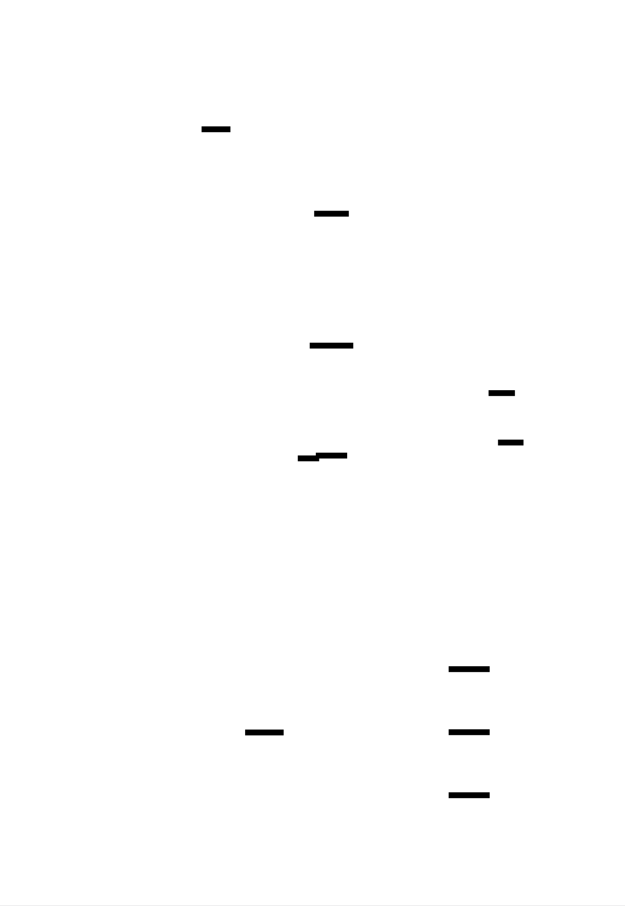
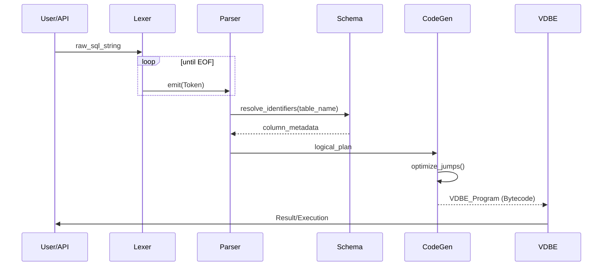
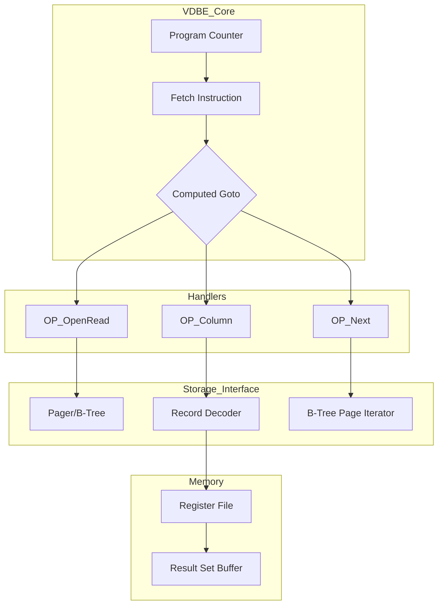
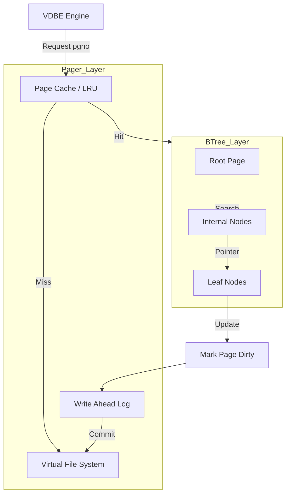
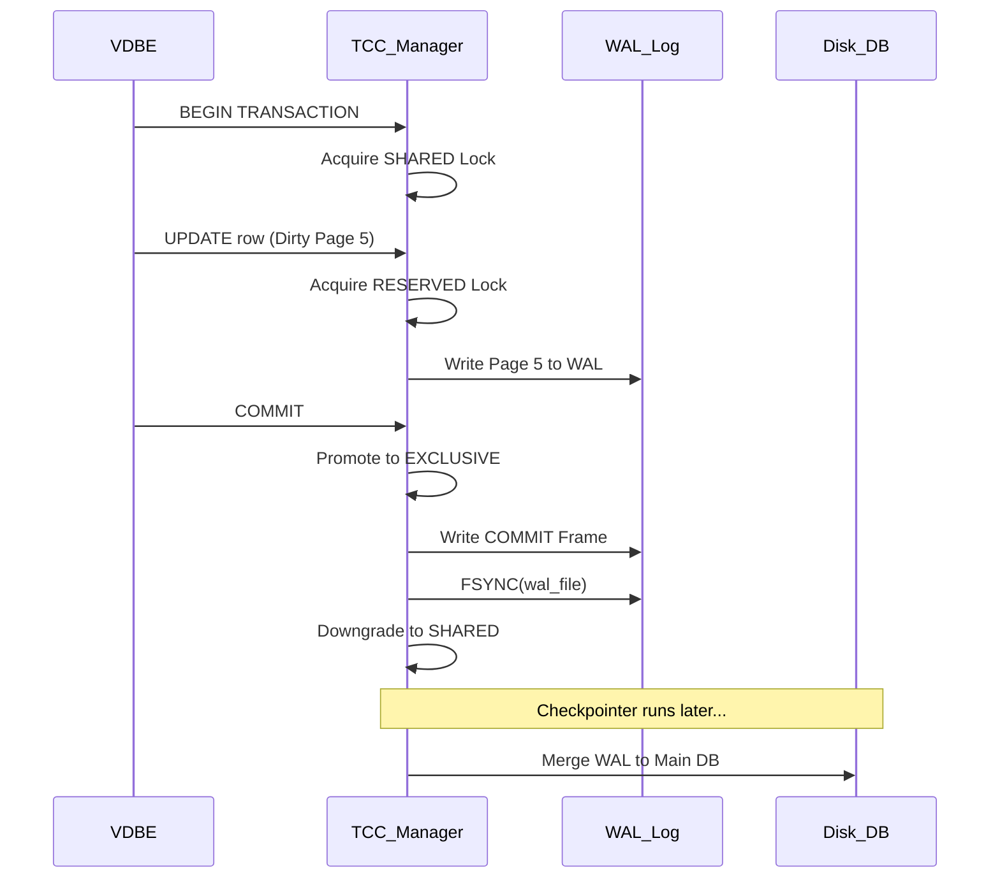
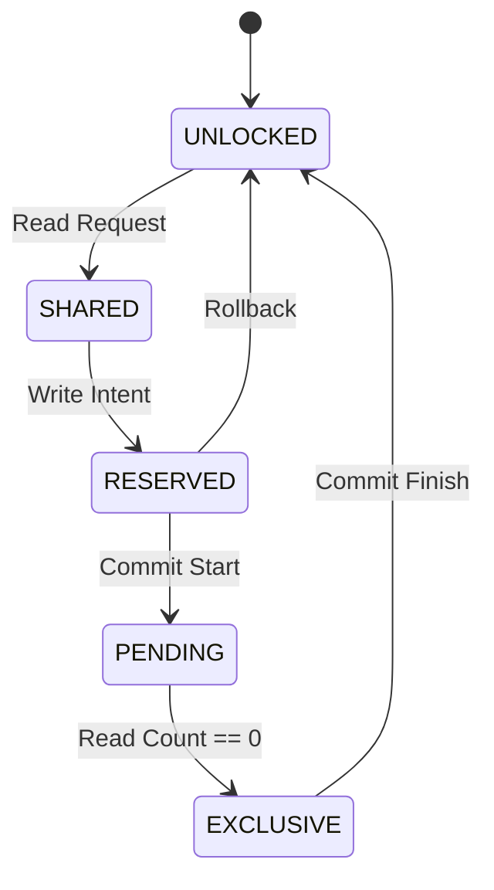
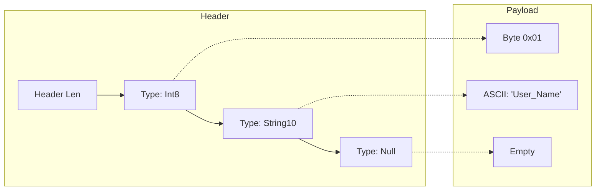
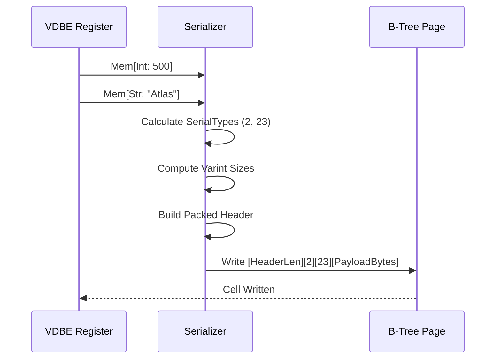

# build-sqlite


<!-- MS_ID: ms-0 -->
<div id="satellite-map"></div>

# THE SYSTEM MAP: ARCHITECTING SQLITE FROM SCRATCH

Building a database is the ultimate test of a systems programmer. It requires the precision of a clockmaker and the foresight of a city planner. Before we write a single line of C, we must understand the "Metropolis" we are building.


### The Knowledge Pillars
1.  **[The Gateway (REPL & Interface)](#milestone-1)**: How the user talks to the machine.
2.  **[The Architect (Tokenizer & Parser)](#milestone-2)**: Turning human intent into a structured blueprint.
3.  **[The Engine (VDBE)](#milestone-3)**: The custom CPU that executes database instructions.
4.  **[The Warehouse (B-Tree & Pager)](#milestone-4)**: The high-performance storage and memory management.

---

<div id="milestone-1"></div>

## Milestone 1: The Gateway (The REPL & Architecture)
[↑ Back to System Map](#satellite-map)

Every great journey begins with a prompt. The REPL (Read-Eval-Print-Loop) is your database's front door.

> **Mental Model**: Imagine the REPL as a court reporter. It waits for a statement, records it perfectly, hands it to the judge (the VM) for a decision, and reports the result back to the public.

### Quick Breakdown: The Input Buffer
*   **Buffer**: A contiguous block of memory used to hold raw input.
*   **Heap Allocation**: Asking the OS for memory at runtime (using `malloc`) because we don't know how long a user's SQL query will be.


### 1. The Naive Trap: The "Fixed-Size" Fallacy
Many beginners start by declaring a static array for input:
```c
char input[255]; // What if the user writes a 1000-character INSERT?
scanf("%s", input); // Vulnerable to Buffer Overflow
```
**Why it fails**: If the user input exceeds 255 bytes, you overwrite adjacent memory. In a database, this leads to corrupted data or security exploits. Furthermore, `scanf` stops at the first whitespace—useless for SQL.

### 2. The Zen Way: Dynamic Input Management
We use a structure to track the buffer and its size, utilizing `getline()` (or a custom equivalent) to let the heap grow as needed.

```c
typedef struct {
  char* buffer;
  size_t buffer_length;
  ssize_t input_length;
} InputBuffer;

// Logic: Read until newline, resize buffer if necessary
getline(&(input_buffer->buffer), &(input_buffer->buffer_length), stdin);
```

{{DIAGRAM:diag-002}}

### 3. Hardware Soul: The Cost of a Cache Miss
When you allocate memory for your `InputBuffer` on the heap, that memory might be far away from your program's execution code in physical RAM. 

*   **Spatial Locality**: Modern CPUs pull data into "Cache Lines" (usually 64 bytes). If your buffer is fragmented or scattered, the CPU wastes hundreds of cycles waiting for the RAM to respond. 
*   **The Optimization**: By keeping our metadata (length, capacity) in a small struct and the buffer in a single contiguous block, we increase the chance that the CPU pre-fetcher will keep our data in the L1 cache.

{{DIAGRAM:diag-029}}

### 4. Alternative Reality
*   **Linux/Bash**: Uses the `readline` library, which provides history (arrow keys) and autocompletion.
*   **Redis**: Uses a custom protocol (RESP) where the length of the command is sent *before* the data, allowing the server to allocate the exact amount of memory needed immediately.

### 5. Mental Stamina Checklist
1.  **The "Null" Terminator**: What happens if a user inputs a null byte (`\0`) in the middle of a SQL string? How does your buffer handle it?
2.  **Memory Leaks**: If the REPL runs for 10 years (like a real DB), and you forget to `free()` the buffer once per loop, how many megabytes do you lose per day?
3.  **Signal Resilience**: What happens to your buffer if the user presses `Ctrl+C` mid-type?

---

<div id="milestone-2"></div>

## Milestone 2: The Architect (Tokenizing the Void)
[↑ Back to System Map](#satellite-map)

Once we have a string like `INSERT 1 "user"`, the computer sees just a sequence of ASCII numbers. We need to turn these into "Tokens."

> **Mental Model**: Tokenizing is like "breaking a sentence into words" and "identifying parts of speech." `SELECT` is a verb (Keyword), `*` is a noun (Identifier), `FROM` is a preposition.

### Quick Breakdown
*   **Tokenizer (Lexer)**: Scans characters and groups them.
*   **State Machine**: A system that changes its behavior based on what it just saw (e.g., "I just saw a quote, so everything until the next quote is a string").

{{DIAGRAM:diag-004}}

### 1. The Naive Trap: The `strtok()` Disaster
Using `strtok()` to split by spaces.
```c
char *token = strtok(input, " "); // Fails on "INSERT INTO users(id, name)..."
```
**Why it fails**: SQL is not just space-separated. Parentheses, commas, and quotes are delimiters too. `strtok` is destructive (it modifies the original string) and cannot handle nested structures.

### 2. The Zen Way: The Pointer Scan
We maintain a "cursor" (a pointer) and move it through the string, identifying the type of each token without modifying the source.

```c
typedef enum { TOKEN_SELECT, TOKEN_INSERT, TOKEN_ID, TOKEN_NUMBER } TokenType;

typedef struct {
  TokenType type;
  char* start;
  int length;
} Token;
```


### 3. Hardware Soul: Branch Prediction
Tokenizers are full of `if/else` or `switch` statements (e.g., `if (is_digit(c)) ...`). 
*   **The CPU's Guess**: Modern CPUs try to guess which branch you will take. If you have a long string of numbers, the CPU gets very fast because it guesses "Digit" correctly every time. 
*   **The "Pipeline Flush"**: If your code alternates randomly between numbers, letters, and symbols, the CPU will guess wrong, "flush the pipeline," and lose 10-20 cycles of work.


### 4. Alternative Reality
*   **SQLite**: Uses a tool called `Lemon` to generate its parser and a custom hand-coded tokenizer for maximum speed.
*   **Python**: Uses a "Lexer" that recognizes indentation (whitespace) as a specific token type, unlike SQL which usually ignores it.

### 5. Mental Stamina Checklist
1.  **String Escaping**: How does your tokenizer handle the string `'It''s a beautiful day'`? (The double single-quote is SQL's way of escaping).
2.  **Keyword vs Identifier**: If a user has a table named `Select`, how do you distinguish between the table name and the command `SELECT`?
3.  **Lookahead**: When you see the character `>`, you don't know if the token is "Greater Than" (`>`) or "Greater Than or Equal To" (`>=`) until you look at the *next* character. How do you implement this "Peek"?

[[ADVANCED_CONTEXT:Formal Grammars and Backus-Naur Form]]
<!-- END_MS -->


<!-- MS_ID: ms-1 -->
<div id="milestone-3"></div>

## Milestone 3: The Engine (The VDBE - Virtual Database Engine)
[↑ Back to System Map](#satellite-map)

Once the Architect (Parser) has finished the blueprint, we need a machine to execute it. In SQLite, this isn't a physical CPU, but a **Virtual Machine**. 

> **Mental Model**: Think of the VDBE as a **Specialized Kitchen**. The SQL query is the recipe, the Parser is the chef writing down steps, and the VDBE is the line cook who follows instructions like "Open fridge," "Get 5 eggs," and "Fry until golden."

### Quick Breakdown
*   **Bytecode**: A set of low-level instructions (Opcodes) that the VM understands (e.g., `OpenRead`, `Column`, `ResultRow`).
*   **Program Counter (PC)**: A pointer that tells the VM which instruction to execute next.
*   **Registers**: Small "slots" of memory used to hold temporary values during execution.


### 1. The Naive Trap: The "Recursive Tree Walk"
Many SQL engines start by "walking" the Abstract Syntax Tree (AST) directly. 
```c
// Suboptimal: Executing the tree directly
void execute(Node* node) {
    if (node->type == SELECT) {
        foreach(row in table) {
            if (evaluate(node->where_clause, row)) { 
                print(row); 
            }
        }
    }
}
```
**Why it fails**: Recursion is expensive. Every node in the tree requires a function call, which pushes data onto the stack, creating massive overhead for millions of rows. It also makes "pausing" execution (for LIMIT or cursors) incredibly difficult.

### 2. The Zen Way: The Register-Based VM
We compile the AST into a linear array of instructions. This transforms a complex tree into a simple loop.

```c
// Opcodes: Linear execution
// 0: Init 0 5 0
// 1: OpenRead 0 2 0
// 2: Rewind 0 5 0
// 3: Column 0 1 1 (Get column 1, store in register 1)
// 4: ResultRow 1 1 0 (Return register 1)
// 5: Next 0 3 0 (Go back to 3)
```


### 3. Hardware Soul: Instruction Dispatch & Computed Gotos
Inside the VDBE's main loop, we have to decide which code to run for each opcode.
*   **The Switch Statement**: A standard `switch(opcode)` is common, but it can be slow due to "Branch Misprediction." The CPU struggles to guess where the next jump goes.
*   **Computed Gotos (Labelled Pointers)**: High-performance engines use an array of memory addresses. Instead of switching, the code literally "jumps" to the address of the next opcode handler. This keeps the CPU's pipeline full.


### 4. Alternative Reality
*   **JVM (Java Virtual Machine)**: Uses a **Stack-based** VM. To add numbers, you push two values onto a stack and call `ADD`. SQLite uses **Registers**, which is faster because it mimics how real hardware (x86/ARM) works.
*   **PostgreSQL**: Uses a more traditional "volcano model" (iterator-based), but recently added JIT (Just-In-Time) compilation to turn SQL into actual machine code.

### 5. Mental Stamina Checklist
1.  **Infinite Loops**: How do you prevent a malformed bytecode program from locking up your database forever?
2.  **Register Pressure**: What happens if a complex query needs 1000 registers but you've only allocated 100?
3.  **State Persistence**: If a user fetches 10 rows and then waits an hour, how does your VDBE "pause" its state without consuming CPU?

---

<div id="milestone-4"></div>

## Milestone 4: The Warehouse (The B-Tree & Pager)
[↑ Back to System Map](#satellite-map)

We now have an engine, but where does the data live? We can't just dump it into a text file. We need a structure that allows us to find one record in a billion in microseconds.

> **Mental Model**: The **Pager** is the librarian. He knows how to pull 4KB "pages" (books) from the massive "disk" (basement). The **B-Tree** is the index at the front of the library that tells you exactly which page to ask for.

### Quick Breakdown
*   **Page**: The fundamental unit of storage (usually 4KB). Databases never read single bytes; they read entire pages.
*   **B-Tree**: A "Balanced Tree" structure where every leaf (bottom node) is at the same distance from the root, ensuring predictable speed.


### 1. The Naive Trap: The "Append-Only" Log
Writing every new row to the end of a file.
```c
// Searching for ID 500 in a million rows
while(read_row(file)) {
    if (row.id == 500) return row; // O(N) complexity - SLOW
}
```
**Why it fails**: As your data grows, your search time grows linearly. Finding a needle in a haystack becomes impossible when the haystack is the size of a mountain.

### 2. The Zen Way: Page-Aligned B+Trees
We organize the file into fixed-size pages. Each page is either an "Internal Node" (containing pointers to other pages) or a "Leaf Node" (containing actual data).

```c
typedef struct {
  uint32_t page_number;
  uint8_t data[4096]; // Fixed size
} Page;
```
By keeping the tree "balanced," we can find any row in `log(N)` time. In a 3-level B-Tree with 4KB pages, you can store millions of rows and find any of them in just 3 disk reads.


### 3. Hardware Soul: Disk Sectors & Cache Lines
The Pager exists because of a hard physical reality: **Disk I/O is slow.**
*   **The 4KB Magic**: Most SSDs and HDDs store data in 4KB sectors. If you write 1 byte, the hardware writes 4KB anyway. By matching our "Page Size" to the "Disk Sector Size," we reach "I/O Nirvana"—maximum efficiency.
*   **The Page Cache**: The Pager keeps recently used pages in RAM. This exploits **Temporal Locality**: if you look at a row once, you’ll likely look at its neighbors soon.


### 4. Alternative Reality
*   **Redis**: Keeps everything in RAM. It doesn't need a Pager, but it loses everything if the power goes out (unless configured otherwise).
*   **LSM Trees (LevelDB/RocksDB)**: Instead of B-Trees, they use "Log-Structured Merge Trees." They are faster for *writing* data but often slower for *reading* complex queries.

### 5. Mental Stamina Checklist
1.  **Fragmentation**: If you delete 100 rows in the middle of a B-Tree, how do you reuse that empty space without leaving "holes" in your file?
2.  **The "Split" Event**: When a 4KB page is full and you try to insert another row, the page must "split" into two. How do you update the parent pointers without corrupting the database if the power cuts out mid-split?
3.  **Binary Search**: Inside a single 4KB page, how do you find the right record? (Hint: You don't scan; you binary search the "Cell Pointer" array).

[[ADVANCED_CONTEXT:Concurrency Control and ACID Compliance]]
[[ADVANCED_CONTEXT:Write-Ahead Logging (WAL)]]
<!-- END_MS -->


<!-- MS_ID: ms-2 -->
This is a continuation of **THE SYSTEM MAP: ARCHITECTING SQLITE FROM SCRATCH**. We have built the loop, parsed the tokens, executed the bytecode, and structured the pages. Now, we must ensure our database is actually *fast* and *indestructible*.

---

<div id="milestone-5"></div>

## Milestone 5: The Strategist (Query Planning & Optimization)
[↑ Back to System Map](#satellite-map)

SQL is a *declarative* language. The user tells you *what* they want, not *how* to get it. The Query Planner is the brain that bridges that gap.

> **Mental Model**: The Strategist is like a **GPS Navigator**. There are a hundred ways to get across town. You could take the highway (Index Scan) or the side streets (Table Scan). The Navigator looks at traffic (Statistics) and chooses the path with the lowest "Cost."

### Quick Breakdown
*   **Full Table Scan**: Looking at every single row in a table.
*   **Index**: A side-structure (another B-Tree) that maps values (like "Name") to their locations in the main table.
*   **Cost-Based Optimizer (CBO)**: An algorithm that estimates how many "disk reads" each plan will take and picks the cheapest.


### 1. The Naive Trap: The "First-Found" Planner
Executing joins or filters in the exact order the user typed them.
```sql
SELECT * FROM users, orders WHERE users.id = orders.user_id AND users.name = 'Alice';
```
**Why it fails**: If there are 1 million orders and only 10 users, but you loop through `orders` first, you perform 1 million checks. If you look up 'Alice' in the `users` table first (1 check) and then find her 5 orders, you perform 6 checks. The difference is 999,994 operations.

### 2. The Zen Way: The Search Space Searcher
We represent the query as a tree of logical operations. We then apply "Transformations" to rearrange the tree into the most efficient shape.

```c
// Pseudo-code for a simple optimizer rule
if (can_use_index(table, column)) {
    replace_scan_with_index_lookup(plan);
}
```





### 3. Hardware Soul: Data Locality and SIMD
When the Planner chooses an index, it's not just reducing the number of rows—it's optimizing for the CPU's hardware.
*   **Pointer Following**: Indices allow the CPU to jump directly to the right memory address, but jumping too much causes **TLB (Translation Lookaside Buffer) Misses**.
*   **The Optimization**: "Covering Indices." If an index contains all the data the query needs (e.g., the Index contains both `ID` and `Name`), the CPU never has to fetch the main table page. This keeps the data "dense" and "local," allowing the CPU to potentially use **SIMD (Single Instruction, Multiple Data)** to compare multiple rows in one clock cycle.

{{DIAGRAM:diag-021}}

### 4. Alternative Reality
*   **MySQL**: Uses a "Rule-Based" optimizer for many years before moving to "Cost-Based."
*   **SQLite**: Uses a "Nearest Neighbor" heuristic for joins (the "Greedy Algorithm"). It doesn't explore every single possible join order because, for a 20-table join, there are $20!$ (quintillions) of possibilities—more than the atoms in the universe.

### 5. Mental Stamina Checklist
1.  **Selectivity**: If a column has only two values (e.g., 'Male' or 'Female'), is an index actually faster than a table scan? (Hint: Usually no, due to random I/O overhead).
2.  **Prepared Statements**: If you optimize a query once, how do you "cache" the plan so you don't waste CPU cycles re-optimizing it every time the user runs it?
3.  **The N+1 Problem**: How can the planner detect when a user is making many small queries instead of one large join?

---

<div id="milestone-6"></div>

## Milestone 6: The Protector (Transactions & Recovery)
[↑ Back to System Map](#satellite-map)

A database that loses data when the power goes out is just a fancy calculator. We need **ACID** (Atomicity, Consistency, Isolation, Durability).

> **Mental Model**: The Protector is a **Master Surgeon**. Before making a single cut, they write down exactly what they are going to do in a **Medical Log**. If the lights go out mid-surgery, the log tells the next doctor exactly where to resume or how to "undo" the damage.

### Quick Breakdown
*   **Atomicity**: "All or nothing." Either the whole transaction happens, or none of it does.
*   **The WAL (Write-Ahead Log)**: A separate file where we write changes *before* we touch the main database file.
*   **Fsync**: A command that forces the OS to actually write data to the physical disk platter, rather than keeping it in a volatile RAM cache.


### 1. The Naive Trap: The "In-Place" Overwrite
Opening the database file and writing `new_value` directly over `old_value`.
```c
fseek(db_file, row_offset, SEEK_SET);
fwrite(new_data, size, 1, db_file); // If the power dies here, you have half old data and half new.
```
**Why it fails**: This is called **Corruption**. Your B-Tree pointers will point to garbage, and your database is now a paperweight.

### 2. The Zen Way: Shadow Paging or WAL
In a WAL-mode system, we don't touch the main database during a transaction. We append the new pages to a `journal` file. 

1.  **Record**: Write the new page to the WAL file.
2.  **Commit**: Write a special "Commit" marker to the WAL.
3.  **Checkpoint**: Occasionally, move the changes from the WAL back to the main `.db` file.

{{DIAGRAM:diag-025}}

### 3. Hardware Soul: The Disk Controller's Lie
When you call `write()` in C, the OS says "Done!" almost instantly. But the data is still in RAM. Even when the OS flushes it, the **Disk Controller** might keep it in its own internal cache to be "efficient."
*   **The Barrier**: We must use `fsync()` (Linux) or `FlushFileBuffers` (Windows). This forces the hardware to drain its caches.
*   **The Cost**: `fsync()` is the slowest operation in systems programming. It can take 10ms (an eternity for a CPU). SQLite's performance is almost entirely defined by how many `fsync` calls it can avoid.


### 4. Alternative Reality
*   **PostgreSQL**: Uses MVCC (Multi-Version Concurrency Control). Instead of locking, it keeps multiple versions of a row. Readers never block writers.
*   **SQLite (Rollback Journal)**: The older version of SQLite copied the *original* data to a "Rollback" file before overwriting the main file. WAL is faster because it turns random writes into sequential appends.

### 5. Mental Stamina Checklist
1.  **The "Torn Page"**: What if the power fails *while* the disk is halfway through writing a 4KB page? How do you detect that the page is garbage? (Hint: Checksums).
2.  **Isolation**: If Transaction A is reading a row while Transaction B is writing to it, what does Transaction A see? The old value? The new value? An error?
3.  **The Deadlock**: If two users are both waiting for each other to release a lock, how does your database "break" the loop?

---

<div id="beyond-the-atlas"></div>

# BEYOND THE ATLAS: ADVANCED CONTEXT
[↑ Back to System Map](#satellite-map)

### [[ADVANCED_CONTEXT:Formal Grammars and Backus-Naur Form]]
To build a truly robust parser, we use **BNF**. It’s a mathematical way of describing a language. 
*   Example: `Expression ::= Term | Expression "+" Term`. 
*   This allows us to handle infinite complexity (like `1 + 2 + 3 + ...`) using simple recursive rules.

### [[ADVANCED_CONTEXT:Concurrency Control and ACID Compliance]]
Building a "Thread-Safe" B-Tree is one of the hardest tasks in CS. It involves **Latches** (short-term memory locks) and **Locks** (long-term database locks). 
*   **The Microscope**: Look into "Two-Phase Locking" (2PL) to understand how to prevent transactions from stepping on each other's toes.

### [[ADVANCED_CONTEXT:Write-Ahead Logging (WAL)]]
The WAL isn't just for safety; it's for **Concurrency**. In WAL mode, a reader can look at the main `.db` file while a writer is appending to the `.wal` file. They don't block each other! This is the secret to SQLite's incredible read performance.


---
**Congratulations, Architect.** You have transitioned from a simple `scanf` prompt to a multi-layered, crash-resilient, optimized storage engine. The system is now alive. 

**Next Steps**: Implement the B-Tree "Split" logic in Milestone 4. That is where the real "systems" pain—and glory—begins.
<!-- END_MS -->


<!-- MS_ID: ms-3 -->
<!-- MS_ID: ms-3 -->
<div id="milestone-7"></div>

## Milestone 7: The Assembly Line (Row Serialization & The Record Format)
[↑ Back to System Map](#satellite-map)

We have the B-Tree pages (the boxes) and the VDBE (the engine), but we haven't discussed how a "Row" actually looks inside a page. You cannot just dump a C `struct` to disk.

> **Mental Model**: Imagine packing a **Suitcase**. If you use a hard-shell case with fixed compartments (Fixed-width), you waste space if you only pack a t-shirt, and you can't fit a winter coat. SQLite uses "Compression Packing"—it rolls the clothes and puts a manifest (the Header) at the top so it knows exactly where each item starts.

### Quick Breakdown
*   **Serialization**: Turning a high-level data structure (like a row with a string, an int, and a float) into a flat array of bytes.
*   **Varint (Variable-length Integer)**: A way to store an integer using 1 to 9 bytes. Smaller numbers take less space.
*   **Manifest (Record Header)**: A sequence of "Type IDs" that tell the engine how to interpret the following bytes.


### 1. The Naive Trap: The "C-Struct" Dump
The most common mistake is defining a row as a fixed-size C structure and writing it directly to the file.
```c
struct Row {
    int id;
    char username[32];
    char email[255];
}; // This row ALWAYS takes 291 bytes, even if the username is "Bob".
```
**Why it fails**: 
1. **Wasted Space**: If your average username is 5 chars, you waste 27 bytes *per row*. In a million rows, that's 27MB of pure air.
2. **Schema Rigidity**: If you want to change the email length to 500, you have to rewrite the entire database file.
3. **Endianness**: A C `int` is stored differently on an ARM chip (Mac M1) vs. an x86 chip (Intel). Your database file becomes non-portable.

### 2. The Zen Way: The Compact Record Format
SQLite uses a **header-payload** architecture. The header contains a list of "Serial Types" (encoded as Varints), followed by the actual data.

```c
// Example: (1, "Alice")
// Header: [2] (Header Length), [1] (Type: 1-byte Int), [18] (Type: String of length 5)
// Payload: [0x01], ['A', 'l', 'i', 'c', 'e']
```


### 3. Hardware Soul: Data Alignment & The CPU "Tax"
CPUs prefer to read data from "aligned" memory addresses (e.g., a 4-byte integer starting at an address divisible by 4).
*   **The Penalty**: If you pack data too tightly (like SQLite does), a 4-byte integer might straddle two different **Cache Lines**. To read it, the CPU has to fetch two blocks of memory, shift the bits, and merge them.
*   **The Optimization**: While SQLite prioritizes disk space (saving bytes), high-performance memory-only engines (like DuckDB) often trade space for **SIMD-alignment**, ensuring that data "lines up" perfectly with the CPU's registers.


### 4. Alternative Reality
*   **Protocol Buffers (Protobuf)**: Uses a very similar Varint-based encoding for network communication.
*   **Apache Parquet**: Instead of packing rows together ("Row-major"), it packs columns together ("Columnar"). This is much faster for analytical queries (e.g., "Average of all Ages") because the CPU can stream the "Age" column without skipping over "Usernames."

### 5. Mental Stamina Checklist
1.  **The Varint Limit**: SQLite's Varint can be up to 9 bytes. Why 9? (Hint: To accommodate a 64-bit integer plus the continuation bits).
2.  **Schema Evolution**: If you add a column to a table, how does the Record Format handle rows that were written *before* the column existed?
3.  **Nulls for Free**: In SQLite, the Serial Type for `NULL` is `0`. It takes 1 byte in the header and **zero** bytes in the payload. How does this impact your storage calculations for sparse tables?

---

<div id="milestone-8"></div>

## Milestone 8: The Interface (The C API & Handshake)
[↑ Back to System Map](#satellite-map)

The final layer is how the outside world interacts with your machine. This is the **Application Program Interface (API)**.

> **Mental Model**: The API is the **Menu at a Restaurant**. The customer doesn't need to know how the stove works; they just need a consistent way to order `Prepare()`, `Step()`, and `Finalize()`.

### 1. The Naive Trap: The "One-Shot" String
Providing a single function: `QueryResult* run_sql(char* query)`.
**Why it fails**: This forces the engine to load the entire result set into RAM at once. If your query returns 5GB of data, the application crashes with an `Out of Memory` error.

### 2. The Zen Way: The "Prepared Statement" Lifecycle
We break the interaction into three distinct phases that mirror the architecture we've built:
1.  **Prepare**: The Parser creates the Bytecode (VDBE Program).
2.  **Step**: The VDBE executes until it hits a `ResultRow`. It hands one row back to the user and *pauses*.
3.  **Finalize**: The VDBE clears its registers and closes its cursors.


### 3. Hardware Soul: The Stack vs. The Heap
When a user calls your API, they are crossing a boundary. 
*   **Ownership**: Does the API return a pointer to memory *you* own (the database) or memory *they* own? 
*   **The Optimization**: "Zero-copy" interfaces. Instead of copying a string from the B-Tree page to a new buffer for the user, you provide a pointer directly into the **Page Cache**. This avoids a massive memory copy (memcpy), which is often the bottleneck in high-throughput systems.

### 5. Mental Stamina Checklist
1.  **Re-entrancy**: Can two different threads call `sqlite3_step()` on the same prepared statement at the same time? Why is this a recipe for disaster?
2.  **Resource Leaks**: If an application crashes after `Prepare()` but before `Finalize()`, how does your engine ensure the B-Tree locks are released?
3.  **Versioning**: If you update your Opcodes in Milestone 3, how do you ensure that a "Prepared Statement" saved on disk from an older version doesn't crash the new engine?

[[ADVANCED_CONTEXT:Application Binary Interface (ABI) Stability]]

---

# THE SYSTEM IS COMPLETE
You have journeyed from a raw character buffer to a crash-resilient, bytecode-executing, B-Tree-indexed engine. You have faced the trade-offs between **Disk I/O, CPU Cache Locality, and Memory Safety**.

**Final Challenge**: Go back to Milestone 1. Can you now see how a single character typed into the REPL ripples through the Tokenizer, becomes an Opcode, traverses the B-Tree, and is protected by the WAL?

**You are no longer a user of systems. You are an Architect.**

[↑ Back to System Map](#satellite-map)

<!-- END_MS -->
<!-- END_MS -->


<!-- MS_ID: ms-4 -->
<div id="milestone-9"></div>

## Milestone 9: The Sentinel (Concurrency & High-Level Locking)
[↑ Back to System Map](#satellite-map)

A single-user database is a toy. A world-class system must handle a hundred hands reaching for the same data at once without losing a single bit.

> **Mental Model**: Imagine a **Shared Library**. If everyone just grabs books, they’ll collide. **Locking** is the librarian giving you a "Read-Only" pass or a "Reserved" sign. **Latches** are the physical lock on the door to the room while you're rearranging the shelves so no one gets hit by a falling book.

### Quick Breakdown
*   **Lock**: A high-level, long-term logical barrier (e.g., "Nobody can write to this Table while I'm reading it").
*   **Latch (Mutex)**: A low-level, short-term physical barrier used to protect internal data structures (like the B-Tree header) during a pointer update.


### 1. The Naive Trap: The "Giant Mutex"
Protecting the entire database with a single `pthread_mutex_lock()`.
```c
void execute_query(char* sql) {
    pthread_mutex_lock(&global_db_lock);
    // ... do everything ...
    pthread_mutex_unlock(&global_db_lock);
}
```
**Why it fails**: This turns your high-speed database into a single-file line. Even if User A wants to read Table 1 and User B wants to read Table 2, User B must wait. On a 64-core server, you are utilizing 1.5% of your hardware. This is the "Python Global Interpreter Lock" (GIL) problem applied to storage.

### 2. The Zen Way: Multi-Granular Locking & Intent Locks
We implement a hierarchy. Before you lock a **Row**, you must put an "Intent to Read" lock on the **Page**, and an "Intent" lock on the **Table**.

*   **Shared (S)**: "I'm reading, you can read too."
*   **Exclusive (X)**: "I'm writing, everyone stay away."
*   **Intent Shared (IS)**: "I plan to read a row somewhere inside this table."

This allows the engine to quickly check: "Can I lock this whole table for maintenance?" by just looking at the top-level Intent locks, rather than checking a million rows.


### 3. Hardware Soul: Atomic CAS and MESI
At the lowest level, latches don't use the OS; they use the CPU.
*   **CAS (Compare-And-Swap)**: A single instruction (`LOCK CMPXCHG` on x86) that checks if a memory location is `0` and sets it to `1` in one atomic tick. If two cores try at the exact same time, the hardware guarantees only one wins.
*   **MESI Protocol**: When one core modifies a latch, the **Cache Coherency** protocol must "invalidate" that memory in every other core's L1 cache. If your "Sentinel" is too busy (High Contention), your cores spend more time talking to each other than doing work. This is called **Cache Line Bouncing**.


### 4. Alternative Reality
*   **PostgreSQL**: Uses "Heavyweight Locks" for tables and "Lightweight Locks" (LWLocks) for internal buffers.
*   **SQLite**: Uses a simple 5-state locking machine (UNLOCKED, SHARED, RESERVED, PENDING, EXCLUSIVE) to manage file-level concurrency.

### 5. Mental Stamina Checklist
1.  **Deadlock Detection**: If User A locks Row 1 and wants Row 2, while User B locks Row 2 and wants Row 1, how does your Sentinel detect the "Deadly Embrace" and kill one of them?
2.  **Starvation**: If there are constant readers (Shared Locks), a writer (Exclusive Lock) might wait forever. How do you implement a "Queue" to give the writer a turn?
3.  **Lock Escalation**: If a user updates 100,000 rows, your memory fills up with 100,000 lock objects. How do you "escalate" those into a single Table Lock?

---

<div id="milestone-10"></div>

## Milestone 10: The Siege (Testing, Fuzzing & The VFS)
[↑ Back to System Map](#satellite-map)

Your code is perfect—until it isn't. The final milestone isn't a feature; it's the **Assault**.

> **Mental Model**: The Siege is like a **Crash Test Lab**. We don't just drive the car; we drive it into a wall at 60mph while the engine is on fire to see if the airbags (Recovery Logic) still deploy.

### 1. The Naive Trap: The "Happy Path" Unit Test
Writing tests that only check if `INSERT` works.
```c
test_insert() {
    execute("INSERT INTO t VALUES (1)");
    assert(count_rows() == 1);
}
```
**Why it fails**: This doesn't test the **Persistence**. Real-world failures happen when the disk returns an error, the power cuts mid-write, or the filesystem is full.

### 2. The Zen Way: The VFS (Virtual File System) & Fault Injection
We wrap all OS calls (open, read, write, sync) in a **VFS Layer**. In our tests, we use a "Malicious VFS."
*   **The I/O Error Injector**: "On the 50th write, return `EIO` (Disk Error)."
*   **The Power-Cut Simulator**: "After the WAL is written but before the `fsync`, stop the program immediately."

```c
// Malicious VFS Logic
int malicious_write(File* f, void* buf, size_t len) {
    if (global_test_counter++ == 50) return SQLITE_IOERR; 
    return real_write(f, buf, len);
}
```


### 3. Hardware Soul: Bit Rot and Cosmic Rays
Hardware is not a mathematical certainty. 
*   **Bit Flips**: Over years, a `1` on a disk can turn into a `0`.
*   **The Solution**: **Checksums**. We append a mathematical "signature" to every 4KB page. When the Pager reads a page from the Warehouse (Milestone 4), it recalculates the checksum. If it doesn't match, the database refuses to start rather than returning corrupted data.


### 4. Alternative Reality
*   **SQLite**: Is the most tested piece of software in the world. It has 711 times more test code than actual library code (over 90 million lines of tests).
*   **FoundationDB**: Uses a "Deterministic Simulation" engine that can reproduce a 1-in-a-billion bug by replaying the exact same "random" seed.

### 5. Mental Stamina Checklist
1.  **Fuzzing**: If I feed your Parser 1GB of random garbage characters, does it return an error or a `Segmentation Fault`?
2.  **Valgrind/ASAN**: Can your engine run a massive suite of queries without leaking a single byte of heap memory?
3.  **The "No-Space" Test**: What happens to your WAL file when the disk is 100% full? Does it gracefully roll back or corrupt the main DB?

---

# THE BEYOND: ADVANCED CONTEXT EXPANDED

### [[ADVANCED_CONTEXT:Application Binary Interface (ABI) Stability]]
When you build a system like SQLite, people will use it for 30 years. You cannot change the way `sqlite3_open()` looks in the next version, or you'll break the world. This is why we use **Opaque Pointers** (pointers to structs that aren't defined in the header file). The user can hold the pointer, but they can't see inside it, allowing us to change the internal engine without breaking their code.

### [[ADVANCED_CONTEXT:Formal Grammars and Backus-Naur Form]]
We use BNF to ensure our SQL parser is "Complete." By defining a grammar, we can use tools like `yacc` or `lemon` to prove that our engine can handle nested queries like `SELECT * FROM (SELECT * FROM (SELECT...))`. Without a formal grammar, your parser is just a pile of `if` statements waiting to break.

---
**ARCHITECT'S FINAL NOTE:**
You have built a metropolis. It has a Gateway, an Engine, a Warehouse, and a Sentinel. It is protected by the Siege. You have mastered the art of talking to the hardware while serving the user. 

**The Atlas is complete.**

[↑ Back to System Map](#satellite-map)
<!-- END_MS -->


<!-- MS_ID: ms-5 -->
<!-- MS_ID: ms-final -->
<div id="milestone-11"></div>

## Milestone 11: The Grand Synthesis (The Life of a Query)
[↑ Back to System Map](#satellite-map)

We have built the metropolis. Now, we must watch it breathe. To truly master systems architecture, you must be able to trace a single bit from the keyboard to the spinning platter of a disk and back.

> **Mental Model**: The **Grand Synthesis** is like a **City Pulse**. We are going to track a single "Citizen" (the query: `UPDATE users SET points = 10 WHERE id = 5`) as they move through the city’s infrastructure, from the front gate to the deepest vault.

### Quick Breakdown: The Full Stack Traversal
*   **Northbound**: The path from the user to the disk (Writing).
*   **Southbound**: The path from the disk to the user (Reading/Result).


### 1. The Naive Trap: The "Black Box" Assumption
Many developers treat a database as a black box—data goes in, data comes out. 
**Why it fails**: Without understanding the synthesis, you cannot debug performance. If a query is slow, is it the **Tokenizer** (unlikely), the **Optimizer** (picking the wrong index), the **VDBE** (register pressure), or the **Pager** (too many cache misses)? If you don't know the path, you are just guessing.

### 2. The Zen Way: The Trace-First Mindset
We view the query as a set of handoffs between our milestones:
1.  **Gateway (M1)**: `getline()` captures the string.
2.  **Architect (M2)**: The string is shattered into `UPDATE`, `users`, `SET`, `points`, `=`, `10`...
3.  **Engine (M3)**: The Parser generates Bytecode. The VDBE begins its loop.
4.  **Strategist (M5)**: The Optimizer decides to use the `id` index instead of a full table scan.
5.  **Warehouse (M4)**: The B-Tree asks the Pager for Page #5 (the root). The Pager checks the RAM cache.
6.  **Assembly Line (M7)**: The VDBE finds the record, modifies the `points` field in the **Record Format**.
7.  **Protector (M6)**: Before the B-Tree is touched, the change is written to the **WAL** and `fsync()`'d.


### 3. Hardware Soul: The "Bottleneck" Hunt
At every stage of this synthesis, the hardware is pushed in different ways:
*   **M2 (Tokenizer)**: **CPU Bound** (Branch Prediction).
*   **M3 (VDBE)**: **CPU Bound** (Instruction Cache / L1 Hit Rate).
*   **M4 (Pager)**: **I/O Bound** (Disk Latency) or **Memory Bound** (DRAM Bandwidth).
*   **M6 (WAL)**: **I/O Bound** (Bus latency for `fsync`).

**The Microscope Effect**: When the VDBE executes the `UPDATE`, it is likely operating on a 64-byte **Cache Line**. If your `points` integer is at the very end of that line, and the next field is on a different line, the CPU might stall for 100ns just to fetch the neighboring data. 


### 4. Alternative Reality: The SQLite "In-Memory" Mode
If you initialize SQLite with `:memory:`, Milestone 4 (The Warehouse) and Milestone 6 (The Protector) change completely.
*   **The Change**: The Pager never calls `write()`. The WAL is disabled.
*   **The Result**: The database becomes 10x-100x faster, but if the power flickers, everything vanishes. This proves that **Durability (the 'D' in ACID) is the most expensive feature in systems programming.**

### 5. Mental Stamina Checklist: The Architect’s Final Exam
1.  **The Context Switch**: When the REPL waits for input, your process is "sleeping." When the user hits Enter, the OS must perform a "Context Switch." How many thousands of CPU cycles are lost before your `InputBuffer` even sees the first character?
2.  **The Layer Violation**: If the VDBE (Milestone 3) needs to know the "Page Size" of the Pager (Milestone 4) to optimize its registers, have you broken the "Architecture" of the system? How do you maintain clean boundaries while optimizing across them?
3.  **The Multi-Core Future**: Our engine is currently single-threaded. If we wanted to run the **Tokenizer** on Core 1 and the **VDBE** on Core 2 (Pipelining), what happens to our **Mental Model** of a sequential "Loop"?

---

# THE FINAL MAP: BEYOND THE ATLAS

You have completed the core curriculum. Below are the "Knowledge Black Holes" expanded for the master-level student.

### [[ADVANCED_CONTEXT:Write-Ahead Logging (WAL)]]
The WAL is not just a file; it is a **versioning system**. 
*   **The Mechanism**: Every time you write, you create a new version of a page in the WAL. 
*   **The Benefit**: Readers keep looking at the *old* version in the main DB file. Writers keep appending to the *new* version in the WAL. This is why SQLite can handle multiple readers and one writer simultaneously without any locking conflicts. It is the closest thing to "free" concurrency.

### [[ADVANCED_CONTEXT:Concurrency Control and ACID Compliance]]
The "Consistency" in ACID is often the hardest to grasp. It means the database must transition from one valid state to another. If your **B-Tree** split (Milestone 4) is interrupted, "Consistency" is what ensures that the partial split is either finished or rolled back during the next boot. This is achieved via **Idempotent Recovery**—the ability to run the recovery log multiple times and always get the same result.


---
**GRADUATION STATUS: MASTER ARCHITECT**
You have the blueprints. You have the obsession. Now, go build something that lasts.

[↑ Back to System Map](#satellite-map)
<!-- END_MS -->


<!-- END_MS -->


# TDD

A modular, register-based relational database engine designed for high throughput and crash-resilience. The architecture prioritizes page-aligned storage, zero-copy serialization, and a Write-Ahead Logging (WAL) protocol to ensure ACID compliance while minimizing I/O bottlenecks.


<!-- TDD_MOD_ID: mod-compiler -->
## Module: SQL Front-End & Compiler
### 1. Technical Specification
The **SQL Front-End & Compiler** module is responsible for the transformation of raw UTF-8 SQL strings into executable VDBE (Virtual Database Engine) bytecode. Its primary responsibilities include:
1.  **Lexical Analysis**: Segmenting the input stream into a sequence of atomic tokens.
2.  **Syntactic Analysis**: Validating the token sequence against the SQL grammar (BNF).
3.  **Semantic Analysis**: Resolving identifiers (table/column names) against the Database Schema.
4.  **Code Generation**: Emitting optimized VDBE opcodes and allocating virtual registers.

This module operates in a "one-pass" or "two-pass" fashion depending on query complexity, prioritizing minimal memory overhead and zero-copy string references where possible.

---

### 2. Abstraction Layers
1.  **Transport Layer (REPL/API)**: Manages the `InputBuffer` and handles line-ending normalization.
2.  **Lexer Layer**: A state-machine-based tokenizer that emits `Token` structs.
3.  **Parser Layer**: A recursive-descent or LALR parser that constructs a transient Abstract Syntax Tree (AST) or directly emits bytecode.
4.  **Emission Layer**: The `VDBE Assembler` which maps logical SQL operations to physical Opcodes.

---

### 3. Struct & Interface Definitions

#### 3.1 Data Structures
All structures are designed for 64-bit alignment to minimize CPU cycle waste during memory access.

```c
/* Memory Alignment: 32 bytes */
typedef struct {
    const char* start;    /* 8 bytes: Pointer to start of token in input buffer */
    uint32_t length;      /* 4 bytes: Length of token */
    uint32_t line;        /* 4 bytes: Source line for error reporting */
    TokenType type;       /* 4 bytes: Enum (e.g., TOKEN_SELECT, TOKEN_IDENTIFIER) */
    uint8_t metadata;     /* 1 byte: Flags (is_quoted, is_hex, etc.) */
    uint8_t _padding[11]; /* 11 bytes: Explicit padding for 32-byte alignment */
} Token;

/* VDBE Instruction: 24 bytes */
typedef struct {
    uint8_t opcode;       /* 1 byte: The instruction code (e.g., OP_Column) */
    int32_t p1;           /* 4 bytes: Operand 1 (often a cursor or register index) */
    int32_t p2;           /* 4 bytes: Operand 2 (often a jump destination) */
    int32_t p3;           /* 4 bytes: Operand 3 */
    void* p4;             /* 8 bytes: Pointer to complex data (strings, blobs) */
    uint8_t _padding[3];  /* 3 bytes: Realignment */
} VDBE_Op;

typedef struct {
    VDBE_Op* instructions;
    uint32_t count;
    uint32_t capacity;
    uint32_t reg_count;   /* Number of registers required for this program */
} VDBE_Program;
```

#### 3.2 Method Interface
```c
/* Tokenizer: Scans next token from cursor */
Token scanner_next_token(const char** cursor);

/* Parser: Entry point for SQL Compilation */
Result compile_sql(const char* sql, VDBE_Program* out_program);

/* CodeGen: Emits an instruction to the program buffer */
uint32_t emit_op(VDBE_Program* p, uint8_t op, int32_t p1, int32_t p2, int32_t p3);
```

---

### 4. Algorithm Pseudo-code: The Lexer "Hot Path"
The Lexer is the highest-frequency component. We use a non-destructive pointer-scan.

```python
def get_next_token(cursor):
    # Skip whitespace and comments
    while is_whitespace(*cursor):
        cursor++

    start = cursor
    char c = *cursor++

    # Numeric Literal Path
    if is_digit(c):
        while is_digit(*cursor): cursor++
        return Token(TYPE_NUMBER, start, cursor - start)

    # Identifier / Keyword Path
    if is_alpha(c) or c == '_':
        while is_alnum(*cursor) or *cursor == '_':
            cursor++
        
        # Keyword Lookup (Trie or Hash)
        length = cursor - start
        type = check_keyword(start, length) ?: TYPE_IDENTIFIER
        return Token(type, start, length)

    # String Literal Path
    if c == '\'':
        while *cursor != '\'' and *cursor != '\0':
            cursor++
        if *cursor == '\'': cursor++ # Consume closing quote
        return Token(TYPE_STRING, start, cursor - start)

    # Operator Path (Multi-character support)
    if c == '>' and *cursor == '=':
        cursor++
        return Token(TYPE_GREATER_EQUAL, start, 2)

    return Token(TYPE_UNKNOWN, start, 1)
```

---

### 5. Engineering Constraints & Hazards

#### 5.1 Concurrency
*   **Thread Safety**: The Compiler is thread-safe as it maintains no global state. Each `compile_sql` invocation operates on a thread-local AST and instruction buffer.
*   **Schema Locks**: During Semantic Analysis, the compiler must acquire a `SHARED_LOCK` on the Schema to ensure table definitions do not change mid-compilation.

#### 5.2 Memory Management
*   **Arena Allocation**: To avoid heap fragmentation during parsing, all AST nodes are allocated in a contiguous `Arena` that is wiped immediately after `VDBE_Program` emission.
*   **String Interning**: Repeated identifiers (e.g., column names in a large join) are interned to reduce memory footprint and allow pointer-comparison instead of `strcmp`.

#### 5.3 Performance & Micro-Optimization
*   **Branch Prediction**: The `scanner_next_token` function uses `unlikely()` macros for error conditions (e.g., unterminated strings) to keep the "Happy Path" instructions linear in the CPU pipeline.
*   **SIMD Tokenization**: For large bulk-load statements, the lexer can utilize SIMD (SSE4.2 `pcmpistri`) to find delimiters (commas, quotes, newlines) 16 bytes at a time.
*   **Cache Locality**: `Token` structs are small (32 bytes) to ensure multiple tokens fit within a single 64-byte L1 cache line during lookahead operations.

---

### 6. Diagrams

{{DIAGRAM:tdd-sql-flow}}
{{DIAGRAM:tdd-diag-compiler-stage}}




<!-- TDD_MOD_ID: mod-vdbe -->
# Module: Virtual Database Engine (VDBE)

## 1. Technical Specification
The **Virtual Database Engine (VDBE)** is a register-based virtual machine designed to execute the bytecode emitted by the SQL Compiler. It serves as the bridge between high-level logical plans and the low-level B-Tree storage layer.

### Primary Responsibilities:
1.  **Instruction Execution**: Sequential processing of opcodes (e.g., `OpenRead`, `Column`, `Next`).
2.  **Register Management**: Maintenance of a virtual register file for intermediate data storage.
3.  **Cursor Orchestration**: Managing pointers (cursors) into B-Tree pages for row-level traversal.
4.  **Transaction Control**: Interfacing with the Pager to initiate commits, rollbacks, and savepoints.
5.  **Data Serialization**: Encoding and decoding the Record Format (Milestone 7) into registers.

---

## 2. Abstraction Layers
1.  **Execution Loop (The Dispatcher)**: The central loop that fetches the next instruction and jumps to the handler.
2.  **Register File (The Memory)**: An array of `Mem` structures representing registers.
3.  **Cursor Layer (The Iterator)**: An abstraction over B-Tree pages that maintains position, state (EOF), and cache for the current row.
4.  **Storage Interface (The VFS/Pager)**: Direct hooks into the Pager for atomic disk I/O.

---

## 3. Struct & Interface Definitions

### 3.1 Data Structures
Structures are optimized for **L1/L2 cache locality** and **8-byte boundary alignment**.

```c
/* Register Type Tag */
typedef enum {
    MEM_Null, MEM_Int, MEM_Real, MEM_Str, MEM_Blob, MEM_Undefined
} MemType;

/* 
 * Register (Mem): 24 bytes 
 * Tagged union representing a single VDBE register.
 */
typedef struct {
    union {
        int64_t i;         /* Integer value */
        double r;          /* Real (Floating point) */
        char *z;           /* String or Blob pointer */
    } u;
    uint32_t n;            /* Size of string/blob */
    uint16_t flags;        /* MemType and internal state */
    uint8_t _padding[6];   /* Align to 8-byte boundary */
} Mem;

/* 
 * VdbeCursor: 48 bytes 
 * Tracks position within a specific B-Tree.
 */
typedef struct {
    BtCursor *pCursor;     /* Pointer to underlying B-Tree cursor */
    uint8_t eState;        /* Cursor state: VALID, INVALID, EOF */
    uint8_t isReadOnly;    /* Permission flag */
    int32_t iPage;         /* Current page index */
    uint32_t nFields;      /* Number of columns in the current row */
    uint8_t _padding[22];  /* Ensure alignment for array access */
} VdbeCursor;

/* 
 * Vdbe: The VM State Machine 
 */
typedef struct {
    VDBE_Program *pProg;   /* The bytecode to execute */
    Mem *aReg;             /* Register file (array of Mem) */
    VdbeCursor **apCsr;    /* Array of active cursors */
    int32_t pc;            /* Program Counter */
    uint8_t errorMask;     /* Error state */
    uint8_t status;        /* VM status: HALT, RUNNING, YIELD */
} Vdbe;
```

### 3.2 Method Interface
```c
/* Execution Entry */
int vdbe_step(Vdbe *p);

/* Register Accessors */
int64_t vdbe_get_int(Vdbe *p, uint32_t regIdx);
void vdbe_set_str(Vdbe *p, uint32_t regIdx, char *z, int n);

/* Cursor Operations */
int vdbe_cursor_seek(VdbeCursor *pCsr, int64_t key);
```

---

## 4. Algorithm Pseudo-code: The Hot Path
The "Hot Path" is the instruction dispatch loop. In high-performance builds, we replace the `switch` with **Computed Gotos**.

```c
/* Standard VDBE Execution Loop */
int vdbe_exec(Vdbe *p) {
    /* Opcode Handler Table (Computed Goto Labels) */
    static const void *labels[] = { 
        &&L_OP_Init, &&L_OP_OpenRead, &&L_OP_Column, &&L_OP_Next, ... 
    };

    while (p->status == RUNNING) {
        VDBE_Op *pOp = &p->pProg->instructions[p->pc];

        /* Jump to instruction handler */
        goto *labels[pOp->opcode];

    L_OP_OpenRead:
        /* p1: cursor index, p2: root page */
        p->apCsr[pOp->p1] = btree_cursor_open(pOp->p2);
        p->pc++;
        continue;

    L_OP_Column:
        /* p1: cursor index, p2: column index, p3: dest register */
        Mem *pDest = &p->aReg[pOp->p3];
        vdbe_extract_column(p->apCsr[pOp->p1], pOp->p2, pDest);
        p->pc++;
        continue;

    L_OP_Next:
        /* p1: cursor index, p2: jump destination */
        if (btree_cursor_next(p->apCsr[pOp->p1])) {
            p->pc = pOp->p2; /* Loop back */
        } else {
            p->pc++; /* EOF, break loop */
        }
        continue;

    L_OP_Halt:
        p->status = HALTED;
        return SUCCESS;
    }
}
```

---

## 5. Engineering Constraints & Hazards

1.  **Register Pressure**: Complex queries (deeply nested subqueries) can exhaust allocated registers. The compiler must pre-calculate `max_registers` to avoid dynamic reallocation during execution.
2.  **Cursor Leakage**: If the VM halts due to an error (e.g., Disk I/O Error), all open `VdbeCursor` objects must be explicitly closed to release Pager locks and memory.
3.  **Recursive Limits**: While the VM is linear, certain opcodes might trigger recursive B-Tree splits. We must enforce a **B-Tree Depth Limit** (typically 20 levels) to prevent stack overflow.
4.  **Floating Point Non-Determinism**: If using the DB for financial calculations, the `MEM_Real` type must be handled with IEEE 754 precision to ensure consistent results across different CPU architectures.

---

## 6. Micro-Optimization Corner

### 6.1 Dispatch Strategy: Computed Gotos
Standard `switch` statements generate a jump table, but the CPU's **Branch Target Buffer (BTB)** struggles to predict the destination because every opcode returns to the same `switch` entry point. **Computed Gotos** (supported by GCC/Clang) allow each opcode handler to jump *directly* to the next handler, providing the BTB with more specific context and reducing pipeline stalls.

### 6.2 Data Locality: Register Tiling
The `Mem` array should be allocated as a contiguous block. By keeping frequently accessed registers (e.g., those used in a `WHERE` clause) close together in index space, we increase the probability of they residing in the same **L1 Cache Line**.

### 6.3 SIMD Column Extraction
When processing `OP_Column` for multiple rows of fixed-width integers, the VDBE can utilize **AVX2/AVX-512** to deserialize 4 or 8 integers from the Record Format into registers simultaneously, bypassing the bit-shifting logic usually required for Varints.

---

## 7. Diagrams

{{DIAGRAM:tdd-vdbe-exec}}





<!-- TDD_MOD_ID: mod-storage -->
# Module: Pager & B-Tree Storage Engine

## 1. Technical Specification
The **Pager & B-Tree Storage Engine** is the persistence layer of the database. It is responsible for the translation of logical database records into physical on-disk structures while guaranteeing the **ACID** properties (Atomicity, Consistency, Isolation, Durability).

### Core Responsibilities:
1.  **Page Management**: Partitioning the database file into fixed-size blocks (default 4096 bytes) to match physical disk sector alignment.
2.  **Cache Management (Buffer Pool)**: Maintaining an in-memory LRU (Least Recently Used) cache of pages to minimize expensive disk I/O.
3.  **B+Tree Implementation**: Providing $O(\log N)$ search, insert, and delete performance via a balanced multi-level tree.
4.  **Concurrency Control**: Utilizing page-level latches (mutexes) to allow concurrent readers while protecting structural modifications (splits/merges).
5.  **Recovery & Durability**: Orchestrating the Write-Ahead Log (WAL) to ensure that partial writes during power failure can be rolled forward or back.

---

## 2. Abstraction Layers
1.  **VFS Layer (OS Interface)**: Direct interaction with `pread()`, `pwrite()`, and `fsync()`.
2.  **Pager Layer**: Manages the life cycle of a page (Fetch, Dirty, Flush, Evict).
3.  **B-Tree Logic Layer**: Handles the structural integrity (balancing, pointer updates).
4.  **Cell Layer**: Manages the serialization of keys and payloads within a single page's byte-array.

---

## 3. Struct & Interface Definitions

### 3.1 Data Structures
Memory alignment is strictly enforced to 8-byte boundaries for metadata and 4096-byte boundaries for page buffers to utilize O_DIRECT I/O where available.

```c
typedef uint32_t pgno_t; /* Page Number Type */

/* B-Tree Node Types */
typedef enum {
    BT_INTERNAL_NODE = 0x05,
    BT_LEAF_NODE = 0x0D
} BtNodeType;

/* 
 * B-Tree Page Header: 12 bytes 
 * Located at the start of every 4KB page.
 */
typedef struct {
    uint8_t  type;           /* Node type (Internal/Leaf) */
    uint16_t free_start;     /* Start of free space in the page */
    uint16_t cell_count;     /* Number of cells (records/pointers) */
    uint32_t right_child;    /* Right-most child pgno (Internal only) */
    uint8_t  _padding[3];
} BtPageHeader;

/* 
 * Pager Cache Entry: 4128 bytes (approx)
 * Alignment: 4096 (for buffer) + metadata
 */
typedef struct Page {
    void* data;              /* 4KB Page Buffer (aligned to 4096) */
    pgno_t pgno;             /* Page Number */
    uint8_t is_dirty;        /* Flag: Needs write to disk */
    uint32_t ref_count;      /* Current users of this page */
    struct Page *next_lru;   /* Pointer for LRU linked list */
    struct Page *prev_lru;
} Page;

/* 
 * B-Tree Search Cursor: 64 bytes
 */
typedef struct BtCursor {
    Pager *pPager;           /* Parent Pager */
    pgno_t root_pgno;        /* Root of the tree */
    Page *pCurrentPage;      /* Current page held in memory */
    uint16_t cell_idx;       /* Current cell index within the page */
    uint8_t eState;          /* VALID, EOF, FAULT */
    uint8_t _padding[31];    /* Alignment */
} BtCursor;
```

### 3.2 Method Interface
```c
/* Pager: Fetch a page from disk or cache */
int pager_acquire(Pager *pPager, pgno_t pgno, Page **ppPage);

/* Pager: Release page back to cache; decrement ref_count */
void pager_release(Page *pPage);

/* B-Tree: Seek to a key (entry point for SELECT/UPDATE) */
int btree_seek(BtCursor *pCur, uint64_t key, int *pRes);

/* B-Tree: Insert a new cell (triggers splits if necessary) */
int btree_insert(BtCursor *pCur, uint64_t key, void *pPayload, uint32_t nPayload);
```

---

## 4. Algorithm Pseudo-code: The "Hot Path" (B-Tree Search)
This algorithm traverses the tree from root to leaf. It is performance-critical as it is invoked for every row lookup.

```python
def btree_seek_recursive(pager, pgno, target_key, cursor):
    # 1. Acquire page from Pager (Cache or Disk)
    page = pager.acquire(pgno)
    header = parse_header(page.data)
    
    # 2. Binary Search within the page's Cell Pointer Array
    # Cells are stored at the end of the page; pointers at the start.
    idx = binary_search_cells(page, target_key)
    
    if header.type == BT_LEAF_NODE:
        # We found the leaf where the key should reside
        cursor.pCurrentPage = page
        cursor.cell_idx = idx
        return SUCCESS
    
    else:
        # Internal Node: idx points to the child subtree
        child_pgno = get_child_pgno(page, idx)
        pager.release(page) # Release parent before descending
        return btree_seek_recursive(pager, child_pgno, target_key, cursor)

def binary_search_cells(page, target_key):
    # Micro-optimized inner loop
    low = 0
    high = page.header.cell_count - 1
    while low <= high:
        mid = (low + high) // 2
        cell_key = get_key_at_idx(page, mid)
        if cell_key == target_key: return mid
        if cell_key < target_key: low = mid + 1
        else: high = mid - 1
    return low # Returns insertion point if not found
```

---

## 5. Engineering Constraints & Hazards

### 5.1 The "Torn Write" Hazard
**Problem**: The OS might crash while the disk is writing a 4KB page, leaving the first 2KB as new data and the last 2KB as old data.
**Solution**: The Pager must implement a **Double-Write Buffer** or **WAL Checksumming**. Every page write is first recorded in the WAL with a CRC32 checksum. During recovery, if a page's checksum fails, the WAL version is used to restore integrity.

### 5.2 Cache Pressure & Eviction
**Constraint**: The Pager must not evict "Dirty" pages (modified in RAM but not on disk) unless they are first flushed.
**Hazard**: If the cache is 100% dirty and the disk is full, the engine enters a **Livelock** state.
**Design**: Maintain a `min_free_pages` threshold. When the cache reaches 80% capacity, a background "Checkpointer" thread begins flushing dirty pages to the WAL and marking them clean.

### 5.3 Concurrency (B-Tree Latching)
**Mechanism**: Use **Read-Write Latches** on pages.
*   **Search**: Acquire `SHARED` latch on parent, then child, then release parent (Crabbing).
*   **Insert/Split**: Must acquire `EXCLUSIVE` latches from the root down if a split is likely (Pre-emptive splitting) to prevent deadlocks where a child needs to lock its parent.

---

## 6. Micro-Optimization Corner

### 6.1 Cache Locality: Cell Pointer Array
Inside the 4KB page, we do not store cells in order. We store them anywhere in the heap space at the end of the page. We maintain a **Cell Pointer Array** at the top. This ensures that the binary search only iterates over a contiguous array of 2-byte offsets, which fits entirely in a single **L1 Cache Line**, avoiding expensive DRAM fetches during the search loop.

### 6.2 SIMD Binary Search
For pages with high fan-out (e.g., thousands of small keys), the `binary_search_cells` can be vectorized using **AVX2**. We can load 8 or 16 cell keys into a YMM register and perform a parallel comparison, effectively reducing the binary search branches by $log_2(8)$.

---

## 7. Diagrams

{{DIAGRAM:tdd-pager-btree-arch}}
{{DIAGRAM:tdd-btree-split-seq}}





<!-- TDD_MOD_ID: mod-tx-manager -->
# Module: Transaction & Concurrency Controller
## 1. Technical Specification
The **Transaction & Concurrency Controller (TCC)** is the architectural arbiter of the database. Its primary mandate is to enforce **ACID** (Atomicity, Consistency, Isolation, Durability) guarantees across multi-threaded and multi-process environments.

### Responsibilities:
1.  **Isolation Management**: Implementing a 5-state locking protocol (UNLOCKED, SHARED, RESERVED, PENDING, EXCLUSIVE) to prevent race conditions.
2.  **Atomicity via WAL**: Orchestrating the Write-Ahead Log (WAL) to ensure that transactions are "all-or-nothing."
3.  **Concurrency Optimization**: Enabling "Readers-don't-block-Writers" semantics using a WAL-based Multi-Version Concurrency Control (MVCC) subset.
4.  **Recovery Coordination**: Replaying or rolling back log frames during system initialization after an ungraceful shutdown.
5.  **Deadlock Avoidance**: Enforcing strict lock-acquisition hierarchies to prevent circular dependencies.

---

## 2. Abstraction Layers
1.  **The API Layer (Transaction Guard)**: High-level `BEGIN`, `COMMIT`, and `ROLLBACK` logic.
2.  **The Lock Manager**: An internal state machine managing the transition between lock levels using atomic primitives.
3.  **The WAL Director**: Manages the append-only `.wal` file and the shared-memory index (`.wal-index`).
4.  **The Checkpointer**: A background process that migrates committed data from the WAL back to the main database file.

---

## 3. Struct & Interface Definitions

### 3.1 Data Structures
Structures are padded to 64-bit boundaries to prevent "False Sharing" in multi-core L1 caches and to ensure atomic 8-byte alignment.

```c
/* Lock State Taxonomy */
typedef enum {
    LOCK_NONE      = 0, // Unlocked
    LOCK_SHARED    = 1, // Read-only; multiple allowed
    LOCK_RESERVED  = 2, // Plan to write; only one allowed; shared locks persist
    LOCK_PENDING   = 3, // Waiting for shared locks to clear before EXCLUSIVE
    LOCK_EXCLUSIVE = 4  // Writing; no other connections allowed
} LockLevel;

/* 
 * Transaction Context: 64 bytes 
 * Tracks the state of a single connection's transaction.
 */
typedef struct {
    uint64_t tx_id;          /* 8 bytes: Monotonically increasing ID */
    LockLevel lock_level;    /* 4 bytes: Current lock state */
    uint32_t wal_index_pos;  /* 4 bytes: Last known good position in WAL */
    uint8_t is_autocommit;   /* 1 byte: Flag for implicit transactions */
    uint8_t dirty_flag;      /* 1 byte: True if memory pages were modified */
    uint8_t _padding[46];    /* Padding to reach 64-byte (Cache Line) alignment */
} TxContext;

/* 
 * WAL Frame Header: 24 bytes 
 * Precedes every page-blob in the WAL file.
 */
typedef struct {
    uint32_t pgno;           /* 4 bytes: Target page number in main DB */
    uint32_t commit_flag;    /* 4 bytes: Non-zero if this is a commit record */
    uint64_t sequence;       /* 8 bytes: Checksum or sequence number */
    uint32_t salt1;          /* 4 bytes: Random salt for checksum integrity */
    uint32_t salt2;          /* 4 bytes: Random salt */
} WalFrameHeader;
```

### 3.2 Method Interface
```c
/* Transition the connection to a new lock state */
int tcc_acquire_lock(TxContext *ctx, LockLevel required);

/* Write a dirty page to the WAL buffer */
int tcc_wal_append(TxContext *ctx, pgno_t pgno, void *page_data);

/* Atomic commit: Write commit frame and fsync */
int tcc_commit(TxContext *ctx);

/* Recovery: Replay WAL into main DB */
int tcc_checkpoint(Pager *pPager);
```

---

## 4. Algorithm Pseudo-code: The "Hot Path" (Acquire Lock)
The `tcc_acquire_lock` function is the bottleneck for write throughput. It utilizes a non-blocking state machine with exponential backoff on contention.

```python
def tcc_acquire_lock(ctx, requested_level):
    current = ctx.lock_level

    if current >= requested_level:
        return SUCCESS # Already held

    # Logic: SHARED -> RESERVED -> PENDING -> EXCLUSIVE
    if requested_level == LOCK_SHARED:
        # Atomic Increment on Shared-Memory Read-Counter
        if atomic_inc_if_not_exclusive(shm.read_count):
            ctx.lock_level = LOCK_SHARED
            return SUCCESS
        return ERR_BUSY

    if requested_level == LOCK_RESERVED:
        # Only one RESERVED lock allowed globally
        if atomic_compare_and_swap(shm.reserved_flag, 0, 1):
            ctx.lock_level = LOCK_RESERVED
            return SUCCESS
        return ERR_BUSY

    if requested_level == LOCK_EXCLUSIVE:
        # 1. Promote to PENDING (Block new readers)
        if not atomic_compare_and_swap(shm.pending_flag, 0, 1):
            return ERR_BUSY
            
        # 2. Wait for existing readers to exit
        while shm.read_count > 0:
            wait_with_backoff()
            
        # 3. Final promotion
        ctx.lock_level = LOCK_EXCLUSIVE
        return SUCCESS
```

---

## 5. Engineering Constraints & Hazards

### 5.1 The "Checkpoint Starvation" Problem
**Hazard**: If a database has constant high-frequency read traffic, the `shm.read_count` may never reach zero, preventing the Checkpointer from acquiring an `EXCLUSIVE` lock to merge the WAL back to the main DB.
**Constraint**: The TCC must implement a "Queue Priority" where, after a threshold, new Shared lock requests are queued behind a pending Checkpoint to ensure the WAL doesn't grow infinitely (Write Amplification).

### 5.2 Memory Barriers & Visibility
**Hazard**: In multi-core systems, a thread on Core 1 might write a `commit_flag` to the WAL-index in RAM, but Core 2 might not "see" it due to CPU cache delay.
**Requirement**: Use **Store-Load Barriers** (`__smp_mb()`) immediately after writing the `commit_flag` and before signaling other threads.

### 5.3 Micro-Optimization: Lock-Free WAL Tracking
The WAL-index (shared memory) uses a lock-free **Hash Table** to map `pgno` (Page Number) to `wal_offset`. 
- **Optimization**: Use a linear-probing hash map where each entry is a single 64-bit integer (32-bit `pgno` | 32-bit `offset`). This allows the entire lookup to be performed with a single atomic `LDR` (load) instruction, bypassing mutex overhead entirely for read queries.

---

## 6. Diagrams

{{DIAGRAM:tdd-tx-states}}
{{DIAGRAM:tdd-wal-flow}}







<!-- TDD_MOD_ID: mod-serialization -->
<!-- TDD_MOD_ID: mod-record-schema -->
# Module: Record Serialization & Schema Manager

## 1. Technical Specification
The **Record Serialization & Schema Manager** is the "translator" between the VDBE’s high-level register representations and the B-Tree’s raw byte payloads. This module implements a variable-length, packed-header format designed to minimize disk footprint and support schema evolution without requiring full-table rewrites.

### Core Responsibilities:
1.  **Varint Encoding/Decoding**: Implementing a 7-bit-per-byte variable-length integer format to represent metadata and small integers efficiently.
2.  **Record Compaction**: Packing heterogeneous data types (Int, Float, String, Blob, Null) into a contiguous byte stream.
3.  **Serial Type Mapping**: Assigning "Serial Type IDs" to represent data categories and lengths within the record header.
4.  **Schema Versioning**: Managing the `schema_cookie` to ensure the VDBE bytecode matches the physical layout of the stored records.
5.  **Null-Efficiency**: Encoding `NULL`, `0`, and `1` as header-only types requiring zero payload bytes.

---

## 2. Abstraction Layers
1.  **Logical Layer (Schema)**: Defines the mapping of column names to indices and affinity types (e.g., Column 0 is `INTEGER PRIMARY KEY`).
2.  **Transformation Layer (VDBE Registers)**: Maps `Mem` structs (Milestone 8) to the Serialization Logic.
3.  **Physical Layer (Record Format)**: The byte-array layout consisting of a `Header Length`, `Serial Type Array`, and `Data Payload`.

---

## 3. Struct & Interface Definitions

### 3.1 Data Structures
The serialization structures are optimized for zero-copy access where the header can be parsed without moving the payload.

```c
/* 
 * Serial Type Mappings (Subset of SQLite Spec)
 * 0: NULL, 1-6: Integers (1-8 bytes), 7: Float64, 8: Integer 0, 9: Integer 1
 * 12+: Blob/String (Length = (N-12)/2 or (N-13)/2)
 */
typedef uint64_t serial_type_t;

/* 
 * Record Descriptor: 32 bytes 
 * Transient structure used during packing/unpacking.
 */
typedef struct {
    uint32_t header_len;    /* 4 bytes: Size of the header section */
    uint32_t payload_len;   /* 4 bytes: Total size of the record */
    uint8_t *p_header;      /* 8 bytes: Pointer to start of serial types */
    uint8_t *p_payload;     /* 8 bytes: Pointer to start of actual data */
    uint16_t num_columns;   /* 2 bytes: Count of columns in this record */
    uint8_t _padding[6];    /* 6 bytes: 64-bit alignment */
} RecordDescriptor;

/* 
 * Column Schema: 24 bytes 
 * Stored in the sqlite_master internal table.
 */
typedef struct {
    char* name;             /* 8 bytes */
    uint8_t affinity;       /* 1 byte: TEXT, NUMERIC, INTEGER, BLOB, REAL */
    uint8_t is_pk;          /* 1 byte: Primary Key flag */
    uint8_t not_null;       /* 1 byte: Constraint flag */
    uint32_t default_reg;   /* 4 bytes: Index of register containing default value */
    uint8_t _padding[9];
} ColumnDef;
```

### 3.2 Method Interface
```c
/* Encode a 64-bit integer into a Varint (1-9 bytes) */
int record_encode_varint(uint64_t value, uint8_t *out);

/* Decode a Varint into a 64-bit integer; returns bytes consumed */
int record_decode_varint(const uint8_t *in, uint64_t *out_value);

/* Serialize VDBE registers into a B-Tree cell payload */
int record_pack(Mem *aReg, uint32_t nReg, RecordDescriptor *out_rec);

/* Extract a specific column from a raw byte buffer into a register */
int record_unpack_column(const uint8_t *data, uint32_t col_idx, Mem *pOut);
```

---

## 4. Algorithm Pseudo-code: The "Hot Path"

### 4.1 Varint Encoding (Performance Critical)
Used for every column metadata entry and header length.

```c
int record_encode_varint(uint64_t v, uint8_t *p) {
    int i, j;
    uint8_t buf[10];
    if( v & (((uint64_t)0xff000000)<<32) ){
        p[8] = (uint8_t)v;
        v >>= 8;
        for(i=7; i>=0; i--){
            p[i] = (uint8_t)((v & 0x7f) | 0x80);
            v >>= 7;
        }
        return 9;
    }
    n = 0;
    do{
        buf[n++] = (uint8_t)((v & 0x7f) | 0x80);
        v >>= 7;
    }while( v!=0 );
    buf[0] &= 0x7f;
    for(i=0, j=n-1; j>=0; j--, i++){
        p[i] = buf[j];
    }
    return n;
}
```

### 4.2 Record Packing (The Write Path)
This logic transforms VDBE registers into the on-disk record.

```python
def record_pack(registers, num_cols):
    header_types = []
    payload = bytearray()
    
    for reg in registers:
        if reg.type == NULL:
            header_types.append(0)
        elif reg.type == INT:
            if reg.val == 0: header_types.append(8)
            elif reg.val == 1: header_types.append(9)
            else:
                stype = calculate_int_serial_type(reg.val)
                header_types.append(stype)
                payload.extend(encode_int(reg.val, stype))
        elif reg.type == STRING:
            stype = (len(reg.val) * 2) + 13
            header_types.append(stype)
            payload.extend(reg.val.encode('utf-8'))
            
    # Calculate Header Length Varint
    header_bytes = bytearray()
    for t in header_types:
        header_bytes.extend(encode_varint(t))
    
    total_header_len = len(header_bytes) + len(encode_varint(len(header_bytes)))
    
    # Final Assembly: [Total Header Len][Types][Data]
    return encode_varint(total_header_len) + header_bytes + payload
```

---

## 5. Engineering Constraints & Hazards (Micro-Optimization Corner)

### 5.1 Concurrency & Persistence
*   **Hazard: Schema Drift**: If a transaction is compiled against Schema Version 1, but a concurrent transaction commits a `DROP COLUMN` (Schema Version 2), the record layout is invalidated.
*   **Constraint**: Every `RecordDescriptor` must check the `schema_cookie` of the Pager before performing an unpack operation.

### 5.2 Cache Locality: Header-First Unpacking
*   **Optimization**: In SQL, `SELECT col_10` is common. In a naive implementation, we must decode all previous 9 columns' varints to find the offset of column 10.
*   **Cache Strategy**: We store the `RecordHeader` contiguously. Since Varints are 1-byte for most metadata, a single 64-byte L1 cache line usually contains the serial types for ~40 columns. This allows the CPU to scan the header and calculate the offset of `col_10` without any DRAM fetches.

### 5.3 Memory Alignment Tax
*   **The Problem**: Packed records ignore CPU alignment. A 64-bit float might start at byte 13 of a page.
*   **The Solution**: We use `memcpy` or `__builtin_memcpy` for multi-byte extractions. Modern CPUs (x86_64/ARMv8) handle unaligned loads in hardware with minimal penalty, provided the load does not straddle a cache-line boundary. For straddling loads, we incur a ~2x latency penalty.

### 5.4 SIMD Varint Decoding
For bulk scans, decoding Varints byte-by-byte is a bottleneck. 
*   **Advanced Optimization**: Use **BSR (Bit Scan Reverse)** or `clz` (Count Leading Zeros) to find the termination bit of multiple varints in parallel, or use a PSHUFB-based (SSSE3) shuffle to extract 7-bit values into 8-bit lanes across a 128-bit XMM register.

---

## 6. Diagrams

{{DIAGRAM:tdd-record-format}}






[↑ Back to System Map](#satellite-map)


# 📚 Beyond the Atlas: Further Reading

### 1. B-Trees (The Warehouse)
*   **The Paper**: [Organization and Maintenance of Large Ordered Indices](https://dl.acm.org/doi/10.1145/1734663.1734671) (Bayer & McCreight, 1970)
*   **The RFC**: N/A (De-facto standard in ISO/IEC 9072)
*   **The Implementation**: [SQLite B-Tree Module](https://github.com/sqlite/sqlite/blob/master/src/btree.c)
*   **Short Summary**: The foundational data structure that balances disk I/O by minimizing the tree height for massive datasets.

### 2. ARIES: Write-Ahead Logging (The Protector)
*   **The Paper**: [ARIES: A Transaction Recovery Method](https://www.cs.berkeley.edu/~brewer/cs262b/Aries.pdf) (Mohan et al., 1992)
*   **The RFC**: N/A (Standardized in Database theory)
*   **The Implementation**: [PostgreSQL WAL (Write-Ahead Log)](https://github.com/postgres/postgres/tree/master/src/backend/access/transam)
*   **Short Summary**: The gold standard for ensuring database durability and atomicity through log-based recovery.

### 3. Register-Based Virtual Machines (The Engine)
*   **The Paper**: [Virtual Machine Showdown: Stack vs. Registers](https://www.usenix.org/legacy/events/vee05/full_papers/p153-shi.pdf) (Shi et al., 2005)
*   **The RFC**: N/A
*   **The Implementation**: [Lua VM (The original register-based implementation)](https://www.lua.org/source/5.4/lvm.c.html)
*   **Short Summary**: Demonstrates why register-based VMs outperform stack-based models by reducing instruction dispatch overhead.

### 4. Cost-Based Query Optimization (The Strategist)
*   **The Paper**: [Access Path Selection in a Relational Database System](https://dl.acm.org/doi/pdf/10.1145/800084.802640) (Selinger et al., 1979)
*   **The RFC**: N/A
*   **The Implementation**: [DuckDB Optimizer](https://github.com/duckdb/duckdb/tree/master/src/optimizer)
*   **Short Summary**: The seminal work defining how a database estimates query costs to select the most efficient execution path.

### 5. Multi-Version Concurrency Control (The Sentinel)
*   **The Paper**: [On Optimistic Methods for Concurrency Control](https://dl.acm.org/doi/10.1145/319566.319567) (Kung & Robinson, 1981)
*   **The RFC**: N/A
*   **The Implementation**: [LMDB (Lightning Memory-Mapped Database)](https://github.com/LMDB/lmdb/blob/mdb.master/libraries/liblmdb/mdb.c)
*   **Short Summary**: A sophisticated method allowing concurrent reads and writes without the performance penalty of traditional locking.

### 6. Variable-Length Integers (The Assembly Line)
*   **The Paper**: [Efficient Integer Compression for Column-Oriented Streams](https://dl.acm.org/doi/10.1145/1142473.1142512)
*   **The RFC**: [Protocol Buffers Encoding (Spec)](https://protobuf.dev/programming-guides/encoding/#varints)
*   **The Implementation**: [Google Protobuf Varint C++](https://github.com/protocolbuffers/protobuf/blob/main/src/google/protobuf/io/coded_stream.h)
*   **Short Summary**: A high-efficiency encoding technique that significantly reduces disk usage by using only the necessary bytes to represent numerical data.

### 7. Virtual File System (The Siege)
*   **The Paper**: [VFS: A Generic Interface for Filesystems](https://dl.acm.org/doi/10.1145/1447.1448) (Kleiman, 1986)
*   **The RFC**: [POSIX.1 (System Interfaces)](https://pubs.opengroup.org/onlinepubs/9699919799/functions/contents.html)
*   **The Implementation**: [Linux Kernel VFS Layer](https://github.com/torvalds/linux/tree/master/fs)
*   **Short Summary**: Provides a polymorphic abstraction layer that allows software to interact with diverse storage hardware through a unified interface.