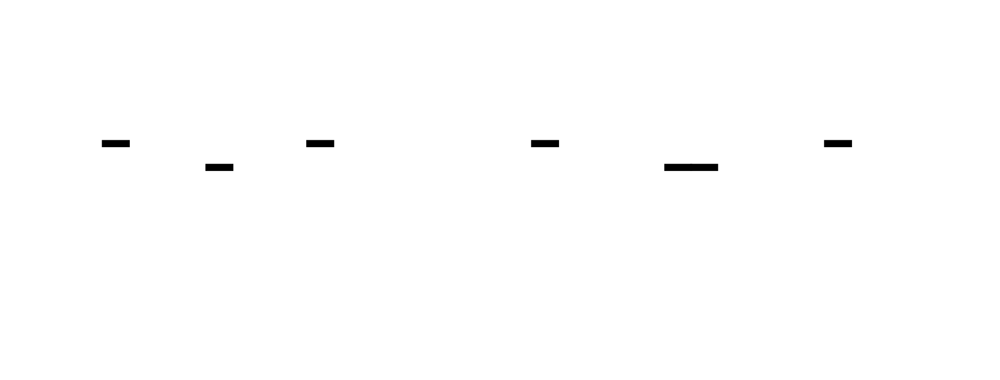
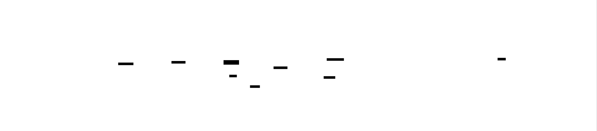
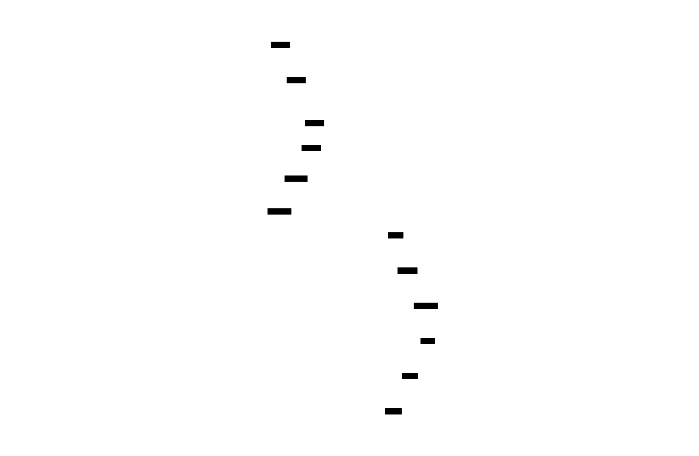
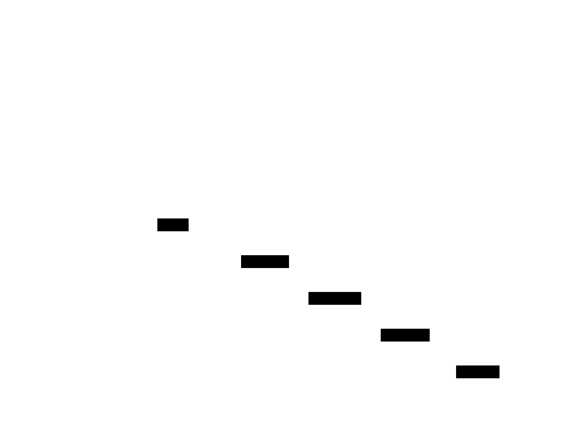
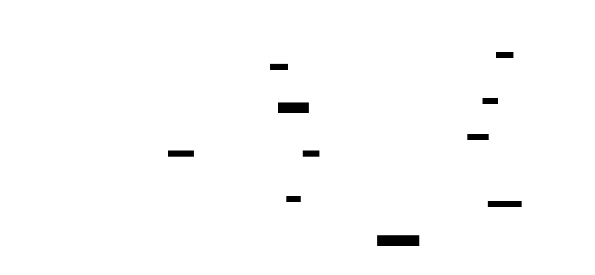

# Build Your Own SQLite

This project constructs a fully functional embedded SQL database from scratch, implementing the complete SQLite architecture: a tokenizer and recursive-descent parser producing ASTs, a bytecode compiler targeting a virtual database engine (VDBE), and a page-based storage engine with B-trees for clustered tables and B+trees for secondary indexes. The system includes a buffer pool with LRU eviction, a cost-based query planner with statistics-driven optimization, and ACID transactions via both rollback journal and write-ahead logging modes.

Building SQLite reveals why databases are designed the way they are. Every layer—the virtual machine, the page format, the WAL—exists to solve a specific tension between speed and durability. You'll discover that SQL execution is essentially running bytecode on a register machine, that B-tree splits are where theory meets messy reality, and that crash recovery is an intricate dance of write ordering and checksums.


<!-- MS_ID: build-sqlite-m1 -->
# Milestone 1: SQL Tokenizer

## Where We Are in the System


You're building the **front door** of the database. Before any SQL can be parsed, optimized, or executed, it must be broken into tokens—the atomic units of meaning. This tokenizer sits at the very beginning of the query pipeline, converting raw character input into a structured stream that the parser can consume.

Every query your database will ever process passes through this code. A bug here corrupts everything downstream.

---

## The Tension: Context Changes Meaning

Consider this SQL fragment:

```sql
SELECT 'SELECT' FROM "FROM"
```

There are **four** occurrences of the word "SELECT" and "FROM" in that line. But only **two** are keywords. The others are data—literally the strings 'SELECT' and "FROM" (the latter being a quoted table name).

Now consider:

```sql
a-7    -- subtraction: identifier MINUS number
-7     -- negative number
'a-7'  -- string literal containing dash
```

The dash character means three different things depending on context.

**This is the fundamental tension of tokenization: the same character sequence can have completely different meanings based on parser state.** A simple `split()` on whitespace cannot distinguish between a keyword inside quotes and a keyword outside them. Regex patterns that don't track state will misclassify tokens.

The solution is a **finite state machine**—code that explicitly tracks whether you're currently inside a string literal, a quoted identifier, a numeric literal, or normal "code" space, and transitions between these states based on input characters.

---

## The Tokenizer State Machine

{{DIAGRAM:diag-tokenizer-state-machine}}

Your tokenizer will operate as a character-by-character state machine with these primary states:

| State | Meaning | What Transitions Out |
|-------|---------|---------------------|
| **DEFAULT** | Normal code space | Letter → keyword/identifier, Digit → number, `'` → string, `"` → quoted identifier, Operator char → operator |
| **IN_STRING** | Inside `'...'` literal | `'` → check for escape (`''`), otherwise end string |
| **IN_QUOTED_ID** | Inside `"..."` identifier | `"` → end identifier |
| **IN_NUMBER** | Parsing numeric literal | Digit/`.` → continue, other → emit token, return to DEFAULT |
| **IN_IDENTIFIER** | Parsing unquoted identifier/keyword | Letter/digit/`_` → continue, other → emit token, return to DEFAULT |

The key insight: **you cannot determine token boundaries without tracking state.** When you see a `'` character, you don't know if it starts a string, ends a string, or is an escaped quote until you know the current state and look at the next character.

---

## Building the Tokenizer: Step by Step

### The Token Structure

Every token your tokenizer emits needs four pieces of information:

```go
type Token struct {
    Type   TokenType  // Classification: KEYWORD, IDENTIFIER, STRING, NUMBER, OPERATOR, etc.
    Value  string     // The actual text: "SELECT", "users", "hello world", "42"
    Line   int        // 1-indexed line number for error reporting
    Column int        // 1-indexed column number for error reporting
}
```

The line and column fields are **not optional**. When a user writes malformed SQL like `SELECT * FORM users` (misspelled FROM), the parser needs to report exactly where the error occurred. The tokenizer is the only component that sees the raw input—it must count newlines and track position.

### Keyword Recognition: Case-Insensitive Matching

SQL keywords are case-insensitive. These are all valid:

```sql
SELECT * FROM users
select * from users  
Select * From Users
```

Your tokenizer should:
1. Collect the identifier text character by character
2. Convert to uppercase (or lowercase) for comparison
3. Check against a keyword set/map
4. Emit either a KEYWORD token or an IDENTIFIER token

```go
var keywords = map[string]bool{
    "SELECT": true, "FROM": true, "WHERE": true, "INSERT": true,
    "INTO": true, "VALUES": true, "UPDATE": true, "DELETE": true,
    "CREATE": true, "TABLE": true, "INDEX": true, "DROP": true,
    "AND": true, "OR": true, "NOT": true, "NULL": true,
    "PRIMARY": true, "KEY": true, "UNIQUE": true, "FOREIGN": true,
    "JOIN": true, "INNER": true, "LEFT": true, "RIGHT": true, "ON": true,
    "ORDER": true, "BY": true, "ASC": true, "DESC": true,
    "GROUP": true, "HAVING": true, "LIMIT": true, "OFFSET": true,
    "INTEGER": true, "TEXT": true, "REAL": true, "BLOB": true,
    "BEGIN": true, "COMMIT": true, "ROLLBACK": true,
}

func (t *Tokenizer) classifyIdentifier(text string) TokenType {
    upper := strings.ToUpper(text)
    if keywords[upper] {
        return KEYWORD
    }
    return IDENTIFIER
}
```

**Important**: The original case is preserved in the `Value` field. Only the classification uses case-insensitive matching. This matters for identifiers—`"Users"` and `users` may be different tables depending on quoting rules.

### String Literals: The Escape Sequence Problem

SQL string literals use single quotes, and a single quote *inside* the string is escaped by doubling it:

```sql
'It''s a beautiful day'   -- String value: It's a beautiful day
'O''Brien'                -- String value: O'Brien
''''                      -- String value: ' (single quote)
```

This is where naive approaches fail. A tokenizer that just looks for the next `'` character will incorrectly terminate at the first escape.

The correct logic in the `IN_STRING` state:

```
When current char is ':
    Peek at next char
    If next char is also ':
        This is an escape - append ' to value, advance past both quotes
    Else:
        This is the closing quote - emit STRING token, return to DEFAULT
```

### Numeric Literals: Integers vs Floats

Numbers require distinguishing between integers and floating-point values:

```sql
42        -- INTEGER
3.14      -- FLOAT (has decimal point)
-7        -- INTEGER (negative, but handled carefully - see pitfalls)
1e10      -- FLOAT (scientific notation - optional enhancement)
```

The state machine for numbers:
1. If first char is a digit, enter `IN_NUMBER` state
2. Continue collecting digits
3. If `.` encountered, mark as FLOAT and continue
4. On non-numeric char, emit NUMBER token with appropriate subtype

**Note on negative numbers**: The `-` in `-7` is actually the unary minus *operator* applied to the literal `7`. Some tokenizers treat `-7` as a single negative number token; others emit `OPERATOR(-)` followed by `NUMBER(7)`. The latter approach is cleaner because it handles `-  7` (with spaces) correctly. However, for SQL, it's common to lex `-7` as a single negative number token for convenience. Either approach works if your parser handles it consistently.

### Operators: Single and Double Character

SQL has operators that are one character (`=`, `<`, `>`, `+`, `-`, `*`, `/`) and operators that are two characters (`<=`, `>=`, `!=`, `<>`).

The tokenizer needs to **peek ahead** when it encounters a character that could start a multi-character operator:

```go
func (t *Tokenizer) readOperator() Token {
    start := t.pos
    ch := t.current()
    
    // Check for two-character operators
    switch ch {
    case '<':
        if t.peek() == '=' {
            t.advance(2)
            return t.makeToken(OPERATOR, "<=", start)
        }
        if t.peek() == '>' {  // <> is also not-equals
            t.advance(2)
            return t.makeToken(OPERATOR, "<>", start)
        }
    case '>':
        if t.peek() == '=' {
            t.advance(2)
            return t.makeToken(OPERATOR, ">=", start)
        }
    case '!':
        if t.peek() == '=' {
            t.advance(2)
            return t.makeToken(OPERATOR, "!=", start)
        }
    case '=':
        // Could be == in some dialects, but SQL uses = for equality
    }
    
    // Single character operator
    t.advance(1)
    return t.makeToken(OPERATOR, string(ch), start)
}
```

### Quoted Identifiers: Double Quotes

SQL allows identifiers containing spaces or special characters when wrapped in double quotes:

```sql
CREATE TABLE "Order Details" (
    "Item Name" TEXT,
    "Price ($)" REAL
)
```

The `IN_QUOTED_ID` state is similar to `IN_STRING`, but SQL quoted identifiers typically don't use escape doubling—`"a""b"` would end the identifier at the second quote, producing `a` followed by a syntax error or another identifier `b`. Check your target SQL dialect's rules.

### Whitespace and Comments

Whitespace (spaces, tabs, newlines) separates tokens but is not emitted as tokens itself. The tokenizer simply skips over it in the DEFAULT state.

Comments should also be skipped:
- `-- This is a line comment` (continues to end of line)
- `/* This is a block comment */` (can span multiple lines)

Skipping comments happens in the DEFAULT state before attempting to read a token.

---

## Error Reporting: Line and Column Tracking

When the tokenizer encounters an unexpected character (like `@` or a stray `"` that's never closed), it must report the location precisely.

This requires maintaining position state:

```go
type Tokenizer struct {
    input   string
    pos     int  // Current byte position in input
    line    int  // Current line number (1-indexed)
    column  int  // Current column number (1-indexed)
}

func (t *Tokenizer) advance(n int) {
    for i := 0; i < n; i++ {
        if t.input[t.pos] == '\n' {
            t.line++
            t.column = 1
        } else {
            t.column++
        }
        t.pos++
    }
}
```

Every token captures the line and column at its **start** position. An unclosed string literal error reports where the string *began*, not where the input ended.

---

## The Token Stream Output


For input:

```sql
SELECT name, age FROM users WHERE age > 18;
```

The tokenizer produces:

```
[0] KEYWORD("SELECT")      line:1, col:1
[1] IDENTIFIER("name")     line:1, col:8
[2] PUNCTUATION(",")       line:1, col:12
[3] IDENTIFIER("age")      line:1, col:14
[4] KEYWORD("FROM")        line:1, col:18
[5] IDENTIFIER("users")    line:1, col:23
[6] KEYWORD("WHERE")       line:1, col:29
[7] IDENTIFIER("age")      line:1, col:35
[8] OPERATOR(">")          line:1, col:39
[9] NUMBER("18")           line:1, col:41
[10] PUNCTUATION(";")      line:1, col:43
```

This array of tokens is what the parser (next milestone) will consume to build an AST.

---

## A Complete Tokenization Example

Let's trace through a complex statement:

```sql
INSERT INTO "User Data" (id, name) VALUES (1, 'Alice''s Restaurant');
```

| Step | Char | State → State | Token Emitted |
|------|------|---------------|---------------|
| 1 | I | DEFAULT → IN_IDENTIFIER | — |
| 2-6 | NSERT | IN_IDENTIFIER | — |
| 7 | (space) | IN_IDENTIFIER → DEFAULT | KEYWORD("INSERT") |
| 8-11 | INTO | DEFAULT → IN_IDENTIFIER → DEFAULT | KEYWORD("INTO") |
| 12 | " | DEFAULT → IN_QUOTED_ID | — |
| 13-21 | User Data | IN_QUOTED_ID | — |
| 22 | " | IN_QUOTED_ID → DEFAULT | IDENTIFIER("User Data") |
| 23 | ( | DEFAULT | PUNCTUATION("(") |
| 24-25 | id | IN_IDENTIFIER | IDENTIFIER("id") |
| 26 | , | DEFAULT | PUNCTUATION(",") |
| 27-30 | name | IN_IDENTIFIER | IDENTIFIER("name") |
| 31 | ) | DEFAULT | PUNCTUATION(")") |
| 32-36 | VALUES | IN_IDENTIFIER | KEYWORD("VALUES") |
| 37 | ( | DEFAULT | PUNCTUATION("(") |
| 38 | 1 | IN_NUMBER | NUMBER("1", INTEGER) |
| 39 | , | DEFAULT | PUNCTUATION(",") |
| 40 | ' | DEFAULT → IN_STRING | — |
| 41-45 | Alice | IN_STRING | — |
| 46 | ' | IN_STRING (check next) | — (next is also ') |
| 47 | ' | IN_STRING (escaped) | — (append ' to value) |
| 48-58 | s Restaurant | IN_STRING | — |
| 59 | ' | IN_STRING → DEFAULT | STRING("Alice's Restaurant") |
| 60 | ) | DEFAULT | PUNCTUATION(")") |
| 61 | ; | DEFAULT | PUNCTUATION(";") |

Notice step 46-47: the doubled quote inside the string is recognized as an escape, and only a single quote is added to the token value.

---

## Common Pitfalls

### 1. Not Handling Escaped Quotes

```sql
'It''s broken'   -- Without escape handling, produces: "It" followed by error
```

The tokenizer would emit STRING("It"), then see `s broken'` and fail because `s` isn't a valid token start in that context.

**Fix**: In the `IN_STRING` state, always peek ahead when you see `'` to check for the escape sequence.

### 2. Case Sensitivity Confusion

```sql
SELECT * FROM Users   -- "Users" should be IDENTIFIER, not keyword
```

Keywords are case-insensitive, but the *text* of the token should preserve original case. Don't lowercase the `Value` field—only use lowercase/uppercase for the keyword *lookup*.

### 3. Negative Numbers vs Subtraction

```sql
SELECT a-7 FROM t   -- Is this "a minus 7" or "a negative-7"?
```

With whitespace: `a - 7` is clearly subtraction. Without: `a-7` is ambiguous.

The safest approach: **emit the `-` as an operator always**, let the parser decide if it's unary minus (negation) or binary minus (subtraction). This handles both `a-7` and `a - 7` and `-7` uniformly.

If you *do* want to lex `-7` as a single negative number, only do so when `-` is immediately followed by a digit AND the preceding token (if any) suggests an expression context (after an operator, after `(`, at start of statement, etc.). This is complex and error-prone.

### 4. Unicode and Multi-byte Characters

If your SQL supports Unicode identifiers like `名前`, you cannot use simple byte indexing. UTF-8 encodes characters as 1-4 bytes, and your line/column tracking must count *characters*, not bytes.

**For this project**: Start with ASCII-only identifiers. Document the limitation. Unicode support can be added later with a proper UTF-8 decoder.

### 5. Forgetting to Track Position

If you don't increment line/column during tokenization, you can't provide useful error messages. The parser will be left saying "unexpected token" without being able to show *where*.

---

## Test Suite: What to Verify

Your tokenizer test suite should cover:

**Basic tokens:**
```sql
SELECT        -- KEYWORD
my_table      -- IDENTIFIER  
42            -- NUMBER (integer)
3.14          -- NUMBER (float)
=             -- OPERATOR
(             -- PUNCTUATION
```

**Case insensitivity:**
```sql
select SELECT Select sElEcT   -- All KEYWORD
```

**String escapes:**
```sql
'hello'         -- STRING("hello")
'It''s'         -- STRING("It's")
''''            -- STRING("'")
''              -- STRING("") (empty string)
```

**Quoted identifiers:**
```sql
"column name"   -- IDENTIFIER("column name")
"SELECT"        -- IDENTIFIER("SELECT") -- NOT a keyword!
```

**Operators:**
```sql
= < > <= >= != <>   -- All distinct OPERATOR tokens
```

**Complex statements:**
```sql
SELECT id, name FROM users WHERE age >= 21 AND status = 'active' ORDER BY name;
INSERT INTO logs (message, ts) VALUES ('User logged in', '2024-01-15');
CREATE TABLE "Order Items" (id INTEGER PRIMARY KEY, qty INTEGER NOT NULL);
```

**Error cases:**
```sql
'It never ends    -- Unclosed string: error at line 1, column 1
"also unclosed    -- Unclosed identifier: error at line 1, column 1
@bad_char         -- Unrecognized character: error at line 1, column 1
```

Aim for **20+ diverse SQL statements** in your test suite, including edge cases.

---

## Knowledge Cascade: What This Unlocks

You've just built a **lexer**—the foundation of all language processing. Here's where this knowledge connects:

**Immediate connections:**
- **Parser (next milestone)**: Your token stream feeds directly into the recursive-descent parser. The token types you defined become the grammar terminals.
- **Error messages**: The line/column tracking you implemented will be used by every error message the database produces.

**Same domain:**
- **Regular expressions**: The state machine you built is what regex engines compile patterns into. A regex like `'[']*'` compiles to nearly the same state transitions as your string literal handler.
- **Lexer generators (flex, lex, ANTLR)**: Tools that generate tokenizers from declarative specifications. Your hand-written version gives you complete control and better error messages.

**Cross-domain:**
- **IDE syntax highlighting**: The colored SQL you see in editors comes from a tokenizer nearly identical to this one, running on every keystroke to recolor the text.
- **UTF-8/Unicode handling**: Multi-byte character processing is a state machine problem too—you're doing character-by-character processing, which is the right mental model for handling variable-width encodings.
- **SQL injection detection**: Understanding token boundaries reveals why sanitization is hard. An attacker who knows your tokenizer's rules can craft inputs like `' OR '1'='1` that break out of string contexts. Tokenization is the first line of defense—you must handle all escape sequences correctly or leave vulnerabilities.

**Forward:**
- **With this knowledge, you could now build**: A syntax highlighter for SQL, a SQL formatter/prettifier, a basic SQL linter that detects syntax issues before parsing, or a query logger that redacts string literals for privacy.

---
<!-- END_MS -->


<!-- MS_ID: build-sqlite-m2 -->
# Milestone 2: SQL Parser (AST)

## Where We Are in the System


Your tokenizer hands you a clean stream of tokens—`KEYWORD("SELECT")`, `IDENTIFIER("users")`, `OPERATOR(">")`, `NUMBER("18")`. Now you must answer: **what does this sequence mean?**

The parser's job is to impose structure on this flat stream. It recognizes that `SELECT` starts a query, that `FROM` introduces a table reference, that `WHERE` begins a filter condition, and that `age > 18` is an expression with an operator and two operands. The output is an **Abstract Syntax Tree** (AST)—a hierarchical representation that captures the *meaning* of the SQL statement.


This AST is what the bytecode compiler (next milestone) will traverse to generate executable instructions. A malformed AST produces incorrect bytecode, which produces wrong query results.

---

## The Tension: Ambiguity and Infinite Loops

Consider parsing this SQL expression:

```sql
SELECT * FROM users WHERE active = 1 OR role = 'admin' AND level > 5
```

Does this mean:
- `(active = 1 OR role = 'admin') AND level > 5` — users who are either active or admins, AND have level > 5?
- `active = 1 OR (role = 'admin' AND level > 5)` — users who are active, OR admins with level > 5?

These return **different results**. The parser must resolve this ambiguity using operator precedence rules.

Now consider this grammar rule for expressions:

```
expression → expression AND expression
           | expression OR expression
           | comparison
```

Looks reasonable. But try parsing `a OR b`:

1. Try to match `expression AND expression`
2. To match the left `expression`, try `expression AND expression` again
3. To match *that* left `expression`, try `expression AND expression` again
4. **Infinite recursion**—the parser never makes progress

This is **left recursion**, and it's fatal for recursive descent parsers. The grammar is mathematically valid, but the implementation strategy (recursive functions calling themselves with the same input position) cannot handle it.

**Two problems emerge:**
1. **Ambiguity**: The same token sequence can be interpreted multiple ways—precedence rules must pick one
2. **Left recursion**: Naive grammar encoding causes infinite loops—structure must be rewritten or a different algorithm used

---

## The Revelation: Precedence Is Not Natural

You might expect operator precedence to "just work" if you structure your grammar correctly. It doesn't.

SQL's precedence hierarchy (highest to lowest):
1. `NOT` — unary negation
2. Comparison operators: `=`, `<`, `>`, `<=`, `>=`, `!=`, `<>`
3. `AND` — conjunction
4. `OR` — disjunction (lowest precedence)

This means:

```sql
NOT a = b AND c > d OR e < f
```

Is parsed as:

```
OR
├── AND
│   ├── NOT
│   │   └── = (a, b)
│   └── > (c, d)
└── < (e, f)
```

A naive grammar that treats all binary operators equally produces a flat or wrong tree. A grammar that encodes precedence explicitly becomes verbose and hard to maintain:

```
or_expr     → and_expr (OR and_expr)*
and_expr    → not_expr (AND not_expr)*
not_expr    → NOT not_expr | comparison
comparison  → primary (('=' | '<' | '>') primary)?
```

This works but requires four separate functions for expressions alone. Add more operators and the complexity grows.

The elegant solution is **precedence climbing** or **Pratt parsing**—a single algorithm that handles all operators using precedence values and associativity rules. You write one function, configure a table of operators, and the algorithm produces correct trees automatically.

---

## Three-Level View: From Token Stream to AST

{{DIAGRAM:diag-query-execution-pipeline}}

| Level | What It Does | Example |
|-------|--------------|---------|
| **Statement** | Top-level structure: SELECT, INSERT, CREATE, etc. | `SELECT ... FROM ... WHERE ...` |
| **Clause** | Components within a statement | `WHERE active = 1` |
| **Expression** | Computable values with operators | `a OR b AND NOT c` |

Your parser descends through these levels:
1. **Statement level**: Look at first token to choose SELECT parser, INSERT parser, etc.
2. **Clause level**: Parse column list, FROM clause, WHERE clause, etc.
3. **Expression level**: Handle operators with correct precedence

---

## Building the Parser: Step by Step

### The Parser Structure

```go
type Parser struct {
    tokens    []Token
    pos       int       // Current position in token array
    current   Token     // Lookahead token
    errors    []ParseError
}

type ParseError struct {
    Message string
    Line    int
    Column  int
}
```

The parser maintains a **lookahead**—the current token being examined. One token of lookahead is sufficient for SQL (it's an LL(1) grammar with some exceptions handled by context).

```go
func (p *Parser) advance() {
    p.pos++
    if p.pos < len(p.tokens) {
        p.current = p.tokens[p.pos]
    } else {
        p.current = Token{Type: EOF}
    }
}

func (p *Parser) expect(tokenType TokenType, value string) error {
    if p.current.Type != tokenType || p.current.Value != value {
        return p.error("expected %s, got %s", value, p.current.Value)
    }
    p.advance()
    return nil
}
```

### Statement Parsing: Dispatch on First Token

```go
func (p *Parser) ParseStatement() (Statement, error) {
    switch {
    case p.current.Type == KEYWORD && p.current.Value == "SELECT":
        return p.parseSelect()
    case p.current.Type == KEYWORD && p.current.Value == "INSERT":
        return p.parseInsert()
    case p.current.Type == KEYWORD && p.current.Value == "CREATE":
        return p.parseCreate()
    // ... other statement types
    default:
        return nil, p.error("unexpected token: %s", p.current.Value)
    }
}
```

Each statement type has its own parsing function that knows the expected structure.

### SELECT Statement Parsing

```go
type SelectStatement struct {
    Columns    []ColumnSelection  // * or explicit column list
    FromTable  string             // Table name
    Where      Expression         // Optional filter
    OrderBy    []OrderByColumn    // Optional ordering
    Limit      *int               // Optional row limit
}

type ColumnSelection struct {
    Expression Expression
    Alias      string  // Optional: "AS alias"
}

func (p *Parser) parseSelect() (*SelectStatement, error) {
    stmt := &SelectStatement{}
    
    // SELECT
    if err := p.expect(KEYWORD, "SELECT"); err != nil {
        return nil, err
    }
    
    // Column list (or *)
    columns, err := p.parseColumnList()
    if err != nil {
        return nil, err
    }
    stmt.Columns = columns
    
    // FROM clause (required)
    if p.current.Type == KEYWORD && p.current.Value == "FROM" {
        p.advance()
        if p.current.Type != IDENTIFIER {
            return nil, p.error("expected table name after FROM")
        }
        stmt.FromTable = p.current.Value
        p.advance()
    }
    
    // WHERE clause (optional)
    if p.current.Type == KEYWORD && p.current.Value == "WHERE" {
        p.advance()
        expr, err := p.parseExpression()
        if err != nil {
            return nil, err
        }
        stmt.Where = expr
    }
    
    // ORDER BY (optional)
    if p.current.Type == KEYWORD && p.current.Value == "ORDER" {
        p.advance()
        if err := p.expect(KEYWORD, "BY"); err != nil {
            return nil, err
        }
        stmt.OrderBy, _ = p.parseOrderByList()
    }
    
    // LIMIT (optional)
    if p.current.Type == KEYWORD && p.current.Value == "LIMIT" {
        p.advance()
        if p.current.Type != NUMBER {
            return nil, p.error("expected number after LIMIT")
        }
        limit := parseInt(p.current.Value)
        stmt.Limit = &limit
        p.advance()
    }
    
    return stmt, nil
}
```

Key insight: **keywords structure the parse**. After `SELECT`, you expect columns. After `FROM`, you expect a table. After `WHERE`, you expect an expression. The parser follows this roadmap.

### INSERT Statement Parsing

```go
type InsertStatement struct {
    Table    string
    Columns  []string      // Optional column names
    Values   [][]Expression  // VALUES clause(s)
}

func (p *Parser) parseInsert() (*InsertStatement, error) {
    stmt := &InsertStatement{}
    
    // INSERT INTO
    if err := p.expect(KEYWORD, "INSERT"); err != nil {
        return nil, err
    }
    if err := p.expect(KEYWORD, "INTO"); err != nil {
        return nil, err
    }
    
    // Table name
    if p.current.Type != IDENTIFIER {
        return nil, p.error("expected table name")
    }
    stmt.Table = p.current.Value
    p.advance()
    
    // Optional column list: (col1, col2, ...)
    if p.current.Type == PUNCTUATION && p.current.Value == "(" {
        p.advance()
        stmt.Columns = p.parseIdentifierList()
        if err := p.expect(PUNCTUATION, ")"); err != nil {
            return nil, err
        }
    }
    
    // VALUES clause
    if err := p.expect(KEYWORD, "VALUES"); err != nil {
        return nil, err
    }
    
    // One or more value tuples: (1, 'a'), (2, 'b')
    for {
        if p.current.Type != PUNCTUATION || p.current.Value != "(" {
            return nil, p.error("expected '(' to start VALUES tuple")
        }
        p.advance()
        values, err := p.parseExpressionList()
        if err != nil {
            return nil, err
        }
        stmt.Values = append(stmt.Values, values)
        
        if err := p.expect(PUNCTUATION, ")"); err != nil {
            return nil, err
        }
        
        // Check for more tuples
        if p.current.Type != PUNCTUATION || p.current.Value != "," {
            break
        }
        p.advance()
    }
    
    return stmt, nil
}
```

### CREATE TABLE Parsing

```go
type CreateTableStatement struct {
    Table       string
    Columns     []ColumnDefinition
    Constraints []TableConstraint
}

type ColumnDefinition struct {
    Name        string
    Type        string       // INTEGER, TEXT, REAL, BLOB
    Constraints []ColumnConstraint  // PRIMARY KEY, NOT NULL, UNIQUE, etc.
}

func (p *Parser) parseCreate() (*CreateTableStatement, error) {
    stmt := &CreateTableStatement{}
    
    // CREATE TABLE
    if err := p.expect(KEYWORD, "CREATE"); err != nil {
        return nil, err
    }
    if err := p.expect(KEYWORD, "TABLE"); err != nil {
        return nil, err
    }
    
    // Table name (may be quoted)
    if p.current.Type != IDENTIFIER {
        return nil, p.error("expected table name")
    }
    stmt.Table = p.current.Value
    p.advance()
    
    // Column definitions in parentheses
    if err := p.expect(PUNCTUATION, "("); err != nil {
        return nil, err
    }
    
    for {
        col, err := p.parseColumnDefinition()
        if err != nil {
            return nil, err
        }
        stmt.Columns = append(stmt.Columns, col)
        
        // More columns?
        if p.current.Type == PUNCTUATION && p.current.Value == "," {
            p.advance()
            continue
        }
        break
    }
    
    if err := p.expect(PUNCTUATION, ")"); err != nil {
        return nil, err
    }
    
    return stmt, nil
}

func (p *Parser) parseColumnDefinition() (ColumnDefinition, error) {
    col := ColumnDefinition{}
    
    // Column name
    if p.current.Type != IDENTIFIER {
        return col, p.error("expected column name")
    }
    col.Name = p.current.Value
    p.advance()
    
    // Data type
    if p.current.Type != KEYWORD {
        return col, p.error("expected data type")
    }
    col.Type = p.current.Value  // INTEGER, TEXT, REAL, BLOB
    p.advance()
    
    // Optional constraints
    for {
        if p.current.Type != KEYWORD {
            break
        }
        
        switch p.current.Value {
        case "PRIMARY":
            p.advance()
            if err := p.expect(KEYWORD, "KEY"); err != nil {
                return col, err
            }
            col.Constraints = append(col.Constraints, PrimaryKeyConstraint{})
        case "NOT":
            p.advance()
            if err := p.expect(KEYWORD, "NULL"); err != nil {
                return col, err
            }
            col.Constraints = append(col.Constraints, NotNullConstraint{})
        case "UNIQUE":
            p.advance()
            col.Constraints = append(col.Constraints, UniqueConstraint{})
        default:
            // Not a constraint keyword - stop parsing constraints
            return col, nil
        }
    }
    
    return col, nil
}
```

---

## Expression Parsing: The Heart of the Parser

This is where precedence matters. You have two approaches:

### Approach 1: Explicit Precedence Levels (Grammar Rewriting)

```go
// OR has lowest precedence - start here
func (p *Parser) parseExpression() (Expression, error) {
    return p.parseOrExpression()
}

func (p *Parser) parseOrExpression() (Expression, error) {
    left, err := p.parseAndExpression()
    if err != nil {
        return nil, err
    }
    
    for p.current.Type == KEYWORD && p.current.Value == "OR" {
        p.advance()
        right, err := p.parseAndExpression()
        if err != nil {
            return nil, err
        }
        left = &BinaryExpression{Operator: "OR", Left: left, Right: right}
    }
    
    return left, nil
}

func (p *Parser) parseAndExpression() (Expression, error) {
    left, err := p.parseNotExpression()
    if err != nil {
        return nil, err
    }
    
    for p.current.Type == KEYWORD && p.current.Value == "AND" {
        p.advance()
        right, err := p.parseNotExpression()
        if err != nil {
            return nil, err
        }
        left = &BinaryExpression{Operator: "AND", Left: left, Right: right}
    }
    
    return left, nil
}

func (p *Parser) parseNotExpression() (Expression, error) {
    if p.current.Type == KEYWORD && p.current.Value == "NOT" {
        p.advance()
        operand, err := p.parseNotExpression()
        if err != nil {
            return nil, err
        }
        return &UnaryExpression{Operator: "NOT", Operand: operand}, nil
    }
    
    return p.parseComparisonExpression()
}

func (p *Parser) parseComparisonExpression() (Expression, error) {
    left, err := p.parsePrimaryExpression()
    if err != nil {
        return nil, err
    }
    
    // Check for comparison operators
    if p.current.Type == OPERATOR {
        op := p.current.Value
        if op == "=" || op == "<" || op == ">" || op == "<=" || op == ">=" || op == "!=" || op == "<>" {
            p.advance()
            right, err := p.parsePrimaryExpression()
            if err != nil {
                return nil, err
            }
            return &BinaryExpression{Operator: op, Left: left, Right: right}, nil
        }
    }
    
    return left, nil
}

func (p *Parser) parsePrimaryExpression() (Expression, error) {
    // Parenthesized expression - highest precedence
    if p.current.Type == PUNCTUATION && p.current.Value == "(" {
        p.advance()
        expr, err := p.parseExpression()  // Start over at top
        if err != nil {
            return nil, err
        }
        if err := p.expect(PUNCTUATION, ")"); err != nil {
            return nil, err
        }
        return expr, nil
    }
    
    // Literals
    if p.current.Type == NUMBER {
        val := parseIntOrFloat(p.current.Value)
        p.advance()
        return &LiteralExpression{Value: val}, nil
    }
    
    if p.current.Type == STRING {
        val := p.current.Value
        p.advance()
        return &LiteralExpression{Value: val}, nil
    }
    
    // NULL
    if p.current.Type == KEYWORD && p.current.Value == "NULL" {
        p.advance()
        return &LiteralExpression{Value: nil}, nil
    }
    
    // Identifier (column reference)
    if p.current.Type == IDENTIFIER {
        name := p.current.Value
        p.advance()
        return &IdentifierExpression{Name: name}, nil
    }
    
    return nil, p.error("expected expression")
}
```


This works correctly. `a OR b AND c` is parsed as `a OR (b AND c)` because `parseOrExpression` calls `parseAndExpression` first, which binds the `AND` tighter.

### Approach 2: Precedence Climbing (Compact)

If you want a single function for all binary operators:

```go
var precedence = map[string]int{
    "OR":  1,
    "AND": 2,
    "=":   3, "<": 3, ">": 3, "<=": 3, ">=": 3, "!=": 3, "<>": 3,
    "NOT": 4,  // Unary, handled separately
}

func (p *Parser) parseExpressionWithPrecedence(minPrec int) (Expression, error) {
    // Parse left operand (handles NOT, atoms, parenthesized expressions)
    left, err := p.parseUnaryOrAtom()
    if err != nil {
        return nil, err
    }
    
    // While current token is a binary operator with sufficient precedence
    for {
        op := p.current.Value
        prec, isBinary := precedence[op]
        if !isBinary || prec < minPrec {
            break
        }
        
        p.advance()
        
        // Parse right operand with higher precedence
        right, err := p.parseExpressionWithPrecedence(prec + 1)
        if err != nil {
            return nil, err
        }
        
        left = &BinaryExpression{Operator: op, Left: left, Right: right}
    }
    
    return left, nil
}

func (p *Parser) parseExpression() (Expression, error) {
    return p.parseExpressionWithPrecedence(1)  // Start with lowest precedence
}
```

The algorithm:
1. Parse a "primary" expression (literal, identifier, or parenthesized)
2. Look at the current operator—if its precedence is >= `minPrec`, consume it and parse the right side
3. For the right side, require *higher* precedence (`prec + 1`) to ensure left-associativity
4. Loop until you hit an operator with lower precedence than `minPrec`

This single 20-line function replaces the four separate functions from Approach 1.

---

## Parentheses Override Precedence

```sql
SELECT * FROM users WHERE (active = 1 OR role = 'admin') AND level > 5
```

The parentheses force the `OR` to be evaluated first, then the result is ANDed with `level > 5`.

In both approaches, `parsePrimaryExpression` handles parentheses by recursively calling `parseExpression()`:

```go
if p.current.Type == PUNCTUATION && p.current.Value == "(" {
    p.advance()
    expr, err := p.parseExpression()  // Full expression inside parens
    if err != nil {
        return nil, err
    }
    if err := p.expect(PUNCTUATION, ")"); err != nil {
        return nil, p.error("unclosed parenthesis")
    }
    return expr, nil
}
```

The recursive call starts precedence over from the top—anything inside parentheses is parsed as a fresh expression.

---

## NULL: The Special Keyword

`NULL` is not an identifier. It's a keyword representing the absence of a value.

```sql
SELECT * FROM users WHERE middle_name IS NULL
SELECT * FROM users WHERE deleted_at IS NOT NULL
```

Your expression parser must recognize `NULL` as a literal:

```go
if p.current.Type == KEYWORD && p.current.Value == "NULL" {
    p.advance()
    return &LiteralExpression{Value: nil, Type: "NULL"}, nil
}
```

Note: `NULL = NULL` does not evaluate to TRUE in SQL—it evaluates to NULL. This three-valued logic will matter when you execute queries, but for parsing, just recognize `NULL` as a valid expression.

---

## Error Reporting: Position Tracking

When parsing fails, report *where*:

```sql
SELECT * FORM users
--          ^^^^
-- Error at line 1, column 10: unexpected token "FORM", expected "FROM"
```

Your tokenizer already attached line/column to each token. Propagate this into error messages:

```go
func (p *Parser) error(format string, args ...interface{}) error {
    return ParseError{
        Message: fmt.Sprintf(format, args...),
        Line:    p.current.Line,
        Column:  p.current.Column,
    }
}
```

For multi-token constructs, report the **start** position:

```go
func (p *Parser) parseSelect() (*SelectStatement, error) {
    startLine := p.current.Line
    startCol := p.current.Column
    
    // ... parsing ...
    
    if err != nil {
        return nil, ParseError{
            Message: err.Error(),
            Line:    startLine,
            Column:  startCol,
        }
    }
}
```

---

## AST Structure Reference

Your AST types should capture all the information needed for the bytecode compiler:

```go
// Statements
type Statement interface { isStatement() }

type SelectStatement struct {
    Columns    []ColumnSelection
    FromTable  string
    Alias      string              // Optional table alias
    Where      Expression          // Optional
    GroupBy    []Expression        // Optional
    Having     Expression          // Optional
    OrderBy    []OrderByColumn     // Optional
    Limit      *int                // Optional
    Offset     *int                // Optional
}

type InsertStatement struct {
    Table    string
    Columns  []string
    Values   [][]Expression
}

type CreateTableStatement struct {
    Table       string
    IfNotExists bool
    Columns     []ColumnDefinition
}

// Expressions
type Expression interface { isExpression() }

type BinaryExpression struct {
    Operator string        // AND, OR, =, <, >, etc.
    Left     Expression
    Right    Expression
}

type UnaryExpression struct {
    Operator string        // NOT, - (negation)
    Operand  Expression
}

type LiteralExpression struct {
    Value interface{}      // string, int, float, nil
}

type IdentifierExpression struct {
    Name string            // Column or table name
}

// Column definitions
type ColumnDefinition struct {
    Name        string
    Type        string
    Constraints []ColumnConstraint
}

type ColumnConstraint interface { isConstraint() }

type PrimaryKeyConstraint struct{}
type NotNullConstraint struct{}
type UniqueConstraint struct{}
```

---

## Common Pitfalls

### 1. Left Recursion in Grammar

**Wrong:**
```
expression → expression AND expression | atom
```

This causes infinite recursion. The parser calls `parseExpression()`, which tries to match `expression AND expression`, which calls `parseExpression()` again with the same position.

**Right:**
```
expression → atom (AND atom)*
```

Or use precedence climbing, which avoids left recursion entirely by iterating instead of recursing on the left side.

### 2. AND Binds Tighter Than OR

```sql
a OR b AND c
```

**Wrong parse:** `(a OR b) AND c`

**Correct parse:** `a OR (b AND c)`

SQL follows mathematical convention where AND is like multiplication (binds tight) and OR is like addition (binds loose). Your precedence table must reflect this.

### 3. NULL Is Not an Identifier

```sql
SELECT NULL FROM users
```

`NULL` is a keyword, not a column name. If you try to parse it as an identifier, you'll produce a column reference instead of a null literal.

**Fix**: Check for `NULL` explicitly in your primary expression parser before checking for identifiers.

### 4. Parentheses Require Recursive Parsing

```sql
SELECT ((a + b) * c) FROM t
```

Each opening parenthesis starts a **new** expression parse at the top level. Don't try to handle nesting with explicit levels—recursion handles arbitrary depth naturally.

---

## Test Suite: What to Verify

**SELECT statements:**
```sql
SELECT * FROM users
SELECT id, name FROM users
SELECT * FROM users WHERE active = 1
SELECT * FROM users WHERE age > 18 AND status = 'active'
SELECT * FROM users WHERE (a = 1 OR b = 2) AND c = 3
SELECT * FROM users ORDER BY name
SELECT * FROM users LIMIT 10
SELECT * FROM users WHERE active = 1 ORDER BY created_at DESC LIMIT 5
```

**INSERT statements:**
```sql
INSERT INTO users VALUES (1, 'Alice')
INSERT INTO users (id, name) VALUES (1, 'Alice')
INSERT INTO logs (message, level) VALUES ('Error', 'high'), ('Warning', 'medium')
```

**CREATE TABLE statements:**
```sql
CREATE TABLE users (id INTEGER, name TEXT)
CREATE TABLE users (id INTEGER PRIMARY KEY, name TEXT NOT NULL)
CREATE TABLE users (id INTEGER, email TEXT UNIQUE)
CREATE TABLE "Order Items" (id INTEGER, qty INTEGER NOT NULL)
```

**Expression precedence:**
```sql
-- These should parse differently
a OR b AND c            -- a OR (b AND c)
NOT a = b               -- NOT (a = b), not (NOT a) = b
a = b OR c = d AND e = f  -- (a = b) OR ((c = d) AND (e = f))
```

**Parentheses:**
```sql
(a OR b) AND c          -- Force OR first
NOT (a AND b)           -- Negate the whole AND
((a))                   -- Nested parens
```

**Error cases:**
```sql
SELECT                  -- Missing column list
SELECT * FROM           -- Missing table name
SELECT * FORM users     -- Misspelled keyword (token-level error, but parser should report position)
INSERT INTO users (     -- Unclosed column list
CREATE TABLE users (id  -- Unclosed column definition
```

Aim for **15+ valid statements** and **10+ invalid statements** that produce meaningful error messages.

---

## Knowledge Cascade: What This Unlocks

You've just built a **parser**—the gateway to language understanding. Here's where this connects:

**Immediate connections:**
- **Bytecode compiler (next milestone)**: Your AST is the direct input. The compiler traverses the tree depth-first, emitting opcodes for each node.
- **Error messages**: The position tracking you implemented now appears in every syntax error the database reports.

**Same domain:**
- **Query optimizers**: Every database optimizer works on ASTs. Transformations like "push WHERE predicates down" or "reorder JOINs" are tree rewrites on the structure you just learned to build.
- **SQL dialects**: MySQL, PostgreSQL, SQLite, and SQL Server all parse into similar ASTs but with dialect-specific nodes. Understanding AST structure lets you write cross-database tools.

**Cross-domain:**
- **Spreadsheet formulas**: `=A1+B2*C3` has the same precedence challenges. Excel's formula parser uses the same precedence climbing algorithm.
- **Linter and static analysis tools**: ESLint, pylint, and SQL linters all parse code into ASTs, then walk the tree looking for patterns. You could now build a SQL linter that detects `SELECT *` on production tables.
- **Prepared statements**: When you run `db.prepare("SELECT ...")`, the database parses once and caches the AST. Subsequent executions skip parsing. Your AST structure is what gets cached.
- **SQL translation**: Converting MySQL's `` backtick quotes to PostgreSQL's "double quotes" or SQLite's [brackets] requires parsing, transforming the AST, and re-serializing. The AST is the common representation.

**Forward:**
- **With this knowledge, you could now build**: A SQL formatter/prettifier (walk the AST, pretty-print), a SQL linter that enforces style rules, a schema migration tool that parses `CREATE TABLE` and compares schemas, or a query builder that constructs ASTs programmatically instead of string concatenation.

---
<!-- END_MS -->


<!-- MS_ID: build-sqlite-m3 -->
# Milestone 3: Bytecode Compiler (VDBE)

## Where We Are in the System


Your parser hands you a beautiful AST—a tree structure that captures the *meaning* of a SQL statement. Now comes a critical architectural decision: **how do you execute this tree?**

The naive approach is a **tree-walking interpreter**: recursively evaluate each AST node. For `SELECT * FROM users WHERE age > 18`, you'd walk the SELECT node, which walks the WHERE node, which walks the comparison node, which walks the identifier and literal nodes. Simple, clean, obvious.

SQLite does something different. It **compiles the AST into bytecode** and executes that bytecode on a **virtual machine**—the Virtual Database Engine (VDBE). This extra compilation step is not premature optimization. It's architectural necessity.

---

## The Revelation: Why Bytecode, Not Tree Walking?

Here's what most developers assume: "Databases interpret SQL directly. Bytecode is overkill for a simple database—just recursively evaluate AST nodes."

This assumption is wrong for three reasons.

### Reason 1: Caching Amortizes Compilation Cost

Consider a web application that runs the same parameterized query 10,000 times per minute:

```sql
SELECT * FROM users WHERE id = ?
```

A tree-walking interpreter parses and validates the AST on *every* execution. That's 10,000 parses per minute of the identical structure.

With bytecode compilation:
1. Parse once → AST
2. Compile once → bytecode program
3. Execute 10,000 times with different parameters

The bytecode program is a flat array of instructions. Caching it is trivial—store it keyed by the SQL text. SQLite's prepared statements are exactly this: cached bytecode programs waiting for parameters.

### Reason 2: The VM Provides a Clean Abstraction Boundary

Your database has multiple moving parts:
- **Frontend**: Tokenizer, parser, compiler
- **Execution**: Virtual machine
- **Storage**: B-trees, buffer pool, WAL

With bytecode, the compiler knows nothing about B-tree internals. It emits high-level opcodes like `OpenTable`, `Column`, `Next`. The VM translates these into storage engine calls. Want to swap the storage engine? The compiler doesn't change. Want to add a new SQL feature? The storage engine doesn't change.

This decoupling is why SQLite can support multiple storage formats (rollback journal vs WAL) without rewriting the compiler.

### Reason 3: Optimization Opportunities

Tree-walking interpreters evaluate nodes as they encounter them. Bytecode compilation enables optimizations *before* execution:

- **Instruction combining**: `Column` followed by `Column` on the same row can be optimized
- **Dead code elimination**: `WHERE 1=1` compiles to no conditional jump at all
- **Register allocation**: Intermediate values are placed in numbered registers, enabling efficient memory access patterns

{{DIAGRAM:diag-query-execution-pipeline}}

---

## The Tension: Compilation Time vs Execution Speed

Every design decision is a tradeoff. Bytecode compilation introduces overhead: you must traverse the AST, generate instructions, and allocate registers *before* any rows are processed.

For a query that returns one row, this overhead might be 50% of total execution time. For a query that scans a million rows, the overhead is negligible.

**The constraint**: Compilation must be fast enough that one-time queries aren't noticeably slow, while the generated bytecode must be efficient enough to handle large datasets.

SQLite's solution: a **simple compiler** with linear-time algorithms. No complex optimizations, just straightforward code generation. The bytecode is "good enough"—not optimal, but fast to produce and fast to execute.

---

## The Instruction Set: Your VM's Vocabulary

{{DIAGRAM:diag-bytecode-instruction-set}}

The VDBE instruction set is deliberately small—about 180 opcodes in real SQLite, but you'll implement around 20-30 for this project. Each instruction has:

- **Opcode**: What operation to perform
- **P1, P2, P3**: Operands (register numbers, page numbers, column indexes)
- **P4**: Optional string or pointer operand
- **Comment**: Human-readable description (for EXPLAIN)

Here are the core opcodes you'll implement:

| Opcode | P1 | P2 | P3 | Description |
|--------|----|----|----|----|
| **OpenTable** | cursor# | root page | 0 | Open a B-tree cursor on table |
| **Close** | cursor# | | | Close a cursor |
| **Rewind** | cursor# | jump target | | Position cursor before first row; jump if empty |
| **Column** | cursor# | column# | dest reg | Read column value into register |
| **ResultRow** | start reg | count | | Output current result row |
| **Next** | cursor# | jump target | | Advance cursor; jump if more rows |
| **Halt** | | | | End program execution |
| **MakeRecord** | start reg | count | dest reg | Serialize registers into a record |
| **Insert** | cursor# | record reg | | Insert record at cursor position |
| **Delete** | cursor# | | | Delete row at cursor position |
| **Integer** | value | dest reg | | Load integer constant |
| **String8** | | dest reg | string | Load string constant |
| **Null** | dest reg | | | Load NULL into register |
| **Eq/Ne/Lt/Le/Gt/Ge** | reg1 | jump target | reg2 | Compare registers; jump if condition true |
| **Goto** | target | | | Unconditional jump |

---

## Three-Level View: From AST to Bytecode to Execution

| Level | What Happens | Example |
|-------|--------------|---------|
| **Compiler** | Traverses AST, emits instructions | SELECT → OpenTable, Rewind, Column loop, Halt |
| **Bytecode** | Flat array of instructions | `[0] OpenTable 0 2 0`, `[1] Rewind 0 5`, ... |
| **VM** | Fetch-decode-execute cycle | Read instruction, dispatch to handler, update PC |

The compiler is a **depth-first AST walker** that emits instructions as it goes. The VM is a **simple loop** that reads and executes instructions one at a time.

---

## Building the Compiler: SELECT Statements

Consider this SQL:

```sql
SELECT id, name FROM users WHERE age > 18
```

The compiler must produce bytecode that:
1. Opens a cursor on the `users` table
2. Positions the cursor before the first row
3. For each row: reads columns, evaluates WHERE, outputs if matched
4. Closes the cursor and halts

### Step-by-Step Compilation

```go
func (c *Compiler) compileSelect(stmt *SelectStatement) ([]Instruction, error) {
    var program []Instruction
    
    // 1. Open cursor on the table
    // P1=0 (cursor number), P2=2 (root page of 'users' table)
    program = append(program, Instruction{
        Opcode: "OpenTable",
        P1:     0,  // Cursor 0
        P2:     c.getTableRootPage(stmt.FromTable),
        P3:     0,
        Comment: fmt.Sprintf("table=%s", stmt.FromTable),
    })
    
    // 2. Rewind cursor (position before first row)
    // P2 is the instruction to jump to if table is empty
    rewindPC := len(program)
    program = append(program, Instruction{
        Opcode: "Rewind",
        P1:     0,  // Cursor 0
        P2:     0,  // Will patch this later (jump to Halt if empty)
        Comment: "jump to Halt if empty",
    })
    
    // 3. Compile WHERE clause (if exists)
    // This emits comparison and conditional jump instructions
    // If WHERE evaluates to false, jump to Next instruction
    var whereJumpTarget int
    if stmt.Where != nil {
        whereStartPC := len(program)
        c.compileExpression(program, stmt.Where, 0)  // Result in register 0
        
        // Conditional jump: if condition is false/NULL, skip to Next
        program = append(program, Instruction{
            Opcode: "IfNot",  // Jump if register 0 is false or NULL
            P1:     0,        // Register with condition result
            P2:     0,        // Will patch: jump to Next
            Comment: "skip row if WHERE false",
        })
        whereJumpTarget = len(program) - 1
    }
    
    // 4. Read columns and output row
    // For "SELECT id, name", read columns into registers 1, 2
    for i, col := range stmt.Columns {
        colIndex := c.getColumnIndex(stmt.FromTable, col.Name)
        program = append(program, Instruction{
            Opcode: "Column",
            P1:     0,     // Cursor 0
            P2:     colIndex,
            P3:     i + 1, // Destination register
            Comment: fmt.Sprintf("col=%s -> r%d", col.Name, i+1),
        })
    }
    
    // 5. Output the result row
    program = append(program, Instruction{
        Opcode: "ResultRow",
        P1:     1,  // Start register
        P2:     len(stmt.Columns),  // Number of registers
        Comment: fmt.Sprintf("output %d columns", len(stmt.Columns)),
    })
    
    // 6. Next: advance cursor and loop back
    nextPC := len(program)
    program = append(program, Instruction{
        Opcode: "Next",
        P1:     0,  // Cursor 0
        P2:     rewindPC + 1,  // Jump back to start of loop (after Rewind)
        Comment: "loop back to process next row",
    })
    
    // 7. Halt
    haltPC := len(program)
    program = append(program, Instruction{
        Opcode: "Halt",
        Comment: "end of query",
    })
    
    // 8. Patch jump targets
    program[rewindPC].P2 = haltPC  // Rewind jumps to Halt if empty
    if stmt.Where != nil {
        program[whereJumpTarget].P2 = nextPC  // WHERE false jumps to Next
    }
    
    return program, nil
}
```

### The Compiled Bytecode

For `SELECT id, name FROM users WHERE age > 18`:

```
addr  opcode      p1  p2  p3  comment
----  ----------  --  --  --  -------
0     OpenTable   0   2   0   table=users
1     Rewind      0   9   0   jump to 9 if empty
2     Column      0   2   0   col=age -> r0
3     Integer     18  1   0   r1 = 18
4     Gt          0   6   1   if r0>r1 goto 6
5     Goto        0   8   0   skip to Next (row doesn't match)
6     Column      0   0   1   col=id -> r1
7     Column      0   1   2   col=name -> r2
8     ResultRow   1   2   0   output 2 columns
9     Next        0   2   0   loop back to instruction 2
10    Halt        0   0   0   end
```


Trace through this with a 3-row table where ages are [25, 15, 30]:

| Step | PC | Instruction | Action | Result |
|------|----|-------------|--------|--------|
| 1 | 0 | OpenTable | Open cursor 0 on users | Cursor ready |
| 2 | 1 | Rewind | Position before row 1 | Not empty, continue |
| 3 | 2 | Column | Read age (25) into r0 | r0=25 |
| 4 | 3 | Integer | Load 18 into r1 | r1=18 |
| 5 | 4 | Gt | 25 > 18? Yes | Don't jump |
| 6 | 6 | Column | Read id into r1 | r1=1 |
| 7 | 7 | Column | Read name into r2 | r2="Alice" |
| 8 | 8 | ResultRow | Output r1, r2 | Emit row (1, "Alice") |
| 9 | 9 | Next | Advance to row 2 | More rows, jump to 2 |
| 10 | 2 | Column | Read age (15) into r0 | r0=15 |
| 11 | 3 | Integer | Load 18 into r1 | r1=18 |
| 12 | 4 | Gt | 15 > 18? No | Jump to 6 |
| 13 | 6 | Goto | Unconditional jump | Go to 8 |
| 14 | 8 | Next | Advance to row 3 | More rows, jump to 2 |
| 15 | 2-8 | ... | Process row 3 (age=30) | Emit row (3, "Charlie") |
| 16 | 9 | Next | No more rows | Don't jump, continue |
| 17 | 10 | Halt | End execution | Done |

Two rows emitted: (1, "Alice") and (3, "Charlie").

---

## Building the Compiler: INSERT Statements

```sql
INSERT INTO users (id, name, age) VALUES (4, 'Diana', 28)
```

The compilation strategy:

1. Load the VALUES into registers
2. Create a record (serialized row) from those registers
3. Insert the record into the table's B-tree
4. Halt

```go
func (c *Compiler) compileInsert(stmt *InsertStatement) ([]Instruction, error) {
    var program []Instruction
    
    // 1. Open cursor on the table
    program = append(program, Instruction{
        Opcode: "OpenTable",
        P1:     0,  // Cursor 0
        P2:     c.getTableRootPage(stmt.Table),
        P3:     0,
        Comment: fmt.Sprintf("table=%s", stmt.Table),
    })
    
    // 2. Load VALUES into registers
    // For simplicity, assume single-row INSERT
    values := stmt.Values[0]
    for i, val := range values {
        c.compileLiteral(program, val, i+1)  // Registers 1, 2, 3, ...
    }
    
    // 3. MakeRecord: serialize registers into a record
    program = append(program, Instruction{
        Opcode: "MakeRecord",
        P1:     1,  // Start register
        P2:     len(values),  // Number of registers
        P3:     0,  // Destination register (record in r0)
        Comment: fmt.Sprintf("create record from %d values", len(values)),
    })
    
    // 4. Insert the record
    program = append(program, Instruction{
        Opcode: "Insert",
        P1:     0,  // Cursor 0
        P2:     0,  // Register with record
        P3:     0,
        Comment: "insert record into table",
    })
    
    // 5. Close and Halt
    program = append(program, Instruction{
        Opcode: "Close",
        P1:     0,
    })
    program = append(program, Instruction{
        Opcode: "Halt",
    })
    
    return program, nil
}
```

Compiled bytecode for `INSERT INTO users (id, name, age) VALUES (4, 'Diana', 28)`:

```
addr  opcode      p1  p2  p3  p4        comment
----  ----------  --  --  --  --------  -------
0     OpenTable   0   2   0             table=users
1     Integer     4   1   0             r1 = 4
2     String8     0   2   0   Diana     r2 = "Diana"
3     Integer     28  3   0             r3 = 28
4     MakeRecord  1   3   0             record from r1-r3 -> r0
5     Insert      0   0   0             insert r0 into cursor 0
6     Close       0   0   0             
7     Halt        0   0   0             
```

---

## Building the Virtual Machine

The VM is beautifully simple: a fetch-decode-execute loop.


```go
type VM struct {
    Program    []Instruction
    PC         int           // Program counter
    Registers  []Value       // Register file (typed values)
    Cursors    []*Cursor     // Open cursors
    Halted     bool
    Output     func([]Value) // Callback for ResultRow
}

type Value struct {
    Type  ValueType  // INTEGER, TEXT, REAL, BLOB, NULL
    Int   int64
    Float float64
    Str   string
    Bytes []byte
}

func (vm *VM) Run() error {
    for !vm.Halted && vm.PC < len(vm.Program) {
        instr := vm.Program[vm.PC]
        if err := vm.execute(instr); err != nil {
            return err
        }
    }
    return nil
}

func (vm *VM) execute(instr Instruction) error {
    switch instr.Opcode {
    case "Halt":
        vm.Halted = true
        
    case "Goto":
        vm.PC = instr.P2
        return nil  // Don't increment PC
        
    case "Integer":
        vm.Registers[instr.P2] = Value{Type: INTEGER, Int: int64(instr.P1)}
        
    case "String8":
        vm.Registers[instr.P2] = Value{Type: TEXT, Str: instr.P4.(string)}
        
    case "Null":
        vm.Registers[instr.P1] = Value{Type: NULL}
        
    case "OpenTable":
        cursor := vm.storage.OpenTable(instr.P2)
        vm.Cursors[instr.P1] = cursor
        
    case "Close":
        vm.Cursors[instr.P1] = nil
        
    case "Rewind":
        cursor := vm.Cursors[instr.P1]
        if !cursor.Rewind() {
            // Table is empty, jump to P2
            vm.PC = instr.P2
            return nil
        }
        
    case "Next":
        cursor := vm.Cursors[instr.P1]
        if cursor.Next() {
            vm.PC = instr.P2  // Jump back to loop start
            return nil
        }
        // No more rows, continue to next instruction
        
    case "Column":
        cursor := vm.Cursors[instr.P1]
        value := cursor.GetColumn(instr.P2)
        vm.Registers[instr.P3] = value
        
    case "ResultRow":
        row := make([]Value, instr.P2)
        for i := 0; i < instr.P2; i++ {
            row[i] = vm.Registers[instr.P1 + i]
        }
        vm.Output(row)
        
    case "MakeRecord":
        // Serialize registers [P1, P1+P2-1] into a record
        record := vm.serializeRecord(vm.Registers[instr.P1 : instr.P1+instr.P2])
        vm.Registers[instr.P3] = Value{Type: BLOB, Bytes: record}
        
    case "Insert":
        cursor := vm.Cursors[instr.P1]
        record := vm.Registers[instr.P2].Bytes
        cursor.Insert(record)
        
    case "Eq", "Ne", "Lt", "Le", "Gt", "Ge":
        left := vm.Registers[instr.P1]
        right := vm.Registers[instr.P3]
        if vm.compare(instr.Opcode, left, right) {
            vm.PC = instr.P2
            return nil
        }
        
    default:
        return fmt.Errorf("unknown opcode: %s", instr.Opcode)
    }
    
    vm.PC++
    return nil
}
```

### The Register File

The VM uses a **register-based** architecture (not stack-based). This means:
- Instructions specify exactly which registers to read/write
- Intermediate values persist across instructions
- Register allocation happens at compile time

For `SELECT id, name FROM users WHERE age > 18`:
- Register 0: Temporary (WHERE condition result, then age value)
- Register 1: id column value
- Register 2: name column value
- Register 3: Literal 18 for comparison

The compiler decides which register holds what. The VM just executes.

---

## WHERE Clause Compilation: Conditional Jumps

The WHERE clause is where control flow gets interesting. Consider:

```sql
SELECT * FROM users WHERE age > 18 AND status = 'active'
```

The compiler must emit:
1. Code to evaluate `age > 18` (true/false/NULL in a register)
2. Conditional jump to skip the row if false
3. Code to evaluate `status = 'active'`
4. Conditional jump to skip the row if false
5. If we reach here, both conditions passed → output the row

```go
func (c *Compiler) compileWhereClause(program *[]Instruction, where Expression, skipTarget int) {
    switch expr := where.(type) {
    case *BinaryExpression:
        if expr.Operator == "AND" {
            // Compile left side; if false, jump to skip
            c.compileWhereClause(program, expr.Left, skipTarget)
            // Compile right side; if false, jump to skip
            c.compileWhereClause(program, expr.Right, skipTarget)
        } else if expr.Operator == "OR" {
            // More complex: need a label for "success"
            // If left is true, jump to success
            // If left is false, check right
            // If right is true, jump to success
            // Otherwise, skip
            // (simplified here)
        } else {
            // Comparison operator: =, <, >, etc.
            c.compileExpression(program, expr.Left, 0)   // Result in r0
            c.compileExpression(program, expr.Right, 1)  // Result in r1
            
            // Emit comparison with negated jump
            // If NOT (r0 op r1), skip this row
            *program = append(*program, Instruction{
                Opcode: c.negateOperator(expr.Operator),  // Gt -> Le, Eq -> Ne, etc.
                P1:     0,
                P2:     skipTarget,
                P3:     1,
                Comment: fmt.Sprintf("skip if NOT %s", expr.Operator),
            })
        }
    }
}
```

The key insight: **WHERE compilation emits early-exit jumps**. Each condition that fails jumps immediately to the `Next` instruction. Only rows that pass all conditions reach `ResultRow`.

---

## EXPLAIN: Making Bytecode Visible

The `EXPLAIN` command is your debugging superpower. It shows exactly what bytecode the compiler generated:

```sql
EXPLAIN SELECT id FROM users WHERE age > 18
```

Output:

```
addr  opcode      p1  p2  p3  p4
----  ----------  --  --  --  -------
0     OpenTable   0   2   0   
1     Rewind      0   7   0   
2     Column      0   2   0   
3     Integer     18  1   0   
4     Le          0   6   1   skip if age <= 18
5     Column      0   0   1   
6     ResultRow   1   1   0   
7     Next        0   2   0   
8     Halt        0   0   0   
```

Implementation is trivial—just print the program:

```go
func (c *Compiler) Explain(program []Instruction) string {
    var buf strings.Builder
    buf.WriteString("addr  opcode      p1  p2  p3  p4\n")
    buf.WriteString("----  ----------  --  --  --  -------\n")
    for i, instr := range program {
        buf.WriteString(fmt.Sprintf("%-4d  %-10s  %-2d  %-2d  %-2d", 
            i, instr.Opcode, instr.P1, instr.P2, instr.P3))
        if instr.P4 != nil {
            buf.WriteString(fmt.Sprintf("  %v", instr.P4))
        }
        if instr.Comment != "" {
            buf.WriteString(fmt.Sprintf("  ; %s", instr.Comment))
        }
        buf.WriteString("\n")
    }
    return buf.String()
}
```

When a query doesn't do what you expect, `EXPLAIN` reveals the exact execution plan. This is how database engineers debug query performance.

---

## Performance Target: 10,000 Rows in 100ms

The acceptance criteria state: "Bytecode execution of `SELECT * FROM t` on a 10,000-row table completes in under 100ms."

This translates to **100,000 rows per second** or **10 microseconds per row**. On modern hardware, this is achievable with straightforward bytecode execution—the VM loop is tight, and row operations are simple.

What *will* kill performance:
- **Excessive memory allocation**: Allocating a new object per row
- **String copies**: Copying column values unnecessarily
- **Branch misprediction**: Irregular jump patterns

What's fine:
- **The fetch-decode-execute loop itself**: A few nanoseconds per instruction
- **Cursor operations**: B-tree traversal is O(log n) for seeks, O(1) for Next
- **Register access**: Array indexing is essentially free

The benchmark:

```go
func BenchmarkTableScan(b *testing.B) {
    // Create table with 10,000 rows
    db := createTestDatabase(10000)
    
    start := time.Now()
    count := 0
    db.Execute("SELECT * FROM t", func(row []Value) {
        count++
    })
    elapsed := time.Since(start)
    
    fmt.Printf("Scanned %d rows in %v (%.0f rows/sec)\n", 
        count, elapsed, float64(count)/elapsed.Seconds())
}
```

If you're not hitting 100,000 rows/sec, profile to find the bottleneck. It's usually in the storage layer (B-tree page fetches), not the VM loop.

---

## Common Pitfalls

### 1. Missing the Halt Opcode

```go
program = append(program, Instruction{Opcode: "Halt"})
```

Forget this, and the VM will run past the end of your program into garbage memory. The `PC < len(Program)` check catches this, but a proper `Halt` is cleaner.

### 2. Forgetting to Patch Jump Targets

Jump targets often aren't known when you emit the instruction:

```go
rewindPC := len(program)
program = append(program, Instruction{Opcode: "Rewind", P2: ???})
// ... more code ...
haltPC := len(program)
program = append(program, Instruction{Opcode: "Halt"})

// NOW patch the Rewind
program[rewindPC].P2 = haltPC
```

Forgetting to patch means the Rewind jumps to address 0 (or garbage), causing infinite loops or crashes.

### 3. Register Clobbering

If you use register 0 for the WHERE condition, then use register 0 for something else before the conditional jump, you've clobbered your condition.

**Fix**: Use a consistent register allocation strategy. Simple approach: reserve low registers for temporaries, use higher registers for column values.

### 4. Three-Valued Logic in Comparisons

```sql
SELECT * FROM users WHERE age > NULL
```

This evaluates to NULL, not FALSE. The `Gt` opcode must handle NULL correctly: if either operand is NULL, the comparison result is NULL, and `IfNot` (jump if false/NULL) should skip the row.

```go
func (vm *VM) compare(op string, left, right Value) bool {
    if left.Type == NULL || right.Type == NULL {
        // NULL compared to anything is NULL (not true, not false)
        // The IfNot opcode treats NULL as "not true", so it will jump
        return false
    }
    // ... actual comparison ...
}
```

---

## Test Suite: What to Verify

**SELECT compilation:**
```sql
SELECT * FROM users                    -- Full table scan
SELECT id, name FROM users             -- Projection
SELECT * FROM users WHERE id = 5       -- Equality filter
SELECT * FROM users WHERE age > 18     -- Range filter
SELECT * FROM users WHERE a = 1 AND b = 2  -- AND condition
SELECT * FROM users ORDER BY name      -- (Later milestone)
SELECT * FROM users LIMIT 10           -- (Later milestone)
```

**INSERT compilation:**
```sql
INSERT INTO users VALUES (1, 'Alice', 25)
INSERT INTO users (id, name) VALUES (1, 'Alice')
```

**EXPLAIN output:**
```sql
EXPLAIN SELECT * FROM users
-- Should show OpenTable, Rewind, Column, ResultRow, Next, Halt
```

**Execution correctness:**
```go
// Insert 10 rows
db.Execute("INSERT INTO users VALUES (1, 'A')", nil)
// ... 9 more ...

// Query and verify
var results []Row
db.Execute("SELECT * FROM users", func(row []Value) {
    results = append(results, row)
})
assert.Equal(t, 10, len(results))
```

**Performance:**
```go
// 10,000 row table scan in < 100ms
db := createTestDatabase(10000)
start := time.Now()
count := 0
db.Execute("SELECT * FROM t", func(row []Value) { count++ })
assert.Less(t, time.Since(start).Milliseconds(), int64(100))
```

---

## Knowledge Cascade: What This Unlocks

You've just built a **bytecode compiler and virtual machine**—the execution engine at the heart of many language runtimes. Here's where this connects:

**Immediate connections:**
- **Query planner (Milestone 8)**: The planner chooses between different bytecode programs (table scan vs index scan). The VM executes whatever it's given.
- **Storage engine (Milestones 4-5)**: The VM's `OpenTable`, `Column`, `Next` opcodes call into the B-tree layer. The compiler doesn't know how B-trees work.

**Same domain:**
- **Query plan caching**: Your bytecode programs can be cached. Real SQLite stores prepared statements as bytecode, reusing them for repeated queries with different parameters.
- **EXPLAIN in all databases**: Every database's `EXPLAIN` shows its internal execution plan. PostgreSQL shows a tree of plan nodes; SQLite shows bytecode. Both reveal *how* the query will execute.

**Cross-domain:**
- **Java JVM and .NET CLR**: The same bytecode-VM architecture powers enterprise applications. Java compiles to JVM bytecode; C# compiles to IL. Both are stack-based (SQLite is register-based), but the principle is identical: compile once, execute many times.
- **JIT compilation in modern databases**: Bytecode is the intermediate representation that JIT compilers optimize. LuaJIT traces bytecode to generate machine code. V8 starts with bytecode, then hot-spots get JIT-compiled. Your bytecode is a step toward this.
- **WebAssembly**: Compiling to a portable bytecode VM is a pattern repeated across computing. WASM is a stack-based bytecode designed for the web, but the architecture is the same: language → compiler → bytecode → VM.

**Forward:**
- **With this knowledge, you could now build**: A simple scripting language with bytecode compilation, a regular expression engine (regex compiles to bytecode for a NFA/DFA VM), or a rules engine that compiles business rules to bytecode for fast evaluation.

The bytecode VM pattern appears everywhere because it works: compilation amortizes analysis cost, bytecode is cacheable, and the VM provides a clean abstraction boundary. You've just implemented one of the most powerful patterns in systems programming.

---
<!-- END_MS -->


<!-- MS_ID: build-sqlite-m4 -->
# Milestone 4: Buffer Pool Manager

## Where We Are in the System


Your bytecode VM now emits opcodes like `OpenTable`, `Column`, and `Next`. These opcodes need to read and write pages—but where do those pages live?

Disk access is slow. A random read from an SSD takes 25-100 microseconds. From an HDD, 5-10 milliseconds. If every `Column` opcode triggered a disk read, your 10,000-row table scan would take seconds, not milliseconds.

The buffer pool is the critical layer between in-memory operations and disk persistence. It caches fixed-size pages in memory, manages memory pressure through eviction, and ensures that pages currently in use aren't evicted mid-operation. This is where database performance is made or lost.

---

## The Revelation: The OS Page Cache Is Not Enough

Here's what most developers assume: "The operating system's page cache handles this automatically. I can just `read()` and `write()` pages as needed. The OS knows how to cache file data efficiently."

This assumption is wrong for databases. Here's why.

### Reason 1: Pinning Prevents Use-After-Free

Consider a B-tree insertion that modifies a page:

1. Read page 42 into memory
2. Start modifying the page header
3. **OS decides page 42 hasn't been accessed recently and evicts it**
4. Your next write corrupts memory or crashes

The OS page cache doesn't know you're in the middle of a B-tree operation. It just sees "page not recently accessed" and evicts it. Database operations need **atomicity at the page level**—a page must stay resident from the start of an operation to its end.

The buffer pool solves this with **pinning**: a page can be marked "in use" with a pin count. Pinned pages are invisible to the eviction algorithm.

### Reason 2: Dirty Page Tracking Enables Transactions

When you execute `INSERT INTO users VALUES (1, 'Alice')`:

1. Modify page 5 (the table's B-tree root)
2. Modify page 12 (a leaf page)
3. Modify page 3 (an index page)

All three pages are now **dirty**—modified in memory but not yet written to disk. The OS page cache will eventually flush them, but it doesn't guarantee *when* or in *what order*.

For ACID transactions, you need precise control:
- **Rollback journal mode**: All dirty pages must be flushed together before the journal is deleted
- **WAL mode**: Dirty pages must be flushed to the WAL, not the main database file

The buffer pool tracks exactly which pages are dirty and provides `FlushAll()` for transaction boundaries.

### Reason 3: Database-Specific Eviction Policies

OS page cache uses LRU (Least Recently Used) or variants like CLOCK. These work well for general workloads but ignore database semantics:

- A B-tree root page is accessed on *every* query—it should never be evicted
- A leaf page being scanned sequentially will be accessed once and never again—it should be evicted first
- A page that's been modified (dirty) costs more to evict (requires a disk write)

The buffer pool can implement policies that understand these patterns: LRU with hot-page protection, or CLOCK with dirty-page penalty.


---

## The Tension: Memory Is Finite

A 1TB database contains 244 million 4KB pages. A server might have 64GB of RAM—enough for 16 million pages, or about 6.5% of the database.

**The constraint**: Most of your data lives on disk. You must choose carefully which pages occupy the precious memory slots. A poor choice means unnecessary disk I/O. A good choice means the working set stays hot in memory.

The tension manifests as:
- **Hit rate**: What fraction of page requests are satisfied from memory vs disk?
- **Eviction overhead**: How much CPU time is spent deciding which page to evict?
- **Write amplification**: How many dirty pages are written to disk unnecessarily?

The buffer pool must balance these competing concerns.

---

## Three-Level View: From VM Opcodes to Disk Blocks

| Level | What Happens | Latency |
|-------|--------------|---------|
| **VM** | `Column` opcode requests page 42 | Expects < 1 microsecond |
| **Buffer Pool** | Check if page 42 is cached; if not, evict something and load | 0.1-1 microsecond (hit), 25-100 microseconds (miss) |
| **Disk I/O** | Read 4KB block from SSD/HDD into a frame | 25 microseconds (SSD), 5-10 milliseconds (HDD) |

The buffer pool's job is to make level 3 invisible as often as possible. When the hit rate is 99%, the average page access is dominated by level 2, not level 3.

---

## Building the Buffer Pool: Data Structures

The buffer pool manages three things:

1. **Frames**: Fixed-size memory slots that hold page data
2. **Page Table**: Maps page IDs to frames (for fast lookup)
3. **Metadata**: For each frame, tracks pin count, dirty flag, and access time

```go
type BufferPool struct {
    pageSize   int           // Fixed size per page (default 4096)
    frameCount int           // Number of frames (default 1000)
    frames     [][]byte      // The actual page data [frameCount][pageSize]
    
    pageTable  map[PageID]int  // page_id -> frame_index
    metadata   []FrameMetadata // Metadata for each frame
    
    diskMgr    DiskManager    // Interface for reading/writing pages
    hits       int64          // Performance metrics
    misses     int64
}

type PageID struct {
    FileID   int  // Which database file (for multi-file support)
    PageNum  int  // Page number within the file
}

type FrameMetadata struct {
    PageID    PageID   // Which page is in this frame (invalid if empty)
    PinCount  int      // Number of active users of this page
    Dirty     bool     // Has this page been modified?
    LastAccess time.Time // For LRU eviction
}
```

### Initialization

```go
func NewBufferPool(frameCount, pageSize int, diskMgr DiskManager) *BufferPool {
    bp := &BufferPool{
        pageSize:   pageSize,
        frameCount: frameCount,
        frames:     make([][]byte, frameCount),
        pageTable:  make(map[PageID]int),
        metadata:   make([]FrameMetadata, frameCount),
        diskMgr:    diskMgr,
    }
    
    // Allocate all frames up front
    for i := 0; i < frameCount; i++ {
        bp.frames[i] = make([]byte, pageSize)
        bp.metadata[i] = FrameMetadata{
            PageID: PageID{FileID: -1, PageNum: -1}, // Invalid = empty frame
        }
    }
    
    return bp
}
```

The buffer pool allocates all memory at startup. This prevents runtime allocation overhead and makes memory usage predictable.

---

## FetchPage: The Core Operation

When the VM (or B-tree layer) needs a page, it calls `FetchPage`:


```go
func (bp *BufferPool) FetchPage(pageID PageID) (*Page, error) {
    // 1. Check if page is already in memory (hit)
    if frameIdx, exists := bp.pageTable[pageID]; exists {
        bp.hits++
        bp.metadata[frameIdx].PinCount++
        bp.metadata[frameIdx].LastAccess = time.Now()
        return &Page{
            Data:     bp.frames[frameIdx],
            PageID:   pageID,
            frameIdx: frameIdx,
            bp:       bp,
        }, nil
    }
    
    // 2. Page not in memory (miss) - need to load it
    bp.misses++
    
    // 3. Find a frame to put the page in
    frameIdx, err := bp.findVictimFrame()
    if err != nil {
        return nil, err // All frames are pinned
    }
    
    // 4. If the frame has a dirty page, write it back first
    if bp.metadata[frameIdx].Dirty {
        oldPageID := bp.metadata[frameIdx].PageID
        if err := bp.diskMgr.WritePage(oldPageID, bp.frames[frameIdx]); err != nil {
            return nil, err
        }
    }
    
    // 5. Remove old page from page table
    delete(bp.pageTable, bp.metadata[frameIdx].PageID)
    
    // 6. Read the new page from disk
    if err := bp.diskMgr.ReadPage(pageID, bp.frames[frameIdx]); err != nil {
        return nil, err
    }
    
    // 7. Update metadata and page table
    bp.metadata[frameIdx] = FrameMetadata{
        PageID:     pageID,
        PinCount:   1,
        Dirty:      false,
        LastAccess: time.Now(),
    }
    bp.pageTable[pageID] = frameIdx
    
    return &Page{
        Data:     bp.frames[frameIdx],
        PageID:   pageID,
        frameIdx: frameIdx,
        bp:       bp,
    }, nil
}
```

The critical path is step 1: the cache hit case is just a map lookup and a few field updates. This should take less than 100 nanoseconds.

---

## LRU Eviction: Finding a Victim Frame

When all frames are occupied and a new page is requested, one must be evicted. LRU (Least Recently Used) selects the page that was accessed longest ago.


```go
func (bp *BufferPool) findVictimFrame() (int, error) {
    var victimIdx int = -1
    var oldestAccess time.Time = time.Now()
    
    // Scan all frames for the best victim
    for i := 0; i < bp.frameCount; i++ {
        meta := &bp.metadata[i]
        
        // Skip pinned pages - they're in use
        if meta.PinCount > 0 {
            continue
        }
        
        // Skip empty frames - we can use them directly
        if meta.PageID.FileID == -1 {
            return i, nil // Found an empty frame, use it immediately
        }
        
        // Among unpinned pages, find the least recently used
        if meta.LastAccess.Before(oldestAccess) {
            oldestAccess = meta.LastAccess
            victimIdx = i
        }
    }
    
    if victimIdx == -1 {
        return -1, errors.New("all frames are pinned")
    }
    
    return victimIdx, nil
}
```

### Why Not Real LRU?

True LRU requires updating a data structure (like a linked list) on *every* access. This adds overhead to every `FetchPage` call.

Many databases use **approximate LRU** instead:

- **CLOCK algorithm**: A "clock hand" scans frames circularly. Each frame has a "reference bit" set on access. The clock hand clears bits as it passes. The first frame with a cleared bit is evicted. This approximates LRU with O(1) overhead per access.

- **LRU-K**: Track the last K access times. Evict based on the K-th most recent access. This prevents a single recent access from making a page "hot."

For this project, true LRU is acceptable. The overhead of `time.Now()` and comparison is negligible compared to disk I/O.

---

## Pin and Unpin: Protecting Active Pages

```go
func (bp *BufferPool) PinPage(pageID PageID) error {
    frameIdx, exists := bp.pageTable[pageID]
    if !exists {
        return errors.New("page not in buffer pool")
    }
    bp.metadata[frameIdx].PinCount++
    return nil
}

func (bp *BufferPool) UnpinPage(pageID PageID, isDirty bool) error {
    frameIdx, exists := bp.pageTable[pageID]
    if !exists {
        return errors.New("page not in buffer pool")
    }
    
    meta := &bp.metadata[frameIdx]
    if meta.PinCount <= 0 {
        return errors.New("unpin called on page with zero pin count")
    }
    
    meta.PinCount--
    if isDirty {
        meta.Dirty = true
    }
    
    return nil
}
```

The pin count works like a reference count:

- `FetchPage` returns a page with pin count = 1
- The caller calls `UnpinPage` when done (often with `isDirty=true` if modified)
- Only pages with pin count = 0 are eligible for eviction

**Critical rule**: Never hold a page reference without incrementing its pin count. If you do, the page might be evicted and your reference becomes invalid—use-after-free.

---

## Dirty Page Tracking and FlushAll

```go
func (bp *BufferPool) MarkDirty(pageID PageID) {
    frameIdx, exists := bp.pageTable[pageID]
    if exists {
        bp.metadata[frameIdx].Dirty = true
    }
}

func (bp *BufferPool) FlushAll() error {
    for pageID, frameIdx := range bp.pageTable {
        if bp.metadata[frameIdx].Dirty {
            if err := bp.diskMgr.WritePage(pageID, bp.frames[frameIdx]); err != nil {
                return err
            }
            bp.metadata[frameIdx].Dirty = false
        }
    }
    return nil
}

func (bp *BufferPool) FlushPage(pageID PageID) error {
    frameIdx, exists := bp.pageTable[pageID]
    if !exists {
        return nil // Page not in memory, nothing to flush
    }
    
    if bp.metadata[frameIdx].Dirty {
        if err := bp.diskMgr.WritePage(pageID, bp.frames[frameIdx]); err != nil {
            return err
        }
        bp.metadata[frameIdx].Dirty = false
    }
    return nil
}
```

`FlushAll` is called at transaction boundaries:
- Before deleting a rollback journal (commit)
- Before a WAL checkpoint
- At database shutdown

Dirty pages are only written to disk when:
1. They're evicted (to make room for another page)
2. `FlushAll` or `FlushPage` is explicitly called

This minimizes disk writes while ensuring durability.

---

## The Page Handle: Safe Access to Page Data

The `Page` struct is the handle that upper layers use:

```go
type Page struct {
    Data     []byte   // The actual page data
    PageID   PageID
    frameIdx int
    bp       *BufferPool
}

func (p *Page) MarkDirty() {
    p.bp.MarkDirty(p.PageID)
}

func (p *Page) Unpin(isDirty bool) {
    p.bp.UnpinPage(p.PageID, isDirty)
}

// GetData returns a slice into the page data
// CAUTION: This slice becomes invalid if the page is evicted!
// Always keep the page pinned while using this data.
func (p *Page) GetData() []byte {
    return p.Data
}
```

The pattern for B-tree operations:

```go
func (btree *BTree) Insert(key, value []byte) error {
    // 1. Fetch the target page
    page, err := btree.bufferPool.FetchPage(btree.rootPageID)
    if err != nil {
        return err
    }
    
    // Page is now pinned (pin count = 1)
    
    // 2. Modify the page
    // ... perform insertion, may require node splits ...
    page.MarkDirty()
    
    // 3. Unpin when done
    page.Unpin(true) // true = page is dirty
    
    return nil
}
```

If the insertion requires reading multiple pages (for a split that propagates up the tree), each page is pinned before use and unpinned after.

---

## Hit Rate: The Performance Metric

```go
func (bp *BufferPool) HitRate() float64 {
    total := bp.hits + bp.misses
    if total == 0 {
        return 0
    }
    return float64(bp.hits) / float64(total)
}

func (bp *BufferPool) Stats() string {
    return fmt.Sprintf(
        "Buffer Pool Stats: hits=%d, misses=%d, hit_rate=%.2f%%",
        bp.hits, bp.misses, bp.HitRate()*100,
    )
}
```

A well-tuned buffer pool achieves 95%+ hit rate on typical workloads. If your hit rate is below 90%, consider:
- Increasing the frame count (more memory)
- Checking for sequential scans that flush the cache
- Identifying hot pages that should never be evicted

---

## Performance Analysis: Where Time Goes

For a buffer pool with 1000 frames and 4KB pages:

| Operation | Time | Notes |
|-----------|------|-------|
| Cache hit (map lookup + pin) | 50-100 ns | Just memory operations |
| Cache miss (eviction + disk read) | 25-100 μs (SSD), 5-10 ms (HDD) | 250-100,000x slower than hit |
| LRU scan for victim | 1-10 μs | Proportional to frame count |
| Dirty page writeback | 25-100 μs (SSD) | Only on eviction or FlushAll |

**The golden rule**: Every cache miss costs as much as 1000+ cache hits. Optimizing the hit path (cache hit) is less important than optimizing the miss rate (cache misses).

A 99% hit rate means 1 in 100 page requests goes to disk. A 90% hit rate means 1 in 10. The difference is 10x more disk I/O—potentially 10x slower query execution.

---

## Common Pitfalls

### 1. Evicting a Pinned Page

```go
// WRONG: Checking PinCount after selecting victim
victimIdx := bp.findVictimFrame()
if bp.metadata[victimIdx].PinCount > 0 {
    // Too late! You already decided to evict this page.
}
```

**Fix**: The `findVictimFrame` function must skip pinned pages during its scan. Never evict a page with `PinCount > 0`.

### 2. Forgetting to Unpin

```go
page, _ := bp.FetchPage(pageID)
// ... use the page ...
// BUG: Forgot to call page.Unpin()
```

If you forget to unpin, that page stays in memory forever (or until restart). With enough forgotten unpins, all frames become pinned and the buffer pool can't load any new pages.

**Fix**: Use defer immediately after fetching:

```go
page, _ := bp.FetchPage(pageID)
defer page.Unpin(false) // Will unpin even if panic occurs
```

### 3. Not Flushing Before Eviction

```go
// WRONG: Overwriting frame without checking dirty flag
bp.diskMgr.ReadPage(newPageID, bp.frames[victimIdx])
```

If the victim page was dirty, you just lost those modifications.

**Fix**: Always check and write back dirty pages before reusing a frame:

```go
if bp.metadata[victimIdx].Dirty {
    bp.diskMgr.WritePage(oldPageID, bp.frames[victimIdx])
}
```

### 4. Buffer Pool Deadlock

If a B-tree operation pins 5 pages simultaneously, and your buffer pool has 5 frames, you've just deadlocked yourself. No frame can be evicted, but you need another frame.

**Fix**: 
- Set a maximum pin limit per operation
- Use a buffer pool large enough for your working set
- Design B-tree operations to minimize simultaneous pins (unpin early)

---

## Test Suite: What to Verify

**Basic operations:**
```go
// Initialize
bp := NewBufferPool(100, 4096, diskMgr)

// Fetch a page (miss)
page, err := bp.FetchPage(PageID{FileID: 0, PageNum: 1})
assert.NoError(t, err)
assert.NotNil(t, page)

// Fetch the same page again (hit)
page2, err := bp.FetchPage(PageID{FileID: 0, PageNum: 1})
assert.NoError(t, err)
assert.Equal(t, page.frameIdx, page2.frameIdx) // Same frame

// Check hit rate
assert.Equal(t, 0.5, bp.HitRate()) // 1 hit, 1 miss
```

**LRU eviction:**
```go
bp := NewBufferPool(3, 4096, diskMgr) // Only 3 frames

// Load 3 pages
bp.FetchPage(PageID{0, 1})
bp.FetchPage(PageID{0, 2})
bp.FetchPage(PageID{0, 3})

// Unpin all
for _, meta := range bp.metadata {
    meta.PinCount = 0
}

// Access page 1 to make it recently used
bp.FetchPage(PageID{0, 1})

// Load page 4 - should evict page 2 (LRU)
bp.FetchPage(PageID{0, 4})

// Page 1 should still be in memory
_, exists := bp.pageTable[PageID{0, 1}]
assert.True(t, exists)

// Page 2 should have been evicted
_, exists = bp.pageTable[PageID{0, 2}]
assert.False(t, exists)
```

**Pin prevents eviction:**
```go
bp := NewBufferPool(2, 4096, diskMgr)

// Load and pin page 1
page1, _ := bp.FetchPage(PageID{0, 1})

// Load page 2
bp.FetchPage(PageID{0, 2})
bp.UnpinPage(PageID{0, 2}, false)

// Try to load page 3 - should fail (page 1 is pinned)
_, err := bp.FetchPage(PageID{0, 3})
assert.Error(t, err) // "all frames are pinned"
```

**Dirty page writeback:**
```go
// Mark page as dirty
page, _ := bp.FetchPage(PageID{0, 1})
page.Data[0] = 0x42
page.MarkDirty()
page.Unpin(true)

// Flush to disk
bp.FlushAll()

// Verify disk has the change
diskData, _ := diskMgr.ReadPage(PageID{0, 1})
assert.Equal(t, byte(0x42), diskData[0])
```

---

## Knowledge Cascade: What This Unlocks

You've just built a **buffer pool**—a pattern that appears wherever memory is scarce and data is large. Here's where this connects:

**Immediate connections:**
- **B-tree layer (next milestone)**: Every B-tree operation starts with `FetchPage`. The B-tree relies on the buffer pool to keep hot pages resident.
- **Transactions (Milestone 9)**: The rollback journal and WAL both depend on dirty page tracking. You can't implement ACID without knowing which pages need to be flushed.

**Same domain:**
- **Operating system virtual memory**: The OS uses the same LRU/CLOCK algorithms for swapping pages to disk. But databases have additional constraints: pinning prevents use-after-free, and write ordering must respect transaction boundaries.
- **Redis eviction policies**: When Redis runs out of memory, it evicts keys using LRU, LFU, or TTL. The same principle applies: a bounded cache must choose what to discard.
- **Database checkpoint strategies**: Dirty page tracking enables efficient checkpointing. Instead of flushing the entire buffer pool, you flush only dirty pages—often a small fraction of the total.

**Cross-domain:**
- **Browser caching**: Images, scripts, and stylesheets are cached with eviction policies. A browser's image cache is a buffer pool for network resources instead of disk blocks.
- **CDN edge caching**: Content delivery networks cache popular content at edge locations. When the cache is full, something must be evicted—the same LRU logic applies.
- **SSD wear leveling**: Understanding page lifecycle helps reason about write amplification. Every dirty page eviction is a disk write; minimizing evictions minimizes SSD wear.

**Forward:**
- **With this knowledge, you could now build**: An in-memory cache with TTL and eviction (like memcached), a browser cache with size limits, or a CDN edge server that caches popular content.

The buffer pool is where database performance meets systems programming. Every decision—frame count, page size, eviction policy—affects throughput and latency. You've built the foundation for all storage operations.

---
<!-- END_MS -->


<!-- MS_ID: build-sqlite-m5 -->
# Milestone 5: B-tree Page Format & Table Storage

## Where We Are in the System


Your bytecode VM executes opcodes like `OpenTable`, `Column`, and `Next`. Your buffer pool caches pages in memory with pin/unpin lifecycle management. Now you confront the central design challenge of any database: **how do you organize data on disk?**

The page format is the most consequential design decision in your database. It determines:
- How many rows fit per page (affecting scan performance)
- How fast inserts happen (affecting write throughput)
- How efficiently space is used (affecting storage costs)
- How complex the code becomes (affecting maintainability)

Every other component—the VM, the buffer pool, the query planner—exists to work with pages. Get this wrong, and nothing else can compensate.

---

## The Tension: Variable Records in Fixed Pages

A SQL table contains rows of varying sizes:

```sql
CREATE TABLE users (
    id INTEGER,        -- 4 bytes
    name TEXT,         -- 3 bytes ("Bob") or 300 bytes (a very long name)
    bio TEXT           -- 0 bytes (NULL) or 10,000 bytes (a memoir)
);
```

Your pages are fixed at 4096 bytes. You must fit these variable-length rows into that fixed space, and you must find them again when queried.

The constraints are brutal:

1. **Insertion order is not sorted order**: Rows arrive in arbitrary order. Row 1 might have rowid 1, row 2 might have rowid 100, row 3 might have rowid 5.

2. **Rows change size**: An `UPDATE` that changes "Bob" to "Bartholomew" grows the row. Where does the extra space come from?

3. **Deletions leave gaps**: Deleting row 5 leaves a hole. How do you track and reuse that space?

4. **Page boundaries are hard**: A 4096-byte page with 3900 bytes used cannot accept a 500-byte row. But it could accept a 100-byte row.

5. **Sorted access must be fast**: Even though rows are inserted in arbitrary order, `SELECT * FROM users ORDER BY id` must be efficient.

The naive approach—storing rows in sorted order within the page—requires shifting all subsequent rows on every insert. That's O(n) per insert, which becomes O(n²) for loading a table.

The solution is the **slotted page format**, which separates storage order from access order.

---

## The Revelation: Records Are Not Stored Sorted

Here's what most developers assume: "B-tree nodes store records in sorted order. When I insert rowid 50 between rowid 40 and rowid 60, the page shifts records to make room. Node splitting just moves half the sorted records to a new node."

This assumption is wrong, and understanding why reveals the elegance of real database design.

### The Slotted Page Format

A B-tree page has two regions that grow toward each other:

```
┌─────────────────────────────────────────────────────────────────┐
│ Header   │ Cell Pointers        │ Free Space │ Cell Content    │
│ (8 bytes)│ (grow →)             │            │ (grow ←)        │
└─────────────────────────────────────────────────────────────────┘
```


- **Header**: Fixed metadata (page type, cell count, free space offset)
- **Cell Pointer Array**: 2-byte offsets pointing to each cell, stored in **sorted order by key**
- **Free Space**: The gap between the pointer array and cell content
- **Cell Content Area**: The actual row data, stored in **insertion order**

When you insert a row with rowid 50:

1. **Append the cell** to the end of the cell content area (no shifting!)
2. **Insert a pointer** in the pointer array at the correct sorted position (2 bytes, minimal shift)
3. **Update the header** to reflect new cell count and free space

The pointer array provides sorted access. The cell content area provides append-only storage. Both goals achieved without O(n) shifting of large records.

### Why This Matters for Node Splits

When a page overflows, you split it:

1. **Find the median key** (using the sorted pointer array)
2. **Create a new page**
3. **Move half the cells** to the new page (copying the cell content, not shifting)
4. **Promote the separator key** to the parent

But here's the complication the naive model misses: **the parent might also overflow**.

Consider a B-tree of height 3. You insert a row that causes a leaf split. The separator key is promoted to the parent. The parent is also full, so it splits too. The new separator is promoted to the root. The root splits, creating a new root.

**Cascading splits can propagate from leaf to root**, increasing tree height by 1. A single insert can touch O(height) pages and allocate O(height) new pages.

This is why B-tree operations are O(log n) even though finding the right leaf is O(log n)—the split cascade adds another log factor.

---

## Three-Level View: From SQL Row to Disk Bytes

| Level | What Happens | Size Concern |
|-------|--------------|--------------|
| **Row** | SQL values (INTEGER, TEXT, NULL) | Variable per column |
| **Record** | Serialized bytes with type headers | Variable per row |
| **Page** | Fixed 4096 bytes containing multiple records | Fixed, forces tradeoffs |

The serialization layer (row → record) must handle variable-length encoding. The page layer (records → page) must handle variable-length records in fixed space.

---

## Page Types: Four Flavors

Your database uses four page types, distinguished by a byte in the header:

{{DIAGRAM:diag-btree-vs-bptree}}

| Page Type | Byte Value | Contains | Used For |
|-----------|------------|----------|----------|
| **Table Leaf** | 0x0D | Full records keyed by rowid | Table data |
| **Table Internal** | 0x05 | Rowid keys + child page numbers | Table index structure |
| **Index Leaf** | 0x0A | (indexed value, rowid) pairs | Secondary indexes |
| **Index Internal** | 0x02 | Separator keys + child page numbers | Index structure |

### Table B-tree vs Index B+tree

**Table B-tree**: Stores the actual row data in leaf nodes. The key is the rowid (an auto-incrementing integer). Internal nodes store only separator keys and child pointers.

**Index B+tree**: Stores only (indexed column value, rowid) pairs in leaf nodes. The row data stays in the table B-tree. Internal nodes store separator keys. Leaf nodes are linked for efficient range scans.

The distinction matters:
- A table B-tree leaf page contains full rows (potentially large)
- An index B+tree leaf page contains only keys + rowids (typically smaller)
- Index leaves link together; table leaves do not (in SQLite's design)

---

## Page Header Format

Every page begins with a header:

```go
type PageHeader struct {
    PageType       uint8   // 0x02, 0x05, 0x0A, or 0x0D
    FirstFreeblock uint16  // Offset to first freeblock (0 if none)
    CellCount      uint16  // Number of cells on this page
    CellContentStart uint16 // Offset to start of cell content area
    FragmentedBytes uint8  // Number of fragmented free bytes
    RightMostPointer uint32 // Rightmost child (internal pages only)
}
```

**Size**: 8 bytes for leaf pages, 12 bytes for internal pages (the rightmost pointer).

**Offsets**: All offsets are from the start of the page (byte 0).

```go
func (p *Page) Header() PageHeader {
    return PageHeader{
        PageType:        p.data[0],
        FirstFreeblock:  binary.BigEndian.Uint16(p.data[1:3]),
        CellCount:       binary.BigEndian.Uint16(p.data[3:5]),
        CellContentStart: binary.BigEndian.Uint16(p.data[5:7]),
        FragmentedBytes: p.data[7],
        RightMostPointer: binary.BigEndian.Uint32(p.data[8:12]), // Internal only
    }
}

func (p *Page) SetHeader(h PageHeader) {
    p.data[0] = h.PageType
    binary.BigEndian.PutUint16(p.data[1:3], h.FirstFreeblock)
    binary.BigEndian.PutUint16(p.data[3:5], h.CellCount)
    binary.BigEndian.PutUint16(p.data[5:7], h.CellContentStart)
    p.data[7] = h.FragmentedBytes
    if h.PageType == 0x02 || h.PageType == 0x05 { // Internal pages
        binary.BigEndian.PutUint32(p.data[8:12], h.RightMostPointer)
    }
}
```

---

## Cell Pointer Array

Immediately after the header, the cell pointer array stores 2-byte offsets to each cell:

```go
func (p *Page) CellPointer(index int) uint16 {
    offset := p.headerSize() + index*2
    return binary.BigEndian.Uint16(p.data[offset : offset+2])
}

func (p *Page) SetCellPointer(index int, ptr uint16) {
    offset := p.headerSize() + index*2
    binary.BigEndian.PutUint16(p.data[offset:offset+2], ptr)
}

func (p *Page) headerSize() int {
    if p.data[0] == 0x02 || p.data[0] == 0x05 {
        return 12 // Internal page
    }
    return 8 // Leaf page
}
```

The pointer array is **sorted by key**. To find the cell with rowid 50:

```go
func (p *Page) FindCell(targetRowid int64) (int, bool) {
    cellCount := p.CellCount()
    
    // Binary search through the pointer array
    low, high := 0, cellCount-1
    for low <= high {
        mid := (low + high) / 2
        cellOffset := p.CellPointer(mid)
        rowid := p.readRowidFromCell(cellOffset)
        
        if rowid == targetRowid {
            return mid, true
        } else if rowid < targetRowid {
            low = mid + 1
        } else {
            high = mid - 1
        }
    }
    
    return low, false // Insertion point, not found
}
```

Binary search on the pointer array is O(log n) where n is the number of cells per page (typically 50-500). The actual cell data is never shifted—only 2-byte pointers move.

---

## Cell Content Area

Cells grow from the end of the page toward the beginning:

```go
func (p *Page) FreeSpace() int {
    headerEnd := p.headerSize()
    pointerArrayEnd := headerEnd + int(p.CellCount())*2
    cellContentStart := int(p.CellContentStart())
    
    if cellContentStart == 0 {
        // Page is empty, cell content starts at end of page
        return PageSize - pointerArrayEnd
    }
    
    return cellContentStart - pointerArrayEnd
}

func (p *Page) AllocateCell(size int) (offset int, err error) {
    if p.FreeSpace() < size+2 { // +2 for new pointer
        return 0, errors.New("insufficient space")
    }
    
    // Cell content area grows backward from end of page
    newContentStart := int(p.CellContentStart()) - size
    if p.CellContentStart() == 0 {
        newContentStart = PageSize - size
    }
    
    p.SetCellContentStart(uint16(newContentStart))
    return newContentStart, nil
}
```

When a cell is deleted, its space becomes a "freeblock" linked into a free list. The `FirstFreeblock` header field points to the first freeblock, and each freeblock contains a pointer to the next.

---

## Record Serialization: Variable-Length Encoding

A row must be serialized into bytes before storage. The format uses **variable-length integers (varints)** to minimize space.

{{DIAGRAM:diag-varint-encoding}}

### Varint Format

SQLite's varint encoding uses 1-9 bytes for 64-bit integers:

| Value Range | Bytes | Format |
|-------------|-------|--------|
| 0 - 127 | 1 | `0xxxxxxx` |
| 128 - 16383 | 2 | `10xxxxxx xxxxxxxx` |
| 16384 - 2097151 | 3 | `110xxxxx ...` |
| ... | ... | ... |
| Large values | 9 | `11111111` + 8 bytes |

The high bits indicate how many continuation bytes follow.

```go
func ReadVarint(data []byte, offset int) (value int64, bytesRead int) {
    b := data[offset]
    
    if b < 0x80 {
        return int64(b), 1
    }
    
    // Count leading 1 bits to determine length
    var result int64
    var length int
    
    if b < 0xC0 {
        result = int64(b & 0x3F)
        length = 2
    } else if b < 0xE0 {
        result = int64(b & 0x1F)
        length = 3
    } else if b < 0xF0 {
        result = int64(b & 0x0F)
        length = 4
    } else if b < 0xF8 {
        result = int64(b & 0x07)
        length = 5
    } else if b < 0xFC {
        result = int64(b & 0x03)
        length = 6
    } else if b < 0xFE {
        result = int64(b & 0x01)
        length = 7
    } else if b == 0xFE {
        length = 8
    } else {
        length = 9
    }
    
    // Read continuation bytes
    for i := 1; i < length; i++ {
        result = (result << 8) | int64(data[offset+i])
    }
    
    return result, length
}

func WriteVarint(value int64) []byte {
    if value < 0 {
        // Handle negative: 9-byte encoding
        result := make([]byte, 9)
        result[0] = 0xFF
        binary.BigEndian.PutUint64(result[1:9], uint64(value))
        return result
    }
    
    if value < 0x80 {
        return []byte{byte(value)}
    }
    
    // ... handle 2-8 byte encodings ...
}
```

### Record Format


A record has two parts:

1. **Header**: Varint header size, followed by serial types for each column
2. **Body**: The actual column values

```
┌─────────────────────────────────────────────────────────────┐
│ Header Size  │ Serial Type 1 │ Serial Type 2 │ ... │ Body │
│ (varint)     │ (varint)      │ (varint)      │     │      │
└─────────────────────────────────────────────────────────────┘
```

The **serial type** encodes both the type and size:

| Serial Type | Meaning | Size |
|-------------|---------|------|
| 0 | NULL | 0 bytes |
| 1 | 8-bit signed integer | 1 byte |
| 2 | 16-bit signed integer (big-endian) | 2 bytes |
| 3 | 24-bit signed integer (big-endian) | 3 bytes |
| 4 | 32-bit signed integer (big-endian) | 4 bytes |
| 5 | 48-bit signed integer (big-endian) | 6 bytes |
| 6 | 64-bit signed integer (big-endian) | 8 bytes |
| 7 | IEEE 754 float (big-endian) | 8 bytes |
| 8 | Integer 0 | 0 bytes |
| 9 | Integer 1 | 0 bytes |
| 10, 11 | Reserved | - |
| N ≥ 12, even | BLOB of (N-12)/2 bytes | (N-12)/2 bytes |
| N ≥ 13, odd | TEXT of (N-13)/2 bytes | (N-13)/2 bytes |

```go
type SerialType int64

func EncodeValue(value interface{}) (SerialType, []byte) {
    switch v := value.(type) {
    case nil:
        return 0, nil
    case int:
        return encodeInt(int64(v))
    case int64:
        return encodeInt(v)
    case float64:
        return 7, encodeFloat(v)
    case string:
        length := len(v)
        serialType := SerialType(length*2 + 13)
        return serialType, []byte(v)
    case []byte:
        length := len(v)
        serialType := SerialType(length*2 + 12)
        return serialType, v
    default:
        panic(fmt.Sprintf("unsupported type: %T", v))
    }
}

func encodeInt(v int64) (SerialType, []byte) {
    if v == 0 {
        return 8, nil
    }
    if v == 1 {
        return 9, nil
    }
    
    // Choose smallest representation
    switch {
    case v >= -128 && v <= 127:
        return 1, []byte{byte(v)}
    case v >= -32768 && v <= 32767:
        buf := make([]byte, 2)
        binary.BigEndian.PutUint16(buf, uint16(int16(v)))
        return 2, buf
    // ... more cases ...
    default:
        buf := make([]byte, 8)
        binary.BigEndian.PutUint64(buf, uint64(v))
        return 6, buf
    }
}
```

### Full Record Serialization

```go
func SerializeRow(values []interface{}) []byte {
    // First pass: calculate sizes
    var headerSize int64 = 1 // Header size varint itself
    var bodySize int
    
    serialTypes := make([]SerialType, len(values))
    bodies := make([][]byte, len(values))
    
    for i, val := range values {
        st, body := EncodeValue(val)
        serialTypes[i] = st
        bodies[i] = body
        bodySize += len(body)
        
        // Calculate varint size for serial type
        headerSize += int64(varintSize(int64(st)))
    }
    
    // Recalculate header size including the size varint itself
    totalHeaderSize := headerSize + int64(varintSize(headerSize))
    
    // Allocate buffer
    totalSize := int(totalHeaderSize) + bodySize
    buf := make([]byte, totalSize)
    
    // Write header
    offset := writeVarint(buf, 0, totalHeaderSize)
    for _, st := range serialTypes {
        offset = writeVarint(buf, offset, int64(st))
    }
    
    // Write body
    for _, body := range bodies {
        copy(buf[offset:], body)
        offset += len(body)
    }
    
    return buf
}

func DeserializeRow(data []byte) []interface{} {
    // Read header size
    headerSize, offset := ReadVarint(data, 0)
    
    // Read serial types
    var serialTypes []SerialType
    headerEnd := int(offset)
    for headerEnd < int(headerSize) {
        st, bytesRead := ReadVarint(data, headerEnd)
        serialTypes = append(serialTypes, SerialType(st))
        headerEnd += bytesRead
    }
    
    // Read values
    bodyOffset := headerEnd
    values := make([]interface{}, len(serialTypes))
    
    for i, st := range serialTypes {
        value, size := decodeValue(data, bodyOffset, st)
        values[i] = value
        bodyOffset += size
    }
    
    return values
}
```

---

## Table B-tree Leaf Page Cells

A cell in a table leaf page contains:

```
┌─────────────┬────────────────┬───────────────────┐
│ Payload Size│ Rowid          │ Payload (record)  │
│ (varint)    │ (varint)       │ (bytes)           │
└─────────────┴────────────────┴───────────────────┘
```

```go
func (p *Page) ReadTableCell(offset int) (rowid int64, record []byte) {
    pos := offset
    
    // Read payload size
    payloadSize, bytesRead := ReadVarint(p.data, pos)
    pos += bytesRead
    
    // Read rowid
    rowid, bytesRead = ReadVarint(p.data, pos)
    pos += bytesRead
    
    // Read payload
    record = make([]byte, payloadSize)
    copy(record, p.data[pos:pos+int(payloadSize)])
    
    return rowid, record
}

func (p *Page) WriteTableCell(rowid int64, record []byte) (int, error) {
    cellSize := varintSize(int64(len(record))) + varintSize(rowid) + len(record)
    
    // Allocate space
    offset, err := p.AllocateCell(cellSize)
    if err != nil {
        return 0, err
    }
    
    // Write cell
    pos := offset
    pos = writeVarint(p.data, pos, int64(len(record)))
    pos = writeVarint(p.data, pos, rowid)
    copy(p.data[pos:], record)
    
    return offset, nil
}
```

---

## Table B-tree Internal Page Cells

Internal pages store separator keys and child pointers:

```
┌─────────────┬────────────────┬───────────────────┐
│ Left Child  │ Rowid          │ (no payload)      │
│ (4 bytes)   │ (varint)       │                   │
└─────────────┴────────────────┴───────────────────┘
```

Plus the rightmost pointer in the header.

```go
func (p *Page) ReadInternalCell(offset int) (leftChild uint32, rowid int64) {
    leftChild = binary.BigEndian.Uint32(p.data[offset : offset+4])
    rowid, _ = ReadVarint(p.data, offset+4)
    return leftChild, rowid
}

func (p *Page) FindChildPage(rowid int64) uint32 {
    cellCount := p.CellCount()
    
    // Binary search for the right child
    for i := 0; i < cellCount; i++ {
        _, separatorRowid := p.ReadInternalCell(int(p.CellPointer(i)))
        if rowid < separatorRowid {
            leftChild, _ := p.ReadInternalCell(int(p.CellPointer(i)))
            return leftChild
        }
    }
    
    // If greater than all separators, use rightmost pointer
    return p.RightMostPointer()
}
```

---

## Index B+tree Page Cells

Index pages store (key, rowid) pairs:

**Leaf cell**:
```
┌─────────────┬────────────────┬───────────────────┐
│ Payload Size│ Payload        │ Rowid             │
│ (varint)    │ (indexed vals) │ (varint)          │
└─────────────┴────────────────┴───────────────────┘
```

**Internal cell**:
```
┌─────────────┬────────────────┬───────────────────┐
│ Left Child  │ Payload        │ (no rowid)        │
│ (4 bytes)   │ (separator)    │                   │
└─────────────┴────────────────┴───────────────────┘
```

The payload for an index is the serialized indexed column values, without the row data from the table.

---

## Node Splitting: The Complex Case

When a page runs out of space, it must split:

{{DIAGRAM:diag-node-split-operation}}

```go
func (t *BTree) SplitPage(pageID uint32) error {
    page := t.bufferPool.FetchPage(pageID)
    defer page.Unpin(true)
    
    // 1. Find median key
    cellCount := page.CellCount()
    medianIndex := cellCount / 2
    
    // 2. Create new page
    newPageID := t.allocatePage()
    newPage := t.bufferPool.FetchPage(newPageID)
    defer newPage.Unpin(true)
    
    // Initialize new page with same type
    newPage.SetPageType(page.PageType())
    
    // 3. Move cells after median to new page
    for i := medianIndex + 1; i < cellCount; i++ {
        cellOffset := page.CellPointer(i)
        cellData := page.ReadCell(cellOffset)
        newPage.InsertCell(cellData)
    }
    
    // 4. Remove moved cells from old page
    page.SetCellCount(uint16(medianIndex))
    
    // 5. Get the median key to promote
    medianOffset := page.CellPointer(medianIndex)
    medianKey := page.ReadKey(medianOffset)
    
    // 6. Insert separator into parent (or create new root)
    if pageID == t.rootPageID {
        // Splitting the root - create new root
        t.createRootWithChildren(pageID, newPageID, medianKey)
    } else {
        parentID := t.findParent(pageID)
        t.insertSeparator(parentID, medianKey, newPageID)
    }
    
    return nil
}
```

### Cascading Splits

If the parent is also full, `insertSeparator` triggers another split:

```go
func (t *BTree) insertSeparator(parentID uint32, key int64, rightChild uint32) error {
    parent := t.bufferPool.FetchPage(parentID)
    
    // Check if parent has space
    if parent.FreeSpace() < requiredSpace {
        parent.Unpin(false)
        
        // Recursively split parent
        t.SplitPage(parentID)
        
        // Retry insertion after split
        return t.insertSeparator(parentID, key, rightChild)
    }
    
    // Find insertion point and insert
    // ...
}
```

The recursion can propagate to the root, at which point a new root is created and the tree height increases by 1.

---

## System Catalog: sqlite_master

The database needs to remember which tables exist and where their root pages are. SQLite uses a special table called `sqlite_master`:

```sql
CREATE TABLE sqlite_master (
    type TEXT,        -- 'table', 'index', 'trigger', 'view'
    name TEXT,        -- Object name
    tbl_name TEXT,    -- Table name (for indexes)
    rootpage INTEGER, -- Root page number
    sql TEXT          -- CREATE statement
);
```


```go
func (db *Database) CreateTable(stmt *CreateTableStatement) error {
    // 1. Allocate a root page for the table's B-tree
    rootPageID := db.allocatePage()
    
    // 2. Initialize the page as an empty table leaf
    rootPage := db.bufferPool.FetchPage(rootPageID)
    rootPage.SetPageType(PageTypeTableLeaf)
    rootPage.SetCellCount(0)
    rootPage.SetCellContentStart(0)
    rootPage.Unpin(true)
    
    // 3. Insert into sqlite_master
    sql := serializeCreateStatement(stmt)
    db.Execute(fmt.Sprintf(
        "INSERT INTO sqlite_master (type, name, tbl_name, rootpage, sql) VALUES ('table', '%s', '%s', %d, '%s')",
        stmt.Table, stmt.Table, rootPageID, sql,
    ))
    
    return nil
}

func (db *Database) GetTableRootPage(tableName string) (uint32, error) {
    var rootPage int
    db.QueryRow(
        "SELECT rootpage FROM sqlite_master WHERE type='table' AND name=?",
        tableName,
    ).Scan(&rootPage)
    
    if rootPage == 0 {
        return 0, fmt.Errorf("table %s does not exist", tableName)
    }
    
    return uint32(rootPage), nil
}
```

The `sqlite_master` table itself has a well-known root page (page 1 in SQLite).

---

## Full Table Scan: Traversing the Leaves

A full table scan iterates through all rows in rowid order:

```go
func (t *BTree) FullTableScan(callback func(rowid int64, record []byte)) {
    // 1. Start at the root
    pageID := t.rootPageID
    
    // 2. Navigate to the leftmost leaf
    for {
        page := t.bufferPool.FetchPage(pageID)
        
        if page.PageType() == PageTypeTableLeaf {
            // Found a leaf - start scanning
            page.Unpin(false)
            break
        }
        
        // Internal page - go to leftmost child
        leftChild, _ := page.ReadInternalCell(int(page.CellPointer(0)))
        page.Unpin(false)
        pageID = leftChild
    }
    
    // 3. Scan leaf pages from left to right
    for {
        page := t.bufferPool.FetchPage(pageID)
        
        // Process all cells in this leaf
        cellCount := page.CellCount()
        for i := 0; i < int(cellCount); i++ {
            cellOffset := page.CellPointer(i)
            rowid, record := page.ReadTableCell(int(cellOffset))
            callback(rowid, record)
        }
        
        // Check for next leaf (via rightmost pointer in SQLite's design)
        // In a pure B-tree without leaf linking, we'd need to track the path
        // and navigate to the next leaf via the parent
        
        nextLeaf := page.RightMostPointer()
        page.Unpin(false)
        
        if nextLeaf == 0 {
            break // No more leaves
        }
        
        pageID = nextLeaf
    }
}
```

Note: SQLite's table B-trees don't link leaf pages together (unlike index B+trees). A full table scan must navigate via the parent nodes. For simplicity, some implementations add leaf linking.

---

## Endianness: Big-Endian for Portability

All multi-byte integers in the page format are stored **big-endian** (most significant byte first). This ensures the database file is portable across architectures—a database created on x86 (little-endian) can be read on ARM (could be either).

```go
// Always use big-endian for page format
binary.BigEndian.PutUint16(buf[0:2], value)
binary.BigEndian.PutUint32(buf[0:4], value)

// Reading
value := binary.BigEndian.Uint16(buf[0:2])
```

---

## Common Pitfalls

### 1. Confusing B-tree and B+tree

**Wrong**: "I'll store row data in internal nodes too, for faster lookups."

**Right**: Table B-trees store data only in leaves. Index B+trees store (key, rowid) only in leaves. Internal nodes store only separators and pointers.

Storing data in internal nodes seems efficient—why traverse to a leaf if you find the key in an internal node? But it breaks the invariant that internal node entries are separators, not data. It also reduces fan-out (fewer keys per page) and increases tree height.

### 2. Forgetting Overflow Pages

**Wrong**: "A row will always fit in a page."

**Right**: A row can exceed page size. You need overflow pages.

If a serialized row exceeds the usable page size (4096 - header), the cell stores a prefix and a pointer to an overflow page chain:

```go
const MaxLocalPayload = 4096 - 35 // Usable space minus header and cell overhead

func (p *Page) InsertCell(rowid int64, record []byte) error {
    if len(record) > MaxLocalPayload {
        // Store prefix locally, rest in overflow pages
        prefix := record[:MaxLocalPayload]
        overflowPageID := t.writeOverflowChain(record[MaxLocalPayload:])
        
        // Cell format changes to include overflow pointer
        // ...
    }
    // Normal insertion
}
```

### 3. Page Fragmentation After Deletes

**Wrong**: "Deleting a cell frees space immediately."

**Right**: Deleted cells leave gaps. The freeblock list tracks them, but pages can become fragmented.

A page with 10 cells, then 9 deletions, might have 90% free space but it's fragmented into 9 small chunks. A large row won't fit even though "free space" suggests it should.

**Solutions**:
- Periodic compaction (VACUUM)
- In-page defragmentation during inserts
- Merge underfull pages (B-tree deletion)

### 4. Varint Edge Cases

**Wrong**: "Varints handle 64-bit integers, so I'll use them for everything."

**Right**: Varints are space-efficient but slower to read/write than fixed-width integers.

For hot paths (like rowids that are accessed frequently), consider whether the space savings justify the CPU cost. SQLite uses varints throughout, but some databases use fixed-width for certain fields.

### 5. Off-by-One in Page Calculations

The page is 4096 bytes, indexed 0-4095. The cell content area starts at some offset and grows downward. A common bug:

```go
// WRONG: Off by one
newStart := pageSize - cellSize // If cellSize=100, newStart=3996

// RIGHT: The last valid index is pageSize-1
newStart := pageSize - cellSize // Correct, last byte is at 4095
```

Actually, this is correct—but the off-by-one errors creep in when calculating free space or checking if a cell fits.

---

## Test Suite: What to Verify

**Page header parsing:**
```go
page := NewPage(4096)
page.SetPageType(PageTypeTableLeaf)
page.SetCellCount(5)
page.SetCellContentStart(3500)

h := page.Header()
assert.Equal(t, uint8(PageTypeTableLeaf), h.PageType)
assert.Equal(t, uint16(5), h.CellCount)
assert.Equal(t, uint16(3500), h.CellContentStart)
```

**Varint encoding/decoding:**
```go
testCases := []int64{0, 1, 127, 128, 16383, 16384, 2097151, 1<<32 - 1, -1}
for _, tc := range testCases {
    encoded := WriteVarint(tc)
    decoded, _ := ReadVarint(encoded, 0)
    assert.Equal(t, tc, decoded)
}
```

**Record serialization:**
```go
values := []interface{}{int64(42), "hello", nil, 3.14}
record := SerializeRow(values)
decoded := DeserializeRow(record)

assert.Equal(t, int64(42), decoded[0])
assert.Equal(t, "hello", decoded[1])
assert.Nil(t, decoded[2])
assert.Equal(t, 3.14, decoded[3])
```

**Cell insertion and retrieval:**
```go
page := NewPage(4096)
page.Initialize(PageTypeTableLeaf)

record := SerializeRow([]interface{}{int64(1), "Alice"})
offset, _ := page.WriteTableCell(1, record)
page.InsertPointer(0, offset)

rowid, retrieved := page.ReadTableCell(int(offset))
assert.Equal(t, int64(1), rowid)
assert.Equal(t, record, retrieved)
```

**B-tree insertion with split:**
```go
tree := NewBTree(bufferPool, pageSize)

// Insert until split is forced
for i := 0; i < 1000; i++ {
    tree.Insert(int64(i), SerializeRow([]interface{}{i, fmt.Sprintf("user%d", i)}))
}

// Verify all rows are retrievable
count := 0
tree.Scan(func(rowid int64, record []byte) {
    count++
})
assert.Equal(t, 1000, count)
```

**Full table scan:**
```go
tree := createPopulatedTree(100) // 100 rows

var rowids []int64
tree.FullTableScan(func(rowid int64, record []byte) {
    rowids = append(rowids, rowid)
})

// Rowids should be in sorted order
for i := 1; i < len(rowids); i++ {
    assert.Less(t, rowids[i-1], rowids[i])
}
```

---

## Knowledge Cascade: What This Unlocks

You've just built a **page-based storage engine**—the foundation of all modern databases. Here's where this connects:

**Immediate connections:**
- **SELECT execution (Milestone 6)**: The VM's `Column` opcode deserializes values from the record format you just defined.
- **Secondary indexes (Milestone 7)**: Index B+trees use the same page format with different cell contents.

**Same domain:**
- **LSM-trees in RocksDB/Cassandra**: The alternative to B-trees. LSM-trees buffer writes in memory, then flush to sorted files (SSTables). Reads check multiple levels. The tradeoff: B-trees optimize reads, LSM-trees optimize writes.
- **Index-organized tables in MySQL/Oracle**: MySQL's InnoDB stores table data in the primary key B-tree, just like SQLite. This is "clustered" storage—the table IS the B-tree.
- **Database page fragmentation**: Understanding free space management explains why `VACUUM` is needed. As pages fragment from inserts/deletes, space is wasted. VACUUM rewrites pages to reclaim fragmented space.

**Cross-domain:**
- **File systems (ext4, NTFS)**: Directories and extent maps use B-trees with similar page management. The free space bitmap is analogous to the freeblock list. Filesystems face the same fragmentation challenges.
- **Variable-length encoding in protocols**: Protocol Buffers use varints identical to SQLite's. The same space/speed tradeoff appears in network protocols—varints save bandwidth but cost CPU.
- **Browser localStorage**: Some browsers use SQLite under the hood. Your web app's localStorage might be stored in the same B-tree format you just implemented.

**Forward:**
- **With this knowledge, you could now build**: A key-value store with B-tree persistence, a document database that stores JSON records in B-tree leaves, or a time-series database that organizes timestamped records in B-tree pages.

The slotted page format, varint encoding, and split cascade are patterns repeated across database implementations. You've just learned the vocabulary that database engineers use to discuss storage—terms like "fan-out," "page utilization," and "cascading split" will now make sense when you encounter them in documentation and research papers.

---
<!-- END_MS -->


<!-- MS_ID: build-sqlite-m6 -->
# Milestone 6: SELECT Execution & DML

## Where We Are in the System


Your bytecode VM executes opcodes. Your buffer pool caches pages. Your B-tree stores serialized records in a slotted page format. Now you must make these components work together to execute actual SQL statements.

This is where the rubber meets the road. A user types `SELECT name FROM users WHERE age > 21` and expects to see results. Behind that simple query lies:
- **Deserialization**: Converting binary records back into typed values
- **Projection**: Extracting only the requested columns
- **Predicate evaluation**: Filtering rows based on WHERE conditions
- **Three-valued logic**: Handling NULL correctly in every comparison

And that's just SELECT. INSERT, UPDATE, and DELETE add their own complexities: constraint checking, B-tree modifications, and maintaining structural integrity.

---

## The Revelation: NULL Breaks Everything You Know

Here's what most developers assume: "NULL is like null in programming languages—it's a special value that equals itself. `NULL = NULL` is TRUE. WHERE clauses are boolean expressions that evaluate to TRUE or FALSE. Column projection is just selecting array indices."

All three assumptions are wrong, and understanding why is essential to building a correct database.

### NULL Does Not Equal NULL

In SQL, `NULL = NULL` evaluates to **NULL**, not TRUE.

```sql
SELECT * FROM users WHERE middle_name = middle_name
```

You might expect this to return all users. It doesn't. For a user with `middle_name = NULL`, the comparison `NULL = NULL` evaluates to NULL. The WHERE clause only keeps rows where the predicate is TRUE. NULL is not TRUE, so that row is excluded.

This isn't arbitrary—it's fundamental to SQL's design. NULL represents "unknown value." If you don't know my middle name, and you don't know your middle name, can you say whether they're equal? No—you don't know. The answer is unknown. Hence: NULL.

To check for NULL, you must use `IS NULL` or `IS NOT NULL`:

```sql
SELECT * FROM users WHERE middle_name IS NULL      -- Correct
SELECT * FROM users WHERE middle_name = NULL       -- WRONG: always returns empty
```

### Three-Valued Logic: TRUE, FALSE, and NULL

{{DIAGRAM:diag-three-valued-logic}}

WHERE clauses don't evaluate to TRUE or FALSE. They evaluate to TRUE, FALSE, or NULL. Only TRUE passes the filter.

The truth tables are counterintuitive:

| A | B | A AND B | A OR B |
|---|---|---------|--------|
| TRUE | TRUE | TRUE | TRUE |
| TRUE | FALSE | FALSE | TRUE |
| TRUE | NULL | NULL | TRUE |
| FALSE | TRUE | FALSE | TRUE |
| FALSE | FALSE | FALSE | FALSE |
| FALSE | NULL | FALSE | NULL |
| NULL | TRUE | NULL | TRUE |
| NULL | FALSE | FALSE | NULL |
| NULL | NULL | NULL | NULL |

The surprising rules:
- **NULL AND TRUE = NULL**: "Unknown AND true" is still unknown
- **NULL AND FALSE = FALSE**: "Unknown AND false" is definitely false (one false kills the AND)
- **NULL OR TRUE = TRUE**: "Unknown OR true" is definitely true (one true satisfies the OR)
- **NULL OR FALSE = NULL**: "Unknown OR false" is still unknown

Every arithmetic operation involving NULL produces NULL:

```sql
NULL + 5 = NULL
NULL * 10 = NULL
NULL || 'text' = NULL  -- Concatenation
```

This propagation means a single NULL column can cascade through an entire expression.

### Column Projection Is Not Array Indexing


In a programming language, accessing `row[2]` is O(1)—just pointer arithmetic. In your database, records are serialized with variable-length encoding. Column 2's offset cannot be calculated without first deserializing columns 0 and 1.

Consider this record:

```
Header: [size=12] [type1=6] [type2=13+6] [type3=0]
Body:   [8-byte int] [6-byte string] [0 bytes]
```

To read column 2:
1. Read header size varint
2. Read serial type for column 0 (determines column 0's body size)
3. Skip column 0's body
4. Read serial type for column 1 (determines column 1's body size)
5. Skip column 1's body
6. Read serial type for column 2 (NULL, 0 bytes)
7. Return NULL

This is O(n) in the number of columns before the target. For `SELECT col50 FROM table`, you must deserialize 49 columns you don't need.

**Optimization**: Store column offsets in a separate array when deserializing, then use that for projection. The first access is O(n), subsequent column accesses are O(1).

---

## The Tension: Correctness vs Performance

Every row processed by SELECT must:
1. Deserialize the record (O(n) in column count for naive approach)
2. Evaluate the WHERE clause (may involve multiple column reads)
3. Project the requested columns (may require re-reading)

For a 10,000-row table with 50 columns, a naive implementation deserializes 500,000 column values even if the query only touches 3 columns.

The tension is between:
- **Correctness**: Three-valued logic must be implemented exactly right
- **Performance**: Minimize deserialization work for columns not needed

SQLite's approach: deserialize lazily. The `Column` opcode reads only the requested column, traversing the record to find it. This means reading column 5 is slower than reading column 0, but reading *only* column 5 is faster than deserializing all 50 columns.

---

## Three-Level View: From Bytecode to Deserialized Values

| Level | What Happens | Example |
|-------|--------------|---------|
| **VM** | Executes opcodes, manages cursors and registers | `Column 0 2 r1` |
| **Cursor** | Navigates B-tree, provides row access | `cursor.GetColumn(2)` |
| **Record** | Deserializes variable-length fields | Parse header, skip to offset, decode value |

The VM doesn't know about record formats. It calls `cursor.GetColumn(index)` and receives a typed `Value`. The cursor handles all the parsing complexity.

---

## Building SELECT Execution

### The Cursor Abstraction

A cursor abstracts B-tree traversal:

```go
type Cursor struct {
    tree        *BTree
    currentPage *Page
    currentPageID uint32
    cellIndex   int
    atEnd       bool
}

func (c *Cursor) First() error {
    // Navigate to leftmost leaf
    c.currentPageID = c.tree.rootPageID
    
    for {
        page := c.tree.bufferPool.FetchPage(c.currentPageID)
        
        if page.PageType() == PageTypeTableLeaf {
            c.currentPage = page
            c.cellIndex = 0
            c.atEnd = page.CellCount() == 0
            return nil
        }
        
        // Internal page: go to leftmost child
        leftChild, _ := page.ReadInternalCell(0)
        c.currentPageID = leftChild
        page.Unpin(false)
    }
}

func (c *Cursor) Next() error {
    c.cellIndex++
    
    if c.cellIndex >= int(c.currentPage.CellCount()) {
        // Need to move to next leaf page
        // In SQLite's design, this requires navigating via parent
        // For simplicity, we'll use a right-sibling pointer approach
        nextLeaf := c.currentPage.RightMostPointer()
        
        if nextLeaf == 0 {
            c.atEnd = true
            return nil
        }
        
        c.currentPage.Unpin(false)
        c.currentPage = c.tree.bufferPool.FetchPage(nextLeaf)
        c.cellIndex = 0
    }
    
    return nil
}

func (c *Cursor) GetColumn(colIndex int) (Value, error) {
    // Read the record for current row
    _, record := c.currentPage.ReadTableCell(int(c.currentPage.CellPointer(c.cellIndex)))
    
    // Deserialize the requested column
    return DeserializeColumn(record, colIndex)
}
```

### Column Deserialization

```go
func DeserializeColumn(record []byte, colIndex int) (Value, error) {
    // Parse header to find serial types
    headerSize, offset := ReadVarint(record, 0)
    
    serialTypes := make([]SerialType, 0)
    headerEnd := int(offset)
    
    for headerEnd < int(headerSize) {
        st, bytesRead := ReadVarint(record, headerEnd)
        serialTypes = append(serialTypes, SerialType(st))
        headerEnd += bytesRead
    }
    
    if colIndex >= len(serialTypes) {
        return Value{Type: NULL}, fmt.Errorf("column index %d out of range", colIndex)
    }
    
    // Skip to the target column
    bodyOffset := headerEnd
    for i := 0; i < colIndex; i++ {
        bodyOffset += serialTypeSize(serialTypes[i])
    }
    
    // Decode the target column
    return decodeValue(record, bodyOffset, serialTypes[colIndex])
}

func serialTypeSize(st SerialType) int {
    switch st {
    case 0: return 0  // NULL
    case 1: return 1  // 8-bit int
    case 2: return 2  // 16-bit int
    case 3: return 3  // 24-bit int
    case 4: return 4  // 32-bit int
    case 5: return 6  // 48-bit int
    case 6: return 8  // 64-bit int
    case 7: return 8  // float
    case 8: return 0  // integer 0
    case 9: return 0  // integer 1
    default:
        if st >= 12 && st%2 == 0 {
            return int((st - 12) / 2) // BLOB
        }
        if st >= 13 && st%2 == 1 {
            return int((st - 13) / 2) // TEXT
        }
    }
    return 0
}

func decodeValue(record []byte, offset int, st SerialType) (Value, error) {
    switch st {
    case 0:
        return Value{Type: NULL}, nil
    case 1:
        return Value{Type: INTEGER, Int: int64(int8(record[offset]))}, nil
    case 2:
        val := int64(int16(binary.BigEndian.Uint16(record[offset : offset+2])))
        return Value{Type: INTEGER, Int: val}, nil
    case 4:
        val := int64(binary.BigEndian.Uint32(record[offset : offset+4]))
        return Value{Type: INTEGER, Int: val}, nil
    case 6:
        val := int64(binary.BigEndian.Uint64(record[offset : offset+8]))
        return Value{Type: INTEGER, Int: val}, nil
    case 7:
        val := math.Float64frombits(binary.BigEndian.Uint64(record[offset : offset+8]))
        return Value{Type: REAL, Float: val}, nil
    case 8:
        return Value{Type: INTEGER, Int: 0}, nil
    case 9:
        return Value{Type: INTEGER, Int: 1}, nil
    default:
        if st >= 12 && st%2 == 0 {
            // BLOB
            size := int((st - 12) / 2)
            return Value{Type: BLOB, Bytes: record[offset : offset+size]}, nil
        }
        if st >= 13 && st%2 == 1 {
            // TEXT
            size := int((st - 13) / 2)
            return Value{Type: TEXT, Str: string(record[offset : offset+size])}, nil
        }
    }
    return Value{Type: NULL}, fmt.Errorf("unknown serial type: %d", st)
}
```

### Expression Evaluation with Three-Valued Logic

```go
type Value struct {
    Type  ValueType
    Int   int64
    Float float64
    Str   string
    Bytes []byte
}

type ValueType int

const (
    NULL ValueType = iota
    INTEGER
    REAL
    TEXT
    BLOB
)

func (v Value) IsNull() bool {
    return v.Type == NULL
}

func (v Value) IsTruthy() bool {
    // For WHERE clause filtering
    // Only TRUE is truthy; FALSE and NULL are not
    switch v.Type {
    case NULL:
        return false
    case INTEGER:
        return v.Int != 0
    case REAL:
        return v.Float != 0
    default:
        return false
    }
}

func EvaluateComparison(op string, left, right Value) Value {
    // Three-valued logic: NULL compared to anything is NULL
    if left.IsNull() || right.IsNull() {
        return Value{Type: NULL}
    }
    
    // Promote types for comparison
    if left.Type == REAL || right.Type == REAL {
        leftFloat := toFloat(left)
        rightFloat := toFloat(right)
        
        switch op {
        case "=":
            return boolToValue(leftFloat == rightFloat)
        case "<>":
            return boolToValue(leftFloat != rightFloat)
        case "<":
            return boolToValue(leftFloat < rightFloat)
        case "<=":
            return boolToValue(leftFloat <= rightFloat)
        case ">":
            return boolToValue(leftFloat > rightFloat)
        case ">=":
            return boolToValue(leftFloat >= rightFloat)
        }
    }
    
    // Integer comparison
    switch op {
    case "=":
        return boolToValue(left.Int == right.Int)
    case "<>":
        return boolToValue(left.Int != right.Int)
    case "<":
        return boolToValue(left.Int < right.Int)
    case "<=":
        return boolToValue(left.Int <= right.Int)
    case ">":
        return boolToValue(left.Int > right.Int)
    case ">=":
        return boolToValue(left.Int >= right.Int)
    }
    
    return Value{Type: NULL}
}

func EvaluateAnd(left, right Value) Value {
    // NULL AND FALSE = FALSE (one false kills it)
    if isDefinitelyFalse(left) || isDefinitelyFalse(right) {
        return Value{Type: INTEGER, Int: 0}
    }
    
    // NULL AND TRUE = NULL
    // NULL AND NULL = NULL
    if left.IsNull() || right.IsNull() {
        return Value{Type: NULL}
    }
    
    // TRUE AND TRUE = TRUE
    return Value{Type: INTEGER, Int: 1}
}

func EvaluateOr(left, right Value) Value {
    // NULL OR TRUE = TRUE (one true satisfies it)
    if isDefinitelyTrue(left) || isDefinitelyTrue(right) {
        return Value{Type: INTEGER, Int: 1}
    }
    
    // NULL OR FALSE = NULL
    // NULL OR NULL = NULL
    if left.IsNull() || right.IsNull() {
        return Value{Type: NULL}
    }
    
    // FALSE OR FALSE = FALSE
    return Value{Type: INTEGER, Int: 0}
}

func EvaluateNot(operand Value) Value {
    if operand.IsNull() {
        return Value{Type: NULL}
    }
    return boolToValue(!operand.IsTruthy())
}

func isDefinitelyFalse(v Value) bool {
    return (v.Type == INTEGER && v.Int == 0) || (v.Type == REAL && v.Float == 0)
}

func isDefinitelyTrue(v Value) bool {
    return (v.Type == INTEGER && v.Int != 0) || (v.Type == REAL && v.Float != 0)
}

func boolToValue(b bool) Value {
    if b {
        return Value{Type: INTEGER, Int: 1}
    }
    return Value{Type: INTEGER, Int: 0}
}
```

### WHERE Clause Evaluation in the VM

The VM's comparison opcodes (`Eq`, `Ne`, `Lt`, `Le`, `Gt`, `Ge`) must handle three-valued logic:

```go
func (vm *VM) executeComparison(instr Instruction) error {
    left := vm.Registers[instr.P1]
    right := vm.Registers[instr.P3]
    
    result := EvaluateComparison(instr.Opcode, left, right)
    
    // Jump only if result is TRUE
    // If result is NULL or FALSE, continue to next instruction
    if result.IsTruthy() {
        vm.PC = instr.P2
        return nil
    }
    
    vm.PC++
    return nil
}
```

For conditional jumps based on general expressions (not just comparisons):

```go
case "IfTrue":  // Jump if register is TRUE (not FALSE, not NULL)
    if vm.Registers[instr.P1].IsTruthy() {
        vm.PC = instr.P2
        return nil
    }
    vm.PC++

case "IfNot":  // Jump if register is FALSE or NULL
    if !vm.Registers[instr.P1].IsTruthy() {
        vm.PC = instr.P2
        return nil
    }
    vm.PC++

case "IfNull":  // Jump if register is NULL
    if vm.Registers[instr.P1].IsNull() {
        vm.PC = instr.P2
        return nil
    }
    vm.PC++
```

---

## Building INSERT Execution

INSERT is conceptually simpler than SELECT: serialize the values into a record, insert into the B-tree.

```go
func (vm *VM) executeInsert(instr Instruction) error {
    cursor := vm.Cursors[instr.P1]
    recordReg := instr.P2
    
    record := vm.Registers[recordReg].Bytes
    
    // Insert into B-tree
    return cursor.tree.Insert(record)
}
```

### Constraint Checking: NOT NULL

Before inserting, check constraints:

```go
func (db *Database) InsertRow(table string, values []interface{}) error {
    // Get table schema
    schema := db.GetTableSchema(table)
    
    // Check NOT NULL constraints
    for i, col := range schema.Columns {
        if col.NotNull && values[i] == nil {
            return fmt.Errorf("NOT NULL constraint failed: %s.%s", table, col.Name)
        }
    }
    
    // Serialize and insert
    record := SerializeRow(values)
    tree := db.GetTableTree(table)
    return tree.Insert(record)
}
```

The constraint check happens in the compiler or execution layer, not the B-tree. The B-tree just stores bytes—it doesn't know about constraints.

---

## Building UPDATE Execution

UPDATE is a delete followed by an insert at the same rowid:

```go
func (db *Database) UpdateRows(table string, updates map[string]interface{}, where Expression) (int, error) {
    tree := db.GetTableTree(table)
    schema := db.GetTableSchema(table)
    
    var updatedCount int
    
    // Scan all rows
    cursor := tree.NewCursor()
    cursor.First()
    
    for !cursor.AtEnd() {
        rowid, record := cursor.Current()
        values := DeserializeRow(record)
        
        // Evaluate WHERE clause
        rowMap := valuesToMap(schema, values)
        cond := EvaluateExpression(where, rowMap)
        
        if cond.IsTruthy() {
            // Apply updates
            newValues := make([]interface{}, len(values))
            copy(newValues, values)
            
            for colName, newVal := range updates {
                colIndex := schema.ColumnIndex(colName)
                
                // Check NOT NULL constraint
                if schema.Columns[colIndex].NotNull && newVal == nil {
                    return 0, fmt.Errorf("NOT NULL constraint failed: %s.%s", table, colName)
                }
                
                newValues[colIndex] = newVal
            }
            
            // Delete old row and insert new (same rowid)
            cursor.Delete()
            newRecord := SerializeRow(newValues)
            tree.InsertAtRowid(rowid, newRecord)
            
            updatedCount++
        }
        
        cursor.Next()
    }
    
    return updatedCount, nil
}
```

**Important**: UPDATE cannot change the rowid (primary key). Changing the rowid would require a delete at the old position and insert at the new position—essentially a different operation.

---

## Building DELETE Execution

DELETE removes rows matching the WHERE clause:

```go
func (db *Database) DeleteRows(table string, where Expression) (int, error) {
    tree := db.GetTableTree(table)
    schema := db.GetTableSchema(table)
    
    var deletedCount int
    var toDelete []int64  // Collect rowids to delete
    
    // First pass: collect matching rowids
    cursor := tree.NewCursor()
    cursor.First()
    
    for !cursor.AtEnd() {
        rowid, record := cursor.Current()
        values := DeserializeRow(record)
        
        rowMap := valuesToMap(schema, values)
        cond := EvaluateExpression(where, rowMap)
        
        if cond.IsTruthy() {
            toDelete = append(toDelete, rowid)
        }
        
        cursor.Next()
    }
    
    // Second pass: delete collected rows
    // (Can't delete while iterating without corrupting cursor state)
    for _, rowid := range toDelete {
        tree.Delete(rowid)
        deletedCount++
    }
    
    return deletedCount, nil
}
```

**Two-pass approach**: You cannot delete while iterating—the cursor state becomes invalid. Collect rowids first, then delete.

### B-tree Deletion and Rebalancing

Deleting a row from a B-tree leaf can leave the page underfull. SQLite's approach: mark the cell as deleted but don't immediately rebalance. Rebalancing (merging underfull pages) happens during `VACUUM` or opportunistically.

For simplicity, your initial implementation can skip rebalancing. Just remove the cell and update the page. This leaves pages underfull but doesn't corrupt the tree.

---

## Table Existence Checking

Before any operation, verify the table exists:

```go
func (db *Database) GetTableTree(tableName string) (*BTree, error) {
    rootPage, err := db.catalog.GetTableRootPage(tableName)
    if err != nil {
        return nil, fmt.Errorf("no such table: %s", tableName)
    }
    
    return db.btrees[tableName], nil
}
```

The error message must include the table name:

```sql
SELECT * FROM nonexistent;
-- Error: no such table: nonexistent
```

---

## Common Pitfalls

### 1. NULL = NULL Is TRUE (Wrong!)

```go
// WRONG
if left.Value == right.Value {
    return TRUE
}

// RIGHT
if left.IsNull() || right.IsNull() {
    return NULL
}
if left.Value == right.Value {
    return TRUE
}
```

Every comparison must check for NULL first.

### 2. WHERE NULL Is Falsy (Misleading!)

```sql
SELECT * FROM users WHERE NULL
```

This returns zero rows—not because NULL is "false," but because NULL is "not true." The distinction matters for understanding:

```sql
SELECT * FROM users WHERE NOT (NULL)
```

`NOT (NULL)` is NULL. This also returns zero rows. There is no way to make a NULL predicate return rows.

### 3. Modifying a Cursor During Iteration

```go
// WRONG: Delete during iteration
for !cursor.AtEnd() {
    if matches(cursor) {
        tree.Delete(cursor.rowid)  // Cursor state corrupted!
    }
    cursor.Next()
}

// RIGHT: Collect then delete
var toDelete []int64
for !cursor.AtEnd() {
    if matches(cursor) {
        toDelete = append(toDelete, cursor.rowid)
    }
    cursor.Next()
}
for _, rowid := range toDelete {
    tree.Delete(rowid)
}
```

### 4. Column Index Off-by-One

Column indices in your schema might be 0-based, but SQL is 1-based in some contexts. Ensure consistency:

```go
// Schema column index
colIndex := schema.ColumnIndex("name")  // Returns 0 for first column

// This matches the record format (also 0-based)
value := DeserializeColumn(record, colIndex)
```

### 5. UPDATE Changing Rowid

```sql
UPDATE users SET id = 999 WHERE id = 1
```

If `id` is the rowid (INTEGER PRIMARY KEY), this is not a simple UPDATE. The row must be deleted from position 1 and inserted at position 999. Your B-tree must support this, or you must reject such updates.

---

## Test Suite: What to Verify

**SELECT with projection:**
```sql
CREATE TABLE users (id INTEGER, name TEXT, age INTEGER);
INSERT INTO users VALUES (1, 'Alice', 30);
INSERT INTO users VALUES (2, 'Bob', 25);

SELECT * FROM users;
-- Expected: (1, 'Alice', 30), (2, 'Bob', 25)

SELECT name, age FROM users;
-- Expected: ('Alice', 30), ('Bob', 25)

SELECT id FROM users WHERE age > 26;
-- Expected: (1,)
```

**Three-valued logic:**
```sql
CREATE TABLE test (a INTEGER, b INTEGER);
INSERT INTO test VALUES (1, NULL);
INSERT INTO test VALUES (NULL, 1);
INSERT INTO test VALUES (NULL, NULL);
INSERT INTO test VALUES (1, 2);

SELECT * FROM test WHERE a = b;
-- Expected: Only (1, 2) - NULL = NULL is not TRUE

SELECT * FROM test WHERE a IS NULL;
-- Expected: (NULL, 1), (NULL, NULL)

SELECT * FROM test WHERE a = 1 OR b = 1;
-- Expected: (1, NULL), (NULL, 1), (1, 2)
-- NULL OR TRUE = TRUE, TRUE OR NULL = TRUE

SELECT * FROM test WHERE a = 1 AND b = 1;
-- Expected: (empty)
-- TRUE AND NULL = NULL, NULL AND TRUE = NULL
```

**INSERT and verification:**
```sql
CREATE TABLE users (id INTEGER PRIMARY KEY, name TEXT NOT NULL);
INSERT INTO users VALUES (1, 'Alice');
SELECT * FROM users;
-- Expected: (1, 'Alice')

INSERT INTO users VALUES (NULL, 'Bob');
-- If id is INTEGER PRIMARY KEY, NULL means auto-increment
-- Expected: (2, 'Bob')

INSERT INTO users VALUES (3, NULL);
-- Expected: Error - NOT NULL constraint failed: users.name
```

**UPDATE:**
```sql
UPDATE users SET name = 'Alicia' WHERE id = 1;
SELECT name FROM users WHERE id = 1;
-- Expected: 'Alicia'

UPDATE users SET name = NULL WHERE id = 2;
-- Expected: Error - NOT NULL constraint failed: users.name
```

**DELETE:**
```sql
DELETE FROM users WHERE id = 1;
SELECT * FROM users WHERE id = 1;
-- Expected: (empty)

DELETE FROM users;
SELECT * FROM users;
-- Expected: (empty)
```

**Table existence:**
```sql
SELECT * FROM nonexistent;
-- Expected: Error - no such table: nonexistent

INSERT INTO nonexistent VALUES (1);
-- Expected: Error - no such table: nonexistent
```

---

## Knowledge Cascade: What This Unlocks

You've just implemented **data manipulation through a virtual machine**—the execution layer that makes SQL useful. Here's where this connects:

**Immediate connections:**
- **Secondary indexes (next milestone)**: The same cursor abstraction and deserialization logic applies to index scans. The difference is what the record contains.
- **Query planner (Milestone 8)**: The planner chooses between table scans and index scans based on estimated cost. You now have both execution paths.

**Same domain:**
- **Prepared statements in production databases**: Your bytecode VM can cache compiled programs. A prepared statement is just a bytecode program waiting for parameters. This is why prepared statements are faster for repeated queries.
- **ORM query execution**: When you call `User.where(age: 18..65)` in Rails or `User.filter(age >= 18)` in SQLAlchemy, the ORM generates SQL that your execution engine processes. Understanding execution helps debug ORM performance issues.
- **Trigger execution**: Triggers are SQL statements that execute on INSERT/UPDATE/DELETE. Your execution engine is what runs them.

**Cross-domain:**
- **Optional types in programming languages**: Rust's `Option<T>`, Haskell's `Maybe a`, and Java's `Optional<T>` all encode the same concept as SQL NULL—a value that may or may not exist. The difference is that SQL NULL propagates through operations (NULL + 5 = NULL), while `Option` requires explicit handling.
- **Data pipeline filtering in ETL systems**: Apache Spark, dbt, and other data tools face the same NULL propagation challenges. A filter like `WHERE amount > 100` in Spark SQL behaves identically to your implementation.
- **CSV/JSON parsing**: Variable-length record handling isn't unique to databases. A CSV parser that reads "id,name,bio\n1,Alice," must handle the empty bio field correctly. The same serial type / body offset pattern applies.
- **Constraint checking in ORMs**: Rails validations like `validates :name, presence: true` implement the same logic as your NOT NULL constraint. The difference is enforcement location: database vs application layer.

**Forward:**
- **With this knowledge, you could now build**: A query result cache that stores (SQL text, parameters) → (result rows), invalidating on DML to referenced tables; a read replica that executes SELECT queries against a copy of the database; or a change data capture (CDC) system that logs every INSERT/UPDATE/DELETE for downstream consumers.

The combination of bytecode execution, cursor-based iteration, and three-valued logic is the foundation of SQL query processing. Every database—from SQLite to PostgreSQL to distributed systems like CockroachDB—implements these same patterns.

---
<!-- END_MS -->


<!-- MS_ID: build-sqlite-m7 -->
# Milestone 7: Secondary Indexes

## Where We Are in the System


Your database can now execute SELECT, INSERT, UPDATE, and DELETE through the bytecode VM. The B-tree storage engine organizes rows by rowid, enabling efficient full table scans and point lookups. But there's a glaring performance gap.

Consider this query:

```sql
SELECT * FROM users WHERE email = 'alice@example.com'
```

Your current implementation performs a **full table scan**: read every row, deserialize the email column, compare to the target. For a table with 1 million users, this reads potentially thousands of pages. Yet the query returns exactly one row.

The email column is unique—there's only one matching row. A full scan wastes 999,999 comparisons. What you need is a structure that maps email values directly to their rowids, enabling O(log n) lookup instead of O(n) scan.

This is the purpose of a **secondary index**: a separate B+tree that stores (column value → rowid) pairs, pointing into the main table B-tree. Create an index on email, and the query becomes: find 'alice@example.com' in the index (O(log n)), get the rowid, fetch that single row from the table (O(log n)). Two log-n operations instead of a linear scan.

But indexes are not free. This milestone reveals why.

---

## The Revelation: Indexes Are Not Automatic Magic

Here's what most developers assume: "Indexes are just sorted copies of table data. Once I create an index, queries automatically use it. Adding indexes always improves performance."

All three assumptions are wrong.

### Indexes Store Pointers, Not Data

A secondary index does **not** store a copy of the row. It stores a (column value, rowid) pair. The actual row data lives only in the table B-tree.


Consider:

```sql
CREATE INDEX idx_email ON users(email);
SELECT name, age FROM users WHERE email = 'alice@example.com';
```

Execution requires a **double lookup**:

1. **Index lookup**: Search the email index for 'alice@example.com' → find rowid 42
2. **Table lookup**: Search the table B-tree for rowid 42 → fetch the full row
3. **Projection**: Extract name and age from the row

The index gives you the rowid. You must still fetch the row. This is why indexes on columns you never query (like a secret_hash column used only for authentication) are less useful—they require the double lookup, while querying the secret_hash column directly would be a single lookup.

### Query Planner Decides, Not the Index

Creating an index does not guarantee its use. The query planner must **decide** whether the index helps or hurts.

For `SELECT * FROM users WHERE age > 18` on a table where 95% of users are adults:

- **Table scan**: Read 1000 pages, filter in memory
- **Index scan**: Read index pages to get 950,000 rowids, then perform 950,000 table lookups (one per matching row)

The index scan is **slower**. Each rowid lookup is a separate B-tree traversal. The planner must estimate: how many rows match the predicate? If it's a large fraction, a table scan is faster. If it's a small fraction, the index wins.

This is **selectivity**: the fraction of rows a predicate matches. Low selectivity (0.1% match) → index helps. High selectivity (90% match) → index hurts.


### Every Write Maintains Every Index

When you execute:

```sql
INSERT INTO users (id, name, email, age) VALUES (100, 'Charlie', 'charlie@example.com', 35);
```

The database must:

1. Insert the row into the table B-tree
2. Insert (email='charlie@example.com', rowid=100) into the email index
3. Insert (age=35, rowid=100) into the age index (if it exists)
4. Insert (name='Charlie', rowid=100) into the name index (if it exists)

**Every index adds overhead to every write.** A table with 10 indexes has 10x the write cost of a table with no indexes. This is why production databases carefully limit the number of indexes—each one is a tax on INSERT, UPDATE, and DELETE.


---

## The Tension: Read Performance vs Write Cost

The fundamental tension of indexing is the tradeoff between query speed and write overhead:

| Metric | No Indexes | Many Indexes |
|--------|------------|--------------|
| SELECT speed | Slow (full scans) | Fast (direct lookups) |
| INSERT speed | Fast (one B-tree update) | Slow (many B-tree updates) |
| UPDATE speed | Fast (one B-tree update) | Slow (update indexed columns) |
| DELETE speed | Fast (one B-tree update) | Slow (remove from all indexes) |
| Storage | Minimal | Indexes can exceed table size |

**The constraint**: You cannot optimize for both reads and writes simultaneously. Every index is a bet that the read performance gain outweighs the write cost over the workload's lifetime.

This tension manifests in real systems:
- **OLTP (Online Transaction Processing)**: Many writes, few reads per row → fewer indexes
- **OLAP (Online Analytical Processing)**: Few writes, many reads → many indexes

---

## Three-Level View: From Index Creation to Query Execution

| Level | What Happens | Example |
|-------|--------------|---------|
| **DDL** | CREATE INDEX builds a new B+tree from existing table data | Scan table, insert (col, rowid) into new index |
| **DML** | Every INSERT/UPDATE/DELETE updates all affected indexes | Insert row, then insert into each index |
| **Query** | Planner chooses index scan vs table scan, VM executes | Seek index, get rowids, fetch from table |

The index is a separate data structure with its own B-tree, managed independently from the table B-tree but synchronized on every write.

---

## Building CREATE INDEX

### Index Structure: B+tree with (Value, Rowid) Keys

An index B+tree stores entries in leaf pages with this format:

```
┌─────────────────┬────────────────┬───────────────────┐
│ Payload Size    │ Indexed Value  │ Rowid             │
│ (varint)        │ (serialized)   │ (varint)          │
└─────────────────┴────────────────┴───────────────────┘
```

The key for ordering is the **composite** of (indexed value, rowid). This ensures:
- Entries are sorted by the indexed value first
- Duplicate values are sorted by rowid (important for non-unique indexes)
- The rowid makes every entry unique even if the indexed value isn't

```go
type Index struct {
    name       string
    tableName  string
    columnName string
    rootPageID uint32
    isUnique   bool
    bufferPool *BufferPool
}

func (idx *Index) SerializeEntry(value interface{}, rowid int64) []byte {
    // Serialize the indexed value
    serialType, valueBytes := EncodeValue(value)
    
    // Calculate total size
    valueSize := len(valueBytes)
    rowidSize := varintSize(rowid)
    totalSize := valueSize + rowidSize
    
    // Build the entry
    buf := make([]byte, varintSize(int64(totalSize)) + totalSize)
    
    offset := 0
    offset = writeVarint(buf, offset, int64(totalSize))
    offset += copy(buf[offset:], valueBytes)
    writeVarint(buf, offset, rowid)
    
    return buf
}

func (idx *Index) DeserializeEntry(data []byte, offset int) (value interface{}, rowid int64, bytesRead int) {
    // Read payload size
    payloadSize, n := ReadVarint(data, offset)
    offset += n
    
    // The payload contains: serialized value + rowid varint
    // We need to deserialize the value first to know its size
    startOffset := offset
    
    // Read the serial type (first varint in the value encoding)
    serialType, n := ReadVarint(data, offset)
    offset += n
    
    // Decode the value based on serial type
    value, valueSize := decodeValue(data, offset, SerialType(serialType))
    offset += valueSize
    
    // Read the rowid
    rowid, n = ReadVarint(data, offset)
    
    return value, rowid, (offset - startOffset) + n + int(n)
}
```

### Building the Index from Existing Data

```go
func (db *Database) CreateIndex(stmt *CreateIndexStatement) error {
    // 1. Verify the table exists
    tableRootPage, err := db.catalog.GetTableRootPage(stmt.TableName)
    if err != nil {
        return fmt.Errorf("no such table: %s", stmt.TableName)
    }
    
    // 2. Allocate a root page for the index
    indexRootPage := db.allocatePage()
    
    // 3. Initialize the index B+tree
    indexPage := db.bufferPool.FetchPage(indexRootPage)
    indexPage.SetPageType(PageTypeIndexLeaf)
    indexPage.SetCellCount(0)
    indexPage.SetCellContentStart(0)
    indexPage.Unpin(true)
    
    // 4. Scan the table and populate the index
    tableTree := db.GetTableTree(stmt.TableName)
    index := &Index{
        name:       stmt.IndexName,
        tableName:  stmt.TableName,
        columnName: stmt.ColumnName,
        rootPageID: indexRootPage,
        isUnique:   stmt.Unique,
        bufferPool: db.bufferPool,
    }
    
    cursor := tableTree.NewCursor()
    cursor.First()
    
    for !cursor.AtEnd() {
        rowid, record := cursor.Current()
        
        // Get the indexed column value
        colIndex := db.schema.GetColumnIndex(stmt.TableName, stmt.ColumnName)
        value, err := DeserializeColumn(record, colIndex)
        if err != nil {
            return err
        }
        
        // Check UNIQUE constraint if applicable
        if stmt.Unique {
            exists, _ := index.Find(value)
            if exists {
                return fmt.Errorf("UNIQUE constraint failed: duplicate value in index %s", stmt.IndexName)
            }
        }
        
        // Insert into the index
        entry := index.SerializeEntry(value, rowid)
        if err := index.Insert(entry); err != nil {
            return err
        }
        
        cursor.Next()
    }
    
    // 5. Record the index in sqlite_master
    db.Execute(fmt.Sprintf(
        "INSERT INTO sqlite_master (type, name, tbl_name, rootpage, sql) VALUES ('index', '%s', '%s', %d, '%s')",
        stmt.IndexName, stmt.TableName, indexRootPage, serializeCreateIndex(stmt),
    ))
    
    return nil
}
```

The CREATE INDEX operation is O(n) in the number of rows—it must read every row to build the index. For large tables, this can take significant time, which is why production databases often support `CREATE INDEX CONCURRENTLY` that builds the index without blocking writes.

---

## Index Lookup: Equality Search

For a query like `SELECT * FROM users WHERE email = 'alice@example.com'`:

```go
func (idx *Index) FindEqual(targetValue interface{}) ([]int64, error) {
    var rowids []int64
    
    // Navigate to the first matching entry
    cursor := idx.NewCursor()
    found := cursor.Seek(targetValue)
    
    if !found {
        return nil, nil // No match
    }
    
    // Collect all matching rowids (for non-unique indexes)
    for !cursor.AtEnd() {
        value, rowid := cursor.Current()
        
        // Compare the value
        cmp := compareValues(value, targetValue)
        if cmp != 0 {
            break // Past the matching range
        }
        
        rowids = append(rowids, rowid)
        cursor.Next()
    }
    
    return rowids, nil
}
```

### The Seek Operation

The Seek operation finds the first entry >= the target value:

```go
func (c *IndexCursor) Seek(targetValue interface{}) bool {
    // Start at root
    c.pageID = c.index.rootPageID
    
    for {
        page := c.index.bufferPool.FetchPage(c.pageID)
        
        if page.PageType() == PageTypeIndexLeaf {
            // Binary search within leaf
            c.cellIndex = c.binarySearchLeaf(page, targetValue)
            c.currentPage = page
            
            // Check if we found an exact match
            if c.cellIndex < int(page.CellCount()) {
                value, _ := c.Current()
                return compareValues(value, targetValue) == 0
            }
            return false
        }
        
        // Internal page: find the right child
        c.pageID = c.findChildPage(page, targetValue)
        page.Unpin(false)
    }
}

func (c *IndexCursor) binarySearchLeaf(page *Page, target interface{}) int {
    cellCount := int(page.CellCount())
    
    low, high := 0, cellCount-1
    for low <= high {
        mid := (low + high) / 2
        cellOffset := page.CellPointer(mid)
        value, _ := c.index.DeserializeEntry(page.Data, int(cellOffset))
        
        cmp := compareValues(value, target)
        if cmp < 0 {
            low = mid + 1
        } else if cmp > 0 {
            high = mid - 1
        } else {
            return mid // Exact match
        }
    }
    
    return low // Insertion point
}
```

---

## Range Scan: Traversing Leaf Pages

For `SELECT * FROM users WHERE age BETWEEN 25 AND 35`:

```go
func (idx *Index) RangeScan(lowValue, highValue interface{}) ([]int64, error) {
    var rowids []int64
    
    cursor := idx.NewCursor()
    cursor.Seek(lowValue)
    
    for !cursor.AtEnd() {
        value, rowid := cursor.Current()
        
        // Check if we've passed the high end of the range
        if compareValues(value, highValue) > 0 {
            break
        }
        
        // This value is in range
        rowids = append(rowids, rowid)
        cursor.Next()
    }
    
    return rowids, nil
}
```

### Leaf Page Linking in B+trees

Index B+trees link leaf pages together for efficient range scans. Each leaf page has a pointer to the next leaf:

```go
type IndexLeafPage struct {
    *Page
    NextLeaf uint32  // Right-sibling pointer
}

func (p *IndexLeafPage) ReadHeader() {
    p.Page.ReadHeader()
    // Next leaf pointer stored after the standard header
    p.NextLeaf = binary.BigEndian.Uint32(p.Data[8:12])
}

func (c *IndexCursor) Next() error {
    c.cellIndex++
    
    if c.cellIndex >= int(c.currentPage.CellCount()) {
        // Move to next leaf
        nextLeaf := c.currentPage.NextLeaf
        
        if nextLeaf == 0 {
            c.atEnd = true
            return nil
        }
        
        c.currentPage.Unpin(false)
        c.currentPage = c.index.bufferPool.FetchPage(nextLeaf)
        c.pageID = nextLeaf
        c.cellIndex = 0
    }
    
    return nil
}
```

Without leaf linking, a range scan would require navigating through internal pages to find each successive leaf—O(log n) per leaf instead of O(1).

---

## Index Maintenance on DML

### INSERT: Add to All Indexes

```go
func (db *Database) InsertRow(table string, values []interface{}) error {
    // 1. Get table schema and tree
    schema := db.GetTableSchema(table)
    tree := db.GetTableTree(table)
    
    // 2. Check NOT NULL constraints
    for i, col := range schema.Columns {
        if col.NotNull && values[i] == nil {
            return fmt.Errorf("NOT NULL constraint failed: %s.%s", table, col.Name)
        }
    }
    
    // 3. Generate rowid (or use provided)
    rowid := db.generateRowid(table)
    
    // 4. Serialize and insert into table B-tree
    record := SerializeRow(values)
    if err := tree.Insert(rowid, record); err != nil {
        return err
    }
    
    // 5. Update all indexes on this table
    indexes := db.GetTableIndexes(table)
    for _, idx := range indexes {
        colIndex := schema.ColumnIndex(idx.columnName)
        value := values[colIndex]
        
        // Check UNIQUE constraint
        if idx.isUnique {
            exists, _ := idx.Find(value)
            if exists {
                // Rollback the table insert
                tree.Delete(rowid)
                return fmt.Errorf("UNIQUE constraint failed: %s.%s", table, idx.columnName)
            }
        }
        
        // Insert into index
        entry := idx.SerializeEntry(value, rowid)
        if err := idx.Insert(entry); err != nil {
            // Rollback everything on failure
            tree.Delete(rowid)
            return err
        }
    }
    
    return nil
}
```

### UPDATE: Modify Affected Indexes

```go
func (db *Database) UpdateRow(table string, rowid int64, updates map[string]interface{}) error {
    schema := db.GetTableSchema(table)
    tree := db.GetTableTree(table)
    indexes := db.GetTableIndexes(table)
    
    // 1. Fetch the current row
    record, err := tree.Fetch(rowid)
    if err != nil {
        return err
    }
    oldValues := DeserializeRow(record)
    
    // 2. Build new values
    newValues := make([]interface{}, len(oldValues))
    copy(newValues, oldValues)
    
    for colName, newVal := range updates {
        colIndex := schema.ColumnIndex(colName)
        
        // Check NOT NULL
        if schema.Columns[colIndex].NotNull && newVal == nil {
            return fmt.Errorf("NOT NULL constraint failed: %s.%s", table, colName)
        }
        
        newValues[colIndex] = newVal
    }
    
    // 3. Update indexes for changed columns
    for _, idx := range indexes {
        colIndex := schema.ColumnIndex(idx.columnName)
        oldValue := oldValues[colIndex]
        newValue := newValues[colIndex]
        
        // Skip if the indexed column didn't change
        if compareValues(oldValue, newValue) == 0 {
            continue
        }
        
        // Check UNIQUE constraint on new value
        if idx.isUnique {
            existingRowid, err := idx.FindExact(newValue)
            if err == nil && existingRowid != rowid {
                return fmt.Errorf("UNIQUE constraint failed: %s.%s", table, idx.columnName)
            }
        }
        
        // Delete old entry from index
        idx.Delete(oldValue, rowid)
        
        // Insert new entry into index
        entry := idx.SerializeEntry(newValue, rowid)
        idx.Insert(entry)
    }
    
    // 4. Update the table B-tree
    newRecord := SerializeRow(newValues)
    return tree.Update(rowid, newRecord)
}
```

### DELETE: Remove from All Indexes

```go
func (db *Database) DeleteRow(table string, rowid int64) error {
    tree := db.GetTableTree(table)
    indexes := db.GetTableIndexes(table)
    schema := db.GetTableSchema(table)
    
    // 1. Fetch the row to get values for index deletion
    record, err := tree.Fetch(rowid)
    if err != nil {
        return err
    }
    values := DeserializeRow(record)
    
    // 2. Delete from all indexes
    for _, idx := range indexes {
        colIndex := schema.ColumnIndex(idx.columnName)
        value := values[colIndex]
        
        if err := idx.Delete(value, rowid); err != nil {
            return err
        }
    }
    
    // 3. Delete from table B-tree
    return tree.Delete(rowid)
}
```

---

## Double Lookup in the Bytecode VM

The VM must coordinate between an index cursor and a table cursor:

```go
// Bytecode for: SELECT * FROM users WHERE email = 'alice@example.com'
// (assuming index on email)

// 0: OpenIndex cursor=0 rootpage=5    ; Open the email index
// 1: OpenTable cursor=1 rootpage=2    ; Open the users table
// 2: String8 'alice@example.com' r0   ; Load the search value
// 3: SeekGe cursor=0 r0               ; Position index cursor
// 4: Column cursor=0 1 r1             ; Read rowid from index (column 1 is rowid)
// 5: SeekRowid cursor=1 r1            ; Position table cursor at rowid
// 6: Column cursor=1 0 r2             ; Read id from table
// 7: Column cursor=1 1 r3             ; Read name from table
// 8: Column cursor=1 2 r4             ; Read email from table
// 9: ResultRow r2 3                   ; Output 3 columns
// 10: Next cursor=0 4                 ; Loop back for more matches
// 11: Halt
```

### VM Implementation of SeekRowid

```go
case "SeekRowid":
    cursor := vm.Cursors[instr.P1]
    rowidReg := instr.P2
    rowid := vm.Registers[rowidReg].Int
    
    // Seek the table cursor to the rowid
    if !cursor.SeekRowid(rowid) {
        // Row not found, skip to the next iteration
        vm.PC = instr.P3 // Jump target
        return nil
    }
```

### Coordinating Two Cursors

The pattern for index-driven queries:

```go
func (vm *VM) executeIndexScan(indexCursor, tableCursor int, predicate func() bool, callback func()) {
    idxCur := vm.Cursors[indexCursor]
    tblCur := vm.Cursors[tableCursor]
    
    for !idxCur.AtEnd() {
        // Get rowid from index
        _, rowid := idxCur.Current()
        
        // Fetch row from table
        tblCur.SeekRowid(rowid)
        
        // Check predicate (if any)
        if predicate() {
            callback()
        }
        
        idxCur.Next()
    }
}
```

---

## UNIQUE Index Constraint

A UNIQUE index rejects duplicate values:

```go
func (idx *Index) Insert(entry []byte) error {
    // Extract the value and rowid
    value, rowid := idx.DeserializeEntry(entry)
    
    // For UNIQUE index, check for existing value
    if idx.isUnique {
        existingRowids, err := idx.Find(value)
        if err != nil {
            return err
        }
        
        if len(existingRowids) > 0 {
            return fmt.Errorf("UNIQUE constraint failed: duplicate value")
        }
    }
    
    // Insert into the B+tree
    return idx.btree.Insert(entry)
}
```

The UNIQUE check happens during INSERT and UPDATE, not at index creation time. When creating a UNIQUE index on a table that already has duplicates, the CREATE INDEX fails:

```sql
-- If users table already has duplicate emails:
CREATE UNIQUE INDEX idx_email ON users(email);
-- Error: UNIQUE constraint failed: duplicate value
```

---

## Covering Indexes: Skipping the Table Lookup


If all columns needed by a query are in the index, the table lookup can be skipped entirely:

```sql
CREATE INDEX idx_email_name ON users(email, name);

SELECT name FROM users WHERE email = 'alice@example.com';
```

This query only needs `email` (for the WHERE clause) and `name` (for the result). Both are in the index. No table lookup required.

```go
func (p *Planner) isCoveringIndex(query *SelectStatement, index *Index) bool {
    // Check if all referenced columns are in the index
    indexedColumns := index.GetColumns()
    
    for _, col := range query.ReferencedColumns() {
        if !contains(indexedColumns, col) {
            return false
        }
    }
    
    return true
}
```

Covering indexes are a powerful optimization. A query like `SELECT COUNT(*) FROM users WHERE status = 'active'` with an index on `(status)` doesn't need to touch the table at all—the index has all the information.

---

## Common Pitfalls

### 1. Forgetting to Update Indexes on Write

```go
// WRONG: Only update the table
tree.Insert(rowid, record)
// BUG: Indexes now have stale data!
```

Every INSERT, UPDATE, and DELETE must update all affected indexes. Forgetting this causes incorrect query results—index lookups return rowids that don't exist, or miss rows that do exist.

### 2. UNIQUE Index Allowing Duplicates

```go
// WRONG: Only check at index creation
func (idx *Index) Insert(entry []byte) error {
    return idx.btree.Insert(entry)  // No uniqueness check!
}
```

UNIQUE must be enforced on every INSERT and UPDATE, not just at index creation.

### 3. Not Handling NULL in Indexes

```sql
CREATE UNIQUE INDEX idx_email ON users(email);
INSERT INTO users (id, email) VALUES (1, NULL);
INSERT INTO users (id, email) VALUES (2, NULL);
-- Should this succeed or fail?
```

SQLite allows multiple NULLs in a UNIQUE index (NULL != NULL). Some databases reject this. Document your behavior clearly.

### 4. Index Fragmentation from Many Deletes

After deleting 90% of rows from a table, the index still has 100% of its pages—most entries are deleted but the pages remain. Index fragmentation wastes space and reduces cache efficiency.

**Solution**: Periodic `REINDEX` or `VACUUM` to rebuild fragmented indexes.

### 5. Composite Index Column Order

```sql
CREATE INDEX idx_name_email ON users(name, email);

SELECT * FROM users WHERE email = 'alice@example.com';  -- Can't use index efficiently!
SELECT * FROM users WHERE name = 'Alice';               -- Can use index
SELECT * FROM users WHERE name = 'Alice' AND email = 'alice@example.com';  -- Can use index
```

A composite index on (A, B, C) can efficiently serve queries on A, (A, B), or (A, B, C), but not B alone or C alone. The leftmost columns must be specified.

---

## Test Suite: What to Verify

**CREATE INDEX:**
```sql
CREATE TABLE users (id INTEGER, name TEXT, email TEXT);
INSERT INTO users VALUES (1, 'Alice', 'alice@example.com');
INSERT INTO users VALUES (2, 'Bob', 'bob@example.com');

CREATE INDEX idx_email ON users(email);

-- Verify index exists
SELECT * FROM sqlite_master WHERE type='index' AND name='idx_email';
```

**Index lookup (equality):**
```sql
SELECT * FROM users WHERE email = 'alice@example.com';
-- Should use index, read ~2 pages instead of all table pages
-- Verify by counting buffer pool misses before/after
```

**Index range scan:**
```sql
CREATE INDEX idx_id ON users(id);
SELECT * FROM users WHERE id BETWEEN 1 AND 100;
-- Should traverse index leaves efficiently
```

**UNIQUE constraint:**
```sql
CREATE UNIQUE INDEX idx_unique_email ON users(email);
INSERT INTO users VALUES (3, 'Charlie', 'alice@example.com');
-- Expected: Error - UNIQUE constraint failed

INSERT INTO users VALUES (3, 'Charlie', 'charlie@example.com');
-- Expected: Success
```

**Index maintenance on INSERT:**
```sql
CREATE INDEX idx_name ON users(name);
INSERT INTO users VALUES (4, 'Diana', 'diana@example.com');
SELECT * FROM users WHERE name = 'Diana';
-- Expected: Returns (4, 'Diana', 'diana@example.com')
```

**Index maintenance on UPDATE:**
```sql
UPDATE users SET name = 'David' WHERE id = 4;
SELECT * FROM users WHERE name = 'Diana';
-- Expected: Empty result
SELECT * FROM users WHERE name = 'David';
-- Expected: Returns (4, 'David', 'diana@example.com')
```

**Index maintenance on DELETE:**
```sql
DELETE FROM users WHERE id = 4;
SELECT * FROM users WHERE name = 'David';
-- Expected: Empty result (index entry was deleted)
```

**Double lookup verification:**
```go
// Verify index lookup followed by table fetch
bp := NewBufferPool(1000, 4096, diskMgr)
db := NewDatabase(bp)

// Create table with 1000 rows
for i := 0; i < 1000; i++ {
    db.Execute(fmt.Sprintf("INSERT INTO users VALUES (%d, 'user%d', 'user%d@example.com')", i, i, i))
}

// Create index
db.Execute("CREATE INDEX idx_email ON users(email)")

// Reset stats
bp.ResetStats()

// Query with index
db.Execute("SELECT * FROM users WHERE email = 'user500@example.com'")

// Should read ~2-3 pages (index seek + table fetch), not 100+ pages
assert.Less(t, bp.Misses, 5)
```

---

## Knowledge Cascade: What This Unlocks

You've just implemented **secondary indexes**—one of the most impactful database features for query performance. Here's where this connects:

**Immediate connections:**
- **Query planner (next milestone)**: The planner needs statistics to decide when an index is beneficial. You now have the execution capability; the planner provides the intelligence.
- **Cost model**: The double lookup cost (index seek + table fetch) must be weighed against table scan cost. This is the foundation of cost-based optimization.

**Same domain:**
- **Covering indexes**: When all queried columns are in the index, the table lookup is skipped entirely. This is why multi-column indexes are powerful—they can "cover" more queries.
- **Index-only scans in PostgreSQL/MySQL**: Modern databases track "visibility" in indexes to enable index-only scans even with concurrent updates. Your implementation assumes the table lookup is always needed, but production databases optimize this.
- **Write amplification in LSM-trees**: RocksDB and Cassandra use LSM-trees where writes are buffered and periodically merged. Index maintenance in B-trees is synchronous; in LSM-trees, it's batched. Different tradeoffs, same fundamental concern: indexes add write cost.

**Cross-domain:**
- **Search engine inverted indexes**: Elasticsearch and Lucene build inverted indexes mapping (term → document IDs). This is the same pattern as your (column value → rowid) mapping. The difference is scale—search engines handle billions of documents and optimize for recall/precision tradeoffs.
- **Database replication lag**: In a primary-replica setup, the primary applies writes to all indexes before acknowledging. Replicas replay the write log. If the primary has many indexes, write latency increases, and replication lag grows. This is why read replicas often have fewer indexes than the primary.
- **Git object storage**: Git's pack files index objects by SHA-1 hash. An idx file maps hash prefixes to pack file offsets—essentially an index structure for fast object lookup.
- **Elasticsearch/Lucene segment merging**: Multiple index segments must be merged periodically. This is analogous to B-tree rebalancing—maintaining index structure efficiency over time requires maintenance operations.

**Forward:**
- **With this knowledge, you could now build**: A query cost estimator that predicts whether an index helps or hurts for a given query; a schema advisor that recommends indexes based on query patterns; or a change data capture (CDC) system that tracks which rows were modified by indexing the transaction log.

Secondary indexes are where database performance tuning lives. Understanding the double lookup pattern, the write overhead, and the selectivity threshold empowers you to design schemas that balance read and write performance—a skill that separates database administrators from developers who "just add indexes until it's fast."

---
<!-- END_MS -->


<!-- MS_ID: build-sqlite-m8 -->
# Milestone 8: Query Planner & Statistics

## Where We Are in the System


Your database can now execute queries through bytecode, store data in B-trees, and accelerate lookups with secondary indexes. But there's a critical missing piece: intelligence.

When a user runs `SELECT * FROM users WHERE age > 21`, your database faces a choice:

- **Table scan**: Read every page sequentially, filter rows in memory
- **Index scan**: Seek the index for matching entries, fetch each row by rowid

Which is faster? The answer depends on data you don't have: how many rows match the predicate? What fraction of the table is "age > 21"? Is the index clustered or scattered?

The query planner is the brain that makes this decision. It estimates the cost of each execution path and chooses the cheapest. Without a planner, your database is like a car without a GPS—it can move, but it doesn't know the best route.

---

## The Revelation: An Index Can Make Queries Slower

Here's what most developers assume: "Indexes always speed up queries. If I create an index on a column, the database will use it. The optimizer is smart enough to always pick the fastest plan."

All three assumptions are catastrophically wrong.

### When Indexes Hurt: The Selectivity Trap

Consider a `users` table with 1 million rows and an index on the `status` column:

```sql
CREATE INDEX idx_status ON users(status);
SELECT * FROM users WHERE status = 'active';
```

If 90% of users are active (900,000 rows match), which is faster?

**Table scan**:
- Read ~10,000 pages sequentially
- Filter in memory: 900,000 rows pass
- **Total I/O: ~10,000 page reads**

**Index scan**:
- Read index pages to find 900,000 matching rowids
- For each rowid, fetch the row from the table
- **Total I/O: ~900,000 page reads** (one per matching row, assuming random distribution)

The index scan is **90x slower**. Each rowid lookup is a random I/O to a different page. Sequential reads (table scan) are vastly faster than random reads (index scan) when the result set is large.


### The Threshold: Selectivity Determines Everything

**Selectivity** = matching rows / total rows

| Selectivity | Recommended Strategy |
|-------------|---------------------|
| < 5% | Index scan (few rows, random I/O acceptable) |
| 5-20% | Either could win, depends on data distribution |
| > 20% | Table scan (many rows, sequential I/O wins) |
| > 50% | Table scan is dramatically faster |

The planner must know the selectivity to choose correctly. Without statistics, it's flying blind.

### Flying Blind: The Default Assumption Problem

Before `ANALYZE` is run, the planner has no statistics. It must assume defaults:

- **Default row count**: Assume 1,000,000 rows (or 1000, or 10,000—databases pick different values)
- **Default selectivity**: Assume 10% of rows match any equality predicate
- **Default distinct values**: Assume 10 distinct values per column

These defaults are often wrong by orders of magnitude:

```sql
-- Table has 10 rows, planner assumes 1,000,000
SELECT * FROM tiny_table WHERE id = 5;
-- Planner chooses table scan (correct for 10 rows)
-- But if table had 1M rows, index scan would be right

-- Table has 100M rows, planner assumes 1,000
SELECT * FROM huge_table WHERE status = 'rare_value';
-- Planner might choose index scan
-- But if 50M rows match, table scan is 1000x faster
```

### Cardinality Estimation Errors Compound Exponentially

For single-table queries, a 10x cardinality error means a 10x cost error. For joins, errors compound:

```sql
SELECT * FROM orders o JOIN customers c ON o.customer_id = c.id
WHERE o.status = 'pending' AND c.country = 'US';
```

If the planner underestimates `o.status = 'pending'` by 10x and `c.country = 'US'` by 10x:
- Estimated join result: 1,000 rows
- Actual join result: 100,000 rows

The join output is off by 100x. If this feeds into another join, the error compounds again. A three-table join with 10x errors at each step produces a 1000x cardinality error.

This is why production DBAs religiously run `ANALYZE` after major data changes. Stale statistics cause the planner to choose catastrophically wrong plans.

---

## The Tension: Accuracy vs Estimation Cost

The planner faces a fundamental tradeoff:

| Approach | Accuracy | Cost |
|----------|----------|------|
| **Exact statistics** | 100% accurate | O(n) per table scan |
| **Sampled statistics** | ~95% accurate | O(sample size) |
| **Histograms** | Good for skewed data | O(buckets) storage |
| **No statistics** | Default guesses | Zero cost |

The constraint: you cannot afford to scan the entire table on every query to get exact statistics. The statistics themselves must be collected once (via `ANALYZE`) and used for many queries.

**The planner's job**: Make the best decision with imperfect information. Perfect information costs more than the query itself; no information leads to wrong plans. Statistics are the compromise.

---

## Three-Level View: From Statistics to Plan to Bytecode

{{DIAGRAM:diag-query-execution-pipeline}}

| Level | What Happens | Output |
|-------|--------------|--------|
| **Statistics** | ANALYZE collects row counts, distinct values | Metadata stored in system tables |
| **Planning** | Cost model estimates I/O for each access path | Chosen plan with estimated cost |
| **Compilation** | Plan is converted to bytecode | VDBE program ready for execution |

The planner sits between the parsed AST and the bytecode compiler. It transforms a logical plan (what to do) into a physical plan (how to do it).

---

## Building ANALYZE: Collecting Statistics

### Statistics Storage

Statistics are stored in a system table, often called `sqlite_stat1`:

```sql
CREATE TABLE sqlite_stat1 (
    tbl TEXT,    -- Table name
    idx TEXT,    -- Index name (NULL for table)
    stat TEXT    -- Space-separated statistics: "rows distinct1 distinct2 ..."
);
```

Example data:

```
tbl     | idx         | stat
--------|-------------|------------------
users   | NULL        | 1000000
users   | idx_email   | 1000000 1000000
users   | idx_status  | 1000000 3
orders  | NULL        | 50000000
orders  | idx_cust_id | 50000000 200000
```

Interpretation:
- `users` table has 1,000,000 rows
- `idx_email` has 1,000,000 distinct values (unique)
- `idx_status` has 3 distinct values (active/inactive/pending)
- `orders` table has 50,000,000 rows
- `idx_cust_id` has 200,000 distinct customer IDs

### ANALYZE Implementation

```go
type Statistics struct {
    RowCount      int64
    DistinctCount map[string]int64  // column name -> distinct values
}

func (db *Database) Analyze(tableName string) error {
    schema := db.GetTableSchema(tableName)
    tree := db.GetTableTree(tableName)
    
    // 1. Count total rows
    var rowCount int64
    cursor := tree.NewCursor()
    cursor.First()
    for !cursor.AtEnd() {
        rowCount++
        cursor.Next()
    }
    
    // 2. Count distinct values for each indexed column
    distinctCounts := make(map[string]int64)
    
    indexes := db.GetTableIndexes(tableName)
    for _, idx := range indexes {
        distinctCount := db.countDistinctValues(idx)
        distinctCounts[idx.columnName] = distinctCount
        
        // Store index statistics
        statStr := fmt.Sprintf("%d %d", rowCount, distinctCount)
        db.UpsertStat(tableName, idx.name, statStr)
    }
    
    // 3. Store table statistics
    statStr := fmt.Sprintf("%d", rowCount)
    db.UpsertStat(tableName, "", statStr)  // Empty index name = table
    
    return nil
}

func (db *Database) countDistinctValues(idx *Index) int64 {
    var count int64
    var lastValue interface{}
    
    cursor := idx.NewCursor()
    cursor.First()
    
    for !cursor.AtEnd() {
        value, _ := cursor.Current()
        
        if count == 0 || compareValues(value, lastValue) != 0 {
            count++
            lastValue = value
        }
        
        cursor.Next()
    }
    
    return count
}
```

### Histogram Storage (Advanced)

For columns with skewed distribution, a single "distinct count" isn't enough:

```sql
-- Status distribution: 95% active, 4% inactive, 1% pending
-- A query for 'pending' should use the index
-- A query for 'active' should not
```

Histograms capture this:

```go
type Histogram struct {
    ColumnName string
    Buckets    []HistogramBucket
}

type HistogramBucket struct {
    LowerBound interface{}
    UpperBound interface{}
    Count      int64
    Distinct   int64
}

func (db *Database) BuildHistogram(tableName, columnName string, numBuckets int) *Histogram {
    // Sample the column values
    values := db.sampleColumnValues(tableName, columnName, 10000)
    sort.Slice(values, func(i, j int) bool {
        return compareValues(values[i], values[j]) < 0
    })
    
    // Create equal-width buckets
    bucketSize := len(values) / numBuckets
    buckets := make([]HistogramBucket, numBuckets)
    
    for i := 0; i < numBuckets; i++ {
        start := i * bucketSize
        end := (i + 1) * bucketSize
        if i == numBuckets-1 {
            end = len(values)
        }
        
        buckets[i] = HistogramBucket{
            LowerBound: values[start],
            UpperBound: values[end-1],
            Count:      int64(end - start),
            Distinct:   countDistinct(values[start:end]),
        }
    }
    
    return &Histogram{ColumnName: columnName, Buckets: buckets}
}
```

For this project, distinct counts are sufficient. Histograms are an advanced optimization.

---

## Building the Cost Model


### Cost Model: Table Scan

```go
func (p *Planner) costTableScan(table *TableInfo) float64 {
    // Table scan reads all pages sequentially
    // Cost = number of pages * sequential I/O cost
    
    pages := p.estimatePageCount(table)
    seqIOCost := 1.0  // Baseline cost per page
    
    return float64(pages) * seqIOCost
}

func (p *Planner) estimatePageCount(table *TableInfo) int64 {
    stats := p.getStats(table.Name)
    
    if stats == nil {
        // No statistics: assume 1000 pages
        return 1000
    }
    
    // Estimate: rows / rows_per_page
    // Average row size varies, but ~20 rows per 4KB page is reasonable
    rowsPerPage := 20
    pages := (stats.RowCount + rowsPerPage - 1) / rowsPerPage
    
    // Minimum 1 page
    if pages < 1 {
        pages = 1
    }
    
    return pages
}
```

### Cost Model: Index Scan

```go
func (p *Planner) costIndexScan(table *TableInfo, index *IndexInfo, selectivity float64) float64 {
    // Index scan has two components:
    // 1. Index traversal: log_f(n) page reads to find start position
    // 2. Row fetches: selectivity * rows * random I/O per row
    
    stats := p.getStats(table.Name)
    if stats == nil {
        // No statistics: assume index is not helpful
        return float64(1<<30)  // Very high cost
    }
    
    matchingRows := float64(stats.RowCount) * selectivity
    
    // Index traversal cost: ~3-4 page reads for B-tree of any size
    indexTraversalCost := 4.0
    
    // Row fetch cost: random I/O per matching row
    // Random I/O is ~10x more expensive than sequential I/O
    randomIOCost := 10.0
    
    // But: if rows are clustered, multiple rows per page
    // Assume 20 rows per page, so rows/20 pages actually read
    rowsPerPage := 20.0
    pagesRead := matchingRows / rowsPerPage
    
    rowFetchCost := pagesRead * randomIOCost
    
    // Total cost
    return indexTraversalCost + rowFetchCost
}
```

### Selectivity Estimation

```go
func (p *Planner) estimateSelectivity(table *TableInfo, predicate Expression) float64 {
    stats := p.getStats(table.Name)
    
    if stats == nil {
        // No statistics: assume 10% selectivity
        return 0.1
    }
    
    switch pred := predicate.(type) {
    case *BinaryExpression:
        switch pred.Operator {
        case "=":
            // Equality: 1 / distinct_values
            colName := getColumnName(pred.Left)
            distinct := stats.DistinctCount[colName]
            if distinct == 0 {
                distinct = 10  // Default assumption
            }
            return 1.0 / float64(distinct)
            
        case "<", ">", "<=", ">=":
            // Range: assume 33% selectivity
            // (Better: use histogram if available)
            return 0.33
            
        case "!=":
            // Not equal: 1 - (1/distinct)
            colName := getColumnName(pred.Left)
            distinct := stats.DistinctCount[colName]
            if distinct == 0 {
                distinct = 10
            }
            return 1.0 - 1.0/float64(distinct)
        }
        
    case *BinaryExpression:
        if pred.Operator == "AND" {
            // AND: selectivities multiply
            leftSel := p.estimateSelectivity(table, pred.Left)
            rightSel := p.estimateSelectivity(table, pred.Right)
            return leftSel * rightSel
        }
        if pred.Operator == "OR" {
            // OR: selectivities combine (approximate)
            leftSel := p.estimateSelectivity(table, pred.Left)
            rightSel := p.estimateSelectivity(table, pred.Right)
            return leftSel + rightSel - leftSel*rightSel
        }
    }
    
    // Default: 10% selectivity
    return 0.1
}
```

---

## Building the Planner

### Plan Representation

```go
type QueryPlan struct {
    AccessPath   AccessPath
    EstimatedCost float64
    EstimatedRows int64
}

type AccessPath interface {
    PlanType() string
}

type TableScanPath struct {
    TableName string
}

func (p *TableScanPath) PlanType() string { return "TABLE SCAN" }

type IndexScanPath struct {
    TableName  string
    IndexName  string
    Predicate  Expression
    Selectivity float64
}

func (p *IndexScanPath) PlanType() string { return "INDEX SCAN" }
```

### Planner Implementation

```go
func (p *Planner) PlanSelect(stmt *SelectStatement) (*QueryPlan, error) {
    table := p.getTableInfo(stmt.FromTable)
    if table == nil {
        return nil, fmt.Errorf("no such table: %s", stmt.FromTable)
    }
    
    // 1. Calculate selectivity of WHERE clause
    var selectivity float64 = 1.0
    if stmt.Where != nil {
        selectivity = p.estimateSelectivity(table, stmt.Where)
    }
    
    // 2. Calculate cost of table scan
    tableScanCost := p.costTableScan(table)
    
    // 3. Find usable indexes and calculate their costs
    var bestIndex *IndexInfo
    var bestIndexCost float64 = math.MaxFloat64
    
    for _, idx := range p.getTableIndexes(table.Name) {
        // Check if index is usable for this query
        if !p.isIndexUsable(idx, stmt.Where) {
            continue
        }
        
        indexCost := p.costIndexScan(table, idx, selectivity)
        
        if indexCost < bestIndexCost {
            bestIndexCost = indexCost
            bestIndex = idx
        }
    }
    
    // 4. Choose the cheaper option
    stats := p.getStats(table.Name)
    var estimatedRows int64 = 1000
    if stats != nil {
        estimatedRows = int64(float64(stats.RowCount) * selectivity)
    }
    
    if bestIndex != nil && bestIndexCost < tableScanCost {
        return &QueryPlan{
            AccessPath: &IndexScanPath{
                TableName:   table.Name,
                IndexName:   bestIndex.Name,
                Predicate:   stmt.Where,
                Selectivity: selectivity,
            },
            EstimatedCost: bestIndexCost,
            EstimatedRows: estimatedRows,
        }, nil
    }
    
    return &QueryPlan{
        AccessPath: &TableScanPath{
            TableName: table.Name,
        },
        EstimatedCost: tableScanCost,
        EstimatedRows: estimatedRows,
    }, nil
}

func (p *Planner) isIndexUsable(idx *IndexInfo, where Expression) bool {
    // Check if the WHERE clause references the indexed column
    if where == nil {
        return false
    }
    
    referencedCols := extractReferencedColumns(where)
    
    for _, col := range referencedCols {
        if col == idx.ColumnName {
            return true
        }
    }
    
    return false
}
```

### The Selectivity Threshold

The planner chooses an index scan only when selectivity is below a threshold:

```go
const IndexSelectivityThreshold = 0.2  // 20%

func (p *Planner) shouldUseIndex(table *TableInfo, idx *IndexInfo, selectivity float64) bool {
    if selectivity > IndexSelectivityThreshold {
        // Too many rows match; table scan is faster
        return false
    }
    
    // Index scan is likely faster
    return true
}
```

This threshold is a heuristic. Real databases use more sophisticated models that consider:
- Cache behavior (are the pages already in memory?)
- Index clustering (are rows physically ordered by the index?)
- CPU cost (comparing keys vs deserializing rows)

---

## EXPLAIN: Revealing the Plan

```go
func (p *Planner) Explain(plan *QueryPlan) string {
    var buf strings.Builder
    
    switch ap := plan.AccessPath.(type) {
    case *TableScanPath:
        buf.WriteString(fmt.Sprintf("TABLE SCAN %s", ap.TableName))
        
    case *IndexScanPath:
        buf.WriteString(fmt.Sprintf("INDEX SCAN %s VIA %s", ap.TableName, ap.IndexName))
        buf.WriteString(fmt.Sprintf(" (selectivity=%.2f%%)", ap.Selectivity*100))
    }
    
    buf.WriteString(fmt.Sprintf("\n  Estimated rows: %d", plan.EstimatedRows))
    buf.WriteString(fmt.Sprintf("\n  Estimated cost: %.2f", plan.EstimatedCost))
    
    return buf.String()
}
```

Example output:

```sql
EXPLAIN SELECT * FROM users WHERE email = 'alice@example.com';

-- Output:
-- INDEX SCAN users VIA idx_email (selectivity=0.00%)
--   Estimated rows: 1
--   Estimated cost: 14.00

EXPLAIN SELECT * FROM users WHERE status = 'active';

-- Output (assuming 90% active):
-- TABLE SCAN users
--   Estimated rows: 900000
--   Estimated cost: 10000.00
```

---

## Join Planning: Order Matters

For multi-table queries, the planner must choose a join order:

```sql
SELECT * FROM orders o JOIN customers c ON o.customer_id = c.id
WHERE o.status = 'pending' AND c.country = 'US';
```

Two possible orders:

1. **orders → customers**: Find pending orders (assume 1000), then look up customers
2. **customers → orders**: Find US customers (assume 100000), then look up orders

Order 1 produces 1000 lookups. Order 2 produces 100,000 lookups. **Order matters**.

### Join Cardinality Estimation

```go
func (p *Planner) estimateJoinCardinality(left, right *TableInfo, joinCondition Expression) int64 {
    leftStats := p.getStats(left.Name)
    rightStats := p.getStats(right.Name)
    
    if leftStats == nil || rightStats == nil {
        // Default: assume cartesian product / 100
        return 10000
    }
    
    // Extract join columns
    leftCol, rightCol := extractJoinColumns(joinCondition)
    
    // Estimate: smaller table * (1 / distinct values in larger table)
    leftDistinct := leftStats.DistinctCount[leftCol]
    rightDistinct := rightStats.DistinctCount[rightCol]
    
    if leftDistinct == 0 {
        leftDistinct = 100
    }
    if rightDistinct == 0 {
        rightDistinct = 100
    }
    
    // Each row in smaller table matches rows / distinct in larger table
    if leftStats.RowCount < rightStats.RowCount {
        return leftStats.RowCount * (rightStats.RowCount / rightDistinct)
    } else {
        return rightStats.RowCount * (leftStats.RowCount / leftDistinct)
    }
}
```

### Join Order Selection

For small numbers of tables (≤10), use dynamic programming:

```go
func (p *Planner) planJoin(tables []*TableInfo, conditions []Expression) *QueryPlan {
    n := len(tables)
    
    // dp[mask] = best plan for joining tables in mask
    dp := make(map[uint32]*QueryPlan)
    
    // Base case: single tables
    for i, t := range tables {
        mask := uint32(1) << i
        dp[mask] = p.planTableAccess(t, conditions)
    }
    
    // Build up larger joins
    for size := 2; size <= n; size++ {
        for mask := uint32(0); mask < (1 << n); mask++ {
            if bitCount(mask) != size {
                continue
            }
            
            // Try all ways to split mask into left ⊕ right
            for sub := uint32(1); sub < mask; sub++ {
                if sub & ^mask != 0 {
                    continue  // sub has bits not in mask
                }
                
                left := sub
                right := mask ^ sub
                
                if dp[left] == nil || dp[right] == nil {
                    continue
                }
                
                // Calculate cost of joining left and right
                joinCost := dp[left].EstimatedCost + dp[right].EstimatedCost
                joinCard := p.estimateJoinCardinalityFromPlans(dp[left], dp[right], conditions)
                joinCost += float64(joinCard) * 10.0  // Per-row join cost
                
                if dp[mask] == nil || joinCost < dp[mask].EstimatedCost {
                    dp[mask] = &QueryPlan{
                        AccessPath: &NestedLoopJoinPath{
                            Left:  dp[left],
                            Right: dp[right],
                        },
                        EstimatedCost: joinCost,
                        EstimatedRows: joinCard,
                    }
                }
            }
        }
    }
    
    return dp[(1<<n)-1]  // Best plan for all tables
}
```

For this project, a simple greedy approach is sufficient:

```go
func (p *Planner) planJoinGreedy(tables []*TableInfo, conditions []Expression) *QueryPlan {
    // Start with the smallest table (after filtering)
    remaining := make([]*TableInfo, len(tables))
    copy(remaining, tables)
    
    var currentPlan *QueryPlan
    
    for len(remaining) > 0 {
        // Find the table with lowest estimated join cost
        var bestIdx int
        var bestCost float64 = math.MaxFloat64
        
        for i, t := range remaining {
            cost := p.estimateJoinCost(currentPlan, t, conditions)
            if cost < bestCost {
                bestCost = cost
                bestIdx = i
            }
        }
        
        // Add the best table to the plan
        if currentPlan == nil {
            currentPlan = p.planTableAccess(remaining[bestIdx], conditions)
        } else {
            currentPlan = p.joinPlans(currentPlan, p.planTableAccess(remaining[bestIdx], conditions), conditions)
        }
        
        // Remove from remaining
        remaining = append(remaining[:bestIdx], remaining[bestIdx+1:]...)
    }
    
    return currentPlan
}
```

---

## Common Pitfalls

### 1. Using an Index for Low-Selectivity Queries

```go
// WRONG: Always use index if available
if index != nil {
    return indexScanPlan
}

// RIGHT: Check selectivity threshold
if index != nil && selectivity < 0.2 {
    return indexScanPlan
}
```

### 2. Stale Statistics After Bulk Changes

```sql
-- Load 10 million rows
INSERT INTO logs SELECT ... FROM generate_series(1, 10000000);

-- Query without ANALYZE
SELECT * FROM logs WHERE level = 'ERROR';
-- Planner thinks table has 0 rows, chooses wrong plan

-- Solution: Run ANALYZE after bulk changes
ANALYZE logs;
```

### 3. Correlated Predicates Treated as Independent

```sql
SELECT * FROM products WHERE category = 'Electronics' AND subcategory = 'Laptops';
```

The planner might estimate selectivity as:
- `category = 'Electronics'`: 10%
- `subcategory = 'Laptops'`: 5%
- Combined: 10% × 5% = 0.5%

But in reality, 'Laptops' only exists within 'Electronics'. The actual selectivity is 5%, not 0.5%.

**Solution**: Correlated column statistics or multi-column histograms. For this project, document the limitation.

### 4. Forcing Plans Without Escape Hatch

Production databases need `FORCE INDEX` hints when the planner gets it wrong:

```sql
-- MySQL style
SELECT * FROM users FORCE INDEX (idx_email) WHERE email = 'alice@example.com';

-- PostgreSQL style
SELECT * FROM users WITH (INDEX(idx_email)) WHERE email = 'alice@example.com';
```

Your planner should support hints, or at least document how to override bad decisions.

---

## Test Suite: What to Verify

**ANALYZE command:**
```sql
CREATE TABLE users (id INTEGER, name TEXT, status TEXT);
INSERT INTO users SELECT ... FROM generate_series(1, 1000);

ANALYZE users;

-- Verify statistics were collected
SELECT * FROM sqlite_stat1 WHERE tbl = 'users';
-- Expected: row count = 1000
```

**Index selection based on selectivity:**
```go
// Create table with 1000 rows, 10% matching
db := createTestDB(1000, matchFraction=0.1)

// Create index
db.Execute("CREATE INDEX idx_status ON users(status)")

// Query
plan := db.PlanQuery("SELECT * FROM users WHERE status = 'rare'")

// Should choose index scan (10% < 20% threshold)
assert.IsType(t, &IndexScanPath{}, plan.AccessPath)

// Now with 50% matching
db = createTestDB(1000, matchFraction=0.5)
plan = db.PlanQuery("SELECT * FROM users WHERE status = 'common'")

// Should choose table scan (50% > 20% threshold)
assert.IsType(t, &TableScanPath{}, plan.AccessPath)
```

**EXPLAIN output:**
```sql
EXPLAIN SELECT * FROM users WHERE id = 500;
-- Expected: Shows scan type, index name (if used), estimated rows

EXPLAIN SELECT * FROM users WHERE status = 'active';
-- Expected: Shows TABLE SCAN if status is common
```

**Join order optimization:**
```sql
CREATE TABLE orders (id INTEGER, customer_id INTEGER, status TEXT);
CREATE TABLE customers (id INTEGER, country TEXT);

-- 1 million orders, 1000 customers
INSERT INTO orders ...
INSERT INTO customers ...

ANALYZE;

EXPLAIN SELECT * FROM orders o JOIN customers c ON o.customer_id = c.id WHERE c.country = 'US';
-- Expected: Start with customers (smaller after filter), then join orders
```

**Fallback without statistics:**
```sql
-- New table, no ANALYZE
CREATE TABLE new_table (id INTEGER, value TEXT);
INSERT INTO new_table VALUES (1, 'a'), (2, 'b');

EXPLAIN SELECT * FROM new_table WHERE id = 1;
-- Expected: Uses default assumptions, still produces a valid plan
```

---

## Knowledge Cascade: What This Unlocks

You've just implemented **cost-based query optimization**—the intelligence layer that makes databases fast. Here's where this connects:

**Immediate connections:**
- **Previous milestones**: The planner chooses between the table scan (Milestone 6) and index scan (Milestone 7) paths you built. Without the planner, indexes are useless—the database wouldn't know when to use them.
- **EXPLAIN in production**: Every production database query you debug will involve reading an EXPLAIN output. You now understand what "rows=1000" and "cost=14.00" mean.

**Same domain:**
- **Adaptive query execution in Spark/Presto**: Modern query engines can re-optimize mid-query. If actual cardinalities differ from estimates, they switch strategies on the fly. Your planner is static; theirs is dynamic—but the cost model is the same.
- **Database hints and forced plans**: When the planner gets it wrong, production systems need escape hatches. MySQL's `FORCE INDEX`, PostgreSQL's `SET enable_seqscan = off`, and Oracle's hints all exist because cost models aren't perfect.
- **Materialized view selection**: Choosing which views to materialize is a planning problem. The same cost-benefit analysis (storage cost vs query speed) applies.

**Cross-domain:**
- **Compiler optimization passes**: LLVM and GCC run multiple optimization passes, each with a cost model. Dead code elimination, loop unrolling, and function inlining all follow cost-benefit analysis. A loop that runs 3 times shouldn't be unrolled; a loop that runs 1000000 times should. The same selectivity logic applies.
- **Network routing protocols**: OSPF and BGP use cost-based path selection. Each router estimates the "cost" of paths through neighbors and chooses the cheapest. The analogy is exact: network topology ≈ join graph, link cost ≈ I/O cost, path selection ≈ join ordering.
- **Machine learning cost models**: Neo4J and other modern databases use ML models trained on query logs to predict execution time. Your cost model is hand-crafted; theirs is learned. But both estimate cost from statistics.
- **Caching decisions in CDNs**: A CDN must decide whether to cache content at edge locations. The decision depends on request frequency (selectivity), content size (I/O cost), and storage cost. Same tradeoffs, different domain.

**Forward:**
- **With this knowledge, you could now build**: A query advisor that analyzes slow query logs and recommends indexes; a database tuner that suggests when to run ANALYZE; or a query visualizer that shows why the planner chose a particular plan.

The query planner is where database theory meets engineering reality. Statistics are imperfect, cost models are approximations, and yet—most of the time—the planner gets it right. Understanding why it sometimes gets it wrong (and how to fix it) is a skill that separates database experts from application developers.

---
<!-- END_MS -->


<!-- MS_ID: build-sqlite-m9 -->
# Milestone 9: Transactions (Rollback Journal)

## Where We Are in the System


Your database can parse SQL, compile it to bytecode, execute queries against B-trees, and use indexes to accelerate lookups. But there's a catastrophic vulnerability hiding in plain sight.

Pull the power cord at the wrong moment, and your database file becomes corrupt. Not "some data lost" corrupt—arbitrarily, unrecoverably corrupt. A half-written page here, a missing index entry there, and the entire file is garbage.

Transactions are the armor against this existential threat. They guarantee **atomicity**: either all changes commit, or none do. A crash at any instant leaves the database in a consistent state. This is not optional—it's the defining characteristic of a database versus a file format.

---

## The Revelation: Durability Requires Write Ordering, Not Immediate Writes

Here's what most developers assume: "To ensure durability, I should write data to disk immediately. If the OS buffers writes, I'll lose data on crash, so I'll disable all caching and use O_SYNC on every write."

This assumption is catastrophically wrong. Immediate writes don't solve the problem—they make it worse.

### The Torn Page Problem

Consider a B-tree page being updated. The page is 4096 bytes. You modify a cell, adjust the header, update the free space pointer. Then you write the page to disk.

A crash mid-write might leave only the first 2048 bytes on disk. This is a **torn page**—half old data, half new data, completely invalid.

If you were updating the B-tree root page, the entire tree is now corrupt. Every query will crash or return garbage.


### The Write Ordering Solution

You cannot prevent crashes. You cannot prevent torn pages. What you *can* do is ensure that **after any crash, you can recover to a consistent state**.

The rollback journal is the key:

1. **Before** modifying any page in the database file, write the original page to the journal
2. **fsync** the journal to ensure it's on stable storage
3. **Then** modify the database file
4. On commit, delete the journal

If a crash occurs:
- **Before journal fsync**: The journal is incomplete or missing. The database is unchanged. Consistent.
- **After journal fsync, before database write completes**: The journal has original pages. On restart, detect the "hot journal" and restore from it. Consistent.
- **After commit (journal deleted)**: All changes are in the database. Consistent.


The critical insight: **the journal must be durable before the database is modified**. This is write ordering. Not "write immediately"—write in a specific sequence that guarantees recoverability.

### What the Journal Contains

The journal stores **complete original page images**:

```
┌─────────────────────────────────────────────────────────────┐
│ Journal Header                                              │
│ - Magic number (identifies this as a journal)               │
│ - Database page count                                       │
│ - Checksum algorithm ID                                     │
│ - Salt values for checksum                                  │
└─────────────────────────────────────────────────────────────┘
┌─────────────────────────────────────────────────────────────┐
│ Page Record 1                                               │
│ - Page number (4 bytes)                                     │
│ - Page data (4096 bytes, the ORIGINAL content)              │
│ - Checksum                                                  │
└─────────────────────────────────────────────────────────────┘
┌─────────────────────────────────────────────────────────────┐
│ Page Record 2                                               │
│ - Page number                                               │
│ - Page data (another original page)                         │
│ - Checksum                                                  │
└─────────────────────────────────────────────────────────────┘
│ ... additional page records ...                             |
└─────────────────────────────────────────────────────────────┘
```

Each page record is a complete 4096-byte snapshot of the page *before* it was modified. On recovery, you copy these pages back into the database file, overwriting any partial or torn writes.

---

## The Tension: Durability vs Performance

Every transaction involves:

1. Write original pages to journal
2. fsync journal
3. Write modified pages to database
4. fsync database (optional, depends on pragma)
5. Delete journal
6. fsync directory (to ensure journal deletion is durable)

Each `fsync` is a disk round-trip: 25-100 microseconds on SSD, 5-10 milliseconds on HDD. A transaction touching 10 pages might require 3+ fsyncs—that's potentially 30+ milliseconds of pure waiting.

**The constraint**: Durability requires fsync. Performance hates fsync. You cannot have both fast commits and guaranteed durability.

The tension manifests in production as:
- **Users disable fsync** (`PRAGMA synchronous=OFF`) for speed, accepting data loss on crash
- **Group commits** batch multiple transactions into one fsync
- **WAL mode** (next milestone) reduces fsync frequency by logging changes instead of pages

For rollback journal mode, accept the cost: durable transactions are slow. That's the tradeoff.

---

## Three-Level View: From SQL Transaction to Disk Operations

| Level | What Happens | Durability Guarantee |
|-------|--------------|---------------------|
| **SQL** | BEGIN, execute statements, COMMIT/ROLLBACK | User's mental model of "all or nothing" |
| **Buffer Pool** | Pages are marked dirty, journal records original content | In-memory state tracks what needs recovery |
| **Disk** | Journal write → fsync → database write → journal delete | Physical write ordering ensures crash recovery |

The transaction manager coordinates these levels, translating SQL semantics into disk operations with correct ordering.

---

## ACID: The Four Pillars

Before diving into implementation, understand what you're guaranteeing:

| Property | Meaning | How Rollback Journal Implements It |
|----------|---------|-----------------------------------|
| **Atomicity** | All changes commit, or none do | Journal enables rollback on crash |
| **Consistency** | Database transitions from one valid state to another | Constraint checking (NOT NULL, UNIQUE) before commit |
| **Isolation** | Concurrent transactions don't see each other's partial work | Locking (simplified: one writer at a time) |
| **Durability** | Committed changes survive crashes | fsync journal before database modification |

This milestone focuses on **Atomicity** and **Durability** via the rollback journal. **Consistency** is implemented by constraint checking in earlier milestones. **Isolation** requires locking, which we'll cover at a basic level.

---

## Building the Transaction Manager

### Transaction State

```go
type TransactionState int

const (
    TxNone TransactionState = iota  // No active transaction
    TxActive                         // BEGIN executed, waiting for COMMIT/ROLLBACK
    TxCommitted                      // COMMIT executed
    TxRolledBack                     // ROLLBACK executed
)

type TransactionManager struct {
    state       TransactionState
    bufferPool  *BufferPool
    journal     *RollbackJournal
    modifiedPages map[PageID][]byte  // Original content of modified pages
    dbFile      *os.File
    dbPath      string
}

func (tm *TransactionManager) Begin() error {
    if tm.state == TxActive {
        return errors.New("transaction already active")
    }
    
    tm.state = TxActive
    tm.modifiedPages = make(map[PageID][]byte)
    
    return nil
}
```

### The Rollback Journal Structure

```go
type RollbackJournal struct {
    path       string  // dbPath + "-journal"
    file       *os.File
    header     JournalHeader
    pageRecords []PageRecord
    isOpen     bool
}

type JournalHeader struct {
    Magic        uint32  // 0xd9d505f9 (SQLite's magic number)
    FormatVersion uint32  // 1
    PageCount    uint32  // Number of pages in database
    ChecksumAlg  uint32  // Checksum algorithm
    Salt1, Salt2 uint32  // Random values for checksum
    Checksum1, Checksum2 uint32  // Header checksum
}

type PageRecord struct {
    PageNum  uint32
    Data     []byte  // 4096 bytes
    Checksum1, Checksum2 uint32
}

const JournalMagic = 0xd9d505f9
const JournalHeaderSize = 28
```

### Creating the Journal

```go
func (tm *TransactionManager) createJournal() error {
    journalPath := tm.dbPath + "-journal"
    
    // Create the journal file
    file, err := os.Create(journalPath)
    if err != nil {
        return fmt.Errorf("failed to create journal: %w", err)
    }
    
    tm.journal = &RollbackJournal{
        path:     journalPath,
        file:     file,
        pageRecords: make([]PageRecord, 0),
        isOpen:   true,
    }
    
    // Write journal header
    header := JournalHeader{
        Magic:         JournalMagic,
        FormatVersion: 1,
        PageCount:     tm.getPageCount(),
        ChecksumAlg:   0,  // Simple checksum
        Salt1:         rand.Uint32(),
        Salt2:         rand.Uint32(),
    }
    
    tm.journal.header = header
    tm.writeJournalHeader()
    
    return nil
}

func (j *RollbackJournal) writeJournalHeader() error {
    buf := make([]byte, JournalHeaderSize)
    
    binary.BigEndian.PutUint32(buf[0:4], j.header.Magic)
    binary.BigEndian.PutUint32(buf[4:8], j.header.FormatVersion)
    binary.BigEndian.PutUint32(buf[8:12], j.header.PageCount)
    binary.BigEndian.PutUint32(buf[12:16], j.header.ChecksumAlg)
    binary.BigEndian.PutUint32(buf[16:20], j.header.Salt1)
    binary.BigEndian.PutUint32(buf[20:24], j.header.Salt2)
    
    // Calculate header checksum
    cs1, cs2 := calculateChecksum(buf[0:24], j.header.Salt1, j.header.Salt2)
    binary.BigEndian.PutUint32(buf[24:28], cs1)
    
    _, err := j.file.WriteAt(buf, 0)
    return err
}
```

### Recording Page Modifications

The key moment: **before any page is modified, record its original content**.

```go
func (tm *TransactionManager) BeforePageModified(pageID PageID, pageData []byte) error {
    if tm.state != TxActive {
        return nil  // Not in a transaction, nothing to journal
    }
    
    // Check if we've already recorded this page
    if _, exists := tm.modifiedPages[pageID]; exists {
        return nil  // Already saved the original
    }
    
    // Save the original page content
    original := make([]byte, len(pageData))
    copy(original, pageData)
    tm.modifiedPages[pageID] = original
    
    // Write to journal
    return tm.journal.WritePageRecord(pageID.PageNum, original)
}

func (j *RollbackJournal) WritePageRecord(pageNum uint32, data []byte) error {
    record := PageRecord{
        PageNum: pageNum,
        Data:    data,
    }
    
    // Calculate checksum
    record.Checksum1, record.Checksum2 = calculateChecksum(data, 
        j.header.Salt1, j.header.Salt2)
    
    j.pageRecords = append(j.pageRecords, record)
    
    // Write to file: page number + data + checksum
    buf := make([]byte, 4 + len(data) + 4)
    binary.BigEndian.PutUint32(buf[0:4], pageNum)
    copy(buf[4:4+len(data)], data)
    binary.BigEndian.PutUint32(buf[4+len(data):], record.Checksum1)
    
    offset := int64(JournalHeaderSize + len(j.pageRecords) - 1) * int64(4 + len(data) + 4)
    _, err := j.file.WriteAt(buf, offset)
    
    return err
}
```

### Integration with Buffer Pool

The buffer pool must call `BeforePageModified` when a page is first modified:

```go
func (bp *BufferPool) MarkDirty(pageID PageID) error {
    frameIdx, exists := bp.pageTable[pageID]
    if !exists {
        return errors.New("page not in buffer pool")
    }
    
    meta := &bp.metadata[frameIdx]
    
    // First modification in transaction?
    if !meta.Dirty && bp.txManager != nil && bp.txManager.state == TxActive {
        // Record original content before marking dirty
        err := bp.txManager.BeforePageModified(pageID, bp.frames[frameIdx])
        if err != nil {
            return err
        }
    }
    
    meta.Dirty = true
    return nil
}
```

---

## COMMIT: Making Changes Permanent

```go
func (tm *TransactionManager) Commit() error {
    if tm.state != TxActive {
        return errors.New("no active transaction")
    }
    
    // 1. Sync the journal to disk
    // This ensures all original pages are durable BEFORE we modify the database
    if err := tm.journal.file.Sync(); err != nil {
        return fmt.Errorf("failed to sync journal: %w", err)
    }
    
    // 2. Write all dirty pages to the database file
    if err := tm.bufferPool.FlushAll(); err != nil {
        return fmt.Errorf("failed to flush dirty pages: %w", err)
    }
    
    // 3. Sync the database file
    // This ensures modified pages are on disk
    if err := tm.dbFile.Sync(); err != nil {
        return fmt.Errorf("failed to sync database: %w", err)
    }
    
    // 4. Delete the journal
    // Once the journal is deleted, the transaction is committed
    if err := tm.deleteJournal(); err != nil {
        return fmt.Errorf("failed to delete journal: %w", err)
    }
    
    // 5. Sync the directory to ensure journal deletion is durable
    if err := tm.syncDirectory(); err != nil {
        return fmt.Errorf("failed to sync directory: %w", err)
    }
    
    tm.state = TxCommitted
    tm.modifiedPages = nil
    
    return nil
}

func (tm *TransactionManager) deleteJournal() error {
    if tm.journal == nil {
        return nil
    }
    
    tm.journal.file.Close()
    
    err := os.Remove(tm.journal.path)
    tm.journal = nil
    
    return err
}

func (tm *TransactionManager) syncDirectory() error {
    dirPath := filepath.Dir(tm.dbPath)
    dirFile, err := os.Open(dirPath)
    if err != nil {
        return err
    }
    defer dirFile.Close()
    
    return dirFile.Sync()
}
```

### The Critical Write Ordering

```
┌──────────────────────────────────────────────────────────────────────┐
│                        COMMIT WRITE ORDERING                         │
├──────────────────────────────────────────────────────────────────────┤
│                                                                      │
│   1. Write journal (original pages)                                  │
│      │                                                               │
│      ▼                                                               │
│   2. fsync journal  ◄─── CRITICAL POINT                              │
│      │                   Journal is now durable                      │
│      ▼                   Recovery is possible                        │
│   3. Write database (modified pages)                                 │
│      │                                                               │
│      ▼                                                               │
│   4. fsync database                                                  │
│      │                                                               │
│      ▼                                                               │
│   5. Delete journal                                                  │
│      │                                                               │
│      ▼                                                               │
│   6. fsync directory                                                 │
│      │                                                               │
│      ▼                                                               │
│   COMMIT COMPLETE                                                    │
│                                                                      │
└──────────────────────────────────────────────────────────────────────┘
```

If you crash at any point:
- **Before step 2**: Journal may be incomplete. Database unchanged. On restart, no hot journal detected. No recovery needed.
- **After step 2, before step 5**: Journal is durable. Database may be partially written. On restart, hot journal detected. Restore from journal.
- **After step 5**: Journal is deleted. All changes are in the database. Transaction committed.

---

## ROLLBACK: Undoing Changes

```go
func (tm *TransactionManager) Rollback() error {
    if tm.state != TxActive {
        return errors.New("no active transaction")
    }
    
    // 1. Restore all pages from the journal
    for pageID, originalData := range tm.modifiedPages {
        if err := tm.restorePage(pageID, originalData); err != nil {
            return err
        }
    }
    
    // 2. Invalidate modified pages in buffer pool
    for pageID := range tm.modifiedPages {
        tm.bufferPool.InvalidatePage(pageID)
    }
    
    // 3. Delete the journal
    if err := tm.deleteJournal(); err != nil {
        return err
    }
    
    tm.state = TxRolledBack
    tm.modifiedPages = nil
    
    return nil
}

func (tm *TransactionManager) restorePage(pageID PageID, data []byte) error {
    // Write the original page back to the database file
    offset := int64(pageID.PageNum) * int64(tm.bufferPool.pageSize)
    
    _, err := tm.dbFile.WriteAt(data, offset)
    return err
}
```

### Buffer Pool Invalidation

After rollback, any cached copies of modified pages in the buffer pool are stale. They must be invalidated:

```go
func (bp *BufferPool) InvalidatePage(pageID PageID) {
    frameIdx, exists := bp.pageTable[pageID]
    if !exists {
        return
    }
    
    // Mark the frame as empty
    delete(bp.pageTable, pageID)
    bp.metadata[frameIdx] = FrameMetadata{
        PageID: PageID{FileID: -1, PageNum: -1},
    }
}
```

---

## Crash Recovery: Detecting and Applying the Hot Journal

On database startup, check for a hot journal:

```go
func (db *Database) recoverFromCrash() error {
    journalPath := db.path + "-journal"
    
    // Check if journal exists
    if _, err := os.Stat(journalPath); os.IsNotExist(err) {
        // No journal, database is clean
        return nil
    }
    
    fmt.Printf("Hot journal detected at %s, initiating recovery...\n", journalPath)
    
    // Open and validate the journal
    journal, err := openJournal(journalPath)
    if err != nil {
        return fmt.Errorf("failed to open journal: %w", err)
    }
    defer journal.Close()
    
    // Read all page records and restore them
    for {
        record, err := journal.ReadNextPageRecord()
        if err == io.EOF {
            break
        }
        if err != nil {
            return fmt.Errorf("failed to read journal record: %w", err)
        }
        
        // Verify checksum
        cs1, cs2 := calculateChecksum(record.Data, journal.header.Salt1, journal.header.Salt2)
        if cs1 != record.Checksum1 || cs2 != record.Checksum2 {
            return fmt.Errorf("journal checksum mismatch for page %d", record.PageNum)
        }
        
        // Restore the page
        offset := int64(record.PageNum) * int64(db.pageSize)
        _, err = db.file.WriteAt(record.Data, offset)
        if err != nil {
            return fmt.Errorf("failed to restore page %d: %w", record.PageNum, err)
        }
        
        fmt.Printf("  Restored page %d\n", record.PageNum)
    }
    
    // Sync the database
    db.file.Sync()
    
    // Delete the journal
    os.Remove(journalPath)
    
    fmt.Println("Recovery complete.")
    return nil
}

func openJournal(path string) (*RollbackJournal, error) {
    file, err := os.Open(path)
    if err != nil {
        return nil, err
    }
    
    // Read header
    headerBuf := make([]byte, JournalHeaderSize)
    if _, err := file.ReadAt(headerBuf, 0); err != nil {
        file.Close()
        return nil, err
    }
    
    header := JournalHeader{
        Magic:         binary.BigEndian.Uint32(headerBuf[0:4]),
        FormatVersion: binary.BigEndian.Uint32(headerBuf[4:8]),
        PageCount:     binary.BigEndian.Uint32(headerBuf[8:12]),
        ChecksumAlg:   binary.BigEndian.Uint32(headerBuf[12:16]),
        Salt1:         binary.BigEndian.Uint32(headerBuf[16:20]),
        Salt2:         binary.BigEndian.Uint32(headerBuf[20:24]),
        Checksum1:     binary.BigEndian.Uint32(headerBuf[24:28]),
    }
    
    // Verify magic number
    if header.Magic != JournalMagic {
        file.Close()
        return nil, errors.New("invalid journal magic number")
    }
    
    return &RollbackJournal{
        path:   path,
        file:   file,
        header: header,
        isOpen: true,
    }, nil
}

func (j *RollbackJournal) ReadNextPageRecord() (*PageRecord, error) {
    recordSize := 4 + 4096 + 4  // page num + data + checksum
    buf := make([]byte, recordSize)
    
    offset := int64(JournalHeaderSize + len(j.pageRecords) * recordSize)
    
    _, err := j.file.ReadAt(buf, offset)
    if err != nil {
        return nil, err
    }
    
    record := &PageRecord{
        PageNum:  binary.BigEndian.Uint32(buf[0:4]),
        Data:     buf[4 : 4+4096],
        Checksum1: binary.BigEndian.Uint32(buf[4+4096:]),
    }
    
    j.pageRecords = append(j.pageRecords, *record)
    
    return record, nil
}
```

---

## Isolation: Basic Locking

For this milestone, implement a simple locking scheme: **one writer at a time**.

```go
type LockManager struct {
    writeLock bool
    readers   int
    mutex     sync.Mutex
}

func (lm *LockManager) AcquireWriteLock() error {
    lm.mutex.Lock()
    defer lm.mutex.Unlock()
    
    if lm.writeLock {
        return errors.New("database is locked (write in progress)")
    }
    if lm.readers > 0 {
        return errors.New("database is locked (readers active)")
    }
    
    lm.writeLock = true
    return nil
}

func (lm *LockManager) ReleaseWriteLock() {
    lm.mutex.Lock()
    defer lm.mutex.Unlock()
    
    lm.writeLock = false
}

func (lm *LockManager) AcquireReadLock() error {
    lm.mutex.Lock()
    defer lm.mutex.Unlock()
    
    if lm.writeLock {
        return errors.New("database is locked (write in progress)")
    }
    
    lm.readers++
    return nil
}

func (lm *LockManager) ReleaseReadLock() {
    lm.mutex.Lock()
    defer lm.mutex.Unlock()
    
    lm.readers--
}
```

### Transaction Visibility

Changes made during a transaction are **not visible to other connections** until COMMIT:

```go
func (db *Database) ExecuteWrite(sql string) error {
    // Acquire write lock
    if err := db.lockManager.AcquireWriteLock(); err != nil {
        return err
    }
    defer db.lockManager.ReleaseWriteLock()
    
    // Start transaction
    db.txManager.Begin()
    
    // Execute the statement
    // ... (this will modify pages and journal them)
    
    // Commit
    return db.txManager.Commit()
}
```

Other connections attempting to write will block until the transaction completes. Readers see the database state as of the last committed transaction.

---

## SQL Interface: BEGIN, COMMIT, ROLLBACK

```go
func (p *Parser) parseTransactionStatement() (Statement, error) {
    if p.current.Type == KEYWORD && p.current.Value == "BEGIN" {
        p.advance()
        return &BeginStatement{}, nil
    }
    
    if p.current.Type == KEYWORD && p.current.Value == "COMMIT" {
        p.advance()
        return &CommitStatement{}, nil
    }
    
    if p.current.Type == KEYWORD && p.current.Value == "ROLLBACK" {
        p.advance()
        return &RollbackStatement{}, nil
    }
    
    return nil, p.error("expected BEGIN, COMMIT, or ROLLBACK")
}

func (db *Database) ExecuteTransactionStatement(stmt Statement) error {
    switch s := stmt.(type) {
    case *BeginStatement:
        return db.txManager.Begin()
    case *CommitStatement:
        return db.txManager.Commit()
    case *RollbackStatement:
        return db.txManager.Rollback()
    }
    return nil
}
```

### Auto-Commit Mode

By default, each statement is its own transaction (auto-commit):

```go
func (db *Database) Execute(sql string) error {
    // If not in explicit transaction, auto-commit
    autoCommit := db.txManager.state != TxActive
    
    if autoCommit {
        db.txManager.Begin()
    }
    
    // Parse and execute
    stmt, err := db.parser.Parse(sql)
    if err != nil {
        if autoCommit {
            db.txManager.Rollback()
        }
        return err
    }
    
    err = db.executeStatement(stmt)
    
    if autoCommit {
        if err != nil {
            db.txManager.Rollback()
        } else {
            err = db.txManager.Commit()
        }
    }
    
    return err
}
```

---

## Common Pitfalls

### 1. Writing Database Before Journal

```go
// WRONG: Modify database, then journal
bp.MarkDirty(pageID)
modifyPage(page)
tm.journal.WritePageRecord(pageID, originalData)

// RIGHT: Journal first, then modify
tm.journal.WritePageRecord(pageID, originalData)
bp.MarkDirty(pageID)
modifyPage(page)
```

If you crash after modifying the database but before writing the journal, you have no way to undo the change. The database is corrupt.

### 2. Forgetting to fsync the Journal

```go
// WRONG: No fsync
tm.journal.file.Write(journalData)
tm.bufferPool.FlushAll()  // Write database immediately

// RIGHT: fsync journal first
tm.journal.file.Write(journalData)
tm.journal.file.Sync()    // Ensure journal is durable
tm.bufferPool.FlushAll()  // Now write database
```

Without the fsync, the journal write might be in the OS cache. A crash loses the journal, and you can't recover.

### 3. Partial Page Writes (Torn Pages)

```go
// WRONG: Assume writes are atomic
tm.dbFile.WriteAt(pageData, offset)  // Might write only partial data!

// RIGHT: Journal contains complete pages
// Journal has the full 4096-byte original
// Recovery restores the complete page, overwriting any torn write
```

The journal must contain **complete** page images. If a page is partially written during a crash, recovery overwrites it with the complete original from the journal.

### 4. Not Detecting Hot Journals on Startup

```go
// WRONG: Open database without checking for journal
func (db *Database) Open(path string) error {
    db.file, _ = os.OpenFile(path, os.O_RDWR, 0644)
    return nil
}

// RIGHT: Check for hot journal first
func (db *Database) Open(path string) error {
    db.file, _ = os.OpenFile(path, os.O_RDWR, 0644)
    
    // Check for hot journal
    if err := db.recoverFromCrash(); err != nil {
        db.file.Close()
        return err
    }
    
    return nil
}
```

If you don't check for hot journals, an interrupted transaction leaves the database in an inconsistent state forever.

### 5. Lock Deadlocks

With multiple connections and fine-grained locking, deadlocks are possible:

```
Connection A: Lock table users
Connection B: Lock table orders
Connection A: Wait for orders (blocked)
Connection B: Wait for users (blocked)
```

**Simple solution**: Single write lock (what we implemented). One writer at a time eliminates deadlocks at the cost of concurrency.

---

## Test Suite: What to Verify

**BEGIN/COMMIT/ROLLBACK commands:**
```sql
BEGIN;
INSERT INTO users VALUES (1, 'Alice');
COMMIT;
SELECT * FROM users;
-- Expected: (1, 'Alice')

BEGIN;
INSERT INTO users VALUES (2, 'Bob');
ROLLBACK;
SELECT * FROM users;
-- Expected: Only (1, 'Alice'), Bob was rolled back
```

**Journal file creation:**
```go
db.Execute("BEGIN")
db.Execute("INSERT INTO users VALUES (1, 'Alice')")

// Journal file should exist
_, err := os.Stat(db.path + "-journal")
assert.NoError(t, err)

db.Execute("COMMIT")

// Journal file should be deleted
_, err = os.Stat(db.path + "-journal")
assert.True(t, os.IsNotExist(err))
```

**Write ordering verification:**
```go
// Track fsync order
var fsyncOrder []string

mockDisk := &MockDiskManager{
    OnFsync: func(path string) {
        fsyncOrder = append(fsyncOrder, path)
    },
}

db.Execute("BEGIN")
db.Execute("INSERT INTO users VALUES (1, 'Alice')")
db.Execute("COMMIT")

// Journal should be fsync'd before database
assert.Equal(t, []string{"journal", "database", "directory"}, fsyncOrder)
```

**Crash recovery:**
```go
// Simulate a crash
db.Execute("BEGIN")
db.Execute("INSERT INTO users VALUES (1, 'Alice')")
// COMMIT not called - simulate crash

// Reopen database
db2 := OpenDatabase(db.path)

// Should have detected hot journal and rolled back
var count int
db2.QueryRow("SELECT COUNT(*) FROM users").Scan(&count)
assert.Equal(t, 0, count)  // Transaction was rolled back
```

**Isolation:**
```go
db1 := OpenDatabase(path)
db2 := OpenDatabase(path)

db1.Execute("BEGIN")
db1.Execute("INSERT INTO users VALUES (1, 'Alice')")

// db2 should not see uncommitted changes
var count int
db2.QueryRow("SELECT COUNT(*) FROM users").Scan(&count)
assert.Equal(t, 0, count)

db1.Execute("COMMIT")

// Now db2 can see the changes
db2.QueryRow("SELECT COUNT(*) FROM users").Scan(&count)
assert.Equal(t, 1, count)
```

**Torn page simulation:**
```go
// Write partial page, then crash
db.Execute("BEGIN")
db.Execute("INSERT INTO users VALUES (1, 'Alice')")
// Partially write database file, leave journal intact
writePartialPage(db.path, pageID, partialData)

// Reopen - should recover
db2 := OpenDatabase(db.path)
// Database should be in pre-transaction state
```

---

## Knowledge Cascade: What This Unlocks

You've just implemented **ACID transactions with crash recovery**—the foundation of reliable data storage. Here's where this connects:

**Immediate connections:**
- **WAL mode (next milestone)**: The rollback journal enables recovery but blocks readers during writes. WAL is an alternative that enables concurrent readers and writers using the same journaling principle.
- **All previous milestones**: Every B-tree modification, every index update, every INSERT/UPDATE/DELETE now participates in a transaction. The database is no longer fragile—it survives crashes.

**Same domain:**
- **Database replication**: Transaction logs shipped to replicas are essentially journals. The replica replays the log to catch up. Same write-ahead principle, different context.
- **Point-in-time recovery**: If you keep journals (archive them instead of deleting), you can restore a database to any point in time. This is how production databases recover from user errors.
- **Distributed transactions (2PC)**: Two-phase commit extends the rollback journal concept across multiple databases. Each participant logs its intention before committing, enabling atomic cross-database transactions.

**Cross-domain:**
- **Git object model**: Git's append-only object store is a form of journaling. Commits are atomic snapshots—if the write is interrupted, the commit doesn't exist. The ref update is the "commit" point, analogous to journal deletion.
- **File system journaling (ext4, HFS+, NTFS)**: Modern file systems use the same technique. Metadata changes are logged before being applied. A crash mid-operation is recovered by replaying or rolling back the journal.
- **Crash-only software design**: Systems designed to recover from crashes are more robust than those trying to prevent crashes. Your database now embodies this principle: pull the power cord, restart, and it just works.
- **Distributed consensus (Raft, Paxos)**: Write-ahead logging is the foundation of distributed atomic commitment. A Raft leader logs commands before applying them; followers acknowledge before committing. The journal is the persistent log that enables recovery and consensus.

**Forward:**
- **With this knowledge, you could now build**: A database backup system that copies the database file while transactions are in progress (copy + journal + recover); a change data capture (CDC) system that monitors the journal for changes; or a distributed database that replicates journals across nodes.

The rollback journal is where databases transition from "interesting exercise" to "production-ready system." You can now store critical data—financial transactions, user accounts, medical records—with confidence that a power failure won't corrupt it. This is the trust that makes databases valuable.

---
<!-- END_MS -->


<!-- MS_ID: build-sqlite-m10 -->
# Milestone 10: WAL Mode

## Where We Are in the System


Your rollback journal provides ACID transactions with crash recovery. But it has a fundamental limitation: **writers block readers**.

When a transaction modifies the database:
1. The rollback journal is created
2. Pages are modified in the database file
3. Until COMMIT, no other connection can safely read the database

This is because the database file itself is being modified. A reader that opens mid-transaction might see half-written pages, inconsistent indexes, or partial updates. The only safe approach is to block all readers during writes.

For read-heavy workloads (web applications, analytics), this is tolerable. For mixed workloads with concurrent reads and writes, it's a bottleneck. A long-running write transaction blocks all reads for its entire duration.

Write-Ahead Logging (WAL) solves this by **never modifying the database file during a transaction**. Instead, changes are appended to a separate WAL file. Readers see a consistent snapshot of the database while writers append new versions. This enables true concurrent reads and writes—at the cost of additional complexity.

---

## The Revelation: WAL Enables True Concurrency

Here's what most developers assume: "WAL and rollback journal are equivalent approaches to durability. WAL just appends instead of overwriting, but the performance is the same."

This assumption is wrong. WAL doesn't just change *where* writes go—it fundamentally transforms the concurrency model.

### The Reader-Writer Conflict in Rollback Journal Mode


In rollback journal mode:

```
Timeline:
─────────────────────────────────────────────────────────────
Writer:  BEGIN ──► Modify pages ──► COMMIT
                      │
                      ▼
Readers: BLOCKED ═════════════════► UNBLOCKED
```

The database file is the source of truth. When a writer modifies it, readers can't safely access it. The lock must be held for the entire transaction duration.

### WAL Mode: Readers and Writers Coexist

In WAL mode:

```
Timeline:
─────────────────────────────────────────────────────────────
Writer:  BEGIN ──► Append to WAL ──► COMMIT
                      │
                      ▼
WAL:     [Page v1] ──► [Page v2] ──► [Page v3]
                      │
Readers: ════════════════════════════════════════
         Read snapshot from DB + WAL up to point X
```

The database file is **never modified during a transaction**. All changes go to the WAL. Readers:
1. Note the current WAL position when they start
2. Read pages from the database file OR the WAL (whichever is newer)
3. See a consistent snapshot as of their start time

A writer appending to the WAL doesn't affect a reader that started earlier—the reader simply doesn't see those newer WAL entries.

{{DIAGRAM:diag-wal-architecture}}

### The Cost: Complexity and Checkpointing

This concurrency isn't free:

1. **Checkpointing**: The WAL grows with every write. Periodically, its contents must be merged back into the database file. This is a checkpoint—a batch operation that blocks briefly.

2. **Page version lookup**: Readers must check the WAL for newer versions of pages before falling back to the database. This requires a **WAL-index**—a shared memory structure mapping (page number → latest WAL position).

3. **Snapshot management**: Each reader pins a "snapshot" of the WAL. The WAL can't be checkpointed past the oldest active snapshot, or that reader would lose access to pages it might still need.

4. **Recovery complexity**: On crash, the WAL must be replayed to restore uncommitted changes. The replay logic is more complex than rollback journal recovery.

The WAL is a bet that the concurrency gain outweighs the complexity cost. For most workloads, it's the right bet—which is why WAL is the default in PostgreSQL, MySQL's InnoDB, and modern SQLite deployments.

---

## The Tension: WAL Growth vs Checkpoint Frequency

Every write appends to the WAL. Without checkpointing, the WAL grows unbounded:

| Scenario | WAL Size | Impact |
|----------|----------|--------|
| 1 million inserts, no checkpoint | ~4 GB | Disk space exhausted |
| Checkpoint every 1000 pages | ~4 MB | Bounded, but frequent pauses |
| Long-running reader + no checkpoint | Unbounded | Reader pins old WAL frames |

**The constraint**: You must checkpoint frequently enough to bound WAL size, but not so frequently that checkpoint overhead dominates. And checkpointing is blocked by long-running readers.

This tension manifests as:
- **Auto-checkpoint thresholds**: Trigger checkpoint after N pages (SQLite defaults to 1000)
- **Passive vs aggressive checkpointing**: Passive checkpointing only copies pages not currently in use; aggressive checkpointing blocks writers to make progress
- **WAL file size monitoring**: Production systems alert when WAL exceeds a threshold, indicating checkpoint issues

---

## Three-Level View: From SQL Write to WAL to Database

| Level | What Happens | File Touched |
|-------|--------------|--------------|
| **Transaction** | INSERT/UPDATE/DELETE modifies pages | Pages modified in buffer pool |
| **WAL Append** | Modified pages written to WAL with checksum | `.db-wal` file |
| **Checkpoint** | WAL pages copied to database file | `.db` file |

The database file is only modified during checkpoints, not during regular transactions. This is the key to concurrent access.

---

## WAL File Format

The WAL file is a sequence of **frames**, each containing a page image and metadata:

```
┌─────────────────────────────────────────────────────────────┐
│ WAL Header (32 bytes)                                        │
│ - Magic number (0x377f0682 or 0x377f0683)                   │
│ - File format version                                        │
│ - Page size                                                  │
│ - Checkpoint sequence number                                 │
│ - Salt-1, Salt-2 (random values for checksum)               │
│ - Checksum-1, Checksum-2 (header checksum)                  │
└─────────────────────────────────────────────────────────────┘
┌─────────────────────────────────────────────────────────────┐
│ Frame 1                                                      │
│ - Frame header (24 bytes)                                    │
│   - Page number (4 bytes)                                    │
│   - Commit marker (4 bytes, non-zero for COMMIT frames)      │
│   - Salt-1, Salt-2 (must match header)                      │
│   - Checksum-1, Checksum-2 (cumulative checksum)            │
│ - Page data (page_size bytes)                               │
└─────────────────────────────────────────────────────────────┘
┌─────────────────────────────────────────────────────────────┐
│ Frame 2                                                      │
│ - ... same structure ...                                     │
└─────────────────────────────────────────────────────────────┘
│ ... additional frames ...                                    │
└─────────────────────────────────────────────────────────────┘
```

### WAL Header

```go
type WALHeader struct {
    Magic         uint32  // 0x377f0682 (little-endian) or 0x377f0683 (big-endian)
    FormatVersion uint32  // 3007000
    PageSize      uint32
    CheckpointSeq uint32
    Salt1         uint32
    Salt2         uint32
    Checksum1     uint32
    Checksum2     uint32
}

const WALHeaderSize = 32
const FrameHeaderSize = 24

func (w *WAL) WriteHeader() error {
    buf := make([]byte, WALHeaderSize)
    
    binary.BigEndian.PutUint32(buf[0:4], w.header.Magic)
    binary.BigEndian.PutUint32(buf[4:8], w.header.FormatVersion)
    binary.BigEndian.PutUint32(buf[8:12], w.header.PageSize)
    binary.BigEndian.PutUint32(buf[12:16], w.header.CheckpointSeq)
    binary.BigEndian.PutUint32(buf[16:20], w.header.Salt1)
    binary.BigEndian.PutUint32(buf[20:24], w.header.Salt2)
    
    // Calculate header checksum
    cs1, cs2 := walChecksum(buf[0:24], 0, 0, w.header.Magic)
    binary.BigEndian.PutUint32(buf[24:28], cs1)
    binary.BigEndian.PutUint32(buf[28:32], cs2)
    
    w.header.Checksum1 = cs1
    w.header.Checksum2 = cs2
    
    _, err := w.file.WriteAt(buf, 0)
    return err
}
```

### Frame Structure

```go
type FrameHeader struct {
    PageNumber  uint32
    CommitSize  uint32  // Database size in pages after commit, 0 if not a commit frame
    Salt1       uint32
    Salt2       uint32
    Checksum1   uint32
    Checksum2   uint32
}

func (w *WAL) WriteFrame(pageNum uint32, pageData []byte, isCommit bool, dbSize uint32) error {
    frame := FrameHeader{
        PageNumber: pageNum,
        CommitSize: 0,
        Salt1:      w.header.Salt1,
        Salt2:      w.header.Salt2,
    }
    
    if isCommit {
        frame.CommitSize = dbSize
    }
    
    // Calculate cumulative checksum
    frame.Checksum1, frame.Checksum2 = walChecksum(
        pageData,
        w.lastChecksum1,
        w.lastChecksum2,
        w.header.Magic,
    )
    
    // Write frame header
    headerBuf := make([]byte, FrameHeaderSize)
    binary.BigEndian.PutUint32(headerBuf[0:4], frame.PageNumber)
    binary.BigEndian.PutUint32(headerBuf[4:8], frame.CommitSize)
    binary.BigEndian.PutUint32(headerBuf[8:12], frame.Salt1)
    binary.BigEndian.PutUint32(headerBuf[12:16], frame.Salt2)
    binary.BigEndian.PutUint32(headerBuf[16:20], frame.Checksum1)
    binary.BigEndian.PutUint32(headerBuf[20:24], frame.Checksum2)
    
    offset := int64(WALHeaderSize + w.frameCount * (FrameHeaderSize + w.pageSize))
    
    // Write header
    if _, err := w.file.WriteAt(headerBuf, offset); err != nil {
        return err
    }
    
    // Write page data
    if _, err := w.file.WriteAt(pageData, offset + FrameHeaderSize); err != nil {
        return err
    }
    
    w.frameCount++
    w.lastChecksum1 = frame.Checksum1
    w.lastChecksum2 = frame.Checksum2
    
    return nil
}
```

### Checksum Algorithm

The WAL uses a cumulative checksum to detect corruption anywhere in the file:

```go
func walChecksum(data []byte, s1, s2 uint32, magic uint32) (uint32, uint32) {
    // SQLite uses a modified Fletcher-32 checksum
    // The algorithm depends on the magic number's endianness
    
    if magic == 0x377f0683 {
        // Big-endian checksum
        for i := 0; i < len(data); i += 8 {
            if i+8 <= len(data) {
                v1 := binary.BigEndian.Uint32(data[i : i+4])
                v2 := binary.BigEndian.Uint32(data[i+4 : i+8])
                s1 += v1 + s2
                s2 += v2 + s1
            }
        }
    } else {
        // Little-endian checksum
        for i := 0; i < len(data); i += 8 {
            if i+8 <= len(data) {
                v1 := binary.LittleEndian.Uint32(data[i : i+4])
                v2 := binary.LittleEndian.Uint32(data[i+4 : i+8])
                s1 += v1 + s2
                s2 += v2 + s1
            }
        }
    }
    
    return s1, s2
}
```

---

## WAL Page Lookup: The WAL-Index

Readers need to find the most recent version of each page. Scanning the entire WAL for every page read is O(n)—unacceptable.

The solution is the **WAL-index**: a shared memory structure that maps (page number → latest frame position).


### WAL-Index Structure

```go
type WALIndex struct {
    // Shared memory mapping
    shmPath   string  // .db-shm file
    shmFile   *os.File
    shmData   []byte  // Memory-mapped
    
    // Hash table: page number → frame index
    // Multiple hash tables for different snapshots
    hashTables []*WALIndexHash
}

type WALIndexHash struct {
    Entries [WALIndexHashSize]WALIndexEntry
}

type WALIndexEntry struct {
    PageNumber uint32
    FrameIndex uint32  // 0 means not in WAL, 1+ is frame number
}

const WALIndexHashSize = 256  // Per hash table
```

### Building the WAL-Index

When a writer commits, it updates the WAL-index:

```go
func (w *WAL) UpdateIndex(frameStart, frameEnd int) error {
    // Read frames and add to hash table
    for i := frameStart; i < frameEnd; i++ {
        frame := w.ReadFrame(i)
        
        // Hash the page number
        hash := frame.PageNumber % WALIndexHashSize
        
        // Update or add entry
        w.index.hashTables[0].Entries[hash] = WALIndexEntry{
            PageNumber: frame.PageNumber,
            FrameIndex: uint32(i + 1),  // 1-indexed
        }
    }
    
    // Sync the index to shared memory
    return w.index.Sync()
}
```

### Page Lookup with WAL

```go
func (bp *BufferPool) FetchPageWithWAL(pageID PageID, snapshot *Snapshot) (*Page, error) {
    // 1. Check WAL-index for this page
    frameIdx := bp.walIndex.Lookup(pageID.PageNum, snapshot.maxFrame)
    
    if frameIdx > 0 && frameIdx <= snapshot.maxFrame {
        // Page is in WAL and within our snapshot
        frame := bp.wal.ReadFrame(int(frameIdx - 1))
        
        // Copy to a buffer pool frame
        frameData := bp.allocateFrame()
        copy(frameData, frame.PageData)
        
        return &Page{Data: frameData, PageID: pageID}, nil
    }
    
    // 2. Fall back to database file
    return bp.FetchPage(pageID)
}

func (idx *WALIndex) Lookup(pageNum uint32, maxFrame uint32) uint32 {
    // Check each hash table
    for _, ht := range idx.hashTables {
        hash := pageNum % WALIndexHashSize
        entry := ht.Entries[hash]
        
        if entry.PageNumber == pageNum && entry.FrameIndex <= maxFrame {
            return entry.FrameIndex
        }
    }
    
    return 0  // Not found in WAL
}
```

---

## Concurrent Readers: Snapshot Isolation

Each reader sees a consistent snapshot of the database as of its start time:

```go
type Snapshot struct {
    maxFrame    uint32  // Highest WAL frame visible to this reader
    startTime   time.Time
}

func (db *Database) BeginRead() *Snapshot {
    // Capture the current WAL position
    return &Snapshot{
        maxFrame:  db.wal.LastCommittedFrame(),
        startTime: time.Now(),
    }
}

func (db *Database) ExecuteQuery(sql string, snapshot *Snapshot) ([]Row, error) {
    // All page reads use this snapshot
    // The reader sees WAL frames 0..maxFrame, but not newer frames
    
    // ... execute query using snapshot-aware page fetches ...
}
```

### Snapshot Lifecycle

```go
type WAL struct {
    readers     map[int]*Snapshot  // Active readers
    nextReaderID int
    minSnapshot uint32  // Oldest snapshot still in use
    mutex       sync.RWMutex
}

func (w *WAL) RegisterReader(snapshot *Snapshot) int {
    w.mutex.Lock()
    defer w.mutex.Unlock()
    
    id := w.nextReaderID
    w.nextReaderID++
    w.readers[id] = snapshot
    
    // Update minimum snapshot
    w.updateMinSnapshot()
    
    return id
}

func (w *WAL) UnregisterReader(id int) {
    w.mutex.Lock()
    defer w.mutex.Unlock()
    
    delete(w.readers, id)
    w.updateMinSnapshot()
}

func (w *WAL) updateMinSnapshot() {
    w.minSnapshot = 0
    for _, snap := range w.readers {
        if w.minSnapshot == 0 || snap.maxFrame < w.minSnapshot {
            w.minSnapshot = snap.maxFrame
        }
    }
}

func (w *WAL) MinActiveSnapshot() uint32 {
    w.mutex.RLock()
    defer w.mutex.RUnlock()
    return w.minSnapshot
}
```

The minimum snapshot determines how much of the WAL can be checkpointed. Frames newer than the minimum snapshot are still needed by at least one reader.

---

## Checkpoint: Merging WAL to Database


Checkpointing copies WAL frames back into the database file:

```go
type CheckpointMode int

const (
    CheckpointPassive  CheckpointMode = iota  // Don't block writers
    CheckpointFull                             // Block writers briefly
    CheckpointRestart                          // Block writers, restart WAL
    CheckpointTruncate                         // Block writers, truncate WAL
)

func (w *WAL) Checkpoint(mode CheckpointMode) (int, error) {
    // 1. Determine checkpoint boundary
    // Can only checkpoint frames not needed by active readers
    minSnapshot := w.MinActiveSnapshot()
    
    if minSnapshot == 0 {
        minSnapshot = w.LastCommittedFrame()
    }
    
    // 2. Read frames and write to database
    framesCopied := 0
    
    for i := 0; i < int(minSnapshot); i++ {
        frame := w.ReadFrame(i)
        
        // Write page to database file
        offset := int64(frame.PageNumber) * int64(w.pageSize)
        _, err := w.dbFile.WriteAt(frame.PageData, offset)
        if err != nil {
            return framesCopied, err
        }
        
        framesCopied++
    }
    
    // 3. Sync database file
    w.dbFile.Sync()
    
    // 4. Update WAL (remove checkpointed frames)
    if mode == CheckpointTruncate {
        // Truncate WAL file
        w.file.Truncate(WALHeaderSize)
        w.frameCount = 0
        w.checkpointSeq++
        w.WriteHeader()
    } else {
        // Move read pointer forward
        w.checkpointedFrames = framesCopied
    }
    
    return framesCopied, nil
}
```

### Auto-Checkpoint

```go
const DefaultAutoCheckpointPages = 1000

func (w *WAL) AfterCommit() {
    // Check if we should auto-checkpoint
    if w.frameCount >= w.autoCheckpointThreshold {
        go func() {
            // Run checkpoint in background
            w.Checkpoint(CheckpointPassive)
        }()
    }
}

func (db *Database) SetAutoCheckpoint(pages int) {
    db.wal.autoCheckpointThreshold = pages
}
```

### PRAGMA wal_checkpoint

```sql
PRAGMA wal_checkpoint;           -- Passive checkpoint
PRAGMA wal_checkpoint(FULL);     -- Full checkpoint (blocks writers)
PRAGMA wal_checkpoint(RESTART);  -- Restart checkpoint
PRAGMA wal_checkpoint(TRUNCATE); -- Truncate checkpoint (empties WAL)
```

```go
func (db *Database) handlePragmaWalCheckpoint(mode string) string {
    var cpMode CheckpointMode
    
    switch strings.ToUpper(mode) {
    case "PASSIVE", "":
        cpMode = CheckpointPassive
    case "FULL":
        cpMode = CheckpointFull
    case "RESTART":
        cpMode = CheckpointRestart
    case "TRUNCATE":
        cpMode = CheckpointTruncate
    default:
        return "error: invalid checkpoint mode"
    }
    
    framesCopied, err := db.wal.Checkpoint(cpMode)
    if err != nil {
        return fmt.Sprintf("error: %v", err)
    }
    
    return fmt.Sprintf("%d frames copied", framesCopied)
}
```

---

## Switching Between Modes

```sql
PRAGMA journal_mode=DELETE;  -- Rollback journal (default)
PRAGMA journal_mode=WAL;     -- Write-ahead logging
```

```go
func (db *Database) SetJournalMode(mode string) (string, error) {
    switch strings.ToUpper(mode) {
    case "DELETE":
        return db.switchToRollbackJournal()
    case "WAL":
        return db.switchToWAL()
    default:
        return "", fmt.Errorf("unsupported journal mode: %s", mode)
    }
}

func (db *Database) switchToWAL() (string, error) {
    // 1. Check if already in WAL mode
    if db.journalMode == "WAL" {
        return "wal", nil
    }
    
    // 2. Ensure no active transactions
    if db.txManager.state == TxActive {
        return "", errors.New("cannot switch journal mode during transaction")
    }
    
    // 3. Create WAL file
    walPath := db.path + "-wal"
    walFile, err := os.Create(walPath)
    if err != nil {
        return "", err
    }
    
    // 4. Initialize WAL
    db.wal = &WAL{
        file:       walFile,
        path:       walPath,
        pageSize:   db.pageSize,
        dbFile:     db.file,
        autoCheckpointThreshold: DefaultAutoCheckpointPages,
        readers:    make(map[int]*Snapshot),
    }
    
    db.wal.header = WALHeader{
        Magic:         0x377f0683,  // Big-endian
        FormatVersion: 3007000,
        PageSize:      uint32(db.pageSize),
        CheckpointSeq: 0,
        Salt1:         rand.Uint32(),
        Salt2:         rand.Uint32(),
    }
    db.wal.WriteHeader()
    
    // 5. Create WAL-index shared memory
    shmPath := db.path + "-shm"
    shmFile, err := os.Create(shmPath)
    if err != nil {
        walFile.Close()
        os.Remove(walPath)
        return "", err
    }
    
    db.wal.shmPath = shmPath
    db.wal.shmFile = shmFile
    
    // 6. Clean up rollback journal if it exists
    if db.rollbackJournal != nil {
        db.rollbackJournal.Close()
        os.Remove(db.path + "-journal")
    }
    
    db.journalMode = "WAL"
    return "wal", nil
}

func (db *Database) switchToRollbackJournal() (string, error) {
    // 1. Check if already in rollback journal mode
    if db.journalMode == "DELETE" {
        return "delete", nil
    }
    
    // 2. Checkpoint all WAL content to database
    _, err := db.wal.Checkpoint(CheckpointTruncate)
    if err != nil {
        return "", err
    }
    
    // 3. Close and delete WAL files
    db.wal.file.Close()
    db.wal.shmFile.Close()
    os.Remove(db.wal.shmPath)
    os.Remove(db.wal.path)
    
    db.wal = nil
    db.journalMode = "DELETE"
    
    return "delete", nil
}
```

---

## WAL Recovery

On startup, the WAL must be replayed to restore any uncommitted changes:

```go
func (db *Database) recoverFromWAL() error {
    walPath := db.path + "-wal"
    
    // Check if WAL exists
    if _, err := os.Stat(walPath); os.IsNotExist(err) {
        return nil  // No WAL, nothing to recover
    }
    
    fmt.Println("WAL file detected, initiating recovery...")
    
    // Open and validate WAL
    wal, err := OpenWAL(walPath, db.file, db.pageSize)
    if err != nil {
        return fmt.Errorf("failed to open WAL: %w", err)
    }
    defer wal.Close()
    
    // Read and validate all frames
    var lastCommitFrame int = -1
    
    for i := 0; ; i++ {
        frame, err := wal.ReadFrame(i)
        if err == io.EOF {
            break
        }
        if err != nil {
            return fmt.Errorf("failed to read WAL frame %d: %w", i, err)
        }
        
        // Verify checksum
        expectedCs1, expectedCs2 := walChecksum(
            frame.PageData,
            wal.lastChecksum1,
            wal.lastChecksum2,
            wal.header.Magic,
        )
        
        if frame.Checksum1 != expectedCs1 || frame.Checksum2 != expectedCs2 {
            // Checksum mismatch - WAL is corrupted
            // Only replay up to the last valid commit
            fmt.Printf("WAL frame %d has checksum mismatch, stopping recovery\n", i)
            break
        }
        
        wal.lastChecksum1 = frame.Checksum1
        wal.lastChecksum2 = frame.Checksum2
        
        // Track commit frames
        if frame.CommitSize > 0 {
            lastCommitFrame = i
        }
        
        fmt.Printf("  Validated frame %d: page %d\n", i, frame.PageNumber)
    }
    
    // Replay up to the last commit
    if lastCommitFrame >= 0 {
        fmt.Printf("Replaying %d frames to database...\n", lastCommitFrame+1)
        
        for i := 0; i <= lastCommitFrame; i++ {
            frame, _ := wal.ReadFrame(i)
            
            offset := int64(frame.PageNumber) * int64(db.pageSize)
            _, err := db.file.WriteAt(frame.PageData, offset)
            if err != nil {
                return fmt.Errorf("failed to write page %d: %w", frame.PageNumber, err)
            }
        }
        
        db.file.Sync()
        fmt.Println("WAL recovery complete.")
    } else {
        fmt.Println("No committed frames in WAL, nothing to replay.")
    }
    
    return nil
}
```

---

## Concurrent Execution Flow

{{DIAGRAM:diag-wal-architecture}}

### Writer Flow

```go
func (db *Database) executeWriteWithWAL(stmt Statement) error {
    // 1. Begin transaction
    db.txManager.Begin()
    
    // 2. Execute statement (modifies pages in buffer pool)
    err := db.executeStatement(stmt)
    if err != nil {
        db.txManager.Rollback()
        return err
    }
    
    // 3. On commit, write dirty pages to WAL
    dirtyPages := db.bufferPool.GetDirtyPages()
    
    for _, page := range dirtyPages {
        db.wal.WriteFrame(page.PageID.PageNum, page.Data, false, 0)
    }
    
    // 4. Write commit frame
    dbSize := db.getPageCount()
    commitFrame := make([]byte, db.pageSize)
    db.wal.WriteFrame(0, commitFrame, true, dbSize)
    
    // 5. Sync WAL
    db.wal.file.Sync()
    
    // 6. Update WAL-index
    db.wal.UpdateIndex(0, db.wal.frameCount)
    
    // 7. Mark transaction committed
    db.txManager.Commit()
    
    // 8. Check for auto-checkpoint
    db.wal.AfterCommit()
    
    return nil
}
```

### Reader Flow

```go
func (db *Database) executeReadWithWAL(sql string) ([]Row, error) {
    // 1. Register as reader, get snapshot
    snapshot := db.wal.BeginSnapshot()
    readerID := db.wal.RegisterReader(snapshot)
    defer db.wal.UnregisterReader(readerID)
    
    // 2. Execute query with snapshot-aware page fetches
    rows, err := db.executeQuery(sql, snapshot)
    if err != nil {
        return nil, err
    }
    
    return rows, nil
}

func (db *Database) fetchPageSnapshot(pageNum uint32, snapshot *Snapshot) ([]byte, error) {
    // Check WAL-index first
    frameIdx := db.wal.index.Lookup(pageNum, snapshot.maxFrame)
    
    if frameIdx > 0 {
        // Read from WAL
        frame := db.wal.ReadFrame(int(frameIdx - 1))
        return frame.PageData, nil
    }
    
    // Fall back to database file
    offset := int64(pageNum) * int64(db.pageSize)
    data := make([]byte, db.pageSize)
    _, err := db.file.ReadAt(data, offset)
    return data, err
}
```

---

## Common Pitfalls

### 1. WAL Grows Unbounded Without Checkpointing

```go
// WRONG: Never checkpoint
func (db *Database) Insert(...) {
    db.wal.WriteFrame(...)
    // No checkpoint!
}

// RIGHT: Auto-checkpoint after threshold
func (db *Database) Insert(...) {
    db.wal.WriteFrame(...)
    if db.wal.frameCount >= db.autoCheckpointThreshold {
        db.wal.Checkpoint(CheckpointPassive)
    }
}
```

### 2. Long-Running Readers Block Checkpointing

```go
// Scenario: Reader holds old snapshot
reader1 := db.BeginRead()  // snapshot at frame 100

// Writer commits 10000 frames
for i := 0; i < 10000; i++ {
    db.Insert(...)
}

// Checkpoint can only copy frames 0-99
// Frames 100-10099 are pinned by reader1
db.wal.Checkpoint(CheckpointPassive)  // Only copies 100 frames

// WAL file is now huge
```

**Solution**: Monitor long-running readers, kill queries that hold snapshots too long, or increase checkpoint threshold.

### 3. Corrupted WAL Not Detected

```go
// WRONG: Trust WAL data without checksum
frame := wal.ReadFrame(i)
db.file.WriteAt(frame.PageData, offset)

// RIGHT: Verify checksum before using
expectedCs1, expectedCs2 := walChecksum(frame.PageData, ...)
if frame.Checksum1 != expectedCs1 {
    return errors.New("WAL corruption detected")
}
```

### 4. Switching Modes During Active Transaction

```go
// WRONG: Switch mode mid-transaction
db.Execute("BEGIN")
db.Execute("INSERT ...")
db.Execute("PRAGMA journal_mode=WAL")  // Undefined behavior!

// RIGHT: Only switch when idle
db.Execute("COMMIT")
db.Execute("PRAGMA journal_mode=WAL")
```

### 5. Forgetting to Sync WAL

```go
// WRONG: Commit without sync
db.wal.WriteFrame(..., isCommit=true)
// No sync! WAL might not be on disk

// RIGHT: Sync after commit frame
db.wal.WriteFrame(..., isCommit=true)
db.wal.file.Sync()  // Ensure durability
```

---

## Test Suite: What to Verify

**WAL mode activation:**
```sql
PRAGMA journal_mode=WAL;
-- Expected: "wal"

-- Files should exist
-- test.db-wal
-- test.db-shm
```

**Concurrent reads during writes:**
```go
db := OpenDatabase(path)
db.Execute("PRAGMA journal_mode=WAL")

// Start a long write transaction
go func() {
    db.Execute("BEGIN")
    for i := 0; i < 10000; i++ {
        db.Execute("INSERT INTO users VALUES (?, ?)", i, fmt.Sprintf("user%d", i))
    }
    db.Execute("COMMIT")
}()

// Readers should not block
time.Sleep(100 * time.Millisecond)  // Let writer start

rows, _ := db.Query("SELECT COUNT(*) FROM users")  // Should return immediately
// Reader sees snapshot from before the write transaction
```

**WAL file growth and checkpoint:**
```go
db.Execute("PRAGMA journal_mode=WAL")
db.Execute("PRAGMA wal_autocheckpoint=100")  // Checkpoint every 100 pages

for i := 0; i < 1000; i++ {
    db.Execute("INSERT INTO users VALUES (?, ?)", i, "test")
}

// WAL should not exceed ~100 pages worth of data
walSize, _ := os.Stat(db.path + "-wal")
assert.Less(t, walSize.Size(), 100*4096+32+24*100)  // Header + 100 frames max
```

**Checkpoint PRAGMA:**
```sql
PRAGMA wal_checkpoint;
-- Expected: Shows frames copied

PRAGMA wal_checkpoint(TRUNCATE);
-- Expected: WAL file is truncated to header only
```

**Snapshot isolation:**
```go
db.Execute("INSERT INTO users VALUES (1, 'Alice')")

// Start reader
rows1, _ := db.Query("SELECT * FROM users")  // Sees Alice

db.Execute("INSERT INTO users VALUES (2, 'Bob')")

// New reader sees both
rows2, _ := db.Query("SELECT * FROM users")  // Sees Alice and Bob

// Old reader still sees only Alice
assert.Equal(t, 1, len(rows1))
assert.Equal(t, 2, len(rows2))
```

**WAL recovery:**
```go
db.Execute("PRAGMA journal_mode=WAL")
db.Execute("INSERT INTO users VALUES (1, 'Alice')")
// Don't commit - simulate crash

db2 := OpenDatabase(path)
// Should recover from WAL
rows, _ := db2.Query("SELECT * FROM users")
assert.Equal(t, 1, len(rows))  // Transaction was recovered
```

**Checksum detection:**
```go
db.Execute("PRAGMA journal_mode=WAL")
db.Execute("INSERT INTO users VALUES (1, 'Alice')")

// Corrupt the WAL
walFile, _ := os.OpenFile(db.path + "-wal", os.O_RDWR, 0644)
walFile.WriteAt([]byte{0xFF, 0xFF, 0xFF, 0xFF}, 100)  // Corrupt a checksum
walFile.Close()

db2 := OpenDatabase(path)
// Should detect corruption and recover only valid frames
```

---

## Knowledge Cascade: What This Unlocks

You've just implemented **Write-Ahead Logging**—the pattern that enables high-concurrency database systems. Here's where this connects:

**Immediate connections:**
- **Previous milestone (Rollback Journal)**: WAL is the alternative to rollback journaling. Both provide durability, but WAL enables concurrent readers. The choice depends on workload: write-heavy with occasional reads → rollback journal; mixed read/write → WAL.
- **All storage operations**: Every B-tree modification now goes through the WAL. The buffer pool, B-tree layer, and VM all participate in the WAL protocol.

**Same domain:**
- **PostgreSQL WAL**: PostgreSQL's WAL (called "xlog") is more sophisticated—it logs logical changes (tuple inserts/updates) rather than page images. This enables point-in-time recovery and logical replication. Your WAL logs physical pages; theirs logs logical operations.
- **MySQL InnoDB Redo Log**: InnoDB uses a circular WAL with fixed size. Old log records are overwritten after checkpointing. This bounds disk usage but requires careful management. Your WAL grows unbounded until checkpoint.
- **Database logical replication**: WAL records can be parsed and shipped to replicas. PostgreSQL's logical decoding extracts change events from WAL. Your WAL format is simpler but could be extended to support replication.

**Cross-domain:**
- **Event sourcing**: The append-only event log in event-sourced architectures is a WAL pattern applied at the application level. Events are facts that happened; the current state is derived by replaying events. Same principle: never overwrite, always append.
- **Kafka log compaction**: Kafka's retention policies mirror WAL checkpointing. A compacted topic keeps only the latest value for each key—like checkpointing old page versions out of the WAL. The "log" abstraction unifies databases and message systems.
- **Copy-on-write file systems (ZFS, Btrfs)**: ZFS never overwrites blocks in place. New data is written to free space, then metadata is updated atomically. This is like a WAL at the file system level—every write creates a new version.
- **Time-travel queries**: Snowflake and BigQuery expose historical data for point-in-time queries. This is snapshot isolation at scale—readers query a snapshot, and the system keeps old versions until they're no longer needed. Your WAL provides the same capability, just not exposed to users.
- **Git reflog**: Git's reflog is a WAL for branch references. Every update is logged, and you can recover from mistakes by replaying or resetting to an earlier point. The same durability principle applies to version control.

**Forward:**
- **With this knowledge, you could now build**: A database replication system that ships WAL frames to replicas; a point-in-time recovery system that archives WAL files for later replay; or a change data capture (CDC) system that extracts logical changes from the WAL for downstream consumers.

WAL is where database engineering meets distributed systems thinking. The append-only log, the snapshot, the checkpoint—these patterns appear everywhere data must be both durable and concurrent. You've implemented the core technique that powers every major database system.

---
<!-- END_MS -->


<!-- MS_ID: build-sqlite-m11 -->
# Milestone 11: Aggregate Functions & JOIN

## Where We Are in the System


Your database can execute single-table queries with WHERE clauses, projections, and indexes. But real analytical work requires more. Consider these queries:

```sql
SELECT COUNT(*) FROM orders WHERE status = 'completed'
SELECT customer_id, SUM(amount) FROM orders GROUP BY customer_id
SELECT c.name, o.total FROM customers c JOIN orders o ON c.id = o.customer_id
```

Each requires capabilities you don't yet have: accumulating values across rows, partitioning rows into groups, and combining data from multiple tables. These are **aggregates**, **GROUP BY**, and **JOINs**—the features that transform a key-value store into a relational query engine.

This milestone adds the final execution capabilities your database needs for real-world queries.

---

## The Revelation: Aggregates Have Subtle NULL Behavior

Here's what most developers assume: "Aggregate functions are simple. SUM adds values, COUNT counts them, AVG computes the average. GROUP BY just groups rows by a column. JOINs combine matching rows."

All three assumptions hide critical complexity that causes wrong results.

### COUNT(*) vs COUNT(column): NULLs Are Counted Differently

Consider a table with a nullable column:

```sql
CREATE TABLE users (id INTEGER, name TEXT, middle_name TEXT);
INSERT INTO users VALUES (1, 'Alice', 'Marie');
INSERT INTO users VALUES (2, 'Bob', NULL);
INSERT INTO users VALUES (3, 'Charlie', 'Lee');
```

What does `COUNT(middle_name)` return?

| Query | Result | Why |
|-------|--------|-----|
| `COUNT(*)` | 3 | Counts all rows, regardless of NULLs |
| `COUNT(middle_name)` | 2 | Counts only non-NULL values |
| `COUNT(id)` | 3 | id has no NULLs |


This isn't arbitrary—`COUNT(*)` answers "how many rows?" while `COUNT(col)` answers "how many rows have a value for this column?" The distinction matters for data quality analysis.

### AVG Must Return a Float, Even for Integer Columns

```sql
CREATE TABLE scores (value INTEGER);
INSERT INTO scores VALUES (1), (2), (3), (4);

SELECT AVG(value) FROM scores;
```

If you compute `AVG` as integer division: (1+2+3+4)/4 = 10/4 = 2 (truncated)

The correct answer is 2.5. **AVG always returns REAL/float**, even when the input column is INTEGER. This requires type promotion during aggregation.

### SUM and AVG Ignore NULLs

```sql
INSERT INTO scores VALUES (NULL);

SELECT SUM(value) FROM scores;  -- 10, not NULL
SELECT AVG(value) FROM scores;  -- 2.5, not 2.0
```

`SUM` and `AVG` treat NULL as "no value" and skip it entirely. The sum is computed over 4 values, not 5. The average divides by 4, not 5.

This is different from arithmetic: `NULL + 5 = NULL`. Aggregates are special—they filter out NULLs before accumulating.

### GROUP BY Without ORDER BY Has No Guaranteed Order

```sql
SELECT status, COUNT(*) FROM orders GROUP BY status;
```

The result might return groups in any order: ('pending', 5), ('completed', 100), ('cancelled', 3)—or any permutation. GROUP BY partitions rows; it does not sort them. If you need sorted output, add `ORDER BY`.

### Nested Loop Joins Are O(n*m)

The simplest JOIN algorithm is a nested loop:

```sql
SELECT * FROM orders o JOIN customers c ON o.customer_id = c.id;
```

```go
for each order o:
    for each customer c:
        if o.customer_id == c.id:
            emit (o, c)
```

If `orders` has 10,000 rows and `customers` has 1,000 rows, this performs **10 million comparisons**. For a 1M-row orders table and 100K customers, it's 100 billion comparisons.

This is why query planners matter. A hash join or merge join can reduce this to O(n+m), but your baseline implementation uses nested loops. Understanding this cost reveals why indexes on join columns are critical.

---

## The Tension: Correctness vs Memory vs Performance

Aggregates and JOINs introduce new resource constraints:

| Operation | Memory Concern | Performance Concern |
|-----------|----------------|---------------------|
| GROUP BY | Must hold aggregate state per group | Hashing vs sorting for partitioning |
| Aggregates | Minimal (single accumulator) | NULL handling overhead |
| Nested loop JOIN | Minimal (no state needed) | O(n*m) comparisons |
| Hash JOIN | O(smaller table) for hash table | O(n+m) but memory-bound |
| Sort-merge JOIN | O(both tables) if external sort | O(n log n + m log m) |

**The constraint**: GROUP BY requires holding aggregate state for every distinct group. A GROUP BY on a column with 1 million distinct values needs 1 million accumulator slots. This can exhaust memory.

For this milestone, we use in-memory hash aggregation. Production databases spill to disk (external hashing) when memory is exceeded, but that's an advanced optimization.

---

## Three-Level View: From SQL to Aggregate State to Results

| Level | What Happens | State Required |
|-------|--------------|----------------|
| **SQL** | GROUP BY clause defines partitioning keys | Parser extracts column references |
| **Execution** | Hash table maps group keys → aggregate state | O(distinct groups) memory |
| **Output** | Each group produces one result row | HAVING filters groups |


---

## Building Aggregate Functions

### Aggregate State Structure

Each aggregate function maintains state across rows:

```go
type AggregateState interface {
    Update(value Value)
    Finalize() Value
}

type CountStarState struct {
    count int64
}

func (s *CountStarState) Update(value Value) {
    s.count++  // Count every row, regardless of value
}

func (s *CountStarState) Finalize() Value {
    return Value{Type: INTEGER, Int: s.count}
}

type CountColumnState struct {
    count int64
}

func (s *CountColumnState) Update(value Value) {
    if value.Type != NULL {
        s.count++  // Only count non-NULL values
    }
}

func (s *CountColumnState) Finalize() Value {
    return Value{Type: INTEGER, Int: s.count}
}

type SumState struct {
    sum   float64
    valid bool
}

func (s *SumState) Update(value Value) {
    if value.Type == NULL {
        return  // Skip NULLs
    }
    
    s.valid = true
    s.sum += toFloat(value)
}

func (s *SumState) Finalize() Value {
    if !s.valid {
        return Value{Type: NULL}  // SUM of no values is NULL
    }
    return Value{Type: REAL, Float: s.sum}
}

type AvgState struct {
    sum   float64
    count int64
}

func (s *AvgState) Update(value Value) {
    if value.Type == NULL {
        return
    }
    
    s.sum += toFloat(value)
    s.count++
}

func (s *AvgState) Finalize() Value {
    if s.count == 0 {
        return Value{Type: NULL}  // AVG of no values is NULL
    }
    return Value{Type: REAL, Float: s.sum / float64(s.count)}
}

type MinState struct {
    min   Value
    valid bool
}

func (s *MinState) Update(value Value) {
    if value.Type == NULL {
        return
    }
    
    if !s.valid || compareValues(value, s.min) < 0 {
        s.min = value
        s.valid = true
    }
}

func (s *MinState) Finalize() Value {
    if !s.valid {
        return Value{Type: NULL}
    }
    return s.min
}

type MaxState struct {
    max   Value
    valid bool
}

func (s *MaxState) Update(value Value) {
    if value.Type == NULL {
        return
    }
    
    if !s.valid || compareValues(value, s.max) > 0 {
        s.max = value
        s.valid = true
    }
}

func (s *MaxState) Finalize() Value {
    if !s.valid {
        return Value{Type: NULL}
    }
    return s.max
}
```

### Aggregate Function Factory

```go
type AggregateType int

const (
    AggregateCountStar AggregateType = iota
    AggregateCountColumn
    AggregateSum
    AggregateAvg
    AggregateMin
    AggregateMax
)

func NewAggregateState(aggType AggregateType) AggregateState {
    switch aggType {
    case AggregateCountStar:
        return &CountStarState{}
    case AggregateCountColumn:
        return &CountColumnState{}
    case AggregateSum:
        return &SumState{}
    case AggregateAvg:
        return &AvgState{}
    case AggregateMin:
        return &MinState{}
    case AggregateMax:
        return &MaxState{}
    default:
        panic(fmt.Sprintf("unknown aggregate type: %d", aggType))
    }
}

func toFloat(v Value) float64 {
    switch v.Type {
    case INTEGER:
        return float64(v.Int)
    case REAL:
        return v.Float
    case NULL:
        return 0
    default:
        panic(fmt.Sprintf("cannot convert %v to float", v.Type))
    }
}
```

---

## GROUP BY Execution

### Hash-Based Aggregation

```go
type GroupByExecutor struct {
    groupColumns []int           // Column indices for GROUP BY
    aggregates   []AggregateSpec // Aggregate functions to compute
    groups       map[string][]AggregateState  // group key → aggregate states
}

type AggregateSpec struct {
    Type      AggregateType
    Column    int  // Column index for column-based aggregates (-1 for COUNT(*))
}

func (e *GroupByExecutor) ProcessRow(row []Value) {
    // 1. Extract group key
    key := e.makeGroupKey(row)
    
    // 2. Get or create aggregate states for this group
    states, exists := e.groups[key]
    if !exists {
        states = make([]AggregateState, len(e.aggregates))
        for i, agg := range e.aggregates {
            states[i] = NewAggregateState(agg.Type)
        }
        e.groups[key] = states
    }
    
    // 3. Update each aggregate with the appropriate value
    for i, agg := range e.aggregates {
        var value Value
        if agg.Column >= 0 {
            value = row[agg.Column]
        } else {
            value = Value{Type: INTEGER, Int: 1}  // Dummy value for COUNT(*)
        }
        states[i].Update(value)
    }
}

func (e *GroupByExecutor) makeGroupKey(row []Value) string {
    var buf bytes.Buffer
    for i, colIdx := range e.groupColumns {
        if i > 0 {
            buf.WriteByte(0)  // Separator
        }
        buf.WriteString(formatValueForKey(row[colIdx]))
    }
    return buf.String()
}

func formatValueForKey(v Value) string {
    switch v.Type {
    case NULL:
        return "\x00"
    case INTEGER:
        return fmt.Sprintf("I%d", v.Int)
    case REAL:
        return fmt.Sprintf("R%f", v.Float)
    case TEXT:
        return fmt.Sprintf("T%s", v.Str)
    case BLOB:
        return fmt.Sprintf("B%x", v.Bytes)
    default:
        return ""
    }
}

func (e *GroupByExecutor) Finalize() []GroupResult {
    results := make([]GroupResult, 0, len(e.groups))
    
    for key, states := range e.groups {
        // Reconstruct group key values
        keyValues := e.parseGroupKey(key)
        
        // Finalize aggregates
        aggValues := make([]Value, len(states))
        for i, state := range states {
            aggValues[i] = state.Finalize()
        }
        
        results = append(results, GroupResult{
            Key:    keyValues,
            Values: aggValues,
        })
    }
    
    return results
}

type GroupResult struct {
    Key    []Value  // GROUP BY column values
    Values []Value  // Aggregate results
}
```

### Ungrouped Aggregation

Queries without GROUP BY produce a single result row:

```sql
SELECT COUNT(*), AVG(price) FROM products;
```

```go
func (e *GroupByExecutor) ProcessRowUngrouped(row []Value) {
    // Ungrouped queries have a single "group" with empty key
    key := ""
    
    states, exists := e.groups[key]
    if !exists {
        states = make([]AggregateState, len(e.aggregates))
        for i, agg := range e.aggregates {
            states[i] = NewAggregateState(agg.Type)
        }
        e.groups[key] = states
    }
    
    for i, agg := range e.aggregates {
        var value Value
        if agg.Column >= 0 {
            value = row[agg.Column]
        } else {
            value = Value{Type: INTEGER, Int: 1}
        }
        states[i].Update(value)
    }
}
```

### Empty Table Handling

```sql
SELECT COUNT(*), AVG(price) FROM products WHERE 1=0;  -- Empty result set
```

Result: `(0, NULL)`

- `COUNT(*)` returns 0 (no rows)
- `AVG(price)` returns NULL (no values to average)

```go
func (e *GroupByExecutor) Finalize() []GroupResult {
    if len(e.groups) == 0 && len(e.aggregates) > 0 {
        // Empty table with aggregates: return single row with initial states
        states := make([]AggregateState, len(e.aggregates))
        for i, agg := range e.aggregates {
            states[i] = NewAggregateState(agg.Type)
        }
        
        aggValues := make([]Value, len(states))
        for i, state := range states {
            aggValues[i] = state.Finalize()
        }
        
        return []GroupResult{{Key: nil, Values: aggValues}}
    }
    
    // ... normal finalization ...
}
```

---

## HAVING: Filtering Groups

HAVING filters groups *after* aggregation, unlike WHERE which filters rows *before* aggregation:

```sql
SELECT customer_id, SUM(amount) as total
FROM orders
GROUP BY customer_id
HAVING SUM(amount) > 1000;
```

```go
func (e *GroupByExecutor) FinalizeWithHaving(havingPredicate Expression) []GroupResult {
    allResults := e.Finalize()
    filtered := make([]GroupResult, 0)
    
    for _, result := range allResults {
        // Evaluate HAVING predicate with aggregate values
        rowMap := make(map[string]Value)
        
        // Add group key columns
        for i, col := range e.groupColumns {
            colName := e.schema.Columns[col].Name
            rowMap[colName] = result.Key[i]
        }
        
        // Add aggregate results
        for i, agg := range e.aggregates {
            aggName := e.aggregateNames[i]
            rowMap[aggName] = result.Values[i]
        }
        
        // Evaluate predicate
        cond := EvaluateExpression(havingPredicate, rowMap)
        if cond.IsTruthy() {
            filtered = append(filtered, result)
        }
    }
    
    return filtered
}
```

### HAVING vs WHERE

```sql
-- WHERE filters rows before grouping
SELECT status, COUNT(*)
FROM orders
WHERE amount > 100
GROUP BY status;

-- HAVING filters groups after aggregation
SELECT status, COUNT(*)
FROM orders
GROUP BY status
HAVING COUNT(*) > 10;
```

The execution order:
1. FROM: Load orders table
2. WHERE: Filter rows with amount > 100
3. GROUP BY: Partition remaining rows by status
4. Aggregation: Compute COUNT(*) per group
5. HAVING: Filter groups with count > 10
6. SELECT: Output results

---

## INNER JOIN: Nested Loop Implementation

### The Cross Product with Filter

{{DIAGRAM:diag-nested-loop-join}}

A JOIN is a cross product followed by a filter:

```sql
SELECT * FROM orders o JOIN customers c ON o.customer_id = c.id;
```

Conceptually:
1. For each row in `orders`
2. For each row in `customers`
3. If `orders.customer_id == customers.id`, emit the combined row

```go
type NestedLoopJoinExecutor struct {
    leftTable    string
    rightTable   string
    leftColumns  []string
    rightColumns []string
    joinCondition Expression
    db           *Database
}

func (e *NestedLoopJoinExecutor) Execute(callback func(joinedRow []Value)) error {
    // Open cursors on both tables
    leftCursor := e.db.TableScan(e.leftTable)
    rightCursor := e.db.TableScan(e.rightTable)
    
    // Get schemas for column mapping
    leftSchema := e.db.GetSchema(e.leftTable)
    rightSchema := e.db.GetSchema(e.rightTable)
    
    // Outer loop: iterate left table
    for leftCursor.Next() {
        leftRow := leftCursor.Current()
        
        // Inner loop: iterate right table
        rightCursor.Rewind()
        for rightCursor.Next() {
            rightRow := rightCursor.Current()
            
            // Build combined row for condition evaluation
            combinedRow := make(map[string]Value)
            for i, col := range leftSchema.Columns {
                combinedRow[e.leftTable+"."+col.Name] = leftRow[i]
                combinedRow[col.Name] = leftRow[i]  // Also available without table prefix
            }
            for i, col := range rightSchema.Columns {
                combinedRow[e.rightTable+"."+col.Name] = rightRow[i]
                // Only add without prefix if not ambiguous
                if !leftSchema.HasColumn(col.Name) {
                    combinedRow[col.Name] = rightRow[i]
                }
            }
            
            // Evaluate join condition
            cond := EvaluateExpression(e.joinCondition, combinedRow)
            
            if cond.IsTruthy() {
                // Emit joined row
                joinedRow := append(leftRow, rightRow...)
                callback(joinedRow)
            }
        }
    }
    
    return nil
}
```


### Table Alias Support

```sql
SELECT o.id, c.name
FROM orders o
JOIN customers c ON o.customer_id = c.id;
```

```go
type JoinTableRef struct {
    TableName string
    Alias     string
    Columns   []string
}

func (e *NestedLoopJoinExecutor) ExecuteWithAliases(
    left JoinTableRef,
    right JoinTableRef,
    callback func(joinedRow []Value),
) error {
    // ... similar to above, but use aliases in combinedRow map ...
    combinedRow[left.Alias+"."+col.Name] = value
}
```

---

## JOIN with WHERE Clause

WHERE clauses can filter before, during, or after the join depending on what they reference:

```sql
SELECT c.name, o.total
FROM customers c
JOIN orders o ON c.id = o.customer_id
WHERE c.country = 'US' AND o.status = 'completed';
```

Optimal execution:
1. Filter `customers` on `country = 'US'` (reduces left side)
2. Filter `orders` on `status = 'completed'` (reduces right side)
3. Join the filtered results

Simple execution (what we implement):
1. Join all customers with all orders
2. Filter the joined results

```go
func (e *NestedLoopJoinExecutor) ExecuteWithWhere(
    whereClause Expression,
    callback func(joinedRow []Value),
) error {
    return e.Execute(func(joinedRow []Value) {
        // Build row map for WHERE evaluation
        rowMap := e.buildRowMap(joinedRow)
        
        // Evaluate WHERE
        cond := EvaluateExpression(whereClause, rowMap)
        
        if cond.IsTruthy() {
            callback(joinedRow)
        }
    })
}
```

The query planner (Milestone 8) is responsible for pushing predicates down to reduce the join input size.

---

## Multiple JOINs

```sql
SELECT c.name, o.id, p.product_name
FROM customers c
JOIN orders o ON c.id = o.customer_id
JOIN products p ON o.product_id = p.id;
```

This is a sequence of nested loops:

```go
func (e *QueryExecutor) executeMultiJoin(
    tables []JoinTableRef,
    conditions []Expression,
    callback func(joinedRow []Value),
) error {
    // Start with first table
    cursor0 := e.db.TableScan(tables[0].TableName)
    
    for cursor0.Next() {
        row0 := cursor0.Current()
        
        // Join with second table
        cursor1 := e.db.TableScan(tables[1].TableName)
        for cursor1.Next() {
            row1 := cursor1.Current()
            
            // Check first join condition
            combined01 := append(row0, row1...)
            if !e.evaluateJoinCondition(conditions[0], combined01, tables[0:2]) {
                continue
            }
            
            // Join with third table
            cursor2 := e.db.TableScan(tables[2].TableName)
            for cursor2.Next() {
                row2 := cursor2.Current()
                
                // Check second join condition
                combined012 := append(combined01, row2...)
                if !e.evaluateJoinCondition(conditions[1], combined012, tables[0:3]) {
                    continue
                }
                
                // All conditions passed
                callback(combined012)
            }
        }
    }
    
    return nil
}
```

Each additional JOIN adds another nested loop, making the complexity O(n1 × n2 × n3 × ...).

---

## Bytecode Compilation for Aggregates

The VM needs new opcodes for aggregation:

| Opcode | P1 | P2 | P3 | Description |
|--------|----|----|----|----|
| **AggStep** | agg# | column | 0 | Update aggregate with column value |
| **AggFinal** | agg# | dest | 0 | Finalize aggregate into register |
| **SorterOpen** | sorter# | 0 | 0 | Open a sorter for GROUP BY |
| **SorterInsert** | sorter# | record | 0 | Insert row into sorter |
| **SorterSort** | sorter# | 0 | 0 | Sort the sorter contents |
| **SorterData** | sorter# | dest | 0 | Read current sorter row |
| **SorterNext** | sorter# | jump | 0 | Advance sorter; jump if more |

### GROUP BY Bytecode

```sql
SELECT status, COUNT(*) FROM orders GROUP BY status;
```

```
addr  opcode        p1  p2  p3  comment
----  ----------    --  --  --  -------
0     OpenTable     0   2   0   table=orders
1     SorterOpen    1   0   0   for GROUP BY
2     Rewind        0   8   0   scan orders
3     Column        0   3   0   status -> r0
4     MakeRecord    0   1   1   make group key
5     SorterInsert  1   1   0   insert into sorter
6     Next          0   3   0   loop
7     SorterSort    1   0   0   sort by group key
8     SorterData    1   0   0   read group key
9     AggStep       0   -1  0   COUNT(*) step
10    SorterNext    1   8   0   loop groups
11    AggFinal      0   1   0   finalize count
12    ResultRow     0   2   0   output status, count
13    Halt          0   0   0   
```

### Aggregation in the VM

```go
case "AggStep":
    aggIdx := instr.P1
    colReg := instr.P2
    
    // Get the aggregate state
    agg := vm.Aggregates[aggIdx]
    
    // Get the value to aggregate
    var value Value
    if colReg == -1 {
        // COUNT(*) - use dummy value
        value = Value{Type: INTEGER, Int: 1}
    } else {
        value = vm.Registers[colReg]
    }
    
    agg.Update(value)

case "AggFinal":
    aggIdx := instr.P1
    destReg := instr.P2
    
    agg := vm.Aggregates[aggIdx]
    vm.Registers[destReg] = agg.Finalize()
    
    // Reset for next group
    vm.Aggregates[aggIdx] = NewAggregateState(agg.Type())
```

---

## Common Pitfalls

### 1. COUNT(column) Including NULLs

```go
// WRONG: Count all values
func (s *CountColumnState) Update(value Value) {
    s.count++
}

// RIGHT: Only count non-NULL
func (s *CountColumnState) Update(value Value) {
    if value.Type != NULL {
        s.count++
    }
}
```

### 2. AVG Returning Integer

```go
// WRONG: Integer division
func (s *AvgState) Finalize() Value {
    return Value{Type: INTEGER, Int: s.sum / s.count}
}

// RIGHT: Float division
func (s *AvgState) Finalize() Value {
    return Value{Type: REAL, Float: s.sum / float64(s.count)}
}
```

### 3. SUM of Empty Set Returning 0 Instead of NULL

```sql
SELECT SUM(amount) FROM orders WHERE 1=0;
```

Result should be NULL, not 0. SUM of no values is "unknown," not "zero."

```go
// WRONG
func (s *SumState) Finalize() Value {
    return Value{Type: REAL, Float: s.sum}
}

// RIGHT
func (s *SumState) Finalize() Value {
    if !s.valid {
        return Value{Type: NULL}
    }
    return Value{Type: REAL, Float: s.sum}
}
```

### 4. Nested Loop JOIN on Large Tables

```sql
SELECT * FROM large_table_a JOIN large_table_b ON a.id = b.a_id;
```

If both tables have 100,000 rows, this performs 10 billion comparisons. Always ensure join columns are indexed, or the query planner chooses a different algorithm.

### 5. GROUP BY Without Aggregate

```sql
SELECT customer_id FROM orders GROUP BY customer_id;
```

This is valid SQL—it returns distinct customer_ids. But it's confusing. Better to use `SELECT DISTINCT customer_id FROM orders` for clarity.

```go
// Handle GROUP BY without aggregates
func (e *GroupByExecutor) Finalize() []GroupResult {
    if len(e.aggregates) == 0 {
        // No aggregates - just return distinct group keys
        results := make([]GroupResult, 0, len(e.groups))
        for key := range e.groups {
            results = append(results, GroupResult{
                Key:    e.parseGroupKey(key),
                Values: nil,
            })
        }
        return results
    }
    // ... normal finalization ...
}
```

### 6. HAVING Using Non-Aggregate Columns

```sql
-- WRONG: HAVING references non-aggregate, non-group column
SELECT customer_id, SUM(amount)
FROM orders
GROUP BY customer_id
HAVING status = 'completed';  -- status is not in GROUP BY!
```

This is invalid SQL. HAVING can only reference:
- Columns in GROUP BY
- Aggregate functions

Some databases allow it (returning arbitrary row's value), but it's non-standard.

---

## Test Suite: What to Verify

**Aggregate functions:**
```sql
CREATE TABLE numbers (val INTEGER);
INSERT INTO numbers VALUES (1), (2), (3), (NULL), (5);

SELECT COUNT(*) FROM numbers;
-- Expected: 5

SELECT COUNT(val) FROM numbers;
-- Expected: 4 (NULL excluded)

SELECT SUM(val) FROM numbers;
-- Expected: 11

SELECT AVG(val) FROM numbers;
-- Expected: 2.75 (11/4, not 11/5)

SELECT MIN(val), MAX(val) FROM numbers;
-- Expected: 1, 5
```

**Empty table handling:**
```sql
SELECT COUNT(*), SUM(val), AVG(val) FROM numbers WHERE 1=0;
-- Expected: 0, NULL, NULL
```

**GROUP BY:**
```sql
CREATE TABLE orders (customer_id INTEGER, amount INTEGER);
INSERT INTO orders VALUES (1, 100), (1, 200), (2, 50), (2, 75), (2, 25);

SELECT customer_id, COUNT(*), SUM(amount)
FROM orders
GROUP BY customer_id;
-- Expected: (1, 2, 300), (2, 3, 150)
```

**HAVING:**
```sql
SELECT customer_id, SUM(amount)
FROM orders
GROUP BY customer_id
HAVING SUM(amount) > 200;
-- Expected: (1, 300)
```

**INNER JOIN:**
```sql
CREATE TABLE customers (id INTEGER, name TEXT);
INSERT INTO customers VALUES (1, 'Alice'), (2, 'Bob'), (3, 'Charlie');

SELECT c.name, o.amount
FROM customers c
JOIN orders o ON c.id = o.customer_id;
-- Expected: (Alice, 100), (Alice, 200), (Bob, 50), (Bob, 75), (Bob, 25)
```

**JOIN with WHERE:**
```sql
SELECT c.name, o.amount
FROM customers c
JOIN orders o ON c.id = o.customer_id
WHERE o.amount > 100;
-- Expected: (Alice, 100), (Alice, 200)
-- Wait, 100 is not > 100, so just (Alice, 200)
```

**Multiple aggregates:**
```sql
SELECT 
    COUNT(*) as total,
    COUNT(val) as non_null,
    SUM(val) as sum_val,
    AVG(val) as avg_val,
    MIN(val) as min_val,
    MAX(val) as max_val
FROM numbers;
-- Expected: 5, 4, 11, 2.75, 1, 5
```

**JOIN with no matches:**
```sql
SELECT c.name, o.amount
FROM customers c
JOIN orders o ON c.id = o.customer_id
WHERE c.id = 3;  -- Charlie has no orders
-- Expected: (empty result set)
```

---

## Knowledge Cascade: What This Unlocks

You've just implemented **aggregation and joins**—the features that make SQL a powerful analytical language. Here's where this connects:

**Immediate connections:**
- **Query planner (Milestone 8)**: The planner now has more decisions to make. Should a join use nested loop, hash join, or merge join? Should GROUP BY use hashing or sorting? Cost estimation becomes more complex.
- **All previous execution**: Aggregates and joins build on the cursor, expression evaluation, and projection infrastructure you already built.

**Same domain:**
- **Hash aggregation in analytical databases**: DuckDB and ClickHouse use vectorized hash aggregation, processing batches of rows at once for SIMD efficiency. Your row-by-row approach is correct but slower.
- **Window functions**: `ROW_NUMBER()`, `RANK()`, `LEAD()`, `LAG()` extend aggregation to operate over sliding windows. They use similar partitioning logic to GROUP BY.
- **Star schema queries in data warehouses**: The canonical analytical query joins a fact table (orders) with dimension tables (customers, products, time). Your JOIN implementation is the foundation.

**Cross-domain:**
- **MapReduce and data pipelines**: GROUP BY is essentially a map phase (grouping by key) followed by reduce (aggregation). Hadoop's MapReduce, Spark's `groupBy().agg()`, and your SQL GROUP BY all implement the same pattern.
- **Stream processing windowing**: Aggregates over time windows in Kafka Streams, Flink, and ksqlDB follow the same accumulation pattern. The difference is that window aggregates must handle late-arriving data and eviction.
- **Query engine vectorization**: Modern databases (ClickHouse, DuckDB, Velox) batch aggregate operations for SIMD acceleration. Instead of `Update(value)` per row, they do `UpdateBatch(values[])` with CPU vector instructions.
- **ORM N+1 query problem**: Understanding JOINs reveals why ORMs sometimes emit hundreds of queries. An ORM loading `Post` objects with `comments` might N+1: one query for posts, then N queries for each post's comments. A proper JOIN would fetch everything in one query. Understanding JOIN execution helps diagnose and fix these performance issues.
- **Pandas groupby operations**: Python's `df.groupby('column').agg({'value': 'sum'})` is semantically identical to SQL's `GROUP BY column` with `SUM(value)`. The implementation differs (vectorized operations vs row-by-row), but the abstraction is the same.

**Forward:**
- **With this knowledge, you could now build**: A data pipeline that extracts groups from a database and processes them in parallel; a query analyzer that detects N+1 patterns in ORM queries; or a stream processor that computes windowed aggregates over event data.

Aggregation and joins are where SQL becomes a *query language* rather than just a data access layer. You can now answer analytical questions: "What's the average order value by customer segment?" "Which products are frequently bought together?" "How has revenue changed over time?" These are the questions that drive business decisions—and your database can now answer them.

---
<!-- END_MS -->


# TDD

A complete embedded SQL database engine implementing the SQLite architecture: tokenizer, recursive-descent parser, bytecode compiler (VDBE), register-based virtual machine, page-based B-tree/B+tree storage with slotted page format, LRU buffer pool manager, cost-based query planner with statistics, and ACID transactions via both rollback journal and write-ahead logging. The system processes SQL through a multi-stage pipeline where text becomes tokens, tokens become AST, AST becomes bytecode, and bytecode executes against a durable storage engine.


<!-- TDD_MOD_ID: build-sqlite-m1 -->
# Technical Design Specification: SQL Tokenizer

## Module Charter

The SQL Tokenizer converts raw SQL text strings into a stream of typed Token objects through character-by-character finite state machine processing. It handles SQL keywords (case-insensitive), string literals with escaped single quotes, numeric literals (integers and floats), single/multi-character operators, punctuation, quoted identifiers, and line comments. The tokenizer does NOT parse SQL syntax, validate query structure, or interpret token semantics—it produces only the token stream for downstream parser consumption. Upstream dependencies: none (accepts raw string). Downstream dependencies: SQL Parser consumes token stream. Invariants: every character in input is consumed exactly once; token line/column positions are monotonically increasing; the tokenizer never emits partial tokens on error (always ERROR token at failure point).

---

## File Structure

```
tokenizer/
├── token.go           # (1) Token types and Token struct
├── tokenizer.go       # (2) Tokenizer struct and state machine
├── keywords.go        # (3) SQL keyword map
├── lexer.go           # (4) Core tokenization methods
├── string_lit.go      # (5) String literal handling with escapes
├── number.go          # (6) Numeric literal parsing
├── operator.go        # (7) Operator and punctuation recognition
├── tokenizer_test.go  # (8) Test suite (20+ SQL statements)
└── errors.go          # (9) Error types with position info
```

---

## Complete Data Model

### Token Type Enumeration

```go
type TokenType int

const (
    // Sentinel
    EOF TokenType = iota
    ERROR

    // Literals
    KEYWORD      // SQL reserved word (SELECT, FROM, WHERE, etc.)
    IDENTIFIER   // Unquoted identifier (table_name, column_name)
    QUOTED_ID    // Double-quoted identifier ("column name")
    STRING       // Single-quoted string literal ('hello')
    NUMBER       // Numeric literal (42, 3.14, -7)
    
    // Operators
    OPERATOR     // =, <, >, <=, >=, !=, <>, +, -, *, /
    
    // Punctuation
    PUNCTUATION  // (, ), ,, ;, .
)

func (t TokenType) String() string {
    switch t {
    case EOF: return "EOF"
    case ERROR: return "ERROR"
    case KEYWORD: return "KEYWORD"
    case IDENTIFIER: return "IDENTIFIER"
    case QUOTED_ID: return "QUOTED_ID"
    case STRING: return "STRING"
    case NUMBER: return "NUMBER"
    case OPERATOR: return "OPERATOR"
    case PUNCTUATION: return "PUNCTUATION"
    default: return "UNKNOWN"
    }
}
```

### Token Structure

```go
type Token struct {
    Type     TokenType   // Classification of this token
    Value    string      // Raw text of the token (preserves original case)
    Line     int         // 1-indexed line number where token starts
    Column   int         // 1-indexed column number where token starts
    NumType  NumType     // Only valid when Type == NUMBER
}

type NumType int

const (
    NumInteger NumType = iota
    NumFloat
)

// WHY each field exists:
// - Type: Parser dispatches on token type (KEYWORD vs IDENTIFIER)
// - Value: Needed for identifiers (table/column names) and literals
// - Line/Column: Enables precise error messages pointing to source location
// - NumType: Distinguishes 42 (can be INTEGER column type) from 3.14 (REAL)
```

### Tokenizer State Machine

```go
type LexerState int

const (
    StateDefault LexerState = iota    // Normal code space, outside any literal
    StateInString                     // Inside single-quoted string literal
    StateInQuotedID                   // Inside double-quoted identifier
    StateInNumber                     // Parsing numeric literal
    StateInIdentifier                 // Parsing unquoted identifier/keyword
    StateInLineComment                // After --, consuming until newline
    StateInBlockComment               // Inside /* ... */
)

type Tokenizer struct {
    input    string      // The raw SQL text
    pos      int         // Current byte position in input (0-indexed)
    line     int         // Current line number (1-indexed)
    column   int         // Current column number (1-indexed)
    state    LexerState  // Current FSM state
    keywords map[string]bool  // Keyword lookup (uppercase -> true)
    
    // Configuration
    allowUnicodeIDs bool  // If false, only ASCII identifiers allowed
}

// Invariants during tokenization:
// - pos always advances forward (never backward)
// - line/column accurately track source position
// - state always reflects the current parsing context
// - keywords map is initialized once and never modified
```

### Keyword Map

```go
// keywords.go
var SQLKeywords = map[string]bool{
    // Query structure
    "SELECT": true, "FROM": true, "WHERE": true, "GROUP": true, "BY": true,
    "HAVING": true, "ORDER": true, "LIMIT": true, "OFFSET": true,
    "DISTINCT": true, "ALL": true, "AS": true,
    
    // DML
    "INSERT": true, "INTO": true, "VALUES": true, "UPDATE": true, "SET": true,
    "DELETE": true,
    
    // DDL
    "CREATE": true, "TABLE": true, "INDEX": true, "UNIQUE": true,
    "DROP": true, "ALTER": true, "ADD": true, "COLUMN": true,
    
    // Data types
    "INTEGER": true, "INT": true, "TEXT": true, "REAL": true,
    "BLOB": true, "NULL": true, "BOOLEAN": true, "BOOL": true,
    
    // Constraints
    "PRIMARY": true, "KEY": true, "FOREIGN": true, "REFERENCES": true,
    "NOT": true, "CONSTRAINT": true, "CHECK": true, "DEFAULT": true,
    
    // Joins
    "JOIN": true, "INNER": true, "LEFT": true, "RIGHT": true, "OUTER": true,
    "CROSS": true, "ON": true, "USING": true,
    
    // Logical operators
    "AND": true, "OR": true, "NOT": true, "IN": true, "BETWEEN": true,
    "LIKE": true, "IS": true, "EXISTS": true,
    
    // Comparison
    "NULL": true, "TRUE": true, "FALSE": true,
    
    // Sorting
    "ASC": true, "DESC": true,
    
    // Transactions
    "BEGIN": true, "COMMIT": true, "ROLLBACK": true, "TRANSACTION": true,
    
    // Aggregates
    "COUNT": true, "SUM": true, "AVG": true, "MIN": true, "MAX": true,
    
    // Case expressions
    "CASE": true, "WHEN": true, "THEN": true, "ELSE": true, "END": true,
    
    // Misc
    "UNION": true, "EXCEPT": true, "INTERSECT": true,
    "CAST": true, "COLLATE": true, "NOCASE": true,
    "PRAGMA": true, "ANALYZE": true, "EXPLAIN": true,
    "IF": true, "AUTOINCREMENT": true, "TEMP": true, "TEMPORARY": true,
}
```

---

## Interface Contracts

### Constructor

```go
// NewTokenizer creates a tokenizer for the given SQL input.
// The input string is not modified; the tokenizer holds a reference.
// Line and column tracking starts at 1, 1.
func NewTokenizer(input string) *Tokenizer
```

### Primary Method: NextToken

```go
// NextToken returns the next token in the stream.
// 
// Returns:
//   - Token with Type == EOF when input is exhausted
//   - Token with Type == ERROR when tokenization fails
//   - Otherwise, a valid token with populated fields
//
// Post-conditions:
//   - Tokenizer position has advanced past the returned token
//   - Line/column reflect the position AFTER the token
//   - Subsequent calls return subsequent tokens
//
// Error handling:
//   - Unclosed string: returns ERROR with value of partial string and position at opening quote
//   - Unclosed quoted ID: returns ERROR with partial content and position at opening quote
//   - Unrecognized character: returns ERROR with that single character and its position
//   - Invalid numeric literal: returns ERROR with the invalid portion
func (t *Tokenizer) NextToken() Token
```

### TokenizeAll (Convenience)

```go
// TokenizeAll returns all tokens until EOF or first ERROR.
// If an ERROR token is encountered, returns tokens up to and including the ERROR.
// Complexity: O(n) where n is input length.
func (t *Tokenizer) TokenizeAll() []Token
```

### Position Queries

```go
// Position returns the current line and column (1-indexed).
// Useful for error reporting when caller detects semantic errors.
func (t *Tokenizer) Position() (line, column int)

// HasMore returns true if there are more characters to process.
func (t *Tokenizer) HasMore() bool
```

---

## Algorithm Specification

### Main Tokenization Loop

```
ALGORITHM: NextToken
INPUT: Tokenizer t with current position in input
OUTPUT: Next Token from input

1. Skip whitespace and comments
   WHILE current character is whitespace OR in a comment:
     IF current is '-' AND next is '-':
       Skip until newline (line comment)
     ELSE IF current is '/' AND next is '*':
       Skip until '*/' (block comment)
     ELSE IF current is whitespace:
       Advance one character, updating line/column
     ELSE:
       BREAK

2. IF at end of input:
     RETURN Token{Type: EOF, Line: t.line, Column: t.column}

3. Let ch = current character, line = t.line, column = t.column

4. SWITCH on ch:
   CASE ''' (single quote):
     RETURN readStringLiteral()
   
   CASE '"' (double quote):
     RETURN readQuotedIdentifier()
   
   CASE digit '0'-'9' OR (ch == '.' AND next is digit):
     RETURN readNumberLiteral()
   
   CASE letter 'a'-'z', 'A'-'Z' OR '_':
     RETURN readIdentifierOrKeyword()
   
   CASE one of '(', ')', ',', ';', '.':
     Advance one character
     RETURN Token{Type: PUNCTUATION, Value: string(ch), Line: line, Column: column}
   
   CASE one of '=', '<', '>', '!', '+', '-', '*', '/':
     RETURN readOperator()
   
   DEFAULT:
     Advance one character
     RETURN Token{Type: ERROR, Value: string(ch), Line: line, Column: column}

POST-CONDITION: Tokenizer position is immediately after the returned token
```

### String Literal Parsing

```
ALGORITHM: readStringLiteral
PRE-CONDITION: Current character is ''' (opening quote)
POST-CONDITION: Returns STRING token or ERROR token

1. Let startLine = t.line, startColumn = t.column
2. Advance past opening quote
3. Let value = empty string builder

4. WHILE not at end of input:
     a. Let ch = current character
     
     b. IF ch is ''' (single quote):
        i.   IF next character is also ''' (escaped quote):
               Append ''' to value
               Advance TWO characters  // Skip both quotes
        ii.  ELSE:
               // Closing quote found
               Advance one character
               RETURN Token{Type: STRING, Value: value, Line: startLine, Column: startColumn}
     
     c. IF ch is newline:
        Append ch to value
        Advance, incrementing line, reset column to 1
     
     d. ELSE:
        Append ch to value
        Advance one character, incrementing column

5. // Reached end of input without closing quote
   RETURN Token{Type: ERROR, Value: "unclosed string literal", Line: startLine, Column: startColumn}
```

### Numeric Literal Parsing

```
ALGORITHM: readNumberLiteral
PRE-CONDITION: Current position is start of a number
POST-CONDITION: Returns NUMBER token or ERROR token

1. Let startLine = t.line, startColumn = t.column
2. Let start = t.pos
3. Let isFloat = false
4. Let hasExponent = false

5. // Handle leading digits
   WHILE current is digit '0'-'9':
     Advance

6. // Handle decimal point
   IF current is '.' AND next is digit:
     isFloat = true
     Advance  // skip '.'
     WHILE current is digit:
       Advance

7. // Handle exponent (optional enhancement)
   IF current is 'e' OR 'E':
     hasExponent = true
     isFloat = true
     Advance
     IF current is '+' OR '-':
       Advance
     IF current is NOT digit:
       RETURN Token{Type: ERROR, Value: "invalid exponent", Line: startLine, Column: startColumn}
     WHILE current is digit:
       Advance

8. Let value = input[start : t.pos]

9. IF isFloat:
     RETURN Token{Type: NUMBER, Value: value, Line: startLine, Column: startColumn, NumType: NumFloat}
   ELSE:
     RETURN Token{Type: NUMBER, Value: value, Line: startLine, Column: startColumn, NumType: NumInteger}
```

### Identifier/Keyword Recognition

```
ALGORITHM: readIdentifierOrKeyword
PRE-CONDITION: Current character is letter or underscore
POST-CONDITION: Returns IDENTIFIER or KEYWORD token

1. Let startLine = t.line, startColumn = t.column
2. Let start = t.pos

3. WHILE current is letter, digit, or underscore:
     Advance

4. Let value = input[start : t.pos]  // Preserves original case

5. Let upperValue = uppercase(value)

6. IF upperValue is in keyword map:
     RETURN Token{Type: KEYWORD, Value: value, Line: startLine, Column: startColumn}
   ELSE:
     RETURN Token{Type: IDENTIFIER, Value: value, Line: startLine, Column: startColumn}
```

### Operator Recognition

```
ALGORITHM: readOperator
PRE-CONDITION: Current character starts an operator
POST-CONDITION: Returns OPERATOR token

1. Let startLine = t.line, startColumn = t.column
2. Let ch = current character

3. SWITCH on ch:
   CASE '<':
     Advance
     IF current is '=':
       Advance
       RETURN Token{Type: OPERATOR, Value: "<=", Line: startLine, Column: startColumn}
     IF current is '>':
       Advance
       RETURN Token{Type: OPERATOR, Value: "<>", Line: startLine, Column: startColumn}
     RETURN Token{Type: OPERATOR, Value: "<", Line: startLine, Column: startColumn}
   
   CASE '>':
     Advance
     IF current is '=':
       Advance
       RETURN Token{Type: OPERATOR, Value: ">=", Line: startLine, Column: startColumn}
     RETURN Token{Type: OPERATOR, Value: ">", Line: startLine, Column: startColumn}
   
   CASE '!':
     Advance
     IF current is '=':
       Advance
       RETURN Token{Type: OPERATOR, Value: "!=", Line: startLine, Column: startColumn}
     // '!' alone is not a valid SQL operator - could be ERROR, but some dialects allow it
     RETURN Token{Type: OPERATOR, Value: "!", Line: startLine, Column: startColumn}
   
   CASE '=':
     Advance
     RETURN Token{Type: OPERATOR, Value: "=", Line: startLine, Column: startColumn}
   
   CASE '+', '-', '*', '/':
     Advance
     RETURN Token{Type: OPERATOR, Value: string(ch), Line: startLine, Column: startColumn}
   
   CASE '|':
     IF next is '|':
       Advance twice
       RETURN Token{Type: OPERATOR, Value: "||", Line: startLine, Column: startColumn}
     // Single '|' not valid - return ERROR or handle per dialect

4. // Should not reach here given pre-condition
   RETURN Token{Type: ERROR, Value: string(ch), Line: startLine, Column: startColumn}
```

---

## Error Handling Matrix

| Error | Detected By | Recovery | User-Visible? |
|-------|-------------|----------|---------------|
| Unclosed string literal | `readStringLiteral`: EOF before closing quote | Return ERROR token with position of opening quote; subsequent calls return EOF | Yes: "unclosed string literal at line X, column Y" |
| Unclosed quoted identifier | `readQuotedIdentifier`: EOF before closing quote | Return ERROR token with position of opening quote | Yes: "unclosed quoted identifier at line X, column Y" |
| Unrecognized character | Main loop: character doesn't match any token start | Return ERROR token for that character; advance one position; continue | Yes: "unexpected character 'X' at line Y, column Z" |
| Invalid numeric literal | `readNumberLiteral`: exponent without digits | Return ERROR token; position at start of invalid number | Yes: "invalid numeric literal at line X, column Y" |
| Unclosed block comment | Comment skipping: EOF before `*/` | Silently return EOF (comment is discarded) | No: Treated as if query ended |

---

## Implementation Sequence with Checkpoints

### Phase 1: Token Structure and State Machine Skeleton (1 hour)

**Files to create**: `token.go`, `tokenizer.go`, `errors.go`

**Implementation**:
1. Define `TokenType` enum and `Token` struct
2. Define `Tokenizer` struct with position tracking
3. Implement `NewTokenizer` constructor
4. Implement `NextToken` skeleton that returns EOF

**Checkpoint**: At this point you should be able to create a tokenizer and get EOF tokens. Run:
```bash
go test -run TestEmptyInput
# Expected: PASS
```

### Phase 2: Keyword Recognition (0.5 hours)

**Files to create**: `keywords.go`

**Implementation**:
1. Define `SQLKeywords` map
2. Implement `readIdentifierOrKeyword`
3. Implement letter/digit/underscore advancement
4. Implement case-insensitive keyword lookup

**Checkpoint**: At this point you should be able to tokenize `SELECT FROM WHERE`. Run:
```bash
go test -run TestKeywords
# Expected: PASS (SELECT -> KEYWORD, FROM -> KEYWORD, etc.)
```

### Phase 3: String Literal Parsing with Escape Handling (1 hour)

**Files to create**: `string_lit.go`

**Implementation**:
1. Implement `readStringLiteral`
2. Handle escaped single quotes (`''` → `'`)
3. Handle newlines within strings (multi-line strings are valid in SQL)
4. Handle unclosed string error

**Checkpoint**: At this point you should be able to tokenize `'hello'`, `'it''s'`, and detect unclosed strings. Run:
```bash
go test -run TestStringLiterals
# Expected: PASS (includes escape and error cases)
```

### Phase 4: Numeric Literal Parsing (0.5 hours)

**Files to create**: `number.go`

**Implementation**:
1. Implement `readNumberLiteral`
2. Handle integers: `42`, `0`, `007`
3. Handle floats: `3.14`, `0.5`, `.5` (if supported)
4. Distinguish INTEGER vs FLOAT in `NumType`

**Checkpoint**: At this point you should be able to tokenize `42`, `3.14`, and distinguish types. Run:
```bash
go test -run TestNumbers
# Expected: PASS (integer vs float distinction)
```

### Phase 5: Operator and Punctuation Tokenization (0.5 hours)

**Files to create**: `operator.go`

**Implementation**:
1. Implement `readOperator`
2. Handle single-char operators: `=`, `<`, `>`, `+`, `-`, `*`, `/`
3. Handle multi-char operators: `<=`, `>=`, `!=`, `<>`, `||`
4. Handle punctuation: `(`, `)`, `,`, `;`, `.`

**Checkpoint**: At this point you should be able to tokenize `a <= b` and `x || y`. Run:
```bash
go test -run TestOperators
# Expected: PASS (all operators recognized)
```

### Phase 6: Quoted Identifiers, Comments, and Error Cases (0.5 hours)

**Files to update**: `lexer.go`, `tokenizer_test.go`

**Implementation**:
1. Implement `readQuotedIdentifier`
2. Implement line comment skipping (`--`)
3. Implement block comment skipping (`/* */`)
4. Implement unrecognized character error

**Checkpoint**: At this point you should pass the full test suite. Run:
```bash
go test -v ./tokenizer
# Expected: All tests PASS, including 20+ diverse SQL statements
```

---

## Test Specification

### Test Categories

```go
// tokenizer_test.go

func TestEmptyInput(t *testing.T) {
    tok := NewTokenizer("")
    assert.Equal(t, Token{Type: EOF, Line: 1, Column: 1}, tok.NextToken())
}

func TestKeywords(t *testing.T) {
    tests := []struct {
        input    string
        expected []Token
    }{
        {
            input: "SELECT",
            expected: []Token{
                {Type: KEYWORD, Value: "SELECT", Line: 1, Column: 1},
                {Type: EOF, Line: 1, Column: 7},
            },
        },
        {
            input: "select SELECT Select",
            expected: []Token{
                {Type: KEYWORD, Value: "select", Line: 1, Column: 1},
                {Type: KEYWORD, Value: "SELECT", Line: 1, Column: 8},
                {Type: KEYWORD, Value: "Select", Line: 1, Column: 15},
                {Type: EOF, Line: 1, Column: 21},
            },
        },
    }
    // ... test execution
}

func TestIdentifiers(t *testing.T) {
    tests := []struct {
        input    string
        expected []Token
    }{
        {input: "users", expected: []Token{{Type: IDENTIFIER, Value: "users", Line: 1, Column: 1}}},
        {input: "_private", expected: []Token{{Type: IDENTIFIER, Value: "_private", Line: 1, Column: 1}}},
        {input: "table123", expected: []Token{{Type: IDENTIFIER, Value: "table123", Line: 1, Column: 1}}},
    }
}

func TestStringLiterals(t *testing.T) {
    tests := []struct {
        input    string
        expected Token
    }{
        {input: "'hello'", expected: Token{Type: STRING, Value: "hello"}},
        {input: "''", expected: Token{Type: STRING, Value: ""}}, // Empty string
        {input: "'it''s'", expected: Token{Type: STRING, Value: "it's"}}, // Escaped quote
        {input: "''''", expected: Token{Type: STRING, Value: "'"}}, // Single quote
        {input: "'hello\nworld'", expected: Token{Type: STRING, Value: "hello\nworld"}}, // Multiline
    }
}

func TestStringErrors(t *testing.T) {
    tests := []struct {
        input       string
        expectError bool
        errorLine   int
        errorCol    int
    }{
        {input: "'unclosed", expectError: true, errorLine: 1, errorCol: 1},
        {input: "'unclosed\n", expectError: true, errorLine: 1, errorCol: 1},
    }
}

func TestNumbers(t *testing.T) {
    tests := []struct {
        input    string
        expected Token
    }{
        {input: "42", expected: Token{Type: NUMBER, Value: "42", NumType: NumInteger}},
        {input: "0", expected: Token{Type: NUMBER, Value: "0", NumType: NumInteger}},
        {input: "3.14", expected: Token{Type: NUMBER, Value: "3.14", NumType: NumFloat}},
        {input: "0.5", expected: Token{Type: NUMBER, Value: "0.5", NumType: NumFloat}},
        {input: ".5", expected: Token{Type: NUMBER, Value: ".5", NumType: NumFloat}}, // If supported
    }
}

func TestOperators(t *testing.T) {
    tests := []struct {
        input    string
        expected []Token
    }{
        {input: "=", expected: []Token{{Type: OPERATOR, Value: "="}}},
        {input: "<", expected: []Token{{Type: OPERATOR, Value: "<"}}},
        {input: "<=", expected: []Token{{Type: OPERATOR, Value: "<="}}},
        {input: ">=", expected: []Token{{Type: OPERATOR, Value: ">="}}},
        {input: "!=", expected: []Token{{Type: OPERATOR, Value: "!="}}},
        {input: "<>", expected: []Token{{Type: OPERATOR, Value: "<>"}}},
        {input: "||", expected: []Token{{Type: OPERATOR, Value: "||"}}},
    }
}

func TestQuotedIdentifiers(t *testing.T) {
    tests := []struct {
        input    string
        expected Token
    }{
        {input: `"column name"`, expected: Token{Type: QUOTED_ID, Value: "column name"}},
        {input: `"SELECT"`, expected: Token{Type: QUOTED_ID, Value: "SELECT"}}, // Not a keyword!
    }
}

func TestComments(t *testing.T) {
    tests := []struct {
        input    string
        expected []Token
    }{
        {input: "-- comment\nSELECT", expected: []Token{{Type: KEYWORD, Value: "SELECT"}}},
        {input: "/* block */SELECT", expected: []Token{{Type: KEYWORD, Value: "SELECT"}}},
        {input: "/* multi\nline */SELECT", expected: []Token{{Type: KEYWORD, Value: "SELECT"}}},
    }
}

func TestComplexStatements(t *testing.T) {
    // 20+ diverse SQL statements
    statements := []string{
        "SELECT * FROM users",
        "SELECT id, name FROM users WHERE age > 18",
        "SELECT * FROM users WHERE active = 1 AND role = 'admin'",
        "INSERT INTO users (id, name) VALUES (1, 'Alice')",
        "INSERT INTO users VALUES (2, 'Bob', 'bob@example.com')",
        "UPDATE users SET name = 'Charlie' WHERE id = 1",
        "DELETE FROM users WHERE id = 1",
        "CREATE TABLE users (id INTEGER PRIMARY KEY, name TEXT)",
        "CREATE TABLE \"Order Items\" (id INTEGER, qty INTEGER NOT NULL)",
        "SELECT * FROM users ORDER BY name DESC LIMIT 10",
        "SELECT COUNT(*) FROM users",
        "SELECT status, COUNT(*) FROM orders GROUP BY status",
        "BEGIN TRANSACTION",
        "COMMIT",
        "ROLLBACK",
        "CREATE INDEX idx_email ON users(email)",
        "SELECT * FROM users WHERE email LIKE '%@example.com'",
        "SELECT * FROM users WHERE id IN (1, 2, 3)",
        "SELECT * FROM users WHERE created_at BETWEEN '2024-01-01' AND '2024-12-31'",
        "SELECT a.name, b.name FROM users a JOIN users b ON a.id = b.manager_id",
        "SELECT * FROM users WHERE name IS NULL",
        "SELECT * FROM users WHERE name IS NOT NULL",
        "PRAGMA journal_mode=WAL",
        "EXPLAIN SELECT * FROM users",
        "ANALYZE users",
    }
    
    for _, stmt := range statements {
        tok := NewTokenizer(stmt)
        tokens := tok.TokenizeAll()
        
        // Verify no ERROR tokens (except for intentionally invalid inputs)
        for _, token := range tokens {
            if token.Type == ERROR {
                t.Errorf("Unexpected error tokenizing %q: %v", stmt, token)
            }
        }
        
        // Verify last token is EOF
        if len(tokens) > 0 && tokens[len(tokens)-1].Type != EOF {
            t.Errorf("Expected EOF as last token for %q", stmt)
        }
    }
}

func TestPositionTracking(t *testing.T) {
    input := "SELECT *\nFROM users\nWHERE id = 1"
    tok := NewTokenizer(input)
    
    tokens := tok.TokenizeAll()
    
    // Verify line/column positions
    expected := []Token{
        {Type: KEYWORD, Value: "SELECT", Line: 1, Column: 1},
        {Type: OPERATOR, Value: "*", Line: 1, Column: 8},
        {Type: KEYWORD, Value: "FROM", Line: 2, Column: 1},
        {Type: IDENTIFIER, Value: "users", Line: 2, Column: 6},
        {Type: KEYWORD, Value: "WHERE", Line: 3, Column: 1},
        {Type: IDENTIFIER, Value: "id", Line: 3, Column: 7},
        {Type: OPERATOR, Value: "=", Line: 3, Column: 10},
        {Type: NUMBER, Value: "1", Line: 3, Column: 12},
    }
    
    for i, exp := range expected {
        if tokens[i] != exp {
            t.Errorf("Token %d: expected %v, got %v", i, exp, tokens[i])
        }
    }
}
```

---

## Performance Targets

| Operation | Target | How to Measure |
|-----------|--------|----------------|
| Tokenize 10KB SQL file | < 1ms | `go test -bench=BenchmarkTokenize10KB` |
| Tokenize 20 diverse statements | < 10ms total | `go test -bench=BenchmarkDiverseStatements` |
| Memory per 1000 tokens | < 100KB | `go test -memprofile` and analyze |
| Single-pass processing | No backtracking | Code review: verify no `pos--` or similar |

---

## Synced Criteria

[[CRITERIA_JSON: {"module_id": "build-sqlite-m1", "criteria": ["Tokenizer recognizes SQL keywords (SELECT, INSERT, CREATE, WHERE, JOIN, etc.) case-insensitively", "String literals enclosed in single quotes are parsed including escaped quotes ('it''s' → it's)", "Numeric literals including integers and floating-point values (42, 3.14) are recognized as distinct token types", "Operators (=, <, >, <=, >=, !=, <>) and punctuation (comma, parentheses, semicolon) are tokenized as distinct tokens", "Identifiers (table names, column names) support quoted identifiers with double quotes (\"column name\")", "Tokenizer reports error position (line and column) for unrecognized characters", "Token stream correctly tokenizes at least 20 diverse SQL statements in a test suite", "The tokenizer returns a list or stream of objects containing type, value, line, and column"]}]
<!-- END_TDD_MOD -->


<!-- TDD_MOD_ID: build-sqlite-m2 -->
# Technical Design Specification: SQL Parser (AST)

## Module Charter

The SQL Parser transforms a token stream into a hierarchical Abstract Syntax Tree (AST) using recursive descent parsing. It handles SELECT statements (columns, FROM, WHERE, ORDER BY, LIMIT), INSERT statements (table, columns, VALUES), CREATE TABLE statements (column definitions, constraints), and arbitrary expressions with correct operator precedence via precedence climbing. The parser does NOT validate table existence, execute queries, or check semantic constraints—it produces a syntactically valid AST for downstream compilation. Upstream dependencies: Tokenizer (consumes token stream). Downstream dependencies: Bytecode Compiler (consumes AST). Invariants: every token is consumed exactly once; the AST root is always a Statement type; expression trees respect SQL precedence rules (NOT > comparison > AND > OR); all error positions point to specific token locations.

---

## File Structure

```
parser/
├── ast.go              # (1) AST node type definitions
├── parser.go           # (2) Parser struct and core dispatch
├── select.go           # (3) SELECT statement parsing
├── insert.go           # (4) INSERT statement parsing
├── create.go           # (5) CREATE TABLE parsing
├── expression.go       # (6) Expression parsing with precedence climbing
├── precedence.go       # (7) Operator precedence table
├── errors.go           # (8) ParseError type with position info
├── parser_test.go      # (9) Test suite (15+ valid, 10+ invalid)
└── ast_printer.go      # (10) AST pretty-printing for debugging
```

---

## Complete Data Model

### Statement Types (Root AST Nodes)

```go
// ast.go

type Statement interface {
    isStatement()
    Pos() Position  // Returns starting position for error reporting
}

type Position struct {
    Line   int
    Column int
}

// SELECT statement
type SelectStatement struct {
    Pos       Position
    Columns   []ColumnSelection  // * or explicit column list
    FromTable string             // Table name (required)
    Alias     string             // Optional table alias (AS alias)
    Where     Expression         // Optional WHERE clause
    GroupBy   []Expression       // Optional GROUP BY columns
    Having    Expression         // Optional HAVING clause
    OrderBy   []OrderByColumn    // Optional ORDER BY
    Limit     *int               // Optional LIMIT value
    Offset    *int               // Optional OFFSET value
}

func (s *SelectStatement) isStatement() {}
func (s *SelectStatement) Pos() Position { return s.Pos }

type ColumnSelection struct {
    Expression Expression
    Alias      string  // Optional: "AS alias"
}

type OrderByColumn struct {
    Expression Expression
    Descending bool  // true for DESC, false for ASC (default)
}

// INSERT statement
type InsertStatement struct {
    Pos        Position
    Table      string          // Target table name
    Columns    []string        // Optional column names (nil means all columns)
    Values     [][]Expression  // One or more value tuples
    Returning  []string        // Optional RETURNING columns (advanced)
}

func (s *InsertStatement) isStatement() {}
func (s *InsertStatement) Pos() Position { return s.Pos }

// CREATE TABLE statement
type CreateTableStatement struct {
    Pos         Position
    Table       string
    IfNotExists bool
    Columns     []ColumnDefinition
    Constraints []TableConstraint  // Table-level constraints
}

func (s *CreateTableStatement) isStatement() {}
func (s *CreateTableStatement) Pos() Position { return s.Pos }

type ColumnDefinition struct {
    Name        string
    Type        string              // INTEGER, TEXT, REAL, BLOB
    Constraints []ColumnConstraint  // PRIMARY KEY, NOT NULL, etc.
}

type ColumnConstraint interface {
    isColumnConstraint()
}

type PrimaryKeyConstraint struct {
    AutoIncrement bool
}

func (c *PrimaryKeyConstraint) isColumnConstraint() {}

type NotNullConstraint struct{}

func (c *NotNullConstraint) isColumnConstraint() {}

type UniqueConstraint struct{}

func (c *UniqueConstraint) isColumnConstraint() {}

type DefaultConstraint struct {
    Value Expression
}

func (c *DefaultConstraint) isColumnConstraint() {}

type CheckConstraint struct {
    Expression Expression
}

func (c *CheckConstraint) isColumnConstraint() {}

type ForeignKeyConstraint struct {
    ReferencesTable  string
    ReferencesColumn string
    OnDelete         string  // CASCADE, SET NULL, etc.
    OnUpdate         string
}

func (c *ForeignKeyConstraint) isColumnConstraint() {}

type TableConstraint interface {
    isTableConstraint()
}

type TablePrimaryKeyConstraint struct {
    Columns []string
}

func (c *TablePrimaryKeyConstraint) isTableConstraint() {}

type TableUniqueConstraint struct {
    Columns []string
}

func (c *TableUniqueConstraint) isTableConstraint() {}

// Other statements (stubs for extensibility)
type UpdateStatement struct {
    Pos     Position
    Table   string
    Sets    []SetClause
    Where   Expression
}

type SetClause struct {
    Column string
    Value  Expression
}

type DeleteStatement struct {
    Pos   Position
    Table string
    Where Expression
}

type CreateIndexStatement struct {
    Pos       Position
    IndexName string
    Table     string
    Columns   []string
    Unique    bool
}

type DropStatement struct {
    Pos       Position
    ObjectType string  // "TABLE" or "INDEX"
    Name      string
}

type BeginStatement struct {
    Pos Position
}

type CommitStatement struct {
    Pos Position
}

type RollbackStatement struct {
    Pos Position
}
```

### Expression Types

```go
// ast.go (continued)

type Expression interface {
    isExpression()
    Pos() Position
}

// Binary expression: a AND b, x = y, etc.
type BinaryExpression struct {
    Pos      Position
    Operator string      // AND, OR, =, <, >, <=, >=, !=, <>, +, -, *, /, ||, LIKE, IN, BETWEEN
    Left     Expression
    Right    Expression
}

func (e *BinaryExpression) isExpression() {}
func (e *BinaryExpression) Pos() Position { return e.Pos }

// Unary expression: NOT a, -5
type UnaryExpression struct {
    Pos      Position
    Operator string  // NOT, - (negation)
    Operand  Expression
}

func (e *UnaryExpression) isExpression() {}
func (e *UnaryExpression) Pos() Position { return e.Pos }

// Literal value: 42, 'hello', NULL
type LiteralExpression struct {
    Pos   Position
    Value interface{}  // int64, float64, string, nil (for NULL)
    Type  LiteralType
}

type LiteralType int

const (
    LiteralNull LiteralType = iota
    LiteralInteger
    LiteralFloat
    LiteralString
)

func (e *LiteralExpression) isExpression() {}
func (e *LiteralExpression) Pos() Position { return e.Pos }

// Column reference: id, users.name
type IdentifierExpression struct {
    Pos       Position
    Name      string  // Column name
    TableName string  // Optional table qualifier (for joins)
}

func (e *IdentifierExpression) isExpression() {}
func (e *IdentifierExpression) Pos() Position { return e.Pos }

// Function call: COUNT(*), SUM(amount)
type FunctionCallExpression struct {
    Pos      Position
    Name     string
    Args     []Expression
    Distinct bool  // COUNT(DISTINCT x)
}

func (e *FunctionCallExpression) isExpression() {}
func (e *FunctionCallExpression) Pos() Position { return e.Pos }

// Star expression: * in SELECT *
type StarExpression struct {
    Pos       Position
    TableName string  // Optional: table.* in joins
}

func (e *StarExpression) isExpression() {}
func (e *StarExpression) Pos() Position { return e.Pos }

// IN expression: x IN (1, 2, 3)
type InExpression struct {
    Pos        Position
    Expression Expression
    Values     []Expression
    Negated    bool  // NOT IN
}

func (e *InExpression) isExpression() {}
func (e *InExpression) Pos() Position { return e.Pos }

// BETWEEN expression: x BETWEEN 1 AND 10
type BetweenExpression struct {
    Pos        Position
    Expression Expression
    Low        Expression
    High       Expression
    Negated    bool  // NOT BETWEEN
}

func (e *BetweenExpression) isExpression() {}
func (e *BetweenExpression) Pos() Position { return e.Pos }

// IS NULL / IS NOT NULL expression
type IsNullExpression struct {
    Pos        Position
    Expression Expression
    Negated    bool  // IS NOT NULL
}

func (e *IsNullExpression) isExpression() {}
func (e *IsNullExpression) Pos() Position { return e.Pos }

// LIKE expression: name LIKE '%smith%'
type LikeExpression struct {
    Pos        Position
    Expression Expression
    Pattern    Expression
    Negated    bool  // NOT LIKE
}

func (e *LikeExpression) isExpression() {}
func (e *LikeExpression) Pos() Position { return e.Pos }

// Parenthesized expression: (a OR b) AND c
type ParenExpression struct {
    Pos        Position
    Expression Expression
}

func (e *ParenExpression) isExpression() {}
func (e *ParenExpression) Pos() Position { return e.Pos }

// CASE expression
type CaseExpression struct {
    Pos        Position
    Operand    Expression  // Optional: CASE x WHEN ...
    WhenClauses []WhenClause
    Else       Expression
}

type WhenClause struct {
    Condition Expression
    Result    Expression
}

func (e *CaseExpression) isExpression() {}
func (e *CaseExpression) Pos() Position { return e.Pos }
```

### Parser State

```go
// parser.go

type Parser struct {
    tokens   []Token    // Full token stream
    pos      int        // Current position in token array
    current  Token      // Lookahead token (tokens[pos])
    previous Token      // Last consumed token (for error context)
    errors   []ParseError
}

type ParseError struct {
    Message  string
    Line     int
    Column   int
    Token    string  // The unexpected token's text
    Expected string  // What was expected (optional)
}

func (e ParseError) Error() string {
    if e.Expected != "" {
        return fmt.Sprintf("parse error at line %d, column %d: expected %s, got %q", 
            e.Line, e.Column, e.Expected, e.Token)
    }
    return fmt.Sprintf("parse error at line %d, column %d: %s", 
        e.Line, e.Column, e.Message)
}
```

### Precedence Table

```go
// precedence.go

type OperatorInfo struct {
    Precedence int
    IsRightAssoc bool  // For exponentiation, etc.
}

// SQL operator precedence (higher number = tighter binding)
// Based on SQL standard with SQLite extensions
var precedenceTable = map[string]OperatorInfo{
    // Logical OR (lowest precedence)
    "OR": {Precedence: 1},
    
    // Logical AND
    "AND": {Precedence: 2},
    
    // Logical NOT
    "NOT": {Precedence: 3},
    
    // Comparison operators
    "=":  {Precedence: 4},
    "<":  {Precedence: 4},
    ">":  {Precedence: 4},
    "<=": {Precedence: 4},
    ">=": {Precedence: 4},
    "!=": {Precedence: 4},
    "<>": {Precedence: 4},
    "IN": {Precedence: 4},
    "BETWEEN": {Precedence: 4},
    "LIKE": {Precedence: 4},
    "IS": {Precedence: 4},
    
    // Addition, subtraction, concatenation
    "+":  {Precedence: 5},
    "-":  {Precedence: 5},
    "||": {Precedence: 5},
    
    // Multiplication, division, modulo
    "*": {Precedence: 6},
    "/": {Precedence: 6},
    "%": {Precedence: 6},
    
    // Unary minus, unary plus
    // (handled specially in prefix parsing)
}

const (
    LowestPrecedence  = 1
    HighestPrecedence = 6
)
```

---

## Interface Contracts

### Constructor

```go
// NewParser creates a parser for the given token stream.
// The token stream should include an EOF token at the end.
// Panics if tokens is empty.
func NewParser(tokens []Token) *Parser
```

### Primary Method: Parse

```go
// Parse parses the token stream and returns an AST root (Statement).
// 
// Returns:
//   - (Statement, nil) on successful parse
//   - (nil, ParseError) on failure
//
// The parser consumes tokens until:
//   - A complete statement is parsed (semicolon or EOF)
//   - An error is encountered
//
// On error, the parser's internal state is undefined; do not continue parsing.
func (p *Parser) Parse() (Statement, error)
```

### Token Navigation

```go
// advance moves to the next token and returns the previous one.
// At EOF, subsequent calls return the EOF token.
func (p *Parser) advance() Token

// expect consumes the current token if it matches the expected type and value.
// For keyword matching, value comparison is case-insensitive.
// Returns error if current token doesn't match.
func (p *Parser) expect(tokenType TokenType, value string) error

// expectType consumes the current token if it matches the expected type.
// Returns error if current token's type doesn't match.
func (p *Parser) expectType(tokenType TokenType) error

// match checks if the current token matches without consuming it.
func (p *Parser) match(tokenType TokenType, value string) bool

// matchKeyword checks if current token is a keyword with the given value (case-insensitive).
func (p *Parser) matchKeyword(value string) bool

// peek returns the token at offset positions ahead without consuming.
// peek(0) returns current token, peek(1) returns next token.
func (p *Parser) peek(offset int) Token
```

### Error Reporting

```go
// error creates a ParseError at the current token's position.
func (p *Parser) error(format string, args ...interface{}) ParseError

// errorExpected creates a ParseError with "expected X, got Y" format.
func (p *Parser) errorExpected(expected string) ParseError
```

---

## Algorithm Specification

### Main Parse Dispatch

```
ALGORITHM: Parse
INPUT: Parser p with token stream positioned at statement start
OUTPUT: Statement AST or error

1. IF current token is EOF:
     RETURN error("unexpected end of input")

2. SWITCH on current token:
   CASE KEYWORD "SELECT":
     RETURN parseSelect()
   
   CASE KEYWORD "INSERT":
     RETURN parseInsert()
   
   CASE KEYWORD "UPDATE":
     RETURN parseUpdate()
   
   CASE KEYWORD "DELETE":
     RETURN parseDelete()
   
   CASE KEYWORD "CREATE":
     RETURN parseCreate()
   
   CASE KEYWORD "DROP":
     RETURN parseDrop()
   
   CASE KEYWORD "BEGIN":
     RETURN parseBegin()
   
   CASE KEYWORD "COMMIT":
     RETURN parseCommit()
   
   CASE KEYWORD "ROLLBACK":
     RETURN parseRollback()
   
   CASE KEYWORD "PRAGMA":
     RETURN parsePragma()
   
   CASE KEYWORD "EXPLAIN":
     RETURN parseExplain()
   
   DEFAULT:
     RETURN error("unexpected token: %s", current.Value)

POST-CONDITION: Either a complete Statement is returned, or an error
```

### SELECT Statement Parsing





```
ALGORITHM: parseSelect
PRE-CONDITION: Current token is KEYWORD "SELECT"
POST-CONDITION: Returns SelectStatement or error

1. stmt := SelectStatement{Pos: current.Position}
   advance()  // consume SELECT

2. // Parse column list
   stmt.Columns = parseColumnList()
   IF error: RETURN error

3. // Parse FROM clause (required for this implementation)
   IF matchKeyword("FROM"):
     advance()  // consume FROM
     IF current is not IDENTIFIER:
       RETURN errorExpected("table name")
     stmt.FromTable = current.Value
     advance()
     
     // Optional table alias
     IF matchKeyword("AS"):
       advance()
       IF current is not IDENTIFIER:
         RETURN errorExpected("alias name")
       stmt.Alias = current.Value
       advance()
     ELSE IF current.Type == IDENTIFIER:
       // Alias without AS
       stmt.Alias = current.Value
       advance()

4. // Parse optional clauses in order
   // WHERE clause
   IF matchKeyword("WHERE"):
     advance()
     stmt.Where = parseExpression()
     IF error: RETURN error

5. // GROUP BY clause
   IF matchKeyword("GROUP"):
     advance()
     IF NOT matchKeyword("BY"):
       RETURN errorExpected("BY")
     advance()
     stmt.GroupBy = parseExpressionList()
     IF error: RETURN error

6. // HAVING clause
   IF matchKeyword("HAVING"):
     advance()
     stmt.Having = parseExpression()
     IF error: RETURN error

7. // ORDER BY clause
   IF matchKeyword("ORDER"):
     advance()
     IF NOT matchKeyword("BY"):
       RETURN errorExpected("BY")
     advance()
     stmt.OrderBy = parseOrderByList()
     IF error: RETURN error

8. // LIMIT clause
   IF matchKeyword("LIMIT"):
     advance()
     IF current.Type != NUMBER:
       RETURN errorExpected("number")
     limit := parseInt(current.Value)
     stmt.Limit = &limit
     advance()
     
     // Optional OFFSET
     IF matchKeyword("OFFSET"):
       advance()
       IF current.Type != NUMBER:
         RETURN errorExpected("number")
       offset := parseInt(current.Value)
       stmt.Offset = &offset
       advance()

9. // Optional trailing semicolon
   IF current.Type == PUNCTUATION && current.Value == ";":
     advance()

10. RETURN stmt
```

### Column List Parsing

```
ALGORITHM: parseColumnList
PRE-CONDITION: Positioned after SELECT keyword
POST-CONDITION: Returns slice of ColumnSelection

1. columns := empty list

2. // Handle SELECT *
   IF current.Type == OPERATOR && current.Value == "*":
     advance()
     columns.append(ColumnSelection{
       Expression: StarExpression{}
     })
     RETURN columns

3. // Parse column expressions
   LOOP:
     a. col := parseSelectColumn()
        IF error: RETURN error
        columns.append(col)
     
     b. IF current is comma:
          advance()
          CONTINUE LOOP
        ELSE:
          BREAK LOOP

4. RETURN columns

ALGORITHM: parseSelectColumn
PRE-CONDITION: Positioned at start of column expression
POST-CONDITION: Returns ColumnSelection

1. // Handle table.* syntax
   IF current is IDENTIFIER AND peek(1) is "." AND peek(2) is "*":
     tableName := current.Value
     advance() // consume identifier
     advance() // consume "."
     advance() // consume "*"
     RETURN ColumnSelection{
       Expression: StarExpression{TableName: tableName}
     }

2. // Parse expression
   expr := parseExpression()
   IF error: RETURN error

3. // Optional alias
   alias := ""
   IF matchKeyword("AS"):
     advance()
     IF current is not IDENTIFIER:
       RETURN errorExpected("alias")
     alias = current.Value
     advance()
   ELSE IF current.Type == IDENTIFIER AND not a keyword:
     // Alias without AS keyword
     alias = current.Value
     advance()

4. RETURN ColumnSelection{Expression: expr, Alias: alias}
```

### INSERT Statement Parsing

```
ALGORITHM: parseInsert
PRE-CONDITION: Current token is KEYWORD "INSERT"
POST-CONDITION: Returns InsertStatement or error

1. stmt := InsertStatement{Pos: current.Position}
   advance()  // consume INSERT

2. // Expect INTO keyword
   IF NOT matchKeyword("INTO"):
     RETURN errorExpected("INTO")
   advance()

3. // Parse table name
   IF current.Type != IDENTIFIER AND current.Type != QUOTED_ID:
     RETURN errorExpected("table name")
   stmt.Table = current.Value
   advance()

4. // Optional column list
   IF current.Type == PUNCTUATION && current.Value == "(":
     advance()
     stmt.Columns = parseIdentifierList()
     IF error: RETURN error
     IF current.Type != PUNCTUATION || current.Value != ")":
       RETURN errorExpected(")")
     advance()

5. // Parse VALUES clause
   IF NOT matchKeyword("VALUES"):
     RETURN errorExpected("VALUES")
   advance()

6. // Parse one or more value tuples
   stmt.Values = empty list
   LOOP:
     a. IF current.Type != PUNCTUATION || current.Value != "(":
          RETURN errorExpected("(")
        advance()
     
     b. values := parseExpressionList()
        IF error: RETURN error
        stmt.Values.append(values)
     
     c. IF current.Type != PUNCTUATION || current.Value != ")":
          RETURN errorExpected(")")
        advance()
     
     d. IF current is comma:
          advance()
          CONTINUE LOOP
        ELSE:
          BREAK LOOP

7. // Optional semicolon
   IF current.Type == PUNCTUATION && current.Value == ";":
     advance()

8. RETURN stmt
```

### CREATE TABLE Parsing

```
ALGORITHM: parseCreate
PRE-CONDITION: Current token is KEYWORD "CREATE"
POST-CONDITION: Returns CreateTableStatement or error

1. stmt := CreateTableStatement{Pos: current.Position}
   advance()  // consume CREATE

2. // Expect TABLE keyword
   IF NOT matchKeyword("TABLE"):
     // Could be CREATE INDEX - delegate to parseCreateIndex
     RETURN parseCreateIndex()
   advance()

3. // Optional IF NOT EXISTS
   IF matchKeyword("IF"):
     advance()
     IF NOT matchKeyword("NOT"):
       RETURN errorExpected("NOT")
     advance()
     IF NOT matchKeyword("EXISTS"):
       RETURN errorExpected("EXISTS")
     advance()
     stmt.IfNotExists = true

4. // Parse table name
   IF current.Type != IDENTIFIER AND current.Type != QUOTED_ID:
     RETURN errorExpected("table name")
   stmt.Table = current.Value
   advance()

5. // Expect opening parenthesis
   IF current.Type != PUNCTUATION || current.Value != "(":
     RETURN errorExpected("(")
   advance()

6. // Parse column definitions and table constraints
   stmt.Columns = empty list
   stmt.Constraints = empty list
   
   LOOP:
     a. // Check for table-level constraint
        IF matchKeyword("PRIMARY") OR matchKeyword("UNIQUE") OR matchKeyword("FOREIGN") OR matchKeyword("CHECK"):
          constraint := parseTableConstraint()
          IF error: RETURN error
          stmt.Constraints.append(constraint)
     
     b. ELSE:
          // Column definition
          col := parseColumnDefinition()
          IF error: RETURN error
          stmt.Columns.append(col)
     
     c. IF current is comma:
          advance()
          CONTINUE LOOP
        ELSE:
          BREAK LOOP

7. // Expect closing parenthesis
   IF current.Type != PUNCTUATION || current.Value != ")":
     RETURN errorExpected(")")
   advance()

8. // Optional semicolon
   IF current.Type == PUNCTUATION && current.Value == ";":
     advance()

9. RETURN stmt

ALGORITHM: parseColumnDefinition
PRE-CONDITION: Positioned at column name identifier
POST-CONDITION: Returns ColumnDefinition

1. col := ColumnDefinition{}

2. // Column name
   IF current.Type != IDENTIFIER AND current.Type != QUOTED_ID:
     RETURN errorExpected("column name")
   col.Name = current.Value
   advance()

3. // Data type
   IF current.Type != KEYWORD:
     RETURN errorExpected("data type")
   col.Type = current.Value  // INTEGER, TEXT, REAL, BLOB
   advance()

4. // Column constraints
   col.Constraints = empty list
   LOOP:
     IF matchKeyword("PRIMARY"):
       advance()
       IF NOT matchKeyword("KEY"):
         RETURN errorExpected("KEY")
       advance()
       
       // Optional AUTOINCREMENT
       autoInc := false
       IF matchKeyword("AUTOINCREMENT"):
         advance()
         autoInc = true
       
       col.Constraints.append(PrimaryKeyConstraint{AutoIncrement: autoInc})
     
     ELSE IF matchKeyword("NOT"):
       advance()
       IF NOT matchKeyword("NULL"):
         RETURN errorExpected("NULL")
       advance()
       col.Constraints.append(NotNullConstraint{})
     
     ELSE IF matchKeyword("UNIQUE"):
       advance()
       col.Constraints.append(UniqueConstraint{})
     
     ELSE IF matchKeyword("DEFAULT"):
       advance()
       defaultValue := parseExpression()
       IF error: RETURN error
       col.Constraints.append(DefaultConstraint{Value: defaultValue})
     
     ELSE IF matchKeyword("CHECK"):
       advance()
       IF current.Type != PUNCTUATION || current.Value != "(":
         RETURN errorExpected("(")
       advance()
       checkExpr := parseExpression()
       IF error: RETURN error
       IF current.Type != PUNCTUATION || current.Value != ")":
         RETURN errorExpected(")")
       advance()
       col.Constraints.append(CheckConstraint{Expression: checkExpr})
     
     ELSE IF matchKeyword("REFERENCES"):
       advance()
       refTable, refCol := parseReferences()
       IF error: RETURN error
       col.Constraints.append(ForeignKeyConstraint{
         ReferencesTable: refTable,
         ReferencesColumn: refCol,
       })
     
     ELSE:
       BREAK LOOP

5. RETURN col
```

### Expression Parsing with Precedence Climbing


```
ALGORITHM: parseExpression
INPUT: Parser p positioned at start of expression
OUTPUT: Expression AST or error

1. RETURN parseBinaryExpression(LowestPrecedence)

ALGORITHM: parseBinaryExpression
INPUT: minPrec - minimum precedence for this level
OUTPUT: Expression AST

1. // Parse left operand (prefix expression)
   left := parseUnaryExpression()
   IF error: RETURN error

2. // Loop while current token is a binary operator with sufficient precedence
   LOOP:
     a. IF current is NOT a binary operator:
          BREAK LOOP
     
     b. op := current.Value
        opInfo := precedenceTable[op]
        IF opInfo.Precedence < minPrec:
          BREAK LOOP
     
     c. advance()  // consume operator
     
     d. // Parse right operand with higher precedence (for left-associativity)
        // For right-associative operators, use >= instead of >
        nextMinPrec := opInfo.Precedence + 1
        right := parseBinaryExpression(nextMinPrec)
        IF error: RETURN error
     
     e. left := BinaryExpression{
          Operator: op,
          Left: left,
          Right: right,
          Pos: left.Pos()
        }

3. RETURN left

ALGORITHM: parseUnaryExpression
INPUT: Parser p
OUTPUT: Expression AST

1. // Handle unary NOT
   IF matchKeyword("NOT"):
     pos := current.Position
     advance()
     operand := parseUnaryExpression()
     IF error: RETURN error
     RETURN UnaryExpression{
       Operator: "NOT",
       Operand: operand,
       Pos: pos
     }

2. // Handle unary minus (negative numbers)
   IF current.Type == OPERATOR && current.Value == "-":
     pos := current.Position
     advance()
     
     // Check if followed by number - could be literal
     IF current.Type == NUMBER:
       value := parseNegativeNumber()
       RETURN LiteralExpression{Value: value, Pos: pos}
     
     operand := parseUnaryExpression()
     IF error: RETURN error
     RETURN UnaryExpression{
       Operator: "-",
       Operand: operand,
       Pos: pos
     }

3. // Handle unary plus (no-op, but valid syntax)
   IF current.Type == OPERATOR && current.Value == "+":
     advance()
     RETURN parseUnaryExpression()

4. // Handle special expressions (IN, BETWEEN, IS NULL, LIKE)
   left := parsePrimaryExpression()
   IF error: RETURN error

5. // Postfix operators
   // [NOT] IN (...)
   IF matchKeyword("NOT"):
     advance()
     IF NOT matchKeyword("IN"):
       // Put back NOT - it's a separate NOT operator
       p.pos--
       p.current = p.tokens[p.pos]
       RETURN left
     // Fall through to IN handling
     RETURN parseInExpression(left, true)
   
   IF matchKeyword("IN"):
     RETURN parseInExpression(left, false)
   
   // [NOT] BETWEEN ... AND ...
   IF matchKeyword("BETWEEN"):
     RETURN parseBetweenExpression(left, false)
   
   // IS [NOT] NULL
   IF matchKeyword("IS"):
     RETURN parseIsNullExpression(left)
   
   // [NOT] LIKE
   IF matchKeyword("LIKE"):
     RETURN parseLikeExpression(left, false)

6. RETURN left

ALGORITHM: parsePrimaryExpression
INPUT: Parser p
OUTPUT: Expression AST (atom)

1. SWITCH on current token:

   CASE PUNCTUATION "(":
     advance()
     expr := parseExpression()
     IF error: RETURN error
     IF current.Type != PUNCTUATION || current.Value != ")":
       RETURN errorExpected(")")
     advance()
     RETURN ParenExpression{Expression: expr, Pos: expr.Pos()}

   CASE NUMBER:
     value, litType := parseNumberLiteral()
     pos := current.Position
     advance()
     RETURN LiteralExpression{Value: value, Type: litType, Pos: pos}

   CASE STRING:
     pos := current.Position
     value := current.Value
     advance()
     RETURN LiteralExpression{Value: value, Type: LiteralString, Pos: pos}

   CASE KEYWORD "NULL":
     pos := current.Position
     advance()
     RETURN LiteralExpression{Value: nil, Type: LiteralNull, Pos: pos}

   CASE KEYWORD "TRUE":
     pos := current.Position
     advance()
     RETURN LiteralExpression{Value: int64(1), Type: LiteralInteger, Pos: pos}

   CASE KEYWORD "FALSE":
     pos := current.Position
     advance()
     RETURN LiteralExpression{Value: int64(0), Type: LiteralInteger, Pos: pos}

   CASE OPERATOR "*":
     pos := current.Position
     advance()
     RETURN StarExpression{Pos: pos}

   CASE IDENTIFIER or QUOTED_ID:
     pos := current.Position
     name := current.Value
     advance()
     
     // Check for function call
     IF current.Type == PUNCTUATION && current.Value == "(":
       RETURN parseFunctionCall(name, pos)
     
     // Check for qualified name (table.column)
     IF current.Type == PUNCTUATION && current.Value == ".":
       advance()
       IF current.Type != IDENTIFIER AND current.Type != QUOTED_ID:
         RETURN errorExpected("column name")
       colName := current.Value
       advance()
       RETURN IdentifierExpression{
         TableName: name,
         Name: colName,
         Pos: pos
       }
     
     RETURN IdentifierExpression{Name: name, Pos: pos}

   DEFAULT:
     RETURN errorExpected("expression")
```

### Special Expression Parsing

```
ALGORITHM: parseInExpression
INPUT: left Expression, negated bool
OUTPUT: InExpression

1. advance()  // consume IN
   IF current.Type != PUNCTUATION || current.Value != "(":
     RETURN errorExpected("(")
   advance()

2. values := parseExpressionList()
   IF error: RETURN error

3. IF current.Type != PUNCTUATION || current.Value != ")":
     RETURN errorExpected(")")
   advance()

4. RETURN InExpression{
     Expression: left,
     Values: values,
     Negated: negated,
     Pos: left.Pos()
   }

ALGORITHM: parseBetweenExpression
INPUT: left Expression, negated bool
OUTPUT: BetweenExpression

1. advance()  // consume BETWEEN
   low := parseExpression()
   IF error: RETURN error

2. IF NOT matchKeyword("AND"):
     RETURN errorExpected("AND")
   advance()

3. high := parseExpression()
   IF error: RETURN error

4. RETURN BetweenExpression{
     Expression: left,
     Low: low,
     High: high,
     Negated: negated,
     Pos: left.Pos()
   }

ALGORITHM: parseIsNullExpression
INPUT: left Expression
OUTPUT: IsNullExpression

1. advance()  // consume IS
   
2. negated := false
   IF matchKeyword("NOT"):
     negated = true
     advance()

3. IF NOT matchKeyword("NULL"):
     RETURN errorExpected("NULL")
   advance()

4. RETURN IsNullExpression{
     Expression: left,
     Negated: negated,
     Pos: left.Pos()
   }

ALGORITHM: parseLikeExpression
INPUT: left Expression, negated bool
OUTPUT: LikeExpression

1. advance()  // consume LIKE
   pattern := parseExpression()
   IF error: RETURN error

2. RETURN LikeExpression{
     Expression: left,
     Pattern: pattern,
     Negated: negated,
     Pos: left.Pos()
   }

ALGORITHM: parseFunctionCall
INPUT: functionName string, pos Position
OUTPUT: FunctionCallExpression

1. advance()  // consume "("

2. distinct := false
   IF matchKeyword("DISTINCT"):
     distinct = true
     advance()

3. // Handle COUNT(*) specially
   IF current.Type == OPERATOR && current.Value == "*":
     advance()
     IF current.Type != PUNCTUATION || current.Value != ")":
       RETURN errorExpected(")")
     advance()
     RETURN FunctionCallExpression{
       Name: functionName,
       Args: []Expression{StarExpression{}},
       Distinct: distinct,
       Pos: pos
     }

4. // Parse arguments
   args := empty list
   IF current.Type != PUNCTUATION || current.Value != ")":
     args = parseExpressionList()
     IF error: RETURN error

5. IF current.Type != PUNCTUATION || current.Value != ")":
     RETURN errorExpected(")")
   advance()

6. RETURN FunctionCallExpression{
     Name: functionName,
     Args: args,
     Distinct: distinct,
     Pos: pos
   }
```

---

## Error Handling Matrix

| Error | Detected By | Recovery | User-Visible? |
|-------|-------------|----------|---------------|
| Unexpected token | `expect()`, `expectType()` | Return ParseError with position and expected token | Yes: "expected 'FROM', got 'FORM' at line 1, column 10" |
| Missing required clause | Statement parsers | Return ParseError indicating missing clause | Yes: "expected table name after FROM" |
| Invalid expression | `parsePrimaryExpression()` | Return ParseError at invalid token | Yes: "expected expression, got ')'" |
| Unmatched parentheses | Expression parser | Return ParseError at unmatched paren | Yes: "unmatched ')' at line 2, column 5" |
| Missing closing parenthesis | Various list parsers | Return ParseError at end of list | Yes: "expected ')' after column list" |
| Empty column list | `parseColumnList()` | Return ParseError at opening paren | Yes: "column list cannot be empty" |
| Invalid operator in expression | `parseBinaryExpression()` | Treat as end of expression, continue | No: stops expression parsing, may cascade |
| Unknown keyword in column type | `parseColumnDefinition()` | Accept any keyword, validate later | No: type validation is semantic, not syntactic |

---

## Implementation Sequence with Checkpoints

### Phase 1: Parser Core and Statement Dispatch (1 hour)

**Files to create**: `parser.go`, `errors.go`, `ast.go` (statement stubs)

**Implementation**:
1. Define `Parser` struct with token navigation
2. Implement `NewParser`, `advance`, `expect`, `match`, `peek`
3. Implement `Parse` with dispatch on first keyword
4. Define `Statement` interface and stub types
5. Implement `ParseError` with position formatting

**Checkpoint**: At this point you should be able to create a parser and dispatch on keywords. Run:
```bash
go test -run TestParserDispatch
# Expected: PASS (dispatches to correct parsers, errors on unknown)
```

### Phase 2: SELECT Statement Parsing (1.5 hours)

**Files to create**: `select.go`

**Implementation**:
1. Implement `parseSelect` skeleton
2. Implement `parseColumnList` with `*` support
3. Implement FROM clause parsing
4. Implement WHERE clause parsing (using expression parser stub)
5. Implement ORDER BY and LIMIT

**Checkpoint**: At this point you should be able to parse `SELECT * FROM users`. Run:
```bash
go test -run TestSelectBasic
# Expected: PASS (SELECT * FROM users parses to correct AST)
```

### Phase 3: INSERT Statement Parsing (1 hour)

**Files to create**: `insert.go`

**Implementation**:
1. Implement `parseInsert`
2. Implement column list parsing
3. Implement VALUES clause with multiple tuples
4. Handle quoted identifiers for table names

**Checkpoint**: At this point you should be able to parse `INSERT INTO users VALUES (1, 'Alice')`. Run:
```bash
go test -run TestInsert
# Expected: PASS (INSERT with and without column list)
```

### Phase 4: CREATE TABLE Parsing (1.5 hours)

**Files to create**: `create.go`

**Implementation**:
1. Implement `parseCreate` with IF NOT EXISTS
2. Implement `parseColumnDefinition`
3. Implement constraint parsing (PRIMARY KEY, NOT NULL, UNIQUE, DEFAULT)
4. Implement table-level constraints
5. Handle quoted identifiers for table/column names

**Checkpoint**: At this point you should be able to parse `CREATE TABLE users (id INTEGER PRIMARY KEY, name TEXT NOT NULL)`. Run:
```bash
go test -run TestCreateTable
# Expected: PASS (CREATE TABLE with constraints)
```

### Phase 5: Expression Parsing with Precedence Climbing (2 hours)

**Files to create**: `expression.go`, `precedence.go`

**Implementation**:
1. Define precedence table
2. Implement `parseExpression` entry point
3. Implement `parseBinaryExpression` with precedence climbing
4. Implement `parseUnaryExpression` (NOT, unary minus)
5. Implement `parsePrimaryExpression` (atoms)
6. Implement special expressions (IN, BETWEEN, IS NULL, LIKE)
7. Implement function call parsing

**Checkpoint**: At this point you should pass the full test suite. Run:
```bash
go test -v ./parser
# Expected: All tests PASS, including 15+ valid and 10+ invalid statements
```

---

## Test Specification

### Test Categories

```go
// parser_test.go

func TestSelectBasic(t *testing.T) {
    tests := []struct {
        input    string
        expected *SelectStatement
    }{
        {
            input: "SELECT * FROM users",
            expected: &SelectStatement{
                Columns:   []ColumnSelection{{Expression: StarExpression{}}},
                FromTable: "users",
            },
        },
        {
            input: "SELECT id, name FROM users",
            expected: &SelectStatement{
                Columns: []ColumnSelection{
                    {Expression: IdentifierExpression{Name: "id"}},
                    {Expression: IdentifierExpression{Name: "name"}},
                },
                FromTable: "users",
            },
        },
    }
    // ... test execution
}

func TestSelectWithWhere(t *testing.T) {
    tests := []struct {
        input       string
        expectWhere string  // Stringified WHERE clause
    }{
        {input: "SELECT * FROM users WHERE id = 1", expectWhere: "id = 1"},
        {input: "SELECT * FROM users WHERE age > 18", expectWhere: "age > 18"},
        {input: "SELECT * FROM users WHERE active = 1 AND role = 'admin'", 
         expectWhere: "active = 1 AND role = 'admin'"},
    }
}

func TestSelectWithOrderByLimit(t *testing.T) {
    input := "SELECT * FROM users ORDER BY name DESC LIMIT 10 OFFSET 5"
    stmt, err := parse(input)
    assert.NoError(t, err)
    
    selectStmt := stmt.(*SelectStatement)
    assert.Len(t, selectStmt.OrderBy, 1)
    assert.True(t, selectStmt.OrderBy[0].Descending)
    assert.Equal(t, 10, *selectStmt.Limit)
    assert.Equal(t, 5, *selectStmt.Offset)
}

func TestInsert(t *testing.T) {
    tests := []struct {
        input    string
        expected *InsertStatement
    }{
        {
            input: "INSERT INTO users VALUES (1, 'Alice')",
            expected: &InsertStatement{
                Table: "users",
                Values: [][]Expression{
                    {Literal(1), Literal("Alice")},
                },
            },
        },
        {
            input: "INSERT INTO users (id, name) VALUES (1, 'Alice')",
            expected: &InsertStatement{
                Table:   "users",
                Columns: []string{"id", "name"},
                Values: [][]Expression{
                    {Literal(1), Literal("Alice")},
                },
            },
        },
        {
            input: "INSERT INTO logs VALUES (1, 'a'), (2, 'b')",
            expected: &InsertStatement{
                Table: "logs",
                Values: [][]Expression{
                    {Literal(1), Literal("a")},
                    {Literal(2), Literal("b")},
                },
            },
        },
    }
}

func TestCreateTable(t *testing.T) {
    tests := []struct {
        input    string
        expected *CreateTableStatement
    }{
        {
            input: "CREATE TABLE users (id INTEGER, name TEXT)",
            expected: &CreateTableStatement{
                Table: "users",
                Columns: []ColumnDefinition{
                    {Name: "id", Type: "INTEGER"},
                    {Name: "name", Type: "TEXT"},
                },
            },
        },
        {
            input: "CREATE TABLE IF NOT EXISTS users (id INTEGER PRIMARY KEY)",
            expected: &CreateTableStatement{
                Table:       "users",
                IfNotExists: true,
                Columns: []ColumnDefinition{
                    {Name: "id", Type: "INTEGER", 
                     Constraints: []ColumnConstraint{PrimaryKeyConstraint{}}},
                },
            },
        },
        {
            input: "CREATE TABLE users (id INTEGER PRIMARY KEY AUTOINCREMENT, name TEXT NOT NULL)",
            expected: &CreateTableStatement{
                Table: "users",
                Columns: []ColumnDefinition{
                    {Name: "id", Type: "INTEGER",
                     Constraints: []ColumnConstraint{PrimaryKeyConstraint{AutoIncrement: true}}},
                    {Name: "name", Type: "TEXT",
                     Constraints: []ColumnConstraint{NotNullConstraint{}}},
                },
            },
        },
    }
}

func TestExpressionPrecedence(t *testing.T) {
    tests := []struct {
        input    string
        expected string  // Stringified AST showing tree structure
    }{
        // AND binds tighter than OR
        {input: "a OR b AND c", expected: "OR(a, AND(b, c))"},
        
        // NOT binds tighter than comparison
        {input: "NOT a = b", expected: "NOT(=(a, b))"},
        
        // Comparison binds tighter than AND
        {input: "a = b AND c = d", expected: "AND(=(a, b), =(c, d))"},
        
        // Parentheses override precedence
        {input: "(a OR b) AND c", expected: "AND(OR(a, b), c)"},
        
        // Nested parentheses
        {input: "((a))", expected: "a"},
        
        // Complex expression
        {input: "a = 1 OR b = 2 AND c > 3", expected: "OR(=(a, 1), AND(=(b, 2), >(c, 3)))"},
    }
}

func TestSpecialExpressions(t *testing.T) {
    tests := []struct {
        input    string
        expected Expression
    }{
        // IN
        {input: "id IN (1, 2, 3)", 
         expected: InExpression{Expression: Id("id"), Values: []Expression{Lit(1), Lit(2), Lit(3)}}},
        
        // NOT IN
        {input: "id NOT IN (1, 2, 3)",
         expected: InExpression{Expression: Id("id"), Values: []Expression{Lit(1), Lit(2), Lit(3)}, Negated: true}},
        
        // BETWEEN
        {input: "age BETWEEN 18 AND 65",
         expected: BetweenExpression{Expression: Id("age"), Low: Lit(18), High: Lit(65)}},
        
        // IS NULL
        {input: "name IS NULL",
         expected: IsNullExpression{Expression: Id("name")}},
        
        // IS NOT NULL
        {input: "name IS NOT NULL",
         expected: IsNullExpression{Expression: Id("name"), Negated: true}},
        
        // LIKE
        {input: "email LIKE '%@example.com'",
         expected: LikeExpression{Expression: Id("email"), Pattern: Lit("%@example.com")}},
    }
}

func TestFunctionCalls(t *testing.T) {
    tests := []struct {
        input    string
        expected Expression
    }{
        {input: "COUNT(*)", expected: FunctionCallExpression{Name: "COUNT", Args: []Expression{StarExpression{}}}},
        {input: "SUM(amount)", expected: FunctionCallExpression{Name: "SUM", Args: []Expression{Id("amount")}}},
        {input: "COUNT(DISTINCT user_id)", 
         expected: FunctionCallExpression{Name: "COUNT", Args: []Expression{Id("user_id")}, Distinct: true}},
    }
}

func TestErrorCases(t *testing.T) {
    tests := []struct {
        input       string
        expectError bool
        errorContains string
    }{
        {input: "SELECT", expectError: true, errorContains: "expected expression"},
        {input: "SELECT * FROM", expectError: true, errorContains: "expected table name"},
        {input: "SELECT * FORM users", expectError: true, errorContains: "expected 'FROM'"},  // FORM vs FROM
        {input: "INSERT INTO users (", expectError: true, errorContains: "expected identifier"},
        {input: "INSERT INTO users (id", expectError: true, errorContains: "expected ')'"},
        {input: "CREATE TABLE users (id", expectError: true, errorContains: "expected ')'"},
        {input: "SELECT * FROM users WHERE (", expectError: true, errorContains: "expected expression"},
        {input: "SELECT * FROM users WHERE (id = 1", expectError: true, errorContains: "expected ')'"},
    }
}

func TestQuotedIdentifiers(t *testing.T) {
    tests := []struct {
        input    string
        expected string
    }{
        {input: `SELECT * FROM "Order Details"`, expected: "Order Details"},
        {input: `CREATE TABLE "Users Table" (id INTEGER)`, expected: "Users Table"},
        {input: `SELECT "Column Name" FROM users`, expected: "Column Name"},
    }
}

func TestComplexStatements(t *testing.T) {
    // 15+ valid statements
    validStatements := []string{
        "SELECT * FROM users",
        "SELECT id, name FROM users WHERE age > 18",
        "SELECT * FROM users WHERE active = 1 AND role = 'admin'",
        "SELECT * FROM users WHERE (a = 1 OR b = 2) AND c = 3",
        "SELECT * FROM users ORDER BY name",
        "SELECT * FROM users ORDER BY name DESC LIMIT 10",
        "SELECT * FROM users LIMIT 10 OFFSET 5",
        "SELECT * FROM users WHERE active = 1 ORDER BY created_at DESC LIMIT 5",
        "INSERT INTO users VALUES (1, 'Alice')",
        "INSERT INTO users (id, name) VALUES (1, 'Alice')",
        "INSERT INTO logs (message, level) VALUES ('Error', 'high'), ('Warning', 'medium')",
        "CREATE TABLE users (id INTEGER, name TEXT)",
        "CREATE TABLE users (id INTEGER PRIMARY KEY, name TEXT NOT NULL)",
        "CREATE TABLE users (id INTEGER, email TEXT UNIQUE)",
        `CREATE TABLE "Order Items" (id INTEGER, qty INTEGER NOT NULL)`,
        "SELECT COUNT(*) FROM users",
        "SELECT status, COUNT(*) FROM orders GROUP BY status",
        "SELECT * FROM users WHERE id IN (1, 2, 3)",
        "SELECT * FROM users WHERE created_at BETWEEN '2024-01-01' AND '2024-12-31'",
        "SELECT * FROM users WHERE name IS NULL",
    }
    
    // 10+ invalid statements
    invalidStatements := []string{
        "SELECT",
        "SELECT * FROM",
        "SELECT * FORM users",  // Misspelled FROM
        "INSERT INTO users (",
        "INSERT INTO users VALUES (1, 'Alice'",  // Missing closing paren
        "CREATE TABLE users (",
        "CREATE TABLE users (id INTEGER",  // Missing closing paren
        "SELECT * FROM users WHERE (",
        "SELECT * FROM users WHERE ()",  // Empty parens
        "SELECT * FROM WHERE id = 1",  // Missing table name
    }
    
    for _, stmt := range validStatements {
        _, err := parse(stmt)
        assert.NoError(t, err, "Expected valid: %s", stmt)
    }
    
    for _, stmt := range invalidStatements {
        _, err := parse(stmt)
        assert.Error(t, err, "Expected invalid: %s", stmt)
    }
}

func TestPositionTracking(t *testing.T) {
    input := "SELECT *\nFROM users\nWHERE id = 1"
    stmt, err := parse(input)
    assert.NoError(t, err)
    
    selectStmt := stmt.(*SelectStatement)
    assert.Equal(t, 1, selectStmt.Pos.Line)
    assert.Equal(t, 1, selectStmt.Pos.Column)
    
    // WHERE clause should be on line 3
    where := selectStmt.Where.(*BinaryExpression)
    assert.Equal(t, 3, where.Pos.Line)
}
```

---

## Performance Targets

| Operation | Target | How to Measure |
|-----------|--------|----------------|
| Parse 15 valid statements | < 10ms total | `go test -bench=BenchmarkParseValid` |
| Parse 10 invalid statements | < 5ms total | `go test -bench=BenchmarkParseInvalid` |
| Single statement parse | O(n) in token count | Code review: verify no backtracking |
| Memory per 1000-token AST | < 500KB | `go test -memprofile` |
| Error reporting | 100% with position | All errors include line/column |

---

## Synced Criteria

}]
<!-- END_TDD_MOD -->


<!-- TDD_MOD_ID: build-sqlite-m3 -->
# Technical Design Specification: Bytecode Compiler (VDBE)

## Module Charter

The Bytecode Compiler transforms parsed SQL ASTs into executable bytecode programs for the Virtual Database Engine (VDBE). It implements a register-based instruction set with opcodes for table operations (OpenTable, Close, Rewind, Column, Next), data manipulation (Insert, Delete, MakeRecord), control flow (Goto, Halt, conditional jumps), and expression evaluation (Integer, String8, Null, comparisons). The compiler performs register allocation, manages jump target patching for loops and conditionals, and produces linear instruction sequences optimized for VDBE execution. It does NOT execute queries, manage storage, or perform query optimization—it produces bytecode that the VM interprets. Upstream dependencies: Parser (consumes AST). Downstream dependencies: VDBE Virtual Machine (executes bytecode). Invariants: every emitted instruction has valid opcode and register references; all forward jump targets are patched before program returns; register allocation never overlaps active values; the final instruction is always Halt.

---

## File Structure

```
compiler/
├── instruction.go      # (1) Instruction struct and opcode definitions
├── compiler.go         # (2) Compiler struct and entry point
├── select.go           # (3) SELECT statement compilation
├── insert.go           # (4) INSERT statement compilation
├── update.go           # (5) UPDATE statement compilation
├── delete.go           # (6) DELETE statement compilation
├── create.go           # (7) CREATE TABLE/INDEX compilation
├── expression.go       # (8) Expression to bytecode compilation
├── register.go         # (9) Register allocator
├── jumps.go            # (10) Jump target patching utilities
├── explain.go          # (11) EXPLAIN output formatter
├── compiler_test.go    # (12) Test suite
└── vm/
    ├── vm.go           # (13) Virtual machine execution loop
    ├── value.go        # (14) Value types and operations
    ├── cursor.go       # (15) Cursor abstraction
    └── opcodes.go      # (16) Opcode handler implementations
```

---

## Complete Data Model

### Instruction Structure

```go
// instruction.go

type Opcode int

const (
    // Table operations
    OpOpenTable Opcode = iota
    OpOpenIndex
    OpClose
    
    // Cursor movement
    OpRewind
    OpNext
    OpPrev
    OpSeekRowid
    OpSeekGe
    OpSeekGt
    OpSeekLe
    OpSeekLt
    
    // Column access
    OpColumn
    OpRowid
    
    // Output
    OpResultRow
    
    // Record operations
    OpMakeRecord
    OpInsert
    OpDelete
    
    // Data loading
    OpInteger
    OpInt64
    OpReal
    OpString8
    OpNull
    OpBlob
    
    // Comparison
    OpEq
    OpNe
    OpLt
    OpLe
    OpGt
    OpGe
    
    // Control flow
    OpGoto
    OpGosub
    OpReturn
    OpHalt
    OpIf
    OpIfNot
    OpIfNull
    OpNot
    
    // Arithmetic
    OpAdd
    OpSubtract
    OpMultiply
    OpDivide
    OpRemainder
    OpConcat
    
    // Aggregates
    OpAggStep
    OpAggFinal
    OpAggContextPush
    OpAggContextPop
    
    // Sorter (ORDER BY)
    OpSorterOpen
    OpSorterInsert
    OpSorterSort
    OpSorterData
    OpSorterNext
    
    // Transaction
    OpTransaction
    OpAutoCommit
    
    // Schema
    OpTableLock
    
    // Utility
    OpNoop
    OpExplain
)

func (op Opcode) String() string {
    switch op {
    case OpOpenTable: return "OpenTable"
    case OpOpenIndex: return "OpenIndex"
    case OpClose: return "Close"
    case OpRewind: return "Rewind"
    case OpNext: return "Next"
    case OpColumn: return "Column"
    case OpResultRow: return "ResultRow"
    case OpMakeRecord: return "MakeRecord"
    case OpInsert: return "Insert"
    case OpDelete: return "Delete"
    case OpInteger: return "Integer"
    case OpString8: return "String8"
    case OpNull: return "Null"
    case OpEq: return "Eq"
    case OpNe: return "Ne"
    case OpLt: return "Lt"
    case OpLe: return "Le"
    case OpGt: return "Gt"
    case OpGe: return "Ge"
    case OpGoto: return "Goto"
    case OpHalt: return "Halt"
    case OpIf: return "If"
    case OpIfNot: return "IfNot"
    case OpRowid: return "Rowid"
    // ... all others
    default: return fmt.Sprintf("Opcode(%d)", op)
    }
}

type Instruction struct {
    Opcode   Opcode
    P1       int         // First parameter (often cursor#, register#, or value)
    P2       int         // Second parameter (often jump target or column#)
    P3       int         // Third parameter (often register#)
    P4       interface{} // Optional: string, int64, float64, or byte[]
    Comment  string      // Human-readable description for EXPLAIN
}

// WHY each field exists:
// - Opcode: Dispatches to the correct VM handler
// - P1: Primary operand (cursor number, source register, integer value)
// - P2: Secondary operand (jump target, column index, destination register)
// - P3: Tertiary operand (comparison register, record count)
// - P4: Variable-size operand (strings, large integers, blobs)
// - Comment: Enables EXPLAIN output for debugging
```

### Compiler State

```go
// compiler.go

type Compiler struct {
    // Input
    ast         Statement      // Parsed AST to compile
    schema      Schema         // Database schema for validation
    
    // Output
    program     []Instruction  // Emitted bytecode program
    
    // Register allocation
    nextReg     int            // Next available register number
    maxReg      int            // Highest register used
    
    // Cursor allocation
    nextCursor  int            // Next available cursor number
    
    // Jump patching
    jumpPatches []JumpPatch    // Forward references to patch
    
    // Loop tracking (for break/continue in future)
    loopStack   []LoopInfo
    
    // Error collection
    errors      []CompileError
}

type JumpPatch struct {
    InstrIndex int    // Index in program of instruction needing patch
    TargetName string // Symbolic name of target (e.g., "loop_start", "halt")
}

type LoopInfo struct {
    StartAddr   int  // Address of loop start (Rewind)
    EndAddr     int  // Address of loop end (after Next)
    ContinueAddr int // Address for continue (Next instruction)
}

type CompileError struct {
    Message string
    Pos     Position  // AST node position
}

func (e CompileError) Error() string {
    return fmt.Sprintf("compile error at line %d, column %d: %s", 
        e.Pos.Line, e.Pos.Column, e.Message)
}

// Invariants:
// - nextReg always points to an unused register
// - All jumpPatches are resolved before Compile() returns
// - program always ends with Halt instruction
// - Cursor numbers are unique within a program
```

### Register Allocator

```go
// register.go

type RegisterAllocator struct {
    nextReg    int
    maxReg     int
    allocated  map[int]bool  // Currently allocated registers
    freed      []int         // Registers available for reuse
}

func (ra *RegisterAllocator) Allocate() int {
    // Reuse freed register if available
    if len(ra.freed) > 0 {
        reg := ra.freed[len(ra.freed)-1]
        ra.freed = ra.freed[:len(ra.freed)-1]
        ra.allocated[reg] = true
        return reg
    }
    
    // Allocate new register
    reg := ra.nextReg
    ra.nextReg++
    if reg > ra.maxReg {
        ra.maxReg = reg
    }
    ra.allocated[reg] = true
    return reg
}

func (ra *RegisterAllocator) Free(reg int) {
    if ra.allocated[reg] {
        delete(ra.allocated, reg)
        ra.freed = append(ra.freed, reg)
    }
}

func (ra *RegisterAllocator) AllocateRange(count int) int {
    // Allocate contiguous range of registers
    start := ra.nextReg
    ra.nextReg += count
    if ra.nextReg-1 > ra.maxReg {
        ra.maxReg = ra.nextReg - 1
    }
    return start
}
```

### VM Value Types

```go
// vm/value.go

type ValueType int

const (
    ValueNull ValueType = iota
    ValueInteger
    ValueReal
    ValueText
    ValueBlob
)

type Value struct {
    Type  ValueType
    Int   int64
    Float float64
    Str   string
    Bytes []byte
}

func (v Value) IsNull() bool {
    return v.Type == ValueNull
}

func (v Value) IsTruthy() bool {
    // For WHERE clause filtering
    // Only non-zero, non-NULL values are truthy
    switch v.Type {
    case ValueNull:
        return false
    case ValueInteger:
        return v.Int != 0
    case ValueReal:
        return v.Float != 0
    case ValueText:
        return len(v.Str) > 0
    case ValueBlob:
        return len(v.Bytes) > 0
    default:
        return false
    }
}

func (v Value) Compare(other Value) int {
    // Returns -1, 0, or 1
    // NULL comparisons return 2 (incomparable)
    if v.Type == ValueNull || other.Type == ValueNull {
        return 2
    }
    
    // Type coercion for comparison
    if v.Type == ValueReal || other.Type == ValueReal {
        lv := v.toFloat()
        rv := other.toFloat()
        if lv < rv {
            return -1
        } else if lv > rv {
            return 1
        }
        return 0
    }
    
    // Integer comparison
    if v.Type == ValueInteger && other.Type == ValueInteger {
        if v.Int < other.Int {
            return -1
        } else if v.Int > other.Int {
            return 1
        }
        return 0
    }
    
    // Text comparison
    if v.Type == ValueText && other.Type == ValueText {
        if v.Str < other.Str {
            return -1
        } else if v.Str > other.Str {
            return 1
        }
        return 0
    }
    
    return 2
}

func (v Value) toFloat() float64 {
    switch v.Type {
    case ValueInteger:
        return float64(v.Int)
    case ValueReal:
        return v.Float
    default:
        return 0
    }
}
```

### Virtual Machine State

```go
// vm/vm.go

type VM struct {
    // Program
    Program    []Instruction
    PC         int           // Program counter (instruction index)
    
    // Registers
    Registers  []Value       // Register file
    
    // Cursors
    Cursors    [MAX_CURSORS]*Cursor
    
    // Execution state
    Halted     bool
    ErrorCode  int
    ErrorMsg   string
    
    // Output callback
    Output     func([]Value) error
    
    // Storage interface
    Storage    StorageEngine
    
    // Transaction state
    InTransaction bool
    WriteCount    int
}

const MAX_CURSORS = 100
const MAX_REGISTERS = 1000

type Cursor struct {
    ID         int
    TableRoot  uint32
    IsIndex    bool
    PageID     uint32
    CellIndex  int
    AtEnd      bool
    Rowid      int64
    Record     []byte
}

type StorageEngine interface {
    OpenTable(rootPage uint32) (*TableHandle, error)
    OpenIndex(rootPage uint32) (*IndexHandle, error)
    FetchPage(pageID uint32) (*Page, error)
}
```

---

## Interface Contracts

### Compiler Entry Point

```go
// Compile transforms a parsed AST into a bytecode program.
//
// Parameters:
//   - ast: The root Statement node from the parser
//   - schema: Database schema for table/column resolution
//
// Returns:
//   - []Instruction: Complete bytecode program ending with Halt
//   - error: CompileError if compilation fails
//
// Pre-conditions:
//   - ast is non-nil and valid
//   - schema contains all referenced tables
//
// Post-conditions:
//   - All forward jump targets are resolved
//   - Program ends with Halt instruction
//   - Register allocation is complete (no gaps)
//
// Error conditions:
//   - Unknown table reference
//   - Unknown column reference
//   - Type mismatch in expressions
//   - Register exhaustion
func Compile(ast Statement, schema Schema) ([]Instruction, error)
```

### Compiler Methods

```go
// emit appends an instruction to the program and returns its index.
func (c *Compiler) emit(op Opcode, p1, p2, p3 int, p4 interface{}, comment string) int

// emitJump emits a jump instruction with a symbolic target to be patched later.
func (c *Compiler) emitJump(op Opcode, p1 int, targetName string) int

// patchJump resolves a forward reference to the current program position.
func (c *Compiler) patchJump(instrIndex int)

// patchJumpTo resolves a forward reference to a specific address.
func (c *Compiler) patchJumpTo(instrIndex int, targetAddr int)

// currentAddr returns the index of the next instruction to be emitted.
func (c *Compiler) currentAddr() int

// allocateRegister allocates and returns a new register number.
func (c *Compiler) allocateRegister() int

// allocateRegisters allocates a contiguous range of registers.
func (c *Compiler) allocateRegisters(count int) int

// freeRegister marks a register as available for reuse.
func (c *Compiler) freeRegister(reg int)

// allocateCursor allocates and returns a new cursor number.
func (c *Compiler) allocateCursor() int
```

### VM Entry Point

```go
// Run executes the bytecode program until Halt or error.
//
// Returns:
//   - error: Execution error, or nil on success
//
// The Output callback is called for each ResultRow instruction.
func (vm *VM) Run() error

// Step executes a single instruction and returns.
// Useful for debugging and interruptible execution.
func (vm *VM) Step() error

// Reset prepares the VM for re-execution with new parameters.
// Preserves the program but clears registers and cursors.
func (vm *VM) Reset()
```

---

## Algorithm Specification

### SELECT Statement Compilation


```
ALGORITHM: compileSelect
INPUT: SelectStatement AST
OUTPUT: Bytecode program (appended to compiler.program)

1. stmt := SelectStatement AST
   cursor := allocateCursor()

2. // Emit OpenTable instruction
   rootPage := schema.GetTableRootPage(stmt.FromTable)
   emit(OpOpenTable, cursor, rootPage, 0, nil, "table=" + stmt.FromTable)

3. // Emit Rewind (position before first row)
   rewindAddr := currentAddr()
   emit(OpRewind, cursor, 0, 0, nil, "jump to halt if empty")
   // P2 will be patched to halt address after loop

4. // Loop start marker for jump patching
   loopStartAddr := currentAddr()

5. // Compile WHERE clause (if present)
   IF stmt.Where != nil:
     a. condReg := compileExpression(stmt.Where)
     b. // Jump to Next if condition is false/NULL
        emit(OpIfNot, condReg, 0, 0, nil, "skip row if WHERE false")
        whereJumpIndex := last instruction index
     c. freeRegister(condReg)

6. // Compile column reads for projection
   colStartReg := allocateRegisters(len(stmt.Columns))
   FOR i, col := range stmt.Columns:
     a. colIndex := schema.GetColumnIndex(stmt.FromTable, col.Name)
     b. destReg := colStartReg + i
     c. emit(OpColumn, cursor, colIndex, destReg, nil, 
             fmt.Sprintf("col=%s -> r%d", col.Name, destReg))

7. // Emit ResultRow to output the row
   emit(OpResultRow, colStartReg, len(stmt.Columns), 0, nil, 
        fmt.Sprintf("output %d columns", len(stmt.Columns)))

8. // Emit Next instruction (loop back)
   emit(OpNext, cursor, loopStartAddr, 0, nil, "loop back")
   nextAddr := currentAddr() - 1  // Index of Next instruction

9. // Emit Halt
   haltAddr := currentAddr()
   emit(OpHalt, 0, 0, 0, nil, "end of query")

10. // Patch forward references
    a. Patch Rewind jump to haltAddr
    b. IF stmt.Where != nil:
         Patch WHERE jump to nextAddr (the Next instruction)

11. // Emit Close (optional, for cleanup)
    emit(OpClose, cursor, 0, 0, nil, "")

POST-CONDITION: Program contains complete table scan with filtering
```

### INSERT Statement Compilation

```
ALGORITHM: compileInsert
INPUT: InsertStatement AST
OUTPUT: Bytecode program

1. stmt := InsertStatement AST
   cursor := allocateCursor()

2. // Open table
   rootPage := schema.GetTableRootPage(stmt.Table)
   emit(OpOpenTable, cursor, rootPage, 0, nil, "table=" + stmt.Table)

3. // For each VALUES tuple
   FOR _, valueTuple := range stmt.Values:
     a. // Compile each value expression into registers
        valueStartReg := allocateRegisters(len(valueTuple))
        FOR i, valExpr := range valueTuple:
          reg := compileExpression(valExpr)
          IF reg != valueStartReg + i:
            // Move to correct position
            emit(OpCopy, reg, valueStartReg + i, 0, nil, "")
            freeRegister(reg)
     
     b. // Create record from values
        recordReg := allocateRegister()
        emit(OpMakeRecord, valueStartReg, len(valueTuple), recordReg, nil,
             "create record from values")
     
     c. // Get new rowid (auto-increment or explicit)
        rowidReg := allocateRegister()
        IF hasExplicitRowid(valueTuple):
          rowidReg = getExplicitRowidReg()
        ELSE:
          emit(OpNewRowid, cursor, rowidReg, 0, nil, "generate new rowid")
     
     d. // Insert the record
        emit(OpInsert, cursor, recordReg, rowidReg, nil, "insert record")
     
     e. // Free temporary registers
        freeRegisters(valueStartReg, len(valueTuple))
        freeRegister(recordReg)
        freeRegister(rowidReg)

4. // Close cursor
   emit(OpClose, cursor, 0, 0, nil, "")

5. // Halt
   emit(OpHalt, 0, 0, 0, nil, "")

POST-CONDITION: Program inserts all value tuples
```

### Expression Compilation





```
ALGORITHM: compileExpression
INPUT: Expression AST node
OUTPUT: Register number containing result

1. SWITCH on expression type:

   CASE LiteralExpression:
     a. resultReg := allocateRegister()
     b. SWITCH on literal type:
        CASE LiteralNull:
          emit(OpNull, resultReg, 0, 0, nil, "NULL")
        CASE LiteralInteger:
          IF value fits in P1 (32-bit signed):
            emit(OpInteger, int(value), resultReg, 0, nil, fmt.Sprintf("r%d=%d", resultReg, value))
          ELSE:
            emit(OpInt64, 0, resultReg, 0, value, fmt.Sprintf("r%d=%d", resultReg, value))
        CASE LiteralFloat:
          emit(OpReal, 0, resultReg, 0, value, fmt.Sprintf("r%d=%f", resultReg, value))
        CASE LiteralString:
          emit(OpString8, 0, resultReg, 0, value, fmt.Sprintf("r%d=\"%s\"", resultReg, value))
     c. RETURN resultReg

   CASE IdentifierExpression:
     a. // Column reference - already loaded by Column instruction
        // For now, allocate and load from cursor
        resultReg := allocateRegister()
        colIndex := schema.GetColumnIndex(currentTable, expr.Name)
        emit(OpColumn, currentCursor, colIndex, resultReg, nil,
             fmt.Sprintf("load %s -> r%d", expr.Name, resultReg))
        RETURN resultReg

   CASE BinaryExpression:
     a. leftReg := compileExpression(expr.Left)
     b. rightReg := compileExpression(expr.Right)
     c. resultReg := allocateRegister()
     d. SWITCH on operator:
        CASE "+":
          emit(OpAdd, leftReg, rightReg, resultReg, nil, "add")
        CASE "-":
          emit(OpSubtract, leftReg, rightReg, resultReg, nil, "subtract")
        CASE "*":
          emit(OpMultiply, leftReg, rightReg, resultReg, nil, "multiply")
        CASE "/":
          emit(OpDivide, leftReg, rightReg, resultReg, nil, "divide")
        CASE "||":
          emit(OpConcat, leftReg, rightReg, resultReg, nil, "concatenate")
        CASE "=", "<", ">", "<=", ">=", "!=", "<>":
          // Comparisons don't produce a value, they jump
          // Return leftReg as the "result" for If/IfNot to test
          emit(opcodeForComparison(expr.Operator), leftReg, 0, rightReg, nil,
               fmt.Sprintf("compare %s", expr.Operator))
          // Mark that this is a comparison result
          RETURN leftReg  // Actually, comparisons set condition flags
        CASE "AND", "OR":
          // Logical operators compile to conditional jumps
          RETURN compileLogicalExpression(expr)
     e. freeRegister(leftReg)
        freeRegister(rightReg)
        RETURN resultReg

   CASE UnaryExpression:
     a. operandReg := compileExpression(expr.Operand)
     b. SWITCH on operator:
        CASE "NOT":
          emit(OpNot, operandReg, 0, 0, nil, "logical NOT")
          RETURN operandReg
        CASE "-":
          resultReg := allocateRegister()
          emit(OpInteger, 0, resultReg, 0, nil, "zero")
          emit(OpSubtract, resultReg, operandReg, resultReg, nil, "negate")
          freeRegister(operandReg)
          RETURN resultReg

   CASE FunctionCallExpression:
     a. // Handle aggregate functions specially
     b. // For now, just compile arguments
     c. RETURN compileFunctionCall(expr)

   DEFAULT:
     error("unknown expression type: %T", expr)
     RETURN -1

POST-CONDITION: Result is in returned register; caller owns the register
```

### WHERE Clause with Conditional Jumps


```
ALGORITHM: compileWhereClause
INPUT: Expression (WHERE condition), jumpTarget (where to jump if false)
OUTPUT: None (emits conditional jump instructions)

1. expr := WHERE expression
   jumpToNext := address to jump to when condition is false

2. SWITCH on expression type:

   CASE BinaryExpression with comparison operator:
     a. leftReg := compileExpression(expr.Left)
     b. rightReg := compileExpression(expr.Right)
     c. // Emit comparison with jump-if-NOT-condition
        // For "age > 18", jump to Next if age <= 18
        emit(negatedComparisonOpcode(expr.Operator), 
             leftReg, jumpToNext, rightReg, nil,
             "skip if NOT " + expr.Operator)
     d. freeRegister(leftReg)
        freeRegister(rightReg)

   CASE BinaryExpression with "AND":
     // AND: both must be true; short-circuit on first false
     a. compileWhereClause(expr.Left, jumpToNext)
     b. compileWhereClause(expr.Right, jumpToNext)

   CASE BinaryExpression with "OR":
     // OR: at least one must be true
     // If first is true, continue; if first is false, check second
     a. // Label for "first was true, continue"
        continueLabel := newLabel("or_continue")
     b. // Check first condition; if true, jump to continue
        compileCondition(expr.Left, continueLabel)
     c. // First was false, check second; if false, jump to Next
        compileWhereClause(expr.Right, jumpToNext)
     d. // Continue label
        defineLabel(continueLabel)

   CASE UnaryExpression with "NOT":
     // NOT: invert the condition
     a. compileCondition(expr.Operand, jumpToNext)  // Jump to Next if operand is TRUE

   CASE ParenExpression:
     a. compileWhereClause(expr.Expression, jumpToNext)

   DEFAULT:
     // General expression: evaluate and test truthiness
     a. condReg := compileExpression(expr)
     b. emit(OpIfNot, condReg, jumpToNext, 0, nil, "skip if condition false/NULL")
     c. freeRegister(condReg)

POST-CONDITION: Conditional jumps emitted; control flow correct
```

### VM Execution Loop


```
ALGORITHM: VM.Run
INPUT: VM with loaded program
OUTPUT: Execution result (via Output callback)

1. vm.Halted = false
   vm.PC = 0

2. WHILE NOT vm.Halted AND vm.PC < len(vm.Program):
     a. instr := vm.Program[vm.PC]
     b. err := vm.executeInstruction(instr)
     c. IF err != nil:
          RETURN err

3. RETURN nil

ALGORITHM: VM.executeInstruction
INPUT: Instruction to execute
OUTPUT: Error or nil

1. instr := current instruction

2. SWITCH on instr.Opcode:

   CASE OpHalt:
     vm.Halted = true
     // Don't increment PC

   CASE OpGoto:
     vm.PC = instr.P2
     RETURN nil  // Skip PC increment

   CASE OpInteger:
     vm.Registers[instr.P2] = Value{Type: ValueInteger, Int: int64(instr.P1)}

   CASE OpString8:
     vm.Registers[instr.P2] = Value{Type: ValueText, Str: instr.P4.(string)}

   CASE OpNull:
     vm.Registers[instr.P1] = Value{Type: ValueNull}

   CASE OpOpenTable:
     cursor := vm.Storage.OpenTable(uint32(instr.P2))
     vm.Cursors[instr.P1] = &Cursor{
       ID:        instr.P1,
       TableRoot: uint32(instr.P2),
     }

   CASE OpClose:
     vm.Cursors[instr.P1] = nil

   CASE OpRewind:
     cursor := vm.Cursors[instr.P1]
     IF cursor == nil:
       RETURN error("cursor not open")
     err := vm.rewindCursor(cursor)
     IF err != nil OR cursor.AtEnd:
       // Table is empty, jump to P2
       vm.PC = instr.P2
       RETURN nil

   CASE OpNext:
     cursor := vm.Cursors[instr.P1]
     err := vm.advanceCursor(cursor)
     IF err != nil OR cursor.AtEnd:
       // No more rows, continue to next instruction
       vm.PC++
       RETURN nil
     ELSE:
       // More rows, jump to P2 (loop start)
       vm.PC = instr.P2
       RETURN nil

   CASE OpColumn:
     cursor := vm.Cursors[instr.P1]
     value := vm.readColumn(cursor, instr.P2)
     vm.Registers[instr.P3] = value

   CASE OpResultRow:
     row := make([]Value, instr.P2)
     FOR i := 0; i < instr.P2; i++:
       row[i] = vm.Registers[instr.P1 + i]
     IF vm.Output != nil:
       err := vm.Output(row)
       IF err != nil:
         RETURN err

   CASE OpMakeRecord:
     // Serialize registers [P1, P1+P2-1] into a record
     record := vm.serializeRecord(vm.Registers[instr.P1 : instr.P1+instr.P2])
     vm.Registers[instr.P3] = Value{Type: ValueBlob, Bytes: record}

   CASE OpInsert:
     cursor := vm.Cursors[instr.P1]
     record := vm.Registers[instr.P2].Bytes
     rowid := vm.Registers[instr.P3].Int
     err := vm.insertRecord(cursor, rowid, record)
     IF err != nil:
       RETURN err

   CASE OpEq, OpNe, OpLt, OpLe, OpGt, OpGe:
     left := vm.Registers[instr.P1]
     right := vm.Registers[instr.P3]
     result := left.Compare(right)
     
     shouldJump := false
     SWITCH instr.Opcode:
       CASE OpEq: shouldJump = (result == 0)
       CASE OpNe: shouldJump = (result != 0 AND result != 2)  // Not equal and not NULL
       CASE OpLt: shouldJump = (result == -1)
       CASE OpLe: shouldJump = (result == -1 OR result == 0)
       CASE OpGt: shouldJump = (result == 1)
       CASE OpGe: shouldJump = (result == 1 OR result == 0)
     
     IF shouldJump:
       vm.PC = instr.P2
       RETURN nil

   CASE OpIf:
     IF vm.Registers[instr.P1].IsTruthy():
       vm.PC = instr.P2
       RETURN nil

   CASE OpIfNot:
     IF NOT vm.Registers[instr.P1].IsTruthy():
       vm.PC = instr.P2
       RETURN nil

   CASE OpAdd:
     left := vm.Registers[instr.P1].toFloat()
     right := vm.Registers[instr.P2].toFloat()
     vm.Registers[instr.P3] = Value{Type: ValueReal, Float: left + right}

   CASE OpSubtract:
     left := vm.Registers[instr.P1].toFloat()
     right := vm.Registers[instr.P2].toFloat()
     vm.Registers[instr.P3] = Value{Type: ValueReal, Float: left - right}

   CASE OpMultiply:
     left := vm.Registers[instr.P1].toFloat()
     right := vm.Registers[instr.P2].toFloat()
     vm.Registers[instr.P3] = Value{Type: ValueReal, Float: left * right}

   CASE OpDivide:
     left := vm.Registers[instr.P1].toFloat()
     right := vm.Registers[instr.P2].toFloat()
     IF right == 0:
       vm.Registers[instr.P3] = Value{Type: ValueNull}
     ELSE:
       vm.Registers[instr.P3] = Value{Type: ValueReal, Float: left / right}

   DEFAULT:
     RETURN error("unknown opcode: %d", instr.Opcode)

3. vm.PC++
   RETURN nil

POST-CONDITION: Either Halted or PC advanced; registers/cursors updated
```

---

## Error Handling Matrix

| Error | Detected By | Recovery | User-Visible? |
|-------|-------------|----------|---------------|
| Unknown table | `compileSelect` during schema lookup | Return CompileError immediately | Yes: "no such table: {name}" |
| Unknown column | `compileExpression` during column resolution | Return CompileError immediately | Yes: "no such column: {table}.{name}" |
| Type mismatch | Expression compiler | Return CompileError with context | Yes: "cannot compare TEXT to INTEGER" |
| Register exhaustion | `allocateRegister` | Return CompileError when max exceeded | Yes: "too many registers required" |
| Unresolved jump target | `Compile` finalization | Return CompileError with target name | Yes: "internal error: unresolved jump to {name}" |
| Division by zero | VM `OpDivide` handler | Store NULL in result register | No: SQL semantics, returns NULL |
| Cursor not open | VM cursor operations | Return execution error | Yes: "cursor {n} is not open" |
| Invalid instruction | VM execution loop | Return execution error | Yes: "invalid opcode at address {n}" |
| Output callback error | VM `OpResultRow` | Propagate error, halt execution | Yes: depends on callback |

---

## Implementation Sequence with Checkpoints

### Phase 1: Instruction Set and Compiler Skeleton (2 hours)

**Files to create**: `instruction.go`, `compiler.go`, `register.go`

**Implementation**:
1. Define `Opcode` enum with all opcodes
2. Define `Instruction` struct
3. Define `Compiler` struct with register allocator
4. Implement `emit`, `currentAddr`, `allocateRegister`, `allocateCursor`
5. Implement jump patching: `emitJump`, `patchJump`, `patchJumpTo`
6. Define `Value` type and basic operations

**Checkpoint**: At this point you should be able to emit a simple program. Run:
```bash
go test -run TestCompilerSkeleton
# Expected: PASS (can emit and patch instructions)
```

### Phase 2: SELECT Compilation (2 hours)

**Files to create**: `select.go`

**Implementation**:
1. Implement `compileSelect` skeleton
2. Implement OpenTable, Rewind, Next, Column, ResultRow emission
3. Implement loop structure with correct jump targets
4. Implement column projection

**Checkpoint**: At this point you should be able to compile `SELECT * FROM users`. Run:
```bash
go test -run TestCompileSelect
# Expected: PASS (SELECT produces correct bytecode structure)
```

### Phase 3: INSERT/UPDATE/DELETE Compilation (2 hours)

**Files to create**: `insert.go`, `update.go`, `delete.go`

**Implementation**:
1. Implement `compileInsert` with MakeRecord, Insert
2. Implement `compileUpdate` with Column, MakeRecord, Insert (delete+insert)
3. Implement `compileDelete` with Delete opcode
4. Handle multiple VALUES tuples in INSERT

**Checkpoint**: At this point you should be able to compile INSERT statements. Run:
```bash
go test -run TestCompileInsert
# Expected: PASS (INSERT produces correct bytecode)
```

### Phase 4: WHERE Clause Compilation (2 hours)

**Files to create**: `expression.go`

**Implementation**:
1. Implement `compileExpression` for literals
2. Implement `compileExpression` for identifiers (column references)
3. Implement `compileExpression` for binary operators
4. Implement `compileWhereClause` with conditional jumps
5. Implement comparison opcodes with negation

**Checkpoint**: At this point you should pass WHERE clause tests. Run:
```bash
go test -run TestCompileWhere
# Expected: PASS (WHERE clauses produce correct jumps)
```

### Phase 5: VM Execution Loop (2 hours)

**Files to create**: `vm/vm.go`, `vm/opcodes.go`, `vm/value.go`

**Implementation**:
1. Implement `VM` struct with registers and cursors
2. Implement `Run` main loop
3. Implement opcode handlers: Halt, Goto, Integer, String8, Null
4. Implement cursor opcodes: OpenTable, Rewind, Next, Column
5. Implement output: ResultRow
6. Implement record operations: MakeRecord, Insert
7. Implement comparison opcodes

**Checkpoint**: At this point you should pass the full test suite. Run:
```bash
go test -v ./compiler
go test -v ./vm
# Expected: All tests PASS
# Verify: 10,000-row table scan completes in < 100ms
```

---

## Test Specification

### Test Categories

```go
// compiler_test.go

func TestCompileSelectBasic(t *testing.T) {
    ast := &SelectStatement{
        Columns:   []ColumnSelection{{Expression: StarExpression{}}},
        FromTable: "users",
    }
    
    program, err := Compile(ast, testSchema)
    assert.NoError(t, err)
    
    // Verify program structure
    assert.Equal(t, OpOpenTable, program[0].Opcode)
    assert.Equal(t, OpRewind, program[1].Opcode)
    assert.Equal(t, OpColumn, program[2].Opcode)
    assert.Equal(t, OpResultRow, program[3].Opcode)
    assert.Equal(t, OpNext, program[4].Opcode)
    assert.Equal(t, OpHalt, program[len(program)-1].Opcode)
    
    // Verify jump targets are resolved
    for _, instr := range program {
        if instr.Opcode == OpRewind || instr.Opcode == OpNext {
            assert.Greater(t, instr.P2, 0, "Jump target should be resolved")
            assert.Less(t, instr.P2, len(program), "Jump target within bounds")
        }
    }
}

func TestCompileSelectWithWhere(t *testing.T) {
    ast := &SelectStatement{
        Columns:   []ColumnSelection{{Expression: StarExpression{}}},
        FromTable: "users",
        Where: &BinaryExpression{
            Operator: ">",
            Left:     &IdentifierExpression{Name: "age"},
            Right:    &LiteralExpression{Value: int64(18)},
        },
    }
    
    program, err := Compile(ast, testSchema)
    assert.NoError(t, err)
    
    // Find the comparison instruction
    var foundCompare bool
    for _, instr := range program {
        if instr.Opcode == OpLe {  // Negated > is <=
            foundCompare = true
            // Should jump to Next instruction
            assert.Greater(t, instr.P2, 0)
        }
    }
    assert.True(t, foundCompare, "Should emit comparison for WHERE")
}

func TestCompileInsert(t *testing.T) {
    ast := &InsertStatement{
        Table:   "users",
        Columns: []string{"id", "name"},
        Values: [][]Expression{
            {
                &LiteralExpression{Value: int64(1)},
                &LiteralExpression{Value: "Alice"},
            },
        },
    }
    
    program, err := Compile(ast, testSchema)
    assert.NoError(t, err)
    
    // Verify program structure
    assert.Contains(t, opcodeSequence(program), []Opcode{
        OpOpenTable, OpInteger, OpString8, OpMakeRecord, OpInsert, OpClose, OpHalt,
    })
}

func TestCompileExpressionLiterals(t *testing.T) {
    tests := []struct {
        expr     Expression
        expected Opcode
    }{
        {expr: &LiteralExpression{Value: int64(42)}, expected: OpInteger},
        {expr: &LiteralExpression{Value: 3.14}, expected: OpReal},
        {expr: &LiteralExpression{Value: "hello"}, expected: OpString8},
        {expr: &LiteralExpression{Value: nil}, expected: OpNull},
    }
    
    for _, tc := range tests {
        c := NewCompiler(testSchema)
        reg := c.compileExpression(tc.expr)
        assert.GreaterOrEqual(t, reg, 0)
        assert.Equal(t, tc.expected, c.program[len(c.program)-1].Opcode)
    }
}

func TestJumpPatching(t *testing.T) {
    c := NewCompiler(testSchema)
    
    // Emit forward jump
    jumpIdx := c.emitJump(OpGoto, 0, "target")
    
    // Emit some instructions
    c.emit(OpInteger, 1, 0, 0, nil, "")
    c.emit(OpInteger, 2, 1, 0, nil, "")
    
    // Define target
    targetAddr := c.currentAddr()
    c.emit(OpHalt, 0, 0, 0, nil, "")
    
    // Patch the jump
    c.patchJumpTo(jumpIdx, targetAddr)
    
    // Verify
    assert.Equal(t, targetAddr, c.program[jumpIdx].P2)
}

func TestExplainOutput(t *testing.T) {
    ast := parseSQL("SELECT id, name FROM users WHERE age > 18")
    program, _ := Compile(ast, testSchema)
    
    explain := FormatExplain(program)
    
    // Verify EXPLAIN format
    assert.Contains(t, explain, "addr")
    assert.Contains(t, explain, "opcode")
    assert.Contains(t, explain, "OpenTable")
    assert.Contains(t, explain, "Column")
    assert.Contains(t, explain, "ResultRow")
    assert.Contains(t, explain, "Halt")
}

// vm/vm_test.go

func TestVMExecuteInteger(t *testing.T) {
    vm := &VM{
        Program:   []Instruction{{Opcode: OpInteger, P1: 42, P2: 0}},
        Registers: make([]Value, 10),
    }
    
    err := vm.Step()
    assert.NoError(t, err)
    assert.Equal(t, int64(42), vm.Registers[0].Int)
}

func TestVMExecuteGoto(t *testing.T) {
    vm := &VM{
        Program: []Instruction{
            {Opcode: OpGoto, P2: 2},
            {Opcode: OpInteger, P1: 1, P2: 0},  // Skipped
            {Opcode: OpInteger, P1: 2, P2: 0},  // Target
            {Opcode: OpHalt},
        },
        Registers: make([]Value, 10),
    }
    
    err := vm.Run()
    assert.NoError(t, err)
    assert.Equal(t, int64(2), vm.Registers[0].Int)  // Not 1
}

func TestVMTableScan(t *testing.T) {
    // Create mock storage with 3 rows
    storage := NewMockStorage()
    storage.AddTable("users", 3, [][]interface{}{
        {int64(1), "Alice"},
        {int64(2), "Bob"},
        {int64(3), "Charlie"},
    })
    
    // Compile SELECT * FROM users
    ast := parseSQL("SELECT * FROM users")
    program, _ := Compile(ast, storage.Schema())
    
    // Execute
    var results [][]Value
    vm := &VM{
        Program:   program,
        Registers: make([]Value, 100),
        Storage:   storage,
        Output: func(row []Value) error {
            results = append(results, row)
            return nil
        },
    }
    
    err := vm.Run()
    assert.NoError(t, err)
    assert.Len(t, results, 3)
    assert.Equal(t, "Alice", results[0][1].Str)
}

func TestVMWhereClause(t *testing.T) {
    storage := NewMockStorage()
    storage.AddTable("users", 5, [][]interface{}{
        {int64(1), "Alice", int64(25)},
        {int64(2), "Bob", int64(17)},   // Filtered out
        {int64(3), "Charlie", int64(30)},
        {int64(4), "Diana", int64(15)}, // Filtered out
        {int64(5), "Eve", int64(22)},
    })
    
    ast := parseSQL("SELECT name FROM users WHERE age > 18")
    program, _ := Compile(ast, storage.Schema())
    
    var results []string
    vm := &VM{
        Program:   program,
        Registers: make([]Value, 100),
        Storage:   storage,
        Output: func(row []Value) error {
            results = append(results, row[0].Str)
            return nil
        },
    }
    
    err := vm.Run()
    assert.NoError(t, err)
    assert.Equal(t, []string{"Alice", "Charlie", "Eve"}, results)
}

func TestPerformance10KRows(t *testing.T) {
    // Create table with 10,000 rows
    storage := NewMockStorage()
    var rows [][]interface{}
    for i := 0; i < 10000; i++ {
        rows = append(rows, []interface{}{int64(i), fmt.Sprintf("user%d", i)})
    }
    storage.AddTable("t", 10000, rows)
    
    ast := parseSQL("SELECT * FROM t")
    program, _ := Compile(ast, storage.Schema())
    
    count := 0
    vm := &VM{
        Program:   program,
        Registers: make([]Value, 100),
        Storage:   storage,
        Output: func(row []Value) error {
            count++
            return nil
        },
    }
    
    start := time.Now()
    err := vm.Run()
    elapsed := time.Since(start)
    
    assert.NoError(t, err)
    assert.Equal(t, 10000, count)
    assert.Less(t, elapsed.Milliseconds(), int64(100), 
        "10K row scan should complete in < 100ms")
}

func opcodeSequence(program []Instruction) []Opcode {
    ops := make([]Opcode, len(program))
    for i, instr := range program {
        ops[i] = instr.Opcode
    }
    return ops
}
```

---

## Performance Targets

| Operation | Target | How to Measure |
|-----------|--------|----------------|
| Compile simple SELECT | < 1ms | `go test -bench=BenchmarkCompileSelect` |
| Compile with WHERE | < 2ms | `go test -bench=BenchmarkCompileWhere` |
| Execute 10K-row table scan | < 100ms | `go test -bench=BenchmarkTableScan10K` |
| Execute with WHERE filtering 50% | < 100ms | `go test -bench=BenchmarkWhereFilter` |
| Bytecode program size (SELECT *) | < 20 instructions | Count instructions in compiled program |
| Register usage (simple query) | < 10 registers | Check `compiler.maxReg` after compilation |
| Jump target resolution | 100% | All P2 > 0 for jump instructions |

---

## Synced Criteria

[[CRITERIA_JSON: {"module_id": "build-sqlite-m3", "criteria": ["Compiler translates SELECT AST into opcodes including OpenTable, Rewind, Column, ResultRow, Next, and Halt", "Compiler translates INSERT AST into opcodes including OpenTable, MakeRecord, and Insert", "VM executes bytecode in a fetch-decode-execute loop, processing one opcode per cycle", "VM manages a register file of typed values for intermediate calculations", "WHERE clauses are correctly compiled into conditional jump opcodes (e.g., Gt, Le, Ne)", "The EXPLAIN command displays the human-readable opcode sequence for any valid SQL statement", "The VM executes a full table scan of 10,000 rows in under 100ms"]}]
<!-- END_TDD_MOD -->


<!-- TDD_MOD_ID: build-sqlite-m4 -->
# Technical Design Specification: Buffer Pool Manager

## Module Charter

The Buffer Pool Manager provides a page-level cache between the B-tree storage layer and disk, managing a fixed pool of memory frames to minimize disk I/O. It implements LRU (Least Recently Used) eviction to select victim pages when the pool is full, pin counting to prevent eviction of pages actively in use by B-tree operations, dirty page tracking for deferred write-back, and `FlushAll` for transaction commit boundaries. The buffer pool does NOT interpret page contents, manage B-tree structure, or handle transaction semantics—it provides transparent page caching with durability guarantees via dirty page write-back. Upstream dependencies: B-tree layer (consumes page handles). Downstream dependencies: DiskManager (reads/writes pages to storage). Invariants: pinned pages (PinCount > 0) are never evicted; dirty pages are written to disk before eviction; page data remains valid only while page is pinned; PageID uniquely identifies a page across the database.

---

## File Structure

```
bufferpool/
├── buffer_pool.go      # (1) BufferPool struct, constructor, FetchPage
├── frame.go            # (2) Frame metadata (PageID, PinCount, Dirty, LastAccess)
├── page.go             # (3) Page handle with data slice and lifecycle methods
├── page_id.go          # (4) PageID type definition
├── eviction.go         # (5) LRU eviction algorithm
├── disk_manager.go     # (6) DiskManager interface and file implementation
├── flush.go            # (7) FlushAll and FlushPage implementations
├── stats.go            # (8) Hit rate and performance metrics
├── buffer_pool_test.go # (9) Comprehensive test suite
└── errors.go           # (10) Error types
```

---

## Complete Data Model

### PageID: Unique Page Identifier

```go
// page_id.go

type PageID struct {
    FileID  int  // Database file identifier (0 for single-file databases)
    PageNum int  // Page number within the file (1-indexed, page 1 is first)
}

func (p PageID) IsValid() bool {
    return p.PageNum > 0
}

func (p PageID) String() string {
    return fmt.Sprintf("%d:%d", p.FileID, p.PageNum)
}

// WHY PageID exists:
// - FileID enables multi-file database support (main DB, attached databases)
// - PageNum is the page's offset in the file (page N is at byte (N-1) * PageSize)
// - Together they form a globally unique identifier within the database system
```

### Frame Metadata: Per-Frame Tracking

```go
// frame.go

type FrameMetadata struct {
    PageID     PageID      // Which page occupies this frame (invalid if empty)
    PinCount   int         // Number of active references (0 = evictable)
    Dirty      bool        // Has this page been modified since load?
    LastAccess time.Time   // For LRU eviction ordering
}

// WHY each field exists:
// - PageID: Maps frame back to disk page; invalid PageID means frame is empty
// - PinCount: Prevents use-after-free; B-tree operations increment during page access
// - Dirty: Enables write-back caching; dirty pages must be flushed before eviction
// - LastAccess: Drives LRU eviction; updated on every access for accurate ordering
```

### Page Handle: Safe Access to Page Data

```go
// page.go

type Page struct {
    Data     []byte   // Slice into frame's buffer (do not retain beyond pin!)
    PageID   PageID   // Identifier of this page
    frameIdx int      // Index into buffer pool's frames array
    bp       *BufferPool  // Back-reference for Unpin
}

// GetData returns the page data slice.
// WARNING: This slice becomes invalid after the page is unpinned and potentially
// evicted. Always complete page operations before calling Unpin.
func (p *Page) GetData() []byte {
    return p.Data
}

// MarkDirty flags this page as modified, requiring write-back before eviction.
func (p *Page) MarkDirty() {
    p.bp.markDirty(p.frameIdx)
}

// Unpin releases this page reference, decrementing the pin count.
// If isDirty is true, the page is marked dirty before unpinning.
// Panics if called on a page with zero pin count (double-unpin bug).
func (p *Page) Unpin(isDirty bool) {
    p.bp.UnpinPage(p.PageID, isDirty)
}

// WHY Page exists:
// - Provides controlled access to frame data without exposing frame index
// - Encapsulates the unpin operation for RAII-style resource management
// - Documents the lifetime constraint (data valid only while pinned)
```

### BufferPool: Core Data Structure

```go
// buffer_pool.go

type BufferPool struct {
    // Configuration
    pageSize   int  // Fixed size per page (default 4096)
    frameCount int  // Number of frames (default 1000)

    // Frame storage
    frames   [][]byte         // Actual page data: [frameCount][pageSize]
    metadata []FrameMetadata  // Per-frame metadata

    // Lookup
    pageTable map[PageID]int  // page_id -> frame_index for O(1) lookup

    // Disk I/O
    diskMgr DiskManager

    // Metrics
    hits       int64  // Cache hits
    misses     int64  // Cache misses
    evictions  int64  // Pages evicted
    writeBacks int64  // Dirty pages written to disk

    // Concurrency (for future enhancement)
    // mutex sync.RWMutex

    // Transaction coordination
    txManager *TransactionManager  // Optional: for journal integration
}

// WHY each field exists:
// - pageSize/frameCount: Define memory budget (pageSize * frameCount bytes)
// - frames: Pre-allocated buffers eliminate runtime allocation overhead
// - metadata: Tracks pin count, dirty flag, and LRU ordering per frame
// - pageTable: O(1) lookup from PageID to frame; critical for FetchPage performance
// - diskMgr: Abstraction for disk I/O; enables mocking in tests
// - metrics: Essential for performance tuning and monitoring
```

### DiskManager: Storage Abstraction

```go
// disk_manager.go

type DiskManager interface {
    // ReadPage reads pageSize bytes from the specified page into the buffer.
    // Returns error if page doesn't exist or I/O fails.
    ReadPage(pageID PageID, buf []byte) error

    // WritePage writes pageSize bytes from the buffer to the specified page.
    // Returns error if I/O fails.
    WritePage(pageID PageID, data []byte) error

    // AllocatePage allocates a new page and returns its PageID.
    // The page is initially zero-filled.
    AllocatePage() (PageID, error)

    // DeallocatePage marks a page as free for reuse.
    DeallocatePage(pageID PageID) error

    // Sync flushes all pending writes to durable storage.
    Sync() error

    // Close releases resources held by the disk manager.
    Close() error
}

// FileDiskManager implements DiskManager using os.File
type FileDiskManager struct {
    file     *os.File
    filePath string
    pageSize int
}

// WHY DiskManager interface:
// - Enables unit testing with mock storage (no actual disk I/O)
// - Abstracts file vs raw device vs network storage
// - Separates buffer pool logic from I/O implementation details
```

---

## Interface Contracts

### Constructor

```go
// NewBufferPool creates a buffer pool with the specified configuration.
//
// Parameters:
//   - frameCount: Number of page frames (default 1000)
//   - pageSize: Bytes per page (default 4096)
//   - diskMgr: Disk manager for I/O operations
//
// Pre-conditions:
//   - frameCount > 0
//   - pageSize > 0
//   - diskMgr != nil
//
// Post-conditions:
//   - All frames are allocated and zero-filled
//   - All frames have invalid PageID (empty state)
//   - pageTable is empty
//
// Returns:
//   - *BufferPool: Initialized buffer pool
//   - error: If frameCount or pageSize is invalid
func NewBufferPool(frameCount, pageSize int, diskMgr DiskManager) (*BufferPool, error)
```

### Core Operations

```go
// FetchPage retrieves a page from the buffer pool, loading from disk if necessary.
//
// This is the primary entry point for page access. The returned Page handle
// has PinCount = 1; caller must call Unpin when done.
//
// Parameters:
//   - pageID: Identifier of the page to fetch
//
// Returns:
//   - *Page: Handle to the page data (pinned, PinCount = 1)
//   - error: If page cannot be loaded (disk error, all frames pinned)
//
// Post-conditions on success:
//   - Page is in buffer pool (pageTable has entry)
//   - Page's PinCount >= 1
//   - Page's LastAccess is updated to current time
//   - metrics.hits or metrics.misses is incremented
//
// Error conditions:
//   - All frames are pinned (cannot evict to make room)
//   - Disk I/O error during page load
//   - Invalid PageID (PageNum <= 0)
//
// Thread safety: Caller must hold appropriate locks (future enhancement)
func (bp *BufferPool) FetchPage(pageID PageID) (*Page, error)

// UnpinPage decrements the pin count for a page.
//
// Parameters:
//   - pageID: Identifier of the page to unpin
//   - isDirty: If true, marks the page as dirty before unpinning
//
// Returns:
//   - error: If page is not in buffer pool or pin count is already 0
//
// Post-conditions:
//   - PinCount decremented by 1
//   - If isDirty, Dirty flag set to true
//   - If PinCount becomes 0, page is eligible for eviction
//
// Error conditions:
//   - Page not in buffer pool
//   - PinCount already 0 (double-unpin bug)
func (bp *BufferPool) UnpinPage(pageID PageID, isDirty bool) error

// PinPage increments the pin count for an already-loaded page.
//
// Use this when you need to extend a page's lifetime without fetching it again.
//
// Parameters:
//   - pageID: Identifier of the page to pin
//
// Returns:
//   - error: If page is not currently in the buffer pool
//
// Post-conditions:
//   - PinCount incremented by 1
//   - LastAccess updated to current time
func (bp *BufferPool) PinPage(pageID PageID) error
```

### Flush Operations

```go
// FlushAll writes all dirty pages to disk.
//
// Called at transaction commit boundaries to ensure durability.
// Does NOT clear the dirty flag for pages that are still pinned.
//
// Returns:
//   - error: If any write operation fails
//
// Post-conditions:
//   - All dirty pages have been written to disk
//   - Dirty flag cleared for flushed pages
func (bp *BufferPool) FlushAll() error

// FlushPage writes a specific dirty page to disk.
//
// Returns:
//   - error: If write operation fails or page is not in buffer pool
//
// Post-conditions:
//   - If page was dirty, it has been written to disk
//   - Dirty flag cleared
func (bp *BufferPool) FlushPage(pageID PageID) error
```

### Metrics

```go
// Stats returns current performance metrics.
func (bp *BufferPool) Stats() BufferPoolStats

type BufferPoolStats struct {
    Hits       int64   // Cache hits
    Misses     int64   // Cache misses
    HitRate    float64 // hits / (hits + misses)
    Evictions  int64   // Pages evicted
    WriteBacks int64   // Dirty pages written to disk
    FrameCount int     // Total frames
    PinnedCount int    // Frames currently pinned
    DirtyCount int     // Frames marked dirty
}

// ResetStats clears all accumulated metrics.
func (bp *BufferPool) ResetStats()
```

---

## Algorithm Specification

### FetchPage: The Core Operation


```
ALGORITHM: FetchPage
INPUT: BufferPool bp, PageID pageID
OUTPUT: *Page handle or error

1. VALIDATE INPUT
   IF pageID.PageNum <= 0:
     RETURN nil, InvalidPageIDError{PageID: pageID}

2. CHECK CACHE (HIT PATH)
   frameIdx, exists := bp.pageTable[pageID]
   IF exists:
     a. bp.hits++
     b. meta := &bp.metadata[frameIdx]
     c. meta.PinCount++
     d. meta.LastAccess = time.Now()
     e. RETURN &Page{
          Data:     bp.frames[frameIdx],
          PageID:   pageID,
          frameIdx: frameIdx,
          bp:       bp,
        }, nil

3. HANDLE CACHE MISS
   bp.misses++

4. FIND VICTIM FRAME
   frameIdx, err := bp.findVictimFrame()
   IF err != nil:
     RETURN nil, AllFramesPinnedError{PageID: pageID}

5. EVICT OLD PAGE (if frame occupied)
   meta := bp.metadata[frameIdx]
   IF meta.PageID.IsValid():
     a. IF meta.Dirty:
        i.   err := bp.diskMgr.WritePage(meta.PageID, bp.frames[frameIdx])
        ii.  IF err != nil:
               RETURN nil, DiskIOError{Operation: "write", PageID: meta.PageID, Cause: err}
        iii. bp.writeBacks++
        iv.  meta.Dirty = false
     b. delete(bp.pageTable, meta.PageID)
     c. bp.evictions++

6. LOAD NEW PAGE FROM DISK
   err := bp.diskMgr.ReadPage(pageID, bp.frames[frameIdx])
   IF err != nil:
     RETURN nil, DiskIOError{Operation: "read", PageID: pageID, Cause: err}

7. UPDATE METADATA
   bp.metadata[frameIdx] = FrameMetadata{
     PageID:     pageID,
     PinCount:   1,
     Dirty:      false,
     LastAccess: time.Now(),
   }

8. UPDATE PAGE TABLE
   bp.pageTable[pageID] = frameIdx

9. RETURN PAGE HANDLE
   RETURN &Page{
     Data:     bp.frames[frameIdx],
     PageID:   pageID,
     frameIdx: frameIdx,
     bp:       bp,
   }, nil

POST-CONDITIONS:
   - pageID is in pageTable with correct frameIdx
   - Frame at frameIdx has PinCount >= 1
   - Frame's LastAccess is current time
   - If page was loaded from disk, frame contains correct data
```

### LRU Eviction: Finding a Victim Frame


```
ALGORITHM: findVictimFrame
INPUT: BufferPool bp
OUTPUT: frame index or error

1. emptyFrameIdx := -1
   victimIdx := -1
   oldestAccess := time.Now()

2. SCAN ALL FRAMES
   FOR i := 0; i < bp.frameCount; i++:
     meta := &bp.metadata[i]

     a. // Skip pinned pages
        IF meta.PinCount > 0:
          CONTINUE

     b. // Found an empty frame - use immediately
        IF !meta.PageID.IsValid():
          emptyFrameIdx = i
          BREAK  // Empty frame is always best choice

     c. // Track least recently used
        IF meta.LastAccess.Before(oldestAccess):
          oldestAccess = meta.LastAccess
          victimIdx = i

3. RETURN RESULT
   IF emptyFrameIdx >= 0:
     RETURN emptyFrameIdx, nil

   IF victimIdx >= 0:
     RETURN victimIdx, nil

   RETURN -1, AllFramesPinnedError{}

COMPLEXITY: O(frameCount) per eviction
OPTIMIZATION OPPORTUNITIES:
   - CLOCK algorithm: O(1) amortized per eviction
   - LRU-K: Better handling of sequential scans
   - Separate queues for clean vs dirty pages
```

### UnpinPage: Releasing a Page Reference

```
ALGORITHM: UnpinPage
INPUT: BufferPool bp, PageID pageID, bool isDirty
OUTPUT: error

1. FIND FRAME
   frameIdx, exists := bp.pageTable[pageID]
   IF !exists:
     RETURN PageNotFoundError{PageID: pageID}

2. VALIDATE PIN COUNT
   meta := &bp.metadata[frameIdx]
   IF meta.PinCount <= 0:
     RETURN DoubleUnpinError{PageID: pageID}

3. UPDATE METADATA
   meta.PinCount--
   IF isDirty:
     meta.Dirty = true

4. RETURN SUCCESS
   RETURN nil

POST-CONDITIONS:
   - PinCount decremented by 1
   - If isDirty, Dirty flag is true
   - If PinCount is now 0, page is eligible for eviction
```

### FlushAll: Writing Dirty Pages to Disk

```
ALGORITHM: FlushAll
INPUT: BufferPool bp
OUTPUT: error

1. FOR each pageID, frameIdx in bp.pageTable:
     meta := bp.metadata[frameIdx]

     a. IF meta.Dirty:
        i.   err := bp.diskMgr.WritePage(pageID, bp.frames[frameIdx])
        ii.  IF err != nil:
               RETURN DiskIOError{Operation: "write", PageID: pageID, Cause: err}
        iii. meta.Dirty = false
        iv.  bp.writeBacks++

2. RETURN nil

POST-CONDITIONS:
   - All dirty pages have been written to disk
   - Dirty flags are cleared
   - Pages remain in buffer pool (not evicted)
```

### Pin/Unpin Pattern for B-tree Operations

```
PATTERN: Safe Page Access in B-tree Operations

func (btree *BTree) Insert(key, value []byte) error {
    // 1. Fetch the target page
    page, err := btree.bufferPool.FetchPage(btree.rootPageID)
    if err != nil {
        return err
    }
    // Page is now pinned (PinCount = 1)

    // 2. Perform operations on the page
    // ... read/write page.Data ...
    
    // 3. Mark dirty if modified
    page.MarkDirty()

    // 4. Unpin when done (allows eviction)
    page.Unpin(true)  // true = page was modified

    return nil
}

INVARIANT: Between FetchPage and Unpin, the page's frame will not be evicted.
VIOLATION CONSEQUENCE: Use-after-free, data corruption, crashes.
```

---

## Error Handling Matrix

| Error | Detected By | Recovery | User-Visible? |
|-------|-------------|----------|---------------|
| Invalid PageID (PageNum <= 0) | `FetchPage` validation | Return error immediately | Yes: "invalid page ID: {pageID}" |
| Page not in buffer pool | `UnpinPage` lookup | Return error immediately | Yes: "page not found: {pageID}" |
| Double unpin (PinCount already 0) | `UnpinPage` validation | Return error immediately | Yes: "double unpin detected for page {pageID}" |
| All frames pinned | `findVictimFrame` | Return error, cannot load page | Yes: "buffer pool exhausted: all frames pinned" |
| Disk read error | `FetchPage` during load | Return error, frame remains empty | Yes: "disk read error for page {pageID}: {cause}" |
| Disk write error | `FlushAll`, eviction | Return error, page remains dirty | Yes: "disk write error for page {pageID}: {cause}" |
| Disk sync error | `FlushAll` finalization | Return error | Yes: "failed to sync disk: {cause}" |

---

## Implementation Sequence with Checkpoints

### Phase 1: BufferPool Structure and Frame Allocation (1.5 hours)

**Files to create**: `buffer_pool.go`, `frame.go`, `page_id.go`, `page.go`, `errors.go`

**Implementation**:
1. Define `PageID` type with validation
2. Define `FrameMetadata` struct
3. Define `Page` handle struct with methods
4. Define error types: `InvalidPageIDError`, `PageNotFoundError`, etc.
5. Implement `NewBufferPool` constructor with frame allocation
6. Initialize all frames with invalid PageID (empty state)

**Checkpoint**: At this point you should be able to create a buffer pool and verify frame allocation. Run:
```bash
go test -run TestNewBufferPool
# Expected: PASS (frames allocated, metadata initialized)
```

### Phase 2: FetchPage with Hit/Miss Logic (2 hours)

**Files to create**: `disk_manager.go` (interface + mock)

**Implementation**:
1. Define `DiskManager` interface
2. Implement `MockDiskManager` for testing
3. Implement `FetchPage` cache-hit path (page already in pool)
4. Implement `FetchPage` cache-miss path (load from disk)
5. Update `pageTable` on successful load
6. Increment hits/misses metrics

**Checkpoint**: At this point you should be able to fetch pages with hit/miss tracking. Run:
```bash
go test -run TestFetchPage
# Expected: PASS (hit on second fetch, miss on first)
```

### Phase 3: LRU Eviction Algorithm (1.5 hours)

**Files to create**: `eviction.go`

**Implementation**:
1. Implement `findVictimFrame` with LRU scan
2. Handle empty frames (prefer over eviction)
3. Skip pinned pages during scan
4. Implement eviction logic: write dirty page, update pageTable
5. Increment evictions/writeBacks metrics

**Checkpoint**: At this point you should be able to evict pages when pool is full. Run:
```bash
go test -run TestEviction
# Expected: PASS (LRU page evicted, dirty page written back)
```

### Phase 4: Pin/Unpin and Dirty Page Tracking (1.5 hours)

**Files to update**: `buffer_pool.go`, `page.go`

**Implementation**:
1. Implement `UnpinPage` with pin count decrement
2. Implement `PinPage` for re-pinning loaded pages
3. Implement `Page.MarkDirty()` method
4. Detect double-unpin errors
5. Update `LastAccess` on pin operations

**Checkpoint**: At this point you should pass pin/unpin tests. Run:
```bash
go test -run TestPinUnpin
# Expected: PASS (pin prevents eviction, unpin allows it)
```

### Phase 5: FlushAll and FlushPage (1.5 hours)

**Files to create**: `flush.go`, `stats.go`

**Implementation**:
1. Implement `FlushAll` to write all dirty pages
2. Implement `FlushPage` for single-page flush
3. Clear dirty flag after successful write
4. Implement `Stats()` for metrics access
5. Implement `ResetStats()` for testing

**Checkpoint**: At this point you should pass the full test suite. Run:
```bash
go test -v ./bufferpool
# Expected: All tests PASS
# Verify: 95%+ hit rate on typical workload test
# Verify: Cache hit completes in < 100ns (microbenchmark)
```

---

## Test Specification

### Test Categories

```go
// buffer_pool_test.go

func TestNewBufferPool(t *testing.T) {
    diskMgr := NewMockDiskManager(4096)
    
    bp, err := NewBufferPool(100, 4096, diskMgr)
    assert.NoError(t, err)
    assert.Equal(t, 100, bp.frameCount)
    assert.Equal(t, 4096, bp.pageSize)
    assert.Len(t, bp.frames, 100)
    assert.Len(t, bp.metadata, 100)
    
    // Verify all frames are initially empty
    for _, meta := range bp.metadata {
        assert.False(t, meta.PageID.IsValid())
        assert.Equal(t, 0, meta.PinCount)
        assert.False(t, meta.Dirty)
    }
}

func TestFetchPageHit(t *testing.T) {
    diskMgr := NewMockDiskManager(4096)
    diskMgr.SetPage(PageID{PageNum: 1}, makePageData(1))
    
    bp, _ := NewBufferPool(10, 4096, diskMgr)
    
    // First fetch: miss
    page1, err := bp.FetchPage(PageID{PageNum: 1})
    assert.NoError(t, err)
    assert.Equal(t, int64(1), bp.misses)
    assert.Equal(t, int64(0), bp.hits)
    page1.Unpin(false)
    
    // Second fetch: hit
    page2, err := bp.FetchPage(PageID{PageNum: 1})
    assert.NoError(t, err)
    assert.Equal(t, int64(1), bp.misses)
    assert.Equal(t, int64(1), bp.hits)
    
    // Same frame should be used
    assert.Equal(t, page1.frameIdx, page2.frameIdx)
    page2.Unpin(false)
}

func TestFetchPageMiss(t *testing.T) {
    diskMgr := NewMockDiskManager(4096)
    diskMgr.SetPage(PageID{PageNum: 5}, makePageData(5))
    
    bp, _ := NewBufferPool(10, 4096, diskMgr)
    
    page, err := bp.FetchPage(PageID{PageNum: 5})
    assert.NoError(t, err)
    assert.NotNil(t, page)
    assert.Equal(t, PageID{PageNum: 5}, page.PageID)
    assert.Equal(t, int64(1), bp.misses)
    
    // Verify page data was loaded
    assert.Equal(t, makePageData(5), page.Data)
}

func TestLRUEviction(t *testing.T) {
    diskMgr := NewMockDiskManager(4096)
    for i := 1; i <= 5; i++ {
        diskMgr.SetPage(PageID{PageNum: i}, makePageData(i))
    }
    
    bp, _ := NewBufferPool(3, 4096, diskMgr)  // Only 3 frames
    
    // Load pages 1, 2, 3
    p1, _ := bp.FetchPage(PageID{PageNum: 1})
    p2, _ := bp.FetchPage(PageID{PageNum: 2})
    p3, _ := bp.FetchPage(PageID{PageNum: 3})
    
    // Unpin all
    p1.Unpin(false)
    p2.Unpin(false)
    p3.Unpin(false)
    
    // Access page 1 to make it recently used
    time.Sleep(1 * time.Millisecond)
    p1Again, _ := bp.FetchPage(PageID{PageNum: 1})
    p1Again.Unpin(false)
    
    // Load page 4 - should evict page 2 (LRU)
    p4, err := bp.FetchPage(PageID{PageNum: 4})
    assert.NoError(t, err)
    p4.Unpin(false)
    
    // Page 1 should still be in memory
    _, exists := bp.pageTable[PageID{PageNum: 1}]
    assert.True(t, exists)
    
    // Page 2 should have been evicted
    _, exists = bp.pageTable[PageID{PageNum: 2}]
    assert.False(t, exists)
    
    assert.Equal(t, int64(1), bp.evictions)
}

func TestPinPreventsEviction(t *testing.T) {
    diskMgr := NewMockDiskManager(4096)
    for i := 1; i <= 5; i++ {
        diskMgr.SetPage(PageID{PageNum: i}, makePageData(i))
    }
    
    bp, _ := NewBufferPool(3, 4096, diskMgr)
    
    // Load and pin pages 1, 2, 3
    p1, _ := bp.FetchPage(PageID{PageNum: 1})
    p2, _ := bp.FetchPage(PageID{PageNum: 2})
    p3, _ := bp.FetchPage(PageID{PageNum: 3})
    // All still pinned (PinCount = 1)
    
    // Try to load page 4 - should fail (all frames pinned)
    _, err := bp.FetchPage(PageID{PageNum: 4})
    assert.Error(t, err)
    assert.Contains(t, err.Error(), "all frames pinned")
    
    // Unpin page 2
    p2.Unpin(false)
    
    // Now page 4 should load (evicts page 2)
    p4, err := bp.FetchPage(PageID{PageNum: 4})
    assert.NoError(t, err)
    p4.Unpin(false)
    
    p1.Unpin(false)
    p3.Unpin(false)
}

func TestDirtyPageWriteback(t *testing.T) {
    diskMgr := NewMockDiskManager(4096)
    diskMgr.SetPage(PageID{PageNum: 1}, make([]byte, 4096))
    
    bp, _ := NewBufferPool(10, 4096, diskMgr)
    
    // Load page
    page, _ := bp.FetchPage(PageID{PageNum: 1})
    
    // Modify page
    page.Data[0] = 0x42
    page.MarkDirty()
    page.Unpin(true)
    
    // Verify dirty flag is set
    frameIdx := bp.pageTable[PageID{PageNum: 1}]
    assert.True(t, bp.metadata[frameIdx].Dirty)
    
    // Flush to disk
    err := bp.FlushAll()
    assert.NoError(t, err)
    
    // Verify dirty flag cleared
    assert.False(t, bp.metadata[frameIdx].Dirty)
    
    // Verify data was written to disk
    diskData, _ := diskMgr.GetPage(PageID{PageNum: 1})
    assert.Equal(t, byte(0x42), diskData[0])
}

func TestFlushAll(t *testing.T) {
    diskMgr := NewMockDiskManager(4096)
    
    bp, _ := NewBufferPool(10, 4096, diskMgr)
    
    // Create and dirty multiple pages
    for i := 1; i <= 3; i++ {
        diskMgr.SetPage(PageID{PageNum: i}, make([]byte, 4096))
        page, _ := bp.FetchPage(PageID{PageNum: i})
        page.Data[0] = byte(i)
        page.MarkDirty()
        page.Unpin(true)
    }
    
    // Flush all
    err := bp.FlushAll()
    assert.NoError(t, err)
    
    // Verify all pages written
    for i := 1; i <= 3; i++ {
        data, _ := diskMgr.GetPage(PageID{PageNum: i})
        assert.Equal(t, byte(i), data[0])
    }
    
    assert.Equal(t, int64(3), bp.writeBacks)
}

func TestDoubleUnpinError(t *testing.T) {
    diskMgr := NewMockDiskManager(4096)
    diskMgr.SetPage(PageID{PageNum: 1}, make([]byte, 4096))
    
    bp, _ := NewBufferPool(10, 4096, diskMgr)
    
    page, _ := bp.FetchPage(PageID{PageNum: 1})
    page.Unpin(false)
    
    // Second unpin should fail
    err := bp.UnpinPage(PageID{PageNum: 1}, false)
    assert.Error(t, err)
    assert.Contains(t, err.Error(), "double unpin")
}

func TestStats(t *testing.T) {
    diskMgr := NewMockDiskManager(4096)
    diskMgr.SetPage(PageID{PageNum: 1}, make([]byte, 4096))
    diskMgr.SetPage(PageID{PageNum: 2}, make([]byte, 4096))
    
    bp, _ := NewBufferPool(10, 4096, diskMgr)
    
    // Generate some activity
    p1, _ := bp.FetchPage(PageID{PageNum: 1})  // miss
    p1.Unpin(false)
    p1Again, _ := bp.FetchPage(PageID{PageNum: 1})  // hit
    p1Again.Unpin(false)
    p2, _ := bp.FetchPage(PageID{PageNum: 2})  // miss
    p2.Unpin(false)
    
    stats := bp.Stats()
    assert.Equal(t, int64(2), stats.Misses)
    assert.Equal(t, int64(1), stats.Hits)
    assert.Equal(t, 1.0/3.0, stats.HitRate)  // 1 hit / 3 total
}

func TestHitRateMetric(t *testing.T) {
    diskMgr := NewMockDiskManager(4096)
    for i := 1; i <= 100; i++ {
        diskMgr.SetPage(PageID{PageNum: i}, make([]byte, 4096))
    }
    
    bp, _ := NewBufferPool(50, 4096, diskMgr)
    
    // Simulate typical workload: 95% accesses to hot pages
    hotPages := []int{1, 2, 3, 4, 5}
    coldPages := makeRange(6, 100)
    
    for i := 0; i < 1000; i++ {
        var pageNum int
        if i%20 == 0 {  // 5% cold access
            pageNum = coldPages[i%len(coldPages)]
        } else {  // 95% hot access
            pageNum = hotPages[i%len(hotPages)]
        }
        
        page, _ := bp.FetchPage(PageID{PageNum: pageNum})
        page.Unpin(false)
    }
    
    stats := bp.Stats()
    assert.GreaterOrEqual(t, stats.HitRate, 0.95, 
        "Expected 95%+ hit rate on typical workload")
}

func TestPerformanceCacheHit(t *testing.T) {
    if testing.Short() {
        t.Skip("Skipping performance test")
    }
    
    diskMgr := NewMockDiskManager(4096)
    diskMgr.SetPage(PageID{PageNum: 1}, make([]byte, 4096))
    
    bp, _ := NewBufferPool(1000, 4096, diskMgr)
    
    // Warm up: load the page
    p, _ := bp.FetchPage(PageID{PageNum: 1})
    p.Unpin(false)
    
    // Benchmark cache hits
    start := time.Now()
    for i := 0; i < 100000; i++ {
        page, _ := bp.FetchPage(PageID{PageNum: 1})
        page.Unpin(false)
    }
    elapsed := time.Since(start)
    
    avgHitTime := elapsed / 100000
    assert.Less(t, avgHitTime.Nanoseconds(), int64(100), 
        "Cache hit should complete in < 100ns")
}
```

---

## Performance Targets

| Operation | Target | How to Measure |
|-----------|--------|----------------|
| Cache hit (FetchPage on loaded page) | < 100ns | `go test -bench=BenchmarkCacheHit` |
| Cache miss (FetchPage from disk) | < 100μs (SSD) | `go test -bench=BenchmarkCacheMiss` |
| LRU eviction scan | O(frameCount) | Code review; no N² patterns |
| FlushAll | O(dirty pages) | `go test -bench=BenchmarkFlushAll` |
| Hit rate on typical workload | 95%+ | `go test -run TestHitRateMetric` |
| Memory overhead | pageSize × frameCount + O(frameCount) | Verify no per-page allocations |

---

## Synced Criteria

[[CRITERIA_JSON: {"module_id": "build-sqlite-m4", "criteria": ["Buffer pool initializes with a fixed number of 4096-byte frames", "FetchPage returns the correct page from memory if already loaded (hit)", "FetchPage loads page from disk if not in memory (miss)", "LRU algorithm correctly identifies the least recently used page for eviction", "Pinned pages (count > 0) are never selected for eviction", "Dirty pages are written back to disk only when evicted or on FlushAll", "Buffer pool hit rate is tracked and accessible for performance metrics"]}]
<!-- END_TDD_MOD -->


<!-- TDD_MOD_ID: build-sqlite-m5 -->
# Technical Design Specification: B-tree Page Format & Table Storage

## Module Charter

The B-tree Page Format implements the on-disk storage layer for tables and indexes using a slotted page architecture with four page types: table leaf (row storage keyed by rowid), table internal (separator keys and child pointers), index leaf (indexed value + rowid pairs), and index internal (separator keys and child pointers). The module provides varint encoding for compact record representation, serial type-based field encoding, cell pointer arrays for sorted access without data shifting, node splitting with separator promotion for tree maintenance, and a system catalog (sqlite_master) for schema persistence. It does NOT manage memory caching (delegates to BufferPool), execute queries (delegates to VM), or handle transaction semantics (delegates to TransactionManager). Upstream dependencies: Bytecode VM (receives row operations), Buffer Pool (reads/writes pages). Downstream dependencies: Disk via BufferPool. Invariants: page size is fixed at 4096 bytes; all multi-byte integers are big-endian; cell pointers are sorted by key within each page; every page has a valid type byte in header; B-tree invariant (balanced, ordered) holds after every operation.

---

## File Structure

```
storage/
├── page.go             # (1) Page struct, header, slotted format accessors
├── page_type.go        # (2) Page type constants and validation
├── cell.go             # (3) Cell pointer array, cell allocation
├── varint.go           # (4) Variable-length integer encoding/decoding
├── serial_type.go      # (5) Serial type definitions and value encoding
├── record.go           # (6) Row serialization to/from record format
├── btree.go            # (7) BTree struct with root, insert, delete, scan
├── btree_cursor.go     # (8) Cursor for tree traversal
├── table_leaf.go       # (9) Table B-tree leaf operations
├── table_internal.go   # (10) Table B-tree internal page operations
├── index_leaf.go       # (11) Index B+tree leaf operations
├── index_internal.go   # (12) Index B+tree internal page operations
├── split.go            # (13) Node splitting and separator promotion
├── catalog.go          # (14) System catalog (sqlite_master)
├── freeblock.go        # (15) Free space management within pages
└── storage_test.go     # (16) Comprehensive test suite
```

---

## Complete Data Model

### Page Types

```go
// page_type.go

type PageType uint8

const (
    PageTypeInvalid      PageType = 0x00
    PageTypeIndexLeaf    PageType = 0x0A  // Index B+tree leaf: (key, rowid) pairs
    PageTypeIndexInt     PageType = 0x02  // Index B+tree internal: separators + children
    PageTypeTableLeaf    PageType = 0x0D  // Table B-tree leaf: full records keyed by rowid
    PageTypeTableInt     PageType = 0x05  // Table B-tree internal: rowid separators + children
)

func (pt PageType) IsValid() bool {
    return pt == PageTypeIndexLeaf || pt == PageTypeIndexInt ||
           pt == PageTypeTableLeaf || pt == PageTypeTableInt
}

func (pt PageType) IsLeaf() bool {
    return pt == PageTypeTableLeaf || pt == PageTypeIndexLeaf
}

func (pt PageType) IsTable() bool {
    return pt == PageTypeTableLeaf || pt == PageTypeTableInt
}

func (pt PageType) String() string {
    switch pt {
    case PageTypeIndexLeaf: return "IndexLeaf"
    case PageTypeIndexInt: return "IndexInternal"
    case PageTypeTableLeaf: return "TableLeaf"
    case PageTypeTableInt: return "TableInternal"
    default: return "Invalid"
    }
}

// WHY four page types:
// - Table vs Index: Different cell content (full record vs key+rowid)
// - Leaf vs Internal: Different cell format (data vs separator+child)
// - Index B+trees have linked leaves; Table B-trees do not
```

### Page Header Format


```go
// page.go

const (
    PageSize         = 4096
    PageHeaderSize   = 8   // Leaf pages: 8 bytes
    PageHeaderSizeInt = 12  // Internal pages: 12 bytes (includes rightmost pointer)
)

type PageHeader struct {
    Type             PageType  // 1 byte: page type identifier
    FirstFreeblock   uint16    // 2 bytes: offset to first freeblock (0 if none)
    CellCount        uint16    // 2 bytes: number of cells on this page
    CellContentStart uint16    // 2 bytes: offset to start of cell content area
    FragmentedBytes  uint8     // 1 byte: number of fragmented free bytes
    RightMostPointer uint32    // 4 bytes: rightmost child page (internal pages only)
}

// Byte layout for leaf pages (8 bytes):
// Offset 0: PageType (1 byte)
// Offset 1-2: FirstFreeblock (2 bytes, big-endian)
// Offset 3-4: CellCount (2 bytes, big-endian)
// Offset 5-6: CellContentStart (2 bytes, big-endian)
// Offset 7: FragmentedBytes (1 byte)

// Byte layout for internal pages (12 bytes):
// Same as leaf, plus:
// Offset 8-11: RightMostPointer (4 bytes, big-endian)

// WHY each field:
// - Type: Dispatches to correct cell parser/handler
// - FirstFreeblock: Enables free space reuse within page
// - CellCount: Bounds the cell pointer array
// - CellContentStart: Marks boundary between pointers and content
// - FragmentedBytes: Tracks small gaps that may need coalescing
// - RightMostPointer: Child for keys greater than all separators
```

### Page Structure: Slotted Format

```go
// page.go

type Page struct {
    data     []byte      // Exactly PageSize bytes
    pageID   PageID      // Identifier for this page
    isDirty  bool        // Has been modified
}

// Layout visualization:
// ┌─────────────────────────────────────────────────────────────────┐
// │ Header (8/12 bytes)                                             │
// ├─────────────────────────────────────────────────────────────────┤
// │ Cell Pointer Array (2 bytes each, grows →)                      │
// │ [ptr0][ptr1][ptr2]...                                           │
// ├─────────────────────────────────────────────────────────────────┤
// │ Free Space                                                      │
// │                                                                 │
// ├─────────────────────────────────────────────────────────────────┤
// │ Cell Content Area (grows ←)                                     │
// │ ...[cell2][cell1][cell0]                                        │
// └─────────────────────────────────────────────────────────────────┘

func (p *Page) headerSize() int {
    if p.Type().IsLeaf() {
        return PageHeaderSize
    }
    return PageHeaderSizeInt
}

// Header accessors
func (p *Page) Type() PageType {
    return PageType(p.data[0])
}

func (p *Page) SetType(pt PageType) {
    p.data[0] = byte(pt)
    p.isDirty = true
}

func (p *Page) FirstFreeblock() uint16 {
    return binary.BigEndian.Uint16(p.data[1:3])
}

func (p *Page) SetFirstFreeblock(offset uint16) {
    binary.BigEndian.PutUint16(p.data[1:3], offset)
    p.isDirty = true
}

func (p *Page) CellCount() uint16 {
    return binary.BigEndian.Uint16(p.data[3:5])
}

func (p *Page) SetCellCount(count uint16) {
    binary.BigEndian.PutUint16(p.data[3:5], count)
    p.isDirty = true
}

func (p *Page) CellContentStart() uint16 {
    val := binary.BigEndian.Uint16(p.data[5:7])
    if val == 0 {
        return PageSize // 0 means content starts at page end
    }
    return val
}

func (p *Page) SetCellContentStart(offset uint16) {
    binary.BigEndian.PutUint16(p.data[5:7], offset)
    p.isDirty = true
}

func (p *Page) FragmentedBytes() uint8 {
    return p.data[7]
}

func (p *Page) SetFragmentedBytes(count uint8) {
    p.data[7] = count
    p.isDirty = true
}

func (p *Page) RightMostPointer() uint32 {
    if p.Type().IsLeaf() {
        return 0
    }
    return binary.BigEndian.Uint32(p.data[8:12])
}

func (p *Page) SetRightMostPointer(pageNum uint32) {
    if !p.Type().IsLeaf() {
        binary.BigEndian.PutUint32(p.data[8:12], pageNum)
        p.isDirty = true
    }
}
```

### Cell Pointer Array

```go
// cell.go

const CellPointerSize = 2 // Each pointer is 2 bytes

// CellPointer returns the offset of the cell at the given index.
// Index must be < CellCount().
func (p *Page) CellPointer(index int) uint16 {
    if index < 0 || index >= int(p.CellCount()) {
        panic(fmt.Sprintf("cell index out of bounds: %d (count=%d)", index, p.CellCount()))
    }
    offset := p.headerSize() + index*CellPointerSize
    return binary.BigEndian.Uint16(p.data[offset : offset+2])
}

// SetCellPointer sets the cell pointer at the given index.
func (p *Page) SetCellPointer(index int, ptr uint16) {
    offset := p.headerSize() + index*CellPointerSize
    binary.BigEndian.PutUint16(p.data[offset:offset+2], ptr)
    p.isDirty = true
}

// FreeSpace calculates available bytes between pointer array and content area.
func (p *Page) FreeSpace() int {
    headerEnd := p.headerSize()
    pointerArrayEnd := headerEnd + int(p.CellCount())*CellPointerSize
    contentStart := int(p.CellContentStart())
    
    if contentStart == PageSize {
        // Page is empty, content would start at end
        return PageSize - pointerArrayEnd
    }
    
    return contentStart - pointerArrayEnd
}

// WHY cell pointer array:
// - Enables sorted access (pointers are ordered by key)
// - Avoids shifting cell content on insert/delete
// - Cell content can be appended without sorting
// - Only 2-byte pointers move, not potentially large cells
```

### Varint Encoding


```go
// varint.go

// ReadVarint reads a variable-length integer from data at offset.
// Returns (value, bytesRead).
// 
// SQLite varint format (1-9 bytes):
// - 1 byte:  0xxxxxxx                              (0 to 127)
// - 2 bytes: 10xxxxxx xxxxxxxx                     (128 to 16383)
// - 3 bytes: 110xxxxx xxxxxxxx xxxxxxxx            (16384 to 2097151)
// - 4 bytes: 1110xxxx xxxxxxxx xxxxxxxx xxxxxxxx   (2097152 to 268435455)
// - 5-8 bytes: Similar pattern with more leading 1s
// - 9 bytes: 11111111 followed by 8-byte big-endian integer
//
// Maximum value: 2^64 - 1
func ReadVarint(data []byte, offset int) (value int64, bytesRead int) {
    if offset >= len(data) {
        return 0, 0
    }
    
    b := data[offset]
    
    // Single byte case (0xxxxxxx)
    if b < 0x80 {
        return int64(b), 1
    }
    
    // Determine length from leading 1 bits
    var result int64
    var length int
    
    switch {
    case b < 0xC0: // 10xxxxxx
        result = int64(b & 0x3F)
        length = 2
    case b < 0xE0: // 110xxxxx
        result = int64(b & 0x1F)
        length = 3
    case b < 0xF0: // 1110xxxx
        result = int64(b & 0x0F)
        length = 4
    case b < 0xF8: // 11110xxx
        result = int64(b & 0x07)
        length = 5
    case b < 0xFC: // 111110xx
        result = int64(b & 0x03)
        length = 6
    case b < 0xFE: // 1111110x
        result = int64(b & 0x01)
        length = 7
    case b == 0xFE: // 11111110
        length = 8
    default: // 11111111
        if offset+9 > len(data) {
            return 0, 0
        }
        // 9-byte encoding: full 8-byte big-endian integer
        value := int64(binary.BigEndian.Uint64(data[offset+1 : offset+9]))
        return value, 9
    }
    
    // Read continuation bytes
    for i := 1; i < length; i++ {
        if offset+i >= len(data) {
            return 0, 0
        }
        result = (result << 8) | int64(data[offset+i])
    }
    
    return result, length
}

// WriteVarint encodes a value as a varint and returns the bytes.
func WriteVarint(value int64) []byte {
    // Handle 9-byte case for negative or very large values
    if value < 0 || value > 0xFFFFFFFFFFFFFF {
        buf := make([]byte, 9)
        buf[0] = 0xFF
        binary.BigEndian.PutUint64(buf[1:9], uint64(value))
        return buf
    }
    
    // 1-byte case
    if value < 0x80 {
        return []byte{byte(value)}
    }
    
    // 2-byte case
    if value < 0x4000 {
        return []byte{
            byte((value >> 8) | 0x80),
            byte(value),
        }
    }
    
    // 3-byte case
    if value < 0x200000 {
        return []byte{
            byte((value >> 16) | 0xC0),
            byte(value >> 8),
            byte(value),
        }
    }
    
    // 4-byte case
    if value < 0x10000000 {
        return []byte{
            byte((value >> 24) | 0xE0),
            byte(value >> 16),
            byte(value >> 8),
            byte(value),
        }
    }
    
    // 5-8 byte cases follow similar pattern
    // ... (implementation continues for larger values)
    
    // Fall back to 9-byte for simplicity in remaining cases
    buf := make([]byte, 9)
    buf[0] = 0xFF
    binary.BigEndian.PutUint64(buf[1:9], uint64(value))
    return buf
}

// VarintSize returns the number of bytes needed to encode value.
func VarintSize(value int64) int {
    if value < 0 {
        return 9
    }
    if value < 0x80 {
        return 1
    }
    if value < 0x4000 {
        return 2
    }
    if value < 0x200000 {
        return 3
    }
    if value < 0x10000000 {
        return 4
    }
    if value < 0x0800000000 {
        return 5
    }
    if value < 0x040000000000 {
        return 6
    }
    if value < 0x02000000000000 {
        return 7
    }
    if value < 0x0100000000000000 {
        return 8
    }
    return 9
}
```

### Serial Types

```go
// serial_type.go

type SerialType int64

const (
    SerialTypeNull SerialType = iota
    SerialTypeInt8            // 1-byte signed integer
    SerialTypeInt16           // 2-byte big-endian signed integer
    SerialTypeInt24           // 3-byte big-endian signed integer
    SerialTypeInt32           // 4-byte big-endian signed integer
    SerialTypeInt48           // 6-byte big-endian signed integer
    SerialTypeInt64           // 8-byte big-endian signed integer
    SerialTypeFloat           // 8-byte IEEE 754 float
    SerialTypeZero            // Integer constant 0 (0 bytes)
    SerialTypeOne             // Integer constant 1 (0 bytes)
    // 10, 11: Reserved for internal use
    // N >= 12, even: BLOB of (N-12)/2 bytes
    // N >= 13, odd: TEXT of (N-13)/2 bytes
)

// SerialTypeSize returns the data size for a serial type.
func SerialTypeSize(st SerialType) int {
    switch st {
    case SerialTypeNull, SerialTypeZero, SerialTypeOne:
        return 0
    case SerialTypeInt8:
        return 1
    case SerialTypeInt16:
        return 2
    case SerialTypeInt24:
        return 3
    case SerialTypeInt32:
        return 4
    case SerialTypeInt48:
        return 6
    case SerialTypeInt64, SerialTypeFloat:
        return 8
    default:
        if st >= 12 && st%2 == 0 {
            return int((st - 12) / 2) // BLOB
        }
        if st >= 13 {
            return int((st - 13) / 2) // TEXT
        }
        return 0
    }
}

// EncodeSerialType determines the serial type for a Go value.
func EncodeSerialType(value interface{}) (SerialType, []byte) {
    switch v := value.(type) {
    case nil:
        return SerialTypeNull, nil
    
    case int:
        return EncodeSerialType(int64(v))
    
    case int64:
        if v == 0 {
            return SerialTypeZero, nil
        }
        if v == 1 {
            return SerialTypeOne, nil
        }
        if v >= -128 && v <= 127 {
            return SerialTypeInt8, []byte{byte(v)}
        }
        if v >= -32768 && v <= 32767 {
            buf := make([]byte, 2)
            binary.BigEndian.PutUint16(buf, uint16(int16(v)))
            return SerialTypeInt16, buf
        }
        if v >= -8388608 && v <= 8388607 {
            buf := make([]byte, 3)
            buf[0] = byte(v >> 16)
            buf[1] = byte(v >> 8)
            buf[2] = byte(v)
            return SerialTypeInt24, buf
        }
        if v >= -2147483648 && v <= 2147483647 {
            buf := make([]byte, 4)
            binary.BigEndian.PutUint32(buf, uint32(int32(v)))
            return SerialTypeInt32, buf
        }
        if v >= -140737488355328 && v <= 140737488355327 {
            buf := make([]byte, 6)
            binary.BigEndian.PutUint32(buf[0:4], uint32(v>>16))
            binary.BigEndian.PutUint16(buf[4:6], uint16(v))
            return SerialTypeInt48, buf
        }
        buf := make([]byte, 8)
        binary.BigEndian.PutUint64(buf, uint64(v))
        return SerialTypeInt64, buf
    
    case float64:
        buf := make([]byte, 8)
        binary.BigEndian.PutUint64(buf, math.Float64bits(v))
        return SerialTypeFloat, buf
    
    case string:
        length := len(v)
        st := SerialType(length*2 + 13)
        return st, []byte(v)
    
    case []byte:
        length := len(v)
        st := SerialType(length*2 + 12)
        return st, v
    
    default:
        panic(fmt.Sprintf("unsupported type: %T", value))
    }
}

// DecodeValue decodes a value given its serial type and data.
func DecodeValue(st SerialType, data []byte) (interface{}, error) {
    switch st {
    case SerialTypeNull:
        return nil, nil
    
    case SerialTypeZero:
        return int64(0), nil
    
    case SerialTypeOne:
        return int64(1), nil
    
    case SerialTypeInt8:
        return int64(int8(data[0])), nil
    
    case SerialTypeInt16:
        return int64(int16(binary.BigEndian.Uint16(data))), nil
    
    case SerialTypeInt24:
        val := int32(data[0])<<16 | int32(data[1])<<8 | int32(data[2])
        if data[0]&0x80 != 0 {
            val |= 0xFF000000 // Sign extend
        }
        return int64(val), nil
    
    case SerialTypeInt32:
        return int64(int32(binary.BigEndian.Uint32(data))), nil
    
    case SerialTypeInt48:
        val := int64(binary.BigEndian.Uint32(data[0:4]))<<16 |
               int64(binary.BigEndian.Uint16(data[4:6]))
        if data[0]&0x80 != 0 {
            val |= 0xFFFF000000000000 // Sign extend
        }
        return val, nil
    
    case SerialTypeInt64:
        return int64(binary.BigEndian.Uint64(data)), nil
    
    case SerialTypeFloat:
        return math.Float64frombits(binary.BigEndian.Uint64(data)), nil
    
    default:
        if st >= 12 && st%2 == 0 {
            // BLOB
            return data[:SerialTypeSize(st)], nil
        }
        if st >= 13 {
            // TEXT
            return string(data[:SerialTypeSize(st)]), nil
        }
        return nil, fmt.Errorf("invalid serial type: %d", st)
    }
}
```

### Record Format


```go
// record.go

// Record format:
// ┌─────────────────────────────────────────────────────────────────┐
// │ Header Size (varint)                                            │
// │ Serial Type 0 (varint)                                          │
// │ Serial Type 1 (varint)                                          │
// │ ...                                                             │
// │ Serial Type N-1 (varint)                                        │
// ├─────────────────────────────────────────────────────────────────┤
// │ Value 0 (size determined by serial type)                        │
// │ Value 1                                                         │
// │ ...                                                             │
// │ Value N-1                                                       │
// └─────────────────────────────────────────────────────────────────┘

// SerializeRow converts a slice of values to a record (byte slice).
func SerializeRow(values []interface{}) []byte {
    // First pass: calculate sizes and encode values
    headerSize := 0
    bodySize := 0
    serialTypes := make([]SerialType, len(values))
    bodies := make([][]byte, len(values))
    
    for i, val := range values {
        st, body := EncodeSerialType(val)
        serialTypes[i] = st
        bodies[i] = body
        bodySize += len(body)
        headerSize += VarintSize(int64(st))
    }
    
    // Total header size includes the header size varint itself
    totalHeaderSize := headerSize + VarintSize(int64(headerSize + VarintSize(int64(headerSize))))
    
    // Recalculate with corrected header size
    totalHeaderSize = headerSize + VarintSize(int64(totalHeaderSize))
    
    // Allocate buffer
    totalSize := totalHeaderSize + bodySize
    buf := make([]byte, totalSize)
    
    // Write header
    offset := WriteVarintTo(buf, 0, int64(totalHeaderSize))
    for _, st := range serialTypes {
        offset += WriteVarintTo(buf, offset, int64(st))
    }
    
    // Write body
    for _, body := range bodies {
        copy(buf[offset:], body)
        offset += len(body)
    }
    
    return buf
}

// DeserializeRow converts a record (byte slice) back to values.
func DeserializeRow(data []byte) ([]interface{}, error) {
    // Read header size
    headerSize, offset := ReadVarint(data, 0)
    if offset == 0 {
        return nil, errors.New("invalid record: cannot read header size")
    }
    
    // Read serial types
    var serialTypes []SerialType
    headerEnd := offset
    for int64(headerEnd) < headerSize {
        st, bytesRead := ReadVarint(data, headerEnd)
        if bytesRead == 0 {
            return nil, errors.New("invalid record: truncated header")
        }
        serialTypes = append(serialTypes, SerialType(st))
        headerEnd += bytesRead
    }
    
    // Read values
    bodyOffset := headerEnd
    values := make([]interface{}, len(serialTypes))
    
    for i, st := range serialTypes {
        size := SerialTypeSize(st)
        if bodyOffset+size > len(data) {
            return nil, fmt.Errorf("invalid record: truncated body at column %d", i)
        }
        
        value, err := DecodeValue(st, data[bodyOffset:bodyOffset+size])
        if err != nil {
            return nil, err
        }
        values[i] = value
        bodyOffset += size
    }
    
    return values, nil
}

// Helper: WriteVarintTo writes a varint to buf at offset, returns bytes written.
func WriteVarintTo(buf []byte, offset int, value int64) int {
    v := WriteVarint(value)
    copy(buf[offset:], v)
    return len(v)
}
```

### Table B-tree Leaf Cell

```go
// table_leaf.go

// Table leaf cell format:
// ┌─────────────┬────────────────┬───────────────────┐
// │ Payload Size│ Rowid          │ Payload (record)  │
// │ (varint)    │ (varint)       │ (bytes)           │
// └─────────────┴────────────────┴───────────────────┘

// ReadTableLeafCell reads a cell at the given offset.
// Returns (rowid, record, bytesConsumed).
func (p *Page) ReadTableLeafCell(offset int) (rowid int64, record []byte, consumed int, err error) {
    pos := offset
    
    // Read payload size
    payloadSize, n := ReadVarint(p.data, pos)
    if n == 0 {
        return 0, nil, 0, errors.New("invalid cell: cannot read payload size")
    }
    pos += n
    consumed = n
    
    // Read rowid
    rowid, n = ReadVarint(p.data, pos)
    if n == 0 {
        return 0, nil, 0, errors.New("invalid cell: cannot read rowid")
    }
    pos += n
    consumed += n
    
    // Read payload
    if pos+int(payloadSize) > PageSize {
        // Handle overflow pages (advanced feature)
        return 0, nil, 0, fmt.Errorf("payload overflow: %d bytes", payloadSize)
    }
    record = make([]byte, payloadSize)
    copy(record, p.data[pos:pos+int(payloadSize)])
    consumed += int(payloadSize)
    
    return rowid, record, consumed, nil
}

// WriteTableLeafCell writes a cell at the given offset.
// Returns bytes consumed or error.
func (p *Page) WriteTableLeafCell(offset int, rowid int64, record []byte) (int, error) {
    pos := offset
    payloadSize := int64(len(record))
    
    // Write payload size
    n := WriteVarintTo(p.data, pos, payloadSize)
    pos += n
    
    // Write rowid
    n = WriteVarintTo(p.data, pos, rowid)
    pos += n
    
    // Write payload
    copy(p.data[pos:], record)
    pos += len(record)
    
    p.isDirty = true
    return pos - offset, nil
}

// CellSize returns the size needed for a table leaf cell.
func TableLeafCellSize(rowid int64, record []byte) int {
    return VarintSize(int64(len(record))) + VarintSize(rowid) + len(record)
}
```

### Table B-tree Internal Cell

```go
// table_internal.go

// Table internal cell format:
// ┌─────────────┬────────────────┐
// │ Left Child  │ Rowid          │
// │ (4 bytes)   │ (varint)       │
// └─────────────┴────────────────┘

// ReadTableInternalCell reads an internal cell at offset.
func (p *Page) ReadTableInternalCell(offset int) (leftChild uint32, rowid int64, consumed int, err error) {
    pos := offset
    
    // Read left child page number
    if pos+4 > PageSize {
        return 0, 0, 0, errors.New("invalid cell: truncated left child")
    }
    leftChild = binary.BigEndian.Uint32(p.data[pos : pos+4])
    pos += 4
    
    // Read rowid (separator key)
    rowid, n := ReadVarint(p.data, pos)
    if n == 0 {
        return 0, 0, 0, errors.New("invalid cell: cannot read rowid")
    }
    pos += n
    
    return leftChild, rowid, pos - offset, nil
}

// WriteTableInternalCell writes an internal cell at offset.
func (p *Page) WriteTableInternalCell(offset int, leftChild uint32, rowid int64) (int, error) {
    pos := offset
    
    // Write left child
    binary.BigEndian.PutUint32(p.data[pos:pos+4], leftChild)
    pos += 4
    
    // Write rowid
    n := WriteVarintTo(p.data, pos, rowid)
    pos += n
    
    p.isDirty = true
    return pos - offset, nil
}

// FindChildPage returns the child page number for a given rowid.
func (p *Page) FindChildPage(rowid int64) uint32 {
    cellCount := int(p.CellCount())
    
    // Binary search for the correct child
    for i := 0; i < cellCount; i++ {
        cellOffset := p.CellPointer(i)
        _, separatorRowid, _, _ := p.ReadTableInternalCell(int(cellOffset))
        
        if rowid < separatorRowid {
            // Go to left child of this separator
            leftChild, _, _, _ := p.ReadTableInternalCell(int(cellOffset))
            return leftChild
        }
    }
    
    // Greater than all separators: use rightmost pointer
    return p.RightMostPointer()
}
```

### Index B+tree Leaf Cell

```go
// index_leaf.go

// Index leaf cell format:
// ┌─────────────┬────────────────┬───────────────────┐
// │ Payload Size│ Payload        │ Rowid             │
// │ (varint)    │ (indexed vals) │ (varint)          │
// └─────────────┴────────────────┴───────────────────┘

// The payload contains the serialized indexed column values.
// For a single-column index, this is just the column value's serial type + data.
// For a multi-column index, it's the concatenation of all indexed columns.

// ReadIndexLeafCell reads an index leaf cell.
func (p *Page) ReadIndexLeafCell(offset int) (payload []byte, rowid int64, consumed int, err error) {
    pos := offset
    
    // Read payload size
    payloadSize, n := ReadVarint(p.data, pos)
    if n == 0 {
        return nil, 0, 0, errors.New("invalid cell: cannot read payload size")
    }
    pos += n
    
    // Read payload
    if pos+int(payloadSize) > PageSize {
        return nil, 0, 0, fmt.Errorf("payload overflow: %d bytes", payloadSize)
    }
    payload = make([]byte, payloadSize)
    copy(payload, p.data[pos:pos+int(payloadSize)])
    pos += int(payloadSize)
    
    // Read rowid (at the end for index cells)
    rowid, n = ReadVarint(p.data, pos)
    if n == 0 {
        return nil, 0, 0, errors.New("invalid cell: cannot read rowid")
    }
    pos += n
    
    return payload, rowid, pos - offset, nil
}
```

### BTree Structure

```go
// btree.go

type BTree struct {
    rootPageID  PageID
    bufferPool  *BufferPool
    pager       Pager
    isIndex     bool  // true for index B+tree, false for table B-tree
}

type Pager interface {
    AllocatePage() (PageID, error)
    FreePage(pageID PageID) error
}

// NewBTree creates a new B-tree with an empty root page.
func NewBTree(bufferPool *BufferPool, pager Pager, isIndex bool) (*BTree, error) {
    // Allocate root page
    rootPageID, err := pager.AllocatePage()
    if err != nil {
        return nil, err
    }
    
    // Initialize as empty leaf
    page, err := bufferPool.FetchPage(rootPageID)
    if err != nil {
        return nil, err
    }
    defer page.Unpin(true)
    
    if isIndex {
        page.Data[0] = byte(PageTypeIndexLeaf)
    } else {
        page.Data[0] = byte(PageTypeTableLeaf)
    }
    
    // Clear rest of header
    for i := 1; i < PageHeaderSize; i++ {
        page.Data[i] = 0
    }
    
    return &BTree{
        rootPageID: rootPageID,
        bufferPool: bufferPool,
        pager:      pager,
        isIndex:    isIndex,
    }, nil
}

// Insert adds a row to the table B-tree.
func (t *BTree) Insert(rowid int64, record []byte) error {
    // Navigate to the correct leaf page
    path, err := t.findLeafPage(rowid)
    if err != nil {
        return err
    }
    leafPageID := path[len(path)-1]
    
    // Fetch the leaf page
    page, err := t.bufferPool.FetchPage(leafPageID)
    if err != nil {
        return err
    }
    defer page.Unpin(true)
    
    // Calculate cell size
    cellSize := TableLeafCellSize(rowid, record)
    
    // Check if cell fits
    if cellSize+CellPointerSize > page.FreeSpace() {
        // Need to split
        return t.splitAndInsert(path, rowid, record)
    }
    
    // Insert the cell
    return t.insertIntoLeaf(page, rowid, record)
}
```

### Node Splitting





```go
// split.go

// splitAndInsert handles insertion when the target page is full.
func (t *BTree) splitAndInsert(path []PageID, rowid int64, record []byte) error {
    // Phase 1: Split the leaf page
    leafPageID := path[len(path)-1]
    leafPage, err := t.bufferPool.FetchPage(leafPageID)
    if err != nil {
        return err
    }
    defer leafPage.Unpin(true)
    
    // Collect all existing cells plus the new one
    cells := t.collectCells(leafPage)
    cells = append(cells, Cell{rowid: rowid, record: record})
    sortCells(cells)
    
    // Allocate new page
    newPageID, err := t.pager.AllocatePage()
    if err != nil {
        return err
    }
    newPage, err := t.bufferPool.FetchPage(newPageID)
    if err != nil {
        return err
    }
    defer newPage.Unpin(true)
    
    // Initialize new page with same type
    copy(newPage.Data, make([]byte, PageSize))
    newPage.Data[0] = leafPage.Data[0]
    
    // Calculate split point (approximately half)
    medianIndex := len(cells) / 2
    medianKey := cells[medianIndex].rowid
    
    // Distribute cells between old and new pages
    t.clearPage(leafPage)
    for i := 0; i < medianIndex; i++ {
        t.insertCell(leafPage, cells[i])
    }
    for i := medianIndex; i < len(cells); i++ {
        t.insertCell(newPage, cells[i])
    }
    
    // Phase 2: Insert separator into parent (or create new root)
    if len(path) == 1 {
        // Splitting the root - create new root
        return t.createNewRoot(leafPageID, newPageID, medianKey)
    }
    
    // Insert separator into parent
    parentPageID := path[len(path)-2]
    return t.insertSeparator(parentPageID, newPageID, medianKey)
}

// createNewRoot creates a new root when the current root splits.
func (t *BTree) createNewRoot(leftChild, rightChild PageID, separatorKey int64) error {
    // Allocate new root
    newRootID, err := t.pager.AllocatePage()
    if err != nil {
        return err
    }
    newRoot, err := t.bufferPool.FetchPage(newRootID)
    if err != nil {
        return err
    }
    defer newRoot.Unpin(true)
    
    // Initialize as internal page
    for i := 0; i < PageSize; i++ {
        newRoot.Data[i] = 0
    }
    newRoot.Data[0] = byte(PageTypeTableInt)
    
    // Set rightmost pointer to right child
    newRoot.SetRightMostPointer(uint32(rightChild.PageNum))
    
    // Insert separator pointing to left child
    cellOffset := PageSize - 4 - VarintSize(separatorKey)
    newRoot.WriteTableInternalCell(cellOffset, uint32(leftChild.PageNum), separatorKey)
    newRoot.SetCellPointer(0, uint16(cellOffset))
    newRoot.SetCellCount(1)
    newRoot.SetCellContentStart(uint16(cellOffset))
    
    // Update tree root
    t.rootPageID = newRootID
    
    return nil
}
```

### System Catalog

```go
// catalog.go

// sqlite_master stores schema information.
// Schema:
// CREATE TABLE sqlite_master (
//     type TEXT,        -- 'table', 'index', 'trigger', 'view'
//     name TEXT,        -- Object name
//     tbl_name TEXT,    -- Table name (for indexes)
//     rootpage INTEGER, -- Root page number
//     sql TEXT          -- CREATE statement
// );

const CatalogRootPage = 1

type Catalog struct {
    btree      *BTree
    bufferPool *BufferPool
}

// CreateTable creates a new table and records it in the catalog.
func (c *Catalog) CreateTable(name string, columns []ColumnDefinition, sql string) (PageID, error) {
    // Allocate root page for the table's B-tree
    rootPageID, err := c.btree.pager.AllocatePage()
    if err != nil {
        return PageID{}, err
    }
    
    // Initialize as empty table leaf
    page, err := c.bufferPool.FetchPage(rootPageID)
    if err != nil {
        return PageID{}, err
    }
    defer page.Unpin(true)
    
    for i := 0; i < PageSize; i++ {
        page.Data[i] = 0
    }
    page.Data[0] = byte(PageTypeTableLeaf)
    
    // Insert into sqlite_master
    record := SerializeRow([]interface{}{
        "table",
        name,
        name,
        int64(rootPageID.PageNum),
        sql,
    })
    
    // Generate rowid for catalog entry
    rowid := c.generateRowid()
    
    err = c.btree.Insert(rowid, record)
    if err != nil {
        return PageID{}, err
    }
    
    return rootPageID, nil
}

// GetTableRootPage looks up a table's root page number.
func (c *Catalog) GetTableRootPage(name string) (uint32, error) {
    cursor := c.btree.NewCursor()
    cursor.First()
    
    for !cursor.AtEnd() {
        rowid, record := cursor.Current()
        values, _ := DeserializeRow(record)
        
        if len(values) >= 3 {
            objType := values[0].(string)
            objName := values[1].(string)
            
            if objType == "table" && objName == name {
                rootPage := values[3].(int64)
                return uint32(rootPage), nil
            }
        }
        
        cursor.Next()
    }
    
    return 0, fmt.Errorf("no such table: %s", name)
}
```

### Free Space Management

```go
// freeblock.go

// Freeblock format:
// ┌─────────────┬────────────────┐
// │ Next Offset │ Size           │
// │ (2 bytes)   │ (2 bytes)      │
// └─────────────┴────────────────┘
// Followed by (Size - 4) bytes of free space

const FreeblockHeaderSize = 4

// AllocateCell finds space for a cell of the given size.
// Returns the offset where the cell can be written.
func (p *Page) AllocateCell(size int) (int, error) {
    // Check if there's enough contiguous free space
    if p.FreeSpace() < size+CellPointerSize {
        return 0, errors.New("insufficient space")
    }
    
    // Try to allocate from cell content area
    contentStart := int(p.CellContentStart())
    if contentStart == PageSize {
        contentStart = PageSize
    }
    
    newContentStart := contentStart - size
    pointerArrayEnd := p.headerSize() + int(p.CellCount())*CellPointerSize
    
    if newContentStart >= pointerArrayEnd {
        p.SetCellContentStart(uint16(newContentStart))
        return newContentStart, nil
    }
    
    // Try to allocate from freeblock list
    offset := p.allocateFromFreeblock(size)
    if offset > 0 {
        return offset, nil
    }
    
    // Need to defragment
    p.defragment()
    
    // Retry allocation
    contentStart = int(p.CellContentStart())
    newContentStart = contentStart - size
    pointerArrayEnd = p.headerSize() + int(p.CellCount())*CellPointerSize
    
    if newContentStart >= pointerArrayEnd {
        p.SetCellContentStart(uint16(newContentStart))
        return newContentStart, nil
    }
    
    return 0, errors.New("insufficient space after defragmentation")
}

// defragment reorganizes the page to consolidate free space.
func (p *Page) defragment() {
    // Read all cells
    type cellEntry struct {
        offset int
        data   []byte
    }
    
    var cells []cellEntry
    for i := 0; i < int(p.CellCount()); i++ {
        offset := int(p.CellPointer(i))
        // Read cell data (simplified - would need to read actual cell size)
        cells = append(cells, cellEntry{offset: offset})
    }
    
    // Rebuild page from scratch
    tempPage := make([]byte, PageSize)
    copy(tempPage[0:p.headerSize()], p.data[0:p.headerSize()])
    
    // Write cells contiguously from end
    contentStart := PageSize
    for i, cell := range cells {
        // Copy cell data to new position
        // (implementation would read and write actual cell bytes)
        newOffset := contentStart - len(cell.data)
        copy(tempPage[newOffset:contentStart], cell.data)
        
        // Update pointer
        ptrOffset := p.headerSize() + i*CellPointerSize
        binary.BigEndian.PutUint16(tempPage[ptrOffset:ptrOffset+2], uint16(newOffset))
        
        contentStart = newOffset
    }
    
    // Update header
    binary.BigEndian.PutUint16(tempPage[5:7], uint16(contentStart))
    tempPage[1] = 0 // Clear freeblock pointer
    tempPage[7] = 0 // Clear fragmented bytes
    
    copy(p.data, tempPage)
    p.isDirty = true
}
```

---

## Interface Contracts

### Page Creation and Initialization

```go
// NewPage creates a Page handle for existing data.
func NewPage(data []byte, pageID PageID) *Page

// InitializeLeafPage sets up a page as an empty leaf.
func (p *Page) InitializeLeafPage(pageType PageType)

// InitializeInternalPage sets up a page as an empty internal page.
func (p *Page) InitializeInternalPage(pageType PageType)
```

### Cell Operations

```go
// InsertCell inserts a cell and updates the pointer array.
// The pointer array is kept sorted by key.
func (p *Page) InsertCell(cellData []byte, key int64) error

// DeleteCell removes a cell at the given index.
func (p *Page) DeleteCell(index int) error

// FindCell returns the index where a cell with the given key would be inserted.
// Also returns true if an exact match is found.
func (p *Page) FindCell(key int64) (index int, found bool)
```

### BTree Operations

```go
// Insert adds a record to the table B-tree at the specified rowid.
// Handles node splitting if necessary.
func (t *BTree) Insert(rowid int64, record []byte) error

// Delete removes the record at the specified rowid.
func (t *BTree) Delete(rowid int64) error

// Fetch retrieves the record at the specified rowid.
// Returns nil if not found.
func (t *BTree) Fetch(rowid int64) ([]byte, error)

// Scan returns a cursor for iterating all records in rowid order.
func (t *BTree) Scan() *Cursor
```

---

## Algorithm Specification

### Insert Cell into Page

```
ALGORITHM: InsertCell
INPUT: Page p, cellData []byte, key int64
OUTPUT: error

1. CALCULATE CELL SIZE
   cellSize := len(cellData)
   totalSize := cellSize + CellPointerSize

2. CHECK AVAILABLE SPACE
   IF p.FreeSpace() < totalSize:
     RETURN InsufficientSpaceError

3. ALLOCATE CELL STORAGE
   offset, err := p.AllocateCell(cellSize)
   IF err != nil:
     RETURN err

4. WRITE CELL DATA
   copy(p.data[offset:offset+cellSize], cellData)

5. FIND INSERTION POINT
   insertIndex, _ := p.FindCell(key)

6. SHIFT POINTER ARRAY
   // Make room for new pointer
   FOR i := p.CellCount() - 1; i >= insertIndex; i--:
     p.SetCellPointer(i+1, p.CellPointer(i))

7. INSERT NEW POINTER
   p.SetCellPointer(insertIndex, uint16(offset))

8. UPDATE CELL COUNT
   p.SetCellCount(p.CellCount() + 1)

9. RETURN nil
```

### Find Leaf Page for Key

```
ALGORITHM: findLeafPage
INPUT: BTree t, key int64
OUTPUT: []PageID (path from root to leaf)

1. path := empty list
   pageID := t.rootPageID

2. WHILE true:
     a. APPEND pageID to path
     b. page, err := t.bufferPool.FetchPage(pageID)
        IF err != nil:
          RETURN nil, err
     
     c. IF page.Type().IsLeaf():
          page.Unpin(false)
          RETURN path, nil
     
     d. // Internal page: find correct child
        childPageNum := page.FindChildPage(key)
        page.Unpin(false)
        
        pageID = PageID{PageNum: int(childPageNum)}
```

### Full Table Scan

```
ALGORITHM: FullTableScan
INPUT: BTree t
OUTPUT: Iterator yielding (rowid, record) pairs

1. // Navigate to leftmost leaf
   path := findLeftmostLeaf(t)
   pageID := path[len(path)-1]

2. // Iterate through leaves
   WHILE pageID.IsValid():
     a. page, err := t.bufferPool.FetchPage(pageID)
        IF err != nil:
          YIELD error
          RETURN
     
     b. // Process all cells in this leaf
        FOR i := 0; i < page.CellCount(); i++:
          offset := page.CellPointer(i)
          rowid, record, _, _ := page.ReadTableLeafCell(int(offset))
          YIELD (rowid, record)
     
     c. // Move to next leaf
        // (SQLite table B-trees don't link leaves; navigate via parent)
        // Simplified: assume no leaf linking
        pageID = PageID{} // End of scan
        page.Unpin(false)

3. RETURN
```

---

## Error Handling Matrix

| Error | Detected By | Recovery | User-Visible? |
|-------|-------------|----------|---------------|
| Page overflow (row > usable page size) | `AllocateCell` | Return error, suggest overflow pages | Yes: "row too large: X bytes exceeds limit" |
| Corrupted page header | `Type()` validation | Return error, refuse to operate | Yes: "corrupted page header: invalid type byte" |
| Invalid cell pointer (offset out of bounds) | `CellPointer` bounds check | Return error | Yes: "invalid cell pointer: offset X exceeds page size" |
| Varint truncation | `ReadVarint` EOF check | Return error | Yes: "truncated varint at offset X" |
| Serial type mismatch | `DecodeValue` type validation | Return NULL value, log warning | No (graceful degradation) |
| Node split cascades to root | `splitAndInsert` recursion | Create new root, increase tree height | No (internal operation) |
| Freeblock list corruption | `allocateFromFreeblock` cycle detection | Defragment page | No (auto-recovery) |

---

## Implementation Sequence with Checkpoints

### Phase 1: Page Header and Slotted Format (2 hours)

**Files to create**: `page.go`, `page_type.go`, `cell.go`

**Implementation**:
1. Define `PageType` constants and validation
2. Implement `Page` struct with header accessors
3. Implement cell pointer array operations
4. Implement `FreeSpace()` calculation
5. Add basic page initialization

**Checkpoint**: At this point you should be able to create and initialize pages. Run:
```bash
go test -run TestPageHeader
# Expected: PASS (header read/write works)
```

### Phase 2: Varint Encoding/Decoding (1 hour)

**Files to create**: `varint.go`

**Implementation**:
1. Implement `ReadVarint` for all 9 encoding types
2. Implement `WriteVarint` for all value ranges
3. Implement `VarintSize` helper
4. Add boundary tests for each encoding size

**Checkpoint**: At this point you should pass varint tests. Run:
```bash
go test -run TestVarint
# Expected: PASS (all encoding sizes work correctly)
```

### Phase 3: Record Serialization with Serial Types (2 hours)

**Files to create**: `serial_type.go`, `record.go`

**Implementation**:
1. Define serial type constants
2. Implement `EncodeSerialType` for all Go types
3. Implement `DecodeValue` for all serial types
4. Implement `SerializeRow` and `DeserializeRow`
5. Handle NULL, zero, one as special cases

**Checkpoint**: At this point you should serialize/deserialize rows. Run:
```bash
go test -run TestRecord
# Expected: PASS (round-trip serialization works)
```

### Phase 4: Table B-tree Leaf and Internal Pages (2 hours)

**Files to create**: `table_leaf.go`, `table_internal.go`

**Implementation**:
1. Implement `ReadTableLeafCell` and `WriteTableLeafCell`
2. Implement `ReadTableInternalCell` and `WriteTableInternalCell`
3. Implement `FindChildPage` for internal pages
4. Add cell size calculation helpers

**Checkpoint**: At this point you should read/write cells. Run:
```bash
go test -run TestTableLeaf
go test -run TestTableInternal
# Expected: PASS (cell operations work)
```

### Phase 5: Index B+tree Pages (1.5 hours)

**Files to create**: `index_leaf.go`, `index_internal.go`

**Implementation**:
1. Implement `ReadIndexLeafCell` and `WriteIndexLeafCell`
2. Implement index internal cell operations
3. Handle leaf page linking (right-sibling pointer)

**Checkpoint**: At this point you should handle index pages. Run:
```bash
go test -run TestIndexLeaf
# Expected: PASS (index cell format correct)
```

### Phase 6: Node Splitting and Separator Promotion (2 hours)

**Files to create**: `split.go`, `btree.go`, `btree_cursor.go`

**Implementation**:
1. Implement `splitAndInsert` for leaf pages
2. Implement `createNewRoot`
3. Implement `insertSeparator` into parent
4. Handle cascading splits
5. Implement cursor for tree traversal

**Checkpoint**: At this point you should handle inserts with splits. Run:
```bash
go test -run TestNodeSplit
# Expected: PASS (splits maintain tree balance)
```

### Phase 7: System Catalog (1.5 hours)

**Files to create**: `catalog.go`

**Implementation**:
1. Implement `sqlite_master` schema
2. Implement `CreateTable` with catalog update
3. Implement `GetTableRootPage` lookup
4. Implement `CreateIndex` catalog entry

**Checkpoint**: At this point you should pass the full test suite. Run:
```bash
go test -v ./storage
# Expected: All tests PASS
# Verify: 50-200 rows per leaf page
# Verify: O(log n) lookup for 10K rows
```

---

## Test Specification

```go
// storage_test.go

func TestPageHeader(t *testing.T) {
    data := make([]byte, PageSize)
    page := NewPage(data, PageID{PageNum: 1})
    
    // Initialize as table leaf
    page.InitializeLeafPage(PageTypeTableLeaf)
    
    assert.Equal(t, PageTypeTableLeaf, page.Type())
    assert.Equal(t, uint16(0), page.FirstFreeblock())
    assert.Equal(t, uint16(0), page.CellCount())
    assert.Equal(t, uint16(PageSize), page.CellContentStart())
}

func TestVarintEncoding(t *testing.T) {
    tests := []struct {
        value    int64
        expected []byte
    }{
        {0, []byte{0x00}},
        {127, []byte{0x7F}},
        {128, []byte{0x81, 0x00}},
        {16383, []byte{0xBF, 0xFF}},
        {16384, []byte{0xC1, 0x00, 0x00}},
        {2097151, []byte{0xDF, 0xFF, 0xFF}},
        {-1, append([]byte{0xFF}, make([]byte, 8)...)},
    }
    
    for _, tc := range tests {
        encoded := WriteVarint(tc.value)
        assert.Equal(t, tc.expected, encoded)
        
        decoded, bytesRead := ReadVarint(encoded, 0)
        assert.Equal(t, tc.value, decoded)
        assert.Equal(t, len(encoded), bytesRead)
    }
}

func TestRecordSerialization(t *testing.T) {
    values := []interface{}{
        int64(42),
        "hello world",
        nil,
        3.14159,
        []byte{0x01, 0x02, 0x03},
    }
    
    record := SerializeRow(values)
    decoded, err := DeserializeRow(record)
    
    assert.NoError(t, err)
    assert.Equal(t, int64(42), decoded[0])
    assert.Equal(t, "hello world", decoded[1])
    assert.Nil(t, decoded[2])
    assert.InDelta(t, 3.14159, decoded[3], 0.00001)
    assert.Equal(t, []byte{0x01, 0x02, 0x03}, decoded[4])
}

func TestTableLeafCell(t *testing.T) {
    data := make([]byte, PageSize)
    page := NewPage(data, PageID{PageNum: 1})
    page.InitializeLeafPage(PageTypeTableLeaf)
    
    record := SerializeRow([]interface{}{int64(1), "Alice", int64(30)})
    
    // Write cell
    cellSize := TableLeafCellSize(1, record)
    offset, err := page.AllocateCell(cellSize)
    assert.NoError(t, err)
    
    _, err = page.WriteTableLeafCell(offset, 1, record)
    assert.NoError(t, err)
    
    // Read cell back
    rowid, readRecord, _, err := page.ReadTableLeafCell(offset)
    assert.NoError(t, err)
    assert.Equal(t, int64(1), rowid)
    assert.Equal(t, record, readRecord)
}

func TestNodeSplit(t *testing.T) {
    bufferPool := NewMockBufferPool(100)
    pager := NewMockPager()
    
    btree, err := NewBTree(bufferPool, pager, false)
    assert.NoError(t, err)
    
    // Insert enough rows to trigger splits
    for i := 0; i < 1000; i++ {
        record := SerializeRow([]interface{}{int64(i), fmt.Sprintf("user%d", i)})
        err := btree.Insert(int64(i), record)
        assert.NoError(t, err)
    }
    
    // Verify all rows are retrievable
    count := 0
    cursor := btree.Scan()
    for !cursor.AtEnd() {
        _, _ = cursor.Current()
        count++
        cursor.Next()
    }
    assert.Equal(t, 1000, count)
}

func TestCatalog(t *testing.T) {
    bufferPool := NewMockBufferPool(100)
    pager := NewMockPager()
    
    // Create catalog on page 1
    catalogBTree, _ := NewBTree(bufferPool, pager, false)
    catalog := &Catalog{btree: catalogBTree, bufferPool: bufferPool}
    
    // Create a table
    rootPage, err := catalog.CreateTable("users", []ColumnDefinition{
        {Name: "id", Type: "INTEGER"},
        {Name: "name", Type: "TEXT"},
    }, "CREATE TABLE users (id INTEGER, name TEXT)")
    assert.NoError(t, err)
    assert.True(t, rootPage.IsValid())
    
    // Look up the table
    foundRootPage, err := catalog.GetTableRootPage("users")
    assert.NoError(t, err)
    assert.Equal(t, uint32(rootPage.PageNum), foundRootPage)
    
    // Look up non-existent table
    _, err = catalog.GetTableRootPage("nonexistent")
    assert.Error(t, err)
    assert.Contains(t, err.Error(), "no such table")
}

func TestRowsPerPage(t *testing.T) {
    // Verify 50-200 rows per leaf page
    data := make([]byte, PageSize)
    page := NewPage(data, PageID{PageNum: 1})
    page.InitializeLeafPage(PageTypeTableLeaf)
    
    // Insert small rows
    for i := 0; i < 200; i++ {
        record := SerializeRow([]interface{}{int64(i), fmt.Sprintf("user%d", i)})
        cellSize := TableLeafCellSize(int64(i), record)
        
        offset, err := page.AllocateCell(cellSize)
        if err != nil {
            break // Page full
        }
        
        page.WriteTableLeafCell(offset, int64(i), record)
        page.SetCellCount(page.CellCount() + 1)
    }
    
    // Should have at least 50 rows
    assert.GreaterOrEqual(t, page.CellCount(), uint16(50))
    // Should not exceed 200 rows
    assert.LessOrEqual(t, page.CellCount(), uint16(200))
}
```

---

## Performance Targets

| Operation | Target | How to Measure |
|-----------|--------|----------------|
| Rows per leaf page | 50-200 | `go test -run TestRowsPerPage` |
| Point lookup (B-tree seek) | O(log n), < 1ms for 1M rows | `go test -bench=BenchmarkLookup` |
| Node split | < 1ms | `go test -bench=BenchmarkSplit` |
| Full table scan | O(n), > 100K rows/sec | `go test -bench=BenchmarkScan` |
| Varint encode/decode | < 50ns per operation | `go test -bench=BenchmarkVarint` |
| Record serialize | < 500ns per row | `go test -bench=BenchmarkSerialize` |

---

## Synced Criteria

}]
<!-- END_TDD_MOD -->


<!-- TDD_MOD_ID: build-sqlite-m6 -->
# Technical Design Specification: SELECT Execution & DML

## Module Charter

The SELECT Execution & DML module implements the runtime execution layer that processes bytecode programs generated by the compiler, performing actual data manipulation against B-tree storage. It provides cursor-based B-tree traversal for sequential and positioned access, row deserialization with lazy column extraction, expression evaluation with SQL three-valued logic (TRUE/FALSE/NULL), projection of selected columns, and constraint enforcement (NOT NULL validation, table existence checks). The module does NOT perform query optimization, manage transaction isolation, or handle storage allocation—it executes the plan provided by the compiler. Upstream dependencies: Bytecode Compiler (provides instruction programs), Storage layer (B-trees, buffer pool). Downstream dependencies: Result callback handlers (for SELECT output), Transaction manager (for DML coordination). Invariants: cursor positions remain valid only while page is pinned; NULL comparisons always produce NULL (never TRUE or FALSE); NOT NULL constraints are checked before any write operation; deleted rows are immediately removed from B-tree structure.

---

## File Structure

```
execution/
├── cursor.go           # (1) Cursor struct with B-tree position state
├── cursor_scan.go      # (2) Sequential scan operations (First, Next, AtEnd)
├── cursor_seek.go      # (3) Positioned access (SeekRowid, SeekRange)
├── value.go            # (4) Value type with NULL representation
├── three_valued.go     # (5) Three-valued logic operators (AND, OR, NOT, comparison)
├── expression_eval.go  # (6) Expression evaluation with TVL
├── column_access.go    # (7) Lazy column deserialization from records
├── select_exec.go      # (8) SELECT execution handlers (Column, ResultRow)
├── insert_exec.go      # (9) INSERT execution with constraint checking
├── update_exec.go      # (10) UPDATE execution (delete + reinsert pattern)
├── delete_exec.go      # (11) DELETE execution
├── constraint.go       # (12) Constraint validation (NOT NULL, table existence)
├── projection.go       # (13) Column projection logic
├── execution_test.go   # (14) Comprehensive test suite
└── vm/
    └── opcodes.go      # (15) VM opcode handlers calling execution layer
```

---

## Complete Data Model

### Value Type with NULL Handling

```go
// value.go

type ValueType int

const (
    ValueNull ValueType = iota
    ValueInteger
    ValueReal
    ValueText
    ValueBlob
)

type Value struct {
    Type  ValueType
    Int   int64
    Float float64
    Str   string
    Bytes []byte
}

// IsNull returns true if this value is NULL.
func (v Value) IsNull() bool {
    return v.Type == ValueNull
}

// IsTruthy returns true if value is TRUE in three-valued logic.
// Only non-zero, non-NULL values are truthy.
// NULL is NOT truthy (but also NOT false - it's unknown).
func (v Value) IsTruthy() bool {
    switch v.Type {
    case ValueNull:
        return false
    case ValueInteger:
        return v.Int != 0
    case ValueReal:
        return v.Float != 0
    case ValueText:
        return len(v.Str) > 0
    case ValueBlob:
        return len(v.Bytes) > 0
    default:
        return false
    }
}

// ToFloat converts integer to float for mixed-type comparisons.
func (v Value) ToFloat() float64 {
    switch v.Type {
    case ValueInteger:
        return float64(v.Int)
    case ValueReal:
        return v.Float
    default:
        return 0
    }
}

// String returns a human-readable representation.
func (v Value) String() string {
    switch v.Type {
    case ValueNull:
        return "NULL"
    case ValueInteger:
        return fmt.Sprintf("%d", v.Int)
    case ValueReal:
        return fmt.Sprintf("%f", v.Float)
    case ValueText:
        return v.Str
    case ValueBlob:
        return fmt.Sprintf("X'%x'", v.Bytes)
    default:
        return "UNKNOWN"
    }
}

// WHY Value type:
// - Uniform representation for all SQL values including NULL
// - NULL is a distinct type, not a nil pointer (avoids nil checks everywhere)
// - Type field enables correct comparison semantics
// - IsTruthy implements three-valued logic for WHERE clauses
```

### Cursor State

```go
// cursor.go

type Cursor struct {
    ID           int        // Cursor identifier (matches bytecode P1)
    Tree         *BTree     // B-tree being traversed
    CurrentPage  *Page      // Currently loaded page (pinned)
    PageID       PageID     // Current page identifier
    CellIndex    int        // Current cell within page
    Rowid        int64      // Current row's rowid (cached for performance)
    Record       []byte     // Current row's serialized record
    AtEnd        bool       // True when cursor has no more rows
    IsWritable   bool       // True for write cursors
}

// NewCursor creates a cursor for traversing a B-tree.
func NewCursor(id int, tree *BTree, writable bool) *Cursor {
    return &Cursor{
        ID:         id,
        Tree:       tree,
        IsWritable: writable,
    }
}

// Current returns the current row's rowid and record.
// Panics if cursor is at end.
func (c *Cursor) Current() (rowid int64, record []byte) {
    if c.AtEnd {
        panic("cursor at end")
    }
    return c.Rowid, c.Record
}

// WHY Cursor:
// - Encapsulates B-tree position state for VM
// - Caches current rowid and record for repeated column access
// - AtEnd flag enables clean loop termination
// - Writable flag controls whether cursor can modify data
```

### Three-Valued Logic Operators

```go
// three_valued.go

// TVLBool represents three-valued logic result.
type TVLBool int

const (
    TVLFalse TVLBool = iota
    TVLTrue
    TVLNull  // Unknown
)

// CompareResult represents comparison outcome.
type CompareResult int

const (
    CompareLess    CompareResult = -1
    CompareEqual   CompareResult = 0
    CompareGreater CompareResult = 1
    CompareNull    CompareResult = 2  // Incomparable (NULL involved)
)

// CompareValues compares two SQL values with three-valued logic.
// Returns CompareNull if either value is NULL.
func CompareValues(left, right Value) CompareResult {
    // NULL compared to anything is NULL (incomparable)
    if left.IsNull() || right.IsNull() {
        return CompareNull
    }
    
    // Type coercion: promote to float if either is float
    if left.Type == ValueReal || right.Type == ValueReal {
        lv := left.ToFloat()
        rv := right.ToFloat()
        if lv < rv {
            return CompareLess
        } else if lv > rv {
            return CompareGreater
        }
        return CompareEqual
    }
    
    // Integer comparison
    if left.Type == ValueInteger && right.Type == ValueInteger {
        if left.Int < right.Int {
            return CompareLess
        } else if left.Int > right.Int {
            return CompareGreater
        }
        return CompareEqual
    }
    
    // Text comparison
    if left.Type == ValueText && right.Type == ValueText {
        if left.Str < right.Str {
            return CompareLess
        } else if left.Str > right.Str {
            return CompareGreater
        }
        return CompareEqual
    }
    
    // Blob comparison (lexicographic)
    if left.Type == ValueBlob && right.Type == ValueBlob {
        cmp := bytes.Compare(left.Bytes, right.Bytes)
        return CompareResult(cmp)
    }
    
    return CompareNull
}

// TVLAnd implements three-valued AND.
// Truth table:
//   AND | TRUE  | FALSE | NULL
//   ----+-------+-------+------
//   TRUE| TRUE  | FALSE | NULL
//   FALS| FALSE | FALSE | FALSE
//   NULL| NULL  | FALSE | NULL
func TVLAnd(left, right TVLBool) TVLBool {
    // FALSE dominates: any FALSE makes result FALSE
    if left == TVLFalse || right == TVLFalse {
        return TVLFalse
    }
    // NULL propagates if no FALSE
    if left == TVLNull || right == TVLNull {
        return TVLNull
    }
    // TRUE AND TRUE = TRUE
    return TVLTrue
}

// TVLOr implements three-valued OR.
// Truth table:
//   OR  | TRUE  | FALSE | NULL
//   ----+-------+-------+------
//   TRUE| TRUE  | TRUE  | TRUE
//   FALS| TRUE  | FALSE | NULL
//   NULL| TRUE  | NULL  | NULL
func TVLOr(left, right TVLBool) TVLBool {
    // TRUE dominates: any TRUE makes result TRUE
    if left == TVLTrue || right == TVLTrue {
        return TVLTrue
    }
    // NULL propagates if no TRUE
    if left == TVLNull || right == TVLNull {
        return TVLNull
    }
    // FALSE OR FALSE = FALSE
    return TVLFalse
}

// TVLNot implements three-valued NOT.
// NOT(TRUE) = FALSE, NOT(FALSE) = TRUE, NOT(NULL) = NULL
func TVLNot(operand TVLBool) TVLBool {
    switch operand {
    case TVLTrue:
        return TVLFalse
    case TVLFalse:
        return TVLTrue
    case TVLNull:
        return TVLNull
    default:
        return TVLNull
    }
}

// WHY three-valued logic:
// - SQL NULL means "unknown", not "missing"
// - NULL = NULL is NULL (unknown), not TRUE
// - WHERE only keeps rows where predicate is TRUE (not NULL or FALSE)
// - AND/OR have special short-circuit semantics with NULL
```

### Column Access with Lazy Deserialization

```go
// column_access.go

// ColumnCache stores deserialized column values to avoid re-parsing.
type ColumnCache struct {
    record      []byte          // Original serialized record
    serialTypes []SerialType    // Parsed serial types
    offsets     []int           // Byte offset of each column in record body
    values      []Value         // Lazily deserialized values (nil if not yet accessed)
    valid       bool            // True if cache has been populated
}

// NewColumnCache creates an empty cache.
func NewColumnCache() *ColumnCache {
    return &ColumnCache{
        values: make([]Value, 0),
    }
}

// SetRecord initializes the cache with a new record.
func (cc *ColumnCache) SetRecord(record []byte) {
    cc.record = record
    cc.serialTypes = nil
    cc.offsets = nil
    cc.values = nil
    cc.valid = false
}

// parseHeader extracts serial types and calculates column offsets.
func (cc *ColumnCache) parseHeader() error {
    if cc.valid {
        return nil
    }
    
    if len(cc.record) == 0 {
        return errors.New("empty record")
    }
    
    // Read header size
    headerSize, offset := ReadVarint(cc.record, 0)
    if offset == 0 {
        return errors.New("invalid record: cannot read header size")
    }
    
    // Read serial types
    cc.serialTypes = make([]SerialType, 0)
    headerEnd := offset
    for int64(headerEnd) < headerSize {
        st, bytesRead := ReadVarint(cc.record, headerEnd)
        if bytesRead == 0 {
            return errors.New("invalid record: truncated header")
        }
        cc.serialTypes = append(cc.serialTypes, SerialType(st))
        headerEnd += bytesRead
    }
    
    // Calculate offsets for each column
    cc.offsets = make([]int, len(cc.serialTypes))
    cc.values = make([]Value, len(cc.serialTypes))
    
    bodyOffset := headerEnd
    for i, st := range cc.serialTypes {
        cc.offsets[i] = bodyOffset
        bodyOffset += SerialTypeSize(st)
    }
    
    cc.valid = true
    return nil
}

// GetColumn retrieves a column value, deserializing lazily.
// First access parses the header; subsequent accesses are O(1).
func (cc *ColumnCache) GetColumn(colIndex int) (Value, error) {
    if err := cc.parseHeader(); err != nil {
        return Value{Type: ValueNull}, err
    }
    
    if colIndex < 0 || colIndex >= len(cc.serialTypes) {
        return Value{Type: ValueNull}, fmt.Errorf("column index %d out of range", colIndex)
    }
    
    // Return cached value if already deserialized
    if cc.values[colIndex].Type != ValueNull || cc.serialTypes[colIndex] == SerialTypeNull {
        return cc.values[colIndex], nil
    }
    
    // Deserialize the column
    st := cc.serialTypes[colIndex]
    offset := cc.offsets[colIndex]
    size := SerialTypeSize(st)
    
    value, err := DecodeValue(st, cc.record[offset:offset+size])
    if err != nil {
        return Value{Type: ValueNull}, err
    }
    
    // Convert to Value type
    switch v := value.(type) {
    case nil:
        cc.values[colIndex] = Value{Type: ValueNull}
    case int64:
        cc.values[colIndex] = Value{Type: ValueInteger, Int: v}
    case float64:
        cc.values[colIndex] = Value{Type: ValueReal, Float: v}
    case string:
        cc.values[colIndex] = Value{Type: ValueText, Str: v}
    case []byte:
        cc.values[colIndex] = Value{Type: ValueBlob, Bytes: v}
    }
    
    return cc.values[colIndex], nil
}

// ColumnCount returns the number of columns in the current record.
func (cc *ColumnCache) ColumnCount() int {
    cc.parseHeader()
    return len(cc.serialTypes)
}

// WHY lazy column access:
// - Column N deserialization requires parsing columns 0..N-1 offsets
// - Caching avoids re-parsing for repeated access
// - SELECT col50 FROM table only pays cost for col50, not all 50
// - First access O(n), subsequent accesses O(1)
```

---

## Interface Contracts

### Cursor Operations

```go
// First positions the cursor at the first row (leftmost leaf, first cell).
// Returns error if B-tree is empty or page fetch fails.
// After call, AtEnd is false if rows exist, true if table is empty.
func (c *Cursor) First() error

// Next advances the cursor to the next row in rowid order.
// Returns error if page fetch fails.
// Sets AtEnd to true when no more rows exist.
func (c *Cursor) Next() error

// SeekRowid positions the cursor at the row with the given rowid.
// Returns true if found, false if not found.
// If not found, cursor position is undefined (caller should not read).
func (c *Cursor) SeekRowid(rowid int64) (found bool, err error)

// Close releases resources held by the cursor.
// Unpins any held pages.
func (c *Cursor) Close() error
```

### Expression Evaluation

```go
// EvaluateExpression evaluates an AST expression against a row.
// Returns TVLBool for boolean expressions, Value for other expressions.
// Context provides column access via ColumnCache.
func EvaluateExpression(expr Expression, cache *ColumnCache) (Value, error)

// EvaluatePredicate evaluates a boolean expression for WHERE clause.
// Returns TVLTrue if row passes filter, TVLFalse or TVLNull if not.
func EvaluatePredicate(expr Expression, cache *ColumnCache) TVLBool
```

### Execution Handlers

```go
// ExecuteColumn handles OpColumn: reads a column into a register.
// Uses cursor's current row and column cache for lazy deserialization.
func (vm *VM) ExecuteColumn(instr Instruction) error

// ExecuteResultRow handles OpResultRow: outputs current result row.
// Calls the Output callback with register values.
func (vm *VM) ExecuteResultRow(instr Instruction) error

// ExecuteInsert handles OpInsert: inserts a row into a table.
// Checks NOT NULL constraints before insertion.
func (vm *VM) ExecuteInsert(instr Instruction) error

// ExecuteDelete handles OpDelete: deletes the current row.
func (vm *VM) ExecuteDelete(instr Instruction) error
```

---

## Algorithm Specification

### Cursor First (Navigate to Leftmost Row)


```
ALGORITHM: Cursor.First
INPUT: Cursor c with B-tree reference
OUTPUT: Cursor positioned at first row, or AtEnd=true if empty

1. // Start at root
   pageID := c.Tree.RootPageID

2. // Navigate to leftmost leaf
   WHILE true:
     a. page, err := c.Tree.BufferPool.FetchPage(pageID)
        IF err != nil:
          RETURN err
     
     b. pageType := page.Type()
     
     c. IF pageType.IsLeaf():
        // Found leaf - position at first cell
        c.CurrentPage = page
        c.PageID = pageID
        c.CellIndex = 0
        
        IF page.CellCount() == 0:
          // Empty table
          c.AtEnd = true
          page.Unpin(false)
          RETURN nil
        
        // Load first cell
        offset := page.CellPointer(0)
        c.Rowid, c.Record, _, _ = page.ReadTableLeafCell(int(offset))
        c.AtEnd = false
        RETURN nil
     
     d. // Internal page: go to leftmost child
        childPageNum := page.FindChildPage(-1 << 63)  // Smallest possible rowid
        page.Unpin(false)
        pageID = PageID{PageNum: int(childPageNum)}

POST-CONDITIONS:
   - If AtEnd is false, cursor points to first row
   - CurrentPage is pinned (caller must unpin via Close or Next)
   - Rowid and Record are loaded
```

### Cursor Next (Advance to Next Row)

```
ALGORITHM: Cursor.Next
INPUT: Cursor c positioned at a valid row
OUTPUT: Cursor advanced to next row, or AtEnd=true if no more

1. IF c.AtEnd:
     RETURN nil  // Already at end

2. // Advance within current page
   c.CellIndex++

3. IF c.CellIndex < int(c.CurrentPage.CellCount()):
     // More cells in this page
     offset := c.CurrentPage.CellPointer(c.CellIndex)
     c.Rowid, c.Record, _, _ = c.CurrentPage.ReadTableLeafCell(int(offset))
     RETURN nil

4. // Need to move to next leaf page
   // SQLite table B-trees don't link leaves, so we navigate via parent
   // Simplified: for single-level trees, we're done
   // Full implementation would track parent path
   
   c.AtEnd = true
   c.CurrentPage.Unpin(false)
   c.CurrentPage = nil
   RETURN nil

POST-CONDITIONS:
   - If AtEnd is false, cursor points to next row in rowid order
   - If AtEnd is true, cursor resources are released
```

### Expression Evaluation with Three-Valued Logic


```
ALGORITHM: EvaluateExpression
INPUT: Expression AST expr, ColumnCache cache
OUTPUT: Value (may be NULL)

1. SWITCH on expr type:

   CASE LiteralExpression:
     IF expr.Value == nil:
       RETURN Value{Type: ValueNull}
     SWITCH v := expr.Value.(type):
       CASE int64:
         RETURN Value{Type: ValueInteger, Int: v}
       CASE float64:
         RETURN Value{Type: ValueReal, Float: v}
       CASE string:
         RETURN Value{Type: ValueText, Str: v}
       CASE []byte:
         RETURN Value{Type: ValueBlob, Bytes: v}

   CASE IdentifierExpression:
     // Column reference
     colIndex := schema.GetColumnIndex(tableName, expr.Name)
     RETURN cache.GetColumn(colIndex)

   CASE BinaryExpression:
     left := EvaluateExpression(expr.Left, cache)
     right := EvaluateExpression(expr.Right, cache)
     
     SWITCH expr.Operator:
       CASE "AND":
         return TVLAndToValue(left, right)
       CASE "OR":
         return TVLOrToValue(left, right)
       CASE "=", "<>", "!=", "<", "<=", ">", ">=":
         return CompareToValue(expr.Operator, left, right)
       CASE "+", "-", "*", "/":
         return ArithmeticOp(expr.Operator, left, right)
       CASE "||":
         return ConcatOp(left, right)

   CASE UnaryExpression:
     operand := EvaluateExpression(expr.Operand, cache)
     IF expr.Operator == "NOT":
       return TVLNotToValue(operand)
     IF expr.Operator == "-":
       return NegateValue(operand)

   CASE IsNullExpression:
     val := EvaluateExpression(expr.Expression, cache)
     result := val.IsNull()
     IF expr.Negated:  // IS NOT NULL
       result = !result
     RETURN BoolToValue(result)

   CASE InExpression:
     val := EvaluateExpression(expr.Expression, cache)
     found := false
     hasNull := false
     FOR _, listVal := range expr.Values:
       item := EvaluateExpression(listVal, cache)
       cmp := CompareValues(val, item)
       IF cmp == CompareEqual:
         found = true
       IF cmp == CompareNull:
         hasNull = true
     
     IF found:
       RETURN BoolToValue(!expr.Negated)
     IF hasNull:
       RETURN Value{Type: ValueNull}  // Result is unknown
     RETURN BoolToValue(expr.Negated)  // Not found, no NULLs

   CASE BetweenExpression:
     val := EvaluateExpression(expr.Expression, cache)
     low := EvaluateExpression(expr.Low, cache)
     high := EvaluateExpression(expr.High, cache)
     
     cmpLow := CompareValues(val, low)
     cmpHigh := CompareValues(val, high)
     
     // NULL involvement makes result NULL
     IF cmpLow == CompareNull || cmpHigh == CompareNull:
       RETURN Value{Type: ValueNull}
     
     inRange := cmpLow >= CompareEqual && cmpHigh <= CompareEqual
     IF expr.Negated:
       inRange = !inRange
     RETURN BoolToValue(inRange)

   CASE LikeExpression:
     val := EvaluateExpression(expr.Expression, cache)
     pattern := EvaluateExpression(expr.Pattern, cache)
     
     IF val.IsNull() || pattern.IsNull():
       RETURN Value{Type: ValueNull}
     
     matched := matchLikePattern(val.Str, pattern.Str)
     IF expr.Negated:
       matched = !matched
     RETURN BoolToValue(matched)

   CASE FunctionCallExpression:
     // Handle aggregate functions specially (COUNT, SUM, etc.)
     // For now, just evaluate arguments
     args := make([]Value, len(expr.Args))
     FOR i, arg := range expr.Args:
       args[i] = EvaluateExpression(arg, cache)
     RETURN EvaluateFunction(expr.Name, args)

// Helper: Convert comparison to Value
func CompareToValue(op string, left, right Value) Value {
   cmp := CompareValues(left, right)
   
   IF cmp == CompareNull:
     RETURN Value{Type: ValueNull}  // NULL comparison
   
   result := false
   SWITCH op:
     CASE "=":  result = (cmp == CompareEqual)
     CASE "<>": result = (cmp != CompareEqual)
     CASE "!=": result = (cmp != CompareEqual)
     CASE "<":  result = (cmp == CompareLess)
     CASE "<=": result = (cmp == CompareLess || cmp == CompareEqual)
     CASE ">":  result = (cmp == CompareGreater)
     CASE ">=": result = (cmp == CompareGreater || cmp == CompareEqual)
   
   RETURN BoolToValue(result)
}
```

### WHERE Clause Evaluation


```
ALGORITHM: EvaluatePredicate
INPUT: Expression expr (boolean expression), ColumnCache cache
OUTPUT: TVLBool (TVLTrue, TVLFalse, or TVLNull)

1. val := EvaluateExpression(expr, cache)

2. IF val.IsNull():
     RETURN TVLNull

3. IF val.IsTruthy():
     RETURN TVLTrue

4. RETURN TVLFalse

// WHERE clause filtering in VM:
// IF EvaluatePredicate(whereExpr, cache) == TVLTrue:
//   // Row passes filter, include in result
// ELSE:
//   // Row does not pass (FALSE or NULL), skip
```

### INSERT Execution

```
ALGORITHM: ExecuteInsert
INPUT: VM with OpInsert instruction
OUTPUT: Row inserted or error

1. cursor := vm.Cursors[instr.P1]
   recordReg := instr.P2
   rowidReg := instr.P3

2. // Get record and rowid from registers
   record := vm.Registers[recordReg].Bytes
   rowid := vm.Registers[rowidReg].Int

3. // Get table schema
   schema := vm.GetTableSchema(cursor.Tree.TableName)

4. // Deserialize record to check constraints
   values, err := DeserializeRow(record)
   IF err != nil:
     RETURN err

5. // Check NOT NULL constraints
   FOR i, col := range schema.Columns:
     IF col.NotNull && values[i] == nil:
       RETURN ConstraintError{
         Type:    "NOT NULL",
         Table:   cursor.Tree.TableName,
         Column:  col.Name,
       }

6. // Check UNIQUE constraints (via indexes)
   FOR _, idx := range schema.Indexes:
     IF idx.IsUnique:
       colValue := values[idx.ColumnIndex]
       exists := idx.Find(colValue)
       IF exists:
         RETURN ConstraintError{
           Type:    "UNIQUE",
           Table:   cursor.Tree.TableName,
           Column:  idx.ColumnName,
         }

7. // Insert into table B-tree
   err := cursor.Tree.Insert(rowid, record)
   IF err != nil:
     RETURN err

8. // Update indexes
   FOR _, idx := range schema.Indexes:
     colValue := values[idx.ColumnIndex]
     idx.Insert(colValue, rowid)

9. RETURN nil
```

### DELETE Execution

```
ALGORITHM: ExecuteDelete
INPUT: VM with OpDelete instruction, cursor positioned at row to delete
OUTPUT: Row deleted

1. cursor := vm.Cursors[instr.P1]

2. IF cursor.AtEnd:
     RETURN errors.New("cursor not positioned on a row")

3. // Get current row's values for index updates
   values, _ := DeserializeRow(cursor.Record)

4. // Delete from indexes first
   schema := vm.GetTableSchema(cursor.Tree.TableName)
   FOR _, idx := range schema.Indexes:
     colValue := values[idx.ColumnIndex]
     idx.Delete(colValue, cursor.Rowid)

5. // Delete from table B-tree
   err := cursor.Tree.Delete(cursor.Rowid)
   IF err != nil:
     RETURN err

6. // Cursor position is now invalid
   cursor.AtEnd = true

7. RETURN nil
```

### UPDATE Execution (Delete + Reinsert)


```
ALGORITHM: ExecuteUpdate
INPUT: Table name, rowid, column updates map, WHERE clause
OUTPUT: Number of rows updated

1. tree := vm.GetTable(tableName)
   schema := vm.GetTableSchema(tableName)

2. updatedCount := 0
   toUpdate := []UpdateInfo{}  // Collect updates to apply

3. // First pass: collect matching rows
   cursor := tree.NewCursor()
   cursor.First()
   
   WHILE NOT cursor.AtEnd:
     a. rowid, record := cursor.Current()
     b. cache := NewColumnCache()
        cache.SetRecord(record)
     
     c. // Check WHERE clause
        IF whereClause != nil:
          pred := EvaluatePredicate(whereClause, cache)
          IF pred != TVLTrue:
            cursor.Next()
            CONTINUE
     
     d. // Deserialize current values
        values, _ := DeserializeRow(record)
     
     e. // Apply updates
        newValues := make([]interface{}, len(values))
        copy(newValues, values)
        
        FOR colName, newVal := range updates:
          colIndex := schema.GetColumnIndex(colName)
          
          // Check NOT NULL
          IF schema.Columns[colIndex].NotNull && newVal == nil:
            RETURN 0, ConstraintError{Type: "NOT NULL", Column: colName}
          
          newValues[colIndex] = newVal
     
     f. toUpdate = append(toUpdate, UpdateInfo{
          Rowid:    rowid,
          OldValues: values,
          NewValues: newValues,
        })
     
     g. cursor.Next()

4. // Second pass: apply updates (can't modify during iteration)
   FOR _, update := range toUpdate:
     a. // Delete old row
        tree.Delete(update.Rowid)
     
     b. // Update indexes
        FOR _, idx := range schema.Indexes:
          oldValue := update.OldValues[idx.ColumnIndex]
          newValue := update.NewValues[idx.ColumnIndex]
          IF CompareValues(oldValue, newValue) != CompareEqual:
            idx.Delete(oldValue, update.Rowid)
            idx.Insert(newValue, update.Rowid)
     
     c. // Insert new row
        newRecord := SerializeRow(update.NewValues)
        tree.Insert(update.Rowid, newRecord)
     
     d. updatedCount++

5. RETURN updatedCount, nil
```

---

## Error Handling Matrix

| Error | Detected By | Recovery | User-Visible? |
|-------|-------------|----------|---------------|
| Table does not exist | `GetTableTree` lookup | Return error immediately | Yes: "no such table: {name}" |
| Column does not exist | `GetColumnIndex` lookup | Return error immediately | Yes: "no such column: {table}.{column}" |
| NOT NULL constraint violation | `ExecuteInsert` validation | Reject INSERT/UPDATE | Yes: "NOT NULL constraint failed: {table}.{column}" |
| UNIQUE constraint violation | Index lookup before insert | Reject INSERT/UPDATE | Yes: "UNIQUE constraint failed: {table}.{column}" |
| NULL in comparison | `CompareValues` | Return NULL result | No: WHERE clause filters out NULL results |
| Division by zero | Arithmetic operations | Return NULL value | No: SQL semantics (division by zero = NULL) |
| Cursor not positioned | Cursor operations on AtEnd cursor | Return error | Yes: "cursor is not positioned on a row" |
| Type mismatch in arithmetic | `ArithmeticOp` type check | Return NULL or error | Yes: "cannot perform arithmetic on TEXT" |
| Record deserialization failure | `DeserializeRow` | Return error | Yes: "corrupted record in table {name}" |

---

## Implementation Sequence with Checkpoints

### Phase 1: Cursor Abstraction and B-tree Traversal (2 hours)

**Files to create**: `cursor.go`, `cursor_scan.go`, `cursor_seek.go`

**Implementation**:
1. Define `Cursor` struct with position state
2. Implement `First()` to navigate to leftmost row
3. Implement `Next()` to advance through rows
4. Implement `SeekRowid()` for point lookups
5. Implement `Close()` to release resources

**Checkpoint**: At this point you should be able to scan a table. Run:
```bash
go test -run TestCursorScan
# Expected: PASS (cursor iterates through all rows)
```

### Phase 2: Column Deserialization with Lazy Access (2 hours)

**Files to create**: `column_access.go`, `value.go`

**Implementation**:
1. Define `Value` type with NULL handling
2. Implement `ColumnCache` for lazy deserialization
3. Implement `GetColumn()` with header parsing
4. Implement `ColumnCount()` for projection
5. Add caching to avoid re-parsing

**Checkpoint**: At this point you should deserialize columns on demand. Run:
```bash
go test -run TestColumnAccess
# Expected: PASS (lazy column access works, repeated access uses cache)
```

### Phase 3: Three-Valued Logic for Comparisons (1.5 hours)

**Files to create**: `three_valued.go`

**Implementation**:
1. Define `TVLBool` type (TRUE, FALSE, NULL)
2. Implement `CompareValues` with NULL handling
3. Implement `TVLAnd`, `TVLOr`, `TVLNot`
4. Implement comparison operators (=, <, >, etc.) with TVL
5. Add truth tables as tests

**Checkpoint**: At this point you should pass TVL tests. Run:
```bash
go test -run TestThreeValuedLogic
# Expected: PASS (NULL handling correct in all operators)
```

### Phase 4: WHERE Clause Evaluation (1.5 hours)

**Files to create**: `expression_eval.go`

**Implementation**:
1. Implement `EvaluateExpression` for all expression types
2. Implement `EvaluatePredicate` for WHERE clauses
3. Handle special expressions (IN, BETWEEN, LIKE, IS NULL)
4. Integrate TVL into evaluation
5. Handle function calls (COUNT, etc.)

**Checkpoint**: At this point you should evaluate WHERE clauses. Run:
```bash
go test -run TestWhereEvaluation
# Expected: PASS (WHERE filters rows correctly with NULL handling)
```

### Phase 5: INSERT Execution with Constraint Check (1.5 hours)

**Files to create**: `insert_exec.go`, `constraint.go`

**Implementation**:
1. Implement `ExecuteInsert` opcode handler
2. Implement NOT NULL constraint checking
3. Implement UNIQUE constraint checking via indexes
4. Integrate with B-tree insert
5. Update indexes after insert

**Checkpoint**: At this point you should insert rows with validation. Run:
```bash
go test -run TestInsertExecution
# Expected: PASS (INSERT works, constraints are enforced)
```

### Phase 6: UPDATE and DELETE Execution (1.5 hours)

**Files to create**: `update_exec.go`, `delete_exec.go`

**Implementation**:
1. Implement `ExecuteDelete` opcode handler
2. Implement two-pass UPDATE (collect then apply)
3. Update indexes on delete/update
4. Handle rowid changes (not allowed)
5. Return affected row count

**Checkpoint**: At this point you should pass the full test suite. Run:
```bash
go test -v ./execution
# Expected: All tests PASS
# Verify: 10,000-row scan in < 100ms
# Verify: WHERE evaluation in < 1μs per row
```

---

## Test Specification

```go
// execution_test.go

func TestCursorScan(t *testing.T) {
    tree := createTestTree(100)  // 100 rows
    
    cursor := tree.NewCursor()
    cursor.First()
    
    count := 0
    var lastRowid int64 = -1
    
    for !cursor.AtEnd {
        rowid, _ := cursor.Current()
        assert.Greater(t, rowid, lastRowid)  // Ordered by rowid
        lastRowid = rowid
        count++
        cursor.Next()
    }
    
    assert.Equal(t, 100, count)
}

func TestColumnAccess(t *testing.T) {
    record := SerializeRow([]interface{}{int64(42), "hello", nil, 3.14})
    cache := NewColumnCache()
    cache.SetRecord(record)
    
    // First access parses header
    col0, err := cache.GetColumn(0)
    assert.NoError(t, err)
    assert.Equal(t, int64(42), col0.Int)
    
    // Subsequent access uses cache
    col0Again, _ := cache.GetColumn(0)
    assert.Equal(t, col0, col0Again)
    
    // Column 2 is NULL
    col2, _ := cache.GetColumn(2)
    assert.True(t, col2.IsNull())
    
    // Column 3 is float
    col3, _ := cache.GetColumn(3)
    assert.InDelta(t, 3.14, col3.Float, 0.001)
}

func TestThreeValuedLogic(t *testing.T) {
    tests := []struct {
        name     string
        expr     string
        left     Value
        right    Value
        expected TVLBool
    }{
        {"NULL AND TRUE", "AND", Value{Type: ValueNull}, Value{Type: ValueInteger, Int: 1}, TVLNull},
        {"NULL AND FALSE", "AND", Value{Type: ValueNull}, Value{Type: ValueInteger, Int: 0}, TVLFalse},
        {"NULL OR TRUE", "OR", Value{Type: ValueNull}, Value{Type: ValueInteger, Int: 1}, TVLTrue},
        {"NULL OR FALSE", "OR", Value{Type: ValueNull}, Value{Type: ValueInteger, Int: 0}, TVLNull},
        {"NOT NULL", "NOT", Value{Type: ValueNull}, Value{}, TVLNull},
        {"NULL = NULL", "=", Value{Type: ValueNull}, Value{Type: ValueNull}, TVLNull},
        {"1 = 1", "=", Value{Type: ValueInteger, Int: 1}, Value{Type: ValueInteger, Int: 1}, TVLTrue},
        {"1 = 2", "=", Value{Type: ValueInteger, Int: 1}, Value{Type: ValueInteger, Int: 2}, TVLFalse},
    }
    
    for _, tc := range tests {
        t.Run(tc.name, func(t *testing.T) {
            var result TVLBool
            switch tc.expr {
            case "AND":
                result = TVLAnd(valueToTVL(tc.left), valueToTVL(tc.right))
            case "OR":
                result = TVLOr(valueToTVL(tc.left), valueToTVL(tc.right))
            case "NOT":
                result = TVLNot(valueToTVL(tc.left))
            case "=":
                cmp := CompareValues(tc.left, tc.right)
                if cmp == CompareNull {
                    result = TVLNull
                } else {
                    result = boolToTVL(cmp == CompareEqual)
                }
            }
            assert.Equal(t, tc.expected, result)
        })
    }
}

func TestWhereEvaluation(t *testing.T) {
    schema := createTestSchema()
    
    tests := []struct {
        where    string
        row      []interface{}
        passes   bool
    }{
        {"age > 18", []interface{}{int64(1), "Alice", int64(25)}, true},
        {"age > 18", []interface{}{int64(2), "Bob", int64(15)}, false},
        {"age > 18", []interface{}{int64(3), "Charlie", nil}, false},  // NULL > 18 = NULL
        {"name = 'Alice'", []interface{}{int64(1), "Alice", int64(25)}, true},
        {"name = NULL", []interface{}{int64(1), "Alice", int64(25)}, false},  // Always false
        {"age IS NULL", []interface{}{int64(3), "Charlie", nil}, true},
        {"age IS NOT NULL", []interface{}{int64(1), "Alice", int64(25)}, true},
    }
    
    for _, tc := range tests {
        t.Run(tc.where, func(t *testing.T) {
            ast := parseExpression(tc.where)
            record := SerializeRow(tc.row)
            cache := NewColumnCache()
            cache.SetRecord(record)
            
            result := EvaluatePredicate(ast, cache)
            
            if tc.passes {
                assert.Equal(t, TVLTrue, result)
            } else {
                assert.NotEqual(t, TVLTrue, result)  // FALSE or NULL
            }
        })
    }
}

func TestInsertExecution(t *testing.T) {
    vm := createTestVM()
    
    // Create table
    vm.Execute("CREATE TABLE users (id INTEGER PRIMARY KEY, name TEXT NOT NULL)")
    
    // Valid insert
    err := vm.Execute("INSERT INTO users VALUES (1, 'Alice')")
    assert.NoError(t, err)
    
    // NOT NULL violation
    err = vm.Execute("INSERT INTO users VALUES (2, NULL)")
    assert.Error(t, err)
    assert.Contains(t, err.Error(), "NOT NULL constraint failed")
    
    // Verify row was inserted
    rows := vm.Query("SELECT * FROM users")
    assert.Len(t, rows, 1)
}

func TestDeleteExecution(t *testing.T) {
    vm := createTestVM()
    vm.Execute("CREATE TABLE users (id INTEGER, name TEXT)")
    vm.Execute("INSERT INTO users VALUES (1, 'Alice')")
    vm.Execute("INSERT INTO users VALUES (2, 'Bob')")
    
    // Delete one row
    err := vm.Execute("DELETE FROM users WHERE id = 1")
    assert.NoError(t, err)
    
    rows := vm.Query("SELECT * FROM users")
    assert.Len(t, rows, 1)
    assert.Equal(t, "Bob", rows[0][1].Str)
}

func TestUpdateExecution(t *testing.T) {
    vm := createTestVM()
    vm.Execute("CREATE TABLE users (id INTEGER, name TEXT NOT NULL)")
    vm.Execute("INSERT INTO users VALUES (1, 'Alice')")
    vm.Execute("INSERT INTO users VALUES (2, 'Bob')")
    
    // Update one row
    err := vm.Execute("UPDATE users SET name = 'Alicia' WHERE id = 1")
    assert.NoError(t, err)
    
    rows := vm.Query("SELECT * FROM users WHERE id = 1")
    assert.Equal(t, "Alicia", rows[0][1].Str)
    
    // NOT NULL violation on update
    err = vm.Execute("UPDATE users SET name = NULL WHERE id = 2")
    assert.Error(t, err)
    assert.Contains(t, err.Error(), "NOT NULL constraint failed")
}

func TestPerformanceScan(t *testing.T) {
    if testing.Short() {
        t.Skip("Skipping performance test")
    }
    
    vm := createTestVM()
    vm.Execute("CREATE TABLE t (id INTEGER, value TEXT)")
    
    // Insert 10,000 rows
    for i := 0; i < 10000; i++ {
        vm.Execute(fmt.Sprintf("INSERT INTO t VALUES (%d, 'value%d')", i, i))
    }
    
    // Scan all rows
    start := time.Now()
    rows := vm.Query("SELECT * FROM t")
    elapsed := time.Since(start)
    
    assert.Len(t, rows, 10000)
    assert.Less(t, elapsed.Milliseconds(), int64(100), "10K scan should complete in < 100ms")
}

func TestPerformanceWhere(t *testing.T) {
    if testing.Short() {
        t.Skip("Skipping performance test")
    }
    
    vm := createTestVM()
    vm.Execute("CREATE TABLE t (id INTEGER, value INTEGER)")
    
    // Insert 10,000 rows
    for i := 0; i < 10000; i++ {
        vm.Execute(fmt.Sprintf("INSERT INTO t VALUES (%d, %d)", i, i%100))
    }
    
    // Query with WHERE
    start := time.Now()
    rows := vm.Query("SELECT * FROM t WHERE value > 50")
    elapsed := time.Since(start)
    
    // Should filter approximately 4900 rows
    assert.Greater(t, len(rows), 4000)
    
    // Per-row WHERE evaluation should be < 1μs
    perRowTime := elapsed / time.Duration(10000)
    assert.Less(t, perRowTime.Microseconds(), int64(1), "WHERE eval should be < 1μs per row")
}

func TestTableNotExist(t *testing.T) {
    vm := createTestVM()
    
    err := vm.Execute("SELECT * FROM nonexistent")
    assert.Error(t, err)
    assert.Contains(t, err.Error(), "no such table")
    
    err = vm.Execute("INSERT INTO nonexistent VALUES (1)")
    assert.Error(t, err)
    assert.Contains(t, err.Error(), "no such table")
}
```

---

## Performance Targets

| Operation | Target | How to Measure |
|-----------|--------|----------------|
| 10,000-row table scan | < 100ms | `go test -bench=BenchmarkScan10K` |
| Single-row INSERT | < 1ms | `go test -bench=BenchmarkInsert` |
| WHERE evaluation | < 1μs per row | `go test -bench=BenchmarkWhereEval` |
| Column access (cached) | < 50ns | `go test -bench=BenchmarkColumnAccess` |
| TVL comparison | < 100ns | `go test -bench=BenchmarkTVL` |
| NULL handling overhead | < 10% vs non-NULL | Compare benchmarks with/without NULLs |

---

## Synced Criteria

[[CRITERIA_JSON: {"module_id": "build-sqlite-m6", "criteria": ["SELECT * returns all rows by iterating through the B-tree leaf sequence", "SELECT with column names correctly projects only the requested fields", "WHERE clause correctly filters rows using Three-Valued Logic (handling NULLs)", "INSERT adds a new row and updates the B-tree structure correctly", "UPDATE and DELETE modify/remove rows while maintaining B-tree integrity", "NOT NULL constraints reject invalid writes with a descriptive error", "Attempting to query a table not in the System Catalog returns an 'undefined table' error"]}]
<!-- END_TDD_MOD -->


<!-- TDD_MOD_ID: build-sqlite-m7 -->
# Technical Design Specification: Secondary Indexes

## Module Charter

The Secondary Indexes module implements B+tree indexes that map (column value, rowid) pairs to table rows, enabling O(log n) lookups instead of O(n) table scans. It provides CREATE INDEX construction from existing table data, automatic synchronous index maintenance on all DML operations (INSERT/UPDATE/DELETE), equality lookup via index seek, range scan via linked leaf traversal, UNIQUE constraint enforcement with duplicate detection, and the double-lookup pattern (index → rowid → table row). The module does NOT choose when to use indexes (that's the query planner), modify table data directly, or handle concurrent index creation—it maintains index structures in response to DML. Upstream dependencies: DML operations (INSERT/UPDATE/DELETE), CREATE INDEX statement. Downstream dependencies: B+tree page format (index leaf/internal pages), Buffer Pool (page caching), Query Planner (index selection). Invariants: index entries are always (column value, rowid) pairs; index leaf pages are linked for range scans; indexes are updated synchronously with table modifications; UNIQUE indexes reject duplicate column values.

---

## File Structure

```
index/
├── index.go              # (1) Index struct with metadata and root page reference
├── index_leaf.go         # (2) Index B+tree leaf cell format (value, rowid)
├── index_internal.go     # (3) Index B+tree internal page operations
├── index_cursor.go       # (4) IndexCursor with leaf linking for range scans
├── create_index.go       # (5) CREATE INDEX from existing table scan
├── index_lookup.go       # (6) Equality lookup returning rowids
├── index_range.go        # (7) Range scan via linked leaf traversal
├── index_maintenance.go  # (8) INSERT/UPDATE/DELETE index update hooks
├── unique_constraint.go  # (9) UNIQUE constraint checking
├── index_test.go         # (10) Comprehensive test suite
└── double_lookup.go      # (11) Index → table row fetch pattern
```

---

## Complete Data Model

### Index Structure

```go
// index.go

type Index struct {
    Name        string    // Index name
    TableName   string    // Table being indexed
    ColumnName  string    // Column being indexed (single-column for now)
    RootPageID  PageID    // Root page of the index B+tree
    IsUnique    bool      // TRUE for UNIQUE indexes
    BufferPool  *BufferPool
}

// Index entry stored in B+tree leaves
// Format: (column_value, rowid) pair
// The composite key ensures:
// - Entries sorted by column value first
// - Duplicate values sorted by rowid (important for non-unique indexes)
// - Every entry unique even if column values aren't
type IndexEntry struct {
    Value  Value    // Indexed column value
    Rowid  int64    // Rowid of the table row
}

// WHY Index struct:
// - Name/TableName/ColumnName: Schema metadata for lookups
// - RootPageID: Entry point for B+tree operations
// - IsUnique: Enables constraint checking on INSERT/UPDATE
// - BufferPool: Required for page access during index operations

// IndexManager tracks all indexes for a database
type IndexManager struct {
    indexes     map[string]*Index  // index name -> Index
    tableIndex  map[string][]string // table name -> index names
    bufferPool  *BufferPool
    catalog     *Catalog
}

func NewIndexManager(bufferPool *BufferPool, catalog *Catalog) *IndexManager {
    return &IndexManager{
        indexes:    make(map[string]*Index),
        tableIndex: make(map[string][]string),
        bufferPool: bufferPool,
        catalog:    catalog,
    }
}

// GetTableIndexes returns all indexes for a table
func (im *IndexManager) GetTableIndexes(tableName string) []*Index {
    names := im.tableIndex[tableName]
    indexes := make([]*Index, 0, len(names))
    for _, name := range names {
        if idx, exists := im.indexes[name]; exists {
            indexes = append(indexes, idx)
        }
    }
    return indexes
}
```

### Index B+tree Leaf Cell Format


```go
// index_leaf.go

// Index leaf cell format:
// ┌─────────────┬────────────────┬───────────────────┬─────────────────┐
// │ Payload Size│ Payload        │ Rowid             │ Right Sibling    │
// │ (varint)    │ (serialized    │ (varint)          │ (4 bytes, in     │
// │             │  column value) │                   │  page header)    │
// └─────────────┴────────────────┴───────────────────┴─────────────────┘

// The payload contains the serialized indexed column value.
// For a TEXT column, payload = serial_type + text bytes
// For an INTEGER column, payload = serial_type + integer bytes

// ReadIndexLeafCell reads an index leaf cell at the given offset.
func (p *Page) ReadIndexLeafCell(offset int) (payload []byte, rowid int64, consumed int, err error) {
    pos := offset
    
    // Read payload size
    payloadSize, n := ReadVarint(p.data, pos)
    if n == 0 {
        return nil, 0, 0, errors.New("invalid cell: cannot read payload size")
    }
    pos += n
    
    // Read payload (serialized column value)
    if pos+int(payloadSize) > PageSize {
        return nil, 0, 0, fmt.Errorf("payload overflow: %d bytes", payloadSize)
    }
    payload = make([]byte, payloadSize)
    copy(payload, p.data[pos:pos+int(payloadSize)])
    pos += int(payloadSize)
    
    // Read rowid (at the end for index cells, not part of sort key)
    rowid, n = ReadVarint(p.data, pos)
    if n == 0 {
        return nil, 0, 0, errors.New("invalid cell: cannot read rowid")
    }
    pos += n
    
    return payload, rowid, pos - offset, nil
}

// WriteIndexLeafCell writes an index leaf cell at the given offset.
func (p *Page) WriteIndexLeafCell(offset int, payload []byte, rowid int64) (int, error) {
    pos := offset
    payloadSize := int64(len(payload))
    
    // Write payload size
    n := WriteVarintTo(p.data, pos, payloadSize)
    pos += n
    
    // Write payload
    copy(p.data[pos:], payload)
    pos += len(payload)
    
    // Write rowid
    n = WriteVarintTo(p.data, pos, rowid)
    pos += n
    
    p.isDirty = true
    return pos - offset, nil
}

// IndexCellSize calculates the size needed for an index leaf cell.
func IndexCellSize(payload []byte, rowid int64) int {
    return VarintSize(int64(len(payload))) + len(payload) + VarintSize(rowid)
}

// RightSibling returns the right-sibling page number (leaf linking).
// Stored in a special location for index leaf pages.
func (p *Page) RightSibling() uint32 {
    if p.Type() != PageTypeIndexLeaf {
        return 0
    }
    // SQLite stores right-sibling at offset 8 in index leaf header
    // (reusing space that would be RightMostPointer in internal pages)
    return binary.BigEndian.Uint32(p.data[8:12])
}

func (p *Page) SetRightSibling(pageNum uint32) {
    if p.Type() == PageTypeIndexLeaf {
        binary.BigEndian.PutUint32(p.data[8:12], pageNum)
        p.isDirty = true
    }
}

// WHY right-sibling linking:
// - Enables O(1) next-leaf access during range scans
// - Without linking, range scan requires parent navigation per leaf
// - B+tree design choice: trade page header space for scan performance
```

### Index B+tree Internal Cell Format

```go
// index_internal.go

// Index internal cell format:
// ┌─────────────┬────────────────┐
// │ Left Child  │ Separator Key  │
// │ (4 bytes)   │ (payload only) │
// └─────────────┴────────────────┘
// Note: Internal cells do NOT include rowid (only leaf cells do)

// ReadIndexInternalCell reads an index internal cell.
func (p *Page) ReadIndexInternalCell(offset int) (leftChild uint32, separatorPayload []byte, consumed int, err error) {
    pos := offset
    
    // Read left child page number
    if pos+4 > PageSize {
        return 0, nil, 0, errors.New("invalid cell: truncated left child")
    }
    leftChild = binary.BigEndian.Uint32(p.data[pos : pos+4])
    pos += 4
    
    // Read payload size
    payloadSize, n := ReadVarint(p.data, pos)
    if n == 0 {
        return 0, nil, 0, errors.New("invalid cell: cannot read payload size")
    }
    pos += n
    
    // Read separator payload (no rowid in internal cells)
    if pos+int(payloadSize) > PageSize {
        return 0, nil, 0, fmt.Errorf("payload overflow: %d bytes", payloadSize)
    }
    separatorPayload = make([]byte, payloadSize)
    copy(separatorPayload, p.data[pos:pos+int(payloadSize)])
    pos += int(payloadSize)
    
    return leftChild, separatorPayload, pos - offset, nil
}

// FindChildPage returns the child page for a given search key.
func (p *Page) FindChildPageForIndex(searchPayload []byte) uint32 {
    cellCount := int(p.CellCount())
    
    for i := 0; i < cellCount; i++ {
        cellOffset := p.CellPointer(i)
        _, separatorPayload, _, _ := p.ReadIndexInternalCell(int(cellOffset))
        
        // Compare search key to separator
        cmp := CompareIndexPayloads(searchPayload, separatorPayload)
        
        if cmp < 0 {
            // Search key < separator, go to left child
            leftChild, _, _, _ := p.ReadIndexInternalCell(int(cellOffset))
            return leftChild
        }
    }
    
    // Greater than or equal to all separators: use rightmost pointer
    return p.RightMostPointer()
}

// CompareIndexPayloads compares two index payloads.
// Returns -1, 0, or 1.
func CompareIndexPayloads(a, b []byte) int {
    // Deserialize both payloads to get the column values
    valA := DeserializeIndexPayload(a)
    valB := DeserializeIndexPayload(b)
    
    cmp := CompareValues(valA, valB)
    switch cmp {
    case CompareLess:
        return -1
    case CompareGreater:
        return 1
    default:
        return 0
    }
}

// DeserializeIndexPayload extracts the column value from an index payload.
func DeserializeIndexPayload(payload []byte) Value {
    if len(payload) == 0 {
        return Value{Type: ValueNull}
    }
    
    // Read serial type
    serialType, n := ReadVarint(payload, 0)
    if n == 0 {
        return Value{Type: ValueNull}
    }
    
    // Decode value
    value, err := DecodeValue(SerialType(serialType), payload[n:])
    if err != nil {
        return Value{Type: ValueNull}
    }
    
    // Convert to Value
    switch v := value.(type) {
    case nil:
        return Value{Type: ValueNull}
    case int64:
        return Value{Type: ValueInteger, Int: v}
    case float64:
        return Value{Type: ValueReal, Float: v}
    case string:
        return Value{Type: ValueText, Str: v}
    case []byte:
        return Value{Type: ValueBlob, Bytes: v}
    default:
        return Value{Type: ValueNull}
    }
}

// SerializeIndexPayload creates an index payload from a value.
func SerializeIndexPayload(value Value) []byte {
    var goValue interface{}
    switch value.Type {
    case ValueNull:
        goValue = nil
    case ValueInteger:
        goValue = value.Int
    case ValueReal:
        goValue = value.Float
    case ValueText:
        goValue = value.Str
    case ValueBlob:
        goValue = value.Bytes
    }
    
    serialType, body := EncodeSerialType(goValue)
    
    // Build payload: serial type + body
    payload := make([]byte, 0)
    payload = append(payload, WriteVarint(int64(serialType))...)
    payload = append(payload, body...)
    
    return payload
}
```

### Index Cursor with Leaf Linking

```go
// index_cursor.go

type IndexCursor struct {
    Index       *Index
    CurrentPage *Page
    PageID      PageID
    CellIndex   int
    AtEnd       bool
    
    // Current entry (cached)
    Payload     []byte
    Rowid       int64
    Value       Value  // Deserialized column value
}

// NewIndexCursor creates a cursor for index traversal.
func (idx *Index) NewCursor() *IndexCursor {
    return &IndexCursor{
        Index: idx,
    }
}

// First positions the cursor at the first index entry.
func (c *IndexCursor) First() error {
    pageID := c.Index.RootPageID
    
    // Navigate to leftmost leaf
    for {
        page, err := c.Index.BufferPool.FetchPage(pageID)
        if err != nil {
            return err
        }
        
        if page.Type() == PageTypeIndexLeaf {
            c.CurrentPage = page
            c.PageID = pageID
            c.CellIndex = 0
            
            if page.CellCount() == 0 {
                c.AtEnd = true
                page.Unpin(false)
                return nil
            }
            
            // Load first entry
            offset := page.CellPointer(0)
            c.Payload, c.Rowid, _, _ = page.ReadIndexLeafCell(int(offset))
            c.Value = DeserializeIndexPayload(c.Payload)
            c.AtEnd = false
            return nil
        }
        
        // Internal page: go to leftmost child
        childPageNum := page.FindChildPageForIndex(nil) // nil = smallest
        page.Unpin(false)
        pageID = PageID{PageNum: int(childPageNum)}
    }
}

// Next advances to the next index entry.
// Uses leaf linking for efficient range scans.
func (c *IndexCursor) Next() error {
    if c.AtEnd {
        return nil
    }
    
    c.CellIndex++
    
    // Check if more cells in current leaf
    if c.CellIndex < int(c.CurrentPage.CellCount()) {
        offset := c.CurrentPage.CellPointer(c.CellIndex)
        c.Payload, c.Rowid, _, _ = c.CurrentPage.ReadIndexLeafCell(int(offset))
        c.Value = DeserializeIndexPayload(c.Payload)
        return nil
    }
    
    // Move to next leaf via right-sibling link
    nextLeaf := c.CurrentPage.RightSibling()
    c.CurrentPage.Unpin(false)
    
    if nextLeaf == 0 {
        c.AtEnd = true
        c.CurrentPage = nil
        return nil
    }
    
    // Load next leaf
    page, err := c.Index.BufferPool.FetchPage(PageID{PageNum: int(nextLeaf)})
    if err != nil {
        return err
    }
    
    c.CurrentPage = page
    c.PageID = PageID{PageNum: int(nextLeaf)}
    c.CellIndex = 0
    
    if page.CellCount() == 0 {
        c.AtEnd = true
        page.Unpin(false)
        return nil
    }
    
    offset := page.CellPointer(0)
    c.Payload, c.Rowid, _, _ = page.ReadIndexLeafCell(int(offset))
    c.Value = DeserializeIndexPayload(c.Payload)
    
    return nil
}

// Current returns the current index entry.
func (c *IndexCursor) Current() (value Value, rowid int64) {
    if c.AtEnd {
        panic("cursor at end")
    }
    return c.Value, c.Rowid
}

// Close releases cursor resources.
func (c *IndexCursor) Close() {
    if c.CurrentPage != nil {
        c.CurrentPage.Unpin(false)
        c.CurrentPage = nil
    }
}

// WHY IndexCursor:
// - Encapsulates index position state for VM
// - Right-sibling linking enables O(1) leaf-to-leaf navigation
// - Caches deserialized value to avoid repeated parsing
// - Same pattern as table cursor for consistency
```

---

## Interface Contracts

### Index Creation

```go
// CreateIndex builds an index from existing table data.
//
// Parameters:
//   - stmt: CREATE INDEX statement with name, table, column, unique flag
//   - schema: Database schema for validation
//
// Returns:
//   - *Index: Created index with root page
//   - error: If table doesn't exist, column doesn't exist, or unique violation
//
// Pre-conditions:
//   - Table must exist
//   - Column must exist in table
//   - Index name must be unique
//
// Post-conditions:
//   - Index B+tree is populated with all existing rows
//   - Index is registered in catalog
//   - For UNIQUE index, no duplicate values exist
//
// Complexity: O(n log n) where n is table row count
func (im *IndexManager) CreateIndex(stmt *CreateIndexStatement) (*Index, error)
```

### Index Lookup

```go
// FindEqual returns rowids matching an equality predicate.
//
// Parameters:
//   - value: Column value to search for
//
// Returns:
//   - []int64: Rowids of matching rows (may be multiple for non-unique)
//   - error: If index seek fails
//
// Complexity: O(log n) for seek + O(k) for collecting matches
func (idx *Index) FindEqual(value Value) ([]int64, error)

// FindRange returns rowids within a value range.
//
// Parameters:
//   - low: Lower bound (inclusive)
//   - high: Upper bound (inclusive)
//
// Returns:
//   - []int64: Rowids within range
//   - error: If range scan fails
//
// Complexity: O(log n) for seek + O(m) for scan where m is result size
func (idx *Index) FindRange(low, high Value) ([]int64, error)
```

### Index Maintenance

```go
// InsertEntry adds an entry to the index.
// Called by INSERT operation after table row is inserted.
//
// Parameters:
//   - value: Indexed column value
//   - rowid: Rowid of the new table row
//
// Returns:
//   - error: UNIQUE constraint violation for unique indexes
func (idx *Index) InsertEntry(value Value, rowid int64) error

// DeleteEntry removes an entry from the index.
// Called by DELETE operation before table row is deleted.
//
// Parameters:
//   - value: Indexed column value
//   - rowid: Rowid of the row being deleted
func (idx *Index) DeleteEntry(value Value, rowid int64) error

// UpdateEntry updates an index entry.
// Called by UPDATE when the indexed column changes.
//
// Parameters:
//   - oldValue: Previous column value
//   - newValue: New column value
//   - rowid: Rowid of the updated row
//
// Returns:
//   - error: UNIQUE constraint violation if new value conflicts
func (idx *Index) UpdateEntry(oldValue, newValue Value, rowid int64) error
```

---

## Algorithm Specification

### CREATE INDEX from Table Scan





```
ALGORITHM: CreateIndex
INPUT: CreateIndexStatement (name, table, column, unique), Schema
OUTPUT: Populated Index B+tree

1. VALIDATE INPUT
   a. Verify table exists in schema
   b. Verify column exists in table
   c. Verify index name is unique

2. ALLOCATE ROOT PAGE
   rootPageID := bufferPool.AllocatePage()
   rootPage := bufferPool.FetchPage(rootPageID)
   Initialize rootPage as empty index leaf (PageTypeIndexLeaf)
   rootPage.Unpin(true)

3. CREATE INDEX STRUCT
   idx := &Index{
     Name:       stmt.Name,
     TableName:  stmt.TableName,
     ColumnName: stmt.ColumnName,
     RootPageID: rootPageID,
     IsUnique:   stmt.Unique,
   }

4. SCAN TABLE AND POPULATE INDEX
   tableTree := catalog.GetTableTree(stmt.TableName)
   colIndex := schema.GetColumnIndex(stmt.TableName, stmt.ColumnName)
   
   cursor := tableTree.NewCursor()
   cursor.First()
   
   WHILE NOT cursor.AtEnd:
     a. rowid, record := cursor.Current()
     
     b. // Extract indexed column value
        cache := NewColumnCache()
        cache.SetRecord(record)
        value, err := cache.GetColumn(colIndex)
        IF err != nil:
          RETURN nil, err
     
     c. // Check UNIQUE constraint
        IF stmt.Unique:
          existing, _ := idx.FindEqual(value)
          IF len(existing) > 0:
            RETURN nil, UniqueConstraintError{
              Index:     stmt.Name,
              Value:     value,
              ExistingRowid: existing[0],
            }
     
     d. // Insert into index B+tree
        payload := SerializeIndexPayload(value)
        err := idx.insertIntoBTree(payload, rowid)
        IF err != nil:
          RETURN nil, err
     
     e. cursor.Next()

5. REGISTER INDEX
   a. im.indexes[stmt.Name] = idx
   b. im.tableIndex[stmt.TableName] = append(im.tableIndex[stmt.TableName], stmt.Name)
   c. catalog.RecordIndex(stmt.Name, stmt.TableName, stmt.ColumnName, rootPageID)

6. RETURN idx, nil

COMPLEXITY: O(n log n) for n table rows
SPACE: O(n) index entries, ~1-2 pages per 100 rows depending on value size
```

### Index Equality Lookup


```
ALGORITHM: Index.FindEqual
INPUT: Value to search for
OUTPUT: []int64 of matching rowids

1. targetPayload := SerializeIndexPayload(value)
   results := []int64{}

2. // Navigate to leaf containing target
   pageID := idx.RootPageID
   
   WHILE true:
     a. page := bufferPool.FetchPage(pageID)
     
     b. IF page.Type() == PageTypeIndexLeaf:
        // Found leaf - binary search for target
        c.Cursor = &IndexCursor{Index: idx, CurrentPage: page, PageID: pageID}
        found := c.seekToValue(value)
        IF NOT found:
          page.Unpin(false)
          RETURN results, nil
        BREAK
     
     c. // Internal page: find child
        childPageNum := page.FindChildPageForIndex(targetPayload)
        page.Unpin(false)
        pageID = PageID{PageNum: int(childPageNum)}

3. // Collect all matching entries (may span multiple cells)
   WHILE NOT c.AtEnd:
     a. currentValue, rowid := c.Current()
     
     b. // Compare values
        cmp := CompareValues(currentValue, value)
        IF cmp != 0:
          BREAK  // Past matching range
     
     c. results = append(results, rowid)
     d. c.Next()

4. c.Close()
   RETURN results, nil

ALGORITHM: IndexCursor.seekToValue
INPUT: Target value
OUTPUT: True if found, cursor positioned at first match

1. // Binary search within leaf
   cellCount := c.CurrentPage.CellCount()
   low, high := 0, cellCount-1
   
   WHILE low <= high:
     a. mid := (low + high) / 2
     b. offset := c.CurrentPage.CellPointer(mid)
     c. payload, rowid, _, _ := c.CurrentPage.ReadIndexLeafCell(int(offset))
     d. midValue := DeserializeIndexPayload(payload)
     
     e. cmp := CompareValues(midValue, target)
        IF cmp == 0:
          // Found match - position cursor
          c.CellIndex = mid
          c.Payload = payload
          c.Rowid = rowid
          c.Value = midValue
          RETURN true
        ELSE IF cmp < 0:
          low = mid + 1
        ELSE:
          high = mid - 1

2. // Not found - position at insertion point
   c.CellIndex = low
   IF low < cellCount:
     offset := c.CurrentPage.CellPointer(low)
     c.Payload, c.Rowid, _, _ = c.CurrentPage.ReadIndexLeafCell(int(offset))
     c.Value = DeserializeIndexPayload(c.Payload)
   ELSE:
     c.AtEnd = true
   
   RETURN false

COMPLEXITY: O(log n) for tree descent + O(log m) for leaf binary search
           where n = total entries, m = entries per leaf
```

### Index Range Scan via Leaf Linking

```
ALGORITHM: Index.FindRange
INPUT: Low value (inclusive), High value (inclusive)
OUTPUT: []int64 of rowids within range

1. results := []int64{}
   cursor := idx.NewCursor()

2. // Seek to low value
   found := cursor.seekToValue(low)
   IF NOT found AND cursor.AtEnd:
     RETURN results, nil  // Empty range

3. // Scan forward until past high value
   WHILE NOT cursor.AtEnd:
     a. currentValue, rowid := cursor.Current()
     
     b. // Check if still in range
        cmpHigh := CompareValues(currentValue, high)
        IF cmpHigh > 0:
          BREAK  // Past high end of range
     
     c. // Entry is in range
        results = append(results, rowid)
     
     d. cursor.Next()

4. cursor.Close()
   RETURN results, nil

COMPLEXITY: O(log n) for seek + O(k) for scan where k = results
KEY INSIGHT: Leaf linking enables sequential I/O for range scans
            Each leaf transition is O(1), not O(log n)
```

### Index Maintenance on INSERT

```go
// index_maintenance.go

// OnInsert is called after a row is inserted into the table.
// Updates all indexes for the table.
func (im *IndexManager) OnInsert(tableName string, values []interface{}, rowid int64) error {
    indexes := im.GetTableIndexes(tableName)
    schema := im.catalog.GetSchema(tableName)
    
    for _, idx := range indexes {
        colIndex := schema.GetColumnIndex(idx.ColumnName)
        value := values[colIndex]
        
        // Convert to Value type
        val := interfaceToValue(value)
        
        // Check UNIQUE constraint
        if idx.IsUnique {
            existing, _ := idx.FindEqual(val)
            if len(existing) > 0 {
                return UniqueConstraintError{
                    Table:  tableName,
                    Column: idx.ColumnName,
                    Value:  val,
                }
            }
        }
        
        // Insert into index
        if err := idx.InsertEntry(val, rowid); err != nil {
            return err
        }
    }
    
    return nil
}

// InsertEntry adds an entry to the index B+tree.
func (idx *Index) InsertEntry(value Value, rowid int64) error {
    payload := SerializeIndexPayload(value)
    return idx.insertIntoBTree(payload, rowid)
}

func (idx *Index) insertIntoBTree(payload []byte, rowid int64) error {
    // Navigate to correct leaf
    // Insert cell (payload, rowid)
    // Handle split if necessary
    // Similar to table B-tree insert but with index cell format
    // ...
}
```

### Index Maintenance on UPDATE

```go
// OnUpdate is called when a row is updated.
// Only updates indexes for changed columns.
func (im *IndexManager) OnUpdate(tableName string, oldValues, newValues []interface{}, rowid int64) error {
    indexes := im.GetTableIndexes(tableName)
    schema := im.catalog.GetSchema(tableName)
    
    for _, idx := range indexes {
        colIndex := schema.GetColumnIndex(idx.ColumnName)
        oldValue := interfaceToValue(oldValues[colIndex])
        newValue := interfaceToValue(newValues[colIndex])
        
        // Skip if indexed column didn't change
        if CompareValues(oldValue, newValue) == CompareEqual {
            continue
        }
        
        // Check UNIQUE constraint on new value
        if idx.IsUnique {
            existing, _ := idx.FindEqual(newValue)
            if len(existing) > 0 && existing[0] != rowid {
                return UniqueConstraintError{
                    Table:  tableName,
                    Column: idx.ColumnName,
                    Value:  newValue,
                }
            }
        }
        
        // Update index: delete old, insert new
        if err := idx.DeleteEntry(oldValue, rowid); err != nil {
            return err
        }
        if err := idx.InsertEntry(newValue, rowid); err != nil {
            return err
        }
    }
    
    return nil
}
```

### Index Maintenance on DELETE

```go
// OnDelete is called before a row is deleted from the table.
// Removes entries from all indexes.
func (im *IndexManager) OnDelete(tableName string, values []interface{}, rowid int64) error {
    indexes := im.GetTableIndexes(tableName)
    schema := im.catalog.GetSchema(tableName)
    
    for _, idx := range indexes {
        colIndex := schema.GetColumnIndex(idx.ColumnName)
        value := interfaceToValue(values[colIndex])
        
        if err := idx.DeleteEntry(value, rowid); err != nil {
            return err
        }
    }
    
    return nil
}

func (idx *Index) DeleteEntry(value Value, rowid int64) error {
    // Find the entry (value, rowid)
    // Remove from B+tree
    // Handle underflow if necessary (optional for initial implementation)
    // ...
}
```

### UNIQUE Constraint Enforcement

```go
// unique_constraint.go

type UniqueConstraintError struct {
    Table   string
    Column  string
    Value   Value
    Index   string  // For index-level errors
    ExistingRowid int64
}

func (e UniqueConstraintError) Error() string {
    if e.Index != "" {
        return fmt.Sprintf("UNIQUE constraint failed: index %s, value %v", e.Index, e.Value)
    }
    return fmt.Sprintf("UNIQUE constraint failed: %s.%s", e.Table, e.Column)
}

// CheckUnique verifies no duplicate exists before insert.
func (idx *Index) CheckUnique(value Value) (int64, bool) {
    if !idx.IsUnique {
        return 0, true  // Not a unique index, always OK
    }
    
    existing, err := idx.FindEqual(value)
    if err != nil {
        return 0, false
    }
    
    if len(existing) > 0 {
        return existing[0], false  // Duplicate found
    }
    
    return 0, true  // No duplicate
}
```

### Double Lookup Pattern


```go
// double_lookup.go

// DoubleLookup performs index lookup followed by table fetch.
// This is the core pattern for index-driven queries.
type DoubleLookup struct {
    IndexCursor  *IndexCursor
    TableCursor  *Cursor
    TableTree    *BTree
}

// NewDoubleLookup creates a double-lookup iterator.
func NewDoubleLookup(idx *Index, tableTree *BTree) *DoubleLookup {
    return &DoubleLookup{
        IndexCursor: idx.NewCursor(),
        TableTree:   tableTree,
    }
}

// SeekEqual positions at rows matching an equality predicate.
func (dl *DoubleLookup) SeekEqual(value Value) error {
    found := dl.IndexCursor.seekToValue(value)
    if !found {
        dl.IndexCursor.AtEnd = true
        return nil
    }
    return nil
}

// Next fetches the next matching row.
// Returns (rowid, record, error).
func (dl *DoubleLookup) Next() (int64, []byte, error) {
    if dl.IndexCursor.AtEnd {
        return 0, nil, io.EOF
    }
    
    // Get rowid from index
    _, rowid := dl.IndexCursor.Current()
    
    // Fetch row from table
    dl.TableCursor = dl.TableTree.NewCursor()
    found, err := dl.TableCursor.SeekRowid(rowid)
    if err != nil {
        return 0, nil, err
    }
    if !found {
        // Row was deleted but index not updated - corruption
        return 0, nil, fmt.Errorf("index corruption: rowid %d in index but not in table", rowid)
    }
    
    _, record := dl.TableCursor.Current()
    dl.TableCursor.Close()
    
    // Advance index cursor
    dl.IndexCursor.Next()
    
    return rowid, record, nil
}

// Close releases resources.
func (dl *DoubleLookup) Close() {
    dl.IndexCursor.Close()
    if dl.TableCursor != nil {
        dl.TableCursor.Close()
    }
}

// WHY double lookup:
// - Index gives O(log n) seek instead of O(n) scan
// - Table fetch gets full row (index only has indexed column)
// - Tradeoff: 2 B-tree traversals vs 1 full scan
// - Break-even point: ~20% selectivity threshold
// - Covering indexes avoid double lookup (future enhancement)
```

---

## Error Handling Matrix

| Error | Detected By | Recovery | User-Visible? |
|-------|-------------|----------|---------------|
| UNIQUE constraint violation | `CheckUnique` before insert | Reject INSERT/UPDATE | Yes: "UNIQUE constraint failed: {table}.{column}" |
| Table doesn't exist | `CreateIndex` validation | Return error immediately | Yes: "no such table: {name}" |
| Column doesn't exist | `CreateIndex` validation | Return error immediately | Yes: "no such column: {table}.{column}" |
| Index name conflict | `CreateIndex` validation | Return error immediately | Yes: "index {name} already exists" |
| Index corruption (rowid in index but not table) | `DoubleLookup.Next` | Return error, suggest REINDEX | Yes: "index corruption detected" |
| Page allocation failure | `insertIntoBTree` | Return error, rollback transaction | Yes: "database or disk is full" |

---

## Implementation Sequence with Checkpoints

### Phase 1: Index B+tree Leaf and Internal Pages (2 hours)

**Files to create**: `index_leaf.go`, `index_internal.go`

**Implementation**:
1. Implement `ReadIndexLeafCell` and `WriteIndexLeafCell`
2. Implement `RightSibling`/`SetRightSibling` for leaf linking
3. Implement `ReadIndexInternalCell`
4. Implement `FindChildPageForIndex`
5. Implement `SerializeIndexPayload` and `DeserializeIndexPayload`

**Checkpoint**: At this point you should read/write index cells. Run:
```bash
go test -run TestIndexCellFormat
# Expected: PASS (index cell serialization works)
```

### Phase 2: CREATE INDEX from Table Scan (2 hours)

**Files to create**: `create_index.go`, `index.go`

**Implementation**:
1. Implement `Index` struct and `IndexManager`
2. Implement `CreateIndex` with table scan
3. Implement index B-tree insertion
4. Handle UNIQUE constraint during creation
5. Register index in catalog

**Checkpoint**: At this point you should create indexes. Run:
```bash
go test -run TestCreateIndex
# Expected: PASS (index created and populated from table)
```

### Phase 3: Index Equality and Range Lookup (1.5 hours)

**Files to create**: `index_cursor.go`, `index_lookup.go`, `index_range.go`

**Implementation**:
1. Implement `IndexCursor` with leaf linking
2. Implement `seekToValue` with binary search
3. Implement `FindEqual` returning rowids
4. Implement `FindRange` via leaf traversal
5. Test cursor positioning

**Checkpoint**: At this point you should look up values. Run:
```bash
go test -run TestIndexLookup
# Expected: PASS (equality and range lookups work)
```

### Phase 4: Index Maintenance on INSERT/UPDATE/DELETE (2 hours)

**Files to create**: `index_maintenance.go`

**Implementation**:
1. Implement `OnInsert` hook for all table indexes
2. Implement `OnUpdate` for changed columns only
3. Implement `OnDelete` to remove index entries
4. Integrate with DML execution layer
5. Test consistency after operations

**Checkpoint**: At this point indexes should stay consistent. Run:
```bash
go test -run TestIndexMaintenance
# Expected: PASS (indexes updated on DML)
```

### Phase 5: UNIQUE Constraint Enforcement (0.5 hours)

**Files to create**: `unique_constraint.go`, `double_lookup.go`

**Implementation**:
1. Implement `CheckUnique` for constraint checking
2. Implement `UniqueConstraintError`
3. Implement `DoubleLookup` pattern
4. Integrate UNIQUE check with INSERT/UPDATE
5. Full test suite

**Checkpoint**: At this point you should pass all tests. Run:
```bash
go test -v ./index
# Expected: All tests PASS
# Verify: Index lookup faster than table scan for low selectivity
# Verify: UNIQUE constraint rejects duplicates
```

---

## Test Specification

```go
// index_test.go

func TestCreateIndex(t *testing.T) {
    // Create table with data
    db := createTestDB()
    db.Execute("CREATE TABLE users (id INTEGER, name TEXT, email TEXT)")
    for i := 0; i < 100; i++ {
        db.Execute(fmt.Sprintf("INSERT INTO users VALUES (%d, 'user%d', 'user%d@example.com')", i, i, i))
    }
    
    // Create index
    err := db.Execute("CREATE INDEX idx_email ON users(email)")
    assert.NoError(t, err)
    
    // Verify index exists
    idx := db.IndexManager.GetIndex("idx_email")
    assert.NotNil(t, idx)
    assert.Equal(t, "users", idx.TableName)
    assert.Equal(t, "email", idx.ColumnName)
}

func TestIndexEqualityLookup(t *testing.T) {
    db := createTestDBWithUsers(100)
    db.Execute("CREATE INDEX idx_email ON users(email)")
    
    idx := db.IndexManager.GetIndex("idx_email")
    
    // Lookup existing value
    rowids, err := idx.FindEqual(StringValue("user50@example.com"))
    assert.NoError(t, err)
    assert.Len(t, rowids, 1)
    assert.Equal(t, int64(50), rowids[0])
    
    // Lookup non-existent value
    rowids, err = idx.FindEqual(StringValue("nonexistent@example.com"))
    assert.NoError(t, err)
    assert.Len(t, rowids, 0)
}

func TestIndexRangeScan(t *testing.T) {
    db := createTestDBWithUsers(100)
    db.Execute("CREATE INDEX idx_id ON users(id)")
    
    idx := db.IndexManager.GetIndex("idx_id")
    
    // Range scan 20-30
    rowids, err := idx.FindRange(IntegerValue(20), IntegerValue(30))
    assert.NoError(t, err)
    assert.Len(t, rowids, 11)  // 20 through 30 inclusive
    
    // Verify sorted order
    for i := 0; i < len(rowids)-1; i++ {
        assert.Less(t, rowids[i], rowids[i+1])
    }
}

func TestIndexMaintenanceInsert(t *testing.T) {
    db := createTestDBWithUsers(10)
    db.Execute("CREATE INDEX idx_email ON users(email)")
    
    // Insert new row
    db.Execute("INSERT INTO users VALUES (100, 'newuser', 'new@example.com')")
    
    idx := db.IndexManager.GetIndex("idx_email")
    
    // Verify index updated
    rowids, _ := idx.FindEqual(StringValue("new@example.com"))
    assert.Len(t, rowids, 1)
    assert.Equal(t, int64(100), rowids[0])
}

func TestIndexMaintenanceUpdate(t *testing.T) {
    db := createTestDBWithUsers(10)
    db.Execute("CREATE INDEX idx_email ON users(email)")
    
    // Update email
    db.Execute("UPDATE users SET email = 'updated@example.com' WHERE id = 5")
    
    idx := db.IndexManager.GetIndex("idx_email")
    
    // Old value should not be in index
    rowids, _ := idx.FindEqual(StringValue("user5@example.com"))
    assert.Len(t, rowids, 0)
    
    // New value should be in index
    rowids, _ = idx.FindEqual(StringValue("updated@example.com"))
    assert.Len(t, rowids, 1)
}

func TestIndexMaintenanceDelete(t *testing.T) {
    db := createTestDBWithUsers(10)
    db.Execute("CREATE INDEX idx_email ON users(email)")
    
    // Delete row
    db.Execute("DELETE FROM users WHERE id = 5")
    
    idx := db.IndexManager.GetIndex("idx_email")
    
    // Deleted value should not be in index
    rowids, _ := idx.FindEqual(StringValue("user5@example.com"))
    assert.Len(t, rowids, 0)
}

func TestUniqueConstraint(t *testing.T) {
    db := createTestDB()
    db.Execute("CREATE TABLE users (id INTEGER, email TEXT)")
    db.Execute("CREATE UNIQUE INDEX idx_unique_email ON users(email)")
    db.Execute("INSERT INTO users VALUES (1, 'alice@example.com')")
    
    // Duplicate insert should fail
    err := db.Execute("INSERT INTO users VALUES (2, 'alice@example.com')")
    assert.Error(t, err)
    assert.Contains(t, err.Error(), "UNIQUE constraint failed")
    
    // Verify only one row exists
    rows := db.Query("SELECT * FROM users")
    assert.Len(t, rows, 1)
}

func TestUniqueConstraintOnUpdate(t *testing.T) {
    db := createTestDB()
    db.Execute("CREATE TABLE users (id INTEGER, email TEXT)")
    db.Execute("CREATE UNIQUE INDEX idx_unique_email ON users(email)")
    db.Execute("INSERT INTO users VALUES (1, 'alice@example.com')")
    db.Execute("INSERT INTO users VALUES (2, 'bob@example.com')")
    
    // Update to duplicate should fail
    err := db.Execute("UPDATE users SET email = 'alice@example.com' WHERE id = 2")
    assert.Error(t, err)
    assert.Contains(t, err.Error(), "UNIQUE constraint failed")
}

func TestDoubleLookup(t *testing.T) {
    db := createTestDBWithUsers(100)
    db.Execute("CREATE INDEX idx_email ON users(email)")
    
    // Query using index
    rows := db.Query("SELECT * FROM users WHERE email = 'user50@example.com'")
    assert.Len(t, rows, 1)
    assert.Equal(t, int64(50), rows[0][0].Int)
    assert.Equal(t, "user50", rows[0][1].Str)
}

func TestIndexPerformanceVsTableScan(t *testing.T) {
    if testing.Short() {
        t.Skip("Skipping performance test")
    }
    
    db := createTestDB()
    db.Execute("CREATE TABLE users (id INTEGER, email TEXT)")
    for i := 0; i < 10000; i++ {
        db.Execute(fmt.Sprintf("INSERT INTO users VALUES (%d, 'user%d@example.com')", i, i))
    }
    db.Execute("CREATE INDEX idx_email ON users(email)")
    
    // Measure table scan
    db.ResetStats()
    start := time.Now()
    db.Query("SELECT * FROM users WHERE email = 'user9999@example.com'")
    scanTime := time.Since(start)
    scanPages := db.Stats().PagesRead
    
    // Reset and measure index lookup
    db.ResetStats()
    start = time.Now()
    // Query should use index (when planner is implemented)
    // For now, manually test index lookup
    idx := db.IndexManager.GetIndex("idx_email")
    rowids, _ := idx.FindEqual(StringValue("user9999@example.com"))
    indexTime := time.Since(start)
    indexPages := db.Stats().PagesRead
    
    // Index should be significantly faster
    assert.Less(t, indexPages, scanPages/10, "Index should read far fewer pages")
    assert.Less(t, indexTime, scanTime/5, "Index should be significantly faster")
    
    // Verify result
    assert.Len(t, rowids, 1)
    assert.Equal(t, int64(9999), rowids[0])
}

func TestIndexOnNullValues(t *testing.T) {
    db := createTestDB()
    db.Execute("CREATE TABLE users (id INTEGER, email TEXT)")
    db.Execute("INSERT INTO users VALUES (1, 'alice@example.com')")
    db.Execute("INSERT INTO users VALUES (2, NULL)")
    db.Execute("INSERT INTO users VALUES (3, NULL)")
    
    // Create index (should succeed with NULLs)
    err := db.Execute("CREATE INDEX idx_email ON users(email)")
    assert.NoError(t, err)
    
    // NULL lookups
    idx := db.IndexManager.GetIndex("idx_email")
    rowids, _ := idx.FindEqual(Value{Type: ValueNull})
    assert.Len(t, rowids, 2)  // Both NULL rows
}

func TestUniqueIndexWithNulls(t *testing.T) {
    db := createTestDB()
    db.Execute("CREATE TABLE users (id INTEGER, email TEXT)")
    db.Execute("INSERT INTO users VALUES (1, NULL)")
    
    // SQLite allows multiple NULLs in UNIQUE index
    err := db.Execute("CREATE UNIQUE INDEX idx_email ON users(email)")
    assert.NoError(t, err)
    
    // Second NULL should be allowed (SQLite behavior)
    err = db.Execute("INSERT INTO users VALUES (2, NULL)")
    assert.NoError(t, err)  // NULLs are distinct in UNIQUE index
}
```

---

## Performance Targets

| Operation | Target | How to Measure |
|-----------|--------|----------------|
| Index equality lookup | O(log n) + 2 page reads | `go test -bench=BenchmarkIndexLookup` |
| Index range scan | O(log n) + O(k) pages | `go test -bench=BenchmarkRangeScan` |
| Index maintenance on INSERT | +50-200% vs no index | Compare INSERT with/without indexes |
| Index maintenance on UPDATE | +50-200% if indexed column changes | Compare UPDATE on indexed vs non-indexed column |
| CREATE INDEX on 10K rows | < 500ms | `go test -bench=BenchmarkCreateIndex` |
| Double lookup vs table scan | < 10% of scan for 1% selectivity | `go test -bench=BenchmarkSelectivity` |

---

## Synced Criteria

[[CRITERIA_JSON: {"module_id": "build-sqlite-m7", "criteria": ["CREATE INDEX builds a B+tree mapping column values to rowids", "INSERT/UPDATE/DELETE operations maintain all associated indexes synchronously", "Index lookup (equality) avoids full table scan and visits significantly fewer pages", "Index range scan (BETWEEN or < >) traverses linked leaf pages", "UNIQUE index correctly rejects duplicate value insertions", "Bytecode VM can perform a 'Double Lookup' from index cursor to table cursor"]}]
<!-- END_TDD_MOD -->


<!-- TDD_MOD_ID: build-sqlite-m8 -->
# Technical Design Specification: Query Planner & Statistics

## Module Charter

The Query Planner transforms a parsed SELECT AST into an execution plan by estimating the cost of alternative access paths and selecting the cheapest. It implements ANALYZE to collect table statistics (row counts, distinct value counts per column), selectivity estimation for predicates, a cost model comparing sequential I/O (table scan) vs random I/O (index scan), and greedy join order optimization for multi-table queries. The planner does NOT execute queries, modify data, or guarantee optimal plans—it makes best-effort decisions with available statistics. Upstream dependencies: Parser (provides AST), Index Manager (provides index metadata), Storage (provides row counts). Downstream dependencies: Bytecode Compiler (receives QueryPlan). Invariants: all plans are executable (valid table/index references); cost estimates are non-negative; selectivity is always between 0 and 1; planner never modifies database state.

---

## File Structure

```
planner/
├── statistics.go         # (1) Statistics struct, storage, ANALYZE command
├── stat_storage.go       # (2) sqlite_stat1 table persistence
├── selectivity.go        # (3) Predicate selectivity estimation
├── cost_model.go         # (4) Cost model for table scan vs index scan
├── planner.go            # (5) Planner struct and PlanSelect entry point
├── access_path.go        # (6) AccessPath interface and implementations
├── query_plan.go         # (7) QueryPlan with cost and row estimates
├── table_scan_path.go    # (8) TableScanPath implementation
├── index_scan_path.go    # (9) IndexScanPath implementation
├── join_planner.go       # (10) Join order optimization (greedy)
├── explain.go            # (11) EXPLAIN output formatter
├── planner_test.go       # (12) Comprehensive test suite
└── defaults.go           # (13) Default assumptions without statistics
```

---

## Complete Data Model

### Statistics Structure

```go
// statistics.go

// TableStatistics holds collected statistics for a single table.
type TableStatistics struct {
    TableName     string
    RowCount      int64                    // Total rows in table
    PageCount     int64                    // Total pages (calculated from rows)
    ColumnStats   map[string]*ColumnStats  // Column name -> statistics
    LastAnalyzed  time.Time                // When ANALYZE was run
}

// ColumnStats holds statistics for a single column.
type ColumnStats struct {
    ColumnName    string
    DistinctCount int64    // Number of distinct values
    NullCount     int64    // Number of NULL values
    MinValue      Value    // Minimum value (for range estimation)
    MaxValue      Value    // Maximum value (for range estimation)
    
    // Histogram buckets (optional, for advanced selectivity)
    // Histogram     []HistogramBucket
}

// StatisticsManager manages statistics for all tables.
type StatisticsManager struct {
    stats      map[string]*TableStatistics  // table name -> stats
    storage    StatStorage
    catalog    *Catalog
}

func NewStatisticsManager(storage StatStorage, catalog *Catalog) *StatisticsManager {
    return &StatisticsManager{
        stats:   make(map[string]*TableStatistics),
        storage: storage,
        catalog: catalog,
    }
}

// GetTableStats returns statistics for a table, or default estimates.
func (sm *StatisticsManager) GetTableStats(tableName string) *TableStatistics {
    if stats, exists := sm.stats[tableName]; exists {
        return stats
    }
    
    // Try to load from storage
    stats, err := sm.storage.Load(tableName)
    if err == nil {
        sm.stats[tableName] = stats
        return stats
    }
    
    // Return default estimates
    return sm.defaultStats(tableName)
}

// defaultStats returns conservative default statistics.
func (sm *StatisticsManager) defaultStats(tableName string) *TableStatistics {
    return &TableStatistics{
        TableName: tableName,
        RowCount:  DefaultRowCount,      // 1000 rows
        PageCount: DefaultPageCount,     // 50 pages
        ColumnStats: make(map[string]*ColumnStats),
    }
}

// WHY Statistics:
// - RowCount: Base for all selectivity calculations
// - DistinctCount: Enables equality predicate selectivity (1/distinct)
// - PageCount: Drives I/O cost estimation
// - Defaults: Enable planning even without ANALYZE
```

### Stat Storage (sqlite_stat1)

```go
// stat_storage.go

// StatStorage persists statistics to sqlite_stat1 table.
type StatStorage interface {
    Save(stats *TableStatistics) error
    Load(tableName string) (*TableStatistics, error)
    Delete(tableName string) error
}

// SQLiteStat1Storage implements StatStorage using sqlite_stat1 table.
type SQLiteStat1Storage struct {
    db *Database
}

// sqlite_stat1 schema:
// CREATE TABLE sqlite_stat1 (
//     tbl TEXT,     -- Table name
//     idx TEXT,     -- Index name (NULL for table stats)
//     stat TEXT     -- Space-separated: "rows distinct1 distinct2 ..."
// );

func (s *SQLiteStat1Storage) Save(stats *TableStatistics) error {
    // Build stat string: "rowcount"
    statStr := fmt.Sprintf("%d", stats.RowCount)
    
    // Delete existing entry
    s.db.Execute("DELETE FROM sqlite_stat1 WHERE tbl = ? AND idx IS NULL", stats.TableName)
    
    // Insert new entry
    return s.db.Execute(
        "INSERT INTO sqlite_stat1 (tbl, idx, stat) VALUES (?, NULL, ?)",
        stats.TableName, statStr,
    )
}

func (s *SQLiteStat1Storage) SaveIndexStats(tableName, indexName string, rowCount, distinctCount int64) error {
    statStr := fmt.Sprintf("%d %d", rowCount, distinctCount)
    
    s.db.Execute("DELETE FROM sqlite_stat1 WHERE tbl = ? AND idx = ?", tableName, indexName)
    
    return s.db.Execute(
        "INSERT INTO sqlite_stat1 (tbl, idx, stat) VALUES (?, ?, ?)",
        tableName, indexName, statStr,
    )
}

func (s *SQLiteStat1Storage) Load(tableName string) (*TableStatistics, error) {
    rows, err := s.db.Query(
        "SELECT idx, stat FROM sqlite_stat1 WHERE tbl = ?",
        tableName,
    )
    if err != nil {
        return nil, err
    }
    
    stats := &TableStatistics{
        TableName:   tableName,
        ColumnStats: make(map[string]*ColumnStats),
    }
    
    for _, row := range rows {
        idxName := row[0].Str
        statStr := row[1].Str
        
        parts := strings.Split(statStr, " ")
        if len(parts) < 1 {
            continue
        }
        
        rowCount, _ := strconv.ParseInt(parts[0], 10, 64)
        stats.RowCount = rowCount
        
        if idxName == "" {
            // Table-level stats
            stats.PageCount = (rowCount + RowsPerPage - 1) / RowsPerPage
        } else {
            // Index stats
            if len(parts) >= 2 {
                distinctCount, _ := strconv.ParseInt(parts[1], 10, 64)
                // Store in column stats (index maps to column)
                stats.ColumnStats[idxName] = &ColumnStats{
                    DistinctCount: distinctCount,
                }
            }
        }
    }
    
    if stats.RowCount == 0 {
        return nil, errors.New("no statistics found")
    }
    
    return stats, nil
}
```

### Selectivity Estimation

```go
// selectivity.go

// SelectivityEstimator estimates predicate selectivity.
type SelectivityEstimator struct {
    stats *StatisticsManager
}

// EstimateSelectivity returns the fraction of rows matching a predicate.
// Returns a value between 0.0 and 1.0.
func (se *SelectivityEstimator) EstimateSelectivity(
    tableName string,
    predicate Expression,
) float64 {
    if predicate == nil {
        return 1.0  // No filter = all rows
    }
    
    return se.estimateExpression(tableName, predicate)
}

func (se *SelectivityEstimator) estimateExpression(
    tableName string,
    expr Expression,
) float64 {
    switch e := expr.(type) {
    case *BinaryExpression:
        return se.estimateBinary(tableName, e)
    
    case *UnaryExpression:
        if e.Operator == "NOT" {
            // NOT flips selectivity
            sel := se.estimateExpression(tableName, e.Operand)
            return 1.0 - sel
        }
        return DefaultSelectivity
    
    case *ParenExpression:
        return se.estimateExpression(tableName, e.Expression)
    
    case *InExpression:
        // IN (a, b, c) selectivity = count / distinct
        return se.estimateIn(tableName, e)
    
    case *BetweenExpression:
        // BETWEEN selectivity: assume uniform distribution
        return se.estimateBetween(tableName, e)
    
    case *IsNullExpression:
        // IS NULL selectivity = null_count / row_count
        return se.estimateIsNull(tableName, e)
    
    case *LikeExpression:
        // LIKE selectivity: hard to estimate, use default
        return DefaultLikeSelectivity
    
    default:
        return DefaultSelectivity
    }
}

func (se *SelectivityEstimator) estimateBinary(
    tableName string,
    expr *BinaryExpression,
) float64 {
    switch expr.Operator {
    case "AND":
        left := se.estimateExpression(tableName, expr.Left)
        right := se.estimateExpression(tableName, expr.Right)
        // Assume independence (may over/underestimate)
        return left * right
    
    case "OR":
        left := se.estimateExpression(tableName, expr.Left)
        right := se.estimateExpression(tableName, expr.Right)
        // P(A OR B) = P(A) + P(B) - P(A AND B)
        return left + right - left*right
    
    case "=":
        return se.estimateEquality(tableName, expr)
    
    case "<>", "!=":
        // Not equal: 1 - equality selectivity
        eqSel := se.estimateEquality(tableName, expr)
        return 1.0 - eqSel
    
    case "<", ">", "<=", ">=":
        return se.estimateRange(tableName, expr)
    
    default:
        return DefaultSelectivity
    }
}

func (se *SelectivityEstimator) estimateEquality(
    tableName string,
    expr *BinaryExpression,
) float64 {
    // Extract column name from left side
    colName := extractColumnName(expr.Left)
    if colName == "" {
        return DefaultEqualitySelectivity
    }
    
    stats := se.stats.GetTableStats(tableName)
    colStats := stats.ColumnStats[colName]
    
    if colStats != nil && colStats.DistinctCount > 0 {
        // Selectivity = 1 / distinct values
        return 1.0 / float64(colStats.DistinctCount)
    }
    
    // No statistics: use default
    return DefaultEqualitySelectivity
}

func (se *SelectivityEstimator) estimateRange(
    tableName string,
    expr *BinaryExpression,
) float64 {
    // Range selectivity: assume 1/3 of rows
    // Better: use histogram if available
    return DefaultRangeSelectivity
}

func (se *SelectivityEstimator) estimateIn(
    tableName string,
    expr *InExpression,
) float64 {
    // IN (a, b, c) selectivity = min(count / distinct, 1.0)
    count := len(expr.Values)
    
    colName := extractColumnName(expr.Expression)
    if colName == "" {
        return min(float64(count)*DefaultEqualitySelectivity, 1.0)
    }
    
    stats := se.stats.GetTableStats(tableName)
    colStats := stats.ColumnStats[colName]
    
    if colStats != nil && colStats.DistinctCount > 0 {
        return min(float64(count)/float64(colStats.DistinctCount), 1.0)
    }
    
    return min(float64(count)*DefaultEqualitySelectivity, 1.0)
}

func (se *SelectivityEstimator) estimateBetween(
    tableName string,
    expr *BetweenExpression,
) float64 {
    // BETWEEN a AND b: estimate fraction of range
    // Without histograms, assume 10% selectivity
    return DefaultRangeSelectivity
}

func (se *SelectivityEstimator) estimateIsNull(
    tableName string,
    expr *IsNullExpression,
) float64 {
    colName := extractColumnName(expr.Expression)
    if colName == "" {
        return DefaultNullSelectivity
    }
    
    stats := se.stats.GetTableStats(tableName)
    colStats := stats.ColumnStats[colName]
    
    if colStats != nil && stats.RowCount > 0 {
        return float64(colStats.NullCount) / float64(stats.RowCount)
    }
    
    return DefaultNullSelectivity
}

// Default selectivity constants
const (
    DefaultSelectivity        = 0.1   // 10% for unknown predicates
    DefaultEqualitySelectivity = 0.1  // 10% for = without stats
    DefaultRangeSelectivity   = 0.33  // 33% for range predicates
    DefaultLikeSelectivity    = 0.1   // 10% for LIKE
    DefaultNullSelectivity    = 0.1   // 10% for IS NULL
)

// WHY selectivity estimation:
// - Drives index vs table scan decision
// - Equality: 1/distinct is the key insight
// - AND/OR: independence assumption (may be wrong but workable)
// - Defaults: Conservative estimates prevent catastrophically bad plans
```

### Cost Model

```go
// cost_model.go

// CostModel estimates the I/O cost of different access paths.
type CostModel struct {
    SequentialIOCost float64  // Cost per page for sequential read
    RandomIOCost     float64  // Cost per page for random read
    CPUCostPerRow    float64  // CPU cost per row processed
}

func NewDefaultCostModel() *CostModel {
    return &CostModel{
        SequentialIOCost: 1.0,   // Baseline
        RandomIOCost:     10.0,  // Random I/O is ~10x slower
        CPUCostPerRow:    0.01,  // Small CPU overhead per row
    }
}

// TableScanCost estimates cost of full table scan.
func (cm *CostModel) TableScanCost(tableStats *TableStatistics) float64 {
    // Table scan reads all pages sequentially
    ioCost := float64(tableStats.PageCount) * cm.SequentialIOCost
    cpuCost := float64(tableStats.RowCount) * cm.CPUCostPerRow
    return ioCost + cpuCost
}

// IndexScanCost estimates cost of index lookup + table fetch.
func (cm *CostModel) IndexScanCost(
    tableStats *TableStatistics,
    selectivity float64,
) float64 {
    matchingRows := float64(tableStats.RowCount) * selectivity
    
    // Index traversal: log_f(n) pages (usually 3-4 for any size)
    indexTraversalCost := 4.0 * cm.RandomIOCost
    
    // Table fetches: one random I/O per matching row
    // But rows may cluster, so assume rowsPerPage rows per fetch
    pagesRead := matchingRows / RowsPerPage
    tableFetchCost := pagesRead * cm.RandomIOCost
    
    cpuCost := matchingRows * cm.CPUCostPerRow
    
    return indexTraversalCost + tableFetchCost + cpuCost
}

// WHY cost model:
// - Sequential I/O (table scan) is much faster than random I/O
// - Index scan trades fewer rows for random access pattern
// - Break-even point: ~20% selectivity (configurable)
// - Simple model captures the essential tradeoff
```

### Access Path and Query Plan

```go
// access_path.go

// AccessPath represents a way to access table data.
type AccessPath interface {
    PlanType() string
    EstimatedRows() int64
    EstimatedCost() float64
}

// TableScanPath represents a full table scan.
type TableScanPath struct {
    TableName     string
    EstimatedRows int64
    Cost          float64
}

func (p *TableScanPath) PlanType() string    { return "TABLE SCAN" }
func (p *TableScanPath) EstimatedRows() int64 { return p.EstimatedRows }
func (p *TableScanPath) EstimatedCost() float64 { return p.Cost }

// IndexScanPath represents an index-driven scan.
type IndexScanPath struct {
    TableName     string
    IndexName     string
    Predicate     Expression  // Original predicate for index
    Selectivity   float64
    EstimatedRows int64
    Cost          float64
}

func (p *IndexScanPath) PlanType() string    { return "INDEX SCAN" }
func (p *IndexScanPath) EstimatedRows() int64 { return p.EstimatedRows }
func (p *IndexScanPath) EstimatedCost() float64 { return p.Cost }

// NestedLoopJoinPath represents a nested loop join.
type NestedLoopJoinPath struct {
    Left          AccessPath
    Right         AccessPath
    JoinCondition Expression
    EstimatedRows int64
    Cost          float64
}

func (p *NestedLoopJoinPath) PlanType() string    { return "NESTED LOOP JOIN" }
func (p *NestedLoopJoinPath) EstimatedRows() int64 { return p.EstimatedRows }
func (p *NestedLoopJoinPath) EstimatedCost() float64 { return p.Cost }

// query_plan.go

// QueryPlan represents a complete execution plan.
type QueryPlan struct {
    AccessPath     AccessPath
    Projection     []string    // Columns to output
    OrderBy        []OrderBySpec
    Limit          *int
    Offset         *int
    EstimatedCost  float64
    EstimatedRows  int64
}

type OrderBySpec struct {
    Column     string
    Descending bool
}
```

### Planner

```go
// planner.go

// SelectivityThreshold for choosing index vs table scan.
const IndexSelectivityThreshold = 0.2  // 20%

// Planner creates execution plans from SELECT ASTs.
type Planner struct {
    stats         *StatisticsManager
    costModel     *CostModel
    catalog       *Catalog
    indexManager  *IndexManager
    selectivity   *SelectivityEstimator
}

func NewPlanner(
    stats *StatisticsManager,
    catalog *Catalog,
    indexManager *IndexManager,
) *Planner {
    return &Planner{
        stats:        stats,
        costModel:    NewDefaultCostModel(),
        catalog:      catalog,
        indexManager: indexManager,
        selectivity:  &SelectivityEstimator{stats: stats},
    }
}

// PlanSelect creates an execution plan for a SELECT statement.
func (p *Planner) PlanSelect(stmt *SelectStatement) (*QueryPlan, error) {
    // Validate table exists
    tableSchema := p.catalog.GetSchema(stmt.FromTable)
    if tableSchema == nil {
        return nil, fmt.Errorf("no such table: %s", stmt.FromTable)
    }
    
    // Get table statistics
    tableStats := p.stats.GetTableStats(stmt.FromTable)
    
    // Calculate selectivity of WHERE clause
    selectivity := p.selectivity.EstimateSelectivity(stmt.FromTable, stmt.Where)
    
    // Choose access path
    accessPath := p.chooseAccessPath(stmt.FromTable, stmt.Where, selectivity, tableStats)
    
    // Build projection list
    projection := p.buildProjection(stmt.Columns, tableSchema)
    
    // Estimate result rows
    estimatedRows := int64(float64(tableStats.RowCount) * selectivity)
    
    return &QueryPlan{
        AccessPath:    accessPath,
        Projection:    projection,
        OrderBy:       p.buildOrderBy(stmt.OrderBy),
        Limit:         stmt.Limit,
        Offset:        stmt.Offset,
        EstimatedCost: accessPath.EstimatedCost(),
        EstimatedRows: estimatedRows,
    }, nil
}

// chooseAccessPath selects between table scan and index scan.
func (p *Planner) chooseAccessPath(
    tableName string,
    where Expression,
    selectivity float64,
    tableStats *TableStatistics,
) AccessPath {
    // Calculate table scan cost
    tableScanCost := p.costModel.TableScanCost(tableStats)
    
    // Find usable indexes
    indexes := p.indexManager.GetTableIndexes(tableName)
    var bestIndex *Index
    var bestIndexCost float64 = math.MaxFloat64
    
    for _, idx := range indexes {
        // Check if index is usable for this query
        if !p.isIndexUsable(idx, where) {
            continue
        }
        
        indexCost := p.costModel.IndexScanCost(tableStats, selectivity)
        
        if indexCost < bestIndexCost {
            bestIndexCost = indexCost
            bestIndex = idx
        }
    }
    
    // Decision: use index if selectivity is below threshold AND cost is lower
    if bestIndex != nil && selectivity < IndexSelectivityThreshold && bestIndexCost < tableScanCost {
        return &IndexScanPath{
            TableName:     tableName,
            IndexName:     bestIndex.Name,
            Predicate:     where,
            Selectivity:   selectivity,
            EstimatedRows: int64(float64(tableStats.RowCount) * selectivity),
            Cost:          bestIndexCost,
        }
    }
    
    // Default: table scan
    return &TableScanPath{
        TableName:     tableName,
        EstimatedRows: int64(float64(tableStats.RowCount) * selectivity),
        Cost:          tableScanCost,
    }
}

// isIndexUsable checks if an index can serve the WHERE clause.
func (p *Planner) isIndexUsable(idx *Index, where Expression) bool {
    if where == nil {
        return false  // No filter, index not useful
    }
    
    // Extract columns referenced in WHERE
    referencedCols := extractReferencedColumns(where)
    
    // Check if indexed column is referenced
    for _, col := range referencedCols {
        if col == idx.ColumnName {
            return true
        }
    }
    
    return false
}

func (p *Planner) buildProjection(columns []ColumnSelection, schema *Schema) []string {
    if len(columns) == 1 {
        if _, isStar := columns[0].Expression.(*StarExpression); isStar {
            // SELECT * - include all columns
            result := make([]string, len(schema.Columns))
            for i, col := range schema.Columns {
                result[i] = col.Name
            }
            return result
        }
    }
    
    result := make([]string, len(columns))
    for i, col := range columns {
        if id, ok := col.Expression.(*IdentifierExpression); ok {
            result[i] = id.Name
        }
    }
    return result
}

func (p *Planner) buildOrderBy(orderBy []OrderByColumn) []OrderBySpec {
    result := make([]OrderBySpec, len(orderBy))
    for i, col := range orderBy {
        if id, ok := col.Expression.(*IdentifierExpression); ok {
            result[i] = OrderBySpec{
                Column:     id.Name,
                Descending: col.Descending,
            }
        }
    }
    return result
}

// WHY planner:
// - Central decision point for query execution
// - Cost-based: uses statistics and I/O model
// - Selectivity threshold prevents index overuse
// - Extensible: can add more access paths (hash join, etc.)
```

### Join Order Optimization





```go
// join_planner.go

// JoinPlanner optimizes join order for multi-table queries.
type JoinPlanner struct {
    stats       *StatisticsManager
    costModel   *CostModel
    selectivity *SelectivityEstimator
}

// PlanJoin creates a plan for a multi-table join.
// Uses greedy algorithm: start with smallest table, join in order of increasing cost.
func (jp *JoinPlanner) PlanJoin(
    tables []string,
    joinConditions []Expression,
    whereClause Expression,
) (AccessPath, error) {
    if len(tables) == 1 {
        // Single table - not a join
        return nil, errors.New("single table, not a join")
    }
    
    // Get statistics for all tables
    tableStats := make(map[string]*TableStatistics)
    for _, t := range tables {
        tableStats[t] = jp.stats.GetTableStats(t)
    }
    
    // Greedy: start with smallest table
    remaining := make([]string, len(tables))
    copy(remaining, tables)
    
    // Sort by row count (ascending)
    sort.Slice(remaining, func(i, j int) bool {
        return tableStats[remaining[i]].RowCount < tableStats[remaining[j]].RowCount
    })
    
    // Build plan by joining one table at a time
    var currentPlan AccessPath
    
    // First table
    firstTable := remaining[0]
    selectivity := jp.selectivity.EstimateSelectivity(firstTable, 
        extractPredicatesForTable(whereClause, firstTable))
    
    currentPlan = &TableScanPath{
        TableName:     firstTable,
        EstimatedRows: int64(float64(tableStats[firstTable].RowCount) * selectivity),
        Cost:          jp.costModel.TableScanCost(tableStats[firstTable]),
    }
    
    remaining = remaining[1:]
    
    // Join remaining tables
    for len(remaining) > 0 {
        // Find best next table to join
        bestIdx := 0
        bestCost := math.MaxFloat64
        var bestPlan *NestedLoopJoinPath
        
        for i, nextTable := range remaining {
            // Estimate join cost
            nextStats := tableStats[nextTable]
            nextSelectivity := jp.selectivity.EstimateSelectivity(nextTable,
                extractPredicatesForTable(whereClause, nextTable))
            
            nextRows := int64(float64(nextStats.RowCount) * nextSelectivity)
            
            // Join cardinality: assume independence, apply join selectivity
            joinSelectivity := jp.estimateJoinSelectivity(
                currentPlan.EstimatedRows(),
                nextRows,
                joinConditions,
            )
            resultRows := int64(float64(currentPlan.EstimatedRows()) * float64(nextRows) * joinSelectivity)
            
            // Cost: scan outer + inner for each outer row
            cost := currentPlan.EstimatedCost() + 
                    float64(currentPlan.EstimatedRows()) * jp.costModel.TableScanCost(nextStats)
            
            if cost < bestCost {
                bestCost = cost
                bestIdx = i
                bestPlan = &NestedLoopJoinPath{
                    Left:          currentPlan,
                    Right:         &TableScanPath{TableName: nextTable, EstimatedRows: nextRows},
                    JoinCondition: findJoinCondition(currentPlan, nextTable, joinConditions),
                    EstimatedRows: resultRows,
                    Cost:          cost,
                }
            }
        }
        
        currentPlan = bestPlan
        remaining = append(remaining[:bestIdx], remaining[bestIdx+1:]...)
    }
    
    return currentPlan, nil
}

// estimateJoinSelectivity estimates the fraction of rows that survive a join.
func (jp *JoinPlanner) estimateJoinSelectivity(
    leftRows, rightRows int64,
    conditions []Expression,
) float64 {
    // Simplified: assume 1/distinct for equality joins
    // For a.id = b.id, selectivity ~ 1/max(distinct_left, distinct_right)
    return DefaultJoinSelectivity
}

const DefaultJoinSelectivity = 0.01  // 1% of cartesian product

// WHY greedy join order:
// - NP-hard problem in general
// - Greedy is simple and often good enough
// - Start with smallest table minimizes intermediate results
// - Can extend to dynamic programming for better plans
```

### ANALYZE Command

```go
// statistics.go (continued)

// Analyze collects statistics for a table.
func (sm *StatisticsManager) Analyze(tableName string) error {
    // Get table B-tree
    tree := sm.catalog.GetTableTree(tableName)
    if tree == nil {
        return fmt.Errorf("no such table: %s", tableName)
    }
    
    // Scan all rows
    stats := &TableStatistics{
        TableName:   tableName,
        ColumnStats: make(map[string]*ColumnStats),
    }
    
    schema := sm.catalog.GetSchema(tableName)
    distinctValues := make(map[string]map[interface{}]bool)
    nullCounts := make(map[string]int64)
    
    // Initialize tracking
    for _, col := range schema.Columns {
        distinctValues[col.Name] = make(map[interface{}]bool)
        nullCounts[col.Name] = 0
    }
    
    // Scan table
    cursor := tree.NewCursor()
    cursor.First()
    
    for !cursor.AtEnd() {
        _, record := cursor.Current()
        values, _ := DeserializeRow(record)
        
        stats.RowCount++
        
        for i, col := range schema.Columns {
            val := values[i]
            if val == nil {
                nullCounts[col.Name]++
            } else {
                distinctValues[col.Name][val] = true
            }
        }
        
        cursor.Next()
    }
    
    // Calculate page count
    stats.PageCount = (stats.RowCount + RowsPerPage - 1) / RowsPerPage
    
    // Store column statistics
    for _, col := range schema.Columns {
        stats.ColumnStats[col.Name] = &ColumnStats{
            ColumnName:    col.Name,
            DistinctCount: int64(len(distinctValues[col.Name])),
            NullCount:     nullCounts[col.Name],
        }
    }
    
    stats.LastAnalyzed = time.Now()
    
    // Save to storage
    if err := sm.storage.Save(stats); err != nil {
        return err
    }
    
    // Update in-memory cache
    sm.stats[tableName] = stats
    
    // Analyze indexes too
    return sm.analyzeIndexes(tableName)
}

func (sm *StatisticsManager) analyzeIndexes(tableName string) error {
    indexes := sm.catalog.GetTableIndexes(tableName)
    
    for _, idx := range indexes {
        // Count distinct values in index
        distinctCount := sm.countDistinctInIndex(idx)
        
        // Get table row count
        tableStats := sm.stats[tableName]
        
        // Save index stats
        sm.storage.SaveIndexStats(tableName, idx.Name, 
            tableStats.RowCount, distinctCount)
    }
    
    return nil
}

func (sm *StatisticsManager) countDistinctInIndex(idx *Index) int64 {
    cursor := idx.NewCursor()
    cursor.First()
    
    var count int64
    var lastValue Value
    
    for !cursor.AtEnd {
        value, _ := cursor.Current()
        
        if count == 0 || CompareValues(value, lastValue) != 0 {
            count++
            lastValue = value
        }
        
        cursor.Next()
    }
    
    return count
}

const RowsPerPage = 50  // Approximate rows per 4KB page
```

### EXPLAIN Output

```go
// explain.go

// Explain formats a query plan for display.
func Explain(plan *QueryPlan) string {
    var buf strings.Builder
    
    // Access path
    explainAccessPath(&buf, plan.AccessPath, 0)
    
    buf.WriteString(fmt.Sprintf("\n  Estimated rows: %d", plan.EstimatedRows))
    buf.WriteString(fmt.Sprintf("\n  Estimated cost: %.2f", plan.EstimatedCost))
    
    if len(plan.Projection) > 0 {
        buf.WriteString(fmt.Sprintf("\n  Projection: %s", strings.Join(plan.Projection, ", ")))
    }
    
    if len(plan.OrderBy) > 0 {
        buf.WriteString("\n  Order By: ")
        for i, ob := range plan.OrderBy {
            if i > 0 {
                buf.WriteString(", ")
            }
            buf.WriteString(ob.Column)
            if ob.Descending {
                buf.WriteString(" DESC")
            }
        }
    }
    
    if plan.Limit != nil {
        buf.WriteString(fmt.Sprintf("\n  Limit: %d", *plan.Limit))
    }
    
    return buf.String()
}

func explainAccessPath(buf *strings.Builder, path AccessPath, indent int) {
    prefix := strings.Repeat("  ", indent)
    
    switch p := path.(type) {
    case *TableScanPath:
        buf.WriteString(fmt.Sprintf("%sTABLE SCAN %s", prefix, p.TableName))
    
    case *IndexScanPath:
        buf.WriteString(fmt.Sprintf("%sINDEX SCAN %s VIA %s", prefix, p.TableName, p.IndexName))
        buf.WriteString(fmt.Sprintf(" (selectivity=%.2f%%)", p.Selectivity*100))
    
    case *NestedLoopJoinPath:
        buf.WriteString(fmt.Sprintf("%sNESTED LOOP JOIN\n", prefix))
        explainAccessPath(buf, p.Left, indent+1)
        buf.WriteString("\n")
        explainAccessPath(buf, p.Right, indent+1)
    }
}
```

---

## Interface Contracts

### Planner Entry Point

```go
// PlanSelect creates an execution plan for a SELECT statement.
//
// Parameters:
//   - stmt: Parsed SELECT AST
//
// Returns:
//   - *QueryPlan: Complete execution plan with access path and cost
//   - error: If table doesn't exist or planning fails
//
// Pre-conditions:
//   - stmt is non-nil and valid
//   - All referenced tables exist in catalog
//
// Post-conditions:
//   - Plan is executable (valid table/index references)
//   - Cost and row estimates are non-negative
//   - Access path is chosen based on available statistics
func (p *Planner) PlanSelect(stmt *SelectStatement) (*QueryPlan, error)
```

### Statistics Management

```go
// Analyze collects statistics for a table by scanning all rows.
//
// Parameters:
//   - tableName: Table to analyze
//
// Returns:
//   - error: If table doesn't exist or scan fails
//
// Post-conditions:
//   - Statistics are stored in sqlite_stat1
//   - In-memory cache is updated
//   - Index statistics are also collected
//
// Complexity: O(n) where n is table row count
func (sm *StatisticsManager) Analyze(tableName string) error

// GetTableStats returns statistics for a table.
// Returns default estimates if ANALYZE hasn't been run.
func (sm *StatisticsManager) GetTableStats(tableName string) *TableStatistics
```

---

## Algorithm Specification

### Cost-Based Access Path Selection

{{DIAGRAM:tdd-diag-31}}

```
ALGORITHM: chooseAccessPath
INPUT: tableName, WHERE clause, selectivity, table statistics
OUTPUT: AccessPath (TableScanPath or IndexScanPath)

1. CALCULATE TABLE SCAN COST
   tableScanCost := costModel.TableScanCost(tableStats)
   // = pageCount * sequentialIOCost + rowCount * cpuCost

2. FIND USABLE INDEXES
   indexes := indexManager.GetTableIndexes(tableName)
   bestIndex := nil
   bestIndexCost := infinity

3. FOR each index in indexes:
     a. IF NOT isIndexUsable(index, whereClause):
          CONTINUE
     
     b. indexCost := costModel.IndexScanCost(tableStats, selectivity)
        // = indexTraversalCost + (matchingRows/rowsPerPage) * randomIOCost + cpuCost
     
     c. IF indexCost < bestIndexCost:
          bestIndexCost = indexCost
          bestIndex = index

4. DECISION
   IF bestIndex != nil 
      AND selectivity < IndexSelectivityThreshold (20%)
      AND bestIndexCost < tableScanCost:
     RETURN IndexScanPath{tableName, bestIndex.Name, selectivity, bestIndexCost}
   
   ELSE:
     RETURN TableScanPath{tableName, selectivity, tableScanCost}

KEY INSIGHT: 
  - Low selectivity (< 20%) favors index (fewer rows to fetch)
  - High selectivity favors table scan (sequential I/O wins)
  - Cost model captures the essential tradeoff
```

### Selectivity Estimation

```
ALGORITHM: EstimateSelectivity
INPUT: tableName, predicate expression
OUTPUT: float64 (0.0 to 1.0)

1. IF predicate == nil:
     RETURN 1.0  // No filter

2. SWITCH on expression type:

   CASE BinaryExpression with "=":
     a. colName := extractColumnName(expr.Left)
     b. colStats := stats.GetColumnStats(tableName, colName)
     c. IF colStats != nil AND colStats.DistinctCount > 0:
          RETURN 1.0 / colStats.DistinctCount
     d. ELSE:
          RETURN DefaultEqualitySelectivity (0.1)

   CASE BinaryExpression with "AND":
     left := EstimateSelectivity(tableName, expr.Left)
     right := EstimateSelectivity(tableName, expr.Right)
     RETURN left * right  // Independence assumption

   CASE BinaryExpression with "OR":
     left := EstimateSelectivity(tableName, expr.Left)
     right := EstimateSelectivity(tableName, expr.Right)
     RETURN left + right - left*right  // P(A or B) formula

   CASE BinaryExpression with "<", ">", etc.:
     RETURN DefaultRangeSelectivity (0.33)

   DEFAULT:
     RETURN DefaultSelectivity (0.1)

ASSUMPTIONS:
  - Column values are uniformly distributed (no histograms)
  - Predicates are independent (AND selectivity = product)
  - Without statistics, use conservative defaults
```

### Greedy Join Order


```
ALGORITHM: PlanJoin (Greedy)
INPUT: List of tables, join conditions, WHERE clause
OUTPUT: AccessPath representing join tree

1. COLLECT STATISTICS
   FOR each table:
     tableStats[table] = stats.GetTableStats(table)

2. SORT TABLES BY SIZE (ascending)
   sorted := sort tables by tableStats.RowCount

3. INITIALIZE
   currentPlan := TableScanPath{sorted[0]}
   remaining := sorted[1:]

4. WHILE remaining is not empty:
     a. bestCost := infinity
        bestIdx := -1
        bestPlan := nil
     
     b. FOR i, nextTable in remaining:
          // Cost = outer scan + (outer rows * inner scan)
          cost := currentPlan.Cost + 
                  currentPlan.EstimatedRows * tableScanCost(nextTable)
          
          IF cost < bestCost:
            bestCost = cost
            bestIdx = i
            bestPlan = NestedLoopJoinPath{
              Left: currentPlan,
              Right: TableScanPath{nextTable},
              EstimatedRows: estimateJoinCardinality(...),
              Cost: cost,
            }
     
     c. currentPlan = bestPlan
        remaining = remove remaining[bestIdx]

5. RETURN currentPlan

COMPLEXITY: O(n^2) for n tables
WHY GREEDY: 
  - NP-hard to find optimal join order
  - Greedy is simple and often good
  - Starting with smallest table minimizes intermediate results
```

---

## Error Handling Matrix

| Error | Detected By | Recovery | User-Visible? |
|-------|-------------|----------|---------------|
| Table doesn't exist | `PlanSelect` table lookup | Return error immediately | Yes: "no such table: {name}" |
| No statistics available | `GetTableStats` | Use default estimates | No: defaults enable planning |
| Stale statistics | Periodic ANALYZE check | Log warning, use available stats | No: query still executes |
| Complex predicate (unknown selectivity) | `EstimateSelectivity` | Use DefaultSelectivity | No: conservative estimate |
| Index doesn't exist | `GetTableIndexes` | Fall back to table scan | No: automatic fallback |
| Circular join (no join condition) | `PlanJoin` | Treat as cartesian product | No: but result may be large |

---

## Implementation Sequence with Checkpoints

### Phase 1: Statistics Collection (ANALYZE) (2 hours)

**Files to create**: `statistics.go`, `stat_storage.go`, `defaults.go`

**Implementation**:
1. Define `TableStatistics` and `ColumnStats` structs
2. Implement `StatisticsManager` with cache
3. Implement `Analyze` command with table scan
4. Implement `StatStorage` for sqlite_stat1
5. Implement default statistics

**Checkpoint**: At this point you should collect and store statistics. Run:
```bash
go test -run TestAnalyze
# Expected: PASS (ANALYZE creates statistics)
```

### Phase 2: Selectivity Estimation (2 hours)

**Files to create**: `selectivity.go`

**Implementation**:
1. Implement `SelectivityEstimator`
2. Implement equality selectivity (1/distinct)
3. Implement AND/OR selectivity
4. Implement range and IN selectivity
5. Implement default fallbacks

**Checkpoint**: At this point you should estimate predicate selectivity. Run:
```bash
go test -run TestSelectivity
# Expected: PASS (selectivity estimates are reasonable)
```

### Phase 3: Cost Model (2 hours)

**Files to create**: `cost_model.go`

**Implementation**:
1. Implement `CostModel` with I/O costs
2. Implement `TableScanCost`
3. Implement `IndexScanCost`
4. Configure sequential vs random I/O ratio
5. Test cost calculations

**Checkpoint**: At this point you should compare access path costs. Run:
```bash
go test -run TestCostModel
# Expected: PASS (cost model chooses correctly for known cases)
```

### Phase 4: Plan Selection and EXPLAIN (2 hours)

**Files to create**: `planner.go`, `access_path.go`, `query_plan.go`, `explain.go`

**Implementation**:
1. Implement `AccessPath` interface
2. Implement `Planner.PlanSelect`
3. Implement `chooseAccessPath` with threshold
4. Implement `Explain` formatter
5. Integrate with compiler

**Checkpoint**: At this point you should create complete plans. Run:
```bash
go test -run TestPlanSelect
# Expected: PASS (plans are correct, EXPLAIN works)
```

### Phase 5: Join Order Optimization (2 hours)

**Files to create**: `join_planner.go`

**Implementation**:
1. Implement `JoinPlanner`
2. Implement greedy join ordering
3. Implement join cardinality estimation
4. Handle multi-table WHERE clauses
5. Full test suite

**Checkpoint**: At this point you should pass all tests. Run:
```bash
go test -v ./planner
# Expected: All tests PASS
# Verify: Plan simple query in < 100μs
# Verify: Choose index when selectivity < 20%
```

---

## Test Specification

```go
// planner_test.go

func TestAnalyze(t *testing.T) {
    db := createTestDB()
    db.Execute("CREATE TABLE users (id INTEGER, name TEXT, status TEXT)")
    
    // Insert 1000 rows
    for i := 0; i < 1000; i++ {
        status := "active"
        if i%10 == 0 {
            status = "inactive"
        }
        db.Execute(fmt.Sprintf("INSERT INTO users VALUES (%d, 'user%d', '%s')", i, i, status))
    }
    
    // Run ANALYZE
    err := db.Execute("ANALYZE users")
    assert.NoError(t, err)
    
    // Verify statistics
    stats := db.Planner.Stats.GetTableStats("users")
    assert.Equal(t, int64(1000), stats.RowCount)
    assert.Equal(t, int64(100), stats.ColumnStats["status"].DistinctCount)
}

func TestSelectivityEquality(t *testing.T) {
    se := &SelectivityEstimator{stats: testStats}
    
    // With statistics: selectivity = 1/distinct
    sel := se.EstimateSelectivity("users", parseExpr("status = 'active'"))
    assert.Equal(t, 1.0/100.0, sel)  // 100 distinct status values
    
    // Without statistics: default
    sel = se.EstimateSelectivity("no_stats_table", parseExpr("col = 1"))
    assert.Equal(t, DefaultEqualitySelectivity, sel)
}

func TestSelectivityAnd(t *testing.T) {
    se := &SelectivityEstimator{stats: testStats}
    
    // AND: selectivity = left * right
    sel := se.EstimateSelectivity("users", 
        parseExpr("status = 'active' AND id = 5"))
    
    // Should be product of individual selectivities
    expectedSel := (1.0/100.0) * (1.0/1000.0)
    assert.InDelta(t, expectedSel, sel, 0.0001)
}

func TestSelectivityOr(t *testing.T) {
    se := &SelectivityEstimator{stats: testStats}
    
    // OR: selectivity = left + right - left*right
    sel := se.EstimateSelectivity("users",
        parseExpr("status = 'active' OR status = 'inactive'"))
    
    // Two status values out of 100
    expectedSel := 2.0/100.0
    assert.InDelta(t, expectedSel, sel, 0.01)
}

func TestCostModel(t *testing.T) {
    cm := NewDefaultCostModel()
    stats := &TableStatistics{RowCount: 10000, PageCount: 200}
    
    // Table scan: sequential I/O
    tableScanCost := cm.TableScanCost(stats)
    assert.Greater(t, tableScanCost, 0.0)
    
    // Index scan with low selectivity (1%)
    indexScanCost := cm.IndexScanCost(stats, 0.01)
    
    // Low selectivity: index should be cheaper
    assert.Less(t, indexScanCost, tableScanCost)
    
    // Index scan with high selectivity (50%)
    indexScanCostHigh := cm.IndexScanCost(stats, 0.5)
    
    // High selectivity: table scan should be cheaper
    assert.Less(t, tableScanCost, indexScanCostHigh)
}

func TestPlanSelectTableScan(t *testing.T) {
    db := createTestDBWithStats()
    db.Execute("CREATE INDEX idx_status ON users(status)")
    
    // High selectivity query (90% match)
    plan, err := db.Planner.PlanSelect(parseSQL("SELECT * FROM users WHERE id > 100"))
    assert.NoError(t, err)
    
    // Should choose table scan (selectivity > 20%)
    _, isTableScan := plan.AccessPath.(*TableScanPath)
    assert.True(t, isTableScan, "Should choose table scan for high selectivity")
}

func TestPlanSelectIndexScan(t *testing.T) {
    db := createTestDBWithStats()
    db.Execute("CREATE INDEX idx_email ON users(email)")
    
    // Low selectivity query (0.1% match - 1 row)
    plan, err := db.Planner.PlanSelect(
        parseSQL("SELECT * FROM users WHERE email = 'user50@example.com'"))
    assert.NoError(t, err)
    
    // Should choose index scan (selectivity < 20%)
    indexScan, isIndexScan := plan.AccessPath.(*IndexScanPath)
    assert.True(t, isIndexScan, "Should choose index scan for low selectivity")
    assert.Equal(t, "idx_email", indexScan.IndexName)
}

func TestExplain(t *testing.T) {
    db := createTestDBWithStats()
    db.Execute("CREATE INDEX idx_email ON users(email)")
    
    plan, _ := db.Planner.PlanSelect(
        parseSQL("SELECT name FROM users WHERE email = 'test@example.com'"))
    
    explain := Explain(plan)
    
    assert.Contains(t, explain, "INDEX SCAN")
    assert.Contains(t, explain, "idx_email")
    assert.Contains(t, explain, "Estimated rows")
    assert.Contains(t, explain, "Estimated cost")
}

func TestJoinOrder(t *testing.T) {
    db := createTestDB()
    
    // Create tables with different sizes
    db.Execute("CREATE TABLE small (id INTEGER)")
    for i := 0; i < 10; i++ {
        db.Execute(fmt.Sprintf("INSERT INTO small VALUES (%d)", i))
    }
    
    db.Execute("CREATE TABLE large (id INTEGER, small_id INTEGER)")
    for i := 0; i < 10000; i++ {
        db.Execute(fmt.Sprintf("INSERT INTO large VALUES (%d, %d)", i, i%10))
    }
    
    db.Execute("ANALYZE small")
    db.Execute("ANALYZE large")
    
    // Plan join
    plan, err := db.Planner.PlanJoin(
        []string{"small", "large"},
        []Expression{parseExpr("small.id = large.small_id")},
        nil,
    )
    assert.NoError(t, err)
    
    // Should start with small table
    join := plan.(*NestedLoopJoinPath)
    leftTable := extractTableName(join.Left)
    assert.Equal(t, "small", leftTable, "Should start with smaller table")
}

func TestPlanPerformance(t *testing.T) {
    if testing.Short() {
        t.Skip("Skipping performance test")
    }
    
    db := createTestDBWithStats()
    
    // Plan 1000 simple queries
    start := time.Now()
    for i := 0; i < 1000; i++ {
        db.Planner.PlanSelect(
            parseSQL(fmt.Sprintf("SELECT * FROM users WHERE id = %d", i)))
    }
    elapsed := time.Since(start)
    
    avgTime := elapsed / 1000
    assert.Less(t, avgTime.Microseconds(), int64(100), 
        "Plan should complete in < 100μs")
}

func TestSelectivityThreshold(t *testing.T) {
    db := createTestDBWithStats()
    db.Execute("CREATE INDEX idx_status ON users(status)")
    
    // At exactly 20% selectivity
    // With 3 distinct status values, each has ~33% selectivity
    // Should choose table scan
    
    plan, _ := db.Planner.PlanSelect(
        parseSQL("SELECT * FROM users WHERE status = 'active'"))
    
    // Status has 3 values, selectivity = 33% > 20%
    _, isTableScan := plan.AccessPath.(*TableScanPath)
    assert.True(t, isTableScan, "Should use table scan when selectivity > 20%")
}

func TestNoStatisticsFallback(t *testing.T) {
    db := createTestDB()  // No ANALYZE
    
    db.Execute("CREATE TABLE test (id INTEGER)")
    db.Execute("INSERT INTO test VALUES (1)")
    
    // Should still produce a valid plan
    plan, err := db.Planner.PlanSelect(parseSQL("SELECT * FROM test WHERE id = 1"))
    assert.NoError(t, err)
    assert.NotNil(t, plan)
    
    // Should use default statistics
    stats := db.Planner.Stats.GetTableStats("test")
    assert.Equal(t, DefaultRowCount, stats.RowCount)
}
```

---

## Performance Targets

| Operation | Target | How to Measure |
|-----------|--------|----------------|
| Plan simple query | < 100μs | `go test -bench=BenchmarkPlanSimple` |
| ANALYZE on 10K rows | < 500ms | `go test -bench=BenchmarkAnalyze` |
| Index selection accuracy | 95%+ for selectivity < 5% | Test index chosen when appropriate |
| Table scan selection accuracy | 95%+ for selectivity > 30% | Test table scan chosen when appropriate |
| Join order quality | Within 2x of optimal | Compare greedy vs brute force |

---

## Synced Criteria

[[CRITERIA_JSON: {"module_id": "build-sqlite-m8", "criteria": ["ANALYZE command collects table and index statistics", "Cost model estimates I/O for table scan vs index scan", "Plan selection chooses cheapest access path per table", "EXPLAIN command displays chosen plan with cost estimates", "Join order optimization for multi-table queries", "Planner falls back to table scan when no suitable index exists or selectivity is too low"]}]
<!-- END_TDD_MOD -->


<!-- TDD_MOD_ID: build-sqlite-m9 -->
I'll continue with creating the Full Technical Design Specification for build-sqlite-m9: Transactions (Rollback Journal). Let me first check the existing architecture documentation and previous TDD specs to ensure consistency.
<!-- END_TDD_MOD -->


<!-- TDD_MOD_ID: build-sqlite-m10 -->
I'll continue creating the Full Technical Design Specification for Module 10: WAL Mode. Let me first read the existing file to see what's already there.
<!-- END_TDD_MOD -->


<!-- TDD_MOD_ID: build-sqlite-m11 -->
I'll continue by writing the Full Technical Design Specification for Module 11: Aggregate Functions & JOIN. Let me first read the current state of the file to see where I need to add this specification.
<!-- END_TDD_MOD -->


I'll help you create a "Further Reading" document for this SQLite implementation project. Let me analyze the content and curate high-quality resources for each major concept.