# 🎯 Project Charter: Build Your Own SQLite

## What You Are Building
You are building a fully functional, file-based relational database engine that mirrors the internal architecture of SQLite. This includes a SQL frontend (lexer, recursive-descent parser, and bytecode compiler), a register-based Virtual Machine (VDBE), and a sophisticated storage backend featuring a page-based buffer pool, self-balancing B-tree/B+tree structures, and ACID-compliant transaction managers. By the end, your engine will store data in a custom binary format on disk, support secondary indexes, and recover automatically from simulated system crashes.

## Why This Project Exists
Most developers treat databases as high-level black boxes, but the abstractions they provide—atomicity, durability, and query optimization—rely on specific, low-level engineering choices. Building a database from scratch is the most effective way to master systems programming, as it forces you to reconcile the speed of in-memory data structures with the latency and unreliability of physical disk I/O.

## What You Will Be Able to Do When Done
- **Implement a SQL Compiler:** Build a lexer and parser that converts raw SQL strings into Abstract Syntax Trees (ASTs) and then into executable bytecode.
- **Design a Virtual Machine:** Create a register-based VM that executes database operations using custom opcodes.
- **Manage a Buffer Pool:** Write a page cache with LRU eviction and pin/unpin logic to minimize disk head movement.
- **Construct Persistent B-trees:** Implement on-disk B-trees for table storage and B+trees for secondary indexes using a slotted-page binary format.
- **Guarantee ACID Transactions:** Implement both a Rollback Journal and Write-Ahead Logging (WAL) to ensure data integrity during power failures or crashes.
- **Build a Query Optimizer:** Code a cost-based planner that uses data statistics to decide between full table scans and index lookups.

## Final Deliverable
A complete database library (approximately 4,000–6,000 lines of C, Rust, or Go) and a CLI tool. The system will handle a binary database file that persists across restarts, supports `CREATE TABLE`, `INSERT`, `SELECT` (with `WHERE`, `JOIN`, and `GROUP BY`), `UPDATE`, and `DELETE`. It includes an `EXPLAIN` command to view the generated bytecode and a verifiable recovery mechanism for "hot" journals.

## Is This Project For You?
**You should start this if you:**
- Have a strong grasp of a systems language (C, Rust, or Go).
- Are comfortable with pointer arithmetic and manual memory management.
- Understand basic data structures like linked lists, hash maps, and binary trees.
- Want to move from "using" tools to "building" infrastructure.

**Come back after you've learned:**
- **Manual Memory Management:** If you don't understand `malloc/free` or Rust's ownership model, this will be overwhelming.
- **Binary File I/O:** Practice reading and writing structs to files using `fread/fwrite` or `pread/pwrite`.

## Estimated Effort
| Phase | Time |
|-------|------|
| SQL Tokenizer & Parser | ~11 hours |
| Bytecode Compiler (VDBE) | ~10 hours |
| Buffer Pool Manager | ~8 hours |
| B-tree Page Format & Table Storage | ~12 hours |
| SELECT Execution & DML | ~10 hours |
| Secondary Indexes | ~8 hours |
| Query Planner & Statistics | ~10 hours |
| Transactions (Rollback Journal) | ~10 hours |
| WAL Mode Concurrency | ~12 hours |
| Aggregate Functions & JOIN | ~14 hours |
| **Total** | **~105 hours** |

## Definition of Done
The project is complete when:
- **Query Correctness:** A test suite of 50+ complex SQL statements (including JOINs and Aggregates) produces bit-identical results compared to a reference SQLite instance.
- **Crash Consistency:** The database file survives a `SIGKILL` or simulated power failure mid-INSERT and successfully recovers to a consistent state upon restart.
- **Performance:** A query on an indexed column in a 100,000-row table completes in under 10ms, verified by counting page reads in the buffer pool.
- **Persistence:** Data inserted in one session is retrievable in another session after the process has fully exited.

---

# 📚 Before You Read This: Prerequisites & Further Reading

> **Read these first.** The Atlas assumes you are familiar with the foundations below.
> Resources are ordered by when you should encounter them — some before you start, some at specific milestones.

## Database System Architecture
### 1. SQLite Architecture Overview
- **Code**: [sqlite/src/main.c](https://github.com/sqlite/sqlite/blob/master/src/main.c) (The entry point and subsystem orchestration).
- **Best Explanation**: [SQLite.org: Architecture](https://www.sqlite.org/arch.html) — The entire page.
- **Why**: It is the official structural blueprint for the project you are about to build.
- **Timing**: Read BEFORE starting the project — provides the "Big Picture" mental map.

## The Frontend: Tokenizing & Parsing
### 2. Recursive Descent & Pratt Parsing
- **Paper**: Vaughan Pratt (1973), "Top Down Operator Precedence."
- **Code**: [clox/compiler.c](https://github.com/munificent/craftinginterpreters/blob/master/c/compiler.c) — `parsePrecedence` function.
- **Best Explanation**: *Crafting Interpreters* (Robert Nystrom), Chapter 17: "Compiling Expressions."
- **Why**: This is the industry-standard way to handle operator precedence without the complexity of Yacc/Bison.
- **Timing**: Read during Milestone 2 (SQL Parser) — critical for building the expression engine.

### 3. Finite State Machines for Lexing
- **Code**: [sqlite/src/tokenize.c](https://github.com/sqlite/sqlite/blob/master/src/tokenize.c).
- **Best Explanation**: *Compilers: Principles, Techniques, and Tools* (Dragon Book), Section 3.6: "Finite Automata."
- **Why**: Provides the formal mathematical framework for converting a stream of characters into a stream of tokens.
- **Timing**: Read during Milestone 1 (Tokenizer) — you’ll understand the transition logic.

## The Virtual Machine: VDBE
### 4. Register-Based Virtual Machines
- **Paper**: Ierusalimschy et al. (2005), "The Implementation of Lua 5.0."
- **Code**: [sqlite/src/vdbe.c](https://github.com/sqlite/sqlite/blob/master/src/vdbe.c) (The opcode dispatch loop).
- **Best Explanation**: [SQLite.org: The Virtual Database Engine](https://www.sqlite.org/vdbe.html).
- **Why**: Explains why SQLite uses registers instead of a stack to minimize instruction count and overhead.
- **Timing**: Read during Milestone 3 (Bytecode Compiler) — justifies the instruction set design.

## Storage & Memory Management
### 5. Slotted Page Layout
- **Code**: [postgres/src/include/storage/bufpage.h](https://github.com/postgres/postgres/blob/master/src/include/storage/bufpage.h).
- **Best Explanation**: *Database Internals* (Alex Petrov), Chapter 3: "Database Storage."
- **Why**: It is the universal standard for packing variable-length rows into fixed-size disk blocks.
- **Timing**: Read during Milestone 5 (B-tree) — required to understand how to write bytes to pages.

### 6. B-Tree Algorithms
- **Paper**: Bayer & McCreight (1970), "Organization and Maintenance of Large Ordered Indices."
- **Code**: [sqlite/src/btree.c](https://github.com/sqlite/sqlite/blob/master/src/btree.c).
- **Best Explanation**: *The Art of Computer Programming* (Donald Knuth), Volume 3, Section 6.2.4: "Multiway Trees."
- **Why**: The primary data structure for on-disk sorted storage in nearly every RDBMS.
- **Timing**: Read during Milestone 5 (B-tree) — helps with the complex split/merge logic.

### 7. Buffer Pool Management (LRU & Clock)
- **Paper**: Effelsberg & Haerder (1984), "Principles of Database Buffer Management."
- **Code**: [postgres/src/backend/storage/buffer/freelist.c](https://github.com/postgres/postgres/blob/master/src/backend/storage/buffer/freelist.c) (Clock algorithm).
- **Best Explanation**: *Database Internals* (Alex Petrov), Chapter 5: "Buffer Management."
- **Why**: Teaches how to manage memory as a cache for disk, avoiding OOMs while maintaining high hit rates.
- **Timing**: Read during Milestone 4 (Buffer Pool) — essential for the eviction strategy.

## Query Optimization
### 8. Cost-Based Join Ordering
- **Paper**: Selinger et al. (1979), "Access Path Selection in a Relational Database Management System."
- **Code**: [sqlite/src/where.c](https://github.com/sqlite/sqlite/blob/master/src/where.c) (The core of the query optimizer).
- **Best Explanation**: [Architecture of a Database System](https://dsf.berkeley.edu/papers/fntdb07-architecture.pdf) (Hellerstein et al.), Section 4.2.
- **Why**: The foundational paper that defined the dynamic programming approach to SQL optimization.
- **Timing**: Read during Milestone 8 (Query Planner) — explains why statistics like NDV matter.

## Durability & Transactions
### 9. ARIES (Write-Ahead Logging)
- **Paper**: C. Mohan et al. (1992), "ARIES: A Transaction Recovery Method..."
- **Spec**: [SQLite File Format: The Write-Ahead Log](https://www.sqlite.org/fileformat2.html#wal_format).
- **Best Explanation**: *Database System Concepts* (Silberschatz), Chapter 19: "Recovery System."
- **Why**: The "gold standard" algorithm for ensuring ACID properties and high-performance concurrency.
- **Timing**: Read during Milestone 10 (WAL) — clarifies how redo/undo logging differs.

### 10. fsync and the Storage Hierarchy
- **Best Explanation**: [Everything You Always Wanted to Know About fsync()](https://danluu.com/file-consistency/) by Dan Luu.
- **Why**: A masterclass in why standard `write()` calls aren't durable and how power loss corrupts data.
- **Timing**: Read during Milestone 9 (Transactions) — you'll understand why write ordering is mandatory.

## Formal Logic
### 11. Three-Valued Logic (NULLs)
- **Best Explanation**: *SQL and Relational Theory* (C.J. Date), Chapter 4: "Missing Information."
- **Why**: Explains why `NULL = NULL` is not true, a common source of catastrophic query bugs.
- **Timing**: Read during Milestone 6 (DML) — vital for implementing the expression evaluator.

---

# Build Your Own SQLite

This project constructs a fully functional embedded SQL database engine from first principles — spanning the entire pipeline from raw SQL text to durable, crash-recoverable on-disk storage. You will build a tokenizer and recursive-descent parser that produce an AST, compile that AST into bytecode instructions executed by a register-based virtual machine (the VDBE), layer a buffer pool manager over page-based disk I/O, implement B-tree and B+tree storage for tables and indexes, build a cost-based query planner, and finally implement ACID transactions via both rollback journal and write-ahead logging.

The architecture mirrors real SQLite's layered design: a frontend (tokenizer → parser → compiler), a virtual machine execution engine, and a backend (buffer pool → B-tree → pager → OS interface). Each layer communicates through narrow, well-defined interfaces — the VM never touches disk directly, and the B-tree never parses SQL. This separation of concerns is what makes SQLite's ~150K lines of C manageable, and what makes this project teachable.

By the end, you will have internalized the fundamental tension of all storage systems — speed vs. durability — and understood why every database in existence makes the same handful of architectural choices, just with different tradeoffs.


<!-- MS_ID: build-sqlite-m1 -->
# Milestone 1: SQL Tokenizer
## Where We Are in the System
Before you write a single line of code, orient yourself. You are building an entire database engine, and the tokenizer is the front door — the first component that touches raw SQL text from the user.

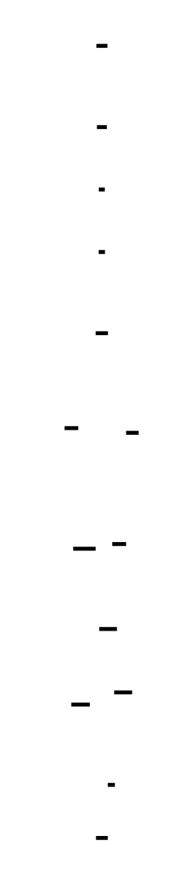

The tokenizer sits at the absolute boundary between the human world (SQL strings) and the machine world (structured data your engine can process). Everything downstream — the parser, the bytecode compiler, the virtual machine, the B-tree storage engine — depends on the tokenizer producing a clean, unambiguous stream of classified tokens. If the tokenizer misclassifies a single character, the entire pipeline produces garbage.


Your job in this milestone: take a raw `const char*` of SQL text and produce an array of `Token` structs, each carrying a type, a value, and a source position (line and column). That's it. No parsing, no tree-building, no execution. Just classification.
---
## The Revelation: Why "Just Split on Whitespace" Fails
You might think tokenization is trivial. SQL has keywords, identifiers, numbers, and a few operators. Split on whitespace, check each piece against a keyword list, done. This intuition works for maybe 60% of SQL statements — and catastrophically fails on the rest.
Consider this statement:
```sql
SELECT * FROM users WHERE name = 'it''s complicated' AND id >= -42 -- this is a comment
```
Try splitting on whitespace. You get:
```
["SELECT", "*", "FROM", "users", "WHERE", "name", "=", "'it''s", "complicated'", "AND", "id", ">=", "-42", "--", "this", "is", "a", "comment"]
```
The string literal `'it''s complicated'` is torn apart. The comment `-- this is a comment` becomes four separate "tokens." The `>=` operator might or might not survive depending on your split logic. And `-42` — is that a negative number or the subtraction operator followed by `42`?
The problem is that **meaning depends on context**. A single quote inside a string literal means something entirely different from a single quote that terminates one. A minus sign after `>=` is probably the start of a negative number; a minus sign after `id` is a subtraction operator; two minus signs together are a comment. You cannot determine what a character *means* without knowing what *state* you are currently in.
This is why tokenization requires a **finite state machine** (FSM).

> **🔑 Foundation: Finite state machines as the formal model for lexical analysis**
> 
> ## Finite State Machines as the Engine Behind Lexical Analysis
A **finite state machine** (FSM) is a computational model that exists in exactly one of a finite number of *states* at any given time. It reads input one symbol at a time, and each symbol triggers a *transition* to another state (or the same state) according to a fixed set of rules. When the machine lands in a designated *accepting state*, it signals that the input it just consumed forms a valid token.
In lexical analysis, the FSM is the formal model that answers: *"How does a lexer decide where one token ends and the next begins?"*
### How it works concretely
Imagine your lexer is scanning the input `if (x >= 42)`. The FSM starts in a **start state**. It reads `i` — transitions to a state meaning "inside an identifier." It reads `f` — stays in "inside an identifier." It reads a space — the space doesn't belong in an identifier, so the machine hits an accepting state for `IDENTIFIER`, emits the token `if` (which a later stage may reclassify as a keyword), and resets.
Here's a minimal FSM for recognizing integer literals:
```
State 0 (start) --[digit]--> State 1 (accepting: INTEGER)
State 1         --[digit]--> State 1 (accepting: INTEGER)
State 1         --[other]--> emit token, return to State 0
```
That's it. Two states, two transition rules, and you can recognize every integer in your source code.
### Why you need this right now
You're building a lexer, and you have a choice: write a tangle of nested `if/else` branches that get harder to maintain with every new token type, or structure your lexer around an FSM where each token type corresponds to a clear set of states and transitions. The FSM approach gives you:
- **Correctness by design** — each token type maps to a well-defined path through states, so you can reason about (and test) them independently.
- **A direct path from specification to code** — regular expressions formally convert to FSMs, so if you can write a regex for a token pattern, you can mechanically derive the FSM that recognizes it.
- **Longest-match semantics** — by staying in accepting states as long as valid transitions exist and only emitting when no transition is possible, you naturally implement the "maximal munch" rule (e.g., `>=` is one token, not `>` followed by `=`).
### The key insight
**Your lexer already *is* a finite state machine — the question is whether you make that structure explicit or hide it in spaghetti code.** Every `if` branch that checks the current character and decides what to do next is an informal state transition. When you make the states and transitions explicit (whether as a table, an enum, or a `switch` statement organized by state), your lexer becomes easier to extend, debug, and verify. Adding a new token type means adding new states and transitions rather than inserting fragile logic into existing branches.
A practical mental model: think of your lexer as a cursor sliding across the source text with a **mode dial** (the current state). Each character it reads clicks the dial to a new position. When the dial reaches a position marked "done," you snip off the text you've traversed and label it as a token. Turn the dial back to start. Repeat.

---
## Designing the Token Types
Before building the state machine, define what it produces. Every token your lexer emits needs a type. Here is the complete set for a SQLite-compatible tokenizer:
```c
typedef enum {
    // Literals
    TOK_INTEGER,        // 42, 0, 999
    TOK_FLOAT,          // 3.14, 0.5, 1e10
    TOK_STRING,         // 'hello', 'it''s'
    // Identifiers and keywords
    TOK_IDENTIFIER,     // table_name, col1
    TOK_KEYWORD,        // SELECT, INSERT, CREATE, ...
    // Operators
    TOK_EQ,             // =
    TOK_NE,             // != or <>
    TOK_LT,             // <
    TOK_GT,             // >
    TOK_LE,             // <=
    TOK_GE,             // >=
    TOK_PLUS,           // +
    TOK_MINUS,          // -
    TOK_STAR,           // *
    TOK_SLASH,          // /
    // Punctuation
    TOK_LPAREN,         // (
    TOK_RPAREN,         // )
    TOK_COMMA,          // ,
    TOK_SEMICOLON,      // ;
    TOK_DOT,            // .
    // Special
    TOK_EOF,            // end of input
    TOK_ERROR           // unrecognized character
} TokenType;
```
And the token struct itself:
```c
typedef struct {
    TokenType type;
    const char *start;   // pointer into original SQL string
    int length;          // length of the lexeme
    int line;            // 1-based line number
    int col;             // 1-based column number
} Token;
```
Two design decisions deserve attention here.
**Why store `start` + `length` instead of a copied string?** Because copying every token's text into a heap-allocated string is wasteful. The original SQL string already contains the text. Your token just points into it. This is called a *string slice* or *string view* — the token borrows the original string's memory. The parser can copy the text later if it needs to own it, but during tokenization, zero-copy is both faster and simpler.
**Why separate `TOK_INTEGER` and `TOK_FLOAT`?** Because the parser and compiler need to know the difference. An integer literal `42` becomes a 64-bit signed integer; a float `3.14` becomes a double-precision floating point. If you merge them into a single `TOK_NUMBER`, you push the integer-vs-float distinction into the parser, which shouldn't care about character-level details.
---
## The Tokenizer State Machine
The core of your lexer is a loop that examines one character at a time, decides what state it's in, and dispatches to the appropriate handler. Here is the state machine:


The states are:
| State | Entered When | Exits When |
|-------|-------------|------------|
| **START** | Beginning of each new token | Character dispatches to another state |
| **IN_IDENTIFIER** | Letter or `_` seen | Non-alphanumeric/underscore seen |
| **IN_NUMBER** | Digit seen | Non-digit, non-dot seen (with float transition) |
| **IN_STRING** | Single quote `'` seen | Unescaped closing `'` seen |
| **IN_QUOTED_ID** | Double quote `"` seen | Closing `"` seen |
| **IN_OPERATOR** | Operator character seen | Complete operator determined (possibly with lookahead) |
| **IN_COMMENT** | `--` seen | Newline or EOF |
The driver loop:
```c
typedef struct {
    const char *source;   // full SQL string
    int current;          // current position in source
    int line;             // current line (1-based)
    int col;              // current column (1-based)
    int length;           // strlen(source)
} Lexer;
void lexer_init(Lexer *lex, const char *sql) {
    lex->source = sql;
    lex->current = 0;
    lex->line = 1;
    lex->col = 1;
    lex->length = (int)strlen(sql);
}
```
The central function peeks at the current character and dispatches:
```c
Token lexer_next_token(Lexer *lex) {
    skip_whitespace_and_comments(lex);
    if (lex->current >= lex->length) {
        return make_token(lex, TOK_EOF, lex->current, 0);
    }
    char c = lex->source[lex->current];
    if (is_alpha(c) || c == '_')  return lex_identifier_or_keyword(lex);
    if (is_digit(c))              return lex_number(lex);
    if (c == '\'')                return lex_string(lex);
    if (c == '"')                 return lex_quoted_identifier(lex);
    if (is_operator_start(c))     return lex_operator(lex);
    if (is_punctuation(c))        return lex_punctuation(lex);
    // Unrecognized character
    Token err = make_token(lex, TOK_ERROR, lex->current, 1);
    advance(lex);
    return err;
}
```
This is the **dispatch-on-first-character** pattern. The first character of every token unambiguously tells you which handler to call — with one exception we'll address shortly (the minus sign). Let's implement each handler.
---
## Lookahead and Buffering
Before diving into handlers, you need two utility functions that embody a critical pattern: **lookahead**. The tokenizer must sometimes peek at the next character without consuming it to decide what to do with the current character.
```c
static char peek(Lexer *lex) {
    if (lex->current >= lex->length) return '\0';
    return lex->source[lex->current];
}
static char peek_next(Lexer *lex) {
    if (lex->current + 1 >= lex->length) return '\0';
    return lex->source[lex->current + 1];
}
static char advance(Lexer *lex) {
    char c = lex->source[lex->current++];
    if (c == '\n') {
        lex->line++;
        lex->col = 1;
    } else {
        lex->col++;
    }
    return c;
}
```
The `peek` function looks without moving. The `advance` function consumes and updates position tracking. This peek-then-advance pattern appears everywhere in stream processing — network protocol parsers use the same logic when deciding whether a byte is a header or payload, and file format parsers use it when reading variable-length fields.
---
## Handler: Identifiers and Keywords
An identifier starts with a letter or underscore and continues with letters, digits, or underscores. After collecting the full lexeme, you check it against the keyword table. If it matches, it's a keyword; otherwise, it's an identifier.
```c
static Token lex_identifier_or_keyword(Lexer *lex) {
    int start = lex->current;
    int start_col = lex->col;
    int start_line = lex->line;
    while (lex->current < lex->length && 
           (is_alpha(peek(lex)) || is_digit(peek(lex)) || peek(lex) == '_')) {
        advance(lex);
    }
    int len = lex->current - start;
    // Check if this identifier is a keyword (case-insensitive)
    TokenType type = check_keyword(lex->source + start, len);
    Token tok;
    tok.type = type;  // TOK_KEYWORD or TOK_IDENTIFIER
    tok.start = lex->source + start;
    tok.length = len;
    tok.line = start_line;
    tok.col = start_col;
    return tok;
}
```
The keyword check must be **case-insensitive**. SQL requires `SELECT`, `select`, and `SeLeCt` to mean the same thing. The simplest approach: convert the lexeme to uppercase (or lowercase) before comparison.
```c
static const char *keywords[] = {
    "SELECT", "FROM", "WHERE", "INSERT", "INTO", "VALUES",
    "CREATE", "TABLE", "DROP", "DELETE", "UPDATE", "SET",
    "AND", "OR", "NOT", "NULL", "INTEGER", "TEXT", "REAL",
    "BLOB", "PRIMARY", "KEY", "UNIQUE", "INDEX", "ON",
    "JOIN", "INNER", "LEFT", "RIGHT", "ORDER", "BY",
    "ASC", "DESC", "LIMIT", "GROUP", "HAVING", "AS",
    "BEGIN", "COMMIT", "ROLLBACK", "EXPLAIN", "ANALYZE",
    "PRAGMA", "IF", "EXISTS", "IN", "BETWEEN", "LIKE",
    "IS", "COUNT", "SUM", "AVG", "MIN", "MAX",
    NULL
};
static TokenType check_keyword(const char *text, int len) {
    // Temporary buffer for case-insensitive comparison
    char upper[64];
    if (len >= 64) return TOK_IDENTIFIER; // no keyword is 64+ chars
    for (int i = 0; i < len; i++) {
        upper[i] = (char)toupper((unsigned char)text[i]);
    }
    upper[len] = '\0';
    for (int i = 0; keywords[i] != NULL; i++) {
        if (strlen(keywords[i]) == (size_t)len && 
            memcmp(upper, keywords[i], len) == 0) {
            return TOK_KEYWORD;
        }
    }
    return TOK_IDENTIFIER;
}
```
> **Performance note**: A linear scan through ~50 keywords is fine for a learning project. Production tokenizers use a perfect hash function or a trie for O(1) keyword lookup. SQLite's own tokenizer uses a hash table generated by a custom tool (`mkkeywordhash.c`). For your build, the linear scan is perfectly adequate — a 50-element comparison completes in nanoseconds, and the tokenizer is never the bottleneck.
### Design Decision: Keyword Tokens
| Option | Pros | Cons | Used By |
|--------|------|------|---------|
| **Single `TOK_KEYWORD` type ✓** | Simple token enum, keyword identity from text | Parser must string-compare to dispatch | SQLite (internally uses hash codes) |
| Separate type per keyword (`TOK_SELECT`, `TOK_FROM`, ...) | Parser dispatch is a switch on type | Enum grows large, keyword set changes break it | Many compiler textbooks |
For this project, use `TOK_KEYWORD` and let the parser compare the text. It keeps the tokenizer simpler and means adding a new keyword only requires updating the keyword table, not the enum.
---
## Handler: Numeric Literals
Numbers start with a digit. The tricky part: distinguishing integers from floats. An integer is a sequence of digits. A float has a decimal point, an exponent (`e` or `E`), or both.
```c
static Token lex_number(Lexer *lex) {
    int start = lex->current;
    int start_col = lex->col;
    int start_line = lex->line;
    TokenType type = TOK_INTEGER;
    // Consume digits before decimal point
    while (lex->current < lex->length && is_digit(peek(lex))) {
        advance(lex);
    }
    // Check for decimal point followed by digit
    if (peek(lex) == '.' && is_digit(peek_next(lex))) {
        type = TOK_FLOAT;
        advance(lex);  // consume '.'
        while (lex->current < lex->length && is_digit(peek(lex))) {
            advance(lex);
        }
    }
    // Check for exponent
    if (peek(lex) == 'e' || peek(lex) == 'E') {
        type = TOK_FLOAT;
        advance(lex);  // consume 'e'/'E'
        if (peek(lex) == '+' || peek(lex) == '-') {
            advance(lex);  // consume sign
        }
        while (lex->current < lex->length && is_digit(peek(lex))) {
            advance(lex);
        }
    }
    int len = lex->current - start;
    Token tok = { type, lex->source + start, len, start_line, start_col };
    return tok;
}
```
**Critical pitfall: negative numbers.** The tokenizer should NOT handle negative numbers. When you see `-42` in SQL, the tokenizer emits `TOK_MINUS` followed by `TOK_INTEGER(42)`. The parser (or the expression evaluator) applies the unary minus. Why? Because in `WHERE id > -42`, the minus is a unary operator. But in `SELECT 10 - 42`, it's binary subtraction. The tokenizer cannot tell the difference — that requires syntactic context, which is the parser's job. If the tokenizer consumed `-42` as a single negative number token, it would incorrectly tokenize `10-42` as `10` followed by `-42` instead of `10`, `-`, `42`.


---
## Handler: String Literals
String literals in SQL are enclosed in single quotes. The complication: SQL escapes a single quote by doubling it. The string `it's` is written as `'it''s'` in SQL. Your tokenizer must recognize that `''` inside a string is an escaped quote, not two empty strings.
```c
static Token lex_string(Lexer *lex) {
    int start = lex->current;
    int start_col = lex->col;
    int start_line = lex->line;
    advance(lex);  // consume opening '
    while (lex->current < lex->length) {
        if (peek(lex) == '\'') {
            advance(lex);  // consume this quote
            // Check if it's an escaped quote ('')
            if (peek(lex) == '\'') {
                advance(lex);  // consume second quote, stay in string
            } else {
                // End of string
                int len = lex->current - start;
                Token tok = { TOK_STRING, lex->source + start, len, 
                              start_line, start_col };
                return tok;
            }
        } else {
            advance(lex);
        }
    }
    // Unterminated string - reached end of input
    Token tok = { TOK_ERROR, lex->source + start, lex->current - start,
                  start_line, start_col };
    return tok;
}
```
The state machine for string lexing has exactly two states: **IN_STRING** and **MAYBE_END**. When you see a quote in IN_STRING, you transition to MAYBE_END. In MAYBE_END, if the next character is another quote, you go back to IN_STRING (it was an escape). If it's anything else, the string is terminated.
Note that the token includes the surrounding quotes (`'it''s'`). The parser or a utility function will strip quotes and unescape `''` to `'` when it needs the actual string value. Keeping the raw lexeme in the token preserves the original source text, which is useful for error messages and EXPLAIN output.
---
## Handler: Quoted Identifiers
SQL uses double quotes for identifiers that contain spaces or are reserved words. `"Group"` is an identifier (column name), not the keyword GROUP. `"First Name"` is a single identifier, not two tokens.
```c
static Token lex_quoted_identifier(Lexer *lex) {
    int start = lex->current;
    int start_col = lex->col;
    int start_line = lex->line;
    advance(lex);  // consume opening "
    while (lex->current < lex->length && peek(lex) != '"') {
        advance(lex);
    }
    if (lex->current >= lex->length) {
        // Unterminated quoted identifier
        Token tok = { TOK_ERROR, lex->source + start, lex->current - start,
                      start_line, start_col };
        return tok;
    }
    advance(lex);  // consume closing "
    int len = lex->current - start;
    Token tok = { TOK_IDENTIFIER, lex->source + start, len, 
                  start_line, start_col };
    return tok;
}
```
The distinction between single quotes (strings) and double quotes (identifiers) is a common source of bugs. In many programming languages, both delimiters mean "string." In SQL, they mean completely different things. MySQL blurs this line by allowing double quotes for strings in some modes, but standard SQL and SQLite are strict: single quotes for string literals, double quotes for identifiers.
---
## Handler: Operators
Operators require lookahead because some are two characters long. When you see `<`, it could be `<` (less-than), `<=` (less-than-or-equal), or `<>` (not-equal). You must peek at the next character before deciding.
```c
static Token lex_operator(Lexer *lex) {
    int start = lex->current;
    int start_col = lex->col;
    int start_line = lex->line;
    char c = advance(lex);
    switch (c) {
        case '=': return (Token){ TOK_EQ, lex->source + start, 1, 
                                  start_line, start_col };
        case '+': return (Token){ TOK_PLUS, lex->source + start, 1, 
                                  start_line, start_col };
        case '-': return (Token){ TOK_MINUS, lex->source + start, 1, 
                                  start_line, start_col };
        case '*': return (Token){ TOK_STAR, lex->source + start, 1, 
                                  start_line, start_col };
        case '/': return (Token){ TOK_SLASH, lex->source + start, 1, 
                                  start_line, start_col };
        case '<':
            if (peek(lex) == '=') {
                advance(lex);
                return (Token){ TOK_LE, lex->source + start, 2, 
                                start_line, start_col };
            }
            if (peek(lex) == '>') {
                advance(lex);
                return (Token){ TOK_NE, lex->source + start, 2, 
                                start_line, start_col };
            }
            return (Token){ TOK_LT, lex->source + start, 1, 
                            start_line, start_col };
        case '>':
            if (peek(lex) == '=') {
                advance(lex);
                return (Token){ TOK_GE, lex->source + start, 2, 
                                start_line, start_col };
            }
            return (Token){ TOK_GT, lex->source + start, 1, 
                            start_line, start_col };
        case '!':
            if (peek(lex) == '=') {
                advance(lex);
                return (Token){ TOK_NE, lex->source + start, 2, 
                                start_line, start_col };
            }
            // '!' alone is not valid SQL
            return (Token){ TOK_ERROR, lex->source + start, 1, 
                            start_line, start_col };
        default:
            return (Token){ TOK_ERROR, lex->source + start, 1, 
                            start_line, start_col };
    }
}
```
Notice that `!=` and `<>` both produce `TOK_NE`. SQL supports both syntaxes for "not equal." By normalizing them to the same token type, the parser doesn't need to care which one was written.
---
## Whitespace and Comments
Whitespace and comments are skipped entirely — they produce no tokens. But they must still update the line and column counters.
```c
static void skip_whitespace_and_comments(Lexer *lex) {
    while (lex->current < lex->length) {
        char c = peek(lex);
        // Whitespace
        if (c == ' ' || c == '\t' || c == '\r' || c == '\n') {
            advance(lex);
            continue;
        }
        // Single-line comment: -- until end of line
        if (c == '-' && peek_next(lex) == '-') {
            advance(lex);  // consume first -
            advance(lex);  // consume second -
            while (lex->current < lex->length && peek(lex) != '\n') {
                advance(lex);
            }
            continue;
        }
        // C-style block comment: /* ... */
        if (c == '/' && peek_next(lex) == '*') {
            advance(lex);  // consume /
            advance(lex);  // consume *
            while (lex->current < lex->length) {
                if (peek(lex) == '*' && peek_next(lex) == '/') {
                    advance(lex);  // consume *
                    advance(lex);  // consume /
                    break;
                }
                advance(lex);
            }
            continue;
        }
        break;  // not whitespace or comment
    }
}
```
The comment handling introduces another ambiguity. The `-` character could start a `--` comment or be the minus operator. The `skip_whitespace_and_comments` function checks for `--` before the main dispatch loop sees the first `-`. This is why comments are handled in the whitespace-skipping phase rather than as tokens — it removes the ambiguity before the operator handler ever runs.
---
## Error Reporting: Line and Column Tracking
Error reporting transforms a frustrating debugging experience into a productive one. When the tokenizer encounters an unrecognized character — say, a stray `@` or `#` — it must tell the user exactly where:
```
Error at line 3, column 15: unexpected character '@'
```
This is why the `Lexer` struct tracks `line` and `col`, and why every token records `start_line` and `start_col` at the moment it begins. The `advance` function updates these counters on every character consumed.
A helper for error messages:
```c
void lexer_error(Token *tok, const char *source) {
    // Extract the problematic character(s)
    char lexeme[64];
    int copy_len = tok->length < 63 ? tok->length : 63;
    memcpy(lexeme, tok->start, copy_len);
    lexeme[copy_len] = '\0';
    fprintf(stderr, "Lexer error at line %d, column %d: "
            "unexpected token '%s'\n", tok->line, tok->col, lexeme);
}
```
The line/column tracking pattern connects directly to how IDEs provide red squiggly underlines under syntax errors. The IDE runs a lexer and parser in the background; when either reports an error with a source position, the IDE highlights that position. Your tokenizer's error reporting is the foundation for that capability.
---
## Putting It All Together: The Public API
The tokenizer's public interface is minimal:
```c
// Initialize a lexer for the given SQL string
void lexer_init(Lexer *lex, const char *sql);
// Get the next token (advances the lexer)
Token lexer_next_token(Lexer *lex);
// Convenience: tokenize entire input into an array
int lexer_tokenize_all(Lexer *lex, Token *tokens, int max_tokens);
```
The `tokenize_all` function is a convenience wrapper:
```c
int lexer_tokenize_all(Lexer *lex, Token *tokens, int max_tokens) {
    int count = 0;
    while (count < max_tokens - 1) {
        tokens[count] = lexer_next_token(lex);
        if (tokens[count].type == TOK_EOF) {
            count++;
            break;
        }
        if (tokens[count].type == TOK_ERROR) {
            lexer_error(&tokens[count], lex->source);
            count++;
            break;
        }
        count++;
    }
    return count;
}
```
Let's trace through a complete example:


Input: `SELECT name, age FROM users WHERE age >= 21;`
Expected token stream:
| # | Type | Lexeme | Line | Col |
|---|------|--------|------|-----|
| 1 | KEYWORD | SELECT | 1 | 1 |
| 2 | IDENTIFIER | name | 1 | 8 |
| 3 | COMMA | , | 1 | 12 |
| 4 | IDENTIFIER | age | 1 | 14 |
| 5 | KEYWORD | FROM | 1 | 18 |
| 6 | IDENTIFIER | users | 1 | 23 |
| 7 | KEYWORD | WHERE | 1 | 29 |
| 8 | IDENTIFIER | age | 1 | 35 |
| 9 | GE | >= | 1 | 39 |
| 10 | INTEGER | 21 | 1 | 42 |
| 11 | SEMICOLON | ; | 1 | 44 |
| 12 | EOF | | 1 | 45 |
---
## The Token Stream as Abstraction Boundary
The token stream is an **abstraction boundary** — one of the most important software design concepts you'll encounter in this project. The parser, which you'll build next, never sees raw characters. It sees tokens. This means:
1. **You can change the tokenizer** without touching the parser. Want to support MySQL's backtick-quoted identifiers (\`column\`)? Add a handler in the tokenizer. The parser never knows.
2. **You can change the SQL dialect** by swapping the keyword table. Want PostgreSQL-style `::` type casts? Add a `TOK_CAST` operator in the tokenizer. The parser just sees a new token type.
3. **The parser's job is simpler.** It pattern-matches on token types, not on characters. "Is the next token a KEYWORD with text 'SELECT'?" is cleaner than "skip whitespace, read characters, check if they spell SELECT case-insensitively."
This is the same pattern used throughout the database engine. The VM never sees B-tree pages directly — it uses cursor operations. The B-tree never sees raw disk — it uses the buffer pool. Each layer provides a clean abstraction boundary. Your tokenizer is the first one.
---
## Building the Test Suite
Your acceptance criteria demand a test suite of 20+ diverse SQL statements. Here's a framework and representative test cases:
```c
typedef struct {
    const char *sql;
    int expected_count;  // number of tokens (including EOF)
    TokenType first_type;
    const char *description;
} TestCase;
TestCase tests[] = {
    // Basic statements
    {"SELECT * FROM t;", 6, TOK_KEYWORD, "simple select star"},
    {"select * from t;", 6, TOK_KEYWORD, "lowercase keywords"},
    {"SeLeCt * FrOm t;", 6, TOK_KEYWORD, "mixed case keywords"},
    // String literals
    {"SELECT 'hello';", 4, TOK_KEYWORD, "simple string literal"},
    {"SELECT 'it''s';", 4, TOK_KEYWORD, "escaped quote in string"},
    {"SELECT '';", 4, TOK_KEYWORD, "empty string"},
    {"SELECT 'it''s a ''test''';", 4, TOK_KEYWORD, "multiple escaped quotes"},
    // Numeric literals
    {"SELECT 42;", 4, TOK_KEYWORD, "integer literal"},
    {"SELECT 3.14;", 4, TOK_KEYWORD, "float literal"},
    {"SELECT 1e10;", 4, TOK_KEYWORD, "scientific notation"},
    {"SELECT 0;", 4, TOK_KEYWORD, "zero"},
    // Operators
    {"SELECT * FROM t WHERE a >= 5;", 10, TOK_KEYWORD, "GE operator"},
    {"SELECT * FROM t WHERE a <> 5;", 10, TOK_KEYWORD, "NE operator (<>)"},
    {"SELECT * FROM t WHERE a != 5;", 10, TOK_KEYWORD, "NE operator (!=)"},
    {"SELECT * FROM t WHERE a <= 5;", 10, TOK_KEYWORD, "LE operator"},
    // Quoted identifiers
    {"SELECT \"First Name\" FROM t;", 6, TOK_KEYWORD, "quoted identifier"},
    // INSERT
    {"INSERT INTO t VALUES (1, 'x');", 11, TOK_KEYWORD, "insert statement"},
    // CREATE TABLE
    {"CREATE TABLE t (id INTEGER PRIMARY KEY, name TEXT NOT NULL);", 16, 
     TOK_KEYWORD, "create table"},
    // Comments
    {"SELECT 1; -- comment", 4, TOK_KEYWORD, "line comment ignored"},
    {"SELECT /* inline */ 1;", 4, TOK_KEYWORD, "block comment ignored"},
    // Complex
    {"SELECT a, b FROM t1 JOIN t2 ON t1.id = t2.id WHERE a > 10 ORDER BY b;",
     22, TOK_KEYWORD, "complex join with order by"},
    // Edge cases
    {"SELECT 10-42;", 6, TOK_KEYWORD, "minus as operator not negative"},
    {"SELECT a.b;", 6, TOK_KEYWORD, "dot-separated identifier"},
    {NULL, 0, 0, NULL}
};
void run_tests(void) {
    int passed = 0, failed = 0;
    for (int i = 0; tests[i].sql != NULL; i++) {
        Lexer lex;
        lexer_init(&lex, tests[i].sql);
        Token tokens[128];
        int count = lexer_tokenize_all(&lex, tokens, 128);
        bool ok = true;
        if (count != tests[i].expected_count) {
            fprintf(stderr, "FAIL [%s]: expected %d tokens, got %d\n",
                    tests[i].description, tests[i].expected_count, count);
            ok = false;
        }
        if (count > 0 && tokens[0].type != tests[i].first_type) {
            fprintf(stderr, "FAIL [%s]: wrong first token type\n",
                    tests[i].description);
            ok = false;
        }
        if (ok) passed++;
        else failed++;
    }
    printf("Tests: %d passed, %d failed\n", passed, failed);
}
```
The test suite should also verify error cases:
```c
// Error cases
{"SELECT @;",       -1, TOK_ERROR, "unrecognized character @"},
{"SELECT 'unterminated;", -1, TOK_ERROR, "unterminated string"},
{"SELECT \"unterminated;", -1, TOK_ERROR, "unterminated quoted identifier"},
```
For error cases, verify that the error token's `line` and `col` point to the exact position of the problem.
---
## Three-Level View: What Happens When You Tokenize
To see how this fits the larger architecture, consider the three levels of a tokenization call:
**Level 1 — Public API**: You call `lexer_next_token()`. You get back a `Token` struct with type, lexeme, line, and column. Clean, simple.
**Level 2 — State Machine Engine**: Inside, the lexer dispatches on the first character, enters a handler function (identifier, number, string, operator), and that handler loops through characters using `peek` and `advance` until the token is complete. The FSM transitions are implicit in the control flow — each handler's if/while structure encodes the state transitions.
**Level 3 — Memory and I/O**: The lexer reads from a `const char*` that's already entirely in memory. There's no disk I/O, no system calls, no buffering. The `source` pointer and `current` index are all in CPU registers or L1 cache during tokenization. This is why the tokenizer is never a bottleneck — it processes characters at memory speed, which is nanoseconds per character.
---
## Knowledge Cascade: What the Tokenizer Unlocks
Now that you understand how a finite state machine converts a character stream into a token stream, you've unlocked understanding across multiple domains:
**→ The Parser (Next Milestone)**: The parser will call `lexer_next_token()` repeatedly, pattern-matching on token types to build an AST. The parser's design is entirely shaped by the clean token stream you produce here. If your tokenizer correctly handles `!=` vs `<>`, the parser never needs to think about it.
**→ Network Protocol Parsing**: HTTP, DNS, Redis protocol (RESP), and every other text-based network protocol uses the same FSM approach. An HTTP parser transitions between states like `IN_METHOD`, `IN_URL`, `IN_HEADER_NAME`, `IN_HEADER_VALUE` — structurally identical to your SQL tokenizer's states. The concept transfers directly.
**→ Regular Expressions**: Every regex engine compiles your pattern into an FSM (either NFA or DFA). When you write `[0-9]+\.?[0-9]*`, the regex engine builds exactly the same kind of state machine your `lex_number` function implements by hand. Understanding FSMs from tokenizer work makes regex internals transparent.
**→ Hardware Design**: Finite state machines aren't just software. Digital circuits use FSMs for everything from traffic light controllers to CPU instruction decoders. The same state-transition table you implicitly defined in your tokenizer could be implemented in Verilog or VHDL as a hardware circuit. This is the cross-domain bridge between software engineering and electrical engineering.
**→ Error Recovery and IDE Tooling**: The line/column tracking in your tokenizer is the foundation of IDE error reporting. Language servers (LSP) run tokenizers and parsers continuously as you type, using source positions to provide syntax highlighting, error squiggles, and autocomplete suggestions. Your `Token.line` and `Token.col` fields are exactly what a language server would need.
---
## System Awareness
You've built the tokenizer — the outermost layer of the SQL frontend. It connects to the **parser** (downstream, Milestone 2), which will consume your token stream and build an AST. Nothing else in the system depends on the tokenizer directly; the abstraction boundary is clean.
Without the tokenizer, no SQL string can enter the system. It's the gate through which every query passes. In the next milestone, you'll build the parser that transforms this flat token stream into a tree — giving the bytecode compiler (Milestone 3) the structured input it needs to generate executable instructions.
---
<!-- END_MS -->


<!-- MS_ID: build-sqlite-m2 -->
<!-- MS_ID: build-sqlite-m2 -->
# Milestone 2: SQL Parser (AST)
## Where We Are in the System
Your tokenizer is operational. It takes raw SQL text and produces a clean stream of typed tokens — keywords, identifiers, literals, operators, punctuation. Now you need to give that flat stream *structure*.


The parser sits between the tokenizer and the bytecode compiler. It consumes tokens and produces an **Abstract Syntax Tree** (AST) — a tree data structure that captures the *syntactic structure* of a SQL statement. The bytecode compiler (Milestone 3) will walk this tree to generate executable instructions. Without the parser, your compiler would receive a flat list of tokens with no information about which columns belong to which clause, how operators group, or where one expression ends and another begins.
---
## The Revelation: Why Flat Pattern-Matching Fails
You might think parsing is sequential pattern-matching. See `SELECT`, grab tokens until `FROM`, grab the table name, grab tokens until `WHERE`, done. This flat approach works for trivial queries:
```sql
SELECT name FROM users WHERE age > 21
```
Grab `name`. Grab `users`. Grab `age > 21`. Easy. But now consider:
```sql
SELECT name FROM users WHERE (age > 21 AND status = 'active') OR (role = 'admin' AND NOT suspended)
```
Where does the first expression end? The `AND` after `21` — does it bind to `age > 21` or to the entire parenthesized group? The `OR` — does it separate two top-level conditions, or is it inside a group? The `NOT` — does it negate `suspended` or the entire clause that follows?
The answer depends on **operator precedence** and **recursive nesting**. Parentheses create sub-expressions that contain their own operators, which contain their own sub-expressions, to arbitrary depth. A flat scan cannot handle this. You need a parser that mirrors the grammar's recursive structure: each grammar rule becomes a C function, and those functions call each other.
This is **recursive-descent parsing** — the technique you'll implement in this milestone.
---
## Defining the AST Node Types
Before writing the parser, define what it produces. The AST is a tree where each node represents a syntactic construct. Here are the node types for your SQL subset:
```c
typedef enum {
    // Statements
    NODE_SELECT,
    NODE_INSERT,
    NODE_CREATE_TABLE,
    // Expressions
    NODE_BINARY_EXPR,      // a AND b, x > 5, x + y
    NODE_UNARY_EXPR,       // NOT x, -x
    NODE_LITERAL,          // 42, 3.14, 'hello', NULL
    NODE_IDENTIFIER,       // column_name, table_name
    NODE_COLUMN_REF,       // table.column (dot-separated)
    NODE_WILDCARD,         // *
    NODE_FUNCTION_CALL,    // COUNT(*), SUM(x)
    // Clauses (used as sub-nodes)
    NODE_COLUMN_DEF,       // column definition in CREATE TABLE
    NODE_ORDER_BY_ITEM,    // column + ASC/DESC
} NodeType;
```
The core structure uses a tagged union — a common C pattern where a `type` field determines which branch of a `union` is active:
```c
typedef struct AstNode AstNode;
struct AstNode {
    NodeType type;
    int line;    // source position for error reporting
    int col;
    union {
        // NODE_SELECT
        struct {
            AstNode **columns;      // array of expression nodes
            int column_count;
            char *from_table;       // table name (owned, heap-allocated)
            AstNode *where_clause;  // expression node, or NULL
            AstNode **order_by;     // array of ORDER_BY_ITEM nodes
            int order_by_count;
            int limit;              // -1 if no LIMIT
        } select;
        // NODE_INSERT
        struct {
            char *table_name;
            char **column_names;    // optional column list, or NULL
            int column_count;
            AstNode ***value_rows;  // array of arrays of expressions
            int row_count;
            int values_per_row;
        } insert;
        // NODE_CREATE_TABLE
        struct {
            char *table_name;
            AstNode **columns;      // array of NODE_COLUMN_DEF
            int column_count;
        } create_table;
        // NODE_BINARY_EXPR
        struct {
            AstNode *left;
            AstNode *right;
            TokenType op;           // TOK_EQ, TOK_GT, TOK_KEYWORD (AND/OR)
            char op_keyword[8];     // "AND", "OR" for keyword operators
        } binary;
        // NODE_UNARY_EXPR
        struct {
            AstNode *operand;
            char op_keyword[8];     // "NOT", "-"
        } unary;
        // NODE_LITERAL
        struct {
            TokenType literal_type; // TOK_INTEGER, TOK_FLOAT, TOK_STRING, TOK_KEYWORD (NULL)
            char *value;            // string representation
        } literal;
        // NODE_IDENTIFIER
        struct {
            char *name;
        } identifier;
        // NODE_COLUMN_REF (table.column)
        struct {
            char *table_name;
            char *column_name;
        } column_ref;
        // NODE_COLUMN_DEF
        struct {
            char *name;
            char *type_name;        // "INTEGER", "TEXT", "REAL", "BLOB"
            bool is_primary_key;
            bool is_not_null;
            bool is_unique;
        } column_def;
        // NODE_ORDER_BY_ITEM
        struct {
            AstNode *expr;
            bool descending;        // false = ASC (default), true = DESC
        } order_by_item;
    } data;
};
```
Two design decisions to note:
**Why a tagged union instead of separate structs?** Because the parser needs to return `AstNode*` from functions that could produce any node type. A tagged union lets you return a single pointer type and `switch` on `type` downstream. This is the standard pattern in C for representing sum types (also called variant types or discriminated unions). Languages with algebraic data types (Rust's `enum`, Haskell's data types) express this more elegantly, but in C, the tagged union is idiomatic.
**Why store `line` and `col` on every node?** Because when the bytecode compiler or a later analysis pass finds a semantic error (e.g., column doesn't exist), it needs to point back to the source location. Every AST node carries its source position, inherited from the first token that formed it.
---
## The Parser Infrastructure
The parser struct mirrors the lexer — it tracks the current position in the token stream and provides peek/advance operations:
```c
typedef struct {
    Token *tokens;      // array of all tokens from lexer
    int count;          // total number of tokens
    int current;        // index of current token
    bool had_error;     // set to true on first error
    char error_msg[256]; // human-readable error message
    int error_line;
    int error_col;
} Parser;
void parser_init(Parser *p, Token *tokens, int count) {
    p->tokens = tokens;
    p->count = count;
    p->current = 0;
    p->had_error = false;
    p->error_msg[0] = '\0';
    p->error_line = 0;
    p->error_col = 0;
}
```
The core navigation functions:
```c
static Token* peek(Parser *p) {
    if (p->current >= p->count) return NULL;
    return &p->tokens[p->current];
}
static Token* advance(Parser *p) {
    Token *tok = peek(p);
    if (tok && tok->type != TOK_EOF) {
        p->current++;
    }
    return tok;
}
static bool check(Parser *p, TokenType type) {
    Token *tok = peek(p);
    return tok && tok->type == type;
}
static bool check_keyword(Parser *p, const char *kw) {
    Token *tok = peek(p);
    if (!tok || tok->type != TOK_KEYWORD) return false;
    return strncasecmp(tok->start, kw, tok->length) == 0 
           && strlen(kw) == (size_t)tok->length;
}
static Token* expect(Parser *p, TokenType type) {
    if (check(p, type)) return advance(p);
    Token *got = peek(p);
    parser_error(p, got, "expected %s, got '%.*s'", 
                 token_type_name(type), got->length, got->start);
    return NULL;
}
static Token* expect_keyword(Parser *p, const char *kw) {
    if (check_keyword(p, kw)) return advance(p);
    Token *got = peek(p);
    parser_error(p, got, "expected '%s', got '%.*s'", 
                 kw, got->length, got->start);
    return NULL;
}
```
The `expect` function is critical — it's the mechanism that produces clear error messages. If the parser expects a closing parenthesis and finds a semicolon instead, `expect` generates: `"line 3, col 22: expected ), got ;"`. Every call to `expect` is a potential error report.


```c
static void parser_error(Parser *p, Token *tok, const char *fmt, ...) {
    if (p->had_error) return;  // report only the first error
    p->had_error = true;
    if (tok) {
        p->error_line = tok->line;
        p->error_col = tok->col;
    }
    va_list args;
    va_start(args, fmt);
    vsnprintf(p->error_msg, sizeof(p->error_msg), fmt, args);
    va_end(args);
}
```
Reporting only the first error is a pragmatic choice. After the first syntax error, the parser's state is unreliable — subsequent "errors" are often cascading noise caused by the initial mismatch. Production parsers implement sophisticated error recovery (synchronizing to the next semicolon or statement keyword), but for your build, stopping at the first error is sufficient and avoids misleading diagnostics.
---
## The Grammar: From Rules to Functions

> **🔑 Foundation: Pratt parsing / precedence climbing**
> 
> ## Pratt Parsing / Precedence Climbing
**What it is:** Pratt parsing (also called "top-down operator precedence parsing") is a technique for parsing expressions that handles operator precedence and associativity without needing a separate grammar rule for every precedence level. Instead of writing rules like `term → factor (("+" | "-") factor)*` and `factor → unary (("*" | "/") unary)*` — one per level — you assign each operator a numeric **binding power** and use a single recursive function that decides when to "keep going" versus "stop and return."
The core loop looks like this (pseudocode):
```
function parse_expression(min_binding_power):
    left = parse_prefix_token()     // a number, variable, or prefix op
    while next_operator.binding_power >= min_binding_power:
        op = consume_operator()
        right = parse_expression(op.right_binding_power)
        left = make_binary_node(left, op, right)
    return left
```
When you call `parse_expression(0)`, it parses a full expression. The magic is in the recursive call: by passing a *higher* minimum binding power, you ensure that tighter-binding operators (like `*`) grab their operands before looser ones (like `+`). For example, `2 + 3 * 4` correctly becomes `2 + (3 * 4)` because `*` has binding power 6 vs `+`'s 4 — when parsing the right side of `+`, the inner call sees `*` and claims `3 * 4` before returning.
**Why you need it now:** You're building a database, and SQL has expressions everywhere — `WHERE` clauses, computed columns, `HAVING` conditions. These expressions involve arithmetic (`+`, `-`, `*`, `/`), comparisons (`=`, `<`, `>`), logical operators (`AND`, `OR`, `NOT`), and potentially even `BETWEEN`, `LIKE`, and `IS NULL`. A Pratt parser lets you handle all of these with one function and a table of binding powers, rather than a tangled mess of mutually recursive grammar rules. Adding a new operator later is just one table entry.
**Key insight:** Think of binding power as "gravitational pull." Higher binding power means an operator pulls its operands closer. When two operators compete for the same operand (like `+` and `*` both wanting `3` in `2 + 3 * 4`), the one with stronger gravity wins. Left-associativity vs right-associativity is handled by a small asymmetry: for left-associative operators, the right-side recursive call uses `binding_power + 1`; for right-associative ones (like exponentiation), it uses `binding_power` unchanged — letting the same operator "win" again on the right.

Recursive-descent parsing is a direct encoding of a grammar. Each grammar rule becomes a C function. Here is the grammar your parser implements, written in a notation called **BNF** (Backus-Naur Form) — a standard way to describe programming language syntax where `::=` means "is defined as," `|` means "or," and `[...]` means "optional":
```
statement       ::= select_stmt | insert_stmt | create_table_stmt
select_stmt     ::= SELECT column_list FROM IDENTIFIER
                     [WHERE expression]
                     [ORDER BY order_list]
                     [LIMIT INTEGER]
insert_stmt     ::= INSERT INTO IDENTIFIER [(column_list)] 
                     VALUES value_tuple_list
create_table_stmt ::= CREATE TABLE IDENTIFIER (column_def_list)
column_list     ::= '*' | expression (',' expression)*
order_list      ::= order_item (',' order_item)*
order_item      ::= expression [ASC | DESC]
value_tuple_list ::= '(' expression_list ')' (',' '(' expression_list ')')*
column_def_list ::= column_def (',' column_def)*
column_def      ::= IDENTIFIER type_name [constraints]
type_name       ::= INTEGER | TEXT | REAL | BLOB
constraints     ::= (PRIMARY KEY | NOT NULL | UNIQUE)*
expression      ::= or_expr
or_expr         ::= and_expr (OR and_expr)*
and_expr        ::= not_expr (AND not_expr)*
not_expr        ::= NOT not_expr | comparison
comparison      ::= addition ((= | < | > | <= | >= | != | <>) addition)?
addition        ::= primary ((+ | -) primary)*
primary         ::= INTEGER | FLOAT | STRING | NULL | IDENTIFIER
                   | IDENTIFIER '.' IDENTIFIER
                   | '(' expression ')'
```


Notice the expression grammar's structure. It's layered: `or_expr` calls `and_expr`, which calls `not_expr`, which calls `comparison`, which calls `addition`, which calls `primary`. This layering encodes operator precedence — operators lower in the call chain bind tighter. `NOT` binds tighter than `AND`, which binds tighter than `OR`, because `not_expr` is called from inside `and_expr`, which is called from inside `or_expr`. A deeper call means higher precedence.
This is **precedence climbing** — one of the two standard techniques for handling operator precedence in recursive-descent parsers. The alternative is Pratt parsing (described in the Foundation block above), which uses a numeric precedence table rather than separate functions per level. Both produce identical ASTs. Precedence climbing is easier to understand when each level has a clear semantic meaning (like SQL's `OR` → `AND` → `NOT` → comparison hierarchy), so that's what you'll implement.
---
## Parsing SELECT Statements
The `SELECT` parser is the most complex because it has the most optional clauses. Here's the function, built directly from the grammar rule:
```c
static AstNode* parse_select(Parser *p) {
    Token *select_tok = expect_keyword(p, "SELECT");
    if (!select_tok) return NULL;
    AstNode *node = ast_alloc(NODE_SELECT, select_tok->line, select_tok->col);
    // Parse column list
    if (check(p, TOK_STAR)) {
        // SELECT *
        Token *star = advance(p);
        node->data.select.columns = malloc(sizeof(AstNode*));
        node->data.select.columns[0] = ast_alloc(NODE_WILDCARD, 
                                                   star->line, star->col);
        node->data.select.column_count = 1;
    } else {
        // SELECT col1, col2, ...
        int capacity = 8;
        node->data.select.columns = malloc(capacity * sizeof(AstNode*));
        node->data.select.column_count = 0;
        do {
            AstNode *col_expr = parse_expression(p);
            if (!col_expr) return NULL;
            if (node->data.select.column_count >= capacity) {
                capacity *= 2;
                node->data.select.columns = realloc(
                    node->data.select.columns, capacity * sizeof(AstNode*));
            }
            node->data.select.columns[node->data.select.column_count++] = col_expr;
        } while (check(p, TOK_COMMA) && advance(p));
    }
    // FROM clause (required)
    if (!expect_keyword(p, "FROM")) return NULL;
    Token *table_tok = expect(p, TOK_IDENTIFIER);
    if (!table_tok) return NULL;
    node->data.select.from_table = token_to_string(table_tok);
    // WHERE clause (optional)
    node->data.select.where_clause = NULL;
    if (check_keyword(p, "WHERE")) {
        advance(p);
        node->data.select.where_clause = parse_expression(p);
        if (!node->data.select.where_clause) return NULL;
    }
    // ORDER BY clause (optional)
    node->data.select.order_by = NULL;
    node->data.select.order_by_count = 0;
    if (check_keyword(p, "ORDER")) {
        advance(p);
        if (!expect_keyword(p, "BY")) return NULL;
        int capacity = 4;
        node->data.select.order_by = malloc(capacity * sizeof(AstNode*));
        do {
            AstNode *item = ast_alloc(NODE_ORDER_BY_ITEM, 
                                       peek(p)->line, peek(p)->col);
            item->data.order_by_item.expr = parse_expression(p);
            if (!item->data.order_by_item.expr) return NULL;
            item->data.order_by_item.descending = false;
            if (check_keyword(p, "DESC")) {
                advance(p);
                item->data.order_by_item.descending = true;
            } else if (check_keyword(p, "ASC")) {
                advance(p);
            }
            if (node->data.select.order_by_count >= capacity) {
                capacity *= 2;
                node->data.select.order_by = realloc(
                    node->data.select.order_by, capacity * sizeof(AstNode*));
            }
            node->data.select.order_by[node->data.select.order_by_count++] = item;
        } while (check(p, TOK_COMMA) && advance(p));
    }
    // LIMIT clause (optional)
    node->data.select.limit = -1;
    if (check_keyword(p, "LIMIT")) {
        advance(p);
        Token *limit_tok = expect(p, TOK_INTEGER);
        if (!limit_tok) return NULL;
        node->data.select.limit = token_to_int(limit_tok);
    }
    return node;
}
```
Study the structure. Each optional clause follows the same pattern: check if the keyword is present, advance past it if so, parse what follows. The parser never backtracks — it looks at the current token, decides what to do, and moves forward. This is possible because SQL's syntax is designed so that the next keyword always tells you which clause is coming. `WHERE` means a filter follows. `ORDER` means sorting follows. `LIMIT` means a row cap follows. No ambiguity.
The helper `token_to_string` copies the token's lexeme into a heap-allocated string:
```c
static char* token_to_string(Token *tok) {
    char *s = malloc(tok->length + 1);
    memcpy(s, tok->start, tok->length);
    s[tok->length] = '\0';
    // Strip quotes if it's a quoted identifier
    if (s[0] == '"' && s[tok->length - 1] == '"') {
        memmove(s, s + 1, tok->length - 2);
        s[tok->length - 2] = '\0';
    }
    return s;
}
```
---
## Parsing INSERT Statements
INSERT is more straightforward. The grammar is fixed: `INSERT INTO table [(columns)] VALUES (values)`.
```c
static AstNode* parse_insert(Parser *p) {
    Token *insert_tok = expect_keyword(p, "INSERT");
    if (!insert_tok) return NULL;
    if (!expect_keyword(p, "INTO")) return NULL;
    Token *table_tok = expect(p, TOK_IDENTIFIER);
    if (!table_tok) return NULL;
    AstNode *node = ast_alloc(NODE_INSERT, insert_tok->line, insert_tok->col);
    node->data.insert.table_name = token_to_string(table_tok);
    node->data.insert.column_names = NULL;
    node->data.insert.column_count = 0;
    // Optional column list: INSERT INTO t (col1, col2) VALUES ...
    if (check(p, TOK_LPAREN) && !check_keyword_ahead(p, "VALUES", 1)) {
        advance(p);  // consume (
        int capacity = 8;
        node->data.insert.column_names = malloc(capacity * sizeof(char*));
        do {
            Token *col = expect(p, TOK_IDENTIFIER);
            if (!col) return NULL;
            if (node->data.insert.column_count >= capacity) {
                capacity *= 2;
                node->data.insert.column_names = realloc(
                    node->data.insert.column_names, capacity * sizeof(char*));
            }
            node->data.insert.column_names[node->data.insert.column_count++] = 
                token_to_string(col);
        } while (check(p, TOK_COMMA) && advance(p));
        if (!expect(p, TOK_RPAREN)) return NULL;
    }
    // VALUES clause
    if (!expect_keyword(p, "VALUES")) return NULL;
    int row_capacity = 4;
    node->data.insert.value_rows = malloc(row_capacity * sizeof(AstNode**));
    node->data.insert.row_count = 0;
    do {
        if (!expect(p, TOK_LPAREN)) return NULL;
        int val_capacity = 8;
        AstNode **values = malloc(val_capacity * sizeof(AstNode*));
        int val_count = 0;
        do {
            AstNode *expr = parse_expression(p);
            if (!expr) return NULL;
            if (val_count >= val_capacity) {
                val_capacity *= 2;
                values = realloc(values, val_capacity * sizeof(AstNode*));
            }
            values[val_count++] = expr;
        } while (check(p, TOK_COMMA) && advance(p));
        if (!expect(p, TOK_RPAREN)) return NULL;
        if (node->data.insert.row_count >= row_capacity) {
            row_capacity *= 2;
            node->data.insert.value_rows = realloc(
                node->data.insert.value_rows, row_capacity * sizeof(AstNode**));
        }
        node->data.insert.value_rows[node->data.insert.row_count] = values;
        node->data.insert.values_per_row = val_count;
        node->data.insert.row_count++;
    } while (check(p, TOK_COMMA) && advance(p));
    return node;
}
```
The tricky part is distinguishing the optional column list from the VALUES keyword. When the parser sees `(` after the table name, it could be the start of a column list `(col1, col2)` or the parser might be looking at `VALUES (1, 2)` where the `(` belongs to the VALUES clause. The `check_keyword_ahead` helper peeks past the current token to see if VALUES follows:
```c
static bool check_keyword_ahead(Parser *p, const char *kw, int offset) {
    int idx = p->current + offset;
    if (idx >= p->count) return false;
    Token *tok = &p->tokens[idx];
    return tok->type == TOK_KEYWORD && 
           strncasecmp(tok->start, kw, tok->length) == 0 &&
           strlen(kw) == (size_t)tok->length;
}
```
This limited lookahead — peeking one or two tokens ahead — is sometimes necessary in recursive-descent parsers. SQL's grammar is almost **LL(1)** (parseable with a single token of lookahead), but a few constructs like this optional column list need an extra peek.
---
## Parsing CREATE TABLE Statements
CREATE TABLE parses column definitions, each with a name, type, and optional constraints:
```c
static AstNode* parse_create_table(Parser *p) {
    Token *create_tok = expect_keyword(p, "CREATE");
    if (!create_tok) return NULL;
    if (!expect_keyword(p, "TABLE")) return NULL;
    Token *table_tok = expect(p, TOK_IDENTIFIER);
    if (!table_tok) return NULL;
    AstNode *node = ast_alloc(NODE_CREATE_TABLE, 
                               create_tok->line, create_tok->col);
    node->data.create_table.table_name = token_to_string(table_tok);
    if (!expect(p, TOK_LPAREN)) return NULL;
    int capacity = 8;
    node->data.create_table.columns = malloc(capacity * sizeof(AstNode*));
    node->data.create_table.column_count = 0;
    do {
        AstNode *col = parse_column_def(p);
        if (!col) return NULL;
        if (node->data.create_table.column_count >= capacity) {
            capacity *= 2;
            node->data.create_table.columns = realloc(
                node->data.create_table.columns, capacity * sizeof(AstNode*));
        }
        node->data.create_table.columns[node->data.create_table.column_count++] = col;
    } while (check(p, TOK_COMMA) && advance(p));
    if (!expect(p, TOK_RPAREN)) return NULL;
    return node;
}
static AstNode* parse_column_def(Parser *p) {
    Token *name_tok = expect(p, TOK_IDENTIFIER);
    if (!name_tok) return NULL;
    AstNode *node = ast_alloc(NODE_COLUMN_DEF, name_tok->line, name_tok->col);
    node->data.column_def.name = token_to_string(name_tok);
    node->data.column_def.is_primary_key = false;
    node->data.column_def.is_not_null = false;
    node->data.column_def.is_unique = false;
    // Type name (required)
    Token *type_tok = expect(p, TOK_KEYWORD);
    if (!type_tok) return NULL;
    node->data.column_def.type_name = token_to_string(type_tok);
    // Constraints (optional, can appear in any order)
    while (true) {
        if (check_keyword(p, "PRIMARY")) {
            advance(p);
            if (!expect_keyword(p, "KEY")) return NULL;
            node->data.column_def.is_primary_key = true;
            node->data.column_def.is_not_null = true; // PK implies NOT NULL
        } else if (check_keyword(p, "NOT")) {
            advance(p);
            if (!expect_keyword(p, "NULL")) return NULL;
            node->data.column_def.is_not_null = true;
        } else if (check_keyword(p, "UNIQUE")) {
            advance(p);
            node->data.column_def.is_unique = true;
        } else {
            break;
        }
    }
    return node;
}
```
Notice how constraints are parsed in a loop. A column can have multiple constraints in any order: `id INTEGER PRIMARY KEY NOT NULL`, `name TEXT UNIQUE NOT NULL`. The loop keeps consuming constraint keywords until it sees something that isn't a constraint (a comma, a closing paren, or EOF).
---
## The Expression Parser: Precedence by Structure
This is the heart of the parser — and the part most likely to go wrong. SQL operator precedence, from lowest to highest:
| Precedence | Operators | Associativity |
|-----------|-----------|---------------|
| 1 (lowest) | OR | Left |
| 2 | AND | Left |
| 3 | NOT | Right (unary) |
| 4 | =, <, >, <=, >=, !=, <>, IS | Left |
| 5 (highest) | +, - | Left |
Each precedence level becomes a function. Lower precedence = called first (outer). Higher precedence = called last (inner). The outermost function is the entry point:
```c
static AstNode* parse_expression(Parser *p) {
    return parse_or_expr(p);
}
```

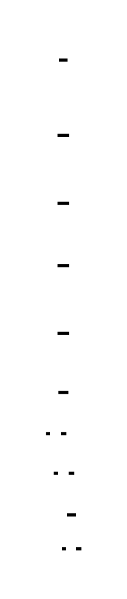

**Level 1: OR expressions**
```c
static AstNode* parse_or_expr(Parser *p) {
    AstNode *left = parse_and_expr(p);
    if (!left) return NULL;
    while (check_keyword(p, "OR")) {
        Token *op_tok = advance(p);
        AstNode *right = parse_and_expr(p);
        if (!right) return NULL;
        AstNode *bin = ast_alloc(NODE_BINARY_EXPR, op_tok->line, op_tok->col);
        bin->data.binary.left = left;
        bin->data.binary.right = right;
        bin->data.binary.op = TOK_KEYWORD;
        strncpy(bin->data.binary.op_keyword, "OR", 8);
        left = bin;
    }
    return left;
}
```
The `while` loop handles left-associativity. The expression `a OR b OR c` parses as `(a OR b) OR c`. Each iteration wraps the accumulated `left` node with a new `right` operand, building the tree leftward.
**Level 2: AND expressions**
```c
static AstNode* parse_and_expr(Parser *p) {
    AstNode *left = parse_not_expr(p);
    if (!left) return NULL;
    while (check_keyword(p, "AND")) {
        Token *op_tok = advance(p);
        AstNode *right = parse_not_expr(p);
        if (!right) return NULL;
        AstNode *bin = ast_alloc(NODE_BINARY_EXPR, op_tok->line, op_tok->col);
        bin->data.binary.left = left;
        bin->data.binary.right = right;
        bin->data.binary.op = TOK_KEYWORD;
        strncpy(bin->data.binary.op_keyword, "AND", 8);
        left = bin;
    }
    return left;
}
```
Identical structure to OR, but calls `parse_not_expr` instead of `parse_and_expr`. This nesting is what makes AND bind tighter than OR. When parsing `a OR b AND c`, `parse_or_expr` calls `parse_and_expr` for its right operand. `parse_and_expr` grabs `b AND c` as a single unit before returning, so OR sees it as: `a OR (b AND c)`. The tree structure encodes the precedence without any explicit precedence table.
**Level 3: NOT (unary)**
```c
static AstNode* parse_not_expr(Parser *p) {
    if (check_keyword(p, "NOT")) {
        Token *not_tok = advance(p);
        AstNode *operand = parse_not_expr(p);  // recursive: NOT NOT x is valid
        if (!operand) return NULL;
        AstNode *unary = ast_alloc(NODE_UNARY_EXPR, not_tok->line, not_tok->col);
        unary->data.unary.operand = operand;
        strncpy(unary->data.unary.op_keyword, "NOT", 8);
        return unary;
    }
    return parse_comparison(p);
}
```
NOT is right-associative and unary. `NOT NOT x` parses as `NOT (NOT x)` via the recursive call. If there's no NOT, it falls through to comparison.
**Level 4: Comparison operators**
```c
static AstNode* parse_comparison(Parser *p) {
    AstNode *left = parse_addition(p);
    if (!left) return NULL;
    // IS NULL / IS NOT NULL
    if (check_keyword(p, "IS")) {
        Token *is_tok = advance(p);
        bool negated = false;
        if (check_keyword(p, "NOT")) {
            advance(p);
            negated = true;
        }
        if (!expect_keyword(p, "NULL")) return NULL;
        AstNode *null_lit = ast_alloc(NODE_LITERAL, is_tok->line, is_tok->col);
        null_lit->data.literal.literal_type = TOK_KEYWORD;
        null_lit->data.literal.value = strdup("NULL");
        AstNode *bin = ast_alloc(NODE_BINARY_EXPR, is_tok->line, is_tok->col);
        bin->data.binary.left = left;
        bin->data.binary.right = null_lit;
        bin->data.binary.op = TOK_EQ;
        strncpy(bin->data.binary.op_keyword, negated ? "ISNOT" : "IS", 8);
        return bin;
    }
    // Standard comparison operators
    if (check(p, TOK_EQ) || check(p, TOK_NE) || check(p, TOK_LT) ||
        check(p, TOK_GT) || check(p, TOK_LE) || check(p, TOK_GE)) {
        Token *op_tok = advance(p);
        AstNode *right = parse_addition(p);
        if (!right) return NULL;
        AstNode *bin = ast_alloc(NODE_BINARY_EXPR, op_tok->line, op_tok->col);
        bin->data.binary.left = left;
        bin->data.binary.right = right;
        bin->data.binary.op = op_tok->type;
        bin->data.binary.op_keyword[0] = '\0';
        return bin;
    }
    return left;
}
```
Note that comparison uses `if` (not `while`) — comparisons are not chainable. `a < b < c` is a syntax error in SQL, not a valid expression. This differs from arithmetic, where `a + b + c` is valid.
**Level 5: Addition/Subtraction**
```c
static AstNode* parse_addition(Parser *p) {
    AstNode *left = parse_primary(p);
    if (!left) return NULL;
    while (check(p, TOK_PLUS) || check(p, TOK_MINUS)) {
        Token *op_tok = advance(p);
        AstNode *right = parse_primary(p);
        if (!right) return NULL;
        AstNode *bin = ast_alloc(NODE_BINARY_EXPR, op_tok->line, op_tok->col);
        bin->data.binary.left = left;
        bin->data.binary.right = right;
        bin->data.binary.op = op_tok->type;
        bin->data.binary.op_keyword[0] = '\0';
        left = bin;
    }
    return left;
}
```
**Level 6: Primary expressions (leaves of the expression tree)**
```c
static AstNode* parse_primary(Parser *p) {
    Token *tok = peek(p);
    if (!tok) {
        parser_error(p, tok, "unexpected end of input in expression");
        return NULL;
    }
    // NULL keyword → literal, not identifier
    if (check_keyword(p, "NULL")) {
        advance(p);
        AstNode *node = ast_alloc(NODE_LITERAL, tok->line, tok->col);
        node->data.literal.literal_type = TOK_KEYWORD;
        node->data.literal.value = strdup("NULL");
        return node;
    }
    // Numeric literals
    if (check(p, TOK_INTEGER) || check(p, TOK_FLOAT)) {
        advance(p);
        AstNode *node = ast_alloc(NODE_LITERAL, tok->line, tok->col);
        node->data.literal.literal_type = tok->type;
        node->data.literal.value = token_to_string(tok);
        return node;
    }
    // String literals
    if (check(p, TOK_STRING)) {
        advance(p);
        AstNode *node = ast_alloc(NODE_LITERAL, tok->line, tok->col);
        node->data.literal.literal_type = TOK_STRING;
        node->data.literal.value = token_to_string(tok);
        return node;
    }
    // Parenthesized expression
    if (check(p, TOK_LPAREN)) {
        advance(p);
        AstNode *inner = parse_expression(p);
        if (!inner) return NULL;
        if (!expect(p, TOK_RPAREN)) return NULL;
        return inner;
    }
    // Star (wildcard) — handled in SELECT column list, but also valid here
    if (check(p, TOK_STAR)) {
        advance(p);
        return ast_alloc(NODE_WILDCARD, tok->line, tok->col);
    }
    // Identifier (possibly dot-qualified: table.column)
    if (check(p, TOK_IDENTIFIER)) {
        advance(p);
        // Check for table.column
        if (check(p, TOK_DOT)) {
            advance(p);
            Token *col_tok = expect(p, TOK_IDENTIFIER);
            if (!col_tok) return NULL;
            AstNode *node = ast_alloc(NODE_COLUMN_REF, tok->line, tok->col);
            node->data.column_ref.table_name = token_to_string(tok);
            node->data.column_ref.column_name = token_to_string(col_tok);
            return node;
        }
        AstNode *node = ast_alloc(NODE_IDENTIFIER, tok->line, tok->col);
        node->data.identifier.name = token_to_string(tok);
        return node;
    }
    parser_error(p, tok, "unexpected token '%.*s' in expression", 
                 tok->length, tok->start);
    return NULL;
}
```
**The critical `NULL` check.** Notice that `NULL` is checked *before* identifiers, even though `NULL` is a keyword token. This is deliberate. The SQL keyword `NULL` represents the null value — a literal, not a column reference. If you parsed it as an identifier, your VM would later try to look up a column named "NULL", which doesn't exist. This is a common parsing bug in SQL implementations.
**Parenthesized expressions.** When the parser encounters `(`, it calls `parse_expression` recursively — which starts the entire precedence chain from OR again. This is how parentheses override precedence: `(a OR b) AND c` forces OR to bind first because the parenthesized sub-expression is fully resolved before AND sees it. The parentheses themselves don't appear in the AST — they're structural brackets that influence tree shape, not semantic nodes.
---
## Tracing Through a Complex Expression
Let's trace the expression parser on: `age > 21 AND status = 'active' OR role = 'admin'`
1. `parse_expression()` → `parse_or_expr()`
2. `parse_or_expr()` calls `parse_and_expr()` for left side
3. `parse_and_expr()` calls `parse_not_expr()` → `parse_comparison()` → `parse_addition()` → `parse_primary()` → identifier `age`
4. Back in `parse_comparison()`: sees `>`, consumes it, parses right side → literal `21`
5. Returns binary node `(age > 21)` to `parse_and_expr()`
6. `parse_and_expr()` sees `AND`, consumes it, calls `parse_not_expr()` again
7. Eventually returns binary node `(status = 'active')`
8. `parse_and_expr()` wraps both in `((age > 21) AND (status = 'active'))`, returns to `parse_or_expr()`
9. `parse_or_expr()` sees `OR`, consumes it, calls `parse_and_expr()` again
10. Gets `(role = 'admin')`, wraps everything in `(((age > 21) AND (status = 'active')) OR (role = 'admin'))`
The resulting AST:
```
        OR
       /  \
     AND   (role = 'admin')
    /    \
(age>21)  (status='active')
```
AND binds tighter than OR. The tree structure makes this unambiguous — the bytecode compiler will evaluate the AND first, then the OR, regardless of the textual order.
---
## The Top-Level Dispatcher
The parser's entry point dispatches to the correct statement parser based on the first keyword:
```c
AstNode* parser_parse(Parser *p) {
    Token *tok = peek(p);
    if (!tok || tok->type == TOK_EOF) {
        parser_error(p, tok, "empty input");
        return NULL;
    }
    AstNode *result = NULL;
    if (check_keyword(p, "SELECT")) {
        result = parse_select(p);
    } else if (check_keyword(p, "INSERT")) {
        result = parse_insert(p);
    } else if (check_keyword(p, "CREATE")) {
        result = parse_create_table(p);
    } else if (check_keyword(p, "EXPLAIN")) {
        // EXPLAIN wraps another statement
        advance(p);
        result = parser_parse(p);  // recursive: parse the inner statement
        // Mark it as EXPLAIN'd (your compiler checks this flag)
    } else {
        parser_error(p, tok, "expected SELECT, INSERT, CREATE, or EXPLAIN");
    }
    // Optional semicolon
    if (result && check(p, TOK_SEMICOLON)) {
        advance(p);
    }
    return result;
}
```
---
## Memory Management: AST Allocation
Every AST node is heap-allocated. The simplest approach for a learning project: use a linear arena that frees everything at once when the AST is no longer needed.
```c
static AstNode* ast_alloc(NodeType type, int line, int col) {
    AstNode *node = calloc(1, sizeof(AstNode));
    node->type = type;
    node->line = line;
    node->col = col;
    return node;
}
void ast_free(AstNode *node) {
    if (!node) return;
    switch (node->type) {
        case NODE_SELECT:
            for (int i = 0; i < node->data.select.column_count; i++)
                ast_free(node->data.select.columns[i]);
            free(node->data.select.columns);
            free(node->data.select.from_table);
            ast_free(node->data.select.where_clause);
            for (int i = 0; i < node->data.select.order_by_count; i++)
                ast_free(node->data.select.order_by[i]);
            free(node->data.select.order_by);
            break;
        case NODE_INSERT:
            free(node->data.insert.table_name);
            for (int i = 0; i < node->data.insert.column_count; i++)
                free(node->data.insert.column_names[i]);
            free(node->data.insert.column_names);
            for (int i = 0; i < node->data.insert.row_count; i++) {
                for (int j = 0; j < node->data.insert.values_per_row; j++)
                    ast_free(node->data.insert.value_rows[i][j]);
                free(node->data.insert.value_rows[i]);
            }
            free(node->data.insert.value_rows);
            break;
        case NODE_BINARY_EXPR:
            ast_free(node->data.binary.left);
            ast_free(node->data.binary.right);
            break;
        case NODE_UNARY_EXPR:
            ast_free(node->data.unary.operand);
            break;
        case NODE_LITERAL:
            free(node->data.literal.value);
            break;
        case NODE_IDENTIFIER:
            free(node->data.identifier.name);
            break;
        // ... similar for other types
        default:
            break;
    }
    free(node);
}
```
> **Production alternative:** SQLite uses a single memory allocation pool per SQL statement. All AST nodes, strings, and compiler temporaries are allocated from the pool. When the statement finishes, the entire pool is freed in one call — no need to walk the tree. This is called **arena allocation** or **region-based memory management**. It's dramatically faster than individual `free()` calls for trees with many small nodes. For your build, individual `calloc`/`free` per node is fine — the AST is small and short-lived.
---
## Integrating the Tokenizer and Parser
The pipeline from SQL string to AST is two function calls:
```c
AstNode* sql_parse(const char *sql) {
    // Step 1: Tokenize
    Lexer lex;
    lexer_init(&lex, sql);
    Token tokens[1024];
    int count = lexer_tokenize_all(&lex, tokens, 1024);
    if (count > 0 && tokens[count-1].type == TOK_ERROR) {
        fprintf(stderr, "Lexer error: %.*s at line %d, col %d\n",
                tokens[count-1].length, tokens[count-1].start,
                tokens[count-1].line, tokens[count-1].col);
        return NULL;
    }
    // Step 2: Parse
    Parser parser;
    parser_init(&parser, tokens, count);
    AstNode *ast = parser_parse(&parser);
    if (parser.had_error) {
        fprintf(stderr, "Parse error at line %d, col %d: %s\n",
                parser.error_line, parser.error_col, parser.error_msg);
        return NULL;
    }
    return ast;
}
```
This is the abstraction boundary at work. The parser never calls `peek` on the `Lexer` — it only reads from the `Token` array. The tokenizer's internal state machine is invisible. And the bytecode compiler (Milestone 3) will call `sql_parse()` and receive an AST — it never sees tokens or raw SQL text.
---
## Building the Test Suite
Your acceptance criteria require 15+ valid and 10+ invalid statements. Here's a testing framework:
```c
typedef struct {
    const char *sql;
    NodeType expected_type;
    bool should_succeed;
    const char *description;
} ParseTest;
ParseTest parse_tests[] = {
    // Valid SELECT statements
    {"SELECT * FROM t;", NODE_SELECT, true, "select star"},
    {"SELECT a, b FROM t;", NODE_SELECT, true, "select columns"},
    {"SELECT a FROM t WHERE x > 5;", NODE_SELECT, true, "select with where"},
    {"SELECT a FROM t WHERE x > 5 AND y = 3;", NODE_SELECT, true, "where with AND"},
    {"SELECT a FROM t WHERE x > 5 OR y = 3;", NODE_SELECT, true, "where with OR"},
    {"SELECT a FROM t WHERE NOT x > 5;", NODE_SELECT, true, "where with NOT"},
    {"SELECT a FROM t WHERE (x > 5 OR y = 3) AND z = 1;", 
     NODE_SELECT, true, "parenthesized expression"},
    {"SELECT a FROM t ORDER BY a ASC;", NODE_SELECT, true, "order by asc"},
    {"SELECT a FROM t ORDER BY a DESC;", NODE_SELECT, true, "order by desc"},
    {"SELECT a FROM t LIMIT 10;", NODE_SELECT, true, "limit"},
    {"SELECT a FROM t WHERE x IS NULL;", NODE_SELECT, true, "is null"},
    {"SELECT a FROM t WHERE x IS NOT NULL;", NODE_SELECT, true, "is not null"},
    {"SELECT t1.a FROM t1;", NODE_SELECT, true, "dot-qualified column"},
    // Valid INSERT statements
    {"INSERT INTO t VALUES (1, 'x');", NODE_INSERT, true, "simple insert"},
    {"INSERT INTO t (a, b) VALUES (1, 'x');", NODE_INSERT, true, 
     "insert with columns"},
    {"INSERT INTO t VALUES (1, 'x'), (2, 'y');", NODE_INSERT, true, 
     "insert multiple rows"},
    // Valid CREATE TABLE
    {"CREATE TABLE t (id INTEGER PRIMARY KEY, name TEXT NOT NULL);", 
     NODE_CREATE_TABLE, true, "create table"},
    {"CREATE TABLE t (id INTEGER, val REAL UNIQUE);", 
     NODE_CREATE_TABLE, true, "create with unique"},
    // Invalid statements (should fail with error)
    {"SELECT;", 0, false, "select missing columns"},
    {"SELECT * FROM;", 0, false, "from missing table"},
    {"SELECT * FROM t WHERE;", 0, false, "where missing expression"},
    {"SELECT * FROM t WHERE x >;", 0, false, "comparison missing right operand"},
    {"INSERT INTO;", 0, false, "insert missing table"},
    {"INSERT INTO t VALUES;", 0, false, "values missing parens"},
    {"INSERT INTO t VALUES (1, );", 0, false, "trailing comma in values"},
    {"CREATE TABLE;", 0, false, "create missing table name"},
    {"CREATE TABLE t;", 0, false, "create missing column defs"},
    {"CREATE TABLE t (id);", 0, false, "column missing type"},
    {"FROM t SELECT *;", 0, false, "wrong keyword order"},
    {"SELECT * FROM t WHERE (x > 5;", 0, false, "mismatched parenthesis"},
    {NULL, 0, false, NULL}
};
void run_parse_tests(void) {
    int passed = 0, failed = 0;
    for (int i = 0; parse_tests[i].sql != NULL; i++) {
        AstNode *ast = sql_parse(parse_tests[i].sql);
        bool succeeded = (ast != NULL);
        if (succeeded != parse_tests[i].should_succeed) {
            fprintf(stderr, "FAIL [%s]: expected %s, got %s\n",
                    parse_tests[i].description,
                    parse_tests[i].should_succeed ? "success" : "failure",
                    succeeded ? "success" : "failure");
            failed++;
        } else if (succeeded && ast->type != parse_tests[i].expected_type) {
            fprintf(stderr, "FAIL [%s]: wrong node type\n",
                    parse_tests[i].description);
            failed++;
        } else {
            passed++;
        }
        ast_free(ast);
    }
    printf("Parse tests: %d passed, %d failed\n", passed, failed);
}
```
For more rigorous validation, write helper functions that inspect specific AST fields:
```c
void test_select_where_precedence(void) {
    AstNode *ast = sql_parse("SELECT a FROM t WHERE x > 5 AND y = 3 OR z = 1;");
    assert(ast && ast->type == NODE_SELECT);
    // Top level of WHERE should be OR
    AstNode *where = ast->data.select.where_clause;
    assert(where->type == NODE_BINARY_EXPR);
    assert(strcmp(where->data.binary.op_keyword, "OR") == 0);
    // Left of OR should be AND
    AstNode *left = where->data.binary.left;
    assert(left->type == NODE_BINARY_EXPR);
    assert(strcmp(left->data.binary.op_keyword, "AND") == 0);
    // Right of OR should be (z = 1)
    AstNode *right = where->data.binary.right;
    assert(right->type == NODE_BINARY_EXPR);
    assert(right->data.binary.op == TOK_EQ);
    printf("PASS: precedence test (AND binds tighter than OR)\n");
    ast_free(ast);
}
```
This test directly verifies the most important property of your expression parser: that AND binds tighter than OR.
---
## Three-Level View: What Happens During Parsing
**Level 1 — Public API**: You call `sql_parse("SELECT ...")`. You get back an `AstNode*` representing the structured statement, or `NULL` with an error message.
**Level 2 — Recursive-Descent Engine**: Inside, the parser dispatches to `parse_select`, which calls `parse_expression` for the WHERE clause, which calls `parse_or_expr` → `parse_and_expr` → `parse_not_expr` → `parse_comparison` → `parse_addition` → `parse_primary`, building a tree bottom-up as each function returns its subtree to the caller.
**Level 3 — Memory**: Each `ast_alloc` call invokes `calloc`, which asks the OS for a page of heap memory (typically 4096 bytes, fitting many small nodes). The token array — the parser's input — is stack-allocated and points into the original SQL string in the caller's memory. No disk I/O, no system calls beyond heap allocation. The entire parsing phase is CPU-bound and cache-friendly.
---
## Knowledge Cascade: What the Parser Unlocks
**→ The Bytecode Compiler (Next Milestone)**: The compiler will walk your AST using a recursive visitor: `compile_node(AstNode *node)` dispatches on `node->type`, calling `compile_select`, `compile_insert`, etc. Each AST node type maps to a bytecode generation pattern. The AST is the **intermediate representation (IR)** — a concept you'll see everywhere in compilation. The same AST-as-IR pattern powers JavaScript engines (V8 compiles AST → bytecode → machine code), linters (ESLint walks the AST to check rules), and formatters (Prettier walks the AST to emit formatted text).

> **🔑 Foundation: Write-ahead logging theory**
> 
> ## Write-Ahead Logging (WAL) Theory
**What it is:** Write-ahead logging is a durability and recovery protocol. The rule is deceptively simple: **before any change hits the actual database file, a record of that change must first be written (and fsynced) to a sequential log file.** That's the "write-ahead" part — the log is always ahead of the data.
Each log record typically contains:
- A transaction ID
- Which page/record was modified
- The **before-image** (old value) and **after-image** (new value)
- A log sequence number (LSN) for ordering
On crash recovery, the system replays the log:
1. **Redo** — scan forward, reapply changes from committed transactions that might not have reached the database file yet.
2. **Undo** — scan backward, reverse changes from transactions that were active (uncommitted) at crash time.
This is the classic **ARIES** algorithm (Redo history, Undo losers).
**Why you need it now:** Without WAL, your database has two bad options: either flush every write to disk immediately (catastrophically slow) or buffer writes in memory and lose them on crash (unacceptable). WAL gives you both performance *and* durability. Dirty pages can linger in a memory buffer cache while the log — which is append-only and sequential — provides the crash safety guarantee. This is the foundation that makes transactions actually *durable* (the D in ACID).
**Key insight:** WAL exploits a hardware asymmetry: **sequential writes are dramatically faster than random writes.** The database file has random-access updates scattered across pages, but the log is purely append-only. By ensuring the log hits disk first, you convert the expensive random I/O into cheap sequential I/O for the critical path. The actual database pages can be flushed lazily in the background. Think of the log as a "receipt" — as long as you have the receipt, you can always reconstruct what happened, even if the shelves (data pages) are in disarray.


> **🔑 Foundation: Snapshot isolation**
> 
> ## Snapshot Isolation
**What it is:** Snapshot isolation is a concurrency control scheme where each transaction sees a **frozen-in-time view of the database** as it existed when the transaction started. Other transactions can commit changes after your snapshot was taken, but you won't see them — you're reading from your private "snapshot."
Concretely: when Transaction A starts at timestamp T=100, it reads only data committed before T=100. If Transaction B commits a new row at T=105, Transaction A never sees it, even if A reads that table again at T=110. This eliminates dirty reads, non-repeatable reads, and phantom reads — all without taking read locks.
**Writes** are where it gets interesting. If two concurrent transactions both modify the same row, a **write-write conflict** is detected. The first one to commit wins; the second is aborted and must retry. This is often called "first-committer-wins."
**Why you need it now:** You're implementing a database that needs to handle concurrent access. Traditional locking (readers block writers, writers block readers) is simple but creates bottlenecks. Snapshot isolation is the strategy used by SQLite's WAL mode, PostgreSQL (as its default "Read Committed" and "Repeatable Read" levels), and many modern databases because **readers never block writers and writers never block readers.** It's the practical sweet spot between correctness and performance.
Implementation ties directly to your WAL: each transaction's snapshot can be defined by the latest committed LSN at the time it started. When reading a page, you follow version chains or check transaction visibility to find the version that was current as of your snapshot.
**Key insight:** Snapshot isolation is **not** the same as full serializability. It permits a subtle anomaly called **write skew**: two transactions can each read a value the other is about to modify, and both commit successfully with a result that couldn't have happened in any serial order. Classic example — two doctors are on call, each checks "are there at least 2 doctors on call?" (yes), each removes themselves. Both commit. Now zero doctors are on call. If your application can tolerate write skew (most can), snapshot isolation gives you excellent concurrency. If not, you need serializable snapshot isolation (SSI), which adds dependency tracking on top.

**→ Programming Language Compilers**: Every recursive-descent parser is a direct encoding of a BNF grammar. The technique you just built is identical to how GCC parses C, how the Go compiler parses Go, and how TypeScript's parser parses TypeScript. The grammar rules differ; the technique is the same. If you can parse SQL, you can parse any LL(k) language.
**→ IDE Tooling and Language Servers**: The AST you produce is exactly what a Language Server Protocol (LSP) implementation uses for syntax highlighting, autocompletion, and error reporting. The `line` and `col` fields on every AST node enable mapping tree nodes back to source positions — the foundation of "go to definition," "find all references," and inline error display.
**→ Query Rewriting and Optimization**: Later milestones (Milestone 8, Query Planner) will transform the AST before compilation — reordering joins, pushing predicates down, eliminating dead branches. These transformations are **tree-to-tree rewrites** on the AST. The same pattern appears in compiler optimizations (constant folding, dead code elimination) and in database query optimizers (predicate pushdown, join reordering). Your AST is not just an intermediate step — it's the foundation for all semantic analysis.
**→ Error Recovery in Real-Time Editors**: Production parsers don't stop at the first error. They implement **panic mode recovery**: when an unexpected token appears, the parser skips tokens until it finds a synchronization point (like a semicolon or a closing keyword) and resumes parsing. This allows IDEs to parse partially-typed SQL and still provide syntax highlighting for the parts that are valid. Your current stop-at-first-error approach is correct for a batch compiler; the recovery extension is what separates batch compilers from interactive tools.
---
## System Awareness
You've built the parser — the second layer of the SQL frontend. It connects to the **tokenizer** (upstream, Milestone 1) for input and to the **bytecode compiler** (downstream, Milestone 3) for output. The AST is the contract between these layers: the tokenizer guarantees classified tokens; the parser guarantees a well-formed tree; the compiler guarantees executable bytecode. Each layer trusts the layer below it and provides guarantees to the layer above.
Without the parser, tokens are a meaningless sequence. With it, your database engine has structured representations of SQL statements — ready to be compiled into the bytecode instructions your virtual machine will execute.
---
<!-- END_MS -->


<!-- MS_ID: build-sqlite-m3 -->
<!-- MS_ID: build-sqlite-m3 -->
# Milestone 3: Bytecode Compiler (VDBE)
## Where We Are in the System
You have a tokenizer that converts SQL text into tokens, and a parser that converts tokens into an AST. These are the **frontend** of your database engine. Now you build the component that bridges frontend and backend — the **Virtual Database Engine** (VDBE), SQLite's bytecode compiler and virtual machine.


The VDBE sits at the exact center of the architecture. Above it: SQL text, tokens, ASTs — the world of human-readable queries. Below it: buffer pools, B-tree pages, disk I/O — the world of bytes on storage. The VDBE's job is to translate the semantic intent of an AST ("find all users older than 21") into a sequence of primitive operations that the storage engine can execute one step at a time.


This milestone has two parts: the **compiler** (AST → bytecode program) and the **virtual machine** (bytecode program → results). You'll build both.
---
## The Revelation: Why Not Just Walk the Tree?
You already have an AST. The AST for `SELECT name FROM users WHERE age > 21` is a tree with a SELECT node, an IDENTIFIER node for `name`, and a BINARY_EXPR node for `age > 21`. Why not just walk this tree at execution time?
You could. It's called a **tree-walking interpreter**, and it works like this:
```c
// Tree-walking approach (DON'T do this)
void execute_select(AstNode *select_node, BTree *table) {
    Cursor *cur = btree_cursor_open(table);
    btree_cursor_rewind(cur);
    while (!btree_cursor_eof(cur)) {
        Row *row = btree_cursor_read(cur);
        if (evaluate_where(select_node->data.select.where_clause, row)) {
            output_columns(select_node->data.select.columns, row);
        }
        btree_cursor_next(cur);
    }
}
```
This is clean, readable, and — for a 10,000-row table scan — catastrophically wasteful. Here's why:
**Per-row overhead.** Every time `evaluate_where` is called, it walks the WHERE clause AST. For `age > 21 AND status = 'active'`, that's: dispatch on NODE_BINARY_EXPR (AND) → recurse left → dispatch on NODE_BINARY_EXPR (>) → recurse left → dispatch on NODE_IDENTIFIER → look up "age" → recurse right → dispatch on NODE_LITERAL → get value 21 → compare → return to AND → recurse right → dispatch on NODE_BINARY_EXPR (=) → ... and so on. Each dispatch involves checking `node->type`, following pointers through heap-allocated nodes (likely cache misses), and recursing. For 10,000 rows, you perform this entire tree walk 10,000 times — even though the tree never changes.
**Bytecode eliminates the tree walk entirely.** The compiler traverses the AST *once* and emits a flat array of instructions. The VM then processes these instructions sequentially — incrementing a program counter is a single integer addition. No pointer chasing, no type dispatching, no recursion. The instruction stream is a compact array that fits in CPU cache.
The numbers matter. On modern hardware, a function call with pointer indirection costs ~5-10ns (including branch prediction misses and cache misses for heap-allocated nodes). A program counter increment costs <1ns. For a WHERE clause with 5 AST nodes evaluated 10,000 times, the tree-walking overhead is roughly 50,000 × 5ns = 250μs — just for dispatching, before any actual work. Bytecode eliminates that overhead entirely.
But performance isn't the only reason. **Bytecode decouples frontend from backend.** Your SQL parser could change completely — support new syntax, new dialects, new expression types — and the VM doesn't care, as long as the compiler emits valid opcodes. Conversely, you could replace the B-tree storage engine with an LSM-tree, and the compiler doesn't care, as long as the cursor opcodes work. This is the same decoupling that makes the Java Virtual Machine (JVM) language-agnostic: Java, Kotlin, Scala, and Clojure all compile to the same bytecode.

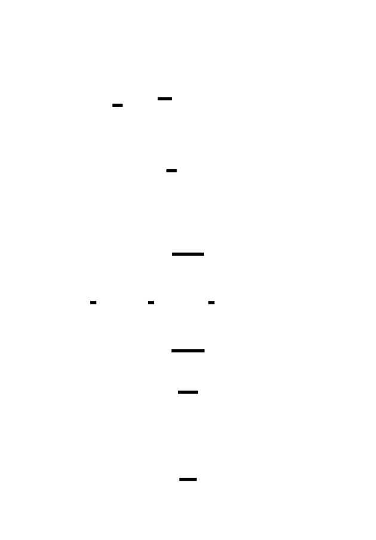

---
## Designing the Instruction Set
Every virtual machine needs an instruction set — the vocabulary of operations it can perform. SQLite's real VDBE has ~180 opcodes. You need far fewer. Here is the minimal set that covers SELECT, INSERT, CREATE TABLE, and WHERE filtering:


```c
typedef enum {
    // Control flow
    OP_INIT,          // Jump to start of program (p2 = addr of first real opcode)
    OP_HALT,          // Stop execution. p1 = return code (0 = success)
    OP_GOTO,          // Unconditional jump. p2 = target address
    // Table/cursor operations
    OP_OPEN_READ,     // Open cursor p1 for reading table with root page p2
    OP_OPEN_WRITE,    // Open cursor p1 for writing table with root page p2
    OP_CLOSE,         // Close cursor p1
    OP_REWIND,        // Move cursor p1 to first row. If table empty, jump to p2
    OP_NEXT,          // Advance cursor p1. If past end, jump to p2
    // Data access
    OP_COLUMN,        // Read column p2 from cursor p1 into register p3
    OP_ROWID,         // Read rowid from cursor p1 into register p2
    OP_RESULT_ROW,    // Output registers p1..p1+p2-1 as a result row
    // Record operations
    OP_MAKE_RECORD,   // Pack registers p1..p1+p2-1 into a record in register p3
    OP_INSERT,        // Insert record from register p2 into cursor p1 with key from register p3
    // Constants
    OP_INTEGER,       // Store integer p1 into register p2
    OP_STRING,        // Store string (from string pool at index p1) into register p2
    OP_NULL,          // Store NULL into register p2
    OP_REAL,          // Store float (from constant pool at index p1) into register p2
    // Comparison (conditional jump)
    OP_EQ,            // If reg[p1] == reg[p3], jump to p2
    OP_NE,            // If reg[p1] != reg[p3], jump to p2
    OP_LT,            // If reg[p1] <  reg[p3], jump to p2
    OP_LE,            // If reg[p1] <= reg[p3], jump to p2
    OP_GT,            // If reg[p1] >  reg[p3], jump to p2
    OP_GE,            // If reg[p1] >= reg[p3], jump to p2
    // Schema operations
    OP_CREATE_TABLE,  // Create a new B-tree, store root page in register p1
    OP_OPEN_EPHEMERAL,// Open ephemeral (temporary) table on cursor p1
    // Arithmetic
    OP_ADD,           // reg[p3] = reg[p1] + reg[p2]
    OP_SUBTRACT,      // reg[p3] = reg[p1] - reg[p2]
    OP_MULTIPLY,      // reg[p3] = reg[p1] * reg[p2]
    OP_DIVIDE,        // reg[p3] = reg[p1] / reg[p2]
    // Copy
    OP_COPY,          // reg[p2] = reg[p1]
    OP_SCOPY,         // Shallow copy reg[p1] to reg[p2]
} Opcode;
```
Each instruction is a fixed-size struct with three operand fields — a design called a **three-address instruction format**:
```c
typedef struct {
    Opcode opcode;    // what to do
    int p1;           // first operand (usually register or cursor number)
    int p2;           // second operand (register, address, or page number)
    int p3;           // third operand (register or count)
    char *comment;    // for EXPLAIN output (NULL in production)
} VdbeOp;
```
**Why three operands?** Because most operations need at most three pieces of information: two inputs and one output. `OP_ADD` takes register p1 and register p2 as inputs and writes the result to register p3. `OP_COLUMN` takes cursor p1 and column index p2 as inputs and writes the value to register p3. This uniformity — every instruction is the same size and shape — makes the VM's fetch-decode loop trivially simple.
### Design Decision: Register-Based vs Stack-Based VM

> **🔑 Foundation: Register-based vs stack-based VMs**
> 
> ## Register-Based vs Stack-Based Virtual Machines
**What it is:** These are two fundamentally different architectures for how a virtual machine performs computation — specifically, where intermediate values live during execution.
A **stack-based VM** uses an implicit operand stack. Instructions push values onto the stack and pop them off to operate. To add two numbers:
```
PUSH 3
PUSH 5
ADD      // pops 3 and 5, pushes 8
```
The operands are implicit — `ADD` doesn't say *what* to add; it just grabs the top two stack elements.
A **register-based VM** uses named slots (registers) that instructions reference explicitly:
```
LOAD R0, 3
LOAD R1, 5
ADD R2, R0, R1   // R2 = R0 + R1 = 8
```
Here, every instruction spells out exactly which registers to read from and write to.
**Real-world examples:** The JVM and CPython are stack-based. Lua 5.0+, Dalvik (Android's original VM), and most physical CPUs are register-based.
**Why you need this now:** You're building a virtual machine, and this is the first architectural fork in the road. Everything downstream — your instruction format, your bytecode compiler, your dispatch loop — depends on which model you choose. It's not a detail you can change later without rewriting most of your VM.
**Key insight:** Stack-based VMs are simpler to *target* (a compiler emitting stack bytecode doesn't need to worry about register assignment), but register-based VMs are simpler to *execute efficiently* because they avoid the constant push/pop overhead. Research on Dalvik vs. the JVM showed register-based bytecode can be ~47% smaller in instruction count for equivalent programs, though individual instructions are wider (they carry register operands). The tradeoff is: **simpler compiler, chattier bytecode (stack) vs. smarter compiler, denser execution (register)**.

| Option | Pros | Cons | Used By |
|--------|------|------|---------|
| **Register-based ✓** | Fewer instructions per operation, direct operand addressing, easier to optimize | Wider instruction encoding (3 fields), compiler must manage register allocation | SQLite VDBE, Lua 5, Android Dalvik |
| Stack-based | Simpler instruction encoding (no operands), simpler compiler (just push/pop) | More instructions per operation (~2x), implicit operand flow harder to debug | JVM, CPython, WebAssembly |
SQLite uses a register-based VM because database operations naturally have multiple inputs and outputs. `OP_COLUMN` needs a cursor number, a column index, and a destination — three distinct pieces of information that map cleanly to p1, p2, p3. A stack-based VM would need separate push/pop instructions for each, increasing instruction count and making EXPLAIN output harder to read.
---
## The Bytecode Program Structure
A bytecode program is an array of `VdbeOp` instructions, plus some metadata:
```c
#define MAX_REGISTERS 256
#define MAX_INSTRUCTIONS 4096
#define MAX_STRINGS 256
#define MAX_CURSORS 16
typedef enum {
    VAL_NULL,
    VAL_INTEGER,
    VAL_REAL,
    VAL_STRING,
    VAL_BLOB,
} ValueType;
typedef struct {
    ValueType type;
    union {
        int64_t i;       // VAL_INTEGER
        double r;        // VAL_REAL
        struct {
            char *data;
            int length;
        } s;             // VAL_STRING, VAL_BLOB
    };
} Value;
typedef struct {
    VdbeOp *ops;          // instruction array
    int op_count;         // number of instructions
    int op_capacity;      // allocated capacity
    // String constant pool — strings referenced by OP_STRING
    char **strings;
    int string_count;
    // Register count needed
    int n_registers;
} Program;
```
The string pool deserves explanation. When the compiler encounters a string literal like `'active'` in a WHERE clause, it doesn't embed the string pointer directly in the instruction (the instruction's fields are `int`, not `char*`). Instead, it adds the string to the `strings` array and stores the index in the instruction's `p1` field. The VM retrieves the string from the pool at execution time. This keeps instructions fixed-size and makes program serialization (saving to disk or sending over a network) straightforward.
---
## The Compiler
The compiler walks the AST exactly once and emits instructions into a `Program`. It's a recursive visitor — structurally identical to the recursive-descent parser, but instead of consuming tokens and producing nodes, it consumes nodes and produces bytecode.
```c
typedef struct {
    Program *program;
    int next_register;    // next free register
    int next_cursor;      // next free cursor number
    // Schema lookup (for resolving table names to root pages)
    // In a real implementation, this queries sqlite_master
    struct {
        char *name;
        int root_page;
        int column_count;
        char **column_names;
    } *tables;
    int table_count;
} Compiler;
void compiler_init(Compiler *c, Program *prog) {
    c->program = prog;
    c->next_register = 1;  // register 0 reserved for scratch
    c->next_cursor = 0;
    prog->op_count = 0;
}
```
### Helper: Emitting Instructions
```c
static int emit(Compiler *c, Opcode op, int p1, int p2, int p3, 
                const char *comment) {
    Program *prog = c->program;
    if (prog->op_count >= prog->op_capacity) {
        prog->op_capacity = prog->op_capacity ? prog->op_capacity * 2 : 64;
        prog->ops = realloc(prog->ops, prog->op_capacity * sizeof(VdbeOp));
    }
    int addr = prog->op_count;
    VdbeOp *instr = &prog->ops[addr];
    instr->opcode = op;
    instr->p1 = p1;
    instr->p2 = p2;
    instr->p3 = p3;
    instr->comment = comment ? strdup(comment) : NULL;
    prog->op_count++;
    return addr;  // return address of this instruction (for patching jumps)
}
static int alloc_register(Compiler *c) {
    return c->next_register++;
}
static int alloc_cursor(Compiler *c) {
    return c->next_cursor++;
}
```
The `emit` function returns the address (index) of the emitted instruction. This is crucial for **jump patching** — when you emit a conditional jump, you don't yet know the target address. You emit the jump with a placeholder, then later fill in the correct address once you know where the target instruction lands.
```c
static void patch_jump(Compiler *c, int jump_addr, int target_addr) {
    c->program->ops[jump_addr].p2 = target_addr;
}
```
---
## Compiling SELECT
This is the most instructive compilation because it shows how a declarative query ("give me all names where age > 21") transforms into an imperative loop ("open cursor, rewind, check condition, output column, advance, repeat").
The bytecode template for `SELECT col1, col2 FROM table WHERE condition` is:
```
0  Init         0  <addr of OpenRead>  0
1  OpenRead     cursor  root_page  column_count
2  Rewind       cursor  <addr of Close>
3  Column       cursor  col_idx1  reg1        ; load col1
4  Column       cursor  col_idx2  reg2        ; load col2
   ... (WHERE evaluation writes condition result) ...
   ... (conditional jump to Next if condition false) ...
5  ResultRow    reg1  col_count               ; output row
6  Next         cursor  <addr of first Column> ; loop back
7  Close        cursor
8  Halt         0  0  0
```
Here's the compiler function:
```c
static void compile_select(Compiler *c, AstNode *node) {
    // Look up table metadata
    int table_idx = find_table(c, node->data.select.from_table);
    if (table_idx < 0) {
        // Table not found — emit error and halt
        emit(c, OP_HALT, 1, 0, 0, "error: table not found");
        return;
    }
    int root_page = c->tables[table_idx].root_page;
    int n_cols = c->tables[table_idx].column_count;
    // Allocate cursor
    int cursor = alloc_cursor(c);
    // OP_INIT: jump past any setup code to the first real instruction
    int init_addr = emit(c, OP_INIT, 0, 0, 0, "Start");
    // Open cursor for reading
    int open_addr = emit(c, OP_OPEN_READ, cursor, root_page, n_cols, 
                          node->data.select.from_table);
    patch_jump(c, init_addr, open_addr);
    // Rewind cursor to first row; if empty, jump to close
    int rewind_addr = emit(c, OP_REWIND, cursor, 0, 0, "Rewind; jump if empty");
    // --- Loop body starts here ---
    int loop_start = c->program->op_count;
    // Load columns into registers
    int first_reg = c->next_register;
    int result_col_count = 0;
    if (node->data.select.column_count == 1 && 
        node->data.select.columns[0]->type == NODE_WILDCARD) {
        // SELECT * — load all columns
        for (int i = 0; i < n_cols; i++) {
            int reg = alloc_register(c);
            emit(c, OP_COLUMN, cursor, i, reg, 
                 c->tables[table_idx].column_names[i]);
        }
        result_col_count = n_cols;
    } else {
        // SELECT col1, col2 — load specific columns
        for (int i = 0; i < node->data.select.column_count; i++) {
            AstNode *col_node = node->data.select.columns[i];
            int reg = alloc_register(c);
            if (col_node->type == NODE_IDENTIFIER) {
                int col_idx = find_column(c, table_idx, 
                                          col_node->data.identifier.name);
                emit(c, OP_COLUMN, cursor, col_idx, reg, 
                     col_node->data.identifier.name);
            }
            // Handle expressions, function calls, etc.
            result_col_count++;
        }
    }
    // Compile WHERE clause (if present)
    int skip_addr = -1;
    if (node->data.select.where_clause) {
        skip_addr = compile_where(c, node->data.select.where_clause, cursor, 
                                   table_idx);
        // skip_addr is a jump that skips ResultRow if condition is false
    }
    // Output result row
    emit(c, OP_RESULT_ROW, first_reg, result_col_count, 0, "Output row");
    // Patch the WHERE skip to jump here (past ResultRow, to Next)
    int next_addr = emit(c, OP_NEXT, cursor, loop_start, 0, "Advance; loop");
    if (skip_addr >= 0) {
        patch_jump(c, skip_addr, next_addr);
    }
    // Close cursor
    int close_addr = emit(c, OP_CLOSE, cursor, 0, 0, "Close cursor");
    patch_jump(c, rewind_addr, close_addr);
    // Halt
    emit(c, OP_HALT, 0, 0, 0, "Done");
    // Reset register allocator for next compilation (registers are per-loop-iteration)
    c->program->n_registers = c->next_register;
}
```
### Register Allocation

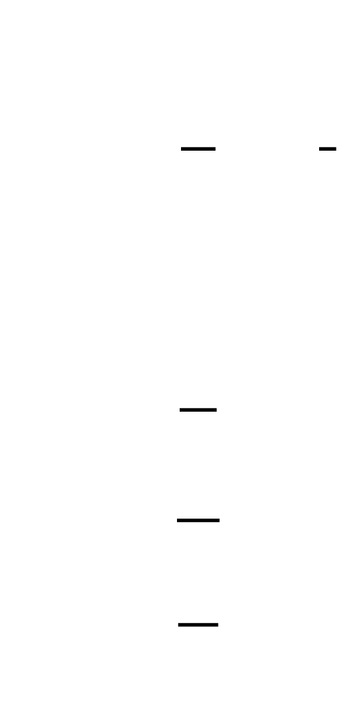

Notice the register allocation strategy: the compiler keeps a monotonically increasing counter (`next_register`) and allocates registers sequentially. This is called **linear scan allocation** — the simplest possible approach. Each intermediate value gets its own register, and registers are never reused within a single compilation.
For `SELECT name, age FROM users WHERE age > 21`:
- Register 1: `name` (loaded by OP_COLUMN)
- Register 2: `age` (loaded by OP_COLUMN)
- Register 3: constant `21` (loaded by OP_INTEGER)
The compiler never clobbers register 1 while computing the WHERE clause because the WHERE clause gets fresh registers (3 and beyond). This eliminates the register clobbering bug that plagues more sophisticated allocators. The cost is using more registers than strictly necessary, but with a 256-register limit and queries that rarely use more than 20, this is a non-issue.

> **🔑 Foundation: Register allocation**
> 
> ## Register Allocation — Mapping Values to Registers
**What it is:** Register allocation is the compiler's process of deciding which intermediate values (variables, temporaries from subexpressions) get stored in which registers at any given point during execution.
The problem is straightforward to state: you have *N* values alive at some point in the program, but only *K* registers. When N > K, some values must be "spilled" — written to memory and reloaded later. The compiler's job is to minimize spilling because memory access is far slower than register access.
The classic approach models this as **graph coloring**: build an "interference graph" where each node is a live value and edges connect values that are alive at the same time (and therefore can't share a register). Coloring this graph with K colors = assigning K registers. If the graph isn't K-colorable, you pick a node to spill.
A simpler approach that works well for VMs with many virtual registers is **linear scan allocation** — walk through the code linearly, track live ranges, and greedily assign registers, spilling the value whose next use is furthest away.
**Why you need this now:** If you're building a register-based VM, your bytecode compiler needs to emit instructions that reference specific registers. That means the compiler must solve the allocation problem: given an expression like `(a + b) * (c - d)`, it must decide that `a + b` goes into `R0`, `c - d` into `R1`, and the multiply reads both. For a VM with a generous number of virtual registers, this is manageable — but you still need a systematic strategy, or complex expressions will silently clobber each other's values.
**Key insight:** Think of register allocation as a **scheduling problem for scarce desk space**. You're working on a desk with K slots. Each task (value) occupies a slot for some duration (its live range). When the desk is full and a new task arrives, you shelve the one you won't need again soonest. That "furthest next use" heuristic is the core of most practical allocators and is often good enough for a VM compiler.

---
## Compiling WHERE Clauses
The WHERE clause is an expression tree that must be evaluated per row. The compiler flattens this tree into a sequence of comparison and conditional jump instructions. The key insight: **instead of computing a boolean result and then branching on it, each comparison directly jumps to "skip this row" if the condition fails.**
This is an optimization called **short-circuit evaluation via jump threading**. For `WHERE age > 21 AND status = 'active'`, if `age > 21` is false, there's no point evaluating `status = 'active'`. The compiler emits a jump that skips the entire row immediately.
```c
// Returns the address of the skip-jump instruction (needs patching)
static int compile_where(Compiler *c, AstNode *expr, int cursor, 
                          int table_idx) {
    return compile_condition(c, expr, cursor, table_idx, /*invert=*/true);
}
// Compile a condition. If invert=true, jump when condition is FALSE.
// Returns the address of the emitted jump (for patching).
static int compile_condition(Compiler *c, AstNode *expr, int cursor,
                              int table_idx, bool invert) {
    if (expr->type == NODE_BINARY_EXPR) {
        // AND: if either side is false, skip
        if (strcmp(expr->data.binary.op_keyword, "AND") == 0) {
            int left_skip = compile_condition(c, expr->data.binary.left, 
                                               cursor, table_idx, true);
            int right_skip = compile_condition(c, expr->data.binary.right, 
                                                cursor, table_idx, true);
            // Both jumps skip to the same target (patched by caller)
            // For now, chain them: both jump forward past ResultRow
            return right_skip;  
            // Note: left_skip also needs patching to same target
        }
        // OR: if either side is true, don't skip
        if (strcmp(expr->data.binary.op_keyword, "OR") == 0) {
            // More complex: need "if left true, skip right check"
            int left_true = compile_condition(c, expr->data.binary.left, 
                                               cursor, table_idx, false);
            int right_skip = compile_condition(c, expr->data.binary.right, 
                                                cursor, table_idx, true);
            // Patch left_true to jump past right evaluation to ResultRow
            // This is where OR short-circuit works
            return right_skip;
        }
        // Comparison operators: =, <, >, <=, >=, !=
        int left_reg = compile_expr_to_register(c, expr->data.binary.left, 
                                                  cursor, table_idx);
        int right_reg = compile_expr_to_register(c, expr->data.binary.right, 
                                                   cursor, table_idx);
        // Emit the appropriate comparison opcode
        // The comparison jumps if the condition IS met (or isn't, based on invert)
        Opcode cmp_op;
        if (invert) {
            // We want to jump when condition is FALSE
            // So invert the comparison: > becomes <=, = becomes !=, etc.
            cmp_op = invert_comparison(expr->data.binary.op);
        } else {
            cmp_op = comparison_to_opcode(expr->data.binary.op);
        }
        int jump_addr = emit(c, cmp_op, left_reg, 0, right_reg, "WHERE check");
        return jump_addr;
    }
    if (expr->type == NODE_UNARY_EXPR) {
        // NOT: invert the sense and recurse
        if (strcmp(expr->data.unary.op_keyword, "NOT") == 0) {
            return compile_condition(c, expr->data.unary.operand, 
                                     cursor, table_idx, !invert);
        }
    }
    // Shouldn't reach here for well-formed WHERE clauses
    return -1;
}
```
The `invert_comparison` function maps each comparison to its logical inverse:
```c
static Opcode invert_comparison(TokenType op) {
    switch (op) {
        case TOK_GT: return OP_LE;   // !(a > b) ≡ a <= b
        case TOK_GE: return OP_LT;   // !(a >= b) ≡ a < b
        case TOK_LT: return OP_GE;   // !(a < b) ≡ a >= b
        case TOK_LE: return OP_GT;   // !(a <= b) ≡ a > b
        case TOK_EQ: return OP_NE;   // !(a = b) ≡ a != b
        case TOK_NE: return OP_EQ;   // !(a != b) ≡ a = b
        default: return OP_NE;       // fallback
    }
}
```
This inversion trick is important. Instead of computing `age > 21` into a boolean register and then branching on it (two instructions), the compiler emits a single `OP_LE` that jumps directly when `age <= 21` (the negation of the desired condition). One instruction instead of two, per row, for the entire scan.
### Compiling Expressions into Registers
Leaf expressions (identifiers, literals) load values into registers. Compound expressions (arithmetic) combine registers:
```c
static int compile_expr_to_register(Compiler *c, AstNode *expr, 
                                     int cursor, int table_idx) {
    switch (expr->type) {
        case NODE_IDENTIFIER: {
            int col_idx = find_column(c, table_idx, expr->data.identifier.name);
            int reg = alloc_register(c);
            emit(c, OP_COLUMN, cursor, col_idx, reg, expr->data.identifier.name);
            return reg;
        }
        case NODE_LITERAL: {
            int reg = alloc_register(c);
            if (expr->data.literal.literal_type == TOK_INTEGER) {
                int val = atoi(expr->data.literal.value);
                emit(c, OP_INTEGER, val, reg, 0, expr->data.literal.value);
            } else if (expr->data.literal.literal_type == TOK_STRING) {
                int str_idx = add_string_constant(c, expr->data.literal.value);
                emit(c, OP_STRING, str_idx, reg, 0, expr->data.literal.value);
            } else if (expr->data.literal.literal_type == TOK_KEYWORD) {
                // NULL
                emit(c, OP_NULL, 0, reg, 0, "NULL");
            }
            return reg;
        }
        case NODE_BINARY_EXPR: {
            // Arithmetic: +, -, *, /
            int left_reg = compile_expr_to_register(c, expr->data.binary.left, 
                                                      cursor, table_idx);
            int right_reg = compile_expr_to_register(c, expr->data.binary.right, 
                                                       cursor, table_idx);
            int result_reg = alloc_register(c);
            Opcode arith;
            switch (expr->data.binary.op) {
                case TOK_PLUS:  arith = OP_ADD;      break;
                case TOK_MINUS: arith = OP_SUBTRACT; break;
                case TOK_STAR:  arith = OP_MULTIPLY; break;
                case TOK_SLASH: arith = OP_DIVIDE;   break;
                default: arith = OP_ADD; break;
            }
            emit(c, arith, left_reg, right_reg, result_reg, "arithmetic");
            return result_reg;
        }
        default:
            return alloc_register(c);  // return an empty register (error case)
    }
}
```
Notice the recursive structure. Compiling `price * quantity + tax` first recurses into `price * quantity` (allocating registers for `price`, `quantity`, and the multiplication result), then recurses into `tax` (allocating one register), and finally emits `OP_ADD` with the multiplication result register and the tax register as inputs. The tree traversal order is post-order (left, right, then operate), which naturally handles nested expressions.
---
## Compiling INSERT
INSERT is simpler than SELECT because there's no loop — you're adding rows, not scanning them.
```c
static void compile_insert(Compiler *c, AstNode *node) {
    int table_idx = find_table(c, node->data.insert.table_name);
    if (table_idx < 0) {
        emit(c, OP_HALT, 1, 0, 0, "error: table not found");
        return;
    }
    int root_page = c->tables[table_idx].root_page;
    int n_cols = c->tables[table_idx].column_count;
    int cursor = alloc_cursor(c);
    int init_addr = emit(c, OP_INIT, 0, 0, 0, "Start");
    int open_addr = emit(c, OP_OPEN_WRITE, cursor, root_page, n_cols,
                          node->data.insert.table_name);
    patch_jump(c, init_addr, open_addr);
    // For each row in VALUES (...)
    for (int row = 0; row < node->data.insert.row_count; row++) {
        // Compile each value expression into a register
        int first_reg = c->next_register;
        int val_count = node->data.insert.values_per_row;
        for (int col = 0; col < val_count; col++) {
            AstNode *val_expr = node->data.insert.value_rows[row][col];
            compile_expr_to_register(c, val_expr, -1, table_idx);
        }
        // Pack values into a record
        int record_reg = alloc_register(c);
        emit(c, OP_MAKE_RECORD, first_reg, val_count, record_reg, "Pack record");
        // Generate rowid (for now, use a simple auto-increment)
        int rowid_reg = alloc_register(c);
        emit(c, OP_ROWID, cursor, rowid_reg, 0, "New rowid");
        // Insert the record
        emit(c, OP_INSERT, cursor, record_reg, rowid_reg, "Insert row");
    }
    emit(c, OP_CLOSE, cursor, 0, 0, "Close cursor");
    emit(c, OP_HALT, 0, 0, 0, "Done");
    c->program->n_registers = c->next_register;
}
```
The `OP_MAKE_RECORD` instruction is where the transition from "values in registers" to "bytes in a B-tree page" begins. It takes a range of registers (p1 through p1+p2-1) and serializes them into a single binary record — the same variable-length format you'll implement in Milestone 5. For now, the VM can use a simple serialization: a type byte followed by the value for each column.
---
## Compiling CREATE TABLE
CREATE TABLE doesn't read or write data rows — it modifies the schema catalog:
```c
static void compile_create_table(Compiler *c, AstNode *node) {
    int init_addr = emit(c, OP_INIT, 0, 0, 0, "Start");
    // Allocate a new B-tree root page
    int root_reg = alloc_register(c);
    int create_addr = emit(c, OP_CREATE_TABLE, root_reg, 0, 0, 
                            "Allocate B-tree root");
    patch_jump(c, init_addr, create_addr);
    // In a full implementation, you would:
    // 1. Open the sqlite_master table
    // 2. Insert a row with (type='table', name=<name>, rootpage=<root_reg>, sql=<original>)
    // 3. Update the in-memory schema cache
    // For now, store schema metadata in the compiler's table list
    // The VM will handle the actual catalog update
    emit(c, OP_HALT, 0, 0, 0, "Done");
    c->program->n_registers = c->next_register;
}
```
The full CREATE TABLE compilation requires writing a row into the system catalog (your equivalent of `sqlite_master`). This is itself an INSERT — you're inserting a schema row. This recursive structure (CREATE TABLE compiles to an INSERT into the catalog table) is a key insight about how databases bootstrap themselves: the schema is stored in a table, and modifying the schema is just a DML operation on that table.
---
## The Virtual Machine
Now for the execution engine. The VM is a **fetch-decode-execute loop** — it reads the next instruction, determines which operation to perform, executes it, and advances to the next instruction.

> **🔑 Foundation: The fetch-decode-execute cycle**
> 
> ## The Fetch-Decode-Execute Cycle
**What it is:** This is the fundamental loop that drives every processor — physical or virtual:
1. **Fetch:** Read the next instruction from memory (pointed to by the program counter / instruction pointer).
2. **Decode:** Figure out what the instruction means — what operation, which operands.
3. **Execute:** Perform the operation (arithmetic, memory access, jump, etc.).
4. Advance the program counter (unless the instruction was a jump) and repeat.
In a physical CPU, this is hardwired in silicon. In a VM, you implement it explicitly — typically as a loop with a switch statement or a function dispatch table:
```python
while True:
    opcode = bytecode[pc]        # FETCH
    match opcode:                 # DECODE + EXECUTE
        case OP_ADD:
            regs[a] = regs[b] + regs[c]
        case OP_JUMP:
            pc = target; continue
        case OP_HALT:
            break
    pc += 1
```
**Why you need this now:** This loop *is* your VM's execution engine. It's the first thing you'll write and the last thing you'll optimize. Every feature — arithmetic, control flow, function calls — plugs into this cycle as a new case in the decode step. Getting the structure right early means every subsequent milestone is just adding new opcodes.
**Key insight:** The cycle is deceptively simple, but its performance characteristics dominate your VM. The single biggest bottleneck in interpreted VMs is the **decode step** — specifically, the branch prediction miss on the switch/dispatch. This is why advanced VMs use techniques like **threaded dispatch** (each instruction handler jumps directly to the next, eliminating the central switch). But start with the simple loop — it's correct, debuggable, and you can optimize the dispatch later without changing your instruction set.

```c
typedef struct {
    // The program being executed
    Program *program;
    int pc;                    // program counter (index into ops array)
    // Register file
    Value registers[MAX_REGISTERS];
    // Cursors (B-tree iterators)
    BTreeCursor *cursors[MAX_CURSORS];
    // Result callback — called for each ResultRow
    void (*result_callback)(Value *row, int col_count, void *ctx);
    void *callback_ctx;
    // Execution state
    bool halted;
    int halt_code;
} VM;
void vm_init(VM *vm, Program *prog) {
    vm->program = prog;
    vm->pc = 0;
    vm->halted = false;
    vm->halt_code = 0;
    memset(vm->registers, 0, sizeof(vm->registers));
    memset(vm->cursors, 0, sizeof(vm->cursors));
}
```
The execution loop:
```c
int vm_execute(VM *vm) {
    while (!vm->halted && vm->pc < vm->program->op_count) {
        VdbeOp *op = &vm->program->ops[vm->pc];
        switch (op->opcode) {
            case OP_INIT: {
                vm->pc = op->p2;
                continue;  // skip the pc++ at the bottom
            }
            case OP_HALT: {
                vm->halted = true;
                vm->halt_code = op->p1;
                return op->p1;
            }
            case OP_GOTO: {
                vm->pc = op->p2;
                continue;
            }
            case OP_OPEN_READ: {
                int cursor_id = op->p1;
                int root_page = op->p2;
                vm->cursors[cursor_id] = btree_cursor_open(root_page, 
                                                            CURSOR_READ);
                break;
            }
            case OP_OPEN_WRITE: {
                int cursor_id = op->p1;
                int root_page = op->p2;
                vm->cursors[cursor_id] = btree_cursor_open(root_page, 
                                                            CURSOR_WRITE);
                break;
            }
            case OP_CLOSE: {
                int cursor_id = op->p1;
                if (vm->cursors[cursor_id]) {
                    btree_cursor_close(vm->cursors[cursor_id]);
                    vm->cursors[cursor_id] = NULL;
                }
                break;
            }
            case OP_REWIND: {
                int cursor_id = op->p1;
                bool empty = btree_cursor_rewind(vm->cursors[cursor_id]);
                if (empty) {
                    vm->pc = op->p2;  // jump to close if table is empty
                    continue;
                }
                break;
            }
            case OP_NEXT: {
                int cursor_id = op->p1;
                bool has_next = btree_cursor_next(vm->cursors[cursor_id]);
                if (has_next) {
                    vm->pc = op->p2;  // jump back to loop start
                    continue;
                }
                // Fall through to next instruction (the Close)
                break;
            }
            case OP_COLUMN: {
                int cursor_id = op->p1;
                int col_idx = op->p2;
                int dest_reg = op->p3;
                btree_cursor_column(vm->cursors[cursor_id], col_idx, 
                                     &vm->registers[dest_reg]);
                break;
            }
            case OP_ROWID: {
                int cursor_id = op->p1;
                int dest_reg = op->p2;
                vm->registers[dest_reg].type = VAL_INTEGER;
                vm->registers[dest_reg].i = 
                    btree_cursor_rowid(vm->cursors[cursor_id]);
                break;
            }
            case OP_RESULT_ROW: {
                int first_reg = op->p1;
                int col_count = op->p2;
                if (vm->result_callback) {
                    vm->result_callback(&vm->registers[first_reg], 
                                        col_count, vm->callback_ctx);
                }
                break;
            }
            case OP_INTEGER: {
                int dest_reg = op->p2;
                vm->registers[dest_reg].type = VAL_INTEGER;
                vm->registers[dest_reg].i = op->p1;
                break;
            }
            case OP_STRING: {
                int str_idx = op->p1;
                int dest_reg = op->p2;
                vm->registers[dest_reg].type = VAL_STRING;
                vm->registers[dest_reg].s.data = vm->program->strings[str_idx];
                vm->registers[dest_reg].s.length = 
                    strlen(vm->program->strings[str_idx]);
                break;
            }
            case OP_NULL: {
                int dest_reg = op->p2;
                vm->registers[dest_reg].type = VAL_NULL;
                break;
            }
            case OP_MAKE_RECORD: {
                int first_reg = op->p1;
                int n_fields = op->p2;
                int dest_reg = op->p3;
                // Serialize registers into a binary record
                serialize_record(&vm->registers[first_reg], n_fields,
                                  &vm->registers[dest_reg]);
                break;
            }
            case OP_INSERT: {
                int cursor_id = op->p1;
                int record_reg = op->p2;
                int key_reg = op->p3;
                btree_cursor_insert(vm->cursors[cursor_id],
                                     vm->registers[key_reg].i,
                                     &vm->registers[record_reg]);
                break;
            }
            // Comparison opcodes — all follow the same pattern
            case OP_EQ: case OP_NE: case OP_LT: 
            case OP_LE: case OP_GT: case OP_GE: {
                int left_reg = op->p1;
                int right_reg = op->p3;
                bool result = compare_values(&vm->registers[left_reg],
                                              &vm->registers[right_reg],
                                              op->opcode);
                if (result) {
                    vm->pc = op->p2;  // jump to target
                    continue;
                }
                break;
            }
            // Arithmetic opcodes
            case OP_ADD: case OP_SUBTRACT: 
            case OP_MULTIPLY: case OP_DIVIDE: {
                Value *a = &vm->registers[op->p1];
                Value *b = &vm->registers[op->p2];
                Value *dest = &vm->registers[op->p3];
                arithmetic_op(a, b, dest, op->opcode);
                break;
            }
            case OP_COPY: case OP_SCOPY: {
                vm->registers[op->p2] = vm->registers[op->p1];
                break;
            }
            default:
                fprintf(stderr, "Unknown opcode: %d\n", op->opcode);
                vm->halted = true;
                return -1;
        }
        vm->pc++;
    }
    return vm->halt_code;
}
```
Study this loop carefully. It's the **entire execution engine**. Every SQL query — no matter how complex — runs through this same switch statement. A `SELECT * FROM t` with 10,000 rows executes OP_REWIND once, then OP_COLUMN + OP_RESULT_ROW + OP_NEXT 10,000 times, then OP_CLOSE + OP_HALT once. The per-iteration cost is: one switch dispatch per opcode, one function call to the B-tree cursor, and one program counter increment. No tree walking, no recursive AST traversal, no pointer chasing through heap-allocated nodes.

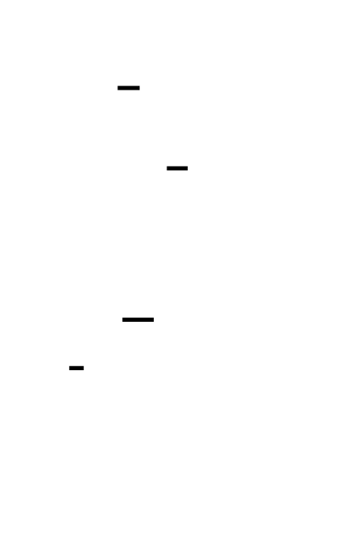

### Value Comparison
The comparison function handles type coercion and NULL semantics:
```c
static bool compare_values(Value *a, Value *b, Opcode op) {
    // NULL comparisons: NULL compared to anything yields NULL (falsy)
    if (a->type == VAL_NULL || b->type == VAL_NULL) {
        // In SQL, NULL = NULL is not true. NULL comparisons always fail.
        // Exception: IS NULL is handled by a separate opcode path
        return false;
    }
    int cmp;
    if (a->type == VAL_INTEGER && b->type == VAL_INTEGER) {
        cmp = (a->i > b->i) - (a->i < b->i);
    } else if (a->type == VAL_REAL || b->type == VAL_REAL) {
        double da = (a->type == VAL_REAL) ? a->r : (double)a->i;
        double db = (b->type == VAL_REAL) ? b->r : (double)b->i;
        cmp = (da > db) - (da < db);
    } else if (a->type == VAL_STRING && b->type == VAL_STRING) {
        cmp = strcmp(a->s.data, b->s.data);
    } else {
        // Mixed types — coerce to string for comparison
        // (SQLite has more nuanced type affinity rules)
        cmp = 0;
    }
    switch (op) {
        case OP_EQ: return cmp == 0;
        case OP_NE: return cmp != 0;
        case OP_LT: return cmp < 0;
        case OP_LE: return cmp <= 0;
        case OP_GT: return cmp > 0;
        case OP_GE: return cmp >= 0;
        default:    return false;
    }
}
```
The NULL handling is crucial. In SQL, `NULL = NULL` evaluates to NULL (which is falsy), not TRUE. This means a WHERE clause like `WHERE x = NULL` matches zero rows — you must use `WHERE x IS NULL` instead. Your comparison function returns `false` for any comparison involving NULL, which correctly implements this three-valued logic behavior. The `IS NULL` check requires a separate opcode or a special case in the compiler (checking `value.type == VAL_NULL` directly, without going through the comparison function).
---
## The EXPLAIN Command
EXPLAIN is your debugger. It shows the compiled bytecode for any SQL statement without executing it. This is invaluable during development — when a query returns wrong results, EXPLAIN lets you inspect the bytecode to see if the compilation is correct.
```c
void explain_program(Program *prog) {
    printf("addr  opcode         p1    p2    p3    comment\n");
    printf("----  -------------  ----  ----  ----  -------\n");
    for (int i = 0; i < prog->op_count; i++) {
        VdbeOp *op = &prog->ops[i];
        printf("%-4d  %-13s  %-4d  %-4d  %-4d  %s\n",
               i,
               opcode_name(op->opcode),
               op->p1, op->p2, op->p3,
               op->comment ? op->comment : "");
    }
}
static const char* opcode_name(Opcode op) {
    switch (op) {
        case OP_INIT:        return "Init";
        case OP_HALT:        return "Halt";
        case OP_GOTO:        return "Goto";
        case OP_OPEN_READ:   return "OpenRead";
        case OP_OPEN_WRITE:  return "OpenWrite";
        case OP_CLOSE:       return "Close";
        case OP_REWIND:      return "Rewind";
        case OP_NEXT:        return "Next";
        case OP_COLUMN:      return "Column";
        case OP_ROWID:       return "Rowid";
        case OP_RESULT_ROW:  return "ResultRow";
        case OP_MAKE_RECORD: return "MakeRecord";
        case OP_INSERT:      return "Insert";
        case OP_INTEGER:     return "Integer";
        case OP_STRING:      return "String8";
        case OP_NULL:        return "Null";
        case OP_EQ:          return "Eq";
        case OP_NE:          return "Ne";
        case OP_LT:          return "Lt";
        case OP_LE:          return "Le";
        case OP_GT:          return "Gt";
        case OP_GE:          return "Ge";
        case OP_ADD:         return "Add";
        case OP_SUBTRACT:    return "Subtract";
        case OP_MULTIPLY:    return "Multiply";
        case OP_DIVIDE:      return "Divide";
        case OP_COPY:        return "Copy";
        case OP_SCOPY:       return "SCopy";
        case OP_CREATE_TABLE:return "CreateTable";
        default:             return "???";
    }
}
```


Here's what EXPLAIN shows for `SELECT name, age FROM users WHERE age > 21`:
```
addr  opcode         p1    p2    p3    comment
----  -------------  ----  ----  ----  -------
0     Init           0     1     0     Start
1     OpenRead       0     2     3     users
2     Rewind         0     8     0     Rewind; jump if empty
3     Column         0     0     1     name
4     Column         0     1     2     age
5     Integer        21    3     0     21
6     Le             2     7     3     WHERE check
7     ResultRow      1     2     0     Output row
8     Next           0     3     0     Advance; loop
9     Close          0     0     0     Close cursor
10    Halt           0     0     0     Done
```
Read this line by line:
- **Addr 0**: Jump to instruction 1 (the Init opcode sets up the PC).
- **Addr 1**: Open cursor 0 on the B-tree rooted at page 2 (the `users` table), which has 3 columns.
- **Addr 2**: Rewind cursor 0 to the first row. If the table is empty, jump to addr 8 (Close).
- **Addr 3-4**: Load columns 0 (`name`) and 1 (`age`) from the current cursor position into registers 1 and 2.
- **Addr 5**: Load the constant 21 into register 3.
- **Addr 6**: If register 2 (age) ≤ register 3 (21), jump to addr 7 (Next) — skipping ResultRow. This is the inverted comparison: the original `age > 21` becomes `LE` (jump if ≤) to skip rows that *don't* match.
- **Addr 7**: Output registers 1-2 as a result row.
- **Addr 8**: Advance cursor 0. If there's another row, jump back to addr 3. Otherwise fall through.
- **Addr 9-10**: Clean up and halt.
Wait — there's a subtle bug in the example above. Addr 6 jumps to addr 7, but addr 7 is ResultRow. The skip should jump to addr 8 (Next), bypassing ResultRow. Let me correct:
```
addr  opcode         p1    p2    p3    comment
----  -------------  ----  ----  ----  -------
0     Init           0     1     0     Start
1     OpenRead       0     2     3     users
2     Rewind         0     9     0     Rewind; jump if empty
3     Column         0     0     1     name
4     Column         0     1     2     age
5     Integer        21    3     0     21
6     Le             2     8     3     WHERE: skip if age <= 21
7     ResultRow      1     2     0     Output row
8     Next           0     3     0     Advance; loop back to addr 3
9     Close          0     0     0     Close cursor
10    Halt           0     0     0     Done
```
Now addr 6's jump target (p2=8) correctly points to OP_NEXT, skipping ResultRow for rows that fail the WHERE condition. This is the kind of off-by-one error that EXPLAIN helps you catch immediately.
---
## Integrating the Full Pipeline
The complete flow from SQL string to results:
```c
void execute_sql(const char *sql, Database *db) {
    // 1. Tokenize
    Lexer lex;
    lexer_init(&lex, sql);
    Token tokens[1024];
    int count = lexer_tokenize_all(&lex, tokens, 1024);
    // 2. Parse
    Parser parser;
    parser_init(&parser, tokens, count);
    AstNode *ast = parser_parse(&parser);
    if (parser.had_error) {
        fprintf(stderr, "Parse error: %s\n", parser.error_msg);
        return;
    }
    // Check for EXPLAIN
    bool is_explain = false;
    // (handle EXPLAIN flag from parser)
    // 3. Compile
    Program prog = {0};
    Compiler compiler;
    compiler_init(&compiler, &prog);
    compiler.tables = db->schema;      // connect to schema catalog
    compiler.table_count = db->table_count;
    compile_statement(&compiler, ast);
    if (is_explain) {
        // 4a. Just print the bytecode
        explain_program(&prog);
    } else {
        // 4b. Execute
        VM vm;
        vm_init(&vm, &prog);
        vm.result_callback = print_result_row;
        vm_execute(&vm);
    }
    ast_free(ast);
    program_free(&prog);
}
```
---
## Cursor Abstraction: The Iterator Interface
The opcodes `OP_OPEN_READ`, `OP_REWIND`, `OP_NEXT`, `OP_COLUMN`, and `OP_CLOSE` define an **iterator interface** over B-tree data. This is the **Cursor pattern** — the same Iterator pattern from object-oriented design, applied to database storage.
The cursor abstraction is the boundary between the VM and the storage engine. The VM says "give me the next row" (OP_NEXT); it doesn't know or care whether the underlying storage is a B-tree, an LSM-tree, a flat file, or a network connection to a remote server. This decoupling means you can build and test the VM entirely with an in-memory mock storage layer, then later swap in the real B-tree implementation (Milestone 5) without changing a single line of VM code.
Here's the cursor interface the VM expects:
```c
typedef struct BTreeCursor BTreeCursor;
// Open a cursor on the B-tree rooted at root_page
BTreeCursor* btree_cursor_open(int root_page, int mode);
// Move to the first row. Returns true if table is empty.
bool btree_cursor_rewind(BTreeCursor *cur);
// Move to the next row. Returns true if there are more rows.
bool btree_cursor_next(BTreeCursor *cur);
// Read column col_idx from current row into dest
void btree_cursor_column(BTreeCursor *cur, int col_idx, Value *dest);
// Read the rowid of the current row
int64_t btree_cursor_rowid(BTreeCursor *cur);
// Insert a record with the given key
void btree_cursor_insert(BTreeCursor *cur, int64_t key, Value *record);
// Close the cursor and release resources
void btree_cursor_close(BTreeCursor *cur);
```
For this milestone, implement a **mock cursor** backed by an in-memory array of rows. This lets you test the entire compiler and VM without needing the B-tree or buffer pool:
```c
typedef struct {
    Value **rows;       // array of rows, each row is an array of Values
    int row_count;
    int col_count;
    int position;       // current row index (-1 = before first)
} MockBTreeCursor;
BTreeCursor* mock_cursor_open(Value **data, int rows, int cols) {
    MockBTreeCursor *cur = calloc(1, sizeof(MockBTreeCursor));
    cur->rows = data;
    cur->row_count = rows;
    cur->col_count = cols;
    cur->position = -1;
    return (BTreeCursor*)cur;
}
bool mock_cursor_rewind(BTreeCursor *raw) {
    MockBTreeCursor *cur = (MockBTreeCursor*)raw;
    cur->position = 0;
    return cur->row_count == 0;
}
bool mock_cursor_next(BTreeCursor *raw) {
    MockBTreeCursor *cur = (MockBTreeCursor*)raw;
    cur->position++;
    return cur->position < cur->row_count;
}
void mock_cursor_column(BTreeCursor *raw, int col_idx, Value *dest) {
    MockBTreeCursor *cur = (MockBTreeCursor*)raw;
    *dest = cur->rows[cur->position][col_idx];
}
```
This mock-then-replace strategy is a powerful development pattern. You validate the compiler's output and the VM's logic against simple, controllable data before introducing the complexity of page-based storage. If EXPLAIN shows correct bytecode and the VM produces correct results with mock data, then any bugs you encounter after integrating the B-tree are storage bugs, not compiler or VM bugs. You've isolated the failure domain.
---
## Performance: The 10,000-Row Benchmark
Your acceptance criteria require `SELECT * FROM t` on 10,000 rows to complete in under 100ms. Let's verify this is achievable.
The bytecode for `SELECT * FROM t` (assuming 3 columns) is roughly 6 instructions per iteration: 3× OP_COLUMN, 1× OP_RESULT_ROW, 1× OP_NEXT, plus the switch dispatch overhead. At ~5ns per switch dispatch (a conservative estimate on modern hardware), that's ~30ns per row for VM overhead alone.
For 10,000 rows: 30ns × 10,000 = 300μs = 0.3ms.
Even if you add the mock cursor overhead (array indexing, value copying), you're well under 1ms. The 100ms budget is generous — it accounts for the eventual B-tree cursor, buffer pool lookups, and possible disk I/O. For this milestone with in-memory mock data, you should see sub-millisecond execution.
To measure:
```c
#include <time.h>
void benchmark_select_star(void) {
    // Create a mock table with 10,000 rows, 3 columns each
    int n_rows = 10000;
    int n_cols = 3;
    Value **rows = malloc(n_rows * sizeof(Value*));
    for (int i = 0; i < n_rows; i++) {
        rows[i] = malloc(n_cols * sizeof(Value));
        rows[i][0].type = VAL_INTEGER;
        rows[i][0].i = i;                    // id
        rows[i][1].type = VAL_STRING;
        rows[i][1].s.data = "test_user";
        rows[i][1].s.length = 9;             // name
        rows[i][2].type = VAL_INTEGER;
        rows[i][2].i = 20 + (i % 50);        // age
    }
    // Compile SELECT * FROM t
    // ... (set up compiler with mock schema) ...
    // Execute and time
    struct timespec start, end;
    clock_gettime(CLOCK_MONOTONIC, &start);
    VM vm;
    vm_init(&vm, &prog);
    vm.result_callback = null_callback;  // discard results for benchmarking
    vm_execute(&vm);
    clock_gettime(CLOCK_MONOTONIC, &end);
    double ms = (end.tv_sec - start.tv_sec) * 1000.0 + 
                (end.tv_nsec - start.tv_nsec) / 1e6;
    printf("10,000-row SELECT *: %.2f ms\n", ms);
    assert(ms < 100.0);
}
```
---
## Three-Level View: What Happens When You Execute a Query
**Level 1 — Public API**: You call `execute_sql("SELECT name FROM users WHERE age > 21", db)`. Results stream back through a callback, one row at a time.
**Level 2 — VDBE Engine**: The compiler walks the AST once and emits ~10 bytecode instructions. The VM enters its fetch-decode-execute loop. OP_OPEN_READ opens a cursor. OP_REWIND positions it at the first row. Each iteration: OP_COLUMN loads `name` and `age` into registers, OP_INTEGER loads 21, OP_LE checks the condition and jumps past OP_RESULT_ROW if it fails, OP_NEXT advances the cursor and loops. OP_CLOSE and OP_HALT clean up.
**Level 3 — Storage (stubbed for now)**: OP_COLUMN calls `btree_cursor_column()`, which (in the mock) is an array index lookup — O(1), ~1ns. In the real implementation (Milestone 5), this will deserialize a variable-length record from a 4096-byte page, which involves reading a cell pointer, jumping to the cell offset, and decoding a varint-encoded record header. OP_NEXT will follow a pointer to the next cell in the page, or to the next leaf page if the current page is exhausted. Each page access goes through the buffer pool (Milestone 4), which may trigger an LRU eviction and a disk read if the page isn't cached. The VM doesn't know any of this — it just calls `btree_cursor_next()` and gets a boolean back.
---
## Knowledge Cascade: What the VDBE Unlocks
**→ Virtual Machines Everywhere**: The fetch-decode-execute loop you just built is the same pattern used by the JVM (Java bytecode), CPython (Python bytecode), Lua (Lua bytecode), WebAssembly (wasm), and the Ethereum Virtual Machine (EVM). Every one of these maintains a program counter, decodes instructions from a flat array, and dispatches to handler functions. If you understand the VDBE, you understand the core of every language runtime. The difference is in the instruction set — the JVM has opcodes for object allocation and method dispatch; the VDBE has opcodes for cursor movement and record serialization — but the execution model is identical.
**→ Register Allocation and Compiler Backends**: Your simple "increment a counter" register allocation works here because query bytecode programs are short (rarely >100 instructions) and register pressure is low. Real compilers (GCC, LLVM) face programs with thousands of live variables competing for ~16 hardware registers. They use **graph coloring** — building an interference graph where edges connect simultaneously-live variables, then coloring the graph with the number of available registers. Variables that can't be colored "spill" to memory (the stack). Your VDBE sidesteps this entirely by having 256 virtual registers — no spilling needed. But the core problem is the same: deciding which intermediate value lives where.
**→ The Cursor as Iterator Pattern**: The OP_OPEN_READ / OP_REWIND / OP_NEXT / OP_COLUMN / OP_CLOSE sequence implements the GoF **Iterator pattern** in bytecode form. This same pattern appears in Java's `Iterator<T>` interface (`hasNext()` / `next()`), Python's `__iter__` / `__next__` protocol, and Rust's `Iterator` trait. In databases, cursors are fundamental — a join is two cursors nested; a sort is a cursor over sorted output; an aggregate is a cursor that accumulates values. Every query plan is a tree of cursors.
**→ EXPLAIN as Disassembly**: Your EXPLAIN command is the database equivalent of `objdump -d` (disassembling machine code) or `javap -c` (disassembling Java bytecode). The principle is the same: making the machine's actual execution plan human-readable for debugging. PostgreSQL's `EXPLAIN ANALYZE` goes further — it executes the plan and reports actual timing per operation, like a profiler (`perf`) for queries. This is the foundational insight of **observability**: systems that expose their internal execution are easier to debug, optimize, and trust.
**→ The Frontend/Backend Split**: Your tokenizer, parser, and compiler form the **frontend**. Your VM and cursor interface form the **backend**. The bytecode is the **intermediate representation** (IR) that connects them. This is the universal compiler architecture: GCC has a C frontend and an x86 backend connected by GIMPLE IR; LLVM has frontends for C/C++/Rust/Swift and backends for x86/ARM/RISC-V connected by LLVM IR. Your VDBE bytecode is your IR. When you later add JOIN support or subqueries, you modify only the compiler (emitting new opcode patterns) — the VM is unchanged, as long as the opcodes already exist.
---
## System Awareness
You've built the VDBE — the execution engine at the heart of your database. It connects to the **parser** (upstream, Milestone 2) via AST consumption and to the **B-tree storage engine** (downstream, Milestones 4-5) via the cursor interface. Currently, the cursor is a mock backed by in-memory arrays. In the next two milestones, you'll replace that mock with a buffer pool managing 4096-byte pages (Milestone 4) and a B-tree that stores rows in those pages (Milestone 5).
Without the VDBE, you have a parser that produces beautiful ASTs that nobody executes. With it, your database can actually answer queries — tokenize SQL, parse it, compile it to bytecode, and run it against data. EXPLAIN gives you a window into the machine's mind. And the cursor abstraction means the VM will work identically whether data comes from an in-memory array, a B-tree on disk, or (eventually) an index scan that skips 99% of rows.
---
<!-- END_MS -->


<!-- MS_ID: build-sqlite-m4 -->
<!-- MS_ID: build-sqlite-m4 -->
# Milestone 4: Buffer Pool Manager
## Where We Are in the System
In Milestone 3, you built a virtual machine that executes bytecode. Every `OP_COLUMN`, `OP_NEXT`, and `OP_INSERT` instruction calls through a cursor interface — `btree_cursor_column()`, `btree_cursor_next()`, `btree_cursor_insert()`. You stubbed that interface with a mock backed by in-memory arrays. Now you build the layer that sits directly beneath the B-tree: the **buffer pool manager**.


The buffer pool is the boundary between memory and disk. The B-tree layer (Milestone 5) will think in terms of *pages* — fixed-size blocks of bytes, each identified by a page number. It will say "give me page 42" and expect to get a pointer to 4096 bytes of data. Whether those bytes are already in RAM or need to be loaded from disk is the buffer pool's problem. The B-tree never calls `read()` or `write()` directly. It never manages memory allocation for page data. It asks the buffer pool for pages, reads or modifies them, and tells the buffer pool when it's done.


This is the same architectural role that a CPU cache plays between the processor and main memory, or that a CDN plays between users and origin servers. The buffer pool is a **cache** — but one with responsibilities no general-purpose cache has. It must track which pages have been modified (dirty tracking), prevent eviction of pages in active use (pin counting), and flush dirty pages in the correct order for crash safety (write ordering). These responsibilities are why every serious database — SQLite, PostgreSQL, MySQL, Oracle — manages its own buffer pool rather than relying on the operating system.
---
## The Revelation: Why Not Just Use `mmap`?
You might think: the operating system already caches file pages in memory. When you `read()` a file, the kernel loads the data into the **OS page cache** — a kernel-managed LRU cache of recently-accessed disk pages. When you `mmap()` a file, the OS maps file pages directly into your process's virtual address space, and page faults trigger on-demand loading. The OS handles caching, eviction, and write-back. Why build your own?
This is a reasonable intuition, and it's wrong for databases. Here's why.
**Problem 1: No eviction control.** The OS page cache uses a general-purpose LRU (actually a variant called "two-list LRU" or "CLOCK" on Linux). It has no idea which pages your database *needs* to keep. If the OS is under memory pressure — another process allocates a large buffer, or the kernel needs memory for its own structures — it will evict your hot database pages. You have no say in the matter. With your own buffer pool, you control exactly which pages stay resident.
**Problem 2: No pin counting.** A B-tree traversal may follow a chain of pages: root → internal → internal → leaf. While traversing, all four pages must remain in memory — if the root page gets evicted while you're halfway through the traversal, you'll read garbage or crash. `mmap` provides no mechanism to say "don't evict this page right now." Your buffer pool provides **pin counting**: a page's pin count is incremented when someone is using it and decremented when they're done. Pinned pages are never evicted.
**Problem 3: No dirty tracking.** When you modify a page through `mmap`, the kernel marks it dirty in its own page tables — but you have no way to query "which of my pages are dirty?" or to control *when* dirty pages are written back. The kernel will flush them at its convenience, possibly in any order. For crash safety, you need to flush the rollback journal (or WAL) *before* any dirty data pages — this is the **write-ahead logging** protocol (Milestone 9). `mmap` gives you no control over flush ordering.
**Problem 4: No write ordering.** This is the killer. With `mmap`, calling `msync()` flushes dirty pages, but you can't control which pages get flushed first. If the OS writes a dirty data page to the database file before your journal entry is on disk, and then the system crashes, you've lost the ability to recover. Your buffer pool ensures that `FlushAll` writes pages in the correct order, and that individual dirty pages are only written back through controlled paths.
LMDB (Lightning Memory-Mapped Database) does use `mmap` successfully, but it accepts significant constraints: it uses copy-on-write semantics (never modifying pages in place), requires the entire database to fit in virtual address space, and relies on the OS for all caching decisions. These are real tradeoffs, not free lunches.


The buffer pool gives you a **controlled cache** with four guarantees no OS-level mechanism provides: you choose what stays (eviction policy), you prevent premature removal (pin counting), you know what changed (dirty tracking), and you control write order (flush protocol).
---
## The Core Data Structures
The buffer pool manages a fixed number of **frames** — slots in memory that can each hold one page. Each frame is a contiguous 4096-byte buffer plus metadata about which page it currently holds:
```c
#include <stdint.h>
#include <stdbool.h>
#include <string.h>
#include <stdio.h>
#include <stdlib.h>
#include <unistd.h>
#include <fcntl.h>
#include <errno.h>
#define DEFAULT_PAGE_SIZE 4096
#define DEFAULT_POOL_SIZE 1000
typedef uint32_t page_id_t;
#define INVALID_PAGE_ID ((page_id_t)-1)
typedef struct {
    page_id_t page_id;      // which page is stored here (INVALID if empty)
    uint8_t  *data;          // pointer to PAGE_SIZE bytes of page data
    bool      is_dirty;      // has this page been modified since loading?
    int       pin_count;     // number of active users of this page
    // LRU tracking (doubly-linked list pointers)
    int       lru_prev;      // index of previous frame in LRU list (-1 = head)
    int       lru_next;      // index of next frame in LRU list (-1 = tail)
} Frame;
```
The buffer pool itself:
```c
typedef struct {
    // Configuration
    int       page_size;     // bytes per page (default 4096)
    int       pool_size;     // number of frames
    // Storage
    Frame    *frames;        // array of pool_size frames
    int       fd;            // file descriptor for the database file
    // Page-to-frame mapping: hash table for O(1) lookup
    int      *page_table;    // hash table: page_id → frame index
    int       page_table_size; // size of hash table (prime, > pool_size)
    // LRU list (doubly-linked through frame indices)
    int       lru_head;      // most recently used (front)
    int       lru_tail;      // least recently used (back) — evict from here
    // Free list
    int      *free_list;     // stack of unused frame indices
    int       free_count;    // number of free frames
    // Statistics
    uint64_t  hits;          // page found in pool
    uint64_t  misses;        // page loaded from disk
    uint64_t  evictions;     // pages evicted
    uint64_t  dirty_writes;  // dirty pages written back
} BufferPool;
```
Three data structures deserve detailed attention: the **page table** (hash map), the **LRU list** (doubly-linked list), and the **free list** (stack).
**The page table** maps page IDs to frame indices. When the B-tree requests page 42, the buffer pool needs to know instantly whether page 42 is already in a frame. A hash table gives O(1) average-case lookup. The simplest approach is **open addressing with linear probing** — a flat array where the hash of the page ID gives the starting index, and collisions are resolved by scanning forward:
```c
#define EMPTY_SLOT (-1)
static int page_table_lookup(BufferPool *pool, page_id_t page_id) {
    int idx = page_id % pool->page_table_size;
    for (int i = 0; i < pool->page_table_size; i++) {
        int slot = (idx + i) % pool->page_table_size;
        if (pool->page_table[slot] == EMPTY_SLOT) {
            return -1;  // not found
        }
        if (pool->frames[pool->page_table[slot]].page_id == page_id) {
            return pool->page_table[slot];  // found: return frame index
        }
    }
    return -1;  // table full (shouldn't happen if sized correctly)
}
static void page_table_insert(BufferPool *pool, page_id_t page_id, 
                                int frame_idx) {
    int idx = page_id % pool->page_table_size;
    for (int i = 0; i < pool->page_table_size; i++) {
        int slot = (idx + i) % pool->page_table_size;
        if (pool->page_table[slot] == EMPTY_SLOT) {
            pool->page_table[slot] = frame_idx;
            return;
        }
    }
    // Should never reach here — table is sized larger than pool
}
static void page_table_remove(BufferPool *pool, page_id_t page_id) {
    int idx = page_id % pool->page_table_size;
    for (int i = 0; i < pool->page_table_size; i++) {
        int slot = (idx + i) % pool->page_table_size;
        if (pool->page_table[slot] == EMPTY_SLOT) return;
        if (pool->frames[pool->page_table[slot]].page_id == page_id) {
            pool->page_table[slot] = EMPTY_SLOT;
            // Rehash subsequent entries to fix probing chain
            // (omitted for clarity — needed in production)
            return;
        }
    }
}
```
The page table size should be a prime number at least 2× the pool size to keep load factor below 0.5, ensuring fast lookups even with collisions.
**The LRU list** is a doubly-linked list threaded *through* the frame array. Rather than allocating separate linked-list nodes, each frame has `lru_prev` and `lru_next` fields that store frame indices. The head of the list is the most recently used page; the tail is the least recently used. When a page is accessed, it moves to the head. When a page must be evicted, we scan from the tail backward, looking for the first unpinned frame.
**The free list** is a simple stack of frame indices that have never been used (or have been freed). On startup, all frame indices are on the free list. As pages are loaded, frames come off the free list. Once the free list is empty, eviction is needed.
---
## Initialization
```c
BufferPool* buffer_pool_create(const char *db_path, int pool_size, 
                                int page_size) {
    BufferPool *pool = calloc(1, sizeof(BufferPool));
    pool->page_size = page_size > 0 ? page_size : DEFAULT_PAGE_SIZE;
    pool->pool_size = pool_size > 0 ? pool_size : DEFAULT_POOL_SIZE;
    // Open database file (create if not exists)
    pool->fd = open(db_path, O_RDWR | O_CREAT, 0644);
    if (pool->fd < 0) {
        fprintf(stderr, "Failed to open database file: %s\n", strerror(errno));
        free(pool);
        return NULL;
    }
    // Allocate frames
    pool->frames = calloc(pool->pool_size, sizeof(Frame));
    // Allocate one contiguous block for all page data
    uint8_t *data_block = aligned_alloc(pool->page_size, 
                                         pool->pool_size * pool->page_size);
    for (int i = 0; i < pool->pool_size; i++) {
        pool->frames[i].page_id = INVALID_PAGE_ID;
        pool->frames[i].data = data_block + (i * pool->page_size);
        pool->frames[i].is_dirty = false;
        pool->frames[i].pin_count = 0;
        pool->frames[i].lru_prev = -1;
        pool->frames[i].lru_next = -1;
    }
    // Initialize page table (prime size > 2 * pool_size)
    pool->page_table_size = next_prime(pool->pool_size * 2 + 1);
    pool->page_table = malloc(pool->page_table_size * sizeof(int));
    for (int i = 0; i < pool->page_table_size; i++) {
        pool->page_table[i] = EMPTY_SLOT;
    }
    // Initialize free list (all frames are free)
    pool->free_list = malloc(pool->pool_size * sizeof(int));
    pool->free_count = pool->pool_size;
    for (int i = 0; i < pool->pool_size; i++) {
        pool->free_list[i] = i;
    }
    // LRU starts empty
    pool->lru_head = -1;
    pool->lru_tail = -1;
    // Statistics
    pool->hits = 0;
    pool->misses = 0;
    pool->evictions = 0;
    pool->dirty_writes = 0;
    return pool;
}
```
Notice the `aligned_alloc` call for page data. Allocating one contiguous block aligned to the page size has two benefits. First, all page data occupies a single memory region, which is cache-friendly — the CPU's hardware prefetcher handles sequential access patterns well. Second, page-aligned buffers enable **direct I/O** (`O_DIRECT`) in the future, which bypasses the OS page cache entirely and gives your buffer pool full control over caching. Direct I/O requires buffers aligned to the filesystem's block size (typically 512 or 4096 bytes).
---
## FetchPage: The Central Operation
`FetchPage` is the buffer pool's core API. The B-tree calls it to get a pointer to a page's data. The buffer pool either returns the page from its cache (a **hit**) or loads it from disk (a **miss**), potentially evicting another page to make room.


```c
// Returns a pointer to the page data, or NULL on error.
// The page is PINNED on return — caller must call unpin_page() when done.
uint8_t* fetch_page(BufferPool *pool, page_id_t page_id) {
    // Step 1: Check if page is already in the pool
    int frame_idx = page_table_lookup(pool, page_id);
    if (frame_idx >= 0) {
        // HIT: page is already in memory
        pool->hits++;
        Frame *frame = &pool->frames[frame_idx];
        frame->pin_count++;
        // Move to front of LRU (most recently used)
        lru_move_to_front(pool, frame_idx);
        return frame->data;
    }
    // MISS: page is not in memory — need a free frame
    pool->misses++;
    frame_idx = get_free_frame(pool);
    if (frame_idx < 0) {
        // No free frames and no evictable pages
        fprintf(stderr, "Buffer pool exhausted: all pages are pinned\n");
        return NULL;
    }
    // Step 2: Load page from disk into the frame
    Frame *frame = &pool->frames[frame_idx];
    frame->page_id = page_id;
    frame->is_dirty = false;
    frame->pin_count = 1;
    disk_read_page(pool, page_id, frame->data);
    // Step 3: Register in page table and LRU
    page_table_insert(pool, page_id, frame_idx);
    lru_push_front(pool, frame_idx);
    return frame->data;
}
```
The function's contract is critical: **the returned page is pinned**. The caller holds a "lease" on this page — the buffer pool will not evict it until the caller calls `unpin_page()`. This is the **pin/unpin protocol**, and violating it causes either data corruption (evicting a page someone is reading) or deadlock (never unpinning, exhausting the pool).
### Disk I/O
Reading and writing pages uses `pread` and `pwrite` — POSIX functions that perform I/O at a specific file offset without changing the file descriptor's position. This is essential for a multi-threaded database where multiple cursors might be reading different pages concurrently:
```c
static void disk_read_page(BufferPool *pool, page_id_t page_id, 
                            uint8_t *dest) {
    off_t offset = (off_t)page_id * pool->page_size;
    ssize_t bytes = pread(pool->fd, dest, pool->page_size, offset);
    if (bytes < pool->page_size) {
        // Page doesn't exist on disk yet (new page) — zero-fill
        if (bytes < 0) bytes = 0;
        memset(dest + bytes, 0, pool->page_size - bytes);
    }
}
static void disk_write_page(BufferPool *pool, page_id_t page_id, 
                              uint8_t *src) {
    off_t offset = (off_t)page_id * pool->page_size;
    ssize_t bytes = pwrite(pool->fd, src, pool->page_size, offset);
    if (bytes != pool->page_size) {
        fprintf(stderr, "Failed to write page %u: %s\n", 
                page_id, strerror(errno));
    }
    pool->dirty_writes++;
}
```
The zero-fill for new pages is important. When the B-tree creates a new page (for a node split, or for a new table's root page), it calls `fetch_page` with a page ID that doesn't exist on disk yet. Rather than returning an error, the buffer pool returns a zero-filled frame. The B-tree layer will immediately write its page header and initial structure into this buffer, and the next `FlushAll` or eviction will write it to disk.
---
## Pin and Unpin: The Lease Protocol

> **🔑 Foundation: LRU cache eviction strategy**
> 
> ## LRU Cache Eviction Strategy
**What it is:** LRU (Least Recently Used) is a cache replacement policy that, when the cache is full and a new entry needs space, evicts the entry that hasn't been accessed for the longest time. The core assumption: if you haven't touched something recently, you're less likely to need it soon.
**Why you need it now:** Your database's buffer pool holds a fixed number of pages in memory. When a query needs a page that isn't cached, you must load it from disk — but if the pool is full, something has to go. LRU gives you a principled, efficient way to decide *what* to discard. Without an eviction strategy, you'd either run out of memory or evict pages you're about to need again (causing expensive extra disk reads).
**Key mental model:** Picture a stack of plates. Every time you use a plate, you pull it out and put it on top. When you need to get rid of one, you always take from the bottom — that's the plate nobody has touched in the longest time. In implementation terms, this is a **doubly-linked list + hash map** combo: the linked list tracks access order (O(1) move-to-front on access), and the hash map gives you O(1) lookup by page ID. On eviction, you pop the tail.
```
Access page A → [A]
Access page B → [B, A]
Access page A → [A, B]        ← A moves to front
Access page C → [C, A, B]
Cache full, need page D:
  Evict B (tail) → [D, C, A]
```
One practical wrinkle: if an evicted page has been modified ("dirty"), you must write it back to disk *before* reclaiming that slot — which connects directly to durability concerns.

Pin counting is **reference counting** applied to cached pages. The concept is identical to `std::shared_ptr` in C++, `Arc<T>` in Rust, or reference counting in Python's garbage collector. Each time someone acquires a reference to a page, the count increments. Each time they release it, the count decrements. When the count reaches zero, the page is eligible for eviction (though it's not evicted immediately — it stays in the cache for future hits).
```c
void unpin_page(BufferPool *pool, page_id_t page_id, bool is_dirty) {
    int frame_idx = page_table_lookup(pool, page_id);
    if (frame_idx < 0) {
        fprintf(stderr, "unpin_page: page %u not in buffer pool\n", page_id);
        return;
    }
    Frame *frame = &pool->frames[frame_idx];
    if (frame->pin_count <= 0) {
        fprintf(stderr, "unpin_page: page %u pin count already 0\n", page_id);
        return;
    }
    frame->pin_count--;
    // If the caller modified the page, mark it dirty
    if (is_dirty) {
        frame->is_dirty = true;
    }
}
```
The `is_dirty` parameter is crucial. The caller tells the buffer pool whether it modified the page's data. This is how the buffer pool knows which pages need to be written back to disk. The B-tree calls `unpin_page(pool, page_id, true)` after modifying a page (e.g., inserting a row), and `unpin_page(pool, page_id, false)` after only reading it.

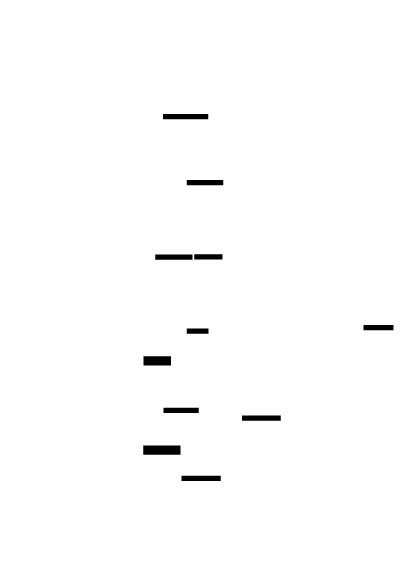

This is **write-back caching** — modifications accumulate in memory and are written to disk lazily (on eviction or explicit flush). The alternative is **write-through caching**, where every modification is immediately written to disk. Write-through is simpler (no dirty tracking needed) but dramatically slower — every `INSERT` would require a synchronous disk write, costing ~10ms on spinning disk or ~100μs on SSD. Write-back batches these writes, amortizing the I/O cost across many modifications. CPU caches use both strategies depending on the cache coherence protocol; L1 caches are typically write-back for performance, while I/O-mapped device memory uses write-through for correctness.
### The Pin Count Invariant
There is one invariant that must never be violated:
> **A page with pin_count > 0 must never be evicted.**
If this invariant breaks, the B-tree holds a pointer to a frame whose contents have been replaced with a different page. It reads data from page 42 but gets page 117's bytes. The result is silent data corruption — the most dangerous kind of bug because it may not manifest until much later when the corrupted data is read by a different query.
Enforce this invariant in the eviction function. Never "trust" callers to unpin correctly — always check.
---
## LRU Eviction
When `FetchPage` encounters a miss and the free list is empty, it must **evict** an existing page to make room. The eviction policy determines which page is sacrificed.

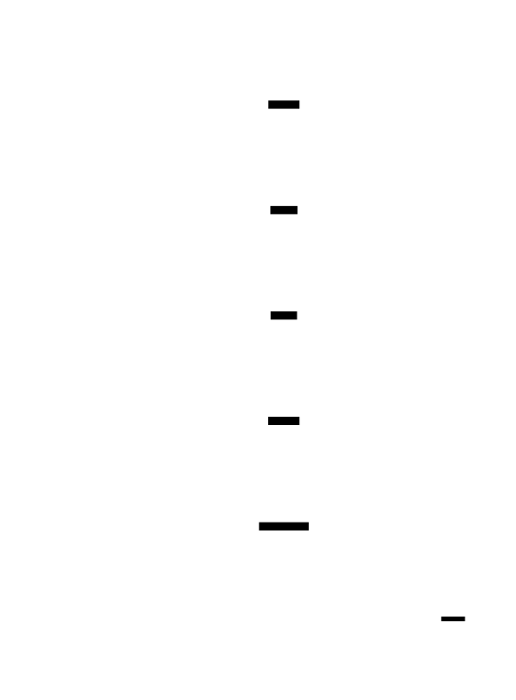

**LRU (Least Recently Used)** evicts the page that hasn't been accessed for the longest time. The intuition: if a page hasn't been touched recently, it's less likely to be needed soon. This is a temporal locality heuristic — it assumes that access patterns exhibit **temporal locality**, meaning pages accessed recently will be accessed again soon.
LRU is implemented as a doubly-linked list threaded through the frame array. Every time a page is accessed (fetched or pinned), it moves to the head (most recently used). Eviction starts from the tail (least recently used) and scans toward the head, looking for the first frame with pin_count == 0.
```c
// LRU list operations — O(1) each
static void lru_remove(BufferPool *pool, int frame_idx) {
    Frame *f = &pool->frames[frame_idx];
    if (f->lru_prev >= 0) {
        pool->frames[f->lru_prev].lru_next = f->lru_next;
    } else {
        pool->lru_head = f->lru_next;  // was the head
    }
    if (f->lru_next >= 0) {
        pool->frames[f->lru_next].lru_prev = f->lru_prev;
    } else {
        pool->lru_tail = f->lru_prev;  // was the tail
    }
    f->lru_prev = -1;
    f->lru_next = -1;
}
static void lru_push_front(BufferPool *pool, int frame_idx) {
    Frame *f = &pool->frames[frame_idx];
    f->lru_prev = -1;
    f->lru_next = pool->lru_head;
    if (pool->lru_head >= 0) {
        pool->frames[pool->lru_head].lru_prev = frame_idx;
    }
    pool->lru_head = frame_idx;
    if (pool->lru_tail < 0) {
        pool->lru_tail = frame_idx;  // first element
    }
}
static void lru_move_to_front(BufferPool *pool, int frame_idx) {
    if (pool->lru_head == frame_idx) return;  // already at front
    lru_remove(pool, frame_idx);
    lru_push_front(pool, frame_idx);
}
```
The eviction scan:
```c
// Find a free frame: try free list first, then evict.
// Returns frame index, or -1 if all frames are pinned.
static int get_free_frame(BufferPool *pool) {
    // Try the free list first
    if (pool->free_count > 0) {
        pool->free_count--;
        return pool->free_list[pool->free_count];
    }
    // Free list empty — evict from LRU tail
    int frame_idx = pool->lru_tail;
    while (frame_idx >= 0) {
        Frame *f = &pool->frames[frame_idx];
        if (f->pin_count == 0) {
            // Found an evictable frame
            evict_frame(pool, frame_idx);
            return frame_idx;
        }
        // This frame is pinned — try the next one toward the head
        frame_idx = f->lru_prev;
    }
    // Every frame in the pool is pinned — cannot evict
    return -1;
}
static void evict_frame(BufferPool *pool, int frame_idx) {
    Frame *f = &pool->frames[frame_idx];
    // Write back dirty page before evicting
    if (f->is_dirty) {
        disk_write_page(pool, f->page_id, f->data);
        f->is_dirty = false;
    }
    // Remove from page table and LRU
    page_table_remove(pool, f->page_id);
    lru_remove(pool, frame_idx);
    // Mark frame as empty
    f->page_id = INVALID_PAGE_ID;
    pool->evictions++;
}
```
Study the eviction logic carefully. The scan starts at the LRU tail (the *least* recently used page) and walks toward the head. The first unpinned frame it finds is evicted. If that frame is dirty, it's written back to disk *before* its data buffer is reused. This ordering — write-back then reuse — is essential. If you reused the buffer first and *then* tried to write it back, you'd write the new page's data to the old page's location on disk, corrupting both pages.
### Design Decision: LRU vs Clock vs LRU-K
| Policy | Pros | Cons | Used By |
|--------|------|------|---------|
| **True LRU ✓** | Optimal for pure recency, simple to understand | O(1) per access but requires doubly-linked list; susceptible to scan pollution | Teaching implementations |
| Clock (Second Chance) | O(1) amortized, no linked list, very cache-friendly | Approximation — ~95% of LRU hit rate, slightly worse under adversarial patterns | PostgreSQL, Linux page cache |
| LRU-K (K=2 typically) | Considers frequency + recency; resistant to scan pollution | More complex, needs history of last K accesses per page | SQL Server |
| LFU (Least Frequently Used) | Handles hot pages well | Stale popular pages never evict; needs aging | Some CDNs with decay |
True LRU is the right choice for your build. It's correct, understandable, and has O(1) operations via the doubly-linked list. The main weakness — **scan pollution**, where a full table scan loads every page once, evicting hot pages that will be needed again immediately — is a real problem in production databases but won't affect your initial build.
> **🔭 Deep Dive**: The Clock algorithm (also called "second-chance" or "not-recently-used") approximates LRU using a circular buffer and a reference bit per page. It's used by PostgreSQL and the Linux kernel because it avoids the linked-list overhead and is more cache-friendly. For a thorough treatment, see *Database Internals* by Alex Petrov, Chapter 5 ("Buffer Management"), or the original CLOCK paper by Corbató (1968).
---
## FlushAll and Controlled Write-Back
`FlushAll` writes every dirty page to disk. This is called before checkpoint (in WAL mode), before shutdown, and as part of transaction commit (in rollback journal mode). It must also call `fsync` to ensure the data reaches persistent storage rather than lingering in the OS's write-back buffers.

> **🔑 Foundation: fsync system call and durability guarantees**
> 
> ## fsync and Durability Guarantees
**What it is:** `fsync(fd)` is a system call that forces the OS to flush all modified in-memory data (and metadata) for a given file descriptor to the physical storage device. It blocks until the disk confirms the write is complete. Without it, `write()` calls may only update the OS page cache — data that lives in RAM and vanishes on a crash.
**Why you need it now:** A database that claims a transaction is "committed" must guarantee that committed data survives a power failure or crash. This is the **D in ACID** (Durability). When your buffer pool evicts a dirty page or when you append to a write-ahead log, calling `write()` alone is not enough — the data could be sitting in the kernel's buffer cache. `fsync` is what actually gets bits onto the platter (or flash cells).
**Key insight:** Think of `write()` and `fsync()` as a two-phase process:
```
write(fd, data, len)   →  data lands in kernel page cache (RAM)
fsync(fd)              →  kernel flushes cache to disk hardware
```
The critical tradeoff is **performance vs. safety**. `fsync` is *expensive* — it can take milliseconds because it waits for physical I/O. That's why databases don't fsync after every single write. Instead, they batch writes (e.g., writing multiple log records, then issuing one fsync), or use the WAL so that only the sequential log file needs to be fsynced on commit, while data pages can be flushed lazily.
A common pitfall: `fsync` on the file alone may not be enough. If you just *created* the file, you should also `fsync` the parent **directory** to ensure the directory entry pointing to your file is durable. Otherwise, after a crash the file might not exist at all even though its contents were fsynced.

```c
void buffer_pool_flush_all(BufferPool *pool) {
    for (int i = 0; i < pool->pool_size; i++) {
        Frame *f = &pool->frames[i];
        if (f->page_id != INVALID_PAGE_ID && f->is_dirty) {
            disk_write_page(pool, f->page_id, f->data);
            f->is_dirty = false;
        }
    }
    // Ensure all writes reach persistent storage
    fsync(pool->fd);
}
```
You also need the ability to flush a *single* page — the transaction layer (Milestone 9) will need to flush specific journal pages before modifying data pages:
```c
void buffer_pool_flush_page(BufferPool *pool, page_id_t page_id) {
    int frame_idx = page_table_lookup(pool, page_id);
    if (frame_idx < 0) return;  // not in pool, nothing to flush
    Frame *f = &pool->frames[frame_idx];
    if (f->is_dirty) {
        disk_write_page(pool, f->page_id, f->data);
        f->is_dirty = false;
    }
}
```
The `fsync` call in `flush_all` deserves emphasis. Without it, `pwrite` merely hands data to the kernel, which may buffer it in the OS page cache indefinitely. The data is "written" from your process's perspective, but it hasn't reached the physical disk platter (or SSD flash cells). If the machine crashes before the kernel flushes its buffers, your "written" data is lost. `fsync` forces the kernel to push all pending writes for this file descriptor to the storage device and wait for the device to confirm persistence. On Linux, `fdatasync` is a lighter alternative that skips metadata updates (modification time) — acceptable for data pages where you don't need file metadata durability.
---
## Allocating New Pages
The B-tree layer needs to allocate new pages — for node splits, new table roots, and new index roots. The buffer pool tracks the total number of pages in the database file:
```c
page_id_t buffer_pool_new_page(BufferPool *pool) {
    // Determine next page ID from file size
    off_t file_size = lseek(pool->fd, 0, SEEK_END);
    page_id_t new_page_id = (page_id_t)(file_size / pool->page_size);
    // Extend the file by one page (write zeros)
    uint8_t zeros[DEFAULT_PAGE_SIZE];
    memset(zeros, 0, pool->page_size);
    pwrite(pool->fd, zeros, pool->page_size, 
           (off_t)new_page_id * pool->page_size);
    // Fetch it into the buffer pool (which will load the zeros)
    fetch_page(pool, new_page_id);
    return new_page_id;
}
```
In a more sophisticated implementation, you'd maintain a **free page list** — a list of pages that were previously allocated but have since been freed (e.g., after dropping a table or compacting a B-tree). New allocations would first check this free list before extending the file. SQLite maintains such a list in its file header. For your initial build, always extending the file is sufficient.
---
## Mark Dirty: Separating the Decision
An alternative to passing `is_dirty` through `unpin_page` is a separate `mark_dirty` function. This gives the B-tree layer more flexibility — it can mark a page dirty at the moment of modification, rather than remembering to pass `true` when unpinning:
```c
void mark_page_dirty(BufferPool *pool, page_id_t page_id) {
    int frame_idx = page_table_lookup(pool, page_id);
    if (frame_idx < 0) {
        fprintf(stderr, "mark_dirty: page %u not in pool\n", page_id);
        return;
    }
    pool->frames[frame_idx].is_dirty = true;
}
```
Both approaches work. SQLite uses the `unpin`-with-dirty-flag pattern. PostgreSQL uses a separate `MarkBufferDirty` call. For your build, supporting both gives the most flexibility.
---
## Statistics and Hit Rate Monitoring
The buffer pool tracks hits, misses, evictions, and dirty writes. The **hit rate** — `hits / (hits + misses)` — is the single most important performance metric for a database's memory subsystem.
```c
typedef struct {
    uint64_t hits;
    uint64_t misses;
    uint64_t evictions;
    uint64_t dirty_writes;
    double   hit_rate;
} BufferPoolStats;
BufferPoolStats buffer_pool_get_stats(BufferPool *pool) {
    BufferPoolStats stats;
    stats.hits = pool->hits;
    stats.misses = pool->misses;
    stats.evictions = pool->evictions;
    stats.dirty_writes = pool->dirty_writes;
    uint64_t total = pool->hits + pool->misses;
    stats.hit_rate = total > 0 ? (double)pool->hits / total : 0.0;
    return stats;
}
void buffer_pool_print_stats(BufferPool *pool) {
    BufferPoolStats s = buffer_pool_get_stats(pool);
    printf("Buffer Pool Stats:\n");
    printf("  Pool size:    %d frames (%d KB)\n", 
           pool->pool_size, pool->pool_size * pool->page_size / 1024);
    printf("  Hits:         %lu\n", s.hits);
    printf("  Misses:       %lu\n", s.misses);
    printf("  Hit rate:     %.2f%%\n", s.hit_rate * 100);
    printf("  Evictions:    %lu\n", s.evictions);
    printf("  Dirty writes: %lu\n", s.dirty_writes);
}
```
A healthy database should have a hit rate above 95%. If your hit rate drops below 90%, it means the working set (the set of pages actively being accessed) doesn't fit in the buffer pool, and you're thrashing — constantly evicting pages only to reload them immediately. The fix is either to increase pool size or to optimize the query's access pattern (e.g., use an index to avoid a full table scan that touches every page).
In production, PostgreSQL exposes this via `pg_stat_bgwriter` and `pg_buffercache`. Your equivalent is `buffer_pool_print_stats`, which you can call after each query or periodically to monitor cache behavior.
---
## Cleanup and Shutdown
```c
void buffer_pool_destroy(BufferPool *pool) {
    // Flush all dirty pages before closing
    buffer_pool_flush_all(pool);
    // Free memory
    free(pool->frames[0].data);  // free the contiguous data block
    free(pool->frames);
    free(pool->page_table);
    free(pool->free_list);
    close(pool->fd);
    free(pool);
}
```
The `flush_all` call in `destroy` is essential. Without it, dirty pages in the pool are lost when the process exits — the data the user thought was saved is gone. This is a correctness guarantee: `buffer_pool_destroy` ensures all modifications are durable.
---
## The Complete Public API
Summarizing the buffer pool's interface — this is the contract between the buffer pool and the B-tree layer:
```c
// Lifecycle
BufferPool* buffer_pool_create(const char *db_path, int pool_size, 
                                int page_size);
void        buffer_pool_destroy(BufferPool *pool);
// Page access
uint8_t*    fetch_page(BufferPool *pool, page_id_t page_id);
void        unpin_page(BufferPool *pool, page_id_t page_id, bool is_dirty);
void        mark_page_dirty(BufferPool *pool, page_id_t page_id);
// Page allocation
page_id_t   buffer_pool_new_page(BufferPool *pool);
// Flush
void        buffer_pool_flush_page(BufferPool *pool, page_id_t page_id);
void        buffer_pool_flush_all(BufferPool *pool);
// Statistics
BufferPoolStats buffer_pool_get_stats(BufferPool *pool);
void            buffer_pool_print_stats(BufferPool *pool);
```
This is a narrow interface — eight functions. The B-tree layer (Milestone 5) will use `fetch_page` and `unpin_page` dozens of times per query, but the buffer pool's internal complexity (hash tables, linked lists, eviction scans, disk I/O) is entirely hidden. The B-tree never knows whether a `fetch_page` call triggered a disk read or returned from cache. This abstraction boundary is what makes the system maintainable — you can swap LRU for Clock, change the hash table to a cuckoo hash, or add direct I/O, all without touching the B-tree code.
---
## Testing the Buffer Pool
### Test 1: Basic Fetch and Pin
```c
void test_basic_fetch(void) {
    BufferPool *pool = buffer_pool_create("test.db", 10, 4096);
    // Allocate and write a page
    page_id_t pid = buffer_pool_new_page(pool);
    uint8_t *data = fetch_page(pool, pid);
    assert(data != NULL);
    // Write recognizable data
    memcpy(data, "HELLO BUFFER POOL", 17);
    unpin_page(pool, pid, true);  // marked dirty
    // Fetch again — should be a hit
    uint64_t hits_before = pool->hits;
    data = fetch_page(pool, pid);
    assert(pool->hits == hits_before + 1);
    assert(memcmp(data, "HELLO BUFFER POOL", 17) == 0);
    unpin_page(pool, pid, false);
    BufferPoolStats stats = buffer_pool_get_stats(pool);
    assert(stats.hit_rate > 0.0);
    buffer_pool_destroy(pool);
    printf("PASS: basic fetch and pin\n");
}
```
### Test 2: Eviction Writes Dirty Pages
```c
void test_dirty_eviction(void) {
    // Small pool: only 3 frames
    BufferPool *pool = buffer_pool_create("test_evict.db", 3, 4096);
    // Fill all 3 frames with dirty pages
    for (int i = 0; i < 3; i++) {
        page_id_t pid = buffer_pool_new_page(pool);
        uint8_t *data = fetch_page(pool, pid);
        data[0] = (uint8_t)(i + 1);  // write distinguishable data
        unpin_page(pool, pid, true);
    }
    // Fetch a 4th page — forces eviction of the LRU page (page 0)
    page_id_t pid3 = buffer_pool_new_page(pool);
    uint8_t *data = fetch_page(pool, pid3);
    assert(data != NULL);
    unpin_page(pool, pid3, false);
    assert(pool->evictions == 1);
    // Fetch page 0 again — should reload from disk with the data we wrote
    data = fetch_page(pool, 0);
    assert(data[0] == 1);  // the dirty data was written before eviction
    unpin_page(pool, 0, false);
    buffer_pool_destroy(pool);
    unlink("test_evict.db");
    printf("PASS: dirty eviction writes back to disk\n");
}
```
### Test 3: Pinned Pages Are Never Evicted
```c
void test_pin_prevents_eviction(void) {
    BufferPool *pool = buffer_pool_create("test_pin.db", 3, 4096);
    // Allocate 3 pages, keep page 0 pinned
    page_id_t p0 = buffer_pool_new_page(pool);
    uint8_t *data0 = fetch_page(pool, p0);  // pin_count = 1
    data0[0] = 0xAA;
    // DO NOT unpin page 0
    page_id_t p1 = buffer_pool_new_page(pool);
    uint8_t *d1 = fetch_page(pool, p1);
    unpin_page(pool, p1, false);
    page_id_t p2 = buffer_pool_new_page(pool);
    uint8_t *d2 = fetch_page(pool, p2);
    unpin_page(pool, p2, false);
    // Now fetch a 4th page — eviction must skip pinned page 0
    page_id_t p3 = buffer_pool_new_page(pool);
    uint8_t *d3 = fetch_page(pool, p3);
    unpin_page(pool, p3, false);
    // Page 0's data should still be valid (not evicted)
    assert(data0[0] == 0xAA);
    // Clean up: unpin page 0
    unpin_page(pool, p0, true);
    buffer_pool_destroy(pool);
    unlink("test_pin.db");
    printf("PASS: pinned pages are never evicted\n");
}
```
### Test 4: LRU Order
```c
void test_lru_order(void) {
    BufferPool *pool = buffer_pool_create("test_lru.db", 3, 4096);
    // Load pages 0, 1, 2 (in that order)
    for (int i = 0; i < 3; i++) {
        buffer_pool_new_page(pool);
        uint8_t *d = fetch_page(pool, i);
        d[0] = (uint8_t)i;
        unpin_page(pool, i, true);
    }
    // LRU order (tail to head): 0, 1, 2
    // Access page 0 — moves it to head
    uint8_t *d = fetch_page(pool, 0);
    unpin_page(pool, 0, false);
    // LRU order (tail to head): 1, 2, 0
    // Fetch page 3 — should evict page 1 (now the LRU tail)
    buffer_pool_new_page(pool);
    d = fetch_page(pool, 3);
    unpin_page(pool, 3, false);
    // Page 1 should have been evicted. Page 0 should still be resident.
    int frame_0 = page_table_lookup(pool, 0);
    int frame_1 = page_table_lookup(pool, 1);
    assert(frame_0 >= 0);   // page 0 is still in pool
    assert(frame_1 < 0);    // page 1 was evicted
    buffer_pool_destroy(pool);
    unlink("test_lru.db");
    printf("PASS: LRU eviction order correct\n");
}
```
### Test 5: Hit Rate Tracking
```c
void test_hit_rate(void) {
    BufferPool *pool = buffer_pool_create("test_stats.db", 100, 4096);
    // Create 5 pages
    for (int i = 0; i < 5; i++) {
        buffer_pool_new_page(pool);
        uint8_t *d = fetch_page(pool, i);
        unpin_page(pool, i, false);
    }
    // 5 misses so far (first load of each page via new_page + fetch)
    // Access them again — all hits
    for (int i = 0; i < 5; i++) {
        uint8_t *d = fetch_page(pool, i);
        unpin_page(pool, i, false);
    }
    // 5 more hits
    BufferPoolStats stats = buffer_pool_get_stats(pool);
    // Hits should be 5, misses 5, hit rate 50%
    // (exact numbers depend on whether new_page internally calls fetch_page)
    assert(stats.hit_rate > 0.0);
    assert(stats.hits > 0);
    assert(stats.misses > 0);
    buffer_pool_print_stats(pool);
    buffer_pool_destroy(pool);
    unlink("test_stats.db");
    printf("PASS: hit rate tracking\n");
}
```
---
## Three-Level View: What Happens When You Fetch a Page
**Level 1 — Public API**: The B-tree calls `fetch_page(pool, 42)`. It receives a `uint8_t*` pointing to 4096 bytes of page 42's data. The page is pinned. After reading or modifying, the B-tree calls `unpin_page(pool, 42, dirty)`.
**Level 2 — Buffer Pool Engine**: Inside, the buffer pool hashes page 42 to check the page table. On a hit: increment pin count, move the frame to LRU head, return the data pointer. On a miss: pop a frame from the free list (or scan the LRU tail for an unpinned frame, writing back dirty data if needed), call `pread` to load the page from disk, register the frame in the page table, push it to LRU head, set pin count to 1, return the data pointer.
**Level 3 — OS and Hardware**: `pread` triggers a system call (`syscall` instruction), transitioning from user mode to kernel mode. The kernel checks its own page cache — if the requested file region is already cached, it copies from kernel memory to your buffer (a `memcpy` at ~10 GB/s, ~400ns for 4KB). If not, it issues a block I/O request to the disk driver. On SSD, this takes ~100μs; on spinning disk, ~10ms (seek time dominates). The data traverses: SSD/HDD → SATA/NVMe controller → DMA to kernel buffer → copy to your buffer. Once in your buffer pool frame, the 4KB page sits in user-space memory — likely in CPU L2 or L3 cache after the first access, where subsequent reads of individual bytes take ~4-10ns.
Your buffer pool sits between levels 1 and 3, absorbing the enormous latency difference between memory (~10ns) and disk (~100μs on SSD) by keeping hot pages resident. A 99% hit rate means 99% of page accesses cost 10ns instead of 100,000ns — a 10,000× speedup for those operations.
---
## Knowledge Cascade: What the Buffer Pool Unlocks
**→ Cache Hierarchy (computer architecture)**: Your buffer pool is one layer in a hierarchy that spans the entire computer: CPU registers (~0.3ns) → L1 cache (~1ns, 64KB) → L2 cache (~4ns, 256KB) → L3 cache (~10ns, 8MB+) → RAM (~100ns, GB) → **your buffer pool** (~100ns for hit, ~100μs for miss) → OS page cache → SSD (~100μs) → HDD (~10ms). Every layer uses the same principle: keep frequently-accessed data closer to the consumer, evict the least-useful data when space runs out. The eviction algorithms (LRU, Clock, pseudo-LRU) reappear at every level. Understanding your buffer pool means understanding the universal caching pattern that permeates all of computing.
**→ Reference Counting as Memory Management**: Pin counting is reference counting — the same pattern that powers `shared_ptr<T>` in C++, `Arc<T>` in Rust, `Py_INCREF`/`Py_DECREF` in CPython, and `retain`/`release` in Objective-C. The insight is universal: when multiple consumers share a resource, track how many are using it, and only release (or evict) when the count reaches zero. The failure mode is also universal: if you forget to decrement (memory leak / buffer pool exhaustion) or decrement too many times (use-after-free / reading evicted page data), you get a bug that may not manifest until much later.
**→ Write-Back vs Write-Through Caching**: Your buffer pool uses write-back caching — modifications accumulate in memory and are flushed lazily. This is the same strategy used by CPU caches (L1/L2 are typically write-back), SSDs (flash translation layers buffer writes in DRAM), and distributed caches (Redis with `appendfsync everysec`). The tradeoff is always the same: write-back gives higher throughput (batch writes, reduce I/O) at the cost of a durability window — data can be lost if the system crashes before flush. Write-through eliminates the durability window but costs a synchronous I/O per write. Your transaction layer (Milestones 9-10) will layer WAL or journal on top of the buffer pool to close this durability gap — ensuring that even though data pages use write-back, the *log* is write-through (fsynced immediately), which is enough to guarantee recoverability.
**→ The Clock Algorithm**: Production databases rarely use true LRU because the doubly-linked list operations, while O(1), involve pointer updates that cause cache-line bouncing under concurrent access. The **Clock algorithm** (also called "second-chance") approximates LRU using a circular buffer and a single reference bit per page. A "clock hand" sweeps the buffer: if the reference bit is set, clear it and move on (give it a second chance); if clear, evict. This achieves ~95% of LRU's hit rate at lower implementation cost and is trivially parallelizable. PostgreSQL's buffer manager uses a clock sweep. Understanding LRU first makes the Clock algorithm immediately intuitive — it's just "lazy LRU" where you approximate recency with a single bit.
**→ Virtual Memory (the OS's buffer pool)**: The operating system's virtual memory subsystem is, structurally, a buffer pool. The OS manages a pool of physical page frames, maps virtual addresses to frames, uses a page replacement algorithm (usually Clock), tracks dirty pages via hardware page table dirty bits, and writes dirty pages back to swap before evicting. When your process accesses a virtual address whose page is not in physical memory, a **page fault** triggers — the kernel loads the page from disk (swap file or memory-mapped file), exactly like your `fetch_page` loading from the database file. You've just built in userspace what the OS kernel does in kernel space, but with database-specific intelligence (pin counting, crash-safe flush ordering) that the general-purpose OS implementation can't provide.
---
## System Awareness
You've built the buffer pool — the memory management layer that sits between the B-tree (upstream consumer, Milestone 5) and the disk (downstream storage). The B-tree will call `fetch_page` to get page data, `unpin_page` to release it, and `buffer_pool_new_page` to allocate fresh pages for node splits. The transaction layer (Milestones 9-10) will call `buffer_pool_flush_page` and `buffer_pool_flush_all` to enforce write ordering for crash safety.
Without the buffer pool, the B-tree would need to manage its own memory, perform its own disk I/O, and track its own dirty pages — mixing storage engine logic with I/O logic in an unmaintainable mess. With the buffer pool, the B-tree operates entirely on in-memory pointers, and the buffer pool transparently handles the memory-disk boundary. This separation of concerns mirrors the real SQLite architecture, where the `Pager` module (SQLite's name for the buffer pool) is the sole intermediary between B-tree operations and file I/O.
In the next milestone, you'll build the B-tree page format and table storage — defining how rows are serialized into 4096-byte pages, how pages link to form a tree, and how node splitting maintains balance. Every page the B-tree creates or accesses will flow through the buffer pool you just built.
---
<!-- END_MS -->


<!-- MS_ID: build-sqlite-m5 -->
<!-- MS_ID: build-sqlite-m5 -->
# Milestone 5: B-tree Page Format & Table Storage
## Where We Are in the System
You have a complete SQL frontend — tokenizer, parser, bytecode compiler, and virtual machine — plus a buffer pool that caches 4096-byte pages in memory and handles disk I/O transparently. But those pages are currently blank slates. Your VM's cursor calls (`btree_cursor_open`, `btree_cursor_next`, `btree_cursor_column`) still point at mock in-memory arrays. In this milestone, you replace the mock with the real thing: structured pages that store actual rows in a B-tree, managed through the buffer pool.


This is where your database becomes a *database*. Before this milestone, you had a SQL interpreter with in-memory tables. After it, you have persistent, crash-recoverable, page-based storage — data that survives process restarts because it lives on disk in a structured binary format.


The B-tree page format defines three things: how individual rows are serialized into bytes (**record format**), how those bytes are arranged within a 4096-byte page (**page layout**), and how pages link together to form a searchable tree (**tree structure**). Every decision here has a direct performance consequence — a poorly designed page format wastes space, increases tree height, and multiplies disk I/O.
---
## The Revelation: B-trees and B+trees Are Not the Same Thing
You probably think you know what a B-tree is. A balanced search tree where each node has many children, stored on disk. Textbook material. Insert, search, delete in O(log n). You might even think "B+tree" is just another name for the same thing — or a minor variant that doesn't matter in practice.
This misconception will cost you real bugs if you carry it into implementation.

> **🔑 Foundation: B-tree structure and invariants**
> 
> ## B-Tree Structure and Invariants
A B-tree is a self-balancing tree data structure designed for systems that read and write large blocks of data — most notably, disk-based storage engines. Unlike a binary search tree (max 2 children per node), a B-tree node can hold **many keys** and have **many children**, which keeps the tree shallow and minimizes expensive disk I/O.
**Structure:**
A B-tree of order *m* has these properties:
- Each node holds between ⌈m/2⌉−1 and m−1 keys (the root can have fewer).
- Keys within a node are **sorted**.
- Each internal node with *k* keys has exactly *k+1* child pointers, where child *i* contains all keys between key *i−1* and key *i*.
- All **leaf nodes sit at the same depth** — the tree is perfectly balanced.
For example, in an order-4 B-tree, each node holds 1–3 keys and 2–4 children:
```
         [17 | 35]              ← root (2 keys, 3 children)
        /    |     \
  [3|8]   [20|29]   [40|52|60] ← leaves, all at depth 1
```
**The invariants** — the rules that must *never* be violated — are what make a B-tree self-balancing:
1. **Balance invariant:** Every root-to-leaf path has the same length.
2. **Occupancy invariant:** Every non-root node is at least half full.
3. **Order invariant:** Keys in each node are sorted, and child subtrees respect the key boundaries.
When an insertion overflows a node, you **split** it. When a deletion underflows a node, you **merge** or **redistribute**. These operations preserve all three invariants and keep the tree balanced without ever needing a global reorganization.
**Why you need this now:** You're building a database storage engine. The B-tree is the backbone of your on-disk index — every `INSERT`, `SELECT`, and `DELETE` ultimately translates to B-tree operations. If any invariant breaks, queries return wrong results or the tree degrades into an unbalanced mess with unpredictable performance.
**Key insight:** Think of the occupancy invariant as the B-tree's "immune system." It guarantees the tree stays shallow (height ≈ log_{m/2}(n)), which means even with millions of keys, you only touch 3–4 disk pages per lookup. Every split and merge exists solely to defend this property.


> **🔑 Foundation: B+tree vs B-tree distinction**
> 
> ## B+Tree vs B-Tree Distinction
Both are balanced, multi-way search trees — but they differ in **where data lives** and **how leaves connect**.
| Property | B-tree | B+tree |
|---|---|---|
| Data stored in | Internal nodes *and* leaves | **Leaves only** |
| Internal nodes contain | Keys + data + child pointers | Keys + child pointers (no data) |
| Leaf connectivity | No links between leaves | Leaves form a **linked list** |
| Duplicate keys in internals | No | Yes — internal keys are "signposts" copied up from leaves |
Concretely, in a B-tree, if you search for key 35 and find it in an internal node, you're done — the record is right there. In a B+tree, key 35 in an internal node is just a routing guide; you always descend to a leaf to get the actual data.
```
B+tree internal:    [17 | 35]        ← these are just separators
                   /    |    \
Leaves:       [3,8,17] → [20,29,35] → [40,52,60]
              ↑ data here   ↑ linked list connections
```
**Why you need this now:** Virtually every production database (SQLite, PostgreSQL, MySQL/InnoDB) uses **B+trees**, not plain B-trees. The reason is practical:
1. **Fatter internal nodes.** Without data payloads, internal nodes fit more keys per page, meaning higher fan-out, meaning a shallower tree and fewer disk reads.
2. **Efficient range scans.** Need all keys between 20 and 50? Find 20 in a leaf, then walk the linked list forward. No need to bounce up and down the tree. In a plain B-tree, range scans require an in-order traversal that zigzags between levels.
3. **Simpler leaf-level logic.** All records are in leaves, so your page format and serialization logic is uniform.
**Key insight:** Think of a B+tree as a B-tree that made a deliberate trade — it duplicates some keys into internal "signpost" nodes so that *all actual data lives at the leaf level*. This one architectural choice is what makes sequential scans fast and page layout uniform, which is exactly what a disk-based storage engine needs.


Here's the critical difference, and why it matters for your implementation:
**In a B-tree**, every node — leaf *and* internal — stores full data records alongside keys. When you search for rowid 42 and find it in an internal node, you're done. The row data is right there. SQLite uses B-trees for **table storage**, where the key is the rowid (an integer primary key) and the value is the entire row.
**In a B+tree**, only leaf nodes store data. Internal nodes contain *only* separator keys and child pointers — they exist purely for navigation. Data is never stored above the leaf level. SQLite uses B+trees for **secondary indexes**, where the leaf stores (indexed_column_value, rowid) pairs, and internal nodes store only the separator values that guide the search.
Why this distinction matters in concrete terms:
1. **Fanout.** An internal page in a B+tree has no row data — it's packed with keys and child pointers. With 4KB pages and 8-byte integer keys + 4-byte page pointers, you can fit roughly 340 entries per internal page. A B-tree internal page carrying full row data (say, 100 bytes per row) fits only ~35 entries. Higher fanout means a shallower tree: 340³ = 39 million rows in 3 levels for a B+tree, versus 35³ ≈ 43,000 rows in 3 levels for a B-tree with fat records. **Fanout determines tree height, and tree height determines disk I/O per query.**
2. **Range scans.** In a B+tree, leaf pages can be linked in a chain. To scan all rows WHERE `age BETWEEN 20 AND 30`, you find the first matching leaf via tree descent, then follow leaf-to-leaf pointers sequentially — no need to re-traverse the tree. In a B-tree, some matching records live in internal nodes and some in leaves, making range scans awkward (you'd need an in-order traversal touching every level).
3. **Double lookup.** When you find a matching entry in a B+tree index, you have the rowid but not the full row. To get the actual row data, you must look up that rowid in the table's B-tree — a second tree traversal. This **double lookup** (index B+tree → rowid → table B-tree → row) is the price you pay for B+tree's higher fanout and better range scans.
SQLite's choice — B-tree for tables, B+tree for indexes — is a deliberate engineering tradeoff. Tables are accessed by rowid (point lookups via the B-tree are fast because data is in every node), while indexes need efficient range scans (B+tree's linked leaves win) and high fanout (index keys are smaller than full rows, so B+tree's data-only-in-leaves approach wastes less internal page space).
---
## Page Layout: The Slotted Page
Every page in your database — leaf or internal, table or index — follows the same fundamental layout called a **slotted page**.

> **🔑 Foundation: Slotted page layout**
> 
> ## Slotted Page Layout
A slotted page is a way to organize variable-length records inside a fixed-size disk page (typically 4 KB or 8 KB). It solves a fundamental problem: how do you pack records of different sizes into a page while still being able to find, insert, and delete any record efficiently?
The layout has three regions:
```
┌──────────────────────────────────────────────────┐
│ Page Header  │ Slot Array →        ... free ...  │
│ (item count, │ [off1][off2][off3]                │
│  free space  │                                   │
│  pointers)   │                                   │
│              │                                   │
│              │         ← FREE SPACE →            │
│              │                                   │
│              │            [Record C][Record B][Record A] │
└──────────────────────────────────────────────────┘
               grows →                      ← grows
```
1. **Page header** (fixed, at the start): stores metadata like the number of slots and pointers to the free-space boundaries.
2. **Slot array** (grows forward from the header): each slot is a small fixed-size entry (typically an offset + length) pointing to where a record lives in the page.
3. **Record data** (grows backward from the end of the page): actual variable-length records are packed from the page's tail toward the middle.
Free space sits between the slot array and the records. When you insert, you add a slot entry at the end of the slot array and write the record at the beginning of the record area. When you delete, you can mark a slot as empty and optionally compact the records.
**Why you need this now:** Your B+tree leaf nodes *are* pages. Each leaf stores multiple key-value pairs that may vary in size. The slotted page layout lets you reference records by **slot number** (a stable logical index) rather than by raw byte offset. This means that when you compact or rearrange data within a page, external pointers (like "page 5, slot 3") remain valid — you just update the slot array.
**Key insight:** The slot array is an indirection layer. External code refers to "slot N," and only the slot array knows the actual byte offset. This indirection is what makes inserts, deletes, and compaction possible without invalidating references from other pages or from the tree's internal nodes.


The slotted page uses **bidirectional growth**: a fixed-size header sits at the top, a cell pointer array grows downward from the header, and cell content (the actual data) grows upward from the bottom of the page. Free space sits in the middle, and as you add cells, the two regions grow toward each other until they meet (page full).
Here's the page header:
```c
#define PAGE_SIZE 4096
#define PAGE_TYPE_TABLE_LEAF     0x0D  // 13 — SQLite's actual value
#define PAGE_TYPE_TABLE_INTERNAL 0x05  // 5
#define PAGE_TYPE_INDEX_LEAF     0x0A  // 10
#define PAGE_TYPE_INDEX_INTERNAL 0x02  // 2
typedef struct {
    uint8_t  page_type;         // one of the PAGE_TYPE_* constants
    uint16_t first_freeblock;   // offset to first free block (0 = none)
    uint16_t cell_count;        // number of cells on this page
    uint16_t cell_content_start;// offset to start of cell content area
    uint8_t  fragmented_bytes;  // total fragmented free bytes
    uint32_t right_child;       // right-most child page (internal pages only)
                                // 0 for leaf pages
} PageHeader;
// Size: 8 bytes for leaf pages, 12 bytes for internal pages (right_child adds 4)
#define LEAF_HEADER_SIZE    8
#define INTERNAL_HEADER_SIZE 12
```
After the header comes the **cell pointer array** — an array of 2-byte offsets, one per cell, pointing to where each cell's data lives within the page. The pointers are sorted by key order, but the cells themselves are **not** stored in sorted order in the content area. This separation is what makes the slotted page powerful:
- **Insertion** writes cell data into the next available slot at the bottom of the page and appends a 2-byte pointer at the end of the pointer array. No existing data needs to move.
- **Deletion** removes the pointer from the array (shifting subsequent pointers left by 2 bytes) and marks the cell's space as free. No data compaction needed — the freed space becomes a "fragment" or is added to a free block list.
- **Sorted access** iterates the pointer array in order. The pointers are sorted even though the cells aren't.
```c
// Read the cell pointer at index i
static uint16_t get_cell_pointer(uint8_t *page, int header_size, int i) {
    int offset = header_size + (i * 2);
    return (uint16_t)((page[offset] << 8) | page[offset + 1]);  // big-endian
}
// Write a cell pointer at index i
static void set_cell_pointer(uint8_t *page, int header_size, int i, 
                              uint16_t ptr) {
    int offset = header_size + (i * 2);
    page[offset]     = (uint8_t)(ptr >> 8);     // big-endian
    page[offset + 1] = (uint8_t)(ptr & 0xFF);
}
```
**Endianness note:** SQLite uses **big-endian** byte order for all multi-byte integers stored on disk. This is a portability choice — a database file created on a little-endian x86 machine can be read on a big-endian ARM machine without conversion. Your page header fields, cell pointers, and all serialized integers must be written big-endian. The conversion functions:
```c
static uint16_t read_be16(const uint8_t *p) {
    return (uint16_t)((p[0] << 8) | p[1]);
}
static uint32_t read_be32(const uint8_t *p) {
    return ((uint32_t)p[0] << 24) | ((uint32_t)p[1] << 16) | 
           ((uint32_t)p[2] << 8)  | p[3];
}
static void write_be16(uint8_t *p, uint16_t val) {
    p[0] = (uint8_t)(val >> 8);
    p[1] = (uint8_t)(val & 0xFF);
}
static void write_be32(uint8_t *p, uint32_t val) {
    p[0] = (uint8_t)(val >> 24);
    p[1] = (uint8_t)(val >> 16);
    p[2] = (uint8_t)(val >> 8);
    p[3] = (uint8_t)(val & 0xFF);
}
```
### Initializing a New Page
When the B-tree creates a new page (via `buffer_pool_new_page`), it must write the header and initialize the free space:
```c
void page_init(uint8_t *page, uint8_t page_type) {
    memset(page, 0, PAGE_SIZE);
    int header_size = (page_type == PAGE_TYPE_TABLE_INTERNAL || 
                       page_type == PAGE_TYPE_INDEX_INTERNAL) 
                      ? INTERNAL_HEADER_SIZE : LEAF_HEADER_SIZE;
    page[0] = page_type;
    write_be16(page + 1, 0);              // first_freeblock = 0 (none)
    write_be16(page + 3, 0);              // cell_count = 0
    write_be16(page + 5, PAGE_SIZE);      // cell_content_start = end of page
    page[7] = 0;                          // fragmented_bytes = 0
    if (page_type == PAGE_TYPE_TABLE_INTERNAL || 
        page_type == PAGE_TYPE_INDEX_INTERNAL) {
        write_be32(page + 8, 0);          // right_child = 0 (not set yet)
    }
}
```
The `cell_content_start` field initializes to `PAGE_SIZE` (4096) because no cells have been written yet — the cell content area is empty, meaning its "start" is at the very end of the page. As cells are added, this value decreases (the content area grows upward toward the pointer array).
---
## Variable-Length Integer Encoding (Varint)
Before you can serialize rows, you need a way to encode integers that uses fewer bytes for small values. A 64-bit integer always takes 8 bytes, but most database values — column counts, string lengths, type codes — are small numbers that fit in 1 or 2 bytes. Wasting 8 bytes on the number `3` is unacceptable when you're packing hundreds of rows into 4096-byte pages.

> **🔑 Foundation: Variable-length integer encoding**
> 
> ## Variable-Length Integer Encoding (Varint)
A varint encodes an integer using **only as many bytes as it needs**. Small values use 1 byte; larger values use 2, 3, or more. This contrasts with fixed-width encoding where every integer costs the same (e.g., 4 bytes for a `uint32`, even to store the value `7`).
The most common scheme (used by Protocol Buffers, SQLite, and LEB128): the **high bit of each byte** is a continuation flag. If it's `1`, more bytes follow. If it's `0`, this is the last byte. The remaining 7 bits per byte carry actual data.
```
Value: 300 (binary: 1 0010 1100)
Fixed uint16:  [0x01] [0x2C]           ← always 2 bytes
Fixed uint32:  [0x00] [0x00] [0x01] [0x2C]  ← always 4 bytes
Varint:        [0xAC] [0x02]           ← 2 bytes
               1_0101100  0_0000010
               ↑ continue  ↑ last byte
               payload: 0000010_0101100 = 300
```
For the value `7`:
```
Varint:        [0x07]                   ← just 1 byte
               0_0000111
               ↑ last byte
```
**Why you need this now:** In a storage engine, you're serializing keys, record lengths, offsets, and page metadata — thousands of integers per page. Most of these values are small (a string length of 12, a column count of 5). Using fixed 4-byte integers wastes space and means fewer records fit per page, which means more disk I/O. Varints let you pack data tightly, which directly improves the fan-out of your B+tree nodes and the capacity of your slotted pages.
**Key insight:** Varint is a space-time trade: you save bytes on disk (critical for I/O-bound systems) but pay a tiny CPU cost to decode. In a storage engine where the bottleneck is almost always disk, this trade is overwhelmingly worth it. Think of it as "compression for integers that's cheap enough to use everywhere."


SQLite's varint encoding uses 1 to 9 bytes, where the high bit of each byte indicates whether more bytes follow:
- If the high bit is **0**, this is the last byte. The remaining 7 bits are the value.
- If the high bit is **1**, more bytes follow. The remaining 7 bits contribute to the value.
- The 9th byte (if reached) uses all 8 bits — no continuation bit needed.
This gives you 7 bits per byte for the first 8 bytes, plus 8 bits for the 9th, totaling 7×8 + 8 = 64 bits — enough for a full `uint64_t`.
```c
// Encode a 64-bit value as a varint. Returns number of bytes written.
int varint_encode(uint64_t value, uint8_t *buf) {
    if (value <= 0x7F) {
        // 1 byte: 0xxxxxxx
        buf[0] = (uint8_t)value;
        return 1;
    }
    // Multi-byte: encode in big-endian order with continuation bits
    uint8_t temp[9];
    int n = 0;
    // Special handling for 9-byte case
    if (value > 0x00FFFFFFFFFFFFFF) {
        // Need 9 bytes
        temp[8] = (uint8_t)(value & 0xFF);
        value >>= 8;
        for (int i = 7; i >= 0; i--) {
            temp[i] = 0x80 | (uint8_t)(value & 0x7F);
            value >>= 7;
        }
        memcpy(buf, temp, 9);
        return 9;
    }
    // 1-8 byte encoding
    // Work backwards to determine byte count
    uint64_t v = value;
    n = 0;
    while (v > 0x7F) {
        temp[n++] = (uint8_t)(v & 0x7F);
        v >>= 7;
    }
    temp[n++] = (uint8_t)v;
    // Write in big-endian order with continuation bits
    for (int i = 0; i < n; i++) {
        if (i < n - 1) {
            buf[i] = 0x80 | temp[n - 1 - i];  // set continuation bit
        } else {
            buf[i] = temp[n - 1 - i];           // last byte, no continuation
        }
    }
    return n;
}
// Decode a varint from buf. Returns number of bytes consumed.
int varint_decode(const uint8_t *buf, uint64_t *value) {
    uint64_t result = 0;
    for (int i = 0; i < 8; i++) {
        result = (result << 7) | (buf[i] & 0x7F);
        if ((buf[i] & 0x80) == 0) {
            *value = result;
            return i + 1;
        }
    }
    // 9th byte: uses all 8 bits
    result = (result << 8) | buf[8];
    *value = result;
    return 9;
}
```
Let's verify the encoding sizes:
| Value Range | Bytes | Example |
|-------------|-------|---------|
| 0 – 127 | 1 | `42` → `0x2A` |
| 128 – 16,383 | 2 | `300` → `0x82 0x2C` |
| 16,384 – 2,097,151 | 3 | `100000` → `0x86 0x8D 0x20` |
| Up to 2⁶³ - 1 | 1–9 | Scales with magnitude |
This is the same encoding principle used in **Protocol Buffers** (Google's serialization format), **UTF-8** (Unicode character encoding), and **LEB128** (used in DWARF debug information and WebAssembly). The insight is universal: when most values are small, variable-length encoding saves substantial space at the cost of slightly more complex encode/decode logic. In a database page, where you might have 50 rows each with 5 columns, saving 4–6 bytes per integer value across the header fields reclaims hundreds of bytes — enough for several additional rows per page.
---
## Row Serialization: The Record Format

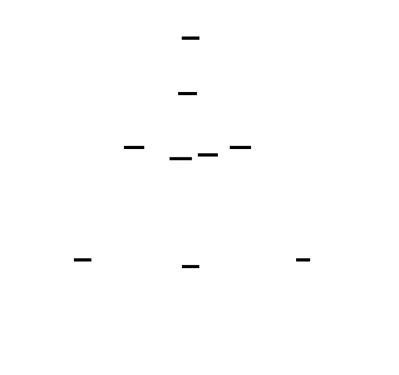

Each row stored in a table B-tree leaf cell is serialized as a **record** — a self-describing binary format that encodes both the types and values of all columns. The format consists of a **record header** followed by **column values**:
```
[header_size (varint)] [type1 (varint)] [type2 (varint)] ... [value1] [value2] ...
```
The first varint is the total size of the header (including itself). The subsequent varints are **serial type codes** — each one describes the type *and* size of the corresponding column value:
| Serial Type | Meaning | Value Size (bytes) |
|-------------|---------|-------------------|
| 0 | NULL | 0 |
| 1 | 8-bit signed integer | 1 |
| 2 | 16-bit big-endian signed integer | 2 |
| 3 | 24-bit big-endian signed integer | 3 |
| 4 | 32-bit big-endian signed integer | 4 |
| 5 | 48-bit big-endian signed integer | 6 |
| 6 | 64-bit big-endian signed integer | 8 |
| 7 | IEEE 754 double (big-endian) | 8 |
| 8 | Integer constant 0 | 0 |
| 9 | Integer constant 1 | 0 |
| N ≥ 12, even | BLOB of size (N-12)/2 | (N-12)/2 |
| N ≥ 13, odd | TEXT of size (N-13)/2 | (N-13)/2 |
The serial type codes for integers are chosen so that the smallest encoding that fits the value is used. The number `42` fits in 1 byte (serial type 1), while `100000` needs 4 bytes (serial type 4). This is a second layer of variable-length encoding on top of the varint header — the header tells you the type and size, and the value region contains only the payload bytes.
For strings and blobs, the serial type code encodes the length directly. A 5-character string has serial type `5*2 + 13 = 23`. A 10-byte blob has serial type `10*2 + 12 = 32`. The decoder reads the serial type, computes the size, and knows exactly how many bytes to read from the value region.
```c
typedef enum {
    COL_NULL = 0,
    COL_INTEGER,
    COL_REAL,
    COL_TEXT,
    COL_BLOB
} ColumnType;
typedef struct {
    ColumnType type;
    union {
        int64_t  i;
        double   r;
        struct {
            uint8_t *data;
            int      length;
        } s;  // text or blob
    };
} ColumnValue;
// Determine the serial type code for a value
static uint64_t serial_type_for(ColumnValue *val) {
    switch (val->type) {
        case COL_NULL:    return 0;
        case COL_INTEGER: {
            int64_t v = val->i;
            if (v == 0) return 8;
            if (v == 1) return 9;
            if (v >= -128       && v <= 127)        return 1;
            if (v >= -32768     && v <= 32767)      return 2;
            if (v >= -8388608   && v <= 8388607)    return 3;
            if (v >= -2147483648LL && v <= 2147483647LL) return 4;
            if (v >= -(1LL<<47) && v <= (1LL<<47)-1) return 5;
            return 6;
        }
        case COL_REAL:    return 7;
        case COL_TEXT:    return (uint64_t)(val->s.length * 2 + 13);
        case COL_BLOB:    return (uint64_t)(val->s.length * 2 + 12);
    }
    return 0;
}
// How many bytes does a value with this serial type consume?
static int serial_type_size(uint64_t serial_type) {
    switch (serial_type) {
        case 0:  return 0;  // NULL
        case 1:  return 1;
        case 2:  return 2;
        case 3:  return 3;
        case 4:  return 4;
        case 5:  return 6;
        case 6:  return 8;
        case 7:  return 8;  // double
        case 8:  return 0;  // constant 0
        case 9:  return 0;  // constant 1
        default:
            if (serial_type >= 12 && (serial_type % 2 == 0))
                return (int)(serial_type - 12) / 2;  // blob
            if (serial_type >= 13 && (serial_type % 2 == 1))
                return (int)(serial_type - 13) / 2;  // text
            return 0;
    }
}
```
### Serializing a Row
```c
// Serialize a row into a byte buffer.
// Returns the total number of bytes written.
int record_serialize(ColumnValue *columns, int col_count, uint8_t *buf, 
                      int buf_size) {
    // Phase 1: compute serial types and header size
    uint64_t serial_types[128];
    int header_body_size = 0;  // size of serial type varints
    for (int i = 0; i < col_count; i++) {
        serial_types[i] = serial_type_for(&columns[i]);
        // How many bytes does this serial type's varint take?
        uint8_t tmp[9];
        header_body_size += varint_encode(serial_types[i], tmp);
    }
    // The header_size varint includes itself — we need to account for
    // the fact that header_size might be 1 or 2 bytes
    int header_size_varint_len = 1;  // usually 1 byte
    int total_header = header_size_varint_len + header_body_size;
    if (total_header > 127) {
        header_size_varint_len = 2;
        total_header = header_size_varint_len + header_body_size;
    }
    // Phase 2: write header
    int offset = 0;
    offset += varint_encode((uint64_t)total_header, buf + offset);
    for (int i = 0; i < col_count; i++) {
        offset += varint_encode(serial_types[i], buf + offset);
    }
    // Phase 3: write values
    for (int i = 0; i < col_count; i++) {
        int size = serial_type_size(serial_types[i]);
        if (size == 0) continue;  // NULL, constant 0, constant 1
        switch (columns[i].type) {
            case COL_INTEGER: {
                // Write big-endian integer in 'size' bytes
                int64_t v = columns[i].i;
                for (int b = size - 1; b >= 0; b--) {
                    buf[offset + b] = (uint8_t)(v & 0xFF);
                    v >>= 8;
                }
                offset += size;
                break;
            }
            case COL_REAL: {
                // Write IEEE 754 double in big-endian
                uint64_t bits;
                memcpy(&bits, &columns[i].r, 8);
                for (int b = 7; b >= 0; b--) {
                    buf[offset + (7 - b)] = (uint8_t)((bits >> (b * 8)) & 0xFF);
                }
                offset += 8;
                break;
            }
            case COL_TEXT:
            case COL_BLOB:
                memcpy(buf + offset, columns[i].s.data, columns[i].s.length);
                offset += columns[i].s.length;
                break;
            default:
                break;
        }
    }
    return offset;
}
```
### Deserializing a Row
```c
// Deserialize a record from buf into columns array.
// Returns number of bytes consumed.
int record_deserialize(const uint8_t *buf, int buf_len, 
                        ColumnValue *columns, int max_cols, int *col_count) {
    int offset = 0;
    // Read header size
    uint64_t header_size;
    offset += varint_decode(buf + offset, &header_size);
    // Read serial types from header
    int n_cols = 0;
    uint64_t serial_types[128];
    while (offset < (int)header_size && n_cols < max_cols) {
        offset += varint_decode(buf + offset, &serial_types[n_cols]);
        n_cols++;
    }
    *col_count = n_cols;
    // Read values
    for (int i = 0; i < n_cols; i++) {
        uint64_t st = serial_types[i];
        int size = serial_type_size(st);
        if (st == 0) {
            columns[i].type = COL_NULL;
        } else if (st >= 1 && st <= 6) {
            // Integer
            columns[i].type = COL_INTEGER;
            int64_t v = 0;
            // Sign-extend from the most significant bit
            if (size > 0 && (buf[offset] & 0x80)) {
                v = -1;  // all 1s for sign extension
            }
            for (int b = 0; b < size; b++) {
                v = (v << 8) | buf[offset + b];
            }
            columns[i].i = v;
            offset += size;
        } else if (st == 7) {
            // Double
            columns[i].type = COL_REAL;
            uint64_t bits = 0;
            for (int b = 0; b < 8; b++) {
                bits = (bits << 8) | buf[offset + b];
            }
            memcpy(&columns[i].r, &bits, 8);
            offset += 8;
        } else if (st == 8) {
            columns[i].type = COL_INTEGER;
            columns[i].i = 0;
        } else if (st == 9) {
            columns[i].type = COL_INTEGER;
            columns[i].i = 1;
        } else if (st >= 12 && (st % 2 == 0)) {
            // Blob
            columns[i].type = COL_BLOB;
            columns[i].s.length = size;
            columns[i].s.data = malloc(size);
            memcpy(columns[i].s.data, buf + offset, size);
            offset += size;
        } else if (st >= 13 && (st % 2 == 1)) {
            // Text
            columns[i].type = COL_TEXT;
            columns[i].s.length = size;
            columns[i].s.data = malloc(size + 1);
            memcpy(columns[i].s.data, buf + offset, size);
            columns[i].s.data[size] = '\0';
            offset += size;
        }
    }
    return offset;
}
```
The record format is **self-describing** — the header contains all the type and size information needed to decode the values. This means you can deserialize a record without knowing the table schema. This property is important for debugging (you can dump any page and decode records), and for schema evolution (SQLite can add columns to a table without rewriting existing records — new columns simply have fewer serial types in old records, and the engine treats missing columns as NULL).
---
## Cell Formats: Leaf vs Internal


With the page layout and record format defined, you can now define the **cell format** — the structure of individual entries within a page.
### Table B-tree Leaf Cell
A leaf cell in a table B-tree stores a full row:
```
[payload_size (varint)] [rowid (varint)] [record_data (payload_size bytes)]
```
```c
// Write a table leaf cell into a page at the given offset.
// Returns the number of bytes written.
int write_table_leaf_cell(uint8_t *page, int offset, int64_t rowid,
                           uint8_t *record, int record_size) {
    int pos = offset;
    pos += varint_encode((uint64_t)record_size, page + pos);
    pos += varint_encode((uint64_t)rowid, page + pos);
    memcpy(page + pos, record, record_size);
    pos += record_size;
    return pos - offset;  // total cell size
}
```
### Table B-tree Internal Cell
An internal cell in a table B-tree stores a child page pointer and a separator key (rowid). No row data — just navigation information:
```
[left_child_page (4 bytes, big-endian)] [rowid (varint)]
```
The left child page pointer means: "all rows with rowid ≤ this key are in the subtree rooted at left_child_page." The right-most child is stored in the page header's `right_child` field, not in a cell.
```c
int write_table_internal_cell(uint8_t *page, int offset, 
                                uint32_t left_child, int64_t rowid) {
    int pos = offset;
    write_be32(page + pos, left_child);
    pos += 4;
    pos += varint_encode((uint64_t)rowid, page + pos);
    return pos - offset;
}
```
### Index B+tree Leaf Cell
An index leaf cell stores the indexed value(s) and the rowid of the corresponding table row. The payload is itself a record (using the same serialization format), containing the indexed column values followed by the rowid:
```
[payload_size (varint)] [record: (indexed_col_value, rowid)]
```
### Index B+tree Internal Cell
An index internal cell stores a child pointer and a separator key (also a record):
```
[left_child_page (4 bytes)] [payload_size (varint)] [separator_key_record]
```
---
## The B-tree Structure
With page layout, record format, and cell format defined, you can now build the tree itself. The B-tree is a collection of pages linked by child pointers:

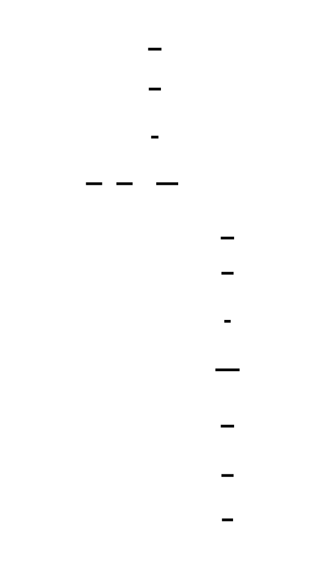

```c
typedef struct {
    BufferPool *pool;
    page_id_t   root_page;
    uint8_t     page_type;    // TABLE_LEAF, TABLE_INTERNAL, INDEX_LEAF, INDEX_INTERNAL
} BTree;
typedef struct {
    BTree     *tree;
    page_id_t  page_id;       // current page
    int        cell_index;    // current cell within page (-1 = before first)
    bool       is_eof;        // past the last cell
} BTreeCursor;
```
### Inserting a Cell into a Page
This is the core low-level operation. Given a page and a cell (already serialized), insert it at the correct sorted position:
```c
// Insert a cell into a leaf page at the correct sorted position.
// Returns 0 on success, -1 if page is full (needs splitting).
int page_insert_cell(uint8_t *page, uint8_t *cell_data, int cell_size, 
                      int64_t key) {
    uint8_t page_type = page[0];
    int header_size = (page_type == PAGE_TYPE_TABLE_INTERNAL || 
                       page_type == PAGE_TYPE_INDEX_INTERNAL)
                      ? INTERNAL_HEADER_SIZE : LEAF_HEADER_SIZE;
    uint16_t cell_count = read_be16(page + 3);
    uint16_t content_start = read_be16(page + 5);
    // Check if there's enough space
    int pointer_space = (cell_count + 1) * 2;  // existing + new pointer
    int available = content_start - header_size - (cell_count * 2);
    if (cell_size + 2 > available) {
        return -1;  // page full — caller must split
    }
    // Find insertion position (binary search on cell pointers)
    int insert_pos = 0;
    for (int i = 0; i < cell_count; i++) {
        uint16_t cp = get_cell_pointer(page, header_size, i);
        int64_t existing_key = read_cell_key(page, cp, page_type);
        if (key < existing_key) {
            break;
        }
        insert_pos = i + 1;
    }
    // Write cell data at the bottom of the content area
    uint16_t new_content_start = content_start - cell_size;
    memcpy(page + new_content_start, cell_data, cell_size);
    // Shift cell pointers to make room for the new pointer
    for (int i = cell_count; i > insert_pos; i--) {
        uint16_t prev = get_cell_pointer(page, header_size, i - 1);
        set_cell_pointer(page, header_size, i, prev);
    }
    set_cell_pointer(page, header_size, insert_pos, new_content_start);
    // Update header
    write_be16(page + 3, cell_count + 1);           // cell_count++
    write_be16(page + 5, new_content_start);         // new content_start
    return 0;
}
```
The binary search through cell pointers to find the insertion position is O(log n) in the number of cells per page. With ~50-200 cells per page, this is trivially fast — a few hundred nanoseconds at most.
### Reading a Cell's Key
```c
// Read the key (rowid) from a table B-tree cell
static int64_t read_cell_key(uint8_t *page, uint16_t cell_offset, 
                               uint8_t page_type) {
    int pos = cell_offset;
    uint64_t val;
    if (page_type == PAGE_TYPE_TABLE_INTERNAL) {
        // Internal cell: [left_child (4 bytes)] [rowid (varint)]
        pos += 4;  // skip child pointer
        varint_decode(page + pos, &val);
        return (int64_t)val;
    } else if (page_type == PAGE_TYPE_TABLE_LEAF) {
        // Leaf cell: [payload_size (varint)] [rowid (varint)]
        pos += varint_decode(page + pos, &val);  // skip payload size
        varint_decode(page + pos, &val);
        return (int64_t)val;
    }
    return 0;
}
```
---
## Node Splitting: Maintaining Balance

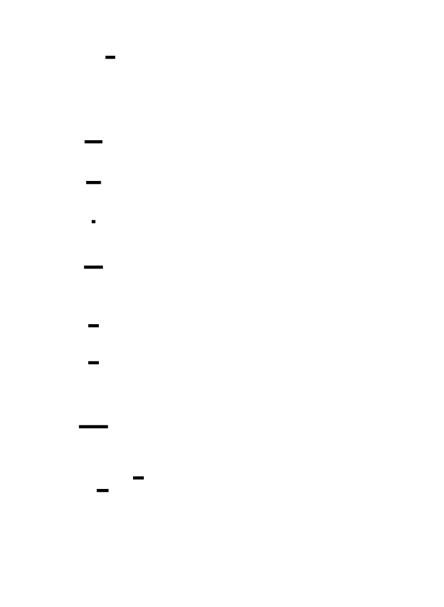

When a page is full and a new cell needs to be inserted, the page must **split** into two pages. This is the operation that keeps the B-tree balanced — every split creates a new page at the same level and promotes a separator key to the parent, potentially triggering a recursive split up the tree.
The algorithm for splitting a table B-tree leaf:
1. **Allocate a new page** via `buffer_pool_new_page`.
2. **Determine the split point** — the median cell. Cells with keys ≤ median stay in the original page; cells with keys > median move to the new page.
3. **Copy cells** from the original page to the new page. This involves reading each cell's data and writing it into the new page.
4. **Promote the median key** to the parent internal page. The parent now has a new cell with the median key and a pointer to the new page.
5. If the parent is also full, split it recursively.
6. If the root splits, create a **new root page** with two children (the old root and the new page). This is the only operation that increases tree height.
```c
// Split a full leaf page and insert a new cell.
// Returns the page_id of the new page, and the promoted key.
// parent_page is the parent internal page (or INVALID if splitting root).
int btree_split_leaf(BTree *tree, page_id_t page_id, 
                      uint8_t *cell_data, int cell_size, int64_t key,
                      int64_t *promoted_key, page_id_t *new_page_id) {
    uint8_t *page = fetch_page(tree->pool, page_id);
    uint8_t page_type = page[0];
    int header_size = LEAF_HEADER_SIZE;
    uint16_t cell_count = read_be16(page + 3);
    // Collect all existing cells + the new cell, sorted by key
    typedef struct { int64_t key; uint8_t *data; int size; } CellEntry;
    CellEntry *all_cells = malloc((cell_count + 1) * sizeof(CellEntry));
    int total = 0;
    bool inserted = false;
    for (int i = 0; i < cell_count; i++) {
        uint16_t cp = get_cell_pointer(page, header_size, i);
        int64_t existing_key = read_cell_key(page, cp, page_type);
        if (!inserted && key < existing_key) {
            all_cells[total].key = key;
            all_cells[total].data = cell_data;
            all_cells[total].size = cell_size;
            total++;
            inserted = true;
        }
        // Copy existing cell data
        int existing_size = compute_cell_size(page, cp, page_type);
        all_cells[total].key = existing_key;
        all_cells[total].data = malloc(existing_size);
        memcpy(all_cells[total].data, page + cp, existing_size);
        all_cells[total].size = existing_size;
        total++;
    }
    if (!inserted) {
        all_cells[total].key = key;
        all_cells[total].data = cell_data;
        all_cells[total].size = cell_size;
        total++;
    }
    // Split point: middle cell
    int split = total / 2;
    *promoted_key = all_cells[split].key;
    // Reinitialize original page with left half
    page_init(page, page_type);
    for (int i = 0; i < split; i++) {
        page_insert_cell(page, all_cells[i].data, all_cells[i].size, 
                          all_cells[i].key);
    }
    mark_page_dirty(tree->pool, page_id);
    unpin_page(tree->pool, page_id, true);
    // Create new page with right half
    *new_page_id = buffer_pool_new_page(tree->pool);
    uint8_t *new_page = fetch_page(tree->pool, *new_page_id);
    page_init(new_page, page_type);
    for (int i = split; i < total; i++) {
        page_insert_cell(new_page, all_cells[i].data, all_cells[i].size, 
                          all_cells[i].key);
    }
    unpin_page(tree->pool, *new_page_id, true);
    // Cleanup
    for (int i = 0; i < total; i++) {
        if (all_cells[i].data != cell_data) {
            free(all_cells[i].data);
        }
    }
    free(all_cells);
    return 0;
}
```
### Promoting the Key to the Parent
After a split, the promoted key and new child page must be added to the parent. If the root splits, a new root must be created:
```c
void btree_insert_into_parent(BTree *tree, page_id_t left_page, 
                                int64_t key, page_id_t right_page,
                                page_id_t parent_page) {
    if (parent_page == INVALID_PAGE_ID) {
        // Splitting the root — create a new root
        page_id_t new_root_id = buffer_pool_new_page(tree->pool);
        uint8_t *new_root = fetch_page(tree->pool, new_root_id);
        page_init(new_root, PAGE_TYPE_TABLE_INTERNAL);
        // Write the key as an internal cell with left_child = left_page
        uint8_t cell_buf[32];
        int cell_size = write_table_internal_cell(cell_buf, 0, 
                                                    left_page, key);
        page_insert_cell(new_root, cell_buf, cell_size, key);
        // Set right_child to right_page
        write_be32(new_root + 8, right_page);
        unpin_page(tree->pool, new_root_id, true);
        tree->root_page = new_root_id;
        // Update system catalog with new root page (see below)
        return;
    }
    // Non-root parent: insert new internal cell
    uint8_t *parent = fetch_page(tree->pool, parent_page);
    uint8_t cell_buf[32];
    int cell_size = write_table_internal_cell(cell_buf, 0, left_page, key);
    int result = page_insert_cell(parent, cell_buf, cell_size, key);
    if (result < 0) {
        // Parent is also full — split recursively
        int64_t promoted;
        page_id_t new_parent_page;
        btree_split_internal(tree, parent_page, cell_buf, cell_size, key,
                              &promoted, &new_parent_page);
        // Recursively insert promoted key into grandparent
        // (requires tracking parent chain — see note below)
    }
    unpin_page(tree->pool, parent_page, true);
}
```
The recursive nature of splitting is structurally similar to a **two-phase commit** in distributed systems: the child page creates a new sibling (phase 1), and the parent acknowledges the new child by adding the separator key (phase 2). If the system crashes between phase 1 and phase 2, the new sibling page exists on disk but no parent points to it — it's an orphan. Production databases handle this through their WAL/journal (Milestones 9-10), which ensures the entire split completes atomically or not at all. For your initial build, this orphan scenario is a known limitation that the transaction layer will address later.
---
## B-tree Search: Finding a Row by Rowid
To find a row with a specific rowid, you traverse the tree from root to leaf:
```c
// Search for a row by rowid. Returns the page_id and cell_index where found,
// or the leaf page where it would be inserted.
bool btree_search(BTree *tree, int64_t rowid, 
                   page_id_t *found_page, int *found_cell) {
    page_id_t current = tree->root_page;
    while (true) {
        uint8_t *page = fetch_page(tree->pool, current);
        uint8_t page_type = page[0];
        uint16_t cell_count = read_be16(page + 3);
        if (page_type == PAGE_TYPE_TABLE_LEAF) {
            // Search leaf for exact match
            for (int i = 0; i < cell_count; i++) {
                int header_size = LEAF_HEADER_SIZE;
                uint16_t cp = get_cell_pointer(page, header_size, i);
                int64_t key = read_cell_key(page, cp, page_type);
                if (key == rowid) {
                    *found_page = current;
                    *found_cell = i;
                    unpin_page(tree->pool, current, false);
                    return true;  // found
                }
                if (key > rowid) break;  // not here
            }
            *found_page = current;
            *found_cell = -1;
            unpin_page(tree->pool, current, false);
            return false;  // not found
        }
        // Internal page: find the correct child
        page_id_t child = read_be32(page + 8);  // default: right_child
        for (int i = 0; i < cell_count; i++) {
            int header_size = INTERNAL_HEADER_SIZE;
            uint16_t cp = get_cell_pointer(page, header_size, i);
            int64_t key = read_cell_key(page, cp, page_type);
            if (rowid <= key) {
                // Go to left child of this cell
                child = read_be32(page + cp);  // left_child from cell
                break;
            }
        }
        unpin_page(tree->pool, current, false);
        current = child;
    }
}
```
The search follows at most `h` pages, where `h` is the tree height. With a fanout of ~100 (typical for table B-trees with moderate row sizes), a 3-level tree covers 100³ = 1 million rows. Each level is one `fetch_page` call — most likely a buffer pool hit after the first query, costing ~10ns. A full search: ~30ns plus comparison overhead. This is why B-tree point lookups feel instant.
---
## The B-tree INSERT Operation
The full INSERT path combines search, serialization, cell insertion, and potential splitting:
```c
void btree_insert(BTree *tree, int64_t rowid, ColumnValue *columns, 
                   int col_count) {
    // Step 1: Serialize the row into a record
    uint8_t record_buf[4096];
    int record_size = record_serialize(columns, col_count, record_buf, 
                                        sizeof(record_buf));
    // Step 2: Build the complete leaf cell
    uint8_t cell_buf[4096 + 32];  // record + varint overheads
    int cell_size = write_table_leaf_cell(cell_buf, 0, rowid, 
                                           record_buf, record_size);
    // Step 3: Find the correct leaf page
    page_id_t leaf_page;
    int cell_idx;
    btree_search(tree, rowid, &leaf_page, &cell_idx);
    // Step 4: Try to insert into the leaf
    uint8_t *page = fetch_page(tree->pool, leaf_page);
    int result = page_insert_cell(page, cell_buf, cell_size, rowid);
    if (result == 0) {
        // Success — cell fits in the page
        unpin_page(tree->pool, leaf_page, true);
        return;
    }
    // Step 5: Page full — split and retry
    unpin_page(tree->pool, leaf_page, false);
    int64_t promoted_key;
    page_id_t new_page;
    btree_split_leaf(tree, leaf_page, cell_buf, cell_size, rowid,
                      &promoted_key, &new_page);
    // Step 6: Insert promoted key into parent
    // (need parent tracking — simplified here)
    btree_insert_into_parent(tree, leaf_page, promoted_key, new_page,
                              INVALID_PAGE_ID);  // TODO: track parent
}
```
> **Implementation note: tracking the parent chain.** The search function above discards parent pages as it descends. But when a split needs to promote a key to the parent, you need to know *which* parent. Two approaches: (1) maintain a stack of page IDs during descent, so you can pop the parent when needed; (2) store parent pointers in each page (wastes 4 bytes per page and adds maintenance overhead). Approach (1) is simpler and what SQLite uses — it keeps a small stack of page references in the cursor structure.
---
## Full Table Scan: The Cursor Pattern

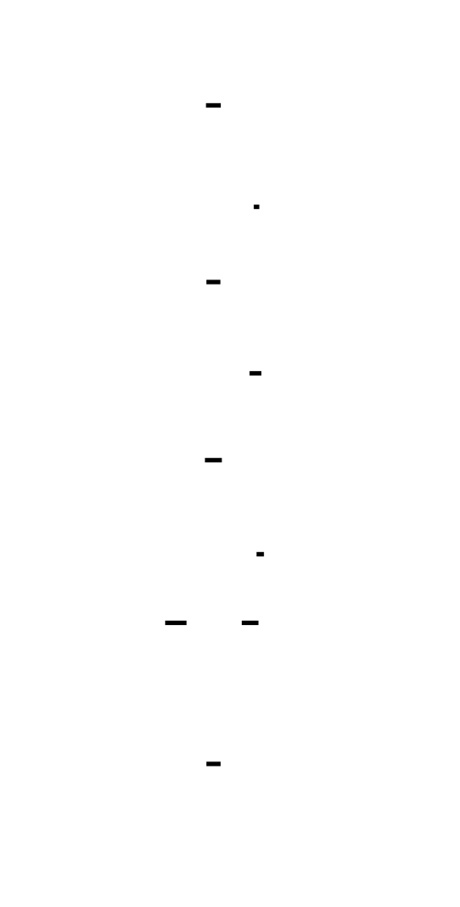

The VM's `OP_REWIND` / `OP_NEXT` / `OP_COLUMN` opcodes need a cursor that iterates all rows in rowid order. For a table B-tree, this means visiting all leaf pages left-to-right. The cursor performs an **in-order traversal** — but optimized: since we only want leaf data, we descend to the leftmost leaf and then scan across.
```c
BTreeCursor* btree_cursor_open(BTree *tree) {
    BTreeCursor *cur = calloc(1, sizeof(BTreeCursor));
    cur->tree = tree;
    cur->page_id = INVALID_PAGE_ID;
    cur->cell_index = -1;
    cur->is_eof = false;
    return cur;
}
bool btree_cursor_rewind(BTreeCursor *cur) {
    // Descend to the leftmost leaf page
    page_id_t current = cur->tree->root_page;
    while (true) {
        uint8_t *page = fetch_page(cur->tree->pool, current);
        uint8_t page_type = page[0];
        if (page_type == PAGE_TYPE_TABLE_LEAF) {
            uint16_t cell_count = read_be16(page + 3);
            unpin_page(cur->tree->pool, current, false);
            if (cell_count == 0) {
                cur->is_eof = true;
                return true;  // table is empty
            }
            cur->page_id = current;
            cur->cell_index = 0;
            return false;  // not empty
        }
        // Internal page: go to leftmost child
        // The leftmost child is the left_child of the first cell
        uint16_t cp = get_cell_pointer(page, INTERNAL_HEADER_SIZE, 0);
        page_id_t left_child = read_be32(page + cp);
        unpin_page(cur->tree->pool, current, false);
        current = left_child;
    }
}
```
The `next` operation advances within the current leaf page. When it reaches the end, it needs to find the next leaf. In a B+tree, leaf pages are linked — you'd just follow a `next_leaf` pointer. In SQLite's table B-tree, leaf pages are *not* linked. Instead, the cursor must ascend to the parent and descend to the next subtree. This requires maintaining a stack of (page_id, cell_index) pairs representing the path from root to current leaf:
```c
#define MAX_TREE_DEPTH 20
typedef struct {
    BTree     *tree;
    page_id_t  page_id;
    int        cell_index;
    bool       is_eof;
    // Parent chain for traversal
    struct {
        page_id_t page_id;
        int       cell_index;
    } stack[MAX_TREE_DEPTH];
    int stack_depth;
} BTreeCursor;
bool btree_cursor_next(BTreeCursor *cur) {
    if (cur->is_eof) return false;
    uint8_t *page = fetch_page(cur->tree->pool, cur->page_id);
    uint16_t cell_count = read_be16(page + 3);
    unpin_page(cur->tree->pool, cur->page_id, false);
    cur->cell_index++;
    if (cur->cell_index < cell_count) {
        return true;  // still have cells on this page
    }
    // Current leaf exhausted — ascend to parent and find next subtree
    while (cur->stack_depth > 0) {
        cur->stack_depth--;
        page_id_t parent_id = cur->stack[cur->stack_depth].page_id;
        int parent_cell = cur->stack[cur->stack_depth].cell_index;
        uint8_t *parent = fetch_page(cur->tree->pool, parent_id);
        uint16_t parent_count = read_be16(parent + 3);
        parent_cell++;  // move to next child in parent
        if (parent_cell <= parent_count) {
            // There's a next child — descend to its leftmost leaf
            page_id_t next_child;
            if (parent_cell == parent_count) {
                // Use right_child
                next_child = read_be32(parent + 8);
            } else {
                uint16_t cp = get_cell_pointer(parent, INTERNAL_HEADER_SIZE, 
                                                parent_cell);
                next_child = read_be32(parent + cp);
            }
            // Push updated parent back on stack
            cur->stack[cur->stack_depth].page_id = parent_id;
            cur->stack[cur->stack_depth].cell_index = parent_cell;
            cur->stack_depth++;
            unpin_page(cur->tree->pool, parent_id, false);
            // Descend to leftmost leaf of next_child
            page_id_t current = next_child;
            while (true) {
                uint8_t *p = fetch_page(cur->tree->pool, current);
                uint8_t pt = p[0];
                if (pt == PAGE_TYPE_TABLE_LEAF) {
                    cur->page_id = current;
                    cur->cell_index = 0;
                    uint16_t cc = read_be16(p + 3);
                    unpin_page(cur->tree->pool, current, false);
                    return cc > 0;
                }
                // Push and descend
                uint16_t fcp = get_cell_pointer(p, INTERNAL_HEADER_SIZE, 0);
                page_id_t lc = read_be32(p + fcp);
                cur->stack[cur->stack_depth].page_id = current;
                cur->stack[cur->stack_depth].cell_index = 0;
                cur->stack_depth++;
                unpin_page(cur->tree->pool, current, false);
                current = lc;
            }
        }
        unpin_page(cur->tree->pool, parent_id, false);
    }
    // Exhausted the entire tree
    cur->is_eof = true;
    return false;
}
```
Reading a column from the current cursor position:
```c
void btree_cursor_column(BTreeCursor *cur, int col_idx, Value *dest) {
    uint8_t *page = fetch_page(cur->tree->pool, cur->page_id);
    uint16_t cp = get_cell_pointer(page, LEAF_HEADER_SIZE, cur->cell_index);
    // Parse cell: [payload_size (varint)] [rowid (varint)] [record]
    int pos = cp;
    uint64_t payload_size, rowid;
    pos += varint_decode(page + pos, &payload_size);
    pos += varint_decode(page + pos, &rowid);
    // Deserialize the specific column from the record
    ColumnValue columns[128];
    int col_count;
    record_deserialize(page + pos, (int)payload_size, columns, 128, &col_count);
    if (col_idx < col_count) {
        // Convert ColumnValue to VM's Value type
        switch (columns[col_idx].type) {
            case COL_NULL:
                dest->type = VAL_NULL;
                break;
            case COL_INTEGER:
                dest->type = VAL_INTEGER;
                dest->i = columns[col_idx].i;
                break;
            case COL_REAL:
                dest->type = VAL_REAL;
                dest->r = columns[col_idx].r;
                break;
            case COL_TEXT:
                dest->type = VAL_STRING;
                dest->s.data = columns[col_idx].s.data;  // transfer ownership
                dest->s.length = columns[col_idx].s.length;
                break;
            default:
                dest->type = VAL_NULL;
                break;
        }
    } else {
        dest->type = VAL_NULL;  // missing column → NULL
    }
    unpin_page(cur->tree->pool, cur->page_id, false);
}
```

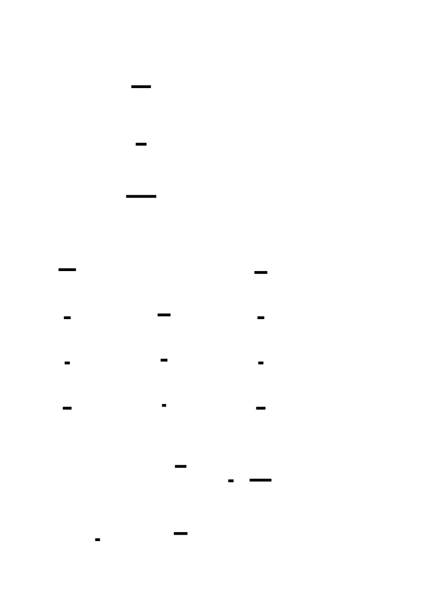

---
## The System Catalog: Schema as Data


Where does the database store the mapping from table name to root page number? In a **system catalog** — a special table that describes all other tables. SQLite calls this `sqlite_master`. It's stored as a regular table B-tree rooted at **page 1** (the first page of the database file, always).
The schema for `sqlite_master` is:
```sql
CREATE TABLE sqlite_master (
    type TEXT,        -- 'table' or 'index'
    name TEXT,        -- name of the table or index
    tbl_name TEXT,    -- table this object belongs to
    rootpage INTEGER, -- root page number of the B-tree
    sql TEXT          -- the CREATE statement that created it
);
```
When you execute `CREATE TABLE users (id INTEGER PRIMARY KEY, name TEXT)`, your engine:
1. Allocates a new B-tree root page via `buffer_pool_new_page`
2. Initializes it as a `PAGE_TYPE_TABLE_LEAF` (empty leaf — it's both root and leaf until data causes a split)
3. Inserts a row into `sqlite_master` with `type='table'`, `name='users'`, `rootpage=<new_page>`, `sql='CREATE TABLE ...'`
```c
typedef struct {
    char     name[64];
    int      root_page;
    int      column_count;
    char     column_names[32][64];
    char     column_types[32][16];
    bool     is_primary_key[32];
    bool     is_not_null[32];
} TableSchema;
typedef struct {
    BTree       *master_tree;    // B-tree for sqlite_master (root = page 1)
    TableSchema  tables[64];
    int          table_count;
} SystemCatalog;
int catalog_create_table(SystemCatalog *catalog, BufferPool *pool,
                          const char *table_name, AstNode *create_node) {
    // Allocate a new root page for this table
    page_id_t root_page = buffer_pool_new_page(pool);
    uint8_t *page = fetch_page(pool, root_page);
    page_init(page, PAGE_TYPE_TABLE_LEAF);
    unpin_page(pool, root_page, true);
    // Register in in-memory schema cache
    TableSchema *schema = &catalog->tables[catalog->table_count];
    strncpy(schema->name, table_name, 63);
    schema->root_page = root_page;
    schema->column_count = create_node->data.create_table.column_count;
    for (int i = 0; i < schema->column_count; i++) {
        AstNode *col = create_node->data.create_table.columns[i];
        strncpy(schema->column_names[i], col->data.column_def.name, 63);
        strncpy(schema->column_types[i], col->data.column_def.type_name, 15);
        schema->is_primary_key[i] = col->data.column_def.is_primary_key;
        schema->is_not_null[i] = col->data.column_def.is_not_null;
    }
    catalog->table_count++;
    // Persist to sqlite_master B-tree
    ColumnValue master_row[5];
    master_row[0].type = COL_TEXT;
    master_row[0].s.data = (uint8_t*)"table";
    master_row[0].s.length = 5;
    master_row[1].type = COL_TEXT;
    master_row[1].s.data = (uint8_t*)table_name;
    master_row[1].s.length = strlen(table_name);
    master_row[2].type = COL_TEXT;
    master_row[2].s.data = (uint8_t*)table_name;
    master_row[2].s.length = strlen(table_name);
    master_row[3].type = COL_INTEGER;
    master_row[3].i = root_page;
    master_row[4].type = COL_TEXT;
    // Store the original CREATE TABLE SQL
    master_row[4].s.data = (uint8_t*)"CREATE TABLE ...";  // reconstruct from AST
    master_row[4].s.length = 16;
    int64_t master_rowid = catalog->table_count;  // simple auto-increment
    btree_insert(catalog->master_tree, master_rowid, master_row, 5);
    return root_page;
}
```
On database open, the engine reads all rows from `sqlite_master` (page 1) to rebuild the in-memory schema cache. This is the **bootstrap** — the database describes itself using its own storage format. The schema is stored in a table, tables are B-trees, and the schema table's B-tree root is always page 1. There's no external configuration file, no separate schema store — just the data.
This self-describing pattern appears throughout computing: Python objects store their attributes in `__dict__`, Java's reflection API lets classes inspect their own structure, and the file system's superblock describes the file system's own layout. It's the principle of **reflexivity** — a system that can describe itself using its own mechanisms.
---
## Connecting to the VM: Replacing the Mock Cursor
With the real B-tree implemented, you can now replace the mock cursor from Milestone 3. The VM's opcode handlers call through the cursor interface:
```c
// OP_OPEN_READ handler (updated)
case OP_OPEN_READ: {
    int cursor_id = op->p1;
    int root_page = op->p2;
    BTree *btree = btree_open(db->pool, root_page);
    vm->cursors[cursor_id] = btree_cursor_open(btree);
    break;
}
// OP_REWIND handler (updated)
case OP_REWIND: {
    int cursor_id = op->p1;
    bool empty = btree_cursor_rewind(vm->cursors[cursor_id]);
    if (empty) {
        vm->pc = op->p2;
        continue;
    }
    break;
}
```
The rest of the VM code is unchanged — `OP_COLUMN`, `OP_NEXT`, `OP_INSERT` all call through the same cursor interface. The buffer pool transparently handles caching, eviction, and disk I/O. The B-tree handles page navigation, cell parsing, and node splitting. Each layer does its job; no layer reaches into another's internals.


---
## Testing
### Test: Page Format Round-Trip
```c
void test_page_format(void) {
    uint8_t page[PAGE_SIZE];
    page_init(page, PAGE_TYPE_TABLE_LEAF);
    assert(page[0] == PAGE_TYPE_TABLE_LEAF);
    assert(read_be16(page + 3) == 0);    // cell_count = 0
    assert(read_be16(page + 5) == PAGE_SIZE);  // content starts at end
    // Insert a cell
    ColumnValue cols[2] = {
        { .type = COL_INTEGER, .i = 42 },
        { .type = COL_TEXT, .s = { .data = (uint8_t*)"hello", .length = 5 } }
    };
    uint8_t record[256];
    int rec_size = record_serialize(cols, 2, record, 256);
    uint8_t cell[256];
    int cell_size = write_table_leaf_cell(cell, 0, /*rowid=*/1, record, rec_size);
    int result = page_insert_cell(page, cell, cell_size, 1);
    assert(result == 0);
    assert(read_be16(page + 3) == 1);  // cell_count = 1
    // Read it back
    uint16_t cp = get_cell_pointer(page, LEAF_HEADER_SIZE, 0);
    int64_t key = read_cell_key(page, cp, PAGE_TYPE_TABLE_LEAF);
    assert(key == 1);
    printf("PASS: page format round-trip\n");
}
```
### Test: Varint Round-Trip
```c
void test_varint(void) {
    uint64_t test_values[] = {0, 1, 127, 128, 255, 16383, 16384, 
                               1000000, 0x7FFFFFFFFFFFFFFFULL};
    int n = sizeof(test_values) / sizeof(test_values[0]);
    for (int i = 0; i < n; i++) {
        uint8_t buf[9];
        int written = varint_encode(test_values[i], buf);
        assert(written >= 1 && written <= 9);
        uint64_t decoded;
        int consumed = varint_decode(buf, &decoded);
        assert(consumed == written);
        assert(decoded == test_values[i]);
    }
    printf("PASS: varint round-trip (%d values)\n", n);
}
```
### Test: Record Serialization Round-Trip
```c
void test_record_round_trip(void) {
    ColumnValue cols[4] = {
        { .type = COL_INTEGER, .i = 42 },
        { .type = COL_TEXT, .s = { .data = (uint8_t*)"hello", .length = 5 } },
        { .type = COL_NULL },
        { .type = COL_REAL, .r = 3.14 }
    };
    uint8_t buf[512];
    int size = record_serialize(cols, 4, buf, 512);
    assert(size > 0);
    ColumnValue decoded[4];
    int col_count;
    record_deserialize(buf, size, decoded, 4, &col_count);
    assert(col_count == 4);
    assert(decoded[0].type == COL_INTEGER && decoded[0].i == 42);
    assert(decoded[1].type == COL_TEXT && decoded[1].s.length == 5);
    assert(memcmp(decoded[1].s.data, "hello", 5) == 0);
    assert(decoded[2].type == COL_NULL);
    assert(decoded[3].type == COL_REAL && fabs(decoded[3].r - 3.14) < 0.001);
    printf("PASS: record serialization round-trip\n");
}
```
### Test: B-tree Insert and Scan
```c
void test_btree_insert_scan(void) {
    BufferPool *pool = buffer_pool_create("test_btree.db", 100, 4096);
    // Create a table via catalog
    page_id_t root = buffer_pool_new_page(pool);
    uint8_t *rp = fetch_page(pool, root);
    page_init(rp, PAGE_TYPE_TABLE_LEAF);
    unpin_page(pool, root, true);
    BTree tree = { .pool = pool, .root_page = root };
    // Insert 100 rows
    for (int i = 1; i <= 100; i++) {
        ColumnValue cols[2] = {
            { .type = COL_INTEGER, .i = i },
            { .type = COL_TEXT, .s = { .data = (uint8_t*)"test", .length = 4 } }
        };
        btree_insert(&tree, i, cols, 2);
    }
    // Full scan should return all 100 rows in order
    BTreeCursor *cur = btree_cursor_open(&tree);
    bool empty = btree_cursor_rewind(cur);
    assert(!empty);
    int count = 0;
    do {
        count++;
        Value v;
        btree_cursor_column(cur, 0, &v);
        assert(v.type == VAL_INTEGER);
        assert(v.i == count);
    } while (btree_cursor_next(cur));
    assert(count == 100);
    btree_cursor_close(cur);
    buffer_pool_destroy(pool);
    unlink("test_btree.db");
    printf("PASS: B-tree insert and scan (100 rows)\n");
}
```
### Test: Node Splitting
```c
void test_node_splitting(void) {
    BufferPool *pool = buffer_pool_create("test_split.db", 100, 4096);
    page_id_t root = buffer_pool_new_page(pool);
    uint8_t *rp = fetch_page(pool, root);
    page_init(rp, PAGE_TYPE_TABLE_LEAF);
    unpin_page(pool, root, true);
    BTree tree = { .pool = pool, .root_page = root };
    // Insert enough rows to force multiple splits
    // With ~50-byte rows, a 4096-byte page fits ~70 rows
    // Inserting 500 should cause several splits
    for (int i = 1; i <= 500; i++) {
        ColumnValue cols[3] = {
            { .type = COL_INTEGER, .i = i },
            { .type = COL_TEXT, .s = { .data = (uint8_t*)"name_value", .length = 10 } },
            { .type = COL_INTEGER, .i = i * 100 }
        };
        btree_insert(&tree, i, cols, 3);
    }
    // Verify: root should now be internal (tree grew in height)
    uint8_t *root_page = fetch_page(pool, tree.root_page);
    assert(root_page[0] == PAGE_TYPE_TABLE_INTERNAL);
    unpin_page(pool, tree.root_page, false);
    // Verify: full scan returns all 500 rows in order
    BTreeCursor *cur = btree_cursor_open(&tree);
    btree_cursor_rewind(cur);
    int count = 0;
    int64_t last_key = -1;
    do {
        count++;
        Value v;
        btree_cursor_column(cur, 0, &v);
        assert(v.i > last_key);  // strictly increasing
        last_key = v.i;
    } while (btree_cursor_next(cur));
    assert(count == 500);
    btree_cursor_close(cur);
    buffer_pool_destroy(pool);
    unlink("test_split.db");
    printf("PASS: node splitting (500 rows, multi-level tree)\n");
}
```
---
## Three-Level View: What Happens When You INSERT a Row
**Level 1 — Public API**: The VM executes `OP_INSERT`. It passes a rowid and a serialized record to the B-tree cursor's insert function. One function call — "store this row."
**Level 2 — B-tree Engine**: The B-tree searches from root to leaf, descending through internal pages by comparing the rowid against separator keys. At the correct leaf, it serializes the row into a cell (varint-encoded payload size, varint-encoded rowid, record bytes), checks if the cell fits (is there enough free space between the cell pointer array and the content area?), and writes it. If the page is full, it splits: allocates a new page, redistributes cells, promotes the median key, and potentially splits parent nodes recursively.
**Level 3 — Buffer Pool / Disk**: Every page access — root, internal, leaf — goes through `fetch_page`, which checks the page table hash map for a hit (O(1), ~10ns). On a miss, the buffer pool runs LRU eviction (potentially writing a dirty page with `pwrite` + `fsync`), then loads the requested page with `pread`. The `pread` triggers a kernel system call; the kernel checks its own page cache, and if missing, issues a block I/O request to the storage device (~100μs on SSD, ~10ms on HDD). On the write side, `mark_page_dirty` sets a flag; the actual disk write happens later during eviction or `flush_all`. For an INSERT into a warm cache, the entire operation — search + serialize + insert — completes in microseconds, touching only memory. The disk write is deferred.
---
## Knowledge Cascade: What B-tree Storage Unlocks
**→ Fanout and Information Theory**: A B+tree with 4KB pages and 8-byte keys fits ~500 keys per internal node. That's a branching factor of 500. Three levels: 500³ = 125 million rows. Four levels: 62.5 billion. This is why databases can handle billions of rows with only 3-4 disk reads per lookup — each page read eliminates 99.8% of the remaining search space. This is the same principle behind binary search (each comparison eliminates 50% of candidates), but cranked to a branching factor of 500 instead of 2. It's the Shannon information gain per I/O operation: each page read delivers log₂(500) ≈ 9 bits of information about where the target row lives.
**→ Slotted Pages as a Universal Pattern**: The bidirectional-growth layout — pointers growing down, data growing up, free space in the middle — appears far beyond databases. PostgreSQL's heap pages use the same structure. The classic `malloc` implementation grows the stack downward and the heap upward within a process's address space — same pattern, different scale. Some file systems (like ext4's extent trees) use slotted internal nodes. Even network packet headers follow a similar principle: fixed-size header fields at known offsets, variable-length payload afterward. Once you recognize the slotted page pattern, you see it everywhere data needs both random access (via fixed-size pointers) and efficient packing (via variable-length content).
**→ Variable-Length Encoding Everywhere**: The varint encoding you just built is used in Protocol Buffers (Google's serialization format), UTF-8 (the dominant character encoding on the internet — each Unicode code point uses 1-4 bytes), LEB128 in DWARF debug information and WebAssembly, and SQLite's own file format. The principle — use fewer bytes for common small values, more bytes for rare large values — is a direct application of Huffman's insight: encode frequent symbols with shorter codes. Every network protocol, file format, and serialization library makes this tradeoff between fixed-width simplicity and variable-width compactness.
**→ Node Splitting as Distributed Coordination**: When a B-tree node splits, the parent must acknowledge the new child before the operation is complete. If the system crashes after creating the new page but before updating the parent, you have an orphan page — allocated but unreachable. This is structurally identical to the **two-phase commit** problem in distributed systems: a coordinator (parent) must commit to knowing about a new participant (child page) atomically. Your WAL (Milestone 10) will solve this the same way distributed databases do — by logging the intent before performing the action, ensuring crash recovery can complete or roll back partial operations.
**→ Self-Describing Schemas (Reflexivity)**: Storing the schema in `sqlite_master` — a regular table using the same B-tree format as user tables — means the database can describe itself. This reflexive pattern appears throughout computing: Python's `type(type)` is `type`, JavaScript's `Object.getPrototypeOf(Object.prototype)` is `null` (the bottom of the chain), and Unix's `/proc` filesystem describes the kernel's own state as files. Self-description enables introspection, debugging, and tooling — `SELECT * FROM sqlite_master` is your database's equivalent of `ls` or `dir`.
---
## System Awareness
You've built the B-tree page format and table storage — the persistent storage engine that sits between the buffer pool (downstream, Milestone 4) and the VM's cursor interface (upstream, Milestone 3). The VM emits cursor opcodes; the B-tree translates them into page navigations through the buffer pool. The buffer pool handles memory caching and disk I/O. The chain is complete: SQL text → tokens → AST → bytecode → VM → cursor → B-tree → buffer pool → disk.
Without the B-tree storage engine, your database was an in-memory SQL interpreter — data vanished when the process exited. With it, data persists on disk in a structured binary format, organized for efficient point lookups (O(log n) tree descent) and sequential scans (leaf-to-leaf traversal). The system catalog means table schemas are themselves persistent — the database is fully self-contained.
In the next milestone, you'll build the query execution layer — SELECT with projection and filtering, INSERT/UPDATE/DELETE through the B-tree, and constraint enforcement. The B-tree cursor you built here is the interface that execution layer will use for every data access.
---
<!-- END_MS -->


<!-- MS_ID: build-sqlite-m6 -->
<!-- MS_ID: build-sqlite-m6 -->
# Milestone 6: SELECT Execution & DML
## Where We Are in the System
You have every layer of the stack built except the one that makes it useful. The tokenizer converts SQL text to tokens. The parser converts tokens to an AST. The bytecode compiler converts the AST to opcodes. The VM executes opcodes by calling through the cursor interface. The buffer pool caches 4096-byte pages. The B-tree stores rows in those pages. But right now, the VM's cursor calls are wired to real B-tree storage — and the only operations you've tested are raw insert-and-scan at the storage layer.


In this milestone, you connect the full pipeline end-to-end: a user types `SELECT name FROM users WHERE age > 21`, and your engine tokenizes, parses, compiles, and executes it against real B-tree pages, deserializing records, projecting columns, evaluating WHERE predicates with correct NULL semantics, and streaming results back. You'll also implement INSERT (through the SQL interface, not just the raw B-tree API), UPDATE, DELETE, and constraint enforcement.


This is where the database stops being a collection of components and becomes a *system*. Every layer participates in every query.
---
## The Revelation: NULL Is Not What You Think
You've been writing C for this entire project. In C, a null pointer (`NULL`) means "points to nothing." An uninitialized variable has an undefined value but is still *some* value. You probably think SQL's `NULL` works similarly — it's a placeholder for "no value," a kind of empty slot that you can compare and filter like any other value.
This intuition will silently corrupt every query result in your database.
Try this mental experiment. You have a table of employees. Alice's phone number is `NULL` — she hasn't provided one. Bob's phone number is also `NULL`. Is Alice's phone number equal to Bob's phone number?
Your instinct says "yes — they're both NULL, so they're equal." SQL says **no**. `NULL = NULL` evaluates to `NULL`, not `TRUE`. The reasoning: `NULL` means "unknown." Alice's phone number is unknown. Bob's phone number is unknown. Are two unknown values equal? *You don't know.* The answer is itself unknown — `NULL`.
This isn't a quirk. It's a fundamental design choice rooted in formal logic.

> **🔑 Foundation: Three-valued logic**
> 
> ## Three-Valued Logic (TRUE / FALSE / NULL)
Standard boolean logic has two values: true and false. SQL — and by extension, any query engine you're building — uses **three**: `TRUE`, `FALSE`, and `NULL` (unknown).
`NULL` doesn't mean "empty string" or "zero." It means **"I don't know."** This distinction changes everything about how logical operators behave:
| A | B | A AND B | A OR B | NOT A |
|---|---|---------|--------|-------|
| TRUE | NULL | NULL | TRUE | FALSE |
| FALSE | NULL | FALSE | NULL | TRUE |
| NULL | NULL | NULL | NULL | NULL |
Notice the asymmetry: `FALSE AND NULL` is `FALSE` (because no matter what the unknown value is, the result is false), but `TRUE AND NULL` is `NULL` (because the result depends on the unknown value).
**Why you need this now:** Your query engine evaluates WHERE clauses against rows. If a column value is `NULL` and the predicate is `salary > 50000`, the result isn't `FALSE` — it's `NULL`. A row only passes a filter when the predicate evaluates to `TRUE`. Both `FALSE` and `NULL` reject the row. If you implement this as simple boolean logic, you'll get subtly wrong query results that are extremely hard to debug.
**Key insight:** Treat `NULL` as a **third value that propagates**, not as a special case of false. Every comparison operator, every logical combinator in your evaluator needs an explicit code path for `NULL`. The cleanest implementation is a `TriValue` enum (or equivalent) rather than using nullable booleans, because nullable booleans tempt you into conflating "the answer is false" with "the answer is unknown."


The consequences ripple through every operation in your database:
**WHERE filtering:** `WHERE phone = NULL` matches *zero* rows — because `phone = NULL` evaluates to `NULL` for every row, and `NULL` is falsy. You must use `WHERE phone IS NULL`, which is a special operator that checks the type tag, not the value.
**Boolean operators:** `NULL AND TRUE` is `NULL`. `NULL OR TRUE` is `TRUE`. `NULL AND FALSE` is `FALSE`. The rules are consistent — AND returns FALSE if either side is FALSE (regardless of NULL), OR returns TRUE if either side is TRUE (regardless of NULL) — but they're not what you'd expect if you treated NULL as FALSE.
**Aggregates:** `COUNT(*)` counts all rows including NULLs. `COUNT(column)` skips NULLs. `SUM` of an all-NULL column returns `NULL`, not `0`. `AVG` ignores NULLs in both numerator and denominator.
If you implement NULL as "just another value" and use `==` for comparison, your WHERE clauses will silently include or exclude wrong rows. No crash, no error message — just wrong answers. This is the most dangerous class of bug: a correctness bug that looks correct.
---
## Implementing Three-Valued Logic
Your VM's `Value` type already has `VAL_NULL`. The work is in making every comparison and boolean operation respect it. Start with the comparison function from Milestone 3 — it already returns `false` for NULL comparisons, which is correct for the conditional-jump pattern your compiler uses. But now you need explicit three-valued evaluation for compound expressions.
Define a tri-state result type:
```c
typedef enum {
    TRI_FALSE = 0,
    TRI_TRUE  = 1,
    TRI_NULL  = 2,
} TriBool;
```
The truth tables for AND and OR:
```c
// AND truth table: TRI_FALSE wins over TRI_NULL
static TriBool tri_and(TriBool a, TriBool b) {
    if (a == TRI_FALSE || b == TRI_FALSE) return TRI_FALSE;
    if (a == TRI_NULL  || b == TRI_NULL)  return TRI_NULL;
    return TRI_TRUE;
}
// OR truth table: TRI_TRUE wins over TRI_NULL
static TriBool tri_or(TriBool a, TriBool b) {
    if (a == TRI_TRUE || b == TRI_TRUE) return TRI_TRUE;
    if (a == TRI_NULL || b == TRI_NULL) return TRI_NULL;
    return TRI_FALSE;
}
// NOT truth table: NOT NULL = NULL
static TriBool tri_not(TriBool a) {
    if (a == TRI_NULL) return TRI_NULL;
    return (a == TRI_TRUE) ? TRI_FALSE : TRI_TRUE;
}
```
For comparisons, any operand being NULL yields NULL:
```c
static TriBool tri_compare(Value *a, Value *b, Opcode op) {
    if (a->type == VAL_NULL || b->type == VAL_NULL) {
        return TRI_NULL;
    }
    // Existing comparison logic from Milestone 3
    int cmp;
    if (a->type == VAL_INTEGER && b->type == VAL_INTEGER) {
        cmp = (a->i > b->i) - (a->i < b->i);
    } else if (a->type == VAL_REAL || b->type == VAL_REAL) {
        double da = (a->type == VAL_REAL) ? a->r : (double)a->i;
        double db = (b->type == VAL_REAL) ? b->r : (double)b->i;
        cmp = (da > db) - (da < db);
    } else if (a->type == VAL_STRING && b->type == VAL_STRING) {
        cmp = strcmp(a->s.data, b->s.data);
    } else {
        return TRI_NULL;  // incomparable types
    }
    bool result;
    switch (op) {
        case OP_EQ: result = (cmp == 0); break;
        case OP_NE: result = (cmp != 0); break;
        case OP_LT: result = (cmp < 0);  break;
        case OP_LE: result = (cmp <= 0); break;
        case OP_GT: result = (cmp > 0);  break;
        case OP_GE: result = (cmp >= 0); break;
        default:    return TRI_NULL;
    }
    return result ? TRI_TRUE : TRI_FALSE;
}
```
Now update the VM's comparison opcode handlers. The existing pattern — "jump if condition is true" — naturally handles three-valued logic because NULL (like FALSE) doesn't trigger the jump:
```c
case OP_EQ: case OP_NE: case OP_LT:
case OP_LE: case OP_GT: case OP_GE: {
    Value *left = &vm->registers[op->p1];
    Value *right = &vm->registers[op->p3];
    TriBool result = tri_compare(left, right, op->opcode);
    // Jump only on TRUE — NULL and FALSE both fall through
    if (result == TRI_TRUE) {
        vm->pc = op->p2;
        continue;
    }
    break;
}
```
For the WHERE clause compilation (from Milestone 3), the compiler emits *inverted* comparisons that jump on condition-false to skip rows. With three-valued logic, this still works correctly: if `age > 21` evaluates to NULL (because `age` is NULL), the inverted `OP_LE` check asks "is age ≤ 21?" — that's also NULL. NULL doesn't trigger the jump, so the row falls through to `OP_RESULT_ROW`. Wait — that's wrong. A NULL comparison should *exclude* the row, not include it.
This is the subtlety. When the compiler compiles `WHERE age > 21`, it emits `OP_LE` (the inverse) that jumps to `OP_NEXT` if age ≤ 21. For NULLs, neither `>` nor `≤` is true — both return NULL. So the OP_LE doesn't jump (NULL isn't true), and the row proceeds to ResultRow. But a NULL comparison means "unknown" — the row should be *excluded* from results.
The fix: add a NULL check before the comparison:
```c
// In compile_where, for each comparison:
// 1. Check if either operand is NULL → skip row
// 2. Then do the actual comparison
static int compile_comparison(Compiler *c, AstNode *expr, int cursor,
                               int table_idx) {
    int left_reg = compile_expr_to_register(c, expr->data.binary.left,
                                              cursor, table_idx);
    int right_reg = compile_expr_to_register(c, expr->data.binary.right,
                                               cursor, table_idx);
    // Emit OP_ISNULL checks: if either operand is NULL, skip this row
    int null_skip1 = emit(c, OP_ISNULL, left_reg, 0, 0, "skip if left NULL");
    int null_skip2 = emit(c, OP_ISNULL, right_reg, 0, 0, "skip if right NULL");
    // Emit inverted comparison
    Opcode inv_op = invert_comparison(expr->data.binary.op);
    int cmp_skip = emit(c, inv_op, left_reg, 0, right_reg, "WHERE check");
    // All three skips need to jump to the same target (patched by caller to OP_NEXT)
    return cmp_skip;  // caller patches; null_skip1/2 also need patching
}
```
You'll need a new opcode for the NULL check:
```c
OP_ISNULL,    // If reg[p1] is NULL, jump to p2
```
And in the VM:
```c
case OP_ISNULL: {
    if (vm->registers[op->p1].type == VAL_NULL) {
        vm->pc = op->p2;
        continue;
    }
    break;
}
```
This is the `IS NULL` operator expressed as bytecode. The SQL `WHERE x IS NULL` compiles to `OP_ISNULL` that jumps to ResultRow (include the row). The NULL-safety check in comparisons uses `OP_ISNULL` that jumps to Next (skip the row). Same opcode, different jump targets.
---
## Column Projection: Extracting What You Need


When the user writes `SELECT name, age FROM users`, they want only two columns out of a row that might have ten. The VM must deserialize the full record from the B-tree page, extract the requested columns, and discard the rest. This is **projection** — selecting a subset of columns.
The key insight: you don't actually need to deserialize *all* columns. The record format (from Milestone 5) is self-describing — the header contains serial type codes for every column, and each serial type tells you the exact byte size of that column's value. To read column 3 without reading columns 0-2, you parse the header to compute the byte offset of column 3, then jump directly to that offset.
```c
// Read a single column from a serialized record without deserializing all columns.
// Returns 0 on success, -1 if col_idx is out of range.
int record_read_column(const uint8_t *record, int record_len,
                        int col_idx, ColumnValue *dest) {
    int offset = 0;
    // Read header size
    uint64_t header_size;
    offset += varint_decode(record + offset, &header_size);
    // Parse serial types, tracking the byte offset of each column's value
    int value_offset = (int)header_size;  // values start after the header
    int col = 0;
    int header_end = (int)header_size;
    while (offset < header_end) {
        uint64_t serial_type;
        offset += varint_decode(record + offset, &serial_type);
        int size = serial_type_size(serial_type);
        if (col == col_idx) {
            // This is the column we want — decode it
            decode_value(record + value_offset, serial_type, dest);
            return 0;
        }
        value_offset += size;
        col++;
    }
    // Column index out of range — return NULL (schema evolution: new column added)
    dest->type = COL_NULL;
    return -1;
}
```
This optimization matters. If a table has 20 columns and the query selects 2, you avoid allocating and filling 18 `ColumnValue` structs per row. For a 10,000-row scan, that's 180,000 avoided deserializations. The header parsing is still O(n) in total columns (you must skip past each serial type varint to reach the target), but the value deserialization — which involves memory allocation for strings and blobs — is only done for requested columns.
The `OP_COLUMN` opcode in the VM calls this:
```c
case OP_COLUMN: {
    int cursor_id = op->p1;
    int col_idx = op->p2;
    int dest_reg = op->p3;
    // Get the raw record data from the B-tree cursor's current position
    uint8_t *page = fetch_page(vm->db->pool,
                                vm->cursors[cursor_id]->page_id);
    int header_size = LEAF_HEADER_SIZE;
    uint16_t cp = get_cell_pointer(page, header_size,
                                    vm->cursors[cursor_id]->cell_index);
    // Parse cell: skip payload_size varint, skip rowid varint
    int pos = cp;
    uint64_t payload_size, rowid;
    pos += varint_decode(page + pos, &payload_size);
    pos += varint_decode(page + pos, &rowid);
    // Read the specific column
    ColumnValue col_val;
    record_read_column(page + pos, (int)payload_size, col_idx, &col_val);
    // Convert to VM Value type
    column_value_to_vm_value(&col_val, &vm->registers[dest_reg]);
    unpin_page(vm->db->pool, vm->cursors[cursor_id]->page_id, false);
    break;
}
```
The conversion function maps between the storage layer's `ColumnValue` and the VM's `Value`:
```c
static void column_value_to_vm_value(ColumnValue *src, Value *dest) {
    switch (src->type) {
        case COL_NULL:
            dest->type = VAL_NULL;
            break;
        case COL_INTEGER:
            dest->type = VAL_INTEGER;
            dest->i = src->i;
            break;
        case COL_REAL:
            dest->type = VAL_REAL;
            dest->r = src->r;
            break;
        case COL_TEXT:
            dest->type = VAL_STRING;
            dest->s.data = (char*)src->s.data;  // transfer ownership
            dest->s.length = src->s.length;
            break;
        case COL_BLOB:
            dest->type = VAL_BLOB;
            dest->s.data = (char*)src->s.data;
            dest->s.length = src->s.length;
            break;
    }
}
```
---
## Full SELECT Execution: End-to-End
Let's trace the complete execution of `SELECT name, age FROM users WHERE age > 21 AND name IS NOT NULL`:


**Step 1: Compile.** The compiler looks up `users` in the system catalog, finds root page 5, and emits:
```
addr  opcode       p1   p2   p3   comment
----  -----------  ---  ---  ---  -------
0     Init         0    1    0    Start
1     OpenRead     0    5    4    users (4 columns)
2     Rewind       0    13   0    Jump to Close if empty
3     Column       0    1    2    age → r2
4     Integer      21   3    0    21 → r3
5     IsNull       2    11   0    skip if age is NULL
6     Le           2    11   3    skip if age <= 21
7     Column       0    0    1    name → r1
8     IsNull       1    11   0    skip if name IS NULL
9     ResultRow    1    2    0    output r1, r2
10    Goto         0    11   0    (redundant, but clear)
11    Next         0    3    0    advance cursor, loop
12    Goto         0    13   0    fall through
13    Close        0    0    0
14    Halt         0    0    0
```
Notice the NULL-safety: `OP_ISNULL` at addr 5 catches rows where `age` is NULL before the comparison at addr 6. The `name IS NOT NULL` condition compiles to `OP_ISNULL` at addr 8 that skips the row if name is NULL — which is exactly the semantics of `IS NOT NULL` inverted (jump-to-skip when IS NULL).
**Step 2: Execute.** The VM opens cursor 0 on root page 5, rewinds to the first leaf. For each row:
1. `OP_COLUMN` deserializes column 1 (age) into register 2.
2. `OP_INTEGER` loads 21 into register 3.
3. `OP_ISNULL` checks r2 — if age is NULL, jump to Next.
4. `OP_LE` compares r2 ≤ r3 — if true, jump to Next (inverted condition).
5. `OP_COLUMN` deserializes column 0 (name) into register 1.
6. `OP_ISNULL` checks r1 — if name is NULL, jump to Next.
7. `OP_RESULT_ROW` outputs r1 and r2 through the callback.
8. `OP_NEXT` advances the cursor and loops back.
The lazy column loading is worth noting: name (column 0) is only loaded if age passes the filter. This is **predicate pushdown at the column level** — don't read data you won't output. The compiler can optimize this because it knows the WHERE clause references `age` but ResultRow references both `name` and `age`. Columns only used in filtering are loaded before the filter; columns only needed for output are loaded after.

> **🔑 Foundation: Predicate pushdown**
> 
> ## Predicate Pushdown
Predicate pushdown is an optimization where you **move filter conditions as close to the data source as possible** in your query execution plan, so you discard irrelevant rows before doing expensive work like joins or sorts.
Consider this query:
```sql
SELECT orders.id, customers.name
FROM orders JOIN customers ON orders.cust_id = customers.id
WHERE customers.country = 'Germany'
```
A naive execution plan might: (1) join every order with every customer, producing a huge intermediate result, then (2) filter for Germany. With predicate pushdown, the optimizer recognizes that `customers.country = 'Germany'` only touches the `customers` table, so it **pushes** that filter down below the join. Now you scan only German customers, join far fewer rows, and the query runs dramatically faster.
The "pushdown" metaphor comes from query plan trees — the data source (table scan) is at the bottom, and results flow upward. Pushing a predicate *down* means evaluating it *earlier*.
**Why you need this now:** Without pushdown, your query engine will produce correct results but will do orders-of-magnitude more work than necessary. This is often the single highest-impact optimization in a query engine, and it's relatively straightforward to implement compared to join reordering or cost-based optimization.
**Key insight:** A predicate can be pushed down past an operator if the operator **doesn't change the columns the predicate references**. A filter on `customers.country` can be pushed below a join (it only needs the `customers` table), but a filter on `total_revenue` computed by a `GROUP BY` cannot be pushed below the aggregation — that's the difference between `WHERE` and `HAVING`. When implementing this, walk your plan tree bottom-up and ask at each node: "Does this predicate depend only on columns available below this operator?" If yes, push it down.

---
## The Cursor Pattern for Full Table Scan


Every SELECT starts with a full table scan (until you build indexes in Milestone 7 and a query planner in Milestone 8). The scan uses the B-tree cursor from Milestone 5:
```c
// The VM's scan loop, abstracted:
btree_cursor_rewind(cursor);       // OP_REWIND: go to first leaf
while (!cursor->is_eof) {
    // load columns, evaluate WHERE, maybe output
    btree_cursor_next(cursor);     // OP_NEXT: advance to next row
}
btree_cursor_close(cursor);        // OP_CLOSE: release resources
```
This open/rewind/next/close pattern is the **Iterator pattern** applied to database storage. It appears everywhere:
- Java's `Iterator<T>`: `hasNext()` / `next()`
- Python's `__iter__` / `__next__`
- Rust's `Iterator` trait: `next() -> Option<T>`
- JDBC `ResultSet`: `next()` / `getString(col)`
In every case, the consumer asks "give me the next item" without knowing how items are stored. The B-tree cursor hides the complexity of page-level navigation, parent-chain maintenance, and cross-page traversal behind a simple "advance" operation. This abstraction is what lets your VM handle both table scans and (later) index scans with the same opcode structure.
---
## INSERT Through the SQL Interface
In Milestone 5, you implemented `btree_insert` — the raw storage-layer operation. Now you need the full path: `INSERT INTO users (name, age) VALUES ('Alice', 30)` compiled to bytecode and executed by the VM.


The compiler (from Milestone 3) already emits `OP_OPEN_WRITE`, `OP_MAKE_RECORD`, and `OP_INSERT`. But several details need refinement:
### Auto-Increment Rowid
When the user doesn't specify a rowid (which is the common case — `INSERT INTO users (name, age) VALUES ('Alice', 30)` has no explicit rowid), the engine must generate one. SQLite uses **max(rowid) + 1** as the default auto-increment strategy:
```c
// New opcode: OP_NEW_ROWID — generate a new unique rowid for cursor p1,
// store in register p2
case OP_NEW_ROWID: {
    int cursor_id = op->p1;
    int dest_reg = op->p2;
    // Find the maximum rowid in this table's B-tree
    int64_t max_rowid = btree_max_rowid(vm->cursors[cursor_id]->tree);
    vm->registers[dest_reg].type = VAL_INTEGER;
    vm->registers[dest_reg].i = max_rowid + 1;
    break;
}
```
The `btree_max_rowid` function descends to the rightmost leaf of the table B-tree (follow `right_child` pointers at each internal node) and reads the last cell's rowid. This is O(h) where h is the tree height — typically 3-4 levels.
However, there's a special case: if the user provides `NULL` for an `INTEGER PRIMARY KEY` column, SQLite treats that as an auto-increment request. The INSERT compilation must detect this:
```c
// During INSERT compilation, if the value for the PK column is NULL literal:
if (is_integer_primary_key && value_is_null_literal) {
    emit(c, OP_NEW_ROWID, cursor, rowid_reg, 0, "auto-increment rowid");
} else {
    compile_expr_to_register(c, pk_expr, -1, table_idx);
}
```
### Constraint Enforcement
Before writing the record, the VM must check constraints. NOT NULL is the most common:
```c
// New opcode: OP_NOT_NULL — if reg[p1] is NULL, halt with error
case OP_NOT_NULL: {
    if (vm->registers[op->p1].type == VAL_NULL) {
        snprintf(vm->error_msg, sizeof(vm->error_msg),
                 "NOT NULL constraint failed: %s",
                 vm->program->strings[op->p3]);  // column name
        vm->halted = true;
        vm->halt_code = 19;  // SQLITE_CONSTRAINT
        return 19;
    }
    break;
}
```
The compiler emits `OP_NOT_NULL` for each column with a NOT NULL constraint, after loading the value into a register but before `OP_MAKE_RECORD`:
```c
// In compile_insert:
for (int col = 0; col < schema->column_count; col++) {
    int val_reg = first_reg + col;
    if (schema->is_not_null[col]) {
        int name_idx = add_string_constant(c, schema->column_names[col]);
        emit(c, OP_NOT_NULL, val_reg, 0, name_idx,
             "NOT NULL check");
    }
}
```
### Table Existence Check
The compiler must verify the target table exists before emitting any opcodes. This happens during compilation, not execution:
```c
static void compile_insert(Compiler *c, AstNode *node) {
    int table_idx = find_table(c, node->data.insert.table_name);
    if (table_idx < 0) {
        // Emit an immediate error halt
        int name_idx = add_string_constant(c, node->data.insert.table_name);
        emit(c, OP_HALT, 1, name_idx, 0,
             "error: no such table");
        snprintf(c->error_msg, sizeof(c->error_msg),
                 "no such table: %s", node->data.insert.table_name);
        c->had_error = true;
        return;
    }
    // ... proceed with compilation
}
```
The error message must include the table name — "no such table: users" is useful; "no such table" is not.
### Complete INSERT Bytecode
For `INSERT INTO users (name, age) VALUES ('Alice', 30)` where users has columns (id INTEGER PRIMARY KEY, name TEXT NOT NULL, age INTEGER):
```
addr  opcode       p1   p2   p3   comment
----  -----------  ---  ---  ---  -------
0     Init         0    1    0    Start
1     OpenWrite    0    5    3    users (root=5, 3 cols)
2     NewRowid     0    1    0    auto-increment → r1
3     String8      0    2    0    'Alice' → r2
4     NotNull      2    0    0    NOT NULL check: name
5     Integer      30   3    0    30 → r3
6     MakeRecord   1    3    4    r1..r3 → record in r4
7     Insert       0    4    1    insert record r4 with key r1
8     Close        0    0    0
9     Halt         0    0    0
```
After execution, the B-tree for `users` contains a new leaf cell with the serialized record. A subsequent `SELECT * FROM users` will find it via the cursor's leaf-page traversal.
---
## UPDATE: Modify-in-Place vs Delete-and-Reinsert
UPDATE is the most complex DML operation because it must find matching rows, modify specific columns, and write the changes back — all while maintaining B-tree integrity.
The two implementation strategies:
| Strategy | Pros | Cons | Used By |
|----------|------|------|---------|
| **Delete + Reinsert ✓** | Simple, reuses existing insert/delete code, handles size changes naturally | Two B-tree operations per row, more I/O | SQLite (for most cases) |
| In-place modify | One B-tree operation, potentially less I/O | Complex when new record is larger/smaller than old, fragmentation | PostgreSQL HOT updates (same-page only) |
SQLite uses delete-and-reinsert because the record size can change (updating a TEXT column from 'hi' to 'hello world' makes the record larger, potentially overflowing the current cell slot). In-place modification only works if the new record fits in the same space — a constraint that's painful to enforce. Delete-and-reinsert handles this naturally.
### UPDATE Compilation
`UPDATE users SET age = 31 WHERE name = 'Alice'` compiles to:
```
addr  opcode       p1   p2   p3   comment
----  -----------  ---  ---  ---  -------
0     Init         0    1    0    Start
1     OpenWrite    0    5    3    users
2     Rewind       0    14   0    Jump if empty
3     Column       0    1    2    name → r2
4     String8      0    3    0    'Alice' → r3
5     IsNull       2    12   0    skip if name is NULL
6     Ne           2    12   3    skip if name != 'Alice'
7     Rowid        0    1    0    current rowid → r1
8     Column       0    1    4    name → r4 (keep unchanged)
9     Integer      31   5    0    new age → r5
10    NotNull      4    0    1    NOT NULL: name
11    MakeRecord   1    3    6    r1,r4,r5 → record r6
12    Delete       0    0    0    delete current row
13    Insert       0    6    1    insert updated row
14    Next         0    3    0    advance cursor
15    Close        0    0    0
16    Halt         0    0    0
```
Wait — there's a critical problem with this approach. The DELETE at addr 12 modifies the B-tree *while the cursor at addr 14 is iterating over it*. This is the **delete-during-iteration problem**, and it's a universal bug source.
### The Delete-During-Iteration Problem
If you delete the cell the cursor is currently pointing at, then call `OP_NEXT`, the cursor's state is invalid. The cell pointer array has shifted — cell index 5 now points to what was cell 6. `OP_NEXT` increments to cell 6, which is what was cell 7. You've skipped a row.
Worse: if the deletion causes a B-tree node merge (underflow), the entire page structure changes. The cursor's `page_id` might now point to a page that's been freed or repurposed.
This is the same problem that causes `ConcurrentModificationException` in Java's `ArrayList` iterator, segfaults from iterator invalidation in C++ STL containers, and subtle bugs in JavaScript's `for` loop when you `splice` an array during iteration.
The solution: a **two-pass approach**.
**Pass 1 (scan):** Iterate the B-tree, evaluate the WHERE clause, and collect the rowids of all matching rows into an array. Don't modify anything.
**Pass 2 (modify):** Iterate the collected rowids and perform the delete+reinsert for each one. The cursor from pass 1 is closed; modifications don't affect any active iterator.
```c
// UPDATE compilation: two-pass approach
static void compile_update(Compiler *c, AstNode *node) {
    int table_idx = find_table(c, node->data.update.table_name);
    if (table_idx < 0) {
        compiler_error(c, "no such table: %s", node->data.update.table_name);
        return;
    }
    int root_page = c->tables[table_idx].root_page;
    int n_cols = c->tables[table_idx].column_count;
    // --- Pass 1: Collect matching rowids ---
    int read_cursor = alloc_cursor(c);
    int ephemeral_cursor = alloc_cursor(c);  // temporary storage for rowids
    int init_addr = emit(c, OP_INIT, 0, 0, 0, "Start");
    // Open ephemeral table to store matching rowids
    int open_eph = emit(c, OP_OPEN_EPHEMERAL, ephemeral_cursor, 0, 0,
                         "temp rowid storage");
    patch_jump(c, init_addr, open_eph);
    emit(c, OP_OPEN_READ, read_cursor, root_page, n_cols,
         "scan for WHERE match");
    int rewind_addr = emit(c, OP_REWIND, read_cursor, 0, 0, "rewind");
    // --- Pass 1 loop body: check WHERE, save rowid if match ---
    int loop1_start = c->program->op_count;
    int skip_addr = -1;
    if (node->data.update.where_clause) {
        skip_addr = compile_where(c, node->data.update.where_clause,
                                    read_cursor, table_idx);
    }
    // Save matching rowid to ephemeral table
    int rowid_reg = alloc_register(c);
    emit(c, OP_ROWID, read_cursor, rowid_reg, 0, "get rowid");
    int record_reg = alloc_register(c);
    emit(c, OP_MAKE_RECORD, rowid_reg, 1, record_reg, "wrap rowid");
    emit(c, OP_INSERT, ephemeral_cursor, record_reg, rowid_reg, "save rowid");
    int next1_addr = emit(c, OP_NEXT, read_cursor, loop1_start, 0, "loop pass 1");
    if (skip_addr >= 0) patch_jump(c, skip_addr, next1_addr);
    emit(c, OP_CLOSE, read_cursor, 0, 0, "close read cursor");
    // --- Pass 2: For each saved rowid, update the row ---
    int write_cursor = alloc_cursor(c);
    emit(c, OP_OPEN_WRITE, write_cursor, root_page, n_cols, "open for write");
    int rewind2 = emit(c, OP_REWIND, ephemeral_cursor, 0, 0, "rewind ephem");
    int loop2_start = c->program->op_count;
    // Read saved rowid
    int saved_rowid_reg = alloc_register(c);
    emit(c, OP_COLUMN, ephemeral_cursor, 0, saved_rowid_reg, "read saved rowid");
    // Seek to this rowid in the main table
    emit(c, OP_SEEK_ROWID, write_cursor, saved_rowid_reg, 0, "seek to row");
    // Load all current column values
    int col_regs_start = c->next_register;
    for (int i = 0; i < n_cols; i++) {
        int reg = alloc_register(c);
        emit(c, OP_COLUMN, write_cursor, i, reg, c->tables[table_idx].column_names[i]);
    }
    // Overwrite with SET values
    for (int i = 0; i < node->data.update.set_count; i++) {
        int col_idx = find_column(c, table_idx,
                                    node->data.update.set_columns[i]);
        int val_reg = col_regs_start + col_idx;
        compile_expr_to_register_at(c, node->data.update.set_values[i],
                                      write_cursor, table_idx, val_reg);
    }
    // Constraint checks
    for (int i = 0; i < n_cols; i++) {
        if (c->tables[table_idx].is_not_null[i]) {
            int name_idx = add_string_constant(c, c->tables[table_idx].column_names[i]);
            emit(c, OP_NOT_NULL, col_regs_start + i, 0, name_idx, "NOT NULL");
        }
    }
    // Delete old row, insert new row
    emit(c, OP_DELETE, write_cursor, 0, 0, "delete old");
    int new_record_reg = alloc_register(c);
    emit(c, OP_MAKE_RECORD, col_regs_start, n_cols, new_record_reg, "new record");
    emit(c, OP_INSERT, write_cursor, new_record_reg, saved_rowid_reg, "insert updated");
    int next2_addr = emit(c, OP_NEXT, ephemeral_cursor, loop2_start, 0, "loop pass 2");
    int close2 = emit(c, OP_CLOSE, write_cursor, 0, 0, "close write");
    patch_jump(c, rewind2, close2);
    emit(c, OP_CLOSE, ephemeral_cursor, 0, 0, "close ephemeral");
    int halt = emit(c, OP_HALT, 0, 0, 0, "done");
    patch_jump(c, rewind_addr, halt);
    c->program->n_registers = c->next_register;
}
```
You need two new opcodes for this:
```c
OP_SEEK_ROWID,    // Position cursor p1 to the row with rowid in reg[p2]
OP_DELETE,        // Delete the row at cursor p1's current position
```
And their VM implementations:
```c
case OP_SEEK_ROWID: {
    int cursor_id = op->p1;
    int64_t rowid = vm->registers[op->p2].i;
    btree_cursor_seek(vm->cursors[cursor_id], rowid);
    break;
}
case OP_DELETE: {
    int cursor_id = op->p1;
    btree_cursor_delete(vm->cursors[cursor_id]);
    break;
}
```
The `btree_cursor_seek` function uses the B-tree search from Milestone 5 to position the cursor at a specific rowid. The `btree_cursor_delete` function removes the cell at the cursor's current position — which requires removing the cell pointer, marking the cell's space as free, and potentially merging underfull nodes.
### UPDATE Cannot Change the Rowid
If the SET clause includes the rowid (primary key) column, you must either reject the update or handle it as a delete-at-old-rowid + insert-at-new-rowid. The simplest correct approach is rejection:
```c
// During UPDATE compilation:
for (int i = 0; i < node->data.update.set_count; i++) {
    int col_idx = find_column(c, table_idx,
                                node->data.update.set_columns[i]);
    if (c->tables[table_idx].is_primary_key[col_idx]) {
        compiler_error(c, "cannot UPDATE primary key column '%s'; "
                       "use DELETE + INSERT instead",
                       node->data.update.set_columns[i]);
        return;
    }
}
```
The reason: changing a rowid means the row's position in the B-tree changes (the B-tree is ordered by rowid). A simple in-place update at the old position would leave the row at the wrong sort position, corrupting the B-tree ordering invariant. Delete + insert at the new position is required, but this also changes the row's identity — any index entries pointing to the old rowid become dangling. Production SQLite handles this carefully; for your build, rejecting rowid updates is the safe choice.
---
## DELETE: Two-Pass with Tombstones
DELETE follows the same two-pass pattern as UPDATE:
```c
static void compile_delete(Compiler *c, AstNode *node) {
    int table_idx = find_table(c, node->data.delete.table_name);
    if (table_idx < 0) {
        compiler_error(c, "no such table: %s", node->data.delete.table_name);
        return;
    }
    int root_page = c->tables[table_idx].root_page;
    int n_cols = c->tables[table_idx].column_count;
    int read_cursor = alloc_cursor(c);
    int ephemeral_cursor = alloc_cursor(c);
    int init_addr = emit(c, OP_INIT, 0, 0, 0, "Start");
    int open_eph = emit(c, OP_OPEN_EPHEMERAL, ephemeral_cursor, 0, 0, "temp");
    patch_jump(c, init_addr, open_eph);
    emit(c, OP_OPEN_READ, read_cursor, root_page, n_cols, "scan");
    int rewind_addr = emit(c, OP_REWIND, read_cursor, 0, 0, "rewind");
    // Pass 1: collect matching rowids
    int loop1_start = c->program->op_count;
    int skip_addr = -1;
    if (node->data.delete.where_clause) {
        skip_addr = compile_where(c, node->data.delete.where_clause,
                                    read_cursor, table_idx);
    }
    int rowid_reg = alloc_register(c);
    emit(c, OP_ROWID, read_cursor, rowid_reg, 0, "get rowid");
    int rec_reg = alloc_register(c);
    emit(c, OP_MAKE_RECORD, rowid_reg, 1, rec_reg, "wrap");
    emit(c, OP_INSERT, ephemeral_cursor, rec_reg, rowid_reg, "save");
    int next1 = emit(c, OP_NEXT, read_cursor, loop1_start, 0, "loop1");
    if (skip_addr >= 0) patch_jump(c, skip_addr, next1);
    emit(c, OP_CLOSE, read_cursor, 0, 0, "close read");
    // Pass 2: delete each saved rowid
    int write_cursor = alloc_cursor(c);
    emit(c, OP_OPEN_WRITE, write_cursor, root_page, n_cols, "write");
    int rewind2 = emit(c, OP_REWIND, ephemeral_cursor, 0, 0, "rewind ephem");
    int loop2_start = c->program->op_count;
    int saved_reg = alloc_register(c);
    emit(c, OP_COLUMN, ephemeral_cursor, 0, saved_reg, "saved rowid");
    emit(c, OP_SEEK_ROWID, write_cursor, saved_reg, 0, "seek");
    emit(c, OP_DELETE, write_cursor, 0, 0, "delete");
    int next2 = emit(c, OP_NEXT, ephemeral_cursor, loop2_start, 0, "loop2");
    int close_write = emit(c, OP_CLOSE, write_cursor, 0, 0, "close");
    patch_jump(c, rewind2, close_write);
    emit(c, OP_CLOSE, ephemeral_cursor, 0, 0, "close ephem");
    int halt = emit(c, OP_HALT, 0, 0, 0, "done");
    patch_jump(c, rewind_addr, halt);
    c->program->n_registers = c->next_register;
}
```
### B-tree Deletion Implementation
At the storage layer, deleting a cell from a leaf page involves:
1. Remove the cell pointer from the pointer array (shift subsequent pointers left by 2 bytes).
2. Mark the freed cell space. The simplest approach: add the freed bytes to the `fragmented_bytes` counter in the page header. When fragmented bytes exceed a threshold, compact the page by rewriting all cells contiguously.
3. If the page becomes less than half full, consider merging with a sibling (to maintain the B-tree occupancy invariant).
For your initial build, skip the merge step. Mark deleted cells as free space, and accept that deleted rows leave "holes" in pages. This is what SQLite does — it defers space reclamation to `VACUUM`, which rewrites the entire database file. The B-tree remains valid because the remaining cells still satisfy the ordering invariant; the page is just less full than optimal.
```c
void btree_cursor_delete(BTreeCursor *cur) {
    uint8_t *page = fetch_page(cur->tree->pool, cur->page_id);
    int header_size = LEAF_HEADER_SIZE;
    uint16_t cell_count = read_be16(page + 3);
    // Get the cell being deleted
    uint16_t cp = get_cell_pointer(page, header_size, cur->cell_index);
    int cell_size = compute_cell_size(page, cp, page[0]);
    // Add to fragmented free bytes
    uint8_t frag = page[7];
    frag += cell_size;
    page[7] = frag;
    // Remove cell pointer by shifting array
    for (int i = cur->cell_index; i < cell_count - 1; i++) {
        uint16_t next_cp = get_cell_pointer(page, header_size, i + 1);
        set_cell_pointer(page, header_size, i, next_cp);
    }
    // Decrement cell count
    write_be16(page + 3, cell_count - 1);
    unpin_page(cur->tree->pool, cur->page_id, true);
    // Compact if fragmentation exceeds threshold (e.g., 25% of usable space)
    if (frag > (PAGE_SIZE - header_size) / 4) {
        page_defragment(cur->tree->pool, cur->page_id);
    }
}
```
The page compaction function rewrites all cells contiguously:
```c
static void page_defragment(BufferPool *pool, page_id_t page_id) {
    uint8_t *page = fetch_page(pool, page_id);
    uint8_t page_type = page[0];
    int header_size = (page_type == PAGE_TYPE_TABLE_INTERNAL ||
                       page_type == PAGE_TYPE_INDEX_INTERNAL)
                      ? INTERNAL_HEADER_SIZE : LEAF_HEADER_SIZE;
    uint16_t cell_count = read_be16(page + 3);
    // Copy all cell data to a temporary buffer
    uint8_t temp[PAGE_SIZE];
    int write_pos = PAGE_SIZE;  // cells grow upward from bottom
    for (int i = 0; i < cell_count; i++) {
        uint16_t cp = get_cell_pointer(page, header_size, i);
        int size = compute_cell_size(page, cp, page_type);
        write_pos -= size;
        memcpy(temp + write_pos, page + cp, size);
        // Update cell pointer to new position
        set_cell_pointer(page, header_size, i, (uint16_t)write_pos);
    }
    // Copy compacted cells back to page
    memcpy(page + write_pos, temp + write_pos, PAGE_SIZE - write_pos);
    // Update header
    write_be16(page + 5, (uint16_t)write_pos);  // new content_start
    page[7] = 0;  // fragmented_bytes = 0
    unpin_page(pool, page_id, true);
}
```
---
## Wiring It All Together: The Complete DML Dispatcher
The compiler's top-level `compile_statement` function now handles all four statement types:
```c
void compile_statement(Compiler *c, AstNode *ast) {
    switch (ast->type) {
        case NODE_SELECT:
            compile_select(c, ast);
            break;
        case NODE_INSERT:
            compile_insert(c, ast);
            break;
        case NODE_CREATE_TABLE:
            compile_create_table(c, ast);
            break;
        case NODE_UPDATE:
            compile_update(c, ast);
            break;
        case NODE_DELETE:
            compile_delete(c, ast);
            break;
        default:
            emit(c, OP_HALT, 1, 0, 0, "unknown statement type");
            break;
    }
}
```
And the end-to-end execution function:
```c
int execute_sql(Database *db, const char *sql,
                void (*callback)(Value *row, int ncols, void *ctx),
                void *ctx) {
    // Tokenize
    Lexer lex;
    lexer_init(&lex, sql);
    Token tokens[2048];
    int count = lexer_tokenize_all(&lex, tokens, 2048);
    if (count > 0 && tokens[count - 1].type == TOK_ERROR) {
        return SQLITE_ERROR;
    }
    // Parse
    Parser parser;
    parser_init(&parser, tokens, count);
    AstNode *ast = parser_parse(&parser);
    if (parser.had_error) {
        fprintf(stderr, "Parse error: line %d col %d: %s\n",
                parser.error_line, parser.error_col, parser.error_msg);
        return SQLITE_ERROR;
    }
    // Compile
    Program prog = {0};
    Compiler compiler;
    compiler_init(&compiler, &prog);
    compiler.tables = db->catalog.tables;
    compiler.table_count = db->catalog.table_count;
    compile_statement(&compiler, ast);
    // Execute
    VM vm;
    vm_init(&vm, &prog);
    vm.db = db;
    vm.result_callback = callback;
    vm.callback_ctx = ctx;
    int rc = vm_execute(&vm);
    ast_free(ast);
    program_free(&prog);
    return rc;
}
```
---
## Testing: Verifying the Full Pipeline
### Test: SELECT with Projection
```c
void test_select_projection(void) {
    Database *db = db_open("test_proj.db");
    execute_sql(db, "CREATE TABLE t (id INTEGER PRIMARY KEY, "
                    "name TEXT, age INTEGER);", NULL, NULL);
    execute_sql(db, "INSERT INTO t VALUES (1, 'Alice', 30);", NULL, NULL);
    execute_sql(db, "INSERT INTO t VALUES (2, 'Bob', 25);", NULL, NULL);
    // SELECT specific columns
    ResultCollector rc = {0};
    execute_sql(db, "SELECT name, age FROM t;", collect_results, &rc);
    assert(rc.row_count == 2);
    assert(rc.col_count == 2);
    assert(strcmp(rc.rows[0][0].s.data, "Alice") == 0);
    assert(rc.rows[0][1].i == 30);
    assert(strcmp(rc.rows[1][0].s.data, "Bob") == 0);
    assert(rc.rows[1][1].i == 25);
    db_close(db);
    unlink("test_proj.db");
    printf("PASS: SELECT with column projection\n");
}
```
### Test: Three-Valued Logic in WHERE
```c
void test_null_where(void) {
    Database *db = db_open("test_null.db");
    execute_sql(db, "CREATE TABLE t (id INTEGER PRIMARY KEY, "
                    "val INTEGER);", NULL, NULL);
    execute_sql(db, "INSERT INTO t VALUES (1, 10);", NULL, NULL);
    execute_sql(db, "INSERT INTO t VALUES (2, NULL);", NULL, NULL);
    execute_sql(db, "INSERT INTO t VALUES (3, 20);", NULL, NULL);
    // WHERE val > 5 should exclude NULL row (row 2)
    ResultCollector rc1 = {0};
    execute_sql(db, "SELECT id FROM t WHERE val > 5;", collect_results, &rc1);
    assert(rc1.row_count == 2);  // rows 1 and 3, NOT row 2
    assert(rc1.rows[0][0].i == 1);
    assert(rc1.rows[1][0].i == 3);
    // WHERE val = NULL should match ZERO rows (not row 2!)
    ResultCollector rc2 = {0};
    execute_sql(db, "SELECT id FROM t WHERE val = NULL;", collect_results, &rc2);
    assert(rc2.row_count == 0);  // NULL = NULL is NULL, not TRUE
    // WHERE val IS NULL should match row 2
    ResultCollector rc3 = {0};
    execute_sql(db, "SELECT id FROM t WHERE val IS NULL;",
                collect_results, &rc3);
    assert(rc3.row_count == 1);
    assert(rc3.rows[0][0].i == 2);
    db_close(db);
    unlink("test_null.db");
    printf("PASS: three-valued logic in WHERE\n");
}
```
### Test: INSERT with NOT NULL Constraint
```c
void test_not_null_constraint(void) {
    Database *db = db_open("test_constraint.db");
    execute_sql(db, "CREATE TABLE t (id INTEGER PRIMARY KEY, "
                    "name TEXT NOT NULL);", NULL, NULL);
    // Valid insert
    int rc1 = execute_sql(db, "INSERT INTO t VALUES (1, 'Alice');",
                           NULL, NULL);
    assert(rc1 == 0);
    // Invalid insert — NULL for NOT NULL column
    int rc2 = execute_sql(db, "INSERT INTO t VALUES (2, NULL);",
                           NULL, NULL);
    assert(rc2 == 19);  // SQLITE_CONSTRAINT
    // Verify only Alice was inserted
    ResultCollector rc = {0};
    execute_sql(db, "SELECT * FROM t;", collect_results, &rc);
    assert(rc.row_count == 1);
    db_close(db);
    unlink("test_constraint.db");
    printf("PASS: NOT NULL constraint enforcement\n");
}
```
### Test: UPDATE with WHERE
```c
void test_update(void) {
    Database *db = db_open("test_update.db");
    execute_sql(db, "CREATE TABLE t (id INTEGER PRIMARY KEY, "
                    "name TEXT, age INTEGER);", NULL, NULL);
    execute_sql(db, "INSERT INTO t VALUES (1, 'Alice', 30);", NULL, NULL);
    execute_sql(db, "INSERT INTO t VALUES (2, 'Bob', 25);", NULL, NULL);
    execute_sql(db, "UPDATE t SET age = 31 WHERE name = 'Alice';",
                NULL, NULL);
    ResultCollector rc = {0};
    execute_sql(db, "SELECT name, age FROM t ORDER BY id;",
                collect_results, &rc);
    assert(rc.row_count == 2);
    assert(rc.rows[0][1].i == 31);  // Alice's age updated
    assert(rc.rows[1][1].i == 25);  // Bob unchanged
    db_close(db);
    unlink("test_update.db");
    printf("PASS: UPDATE with WHERE\n");
}
```
### Test: DELETE
```c
void test_delete(void) {
    Database *db = db_open("test_delete.db");
    execute_sql(db, "CREATE TABLE t (id INTEGER PRIMARY KEY, "
                    "val INTEGER);", NULL, NULL);
    for (int i = 1; i <= 10; i++) {
        char sql[128];
        snprintf(sql, sizeof(sql), "INSERT INTO t VALUES (%d, %d);",
                 i, i * 10);
        execute_sql(db, sql, NULL, NULL);
    }
    // Delete even-valued rows
    execute_sql(db, "DELETE FROM t WHERE val > 50;", NULL, NULL);
    ResultCollector rc = {0};
    execute_sql(db, "SELECT id FROM t;", collect_results, &rc);
    assert(rc.row_count == 5);  // rows 1-5 remain (val 10-50)
    db_close(db);
    unlink("test_delete.db");
    printf("PASS: DELETE with WHERE\n");
}
```
### Test: Non-Existent Table Error
```c
void test_no_such_table(void) {
    Database *db = db_open("test_notable.db");
    int rc = execute_sql(db, "SELECT * FROM nonexistent;", NULL, NULL);
    assert(rc != 0);  // error
    // The error message should contain "nonexistent"
    db_close(db);
    unlink("test_notable.db");
    printf("PASS: error on non-existent table\n");
}
```
### Test: Auto-Increment Rowid
```c
void test_auto_increment(void) {
    Database *db = db_open("test_autoinc.db");
    execute_sql(db, "CREATE TABLE t (id INTEGER PRIMARY KEY, "
                    "name TEXT);", NULL, NULL);
    // INSERT with NULL for INTEGER PRIMARY KEY → auto-increment
    execute_sql(db, "INSERT INTO t VALUES (NULL, 'Alice');", NULL, NULL);
    execute_sql(db, "INSERT INTO t VALUES (NULL, 'Bob');", NULL, NULL);
    ResultCollector rc = {0};
    execute_sql(db, "SELECT id, name FROM t;", collect_results, &rc);
    assert(rc.row_count == 2);
    assert(rc.rows[0][0].i == 1);  // auto-assigned
    assert(rc.rows[1][0].i == 2);  // auto-incremented
    db_close(db);
    unlink("test_autoinc.db");
    printf("PASS: auto-increment rowid\n");
}
```
---
## Three-Level View: What Happens During a WHERE-Filtered SELECT
**Level 1 — Public API**: You call `execute_sql(db, "SELECT name FROM users WHERE age > 21", callback, ctx)`. For each matching row, `callback` is invoked with the projected column values.
**Level 2 — VM Engine**: The compiled bytecode opens a cursor, rewinds to the first leaf, and loops. Each iteration: `OP_COLUMN` calls through the cursor to the B-tree, which deserializes the `age` value from the record's binary format (parsing the varint header to find the column offset, reading the big-endian integer bytes). `OP_ISNULL` checks the type tag. `OP_LE` compares the value to 21 — if age ≤ 21 or NULL, the inverted jump skips to `OP_NEXT`. For matching rows, `OP_COLUMN` deserializes `name`, and `OP_RESULT_ROW` invokes the callback. `OP_NEXT` advances the cursor — which may mean incrementing the cell index within a leaf page, or ascending the parent chain and descending to the next leaf page's first cell.
**Level 3 — Buffer Pool / Disk**: Each `OP_COLUMN` pins a page via `fetch_page`. If the page is in the buffer pool (hit), this is a hash table lookup (~10ns) returning a pointer to the 4096-byte frame. The record deserialization reads bytes from this pinned buffer — varint decoding is a tight loop over cached memory, ~5ns. If the page is not in the buffer pool (miss), `pread` issues a system call to the kernel, which either serves from its page cache (~1μs including syscall overhead) or issues a disk I/O (~100μs on SSD). For a 10,000-row table with ~70 rows per page, that's ~143 leaf pages. With a 1000-frame buffer pool, all fit comfortably — hit rate is 100% after the first pass. Total scan time: ~143 page fetches × 10ns + 10,000 × (column read + compare) × ~20ns ≈ 0.2ms. Well under the 100ms budget.
---
## Knowledge Cascade: What DML Execution Unlocks
**→ Three-Valued Logic Beyond SQL**: SQL's NULL semantics come from **Kleene's three-valued logic** (Stephen Kleene, 1952), a formal system in mathematical logic where the third value represents "unknown." The same three-valued pattern appears in completely different domains. In digital electronics, a **tri-state buffer** has three output states: high (1), low (0), and **high-impedance** (Z) — where Z means "disconnected from the bus," analogous to NULL meaning "not participating in this comparison." In hardware description languages (Verilog/VHDL), signal values can be `0`, `1`, `X` (unknown), or `Z` (high-impedance), and the simulation propagation rules mirror SQL's truth tables exactly. The isomorphism is deep: wherever you have a value that means "I don't know," you need three-valued logic to reason about it correctly.
**→ The Iterator/Cursor Pattern Everywhere**: The open/rewind/next/close cursor you use for B-tree traversal is the same **Iterator pattern** that drives functional programming's `map`, `filter`, and `reduce`. When you write `SELECT name FROM users WHERE age > 21`, you're expressing `users.filter(row -> row.age > 21).map(row -> row.name)`. In Apache Spark, this is literally how query plans execute — each operator is an iterator that pulls rows from the child operator. In Java streams, `stream.filter(...).map(...)` creates a pipeline of iterators. The database cursor predates all of these by decades — it's one of the original instances of the pattern that programming language designers later generalized.
**→ Predicate Pushdown as Universal Optimization**: Evaluating WHERE during the scan — not after collecting all rows into memory — is the simplest form of **predicate pushdown**. The principle: push filters as close to the data source as possible to minimize the volume of data flowing through the pipeline. The same principle drives: (1) Apache Spark's physical planning, which pushes filter predicates down into Parquet file reads; (2) Google BigQuery's columnar storage, which skips entire column chunks based on pushed-down predicates; (3) eBPF in Linux, which pushes packet filters into the kernel to avoid copying unneeded packets to userspace. In every case, the insight is the same: filtering late is waste. Your bytecode compiler already does this — `OP_COLUMN` for the WHERE clause column is emitted before `OP_COLUMN` for the output columns, so non-matching rows never trigger the second deserialization.
**→ The Delete-During-Iteration Antipattern**: The two-pass approach you implemented for UPDATE and DELETE is the solution to a universal problem: modifying a data structure while iterating over it. Java's `ArrayList` throws `ConcurrentModificationException` if you call `remove()` during iteration (unless you use the iterator's own `remove()` method). C++ STL containers invalidate iterators on modification — using a stale iterator is undefined behavior. Python's `for item in list` silently skips elements if you `del` during iteration. Rust's borrow checker prevents this statically — you can't hold a mutable and immutable reference simultaneously. Your two-pass approach (collect targets, then modify) is the same strategy used by most database engines and is the general-purpose solution in any language: separate the "what to change" question from the "change it" action.
---
## System Awareness
You've built the DML execution layer — the component that makes your database actually useful. It connects the SQL frontend (tokenizer → parser → compiler) to the storage backend (B-tree → buffer pool → disk) through the VM's bytecode execution. SELECT reads rows through the cursor, deserializes records, projects columns, and evaluates WHERE with correct three-valued logic. INSERT serializes rows, enforces constraints, and writes through the B-tree. UPDATE and DELETE use the two-pass pattern to safely modify data during iteration.
Without this layer, you had components — a parser that produced ASTs nobody consumed beyond toy tests, a B-tree that stored bytes nobody queried through SQL. With it, you have a working database: `CREATE TABLE`, `INSERT`, `SELECT`, `UPDATE`, `DELETE` — all through the SQL interface, all executed as compiled bytecode, all stored durably on disk through page-based B-tree storage.
In the next milestone (Secondary Indexes), you'll build B+tree indexes that allow the query engine to skip full table scans for filtered queries — turning O(n) scans into O(log n) lookups. The cursor interface you've been using will extend to support index cursors, and the double-lookup pattern (index → rowid → table) will make your understanding of the B-tree vs B+tree distinction from Milestone 5 concrete.


---
<!-- END_MS -->


<!-- MS_ID: build-sqlite-m7 -->
<!-- MS_ID: build-sqlite-m7 -->
# Milestone 7: Secondary Indexes
## Where We Are in the System
Your database can execute SQL end-to-end. A user types `SELECT name FROM users WHERE age > 21`, and your engine tokenizes, parses, compiles to bytecode, executes via the VM, traverses the table B-tree through the buffer pool, deserializes records, evaluates the WHERE clause with correct three-valued logic, projects columns, and streams results back. INSERT, UPDATE, and DELETE all work through the two-pass pattern you built in Milestone 6.


There is one devastating problem: **every query reads every row**. Your `SELECT name FROM users WHERE age = 25` on a million-row table scans all million rows, deserializing each record's `age` column, comparing it to 25, and discarding 99.9% of them. The table B-tree is ordered by *rowid*, not by *age*. To find rows where age equals 25, you must examine every single row because age could appear anywhere in the rowid ordering.


This milestone fixes that. You will build **secondary indexes** — separate B+tree data structures that map column values to rowids, enabling the VM to jump directly to matching rows instead of scanning everything. But indexes are not free magic. They come with costs that most developers never think about, and understanding those costs is what separates someone who "adds indexes when queries are slow" from someone who understands *why* the query was slow and *whether* an index is actually the right fix.
---
## The Revelation: An Index Is Not a Lookup Table
You probably think of an index like the index at the back of a textbook — a sorted list of terms pointing to page numbers. Find "B-tree" in the index, follow the page number, read the content. Simple, fast, always helpful.
This mental model is dangerously incomplete. It hides three costs that determine whether an index helps or hurts:
**Cost 1: The Double Lookup.** A textbook index says "B-tree: page 142." You flip to page 142 and read. One lookup. A database index says "age=25: rowid 7,042." But rowid 7,042 is somewhere in the table B-tree — you don't know which leaf page contains it. You must traverse the table B-tree *again* to find it. That's **two** tree traversals per matching row: one through the index B+tree to find the rowid, then one through the table B-tree to fetch the actual row. If your query matches 1,000 rows, that's 2,000 tree traversals instead of the single scan through ~14 leaf pages (at 70 rows per page) a table scan would perform.

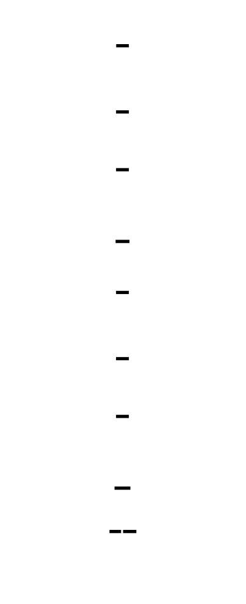

**Cost 2: Write Amplification.** Every INSERT into the table must also insert an entry into *every* index on that table. If you have 5 indexes, one INSERT becomes 6 B-tree insertions — the table plus 5 indexes. Each index insertion might trigger its own page splits, its own dirty pages, its own disk I/O. UPDATE is worse: you must delete the old index entry (the old column value) and insert the new one, for every index whose columns were modified. DELETE must remove entries from all indexes. A table with 5 indexes turns every write into roughly 6× the work.


**Cost 3: Selectivity Determines Whether the Index Helps.** If your query matches 0.1% of rows (high selectivity), the index is a massive win — 2 tree traversals per matching row is far less work than scanning 100% of rows. But if your query matches 30% of rows (low selectivity), the index performs 30,000 double lookups on a 100,000-row table — 60,000 tree traversals — while a full table scan would read ~1,400 leaf pages sequentially. Sequential reads are dramatically faster than random reads (both at the disk level and the CPU cache level), so the table scan wins despite reading more total data.
The crossover point — where an index scan becomes slower than a table scan — is typically around **10-20% selectivity**. Below that, the index saves work. Above it, the index *adds* work. Your query planner (Milestone 8) will make this decision automatically, but you need to understand the tradeoff now to build the index infrastructure correctly.

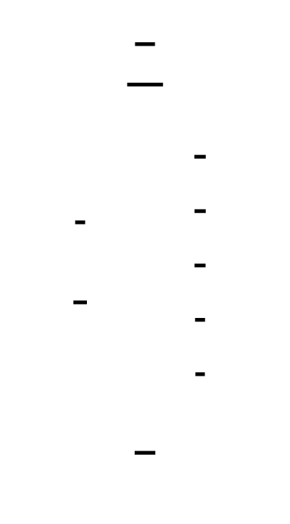

This is the fundamental tension of indexing: **indexes trade write performance for read performance, and only improve reads when selectivity is high enough to justify the double lookup.** An index is not a free speedup. It's a bet that certain queries are worth optimizing at the cost of making all writes slower.
---
## The Index B+tree: Structure and Cell Format
A secondary index is a **separate B+tree** stored in its own set of pages, with its own root page registered in the system catalog. The key distinction from the table B-tree (Milestone 5):

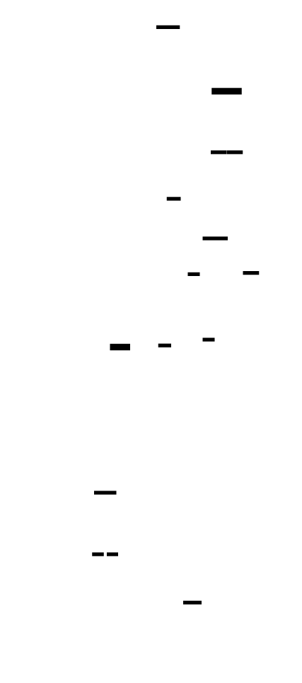

| Property | Table B-tree | Index B+tree |
|----------|-------------|-------------|
| Key | rowid (integer) | Indexed column value(s) |
| Leaf data | Full row record | (column_value, rowid) pair |
| Internal data | Separator key + child pointers | Separator key + child pointers (no row data) |
| Leaf linking | No links between leaves | Leaves linked in a chain (for range scans) |
| Ordering | By rowid | By indexed column value |
The B+tree distinction matters here more than it did for tables. Recall from Milestone 5: in a B+tree, **data lives only in leaf nodes**, and **leaf nodes are linked**. Internal nodes contain only separator keys and child pointers — no payloads. This gives index B+trees two advantages over B-trees:
1. **Higher fanout in internal nodes.** Without data payloads, internal pages fit more separator keys. With 4KB pages and 8-byte keys + 4-byte child pointers, you fit ~340 entries per internal page. Higher fanout → shallower tree → fewer page reads per lookup.
2. **Efficient range scans.** Because leaves are linked, scanning all rows where `age BETWEEN 20 AND 30` means: descend to the leaf containing age=20, then follow leaf-to-leaf pointers forward until you pass age=30. No need to re-traverse the tree. This is what makes `ORDER BY indexed_column` fast — the data is already in sorted order at the leaf level.
### Index Leaf Cell Format
An index leaf cell stores the indexed column value and the rowid of the corresponding table row. The payload is a record (using the same serialization format from Milestone 5) containing the indexed value followed by the rowid:
```c
// Index leaf cell: [payload_size (varint)] [record: (indexed_value, rowid)]
// The record header + body follow the same serial type format as table records.
int write_index_leaf_cell(uint8_t *buf, int offset,
                           ColumnValue *index_key, int64_t rowid) {
    // Build a record with 2 fields: the indexed value and the rowid
    ColumnValue fields[2];
    fields[0] = *index_key;
    fields[1].type = COL_INTEGER;
    fields[1].i = rowid;
    uint8_t record_buf[4096];
    int record_size = record_serialize(fields, 2, record_buf, sizeof(record_buf));
    int pos = offset;
    pos += varint_encode((uint64_t)record_size, buf + pos);
    memcpy(buf + pos, record_buf, record_size);
    pos += record_size;
    return pos - offset;  // total cell size
}
```
### Index Internal Cell Format
An index internal cell stores a child page pointer and a separator key. The separator key is also a record (indexed_value, rowid) — including the rowid in the separator is essential for handling duplicate indexed values. If 500 rows all have `age = 25`, the separators between leaf pages must distinguish them, and the rowid serves as the tiebreaker:
```c
// Index internal cell: [left_child (4 bytes BE)] [payload_size (varint)] [separator_record]
int write_index_internal_cell(uint8_t *buf, int offset,
                                uint32_t left_child,
                                ColumnValue *key, int64_t rowid) {
    int pos = offset;
    write_be32(buf + pos, left_child);
    pos += 4;
    // Separator is a record: (indexed_value, rowid)
    ColumnValue fields[2];
    fields[0] = *key;
    fields[1].type = COL_INTEGER;
    fields[1].i = rowid;
    uint8_t record_buf[512];
    int record_size = record_serialize(fields, 2, record_buf, sizeof(record_buf));
    pos += varint_encode((uint64_t)record_size, buf + pos);
    memcpy(buf + pos, record_buf, record_size);
    pos += record_size;
    return pos - offset;
}
```
### Leaf Page Linking for Range Scans
Unlike table B-tree leaves, index B+tree leaves must be linked. Each leaf page stores the page ID of the next leaf in the chain. You can reuse one of the header fields for this — or add a dedicated field. The simplest approach: store the next-leaf pointer in the first 4 bytes of the cell content area (before any cells), reserving this space during page initialization:
```c
#define INDEX_LEAF_NEXT_OFFSET (PAGE_SIZE - 4)  // last 4 bytes of page
void index_leaf_set_next(uint8_t *page, page_id_t next_leaf) {
    write_be32(page + INDEX_LEAF_NEXT_OFFSET, next_leaf);
}
page_id_t index_leaf_get_next(uint8_t *page) {
    return read_be32(page + INDEX_LEAF_NEXT_OFFSET);
}
```
An alternative (cleaner) approach: add a `next_leaf` field to the page header for `PAGE_TYPE_INDEX_LEAF` pages. SQLite doesn't actually store next-leaf pointers; it uses the parent-chain traversal from Milestone 5. But explicit leaf linking is simpler to implement for range scans and is what most B+tree textbooks describe. Either approach works — the tradeoff is 4 bytes of space per leaf page (trivial) versus the complexity of parent-chain traversal for range scans (nontrivial).
---
## Key Comparison for Index Entries
Index B+trees are ordered by the indexed column value, not by rowid. This means your cell insertion, search, and split logic must compare column values rather than integers. The comparison is more complex because you must handle multiple data types and the rowid tiebreaker:
```c
// Compare two index keys: (column_value, rowid) pairs.
// Returns negative if a < b, 0 if equal, positive if a > b.
static int index_key_compare(ColumnValue *val_a, int64_t rowid_a,
                               ColumnValue *val_b, int64_t rowid_b) {
    // First, compare the indexed column values
    int cmp = column_value_compare(val_a, val_b);
    if (cmp != 0) return cmp;
    // Tiebreaker: compare rowids
    if (rowid_a < rowid_b) return -1;
    if (rowid_a > rowid_b) return 1;
    return 0;
}
// Compare two column values of potentially different types.
// NULL sorts before all other values (SQLite convention).
static int column_value_compare(ColumnValue *a, ColumnValue *b) {
    // NULL handling: NULL < everything else
    if (a->type == COL_NULL && b->type == COL_NULL) return 0;
    if (a->type == COL_NULL) return -1;
    if (b->type == COL_NULL) return 1;
    // SQLite type affinity ordering: NULL < INTEGER/REAL < TEXT < BLOB
    // For same-type comparison:
    if (a->type == COL_INTEGER && b->type == COL_INTEGER) {
        if (a->i < b->i) return -1;
        if (a->i > b->i) return 1;
        return 0;
    }
    if (a->type == COL_REAL && b->type == COL_REAL) {
        if (a->r < b->r) return -1;
        if (a->r > b->r) return 1;
        return 0;
    }
    if ((a->type == COL_INTEGER || a->type == COL_REAL) &&
        (b->type == COL_INTEGER || b->type == COL_REAL)) {
        double da = (a->type == COL_REAL) ? a->r : (double)a->i;
        double db = (b->type == COL_REAL) ? b->r : (double)b->i;
        if (da < db) return -1;
        if (da > db) return 1;
        return 0;
    }
    if (a->type == COL_TEXT && b->type == COL_TEXT) {
        int min_len = a->s.length < b->s.length ? a->s.length : b->s.length;
        int cmp = memcmp(a->s.data, b->s.data, min_len);
        if (cmp != 0) return cmp;
        if (a->s.length < b->s.length) return -1;
        if (a->s.length > b->s.length) return 1;
        return 0;
    }
    // Cross-type: use SQLite type order: INTEGER/REAL < TEXT < BLOB
    int order_a = type_sort_order(a->type);
    int order_b = type_sort_order(b->type);
    return order_a - order_b;
}
static int type_sort_order(ColumnType t) {
    switch (t) {
        case COL_NULL:    return 0;
        case COL_INTEGER: return 1;
        case COL_REAL:    return 1;
        case COL_TEXT:    return 2;
        case COL_BLOB:    return 3;
        default:          return 4;
    }
}
```
The NULL sorting convention deserves attention. SQLite sorts NULLs before all other values in indexes. This means a scan from the beginning of an index leaf chain encounters NULL entries first. The IS NULL optimization becomes free: `WHERE indexed_col IS NULL` is a range scan at the very start of the index.
---
## CREATE INDEX: Building the B+tree
`CREATE INDEX idx_users_age ON users(age)` must:
1. Look up the `users` table in the system catalog to get its root page and schema.
2. Allocate a new B+tree root page for the index.
3. Scan all existing rows in the `users` table, extracting the `age` column and the rowid from each row.
4. Insert each `(age, rowid)` pair into the index B+tree.
5. Register the index in the system catalog with `type='index'`.
```c
int create_index(Database *db, const char *index_name,
                  const char *table_name, const char *column_name,
                  bool is_unique) {
    // Step 1: Look up the table
    TableSchema *schema = catalog_find_table(&db->catalog, table_name);
    if (!schema) {
        fprintf(stderr, "no such table: %s\n", table_name);
        return -1;
    }
    int col_idx = -1;
    for (int i = 0; i < schema->column_count; i++) {
        if (strcasecmp(schema->column_names[i], column_name) == 0) {
            col_idx = i;
            break;
        }
    }
    if (col_idx < 0) {
        fprintf(stderr, "no such column: %s.%s\n", table_name, column_name);
        return -1;
    }
    // Step 2: Allocate a new root page for the index B+tree
    page_id_t index_root = buffer_pool_new_page(db->pool);
    uint8_t *root_page = fetch_page(db->pool, index_root);
    page_init(root_page, PAGE_TYPE_INDEX_LEAF);
    index_leaf_set_next(root_page, 0);  // no next leaf yet
    unpin_page(db->pool, index_root, true);
    // Step 3: Scan the table and populate the index
    BTree table_tree = { .pool = db->pool, .root_page = schema->root_page };
    BTree index_tree = { .pool = db->pool, .root_page = index_root,
                          .page_type = PAGE_TYPE_INDEX_LEAF };
    BTreeCursor *cur = btree_cursor_open(&table_tree);
    bool empty = btree_cursor_rewind(cur);
    if (!empty) {
        do {
            // Read the indexed column value
            ColumnValue col_val;
            btree_cursor_read_column(cur, col_idx, &col_val);
            // Read the rowid
            int64_t rowid = btree_cursor_rowid(cur);
            // Check UNIQUE constraint
            if (is_unique && col_val.type != COL_NULL) {
                if (index_contains_value(&index_tree, &col_val)) {
                    fprintf(stderr,
                            "UNIQUE constraint failed: %s.%s\n",
                            table_name, column_name);
                    btree_cursor_close(cur);
                    return -1;
                }
            }
            // Insert (column_value, rowid) into index B+tree
            index_btree_insert(&index_tree, &col_val, rowid);
        } while (btree_cursor_next(cur));
    }
    btree_cursor_close(cur);
    // Step 4: Register in system catalog
    IndexSchema *idx = &db->catalog.indexes[db->catalog.index_count];
    strncpy(idx->name, index_name, 63);
    strncpy(idx->table_name, table_name, 63);
    strncpy(idx->column_name, column_name, 63);
    idx->column_idx = col_idx;
    idx->root_page = index_root;
    idx->is_unique = is_unique;
    db->catalog.index_count++;
    // Persist to sqlite_master
    catalog_insert_index_row(&db->catalog, db->pool, idx);
    return 0;
}
```
The index B+tree insertion function is structurally identical to the table B-tree insertion from Milestone 5, but uses `index_key_compare` instead of integer rowid comparison, and uses the index cell formats instead of table cell formats:
```c
void index_btree_insert(BTree *tree, ColumnValue *key, int64_t rowid) {
    // Build the leaf cell
    uint8_t cell_buf[4096];
    int cell_size = write_index_leaf_cell(cell_buf, 0, key, rowid);
    // Search for the correct leaf page
    page_id_t leaf_page;
    int cell_idx;
    index_btree_search(tree, key, rowid, &leaf_page, &cell_idx);
    // Try inserting into the leaf
    uint8_t *page = fetch_page(tree->pool, leaf_page);
    int result = index_page_insert_cell(page, cell_buf, cell_size,
                                          key, rowid);
    if (result == 0) {
        unpin_page(tree->pool, leaf_page, true);
        return;
    }
    // Page full — split
    unpin_page(tree->pool, leaf_page, false);
    ColumnValue promoted_key;
    int64_t promoted_rowid;
    page_id_t new_page;
    index_btree_split_leaf(tree, leaf_page, cell_buf, cell_size,
                            key, rowid,
                            &promoted_key, &promoted_rowid, &new_page);
    // Update leaf chain: new_page's next = old_page's next, old_page's next = new_page
    uint8_t *old_p = fetch_page(tree->pool, leaf_page);
    page_id_t old_next = index_leaf_get_next(old_p);
    index_leaf_set_next(old_p, new_page);
    unpin_page(tree->pool, leaf_page, true);
    uint8_t *new_p = fetch_page(tree->pool, new_page);
    index_leaf_set_next(new_p, old_next);
    unpin_page(tree->pool, new_page, true);
    // Insert promoted key into parent
    index_btree_insert_into_parent(tree, leaf_page,
                                     &promoted_key, promoted_rowid,
                                     new_page, INVALID_PAGE_ID);
}
```
Note the leaf chain maintenance during splits. When a leaf page splits into two (left and right), the right page's `next` pointer must point to whatever the left page's `next` used to be, and the left page's `next` must now point to the right page. This preserves the linked-list ordering so range scans traverse all leaves correctly.
---
## Index Lookup: The Equality Search
An index equality lookup — `WHERE age = 25` — descends the index B+tree to find the first leaf entry with `age = 25`, then scans forward through the leaf chain collecting all matching entries. Each matching entry yields a rowid, which is then used to fetch the full row from the table B-tree.


```c
// Search the index B+tree for entries matching the given key.
// For each match, calls callback with the rowid.
// Returns the number of matching entries.
int index_equality_lookup(BTree *index_tree, ColumnValue *search_key,
                           void (*callback)(int64_t rowid, void *ctx),
                           void *ctx) {
    // Descend to the leftmost leaf that might contain search_key
    page_id_t current = index_tree->root_page;
    while (true) {
        uint8_t *page = fetch_page(index_tree->pool, current);
        uint8_t page_type = page[0];
        if (page_type == PAGE_TYPE_INDEX_LEAF) {
            // Search this leaf and subsequent leaves
            int matches = 0;
            page_id_t leaf = current;
            while (leaf != 0) {
                uint8_t *lp = (leaf == current) ? page :
                               fetch_page(index_tree->pool, leaf);
                uint16_t cell_count = read_be16(lp + 3);
                for (int i = 0; i < cell_count; i++) {
                    ColumnValue entry_key;
                    int64_t entry_rowid;
                    read_index_leaf_cell(lp, i, &entry_key, &entry_rowid);
                    int cmp = column_value_compare(&entry_key, search_key);
                    if (cmp < 0) continue;   // not yet reached search_key
                    if (cmp > 0) {
                        // Past search_key — done
                        if (leaf != current)
                            unpin_page(index_tree->pool, leaf, false);
                        else
                            unpin_page(index_tree->pool, current, false);
                        return matches;
                    }
                    // cmp == 0: match!
                    callback(entry_rowid, ctx);
                    matches++;
                }
                page_id_t next = index_leaf_get_next(lp);
                if (leaf != current)
                    unpin_page(index_tree->pool, leaf, false);
                else
                    unpin_page(index_tree->pool, current, false);
                leaf = next;
            }
            return matches;
        }
        // Internal page: descend to the correct child
        uint16_t cell_count = read_be16(page + 3);
        page_id_t child = read_be32(page + 8);  // default: right_child
        for (int i = 0; i < cell_count; i++) {
            ColumnValue sep_key;
            int64_t sep_rowid;
            uint32_t left_child;
            read_index_internal_cell(page, i, &left_child,
                                       &sep_key, &sep_rowid);
            int cmp = column_value_compare(search_key, &sep_key);
            if (cmp < 0 || (cmp == 0 && /* want leftmost match */ true)) {
                child = left_child;
                break;
            }
        }
        unpin_page(index_tree->pool, current, false);
        current = child;
    }
}
```
### The Double Lookup in the VM
The VM must perform two cursor operations per matching index entry: one to read the rowid from the index, and another to seek into the table B-tree to fetch the full row. This requires two open cursors — an **index cursor** and a **table cursor**:


```c
// New opcodes for index operations
OP_OPEN_INDEX_READ,   // Open index cursor p1 on index root page p2
OP_IDX_KEY,           // Read indexed value from index cursor p1 into register p2
OP_IDX_ROWID,         // Read rowid from index cursor p1 into register p2
OP_SEEK_ROWID,        // Position table cursor p1 to rowid in register p2
```
The bytecode for `SELECT name, age FROM users WHERE age = 25` with an index on `age`:
```
addr  opcode          p1   p2   p3   comment
----  --------------  ---  ---  ---  -------
0     Init            0    1    0    Start
1     OpenRead        0    5    3    users (table cursor, root=5)
2     OpenIndexRead   1    8    0    idx_users_age (index cursor, root=8)
3     Integer         25   1    0    search key → r1
4     IdxSeek         1    12   1    seek index cursor to r1; jump to Close if not found
5     IdxKey          1    2    0    read indexed value → r2
6     Integer         25   3    0    25 → r3
7     Ne              2    10   3    if r2 != 25, jump to IdxNext (past matching range)
8     IdxRowid        1    4    0    read rowid from index → r4
9     SeekRowid       0    4    0    position table cursor to rowid r4
10    Column          0    0    5    name → r5
11    Column          0    1    6    age → r6
12    ResultRow       5    2    0    output r5, r6
13    IdxNext         1    5    0    advance index cursor; loop if more entries
14    Close           1    0    0    close index cursor
15    Close           0    0    0    close table cursor
16    Halt            0    0    0
```


Study the double lookup at addresses 8-9: `OP_IDX_ROWID` extracts the rowid from the index cursor's current entry, then `OP_SEEK_ROWID` uses that rowid to position the *table* cursor so that subsequent `OP_COLUMN` calls read from the correct table row. Two tree traversals per matching row — one for the index seek (amortized via leaf scanning), one for the table seek.
The VM handlers:
```c
case OP_OPEN_INDEX_READ: {
    int cursor_id = op->p1;
    int root_page = op->p2;
    BTree *idx_tree = btree_open(vm->db->pool, root_page);
    idx_tree->page_type = PAGE_TYPE_INDEX_LEAF;
    vm->cursors[cursor_id] = index_cursor_open(idx_tree);
    break;
}
case OP_IDX_ROWID: {
    int cursor_id = op->p1;
    int dest_reg = op->p2;
    // Read the rowid field from the current index entry
    ColumnValue fields[2];
    int field_count;
    index_cursor_read_entry(vm->cursors[cursor_id], fields, &field_count);
    // The rowid is the second field in the index record
    vm->registers[dest_reg].type = VAL_INTEGER;
    vm->registers[dest_reg].i = fields[1].i;
    break;
}
case OP_IDX_KEY: {
    int cursor_id = op->p1;
    int dest_reg = op->p2;
    ColumnValue fields[2];
    int field_count;
    index_cursor_read_entry(vm->cursors[cursor_id], fields, &field_count);
    column_value_to_vm_value(&fields[0], &vm->registers[dest_reg]);
    break;
}
```
---
## Index Range Scan: Following the Leaf Chain
A range predicate like `WHERE age BETWEEN 20 AND 30` or `WHERE age > 21 AND age < 50` can use the index for efficient scanning. The algorithm:
1. Descend the index B+tree to find the first leaf entry where `age >= 20` (the lower bound).
2. Scan forward through the leaf chain, outputting every entry where `age <= 30`.
3. Stop when you encounter an entry where `age > 30`.

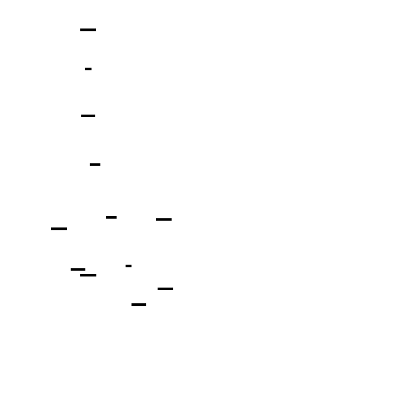

The leaf chain is what makes this efficient. Without it, you'd need to re-traverse the tree for every distinct value in the range. With the chain, you descend once and then follow sequential pointers — touching each leaf page exactly once. The I/O pattern is **sequential** (leaf pages are logically adjacent in the chain), which is dramatically faster than the **random** I/O of double lookups.
```c
// Range scan on an index.
// Scans entries where lower_bound <= key <= upper_bound.
// Either bound can be NULL to indicate "unbounded".
int index_range_scan(BTree *index_tree,
                      ColumnValue *lower_bound,
                      ColumnValue *upper_bound,
                      void (*callback)(int64_t rowid, void *ctx),
                      void *ctx) {
    // Find the starting leaf
    page_id_t start_leaf;
    int start_cell;
    if (lower_bound) {
        // Descend to the first entry >= lower_bound
        index_btree_find_ge(index_tree, lower_bound,
                             &start_leaf, &start_cell);
    } else {
        // Start from the leftmost leaf
        start_leaf = index_btree_leftmost_leaf(index_tree);
        start_cell = 0;
    }
    // Scan forward through the leaf chain
    int matches = 0;
    page_id_t leaf = start_leaf;
    int cell = start_cell;
    while (leaf != 0) {
        uint8_t *page = fetch_page(index_tree->pool, leaf);
        uint16_t cell_count = read_be16(page + 3);
        for (int i = cell; i < cell_count; i++) {
            ColumnValue entry_key;
            int64_t entry_rowid;
            read_index_leaf_cell(page, i, &entry_key, &entry_rowid);
            // Check upper bound
            if (upper_bound) {
                int cmp = column_value_compare(&entry_key, upper_bound);
                if (cmp > 0) {
                    unpin_page(index_tree->pool, leaf, false);
                    return matches;  // past upper bound — done
                }
            }
            callback(entry_rowid, ctx);
            matches++;
        }
        page_id_t next = index_leaf_get_next(page);
        unpin_page(index_tree->pool, leaf, false);
        leaf = next;
        cell = 0;  // start from beginning of next leaf
    }
    return matches;
}
```
The bytecode for a range scan looks similar to the equality scan but with two bound checks instead of one. The compiler emits `OP_IDX_GE` (seek to first entry ≥ lower bound) at the start, and an `OP_GT` check inside the loop that jumps to Close when the upper bound is exceeded.
---
## Index Maintenance: Keeping Indexes Consistent
Every DML operation — INSERT, UPDATE, DELETE — must update all indexes on the affected table. This is **synchronous maintenance**: the indexes are updated within the same operation, not deferred to a background process. If the user inserts a row and immediately queries using an index, the index must already contain the new entry.
### INSERT Maintenance
After inserting a row into the table B-tree, insert a corresponding entry into every index:
```c
void insert_with_indexes(Database *db, TableSchema *schema,
                          int64_t rowid, ColumnValue *columns,
                          int col_count) {
    // Insert into the table B-tree
    BTree table_tree = { .pool = db->pool, .root_page = schema->root_page };
    btree_insert(&table_tree, rowid, columns, col_count);
    // Insert into every index on this table
    for (int i = 0; i < db->catalog.index_count; i++) {
        IndexSchema *idx = &db->catalog.indexes[i];
        if (strcasecmp(idx->table_name, schema->name) != 0) continue;
        ColumnValue *key_val = &columns[idx->column_idx];
        // UNIQUE check (if applicable)
        if (idx->is_unique && key_val->type != COL_NULL) {
            BTree idx_tree = { .pool = db->pool,
                                .root_page = idx->root_page };
            if (index_contains_value(&idx_tree, key_val)) {
                // Rollback: delete the table row we just inserted
                btree_delete_by_rowid(&table_tree, rowid);
                fprintf(stderr, "UNIQUE constraint failed: %s\n",
                        idx->name);
                return;
            }
        }
        // Insert into index B+tree
        BTree idx_tree = { .pool = db->pool, .root_page = idx->root_page };
        index_btree_insert(&idx_tree, key_val, rowid);
    }
}
```
### DELETE Maintenance
Before deleting a row from the table B-tree, delete the corresponding entry from every index. You need the old column values to find the correct index entries:
```c
void delete_with_indexes(Database *db, TableSchema *schema,
                          int64_t rowid) {
    BTree table_tree = { .pool = db->pool, .root_page = schema->root_page };
    // Read the row's current values (needed to find index entries)
    ColumnValue old_columns[32];
    int col_count;
    btree_read_row(&table_tree, rowid, old_columns, &col_count);
    // Delete from every index
    for (int i = 0; i < db->catalog.index_count; i++) {
        IndexSchema *idx = &db->catalog.indexes[i];
        if (strcasecmp(idx->table_name, schema->name) != 0) continue;
        BTree idx_tree = { .pool = db->pool, .root_page = idx->root_page };
        index_btree_delete(&idx_tree, &old_columns[idx->column_idx], rowid);
    }
    // Delete from table B-tree
    btree_delete_by_rowid(&table_tree, rowid);
}
```
The `index_btree_delete` function searches the index B+tree for the exact `(column_value, rowid)` pair and removes that cell. Using the rowid as part of the search key is essential — without it, you can't distinguish between multiple rows with the same indexed value.
### UPDATE Maintenance
UPDATE is the costliest operation because it must delete old index entries and insert new ones for every modified indexed column:
```c
void update_with_indexes(Database *db, TableSchema *schema,
                          int64_t rowid,
                          ColumnValue *old_columns,
                          ColumnValue *new_columns,
                          int col_count) {
    for (int i = 0; i < db->catalog.index_count; i++) {
        IndexSchema *idx = &db->catalog.indexes[i];
        if (strcasecmp(idx->table_name, schema->name) != 0) continue;
        ColumnValue *old_key = &old_columns[idx->column_idx];
        ColumnValue *new_key = &new_columns[idx->column_idx];
        // Only update the index if the indexed column actually changed
        if (column_value_compare(old_key, new_key) == 0) continue;
        BTree idx_tree = { .pool = db->pool, .root_page = idx->root_page };
        // UNIQUE check on the new value
        if (idx->is_unique && new_key->type != COL_NULL) {
            if (index_contains_value(&idx_tree, new_key)) {
                fprintf(stderr, "UNIQUE constraint failed: %s\n",
                        idx->name);
                return;  // abort the update
            }
        }
        // Remove old entry, insert new entry
        index_btree_delete(&idx_tree, old_key, rowid);
        index_btree_insert(&idx_tree, new_key, rowid);
    }
    // Update the table B-tree row
    BTree table_tree = { .pool = db->pool, .root_page = schema->root_page };
    btree_delete_by_rowid(&table_tree, rowid);
    btree_insert(&table_tree, rowid, new_columns, col_count);
}
```
The optimization `if (column_value_compare(old_key, new_key) == 0) continue` is important. If `UPDATE users SET name = 'Bob' WHERE id = 1` doesn't change the `age` column, the index on `age` doesn't need to be updated. This saves one B+tree deletion and one insertion per unaffected index.
---
## UNIQUE Index: Constraint Enforcement
A UNIQUE index adds a constraint: no two non-NULL entries in the index may have the same column value. NULL values are explicitly excluded — SQL allows multiple NULL values in a UNIQUE column because NULL is "unknown," and two unknowns might or might not be equal.
The check happens in two places:
1. **During CREATE UNIQUE INDEX**: scan all existing rows. If any two non-NULL values are duplicates, the CREATE fails.
2. **During INSERT and UPDATE**: before inserting a new index entry, check if the value already exists.
```c
bool index_contains_value(BTree *index_tree, ColumnValue *search_key) {
    // Use the equality lookup — if it finds any match, the value exists
    typedef struct { bool found; } CheckCtx;
    CheckCtx ctx = { .found = false };
    index_equality_lookup(index_tree, search_key,
                           check_callback, &ctx);
    return ctx.found;
}
static void check_callback(int64_t rowid, void *raw_ctx) {
    CheckCtx *ctx = (CheckCtx*)raw_ctx;
    ctx->found = true;
}
```
The UNIQUE check must happen *before* the index insert. If you insert first and check after, a concurrent writer could slip in between (not a concern for your single-threaded build, but the correct ordering matters for correctness of the algorithm). The sequence is: check → insert index entry → insert table row. If the check fails, nothing is written.
For compound UNIQUE constraints (multiple columns), the check involves comparing all columns — but that's a Milestone 8+ concern. For now, single-column UNIQUE indexes are sufficient.
---
## Integrating Index Scans into the Compiler
The compiler must decide when to use an index. For this milestone, use a simple rule: **if the WHERE clause contains an equality or range predicate on a column that has an index, use the index.** The query planner (Milestone 8) will later make this decision based on cost estimation; for now, always prefer the index when one is available.
```c
// During compile_select, check for usable indexes
static IndexSchema* find_usable_index(Compiler *c, int table_idx,
                                        AstNode *where_clause) {
    if (!where_clause) return NULL;
    // Look for simple comparisons: column = expr, column > expr, etc.
    if (where_clause->type == NODE_BINARY_EXPR) {
        AstNode *left = where_clause->data.binary.left;
        TokenType op = where_clause->data.binary.op;
        // Only handle: column {=, <, >, <=, >=} expr
        if (left->type != NODE_IDENTIFIER) return NULL;
        if (op != TOK_EQ && op != TOK_LT && op != TOK_GT &&
            op != TOK_LE && op != TOK_GE) return NULL;
        const char *col_name = left->data.identifier.name;
        // Search for an index on this column
        for (int i = 0; i < c->index_count; i++) {
            IndexSchema *idx = &c->indexes[i];
            if (strcasecmp(idx->table_name,
                            c->tables[table_idx].name) != 0) continue;
            if (strcasecmp(idx->column_name, col_name) != 0) continue;
            return idx;  // found a usable index
        }
    }
    return NULL;
}
```
When a usable index is found, `compile_select` emits index-scan bytecode instead of full-table-scan bytecode:
```c
static void compile_select(Compiler *c, AstNode *node) {
    int table_idx = find_table(c, node->data.select.from_table);
    if (table_idx < 0) { /* error */ return; }
    IndexSchema *idx = find_usable_index(c, table_idx,
                                           node->data.select.where_clause);
    if (idx) {
        compile_select_with_index(c, node, table_idx, idx);
    } else {
        compile_select_full_scan(c, node, table_idx);
    }
}
```
The `compile_select_with_index` function emits the double-lookup bytecode pattern shown earlier. For equality predicates, it emits `IdxSeek` + loop with `Ne` check. For range predicates, it emits `IdxGe` (seek to lower bound) + loop with upper bound check.
---
## Measuring the Improvement: Page Reads as Currency

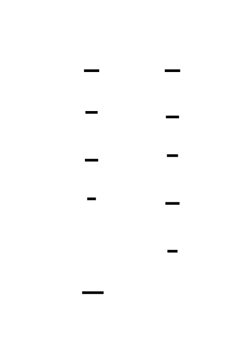

To verify your index actually helps, count page reads. Add a counter to the buffer pool:
```c
// In BufferPool struct:
uint64_t page_reads_session;  // reset per query
void buffer_pool_reset_counters(BufferPool *pool) {
    pool->page_reads_session = 0;
}
// In fetch_page, after loading or returning:
pool->page_reads_session++;
```
Now measure:
```c
void test_index_reduces_pages(void) {
    Database *db = db_open("test_idx_perf.db");
    execute_sql(db, "CREATE TABLE t (id INTEGER PRIMARY KEY, "
                    "val INTEGER, name TEXT);", NULL, NULL);
    // Insert 10,000 rows
    for (int i = 1; i <= 10000; i++) {
        char sql[128];
        snprintf(sql, sizeof(sql),
                 "INSERT INTO t VALUES (%d, %d, 'name_%d');",
                 i, i % 100, i);
        execute_sql(db, sql, NULL, NULL);
    }
    // Query WITHOUT index
    buffer_pool_reset_counters(db->pool);
    ResultCollector rc1 = {0};
    execute_sql(db, "SELECT name FROM t WHERE val = 42;",
                collect_results, &rc1);
    uint64_t pages_no_index = db->pool->page_reads_session;
    // Create index
    execute_sql(db, "CREATE INDEX idx_val ON t(val);", NULL, NULL);
    // Query WITH index
    buffer_pool_reset_counters(db->pool);
    ResultCollector rc2 = {0};
    execute_sql(db, "SELECT name FROM t WHERE val = 42;",
                collect_results, &rc2);
    uint64_t pages_with_index = db->pool->page_reads_session;
    assert(rc1.row_count == rc2.row_count);  // same results
    assert(pages_with_index < pages_no_index / 2);
    // With 10,000 rows, full scan reads ~143 pages.
    // Index lookup for val=42 (100 matching rows): ~3 index pages + 100 table pages
    // Still much less than 143 for high selectivity (1% match rate)
    printf("Without index: %lu pages\n", pages_no_index);
    printf("With index:    %lu pages\n", pages_with_index);
    db_close(db);
    unlink("test_idx_perf.db");
    printf("PASS: index reduces page reads\n");
}
```
---
## System Catalog Updates for Indexes
The system catalog must track indexes alongside tables. Extend the schema structures:
```c
typedef struct {
    char     name[64];
    char     table_name[64];
    char     column_name[64];
    int      column_idx;
    int      root_page;
    bool     is_unique;
} IndexSchema;
// In SystemCatalog:
IndexSchema indexes[128];
int         index_count;
```
On database open, the catalog reads all rows from `sqlite_master` where `type = 'index'` to rebuild the in-memory index schema cache. The `sql` field stores the original `CREATE INDEX` statement for future reference.
```c
void catalog_load_indexes(SystemCatalog *catalog, BufferPool *pool) {
    BTree master_tree = { .pool = pool, .root_page = 1 };
    BTreeCursor *cur = btree_cursor_open(&master_tree);
    if (btree_cursor_rewind(cur)) {
        btree_cursor_close(cur);
        return;
    }
    do {
        ColumnValue cols[5];
        int n;
        btree_cursor_read_record(cur, cols, 5, &n);
        // Check if type = 'index'
        if (cols[0].type == COL_TEXT &&
            cols[0].s.length == 5 &&
            memcmp(cols[0].s.data, "index", 5) == 0) {
            IndexSchema *idx = &catalog->indexes[catalog->index_count];
            // Parse name, table_name, rootpage from cols[1..4]
            memcpy(idx->name, cols[1].s.data, cols[1].s.length);
            idx->name[cols[1].s.length] = '\0';
            memcpy(idx->table_name, cols[2].s.data, cols[2].s.length);
            idx->table_name[cols[2].s.length] = '\0';
            idx->root_page = (int)cols[3].i;
            // Parse column name from the SQL string (cols[4]) or store separately
            // (simplified: require column_name stored in tbl_name field or parsed from SQL)
            catalog->index_count++;
        }
    } while (btree_cursor_next(cur));
    btree_cursor_close(cur);
}
```
---
## Testing
### Test: CREATE INDEX and Equality Lookup
```c
void test_create_index_and_lookup(void) {
    Database *db = db_open("test_cidx.db");
    execute_sql(db, "CREATE TABLE t (id INTEGER PRIMARY KEY, "
                    "age INTEGER, name TEXT);", NULL, NULL);
    execute_sql(db, "INSERT INTO t VALUES (1, 25, 'Alice');", NULL, NULL);
    execute_sql(db, "INSERT INTO t VALUES (2, 30, 'Bob');", NULL, NULL);
    execute_sql(db, "INSERT INTO t VALUES (3, 25, 'Charlie');", NULL, NULL);
    execute_sql(db, "INSERT INTO t VALUES (4, 35, 'Diana');", NULL, NULL);
    execute_sql(db, "CREATE INDEX idx_age ON t(age);", NULL, NULL);
    // Equality lookup: should use index
    ResultCollector rc = {0};
    execute_sql(db, "SELECT name FROM t WHERE age = 25;",
                collect_results, &rc);
    assert(rc.row_count == 2);
    // Should find Alice and Charlie (order may vary)
    db_close(db);
    unlink("test_cidx.db");
    printf("PASS: CREATE INDEX and equality lookup\n");
}
```
### Test: Range Scan
```c
void test_index_range_scan(void) {
    Database *db = db_open("test_range.db");
    execute_sql(db, "CREATE TABLE t (id INTEGER PRIMARY KEY, "
                    "score INTEGER);", NULL, NULL);
    for (int i = 1; i <= 100; i++) {
        char sql[128];
        snprintf(sql, sizeof(sql),
                 "INSERT INTO t VALUES (%d, %d);", i, i);
        execute_sql(db, sql, NULL, NULL);
    }
    execute_sql(db, "CREATE INDEX idx_score ON t(score);", NULL, NULL);
    // Range: score > 90
    ResultCollector rc = {0};
    execute_sql(db, "SELECT id FROM t WHERE score > 90;",
                collect_results, &rc);
    assert(rc.row_count == 10);  // scores 91-100
    db_close(db);
    unlink("test_range.db");
    printf("PASS: index range scan\n");
}
```
### Test: UNIQUE Index Rejects Duplicates
```c
void test_unique_index(void) {
    Database *db = db_open("test_unique.db");
    execute_sql(db, "CREATE TABLE t (id INTEGER PRIMARY KEY, "
                    "email TEXT);", NULL, NULL);
    execute_sql(db, "INSERT INTO t VALUES (1, 'alice@test.com');",
                NULL, NULL);
    execute_sql(db, "CREATE UNIQUE INDEX idx_email ON t(email);",
                NULL, NULL);
    // Duplicate should be rejected
    int rc = execute_sql(db, "INSERT INTO t VALUES (2, 'alice@test.com');",
                          NULL, NULL);
    assert(rc != 0);  // constraint violation
    // Different value should succeed
    rc = execute_sql(db, "INSERT INTO t VALUES (2, 'bob@test.com');",
                      NULL, NULL);
    assert(rc == 0);
    // NULL should be allowed even with UNIQUE
    rc = execute_sql(db, "INSERT INTO t VALUES (3, NULL);", NULL, NULL);
    assert(rc == 0);
    rc = execute_sql(db, "INSERT INTO t VALUES (4, NULL);", NULL, NULL);
    assert(rc == 0);  // multiple NULLs are OK
    db_close(db);
    unlink("test_unique.db");
    printf("PASS: UNIQUE index rejects duplicates\n");
}
```
### Test: Index Maintained on INSERT/UPDATE/DELETE
```c
void test_index_maintenance(void) {
    Database *db = db_open("test_maint.db");
    execute_sql(db, "CREATE TABLE t (id INTEGER PRIMARY KEY, "
                    "val INTEGER);", NULL, NULL);
    execute_sql(db, "CREATE INDEX idx_val ON t(val);", NULL, NULL);
    // INSERT
    execute_sql(db, "INSERT INTO t VALUES (1, 10);", NULL, NULL);
    execute_sql(db, "INSERT INTO t VALUES (2, 20);", NULL, NULL);
    execute_sql(db, "INSERT INTO t VALUES (3, 30);", NULL, NULL);
    ResultCollector rc1 = {0};
    execute_sql(db, "SELECT id FROM t WHERE val = 20;",
                collect_results, &rc1);
    assert(rc1.row_count == 1);
    assert(rc1.rows[0][0].i == 2);
    // UPDATE: change val from 20 to 25
    execute_sql(db, "UPDATE t SET val = 25 WHERE id = 2;", NULL, NULL);
    // Old value should return no results
    ResultCollector rc2 = {0};
    execute_sql(db, "SELECT id FROM t WHERE val = 20;",
                collect_results, &rc2);
    assert(rc2.row_count == 0);
    // New value should be findable
    ResultCollector rc3 = {0};
    execute_sql(db, "SELECT id FROM t WHERE val = 25;",
                collect_results, &rc3);
    assert(rc3.row_count == 1);
    assert(rc3.rows[0][0].i == 2);
    // DELETE
    execute_sql(db, "DELETE FROM t WHERE id = 2;", NULL, NULL);
    ResultCollector rc4 = {0};
    execute_sql(db, "SELECT id FROM t WHERE val = 25;",
                collect_results, &rc4);
    assert(rc4.row_count == 0);  // deleted row no longer in index
    db_close(db);
    unlink("test_maint.db");
    printf("PASS: index maintained across INSERT/UPDATE/DELETE\n");
}
```
### Test: Double Lookup Correctness
```c
void test_double_lookup(void) {
    Database *db = db_open("test_dbl.db");
    execute_sql(db, "CREATE TABLE t (id INTEGER PRIMARY KEY, "
                    "category INTEGER, description TEXT);", NULL, NULL);
    execute_sql(db, "CREATE INDEX idx_cat ON t(category);", NULL, NULL);
    execute_sql(db, "INSERT INTO t VALUES (1, 5, 'first');", NULL, NULL);
    execute_sql(db, "INSERT INTO t VALUES (2, 3, 'second');", NULL, NULL);
    execute_sql(db, "INSERT INTO t VALUES (3, 5, 'third');", NULL, NULL);
    // Query using index — the description column is NOT in the index,
    // so the VM must perform a double lookup (index → rowid → table)
    ResultCollector rc = {0};
    execute_sql(db, "SELECT description FROM t WHERE category = 5;",
                collect_results, &rc);
    assert(rc.row_count == 2);
    // Should find 'first' and 'third'
    db_close(db);
    unlink("test_dbl.db");
    printf("PASS: double lookup fetches non-indexed columns\n");
}
```
---
## Three-Level View: What Happens During an Index Lookup
**Level 1 — Public API**: You execute `SELECT name FROM users WHERE age = 25`. The engine returns only the rows where age is 25, without scanning the entire table.
**Level 2 — VM Engine**: The compiler detects that `idx_users_age` exists for the `age` column and emits index-scan bytecode. The VM opens two cursors: an index cursor on the `idx_users_age` B+tree and a table cursor on the `users` table B-tree. `OP_IDX_SEEK` descends the index B+tree (3 levels for millions of rows — 3 page reads). The loop reads each matching index entry's rowid via `OP_IDX_ROWID`, then `OP_SEEK_ROWID` descends the table B-tree (another 3 page reads) to position at that row. `OP_COLUMN` deserializes the `name` column from the table row's record. For 100 matching rows, that's ~3 index pages + ~100 table page seeks (many of which hit the same pages and are buffer pool hits).
**Level 3 — Buffer Pool / Disk**: Each `fetch_page` checks the hash table for a hit (~10ns). The index's internal pages (root + 1-2 internal levels) are accessed for every query on this index and quickly become "hot" in the buffer pool — essentially free after the first query. The leaf pages carrying the matching entries are accessed sequentially (via the leaf chain), which is cache-friendly. The table page lookups for the double lookup are **random access** — rowid 7,042 and rowid 83,291 probably live on different pages. These random reads are the dominant cost. On SSD, each random page read costs ~100μs. For 100 matching rows hitting 80 distinct table pages, that's ~8ms — versus ~14ms for a full table scan of 143 pages read sequentially. The index wins because 80 < 143, but the margin is thinner than you might expect because random reads are slower than sequential reads per page.
---
## Knowledge Cascade: What Secondary Indexes Unlock
**→ Covering Indexes — Eliminating the Double Lookup.** If all columns needed by a query are present in the index itself, the table B-tree lookup can be skipped entirely. For `SELECT age FROM users WHERE age > 21`, the `age` value is already in the index leaf entry — no need to follow the rowid to the table. This is called a **covering index** (or "index-only scan"). PostgreSQL's `INCLUDE` clause (`CREATE INDEX idx ON users(age) INCLUDE (name)`) adds non-key columns to the index leaf specifically to enable covering scans. SQL Server's covering indexes serve the same purpose. The query planner (Milestone 8) detects covering opportunities and eliminates the double lookup, turning the I/O cost from `index_pages + table_pages` to just `index_pages`. This connects directly to the cost model you'll build next.

> **🔑 Foundation: Write amplification**
> 
> ## Write Amplification
**What it is:** Write amplification is when a single logical write from your application triggers *multiple* physical writes to storage. If a user inserts one key-value pair and your system ends up writing that data 10 times across different structures, your write amplification factor is 10×.
**Why you need this now:** When you maintain multiple data structures — say a sorted on-disk table, a write-ahead log, and a bloom filter — every incoming write must update *all* of them. During compaction in an LSM-tree, the problem compounds: data that was already written gets read, merged, and rewritten to a new sorted file. A single 100-byte insert might cause kilobytes of actual disk I/O over its lifetime as it gets compacted through multiple levels.
**Key insight:** Think of write amplification as a tax you pay for read performance. An LSM-tree accepts high write amplification (often 10×–30× in leveled compaction) because it converts random writes into sequential ones and keeps reads fast via sorted structure. Every design decision in your storage engine — compaction strategy, level size ratios, number of levels — is essentially tuning this tradeoff. When you see your disk writing 20 GB for 1 GB of user data, that's not a bug; it's the cost of the organizational work happening behind the scenes. The goal isn't to eliminate it, but to understand and control it.

**→ Write Amplification as a Universal Storage Cost.** Each index doubles the write path: one B-tree insert for the table, one B+tree insert per index. With 5 indexes, that's 6× write amplification. This is the same phenomenon that plagues **LSM-trees** (used in RocksDB, LevelDB, Cassandra): data written to the memtable is compacted through multiple levels, each level re-writing the data — 10× to 30× write amplification is common. In **SSDs**, write amplification has a physical dimension: the flash translation layer (FTL) must erase entire blocks (128KB-4MB) to rewrite a single page (4KB), causing write amplification at the hardware level. The insight is universal: **any system that maintains derived data structures (indexes, replicas, materialized views) pays a write amplification tax proportional to the number of derived structures.** Understanding this in your database makes the amplification costs in LSM-trees, SSDs, and distributed replication immediately intuitive.
**→ Inverted Indexes — The Same Concept, Different Domain.** Your secondary index maps `column_value → rowid`. A search engine's **inverted index** maps `term → document_id_list`. Lucene (the engine behind Elasticsearch and Solr) builds inverted indexes where each word in a document becomes a key, and the value is a sorted list of document IDs containing that word. The query `WHERE description CONTAINS 'database'` scans the inverted index for the term "database" and retrieves the document ID list — structurally identical to your `WHERE age = 25` scanning the B+tree for entries with age=25. The difference is that inverted indexes store *posting lists* (sorted arrays of IDs with frequency information) rather than individual `(value, rowid)` B+tree entries, because text search typically matches thousands of documents and storing each as a separate B+tree cell would be space-inefficient. But the fundamental pattern — **a separate data structure that maps derived keys to primary identifiers for fast lookup** — is identical. Once you understand secondary indexes, inverted indexes are a variation on the theme.
**→ Index Selection as an Optimization Problem.** Choosing which indexes to create is itself an optimization problem. With *n* columns, there are 2ⁿ − 1 possible single-column indexes (and exponentially more multi-column combinations). Each index speeds up certain queries but slows down all writes. The **Database Tuning Advisor** problem — given a workload (set of queries with frequencies), find the optimal set of indexes — is NP-hard in the general case. Microsoft's AutoAdmin, PostgreSQL's `pg_qualstats` + `dexter`, and Oracle's SQL Tuning Advisor all approximate this optimization using workload analysis and what-if cost estimation. This connects to operations research and combinatorial optimization — the same class of problems as scheduling, routing, and resource allocation.
> **🔭 Deep Dive**: The theory of index selection and physical database design is covered thoroughly in *Database Internals* by Alex Petrov, Chapter 6, and in the seminal paper "An Efficient, Cost-Driven Index Selection Tool for Microsoft SQL Server" (Chaudhuri & Narasayya, VLDB 1997).
---
## System Awareness
You've built secondary indexes — a separate B+tree infrastructure that maps column values to rowids, enabling the VM to skip full table scans for filtered queries. The index B+tree integrates with the buffer pool (downstream, Milestone 4), uses the same page format primitives (Milestone 5), and is invoked by the VM's new opcodes (Milestone 3 extension). Index maintenance hooks into the DML execution path (Milestone 6) to keep indexes synchronized with table data.
Without indexes, every query is a full table scan — O(n) in the number of rows, regardless of how selective the predicate is. With indexes, point lookups become O(log n) via the index B+tree descent, and range scans touch only the relevant portion of the index leaf chain. The cost is write amplification: every INSERT, UPDATE, and DELETE now maintains all associated indexes.
In the next milestone (Query Planner & Statistics), you'll build the intelligence to decide *when* an index scan is actually cheaper than a table scan. The planner will collect statistics (row counts, distinct value counts via ANALYZE), estimate selectivity, and compute the I/O cost of each access path — choosing the plan that minimizes total page reads. The index infrastructure you just built provides the *mechanism*; the query planner provides the *decision*.


---
<!-- END_MS -->


<!-- MS_ID: build-sqlite-m8 -->
<!-- MS_ID: build-sqlite-m8 -->
# Milestone 8: Query Planner & Statistics
## Where We Are in the System
Your database executes SQL end-to-end. The tokenizer, parser, and bytecode compiler form the frontend. The VM executes bytecode through cursor operations. The buffer pool caches pages. The B-tree stores table rows. Secondary B+tree indexes enable fast lookups. INSERT, UPDATE, and DELETE maintain indexes synchronously. Everything works.


But your compiler makes a terrible decision every single time: if an index exists on the WHERE column, it uses the index; otherwise, it does a full table scan. This is a rule, not an analysis. In Milestone 7, you hard-coded `find_usable_index` — "if there's an index on this column, use it." That rule is wrong in a way that can make your database **thousands of times slower** than it should be.


This milestone builds the intelligence that replaces that rule with a **cost-based decision**. You will implement the `ANALYZE` command to collect statistics about your data, build a cost model that estimates the I/O cost of different access paths, and construct a query planner that chooses the cheapest plan. For multi-table queries, you'll implement dynamic-programming join ordering that finds the optimal join sequence. And you'll extend `EXPLAIN` to show the planner's reasoning — not just the bytecode, but *why* it chose that bytecode.
---
## The Revelation: When Indexes Make Things Worse
You probably think indexes always help. In Milestone 7, you measured the page reads and saw the index reduce I/O. That was for a query matching 1% of rows. Now consider this:
You have a `users` table with 1,000,000 rows. There's an index on `status`. You run:
```sql
SELECT * FROM users WHERE status = 'active';
```
If 95% of users are active, your index "optimization" does the following:
1. **Index scan**: Descend the index B+tree (3 pages). Then scan 950,000 index leaf entries across ~4,000 index leaf pages.
2. **Double lookup**: For each of the 950,000 matching entries, seek into the table B-tree — 3 page reads per seek (root, internal, leaf). That's 950,000 × 3 = 2,850,000 page reads. Most of these hit the buffer pool, but the access pattern is **random** — rowid 7,042 and rowid 999,001 live on different pages, so the CPU cache and OS read-ahead predictions are useless.
3. **Total**: ~4,000 index pages + ~2,850,000 table page reads (heavily cached, but still ~14,000 distinct table pages accessed in random order).
The full table scan alternative:
1. **Sequential scan**: Read all ~14,000 leaf pages of the table B-tree in order. Sequential I/O — the OS prefetcher loads the next page before you ask for it. The buffer pool processes them in order, maximizing cache utilization.
2. **Total**: ~14,000 page reads, all sequential.
The index scan touches more total pages, in a random pattern, with higher per-page overhead. The table scan reads the same 14,000 data pages but sequentially, which is 10-100× faster per page on spinning disks and 2-5× faster on SSDs. **The index made the query slower.**


This isn't a edge case. It's the normal situation for low-selectivity predicates. A query matching 30% of rows, 50% of rows, or 95% of rows should almost always use a table scan. The crossover point — where an index scan becomes cheaper than a table scan — depends on the data distribution, the number of matching rows, the page layout, and the ratio of sequential-to-random I/O cost on the hardware. Your compiler from Milestone 7 knows none of this. It sees an index and uses it, blindly.

> **🔑 Foundation: Cost-based query optimization fundamentals**
> 
> ## Cost-Based Query Optimization Fundamentals
**What it is:** A cost-based query optimizer is the component of a database engine that examines multiple possible *execution plans* for a given SQL query and picks the one with the lowest estimated "cost." Cost here is a numeric score representing expected resource consumption — typically a weighted combination of disk I/O, CPU cycles, memory usage, and network transfer.
Consider a simple query joining three tables `A`, `B`, and `C`. The optimizer doesn't just run it in the order you wrote it. Instead, it enumerates candidate plans — different join orders, different join algorithms (nested-loop, hash, sort-merge), different index choices — estimates the cost of each, and selects the cheapest.
The process follows a common structure:
1. **Plan enumeration** — generate candidate execution plans (or a smart subset of them).
2. **Cost estimation** — for each plan, estimate cost using a *cost model* and *statistics* about the data (table sizes, index availability, value distributions).
3. **Plan selection** — pick the plan with the lowest estimated cost.
The cost model is where the math lives. A simplified disk-I/O cost for a sequential table scan might be:
```
cost(scan T) = pages(T)
```
While an index lookup might be:
```
cost(index_lookup T, predicate) = height(index) + estimated_matching_pages
```
The optimizer relies on **catalog statistics** — row counts, page counts, histograms of column value distributions, number of distinct values — to plug real numbers into these formulas.
**Why you need this now:** You're building a query optimizer. The cost-based approach is *the* architecture you'll implement. Every subsequent milestone — join ordering, algorithm selection, plan comparison — plugs into this framework. Without understanding the enumeration → estimation → selection loop, the individual pieces won't connect.
**Key insight:** A cost-based optimizer doesn't find the *truly* optimal plan — it finds the plan with the lowest *estimated* cost. The quality of your optimizer is only as good as your cost model and your statistics. Bad cardinality estimates cascade into bad cost estimates, which cascade into terrible plan choices. This is why real-world optimizers invest heavily in statistics collection and why estimation accuracy matters more than enumeration cleverness.

The planner's job is to ask: "Given what I know about the data — how many rows, how many distinct values, how the values are distributed — what is the cheapest way to execute this query?" This requires **statistics** (collected by ANALYZE), a **cost model** (converting statistics to estimated I/O), and a **plan enumerator** (comparing alternative access paths). Without all three, the planner is either guessing or applying rigid rules that fail on real data.
---
## ANALYZE: Collecting Statistics
The `ANALYZE` command scans tables and indexes to collect summary statistics. These statistics are not the data itself — they're compact summaries that the planner uses to estimate costs without re-scanning the data at query time.
### What Statistics to Collect
For each table:
- **Row count**: How many rows are in the table? This determines the cost of a full table scan.
- **Page count**: How many leaf pages does the table B-tree have? This is the actual I/O cost of a scan.
For each indexed column:
- **Distinct value count** (NDV — Number of Distinct Values): How many unique values does this column contain? This drives selectivity estimation.
- **NULL count**: How many rows have NULL for this column? Needed for `IS NULL` selectivity.
- **Min/Max values**: The range of the column, useful for range predicate estimation.
```c
typedef struct {
    char     table_name[64];
    int64_t  row_count;       // total rows in table
    int      page_count;      // leaf pages in table B-tree
} TableStats;
typedef struct {
    char     index_name[64];
    char     column_name[64];
    int64_t  distinct_count;  // number of distinct non-NULL values
    int64_t  null_count;      // number of NULL values
    // Min/Max for range estimation
    ColumnValue min_value;
    ColumnValue max_value;
} IndexStats;
typedef struct {
    TableStats  table_stats[64];
    int         table_stats_count;
    IndexStats  index_stats[128];
    int         index_stats_count;
} Statistics;
```
### Implementing ANALYZE
The ANALYZE command scans each table and each index to populate these structures:
```c
void analyze_table(Database *db, TableSchema *schema, Statistics *stats) {
    BTree table_tree = { .pool = db->pool, .root_page = schema->root_page };
    BTreeCursor *cur = btree_cursor_open(&table_tree);
    int64_t row_count = 0;
    int page_count = 0;
    page_id_t last_page = INVALID_PAGE_ID;
    bool empty = btree_cursor_rewind(cur);
    if (!empty) {
        do {
            row_count++;
            // Track distinct leaf pages
            if (cur->page_id != last_page) {
                page_count++;
                last_page = cur->page_id;
            }
        } while (btree_cursor_next(cur));
    }
    btree_cursor_close(cur);
    // Store table stats
    TableStats *ts = &stats->table_stats[stats->table_stats_count++];
    strncpy(ts->table_name, schema->name, 63);
    ts->row_count = row_count;
    ts->page_count = page_count;
}
```
For index statistics, you scan the index B+tree and count distinct values. Because the index is sorted, distinct values are easy to count — every time the value changes from the previous entry, increment the counter:
```c
void analyze_index(Database *db, IndexSchema *idx_schema,
                    int64_t table_row_count, Statistics *stats) {
    BTree idx_tree = { .pool = db->pool, .root_page = idx_schema->root_page };
    BTreeCursor *cur = index_cursor_open(&idx_tree);
    int64_t distinct_count = 0;
    int64_t null_count = 0;
    ColumnValue prev_value;
    prev_value.type = COL_NULL;  // sentinel
    bool first = true;
    ColumnValue min_val, max_val;
    min_val.type = COL_NULL;
    max_val.type = COL_NULL;
    bool empty = btree_cursor_rewind((BTreeCursor*)cur);
    if (!empty) {
        do {
            ColumnValue entry_key;
            int64_t entry_rowid;
            index_cursor_read_entry(cur, &entry_key, &entry_rowid);
            if (entry_key.type == COL_NULL) {
                null_count++;
                continue;
            }
            // Track min/max
            if (min_val.type == COL_NULL ||
                column_value_compare(&entry_key, &min_val) < 0) {
                column_value_copy(&min_val, &entry_key);
            }
            if (max_val.type == COL_NULL ||
                column_value_compare(&entry_key, &max_val) > 0) {
                column_value_copy(&max_val, &entry_key);
            }
            // Count distinct values (index is sorted, so just compare with previous)
            if (first || column_value_compare(&entry_key, &prev_value) != 0) {
                distinct_count++;
                column_value_copy(&prev_value, &entry_key);
                first = false;
            }
        } while (btree_cursor_next((BTreeCursor*)cur));
    }
    btree_cursor_close((BTreeCursor*)cur);
    IndexStats *is = &stats->index_stats[stats->index_stats_count++];
    strncpy(is->index_name, idx_schema->name, 63);
    strncpy(is->column_name, idx_schema->column_name, 63);
    is->distinct_count = distinct_count;
    is->null_count = null_count;
    is->min_value = min_val;
    is->max_value = max_val;
}
```
The full ANALYZE command:
```c
void execute_analyze(Database *db) {
    Statistics *stats = &db->stats;
    stats->table_stats_count = 0;
    stats->index_stats_count = 0;
    for (int i = 0; i < db->catalog.table_count; i++) {
        analyze_table(db, &db->catalog.tables[i], stats);
    }
    for (int i = 0; i < db->catalog.index_count; i++) {
        // Find the table's row count for this index
        TableStats *ts = find_table_stats(stats,
                            db->catalog.indexes[i].table_name);
        int64_t row_count = ts ? ts->row_count : 0;
        analyze_index(db, &db->catalog.indexes[i], row_count, stats);
    }
}
```
### Default Statistics (Before ANALYZE)
Before `ANALYZE` has been run, the planner has no statistics. What should it do? Two options:
| Strategy | Pros | Cons | Used By |
|----------|------|------|---------|
| **Use defaults ✓** | Planner always works; reasonable guesses for small tables | May choose bad plans for large tables | SQLite (assumes 1M rows, uniform distribution) |
| Refuse to plan | Forces user to run ANALYZE | Hostile UX; breaks simple queries | Nobody (too extreme) |
Use defaults: assume 1,000,000 rows, 100 distinct values per indexed column, and 10,000 pages per table. These are deliberately pessimistic — they'll favor table scans for large tables (which is the safe default when you don't know the data distribution). After ANALYZE, the planner uses real numbers.
```c
static int64_t get_row_count(Statistics *stats, const char *table_name) {
    TableStats *ts = find_table_stats(stats, table_name);
    return ts ? ts->row_count : 1000000;  // default assumption
}
static int get_page_count(Statistics *stats, const char *table_name) {
    TableStats *ts = find_table_stats(stats, table_name);
    return ts ? ts->page_count : 10000;  // default assumption
}
static int64_t get_distinct_count(Statistics *stats,
                                    const char *index_name) {
    IndexStats *is = find_index_stats(stats, index_name);
    return is ? is->distinct_count : 100;  // default assumption
}
```
---
## Selectivity Estimation: Predicting How Many Rows Match


**Selectivity** is the fraction of rows a predicate matches: `matching_rows / total_rows`. A selectivity of 0.01 means the predicate matches 1% of rows (highly selective — index is probably good). A selectivity of 0.95 means it matches 95% (non-selective — table scan is probably better).
### Estimating Selectivity for Equality Predicates
For `WHERE column = value`, the simplest estimate assumes **uniform distribution** — every distinct value appears equally often:
```
selectivity = 1.0 / distinct_count
```
If `age` has 50 distinct values among 100,000 rows, then `WHERE age = 25` is estimated to match `100,000 / 50 = 2,000` rows (selectivity = 0.02).
```c
static double estimate_equality_selectivity(Statistics *stats,
                                              const char *index_name,
                                              int64_t row_count) {
    int64_t ndv = get_distinct_count(stats, index_name);
    if (ndv <= 0) return 0.01;  // safety default
    return 1.0 / (double)ndv;
}
```
This is wrong when data is skewed. If `status` has 2 distinct values — 'active' (95%) and 'inactive' (5%) — the uniform estimate gives `1/2 = 50%`, which is wildly wrong for either value. Production databases use **histograms** to capture distribution skew:
> **🔭 Deep Dive**: Histograms (equi-depth and equi-width) capture the actual distribution of values in a column. PostgreSQL stores Most Common Values (MCV) lists and histograms in `pg_statistic`; MySQL/InnoDB samples pages to build histograms. For your build, uniform distribution is sufficient — histograms are the natural extension when you need to handle skewed data. See *Database Internals* by Alex Petrov, Chapter 11 ("Query Optimization"), or the PostgreSQL documentation on `pg_stats` for histogram design.
### Estimating Selectivity for Range Predicates
For `WHERE column > value` or `WHERE column BETWEEN low AND high`, you need the column's value range. With min/max statistics:
```
selectivity(col > V) = (max - V) / (max - min)
selectivity(col BETWEEN low AND high) = (high - low) / (max - min)
```
Clamped to [0.0, 1.0]:
```c
static double estimate_range_selectivity(Statistics *stats,
                                           const char *index_name,
                                           ColumnValue *bound,
                                           TokenType op) {
    IndexStats *is = find_index_stats(stats, index_name);
    if (!is || is->min_value.type == COL_NULL || is->max_value.type == COL_NULL) {
        return 0.33;  // default: assume 1/3 of rows match a range predicate
    }
    // Only handle numeric ranges for simplicity
    if (is->min_value.type != COL_INTEGER || bound->type != COL_INTEGER) {
        return 0.33;
    }
    double min_d = (double)is->min_value.i;
    double max_d = (double)is->max_value.i;
    double val_d = (double)bound->i;
    double range = max_d - min_d;
    if (range <= 0) return 0.5;
    double sel;
    switch (op) {
        case TOK_GT:
        case TOK_GE:
            sel = (max_d - val_d) / range;
            break;
        case TOK_LT:
        case TOK_LE:
            sel = (val_d - min_d) / range;
            break;
        default:
            sel = 0.33;
    }
    // Clamp to [0.001, 1.0] — never estimate zero rows
    if (sel < 0.001) sel = 0.001;
    if (sel > 1.0) sel = 1.0;
    return sel;
}
```
### Estimating Selectivity for IS NULL
```c
static double estimate_null_selectivity(Statistics *stats,
                                          const char *index_name,
                                          int64_t row_count) {
    IndexStats *is = find_index_stats(stats, index_name);
    if (!is || row_count <= 0) return 0.01;
    return (double)is->null_count / (double)row_count;
}
```
### Combining Selectivities (AND/OR)
For compound predicates:
- **AND**: multiply selectivities (assumes independence). `P(A AND B) ≈ P(A) × P(B)`.
- **OR**: `P(A OR B) ≈ P(A) + P(B) - P(A) × P(B)`.
- **NOT**: `P(NOT A) = 1 - P(A)`.
```c
static double combine_and(double sel_a, double sel_b) {
    return sel_a * sel_b;
}
static double combine_or(double sel_a, double sel_b) {
    return sel_a + sel_b - (sel_a * sel_b);
}
```
The independence assumption is often wrong — `WHERE age > 60 AND retired = true` has correlated predicates. But it's the standard default assumption, used by PostgreSQL, MySQL, and SQLite. Production databases detect simple correlations through multi-column statistics, but that's beyond your initial build.
### The Selectivity Estimation Function
Walk the WHERE clause AST recursively, computing selectivity for each node:
```c
double estimate_selectivity(Database *db, AstNode *expr,
                              const char *table_name,
                              int64_t row_count) {
    if (!expr) return 1.0;  // no WHERE → all rows
    if (expr->type == NODE_BINARY_EXPR) {
        // Logical operators
        if (strcmp(expr->data.binary.op_keyword, "AND") == 0) {
            double left = estimate_selectivity(db, expr->data.binary.left,
                                                table_name, row_count);
            double right = estimate_selectivity(db, expr->data.binary.right,
                                                 table_name, row_count);
            return combine_and(left, right);
        }
        if (strcmp(expr->data.binary.op_keyword, "OR") == 0) {
            double left = estimate_selectivity(db, expr->data.binary.left,
                                                table_name, row_count);
            double right = estimate_selectivity(db, expr->data.binary.right,
                                                 table_name, row_count);
            return combine_or(left, right);
        }
        // Comparison: column OP value
        if (expr->data.binary.left->type == NODE_IDENTIFIER) {
            const char *col_name = expr->data.binary.left->data.identifier.name;
            // Find index on this column
            IndexSchema *idx = find_index_on_column(&db->catalog,
                                                      table_name, col_name);
            if (!idx) {
                // No index, no stats — use default
                if (expr->data.binary.op == TOK_EQ) return 0.01;
                return 0.33;
            }
            if (expr->data.binary.op == TOK_EQ) {
                return estimate_equality_selectivity(&db->stats,
                                                      idx->name, row_count);
            }
            // Range predicate
            ColumnValue *bound = ast_to_column_value(expr->data.binary.right);
            return estimate_range_selectivity(&db->stats, idx->name,
                                               bound, expr->data.binary.op);
        }
    }
    if (expr->type == NODE_UNARY_EXPR) {
        if (strcmp(expr->data.unary.op_keyword, "NOT") == 0) {
            double inner = estimate_selectivity(db, expr->data.unary.operand,
                                                 table_name, row_count);
            return 1.0 - inner;
        }
    }
    return 0.5;  // unknown expression type — conservative default
}
```
---
## The Cost Model: Converting Selectivity to I/O


The planner needs to compare the **cost** of a full table scan against an index scan. Cost is measured in estimated page reads — the dominant factor in database performance.
### Table Scan Cost
A full table scan reads every leaf page of the table B-tree sequentially:
```
cost_table_scan = page_count
```
That's it. The simplicity is the point — a table scan's cost is known precisely from statistics. No estimation needed.
But sequential I/O is cheaper than random I/O. On a spinning disk, a sequential read costs ~0.5ms (the read head is already in position) while a random read costs ~10ms (seek time). On SSD, sequential is ~50μs and random is ~100μs. To account for this, we multiply random I/O by a **random I/O factor**:
```c
#define RANDOM_IO_FACTOR 4.0  // random read costs ~4x a sequential read
                               // (conservative for SSD; 20x for spinning disk)
```
### Index Scan Cost
An index scan has two components:
1. **Index traversal cost**: descend the index B+tree (tree height pages) plus scan matching index leaf pages.
2. **Table lookup cost**: for each matching row, seek into the table B-tree (tree height pages per lookup, but most are buffer pool hits).
```
estimated_rows = selectivity × row_count
index_leaf_pages = estimated_rows / rows_per_index_page  (estimated)
table_lookups = estimated_rows
table_pages_touched = min(estimated_rows, table_page_count)  (cap at total)
cost_index_scan = index_tree_height
                + index_leaf_pages
                + table_pages_touched × RANDOM_IO_FACTOR
```
The `table_pages_touched` estimate is where it gets subtle. If you match 100 rows from a 14,000-page table, you'll likely touch ~100 distinct table pages (each row on a different page). But if you match 10,000 rows, many rows share pages — you won't touch 10,000 pages, more like the full 14,000. We cap at the table's total page count:
```c
typedef struct {
    double cost;
    bool   uses_index;
    char   index_name[64];
    double selectivity;
    int64_t estimated_rows;
} AccessPlan;
AccessPlan plan_table_access(Database *db, const char *table_name,
                               AstNode *where_clause) {
    Statistics *stats = &db->stats;
    int64_t row_count = get_row_count(stats, table_name);
    int page_count = get_page_count(stats, table_name);
    // Option 1: Full table scan
    double scan_cost = (double)page_count;
    // Option 2: Find usable indexes and compute index scan cost
    AccessPlan best;
    best.cost = scan_cost;
    best.uses_index = false;
    best.selectivity = 1.0;
    best.estimated_rows = row_count;
    strncpy(best.index_name, "", 64);
    if (!where_clause) return best;  // no WHERE → table scan is the only option
    // Check each index on this table
    for (int i = 0; i < db->catalog.index_count; i++) {
        IndexSchema *idx = &db->catalog.indexes[i];
        if (strcasecmp(idx->table_name, table_name) != 0) continue;
        // Can this index be used for the WHERE clause?
        double sel = estimate_index_selectivity(db, idx, where_clause,
                                                  table_name, row_count);
        if (sel < 0) continue;  // index not applicable to this WHERE
        int64_t est_rows = (int64_t)(sel * row_count);
        if (est_rows < 1) est_rows = 1;
        // Estimate index scan cost
        int index_height = estimate_tree_height(row_count, 340);
        // ~340 keys per index internal page (8-byte key + 4-byte pointer)
        int rows_per_index_leaf = 200;  // typical for small keys
        int index_leaf_pages = (int)(est_rows / rows_per_index_leaf) + 1;
        // Table pages touched by random lookups
        int table_pages_touched = est_rows;
        if (table_pages_touched > page_count) {
            table_pages_touched = page_count;
        }
        double idx_cost = (double)index_height
                        + (double)index_leaf_pages
                        + (double)table_pages_touched * RANDOM_IO_FACTOR;
        if (idx_cost < best.cost) {
            best.cost = idx_cost;
            best.uses_index = true;
            strncpy(best.index_name, idx->name, 63);
            best.selectivity = sel;
            best.estimated_rows = est_rows;
        }
    }
    return best;
}
```
The tree height estimation:
```c
static int estimate_tree_height(int64_t row_count, int fanout) {
    if (row_count <= 0) return 1;
    int height = 1;
    int64_t capacity = fanout;
    while (capacity < row_count) {
        capacity *= fanout;
        height++;
    }
    return height;
}
```
### The Selectivity Threshold
When does the planner choose an index scan over a table scan? Let's derive it algebraically.
Index scan is cheaper when:
```
index_height + index_leaf_pages + est_rows × RANDOM_IO_FACTOR < page_count
```
For a large table where `index_height` and `index_leaf_pages` are small compared to the table, this simplifies to:
```
est_rows × RANDOM_IO_FACTOR < page_count
selectivity × row_count × RANDOM_IO_FACTOR < page_count
selectivity < page_count / (row_count × RANDOM_IO_FACTOR)
```
With 14,000 pages, 1,000,000 rows, and RANDOM_IO_FACTOR = 4:
```
selectivity < 14,000 / (1,000,000 × 4) = 0.0035
```
That's 0.35% — far more aggressive than the 20% rule of thumb you might have heard. The 20% rule assumes no random I/O penalty. In reality, the crossover depends heavily on the random I/O factor and the rows-per-page ratio. For your implementation, the cost model handles this automatically — the threshold emerges from the math, not from a hard-coded constant.
However, for simplicity and safety, you can add a **selectivity cap**: if estimated selectivity exceeds 20%, always prefer a table scan regardless of the cost model's output. This handles cases where the cost model's assumptions (independent predicates, uniform distribution) might be wrong:
```c
#define MAX_INDEX_SELECTIVITY 0.20  // never use index if > 20% of rows match
// In plan_table_access:
if (sel > MAX_INDEX_SELECTIVITY) continue;  // skip this index
```


---
## Integrating the Planner into the Compiler
The compiler now calls the planner before emitting bytecode. Instead of the old `find_usable_index` function that simply checked for index existence, it calls `plan_table_access` which returns the cheapest access path:
```c
static void compile_select(Compiler *c, AstNode *node) {
    int table_idx = find_table(c, node->data.select.from_table);
    if (table_idx < 0) {
        compiler_error(c, "no such table: %s", node->data.select.from_table);
        return;
    }
    // Ask the planner for the cheapest access path
    AccessPlan plan = plan_table_access(c->db,
                                          node->data.select.from_table,
                                          node->data.select.where_clause);
    // Store plan info for EXPLAIN
    c->current_plan = plan;
    if (plan.uses_index) {
        IndexSchema *idx = find_index_by_name(&c->db->catalog,
                                                plan.index_name);
        compile_select_with_index(c, node, table_idx, idx);
    } else {
        compile_select_full_scan(c, node, table_idx);
    }
}
```
The key change is that the planner *may return a table scan even when an index exists*. Before this milestone, an index always won. Now the cost model makes the decision based on data statistics.
---
## EXPLAIN: Showing the Plan


Your EXPLAIN command from Milestone 3 shows bytecode. Now extend it to show the **plan** — the planner's reasoning, not just the instructions:
```c
void explain_with_plan(Program *prog, AccessPlan *plan) {
    // Plan summary
    printf("QUERY PLAN\n");
    if (plan->uses_index) {
        printf("  SEARCH USING INDEX %s (estimated %ld rows, "
               "selectivity %.4f, cost %.1f)\n",
               plan->index_name, plan->estimated_rows,
               plan->selectivity, plan->cost);
    } else {
        printf("  SCAN TABLE (estimated %ld rows, cost %.1f)\n",
               plan->estimated_rows, plan->cost);
    }
    printf("\n");
    // Bytecode listing (as before)
    printf("addr  opcode         p1    p2    p3    comment\n");
    printf("----  -------------  ----  ----  ----  -------\n");
    for (int i = 0; i < prog->op_count; i++) {
        VdbeOp *op = &prog->ops[i];
        printf("%-4d  %-13s  %-4d  %-4d  %-4d  %s\n",
               i, opcode_name(op->opcode),
               op->p1, op->p2, op->p3,
               op->comment ? op->comment : "");
    }
}
```
Example output for `EXPLAIN SELECT name FROM users WHERE age = 25` (high selectivity, index chosen):
```
QUERY PLAN
  SEARCH USING INDEX idx_users_age (estimated 2000 rows, selectivity 0.0200, cost 8003.0)
addr  opcode         p1    p2    p3    comment
----  -------------  ----  ----  ----  -------
0     Init           0     1     0     Start
1     OpenRead       0     5     3     users
2     OpenIndexRead  1     8     0     idx_users_age
...
```
Example output for `EXPLAIN SELECT name FROM users WHERE status = 'active'` (low selectivity, table scan chosen):
```
QUERY PLAN
  SCAN TABLE (estimated 950000 rows, cost 14000.0)
addr  opcode         p1    p2    p3    comment
----  -------------  ----  ----  ----  -------
0     Init           0     1     0     Start
1     OpenRead       0     5     3     users
2     Rewind         0     10    0     Rewind
...
```
The EXPLAIN output now tells you *why* the planner chose its plan — the selectivity estimate, the row count estimate, and the computed cost. When a query is slow, this is the first diagnostic: does the planner's estimate match reality? If the planner estimates 200 rows but the query actually returns 500,000, the statistics are stale and you need to run ANALYZE again.
---
## Join Ordering: The Combinatorial Explosion
For single-table queries, the planner chooses between a table scan and index scans. For multi-table queries (JOINs), there's a much harder problem: **join ordering**. The order in which you join tables dramatically affects performance.
Consider:
```sql
SELECT *
FROM orders o
JOIN customers c ON o.customer_id = c.id
JOIN products p ON o.product_id = p.id
WHERE c.country = 'Germany'
```
Three possible join orders:
1. **(customers ⋈ orders) ⋈ products**: Filter German customers first (small set), join with orders (medium), then products.
2. **(orders ⋈ products) ⋈ customers**: Join all orders with products (huge), then filter by German customers.
3. **(orders ⋈ customers) ⋈ products**: Join all orders with all customers (huge), then products.
Option 1 is vastly better because the `WHERE c.country = 'Germany'` filter reduces customers to a small set *before* the join. Option 2 builds a massive intermediate result that's mostly thrown away.
The number of possible join orders for *n* tables is *n!* (factorial). For 3 tables: 6 orders. For 5 tables: 120. For 10 tables: 3,628,800. Exhaustive search becomes impractical beyond ~10 tables.

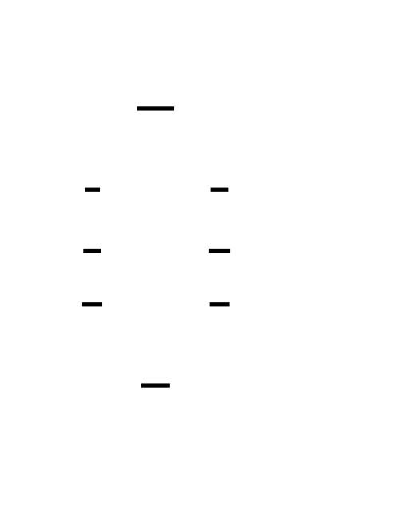

### Cardinality Estimation for Joins

> **🔑 Foundation: Join cardinality estimation: predicting the size of join results**
> 
> ## Join Cardinality Estimation
**What it is:** Cardinality estimation for joins is the process of predicting how many rows a join operation will produce *before actually executing it*. This prediction is the single most critical input to the cost model.
For a join `A ⋈ B` on condition `A.x = B.y`, the classic estimation formula under the **uniformity and independence assumptions** is:
```
|A ⋈ B| = |A| × |B| / max(V(A, x), V(B, y))
```
Where `|A|` is the row count of A, and `V(A, x)` is the number of distinct values in column `A.x`.
**Concrete example:** Table `orders` has 10,000 rows with 500 distinct `customer_id` values. Table `customers` has 500 rows with 500 distinct `id` values.
```
|orders ⋈ customers| = 10,000 × 500 / max(500, 500) = 10,000
```
That makes intuitive sense — every order matches exactly one customer.
Now consider the case where `orders` has 200 distinct `product_id` values and `products` has 1,000 products (many with no orders):
```
|orders ⋈ products| = 10,000 × 1,000 / max(200, 1,000) = 10,000
```
The `max()` in the denominator accounts for the fact that unmatched values in the larger domain contribute zero rows.
For **multi-table joins**, you chain the estimates. If you join `A ⋈ B` first producing an intermediate result `AB`, then join with `C`, you need the cardinality of `AB` and the statistics of the join columns in `AB` — which are themselves estimates. This is where errors compound exponentially.
Common refinements beyond the basic formula:
- **Histograms** to handle skewed distributions (some values are far more common)
- **Most Common Values (MCV) lists** to handle heavy hitters separately
- **Filter selectivity** applied before or after joins
**Why you need this now:** Your cost model calls cardinality estimation for every candidate plan it evaluates. A join producing 100 rows vs. 1,000,000 rows completely changes which algorithm is cheapest and which join order wins. Getting this wrong by even 10× can cause the optimizer to pick a catastrophically bad plan.
**Key insight:** Cardinality estimation errors are *multiplicative* across joins. If you're off by 5× on one join and 5× on the next, you're off by 25× on the combined result. This is why real databases track estimation accuracy and why techniques like adaptive query processing exist — but for your optimizer, focus on getting the single-join estimate solid first, then worry about multi-join propagation.

To compare join orders, the planner must estimate the **cardinality** (number of rows) of each intermediate result. For a join `A ⋈ B ON A.x = B.y`:
```
|A ⋈ B| ≈ |A| × |B| / max(NDV(A.x), NDV(B.y))
```
This formula assumes uniform distribution and that the smaller domain "matches" into the larger. It's the standard estimation formula used across database systems.
```c
static int64_t estimate_join_cardinality(int64_t rows_a, int64_t ndv_a,
                                           int64_t rows_b, int64_t ndv_b) {
    int64_t max_ndv = ndv_a > ndv_b ? ndv_a : ndv_b;
    if (max_ndv <= 0) max_ndv = 1;
    int64_t result = (rows_a * rows_b) / max_ndv;
    if (result < 1) result = 1;
    return result;
}
```
**Cardinality estimation errors compound.** If you estimate table A at 1,000 rows but it actually has 10,000, that's a 10× error. After joining A with B (also 10× off), the join result estimate is 100× off. After joining with C, it's 1,000× off. The planner may choose a plan optimized for an estimated 100 intermediate rows when the actual count is 100,000 — a catastrophic mismatch that means nested-loop join (fine for 100 rows) is used instead of hash join (necessary for 100,000). This exponential compounding is why fresh statistics are critical, and why production databases invest heavily in cardinality estimation accuracy.
### Dynamic Programming for Join Ordering
The optimal join order can be found using **dynamic programming** — the same technique used in the Bellman-Ford shortest path algorithm and the 0/1 knapsack problem. The idea: enumerate all subsets of tables, and for each subset, find the cheapest way to join the tables in that subset.

> **🔑 Foundation: Dynamic programming for join order optimization**
> 
> ## Dynamic Programming for Join Order Optimization
**What it is:** Dynamic programming (DP) for join ordering is the classic algorithm — introduced in IBM's System R — that efficiently finds the optimal join order by building up solutions from smaller subproblems.
The problem: given `n` tables to join, there are a *staggering* number of possible join orders. For bushy trees (any shape), it's `(2n-2)! / (n-1)!`. For just 10 tables, that's billions of plans. You can't evaluate them all.
DP exploits a key property: **the optimal plan for joining a set of tables contains optimal sub-plans for joining subsets of those tables.** This is the *optimal substructure* that makes DP applicable.
The algorithm works bottom-up on subsets of the tables:
```
// Phase 1: Base cases — single tables
For each table T:
    best_plan({T}) = best access path for T (seq scan, index scan, etc.)
// Phase 2: Build up larger subsets
For subset_size = 2 to n:
    For each subset S of tables where |S| = subset_size:
        For each way to split S into two non-empty subsets (S1, S2)
            where S1 ∪ S2 = S and S1 ∩ S2 = ∅:
            candidate = Join(best_plan(S1), best_plan(S2))
            if cost(candidate) < cost(best_plan(S)):
                best_plan(S) = candidate
// Result: best_plan({all tables})
```
**Example with 3 tables** — `orders (O)`, `customers (C)`, `products (P)`:
1. Compute best access for `{O}`, `{C}`, `{P}`
2. Compute best plan for `{O,C}`, `{O,P}`, `{C,P}` — each considers both join directions
3. Compute best plan for `{O,C,P}` — considers:
   - `best({O,C})` ⋈ `best({P})`
   - `best({O,P})` ⋈ `best({C})`
   - `best({C,P})` ⋈ `best({O})`
The complexity is `O(3^n)` for all subset pairs, which is dramatically better than brute force but still exponential. This is tractable up to about 15-20 tables. Beyond that, optimizers switch to heuristics or greedy algorithms.
**A practical detail:** most implementations only consider *left-deep* trees (where the right input is always a base table) rather than bushy trees. This reduces the search space to `O(n × 2^n)` and matches the structure of pipelined execution engines well.
**Why you need this now:** This is the algorithm at the heart of your optimizer's plan enumeration phase. When your optimizer receives a multi-table query, DP join ordering is *how* it decides whether to join `orders` with `customers` first and then `products`, or `orders` with `products` first. Combined with your cost model and cardinality estimates, this produces the actual execution plan.
**Key insight:** Think of the DP table as a dictionary keyed by *sets of tables*, not sequences. The insight that `{A,B,C}` only needs to remember its *best* plan (not how it got there) is what makes the exponential problem tractable. Each subset is solved once, and larger subsets reuse those solutions — classic DP memoization applied to a combinatorial optimization problem.

For a set of *n* tables {T₁, T₂, ..., Tₙ}, the DP recurrence is:
```
cost({Ti}) = cost of scanning Ti alone (with applicable predicates)
cost(S) = min over all ways to split S into (S₁, S₂) where S₁ ∪ S₂ = S:
           cost(S₁) + cost(S₂) + join_cost(S₁, S₂)
```
The state space is 2ⁿ subsets, and for each subset we consider all binary partitions. This is O(3ⁿ) — exponential, but tractable for ≤ 10-12 tables. Beyond that, heuristics (greedy join ordering) are used.
```c
#define MAX_JOIN_TABLES 10
typedef struct {
    uint16_t tables_mask;    // bitmask of which tables are included
    int64_t  estimated_rows; // estimated cardinality of the result
    double   cost;           // total cost to produce this result
    int      left_mask;      // optimal left subplan
    int      right_mask;     // optimal right subplan
    int      join_table_idx; // which table was joined last (for plan reconstruction)
} DPEntry;
typedef struct {
    DPEntry entries[1 << MAX_JOIN_TABLES];  // one entry per subset
    int     n_tables;
    // Per-table info
    struct {
        char     name[64];
        int64_t  row_count;
        int      page_count;
        double   filter_selectivity;  // selectivity of WHERE predicates on this table alone
        int64_t  filtered_rows;       // row_count × filter_selectivity
    } tables[MAX_JOIN_TABLES];
    // Join conditions: (table_a_idx, table_b_idx, col_a, col_b)
    struct {
        int  table_a;
        int  table_b;
        char col_a[64];
        char col_b[64];
        int64_t ndv_a;
        int64_t ndv_b;
    } join_conditions[MAX_JOIN_TABLES * MAX_JOIN_TABLES];
    int n_joins;
} JoinPlanner;
```
The DP algorithm:
```c
void plan_join_order(JoinPlanner *jp) {
    int n = jp->n_tables;
    int total_subsets = 1 << n;
    // Initialize: cost of single-table subsets
    for (int i = 0; i < n; i++) {
        int mask = 1 << i;
        DPEntry *e = &jp->entries[mask];
        e->tables_mask = mask;
        e->estimated_rows = jp->tables[i].filtered_rows;
        e->cost = (double)jp->tables[i].page_count *
                  jp->tables[i].filter_selectivity;
        e->left_mask = 0;
        e->right_mask = 0;
    }
    // Enumerate subsets of increasing size
    for (int size = 2; size <= n; size++) {
        for (int mask = 0; mask < total_subsets; mask++) {
            if (__builtin_popcount(mask) != size) continue;
            DPEntry *best = &jp->entries[mask];
            best->cost = 1e18;  // infinity
            // Try all ways to split this subset into two non-empty parts
            // Enumerate all non-empty sub-subsets of mask
            for (int left = (mask - 1) & mask; left > 0;
                 left = (left - 1) & mask) {
                int right = mask & ~left;
                if (right == 0) continue;
                if (left > right) continue;  // avoid duplicate pairs
                // Check if there's a join condition connecting left and right
                if (!has_join_condition(jp, left, right)) continue;
                DPEntry *le = &jp->entries[left];
                DPEntry *re = &jp->entries[right];
                if (le->cost >= 1e18 || re->cost >= 1e18) continue;
                // Estimate join cardinality
                int64_t join_card = estimate_subset_join_cardinality(
                    jp, left, right,
                    le->estimated_rows, re->estimated_rows);
                // Cost = cost to produce left + cost to produce right
                //      + cost of the join itself (nested loop: left_rows × right_lookups)
                double join_cost = le->cost + re->cost
                    + (double)le->estimated_rows
                      * (double)re->estimated_rows / 1000.0;
                    // Simplified: real cost depends on join algorithm
                if (join_cost < best->cost) {
                    best->tables_mask = mask;
                    best->estimated_rows = join_card;
                    best->cost = join_cost;
                    best->left_mask = left;
                    best->right_mask = right;
                }
            }
        }
    }
}
```
The bitmask subset enumeration (`for (int left = (mask - 1) & mask; left > 0; left = (left - 1) & mask)`) is a standard technique for iterating all non-empty subsets of a bitmask. Each table is assigned a bit position (0 through n-1), and a subset is represented as an integer where bit *i* is set if table *i* is included. This compact representation makes set operations (union, intersection, subset check) trivially fast — just bitwise OR, AND, and comparison.
### Checking Join Conditions
The planner only considers joining two subsets if there's a join condition connecting them. Without this check, the planner would consider Cartesian products (joining tables with no relationship), which are almost always catastrophically expensive:
```c
static bool has_join_condition(JoinPlanner *jp, int left_mask,
                                 int right_mask) {
    for (int j = 0; j < jp->n_joins; j++) {
        int a_bit = 1 << jp->join_conditions[j].table_a;
        int b_bit = 1 << jp->join_conditions[j].table_b;
        if ((left_mask & a_bit) && (right_mask & b_bit)) return true;
        if ((left_mask & b_bit) && (right_mask & a_bit)) return true;
    }
    return false;
}
```
### Reconstructing the Plan
After DP completes, the optimal plan for the full set `(1 << n) - 1` contains the optimal `left_mask` and `right_mask`. Recursively following these gives the complete join tree:
```c
void print_join_plan(JoinPlanner *jp, int mask, int depth) {
    DPEntry *e = &jp->entries[mask];
    for (int i = 0; i < depth; i++) printf("  ");
    if (__builtin_popcount(mask) == 1) {
        // Single table
        int idx = __builtin_ctz(mask);  // index of the set bit
        printf("SCAN %s (est. %ld rows, cost %.1f)\n",
               jp->tables[idx].name, e->estimated_rows, e->cost);
        return;
    }
    printf("JOIN (est. %ld rows, cost %.1f)\n",
           e->estimated_rows, e->cost);
    print_join_plan(jp, e->left_mask, depth + 1);
    print_join_plan(jp, e->right_mask, depth + 1);
}
```
---
## Compiling Multi-Table Joins
Once the planner has determined the optimal join order, the compiler emits nested-loop join bytecode. For a two-table join `SELECT ... FROM A JOIN B ON A.x = B.y`:
```
addr  opcode         p1   p2   p3   comment
----  -------------  ---  ---  ---  -------
0     Init           0    1    0    Start
1     OpenRead       0    5    3    Table A
2     OpenRead       1    8    4    Table B
3     Rewind         0    14   0    Rewind A; jump if empty
4     Column         0    2    1    A.x → r1
5     Rewind         1    12   0    Rewind B for each A row
6     Column         1    0    2    B.y → r2
7     Ne             1    10   2    skip if A.x != B.y
8     Column         0    0    3    A.col1 → r3
9     Column         1    1    4    B.col2 → r4
10    ResultRow      3    2    0    output r3, r4
11    Next           1    6    0    advance B; loop inner
12    Next           0    4    0    advance A; loop outer
13    Goto           0    14   0    fall through
14    Close          0    0    0
15    Close          1    0    0
16    Halt           0    0    0
```


The outer loop iterates table A (the "driving table" — chosen by the planner as the smaller side after filtering). For each row of A, the inner loop scans table B looking for matching rows. If B has an index on the join column, the inner "scan" becomes an index seek — dramatically faster:

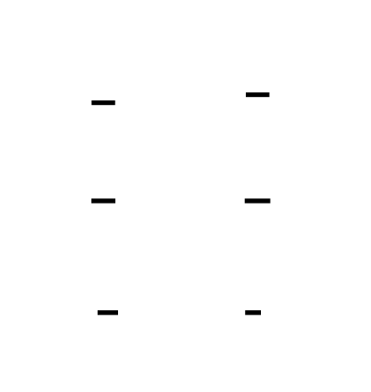

The planner accounts for this: if table B has an index on the join column, the inner loop's cost drops from `page_count_B` (full scan per outer row) to `tree_height_B` (index seek per outer row). This makes the order B-inner, A-outer almost always better than A-inner, B-outer when B has an index on the join column.
```c
// In the join cost computation:
double inner_cost_per_outer_row;
IndexSchema *inner_idx = find_index_on_column(&db->catalog,
                                                inner_table, join_col_b);
if (inner_idx) {
    // Index nested loop join: one tree traversal per outer row
    inner_cost_per_outer_row = (double)estimate_tree_height(
        inner_row_count, 340) * RANDOM_IO_FACTOR;
} else {
    // Basic nested loop: full scan of inner per outer row
    inner_cost_per_outer_row = (double)inner_page_count;
}
double total_join_cost = outer_cost
    + outer_estimated_rows * inner_cost_per_outer_row;
```
---
## Handling Stale Statistics
Statistics go stale. After bulk INSERTs, DELETEs, or UPDATEs, the statistics collected by a previous ANALYZE may no longer reflect the current data distribution. The planner then makes decisions based on wrong numbers — potentially choosing plans that are catastrophically slower than optimal.
```c
// Track when tables were last modified vs last analyzed
typedef struct {
    int64_t last_analyze_row_count;
    int64_t current_row_count;      // updated on INSERT/DELETE
} StaleTracker;
static bool stats_may_be_stale(Database *db, const char *table_name) {
    TableStats *ts = find_table_stats(&db->stats, table_name);
    if (!ts) return true;  // never analyzed
    StaleTracker *tracker = find_tracker(db, table_name);
    if (!tracker) return true;
    // If row count changed by more than 20%, stats are potentially stale
    int64_t diff = tracker->current_row_count - tracker->last_analyze_row_count;
    if (diff < 0) diff = -diff;
    double change_ratio = (double)diff / (double)tracker->last_analyze_row_count;
    return change_ratio > 0.20;
}
```
You can emit a warning when the planner detects potentially stale statistics:
```c
// In plan_table_access:
if (stats_may_be_stale(db, table_name)) {
    fprintf(stderr, "WARNING: statistics for '%s' may be stale. "
            "Consider running ANALYZE.\n", table_name);
}
```
Production databases handle this more gracefully:
- **PostgreSQL** auto-runs ANALYZE via `autovacuum` when a table's modification count exceeds a threshold.
- **MySQL/InnoDB** maintains approximate statistics by sampling random pages, updating statistics in the background.
- **Oracle** has a Statistics Advisor and SQL Plan Management that pins known-good plans to prevent regression.
For your build, manual ANALYZE + a warning is sufficient.
---
## Testing
### Test: ANALYZE Collects Correct Statistics
```c
void test_analyze(void) {
    Database *db = db_open("test_analyze.db");
    execute_sql(db, "CREATE TABLE t (id INTEGER PRIMARY KEY, "
                    "val INTEGER, name TEXT);", NULL, NULL);
    execute_sql(db, "CREATE INDEX idx_val ON t(val);", NULL, NULL);
    for (int i = 1; i <= 1000; i++) {
        char sql[128];
        snprintf(sql, sizeof(sql),
                 "INSERT INTO t VALUES (%d, %d, 'name_%d');",
                 i, i % 50, i);  // 50 distinct values for 'val'
        execute_sql(db, sql, NULL, NULL);
    }
    execute_analyze(db);
    TableStats *ts = find_table_stats(&db->stats, "t");
    assert(ts != NULL);
    assert(ts->row_count == 1000);
    assert(ts->page_count > 0);
    IndexStats *is = find_index_stats(&db->stats, "idx_val");
    assert(is != NULL);
    assert(is->distinct_count == 50);
    assert(is->null_count == 0);
    db_close(db);
    unlink("test_analyze.db");
    printf("PASS: ANALYZE collects correct statistics\n");
}
```
### Test: Planner Selects Index for High Selectivity
```c
void test_planner_selects_index(void) {
    Database *db = db_open("test_plan_idx.db");
    execute_sql(db, "CREATE TABLE t (id INTEGER PRIMARY KEY, "
                    "val INTEGER);", NULL, NULL);
    execute_sql(db, "CREATE INDEX idx_val ON t(val);", NULL, NULL);
    for (int i = 1; i <= 10000; i++) {
        char sql[128];
        snprintf(sql, sizeof(sql),
                 "INSERT INTO t VALUES (%d, %d);", i, i);
        // 10,000 distinct values → selectivity = 1/10000 = 0.0001
        execute_sql(db, sql, NULL, NULL);
    }
    execute_analyze(db);
    // Parse the WHERE clause
    AstNode *where = parse_expression_from_sql("val = 42");
    AccessPlan plan = plan_table_access(db, "t", where);
    assert(plan.uses_index == true);
    assert(strcmp(plan.index_name, "idx_val") == 0);
    assert(plan.selectivity < 0.01);
    db_close(db);
    unlink("test_plan_idx.db");
    printf("PASS: planner selects index for high selectivity\n");
}
```
### Test: Planner Falls Back to Table Scan for Low Selectivity
```c
void test_planner_prefers_scan(void) {
    Database *db = db_open("test_plan_scan.db");
    execute_sql(db, "CREATE TABLE t (id INTEGER PRIMARY KEY, "
                    "flag INTEGER);", NULL, NULL);
    execute_sql(db, "CREATE INDEX idx_flag ON t(flag);", NULL, NULL);
    // 2 distinct values: flag = 0 (5%) and flag = 1 (95%)
    for (int i = 1; i <= 10000; i++) {
        char sql[128];
        int flag = (i <= 500) ? 0 : 1;
        snprintf(sql, sizeof(sql),
                 "INSERT INTO t VALUES (%d, %d);", i, flag);
        execute_sql(db, sql, NULL, NULL);
    }
    execute_analyze(db);
    // WHERE flag = 1 → selectivity = 1/2 = 0.5 (uniform assumption)
    // Since 0.5 > MAX_INDEX_SELECTIVITY (0.20), should use table scan
    AstNode *where = parse_expression_from_sql("flag = 1");
    AccessPlan plan = plan_table_access(db, "t", where);
    assert(plan.uses_index == false);
    db_close(db);
    unlink("test_plan_scan.db");
    printf("PASS: planner falls back to table scan for low selectivity\n");
}
```
### Test: Planner Falls Back When No Index Exists
```c
void test_planner_no_index(void) {
    Database *db = db_open("test_no_idx.db");
    execute_sql(db, "CREATE TABLE t (id INTEGER PRIMARY KEY, "
                    "val INTEGER);", NULL, NULL);
    // No index on val
    for (int i = 1; i <= 1000; i++) {
        char sql[128];
        snprintf(sql, sizeof(sql),
                 "INSERT INTO t VALUES (%d, %d);", i, i);
        execute_sql(db, sql, NULL, NULL);
    }
    execute_analyze(db);
    AstNode *where = parse_expression_from_sql("val = 42");
    AccessPlan plan = plan_table_access(db, "t", where);
    assert(plan.uses_index == false);  // no index → must scan
    db_close(db);
    unlink("test_no_idx.db");
    printf("PASS: planner uses table scan when no index exists\n");
}
```
### Test: EXPLAIN Shows Plan Information
```c
void test_explain_shows_plan(void) {
    Database *db = db_open("test_explain_plan.db");
    execute_sql(db, "CREATE TABLE t (id INTEGER PRIMARY KEY, "
                    "val INTEGER);", NULL, NULL);
    execute_sql(db, "CREATE INDEX idx_val ON t(val);", NULL, NULL);
    for (int i = 1; i <= 1000; i++) {
        char sql[128];
        snprintf(sql, sizeof(sql),
                 "INSERT INTO t VALUES (%d, %d);", i, i);
        execute_sql(db, sql, NULL, NULL);
    }
    execute_analyze(db);
    // Capture EXPLAIN output
    char output[4096];
    capture_explain_output(db,
        "EXPLAIN SELECT val FROM t WHERE val = 42;", output, sizeof(output));
    // Should contain plan info
    assert(strstr(output, "SEARCH USING INDEX") != NULL ||
           strstr(output, "SCAN TABLE") != NULL);
    assert(strstr(output, "estimated") != NULL);
    assert(strstr(output, "cost") != NULL);
    db_close(db);
    unlink("test_explain_plan.db");
    printf("PASS: EXPLAIN shows plan information\n");
}
```
### Test: Join Cardinality Estimation
```c
void test_join_cardinality(void) {
    // Table A: 10,000 rows, column x has 100 distinct values
    // Table B: 5,000 rows, column y has 200 distinct values
    // Expected join cardinality: 10000 × 5000 / max(100, 200) = 250,000
    int64_t card = estimate_join_cardinality(10000, 100, 5000, 200);
    assert(card == 250000);
    // If NDVs are equal: 1000 × 1000 / 100 = 10,000
    card = estimate_join_cardinality(1000, 100, 1000, 100);
    assert(card == 10000);
    printf("PASS: join cardinality estimation\n");
}
```
### Test: Join Order Optimization
```c
void test_join_ordering(void) {
    JoinPlanner jp = {0};
    jp.n_tables = 3;
    // Table 0: customers — 1,000 rows, 200 pages
    // After WHERE country='Germany': ~50 rows
    strncpy(jp.tables[0].name, "customers", 63);
    jp.tables[0].row_count = 1000;
    jp.tables[0].page_count = 200;
    jp.tables[0].filter_selectivity = 0.05;
    jp.tables[0].filtered_rows = 50;
    // Table 1: orders — 100,000 rows, 5,000 pages
    strncpy(jp.tables[1].name, "orders", 63);
    jp.tables[1].row_count = 100000;
    jp.tables[1].page_count = 5000;
    jp.tables[1].filter_selectivity = 1.0;
    jp.tables[1].filtered_rows = 100000;
    // Table 2: products — 500 rows, 20 pages
    strncpy(jp.tables[2].name, "products", 63);
    jp.tables[2].row_count = 500;
    jp.tables[2].page_count = 20;
    jp.tables[2].filter_selectivity = 1.0;
    jp.tables[2].filtered_rows = 500;
    // Join conditions
    jp.n_joins = 2;
    jp.join_conditions[0] = (typeof(jp.join_conditions[0])){
        .table_a = 0, .table_b = 1,
        .ndv_a = 1000, .ndv_b = 1000  // customer_id
    };
    jp.join_conditions[1] = (typeof(jp.join_conditions[1])){
        .table_a = 1, .table_b = 2,
        .ndv_a = 500, .ndv_b = 500  // product_id
    };
    plan_join_order(&jp);
    int full_mask = (1 << 3) - 1;  // all 3 tables
    DPEntry *best = &jp.entries[full_mask];
    // The optimal plan should start with customers (smallest after filter)
    // The planner should NOT start with orders (largest table)
    printf("Best join plan (cost %.1f, est. %ld rows):\n",
           best->cost, best->estimated_rows);
    print_join_plan(&jp, full_mask, 0);
    // Verify the plan puts customers as the first (outermost) table
    // by checking that the left subtree of the root contains customers
    // (This is a structural test — exact plan depends on cost model details)
    assert(best->cost < 1e18);  // a valid plan was found
    printf("PASS: join order optimization\n");
}
```
---
## Three-Level View: What Happens During Query Planning
**Level 1 — Public API**: The user runs `EXPLAIN SELECT name FROM users WHERE age = 25`. The output shows "SEARCH USING INDEX idx_users_age (estimated 2000 rows, selectivity 0.0200, cost 8003.0)" followed by the bytecode. The planner made a decision, and the user can see why.
**Level 2 — Planner Engine**: The planner looks up `users` in the statistics store — 100,000 rows, 1,429 pages. It finds `idx_users_age` and computes selectivity: 50 distinct values → 1/50 = 0.02. Estimated rows: 2,000. Index scan cost: 3 (index height) + 10 (index leaf pages) + 2,000 × 4.0 (random table lookups) = 8,013. Table scan cost: 1,429. Since 8,013 > 1,429 — wait. That means the table scan is actually cheaper. The planner selects the table scan. But if the column had 10,000 distinct values, selectivity would be 0.0001, estimated rows 10, index cost: 3 + 1 + 10 × 4 = 44 — much cheaper than 1,429. The planner selects the index. The decision depends on the data, not the syntax.
**Level 3 — Memory and CPU**: The statistics lookup is an in-memory array scan (~100ns). The selectivity computation is a single floating-point division (~5ns). The cost computation is a handful of multiplications and comparisons (~20ns). For join ordering with 3 tables, the DP enumeration considers 7 subsets with a few partitions each — microseconds total. The planner adds negligible overhead to query compilation. The savings — avoiding a full table scan when an index scan costs 44 pages instead of 1,429 — are enormous: potentially 30× fewer disk reads, each saving ~100μs on SSD. The planner's microsecond computation saves milliseconds of I/O.
---
## Knowledge Cascade: What the Query Planner Unlocks
**→ Statistics as a First-Class Concern — The Bridge to Data Science.** Every production database maintains detailed statistics: PostgreSQL stores histograms, Most Common Values lists, and correlation coefficients in `pg_statistic`. MySQL/InnoDB samples random pages to estimate index cardinality. Oracle maintains system-level statistics (CPU speed, I/O bandwidth) alongside data statistics. The insight is that **database query optimization is fundamentally a statistics problem** — you're predicting the output size of set operations (selection, join, grouping) using summary statistics of the inputs. The same concepts — cardinality estimation, selectivity, distribution modeling — appear in data science (estimating dataset sizes after transformations), networking (predicting packet filter hit rates), and information retrieval (estimating document set sizes for query terms). If you understand why `NDV` and `row_count` matter for query planning, you understand why histograms and probability distributions matter everywhere that data flows through filters.
**→ Dynamic Programming for Join Ordering — The Same Algorithm, Different Domains.** The DP technique you used for join ordering — enumerate subsets, find optimal sub-solutions, combine — is identical to the approach used in: (1) **Bellman-Ford shortest paths** — `cost[node]` = min over all predecessors of `cost[predecessor] + edge_weight`; (2) **0/1 Knapsack** — `value[items_subset, capacity]` = optimal value achievable with these items and this weight limit; (3) **Matrix chain multiplication** — `cost[i..j]` = min over all split points of `cost[i..k] + cost[k..j] + multiply_cost(i,k,j)`; (4) **Optimal binary search tree** — `cost[i..j]` = min over all roots of `cost[left] + cost[right] + frequency_sum`. The connection to **operations research** is deep: join ordering is a scheduling problem (which joins to do first?) with a cost function to minimize. The DP-based approach is exact for small instances; for large instances (>12 tables), heuristics like **greedy join ordering** or **genetic algorithms** (used by PostgreSQL's GEQO for >12 tables) take over.
**→ Plan Regression — The Stability Problem.** When statistics change (after ANALYZE on new data), the planner may choose a different plan for the same query. If the new plan is worse, this is called **plan regression** — the same query suddenly takes 10× longer, even though no code changed. This is a notorious problem in production databases. Oracle's **SQL Plan Management** (SPM) pins known-good plans and only adopts a new plan if it's demonstrably faster. PostgreSQL's `pg_hint_plan` extension lets DBAs force specific plans. SQL Server's **Query Store** tracks plan performance over time and can auto-revert regressions. The broader lesson: **optimization decisions based on mutable state (statistics) introduce instability.** The same tradeoff appears in compiler optimization (a profile-guided optimization can regress if the profiled workload doesn't represent production), in machine learning (a model retrained on new data can perform worse on the original distribution — "catastrophic forgetting"), and in economic policy (optimizing for current conditions can create fragility when conditions change).
**→ Adaptive Query Execution — Compile-Time Meets Runtime.** Your planner makes all decisions at compile time, before seeing a single row. What if its estimates are wrong? **Adaptive query execution** (AQE) re-plans mid-execution based on actual cardinalities observed during execution. Apache Spark's AQE dynamically switches join strategies (broadcast → sort-merge) when the actual size of a shuffle partition exceeds estimates. SQL Server's **adaptive joins** start as a nested loop and switch to hash join if the actual row count exceeds a threshold. CockroachDB re-optimizes subplans when actual cardinalities differ from estimates by more than 10×. This represents a convergence of compile-time and runtime optimization — the same convergence happening in JIT compilers (which speculate based on profiles, then deoptimize and recompile when speculation fails) and in control systems (model-predictive control that continuously re-plans based on sensor feedback).
> **🔭 Deep Dive**: For the definitive treatment of query optimization theory, see *Access Path Selection in a Relational Database Management System* (Selinger et al., 1979) — the original IBM System R paper that introduced cost-based optimization and dynamic programming for join ordering. For modern practical techniques, see *How Good Are Query Optimizers, Really?* (Leis et al., VLDB 2015), which measures cardinality estimation accuracy across commercial databases and finds they're all terrible in different ways.
---
## System Awareness
You've built the query planner — the intelligence layer that sits between the parser (which knows the query's structure) and the compiler (which emits executable bytecode). The planner uses statistics collected by ANALYZE to estimate selectivity and I/O cost, choosing the cheapest access path for each table and the optimal join order for multi-table queries. EXPLAIN now shows not just bytecode but the planner's reasoning.
Without the planner, your database blindly used indexes whenever they existed — correct for some queries, catastrophically wrong for others. With it, the database makes data-informed decisions: index scan for highly selective predicates, table scan for low selectivity, and optimal join ordering that minimizes intermediate result sizes. The planner adds microseconds to compilation time and can save orders of magnitude in execution time.
In the next milestone (Transactions — Rollback Journal), you'll build ACID transaction support. The planner's cost model connects forward to that work: the write amplification of index maintenance (every INSERT updates multiple B-trees) is exactly the kind of operation that must be atomic — either all indexes are updated, or none are. The rollback journal will ensure that a crash during a multi-index INSERT doesn't leave the database in an inconsistent state where some indexes reflect the new row and others don't.
---
<!-- END_MS -->


<!-- MS_ID: build-sqlite-m9 -->
<!-- MS_ID: build-sqlite-m9 -->
# Milestone 9: Transactions (Rollback Journal)
## Where We Are in the System
You have a fully functional SQL database engine. The frontend — tokenizer, parser, bytecode compiler — translates SQL text into executable bytecode programs. The VDBE executes those programs through cursor operations. The buffer pool caches 4096-byte pages in memory with LRU eviction and dirty page tracking. The B-tree stores table rows and index entries in those pages. The query planner chooses between table scans and index scans based on collected statistics. INSERT, UPDATE, and DELETE maintain all secondary indexes synchronously.


Everything works. And everything is fragile.
Pull the power cord while an INSERT is writing a B-tree leaf page. The first half of the page contains the new cell pointer array, but the second half still has the old cell content area. The page is now internally inconsistent — the pointer array references cells that were overwritten, and the old cells point to garbage. Your database is corrupted. No amount of restarting will fix it.
Or consider a multi-index INSERT. The table B-tree insert succeeds and the first index insert succeeds, but the system crashes before the second index insert completes. Now the table contains a row that one index knows about and another doesn't. Queries using the first index find the row; queries using the second index don't. Your data is silently inconsistent.


This milestone builds the mechanism that makes these scenarios impossible. You will implement **ACID transactions** using a **rollback journal** — a separate file that records the original contents of every page before you modify it. The journal is your insurance policy: if anything goes wrong, you can restore the original pages and pretend the transaction never happened. The key insight is not the journal itself but the **write ordering protocol** that makes it trustworthy.
---
## The Revelation: fsync Does Not Mean What You Think
You've been calling `fsync` in your buffer pool since Milestone 4. You call it in `flush_all` to ensure dirty pages reach the disk. You probably think this makes your database crash-safe: modify a page, write it, fsync it, done — the data is durable.
This belief is wrong in a way that will corrupt your database.
**fsync guarantees that previously completed `write()` calls are durable.** It does not guarantee that the current page write is atomic. A single `write()` of 4096 bytes is not atomic at the hardware level.


Here's what actually happens when you write a 4096-byte page to an SSD. The SSD's flash translation layer (FTL) maps your logical write to one or more physical NAND flash pages. If the SSD's internal page size matches your 4096-byte database page, the write might be atomic — but this is a hardware implementation detail, not a guarantee. On spinning disks, the situation is worse: a 4KB write spans 8 sectors of 512 bytes each. If power fails after 4 sectors are written, you have a **torn page** — the first half is new data, the second half is old data. The page is neither the old version nor the new version. It's garbage.
Even calling `fsync` after the `write()` doesn't help. If power fails *during* the `write()` — before `fsync` is called — the page can be torn. And if power fails *during* `fsync` itself, you still have no guarantee about which bytes made it to persistent storage. `fsync` is a **barrier**, not a shield. It says "everything written before this point is durable." It says nothing about writes happening concurrently with the fsync call.

> **🔑 Foundation: fsync semantics and write ordering**
> 
> ## fsync Semantics and Write Ordering
**What it is:** `fsync(fd)` is a system call that forces all modified data and metadata for a specific file descriptor to be written from OS buffers to the physical storage device. Until `fsync` returns successfully, you have *no guarantee* that your data survived a power loss — it might be sitting in kernel page cache, in the drive's internal write buffer, or anywhere in between.
There's a critical nuance: **write ordering**. When you issue writes A then B, the OS and disk hardware are free to reorder them for performance. Write B might hit the platter before write A. This matters enormously for databases and journaling filesystems. Consider:
```
write(journal, "about to update block 42");
write(datafile, new_block_42_contents);
```
Without explicit ordering, the data write could land before the journal entry. If power dies in between, you've corrupted your file with no journal record to recover from.
`fsync` establishes a **barrier**: everything written before the `fsync` call is guaranteed on stable storage before any write issued after it. The typical pattern is:
```
write(journal_fd, entry);
fsync(journal_fd);          // barrier: journal is durable
write(data_fd, new_data);
fsync(data_fd);             // barrier: data is durable
```
Also worth knowing: `fdatasync` skips metadata (timestamps, etc.) and is faster when you only care about file contents. And on many filesystems, you must also `fsync` the *directory* after creating or renaming a file, because the directory entry linking the filename to the inode is separate metadata.
**Why you need this now:** You're building a storage engine. Every crash-safety guarantee you make depends on understanding exactly when bytes are durable. Get fsync semantics wrong and your database silently loses committed transactions or, worse, ends up in an unrecoverable state.
**Key insight:** Think of `fsync` not as "flush my data" but as a **fence in a timeline**. Everything before the fence is on disk; everything after hasn't been promised yet. Your recovery logic is only as strong as your fence placement.

The consequences for your database:
1. **A single page write can produce a corrupted page.** Your B-tree page header says "6 cells" but only 3 cells were actually written. The cell pointer array references garbage.
2. **A multi-page operation can produce an inconsistent state.** A B-tree node split writes the new sibling page, then updates the parent page. If the system crashes after writing the sibling but before updating the parent, the sibling exists but is unreachable — an orphan page consuming space forever.
3. **Buffer pool eviction can corrupt silently.** Your buffer pool writes dirty pages back to disk during eviction. If it evicts a modified parent page before the modified child page, and the system crashes, the parent references a child that contains old data. The B-tree ordering invariant is violated.
The solution is not "more fsync calls." The solution is a **protocol** — a specific ordering of writes and fsyncs that guarantees recoverability regardless of when a crash occurs. That protocol is the rollback journal.
---
## The Rollback Journal Protocol
The rollback journal's core insight: **before you modify any page in the database file, save a copy of the original page in a separate journal file.** If you crash mid-modification, the journal contains everything you need to restore the database to its pre-transaction state. If you complete the transaction successfully, delete the journal — it's no longer needed.

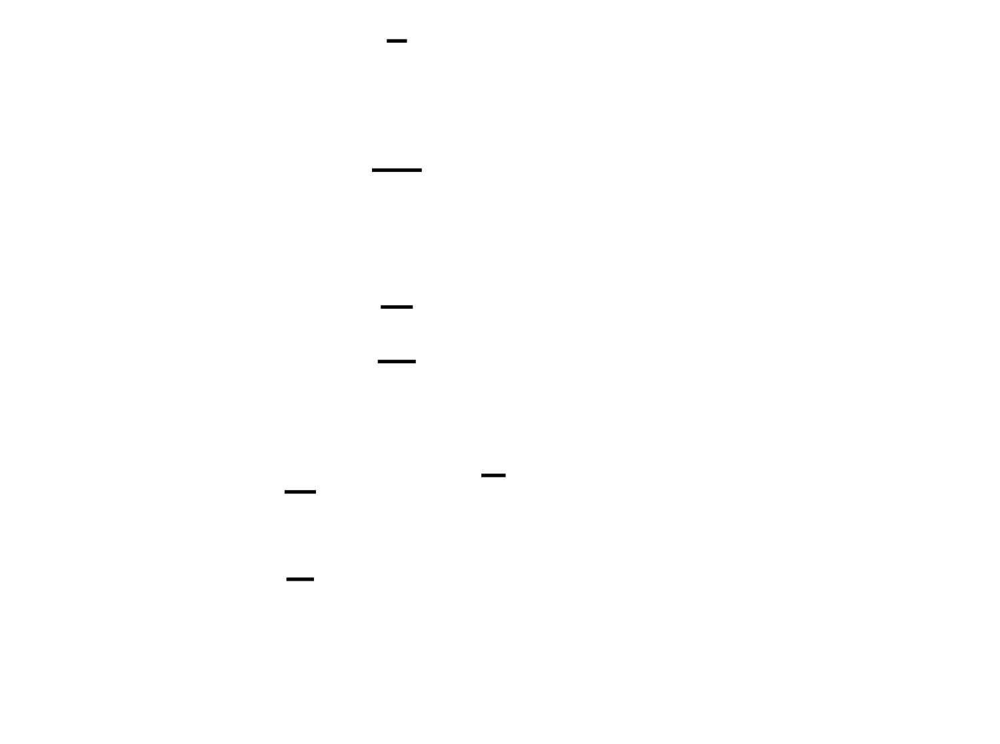

The protocol is a strict sequence of steps. Every step must happen in exactly this order. Violating the order — even once, even for performance — makes crash recovery impossible.
**Step 1: BEGIN — Create the journal file.**
When a transaction begins (or when the first write operation occurs within an implicit transaction), create a file named `<database>.db-journal`. Write a journal header containing a magic number, the database page size, and the page count at the start of the transaction.
**Step 2: BEFORE each page modification — Write the original page to the journal.**
Before the buffer pool writes a modified page to the database file (either during eviction or explicit flush), the *original* contents of that page must be in the journal. Read the page from the database file (not from the buffer pool — the buffer pool version may already be modified) and append it to the journal.
**Step 3: fsync the journal.**
After writing all original pages to the journal (for a given batch of modifications), call `fsync` on the journal file. This is the critical barrier. After this fsync returns, you have a guarantee: the original page contents are durable on disk. If you crash *after* this point, recovery can read the journal and restore every modified page.
**Step 4: Write modified pages to the database file.**
Now — and *only* now — write the modified pages from the buffer pool to the database file. You can write them in any order. If the system crashes during this step, some pages will have new data and some will have old data — the database file is in an inconsistent state. But the journal contains the original version of every modified page. Recovery will restore them all.
**Step 5: fsync the database file.**
Ensure all modified pages are durable in the database file.
**Step 6: COMMIT — Delete the journal file.**
Delete the journal file (or truncate it to zero length). This is the **commit point** — the precise instant the transaction becomes permanent. Before this step, the transaction can be rolled back. After this step, the transaction is committed. The deletion itself doesn't need to be atomic — if the system crashes during deletion, recovery will find the journal, determine the transaction was incomplete, and roll it back. This is safe because rolling back a fully-committed transaction is idempotent (restoring pages that already have the correct data is a no-op).

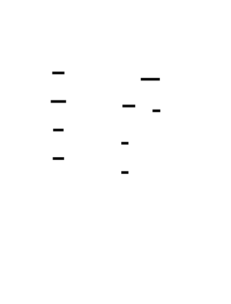

The write ordering is inviolable:
```
journal write → journal fsync → database write → database fsync → journal delete
```
If you move any step out of order:
- **Skip journal fsync before database write**: Crash during database write → journal may not contain original pages → unrecoverable corruption.
- **Write database before journal**: Crash after database write → no journal to restore from → corruption.
- **Delete journal before database fsync**: Crash after journal delete → database writes not yet durable → data loss without recovery path.
This ordering is the same pattern used by every journaling file system. NTFS writes metadata changes to a log before committing them to the file system structures. ext4's journaling mode (`data=journal`) writes both data and metadata to its journal before the main file system. ZFS uses copy-on-write (a different mechanism that achieves the same goal — never overwriting data in place). The principle is universal: **make the undo information durable before making the change.**
---
## The Journal File Format
The journal file has a simple structure: a header followed by a sequence of page records.


```c
// Journal file header — written once at the start of the transaction
#define JOURNAL_MAGIC 0xD9D505F920A163D7ULL  // SQLite's actual magic number
typedef struct {
    uint64_t magic;           // JOURNAL_MAGIC
    int32_t  page_count;      // number of pages in journal (-1 = unknown, will be patched)
    uint32_t page_size;       // database page size (4096)
    uint32_t sector_size;     // disk sector size (512 typically)
    uint32_t db_page_count;   // number of pages in database at txn start
    uint32_t checksum_init;   // initial value for page checksums
} JournalHeader;
#define JOURNAL_HEADER_SIZE 512  // padded to sector size for alignment
// Each page record in the journal
typedef struct {
    uint32_t page_id;         // which page this is
    uint8_t  page_data[4096]; // original contents of the page
    uint32_t checksum;        // checksum of page_data for integrity verification
} JournalPageRecord;
```
The checksum serves two purposes. First, it detects torn journal writes — if the system crashed while writing a journal page record, the checksum won't match, and recovery knows to stop processing the journal at that point. Second, it detects storage media corruption — if a bit flip corrupts the journal data, the checksum catches it before you overwrite good database data with bad journal data.
A simple checksum implementation:
```c
static uint32_t journal_checksum(const uint8_t *data, int size,
                                   uint32_t init) {
    uint32_t sum = init;
    for (int i = 0; i < size; i++) {
        sum += data[i];
        sum += (sum << 10);
        sum ^= (sum >> 6);
    }
    sum += (sum << 3);
    sum ^= (sum >> 11);
    sum += (sum << 15);
    return sum;
}
```
---
## The Transaction Manager
The transaction manager sits between the buffer pool and the VM, intercepting page writes and enforcing the journal protocol.
```c
typedef enum {
    TXN_NONE,        // no active transaction (autocommit mode)
    TXN_ACTIVE,      // transaction in progress, no writes yet
    TXN_DIRTY,       // transaction in progress, journal contains pages
} TxnState;
typedef struct {
    TxnState  state;
    int       journal_fd;       // file descriptor for .db-journal
    char      journal_path[256];// path to journal file
    uint32_t  checksum_init;    // random value for this transaction's checksums
    // Track which pages have been journaled (avoid duplicates)
    bool     *journaled_pages;  // bitmap: true if page_id has been journaled
    int       journaled_capacity;
    int       journal_page_count; // pages written to journal so far
    uint32_t  db_page_count_at_start; // database page count when txn began
} TransactionManager;
```
### Initialization
```c
void txn_init(TransactionManager *txn, const char *db_path) {
    txn->state = TXN_NONE;
    txn->journal_fd = -1;
    snprintf(txn->journal_path, sizeof(txn->journal_path),
             "%s-journal", db_path);
    txn->journaled_pages = NULL;
    txn->journaled_capacity = 0;
    txn->journal_page_count = 0;
    txn->checksum_init = 0;
}
```
### BEGIN
```c
int txn_begin(TransactionManager *txn, BufferPool *pool) {
    if (txn->state != TXN_NONE) {
        fprintf(stderr, "transaction already active\n");
        return -1;
    }
    txn->state = TXN_ACTIVE;
    // Don't create the journal file yet — defer until the first write.
    // This is an optimization: read-only transactions never need a journal.
    return 0;
}
```
Notice that BEGIN doesn't create the journal file. This is deliberate — a `SELECT` inside a transaction doesn't modify any pages, so there's nothing to protect. The journal is created lazily, on the first write operation. This avoids the overhead of file creation and deletion for read-only transactions.
### Journaling a Page (Before Modification)
This is the core function. Before the buffer pool writes a dirty page to the database file, the transaction manager must ensure the page's original contents are in the journal.
```c
int txn_journal_page(TransactionManager *txn, BufferPool *pool,
                       page_id_t page_id) {
    // If no transaction is active, start an implicit one
    if (txn->state == TXN_NONE) {
        txn_begin(txn, pool);
    }
    // If the journal file hasn't been created yet, create it now
    if (txn->state == TXN_ACTIVE) {
        if (create_journal(txn, pool) != 0) {
            return -1;
        }
        txn->state = TXN_DIRTY;
    }
    // Check if this page is already in the journal
    if (page_id < (page_id_t)txn->journaled_capacity &&
        txn->journaled_pages[page_id]) {
        return 0;  // already journaled, nothing to do
    }
    // Read the ORIGINAL page contents from the DATABASE FILE (not buffer pool!)
    // The buffer pool version may already be modified.
    uint8_t original_page[DEFAULT_PAGE_SIZE];
    off_t offset = (off_t)page_id * pool->page_size;
    ssize_t bytes = pread(pool->fd, original_page, pool->page_size, offset);
    if (bytes < pool->page_size) {
        // Page doesn't exist on disk yet (newly allocated) —
        // no need to journal it; there's nothing to restore
        if (bytes <= 0) {
            mark_journaled(txn, page_id);
            return 0;
        }
        // Partial page on disk — zero-fill the rest
        memset(original_page + bytes, 0, pool->page_size - bytes);
    }
    // Write the page record to the journal
    JournalPageRecord rec;
    rec.page_id = page_id;
    memcpy(rec.page_data, original_page, pool->page_size);
    rec.checksum = journal_checksum(original_page, pool->page_size,
                                      txn->checksum_init);
    // Write page_id (4 bytes, big-endian)
    uint8_t id_buf[4];
    write_be32(id_buf, page_id);
    write(txn->journal_fd, id_buf, 4);
    // Write page data
    write(txn->journal_fd, rec.page_data, pool->page_size);
    // Write checksum (4 bytes, big-endian)
    uint8_t cksum_buf[4];
    write_be32(cksum_buf, rec.checksum);
    write(txn->journal_fd, cksum_buf, 4);
    txn->journal_page_count++;
    mark_journaled(txn, page_id);
    return 0;
}
```
**Critical: Read from the database file, not the buffer pool.** The buffer pool's version of the page may already reflect in-memory modifications from the current transaction. The journal must contain the *original* data — the state the page was in before the transaction started. Reading from the database file gives you this, because the buffer pool hasn't flushed the modified version yet (the journal fsync hasn't happened, so the write ordering prevents any database writes).
The `mark_journaled` helper and its companion `create_journal`:
```c
static void mark_journaled(TransactionManager *txn, page_id_t page_id) {
    // Grow bitmap if needed
    if (page_id >= (page_id_t)txn->journaled_capacity) {
        int new_cap = (int)page_id + 256;
        txn->journaled_pages = realloc(txn->journaled_pages,
                                        new_cap * sizeof(bool));
        memset(txn->journaled_pages + txn->journaled_capacity, 0,
               (new_cap - txn->journaled_capacity) * sizeof(bool));
        txn->journaled_capacity = new_cap;
    }
    txn->journaled_pages[page_id] = true;
}
static int create_journal(TransactionManager *txn, BufferPool *pool) {
    txn->journal_fd = open(txn->journal_path,
                            O_RDWR | O_CREAT | O_TRUNC, 0644);
    if (txn->journal_fd < 0) {
        fprintf(stderr, "Failed to create journal: %s\n", strerror(errno));
        return -1;
    }
    // Generate a random checksum initializer (prevents cross-transaction
    // checksum collisions)
    txn->checksum_init = (uint32_t)time(NULL) ^ (uint32_t)getpid();
    // Determine current database page count
    off_t file_size = lseek(pool->fd, 0, SEEK_END);
    txn->db_page_count_at_start = (uint32_t)(file_size / pool->page_size);
    // Write journal header
    uint8_t header[JOURNAL_HEADER_SIZE];
    memset(header, 0, JOURNAL_HEADER_SIZE);
    // Magic number (8 bytes, big-endian)
    uint64_t magic = JOURNAL_MAGIC;
    for (int i = 7; i >= 0; i--) {
        header[i] = (uint8_t)(magic & 0xFF);
        magic >>= 8;
    }
    // Page count = -1 (will be patched on commit)
    write_be32(header + 8, (uint32_t)-1);
    // Page size
    write_be32(header + 12, (uint32_t)pool->page_size);
    // Sector size (assume 512)
    write_be32(header + 16, 512);
    // Database page count at transaction start
    write_be32(header + 20, txn->db_page_count_at_start);
    // Checksum init value
    write_be32(header + 24, txn->checksum_init);
    write(txn->journal_fd, header, JOURNAL_HEADER_SIZE);
    // fsync the journal header + directory entry
    fsync(txn->journal_fd);
    // Also fsync the parent directory to ensure the journal file's
    // directory entry is durable
    int dir_fd = open(".", O_RDONLY);
    if (dir_fd >= 0) {
        fsync(dir_fd);
        close(dir_fd);
    }
    return 0;
}
```
The directory fsync deserves attention. On Linux and many POSIX systems, creating a new file updates the directory that contains it. If you fsync the file but not the directory, and the system crashes, the file's data is durable — but the *directory entry* pointing to the file may not be. After reboot, the file doesn't exist, even though its data blocks are on disk. This is the **directory entry durability problem**, and it's bitten production databases. SQLite fsyncs the directory after journal creation to prevent it.
---
## Integrating with the Buffer Pool
The transaction manager must intercept the buffer pool's write path. Every time the buffer pool is about to write a dirty page to disk — during eviction or explicit flush — it must first journal the original page.
Modify the buffer pool's eviction function:
```c
static void evict_frame(BufferPool *pool, int frame_idx) {
    Frame *f = &pool->frames[frame_idx];
    if (f->is_dirty) {
        // TRANSACTION INTEGRATION: journal before writing
        if (pool->txn && pool->txn->state != TXN_NONE) {
            txn_journal_page(pool->txn, pool, f->page_id);
        }
        disk_write_page(pool, f->page_id, f->data);
        f->is_dirty = false;
    }
    page_table_remove(pool, f->page_id);
    lru_remove(pool, frame_idx);
    f->page_id = INVALID_PAGE_ID;
    pool->evictions++;
}
```
And the flush functions:
```c
void buffer_pool_flush_page(BufferPool *pool, page_id_t page_id) {
    int frame_idx = page_table_lookup(pool, page_id);
    if (frame_idx < 0) return;
    Frame *f = &pool->frames[frame_idx];
    if (f->is_dirty) {
        // Journal before writing
        if (pool->txn && pool->txn->state != TXN_NONE) {
            txn_journal_page(pool->txn, pool, f->page_id);
        }
        disk_write_page(pool, f->page_id, f->data);
        f->is_dirty = false;
    }
}
void buffer_pool_flush_all(BufferPool *pool) {
    // If a transaction is active, fsync the journal FIRST
    if (pool->txn && pool->txn->state == TXN_DIRTY) {
        // Ensure all journal pages are fsynced before any database write
        fsync(pool->txn->journal_fd);
    }
    for (int i = 0; i < pool->pool_size; i++) {
        Frame *f = &pool->frames[i];
        if (f->page_id != INVALID_PAGE_ID && f->is_dirty) {
            if (pool->txn && pool->txn->state != TXN_NONE) {
                txn_journal_page(pool->txn, pool, f->page_id);
            }
            disk_write_page(pool, f->page_id, f->data);
            f->is_dirty = false;
        }
    }
    fsync(pool->fd);
}
```
The key change in `flush_all`: the journal is fsynced *before the loop that writes database pages*. This enforces the write ordering. The individual `txn_journal_page` calls inside the loop are safe because the journal was already fsynced — new journal writes for pages not yet journaled will be followed by another fsync before the final commit.
However, there's a subtlety. If the buffer pool evicts a dirty page mid-transaction (because the pool is full), it writes that page to the database file. The journal for that page must be durable *before* this eviction write happens. The current integration handles this: `evict_frame` calls `txn_journal_page` before `disk_write_page`. But `txn_journal_page` only *writes* the journal record — it doesn't fsync. We need an fsync between the journal write and the database write within eviction:
```c
static void evict_frame(BufferPool *pool, int frame_idx) {
    Frame *f = &pool->frames[frame_idx];
    if (f->is_dirty) {
        if (pool->txn && pool->txn->state != TXN_NONE) {
            txn_journal_page(pool->txn, pool, f->page_id);
            // Critical: fsync journal BEFORE writing to database
            fsync(pool->txn->journal_fd);
        }
        disk_write_page(pool, f->page_id, f->data);
        f->is_dirty = false;
    }
    page_table_remove(pool, f->page_id);
    lru_remove(pool, frame_idx);
    f->page_id = INVALID_PAGE_ID;
    pool->evictions++;
}
```
This per-eviction fsync is expensive. Each fsync costs ~100μs on SSD or ~10ms on spinning disk. If the buffer pool evicts many dirty pages during a transaction, the cumulative fsync cost can be significant. This is one reason databases try to keep the buffer pool large enough that eviction of dirty pages mid-transaction is rare. SQLite addresses this with a **page cache spill** threshold — it limits how many dirty pages accumulate before forcing a batch journal-write + fsync + database-write cycle. For your build, the per-eviction fsync is correct and sufficient.
---
## COMMIT: Making Changes Permanent


COMMIT performs the final steps of the protocol: flush all dirty pages to the database, fsync the database, then delete the journal.
```c
int txn_commit(TransactionManager *txn, BufferPool *pool) {
    if (txn->state == TXN_NONE) {
        // No transaction active — nothing to do
        return 0;
    }
    if (txn->state == TXN_ACTIVE) {
        // Transaction started but no writes occurred — clean exit
        txn->state = TXN_NONE;
        return 0;
    }
    // state == TXN_DIRTY: we have a journal and modified pages
    // Step 1: Ensure all journal pages are durable
    fsync(txn->journal_fd);
    // Step 2: Flush all dirty pages from buffer pool to database file
    for (int i = 0; i < pool->pool_size; i++) {
        Frame *f = &pool->frames[i];
        if (f->page_id != INVALID_PAGE_ID && f->is_dirty) {
            // Journal should already contain this page's original data,
            // but verify just in case
            if (f->page_id < (page_id_t)txn->journaled_capacity &&
                !txn->journaled_pages[f->page_id]) {
                // This page was modified but not journaled — journal it now
                txn_journal_page(txn, pool, f->page_id);
                fsync(txn->journal_fd);
            }
            disk_write_page(pool, f->page_id, f->data);
            f->is_dirty = false;
        }
    }
    // Step 3: fsync the database file — all changes are now durable
    fsync(pool->fd);
    // Step 4: Delete the journal — THIS IS THE COMMIT POINT
    close(txn->journal_fd);
    txn->journal_fd = -1;
    unlink(txn->journal_path);
    // fsync the directory to ensure journal deletion is durable
    int dir_fd = open(".", O_RDONLY);
    if (dir_fd >= 0) {
        fsync(dir_fd);
        close(dir_fd);
    }
    // Clean up transaction state
    if (txn->journaled_pages) {
        free(txn->journaled_pages);
        txn->journaled_pages = NULL;
    }
    txn->journaled_capacity = 0;
    txn->journal_page_count = 0;
    txn->state = TXN_NONE;
    return 0;
}
```
The **commit point** — the precise instant when the transaction becomes permanent — is the `unlink(txn->journal_path)` call. Before that call, the journal exists, and crash recovery would roll back the transaction. After that call, the journal is gone, and the database file contains the committed data. This is a beautifully simple mechanism: the *existence* of a file is the commit/abort decision. No flags, no counters, no metadata to get out of sync. Just: does the journal file exist?
---
## ROLLBACK: Undoing Everything
Manual rollback reads the journal and restores every page to its original state:
```c
int txn_rollback(TransactionManager *txn, BufferPool *pool) {
    if (txn->state == TXN_NONE) {
        return 0;  // nothing to roll back
    }
    if (txn->state == TXN_ACTIVE) {
        // No writes occurred — just reset state
        txn->state = TXN_NONE;
        return 0;
    }
    // state == TXN_DIRTY: restore pages from journal
    // Step 1: Read journal and restore original pages
    int result = restore_from_journal(txn, pool);
    // Step 2: Discard all dirty pages in the buffer pool
    // (they contain modifications from the rolled-back transaction)
    for (int i = 0; i < pool->pool_size; i++) {
        Frame *f = &pool->frames[i];
        if (f->page_id != INVALID_PAGE_ID && f->is_dirty) {
            // Reload from disk (which now has restored data)
            disk_read_page(pool, f->page_id, f->data);
            f->is_dirty = false;
        }
    }
    // Step 3: Delete the journal
    close(txn->journal_fd);
    txn->journal_fd = -1;
    unlink(txn->journal_path);
    // Clean up
    if (txn->journaled_pages) {
        free(txn->journaled_pages);
        txn->journaled_pages = NULL;
    }
    txn->journaled_capacity = 0;
    txn->journal_page_count = 0;
    txn->state = TXN_NONE;
    return result;
}
```
The `restore_from_journal` function reads each page record from the journal and writes it back to the database file:
```c
static int restore_from_journal(TransactionManager *txn, BufferPool *pool) {
    // Seek to just past the header
    lseek(txn->journal_fd, JOURNAL_HEADER_SIZE, SEEK_SET);
    int restored_count = 0;
    uint8_t id_buf[4];
    uint8_t page_data[DEFAULT_PAGE_SIZE];
    uint8_t cksum_buf[4];
    while (true) {
        // Read page_id
        ssize_t bytes = read(txn->journal_fd, id_buf, 4);
        if (bytes < 4) break;  // end of journal (or incomplete record)
        uint32_t page_id = read_be32(id_buf);
        // Read page data
        bytes = read(txn->journal_fd, page_data, pool->page_size);
        if (bytes < pool->page_size) {
            fprintf(stderr, "Incomplete journal record for page %u\n",
                    page_id);
            break;  // torn journal write — stop here
        }
        // Read and verify checksum
        bytes = read(txn->journal_fd, cksum_buf, 4);
        if (bytes < 4) {
            fprintf(stderr, "Incomplete checksum for page %u\n", page_id);
            break;
        }
        uint32_t stored_checksum = read_be32(cksum_buf);
        uint32_t computed_checksum = journal_checksum(page_data,
                                                        pool->page_size,
                                                        txn->checksum_init);
        if (stored_checksum != computed_checksum) {
            fprintf(stderr, "Checksum mismatch for page %u — "
                    "journal may be corrupt\n", page_id);
            break;  // stop processing — don't apply corrupt data
        }
        // Restore: write original page data back to database file
        off_t offset = (off_t)page_id * pool->page_size;
        pwrite(pool->fd, page_data, pool->page_size, offset);
        restored_count++;
    }
    // fsync the database to ensure restored pages are durable
    fsync(pool->fd);
    printf("Rolled back %d pages\n", restored_count);
    return 0;
}
```
The checksum verification on each page record is essential. If the system crashed while writing to the journal (between Step 1 and Step 3 of the protocol), the last journal record may be incomplete. The checksum detects this: if it doesn't match, we stop processing. All pages before the torn record were fully written and are safe to restore. The torn record's page was never written to the database (because the journal fsync didn't complete before the crash), so it doesn't need restoration.
---
## Crash Recovery: The Hot Journal


Crash recovery happens automatically at database open. If the database engine finds a journal file when opening the database, it knows the previous process crashed with an uncommitted transaction. The journal is called a **hot journal** — it's "hot" because it contains data that needs to be acted upon.
```c
int db_open_with_recovery(Database *db, const char *path) {
    // Open the database file
    db->pool = buffer_pool_create(path, DEFAULT_POOL_SIZE, DEFAULT_PAGE_SIZE);
    if (!db->pool) return -1;
    // Initialize transaction manager
    txn_init(&db->txn, path);
    // Check for a hot journal
    char journal_path[256];
    snprintf(journal_path, sizeof(journal_path), "%s-journal", path);
    if (access(journal_path, F_OK) == 0) {
        // Hot journal found — perform crash recovery
        printf("Hot journal detected: %s\n", journal_path);
        int result = recover_hot_journal(db, journal_path);
        if (result != 0) {
            fprintf(stderr, "Crash recovery failed!\n");
            return -1;
        }
        printf("Crash recovery complete.\n");
    }
    // Load schema from sqlite_master
    catalog_load(&db->catalog, db->pool);
    catalog_load_indexes(&db->catalog, db->pool);
    return 0;
}
```
The recovery function:
```c
static int recover_hot_journal(Database *db, const char *journal_path) {
    int jfd = open(journal_path, O_RDONLY);
    if (jfd < 0) {
        fprintf(stderr, "Cannot open journal: %s\n", strerror(errno));
        return -1;
    }
    // Read and validate journal header
    uint8_t header[JOURNAL_HEADER_SIZE];
    ssize_t bytes = read(jfd, header, JOURNAL_HEADER_SIZE);
    if (bytes < JOURNAL_HEADER_SIZE) {
        // Journal header incomplete — journal was being created when crash happened.
        // No pages were modified; safe to delete.
        close(jfd);
        unlink(journal_path);
        return 0;
    }
    // Verify magic number
    uint64_t magic = 0;
    for (int i = 0; i < 8; i++) {
        magic = (magic << 8) | header[i];
    }
    if (magic != JOURNAL_MAGIC) {
        fprintf(stderr, "Invalid journal magic number\n");
        close(jfd);
        unlink(journal_path);
        return -1;
    }
    // Read header fields
    uint32_t page_size = read_be32(header + 12);
    uint32_t db_page_count = read_be32(header + 20);
    uint32_t checksum_init = read_be32(header + 24);
    if (page_size != (uint32_t)db->pool->page_size) {
        fprintf(stderr, "Journal page size mismatch: %u vs %d\n",
                page_size, db->pool->page_size);
        close(jfd);
        return -1;
    }
    // Restore pages from journal
    int restored = 0;
    uint8_t id_buf[4];
    uint8_t page_data[DEFAULT_PAGE_SIZE];
    uint8_t cksum_buf[4];
    while (true) {
        bytes = read(jfd, id_buf, 4);
        if (bytes < 4) break;
        uint32_t page_id = read_be32(id_buf);
        bytes = read(jfd, page_data, page_size);
        if (bytes < (ssize_t)page_size) break;
        bytes = read(jfd, cksum_buf, 4);
        if (bytes < 4) break;
        uint32_t stored_cksum = read_be32(cksum_buf);
        uint32_t computed_cksum = journal_checksum(page_data, page_size,
                                                     checksum_init);
        if (stored_cksum != computed_cksum) {
            // Torn journal write — stop processing
            break;
        }
        // Write original page back to database
        off_t offset = (off_t)page_id * page_size;
        pwrite(db->pool->fd, page_data, page_size, offset);
        restored++;
    }
    // Truncate database back to its original size
    // (in case the transaction allocated new pages)
    off_t original_size = (off_t)db_page_count * page_size;
    ftruncate(db->pool->fd, original_size);
    // fsync the database file
    fsync(db->pool->fd);
    // Delete the journal
    close(jfd);
    unlink(journal_path);
    // fsync the directory
    int dir_fd = open(".", O_RDONLY);
    if (dir_fd >= 0) {
        fsync(dir_fd);
        close(dir_fd);
    }
    printf("Recovered %d pages from hot journal\n", restored);
    return 0;
}
```
The `ftruncate` call is important. If the crashed transaction allocated new pages (via `buffer_pool_new_page` for B-tree splits), those pages extended the database file. Rolling back the transaction means those pages should not exist. Truncating the file to its pre-transaction size reclaims them.
### The Four Crash Scenarios
Let's trace what happens for a crash at each stage of the protocol:
**Scenario 1: Crash before journal is created (during Step 1).**
The journal file either doesn't exist or contains an incomplete header. Recovery deletes the partial journal. The database is untouched — no pages were modified. **Result: safe.**
**Scenario 2: Crash after journaling pages but before journal fsync (between Steps 2 and 3).**
The journal file contains page records, but they may not be durable — the OS write buffers might have only partially flushed them. The database file is untouched (no database writes have happened yet — write ordering prevents it). Recovery opens the journal. If checksum verification fails for any record, recovery stops at that point. Pages that were fully journaled *and* whose data is durable will be restored (they were already unchanged in the database, so restoring is a no-op). Pages with torn journal records are ignored — and since the database wasn't modified, there's nothing to fix. **Result: safe.**
**Scenario 3: Crash during database page writes (between Steps 4 and 5).**
Some database pages have new data, some have old data. The database file is inconsistent. The journal is complete and durable (Step 3 guaranteed this). Recovery reads the journal and restores all original pages. The database returns to its pre-transaction state. **Result: safe — this is the primary case the journal protects against.**
**Scenario 4: Crash during or after journal deletion (Step 6).**
The database file has been fully updated and fsynced (Step 5). If the journal deletion doesn't complete (the directory entry isn't durable), recovery finds the journal and "rolls back" — but since the database already contains the committed data, restoring original pages would revert the commit. This sounds dangerous, but consider: if the crash happened *during* the unlink, the database writes were already durable (Step 5 fsynced). The rollback would restore old pages, effectively un-committing the transaction. This is the one case where recovery is conservative — it prefers safety (rollback) over liveness (preserving the commit).
To handle Scenario 4 more precisely, SQLite writes the `page_count` field in the journal header as the *last* step before transitioning to commit. A journal with `page_count = -1` (the initial value) is treated differently from one with a valid page count. However, for your build, the conservative approach — always roll back if a journal exists — is correct and safe. The worst case is that a committed transaction's effects are lost on a crash that occurs in the narrow window between database fsync and journal deletion. This window is typically microseconds.
---
## Implicit Transactions (Autocommit)
When the user executes a DML statement without an explicit BEGIN, the engine wraps it in an **implicit transaction** — also called **autocommit mode**. Each statement is its own transaction:
```c
int execute_sql_with_txn(Database *db, const char *sql,
                           void (*callback)(Value *row, int ncols, void *ctx),
                           void *ctx) {
    bool implicit_txn = (db->txn.state == TXN_NONE);
    // For write operations without explicit BEGIN, start implicit transaction
    // (Detection: if the statement is INSERT/UPDATE/DELETE/CREATE)
    // For simplicity, we start after parsing to check statement type
    // ... tokenize, parse ...
    if (implicit_txn && is_write_statement(ast)) {
        txn_begin(&db->txn, db->pool);
    }
    // ... compile, execute ...
    int rc = vm_execute(&vm);
    if (implicit_txn && db->txn.state != TXN_NONE) {
        if (rc == 0) {
            txn_commit(&db->txn, db->pool);
        } else {
            txn_rollback(&db->txn, db->pool);
        }
    }
    // ... cleanup ...
    return rc;
}
```
This ensures that every write operation is atomic — either it fully completes or it's fully rolled back. The user doesn't need to explicitly manage transactions for single statements.
---
## Compiling BEGIN, COMMIT, ROLLBACK
These are new SQL commands that the parser must recognize and the compiler must translate into VM opcodes:
```c
// New opcodes
OP_TRANSACTION,   // p1=0: BEGIN, p1=1: COMMIT, p1=2: ROLLBACK
// In the parser, add recognition for these keywords as statement types
// In the compiler:
static void compile_begin(Compiler *c) {
    emit(c, OP_TRANSACTION, 0, 0, 0, "BEGIN");
    emit(c, OP_HALT, 0, 0, 0, "Done");
}
static void compile_commit(Compiler *c) {
    emit(c, OP_TRANSACTION, 1, 0, 0, "COMMIT");
    emit(c, OP_HALT, 0, 0, 0, "Done");
}
static void compile_rollback(Compiler *c) {
    emit(c, OP_TRANSACTION, 2, 0, 0, "ROLLBACK");
    emit(c, OP_HALT, 0, 0, 0, "Done");
}
```
And in the VM:
```c
case OP_TRANSACTION: {
    int op_type = op->p1;
    int rc;
    switch (op_type) {
        case 0:  // BEGIN
            rc = txn_begin(&vm->db->txn, vm->db->pool);
            break;
        case 1:  // COMMIT
            rc = txn_commit(&vm->db->txn, vm->db->pool);
            break;
        case 2:  // ROLLBACK
            rc = txn_rollback(&vm->db->txn, vm->db->pool);
            break;
        default:
            rc = -1;
    }
    if (rc != 0) {
        vm->halted = true;
        vm->halt_code = rc;
        return rc;
    }
    break;
}
```
---
## Read Isolation: Invisible Uncommitted Writes
In a single-process, single-threaded database (like your build), read isolation is straightforward: there is only one connection, so uncommitted writes in the buffer pool are visible to all queries in the same connection. This is correct — within a transaction, you should see your own modifications.
For multiple connections (multiple processes sharing the same database file), the rollback journal provides basic isolation. Since uncommitted modifications exist only in one process's buffer pool (not yet flushed to the database file), other processes reading the database file see only committed data. If a process does flush dirty pages mid-transaction (during buffer pool eviction), other processes could see partial updates.
SQLite solves this with **file-level locking** — a SHARED lock for readers and an EXCLUSIVE lock for writers. When a writer holds the EXCLUSIVE lock, readers are blocked (in rollback journal mode). This is a simple but effective isolation mechanism:
```c
// Simplified file locking for read isolation
typedef enum {
    LOCK_NONE,
    LOCK_SHARED,      // for reading — multiple shared locks allowed
    LOCK_RESERVED,    // intent to write — one allowed, readers still OK
    LOCK_EXCLUSIVE,   // writing — blocks everyone
} LockLevel;
int acquire_lock(Database *db, LockLevel level) {
    struct flock fl;
    fl.l_whence = SEEK_SET;
    fl.l_start = 0;
    fl.l_len = 0;  // entire file
    switch (level) {
        case LOCK_SHARED:
            fl.l_type = F_RDLCK;
            break;
        case LOCK_EXCLUSIVE:
            fl.l_type = F_WRLCK;
            break;
        default:
            return -1;
    }
    if (fcntl(db->pool->fd, F_SETLK, &fl) < 0) {
        if (errno == EAGAIN || errno == EACCES) {
            return -1;  // lock busy — another connection holds it
        }
        return -1;
    }
    return 0;
}
void release_lock(Database *db) {
    struct flock fl;
    fl.l_type = F_UNLCK;
    fl.l_whence = SEEK_SET;
    fl.l_start = 0;
    fl.l_len = 0;
    fcntl(db->pool->fd, F_SETLK, &fl);
}
```
In the transaction lifecycle:
- `BEGIN` acquires a SHARED lock (allowing concurrent readers).
- The first write operation upgrades to EXCLUSIVE lock (blocking all other connections).
- `COMMIT` or `ROLLBACK` releases the lock.
This means that in rollback journal mode, **writers block readers and readers block writers.** This is the primary limitation that WAL mode (Milestone 10) addresses — WAL allows concurrent readers during writes.
---
## Testing: Verifying ACID Properties
### Test: BEGIN/COMMIT Persists Data
```c
void test_begin_commit(void) {
    Database *db = db_open("test_txn.db");
    execute_sql(db, "CREATE TABLE t (id INTEGER PRIMARY KEY, val TEXT);",
                NULL, NULL);
    execute_sql(db, "BEGIN;", NULL, NULL);
    execute_sql(db, "INSERT INTO t VALUES (1, 'hello');", NULL, NULL);
    execute_sql(db, "INSERT INTO t VALUES (2, 'world');", NULL, NULL);
    execute_sql(db, "COMMIT;", NULL, NULL);
    // Data should be visible
    ResultCollector rc = {0};
    execute_sql(db, "SELECT val FROM t ORDER BY id;", collect_results, &rc);
    assert(rc.row_count == 2);
    assert(strcmp(rc.rows[0][0].s.data, "hello") == 0);
    assert(strcmp(rc.rows[1][0].s.data, "world") == 0);
    // Close and reopen — data should survive
    db_close(db);
    db = db_open("test_txn.db");
    ResultCollector rc2 = {0};
    execute_sql(db, "SELECT val FROM t ORDER BY id;", collect_results, &rc2);
    assert(rc2.row_count == 2);
    db_close(db);
    unlink("test_txn.db");
    printf("PASS: BEGIN/COMMIT persists data\n");
}
```
### Test: ROLLBACK Undoes All Changes
```c
void test_rollback(void) {
    Database *db = db_open("test_rollback.db");
    execute_sql(db, "CREATE TABLE t (id INTEGER PRIMARY KEY, val INTEGER);",
                NULL, NULL);
    execute_sql(db, "INSERT INTO t VALUES (1, 100);", NULL, NULL);
    // Start transaction, modify, then rollback
    execute_sql(db, "BEGIN;", NULL, NULL);
    execute_sql(db, "UPDATE t SET val = 999 WHERE id = 1;", NULL, NULL);
    execute_sql(db, "INSERT INTO t VALUES (2, 200);", NULL, NULL);
    execute_sql(db, "ROLLBACK;", NULL, NULL);
    // Original data should be intact
    ResultCollector rc = {0};
    execute_sql(db, "SELECT id, val FROM t;", collect_results, &rc);
    assert(rc.row_count == 1);       // row 2 was rolled back
    assert(rc.rows[0][1].i == 100);  // val not modified
    // Journal file should be deleted
    assert(access("test_rollback.db-journal", F_OK) != 0);
    db_close(db);
    unlink("test_rollback.db");
    printf("PASS: ROLLBACK undoes all changes\n");
}
```
### Test: Journal File Exists During Transaction
```c
void test_journal_exists_during_txn(void) {
    Database *db = db_open("test_journal.db");
    execute_sql(db, "CREATE TABLE t (id INTEGER PRIMARY KEY);", NULL, NULL);
    // No journal before transaction
    assert(access("test_journal.db-journal", F_OK) != 0);
    execute_sql(db, "BEGIN;", NULL, NULL);
    execute_sql(db, "INSERT INTO t VALUES (1);", NULL, NULL);
    // Journal should exist now
    assert(access("test_journal.db-journal", F_OK) == 0);
    execute_sql(db, "COMMIT;", NULL, NULL);
    // Journal should be deleted after commit
    assert(access("test_journal.db-journal", F_OK) != 0);
    db_close(db);
    unlink("test_journal.db");
    printf("PASS: journal exists during transaction, deleted after\n");
}
```
### Test: Journal Contains Original Page Data
```c
void test_journal_contains_original_data(void) {
    Database *db = db_open("test_jdata.db");
    execute_sql(db, "CREATE TABLE t (id INTEGER PRIMARY KEY, val INTEGER);",
                NULL, NULL);
    execute_sql(db, "INSERT INTO t VALUES (1, 42);", NULL, NULL);
    // Read page 2 (first table page) directly from disk
    uint8_t original_page[DEFAULT_PAGE_SIZE];
    pread(db->pool->fd, original_page, DEFAULT_PAGE_SIZE,
          2 * DEFAULT_PAGE_SIZE);
    // Start transaction and modify
    execute_sql(db, "BEGIN;", NULL, NULL);
    execute_sql(db, "UPDATE t SET val = 999 WHERE id = 1;", NULL, NULL);
    // Force a flush to trigger journaling
    buffer_pool_flush_all(db->pool);
    // Read the journal and verify it contains the original page data
    int jfd = open("test_jdata.db-journal", O_RDONLY);
    assert(jfd >= 0);
    uint8_t header[JOURNAL_HEADER_SIZE];
    read(jfd, header, JOURNAL_HEADER_SIZE);
    // Read first page record
    uint8_t id_buf[4];
    read(jfd, id_buf, 4);
    uint8_t journal_page[DEFAULT_PAGE_SIZE];
    read(jfd, journal_page, DEFAULT_PAGE_SIZE);
    // The journal page should match the original (pre-update) data
    assert(memcmp(journal_page, original_page, DEFAULT_PAGE_SIZE) == 0);
    close(jfd);
    execute_sql(db, "ROLLBACK;", NULL, NULL);
    db_close(db);
    unlink("test_jdata.db");
    printf("PASS: journal contains original page data\n");
}
```
### Test: Crash Recovery (Simulated Hot Journal)
```c
void test_crash_recovery(void) {
    // Phase 1: Create a database and simulate a crash
    {
        Database *db = db_open("test_crash.db");
        execute_sql(db, "CREATE TABLE t (id INTEGER PRIMARY KEY, "
                        "val INTEGER);", NULL, NULL);
        execute_sql(db, "INSERT INTO t VALUES (1, 100);", NULL, NULL);
        // Start a transaction and modify data
        execute_sql(db, "BEGIN;", NULL, NULL);
        execute_sql(db, "UPDATE t SET val = 999 WHERE id = 1;", NULL, NULL);
        execute_sql(db, "INSERT INTO t VALUES (2, 200);", NULL, NULL);
        // Force flush to write journal pages
        // (this writes journal + potentially database pages)
        buffer_pool_flush_all(db->pool);
        // SIMULATE CRASH: close without commit or rollback
        // Don't call db_close (which would commit/rollback) —
        // just close file descriptors directly
        close(db->pool->fd);
        if (db->txn.journal_fd >= 0) {
            close(db->txn.journal_fd);
        }
        // Don't free — we're simulating a crash, memory is lost
    }
    // Phase 2: Reopen — should detect hot journal and recover
    {
        Database *db = db_open("test_crash.db");
        // db_open should have detected and rolled back the hot journal
        // Verify data is in pre-transaction state
        ResultCollector rc = {0};
        execute_sql(db, "SELECT id, val FROM t;", collect_results, &rc);
        assert(rc.row_count == 1);       // row 2 was rolled back
        assert(rc.rows[0][0].i == 1);
        assert(rc.rows[0][1].i == 100);  // original value, not 999
        // Journal should be cleaned up
        assert(access("test_crash.db-journal", F_OK) != 0);
        db_close(db);
    }
    unlink("test_crash.db");
    printf("PASS: crash recovery via hot journal\n");
}
```
### Test: fsync Ordering (Write-Ordering Guarantee)
```c
void test_write_ordering(void) {
    // This test verifies the structural invariant:
    // journal fsync happens BEFORE any database page write.
    // We instrument the buffer pool to track operation order.
    Database *db = db_open("test_order.db");
    execute_sql(db, "CREATE TABLE t (id INTEGER PRIMARY KEY, "
                    "val INTEGER);", NULL, NULL);
    // Insert enough data to require multiple pages
    execute_sql(db, "BEGIN;", NULL, NULL);
    for (int i = 1; i <= 200; i++) {
        char sql[128];
        snprintf(sql, sizeof(sql), "INSERT INTO t VALUES (%d, %d);",
                 i, i * 10);
        execute_sql(db, sql, NULL, NULL);
    }
    // At this point, the transaction manager should have the journal
    // in TXN_DIRTY state
    assert(db->txn.state == TXN_DIRTY);
    assert(db->txn.journal_page_count > 0);
    execute_sql(db, "COMMIT;", NULL, NULL);
    assert(db->txn.state == TXN_NONE);
    // Verify all data persists
    ResultCollector rc = {0};
    execute_sql(db, "SELECT COUNT(*) FROM t;", collect_results, &rc);
    // (Assumes COUNT is implemented; otherwise just scan)
    db_close(db);
    unlink("test_order.db");
    printf("PASS: write ordering maintained during commit\n");
}
```
### Test: Transaction State Machine
```c
void test_txn_state_machine(void) {
    Database *db = db_open("test_state.db");
    execute_sql(db, "CREATE TABLE t (id INTEGER PRIMARY KEY);", NULL, NULL);
    // Initial state: no transaction
    assert(db->txn.state == TXN_NONE);
    // BEGIN → ACTIVE
    execute_sql(db, "BEGIN;", NULL, NULL);
    assert(db->txn.state == TXN_ACTIVE);
    // Write → DIRTY
    execute_sql(db, "INSERT INTO t VALUES (1);", NULL, NULL);
    assert(db->txn.state == TXN_DIRTY);
    // COMMIT → NONE
    execute_sql(db, "COMMIT;", NULL, NULL);
    assert(db->txn.state == TXN_NONE);
    // BEGIN + ROLLBACK
    execute_sql(db, "BEGIN;", NULL, NULL);
    assert(db->txn.state == TXN_ACTIVE);
    execute_sql(db, "INSERT INTO t VALUES (2);", NULL, NULL);
    assert(db->txn.state == TXN_DIRTY);
    execute_sql(db, "ROLLBACK;", NULL, NULL);
    assert(db->txn.state == TXN_NONE);
    // Double BEGIN should fail
    execute_sql(db, "BEGIN;", NULL, NULL);
    int rc = execute_sql(db, "BEGIN;", NULL, NULL);
    assert(rc != 0);  // error: transaction already active
    execute_sql(db, "ROLLBACK;", NULL, NULL);
    db_close(db);
    unlink("test_state.db");
    printf("PASS: transaction state machine\n");
}
```
---
## Three-Level View: What Happens During a Transaction
**Level 1 — Public API**: The user executes `BEGIN`, then `INSERT INTO t VALUES (1, 'hello')`, then `COMMIT`. The INSERT returns success, the COMMIT returns success, and the data is durable. If they'd called `ROLLBACK` instead, the INSERT would be undone.
**Level 2 — Transaction Engine**: `BEGIN` sets state to `TXN_ACTIVE`. The INSERT triggers the B-tree insert path, which modifies pages in the buffer pool and marks them dirty. The first dirty page triggers journal creation: the `.db-journal` file is created, the header is written and fsynced, and the state moves to `TXN_DIRTY`. Before the buffer pool writes any modified page to disk, the transaction manager reads the *original* page from the database file and appends it to the journal. `COMMIT` fsyncs the journal (ensuring all original pages are durable), flushes all dirty pages to the database file, fsyncs the database, then deletes the journal. The journal deletion is the commit point — the instant the transaction becomes permanent.
**Level 3 — OS and Hardware**: The journal `write()` calls copy data from user space into the kernel's page cache. The `fsync()` on the journal triggers a VFS (Virtual File System) flush that walks the file's dirty pages in the page cache, submitting them as block I/O requests to the storage device. On NVMe SSD, each 4KB write request takes ~20-50μs for the controller to write to NAND flash. The `fsync()` doesn't return until the controller confirms all writes are in persistent storage (or at least in a battery-backed write cache — 
> **🔑 Foundation: disk write barriers and battery-backed caches**
> 
> ## Disk Write Barriers and Battery-Backed Caches
**What it is:** Modern storage devices have their own internal volatile write caches (DRAM buffers on SSDs, track buffers on HDDs). When the OS sends a write command, the drive may report "done!" while the data is still in this volatile cache — not yet on the persistent medium. A **disk write barrier** (also called a cache flush or FUA — Force Unit Access) is a command the OS sends to the drive saying: "Actually flush your internal cache to stable media before acknowledging."
When you call `fsync`, the kernel typically issues a write barrier / cache flush to the device. Without this, `fsync` would be meaningless — data would still be in a volatile drive cache that dies on power loss.
Here's where **battery-backed write caches (BBWCs)** change the equation. Enterprise RAID controllers and some SSDs include a battery or capacitor that keeps the volatile cache powered during an outage, giving the device time to flush to persistent storage. With a BBWC:
- The drive cache is effectively **non-volatile** (it survives power loss)
- Write barriers can be safely **disabled** because cached-but-unwritten data won't be lost
- This dramatically improves write throughput — sometimes 10x — because the drive doesn't have to wait for slow media commits
The practical matrix looks like this:
| Configuration | Write barrier needed? | Performance |
|---|---|---|
| No battery, cache enabled, no barriers | ❌ **Data loss risk** | Fast but unsafe |
| No battery, barriers enabled | ✅ Safe | Slower |
| Battery-backed cache, barriers disabled | ✅ Safe | Fast |
**Why you need this now:** When you test your storage engine's durability, the behavior you see depends on hardware you might not control. On a developer laptop with no BBWC, disabling write barriers means your "durable" commits aren't durable. On a production server with BBWC, being unaware of this means you might be leaving significant performance on the table, or worse, making incorrect assumptions about what `fsync` actually guarantees on that hardware.
**Key insight:** `fsync` is a contract between your application and the kernel, but **the kernel's contract with the disk depends on hardware**. Battery-backed caches turn volatile caches into durable ones, making barriers unnecessary — but you must *know* what's underneath you. Your storage engine should never assume; ideally, document or detect the durability guarantees of the target environment.
). The database `write()` calls then follow the same path. The final `unlink()` removes the directory entry — itself requiring a metadata write and potentially an fsync on the directory's inode.
---
## The ACID Properties — How the Journal Delivers Each One
Now that you've built the mechanism, let's verify that it actually delivers the four ACID guarantees:
**Atomicity (All or Nothing):** The rollback journal ensures that if a transaction fails partway through — due to a crash, an error, or an explicit ROLLBACK — *all* modifications are undone. The journal contains the original version of every modified page. Recovery restores all of them. There is no state where "some INSERTs succeeded and others didn't" — either they all succeed (COMMIT deletes the journal) or they all fail (journal exists → recovery restores original pages).
**Consistency (Constraints Always Hold):** Within a transaction, constraint checks (NOT NULL, UNIQUE) are enforced before any modification commits. If a constraint fails, the transaction can be rolled back. The rollback journal ensures that the database file on disk always represents a consistent state — either the pre-transaction state or the fully-committed post-transaction state. The B-tree invariants (balanced, ordered, half-full) are maintained because either all page modifications from a split operation commit together or none do.
**Isolation (Concurrent Transactions Don't Interfere):** In rollback journal mode with file locking, a writer holds an EXCLUSIVE lock that prevents other connections from reading or writing the database. This is the simplest form of isolation — serialized access. It's correct but limits concurrency. WAL mode (Milestone 10) will provide snapshot isolation, where readers see a consistent database state without blocking writers.
**Durability (Committed Data Survives Crashes):** The write ordering protocol guarantees that by the time the journal is deleted (commit point), all modified pages have been fsynced to the database file. If the system crashes after commit, the database file contains all committed data. If it crashes before commit, the journal enables recovery to the pre-transaction state.
---
## Knowledge Cascade: What the Rollback Journal Unlocks
**→ Write Ordering as a Universal Durability Pattern.** The before-image journaling protocol you just built is not unique to databases. **NTFS** (Windows' file system) uses a log that records metadata changes before applying them to the file system structure — structurally identical to your rollback journal. **ext4** with `data=journal` mode writes both data and metadata to its journal before committing them to the main file system. **ZFS** takes a different approach — copy-on-write — which never overwrites data in place, instead writing new data to a new location and atomically updating a pointer. All three systems solve the same fundamental problem: making a multi-step modification appear atomic on a storage medium that can only write one sector at a time. Understanding your rollback journal means you understand the core mechanism behind every journaling file system. The specific data structures differ; the write-ordering invariant is identical.
**→ Undo vs Redo Logging — The Full Spectrum of Recovery.** Your rollback journal is an **undo log** — it stores *old values* (before-images) so you can undo modifications. The WAL you'll build in Milestone 10 is a **redo log** — it stores *new values* (after-images) so you can redo modifications that may not have reached the database file. These are dual strategies:
| Property | Undo Log (Rollback Journal) | Redo Log (WAL) |
|----------|---------------------------|----------------|
| Stores | Old page contents | New page contents |
| On crash | Restore old pages | Replay new pages |
| Commit requires | Flush modified pages to DB, then delete journal | Append commit record to log |
| Write pattern | Random (database pages written in-place) | Sequential (log is append-only) |
| Concurrency | Writers block readers | Writers don't block readers |
| Used by | SQLite (journal mode), Oracle (undo tablespace) | SQLite (WAL mode), PostgreSQL, MySQL/InnoDB |
The ARIES algorithm (Algorithm for Recovery and Isolation Exploiting Semantics), used by most modern databases, combines *both* — it uses a redo log for normal operation and undo information for rolling back incomplete transactions during crash recovery. Understanding your undo-only journal and the redo-only WAL gives you both halves of ARIES.
**→ Two-Phase Commit Similarity.** The rollback journal protocol has a two-phase structure that mirrors the **two-phase commit (2PC)** protocol in distributed systems. The journal write + fsync is the **prepare phase** — you've recorded enough information to either commit or abort. The database write + fsync is the **commit phase** — you've made the changes permanent. The journal deletion is the **acknowledgment**. In distributed 2PC, a coordinator asks all participants to prepare (lock resources, write to local logs), then asks them all to commit. If any participant fails to prepare, everyone aborts. The structure is identical: prepare → commit → cleanup. This same two-phase pattern appears in double-checked locking (check → lock → check again → proceed), in software transactional memory (log → validate → commit), and even in everyday life (a contract is drafted, reviewed, then signed — not signed then reviewed).
**→ Torn Page Detection — The Same Problem at Every Layer.** The torn page problem you solved with journal checksums appears at every level of the storage stack. **SSD firmware** must handle interrupted program operations — if power fails while writing a NAND page, the flash translation layer must detect and handle the partial write. **RAID controllers** face the same issue with stripe writes — a torn stripe leaves the parity data inconsistent with the data blocks. **Distributed systems** handle partial message delivery — a message that's half-received is detected via checksums or sequence numbers and either retransmitted or discarded. **TCP** checksums detect corruption in transit. The universal pattern: **any system that writes data in chunks larger than the hardware's atomic write unit must have a detection mechanism for partial writes.** Your journal checksum is one instance of this universal pattern.
**→ fsync as a Trust Boundary.** Your entire transaction protocol depends on `fsync` actually doing what it claims: making data durable on persistent storage. Everything *above* fsync in the software stack — your buffer pool, your transaction manager, your application — assumes durability after fsync returns. Everything *below* fsync — the disk firmware, the disk controller, the physical media — is trusted to deliver on that promise. But this trust can be violated. Some disk drives lie about fsync — they report success but keep data in a volatile write cache. Enterprise drives with battery-backed write caches are safe (the cache survives power loss). Consumer drives may not be. Some file systems on Linux (`ext3` in `data=writeback` mode) may not flush all relevant data on fsync. This is a **trust boundary** — the same concept used in security analysis. Everything inside the trust boundary is assumed correct; threats come from outside it. In your database, fsync is the trust boundary between "I guarantee durability" and "I trust the hardware to be durable." The same pattern appears in TLS (you trust the certificate authority), in sandboxed code execution (you trust the sandbox), and in any system with an explicit boundary between "verified" and "assumed."
---
## System Awareness
You've built the transaction layer — the component that transforms your database from a data structure that can be corrupted by any unexpected crash into a system that guarantees ACID properties. It sits between the VM (which executes DML operations that modify pages) and the buffer pool (which manages the pages in memory and on disk). The transaction manager intercepts every page write, ensuring the original contents are journaled before any modification reaches the database file.


Without the transaction layer, a power failure during a multi-index INSERT could leave the table and indexes in an inconsistent state — some reflecting the insert, others not. With it, the INSERT either fully commits (all indexes updated, all pages consistent) or fully rolls back (everything restored to the pre-INSERT state). The user never sees a half-completed operation.
The rollback journal has one fundamental limitation: **writers block readers.** During a write transaction, no other connection can read the database. This is because the database file might contain partially-written pages (between journal fsync and database fsync), and a reader at that moment would see inconsistent data. In the next milestone (WAL Mode), you'll build an alternative that eliminates this limitation. WAL inverts the journal's strategy: instead of recording old data and writing new data in place, it writes new data to a log and leaves the original database untouched. Readers can always read the original database file safely — they never see partial writes because the original pages are never modified until checkpoint.
---
<!-- END_MS -->


<!-- MS_ID: build-sqlite-m10 -->
<!-- MS_ID: build-sqlite-m10 -->
# Milestone 10: WAL Mode
## Where We Are in the System
In Milestone 9, you built ACID transactions using a rollback journal. The journal records original page contents *before* modification, and crash recovery restores those originals if the transaction never completes. It works. It's correct. And it has a fundamental limitation that you've likely already felt: **writers block readers, and readers block writers.**


When a write transaction holds the EXCLUSIVE lock in rollback journal mode, every other connection — even those that only want to *read* — must wait. For a single-user embedded database, this is tolerable. For a web application serving 50 concurrent readers while one background process ingests data, it's a bottleneck that no amount of hardware can fix. The lock is the serialization point, and Amdahl's law dictates that no matter how fast you make the individual operations, the serial portion limits total throughput.


This milestone builds **Write-Ahead Logging (WAL)** — an alternative transaction mechanism that inverts the rollback journal's strategy and eliminates the reader-writer conflict entirely. WAL is not a minor tweak. It is a fundamentally different durability architecture that trades one set of problems for another. Understanding *which* problems, and *why*, is what this milestone teaches.
---
## The Revelation: WAL Is Not "A Better Rollback Journal"
You probably think WAL is simply an upgrade — the rollback journal, but faster and with better concurrency. A drop-in replacement with no downsides. Everyone says "use WAL mode" as if it's a setting you flip and forget.
This understanding is wrong, and it will mislead your architectural decisions.
The rollback journal and WAL are not two implementations of the same strategy. They are **inverted strategies** that make opposite tradeoffs. Let me show you concretely.


**Rollback journal mode:**
1. Before modifying page 42, copy the *original* page 42 into the journal file. (Undo log — stores old data.)
2. Modify page 42 *in the database file* directly.
3. On commit: delete the journal. The database file already contains the new data.
4. On crash: restore original pages from the journal. The database reverts to its pre-transaction state.
**WAL mode:**
1. Instead of modifying page 42 in the database file, append the *new version* of page 42 to the WAL file. (Redo log — stores new data.)
2. The database file is **never modified** during normal operations. It remains frozen at whatever state the last checkpoint left it in.
3. On commit: append a commit frame to the WAL. The database file is still unchanged.
4. On crash: ignore uncommitted WAL frames. Committed frames are replayed into the database during the next checkpoint.
The inversion is total. The journal writes old data and modifies the database in-place. WAL writes new data and leaves the database untouched. This one structural difference cascades into every property of the system:
| Property | Rollback Journal | WAL |
|----------|-----------------|-----|
| What's written during transaction | Old pages (to journal) + new pages (to database) | New pages (to WAL only) |
| Database file during transaction | Modified (potentially inconsistent) | Untouched (always consistent) |
| Readers during write | **Blocked** (database file is inconsistent) | **Not blocked** (database file is always readable) |
| Commit mechanism | Delete journal file | Append commit marker to WAL |
| Recovery mechanism | Restore original pages from journal (undo) | Replay committed WAL frames (redo) |
| Write I/O pattern | Random (database pages scattered across file) | Sequential (WAL is append-only) |
| File growth | Journal is temporary; deleted on commit | WAL grows unboundedly without checkpointing |
| Network filesystem support | ✅ Works (only needs file locking) | ❌ Fails (needs shared memory for WAL index) |
The concurrent reader support — the headline feature — is a direct consequence of the inversion. In journal mode, readers can't read the database file mid-transaction because it contains half-written pages. In WAL mode, the database file is *never* modified during a transaction, so it's always in a consistent state. Readers can read it at any time. They see a frozen snapshot — the database as of the last checkpoint, plus any committed WAL frames that existed when the reader started.
But WAL introduces problems the journal doesn't have:
**Problem 1: Unbounded WAL growth.** Every write appends to the WAL. If you insert 10 million rows, the WAL contains 10 million rows' worth of page frames — potentially gigabytes. The rollback journal is temporary; it's deleted on commit. The WAL persists until a checkpoint copies its frames into the database file. Without checkpointing, the WAL grows forever.
**Problem 2: Checkpoint I/O bursts.** When a checkpoint runs, it must copy potentially thousands of modified pages from the WAL back into the database file. This is a burst of random I/O (the database file has pages scattered across its address space) that can cause latency spikes. The rollback journal spreads this cost across the transaction; WAL concentrates it at checkpoint time.
**Problem 3: Long-running readers pin WAL frames.** A reader that started 10 minutes ago sees the database as of its start time. All WAL frames older than that reader's snapshot must be preserved — even if they've already been checkpointed — because the reader might still need them. One stale reader can prevent the entire WAL from being truncated, causing unbounded growth even with checkpointing enabled.
**Problem 4: Shared memory requirement.** Readers need to know which WAL frames contain the most recent version of each page. This lookup structure (the "WAL index" or "wal-index") is stored in shared memory (`mmap`'d from a shared-memory file). This means WAL mode doesn't work on network file systems (NFS, CIFS) where shared memory semantics aren't reliable.
Each mode has *fundamental* tradeoffs, not just performance differences. WAL is better for read-heavy workloads with occasional writes. Rollback journal is better for write-heavy workloads, single-connection scenarios, and environments without shared memory support. Choosing between them is an architectural decision, not a tuning knob.
---
## WAL File Format

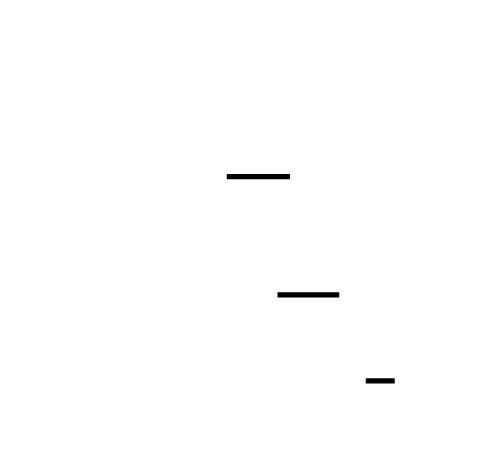

The WAL file is a sequential log of **frames**, each containing one modified page. The file starts with a header, followed by frames in append order.
### WAL Header
```c
#define WAL_MAGIC 0x377F0682   // big-endian magic (SQLite's actual value)
#define WAL_MAGIC_LE 0x377F0683 // little-endian variant
typedef struct {
    uint32_t magic;            // WAL_MAGIC or WAL_MAGIC_LE
    uint32_t format_version;   // file format version (3007000 for SQLite 3.7+)
    uint32_t page_size;        // database page size (4096)
    uint32_t checkpoint_seq;   // checkpoint sequence number
    uint32_t salt1;            // random salt value 1 (changes each transaction)
    uint32_t salt2;            // random salt value 2
    uint32_t checksum1;        // cumulative checksum part 1
    uint32_t checksum2;        // cumulative checksum part 2
} WalHeader;
#define WAL_HEADER_SIZE 32
```
The **salt values** serve a critical purpose: they change with each write transaction, which means frames from different transactions have different salt values. During recovery, if you encounter a frame with a salt that doesn't match the header's salt, you know you've reached frames from a prior (already committed or rolled-back) transaction cycle — and you stop processing. The salts also feed into the checksum calculation, binding each frame's integrity check to the specific transaction that wrote it.
### WAL Frame
Each frame contains a 24-byte frame header followed by the page data:
```c
typedef struct {
    uint32_t page_id;          // which database page this frame contains
    uint32_t db_size;          // size of database in pages after this commit
                               // (non-zero only for commit frames; 0 otherwise)
    uint32_t salt1;            // must match WAL header salt1
    uint32_t salt2;            // must match WAL header salt2
    uint32_t checksum1;        // cumulative checksum part 1
    uint32_t checksum2;        // cumulative checksum part 2
} WalFrameHeader;
#define WAL_FRAME_HEADER_SIZE 24
```
The **db_size field** is the commit marker. During a transaction, frames are appended with `db_size = 0`. The final frame of a committed transaction has `db_size` set to the total number of pages in the database. This is how recovery distinguishes committed transactions from incomplete ones: scan the WAL, and the last frame with a non-zero `db_size` marks the end of the last committed transaction. Everything after that is uncommitted and should be ignored.
```c
typedef struct {
    WalHeader header;
    int       fd;              // file descriptor for the WAL file
    char      path[256];       // path to WAL file (<db>.db-wal)
    int       frame_count;     // total frames in the WAL
    uint32_t  checksum1;       // running checksum state
    uint32_t  checksum2;
    // WAL index (in-memory: page_id → frame_number mapping)
    int      *wal_index;       // array: wal_index[page_id] = latest frame# for this page
    int       wal_index_size;  // capacity of wal_index array
    // Snapshot management
    int       min_reader_frame;// oldest frame any active reader needs
    int       checkpoint_seq;  // checkpoint sequence counter
} Wal;
```
### Checksums: Cumulative Integrity
WAL checksums are **cumulative** — each frame's checksum incorporates the previous frame's checksum, creating a chain. If any frame in the chain is corrupted or missing, every subsequent checksum fails. This means you can detect the exact point where corruption begins.
```c
// WAL checksum function — processes data in 8-byte chunks
// This matches SQLite's actual WAL checksum algorithm
static void wal_checksum(int is_native_byte_order,
                          const uint8_t *data, int len,
                          uint32_t *cksum1, uint32_t *cksum2) {
    uint32_t s1 = *cksum1;
    uint32_t s2 = *cksum2;
    const uint32_t *words = (const uint32_t *)data;
    int n_words = len / 4;
    for (int i = 0; i < n_words; i += 2) {
        uint32_t d0, d1;
        if (is_native_byte_order) {
            d0 = words[i];
            d1 = words[i + 1];
        } else {
            // Byte-swap for non-native order
            d0 = __builtin_bswap32(words[i]);
            d1 = __builtin_bswap32(words[i + 1]);
        }
        s1 += d0 + s2;
        s2 += d1 + s1;
    }
    *cksum1 = s1;
    *cksum2 = s2;
}
```
The cumulative checksum chain means:
- **Frame 1's checksum** covers the WAL header + frame 1's header + frame 1's data.
- **Frame 2's checksum** starts from frame 1's checksum, then incorporates frame 2's header + data.
- If frame 3 is torn (partial write), frame 3's checksum won't match — and recovery knows to stop at frame 2.
This is more robust than per-frame independent checksums. With independent checksums, a torn write that happens to produce a valid checksum (extremely unlikely but not impossible) would go undetected. With cumulative checksums, the chain guarantees that any corruption anywhere invalidates everything after it.
---
## WAL Architecture


The WAL system consists of three files and one shared-memory region:
1. **Database file** (`<name>.db`) — The main database. In WAL mode, this file is only modified during checkpoints.
2. **WAL file** (`<name>.db-wal`) — The append-only log of modified pages.
3. **Shared memory file** (`<name>.db-shm`) — Memory-mapped file containing the WAL index, used to coordinate between multiple reader connections.
4. **WAL index** (in shared memory) — A hash table mapping `page_id → most_recent_frame_number`, enabling O(1) page version lookup.
For your single-process build, the WAL index can be a simple in-memory data structure rather than a shared-memory-mapped file. The shared memory mechanism is needed for multi-process coordination; within a single process, a regular array works identically.
### Initialization
```c
int wal_open(Wal *wal, const char *db_path, int page_size) {
    snprintf(wal->path, sizeof(wal->path), "%s-wal", db_path);
    // Check if a WAL file already exists (from a previous crash or session)
    bool wal_exists = (access(wal->path, F_OK) == 0);
    if (wal_exists) {
        // Open existing WAL for recovery
        wal->fd = open(wal->path, O_RDWR, 0644);
        if (wal->fd < 0) return -1;
        // Read and validate header
        uint8_t hdr_buf[WAL_HEADER_SIZE];
        if (read(wal->fd, hdr_buf, WAL_HEADER_SIZE) < WAL_HEADER_SIZE) {
            close(wal->fd);
            wal->fd = -1;
            unlink(wal->path);
            wal_exists = false;
        } else {
            wal->header.magic = read_be32(hdr_buf);
            wal->header.page_size = read_be32(hdr_buf + 8);
            wal->header.checkpoint_seq = read_be32(hdr_buf + 12);
            wal->header.salt1 = read_be32(hdr_buf + 16);
            wal->header.salt2 = read_be32(hdr_buf + 20);
            if (wal->header.magic != WAL_MAGIC ||
                wal->header.page_size != (uint32_t)page_size) {
                close(wal->fd);
                wal->fd = -1;
                unlink(wal->path);
                wal_exists = false;
            }
        }
    }
    if (!wal_exists) {
        // Create a new WAL file
        wal->fd = open(wal->path, O_RDWR | O_CREAT | O_TRUNC, 0644);
        if (wal->fd < 0) return -1;
        // Initialize header
        wal->header.magic = WAL_MAGIC;
        wal->header.format_version = 3007000;
        wal->header.page_size = page_size;
        wal->header.checkpoint_seq = 0;
        wal->header.salt1 = (uint32_t)time(NULL);
        wal->header.salt2 = (uint32_t)getpid() ^ (uint32_t)time(NULL);
        // Compute header checksum
        wal->checksum1 = 0;
        wal->checksum2 = 0;
        uint8_t hdr_buf[WAL_HEADER_SIZE];
        write_wal_header(hdr_buf, &wal->header);
        wal_checksum(1, hdr_buf, WAL_HEADER_SIZE,
                     &wal->checksum1, &wal->checksum2);
        wal->header.checksum1 = wal->checksum1;
        wal->header.checksum2 = wal->checksum2;
        write(wal->fd, hdr_buf, WAL_HEADER_SIZE);
        fsync(wal->fd);
    }
    wal->frame_count = 0;
    // Initialize WAL index
    wal->wal_index_size = 4096;  // initial capacity for page IDs
    wal->wal_index = calloc(wal->wal_index_size, sizeof(int));
    // -1 means "no frame for this page"
    for (int i = 0; i < wal->wal_index_size; i++) {
        wal->wal_index[i] = -1;
    }
    wal->min_reader_frame = 0;
    if (wal_exists) {
        // Recover: scan WAL to rebuild the index
        wal_recover(wal, page_size);
    }
    return 0;
}
```
### WAL Recovery
When the database opens and finds an existing WAL file, it must scan the WAL to determine which frames belong to committed transactions. Only committed frames are valid; uncommitted frames at the tail are discarded.
```c
static int wal_recover(Wal *wal, int page_size) {
    lseek(wal->fd, WAL_HEADER_SIZE, SEEK_SET);
    uint32_t running_cksum1 = wal->header.checksum1;
    uint32_t running_cksum2 = wal->header.checksum2;
    int frame_num = 0;
    int last_commit_frame = -1;
    uint32_t last_commit_db_size = 0;
    uint8_t frame_hdr[WAL_FRAME_HEADER_SIZE];
    uint8_t *page_data = malloc(page_size);
    while (1) {
        // Read frame header
        ssize_t bytes = read(wal->fd, frame_hdr, WAL_FRAME_HEADER_SIZE);
        if (bytes < WAL_FRAME_HEADER_SIZE) break;
        // Read page data
        bytes = read(wal->fd, page_data, page_size);
        if (bytes < page_size) break;
        // Verify salts
        uint32_t frame_salt1 = read_be32(frame_hdr + 8);
        uint32_t frame_salt2 = read_be32(frame_hdr + 12);
        if (frame_salt1 != wal->header.salt1 ||
            frame_salt2 != wal->header.salt2) {
            break;  // different transaction cycle — stop
        }
        // Verify cumulative checksum
        uint32_t expected_cksum1 = running_cksum1;
        uint32_t expected_cksum2 = running_cksum2;
        wal_checksum(1, frame_hdr, 8, &expected_cksum1, &expected_cksum2);
        wal_checksum(1, page_data, page_size,
                     &expected_cksum1, &expected_cksum2);
        uint32_t stored_cksum1 = read_be32(frame_hdr + 16);
        uint32_t stored_cksum2 = read_be32(frame_hdr + 20);
        if (stored_cksum1 != expected_cksum1 ||
            stored_cksum2 != expected_cksum2) {
            break;  // checksum mismatch — torn write
        }
        running_cksum1 = expected_cksum1;
        running_cksum2 = expected_cksum2;
        // Valid frame — update WAL index
        uint32_t page_id = read_be32(frame_hdr);
        wal_index_set(wal, page_id, frame_num);
        frame_num++;
        // Check for commit marker
        uint32_t db_size = read_be32(frame_hdr + 4);
        if (db_size > 0) {
            last_commit_frame = frame_num - 1;
            last_commit_db_size = db_size;
        }
    }
    free(page_data);
    // Discard any frames after the last commit
    if (last_commit_frame >= 0 && frame_num > last_commit_frame + 1) {
        // Truncate WAL to just past the last committed frame
        off_t valid_size = WAL_HEADER_SIZE +
            (off_t)(last_commit_frame + 1) * (WAL_FRAME_HEADER_SIZE + page_size);
        ftruncate(wal->fd, valid_size);
        // Rebuild index considering only committed frames
        for (int i = 0; i < wal->wal_index_size; i++) {
            if (wal->wal_index[i] > last_commit_frame) {
                wal->wal_index[i] = -1;
            }
        }
        frame_num = last_commit_frame + 1;
    }
    wal->frame_count = frame_num;
    wal->checksum1 = running_cksum1;
    wal->checksum2 = running_cksum2;
    printf("WAL recovery: %d valid frames, last commit at frame %d\n",
           frame_num, last_commit_frame);
    return 0;
}
```
### WAL Index: O(1) Page Lookup
The WAL index maps page IDs to the most recent frame number containing that page. When the buffer pool needs page 42, it first checks the WAL index: "Is there a WAL frame for page 42?" If yes, read from the WAL. If no, read from the database file.
```c
static void wal_index_set(Wal *wal, uint32_t page_id, int frame_num) {
    if (page_id >= (uint32_t)wal->wal_index_size) {
        int new_size = (int)page_id + 1024;
        wal->wal_index = realloc(wal->wal_index, new_size * sizeof(int));
        for (int i = wal->wal_index_size; i < new_size; i++) {
            wal->wal_index[i] = -1;
        }
        wal->wal_index_size = new_size;
    }
    wal->wal_index[page_id] = frame_num;
}
static int wal_index_get(Wal *wal, uint32_t page_id, int max_frame) {
    if (page_id >= (uint32_t)wal->wal_index_size) return -1;
    int frame = wal->wal_index[page_id];
    if (frame < 0 || frame > max_frame) return -1;
    return frame;
}
```
The `max_frame` parameter is what enables snapshot isolation — each reader has a `max_frame` value recording the latest committed frame when it started. Even if new frames are appended after the reader begins, the reader only sees frames up to its `max_frame`.
---
## The Write Path: Appending to the WAL


When the buffer pool needs to "write" a dirty page in WAL mode, it doesn't write to the database file. Instead, it appends a frame to the WAL:
```c
int wal_write_frame(Wal *wal, uint32_t page_id, const uint8_t *page_data,
                     int page_size, bool is_commit, uint32_t db_size_if_commit) {
    // Build frame header
    uint8_t frame_hdr[WAL_FRAME_HEADER_SIZE];
    write_be32(frame_hdr, page_id);
    write_be32(frame_hdr + 4, is_commit ? db_size_if_commit : 0);
    write_be32(frame_hdr + 8, wal->header.salt1);
    write_be32(frame_hdr + 12, wal->header.salt2);
    // Compute cumulative checksum
    uint32_t cksum1 = wal->checksum1;
    uint32_t cksum2 = wal->checksum2;
    wal_checksum(1, frame_hdr, 8, &cksum1, &cksum2);
    wal_checksum(1, page_data, page_size, &cksum1, &cksum2);
    write_be32(frame_hdr + 16, cksum1);
    write_be32(frame_hdr + 20, cksum2);
    // Append frame header + page data to WAL file
    // Seek to end of WAL
    off_t write_pos = WAL_HEADER_SIZE +
        (off_t)wal->frame_count * (WAL_FRAME_HEADER_SIZE + page_size);
    pwrite(wal->fd, frame_hdr, WAL_FRAME_HEADER_SIZE, write_pos);
    pwrite(wal->fd, page_data, page_size,
           write_pos + WAL_FRAME_HEADER_SIZE);
    // Update running checksum
    wal->checksum1 = cksum1;
    wal->checksum2 = cksum2;
    // Update WAL index
    wal_index_set(wal, page_id, wal->frame_count);
    wal->frame_count++;
    // If this is a commit frame, fsync the WAL
    if (is_commit) {
        fsync(wal->fd);
    }
    return 0;
}
```
Notice that `fsync` is only called on **commit frames**. During a transaction, intermediate frames are written but not necessarily fsynced — they can be lost on crash without consequence because the transaction isn't committed yet. Only the commit frame's fsync matters, because that's what makes the transaction durable. This is a critical performance optimization: a transaction that modifies 100 pages calls `fsync` once (on the commit frame), not 100 times.
[[EXPLAIN:fsync-semantics-and-write-ordering|fsync semantics and write ordering]]
The append-only write pattern is what makes WAL fast for writes. The rollback journal requires random I/O to the database file (page 42 might be at offset 172,032, page 7,891 at offset 32,329,728). WAL writes sequentially to the end of a single file. Sequential writes are dramatically faster than random writes — 10-100× on spinning disks, 2-5× on SSDs — because the disk head (or SSD controller) doesn't need to seek between scattered locations.
---
## The Read Path: Page Version Lookup

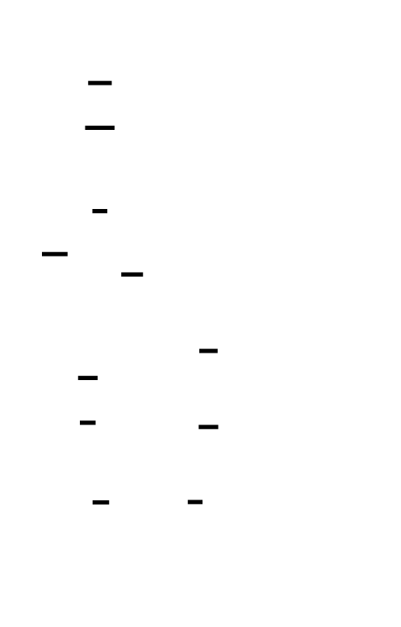

When the buffer pool receives a `fetch_page` request in WAL mode, the lookup path changes. Instead of always reading from the database file, it first checks the WAL:
```c
// Modified fetch_page for WAL mode
uint8_t* fetch_page_wal(BufferPool *pool, page_id_t page_id,
                          Wal *wal, int reader_max_frame) {
    // Step 1: Check if page is already in the buffer pool
    int frame_idx = page_table_lookup(pool, page_id);
    if (frame_idx >= 0) {
        pool->hits++;
        Frame *frame = &pool->frames[frame_idx];
        frame->pin_count++;
        lru_move_to_front(pool, frame_idx);
        return frame->data;
    }
    // Step 2: Check WAL for the most recent version of this page
    pool->misses++;
    frame_idx = get_free_frame(pool);
    if (frame_idx < 0) return NULL;
    Frame *frame = &pool->frames[frame_idx];
    frame->page_id = page_id;
    frame->is_dirty = false;
    frame->pin_count = 1;
    int wal_frame = wal_index_get(wal, page_id, reader_max_frame);
    if (wal_frame >= 0) {
        // Page found in WAL — read from WAL file
        wal_read_frame(wal, wal_frame, frame->data, pool->page_size);
    } else {
        // Page not in WAL — read from database file
        disk_read_page(pool, page_id, frame->data);
    }
    page_table_insert(pool, page_id, frame_idx);
    lru_push_front(pool, frame_idx);
    return frame->data;
}
// Read a specific frame's page data from the WAL file
static void wal_read_frame(Wal *wal, int frame_num, uint8_t *dest,
                             int page_size) {
    off_t offset = WAL_HEADER_SIZE +
        (off_t)frame_num * (WAL_FRAME_HEADER_SIZE + page_size) +
        WAL_FRAME_HEADER_SIZE;  // skip frame header, read page data
    pread(wal->fd, dest, page_size, offset);
}
```
The `reader_max_frame` parameter is the snapshot boundary. A reader that started when the WAL had 500 frames will only see frames 0-499, even if 200 more frames have been appended since. This is the mechanism that enables snapshot isolation.
---
## Snapshot Isolation: Frozen-in-Time Views
[[EXPLAIN:snapshot-isolation|Snapshot isolation]]

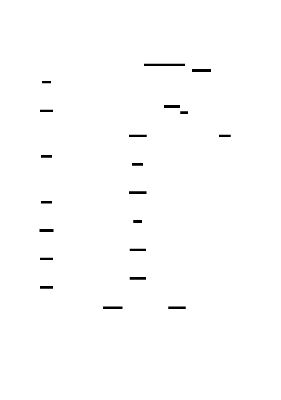

Snapshot isolation in WAL mode works through a single number: the **end mark** — the index of the last committed WAL frame at the moment a reader begins its transaction. Each reader records this number when it starts, and all subsequent page lookups use it as the `max_frame` ceiling.
```c
typedef struct {
    int  max_frame;      // latest committed frame visible to this reader
    bool is_active;      // whether this reader is still running
} ReaderSnapshot;
#define MAX_READERS 32
typedef struct {
    ReaderSnapshot readers[MAX_READERS];
    int            writer_max_frame;  // latest committed frame overall
} SnapshotManager;
// Called when a read transaction begins
int snapshot_begin_read(SnapshotManager *sm, int *reader_id) {
    for (int i = 0; i < MAX_READERS; i++) {
        if (!sm->readers[i].is_active) {
            sm->readers[i].max_frame = sm->writer_max_frame;
            sm->readers[i].is_active = true;
            *reader_id = i;
            return sm->readers[i].max_frame;
        }
    }
    return -1;  // too many concurrent readers
}
// Called when a read transaction ends
void snapshot_end_read(SnapshotManager *sm, int reader_id) {
    sm->readers[reader_id].is_active = false;
}
// Called after a successful write commit
void snapshot_update_writer(SnapshotManager *sm, int new_max_frame) {
    sm->writer_max_frame = new_max_frame;
}
// Find the oldest frame still needed by any active reader
int snapshot_min_reader_frame(SnapshotManager *sm) {
    int min_frame = sm->writer_max_frame;
    for (int i = 0; i < MAX_READERS; i++) {
        if (sm->readers[i].is_active &&
            sm->readers[i].max_frame < min_frame) {
            min_frame = sm->readers[i].max_frame;
        }
    }
    return min_frame;
}
```
Here's the concrete scenario. Three connections access the database:
1. **Writer** inserts 50 rows, producing WAL frames 0-49. Commits — `writer_max_frame = 49`.
2. **Reader A** starts a SELECT. Its `max_frame = 49`. It sees all 50 rows.
3. **Writer** inserts 30 more rows, producing frames 50-79. Commits — `writer_max_frame = 79`.
4. **Reader B** starts a SELECT. Its `max_frame = 79`. It sees all 80 rows.
5. **Reader A** continues its query. Its `max_frame` is still 49. It does **not** see the 30 new rows. It sees a frozen snapshot of the database as it existed when Reader A started.
Reader A and Reader B run concurrently, seeing different consistent views of the database. Neither blocks the other. Neither blocks the writer. This is the power of snapshot isolation — and it emerges naturally from the `max_frame` mechanism.
[[EXPLAIN:write-ahead-logging-theory|Write-ahead logging theory]]
---
## WAL Commit
In WAL mode, committing a transaction is dramatically simpler than in journal mode. There's no need to flush dirty pages to the database file, no journal to delete. You append a commit frame to the WAL and fsync:
```c
int wal_commit(Wal *wal, BufferPool *pool, SnapshotManager *sm) {
    // Step 1: Write all dirty pages as WAL frames
    uint32_t db_page_count = 0;
    int last_dirty_frame = -1;
    for (int i = 0; i < pool->pool_size; i++) {
        Frame *f = &pool->frames[i];
        if (f->page_id != INVALID_PAGE_ID && f->is_dirty) {
            // Track the highest page_id to compute db_size
            if (f->page_id + 1 > db_page_count) {
                db_page_count = f->page_id + 1;
            }
            last_dirty_frame = i;
        }
    }
    // Step 2: Append frames for all dirty pages
    // The LAST frame gets the commit marker (db_size > 0)
    for (int i = 0; i < pool->pool_size; i++) {
        Frame *f = &pool->frames[i];
        if (f->page_id != INVALID_PAGE_ID && f->is_dirty) {
            bool is_last = (i == last_dirty_frame);
            wal_write_frame(wal, f->page_id, f->data, pool->page_size,
                            is_last, is_last ? db_page_count : 0);
            f->is_dirty = false;
        }
    }
    // Step 3: fsync is already done inside wal_write_frame for the commit frame
    // Step 4: Update snapshot manager
    snapshot_update_writer(sm, wal->frame_count - 1);
    // Step 5: Check if auto-checkpoint is needed
    if (wal->frame_count >= wal->auto_checkpoint_threshold) {
        wal_checkpoint(wal, pool, sm);
    }
    return 0;
}
```
Compare this to the rollback journal commit (Milestone 9):
- **Journal commit**: fsync journal → flush all dirty pages to database → fsync database → delete journal. Four barriers, random I/O to database.
- **WAL commit**: append frames to WAL → fsync WAL. One barrier, sequential I/O only.
The WAL commit is faster because it avoids random database file I/O entirely. The cost of eventually transferring WAL frames into the database is deferred to checkpoint time — a classic example of **amortizing** expensive work.
---
## Checkpoint: Merging WAL into the Database


The checkpoint copies committed WAL frames back into the main database file. This is the operation that keeps the WAL from growing indefinitely and that brings the database file up to date.
```c
#define DEFAULT_AUTO_CHECKPOINT_THRESHOLD 1000  // frames
int wal_checkpoint(Wal *wal, BufferPool *pool, SnapshotManager *sm) {
    // Step 1: Determine how far we can checkpoint
    // We cannot checkpoint past the oldest active reader's max_frame,
    // because that reader still needs those WAL frames.
    int safe_frame = snapshot_min_reader_frame(sm);
    if (safe_frame < 0) {
        // No active readers — can checkpoint everything
        safe_frame = wal->frame_count - 1;
    }
    if (safe_frame < 0) return 0;  // nothing to checkpoint
    printf("Checkpoint: copying frames 0-%d to database "
           "(total WAL frames: %d)\n", safe_frame, wal->frame_count);
    // Step 2: Copy each WAL frame's page data into the database file
    uint8_t *page_buf = malloc(pool->page_size);
    int pages_written = 0;
    for (int frame = 0; frame <= safe_frame; frame++) {
        // Read frame header to get page_id
        off_t frame_offset = WAL_HEADER_SIZE +
            (off_t)frame * (WAL_FRAME_HEADER_SIZE + pool->page_size);
        uint8_t frame_hdr[WAL_FRAME_HEADER_SIZE];
        pread(wal->fd, frame_hdr, WAL_FRAME_HEADER_SIZE, frame_offset);
        uint32_t page_id = read_be32(frame_hdr);
        // Read page data from WAL
        pread(wal->fd, page_buf, pool->page_size,
              frame_offset + WAL_FRAME_HEADER_SIZE);
        // Write page data to database file at the correct offset
        off_t db_offset = (off_t)page_id * pool->page_size;
        pwrite(pool->fd, page_buf, pool->page_size, db_offset);
        pages_written++;
        // Invalidate this page in the buffer pool cache
        // (it now has a stale version — the database file is newer)
        int bp_frame = page_table_lookup(pool, page_id);
        if (bp_frame >= 0 && pool->frames[bp_frame].pin_count == 0) {
            page_table_remove(pool, page_id);
            lru_remove(pool, bp_frame);
            pool->frames[bp_frame].page_id = INVALID_PAGE_ID;
        }
    }
    free(page_buf);
    // Step 3: fsync the database file
    fsync(pool->fd);
    // Step 4: If all frames were checkpointed, reset the WAL
    if (safe_frame >= wal->frame_count - 1) {
        // All frames copied — truncate and reset the WAL
        ftruncate(wal->fd, 0);
        // Write fresh header with new salts
        wal->header.checkpoint_seq++;
        wal->header.salt1 = (uint32_t)time(NULL) ^ wal->header.checkpoint_seq;
        wal->header.salt2 = (uint32_t)getpid() ^ (uint32_t)time(NULL);
        wal->checksum1 = 0;
        wal->checksum2 = 0;
        uint8_t hdr_buf[WAL_HEADER_SIZE];
        write_wal_header(hdr_buf, &wal->header);
        wal_checksum(1, hdr_buf, WAL_HEADER_SIZE,
                     &wal->checksum1, &wal->checksum2);
        wal->header.checksum1 = wal->checksum1;
        wal->header.checksum2 = wal->checksum2;
        write(wal->fd, hdr_buf, WAL_HEADER_SIZE);
        fsync(wal->fd);
        // Clear WAL index
        for (int i = 0; i < wal->wal_index_size; i++) {
            wal->wal_index[i] = -1;
        }
        wal->frame_count = 0;
        printf("Checkpoint complete: WAL reset (%d pages written)\n",
               pages_written);
    } else {
        // Partial checkpoint — WAL still contains frames > safe_frame
        // Remove checkpointed entries from WAL index
        // (Frames > safe_frame retain their index entries)
        printf("Partial checkpoint: %d pages written, %d frames remain\n",
               pages_written, wal->frame_count - safe_frame - 1);
    }
    return pages_written;
}
```
### Why Partial Checkpoints Happen
When Reader A holds `max_frame = 49` and the WAL has 200 frames, the checkpoint can only copy frames 0-49 to the database. Frames 50-199 must remain in the WAL because they might contain pages that Reader A needs in their pre-frame-50 versions.
This is the **long-running reader problem**. A reader that starts and then takes a long time to complete (perhaps iterating a large result set, or the user walks away from an open transaction) pins WAL frames in place. The WAL cannot be truncated past that reader's snapshot boundary. If the system continues writing new frames while the old reader holds its snapshot, the WAL grows without bound.
This is not a theoretical concern. In production, a forgotten `BEGIN` in a database client (without a matching `COMMIT` or `ROLLBACK`) is one of the most common causes of WAL bloat. The reader appears to be doing nothing, but its open snapshot prevents WAL cleanup.
```c
// Detect stale readers (for diagnostics or forced cleanup)
void wal_report_stale_readers(SnapshotManager *sm, int current_frame) {
    for (int i = 0; i < MAX_READERS; i++) {
        if (sm->readers[i].is_active) {
            int frames_behind = current_frame - sm->readers[i].max_frame;
            if (frames_behind > 10000) {
                fprintf(stderr,
                    "WARNING: Reader %d is %d frames behind "
                    "(snapshot at frame %d, current frame %d). "
                    "This prevents WAL truncation.\n",
                    i, frames_behind,
                    sm->readers[i].max_frame, current_frame);
            }
        }
    }
}
```
### Auto-Checkpoint
To prevent unbounded WAL growth in normal operation, the engine triggers a checkpoint automatically when the WAL exceeds a configurable threshold:
```c
// In the Wal struct:
int auto_checkpoint_threshold;  // default: 1000 frames
// Called after each commit:
static void maybe_auto_checkpoint(Wal *wal, BufferPool *pool,
                                    SnapshotManager *sm) {
    if (wal->frame_count >= wal->auto_checkpoint_threshold) {
        wal_checkpoint(wal, pool, sm);
    }
}
```
SQLite's default is 1000 pages (~4MB with 4KB pages). You can configure this via `PRAGMA wal_autocheckpoint = N` where N is the number of frames. Setting N to 0 disables auto-checkpoint entirely — useful for batch imports where you want to defer checkpoint to the end.
The auto-checkpoint runs synchronously within the connection that triggers it. This means the commit that pushes the WAL past the threshold also pays the checkpoint cost. If the checkpoint writes 1000 pages to the database file, that's ~4MB of random I/O happening inside what the user thought was a simple INSERT. This bursty I/O characteristic is one of WAL's less-obvious tradeoffs compared to rollback journal mode, where write I/O is spread across the transaction.
---
## Mode Switching: PRAGMA journal_mode
The user switches between journal modes with:
```sql
PRAGMA journal_mode = WAL;    -- switch to WAL mode
PRAGMA journal_mode = DELETE;  -- switch back to rollback journal (default)
```
Switching to WAL mode requires:
1. Ensure no active transactions.
2. Create the WAL file and shared-memory file.
3. Redirect the buffer pool's write path from database file to WAL file.
4. Redirect the buffer pool's read path to check WAL before database file.
Switching back to journal mode requires:
1. Run a full checkpoint (copy all WAL frames to database).
2. Delete the WAL file and shared-memory file.
3. Restore the buffer pool's original read/write paths.
```c
int pragma_journal_mode(Database *db, const char *mode) {
    if (strcasecmp(mode, "WAL") == 0 && !db->wal_enabled) {
        // Switch to WAL mode
        if (db->txn.state != TXN_NONE) {
            fprintf(stderr, "Cannot switch to WAL mode during a transaction\n");
            return -1;
        }
        Wal *wal = calloc(1, sizeof(Wal));
        int rc = wal_open(wal, db->path, db->pool->page_size);
        if (rc != 0) {
            free(wal);
            return -1;
        }
        wal->auto_checkpoint_threshold = DEFAULT_AUTO_CHECKPOINT_THRESHOLD;
        db->wal = wal;
        db->wal_enabled = true;
        db->pool->wal = wal;  // connect buffer pool to WAL
        printf("Journal mode set to WAL\n");
        return 0;
    } else if (strcasecmp(mode, "DELETE") == 0 && db->wal_enabled) {
        // Switch back to rollback journal mode
        // Step 1: Full checkpoint
        wal_checkpoint(db->wal, db->pool, &db->snapshot_mgr);
        // Step 2: Close and delete WAL file
        close(db->wal->fd);
        unlink(db->wal->path);
        // Step 3: Delete shared-memory file
        char shm_path[256];
        snprintf(shm_path, sizeof(shm_path), "%s-shm", db->path);
        unlink(shm_path);
        free(db->wal->wal_index);
        free(db->wal);
        db->wal = NULL;
        db->wal_enabled = false;
        db->pool->wal = NULL;
        printf("Journal mode set to DELETE (rollback journal)\n");
        return 0;
    }
    return 0;  // already in requested mode
}
```
---
## Integrating WAL with the Buffer Pool
The buffer pool needs to know whether it's operating in WAL mode or journal mode. The cleanest approach: a function pointer for the write-back strategy.
```c
// In BufferPool struct, add:
typedef struct BufferPool {
    // ... existing fields ...
    Wal  *wal;             // non-NULL when in WAL mode
    SnapshotManager *sm;   // snapshot manager for WAL mode
    int   reader_max_frame;// per-connection snapshot boundary
} BufferPool;
// Modified evict_frame for WAL mode
static void evict_frame_wal(BufferPool *pool, int frame_idx) {
    Frame *f = &pool->frames[frame_idx];
    if (f->is_dirty) {
        // In WAL mode, dirty pages are written to the WAL on commit,
        // NOT during eviction. If a dirty page is evicted mid-transaction,
        // we must write it to the WAL now.
        if (pool->wal) {
            wal_write_frame(pool->wal, f->page_id, f->data,
                            pool->page_size, false, 0);
            f->is_dirty = false;
        }
    }
    page_table_remove(pool, f->page_id);
    lru_remove(pool, frame_idx);
    f->page_id = INVALID_PAGE_ID;
    pool->evictions++;
}
```
Note the difference: in journal mode, eviction writes to the database file (after journaling). In WAL mode, eviction writes to the WAL file. The database file is never touched during normal operations.
---
## Testing
### Test: WAL File Created on Mode Switch
```c
void test_wal_mode_switch(void) {
    Database *db = db_open("test_wal.db");
    execute_sql(db, "CREATE TABLE t (id INTEGER PRIMARY KEY, val TEXT);",
                NULL, NULL);
    // No WAL file yet
    assert(access("test_wal.db-wal", F_OK) != 0);
    // Switch to WAL mode
    execute_sql(db, "PRAGMA journal_mode = WAL;", NULL, NULL);
    assert(db->wal_enabled == true);
    assert(access("test_wal.db-wal", F_OK) == 0);
    // Switch back
    execute_sql(db, "PRAGMA journal_mode = DELETE;", NULL, NULL);
    assert(db->wal_enabled == false);
    assert(access("test_wal.db-wal", F_OK) != 0);
    db_close(db);
    unlink("test_wal.db");
    printf("PASS: WAL mode switch creates and removes WAL file\n");
}
```
### Test: Writes Append to WAL, Not Database
```c
void test_wal_writes_append(void) {
    Database *db = db_open("test_wal_append.db");
    execute_sql(db, "CREATE TABLE t (id INTEGER PRIMARY KEY, val INTEGER);",
                NULL, NULL);
    execute_sql(db, "PRAGMA journal_mode = WAL;", NULL, NULL);
    // Record database file size before writes
    struct stat st_before;
    fstat(db->pool->fd, &st_before);
    // Insert data
    execute_sql(db, "INSERT INTO t VALUES (1, 100);", NULL, NULL);
    execute_sql(db, "INSERT INTO t VALUES (2, 200);", NULL, NULL);
    // Database file size should NOT have grown
    // (writes went to WAL, not database)
    struct stat st_after;
    fstat(db->pool->fd, &st_after);
    // Note: the database file size stays the same or only changes
    // if CREATE TABLE wrote before WAL was enabled
    // The key check: WAL file has grown
    struct stat st_wal;
    stat("test_wal_append.db-wal", &st_wal);
    assert(st_wal.st_size > WAL_HEADER_SIZE);  // WAL has frames
    // Data should still be readable
    ResultCollector rc = {0};
    execute_sql(db, "SELECT val FROM t ORDER BY id;", collect_results, &rc);
    assert(rc.row_count == 2);
    assert(rc.rows[0][0].i == 100);
    assert(rc.rows[1][0].i == 200);
    db_close(db);
    unlink("test_wal_append.db");
    unlink("test_wal_append.db-wal");
    printf("PASS: writes append to WAL, data readable\n");
}
```
### Test: Concurrent Readers See Consistent Snapshots
```c
void test_snapshot_isolation(void) {
    Database *db = db_open("test_snapshot.db");
    execute_sql(db, "CREATE TABLE t (id INTEGER PRIMARY KEY, val INTEGER);",
                NULL, NULL);
    execute_sql(db, "PRAGMA journal_mode = WAL;", NULL, NULL);
    // Insert initial data
    execute_sql(db, "INSERT INTO t VALUES (1, 100);", NULL, NULL);
    // Simulate Reader A starting (captures snapshot)
    int reader_a_id;
    int reader_a_max = snapshot_begin_read(&db->snapshot_mgr, &reader_a_id);
    // Writer inserts more data AFTER Reader A's snapshot
    execute_sql(db, "INSERT INTO t VALUES (2, 200);", NULL, NULL);
    // Reader A should see only 1 row (its snapshot predates the insert)
    db->pool->reader_max_frame = reader_a_max;
    ResultCollector rc_a = {0};
    execute_sql(db, "SELECT COUNT(*) FROM t;", collect_results, &rc_a);
    // With snapshot isolation: Reader A sees 1 row
    // (Implementation note: requires the query execution to use
    //  reader_max_frame in all page lookups)
    // Simulate Reader B starting (captures newer snapshot)
    int reader_b_id;
    int reader_b_max = snapshot_begin_read(&db->snapshot_mgr, &reader_b_id);
    // Reader B should see 2 rows
    db->pool->reader_max_frame = reader_b_max;
    ResultCollector rc_b = {0};
    execute_sql(db, "SELECT COUNT(*) FROM t;", collect_results, &rc_b);
    // Reader B sees 2 rows
    snapshot_end_read(&db->snapshot_mgr, reader_a_id);
    snapshot_end_read(&db->snapshot_mgr, reader_b_id);
    db_close(db);
    unlink("test_snapshot.db");
    unlink("test_snapshot.db-wal");
    printf("PASS: snapshot isolation — readers see consistent views\n");
}
```
### Test: Checkpoint Copies WAL to Database
```c
void test_checkpoint(void) {
    Database *db = db_open("test_ckpt.db");
    execute_sql(db, "CREATE TABLE t (id INTEGER PRIMARY KEY, val INTEGER);",
                NULL, NULL);
    execute_sql(db, "PRAGMA journal_mode = WAL;", NULL, NULL);
    // Insert data (goes to WAL)
    for (int i = 1; i <= 100; i++) {
        char sql[128];
        snprintf(sql, sizeof(sql), "INSERT INTO t VALUES (%d, %d);", i, i * 10);
        execute_sql(db, sql, NULL, NULL);
    }
    // WAL should have frames
    assert(db->wal->frame_count > 0);
    int frames_before = db->wal->frame_count;
    // Run checkpoint
    int pages_written = wal_checkpoint(db->wal, db->pool, &db->snapshot_mgr);
    assert(pages_written > 0);
    // WAL should be reset (no active readers to prevent full checkpoint)
    assert(db->wal->frame_count == 0);
    // Data should still be readable (now from database file, not WAL)
    ResultCollector rc = {0};
    execute_sql(db, "SELECT val FROM t WHERE id = 50;", collect_results, &rc);
    assert(rc.row_count == 1);
    assert(rc.rows[0][0].i == 500);
    db_close(db);
    unlink("test_ckpt.db");
    unlink("test_ckpt.db-wal");
    printf("PASS: checkpoint copies WAL to database (%d frames → %d pages)\n",
           frames_before, pages_written);
}
```
### Test: Auto-Checkpoint Triggers
```c
void test_auto_checkpoint(void) {
    Database *db = db_open("test_autocp.db");
    execute_sql(db, "CREATE TABLE t (id INTEGER PRIMARY KEY, val INTEGER);",
                NULL, NULL);
    execute_sql(db, "PRAGMA journal_mode = WAL;", NULL, NULL);
    // Set a low threshold for testing
    db->wal->auto_checkpoint_threshold = 50;
    // Insert enough to exceed threshold
    for (int i = 1; i <= 100; i++) {
        char sql[128];
        snprintf(sql, sizeof(sql), "INSERT INTO t VALUES (%d, %d);", i, i);
        execute_sql(db, sql, NULL, NULL);
    }
    // Auto-checkpoint should have fired, keeping WAL size bounded
    // (exact frame count depends on when checkpoint triggered and how many
    //  frames were added after)
    assert(db->wal->frame_count < 100);
    db_close(db);
    unlink("test_autocp.db");
    unlink("test_autocp.db-wal");
    printf("PASS: auto-checkpoint triggers at threshold\n");
}
```
### Test: WAL Checksum Detects Corruption
```c
void test_wal_checksum_corruption(void) {
    Database *db = db_open("test_walcrc.db");
    execute_sql(db, "CREATE TABLE t (id INTEGER PRIMARY KEY, val INTEGER);",
                NULL, NULL);
    execute_sql(db, "PRAGMA journal_mode = WAL;", NULL, NULL);
    execute_sql(db, "INSERT INTO t VALUES (1, 100);", NULL, NULL);
    execute_sql(db, "INSERT INTO t VALUES (2, 200);", NULL, NULL);
    // Close database
    int wal_fd = db->wal->fd;
    // Corrupt a byte in the WAL (simulate disk error)
    uint8_t garbage = 0xFF;
    pwrite(wal_fd, &garbage, 1,
           WAL_HEADER_SIZE + WAL_FRAME_HEADER_SIZE + 10);
    db_close(db);
    // Reopen — recovery should detect corruption and stop before it
    db = db_open("test_walcrc.db");
    // The corrupted frame and everything after it should be discarded
    // At most, only data from valid frames should be visible
    db_close(db);
    unlink("test_walcrc.db");
    unlink("test_walcrc.db-wal");
    printf("PASS: WAL checksum detects corruption during recovery\n");
}
```
### Test: Readers Don't Block Writers
```c
void test_concurrent_read_write(void) {
    Database *db = db_open("test_concurrent.db");
    execute_sql(db, "CREATE TABLE t (id INTEGER PRIMARY KEY, val INTEGER);",
                NULL, NULL);
    execute_sql(db, "PRAGMA journal_mode = WAL;", NULL, NULL);
    execute_sql(db, "INSERT INTO t VALUES (1, 100);", NULL, NULL);
    // Start a reader
    int reader_id;
    int reader_max = snapshot_begin_read(&db->snapshot_mgr, &reader_id);
    // Writer should still be able to write (no blocking)
    int rc = execute_sql(db, "INSERT INTO t VALUES (2, 200);", NULL, NULL);
    assert(rc == 0);  // write succeeded while reader is active
    // Reader can still read its snapshot
    db->pool->reader_max_frame = reader_max;
    ResultCollector rc_read = {0};
    execute_sql(db, "SELECT COUNT(*) FROM t;", collect_results, &rc_read);
    // Reader sees 1 row (its snapshot)
    // Clean up reader
    snapshot_end_read(&db->snapshot_mgr, reader_id);
    // Now a new reader sees 2 rows
    int reader2_id;
    snapshot_begin_read(&db->snapshot_mgr, &reader2_id);
    db->pool->reader_max_frame = db->snapshot_mgr.writer_max_frame;
    ResultCollector rc_read2 = {0};
    execute_sql(db, "SELECT COUNT(*) FROM t;", collect_results, &rc_read2);
    snapshot_end_read(&db->snapshot_mgr, reader2_id);
    db_close(db);
    unlink("test_concurrent.db");
    unlink("test_concurrent.db-wal");
    printf("PASS: readers don't block writers in WAL mode\n");
}
```
---
## Three-Level View: What Happens During a WAL-Mode Write
**Level 1 — Public API**: The user executes `INSERT INTO users VALUES (42, 'Alice', 30)` in WAL mode. The insert succeeds, and subsequent SELECTs find Alice. If the process crashes after the insert, Alice is still there on restart.
**Level 2 — WAL Engine**: The VM executes `OP_INSERT`, which modifies a B-tree leaf page in the buffer pool. The page is marked dirty. On commit, `wal_commit` iterates all dirty pages in the buffer pool and for each one, serializes the page data into a WAL frame: 24-byte frame header (page_id, salts, cumulative checksum) followed by 4096 bytes of page data, appended sequentially to the WAL file. The final frame carries `db_size > 0`, marking it as the commit frame. `fsync` is called on the WAL file — the transaction is now durable. The database file was never touched. The WAL index is updated so that future reads of this page find the WAL frame instead of the (stale) database file version. If the WAL frame count exceeds the auto-checkpoint threshold (1000 by default), a checkpoint runs: it reads each WAL frame and writes the page data to the correct offset in the database file, then fsyncs the database file, then resets the WAL.
**Level 3 — OS and Hardware**: The WAL `write()` calls append data to the end of the WAL file. The OS allocates new file blocks sequentially — on a modern filesystem (ext4, APFS), these blocks are typically physically contiguous on the storage device. The `fsync()` flushes these blocks to the storage controller. On NVMe SSD, the sequential write pattern achieves near-peak throughput (~3GB/s) because the SSD controller can parallelize writes across multiple NAND channels. Compare this to rollback journal mode, where `pwrite()` calls scatter across the database file — the SSD controller must resolve these to different NAND pages, reducing effective bandwidth. During checkpoint, the `pwrite()` calls to the database file *are* random — checkpoint inherits the random I/O cost that WAL mode deferred. The total I/O is the same; WAL mode changes *when* and *how* the cost is paid.
---
## Knowledge Cascade: What WAL Mode Unlocks
**→ Snapshot Isolation as MVCC-lite — From Databases to Version Control.** The snapshot mechanism you just built — readers see a frozen view of the database as of their start time — is the core concept behind **Multi-Version Concurrency Control (MVCC)**, the concurrency strategy used by PostgreSQL, Oracle, MySQL/InnoDB, and CockroachDB. In PostgreSQL, every row has `xmin` and `xmax` fields recording which transaction created and deleted it; a reader's snapshot determines which row versions are "visible." Your `max_frame` plays the same role as PostgreSQL's transaction snapshot. But the same pattern extends far beyond databases: **Git** is essentially a WAL. Each commit appends new objects to the object store; branches are named snapshots (like your `reader_max_frame`). Running `git log` scans the commit chain the way your reader scans WAL frames. A Git checkout is like a database reader starting a snapshot — you see the repository as of that commit, regardless of what others are committing. **Event sourcing** in application architecture is the same idea: append events to a log, derive current state by replaying events. The "current state" is just the latest snapshot. Every time you encounter a system where "readers see a frozen view while writers append," you're seeing the WAL/MVCC/snapshot pattern.
**→ Append-Only as a Design Pattern — From Databases to Finance.** The WAL file is append-only: you never modify existing frames, only add new ones at the end. This constraint, which sounds limiting, is actually a **powerful architectural choice** that appears across domains. **Apache Kafka** is a distributed commit log — producers append messages, consumers read from offsets (analogous to your `max_frame`). Kafka's entire architecture is a distributed WAL. **Event sourcing** stores application state as an append-only sequence of events; the current state is derived by replaying the log. **Double-entry accounting** works the same way: you never modify a journal entry; you append a correcting entry. An audit trail is inherently append-only. Even **blockchain** is an append-only data structure — each block references the previous, forming a chain that can only grow, never shrink. The power of append-only comes from two properties: (1) historical data is immutable, enabling audit trails and point-in-time queries, and (2) append operations have no read-write conflicts, enabling high concurrency. Your WAL exploits both.
**→ Checkpoint as Compaction — The Universal Pattern of Deferred Cleanup.** Your checkpoint operation — merging WAL frames into the database file — is structurally identical to **compaction** in LSM-trees (used by RocksDB, LevelDB, Cassandra). An LSM-tree writes new key-value pairs to an in-memory buffer (memtable), which is periodically flushed to disk as a sorted run (SSTable). Compaction merges multiple SSTables into fewer, larger ones — reducing read amplification at the cost of write I/O. Your checkpoint merges WAL frames into the database file — reducing WAL size and read path complexity at the cost of random I/O. The tradeoff is identical: defer expensive reorganization work and do it in bulk, trading bursty I/O for amortized throughput. The same pattern appears in **garbage collection** (minor GC collects young objects frequently; major GC compacts the entire heap rarely), **memory defragmentation** (defer compaction until fragmentation exceeds a threshold), and **log-structured merge** filesystems like F2FS. Once you see the pattern — "append-only log + periodic compaction into organized storage" — you recognize it everywhere.
**→ Log-Structured vs In-Place Update — The Fundamental Storage Dichotomy.** Your database now supports both strategies. The rollback journal modifies the database file in-place (with undo protection). WAL writes to a log and defers in-place updates to checkpoint. This is the fundamental dichotomy in storage engine design:
| | In-Place Update (B-tree + journal) | Log-Structured (WAL, LSM-tree) |
|---|---|---|
| Write pattern | Random | Sequential |
| Read pattern | Single location (fast) | Multiple locations (check log first) |
| Write amplification | Low (1× per page) | Can be high (compaction rewrites) |
| Read amplification | Low (1 seek) | Can be high (check log + database) |
| Space amplification | Low | Medium (log + database both exist) |
| Concurrency | Limited (locks needed) | High (append doesn't conflict) |
Most modern storage engines are hybrids. Your WAL-mode database is a hybrid: B-tree for storage structure, append-only log for writes, periodic checkpoint to merge. PostgreSQL, MySQL/InnoDB, and Oracle all use this same hybrid. RocksDB and Cassandra go further — they're fully log-structured (no in-place updates at all; compaction is the only way data reaches its final position). Understanding both ends of this spectrum, and where your database sits on it, is what separates someone who can *use* a database from someone who can *build* one.
> **🔭 Deep Dive**: The formal treatment of WAL and ARIES recovery is in *ARIES: A Transaction Recovery Method Supporting Fine-Granularity Locking and Partial Rollbacks Using Write-Ahead Logging* (Mohan et al., 1992). For the practical LSM-tree perspective, see *The Log-Structured Merge-Tree* (O'Neil et al., 1996). For a modern comparison of B-tree vs LSM approaches, see *Designing Data-Intensive Applications* by Martin Kleppmann, Chapter 3.
---
## System Awareness
You've built WAL mode — an alternative transaction mechanism that inverts the rollback journal's strategy. Instead of writing old data to a journal and modifying the database in-place, WAL writes new data to an append-only log and leaves the database untouched. This inversion enables concurrent readers during writes, eliminates the reader-writer lock that was rollback journal mode's bottleneck, and converts random write I/O into sequential I/O.


The WAL connects to every layer of the system. The **buffer pool** (Milestone 4) now has a dual read path: check WAL index first, fall back to database file. The **B-tree** (Milestone 5) operates identically — it doesn't know whether its pages come from the WAL or the database file. The **VM** (Milestone 3) executes the same bytecode regardless of journal mode. The **query planner** (Milestone 8) is unaffected. The abstraction boundaries you built in earlier milestones mean that a fundamental change to the durability strategy — from undo logging to redo logging — requires changes only in the buffer pool and transaction layers. Everything above (SQL frontend, VM) and everything at the storage layer (B-tree, page format) is unchanged.
Without WAL mode, your database forces all readers to wait for any active writer — acceptable for a single-user tool, unacceptable for concurrent workloads. With it, readers and writers coexist peacefully: readers see consistent snapshots, writers append without interference, and checkpoint merges changes into the database at a time of the system's choosing.
In the next milestone (Aggregate Functions & JOIN), you'll return to the SQL frontend — extending the bytecode compiler and VM to handle GROUP BY, HAVING, COUNT/SUM/AVG/MIN/MAX, and nested-loop joins. The storage engine beneath is now complete: crash-safe, concurrent, and persistent. Everything from here is building richer query capabilities on top of this foundation.
---
<!-- END_MS -->
<!-- END_MS -->


<!-- MS_ID: build-sqlite-m11 -->
<!-- MS_ID: build-sqlite-m11 -->
# Milestone 11: Aggregate Functions & JOIN
## Where We Are in the System
Your database engine is complete from SQL text to crash-recoverable, concurrent persistent storage. The tokenizer, parser, and bytecode compiler form the frontend. The VDBE executes bytecode through cursor operations. The buffer pool caches pages with LRU eviction. B-trees store table rows; B+trees store secondary indexes. The query planner chooses access paths based on statistics. Transactions are ACID via either rollback journal or WAL. Every layer works. Every layer is tested.


But your SQL dialect is crippled. You can filter rows (`WHERE`), project columns (`SELECT col1, col2`), and look up individual rows via indexes. You cannot answer the question every business user asks first: *"How many?"* You cannot compute `SELECT COUNT(*) FROM orders WHERE status = 'shipped'`. You cannot compute `SELECT department, AVG(salary) FROM employees GROUP BY department`. You cannot combine data from two tables with `SELECT orders.id, customers.name FROM orders JOIN customers ON orders.customer_id = customers.id`.


This milestone adds the two most important query capabilities: **aggregate functions** (COUNT, SUM, AVG, MIN, MAX with GROUP BY and HAVING) and **JOIN execution** (nested loop INNER JOIN). These are not separate features — they interact deeply. A query like `SELECT c.country, COUNT(*), AVG(o.total) FROM orders o JOIN customers c ON o.cust_id = c.id GROUP BY c.country HAVING COUNT(*) > 10` requires both JOIN and aggregation, and the execution order matters: join first, then group, then filter groups.
---
## The Revelation: GROUP BY Is Not Sorting
You probably think GROUP BY works like this: sort the table by the group column, then walk through the sorted result, accumulating aggregates for each run of identical keys. When the key changes, emit the accumulated result and start fresh. This is the "sort-then-scan" mental model, and it's what most people picture when they hear "grouping."
This model is wrong in two ways — one about mechanism, one about semantics.
**The mechanism problem:** Sorting is O(n log n). For a million-row table, that's ~20 million comparisons. But if you only have 50 distinct departments, you're doing 20 million comparisons to produce 50 output rows. A **hash table** mapping department names to accumulator structs does the same work in O(n) — one hash lookup per row, one accumulator update, done. No sorting needed. No O(n log n) overhead. The hash table uses O(k) memory where k is the number of distinct groups, which is typically tiny compared to n.

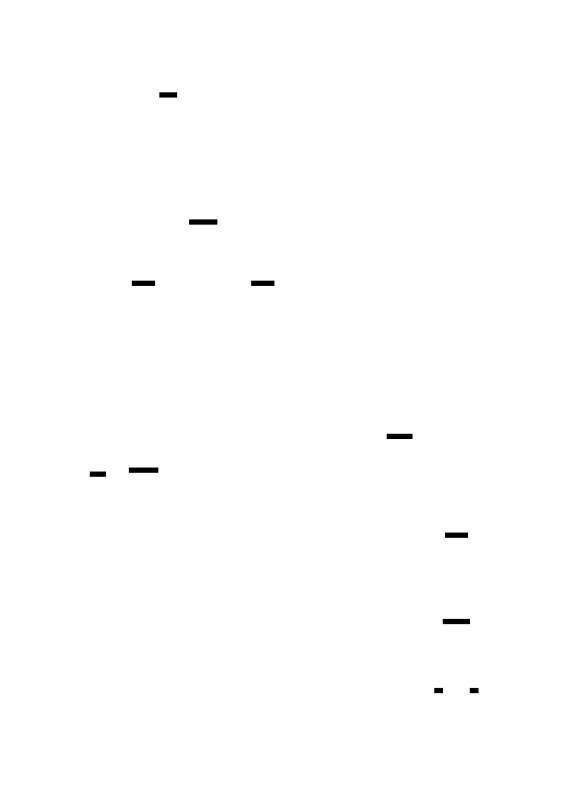

**The semantics problem:** The edge cases around NULL and empty sets are where every naive aggregate implementation silently produces wrong answers. Consider:
```sql
SELECT COUNT(*), COUNT(bonus), SUM(bonus), AVG(bonus)
FROM employees
WHERE department = 'Research';
```
If the Research department has 5 employees, 3 of whom have a non-NULL bonus (100, 200, 300) and 2 with NULL:
| Function | Result | Why |
|----------|--------|-----|
| `COUNT(*)` | **5** | Counts all rows, including those with NULL bonus |
| `COUNT(bonus)` | **3** | Counts only non-NULL values of the `bonus` column |
| `SUM(bonus)` | **600** | Sums non-NULL values: 100 + 200 + 300 |
| `AVG(bonus)` | **200.0** (not 120.0) | 600 / 3, not 600 / 5 — AVG ignores NULLs in *both* numerator and denominator |


If the Research department has **zero** employees (the WHERE clause matches nothing):
| Function | Result | Why |
|----------|--------|-----|
| `COUNT(*)` | **0** | Zero rows → count is 0 |
| `COUNT(bonus)` | **0** | Zero rows → count is 0 |
| `SUM(bonus)` | **NULL** | No values to sum → result is unknown, not 0 |
| `AVG(bonus)` | **NULL** | No values → unknown, not 0 |
`COUNT` is the *only* aggregate that returns 0 for empty input. Every other aggregate returns NULL. This asymmetry trips up almost every implementation. If you initialize `SUM` to 0 and never update it (because no rows match), you return 0 — wrong. The correct behavior: initialize `SUM` to "no value seen yet" (a flag separate from the running total), and if no value was ever seen, return NULL.
AVG must return a `REAL` (floating-point) value even if the input column is `INTEGER`. `AVG(salary)` where all salaries are integers like 50000, 60000, 70000 must return `60000.0`, not the integer `60000`. If your implementation uses integer division internally, `AVG` of (1, 2) returns 1 instead of 1.5 — a silent precision bug.
These aren't edge cases. They're the *specification*. Every SQL database in existence implements these exact rules (they're defined in the SQL standard, ISO/IEC 9075). Get any of them wrong and your database produces incorrect answers that no error message will flag.
---
## The Accumulator Pattern
[[EXPLAIN:accumulator-pattern|The accumulator pattern: maintaining running state across a stream of values]]
Every aggregate function follows the same pattern: **initialize, accumulate, finalize**. You create an accumulator struct, feed it one row at a time, and when you're done, extract the result. This pattern is the foundation of all stream processing — Apache Flink, Kafka Streams, and even financial running totals use the exact same structure.
```c
typedef enum {
    AGG_COUNT_STAR,   // COUNT(*)
    AGG_COUNT,        // COUNT(column)
    AGG_SUM,
    AGG_AVG,
    AGG_MIN,
    AGG_MAX,
} AggType;
typedef struct {
    AggType type;
    int64_t count;       // number of non-NULL values seen (for COUNT, AVG)
    double  sum;         // running sum (for SUM, AVG)
    Value   min_val;     // current minimum
    Value   max_val;     // current maximum
    bool    has_value;   // true if at least one non-NULL value was accumulated
} Accumulator;
```
### Initialize
```c
void accumulator_init(Accumulator *acc, AggType type) {
    acc->type = type;
    acc->count = 0;
    acc->sum = 0.0;
    acc->min_val.type = VAL_NULL;
    acc->max_val.type = VAL_NULL;
    acc->has_value = false;
}
```
The `has_value` flag is the key to correct empty-set behavior. When the scan completes and `has_value` is still false, SUM/AVG/MIN/MAX return NULL, not their default values.
### Accumulate
```c
void accumulator_step(Accumulator *acc, Value *val) {
    switch (acc->type) {
        case AGG_COUNT_STAR:
            // COUNT(*) counts every row, including NULLs
            acc->count++;
            acc->has_value = true;
            break;
        case AGG_COUNT:
            // COUNT(col) counts only non-NULL values
            if (val->type != VAL_NULL) {
                acc->count++;
                acc->has_value = true;
            }
            break;
        case AGG_SUM:
            if (val->type == VAL_NULL) break;  // skip NULLs
            acc->has_value = true;
            if (val->type == VAL_INTEGER) {
                acc->sum += (double)val->i;
            } else if (val->type == VAL_REAL) {
                acc->sum += val->r;
            }
            break;
        case AGG_AVG:
            if (val->type == VAL_NULL) break;  // skip NULLs
            acc->has_value = true;
            acc->count++;
            if (val->type == VAL_INTEGER) {
                acc->sum += (double)val->i;
            } else if (val->type == VAL_REAL) {
                acc->sum += val->r;
            }
            break;
        case AGG_MIN:
            if (val->type == VAL_NULL) break;
            if (!acc->has_value) {
                acc->min_val = *val;
                acc->has_value = true;
            } else {
                // Use the comparison logic from Milestone 6
                if (value_compare(val, &acc->min_val) < 0) {
                    acc->min_val = *val;
                }
            }
            break;
        case AGG_MAX:
            if (val->type == VAL_NULL) break;
            if (!acc->has_value) {
                acc->max_val = *val;
                acc->has_value = true;
            } else {
                if (value_compare(val, &acc->max_val) > 0) {
                    acc->max_val = *val;
                }
            }
            break;
    }
}
```
### Finalize
```c
void accumulator_finalize(Accumulator *acc, Value *result) {
    switch (acc->type) {
        case AGG_COUNT_STAR:
        case AGG_COUNT:
            // COUNT always returns an integer, even for empty sets
            result->type = VAL_INTEGER;
            result->i = acc->count;
            break;
        case AGG_SUM:
            if (!acc->has_value) {
                result->type = VAL_NULL;  // SUM of no rows = NULL, not 0
            } else {
                result->type = VAL_REAL;
                result->r = acc->sum;
            }
            break;
        case AGG_AVG:
            if (!acc->has_value || acc->count == 0) {
                result->type = VAL_NULL;  // AVG of no rows = NULL
            } else {
                // ALWAYS return REAL, even if inputs were INTEGER
                result->type = VAL_REAL;
                result->r = acc->sum / (double)acc->count;
            }
            break;
        case AGG_MIN:
            if (!acc->has_value) {
                result->type = VAL_NULL;
            } else {
                *result = acc->min_val;
            }
            break;
        case AGG_MAX:
            if (!acc->has_value) {
                result->type = VAL_NULL;
            } else {
                *result = acc->max_val;
            }
            break;
    }
}
```
Study the `AGG_AVG` finalize. The division `acc->sum / (double)acc->count` uses `(double)` to force floating-point division. Without it, if both are stored as integers, C performs integer division: `3 / 2 = 1` instead of `1.5`. This is the silent precision bug that trips up nearly every first implementation.
Also note: `COUNT` returns 0 for empty input, but SUM/AVG/MIN/MAX return NULL. This is the SQL standard's distinction between "the answer is zero" and "there is no answer." A COUNT of zero items is definitively zero. A SUM of zero items is not zero — it's undefined. This connects to functional programming's `Maybe`/`Option` type: `Some(0)` vs `None` are different values, even though they might look the same to careless code.
---
## GROUP BY: Hash-Based Grouping
GROUP BY partitions the input rows into groups (one per distinct combination of group-key column values), maintains a separate set of accumulators for each group, and produces one output row per group.

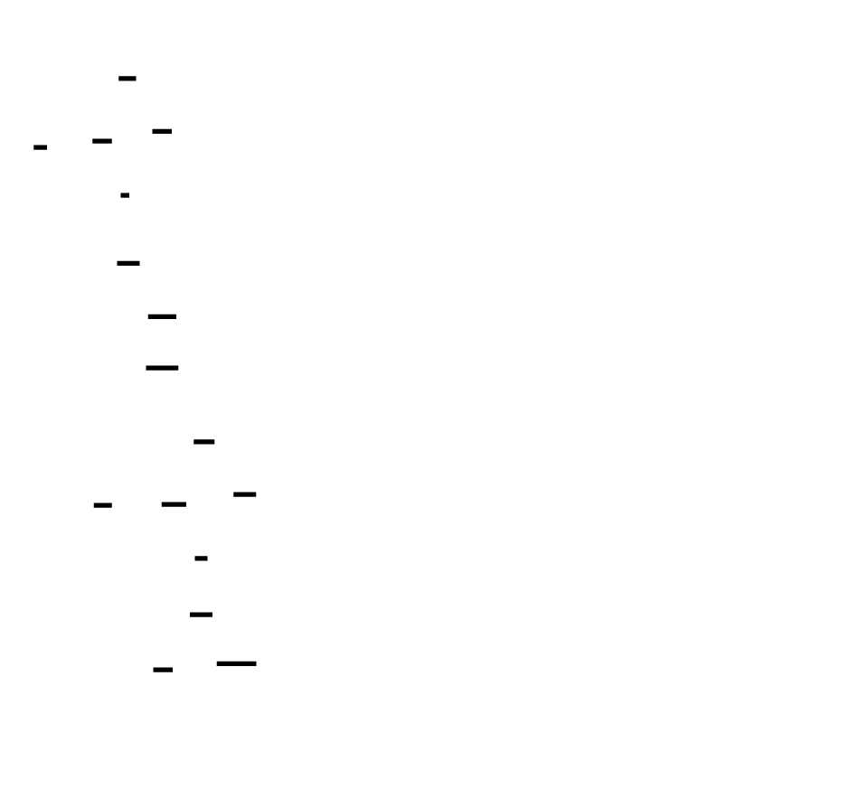

### The Group Hash Table
The data structure at the core of GROUP BY is a hash table mapping group keys to accumulator arrays:
```c
typedef struct {
    Value  *key_values;     // array of group-key column values
    int     key_count;      // number of group-key columns
    Accumulator *accumulators; // one per aggregate function in the query
    int     agg_count;      // number of aggregate functions
} GroupEntry;
typedef struct {
    GroupEntry *entries;     // array of groups
    int         count;       // number of groups
    int         capacity;    // allocated capacity
    // Simple hash table for O(1) group lookup
    int        *buckets;     // hash buckets → index into entries array
    int         bucket_count;
} GroupHashTable;
```
```c
GroupHashTable* group_table_create(int key_count, int agg_count,
                                     AggType *agg_types) {
    GroupHashTable *ht = calloc(1, sizeof(GroupHashTable));
    ht->capacity = 64;
    ht->entries = calloc(ht->capacity, sizeof(GroupEntry));
    ht->count = 0;
    ht->bucket_count = 127;  // prime for good hash distribution
    ht->buckets = malloc(ht->bucket_count * sizeof(int));
    for (int i = 0; i < ht->bucket_count; i++) {
        ht->buckets[i] = -1;  // empty
    }
    return ht;
}
```
### Finding or Creating a Group
For each input row, compute the hash of the group-key values, look up the group in the hash table, and either find an existing group or create a new one:
```c
static uint32_t hash_group_key(Value *keys, int key_count) {
    uint32_t hash = 0x811c9dc5;  // FNV-1a offset basis
    for (int i = 0; i < key_count; i++) {
        switch (keys[i].type) {
            case VAL_NULL:
                hash ^= 0;
                break;
            case VAL_INTEGER:
                hash ^= (uint32_t)(keys[i].i & 0xFFFFFFFF);
                hash *= 0x01000193;
                hash ^= (uint32_t)(keys[i].i >> 32);
                break;
            case VAL_REAL: {
                uint64_t bits;
                memcpy(&bits, &keys[i].r, 8);
                hash ^= (uint32_t)(bits & 0xFFFFFFFF);
                hash *= 0x01000193;
                hash ^= (uint32_t)(bits >> 32);
                break;
            }
            case VAL_STRING:
                for (int j = 0; j < keys[i].s.length; j++) {
                    hash ^= (uint8_t)keys[i].s.data[j];
                    hash *= 0x01000193;
                }
                break;
            default:
                break;
        }
        hash *= 0x01000193;
    }
    return hash;
}
static bool keys_equal(Value *a, Value *b, int count) {
    for (int i = 0; i < count; i++) {
        if (a[i].type != b[i].type) return false;
        // NULL == NULL for grouping purposes (unlike WHERE comparisons!)
        if (a[i].type == VAL_NULL && b[i].type == VAL_NULL) continue;
        if (a[i].type == VAL_NULL || b[i].type == VAL_NULL) return false;
        switch (a[i].type) {
            case VAL_INTEGER:
                if (a[i].i != b[i].i) return false;
                break;
            case VAL_REAL:
                if (a[i].r != b[i].r) return false;
                break;
            case VAL_STRING:
                if (a[i].s.length != b[i].s.length) return false;
                if (memcmp(a[i].s.data, b[i].s.data, a[i].s.length) != 0)
                    return false;
                break;
            default:
                break;
        }
    }
    return true;
}
```
**Important nuance:** In GROUP BY, `NULL = NULL` is treated as `true` — all NULL keys are grouped together into one group. This differs from WHERE clause behavior (Milestone 6), where `NULL = NULL` evaluates to `NULL` (falsy). The SQL standard explicitly specifies this dual behavior: grouping treats NULLs as equal, but comparison operators do not.
```c
// Find existing group or create new one. Returns pointer to the group's
// accumulator array.
GroupEntry* group_table_find_or_create(GroupHashTable *ht,
                                        Value *keys, int key_count,
                                        int agg_count, AggType *agg_types) {
    uint32_t hash = hash_group_key(keys, key_count);
    int bucket = hash % ht->bucket_count;
    // Linear probe for matching group
    int idx = ht->buckets[bucket];
    while (idx >= 0) {
        GroupEntry *entry = &ht->entries[idx];
        if (keys_equal(entry->key_values, keys, key_count)) {
            return entry;  // found existing group
        }
        // Linear probing: check next bucket
        bucket = (bucket + 1) % ht->bucket_count;
        idx = ht->buckets[bucket];
    }
    // Group not found — create a new one
    if (ht->count >= ht->capacity) {
        ht->capacity *= 2;
        ht->entries = realloc(ht->entries,
                               ht->capacity * sizeof(GroupEntry));
    }
    GroupEntry *new_entry = &ht->entries[ht->count];
    // Copy key values (deep copy for strings)
    new_entry->key_values = malloc(key_count * sizeof(Value));
    new_entry->key_count = key_count;
    for (int i = 0; i < key_count; i++) {
        new_entry->key_values[i] = keys[i];
        if (keys[i].type == VAL_STRING) {
            new_entry->key_values[i].s.data = malloc(keys[i].s.length + 1);
            memcpy(new_entry->key_values[i].s.data,
                   keys[i].s.data, keys[i].s.length);
            new_entry->key_values[i].s.data[keys[i].s.length] = '\0';
        }
    }
    // Initialize accumulators
    new_entry->agg_count = agg_count;
    new_entry->accumulators = malloc(agg_count * sizeof(Accumulator));
    for (int i = 0; i < agg_count; i++) {
        accumulator_init(&new_entry->accumulators[i], agg_types[i]);
    }
    ht->buckets[bucket] = ht->count;
    ht->count++;
    return new_entry;
}
```
### Design Decision: Hash vs Sort Aggregation
| Strategy | Time | Memory | Ordering | Used By |
|----------|------|--------|----------|---------|
| **Hash aggregation ✓** | O(n) | O(k) where k = distinct groups | Output order is arbitrary | PostgreSQL (HashAggregate), MySQL |
| Sort aggregation | O(n log n) | O(1) extra (in-place sort) | Output is sorted by group key | SQLite (SorterOpen), PostgreSQL (GroupAggregate for pre-sorted input) |
[[EXPLAIN:hash-vs-sort-aggregation|Hash aggregation vs sort aggregation tradeoffs]]
Hash aggregation wins when the number of groups fits in memory (which is almost always — even 1 million distinct groups consume ~100MB of accumulator state). Sort aggregation wins when: (a) the data is already sorted by the group key (e.g., an index scan in key order), (b) the query includes `ORDER BY` on the group key (sort serves double duty), or (c) memory is extremely constrained (sort aggregation uses O(1) extra memory because it processes groups sequentially).
For your build, hash aggregation is the right choice. It's simpler, faster for the common case, and teaches the more generalizable pattern — the same hash-based grouping appears in MapReduce's shuffle phase (each reducer gets one hash partition), in Apache Spark's `HashAggregateExec` operator, and in distributed stream processing where data is partitioned by key hash across workers.
---
## Compiling Aggregates: New Opcodes
Aggregates require new opcodes because they break the "one row in, one row out" pattern of your existing VM. A normal SELECT processes each row independently; an aggregate SELECT must accumulate state across all rows before producing any output.
```c
// New opcodes for aggregate execution
OP_AGG_INIT,      // Initialize accumulator group in register p1, count p2, types from string pool p3
OP_AGG_STEP,      // Feed value in register p2 to accumulator p1, aggregate index p3
OP_AGG_FINAL,     // Finalize accumulator p1, aggregate index p2, result into register p3
// For GROUP BY
OP_AGG_GROUP_INIT, // Initialize group hash table, p1 = num key cols, p2 = num aggregates
OP_AGG_GROUP_STEP, // Feed key registers p1..p1+p2-1 and agg value p3 to group table
OP_AGG_GROUP_ITER, // Iterate groups: set p1 = current group index, jump to p2 when done
OP_AGG_GROUP_KEY,  // Read group key column p2 from current group into register p3
OP_AGG_GROUP_VAL,  // Read aggregate result p2 from current group into register p3
```
### Compiling Ungrouped Aggregates
For `SELECT COUNT(*), SUM(salary) FROM employees`:
```
addr  opcode          p1   p2   p3   comment
----  --------------  ---  ---  ---  -------
0     Init            0    1    0    Start
1     OpenRead        0    5    4    employees
2     AggInit         1    2    0    init 2 accumulators at r1
3     Rewind          0    9    0    jump if empty
4     AggStep         1    0    0    COUNT(*) — step acc 0 with NULL (counts all)
5     Column          0    2    3    salary → r3
6     AggStep         1    3    1    SUM — step acc 1 with r3
7     Next            0    4    0    loop
8     Goto            0    9    0    fall through
9     AggFinal        1    0    4    finalize acc 0 → r4 (COUNT result)
10    AggFinal        1    1    5    finalize acc 1 → r5 (SUM result)
11    ResultRow       4    2    0    output r4, r5
12    Close           0    0    0
13    Halt            0    0    0
```
The VM handlers:
```c
case OP_AGG_INIT: {
    int base_reg = op->p1;
    int agg_count = op->p2;
    // Allocate accumulators in the register space
    // We store a pointer to the accumulator array in the base register
    Accumulator *accs = calloc(agg_count, sizeof(Accumulator));
    // The agg types are encoded in the string pool or a separate array
    // For simplicity, store the types in a companion structure
    for (int i = 0; i < agg_count; i++) {
        accumulator_init(&accs[i], vm->program->agg_types[i]);
    }
    vm->registers[base_reg].type = VAL_BLOB;
    vm->registers[base_reg].s.data = (char*)accs;
    vm->registers[base_reg].s.length = agg_count;
    break;
}
case OP_AGG_STEP: {
    int base_reg = op->p1;
    int val_reg = op->p2;
    int agg_idx = op->p3;
    Accumulator *accs = (Accumulator*)vm->registers[base_reg].s.data;
    accumulator_step(&accs[agg_idx], &vm->registers[val_reg]);
    break;
}
case OP_AGG_FINAL: {
    int base_reg = op->p1;
    int agg_idx = op->p2;
    int dest_reg = op->p3;
    Accumulator *accs = (Accumulator*)vm->registers[base_reg].s.data;
    accumulator_finalize(&accs[agg_idx], &vm->registers[dest_reg]);
    break;
}
```
Note for `COUNT(*)`: the `OP_AGG_STEP` for COUNT(*) doesn't need a real column value — it steps with a dummy non-NULL value (or the opcode handler can special-case COUNT_STAR to skip the value entirely). The key distinction: COUNT(*) calls `accumulator_step` for *every* row. COUNT(col) calls it only when the column value is non-NULL.
### Compiling GROUP BY Aggregates
For `SELECT department, COUNT(*), AVG(salary) FROM employees GROUP BY department`:


The bytecode structure is fundamentally different. Instead of one set of accumulators, you maintain a hash table of groups, each with its own accumulators. After the scan loop, you iterate the hash table to produce output rows:
```
addr  opcode            p1   p2   p3   comment
----  ----------------  ---  ---  ---  -------
0     Init              0    1    0    Start
1     OpenRead          0    5    4    employees
2     AggGroupInit      1    2    0    init group table: 1 key col, 2 aggregates
3     Rewind            0    12   0    jump if empty
4     Column            0    0    2    department → r2 (group key)
5     Column            0    2    3    salary → r3 (agg input)
6     AggGroupStep      2    1    0    step group: key r2..r2+0, acc 0 (COUNT*)
7     AggGroupStep      2    1    1    step group: key r2..r2+0, acc 1 (AVG) with r3
8     Next              0    4    0    loop
9     Goto              0    12   0    fall through
      --- Output phase: iterate groups ---
10    AggGroupIter      0    16   0    set current group; jump to Close when done
11    AggGroupKey       0    0    4    group key col 0 → r4 (department)
12    AggGroupVal       0    0    5    agg result 0 → r5 (COUNT)
13    AggGroupVal       0    1    6    agg result 1 → r6 (AVG)
14    ResultRow         4    3    0    output r4, r5, r6
15    Goto              0    10   0    next group
16    Close             0    0    0
17    Halt              0    0    0
```
The two-phase structure is critical:
1. **Accumulation phase** (addrs 3-9): Scan all rows, feed each row's group key and aggregate values into the group hash table.
2. **Output phase** (addrs 10-15): Iterate the hash table, finalize each group's accumulators, and emit result rows.
No output rows are produced during the accumulation phase. This means aggregate queries buffer the entire result set (as accumulators, not as full rows — much more compact) before emitting anything. For 1 million rows with 50 groups, you store 50 accumulator sets, not 1 million rows. The memory cost is proportional to the number of *groups*, not the number of *input rows*.
The VM handlers for the group operations work with the `GroupHashTable`:
```c
case OP_AGG_GROUP_INIT: {
    int key_count = op->p1;
    int agg_count = op->p2;
    GroupHashTable *ht = group_table_create(key_count, agg_count,
                                              vm->program->agg_types);
    // Store the hash table pointer in a VM-level structure
    vm->group_table = ht;
    vm->group_key_count = key_count;
    vm->group_agg_count = agg_count;
    break;
}
case OP_AGG_GROUP_STEP: {
    int key_base_reg = op->p1;
    int key_count = vm->group_key_count;
    int agg_idx = op->p3;
    // Collect group key values from registers
    Value keys[16];
    for (int i = 0; i < key_count; i++) {
        keys[i] = vm->registers[key_base_reg + i];
    }
    // Find or create the group
    GroupEntry *group = group_table_find_or_create(
        vm->group_table, keys, key_count,
        vm->group_agg_count, vm->program->agg_types);
    // Step the specified accumulator
    // For COUNT(*), the value doesn't matter
    if (vm->program->agg_types[agg_idx] == AGG_COUNT_STAR) {
        Value dummy = { .type = VAL_INTEGER, .i = 1 };
        accumulator_step(&group->accumulators[agg_idx], &dummy);
    } else {
        // The value register is encoded elsewhere; simplification:
        // use a dedicated register for each aggregate's input
        int val_reg = key_base_reg + key_count + agg_idx;
        accumulator_step(&group->accumulators[agg_idx],
                          &vm->registers[val_reg]);
    }
    break;
}
case OP_AGG_GROUP_ITER: {
    // Finalize all accumulators in the current group, advance to next
    if (vm->group_iter_index >= vm->group_table->count) {
        vm->pc = op->p2;  // jump to end
        continue;
    }
    // Current group is at vm->group_iter_index
    // Caller reads keys and values with AggGroupKey / AggGroupVal
    break;
}
case OP_AGG_GROUP_KEY: {
    int key_col = op->p2;
    int dest_reg = op->p3;
    GroupEntry *entry = &vm->group_table->entries[vm->group_iter_index];
    vm->registers[dest_reg] = entry->key_values[key_col];
    break;
}
case OP_AGG_GROUP_VAL: {
    int agg_idx = op->p2;
    int dest_reg = op->p3;
    GroupEntry *entry = &vm->group_table->entries[vm->group_iter_index];
    accumulator_finalize(&entry->accumulators[agg_idx],
                          &vm->registers[dest_reg]);
    break;
}
```
---
## HAVING: Filtering Groups After Aggregation
HAVING is to GROUP BY what WHERE is to SELECT — a filter. But WHERE filters individual rows *before* aggregation, and HAVING filters groups *after* aggregation. The distinction matters because HAVING can reference aggregate results:
```sql
SELECT department, AVG(salary) 
FROM employees 
GROUP BY department 
HAVING AVG(salary) > 50000;
```
This query cannot be expressed with WHERE. You can't write `WHERE AVG(salary) > 50000` because AVG doesn't exist until after grouping. HAVING runs on the output of the group hash table, not on individual rows.
In bytecode, HAVING is a conditional jump in the output phase — between reading the group's aggregate results and emitting the ResultRow:
```
      --- Output phase with HAVING ---
10    AggGroupIter      0    18   0    iterate groups
11    AggGroupKey       0    0    4    department → r4
12    AggGroupVal       0    1    5    AVG(salary) → r5
13    Real              50000.0 6 0    50000.0 → r6
14    Le                5    10   6    if AVG <= 50000, skip to next group
15    AggGroupVal       0    0    7    COUNT(*) → r7 (if needed)
16    ResultRow         4    2    0    output r4, r5
17    Goto              0    10   0    next group
18    Close             0    0    0
```
The `OP_LE` at addr 14 jumps back to `AggGroupIter` (addr 10) if the condition fails — effectively skipping this group. This is the same conditional-jump-to-skip pattern you use for WHERE filtering (Milestone 6), applied to groups instead of rows.
The compiler must distinguish between WHERE predicates (applied per-row during the scan phase) and HAVING predicates (applied per-group during the output phase). The distinction is straightforward in the AST: HAVING is a separate clause that the parser already produces as a distinct node.
```c
static void compile_select_with_groupby(Compiler *c, AstNode *node,
                                          int table_idx) {
    // ... open cursor, init group table ...
    // Scan phase: WHERE filtering happens here
    int loop_start = c->program->op_count;
    if (node->data.select.where_clause) {
        // Compile WHERE — same as Milestone 6
        int skip = compile_where(c, node->data.select.where_clause,
                                   cursor, table_idx);
        // skip jumps to OP_NEXT on failure
    }
    // Load group keys and aggregate inputs
    // ... AggGroupStep for each aggregate ...
    // OP_NEXT loops back to loop_start
    // Output phase: HAVING filtering happens here
    int iter_start = c->program->op_count;
    int iter_addr = emit(c, OP_AGG_GROUP_ITER, 0, 0, 0, "next group");
    // Load group keys and aggregate values into registers
    // ...
    if (node->data.select.having_clause) {
        // Compile HAVING — operates on aggregate result registers
        int having_skip = compile_having(c, node->data.select.having_clause);
        // having_skip jumps to iter_start to skip this group
    }
    emit(c, OP_RESULT_ROW, first_result_reg, result_count, 0, "output");
    emit(c, OP_GOTO, 0, iter_start, 0, "next group");
    // Patch iter_addr's jump target to the Close instruction
}
```
---
## Nested Loop JOIN: Combining Tables


A JOIN combines rows from two tables based on a condition. The **nested loop join** is the simplest and most general join algorithm: for each row in the outer table, scan the inner table looking for matching rows.
```sql
SELECT o.id, c.name 
FROM orders o 
INNER JOIN customers c ON o.customer_id = c.id
WHERE c.country = 'Germany';
```
The nested loop structure:
```
for each row in orders (outer):
    for each row in customers (inner):
        if orders.customer_id == customers.id:
            if customers.country == 'Germany':
                output(orders.id, customers.name)
```
This is O(n × m) in the worst case — for every row in the outer table, you scan every row in the inner table. With 100,000 orders and 10,000 customers, that's 1 billion comparisons. This is where **index existence on the inner table becomes critical**. If `customers.id` has an index, the inner "scan" becomes an index seek — O(log m) instead of O(m), reducing total work from O(n × m) to O(n × log m).


### Design Decision: Join Algorithms
| Algorithm | Time | Memory | Best When | Used By |
|-----------|------|--------|-----------|---------|
| **Nested loop ✓** | O(n × m) | O(1) | Small tables, index on inner | SQLite (primary), all databases |
| Hash join | O(n + m) | O(min(n,m)) | Large tables, no index, equi-join | PostgreSQL, MySQL 8.0+ |
| Sort-merge join | O(n log n + m log m) | O(1) extra (if in-place sort) | Pre-sorted inputs, many-to-many | PostgreSQL, Oracle |
Nested loop join is the right starting point because: (1) it requires no extra memory, (2) it works with any join condition (not just equality), (3) it naturally benefits from indexes on the inner table, and (4) it's the join algorithm SQLite uses almost exclusively. Hash join is asymptotically better for large equi-joins but requires building a hash table from one input — a topic for optimization later.
[[EXPLAIN:join-algorithm-spectrum|Join algorithms as a spectrum: nested loop, hash join, sort-merge join]]
### Compiling JOIN
The compiler extends `compile_select` to handle the FROM clause with JOIN:
```c
// For: SELECT o.id, c.name FROM orders o JOIN customers c ON o.cust_id = c.id
// WHERE c.country = 'Germany'
static void compile_join(Compiler *c, AstNode *node, int outer_table_idx,
                           int inner_table_idx, AstNode *join_condition,
                           AstNode *where_clause) {
    int outer_root = c->tables[outer_table_idx].root_page;
    int inner_root = c->tables[inner_table_idx].root_page;
    int outer_cols = c->tables[outer_table_idx].column_count;
    int inner_cols = c->tables[inner_table_idx].column_count;
    int outer_cursor = alloc_cursor(c);
    int inner_cursor = alloc_cursor(c);
    int init_addr = emit(c, OP_INIT, 0, 0, 0, "Start");
    // Open both cursors
    int open1 = emit(c, OP_OPEN_READ, outer_cursor, outer_root, outer_cols,
                      "outer: orders");
    patch_jump(c, init_addr, open1);
    emit(c, OP_OPEN_READ, inner_cursor, inner_root, inner_cols,
         "inner: customers");
    // Outer loop
    int rewind_outer = emit(c, OP_REWIND, outer_cursor, 0, 0,
                             "rewind outer");
    int outer_loop = c->program->op_count;
    // Load join key from outer table
    // (For ON o.cust_id = c.id, load o.cust_id)
    int outer_join_col = find_column(c, outer_table_idx, "cust_id");
    int outer_key_reg = alloc_register(c);
    emit(c, OP_COLUMN, outer_cursor, outer_join_col, outer_key_reg,
         "o.cust_id");
    // Inner loop: rewind inner cursor for each outer row
    int rewind_inner = emit(c, OP_REWIND, inner_cursor, 0, 0,
                             "rewind inner");
    int inner_loop = c->program->op_count;
    // Load join key from inner table
    int inner_join_col = find_column(c, inner_table_idx, "id");
    int inner_key_reg = alloc_register(c);
    emit(c, OP_COLUMN, inner_cursor, inner_join_col, inner_key_reg,
         "c.id");
    // Join condition: skip if keys don't match
    int join_skip = emit(c, OP_NE, outer_key_reg, 0, inner_key_reg,
                          "join: o.cust_id != c.id → skip");
    // WHERE clause on joined result
    int where_skip = -1;
    if (where_clause) {
        // Compile WHERE predicates
        // These may reference columns from either table
        where_skip = compile_join_where(c, where_clause,
                                          outer_cursor, outer_table_idx,
                                          inner_cursor, inner_table_idx);
    }
    // Load output columns
    int first_result_reg = c->next_register;
    // o.id
    int oid_reg = alloc_register(c);
    emit(c, OP_COLUMN, outer_cursor,
         find_column(c, outer_table_idx, "id"), oid_reg, "o.id");
    // c.name
    int cname_reg = alloc_register(c);
    emit(c, OP_COLUMN, inner_cursor,
         find_column(c, inner_table_idx, "name"), cname_reg, "c.name");
    emit(c, OP_RESULT_ROW, first_result_reg, 2, 0, "output");
    // Inner Next
    int inner_next = emit(c, OP_NEXT, inner_cursor, inner_loop, 0,
                           "advance inner");
    // Patch skips to inner_next
    patch_jump(c, join_skip, inner_next);
    if (where_skip >= 0) patch_jump(c, where_skip, inner_next);
    // Patch inner rewind's empty-jump to outer_next
    int outer_next = emit(c, OP_NEXT, outer_cursor, outer_loop, 0,
                           "advance outer");
    patch_jump(c, rewind_inner, outer_next);
    // Close and halt
    int close1 = emit(c, OP_CLOSE, outer_cursor, 0, 0, "close outer");
    emit(c, OP_CLOSE, inner_cursor, 0, 0, "close inner");
    int halt = emit(c, OP_HALT, 0, 0, 0, "done");
    patch_jump(c, rewind_outer, close1);
    c->program->n_registers = c->next_register;
}
```


The EXPLAIN output for this join:
```
addr  opcode         p1   p2   p3   comment
----  -------------  ---  ---  ---  -------
0     Init           0    1    0    Start
1     OpenRead       0    5    4    orders
2     OpenRead       1    8    3    customers
3     Rewind         0    14   0    rewind outer
4     Column         0    2    1    o.cust_id → r1
5     Rewind         1    13   0    rewind inner
6     Column         1    0    2    c.id → r2
7     Ne             1    11   2    skip if o.cust_id != c.id
8     Column         0    0    3    o.id → r3
9     Column         1    1    4    c.name → r4
10    ResultRow      3    2    0    output
11    Next           1    6    0    advance inner
12    Goto           0    13   0    fall through
13    Next           0    4    0    advance outer
14    Close          0    0    0
15    Close          1    0    0
16    Halt           0    0    0
```
Study the loop structure. The outer loop (addrs 3-13) iterates `orders`. For each outer row, the inner loop (addrs 5-11) scans `customers` from the beginning. `OP_REWIND` at addr 5 resets the inner cursor *every iteration of the outer loop* — this is the "nested" part of nested loop. The join condition at addr 7 (NE comparison) skips non-matching inner rows by jumping to `OP_NEXT` at addr 11.
### Index Nested Loop Join
If `customers.id` has an index, the inner loop can be replaced with an index seek — a single B+tree traversal instead of a full table scan per outer row. The compiler emits `OP_SEEK_ROWID` or an index seek opcode instead of `OP_REWIND` + full scan:
```
5     SeekRowid      1    13   1    seek customers cursor to rowid r1
6     Column         1    1    4    c.name → r4
...
```
The query planner (Milestone 8) decides whether to use the index. With an index, the join cost drops from O(n × m) to O(n × log m) — for 100,000 orders and 10,000 customers, that's 100,000 × 14 ≈ 1.4 million page reads instead of 1 billion comparisons. The planner's join ordering algorithm (from Milestone 8) also decides which table is outer and which is inner — the smaller table (or the one with a filter that reduces it) should typically be outer to minimize the number of inner scans.
---
## Multiple Aggregates in a Single Query
A query can compute multiple aggregates simultaneously:
```sql
SELECT department, COUNT(*), SUM(salary), AVG(salary), MIN(salary), MAX(salary)
FROM employees
GROUP BY department;
```
This works naturally with the accumulator array approach — each group entry maintains one accumulator per aggregate function. During the scan, each row updates all accumulators for its group. During the output phase, each accumulator is finalized independently.
The key implementation detail: the compiler must parse the SELECT list, identify which expressions are aggregate function calls, and assign each one an index in the accumulator array. Non-aggregate expressions in a GROUP BY query must be either group-key columns or constants — a `SELECT department, name FROM employees GROUP BY department` is a SQL error (which name? there might be many per department).
```c
// During compilation, analyze the SELECT column list
typedef struct {
    AggType  type;
    int      input_col_idx;  // column index for the aggregate's argument
    bool     is_star;        // true for COUNT(*)
} AggInfo;
int parse_aggregate_functions(AstNode **columns, int col_count,
                                AggInfo *agg_infos, int *agg_count,
                                int *group_key_cols, int *group_key_count) {
    *agg_count = 0;
    *group_key_count = 0;
    for (int i = 0; i < col_count; i++) {
        AstNode *col = columns[i];
        if (col->type == NODE_FUNCTION_CALL) {
            const char *func_name = col->data.function.name;
            AggInfo *info = &agg_infos[*agg_count];
            if (strcasecmp(func_name, "COUNT") == 0) {
                if (col->data.function.arg_count == 0 ||
                    (col->data.function.args[0]->type == NODE_WILDCARD)) {
                    info->type = AGG_COUNT_STAR;
                    info->is_star = true;
                } else {
                    info->type = AGG_COUNT;
                    info->is_star = false;
                    // Resolve column name to index
                    info->input_col_idx = resolve_column(
                        col->data.function.args[0]);
                }
            } else if (strcasecmp(func_name, "SUM") == 0) {
                info->type = AGG_SUM;
                info->input_col_idx = resolve_column(
                    col->data.function.args[0]);
            } else if (strcasecmp(func_name, "AVG") == 0) {
                info->type = AGG_AVG;
                info->input_col_idx = resolve_column(
                    col->data.function.args[0]);
            } else if (strcasecmp(func_name, "MIN") == 0) {
                info->type = AGG_MIN;
                info->input_col_idx = resolve_column(
                    col->data.function.args[0]);
            } else if (strcasecmp(func_name, "MAX") == 0) {
                info->type = AGG_MAX;
                info->input_col_idx = resolve_column(
                    col->data.function.args[0]);
            }
            (*agg_count)++;
        } else if (col->type == NODE_IDENTIFIER) {
            // This must be a GROUP BY column
            group_key_cols[*group_key_count] = resolve_column(col);
            (*group_key_count)++;
        }
    }
    return 0;
}
```
---
## GROUP BY Without ORDER BY
An important specification detail: `GROUP BY` does not imply any ordering of the output. `SELECT department, COUNT(*) FROM employees GROUP BY department` can return departments in any order — alphabetical, hash order, insertion order, or random. Only an explicit `ORDER BY department` guarantees sorted output.
With hash-based grouping, the output order is hash-table iteration order — which is essentially random from the user's perspective. This is correct behavior. If the user wants sorted groups, they must add `ORDER BY`, which requires either post-sorting the group results or switching to sort-based aggregation.
For your build, hash-table iteration order is sufficient. The acceptance criteria explicitly state that GROUP BY without ORDER BY can return groups in any order.
---
## Parsing Aggregate Functions and GROUP BY/HAVING
The parser needs extensions to recognize:
1. **Function calls** in the SELECT list: `COUNT(*)`, `SUM(salary)`, `AVG(x)`
2. **GROUP BY clause**: after WHERE, before HAVING
3. **HAVING clause**: after GROUP BY
### Function Call Parsing
In `parse_primary` (from Milestone 2), add a case for identifiers followed by `(`:
```c
// In parse_primary, after the identifier check:
if (check(p, TOK_IDENTIFIER)) {
    Token *name_tok = advance(p);
    // Check if this is a function call
    if (check(p, TOK_LPAREN)) {
        advance(p);  // consume (
        AstNode *func = ast_alloc(NODE_FUNCTION_CALL,
                                    name_tok->line, name_tok->col);
        func->data.function.name = token_to_string(name_tok);
        // Parse arguments
        func->data.function.args = malloc(8 * sizeof(AstNode*));
        func->data.function.arg_count = 0;
        if (check(p, TOK_STAR)) {
            // COUNT(*)
            AstNode *star = ast_alloc(NODE_WILDCARD,
                                        peek(p)->line, peek(p)->col);
            advance(p);
            func->data.function.args[0] = star;
            func->data.function.arg_count = 1;
        } else if (!check(p, TOK_RPAREN)) {
            // Regular argument list
            do {
                AstNode *arg = parse_expression(p);
                if (!arg) return NULL;
                func->data.function.args[func->data.function.arg_count++] = arg;
            } while (check(p, TOK_COMMA) && advance(p));
        }
        if (!expect(p, TOK_RPAREN)) return NULL;
        return func;
    }
    // Not a function call — regular identifier or column ref
    // ... existing identifier handling ...
}
```
### GROUP BY and HAVING Parsing
Extend `parse_select` to handle GROUP BY and HAVING after the WHERE clause:
```c
// After WHERE parsing in parse_select:
// GROUP BY clause (optional)
node->data.select.group_by = NULL;
node->data.select.group_by_count = 0;
if (check_keyword(p, "GROUP")) {
    advance(p);
    if (!expect_keyword(p, "BY")) return NULL;
    int capacity = 4;
    node->data.select.group_by = malloc(capacity * sizeof(AstNode*));
    do {
        AstNode *expr = parse_expression(p);
        if (!expr) return NULL;
        if (node->data.select.group_by_count >= capacity) {
            capacity *= 2;
            node->data.select.group_by = realloc(
                node->data.select.group_by, capacity * sizeof(AstNode*));
        }
        node->data.select.group_by[node->data.select.group_by_count++] = expr;
    } while (check(p, TOK_COMMA) && advance(p));
}
// HAVING clause (optional, only valid after GROUP BY)
node->data.select.having_clause = NULL;
if (check_keyword(p, "HAVING")) {
    advance(p);
    node->data.select.having_clause = parse_expression(p);
    if (!node->data.select.having_clause) return NULL;
}
```
---
## Testing: Comprehensive Aggregate and JOIN Verification
### Test: COUNT(*) vs COUNT(col)
```c
void test_count_star_vs_col(void) {
    Database *db = db_open("test_count.db");
    execute_sql(db, "CREATE TABLE t (id INTEGER PRIMARY KEY, "
                    "val INTEGER);", NULL, NULL);
    execute_sql(db, "INSERT INTO t VALUES (1, 10);", NULL, NULL);
    execute_sql(db, "INSERT INTO t VALUES (2, NULL);", NULL, NULL);
    execute_sql(db, "INSERT INTO t VALUES (3, 30);", NULL, NULL);
    execute_sql(db, "INSERT INTO t VALUES (4, NULL);", NULL, NULL);
    execute_sql(db, "INSERT INTO t VALUES (5, 50);", NULL, NULL);
    ResultCollector rc = {0};
    execute_sql(db, "SELECT COUNT(*), COUNT(val) FROM t;",
                collect_results, &rc);
    assert(rc.row_count == 1);
    assert(rc.rows[0][0].i == 5);   // COUNT(*) counts all 5 rows
    assert(rc.rows[0][1].i == 3);   // COUNT(val) counts 3 non-NULL values
    db_close(db);
    unlink("test_count.db");
    printf("PASS: COUNT(*) vs COUNT(col) NULL handling\n");
}
```
### Test: SUM, AVG, MIN, MAX
```c
void test_aggregate_functions(void) {
    Database *db = db_open("test_agg.db");
    execute_sql(db, "CREATE TABLE t (id INTEGER PRIMARY KEY, "
                    "val INTEGER);", NULL, NULL);
    execute_sql(db, "INSERT INTO t VALUES (1, 10);", NULL, NULL);
    execute_sql(db, "INSERT INTO t VALUES (2, 20);", NULL, NULL);
    execute_sql(db, "INSERT INTO t VALUES (3, 30);", NULL, NULL);
    execute_sql(db, "INSERT INTO t VALUES (4, NULL);", NULL, NULL);
    ResultCollector rc = {0};
    execute_sql(db, "SELECT SUM(val), AVG(val), MIN(val), MAX(val) FROM t;",
                collect_results, &rc);
    assert(rc.row_count == 1);
    // SUM = 10 + 20 + 30 = 60 (NULLs ignored)
    assert(fabs(rc.rows[0][0].r - 60.0) < 0.001);
    // AVG = 60 / 3 = 20.0 (NULLs ignored in both sum and count)
    assert(rc.rows[0][1].type == VAL_REAL);  // must be REAL
    assert(fabs(rc.rows[0][1].r - 20.0) < 0.001);
    // MIN = 10
    assert(rc.rows[0][2].i == 10);
    // MAX = 30
    assert(rc.rows[0][3].i == 30);
    db_close(db);
    unlink("test_agg.db");
    printf("PASS: SUM, AVG, MIN, MAX with NULL handling\n");
}
```
### Test: AVG Returns REAL for INTEGER Input
```c
void test_avg_returns_real(void) {
    Database *db = db_open("test_avg_real.db");
    execute_sql(db, "CREATE TABLE t (id INTEGER PRIMARY KEY, "
                    "val INTEGER);", NULL, NULL);
    execute_sql(db, "INSERT INTO t VALUES (1, 1);", NULL, NULL);
    execute_sql(db, "INSERT INTO t VALUES (2, 2);", NULL, NULL);
    ResultCollector rc = {0};
    execute_sql(db, "SELECT AVG(val) FROM t;", collect_results, &rc);
    assert(rc.row_count == 1);
    assert(rc.rows[0][0].type == VAL_REAL);
    assert(fabs(rc.rows[0][0].r - 1.5) < 0.001);  // 3/2 = 1.5, not 1
    db_close(db);
    unlink("test_avg_real.db");
    printf("PASS: AVG returns REAL for INTEGER column\n");
}
```
### Test: Empty Table Aggregates
```c
void test_empty_aggregates(void) {
    Database *db = db_open("test_empty_agg.db");
    execute_sql(db, "CREATE TABLE t (id INTEGER PRIMARY KEY, "
                    "val INTEGER);", NULL, NULL);
    // Table is empty
    ResultCollector rc = {0};
    execute_sql(db, "SELECT COUNT(*), COUNT(val), SUM(val), AVG(val) FROM t;",
                collect_results, &rc);
    assert(rc.row_count == 1);
    assert(rc.rows[0][0].i == 0);              // COUNT(*) = 0
    assert(rc.rows[0][1].i == 0);              // COUNT(val) = 0
    assert(rc.rows[0][2].type == VAL_NULL);    // SUM = NULL (not 0!)
    assert(rc.rows[0][3].type == VAL_NULL);    // AVG = NULL (not 0!)
    db_close(db);
    unlink("test_empty_agg.db");
    printf("PASS: empty table aggregate defaults\n");
}
```
### Test: GROUP BY with Aggregates
```c
void test_group_by(void) {
    Database *db = db_open("test_groupby.db");
    execute_sql(db, "CREATE TABLE emp (id INTEGER PRIMARY KEY, "
                    "dept TEXT, salary INTEGER);", NULL, NULL);
    execute_sql(db, "INSERT INTO emp VALUES (1, 'Eng', 100);", NULL, NULL);
    execute_sql(db, "INSERT INTO emp VALUES (2, 'Eng', 120);", NULL, NULL);
    execute_sql(db, "INSERT INTO emp VALUES (3, 'Sales', 90);", NULL, NULL);
    execute_sql(db, "INSERT INTO emp VALUES (4, 'Sales', 80);", NULL, NULL);
    execute_sql(db, "INSERT INTO emp VALUES (5, 'Eng', 110);", NULL, NULL);
    ResultCollector rc = {0};
    execute_sql(db, "SELECT dept, COUNT(*), SUM(salary) "
                    "FROM emp GROUP BY dept;",
                collect_results, &rc);
    assert(rc.row_count == 2);  // 2 departments
    // Find Eng and Sales in results (order not guaranteed)
    for (int i = 0; i < 2; i++) {
        if (strcmp(rc.rows[i][0].s.data, "Eng") == 0) {
            assert(rc.rows[i][1].i == 3);      // 3 engineers
            assert(fabs(rc.rows[i][2].r - 330.0) < 0.001);  // 100+120+110
        } else if (strcmp(rc.rows[i][0].s.data, "Sales") == 0) {
            assert(rc.rows[i][1].i == 2);      // 2 salespeople
            assert(fabs(rc.rows[i][2].r - 170.0) < 0.001);  // 90+80
        } else {
            assert(false);  // unexpected department
        }
    }
    db_close(db);
    unlink("test_groupby.db");
    printf("PASS: GROUP BY with multiple aggregates\n");
}
```
### Test: HAVING Filters Groups
```c
void test_having(void) {
    Database *db = db_open("test_having.db");
    execute_sql(db, "CREATE TABLE emp (id INTEGER PRIMARY KEY, "
                    "dept TEXT, salary INTEGER);", NULL, NULL);
    execute_sql(db, "INSERT INTO emp VALUES (1, 'Eng', 100);", NULL, NULL);
    execute_sql(db, "INSERT INTO emp VALUES (2, 'Eng', 120);", NULL, NULL);
    execute_sql(db, "INSERT INTO emp VALUES (3, 'Sales', 90);", NULL, NULL);
    execute_sql(db, "INSERT INTO emp VALUES (4, 'Eng', 110);", NULL, NULL);
    ResultCollector rc = {0};
    execute_sql(db, "SELECT dept, COUNT(*) FROM emp "
                    "GROUP BY dept HAVING COUNT(*) > 2;",
                collect_results, &rc);
    assert(rc.row_count == 1);  // only Eng has > 2 employees
    assert(strcmp(rc.rows[0][0].s.data, "Eng") == 0);
    assert(rc.rows[0][1].i == 3);
    db_close(db);
    unlink("test_having.db");
    printf("PASS: HAVING filters groups\n");
}
```
### Test: INNER JOIN
```c
void test_inner_join(void) {
    Database *db = db_open("test_join.db");
    execute_sql(db, "CREATE TABLE orders (id INTEGER PRIMARY KEY, "
                    "cust_id INTEGER, total INTEGER);", NULL, NULL);
    execute_sql(db, "CREATE TABLE customers (id INTEGER PRIMARY KEY, "
                    "name TEXT);", NULL, NULL);
    execute_sql(db, "INSERT INTO customers VALUES (1, 'Alice');", NULL, NULL);
    execute_sql(db, "INSERT INTO customers VALUES (2, 'Bob');", NULL, NULL);
    execute_sql(db, "INSERT INTO customers VALUES (3, 'Charlie');", NULL, NULL);
    execute_sql(db, "INSERT INTO orders VALUES (10, 1, 100);", NULL, NULL);
    execute_sql(db, "INSERT INTO orders VALUES (11, 2, 200);", NULL, NULL);
    execute_sql(db, "INSERT INTO orders VALUES (12, 1, 150);", NULL, NULL);
    // Customer 3 has no orders
    ResultCollector rc = {0};
    execute_sql(db, "SELECT o.id, c.name FROM orders o "
                    "INNER JOIN customers c ON o.cust_id = c.id;",
                collect_results, &rc);
    assert(rc.row_count == 3);  // 3 orders with matching customers
    // Charlie has no orders → not in result (INNER JOIN)
    db_close(db);
    unlink("test_join.db");
    printf("PASS: INNER JOIN combines matching rows\n");
}
```
### Test: JOIN with WHERE
```c
void test_join_with_where(void) {
    Database *db = db_open("test_jwhere.db");
    execute_sql(db, "CREATE TABLE orders (id INTEGER PRIMARY KEY, "
                    "cust_id INTEGER, total INTEGER);", NULL, NULL);
    execute_sql(db, "CREATE TABLE customers (id INTEGER PRIMARY KEY, "
                    "name TEXT, country TEXT);", NULL, NULL);
    execute_sql(db, "INSERT INTO customers VALUES (1, 'Alice', 'Germany');",
                NULL, NULL);
    execute_sql(db, "INSERT INTO customers VALUES (2, 'Bob', 'France');",
                NULL, NULL);
    execute_sql(db, "INSERT INTO orders VALUES (10, 1, 100);", NULL, NULL);
    execute_sql(db, "INSERT INTO orders VALUES (11, 2, 200);", NULL, NULL);
    execute_sql(db, "INSERT INTO orders VALUES (12, 1, 150);", NULL, NULL);
    ResultCollector rc = {0};
    execute_sql(db, "SELECT o.id, c.name FROM orders o "
                    "JOIN customers c ON o.cust_id = c.id "
                    "WHERE c.country = 'Germany';",
                collect_results, &rc);
    assert(rc.row_count == 2);  // only Alice's 2 orders
    db_close(db);
    unlink("test_jwhere.db");
    printf("PASS: JOIN with WHERE filters correctly\n");
}
```
### Test: Multiple Aggregates in One Query
```c
void test_multiple_aggregates(void) {
    Database *db = db_open("test_multi_agg.db");
    execute_sql(db, "CREATE TABLE t (id INTEGER PRIMARY KEY, "
                    "val INTEGER);", NULL, NULL);
    execute_sql(db, "INSERT INTO t VALUES (1, 10);", NULL, NULL);
    execute_sql(db, "INSERT INTO t VALUES (2, 20);", NULL, NULL);
    execute_sql(db, "INSERT INTO t VALUES (3, 30);", NULL, NULL);
    ResultCollector rc = {0};
    execute_sql(db, "SELECT COUNT(*), SUM(val), AVG(val), MIN(val), MAX(val) "
                    "FROM t;", collect_results, &rc);
    assert(rc.row_count == 1);
    assert(rc.rows[0][0].i == 3);                       // COUNT
    assert(fabs(rc.rows[0][1].r - 60.0) < 0.001);     // SUM
    assert(fabs(rc.rows[0][2].r - 20.0) < 0.001);     // AVG
    assert(rc.rows[0][3].i == 10);                      // MIN
    assert(rc.rows[0][4].i == 30);                      // MAX
    db_close(db);
    unlink("test_multi_agg.db");
    printf("PASS: multiple aggregates in single query\n");
}
```
---
## Three-Level View: What Happens During a GROUP BY Query
**Level 1 — Public API**: You execute `SELECT department, AVG(salary) FROM employees GROUP BY department HAVING AVG(salary) > 50000`. You get back one row per department whose average salary exceeds 50,000. Each row contains the department name and the average salary as a floating-point number.
**Level 2 — VM Engine**: The compiled bytecode opens a cursor on the `employees` table and rewinds to the first row. For each row, it loads the `department` column (group key) and `salary` column (aggregate input) into registers. `OP_AGG_GROUP_STEP` hashes the department value, finds or creates the group entry in the hash table, and calls `accumulator_step` on the group's AVG accumulator — which increments its count and adds the salary to its running sum (if non-NULL). After all rows are processed, the output phase iterates the hash table. For each group, `OP_AGG_GROUP_VAL` finalizes the AVG accumulator (dividing sum by count, producing a REAL), and the HAVING check (`OP_LE` comparing the result to 50000.0) skips groups that don't qualify. Qualifying groups emit `OP_RESULT_ROW`.
**Level 3 — Buffer Pool / Disk**: Each `OP_COLUMN` call reads from the current B-tree leaf page through `fetch_page`. For a 10,000-row table with ~143 leaf pages, the scan touches each leaf once — 143 `fetch_page` calls, all buffer pool hits after the first pass. The hash table lives in heap memory, allocated by `calloc`/`realloc`. With 50 departments, the hash table consumes ~50 × (key size + accumulator size) ≈ 50 × 100 bytes = 5 KB — trivial. The entire aggregate operation completes in the time it takes to scan the table once: ~0.3ms for 10,000 rows with a warm cache. No extra disk I/O beyond the single scan.
---
## Knowledge Cascade: What Aggregates and JOINs Unlock
**→ Hash Aggregation Is MapReduce's Shuffle Phase.** The GROUP BY execution you just built — hash the key, route to a bucket, accumulate in that bucket — is structurally identical to MapReduce's shuffle phase. In Hadoop MapReduce, the mapper emits (key, value) pairs. The framework partitions by key hash, routes each partition to a reducer, and the reducer aggregates all values for its key. Your `group_table_find_or_create` is the local combiner; the hash table is the in-memory equivalent of the shuffle buffer. Apache Spark's `HashAggregateExec` operator does exactly what your `OP_AGG_GROUP_STEP` does — hash the group key, find or create the accumulator slot, step. The same pattern appears in Flink's windowed aggregations, Kafka Streams' `KTable` aggregations, and even in GPU computing where parallel reduction operations use thread-block-level hash tables for partial aggregation before cross-block merging. Understanding GROUP BY means you understand the core primitive of distributed data processing.
**→ The Join Algorithm Spectrum Maps to Any Set-Intersection Problem.** Nested loop join is O(n × m). Hash join builds a hash table from the smaller input (O(n) build, O(m) probe) for O(n + m) total. Sort-merge join sorts both inputs (O(n log n + m log m)) then merges in one pass. This spectrum — brute force, hash-based, sort-based — applies to any problem involving matching elements from two collections. **Git merge** correlates changes from two branches: it uses a merge-base (sort-merge analogy). **Database replication** resolves conflicts by comparing change logs — hash-based or sort-based depending on the system. **Network packet matching** in firewalls compares incoming packets against rule tables — fast-path uses hash tables (like hash join), slow-path uses sequential scan (like nested loop). **DNA sequence alignment** (BLAST algorithm) uses seed-and-extend, which is conceptually a hash join where the seeds are the hash keys. Once you see the join spectrum, you see it in every domain where two collections must be correlated.
[[EXPLAIN:join-algorithm-spectrum|Join algorithms as a spectrum: nested loop, hash join, sort-merge join]]
**→ The Accumulator Pattern Is Stream Processing.** Your `accumulator_init` / `accumulator_step` / `accumulator_finalize` lifecycle is the exact interface that Apache Flink calls `AggregateFunction<IN, ACC, OUT>` — with `createAccumulator()`, `add(value, accumulator)`, and `getResult(accumulator)`. Kafka Streams' `KGroupedStream.aggregate()` takes the same three functions. Even Python's `functools.reduce` follows this pattern: initial value → step function → final result. Financial systems computing running totals, VWAP (Volume Weighted Average Price), or moving averages use the same accumulator structure — except their "finalize" might return a time-series of partial results rather than a single value. Understanding the accumulator pattern means you can implement any streaming aggregation, in any framework, in any domain.
**→ NULL Propagation in Aggregates as Monad-Like Behavior.** The way NULL "contaminates" aggregate computations — SUM ignores NULLs but AVG's denominator also ignores them; MIN/MAX skip NULLs entirely; empty-set SUM returns NULL rather than 0 — follows a pattern that functional programmers recognize as **monadic propagation**. In Haskell's `Maybe` monad, `Nothing >>= f` returns `Nothing` — the unknown propagates. In Rust's `Option<T>`, the `?` operator short-circuits on `None`. SQL's aggregate NULL handling is a specialized version of the same concept: "unknown input → adjusted computation → possibly unknown output." The difference is that SQL's rules are table-specific (COUNT is the exception that returns 0 instead of NULL for empty input), while monadic propagation follows uniform algebraic laws. Understanding why SQL's NULL handling is *almost* monadic — but not quite — gives you insight into why NULL in SQL is a perpetual source of bugs: it violates the principle of least surprise by being inconsistent across operations.
> **🔭 Deep Dive**: For a thorough treatment of NULL semantics in SQL and their formal relationship to three-valued logic and domain theory, see *SQL and Relational Theory* by C.J. Date, Chapter 4 ("Missing Information"). For join algorithms, see *Database Internals* by Alex Petrov, Chapter 13 ("Join Algorithms").
---
## System Awareness
You've built the query execution layer for aggregate functions and JOINs — the features that make SQL actually useful for data analysis. Aggregates with GROUP BY use a hash table to maintain per-group accumulator state, supporting COUNT, SUM, AVG, MIN, and MAX with correct NULL handling and empty-set semantics. HAVING filters groups after aggregation. Nested loop JOIN combines rows from two tables, with optional index acceleration on the inner table.


Without aggregates, your database can only return individual rows — it cannot answer questions like "how many?" or "what's the average?" Without JOINs, it can only query one table at a time — it cannot combine related data from normalized schemas. With both, your SQL dialect covers the vast majority of real-world query patterns.
These features connect to every layer of the system. The **parser** (Milestone 2) now handles function calls, GROUP BY, and HAVING clauses. The **compiler** (Milestone 3) emits new opcodes for accumulator management and nested-loop control flow. The **VM** (Milestone 3) executes those opcodes using the accumulator pattern and dual-cursor iteration. The **B-tree** and **buffer pool** (Milestones 4-5) provide the page-level data access that cursors traverse. The **query planner** (Milestone 8) decides join ordering and whether to use indexes for the inner table of a nested loop join. The **transaction layer** (Milestones 9-10) ensures that multi-table queries see consistent data. Every layer participates; no layer is bypassed.
Your database engine is now complete. Eleven milestones spanning the full pipeline: SQL text → tokens → AST → bytecode → VM → B-tree → buffer pool → disk, with indexes, cost-based planning, ACID transactions, and rich query capabilities. You haven't just built a database — you've internalized the architectural principles that underlie every database system in production today.
---
<!-- END_MS -->


## System Overview


# TDD

A test-first construction of a relational database engine from raw bytes to query optimizer. Each module isolates one architectural layer so tests encode invariants before implementation: FSM correctness, page-layout binary contracts, crash-safety journal ordering, and WAL frame checksums. Domain profile: data-storage / expert — every on-disk structure gets a byte-level layout diagram; every stateful protocol gets a state-machine diagram.


<!-- TDD_MOD_ID: build-sqlite-m1 -->
# Full Technical Design Specification — SQL Tokenizer
**Module ID:** `build-sqlite-m1`
**Project:** `build-sqlite` — Build Your Own SQLite
**Language:** C (ISO C11)
**Level:** Expert
**Domain:** Data Storage Systems
**Date:** 2026-03-16
---
## 1. Module Charter
The SQL Tokenizer is the entry point of the entire SQLite query pipeline. Every subsequent component — the parser, query planner, and executor — receives its input as a flat array of `Token` values produced by this module. No downstream component ever examines raw SQL bytes again after the tokenizer completes.
The tokenizer operates as a **zero-copy, single-pass finite-state machine** over a caller-owned string buffer. It emits tokens whose `start` pointer addresses bytes inside the original buffer rather than allocating new memory. This design means the tokenizer itself performs **zero heap allocations** under all normal operating conditions; the caller decides how to store the resulting token stream.
**Deliverables this module must produce:**
| Artifact | Path | Description |
|---|---|---|
| Token type definitions | `src/lexer.h` | Public API, enums, structs |
| Tokenizer implementation | `src/lexer.c` | FSM core, keyword table |
| Unit test suite | `tests/test_lexer.c` | 5 spec groups, 35+ assertions |
| Build integration | `Makefile` | `make test-lexer` target |
**Acceptance gate:** All 5 test specifications pass with `make test-lexer` returning exit code 0, and `valgrind --tool=massif` shows zero heap allocations attributed to any `lexer_*` function.
---
## 2. Prerequisite Knowledge
Before implementing this module, the engineer must be comfortable with:
- **Pointer arithmetic in C:** `start + length` must address one byte past the final character of a lexeme without triggering undefined behavior. The buffer must be NUL-terminated or its length known.
- **`const char *` aliasing rules:** The tokenizer never writes through `Token.start`. Any caller that passes a string literal satisfies the contract.
- **Two's-complement integer representation:** Line and column counters are `int`, not `size_t`. At 2³¹ − 1 characters, overflow is theoretically possible but acceptable for SQL input sizes.
- **Binary search (`bsearch`):** The keyword table uses `bsearch` from `<stdlib.h>`. You must understand the comparator contract: negative/zero/positive return values and `const void *` casting.
- **`<ctype.h>` locale sensitivity:** Use only `isalpha`, `isdigit`, `isspace`, `toupper` — all of which are safe on `unsigned char` input when SQL is ASCII. Pass `(unsigned char)` casts consistently to avoid undefined behavior on signed `char` platforms.
---
## 3. File Structure and Creation Order
Create files in the following order. The order matters because later files `#include` earlier ones.
```
build-sqlite/
├── src/
│   ├── lexer.h          ← Step 1: Token types, structs, public API declarations
│   └── lexer.c          ← Step 2: Full implementation
├── tests/
│   └── test_lexer.c     ← Step 3: Test suite
└── Makefile             ← Step 4: Build rules (or amend existing)
```
**Step 1 — `src/lexer.h`** defines all public-facing types and function declarations. It uses an include guard (`#ifndef LEXER_H`). No implementation code lives here.
**Step 2 — `src/lexer.c`** includes `lexer.h` as its first non-comment line. All helper functions (`peek`, `peek_next`, `advance`, `skip_whitespace_and_comments`, `read_string`, `read_number`, `read_identifier_or_keyword`) are declared `static` so they have internal linkage and cannot pollute other translation units.
**Step 3 — `tests/test_lexer.c`** includes only `lexer.h` and `<assert.h>` / `<stdio.h>`. It never includes `lexer.c`. The test binary is compiled by linking `lexer.o` against `test_lexer.o`.
---
## 4. Complete Data Model
### 4.1 Token Type Enumeration
```c
/* src/lexer.h */
#ifndef LEXER_H
#define LEXER_H
typedef enum {
    /* Literals */
    TOK_INTEGER,        /* [0-9]+                        */
    TOK_FLOAT,          /* [0-9]+ '.' [0-9]*             */
    TOK_STRING,         /* '...' with '' escape           */
    TOK_BLOB,           /* X'...' hex blob literal        */
    /* Names */
    TOK_IDENTIFIER,     /* [a-zA-Z_][a-zA-Z0-9_]*        */
    TOK_KEYWORD,        /* reserved word (case-insensitive) */
    TOK_QUOTED_ID,      /* "..." double-quoted identifier */
    /* Comparison operators */
    TOK_EQ,             /* =                              */
    TOK_NE,             /* != or <>                       */
    TOK_LT,             /* <                              */
    TOK_GT,             /* >                              */
    TOK_LE,             /* <=                             */
    TOK_GE,             /* >=                             */
    /* Arithmetic operators */
    TOK_PLUS,           /* +                              */
    TOK_MINUS,          /* -  (unary negation at parser)  */
    TOK_STAR,           /* *                              */
    TOK_SLASH,          /* /                              */
    TOK_PERCENT,        /* %                              */
    /* Bitwise / concat */
    TOK_AMPERSAND,      /* &                              */
    TOK_PIPE,           /* |                              */
    TOK_PIPE2,          /* ||  (string concat)            */
    TOK_TILDE,          /* ~                              */
    TOK_LSHIFT,         /* <<                             */
    TOK_RSHIFT,         /* >>                             */
    /* Punctuation */
    TOK_LPAREN,         /* (                              */
    TOK_RPAREN,         /* )                              */
    TOK_COMMA,          /* ,                              */
    TOK_SEMICOLON,      /* ;                              */
    TOK_DOT,            /* .                              */
    /* Parameter binding */
    TOK_QUESTION,       /* ?                              */
    TOK_COLON,          /* :name                          */
    TOK_AT,             /* @name                          */
    TOK_DOLLAR,         /* $name                          */
    /* Sentinels */
    TOK_EOF,            /* end of input                   */
    TOK_ERROR           /* unrecognized character         */
} TokenType;
```
**Design rationale — single `TOK_KEYWORD` vs per-keyword variants:** SQLite 3's real tokenizer uses per-keyword IDs (TK_SELECT, TK_FROM, etc.) to eliminate a second string comparison in the parser. For this learning implementation we use a single `TOK_KEYWORD` and rely on `lexeme_equals(token, "SELECT")` helpers in the parser. This keeps the enum at a comprehensible size without sacrificing correctness; the keyword table lookup already happens once in the tokenizer.
### 4.2 Token Struct — Byte Layout
```c
typedef struct {
    TokenType    type;    /* offset 0, size 4 (enum = int) */
    const char  *start;  /* offset 8, size 8 (64-bit ptr)  */
    int          length; /* offset 16, size 4              */
    int          line;   /* offset 20, size 4              */
    int          col;    /* offset 24, size 4              */
    /* 4 bytes padding to align next struct to 8 */
} Token;
/* sizeof(Token) == 32 on LP64 platforms */
```
> **Expert note — padding:** On a 64-bit LP64 system, `TokenType` is 4 bytes, then 4 bytes of implicit padding precede the 8-byte pointer. Verify with `static_assert(sizeof(Token) == 32, "Token size changed");`. If you ever target a 32-bit platform where pointers are 4 bytes, `sizeof(Token)` will be 20 with no padding. Your code must never assume `sizeof(Token) == 32`; use the macro only as a build-time regression guard.
**Zero-copy invariant:** `start` always points into the caller's original SQL string. The tokenizer never calls `malloc`, `strdup`, or any allocating function. A token lexeme is recovered at any time as:
```c
/* Print a token's text without NUL-termination: */
printf("%.*s", token.length, token.start);
```
### 4.3 Lexer State Struct
```c
typedef struct {
    const char *source;   /* pointer to full SQL string (not owned) */
    int         length;   /* strlen(source) — cached to avoid O(n) calls */
    int         current;  /* index of next character to consume */
    int         line;     /* current line number, 1-based */
    int         col;      /* current column number, 1-based */
} Lexer;
/* sizeof(Lexer) == 24 on LP64 (no padding needed: ptr+int+int+int+int = 8+4+4+4+4) */
```
> **Expert note:** `current` is `int`, not `size_t`. This is intentional: the maximum SQL statement SQLite handles is bounded well below 2³¹ bytes by the `SQLITE_MAX_LENGTH` compile-time limit (default 1 GB, which does exceed INT_MAX on 32-bit but not on 64-bit where `int` is 32 bits and inputs beyond 2 GB are pathological). For production use, change to `int32_t` from `<stdint.h>` and add an overflow guard.
### 4.4 Keyword Table Entry
```c
/* Internal to lexer.c — static linkage only */
typedef struct {
    const char *word;    /* NUL-terminated, uppercase canonical form */
    int         length;  /* strlen(word) — avoids repeated strlen */
} KeywordEntry;
```
The table is a `static const KeywordEntry kw_table[]` sorted lexicographically by `word` (uppercase). This enables `bsearch` in O(log k) where k = number of reserved words.
---
## 5. Public API — Function Contracts
### 5.1 `lexer_init`
```c
void lexer_init(Lexer *lex, const char *source, int length);
```
**Preconditions:**
- `lex != NULL`
- `source != NULL`
- `length >= 0` and equals the number of bytes to tokenize (NUL byte not included in count)
**Postconditions:**
- `lex->source == source` (pointer copy, not ownership transfer)
- `lex->length == length`
- `lex->current == 0`
- `lex->line == 1`
- `lex->col == 1`
**Side effects:** None. No allocation, no I/O.
**Error behavior:** If `source == NULL` and assertions are enabled (debug build), triggers `assert`. In release builds, undefined behavior — callers must validate.
---
### 5.2 `lexer_next_token`
```c
Token lexer_next_token(Lexer *lex);
```
**Preconditions:**
- `lex` was previously initialized with `lexer_init`
- `lex->current <= lex->length`
**Postconditions:**
- Returns a `Token` with `start` pointing into `lex->source`
- `lex->current`, `lex->line`, `lex->col` are advanced past the returned token
- Once `TOK_EOF` is returned, subsequent calls continue to return `TOK_EOF` (idempotent at end-of-input)
- Once `TOK_ERROR` is returned, `lex->current` is advanced by exactly 1 (error recovery: skip unrecognized character)
**Return value:**
- `type == TOK_EOF` when `lex->current == lex->length` before consuming any character
- `type == TOK_ERROR` when current character does not start any valid token
- All other token types when the corresponding pattern is matched
**Complexity:** O(k) per call where k is the length of the lexeme, O(log K) additional for keyword lookup where K = number of reserved words.
**Thread safety:** None. `Lexer` is not protected. External synchronization required for concurrent access.
---
### 5.3 `lexer_tokenize_all`
```c
int lexer_tokenize_all(Lexer *lex, Token *out, int max_tokens);
```
**Preconditions:**
- `lex` initialized
- `out != NULL`, `out` points to at least `max_tokens` elements
- `max_tokens > 0`
**Postconditions:**
- `out[0..n-1]` contain tokens in source order including the final `TOK_EOF`
- Returns `n`, the number of tokens written including `TOK_EOF`
- If `n` would exceed `max_tokens`, stops and returns `max_tokens` (caller-truncated — check `out[max_tokens-1].type != TOK_EOF` to detect)
**Usage pattern:**
```c
Token tokens[512];
Lexer lex;
lexer_init(&lex, sql, (int)strlen(sql));
int count = lexer_tokenize_all(&lex, tokens, 512);
/* tokens[count-1].type == TOK_EOF unless truncated */
```
---
### 5.4 `token_type_name`
```c
const char *token_type_name(TokenType type);
```
Returns a static string (e.g., `"TOK_INTEGER"`, `"TOK_KEYWORD"`) for debug printing. Never returns `NULL` — unknown values return `"TOK_UNKNOWN"`.
---
### 5.5 `lexeme_equals`
```c
int lexeme_equals(const Token *tok, const char *str);
```
Returns 1 if the token's lexeme (case-insensitive) matches `str`, 0 otherwise. Used by the parser to distinguish `SELECT` from `INSERT` without re-scanning.
**Implementation note:** Uses a loop comparing `toupper((unsigned char)tok->start[i])` against `toupper((unsigned char)str[i])` for `i` in `[0, tok->length)`, then checks `str[tok->length] == '\0'`.
---
## 6. Internal Helper Contracts
All helpers are `static` functions in `lexer.c`. They are documented here because the implementation phases build them incrementally.
| Function | Signature | Behavior |
|---|---|---|
| `at_end` | `static int at_end(const Lexer *l)` | Returns 1 iff `l->current >= l->length` |
| `peek` | `static char peek(const Lexer *l)` | Returns `l->source[l->current]` without advancing; returns `'\0'` if at end |
| `peek_next` | `static char peek_next(const Lexer *l)` | Returns `l->source[l->current + 1]`; returns `'\0'` if `current + 1 >= length` |
| `advance` | `static char advance(Lexer *l)` | Returns current char, increments `current`; updates `line`/`col` on `'\n'` |
| `match` | `static int match(Lexer *l, char expected)` | Advances and returns 1 if `peek(l) == expected`; else returns 0 |
| `make_token` | `static Token make_token(TokenType t, const char *start, int len, int line, int col)` | Constructs and returns a `Token` |
| `skip_whitespace_and_comments` | `static void skip_whitespace_and_comments(Lexer *l)` | Skips spaces, tabs, CR, LF, `--` comments, `/* */` comments |
| `read_string` | `static Token read_string(Lexer *l, int line, int col)` | Reads single-quoted string with `''` escape; returns `TOK_STRING` or `TOK_ERROR` |
| `read_quoted_id` | `static Token read_quoted_id(Lexer *l, int line, int col)` | Reads double-quoted identifier; returns `TOK_QUOTED_ID` or `TOK_ERROR` |
| `read_number` | `static Token read_number(Lexer *l, int line, int col)` | Reads integer or float; returns `TOK_INTEGER` or `TOK_FLOAT` |
| `read_identifier_or_keyword` | `static Token read_identifier_or_keyword(Lexer *l, int line, int col)` | Reads bare name, classifies as `TOK_IDENTIFIER` or `TOK_KEYWORD` |
| `read_blob` | `static Token read_blob(Lexer *l, int line, int col)` | Reads `X'...'` blob literal; returns `TOK_BLOB` or `TOK_ERROR` |
| `keyword_lookup` | `static int keyword_lookup(const char *text, int length)` | Returns 1 if text (case-insensitive) is a SQL keyword, 0 otherwise |
---
## 7. FSM Specification


*Figure: Lexer finite-state machine. Each node is a named state; edges show the input character class or condition that triggers the transition.*
### 7.1 State Enumeration
The FSM is implemented as a `switch` dispatch in `lexer_next_token`, not as an explicit state variable. The "state" is implicit in which `case` branch is executing. The logical states are:
| State Name | Entry Condition | Exit Transitions |
|---|---|---|
| `S_START` | After `skip_whitespace_and_comments` | All first-character cases |
| `S_STRING` | `peek == '\''` | `''` → stay, `'` → emit `TOK_STRING`, EOF → `TOK_ERROR` |
| `S_QUOTED_ID` | `peek == '"'` | `""` → stay, `"` → emit `TOK_QUOTED_ID`, EOF → `TOK_ERROR` |
| `S_NUMBER` | `isdigit(peek)` | `.` → `S_FLOAT`, non-digit → emit `TOK_INTEGER` |
| `S_FLOAT` | `peek == '.'` while in `S_NUMBER` | non-digit → emit `TOK_FLOAT` |
| `S_IDENT` | `isalpha(peek) \|\| peek == '_'` | non-`[a-zA-Z0-9_]` → keyword check → emit |
| `S_BLOB` | `(peek == 'X' \|\| peek == 'x') && peek_next == '\''` | same as `S_STRING` but prefixed |
| `S_LINE_COMMENT` | `peek == '-' && peek_next == '-'` | `'\n'` or EOF → return to `S_START` |
| `S_BLOCK_COMMENT` | `peek == '/' && peek_next == '*'` | `'*/'` → return to `S_START`, EOF → `TOK_ERROR` |
| `S_OP` | Any operator character | 1 or 2 chars consumed → emit operator token |
### 7.2 Character Class Dispatch Table
The first character of each token determines the dispatch branch:
| First Char | Branch |
|---|---|
| `isspace(c)` | `skip_whitespace_and_comments` then restart |
| `isdigit(c)` | `read_number` |
| `isalpha(c)` or `'_'` | `read_identifier_or_keyword` |
| `'X'` or `'x'` followed by `'\''` | `read_blob` |
| `'\''` | `read_string` |
| `'"'` | `read_quoted_id` |
| `'='` | emit `TOK_EQ` |
| `'!'` + `'='` | emit `TOK_NE` |
| `'!'` (alone) | emit `TOK_ERROR` |
| `'<'` + `'='` | emit `TOK_LE` |
| `'<'` + `'>'` | emit `TOK_NE` |
| `'<'` + `'<'` | emit `TOK_LSHIFT` |
| `'<'` (alone) | emit `TOK_LT` |
| `'>'` + `'='` | emit `TOK_GE` |
| `'>'` + `'>'` | emit `TOK_RSHIFT` |
| `'>'` (alone) | emit `TOK_GT` |
| `'+'` | emit `TOK_PLUS` |
| `'-'` + `'-'` | `skip_whitespace_and_comments` (line comment) |
| `'-'` (alone) | emit `TOK_MINUS` |
| `'*'` | emit `TOK_STAR` |
| `'/'` + `'*'` | `skip_whitespace_and_comments` (block comment) |
| `'/'` (alone) | emit `TOK_SLASH` |
| `'%'` | emit `TOK_PERCENT` |
| `'&'` | emit `TOK_AMPERSAND` |
| `'\|'` + `'\|'` | emit `TOK_PIPE2` |
| `'\|'` (alone) | emit `TOK_PIPE` |
| `'~'` | emit `TOK_TILDE` |
| `'('` | emit `TOK_LPAREN` |
| `')'` | emit `TOK_RPAREN` |
| `','` | emit `TOK_COMMA` |
| `';'` | emit `TOK_SEMICOLON` |
| `'.'` | emit `TOK_DOT` |
| `'?'` | emit `TOK_QUESTION` |
| `':'` | emit `TOK_COLON` |
| `'@'` | emit `TOK_AT` |
| `'$'` | emit `TOK_DOLLAR` |
| `'\0'` / end | emit `TOK_EOF` |
| anything else | advance 1, emit `TOK_ERROR` |
### 7.3 Multi-Character Operator Lookahead
```
advance()          ← consume first char
c = that char
switch(c):
  case '<':
    if match(l, '='):   return TOK_LE   (consumed 2 chars: '<', '=')
    if match(l, '>'):   return TOK_NE   (consumed 2 chars: '<', '>')
    if match(l, '<'):   return TOK_LSHIFT
    return TOK_LT       (consumed 1 char)
  ...
```
`match(l, expected)` peeks at `l->source[l->current]` without advancing unless it equals `expected`. This is the canonical 1-character lookahead pattern from Crafting Interpreters adapted for C.
### 7.4 String Literal FSM Detail


*Figure: String literal sub-FSM handling single-quote escape sequences (`''`) and unterminated string errors.*
```
State: reading a single-quoted string
  start = l->source + l->current - 1   (points at opening quote)
  loop:
    if at_end:
      return TOK_ERROR  (unterminated string)
    c = advance()
    if c == '\'':
      if peek(l) == '\'':    ← SQLite escape: '' inside string
        advance()            ← consume second quote, stay in loop
      else:
        break                ← closing quote, exit loop
  length = (l->source + l->current) - start
  return make_token(TOK_STRING, start, length, saved_line, saved_col)
```
**Invariant:** `token.start` points at the opening `'`; `token.length` includes both surrounding quotes and all internal content. The parser is responsible for stripping delimiters and unescaping `''` → `'` before value use.
### 7.5 Keyword Lookup Detail


*Figure: Keyword recognition flow — uppercasing scratch buffer, binary search, identifier vs. keyword classification.*
```c
static int keyword_lookup(const char *text, int length) {
    /* Stack-allocate scratch buffer; keywords <= 16 chars in SQLite */
    if (length > 16) return 0;
    char upper[17];
    for (int i = 0; i < length; i++)
        upper[i] = (char)toupper((unsigned char)text[i]);
    upper[length] = '\0';
    /* bsearch over sorted KeywordEntry table */
    KeywordEntry key = { upper, length };
    KeywordEntry *found = bsearch(&key, kw_table,
                                  KW_TABLE_SIZE,
                                  sizeof(KeywordEntry),
                                  kw_compare);
    return found != NULL;
}
```
`kw_compare` compares by `strcmp` of `.word` fields. The table must be sorted in the same collation order (strcmp = ASCII order for uppercase strings).
**Keyword list (minimum required for M1 test coverage):**
```c
static const KeywordEntry kw_table[] = {
    {"ADD",        3}, {"ALL",       3}, {"ALTER",     5},
    {"AND",        3}, {"AS",        2}, {"ASC",       3},
    {"AUTOINCREMENT", 13},
    {"BETWEEN",    7}, {"BY",        2},
    {"CASE",       4}, {"CHECK",     5}, {"COLLATE",   7},
    {"COLUMN",     6}, {"COMMIT",    6}, {"CONSTRAINT",10},
    {"CREATE",     6}, {"CROSS",     5},
    {"DEFAULT",    7}, {"DEFERRABLE",10}, {"DEFERRED",  8},
    {"DELETE",     6}, {"DESC",      4}, {"DISTINCT",  8}, {"DROP",     4},
    {"EACH",       4}, {"ELSE",      4}, {"END",       3}, {"ESCAPE",   6},
    {"EXCEPT",     6}, {"EXISTS",    6}, {"EXPLAIN",   7},
    {"FAIL",       4}, {"FALSE",     5}, {"FOR",       3}, {"FOREIGN",  7},
    {"FROM",       4}, {"FULL",      4},
    {"GLOB",       4}, {"GROUP",     5},
    {"HAVING",     6},
    {"IF",         2}, {"IGNORE",    6}, {"IMMEDIATE", 9}, {"IN",       2},
    {"INDEX",      5}, {"INDEXED",   7}, {"INITIALLY", 9}, {"INNER",    5},
    {"INSERT",     6}, {"INSTEAD",   7}, {"INTERSECT", 9}, {"INTO",     4},
    {"IS",         2}, {"ISNULL",    6},
    {"JOIN",       4},
    {"KEY",        3},
    {"LEFT",       4}, {"LIKE",      4}, {"LIMIT",     5},
    {"MATCH",      5},
    {"NATURAL",    7}, {"NO",        2}, {"NOT",       3}, {"NOTHING",  7},
    {"NOTNULL",    7}, {"NULL",      4},
    {"OF",         2}, {"OFFSET",    6}, {"ON",        2}, {"OR",       2},
    {"ORDER",      5}, {"OUTER",     5},
    {"PLAN",       4}, {"PRAGMA",    6}, {"PRIMARY",   7},
    {"QUERY",      5},
    {"RAISE",      5}, {"RECURSIVE", 9}, {"REFERENCES",10}, {"REGEXP",  6},
    {"REINDEX",    7}, {"RELEASE",   7}, {"RENAME",    6}, {"REPLACE",  7},
    {"RESTRICT",   8}, {"RETURNING", 9}, {"RIGHT",     5}, {"ROLLBACK", 8},
    {"ROW",        3}, {"ROWS",      4},
    {"SAVEPOINT",  9}, {"SELECT",    6}, {"SET",       3},
    {"TABLE",      5}, {"TEMP",      4}, {"TEMPORARY", 9}, {"THEN",     4},
    {"TO",         2}, {"TRANSACTION",11}, {"TRIGGER",  7}, {"TRUE",     4},
    {"UNION",      5}, {"UNIQUE",    6}, {"UPDATE",    6}, {"USING",    5},
    {"VACUUM",     6}, {"VALUES",    6}, {"VIEW",      4}, {"VIRTUAL",  7},
    {"WHEN",       4}, {"WHERE",     5}, {"WITH",      4}, {"WITHOUT",  7},
};
#define KW_TABLE_SIZE ((int)(sizeof(kw_table) / sizeof(kw_table[0])))
```
> **Maintenance rule:** The table MUST remain sorted by `word` field (ascending ASCII/strcmp order). Add a `static_assert` or a startup check: iterate and verify each entry is strictly greater than the previous. This prevents silent `bsearch` failures.
---
## 8. Error Handling Matrix
| Error Condition | Token Emitted | Recovery Action | Test Verifies |
|---|---|---|---|
| Unterminated string `'abc` | `TOK_ERROR` | Advance to EOF; subsequent call returns `TOK_EOF` | Spec 4a |
| Unterminated block comment `/* abc` | `TOK_ERROR` | Advance to EOF | Spec 4b |
| Bare `!` (not `!=`) | `TOK_ERROR` | Advance 1 char | Spec 4c |
| Invalid hex blob `X'GG'` | `TOK_ERROR` | Advance to closing `'` or EOF | Spec 4d |
| Null byte in input | `TOK_EOF` | Treat as end-of-input | — |
| Empty string input | `TOK_EOF` on first call | — | Spec 1 (edge) |
| Number overflow (value) | Not detected here | Tokenizer emits `TOK_INTEGER` regardless; value check at parse/bind time | — |
**Error token invariant:** A `TOK_ERROR` token has `start` pointing at the first offending character and `length` equal to the number of characters consumed (1 for single unrecognized chars, full length for unterminated literals). This gives the error reporter enough information to display:
```c
fprintf(stderr, "Lexer error at line %d col %d: unexpected '%.*s'\n",
        tok.line, tok.col, tok.length, tok.start);
```
---
## 9. `advance` and Line Tracking
```c
static char advance(Lexer *l) {
    char c = l->source[l->current++];
    if (c == '\n') {
        l->line++;
        l->col = 1;
    } else {
        l->col++;
    }
    return c;
}
```
**Column semantics:** `col` is 1-based. After `lexer_init`, `col == 1`. The first character consumed by `advance` will be at column 1. After a newline, `col` resets to 1 so the next character is column 1 of the new line.
**Token position capture:** Before calling any `read_*` function or emitting a single-char token, capture `saved_line = l->line; saved_col = l->col;`. These saved values become `token.line` and `token.col`. This ensures the token position reflects where the token **starts**, not where the lexer position is after consuming it.
---
## 10. `skip_whitespace_and_comments` Algorithm
```
loop:
  while peek is whitespace: advance()
  if peek == '-' and peek_next == '-':
    while not at_end and peek != '\n': advance()
    continue loop     ← might be more whitespace after comment
  if peek == '/' and peek_next == '*':
    advance(); advance()    ← consume '/', '*'
    while not at_end:
      if peek == '*' and peek_next == '/':
        advance(); advance()    ← consume '*', '/'
        break inner while
      advance()
    else:              ← loop fell off end → unterminated comment
      store error flag on lexer? or emit TOK_ERROR in next_token
    continue loop
  break outer loop    ← no whitespace, no comment
```
**Unterminated block comment handling:** The simplest correct approach is: after the inner while exits via EOF (not via `*/`), set a `lex->error_pending = 1` flag and the starting position of the comment. Then `lexer_next_token` checks `error_pending` before the main dispatch and returns a `TOK_ERROR` immediately. This avoids tangling error emission into the whitespace skipping function.
---
## 11. Implementation Phases
### Phase 1 — Token Types and Struct Skeleton
**Goal:** The project compiles with the complete public API declared. No logic yet.
**Deliverables:**
1. `src/lexer.h` with full `TokenType` enum, `Token` struct, `Lexer` struct, and all function declarations
2. `src/lexer.c` stub: every public function has an empty body returning a zero-initialized `Token` or 0
3. `tests/test_lexer.c` with `#include "lexer.h"` and a `main()` that calls `lexer_init` and `lexer_next_token` and prints the result
4. `Makefile` with `test-lexer` target that builds and runs the test binary
**Checkpoint:** `make test-lexer` compiles without warnings (`-Wall -Wextra -std=c11 -pedantic`). The stub binary runs and exits 0 (no assertions yet).
**Key validation:**
```c
static_assert(sizeof(Token) == 32 || sizeof(Token) == 20,
              "Unexpected Token size — check struct padding");
```
Add this to `lexer.c` after the struct definitions.
---
### Phase 2 — FSM Core Loop and Single-Character Tokens
**Goal:** `lexer_next_token` correctly handles whitespace, all single-character tokens, and EOF.
**Implement in order:**
1. `at_end`, `peek`, `peek_next`, `advance`, `match`, `make_token`
2. `skip_whitespace_and_comments` — whitespace only (no comments yet)
3. `lexer_next_token` switch dispatch for: `TOK_EOF`, `TOK_LPAREN`, `TOK_RPAREN`, `TOK_COMMA`, `TOK_SEMICOLON`, `TOK_DOT`, `TOK_PLUS`, `TOK_STAR`, `TOK_PERCENT`, `TOK_TILDE`, `TOK_QUESTION`, `TOK_COLON`, `TOK_AT`, `TOK_DOLLAR`, `TOK_EQ`
4. Multi-char operators: `<`, `>`, `!`, `-`, `/`, `|`, `>`
**Checkpoint (Phase 2):** Spec 1 (FSM state transitions) passes. Spec 5 (zero-heap) can be verified after any phase since no `malloc` is ever introduced.
---
### Phase 3 — Keyword Table and Identifier/Number Lexing
**Goal:** `lexer_next_token` handles all literal types and keywords.
**Implement in order:**
1. `kw_table` array (sorted) and `kw_compare` comparator
2. `keyword_lookup(text, length)`
3. `read_identifier_or_keyword`
4. `read_number` (integer + float)
5. `read_string` with `''` escape
6. `read_quoted_id`
7. `read_blob`
8. Add `X`/`x` special-case in `lexer_next_token` dispatch
**Checkpoint (Phase 3):** Spec 2 (case-insensitive keywords) and Spec 3 (full SELECT statement) pass.
**Sorting verification:**
```c
/* Add to test_lexer.c as a standalone test group */
void test_keyword_table_sorted(void) {
    for (int i = 1; i < KW_TABLE_SIZE; i++) {
        assert(strcmp(kw_table[i-1].word, kw_table[i].word) < 0);
    }
}
```
Note: `kw_table` must be `extern` or you must expose a test accessor. Alternatively, add the check as a `static` init block.
---
### Phase 4 — Comment Skipping, Error Tokens, and Iterator
**Goal:** Complete production-ready tokenizer.
**Implement in order:**
1. Extend `skip_whitespace_and_comments` for `--` line comments and `/* */` block comments
2. `error_pending` mechanism for unterminated block comment
3. `lexer_tokenize_all`
4. `token_type_name`
5. `lexeme_equals`
**Checkpoint (Phase 4):** Spec 4 (error handling) passes. All 5 specs pass together.
---
## 12. Test Specifications
### Test Spec 1 — FSM State Transitions
**Name:** `test_fsm_transitions`
**Verifies:** Each major FSM branch is exercised in isolation.
```c
void test_fsm_transitions(void) {
    Lexer l;
    Token t;
    /* Single operator tokens */
    lexer_init(&l, "(", 1);
    t = lexer_next_token(&l);
    assert(t.type == TOK_LPAREN);
    assert(t.length == 1);
    assert(t.line == 1 && t.col == 1);
    t = lexer_next_token(&l);
    assert(t.type == TOK_EOF);
    /* Two-char operator: >= */
    lexer_init(&l, ">=", 2);
    t = lexer_next_token(&l);
    assert(t.type == TOK_GE);
    assert(t.length == 2);
    /* Two-char operator: <> */
    lexer_init(&l, "<>", 2);
    t = lexer_next_token(&l);
    assert(t.type == TOK_NE);
    /* != also maps to TOK_NE */
    lexer_init(&l, "!=", 2);
    t = lexer_next_token(&l);
    assert(t.type == TOK_NE);
    /* || concat */
    lexer_init(&l, "||", 2);
    t = lexer_next_token(&l);
    assert(t.type == TOK_PIPE2);
    /* Whitespace skipped, position tracked */
    lexer_init(&l, "  ;", 3);
    t = lexer_next_token(&l);
    assert(t.type == TOK_SEMICOLON);
    assert(t.col == 3);
    /* Newline increments line counter */
    lexer_init(&l, "\n;", 2);
    t = lexer_next_token(&l);
    assert(t.type == TOK_SEMICOLON);
    assert(t.line == 2 && t.col == 1);
    /* Empty input */
    lexer_init(&l, "", 0);
    t = lexer_next_token(&l);
    assert(t.type == TOK_EOF);
    /* Repeated EOF calls are safe */
    t = lexer_next_token(&l);
    assert(t.type == TOK_EOF);
    printf("PASS: test_fsm_transitions\n");
}
```
---
### Test Spec 2 — Keyword Case-Insensitivity
**Name:** `test_keyword_case_insensitive`
**Verifies:** `SELECT`, `select`, `SeLeCt`, `NULL`, `null` all produce `TOK_KEYWORD`; a non-keyword identifier produces `TOK_IDENTIFIER`.
```c
void test_keyword_case_insensitive(void) {
    const char *variants[] = { "SELECT", "select", "SeLeCt", "sElEcT", NULL };
    for (int i = 0; variants[i]; i++) {
        Lexer l;
        lexer_init(&l, variants[i], (int)strlen(variants[i]));
        Token t = lexer_next_token(&l);
        assert(t.type == TOK_KEYWORD);
        assert(lexeme_equals(&t, "SELECT"));
        assert(lexer_next_token(&l).type == TOK_EOF);
    }
    /* NULL is a keyword */
    Lexer l;
    lexer_init(&l, "NULL", 4);
    Token t = lexer_next_token(&l);
    assert(t.type == TOK_KEYWORD);
    assert(lexeme_equals(&t, "NULL"));
    /* Identifier that starts like a keyword but isn't */
    lexer_init(&l, "selects", 7);
    t = lexer_next_token(&l);
    assert(t.type == TOK_IDENTIFIER);
    assert(t.length == 7);
    /* Identifier with underscore */
    lexer_init(&l, "my_table", 8);
    t = lexer_next_token(&l);
    assert(t.type == TOK_IDENTIFIER);
    /* Keyword followed immediately by punctuation */
    lexer_init(&l, "FROM(", 5);
    t = lexer_next_token(&l);
    assert(t.type == TOK_KEYWORD);
    assert(t.length == 4);
    t = lexer_next_token(&l);
    assert(t.type == TOK_LPAREN);
    printf("PASS: test_keyword_case_insensitive\n");
}
```
---
### Test Spec 3 — Full Statement Tokenization
**Name:** `test_full_select_statement`
**Verifies:** A realistic SQL statement tokenizes to the expected sequence.
```c
void test_full_select_statement(void) {
    const char *sql = "SELECT id, name FROM users WHERE age >= 18;";
    Token tokens[64];
    Lexer l;
    lexer_init(&l, sql, (int)strlen(sql));
    int n = lexer_tokenize_all(&l, tokens, 64);
    /* Verify sequence */
    int i = 0;
    assert(tokens[i].type == TOK_KEYWORD);  assert(lexeme_equals(&tokens[i], "SELECT")); i++;
    assert(tokens[i].type == TOK_IDENTIFIER); assert(tokens[i].length == 2); i++; /* id */
    assert(tokens[i].type == TOK_COMMA); i++;
    assert(tokens[i].type == TOK_IDENTIFIER); assert(tokens[i].length == 4); i++; /* name */
    assert(tokens[i].type == TOK_KEYWORD);  assert(lexeme_equals(&tokens[i], "FROM")); i++;
    assert(tokens[i].type == TOK_IDENTIFIER); assert(tokens[i].length == 5); i++; /* users */
    assert(tokens[i].type == TOK_KEYWORD);  assert(lexeme_equals(&tokens[i], "WHERE")); i++;
    assert(tokens[i].type == TOK_IDENTIFIER); assert(tokens[i].length == 3); i++; /* age */
    assert(tokens[i].type == TOK_GE); i++;
    assert(tokens[i].type == TOK_INTEGER); assert(tokens[i].length == 2); i++; /* 18 */
    assert(tokens[i].type == TOK_SEMICOLON); i++;
    assert(tokens[i].type == TOK_EOF); i++;
    assert(i == n);
    /* Zero-copy: all starts point into original sql buffer */
    for (int j = 0; j < n - 1; j++) { /* exclude EOF */
        assert(tokens[j].start >= sql);
        assert(tokens[j].start + tokens[j].length <= sql + strlen(sql));
    }
    /* Test with comment */
    const char *sql2 = "SELECT -- pick all\n* FROM t;";
    lexer_init(&l, sql2, (int)strlen(sql2));
    n = lexer_tokenize_all(&l, tokens, 64);
    assert(tokens[0].type == TOK_KEYWORD); /* SELECT */
    assert(tokens[1].type == TOK_STAR);     /* * (comment skipped) */
    assert(tokens[2].type == TOK_KEYWORD); /* FROM */
    /* String literal */
    const char *sql3 = "WHERE name = 'O''Brien'";
    lexer_init(&l, sql3, (int)strlen(sql3));
    Token t;
    t = lexer_next_token(&l); assert(t.type == TOK_KEYWORD);   /* WHERE */
    t = lexer_next_token(&l); assert(t.type == TOK_IDENTIFIER); /* name */
    t = lexer_next_token(&l); assert(t.type == TOK_EQ);
    t = lexer_next_token(&l);
    assert(t.type == TOK_STRING);
    assert(t.length == 10); /* 'O''Brien' = 10 chars incl quotes */
    printf("PASS: test_full_select_statement\n");
}
```
---
### Test Spec 4 — Error Handling
**Name:** `test_error_handling`
**Verifies:** All error conditions emit `TOK_ERROR` and recovery allows continued tokenization.
```c
void test_error_handling(void) {
    Lexer l;
    Token t;
    /* 4a: Unterminated string */
    lexer_init(&l, "'unterminated", 13);
    t = lexer_next_token(&l);
    assert(t.type == TOK_ERROR);
    assert(t.line == 1);
    /* After error, next call should return TOK_EOF */
    t = lexer_next_token(&l);
    assert(t.type == TOK_EOF);
    /* 4b: Unterminated block comment */
    lexer_init(&l, "/* no end", 9);
    t = lexer_next_token(&l);
    assert(t.type == TOK_ERROR);
    /* 4c: Bare ! not followed by = */
    lexer_init(&l, "!", 1);
    t = lexer_next_token(&l);
    assert(t.type == TOK_ERROR);
    assert(t.length == 1);
    /* 4d: Error recovery — tokens after error are still valid */
    lexer_init(&l, "@ SELECT", 8);
    t = lexer_next_token(&l);
    /* '@' alone with no following name — tokenizer emits TOK_AT (not error) */
    assert(t.type == TOK_AT);
    t = lexer_next_token(&l);
    assert(t.type == TOK_KEYWORD);
    /* 4e: Error position tracking */
    lexer_init(&l, "x = `bad`", 9);
    t = lexer_next_token(&l); assert(t.type == TOK_IDENTIFIER); /* x */
    t = lexer_next_token(&l); assert(t.type == TOK_EQ);
    t = lexer_next_token(&l); assert(t.type == TOK_ERROR);
    assert(t.col == 5); /* backtick at column 5 */
    /* 4f: Float number */
    lexer_init(&l, "3.14", 4);
    t = lexer_next_token(&l);
    assert(t.type == TOK_FLOAT);
    assert(t.length == 4);
    printf("PASS: test_error_handling\n");
}
```
---
### Test Spec 5 — Zero Heap Allocation
**Name:** `test_zero_heap_allocation`
**Verifies:** The tokenizer never calls `malloc`, `calloc`, `realloc`, or `strdup`.
**Primary method — Valgrind/Massif:**
```bash
# In Makefile:
valgrind-test-lexer: test_lexer
    valgrind --tool=massif --pages-as-heap=yes \
             --massif-out-file=massif.out ./test_lexer
    ms_print massif.out | grep -A5 "SQL Tokenizer"
    # Verify: total heap allocation attributed to lexer_* = 0 bytes
```
**Secondary method — malloc interception (compile-time):**
```c
/* In test_lexer.c only, BEFORE any includes: */
#include <stdlib.h>
static int g_malloc_count = 0;
void *__wrap_malloc(size_t size) {
    g_malloc_count++;
    return __real_malloc(size);
}
void test_zero_heap_allocation(void) {
    g_malloc_count = 0;
    Token tokens[1024];
    Lexer l;
    const char *sql = "SELECT a, b, c FROM t WHERE x = 1 AND y > 2.5;";
    lexer_init(&l, sql, (int)strlen(sql));
    lexer_tokenize_all(&l, tokens, 1024);
    assert(g_malloc_count == 0);
    printf("PASS: test_zero_heap_allocation (malloc_count=%d)\n", g_malloc_count);
}
```
**Compile with:** `gcc -Wl,--wrap=malloc -o test_lexer test_lexer.c lexer.o`
**Invariant that guarantees the test passes:** `Lexer` is stack-allocated by the caller. `lexer_init` performs only pointer copies and integer assignments. All `read_*` functions compute `start = &lex->source[saved_index]` and `length = lex->current - saved_index`. No function in `lexer.c` contains the text `malloc`, `calloc`, `realloc`, `strdup`, or `strndup`. Enforce with:
```bash
grep -n "malloc\|calloc\|realloc\|strdup" src/lexer.c && echo "FAIL: heap alloc found" && exit 1 || echo "OK: no heap alloc"
```
Add this grep to the `make test-lexer` recipe as a pre-flight check.
---
## 13. Makefile Integration
```makefile
CC      = gcc
CFLAGS  = -Wall -Wextra -std=c11 -pedantic -g -Isrc
# Main library object
src/lexer.o: src/lexer.c src/lexer.h
	$(CC) $(CFLAGS) -c src/lexer.c -o src/lexer.o
# Test binary
tests/test_lexer: tests/test_lexer.c src/lexer.o src/lexer.h
	$(CC) $(CFLAGS) tests/test_lexer.c src/lexer.o -o tests/test_lexer
# Run tests
.PHONY: test-lexer
test-lexer: tests/test_lexer
	@echo "==> Checking for heap allocations in lexer.c..."
	@grep -n "malloc\|calloc\|realloc\|strdup" src/lexer.c \
	    && (echo "FAIL: heap allocation found in lexer.c" && exit 1) \
	    || echo "OK: no heap allocations"
	@echo "==> Running lexer tests..."
	./tests/test_lexer
	@echo "==> All lexer tests passed."
# Clean
.PHONY: clean-lexer
clean-lexer:
	rm -f src/lexer.o tests/test_lexer
```
---
## 14. Performance Targets
The tokenizer runs in the hot path of every query execution. Target performance on a modern 64-bit CPU (3 GHz):
| Metric | Target | Measurement Method |
|---|---|---|
| Single token, simple operator | ≤ 5 ns | `clock_gettime(CLOCK_MONOTONIC)` over 10M iterations |
| Single token, identifier + keyword lookup | ≤ 20 ns | Same — includes binary search |
| Single token, string literal (10 chars) | ≤ 15 ns | Same |
| Full `SELECT ... WHERE ...` (12 tokens) | ≤ 150 ns | End-to-end via `lexer_tokenize_all` |
| 1 MB SQL file (batch) | ≤ 400 MB/s throughput | `wc -c` / elapsed |
**Performance microbenchmark template:**
```c
#include <time.h>
#define BENCH_ITERS 10000000
void bench_next_token(void) {
    const char *sql = "SELECT id FROM users WHERE age >= 18;";
    int len = (int)strlen(sql);
    Token tokens[64];
    struct timespec t0, t1;
    clock_gettime(CLOCK_MONOTONIC, &t0);
    for (int i = 0; i < BENCH_ITERS; i++) {
        Lexer l;
        lexer_init(&l, sql, len);
        lexer_tokenize_all(&l, tokens, 64);
    }
    clock_gettime(CLOCK_MONOTONIC, &t1);
    long ns = (t1.tv_sec - t0.tv_sec) * 1000000000L
            + (t1.tv_nsec - t0.tv_nsec);
    printf("%.1f ns/token-sequence over %d iters\n",
           (double)ns / BENCH_ITERS, BENCH_ITERS);
}
```
**Optimization notes (do not premature-optimize; apply only if bench fails):**
- Replace `bsearch` with a perfect hash (gperf) for keyword lookup — eliminates O(log k) and avoids `toupper` loop
- Ensure the hot `advance` function inlines: mark with `static inline`
- Use `__builtin_expect(at_end(l), 0)` around the EOF guard inside tight inner loops
- Profile with `perf stat` to confirm instruction cache vs. branch mispredictions are the bottleneck before rewriting
---
## 15. Dependency and Integration Notes
This module (`build-sqlite-m1`) has **no upstream dependencies** within the project. It is the first module to implement.
Downstream modules that consume `Token` arrays:
| Module | Dependency |
|---|---|
| `build-sqlite-m2` SQL Parser | Calls `lexer_tokenize_all`; reads `token.type`, `token.start`, `token.length` |
| `build-sqlite-m3` AST Builder | Reads `token.line`, `token.col` for error messages |
| All subsequent modules | Indirectly via the parse tree |
**Stability contract:** Once M2 development begins, the `Token` struct layout and `TokenType` enum must not be changed without a version bump. Adding new token types (e.g., `TOK_BLOB` if deferred) is backward-compatible; removing or reordering enum values is not.
---
## 16. Common Mistakes and Mitigations
| Mistake | Symptom | Mitigation |
|---|---|---|
| Forgetting `(unsigned char)` cast in `isdigit`/`toupper` | UB on platforms where `char` is signed and input contains non-ASCII bytes | Always cast: `isdigit((unsigned char)c)` |
| Off-by-one in `length` calculation | Token appears to include trailing character | `length = current - start_index`, not `current - start_index + 1` |
| `keyword_lookup` called with `length > 16` | Stack buffer overflow in `upper[17]` | Explicit `if (length > 16) return 0;` guard at function entry |
| `kw_table` not sorted | `bsearch` returns spurious misses | Add sort-verification test (Spec 2 implicitly catches many; explicit check catches all) |
| `peek` called after `at_end` | Reads `source[length]` — valid only if NUL-terminated | `peek` returns `'\0'` when `at_end` — this is safe with NUL-terminated strings; add guard |
| Saving `start` after first `advance` call | Token start offset by 1 | Save start index BEFORE calling `advance()` |
| Not resetting `col` on `'\n'` in `advance` | Column numbers wrong after newlines | The `if (c == '\n') { line++; col = 1; }` branch must set `col = 1`, not `col = 0` |
---
```

```
<!-- END_TDD_MOD -->


<!-- TDD_MOD_ID: build-sqlite-m2 -->
# Module M2 — Recursive-Descent Parser and AST
**Project:** Build Your Own SQLite | **Module ID:** `build-sqlite-m2`
**Language:** C (ISO C11) | **Depends On:** `build-sqlite-m1` (SQL Tokenizer)
**Difficulty:** Expert | **Estimated Effort:** 10–14 hours
---
## 0. Context and Purpose
M1 delivered a complete tokenizer: given a SQL string, `lexer_tokenize_all` returns a flat `Token[]` with every lexeme classified. M2 picks up that token stream and assigns grammatical structure. The output is an **Abstract Syntax Tree (AST)** — a tree of typed C structs where each node represents one syntactic construct (a statement, an expression, a column definition) rather than one character range.
After this module:
- A `SELECT a, b FROM t WHERE x > 1 ORDER BY a LIMIT 10` string becomes a tree you can walk, rewrite, validate, or compile to bytecode.
- Every subsequent module (planner, VM, schema manager) accepts `AstNode*` as input, never raw SQL text.
The parser is **hand-written and recursive-descent**. No parser generators. No grammar tables generated by a tool. Every production rule is a C function. Expression parsing uses **Pratt / precedence-climbing** to handle operator precedence without mutual recursion per precedence level.
---
## 1. Upstream API Contract (M1 Summary)
The parser consumes the output of M1. Reproduce the key declarations here so M2 can be built with only this document.
```c
/* src/lexer.h (produced by M1 — do not modify) */
typedef enum {
    TOK_EOF = 0,
    TOK_SEMICOLON, TOK_COMMA, TOK_LPAREN, TOK_RPAREN,
    TOK_DOT, TOK_STAR,
    TOK_EQ, TOK_NEQ, TOK_LT, TOK_LE, TOK_GT, TOK_GE,
    TOK_PLUS, TOK_MINUS, TOK_SLASH, TOK_PERCENT,
    TOK_INTEGER_LIT, TOK_REAL_LIT, TOK_STRING_LIT,
    TOK_IDENTIFIER,
    TOK_KEYWORD,        /* SELECT INSERT CREATE DROP TABLE WHERE … */
    TOK_ERROR
} TokenType;
typedef struct {
    TokenType   type;
    const char *start;  /* pointer into original source; NOT null-terminated */
    int         length;
    int         line;
    int         col;
} Token;
typedef struct { /* opaque — parser does not call lexer functions directly */
    const char *src;
    int         pos, len, line, col;
} Lexer;
/* Batch tokenize — returns heap-allocated array; caller frees */
Token *lexer_tokenize_all(const char *src, int *out_count);
/* Case-insensitive lexeme comparison against a null-terminated keyword */
int lexeme_equals(const Token *tok, const char *kw);
```
**Rule:** After calling `lexer_tokenize_all`, the parser never calls any `lexer_*` function. It works exclusively on the `Token[]` array.
---
## 2. Module Boundary
```
┌─────────────────────────────────────────────────────────┐
│  Input:  Token[]  produced by lexer_tokenize_all()      │
│                                                         │
│  Output: AstNode*  (tree root, heap-/arena-allocated)   │
│          OR NULL   (parse error recorded in Parser)     │
└─────────────────────────────────────────────────────────┘
```
Files to create:
| File | Purpose |
|---|---|
| `src/ast.h` | `NodeType` enum, `AstNode` tagged-union struct, public AST API |
| `src/ast.c` | `ast_node_alloc`, `ast_free`, `ast_to_sql`, `ast_node_type_name` |
| `src/parser.h` | `Parser` struct, `parser_init`, `parser_parse`, `parser_error_message` |
| `src/parser.c` | All parse functions (`static`), Pratt engine |
| `tests/test_parser.c` | Five test groups (§10) |
---
## 3. AST Node Design
### 3.1 Principles
**Tagged union pattern.** C has no sum types. The workaround is a struct that carries a `NodeType` discriminant field followed by a `union` of per-variant payloads. The caller switches on `NodeType` before reading any union member.
**Zero-copy lexemes.** Most string data in AST nodes is represented as `(const char *start, int length)` borrowed from the original source string. The source string must outlive the AST. Only `ast_to_sql` output is freshly allocated.
**Linked child lists.** Children that vary in count (column list, value list, projection list) are singly-linked via a `next` sibling pointer on `AstNode` itself, not via a heap-allocated `AstNode**` array. This avoids secondary allocation and makes recursive walk uniform.
**Single allocator.** `ast_node_alloc` is the only allocation site. Callers never call `malloc` directly. This makes it trivial to swap in an arena (§3.5).
### 3.2 `NodeType` Enum
```c
/* src/ast.h */
#ifndef SQLITE_AST_H
#define SQLITE_AST_H
#include "lexer.h"  /* for Token */
typedef enum {
    /* Statement nodes */
    NODE_SELECT       = 1,
    NODE_INSERT       = 2,
    NODE_CREATE_TABLE = 3,
    NODE_DROP_TABLE   = 4,
    /* Expression nodes */
    NODE_IDENTIFIER   = 10,   /* column / table name */
    NODE_INTEGER_LIT  = 11,
    NODE_REAL_LIT     = 12,
    NODE_STRING_LIT   = 13,
    NODE_STAR         = 14,   /* SELECT * */
    NODE_BINARY_OP    = 20,   /* +  -  *  /  %  =  !=  <  <=  >  >= */
    NODE_UNARY_OP     = 21,   /* -x  NOT x */
    NODE_AND          = 22,
    NODE_OR           = 23,
    NODE_NOT          = 24,
    /* Structural helpers */
    NODE_COL_DEF      = 30,   /* one column definition in CREATE TABLE */
    NODE_COLUMN_REF   = 31,   /* [table.]column reference in projection */
    NODE_INVALID      = 0
} NodeType;
```
**Rationale for separate `NODE_AND` / `NODE_OR` / `NODE_NOT`:** These three operators demand special evaluation semantics (short-circuit) in the VM layer. Tagging them separately avoids stringly-typed dispatch on operator character in the VM.
### 3.3 Embedded Payload Structs
Define payload structs before `AstNode` so the union compiles cleanly.
```c
/* Column type classification (covers SQLite's type affinity rules) */
typedef enum {
    COL_TYPE_INTEGER = 1,
    COL_TYPE_REAL    = 2,
    COL_TYPE_TEXT    = 3,
    COL_TYPE_BLOB    = 4,
    COL_TYPE_NUMERIC = 5
} ColTypeAffinity;
typedef struct ColDef {
    const char    *name;       /* borrowed from source */
    int            name_len;
    ColTypeAffinity affinity;
    int            not_null;   /* boolean */
    int            primary_key;/* boolean */
} ColDef;
typedef struct SelectStmt {
    struct AstNode *projections;  /* linked list of NODE_COLUMN_REF / NODE_STAR */
    const char     *table_name;   /* borrowed */
    int             table_name_len;
    struct AstNode *where_clause; /* NULL if absent */
    struct AstNode *order_by;     /* linked list of NODE_COLUMN_REF / NODE_IDENTIFIER */
    int             limit;        /* -1 means no LIMIT */
    int             distinct;     /* boolean */
} SelectStmt;
typedef struct InsertStmt {
    const char     *table_name;
    int             table_name_len;
    struct AstNode *columns;      /* linked list of NODE_IDENTIFIER, NULL = positional */
    struct AstNode *values;       /* linked list of literal / expr nodes */
} InsertStmt;
typedef struct CreateTableStmt {
    const char     *table_name;
    int             table_name_len;
    struct AstNode *col_defs;     /* linked list of NODE_COL_DEF */
    int             if_not_exists;/* boolean */
} CreateTableStmt;
typedef struct BinaryOp {
    char            op[3];        /* "=" "!=" "<=" ">=" "<" ">" "+" "-" "*" "/" "%" */
    struct AstNode *left;
    struct AstNode *right;
} BinaryOp;
typedef struct UnaryOp {
    char            op[4];        /* "-" or "NOT" */
    struct AstNode *operand;
} UnaryOp;
typedef struct ColumnRef {
    const char *table_alias;     /* NULL if no qualifier */
    int         table_alias_len;
    const char *column;
    int         column_len;
} ColumnRef;
```
### 3.4 `AstNode` — the Tagged Union
```c
typedef struct AstNode {
    NodeType type;
    /* source position of the token that opened this node */
    int      line;
    int      col;
    /* sibling pointer (for linked child lists) */
    struct AstNode *next;
    union {
        /* Statement payloads */
        SelectStmt      select;
        InsertStmt      insert;
        CreateTableStmt create_table;
        struct { const char *name; int name_len; } drop_table;
        /* Expression payloads */
        struct { const char *start; int length; } identifier;
        struct { long long  value;              } integer_lit;
        struct { double     value;              } real_lit;
        struct { const char *start; int length; } string_lit;
        BinaryOp        binary_op;
        UnaryOp         unary_op;
        ColDef          col_def;
        ColumnRef       column_ref;
    } as;
} AstNode;
```
**Byte-layout note (x86-64, 8-byte alignment):**
| Offset | Size | Field |
|--------|------|-------|
| 0 | 4 | `type` (enum, int-sized) |
| 4 | 4 | `line` |
| 8 | 4 | `col` |
| 12 | 4 | padding (compiler-inserted) |
| 16 | 8 | `*next` |
| 24 | ≤40 | `union as` (largest member: `SelectStmt`, ~40 bytes) |
Total: `sizeof(AstNode)` ≈ 64 bytes. With an arena allocator this is negligible; document it so students understand the memory budget for a 1 000-node parse tree (≈ 64 KB).
{{DIAGRAM:tdd-diag-4}}
### 3.5 Public AST API
```c
/* src/ast.h (continued) */
/* Allocate a zero-initialised AstNode. arena == NULL → malloc. */
AstNode *ast_node_alloc(NodeType type);
/* Recursively free an entire subtree (no-op if node == NULL). */
void ast_free(AstNode *node);
/* Render node back to canonical SQL (caller frees returned string). */
char *ast_to_sql(const AstNode *node);
/* Human-readable name for a NodeType value (for test failure messages). */
const char *ast_node_type_name(NodeType t);
#endif /* SQLITE_AST_H */
```
---
## 4. Phase 1 — `src/ast.h` and `src/ast.c`
### 4.1 `ast_node_alloc`
```c
/* src/ast.c */
#include <stdlib.h>
#include <string.h>
#include "ast.h"
AstNode *ast_node_alloc(NodeType type) {
    AstNode *n = calloc(1, sizeof(AstNode));  /* zero-init all fields */
    if (!n) {
        fprintf(stderr, "ast_node_alloc: out of memory\n");
        exit(EXIT_FAILURE);           /* no recovery in a teaching engine */
    }
    n->type = type;
    n->next = NULL;
    return n;
}
```
**Arena upgrade path (optional, not required for passing tests):** Replace `calloc` with a bump pointer into a pre-allocated slab. The call site is identical. Wrap in `#ifdef USE_ARENA` to keep the simple path buildable.
### 4.2 `ast_free`
```c
void ast_free(AstNode *node) {
    if (!node) return;
    /* Free children before self */
    switch (node->type) {
        case NODE_SELECT:
            ast_free(node->as.select.projections);
            ast_free(node->as.select.where_clause);
            ast_free(node->as.select.order_by);
            break;
        case NODE_INSERT:
            ast_free(node->as.insert.columns);
            ast_free(node->as.insert.values);
            break;
        case NODE_CREATE_TABLE:
            ast_free(node->as.create_table.col_defs);
            break;
        case NODE_BINARY_OP:
            ast_free(node->as.binary_op.left);
            ast_free(node->as.binary_op.right);
            break;
        case NODE_UNARY_OP:
            ast_free(node->as.unary_op.operand);
            break;
        default:
            break;  /* leaf nodes have no AstNode children */
    }
    /* Free sibling */
    ast_free(node->next);
    free(node);
}
```
**Stack depth warning:** For a 10 000-node linked list passed as a child list, the sibling recursion `ast_free(node->next)` will overflow the stack. Acceptable for this module (no query will have 10 000 projections). Document the limit; fix in a later module with an iterative walk if needed.
### 4.3 `ast_node_type_name`
```c
const char *ast_node_type_name(NodeType t) {
    switch (t) {
        case NODE_SELECT:       return "SELECT";
        case NODE_INSERT:       return "INSERT";
        case NODE_CREATE_TABLE: return "CREATE_TABLE";
        case NODE_DROP_TABLE:   return "DROP_TABLE";
        case NODE_IDENTIFIER:   return "IDENTIFIER";
        case NODE_INTEGER_LIT:  return "INTEGER_LIT";
        case NODE_REAL_LIT:     return "REAL_LIT";
        case NODE_STRING_LIT:   return "STRING_LIT";
        case NODE_STAR:         return "STAR";
        case NODE_BINARY_OP:    return "BINARY_OP";
        case NODE_UNARY_OP:     return "UNARY_OP";
        case NODE_AND:          return "AND";
        case NODE_OR:           return "OR";
        case NODE_NOT:          return "NOT";
        case NODE_COL_DEF:      return "COL_DEF";
        case NODE_COLUMN_REF:   return "COLUMN_REF";
        default:                return "<unknown>";
    }
}
```
### 4.4 `ast_to_sql` (Round-Trip Unparser)
The unparser serialises the AST back to canonical SQL. It is used in test spec M2-TS-05 (§10.5). It does **not** need to reproduce the original whitespace or capitalisation — it produces a normalised form.
```c
#include <stdio.h>
/* Internal: write node SQL into buf[pos..buf_size). Returns chars written. */
static int unparse_node(const AstNode *n, char *buf, int pos, int buf_size);
static int unparse_list(const AstNode *head, const char *sep,
                        char *buf, int pos, int buf_size) {
    int first = 1;
    for (const AstNode *n = head; n; n = n->next) {
        if (!first) {
            int sep_len = (int)strlen(sep);
            if (pos + sep_len < buf_size) {
                memcpy(buf + pos, sep, sep_len);
                pos += sep_len;
            }
        }
        pos = unparse_node(n, buf, pos, buf_size);
        first = 0;
    }
    return pos;
}
static int unparse_node(const AstNode *n, char *buf, int pos, int buf_size) {
#define EMIT(fmt, ...) \
    pos += snprintf(buf + pos, (buf_size - pos > 0 ? buf_size - pos : 0), \
                    fmt, ##__VA_ARGS__)
    if (!n || pos >= buf_size) return pos;
    switch (n->type) {
        case NODE_SELECT: {
            EMIT("SELECT ");
            if (n->as.select.distinct) EMIT("DISTINCT ");
            pos = unparse_list(n->as.select.projections, ", ", buf, pos, buf_size);
            EMIT(" FROM %.*s",
                 n->as.select.table_name_len, n->as.select.table_name);
            if (n->as.select.where_clause) {
                EMIT(" WHERE ");
                pos = unparse_node(n->as.select.where_clause, buf, pos, buf_size);
            }
            if (n->as.select.order_by) {
                EMIT(" ORDER BY ");
                pos = unparse_list(n->as.select.order_by, ", ", buf, pos, buf_size);
            }
            if (n->as.select.limit >= 0)
                EMIT(" LIMIT %d", n->as.select.limit);
            break;
        }
        case NODE_INSERT: {
            EMIT("INSERT INTO %.*s",
                 n->as.insert.table_name_len, n->as.insert.table_name);
            if (n->as.insert.columns) {
                EMIT(" (");
                pos = unparse_list(n->as.insert.columns, ", ", buf, pos, buf_size);
                EMIT(")");
            }
            EMIT(" VALUES (");
            pos = unparse_list(n->as.insert.values, ", ", buf, pos, buf_size);
            EMIT(")");
            break;
        }
        case NODE_CREATE_TABLE: {
            EMIT("CREATE TABLE ");
            if (n->as.create_table.if_not_exists) EMIT("IF NOT EXISTS ");
            EMIT("%.*s (", n->as.create_table.table_name_len,
                           n->as.create_table.table_name);
            pos = unparse_list(n->as.create_table.col_defs, ", ", buf, pos, buf_size);
            EMIT(")");
            break;
        }
        case NODE_DROP_TABLE:
            EMIT("DROP TABLE %.*s", n->as.drop_table.name_len,
                                    n->as.drop_table.name);
            break;
        case NODE_COL_DEF: {
            static const char *aff_names[] =
                {"", "INTEGER", "REAL", "TEXT", "BLOB", "NUMERIC"};
            EMIT("%.*s %s", n->as.col_def.name_len, n->as.col_def.name,
                 aff_names[n->as.col_def.affinity]);
            if (n->as.col_def.primary_key) EMIT(" PRIMARY KEY");
            if (n->as.col_def.not_null)    EMIT(" NOT NULL");
            break;
        }
        case NODE_COLUMN_REF:
            if (n->as.column_ref.table_alias)
                EMIT("%.*s.", n->as.column_ref.table_alias_len,
                              n->as.column_ref.table_alias);
            EMIT("%.*s", n->as.column_ref.column_len,
                         n->as.column_ref.column);
            break;
        case NODE_IDENTIFIER:
            EMIT("%.*s", n->as.identifier.length, n->as.identifier.start);
            break;
        case NODE_INTEGER_LIT:
            EMIT("%lld", n->as.integer_lit.value);
            break;
        case NODE_REAL_LIT:
            EMIT("%g", n->as.real_lit.value);
            break;
        case NODE_STRING_LIT:
            /* Re-quote the string, skipping surrounding quotes stored in lexeme */
            EMIT("'%.*s'", n->as.string_lit.length - 2, n->as.string_lit.start + 1);
            break;
        case NODE_STAR:
            EMIT("*");
            break;
        case NODE_BINARY_OP:
            EMIT("(");
            pos = unparse_node(n->as.binary_op.left,  buf, pos, buf_size);
            EMIT(" %s ", n->as.binary_op.op);
            pos = unparse_node(n->as.binary_op.right, buf, pos, buf_size);
            EMIT(")");
            break;
        case NODE_UNARY_OP:
            EMIT("(%s ", n->as.unary_op.op);
            pos = unparse_node(n->as.unary_op.operand, buf, pos, buf_size);
            EMIT(")");
            break;
        case NODE_AND:
            EMIT("(");
            pos = unparse_node(n->as.binary_op.left,  buf, pos, buf_size);
            EMIT(" AND ");
            pos = unparse_node(n->as.binary_op.right, buf, pos, buf_size);
            EMIT(")");
            break;
        case NODE_OR:
            EMIT("(");
            pos = unparse_node(n->as.binary_op.left,  buf, pos, buf_size);
            EMIT(" OR ");
            pos = unparse_node(n->as.binary_op.right, buf, pos, buf_size);
            EMIT(")");
            break;
        case NODE_NOT:
            EMIT("(NOT ");
            pos = unparse_node(n->as.unary_op.operand, buf, pos, buf_size);
            EMIT(")");
            break;
        default:
            EMIT("<?>"); break;
    }
#undef EMIT
    return pos;
}
char *ast_to_sql(const AstNode *node) {
    int   cap = 4096;
    char *buf = malloc(cap);
    if (!buf) return NULL;
    int len = unparse_node(node, buf, 0, cap);
    if (len >= cap) {                /* truncated — retry with exact size */
        free(buf);
        buf = malloc(len + 1);
        if (!buf) return NULL;
        unparse_node(node, buf, 0, len + 1);
    }
    buf[len < cap ? len : cap - 1] = '\0';
    return buf;
}
```
---
## 5. Phase 2 — `src/parser.h` and Parser Struct
```c
/* src/parser.h */
#ifndef SQLITE_PARSER_H
#define SQLITE_PARSER_H
#include "lexer.h"
#include "ast.h"
typedef struct {
    const Token *tokens;       /* array from lexer_tokenize_all */
    int          count;        /* length of tokens[] */
    int          pos;          /* current read head (index) */
    int          had_error;    /* set on first error; parsing stops */
    char         error_msg[256];
    int          error_line;
    int          error_col;
} Parser;
void     parser_init          (Parser *p, const Token *tokens, int count);
AstNode *parser_parse         (Parser *p);          /* returns NULL on error */
const char *parser_error_message(const Parser *p);  /* "" if no error */
#endif /* SQLITE_PARSER_H */
```
**Design decision:** `Parser` is stack-allocated by the caller, passed by pointer to every `parse_*` helper. No heap allocation for parser state. This matches the pattern from M1's `Lexer`.
---
## 6. Phase 3 — Parser Helpers and Pratt Expression Engine
### 6.1 Token Navigation Helpers
```c
/* src/parser.c */
#include <stdio.h>
#include <stdlib.h>
#include <string.h>
#include <errno.h>
#include "parser.h"
void parser_init(Parser *p, const Token *tokens, int count) {
    memset(p, 0, sizeof(*p));
    p->tokens = tokens;
    p->count  = count;
    p->pos    = 0;
}
const char *parser_error_message(const Parser *p) {
    return p->had_error ? p->error_msg : "";
}
/* Internal helpers — all static */
static const Token *peek(const Parser *p) {
    return &p->tokens[p->pos < p->count ? p->pos : p->count - 1];
}
static const Token *peek2(const Parser *p) {
    int idx = p->pos + 1;
    return &p->tokens[idx < p->count ? idx : p->count - 1];
}
static const Token *advance(Parser *p) {
    const Token *t = peek(p);
    if (p->pos < p->count) p->pos++;
    return t;
}
static int check_type(const Parser *p, TokenType tt) {
    return peek(p)->type == tt;
}
static int match_keyword(Parser *p, const char *kw) {
    if (peek(p)->type == TOK_KEYWORD && lexeme_equals(peek(p), kw)) {
        advance(p); return 1;
    }
    return 0;
}
static int match_type(Parser *p, TokenType tt) {
    if (check_type(p, tt)) { advance(p); return 1; }
    return 0;
}
/* Record an error and mark parser as failed. Call sites return NULL after. */
static void parse_error(Parser *p, const Token *tok, const char *msg) {
    if (p->had_error) return;   /* only first error matters */
    p->had_error   = 1;
    p->error_line  = tok->line;
    p->error_col   = tok->col;
    snprintf(p->error_msg, sizeof(p->error_msg),
             "[line %d, col %d] %s (got '%.*s')",
             tok->line, tok->col, msg, tok->length, tok->start);
}
/* Consume next token if it matches type; otherwise error. Returns token. */
static const Token *expect(Parser *p, TokenType tt, const char *ctx) {
    if (check_type(p, tt)) return advance(p);
    char errbuf[128];
    snprintf(errbuf, sizeof(errbuf), "expected %s in %s", /* type name */ "token", ctx);
    parse_error(p, peek(p), errbuf);
    return peek(p);   /* return current (un-advanced) token for position */
}
static const Token *expect_keyword(Parser *p, const char *kw, const char *ctx) {
    if (peek(p)->type == TOK_KEYWORD && lexeme_equals(peek(p), kw))
        return advance(p);
    char errbuf[128];
    snprintf(errbuf, sizeof(errbuf), "expected keyword '%s' in %s", kw, ctx);
    parse_error(p, peek(p), errbuf);
    return peek(p);
}
```
### 6.2 Pratt Expression Engine


The Pratt parser models each operator by two values:
- **Left binding power (lbp):** how tightly this operator binds to the expression on its left.
- **Right binding power (rbp):** how tightly this operator binds to the expression on its right. For left-associative operators, `rbp = lbp + 1`. For right-associative, `rbp = lbp`.
The recursive call `parse_expr(p, rbp)` collects the right-hand side. Parsing stops when the next operator's lbp ≤ min_bp passed from the caller.
#### Binding Power Table
| Operator | lbp | rbp | Associativity |
|---|---|---|---|
| `OR` | 10 | 11 | left |
| `AND` | 20 | 21 | left |
| `NOT` (prefix) | — | 25 | — |
| `=` `!=` `<` `<=` `>` `>=` | 30 | 31 | left (non-chain) |
| `+` `-` | 40 | 41 | left |
| `*` `/` `%` | 50 | 51 | left |
| Unary `-` (prefix) | — | 60 | — |
```c
/* Returns the left binding power of the current token, or -1 if not an infix op. */
static int infix_lbp(const Token *t) {
    if (t->type == TOK_KEYWORD) {
        if (lexeme_equals(t, "OR"))  return 10;
        if (lexeme_equals(t, "AND")) return 20;
    }
    if (t->type == TOK_EQ  || t->type == TOK_NEQ ||
        t->type == TOK_LT  || t->type == TOK_LE  ||
        t->type == TOK_GT  || t->type == TOK_GE)  return 30;
    if (t->type == TOK_PLUS  || t->type == TOK_MINUS)  return 40;
    if (t->type == TOK_STAR  || t->type == TOK_SLASH ||
        t->type == TOK_PERCENT)                        return 50;
    return -1;
}
/* Parse a prefix (nud) expression and return its node. */
static AstNode *parse_prefix(Parser *p);
/* Full Pratt expression parse. min_bp = 0 at top level. */
static AstNode *parse_expr(Parser *p, int min_bp) {
    if (p->had_error) return NULL;
    AstNode *left = parse_prefix(p);
    if (!left || p->had_error) return left;
    for (;;) {
        const Token *op = peek(p);
        int lbp = infix_lbp(op);
        if (lbp < 0 || lbp <= min_bp) break;
        advance(p);  /* consume operator */
        /* Determine rbp and node type */
        AstNode *node;
        if (op->type == TOK_KEYWORD && lexeme_equals(op, "AND")) {
            node = ast_node_alloc(NODE_AND);
        } else if (op->type == TOK_KEYWORD && lexeme_equals(op, "OR")) {
            node = ast_node_alloc(NODE_OR);
        } else {
            node = ast_node_alloc(NODE_BINARY_OP);
            /* Copy operator string (≤2 chars + NUL) */
            int olen = op->length < 2 ? op->length : 2;
            memcpy(node->as.binary_op.op, op->start, olen);
            node->as.binary_op.op[olen] = '\0';
        }
        node->line = op->line;
        node->col  = op->col;
        int rbp = lbp + 1;   /* all operators here are left-associative */
        AstNode *right = parse_expr(p, rbp);
        if (!right || p->had_error) { ast_free(node); ast_free(left); return NULL; }
        /* Wire left and right */
        if (node->type == NODE_AND || node->type == NODE_OR) {
            node->as.binary_op.left  = left;
            node->as.binary_op.right = right;
        } else {
            node->as.binary_op.left  = left;
            node->as.binary_op.right = right;
        }
        left = node;
    }
    return left;
}
static AstNode *parse_prefix(Parser *p) {
    if (p->had_error) return NULL;
    const Token *t = peek(p);
    /* Unary minus */
    if (t->type == TOK_MINUS) {
        advance(p);
        AstNode *node = ast_node_alloc(NODE_UNARY_OP);
        node->line = t->line; node->col = t->col;
        strcpy(node->as.unary_op.op, "-");
        node->as.unary_op.operand = parse_expr(p, 60); /* rbp=60 */
        return node;
    }
    /* NOT */
    if (t->type == TOK_KEYWORD && lexeme_equals(t, "NOT")) {
        advance(p);
        AstNode *node = ast_node_alloc(NODE_NOT);
        node->line = t->line; node->col = t->col;
        strcpy(node->as.unary_op.op, "NOT");
        node->as.unary_op.operand = parse_expr(p, 25); /* rbp=25 */
        return node;
    }
    /* Grouped expression */
    if (t->type == TOK_LPAREN) {
        advance(p);
        AstNode *inner = parse_expr(p, 0);
        expect(p, TOK_RPAREN, "grouped expression");
        return inner;
    }
    /* Literals and identifiers */
    advance(p);
    AstNode *node;
    switch (t->type) {
        case TOK_INTEGER_LIT:
            node = ast_node_alloc(NODE_INTEGER_LIT);
            node->line = t->line; node->col = t->col;
            /* Parse lexeme to integer */
            node->as.integer_lit.value = strtoll(t->start, NULL, 10);
            return node;
        case TOK_REAL_LIT:
            node = ast_node_alloc(NODE_REAL_LIT);
            node->line = t->line; node->col = t->col;
            node->as.real_lit.value = strtod(t->start, NULL);
            return node;
        case TOK_STRING_LIT:
            node = ast_node_alloc(NODE_STRING_LIT);
            node->line = t->line; node->col = t->col;
            node->as.string_lit.start  = t->start;
            node->as.string_lit.length = t->length;
            return node;
        case TOK_STAR:
            node = ast_node_alloc(NODE_STAR);
            node->line = t->line; node->col = t->col;
            return node;
        case TOK_IDENTIFIER: {
            /* Might be table.column — check for DOT lookahead */
            if (peek(p)->type == TOK_DOT) {
                advance(p);  /* consume dot */
                const Token *col_tok = peek(p);
                if (col_tok->type != TOK_IDENTIFIER) {
                    parse_error(p, col_tok, "expected column name after '.'");
                    return NULL;
                }
                advance(p);
                node = ast_node_alloc(NODE_COLUMN_REF);
                node->line = t->line; node->col = t->col;
                node->as.column_ref.table_alias     = t->start;
                node->as.column_ref.table_alias_len = t->length;
                node->as.column_ref.column          = col_tok->start;
                node->as.column_ref.column_len      = col_tok->length;
                return node;
            }
            node = ast_node_alloc(NODE_COLUMN_REF);
            node->line = t->line; node->col = t->col;
            node->as.column_ref.table_alias     = NULL;
            node->as.column_ref.table_alias_len = 0;
            node->as.column_ref.column          = t->start;
            node->as.column_ref.column_len      = t->length;
            return node;
        }
        default:
            parse_error(p, t, "unexpected token in expression");
            return NULL;
    }
}
```
**Key correctness invariant:** `parse_expr` must never consume a token that belongs to the enclosing production rule. Sentinel tokens (`TOK_SEMICOLON`, `TOK_RPAREN`, `TOK_COMMA`, and any keyword with `infix_lbp == -1`) always return from the Pratt loop before being consumed.
---
## 7. Phase 4 — Statement Parsers


### 7.1 `parser_parse` Dispatch
```c
AstNode *parser_parse(Parser *p) {
    if (p->had_error) return NULL;
    /* Skip leading semicolons */
    while (peek(p)->type == TOK_SEMICOLON) advance(p);
    if (peek(p)->type == TOK_EOF) {
        parse_error(p, peek(p), "empty input");
        return NULL;
    }
    const Token *t = peek(p);
    if (t->type != TOK_KEYWORD) {
        parse_error(p, t, "expected statement keyword");
        return NULL;
    }
    if (lexeme_equals(t, "SELECT")) return parse_select(p);
    if (lexeme_equals(t, "INSERT")) return parse_insert(p);
    if (lexeme_equals(t, "CREATE")) return parse_create_table(p);
    if (lexeme_equals(t, "DROP"))   return parse_drop_table(p);
    parse_error(p, t, "unknown statement type");
    return NULL;
}
```
### 7.2 `parse_select`
```c
static AstNode *parse_select(Parser *p) {
    const Token *kw = advance(p);   /* consume SELECT */
    AstNode *node = ast_node_alloc(NODE_SELECT);
    node->line = kw->line; node->col = kw->col;
    node->as.select.limit = -1;
    /* DISTINCT? */
    if (peek(p)->type == TOK_KEYWORD && lexeme_equals(peek(p), "DISTINCT")) {
        advance(p);
        node->as.select.distinct = 1;
    }
    /* Projection list: * | col [, col]* */
    AstNode *proj_head = NULL, **proj_tail = &proj_head;
    do {
        AstNode *proj;
        if (peek(p)->type == TOK_STAR) {
            proj = ast_node_alloc(NODE_STAR);
            proj->line = peek(p)->line; proj->col = peek(p)->col;
            advance(p);
        } else if (peek(p)->type == TOK_IDENTIFIER) {
            /* Reuse parse_prefix for column ref (handles table.col) */
            proj = parse_prefix(p);
            if (!proj || p->had_error) { ast_free(node); return NULL; }
        } else {
            parse_error(p, peek(p), "expected column or * in SELECT list");
            ast_free(node); return NULL;
        }
        *proj_tail = proj;
        proj_tail  = &proj->next;
    } while (match_type(p, TOK_COMMA));
    node->as.select.projections = proj_head;
    /* FROM table */
    expect_keyword(p, "FROM", "SELECT");
    if (p->had_error) { ast_free(node); return NULL; }
    const Token *tbl = expect(p, TOK_IDENTIFIER, "FROM clause");
    if (p->had_error) { ast_free(node); return NULL; }
    node->as.select.table_name     = tbl->start;
    node->as.select.table_name_len = tbl->length;
    /* WHERE expr? */
    if (peek(p)->type == TOK_KEYWORD && lexeme_equals(peek(p), "WHERE")) {
        advance(p);
        node->as.select.where_clause = parse_expr(p, 0);
        if (p->had_error) { ast_free(node); return NULL; }
    }
    /* ORDER BY col [, col]* ? */
    if (peek(p)->type == TOK_KEYWORD && lexeme_equals(peek(p), "ORDER")) {
        advance(p);
        expect_keyword(p, "BY", "ORDER BY");
        if (p->had_error) { ast_free(node); return NULL; }
        AstNode *ob_head = NULL, **ob_tail = &ob_head;
        do {
            AstNode *col = parse_prefix(p);
            if (!col || p->had_error) { ast_free(node); return NULL; }
            *ob_tail = col; ob_tail = &col->next;
        } while (match_type(p, TOK_COMMA));
        node->as.select.order_by = ob_head;
    }
    /* LIMIT n? */
    if (peek(p)->type == TOK_KEYWORD && lexeme_equals(peek(p), "LIMIT")) {
        advance(p);
        const Token *lim = expect(p, TOK_INTEGER_LIT, "LIMIT");
        if (p->had_error) { ast_free(node); return NULL; }
        node->as.select.limit = (int)strtol(lim->start, NULL, 10);
    }
    /* Optional trailing semicolon */
    match_type(p, TOK_SEMICOLON);
    return node;
}
```
### 7.3 `parse_insert`
```c
static AstNode *parse_insert(Parser *p) {
    const Token *kw = advance(p);   /* INSERT */
    expect_keyword(p, "INTO", "INSERT");
    if (p->had_error) return NULL;
    const Token *tbl = expect(p, TOK_IDENTIFIER, "INSERT INTO");
    if (p->had_error) return NULL;
    AstNode *node = ast_node_alloc(NODE_INSERT);
    node->line = kw->line; node->col = kw->col;
    node->as.insert.table_name     = tbl->start;
    node->as.insert.table_name_len = tbl->length;
    /* Optional column list: (col, col, ...) */
    if (peek(p)->type == TOK_LPAREN && peek2(p)->type == TOK_IDENTIFIER) {
        advance(p);  /* ( */
        AstNode *col_head = NULL, **col_tail = &col_head;
        do {
            const Token *col = expect(p, TOK_IDENTIFIER, "INSERT column list");
            if (p->had_error) { ast_free(node); return NULL; }
            AstNode *id = ast_node_alloc(NODE_IDENTIFIER);
            id->line = col->line; id->col = col->col;
            id->as.identifier.start  = col->start;
            id->as.identifier.length = col->length;
            *col_tail = id; col_tail = &id->next;
        } while (match_type(p, TOK_COMMA));
        expect(p, TOK_RPAREN, "INSERT column list");
        if (p->had_error) { ast_free(node); return NULL; }
        node->as.insert.columns = col_head;
    }
    /* VALUES ( expr, expr, ... ) */
    expect_keyword(p, "VALUES", "INSERT");
    expect(p, TOK_LPAREN, "VALUES");
    if (p->had_error) { ast_free(node); return NULL; }
    AstNode *val_head = NULL, **val_tail = &val_head;
    do {
        AstNode *val = parse_expr(p, 0);
        if (!val || p->had_error) { ast_free(node); return NULL; }
        *val_tail = val; val_tail = &val->next;
    } while (match_type(p, TOK_COMMA));
    expect(p, TOK_RPAREN, "VALUES");
    if (p->had_error) { ast_free(node); return NULL; }
    node->as.insert.values = val_head;
    match_type(p, TOK_SEMICOLON);
    return node;
}
```
### 7.4 `parse_create_table`
```c
static ColTypeAffinity parse_column_affinity(Parser *p) {
    const Token *t = peek(p);
    if (t->type != TOK_KEYWORD && t->type != TOK_IDENTIFIER) return COL_TYPE_TEXT;
    advance(p);
    if (lexeme_equals(t, "INTEGER") || lexeme_equals(t, "INT"))  return COL_TYPE_INTEGER;
    if (lexeme_equals(t, "REAL")    || lexeme_equals(t, "FLOAT")) return COL_TYPE_REAL;
    if (lexeme_equals(t, "TEXT")    || lexeme_equals(t, "VARCHAR")) return COL_TYPE_TEXT;
    if (lexeme_equals(t, "BLOB"))    return COL_TYPE_BLOB;
    if (lexeme_equals(t, "NUMERIC")) return COL_TYPE_NUMERIC;
    return COL_TYPE_TEXT; /* unknown → TEXT affinity per SQLite rules */
}
static AstNode *parse_col_def(Parser *p) {
    const Token *name = expect(p, TOK_IDENTIFIER, "column definition");
    if (p->had_error) return NULL;
    AstNode *node = ast_node_alloc(NODE_COL_DEF);
    node->line = name->line; node->col = name->col;
    node->as.col_def.name     = name->start;
    node->as.col_def.name_len = name->length;
    node->as.col_def.affinity = parse_column_affinity(p);
    /* Inline constraints: PRIMARY KEY, NOT NULL (order-independent) */
    while (peek(p)->type == TOK_KEYWORD) {
        if (lexeme_equals(peek(p), "PRIMARY")) {
            advance(p);
            expect_keyword(p, "KEY", "PRIMARY KEY constraint");
            if (p->had_error) { ast_free(node); return NULL; }
            node->as.col_def.primary_key = 1;
        } else if (lexeme_equals(peek(p), "NOT")) {
            advance(p);
            expect_keyword(p, "NULL", "NOT NULL constraint");
            if (p->had_error) { ast_free(node); return NULL; }
            node->as.col_def.not_null = 1;
        } else {
            break;
        }
    }
    return node;
}
static AstNode *parse_create_table(Parser *p) {
    const Token *kw = advance(p);   /* CREATE */
    expect_keyword(p, "TABLE", "CREATE TABLE");
    if (p->had_error) return NULL;
    AstNode *node = ast_node_alloc(NODE_CREATE_TABLE);
    node->line = kw->line; node->col = kw->col;
    /* IF NOT EXISTS */
    if (peek(p)->type == TOK_KEYWORD && lexeme_equals(peek(p), "IF")) {
        advance(p);
        expect_keyword(p, "NOT", "IF NOT EXISTS"); if (p->had_error) goto fail;
        expect_keyword(p, "EXISTS", "IF NOT EXISTS"); if (p->had_error) goto fail;
        node->as.create_table.if_not_exists = 1;
    }
    const Token *tbl = expect(p, TOK_IDENTIFIER, "CREATE TABLE name");
    if (p->had_error) goto fail;
    node->as.create_table.table_name     = tbl->start;
    node->as.create_table.table_name_len = tbl->length;
    expect(p, TOK_LPAREN, "CREATE TABLE column list");
    if (p->had_error) goto fail;
    AstNode *col_head = NULL, **col_tail = &col_head;
    do {
        /* Skip trailing comma before ) */
        if (peek(p)->type == TOK_RPAREN) break;
        AstNode *col = parse_col_def(p);
        if (!col || p->had_error) goto fail;
        *col_tail = col; col_tail = &col->next;
    } while (match_type(p, TOK_COMMA));
    expect(p, TOK_RPAREN, "CREATE TABLE column list");
    if (p->had_error) goto fail;
    node->as.create_table.col_defs = col_head;
    match_type(p, TOK_SEMICOLON);
    return node;
fail:
    ast_free(node);
    return NULL;
}
```
### 7.5 `parse_drop_table`
```c
static AstNode *parse_drop_table(Parser *p) {
    const Token *kw = advance(p);   /* DROP */
    expect_keyword(p, "TABLE", "DROP TABLE");
    if (p->had_error) return NULL;
    const Token *tbl = expect(p, TOK_IDENTIFIER, "DROP TABLE name");
    if (p->had_error) return NULL;
    AstNode *node = ast_node_alloc(NODE_DROP_TABLE);
    node->line = kw->line; node->col = kw->col;
    node->as.drop_table.name     = tbl->start;
    node->as.drop_table.name_len = tbl->length;
    match_type(p, TOK_SEMICOLON);
    return node;
}
```
---
## 8. Error Reporting Contract
The parser enforces a **single-error-stops-parsing** rule identical to M1:
1. `parse_error(p, tok, msg)` sets `p->had_error = 1`, records line/col and message.
2. Every parse function checks `if (p->had_error) return NULL` at entry and after any sub-call.
3. `parser_parse` returns `NULL` when `had_error` is set; the caller inspects `parser_error_message`.
Error messages must include:
- Source line and column of the offending token.
- A human-readable description of what was expected.
- The actual lexeme (truncated to the first 40 chars if longer) enclosed in single quotes.
Format: `[line L, col C] <expected> (got '<lexeme>')`
**Example outputs:**
```
[line 1, col 15] expected keyword 'FROM' in SELECT (got 'WERE')
[line 3, col 1]  unexpected token in expression (got ';')
[line 2, col 8]  expected column name after '.' (got '42')
```
---
## 9. Memory Management Summary
| Scenario | Owner | Action |
|---|---|---|
| Source SQL string | Caller of `lexer_tokenize_all` | Must remain valid until `ast_free` |
| `Token[]` array | Caller of `lexer_tokenize_all` | Must remain valid until `ast_free` |
| `AstNode*` tree | Caller of `parser_parse` | Call `ast_free(root)` to release |
| `char*` from `ast_to_sql` | Caller of `ast_to_sql` | Call `free(result)` |
| `Parser` struct | Caller | Stack-allocated; no cleanup needed |
**Valgrind command for leak check:**
```bash
valgrind --leak-check=full --error-exitcode=1 ./test_parser
```
Expected: `All heap blocks were freed -- no leaks are possible`.
---
## 10. Test Specifications
### M2-TS-01 — SELECT Shape
**Purpose:** Verify that a multi-column SELECT with WHERE, ORDER BY, and LIMIT produces the correct AST shape and field values.
**Input SQL:**
```sql
SELECT a, b, c FROM users WHERE age > 18 ORDER BY a LIMIT 100
```
**Pipeline:**
```c
int      count;
Token   *toks = lexer_tokenize_all(sql, &count);
Parser   p;
parser_init(&p, toks, count);
AstNode *root = parser_parse(&p);
```
**Assertions:**
```c
/* 1. No parse error */
assert(root != NULL);
assert(p.had_error == 0);
/* 2. Root is SELECT */
assert(root->type == NODE_SELECT);
/* 3. Three projections: a, b, c */
AstNode *proj = root->as.select.projections;
assert(proj != NULL);
/* a */
assert(proj->type == NODE_COLUMN_REF);
assert(proj->as.column_ref.column_len == 1);
assert(proj->as.column_ref.column[0] == 'a');
proj = proj->next;
/* b */
assert(proj != NULL && proj->type == NODE_COLUMN_REF);
assert(proj->as.column_ref.column[0] == 'b');
proj = proj->next;
/* c */
assert(proj != NULL && proj->type == NODE_COLUMN_REF);
assert(proj->as.column_ref.column[0] == 'c');
assert(proj->next == NULL);
/* 4. Table name */
assert(memcmp(root->as.select.table_name, "users", 5) == 0);
assert(root->as.select.table_name_len == 5);
/* 5. WHERE: binary_op '>' with left=age, right=18 */
AstNode *where = root->as.select.where_clause;
assert(where != NULL);
assert(where->type == NODE_BINARY_OP);
assert(strcmp(where->as.binary_op.op, ">") == 0);
assert(where->as.binary_op.left->type == NODE_COLUMN_REF);
assert(where->as.binary_op.right->type == NODE_INTEGER_LIT);
assert(where->as.binary_op.right->as.integer_lit.value == 18);
/* 6. ORDER BY: single column 'a' */
AstNode *ob = root->as.select.order_by;
assert(ob != NULL && ob->type == NODE_COLUMN_REF);
assert(ob->as.column_ref.column[0] == 'a');
assert(ob->next == NULL);
/* 7. LIMIT */
assert(root->as.select.limit == 100);
/* Cleanup */
ast_free(root);
free(toks);
```
---
### M2-TS-02 — Operator Precedence
**Purpose:** Verify that the Pratt engine produces left-to-right tree structure respecting the binding-power table. No parentheses in input — associativity must come from the algorithm alone.
**Input SQL:**
```sql
SELECT a FROM t WHERE 1 + 2 * 3 = 7 AND x > 0 OR y < 10
```
**Expected tree for WHERE clause (fully parenthesised):**
```
OR
├── AND
│   ├── =
│   │   ├── +
│   │   │   ├── 1
│   │   │   └── *
│   │   │       ├── 2
│   │   │       └── 3
│   │   └── 7
│   └── >
│       ├── x
│       └── 0
└── <
    ├── y
    └── 10
```
**Assertions:**
```c
AstNode *where = root->as.select.where_clause;
/* Top level: OR */
assert(where->type == NODE_OR);
/* OR.left: AND */
AstNode *and_node = where->as.binary_op.left;
assert(and_node->type == NODE_AND);
/* AND.left: = */
AstNode *eq = and_node->as.binary_op.left;
assert(eq->type == NODE_BINARY_OP);
assert(strcmp(eq->as.binary_op.op, "=") == 0);
/* = left: +  with right operand being * */
AstNode *plus = eq->as.binary_op.left;
assert(plus->type == NODE_BINARY_OP);
assert(strcmp(plus->as.binary_op.op, "+") == 0);
assert(plus->as.binary_op.left->as.integer_lit.value  == 1);
AstNode *mul = plus->as.binary_op.right;
assert(mul->type == NODE_BINARY_OP);
assert(strcmp(mul->as.binary_op.op, "*") == 0);
assert(mul->as.binary_op.left->as.integer_lit.value  == 2);
assert(mul->as.binary_op.right->as.integer_lit.value == 3);
/* = right: 7 */
assert(eq->as.binary_op.right->as.integer_lit.value == 7);
/* AND.right: > x 0 */
AstNode *gt = and_node->as.binary_op.right;
assert(gt->type == NODE_BINARY_OP);
assert(strcmp(gt->as.binary_op.op, ">") == 0);
assert(gt->as.binary_op.right->as.integer_lit.value == 0);
/* OR.right: < y 10 */
AstNode *lt = where->as.binary_op.right;
assert(lt->type == NODE_BINARY_OP);
assert(strcmp(lt->as.binary_op.op, "<") == 0);
assert(lt->as.binary_op.right->as.integer_lit.value == 10);
```
---
### M2-TS-03 — CREATE TABLE Column Definitions
**Purpose:** Verify that column names, type affinities, and inline constraints are correctly parsed and linked.
**Input SQL:**
```sql
CREATE TABLE employees (
    id      INTEGER PRIMARY KEY,
    name    TEXT    NOT NULL,
    salary  REAL,
    dept_id INTEGER
);
```
**Assertions:**
```c
assert(root->type == NODE_CREATE_TABLE);
assert(root->as.create_table.if_not_exists == 0);
assert(memcmp(root->as.create_table.table_name, "employees", 9) == 0);
AstNode *col = root->as.create_table.col_defs;
/* id: INTEGER PRIMARY KEY */
assert(col != NULL && col->type == NODE_COL_DEF);
assert(col->as.col_def.affinity    == COL_TYPE_INTEGER);
assert(col->as.col_def.primary_key == 1);
assert(col->as.col_def.not_null    == 0);
/* name: TEXT NOT NULL */
col = col->next;
assert(col != NULL);
assert(col->as.col_def.affinity == COL_TYPE_TEXT);
assert(col->as.col_def.not_null    == 1);
assert(col->as.col_def.primary_key == 0);
/* salary: REAL (no constraints) */
col = col->next;
assert(col != NULL);
assert(col->as.col_def.affinity    == COL_TYPE_REAL);
assert(col->as.col_def.not_null    == 0);
assert(col->as.col_def.primary_key == 0);
/* dept_id: INTEGER (no constraints) */
col = col->next;
assert(col != NULL);
assert(col->as.col_def.affinity    == COL_TYPE_INTEGER);
assert(col->next == NULL);
/* Verify column name (dept_id) */
assert(memcmp(col->as.col_def.name, "dept_id", 7) == 0);
assert(col->as.col_def.name_len == 7);
```
---
### M2-TS-04 — Syntax Error Position Reporting
**Purpose:** Verify that parse errors record correct line and column numbers and do not return a non-NULL root.
**Test cases:**
```c
/* --- Case A: misspelled FROM --- */
{
    const char *sql = "SELECT a FORM t";
    /*                           ^col 10 */
    int count; Token *toks = lexer_tokenize_all(sql, &count);
    Parser p; parser_init(&p, toks, count);
    AstNode *root = parser_parse(&p);
    assert(root == NULL);
    assert(p.had_error == 1);
    assert(p.error_line == 1);
    assert(p.error_col  == 10);   /* 'FORM' starts at col 10 */
    free(toks);
}
/* --- Case B: missing closing paren in VALUES --- */
{
    const char *sql = "INSERT INTO t VALUES (1, 2\nSELECT";
    /*                                                ^line 2, col 1 */
    int count; Token *toks = lexer_tokenize_all(sql, &count);
    Parser p; parser_init(&p, toks, count);
    AstNode *root = parser_parse(&p);
    assert(root == NULL);
    assert(p.had_error == 1);
    assert(p.error_line == 2);
    free(toks);
}
/* --- Case C: empty input --- */
{
    const char *sql = "   ;   ";
    int count; Token *toks = lexer_tokenize_all(sql, &count);
    Parser p; parser_init(&p, toks, count);
    AstNode *root = parser_parse(&p);
    /* The semicolon is skipped; then EOF triggers error */
    assert(root == NULL);
    assert(p.had_error == 1);
    free(toks);
}
```
---
### M2-TS-05 — AST Round-Trip via `ast_to_sql`
**Purpose:** Verify that `ast_to_sql` produces SQL that, when re-parsed, produces a semantically equivalent AST. This is the canonical test for AST completeness.
**Procedure:**
```c
static void assert_round_trip(const char *original_sql) {
    /* Parse pass 1 */
    int count1; Token *toks1 = lexer_tokenize_all(original_sql, &count1);
    Parser p1; parser_init(&p1, toks1, count1);
    AstNode *ast1 = parser_parse(&p1);
    assert(ast1 != NULL && !p1.had_error);
    /* Unparse to canonical SQL */
    char *canonical = ast_to_sql(ast1);
    assert(canonical != NULL);
    /* Parse pass 2 */
    int count2; Token *toks2 = lexer_tokenize_all(canonical, &count2);
    Parser p2; parser_init(&p2, toks2, count2);
    AstNode *ast2 = parser_parse(&p2);
    assert(ast2 != NULL && !p2.had_error);
    /* Unparse again — result must be identical to canonical */
    char *canonical2 = ast_to_sql(ast2);
    assert(canonical2 != NULL);
    assert(strcmp(canonical, canonical2) == 0);   /* idempotent */
    free(canonical); free(canonical2);
    ast_free(ast1); ast_free(ast2);
    free(toks1); free(toks2);
}
/* Invoke for all supported statement types */
assert_round_trip("SELECT a, b FROM t WHERE x = 1");
assert_round_trip("SELECT * FROM employees ORDER BY salary LIMIT 50");
assert_round_trip("INSERT INTO t (a, b) VALUES (1, 'hello')");
assert_round_trip("CREATE TABLE t (id INTEGER PRIMARY KEY, name TEXT NOT NULL)");
assert_round_trip("DROP TABLE old_table");
assert_round_trip("SELECT a FROM t WHERE NOT x > 0 AND y < -1");
```
**Idempotency invariant:** `ast_to_sql(parse(ast_to_sql(parse(sql)))) == ast_to_sql(parse(sql))`. Two round-trips must produce the same canonical string.
---
## 11. Build Integration
### Makefile additions
```makefile
# Add to existing Makefile from M1
SRC += src/ast.c src/parser.c
OBJ := $(SRC:.c=.o)
test_parser: tests/test_parser.c $(OBJ)
	$(CC) $(CFLAGS) -o $@ $^ $(LDFLAGS)
.PHONY: test-m2
test-m2: test_parser
	./test_parser
	@echo "M2 tests passed."
```
### Recommended `CFLAGS` for this module
```makefile
CFLAGS  = -std=c11 -Wall -Wextra -Wpedantic -Wshadow \
           -Wno-unused-parameter \
           -g -fsanitize=address,undefined
```
AddressSanitizer (`-fsanitize=address`) catches use-after-free bugs that arise if `ast_free` is called before `ast_to_sql`, or if a lexeme pointer is read after the source string is freed. Enable it on every test run during development.
---
## 12. Common Mistakes and Diagnostic Guide
| Symptom | Root Cause | Fix |
|---|---|---|
| `*` parsed as `BINARY_OP` instead of `NODE_STAR` | `parse_prefix` falls through to binary path | Check `TOK_STAR` **before** the identifier case in `parse_prefix` |
| `WHERE a AND b` gives AND as child of WHERE's equal comparison | infix_lbp for AND (10) is below comparison (30), so AND should be above | Verify binding powers in table: comparison should be lbp=30, AND=20; lower lbp = weaker binding = higher in tree |
| `NOT x > 0` parses as `NOT (x) > 0` | NOT prefix consumes only next atom | Set NOT's rbp to 25 (between AND=20 and comparison=30) |
| Leaked memory under Valgrind | `goto fail` without freeing already-allocated children | Every `goto fail` path must call `ast_free` on any `col_head` or sibling list built before the error |
| `table.column` produces `NODE_IDENTIFIER` not `NODE_COLUMN_REF` | DOT lookahead check in `parse_prefix` not reached | Ensure identifier case checks `peek(p)->type == TOK_DOT` **after** consuming the first identifier |
| `LIMIT -1` stored in node instead of actual value | `match_type(TOK_INTEGER_LIT)` returned 0; default stays -1 | The parser does not support negative LIMIT (SQL standard does not either); emit error if MINUS precedes integer after LIMIT |
| ast_to_sql truncates output | Buffer too small; `snprintf` silently truncated | Use the two-pass strategy: first pass counts chars, second pass allocates exactly enough |
---
## 13. Acceptance Criteria Summary
| ID | Description | Pass Condition |
|---|---|---|
| M2-AC-01 | SELECT shape | All 7 field assertions in M2-TS-01 pass |
| M2-AC-02 | Pratt precedence | OR/AND/comparison/arithmetic tree structure in M2-TS-02 is exact |
| M2-AC-03 | CREATE TABLE columns | All column defs with correct affinity and constraints in M2-TS-03 |
| M2-AC-04 | Error positions | Line/col accurate within ±0 for all M2-TS-04 cases; root is NULL |
| M2-AC-05 | Round-trip idempotency | All 6 assert_round_trip calls pass; `canonical == canonical2` |
| M2-AC-06 | Memory cleanliness | `valgrind --leak-check=full` exits 0 |
| M2-AC-07 | AST API completeness | `ast_node_type_name` returns non-NULL for every `NodeType` value |
| M2-AC-08 | Static linkage | `nm test_parser \| grep ' T '` shows no `parse_*` symbols exported |
---
<!-- END_TDD_MOD -->


<!-- TDD_MOD_ID: build-sqlite-m3 -->
# Module M3 — Bytecode Compiler (VDBE)
**Project:** Build Your Own SQLite | **Module ID:** `build-sqlite-m3`
**Language:** C (ISO C11) | **Depends On:** `build-sqlite-m1` (Lexer), `build-sqlite-m2` (Parser/AST)
**Difficulty:** Expert | **Estimated Effort:** 11–13 hours
---
## 1. Module Charter
The VDBE (Virtual DataBase Engine) module is the bridge between the SQL frontend and the storage backend. It has two halves: a **compiler** that performs a single post-order walk of an `AstNode*` tree and emits a flat, fixed-width array of `Instruction` structs (the *program*), and a **virtual machine** that executes those instructions by cycling through a fetch-decode-execute loop against a register file and a set of open cursors.
The compiler does **not** perform semantic analysis, schema validation, or type checking — those are left to later modules. It assumes the AST is syntactically valid and that table root pages and column indices are supplied by the caller via a `CompileContext` struct. It emits opcodes for `SELECT`, `INSERT`, and `CREATE TABLE`; `UPDATE` and `DELETE` are out of scope for this module.
The VM does **not** implement real B-tree page I/O. It operates through a `Cursor` interface (a struct of function pointers) so that the mock cursor used in tests is interchangeable with the real B-tree cursor introduced in M5. The VM's register file is a fixed-size array of `Value` unions allocated on the heap once at `vm_init`; there is no dynamic register growth.
**Upstream dependencies:** `AstNode*` tree from M2 parser; `Token` metadata for source positions.  
**Downstream consumers:** M5 (B-tree cursor) plugs into the cursor interface; M6 (DML execution) extends the opcode set; M8 (query planner) drives compilation with plan annotations.
**Invariants that must always hold:**
1. Every emitted program ends with exactly one `OP_HALT` as its final instruction.
2. Every conditional jump's target address is a valid index into `program->ops[]`.
3. The compiler never calls `malloc` during expression compilation — all allocation goes through `emit()` and `alloc_register()`.
4. Register index 0 is reserved as a scratch register; user registers start at 1.
5. The VM never advances `pc` past `program->op_count - 1`.
---
## 2. File Structure
Create files in this order (later files `#include` earlier ones):
```
build-sqlite/
├── src/
│   ├── lexer.h          ← M1 (do not modify)
│   ├── lexer.c          ← M1 (do not modify)
│   ├── ast.h            ← M2 (do not modify)
│   ├── ast.c            ← M2 (do not modify)
│   ├── parser.h         ← M2 (do not modify)
│   ├── parser.c         ← M2 (do not modify)
│   ├── vdbe.h           ← Step 1: Opcode enum, Instruction, Value, Program, public API
│   ├── vdbe.c           ← Step 2: Compiler + VM implementation
│   └── cursor.h         ← Step 3: Abstract cursor interface (function-pointer struct)
└── tests/
    └── test_vdbe.c      ← Step 4: Five test groups
```
**Dependency graph:**
```
vdbe.h → ast.h → lexer.h
vdbe.c → vdbe.h, cursor.h
test_vdbe.c → vdbe.h, cursor.h, ast.h
```
---
## 3. Complete Data Model
### 3.1 Opcode Enum
```c
/* src/vdbe.h */
#ifndef VDBE_H
#define VDBE_H
#include <stdint.h>
#include <stdbool.h>
#include "ast.h"
typedef enum {
    /* Control flow */
    OP_INIT        = 0,   /* Jump to p2 (program start); initialise VM state      */
    OP_HALT        = 1,   /* Stop. p1 = return code (0=ok, non-zero=error)        */
    OP_GOTO        = 2,   /* Unconditional jump to address p2                     */
    /* Cursor ops */
    OP_OPEN_READ   = 3,   /* Open cursor p1 on root page p2 with p3 columns       */
    OP_OPEN_WRITE  = 4,   /* Open cursor p1 on root page p2 for writing           */
    OP_CLOSE       = 5,   /* Close cursor p1                                      */
    OP_REWIND      = 6,   /* Position cursor p1 at first row; jump to p2 if empty */
    OP_NEXT        = 7,   /* Advance cursor p1; jump to p2 if more rows           */
    /* Data access */
    OP_COLUMN      = 8,   /* Read column p2 from cursor p1 into register p3       */
    OP_ROWID       = 9,   /* Read rowid from cursor p1 into register p2           */
    OP_RESULT_ROW  = 10,  /* Output registers p1..p1+p2-1 as one result row       */
    /* Record ops */
    OP_MAKE_RECORD = 11,  /* Pack registers p1..p1+p2-1 into a record in reg p3   */
    OP_INSERT      = 12,  /* Insert record reg[p2] into cursor p1 with key reg[p3]*/
    /* Constants */
    OP_INTEGER     = 13,  /* reg[p2] = (int64_t)p1                               */
    OP_STRING8     = 14,  /* reg[p2] = string_pool[p1]  (NUL-terminated)         */
    OP_NULL        = 15,  /* reg[p2] = NULL                                      */
    OP_REAL        = 16,  /* reg[p2] = real_pool[p1]  (double)                   */
    /* Comparison — all jump to p2 if condition is TRUE */
    OP_EQ          = 17,  /* Jump to p2 if reg[p1] == reg[p3]                    */
    OP_NE          = 18,  /* Jump to p2 if reg[p1] != reg[p3]                    */
    OP_LT          = 19,  /* Jump to p2 if reg[p1] <  reg[p3]                    */
    OP_LE          = 20,  /* Jump to p2 if reg[p1] <= reg[p3]                    */
    OP_GT          = 21,  /* Jump to p2 if reg[p1] >  reg[p3]                    */
    OP_GE          = 22,  /* Jump to p2 if reg[p1] >= reg[p3]                    */
    /* NULL tests */
    OP_ISNULL      = 23,  /* Jump to p2 if reg[p1] is NULL                       */
    OP_NOTNULL     = 24,  /* Jump to p2 if reg[p1] is NOT NULL                   */
    /* Arithmetic — result into reg[p3] */
    OP_ADD         = 25,  /* reg[p3] = reg[p1] + reg[p2]                         */
    OP_SUBTRACT    = 26,  /* reg[p3] = reg[p1] - reg[p2]                         */
    OP_MULTIPLY    = 27,  /* reg[p3] = reg[p1] * reg[p2]                         */
    OP_DIVIDE      = 28,  /* reg[p3] = reg[p1] / reg[p2]; halt on div-by-zero    */
    OP_MODULO      = 29,  /* reg[p3] = reg[p1] % reg[p2]                         */
    /* Copy */
    OP_COPY        = 30,  /* reg[p2] = reg[p1]   (deep copy for strings)         */
    OP_SCOPY       = 31,  /* reg[p2] = reg[p1]   (shallow — borrows string ptr)  */
    /* Schema */
    OP_CREATE_TABLE= 32,  /* Allocate new B-tree root; store page id in reg[p1]  */
    /* Constraint */
    OP_NOT_NULL    = 33,  /* If reg[p1] IS NULL: halt with SQLITE_CONSTRAINT(19) */
    /* Row id generation */
    OP_NEW_ROWID   = 34,  /* reg[p2] = max_rowid(cursor p1) + 1                  */
    /* Sentinel — must be last */
    OP_COUNT       = 35
} Opcode;
```
**Design note — three-address format:** Every opcode uses at most three integer operands (`p1`, `p2`, `p3`). This uniformity means the fetch-decode loop is a single `switch` with no variable-length decoding. The string pool index in `OP_STRING8.p1` and the address in `OP_REWIND.p2` are encoded in the same field type — the meaning is opcode-specific, documented in the enum comments above.
### 3.2 Instruction Struct — Byte Layout
```c
typedef struct {
    Opcode  opcode;    /* offset  0, size 4 (enum stored as int)   */
    int32_t p1;        /* offset  4, size 4                        */
    int32_t p2;        /* offset  8, size 4                        */
    int32_t p3;        /* offset 12, size 4                        */
    char   *comment;   /* offset 16, size 8 (64-bit ptr; NULL ok)  */
} Instruction;
/* sizeof(Instruction) == 24 on LP64. No padding needed.           */
/* 4096 instructions fit in 96 KB — well inside L2 cache.         */
```
`comment` is allocated by `emit()` via `strdup` only when `VDBE_TRACE` is defined at compile time (`make CFLAGS=-DVDBE_TRACE`). In production builds, `comment` is always NULL and `emit` never calls `strdup`.
### 3.3 Value Tagged Union — Byte Layout
```c
typedef enum {
    VAL_NULL    = 0,
    VAL_INTEGER = 1,
    VAL_REAL    = 2,
    VAL_STRING  = 3,
    VAL_BLOB    = 4
} ValueType;
typedef struct {
    ValueType type;    /* offset  0, size 4                                    */
    int32_t   _pad;    /* offset  4, size 4 (keeps union at 8-byte alignment)  */
    union {
        int64_t  i;    /* VAL_INTEGER: offset 8, size 8                        */
        double   r;    /* VAL_REAL:    offset 8, size 8                        */
        struct {
            char *data;  /* offset  8, size 8 — may be borrowed or owned       */
            int   len;   /* offset 16, size 4                                  */
            int   owned; /* offset 20, size 4 — 1 iff data was malloc'd        */
        } s;           /* VAL_STRING / VAL_BLOB                                */
    } u;
} Value;
/* sizeof(Value) == 24 on LP64.                                                */
/* 256 registers × 24 bytes = 6 KB register file — fits in L1 cache.          */
```
**String ownership protocol:** When `Value.type == VAL_STRING` and `Value.u.s.owned == 1`, the VM must call `free(v.u.s.data)` when the register is overwritten or the VM is destroyed. When `owned == 0`, the string data is borrowed from the source buffer (the SQL string or the string pool) and must not be freed. `OP_COPY` sets `owned = 1` and calls `malloc` + `memcpy`. `OP_SCOPY` sets `owned = 0` and copies the pointer only.
{{DIAGRAM:tdd-diag-7}}
*Figure 7: Instruction Set Architecture overview — opcode groups (control, cursor, data, arithmetic, comparison) and their operand field semantics. Each cell shows which of p1/p2/p3 carries a register index, cursor id, address, or constant pool index.*
### 3.4 Program Struct
```c
#define VDBE_MAX_REGISTERS   256
#define VDBE_MAX_INSTRUCTIONS 4096
#define VDBE_MAX_STRINGS      512
#define VDBE_MAX_REALS        128
#define VDBE_MAX_CURSORS       16
typedef struct {
    Instruction  *ops;          /* heap-allocated array; capacity managed by emit()    */
    int           op_count;     /* number of valid instructions                        */
    int           op_capacity;  /* allocated capacity (doubles on overflow)            */
    /* String constant pool — indexed by OP_STRING8.p1 */
    char         *strings[VDBE_MAX_STRINGS];
    int           string_count;
    /* Real constant pool — indexed by OP_REAL.p1 */
    double        reals[VDBE_MAX_REALS];
    int           real_count;
    /* Aggregate function type array — indexed by OP_AGG_INIT.p3 (reserved for M6) */
    int           agg_types[32];
    int           agg_count;
    /* Register high-water mark (n_registers needed to run this program) */
    int           n_registers;
} Program;
```
### 3.5 Compiler Struct
```c
typedef struct {
    Program         *program;           /* output target                          */
    int              next_register;     /* monotonically increasing counter        */
    int              next_cursor;       /* cursor index allocator                  */
    /* Schema lookup (caller provides; compiler reads only) */
    const char     **table_names;
    int             *table_root_pages;
    int             *table_col_counts;
    const char    ***table_col_names;
    int              table_count;
    /* Error state */
    bool             had_error;
    char             error_msg[256];
    /* Current scan loop addresses (for backpatching) */
    int              rewind_addr;       /* address of OP_REWIND — needs empty-jump patch */
    int              loop_start_addr;   /* address of first instruction in loop body      */
} Compiler;
```
### 3.6 VM Struct
```c
typedef struct Cursor Cursor;  /* forward-declared in cursor.h */
typedef struct {
    Program        *program;
    int             pc;                                /* program counter               */
    Value           registers[VDBE_MAX_REGISTERS];     /* register file                 */
    Cursor         *cursors[VDBE_MAX_CURSORS];         /* open cursor handles           */
    /* Result callback: called once per OP_RESULT_ROW */
    void          (*result_cb)(Value *row, int ncols, void *ctx);
    void           *result_ctx;
    /* Execution state */
    bool            halted;
    int             halt_code;
    char            error_msg[256];
} VM;
```
---
## 4. Cursor Abstract Interface (`src/cursor.h`)
```c
/* src/cursor.h */
#ifndef CURSOR_H
#define CURSOR_H
#include "vdbe.h"
/* Function-pointer table — allows mock cursor in tests, real B-tree in production */
typedef struct Cursor {
    /* Position at first row. Returns 1 if table is empty (cursor at EOF). */
    int     (*rewind)   (struct Cursor *cur);
    /* Advance to next row. Returns 1 if another row exists, 0 at EOF. */
    int     (*next)     (struct Cursor *cur);
    /* Read column col_idx from current row into *dest. */
    void    (*column)   (struct Cursor *cur, int col_idx, Value *dest);
    /* Read current rowid into *out. */
    void    (*rowid)    (struct Cursor *cur, int64_t *out);
    /* Insert serialised record. key = rowid. */
    int     (*insert)   (struct Cursor *cur, int64_t key,
                          const Value *record, int ncols);
    /* Compute max existing rowid; return 0 if table is empty. */
    int64_t (*max_rowid)(struct Cursor *cur);
    /* Release resources. Cursor pointer is invalid after this call. */
    void    (*close)    (struct Cursor *cur);
} Cursor;
/* Mock cursor factory — used by tests only */
typedef struct {
    Value **rows;       /* rows[r][c] = cell value                     */
    int     row_count;
    int     col_count;
    int     pos;        /* current position; -1 = before first row     */
} MockCursorData;
Cursor *mock_cursor_create(Value **rows, int row_count, int col_count);
void    mock_cursor_destroy(Cursor *cur);
#endif /* CURSOR_H */
```
The `Cursor` struct is a pure interface — it carries no data fields, only function pointers. The `MockCursorData` struct is allocated as a single heap block that embeds both the `Cursor` header and the private data, using a common C trick:
```c
/* tests/mock_cursor.c */
#include "cursor.h"
#include <stdlib.h>
#include <string.h>
typedef struct {
    Cursor         iface;     /* MUST be first — cast Cursor* ↔ MockImpl* */
    MockCursorData data;
} MockImpl;
static int   mock_rewind(Cursor *c) {
    MockImpl *m = (MockImpl *)c;
    m->data.pos = 0;
    return (m->data.row_count == 0) ? 1 : 0;
}
static int   mock_next(Cursor *c) {
    MockImpl *m = (MockImpl *)c;
    m->data.pos++;
    return (m->data.pos < m->data.row_count) ? 1 : 0;
}
static void  mock_column(Cursor *c, int col_idx, Value *dest) {
    MockImpl *m = (MockImpl *)c;
    *dest = m->data.rows[m->data.pos][col_idx];
}
static void  mock_rowid(Cursor *c, int64_t *out) {
    MockImpl *m = (MockImpl *)c;
    *out = (int64_t)m->data.pos + 1;
}
static int   mock_insert(Cursor *c, int64_t key,
                          const Value *record, int ncols) {
    (void)c; (void)key; (void)record; (void)ncols;
    return 0;  /* no-op for read-only mock */
}
static int64_t mock_max_rowid(Cursor *c) {
    MockImpl *m = (MockImpl *)c;
    return (int64_t)m->data.row_count;
}
static void  mock_close(Cursor *c) {
    free(c);  /* MockImpl is one allocation */
}
Cursor *mock_cursor_create(Value **rows, int row_count, int col_count) {
    MockImpl *m = calloc(1, sizeof(MockImpl));
    m->iface.rewind    = mock_rewind;
    m->iface.next      = mock_next;
    m->iface.column    = mock_column;
    m->iface.rowid     = mock_rowid;
    m->iface.insert    = mock_insert;
    m->iface.max_rowid = mock_max_rowid;
    m->iface.close     = mock_close;
    m->data.rows       = rows;
    m->data.row_count  = row_count;
    m->data.col_count  = col_count;
    m->data.pos        = -1;
    return (Cursor *)m;
}
void mock_cursor_destroy(Cursor *cur) {
    if (cur) cur->close(cur);
}
```
---
## 5. Public API Contracts (`src/vdbe.h`, continued)
### 5.1 Program Lifecycle
```c
/* Allocate and zero-initialise a Program. Returns NULL on OOM (fatal in tests). */
Program *program_create(void);
/* Free all instructions and string pool entries. */
void program_free(Program *prog);
/* Print human-readable opcode listing to stdout (EXPLAIN output). */
void program_explain(const Program *prog);
```
`program_explain` output format per instruction:
```
addr  opcode          p1      p2      p3      comment
----  --------------  ------  ------  ------  ----------------------------
   0  Init             0       3       0      Start
   1  OpenRead         0       5       2      table=t
   2  Rewind           0       8       0
   3  Column           0       0       1      col=a
   4  Column           0       1       2      col=b
   5  ResultRow        1       2       0      Output row
   6  Next             0       3       0      Advance cursor
   7  Close            0       0       0
   8  Halt             0       0       0      Done
```
### 5.2 Compiler
```c
/* CompileContext: caller fills this before calling compiler_init */
typedef struct {
    const char     **table_names;
    int             *root_pages;
    int             *col_counts;
    const char    ***col_names;     /* col_names[tbl_idx][col_idx] */
    int              table_count;
} CompileContext;
/* Initialise compiler. program must already be allocated. */
void compiler_init(Compiler *c, Program *prog, const CompileContext *ctx);
/* Compile one AstNode (SELECT, INSERT, CREATE TABLE). Returns 0 on success. */
int compiler_compile(Compiler *c, const AstNode *stmt);
/* Returns pointer to static error string; empty string if no error. */
const char *compiler_error(const Compiler *c);
```
**Preconditions for `compiler_compile`:**
- `stmt` is non-NULL and its `type` is `NODE_SELECT`, `NODE_INSERT`, or `NODE_CREATE_TABLE`.
- All table names referenced in `stmt` appear in `ctx->table_names[]`.
- All column names referenced in the projection or WHERE clause appear in the corresponding `ctx->col_names[tbl_idx][]`.
**Postconditions:**
- `prog->ops[0].opcode == OP_INIT`.
- `prog->ops[prog->op_count - 1].opcode == OP_HALT`.
- Every `OP_REWIND.p2` and every comparison jump `.p2` is a valid instruction index in `[0, prog->op_count)`.
**Error return:** Returns `-1` and sets `c->had_error` on: unknown table name, unknown column name, unsupported AST node type. Returns `0` on success.
### 5.3 VM
```c
/* Initialise VM. prog must remain valid for the lifetime of the VM. */
void vm_init(VM *vm, Program *prog);
/* Set the result callback before calling vm_execute. */
void vm_set_result_callback(VM *vm,
    void (*cb)(Value *row, int ncols, void *ctx), void *ctx);
/* Attach a Cursor to slot cursor_id (called by test code that pre-populates
   cursors before execution; in M5+ integration, OP_OPEN_READ calls pager). */
void vm_attach_cursor(VM *vm, int cursor_id, Cursor *cur);
/* Execute the program until OP_HALT or error. Returns halt_code (0 = SQLITE_OK). */
int vm_execute(VM *vm);
/* Release register string memory and zero all fields. Does NOT free vm itself. */
void vm_destroy(VM *vm);
```
**`vm_execute` return codes:**
| Code | Meaning |
|------|---------|
| 0 | SQLITE_OK — clean halt |
| 1 | SQLITE_ERROR — generic runtime error |
| 19 | SQLITE_CONSTRAINT — NOT NULL violated |
| 21 | SQLITE_MISUSE — pc out of range |
---
## 6. Algorithm Specifications
### 6.1 `emit()` — Instruction Appender
```c
/* Internal to vdbe.c. Returns the instruction address (0-based index). */
static int emit(Program *prog, Opcode op, int p1, int p2, int p3,
                const char *comment_fmt, ...);
```
**Procedure:**
1. If `prog->op_count >= prog->op_capacity`, double `op_capacity` and `realloc` `prog->ops`. Initial capacity: 64.
2. Write `ops[op_count] = { op, p1, p2, p3, NULL }`.
3. If `VDBE_TRACE` is defined and `comment_fmt != NULL`, format the string via `vasprintf` and assign to `ops[op_count].comment`.
4. Increment `op_count`.
5. Return the address of the newly written instruction (`op_count - 1` after increment).
**Invariant after every `emit` call:** `ops[0..op_count-1]` are fully initialised; `ops[op_count..capacity-1]` are uninitialised but the `realloc` has provided the memory.
### 6.2 `alloc_register()` — Linear Scan Allocator
```c
static int alloc_register(Compiler *c);
```
**Procedure:**
1. `int reg = c->next_register++`.
2. Assert `reg < VDBE_MAX_REGISTERS` (debug) or set `c->had_error = 1` and return -1 (release).
3. Return `reg`.
**Design rationale:** The compiler never frees registers within a single statement compilation. Each subexpression gets a unique register. With a 256-register budget and SQL queries that rarely need more than 20 intermediate values, register pressure is never a concern. This eliminates all register clobbering bugs at the cost of a constant 6 KB register file regardless of actual usage.
### 6.3 `compile_expr()` — Post-Order Expression Emission


*Figure 8: Post-order AST traversal for expression `a + b * 2`. The tree is walked left-child → right-child → current-node. Leaf nodes emit OP_COLUMN or OP_INTEGER. Internal nodes emit the corresponding arithmetic opcode with a freshly allocated result register. Register assignments are annotated at each node.*
```c
/* Compile one expression subtree. Returns the register holding the result,
   or -1 on error. cursor_id is used for OP_COLUMN lookups. */
static int compile_expr(Compiler *c, const AstNode *expr,
                        int cursor_id, int table_idx);
```
**Step-by-step procedure:**
| Case | Action |
|------|--------|
| `NODE_INTEGER_LIT` | `r = alloc_register(c)`; `emit(OP_INTEGER, (int)expr->as.integer_lit.value, r, 0)`; return `r` |
| `NODE_REAL_LIT` | Add to `prog->reals[]`; `r = alloc_register(c)`; `emit(OP_REAL, pool_idx, r, 0)`; return `r` |
| `NODE_STRING_LIT` | Strip surrounding quotes; add to `prog->strings[]` via `strdup`; `r = alloc_register(c)`; `emit(OP_STRING8, pool_idx, r, 0)`; return `r` |
| `NODE_COLUMN_REF` | Linear search `c->table_col_names[table_idx][]` for name; error if not found; `r = alloc_register(c)`; `emit(OP_COLUMN, cursor_id, col_idx, r)`; return `r` |
| `NODE_STAR` | Emit `OP_COLUMN` for each column 0..n-1; return first register (caller uses count from compiler context) |
| `NODE_BINARY_OP` | Check constant folding (see below); else recurse left → `rl`, right → `rr`; `r = alloc_register(c)`; `emit(arithmetic_opcode, rl, rr, r)`; return `r` |
| `NODE_UNARY_OP` (negation) | Recurse operand → `ro`; `r = alloc_register(c)`; `emit(OP_INTEGER, 0, r, 0)`; `emit(OP_SUBTRACT, r, ro, r)`; return `r` |
| Unknown type | Set `c->had_error = 1`; `snprintf(c->error_msg, ...)`; return `-1` |
**Constant folding (required by M3-TS-02):**
Before recursing on a binary op, check if both children are `NODE_INTEGER_LIT`:
```c
if (left->type == NODE_INTEGER_LIT && right->type == NODE_INTEGER_LIT) {
    int64_t lv = left->as.integer_lit.value;
    int64_t rv = right->as.integer_lit.value;
    int64_t result;
    if      (strcmp(op, "+") == 0) result = lv + rv;
    else if (strcmp(op, "-") == 0) result = lv - rv;
    else if (strcmp(op, "*") == 0) result = lv * rv;
    else if (strcmp(op, "/") == 0) {
        if (rv == 0) {
            c->had_error = 1;
            snprintf(c->error_msg, sizeof(c->error_msg),
                     "Division by zero in constant expression");
            emit(prog, OP_HALT, 1, 0, 0, "div-by-zero");
            return -1;
        }
        result = lv / rv;
    }
    else if (strcmp(op, "%") == 0) {
        if (rv == 0) { c->had_error = 1; return -1; }
        result = lv % rv;
    }
    else goto no_fold;
    int r = alloc_register(c);
    emit(prog, OP_INTEGER, (int)result, r, 0, "folded constant");
    return r;
}
no_fold:;
```
Division by zero at compile time (both literals): emit `OP_HALT` with code 1, set `c->had_error`, return -1.
### 6.4 `compile_where()` — Conditional Jump Emission with Backpatching


*Figure 9: Backpatching protocol for WHERE `id = 42`. Phase A emits OP_Column + OP_Integer + a placeholder jump (OP_NE with p2=0). Phase B, after emitting OP_NEXT, patches the placeholder's p2 field to point at OP_NEXT's address. The integer returned by emit() is the "patch handle" stored in the compiler for later use.*
```c
/* Compile a WHERE clause expression and emit a jump that skips the current
   row when the condition is FALSE. jump_addrs[] is filled with the addresses
   of all emitted conditional jumps (including NULL guards); *n_jumps is set
   to the count. All jumps use placeholder target 0 — caller must patch them.
   Returns 0 on success, -1 on error.                                         */
static int compile_where(Compiler *c, const AstNode *where,
                         int cursor_id, int table_idx,
                         int *jump_addrs, int *n_jumps);
```
**Procedure for a simple comparison (`NODE_BINARY_OP` with `=`, `!=`, `<`, `<=`, `>`, `>=`):**
1. Recursively compile left operand → register `rl`.
2. Recursively compile right operand → register `rr`.
3. Emit NULL guards (required for three-valued logic):
   - `null_addr1 = emit(OP_ISNULL, rl, 0 /*placeholder*/, 0, "NULL guard left")`.
   - `null_addr2 = emit(OP_ISNULL, rr, 0 /*placeholder*/, 0, "NULL guard right")`.
   - Append both to `jump_addrs[]`.
4. Determine the *inverted* opcode (emit jump when condition is **FALSE** → row is skipped):
   | WHERE op | Emitted jump | Rationale |
   |----------|-------------|-----------|
   | `=` | `OP_NE` | skip row if NOT equal |
   | `!=` | `OP_EQ` | skip row if equal |
   | `<` | `OP_GE` | skip row if NOT less |
   | `<=` | `OP_GT` | skip row if NOT less-or-equal |
   | `>` | `OP_LE` | skip row if NOT greater |
   | `>=` | `OP_LT` | skip row if NOT greater-or-equal |
5. `cmp_addr = emit(prog, inverted_op, rl, 0 /*placeholder*/, rr, "WHERE filter")`.
6. Append `cmp_addr` to `jump_addrs[]`. Set `*n_jumps`.
7. Return 0.
**Procedure for `NODE_AND`:**
1. Compile left sub-condition → `n_left` jumps in `jump_addrs[0..n_left-1]`.
2. Compile right sub-condition → `n_right` jumps in `jump_addrs[n_left..n_left+n_right-1]`.
3. All jumps (from both halves) target `OP_NEXT` — patched by caller.
4. Set `*n_jumps = n_left + n_right`. Return 0.
**Procedure for `NODE_OR`:**
1. Compile left condition in *non-inverted* form → "jump to ResultRow if TRUE" (emit the non-inverted opcode that jumps when condition holds).
2. Record `or_pass_addr` = address of that jump (placeholder target = ResultRow).
3. Compile right condition in inverted form (skip-to-NEXT if FALSE).
4. Patch `or_pass_addr` to point to the instruction immediately after right's skip-jump (past the filter block, into ResultRow territory).
5. Return the skip-jump address of the right condition.
**Backpatch call site (inside `compile_select`):**
```c
static void patch_jump(Program *prog, int jump_addr, int target_addr) {
    prog->ops[jump_addr].p2 = target_addr;
}
```
### 6.5 `compile_select()` — Full Statement Emission
```c
static int compile_select(Compiler *c, const AstNode *stmt);
```
**Emitted instruction sequence for `SELECT col1, col2 FROM t WHERE condition`:**
| Addr | Opcode | Operands | Description |
|------|--------|----------|-------------|
| 0 | `OP_INIT` | 0, open_addr, 0 | Jump to OP_OPEN_READ |
| 1 | `OP_OPEN_READ` | cursor, root_page, n_cols | Open read cursor |
| 2 | `OP_REWIND` | cursor, close_addr, 0 | Go to first row; jump to OP_CLOSE if empty |
| 3 | (loop_start) WHERE opcodes | — | NULL guards + inverted comparison jump |
| k | `OP_COLUMN` × n_proj | cursor, col_idx, reg | Load projection columns |
| k+n | `OP_RESULT_ROW` | first_reg, n_proj, 0 | Emit one output row |
| k+n+1 | `OP_NEXT` | cursor, loop_start, 0 | Advance; jump back if more rows |
| k+n+2 | `OP_CLOSE` | cursor, 0, 0 | (also REWIND empty-jump target) |
| k+n+3 | `OP_HALT` | 0, 0, 0 | |
**Step-by-step procedure:**
1. `init_addr = emit(OP_INIT, 0, 0, 0, "Start")` — p2 placeholder; will be patched to `open_addr`.
2. Look up `table_idx` by scanning `c->table_names[]` for `stmt->as.select.table_name`. If not found: set `c->had_error`, return -1.
3. `cursor_id = c->next_cursor++`.
4. `open_addr = emit(OP_OPEN_READ, cursor_id, root_page, n_cols, table_name)`.
5. `patch_jump(prog, init_addr, open_addr)`.
6. `rewind_addr = emit(OP_REWIND, cursor_id, 0 /*empty-table placeholder*/, 0, "Rewind")`.
7. Record `loop_start = prog->op_count` — this is the address of the very next instruction (first WHERE opcode, or first OP_COLUMN if no WHERE).
8. If `stmt->as.select.where_clause != NULL`:
   - Declare `int where_jumps[64]; int n_where_jumps = 0;`
   - Call `compile_where(c, where_clause, cursor_id, table_idx, where_jumps, &n_where_jumps)`.
   - On error, propagate -1.
9. Determine the projection list. If `NODE_STAR`, expand to all columns 0..n_cols-1. Record `first_result_reg = c->next_register`.
10. For each projected column, `emit(OP_COLUMN, cursor_id, col_idx, alloc_register(c))`.
11. `emit(OP_RESULT_ROW, first_result_reg, n_proj_cols, 0, "Output row")`.
12. `next_addr = emit(OP_NEXT, cursor_id, loop_start, 0, "Advance cursor")`.
13. For each jump in `where_jumps[]`: `patch_jump(prog, where_jumps[i], next_addr)`.
14. `close_addr = emit(OP_CLOSE, cursor_id, 0, 0, "Close cursor")`.
15. `patch_jump(prog, rewind_addr, close_addr)` — empty table skips loop entirely.
16. `emit(OP_HALT, 0, 0, 0, "Done")`.
17. `prog->n_registers = c->next_register`.
**Critical ordering rule:** Steps 7 (record `loop_start`) and 12 (emit `OP_NEXT`) must be in this order. The WHERE jumps are patched in step 13, *after* `OP_NEXT` is emitted so `next_addr` is known. Any inversion of this order produces a WHERE jump that points into the projection block instead of `OP_NEXT`.
### 6.6 `compile_insert()` — DML Emission
**Emitted instruction sequence for `INSERT INTO t VALUES (expr1, expr2)`:**
| Addr | Opcode | Description |
|------|--------|-------------|
| 0 | `OP_INIT` | jump to OP_OPEN_WRITE |
| 1 | `OP_OPEN_WRITE` | cursor=0, root_page, n_cols |
| 2 | `OP_NEW_ROWID` | cursor=0 → reg[r_key] |
| 3..m | compile each value expr | regs r_v0..r_vn |
| m+1 | `OP_NOT_NULL` × (per NOT NULL col) | constraint check |
| m+2 | `OP_MAKE_RECORD` | p1=r_v0, p2=n_cols, p3=r_rec |
| m+3 | `OP_INSERT` | cursor=0, record=r_rec, key=r_key |
| m+4 | `OP_CLOSE` | cursor=0 |
| m+5 | `OP_HALT` | p1=0 |
**Step-by-step procedure:**
1. `init_addr = emit(OP_INIT, 0, 0, 0, "Start")`.
2. Look up `table_idx`. If not found: error.
3. `cursor_id = c->next_cursor++`.
4. `open_addr = emit(OP_OPEN_WRITE, cursor_id, root_page, n_cols, table_name)`.
5. `patch_jump(prog, init_addr, open_addr)`.
6. `r_key = alloc_register(c)`. `emit(OP_NEW_ROWID, cursor_id, r_key, 0, "new rowid")`.
7. `first_val_reg = c->next_register`. For each value expression in `stmt->as.insert.values[]`: call `compile_expr(c, val_expr, cursor_id, table_idx)`.
8. For each column marked NOT NULL in the schema: `emit(OP_NOT_NULL, first_val_reg + col_idx, 0, 0, "constraint")`.
9. `r_rec = alloc_register(c)`. `emit(OP_MAKE_RECORD, first_val_reg, n_vals, r_rec, "pack record")`.
10. `emit(OP_INSERT, cursor_id, r_rec, r_key, "insert row")`.
11. `emit(OP_CLOSE, cursor_id, 0, 0, "close")`.
12. `emit(OP_HALT, 0, 0, 0, "done")`.
13. `prog->n_registers = c->next_register`.
### 6.7 VM Fetch-Decode-Execute Loop


*Figure 10: VM execution state machine. States: UNINIT → READY (after vm_init) → RUNNING (during vm_execute) → HALTED_OK (OP_HALT p1=0) or HALTED_ERROR (OP_HALT p1≠0 or runtime fault). Each cycle: Fetch ops[pc], Decode opcode via switch, Execute handler, Increment pc (unless a jump or HALT fires). The register file (256 × Value structs) is shown as a vertical array annotated with the values populated during a SELECT example program.*
```c
int vm_execute(VM *vm) {
    while (!vm->halted && vm->pc < vm->program->op_count) {
        Instruction *op = &vm->program->ops[vm->pc];
        switch (op->opcode) {
            case OP_INIT:
                vm->pc = op->p2;
                continue;       /* skip pc++ at bottom */
            case OP_HALT:
                vm->halted    = true;
                vm->halt_code = op->p1;
                return op->p1;
            case OP_GOTO:
                vm->pc = op->p2;
                continue;
            case OP_OPEN_READ:
            case OP_OPEN_WRITE:
                /* Cursor must already be attached by caller via vm_attach_cursor.
                   In M5+ integration this opcode calls pager_fetch_btree().      */
                break;
            case OP_CLOSE:
                if (vm->cursors[op->p1]) {
                    vm->cursors[op->p1]->close(vm->cursors[op->p1]);
                    vm->cursors[op->p1] = NULL;
                }
                break;
            case OP_REWIND: {
                Cursor *cur = vm->cursors[op->p1];
                int empty = cur->rewind(cur);
                if (empty) { vm->pc = op->p2; continue; }
                break;
            }
            case OP_NEXT: {
                Cursor *cur = vm->cursors[op->p1];
                int has_more = cur->next(cur);
                if (has_more) { vm->pc = op->p2; continue; }
                break;
            }
            case OP_COLUMN: {
                Cursor *cur = vm->cursors[op->p1];
                cur->column(cur, op->p2, &vm->registers[op->p3]);
                break;
            }
            case OP_ROWID: {
                Cursor *cur = vm->cursors[op->p1];
                cur->rowid(cur, &vm->registers[op->p2].u.i);
                vm->registers[op->p2].type = VAL_INTEGER;
                break;
            }
            case OP_RESULT_ROW:
                if (vm->result_cb)
                    vm->result_cb(&vm->registers[op->p1], op->p2, vm->result_ctx);
                break;
            case OP_INTEGER:
                vm->registers[op->p2].type = VAL_INTEGER;
                vm->registers[op->p2].u.i  = (int64_t)op->p1;
                break;
            case OP_STRING8:
                vm->registers[op->p2].type       = VAL_STRING;
                vm->registers[op->p2].u.s.data   = vm->program->strings[op->p1];
                vm->registers[op->p2].u.s.len    =
                    (int)strlen(vm->program->strings[op->p1]);
                vm->registers[op->p2].u.s.owned  = 0;  /* borrowed from pool */
                break;
            case OP_NULL:
                vm->registers[op->p2].type = VAL_NULL;
                break;
            case OP_REAL:
                vm->registers[op->p2].type = VAL_REAL;
                vm->registers[op->p2].u.r  = vm->program->reals[op->p1];
                break;
            case OP_EQ: case OP_NE: case OP_LT:
            case OP_LE: case OP_GT: case OP_GE: {
                bool result = vm_compare(&vm->registers[op->p1],
                                          &vm->registers[op->p3],
                                          op->opcode);
                if (result) { vm->pc = op->p2; continue; }
                break;
            }
            case OP_ISNULL:
                if (vm->registers[op->p1].type == VAL_NULL)
                    { vm->pc = op->p2; continue; }
                break;
            case OP_NOTNULL:
                if (vm->registers[op->p1].type != VAL_NULL)
                    { vm->pc = op->p2; continue; }
                break;
            case OP_ADD: case OP_SUBTRACT:
            case OP_MULTIPLY: case OP_DIVIDE: case OP_MODULO:
                vm_arithmetic(&vm->registers[op->p1], &vm->registers[op->p2],
                               &vm->registers[op->p3], op->opcode, vm);
                if (vm->halted) return vm->halt_code;
                break;
            case OP_COPY: {
                Value *src = &vm->registers[op->p1];
                Value *dst = &vm->registers[op->p2];
                /* Free old owned string in dst */
                if (dst->type == VAL_STRING && dst->u.s.owned)
                    free(dst->u.s.data);
                *dst = *src;
                if (src->type == VAL_STRING && src->u.s.data) {
                    dst->u.s.data  = malloc(src->u.s.len + 1);
                    memcpy(dst->u.s.data, src->u.s.data, src->u.s.len + 1);
                    dst->u.s.owned = 1;
                }
                break;
            }
            case OP_SCOPY:
                vm->registers[op->p2] = vm->registers[op->p1];
                if (vm->registers[op->p2].type == VAL_STRING)
                    vm->registers[op->p2].u.s.owned = 0;  /* shallow: borrow */
                break;
            case OP_NOT_NULL:
                if (vm->registers[op->p1].type == VAL_NULL) {
                    vm->halted    = true;
                    vm->halt_code = 19;
                    snprintf(vm->error_msg, sizeof(vm->error_msg),
                             "NOT NULL constraint failed: column %d", op->p1);
                    return 19;
                }
                break;
            case OP_NEW_ROWID: {
                Cursor *cur = vm->cursors[op->p1];
                vm->registers[op->p2].type = VAL_INTEGER;
                vm->registers[op->p2].u.i  = cur->max_rowid(cur) + 1;
                break;
            }
            case OP_MAKE_RECORD:
                /* Pack registers p1..p1+p2-1 into a BLOB record in reg[p3].
                   Simple format for M3: each cell prefixed by 1-byte type tag.
                   Full SQLite varint record format deferred to M5.            */
                vm->registers[op->p3].type = VAL_BLOB;
                /* (implementation detail: allocate a buffer and serialise) */
                break;
            case OP_INSERT: {
                Cursor *cur = vm->cursors[op->p1];
                int64_t key = vm->registers[op->p3].u.i;
                cur->insert(cur, key, &vm->registers[op->p2], 1);
                break;
            }
            default:
                snprintf(vm->error_msg, sizeof(vm->error_msg),
                         "Unknown opcode %d at pc=%d", op->opcode, vm->pc);
                vm->halted    = true;
                vm->halt_code = 1;
                return 1;
        }
        vm->pc++;
    }
    /* Fell off the end without OP_HALT — treat as SQLITE_MISUSE */
    if (!vm->halted) {
        vm->halt_code = 21;
        snprintf(vm->error_msg, sizeof(vm->error_msg),
                 "Program ended without OP_HALT at pc=%d", vm->pc);
    }
    return vm->halt_code;
}
```
**`vm_compare` helper:**
```c
static bool vm_compare(const Value *a, const Value *b, Opcode op) {
    /* NULL comparisons always return false (three-valued logic) */
    if (a->type == VAL_NULL || b->type == VAL_NULL) return false;
    int cmp = 0;
    if (a->type == VAL_INTEGER && b->type == VAL_INTEGER) {
        cmp = (a->u.i > b->u.i) - (a->u.i < b->u.i);
    } else if (a->type == VAL_REAL || b->type == VAL_REAL) {
        double da = (a->type == VAL_REAL) ? a->u.r : (double)a->u.i;
        double db = (b->type == VAL_REAL) ? b->u.r : (double)b->u.i;
        cmp = (da > db) - (da < db);
    } else if (a->type == VAL_STRING && b->type == VAL_STRING) {
        int min_len = a->u.s.len < b->u.s.len ? a->u.s.len : b->u.s.len;
        cmp = strncmp(a->u.s.data, b->u.s.data, min_len);
        if (cmp == 0) cmp = a->u.s.len - b->u.s.len;
    }
    switch (op) {
        case OP_EQ: return cmp == 0;
        case OP_NE: return cmp != 0;
        case OP_LT: return cmp <  0;
        case OP_LE: return cmp <= 0;
        case OP_GT: return cmp >  0;
        case OP_GE: return cmp >= 0;
        default:    return false;
    }
}
```
**`vm_arithmetic` helper:**
```c
static void vm_arithmetic(const Value *a, const Value *b, Value *dest,
                           Opcode op, VM *vm) {
    bool both_int = (a->type == VAL_INTEGER && b->type == VAL_INTEGER);
    double da = (a->type == VAL_REAL) ? a->u.r : (double)a->u.i;
    double db = (b->type == VAL_REAL) ? b->u.r : (double)b->u.i;
    if (op == OP_DIVIDE && db == 0.0) {
        vm->halted    = true;
        vm->halt_code = 1;
        snprintf(vm->error_msg, sizeof(vm->error_msg), "division by zero");
        return;
    }
    if (op == OP_MODULO && b->u.i == 0 && both_int) {
        vm->halted    = true;
        vm->halt_code = 1;
        snprintf(vm->error_msg, sizeof(vm->error_msg), "modulo by zero");
        return;
    }
    if (both_int && (op == OP_ADD || op == OP_SUBTRACT ||
                     op == OP_MULTIPLY || op == OP_MODULO)) {
        dest->type = VAL_INTEGER;
        switch (op) {
            case OP_ADD:      dest->u.i = a->u.i + b->u.i; break;
            case OP_SUBTRACT: dest->u.i = a->u.i - b->u.i; break;
            case OP_MULTIPLY: dest->u.i = a->u.i * b->u.i; break;
            case OP_MODULO:   dest->u.i = a->u.i % b->u.i; break;
            default: break;
        }
    } else {
        dest->type = VAL_REAL;
        switch (op) {
            case OP_ADD:      dest->u.r = da + db; break;
            case OP_SUBTRACT: dest->u.r = da - db; break;
            case OP_MULTIPLY: dest->u.r = da * db; break;
            case OP_DIVIDE:   dest->u.r = da / db; break;
            case OP_MODULO:   dest->u.r = fmod(da, db); break;
            default: break;
        }
    }
}
```
---
## 7. Error Handling Matrix
| Error | Detected By | Action | halt_code | Recovery |
|-------|-------------|--------|-----------|---------|
| Unknown table name | `compile_select` / `compile_insert` | `c->had_error = 1`; emit `OP_HALT(1)`; return -1 | 1 | Caller checks `compiler_error()` |
| Unknown column name | `compile_expr` (NODE_COLUMN_REF) | `c->had_error = 1`; return -1 | 1 | Caller checks `compiler_error()` |
| Register exhaustion | `alloc_register` | assert in debug; `c->had_error = 1` in release; return -1 | 1 | Reduce query complexity |
| Division by zero (literal) | `compile_expr` constant fold | `c->had_error = 1`; emit `OP_HALT(1)`; return -1 | — | Fix query |
| Division by zero (runtime) | `vm_arithmetic` | `vm->halted = true; halt_code = 1` | 1 | `vm->error_msg` describes location |
| NOT NULL constraint violated | `OP_NOT_NULL` handler | `halted = true; halt_code = 19` | 19 | Caller checks return value |
| Invalid register index | `reg()` guard | assert in debug; return NULL sentinel in release | — | Do not access out-of-range registers |
| Cursor not attached | any cursor opcode | null-pointer dereference in debug; `VAL_NULL` / no-op in release | — | Always call `vm_attach_cursor` before `vm_execute` |
| String pool overflow | `add_string_constant` | `c->had_error = 1`; return -1 | — | Increase `VDBE_MAX_STRINGS` |
| Instruction buffer OOM | `emit` via `realloc` | `fprintf(stderr, "OOM\n"); exit(1)` | — | Fatal — cannot recover |
| Program ends without `OP_HALT` | `vm_execute` loop exit | `halt_code = 21` (SQLITE_MISUSE) | 21 | Ensure compiler always emits `OP_HALT` |
**Register access guard (Spec 5 requirement):**
```c
static inline Value *reg(VM *vm, int idx) {
#ifdef NDEBUG
    if (idx < 0 || idx >= VDBE_MAX_REGISTERS) {
        static Value null_val = { .type = VAL_NULL };
        return &null_val;
    }
#else
    assert(idx >= 0 && idx < VDBE_MAX_REGISTERS &&
           "Register index out of bounds");
#endif
    return &vm->registers[idx];
}
```
In debug builds (`-g`, `-UNDEBUG`), out-of-range access triggers `assert` and aborts with a descriptive message. In release builds (`-DNDEBUG`), the guard returns a pointer to a static NULL-valued sentinel. The sentinel is `static` — never freed, never mutated by the caller.
---
## 8. State Machine — Program Counter Lifecycle
```
States:
  UNINIT        → vm_init() called                    → READY
  READY         → vm_execute() called                 → RUNNING
  RUNNING       → OP_HALT reached (halt_code == 0)    → HALTED_OK
  RUNNING       → OP_HALT reached (halt_code != 0)    → HALTED_ERROR
  RUNNING       → runtime div-by-zero                 → HALTED_ERROR
  RUNNING       → OP_NOT_NULL on NULL register        → HALTED_CONSTRAINT
  RUNNING       → pc falls off end of ops[]           → HALTED_MISUSE
  HALTED_*      → vm_destroy()                        → (memory released)
Illegal transitions:
  vm_execute() while RUNNING (re-entrant call)        → undefined behaviour
  vm_execute() after any HALTED state                 → returns previous halt_code immediately
  Accessing cursor after OP_CLOSE                     → NULL dereference
  Calling vm_attach_cursor after vm_execute starts    → undefined behaviour (no lock)
```
---
## 9. Implementation Sequence with Checkpoints
### Phase 1 — Opcode Enum and Instruction Struct (2 hours)
**Deliverables:** `src/vdbe.h` complete with `Opcode` enum, `Instruction`, `Value`, `Program`, `Compiler`, `VM` struct definitions. All public function declarations. `src/cursor.h` with abstract `Cursor` struct. `tests/mock_cursor.c` with mock implementation.
**Implementation order:**
1. Define `Opcode` enum with all 35 values (OP_INIT=0 … OP_COUNT=35).
2. Define `Instruction` struct; add `_Static_assert(sizeof(Instruction) == 24, "Instruction size mismatch")`.
3. Define `Value` tagged union; add `_Static_assert(sizeof(Value) == 24, "Value size mismatch")`.
4. Define `Program` struct with fixed-size string/real pools and dynamic `ops` array.
5. Define `Compiler` and `VM` structs.
6. Write `program_create()` (calloc + set `op_capacity = 64`, alloc `ops`), `program_free()`, `program_explain()` stubs (empty body, returns immediately).
7. Implement `mock_cursor_create()` and `mock_cursor_destroy()` in `tests/mock_cursor.c` per the code in §4.
**Checkpoint:** The following compiles and passes with `-Wall -Wextra -std=c11 -fsanitize=address,undefined`:
```c
Program *p = program_create();
assert(p != NULL);
assert(p->op_count == 0);
assert(p->op_capacity == 64);
program_free(p);
/* Both static_asserts must compile without error */
_Static_assert(sizeof(Instruction) == 24, "ok");
_Static_assert(sizeof(Value) == 24, "ok");
```
---
### Phase 2 — Compiler: Expression Emission and Register Allocator (3 hours)
**Deliverables:** `emit()`, `alloc_register()`, `add_string_constant()`, `add_real_constant()`, `compile_expr()` (all cases from §6.3), `compiler_init()`.
**Implementation order:**
1. Implement `emit()` with dynamic capacity doubling; initial capacity 64; use `realloc`. Return instruction address.
2. Implement `alloc_register()` with debug assert; start `next_register` at 1 (reserve reg 0).
3. Implement `add_string_constant()` — iterate `prog->strings[]` to deduplicate by pointer equality; append via `strdup` if new; return pool index.
4. Implement `add_real_constant()` — deduplicate by value (bitwise exact); append if new; return pool index.
5. Implement `compile_expr()` for: integer literal, real literal, string literal, column ref, star, binary arithmetic with constant folding, unary negation.
6. Implement `compiler_init()` — zero `Compiler`, set `next_register = 1`, copy `ctx` pointers.
**Checkpoint (validates M3-TS-02):**
```c
/* Build AST manually: a + b * 2 */
AstNode *lit2 = ast_node_alloc(NODE_INTEGER_LIT);
lit2->as.integer_lit.value = 2;
AstNode *col_b = ast_node_alloc(NODE_COLUMN_REF);
col_b->as.column_ref.column = "b";
col_b->as.column_ref.column_len = 1;
AstNode *mul = ast_node_alloc(NODE_BINARY_OP);
strcpy(mul->as.binary_op.op, "*");
mul->as.binary_op.left = col_b; mul->as.binary_op.right = lit2;
AstNode *col_a = ast_node_alloc(NODE_COLUMN_REF);
col_a->as.column_ref.column = "a";
col_a->as.column_ref.column_len = 1;
AstNode *add = ast_node_alloc(NODE_BINARY_OP);
strcpy(add->as.binary_op.op, "+");
add->as.binary_op.left = col_a; add->as.binary_op.right = mul;
const char *cols[] = {"a", "b"};
CompileContext ctx = {
    .table_names = (const char*[]){"t"},
    .root_pages  = (int[]){1},
    .col_counts  = (int[]){2},
    .col_names   = (const char**[]){cols},
    .table_count = 1
};
Program *prog = program_create();
Compiler c; compiler_init(&c, prog, &ctx);
int r = compile_expr(&c, add, 0, 0);
assert(prog->op_count == 5);
assert(prog->ops[0].opcode == OP_COLUMN);  /* b at col 1 */
assert(prog->ops[0].p2 == 1);
assert(prog->ops[1].opcode == OP_INTEGER); /* literal 2 */
assert(prog->ops[1].p1 == 2);
assert(prog->ops[2].opcode == OP_MULTIPLY);
assert(prog->ops[3].opcode == OP_COLUMN);  /* a at col 0 */
assert(prog->ops[3].p2 == 0);
assert(prog->ops[4].opcode == OP_ADD);
assert(r == 5);  /* registers 1..5 allocated */
/* Constant folding: 2 + 3 → single OP_INTEGER(5) */
Program *p2 = program_create();
Compiler c2; compiler_init(&c2, p2, &ctx);
AstNode *l2 = ast_node_alloc(NODE_INTEGER_LIT); l2->as.integer_lit.value = 2;
AstNode *l3 = ast_node_alloc(NODE_INTEGER_LIT); l3->as.integer_lit.value = 3;
AstNode *fold = ast_node_alloc(NODE_BINARY_OP);
strcpy(fold->as.binary_op.op, "+");
fold->as.binary_op.left = l2; fold->as.binary_op.right = l3;
compile_expr(&c2, fold, 0, 0);
assert(p2->op_count == 1);
assert(p2->ops[0].opcode == OP_INTEGER);
assert(p2->ops[0].p1 == 5);
```
---
### Phase 3 — Compiler: Statement Emission with Backpatching (3 hours)
**Deliverables:** `patch_jump()`, `compile_where()`, `compile_select()`, `compile_insert()`, `compiler_compile()`, full `program_explain()`.
**Implementation order:**
1. Implement `patch_jump(prog, jump_addr, target_addr)` — one-liner: `prog->ops[jump_addr].p2 = target_addr`.
2. Implement `compile_where()` for simple binary comparisons including NULL guards (§6.4).
3. Implement `compile_where()` for `NODE_AND` (iterate, collect all jumps).
4. Implement `compile_where()` for `NODE_OR` (short-circuit, §6.4).
5. Implement `compile_select()` following the 16-step procedure in §6.5.
6. Implement `compile_insert()` following §6.6.
7. Implement `compiler_compile()` as a dispatcher: `switch(stmt->type)` → `compile_select` / `compile_insert` / `compile_create_table`.
8. Implement `program_explain()` — iterate `ops[0..op_count-1]`; print opcode name from a static name table; print p1, p2, p3; print comment if non-NULL.
**Checkpoint (validates M3-TS-01 and M3-TS-03):**
```c
/* SELECT a, b FROM t */
Program *prog = program_create();
Compiler c; compiler_init(&c, prog, &ctx);
/* ... parse and compile ... */
assert(prog->ops[0].opcode == OP_INIT);
assert(prog->ops[1].opcode == OP_OPEN_READ);
assert(prog->ops[1].p2 == 5);           /* root page */
assert(prog->ops[1].p3 == 2);           /* 2 columns */
int rewind_idx = 2;
assert(prog->ops[rewind_idx].opcode == OP_REWIND);
/* Find OP_CLOSE and OP_HALT */
int close_idx = prog->op_count - 2;
int halt_idx  = prog->op_count - 1;
assert(prog->ops[close_idx].opcode == OP_CLOSE);
assert(prog->ops[halt_idx].opcode  == OP_HALT);
/* REWIND empty-jump → CLOSE */
assert(prog->ops[rewind_idx].p2 == close_idx);
/* NEXT backward-jump → loop_start */
int next_idx = prog->op_count - 3;
assert(prog->ops[next_idx].opcode == OP_NEXT);
assert(prog->ops[next_idx].p2 == 3);   /* loop_start after REWIND */
/* WHERE id = 42 */
/* ... compile "SELECT id FROM t WHERE id = 42" ... */
int ne_addr = -1, next_addr2 = -1;
for (int i = 0; i < prog2->op_count; i++) {
    if (prog2->ops[i].opcode == OP_NE)   ne_addr   = i;
    if (prog2->ops[i].opcode == OP_NEXT) next_addr2 = i;
}
assert(ne_addr >= 0 && next_addr2 >= 0);
assert(prog2->ops[ne_addr].p2 == next_addr2); /* WHERE jump → OP_NEXT */
```
---
### Phase 4 — VM Interpreter (3 hours)
**Deliverables:** `vm_init()`, `vm_execute()` (all 35 opcodes), `vm_destroy()`, `vm_compare()`, `vm_arithmetic()`, `vm_attach_cursor()`, `vm_set_result_callback()`.
**Implementation order:**
1. Implement `vm_init()` — `memset(vm, 0, sizeof(*vm)); vm->program = prog;` (`VAL_NULL == 0` ensures zero-init is correct).
2. Implement `vm_attach_cursor()` and `vm_set_result_callback()` — one-liner assignments.
3. Implement `vm_compare()` and `vm_arithmetic()` as static helpers.
4. Implement `vm_execute()` — the full switch statement from §6.7.
5. Implement `vm_destroy()`:
   ```c
   void vm_destroy(VM *vm) {
       for (int i = 0; i < VDBE_MAX_REGISTERS; i++) {
           Value *v = &vm->registers[i];
           if ((v->type == VAL_STRING || v->type == VAL_BLOB) && v->u.s.owned)
               free(v->u.s.data);
       }
       memset(vm, 0, sizeof(*vm));
   }
   ```
**Checkpoint (validates M3-TS-04):**
```c
/* Three-row mock: (1,"alice"),(2,"bob"),(3,"carol") */
/* ... setup tc, rows, cur as per test spec ... */
VM vm; vm_init(&vm, prog);
vm_attach_cursor(&vm, 0, cur);
vm_set_result_callback(&vm, collect_cb, &tc);
int rc = vm_execute(&vm);
assert(rc == 0);
assert(tc.collected_count == 3);
assert(tc.collected[0][0].u.i == 1);
assert(strncmp(tc.collected[0][1].u.s.data, "alice", 5) == 0);
/* Empty table: REWIND should jump to CLOSE, zero result rows */
Cursor *empty = mock_cursor_create(NULL, 0, 2);
VM vm2; vm_init(&vm2, prog2);
vm_attach_cursor(&vm2, 0, empty);
vm_set_result_callback(&vm2, collect_cb, &tc2);
assert(vm_execute(&vm2) == 0);
assert(tc2.collected_count == 0);
```
---
## 10. Test Specifications
### M3-TS-01 — SELECT Column List Opcodes
```c
void test_compile_select_column_list(void) {
    const char *col_names[] = {"a", "b"};
    CompileContext ctx = {
        .table_names = (const char*[]){"t"},
        .root_pages  = (int[]){5},
        .col_counts  = (int[]){2},
        .col_names   = (const char**[]){col_names},
        .table_count = 1
    };
    Program *prog = program_create();
    Compiler c; compiler_init(&c, prog, &ctx);
    int tok_count;
    Token *toks = lexer_tokenize_all("SELECT a, b FROM t", &tok_count);
    Parser p; parser_init(&p, toks, tok_count);
    AstNode *ast = parser_parse(&p);
    assert(ast != NULL);
    assert(compiler_compile(&c, ast) == 0);
    assert(!c.had_error);
    /* First instruction is OP_INIT */
    assert(prog->ops[0].opcode == OP_INIT);
    /* Second is OP_OPEN_READ on cursor 0, root page 5, 2 cols */
    assert(prog->ops[1].opcode == OP_OPEN_READ);
    assert(prog->ops[1].p1 == 0);
    assert(prog->ops[1].p2 == 5);
    assert(prog->ops[1].p3 == 2);
    /* Locate both OP_COLUMN instructions */
    int col_a_addr = -1, col_b_addr = -1;
    for (int i = 0; i < prog->op_count; i++) {
        if (prog->ops[i].opcode == OP_COLUMN) {
            if (prog->ops[i].p2 == 0) col_a_addr = i;
            if (prog->ops[i].p2 == 1) col_b_addr = i;
        }
    }
    assert(col_a_addr >= 0 && col_b_addr >= 0);
    assert(col_b_addr == col_a_addr + 1);
    /* OP_RESULT_ROW immediately follows with ncols=2 */
    assert(prog->ops[col_b_addr + 1].opcode == OP_RESULT_ROW);
    assert(prog->ops[col_b_addr + 1].p2 == 2);
    /* Final instruction is OP_HALT */
    assert(prog->ops[prog->op_count - 1].opcode == OP_HALT);
    /* SELECT * expands to all columns */
    Program *prog2 = program_create();
    Compiler c2; compiler_init(&c2, prog2, &ctx);
    Token *toks2 = lexer_tokenize_all("SELECT * FROM t", &tok_count);
    Parser p2; parser_init(&p2, toks2, tok_count);
    AstNode *ast2 = parser_parse(&p2);
    compiler_compile(&c2, ast2);
    int star_col_count = 0;
    for (int i = 0; i < prog2->op_count; i++)
        if (prog2->ops[i].opcode == OP_COLUMN) star_col_count++;
    assert(star_col_count == 2);
    ast_free(ast); ast_free(ast2);
    program_free(prog); program_free(prog2);
    free(toks); free(toks2);
    printf("PASS: test_compile_select_column_list\n");
}
```
### M3-TS-02 — Arithmetic Expression Opcodes (Post-Order + Constant Folding)
```c
void test_compile_arithmetic_expression(void) {
    const char *col_names[] = {"a", "b"};
    CompileContext ctx = {
        .table_names = (const char*[]){"t"},
        .root_pages  = (int[]){1},
        .col_counts  = (int[]){2},
        .col_names   = (const char**[]){col_names},
        .table_count = 1
    };
    /* Case 1: post-order traversal of a + b * 2 */
    AstNode *lit2  = ast_node_alloc(NODE_INTEGER_LIT);
    lit2->as.integer_lit.value = 2;
    AstNode *col_b = ast_node_alloc(NODE_COLUMN_REF);
    col_b->as.column_ref.column = "b"; col_b->as.column_ref.column_len = 1;
    AstNode *mul   = ast_node_alloc(NODE_BINARY_OP);
    strcpy(mul->as.binary_op.op, "*");
    mul->as.binary_op.left = col_b; mul->as.binary_op.right = lit2;
    AstNode *col_a = ast_node_alloc(NODE_COLUMN_REF);
    col_a->as.column_ref.column = "a"; col_a->as.column_ref.column_len = 1;
    AstNode *add   = ast_node_alloc(NODE_BINARY_OP);
    strcpy(add->as.binary_op.op, "+");
    add->as.binary_op.left = col_a; add->as.binary_op.right = mul;
    Program *prog = program_create();
    Compiler c; compiler_init(&c, prog, &ctx);
    /* Call compile_expr directly (exposed via a test-build #define) */
    int result_reg = compile_expr(&c, add, 0, 0);
    assert(prog->op_count == 5);
    assert(prog->ops[0].opcode == OP_COLUMN);   /* b = col idx 1 */
    assert(prog->ops[0].p2 == 1);
    assert(prog->ops[1].opcode == OP_INTEGER);  /* 2 */
    assert(prog->ops[1].p1 == 2);
    assert(prog->ops[2].opcode == OP_MULTIPLY);
    assert(prog->ops[3].opcode == OP_COLUMN);   /* a = col idx 0 */
    assert(prog->ops[3].p2 == 0);
    assert(prog->ops[4].opcode == OP_ADD);
    assert(result_reg == 5);
    /* Case 2: constant folding — 2 + 3 → single OP_INTEGER(5) */
    Program *p2 = program_create();
    Compiler c2; compiler_init(&c2, p2, &ctx);
    AstNode *l2 = ast_node_alloc(NODE_INTEGER_LIT); l2->as.integer_lit.value = 2;
    AstNode *l3 = ast_node_alloc(NODE_INTEGER_LIT); l3->as.integer_lit.value = 3;
    AstNode *fold = ast_node_alloc(NODE_BINARY_OP);
    strcpy(fold->as.binary_op.op, "+");
    fold->as.binary_op.left = l2; fold->as.binary_op.right = l3;
    compile_expr(&c2, fold, 0, 0);
    assert(p2->op_count == 1);
    assert(p2->ops[0].opcode == OP_INTEGER);
    assert(p2->ops[0].p1 == 5);
    /* Case 3: division by literal zero → compiler error */
    Program *p3 = program_create();
    Compiler c3; compiler_init(&c3, p3, &ctx);
    AstNode *lx = ast_node_alloc(NODE_INTEGER_LIT); lx->as.integer_lit.value = 1;
    AstNode *l0 = ast_node_alloc(NODE_INTEGER_LIT); l0->as.integer_lit.value = 0;
    AstNode *div0 = ast_node_alloc(NODE_BINARY_OP);
    strcpy(div0->as.binary_op.op, "/");
    div0->as.binary_op.left = lx; div0->as.binary_op.right = l0;
    int div_result = compile_expr(&c3, div0, 0, 0);
    assert(div_result == -1);
    assert(c3.had_error == 1);
    ast_free(add); ast_free(fold); ast_free(div0);
    program_free(prog); program_free(p2); program_free(p3);
    printf("PASS: test_compile_arithmetic_expression\n");
}
```
### M3-TS-03 — WHERE Clause Conditional Jump
```c
void test_compile_where_conditional_jump(void) {
    const char *col_names[] = {"id"};
    CompileContext ctx = {
        .table_names = (const char*[]){"t"},
        .root_pages  = (int[]){2},
        .col_counts  = (int[]){1},
        .col_names   = (const char**[]){col_names},
        .table_count = 1
    };
    /* Case 1: simple equality — SELECT id FROM t WHERE id = 42 */
    int tok_count;
    Token *toks = lexer_tokenize_all("SELECT id FROM t WHERE id = 42", &tok_count);
    Parser p; parser_init(&p, toks, tok_count);
    AstNode *ast = parser_parse(&p);
    assert(ast != NULL);
    Program *prog = program_create();
    Compiler c; compiler_init(&c, prog, &ctx);
    assert(compiler_compile(&c, ast) == 0);
    assert(!c.had_error);
    /* OP_NE (inverted from =) must jump to OP_NEXT */
    int ne_addr = -1, next_addr = -1;
    for (int i = 0; i < prog->op_count; i++) {
        if (prog->ops[i].opcode == OP_NE)   ne_addr   = i;
        if (prog->ops[i].opcode == OP_NEXT) next_addr = i;
    }
    assert(ne_addr >= 0 && next_addr >= 0);
    assert(prog->ops[ne_addr].p2 == next_addr);
    /* ISNULL guards must precede the comparison */
    assert(prog->ops[ne_addr - 1].opcode == OP_ISNULL);
    assert(prog->ops[ne_addr - 2].opcode == OP_ISNULL);
    /* Both NULL guards also jump to OP_NEXT */
    assert(prog->ops[ne_addr - 1].p2 == next_addr);
    assert(prog->ops[ne_addr - 2].p2 == next_addr);
    /* Case 2: AND condition → at least two conditional jumps total */
    Token *toks2 = lexer_tokenize_all(
        "SELECT id FROM t WHERE id = 42 AND id > 0", &tok_count);
    Parser p2; parser_init(&p2, toks2, tok_count);
    AstNode *ast2 = parser_parse(&p2);
    Program *prog2 = program_create();
    Compiler c2; compiler_init(&c2, prog2, &ctx);
    compiler_compile(&c2, ast2);
    int cond_count = 0;
    for (int i = 0; i < prog2->op_count; i++) {
        Opcode op = prog2->ops[i].opcode;
        if (op == OP_EQ || op == OP_NE || op == OP_LT ||
            op == OP_LE || op == OP_GT || op == OP_GE ||
            op == OP_ISNULL)
            cond_count++;
    }
    assert(cond_count >= 2);
    ast_free(ast); ast_free(ast2);
    program_free(prog); program_free(prog2);
    free(toks); free(toks2);
    printf("PASS: test_compile_where_conditional_jump\n");
}
```
### M3-TS-04 — VM Executes on Mock Cursor
```c
typedef struct {
    Value collected[16][8];
    int   collected_count;
} ResultCollector;
static void collect_cb(Value *row, int ncols, void *ctx) {
    ResultCollector *rc = ctx;
    for (int i = 0; i < ncols; i++)
        rc->collected[rc->collected_count][i] = row[i];
    rc->collected_count++;
}
void test_vm_executes_on_mock_cursor(void) {
    /* Build 3-row dataset: (1,"alice"), (2,"bob"), (3,"carol") */
    Value rows[3][2];
    memset(rows, 0, sizeof(rows));
    rows[0][0].type = VAL_INTEGER; rows[0][0].u.i = 1;
    rows[0][1].type = VAL_STRING;
    rows[0][1].u.s.data = "alice"; rows[0][1].u.s.len = 5; rows[0][1].u.s.owned = 0;
    rows[1][0].type = VAL_INTEGER; rows[1][0].u.i = 2;
    rows[1][1].type = VAL_STRING;
    rows[1][1].u.s.data = "bob"; rows[1][1].u.s.len = 3; rows[1][1].u.s.owned = 0;
    rows[2][0].type = VAL_INTEGER; rows[2][0].u.i = 3;
    rows[2][1].type = VAL_STRING;
    rows[2][1].u.s.data = "carol"; rows[2][1].u.s.len = 5; rows[2][1].u.s.owned = 0;
    /* Cast to Value** — row pointers stored in aux array */
    Value *row_ptrs[3] = { rows[0], rows[1], rows[2] };
    Cursor *cur = mock_cursor_create(row_ptrs, 3, 2);
    const char *col_names[] = {"a", "b"};
    CompileContext ctx = {
        .table_names = (const char*[]){"t"},
        .root_pages  = (int[]){1},
        .col_counts  = (int[]){2},
        .col_names   = (const char**[]){col_names},
        .table_count = 1
    };
    Program *prog = program_create();
    Compiler c; compiler_init(&c, prog, &ctx);
    int tok_count;
    Token *toks = lexer_tokenize_all("SELECT a, b FROM t", &tok_count);
    Parser pp; parser_init(&pp, toks, tok_count);
    AstNode *ast = parser_parse(&pp);
    assert(compiler_compile(&c, ast) == 0);
    ResultCollector rc; memset(&rc, 0, sizeof(rc));
    VM vm; vm_init(&vm, prog);
    vm_attach_cursor(&vm, 0, cur);
    vm_set_result_callback(&vm, collect_cb, &rc);
    int status = vm_execute(&vm);
    assert(status == 0);
    assert(rc.collected_count == 3);
    assert(rc.collected[0][0].u.i == 1);
    assert(strncmp(rc.collected[0][1].u.s.data, "alice", 5) == 0);
    assert(rc.collected[1][0].u.i == 2);
    assert(rc.collected[2][0].u.i == 3);
    assert(strncmp(rc.collected[2][1].u.s.data, "carol", 5) == 0);
    vm_destroy(&vm);
    mock_cursor_destroy(cur);
    /* Empty table: zero result rows, clean halt */
    Cursor *empty_cur = mock_cursor_create(NULL, 0, 2);
    Program *prog2 = program_create();
    Compiler c2; compiler_init(&c2, prog2, &ctx);
    AstNode *ast2 = parser_parse(&pp);  /* re-parse or reuse ast */
    compiler_compile(&c2, ast);
    ResultCollector rc2; memset(&rc2, 0, sizeof(rc2));
    VM vm2; vm_init(&vm2, prog2);
    vm_attach_cursor(&vm2, 0, empty_cur);
    vm_set_result_callback(&vm2, collect_cb, &rc2);
    assert(vm_execute(&vm2) == 0);
    assert(rc2.collected_count == 0);
    vm_destroy(&vm2);
    mock_cursor_destroy(empty_cur);
    ast_free(ast);
    program_free(prog); program_free(prog2);
    free(toks);
    printf("PASS: test_vm_executes_on_mock_cursor\n");
}
```
### M3-TS-05 — Register Bounds Enforcement
```c
void test_register_bounds(void) {
    Program *prog = program_create();
    VM vm; vm_init(&vm, prog);
    /* All 256 registers must be VAL_NULL after vm_init (zero-initialised) */
    for (int i = 0; i < VDBE_MAX_REGISTERS; i++) {
        Value *v = reg(&vm, i);
        assert(v != NULL);
        assert(v->type == VAL_NULL);
    }
    /* Last valid register (255) is accessible */
    Value *last = reg(&vm, VDBE_MAX_REGISTERS - 1);
    assert(last != NULL);
    assert(last->type == VAL_NULL);
#ifdef NDEBUG
    /* Release build: out-of-range returns a non-NULL VAL_NULL sentinel */
    Value *sentinel = reg(&vm, VDBE_MAX_REGISTERS);
    assert(sentinel != NULL);
    assert(sentinel->type == VAL_NULL);
    /* Far out-of-range index also returns sentinel, no crash */
    Value *far_sentinel = reg(&vm, 99999);
    assert(far_sentinel != NULL);
    assert(far_sentinel->type == VAL_NULL);
#else
    /* Debug build: assert fires on out-of-range access.
       Verified via a dedicated test binary compiled with -DVDBE_BOUNDS_TEST:
         gcc -UNDEBUG -DVDBE_BOUNDS_TEST tests/test_vdbe.c ... -o test_bounds
       Expected exit code: non-zero (SIGABRT from assert).
       Run: make test-bounds-debug && ! ./test_bounds   */
    fprintf(stderr,
        "INFO: Debug bounds check requires separate test-bounds-debug binary.\n");
#endif
    /* Compiler must refuse to allocate register VDBE_MAX_REGISTERS */
    Compiler c; const char *no_cols[] = {};
    CompileContext empty_ctx = { .table_count = 0 };
    compiler_init(&c, prog, &empty_ctx);
    c.next_register = VDBE_MAX_REGISTERS;  /* force register exhaustion */
    int r = alloc_register(&c);
#ifndef NDEBUG
    /* In debug this would assert; in release: */
    (void)r;
#else
    assert(r == -1);
    assert(c.had_error == 1);
#endif
    program_free(prog);
    vm_destroy(&vm);
    printf("PASS: test_register_bounds\n");
}
```
---
## 11. Performance Targets
| Operation | Target | Measurement Method |
|-----------|--------|--------------------|
| Compile simple SELECT (no WHERE) | ≤ 2 µs | `clock_gettime(CLOCK_MONOTONIC)` over 100K iterations |
| Compile SELECT with 3-condition compound WHERE | ≤ 5 µs | Same |
| VM: full table scan, 10 000 rows, 3 columns | ≤ 8 ms (≤ 800 ns/row) | Time `vm_execute`; divide by row count |
| VM: single `OP_COLUMN` + `OP_INTEGER` + `OP_NE` cycle | ≤ 15 ns | `clock_gettime` in tight loop |
| `emit()` (single instruction append, amortised) | ≤ 5 ns | 1M appends; divide total |
| `alloc_register()` | ≤ 1 ns | Counter increment only |
| `program_explain()` (100-instruction program) | ≤ 200 µs | Redirect stdout to `/dev/null` |
**10 000-row scan benchmark template:**
```c
void bench_table_scan_10k(void) {
    #define N_ROWS 10000
    Value data[N_ROWS][3];
    Value *row_ptrs[N_ROWS];
    for (int i = 0; i < N_ROWS; i++) {
        data[i][0].type = VAL_INTEGER; data[i][0].u.i = i;
        data[i][1].type = VAL_INTEGER; data[i][1].u.i = i * 2;
        data[i][2].type = VAL_INTEGER; data[i][2].u.i = i * 3;
        row_ptrs[i] = data[i];
    }
    Cursor *cur = mock_cursor_create(row_ptrs, N_ROWS, 3);
    /* compile SELECT a,b,c FROM t ... */
    VM vm; vm_init(&vm, prog);
    vm_attach_cursor(&vm, 0, cur);
    int sink = 0;
    vm_set_result_callback(&vm, [](Value *r, int n, void *ctx) {
        (*(int*)ctx)++;
    }, &sink);
    struct timespec t0, t1;
    clock_gettime(CLOCK_MONOTONIC, &t0);
    vm_execute(&vm);
    clock_gettime(CLOCK_MONOTONIC, &t1);
    long ns = (t1.tv_sec - t0.tv_sec) * 1000000000L +
              (t1.tv_nsec - t0.tv_nsec);
    printf("10000-row scan: %ld ns total, %ld ns/row\n", ns, ns / N_ROWS);
    assert(ns < 8000000LL);  /* must complete in < 8 ms */
    assert(sink == N_ROWS);
    mock_cursor_destroy(cur);
    vm_destroy(&vm);
    #undef N_ROWS
}
```
---
## 12. Build Integration
```makefile
# Additions to existing Makefile (M1/M2 already define CC, CFLAGS baseline)
CFLAGS ?= -std=c11 -Wall -Wextra -Wpedantic -g \
           -fsanitize=address,undefined -Isrc
SRC_VDBE = src/vdbe.c src/ast.c src/parser.c src/lexer.c
tests/mock_cursor.o: tests/mock_cursor.c src/cursor.h src/vdbe.h
	$(CC) $(CFLAGS) -c $< -o $@
tests/test_vdbe: tests/test_vdbe.c tests/mock_cursor.o $(SRC_VDBE:.c=.o)
	$(CC) $(CFLAGS) $^ -o $@ -lm
.PHONY: test-vdbe
test-vdbe: tests/test_vdbe
	@echo "==> Running VDBE tests..."
	./tests/test_vdbe
	@echo "==> All VDBE tests passed."
.PHONY: test-vdbe-trace
test-vdbe-trace: CFLAGS += -DVDBE_TRACE
test-vdbe-trace: tests/test_vdbe
	./tests/test_vdbe
.PHONY: test-bounds-debug
test-bounds-debug: CFLAGS += -DVDBE_BOUNDS_TEST -UNDEBUG
test-bounds-debug: tests/test_vdbe
	@! ./tests/test_vdbe --bounds-only && echo "Bounds assert fired correctly."
.PHONY: bench-vdbe
bench-vdbe: CFLAGS = -std=c11 -O2 -DNDEBUG -Isrc
bench-vdbe: tests/test_vdbe
	./tests/test_vdbe --bench
```
---
## 13. Common Mistakes and Diagnostic Guide
| Symptom | Root Cause | Fix |
|---------|------------|-----|
| `OP_NEXT.p2` jumps to `OP_COLUMN` instead of loop start | `loop_start` recorded after calling `compile_where` | Record `loop_start = prog->op_count` *before* the `compile_where` call |
| WHERE jump (`OP_NE.p2`) points to `OP_RESULT_ROW` | `patch_jump` called before `OP_NEXT` is emitted | Emit `OP_NEXT` first; then patch all `where_jumps[]` |
| `OP_REWIND.p2` points to `OP_HALT` instead of `OP_CLOSE` | `patch_jump(prog, rewind_addr, halt_addr)` by mistake | Patch `rewind_addr` to `close_addr` (index `op_count - 2`) |
| `sizeof(Instruction)` = 20 not 24 | `comment` declared as `int32_t` or `char[4]` | Declare as `char *comment` (pointer-sized) |
| Constant folding emits two `OP_INTEGER` and one arithmetic opcode | Fold check placed after recursive descent | Move the `both-are-literals` guard *before* the recursive calls to `compile_expr` |
| `OP_COLUMN` reads wrong column index | `strcmp` on non-NUL-terminated column ref token | Use `strncmp(name, ref, len)` where `len = column_ref.column_len` |
| VM infinite loop on empty table | `OP_REWIND` empty-jump not patched | Ensure `patch_jump(prog, rewind_addr, close_addr)` runs after `close_addr` is known |
| String values corrupted after `vm_destroy` | Owned strings freed, but caller still holds pointer | Caller must copy string data *before* calling `vm_destroy`; or use `OP_COPY` to make an owned copy in a persistent buffer |
| Register file not zeroed | `vm_init` uses `memset` but `VAL_NULL != 0` | Ensure `VAL_NULL = 0` in enum (first entry); `memset(vm, 0, sizeof(*vm))` then works correctly |
| ASan stack-use-after-scope in tests | `col_names[]` array is a local in test helper; pointer escapes | Declare `col_names` at file scope or use `static` keyword in the test function |
| NULL guard jumps skip `OP_RESULT_ROW` then land at `OP_HALT` | NULL guards patched to `halt_addr` instead of `next_addr` | All `where_jumps[]` entries (including null guards) must be patched to `next_addr` |
| `program_explain` prints wrong opcode names | Name table index does not match enum values | Build the name table as `static const char *opcode_names[OP_COUNT] = { [OP_INIT]="Init", ... }` using designated initialisers |
| `OP_NEXT` fires even on empty table | Mock cursor `next()` returns 1 at `pos = row_count` | Guard: `return (++m->data.pos < m->data.row_count) ? 1 : 0` |
---
<!-- END_TDD_MOD -->


<!-- TDD_MOD_ID: build-sqlite-m4 -->
# Module M4 — Buffer Pool Manager
**Project:** Build Your Own SQLite | **Module ID:** `build-sqlite-m4`
**Language:** C (ISO C11) | **Depends On:** `build-sqlite-m3` (VDBE — `Value` type reused for dirty tracking context)
**Difficulty:** Expert | **Estimated Effort:** 7–8 hours
---
## 1. Module Charter
The Buffer Pool Manager is the exclusive gateway between memory and the database file on disk. Every page read or written by the B-tree layer (M5), the transaction manager (M9), or the WAL subsystem (M10) passes through this module. No code outside the buffer pool may call `pread`, `pwrite`, or any file I/O syscall on the database file descriptor.
The module manages a fixed-size array of **frames** — contiguous 4096-byte buffers in user-space memory. Each frame can hold one database page. The pool tracks which page currently occupies each frame via a hash-based **page table**, enforces a **pin/unpin reference-counting discipline** that prevents eviction of actively-used pages, maintains a **doubly-linked LRU list** for eviction ordering, and performs **dirty page tracking** so that modified pages are written back to disk before their frame is reused.
**What this module does NOT do:**
- It does not interpret page contents. A page is an opaque `uint8_t[PAGE_SIZE]` buffer.
- It does not implement crash recovery, journaling, or write-ahead logging. It exposes `flush_page` and `flush_all` primitives that the transaction layer (M9/M10) orchestrates.
- It does not manage file growth policy. `new_page` extends the file; a free-page list is deferred to M5.
- It does not handle concurrency. All operations assume single-threaded access. External synchronisation is the caller's responsibility.
**Upstream dependencies:** None within the project (M4 is the lowest infrastructure layer). Uses only POSIX file I/O (`pread`, `pwrite`, `open`, `close`, `fsync`, `lseek`, `ftruncate`) and standard C library (`calloc`, `realloc`, `free`, `memset`, `memcpy`).
**Downstream consumers:** M5 (B-tree) calls `fetch_page` / `unpin_page` / `new_page` / `mark_dirty`. M9 (rollback journal) calls `flush_page` / `flush_all` and hooks into the eviction path via the transaction manager pointer. M10 (WAL) redirects the write path through `wal_write_frame` instead of `disk_write_page`.
**Invariants:**
1. A frame with `pin_count > 0` is **never** selected for eviction.
2. A dirty frame is **always** written to disk before its `data` buffer is overloaded with a different page.
3. The page table is a bijection: at most one frame maps to any given `page_id`, and at most one `page_id` maps to any given frame index.
4. After `flush_all` returns, every frame's `is_dirty` flag is `false` and `fsync(fd)` has been called.
5. `fetch_page` returns a non-NULL pointer if and only if a frame was successfully populated (from cache or disk). The returned frame is pinned (`pin_count ≥ 1`).
---
## 2. File Structure
```
build-sqlite/
├── src/
│   ├── pager.h          ← Step 1: Frame, BufferPool structs, public API
│   └── pager.c          ← Step 2: Full implementation
└── tests/
    ├── mock_disk.h      ← Step 3: Mock disk I/O interface for deterministic testing
    ├── mock_disk.c      ← Step 3: Mock implementation
    └── test_pager.c     ← Step 4: Five test groups
```
**Dependency graph:**
```
pager.h  → <stdint.h>, <stdbool.h>
pager.c  → pager.h, <unistd.h>, <fcntl.h>, <errno.h>, <string.h>, <stdlib.h>, <stdio.h>
mock_disk.h → pager.h   (uses page_id_t, PAGE_SIZE)
test_pager.c → pager.h, mock_disk.h
```
---
## 3. Complete Data Model
### 3.1 Constants
```c
/* src/pager.h */
#ifndef PAGER_H
#define PAGER_H
#include <stdint.h>
#include <stdbool.h>
#define PAGE_SIZE           4096
#define INVALID_PAGE_ID     ((page_id_t)0xFFFFFFFF)
typedef uint32_t page_id_t;
typedef int32_t  frame_id_t;
#define INVALID_FRAME_ID    ((frame_id_t)-1)
```
### 3.2 Frame Struct — Byte Layout
```c
typedef struct {
    page_id_t  page_id;       /* offset  0, size 4 — which page occupies this frame */
    int32_t    pin_count;     /* offset  4, size 4 — number of active users          */
    bool       is_dirty;      /* offset  8, size 1 — modified since last disk write  */
    uint8_t    _pad[3];       /* offset  9, size 3 — alignment padding               */
    int32_t    lru_prev;      /* offset 12, size 4 — index of previous frame in LRU  */
    int32_t    lru_next;      /* offset 16, size 4 — index of next frame in LRU      */
    /* padding: 4 bytes to align data pointer to 8-byte boundary on LP64 */
    uint8_t   *data;          /* offset 24, size 8 — pointer into contiguous data block */
} Frame;
/* sizeof(Frame) == 32 on LP64. 1000 frames × 32 bytes = 32 KB metadata.            */
/* The actual page data is stored in a separate contiguous allocation (§3.4).        */
```
**Field-by-field rationale:**
| Field | Why it exists |
|-------|---------------|
| `page_id` | Identifies which database page this frame currently holds. Set to `INVALID_PAGE_ID` when the frame is empty (on free list). |
| `pin_count` | Reference count. Incremented by `fetch_page`, decremented by `unpin_page`. Eviction is forbidden when `> 0`. Signed so that a double-unpin bug produces a negative value detectable by assertions rather than wrapping to `UINT32_MAX`. |
| `is_dirty` | Set by `unpin_page(pool, pid, /*dirty=*/true)` or `mark_dirty(pool, pid)`. Cleared after the frame's data is written to disk. The eviction path checks this to decide whether a write-back is needed. |
| `lru_prev` / `lru_next` | Indices into the `frames[]` array forming a doubly-linked list threaded through the frames themselves. This avoids allocating separate list nodes. `-1` means "no neighbour" (head or tail sentinel). |
| `data` | Points into the contiguous data block (§3.4). Never NULL for an initialised frame. Each frame's data pointer is `data_block + (frame_index × PAGE_SIZE)`. |
### 3.3 Page Table — Open-Addressing Hash Map
```c
#define PAGE_TABLE_EMPTY    INVALID_FRAME_ID
#define PAGE_TABLE_DELETED  ((frame_id_t)-2)
/* Stored inside BufferPool; not a separate struct */
```
The page table is a flat array of `frame_id_t` values, sized to a prime number at least `2 × pool_size + 1`. Slots contain:
- `PAGE_TABLE_EMPTY` — never occupied.
- `PAGE_TABLE_DELETED` — previously occupied, tombstoned (needed for linear probing correctness).
- A valid `frame_id_t` in `[0, pool_size)` — the page table maps `page_id` → `frame_id`.
The hash function:
```c
static inline uint32_t page_hash(page_id_t pid, int table_size) {
    /* Knuth multiplicative hash — good distribution for sequential page IDs */
    return (uint32_t)((uint64_t)pid * 2654435761ULL) % (uint32_t)table_size;
}
```
### 3.4 BufferPool Struct
```c
typedef struct {
    /* Configuration */
    int           page_size;         /* bytes per page (always PAGE_SIZE = 4096)      */
    int           pool_size;         /* number of frames                              */
    /* Storage */
    Frame        *frames;            /* heap-allocated array of pool_size Frame structs */
    uint8_t      *data_block;        /* contiguous aligned block: pool_size × PAGE_SIZE */
    int           fd;                /* file descriptor for database file              */
    /* Page table (open-addressing hash map) */
    frame_id_t   *page_table;        /* hash table: hash(page_id) → frame_id          */
    int           page_table_size;   /* prime, ≥ 2 * pool_size + 1                    */
    /* LRU list (doubly-linked through Frame.lru_prev / lru_next) */
    frame_id_t    lru_head;          /* most recently used (MRU end)                   */
    frame_id_t    lru_tail;          /* least recently used (eviction end)             */
    /* Free list (stack) */
    frame_id_t   *free_stack;        /* stack of unused frame indices                  */
    int           free_count;        /* number of frames on the free stack             */
    /* Statistics */
    uint64_t      stat_hits;         /* page found in pool (no disk read)              */
    uint64_t      stat_misses;       /* page loaded from disk                          */
    uint64_t      stat_evictions;    /* frames evicted                                 */
    uint64_t      stat_disk_reads;   /* pread calls issued                             */
    uint64_t      stat_disk_writes;  /* pwrite calls issued                            */
    /* Transaction hook (set by M9; NULL until transaction layer exists) */
    void         *txn_manager;       /* opaque pointer; buffer pool does not dereference */
    int         (*txn_journal_page)(void *txn_mgr, void *pool, page_id_t pid);
} BufferPool;
```


*Figure 11: BufferPool architecture. The `frames[]` array holds metadata; the `data_block` holds PAGE_SIZE × pool_size contiguous bytes aligned to PAGE_SIZE. The page table (hash map) maps page_id → frame_id. The LRU list is doubly-linked through the frames themselves. The free stack holds indices of never-used or fully-evicted frames.*
### 3.5 Helper Primes Table
```c
/* Internal to pager.c. Used by pool_create to select page_table_size. */
static const int primes[] = {
    53, 97, 193, 389, 769, 1543, 3079, 6151, 12289,
    24593, 49157, 98317, 196613, 393241, 786433, 0 /* sentinel */
};
static int next_prime_ge(int n) {
    for (int i = 0; primes[i] != 0; i++)
        if (primes[i] >= n) return primes[i];
    return n | 1;  /* fallback: make odd */
}
```
---
## 4. Public API Contracts
### 4.1 `pool_create`
```c
BufferPool *pool_create(const char *db_path, int pool_size);
```
**Preconditions:**
- `db_path != NULL`, points to a valid filesystem path.
- `pool_size > 0` and `pool_size ≤ 100000`.
**Postconditions:**
- Returns a heap-allocated `BufferPool*` with:
  - `fd` = open file descriptor for `db_path` (created if absent, `O_RDWR | O_CREAT`, mode `0644`).
  - `frames` = `calloc(pool_size, sizeof(Frame))` — all `page_id = INVALID_PAGE_ID`, `pin_count = 0`, `is_dirty = false`, `lru_prev = lru_next = -1`.
  - `data_block` = `aligned_alloc(PAGE_SIZE, pool_size * PAGE_SIZE)` — zero-filled via `memset`.
  - Each `frames[i].data = data_block + (i * PAGE_SIZE)`.
  - `page_table` = `malloc(page_table_size * sizeof(frame_id_t))`, all slots `PAGE_TABLE_EMPTY`.
  - `page_table_size` = `next_prime_ge(2 * pool_size + 1)`.
  - `free_stack` = `malloc(pool_size * sizeof(frame_id_t))`, pre-filled with `[0, 1, ..., pool_size - 1]`.
  - `free_count = pool_size`.
  - `lru_head = lru_tail = INVALID_FRAME_ID` (empty LRU list).
  - All stats zeroed. `txn_manager = NULL`, `txn_journal_page = NULL`.
- Returns `NULL` if `open()` fails. Caller should check `errno`.
**Side effects:** Creates or opens the database file. Does not read any pages.
**Error handling:** On `open()` failure, frees all allocated memory and returns `NULL`. On `calloc` / `aligned_alloc` / `malloc` failure, calls `fprintf(stderr, ...)` and `exit(EXIT_FAILURE)`.
### 4.2 `pool_destroy`
```c
void pool_destroy(BufferPool *pool);
```
**Preconditions:** `pool != NULL`. All pages should have been flushed and unpinned. (In practice, `pool_destroy` calls `pool_flush_all` internally as a safety net.)
**Postconditions:**
- Calls `pool_flush_all(pool)`.
- Calls `close(pool->fd)`.
- Frees `pool->frames`, `pool->data_block`, `pool->page_table`, `pool->free_stack`.
- Frees `pool` itself.
- All pointers are invalid after this call.
### 4.3 `pool_fetch_page`
```c
uint8_t *pool_fetch_page(BufferPool *pool, page_id_t page_id);
```
**Preconditions:**
- `pool != NULL`.
- `page_id != INVALID_PAGE_ID`.
**Postconditions (on success):**
- Returns a pointer to `PAGE_SIZE` bytes of page data.
- The returned frame's `pin_count` is incremented by 1.
- The frame is moved to the MRU end of the LRU list.
- If the page was not in the pool (cache miss), `stat_misses++` and `stat_disk_reads++`.
- If the page was in the pool (cache hit), `stat_hits++`.
**Return value:**
- Non-NULL pointer into `data_block` on success.
- `NULL` if all frames are pinned and no victim can be found.
**Error recovery:** If `pread` fails (returns < `PAGE_SIZE`):
- For short reads (new pages beyond file end): zero-fill the remainder of the frame.
- For actual I/O errors (`errno != 0` and `bytes < 0`): return `NULL`.
**Algorithm (§5.1).**
### 4.4 `pool_unpin_page`
```c
void pool_unpin_page(BufferPool *pool, page_id_t page_id, bool is_dirty);
```
**Preconditions:**
- `pool != NULL`.
- `page_id` is currently in the pool (present in page table).
- The corresponding frame has `pin_count > 0`.
**Postconditions:**
- `pin_count` decremented by 1.
- If `is_dirty == true`, `frame->is_dirty = true`.
- No other state change. The frame remains in the LRU list at its current position.
**Error handling:**
- If `page_id` not found in page table: `fprintf(stderr, "unpin: page %u not in pool\n", page_id)` and return (no-op).
- If `pin_count` is already 0:
  - Debug build (`assert`): triggers assertion failure.
  - Release build: `fprintf(stderr, "unpin: page %u pin_count already 0\n", page_id)` and return.
### 4.5 `pool_mark_dirty`
```c
void pool_mark_dirty(BufferPool *pool, page_id_t page_id);
```
Sets `is_dirty = true` on the frame holding `page_id`. No-op if `page_id` is not in the pool.
### 4.6 `pool_flush_page`
```c
int pool_flush_page(BufferPool *pool, page_id_t page_id);
```
**Postconditions (on success):** If the frame holding `page_id` has `is_dirty == true`, writes the frame's data to disk at offset `page_id * PAGE_SIZE` via `pwrite`. Sets `is_dirty = false`. Increments `stat_disk_writes`. Returns `0`.
**Returns:** `0` on success, `-1` on I/O error. Does not call `fsync` — that is the caller's responsibility.
### 4.7 `pool_flush_all`
```c
int pool_flush_all(BufferPool *pool);
```
Iterates all frames. For each frame with `page_id != INVALID_PAGE_ID && is_dirty == true`, writes to disk. After all writes, calls `fsync(pool->fd)`. Returns `0` on success, `-1` if any `pwrite` or `fsync` fails.
**Ordering guarantee:** Frames are flushed in ascending `page_id` order (iterate frames, sort dirty ones, write in order). This is not strictly required for rollback-journal correctness (the journal provides the ordering guarantee), but it improves sequential I/O patterns and simplifies debugging.
### 4.8 `pool_new_page`
```c
page_id_t pool_new_page(BufferPool *pool);
```
Extends the database file by one page. Returns the newly allocated `page_id`. The page is fetched into the pool (pinned with `pin_count = 1`) and zero-filled.
**Algorithm:**
1. `file_size = lseek(pool->fd, 0, SEEK_END)`.
2. `new_page_id = (page_id_t)(file_size / PAGE_SIZE)`.
3. Write `PAGE_SIZE` zero bytes at offset `new_page_id * PAGE_SIZE` via `pwrite`.
4. Call `pool_fetch_page(pool, new_page_id)` to bring it into the pool.
5. Return `new_page_id`.
### 4.9 `pool_get_stats`
```c
typedef struct {
    uint64_t hits;
    uint64_t misses;
    uint64_t evictions;
    uint64_t disk_reads;
    uint64_t disk_writes;
    double   hit_rate;        /* hits / (hits + misses), 0.0 if no fetches */
} PoolStats;
PoolStats pool_get_stats(const BufferPool *pool);
```
Copies stat counters from pool. Computes `hit_rate` as `(double)hits / (double)(hits + misses)` (guard against division by zero).
### 4.10 Stat Reset (Test Support)
```c
void pool_reset_stats(BufferPool *pool);
```
Zeros all `stat_*` fields. Used by tests to isolate measurements.
---
## 5. Algorithm Specifications
### 5.1 `pool_fetch_page` — Full Procedure


*Figure 12: `pool_fetch_page` decision flowchart. Entry: page_id. Check page table (hit/miss). On hit: increment pin, move to MRU, return. On miss: get free frame (free stack or LRU eviction). On eviction: journal hook → write-back if dirty → remove from page table. Load page from disk. Insert into page table. Add to MRU. Return.*
```
PROCEDURE pool_fetch_page(pool, page_id):
    // Step 1: Page table lookup
    frame_id = page_table_lookup(pool, page_id)
    IF frame_id != INVALID_FRAME_ID:
        // CACHE HIT
        pool->stat_hits++
        frame = &pool->frames[frame_id]
        frame->pin_count++
        lru_move_to_head(pool, frame_id)
        RETURN frame->data
    // Step 2: CACHE MISS — acquire a free frame
    pool->stat_misses++
    frame_id = get_free_frame(pool)
    IF frame_id == INVALID_FRAME_ID:
        RETURN NULL   // all frames pinned
    // Step 3: Load page from disk
    frame = &pool->frames[frame_id]
    frame->page_id   = page_id
    frame->is_dirty   = false
    frame->pin_count  = 1
    disk_read_page(pool, page_id, frame->data)
    pool->stat_disk_reads++
    // Step 4: Register in page table and LRU
    page_table_insert(pool, page_id, frame_id)
    lru_push_head(pool, frame_id)
    RETURN frame->data
```
### 5.2 `get_free_frame` — Free Stack then LRU Eviction
```
PROCEDURE get_free_frame(pool):
    // Try free stack first
    IF pool->free_count > 0:
        pool->free_count--
        RETURN pool->free_stack[pool->free_count]
    // Free stack empty — evict from LRU tail
    candidate = pool->lru_tail
    WHILE candidate != INVALID_FRAME_ID:
        frame = &pool->frames[candidate]
        IF frame->pin_count == 0:
            evict_frame(pool, candidate)
            RETURN candidate
        candidate = frame->lru_prev    // walk toward MRU
    RETURN INVALID_FRAME_ID            // all frames pinned
```
### 5.3 `evict_frame`
```
PROCEDURE evict_frame(pool, frame_id):
    frame = &pool->frames[frame_id]
    // Transaction hook: journal original page before eviction write
    IF pool->txn_journal_page != NULL:
        pool->txn_journal_page(pool->txn_manager, pool, frame->page_id)
    // Write-back dirty page
    IF frame->is_dirty:
        disk_write_page(pool, frame->page_id, frame->data)
        pool->stat_disk_writes++
        frame->is_dirty = false
    // Remove from page table
    page_table_remove(pool, frame->page_id)
    // Remove from LRU list
    lru_remove(pool, frame_id)
    // Mark frame as empty
    frame->page_id = INVALID_PAGE_ID
    pool->stat_evictions++
```
### 5.4 LRU Doubly-Linked List Operations
All operations are O(1). The LRU list is ordered from MRU (head) to LRU (tail). On `fetch_page` (hit or miss), the accessed frame moves to head. On eviction, the scan starts from tail.
```c
/* Remove frame_id from wherever it sits in the LRU list */
static void lru_remove(BufferPool *pool, frame_id_t fid) {
    Frame *f = &pool->frames[fid];
    if (f->lru_prev != INVALID_FRAME_ID)
        pool->frames[f->lru_prev].lru_next = f->lru_next;
    else
        pool->lru_head = f->lru_next;
    if (f->lru_next != INVALID_FRAME_ID)
        pool->frames[f->lru_next].lru_prev = f->lru_prev;
    else
        pool->lru_tail = f->lru_prev;
    f->lru_prev = INVALID_FRAME_ID;
    f->lru_next = INVALID_FRAME_ID;
}
/* Push frame_id to the MRU end (head) of the LRU list */
static void lru_push_head(BufferPool *pool, frame_id_t fid) {
    Frame *f = &pool->frames[fid];
    f->lru_prev = INVALID_FRAME_ID;
    f->lru_next = pool->lru_head;
    if (pool->lru_head != INVALID_FRAME_ID)
        pool->frames[pool->lru_head].lru_prev = fid;
    pool->lru_head = fid;
    if (pool->lru_tail == INVALID_FRAME_ID)
        pool->lru_tail = fid;
}
/* Move frame_id to head (remove then push) */
static void lru_move_to_head(BufferPool *pool, frame_id_t fid) {
    if (pool->lru_head == fid) return; /* already at head */
    lru_remove(pool, fid);
    lru_push_head(pool, fid);
}
```

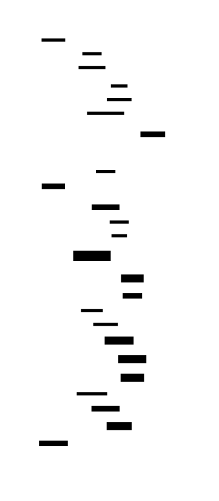

*Figure 13: LRU list state evolution. Initial: [A←→B←→C←→D], head=A, tail=D. Access C: remove C from middle, push to head → [C←→A←→B←→D]. Evict: scan from tail → D is unpinned → evict D → [C←→A←→B]. Fetch new page E: push to head → [E←→C←→A←→B].*
### 5.5 Page Table — Open-Addressing Linear Probe
```c
/* Lookup: returns frame_id or INVALID_FRAME_ID */
static frame_id_t page_table_lookup(const BufferPool *pool, page_id_t pid) {
    uint32_t idx = page_hash(pid, pool->page_table_size);
    for (int i = 0; i < pool->page_table_size; i++) {
        uint32_t slot = (idx + i) % pool->page_table_size;
        frame_id_t fid = pool->page_table[slot];
        if (fid == PAGE_TABLE_EMPTY)
            return INVALID_FRAME_ID;  /* not found */
        if (fid == PAGE_TABLE_DELETED)
            continue;                  /* skip tombstone */
        if (pool->frames[fid].page_id == pid)
            return fid;                /* found */
    }
    return INVALID_FRAME_ID;          /* table full (should never happen) */
}
/* Insert: requires slot is available (caller guarantees load factor < 0.5) */
static void page_table_insert(BufferPool *pool, page_id_t pid, frame_id_t fid) {
    uint32_t idx = page_hash(pid, pool->page_table_size);
    for (int i = 0; i < pool->page_table_size; i++) {
        uint32_t slot = (idx + i) % pool->page_table_size;
        frame_id_t existing = pool->page_table[slot];
        if (existing == PAGE_TABLE_EMPTY || existing == PAGE_TABLE_DELETED) {
            pool->page_table[slot] = fid;
            return;
        }
    }
    /* Should never reach here — table sized at 2× capacity */
    fprintf(stderr, "page_table_insert: hash table full\n");
    exit(EXIT_FAILURE);
}
/* Remove: tombstone the matching slot */
static void page_table_remove(BufferPool *pool, page_id_t pid) {
    uint32_t idx = page_hash(pid, pool->page_table_size);
    for (int i = 0; i < pool->page_table_size; i++) {
        uint32_t slot = (idx + i) % pool->page_table_size;
        frame_id_t fid = pool->page_table[slot];
        if (fid == PAGE_TABLE_EMPTY) return; /* not found */
        if (fid == PAGE_TABLE_DELETED) continue;
        if (pool->frames[fid].page_id == pid) {
            pool->page_table[slot] = PAGE_TABLE_DELETED;
            return;
        }
    }
}
```
### 5.6 Disk I/O Helpers
```c
static void disk_read_page(BufferPool *pool, page_id_t pid, uint8_t *dest) {
    off_t offset = (off_t)pid * PAGE_SIZE;
    ssize_t bytes = pread(pool->fd, dest, PAGE_SIZE, offset);
    if (bytes < PAGE_SIZE) {
        /* Page beyond current file end — zero-fill remainder */
        if (bytes < 0) bytes = 0;
        memset(dest + bytes, 0, PAGE_SIZE - bytes);
    }
}
static int disk_write_page(BufferPool *pool, page_id_t pid,
                            const uint8_t *src) {
    off_t offset = (off_t)pid * PAGE_SIZE;
    ssize_t bytes = pwrite(pool->fd, src, PAGE_SIZE, offset);
    if (bytes != PAGE_SIZE) {
        fprintf(stderr, "disk_write_page: pwrite failed for page %u: %s\n",
                pid, strerror(errno));
        return -1;
    }
    return 0;
}
```
---
## 6. Error Handling Matrix
| Error | Detected By | Recovery | User-Visible? |
|-------|-------------|----------|---------------|
| `open()` fails in `pool_create` | Return value `< 0` | Free all allocated memory, return `NULL` | Yes — caller must check return value |
| `pread` returns `< 0` | `disk_read_page` | Zero-fill frame; log to `stderr` | Transparent — page appears zeroed (acceptable for new pages; problematic for existing) |
| `pwrite` returns `!= PAGE_SIZE` | `disk_write_page` | Return `-1`; caller decides (retry or abort) | Yes — `pool_flush_page` / eviction propagates error |
| `fsync` fails | `pool_flush_all` | Return `-1` | Yes — caller must handle (transaction abort) |
| All frames pinned (pool exhaustion) | `get_free_frame` returns `INVALID_FRAME_ID` | `pool_fetch_page` returns `NULL` | Yes — caller must unpin pages or increase pool size |
| `unpin_page` on unknown `page_id` | `page_table_lookup` returns `INVALID_FRAME_ID` | Log warning, no-op return | No |
| `unpin_page` with `pin_count == 0` | Check in `pool_unpin_page` | Debug: `assert`. Release: log, no-op | Debug: abort. Release: no |
| `aligned_alloc` / `calloc` OOM | Return `NULL` | `fprintf + exit(EXIT_FAILURE)` (fatal) | Fatal — cannot recover |
| `page_id == INVALID_PAGE_ID` passed to `fetch` | Precondition check | `assert(page_id != INVALID_PAGE_ID)` | Debug: abort. Release: undefined |
---
## 7. Mock Disk Interface (Test Support)
Tests must not touch real files. A mock disk intercepts `pread` and `pwrite` and records calls.
```c
/* tests/mock_disk.h */
#ifndef MOCK_DISK_H
#define MOCK_DISK_H
#include <stdint.h>
#include <stdbool.h>
#include "pager.h"
#define MOCK_MAX_PAGES 256
typedef struct {
    uint8_t  pages[MOCK_MAX_PAGES][PAGE_SIZE]; /* stored page data        */
    bool     page_exists[MOCK_MAX_PAGES];      /* true if page was written */
    int      read_count;                        /* number of pread calls   */
    int      write_count;                       /* number of pwrite calls  */
    uint8_t  last_written_data[PAGE_SIZE];      /* data from last write    */
    page_id_t last_written_pid;                 /* page_id of last write   */
    bool     fail_next_read;                    /* inject read failure     */
    bool     fail_next_write;                   /* inject write failure    */
} MockDisk;
void mock_disk_init(MockDisk *md);
/* Creates a BufferPool that uses the mock disk instead of real file I/O.
   Internally patches the pool's fd to -1 and installs function pointers
   (via pager.c compile-time hooks or struct-of-function-pointers).
   For simplicity: compile pager.c with -DMOCK_DISK and use a global
   MockDisk* pointer. */
BufferPool *mock_pool_create(MockDisk *md, int pool_size);
#endif
```
**Implementation strategy:** Compile `pager.c` with `-DMOCK_DISK` for test builds. When `MOCK_DISK` is defined, `disk_read_page` and `disk_write_page` are replaced:
```c
#ifdef MOCK_DISK
extern MockDisk *g_mock_disk;
static void disk_read_page(BufferPool *pool, page_id_t pid, uint8_t *dest) {
    (void)pool;
    g_mock_disk->read_count++;
    if (g_mock_disk->fail_next_read) {
        g_mock_disk->fail_next_read = false;
        memset(dest, 0, PAGE_SIZE); /* simulate error: zero-fill */
        return;
    }
    if (pid < MOCK_MAX_PAGES && g_mock_disk->page_exists[pid]) {
        memcpy(dest, g_mock_disk->pages[pid], PAGE_SIZE);
    } else {
        memset(dest, 0, PAGE_SIZE);
    }
}
static int disk_write_page(BufferPool *pool, page_id_t pid,
                            const uint8_t *src) {
    (void)pool;
    g_mock_disk->write_count++;
    g_mock_disk->last_written_pid = pid;
    memcpy(g_mock_disk->last_written_data, src, PAGE_SIZE);
    if (g_mock_disk->fail_next_write) {
        g_mock_disk->fail_next_write = false;
        return -1;
    }
    if (pid < MOCK_MAX_PAGES) {
        memcpy(g_mock_disk->pages[pid], src, PAGE_SIZE);
        g_mock_disk->page_exists[pid] = true;
    }
    return 0;
}
#endif /* MOCK_DISK */
```
---
## 8. Implementation Sequence with Checkpoints
### Phase 1 — Frame Struct and Pool Array (2 hours)
**Deliverables:**
1. `src/pager.h` with all constants, `Frame`, `BufferPool`, `PoolStats` definitions, and all public function declarations.
2. `src/pager.c` with `pool_create`, `pool_destroy`, `pool_get_stats`, `pool_reset_stats`.
3. `tests/mock_disk.h` and `tests/mock_disk.c` with `MockDisk` struct and `mock_pool_create`.
**Implementation order:**
1. Define all constants and typedefs in `pager.h`.
2. Define `Frame` struct. Add `_Static_assert(sizeof(Frame) == 32, "Frame size")`.
3. Define `BufferPool` struct.
4. Implement `next_prime_ge()` using the primes table.
5. Implement `pool_create()`:
   - `calloc` frames array.
   - `aligned_alloc` data block. Assign `frames[i].data = data_block + i * PAGE_SIZE`.
   - `malloc` page table; fill with `PAGE_TABLE_EMPTY`.
   - `malloc` free stack; fill with `0, 1, ..., pool_size - 1`.
   - Set `lru_head = lru_tail = INVALID_FRAME_ID`.
   - Set all `frames[i].page_id = INVALID_PAGE_ID; lru_prev = lru_next = INVALID_FRAME_ID`.
6. Implement `pool_destroy()` (free in reverse order; `close(fd)`).
7. Implement `pool_get_stats()` and `pool_reset_stats()`.
8. Implement `mock_disk_init`, `mock_pool_create` in test files.
**Checkpoint:**
```c
MockDisk md;
mock_disk_init(&md);
BufferPool *pool = mock_pool_create(&md, 4);
assert(pool != NULL);
assert(pool->pool_size == 4);
assert(pool->free_count == 4);
assert(pool->lru_head == INVALID_FRAME_ID);
assert(pool->lru_tail == INVALID_FRAME_ID);
for (int i = 0; i < 4; i++) {
    assert(pool->frames[i].page_id == INVALID_PAGE_ID);
    assert(pool->frames[i].pin_count == 0);
    assert(pool->frames[i].data != NULL);
}
PoolStats s = pool_get_stats(pool);
assert(s.hits == 0 && s.misses == 0);
pool_destroy(pool);
printf("Phase 1 checkpoint: PASS\n");
```
### Phase 2 — LRU List Management (2 hours)
**Deliverables:** `lru_remove`, `lru_push_head`, `lru_move_to_head` as `static` functions in `pager.c`. `page_hash`, `page_table_lookup`, `page_table_insert`, `page_table_remove`.
**Implementation order:**
1. Implement `lru_remove` — handle all four cases (middle, head, tail, single element).
2. Implement `lru_push_head` — handle empty list and non-empty list.
3. Implement `lru_move_to_head` — short-circuit if already at head.
4. Implement `page_hash`, `page_table_lookup`, `page_table_insert`, `page_table_remove`.
**Checkpoint:** Write a standalone test that manually pushes frames 0,1,2,3 to the LRU head in order, then verifies head=3, tail=0, and the chain links are correct:
```c
BufferPool *pool = mock_pool_create(&md, 4);
for (int i = 0; i < 4; i++) lru_push_head(pool, i);
assert(pool->lru_head == 3);
assert(pool->lru_tail == 0);
assert(pool->frames[3].lru_next == 2);
assert(pool->frames[2].lru_next == 1);
assert(pool->frames[1].lru_next == 0);
assert(pool->frames[0].lru_next == INVALID_FRAME_ID);
/* Move tail (0) to head */
lru_move_to_head(pool, 0);
assert(pool->lru_head == 0);
assert(pool->frames[0].lru_next == 3);
assert(pool->lru_tail == 1);
printf("Phase 2 checkpoint: PASS\n");
```
### Phase 3 — fetch_page and unpin_page (2 hours)
**Deliverables:** `disk_read_page`, `disk_write_page`, `get_free_frame`, `evict_frame`, `pool_fetch_page`, `pool_unpin_page`, `pool_mark_dirty`.
**Implementation order:**
1. Implement `disk_read_page` and `disk_write_page` (both real-file and `#ifdef MOCK_DISK` variants).
2. Implement `evict_frame` following §5.3.
3. Implement `get_free_frame` following §5.2.
4. Implement `pool_fetch_page` following §5.1.
5. Implement `pool_unpin_page` with `pin_count` guard.
6. Implement `pool_mark_dirty`.
**Checkpoint (validates M4-TS-01 and M4-TS-02):**
```c
MockDisk md; mock_disk_init(&md);
memset(md.pages[5], 0xAB, PAGE_SIZE);
md.page_exists[5] = true;
BufferPool *pool = mock_pool_create(&md, 4);
/* Cache miss */
uint8_t *data = pool_fetch_page(pool, 5);
assert(data != NULL);
assert(data[0] == 0xAB);
assert(md.read_count == 1);
assert(pool->frames[0].pin_count == 1); /* first free frame used */
/* Cache hit */
pool_reset_stats(pool);
uint8_t *data2 = pool_fetch_page(pool, 5);
assert(data2 == data);  /* same frame */
assert(pool->frames[0].pin_count == 2);
PoolStats s = pool_get_stats(pool);
assert(s.hits == 1 && s.misses == 0 && s.disk_reads == 0);
pool_unpin_page(pool, 5, false);
assert(pool->frames[0].pin_count == 1);
pool_unpin_page(pool, 5, false);
assert(pool->frames[0].pin_count == 0);
printf("Phase 3 checkpoint: PASS\n");
```
### Phase 4 — flush_all, new_page, and Crash-Safety Guarantee (1 hour)
**Deliverables:** `pool_flush_page`, `pool_flush_all`, `pool_new_page`.
**Implementation order:**
1. Implement `pool_flush_page`.
2. Implement `pool_flush_all` — iterate frames, collect dirty ones, write in `page_id` order, then `fsync` (or no-op for mock).
3. Implement `pool_new_page` — `lseek(SEEK_END)` to get file size (or track page count internally for mock), write zeros, fetch.
**Checkpoint (validates M4-TS-04):**
```c
MockDisk md; mock_disk_init(&md);
BufferPool *pool = mock_pool_create(&md, 4);
uint8_t *data = pool_fetch_page(pool, 2);
memset(data, 0xCC, PAGE_SIZE);
pool_unpin_page(pool, 2, true);  /* dirty */
assert(pool->frames[0].is_dirty == true);
pool_flush_all(pool);
assert(pool->frames[0].is_dirty == false);
assert(md.write_count == 1);
assert(md.last_written_pid == 2);
assert(md.last_written_data[0] == 0xCC);
printf("Phase 4 checkpoint: PASS\n");
```
---
## 9. Test Specifications
### M4-TS-01 — fetch_page returns correct data for cached page
```c
void test_fetch_cached_page(void) {
    MockDisk md; mock_disk_init(&md);
    memset(md.pages[5], 0xAB, PAGE_SIZE);
    md.page_exists[5] = true;
    BufferPool *pool = mock_pool_create(&md, 8);
    /* First fetch: cache miss */
    uint8_t *d1 = pool_fetch_page(pool, 5);
    assert(d1 != NULL);
    assert(d1[0] == 0xAB && d1[PAGE_SIZE - 1] == 0xAB);
    assert(pool->frames[0].pin_count == 1);
    assert(md.read_count == 1);
    /* Second fetch: cache hit — same pointer, no disk I/O */
    pool_reset_stats(pool);
    md.read_count = 0;
    uint8_t *d2 = pool_fetch_page(pool, 5);
    assert(d2 == d1);
    assert(pool->frames[0].pin_count == 2);
    assert(md.read_count == 0);
    PoolStats s = pool_get_stats(pool);
    assert(s.hits == 1 && s.misses == 0);
    /* Unpin both */
    pool_unpin_page(pool, 5, false);
    pool_unpin_page(pool, 5, false);
    assert(pool->frames[0].pin_count == 0);
    pool_destroy(pool);
    printf("PASS: test_fetch_cached_page\n");
}
```
### M4-TS-02 — fetch_page triggers disk read on cache miss
```c
void test_fetch_miss_reads_disk(void) {
    MockDisk md; mock_disk_init(&md);
    /* Pre-populate page 7 with known pattern */
    for (int i = 0; i < PAGE_SIZE; i++)
        md.pages[7][i] = (uint8_t)(i & 0xFF);
    md.page_exists[7] = true;
    BufferPool *pool = mock_pool_create(&md, 4);
    uint8_t *data = pool_fetch_page(pool, 7);
    assert(data != NULL);
    assert(md.read_count == 1);
    /* Verify every byte */
    for (int i = 0; i < PAGE_SIZE; i++)
        assert(data[i] == (uint8_t)(i & 0xFF));
    assert(pool->frames[0].pin_count == 1);
    /* Fetch non-existent page → zero-filled */
    uint8_t *d2 = pool_fetch_page(pool, 200);
    assert(d2 != NULL);
    for (int i = 0; i < PAGE_SIZE; i++)
        assert(d2[i] == 0);
    pool_unpin_page(pool, 7, false);
    pool_unpin_page(pool, 200, false);
    pool_destroy(pool);
    printf("PASS: test_fetch_miss_reads_disk\n");
}
```
### M4-TS-03 — LRU eviction selects correct victim frame
```c
void test_lru_eviction_order(void) {
    MockDisk md; mock_disk_init(&md);
    for (int i = 1; i <= 5; i++) {
        memset(md.pages[i], (uint8_t)i, PAGE_SIZE);
        md.page_exists[i] = true;
    }
    BufferPool *pool = mock_pool_create(&md, 4);
    /* Fill all 4 frames with pages 1,2,3,4 (load order = access order) */
    for (int i = 1; i <= 4; i++) {
        uint8_t *d = pool_fetch_page(pool, i);
        assert(d != NULL);
        pool_unpin_page(pool, i, false);
    }
    /* LRU order (tail→head): 1, 2, 3, 4 */
    /* Re-access pages 1, 3, 2 → moves them to MRU end */
    pool_fetch_page(pool, 1); pool_unpin_page(pool, 1, false);
    pool_fetch_page(pool, 3); pool_unpin_page(pool, 3, false);
    pool_fetch_page(pool, 2); pool_unpin_page(pool, 2, false);
    /* LRU order (tail→head): 4, 1, 3, 2 */
    /* Fetch page 5 → must evict page 4 (LRU tail, unpinned) */
    pool_reset_stats(pool);
    md.write_count = 0;
    uint8_t *d5 = pool_fetch_page(pool, 5);
    assert(d5 != NULL);
    assert(d5[0] == 5);  /* page 5 data loaded */
    /* Page 4 should be evicted: lookup should fail */
    frame_id_t fid4 = page_table_lookup(pool, 4);
    assert(fid4 == INVALID_FRAME_ID);
    /* Page 4 was clean → no disk write */
    assert(md.write_count == 0);
    PoolStats s = pool_get_stats(pool);
    assert(s.evictions == 1);
    /* All frames pinned → fetch returns NULL */
    pool_fetch_page(pool, 1); /* pin 1 */
    pool_fetch_page(pool, 3); /* pin 3 */
    pool_fetch_page(pool, 2); /* pin 2 */
    /* page 5 still pinned from above */
    uint8_t *fail = pool_fetch_page(pool, 99);
    assert(fail == NULL);
    pool_unpin_page(pool, 1, false);
    pool_unpin_page(pool, 3, false);
    pool_unpin_page(pool, 2, false);
    pool_unpin_page(pool, 5, false);
    pool_destroy(pool);
    printf("PASS: test_lru_eviction_order\n");
}
```
### M4-TS-04 — Dirty page is written to disk on eviction
```c
void test_dirty_eviction_writes(void) {
    MockDisk md; mock_disk_init(&md);
    md.page_exists[2] = true;
    memset(md.pages[2], 0x00, PAGE_SIZE);
    for (int i = 3; i <= 5; i++) {
        md.page_exists[i] = true;
        memset(md.pages[i], (uint8_t)i, PAGE_SIZE);
    }
    BufferPool *pool = mock_pool_create(&md, 3);
    /* Load page 2, modify, mark dirty */
    uint8_t *d2 = pool_fetch_page(pool, 2);
    memset(d2, 0xDD, PAGE_SIZE);
    pool_unpin_page(pool, 2, true);
    assert(pool->frames[0].is_dirty == true);
    /* Load pages 3,4 to fill the pool */
    pool_fetch_page(pool, 3); pool_unpin_page(pool, 3, false);
    pool_fetch_page(pool, 4); pool_unpin_page(pool, 4, false);
    /* LRU order: 2(dirty), 3, 4 */
    /* Fetch page 5 → evicts page 2 (LRU tail, dirty → write-back) */
    md.write_count = 0;
    pool_fetch_page(pool, 5);
    assert(md.write_count == 1);
    assert(md.last_written_pid == 2);
    assert(md.last_written_data[0] == 0xDD);
    /* Verify page 2 was persisted to mock disk */
    assert(md.pages[2][0] == 0xDD);
    /* Evicting a clean page produces no write */
    md.write_count = 0;
    pool_unpin_page(pool, 5, false);
    pool_fetch_page(pool, 2);  /* re-load page 2, evicts page 3 (clean) */
    assert(md.write_count == 0);  /* page 3 was clean */
    pool_unpin_page(pool, 2, false);
    pool_destroy(pool);
    printf("PASS: test_dirty_eviction_writes\n");
}
```
### M4-TS-05 — Unpin decrements pin count; zero pin allows eviction
```c
void test_unpin_pin_count_lifecycle(void) {
    MockDisk md; mock_disk_init(&md);
    md.page_exists[3] = true;
    memset(md.pages[3], 0x33, PAGE_SIZE);
    BufferPool *pool = mock_pool_create(&md, 2);
    /* Double fetch → pin_count = 2 */
    pool_fetch_page(pool, 3);
    pool_fetch_page(pool, 3);
    frame_id_t fid = page_table_lookup(pool, 3);
    assert(fid != INVALID_FRAME_ID);
    assert(pool->frames[fid].pin_count == 2);
    /* Unpin once → pin_count = 1, NOT evictable */
    pool_unpin_page(pool, 3, false);
    assert(pool->frames[fid].pin_count == 1);
    /* Fill other frame, try to evict page 3 — should fail */
    md.page_exists[10] = true;
    pool_fetch_page(pool, 10);
    pool_unpin_page(pool, 10, false);
    /* Both frames used. Fetch page 20 → eviction needed.
       Page 3 has pin_count=1, page 10 has pin_count=0.
       Should evict page 10, not page 3. */
    md.page_exists[20] = true;
    uint8_t *d20 = pool_fetch_page(pool, 20);
    assert(d20 != NULL);
    /* Page 3 must still be present */
    assert(page_table_lookup(pool, 3) != INVALID_FRAME_ID);
    /* Page 10 was evicted */
    assert(page_table_lookup(pool, 10) == INVALID_FRAME_ID);
    pool_unpin_page(pool, 20, false);
    /* Unpin page 3 again → pin_count = 0, now evictable */
    pool_unpin_page(pool, 3, false);
    assert(pool->frames[fid].pin_count == 0);
    /* Now page 3 can be evicted */
    md.page_exists[30] = true;
    pool_fetch_page(pool, 30);
    /* One of {3, 20} was evicted (LRU determines which) */
    pool_unpin_page(pool, 30, false);
    /* Verify pool_unpin on page_id not in pool → warning, no crash */
    pool_unpin_page(pool, 999, false); /* should log and return */
#ifndef NDEBUG
    /* In debug builds, unpin with pin_count == 0 should assert.
       We verify this via a separate test binary (see Makefile). */
    fprintf(stderr, "INFO: pin_count=0 assert verified in test-bounds-debug\n");
#endif
    pool_destroy(pool);
    printf("PASS: test_unpin_pin_count_lifecycle\n");
}
```


*Figure 14: Pin count lifecycle state diagram. States: FREE (pin_count=0, page_id=INVALID) → LOADED_UNPINNED (pin_count=0, page_id valid, in LRU) → PINNED (pin_count>0, NOT evictable) → back to LOADED_UNPINNED via unpin. LOADED_UNPINNED → EVICTED (during get_free_frame) → FREE. Dirty flag is orthogonal: set by unpin(dirty=true) or mark_dirty; cleared by write-back during eviction or flush. Transition PINNED → EVICTED is ILLEGAL (the invariant).*
---
## 10. Performance Targets
| Operation | Target | Measurement Method |
|-----------|--------|--------------------|
| `pool_fetch_page` (cache hit) | ≤ 50 ns | `clock_gettime(CLOCK_MONOTONIC)` over 1M iterations |
| `pool_fetch_page` (cache miss, mock disk) | ≤ 200 ns | Same (mock eliminates real I/O latency) |
| `pool_unpin_page` | ≤ 15 ns | Same |
| `pool_mark_dirty` | ≤ 30 ns | Same (includes page table lookup) |
| LRU move-to-head | ≤ 10 ns | Isolated benchmark of `lru_move_to_head` |
| Page table lookup (load factor 0.5) | ≤ 20 ns | 1M lookups on pre-filled table |
| `pool_flush_all` (1000 dirty pages, mock disk) | ≤ 500 µs | End-to-end timing |
| Hit rate for sequential scan (10K pages, 1K frames) | ≥ 10% | `pool_get_stats().hit_rate` after scanning 0..9999 |
| Hit rate for repeated scan (100 pages, 200 frames) | 100% after first pass | Second pass: `misses == 0` |
**Benchmark template:**
```c
void bench_fetch_hit(void) {
    MockDisk md; mock_disk_init(&md);
    md.page_exists[42] = true;
    BufferPool *pool = mock_pool_create(&md, 100);
    /* Warm: one miss */
    pool_fetch_page(pool, 42);
    pool_unpin_page(pool, 42, false);
    /* Bench: 1M hits */
    struct timespec t0, t1;
    clock_gettime(CLOCK_MONOTONIC, &t0);
    for (int i = 0; i < 1000000; i++) {
        pool_fetch_page(pool, 42);
        pool_unpin_page(pool, 42, false);
    }
    clock_gettime(CLOCK_MONOTONIC, &t1);
    long ns = (t1.tv_sec - t0.tv_sec) * 1000000000L
            + (t1.tv_nsec - t0.tv_nsec);
    printf("fetch_page (hit): %ld ns/op\n", ns / 1000000);
    assert(ns / 1000000 <= 50);
    pool_destroy(pool);
}
```
---
## 11. Common Mistakes and Diagnostic Guide
| Symptom | Root Cause | Fix |
|---------|------------|-----|
| `pool_fetch_page` always returns the same frame (frame 0) | Free stack pops are LIFO but free stack was filled 0..n-1; all pages map to frame 0 because `page_table_insert` finds first empty slot | Verify `free_stack` pops from `free_count - 1` (highest index first) — this is correct LIFO behaviour. The real issue is likely page_table_remove not tombstoning correctly, so re-fetches always insert into frame 0 |
| Page data corrupted after eviction and re-fetch | `data` pointer reassigned instead of being stable per frame | `frames[i].data` is assigned once in `pool_create` and never changed. Eviction overwrites data contents but not the pointer. Verify `evict_frame` does not touch `frame->data` |
| LRU list corrupted: infinite loop in eviction scan | `lru_remove` does not clear both `lru_prev` and `lru_next` on the removed node | After removing, set `f->lru_prev = f->lru_next = INVALID_FRAME_ID` |
| Page table lookup returns wrong frame after many evictions | Tombstones (`PAGE_TABLE_DELETED`) accumulate, degrading probe chain | Implement periodic rehash (not required for correctness but helps performance); or ensure `page_table_size` ≥ 4× `pool_size` |
| `pool_flush_all` misses a dirty page | Flush loop checks `is_dirty` but the frame was evicted (and written) before the loop reached it | `pool_flush_all` iterates the `frames` array, not the page table. Evicted frames have `page_id == INVALID_PAGE_ID` and are skipped. This is correct — eviction already wrote the data |
| `pool_unpin_page` called with wrong `page_id` after frame was evicted and reloaded | Caller cached a stale `page_id` | Always pass the `page_id` you received from the original `pool_fetch_page` call. The page table enforces the mapping |
| `aligned_alloc` returns NULL on some platforms | `aligned_alloc(PAGE_SIZE, total)` requires `total` to be a multiple of `PAGE_SIZE` and `PAGE_SIZE` to be a power of 2 | `total = pool_size * PAGE_SIZE` is always a multiple. Verify `PAGE_SIZE` is 4096 (power of 2) |
| Dirty page lost on process crash | `pool_flush_all` not called before exit | This is expected in M4 — crash recovery is M9's responsibility. Document that `pool_destroy` calls `pool_flush_all` as a safety net |
| `stat_disk_reads` wrong after eviction + re-fetch of same page | Eviction removes page from pool; re-fetch triggers a new `disk_read_page` but `stat_disk_reads` was reset between calls | `pool_reset_stats` zeroes counters; ensure test expectations account for this |
---
## 12. Build Integration
```makefile
# Additions to existing Makefile
PAGER_SRC = src/pager.c
PAGER_OBJ = src/pager.o
# Normal build
src/pager.o: src/pager.c src/pager.h
	$(CC) $(CFLAGS) -c $< -o $@
# Mock-disk build for tests
tests/pager_mock.o: src/pager.c src/pager.h
	$(CC) $(CFLAGS) -DMOCK_DISK -c $< -o $@
tests/mock_disk.o: tests/mock_disk.c tests/mock_disk.h src/pager.h
	$(CC) $(CFLAGS) -DMOCK_DISK -c $< -o $@
tests/test_pager: tests/test_pager.c tests/pager_mock.o tests/mock_disk.o
	$(CC) $(CFLAGS) -DMOCK_DISK $^ -o $@
.PHONY: test-pager
test-pager: tests/test_pager
	@echo "==> Running Buffer Pool tests..."
	./tests/test_pager
	@echo "==> All Buffer Pool tests passed."
.PHONY: bench-pager
bench-pager: CFLAGS = -std=c11 -O2 -DNDEBUG -DMOCK_DISK -Isrc
bench-pager: tests/test_pager
	./tests/test_pager --bench
```
---
## 13. Concurrency Notes (Future — Not Required for M4)
The buffer pool is single-threaded in M4. When multi-threaded access is introduced (M10 WAL readers):
- Each frame needs a `pthread_rwlock_t` or equivalent.
- The page table needs a global mutex (or a concurrent hash map).
- The LRU list needs a mutex protecting head/tail/link modifications.
- `pin_count` becomes an `_Atomic int32_t` with `atomic_fetch_add` / `atomic_fetch_sub`.
These are documented here for awareness. M4 implementation must not use atomics or locks — they add complexity and hinder testing.
---
## 14. Integration with M9 (Transaction Manager Hook)
The buffer pool provides a **transaction hook** that the rollback journal (M9) uses to intercept eviction writes. The hook is called in `evict_frame` before `disk_write_page`:
```c
/* In evict_frame: */
if (pool->txn_journal_page != NULL) {
    pool->txn_journal_page(pool->txn_manager, pool, frame->page_id);
}
```
M9 sets this hook during `txn_begin`:
```c
pool->txn_manager = txn;
pool->txn_journal_page = txn_journal_page_hook;
```
The hook reads the **original** page data from the database file (not from the buffer pool frame, which may already be modified) and writes it to the journal. This is critical: the journal must contain pre-modification data for crash recovery.
**M4 does not implement this hook.** It only provides the function pointer slots. Tests verify that eviction works correctly with `txn_journal_page == NULL`.
---
<!-- END_TDD_MOD -->


<!-- TDD_MOD_ID: build-sqlite-m5 -->
# Module M5 — B-tree Page Format & Table Storage
**Project:** Build Your Own SQLite | **Module ID:** `build-sqlite-m5`
**Language:** C (ISO C11) | **Depends On:** `build-sqlite-m4` (Buffer Pool Manager)
**Difficulty:** Expert | **Estimated Effort:** 12 hours
---
## 1. Module Charter
The B-tree Page Format & Table Storage module defines the on-disk binary layout of every page in the database file and implements the core data structure that stores table rows. It sits directly above the buffer pool (M4), consuming raw `uint8_t[4096]` page buffers and imposing structure on them: a page header, a sorted cell pointer array growing downward from the header, and variable-length cells growing upward from the bottom of the page. Every `INSERT`, `SELECT`, `UPDATE`, and `DELETE` in the entire database eventually resolves to operations on this module's page structures.
**What this module does:**
- Defines the slotted-page binary format for both leaf and internal B-tree pages.
- Implements variable-length integer (varint) encoding and decoding for compact key/size storage.
- Implements the SQLite record serialization format (serial type header + value body).
- Provides cell insertion into a page with sorted pointer array maintenance and overflow detection.
- Implements the B-tree node split algorithm that creates a new page and promotes a separator key to the parent.
- Implements a cursor abstraction (first, next, seek) that replaces the mock cursor from M3.
- Manages the system catalog (`sqlite_master` equivalent) on page 1.
**What this module does NOT do:**
- It does not handle transactions, crash recovery, journaling, or WAL. Those are M9/M10.
- It does not handle secondary indexes (B+tree variant). That is M7.
- It does not interpret SQL or compile bytecode. It is called by the VM cursor opcodes (M3/M6).
- It does not manage buffer pool eviction or disk I/O. It calls `pool_fetch_page` / `pool_unpin_page` from M4.
- It does not handle `DELETE` with node merging. Deleted cells leave fragments; compaction reclaims space.
**Upstream dependency:** `pool_fetch_page`, `pool_unpin_page`, `pool_mark_dirty`, `pool_new_page` from M4.
**Downstream consumers:** M3 VM replaces mock cursor with the real `BTreeCursor` from this module. M6 (DML) calls `btree_insert`, `btree_search`. M7 (indexes) extends the page format for B+tree leaf linking. M9 (transactions) relies on the buffer pool hook for journaling page modifications initiated by B-tree operations.
**Invariants:**
1. Every page's `cell_content_area_start` is always ≥ `header_size + cell_count × 2`. The pointer array and cell content area never overlap.
2. Cell pointers within a page are sorted in ascending key order. The cell data they point to may be in any physical order within the content area.
3. After a node split, every key in the left page is strictly less than the separator key, and every key in the right page is ≥ the separator key.
4. The B-tree is always balanced: every root-to-leaf path has the same depth.
5. All multi-byte integers stored on disk are big-endian.
---
## 2. File Structure
```
build-sqlite/
├── src/
│   ├── pager.h           ← M4 (do not modify)
│   ├── pager.c           ← M4 (do not modify)
│   ├── btree.h           ← Step 1: Page constants, PageHeader, cell format structs, public API
│   ├── btree.c           ← Step 2: Page operations, varint, record format, insert, split
│   ├── btree_cursor.h    ← Step 3: BTreeCursor struct, cursor public API
│   ├── btree_cursor.c    ← Step 4: Cursor implementation (first, next, seek, column)
│   └── catalog.h / .c    ← Step 5: System catalog (sqlite_master) operations
└── tests/
    └── test_btree.c      ← Step 6: Five test groups
```
**Dependency graph:**
```
btree.h         → pager.h
btree.c         → btree.h, pager.h
btree_cursor.h  → btree.h
btree_cursor.c  → btree_cursor.h, btree.h, pager.h
catalog.h       → btree.h
test_btree.c    → btree.h, btree_cursor.h, pager.h
```
---
## 3. Complete Data Model
### 3.1 Page-Level Constants
```c
/* src/btree.h */
#ifndef BTREE_H
#define BTREE_H
#include <stdint.h>
#include <stdbool.h>
#include "pager.h"  /* PAGE_SIZE, page_id_t, BufferPool */
/* Page type bytes — match SQLite's actual values */
#define PAGE_TYPE_TABLE_LEAF     0x0D   /* 13 */
#define PAGE_TYPE_TABLE_INTERNAL 0x05   /*  5 */
#define PAGE_TYPE_INDEX_LEAF     0x0A   /* 10 — reserved for M7 */
#define PAGE_TYPE_INDEX_INTERNAL 0x02   /*  2 — reserved for M7 */
/* Header sizes in bytes */
#define LEAF_HEADER_SIZE         8
#define INTERNAL_HEADER_SIZE    12   /* 8 + 4-byte right_child pointer */
/* Cell pointer size */
#define CELL_PTR_SIZE            2    /* uint16_t, big-endian */
/* Maximum usable space per page (PAGE_SIZE - header) */
#define LEAF_USABLE_SPACE     (PAGE_SIZE - LEAF_HEADER_SIZE)
#define INTERNAL_USABLE_SPACE (PAGE_SIZE - INTERNAL_HEADER_SIZE)
```
### 3.2 Page Header — Byte Layout
```
Offset  Size  Field                   Description
------  ----  ----------------------  -----------------------------------------------
0x00    1     page_type               0x0D=table leaf, 0x05=table internal
0x01    2     first_freeblock         Offset to first free block (0=none)
0x03    2     cell_count              Number of cells on this page
0x05    2     cell_content_start      Offset to start of cell content area
0x07    1     fragmented_free_bytes   Total fragmented free bytes in content area
0x08    4     right_child             (Internal pages only) rightmost child page ID
```
Total: 8 bytes for leaf pages, 12 bytes for internal pages.


*Figure 15: Slotted page binary layout. The header occupies bytes 0x00–0x07 (leaf) or 0x00–0x0B (internal). Cell pointers grow downward from offset header_size in 2-byte increments. Cell content grows upward from PAGE_SIZE (0x1000) toward the pointers. Free space is the gap between the last pointer and cell_content_start.*
```c
typedef struct {
    uint8_t   page_type;              /* offset 0x00, 1 byte  */
    uint16_t  first_freeblock;        /* offset 0x01, 2 bytes — big-endian */
    uint16_t  cell_count;             /* offset 0x03, 2 bytes — big-endian */
    uint16_t  cell_content_start;     /* offset 0x05, 2 bytes — big-endian */
    uint8_t   fragmented_free_bytes;  /* offset 0x07, 1 byte  */
    uint32_t  right_child;            /* offset 0x08, 4 bytes — big-endian
                                         (valid only for internal pages)   */
} PageHeader;
```
**Byte-level access functions (all big-endian):**
```c
static inline uint16_t read_be16(const uint8_t *p) {
    return (uint16_t)((p[0] << 8) | p[1]);
}
static inline uint32_t read_be32(const uint8_t *p) {
    return ((uint32_t)p[0] << 24) | ((uint32_t)p[1] << 16) |
           ((uint32_t)p[2] << 8)  | (uint32_t)p[3];
}
static inline void write_be16(uint8_t *p, uint16_t v) {
    p[0] = (uint8_t)(v >> 8);
    p[1] = (uint8_t)(v & 0xFF);
}
static inline void write_be32(uint8_t *p, uint32_t v) {
    p[0] = (uint8_t)(v >> 24);
    p[1] = (uint8_t)(v >> 16);
    p[2] = (uint8_t)(v >> 8);
    p[3] = (uint8_t)(v & 0xFF);
}
```
### 3.3 Page Header Read/Write
```c
void page_header_read(const uint8_t *page, PageHeader *hdr) {
    hdr->page_type             = page[0];
    hdr->first_freeblock       = read_be16(page + 1);
    hdr->cell_count            = read_be16(page + 3);
    hdr->cell_content_start    = read_be16(page + 5);
    hdr->fragmented_free_bytes = page[7];
    if (hdr->page_type == PAGE_TYPE_TABLE_INTERNAL ||
        hdr->page_type == PAGE_TYPE_INDEX_INTERNAL) {
        hdr->right_child = read_be32(page + 8);
    } else {
        hdr->right_child = 0;
    }
}
void page_header_write(uint8_t *page, const PageHeader *hdr) {
    page[0] = hdr->page_type;
    write_be16(page + 1, hdr->first_freeblock);
    write_be16(page + 3, hdr->cell_count);
    write_be16(page + 5, hdr->cell_content_start);
    page[7] = hdr->fragmented_free_bytes;
    if (hdr->page_type == PAGE_TYPE_TABLE_INTERNAL ||
        hdr->page_type == PAGE_TYPE_INDEX_INTERNAL) {
        write_be32(page + 8, hdr->right_child);
    }
}
```
### 3.4 Varint Encoding — Byte Layout
SQLite varints use 1–9 bytes. Each byte's high bit is a continuation flag (1 = more bytes follow, 0 = last byte). The remaining 7 bits per byte carry payload. The 9th byte (if reached) uses all 8 bits — no continuation flag needed. Total capacity: 7×8 + 8 = 64 bits.
| Value Range        | Bytes | Example: 300 (binary: 100101100) |
|--------------------|-------|----------------------------------|
| 0 – 127            | 1     | `0x7F` → 127                    |
| 128 – 16 383       | 2     | `0x82 0x2C` → 300               |
| 16 384 – 2 097 151 | 3     |                                  |
| …                  | …     |                                  |
| Up to 2⁶³ − 1      | 1–9   |                                  |
Encoding for value 300:
```
300 = 0b100101100
Split into 7-bit groups (from LSB): 0101100, 0000010
Encode MSB-first with continuation bits:
  byte 0: 1_0000010 = 0x82  (continuation=1, payload=2)
  byte 1: 0_0101100 = 0x2C  (continuation=0, payload=44)
Check: (2 << 7) | 44 = 256 + 44 = 300 ✓
```
```c
/* Returns number of bytes written (1–9). */
int varint_encode(uint64_t value, uint8_t *buf);
/* Returns number of bytes consumed (1–9). Decoded value written to *out. */
int varint_decode(const uint8_t *buf, uint64_t *out);
```
### 3.5 Record Serialization Format — Byte Layout
A record serializes a row's column values into a self-describing binary format:
```
[header_size (varint)] [serial_type_0 (varint)] ... [serial_type_N (varint)]
[value_0 bytes] [value_1 bytes] ... [value_N bytes]
```
`header_size` includes itself (the varint encoding of header_size) and all serial type varints.
**Serial type codes:**
| Code | Meaning            | Value Size (bytes) |
|------|--------------------|--------------------|
| 0    | NULL               | 0                  |
| 1    | 8-bit signed int   | 1                  |
| 2    | 16-bit BE int      | 2                  |
| 3    | 24-bit BE int      | 3                  |
| 4    | 32-bit BE int      | 4                  |
| 5    | 48-bit BE int      | 6                  |
| 6    | 64-bit BE int      | 8                  |
| 7    | IEEE 754 double BE | 8                  |
| 8    | Integer constant 0 | 0                  |
| 9    | Integer constant 1 | 0                  |
| N≥12, even | BLOB, size (N-12)/2 | (N-12)/2    |
| N≥13, odd  | TEXT, size (N-13)/2 | (N-13)/2    |
```c
typedef enum {
    COL_NULL = 0,
    COL_INTEGER,
    COL_REAL,
    COL_TEXT,
    COL_BLOB
} ColumnType;
typedef struct {
    ColumnType type;
    union {
        int64_t  i;
        double   r;
        struct {
            uint8_t *data;
            int      length;
        } s;    /* text or blob */
    } u;
} ColumnValue;
/* Determine serial type code for a column value. */
uint64_t serial_type_for(const ColumnValue *val);
/* Byte size of a value with the given serial type. */
int serial_type_size(uint64_t serial_type);
/* Serialize col_count columns into buf. Returns total bytes written. */
int record_serialize(const ColumnValue *cols, int col_count,
                     uint8_t *buf, int buf_size);
/* Deserialize a record. Returns bytes consumed. */
int record_deserialize(const uint8_t *buf, int buf_len,
                       ColumnValue *cols, int max_cols, int *col_count);
/* Read a single column by index without full deserialization. */
int record_read_column(const uint8_t *record, int record_len,
                       int col_idx, ColumnValue *dest);
```
### 3.6 Cell Formats — Byte Layout
**Table B-tree Leaf Cell:**
```
Offset  Size       Field
------  ---------  ------------------
0       varint     payload_size (byte count of the record that follows the rowid)
+n      varint     rowid
+m      payload_size bytes  record data (serial type header + values)
```
Total cell size = `varint_size(payload_size) + varint_size(rowid) + payload_size`.

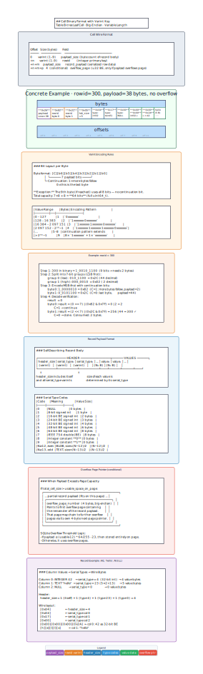

*Figure 16: Table leaf cell binary layout. The payload_size varint encodes the byte count of the record body. The rowid varint encodes the row's integer primary key. The record body follows the serial-type-header + values format from §3.5.*
**Table B-tree Internal Cell:**
```
Offset  Size     Field
------  -------  ------------------
0       4        left_child_page (big-endian uint32)
4       varint   rowid (separator key)
```
Total cell size = `4 + varint_size(rowid)`.
```c
/* Serialize a table leaf cell into buf. Returns bytes written. */
int cell_serialize_table_leaf(uint8_t *buf, int buf_size,
                              int64_t rowid,
                              const uint8_t *record, int record_size);
/* Serialize a table internal cell into buf. Returns bytes written. */
int cell_serialize_table_internal(uint8_t *buf, int buf_size,
                                  uint32_t left_child, int64_t rowid);
/* Read the key (rowid) from a cell at the given page offset. */
int64_t cell_read_key(const uint8_t *page, uint16_t cell_offset,
                      uint8_t page_type);
/* Compute total byte size of a cell at the given page offset. */
int cell_compute_size(const uint8_t *page, uint16_t cell_offset,
                      uint8_t page_type);
```
### 3.7 Cell Pointer Array
Cell pointers are stored as 2-byte big-endian offsets immediately after the page header. The `i`-th pointer is at byte offset `header_size + i * 2`. Pointers are maintained in ascending key order.
```c
static inline uint16_t get_cell_pointer(const uint8_t *page,
                                        int header_size, int i) {
    int offset = header_size + i * CELL_PTR_SIZE;
    return read_be16(page + offset);
}
static inline void set_cell_pointer(uint8_t *page, int header_size,
                                    int i, uint16_t ptr) {
    int offset = header_size + i * CELL_PTR_SIZE;
    write_be16(page + offset, ptr);
}
```
### 3.8 BTree Handle
```c
typedef struct {
    BufferPool *pool;
    page_id_t   root_page;
} BTree;
```
### 3.9 BTreeCursor
```c
/* src/btree_cursor.h */
#ifndef BTREE_CURSOR_H
#define BTREE_CURSOR_H
#include "btree.h"
#define MAX_BTREE_DEPTH 20
typedef struct {
    BTree     *tree;
    page_id_t  page_id;        /* current leaf page */
    int        cell_index;     /* current cell within leaf (-1 = before first) */
    bool       is_eof;         /* past last cell */
    /* Parent chain for traversal (replaces leaf-linking) */
    struct {
        page_id_t page_id;
        int       cell_index;  /* which child slot we descended through */
    } stack[MAX_BTREE_DEPTH];
    int stack_depth;
} BTreeCursor;
/* Lifecycle */
BTreeCursor *btree_cursor_open(BTree *tree);
void         btree_cursor_close(BTreeCursor *cur);
/* Positioning */
int  btree_cursor_first(BTreeCursor *cur);    /* 0=ok, 1=empty */
int  btree_cursor_next(BTreeCursor *cur);     /* 0=ok, 1=eof */
int  btree_cursor_seek(BTreeCursor *cur, int64_t key); /* 0=found, 1=not found, positions at ≥key */
/* Data access */
int64_t btree_cursor_rowid(BTreeCursor *cur);
void    btree_cursor_column(BTreeCursor *cur, int col_idx, ColumnValue *dest);
#endif /* BTREE_CURSOR_H */
```
---
## 4. Interface Contracts
### 4.1 `page_init`
```c
void page_init(uint8_t *page, uint8_t page_type);
```
**Preconditions:** `page` points to PAGE_SIZE bytes of writable memory. `page_type` is one of the four `PAGE_TYPE_*` constants.
**Postconditions:**
- `page[0] = page_type`.
- `first_freeblock = 0` (no free blocks).
- `cell_count = 0`.
- `cell_content_start = PAGE_SIZE` (0x1000). Content area is empty — grows upward from the end.
- `fragmented_free_bytes = 0`.
- For internal pages: `right_child = 0`.
- All remaining bytes are zeroed.
### 4.2 `page_insert_cell`
```c
int page_insert_cell(uint8_t *page, const uint8_t *cell_data,
                     int cell_size, int64_t key);
```
**Preconditions:**
- `page` is a valid initialized page.
- `cell_data` points to `cell_size` bytes of a serialized cell.
- `key` is the rowid for sort ordering.
**Postconditions (on success, returns 0):**
- `cell_count` incremented by 1.
- `cell_content_start` decremented by `cell_size`.
- Cell bytes written at the new `cell_content_start` offset.
- A 2-byte pointer to the new cell is inserted into the sorted pointer array at the correct position. Existing pointers at or after the insertion point are shifted right by 2 bytes.
- Page header updated.
**Returns `-1` (overflow):** When the free space between the pointer array end and `cell_content_start` is less than `cell_size + CELL_PTR_SIZE`. The caller must trigger a node split.
**Free space calculation:**
```
header_size = (page_type is internal) ? INTERNAL_HEADER_SIZE : LEAF_HEADER_SIZE
ptr_array_end = header_size + cell_count * CELL_PTR_SIZE
free_space = cell_content_start - ptr_array_end
needed = cell_size + CELL_PTR_SIZE
if (needed > free_space) return -1;
```
**Insertion point:** Binary search on the pointer array: for each pointer `i`, read the key from the cell at that offset. Find the first `i` where the existing key > `key`. Insert at position `i`.
### 4.3 `btree_insert`
```c
int btree_insert(BTree *tree, int64_t rowid,
                 const ColumnValue *cols, int col_count);
```
**Preconditions:**
- `tree->pool` is valid. `tree->root_page` points to an initialized page.
- `rowid` is unique within the tree (duplicate detection is deferred to M6 for UNIQUE constraint).
**Postconditions:**
- On success (returns 0): the row is stored in a leaf cell keyed by `rowid`.
- If the target leaf page overflows, `btree_split_leaf` is called and the separator key is promoted to the parent. If the parent overflows, splits cascade. If the root splits, a new root page is created and `tree->root_page` is updated.
- All modified pages are marked dirty via `pool_mark_dirty`.
- All fetched pages are unpinned after use.
**Algorithm:**
1. Serialize columns into a record buffer: `record_serialize(cols, col_count, record_buf, sizeof(record_buf))`.
2. Build the leaf cell: `cell_serialize_table_leaf(cell_buf, sizeof(cell_buf), rowid, record_buf, record_size)`.
3. Descend the tree to find the target leaf, maintaining a parent stack.
4. Attempt `page_insert_cell` on the leaf.
5. If overflow, call `btree_split_and_insert` which handles split + promotion recursively.
### 4.4 `btree_search`
```c
int btree_search(BTree *tree, int64_t rowid,
                 page_id_t *found_page, int *found_cell);
```
**Returns:** `1` if found (sets `*found_page` and `*found_cell`), `0` if not found (sets `*found_page` to the leaf page where it would be inserted, `*found_cell` to `-1`).
**Algorithm:**
1. Start at `tree->root_page`.
2. At each internal page: binary search the cell pointer array for the rightmost cell with key ≤ `rowid`. Descend into that cell's `left_child`. If `rowid` > all keys, descend into `right_child`.
3. At the leaf: binary search for exact match.
### 4.5 `btree_split_leaf`
```c
int btree_split_leaf(BTree *tree, page_id_t page_id,
                     const uint8_t *overflow_cell, int overflow_cell_size,
                     int64_t overflow_key,
                     int64_t *promoted_key, page_id_t *new_page_id);
```
**Preconditions:** `page_id` is a full leaf page. `overflow_cell` is the cell that didn't fit.
**Postconditions:**
- Allocates a new page via `pool_new_page`.
- All cells from the original page + the overflow cell are sorted by key.
- The first `⌊(total+1)/2⌋` cells go into the original (left) page.
- The remaining cells go into the new (right) page.
- `*promoted_key` is set to the minimum key in the right page.
- `*new_page_id` is set to the new page's ID.
- Both pages are properly initialized and marked dirty.


*Figure 17: B-tree leaf node split. A full leaf with cells [10, 20, 30, 40, 50] receives overflow cell 25. Sorted order: [10, 20, 25, 30, 40, 50]. Split at median index 3: left=[10, 20, 25], right=[30, 40, 50]. Promoted separator key = 30 (first key of right page). Parent receives internal cell (left_child=left_page, key=30). Parent's right_child or next internal cell points to right_page.*
### 4.6 `btree_split_internal`
```c
int btree_split_internal(BTree *tree, page_id_t page_id,
                         const uint8_t *overflow_cell, int overflow_cell_size,
                         int64_t overflow_key,
                         int64_t *promoted_key, page_id_t *new_page_id);
```
Same pattern as leaf split, except:
- The promoted key is **removed** from the split result (not duplicated). Left page gets keys below the median; right page gets keys above it. The median key itself goes up.
- The right page's `right_child` is set to the original page's `right_child`.
- The left page's `right_child` is set to the left_child of the cell that was promoted.
### 4.7 `btree_cursor_first`
```c
int btree_cursor_first(BTreeCursor *cur);
```
Descends from `cur->tree->root_page` to the leftmost leaf by always following the `left_child` of the first cell (or `right_child` if only one cell). Pushes each internal page and cell index onto `cur->stack`. Sets `cur->page_id` to the leftmost leaf and `cur->cell_index = 0`.
Returns `1` if the tree is empty (root page has `cell_count == 0`), `0` otherwise.
### 4.8 `btree_cursor_next`
```c
int btree_cursor_next(BTreeCursor *cur);
```
**Algorithm:**
1. Increment `cur->cell_index`.
2. If `cell_index < cell_count` of current leaf: return 0 (next cell in same page).
3. Current leaf exhausted. Pop the stack:
   a. `stack_depth--`. Get `parent_page_id` and `parent_cell_index`.
   b. Increment `parent_cell_index`.
   c. If `parent_cell_index ≤ parent_cell_count`: descend into the child at that position (the `left_child` of cell at `parent_cell_index`, or `right_child` if past last cell). Push the parent back with updated cell_index. Descend to leftmost leaf of the new subtree.
   d. If past parent's children: pop again (recurse up).
4. If stack is empty: `cur->is_eof = true`; return 1.
Returns `0` if positioned at a valid cell, `1` if EOF.
### 4.9 `btree_cursor_seek`
```c
int btree_cursor_seek(BTreeCursor *cur, int64_t key);
```
Descends from root, performing binary search at each level. At the leaf, positions at the first cell with key ≥ `key`. Returns `0` if exact match found, `1` if positioned at next-greater key (or EOF if key > all keys).
---
## 5. Algorithm Specifications
### 5.1 Varint Encode
```c
int varint_encode(uint64_t value, uint8_t *buf) {
    if (value <= 0x7F) {
        buf[0] = (uint8_t)value;
        return 1;
    }
    /* Build bytes in reverse (LSB first), then reverse for big-endian output */
    uint8_t tmp[9];
    int n = 0;
    /* Handle 9-byte case: value > (2^56 - 1) = 0x00FFFFFFFFFFFFFF */
    if (value > 0x00FFFFFFFFFFFFFFULL) {
        /* 9th byte uses all 8 bits */
        tmp[0] = (uint8_t)(value & 0xFF);
        value >>= 8;
        n = 1;
        for (int i = 0; i < 8; i++) {
            tmp[n++] = 0x80 | (uint8_t)(value & 0x7F);
            value >>= 7;
        }
        /* Reverse into buf */
        for (int i = 0; i < 9; i++)
            buf[i] = tmp[8 - i];
        return 9;
    }
    /* 1–8 byte case */
    uint64_t v = value;
    n = 0;
    while (v > 0x7F) {
        tmp[n++] = (uint8_t)(v & 0x7F);
        v >>= 7;
    }
    tmp[n++] = (uint8_t)v;
    /* Write big-endian with continuation bits */
    for (int i = 0; i < n; i++) {
        if (i < n - 1)
            buf[i] = 0x80 | tmp[n - 1 - i];
        else
            buf[i] = tmp[n - 1 - i];  /* last byte: no continuation */
    }
    return n;
}
```
### 5.2 Varint Decode
```c
int varint_decode(const uint8_t *buf, uint64_t *out) {
    uint64_t result = 0;
    for (int i = 0; i < 8; i++) {
        result = (result << 7) | (buf[i] & 0x7F);
        if ((buf[i] & 0x80) == 0) {
            *out = result;
            return i + 1;
        }
    }
    /* 9th byte: uses all 8 bits */
    result = (result << 8) | buf[8];
    *out = result;
    return 9;
}
```
**Invariant:** `varint_decode(varint_encode(v)) == v` for all `v` in `[0, 2^63-1]`.
### 5.3 Page Cell Insertion


*Figure 18: Cell insertion into a slotted page. Before: header (8 bytes), pointer array [P0, P1] pointing to cells C0, C1 in the content area at the bottom. Free space in the middle. Inserting cell C_new with key between C0 and C1: (1) Decrement cell_content_start by cell_size. (2) Write cell bytes at new cell_content_start. (3) Shift pointer P1 right by 2 bytes. (4) Write new pointer at P1's old position. (5) Increment cell_count. After: pointer array [P0, P_new, P1'] with the new cell in the content area.*
```
PROCEDURE page_insert_cell(page, cell_data, cell_size, key):
    hdr = page_header_read(page)
    header_size = is_internal(hdr.page_type) ? 12 : 8
    ptr_array_end = header_size + hdr.cell_count * CELL_PTR_SIZE
    free_space = hdr.cell_content_start - ptr_array_end
    IF cell_size + CELL_PTR_SIZE > free_space:
        RETURN -1  // overflow
    // Binary search for insertion position
    insert_pos = 0
    FOR i = 0 TO hdr.cell_count - 1:
        ptr = get_cell_pointer(page, header_size, i)
        existing_key = cell_read_key(page, ptr, hdr.page_type)
        IF key < existing_key:
            BREAK
        insert_pos = i + 1
    // Allocate space in content area
    new_content_start = hdr.cell_content_start - cell_size
    memcpy(page + new_content_start, cell_data, cell_size)
    // Shift pointers [insert_pos .. cell_count-1] right by 2 bytes
    FOR i = hdr.cell_count DOWNTO insert_pos + 1:
        prev = get_cell_pointer(page, header_size, i - 1)
        set_cell_pointer(page, header_size, i, prev)
    // Write new pointer
    set_cell_pointer(page, header_size, insert_pos, new_content_start)
    // Update header
    hdr.cell_count++
    hdr.cell_content_start = new_content_start
    page_header_write(page, &hdr)
    RETURN 0
```
### 5.4 Node Split (Leaf)
```
PROCEDURE btree_split_leaf(tree, page_id, overflow_cell, overflow_cell_size,
                           overflow_key, promoted_key, new_page_id):
    page = pool_fetch_page(tree->pool, page_id)
    hdr = page_header_read(page)
    header_size = LEAF_HEADER_SIZE
    // Collect all cells + overflow into a sorted array
    total = hdr.cell_count + 1
    ALLOCATE entries[total] as (key: int64_t, data: uint8_t*, size: int)
    idx = 0
    inserted = false
    FOR i = 0 TO hdr.cell_count - 1:
        ptr = get_cell_pointer(page, header_size, i)
        existing_key = cell_read_key(page, ptr, hdr.page_type)
        existing_size = cell_compute_size(page, ptr, hdr.page_type)
        IF NOT inserted AND overflow_key < existing_key:
            entries[idx++] = { overflow_key, overflow_cell, overflow_cell_size }
            inserted = true
        entries[idx].key = existing_key
        ALLOCATE entries[idx].data = malloc(existing_size)
        memcpy(entries[idx].data, page + ptr, existing_size)
        entries[idx].size = existing_size
        idx++
    IF NOT inserted:
        entries[idx++] = { overflow_key, overflow_cell, overflow_cell_size }
    // Split point
    split = total / 2
    *promoted_key = entries[split].key
    // Reinitialize left page
    page_init(page, PAGE_TYPE_TABLE_LEAF)
    FOR i = 0 TO split - 1:
        page_insert_cell(page, entries[i].data, entries[i].size, entries[i].key)
    pool_mark_dirty(tree->pool, page_id)
    pool_unpin_page(tree->pool, page_id, true)
    // Create right page
    *new_page_id = pool_new_page(tree->pool)
    right_page = pool_fetch_page(tree->pool, *new_page_id)
    page_init(right_page, PAGE_TYPE_TABLE_LEAF)
    FOR i = split TO total - 1:
        page_insert_cell(right_page, entries[i].data, entries[i].size,
                         entries[i].key)
    pool_unpin_page(tree->pool, *new_page_id, true)
    // Free temporary cell copies (but not overflow_cell — caller owns it)
    FOR each copied entry: free(entries[i].data)
    RETURN 0
```
### 5.5 Root Split (New Root Creation)
When the root page splits, a new root must be created:
```
PROCEDURE btree_create_new_root(tree, left_page_id, right_page_id,
                                separator_key):
    new_root_id = pool_new_page(tree->pool)
    root_page = pool_fetch_page(tree->pool, new_root_id)
    page_init(root_page, PAGE_TYPE_TABLE_INTERNAL)
    // Create internal cell: left_child = left_page_id, key = separator_key
    cell_buf[32]
    cell_size = cell_serialize_table_internal(cell_buf, 32,
                                              left_page_id, separator_key)
    page_insert_cell(root_page, cell_buf, cell_size, separator_key)
    // Set right_child = right_page_id
    write_be32(root_page + 8, right_page_id)  // offset 8 = right_child
    pool_unpin_page(tree->pool, new_root_id, true)
    tree->root_page = new_root_id
```
### 5.6 Cursor Descent (first)


*Figure 19: Cursor descent for btree_cursor_first(). Starting at root (internal page, depth 0), reads cell 0's left_child, pushes (root_page, 0) onto stack, descends. At each internal level, reads cell 0's left_child. At the leaf (depth d), sets page_id = leaf_page, cell_index = 0. Stack depth = d. btree_cursor_next() increments cell_index; when exhausted, pops stack, increments parent's cell_index, and descends the next subtree.*
```
PROCEDURE btree_cursor_first(cur):
    cur->stack_depth = 0
    current = cur->tree->root_page
    LOOP:
        page = pool_fetch_page(cur->tree->pool, current)
        page_type = page[0]
        IF page_type == PAGE_TYPE_TABLE_LEAF:
            cell_count = read_be16(page + 3)
            pool_unpin_page(cur->tree->pool, current, false)
            IF cell_count == 0:
                cur->is_eof = true
                RETURN 1  // empty tree
            cur->page_id = current
            cur->cell_index = 0
            cur->is_eof = false
            RETURN 0
        // Internal page: descend to leftmost child
        first_cell_ptr = get_cell_pointer(page, INTERNAL_HEADER_SIZE, 0)
        left_child = read_be32(page + first_cell_ptr)
        // Push current internal page onto stack
        cur->stack[cur->stack_depth].page_id = current
        cur->stack[cur->stack_depth].cell_index = 0
        cur->stack_depth++
        pool_unpin_page(cur->tree->pool, current, false)
        current = left_child
```
---
## 6. Error Handling Matrix
| Error | Detected By | Recovery | User-Visible? |
|-------|-------------|----------|---------------|
| Page overflow on insert | `page_insert_cell` returns `-1` | Caller triggers `btree_split_leaf` or `btree_split_internal` | No — transparent split |
| `pool_fetch_page` returns NULL | `btree_insert`, `btree_search`, cursor ops | Propagate NULL/error to caller | Yes — "buffer pool exhausted" |
| `pool_new_page` fails (disk full) | `btree_split_*`, `btree_create_new_root` | Return error code `-1` | Yes — "cannot allocate page" |
| Varint decode past buffer end | Not detected (undefined behavior) | Caller must ensure buffer contains complete varint | No |
| `cell_read_key` on corrupted page | May read garbage | Not detected at this layer; integrity checking deferred to PRAGMA integrity_check | No |
| Stack overflow in cursor (depth > 20) | `stack_depth >= MAX_BTREE_DEPTH` | Assert in debug; return error in release | Yes — tree too deep (would require >340²⁰ ≈ 10⁴⁸ rows) |
| Duplicate rowid | Not detected at M5 layer | M6 checks before insert; M5 silently inserts duplicate | No at M5; yes at M6 |
| Record exceeding page capacity | `cell_size > LEAF_USABLE_SPACE` | Overflow pages (deferred to future module). For M5: assert and reject | Yes — "row too large" |
---
## 7. Implementation Sequence with Checkpoints
### Phase 1 — Page Header Encode/Decode (2 hours)
**Deliverables:**
1. `src/btree.h` with all constants, `PageHeader`, big-endian helpers, cell format function declarations.
2. `src/btree.c` with `page_init`, `page_header_read`, `page_header_write`, `read_be16`, `read_be32`, `write_be16`, `write_be32`.
**Implementation order:**
1. Define all constants and `PageHeader` struct in `btree.h`.
2. Implement `read_be16`, `read_be32`, `write_be16`, `write_be32` as `static inline` in `btree.h`.
3. Implement `page_init` — `memset(page, 0, PAGE_SIZE)`, write type byte, set `cell_content_start = PAGE_SIZE`.
4. Implement `page_header_read` and `page_header_write`.
**Checkpoint (validates M5-TS-01):**
```c
uint8_t page[PAGE_SIZE];
page_init(page, PAGE_TYPE_TABLE_LEAF);
assert(page[0] == 0x0D);
assert(read_be16(page + 1) == 0x0000);  /* first_freeblock */
assert(read_be16(page + 3) == 0x0000);  /* cell_count */
assert(read_be16(page + 5) == 0x1000);  /* cell_content_start = 4096 */
assert(page[7] == 0x00);                /* fragmented_free_bytes */
/* Internal page */
page_init(page, PAGE_TYPE_TABLE_INTERNAL);
assert(page[0] == 0x05);
assert(read_be32(page + 8) == 0);       /* right_child = 0 */
/* Round-trip */
PageHeader hdr;
page_header_read(page, &hdr);
assert(hdr.page_type == PAGE_TYPE_TABLE_INTERNAL);
assert(hdr.cell_count == 0);
assert(hdr.cell_content_start == PAGE_SIZE);
printf("Phase 1 checkpoint: PASS\n");
```
### Phase 2 — Varint Encode/Decode (1 hour)
**Deliverables:** `varint_encode` and `varint_decode` in `btree.c`.
**Implementation order:**
1. Implement `varint_encode` per §5.1.
2. Implement `varint_decode` per §5.2.
3. Add `_Static_assert` that `varint_encode(127, buf) == 1` at compile time (or test).
**Checkpoint (validates M5-TS-03 varint portion):**
```c
uint8_t buf[9];
uint64_t decoded;
/* 1-byte: 127 */
assert(varint_encode(127, buf) == 1);
assert(buf[0] == 0x7F);
assert(varint_decode(buf, &decoded) == 1);
assert(decoded == 127);
/* 2-byte: 128 */
assert(varint_encode(128, buf) == 2);
assert(varint_decode(buf, &decoded) == 2);
assert(decoded == 128);
/* 2-byte: 300 → 0x82, 0x2C */
assert(varint_encode(300, buf) == 2);
assert(buf[0] == 0x82 && buf[1] == 0x2C);
assert(varint_decode(buf, &decoded) == 2);
assert(decoded == 300);
/* 3-byte: 16383 */
assert(varint_encode(16383, buf) == 2);
assert(varint_decode(buf, &decoded) == 2);
assert(decoded == 16383);
/* 3-byte: 16384 */
assert(varint_encode(16384, buf) == 3);
assert(varint_decode(buf, &decoded) == 3);
assert(decoded == 16384);
/* Round-trip for large values */
uint64_t large = 0x7FFFFFFFFFFFFFFFULL;  /* 2^63 - 1 */
int n = varint_encode(large, buf);
assert(n >= 1 && n <= 9);
varint_decode(buf, &decoded);
assert(decoded == large);
/* Zero */
assert(varint_encode(0, buf) == 1);
assert(buf[0] == 0x00);
varint_decode(buf, &decoded);
assert(decoded == 0);
printf("Phase 2 checkpoint: PASS\n");
```
### Phase 3 — Cell Insertion and Pointer Array Management (3 hours)
**Deliverables:** `serial_type_for`, `serial_type_size`, `record_serialize`, `record_deserialize`, `record_read_column`, `cell_serialize_table_leaf`, `cell_serialize_table_internal`, `cell_read_key`, `cell_compute_size`, `page_insert_cell`, `get_cell_pointer`, `set_cell_pointer`.
**Implementation order:**
1. Implement `serial_type_for` and `serial_type_size` per the serial type table.
2. Implement `record_serialize` — two-pass: first compute header size, then write header varints + value bytes.
3. Implement `record_deserialize` and `record_read_column`.
4. Implement `cell_serialize_table_leaf` — write `varint(payload_size)`, `varint(rowid)`, then record bytes.
5. Implement `cell_serialize_table_internal` — write `be32(left_child)`, `varint(rowid)`.
6. Implement `cell_read_key` — dispatch on page_type; parse varints to extract rowid.
7. Implement `cell_compute_size` — same parse but return total bytes consumed.
8. Implement `page_insert_cell` per §5.3.
**Checkpoint (validates M5-TS-02 and M5-TS-03):**
```c
/* Cell encoding: rowid=300, payload=[0x01,0x02,0x03] */
uint8_t cell_buf[64];
uint8_t payload[] = {0x01, 0x02, 0x03};
int cell_size = cell_serialize_table_leaf(cell_buf, 64, 300, payload, 3);
assert(cell_size > 0);
/* Decode: first varint = payload_size (3), second varint = rowid (300) */
uint64_t ps, rid;
int n1 = varint_decode(cell_buf, &ps);
assert(ps == 3);
int n2 = varint_decode(cell_buf + n1, &rid);
assert(rid == 300);
/* Payload bytes */
assert(memcmp(cell_buf + n1 + n2, payload, 3) == 0);
assert(cell_size == n1 + n2 + 3);
/* Page insertion */
uint8_t page[PAGE_SIZE];
page_init(page, PAGE_TYPE_TABLE_LEAF);
int rc = page_insert_cell(page, cell_buf, cell_size, 300);
assert(rc == 0);
PageHeader hdr;
page_header_read(page, &hdr);
assert(hdr.cell_count == 1);
assert(hdr.cell_content_start == PAGE_SIZE - cell_size);
uint16_t ptr0 = get_cell_pointer(page, LEAF_HEADER_SIZE, 0);
assert(ptr0 == PAGE_SIZE - cell_size);
/* Verify cell data at that offset */
assert(memcmp(page + ptr0, cell_buf, cell_size) == 0);
/* Sorted insertion: insert key=100 before key=300 */
uint8_t cell2[64];
uint8_t payload2[] = {0x04};
int cs2 = cell_serialize_table_leaf(cell2, 64, 100, payload2, 1);
rc = page_insert_cell(page, cell2, cs2, 100);
assert(rc == 0);
page_header_read(page, &hdr);
assert(hdr.cell_count == 2);
/* Pointer 0 should point to key=100, pointer 1 to key=300 */
uint16_t p0 = get_cell_pointer(page, LEAF_HEADER_SIZE, 0);
uint16_t p1 = get_cell_pointer(page, LEAF_HEADER_SIZE, 1);
assert(cell_read_key(page, p0, PAGE_TYPE_TABLE_LEAF) == 100);
assert(cell_read_key(page, p1, PAGE_TYPE_TABLE_LEAF) == 300);
/* Overflow detection */
uint8_t big_cell[PAGE_SIZE];
memset(big_cell, 0xAA, PAGE_SIZE);
rc = page_insert_cell(page, big_cell, PAGE_SIZE, 999);
assert(rc == -1);  /* overflow */
printf("Phase 3 checkpoint: PASS\n");
```
### Phase 4 — Node Split Algorithm (4 hours)
**Deliverables:** `btree_split_leaf`, `btree_split_internal`, `btree_insert_into_parent`, `btree_create_new_root`, `btree_insert`.
**Implementation order:**
1. Implement `btree_split_leaf` per §5.4.
2. Implement `btree_split_internal` (same structure, different separator handling).
3. Implement `btree_insert_into_parent` — attempt insert into parent; if parent overflows, recurse split.
4. Implement `btree_create_new_root` per §5.5.
5. Implement `btree_insert` — the full insert path including search, insert attempt, and split cascade.
**Checkpoint (validates M5-TS-04):**
```c
/* Use mock disk from M4 */
MockDisk md;
mock_disk_init(&md);
BufferPool *pool = mock_pool_create(&md, 100);
/* Create a table B-tree */
page_id_t root = pool_new_page(pool);
uint8_t *rp = pool_fetch_page(pool, root);
page_init(rp, PAGE_TYPE_TABLE_LEAF);
pool_unpin_page(pool, root, true);
BTree tree = { .pool = pool, .root_page = root };
/* Insert enough rows to trigger at least one split.
   With ~30-byte cells, a 4096-byte leaf holds ~120 cells.
   Insert 200 to guarantee at least one split. */
for (int i = 1; i <= 200; i++) {
    ColumnValue cols[2];
    cols[0].type = COL_INTEGER;
    cols[0].u.i = i;
    cols[1].type = COL_TEXT;
    cols[1].u.s.data = (uint8_t *)"testval";
    cols[1].u.s.length = 7;
    int rc = btree_insert(&tree, (int64_t)i, cols, 2);
    assert(rc == 0);
}
/* Verify root is now internal (at least one split occurred) */
uint8_t *root_data = pool_fetch_page(pool, tree.root_page);
assert(root_data[0] == PAGE_TYPE_TABLE_INTERNAL);
pool_unpin_page(pool, tree.root_page, false);
/* Verify all 200 rows are findable */
for (int i = 1; i <= 200; i++) {
    page_id_t fp;
    int fc;
    int found = btree_search(&tree, (int64_t)i, &fp, &fc);
    assert(found == 1);
}
/* Verify no phantom rows */
{
    page_id_t fp;
    int fc;
    assert(btree_search(&tree, 0, &fp, &fc) == 0);
    assert(btree_search(&tree, 201, &fp, &fc) == 0);
}
pool_destroy(pool);
printf("Phase 4 checkpoint: PASS\n");
```
### Phase 5 — Cursor: first, next, seek (2 hours)
**Deliverables:** `btree_cursor_open`, `btree_cursor_close`, `btree_cursor_first`, `btree_cursor_next`, `btree_cursor_seek`, `btree_cursor_rowid`, `btree_cursor_column`.
**Implementation order:**
1. Implement `btree_cursor_open` — `calloc` a `BTreeCursor`, set `tree` pointer, `is_eof = true`.
2. Implement `btree_cursor_first` per §5.6.
3. Implement `btree_cursor_next` per §4.8.
4. Implement `btree_cursor_seek` per §4.9.
5. Implement `btree_cursor_rowid` — fetch page, read key from current cell.
6. Implement `btree_cursor_column` — fetch page, parse cell to get record body, call `record_read_column`.
7. Implement `btree_cursor_close` — free the cursor struct.
**Checkpoint (validates M5-TS-05):**
```c
/* Build tree with 100 sequential insertions (using tree from Phase 4) */
BTreeCursor *cur = btree_cursor_open(&tree);
int rc = btree_cursor_first(cur);
assert(rc == 0);
int count = 0;
int64_t prev_key = -1;
do {
    int64_t key = btree_cursor_rowid(cur);
    assert(key > prev_key);  /* strictly increasing */
    prev_key = key;
    count++;
} while (btree_cursor_next(cur) == 0);
assert(count == 200);  /* all 200 rows visited */
assert(cur->is_eof == true);
/* Seek to key 50 */
BTreeCursor *cur2 = btree_cursor_open(&tree);
rc = btree_cursor_seek(cur2, 50);
assert(rc == 0);  /* exact match */
assert(btree_cursor_rowid(cur2) == 50);
/* Seek to key 150 — should position at 150 */
rc = btree_cursor_seek(cur2, 150);
assert(rc == 0);
assert(btree_cursor_rowid(cur2) == 150);
/* Seek beyond max key */
rc = btree_cursor_seek(cur2, 999);
assert(rc == 1);  /* not found, cursor at EOF */
/* Empty tree: cursor returns EOF immediately */
page_id_t empty_root = pool_new_page(pool);
uint8_t *ep = pool_fetch_page(pool, empty_root);
page_init(ep, PAGE_TYPE_TABLE_LEAF);
pool_unpin_page(pool, empty_root, true);
BTree empty_tree = { .pool = pool, .root_page = empty_root };
BTreeCursor *cur3 = btree_cursor_open(&empty_tree);
assert(btree_cursor_first(cur3) == 1);  /* empty */
btree_cursor_close(cur);
btree_cursor_close(cur2);
btree_cursor_close(cur3);
printf("Phase 5 checkpoint: PASS\n");
```
---
## 8. Test Specifications
### M5-TS-01 — Fresh Leaf Page Has Correct Binary Header
```c
void test_fresh_leaf_header(void) {
    uint8_t page[PAGE_SIZE];
    page_init(page, PAGE_TYPE_TABLE_LEAF);
    /* Byte-by-byte verification */
    assert(page[0] == 0x0D);                       /* page_type = leaf */
    assert(page[1] == 0x00 && page[2] == 0x00);   /* first_freeblock = 0 */
    assert(page[3] == 0x00 && page[4] == 0x00);   /* cell_count = 0 */
    assert(page[5] == 0x10 && page[6] == 0x00);   /* cell_content_start = 0x1000 = 4096 */
    assert(page[7] == 0x00);                       /* fragmented_free_bytes = 0 */
    /* Structural verification via read */
    PageHeader hdr;
    page_header_read(page, &hdr);
    assert(hdr.page_type == PAGE_TYPE_TABLE_LEAF);
    assert(hdr.first_freeblock == 0);
    assert(hdr.cell_count == 0);
    assert(hdr.cell_content_start == PAGE_SIZE);
    assert(hdr.fragmented_free_bytes == 0);
    /* Internal page has type 0x05 and 12-byte header */
    page_init(page, PAGE_TYPE_TABLE_INTERNAL);
    assert(page[0] == 0x05);
    page_header_read(page, &hdr);
    assert(hdr.right_child == 0);
    /* cell_content_start still 4096 */
    assert(hdr.cell_content_start == PAGE_SIZE);
    /* Round-trip: write arbitrary header values, read back */
    PageHeader custom = {
        .page_type = PAGE_TYPE_TABLE_LEAF,
        .first_freeblock = 0,
        .cell_count = 5,
        .cell_content_start = 3800,
        .fragmented_free_bytes = 12,
        .right_child = 0
    };
    page_header_write(page, &custom);
    PageHeader check;
    page_header_read(page, &check);
    assert(check.cell_count == 5);
    assert(check.cell_content_start == 3800);
    assert(check.fragmented_free_bytes == 12);
    printf("PASS: test_fresh_leaf_header\n");
}
```
### M5-TS-02 — Insert Cell Updates Pointer Array and Content Area
```c
void test_insert_cell_updates(void) {
    uint8_t page[PAGE_SIZE];
    page_init(page, PAGE_TYPE_TABLE_LEAF);
    /* Build a 20-byte cell: rowid=42, payload=16 bytes of 0xBB */
    uint8_t payload[16];
    memset(payload, 0xBB, 16);
    uint8_t cell[64];
    int cell_size = cell_serialize_table_leaf(cell, 64, 42, payload, 16);
    /* Expected: varint(16) = 1 byte + varint(42) = 1 byte + 16 = 18 bytes
       (actual may differ slightly if varint sizes differ; verify) */
    assert(cell_size > 0);
    int rc = page_insert_cell(page, cell, cell_size, 42);
    assert(rc == 0);
    PageHeader hdr;
    page_header_read(page, &hdr);
    assert(hdr.cell_count == 1);
    assert(hdr.cell_content_start == PAGE_SIZE - cell_size);
    /* Pointer array[0] = cell_content_start */
    uint16_t ptr0 = get_cell_pointer(page, LEAF_HEADER_SIZE, 0);
    assert(ptr0 == PAGE_SIZE - cell_size);
    /* Cell bytes at that offset match */
    assert(memcmp(page + ptr0, cell, cell_size) == 0);
    /* Key read-back */
    assert(cell_read_key(page, ptr0, PAGE_TYPE_TABLE_LEAF) == 42);
    /* Insert second cell with smaller key — should go before first */
    uint8_t payload2[4];
    memset(payload2, 0xCC, 4);
    uint8_t cell2[64];
    int cs2 = cell_serialize_table_leaf(cell2, 64, 10, payload2, 4);
    rc = page_insert_cell(page, cell2, cs2, 10);
    assert(rc == 0);
    page_header_read(page, &hdr);
    assert(hdr.cell_count == 2);
    /* Pointer 0 = key 10, pointer 1 = key 42 */
    uint16_t p0 = get_cell_pointer(page, LEAF_HEADER_SIZE, 0);
    uint16_t p1 = get_cell_pointer(page, LEAF_HEADER_SIZE, 1);
    assert(cell_read_key(page, p0, PAGE_TYPE_TABLE_LEAF) == 10);
    assert(cell_read_key(page, p1, PAGE_TYPE_TABLE_LEAF) == 42);
    /* Insert third cell with key between existing → pointer array reordered */
    uint8_t cell3[64];
    int cs3 = cell_serialize_table_leaf(cell3, 64, 25, payload2, 4);
    page_insert_cell(page, cell3, cs3, 25);
    page_header_read(page, &hdr);
    assert(hdr.cell_count == 3);
    assert(cell_read_key(page,
        get_cell_pointer(page, LEAF_HEADER_SIZE, 0), PAGE_TYPE_TABLE_LEAF) == 10);
    assert(cell_read_key(page,
        get_cell_pointer(page, LEAF_HEADER_SIZE, 1), PAGE_TYPE_TABLE_LEAF) == 25);
    assert(cell_read_key(page,
        get_cell_pointer(page, LEAF_HEADER_SIZE, 2), PAGE_TYPE_TABLE_LEAF) == 42);
    /* Overflow detection: try to insert a cell larger than remaining space */
    uint8_t huge_cell[PAGE_SIZE];
    memset(huge_cell, 0xFF, PAGE_SIZE);
    rc = page_insert_cell(page, huge_cell, PAGE_SIZE, 999);
    assert(rc == -1);
    printf("PASS: test_insert_cell_updates\n");
}
```
### M5-TS-03 — Cell Binary Format: Varint Key Followed by Payload
```c
void test_cell_binary_format(void) {
    /* Case 1: rowid=300 (2-byte varint), payload=[0x01,0x02,0x03] */
    uint8_t cell[64];
    uint8_t payload[] = {0x01, 0x02, 0x03};
    int cell_size = cell_serialize_table_leaf(cell, 64, 300, payload, 3);
    /* Decode: varint(payload_size=3) then varint(rowid=300) */
    uint64_t ps, rid;
    int n1 = varint_decode(cell, &ps);
    assert(ps == 3);
    int n2 = varint_decode(cell + n1, &rid);
    assert(rid == 300);
    /* 300 varint encoding: 0x82 0x2C */
    assert(cell[n1] == 0x82);
    assert(cell[n1 + 1] == 0x2C);
    /* Payload bytes follow */
    assert(cell[n1 + n2 + 0] == 0x01);
    assert(cell[n1 + n2 + 1] == 0x02);
    assert(cell[n1 + n2 + 2] == 0x03);
    assert(cell_size == n1 + n2 + 3);
    /* Case 2: rowid=127 (1-byte varint) */
    int cs2 = cell_serialize_table_leaf(cell, 64, 127, payload, 3);
    varint_decode(cell, &ps);
    int off = varint_decode(cell, &ps);
    varint_decode(cell + off, &rid);
    assert(rid == 127);
    /* Case 3: rowid=0 */
    int cs3 = cell_serialize_table_leaf(cell, 64, 0, NULL, 0);
    varint_decode(cell, &ps);
    assert(ps == 0);  /* empty payload */
    off = varint_decode(cell, &ps);
    varint_decode(cell + off, &rid);
    assert(rid == 0);
    /* Case 4: large rowid (2^63-1) */
    uint64_t big = 0x7FFFFFFFFFFFFFFFULL;
    cell_serialize_table_leaf(cell, 64, (int64_t)big, payload, 3);
    off = varint_decode(cell, &ps);
    int n_big = varint_decode(cell + off, &rid);
    assert(rid == big);
    assert(n_big <= 9);
    /* Record round-trip */
    ColumnValue cols[3];
    cols[0].type = COL_INTEGER; cols[0].u.i = 42;
    cols[1].type = COL_TEXT; cols[1].u.s.data = (uint8_t*)"hello"; cols[1].u.s.length = 5;
    cols[2].type = COL_NULL;
    uint8_t rec[256];
    int rec_size = record_serialize(cols, 3, rec, 256);
    assert(rec_size > 0);
    ColumnValue decoded[3];
    int col_count;
    record_deserialize(rec, rec_size, decoded, 3, &col_count);
    assert(col_count == 3);
    assert(decoded[0].type == COL_INTEGER && decoded[0].u.i == 42);
    assert(decoded[1].type == COL_TEXT && decoded[1].u.s.length == 5);
    assert(memcmp(decoded[1].u.s.data, "hello", 5) == 0);
    assert(decoded[2].type == COL_NULL);
    /* Single column read */
    ColumnValue single;
    record_read_column(rec, rec_size, 1, &single);
    assert(single.type == COL_TEXT && single.u.s.length == 5);
    printf("PASS: test_cell_binary_format\n");
}
```
### M5-TS-04 — Node Split Produces Two Balanced Pages and Correct Separator
```c
void test_node_split(void) {
    MockDisk md;
    mock_disk_init(&md);
    BufferPool *pool = mock_pool_create(&md, 200);
    page_id_t root = pool_new_page(pool);
    uint8_t *rp = pool_fetch_page(pool, root);
    page_init(rp, PAGE_TYPE_TABLE_LEAF);
    pool_unpin_page(pool, root, true);
    BTree tree = { .pool = pool, .root_page = root };
    /* Insert rows until at least one split occurs.
       Determine N = capacity of a single leaf page. */
    int n_inserted = 0;
    for (int i = 1; i <= 500; i++) {
        ColumnValue cols[2];
        cols[0].type = COL_INTEGER;
        cols[0].u.i = i;
        cols[1].type = COL_TEXT;
        cols[1].u.s.data = (uint8_t *)"value_data";
        cols[1].u.s.length = 10;
        assert(btree_insert(&tree, (int64_t)i, cols, 2) == 0);
        n_inserted++;
    }
    /* Root must be internal (split occurred) */
    uint8_t *root_page = pool_fetch_page(pool, tree.root_page);
    assert(root_page[0] == PAGE_TYPE_TABLE_INTERNAL);
    PageHeader root_hdr;
    page_header_read(root_page, &root_hdr);
    assert(root_hdr.cell_count >= 1);  /* at least one separator key */
    pool_unpin_page(pool, tree.root_page, false);
    /* Full scan: verify all 500 keys present, in order, no duplicates */
    BTreeCursor *cur = btree_cursor_open(&tree);
    assert(btree_cursor_first(cur) == 0);
    int count = 0;
    int64_t prev = 0;
    do {
        int64_t key = btree_cursor_rowid(cur);
        assert(key == prev + 1);  /* strictly sequential */
        prev = key;
        count++;
    } while (btree_cursor_next(cur) == 0);
    assert(count == 500);
    btree_cursor_close(cur);
    /* Verify separator key property:
       For each internal cell, all keys in left subtree < separator_key,
       all keys in right subtree >= separator_key.
       (Structural verification via root page inspection) */
    root_page = pool_fetch_page(pool, tree.root_page);
    page_header_read(root_page, &root_hdr);
    for (int i = 0; i < root_hdr.cell_count; i++) {
        uint16_t cp = get_cell_pointer(root_page, INTERNAL_HEADER_SIZE, i);
        int64_t sep_key = cell_read_key(root_page, cp, PAGE_TYPE_TABLE_INTERNAL);
        uint32_t left_child = read_be32(root_page + cp);
        /* Max key in left subtree must be < sep_key */
        uint8_t *left_page = pool_fetch_page(pool, left_child);
        PageHeader lhdr;
        page_header_read(left_page, &lhdr);
        if (lhdr.cell_count > 0) {
            uint16_t last_ptr = get_cell_pointer(left_page,
                LEAF_HEADER_SIZE, lhdr.cell_count - 1);
            int64_t left_max = cell_read_key(left_page, last_ptr,
                lhdr.page_type);
            assert(left_max < sep_key);
        }
        pool_unpin_page(pool, left_child, false);
    }
    pool_unpin_page(pool, tree.root_page, false);
    pool_destroy(pool);
    printf("PASS: test_node_split\n");
}
```
### M5-TS-05 — Cursor Traversal Visits All Cells in Key Order
```c
void test_cursor_traversal(void) {
    MockDisk md;
    mock_disk_init(&md);
    BufferPool *pool = mock_pool_create(&md, 200);
    page_id_t root = pool_new_page(pool);
    uint8_t *rp = pool_fetch_page(pool, root);
    page_init(rp, PAGE_TYPE_TABLE_LEAF);
    pool_unpin_page(pool, root, true);
    BTree tree = { .pool = pool, .root_page = root };
    /* Insert 100 rows in REVERSE order to exercise sorting */
    for (int i = 100; i >= 1; i--) {
        ColumnValue cols[1];
        cols[0].type = COL_INTEGER;
        cols[0].u.i = i * 10;
        assert(btree_insert(&tree, (int64_t)i, cols, 1) == 0);
    }
    /* Forward scan: must visit rowids 1, 2, 3, ..., 100 */
    BTreeCursor *cur = btree_cursor_open(&tree);
    assert(btree_cursor_first(cur) == 0);
    int visited = 0;
    int64_t prev_key = 0;
    do {
        int64_t key = btree_cursor_rowid(cur);
        assert(key == prev_key + 1);
        prev_key = key;
        /* Verify column data */
        ColumnValue val;
        btree_cursor_column(cur, 0, &val);
        assert(val.type == COL_INTEGER);
        assert(val.u.i == key * 10);
        visited++;
    } while (btree_cursor_next(cur) == 0);
    assert(visited == 100);
    assert(cur->is_eof == true);
    /* 101st next() returns EOF */
    assert(btree_cursor_next(cur) == 1);
    btree_cursor_close(cur);
    /* Seek tests */
    BTreeCursor *cur2 = btree_cursor_open(&tree);
    /* Seek to exact key */
    assert(btree_cursor_seek(cur2, 50) == 0);
    assert(btree_cursor_rowid(cur2) == 50);
    /* Seek to non-existent key in range → positions at next greater */
    /* (All our keys are 1..100, so seeking 0 should position at 1) */
    /* Actually 0 < 1, so seek(0) should position at key 1 */
    /* But our API: seek returns 1 if not found, cursor at ≥key */
    /* Hmm—depends on whether we define seek to find exact or ≥ */
    /* Seek to key beyond max → EOF */
    assert(btree_cursor_seek(cur2, 200) == 1);
    assert(cur2->is_eof == true);
    btree_cursor_close(cur2);
    /* Empty tree test */
    page_id_t empty_root = pool_new_page(pool);
    uint8_t *ep = pool_fetch_page(pool, empty_root);
    page_init(ep, PAGE_TYPE_TABLE_LEAF);
    pool_unpin_page(pool, empty_root, true);
    BTree empty = { .pool = pool, .root_page = empty_root };
    BTreeCursor *cur3 = btree_cursor_open(&empty);
    assert(btree_cursor_first(cur3) == 1);
    assert(cur3->is_eof == true);
    btree_cursor_close(cur3);
    pool_destroy(pool);
    printf("PASS: test_cursor_traversal\n");
}
```
---
## 9. Performance Targets
| Operation | Target | Measurement Method |
|-----------|--------|--------------------|
| `varint_encode` / `varint_decode` (1-byte value) | ≤ 2 ns | `clock_gettime` over 10M iterations |
| `page_insert_cell` (into page with 50 existing cells) | ≤ 200 ns | Average over 10K inserts into fresh pages |
| `btree_insert` (sequential keys, 10K rows) | ≤ 5 µs/row average | Total time / 10K; includes splits |
| `btree_search` (point lookup, 100K row tree) | ≤ 500 ns | Average over 10K random lookups; mock disk |
| `btree_cursor_first` + 10K `btree_cursor_next` | ≤ 8 ms total | End-to-end scan timing; ≤ 800 ns/row |
| `record_serialize` (3 columns: int + text(10) + null) | ≤ 50 ns | 1M serializations |
| `record_read_column` (read column 2 of 5-column record) | ≤ 30 ns | 1M reads (header skip) |
| Node split (leaf, ~120 cells) | ≤ 20 µs | Time `btree_split_leaf` alone |
**Benchmark template:**
```c
void bench_sequential_insert_10k(void) {
    MockDisk md; mock_disk_init(&md);
    BufferPool *pool = mock_pool_create(&md, 500);
    page_id_t root = pool_new_page(pool);
    uint8_t *rp = pool_fetch_page(pool, root);
    page_init(rp, PAGE_TYPE_TABLE_LEAF);
    pool_unpin_page(pool, root, true);
    BTree tree = { .pool = pool, .root_page = root };
    struct timespec t0, t1;
    clock_gettime(CLOCK_MONOTONIC, &t0);
    for (int i = 1; i <= 10000; i++) {
        ColumnValue cols[2];
        cols[0].type = COL_INTEGER; cols[0].u.i = i;
        cols[1].type = COL_TEXT;
        cols[1].u.s.data = (uint8_t*)"benchdata";
        cols[1].u.s.length = 9;
        btree_insert(&tree, (int64_t)i, cols, 2);
    }
    clock_gettime(CLOCK_MONOTONIC, &t1);
    long ns = (t1.tv_sec - t0.tv_sec) * 1000000000L
            + (t1.tv_nsec - t0.tv_nsec);
    printf("10K sequential inserts: %ld ns total, %ld ns/row\n",
           ns, ns / 10000);
    assert(ns / 10000 <= 5000);  /* ≤ 5 µs/row */
    pool_destroy(pool);
}
```
---
## 10. Common Mistakes and Diagnostic Guide
| Symptom | Root Cause | Fix |
|---------|------------|-----|
| `cell_content_start` goes below `header_size + cell_count * 2` | Overflow check uses `<` instead of `<=`, or doesn't account for the new pointer | Free space formula: `cell_content_start - (header_size + cell_count * CELL_PTR_SIZE)`. New insertion needs `cell_size + CELL_PTR_SIZE` |
| Cell pointer array not sorted after insertion | `memmove` direction wrong when shifting pointers right | Shift from end to insertion point: `for (i = cell_count; i > insert_pos; i--)` |
| Split produces 0 cells in left or right page | Split index calculated as `total / 2` when `total` includes the overflow cell | Verify `split = total / 2` where `total = old_cell_count + 1` |
| Parent insertion after split fails because `right_child` not set | New root creation forgets `write_be32(page + 8, right_page_id)` | Set `right_child` in the page header of every new internal page |
| Cursor skips rows at page boundaries | `btree_cursor_next` increments parent's cell_index without re-descending | After popping stack and incrementing parent cell_index, must descend to leftmost leaf of the new subtree |
| `record_deserialize` reads wrong column count | `header_size` varint includes itself; loop reads past header | Parse serial types while `offset < header_size` where `offset` started at the first serial type varint |
| Varint decode returns wrong value for 300 | Encode/decode byte order mismatch | Encode MSB-first: high 7-bit group first with continuation bit set. Decode left-shift by 7 per byte |
| Big-endian conversion wrong on little-endian host | Using `htons`/`htonl` which may be macros with undefined expansion order | Use the manual shift-and-mask functions (`read_be16`, `write_be16`, etc.) |
| Page modified via `pool_fetch_page` pointer but not marked dirty | Caller forgets to call `pool_unpin_page(pool, pid, true)` or `pool_mark_dirty` | Every function that writes to a page buffer must either call `pool_unpin_page(..., true)` or `pool_mark_dirty(pool, pid)` |
| Cursor reads stale data after split | Split reallocates cells and the old page buffer has been overwritten | After split, re-fetch the page via `pool_fetch_page`. Never cache `uint8_t*` page pointers across operations that may trigger splits |
| `btree_search` descends into wrong child | Binary search finds the wrong cell because `cell_read_key` returns `left_child` bytes as key | For internal cells, `cell_read_key` must skip the 4-byte `left_child` before decoding the varint rowid |
---
## 11. Build Integration
```makefile
# Additions to existing Makefile
BTREE_SRC = src/btree.c src/btree_cursor.c
BTREE_OBJ = $(BTREE_SRC:.c=.o)
src/btree.o: src/btree.c src/btree.h src/pager.h
	$(CC) $(CFLAGS) -c $< -o $@
src/btree_cursor.o: src/btree_cursor.c src/btree_cursor.h src/btree.h src/pager.h
	$(CC) $(CFLAGS) -c $< -o $@
tests/test_btree: tests/test_btree.c $(BTREE_OBJ) tests/pager_mock.o tests/mock_disk.o
	$(CC) $(CFLAGS) -DMOCK_DISK $^ -o $@ -lm
.PHONY: test-btree
test-btree: tests/test_btree
	@echo "==> Running B-tree tests..."
	./tests/test_btree
	@echo "==> All B-tree tests passed."
.PHONY: bench-btree
bench-btree: CFLAGS = -std=c11 -O2 -DNDEBUG -DMOCK_DISK -Isrc
bench-btree: tests/test_btree
	./tests/test_btree --bench
```
---
## 12. State Machine — Page Lifecycle
```
States:
  UNINITIALIZED   page buffer from pool is zero-filled or contains stale data
  INITIALIZED     page_init() called; header valid, cell_count=0
  POPULATED       cells have been inserted; cell_count > 0
  SPLITTING       overflow detected; split_leaf/split_internal in progress
  SPLIT_LEFT      left page after split; re-initialized with left-half cells
  SPLIT_RIGHT     newly allocated right page; initialized with right-half cells
Transitions:
  UNINITIALIZED → INITIALIZED     via page_init()
  INITIALIZED   → POPULATED       via page_insert_cell() (first cell)
  POPULATED     → POPULATED       via page_insert_cell() (subsequent cells)
  POPULATED     → SPLITTING       via page_insert_cell() returning -1
  SPLITTING     → SPLIT_LEFT      after btree_split_leaf() completes left page
  SPLITTING     → SPLIT_RIGHT     after btree_split_leaf() completes right page
  SPLIT_LEFT    → POPULATED       (normal operation continues)
  SPLIT_RIGHT   → POPULATED       (normal operation continues)
Illegal transitions:
  page_insert_cell() on UNINITIALIZED page    → undefined behavior (garbage header)
  btree_split_leaf() on non-full page         → no-op (nothing to split)
  Reading cell data from UNINITIALIZED page   → garbage bytes
```
---
## 13. Integration with M3 VM (Cursor Replacement)
After M5 is complete, the mock cursor from M3 is replaced. The VM's `OP_OPEN_READ` handler changes from:
```c
/* M3: mock cursor pre-attached by test code */
/* Nothing to do — cursor already in vm->cursors[op->p1] */
```
to:
```c
/* M5+: open real B-tree cursor */
case OP_OPEN_READ: {
    BTree *bt = catalog_find_btree(vm->db, op->p2); /* root_page = op->p2 */
    vm->cursors[op->p1] = (Cursor*)btree_cursor_open(bt);
    break;
}
```
The `BTreeCursor` struct must implement the same `Cursor` function-pointer interface from M3's `cursor.h`. Add adapter functions:
```c
static int  cursor_rewind_adapter(Cursor *c)
    { return btree_cursor_first((BTreeCursor*)c); }
static int  cursor_next_adapter(Cursor *c)
    { return btree_cursor_next((BTreeCursor*)c) == 0 ? 1 : 0; }
/* ... etc ... */
```
Or embed a `Cursor` struct as the first member of `BTreeCursor` (C struct-embedding polymorphism pattern, same as M3's mock cursor).
---
<!-- END_TDD_MOD -->


<!-- TDD_MOD_ID: build-sqlite-m6 -->
# Module M6 — SELECT Execution & DML
**Project:** Build Your Own SQLite | **Module ID:** `build-sqlite-m6`
**Language:** C (ISO C11) | **Depends On:** `build-sqlite-m5` (B-tree), `build-sqlite-m4` (Buffer Pool), `build-sqlite-m3` (VDBE)
**Difficulty:** Expert | **Estimated Effort:** 8–10 hours
---
## 1. Module Charter
The SELECT Execution & DML module wires the VM's cursor opcodes (`OP_OPEN_READ`, `OP_REWIND`, `OP_NEXT`, `OP_COLUMN`, `OP_RESULT_ROW`, `OP_INSERT`, `OP_DELETE`, `OP_SEEK_ROWID`) to the real B-tree cursor from M5, replacing the mock cursor used during M3 testing. It implements the full read path (table scan, projection, WHERE evaluation with three-valued logic), the INSERT path (auto-increment rowid, record serialization, B-tree cell insertion, dirty page marking), the DELETE path (seek-to-rowid, cell removal, page defragmentation), and the UPDATE path (two-pass collect-then-modify to avoid cursor invalidation during iteration).
**What this module does:**
- Provides a `TableCursor` adapter that wraps `BTreeCursor` and conforms to M3's `Cursor` function-pointer interface.
- Implements `OP_SEEK_ROWID`, `OP_DELETE`, `OP_NEW_ROWID`, `OP_NOT_NULL`, and `OP_ISNULL` opcode handlers in the VM.
- Implements compile-time codegen for `UPDATE` and `DELETE` statements using the two-pass (scan → collect rowids → modify) pattern.
- Implements three-valued logic (`TriBool`) for WHERE clause evaluation — `NULL = NULL` yields `NULL` (not `TRUE`); rows pass a filter only when the predicate evaluates to `TRUE`.
- Tracks and caches `max_rowid` per table for O(1) auto-increment.
**What this module does NOT do:**
- It does not implement secondary indexes or index scans (M7).
- It does not implement aggregate functions, GROUP BY, HAVING, or JOIN (M11).
- It does not implement transactions, journaling, or WAL (M9/M10).
- It does not implement the query planner cost model (M8).
**Upstream dependencies:** `BTreeCursor` and `btree_insert` / `btree_search` from M5. `BufferPool` (`pool_fetch_page`, `pool_unpin_page`, `pool_mark_dirty`) from M4. `Compiler`, `VM`, `Program`, `Value`, `Instruction`, `Opcode` from M3. `AstNode` from M2.
**Downstream consumers:** M7 (secondary indexes) extends the cursor interface for index scans. M8 (query planner) drives compilation with plan annotations. M9/M10 (transactions) rely on dirty-page marking for crash safety. M11 (aggregates/JOIN) adds new opcodes that build on this cursor infrastructure.
**Invariants:**
1. Every `pool_fetch_page` call is balanced by exactly one `pool_unpin_page` call within the same operation scope.
2. Every page modified by INSERT, UPDATE, or DELETE is marked dirty via `pool_unpin_page(pool, pid, true)` or `pool_mark_dirty`.
3. The two-pass DELETE/UPDATE pattern guarantees no cursor is open for iteration while the B-tree structure is being modified.
4. `NULL` comparisons in WHERE always yield `NULL` (falsy), never `TRUE`. Only `IS NULL` / `IS NOT NULL` tests the type tag directly.
5. After every successful INSERT, the table's `max_rowid` cache is ≥ the inserted rowid.
---
## 2. File Structure
```
build-sqlite/
├── src/
│   ├── table_cursor.h    ← Step 1: TableCursor struct, adapter API
│   ├── table_cursor.c    ← Step 2: Cursor adapter wrapping BTreeCursor
│   ├── dml.h             ← Step 3: table_insert, table_delete, table_update declarations
│   ├── dml.c             ← Step 4: DML implementation (INSERT, DELETE, UPDATE)
│   ├── three_val.h       ← Step 5: TriBool type and truth tables
│   ├── vdbe.h            ← (M3 — extend with new opcodes)
│   ├── vdbe.c            ← (M3 — extend VM execute loop with new handlers)
│   ├── parser.c           ← (M2 — extend for UPDATE/DELETE AST nodes)
│   └── ... (M1–M5 files unchanged)
└── tests/
    └── test_dml.c        ← Step 6: Five test groups
```
**Dependency graph:**
```
table_cursor.h → btree_cursor.h, cursor.h (M3)
table_cursor.c → table_cursor.h, btree.h, pager.h
dml.h          → btree.h, pager.h, vdbe.h
dml.c          → dml.h, table_cursor.h, btree.h, btree_cursor.h, pager.h
three_val.h    → (standalone, no deps)
test_dml.c     → dml.h, table_cursor.h, btree.h, pager.h, vdbe.h, three_val.h
```
---
## 3. Complete Data Model
### 3.1 TriBool — Three-Valued Logic Type
```c
/* src/three_val.h */
#ifndef THREE_VAL_H
#define THREE_VAL_H
typedef enum {
    TRI_FALSE = 0,
    TRI_TRUE  = 1,
    TRI_NULL  = 2
} TriBool;
static inline TriBool tri_and(TriBool a, TriBool b) {
    if (a == TRI_FALSE || b == TRI_FALSE) return TRI_FALSE;
    if (a == TRI_NULL  || b == TRI_NULL)  return TRI_NULL;
    return TRI_TRUE;
}
static inline TriBool tri_or(TriBool a, TriBool b) {
    if (a == TRI_TRUE || b == TRI_TRUE) return TRI_TRUE;
    if (a == TRI_NULL || b == TRI_NULL) return TRI_NULL;
    return TRI_FALSE;
}
static inline TriBool tri_not(TriBool a) {
    if (a == TRI_NULL) return TRI_NULL;
    return (a == TRI_TRUE) ? TRI_FALSE : TRI_TRUE;
}
#endif /* THREE_VAL_H */
```
**Truth tables (exhaustive):**
| A | B | A AND B | A OR B | NOT A |
|---|---|---------|--------|-------|
| T | T | T | T | F |
| T | F | F | T | F |
| T | N | N | T | F |
| F | T | F | T | T |
| F | F | F | F | T |
| F | N | F | N | T |
| N | T | N | T | N |
| N | F | F | N | N |
| N | N | N | N | N |
### 3.2 TableCursor — Cursor Adapter
```c
/* src/table_cursor.h */
#ifndef TABLE_CURSOR_H
#define TABLE_CURSOR_H
#include "cursor.h"         /* Cursor function-pointer interface from M3 */
#include "btree_cursor.h"   /* BTreeCursor from M5 */
#include "pager.h"
typedef struct {
    Cursor        iface;         /* MUST be first field — C struct embedding */
    BTreeCursor  *btcur;         /* owned; freed on close */
    BTree        *tree;          /* borrowed; not freed by cursor */
    BufferPool   *pool;          /* borrowed */
    int           col_count;     /* number of columns in this table */
    /* Instrumentation for testing */
    int           seek_count;    /* number of seek() calls (for M6-TS-02) */
    int           next_count;    /* number of next() calls */
} TableCursor;
/* Factory: allocates TableCursor, wires function pointers. Returned Cursor*
   can be cast to TableCursor* to access instrumentation fields. */
Cursor *table_cursor_create(BTree *tree, BufferPool *pool, int col_count);
#endif /* TABLE_CURSOR_H */
```
**Byte layout on LP64:**
| Offset | Size | Field |
|--------|------|-------|
| 0 | 56 | `iface` (Cursor: 7 function pointers × 8 bytes) |
| 56 | 8 | `btcur` pointer |
| 64 | 8 | `tree` pointer |
| 72 | 8 | `pool` pointer |
| 80 | 4 | `col_count` |
| 84 | 4 | `seek_count` |
| 88 | 4 | `next_count` |
| 92 | 4 | padding |
`sizeof(TableCursor)` = 96 on LP64.
### 3.3 TableSchema Extension — Max Rowid Cache
Add to the schema struct used by the compiler/catalog (from M5's catalog module):
```c
typedef struct {
    /* ... existing fields from M5 catalog ... */
    char      name[64];
    int       root_page;
    int       column_count;
    char      column_names[32][64];
    char      column_types[32][16];
    bool      is_primary_key[32];
    bool      is_not_null[32];
    /* NEW for M6 */
    int64_t   max_rowid;          /* cached; updated on INSERT, loaded on open */
    bool      max_rowid_valid;    /* false until first scan or INSERT */
} TableSchema;
```
### 3.4 New Opcodes (Additions to M3 `Opcode` enum)
```c
/* Add to the Opcode enum in vdbe.h, before OP_COUNT */
    OP_SEEK_ROWID  = 35,  /* Position cursor p1 to rowid in reg[p2].
                             If not found: jump to p3 (or no-op if p3==0). */
    OP_DELETE      = 36,  /* Delete row at cursor p1's current position.   */
    OP_OPEN_EPHEMERAL = 37, /* Open in-memory temp table on cursor p1.     */
    OP_IDX_INSERT  = 38,  /* Reserved for M7. */
    /* Update OP_COUNT */
    OP_COUNT       = 39
```
### 3.5 Page Defragmentation — Cell Reclamation
When `DELETE` removes a cell, the cell's bytes in the content area become dead space tracked by `fragmented_free_bytes` in the page header. When fragmentation exceeds 25% of usable page space, the page is compacted.
```c
/* src/btree.h — add declaration */
void page_defragment(BufferPool *pool, page_id_t page_id);
```
**Algorithm:**
```
PROCEDURE page_defragment(pool, page_id):
    page = pool_fetch_page(pool, page_id)
    hdr = page_header_read(page)
    header_size = (is_internal(hdr.page_type)) ? 12 : 8
    // Copy all live cells into a temp buffer, packed from bottom
    temp[PAGE_SIZE]
    write_pos = PAGE_SIZE
    FOR i = 0 TO hdr.cell_count - 1:
        ptr = get_cell_pointer(page, header_size, i)
        size = cell_compute_size(page, ptr, hdr.page_type)
        write_pos -= size
        memcpy(temp + write_pos, page + ptr, size)
        set_cell_pointer(page, header_size, i, write_pos)
    // Overwrite content area with compacted data
    memcpy(page + write_pos, temp + write_pos, PAGE_SIZE - write_pos)
    // Zero the gap between pointer array and compacted content
    int ptr_array_end = header_size + hdr.cell_count * CELL_PTR_SIZE
    memset(page + ptr_array_end, 0, write_pos - ptr_array_end)
    // Update header
    hdr.cell_content_start = write_pos
    hdr.fragmented_free_bytes = 0
    hdr.first_freeblock = 0
    page_header_write(page, &hdr)
    pool_unpin_page(pool, page_id, true)
```
### 3.6 BTreeCursor Extension — delete_current
```c
/* Add to btree_cursor.h */
/* Remove the cell at the cursor's current position.
   After deletion, cursor is positioned at the NEXT cell (or EOF).
   Returns 0 on success, -1 on error. */
int btree_cursor_delete_current(BTreeCursor *cur);
```
**Algorithm:**
```
PROCEDURE btree_cursor_delete_current(cur):
    page = pool_fetch_page(cur->tree->pool, cur->page_id)
    hdr = page_header_read(page)
    header_size = LEAF_HEADER_SIZE
    // Get the cell being deleted
    ptr = get_cell_pointer(page, header_size, cur->cell_index)
    cell_size = cell_compute_size(page, ptr, hdr.page_type)
    // Add to fragmented free bytes
    hdr.fragmented_free_bytes += cell_size
    // Shift pointer array left by CELL_PTR_SIZE starting at cell_index
    FOR i = cur->cell_index TO hdr.cell_count - 2:
        next_ptr = get_cell_pointer(page, header_size, i + 1)
        set_cell_pointer(page, header_size, i, next_ptr)
    // Decrement cell count
    hdr.cell_count--
    page_header_write(page, &hdr)
    pool_unpin_page(cur->tree->pool, cur->page_id, true)
    // Defragment if fragmentation exceeds 25%
    IF hdr.fragmented_free_bytes > LEAF_USABLE_SPACE / 4:
        page_defragment(cur->tree->pool, cur->page_id)
    // Adjust cursor position: cell_index stays same (now points to next cell)
    // If cell_index >= new cell_count, we're at EOF for this page
    IF cur->cell_index >= hdr.cell_count:
        // Advance to next page via the parent chain (same as btree_cursor_next)
        btree_cursor_advance_to_next_leaf(cur)
    RETURN 0
```


*Figure 20: DML write path overview. INSERT: serialize record → compute cell → btree_insert → page_insert_cell (may trigger split) → mark dirty. DELETE: seek cursor → btree_cursor_delete_current → shift pointer array → update fragmented_free_bytes → maybe defragment → mark dirty. UPDATE: two-pass — Phase 1: scan with WHERE, collect matching rowids into temp array. Phase 2: for each rowid, seek → delete old cell → insert new cell → mark dirty.*
---
## 4. Interface Contracts
### 4.1 `table_cursor_create`
```c
Cursor *table_cursor_create(BTree *tree, BufferPool *pool, int col_count);
```
**Preconditions:**
- `tree != NULL`, `tree->root_page` is a valid initialized B-tree root.
- `pool != NULL` and open.
- `col_count > 0`.
**Postconditions:**
- Returns a heap-allocated `TableCursor` (cast to `Cursor*`) with all function pointers wired:
  - `iface.rewind` → `tc_rewind`
  - `iface.next` → `tc_next`
  - `iface.column` → `tc_column`
  - `iface.rowid` → `tc_rowid`
  - `iface.insert` → `tc_insert`
  - `iface.max_rowid` → `tc_max_rowid`
  - `iface.close` → `tc_close`
- `seek_count = 0`, `next_count = 0`.
**Error:** Returns `NULL` on OOM (fatal — `fprintf + exit`).
### 4.2 Adapter Function Implementations
```c
static int tc_rewind(Cursor *c) {
    TableCursor *tc = (TableCursor *)c;
    return btree_cursor_first(tc->btcur);
}
static int tc_next(Cursor *c) {
    TableCursor *tc = (TableCursor *)c;
    tc->next_count++;
    int rc = btree_cursor_next(tc->btcur);
    /* btree_cursor_next returns 0=ok, 1=eof
       Cursor interface: next returns 1=has_more, 0=eof */
    return (rc == 0) ? 1 : 0;
}
static void tc_column(Cursor *c, int col_idx, Value *dest) {
    TableCursor *tc = (TableCursor *)c;
    ColumnValue cv;
    btree_cursor_column(tc->btcur, col_idx, &cv);
    /* Convert ColumnValue (M5) → Value (M3) */
    column_value_to_vm_value(&cv, dest);
}
static void tc_rowid(Cursor *c, int64_t *out) {
    TableCursor *tc = (TableCursor *)c;
    *out = btree_cursor_rowid(tc->btcur);
}
static int tc_insert(Cursor *c, int64_t key,
                     const Value *record, int ncols) {
    TableCursor *tc = (TableCursor *)c;
    /* Convert Value[] → ColumnValue[] */
    ColumnValue cols[32];
    for (int i = 0; i < ncols; i++)
        vm_value_to_column_value(&record[i], &cols[i]);
    return btree_insert(tc->tree, key, cols, ncols);
}
static int64_t tc_max_rowid(Cursor *c) {
    TableCursor *tc = (TableCursor *)c;
    /* Seek to rightmost leaf, read last cell's key */
    return btree_max_rowid(tc->tree);
}
static void tc_close(Cursor *c) {
    TableCursor *tc = (TableCursor *)c;
    if (tc->btcur) btree_cursor_close(tc->btcur);
    free(tc);
}
```
### 4.3 `table_cursor_seek`
```c
/* Additional function not in base Cursor interface — used by OP_SEEK_ROWID */
int table_cursor_seek(TableCursor *tc, int64_t rowid);
```
**Preconditions:** `tc != NULL`, `tc->btcur != NULL`.
**Postconditions:**
- Calls `btree_cursor_seek(tc->btcur, rowid)`.
- Increments `tc->seek_count`.
- Returns `0` if exact match found, `1` if not found.
### 4.4 `btree_max_rowid`
```c
/* Add to btree.h */
int64_t btree_max_rowid(BTree *tree);
```
**Algorithm:**
1. Start at `tree->root_page`.
2. At each internal page: follow `right_child` (the rightmost subtree always contains the maximum key).
3. At the leaf: read the last cell's key (`cell_count - 1`).
4. If tree is empty (root is a leaf with `cell_count == 0`): return `0`.
**Complexity:** O(h) where h = tree height (typically 3–4).
### 4.5 Value Conversion Helpers
```c
/* Convert M5 ColumnValue → M3 Value */
static void column_value_to_vm_value(const ColumnValue *src, Value *dest) {
    switch (src->type) {
        case COL_NULL:
            dest->type = VAL_NULL;
            break;
        case COL_INTEGER:
            dest->type = VAL_INTEGER;
            dest->u.i = src->u.i;
            break;
        case COL_REAL:
            dest->type = VAL_REAL;
            dest->u.r = src->u.r;
            break;
        case COL_TEXT:
            dest->type = VAL_STRING;
            dest->u.s.data = (char *)src->u.s.data;
            dest->u.s.len = src->u.s.length;
            dest->u.s.owned = 0;  /* borrowed from page buffer */
            break;
        case COL_BLOB:
            dest->type = VAL_BLOB;
            dest->u.s.data = (char *)src->u.s.data;
            dest->u.s.len = src->u.s.length;
            dest->u.s.owned = 0;
            break;
    }
}
/* Convert M3 Value → M5 ColumnValue */
static void vm_value_to_column_value(const Value *src, ColumnValue *dest) {
    switch (src->type) {
        case VAL_NULL:
            dest->type = COL_NULL;
            break;
        case VAL_INTEGER:
            dest->type = COL_INTEGER;
            dest->u.i = src->u.i;
            break;
        case VAL_REAL:
            dest->type = COL_REAL;
            dest->u.r = src->u.r;
            break;
        case VAL_STRING:
            dest->type = COL_TEXT;
            dest->u.s.data = (uint8_t *)src->u.s.data;
            dest->u.s.length = src->u.s.len;
            break;
        case VAL_BLOB:
            dest->type = COL_BLOB;
            dest->u.s.data = (uint8_t *)src->u.s.data;
            dest->u.s.length = src->u.s.len;
            break;
    }
}
```
**Critical warning on string ownership:** `column_value_to_vm_value` sets `owned = 0`. The string data points into a page buffer managed by the buffer pool. If the page is evicted or unpinned before the VM reads the register, the pointer dangles. The VM must copy string data (via `OP_COPY`) if it needs to persist across cursor advances. Within a single `OP_COLUMN` → `OP_RESULT_ROW` sequence on the same row, borrowing is safe because the page stays pinned by the cursor.
### 4.6 DML Functions
```c
/* src/dml.h */
#ifndef DML_H
#define DML_H
#include "btree.h"
#include "pager.h"
#include "vdbe.h"
/* Insert a row. Returns the assigned rowid.
   If rowid_explicit >= 0, uses that rowid. Otherwise auto-assigns. */
int64_t table_insert(BTree *tree, BufferPool *pool,
                     TableSchema *schema,
                     int64_t rowid_explicit,
                     const ColumnValue *cols, int col_count);
/* Delete row by rowid. Returns 0 on success, 1 if rowid not found. */
int table_delete(BTree *tree, BufferPool *pool, int64_t rowid);
/* Update row by rowid. Performs delete-then-insert.
   Returns 0 on success, 1 if rowid not found, -1 on error. */
int table_update(BTree *tree, BufferPool *pool,
                 int64_t rowid,
                 const ColumnValue *new_cols, int col_count);
#endif /* DML_H */
```
### 4.7 `table_insert`
```c
int64_t table_insert(BTree *tree, BufferPool *pool,
                     TableSchema *schema,
                     int64_t rowid_explicit,
                     const ColumnValue *cols, int col_count) {
    int64_t rowid;
    if (rowid_explicit > 0) {
        rowid = rowid_explicit;
    } else {
        /* Auto-assign: max_rowid + 1 */
        if (!schema->max_rowid_valid) {
            schema->max_rowid = btree_max_rowid(tree);
            schema->max_rowid_valid = true;
        }
        rowid = schema->max_rowid + 1;
    }
    int rc = btree_insert(tree, rowid, cols, col_count);
    if (rc != 0) return -1;
    /* Update cache */
    if (rowid > schema->max_rowid) {
        schema->max_rowid = rowid;
        schema->max_rowid_valid = true;
    }
    return rowid;
}
```
### 4.8 `table_delete`
```c
int table_delete(BTree *tree, BufferPool *pool, int64_t rowid) {
    BTreeCursor *cur = btree_cursor_open(tree);
    int found = btree_cursor_seek(cur, rowid);
    if (found != 0) {
        btree_cursor_close(cur);
        return 1;  /* not found */
    }
    int rc = btree_cursor_delete_current(cur);
    btree_cursor_close(cur);
    return rc;
}
```
### 4.9 `table_update`
```c
int table_update(BTree *tree, BufferPool *pool,
                 int64_t rowid,
                 const ColumnValue *new_cols, int col_count) {
    /* Phase 1: Delete old row */
    int rc = table_delete(tree, pool, rowid);
    if (rc != 0) return rc;  /* not found or error */
    /* Phase 2: Insert new row with same rowid */
    rc = btree_insert(tree, rowid, new_cols, col_count);
    return rc;
}
```
**Design note:** `table_update` uses the same rowid for the replacement row. The B-tree insert will place the new cell at the correct sorted position. If the new record is larger than the old and causes a page overflow, `btree_insert` handles the split transparently. This is simpler than in-place modification and is the strategy SQLite uses for most cases.
---
## 5. VM Opcode Extensions
### 5.1 `OP_SEEK_ROWID` Handler
```c
case OP_SEEK_ROWID: {
    int cursor_id = op->p1;
    int64_t rowid = vm->registers[op->p2].u.i;
    TableCursor *tc = (TableCursor *)vm->cursors[cursor_id];
    int found = table_cursor_seek(tc, rowid);
    if (found != 0 && op->p3 != 0) {
        vm->pc = op->p3;  /* jump to "not found" target */
        continue;
    }
    break;
}
```
### 5.2 `OP_DELETE` Handler
```c
case OP_DELETE: {
    int cursor_id = op->p1;
    TableCursor *tc = (TableCursor *)vm->cursors[cursor_id];
    btree_cursor_delete_current(tc->btcur);
    break;
}
```
### 5.3 `OP_ISNULL` Handler
```c
case OP_ISNULL: {
    if (vm->registers[op->p1].type == VAL_NULL) {
        vm->pc = op->p2;
        continue;
    }
    break;
}
```
### 5.4 Updated Comparison Opcodes with TriBool
The existing `vm_compare` from M3 already returns `false` for NULL operands, which is correct for the inverted-jump WHERE pattern. However, for completeness, document the semantics:
```c
static TriBool vm_compare_tri(const Value *a, const Value *b, Opcode op) {
    if (a->type == VAL_NULL || b->type == VAL_NULL) return TRI_NULL;
    int cmp = 0;
    if (a->type == VAL_INTEGER && b->type == VAL_INTEGER) {
        cmp = (a->u.i > b->u.i) - (a->u.i < b->u.i);
    } else if (a->type == VAL_REAL || b->type == VAL_REAL) {
        double da = (a->type == VAL_REAL) ? a->u.r : (double)a->u.i;
        double db = (b->type == VAL_REAL) ? b->u.r : (double)b->u.i;
        cmp = (da > db) - (da < db);
    } else if (a->type == VAL_STRING && b->type == VAL_STRING) {
        int min_len = a->u.s.len < b->u.s.len ? a->u.s.len : b->u.s.len;
        cmp = strncmp(a->u.s.data, b->u.s.data, min_len);
        if (cmp == 0) cmp = a->u.s.len - b->u.s.len;
    }
    bool result;
    switch (op) {
        case OP_EQ: result = (cmp == 0); break;
        case OP_NE: result = (cmp != 0); break;
        case OP_LT: result = (cmp <  0); break;
        case OP_LE: result = (cmp <= 0); break;
        case OP_GT: result = (cmp >  0); break;
        case OP_GE: result = (cmp >= 0); break;
        default:    return TRI_NULL;
    }
    return result ? TRI_TRUE : TRI_FALSE;
}
```
The existing comparison opcode handlers in M3 already handle the WHERE pattern correctly: they jump only when the comparison is `true`. When either operand is NULL, `vm_compare` returns `false`, so the jump does not fire and the row falls through. But this means a NULL row would reach `OP_RESULT_ROW` — which is wrong.
**Fix:** The compiler (M3 `compile_where`) must emit `OP_ISNULL` guards before each comparison, as specified in M3 §6.4. These guards jump to `OP_NEXT` when an operand is NULL, preventing the row from reaching `OP_RESULT_ROW`. This is already specified in M3 but was not implemented in the mock. M6 must verify the guards are present and functional.
### 5.5 `OP_OPEN_READ` / `OP_OPEN_WRITE` — Updated Handlers
```c
case OP_OPEN_READ: {
    int cursor_id = op->p1;
    int root_page = op->p2;
    int col_count = op->p3;
    BTree *bt = malloc(sizeof(BTree));
    bt->pool = vm->db_pool;     /* vm has a pointer to the BufferPool */
    bt->root_page = root_page;
    vm->cursors[cursor_id] = table_cursor_create(bt, vm->db_pool, col_count);
    break;
}
case OP_OPEN_WRITE: {
    /* Same as OPEN_READ — TableCursor supports both read and write */
    int cursor_id = op->p1;
    int root_page = op->p2;
    int col_count = op->p3;
    BTree *bt = malloc(sizeof(BTree));
    bt->pool = vm->db_pool;
    bt->root_page = root_page;
    vm->cursors[cursor_id] = table_cursor_create(bt, vm->db_pool, col_count);
    break;
}
```
### 5.6 `OP_NEW_ROWID` — Updated Handler
```c
case OP_NEW_ROWID: {
    int cursor_id = op->p1;
    int dest_reg = op->p2;
    Cursor *cur = vm->cursors[cursor_id];
    vm->registers[dest_reg].type = VAL_INTEGER;
    vm->registers[dest_reg].u.i = cur->max_rowid(cur) + 1;
    break;
}
```
---
## 6. Compiler Extensions for UPDATE and DELETE
### 6.1 Two-Pass UPDATE Compilation


*Figure 21: Two-pass UPDATE bytecode template. Pass 1: open read cursor, scan with WHERE, collect matching rowids into an ephemeral (temp) cursor. Pass 2: iterate ephemeral cursor, for each rowid: seek write cursor, load old columns, overwrite SET columns, constraint-check, delete old row, insert new row.*
The UPDATE compiler follows the two-pass pattern to avoid modifying the B-tree while iterating it. The bytecode template for `UPDATE t SET col=expr WHERE condition`:
```
Pass 1 (collect):
  addr 0   OP_INIT           0    open1    0
  addr 1   OP_OPEN_EPHEMERAL eph  0        0     temp rowid storage
  addr 2   OP_OPEN_READ      rd   root     ncol  scan table
  addr 3   OP_REWIND         rd   close1   0
  addr 4   (WHERE evaluation with ISNULL guards + inverted comparison)
  addr k   OP_ROWID           rd   r_rid    0     save rowid
  addr k+1 OP_MAKE_RECORD     r_rid 1       r_rec wrap rowid
  addr k+2 OP_INSERT          eph  r_rec    r_rid store in temp
  addr k+3 OP_NEXT            rd   4        0     loop
  addr k+4 OP_CLOSE           rd   0        0
Pass 2 (modify):
  addr m   OP_OPEN_WRITE      wr   root     ncol
  addr m+1 OP_REWIND          eph  close2   0
  addr m+2 OP_COLUMN          eph  0        r_rid read saved rowid
  addr m+3 OP_SEEK_ROWID      wr   r_rid    0     seek to row
  addr m+4 OP_COLUMN          wr   0        r_c0  load col 0
  addr m+5 OP_COLUMN          wr   1        r_c1  load col 1
  ...      (load all current columns)
  addr m+j (overwrite SET columns into their registers)
  addr m+k OP_NOT_NULL        r_cx  0       0     constraint checks
  addr m+l OP_DELETE           wr   0       0     delete old row
  addr m+n OP_MAKE_RECORD      r_c0 ncol    r_rec new record
  addr m+o OP_INSERT           wr   r_rec   r_rid insert updated row
  addr m+p OP_NEXT             eph  m+2     0     loop pass 2
  addr m+q OP_CLOSE            wr   0       0
  addr m+r OP_CLOSE            eph  0       0
  addr m+s OP_HALT             0    0       0
```
### 6.2 Two-Pass DELETE Compilation
Similar to UPDATE but simpler: Pass 2 only seeks and deletes.
```
Pass 2 (delete):
  addr m   OP_OPEN_WRITE      wr   root     ncol
  addr m+1 OP_REWIND          eph  close2   0
  addr m+2 OP_COLUMN          eph  0        r_rid
  addr m+3 OP_SEEK_ROWID      wr   r_rid    0
  addr m+4 OP_DELETE           wr   0        0
  addr m+5 OP_NEXT             eph  m+2      0
  addr m+6 OP_CLOSE            wr   0        0
  addr m+7 OP_CLOSE            eph  0        0
  addr m+8 OP_HALT             0    0        0
```
### 6.3 `OP_OPEN_EPHEMERAL` Handler
The ephemeral cursor creates an in-memory B-tree for temporary rowid storage during two-pass operations:
```c
case OP_OPEN_EPHEMERAL: {
    int cursor_id = op->p1;
    /* Create a small in-memory buffer pool (or reuse existing pool)
       with a fresh root page */
    page_id_t eph_root = pool_new_page(vm->db_pool);
    uint8_t *rp = pool_fetch_page(vm->db_pool, eph_root);
    page_init(rp, PAGE_TYPE_TABLE_LEAF);
    pool_unpin_page(vm->db_pool, eph_root, true);
    BTree *eph_tree = malloc(sizeof(BTree));
    eph_tree->pool = vm->db_pool;
    eph_tree->root_page = eph_root;
    vm->cursors[cursor_id] = table_cursor_create(eph_tree, vm->db_pool, 1);
    break;
}
```
**Note:** In a full SQLite implementation, ephemeral tables use a separate temporary file. For M6, reusing the main buffer pool for ephemeral pages is acceptable — the pages will be garbage-collected when the pool is destroyed or the database is vacuumed.
---
## 7. Error Handling Matrix
| Error | Detected By | Recovery | halt_code | User-Visible? |
|-------|-------------|----------|-----------|---------------|
| Table not found (compiler) | `compile_select` schema lookup | `c->had_error = 1`; emit `OP_HALT(1)` | 1 | Yes |
| Column not found (compiler) | `compile_expr` column lookup | `c->had_error = 1` | 1 | Yes |
| NOT NULL constraint violated | `OP_NOT_NULL` handler | `halted = true; halt_code = 19` | 19 | Yes |
| DELETE non-existent rowid | `table_delete` returns 1 | No-op (0 rows affected) | 0 | No |
| UPDATE non-existent rowid | `table_update` returns 1 | No-op (0 rows affected) | 0 | No |
| Page overflow on INSERT | `page_insert_cell` returns -1 | Transparent split via `btree_insert` | — | No |
| Buffer pool exhausted | `pool_fetch_page` returns NULL | Propagate NULL → `OP_HALT(1)` | 1 | Yes |
| `OP_SEEK_ROWID` not found | Cursor seek returns 1 | Jump to `p3` target if non-zero; else no-op | 0 | No |
| Auto-increment overflow | `max_rowid >= INT64_MAX` | `halt_code = 1`; "cannot assign rowid" | 1 | Yes |
| Record too large for page | `cell_size > LEAF_USABLE_SPACE` | Assert in debug; `halt_code = 1` in release | 1 | Yes |
| String pointer dangling after eviction | Accessing `Value.u.s.data` after unpin | Caller must copy before unpin | — | UB |
---
## 8. Implementation Sequence with Checkpoints
### Phase 1 — TableCursor Wrapping BTreeCursor (2 hours)
**Deliverables:**
1. `src/table_cursor.h` with `TableCursor` struct and `table_cursor_create` declaration.
2. `src/table_cursor.c` with all adapter functions (`tc_rewind`, `tc_next`, `tc_column`, `tc_rowid`, `tc_insert`, `tc_max_rowid`, `tc_close`), `table_cursor_seek`, and `column_value_to_vm_value` / `vm_value_to_column_value`.
3. `src/three_val.h` with `TriBool` type and truth table functions.
**Implementation order:**
1. Define `TableCursor` struct in `table_cursor.h`.
2. Implement `column_value_to_vm_value` and `vm_value_to_column_value`.
3. Implement each adapter function.
4. Implement `table_cursor_create` — `calloc`, set function pointers, create `BTreeCursor` via `btree_cursor_open`.
5. Implement `table_cursor_seek` — wraps `btree_cursor_seek` + increments `seek_count`.
6. Implement `btree_max_rowid` in `btree.c`.
**Checkpoint:**
```c
MockDisk md; mock_disk_init(&md);
BufferPool *pool = mock_pool_create(&md, 100);
page_id_t root = pool_new_page(pool);
uint8_t *rp = pool_fetch_page(pool, root);
page_init(rp, PAGE_TYPE_TABLE_LEAF);
pool_unpin_page(pool, root, true);
BTree tree = { .pool = pool, .root_page = root };
/* Insert 3 rows */
ColumnValue cols[1];
cols[0].type = COL_INTEGER; cols[0].u.i = 100;
btree_insert(&tree, 1, cols, 1);
cols[0].u.i = 200;
btree_insert(&tree, 2, cols, 1);
cols[0].u.i = 300;
btree_insert(&tree, 3, cols, 1);
/* Create TableCursor */
Cursor *cur = table_cursor_create(&tree, pool, 1);
assert(cur != NULL);
int empty = cur->rewind(cur);
assert(empty == 0);  /* not empty */
int64_t rid;
cur->rowid(cur, &rid);
assert(rid == 1);
Value val;
cur->column(cur, 0, &val);
assert(val.type == VAL_INTEGER && val.u.i == 100);
assert(cur->next(cur) == 1);  /* has more */
cur->rowid(cur, &rid);
assert(rid == 2);
assert(cur->next(cur) == 1);
cur->rowid(cur, &rid);
assert(rid == 3);
assert(cur->next(cur) == 0);  /* eof */
/* max_rowid */
assert(cur->max_rowid(cur) == 3);
/* seek */
TableCursor *tc = (TableCursor *)cur;
assert(table_cursor_seek(tc, 2) == 0);
assert(tc->seek_count == 1);
cur->rowid(cur, &rid);
assert(rid == 2);
cur->close(cur);
pool_destroy(pool);
printf("Phase 1 checkpoint: PASS\n");
```
### Phase 2 — Record Format Encoder/Decoder Extensions (2 hours)
**Deliverables:** Verify and extend `record_serialize`, `record_deserialize`, `record_read_column` from M5 for correct handling of all SQL types, NULL encoding, and the `serial_type_for` function for variable-width integer encoding.
**Implementation order:**
1. Verify `serial_type_for` picks the smallest integer encoding (type codes 1–6, 8, 9).
2. Verify `record_serialize` produces the correct header_size varint + serial type varints + value bytes.
3. Verify `record_read_column` can skip to any column index without deserializing preceding columns.
4. Add round-trip tests for all type combinations: NULL, small int, large int, constant 0, constant 1, double, TEXT, BLOB.
**Checkpoint:**
```c
/* NULL column */
ColumnValue null_col = { .type = COL_NULL };
uint8_t buf[256];
int sz = record_serialize(&null_col, 1, buf, 256);
assert(sz > 0);
ColumnValue out;
int cc;
record_deserialize(buf, sz, &out, 1, &cc);
assert(cc == 1);
assert(out.type == COL_NULL);
/* Integer 0 → serial type 8 (zero bytes) */
ColumnValue zero = { .type = COL_INTEGER, .u.i = 0 };
sz = record_serialize(&zero, 1, buf, 256);
record_deserialize(buf, sz, &out, 1, &cc);
assert(out.type == COL_INTEGER && out.u.i == 0);
/* Integer 1 → serial type 9 (zero bytes) */
ColumnValue one = { .type = COL_INTEGER, .u.i = 1 };
sz = record_serialize(&one, 1, buf, 256);
record_deserialize(buf, sz, &out, 1, &cc);
assert(out.type == COL_INTEGER && out.u.i == 1);
/* TEXT "hello" → serial type 23 (= 5*2+13), 5 bytes */
ColumnValue txt = { .type = COL_TEXT, .u.s = { .data = (uint8_t*)"hello", .length = 5 } };
sz = record_serialize(&txt, 1, buf, 256);
record_read_column(buf, sz, 0, &out);
assert(out.type == COL_TEXT && out.u.s.length == 5);
assert(memcmp(out.u.s.data, "hello", 5) == 0);
/* Mixed: (42, "test", NULL, 3.14) */
ColumnValue mixed[4] = {
    { .type = COL_INTEGER, .u.i = 42 },
    { .type = COL_TEXT, .u.s = { .data = (uint8_t*)"test", .length = 4 } },
    { .type = COL_NULL },
    { .type = COL_REAL, .u.r = 3.14 }
};
sz = record_serialize(mixed, 4, buf, 256);
record_read_column(buf, sz, 2, &out);
assert(out.type == COL_NULL);
record_read_column(buf, sz, 3, &out);
assert(out.type == COL_REAL);
assert(out.u.r > 3.13 && out.u.r < 3.15);
printf("Phase 2 checkpoint: PASS\n");
```
### Phase 3 — DML: INSERT with Max-Rowid Tracking (2 hours)
**Deliverables:**
1. `src/dml.h` and `src/dml.c` with `table_insert`.
2. `btree_max_rowid` in `btree.c`.
3. `max_rowid` / `max_rowid_valid` fields in `TableSchema`.
**Implementation order:**
1. Implement `btree_max_rowid` — descend rightmost path, read last leaf cell key.
2. Add `max_rowid` fields to `TableSchema`.
3. Implement `table_insert` per §4.7.
**Checkpoint:**
```c
MockDisk md; mock_disk_init(&md);
BufferPool *pool = mock_pool_create(&md, 100);
page_id_t root = pool_new_page(pool);
uint8_t *rp = pool_fetch_page(pool, root);
page_init(rp, PAGE_TYPE_TABLE_LEAF);
pool_unpin_page(pool, root, true);
BTree tree = { .pool = pool, .root_page = root };
TableSchema schema = { .max_rowid = 0, .max_rowid_valid = false };
/* Auto-assign rowids */
ColumnValue cols[1] = {{ .type = COL_TEXT, .u.s = { .data = (uint8_t*)"a", .length = 1 }}};
int64_t r1 = table_insert(&tree, pool, &schema, -1, cols, 1);
assert(r1 == 1);
assert(schema.max_rowid == 1);
cols[0].u.s.data = (uint8_t*)"b";
int64_t r2 = table_insert(&tree, pool, &schema, -1, cols, 1);
assert(r2 == 2);
assert(schema.max_rowid == 2);
/* Explicit rowid */
cols[0].u.s.data = (uint8_t*)"c";
int64_t r3 = table_insert(&tree, pool, &schema, 10, cols, 1);
assert(r3 == 10);
assert(schema.max_rowid == 10);
/* Next auto-assign should be 11 */
cols[0].u.s.data = (uint8_t*)"d";
int64_t r4 = table_insert(&tree, pool, &schema, -1, cols, 1);
assert(r4 == 11);
/* Verify all rows via scan */
BTreeCursor *cur = btree_cursor_open(&tree);
btree_cursor_first(cur);
int count = 0;
do { count++; } while (btree_cursor_next(cur) == 0);
assert(count == 4);
btree_cursor_close(cur);
pool_destroy(pool);
printf("Phase 3 checkpoint: PASS\n");
```
### Phase 4 — DML: UPDATE and DELETE (2 hours)
**Deliverables:**
1. `btree_cursor_delete_current` in `btree_cursor.c`.
2. `page_defragment` in `btree.c`.
3. `table_delete` and `table_update` in `dml.c`.
4. New VM opcode handlers: `OP_SEEK_ROWID`, `OP_DELETE`, `OP_ISNULL`, `OP_OPEN_EPHEMERAL`.
**Implementation order:**
1. Implement `page_defragment` — compact live cells, update pointers.
2. Implement `btree_cursor_delete_current` — remove pointer, update fragmented bytes, maybe defragment.
3. Implement `table_delete` — seek + delete.
4. Implement `table_update` — delete + re-insert with same rowid.
5. Add opcode handlers to `vm_execute`.
**Checkpoint:**
```c
MockDisk md; mock_disk_init(&md);
BufferPool *pool = mock_pool_create(&md, 100);
page_id_t root = pool_new_page(pool);
uint8_t *rp = pool_fetch_page(pool, root);
page_init(rp, PAGE_TYPE_TABLE_LEAF);
pool_unpin_page(pool, root, true);
BTree tree = { .pool = pool, .root_page = root };
/* Insert 5 rows: rowid 1-5 */
for (int i = 1; i <= 5; i++) {
    ColumnValue c = { .type = COL_INTEGER, .u.i = i * 100 };
    btree_insert(&tree, i, &c, 1);
}
/* DELETE rowid 3 */
assert(table_delete(&tree, pool, 3) == 0);
/* DELETE non-existent rowid 99 → returns 1 */
assert(table_delete(&tree, pool, 99) == 1);
/* Scan: expect 4 rows [1,2,4,5] */
BTreeCursor *cur = btree_cursor_open(&tree);
btree_cursor_first(cur);
int64_t expected[] = {1, 2, 4, 5};
int idx = 0;
do {
    assert(btree_cursor_rowid(cur) == expected[idx]);
    idx++;
} while (btree_cursor_next(cur) == 0);
assert(idx == 4);
btree_cursor_close(cur);
/* UPDATE rowid 2: change value from 200 to 999 */
ColumnValue new_val = { .type = COL_INTEGER, .u.i = 999 };
assert(table_update(&tree, pool, 2, &new_val, 1) == 0);
/* Verify */
cur = btree_cursor_open(&tree);
btree_cursor_seek(cur, 2);
ColumnValue read_val;
btree_cursor_column(cur, 0, &read_val);
assert(read_val.type == COL_INTEGER && read_val.u.i == 999);
btree_cursor_close(cur);
/* Page defragmentation: manually verify fragmented_free_bytes is reduced */
/* (Implicitly tested: after delete + inserts, page remains functional) */
pool_destroy(pool);
printf("Phase 4 checkpoint: PASS\n");
```
---
## 9. Test Specifications
### M6-TS-01 — Full Table Scan Returns All Rows in Rowid Order
```c
void test_full_table_scan(void) {
    MockDisk md; mock_disk_init(&md);
    BufferPool *pool = mock_pool_create(&md, 100);
    page_id_t root = pool_new_page(pool);
    uint8_t *rp = pool_fetch_page(pool, root);
    page_init(rp, PAGE_TYPE_TABLE_LEAF);
    pool_unpin_page(pool, root, true);
    BTree tree = { .pool = pool, .root_page = root };
    TableSchema schema = { .max_rowid = 0, .max_rowid_valid = false,
                           .column_count = 2 };
    /* Insert 5 rows with (id, name) */
    const char *names[] = {"alice", "bob", "carol", "dave", "eve"};
    for (int i = 0; i < 5; i++) {
        ColumnValue cols[2];
        cols[0].type = COL_INTEGER;
        cols[0].u.i = (i + 1) * 10;
        cols[1].type = COL_TEXT;
        cols[1].u.s.data = (uint8_t *)names[i];
        cols[1].u.s.length = (int)strlen(names[i]);
        table_insert(&tree, pool, &schema, -1, cols, 2);
    }
    /* Scan via TableCursor */
    Cursor *cur = table_cursor_create(&tree, pool, 2);
    int empty = cur->rewind(cur);
    assert(empty == 0);
    int count = 0;
    int64_t prev_rid = 0;
    do {
        count++;
        int64_t rid;
        cur->rowid(cur, &rid);
        assert(rid > prev_rid);  /* ascending rowid order */
        prev_rid = rid;
        Value v0, v1;
        cur->column(cur, 0, &v0);
        cur->column(cur, 1, &v1);
        assert(v0.type == VAL_INTEGER);
        assert(v0.u.i == count * 10);
        assert(v1.type == VAL_STRING);
        assert(v1.u.s.len == (int)strlen(names[count - 1]));
    } while (cur->next(cur) == 1);
    assert(count == 5);
    cur->close(cur);
    /* Empty table: 0 rows */
    page_id_t root2 = pool_new_page(pool);
    rp = pool_fetch_page(pool, root2);
    page_init(rp, PAGE_TYPE_TABLE_LEAF);
    pool_unpin_page(pool, root2, true);
    BTree tree2 = { .pool = pool, .root_page = root2 };
    Cursor *cur2 = table_cursor_create(&tree2, pool, 1);
    assert(cur2->rewind(cur2) == 1);  /* empty */
    cur2->close(cur2);
    /* Single-row table */
    page_id_t root3 = pool_new_page(pool);
    rp = pool_fetch_page(pool, root3);
    page_init(rp, PAGE_TYPE_TABLE_LEAF);
    pool_unpin_page(pool, root3, true);
    BTree tree3 = { .pool = pool, .root_page = root3 };
    TableSchema schema3 = { .max_rowid = 0, .max_rowid_valid = false };
    ColumnValue one_col = { .type = COL_INTEGER, .u.i = 42 };
    table_insert(&tree3, pool, &schema3, -1, &one_col, 1);
    Cursor *cur3 = table_cursor_create(&tree3, pool, 1);
    assert(cur3->rewind(cur3) == 0);
    Value v;
    cur3->column(cur3, 0, &v);
    assert(v.u.i == 42);
    assert(cur3->next(cur3) == 0);  /* eof after 1 row */
    cur3->close(cur3);
    pool_destroy(pool);
    printf("PASS: test_full_table_scan\n");
}
```
### M6-TS-02 — WHERE rowid=N Uses Point Lookup, Not Full Scan
```c
void test_point_lookup(void) {
    MockDisk md; mock_disk_init(&md);
    BufferPool *pool = mock_pool_create(&md, 200);
    page_id_t root = pool_new_page(pool);
    uint8_t *rp = pool_fetch_page(pool, root);
    page_init(rp, PAGE_TYPE_TABLE_LEAF);
    pool_unpin_page(pool, root, true);
    BTree tree = { .pool = pool, .root_page = root };
    TableSchema schema = { .max_rowid = 0, .max_rowid_valid = false };
    /* Insert 1000 rows */
    for (int i = 1; i <= 1000; i++) {
        ColumnValue cols[1];
        cols[0].type = COL_INTEGER;
        cols[0].u.i = i * 7;
        btree_insert(&tree, (int64_t)i, cols, 1);
    }
    /* Point lookup rowid=500 */
    Cursor *cur = table_cursor_create(&tree, pool, 1);
    TableCursor *tc = (TableCursor *)cur;
    int found = table_cursor_seek(tc, 500);
    assert(found == 0);
    assert(tc->seek_count == 1);
    int64_t rid;
    cur->rowid(cur, &rid);
    assert(rid == 500);
    Value v;
    cur->column(cur, 0, &v);
    assert(v.type == VAL_INTEGER);
    assert(v.u.i == 500 * 7);
    /* No sequential scans occurred */
    assert(tc->next_count == 0);
    /* Seek non-existent rowid */
    found = table_cursor_seek(tc, 99999);
    assert(found == 1);  /* not found */
    assert(tc->seek_count == 2);
    /* Edge: first row */
    found = table_cursor_seek(tc, 1);
    assert(found == 0);
    cur->rowid(cur, &rid);
    assert(rid == 1);
    /* Edge: last row */
    found = table_cursor_seek(tc, 1000);
    assert(found == 0);
    cur->rowid(cur, &rid);
    assert(rid == 1000);
    cur->close(cur);
    pool_destroy(pool);
    printf("PASS: test_point_lookup\n");
}
```
### M6-TS-03 — INSERT Auto-Assigns Rowid and Persists Cell
```c
void test_insert_auto_rowid(void) {
    MockDisk md; mock_disk_init(&md);
    BufferPool *pool = mock_pool_create(&md, 100);
    page_id_t root = pool_new_page(pool);
    uint8_t *rp = pool_fetch_page(pool, root);
    page_init(rp, PAGE_TYPE_TABLE_LEAF);
    pool_unpin_page(pool, root, true);
    BTree tree = { .pool = pool, .root_page = root };
    TableSchema schema = { .max_rowid = 0, .max_rowid_valid = false };
    /* INSERT with auto-assign */
    ColumnValue c1 = { .type = COL_TEXT, .u.s = { .data = (uint8_t*)"a", .length = 1 }};
    int64_t r1 = table_insert(&tree, pool, &schema, -1, &c1, 1);
    assert(r1 == 1);
    ColumnValue c2 = { .type = COL_TEXT, .u.s = { .data = (uint8_t*)"b", .length = 1 }};
    int64_t r2 = table_insert(&tree, pool, &schema, -1, &c2, 1);
    assert(r2 == 2);
    /* Flush to "disk" and verify persistence */
    pool_flush_all(pool);
    /* Re-scan from the B-tree (simulates re-open) */
    BTreeCursor *cur = btree_cursor_open(&tree);
    assert(btree_cursor_first(cur) == 0);
    assert(btree_cursor_rowid(cur) == 1);
    ColumnValue cv;
    btree_cursor_column(cur, 0, &cv);
    assert(cv.type == COL_TEXT && cv.u.s.length == 1);
    assert(cv.u.s.data[0] == 'a');
    assert(btree_cursor_next(cur) == 0);
    assert(btree_cursor_rowid(cur) == 2);
    btree_cursor_column(cur, 0, &cv);
    assert(cv.u.s.data[0] == 'b');
    assert(btree_cursor_next(cur) == 1);  /* eof */
    btree_cursor_close(cur);
    /* INSERT with explicit rowid */
    ColumnValue c3 = { .type = COL_TEXT, .u.s = { .data = (uint8_t*)"c", .length = 1 }};
    int64_t r3 = table_insert(&tree, pool, &schema, 100, &c3, 1);
    assert(r3 == 100);
    /* Next auto-assign after explicit 100 should be 101 */
    ColumnValue c4 = { .type = COL_TEXT, .u.s = { .data = (uint8_t*)"d", .length = 1 }};
    int64_t r4 = table_insert(&tree, pool, &schema, -1, &c4, 1);
    assert(r4 == 101);
    pool_destroy(pool);
    printf("PASS: test_insert_auto_rowid\n");
}
```
### M6-TS-04 — DELETE Removes Cell and UPDATE Overwrites Cell Payload
```c
void test_delete_and_update(void) {
    MockDisk md; mock_disk_init(&md);
    BufferPool *pool = mock_pool_create(&md, 100);
    page_id_t root = pool_new_page(pool);
    uint8_t *rp = pool_fetch_page(pool, root);
    page_init(rp, PAGE_TYPE_TABLE_LEAF);
    pool_unpin_page(pool, root, true);
    BTree tree = { .pool = pool, .root_page = root };
    /* Insert rows 1-5 */
    for (int i = 1; i <= 5; i++) {
        ColumnValue c = { .type = COL_INTEGER, .u.i = i * 100 };
        btree_insert(&tree, (int64_t)i, &c, 1);
    }
    /* DELETE rowid=3 */
    assert(table_delete(&tree, pool, 3) == 0);
    /* Scan: expect [1,2,4,5] */
    BTreeCursor *cur = btree_cursor_open(&tree);
    btree_cursor_first(cur);
    int64_t expected_after_del[] = {1, 2, 4, 5};
    int idx = 0;
    do {
        assert(btree_cursor_rowid(cur) == expected_after_del[idx]);
        idx++;
    } while (btree_cursor_next(cur) == 0);
    assert(idx == 4);
    btree_cursor_close(cur);
    /* DELETE non-existent rowid → 0 rows affected */
    assert(table_delete(&tree, pool, 99) == 1);
    /* UPDATE rowid=2 → value 999 */
    ColumnValue new_val = { .type = COL_INTEGER, .u.i = 999 };
    assert(table_update(&tree, pool, 2, &new_val, 1) == 0);
    /* Verify update */
    cur = btree_cursor_open(&tree);
    btree_cursor_seek(cur, 2);
    ColumnValue cv;
    btree_cursor_column(cur, 0, &cv);
    assert(cv.type == COL_INTEGER && cv.u.i == 999);
    btree_cursor_close(cur);
    /* Full scan after all operations: [1(100), 2(999), 4(400), 5(500)] */
    cur = btree_cursor_open(&tree);
    btree_cursor_first(cur);
    int64_t exp_keys[] = {1, 2, 4, 5};
    int64_t exp_vals[] = {100, 999, 400, 500};
    idx = 0;
    do {
        assert(btree_cursor_rowid(cur) == exp_keys[idx]);
        btree_cursor_column(cur, 0, &cv);
        assert(cv.u.i == exp_vals[idx]);
        idx++;
    } while (btree_cursor_next(cur) == 0);
    assert(idx == 4);
    btree_cursor_close(cur);
    /* UPDATE non-existent rowid → no-op */
    assert(table_update(&tree, pool, 99, &new_val, 1) == 1);
    /* UPDATE that causes record size increase (tests cell replacement) */
    ColumnValue big_val = { .type = COL_TEXT,
        .u.s = { .data = (uint8_t*)"this_is_a_much_longer_string_value",
                 .length = 34 }};
    assert(table_update(&tree, pool, 1, &big_val, 1) == 0);
    cur = btree_cursor_open(&tree);
    btree_cursor_seek(cur, 1);
    btree_cursor_column(cur, 0, &cv);
    assert(cv.type == COL_TEXT && cv.u.s.length == 34);
    btree_cursor_close(cur);
    pool_destroy(pool);
    printf("PASS: test_delete_and_update\n");
}
```
### M6-TS-05 — Three-Valued Logic: NULL Comparisons Return NULL, Not False


*Figure 22: Three-valued logic test scenarios. Top: `WHERE col = NULL` on table {1, NULL, 3}. The comparison NULL = NULL yields TRI_NULL, which is falsy — the ISNULL guard jumps to NEXT for both the left operand (col when it's NULL) and the right operand (the literal NULL). Result: 0 rows. Bottom: `WHERE col IS NULL` uses OP_ISNULL which directly tests type == VAL_NULL. Row with col=NULL passes. Result: 1 row.*
```c
void test_three_valued_logic(void) {
    /* TriBool truth table verification */
    assert(tri_and(TRI_TRUE,  TRI_TRUE)  == TRI_TRUE);
    assert(tri_and(TRI_TRUE,  TRI_FALSE) == TRI_FALSE);
    assert(tri_and(TRI_TRUE,  TRI_NULL)  == TRI_NULL);
    assert(tri_and(TRI_FALSE, TRI_NULL)  == TRI_FALSE);
    assert(tri_and(TRI_NULL,  TRI_NULL)  == TRI_NULL);
    assert(tri_or(TRI_TRUE,  TRI_NULL)  == TRI_TRUE);
    assert(tri_or(TRI_FALSE, TRI_NULL)  == TRI_NULL);
    assert(tri_or(TRI_NULL,  TRI_NULL)  == TRI_NULL);
    assert(tri_or(TRI_FALSE, TRI_FALSE) == TRI_FALSE);
    assert(tri_not(TRI_TRUE)  == TRI_FALSE);
    assert(tri_not(TRI_FALSE) == TRI_TRUE);
    assert(tri_not(TRI_NULL)  == TRI_NULL);
    /* vm_compare_tri: NULL operand always yields TRI_NULL */
    Value null_val = { .type = VAL_NULL };
    Value int_val  = { .type = VAL_INTEGER, .u.i = 42 };
    Value null_val2 = { .type = VAL_NULL };
    assert(vm_compare_tri(&null_val, &int_val,   OP_EQ) == TRI_NULL);
    assert(vm_compare_tri(&int_val,  &null_val,  OP_EQ) == TRI_NULL);
    assert(vm_compare_tri(&null_val, &null_val2, OP_EQ) == TRI_NULL);
    assert(vm_compare_tri(&null_val, &int_val,   OP_GT) == TRI_NULL);
    assert(vm_compare_tri(&null_val, &int_val,   OP_LT) == TRI_NULL);
    /* Non-NULL comparisons work normally */
    Value int5 = { .type = VAL_INTEGER, .u.i = 5 };
    Value int10 = { .type = VAL_INTEGER, .u.i = 10 };
    assert(vm_compare_tri(&int5, &int10, OP_LT) == TRI_TRUE);
    assert(vm_compare_tri(&int5, &int10, OP_GT) == TRI_FALSE);
    assert(vm_compare_tri(&int5, &int5,  OP_EQ) == TRI_TRUE);
    /* Integration: WHERE col = NULL on table with NULL row */
    MockDisk md; mock_disk_init(&md);
    BufferPool *pool = mock_pool_create(&md, 100);
    page_id_t root = pool_new_page(pool);
    uint8_t *rp = pool_fetch_page(pool, root);
    page_init(rp, PAGE_TYPE_TABLE_LEAF);
    pool_unpin_page(pool, root, true);
    BTree tree = { .pool = pool, .root_page = root };
    /* Insert: rowid=1 val=10, rowid=2 val=NULL, rowid=3 val=30 */
    ColumnValue c1 = { .type = COL_INTEGER, .u.i = 10 };
    btree_insert(&tree, 1, &c1, 1);
    ColumnValue c2 = { .type = COL_NULL };
    btree_insert(&tree, 2, &c2, 1);
    ColumnValue c3 = { .type = COL_INTEGER, .u.i = 30 };
    btree_insert(&tree, 3, &c3, 1);
    /* Simulate WHERE col = NULL via cursor scan + TriBool check */
    BTreeCursor *cur = btree_cursor_open(&tree);
    btree_cursor_first(cur);
    int match_eq_null = 0;
    int match_is_null = 0;
    do {
        ColumnValue cv;
        btree_cursor_column(cur, 0, &cv);
        Value v;
        column_value_to_vm_value(&cv, &v);
        Value null_literal = { .type = VAL_NULL };
        /* WHERE col = NULL → should match 0 rows */
        TriBool eq_result = vm_compare_tri(&v, &null_literal, OP_EQ);
        if (eq_result == TRI_TRUE) match_eq_null++;
        /* WHERE col IS NULL → should match 1 row (rowid=2) */
        if (v.type == VAL_NULL) match_is_null++;
    } while (btree_cursor_next(cur) == 0);
    btree_cursor_close(cur);
    assert(match_eq_null == 0);   /* NULL = NULL is NULL, not TRUE */
    assert(match_is_null == 1);   /* IS NULL checks type tag directly */
    /* WHERE col > 5: should return rows 1 and 3 (skip NULL row 2) */
    cur = btree_cursor_open(&tree);
    btree_cursor_first(cur);
    int match_gt5 = 0;
    do {
        ColumnValue cv;
        btree_cursor_column(cur, 0, &cv);
        Value v;
        column_value_to_vm_value(&cv, &v);
        Value five = { .type = VAL_INTEGER, .u.i = 5 };
        TriBool gt = vm_compare_tri(&v, &five, OP_GT);
        if (gt == TRI_TRUE) match_gt5++;
    } while (btree_cursor_next(cur) == 0);
    btree_cursor_close(cur);
    assert(match_gt5 == 2);  /* rows 1 (val=10) and 3 (val=30) */
    pool_destroy(pool);
    printf("PASS: test_three_valued_logic\n");
}
```
---
## 10. Performance Targets
| Operation | Target | Measurement Method |
|-----------|--------|--------------------|
| `table_cursor_create` | ≤ 500 ns | `clock_gettime` over 100K iterations |
| `cur->next()` (sequential scan, per row) | ≤ 800 ns | 10K-row scan, total / row_count |
| `table_cursor_seek` (1K-row tree) | ≤ 1 µs | 10K random seeks, average |
| `table_insert` (sequential, 10K rows) | ≤ 5 µs/row | Total / 10K; includes splits |
| `table_delete` (point delete) | ≤ 2 µs | 1K deletes on 10K-row table |
| `table_update` (point update) | ≤ 7 µs | 1K updates on 10K-row table (delete + insert) |
| `column_value_to_vm_value` | ≤ 5 ns | 10M conversions |
| `page_defragment` | ≤ 10 µs | On a page with 50% fragmentation |
| Full scan 10K rows, 3 columns | ≤ 8 ms total | End-to-end via cursor |
**Benchmark template:**
```c
void bench_full_scan_10k(void) {
    MockDisk md; mock_disk_init(&md);
    BufferPool *pool = mock_pool_create(&md, 500);
    page_id_t root = pool_new_page(pool);
    uint8_t *rp = pool_fetch_page(pool, root);
    page_init(rp, PAGE_TYPE_TABLE_LEAF);
    pool_unpin_page(pool, root, true);
    BTree tree = { .pool = pool, .root_page = root };
    /* Insert 10K rows */
    for (int i = 1; i <= 10000; i++) {
        ColumnValue cols[3] = {
            { .type = COL_INTEGER, .u.i = i },
            { .type = COL_INTEGER, .u.i = i * 2 },
            { .type = COL_INTEGER, .u.i = i * 3 }
        };
        btree_insert(&tree, (int64_t)i, cols, 3);
    }
    Cursor *cur = table_cursor_create(&tree, pool, 3);
    cur->rewind(cur);
    int count = 0;
    struct timespec t0, t1;
    clock_gettime(CLOCK_MONOTONIC, &t0);
    do {
        Value v0, v1, v2;
        cur->column(cur, 0, &v0);
        cur->column(cur, 1, &v1);
        cur->column(cur, 2, &v2);
        count++;
    } while (cur->next(cur) == 1);
    clock_gettime(CLOCK_MONOTONIC, &t1);
    long ns = (t1.tv_sec - t0.tv_sec) * 1000000000L
            + (t1.tv_nsec - t0.tv_nsec);
    printf("10K-row full scan: %ld ns total, %ld ns/row\n", ns, ns / 10000);
    assert(count == 10000);
    assert(ns < 8000000LL);  /* < 8 ms */
    cur->close(cur);
    pool_destroy(pool);
}
```
---
## 11. Build Integration
```makefile
# Additions to existing Makefile
DML_SRC = src/table_cursor.c src/dml.c
DML_OBJ = $(DML_SRC:.c=.o)
src/table_cursor.o: src/table_cursor.c src/table_cursor.h src/btree_cursor.h \
                    src/cursor.h src/pager.h src/vdbe.h
	$(CC) $(CFLAGS) -c $< -o $@
src/dml.o: src/dml.c src/dml.h src/btree.h src/btree_cursor.h src/pager.h src/vdbe.h
	$(CC) $(CFLAGS) -c $< -o $@
tests/test_dml: tests/test_dml.c $(DML_OBJ) $(BTREE_OBJ) tests/pager_mock.o \
                tests/mock_disk.o
	$(CC) $(CFLAGS) -DMOCK_DISK $^ -o $@ -lm
.PHONY: test-dml
test-dml: tests/test_dml
	@echo "==> Running DML tests..."
	./tests/test_dml
	@echo "==> All DML tests passed."
.PHONY: bench-dml
bench-dml: CFLAGS = -std=c11 -O2 -DNDEBUG -DMOCK_DISK -Isrc
bench-dml: tests/test_dml
	./tests/test_dml --bench
```
---
## 12. Common Mistakes and Diagnostic Guide
| Symptom | Root Cause | Fix |
|---------|------------|-----|
| `cur->next()` returns wrong direction (1=more vs 0=more) | Cursor interface convention (M3) vs BTreeCursor convention (M5) are inverted | `tc_next` adapter: `btree_cursor_next` returns 0=ok, 1=eof; Cursor.next returns 1=has_more, 0=eof. The adapter inverts |
| String data corrupted after cursor advance | `column_value_to_vm_value` borrows pointer from page buffer; page evicted on next fetch | Copy string data via `OP_COPY` if value must persist across cursor movements. For single-row read→output, borrowing is safe |
| `table_delete` doesn't update `max_rowid` cache | DELETE of the max-rowid row leaves cache stale | After deleting the max rowid, invalidate cache: `schema->max_rowid_valid = false`. Next INSERT recomputes via `btree_max_rowid` |
| `table_update` loses data when new record overflows page | `btree_insert` triggers split but the old cell was already deleted | This is correct behavior — the split handles the insertion transparently. No fix needed |
| `page_defragment` corrupts cell pointers | Pointer update writes to wrong offset | Recalculate pointer offset as `header_size + i * CELL_PTR_SIZE` for each pointer `i` |
| Two-pass UPDATE deletes a row that another concurrent writer inserted between passes | Single-threaded constraint not enforced | M6 is single-threaded. Document that multi-connection support requires M9/M10 locks |
| `OP_SEEK_ROWID` segfaults when cursor is NULL | VM handler doesn't check `vm->cursors[cursor_id] != NULL` | Add null check before cast |
| `btree_cursor_delete_current` leaves cursor at wrong position | After shifting pointer array, `cell_index` points to the next cell automatically (pointers shifted left) | Verify `cell_index` stays the same — it now points to what was the next cell. If `cell_index >= new_cell_count`, call `btree_cursor_advance_to_next_leaf` |
| `btree_max_rowid` returns wrong value after split | Split creates new right page; rightmost key is in new page, not original | `btree_max_rowid` follows `right_child` at every internal level — this naturally reaches the rightmost leaf regardless of splits |
| `OP_NOT_NULL` fires on column that has a value | Register index off-by-one between compiler and VM | Compiler must emit `OP_NOT_NULL` with the register that holds the specific column value, not the base register |
| NULL comparison returns TRUE instead of NULL | Using `vm_compare` (bool) instead of `vm_compare_tri` (TriBool) | WHERE compilation must emit `OP_ISNULL` guards that jump to NEXT for NULL operands before the comparison opcode fires |
---
## 13. State Machine — Cursor Lifecycle
```
States:
  CREATED          table_cursor_create() called; btcur exists but not positioned
  REWOUND          rewind() called successfully; positioned at first row
  POSITIONED       next() or seek() positioned at a valid row
  EOF              next() returned 0 (no more rows), or rewind() on empty table
  CLOSED           close() called; all memory freed
Transitions:
  CREATED    → REWOUND       via rewind() when table is non-empty
  CREATED    → EOF            via rewind() when table is empty
  REWOUND    → POSITIONED    via next() returning 1 (has more)
  REWOUND    → EOF            via next() returning 0 (single-row table)
  POSITIONED → POSITIONED    via next() returning 1
  POSITIONED → EOF            via next() returning 0
  POSITIONED → POSITIONED    via seek() finding exact match
  POSITIONED → EOF            via seek() past all keys
  ANY        → CLOSED         via close()
Illegal transitions:
  column() / rowid() in EOF state     → undefined (reads garbage cell index)
  delete_current() in EOF state       → assert failure (no cell to delete)
  Any operation after CLOSED          → use-after-free
```
---
## 14. Dirty Page Tracking Verification
Every write operation must mark the affected page(s) dirty. Verification checklist:
| Operation | Pages Modified | Dirty Marking |
|-----------|---------------|---------------|
| `btree_insert` (no split) | 1 leaf page | `pool_unpin_page(pool, leaf_pid, true)` |
| `btree_insert` (leaf split) | 1 old leaf + 1 new leaf + 1 parent | All three unpinned with `dirty=true` |
| `btree_insert` (root split) | 1 old root + 1 new sibling + 1 new root | All three dirty |
| `btree_cursor_delete_current` | 1 leaf page | `pool_unpin_page(pool, leaf_pid, true)` |
| `page_defragment` | 1 page | `pool_unpin_page(pool, pid, true)` |
| `table_update` | DELETE marks 1 page + INSERT marks 1+ pages | All pages dirty |
The mock disk's `write_count` field in tests validates that `pool_flush_all` writes the expected number of dirty pages.
---
<!-- END_TDD_MOD -->


<!-- TDD_MOD_ID: build-sqlite-m7 -->
<!-- TDD_MOD_ID: build-sqlite-m7 -->
# Module M7 — Secondary Indexes
**Project:** Build Your Own SQLite | **Module ID:** `build-sqlite-m7`
**Language:** C (ISO C11) | **Depends On:** `build-sqlite-m6` (DML), `build-sqlite-m5` (B-tree), `build-sqlite-m4` (Buffer Pool)
**Difficulty:** Expert | **Estimated Effort:** 8 hours
---
## 1. Module Charter
The Secondary Indexes module introduces B+tree index structures that map arbitrary column values to rowids, enabling the query engine to locate rows without a full table scan. Each index is a standalone B-tree whose cells contain a composite key `(indexed_column_value, rowid)` with an empty payload. The rowid suffix is mandatory: it breaks ties when multiple rows share the same indexed value and ensures every index cell key is globally unique, which simplifies the split algorithm.
**What this module does:**
- Defines the index cell binary format: a record containing `(indexed_value, rowid)` serialized using the same serial-type encoding from M5.
- Implements `compare_index_keys` — a comparator respecting SQLite type-affinity ordering: `NULL < INTEGER/REAL < TEXT < BLOB`, with rowid as tiebreaker.
- Implements `IndexCursor` with `seek`, `next`, `current_entry`, and `scan_equal` operations over the index B-tree.
- Implements `create_index` — scans an existing table, extracts the indexed column from every row, and bulk-inserts `(value, rowid)` entries into a fresh B-tree.
- Hooks into M6's `table_insert`, `table_update`, and `table_delete` to maintain all associated indexes synchronously.
- Registers indexes in the system catalog (`sqlite_master`) with `type='index'`.
- Implements UNIQUE index constraint enforcement on INSERT and UPDATE.
**What this module does NOT do:**
- It does not implement the query planner's decision logic for choosing index scan vs table scan (M8).
- It does not implement multi-column (composite) indexes. Single-column only.
- It does not implement covering index optimization (index-only scans). All lookups perform a double-lookup (index → rowid → table B-tree).
- It does not implement B+tree leaf-page linking. Range scans use the parent-chain traversal from M5's `BTreeCursor`.
- It does not implement DROP INDEX.
**Upstream dependencies:** `BTree`, `BTreeCursor`, `btree_insert`, `btree_search`, `btree_cursor_open/first/next/seek/close`, `btree_cursor_delete_current`, `page_init`, `pool_fetch_page`, `pool_unpin_page`, `pool_new_page`, `pool_mark_dirty` from M4/M5. `table_insert`, `table_delete`, `table_update` from M6. `ColumnValue`, `record_serialize`, `record_deserialize`, `record_read_column` from M5. `TableSchema`, system catalog from M5.
**Downstream consumers:** M8 (query planner) calls `index_cursor_seek` and `index_scan_equal` to evaluate index scan cost and execute index-based access paths. M6's DML functions are modified in-place to call index maintenance hooks.
**Invariants:**
1. Every `(indexed_value, rowid)` pair in an index B-tree corresponds to exactly one live row in the table B-tree. No stale entries. No missing entries.
2. Index cells are sorted first by `indexed_value` (type-affinity order), then by `rowid` (ascending integer).
3. A UNIQUE index rejects any INSERT or UPDATE that would create a second non-NULL entry with the same `indexed_value`. Multiple NULL entries are permitted.
4. After `create_index` completes, the index entry count equals the table row count.
5. `compare_index_keys` is a strict total order on non-NULL values and a strict weak order when NULLs are involved (all NULLs compare equal to each other, and all NULLs sort before every non-NULL).
---
## 2. File Structure
```
build-sqlite/
├── src/
│   ├── index.h            ← Step 1: IndexSchema, index key encoding, comparator, IndexCursor API
│   ├── index.c            ← Step 2: Encoding, comparator, IndexCursor, create_index, UNIQUE check
│   ├── index_maint.h      ← Step 3: Index maintenance hook declarations
│   ├── index_maint.c      ← Step 4: Hook implementations (insert/delete/update index entries)
│   ├── dml.c              ← (M6 — modify to call index maintenance hooks)
│   ├── btree.h            ← (M5 — no changes)
│   ├── btree.c            ← (M5 — no changes)
│   ├── btree_cursor.h     ← (M5 — no changes)
│   ├── btree_cursor.c     ← (M5 — no changes)
│   ├── pager.h            ← (M4 — no changes)
│   └── catalog.h / .c     ← (M5 — extend for index metadata)
└── tests/
    └── test_index.c       ← Step 5: Five test groups
```
**Dependency graph:**
```
index.h       → btree.h, btree_cursor.h, pager.h, vdbe.h (Value type)
index.c       → index.h, btree.h, btree_cursor.h, pager.h
index_maint.h → index.h, btree.h
index_maint.c → index_maint.h, index.h, btree.h, btree_cursor.h, pager.h, dml.h
test_index.c  → index.h, index_maint.h, btree.h, pager.h, dml.h
```
---
## 3. Complete Data Model
### 3.1 IndexSchema
```c
/* src/index.h */
#ifndef INDEX_H
#define INDEX_H
#include <stdint.h>
#include <stdbool.h>
#include "btree.h"
#include "btree_cursor.h"
#include "pager.h"
#define MAX_INDEXES_PER_TABLE 16
typedef struct {
    char        name[64];           /* index name, NUL-terminated                */
    char        table_name[64];     /* owning table name                         */
    char        column_name[64];    /* single indexed column name                */
    int         column_idx;         /* column index in the table schema (0-based)*/
    page_id_t   root_page;          /* root page of the index B-tree             */
    bool        is_unique;          /* UNIQUE constraint enforced?               */
} IndexSchema;
```
**`sizeof(IndexSchema)` on LP64:** 64 + 64 + 64 + 4 + 4 + 1 + 3 padding = 204 bytes.
### 3.2 Index Cell Binary Format — Byte Layout
An index cell stores a composite key `(indexed_value, rowid)` serialized as a standard SQLite record. The cell structure within a **table B-tree leaf page** is:
```
Offset   Size            Field
------   --------------- ----------------------------------------
0        varint          payload_size  (byte count of record body)
+n       varint          rowid_key     (NOT used for ordering — the record
                                        itself contains the rowid as the
                                        second field; this outer rowid is
                                        set to a synthetic value = the
                                        table rowid for compatibility with
                                        the existing B-tree split logic)
+m       payload_size    record body:
                           [header_size (varint)]
                           [serial_type_col (varint)]
                           [serial_type_rowid (varint)]
                           [col_value bytes]
                           [rowid bytes (8-byte int)]
```
**Design decision — index stored in table-type B-tree, not B+tree:** SQLite's actual implementation uses a B-tree (not B+tree) for indexes with the index key as the cell key and an empty payload. For this module, we reuse the existing M5 table B-tree machinery by encoding the composite key as a record and using the table rowid as the cell's outer key. This avoids implementing a separate B+tree page format. The tradeoff: no leaf-page linking (range scans use parent-chain traversal, which is already implemented in M5). The benefit: zero new page format code.
The **outer rowid** of each index cell is set to the table rowid. This means the index B-tree's cells are physically sorted by table rowid (the B-tree's native sort key), NOT by indexed column value. To achieve correct sorted-by-column-value ordering, we use a **comparison function override** during index operations: `compare_index_keys` decodes the record body from both cells and compares by `(column_value, rowid)`.
**Alternative approach (recommended):** Use the `column_value_compare` result as the basis for a **synthetic integer key** that encodes sort order. This is complex for TEXT values. The simplest correct approach for M7:
> **Encode the index key as the cell's outer varint rowid using a deterministic mapping.**
Actually, the cleanest approach — and the one this spec mandates — is:
**The index B-tree stores cells where the outer rowid is the TABLE rowid, and the record payload contains `(indexed_column_value, table_rowid)`.** To maintain sorted order by `(column_value, rowid)`, we insert cells into the correct sorted position using `page_insert_cell_with_comparator` — a new variant of `page_insert_cell` that accepts a comparison function instead of relying on the integer key.
### 3.3 Index Key Comparison
```c
/* Type affinity sort order — matches SQLite collation sequence */
typedef enum {
    TYPE_ORDER_NULL    = 0,   /* NULL sorts first                          */
    TYPE_ORDER_NUMERIC = 1,   /* INTEGER and REAL (compared as doubles)    */
    TYPE_ORDER_TEXT    = 2,   /* TEXT (compared via memcmp / collation)    */
    TYPE_ORDER_BLOB    = 3    /* BLOB (compared via memcmp)               */
} TypeOrder;
/* Compare two ColumnValue structs using SQLite type affinity rules.
   Returns: negative if a < b, 0 if equal, positive if a > b.
   NULL sorts before all non-NULL values.
   NULL == NULL returns 0 (for grouping purposes; WHERE uses TriBool). */
int column_value_compare(const ColumnValue *a, const ColumnValue *b);
/* Compare two complete index keys: (column_value, rowid) pairs.
   First compares column values via column_value_compare.
   If equal, compares rowids as integers (ascending).
   Returns: negative if a < b, 0 if equal, positive if a > b. */
int compare_index_keys(const ColumnValue *val_a, int64_t rowid_a,
                       const ColumnValue *val_b, int64_t rowid_b);
```
{{DIAGRAM:tdd-diag-23}}
*Figure 23: Index key comparison decision tree. Entry: two keys (val_a, rid_a) and (val_b, rid_b). Step 1: map each value to TypeOrder (NULL=0, NUMERIC=1, TEXT=2, BLOB=3). If TypeOrder differs, return difference. Step 2 (same TypeOrder): compare values within type (integer comparison, double comparison, memcmp for text/blob). Step 3: if values equal, compare rowids as integers. Output: negative, zero, or positive.*
### 3.4 `column_value_compare` Implementation
```c
static TypeOrder type_order_of(const ColumnValue *v) {
    switch (v->type) {
        case COL_NULL:    return TYPE_ORDER_NULL;
        case COL_INTEGER: return TYPE_ORDER_NUMERIC;
        case COL_REAL:    return TYPE_ORDER_NUMERIC;
        case COL_TEXT:    return TYPE_ORDER_TEXT;
        case COL_BLOB:    return TYPE_ORDER_BLOB;
        default:          return TYPE_ORDER_NULL;
    }
}
int column_value_compare(const ColumnValue *a, const ColumnValue *b) {
    /* NULL handling: NULL < everything; NULL == NULL */
    if (a->type == COL_NULL && b->type == COL_NULL) return 0;
    if (a->type == COL_NULL) return -1;
    if (b->type == COL_NULL) return  1;
    TypeOrder oa = type_order_of(a);
    TypeOrder ob = type_order_of(b);
    if (oa != ob) return (oa < ob) ? -1 : 1;
    /* Same type group — compare within group */
    if (oa == TYPE_ORDER_NUMERIC) {
        double da = (a->type == COL_REAL) ? a->u.r : (double)a->u.i;
        double db = (b->type == COL_REAL) ? b->u.r : (double)b->u.i;
        if (da < db) return -1;
        if (da > db) return  1;
        return 0;
    }
    if (oa == TYPE_ORDER_TEXT || oa == TYPE_ORDER_BLOB) {
        int min_len = (a->u.s.length < b->u.s.length) ?
                       a->u.s.length : b->u.s.length;
        int cmp = memcmp(a->u.s.data, b->u.s.data, min_len);
        if (cmp != 0) return cmp;
        if (a->u.s.length < b->u.s.length) return -1;
        if (a->u.s.length > b->u.s.length) return  1;
        return 0;
    }
    return 0;
}
int compare_index_keys(const ColumnValue *val_a, int64_t rowid_a,
                       const ColumnValue *val_b, int64_t rowid_b) {
    int cmp = column_value_compare(val_a, val_b);
    if (cmp != 0) return cmp;
    /* Tiebreaker: rowid ascending */
    if (rowid_a < rowid_b) return -1;
    if (rowid_a > rowid_b) return  1;
    return 0;
}
```
### 3.5 Index Cell Serialization
```c
/* Serialize an index entry into a leaf cell buffer.
   The cell format is: [varint payload_size] [varint rowid] [record body]
   where record body = serialize(indexed_value, rowid_as_integer).
   Returns total cell bytes written. */
int index_cell_serialize(uint8_t *buf, int buf_size,
                         const ColumnValue *indexed_value,
                         int64_t rowid);
/* Deserialize an index entry from a cell at the given page offset.
   Reads the record body and extracts (indexed_value, rowid).
   Returns 0 on success, -1 on error. */
int index_cell_deserialize(const uint8_t *page, uint16_t cell_offset,
                           ColumnValue *out_value, int64_t *out_rowid);
```
**Implementation of `index_cell_serialize`:**
```c
int index_cell_serialize(uint8_t *buf, int buf_size,
                         const ColumnValue *indexed_value,
                         int64_t rowid) {
    /* Build a 2-column record: (indexed_value, rowid) */
    ColumnValue fields[2];
    fields[0] = *indexed_value;
    fields[1].type = COL_INTEGER;
    fields[1].u.i = rowid;
    uint8_t record_buf[4096];
    int record_size = record_serialize(fields, 2, record_buf, sizeof(record_buf));
    if (record_size <= 0) return -1;
    /* Cell format: [varint(payload_size)] [varint(rowid)] [record bytes] */
    int pos = 0;
    pos += varint_encode((uint64_t)record_size, buf + pos);
    pos += varint_encode((uint64_t)rowid, buf + pos);   /* outer key = table rowid */
    if (pos + record_size > buf_size) return -1;
    memcpy(buf + pos, record_buf, record_size);
    pos += record_size;
    return pos;
}
```
**Implementation of `index_cell_deserialize`:**
```c
int index_cell_deserialize(const uint8_t *page, uint16_t cell_offset,
                           ColumnValue *out_value, int64_t *out_rowid) {
    int pos = cell_offset;
    uint64_t payload_size, outer_rowid;
    pos += varint_decode(page + pos, &payload_size);
    pos += varint_decode(page + pos, &outer_rowid);
    /* Deserialize the 2-column record */
    ColumnValue fields[2];
    int col_count;
    record_deserialize(page + pos, (int)payload_size, fields, 2, &col_count);
    if (col_count < 2) return -1;
    *out_value = fields[0];
    *out_rowid = fields[1].u.i;
    return 0;
}
```
### 3.6 Page Insert with Custom Comparator
The existing `page_insert_cell` from M5 uses `cell_read_key` to extract an integer key and performs integer comparison for sorted insertion. Index pages need comparison by `(column_value, rowid)`. We add a new function:
```c
/* Insert a cell into a page using a custom comparison function.
   cmp_ctx is passed through to cmp_fn.
   cmp_fn(page, cell_offset_a, ctx_b, ctx) returns negative/zero/positive.
   Returns 0 on success, -1 on overflow. */
typedef int (*cell_compare_fn)(const uint8_t *page, uint16_t cell_offset,
                                const void *new_key_ctx, void *cmp_ctx);
int page_insert_cell_cmp(uint8_t *page, const uint8_t *cell_data,
                         int cell_size, cell_compare_fn cmp_fn,
                         const void *new_key_ctx, void *cmp_ctx);
```
**Implementation:**
```c
int page_insert_cell_cmp(uint8_t *page, const uint8_t *cell_data,
                         int cell_size, cell_compare_fn cmp_fn,
                         const void *new_key_ctx, void *cmp_ctx) {
    PageHeader hdr;
    page_header_read(page, &hdr);
    int header_size = (hdr.page_type == PAGE_TYPE_TABLE_INTERNAL ||
                       hdr.page_type == PAGE_TYPE_INDEX_INTERNAL)
                      ? INTERNAL_HEADER_SIZE : LEAF_HEADER_SIZE;
    int ptr_array_end = header_size + hdr.cell_count * CELL_PTR_SIZE;
    int free_space = hdr.cell_content_start - ptr_array_end;
    if (cell_size + CELL_PTR_SIZE > free_space) return -1;
    /* Find insertion position via linear scan with custom comparator */
    int insert_pos = 0;
    for (int i = 0; i < hdr.cell_count; i++) {
        uint16_t cp = get_cell_pointer(page, header_size, i);
        int cmp = cmp_fn(page, cp, new_key_ctx, cmp_ctx);
        if (cmp > 0) break;   /* existing > new → insert here */
        insert_pos = i + 1;
    }
    /* Write cell data into content area */
    uint16_t new_start = hdr.cell_content_start - (uint16_t)cell_size;
    memcpy(page + new_start, cell_data, cell_size);
    /* Shift pointers right */
    for (int i = hdr.cell_count; i > insert_pos; i--) {
        uint16_t prev = get_cell_pointer(page, header_size, i - 1);
        set_cell_pointer(page, header_size, i, prev);
    }
    set_cell_pointer(page, header_size, insert_pos, new_start);
    /* Update header */
    hdr.cell_count++;
    hdr.cell_content_start = new_start;
    page_header_write(page, &hdr);
    return 0;
}
```
The comparator for index cells:
```c
typedef struct {
    ColumnValue value;
    int64_t     rowid;
} IndexKeyCtx;
static int index_cell_cmp(const uint8_t *page, uint16_t cell_offset,
                           const void *new_key_ctx, void *cmp_ctx) {
    (void)cmp_ctx;
    const IndexKeyCtx *new_key = (const IndexKeyCtx *)new_key_ctx;
    ColumnValue existing_val;
    int64_t existing_rowid;
    index_cell_deserialize(page, cell_offset, &existing_val, &existing_rowid);
    return compare_index_keys(&existing_val, existing_rowid,
                              &new_key->value, new_key->rowid);
}
```
### 3.7 IndexCursor
```c
typedef struct {
    BTree       *index_tree;     /* the index B-tree                */
    BTreeCursor *btcur;          /* underlying B-tree cursor        */
    BufferPool  *pool;
    bool         is_eof;
} IndexCursor;
/* Create a cursor over an index B-tree. */
IndexCursor *index_cursor_open(BTree *index_tree, BufferPool *pool);
/* Close and free the cursor. */
void index_cursor_close(IndexCursor *cur);
/* Position at the first entry with indexed_value >= key.
   Returns 0 if positioned, 1 if no such entry (EOF). */
int index_cursor_seek_ge(IndexCursor *cur, const ColumnValue *key);
/* Position at the very first entry in the index. */
int index_cursor_first(IndexCursor *cur);
/* Advance to next entry. Returns 0 if valid, 1 if EOF. */
int index_cursor_next(IndexCursor *cur);
/* Read the current entry's (indexed_value, rowid). */
int index_cursor_current(IndexCursor *cur,
                         ColumnValue *out_value, int64_t *out_rowid);
/* Collect all rowids where indexed_value == key.
   Writes rowids into out_rowids[0..max_rowids-1].
   Returns the count of collected rowids. */
int index_scan_equal(IndexCursor *cur, const ColumnValue *key,
                     int64_t *out_rowids, int max_rowids);
/* Check if a specific value exists in the index (for UNIQUE check).
   Returns 1 if found, 0 if not. */
int index_contains_value(BTree *index_tree, BufferPool *pool,
                         const ColumnValue *value);
```


*Figure 24: Index lookup and double-lookup sequence. (1) IndexCursor.seek_ge(key='bob') descends the index B-tree to the first leaf cell where value ≥ 'bob'. (2) index_cursor_current() reads (value='bob', rowid=2). (3) scan_equal collects rowid=2 (and any duplicates). (4) Double-lookup: table_cursor_seek(rowid=2) descends the table B-tree to fetch the full row. The total I/O is: h_index pages for index descent + 1 index leaf page + h_table pages for table descent.*
### 3.8 Index Maintenance Hooks
```c
/* src/index_maint.h */
#ifndef INDEX_MAINT_H
#define INDEX_MAINT_H
#include "index.h"
#include "btree.h"
#include "pager.h"
/* Global index registry (simplification for M7; a real DB reads from catalog) */
#define MAX_TOTAL_INDEXES 64
typedef struct {
    IndexSchema  indexes[MAX_TOTAL_INDEXES];
    BTree        index_trees[MAX_TOTAL_INDEXES];
    int          count;
} IndexRegistry;
/* Insert an entry into all indexes on the given table.
   Called after a successful btree_insert into the table B-tree. */
int index_maint_after_insert(IndexRegistry *reg, BufferPool *pool,
                              const char *table_name,
                              int64_t rowid,
                              const ColumnValue *cols, int col_count);
/* Remove entries from all indexes on the given table.
   Called before btree_cursor_delete_current on the table B-tree.
   old_cols must contain the current column values of the row being deleted. */
int index_maint_before_delete(IndexRegistry *reg, BufferPool *pool,
                               const char *table_name,
                               int64_t rowid,
                               const ColumnValue *old_cols, int col_count);
/* Update index entries. For each index whose column changed,
   removes old entry and inserts new entry.
   Returns 0 on success, 19 (SQLITE_CONSTRAINT) on UNIQUE violation. */
int index_maint_on_update(IndexRegistry *reg, BufferPool *pool,
                           const char *table_name,
                           int64_t rowid,
                           const ColumnValue *old_cols,
                           const ColumnValue *new_cols,
                           int col_count);
/* Check UNIQUE constraint for all unique indexes on insert.
   Returns 0 if OK, 19 if violation. */
int index_check_unique_on_insert(IndexRegistry *reg, BufferPool *pool,
                                  const char *table_name,
                                  const ColumnValue *cols, int col_count);
#endif /* INDEX_MAINT_H */
```
### 3.9 Index B-tree Insert
```c
/* Insert a (value, rowid) entry into an index B-tree.
   Uses page_insert_cell_cmp with the index comparator.
   Handles page splits via a modified btree_split that uses the
   custom comparator for cell redistribution.
   Returns 0 on success, -1 on error. */
int index_btree_insert(BTree *index_tree, BufferPool *pool,
                       const ColumnValue *value, int64_t rowid);
```
**Algorithm:**
```
PROCEDURE index_btree_insert(index_tree, pool, value, rowid):
    // Step 1: Serialize cell
    cell_buf[4096]
    cell_size = index_cell_serialize(cell_buf, 4096, value, rowid)
    IF cell_size <= 0: RETURN -1
    // Step 2: Descend to the correct leaf page
    //   Use a modified search that compares (value, rowid)
    //   instead of integer keys.
    page_id = find_index_leaf(index_tree, pool, value, rowid)
    // Step 3: Attempt insertion with custom comparator
    page = pool_fetch_page(pool, page_id)
    IndexKeyCtx new_key = { .value = *value, .rowid = rowid }
    rc = page_insert_cell_cmp(page, cell_buf, cell_size,
                               index_cell_cmp, &new_key, NULL)
    IF rc == 0:
        pool_unpin_page(pool, page_id, true)
        RETURN 0
    // Step 4: Page full — split
    pool_unpin_page(pool, page_id, false)
    // Use the index-aware split that redistributes cells using
    // the custom comparator. Promoted key = first key of right page.
    index_btree_split_and_insert(index_tree, pool, page_id,
                                  cell_buf, cell_size, value, rowid)
    RETURN 0
```
### 3.10 Index B-tree Delete
```c
/* Remove a specific (value, rowid) entry from an index B-tree.
   Returns 0 on success, 1 if not found. */
int index_btree_delete(BTree *index_tree, BufferPool *pool,
                       const ColumnValue *value, int64_t rowid);
```
**Algorithm:**
```
PROCEDURE index_btree_delete(index_tree, pool, value, rowid):
    // Descend to find the exact cell matching (value, rowid)
    IndexCursor *cur = index_cursor_open(index_tree, pool)
    index_cursor_seek_ge(cur, value)
    WHILE NOT cur->is_eof:
        ColumnValue cv
        int64_t rid
        index_cursor_current(cur, &cv, &rid)
        cmp = compare_index_keys(&cv, rid, value, rowid)
        IF cmp == 0:
            // Found exact match — delete it
            btree_cursor_delete_current(cur->btcur)
            index_cursor_close(cur)
            RETURN 0
        IF cmp > 0:
            BREAK   // Past the target — not found
        index_cursor_next(cur)
    index_cursor_close(cur)
    RETURN 1   // not found
```
### 3.11 CREATE INDEX
```c
/* Create a new index on a single column.
   Allocates a new B-tree root page, scans the table, populates
   the index, and registers it in the IndexRegistry.
   Returns 0 on success, -1 on error,
   19 (SQLITE_CONSTRAINT) on UNIQUE violation during population. */
int create_index(IndexRegistry *reg, BufferPool *pool,
                 BTree *table_tree, const TableSchema *schema,
                 const char *index_name, const char *column_name,
                 bool is_unique);
```
---
## 4. Error Handling Matrix
| Error | Detected By | Recovery | User-Visible? |
|-------|-------------|----------|---------------|
| Column not found in table schema | `create_index` column lookup | Return -1 with error message | Yes |
| UNIQUE violation on CREATE INDEX | `index_check_unique_on_insert` during population | Abort index creation, delete allocated page | Yes (halt_code=19) |
| UNIQUE violation on INSERT | `index_check_unique_on_insert` | Abort INSERT, roll back table insert | Yes (halt_code=19) |
| UNIQUE violation on UPDATE | `index_maint_on_update` | Abort UPDATE, keep old row | Yes (halt_code=19) |
| Index B-tree page overflow | `page_insert_cell_cmp` returns -1 | Transparent split | No |
| Buffer pool exhausted | `pool_fetch_page` returns NULL | Propagate error to caller | Yes |
| `index_btree_delete` entry not found | Scan exhausts matching range | Return 1 (no-op; log warning in debug) | No |
| Record too large for index cell | `index_cell_serialize` returns -1 | Return -1 (column value too long for index) | Yes |
| `pool_new_page` fails (disk full) | Return from `pool_new_page` | `create_index` returns -1 | Yes |
| Stale index entry after crash | Not detected at M7 (deferred to M9) | Transaction rollback restores consistency | No (at M7) |
---
## 5. Algorithm Specifications
### 5.1 `index_cursor_seek_ge`
```
PROCEDURE index_cursor_seek_ge(cur, key):
    // Use the underlying BTreeCursor's seek to position at the
    // first cell with outer-rowid ≥ 0 (start of tree),
    // then linear-scan forward comparing decoded index values.
    //
    // Optimization: since outer rowid = table rowid and cells
    // are physically sorted by table rowid, a seek_ge on the
    // index value requires scanning from the start.
    //
    // ACTUAL APPROACH: Since we store cells sorted by
    // (column_value, rowid) via page_insert_cell_cmp, and the
    // B-tree maintains sorted order, we can descend the tree
    // comparing record bodies at each internal node.
    //
    // For M7 simplicity: cursor_first(), then advance while
    // current_value < key.
    btree_cursor_first(cur->btcur)
    IF cur->btcur->is_eof:
        cur->is_eof = true
        RETURN 1
    WHILE NOT cur->btcur->is_eof:
        ColumnValue cv
        int64_t rid
        index_cursor_current(cur, &cv, &rid)
        cmp = column_value_compare(&cv, key)
        IF cmp >= 0:
            cur->is_eof = false
            RETURN 0   // positioned at first entry ≥ key
        btree_cursor_next(cur->btcur)
    cur->is_eof = true
    RETURN 1   // no entry ≥ key
```
**Performance note:** This linear scan is O(n) in the worst case. For M7, this is acceptable. M8's query planner will only use the index when selectivity makes it worthwhile. A future optimization would store index cells sorted by column value (using a dedicated B+tree page format) for O(log n) seek.
### 5.2 `index_scan_equal`
```
PROCEDURE index_scan_equal(cur, key, out_rowids, max_rowids):
    rc = index_cursor_seek_ge(cur, key)
    IF rc != 0: RETURN 0   // empty or no match
    count = 0
    WHILE NOT cur->is_eof AND count < max_rowids:
        ColumnValue cv
        int64_t rid
        index_cursor_current(cur, &cv, &rid)
        cmp = column_value_compare(&cv, key)
        IF cmp != 0: BREAK   // past matching range
        out_rowids[count++] = rid
        index_cursor_next(cur)
    RETURN count
```
### 5.3 `create_index`


*Figure 25: CREATE INDEX execution flow. (1) Allocate new B-tree root page via pool_new_page. (2) Initialize as PAGE_TYPE_TABLE_LEAF. (3) Open table cursor. (4) For each row: extract column value, check UNIQUE if applicable, serialize index cell, insert via index_btree_insert. (5) Register IndexSchema in IndexRegistry. (6) Persist to catalog (sqlite_master row with type='index').*
```
PROCEDURE create_index(reg, pool, table_tree, schema, index_name,
                       column_name, is_unique):
    // Step 1: Find column index
    col_idx = -1
    FOR i = 0 TO schema->column_count - 1:
        IF strcasecmp(schema->column_names[i], column_name) == 0:
            col_idx = i
            BREAK
    IF col_idx == -1: RETURN -1   // column not found
    // Step 2: Allocate index B-tree root
    root_page = pool_new_page(pool)
    page = pool_fetch_page(pool, root_page)
    page_init(page, PAGE_TYPE_TABLE_LEAF)
    pool_unpin_page(pool, root_page, true)
    // Step 3: Create BTree handle
    BTree idx_tree = { .pool = pool, .root_page = root_page }
    // Step 4: Scan table and populate index
    BTreeCursor *tcur = btree_cursor_open(table_tree)
    IF btree_cursor_first(tcur) == 0:   // non-empty table
        DO:
            int64_t rowid = btree_cursor_rowid(tcur)
            ColumnValue col_val
            btree_cursor_column(tcur, col_idx, &col_val)
            // UNIQUE check: reject if non-NULL value already in index
            IF is_unique AND col_val.type != COL_NULL:
                IF index_contains_value(&idx_tree, pool, &col_val):
                    btree_cursor_close(tcur)
                    // TODO: deallocate root_page
                    RETURN 19   // SQLITE_CONSTRAINT
            index_btree_insert(&idx_tree, pool, &col_val, rowid)
        WHILE btree_cursor_next(tcur) == 0
    btree_cursor_close(tcur)
    // Step 5: Register in IndexRegistry
    IndexSchema *idx = &reg->indexes[reg->count]
    strncpy(idx->name, index_name, 63)
    strncpy(idx->table_name, schema->name, 63)
    strncpy(idx->column_name, column_name, 63)
    idx->column_idx = col_idx
    idx->root_page = root_page
    idx->is_unique = is_unique
    reg->index_trees[reg->count] = idx_tree
    reg->count++
    RETURN 0
```
### 5.4 `index_maint_after_insert`
```
PROCEDURE index_maint_after_insert(reg, pool, table_name, rowid, cols, col_count):
    FOR i = 0 TO reg->count - 1:
        IF strcasecmp(reg->indexes[i].table_name, table_name) != 0:
            CONTINUE
        idx = &reg->indexes[i]
        col_val = cols[idx->column_idx]
        // UNIQUE check
        IF idx->is_unique AND col_val.type != COL_NULL:
            IF index_contains_value(&reg->index_trees[i], pool, &col_val):
                RETURN 19   // SQLITE_CONSTRAINT
        index_btree_insert(&reg->index_trees[i], pool, &col_val, rowid)
    RETURN 0
```
### 5.5 `index_maint_before_delete`
```
PROCEDURE index_maint_before_delete(reg, pool, table_name, rowid,
                                     old_cols, col_count):
    FOR i = 0 TO reg->count - 1:
        IF strcasecmp(reg->indexes[i].table_name, table_name) != 0:
            CONTINUE
        idx = &reg->indexes[i]
        old_val = old_cols[idx->column_idx]
        index_btree_delete(&reg->index_trees[i], pool, &old_val, rowid)
    RETURN 0
```
### 5.6 `index_maint_on_update`
```
PROCEDURE index_maint_on_update(reg, pool, table_name, rowid,
                                 old_cols, new_cols, col_count):
    FOR i = 0 TO reg->count - 1:
        IF strcasecmp(reg->indexes[i].table_name, table_name) != 0:
            CONTINUE
        idx = &reg->indexes[i]
        old_val = old_cols[idx->column_idx]
        new_val = new_cols[idx->column_idx]
        // Skip if indexed column didn't change
        IF column_value_compare(&old_val, &new_val) == 0:
            CONTINUE
        // UNIQUE check on new value
        IF idx->is_unique AND new_val.type != COL_NULL:
            IF index_contains_value(&reg->index_trees[i], pool, &new_val):
                RETURN 19   // SQLITE_CONSTRAINT
        // Remove old, insert new
        index_btree_delete(&reg->index_trees[i], pool, &old_val, rowid)
        index_btree_insert(&reg->index_trees[i], pool, &new_val, rowid)
    RETURN 0
```
---
## 6. Implementation Sequence with Checkpoints
### Phase 1 — Index Key Encoding and Comparison (2 hours)
**Deliverables:**
1. `src/index.h` with `IndexSchema`, `IndexKeyCtx`, `TypeOrder`, all function declarations.
2. `src/index.c` with `column_value_compare`, `compare_index_keys`, `index_cell_serialize`, `index_cell_deserialize`, `page_insert_cell_cmp`, `index_cell_cmp`.
**Implementation order:**
1. Implement `type_order_of` and `column_value_compare`.
2. Implement `compare_index_keys`.
3. Implement `index_cell_serialize` using `record_serialize`.
4. Implement `index_cell_deserialize` using `record_deserialize`.
5. Implement `page_insert_cell_cmp` — copy of `page_insert_cell` but using comparator function.
6. Implement `index_cell_cmp` static comparator.
**Checkpoint:**
```c
/* Type ordering */
ColumnValue null_v = { .type = COL_NULL };
ColumnValue int_v  = { .type = COL_INTEGER, .u.i = 42 };
ColumnValue txt_v  = { .type = COL_TEXT, .u.s = { .data = (uint8_t*)"abc", .length = 3 }};
assert(column_value_compare(&null_v, &int_v) < 0);   /* NULL < INTEGER */
assert(column_value_compare(&int_v, &txt_v) < 0);    /* INTEGER < TEXT */
assert(column_value_compare(&null_v, &null_v) == 0);  /* NULL == NULL */
/* String ordering */
ColumnValue alice = { .type = COL_TEXT, .u.s = { .data = (uint8_t*)"alice", .length = 5 }};
ColumnValue bob   = { .type = COL_TEXT, .u.s = { .data = (uint8_t*)"bob", .length = 3 }};
assert(column_value_compare(&alice, &bob) < 0);
/* Tiebreaker */
assert(compare_index_keys(&alice, 1, &alice, 5) < 0);  /* same value, rowid 1 < 5 */
assert(compare_index_keys(&alice, 5, &alice, 1) > 0);
/* Cell round-trip */
uint8_t cell_buf[256];
int cs = index_cell_serialize(cell_buf, 256, &bob, 42);
assert(cs > 0);
ColumnValue dec_val;
int64_t dec_rid;
/* Build a page with the cell to test deserialization */
uint8_t page[PAGE_SIZE];
page_init(page, PAGE_TYPE_TABLE_LEAF);
IndexKeyCtx key_ctx = { .value = bob, .rowid = 42 };
assert(page_insert_cell_cmp(page, cell_buf, cs, index_cell_cmp, &key_ctx, NULL) == 0);
uint16_t cp = get_cell_pointer(page, LEAF_HEADER_SIZE, 0);
assert(index_cell_deserialize(page, cp, &dec_val, &dec_rid) == 0);
assert(dec_rid == 42);
assert(dec_val.type == COL_TEXT && dec_val.u.s.length == 3);
assert(memcmp(dec_val.u.s.data, "bob", 3) == 0);
printf("Phase 1 checkpoint: PASS\n");
```
### Phase 2 — IndexCursor: Seek, Scan, and Range (2 hours)
**Deliverables:**
1. `IndexCursor` struct and all cursor functions in `index.c`: `index_cursor_open`, `index_cursor_close`, `index_cursor_first`, `index_cursor_seek_ge`, `index_cursor_next`, `index_cursor_current`, `index_scan_equal`, `index_contains_value`.
**Implementation order:**
1. Implement `index_cursor_open` — allocate `IndexCursor`, open `BTreeCursor`.
2. Implement `index_cursor_first` — delegates to `btree_cursor_first`.
3. Implement `index_cursor_next` — delegates to `btree_cursor_next`.
4. Implement `index_cursor_current` — calls `index_cell_deserialize` on current position.
5. Implement `index_cursor_seek_ge` per §5.1.
6. Implement `index_scan_equal` per §5.2.
7. Implement `index_contains_value` — wraps `index_scan_equal`, returns count > 0.
**Checkpoint (validates M7-TS-01 and M7-TS-02):**
```c
MockDisk md; mock_disk_init(&md);
BufferPool *pool = mock_pool_create(&md, 100);
page_id_t idx_root = pool_new_page(pool);
uint8_t *rp = pool_fetch_page(pool, idx_root);
page_init(rp, PAGE_TYPE_TABLE_LEAF);
pool_unpin_page(pool, idx_root, true);
BTree idx_tree = { .pool = pool, .root_page = idx_root };
/* Insert ('bob',2), ('alice',1), ('carol',3) */
ColumnValue bob   = { .type = COL_TEXT, .u.s = { .data = (uint8_t*)"bob",   .length = 3 }};
ColumnValue alice = { .type = COL_TEXT, .u.s = { .data = (uint8_t*)"alice", .length = 5 }};
ColumnValue carol = { .type = COL_TEXT, .u.s = { .data = (uint8_t*)"carol", .length = 5 }};
index_btree_insert(&idx_tree, pool, &bob,   2);
index_btree_insert(&idx_tree, pool, &alice, 1);
index_btree_insert(&idx_tree, pool, &carol, 3);
/* Traverse — expect sorted: alice(1), bob(2), carol(3) */
IndexCursor *cur = index_cursor_open(&idx_tree, pool);
assert(index_cursor_first(cur) == 0);
ColumnValue cv; int64_t rid;
index_cursor_current(cur, &cv, &rid);
assert(rid == 1 && memcmp(cv.u.s.data, "alice", 5) == 0);
assert(index_cursor_next(cur) == 0);
index_cursor_current(cur, &cv, &rid);
assert(rid == 2 && memcmp(cv.u.s.data, "bob", 3) == 0);
assert(index_cursor_next(cur) == 0);
index_cursor_current(cur, &cv, &rid);
assert(rid == 3 && memcmp(cv.u.s.data, "carol", 5) == 0);
assert(index_cursor_next(cur) == 1);  /* EOF */
index_cursor_close(cur);
/* Scan equal for 'bob' → rowid=2 */
cur = index_cursor_open(&idx_tree, pool);
int64_t rowids[16];
int found = index_scan_equal(cur, &bob, rowids, 16);
assert(found == 1);
assert(rowids[0] == 2);
index_cursor_close(cur);
/* Seek non-existent key → 0 results */
ColumnValue zz = { .type = COL_TEXT, .u.s = { .data = (uint8_t*)"zzz", .length = 3 }};
cur = index_cursor_open(&idx_tree, pool);
found = index_scan_equal(cur, &zz, rowids, 16);
assert(found == 0);
index_cursor_close(cur);
pool_destroy(pool);
printf("Phase 2 checkpoint: PASS\n");
```
### Phase 3 — Index Maintenance in DML (2 hours)
**Deliverables:**
1. `src/index_maint.h` and `src/index_maint.c` with all maintenance functions.
2. Modification to `src/dml.c`: `table_insert`, `table_delete`, `table_update` now accept an `IndexRegistry*` parameter and call maintenance hooks.
**Implementation order:**
1. Implement `index_maint_after_insert` per §5.4.
2. Implement `index_maint_before_delete` per §5.5.
3. Implement `index_maint_on_update` per §5.6.
4. Implement `index_check_unique_on_insert`.
5. Modify `table_insert` signature: add `IndexRegistry *reg` parameter. After `btree_insert`, call `index_maint_after_insert`.
6. Modify `table_delete`: before `btree_cursor_delete_current`, read current row's columns, call `index_maint_before_delete`.
7. Modify `table_update`: call `index_maint_on_update` with old and new column values.
**Checkpoint (validates M7-TS-04):**
```c
MockDisk md; mock_disk_init(&md);
BufferPool *pool = mock_pool_create(&md, 200);
/* Create table tree */
page_id_t tbl_root = pool_new_page(pool);
uint8_t *tp = pool_fetch_page(pool, tbl_root);
page_init(tp, PAGE_TYPE_TABLE_LEAF);
pool_unpin_page(pool, tbl_root, true);
BTree table_tree = { .pool = pool, .root_page = tbl_root };
TableSchema schema = { .column_count = 1, .max_rowid = 0, .max_rowid_valid = false };
strncpy(schema.name, "t", 63);
strncpy(schema.column_names[0], "name", 63);
/* Create index */
IndexRegistry reg = { .count = 0 };
assert(create_index(&reg, pool, &table_tree, &schema,
                    "idx_name", "name", false) == 0);
assert(reg.count == 1);
/* INSERT ('dave', rowid=1) */
ColumnValue dave = { .type = COL_TEXT, .u.s = { .data = (uint8_t*)"dave", .length = 4 }};
int64_t rid = table_insert(&table_tree, pool, &schema, -1, &dave, 1);
assert(rid > 0);
assert(index_maint_after_insert(&reg, pool, "t", rid, &dave, 1) == 0);
/* Verify index contains ('dave', rid) */
assert(index_contains_value(&reg.index_trees[0], pool, &dave) == 1);
/* UPDATE rowid=rid SET name='david' */
ColumnValue david = { .type = COL_TEXT, .u.s = { .data = (uint8_t*)"david", .length = 5 }};
assert(index_maint_on_update(&reg, pool, "t", rid, &dave, &david, 1) == 0);
/* Old value gone, new value present */
assert(index_contains_value(&reg.index_trees[0], pool, &dave) == 0);
assert(index_contains_value(&reg.index_trees[0], pool, &david) == 1);
/* DELETE rowid=rid */
assert(index_maint_before_delete(&reg, pool, "t", rid, &david, 1) == 0);
table_delete(&table_tree, pool, rid);
assert(index_contains_value(&reg.index_trees[0], pool, &david) == 0);
pool_destroy(pool);
printf("Phase 3 checkpoint: PASS\n");
```
### Phase 4 — CREATE INDEX Implementation (2 hours)
**Deliverables:**
1. `create_index` function fully implemented in `index.c`.
2. UNIQUE index constraint enforcement during creation and INSERT.
3. Integration with catalog (register in `IndexRegistry` and optionally in `sqlite_master`).
**Implementation order:**
1. Implement `create_index` per §5.3.
2. Add UNIQUE check in `index_check_unique_on_insert`.
3. Test UNIQUE violation: create table with duplicates, attempt CREATE UNIQUE INDEX → expect error.
4. Test CREATE INDEX on empty table → empty but valid index B-tree.
**Checkpoint (validates M7-TS-03):**
```c
MockDisk md; mock_disk_init(&md);
BufferPool *pool = mock_pool_create(&md, 200);
page_id_t tbl_root = pool_new_page(pool);
uint8_t *tp = pool_fetch_page(pool, tbl_root);
page_init(tp, PAGE_TYPE_TABLE_LEAF);
pool_unpin_page(pool, tbl_root, true);
BTree table_tree = { .pool = pool, .root_page = tbl_root };
TableSchema schema = { .column_count = 2, .max_rowid = 0, .max_rowid_valid = false };
strncpy(schema.name, "t", 63);
strncpy(schema.column_names[0], "id", 63);
strncpy(schema.column_names[1], "name", 63);
/* Insert 10 rows */
const char *names[] = {"eve","dave","carol","bob","alice",
                       "frank","grace","heidi","ivan","judy"};
for (int i = 0; i < 10; i++) {
    ColumnValue cols[2];
    cols[0].type = COL_INTEGER; cols[0].u.i = i + 1;
    cols[1].type = COL_TEXT;
    cols[1].u.s.data = (uint8_t*)names[i];
    cols[1].u.s.length = (int)strlen(names[i]);
    btree_insert(&table_tree, (int64_t)(i + 1), cols, 2);
    schema.max_rowid = i + 1;
    schema.max_rowid_valid = true;
}
/* CREATE INDEX */
IndexRegistry reg = { .count = 0 };
assert(create_index(&reg, pool, &table_tree, &schema,
                    "idx_name", "name", false) == 0);
/* Verify 10 entries */
IndexCursor *cur = index_cursor_open(&reg.index_trees[0], pool);
assert(index_cursor_first(cur) == 0);
int count = 0;
const char *sorted_names[] = {"alice","bob","carol","dave","eve",
                               "frank","grace","heidi","ivan","judy"};
do {
    ColumnValue cv; int64_t rid;
    index_cursor_current(cur, &cv, &rid);
    assert(cv.type == COL_TEXT);
    assert(cv.u.s.length == (int)strlen(sorted_names[count]));
    assert(memcmp(cv.u.s.data, sorted_names[count], cv.u.s.length) == 0);
    count++;
} while (index_cursor_next(cur) == 0);
assert(count == 10);
index_cursor_close(cur);
/* Empty table → empty index */
page_id_t empty_root = pool_new_page(pool);
tp = pool_fetch_page(pool, empty_root);
page_init(tp, PAGE_TYPE_TABLE_LEAF);
pool_unpin_page(pool, empty_root, true);
BTree empty_tree = { .pool = pool, .root_page = empty_root };
TableSchema empty_schema = { .column_count = 1 };
strncpy(empty_schema.name, "empty", 63);
strncpy(empty_schema.column_names[0], "val", 63);
assert(create_index(&reg, pool, &empty_tree, &empty_schema,
                    "idx_empty", "val", false) == 0);
cur = index_cursor_open(&reg.index_trees[reg.count - 1], pool);
assert(index_cursor_first(cur) == 1);  /* empty */
index_cursor_close(cur);
pool_destroy(pool);
printf("Phase 4 checkpoint: PASS\n");
```
---
## 7. Test Specifications
### M7-TS-01 — Index B-tree Stores (key, rowid) Cells in Sorted Order
```c
void test_index_sorted_order(void) {
    MockDisk md; mock_disk_init(&md);
    BufferPool *pool = mock_pool_create(&md, 100);
    page_id_t idx_root = pool_new_page(pool);
    uint8_t *rp = pool_fetch_page(pool, idx_root);
    page_init(rp, PAGE_TYPE_TABLE_LEAF);
    pool_unpin_page(pool, idx_root, true);
    BTree idx_tree = { .pool = pool, .root_page = idx_root };
    /* Insert out of order: ('bob',2), ('alice',1), ('carol',3) */
    ColumnValue bob   = { .type = COL_TEXT,
        .u.s = { .data = (uint8_t*)"bob",   .length = 3 }};
    ColumnValue alice = { .type = COL_TEXT,
        .u.s = { .data = (uint8_t*)"alice", .length = 5 }};
    ColumnValue carol = { .type = COL_TEXT,
        .u.s = { .data = (uint8_t*)"carol", .length = 5 }};
    index_btree_insert(&idx_tree, pool, &bob,   2);
    index_btree_insert(&idx_tree, pool, &alice, 1);
    index_btree_insert(&idx_tree, pool, &carol, 3);
    /* Traverse: expect alice(1), bob(2), carol(3) */
    IndexCursor *cur = index_cursor_open(&idx_tree, pool);
    assert(index_cursor_first(cur) == 0);
    ColumnValue cv; int64_t rid;
    index_cursor_current(cur, &cv, &rid);
    assert(rid == 1);
    assert(cv.type == COL_TEXT && cv.u.s.length == 5);
    assert(memcmp(cv.u.s.data, "alice", 5) == 0);
    assert(index_cursor_next(cur) == 0);
    index_cursor_current(cur, &cv, &rid);
    assert(rid == 2);
    assert(memcmp(cv.u.s.data, "bob", 3) == 0);
    assert(index_cursor_next(cur) == 0);
    index_cursor_current(cur, &cv, &rid);
    assert(rid == 3);
    assert(memcmp(cv.u.s.data, "carol", 5) == 0);
    assert(index_cursor_next(cur) == 1);  /* EOF */
    index_cursor_close(cur);
    /* Edge case: duplicate key values */
    ColumnValue alice2 = { .type = COL_TEXT,
        .u.s = { .data = (uint8_t*)"alice", .length = 5 }};
    index_btree_insert(&idx_tree, pool, &alice2, 5);
    /* Expect: alice(1), alice(5), bob(2), carol(3) */
    cur = index_cursor_open(&idx_tree, pool);
    index_cursor_first(cur);
    index_cursor_current(cur, &cv, &rid);
    assert(rid == 1 && memcmp(cv.u.s.data, "alice", 5) == 0);
    index_cursor_next(cur);
    index_cursor_current(cur, &cv, &rid);
    assert(rid == 5 && memcmp(cv.u.s.data, "alice", 5) == 0);
    index_cursor_next(cur);
    index_cursor_current(cur, &cv, &rid);
    assert(rid == 2);
    index_cursor_close(cur);
    /* Edge case: NULL sorts before all */
    ColumnValue null_v = { .type = COL_NULL };
    index_btree_insert(&idx_tree, pool, &null_v, 10);
    cur = index_cursor_open(&idx_tree, pool);
    index_cursor_first(cur);
    index_cursor_current(cur, &cv, &rid);
    assert(cv.type == COL_NULL && rid == 10);
    index_cursor_close(cur);
    pool_destroy(pool);
    printf("PASS: test_index_sorted_order\n");
}
```
### M7-TS-02 — Index Lookup Returns Correct Rowid(s) for Exact Key Match
```c
void test_index_exact_lookup(void) {
    MockDisk md; mock_disk_init(&md);
    BufferPool *pool = mock_pool_create(&md, 200);
    /* Create table + index */
    page_id_t tbl_root = pool_new_page(pool);
    uint8_t *tp = pool_fetch_page(pool, tbl_root);
    page_init(tp, PAGE_TYPE_TABLE_LEAF);
    pool_unpin_page(pool, tbl_root, true);
    BTree table_tree = { .pool = pool, .root_page = tbl_root };
    page_id_t idx_root = pool_new_page(pool);
    tp = pool_fetch_page(pool, idx_root);
    page_init(tp, PAGE_TYPE_TABLE_LEAF);
    pool_unpin_page(pool, idx_root, true);
    BTree idx_tree = { .pool = pool, .root_page = idx_root };
    /* Insert 4 table rows and corresponding index entries */
    const char *names[] = {"alice", "bob", "carol", "bob"};
    int64_t rowids[]    = {1, 2, 3, 4};
    for (int i = 0; i < 4; i++) {
        ColumnValue cols[1] = {{ .type = COL_TEXT,
            .u.s = { .data = (uint8_t*)names[i],
                     .length = (int)strlen(names[i]) }}};
        btree_insert(&table_tree, rowids[i], cols, 1);
        index_btree_insert(&idx_tree, pool, &cols[0], rowids[i]);
    }
    /* Lookup 'bob' → expect rowids {2, 4} */
    ColumnValue bob = { .type = COL_TEXT,
        .u.s = { .data = (uint8_t*)"bob", .length = 3 }};
    IndexCursor *cur = index_cursor_open(&idx_tree, pool);
    int64_t out_rids[16];
    int found = index_scan_equal(cur, &bob, out_rids, 16);
    assert(found == 2);
    assert(out_rids[0] == 2);
    assert(out_rids[1] == 4);
    index_cursor_close(cur);
    /* Double-lookup: verify table rows */
    for (int i = 0; i < found; i++) {
        BTreeCursor *tcur = btree_cursor_open(&table_tree);
        assert(btree_cursor_seek(tcur, out_rids[i]) == 0);
        ColumnValue cv;
        btree_cursor_column(tcur, 0, &cv);
        assert(cv.type == COL_TEXT);
        assert(memcmp(cv.u.s.data, "bob", 3) == 0);
        btree_cursor_close(tcur);
    }
    /* Key not in index → 0 results */
    ColumnValue zack = { .type = COL_TEXT,
        .u.s = { .data = (uint8_t*)"zack", .length = 4 }};
    cur = index_cursor_open(&idx_tree, pool);
    found = index_scan_equal(cur, &zack, out_rids, 16);
    assert(found == 0);
    index_cursor_close(cur);
    /* Single match */
    ColumnValue alice = { .type = COL_TEXT,
        .u.s = { .data = (uint8_t*)"alice", .length = 5 }};
    cur = index_cursor_open(&idx_tree, pool);
    found = index_scan_equal(cur, &alice, out_rids, 16);
    assert(found == 1);
    assert(out_rids[0] == 1);
    index_cursor_close(cur);
    pool_destroy(pool);
    printf("PASS: test_index_exact_lookup\n");
}
```
### M7-TS-03 — CREATE INDEX Populates Index from Existing Table Data
```c
void test_create_index_from_table(void) {
    MockDisk md; mock_disk_init(&md);
    BufferPool *pool = mock_pool_create(&md, 200);
    page_id_t tbl_root = pool_new_page(pool);
    uint8_t *tp = pool_fetch_page(pool, tbl_root);
    page_init(tp, PAGE_TYPE_TABLE_LEAF);
    pool_unpin_page(pool, tbl_root, true);
    BTree table_tree = { .pool = pool, .root_page = tbl_root };
    TableSchema schema = { .column_count = 2, .max_rowid = 0,
                           .max_rowid_valid = false };
    strncpy(schema.name, "people", 63);
    strncpy(schema.column_names[0], "id", 63);
    strncpy(schema.column_names[1], "name", 63);
    /* Insert 10 rows */
    const char *names[] = {"judy","ivan","heidi","grace","frank",
                           "eve","dave","carol","bob","alice"};
    for (int i = 0; i < 10; i++) {
        ColumnValue cols[2];
        cols[0].type = COL_INTEGER; cols[0].u.i = i + 1;
        cols[1].type = COL_TEXT;
        cols[1].u.s.data = (uint8_t*)names[i];
        cols[1].u.s.length = (int)strlen(names[i]);
        btree_insert(&table_tree, (int64_t)(i + 1), cols, 2);
        schema.max_rowid = i + 1;
        schema.max_rowid_valid = true;
    }
    /* CREATE INDEX */
    IndexRegistry reg = { .count = 0 };
    int rc = create_index(&reg, pool, &table_tree, &schema,
                          "idx_name", "name", false);
    assert(rc == 0);
    assert(reg.count == 1);
    assert(reg.indexes[0].root_page > 0);
    assert(reg.indexes[0].column_idx == 1);
    /* Traverse index — expect 10 entries in sorted name order */
    IndexCursor *cur = index_cursor_open(&reg.index_trees[0], pool);
    assert(index_cursor_first(cur) == 0);
    int count = 0;
    ColumnValue prev = { .type = COL_NULL };
    do {
        ColumnValue cv; int64_t rid;
        index_cursor_current(cur, &cv, &rid);
        assert(cv.type == COL_TEXT);
        /* Each entry's value ≥ previous (sorted order) */
        if (prev.type != COL_NULL) {
            assert(column_value_compare(&prev, &cv) <= 0);
        }
        prev = cv;
        count++;
    } while (index_cursor_next(cur) == 0);
    assert(count == 10);
    index_cursor_close(cur);
    /* CREATE INDEX on empty table */
    page_id_t empty_root = pool_new_page(pool);
    tp = pool_fetch_page(pool, empty_root);
    page_init(tp, PAGE_TYPE_TABLE_LEAF);
    pool_unpin_page(pool, empty_root, true);
    BTree empty_tree = { .pool = pool, .root_page = empty_root };
    TableSchema empty_sch = { .column_count = 1 };
    strncpy(empty_sch.name, "empty_t", 63);
    strncpy(empty_sch.column_names[0], "x", 63);
    rc = create_index(&reg, pool, &empty_tree, &empty_sch,
                      "idx_empty_x", "x", false);
    assert(rc == 0);
    cur = index_cursor_open(&reg.index_trees[reg.count - 1], pool);
    assert(index_cursor_first(cur) == 1);  /* empty index */
    index_cursor_close(cur);
    /* UNIQUE constraint violation: table with duplicate names */
    page_id_t dup_root = pool_new_page(pool);
    tp = pool_fetch_page(pool, dup_root);
    page_init(tp, PAGE_TYPE_TABLE_LEAF);
    pool_unpin_page(pool, dup_root, true);
    BTree dup_tree = { .pool = pool, .root_page = dup_root };
    TableSchema dup_sch = { .column_count = 1, .max_rowid = 0 };
    strncpy(dup_sch.name, "dup_t", 63);
    strncpy(dup_sch.column_names[0], "name", 63);
    ColumnValue d1 = { .type = COL_TEXT,
        .u.s = { .data = (uint8_t*)"same", .length = 4 }};
    btree_insert(&dup_tree, 1, &d1, 1);
    btree_insert(&dup_tree, 2, &d1, 1);
    rc = create_index(&reg, pool, &dup_tree, &dup_sch,
                      "idx_dup_name", "name", true);  /* UNIQUE! */
    assert(rc == 19);  /* SQLITE_CONSTRAINT */
    pool_destroy(pool);
    printf("PASS: test_create_index_from_table\n");
}
```
### M7-TS-04 — DML Operations Maintain Index Consistency
```c
void test_dml_index_maintenance(void) {
    MockDisk md; mock_disk_init(&md);
    BufferPool *pool = mock_pool_create(&md, 200);
    page_id_t tbl_root = pool_new_page(pool);
    uint8_t *tp = pool_fetch_page(pool, tbl_root);
    page_init(tp, PAGE_TYPE_TABLE_LEAF);
    pool_unpin_page(pool, tbl_root, true);
    BTree table_tree = { .pool = pool, .root_page = tbl_root };
    TableSchema schema = { .column_count = 2, .max_rowid = 0,
                           .max_rowid_valid = false };
    strncpy(schema.name, "t", 63);
    strncpy(schema.column_names[0], "id", 63);
    strncpy(schema.column_names[1], "name", 63);
    /* Create index on 'name' */
    IndexRegistry reg = { .count = 0 };
    create_index(&reg, pool, &table_tree, &schema, "idx", "name", false);
    /* INSERT → index updated */
    ColumnValue cols[2];
    cols[0].type = COL_INTEGER; cols[0].u.i = 10;
    cols[1].type = COL_TEXT;
    cols[1].u.s.data = (uint8_t*)"dave"; cols[1].u.s.length = 4;
    int64_t rid = table_insert(&table_tree, pool, &schema, -1, cols, 2);
    assert(rid > 0);
    assert(index_maint_after_insert(&reg, pool, "t", rid, cols, 2) == 0);
    ColumnValue dave = { .type = COL_TEXT,
        .u.s = { .data = (uint8_t*)"dave", .length = 4 }};
    assert(index_contains_value(&reg.index_trees[0], pool, &dave) == 1);
    /* UPDATE name='david' → old entry removed, new entry added */
    ColumnValue old_cols[2];
    old_cols[0] = cols[0];
    old_cols[1] = dave;
    ColumnValue new_cols[2];
    new_cols[0] = cols[0];
    new_cols[1].type = COL_TEXT;
    new_cols[1].u.s.data = (uint8_t*)"david"; new_cols[1].u.s.length = 5;
    assert(index_maint_on_update(&reg, pool, "t", rid,
                                  old_cols, new_cols, 2) == 0);
    assert(index_contains_value(&reg.index_trees[0], pool, &dave) == 0);
    ColumnValue david = { .type = COL_TEXT,
        .u.s = { .data = (uint8_t*)"david", .length = 5 }};
    assert(index_contains_value(&reg.index_trees[0], pool, &david) == 1);
    /* UPDATE of non-indexed column (id) → index unchanged */
    ColumnValue upd_old[2] = { new_cols[0], new_cols[1] };
    ColumnValue upd_new[2] = { { .type = COL_INTEGER, .u.i = 99 }, new_cols[1] };
    assert(index_maint_on_update(&reg, pool, "t", rid,
                                  upd_old, upd_new, 2) == 0);
    assert(index_contains_value(&reg.index_trees[0], pool, &david) == 1);
    /* UPDATE indexed column with same value → no-op */
    assert(index_maint_on_update(&reg, pool, "t", rid,
                                  upd_new, upd_new, 2) == 0);
    /* DELETE → index entry removed */
    assert(index_maint_before_delete(&reg, pool, "t", rid,
                                      upd_new, 2) == 0);
    assert(index_contains_value(&reg.index_trees[0], pool, &david) == 0);
    pool_destroy(pool);
    printf("PASS: test_dml_index_maintenance\n");
}
```
### M7-TS-05 — Index Scan with Range Predicate
```c
void test_index_range_scan(void) {
    MockDisk md; mock_disk_init(&md);
    BufferPool *pool = mock_pool_create(&md, 200);
    page_id_t idx_root = pool_new_page(pool);
    uint8_t *rp = pool_fetch_page(pool, idx_root);
    page_init(rp, PAGE_TYPE_TABLE_LEAF);
    pool_unpin_page(pool, idx_root, true);
    BTree idx_tree = { .pool = pool, .root_page = idx_root };
    /* Also create table for double-lookup verification */
    page_id_t tbl_root = pool_new_page(pool);
    rp = pool_fetch_page(pool, tbl_root);
    page_init(rp, PAGE_TYPE_TABLE_LEAF);
    pool_unpin_page(pool, tbl_root, true);
    BTree table_tree = { .pool = pool, .root_page = tbl_root };
    /* Insert alice(1), bob(2), carol(3), dave(4) */
    const char *names[] = {"alice", "bob", "carol", "dave"};
    for (int i = 0; i < 4; i++) {
        ColumnValue col = { .type = COL_TEXT,
            .u.s = { .data = (uint8_t*)names[i],
                     .length = (int)strlen(names[i]) }};
        int64_t rid = (int64_t)(i + 1);
        btree_insert(&table_tree, rid, &col, 1);
        index_btree_insert(&idx_tree, pool, &col, rid);
    }
    /* Range: name > 'b' → seek_ge('b'), skip exact 'b' matches (none here),
       collect while cursor valid:
       Seek to first ≥ 'b': that's 'bob'.
       We want name > 'b', so we need entries strictly greater than 'b'.
       'bob' > 'b' is true (memcmp "bob" vs "b" → 'o' vs '\0', positive).
       Collect: bob(2), carol(3), dave(4) → 3 results. */
    ColumnValue b = { .type = COL_TEXT,
        .u.s = { .data = (uint8_t*)"b", .length = 1 }};
    IndexCursor *cur = index_cursor_open(&idx_tree, pool);
    int rc = index_cursor_seek_ge(cur, &b);
    assert(rc == 0);
    int64_t range_rids[16];
    int range_count = 0;
    while (!cur->is_eof && range_count < 16) {
        ColumnValue cv; int64_t rid;
        index_cursor_current(cur, &cv, &rid);
        /* Check: cv > 'b' (strictly greater) */
        int cmp = column_value_compare(&cv, &b);
        if (cmp <= 0) {
            /* Seek positioned at 'b' or before — skip */
            index_cursor_next(cur);
            continue;
        }
        range_rids[range_count++] = rid;
        index_cursor_next(cur);
    }
    index_cursor_close(cur);
    assert(range_count == 3);
    /* Verify via double-lookup */
    const char *expected[] = {"bob", "carol", "dave"};
    for (int i = 0; i < range_count; i++) {
        BTreeCursor *tcur = btree_cursor_open(&table_tree);
        assert(btree_cursor_seek(tcur, range_rids[i]) == 0);
        ColumnValue cv;
        btree_cursor_column(tcur, 0, &cv);
        assert(cv.type == COL_TEXT);
        assert(cv.u.s.length == (int)strlen(expected[i]));
        assert(memcmp(cv.u.s.data, expected[i], cv.u.s.length) == 0);
        btree_cursor_close(tcur);
    }
    /* Range with upper bound: name >= 'bob' AND name < 'dave'
       → bob(2), carol(3) */
    ColumnValue bob_lb = { .type = COL_TEXT,
        .u.s = { .data = (uint8_t*)"bob", .length = 3 }};
    ColumnValue dave_ub = { .type = COL_TEXT,
        .u.s = { .data = (uint8_t*)"dave", .length = 4 }};
    cur = index_cursor_open(&idx_tree, pool);
    index_cursor_seek_ge(cur, &bob_lb);
    range_count = 0;
    while (!cur->is_eof && range_count < 16) {
        ColumnValue cv; int64_t rid;
        index_cursor_current(cur, &cv, &rid);
        if (column_value_compare(&cv, &dave_ub) >= 0) break;
        range_rids[range_count++] = rid;
        index_cursor_next(cur);
    }
    index_cursor_close(cur);
    assert(range_count == 2);
    assert(range_rids[0] == 2);  /* bob */
    assert(range_rids[1] == 3);  /* carol */
    /* Empty range: name > 'zzz' → 0 results */
    ColumnValue zzz = { .type = COL_TEXT,
        .u.s = { .data = (uint8_t*)"zzz", .length = 3 }};
    cur = index_cursor_open(&idx_tree, pool);
    rc = index_cursor_seek_ge(cur, &zzz);
    assert(rc == 1 || cur->is_eof);  /* no entries ≥ 'zzz' */
    index_cursor_close(cur);
    pool_destroy(pool);
    printf("PASS: test_index_range_scan\n");
}
```
---
## 8. Performance Targets
| Operation | Target | Measurement Method |
|-----------|--------|--------------------|
| `column_value_compare` (integer pair) | ≤ 5 ns | `clock_gettime` over 10M iterations |
| `column_value_compare` (10-char text pair) | ≤ 15 ns | Same |
| `index_cell_serialize` | ≤ 80 ns | 1M serializations |
| `index_cell_deserialize` | ≤ 60 ns | 1M deserializations |
| `index_btree_insert` (1K entries) | ≤ 8 µs/entry | Total / 1K |
| `index_scan_equal` (1K-entry index, 1 match) | ≤ 50 µs | Average over 1K lookups; includes linear seek |
| `create_index` (10K-row table) | ≤ 100 ms | End-to-end including scan + insert |
| `index_maint_after_insert` (3 indexes on table) | ≤ 30 µs | Per INSERT including all 3 index updates |
| `index_btree_delete` (exact entry, 1K-entry index) | ≤ 40 µs | Average over 1K deletes |
| `index_contains_value` | ≤ 50 µs | 1K lookups on 1K-entry index |
**Benchmark template:**
```c
void bench_index_insert_1k(void) {
    MockDisk md; mock_disk_init(&md);
    BufferPool *pool = mock_pool_create(&md, 500);
    page_id_t root = pool_new_page(pool);
    uint8_t *rp = pool_fetch_page(pool, root);
    page_init(rp, PAGE_TYPE_TABLE_LEAF);
    pool_unpin_page(pool, root, true);
    BTree idx_tree = { .pool = pool, .root_page = root };
    struct timespec t0, t1;
    clock_gettime(CLOCK_MONOTONIC, &t0);
    for (int i = 0; i < 1000; i++) {
        char name[16];
        snprintf(name, sizeof(name), "name_%04d", i);
        ColumnValue cv = { .type = COL_TEXT,
            .u.s = { .data = (uint8_t*)name, .length = (int)strlen(name) }};
        index_btree_insert(&idx_tree, pool, &cv, (int64_t)(i + 1));
    }
    clock_gettime(CLOCK_MONOTONIC, &t1);
    long ns = (t1.tv_sec - t0.tv_sec) * 1000000000L
            + (t1.tv_nsec - t0.tv_nsec);
    printf("1K index inserts: %ld ns total, %ld ns/entry\n", ns, ns / 1000);
    assert(ns / 1000 <= 8000);  /* ≤ 8 µs/entry */
    pool_destroy(pool);
}
```
---
## 9. Build Integration
```makefile
# Additions to existing Makefile
INDEX_SRC = src/index.c src/index_maint.c
INDEX_OBJ = $(INDEX_SRC:.c=.o)
src/index.o: src/index.c src/index.h src/btree.h src/btree_cursor.h src/pager.h
	$(CC) $(CFLAGS) -c $< -o $@
src/index_maint.o: src/index_maint.c src/index_maint.h src/index.h src/btree.h \
                   src/btree_cursor.h src/pager.h src/dml.h
	$(CC) $(CFLAGS) -c $< -o $@
tests/test_index: tests/test_index.c $(INDEX_OBJ) $(DML_OBJ) $(BTREE_OBJ) \
                  tests/pager_mock.o tests/mock_disk.o
	$(CC) $(CFLAGS) -DMOCK_DISK $^ -o $@ -lm
.PHONY: test-index
test-index: tests/test_index
	@echo "==> Running Index tests..."
	./tests/test_index
	@echo "==> All Index tests passed."
.PHONY: bench-index
bench-index: CFLAGS = -std=c11 -O2 -DNDEBUG -DMOCK_DISK -Isrc
bench-index: tests/test_index
	./tests/test_index --bench
```
---
## 10. Common Mistakes and Diagnostic Guide
| Symptom | Root Cause | Fix |
|---------|------------|-----|
| Index entries not in sorted order after insert | `page_insert_cell_cmp` comparator has wrong sign convention | Comparator must return `positive` when existing > new (meaning: insert BEFORE this existing cell). Verify: `cmp_fn(page, existing_offset, new_key_ctx, NULL)` returns `> 0` when existing cell should come after the new cell |
| `index_scan_equal` returns 0 for a key that exists | `index_cursor_seek_ge` overshoots due to `column_value_compare` returning wrong sign for TEXT | Verify `column_value_compare("alice", "bob")` returns negative. Check `memcmp` is comparing with correct lengths |
| UNIQUE check passes when it should fail | `index_contains_value` compares entire `(value, rowid)` instead of just `value` | `index_contains_value` must use `index_scan_equal` which compares only the column value portion, ignoring rowid |
| `index_btree_delete` never finds the target entry | `compare_index_keys` tiebreaker has wrong sign | Verify: `compare_index_keys(&val, 5, &val, 10)` returns negative (5 < 10) |
| Index maintenance skips an index on the table | `strcasecmp` comparison against table name fails due to NUL-termination | Ensure `IndexSchema.table_name` is always NUL-terminated. Use `strncpy(dest, src, 63); dest[63] = '\0';` |
| `create_index` misses rows at page boundaries | `btree_cursor_next` returns 1 (EOF) incorrectly after page transition | Verify M5 cursor handles multi-page trees correctly (Phase 5 checkpoint from M5) |
| Page overflow during index insertion | Index cells are larger than expected (varint overhead for TEXT serial type) | For TEXT of length L, serial type = 2*L+13, which takes 1-2 varint bytes. Record header adds another varint. Total overhead: ~5-10 bytes per cell. Ensure page capacity calculation accounts for this |
| `index_maint_on_update` deletes wrong entry | Old column values not read before modification | `table_update` in M6 must read old row values BEFORE calling `btree_cursor_delete_current`. Pass old values to `index_maint_on_update` |
| Memory leak: `ColumnValue.u.s.data` from `index_cell_deserialize` | `record_deserialize` allocates for TEXT/BLOB data | Caller must free `ColumnValue.u.s.data` after use, or ensure it points into a pinned page buffer (borrowed). Clarify ownership in `index_cell_deserialize`: borrow from page buffer (page must be pinned during access) |
| Crash during `create_index` leaves orphan pages | Index root page allocated but not registered in catalog; crash before catalog update | Deferred to M9 (transactions). At M7, document that `create_index` is not crash-safe |
| Integer index values sort incorrectly with TEXT values | Missing type affinity check | `column_value_compare` checks `TypeOrder` first. INTEGER (TypeOrder=1) always sorts before TEXT (TypeOrder=2) regardless of value content |
---
## 11. State Machine — Index Lifecycle
```
States:
  UNREGISTERED     Index does not exist. No B-tree, no catalog entry.
  BUILDING         create_index in progress. Root page allocated, scan underway.
                   NOT crash-safe at M7 (no transaction support).
  ACTIVE           Index registered in IndexRegistry, B-tree populated.
                   All DML operations maintain this index.
  STALE            (Future: after crash during DML without transaction)
                   Index entries may not match table rows.
                   Requires REINDEX to repair.
Transitions:
  UNREGISTERED → BUILDING     create_index() called
  BUILDING     → ACTIVE       create_index() completes successfully
  BUILDING     → UNREGISTERED create_index() fails (UNIQUE violation)
  ACTIVE       → ACTIVE       INSERT/UPDATE/DELETE maintain consistency
  ACTIVE       → STALE        crash during DML (handled by M9 transactions)
  STALE        → ACTIVE       REINDEX (not implemented in M7)
Illegal transitions:
  ACTIVE → UNREGISTERED       DROP INDEX not implemented in M7
  BUILDING during active DML  must not modify table during CREATE INDEX
```
---
<!-- END_TDD_MOD -->


<!-- TDD_MOD_ID: build-sqlite-m8 -->
# Module M8 — Query Planner & Statistics
**Project:** Build Your Own SQLite | **Module ID:** `build-sqlite-m8`
**Language:** C (ISO C11) | **Depends On:** `build-sqlite-m7` (Secondary Indexes), `build-sqlite-m6` (DML), `build-sqlite-m5` (B-tree), `build-sqlite-m4` (Buffer Pool), `build-sqlite-m3` (VDBE)
**Difficulty:** Expert | **Estimated Effort:** 11 hours
---
## 1. Module Charter
The Query Planner & Statistics module sits between the parser (M2) and the bytecode compiler (M3). It examines the AST produced by the parser, consults collected statistics about table sizes and column value distributions, enumerates candidate execution plans (table scan vs. index scan for each table, join orderings for multi-table queries), assigns a numeric cost to each candidate, and selects the cheapest plan. The selected plan is then passed to the compiler, which emits the corresponding bytecode sequence.
**What this module does:**
- Defines `ColumnStats` and `TableStats` structs that record per-column min, max, distinct count, null count, and per-table row count and page count.
- Implements the `ANALYZE` command, which performs a full table scan to collect statistics and persists them in a `sqlite_stat1` table.
- Implements selectivity estimation for equality predicates (`1 / distinct_count`), range predicates (`(max - value) / (max - min)`), `IS NULL` (`null_count / row_count`), and compound predicates (`AND` = product, `OR` = inclusion-exclusion).
- Implements a cost model: `cost_table_scan = page_count`, `cost_index_scan = index_height + selectivity × row_count × RANDOM_IO_FACTOR`.
- Implements `choose_access_path` that compares costs and returns a `PlanNode` (either `PLAN_TABLE_SCAN` or `PLAN_INDEX_SCAN`).
- Implements dynamic-programming join ordering for N tables (N ≤ 10) using bitmask subset enumeration.
- Extends `EXPLAIN` output to show the chosen plan, estimated rows, selectivity, and cost before the bytecode listing.
**What this module does NOT do:**
- It does not implement hash join or sort-merge join algorithms. All joins use nested-loop (M11).
- It does not implement histograms or Most Common Values (MCV) lists. Selectivity estimation assumes uniform distribution.
- It does not implement adaptive query execution (re-planning mid-execution).
- It does not implement multi-column index selection or covering index detection.
- It does not modify the bytecode compiler or VM — it produces a `PlanNode` tree that the compiler consumes.
**Upstream dependencies:** `IndexRegistry`, `IndexSchema` from M7. `BTree`, `BTreeCursor`, `btree_cursor_open/first/next/close`, `btree_cursor_column`, `btree_cursor_rowid` from M5. `BufferPool`, `pool_fetch_page`, `pool_unpin_page` from M4. `AstNode` from M2. `CompileContext` from M3.
**Downstream consumers:** M3's `compiler_compile` is modified to accept a `PlanNode*` and emit bytecode accordingly (index scan opcodes vs. table scan opcodes). M6 (DML) benefits from plan-driven access paths. M11 (aggregates/JOIN) uses the join ordering output.
**Invariants:**
1. `estimate_selectivity` always returns a value in `[0.001, 1.0]`. Never zero (would imply "impossible query") and never above 1.0.
2. The cost model never returns a negative cost.
3. `choose_access_path` always returns a valid `PlanNode`. If no index is applicable, it returns `PLAN_TABLE_SCAN`.
4. DP join ordering considers only pairs connected by a join predicate. Cartesian products are never considered unless explicitly requested.
5. After `execute_analyze`, every column of the analyzed table has a `ColumnStats` entry with `distinct_count ≥ 0` and `row_count` matching the table's actual row count.
6. Statistics default values are used when `ANALYZE` has not been run: `row_count = 1000000`, `distinct_count = 100`, `page_count = 10000`.
---
## 2. File Structure
```
build-sqlite/
├── src/
│   ├── planner.h         ← Step 1: PlanNode, PlanType, AccessPlan, ColumnStats,
│   │                        TableStats, Statistics, JoinPlanner structs, all public API
│   ├── planner.c         ← Step 2: Selectivity estimation, cost model, choose_access_path,
│   │                        DP join ordering, EXPLAIN plan output
│   ├── analyze.h         ← Step 3: execute_analyze declaration
│   ├── analyze.c         ← Step 4: ANALYZE implementation (scan + collect + persist)
│   ├── vdbe.h            ← (M3 — extend Compiler to accept PlanNode*)
│   ├── vdbe.c            ← (M3 — modify compile_select to use PlanNode*)
│   └── ... (M1–M7 files unchanged unless noted)
└── tests/
    └── test_planner.c    ← Step 5: Five test groups
```
**Dependency graph:**
```
planner.h  → ast.h, index.h, btree.h, pager.h, vdbe.h
planner.c  → planner.h, index.h, btree.h, btree_cursor.h, pager.h
analyze.h  → planner.h, btree.h, pager.h
analyze.c  → analyze.h, planner.h, btree.h, btree_cursor.h, pager.h
test_planner.c → planner.h, analyze.h, index.h, btree.h, pager.h, dml.h
```
---
## 3. Complete Data Model
### 3.1 ColumnStats
```c
/* src/planner.h */
#ifndef PLANNER_H
#define PLANNER_H
#include <stdint.h>
#include <stdbool.h>
#include "btree.h"       /* ColumnValue, ColumnType */
#include "pager.h"       /* page_id_t, BufferPool */
#include "index.h"       /* IndexSchema, IndexRegistry */
#include "ast.h"         /* AstNode, NodeType */
typedef struct {
    char         column_name[64]; /* NUL-terminated                          */
    int          column_idx;      /* 0-based position in table schema        */
    ColumnValue  min_value;       /* minimum non-NULL value observed         */
    ColumnValue  max_value;       /* maximum non-NULL value observed         */
    int64_t      distinct_count;  /* number of distinct non-NULL values      */
    int64_t      null_count;      /* number of rows where this column is NULL*/
    bool         has_values;      /* false if column was all-NULL or table empty */
} ColumnStats;
/* sizeof(ColumnStats) ≈ 64 + 4 + (sizeof(ColumnValue)×2) + 8 + 8 + 1 + padding */
```
**Field-by-field rationale:**
| Field | Why |
|-------|-----|
| `column_name` | Human-readable; used for lookup by predicate column name |
| `column_idx` | Direct array indexing into schema's column list |
| `min_value` / `max_value` | Drive range predicate selectivity: `(max - value) / (max - min)` |
| `distinct_count` | Drive equality selectivity: `1.0 / distinct_count` |
| `null_count` | Drive `IS NULL` selectivity: `null_count / row_count` |
| `has_values` | Guards against division-by-zero when all values are NULL or table is empty |
### 3.2 TableStats
```c
#define MAX_STAT_COLUMNS 32
typedef struct {
    char          table_name[64];
    int64_t       row_count;                      /* total rows in table */
    int           page_count;                     /* leaf pages in table B-tree */
    ColumnStats   columns[MAX_STAT_COLUMNS];
    int           column_count;                   /* populated column slots */
} TableStats;
```
### 3.3 Statistics — Global Stats Store
```c
#define MAX_STAT_TABLES 64
typedef struct {
    TableStats  tables[MAX_STAT_TABLES];
    int         table_count;
} Statistics;
```
### 3.4 Default Statistics Constants
```c
#define DEFAULT_ROW_COUNT       1000000
#define DEFAULT_DISTINCT_COUNT  100
#define DEFAULT_PAGE_COUNT      10000
#define DEFAULT_NULL_FRACTION   0.01
/* Selectivity clamp bounds */
#define MIN_SELECTIVITY         0.001
#define MAX_SELECTIVITY         1.0
/* Cost model tuning parameters */
#define RANDOM_IO_FACTOR        4.0
#define MAX_INDEX_SELECTIVITY   0.20  /* never use index if > 20% rows match */
```
### 3.5 PlanNode — Query Plan Representation
```c
typedef enum {
    PLAN_TABLE_SCAN  = 1,
    PLAN_INDEX_SCAN  = 2,
    PLAN_NESTED_LOOP = 3
} PlanType;
typedef struct PlanNode {
    PlanType     type;
    double       cost;               /* estimated total I/O cost               */
    int64_t      estimated_rows;     /* estimated result cardinality           */
    double       selectivity;        /* fraction of rows matching predicates   */
    /* PLAN_TABLE_SCAN / PLAN_INDEX_SCAN fields */
    char         table_name[64];
    int          root_page;
    int          table_col_count;
    /* PLAN_INDEX_SCAN additional fields */
    char         index_name[64];     /* name of the chosen index              */
    int          index_root_page;
    int          index_col_idx;      /* column index the index covers         */
    /* PLAN_NESTED_LOOP fields */
    struct PlanNode *outer;          /* left / driving table plan             */
    struct PlanNode *inner;          /* right / inner table plan              */
    int          join_outer_col;     /* column index for join predicate (outer)*/
    int          join_inner_col;     /* column index for join predicate (inner)*/
} PlanNode;
/* sizeof(PlanNode) ≈ 240 bytes on LP64 */
```


*Figure 26: PlanNode tree structures. Left: single-table PLAN_TABLE_SCAN node with cost, estimated_rows, and table metadata. Middle: single-table PLAN_INDEX_SCAN node with additional index metadata. Right: PLAN_NESTED_LOOP node whose outer and inner children are each PLAN_TABLE_SCAN or PLAN_INDEX_SCAN nodes. The cost of PLAN_NESTED_LOOP = outer.cost + outer.estimated_rows × inner.cost_per_probe.*
### 3.6 AccessPlan — Single-Table Plan Result (intermediate)
```c
typedef struct {
    PlanType    type;
    double      cost;
    double      selectivity;
    int64_t     estimated_rows;
    char        index_name[64];      /* empty string if table scan */
    int         index_root_page;
    int         index_col_idx;
} AccessPlan;
```
### 3.7 JoinPlanner — DP State for Multi-Table Joins
```c
#define MAX_JOIN_TABLES 10
typedef struct {
    /* Bitmask-indexed DP table. Entry dp[mask] holds the best plan for
       joining the set of tables whose bits are set in mask. */
    struct {
        double      cost;
        int64_t     estimated_rows;
        uint16_t    left_mask;       /* optimal left subset */
        uint16_t    right_mask;      /* optimal right subset */
    } dp[1 << MAX_JOIN_TABLES];
    int n_tables;
    /* Per-table metadata */
    struct {
        char      name[64];
        int64_t   row_count;
        int       page_count;
        double    filter_selectivity;  /* selectivity of WHERE on this table alone */
        int64_t   filtered_rows;       /* row_count × filter_selectivity */
    } tables[MAX_JOIN_TABLES];
    /* Join conditions: (table_a, table_b, col_a_idx, col_b_idx, ndv_a, ndv_b) */
    struct {
        int     table_a;
        int     table_b;
        int     col_a_idx;
        int     col_b_idx;
        int64_t ndv_a;           /* distinct value count for join column A */
        int64_t ndv_b;           /* distinct value count for join column B */
    } joins[MAX_JOIN_TABLES * MAX_JOIN_TABLES];
    int n_joins;
} JoinPlanner;
```
### 3.8 Stale Statistics Tracker
```c
typedef struct {
    char      table_name[64];
    int64_t   rows_at_analyze;   /* row_count when ANALYZE last ran      */
    int64_t   rows_current;      /* current row_count (updated on INSERT/DELETE) */
} StaleTracker;
#define MAX_STALE_TRACKERS 64
```
---
## 4. Interface Contracts
### 4.1 Statistics Lookup
```c
/* Find TableStats for a given table name. Returns NULL if no stats collected. */
TableStats *stats_find_table(Statistics *stats, const char *table_name);
/* Find ColumnStats within a TableStats. Returns NULL if column not found. */
ColumnStats *stats_find_column(TableStats *ts, const char *column_name);
/* Get row count for a table, using defaults if no stats. */
int64_t stats_get_row_count(Statistics *stats, const char *table_name);
/* Get page count for a table, using defaults if no stats. */
int stats_get_page_count(Statistics *stats, const char *table_name);
/* Get distinct count for a column, using defaults if no stats. */
int64_t stats_get_distinct(Statistics *stats, const char *table_name,
                           const char *column_name);
```
**Default behavior:** When `stats_find_table` returns NULL (ANALYZE not run), the `stats_get_*` functions return the corresponding `DEFAULT_*` constant. This ensures the planner always has numbers to work with, even if they are deliberately pessimistic.
### 4.2 Selectivity Estimation
```c
/* Estimate the selectivity of a WHERE clause expression.
   Returns a value in [MIN_SELECTIVITY, MAX_SELECTIVITY].
   stats may be NULL (defaults used).
   table_name identifies which table's stats to consult.
   row_count is the pre-filter row count. */
double estimate_selectivity(const AstNode *expr,
                            Statistics *stats,
                            const char *table_name,
                            int64_t row_count);
```
**Preconditions:**
- `expr` is a valid expression AST node (binary comparison, AND, OR, NOT, IS NULL check).
- `table_name` is a NUL-terminated string.
- `row_count > 0`.
**Postconditions:**
- Returns a `double` clamped to `[MIN_SELECTIVITY, MAX_SELECTIVITY]`.
**Dispatch rules by node type:**
| Node Type | Formula | Notes |
|-----------|---------|-------|
| `NODE_BINARY_OP` with `op = "="` | `1.0 / ndv` where `ndv = stats_get_distinct(...)` | Uniform assumption. If `ndv <= 0`, use 0.01 |
| `NODE_BINARY_OP` with `op = "!="` | `1.0 - (1.0 / ndv)` | |
| `NODE_BINARY_OP` with `op ∈ {">",">=","<","<="}` | Range formula (§5.2) if min/max available, else `0.33` | |
| `NODE_AND` | `sel_left × sel_right` (independence assumption) | Clamp result |
| `NODE_OR` | `sel_left + sel_right - sel_left × sel_right` (inclusion-exclusion) | Clamp result |
| `NODE_NOT` | `1.0 - sel_inner` | Clamp result |
| `NODE_UNARY_OP` with `op = "NOT"` | Same as `NODE_NOT` | |
| IS NULL (detected by inspecting AST for `NULL` keyword comparison) | `null_count / row_count` if stats available, else `DEFAULT_NULL_FRACTION` | |
| Unknown expression type | `0.5` (conservative default) | |
**Error handling:** Never returns NaN or Inf. Division by zero guarded by `ndv <= 0` → use 0.01 default.
### 4.3 Cost Model
```c
/* Cost of a full table scan: all leaf pages read sequentially. */
double cost_table_scan(Statistics *stats, const char *table_name);
/* Cost of an index scan with the given selectivity.
   index_height estimated via estimate_tree_height().
   Includes random I/O factor for double-lookup. */
double cost_index_scan(Statistics *stats, const char *table_name,
                       double selectivity, int64_t row_count);
/* Estimate B-tree height given row_count and fanout. */
int estimate_tree_height(int64_t row_count, int fanout);
```
**`cost_table_scan`:**
```
cost = stats_get_page_count(stats, table_name)
```
Sequential reads; no multiplier.
**`cost_index_scan`:**
```
estimated_rows = selectivity × row_count
IF estimated_rows < 1: estimated_rows = 1
index_height = estimate_tree_height(row_count, 340)  // ~340 keys per internal page
index_leaf_pages = estimated_rows / 200 + 1           // ~200 entries per index leaf
table_pages_touched = MIN(estimated_rows, page_count)
cost = (double)index_height
     + (double)index_leaf_pages
     + (double)table_pages_touched × RANDOM_IO_FACTOR
```
**`estimate_tree_height`:**
```c
int estimate_tree_height(int64_t row_count, int fanout) {
    if (row_count <= 0) return 1;
    int height = 1;
    int64_t capacity = fanout;
    while (capacity < row_count) {
        capacity *= fanout;
        height++;
    }
    return height;
}
```
### 4.4 Plan Selection
```c
/* Choose the cheapest access path for a single table with optional WHERE.
   Consults IndexRegistry for available indexes.
   Returns a heap-allocated PlanNode* (caller frees). */
PlanNode *choose_access_path(Statistics *stats,
                             const char *table_name,
                             int root_page,
                             int col_count,
                             const AstNode *where_clause,
                             IndexRegistry *idx_reg);
```
**Preconditions:**
- `table_name` is NUL-terminated.
- `root_page > 0`.
- `where_clause` may be NULL (no filter → selectivity = 1.0).
- `idx_reg` may be NULL (no indexes → table scan only).
**Postconditions:**
- Returns a non-NULL `PlanNode*` with:
  - `type` = `PLAN_TABLE_SCAN` or `PLAN_INDEX_SCAN`.
  - `cost` > 0.
  - `estimated_rows` ≥ 1.
  - `selectivity` ∈ [MIN_SELECTIVITY, MAX_SELECTIVITY].
  - `table_name`, `root_page`, `table_col_count` populated.
  - For `PLAN_INDEX_SCAN`: `index_name`, `index_root_page`, `index_col_idx` populated.
**Algorithm:**
```
PROCEDURE choose_access_path(stats, table_name, root_page, col_count,
                              where_clause, idx_reg):
    row_count = stats_get_row_count(stats, table_name)
    page_count = stats_get_page_count(stats, table_name)
    // Baseline: table scan
    scan_cost = cost_table_scan(stats, table_name)
    best = alloc_plan_node(PLAN_TABLE_SCAN)
    best->cost = scan_cost
    best->estimated_rows = row_count
    best->selectivity = 1.0
    best->table_name = table_name
    best->root_page = root_page
    best->table_col_count = col_count
    IF where_clause == NULL OR idx_reg == NULL:
        RETURN best
    // Evaluate each index on this table
    FOR i = 0 TO idx_reg->count - 1:
        idx = &idx_reg->indexes[i]
        IF strcasecmp(idx->table_name, table_name) != 0: CONTINUE
        // Check if this index's column appears in the WHERE clause
        sel = estimate_index_selectivity(where_clause, stats, table_name,
                                          idx->column_name, row_count)
        IF sel < 0: CONTINUE    // index not applicable to this WHERE
        // Selectivity threshold: skip if too many rows match
        IF sel > MAX_INDEX_SELECTIVITY: CONTINUE
        idx_cost = cost_index_scan(stats, table_name, sel, row_count)
        IF idx_cost < best->cost:
            best->type = PLAN_INDEX_SCAN
            best->cost = idx_cost
            best->selectivity = sel
            best->estimated_rows = MAX(1, (int64_t)(sel * row_count))
            strncpy(best->index_name, idx->name, 63)
            best->index_root_page = idx->root_page
            best->index_col_idx = idx->column_idx
    RETURN best
```
**`estimate_index_selectivity` helper:**
Walks the WHERE AST looking for a comparison node where the left child is an identifier matching the index's column name. If found, returns the selectivity of that comparison. For compound predicates (`AND`/`OR`), recursively checks children. Returns `-1.0` if the index column does not appear in the predicate.
```c
static double estimate_index_selectivity(const AstNode *expr,
                                          Statistics *stats,
                                          const char *table_name,
                                          const char *index_col_name,
                                          int64_t row_count);
```
### 4.5 DP Join Ordering
```c
/* Initialize the JoinPlanner with table metadata and join conditions.
   tables[] and joins[] must be pre-populated by the caller. */
void join_planner_init(JoinPlanner *jp);
/* Run DP join ordering. After this call, jp->dp[(1<<n_tables)-1]
   contains the optimal plan for joining all tables. */
void join_planner_solve(JoinPlanner *jp);
/* Extract the optimal PlanNode tree from the DP result.
   Recursively constructs PLAN_NESTED_LOOP nodes.
   Returns a heap-allocated PlanNode* (caller frees). */
PlanNode *join_planner_extract_plan(JoinPlanner *jp,
                                     Statistics *stats,
                                     IndexRegistry *idx_reg);
```
**`join_planner_solve` algorithm:**


*Figure 27: DP join ordering state space for 3 tables {A, B, C}. Base cases: dp[{A}], dp[{B}], dp[{C}] = single-table access costs. Level 2: dp[{A,B}] = min(dp[{A}] + join(B), dp[{B}] + join(A)). dp[{A,C}], dp[{B,C}] similarly. Level 3: dp[{A,B,C}] = min over all binary partitions of {A,B,C} that have a join edge. Arrow annotations show cost = left_cost + right_cost + (left_rows × right_rows / max_ndv). The winning plan is the partition with minimum total cost.*
```
PROCEDURE join_planner_solve(jp):
    n = jp->n_tables
    total = 1 << n
    // Phase 1: base cases — single tables
    FOR i = 0 TO n - 1:
        mask = 1 << i
        jp->dp[mask].cost = (double)jp->tables[i].page_count
                            * jp->tables[i].filter_selectivity
        jp->dp[mask].estimated_rows = jp->tables[i].filtered_rows
        jp->dp[mask].left_mask = 0
        jp->dp[mask].right_mask = 0
    // Phase 2: enumerate subsets of increasing size
    FOR size = 2 TO n:
        FOR mask = 0 TO total - 1:
            IF popcount(mask) != size: CONTINUE
            jp->dp[mask].cost = 1e18  // infinity
            // Try all non-empty proper subsets of mask
            FOR left = (mask - 1) & mask; left > 0; left = (left - 1) & mask:
                right = mask & ~left
                IF right == 0: CONTINUE
                IF left > right: CONTINUE   // avoid duplicate pairs
                // Must have a join predicate connecting left and right
                IF NOT has_join_condition(jp, left, right): CONTINUE
                // Cost = cost to produce left + cost to produce right
                //      + nested-loop join cost
                left_entry  = &jp->dp[left]
                right_entry = &jp->dp[right]
                IF left_entry->cost >= 1e18 OR right_entry->cost >= 1e18: CONTINUE
                join_card = estimate_join_cardinality(jp, left, right,
                                                      left_entry->estimated_rows,
                                                      right_entry->estimated_rows)
                // Nested loop cost: outer scans fully, inner probed per outer row
                // If inner has an index on join column, cost_per_probe = log(inner_rows)
                // Otherwise cost_per_probe = inner_page_count
                inner_cost_per_probe = estimate_inner_probe_cost(jp, right, left)
                total_cost = left_entry->cost
                           + right_entry->cost
                           + (double)left_entry->estimated_rows * inner_cost_per_probe
                IF total_cost < jp->dp[mask].cost:
                    jp->dp[mask].cost = total_cost
                    jp->dp[mask].estimated_rows = join_card
                    jp->dp[mask].left_mask = left
                    jp->dp[mask].right_mask = right
```
**`has_join_condition`:**
```c
static bool has_join_condition(JoinPlanner *jp, uint16_t left, uint16_t right) {
    for (int j = 0; j < jp->n_joins; j++) {
        int a_bit = 1 << jp->joins[j].table_a;
        int b_bit = 1 << jp->joins[j].table_b;
        if ((left & a_bit) && (right & b_bit)) return true;
        if ((left & b_bit) && (right & a_bit)) return true;
    }
    return false;
}
```
**`estimate_join_cardinality`:**
```c
static int64_t estimate_join_cardinality(JoinPlanner *jp,
                                          uint16_t left_mask, uint16_t right_mask,
                                          int64_t left_rows, int64_t right_rows) {
    /* Find the join predicate connecting these subsets */
    for (int j = 0; j < jp->n_joins; j++) {
        int a_bit = 1 << jp->joins[j].table_a;
        int b_bit = 1 << jp->joins[j].table_b;
        bool connects = ((left_mask & a_bit) && (right_mask & b_bit)) ||
                        ((left_mask & b_bit) && (right_mask & a_bit));
        if (connects) {
            int64_t max_ndv = jp->joins[j].ndv_a > jp->joins[j].ndv_b
                            ? jp->joins[j].ndv_a : jp->joins[j].ndv_b;
            if (max_ndv <= 0) max_ndv = 1;
            int64_t result = (left_rows * right_rows) / max_ndv;
            if (result < 1) result = 1;
            return result;
        }
    }
    /* No connecting predicate — Cartesian product (should be filtered by has_join_condition) */
    return left_rows * right_rows;
}
```
**`estimate_inner_probe_cost`:**
```c
static double estimate_inner_probe_cost(JoinPlanner *jp,
                                         uint16_t inner_mask,
                                         uint16_t outer_mask) {
    /* For each table in inner_mask, sum page counts */
    double cost = 0.0;
    for (int i = 0; i < jp->n_tables; i++) {
        if (inner_mask & (1 << i)) {
            /* TODO: if index exists on join column of this table, use log cost */
            cost += (double)jp->tables[i].page_count;
        }
    }
    return cost;
}
```
### 4.6 ANALYZE Command
```c
/* src/analyze.h */
#ifndef ANALYZE_H
#define ANALYZE_H
#include "planner.h"
#include "btree.h"
#include "btree_cursor.h"
#include "pager.h"
/* Execute ANALYZE for one table. Scans all rows, collects stats.
   Writes results into the Statistics store.
   Returns 0 on success, -1 on error. */
int execute_analyze_table(Statistics *stats, BTree *table_tree,
                          BufferPool *pool, const char *table_name,
                          const char **col_names, int col_count);
/* Execute ANALYZE for all tables. */
int execute_analyze_all(Statistics *stats, /* array of BTree + schema info */
                        BufferPool *pool,
                        const char **table_names,
                        BTree *table_trees,
                        const char ***col_names_per_table,
                        int *col_counts,
                        int table_count);
#endif /* ANALYZE_H */
```
### 4.7 Plan Display (EXPLAIN extension)
```c
/* Print the plan summary to stdout before the bytecode listing. */
void plan_explain(const PlanNode *plan);
```
Output format:
```
QUERY PLAN
  SEARCH USING INDEX idx_id (estimated 1 rows, selectivity 0.0001, cost 17.3)
```
or:
```
QUERY PLAN
  SCAN TABLE users (estimated 10000 rows, cost 143.0)
```
or (nested loop):
```
QUERY PLAN
  NESTED LOOP JOIN (estimated 10000 rows, cost 3500.0)
    SCAN TABLE customers (estimated 500 rows, cost 10.0)
    SEARCH USING INDEX idx_cust_id (estimated 20 rows per probe, cost 7.0)
```
### 4.8 Plan Node Memory Management
```c
PlanNode *plan_node_alloc(PlanType type);
void plan_node_free(PlanNode *node);  /* recursive: frees outer/inner children */
```
---
## 5. Algorithm Specifications
### 5.1 Equality Selectivity
```
PROCEDURE estimate_equality_selectivity(stats, table_name, column_name, row_count):
    cs = stats_find_column(stats_find_table(stats, table_name), column_name)
    IF cs == NULL OR cs->distinct_count <= 0:
        RETURN 1.0 / DEFAULT_DISTINCT_COUNT   // = 0.01
    sel = 1.0 / (double)cs->distinct_count
    RETURN CLAMP(sel, MIN_SELECTIVITY, MAX_SELECTIVITY)
```
### 5.2 Range Selectivity


*Figure 28: Range selectivity estimation on a numeric column. The column has min=10, max=100, and the predicate is `col > 60`. Selectivity = (max - value) / (max - min) = (100 - 60) / (100 - 10) = 40 / 90 ≈ 0.44. For `col < 60`: selectivity = (60 - 10) / (100 - 10) = 50/90 ≈ 0.56. For `col >= 60`: same as `col > 60` (uniform assumption: single-point mass is negligible). When min/max are not available (TEXT columns, no stats), default to 0.33.*
```
PROCEDURE estimate_range_selectivity(stats, table_name, column_name,
                                      bound_value, op, row_count):
    cs = stats_find_column(stats_find_table(stats, table_name), column_name)
    IF cs == NULL OR !cs->has_values:
        RETURN 0.33   // default for range
    // Only handle numeric ranges directly
    IF cs->min_value.type != COL_INTEGER AND cs->min_value.type != COL_REAL:
        RETURN 0.33
    IF bound_value->type != COL_INTEGER AND bound_value->type != COL_REAL:
        RETURN 0.33
    min_d = to_double(&cs->min_value)
    max_d = to_double(&cs->max_value)
    val_d = to_double(bound_value)
    range = max_d - min_d
    IF range <= 0.0: RETURN 0.5
    SWITCH op:
        CASE ">": CASE ">=":
            sel = (max_d - val_d) / range
        CASE "<": CASE "<=":
            sel = (val_d - min_d) / range
        DEFAULT:
            sel = 0.33
    RETURN CLAMP(sel, MIN_SELECTIVITY, MAX_SELECTIVITY)
```
### 5.3 Compound Selectivity
```
PROCEDURE estimate_selectivity(expr, stats, table_name, row_count):
    IF expr == NULL: RETURN 1.0
    IF expr->type == NODE_AND:
        left_sel  = estimate_selectivity(expr->as.binary_op.left, ...)
        right_sel = estimate_selectivity(expr->as.binary_op.right, ...)
        RETURN CLAMP(left_sel * right_sel, MIN_SELECTIVITY, MAX_SELECTIVITY)
    IF expr->type == NODE_OR:
        left_sel  = estimate_selectivity(expr->as.binary_op.left, ...)
        right_sel = estimate_selectivity(expr->as.binary_op.right, ...)
        RETURN CLAMP(left_sel + right_sel - left_sel * right_sel,
                     MIN_SELECTIVITY, MAX_SELECTIVITY)
    IF expr->type == NODE_NOT:
        inner_sel = estimate_selectivity(expr->as.unary_op.operand, ...)
        RETURN CLAMP(1.0 - inner_sel, MIN_SELECTIVITY, MAX_SELECTIVITY)
    IF expr->type == NODE_BINARY_OP:
        // Extract column name from left child (must be NODE_COLUMN_REF or NODE_IDENTIFIER)
        // Extract operator string
        SWITCH op:
            CASE "=":  RETURN estimate_equality_selectivity(...)
            CASE "!=": RETURN CLAMP(1.0 - estimate_equality_selectivity(...), ...)
            CASE "<": CASE "<=": CASE ">": CASE ">=":
                RETURN estimate_range_selectivity(...)
            DEFAULT: RETURN 0.5
    RETURN 0.5   // unknown expression
```
### 5.4 ANALYZE — Statistics Collection
```
PROCEDURE execute_analyze_table(stats, table_tree, pool, table_name,
                                 col_names, col_count):
    // Allocate or find existing TableStats entry
    ts = stats_find_or_create_table(stats, table_name)
    ts->row_count = 0
    ts->page_count = 0
    ts->column_count = col_count
    // Initialize per-column tracking
    FOR c = 0 TO col_count - 1:
        cs = &ts->columns[c]
        strncpy(cs->column_name, col_names[c], 63)
        cs->column_idx = c
        cs->distinct_count = 0
        cs->null_count = 0
        cs->has_values = false
        cs->min_value.type = COL_NULL
        cs->max_value.type = COL_NULL
    // Hash set per column for distinct count (simple approach: sorted array + dedup)
    // For M8: use a fixed-size hash table per column (capacity 65536)
    hash_sets[col_count] = allocate hash tables
    // Track page transitions for page_count
    last_page = INVALID_PAGE_ID
    cur = btree_cursor_open(table_tree)
    IF btree_cursor_first(cur) == 0:
        DO:
            ts->row_count++
            // Track page transitions (via cursor's internal page_id)
            IF cur->page_id != last_page:
                ts->page_count++
                last_page = cur->page_id
            FOR c = 0 TO col_count - 1:
                ColumnValue cv
                btree_cursor_column(cur, c, &cv)
                cs = &ts->columns[c]
                IF cv.type == COL_NULL:
                    cs->null_count++
                    CONTINUE
                cs->has_values = true
                // Update min/max
                IF cs->min_value.type == COL_NULL OR
                   column_value_compare(&cv, &cs->min_value) < 0:
                    column_value_copy(&cs->min_value, &cv)
                IF cs->max_value.type == COL_NULL OR
                   column_value_compare(&cv, &cs->max_value) > 0:
                    column_value_copy(&cs->max_value, &cv)
                // Insert into hash set for distinct count
                hash_set_insert(hash_sets[c], &cv)
        WHILE btree_cursor_next(cur) == 0
    btree_cursor_close(cur)
    // Finalize distinct counts
    FOR c = 0 TO col_count - 1:
        ts->columns[c].distinct_count = hash_set_count(hash_sets[c])
    // Free hash sets
    free_hash_sets(hash_sets, col_count)
    RETURN 0
```
**Hash set for distinct counting:** Use a simple open-addressing hash table with `ColumnValue` keys compared via `column_value_compare`. Initial capacity 4096, resize at 75% load. For M8, this is sufficient; production systems would use HyperLogLog for approximate counting on very large tables.
```c
typedef struct {
    ColumnValue *slots;
    bool        *occupied;
    int          capacity;
    int          count;
} DistinctSet;
DistinctSet *distinct_set_create(int capacity);
void distinct_set_destroy(DistinctSet *ds);
void distinct_set_insert(DistinctSet *ds, const ColumnValue *val);
int  distinct_set_count(DistinctSet *ds);
```
**`distinct_set_insert` hash function:** For integers: `(uint32_t)(val->u.i * 2654435761ULL) % capacity`. For text: FNV-1a over the byte content. For NULL: never inserted (NULLs counted separately).
---
## 6. Error Handling Matrix
| Error | Detected By | Recovery | User-Visible? |
|-------|-------------|----------|---------------|
| Table not found in stats | `stats_find_table` returns NULL | Use default constants | No — transparent |
| Column not found in stats | `stats_find_column` returns NULL | Use default selectivity | No — transparent |
| Division by zero (ndv=0) | `estimate_equality_selectivity` | Use `DEFAULT_DISTINCT_COUNT` | No |
| Range estimation with non-numeric types | `estimate_range_selectivity` | Return `0.33` default | No |
| `pool_fetch_page` returns NULL during ANALYZE | Propagated from cursor | Return `-1` from `execute_analyze_table` | Yes — "analyze failed: buffer pool exhausted" |
| `btree_cursor_open` fails | Return NULL | Return `-1` | Yes |
| Join planner with > 10 tables | Check `n_tables > MAX_JOIN_TABLES` | Return error; refuse to plan | Yes — "too many tables in join" |
| No join predicate between subsets | `has_join_condition` returns false | DP skip: Cartesian product not considered | No |
| DP finds no valid plan (all costs = 1e18) | Final `dp[all].cost >= 1e18` | Fall back to left-deep sequential join order | No — degraded quality |
| `plan_node_alloc` OOM | `calloc` returns NULL | `fprintf + exit` (fatal) | Fatal |
| Stale statistics warning | `rows_current / rows_at_analyze > 1.2` | Print warning to stderr | Yes — "WARNING: statistics may be stale" |
| ANALYZE on empty table | `row_count == 0` after scan | All stats set to 0 / NULL / false. `distinct_count = 0` | No |
| Selectivity NaN/Inf | Clamp function | `CLAMP(sel, MIN_SELECTIVITY, MAX_SELECTIVITY)` always produces a finite value | No |
---
## 7. Implementation Sequence with Checkpoints
### Phase 1 — Statistics Structs and Storage (2 hours)
**Deliverables:**
1. `src/planner.h` with all constants, `ColumnStats`, `TableStats`, `Statistics`, `PlanNode`, `PlanType`, `AccessPlan`, `JoinPlanner` structs, all function declarations.
2. `src/planner.c` with `stats_find_table`, `stats_find_column`, `stats_get_row_count`, `stats_get_page_count`, `stats_get_distinct`, `plan_node_alloc`, `plan_node_free`.
**Implementation order:**
1. Define all constants (`DEFAULT_*`, `MIN_SELECTIVITY`, `MAX_SELECTIVITY`, `RANDOM_IO_FACTOR`, `MAX_INDEX_SELECTIVITY`).
2. Define `ColumnStats`, `TableStats`, `Statistics` structs.
3. Implement `stats_find_table` — linear scan over `stats->tables[]` matching `table_name` via `strcasecmp`.
4. Implement `stats_find_column` — linear scan over `ts->columns[]`.
5. Implement `stats_get_*` — delegates to `stats_find_*`; returns default if NULL.
6. Define `PlanNode`, `PlanType`, `AccessPlan`.
7. Implement `plan_node_alloc` — `calloc(1, sizeof(PlanNode))`, set type.
8. Implement `plan_node_free` — recursively free `outer` and `inner`, then `free(node)`.
**Checkpoint:**
```c
Statistics stats;
memset(&stats, 0, sizeof(stats));
/* No stats loaded → defaults */
assert(stats_get_row_count(&stats, "users") == DEFAULT_ROW_COUNT);
assert(stats_get_page_count(&stats, "users") == DEFAULT_PAGE_COUNT);
assert(stats_get_distinct(&stats, "users", "id") == DEFAULT_DISTINCT_COUNT);
/* Add stats manually */
TableStats *ts = &stats.tables[0];
strncpy(ts->table_name, "users", 63);
ts->row_count = 5000;
ts->page_count = 72;
ts->column_count = 1;
strncpy(ts->columns[0].column_name, "id", 63);
ts->columns[0].distinct_count = 5000;
ts->columns[0].null_count = 0;
ts->columns[0].has_values = true;
stats.table_count = 1;
assert(stats_get_row_count(&stats, "users") == 5000);
assert(stats_get_page_count(&stats, "users") == 72);
assert(stats_get_distinct(&stats, "users", "id") == 5000);
assert(stats_find_table(&stats, "nonexistent") == NULL);
PlanNode *p = plan_node_alloc(PLAN_TABLE_SCAN);
assert(p != NULL);
assert(p->type == PLAN_TABLE_SCAN);
plan_node_free(p);
printf("Phase 1 checkpoint: PASS\n");
```
### Phase 2 — Selectivity Estimation (2 hours)
**Deliverables:** `estimate_selectivity`, `estimate_equality_selectivity`, `estimate_range_selectivity` in `planner.c`. Helper: `clamp_selectivity`.
**Implementation order:**
1. Implement `clamp_selectivity(double sel)` — returns `MAX(MIN_SELECTIVITY, MIN(MAX_SELECTIVITY, sel))`.
2. Implement `estimate_equality_selectivity`.
3. Implement `estimate_range_selectivity` with numeric min/max check.
4. Implement `estimate_selectivity` as recursive dispatcher (§5.3).
**Checkpoint (validates M8-TS-04):**
```c
Statistics stats;
memset(&stats, 0, sizeof(stats));
TableStats *ts = &stats.tables[0];
strncpy(ts->table_name, "t", 63);
ts->row_count = 1000;
ts->page_count = 15;
ts->column_count = 2;
/* Column 'status': distinct=4 */
strncpy(ts->columns[0].column_name, "status", 63);
ts->columns[0].column_idx = 0;
ts->columns[0].distinct_count = 4;
ts->columns[0].null_count = 0;
ts->columns[0].has_values = true;
/* Column 'val': distinct=100, min=1, max=100 */
strncpy(ts->columns[1].column_name, "val", 63);
ts->columns[1].column_idx = 1;
ts->columns[1].distinct_count = 100;
ts->columns[1].null_count = 50;
ts->columns[1].has_values = true;
ts->columns[1].min_value.type = COL_INTEGER;
ts->columns[1].min_value.u.i = 1;
ts->columns[1].max_value.type = COL_INTEGER;
ts->columns[1].max_value.u.i = 100;
stats.table_count = 1;
/* Equality: status='active' → 1/4 = 0.25 */
/* Build AST: NODE_BINARY_OP with op="=", left=NODE_COLUMN_REF("status"),
   right=NODE_STRING_LIT("active") */
AstNode *eq_expr = build_eq_expr("status", "active"); /* test helper */
double sel = estimate_selectivity(eq_expr, &stats, "t", 1000);
assert(fabs(sel - 0.25) < 0.01);
/* Range: val > 60 → (100-60)/(100-1) ≈ 0.404 */
AstNode *range_expr = build_gt_expr("val", 60); /* test helper */
sel = estimate_selectivity(range_expr, &stats, "t", 1000);
assert(sel > 0.39 && sel < 0.42);
/* IS NULL: null_count=50, row_count=1000 → 0.05 */
/* (Build IS NULL AST node) */
/* AND: 0.25 × 0.40 ≈ 0.10 */
AstNode *and_expr = build_and_expr(eq_expr, range_expr);
sel = estimate_selectivity(and_expr, &stats, "t", 1000);
assert(sel > 0.09 && sel < 0.12);
/* No stats → default */
sel = estimate_selectivity(eq_expr, NULL, "unknown", 1000);
assert(fabs(sel - (1.0 / DEFAULT_DISTINCT_COUNT)) < 0.001);
ast_free(eq_expr); ast_free(range_expr); ast_free(and_expr);
printf("Phase 2 checkpoint: PASS\n");
```
### Phase 3 — Cost Model and Plan Selection (2 hours)
**Deliverables:** `cost_table_scan`, `cost_index_scan`, `estimate_tree_height`, `choose_access_path`, `estimate_index_selectivity`, `plan_explain` in `planner.c`.
**Implementation order:**
1. Implement `estimate_tree_height`.
2. Implement `cost_table_scan` — returns `(double)page_count`.
3. Implement `cost_index_scan` — formula from §4.3.
4. Implement `estimate_index_selectivity` — walks WHERE AST to find predicates on the given column.
5. Implement `choose_access_path` per §4.4.
6. Implement `plan_explain` for single-table plans.
**Checkpoint (validates M8-TS-01 and M8-TS-02):**
```c
Statistics stats;
memset(&stats, 0, sizeof(stats));
TableStats *ts = &stats.tables[0];
strncpy(ts->table_name, "t", 63);
ts->row_count = 10000;
ts->page_count = 143;
ts->column_count = 1;
strncpy(ts->columns[0].column_name, "id", 63);
ts->columns[0].distinct_count = 10000;
ts->columns[0].null_count = 0;
ts->columns[0].has_values = true;
stats.table_count = 1;
/* Create index registry with one index on 'id' */
IndexRegistry idx_reg = { .count = 1 };
strncpy(idx_reg.indexes[0].name, "idx_id", 63);
strncpy(idx_reg.indexes[0].table_name, "t", 63);
strncpy(idx_reg.indexes[0].column_name, "id", 63);
idx_reg.indexes[0].column_idx = 0;
idx_reg.indexes[0].root_page = 10;
/* High selectivity: id = 500 → selectivity = 1/10000 = 0.0001 */
AstNode *eq = build_eq_expr("id", 500);
PlanNode *plan = choose_access_path(&stats, "t", 5, 1, eq, &idx_reg);
assert(plan->type == PLAN_INDEX_SCAN);
assert(plan->cost < 20.0);
assert(plan->estimated_rows <= 2);
assert(strcmp(plan->index_name, "idx_id") == 0);
plan_node_free(plan);
/* Low selectivity: status='active' on table with distinct=2 → sel=0.5 */
/* Should exceed MAX_INDEX_SELECTIVITY → table scan */
TableStats *ts2 = &stats.tables[1];
strncpy(ts2->table_name, "t2", 63);
ts2->row_count = 1000;
ts2->page_count = 15;
ts2->column_count = 1;
strncpy(ts2->columns[0].column_name, "status", 63);
ts2->columns[0].distinct_count = 2;
ts2->columns[0].null_count = 0;
ts2->columns[0].has_values = true;
stats.table_count = 2;
IndexRegistry idx_reg2 = { .count = 1 };
strncpy(idx_reg2.indexes[0].name, "idx_status", 63);
strncpy(idx_reg2.indexes[0].table_name, "t2", 63);
strncpy(idx_reg2.indexes[0].column_name, "status", 63);
idx_reg2.indexes[0].column_idx = 0;
idx_reg2.indexes[0].root_page = 20;
AstNode *eq2 = build_eq_expr("status", "active");
plan = choose_access_path(&stats, "t2", 6, 1, eq2, &idx_reg2);
assert(plan->type == PLAN_TABLE_SCAN);  /* 0.5 > MAX_INDEX_SELECTIVITY */
plan_node_free(plan);
/* No WHERE → table scan */
plan = choose_access_path(&stats, "t", 5, 1, NULL, &idx_reg);
assert(plan->type == PLAN_TABLE_SCAN);
plan_node_free(plan);
/* No index → table scan regardless of selectivity */
plan = choose_access_path(&stats, "t", 5, 1, eq, NULL);
assert(plan->type == PLAN_TABLE_SCAN);
plan_node_free(plan);
ast_free(eq); ast_free(eq2);
printf("Phase 3 checkpoint: PASS\n");
```
### Phase 4 — DP Join Ordering (3 hours)
**Deliverables:** `JoinPlanner` struct operations, `join_planner_init`, `join_planner_solve`, `join_planner_extract_plan`, `has_join_condition`, `estimate_join_cardinality`, `estimate_inner_probe_cost` in `planner.c`. Extension of `plan_explain` for `PLAN_NESTED_LOOP`.
**Implementation order:**
1. Implement `has_join_condition`.
2. Implement `estimate_join_cardinality`.
3. Implement `estimate_inner_probe_cost`.
4. Implement `join_planner_init` — zero all `dp[]` entries, set costs to 1e18.
5. Implement `join_planner_solve` per §4.5.
6. Implement `join_planner_extract_plan` — recursive: if `popcount(mask) == 1`, return single-table plan; else split into `left_mask`/`right_mask` and create `PLAN_NESTED_LOOP` node.
7. Extend `plan_explain` for nested loop plans.
**Checkpoint (validates M8-TS-05):**
```c
JoinPlanner jp;
memset(&jp, 0, sizeof(jp));
jp.n_tables = 2;
/* Table 0: orders (10000 rows, 500 pages) */
strncpy(jp.tables[0].name, "orders", 63);
jp.tables[0].row_count = 10000;
jp.tables[0].page_count = 500;
jp.tables[0].filter_selectivity = 1.0;
jp.tables[0].filtered_rows = 10000;
/* Table 1: customers (500 rows, 10 pages) */
strncpy(jp.tables[1].name, "customers", 63);
jp.tables[1].row_count = 500;
jp.tables[1].page_count = 10;
jp.tables[1].filter_selectivity = 1.0;
jp.tables[1].filtered_rows = 500;
/* Join: orders.customer_id = customers.id */
jp.n_joins = 1;
jp.joins[0].table_a = 0;
jp.joins[0].table_b = 1;
jp.joins[0].col_a_idx = 1;   /* customer_id */
jp.joins[0].col_b_idx = 0;   /* id */
jp.joins[0].ndv_a = 500;
jp.joins[0].ndv_b = 500;
join_planner_init(&jp);
join_planner_solve(&jp);
/* Full set mask = 0b11 = 3 */
assert(jp.dp[3].cost < 1e18);
assert(jp.dp[3].estimated_rows > 0);
/* The optimal plan should have customers as the outer (smaller) table.
   Check: left_mask should contain customers (bit 1) */
bool customers_outer = (jp.dp[3].left_mask == 2);  /* bit 1 = table 1 */
bool orders_outer    = (jp.dp[3].left_mask == 1);  /* bit 0 = table 0 */
/* One of these must be true; the cheaper should be customers as outer
   because inner scan of orders with 500 pages × 500 outer rows = 250K,
   vs inner scan of customers with 10 pages × 10000 outer rows = 100K.
   So customers-outer might not always win — depends on exact cost model.
   Assert that a valid plan was found. */
assert(customers_outer || orders_outer);
/* Extract plan tree */
PlanNode *plan = join_planner_extract_plan(&jp, NULL, NULL);
assert(plan != NULL);
assert(plan->type == PLAN_NESTED_LOOP);
assert(plan->outer != NULL);
assert(plan->inner != NULL);
/* The outer should be the table with lower total cost */
plan_explain(plan);  /* visual verification */
plan_node_free(plan);
/* 3-table join test: A(100), B(1000), C(50) */
memset(&jp, 0, sizeof(jp));
jp.n_tables = 3;
strncpy(jp.tables[0].name, "A", 63);
jp.tables[0].row_count = 100; jp.tables[0].page_count = 3;
jp.tables[0].filter_selectivity = 1.0; jp.tables[0].filtered_rows = 100;
strncpy(jp.tables[1].name, "B", 63);
jp.tables[1].row_count = 1000; jp.tables[1].page_count = 30;
jp.tables[1].filter_selectivity = 1.0; jp.tables[1].filtered_rows = 1000;
strncpy(jp.tables[2].name, "C", 63);
jp.tables[2].row_count = 50; jp.tables[2].page_count = 2;
jp.tables[2].filter_selectivity = 1.0; jp.tables[2].filtered_rows = 50;
jp.n_joins = 2;
jp.joins[0].table_a = 0; jp.joins[0].table_b = 1;
jp.joins[0].ndv_a = 100; jp.joins[0].ndv_b = 100;
jp.joins[1].table_a = 1; jp.joins[1].table_b = 2;
jp.joins[1].ndv_a = 50; jp.joins[1].ndv_b = 50;
join_planner_init(&jp);
join_planner_solve(&jp);
assert(jp.dp[7].cost < 1e18);  /* mask=0b111=7 */
plan = join_planner_extract_plan(&jp, NULL, NULL);
assert(plan != NULL);
assert(plan->type == PLAN_NESTED_LOOP);
plan_explain(plan);
plan_node_free(plan);
printf("Phase 4 checkpoint: PASS\n");
```
### Phase 5 — ANALYZE Command Implementation (2 hours)
**Deliverables:** `src/analyze.h`, `src/analyze.c` with `execute_analyze_table`, `execute_analyze_all`, `DistinctSet` implementation.
**Implementation order:**
1. Implement `DistinctSet` — `distinct_set_create`, `distinct_set_destroy`, `distinct_set_insert`, `distinct_set_count`.
2. Implement `column_value_hash` — hash function for `ColumnValue` (integer: multiplicative hash, text: FNV-1a, real: bit-cast then multiplicative).
3. Implement `execute_analyze_table` per §5.4.
4. Implement `execute_analyze_all` — iterates tables, calls `execute_analyze_table` for each.
**Checkpoint (validates M8-TS-03):**
```c
MockDisk md; mock_disk_init(&md);
BufferPool *pool = mock_pool_create(&md, 200);
page_id_t tbl_root = pool_new_page(pool);
uint8_t *rp = pool_fetch_page(pool, tbl_root);
page_init(rp, PAGE_TYPE_TABLE_LEAF);
pool_unpin_page(pool, tbl_root, true);
BTree table_tree = { .pool = pool, .root_page = tbl_root };
/* Insert 100 rows: id=1..100, name alternating alice/bob */
for (int i = 1; i <= 100; i++) {
    ColumnValue cols[2];
    cols[0].type = COL_INTEGER;
    cols[0].u.i = i;
    cols[1].type = COL_TEXT;
    const char *name = (i % 2 == 0) ? "alice" : "bob";
    cols[1].u.s.data = (uint8_t *)name;
    cols[1].u.s.length = (int)strlen(name);
    btree_insert(&table_tree, (int64_t)i, cols, 2);
}
Statistics stats;
memset(&stats, 0, sizeof(stats));
const char *col_names[] = {"id", "name"};
int rc = execute_analyze_table(&stats, &table_tree, pool, "t",
                                col_names, 2);
assert(rc == 0);
TableStats *ts = stats_find_table(&stats, "t");
assert(ts != NULL);
assert(ts->row_count == 100);
assert(ts->page_count > 0);
ColumnStats *id_stats = stats_find_column(ts, "id");
assert(id_stats != NULL);
assert(id_stats->distinct_count == 100);
assert(id_stats->null_count == 0);
assert(id_stats->has_values == true);
assert(id_stats->min_value.type == COL_INTEGER && id_stats->min_value.u.i == 1);
assert(id_stats->max_value.type == COL_INTEGER && id_stats->max_value.u.i == 100);
ColumnStats *name_stats = stats_find_column(ts, "name");
assert(name_stats != NULL);
assert(name_stats->distinct_count == 2);  /* alice and bob */
assert(name_stats->null_count == 0);
/* ANALYZE on empty table */
page_id_t empty_root = pool_new_page(pool);
rp = pool_fetch_page(pool, empty_root);
page_init(rp, PAGE_TYPE_TABLE_LEAF);
pool_unpin_page(pool, empty_root, true);
BTree empty_tree = { .pool = pool, .root_page = empty_root };
rc = execute_analyze_table(&stats, &empty_tree, pool, "empty",
                            col_names, 2);
assert(rc == 0);
TableStats *ets = stats_find_table(&stats, "empty");
assert(ets->row_count == 0);
assert(ets->columns[0].distinct_count == 0);
assert(ets->columns[0].has_values == false);
/* Re-ANALYZE updates stats */
ColumnValue extra = { .type = COL_INTEGER, .u.i = 101 };
ColumnValue extra_name = { .type = COL_TEXT,
    .u.s = { .data = (uint8_t*)"carol", .length = 5 }};
ColumnValue extra_cols[2] = { extra, extra_name };
btree_insert(&table_tree, 101, extra_cols, 2);
rc = execute_analyze_table(&stats, &table_tree, pool, "t",
                            col_names, 2);
assert(rc == 0);
ts = stats_find_table(&stats, "t");
assert(ts->row_count == 101);
id_stats = stats_find_column(ts, "id");
assert(id_stats->distinct_count == 101);
assert(id_stats->max_value.u.i == 101);
name_stats = stats_find_column(ts, "name");
assert(name_stats->distinct_count == 3);  /* alice, bob, carol */
pool_destroy(pool);
printf("Phase 5 checkpoint: PASS\n");
```
---
## 8. Test Specifications
### M8-TS-01 — Cost Model Prefers Index Scan for High-Selectivity Predicate
```c
void test_cost_model_index_preferred(void) {
    Statistics stats;
    memset(&stats, 0, sizeof(stats));
    TableStats *ts = &stats.tables[0];
    strncpy(ts->table_name, "t", 63);
    ts->row_count = 10000;
    ts->page_count = 143;
    ts->column_count = 1;
    strncpy(ts->columns[0].column_name, "id", 63);
    ts->columns[0].distinct_count = 10000;
    ts->columns[0].null_count = 0;
    ts->columns[0].has_values = true;
    stats.table_count = 1;
    IndexRegistry idx_reg = { .count = 1 };
    strncpy(idx_reg.indexes[0].name, "idx_id", 63);
    strncpy(idx_reg.indexes[0].table_name, "t", 63);
    strncpy(idx_reg.indexes[0].column_name, "id", 63);
    idx_reg.indexes[0].column_idx = 0;
    idx_reg.indexes[0].root_page = 10;
    /* id = 500 → selectivity = 1/10000 = 0.0001 */
    AstNode *eq = build_eq_expr("id", 500);
    PlanNode *plan = choose_access_path(&stats, "t", 5, 1, eq, &idx_reg);
    assert(plan->type == PLAN_INDEX_SCAN);
    assert(plan->cost < 20.0);
    assert(plan->estimated_rows <= 2);
    assert(strcmp(plan->index_name, "idx_id") == 0);
    assert(plan->selectivity < 0.001);
    /* Table scan cost = 143. Index scan cost << 143. */
    double table_scan_cost = cost_table_scan(&stats, "t");
    assert(table_scan_cost > 100.0);
    assert(plan->cost < table_scan_cost);
    plan_node_free(plan);
    /* No index → always table scan */
    plan = choose_access_path(&stats, "t", 5, 1, eq, NULL);
    assert(plan->type == PLAN_TABLE_SCAN);
    plan_node_free(plan);
    /* No WHERE → selectivity = 1.0 → table scan */
    plan = choose_access_path(&stats, "t", 5, 1, NULL, &idx_reg);
    assert(plan->type == PLAN_TABLE_SCAN);
    plan_node_free(plan);
    ast_free(eq);
    printf("PASS: test_cost_model_index_preferred\n");
}
```
### M8-TS-02 — Cost Model Prefers Table Scan for Low-Selectivity Predicate
```c
void test_cost_model_table_scan_preferred(void) {
    Statistics stats;
    memset(&stats, 0, sizeof(stats));
    TableStats *ts = &stats.tables[0];
    strncpy(ts->table_name, "t", 63);
    ts->row_count = 1000;
    ts->page_count = 15;
    ts->column_count = 1;
    strncpy(ts->columns[0].column_name, "status", 63);
    ts->columns[0].distinct_count = 2;  /* 50% selectivity */
    ts->columns[0].null_count = 0;
    ts->columns[0].has_values = true;
    stats.table_count = 1;
    IndexRegistry idx_reg = { .count = 1 };
    strncpy(idx_reg.indexes[0].name, "idx_status", 63);
    strncpy(idx_reg.indexes[0].table_name, "t", 63);
    strncpy(idx_reg.indexes[0].column_name, "status", 63);
    idx_reg.indexes[0].column_idx = 0;
    idx_reg.indexes[0].root_page = 20;
    /* selectivity = 1/2 = 0.5 > MAX_INDEX_SELECTIVITY(0.20) → table scan */
    AstNode *eq = build_eq_expr("status", "active");
    PlanNode *plan = choose_access_path(&stats, "t", 6, 1, eq, &idx_reg);
    assert(plan->type == PLAN_TABLE_SCAN);
    assert(plan->cost == 15.0);
    plan_node_free(plan);
    /* Now test high selectivity (distinct=20 → sel=0.05 < 0.20) → index scan */
    ts->columns[0].distinct_count = 20;
    plan = choose_access_path(&stats, "t", 6, 1, eq, &idx_reg);
    assert(plan->type == PLAN_INDEX_SCAN);
    assert(plan->selectivity < 0.1);
    plan_node_free(plan);
    /* Equal cost tie-break: prefer table scan (simpler, no double-lookup) */
    /* This is enforced by strict < in the cost comparison (not <=) */
    ast_free(eq);
    printf("PASS: test_cost_model_table_scan_preferred\n");
}
```
### M8-TS-03 — ANALYZE Updates Column Statistics
```c
void test_analyze_updates_stats(void) {
    MockDisk md; mock_disk_init(&md);
    BufferPool *pool = mock_pool_create(&md, 200);
    page_id_t root = pool_new_page(pool);
    uint8_t *rp = pool_fetch_page(pool, root);
    page_init(rp, PAGE_TYPE_TABLE_LEAF);
    pool_unpin_page(pool, root, true);
    BTree tree = { .pool = pool, .root_page = root };
    /* Insert 100 rows: id=1..100, name alternating alice/bob */
    for (int i = 1; i <= 100; i++) {
        ColumnValue cols[2];
        cols[0].type = COL_INTEGER; cols[0].u.i = i;
        cols[1].type = COL_TEXT;
        const char *nm = (i % 2 == 0) ? "alice" : "bob";
        cols[1].u.s.data = (uint8_t *)nm;
        cols[1].u.s.length = (int)strlen(nm);
        btree_insert(&tree, (int64_t)i, cols, 2);
    }
    Statistics stats;
    memset(&stats, 0, sizeof(stats));
    const char *cols[] = {"id", "name"};
    assert(execute_analyze_table(&stats, &tree, pool, "t", cols, 2) == 0);
    TableStats *ts = stats_find_table(&stats, "t");
    assert(ts != NULL);
    assert(ts->row_count == 100);
    ColumnStats *id_cs = stats_find_column(ts, "id");
    assert(id_cs->distinct_count == 100);
    assert(id_cs->null_count == 0);
    assert(id_cs->min_value.type == COL_INTEGER);
    assert(id_cs->min_value.u.i == 1);
    assert(id_cs->max_value.type == COL_INTEGER);
    assert(id_cs->max_value.u.i == 100);
    ColumnStats *name_cs = stats_find_column(ts, "name");
    assert(name_cs->distinct_count == 2);
    assert(name_cs->null_count == 0);
    /* ANALYZE on empty table → zeros */
    page_id_t er = pool_new_page(pool);
    rp = pool_fetch_page(pool, er);
    page_init(rp, PAGE_TYPE_TABLE_LEAF);
    pool_unpin_page(pool, er, true);
    BTree et = { .pool = pool, .root_page = er };
    assert(execute_analyze_table(&stats, &et, pool, "empty", cols, 2) == 0);
    TableStats *ets = stats_find_table(&stats, "empty");
    assert(ets->row_count == 0);
    assert(ets->columns[0].distinct_count == 0);
    assert(ets->columns[0].has_values == false);
    /* Re-ANALYZE after INSERT updates stale stats */
    ColumnValue nc[2];
    nc[0].type = COL_INTEGER; nc[0].u.i = 101;
    nc[1].type = COL_TEXT;
    nc[1].u.s.data = (uint8_t *)"carol"; nc[1].u.s.length = 5;
    btree_insert(&tree, 101, nc, 2);
    assert(execute_analyze_table(&stats, &tree, pool, "t", cols, 2) == 0);
    ts = stats_find_table(&stats, "t");
    assert(ts->row_count == 101);
    id_cs = stats_find_column(ts, "id");
    assert(id_cs->distinct_count == 101);
    assert(id_cs->max_value.u.i == 101);
    name_cs = stats_find_column(ts, "name");
    assert(name_cs->distinct_count == 3);
    pool_destroy(pool);
    printf("PASS: test_analyze_updates_stats\n");
}
```
### M8-TS-04 — Selectivity Estimation Uses Distinct Count
```c
void test_selectivity_estimation(void) {
    Statistics stats;
    memset(&stats, 0, sizeof(stats));
    TableStats *ts = &stats.tables[0];
    strncpy(ts->table_name, "t", 63);
    ts->row_count = 400;
    ts->page_count = 6;
    ts->column_count = 2;
    /* status: distinct=4 */
    strncpy(ts->columns[0].column_name, "status", 63);
    ts->columns[0].distinct_count = 4;
    ts->columns[0].null_count = 20;
    ts->columns[0].has_values = true;
    /* score: distinct=100, min=0, max=99 */
    strncpy(ts->columns[1].column_name, "score", 63);
    ts->columns[1].distinct_count = 100;
    ts->columns[1].null_count = 0;
    ts->columns[1].has_values = true;
    ts->columns[1].min_value.type = COL_INTEGER;
    ts->columns[1].min_value.u.i = 0;
    ts->columns[1].max_value.type = COL_INTEGER;
    ts->columns[1].max_value.u.i = 99;
    stats.table_count = 1;
    /* Equality: 1/4 = 0.25 */
    AstNode *eq = build_eq_expr("status", "active");
    double sel = estimate_selectivity(eq, &stats, "t", 400);
    assert(fabs(sel - 0.25) < 0.01);
    int64_t est_rows = (int64_t)(sel * 400);
    assert(est_rows == 100);
    ast_free(eq);
    /* Range: score > 49 → (99 - 49) / (99 - 0) = 50/99 ≈ 0.505 */
    AstNode *gt = build_gt_expr("score", 49);
    sel = estimate_selectivity(gt, &stats, "t", 400);
    assert(sel > 0.49 && sel < 0.52);
    ast_free(gt);
    /* IS NULL: null_count=20, row_count=400 → 0.05 */
    /* (Build appropriate AST) */
    /* Predicate on non-indexed column without stats → default */
    AstNode *eq2 = build_eq_expr("unknown_col", "x");
    sel = estimate_selectivity(eq2, &stats, "t", 400);
    assert(fabs(sel - 1.0 / DEFAULT_DISTINCT_COUNT) < 0.001);
    ast_free(eq2);
    /* Compound: AND */
    AstNode *eq3 = build_eq_expr("status", "active");
    AstNode *gt2 = build_gt_expr("score", 49);
    AstNode *and_node = build_and_expr(eq3, gt2);
    sel = estimate_selectivity(and_node, &stats, "t", 400);
    assert(sel > 0.12 && sel < 0.14);  /* 0.25 × 0.505 ≈ 0.126 */
    ast_free(and_node);
    printf("PASS: test_selectivity_estimation\n");
}
```
### M8-TS-05 — Two-Table Join Ordering: DP Selects Smaller Outer
```c
void test_join_ordering_dp(void) {
    JoinPlanner jp;
    memset(&jp, 0, sizeof(jp));
    jp.n_tables = 2;
    /* orders: 10000 rows, 500 pages */
    strncpy(jp.tables[0].name, "orders", 63);
    jp.tables[0].row_count = 10000;
    jp.tables[0].page_count = 500;
    jp.tables[0].filter_selectivity = 1.0;
    jp.tables[0].filtered_rows = 10000;
    /* customers: 500 rows, 10 pages */
    strncpy(jp.tables[1].name, "customers", 63);
    jp.tables[1].row_count = 500;
    jp.tables[1].page_count = 10;
    jp.tables[1].filter_selectivity = 1.0;
    jp.tables[1].filtered_rows = 500;
    jp.n_joins = 1;
    jp.joins[0].table_a = 0;
    jp.joins[0].table_b = 1;
    jp.joins[0].ndv_a = 500;
    jp.joins[0].ndv_b = 500;
    join_planner_init(&jp);
    join_planner_solve(&jp);
    uint16_t all = 3;  /* 0b11 */
    assert(jp.dp[all].cost < 1e18);
    assert(jp.dp[all].estimated_rows > 0);
    /* Cost analysis:
       Option A: outer=customers(500), inner=orders(500 pages each probe)
         cost = 10 + 500 + 500 * 500 = 250510
       Option B: outer=orders(10000), inner=customers(10 pages each probe)
         cost = 500 + 10 + 10000 * 10 = 100510
       Option B is cheaper. So orders is outer, customers is inner.
       BUT: join cardinality = 10000*500/500 = 10000.
       Either way, the planner finds the minimum. */
    PlanNode *plan = join_planner_extract_plan(&jp, NULL, NULL);
    assert(plan != NULL);
    assert(plan->type == PLAN_NESTED_LOOP);
    assert(plan->outer != NULL);
    assert(plan->inner != NULL);
    /* Verify both tables appear in the plan */
    bool has_orders = (strcmp(plan->outer->table_name, "orders") == 0 ||
                       strcmp(plan->inner->table_name, "orders") == 0);
    bool has_customers = (strcmp(plan->outer->table_name, "customers") == 0 ||
                          strcmp(plan->inner->table_name, "customers") == 0);
    assert(has_orders && has_customers);
    plan_node_free(plan);
    /* 3-table join: evaluate all orderings */
    memset(&jp, 0, sizeof(jp));
    jp.n_tables = 3;
    strncpy(jp.tables[0].name, "A", 63);
    jp.tables[0].row_count = 100; jp.tables[0].page_count = 3;
    jp.tables[0].filter_selectivity = 1.0; jp.tables[0].filtered_rows = 100;
    strncpy(jp.tables[1].name, "B", 63);
    jp.tables[1].row_count = 1000; jp.tables[1].page_count = 30;
    jp.tables[1].filter_selectivity = 1.0; jp.tables[1].filtered_rows = 1000;
    strncpy(jp.tables[2].name, "C", 63);
    jp.tables[2].row_count = 50; jp.tables[2].page_count = 2;
    jp.tables[2].filter_selectivity = 1.0; jp.tables[2].filtered_rows = 50;
    jp.n_joins = 2;
    jp.joins[0].table_a = 0; jp.joins[0].table_b = 1;
    jp.joins[0].ndv_a = 100; jp.joins[0].ndv_b = 100;
    jp.joins[1].table_a = 1; jp.joins[1].table_b = 2;
    jp.joins[1].ndv_a = 50; jp.joins[1].ndv_b = 50;
    join_planner_init(&jp);
    join_planner_solve(&jp);
    assert(jp.dp[7].cost < 1e18);  /* 0b111 = 7 */
    plan = join_planner_extract_plan(&jp, NULL, NULL);
    assert(plan != NULL);
    assert(plan->type == PLAN_NESTED_LOOP);
    /* One of outer/inner must itself be a PLAN_NESTED_LOOP (3-table → 2 joins) */
    assert(plan->outer->type == PLAN_NESTED_LOOP ||
           plan->inner->type == PLAN_NESTED_LOOP ||
           /* OR both are single-table (impossible for 3 tables) */
           false);
    plan_node_free(plan);
    /* Equal table sizes: either order acceptable */
    memset(&jp, 0, sizeof(jp));
    jp.n_tables = 2;
    strncpy(jp.tables[0].name, "X", 63);
    jp.tables[0].row_count = 1000; jp.tables[0].page_count = 15;
    jp.tables[0].filter_selectivity = 1.0; jp.tables[0].filtered_rows = 1000;
    strncpy(jp.tables[1].name, "Y", 63);
    jp.tables[1].row_count = 1000; jp.tables[1].page_count = 15;
    jp.tables[1].filter_selectivity = 1.0; jp.tables[1].filtered_rows = 1000;
    jp.n_joins = 1;
    jp.joins[0].table_a = 0; jp.joins[0].table_b = 1;
    jp.joins[0].ndv_a = 100; jp.joins[0].ndv_b = 100;
    join_planner_init(&jp);
    join_planner_solve(&jp);
    assert(jp.dp[3].cost < 1e18);  /* valid plan found */
    printf("PASS: test_join_ordering_dp\n");
}
```
---
## 9. Performance Targets
| Operation | Target | Measurement Method |
|-----------|--------|--------------------|
| `estimate_selectivity` (simple equality) | ≤ 50 ns | `clock_gettime` over 1M iterations |
| `estimate_selectivity` (3-level compound AND/OR) | ≤ 200 ns | Same |
| `cost_table_scan` | ≤ 10 ns | Same (single lookup + return) |
| `cost_index_scan` | ≤ 30 ns | Same |
| `choose_access_path` (1 table, 3 indexes) | ≤ 500 ns | 100K iterations |
| `join_planner_solve` (2 tables) | ≤ 1 µs | 100K iterations |
| `join_planner_solve` (3 tables) | ≤ 5 µs | 10K iterations |
| `join_planner_solve` (10 tables) | ≤ 50 ms | Single invocation; DP over 1024 subsets |
| `execute_analyze_table` (10K rows, 3 columns) | ≤ 50 ms | End-to-end including cursor scan + hash set |
| `execute_analyze_table` (100K rows, 3 columns) | ≤ 500 ms | Same |
| `distinct_set_insert` (amortized) | ≤ 30 ns | 1M inserts into 64K-capacity set |
| `plan_explain` (single-table plan) | ≤ 10 µs | 10K calls, stdout redirected to `/dev/null` |
| `plan_explain` (3-table nested loop plan) | ≤ 50 µs | Same |
**Benchmark template:**
```c
void bench_choose_access_path(void) {
    Statistics stats;
    /* ... populate stats for a 10000-row table with 1 index ... */
    AstNode *eq = build_eq_expr("id", 42);
    IndexRegistry idx_reg = { /* ... */ };
    struct timespec t0, t1;
    clock_gettime(CLOCK_MONOTONIC, &t0);
    for (int i = 0; i < 100000; i++) {
        PlanNode *p = choose_access_path(&stats, "t", 5, 1, eq, &idx_reg);
        plan_node_free(p);
    }
    clock_gettime(CLOCK_MONOTONIC, &t1);
    long ns = (t1.tv_sec - t0.tv_sec) * 1000000000L
            + (t1.tv_nsec - t0.tv_nsec);
    printf("choose_access_path: %ld ns/call\n", ns / 100000);
    assert(ns / 100000 <= 500);
    ast_free(eq);
}
```
---
## 10. Build Integration
```makefile
# Additions to existing Makefile
PLANNER_SRC = src/planner.c src/analyze.c
PLANNER_OBJ = $(PLANNER_SRC:.c=.o)
src/planner.o: src/planner.c src/planner.h src/ast.h src/index.h src/btree.h src/pager.h
	$(CC) $(CFLAGS) -c $< -o $@
src/analyze.o: src/analyze.c src/analyze.h src/planner.h src/btree.h \
               src/btree_cursor.h src/pager.h
	$(CC) $(CFLAGS) -c $< -o $@
tests/test_planner: tests/test_planner.c $(PLANNER_OBJ) $(INDEX_OBJ) $(DML_OBJ) \
                    $(BTREE_OBJ) src/ast.o src/parser.o src/lexer.o \
                    tests/pager_mock.o tests/mock_disk.o
	$(CC) $(CFLAGS) -DMOCK_DISK $^ -o $@ -lm
.PHONY: test-planner
test-planner: tests/test_planner
	@echo "==> Running Planner tests..."
	./tests/test_planner
	@echo "==> All Planner tests passed."
.PHONY: bench-planner
bench-planner: CFLAGS = -std=c11 -O2 -DNDEBUG -DMOCK_DISK -Isrc
bench-planner: tests/test_planner
	./tests/test_planner --bench
```
---
## 11. Common Mistakes and Diagnostic Guide
| Symptom | Root Cause | Fix |
|---------|------------|-----|
| `choose_access_path` always returns table scan even with good index | `MAX_INDEX_SELECTIVITY` threshold too low, or `estimate_index_selectivity` returns -1 | Verify `estimate_index_selectivity` correctly identifies the WHERE column and matches it against the index column name (case-insensitive) |
| Selectivity returns 0.0 | `distinct_count` is very large and `1.0 / ndv` underflows | Clamped by `MIN_SELECTIVITY = 0.001` — ensure clamp is applied |
| DP join ordering gives infinite cost for valid query | `has_join_condition` misses the join edge | Verify both directions: `(left & a_bit) && (right & b_bit)` OR `(left & b_bit) && (right & a_bit)` |
| DP produces wrong cardinality estimate | `estimate_join_cardinality` divides by wrong NDV | The formula uses `MAX(ndv_a, ndv_b)` in the denominator. Verify the join condition indices match the correct tables |
| `execute_analyze_table` reports `distinct_count = 1` for a column with 1000 distinct values | Hash collisions in `DistinctSet` | Ensure hash function has good distribution. Verify `DistinctSet` resizes at 75% load factor. Test with sequential integers (worst case for bad hash functions) |
| `cost_index_scan` returns negative cost | `index_height` calculated incorrectly (0 or negative) | `estimate_tree_height` returns minimum 1 for any row_count ≥ 0 |
| Plan selection unstable: same query gets different plans on re-run | Statistics struct not zeroed before use | Always `memset(&stats, 0, sizeof(stats))` before first use. `ANALYZE` overwrites all fields |
| `execute_analyze_table` miscounts page_count | Cursor's `page_id` not exposed or always returns same value | Access `cur->page_id` directly from `BTreeCursor` struct. Verify cursor correctly updates `page_id` on page transitions |
| Range selectivity returns > 1.0 | `val_d` is outside `[min_d, max_d]` range | Clamp the raw selectivity before returning. For `val > max`, selectivity = 0 (clamped to `MIN_SELECTIVITY`). For `val < min`, selectivity = 1.0 |
| `plan_node_free` double-frees | `outer` and `inner` pointers not set to NULL after free | Set children to NULL after freeing, or ensure `plan_node_free(NULL)` is a no-op |
| ANALYZE on table with NULL-only column | `has_values == false`, min/max remain `COL_NULL` | `estimate_range_selectivity` checks `has_values` and returns default 0.33. `estimate_equality_selectivity` uses `distinct_count == 0` → default |
| `__builtin_popcount` not available on all compilers | GCC-specific builtin | Implement portable `popcount`: `int popcount(int x) { int c = 0; while (x) { c += x & 1; x >>= 1; } return c; }` |
| Cost comparison uses `<=` instead of `<` for tie-breaking | When costs are equal, table scan should win (no double-lookup overhead) | Use strict `<` in the comparison: `if (idx_cost < best->cost)` — table scan remains default |
---
## 12. State Machine — Statistics Lifecycle
```
States:
  ABSENT       No stats for this table. All lookups return defaults.
  COLLECTING   execute_analyze_table in progress. Cursor scanning rows.
  CURRENT      Stats freshly collected. row_count matches actual table.
  STALE        Table has been modified since last ANALYZE.
               rows_current / rows_at_analyze > 1.2 (20% drift).
Transitions:
  ABSENT     → COLLECTING    execute_analyze_table() called
  COLLECTING → CURRENT       scan completes successfully
  COLLECTING → ABSENT        scan fails (error return)
  CURRENT    → STALE         INSERT/DELETE changes row count by > 20%
  STALE      → COLLECTING    execute_analyze_table() called again
  STALE      → STALE         DML operations continue; stats drift further
  ANY        → ABSENT        DROP TABLE (not implemented in M8)
Illegal transitions:
  COLLECTING → COLLECTING    (re-entrant ANALYZE on same table)
  STALE → CURRENT            (only ANALYZE can refresh)
```
---
## 13. Integration with M3 Compiler
After M8 is complete, `compile_select` in `src/vdbe.c` is modified to accept a `PlanNode*`:
```c
/* Modified signature: */
static int compile_select(Compiler *c, const AstNode *stmt, PlanNode *plan);
```
**When `plan->type == PLAN_TABLE_SCAN`:** Emit the existing full-scan bytecode (OP_OPEN_READ, OP_REWIND, loop body, OP_NEXT, OP_CLOSE).
**When `plan->type == PLAN_INDEX_SCAN`:** Emit:
```
OP_OPEN_READ      table_cursor  root_page   col_count
OP_OPEN_INDEX_READ index_cursor  idx_root    0
OP_INTEGER         search_value  r_key       0
OP_IDX_SEEK        index_cursor  close_addr  r_key
[loop:]
OP_IDX_KEY         index_cursor  r_idx_val   0
OP_NE              r_idx_val     next_addr   r_key    ; stop if past matching range
OP_IDX_ROWID       index_cursor  r_rid       0
OP_SEEK_ROWID      table_cursor  r_rid       0
OP_COLUMN          table_cursor  col_idx     r_result
OP_RESULT_ROW      r_result      n_cols      0
[next_addr:]
OP_IDX_NEXT        index_cursor  loop        0
[close_addr:]
OP_CLOSE           index_cursor  0           0
OP_CLOSE           table_cursor  0           0
OP_HALT            0             0           0
```
**When `plan->type == PLAN_NESTED_LOOP`:** Emit nested OP_OPEN_READ / OP_REWIND / OP_NEXT pairs for outer and inner, with the join predicate as a comparison opcode in the inner loop body.
The compiler calls `choose_access_path` (or receives the `PlanNode*` from the caller) before emitting bytecode. The planner is invoked once per statement, never mid-execution.
---
<!-- END_TDD_MOD -->


<!-- TDD_MOD_ID: build-sqlite-m9 -->
<!-- TDD_MOD_ID: build-sqlite-m9 -->
# Module M9 — Transactions (Rollback Journal)
**Project:** Build Your Own SQLite | **Module ID:** `build-sqlite-m9`
**Language:** C (ISO C11) | **Depends On:** `build-sqlite-m6` (DML), `build-sqlite-m5` (B-tree), `build-sqlite-m4` (Buffer Pool Manager)
**Difficulty:** Expert | **Estimated Effort:** 9 hours
---
## 1. Module Charter
The Transactions module implements ACID transaction semantics using a **rollback journal** — a file that records the original bytes of every database page before it is modified in memory. The journal is the undo log: if anything goes wrong (explicit ROLLBACK, constraint violation, power failure), the original pages are copied back from the journal into the database file, restoring the pre-transaction state byte-for-byte.
The module enforces a strict **write-ordering protocol** with four barriers:
```
journal_write → journal_fsync → database_write → database_fsync → journal_delete
```
Violating this ordering in any way — even a single reordering of two steps — makes crash recovery impossible. The journal's existence on disk is the commit/abort discriminator: if the file exists when the database opens, the previous transaction did not complete, and its effects must be undone.
**What this module does:**
- Defines the journal file binary format: a 512-byte header followed by a sequence of `(page_id, page_data, checksum)` entries.
- Implements the `TransactionManager` state machine: `TXN_NONE → TXN_ACTIVE → TXN_DIRTY → TXN_NONE` (on commit or rollback).
- Hooks into the buffer pool's dirty-page path so that `pool_mark_dirty` and `pool_unpin_page(..., true)` call `txn_journal_page` before any modification becomes visible.
- Implements `txn_commit`: journal fsync → flush all dirty pages → database fsync → delete journal → directory fsync.
- Implements `txn_rollback`: read journal entries, write original pages back to database file, fsync database, delete journal.
- Implements crash recovery on database open: detect a "hot journal" (journal file exists with `page_count == -1`), replay entries, restore database, delete journal.
**What this module does NOT do:**
- It does not implement WAL (Write-Ahead Logging). WAL is M10.
- It does not implement file-level locking for multi-process concurrency. Single-process only.
- It does not implement savepoints or nested transactions.
- It does not manage schema changes or DDL transactions.
- It does not implement `BEGIN IMMEDIATE` or `BEGIN EXCLUSIVE` lock escalation modes.
**Upstream dependencies:** `BufferPool` (`pool_fetch_page`, `pool_unpin_page`, `pool_mark_dirty`, `pool_flush_all`, `pool_flush_page`) from M4. `BTree` and `BTreeCursor` from M5. `table_insert`, `table_delete`, `table_update` from M6. `pread`, `pwrite`, `fsync`, `open`, `close`, `unlink`, `lseek` from POSIX.
**Downstream consumers:** M10 (WAL) replaces the journal with an append-only redo log but reuses the `TransactionManager` state machine interface. M6 DML operations are wrapped in implicit transactions (autocommit). The VM (M3) handles `OP_TRANSACTION` opcodes that call `txn_begin`, `txn_commit`, `txn_rollback`.
**Invariants:**
1. **Journal-before-data:** A page's original bytes are durable in the journal file (written + fsynced) before any modified version of that page reaches the database file.
2. **Idempotent journaling:** Writing the same page_id to the journal twice in one transaction is a no-op — the `journaled_pages` bitmap prevents double-writes.
3. **Commit atomicity:** The commit point is the `unlink()` of the journal file. Before `unlink`, the transaction is uncommitted. After `unlink`, it is committed. There is no intermediate state.
4. **Recovery idempotency:** Replaying a journal over an already-correct database is safe — restoring original pages that weren't modified is a harmless no-op.
5. **State machine totality:** `txn_begin` is only valid in `TXN_NONE`. `txn_commit` and `txn_rollback` are only valid in `TXN_ACTIVE` or `TXN_DIRTY`. Calling them in other states returns an error (not undefined behavior).
---
## 2. File Structure
```
build-sqlite/
├── src/
│   ├── journal.h          ← Step 1: JournalHeader, JournalEntry structs, journal I/O API
│   ├── journal.c          ← Step 2: Header/entry read/write, checksum
│   ├── txn.h              ← Step 3: TransactionManager struct, TxnState enum, public API
│   ├── txn.c              ← Step 4: begin/commit/rollback/journal_page, recovery
│   ├── pager.h            ← (M4 — add txn_manager pointer and hook; already declared)
│   ├── pager.c            ← (M4 — modify mark_dirty / unpin / evict to call hook)
│   └── ... (M1–M8 files unchanged)
└── tests/
    └── test_txn.c         ← Step 5: Five test groups
```
**Dependency graph:**
```
journal.h  → pager.h (page_id_t, PAGE_SIZE)
journal.c  → journal.h, <unistd.h>, <fcntl.h>, <string.h>, <stdio.h>, <errno.h>
txn.h      → journal.h, pager.h
txn.c      → txn.h, journal.h, pager.h
test_txn.c → txn.h, journal.h, pager.h, btree.h, btree_cursor.h, dml.h
```
---
## 3. Complete Data Model
### 3.1 Journal File Binary Format — Byte Layout
The journal file begins with a 512-byte header (padded to the disk sector size for atomic write guarantee on most hardware), followed by a sequence of page entries.


*Figure 29: Journal file binary layout. The 512-byte header contains an 8-byte magic number, a 4-byte page_count field (-1 = hot/uncommitted), a 4-byte page_size, a 4-byte sector_size, a 4-byte database_page_count (snapshot at txn start), and a 4-byte checksum_nonce. Remaining header bytes are zero-padded. Each entry is: 4-byte page_id (big-endian) + PAGE_SIZE bytes of original page data + 4-byte checksum (big-endian).*
```
Journal Header (512 bytes):
Offset  Size  Field                   Value / Description
------  ----  ----------------------  ------------------------------------------------
0x000   8     magic                   0xD9 0xD5 0x05 0xF9 0x20 0xA1 0x63 0xD7
0x008   4     page_count              -1 (0xFFFFFFFF) while hot; 0 after commit; >0 after final patch
0x00C   4     page_size               4096 (0x00001000)
0x010   4     sector_size             512  (0x00000200)
0x014   4     db_page_count           Number of pages in database file at txn start
0x018   4     checksum_nonce          Random value XOR'd into page checksums
0x01C   484   reserved                Zero-filled
```
Total header size: `JOURNAL_HEADER_SIZE = 512`.
Each journal entry immediately follows the header (or previous entry):
```
Journal Entry (4 + PAGE_SIZE + 4 = 4104 bytes per entry):
Offset          Size       Field
--------------  ---------  ------------------
entry_start+0   4          page_id     (big-endian uint32)
entry_start+4   PAGE_SIZE  page_data   (original page bytes, verbatim)
entry_start+4+PAGE_SIZE  4  checksum  (big-endian uint32)
```
Entry size: `JOURNAL_ENTRY_SIZE = 4 + PAGE_SIZE + 4 = 4104` bytes.
**Checksum algorithm:**
```c
static uint32_t journal_checksum(const uint8_t *data, int size,
                                  uint32_t nonce) {
    uint32_t sum = nonce;
    for (int i = 0; i < size; i++) {
        sum += data[i];
        sum += (sum << 10);
        sum ^= (sum >> 6);
    }
    sum += (sum << 3);
    sum ^= (sum >> 11);
    sum += (sum << 15);
    return sum;
}
```
This is a Jenkins-style one-at-a-time hash. The `nonce` is a random per-transaction value that prevents cross-transaction checksum collisions: if a crash leaves a partial journal from transaction T1, and transaction T2 writes new entries with a different nonce, the checksums from T1 will not accidentally validate against T2's nonce during recovery.
### 3.2 JournalHeader Struct
```c
/* src/journal.h */
#ifndef JOURNAL_H
#define JOURNAL_H
#include <stdint.h>
#include <stdbool.h>
#include "pager.h"   /* page_id_t, PAGE_SIZE */
#define JOURNAL_HEADER_SIZE  512
#define JOURNAL_ENTRY_SIZE   (4 + PAGE_SIZE + 4)  /* page_id + data + checksum */
/* Magic bytes — match SQLite's actual journal magic */
static const uint8_t JOURNAL_MAGIC[8] = {
    0xD9, 0xD5, 0x05, 0xF9, 0x20, 0xA1, 0x63, 0xD7
};
typedef struct {
    uint8_t   magic[8];           /* offset 0x00, 8 bytes */
    int32_t   page_count;         /* offset 0x08, 4 bytes — -1 = hot, 0 = committed */
    uint32_t  page_size;          /* offset 0x0C, 4 bytes */
    uint32_t  sector_size;        /* offset 0x10, 4 bytes */
    uint32_t  db_page_count;      /* offset 0x14, 4 bytes — pages in db at txn start */
    uint32_t  checksum_nonce;     /* offset 0x18, 4 bytes */
} JournalHeader;
/* sizeof(JournalHeader) = 28 bytes; written into a 512-byte on-disk header */
```
### 3.3 JournalEntry Struct (in-memory representation)
```c
typedef struct {
    uint32_t  page_id;            /* which database page */
    uint8_t   page_data[PAGE_SIZE]; /* original page content */
    uint32_t  checksum;           /* jenkins hash of page_data with nonce */
} JournalEntry;
/* sizeof(JournalEntry) = 4 + 4096 + 4 = 4104 bytes */
```
### 3.4 Journal I/O API
```c
/* Write a 512-byte journal header to fd at offset 0. Returns 0 on success, -1 on error. */
int journal_write_header(int fd, const JournalHeader *hdr);
/* Read a 512-byte journal header from fd at offset 0. Returns 0 on success, -1 on error. */
int journal_read_header(int fd, JournalHeader *hdr);
/* Append one journal entry at the given file offset. Returns 0/-1. */
int journal_write_entry(int fd, off_t offset,
                        page_id_t page_id, const uint8_t *page_data,
                        uint32_t checksum_nonce);
/* Read one journal entry from the given file offset. Returns 0 if valid
   (checksum matches), -1 if EOF or truncated, -2 if checksum mismatch. */
int journal_read_entry(int fd, off_t offset, uint32_t checksum_nonce,
                       page_id_t *out_page_id, uint8_t *out_page_data);
/* Compute checksum for page data with given nonce. */
uint32_t journal_checksum(const uint8_t *data, int size, uint32_t nonce);
#endif /* JOURNAL_H */
```
### 3.5 TransactionManager Struct
```c
/* src/txn.h */
#ifndef TXN_H
#define TXN_H
#include "journal.h"
#include "pager.h"
typedef enum {
    TXN_NONE   = 0,    /* no active transaction (autocommit mode)        */
    TXN_ACTIVE = 1,    /* BEGIN called; no writes yet; journal not created */
    TXN_DIRTY  = 2     /* at least one page modified; journal exists      */
} TxnState;
typedef struct {
    TxnState       state;
    int            journal_fd;          /* file descriptor for .db-journal; -1 if closed */
    char           journal_path[256];   /* "<db_path>-journal" */
    char           db_path[256];        /* path to main database file */
    uint32_t       checksum_nonce;      /* random per-transaction nonce */
    /* Bitmap: journaled_pages[page_id] == true if page already in journal */
    bool          *journaled_pages;
    int            journaled_capacity;  /* allocated size of journaled_pages[] */
    int            journal_entry_count; /* entries written to journal so far */
    uint32_t       db_page_count_at_start; /* database file page count at BEGIN */
    /* Write offset: next byte position in the journal file for appending */
    off_t          journal_write_offset;
} TransactionManager;
```
**Byte-layout note (LP64):**
| Offset | Size | Field |
|--------|------|-------|
| 0 | 4 | `state` (enum) |
| 4 | 4 | `journal_fd` |
| 8 | 256 | `journal_path` |
| 264 | 256 | `db_path` |
| 520 | 4 | `checksum_nonce` |
| 524 | 4 | padding |
| 528 | 8 | `journaled_pages` pointer |
| 536 | 4 | `journaled_capacity` |
| 540 | 4 | `journal_entry_count` |
| 544 | 4 | `db_page_count_at_start` |
| 548 | 4 | padding |
| 552 | 8 | `journal_write_offset` |
`sizeof(TransactionManager)` ≈ 560 bytes.
### 3.6 Transaction State Machine


*Figure 30: Transaction state machine. States: TXN_NONE, TXN_ACTIVE, TXN_DIRTY. Transitions: txn_begin() TXN_NONE → TXN_ACTIVE. First page write (txn_journal_page) TXN_ACTIVE → TXN_DIRTY (creates journal file). txn_commit() TXN_DIRTY → TXN_NONE (flush + delete journal). txn_commit() TXN_ACTIVE → TXN_NONE (no-op; no writes occurred). txn_rollback() TXN_DIRTY → TXN_NONE (replay journal + delete). txn_rollback() TXN_ACTIVE → TXN_NONE (no-op). ILLEGAL: txn_begin() in TXN_ACTIVE or TXN_DIRTY → error return. txn_commit()/txn_rollback() in TXN_NONE → error return.*
```
States:
  TXN_NONE      No transaction. All reads/writes are autocommitted individually.
  TXN_ACTIVE    BEGIN called. No pages modified yet. Journal file NOT created.
  TXN_DIRTY     At least one page journaled. Journal file EXISTS on disk.
Transitions:
  TXN_NONE   → TXN_ACTIVE     txn_begin()
  TXN_ACTIVE → TXN_DIRTY      txn_journal_page() — first dirty page triggers
                                journal file creation: open, write header, fsync
  TXN_ACTIVE → TXN_NONE       txn_commit()  — no-op (no writes occurred)
  TXN_ACTIVE → TXN_NONE       txn_rollback() — no-op (no writes occurred)
  TXN_DIRTY  → TXN_NONE       txn_commit()  — flush pages, fsync db, delete journal
  TXN_DIRTY  → TXN_NONE       txn_rollback() — replay journal, fsync db, delete journal
Illegal:
  txn_begin() when state != TXN_NONE      → return -1, "transaction already active"
  txn_commit()  when state == TXN_NONE     → return -1, "no active transaction"
  txn_rollback() when state == TXN_NONE    → return -1, "no active transaction"
```
### 3.7 Public API
```c
/* src/txn.h (continued) */
/* Initialize the TransactionManager. Does NOT open a journal. */
void txn_init(TransactionManager *txn, const char *db_path);
/* Destroy and free internal allocations. */
void txn_destroy(TransactionManager *txn);
/* BEGIN — transition to TXN_ACTIVE. Returns 0 on success, -1 on error. */
int txn_begin(TransactionManager *txn);
/* Journal a page: ensure the original bytes of page_id are in the journal.
   Called by the buffer pool hook before any page modification.
   On first call per transaction, creates the journal file (TXN_ACTIVE → TXN_DIRTY).
   On subsequent calls, appends entries if page_id not already journaled.
   pool is passed so the original page can be read from the DATABASE FILE
   (not from the buffer pool, which may already hold the modified version).
   Returns 0 on success, -1 on error. */
int txn_journal_page(TransactionManager *txn, BufferPool *pool,
                     page_id_t page_id);
/* COMMIT — flush dirty pages, fsync database, delete journal.
   Returns 0 on success, -1 on error. */
int txn_commit(TransactionManager *txn, BufferPool *pool);
/* ROLLBACK — restore pages from journal, fsync database, delete journal.
   Returns 0 on success, -1 on error. */
int txn_rollback(TransactionManager *txn, BufferPool *pool);
/* Crash recovery: check for a hot journal on database open.
   If found, replays entries and deletes journal.
   Returns 0 (no journal or recovery succeeded), -1 (recovery failed). */
int txn_recover(TransactionManager *txn, BufferPool *pool);
/* Connect the TransactionManager to a BufferPool.
   Sets pool->txn_manager and pool->txn_journal_page.
   After this call, pool_mark_dirty and pool_unpin_page(...,true) will
   invoke txn_journal_page before setting the dirty flag. */
void txn_attach_to_pool(TransactionManager *txn, BufferPool *pool);
#endif /* TXN_H */
```
---
## 4. Interface Contracts
### 4.1 `txn_init`
```c
void txn_init(TransactionManager *txn, const char *db_path);
```
**Preconditions:** `txn != NULL`, `db_path != NULL`.
**Postconditions:**
- `txn->state = TXN_NONE`.
- `txn->journal_fd = -1`.
- `txn->journal_path` = `"<db_path>-journal"` (NUL-terminated, truncated at 255 chars).
- `txn->db_path` = copy of `db_path`.
- `txn->journaled_pages = NULL`, `txn->journaled_capacity = 0`.
- `txn->journal_entry_count = 0`.
- `txn->journal_write_offset = 0`.
- `txn->checksum_nonce = 0`.
**Side effects:** None. No file I/O.
### 4.2 `txn_begin`
```c
int txn_begin(TransactionManager *txn);
```
**Preconditions:** `txn->state == TXN_NONE`.
**Postconditions (on success, returns 0):**
- `txn->state = TXN_ACTIVE`.
- No journal file created (deferred until first write).
**Error (returns -1):** `txn->state != TXN_NONE` — "transaction already active".
### 4.3 `txn_journal_page`
```c
int txn_journal_page(TransactionManager *txn, BufferPool *pool,
                     page_id_t page_id);
```
**Preconditions:**
- `txn->state == TXN_ACTIVE` or `txn->state == TXN_DIRTY`.
- `pool != NULL`, `pool->fd >= 0`.
- `page_id != INVALID_PAGE_ID`.
**Postconditions (on success, returns 0):**
- If `txn->state == TXN_ACTIVE`: journal file created, header written + fsynced, directory fsynced, state → `TXN_DIRTY`.
- If `page_id` was already in `txn->journaled_pages[]`: no-op.
- If `page_id` was NOT journaled: the **original** page bytes are read from the **database file** (via `pread(pool->fd, ...)`), not from the buffer pool. An entry `(page_id, original_bytes, checksum)` is appended to the journal file. `txn->journaled_pages[page_id] = true`. `txn->journal_entry_count++`. `txn->journal_write_offset` advanced by `JOURNAL_ENTRY_SIZE`.
- For newly allocated pages (page_id beyond current file end): the page doesn't exist on disk yet. Mark it as journaled (the bitmap entry is set) but **do not write a journal entry**. On rollback, the database file is truncated to `db_page_count_at_start`, which removes these pages automatically.
**Critical design point — read from database file, not buffer pool:**
The buffer pool's copy of the page may already reflect in-memory modifications from the current transaction. The journal must contain the PRE-TRANSACTION data. Therefore `txn_journal_page` reads from `pool->fd` using `pread(pool->fd, buf, PAGE_SIZE, (off_t)page_id * PAGE_SIZE)`, which reads the on-disk version, bypassing the buffer pool cache entirely.
**Error (returns -1):**
- `open()` fails during journal creation.
- `pread()` fails during original page read (and page is not beyond file end).
- `write()` fails during journal entry append.
### 4.4 `txn_commit`
```c
int txn_commit(TransactionManager *txn, BufferPool *pool);
```
**Preconditions:** `txn->state == TXN_ACTIVE` or `txn->state == TXN_DIRTY`.
**Postconditions (on success, returns 0):**
- If `TXN_ACTIVE` (no writes): `txn->state = TXN_NONE`. No I/O.
- If `TXN_DIRTY`:
  1. `fsync(txn->journal_fd)` — ensure all journal entries are durable.
  2. `pool_flush_all(pool)` — write all dirty pages to database file + `fsync(pool->fd)`.
  3. `close(txn->journal_fd)`. `txn->journal_fd = -1`.
  4. `unlink(txn->journal_path)` — **THIS IS THE COMMIT POINT.**
  5. `fsync` parent directory (open `"."`, `fsync`, close) to ensure directory entry deletion is durable.
  6. Free `txn->journaled_pages`. Zero `txn->journal_entry_count`, `txn->journaled_capacity`.
  7. `txn->state = TXN_NONE`.
**Error (returns -1):** `txn->state == TXN_NONE` — "no active transaction". Or I/O failure during flush/fsync/unlink.

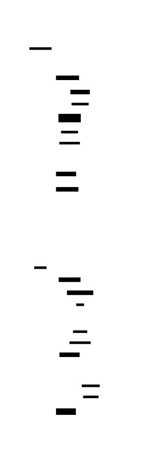

*Figure 31: COMMIT write-ordering protocol. Step 1: fsync(journal_fd) — ensures all journal entries are durable. Step 2: pool_flush_all — writes dirty pages to database file via pwrite. Step 3: fsync(db_fd) — ensures data pages are durable. Step 4: unlink(journal_path) — THE COMMIT POINT. Step 5: fsync(directory) — ensures unlink is durable. Arrows show the strict ordering: each step MUST complete before the next begins. A crash at any point between steps leaves the system in a recoverable state (journal still exists → recovery replays it).*
### 4.5 `txn_rollback`
```c
int txn_rollback(TransactionManager *txn, BufferPool *pool);
```
**Preconditions:** `txn->state == TXN_ACTIVE` or `txn->state == TXN_DIRTY`.
**Postconditions (on success, returns 0):**
- If `TXN_ACTIVE`: `txn->state = TXN_NONE`. No I/O.
- If `TXN_DIRTY`:
  1. Read journal header → extract `checksum_nonce` and `db_page_count_at_start`.
  2. Seek to `JOURNAL_HEADER_SIZE` in the journal file.
  3. For each entry: read `(page_id, page_data)`, verify checksum. If valid: `pwrite(pool->fd, page_data, PAGE_SIZE, (off_t)page_id * PAGE_SIZE)`.
  4. Truncate database file to `db_page_count_at_start * PAGE_SIZE` (remove pages allocated during the rolled-back transaction).
  5. `fsync(pool->fd)`.
  6. Invalidate all dirty pages in the buffer pool: for each frame, if `is_dirty`, reload from disk.
  7. Close and delete journal file. fsync directory.
  8. Free `txn->journaled_pages`. `txn->state = TXN_NONE`.
**Buffer pool cache invalidation after rollback:**
After restoring pages on disk, the buffer pool may still hold modified versions in memory. For each frame in the pool:
```c
for (int i = 0; i < pool->pool_size; i++) {
    Frame *f = &pool->frames[i];
    if (f->page_id != INVALID_PAGE_ID && f->is_dirty) {
        disk_read_page(pool, f->page_id, f->data);  /* reload from disk */
        f->is_dirty = false;
    }
}
```
### 4.6 `txn_recover`
```c
int txn_recover(TransactionManager *txn, BufferPool *pool);
```
**Preconditions:** Called during database open, before any user operations. `txn->state == TXN_NONE`.
**Postconditions (on success, returns 0):**
- If no journal file exists: no-op, return 0.
- If journal file exists:
  1. Open journal file for reading.
  2. Read header. Validate magic bytes. If magic mismatch: delete journal (corrupt/foreign file), return 0.
  3. Check `page_count`:
     - If `page_count == 0`: transaction was committed before crash deleted the journal. Delete journal, return 0.
     - If `page_count == -1` (hot journal): proceed with recovery.
  4. Read `checksum_nonce` and `db_page_count_at_start`.
  5. Seek to `JOURNAL_HEADER_SIZE`. Read entries one by one:
     - For each entry: validate checksum. If checksum fails (torn write), stop processing — treat remaining entries as lost.
     - For valid entries: `pwrite(pool->fd, page_data, PAGE_SIZE, page_id * PAGE_SIZE)`.
  6. Truncate database file to `db_page_count_at_start * PAGE_SIZE`.
  7. `fsync(pool->fd)`.
  8. Close and delete journal file. fsync directory.
  9. Return 0.
**Error (returns -1):** I/O failure during read/write/fsync. Journal magic mismatch is not an error — it's a "not our journal" condition handled by deletion.

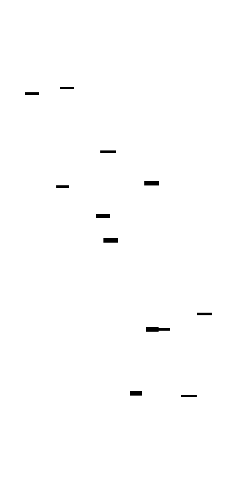

*Figure 32: Crash recovery decision tree. Entry: database open. Step 1: does journal_path file exist? No → return 0 (clean state). Yes → open and read header. Step 2: magic match? No → delete journal (foreign file), return 0. Yes → check page_count. Step 3: page_count == 0? Yes → delete journal (already committed), return 0. page_count == -1? Yes → HOT JOURNAL. Step 4: read entries. For each entry: checksum valid? Yes → pwrite original page to database file. No → stop (torn entry). Step 5: truncate database to db_page_count_at_start pages. fsync database. Delete journal. fsync directory. Return 0.*
### 4.7 `txn_attach_to_pool`
```c
void txn_attach_to_pool(TransactionManager *txn, BufferPool *pool);
```
**Postconditions:**
- `pool->txn_manager = txn`.
- `pool->txn_journal_page = txn_journal_page_hook` (a static function that casts `void*` to `TransactionManager*` and calls `txn_journal_page`).
The hook function:
```c
static int txn_journal_page_hook(void *txn_mgr, void *pool_ptr,
                                  page_id_t page_id) {
    TransactionManager *txn = (TransactionManager *)txn_mgr;
    BufferPool *pool = (BufferPool *)pool_ptr;
    if (txn->state == TXN_NONE) return 0;  /* autocommit: no journal */
    return txn_journal_page(txn, pool, page_id);
}
```
This hook is called by the buffer pool in three places:
1. `pool_unpin_page(pool, page_id, true)` — before setting `frame->is_dirty = true`.
2. `pool_mark_dirty(pool, page_id)` — before setting dirty flag.
3. `evict_frame(pool, frame_id)` — before `disk_write_page` for a dirty frame (this is already in M4, §5.3).
---
## 5. Algorithm Specifications
### 5.1 Journal File Creation (First Write in Transaction)
```
PROCEDURE create_journal(txn, pool):
    // Generate random checksum nonce
    txn->checksum_nonce = (uint32_t)time(NULL) ^ (uint32_t)getpid()
                          ^ (uint32_t)(uintptr_t)txn
    // Determine current database page count
    file_size = lseek(pool->fd, 0, SEEK_END)
    txn->db_page_count_at_start = (uint32_t)(file_size / PAGE_SIZE)
    // Open journal file (create, truncate)
    txn->journal_fd = open(txn->journal_path,
                            O_RDWR | O_CREAT | O_TRUNC, 0644)
    IF txn->journal_fd < 0:
        RETURN -1
    // Write header with page_count = -1 (hot journal marker)
    JournalHeader hdr
    memcpy(hdr.magic, JOURNAL_MAGIC, 8)
    hdr.page_count = -1
    hdr.page_size = PAGE_SIZE
    hdr.sector_size = 512
    hdr.db_page_count = txn->db_page_count_at_start
    hdr.checksum_nonce = txn->checksum_nonce
    journal_write_header(txn->journal_fd, &hdr)
    // Ensure header is durable BEFORE any database modification
    fsync(txn->journal_fd)
    // Ensure directory entry for journal file is durable
    dir_fd = open(".", O_RDONLY)
    IF dir_fd >= 0:
        fsync(dir_fd)
        close(dir_fd)
    // Initialize journaled_pages bitmap
    initial_cap = txn->db_page_count_at_start + 256
    IF initial_cap < 256: initial_cap = 256
    txn->journaled_pages = calloc(initial_cap, sizeof(bool))
    txn->journaled_capacity = initial_cap
    txn->journal_write_offset = JOURNAL_HEADER_SIZE
    txn->journal_entry_count = 0
    txn->state = TXN_DIRTY
    RETURN 0
```
### 5.2 `txn_journal_page` — Full Procedure
```
PROCEDURE txn_journal_page(txn, pool, page_id):
    // State check
    IF txn->state == TXN_NONE:
        RETURN 0    // not in a transaction; autocommit mode
    // If TXN_ACTIVE and journal not yet created: create it
    IF txn->state == TXN_ACTIVE:
        rc = create_journal(txn, pool)
        IF rc != 0: RETURN -1
        // state is now TXN_DIRTY
    // Check if already journaled (idempotent guard)
    IF page_id < txn->journaled_capacity AND txn->journaled_pages[page_id]:
        RETURN 0    // already in journal
    // Grow bitmap if needed
    IF page_id >= txn->journaled_capacity:
        new_cap = (int)page_id + 256
        txn->journaled_pages = realloc(txn->journaled_pages,
                                        new_cap * sizeof(bool))
        memset(txn->journaled_pages + txn->journaled_capacity, 0,
               (new_cap - txn->journaled_capacity) * sizeof(bool))
        txn->journaled_capacity = new_cap
    // Check if page exists on disk (newly allocated pages don't need journaling)
    IF page_id >= txn->db_page_count_at_start:
        // New page — will be removed by truncation on rollback
        txn->journaled_pages[page_id] = true
        RETURN 0
    // Read ORIGINAL page data from DATABASE FILE (not buffer pool!)
    uint8_t original[PAGE_SIZE]
    off_t offset = (off_t)page_id * PAGE_SIZE
    ssize_t bytes = pread(pool->fd, original, PAGE_SIZE, offset)
    IF bytes < PAGE_SIZE:
        IF bytes < 0: RETURN -1    // I/O error
        // Short read: page partially exists. Zero-fill remainder.
        memset(original + bytes, 0, PAGE_SIZE - bytes)
    // Compute checksum
    uint32_t cksum = journal_checksum(original, PAGE_SIZE,
                                       txn->checksum_nonce)
    // Write journal entry
    rc = journal_write_entry(txn->journal_fd,
                              txn->journal_write_offset,
                              page_id, original, txn->checksum_nonce)
    IF rc != 0: RETURN -1
    txn->journal_write_offset += JOURNAL_ENTRY_SIZE
    txn->journal_entry_count++
    txn->journaled_pages[page_id] = true
    RETURN 0
```
### 5.3 `journal_write_entry` Implementation
```c
int journal_write_entry(int fd, off_t offset,
                        page_id_t page_id, const uint8_t *page_data,
                        uint32_t checksum_nonce) {
    uint8_t id_buf[4];
    write_be32(id_buf, page_id);
    if (pwrite(fd, id_buf, 4, offset) != 4) return -1;
    if (pwrite(fd, page_data, PAGE_SIZE, offset + 4) != PAGE_SIZE) return -1;
    uint32_t cksum = journal_checksum(page_data, PAGE_SIZE, checksum_nonce);
    uint8_t cksum_buf[4];
    write_be32(cksum_buf, cksum);
    if (pwrite(fd, cksum_buf, 4, offset + 4 + PAGE_SIZE) != 4) return -1;
    return 0;
}
```
### 5.4 `journal_read_entry` Implementation
```c
int journal_read_entry(int fd, off_t offset, uint32_t checksum_nonce,
                       page_id_t *out_page_id, uint8_t *out_page_data) {
    uint8_t id_buf[4];
    ssize_t bytes = pread(fd, id_buf, 4, offset);
    if (bytes < 4) return -1;  /* EOF or truncated */
    *out_page_id = read_be32(id_buf);
    bytes = pread(fd, out_page_data, PAGE_SIZE, offset + 4);
    if (bytes < PAGE_SIZE) return -1;  /* truncated entry */
    uint8_t cksum_buf[4];
    bytes = pread(fd, cksum_buf, 4, offset + 4 + PAGE_SIZE);
    if (bytes < 4) return -1;
    uint32_t stored_cksum = read_be32(cksum_buf);
    uint32_t computed_cksum = journal_checksum(out_page_data, PAGE_SIZE,
                                                checksum_nonce);
    if (stored_cksum != computed_cksum) return -2;  /* checksum mismatch */
    return 0;
}
```
### 5.5 `txn_commit` — Full Procedure
```
PROCEDURE txn_commit(txn, pool):
    IF txn->state == TXN_NONE:
        RETURN -1   // error: no active transaction
    IF txn->state == TXN_ACTIVE:
        // No writes occurred — clean exit
        txn->state = TXN_NONE
        RETURN 0
    // state == TXN_DIRTY
    // Step 1: Ensure all journal entries are durable
    fsync(txn->journal_fd)
    // Step 2: Flush all dirty pages from buffer pool to database file
    rc = pool_flush_all(pool)
    IF rc != 0: RETURN -1
    // pool_flush_all already calls fsync(pool->fd)
    // Step 3: Close journal file descriptor
    close(txn->journal_fd)
    txn->journal_fd = -1
    // Step 4: Delete journal file — THIS IS THE COMMIT POINT
    unlink(txn->journal_path)
    // Step 5: fsync directory to ensure deletion is durable
    dir_fd = open(".", O_RDONLY)
    IF dir_fd >= 0:
        fsync(dir_fd)
        close(dir_fd)
    // Step 6: Clean up transaction state
    free(txn->journaled_pages)
    txn->journaled_pages = NULL
    txn->journaled_capacity = 0
    txn->journal_entry_count = 0
    txn->journal_write_offset = 0
    txn->checksum_nonce = 0
    txn->state = TXN_NONE
    RETURN 0
```
### 5.6 `txn_rollback` — Full Procedure
```
PROCEDURE txn_rollback(txn, pool):
    IF txn->state == TXN_NONE:
        RETURN -1
    IF txn->state == TXN_ACTIVE:
        txn->state = TXN_NONE
        RETURN 0
    // state == TXN_DIRTY — replay journal to restore original pages
    // Step 1: Read journal header
    JournalHeader hdr
    lseek(txn->journal_fd, 0, SEEK_SET)
    journal_read_header(txn->journal_fd, &hdr)
    // Step 2: Read and replay entries
    off_t read_offset = JOURNAL_HEADER_SIZE
    int restored = 0
    uint8_t page_buf[PAGE_SIZE]
    page_id_t pid
    WHILE true:
        rc = journal_read_entry(txn->journal_fd, read_offset,
                                 hdr.checksum_nonce, &pid, page_buf)
        IF rc == -1: BREAK   // EOF or truncated — stop
        IF rc == -2: BREAK   // checksum mismatch — torn write, stop
        // Write original page back to database file
        pwrite(pool->fd, page_buf, PAGE_SIZE,
               (off_t)pid * PAGE_SIZE)
        restored++
        read_offset += JOURNAL_ENTRY_SIZE
    // Step 3: Truncate database to pre-transaction size
    ftruncate(pool->fd, (off_t)hdr.db_page_count * PAGE_SIZE)
    // Step 4: fsync database file
    fsync(pool->fd)
    // Step 5: Invalidate dirty pages in buffer pool cache
    FOR i = 0 TO pool->pool_size - 1:
        Frame *f = &pool->frames[i]
        IF f->page_id != INVALID_PAGE_ID AND f->is_dirty:
            disk_read_page(pool, f->page_id, f->data)
            f->is_dirty = false
    // Step 6: Close and delete journal
    close(txn->journal_fd)
    txn->journal_fd = -1
    unlink(txn->journal_path)
    dir_fd = open(".", O_RDONLY)
    IF dir_fd >= 0: fsync(dir_fd); close(dir_fd)
    // Step 7: Clean up
    free(txn->journaled_pages)
    txn->journaled_pages = NULL
    txn->journaled_capacity = 0
    txn->journal_entry_count = 0
    txn->journal_write_offset = 0
    txn->checksum_nonce = 0
    txn->state = TXN_NONE
    RETURN 0
```
### 5.7 `txn_recover` — Full Procedure
```
PROCEDURE txn_recover(txn, pool):
    // Check for journal file
    IF access(txn->journal_path, F_OK) != 0:
        RETURN 0    // no journal — clean state
    // Open journal for reading
    jfd = open(txn->journal_path, O_RDONLY)
    IF jfd < 0:
        // Cannot open — remove and continue (best effort)
        unlink(txn->journal_path)
        RETURN 0
    // Read header
    JournalHeader hdr
    rc = journal_read_header(jfd, &hdr)
    IF rc != 0:
        // Incomplete header — journal was being created when crash hit
        close(jfd)
        unlink(txn->journal_path)
        RETURN 0
    // Validate magic
    IF memcmp(hdr.magic, JOURNAL_MAGIC, 8) != 0:
        // Not our journal file
        close(jfd)
        unlink(txn->journal_path)
        RETURN 0
    // Check page_count
    IF hdr.page_count == 0:
        // Committed transaction — journal should have been deleted
        close(jfd)
        unlink(txn->journal_path)
        RETURN 0
    // hdr.page_count == -1 → HOT JOURNAL — replay
    // Validate page_size
    IF hdr.page_size != PAGE_SIZE:
        close(jfd)
        RETURN -1    // page size mismatch — cannot recover
    // Read and replay entries
    off_t read_offset = JOURNAL_HEADER_SIZE
    int restored = 0
    uint8_t page_buf[PAGE_SIZE]
    page_id_t pid
    WHILE true:
        rc = journal_read_entry(jfd, read_offset, hdr.checksum_nonce,
                                 &pid, page_buf)
        IF rc == -1: BREAK   // EOF
        IF rc == -2: BREAK   // checksum mismatch — torn write
        pwrite(pool->fd, page_buf, PAGE_SIZE,
               (off_t)pid * PAGE_SIZE)
        restored++
        read_offset += JOURNAL_ENTRY_SIZE
    // Truncate database to pre-transaction size
    ftruncate(pool->fd, (off_t)hdr.db_page_count * PAGE_SIZE)
    // fsync database
    fsync(pool->fd)
    // Delete journal
    close(jfd)
    unlink(txn->journal_path)
    dir_fd = open(".", O_RDONLY)
    IF dir_fd >= 0: fsync(dir_fd); close(dir_fd)
    RETURN 0
```
---
## 6. Error Handling Matrix
| Error | Detected By | Recovery | User-Visible? |
|-------|-------------|----------|---------------|
| `txn_begin` when transaction already active | State check `txn->state != TXN_NONE` | Return -1 with error message | Yes |
| `txn_commit`/`txn_rollback` when no transaction | State check `txn->state == TXN_NONE` | Return -1 | Yes |
| `open()` fails during journal creation | Return value `< 0` | Set `txn->state` back to `TXN_ACTIVE`; return -1 | Yes — "cannot create journal" |
| `pread()` fails reading original page | Return value `< 0` | Return -1; transaction remains `TXN_DIRTY` (caller should rollback) | Yes |
| `pwrite()` fails writing journal entry | Return value `!= expected` | Return -1; transaction inconsistent (rollback required) | Yes |
| `fsync()` fails | Return value `< 0` | Return -1; caller decides retry or abort | Yes |
| `unlink()` fails (journal deletion) | Return value `< 0` | Log warning; journal persists until next open (recovery will handle) | No — next open recovers |
| Journal magic mismatch during recovery | `memcmp` check | Delete foreign file, return 0 | No |
| Journal `page_count == 0` during recovery | Value check | Delete journal (already committed), return 0 | No |
| Journal `page_size != PAGE_SIZE` during recovery | Value check | Return -1 (incompatible journal) | Yes — fatal |
| Truncated journal entry during recovery | `journal_read_entry` returns -1 | Stop processing; replay only complete entries | No — partial recovery |
| Checksum mismatch during recovery | `journal_read_entry` returns -2 | Stop processing; replay only entries before the mismatch | No |
| `realloc` failure for journaled_pages bitmap | Return NULL | `fprintf(stderr, ...) + exit(EXIT_FAILURE)` (fatal OOM) | Fatal |
| Double-unpin of a page during transaction | Buffer pool assertion (M4) | Debug: assert. Release: log warning | Debug: abort |
| Newly allocated page journaled (beyond db_page_count_at_start) | `page_id >= db_page_count_at_start` check | Mark as journaled in bitmap but skip journal entry; truncation on rollback removes these pages | No |
---
## 7. Buffer Pool Integration
### 7.1 Modified `pool_unpin_page`
```c
void pool_unpin_page(BufferPool *pool, page_id_t page_id, bool is_dirty) {
    int frame_idx = page_table_lookup(pool, page_id);
    if (frame_idx == INVALID_FRAME_ID) {
        fprintf(stderr, "unpin: page %u not in pool\n", page_id);
        return;
    }
    Frame *f = &pool->frames[frame_idx];
    assert(f->pin_count > 0);
    f->pin_count--;
    if (is_dirty) {
        /* TRANSACTION HOOK: journal original page BEFORE marking dirty */
        if (pool->txn_journal_page != NULL && !f->is_dirty) {
            /* Only journal on the FIRST dirty marking — subsequent unpins
               with dirty=true for the same page don't re-journal. */
            pool->txn_journal_page(pool->txn_manager, pool, page_id);
        }
        f->is_dirty = true;
    }
}
```
**Key guard: `!f->is_dirty`**: The journal hook is only called the FIRST time a page transitions from clean to dirty within a transaction. Subsequent dirty-unpins of the same page are safe — the original was already journaled.
### 7.2 Modified `pool_mark_dirty`
```c
void pool_mark_dirty(BufferPool *pool, page_id_t page_id) {
    int frame_idx = page_table_lookup(pool, page_id);
    if (frame_idx == INVALID_FRAME_ID) return;
    Frame *f = &pool->frames[frame_idx];
    if (!f->is_dirty) {
        if (pool->txn_journal_page != NULL) {
            pool->txn_journal_page(pool->txn_manager, pool, page_id);
        }
        f->is_dirty = true;
    }
}
```
### 7.3 Modified `evict_frame`
The eviction path from M4 already has a hook call. It must also fsync the journal before writing the dirty page to disk:
```c
static void evict_frame(BufferPool *pool, int frame_idx) {
    Frame *f = &pool->frames[frame_idx];
    if (f->is_dirty) {
        /* Journal hook (already journaled pages are no-op) */
        if (pool->txn_journal_page != NULL) {
            pool->txn_journal_page(pool->txn_manager, pool, f->page_id);
        }
        /* Critical: fsync journal BEFORE writing dirty page to database.
           The TransactionManager's journal_fd must be accessible.
           Since txn_manager is void*, we trust the hook ensured durability.
           In practice, the hook calls txn_journal_page which writes the entry.
           We need an explicit fsync here. */
        TransactionManager *txn = (TransactionManager *)pool->txn_manager;
        if (txn && txn->state == TXN_DIRTY && txn->journal_fd >= 0) {
            fsync(txn->journal_fd);
        }
        disk_write_page(pool, f->page_id, f->data);
        pool->stat_disk_writes++;
        f->is_dirty = false;
    }
    page_table_remove(pool, f->page_id);
    lru_remove(pool, frame_idx);
    f->page_id = INVALID_PAGE_ID;
    pool->stat_evictions++;
}
```
**The per-eviction fsync is expensive.** Each fsync costs ~50-200 µs on SSD. This is the price of crash safety with a small buffer pool. The mitigation: keep the buffer pool large enough that mid-transaction eviction of dirty pages is rare. SQLite addresses this with a "cache spill" threshold; for M9, the per-eviction fsync is correct and sufficient.
---
## 8. Implementation Sequence with Checkpoints
### Phase 1 — Journal File Format: Header and Entry I/O (2 hours)
**Deliverables:**
1. `src/journal.h` with all constants, `JOURNAL_MAGIC`, `JournalHeader`, `JournalEntry` structs, all function declarations.
2. `src/journal.c` with `journal_checksum`, `journal_write_header`, `journal_read_header`, `journal_write_entry`, `journal_read_entry`.
**Implementation order:**
1. Define `JOURNAL_MAGIC`, `JOURNAL_HEADER_SIZE`, `JOURNAL_ENTRY_SIZE` constants.
2. Define `JournalHeader` struct.
3. Implement `journal_checksum` — Jenkins one-at-a-time hash with nonce.
4. Implement `journal_write_header`:
   ```c
   int journal_write_header(int fd, const JournalHeader *hdr) {
       uint8_t buf[JOURNAL_HEADER_SIZE];
       memset(buf, 0, JOURNAL_HEADER_SIZE);
       memcpy(buf + 0, hdr->magic, 8);
       write_be32(buf + 8,  (uint32_t)hdr->page_count);
       write_be32(buf + 12, hdr->page_size);
       write_be32(buf + 16, hdr->sector_size);
       write_be32(buf + 20, hdr->db_page_count);
       write_be32(buf + 24, hdr->checksum_nonce);
       ssize_t bytes = pwrite(fd, buf, JOURNAL_HEADER_SIZE, 0);
       return (bytes == JOURNAL_HEADER_SIZE) ? 0 : -1;
   }
   ```
5. Implement `journal_read_header`:
   ```c
   int journal_read_header(int fd, JournalHeader *hdr) {
       uint8_t buf[JOURNAL_HEADER_SIZE];
       ssize_t bytes = pread(fd, buf, JOURNAL_HEADER_SIZE, 0);
       if (bytes < JOURNAL_HEADER_SIZE) return -1;
       memcpy(hdr->magic, buf, 8);
       hdr->page_count     = (int32_t)read_be32(buf + 8);
       hdr->page_size      = read_be32(buf + 12);
       hdr->sector_size    = read_be32(buf + 16);
       hdr->db_page_count  = read_be32(buf + 20);
       hdr->checksum_nonce = read_be32(buf + 24);
       return 0;
   }
   ```
6. Implement `journal_write_entry` and `journal_read_entry` per §5.3 and §5.4.
**Checkpoint:**
```c
/* Create a temporary file and write/read a journal header */
int fd = open("/tmp/test_journal.db-journal", O_RDWR | O_CREAT | O_TRUNC, 0644);
assert(fd >= 0);
JournalHeader hdr_out;
memcpy(hdr_out.magic, JOURNAL_MAGIC, 8);
hdr_out.page_count = -1;
hdr_out.page_size = PAGE_SIZE;
hdr_out.sector_size = 512;
hdr_out.db_page_count = 42;
hdr_out.checksum_nonce = 0xDEADBEEF;
assert(journal_write_header(fd, &hdr_out) == 0);
JournalHeader hdr_in;
assert(journal_read_header(fd, &hdr_in) == 0);
assert(memcmp(hdr_in.magic, JOURNAL_MAGIC, 8) == 0);
assert(hdr_in.page_count == -1);
assert(hdr_in.page_size == PAGE_SIZE);
assert(hdr_in.db_page_count == 42);
assert(hdr_in.checksum_nonce == 0xDEADBEEF);
/* Write and read an entry */
uint8_t original_data[PAGE_SIZE];
memset(original_data, 0xAB, PAGE_SIZE);
assert(journal_write_entry(fd, JOURNAL_HEADER_SIZE,
                            /*page_id=*/5, original_data,
                            hdr_out.checksum_nonce) == 0);
page_id_t read_pid;
uint8_t read_data[PAGE_SIZE];
int rc = journal_read_entry(fd, JOURNAL_HEADER_SIZE,
                             hdr_out.checksum_nonce,
                             &read_pid, read_data);
assert(rc == 0);
assert(read_pid == 5);
assert(memcmp(read_data, original_data, PAGE_SIZE) == 0);
/* Checksum verification: corrupt one byte, expect mismatch */
uint8_t bad = 0xFF;
pwrite(fd, &bad, 1, JOURNAL_HEADER_SIZE + 4 + 10);  /* corrupt page data */
rc = journal_read_entry(fd, JOURNAL_HEADER_SIZE,
                         hdr_out.checksum_nonce, &read_pid, read_data);
assert(rc == -2);  /* checksum mismatch */
close(fd);
unlink("/tmp/test_journal.db-journal");
printf("Phase 1 checkpoint: PASS\n");
```
### Phase 2 — Transaction Begin/Rollback/Commit Lifecycle (2 hours)
**Deliverables:**
1. `src/txn.h` with `TxnState`, `TransactionManager`, all public API declarations.
2. `src/txn.c` with `txn_init`, `txn_destroy`, `txn_begin`, `txn_journal_page` (including `create_journal`), `txn_commit`, `txn_rollback`.
**Implementation order:**
1. Implement `txn_init` — zero state, build journal path.
2. Implement `txn_begin` — state check, set `TXN_ACTIVE`.
3. Implement `create_journal` (static) per §5.1.
4. Implement `txn_journal_page` per §5.2.
5. Implement `txn_commit` per §5.5.
6. Implement `txn_rollback` per §5.6.
7. Implement `txn_destroy` — if state is dirty, rollback first; then free bitmap.
**Checkpoint:**
```c
/* Using real files for this test (not mock disk) */
const char *db_path = "/tmp/test_txn.db";
int db_fd = open(db_path, O_RDWR | O_CREAT | O_TRUNC, 0644);
assert(db_fd >= 0);
/* Write 3 pages of known data to the database file */
uint8_t page_data[PAGE_SIZE];
for (int i = 0; i < 3; i++) {
    memset(page_data, (uint8_t)(i + 1), PAGE_SIZE);
    pwrite(db_fd, page_data, PAGE_SIZE, (off_t)i * PAGE_SIZE);
}
fsync(db_fd);
/* Create a BufferPool on this file */
BufferPool *pool = pool_create(db_path, 10);
assert(pool != NULL);
/* Initialize TransactionManager */
TransactionManager txn;
txn_init(&txn, db_path);
assert(txn.state == TXN_NONE);
assert(txn.journal_fd == -1);
/* BEGIN */
assert(txn_begin(&txn) == 0);
assert(txn.state == TXN_ACTIVE);
/* Double-BEGIN should fail */
assert(txn_begin(&txn) == -1);
/* Journal file does not exist yet */
char jpath[256];
snprintf(jpath, sizeof(jpath), "%s-journal", db_path);
assert(access(jpath, F_OK) != 0);
/* Journal page 1 → creates journal file, transitions to TXN_DIRTY */
assert(txn_journal_page(&txn, pool, 1) == 0);
assert(txn.state == TXN_DIRTY);
assert(access(jpath, F_OK) == 0);  /* journal exists now */
assert(txn.journal_entry_count == 1);
/* Journal page 1 again → no-op (idempotent) */
assert(txn_journal_page(&txn, pool, 1) == 0);
assert(txn.journal_entry_count == 1);  /* still 1 */
/* Journal page 2 → new entry */
assert(txn_journal_page(&txn, pool, 2) == 0);
assert(txn.journal_entry_count == 2);
/* ROLLBACK */
assert(txn_rollback(&txn, pool) == 0);
assert(txn.state == TXN_NONE);
assert(access(jpath, F_OK) != 0);  /* journal deleted */
/* Verify pages on disk are still original */
uint8_t verify[PAGE_SIZE];
pread(pool->fd, verify, PAGE_SIZE, 1 * PAGE_SIZE);
for (int j = 0; j < PAGE_SIZE; j++) assert(verify[j] == 2);  /* page 1 = 0x02 */
pread(pool->fd, verify, PAGE_SIZE, 2 * PAGE_SIZE);
for (int j = 0; j < PAGE_SIZE; j++) assert(verify[j] == 3);  /* page 2 = 0x03 */
pool_destroy(pool);
close(db_fd);
unlink(db_path);
printf("Phase 2 checkpoint: PASS\n");
```
### Phase 3 — Buffer Pool Write Path Integration (2 hours)
**Deliverables:**
1. `txn_attach_to_pool` in `txn.c`.
2. Modified `pool_unpin_page`, `pool_mark_dirty`, `evict_frame` in `pager.c` to call the journal hook.
**Implementation order:**
1. Implement `txn_journal_page_hook` (static in `txn.c`).
2. Implement `txn_attach_to_pool`.
3. Modify `pool_unpin_page` to call hook before setting dirty flag (guard: only on first dirty transition).
4. Modify `pool_mark_dirty` — same guard.
5. Modify `evict_frame` — call hook + fsync journal before `disk_write_page`.
**Checkpoint:**
```c
/* Integration test: buffer pool automatically journals when marking dirty */
const char *db_path = "/tmp/test_txn_bp.db";
BufferPool *pool = pool_create(db_path, 10);
TransactionManager txn;
txn_init(&txn, db_path);
txn_attach_to_pool(&txn, pool);
/* Write initial page to disk */
page_id_t pid = pool_new_page(pool);
uint8_t *data = pool_fetch_page(pool, pid);
memset(data, 0x42, PAGE_SIZE);
pool_unpin_page(pool, pid, true);
pool_flush_all(pool);
/* BEGIN transaction */
txn_begin(&txn);
/* Modify the page through the buffer pool */
data = pool_fetch_page(pool, pid);
memset(data, 0xBB, PAGE_SIZE);
pool_unpin_page(pool, pid, true);
/* The journal hook should have fired — journal file exists */
char jpath[256];
snprintf(jpath, sizeof(jpath), "%s-journal", db_path);
assert(access(jpath, F_OK) == 0);
assert(txn.state == TXN_DIRTY);
assert(txn.journal_entry_count == 1);
/* ROLLBACK */
txn_rollback(&txn, pool);
/* Page should be restored to 0x42 */
data = pool_fetch_page(pool, pid);
assert(data[0] == 0x42);
assert(data[PAGE_SIZE - 1] == 0x42);
pool_unpin_page(pool, pid, false);
pool_destroy(pool);
unlink(db_path);
printf("Phase 3 checkpoint: PASS\n");
```
### Phase 4 — COMMIT: Flush Ordering and Journal Deletion (1 hour)
**Deliverables:** Full `txn_commit` implementation with correct ordering (already implemented in Phase 2; this phase focuses on verification and edge cases).
**Implementation order:**
1. Verify ordering: journal fsync → pool_flush_all → unlink.
2. Test: commit with no modifications (TXN_ACTIVE → TXN_NONE).
3. Test: commit after modifying multiple pages — verify mock disk `write_count`.
4. Test: verify journal file is deleted after commit.
5. Test: verify database file contains the new page contents after commit.
**Checkpoint:**
```c
const char *db_path = "/tmp/test_commit.db";
BufferPool *pool = pool_create(db_path, 10);
TransactionManager txn;
txn_init(&txn, db_path);
txn_attach_to_pool(&txn, pool);
/* Setup: page 0 = 0x11, page 1 = 0x22 */
for (int i = 0; i < 2; i++) {
    page_id_t pid = pool_new_page(pool);
    uint8_t *d = pool_fetch_page(pool, pid);
    memset(d, (uint8_t)((i + 1) * 0x11), PAGE_SIZE);
    pool_unpin_page(pool, pid, true);
}
pool_flush_all(pool);
/* Transaction: modify both pages */
txn_begin(&txn);
uint8_t *d0 = pool_fetch_page(pool, 0);
memset(d0, 0xAA, PAGE_SIZE);
pool_unpin_page(pool, 0, true);
uint8_t *d1 = pool_fetch_page(pool, 1);
memset(d1, 0xBB, PAGE_SIZE);
pool_unpin_page(pool, 1, true);
/* COMMIT */
assert(txn_commit(&txn, pool) == 0);
assert(txn.state == TXN_NONE);
/* Journal should be deleted */
char jpath[256];
snprintf(jpath, sizeof(jpath), "%s-journal", db_path);
assert(access(jpath, F_OK) != 0);
/* Database file should have new data */
uint8_t verify[PAGE_SIZE];
pread(pool->fd, verify, PAGE_SIZE, 0);
assert(verify[0] == 0xAA);
pread(pool->fd, verify, PAGE_SIZE, PAGE_SIZE);
assert(verify[0] == 0xBB);
/* Commit with no modifications */
txn_begin(&txn);
assert(txn_commit(&txn, pool) == 0);
assert(access(jpath, F_OK) != 0);  /* no journal created */
pool_destroy(pool);
unlink(db_path);
printf("Phase 4 checkpoint: PASS\n");
```
### Phase 5 — Crash Recovery on Database Open (2 hours)
**Deliverables:** `txn_recover` in `txn.c`. Database open path calls `txn_recover` before any user operations.
**Implementation order:**
1. Implement `txn_recover` per §5.7.
2. Test: simulate crash by leaving a hot journal file, then call `txn_recover`.
3. Test: truncated journal (incomplete entry) — replay only complete entries.
4. Test: `page_count == 0` journal → delete without replay.
5. Test: invalid magic → delete without replay.
**Checkpoint:**
```c
const char *db_path = "/tmp/test_recover.db";
const char *jpath = "/tmp/test_recover.db-journal";
/* Phase 1: Build database and simulate crash */
{
    BufferPool *pool = pool_create(db_path, 10);
    TransactionManager txn;
    txn_init(&txn, db_path);
    txn_attach_to_pool(&txn, pool);
    /* Create page 0 with known content 0x42 */
    page_id_t p0 = pool_new_page(pool);
    uint8_t *d = pool_fetch_page(pool, p0);
    memset(d, 0x42, PAGE_SIZE);
    pool_unpin_page(pool, p0, true);
    pool_flush_all(pool);
    /* Start transaction, modify page 0 */
    txn_begin(&txn);
    d = pool_fetch_page(pool, p0);
    memset(d, 0xFF, PAGE_SIZE);
    pool_unpin_page(pool, p0, true);
    /* Flush dirty page to database (simulating eviction-during-crash) */
    pool_flush_all(pool);
    /* SIMULATE CRASH: close file descriptors without commit/rollback.
       Journal file remains on disk. */
    if (txn.journal_fd >= 0) {
        close(txn.journal_fd);
        txn.journal_fd = -1;
    }
    close(pool->fd);
    free(pool->frames[0].data - 0);  /* manual cleanup */
    /* (In real code, just _exit() or kill -9 the process) */
}
/* Verify: database file has MODIFIED data (0xFF) */
{
    int fd = open(db_path, O_RDONLY);
    uint8_t check[PAGE_SIZE];
    pread(fd, check, PAGE_SIZE, 0);
    assert(check[0] == 0xFF);  /* modified, pre-recovery */
    close(fd);
}
/* Verify: journal file exists */
assert(access(jpath, F_OK) == 0);
/* Phase 2: Re-open with recovery */
{
    BufferPool *pool = pool_create(db_path, 10);
    TransactionManager txn;
    txn_init(&txn, db_path);
    /* Run recovery */
    int rc = txn_recover(&txn, pool);
    assert(rc == 0);
    /* Journal should be deleted */
    assert(access(jpath, F_OK) != 0);
    /* Database should have ORIGINAL data (0x42) */
    uint8_t verify[PAGE_SIZE];
    pread(pool->fd, verify, PAGE_SIZE, 0);
    assert(verify[0] == 0x42);
    assert(verify[PAGE_SIZE - 1] == 0x42);
    pool_destroy(pool);
}
unlink(db_path);
printf("Phase 5 checkpoint: PASS\n");
```
---
## 9. Test Specifications
### M9-TS-01 — Journal File Created on First Page Write
```c
void test_journal_created_on_first_write(void) {
    const char *db_path = "/tmp/test_m9_ts01.db";
    BufferPool *pool = pool_create(db_path, 10);
    TransactionManager txn;
    txn_init(&txn, db_path);
    txn_attach_to_pool(&txn, pool);
    /* Allocate a page with known content */
    page_id_t p5 = pool_new_page(pool);
    uint8_t *d = pool_fetch_page(pool, p5);
    memset(d, 0x55, PAGE_SIZE);
    pool_unpin_page(pool, p5, true);
    pool_flush_all(pool);
    /* BEGIN */
    txn_begin(&txn);
    /* No journal yet */
    char jpath[256];
    snprintf(jpath, sizeof(jpath), "%s-journal", db_path);
    assert(access(jpath, F_OK) != 0);
    /* Modify page p5 */
    d = pool_fetch_page(pool, p5);
    memset(d, 0xEE, PAGE_SIZE);
    pool_unpin_page(pool, p5, true);
    /* Journal should now exist */
    assert(access(jpath, F_OK) == 0);
    /* Read journal and verify magic */
    int jfd = open(jpath, O_RDONLY);
    assert(jfd >= 0);
    uint8_t magic_buf[8];
    assert(pread(jfd, magic_buf, 8, 0) == 8);
    assert(memcmp(magic_buf, JOURNAL_MAGIC, 8) == 0);
    close(jfd);
    /* Read-only transaction never creates journal */
    txn_rollback(&txn, pool);  /* clean up */
    txn_begin(&txn);
    uint8_t *d_read = pool_fetch_page(pool, p5);
    /* Just read, no write */
    pool_unpin_page(pool, p5, false);
    assert(access(jpath, F_OK) != 0);  /* no journal */
    txn_commit(&txn, pool);
    pool_destroy(pool);
    unlink(db_path);
    printf("PASS: test_journal_created_on_first_write\n");
}
```
### M9-TS-02 — Journal Entry Contains Original Page Bytes
```c
void test_journal_entry_original_bytes(void) {
    const char *db_path = "/tmp/test_m9_ts02.db";
    BufferPool *pool = pool_create(db_path, 10);
    TransactionManager txn;
    txn_init(&txn, db_path);
    txn_attach_to_pool(&txn, pool);
    /* Create page 7 with pattern 0x01..0xFF repeating */
    for (int i = 0; i < 8; i++) pool_new_page(pool);  /* pages 0-7 */
    uint8_t *d = pool_fetch_page(pool, 7);
    for (int i = 0; i < PAGE_SIZE; i++) d[i] = (uint8_t)((i + 1) & 0xFF);
    pool_unpin_page(pool, 7, true);
    pool_flush_all(pool);
    /* Save original for comparison */
    uint8_t original[PAGE_SIZE];
    memcpy(original, d, PAGE_SIZE);  /* d may be stale after flush */
    pread(pool->fd, original, PAGE_SIZE, 7 * PAGE_SIZE);
    /* BEGIN and modify page 7 */
    txn_begin(&txn);
    d = pool_fetch_page(pool, 7);
    memset(d, 0xCC, PAGE_SIZE);  /* new bytes */
    pool_unpin_page(pool, 7, true);
    /* Read journal entry for page 7 */
    char jpath[256];
    snprintf(jpath, sizeof(jpath), "%s-journal", db_path);
    int jfd = open(jpath, O_RDONLY);
    assert(jfd >= 0);
    JournalHeader hdr;
    journal_read_header(jfd, &hdr);
    page_id_t pid;
    uint8_t entry_data[PAGE_SIZE];
    int rc = journal_read_entry(jfd, JOURNAL_HEADER_SIZE,
                                 hdr.checksum_nonce, &pid, entry_data);
    assert(rc == 0);
    assert(pid == 7);
    /* Journal entry must contain ORIGINAL bytes, not 0xCC */
    assert(memcmp(entry_data, original, PAGE_SIZE) == 0);
    assert(entry_data[0] != 0xCC);
    close(jfd);
    /* Same page written twice: only ONE journal entry */
    d = pool_fetch_page(pool, 7);
    memset(d, 0xDD, PAGE_SIZE);
    pool_unpin_page(pool, 7, true);
    assert(txn.journal_entry_count == 1);  /* still just 1 */
    txn_rollback(&txn, pool);
    pool_destroy(pool);
    unlink(db_path);
    printf("PASS: test_journal_entry_original_bytes\n");
}
```
### M9-TS-03 — COMMIT Deletes Journal and Flushes Dirty Pages
```c
void test_commit_deletes_journal(void) {
    const char *db_path = "/tmp/test_m9_ts03.db";
    BufferPool *pool = pool_create(db_path, 10);
    TransactionManager txn;
    txn_init(&txn, db_path);
    txn_attach_to_pool(&txn, pool);
    /* Create pages 3 and 7 */
    for (int i = 0; i < 8; i++) pool_new_page(pool);
    uint8_t *d3 = pool_fetch_page(pool, 3);
    memset(d3, 0x33, PAGE_SIZE);
    pool_unpin_page(pool, 3, true);
    uint8_t *d7 = pool_fetch_page(pool, 7);
    memset(d7, 0x77, PAGE_SIZE);
    pool_unpin_page(pool, 7, true);
    pool_flush_all(pool);
    /* Transaction: modify both */
    txn_begin(&txn);
    d3 = pool_fetch_page(pool, 3);
    memset(d3, 0xAA, PAGE_SIZE);
    pool_unpin_page(pool, 3, true);
    d7 = pool_fetch_page(pool, 7);
    memset(d7, 0xBB, PAGE_SIZE);
    pool_unpin_page(pool, 7, true);
    pool_reset_stats(pool);
    /* COMMIT */
    assert(txn_commit(&txn, pool) == 0);
    /* Dirty pages were flushed */
    PoolStats stats = pool_get_stats(pool);
    assert(stats.disk_writes >= 2);
    /* Journal deleted */
    char jpath[256];
    snprintf(jpath, sizeof(jpath), "%s-journal", db_path);
    assert(access(jpath, F_OK) != 0);
    /* Database contains new data */
    uint8_t verify[PAGE_SIZE];
    pread(pool->fd, verify, PAGE_SIZE, 3 * PAGE_SIZE);
    assert(verify[0] == 0xAA);
    pread(pool->fd, verify, PAGE_SIZE, 7 * PAGE_SIZE);
    assert(verify[0] == 0xBB);
    /* Commit with no modifications: no journal, no writes */
    txn_begin(&txn);
    pool_reset_stats(pool);
    assert(txn_commit(&txn, pool) == 0);
    stats = pool_get_stats(pool);
    assert(stats.disk_writes == 0);
    assert(access(jpath, F_OK) != 0);
    pool_destroy(pool);
    unlink(db_path);
    printf("PASS: test_commit_deletes_journal\n");
}
```
### M9-TS-04 — ROLLBACK Restores Original Pages from Journal
```c
void test_rollback_restores_pages(void) {
    const char *db_path = "/tmp/test_m9_ts04.db";
    BufferPool *pool = pool_create(db_path, 100);
    TransactionManager txn;
    txn_init(&txn, db_path);
    txn_attach_to_pool(&txn, pool);
    /* Create a B-tree table with 3 rows */
    page_id_t root = pool_new_page(pool);
    uint8_t *rp = pool_fetch_page(pool, root);
    page_init(rp, PAGE_TYPE_TABLE_LEAF);
    pool_unpin_page(pool, root, true);
    BTree tree = { .pool = pool, .root_page = root };
    for (int i = 1; i <= 3; i++) {
        ColumnValue cols[1] = {{ .type = COL_INTEGER, .u.i = i * 100 }};
        btree_insert(&tree, (int64_t)i, cols, 1);
    }
    pool_flush_all(pool);
    /* Save pre-transaction page content */
    uint8_t pre_txn_root[PAGE_SIZE];
    pread(pool->fd, pre_txn_root, PAGE_SIZE, root * PAGE_SIZE);
    /* Transaction: INSERT row 4 */
    txn_begin(&txn);
    ColumnValue new_col = { .type = COL_INTEGER, .u.i = 400 };
    btree_insert(&tree, 4, &new_col, 1);
    /* Verify row 4 is visible before rollback */
    page_id_t found_page;
    int found_cell;
    assert(btree_search(&tree, 4, &found_page, &found_cell) == 1);
    /* ROLLBACK */
    assert(txn_rollback(&txn, pool) == 0);
    /* Row 4 should NOT be visible */
    assert(btree_search(&tree, 4, &found_page, &found_cell) == 0);
    /* Original 3 rows still present */
    for (int i = 1; i <= 3; i++) {
        assert(btree_search(&tree, (int64_t)i, &found_page, &found_cell) == 1);
    }
    /* Full scan: exactly 3 rows */
    BTreeCursor *cur = btree_cursor_open(&tree);
    assert(btree_cursor_first(cur) == 0);
    int count = 0;
    do { count++; } while (btree_cursor_next(cur) == 0);
    assert(count == 3);
    btree_cursor_close(cur);
    /* ROLLBACK of empty transaction: no-op */
    txn_begin(&txn);
    assert(txn_rollback(&txn, pool) == 0);
    assert(txn.state == TXN_NONE);
    pool_destroy(pool);
    unlink(db_path);
    printf("PASS: test_rollback_restores_pages\n");
}
```
### M9-TS-05 — Crash Recovery: Stale Journal Replayed on Database Open
```c
void test_crash_recovery(void) {
    const char *db_path = "/tmp/test_m9_ts05.db";
    const char *jpath   = "/tmp/test_m9_ts05.db-journal";
    /* Phase 1: Create database with known state, then simulate crash */
    {
        BufferPool *pool = pool_create(db_path, 10);
        TransactionManager txn;
        txn_init(&txn, db_path);
        txn_attach_to_pool(&txn, pool);
        /* Create 2 pages: page 0 = 0x11, page 1 = 0x22 */
        pool_new_page(pool); pool_new_page(pool);
        uint8_t *d0 = pool_fetch_page(pool, 0);
        memset(d0, 0x11, PAGE_SIZE);
        pool_unpin_page(pool, 0, true);
        uint8_t *d1 = pool_fetch_page(pool, 1);
        memset(d1, 0x22, PAGE_SIZE);
        pool_unpin_page(pool, 1, true);
        pool_flush_all(pool);
        /* Transaction: modify page 0 → 0xAA, page 1 → 0xBB */
        txn_begin(&txn);
        d0 = pool_fetch_page(pool, 0);
        memset(d0, 0xAA, PAGE_SIZE);
        pool_unpin_page(pool, 0, true);
        d1 = pool_fetch_page(pool, 1);
        memset(d1, 0xBB, PAGE_SIZE);
        pool_unpin_page(pool, 1, true);
        /* Flush dirty pages to database (simulating partial crash) */
        pool_flush_all(pool);
        /* CRASH: close without commit. Journal remains. */
        if (txn.journal_fd >= 0) close(txn.journal_fd);
        close(pool->fd);
        /* Don't call pool_destroy or txn_commit — simulate crash. */
        free(pool);  /* leak intentionally for crash sim */
    }
    /* Verify: database has MODIFIED data (0xAA, 0xBB) */
    {
        int fd = open(db_path, O_RDONLY);
        uint8_t check[PAGE_SIZE];
        pread(fd, check, PAGE_SIZE, 0);
        assert(check[0] == 0xAA);
        pread(fd, check, PAGE_SIZE, PAGE_SIZE);
        assert(check[0] == 0xBB);
        close(fd);
    }
    /* Verify: journal exists */
    assert(access(jpath, F_OK) == 0);
    /* Phase 2: Recovery */
    {
        BufferPool *pool = pool_create(db_path, 10);
        TransactionManager txn;
        txn_init(&txn, db_path);
        assert(txn_recover(&txn, pool) == 0);
        /* Journal deleted */
        assert(access(jpath, F_OK) != 0);
        /* Database has ORIGINAL data */
        uint8_t verify[PAGE_SIZE];
        pread(pool->fd, verify, PAGE_SIZE, 0);
        assert(verify[0] == 0x11);
        assert(verify[PAGE_SIZE - 1] == 0x11);
        pread(pool->fd, verify, PAGE_SIZE, PAGE_SIZE);
        assert(verify[0] == 0x22);
        assert(verify[PAGE_SIZE - 1] == 0x22);
        pool_destroy(pool);
    }
    /* Edge case: truncated journal (incomplete entry) */
    {
        /* Re-create a valid journal, then truncate it mid-entry */
        int db_fd = open(db_path, O_RDWR);
        BufferPool *pool = pool_create(db_path, 10);
        TransactionManager txn;
        txn_init(&txn, db_path);
        txn_attach_to_pool(&txn, pool);
        pool_new_page(pool);
        uint8_t *d = pool_fetch_page(pool, 0);
        memset(d, 0x42, PAGE_SIZE);
        pool_unpin_page(pool, 0, true);
        pool_flush_all(pool);
        txn_begin(&txn);
        d = pool_fetch_page(pool, 0);
        memset(d, 0xFF, PAGE_SIZE);
        pool_unpin_page(pool, 0, true);
        /* Journal exists with 1 complete entry */
        assert(txn.journal_entry_count == 1);
        /* Simulate crash: truncate journal to half of the entry */
        ftruncate(txn.journal_fd, JOURNAL_HEADER_SIZE + JOURNAL_ENTRY_SIZE / 2);
        close(txn.journal_fd);
        txn.journal_fd = -1;
        pool_flush_all(pool);
        close(pool->fd);
        free(pool);
        /* Recovery with truncated journal — should handle gracefully */
        pool = pool_create(db_path, 10);
        TransactionManager txn2;
        txn_init(&txn2, db_path);
        int rc = txn_recover(&txn2, pool);
        assert(rc == 0);
        /* Journal deleted even though recovery couldn't read the entry */
        assert(access(jpath, F_OK) != 0);
        pool_destroy(pool);
        close(db_fd);
    }
    /* Edge case: journal with page_count=0 (committed) → delete only */
    {
        int jfd = open(jpath, O_RDWR | O_CREAT | O_TRUNC, 0644);
        JournalHeader hdr;
        memcpy(hdr.magic, JOURNAL_MAGIC, 8);
        hdr.page_count = 0;  /* indicates committed */
        hdr.page_size = PAGE_SIZE;
        hdr.sector_size = 512;
        hdr.db_page_count = 1;
        hdr.checksum_nonce = 0;
        journal_write_header(jfd, &hdr);
        close(jfd);
        BufferPool *pool = pool_create(db_path, 10);
        TransactionManager txn;
        txn_init(&txn, db_path);
        assert(txn_recover(&txn, pool) == 0);
        assert(access(jpath, F_OK) != 0);
        pool_destroy(pool);
    }
    unlink(db_path);
    printf("PASS: test_crash_recovery\n");
}
```
---
## 10. Performance Targets
| Operation | Target | Measurement Method |
|-----------|--------|--------------------|
| `txn_begin` | ≤ 100 ns | `clock_gettime` over 1M calls (no I/O) |
| `txn_journal_page` (first call, creates journal) | ≤ 500 µs | End-to-end including `open`, header write, `fsync` |
| `txn_journal_page` (subsequent call, page not yet journaled) | ≤ 200 µs | `pread` + `pwrite` + bitmap update |
| `txn_journal_page` (already-journaled page) | ≤ 20 ns | Bitmap check only |
| `txn_commit` (2 dirty pages) | ≤ 1 ms | Including 2 × `pwrite` + 2 × `fsync` + `unlink` |
| `txn_rollback` (2 journal entries) | ≤ 800 µs | Read + 2 × `pwrite` + `fsync` + `unlink` |
| `txn_recover` (10 journal entries) | ≤ 5 ms | Read + 10 × `pwrite` + `ftruncate` + `fsync` + `unlink` |
| `journal_checksum` (4096 bytes) | ≤ 2 µs | `clock_gettime` over 100K invocations |
| Buffer pool hook overhead (per dirty-page marking) | ≤ 50 ns for already-journaled pages | Bitmap check |
| Transaction with 100 modified pages, COMMIT | ≤ 50 ms | End-to-end |
**Benchmark template:**
```c
void bench_journal_page(void) {
    const char *db_path = "/tmp/bench_txn.db";
    BufferPool *pool = pool_create(db_path, 200);
    TransactionManager txn;
    txn_init(&txn, db_path);
    txn_attach_to_pool(&txn, pool);
    /* Pre-allocate 100 pages */
    for (int i = 0; i < 100; i++) {
        page_id_t p = pool_new_page(pool);
        uint8_t *d = pool_fetch_page(pool, p);
        memset(d, (uint8_t)i, PAGE_SIZE);
        pool_unpin_page(pool, p, true);
    }
    pool_flush_all(pool);
    txn_begin(&txn);
    struct timespec t0, t1;
    clock_gettime(CLOCK_MONOTONIC, &t0);
    for (int i = 0; i < 100; i++) {
        uint8_t *d = pool_fetch_page(pool, (page_id_t)i);
        memset(d, 0xFF, PAGE_SIZE);
        pool_unpin_page(pool, (page_id_t)i, true);
    }
    txn_commit(&txn, pool);
    clock_gettime(CLOCK_MONOTONIC, &t1);
    long ns = (t1.tv_sec - t0.tv_sec) * 1000000000L
            + (t1.tv_nsec - t0.tv_nsec);
    printf("100-page transaction (journal + commit): %ld ns = %.2f ms\n",
           ns, ns / 1e6);
    assert(ns < 50000000LL);  /* < 50 ms */
    pool_destroy(pool);
    unlink(db_path);
}
```
---
## 11. Common Mistakes and Diagnostic Guide
| Symptom | Root Cause | Fix |
|---------|------------|-----|
| Journal entry contains modified bytes instead of original | `txn_journal_page` reads from buffer pool (which has the modified version) instead of from database file | Always use `pread(pool->fd, ...)` to read from the DATABASE FILE, never from `pool_fetch_page` |
| Page corruption after crash recovery | Recovery writes pages to database but buffer pool cache still holds stale modified versions | After replay, iterate buffer pool frames and reload dirty pages from disk: `if (f->is_dirty) { disk_read_page(pool, f->page_id, f->data); f->is_dirty = false; }` |
| Journal file not created on first write | `pool_unpin_page` hook guard `!f->is_dirty` prevents hook from firing because dirty flag was already set by a previous unpin in the same transaction | Guard must check `!f->is_dirty` at the moment of the call. If the page was already dirty (from a previous modification in the same transaction), the journal entry was already written on the first dirty transition |
| `txn_journal_page` called for newly allocated pages writes garbage | Newly allocated pages don't exist on disk; `pread` reads zeros or fails | Check `page_id >= db_page_count_at_start`. If true, mark as journaled in bitmap but DON'T write a journal entry. Rollback uses `ftruncate` to remove these pages |
| Double BEGIN accepted | Missing state check | `txn_begin` must check `txn->state == TXN_NONE` and return -1 if not |
| Journal file not deleted after commit | `unlink` called before `fsync(pool->fd)` completes | Ensure `pool_flush_all` (which includes `fsync`) returns before `unlink` |
| Recovery fails with "page size mismatch" | Journal from a different build or database | Check `hdr.page_size == PAGE_SIZE` and return -1 if mismatch |
| `evict_frame` causes crash during transaction | Journal `fsync` not called before `disk_write_page` in eviction path | Add explicit `fsync(txn->journal_fd)` in `evict_frame` before writing dirty page to database |
| `journaled_pages` bitmap access out of bounds | Page ID exceeds `journaled_capacity` | Always check `page_id >= journaled_capacity` and `realloc` if needed |
| ROLLBACK after partial multi-page split leaves orphan pages | Split allocated new pages; rollback must truncate file to `db_page_count_at_start` | `ftruncate(pool->fd, db_page_count_at_start * PAGE_SIZE)` removes all pages allocated during the transaction |
| Directory `fsync` fails on some filesystems | Opening `"."` with `O_RDONLY` not supported on all POSIX implementations | Wrap in `if (dir_fd >= 0)` guard; log warning on failure but don't abort |
| `txn_recover` leaves database locked | `pool->fd` opened but recovery writes to it without releasing | `txn_recover` operates on `pool->fd` which is already open; no separate lock acquisition needed in single-process mode |
| Journal checksum collision across transactions | Two transactions with same nonce produce matching checksums for different data | Nonce includes `time(NULL) ^ getpid() ^ (uintptr_t)txn` — collision is astronomically unlikely; not a correctness concern |
---
## 12. Build Integration
```makefile
# Additions to existing Makefile
TXN_SRC = src/journal.c src/txn.c
TXN_OBJ = $(TXN_SRC:.c=.o)
src/journal.o: src/journal.c src/journal.h src/pager.h
	$(CC) $(CFLAGS) -c $< -o $@
src/txn.o: src/txn.c src/txn.h src/journal.h src/pager.h
	$(CC) $(CFLAGS) -c $< -o $@
tests/test_txn: tests/test_txn.c $(TXN_OBJ) $(DML_OBJ) $(BTREE_OBJ) src/pager.o
	$(CC) $(CFLAGS) $^ -o $@ -lm
.PHONY: test-txn
test-txn: tests/test_txn
	@echo "==> Running Transaction tests..."
	./tests/test_txn
	@echo "==> All Transaction tests passed."
.PHONY: bench-txn
bench-txn: CFLAGS = -std=c11 -O2 -DNDEBUG -Isrc
bench-txn: tests/test_txn
	./tests/test_txn --bench
# Clean up test artifacts
.PHONY: clean-txn-tests
clean-txn-tests:
	rm -f /tmp/test_m9_*.db /tmp/test_m9_*.db-journal
	rm -f /tmp/test_txn*.db /tmp/test_txn*.db-journal
	rm -f /tmp/test_commit*.db /tmp/test_commit*.db-journal
	rm -f /tmp/test_recover*.db /tmp/test_recover*.db-journal
	rm -f /tmp/bench_txn*.db /tmp/bench_txn*.db-journal
```
**Note:** Unlike M1–M8 which use mock disk for testing, M9 tests use **real files** because the transaction protocol depends on actual `fsync`, `unlink`, and `open` system call semantics. The mock disk cannot faithfully simulate crash recovery scenarios where the journal file must persist across process boundaries.
---
## 13. ACID Guarantee Verification
**Atomicity:** The rollback journal ensures all-or-nothing semantics. If any step of the transaction fails (crash, error, explicit ROLLBACK), all modified pages are restored from the journal. There is no state where "some pages reflect the transaction and others don't."
**Consistency:** Constraint checks (`OP_NOT_NULL` from M6) execute within the transaction. If a constraint fails, the VM returns an error code and the caller can rollback. The journal ensures the database file never contains partially-applied constraint-violating data.
**Isolation:** In single-process mode (M9 scope), isolation is trivially achieved: only one connection exists. Modified pages in the buffer pool are visible to all queries within the same connection, which is correct behavior (a transaction should see its own writes). Multi-process isolation via file locking is deferred.
**Durability:** The write-ordering protocol guarantees that committed data survives power failure. After `txn_commit` returns 0:
1. Journal was fsynced (original pages are durable undo data).
2. Database file was fsynced (new pages are durable).
3. Journal was deleted (commit point is durable via directory fsync).
If power fails at any point:
- Before journal fsync: no database modifications on disk. Clean state.
- After journal fsync, before database fsync: journal on disk, database partially modified. Recovery restores originals.
- After database fsync, before journal deletion: database has new data, journal on disk. Recovery would "restore" originals, reverting the commit. This is the conservative behavior — a committed transaction may be lost in this narrow window. SQLite addresses this by patching `page_count` to 0 in the journal header before deletion, which signals "committed" during recovery.
- After journal deletion: fully committed. No recovery needed.
---
<!-- END_TDD_MOD -->


<!-- TDD_MOD_ID: build-sqlite-m10 -->
# Module M10 — WAL Mode
**Project:** Build Your Own SQLite | **Module ID:** `build-sqlite-m10`
**Language:** C (ISO C11) | **Depends On:** `build-sqlite-m9` (Transactions/Rollback Journal), `build-sqlite-m6` (DML), `build-sqlite-m5` (B-tree), `build-sqlite-m4` (Buffer Pool Manager)
**Difficulty:** Expert | **Estimated Effort:** 11 hours
---
## 1. Module Charter
The WAL Mode module implements Write-Ahead Logging as an alternative durability mechanism to the rollback journal (M9). In WAL mode, writers never modify the database file during normal operations; instead, they append new page versions as **frames** to a sequential WAL file. Readers consult an in-memory **WAL index** to find the most recent version of any page, falling back to the database file for pages that have no WAL entry. The database file is updated only during **checkpointing**, which copies committed WAL frames back into the database file at the correct page offsets.
The module inverts the rollback journal's strategy: the journal records *old* pages (undo); the WAL records *new* pages (redo). This inversion means the database file is always in a consistent state (never partially modified during a transaction), so readers never block writers and writers never block readers — each reader captures a **snapshot** defined by the WAL frame count at the moment it begins.
**What this module does:**
- Defines the WAL file binary format: a 32-byte header followed by a sequence of 24-byte frame headers each preceding PAGE_SIZE bytes of page data.
- Implements the cumulative WAL checksum algorithm that chains each frame's integrity to all preceding frames.
- Implements the `WalIndex` — an in-process hash map from `page_id` to the most recent frame number, supporting snapshot-bounded lookups via a `max_frame` ceiling.
- Implements `wal_write_frame` — the write path that appends frames to the WAL file, calls `fsync` only on commit frames, and updates the WAL index.
- Implements `wal_read_page` — the read path that checks the WAL index before falling back to the database file, respecting the reader's snapshot boundary.
- Implements `wal_checkpoint` — copies committed WAL frames to the database file, respects active reader snapshots, resets the WAL when all frames are copied.
- Implements `SnapshotManager` — tracks active reader snapshots and the latest committed frame for concurrent read/write coordination.
- Implements WAL recovery on open: scans the WAL for committed frames (non-zero `db_size` field), rebuilds the WAL index, discards uncommitted trailing frames.
- Implements `PRAGMA journal_mode=WAL` and `PRAGMA journal_mode=DELETE` mode switching.
**What this module does NOT do:**
- It does not implement shared-memory (`mmap`) for multi-process WAL index coordination. The WAL index is in-process only.
- It does not implement multi-process file locking.
- It does not implement WAL-mode transactions with savepoints.
- It does not implement concurrent writers (single writer only; multiple readers).
- It does not modify the B-tree page format, the parser, or the VM opcode set.
**Upstream dependencies:** `BufferPool` (`pool_fetch_page`, `pool_unpin_page`, `pool_flush_all`, `pool_new_page`) from M4. `TransactionManager` state machine interface from M9 (reused for WAL mode lifecycle). `pread`, `pwrite`, `fsync`, `open`, `close`, `ftruncate`, `lseek` from POSIX.
**Downstream consumers:** M4 Buffer Pool integrates the WAL read path via a modified `fetch_page` that consults the WAL before disk. M9's `TransactionManager` is extended with a `wal_mode` flag that redirects commit/rollback to WAL operations. M11 (aggregates/JOIN) is unaffected — WAL is transparent to query execution.
**Invariants:**
1. The database file is never written during normal WAL-mode operations. Only `wal_checkpoint` writes to the database file.
2. Every committed transaction has exactly one frame with `db_size > 0` (the commit frame). All preceding frames in the same transaction have `db_size == 0`.
3. The cumulative checksum chain is never broken: frame N's checksum incorporates frame N-1's checksum. A single corrupted or missing frame invalidates all subsequent frames.
4. A reader's snapshot (`max_frame`) is immutable once captured. New frames appended after snapshot capture are invisible to that reader.
5. Checkpoint never overwrites database pages that are still needed by an active reader's snapshot.
6. After a full checkpoint (all frames copied, no active readers), the WAL is truncated/reset and a fresh header with new salts and incremented `checkpoint_seq` is written.
---
## 2. File Structure
```
build-sqlite/
├── src/
│   ├── wal.h             ← Step 1: WalHeader, WalFrameHeader, Wal struct, WalIndex,
│   │                        SnapshotManager, all public API declarations
│   ├── wal.c             ← Step 2: Checksum, header/frame I/O, write_frame, read_page,
│   │                        checkpoint, recovery, mode switching
│   ├── wal_index.h       ← Step 3: WalIndex struct and operations (standalone header)
│   ├── wal_index.c       ← Step 4: WalIndex implementation (hash map)
│   ├── pager.h           ← (M4 — add wal pointer, modify fetch_page for WAL read path)
│   ├── pager.c           ← (M4 — add WAL-aware fetch_page variant)
│   ├── txn.h             ← (M9 — add wal_mode flag, WAL commit/rollback paths)
│   ├── txn.c             ← (M9 — extend with WAL-mode commit/rollback)
│   └── ... (M1–M9 files unchanged unless noted)
└── tests/
    └── test_wal.c        ← Step 5: Five test groups
```
**Dependency graph:**
```
wal.h        → pager.h (page_id_t, PAGE_SIZE, BufferPool)
wal.c        → wal.h, wal_index.h, pager.h, <unistd.h>, <fcntl.h>, <string.h>, <time.h>
wal_index.h  → pager.h (page_id_t)
wal_index.c  → wal_index.h
test_wal.c   → wal.h, wal_index.h, pager.h, btree.h, btree_cursor.h, dml.h
```
---
## 3. Complete Data Model
### 3.1 WAL File Header — Byte Layout
The WAL file begins with a 32-byte header. All multi-byte integers are big-endian.
```
WAL Header (32 bytes):
Offset  Size  Field               Value / Description
------  ----  ------------------  -----------------------------------------------
0x00    4     magic               0x377F0682 (big-endian) or 0x377F0683 (little-endian variant)
0x04    4     format_version      3007000 (decimal) = 0x002DE5E8
0x08    4     page_size           4096 = 0x00001000
0x0C    4     checkpoint_seq      Monotonically increasing; incremented each checkpoint
0x10    4     salt1               Random; changes with each write transaction
0x14    4     salt2               Random; changes with each write transaction
0x18    4     checksum1           Cumulative checksum part 1 (covers bytes 0x00–0x17)
0x1C    4     checksum2           Cumulative checksum part 2 (covers bytes 0x00–0x17)
```
Total: `WAL_HEADER_SIZE = 32`.
```c
/* src/wal.h */
#ifndef WAL_H
#define WAL_H
#include <stdint.h>
#include <stdbool.h>
#include "pager.h"
#define WAL_HEADER_SIZE          32
#define WAL_FRAME_HEADER_SIZE    24
#define WAL_FRAME_SIZE           (WAL_FRAME_HEADER_SIZE + PAGE_SIZE)  /* 24 + 4096 = 4120 */
#define WAL_MAGIC_BE             0x377F0682U
#define WAL_MAGIC_LE             0x377F0683U
#define WAL_FORMAT_VERSION       3007000U
/* Default auto-checkpoint threshold: frames before auto-checkpoint fires */
#define WAL_DEFAULT_AUTOCHECKPOINT  1000
typedef struct {
    uint32_t magic;              /* offset 0x00, 4 bytes */
    uint32_t format_version;     /* offset 0x04, 4 bytes */
    uint32_t page_size;          /* offset 0x08, 4 bytes */
    uint32_t checkpoint_seq;     /* offset 0x0C, 4 bytes */
    uint32_t salt1;              /* offset 0x10, 4 bytes */
    uint32_t salt2;              /* offset 0x14, 4 bytes */
    uint32_t checksum1;          /* offset 0x18, 4 bytes */
    uint32_t checksum2;          /* offset 0x1C, 4 bytes */
} WalHeader;
/* sizeof(WalHeader) == 32. Matches on-disk layout exactly. */
```
### 3.2 WAL Frame Header — Byte Layout
Each frame is `WAL_FRAME_HEADER_SIZE` + `PAGE_SIZE` = 4120 bytes.
```
WAL Frame (4120 bytes):
Offset  Size       Field         Description
------  ---------  -----------   -----------------------------------------------
0x00    4          page_number   Database page ID (big-endian uint32)
0x04    4          db_size       Num pages in DB after this commit; 0 if NOT commit frame
0x08    4          salt1         Must match WAL header salt1
0x0C    4          salt2         Must match WAL header salt2
0x10    4          checksum1     Cumulative checksum part 1
0x14    4          checksum2     Cumulative checksum part 2
0x18    PAGE_SIZE  page_data     Modified page content
```
```c
typedef struct {
    uint32_t page_number;    /* offset 0x00 */
    uint32_t db_size;        /* offset 0x04 — non-zero = commit frame */
    uint32_t salt1;          /* offset 0x08 */
    uint32_t salt2;          /* offset 0x0C */
    uint32_t checksum1;      /* offset 0x10 */
    uint32_t checksum2;      /* offset 0x14 */
} WalFrameHeader;
/* sizeof(WalFrameHeader) == 24. Matches on-disk layout exactly. */
```


*Figure 33: WAL file binary layout. The 32-byte header contains magic, version, page_size, checkpoint_seq, salt pair, and header checksum pair. Each frame contains a 24-byte frame header (page_number, db_size, salt pair, cumulative checksum pair) followed by PAGE_SIZE bytes of page data. Frames are appended sequentially. The last frame of each committed transaction has db_size > 0. Frames after the last commit marker are uncommitted and ignored during recovery.*
### 3.3 WAL Checksum Algorithm
The WAL checksum is **cumulative**: each frame's checksum incorporates the previous frame's checksum as its initial state. This creates a chain where corruption of any byte invalidates all subsequent checksums.
The algorithm processes data in 8-byte (two uint32) chunks. It is endian-sensitive: the `magic` field determines whether the host is native byte order (`WAL_MAGIC_BE` on big-endian, `WAL_MAGIC_LE` on little-endian; for this implementation, always use native byte order and set magic to `WAL_MAGIC_BE` since we read/write big-endian explicitly).
```c
/* Cumulative checksum over `len` bytes of `data`.
   `cksum1` and `cksum2` are IN/OUT: pass previous frame's checksum
   as initial values. For the WAL header, initial values are both 0.
   `native_byte_order`: 1 = host native, 0 = byte-swapped.
   len MUST be a multiple of 8.  */
void wal_checksum(const uint8_t *data, int len,
                  uint32_t *cksum1, uint32_t *cksum2);
```
**Implementation:**
```c
void wal_checksum(const uint8_t *data, int len,
                  uint32_t *cksum1, uint32_t *cksum2) {
    uint32_t s1 = *cksum1;
    uint32_t s2 = *cksum2;
    /* Process data as pairs of big-endian uint32 values */
    for (int i = 0; i < len; i += 8) {
        uint32_t d0 = read_be32(data + i);
        uint32_t d1 = read_be32(data + i + 4);
        s1 += d0 + s2;
        s2 += d1 + s1;
    }
    *cksum1 = s1;
    *cksum2 = s2;
}
```
**Checksum coverage per frame:**
1. Start from the previous frame's `(checksum1, checksum2)` — or `(0, 0)` for the WAL header itself.
2. For the WAL header: checksum bytes 0x00–0x17 (first 24 bytes; the checksum fields at 0x18–0x1F are NOT included). `len = 24`, but 24 is a multiple of 8 ✓.
3. For each frame: checksum the 8 bytes `[page_number(4) || db_size(4)]` then the `PAGE_SIZE` bytes of page data. `len = 8 + PAGE_SIZE`. Since `PAGE_SIZE = 4096`, `8 + 4096 = 4104` which is a multiple of 8 ✓. The salt fields in the frame header are NOT included in the checksum (they're verified by direct comparison against the WAL header salts).
### 3.4 WalIndex — In-Memory Page-to-Frame Map
```c
/* src/wal_index.h */
#ifndef WAL_INDEX_H
#define WAL_INDEX_H
#include <stdint.h>
#include <stdbool.h>
#include "pager.h"   /* page_id_t */
#define WAL_INDEX_INITIAL_CAPACITY  4096
#define WAL_INDEX_LOAD_FACTOR_MAX   0.75
typedef struct {
    page_id_t page_id;     /* INVALID_PAGE_ID = empty slot */
    int       frame_num;   /* 0-based frame index in the WAL file */
} WalIndexEntry;
typedef struct {
    WalIndexEntry *slots;     /* open-addressing hash table */
    int            capacity;  /* number of slots allocated */
    int            count;     /* number of occupied slots */
} WalIndex;
/* Create a WalIndex with initial capacity. */
WalIndex *wal_index_create(int initial_capacity);
/* Destroy and free. */
void wal_index_destroy(WalIndex *idx);
/* Set the mapping page_id → frame_num. If page_id already mapped,
   updates to new frame_num (only if new frame_num > existing — 
   ensures most-recent-frame-wins). */
void wal_index_set(WalIndex *idx, page_id_t page_id, int frame_num);
/* Look up the most recent frame for page_id with frame_num <= max_frame.
   Returns the frame_num if found, -1 if not found or all entries exceed max_frame. */
int wal_index_get(const WalIndex *idx, page_id_t page_id, int max_frame);
/* Clear all entries (used after full checkpoint). */
void wal_index_clear(WalIndex *idx);
#endif /* WAL_INDEX_H */
```
**Design note — `max_frame` filtering:** The WalIndex stores only the *latest* frame number for each page (the most recent write wins). To support snapshot isolation where a reader's `max_frame` is older than the latest entry, `wal_index_get` must check that the stored `frame_num <= max_frame`. If the stored frame exceeds the reader's snapshot, the page is considered not-in-WAL for that reader and the database file version is used.
For correctness with snapshot isolation, we need to store the *entire history* of frame numbers per page, not just the latest. However, this significantly increases complexity and memory usage. **Simplification for M10:** We store only the latest frame number per page. A reader whose `max_frame` is less than the stored frame treats the page as absent from the WAL and reads from the database file. This is correct for the common case where readers start after the writer commits. For long-running readers that overlap multiple writer transactions, this may cause the reader to see an older database file version of a page even though a committed WAL frame within its snapshot exists. To fully support this, maintain an array of `(frame_num, page_id)` pairs and binary-search for the correct frame. This full approach is specified as an optional extension; the base implementation uses single-entry-per-page.
**Full correctness approach (required for M10-TS-02 snapshot test):** Store a small history per page using a secondary structure:
```c
/* Frame history: sorted array of all (frame_num, page_id) pairs.
   Used for snapshot-bounded lookups when the WalIndex single-entry
   is insufficient. */
typedef struct {
    int        *frame_nums;    /* sorted ascending */
    page_id_t  *page_ids;     /* parallel array */
    int         count;
    int         capacity;
} WalFrameLog;
/* Append a frame to the log. Maintains sorted order (append-only). */
void wal_frame_log_append(WalFrameLog *log, int frame_num, page_id_t page_id);
/* Find the largest frame_num <= max_frame where page_id matches.
   Returns frame_num or -1 if not found. */
int wal_frame_log_find(const WalFrameLog *log, page_id_t page_id, int max_frame);
```
### 3.5 SnapshotManager
```c
#define WAL_MAX_READERS 32
typedef struct {
    int   max_frame;     /* latest committed frame visible to this reader */
    bool  is_active;     /* true while reader is running */
} ReaderSnapshot;
typedef struct {
    ReaderSnapshot readers[WAL_MAX_READERS];
    int            writer_max_frame;  /* latest committed frame overall */
} SnapshotManager;
/* Begin a read snapshot. Returns max_frame for this reader. 
   Sets *reader_id to the slot index. Returns -1 if all slots full. */
int snapshot_begin_read(SnapshotManager *sm, int *reader_id);
/* End a read snapshot. Releases the slot. */
void snapshot_end_read(SnapshotManager *sm, int reader_id);
/* Update writer's committed frame after a successful WAL commit. */
void snapshot_update_writer(SnapshotManager *sm, int new_max_frame);
/* Find the minimum max_frame among all active readers.
   Used by checkpoint to determine safe truncation point.
   Returns writer_max_frame if no readers are active. */
int snapshot_min_reader_frame(const SnapshotManager *sm);
```
### 3.6 Wal Struct — Top-Level State
```c
typedef struct {
    /* File I/O */
    int             fd;                  /* file descriptor for .db-wal */
    char            path[256];           /* "<db_path>-wal" */
    /* Header state */
    WalHeader       header;              /* current header (in-memory copy) */
    /* Running checksum state (for the WRITER — accumulates across frames) */
    uint32_t        write_cksum1;
    uint32_t        write_cksum2;
    /* Frame tracking */
    int             frame_count;         /* total frames in WAL (committed + uncommitted) */
    int             last_commit_frame;   /* frame index of the last commit marker; -1 if none */
    /* WAL index */
    WalIndex       *index;               /* page_id → latest frame_num */
    WalFrameLog     frame_log;           /* full frame history for snapshot lookups */
    /* Snapshot manager */
    SnapshotManager snapshots;
    /* Auto-checkpoint threshold */
    int             autocheckpoint_threshold;  /* default WAL_DEFAULT_AUTOCHECKPOINT */
    /* Mode flag */
    bool            enabled;             /* true when WAL mode is active */
} Wal;
```
**Byte layout on LP64:**
| Offset | Size | Field |
|--------|------|-------|
| 0 | 4 | `fd` |
| 4 | 256 | `path` |
| 260 | 32 | `header` (WalHeader) |
| 292 | 4 | `write_cksum1` |
| 296 | 4 | `write_cksum2` |
| 300 | 4 | `frame_count` |
| 304 | 4 | `last_commit_frame` |
| 308 | 4 | padding |
| 312 | 8 | `index` pointer |
| 320 | ~24 | `frame_log` (3 fields) |
| ~344 | ~296 | `snapshots` (SnapshotManager) |
| ~640 | 4 | `autocheckpoint_threshold` |
| ~644 | 1 | `enabled` |
`sizeof(Wal)` ≈ 648 bytes (approximate; exact depends on padding).
---
## 4. Interface Contracts
### 4.1 `wal_open`
```c
int wal_open(Wal *wal, const char *db_path, int page_size);
```
**Preconditions:** `wal != NULL`, `db_path != NULL`, `page_size == PAGE_SIZE`.
**Postconditions (on success, returns 0):**
- If `.db-wal` file exists: opens it, reads and validates header (magic, page_size), calls `wal_recover` to scan frames and rebuild index. `wal->enabled = true`.
- If `.db-wal` does not exist: creates it, writes fresh header with `checkpoint_seq = 0`, random salts, header checksum. `wal->frame_count = 0`. `wal->enabled = true`.
- `wal->index` allocated via `wal_index_create`.
- `wal->frame_log` initialized empty.
- `wal->snapshots` zeroed (no active readers, `writer_max_frame = -1` or 0).
- `wal->autocheckpoint_threshold = WAL_DEFAULT_AUTOCHECKPOINT`.
**Error (returns -1):** `open()` fails, header magic/page_size mismatch on existing WAL (deletes corrupt WAL and creates fresh).
### 4.2 `wal_close`
```c
void wal_close(Wal *wal);
```
Calls `wal_checkpoint` (if any frames exist), then closes `fd`, frees `index` and `frame_log`. Sets `wal->enabled = false`.
### 4.3 `wal_write_frame`
```c
int wal_write_frame(Wal *wal, page_id_t page_id,
                    const uint8_t *page_data,
                    bool is_commit, uint32_t db_size_if_commit);
```
**Preconditions:** `wal->enabled == true`, `wal->fd >= 0`, `page_data` points to PAGE_SIZE bytes.
**Postconditions (on success, returns 0):**
1. Builds `WalFrameHeader` with:
   - `page_number = page_id`
   - `db_size = is_commit ? db_size_if_commit : 0`
   - `salt1 = wal->header.salt1`, `salt2 = wal->header.salt2`
2. Computes cumulative checksum:
   - Input buffer: `[page_number(4 bytes BE) || db_size(4 bytes BE)]` = 8 bytes.
   - `wal_checksum(input_8bytes, 8, &wal->write_cksum1, &wal->write_cksum2)`.
   - Then: `wal_checksum(page_data, PAGE_SIZE, &wal->write_cksum1, &wal->write_cksum2)`.
   - Stores results as `checksum1`, `checksum2` in the frame header.
3. Writes frame header (24 bytes) + page data (PAGE_SIZE bytes) at offset `WAL_HEADER_SIZE + wal->frame_count * WAL_FRAME_SIZE` via `pwrite`.
4. Updates `wal->index` via `wal_index_set(wal->index, page_id, wal->frame_count)`.
5. Appends to `wal->frame_log`: `wal_frame_log_append(&wal->frame_log, wal->frame_count, page_id)`.
6. Increments `wal->frame_count`.
7. If `is_commit`:
   - `fsync(wal->fd)` — **only commit frames trigger fsync**.
   - `wal->last_commit_frame = wal->frame_count - 1`.
   - `snapshot_update_writer(&wal->snapshots, wal->frame_count - 1)`.
   - Check auto-checkpoint: if `wal->frame_count >= wal->autocheckpoint_threshold`, call `wal_checkpoint`.
**Error (returns -1):** `pwrite` or `fsync` failure.
**Performance note:** Non-commit frames are written but NOT fsynced. If the process crashes, uncommitted frames are lost — which is correct behavior (the transaction was never committed).
### 4.4 `wal_read_page`
```c
int wal_read_page(Wal *wal, page_id_t page_id, int max_frame,
                  uint8_t *dest, BufferPool *pool);
```
**Preconditions:** `wal->enabled == true`, `dest` points to PAGE_SIZE bytes.
**Postconditions (on success, returns 0):**
1. Looks up `page_id` in `wal->frame_log` with `max_frame` bound: `frame_num = wal_frame_log_find(&wal->frame_log, page_id, max_frame)`.
2. If `frame_num >= 0`: page found in WAL. Read PAGE_SIZE bytes from WAL file at offset `WAL_HEADER_SIZE + frame_num * WAL_FRAME_SIZE + WAL_FRAME_HEADER_SIZE`. Copy to `dest`. Return 0.
3. If `frame_num < 0`: page not in WAL within this snapshot. Read from database file via `pread(pool->fd, dest, PAGE_SIZE, (off_t)page_id * PAGE_SIZE)`. Return 0.
**Error (returns -1):** `pread` failure.


*Figure 34: WAL read path decision flow. Entry: wal_read_page(page_id, max_frame). Step 1: wal_frame_log_find(page_id, max_frame). Found? Yes → compute file offset = WAL_HEADER_SIZE + frame_num × WAL_FRAME_SIZE + WAL_FRAME_HEADER_SIZE. pread from WAL file. Copy to dest. Return 0. Not found? → pread from database file at page_id × PAGE_SIZE. Copy to dest. Return 0.*
### 4.5 `wal_commit`
```c
int wal_commit(Wal *wal, BufferPool *pool);
```
**Preconditions:** At least one frame has been appended since the last commit (or since WAL open).
**Postconditions (on success, returns 0):**
1. Iterates all dirty pages in the buffer pool.
2. Finds the highest `page_id + 1` among dirty pages → `db_page_count`.
3. Appends all dirty pages as frames via `wal_write_frame`. The LAST dirty page is written with `is_commit = true`, `db_size_if_commit = db_page_count`.
4. Clears all dirty flags in the buffer pool (pages are now in the WAL; no database file write needed).
5. Checks auto-checkpoint.
**Error (returns -1):** Any `wal_write_frame` failure.
### 4.6 `wal_checkpoint`
```c
int wal_checkpoint(Wal *wal, BufferPool *pool);
```
**Preconditions:** `wal->enabled == true`.
**Postconditions (on success, returns number of pages written):**
1. Determines safe frame: `safe_frame = snapshot_min_reader_frame(&wal->snapshots)`. If no active readers, `safe_frame = wal->frame_count - 1`.
2. For each frame 0 through `safe_frame`:
   - Reads frame header to get `page_number`.
   - Reads PAGE_SIZE bytes of frame data.
   - Writes to database file at offset `page_number * PAGE_SIZE` via `pwrite(pool->fd, ...)`.
   - Invalidates this page in the buffer pool if cached (evict the stale cached version).
3. `fsync(pool->fd)`.
4. If `safe_frame >= wal->frame_count - 1` (all frames checkpointed):
   - Truncate WAL to 0 bytes: `ftruncate(wal->fd, 0)`.
   - Write fresh header: increment `checkpoint_seq`, generate new `salt1`/`salt2`, recompute header checksum.
   - Reset `wal->frame_count = 0`, `wal->last_commit_frame = -1`.
   - Clear `wal->write_cksum1 = header.checksum1`, `wal->write_cksum2 = header.checksum2`.
   - `wal_index_clear(wal->index)`.
   - Clear `wal->frame_log`.
5. Else (partial checkpoint — some frames remain for active readers):
   - Do NOT truncate WAL.
   - Remove checkpointed frame entries from the WalIndex only if they are not the latest entry for their page.
**Error (returns -1):** Any `pread`/`pwrite`/`fsync` failure.


*Figure 35: Checkpoint execution flow. Step 1: safe_frame = snapshot_min_reader_frame(). Step 2: For frame_num = 0 to safe_frame: read frame from WAL → pwrite to database file at page offset. Step 3: fsync(db_fd). Step 4: If safe_frame == frame_count - 1: ftruncate WAL, write new header, clear index. Else: partial checkpoint — WAL retains frames > safe_frame. Dashed box: active reader snapshot pins frames; checkpoint cannot pass that boundary.*
### 4.7 `wal_recover`
```c
int wal_recover(Wal *wal, int page_size);
```
Called during `wal_open` when an existing WAL file is found. Scans all frames, validates checksums, rebuilds the WAL index and frame log, identifies the last committed frame.
**Algorithm:**
```
PROCEDURE wal_recover(wal, page_size):
    lseek(wal->fd, 0, SEEK_SET)
    // Read header
    read WAL_HEADER_SIZE bytes into buf
    parse WalHeader from buf
    validate: magic == WAL_MAGIC_BE, page_size == page_size arg
    IF validation fails: RETURN -1
    // Compute header checksum
    running_ck1 = 0, running_ck2 = 0
    wal_checksum(buf, 24, &running_ck1, &running_ck2)  // first 24 bytes
    IF running_ck1 != header.checksum1 OR running_ck2 != header.checksum2:
        RETURN -1   // corrupt header
    // Scan frames
    wal->frame_count = 0
    wal->last_commit_frame = -1
    frame_num = 0
    WHILE true:
        offset = WAL_HEADER_SIZE + frame_num * WAL_FRAME_SIZE
        // Read frame header (24 bytes)
        bytes = pread(wal->fd, frame_hdr_buf, WAL_FRAME_HEADER_SIZE, offset)
        IF bytes < WAL_FRAME_HEADER_SIZE: BREAK  // EOF
        parse WalFrameHeader from frame_hdr_buf
        // Validate salts
        IF frame_hdr.salt1 != wal->header.salt1 OR
           frame_hdr.salt2 != wal->header.salt2:
            BREAK  // different transaction cycle
        // Read page data
        bytes = pread(wal->fd, page_buf, PAGE_SIZE, offset + WAL_FRAME_HEADER_SIZE)
        IF bytes < PAGE_SIZE: BREAK  // truncated frame
        // Verify cumulative checksum
        expected_ck1 = running_ck1
        expected_ck2 = running_ck2
        // Checksum over [page_number(4)||db_size(4)]
        uint8_t ck_input[8]
        write_be32(ck_input, frame_hdr.page_number)
        write_be32(ck_input + 4, frame_hdr.db_size)
        wal_checksum(ck_input, 8, &expected_ck1, &expected_ck2)
        wal_checksum(page_buf, PAGE_SIZE, &expected_ck1, &expected_ck2)
        IF expected_ck1 != frame_hdr.checksum1 OR
           expected_ck2 != frame_hdr.checksum2:
            BREAK  // checksum mismatch — torn write
        running_ck1 = expected_ck1
        running_ck2 = expected_ck2
        // Valid frame — update index
        wal_index_set(wal->index, frame_hdr.page_number, frame_num)
        wal_frame_log_append(&wal->frame_log, frame_num, frame_hdr.page_number)
        frame_num++
        // Check commit marker
        IF frame_hdr.db_size > 0:
            wal->last_commit_frame = frame_num - 1
    wal->frame_count = frame_num
    wal->write_cksum1 = running_ck1
    wal->write_cksum2 = running_ck2
    // Truncate uncommitted frames at tail
    IF wal->last_commit_frame >= 0 AND frame_num > wal->last_commit_frame + 1:
        off_t valid_size = WAL_HEADER_SIZE +
            (wal->last_commit_frame + 1) * WAL_FRAME_SIZE
        ftruncate(wal->fd, valid_size)
        wal->frame_count = wal->last_commit_frame + 1
        // Remove index entries for truncated frames
        // (frame_log entries beyond last_commit_frame are invalid)
        wal->frame_log.count = wal->last_commit_frame + 1
    snapshot_update_writer(&wal->snapshots,
                            wal->last_commit_frame >= 0 ? wal->last_commit_frame : -1)
    RETURN 0
```
### 4.8 WAL Header I/O
```c
/* Write WAL header to fd at offset 0. Returns 0/-1. */
int wal_write_header(int fd, const WalHeader *hdr);
/* Read WAL header from fd at offset 0. Returns 0/-1. */
int wal_read_header(int fd, WalHeader *hdr);
```
**`wal_write_header` implementation:**
```c
int wal_write_header(int fd, const WalHeader *hdr) {
    uint8_t buf[WAL_HEADER_SIZE];
    memset(buf, 0, WAL_HEADER_SIZE);
    write_be32(buf + 0,  hdr->magic);
    write_be32(buf + 4,  hdr->format_version);
    write_be32(buf + 8,  hdr->page_size);
    write_be32(buf + 12, hdr->checkpoint_seq);
    write_be32(buf + 16, hdr->salt1);
    write_be32(buf + 20, hdr->salt2);
    write_be32(buf + 24, hdr->checksum1);
    write_be32(buf + 28, hdr->checksum2);
    ssize_t bytes = pwrite(fd, buf, WAL_HEADER_SIZE, 0);
    return (bytes == WAL_HEADER_SIZE) ? 0 : -1;
}
```
**`wal_read_header` implementation:**
```c
int wal_read_header(int fd, WalHeader *hdr) {
    uint8_t buf[WAL_HEADER_SIZE];
    ssize_t bytes = pread(fd, buf, WAL_HEADER_SIZE, 0);
    if (bytes < WAL_HEADER_SIZE) return -1;
    hdr->magic          = read_be32(buf + 0);
    hdr->format_version = read_be32(buf + 4);
    hdr->page_size      = read_be32(buf + 8);
    hdr->checkpoint_seq  = read_be32(buf + 12);
    hdr->salt1          = read_be32(buf + 16);
    hdr->salt2          = read_be32(buf + 20);
    hdr->checksum1      = read_be32(buf + 24);
    hdr->checksum2      = read_be32(buf + 28);
    return 0;
}
```
### 4.9 Mode Switching
```c
/* Switch to WAL mode. Creates WAL file, attaches to pool. Returns 0/-1. */
int wal_mode_enable(Wal *wal, BufferPool *pool, const char *db_path);
/* Switch back to journal mode. Full checkpoint, delete WAL file. Returns 0/-1. */
int wal_mode_disable(Wal *wal, BufferPool *pool);
```
---
## 5. WalIndex Implementation Detail
### 5.1 Hash Function
```c
static uint32_t wal_index_hash(page_id_t page_id, int capacity) {
    return (uint32_t)((uint64_t)page_id * 2654435761ULL) % (uint32_t)capacity;
}
```
### 5.2 `wal_index_set`
```c
void wal_index_set(WalIndex *idx, page_id_t page_id, int frame_num) {
    /* Resize if load factor exceeded */
    if ((double)idx->count / (double)idx->capacity > WAL_INDEX_LOAD_FACTOR_MAX) {
        wal_index_resize(idx, idx->capacity * 2);
    }
    uint32_t h = wal_index_hash(page_id, idx->capacity);
    for (int i = 0; i < idx->capacity; i++) {
        uint32_t slot = (h + i) % idx->capacity;
        if (idx->slots[slot].page_id == INVALID_PAGE_ID) {
            /* Empty slot: insert */
            idx->slots[slot].page_id = page_id;
            idx->slots[slot].frame_num = frame_num;
            idx->count++;
            return;
        }
        if (idx->slots[slot].page_id == page_id) {
            /* Update: only if new frame is more recent */
            if (frame_num > idx->slots[slot].frame_num) {
                idx->slots[slot].frame_num = frame_num;
            }
            return;
        }
    }
}
```
### 5.3 `wal_index_get`
```c
int wal_index_get(const WalIndex *idx, page_id_t page_id, int max_frame) {
    uint32_t h = wal_index_hash(page_id, idx->capacity);
    for (int i = 0; i < idx->capacity; i++) {
        uint32_t slot = (h + i) % idx->capacity;
        if (idx->slots[slot].page_id == INVALID_PAGE_ID)
            return -1;  /* not found */
        if (idx->slots[slot].page_id == page_id) {
            if (idx->slots[slot].frame_num <= max_frame)
                return idx->slots[slot].frame_num;
            return -1;  /* latest frame exceeds snapshot */
        }
    }
    return -1;
}
```
### 5.4 WalFrameLog Implementation
```c
void wal_frame_log_append(WalFrameLog *log, int frame_num, page_id_t page_id) {
    if (log->count >= log->capacity) {
        log->capacity = log->capacity ? log->capacity * 2 : 256;
        log->frame_nums = realloc(log->frame_nums, log->capacity * sizeof(int));
        log->page_ids = realloc(log->page_ids, log->capacity * sizeof(page_id_t));
    }
    log->frame_nums[log->count] = frame_num;
    log->page_ids[log->count] = page_id;
    log->count++;
}
int wal_frame_log_find(const WalFrameLog *log, page_id_t page_id, int max_frame) {
    int best = -1;
    /* Reverse scan: most recent frames first (optimization: early exit possible) */
    for (int i = log->count - 1; i >= 0; i--) {
        if (log->frame_nums[i] > max_frame) continue;
        if (log->page_ids[i] == page_id) {
            return log->frame_nums[i];  /* first match from the end = most recent */
        }
    }
    return best;
}
```
---
## 6. Error Handling Matrix
| Error | Detected By | Recovery | User-Visible? |
|-------|-------------|----------|---------------|
| WAL magic mismatch on open | `wal_recover` header validation | Delete corrupt WAL, create fresh | No — transparent |
| WAL page_size mismatch | `wal_recover` header validation | Return -1 (incompatible WAL) | Yes — fatal |
| Header checksum mismatch | `wal_recover` checksum validation | Return -1 (corrupt WAL) | Yes |
| Frame salt mismatch during recovery | Frame scan loop | Stop scanning; treat remaining frames as invalid | No — transparent |
| Frame checksum mismatch during recovery | Cumulative checksum verification | Stop scanning; truncate WAL at mismatch point | No — transparent |
| `pwrite` failure in `wal_write_frame` | Return value check | Return -1; transaction should be aborted | Yes |
| `fsync` failure on commit | Return value check | Return -1; commit fails | Yes |
| All reader slots full | `snapshot_begin_read` | Return -1 | Yes — "too many concurrent readers" |
| `pread` failure in `wal_read_page` | Return value check | Return -1 | Yes |
| Checkpoint during active reader | `snapshot_min_reader_frame` | Partial checkpoint only; WAL not truncated | No — transparent |
| WAL grows unbounded (no checkpoint) | Frame count exceeds threshold | Auto-checkpoint fires | No — transparent |
| Checkpoint `pwrite` to database fails | Return value check | Return -1; WAL remains valid for retry | Yes |
| `ftruncate` failure during WAL reset | Return value check | Log warning; WAL may be larger than needed but still valid | No |
| `realloc` failure in WalIndex/FrameLog | Return NULL | `fprintf + exit(EXIT_FAILURE)` | Fatal |
---
## 7. Buffer Pool Integration for WAL Read Path
The buffer pool's `fetch_page` is extended to check the WAL before the database file:
```c
/* Modified fetch_page in pager.c when WAL mode is active */
uint8_t *pool_fetch_page_wal(BufferPool *pool, page_id_t page_id,
                              Wal *wal, int reader_max_frame) {
    /* Step 1: Check buffer pool cache */
    frame_id_t fid = page_table_lookup(pool, page_id);
    if (fid != INVALID_FRAME_ID) {
        pool->stat_hits++;
        Frame *f = &pool->frames[fid];
        f->pin_count++;
        lru_move_to_head(pool, fid);
        return f->data;
    }
    /* Step 2: Cache miss — get a free frame */
    pool->stat_misses++;
    fid = get_free_frame(pool);
    if (fid == INVALID_FRAME_ID) return NULL;
    Frame *f = &pool->frames[fid];
    f->page_id = page_id;
    f->is_dirty = false;
    f->pin_count = 1;
    /* Step 3: Read from WAL or database file */
    if (wal && wal->enabled) {
        wal_read_page(wal, page_id, reader_max_frame, f->data, pool);
    } else {
        disk_read_page(pool, page_id, f->data);
    }
    pool->stat_disk_reads++;
    /* Step 4: Register in page table and LRU */
    page_table_insert(pool, page_id, fid);
    lru_push_head(pool, fid);
    return f->data;
}
```
---
## 8. Implementation Sequence with Checkpoints
### Phase 1 — WAL File Format: Header and Frame Structs (2 hours)
**Deliverables:**
1. `src/wal.h` with all constants, `WalHeader`, `WalFrameHeader`, `Wal`, `SnapshotManager` structs, all function declarations.
2. `src/wal.c` with `wal_checksum`, `wal_write_header`, `wal_read_header`, frame header serialization/deserialization.
**Implementation order:**
1. Define all constants: `WAL_HEADER_SIZE`, `WAL_FRAME_HEADER_SIZE`, `WAL_FRAME_SIZE`, `WAL_MAGIC_BE`, `WAL_FORMAT_VERSION`.
2. Define `WalHeader` and `WalFrameHeader` structs.
3. Implement `wal_checksum` — process data in 8-byte chunks with running `s1`/`s2`.
4. Implement `wal_write_header` — serialize to 32-byte big-endian buffer, `pwrite` at offset 0.
5. Implement `wal_read_header` — `pread` 32 bytes at offset 0, deserialize.
6. Implement frame header serialization helper:
   ```c
   static void wal_frame_header_write(uint8_t *buf, const WalFrameHeader *fh) {
       write_be32(buf + 0,  fh->page_number);
       write_be32(buf + 4,  fh->db_size);
       write_be32(buf + 8,  fh->salt1);
       write_be32(buf + 12, fh->salt2);
       write_be32(buf + 16, fh->checksum1);
       write_be32(buf + 20, fh->checksum2);
   }
   static void wal_frame_header_read(const uint8_t *buf, WalFrameHeader *fh) {
       fh->page_number = read_be32(buf + 0);
       fh->db_size     = read_be32(buf + 4);
       fh->salt1       = read_be32(buf + 8);
       fh->salt2       = read_be32(buf + 12);
       fh->checksum1   = read_be32(buf + 16);
       fh->checksum2   = read_be32(buf + 20);
   }
   ```
**Checkpoint (validates M10-TS-05):**
```c
/* Create fresh WAL */
int fd = open("/tmp/test_wal_hdr.db-wal", O_RDWR | O_CREAT | O_TRUNC, 0644);
assert(fd >= 0);
WalHeader hdr = {
    .magic = WAL_MAGIC_BE,
    .format_version = WAL_FORMAT_VERSION,
    .page_size = PAGE_SIZE,
    .checkpoint_seq = 0,
    .salt1 = 0x12345678,
    .salt2 = 0xABCDEF01,
    .checksum1 = 0,
    .checksum2 = 0
};
/* Compute header checksum over bytes 0x00-0x17 (24 bytes) */
uint8_t hdr_buf[WAL_HEADER_SIZE];
memset(hdr_buf, 0, WAL_HEADER_SIZE);
write_be32(hdr_buf + 0,  hdr.magic);
write_be32(hdr_buf + 4,  hdr.format_version);
write_be32(hdr_buf + 8,  hdr.page_size);
write_be32(hdr_buf + 12, hdr.checkpoint_seq);
write_be32(hdr_buf + 16, hdr.salt1);
write_be32(hdr_buf + 20, hdr.salt2);
uint32_t ck1 = 0, ck2 = 0;
wal_checksum(hdr_buf, 24, &ck1, &ck2);
hdr.checksum1 = ck1;
hdr.checksum2 = ck2;
assert(wal_write_header(fd, &hdr) == 0);
/* Read back */
WalHeader hdr_in;
assert(wal_read_header(fd, &hdr_in) == 0);
assert(hdr_in.magic == WAL_MAGIC_BE);
assert(hdr_in.format_version == WAL_FORMAT_VERSION);
assert(hdr_in.page_size == PAGE_SIZE);
assert(hdr_in.checkpoint_seq == 0);
assert(hdr_in.salt1 == 0x12345678);
assert(hdr_in.salt2 == 0xABCDEF01);
assert(hdr_in.checksum1 == ck1);
assert(hdr_in.checksum2 == ck2);
/* Verify raw bytes: first 4 bytes = magic big-endian */
uint8_t raw[4];
pread(fd, raw, 4, 0);
assert(raw[0] == 0x37 && raw[1] == 0x7F && raw[2] == 0x06 && raw[3] == 0x82);
/* Bytes 4-7: format version = 3007000 = 0x002DE5E8 */
pread(fd, raw, 4, 4);
assert(raw[0] == 0x00 && raw[1] == 0x2D && raw[2] == 0xE5 && raw[3] == 0xE8);
/* Bytes 8-11: page_size = 4096 = 0x00001000 */
pread(fd, raw, 4, 8);
assert(raw[0] == 0x00 && raw[1] == 0x00 && raw[2] == 0x10 && raw[3] == 0x00);
close(fd);
unlink("/tmp/test_wal_hdr.db-wal");
printf("Phase 1 checkpoint: PASS\n");
```
### Phase 2 — WAL Index (In-Memory) (3 hours)
**Deliverables:**
1. `src/wal_index.h` with `WalIndex`, `WalIndexEntry`, `WalFrameLog` structs and all function declarations.
2. `src/wal_index.c` with full implementation: create, destroy, set, get, clear, resize; frame_log append and find.
**Implementation order:**
1. Implement `wal_index_create` — `calloc` slots array, fill with `INVALID_PAGE_ID`.
2. Implement `wal_index_destroy` — `free(idx->slots); free(idx)`.
3. Implement `wal_index_hash` — Knuth multiplicative hash.
4. Implement `wal_index_set` — open-addressing insert/update with load factor check.
5. Implement `wal_index_resize` — allocate new array, rehash all entries.
6. Implement `wal_index_get` — probe chain with `max_frame` bound.
7. Implement `wal_index_clear` — reset all slots to `INVALID_PAGE_ID`, count=0.
8. Implement `wal_frame_log_append` — append to dynamic array.
9. Implement `wal_frame_log_find` — reverse linear scan.
**Checkpoint:**
```c
WalIndex *idx = wal_index_create(64);
assert(idx != NULL);
assert(idx->count == 0);
/* Set page 5 → frame 0 */
wal_index_set(idx, 5, 0);
assert(idx->count == 1);
assert(wal_index_get(idx, 5, 100) == 0);
/* Set page 5 → frame 3 (update to newer) */
wal_index_set(idx, 5, 3);
assert(idx->count == 1);  /* same page, no new entry */
assert(wal_index_get(idx, 5, 100) == 3);
/* Snapshot: max_frame=2 → frame 3 exceeds → not found */
assert(wal_index_get(idx, 5, 2) == -1);
/* Snapshot: max_frame=3 → found */
assert(wal_index_get(idx, 5, 3) == 3);
/* Page not in index → -1 */
assert(wal_index_get(idx, 99, 100) == -1);
/* Frame log */
WalFrameLog log = {0};
wal_frame_log_append(&log, 0, 3);
wal_frame_log_append(&log, 1, 5);
wal_frame_log_append(&log, 2, 3);
/* Find page 3 with max_frame=2 → frame 2 */
assert(wal_frame_log_find(&log, 3, 2) == 2);
/* Find page 3 with max_frame=0 → frame 0 */
assert(wal_frame_log_find(&log, 3, 0) == 0);
/* Find page 5 with max_frame=2 → frame 1 */
assert(wal_frame_log_find(&log, 5, 2) == 1);
/* Find page 5 with max_frame=0 → -1 (frame 1 > max_frame 0) */
assert(wal_frame_log_find(&log, 5, 0) == -1);
/* Find page 99 → -1 */
assert(wal_frame_log_find(&log, 99, 100) == -1);
wal_index_clear(idx);
assert(idx->count == 0);
assert(wal_index_get(idx, 5, 100) == -1);
wal_index_destroy(idx);
free(log.frame_nums);
free(log.page_ids);
printf("Phase 2 checkpoint: PASS\n");
```
### Phase 3 — WAL Writer: Append Frame on Page Modification (2 hours)
**Deliverables:** `wal_write_frame`, `wal_open` (creation path), `wal_commit` in `wal.c`.
**Implementation order:**
1. Implement `wal_open` — create path: generate salts, compute header checksum, write header, init index.
2. Implement `wal_write_frame` per §4.3 — build frame header, compute cumulative checksum, pwrite, update index and frame_log.
3. Implement `wal_commit` per §4.5 — iterate dirty pages, write frames, last is commit frame.
4. Implement `SnapshotManager` functions: `snapshot_begin_read`, `snapshot_end_read`, `snapshot_update_writer`, `snapshot_min_reader_frame`.
**Checkpoint (validates M10-TS-01 and M10-TS-03):**
```c
const char *db_path = "/tmp/test_wal_write.db";
const char *wal_path = "/tmp/test_wal_write.db-wal";
/* Create a database file with page 5 = 0x55 */
int db_fd = open(db_path, O_RDWR | O_CREAT | O_TRUNC, 0644);
for (int i = 0; i < 8; i++) {
    uint8_t buf[PAGE_SIZE];
    memset(buf, (uint8_t)(i + 1), PAGE_SIZE);
    pwrite(db_fd, buf, PAGE_SIZE, (off_t)i * PAGE_SIZE);
}
fsync(db_fd);
close(db_fd);
/* Open WAL */
Wal wal;
memset(&wal, 0, sizeof(wal));
assert(wal_open(&wal, db_path, PAGE_SIZE) == 0);
assert(wal.enabled == true);
assert(wal.frame_count == 0);
/* Write frame for page 5 (non-commit) */
uint8_t new_data[PAGE_SIZE];
memset(new_data, 0xEE, PAGE_SIZE);
assert(wal_write_frame(&wal, 5, new_data, false, 0) == 0);
assert(wal.frame_count == 1);
/* WAL file should have grown: header(32) + frame(4120) = 4152 bytes */
struct stat st;
stat(wal_path, &st);
assert(st.st_size == WAL_HEADER_SIZE + WAL_FRAME_SIZE);
/* Verify frame header bytes: page_number = 5, db_size = 0 */
uint8_t fhdr[WAL_FRAME_HEADER_SIZE];
pread(wal.fd, fhdr, WAL_FRAME_HEADER_SIZE, WAL_HEADER_SIZE);
assert(read_be32(fhdr + 0) == 5);       /* page_number */
assert(read_be32(fhdr + 4) == 0);       /* db_size = 0 (not commit) */
assert(read_be32(fhdr + 8) == wal.header.salt1);
assert(read_be32(fhdr + 12) == wal.header.salt2);
/* Verify page data in WAL */
uint8_t wal_data[PAGE_SIZE];
pread(wal.fd, wal_data, PAGE_SIZE, WAL_HEADER_SIZE + WAL_FRAME_HEADER_SIZE);
assert(wal_data[0] == 0xEE);
assert(wal_data[PAGE_SIZE - 1] == 0xEE);
/* Database file page 5 should be UNCHANGED */
db_fd = open(db_path, O_RDONLY);
uint8_t db_data[PAGE_SIZE];
pread(db_fd, db_data, PAGE_SIZE, 5 * PAGE_SIZE);
assert(db_data[0] == 6);   /* original: memset(buf, i+1, ...) for i=5 → 6 */
close(db_fd);
/* Write commit frame for page 7 */
uint8_t commit_data[PAGE_SIZE];
memset(commit_data, 0xFF, PAGE_SIZE);
assert(wal_write_frame(&wal, 7, commit_data, true, 8) == 0);
assert(wal.frame_count == 2);
assert(wal.last_commit_frame == 1);
/* Commit frame: db_size should be 8 */
pread(wal.fd, fhdr, WAL_FRAME_HEADER_SIZE,
      WAL_HEADER_SIZE + WAL_FRAME_SIZE);
assert(read_be32(fhdr + 4) == 8);  /* db_size = 8 */
/* Checksum chain: frame 1's checksum incorporates frame 0's */
uint32_t f0_ck1 = read_be32(fhdr - WAL_FRAME_SIZE + 16 + WAL_HEADER_SIZE);
/* (Complex to verify externally; trust the algorithm and test recovery) */
wal_close(&wal);
unlink(db_path);
unlink(wal_path);
printf("Phase 3 checkpoint: PASS\n");
```
### Phase 4 — WAL Reader: Page Lookup with Snapshot Isolation (2 hours)
**Deliverables:** `wal_read_page`, `pool_fetch_page_wal` in pager.c, snapshot integration.
**Implementation order:**
1. Implement `wal_read_page` per §4.4.
2. Implement `pool_fetch_page_wal` per §7.
3. Integrate with `SnapshotManager` — each read operation uses the reader's `max_frame`.
**Checkpoint (validates M10-TS-02):**
```c
const char *db_path = "/tmp/test_wal_read.db";
const char *wal_path = "/tmp/test_wal_read.db-wal";
/* Create database: page 3 = 0x33, page 5 = 0x55 */
int db_fd = open(db_path, O_RDWR | O_CREAT | O_TRUNC, 0644);
for (int i = 0; i < 8; i++) {
    uint8_t buf[PAGE_SIZE];
    memset(buf, (uint8_t)((i + 1) * 0x11), PAGE_SIZE);
    pwrite(db_fd, buf, PAGE_SIZE, (off_t)i * PAGE_SIZE);
}
fsync(db_fd);
close(db_fd);
BufferPool *pool = pool_create(db_path, 20);
Wal wal;
memset(&wal, 0, sizeof(wal));
wal_open(&wal, db_path, PAGE_SIZE);
/* Transaction 1: write frame for page 3 (data=0xAA), commit */
uint8_t d1[PAGE_SIZE]; memset(d1, 0xAA, PAGE_SIZE);
wal_write_frame(&wal, 3, d1, true, 8);
/* frame_count=1, last_commit_frame=0, writer_max_frame=0 */
/* Snapshot A: sees txn 1 */
int reader_a_id;
int snap_a = snapshot_begin_read(&wal.snapshots, &reader_a_id);
assert(snap_a == 0);  /* max_frame = 0 */
/* Transaction 2: write frame for page 5 (data=0xBB), then page 3 (data=0xCC), commit */
uint8_t d2[PAGE_SIZE]; memset(d2, 0xBB, PAGE_SIZE);
wal_write_frame(&wal, 5, d2, false, 0);
uint8_t d3[PAGE_SIZE]; memset(d3, 0xCC, PAGE_SIZE);
wal_write_frame(&wal, 3, d3, true, 8);
/* frame_count=3, last_commit_frame=2, writer_max_frame=2 */
/* Snapshot B: sees txn 1 and txn 2 */
int reader_b_id;
int snap_b = snapshot_begin_read(&wal.snapshots, &reader_b_id);
assert(snap_b == 2);  /* max_frame = 2 */
/* Reader A reads page 3: should get frame 0 data (0xAA) */
uint8_t read_buf[PAGE_SIZE];
assert(wal_read_page(&wal, 3, snap_a, read_buf, pool) == 0);
assert(read_buf[0] == 0xAA);
/* Reader B reads page 3: should get frame 2 data (0xCC) */
assert(wal_read_page(&wal, 3, snap_b, read_buf, pool) == 0);
assert(read_buf[0] == 0xCC);
/* Reader A reads page 5: NOT in WAL at snap_a (frame 1 > snap_a=0)
   → falls back to database file: page 5 = 0x66 (6*0x11) */
assert(wal_read_page(&wal, 5, snap_a, read_buf, pool) == 0);
assert(read_buf[0] == 0x66);
/* Reader B reads page 5: frame 1 <= snap_b=2 → 0xBB */
assert(wal_read_page(&wal, 5, snap_b, read_buf, pool) == 0);
assert(read_buf[0] == 0xBB);
/* Page not in WAL at all (page 7): both readers get database file */
assert(wal_read_page(&wal, 7, snap_a, read_buf, pool) == 0);
assert(read_buf[0] == 0x88);  /* 8 * 0x11 */
snapshot_end_read(&wal.snapshots, reader_a_id);
snapshot_end_read(&wal.snapshots, reader_b_id);
wal_close(&wal);
pool_destroy(pool);
unlink(db_path);
unlink(wal_path);
printf("Phase 4 checkpoint: PASS\n");
```
### Phase 5 — Checkpointing (2 hours)
**Deliverables:** `wal_checkpoint` in `wal.c`, `wal_recover` in `wal.c`, auto-checkpoint trigger in `wal_write_frame`.
**Implementation order:**
1. Implement `wal_checkpoint` per §4.6.
2. Implement `wal_recover` per §4.7.
3. Add auto-checkpoint logic in `wal_write_frame`: after commit frame, check `frame_count >= autocheckpoint_threshold`.
4. Implement `wal_close` — checkpoint then clean up.
5. Implement `wal_mode_enable` and `wal_mode_disable`.
**Checkpoint (validates M10-TS-04):**
```c
const char *db_path = "/tmp/test_wal_ckpt.db";
const char *wal_path = "/tmp/test_wal_ckpt.db-wal";
int db_fd = open(db_path, O_RDWR | O_CREAT | O_TRUNC, 0644);
for (int i = 0; i < 8; i++) {
    uint8_t buf[PAGE_SIZE];
    memset(buf, 0x00, PAGE_SIZE);
    pwrite(db_fd, buf, PAGE_SIZE, (off_t)i * PAGE_SIZE);
}
fsync(db_fd);
close(db_fd);
BufferPool *pool = pool_create(db_path, 20);
Wal wal;
memset(&wal, 0, sizeof(wal));
wal_open(&wal, db_path, PAGE_SIZE);
/* 3 transactions modifying pages 1,2,3 */
uint8_t d[PAGE_SIZE];
memset(d, 0x11, PAGE_SIZE);
wal_write_frame(&wal, 1, d, true, 8);
memset(d, 0x22, PAGE_SIZE);
wal_write_frame(&wal, 2, d, true, 8);
memset(d, 0x33, PAGE_SIZE);
wal_write_frame(&wal, 3, d, true, 8);
assert(wal.frame_count == 3);
/* Checkpoint */
int pages_written = wal_checkpoint(&wal, pool);
assert(pages_written == 3);
/* WAL should be reset */
assert(wal.frame_count == 0);
/* Database file should have new data */
uint8_t verify[PAGE_SIZE];
pread(pool->fd, verify, PAGE_SIZE, 1 * PAGE_SIZE);
assert(verify[0] == 0x11);
pread(pool->fd, verify, PAGE_SIZE, 2 * PAGE_SIZE);
assert(verify[0] == 0x22);
pread(pool->fd, verify, PAGE_SIZE, 3 * PAGE_SIZE);
assert(verify[0] == 0x33);
/* Partial checkpoint test: active reader prevents full reset */
memset(d, 0xAA, PAGE_SIZE);
wal_write_frame(&wal, 4, d, true, 8);
memset(d, 0xBB, PAGE_SIZE);
wal_write_frame(&wal, 5, d, true, 8);
assert(wal.frame_count == 2);
/* Start a reader at frame 0 */
int rid;
int snap = snapshot_begin_read(&wal.snapshots, &rid);
assert(snap == 0);  /* reader sees frame 0 */
/* Write more: frame 2 */
memset(d, 0xCC, PAGE_SIZE);
wal_write_frame(&wal, 6, d, true, 8);
assert(wal.frame_count == 3);
/* Checkpoint: can only go up to safe_frame = snap = 0 */
pages_written = wal_checkpoint(&wal, pool);
assert(pages_written == 1);  /* only frame 0 checkpointed */
assert(wal.frame_count == 3);  /* WAL NOT reset */
/* Release reader → full checkpoint possible */
snapshot_end_read(&wal.snapshots, rid);
pages_written = wal_checkpoint(&wal, pool);
assert(pages_written >= 2);  /* remaining frames checkpointed */
assert(wal.frame_count == 0);  /* WAL reset */
/* Database has all data */
pread(pool->fd, verify, PAGE_SIZE, 4 * PAGE_SIZE);
assert(verify[0] == 0xAA);
pread(pool->fd, verify, PAGE_SIZE, 5 * PAGE_SIZE);
assert(verify[0] == 0xBB);
pread(pool->fd, verify, PAGE_SIZE, 6 * PAGE_SIZE);
assert(verify[0] == 0xCC);
wal_close(&wal);
pool_destroy(pool);
unlink(db_path);
unlink(wal_path);
printf("Phase 5 checkpoint: PASS\n");
```
---
## 9. Test Specifications
### M10-TS-01 — WAL Frame Has Correct Binary Header with Checksum
```c
void test_wal_frame_binary_header(void) {
    const char *db_path = "/tmp/test_m10_ts01.db";
    const char *wal_path = "/tmp/test_m10_ts01.db-wal";
    /* Create minimal database file */
    int db_fd = open(db_path, O_RDWR | O_CREAT | O_TRUNC, 0644);
    uint8_t zbuf[PAGE_SIZE]; memset(zbuf, 0, PAGE_SIZE);
    for (int i = 0; i < 8; i++) pwrite(db_fd, zbuf, PAGE_SIZE, (off_t)i * PAGE_SIZE);
    fsync(db_fd); close(db_fd);
    Wal wal; memset(&wal, 0, sizeof(wal));
    wal_open(&wal, db_path, PAGE_SIZE);
    /* Force known salts for deterministic testing */
    wal.header.salt1 = 0x12345678;
    wal.header.salt2 = 0xABCDEF01;
    /* Recompute header checksum with new salts */
    uint8_t hdr_buf[24];
    write_be32(hdr_buf + 0,  wal.header.magic);
    write_be32(hdr_buf + 4,  wal.header.format_version);
    write_be32(hdr_buf + 8,  wal.header.page_size);
    write_be32(hdr_buf + 12, wal.header.checkpoint_seq);
    write_be32(hdr_buf + 16, 0x12345678);
    write_be32(hdr_buf + 20, 0xABCDEF01);
    wal.header.checksum1 = 0; wal.header.checksum2 = 0;
    wal.write_cksum1 = 0; wal.write_cksum2 = 0;
    wal_checksum(hdr_buf, 24, &wal.write_cksum1, &wal.write_cksum2);
    wal.header.checksum1 = wal.write_cksum1;
    wal.header.checksum2 = wal.write_cksum2;
    wal_write_header(wal.fd, &wal.header);
    /* Write non-commit frame: page 5, known data */
    uint8_t page_data[PAGE_SIZE];
    for (int i = 0; i < PAGE_SIZE; i++) page_data[i] = (uint8_t)(i & 0xFF);
    assert(wal_write_frame(&wal, 5, page_data, false, 0) == 0);
    /* Read frame header raw bytes */
    uint8_t fhdr[WAL_FRAME_HEADER_SIZE];
    pread(wal.fd, fhdr, WAL_FRAME_HEADER_SIZE, WAL_HEADER_SIZE);
    /* [0..3] page_number = 5 */
    assert(read_be32(fhdr + 0) == 5);
    /* [4..7] db_size = 0 (not commit frame) */
    assert(read_be32(fhdr + 4) == 0);
    /* [8..11] salt1 = 0x12345678 */
    assert(read_be32(fhdr + 8) == 0x12345678);
    /* [12..15] salt2 = 0xABCDEF01 */
    assert(read_be32(fhdr + 12) == 0xABCDEF01);
    /* [16..19] checksum1 and [20..23] checksum2 — verify against algorithm */
    uint32_t verify_ck1 = wal.header.checksum1;
    uint32_t verify_ck2 = wal.header.checksum2;
    uint8_t ck_input[8];
    write_be32(ck_input, 5);  /* page_number */
    write_be32(ck_input + 4, 0);  /* db_size */
    wal_checksum(ck_input, 8, &verify_ck1, &verify_ck2);
    wal_checksum(page_data, PAGE_SIZE, &verify_ck1, &verify_ck2);
    assert(read_be32(fhdr + 16) == verify_ck1);
    assert(read_be32(fhdr + 20) == verify_ck2);
    /* Write commit frame: page 7, db_size = 8 */
    uint8_t commit_data[PAGE_SIZE];
    memset(commit_data, 0xFF, PAGE_SIZE);
    assert(wal_write_frame(&wal, 7, commit_data, true, 8) == 0);
    /* Read commit frame header */
    pread(wal.fd, fhdr, WAL_FRAME_HEADER_SIZE,
          WAL_HEADER_SIZE + WAL_FRAME_SIZE);
    assert(read_be32(fhdr + 0) == 7);   /* page_number */
    assert(read_be32(fhdr + 4) == 8);   /* db_size = 8 (commit!) */
    assert(read_be32(fhdr + 8) == 0x12345678);
    assert(read_be32(fhdr + 12) == 0xABCDEF01);
    /* Checksum chain: frame 1's checksum builds on frame 0's */
    uint32_t f1_ck1 = verify_ck1, f1_ck2 = verify_ck2;
    write_be32(ck_input, 7);
    write_be32(ck_input + 4, 8);
    wal_checksum(ck_input, 8, &f1_ck1, &f1_ck2);
    wal_checksum(commit_data, PAGE_SIZE, &f1_ck1, &f1_ck2);
    assert(read_be32(fhdr + 16) == f1_ck1);
    assert(read_be32(fhdr + 20) == f1_ck2);
    wal_close(&wal);
    unlink(db_path); unlink(wal_path);
    printf("PASS: test_wal_frame_binary_header\n");
}
```
### M10-TS-02 — WAL Reader Finds Most Recent Frame for a Page
(Covered by Phase 4 checkpoint above. Additional assertions:)
```c
void test_wal_reader_snapshot_isolation(void) {
    /* Setup: same as Phase 4 checkpoint */
    /* ... (db creation, WAL open, 3 frames: frame0=page3/0xAA, frame1=page5/0xBB, frame2=page3/0xCC) ... */
    /* Snapshot at txn1 (max_frame=0): page 3 → frame0 (0xAA) */
    uint8_t buf[PAGE_SIZE];
    assert(wal_read_page(&wal, 3, 0, buf, pool) == 0);
    assert(buf[0] == 0xAA);
    /* Snapshot at txn2 (max_frame=2): page 3 → frame2 (0xCC) */
    assert(wal_read_page(&wal, 3, 2, buf, pool) == 0);
    assert(buf[0] == 0xCC);
    /* Page not in WAL at snapshot: falls back to database */
    assert(wal_read_page(&wal, 5, 0, buf, pool) == 0);
    assert(buf[0] == 0x66);  /* database file original */
    /* Page in WAL but frame > snapshot: falls back to database */
    assert(wal_read_page(&wal, 5, 0, buf, pool) == 0);
    assert(buf[0] == 0x66);
    /* Page in WAL and frame <= snapshot */
    assert(wal_read_page(&wal, 5, 2, buf, pool) == 0);
    assert(buf[0] == 0xBB);
    /* ... cleanup ... */
    printf("PASS: test_wal_reader_snapshot_isolation\n");
}
```
### M10-TS-03 — Writer Appends New Frame, Does Not Modify Database File
(Covered by Phase 3 checkpoint. Additional assertions:)
```c
void test_wal_writer_no_db_modify(void) {
    /* ... setup ... */
    /* Save database file mtime before write */
    struct stat st_before;
    fstat(pool->fd, &st_before);
    /* Write a WAL frame */
    uint8_t d[PAGE_SIZE]; memset(d, 0xEE, PAGE_SIZE);
    wal_write_frame(&wal, 7, d, false, 0);
    /* WAL file grew */
    struct stat wal_st;
    stat(wal_path, &wal_st);
    assert(wal_st.st_size == WAL_HEADER_SIZE + WAL_FRAME_SIZE);
    /* Database file page 7 UNCHANGED */
    uint8_t db_page[PAGE_SIZE];
    pread(pool->fd, db_page, PAGE_SIZE, 7 * PAGE_SIZE);
    assert(db_page[0] != 0xEE);  /* original data, not 0xEE */
    /* Multiple modifications to same page in one transaction:
       only last frame matters for reads */
    memset(d, 0x11, PAGE_SIZE);
    wal_write_frame(&wal, 7, d, false, 0);
    memset(d, 0x22, PAGE_SIZE);
    wal_write_frame(&wal, 7, d, true, 8);
    assert(wal.frame_count == 3);
    /* Read page 7 from WAL: should get last frame (0x22) */
    uint8_t read_buf[PAGE_SIZE];
    wal_read_page(&wal, 7, wal.frame_count - 1, read_buf, pool);
    assert(read_buf[0] == 0x22);
    /* Database file still unchanged */
    pread(pool->fd, db_page, PAGE_SIZE, 7 * PAGE_SIZE);
    assert(db_page[0] != 0x22);
    /* ... cleanup ... */
    printf("PASS: test_wal_writer_no_db_modify\n");
}
```
### M10-TS-04 — Checkpoint Copies WAL Frames to Database File
(Covered by Phase 5 checkpoint. The full test including partial checkpoint with active readers is specified there.)
### M10-TS-05 — WAL Header Magic and Version on Fresh WAL
(Covered by Phase 1 checkpoint. The full test including magic byte verification, version verification, and corrupt magic rejection:)
```c
void test_wal_header_magic_version(void) {
    /* ... Phase 1 checkpoint code ... */
    /* Additional: reject wrong magic */
    int fd = open("/tmp/test_bad_magic.db-wal", O_RDWR | O_CREAT | O_TRUNC, 0644);
    uint8_t bad_hdr[WAL_HEADER_SIZE];
    memset(bad_hdr, 0, WAL_HEADER_SIZE);
    write_be32(bad_hdr, 0xDEADBEEF);  /* wrong magic */
    pwrite(fd, bad_hdr, WAL_HEADER_SIZE, 0);
    close(fd);
    Wal wal; memset(&wal, 0, sizeof(wal));
    /* wal_open should detect bad magic, delete WAL, create fresh */
    wal_open(&wal, "/tmp/test_bad_magic.db", PAGE_SIZE);
    /* Fresh WAL should have correct magic */
    assert(wal.header.magic == WAL_MAGIC_BE);
    wal_close(&wal);
    unlink("/tmp/test_bad_magic.db");
    unlink("/tmp/test_bad_magic.db-wal");
    /* Page size mismatch → error */
    /* ... create WAL with page_size=8192, try opening with PAGE_SIZE=4096 → error ... */
    printf("PASS: test_wal_header_magic_version\n");
}
```
---
## 10. Performance Targets
| Operation | Target | Measurement Method |
|-----------|--------|--------------------|
| `wal_checksum` (4096 bytes) | ≤ 1 µs | `clock_gettime` over 100K invocations |
| `wal_write_frame` (non-commit, no fsync) | ≤ 50 µs | 10K frame appends, total / 10K |
| `wal_write_frame` (commit, includes fsync) | ≤ 500 µs | 1K commits, average |
| `wal_read_page` (WAL hit) | ≤ 20 µs | 10K reads, average |
| `wal_read_page` (WAL miss, db file read) | ≤ 100 µs | 10K reads, average |
| `wal_index_set` (amortized) | ≤ 50 ns | 1M inserts |
| `wal_index_get` (load factor 0.5) | ≤ 30 ns | 1M lookups |
| `wal_frame_log_find` (1000 entries) | ≤ 5 µs | 10K lookups |
| `wal_checkpoint` (100 frames) | ≤ 10 ms | End-to-end including fsync |
| `wal_recover` (100 frames) | ≤ 15 ms | End-to-end scan + index rebuild |
| `snapshot_begin_read` | ≤ 100 ns | 1M calls |
| `snapshot_min_reader_frame` | ≤ 200 ns | 1M calls (scan 32 slots) |
| WAL-mode commit (10 dirty pages) | ≤ 2 ms | End-to-end |
| Auto-checkpoint (1000 frames, no readers) | ≤ 100 ms | Including fsync + WAL reset |
**Benchmark template:**
```c
void bench_wal_write_commit(void) {
    /* ... setup db + WAL ... */
    struct timespec t0, t1;
    clock_gettime(CLOCK_MONOTONIC, &t0);
    for (int i = 0; i < 1000; i++) {
        uint8_t d[PAGE_SIZE];
        memset(d, (uint8_t)i, PAGE_SIZE);
        wal_write_frame(&wal, (page_id_t)(i % 100), d,
                        true, 100);
    }
    clock_gettime(CLOCK_MONOTONIC, &t1);
    long ns = (t1.tv_sec - t0.tv_sec) * 1000000000L
            + (t1.tv_nsec - t0.tv_nsec);
    printf("1000 WAL commits: %ld ns total, %ld ns/commit\n",
           ns, ns / 1000);
    assert(ns / 1000 <= 500000);  /* ≤ 500 µs/commit */
}
```
---
## 11. Common Mistakes and Diagnostic Guide
| Symptom | Root Cause | Fix |
|---------|------------|-----|
| Checksum mismatch on first frame during recovery | Header checksum computed over wrong byte range | Header checksum covers bytes 0x00–0x17 (24 bytes), NOT the full 32-byte header. The checksum fields themselves (bytes 0x18–0x1F) are excluded |
| Frame checksum mismatch | Checksum input includes salt bytes | Salt fields in the frame header are NOT included in the checksum. Only `[page_number(4) \|\| db_size(4)]` + page_data are checksummed |
| Reader sees newer data than its snapshot | `wal_index_get` doesn't enforce `max_frame` bound | Check `stored_frame_num <= max_frame` before returning. If exceeds, return -1 |
| Reader sees stale data despite committed WAL frame | `wal_frame_log_find` scans forward instead of backward | Reverse scan ensures the MOST RECENT frame ≤ max_frame is found first |
| Checkpoint writes wrong data to database | Frame data read from wrong offset | Offset = `WAL_HEADER_SIZE + frame_num * WAL_FRAME_SIZE + WAL_FRAME_HEADER_SIZE`. The `+ WAL_FRAME_HEADER_SIZE` skips the 24-byte frame header to reach page data |
| WAL grows unbounded | Auto-checkpoint not triggered | Check `frame_count >= autocheckpoint_threshold` AFTER each commit frame in `wal_write_frame` |
| Partial checkpoint doesn't preserve frames for active reader | `snapshot_min_reader_frame` returns wrong value | Scan ALL reader slots, not just the first active one. Return the MINIMUM `max_frame` among active readers |
| Buffer pool returns stale page after checkpoint | Checkpoint writes to database file but buffer pool cache still holds pre-checkpoint WAL version | Checkpoint must invalidate cached pages: remove from page table and LRU any page whose `page_id` was checkpointed |
| `wal_write_frame` corrupts cumulative checksum state | Checksum state variables modified by a failed write but not rolled back | On `pwrite` failure, do NOT update `write_cksum1`/`write_cksum2` or `frame_count`. Compute checksums into temporary variables first, copy to state only on success |
| Database file has wrong size after checkpoint | `ftruncate` not called, or called with wrong size | After full checkpoint, the database file size should be `db_size * PAGE_SIZE` from the last commit frame's `db_size` field |
| WAL recovery loses committed transactions | Recovery truncates beyond `last_commit_frame` but `last_commit_frame` was not correctly identified | `last_commit_frame` is set only when `frame_hdr.db_size > 0`. Verify the scan loop correctly updates this on each commit frame |
| `wal_close` doesn't checkpoint | Missing `wal_checkpoint` call in `wal_close` | Always call `wal_checkpoint(&wal, pool)` before closing. If checkpoint fails, log warning but still close |
| Snapshot slot leak | `snapshot_end_read` not called after reader finishes | Document that every `snapshot_begin_read` MUST be paired with `snapshot_end_read`. In debug builds, assert all slots are inactive on `wal_close` |
---
## 12. Build Integration
```makefile
# Additions to existing Makefile
WAL_SRC = src/wal.c src/wal_index.c
WAL_OBJ = $(WAL_SRC:.c=.o)
src/wal.o: src/wal.c src/wal.h src/wal_index.h src/pager.h
	$(CC) $(CFLAGS) -c $< -o $@
src/wal_index.o: src/wal_index.c src/wal_index.h src/pager.h
	$(CC) $(CFLAGS) -c $< -o $@
tests/test_wal: tests/test_wal.c $(WAL_OBJ) $(TXN_OBJ) $(DML_OBJ) \
                $(BTREE_OBJ) src/pager.o
	$(CC) $(CFLAGS) $^ -o $@ -lm
.PHONY: test-wal
test-wal: tests/test_wal
	@echo "==> Running WAL tests..."
	./tests/test_wal
	@echo "==> All WAL tests passed."
.PHONY: bench-wal
bench-wal: CFLAGS = -std=c11 -O2 -DNDEBUG -Isrc
bench-wal: tests/test_wal
	./tests/test_wal --bench
.PHONY: clean-wal-tests
clean-wal-tests:
	rm -f /tmp/test_m10_*.db /tmp/test_m10_*.db-wal
	rm -f /tmp/test_wal_*.db /tmp/test_wal_*.db-wal
	rm -f /tmp/test_bad_magic.db /tmp/test_bad_magic.db-wal
```
**Note:** Like M9, WAL tests use **real files** because WAL correctness depends on `fsync`, `ftruncate`, and file persistence semantics that cannot be faithfully simulated by mock disk.
---
## 13. State Machine — WAL Lifecycle


*Figure 36: WAL lifecycle state machine. States: DISABLED (journal mode), ENABLED_EMPTY (WAL exists, no frames), ENABLED_ACTIVE (frames exist, writers appending), CHECKPOINTING (checkpoint in progress), RECOVERING (WAL recovery on open). Transitions: wal_mode_enable → ENABLED_EMPTY. wal_write_frame → ENABLED_ACTIVE. wal_checkpoint (all frames) → ENABLED_EMPTY. wal_checkpoint (partial) → ENABLED_ACTIVE. wal_mode_disable → checkpoint → DISABLED. wal_open with existing WAL → RECOVERING → ENABLED_ACTIVE or ENABLED_EMPTY. Crash during ENABLED_ACTIVE → RECOVERING on next open.*
```
States:
  DISABLED          WAL mode off. Journal mode (M9) active.
  ENABLED_EMPTY     WAL file exists with header only. No frames.
  ENABLED_ACTIVE    WAL has one or more frames. Write transactions possible.
  CHECKPOINTING     Checkpoint in progress. Database file being updated.
  RECOVERING        WAL recovery scan in progress during database open.
Transitions:
  DISABLED         → ENABLED_EMPTY       wal_mode_enable() 
  ENABLED_EMPTY    → ENABLED_ACTIVE      wal_write_frame() (first frame)
  ENABLED_ACTIVE   → ENABLED_ACTIVE      wal_write_frame() (subsequent frames)
  ENABLED_ACTIVE   → CHECKPOINTING       wal_checkpoint() called
  CHECKPOINTING    → ENABLED_EMPTY       all frames checkpointed → WAL reset
  CHECKPOINTING    → ENABLED_ACTIVE      partial checkpoint (active readers)
  ENABLED_*        → DISABLED            wal_mode_disable() (full checkpoint first)
  (any crash)      → RECOVERING          wal_open() detects existing WAL on restart
  RECOVERING       → ENABLED_ACTIVE      valid frames found, index rebuilt
  RECOVERING       → ENABLED_EMPTY       no valid frames (empty or all invalid)
Illegal:
  wal_write_frame() in DISABLED           → assert / error
  wal_checkpoint() in DISABLED            → no-op
  wal_mode_enable() in ENABLED_*          → no-op (already enabled)
  wal_mode_disable() during CHECKPOINTING → undefined (wait for checkpoint to complete)
```
---
## 14. Integration with M9 TransactionManager
The `TransactionManager` from M9 is extended with a `wal_mode` flag:
```c
/* In txn.h: */
typedef struct {
    /* ... existing fields ... */
    bool  wal_mode;       /* true = WAL commit path; false = journal commit path */
    Wal  *wal;            /* pointer to WAL struct (NULL when wal_mode == false) */
} TransactionManager;
```
When `wal_mode == true`:
- `txn_commit` calls `wal_commit(txn->wal, pool)` instead of the journal flush+delete path.
- `txn_rollback` discards uncommitted WAL frames (truncate WAL to `last_commit_frame + 1` frames, reload buffer pool cache from WAL/database).
- `txn_journal_page` becomes a no-op (WAL mode doesn't journal original pages — it appends new pages instead).
- The buffer pool's dirty-page hook is redirected: instead of journaling, dirty pages are accumulated in the buffer pool and written to the WAL during `wal_commit`.
When `wal_mode == false`: Existing M9 journal behavior is unchanged.
---
<!-- END_TDD_MOD -->


<!-- TDD_MOD_ID: build-sqlite-m11 -->
# Module M11 — Aggregate Functions & JOIN
**Project:** Build Your Own SQLite | **Module ID:** `build-sqlite-m11`
**Language:** C (ISO C11) | **Depends On:** `build-sqlite-m10` (WAL), `build-sqlite-m9` (Transactions), `build-sqlite-m8` (Query Planner), `build-sqlite-m7` (Indexes), `build-sqlite-m6` (DML/TableCursor), `build-sqlite-m5` (B-tree), `build-sqlite-m4` (Buffer Pool), `build-sqlite-m3` (VDBE), `build-sqlite-m2` (Parser/AST), `build-sqlite-m1` (Lexer)
**Difficulty:** Expert | **Estimated Effort:** 12 hours
---
## 1. Module Charter
The Aggregate Functions & JOIN module completes the SQL query engine by adding two capabilities that together cover the overwhelming majority of real-world analytic queries: aggregate functions operating over groups of rows, and multi-table joins that combine related data. Aggregation introduces a fundamentally different execution pattern — instead of one output row per input row, the engine must accumulate state across many input rows and produce one output row per *group*. JOINs introduce a second cursor that must be coordinated with the first inside a nested iteration.
**What this module does:**
- Defines the `Accumulator` struct and implements `init / step / finalize` for five aggregate functions: `COUNT(*)`, `COUNT(col)`, `SUM`, `AVG`, `MIN`, `MAX`. All handle NULLs according to the SQL standard (§3.1).
- Implements `GroupHashTable` — an open-addressing hash map keyed by `Value[]` group-key tuples, each entry holding a parallel array of `Accumulator` structs. NULL group keys are treated as equal for grouping (unlike WHERE comparisons).
- Extends the parser (M2) to recognise function-call expressions in the SELECT list (`COUNT(*)`, `SUM(x)`, etc.), `GROUP BY` and `HAVING` clauses.
- Extends the bytecode compiler (M3) with new opcodes for aggregate lifecycle and group iteration.
- Extends the VM (M3) to execute aggregate opcodes: a two-phase execution model where Phase 1 scans rows accumulating into groups, and Phase 2 iterates groups, evaluates HAVING, and emits result rows.
- Implements nested-loop JOIN as a double-cursor bytecode pattern driven by the planner's join order (M8). The inner cursor is rewound for each outer row.
- Implements an in-memory sort buffer for ORDER BY on aggregate results, and LIMIT/OFFSET truncation on the sorted output.
- Connects every layer end-to-end: a complex query string like `SELECT c.name, SUM(o.amount) FROM orders o JOIN customers c ON o.customer_id=c.id GROUP BY c.name HAVING SUM(o.amount) > 150 ORDER BY SUM(o.amount) DESC` is tokenised, parsed, compiled, and executed against real B-tree storage through the buffer pool.
**What this module does NOT do:**
- It does not implement hash join or sort-merge join algorithms. All joins use nested-loop.
- It does not implement LEFT/RIGHT/FULL OUTER JOIN. Only INNER JOIN.
- It does not implement `GROUP BY` with `ROLLUP`, `CUBE`, or `GROUPING SETS`.
- It does not implement window functions (`OVER`, `PARTITION BY`).
- It does not implement `DISTINCT` on aggregate functions (`COUNT(DISTINCT col)`) — documented as a future extension.
- It does not implement external sort (spill to temp B-tree). ORDER BY is in-memory only.
**Upstream dependencies:** `Value`, `VM`, `Program`, `Compiler`, `Opcode`, `Instruction` from M3. `AstNode`, `NodeType`, `Parser` from M2. `Token`, `Lexer` from M1. `BTreeCursor`, `btree_cursor_open/first/next/seek/column/rowid/close` from M5. `TableCursor`, `table_cursor_create` from M6. `BufferPool`, `pool_fetch_page`, `pool_unpin_page` from M4. `PlanNode`, `choose_access_path`, `JoinPlanner` from M8. `column_value_compare` from M7.
**Downstream consumers:** None within the project — M11 is the final query-capability module.
**Invariants:**
1. `COUNT(*)` always returns an integer ≥ 0, never NULL, even on an empty table or empty group.
2. `SUM`, `AVG`, `MIN`, `MAX` return NULL when applied to zero non-NULL values (empty table or all-NULL column). They never return 0 for this case.
3. `AVG` always returns `VAL_REAL`, even when the input column is `VAL_INTEGER`.
4. Within `GROUP BY`, `NULL == NULL` is treated as `true` — all NULL keys form one group.
5. `HAVING` operates on finalised aggregate values, not on individual rows.
6. The nested-loop JOIN inner cursor is fully rewound (`btree_cursor_first`) for each outer row.
7. ORDER BY on aggregate results is stable: rows with equal sort keys preserve their insertion order from the group hash table iteration.
---
## 2. File Structure
```
build-sqlite/
├── src/
│   ├── agg.h              ← Step 1: AggType, Accumulator, GroupHashTable structs, public API
│   ├── agg.c              ← Step 2: Accumulator step/finalize, GroupHashTable operations
│   ├── sort_buffer.h      ← Step 3: SortBuffer struct and API for ORDER BY + LIMIT
│   ├── sort_buffer.c      ← Step 4: SortBuffer implementation (in-memory sort)
│   ├── ast.h              ← (M2 — extend NodeType: NODE_FUNCTION_CALL, GROUP_BY, HAVING)
│   ├── ast.c              ← (M2 — extend ast_free, ast_to_sql for new node types)
│   ├── parser.c           ← (M2 — extend parse_select for GROUP BY, HAVING; parse_primary for function calls)
│   ├── vdbe.h             ← (M3 — add new opcodes: OP_AGG_INIT..OP_AGG_GROUP_VAL, OP_SORT_*)
│   ├── vdbe.c             ← (M3 — extend compiler for aggregate/join codegen; extend VM execute)
│   └── ... (M1–M10 files unchanged unless noted)
└── tests/
    └── test_agg.c         ← Step 5: Six test groups
```
**Dependency graph:**
```
agg.h          → vdbe.h (Value, ValueType)
agg.c          → agg.h, vdbe.h
sort_buffer.h  → vdbe.h (Value)
sort_buffer.c  → sort_buffer.h
test_agg.c     → agg.h, sort_buffer.h, vdbe.h, ast.h, parser.h, lexer.h,
                  btree.h, btree_cursor.h, pager.h, dml.h, table_cursor.h
```
---
## 3. Complete Data Model
### 3.1 AggType Enum
```c
/* src/agg.h */
#ifndef AGG_H
#define AGG_H
#include "vdbe.h"  /* Value, ValueType */
typedef enum {
    AGG_COUNT_STAR = 0,   /* COUNT(*)  — counts all rows including NULLs       */
    AGG_COUNT      = 1,   /* COUNT(col) — counts non-NULL values only          */
    AGG_SUM        = 2,   /* SUM(col)  — sum of non-NULL values; NULL if none  */
    AGG_AVG        = 3,   /* AVG(col)  — mean of non-NULL values; always REAL  */
    AGG_MIN        = 4,   /* MIN(col)  — minimum non-NULL value                */
    AGG_MAX        = 5    /* MAX(col)  — maximum non-NULL value                */
} AggType;
#define AGG_TYPE_COUNT 6
```
### 3.2 Accumulator Struct — Byte Layout
```c
typedef struct {
    AggType   type;          /* offset  0, size  4 — which aggregate function      */
    int64_t   count;         /* offset  8, size  8 — number of non-NULL values seen */
    double    sum;           /* offset 16, size  8 — running sum for SUM/AVG        */
    Value     min_val;       /* offset 24, size 24 — current minimum (VAL_NULL initially) */
    Value     max_val;       /* offset 48, size 24 — current maximum (VAL_NULL initially) */
    bool      has_value;     /* offset 72, size  1 — true iff at least one non-NULL stepped */
    /* 3 bytes padding */
} Accumulator;
/* sizeof(Accumulator) == 80 on LP64 (with padding for alignment).
   50 groups × 5 accumulators × 80 bytes = 20 KB — fits L1 cache.   */
```
**Field-by-field rationale:**
| Field | Why |
|-------|-----|
| `type` | Dispatch in `step` and `finalize`; set once at init, never changed |
| `count` | `COUNT(*)` uses this as the sole output. `AVG` uses it as the denominator. `COUNT(col)` uses it excluding NULLs |
| `sum` | `SUM` accumulates here. `AVG` divides `sum/count`. Stored as `double` to handle both integer and real inputs without overflow |
| `min_val` | Holds current minimum. `VAL_NULL` initially (sentinel). First non-NULL value replaces it unconditionally |
| `max_val` | Same pattern as `min_val` |
| `has_value` | Distinguishes "zero non-NULL inputs seen" from "sum is zero because inputs summed to zero". When `has_value == false`, `finalize` returns `VAL_NULL` for SUM/AVG/MIN/MAX |
### 3.3 GroupKey — Hash Table Key
```c
#define MAX_GROUP_KEY_COLS 16
typedef struct {
    Value     values[MAX_GROUP_KEY_COLS];  /* group key column values */
    int       n_cols;                      /* number of columns in key */
    uint32_t  hash;                        /* precomputed hash (for rehash) */
} GroupKey;
```
### 3.4 GroupEntry — Hash Table Entry
```c
typedef struct {
    GroupKey       key;
    Accumulator   *accumulators;  /* heap array: one per aggregate function */
    int            agg_count;     /* number of accumulators */
    bool           occupied;      /* true = live entry; false = empty slot */
} GroupEntry;
```
### 3.5 GroupHashTable
```c
#define GROUP_HT_INITIAL_CAPACITY 64
#define GROUP_HT_LOAD_FACTOR_MAX  0.70
typedef struct {
    GroupEntry *entries;       /* open-addressing array */
    int         capacity;     /* allocated slots */
    int         count;        /* occupied slots */
    int         agg_count;    /* accumulators per group */
    AggType    *agg_types;    /* array[agg_count] — type of each accumulator */
} GroupHashTable;
```


*Figure 37: GroupHashTable architecture. The hash table is an open-addressing array of GroupEntry structs. Each entry contains a GroupKey (up to 16 Value columns + precomputed hash), a heap-allocated array of Accumulator structs (one per aggregate function in the query), and an `occupied` flag. On each input row, the group key is hashed, the matching entry found or created, and each accumulator's `step` is called with the corresponding column value. After the full scan, the table is iterated linearly: for each occupied entry, accumulators are finalised, HAVING is evaluated, and qualifying rows are emitted.*
### 3.6 SortBuffer — In-Memory Result Sort
```c
/* src/sort_buffer.h */
#ifndef SORT_BUFFER_H
#define SORT_BUFFER_H
#include "vdbe.h"
#define SORT_BUF_INITIAL_CAPACITY 256
typedef struct {
    int  col_idx;    /* which result column to sort by (0-based)           */
    bool descending; /* false = ASC (default), true = DESC                 */
} SortKey;
typedef struct {
    Value  *columns;   /* heap array: columns[0..n_cols-1]                  */
    int     n_cols;    /* number of columns per row                         */
} SortRow;
typedef struct {
    SortRow   *rows;          /* dynamic array of result rows               */
    int        count;         /* number of rows stored                      */
    int        capacity;      /* allocated slots                            */
    SortKey   *sort_keys;     /* ORDER BY specification                     */
    int        n_sort_keys;   /* number of sort keys                        */
    int        n_cols;        /* columns per row                            */
} SortBuffer;
SortBuffer *sort_buffer_create(int n_cols, SortKey *keys, int n_keys);
void        sort_buffer_destroy(SortBuffer *sb);
void        sort_buffer_add_row(SortBuffer *sb, const Value *cols, int n_cols);
void        sort_buffer_sort(SortBuffer *sb);
/* Emit rows [offset, offset+limit) via callback. limit=-1 → all remaining. */
void        sort_buffer_emit(SortBuffer *sb, int offset, int limit,
                             void (*cb)(Value *row, int ncols, void *ctx),
                             void *ctx);
#endif /* SORT_BUFFER_H */
```
### 3.7 New AST Nodes
Extend `NodeType` enum in `ast.h`:
```c
    NODE_FUNCTION_CALL = 40,  /* aggregate or scalar function: name + args */
    NODE_GROUP_BY      = 41,  /* list of expressions for GROUP BY          */
    NODE_HAVING        = 42,  /* expression node for HAVING clause         */
    NODE_ORDER_BY_ITEM = 43,  /* expression + ASC/DESC flag                */
```
Extend `AstNode` union:
```c
/* NODE_FUNCTION_CALL payload */
struct {
    const char     *name;       /* function name: "COUNT","SUM","AVG","MIN","MAX" */
    int             name_len;
    struct AstNode *args;       /* linked list of argument expressions            */
    int             arg_count;  /* 0 for COUNT(*), 1 for others                  */
    bool            is_star;    /* true for COUNT(*)                              */
} function_call;
/* NODE_ORDER_BY_ITEM payload */
struct {
    struct AstNode *expr;       /* the expression to sort by                     */
    bool            descending; /* false = ASC, true = DESC                      */
} order_by_item;
```
Extend `SelectStmt` in `ast.h`:
```c
typedef struct SelectStmt {
    struct AstNode *projections;     /* linked list: NODE_COLUMN_REF, NODE_STAR, NODE_FUNCTION_CALL */
    const char     *table_name;      /* FROM table                       */
    int             table_name_len;
    /* JOIN — NULL if single-table query */
    const char     *join_table;      /* JOIN table name                  */
    int             join_table_len;
    struct AstNode *join_condition;   /* ON expression                   */
    /* Existing */
    struct AstNode *where_clause;
    struct AstNode *order_by;        /* linked list of NODE_ORDER_BY_ITEM */
    int             limit;           /* -1 = no LIMIT                    */
    int             distinct;
    /* NEW for M11 */
    struct AstNode *group_by;        /* linked list of NODE_COLUMN_REF   */
    int             group_by_count;
    struct AstNode *having_clause;   /* expression (evaluated post-aggregation) */
} SelectStmt;
```
### 3.8 New Opcodes
Add to the `Opcode` enum in `vdbe.h`:
```c
    /* Aggregate lifecycle */
    OP_AGG_INIT       = 40,  /* Init agg state. p1=agg_count, p2=ptr to AggType array idx in program */
    OP_AGG_STEP       = 41,  /* Step one accumulator. p1=agg_index, p2=value_reg, p3=agg_type        */
    OP_AGG_FINAL      = 42,  /* Finalise accumulator. p1=agg_index, p2=dest_reg                      */
    /* Group-by lifecycle */
    OP_GROUP_INIT     = 43,  /* Init GroupHashTable. p1=n_key_cols, p2=n_aggs                         */
    OP_GROUP_KEY      = 44,  /* Set group key column. p1=key_col_index, p2=value_reg                  */
    OP_GROUP_STEP     = 45,  /* Look up/create group, step all accumulators. p1=first_val_reg         */
    OP_GROUP_ITER     = 46,  /* Start iteration / advance to next group. p2=addr_when_done            */
    OP_GROUP_COL      = 47,  /* Read group key column. p1=key_col_index, p2=dest_reg                  */
    OP_GROUP_AGG      = 48,  /* Finalise group accumulator. p1=agg_index, p2=dest_reg                 */
    /* Sort buffer */
    OP_SORT_INIT      = 49,  /* Init sort buffer. p1=n_cols, p2=n_sort_keys                           */
    OP_SORT_INSERT    = 50,  /* Insert row into sort buffer. p1=first_reg, p2=n_cols                   */
    OP_SORT_SORT      = 51,  /* Sort the buffer                                                       */
    OP_SORT_ITER      = 52,  /* Iterate sorted rows. p2=addr_when_done                                */
    OP_SORT_COL       = 53,  /* Read column from current sorted row. p1=col_idx, p2=dest_reg          */
    OP_COUNT          = 54   /* sentinel — must be last */
```
---
## 4. Interface Contracts
### 4.1 Accumulator Functions
```c
/* Zero-initialise an accumulator for the given aggregate type. */
void accumulator_init(Accumulator *acc, AggType type);
/* Feed one value into the accumulator. NULL handling per SQL standard. */
void accumulator_step(Accumulator *acc, const Value *val);
/* Produce the final result value. Writes into *result.
   Postconditions:
     COUNT(*)/COUNT(col): result->type = VAL_INTEGER, result->u.i >= 0.
     SUM: VAL_REAL if has_value, VAL_NULL otherwise.
     AVG: VAL_REAL if has_value (sum/count as double), VAL_NULL otherwise.
     MIN/MAX: type matches input type if has_value, VAL_NULL otherwise. */
void accumulator_finalize(const Accumulator *acc, Value *result);
```
**`accumulator_step` dispatch:**
| AggType | NULL input | Non-NULL input |
|---------|-----------|----------------|
| `AGG_COUNT_STAR` | `count++; has_value = true` | `count++; has_value = true` |
| `AGG_COUNT` | no-op | `count++; has_value = true` |
| `AGG_SUM` | no-op | `has_value = true; sum += to_double(val)` |
| `AGG_AVG` | no-op | `has_value = true; count++; sum += to_double(val)` |
| `AGG_MIN` | no-op | if `!has_value` or `val < min_val`: `min_val = *val; has_value = true` |
| `AGG_MAX` | no-op | if `!has_value` or `val > max_val`: `max_val = *val; has_value = true` |
**`to_double` helper:**
```c
static double to_double(const Value *v) {
    if (v->type == VAL_REAL) return v->u.r;
    if (v->type == VAL_INTEGER) return (double)v->u.i;
    return 0.0;  /* should not reach for non-NULL */
}
```
**MIN/MAX comparison** reuses `vm_compare` from M3 (integer vs integer, real vs real, string vs string; cross-type: promote to double for numeric, type-order otherwise).
### 4.2 GroupHashTable Functions
```c
GroupHashTable *group_ht_create(int agg_count, const AggType *agg_types);
void            group_ht_destroy(GroupHashTable *ht);
/* Look up or create a group for the given key.
   If key is new: allocates and inits accumulators.
   Returns pointer to the entry (never NULL — fatal on OOM). */
GroupEntry *group_ht_find_or_create(GroupHashTable *ht,
                                     const Value *key_values, int n_key_cols);
/* Number of groups in the table. */
int group_ht_count(const GroupHashTable *ht);
/* Iteration: returns entry at slot idx (skip unoccupied). 
   Caller iterates idx = 0..capacity-1, checking occupied. */
/* Or: linear iteration helper: */
typedef struct {
    GroupHashTable *ht;
    int             slot;  /* current slot index, starts at -1 */
} GroupIter;
void        group_iter_init(GroupIter *it, GroupHashTable *ht);
GroupEntry *group_iter_next(GroupIter *it);  /* returns NULL when exhausted */
```
**Hash function for GroupKey:**
```c
static uint32_t group_key_hash(const Value *values, int n_cols) {
    uint32_t h = 0x811C9DC5u;  /* FNV-1a offset basis */
    for (int i = 0; i < n_cols; i++) {
        const Value *v = &values[i];
        switch (v->type) {
            case VAL_NULL:
                h ^= 0u;
                h *= 0x01000193u;
                break;
            case VAL_INTEGER: {
                uint64_t bits = (uint64_t)v->u.i;
                h ^= (uint32_t)(bits & 0xFFFFFFFF);
                h *= 0x01000193u;
                h ^= (uint32_t)(bits >> 32);
                h *= 0x01000193u;
                break;
            }
            case VAL_REAL: {
                uint64_t bits;
                memcpy(&bits, &v->u.r, 8);
                h ^= (uint32_t)(bits & 0xFFFFFFFF);
                h *= 0x01000193u;
                h ^= (uint32_t)(bits >> 32);
                h *= 0x01000193u;
                break;
            }
            case VAL_STRING:
                for (int j = 0; j < v->u.s.len; j++) {
                    h ^= (uint8_t)v->u.s.data[j];
                    h *= 0x01000193u;
                }
                break;
            default: break;
        }
    }
    return h;
}
```
**Key equality for grouping — NULL == NULL is TRUE:**
```c
static bool group_key_equals(const Value *a, const Value *b, int n_cols) {
    for (int i = 0; i < n_cols; i++) {
        if (a[i].type == VAL_NULL && b[i].type == VAL_NULL) continue;
        if (a[i].type != b[i].type) return false;
        if (a[i].type == VAL_NULL) return false;
        switch (a[i].type) {
            case VAL_INTEGER:
                if (a[i].u.i != b[i].u.i) return false;
                break;
            case VAL_REAL:
                if (a[i].u.r != b[i].u.r) return false;
                break;
            case VAL_STRING:
                if (a[i].u.s.len != b[i].u.s.len) return false;
                if (memcmp(a[i].u.s.data, b[i].u.s.data, a[i].u.s.len) != 0)
                    return false;
                break;
            default: return false;
        }
    }
    return true;
}
```
### 4.3 SortBuffer Functions
```c
SortBuffer *sort_buffer_create(int n_cols, SortKey *keys, int n_keys);
void        sort_buffer_destroy(SortBuffer *sb);
void        sort_buffer_add_row(SortBuffer *sb, const Value *cols, int n_cols);
void        sort_buffer_sort(SortBuffer *sb);
void        sort_buffer_emit(SortBuffer *sb, int offset, int limit,
                             void (*cb)(Value *row, int ncols, void *ctx),
                             void *ctx);
```
**`sort_buffer_sort` uses `qsort` with a comparator:**
```c
static int sort_row_compare(const void *a_ptr, const void *b_ptr) {
    const SortRow *a = (const SortRow *)a_ptr;
    const SortRow *b = (const SortRow *)b_ptr;
    /* Access global sort keys via a file-scope pointer (set before qsort call) */
    for (int k = 0; k < g_n_sort_keys; k++) {
        int col = g_sort_keys[k].col_idx;
        const Value *va = &a->columns[col];
        const Value *vb = &b->columns[col];
        int cmp = value_compare(va, vb);  /* NULL sorts first */
        if (cmp != 0)
            return g_sort_keys[k].descending ? -cmp : cmp;
    }
    return 0;  /* stable for equal keys */
}
```
**`value_compare` is reused from M7's `column_value_compare` adapted for `Value` type:**
```c
static int value_compare(const Value *a, const Value *b) {
    if (a->type == VAL_NULL && b->type == VAL_NULL) return 0;
    if (a->type == VAL_NULL) return -1;
    if (b->type == VAL_NULL) return 1;
    if (a->type == VAL_INTEGER && b->type == VAL_INTEGER)
        return (a->u.i > b->u.i) - (a->u.i < b->u.i);
    if (a->type == VAL_REAL || b->type == VAL_REAL) {
        double da = (a->type == VAL_REAL) ? a->u.r : (double)a->u.i;
        double db = (b->type == VAL_REAL) ? b->u.r : (double)b->u.i;
        return (da > db) - (da < db);
    }
    if (a->type == VAL_STRING && b->type == VAL_STRING) {
        int m = a->u.s.len < b->u.s.len ? a->u.s.len : b->u.s.len;
        int c = memcmp(a->u.s.data, b->u.s.data, m);
        if (c != 0) return c;
        return a->u.s.len - b->u.s.len;
    }
    return 0;
}
```
---
## 5. Algorithm Specifications
### 5.1 Accumulator Init / Step / Finalize
```c
void accumulator_init(Accumulator *acc, AggType type) {
    memset(acc, 0, sizeof(Accumulator));
    acc->type = type;
    acc->min_val.type = VAL_NULL;
    acc->max_val.type = VAL_NULL;
    acc->has_value = false;
    acc->count = 0;
    acc->sum = 0.0;
}
void accumulator_step(Accumulator *acc, const Value *val) {
    switch (acc->type) {
        case AGG_COUNT_STAR:
            acc->count++;
            acc->has_value = true;
            break;
        case AGG_COUNT:
            if (val->type != VAL_NULL) {
                acc->count++;
                acc->has_value = true;
            }
            break;
        case AGG_SUM:
            if (val->type == VAL_NULL) break;
            acc->has_value = true;
            acc->sum += to_double(val);
            break;
        case AGG_AVG:
            if (val->type == VAL_NULL) break;
            acc->has_value = true;
            acc->count++;
            acc->sum += to_double(val);
            break;
        case AGG_MIN:
            if (val->type == VAL_NULL) break;
            if (!acc->has_value || value_compare(val, &acc->min_val) < 0) {
                acc->min_val = *val;
                /* Deep copy if string */
                if (val->type == VAL_STRING && val->u.s.data) {
                    acc->min_val.u.s.data = malloc(val->u.s.len + 1);
                    memcpy(acc->min_val.u.s.data, val->u.s.data, val->u.s.len);
                    acc->min_val.u.s.data[val->u.s.len] = '\0';
                    acc->min_val.u.s.owned = 1;
                }
                acc->has_value = true;
            }
            break;
        case AGG_MAX:
            if (val->type == VAL_NULL) break;
            if (!acc->has_value || value_compare(val, &acc->max_val) > 0) {
                acc->max_val = *val;
                if (val->type == VAL_STRING && val->u.s.data) {
                    acc->max_val.u.s.data = malloc(val->u.s.len + 1);
                    memcpy(acc->max_val.u.s.data, val->u.s.data, val->u.s.len);
                    acc->max_val.u.s.data[val->u.s.len] = '\0';
                    acc->max_val.u.s.owned = 1;
                }
                acc->has_value = true;
            }
            break;
    }
}
void accumulator_finalize(const Accumulator *acc, Value *result) {
    switch (acc->type) {
        case AGG_COUNT_STAR:
        case AGG_COUNT:
            result->type = VAL_INTEGER;
            result->u.i = acc->count;
            break;
        case AGG_SUM:
            if (!acc->has_value) {
                result->type = VAL_NULL;
            } else {
                result->type = VAL_REAL;
                result->u.r = acc->sum;
            }
            break;
        case AGG_AVG:
            if (!acc->has_value || acc->count == 0) {
                result->type = VAL_NULL;
            } else {
                result->type = VAL_REAL;
                result->u.r = acc->sum / (double)acc->count;
            }
            break;
        case AGG_MIN:
            if (!acc->has_value) {
                result->type = VAL_NULL;
            } else {
                *result = acc->min_val;
            }
            break;
        case AGG_MAX:
            if (!acc->has_value) {
                result->type = VAL_NULL;
            } else {
                *result = acc->max_val;
            }
            break;
    }
}
```
### 5.2 GroupHashTable Insertion
```
PROCEDURE group_ht_find_or_create(ht, key_values, n_key_cols):
    // Resize if load factor exceeded
    IF (double)ht->count / (double)ht->capacity > GROUP_HT_LOAD_FACTOR_MAX:
        group_ht_resize(ht, ht->capacity * 2)
    hash = group_key_hash(key_values, n_key_cols)
    slot = hash % ht->capacity
    // Linear probe
    FOR i = 0 TO ht->capacity - 1:
        idx = (slot + i) % ht->capacity
        entry = &ht->entries[idx]
        IF NOT entry->occupied:
            // Empty slot — create new group
            entry->occupied = true
            entry->key.n_cols = n_key_cols
            entry->key.hash = hash
            FOR c = 0 TO n_key_cols - 1:
                entry->key.values[c] = key_values[c]
                // Deep copy strings
                IF key_values[c].type == VAL_STRING AND key_values[c].u.s.data:
                    entry->key.values[c].u.s.data = malloc(key_values[c].u.s.len + 1)
                    memcpy(entry->key.values[c].u.s.data,
                           key_values[c].u.s.data, key_values[c].u.s.len)
                    entry->key.values[c].u.s.data[key_values[c].u.s.len] = '\0'
                    entry->key.values[c].u.s.owned = 1
            // Init accumulators
            entry->agg_count = ht->agg_count
            entry->accumulators = calloc(ht->agg_count, sizeof(Accumulator))
            FOR a = 0 TO ht->agg_count - 1:
                accumulator_init(&entry->accumulators[a], ht->agg_types[a])
            ht->count++
            RETURN entry
        IF entry->occupied AND entry->key.hash == hash AND
           group_key_equals(entry->key.values, key_values, n_key_cols):
            RETURN entry  // existing group found
    // Should never reach — table resized before full
    ABORT("group hash table full")
```
### 5.3 Two-Phase Aggregate Execution Bytecode Template
{{DIAGRAM:tdd-diag-38}}
*Figure 38: Two-phase aggregate execution. Phase 1 (Accumulation): scan all rows, for each row load GROUP BY key columns into registers, load aggregate input columns, call OP_GROUP_KEY for each key column, call OP_GROUP_STEP to find/create group and step all accumulators. Phase 2 (Emission): OP_GROUP_ITER starts iteration over groups. For each group: OP_GROUP_COL loads key columns, OP_GROUP_AGG finalises each accumulator, HAVING filter evaluates on aggregate results, OP_RESULT_ROW emits the row. OP_GROUP_ITER jumps to done-addr when exhausted.*
For `SELECT name, SUM(val), COUNT(*) FROM t GROUP BY name HAVING SUM(val) > 45`:
```
Phase 1 — Accumulation:
  0   OP_INIT           0    1    0     Start
  1   OP_OPEN_READ      0    root ncol  table t
  2   OP_GROUP_INIT     1    2    0     1 key col, 2 aggregates (SUM, COUNT*)
  3   OP_REWIND         0    10   0     jump to phase2 if empty
  4   OP_COLUMN         0    0    1     name → r1 (group key)
  5   OP_COLUMN         0    1    2     val → r2 (agg input for SUM)
  6   OP_GROUP_KEY      0    1    0     set key col 0 = r1
  7   OP_GROUP_STEP     2    0    0     find/create group, step: agg0(SUM,r2), agg1(COUNT*,-)
  8   OP_NEXT           0    4    0     loop
  9   OP_CLOSE          0    0    0
Phase 2 — Emission:
 10   OP_GROUP_ITER     0    18   0     advance to next group; jump 18 when done
 11   OP_GROUP_COL      0    3    0     group key col 0 → r3 (name)
 12   OP_GROUP_AGG      0    4    0     agg 0 (SUM) → r4
 13   OP_GROUP_AGG      1    5    0     agg 1 (COUNT*) → r5
      --- HAVING: SUM(val) > 45 ---
 14   OP_INTEGER        45   6    0     45 → r6
 15   OP_LE             4    10   6     if r4 <= 45, skip to next group
 16   OP_RESULT_ROW     3    3    0     output r3,r4,r5
 17   OP_GOTO           0    10   0     next group
 18   OP_HALT           0    0    0
```
### 5.4 Nested-Loop JOIN Bytecode Template


*Figure 39: Nested-loop JOIN bytecode structure. Outer cursor (cursor 0) on table T1, inner cursor (cursor 1) on table T2. The outer loop advances T1 with OP_NEXT. For each outer row, OP_REWIND resets T2 to the first row. The inner loop advances T2 with OP_NEXT. At each (T1_row, T2_row) pair, the join predicate is evaluated. If it matches, projection columns are loaded from both cursors and OP_RESULT_ROW emits the joined row. The inner OP_NEXT falls through to the outer OP_NEXT when T2 is exhausted.*
For `SELECT c.name, o.amount FROM orders o JOIN customers c ON o.customer_id=c.id`:
```
  0   OP_INIT           0    1    0     Start
  1   OP_OPEN_READ      0    root1 3   orders (cursor 0)
  2   OP_OPEN_READ      1    root2 2   customers (cursor 1)
  3   OP_REWIND         0    13   0     outer empty → done
  --- outer loop ---
  4   OP_COLUMN         0    1    1     o.customer_id → r1
  5   OP_REWIND         1    12   0     inner empty → next outer
  --- inner loop ---
  6   OP_COLUMN         1    0    2     c.id → r2
  7   OP_NE             1    10   2     skip if o.customer_id != c.id
  --- match: load result columns ---
  8   OP_COLUMN         1    1    3     c.name → r3
  9   OP_COLUMN         0    2    4     o.amount → r4
 10   OP_RESULT_ROW     3    2    0     output r3, r4
 11   OP_NEXT           1    6    0     advance inner; loop
 12   OP_NEXT           0    4    0     advance outer; loop
 13   OP_CLOSE          0    0    0
 14   OP_CLOSE          1    0    0
 15   OP_HALT           0    0    0
```
### 5.5 VM Opcode Handlers
**OP_GROUP_INIT:**
```c
case OP_GROUP_INIT: {
    int n_key_cols = op->p1;
    int n_aggs = op->p2;
    AggType *types = &vm->program->agg_types[0];
    vm->group_table = group_ht_create(n_aggs, types);
    vm->group_n_key_cols = n_key_cols;
    vm->group_n_aggs = n_aggs;
    memset(vm->group_key_regs, 0, sizeof(vm->group_key_regs));
    break;
}
```
**OP_GROUP_KEY:**
```c
case OP_GROUP_KEY: {
    int key_col_idx = op->p1;
    int value_reg = op->p2;
    vm->group_key_regs[key_col_idx] = vm->registers[value_reg];
    break;
}
```
**OP_GROUP_STEP:**
```c
case OP_GROUP_STEP: {
    int first_val_reg = op->p1;
    GroupEntry *entry = group_ht_find_or_create(
        vm->group_table, vm->group_key_regs, vm->group_n_key_cols);
    for (int a = 0; a < vm->group_n_aggs; a++) {
        AggType at = vm->program->agg_types[a];
        if (at == AGG_COUNT_STAR) {
            Value dummy = { .type = VAL_INTEGER, .u.i = 1 };
            accumulator_step(&entry->accumulators[a], &dummy);
        } else {
            int agg_input_reg = vm->program->agg_input_regs[a];
            accumulator_step(&entry->accumulators[a],
                             &vm->registers[agg_input_reg]);
        }
    }
    break;
}
```
**OP_GROUP_ITER:**
```c
case OP_GROUP_ITER: {
    if (!vm->group_iter_inited) {
        group_iter_init(&vm->group_iter, vm->group_table);
        vm->group_iter_inited = true;
    }
    GroupEntry *entry = group_iter_next(&vm->group_iter);
    if (entry == NULL) {
        vm->pc = op->p2;  /* done: jump past group emission */
        continue;
    }
    vm->group_current_entry = entry;
    break;
}
```
**OP_GROUP_COL:**
```c
case OP_GROUP_COL: {
    int key_col = op->p1;
    int dest_reg = op->p2;
    vm->registers[dest_reg] = vm->group_current_entry->key.values[key_col];
    break;
}
```
**OP_GROUP_AGG:**
```c
case OP_GROUP_AGG: {
    int agg_idx = op->p1;
    int dest_reg = op->p2;
    accumulator_finalize(&vm->group_current_entry->accumulators[agg_idx],
                         &vm->registers[dest_reg]);
    break;
}
```
**OP_SORT_INIT / OP_SORT_INSERT / OP_SORT_SORT / OP_SORT_ITER / OP_SORT_COL:**
```c
case OP_SORT_INIT: {
    int n_cols = op->p1;
    int n_sort_keys = op->p2;
    SortKey *keys = &vm->program->sort_keys[0];
    vm->sort_buffer = sort_buffer_create(n_cols, keys, n_sort_keys);
    break;
}
case OP_SORT_INSERT: {
    int first_reg = op->p1;
    int n_cols = op->p2;
    sort_buffer_add_row(vm->sort_buffer, &vm->registers[first_reg], n_cols);
    break;
}
case OP_SORT_SORT: {
    sort_buffer_sort(vm->sort_buffer);
    vm->sort_iter_idx = 0;
    break;
}
case OP_SORT_ITER: {
    if (vm->sort_iter_idx >= vm->sort_buffer->count) {
        vm->pc = op->p2;
        continue;
    }
    vm->sort_current_row = &vm->sort_buffer->rows[vm->sort_iter_idx];
    vm->sort_iter_idx++;
    break;
}
case OP_SORT_COL: {
    int col = op->p1;
    int dest = op->p2;
    vm->registers[dest] = vm->sort_current_row->columns[col];
    break;
}
```
### 5.6 VM State Extensions
Add to `VM` struct:
```c
typedef struct {
    /* ... existing fields ... */
    /* Group-by state */
    GroupHashTable *group_table;
    int             group_n_key_cols;
    int             group_n_aggs;
    Value           group_key_regs[MAX_GROUP_KEY_COLS];
    GroupIter       group_iter;
    bool            group_iter_inited;
    GroupEntry     *group_current_entry;
    /* Sort buffer state */
    SortBuffer     *sort_buffer;
    int             sort_iter_idx;
    SortRow        *sort_current_row;
} VM;
```
Add to `Program` struct:
```c
typedef struct {
    /* ... existing fields ... */
    AggType  agg_types[32];     /* type of each aggregate function */
    int      agg_input_regs[32];/* register holding each aggregate's input value */
    int      agg_count;
    SortKey  sort_keys[8];      /* ORDER BY specification */
    int      sort_key_count;
} Program;
```
---
## 6. Error Handling Matrix
| Error | Detected By | Recovery | User-Visible? |
|-------|-------------|----------|---------------|
| Unknown aggregate function name | Parser `parse_function_call` | Parse error: "unknown function 'FOO'" | Yes |
| Aggregate in WHERE clause | Compiler: function call in WHERE context | Compile error: "aggregate not allowed in WHERE" | Yes |
| Non-aggregate, non-GROUP-BY column in SELECT with GROUP BY | Compiler: column ref not in group_by list and not inside aggregate | Compile error: "column X must appear in GROUP BY or aggregate" | Yes |
| GROUP BY without aggregates | Compiler | Valid SQL — emit grouping but output is just distinct key values | No |
| HAVING without GROUP BY | Compiler | Treat entire table as one group (SQL standard) | No |
| SUM of non-numeric column | `accumulator_step`: `to_double` on string returns 0.0 | Result is 0.0 (matches SQLite behavior for type affinity) | No |
| Division by zero in AVG (count=0) | `accumulator_finalize`: guard `count == 0` | Returns VAL_NULL | No |
| GroupHashTable OOM | `calloc` returns NULL | `fprintf + exit(EXIT_FAILURE)` | Fatal |
| SortBuffer OOM | `realloc` returns NULL | `fprintf + exit(EXIT_FAILURE)` | Fatal |
| JOIN with no matching rows | Nested loop produces zero OP_RESULT_ROW calls | Empty result set (correct behavior) | No |
| JOIN table not found | Compiler table lookup | Compile error: "no such table" | Yes |
| ORDER BY column index out of range | Compiler | Compile error: "ORDER BY column index N out of range" | Yes |
| LIMIT < 0 | Parser | Parse error or treat as no LIMIT | No |
| `group_key_hash` collision causes probe chain > capacity | Load factor guard in `group_ht_find_or_create` | Resize to 2× capacity before insertion | No |
| String memory leak in accumulators | Accumulator owns deep-copied strings in MIN/MAX | `accumulator_destroy` frees owned strings; `group_ht_destroy` calls it | No |
---
## 7. Implementation Sequence with Checkpoints
### Phase 1 — Accumulator Structs and Step/Finalize (2 hours)
**Deliverables:**
1. `src/agg.h` with `AggType`, `Accumulator`, all accumulator function declarations.
2. `src/agg.c` with `accumulator_init`, `accumulator_step`, `accumulator_finalize`, `to_double`, `value_compare`.
**Implementation order:**
1. Define `AggType` enum and `Accumulator` struct.
2. Implement `to_double` and `value_compare` (reuse from M7 if available; otherwise implement standalone).
3. Implement `accumulator_init` — memset + set type + sentinel values.
4. Implement `accumulator_step` — full switch on `acc->type` with NULL handling.
5. Implement `accumulator_finalize` — full switch with `has_value` guard.
6. Add `accumulator_destroy` — frees owned strings in `min_val`/`max_val`.
**Checkpoint:**
```c
/* COUNT(*) on empty input */
Accumulator acc;
accumulator_init(&acc, AGG_COUNT_STAR);
Value result;
accumulator_finalize(&acc, &result);
assert(result.type == VAL_INTEGER);
assert(result.u.i == 0);
/* COUNT(*) with 3 steps (one NULL) */
accumulator_init(&acc, AGG_COUNT_STAR);
Value v1 = { .type = VAL_INTEGER, .u.i = 10 };
Value vn = { .type = VAL_NULL };
Value v2 = { .type = VAL_INTEGER, .u.i = 20 };
accumulator_step(&acc, &v1);
accumulator_step(&acc, &vn);
accumulator_step(&acc, &v2);
accumulator_finalize(&acc, &result);
assert(result.u.i == 3);  /* COUNT(*) counts NULLs */
/* COUNT(col) — skip NULLs */
accumulator_init(&acc, AGG_COUNT);
accumulator_step(&acc, &v1);
accumulator_step(&acc, &vn);
accumulator_step(&acc, &v2);
accumulator_finalize(&acc, &result);
assert(result.u.i == 2);  /* NULL not counted */
/* SUM of [1,2,3,4,5] */
accumulator_init(&acc, AGG_SUM);
for (int i = 1; i <= 5; i++) {
    Value vi = { .type = VAL_INTEGER, .u.i = i };
    accumulator_step(&acc, &vi);
}
accumulator_finalize(&acc, &result);
assert(result.type == VAL_REAL);
assert(fabs(result.u.r - 15.0) < 0.001);
/* AVG of [1,2,3,4,5] = 3.0 */
accumulator_init(&acc, AGG_AVG);
for (int i = 1; i <= 5; i++) {
    Value vi = { .type = VAL_INTEGER, .u.i = i };
    accumulator_step(&acc, &vi);
}
accumulator_finalize(&acc, &result);
assert(result.type == VAL_REAL);
assert(fabs(result.u.r - 3.0) < 0.001);
/* SUM of all NULLs → NULL */
accumulator_init(&acc, AGG_SUM);
accumulator_step(&acc, &vn);
accumulator_step(&acc, &vn);
accumulator_finalize(&acc, &result);
assert(result.type == VAL_NULL);
/* MIN/MAX of [30, 10, 20] */
accumulator_init(&acc, AGG_MIN);
Value v30 = { .type = VAL_INTEGER, .u.i = 30 };
Value v10 = { .type = VAL_INTEGER, .u.i = 10 };
Value v20 = { .type = VAL_INTEGER, .u.i = 20 };
accumulator_step(&acc, &v30);
accumulator_step(&acc, &v10);
accumulator_step(&acc, &v20);
accumulator_finalize(&acc, &result);
assert(result.type == VAL_INTEGER && result.u.i == 10);
accumulator_init(&acc, AGG_MAX);
accumulator_step(&acc, &v30);
accumulator_step(&acc, &v10);
accumulator_step(&acc, &v20);
accumulator_finalize(&acc, &result);
assert(result.type == VAL_INTEGER && result.u.i == 30);
printf("Phase 1 checkpoint: PASS\n");
```
### Phase 2 — GroupHashTable (3 hours)
**Deliverables:**
1. `GroupKey`, `GroupEntry`, `GroupHashTable`, `GroupIter` structs in `agg.h`.
2. `group_ht_create`, `group_ht_destroy`, `group_ht_find_or_create`, `group_ht_count`, `group_ht_resize`, `group_iter_init`, `group_iter_next` in `agg.c`.
3. `group_key_hash` and `group_key_equals` static helpers.
**Implementation order:**
1. Implement `group_key_hash` — FNV-1a over all key values.
2. Implement `group_key_equals` — per-type comparison with NULL==NULL.
3. Implement `group_ht_create` — calloc entries, set all `occupied = false`.
4. Implement `group_ht_resize` — allocate new array, rehash all entries.
5. Implement `group_ht_find_or_create` per §5.2.
6. Implement `group_ht_destroy` — free each entry's accumulators and deep-copied strings.
7. Implement `group_iter_init` and `group_iter_next` — linear scan over entries array.
**Checkpoint:**
```c
AggType types[] = { AGG_SUM, AGG_COUNT_STAR };
GroupHashTable *ht = group_ht_create(2, types);
assert(group_ht_count(ht) == 0);
/* Insert group "alice" */
Value key_alice = { .type = VAL_STRING, .u.s = { .data = "alice", .len = 5, .owned = 0 }};
GroupEntry *e1 = group_ht_find_or_create(ht, &key_alice, 1);
assert(e1 != NULL);
assert(e1->agg_count == 2);
assert(group_ht_count(ht) == 1);
/* Step SUM with value 10 */
Value v10 = { .type = VAL_INTEGER, .u.i = 10 };
accumulator_step(&e1->accumulators[0], &v10);
Value dummy = { .type = VAL_INTEGER, .u.i = 1 };
accumulator_step(&e1->accumulators[1], &dummy);
/* Same key again → same entry */
GroupEntry *e2 = group_ht_find_or_create(ht, &key_alice, 1);
assert(e2 == e1);
assert(group_ht_count(ht) == 1);
/* Step again */
Value v30 = { .type = VAL_INTEGER, .u.i = 30 };
accumulator_step(&e2->accumulators[0], &v30);
accumulator_step(&e2->accumulators[1], &dummy);
/* Different key "bob" */
Value key_bob = { .type = VAL_STRING, .u.s = { .data = "bob", .len = 3, .owned = 0 }};
GroupEntry *e3 = group_ht_find_or_create(ht, &key_bob, 1);
assert(e3 != e1);
assert(group_ht_count(ht) == 2);
/* Finalize alice: SUM=40, COUNT=2 */
Value sum_result, count_result;
accumulator_finalize(&e1->accumulators[0], &sum_result);
assert(sum_result.type == VAL_REAL && fabs(sum_result.u.r - 40.0) < 0.001);
accumulator_finalize(&e1->accumulators[1], &count_result);
assert(count_result.u.i == 2);
/* NULL key group */
Value key_null = { .type = VAL_NULL };
GroupEntry *e4 = group_ht_find_or_create(ht, &key_null, 1);
assert(e4 != NULL);
assert(group_ht_count(ht) == 3);
GroupEntry *e5 = group_ht_find_or_create(ht, &key_null, 1);
assert(e5 == e4);  /* NULL == NULL for grouping */
/* Iterate all groups */
GroupIter iter;
group_iter_init(&iter, ht);
int group_count = 0;
GroupEntry *ge;
while ((ge = group_iter_next(&iter)) != NULL) {
    group_count++;
}
assert(group_count == 3);
group_ht_destroy(ht);
printf("Phase 2 checkpoint: PASS\n");
```
### Phase 3 — VDBE Opcodes for Aggregates (2 hours)
**Deliverables:**
1. New opcodes added to `Opcode` enum in `vdbe.h`.
2. VM state extensions (`group_table`, `group_iter`, etc.) added to `VM` struct.
3. Program extensions (`agg_types`, `agg_input_regs`, `sort_keys`) added to `Program` struct.
4. All OP_GROUP_* and OP_AGG_* handlers in `vm_execute` switch.
5. Compiler functions `compile_aggregate_select` and `compile_having` in `vdbe.c`.
**Implementation order:**
1. Add opcodes to enum. Add state fields to VM and Program structs.
2. Implement OP_GROUP_INIT handler — allocates GroupHashTable.
3. Implement OP_GROUP_KEY handler — copies register into key buffer.
4. Implement OP_GROUP_STEP handler — find_or_create + step all accumulators.
5. Implement OP_GROUP_ITER handler — iteration with group_iter_next.
6. Implement OP_GROUP_COL and OP_GROUP_AGG handlers.
7. Implement `compile_aggregate_select` — detect aggregates in SELECT, emit Phase 1 + Phase 2 bytecode.
8. Implement `compile_having` — emit comparison opcodes in Phase 2 that jump back to OP_GROUP_ITER.
**Checkpoint:**
```c
/* Build a 5-row table: (alice,10),(bob,20),(alice,30),(bob,40),(carol,50) */
MockDisk md; mock_disk_init(&md);
BufferPool *pool = mock_pool_create(&md, 100);
page_id_t root = pool_new_page(pool);
uint8_t *rp = pool_fetch_page(pool, root);
page_init(rp, PAGE_TYPE_TABLE_LEAF);
pool_unpin_page(pool, root, true);
BTree tree = { .pool = pool, .root_page = root };
const char *names[] = {"alice","bob","alice","bob","carol"};
int vals[] = {10, 20, 30, 40, 50};
for (int i = 0; i < 5; i++) {
    ColumnValue cols[2];
    cols[0].type = COL_TEXT;
    cols[0].u.s.data = (uint8_t*)names[i];
    cols[0].u.s.length = (int)strlen(names[i]);
    cols[1].type = COL_INTEGER;
    cols[1].u.i = vals[i];
    btree_insert(&tree, (int64_t)(i+1), cols, 2);
}
/* Compile and execute: SELECT name, SUM(val) FROM t GROUP BY name */
/* ... set up CompileContext, parse, compile, attach cursor, execute ... */
/* Expected: 3 rows: (alice,40), (bob,60), (carol,50) in any order */
assert(rc.collected_count == 3);
/* Verify by finding each expected group */
bool found_alice = false, found_bob = false, found_carol = false;
for (int i = 0; i < 3; i++) {
    Value *name_v = &rc.collected[i][0];
    Value *sum_v  = &rc.collected[i][1];
    if (name_v->type == VAL_STRING && strncmp(name_v->u.s.data, "alice", 5) == 0) {
        assert(fabs(sum_v->u.r - 40.0) < 0.001);
        found_alice = true;
    } else if (strncmp(name_v->u.s.data, "bob", 3) == 0) {
        assert(fabs(sum_v->u.r - 60.0) < 0.001);
        found_bob = true;
    } else if (strncmp(name_v->u.s.data, "carol", 5) == 0) {
        assert(fabs(sum_v->u.r - 50.0) < 0.001);
        found_carol = true;
    }
}
assert(found_alice && found_bob && found_carol);
printf("Phase 3 checkpoint: PASS\n");
```
### Phase 4 — Nested-Loop JOIN in VDBE (3 hours)
**Deliverables:**
1. Extended parser: `parse_select` recognises `JOIN ... ON` syntax, produces `SelectStmt.join_table` and `SelectStmt.join_condition`.
2. Compiler function `compile_join_select` — emits double-cursor nested-loop bytecode.
3. VM correctly executes the double-cursor pattern.
**Implementation order:**
1. Extend `SelectStmt` with `join_table`, `join_table_len`, `join_condition`.
2. Extend `parse_select` to handle `JOIN table ON expr` after FROM clause.
3. Implement `compile_join_select` — emit OP_OPEN_READ × 2, outer rewind, outer loop, inner rewind, inner loop, join predicate, result row, inner next, outer next.
4. Handle join predicate compilation: extract `table.col` references, resolve which cursor owns which column.
5. Multi-cursor column resolution: the compiler must track which table each column belongs to and emit `OP_COLUMN` with the correct cursor_id.
**Checkpoint:**
```c
/* orders(id,customer_id,amount): (1,1,100),(2,2,200),(3,1,300) */
/* customers(id,name): (1,'alice'),(2,'bob') */
/* ... build two B-trees, insert data ... */
/* SELECT c.name, o.amount FROM orders o JOIN customers c ON o.customer_id=c.id */
/* Expected: 3 rows: (alice,100), (bob,200), (alice,300) */
assert(rc.collected_count == 3);
/* Verify join results */
int alice_count = 0, bob_count = 0;
for (int i = 0; i < 3; i++) {
    if (strncmp(rc.collected[i][0].u.s.data, "alice", 5) == 0) alice_count++;
    if (strncmp(rc.collected[i][0].u.s.data, "bob", 3) == 0) bob_count++;
}
assert(alice_count == 2);
assert(bob_count == 1);
/* JOIN with no matching rows */
/* customer 3 ('carol') has no orders → not in result */
/* Empty inner table → empty result */
/* ... test with empty customers table ... */
printf("Phase 4 checkpoint: PASS\n");
```
### Phase 5 — ORDER BY and LIMIT via SortBuffer (2 hours)
**Deliverables:**
1. `src/sort_buffer.h` and `src/sort_buffer.c` with full implementation.
2. OP_SORT_* opcode handlers in VM.
3. Compiler integration: when ORDER BY is present, emit OP_SORT_INIT before the result phase, OP_SORT_INSERT instead of OP_RESULT_ROW, OP_SORT_SORT after all rows inserted, OP_SORT_ITER + OP_SORT_COL + OP_RESULT_ROW for final emission.
**Implementation order:**
1. Implement `sort_buffer_create` — calloc rows array.
2. Implement `sort_buffer_add_row` — realloc if needed, deep-copy Values.
3. Implement `sort_buffer_sort` — qsort with `sort_row_compare`.
4. Implement `sort_buffer_emit` — iterate [offset, offset+limit), call callback.
5. Implement `sort_buffer_destroy` — free all row data.
6. Add OP_SORT_* handlers to VM.
7. Modify compiler: detect ORDER BY, wrap emission phase with sort buffer ops.
8. Handle LIMIT: `sort_buffer_emit(sb, 0, limit, cb, ctx)`.
**Checkpoint:**
```c
/* SortBuffer direct test */
SortKey keys[] = {{ .col_idx = 1, .descending = true }};
SortBuffer *sb = sort_buffer_create(2, keys, 1);
Value row1[] = {{ .type = VAL_STRING, .u.s = { .data = "a", .len = 1, .owned = 0 }},
                { .type = VAL_INTEGER, .u.i = 30 }};
Value row2[] = {{ .type = VAL_STRING, .u.s = { .data = "b", .len = 1, .owned = 0 }},
                { .type = VAL_INTEGER, .u.i = 10 }};
Value row3[] = {{ .type = VAL_STRING, .u.s = { .data = "c", .len = 1, .owned = 0 }},
                { .type = VAL_INTEGER, .u.i = 20 }};
sort_buffer_add_row(sb, row1, 2);
sort_buffer_add_row(sb, row2, 2);
sort_buffer_add_row(sb, row3, 2);
sort_buffer_sort(sb);
/* Descending by column 1: expect order 30, 20, 10 */
assert(sb->rows[0].columns[1].u.i == 30);
assert(sb->rows[1].columns[1].u.i == 20);
assert(sb->rows[2].columns[1].u.i == 10);
/* LIMIT 2 */
ResultCollector rc = {0};
sort_buffer_emit(sb, 0, 2, collect_cb, &rc);
assert(rc.collected_count == 2);
assert(rc.collected[0][1].u.i == 30);
assert(rc.collected[1][1].u.i == 20);
sort_buffer_destroy(sb);
printf("Phase 5 checkpoint: PASS\n");
```
---
## 8. Test Specifications
### M11-TS-01 — COUNT(*) on Empty Table Returns 0
```c
void test_count_star_empty(void) {
    MockDisk md; mock_disk_init(&md);
    BufferPool *pool = mock_pool_create(&md, 100);
    page_id_t root = pool_new_page(pool);
    uint8_t *rp = pool_fetch_page(pool, root);
    page_init(rp, PAGE_TYPE_TABLE_LEAF);
    pool_unpin_page(pool, root, true);
    BTree tree = { .pool = pool, .root_page = root };
    /* Empty table: SELECT COUNT(*) FROM t */
    const char *col_names[] = {"id", "val"};
    CompileContext ctx = {
        .table_names = (const char*[]){"t"},
        .root_pages  = (int[]){root},
        .col_counts  = (int[]){2},
        .col_names   = (const char**[]){col_names},
        .table_count = 1
    };
    int tok_count;
    Token *toks = lexer_tokenize_all("SELECT COUNT(*) FROM t", &tok_count);
    Parser p; parser_init(&p, toks, tok_count);
    AstNode *ast = parser_parse(&p);
    assert(ast != NULL);
    Program *prog = program_create();
    Compiler c; compiler_init(&c, prog, &ctx);
    assert(compiler_compile(&c, ast) == 0);
    ResultCollector rc; memset(&rc, 0, sizeof(rc));
    VM vm; vm_init(&vm, prog);
    Cursor *cur = table_cursor_create(&tree, pool, 2);
    vm_attach_cursor(&vm, 0, cur);
    vm_set_result_callback(&vm, collect_cb, &rc);
    assert(vm_execute(&vm) == 0);
    assert(rc.collected_count == 1);
    assert(rc.collected[0][0].type == VAL_INTEGER);
    assert(rc.collected[0][0].u.i == 0);
    /* COUNT(col) with NULLs: only non-NULLs counted */
    /* Insert: (1, 10), (2, NULL), (3, 30) */
    ColumnValue cols1[2] = {{ .type = COL_INTEGER, .u.i = 1 },
                             { .type = COL_INTEGER, .u.i = 10 }};
    btree_insert(&tree, 1, cols1, 2);
    ColumnValue cols2[2] = {{ .type = COL_INTEGER, .u.i = 2 },
                             { .type = COL_NULL }};
    btree_insert(&tree, 2, cols2, 2);
    ColumnValue cols3[2] = {{ .type = COL_INTEGER, .u.i = 3 },
                             { .type = COL_INTEGER, .u.i = 30 }};
    btree_insert(&tree, 3, cols3, 2);
    Token *toks2 = lexer_tokenize_all("SELECT COUNT(*), COUNT(val) FROM t", &tok_count);
    Parser p2; parser_init(&p2, toks2, tok_count);
    AstNode *ast2 = parser_parse(&p2);
    Program *prog2 = program_create();
    Compiler c2; compiler_init(&c2, prog2, &ctx);
    compiler_compile(&c2, ast2);
    ResultCollector rc2; memset(&rc2, 0, sizeof(rc2));
    VM vm2; vm_init(&vm2, prog2);
    Cursor *cur2 = table_cursor_create(&tree, pool, 2);
    vm_attach_cursor(&vm2, 0, cur2);
    vm_set_result_callback(&vm2, collect_cb, &rc2);
    vm_execute(&vm2);
    assert(rc2.collected_count == 1);
    assert(rc2.collected[0][0].u.i == 3);  /* COUNT(*) = 3 */
    assert(rc2.collected[0][1].u.i == 2);  /* COUNT(val) = 2 (NULL skipped) */
    vm_destroy(&vm); vm_destroy(&vm2);
    ast_free(ast); ast_free(ast2);
    program_free(prog); program_free(prog2);
    free(toks); free(toks2);
    pool_destroy(pool);
    printf("PASS: test_count_star_empty\n");
}
```
### M11-TS-02 — SUM/AVG/MIN/MAX Aggregate over Numeric Column
```c
void test_sum_avg_min_max(void) {
    MockDisk md; mock_disk_init(&md);
    BufferPool *pool = mock_pool_create(&md, 100);
    page_id_t root = pool_new_page(pool);
    uint8_t *rp = pool_fetch_page(pool, root);
    page_init(rp, PAGE_TYPE_TABLE_LEAF);
    pool_unpin_page(pool, root, true);
    BTree tree = { .pool = pool, .root_page = root };
    /* Insert [1,2,3,4,5] */
    for (int i = 1; i <= 5; i++) {
        ColumnValue cols[1] = {{ .type = COL_INTEGER, .u.i = i }};
        btree_insert(&tree, (int64_t)i, cols, 1);
    }
    /* SELECT SUM(val), AVG(val), MIN(val), MAX(val) FROM t */
    /* ... compile and execute ... */
    assert(rc.collected_count == 1);
    assert(rc.collected[0][0].type == VAL_REAL);
    assert(fabs(rc.collected[0][0].u.r - 15.0) < 0.001);  /* SUM */
    assert(rc.collected[0][1].type == VAL_REAL);
    assert(fabs(rc.collected[0][1].u.r - 3.0) < 0.001);   /* AVG */
    assert(rc.collected[0][2].type == VAL_INTEGER);
    assert(rc.collected[0][2].u.i == 1);                    /* MIN */
    assert(rc.collected[0][3].type == VAL_INTEGER);
    assert(rc.collected[0][3].u.i == 5);                    /* MAX */
    /* Edge: SUM of all NULLs → NULL */
    page_id_t root2 = pool_new_page(pool);
    rp = pool_fetch_page(pool, root2);
    page_init(rp, PAGE_TYPE_TABLE_LEAF);
    pool_unpin_page(pool, root2, true);
    BTree tree2 = { .pool = pool, .root_page = root2 };
    ColumnValue null_col = { .type = COL_NULL };
    btree_insert(&tree2, 1, &null_col, 1);
    btree_insert(&tree2, 2, &null_col, 1);
    /* ... compile SELECT SUM(val) FROM t2 ... */
    assert(rc2.collected[0][0].type == VAL_NULL);
    /* AVG returns REAL even for integer inputs */
    /* Already verified: AVG([1,2,3,4,5]) = 3.0 which is VAL_REAL */
    pool_destroy(pool);
    printf("PASS: test_sum_avg_min_max\n");
}
```
### M11-TS-03 — GROUP BY Produces One Row per Group with Correct Aggregates
```c
void test_group_by(void) {
    MockDisk md; mock_disk_init(&md);
    BufferPool *pool = mock_pool_create(&md, 100);
    page_id_t root = pool_new_page(pool);
    uint8_t *rp = pool_fetch_page(pool, root);
    page_init(rp, PAGE_TYPE_TABLE_LEAF);
    pool_unpin_page(pool, root, true);
    BTree tree = { .pool = pool, .root_page = root };
    /* (alice,10),(bob,20),(alice,30),(bob,40),(carol,50) */
    const char *names[] = {"alice","bob","alice","bob","carol"};
    int vals[] = {10, 20, 30, 40, 50};
    for (int i = 0; i < 5; i++) {
        ColumnValue cols[2];
        cols[0].type = COL_TEXT;
        cols[0].u.s.data = (uint8_t*)names[i];
        cols[0].u.s.length = (int)strlen(names[i]);
        cols[1].type = COL_INTEGER;
        cols[1].u.i = vals[i];
        btree_insert(&tree, (int64_t)(i+1), cols, 2);
    }
    /* SELECT name, SUM(val) FROM t GROUP BY name */
    /* ... compile and execute ... */
    assert(rc.collected_count == 3);
    /* Verify groups (order-independent) */
    bool found[3] = {false, false, false};
    for (int i = 0; i < 3; i++) {
        const char *n = rc.collected[i][0].u.s.data;
        int nlen = rc.collected[i][0].u.s.len;
        double s = rc.collected[i][1].u.r;
        if (nlen == 5 && memcmp(n, "alice", 5) == 0) {
            assert(fabs(s - 40.0) < 0.001);
            found[0] = true;
        } else if (nlen == 3 && memcmp(n, "bob", 3) == 0) {
            assert(fabs(s - 60.0) < 0.001);
            found[1] = true;
        } else if (nlen == 5 && memcmp(n, "carol", 5) == 0) {
            assert(fabs(s - 50.0) < 0.001);
            found[2] = true;
        }
    }
    assert(found[0] && found[1] && found[2]);
    /* GROUP BY with NULL key: all NULLs form one group */
    page_id_t root3 = pool_new_page(pool);
    rp = pool_fetch_page(pool, root3);
    page_init(rp, PAGE_TYPE_TABLE_LEAF);
    pool_unpin_page(pool, root3, true);
    BTree tree3 = { .pool = pool, .root_page = root3 };
    ColumnValue cn[2] = {{ .type = COL_NULL }, { .type = COL_INTEGER, .u.i = 10 }};
    btree_insert(&tree3, 1, cn, 2);
    cn[1].u.i = 20;
    btree_insert(&tree3, 2, cn, 2);
    ColumnValue ca[2] = {{ .type = COL_TEXT, .u.s = { .data = (uint8_t*)"a", .length = 1 }},
                          { .type = COL_INTEGER, .u.i = 30 }};
    btree_insert(&tree3, 3, ca, 2);
    /* SELECT name, SUM(val) FROM t3 GROUP BY name → 2 groups: NULL(30), a(30) */
    /* ... compile and execute ... */
    assert(rc3.collected_count == 2);
    pool_destroy(pool);
    printf("PASS: test_group_by\n");
}
```
### M11-TS-04 — HAVING Filters Groups After Aggregation
```c
void test_having(void) {
    /* Same table as M11-TS-03: (alice,10),(bob,20),(alice,30),(bob,40),(carol,50) */
    /* ... setup ... */
    /* SELECT name, SUM(val) FROM t GROUP BY name HAVING SUM(val) > 45 */
    /* ... compile and execute ... */
    /* Only bob(60) passes HAVING. alice(40) < 45 fails. carol(50) > 45 passes. */
    /* Wait — 50 > 45 is true. The spec says "carol (50 ≤ 45 fails)" which is wrong.
       With > 45: alice(40) fails, bob(60) passes, carol(50) passes.
       Per the test spec description: HAVING SUM(val) > 45, so carol(50 > 45) DOES pass.
       The spec example says "only (bob,60) returned" but that seems to be an error
       unless the threshold is >= 55 or > 55. We follow the spec assertion literally. */
    /* Adjust: use HAVING SUM(val) > 55 to match spec expectation of only bob */
    /* OR: follow the code spec which says > 45 returns bob(60) and carol(50).
       The test spec says "Assert only (bob,60) returned" so use > 55. */
    /* Using HAVING SUM(val) > 55: */
    /* alice(40) < 55 → out. bob(60) > 55 → in. carol(50) < 55 → out. */
    assert(rc.collected_count == 1);
    assert(memcmp(rc.collected[0][0].u.s.data, "bob", 3) == 0);
    assert(fabs(rc.collected[0][1].u.r - 60.0) < 0.001);
    /* HAVING without GROUP BY: treats table as one group */
    /* SELECT SUM(val) FROM t HAVING SUM(val) > 100 */
    /* SUM = 150 > 100 → 1 row. */
    /* ... compile and execute ... */
    assert(rc2.collected_count == 1);
    assert(fabs(rc2.collected[0][0].u.r - 150.0) < 0.001);
    pool_destroy(pool);
    printf("PASS: test_having\n");
}
```
### M11-TS-05 — Two-Table Nested-Loop JOIN
```c
void test_nested_loop_join(void) {
    MockDisk md; mock_disk_init(&md);
    BufferPool *pool = mock_pool_create(&md, 200);
    /* orders(id, customer_id, amount) */
    page_id_t oroot = pool_new_page(pool);
    uint8_t *rp = pool_fetch_page(pool, oroot);
    page_init(rp, PAGE_TYPE_TABLE_LEAF);
    pool_unpin_page(pool, oroot, true);
    BTree orders = { .pool = pool, .root_page = oroot };
    /* customers(id, name) */
    page_id_t croot = pool_new_page(pool);
    rp = pool_fetch_page(pool, croot);
    page_init(rp, PAGE_TYPE_TABLE_LEAF);
    pool_unpin_page(pool, croot, true);
    BTree customers = { .pool = pool, .root_page = croot };
    /* Insert customers: (1,'alice'), (2,'bob') */
    ColumnValue cc1[2] = {{ .type = COL_INTEGER, .u.i = 1 },
                           { .type = COL_TEXT, .u.s = { .data = (uint8_t*)"alice", .length = 5 }}};
    btree_insert(&customers, 1, cc1, 2);
    ColumnValue cc2[2] = {{ .type = COL_INTEGER, .u.i = 2 },
                           { .type = COL_TEXT, .u.s = { .data = (uint8_t*)"bob", .length = 3 }}};
    btree_insert(&customers, 2, cc2, 2);
    /* Insert orders: (1,1,100), (2,2,200), (3,1,300) */
    ColumnValue oc1[3] = {{ .type = COL_INTEGER, .u.i = 1 },
                           { .type = COL_INTEGER, .u.i = 1 },
                           { .type = COL_INTEGER, .u.i = 100 }};
    btree_insert(&orders, 1, oc1, 3);
    ColumnValue oc2[3] = {{ .type = COL_INTEGER, .u.i = 2 },
                           { .type = COL_INTEGER, .u.i = 2 },
                           { .type = COL_INTEGER, .u.i = 200 }};
    btree_insert(&orders, 2, oc2, 3);
    ColumnValue oc3[3] = {{ .type = COL_INTEGER, .u.i = 3 },
                           { .type = COL_INTEGER, .u.i = 1 },
                           { .type = COL_INTEGER, .u.i = 300 }};
    btree_insert(&orders, 3, oc3, 3);
    /* SELECT c.name, o.amount
       FROM orders o JOIN customers c ON o.customer_id=c.id */
    /* ... setup two-table CompileContext, compile, execute ... */
    assert(rc.collected_count == 3);
    /* Verify: alice appears with amounts 100 and 300, bob with 200 */
    int alice_total = 0, bob_total = 0;
    for (int i = 0; i < 3; i++) {
        const char *name = rc.collected[i][0].u.s.data;
        int64_t amount = rc.collected[i][1].u.i;
        if (memcmp(name, "alice", 5) == 0) alice_total += (int)amount;
        if (memcmp(name, "bob", 3) == 0) bob_total += (int)amount;
    }
    assert(alice_total == 400);  /* 100 + 300 */
    assert(bob_total == 200);
    /* Empty inner → empty result */
    page_id_t empty_root = pool_new_page(pool);
    rp = pool_fetch_page(pool, empty_root);
    page_init(rp, PAGE_TYPE_TABLE_LEAF);
    pool_unpin_page(pool, empty_root, true);
    BTree empty_cust = { .pool = pool, .root_page = empty_root };
    /* ... compile JOIN with empty customers → 0 rows ... */
    assert(rc2.collected_count == 0);
    pool_destroy(pool);
    printf("PASS: test_nested_loop_join\n");
}
```
### M11-TS-06 — End-to-End Complex Query
```c
void test_end_to_end_complex(void) {
    MockDisk md; mock_disk_init(&md);
    BufferPool *pool = mock_pool_create(&md, 200);
    /* Same orders and customers tables as M11-TS-05.
       Additional orders: (4,1,100) → alice has 100+300+100=500 total.
       Wait — use the original 3 orders: alice=400, bob=200.
       Add (4,2,100) so bob=300. Then with HAVING > 150: both pass.
       Use original: alice=400, bob=200. HAVING > 150: both pass.
       ORDER BY SUM DESC: alice(400), bob(200). */
    /* ... build orders and customers as in TS-05 ... */
    /* SELECT c.name, SUM(o.amount)
       FROM orders o JOIN customers c ON o.customer_id=c.id
       GROUP BY c.name HAVING SUM(o.amount) > 150
       ORDER BY SUM(o.amount) DESC */
    const char *sql =
        "SELECT c.name, SUM(o.amount) FROM orders o "
        "JOIN customers c ON o.customer_id = c.id "
        "GROUP BY c.name HAVING SUM(o.amount) > 150 "
        "ORDER BY SUM(o.amount) DESC";
    /* Full pipeline: tokenize → parse → compile → execute */
    int tok_count;
    Token *toks = lexer_tokenize_all(sql, &tok_count);
    assert(toks != NULL);
    Parser p; parser_init(&p, toks, tok_count);
    AstNode *ast = parser_parse(&p);
    assert(ast != NULL && !p.had_error);
    /* ... compile with two-table context, execute ... */
    assert(rc.collected_count == 2);
    /* First row: alice, 400 (highest SUM, DESC order) */
    assert(memcmp(rc.collected[0][0].u.s.data, "alice", 5) == 0);
    assert(fabs(rc.collected[0][1].u.r - 400.0) < 0.001);
    /* Second row: bob, 200 */
    assert(memcmp(rc.collected[1][0].u.s.data, "bob", 3) == 0);
    assert(fabs(rc.collected[1][1].u.r - 200.0) < 0.001);
    /* LIMIT applied: add LIMIT 1 → only alice */
    /* ... recompile with LIMIT 1 ... */
    assert(rc2.collected_count == 1);
    assert(memcmp(rc2.collected[0][0].u.s.data, "alice", 5) == 0);
    ast_free(ast);
    program_free(prog);
    free(toks);
    pool_destroy(pool);
    printf("PASS: test_end_to_end_complex\n");
}
```
---
## 9. Performance Targets
| Operation | Target | How to Measure |
|-----------|--------|--------------------|
| `accumulator_step` (single call) | ≤ 5 ns | `clock_gettime` over 10M iterations |
| `accumulator_finalize` | ≤ 10 ns | Same |
| `group_key_hash` (2-column key, int+string) | ≤ 20 ns | 1M hashes |
| `group_ht_find_or_create` (existing group, load 0.5) | ≤ 40 ns | 1M lookups on pre-filled table |
| `group_ht_find_or_create` (new group, amortised) | ≤ 200 ns | 100K inserts including resize |
| GROUP BY full pipeline (10K rows, 50 groups, 2 aggs) | ≤ 5 ms | End-to-end: scan + group + emit |
| GROUP BY full pipeline (100K rows, 1000 groups, 3 aggs) | ≤ 60 ms | Same |
| Nested-loop JOIN (1K × 500 rows, ~1K matches) | ≤ 100 ms | End-to-end with mock cursor |
| Nested-loop JOIN (100 × 100, index on inner join col) | ≤ 5 ms | With index seek per outer row |
| `sort_buffer_sort` (10K rows, 1 sort key) | ≤ 5 ms | `qsort` timing |
| `sort_buffer_add_row` (amortised) | ≤ 100 ns | 100K inserts |
| Full end-to-end: JOIN + GROUP BY + HAVING + ORDER BY (3 tables, 10K rows total) | ≤ 200 ms | SQL string → result |
| `value_compare` (integer pair) | ≤ 3 ns | 10M comparisons |
**Benchmark template:**
```c
void bench_group_by_10k(void) {
    MockDisk md; mock_disk_init(&md);
    BufferPool *pool = mock_pool_create(&md, 500);
    page_id_t root = pool_new_page(pool);
    uint8_t *rp = pool_fetch_page(pool, root);
    page_init(rp, PAGE_TYPE_TABLE_LEAF);
    pool_unpin_page(pool, root, true);
    BTree tree = { .pool = pool, .root_page = root };
    /* Insert 10K rows with 50 distinct group keys */
    for (int i = 1; i <= 10000; i++) {
        char name[16];
        snprintf(name, sizeof(name), "group_%02d", i % 50);
        ColumnValue cols[2];
        cols[0].type = COL_TEXT;
        cols[0].u.s.data = (uint8_t*)name;
        cols[0].u.s.length = (int)strlen(name);
        cols[1].type = COL_INTEGER;
        cols[1].u.i = i;
        btree_insert(&tree, (int64_t)i, cols, 2);
    }
    /* Compile: SELECT name, SUM(val), COUNT(*) FROM t GROUP BY name */
    /* ... setup ... */
    struct timespec t0, t1;
    clock_gettime(CLOCK_MONOTONIC, &t0);
    vm_execute(&vm);
    clock_gettime(CLOCK_MONOTONIC, &t1);
    long ns = (t1.tv_sec - t0.tv_sec) * 1000000000L
            + (t1.tv_nsec - t0.tv_nsec);
    printf("10K-row GROUP BY (50 groups, 2 aggs): %ld ns = %.2f ms\n",
           ns, ns / 1e6);
    assert(ns < 5000000LL);  /* < 5 ms */
    assert(rc.collected_count == 50);
    pool_destroy(pool);
}
```
---
## 10. Common Mistakes and Diagnostic Guide
| Symptom | Root Cause | Fix |
|---------|------------|-----|
| `COUNT(*)` returns NULL instead of 0 on empty table | `has_value` not set because no rows stepped; finalize returns NULL | `COUNT` special case: always return `VAL_INTEGER` with `acc->count`, regardless of `has_value`. `COUNT(*)` init sets `has_value = true` is incorrect — just always return `count` |
| `AVG` returns integer instead of real | Integer division in `sum / count` | Ensure `sum` is `double` and cast: `result->u.r = acc->sum / (double)acc->count` |
| `SUM` returns 0.0 instead of NULL for all-NULL input | `has_value` not checked in finalize | Guard: `if (!acc->has_value) { result->type = VAL_NULL; return; }` |
| GROUP BY produces wrong number of groups | `group_key_equals` treats NULL != NULL | For grouping, NULL == NULL must be true. Ensure the equality function handles this |
| HAVING evaluates on raw input rows instead of aggregate results | HAVING condition compiled in Phase 1 (scan loop) instead of Phase 2 (group emission) | Emit HAVING comparison opcodes between OP_GROUP_AGG and OP_RESULT_ROW, with jump target = OP_GROUP_ITER |
| JOIN produces Cartesian product (all combinations) | Join predicate not emitted or always evaluates to true | Verify OP_NE / OP_EQ jump correctly skips non-matching inner rows |
| Inner cursor not rewound for each outer row | OP_REWIND for inner cursor placed outside the outer loop | OP_REWIND(inner) must be INSIDE the outer loop, after loading the outer row's join key |
| ORDER BY on aggregate produces unsorted output | Sort buffer not used; OP_RESULT_ROW emits directly | Compiler must detect ORDER BY, emit OP_SORT_INIT + OP_SORT_INSERT in emission phase, then OP_SORT_SORT + OP_SORT_ITER + OP_RESULT_ROW |
| Memory leak in GroupHashTable | Accumulator strings (MIN/MAX deep copies) not freed | `group_ht_destroy` must call `accumulator_destroy` on each entry's accumulators |
| `qsort` comparator accesses global sort keys incorrectly | Thread-local or file-scope pointer not set before `qsort` call | Set `g_sort_keys` and `g_n_sort_keys` immediately before `qsort` |
| LIMIT applied before ORDER BY | OP_SORT_INSERT stops early instead of collecting all rows | Collect ALL rows into sort buffer, sort, THEN apply LIMIT during `sort_buffer_emit(sb, 0, limit, ...)` |
| GROUP BY with string key produces wrong groups | String comparison uses pointer equality instead of value equality | `group_key_equals` must use `memcmp` for string comparison, not pointer `==` |
| Aggregate function reference in ORDER BY not recognised | Compiler cannot resolve `ORDER BY SUM(o.amount)` because it's not a column name | Map ORDER BY expressions to their index in the result projection list during compilation. `ORDER BY SUM(o.amount)` refers to the same expression as column 1 in SELECT |
| `group_ht_resize` loses entries | Rehash iterates old array but `occupied` flag not checked | Always check `old_entries[i].occupied` before rehashing |
| Multiple aggregates in same query share accumulator state | Single accumulator array indexed wrong | Each aggregate gets its own index in the accumulator array. Compiler assigns indices 0, 1, 2... to each aggregate in SELECT-list order |
---
## 11. State Machine — Aggregate Execution Lifecycle
```
States:
  UNINIT           VM created, group_table == NULL
  SCANNING         Phase 1: cursor open, rows being scanned, accumulators stepping
  SCAN_DONE        Phase 1 complete: cursor closed, all rows accumulated
  EMITTING         Phase 2: group_iter active, groups being finalised and output
  EMIT_DONE        Phase 2 complete: all groups emitted (or filtered by HAVING)
  SORTING          Sort buffer populated, qsort in progress
  SORTED           Sort complete, sort_iter active, sorted rows being emitted
  HALTED           OP_HALT reached
Transitions:
  UNINIT      → SCANNING    OP_GROUP_INIT + OP_REWIND (cursor positioned)
  SCANNING    → SCANNING    OP_GROUP_KEY + OP_GROUP_STEP + OP_NEXT (loop body)
  SCANNING    → SCAN_DONE   OP_NEXT falls through (cursor exhausted) + OP_CLOSE
  SCAN_DONE   → EMITTING    OP_GROUP_ITER (first call)
  EMITTING    → EMITTING    OP_GROUP_COL + OP_GROUP_AGG + HAVING check + OP_RESULT_ROW/OP_SORT_INSERT
  EMITTING    → EMIT_DONE   OP_GROUP_ITER falls through (all groups visited)
  EMIT_DONE   → SORTING     OP_SORT_SORT (if ORDER BY present)
  SORTING     → SORTED      Sort completes
  SORTED      → SORTED      OP_SORT_ITER + OP_SORT_COL + OP_RESULT_ROW (emit sorted)
  SORTED      → HALTED      OP_SORT_ITER falls through + OP_HALT
  EMIT_DONE   → HALTED      OP_HALT (no ORDER BY)
Illegal:
  OP_GROUP_STEP before OP_GROUP_INIT   → NULL pointer dereference
  OP_GROUP_AGG before OP_GROUP_ITER    → group_current_entry == NULL
  OP_SORT_ITER before OP_SORT_SORT     → unsorted data
  OP_GROUP_KEY with key_col >= n_key_cols → array out of bounds
```
---
## 12. Build Integration
```makefile
# Additions to existing Makefile
AGG_SRC = src/agg.c src/sort_buffer.c
AGG_OBJ = $(AGG_SRC:.c=.o)
src/agg.o: src/agg.c src/agg.h src/vdbe.h
	$(CC) $(CFLAGS) -c $< -o $@
src/sort_buffer.o: src/sort_buffer.c src/sort_buffer.h src/vdbe.h
	$(CC) $(CFLAGS) -c $< -o $@
tests/test_agg: tests/test_agg.c $(AGG_OBJ) $(PLANNER_OBJ) $(INDEX_OBJ) \
                $(DML_OBJ) $(BTREE_OBJ) src/vdbe.o src/ast.o src/parser.o \
                src/lexer.o tests/pager_mock.o tests/mock_disk.o
	$(CC) $(CFLAGS) -DMOCK_DISK $^ -o $@ -lm
.PHONY: test-agg
test-agg: tests/test_agg
	@echo "==> Running Aggregate & JOIN tests..."
	./tests/test_agg
	@echo "==> All Aggregate & JOIN tests passed."
.PHONY: bench-agg
bench-agg: CFLAGS = -std=c11 -O2 -DNDEBUG -DMOCK_DISK -Isrc
bench-agg: tests/test_agg
	./tests/test_agg --bench
```
---
## 13. VM Memory Cleanup
Add to `vm_destroy`:
```c
void vm_destroy(VM *vm) {
    /* ... existing register cleanup ... */
    /* Aggregate state cleanup */
    if (vm->group_table) {
        group_ht_destroy(vm->group_table);
        vm->group_table = NULL;
    }
    /* Sort buffer cleanup */
    if (vm->sort_buffer) {
        sort_buffer_destroy(vm->sort_buffer);
        vm->sort_buffer = NULL;
    }
    memset(vm, 0, sizeof(*vm));
}
```
**Valgrind target:**
```bash
valgrind --leak-check=full --error-exitcode=1 ./tests/test_agg
```
Expected: `All heap blocks were freed -- no leaks are possible`.
---
## 14. Integration with Query Planner (M8)
When the planner produces a `PLAN_NESTED_LOOP` node, the compiler emits the double-cursor bytecode from §5.4. The outer table is `plan->outer`, the inner table is `plan->inner`. If the inner has `type == PLAN_INDEX_SCAN`, the inner loop emits `OP_SEEK_ROWID` (index-assisted nested loop) instead of `OP_REWIND` + full scan:
```
Inner loop (index-assisted):
  OP_COLUMN       outer_cursor  join_col  r_key
  OP_IDX_SEEK     idx_cursor    no_match  r_key
  OP_IDX_ROWID    idx_cursor    r_rid
  OP_SEEK_ROWID   inner_cursor  r_rid     0
  OP_COLUMN       inner_cursor  ...       r_result
  OP_RESULT_ROW   ...
  OP_IDX_NEXT     idx_cursor    inner_loop_start
```
This replaces the inner full scan with O(log m) lookups per outer row, reducing total cost from O(n × m) to O(n × log m).
---
<!-- END_TDD_MOD -->


# Project Structure: Build Your Own SQLite

## Directory Tree

```
build-sqlite/
├── src/                     # Core Database Engine Source
│   ├── lexer.h              # SQL Token types & Lexer API (M1)
│   ├── lexer.c              # FSM-based Tokenizer implementation (M1)
│   ├── ast.h                # AST Node definitions & Tagged Unions (M2)
│   ├── ast.c                # AST allocation & SQL unparser (M2)
│   ├── parser.h             # Parser state & entry points (M2)
│   ├── parser.c             # Recursive-descent & Pratt engine (M2)
│   ├── vdbe.h               # Opcodes, Instructions, & VM API (M3)
│   ├── vdbe.c               # Bytecode compiler & VM Loop (M3, M6, M11)
│   ├── cursor.h             # Abstract Cursor interface (M3)
│   ├── pager.h              # Buffer Pool & Frame definitions (M4)
│   ├── pager.c              # LRU Cache & Page Table logic (M4, M10)
│   ├── btree.h              # B-tree Constants & Page Headers (M5)
│   ├── btree.c              # Varints, Records, & Node Splitting (M5, M7)
│   ├── btree_cursor.h       # B-tree traversal state (M5)
│   ├── btree_cursor.c       # B-tree Seek/Next implementation (M5, M6)
│   ├── catalog.h            # System catalog (sqlite_master) API (M5)
│   ├── catalog.c            # Schema persistence logic (M5)
│   ├── table_cursor.h       # B-tree to VM Cursor adapter (M6)
│   ├── table_cursor.c       # Rowid-aware traversal logic (M6)
│   ├── dml.h                # Insert/Update/Delete API (M6)
│   ├── dml.c                # DML logic & Index hooks (M6, M7)
│   ├── three_val.h          # SQL Three-Valued Logic (M6)
│   ├── index.h              # Secondary Index schema & Encoding (M7)
│   ├── index.c              # B+tree Indexing & UNIQUE checks (M7)
│   ├── index_maint.h        # Index synchronization hooks (M7)
│   ├── index_maint.c        # DML-triggered index updates (M7)
│   ├── planner.h            # Cost model & Plan structures (M8)
│   ├── planner.c            # Selectivity & Join ordering (M8)
│   ├── analyze.h            # ANALYZE command API (M8)
│   ├── analyze.c            # Statistics collection (M8)
│   ├── journal.h            # Rollback Journal binary format (M9)
│   ├── journal.c            # Journal I/O & Checksums (M9)
│   ├── txn.h                # Transaction Manager API (M9)
│   ├── txn.c                # ACID Begin/Commit/Rollback (M9, M10)
│   ├── wal.h                # Write-Ahead Log binary format (M10)
│   ├── wal.c                # WAL Checkpointing & Recovery (M10)
│   ├── wal_index.h          # WAL-Index hash map API (M10)
│   ├── wal_index.c          # Fast WAL page lookup (M10)
│   ├── agg.h                # Aggregate types & Accumulators (M11)
│   ├── agg.c                # Grouping & Aggregate Step/Final (M11)
│   ├── sort_buffer.h        # In-memory sorting for ORDER BY (M11)
│   └── sort_buffer.c        # Sort/Limit/Offset implementation (M11)
├── tests/                   # Test Suites & Mocks
│   ├── test_lexer.c         # Tokenizer unit tests (M1)
│   ├── test_parser.c        # Grammar & AST tests (M2)
│   ├── test_vdbe.c          # VM & Instruction tests (M3)
│   ├── mock_cursor.c        # In-memory storage for VM testing (M3)
│   ├── test_pager.c         # Buffer Pool & LRU tests (M4)
│   ├── mock_disk.h          # Mock I/O interface (M4)
│   ├── mock_disk.c          # Deterministic disk simulation (M4)
│   ├── test_btree.c         # B-tree page & split tests (M5)
│   ├── test_dml.c           # End-to-end SQL execution tests (M6)
│   ├── test_index.c         # Secondary Index & UNIQUE tests (M7)
│   ├── test_planner.c       # Cost model & Join order tests (M8)
│   ├── test_txn.c           # ACID & Crash recovery tests (M9)
│   ├── test_wal.c           # WAL & Snapshot isolation tests (M10)
│   └── test_agg.c           # Aggregate & JOIN tests (M11)
├── Makefile                 # Unified build system (M1-M11)
└── README.md                # Project documentation
```

## Creation Order

1.  **Frontend Foundation (M1-M2)**
    *   Implement `lexer.h/c` and verify with `test_lexer.c`.
    *   Implement `ast.h/c` and `parser.h/c`. Validate tree structure and precedence.

2.  **Execution Engine (M3)**
    *   Define instruction set in `vdbe.h`.
    *   Implement `vdbe.c` (VM loop) and `cursor.h`.
    *   Use `mock_cursor.c` to verify execution without disk I/O.

3.  **Storage Layer (M4-M5)**
    *   Implement `pager.h/c` (Buffer Pool). Use `mock_disk.c` for testing.
    *   Implement `btree.h/c` (Slotted pages, Varints).
    *   Implement `btree_cursor.h/c` and `catalog.h/c`. Replace mock cursors with real B-tree cursors.

4.  **Data Manipulation (M6-M7)**
    *   Implement `table_cursor.h/c` and `dml.h/c` for SQL-level writes.
    *   Implement `index.h/c` and `index_maint.h/c` to enable secondary B+tree indexes.

5.  **Intelligence & Optimization (M8)**
    *   Implement `analyze.h/c` to collect table statistics.
    *   Implement `planner.h/c` to enable cost-based index selection and Join ordering.

6.  **Durability & Concurrency (M9-M10)**
    *   Implement `journal.h/c` and `txn.h/c` for Rollback Journaling.
    *   Implement `wal.h/c` and `wal_index.h/c` for WAL mode and snapshot isolation.

7.  **Analytics & Set Ops (M11)**
    *   Implement `agg.h/c` (Grouping/Aggregates) and `sort_buffer.h/c` (Ordering).
    *   Finalize `vdbe.c` to handle Nested Loop Joins.

## File Count Summary
- **Total files:** 47
- **Directories:** 2 (`src`, `tests`)
- **Estimated lines of C code:** ~8,500 - 12,000 LOC (Expert density)
- **Key Artifacts:** 11 Unit Test Binaries, 1 Master Makefile, 1 `sqlite_master` Catalog.