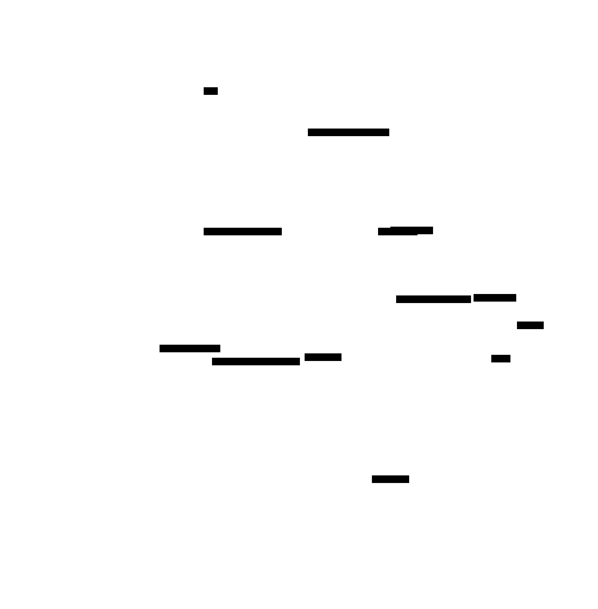
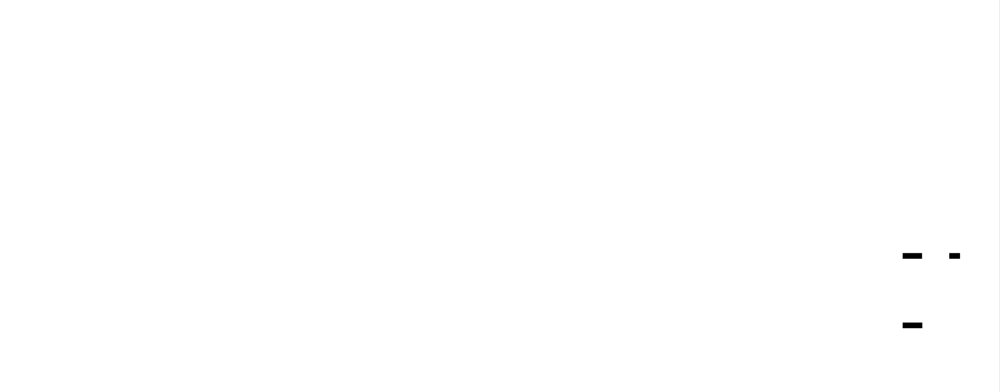
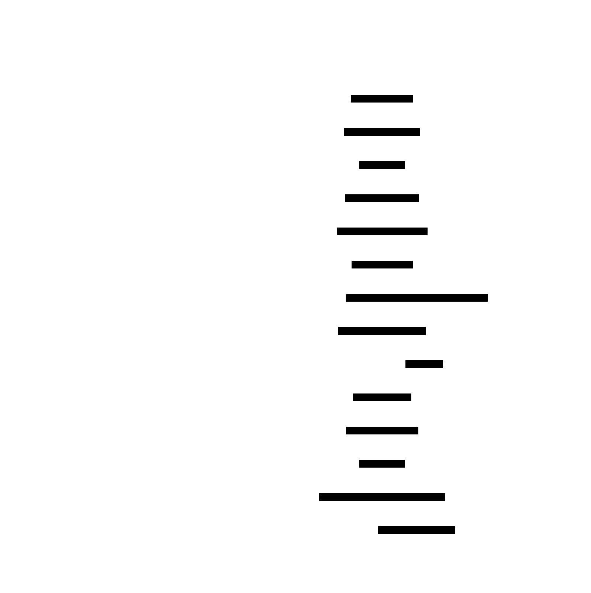

# System Call Tracer: Design Document


## Overview

This document outlines the design of a system call tracer that uses the Linux ptrace API to intercept, decode, and log system calls made by a target process and its children. The core architectural challenge lies in orchestrating low-level process control, safely reading foreign address spaces, and correctly interpreting the kernel's execution state, all while minimizing the performance impact on the traced program.


> This guide is meant to help you understand the big picture before diving into each milestone. Refer back to it whenever you need context on how components connect.


## 1. Context and Problem Statement

> **Milestone(s):** All milestones (establishes foundational context)

At its core, an operating system is a gatekeeper. Applications live in a protected user-space sandbox and must request permission for any interaction with the physical world—reading a file, sending network data, or allocating memory. These requests are **system calls (syscalls)**, the fundamental API between user programs and the Linux kernel. Understanding what syscalls a program makes, when, and with what arguments is invaluable for debugging, security auditing, performance analysis, and simply learning how software interacts with its operating environment.

This document outlines the design of a **system call tracer**, a tool that uses the Linux `ptrace` API to intercept, decode, and log these syscalls from a target process and its children. Unlike traditional debuggers that focus on source lines and variables, a syscall tracer operates at the OS interface level, providing a "black box" view of a program's behavior. The core architectural challenge lies in orchestrating low-level process control, safely reading foreign address spaces, and correctly interpreting the kernel's execution state—all while minimizing the performance impact on the traced program (the **tracee**).

### 1.1 Mental Model: The Process's Announcer

Imagine you are watching a tennis match. A skilled **announcer** sits courtside, observing every shot. For each play, they call out: *"Player serves to the deuce court... the return is a cross-court forehand... a volley at the net... point!"* The announcer doesn't play the game; they merely observe and narrate the essential interactions, translating raw athletic movements into a comprehensible story for the audience.

A system call tracer is the announcer for a running process. The process is the "player," and the kernel is the "court" where the action happens. The tracer observes every "shot"—each syscall—and narrates it: *"Process called `open` with path `/etc/passwd`... returned file descriptor 3... now calling `read` to read 1024 bytes... returned 512 bytes of data."*

This mental model clarifies several key aspects:

| Tracer Role | Announcer Analogy | Technical Implication |
|-------------|-------------------|----------------------|
| **Passive Observer** | The announcer doesn't hit the ball. | The tracer must not modify the tracee's execution unless explicitly intended (e.g., fault injection). Its primary job is observation. |
| **Real-Time Narration** | Commentary happens as the match unfolds. | The tracer must keep pace with the tracee, processing events (syscall entry/exit) as they occur, with minimal lag. |
| **Translation** | The announcer explains tactics to the audience. | The tracer must translate low-level register values and memory addresses into human-readable syscall names, string arguments, and error codes. |
| **Multiple Players** | An announcer tracks both players in a doubles match. | The tracer must follow forked child processes, maintaining separate commentary for each "player" in a process tree. |

> The critical insight is that a tracer is a **meta-process** that leverages a special kernel API (`ptrace`) to become an authorized spectator of another process's privileged conversations with the operating system.

### 1.2 The Technical Challenge of Process Introspection

Observing a process from the outside is inherently intrusive. A running process's memory and CPU state are protected by hardware-enforced privilege boundaries. The **`ptrace`** system call is Linux's mechanism for piercing this veil, allowing one process (the **tracer**) to control and inspect another (the **tracee**). However, using `ptrace` correctly is notoriously complex, presenting a multi-faceted technical challenge:

1.  **Orchestrating Execution:** The tracer must start the tracee (or attach to an existing process) and then control its execution in a stop-and-go fashion. The tracer uses `ptrace` to request that the kernel stop the tracee at specific execution points (e.g., syscall entry and exit). It then uses `waitpid` to be notified of these stops. The tracer is responsible for resuming the tracee with another `ptrace` call, creating a tightly coupled dance.
2.  **Interpreting Kernel State:** When the tracee is stopped, the tracer can inspect its CPU registers and memory. However, this data is raw and architecture-specific. On x86-64, the syscall number is stored in the `orig_rax` register at entry, while arguments are in `rdi`, `rsi`, `rdx`, `r10`, `r8`, and `r9`. The tracer must know this **Application Binary Interface (ABI)** and extract the correct values.
3.  **Reading Foreign Memory:** Syscall arguments are often pointers to data in the tracee's address space (e.g., a `pathname` for `open`). To log the actual string, the tracer must safely read memory from the tracee's virtual address space using `PTRACE_PEEKDATA`. This operation is error-prone: the pointer might be invalid, the string might not be NULL-terminated, or the memory might change between reads.
4.  **Managing Complexity:** The tracee is not a simple, linear program. It can:
    *   **Fork/Clone:** Create child processes. The tracer must decide whether to follow and trace these children.
    *   **Exec:** Replace its entire memory image with a new program. The tracer must handle this transition and continue tracing the new code.
    *   **Receive Signals:** Be interrupted by asynchronous signals (e.g., `SIGINT`). The tracer must decide whether to intercept, block, or pass along these signals.
    *   **Exit or Crash:** Terminate at any moment. The tracer must clean up its internal state.

The following table summarizes the core technical problems and their manifestations:

| Problem Area | Concrete Challenge | Symptom of Incorrect Handling |
|--------------|-------------------|--------------------------------|
| **Execution Control** | Coordinating `PTRACE_SYSCALL`, `waitpid`, and `PTRACE_CONT`. | Tracer hangs (deadlock), tracee runs away uncontrollably, or syscalls are missed. |
| **State Tracking** | Knowing whether a stop is at syscall entry or exit. | Logs show duplicate entries or missing return values. |
| **Memory Safety** | Reading strings from tracee memory via `PTRACE_PEEKDATA`. | Tracer crashes (segfault) on invalid pointer, reads garbage data, or causes performance overhead. |
| **Process Lifecycle** | Detecting and attaching to new children after `fork`. | Child processes escape tracing, producing incomplete logs. |
| **Signal Interference** | Distinguishing between stops caused by syscalls and those caused by signals. | Tracee behaves incorrectly (signals lost or delayed), or tracer logs are polluted with signal events. |

Building a robust tracer requires carefully addressing each of these challenges within a coherent architecture.

### 1.3 Existing Tools and Why Build Our Own

The Linux ecosystem already contains mature, production-grade tracing tools. Understanding their scope helps clarify the goals and educational value of this project.

| Tool | Primary Mechanism | Focus | Strengths | Limitations for Learning |
|------|------------------|-------|-----------|--------------------------|
| **`strace`** | `ptrace` | System call tracing. | Rich argument decoding, filter expressions, statistics, multi-process following. The direct inspiration for this project. | It's a complex, optimized black box. Its source code is large and difficult to navigate for beginners. |
| **`perf trace`** | Linux `perf_events` subsystem | Low-overhead system tracing (syscalls, scheduler events, etc.). | Extremely low overhead, can trace entire system, hardware performance counters. | Abstracts away the `ptrace` mechanics. Uses a different kernel API not based on process control. |
| **`ltrace`** | `ptrace` (often) | Library call tracing. | Traces calls to shared libraries (e.g., `libc`), not just syscalls. | Similar complexity to `strace`. Focuses on user-space library interfaces. |
| **`bpftrace` / `eBPF`** | eBPF virtual machine | Dynamic kernel and user-space tracing. | Near-zero overhead, programmable, safe. The modern state of the art. | Requires a deep understanding of the Linux kernel and eBPF programming model. Not based on `ptrace`. |

Given these powerful existing tools, why build another tracer from scratch? The rationale is fundamentally **educational**:

1.  **Understanding `ptrace`:** `ptrace` is a cornerstone Linux API for building debugging, tracing, and sandboxing tools. Implementing a tracer provides hands-on, deep familiarity with its capabilities, quirks, and pitfalls—knowledge directly transferable to other systems programming tasks.
2.  **Deconstructing `strace`:** By building a simplified clone, we de-mystify how `strace` works. Each milestone in this project corresponds to a core feature of `strace`, allowing incremental understanding of its internal architecture.
3.  **Systems Programming Practice:** This project exercises critical low-level skills: process creation, signal handling, register manipulation, cross-process memory access, and concurrent event handling. These are essential for developers working on operating systems, runtimes, debuggers, or security tools.
4.  **Foundational Knowledge for Advanced Tools:** Understanding `ptrace` provides a solid foundation for later exploring more advanced tools like `perf` or eBPF. You learn what problem they are solving and why newer mechanisms were invented (primarily performance and safety).

> **Architecture Decision Record: Build vs. Reuse**
>
> - **Context:** We need a tool to intercept and log system calls for educational purposes in a controlled project environment.
> - **Options Considered:**
>     1. **Use `strace` directly:** Run existing `strace` on target programs.
>     2. **Build a custom tracer using `ptrace`:** Implement core tracing logic from scratch.
> - **Decision:** Build a custom tracer.
> - **Rationale:** The primary project goal is **learning**, not producing a production tool. Implementing the tracer provides first-hand experience with `ptrace`, process control, and syscall ABI—knowledge that is opaque when simply using `strace`. This aligns with the project's "intermediate" difficulty and prerequisites (process-spawner, signal-handler).
> - **Consequences:**
>     - **Enables:** Deep technical understanding, customizable logging, ability to extend with custom features (e.g., specific filters, custom output formats).
>     - **Trade-offs:** The tracer will have higher overhead, fewer features, and more bugs than `strace`. It is suitable for learning and debugging small programs, not for production monitoring.

By the end of this project, you will not just have a functional tracer; you will possess a mental model of how process introspection works at the OS level, making you a more effective debugger and systems programmer.

### 1.4 Implementation Guidance

This section establishes the conceptual foundation. The first concrete implementation step is setting up the build environment and creating the basic project structure.

**A. Technology Recommendations Table**

| Component | Simple Option | Advanced Option (Future Extension) |
|-----------|---------------|-----------------------------------|
| **Build System** | Makefile | CMake or Meson |
| **Syscall Tables** | Hand-coded array for x86-64 | Script-generated table from kernel headers (`/usr/include/asm/unistd_64.h`) |
| **Output Formatting** | `printf` to stdout | Custom formatting with color support, JSON output |
| **Time Measurement** | `clock_gettime(CLOCK_MONOTONIC)` | `clock_gettime(CLOCK_MONOTONIC_RAW)` for less overhead |

**B. Recommended File/Module Structure**

Start with a simple, flat structure for Milestone 1, evolving it as complexity grows.

```
syscall-tracer/
├── Makefile                    # Build instructions
├── README.md                   # Project overview
├── tracer.c                    # Main tracer logic (core loop, process mgmt)
├── syscall.c                   # Syscall decoding and table (Milestone 2)
├── syscall.h                   # Syscall table and decoding prototypes
├── utils.c                     # Helper functions (memory reading, formatting)
├── utils.h                     # Helper prototypes
├── process.c                   # Multi-process tracking (Milestone 3)
├── process.h                   # Process context structures
├── filter.c                    # Filtering and statistics (Milestone 4)
├── filter.h                    # Filter configuration structures
└── test_programs/              # Simple C programs to trace
    ├── hello.c                 # Basic syscalls (write, exit)
    ├── file_io.c               # open, read, write, close
    └── fork_test.c             # fork, getpid
```

**C. Infrastructure Starter Code (Makefile)**

A basic Makefile ensures consistent compilation and clean builds.

```makefile
CC = gcc
CFLAGS = -Wall -Wextra -std=gnu11 -g -O0
TARGET = strace-simple
SOURCES = tracer.c syscall.c utils.c process.c filter.c
HEADERS = syscall.h utils.h process.h filter.h

all: $(TARGET)

$(TARGET): $(SOURCES) $(HEADERS)
	$(CC) $(CFLAGS) -o $(TARGET) $(SOURCES)

clean:
	rm -f $(TARGET) *.o

test: $(TARGET)
	@echo "=== Running tracer on a simple test program ==="
	./$(TARGET) ./test_programs/hello

.PHONY: all clean test
```

**D. Core Logic Skeleton Code (Main Function)**

The `main` function is the entry point. It parses arguments (initially simple), sets up tracing, and enters the main loop.

```c
// tracer.c
#include <stdio.h>
#include <stdlib.h>
#include <unistd.h>
#include <sys/ptrace.h>
#include <sys/wait.h>
#include <sys/types.h>
#include "syscall.h"
#include "utils.h"
#include "process.h"
#include "filter.h"

int main(int argc, char *argv[]) {
    if (argc < 2) {
        fprintf(stderr, "Usage: %s <program> [args...]\n", argv[0]);
        exit(EXIT_FAILURE);
    }

    // TODO 1: Parse command-line options (for later milestones: -e, -o, -p)
    // TODO 2: Initialize global structures (process table, filter config, stats)
    // TODO 3: Fork a child process
    // TODO 4: In child: call ptrace(PTRACE_TRACEME, 0, NULL, NULL) and execvp the target program
    // TODO 5: In parent (tracer): wait for child to stop, then set up ptrace options (PTRACE_O_TRACESYSGOOD, etc.)
    // TODO 6: Enter main tracing event loop (see next section for skeleton)
    // TODO 7: After loop exits, print summary statistics (if enabled)
    // TODO 8: Cleanup and exit

    return 0;
}
```

**E. Language-Specific Hints (C)**
- Use `fork()` and `execvp()` for spawning the tracee. Remember that after `fork()`, both parent and child run the same code; use the return value of `fork()` to distinguish them.
- The child must call `ptrace(PTRACE_TRACEME, 0, NULL, NULL)` **before** `execvp`. This tells the kernel it will be traced by its parent.
- After `execvp`, the child will receive a `SIGTRAP` signal. The parent will see it stop via `waitpid`. This is the first stop event.
- Always check return values of system calls (`ptrace`, `waitpid`) for errors. Use `perror` for debugging.
- Include `<sys/ptrace.h>`, `<sys/wait.h>`, and `<sys/user.h>` (for register definitions) in your tracer.

**F. Milestone Checkpoint (End of Milestone 1)**
After implementing the basic intercept loop, you should be able to run:
```bash
make
./strace-simple ./test_programs/hello
```
Expected output should show raw syscall numbers and return values for each syscall the `hello` program makes (e.g., `write`, `exit_group`). A successful run looks like:
```
[PID 12345] Syscall 1 (write) → returned 13
[PID 12345] Syscall 231 (exit_group) → returned 0
```
**Signs of trouble:**
- **No output, program hangs:** Likely the `waitpid`/`ptrace` loop is stuck. Check that you are correctly resuming the child with `PTRACE_SYSCALL`.
- "Cannot trace process" error: Child may not have called `PTRACE_TRACEME` before `execvp`.
- Wrong syscall numbers: Ensure you are reading the correct register for your architecture (x86-64 uses `orig_rax` for syscall number at entry).

---


> **Milestone(s):** All milestones (establishes project scope and boundaries for all implementation work)

## 2. Goals and Non-Goals

This section defines the functional and educational boundaries of the System Call Tracer. Like a surveyor marking the edges of a construction site, we establish what we will build and—equally important—what we deliberately will not build. Clear scoping prevents **scope creep** (the tendency for projects to grow beyond their original intent) and ensures focus on the core learning objectives.

### Goals

The primary educational goal is to understand how process introspection tools work at the operating system interface level. Functionally, the tracer will evolve through four milestones, each adding a layer of capability mirroring real-world tracing tools.

> **Mental Model: The Training Flight Simulator**
> Think of this tracer as a flight simulator for operating systems developers. Commercial flight simulators don't need to perfectly replicate every cockpit switch—they focus on the core flight controls, navigation, and emergency procedures that pilots must master. Similarly, our tracer won't replicate every feature of `strace` but will implement the fundamental mechanics of process tracing, syscall interception, and event interpretation that underpin all debugging and tracing tools.

#### Functional Goals (Aligned with Milestones)

| Goal Category | Description | Rationale & Learning Value |
|--------------|-------------|----------------------------|
| **Syscall Interception** | Intercept and stop a traced process before and after each system call using `ptrace`. | This is the foundational mechanism of all tracing tools. Learning to control process execution at the syscall boundary teaches how the kernel mediates process-kernel interactions. |
| **Register State Inspection** | Read the tracee's CPU registers to extract syscall numbers, arguments, and return values. | Understanding the Application Binary Interface (ABI) is crucial for system programming. This teaches how arguments are passed between user space and kernel space. |
| **Remote Memory Reading** | Safely read string and data pointer arguments from the tracee's address space using `PTRACE_PEEKDATA`. | Debuggers and tracers must navigate foreign memory spaces. This introduces the challenges of cross-process memory access and pointer validation. |
| **Syscall Identification** | Map raw syscall numbers to human-readable names using a built-in syscall table for x86-64. | Teaches the importance of system call tables and how they vary across architectures and kernel versions. |
| **Multi-Process Tracing** | Automatically detect and attach to child processes created via `fork`, `vfork`, and `clone`. | Real programs spawn child processes. This teaches process tree management and the complexities of concurrent tracing. |
| **Event Filtering** | Allow users to specify which syscalls to trace (e.g., only `open`, `read`, `write`). | Introduces performance optimization and focused observation—essential for debugging complex systems. |
| **Performance Measurement** | Measure wall-clock duration of each syscall with microsecond precision. | Teaches timing instrumentation, the overhead of tracing itself, and how to interpret syscall performance profiles. |
| **Statistical Aggregation** | Generate summary reports showing call counts, error frequencies, and cumulative time per syscall type. | Introduces data aggregation patterns and how to transform low-level events into high-level insights. |
| **Structured Output** | Produce formatted output similar to `strace` showing `syscall_name(arguments) = return_value`. | Teaches clear presentation of technical data and parsing of complex system interactions. |

#### Educational Goals

| Learning Objective | How the Project Achieves It |
|-------------------|-----------------------------|
| **Understand `ptrace` API** | Direct implementation of `PTRACE_TRACEME`, `PTRACE_SYSCALL`, `PTRACE_GETREGS`, `PTRACE_PEEKDATA`, and event options. |
| **Grasp Process State Transitions** | Managing tracee stops, continues, and signal delivery reveals the process lifecycle under tracing. |
| **Learn x86-64 Linux ABI** | Working directly with registers (`orig_rax`, `rax`, `rdi`, `rsi`, etc.) solidifies calling convention knowledge. |
| **Practice Safe Cross-Process Memory Access** | Implementing bounds-checked, fault-tolerant reads from tracee memory teaches defensive systems programming. |
| **Design Event-Driven Architectures** | The main loop responding to `waitpid` events models production monitoring and debugging tools. |
| **Handle Concurrency and Race Conditions** | Managing multiple tracees and fork events introduces concurrency challenges in a controlled environment. |

#### Architectural Goals

| Architectural Quality | How It's Ensured |
|----------------------|------------------|
| **Modularity** | Separation of concerns: core tracing loop, syscall decoding, process management, and statistics aggregation. |
| **Extensibility** | Clear interfaces between components allow adding new syscall formatters, output formats, or filter types. |
| **Observability** | The tracer itself is designed to be debuggable, with clear error messages and the ability to trace itself (using a second tracer instance). |
| **Performance Awareness** | Timing measurements account for tracer overhead, and filtering minimizes impact on tracee execution. |

**Decision: Scope-Driven Implementation Phasing**

- **Context**: The project has multiple complex features that could be implemented in various orders or combined. We need a learning progression that builds from fundamentals to advanced features without overwhelming the implementer.
- **Options Considered**:
  1. **Big Bang**: Implement all features simultaneously in one complex codebase.
  2. **Vertical Slices**: Implement complete tracing for one syscall type first (including arguments, filtering, and stats), then expand to others.
  3. **Horizontal Layers**: Implement basic interception for ALL syscalls first (Milestone 1), then add argument decoding for ALL (Milestone 2), then process management (Milestone 3), then filtering/stats (Milestone 4).
- **Decision**: Horizontal layers approach (Milestones 1→2→3→4).
- **Rationale**: This mirrors how real tracing tools evolved and provides the most consistent learning progression. Each milestone produces a working tracer with increasing capabilities. The implementer experiences the architectural evolution naturally: first making syscalls visible, then making them understandable, then handling real-world process trees, and finally optimizing and analyzing.
- **Consequences**:
  - ✅ Early milestones produce visible results (seeing syscall numbers).
  - ✅ Natural refactoring points between milestones.
  - ✅ Each layer builds on stable foundations from previous layers.
  - ⚠️ Some features (like string reading) are deferred until Milestone 2 even though they're conceptually part of "basic tracing."

### Non-Goals

Explicitly defining what we will not build is crucial for managing expectations and preventing wasted effort on peripheral features. These limitations represent deliberate design boundaries, not shortcomings.

> **Mental Model: The Specialized Microscope**
> Our tracer is like a specialized electron microscope designed for viewing atomic structures. It excels at revealing syscall interactions but cannot function as a general-purpose optical microscope (source debugger) or telescope (network analyzer). Acknowledging these limitations helps users apply the right tool for their needs.

#### Technical Non-Goals

| Non-Goal | Reason for Exclusion | Alternative Tools |
|----------|----------------------|-------------------|
| **Source-Level Debugging** | No integration with source code, line numbers, variables, or breakpoints. | Use `gdb`, `lldb`, or language-specific debuggers. |
| **Binary Rewriting/Instrumentation** | No modification of tracee executable code or insertion of instrumentation probes. | Use `perf probe`, `DynamoRIO`, or `Pin` for binary instrumentation. |
| **Advanced Performance Profiling** | No hardware performance counter collection, flame graph generation, or CPU sampling. | Use `perf`, `Valgrind`, or specialized APM tools. |
| **System-Wide Tracing** | Cannot trace all processes on the system simultaneously or trace kernel functions. | Use `ftrace`, `BPF/eBPF`, or `SystemTap` for system-wide observation. |
| **Syscall Tampering/Injection** | Cannot modify syscall arguments, return values, or inject signals (except for basic continuation). | Advanced `ptrace` usage or `LD_PRELOAD` hooks could achieve this. |
| **Cross-Architecture Support** | Focused on x86-64 Linux only; no support for ARM, x86-32, or other OSes. | Porting would require new syscall tables and ABI handling. |
| **Symbol Resolution** | No resolution of function names in shared libraries or stack trace unwinding. | Combine with `ltrace` or use debug information with `addr2line`. |
| **Network Protocol Decoding** | While socket syscalls are traced, their payloads (HTTP, DNS, etc.) are not parsed. | Use `tcpdump`, `Wireshark`, or eBPF filters for protocol analysis. |
| **Persistent Logging/Replay** | Trace output is ephemeral (to stdout/file); no binary recording for later replay. | Some commercial tracing tools offer recording/replay capabilities. |
| **Graphical User Interface** | Command-line only; no GUI, visualizations, or real-time dashboards. | Output could be piped to visualization tools like `gnuplot` or custom UI. |

#### Educational Non-Goals

| Learning Area | Why Not Covered Here | Where to Learn Instead |
|---------------|----------------------|------------------------|
| **Kernel Module Development** | `ptrace` operates from user space; we don't modify kernel internals. | Linux kernel development courses and `kprobes`/`tracepoints`. |
| **Just-In-Time Compilation** | No dynamic code generation or binary translation. | Study V8, JVM, or `QEMU` JIT compilation techniques. |
| **Formal Verification** | No proof of correctness for the tracer's logic. | Research on seL4, Coq, or TLA+ for formal methods. |
| **Distributed Tracing** | Single-host focus; no correlation of traces across multiple machines. | OpenTelemetry, Jaeger, or Zipkin for distributed systems. |

**Decision: Avoiding Feature Creep via Explicit Non-Goals**

- **Context**: When building educational projects, there's temptation to add "just one more feature" that seems related but diverges from core learning objectives. Without clear boundaries, the project becomes unfocused and overwhelming.
- **Options Considered**:
  1. **Minimalist**: Implement only the four milestone features with no extensions.
  2. **Extension-Friendly**: Implement core features with hooks for potential future extensions.
  3. **Maximalist**: Include every feature that seems educational or useful.
- **Decision**: Extension-friendly approach with explicitly documented non-goals.
- **Rationale**: This balances focus with future growth. The architecture is designed so advanced learners could add features (like syscall tampering) without redesign, but these are excluded from the standard learning path. Explicit non-goals provide permission to say "not now" without closing the door to future exploration.
- **Consequences**:
  - ✅ Clear scope keeps the project achievable within the intended timeframe.
  - ✅ Documented extension points guide advanced learners.
  - ✅ Non-goals serve as a reference for what problems this tracer doesn't solve.
  - ⚠️ Some users might expect features like source debugging because they're common in commercial tools.

#### Practical Implications of Non-Goals

The non-goals have specific technical implications for the implementation:

1. **No Symbol Resolution** → The `SyscallTableEntry` structure only needs `name` (e.g., `"open"`), not source file/line information.
2. **No Binary Rewriting** → The tracer never calls `ptrace` with `PTRACE_POKETEXT` or `PTRACE_POKEDATA` to modify tracee memory.
3. **Single-Host Focus** → No network serialization in `SyscallEvent` records or distributed aggregation in the statistics engine.
4. **CLI-Only** → All output goes through `FILE*` streams in `FilterConfig`, with no graphical rendering components.

These constraints simplify the codebase and keep attention on the core `ptrace` mechanics and syscall interpretation.

### Implementation Guidance

This section bridges the gap between design goals and concrete implementation. For this scope-defining section, we focus on setting up the project structure and foundational types that will support all milestones.

#### A. Technology Recommendations Table

| Component | Simple Option (Recommended) | Advanced Option (For Extension) |
|-----------|----------------------------|---------------------------------|
| **Build System** | Makefile with clear targets for each milestone | CMake or Meson for cross-platform support |
| **Syscall Table Source** | Hardcoded array for x86-64 (from Linux headers) | Runtime generation from `/usr/include/asm/unistd_64.h` |
| **String Reading Safety** | Fixed buffer with `MAX_STRING_READ_LEN` (4096) | Dynamic growth with realloc and smarter boundary detection |
| **Process Tracking** | Simple array of `ProcessContext` structures | Hash table keyed by PID for O(1) lookups |
| **Statistics Storage** | Array indexed by syscall number | Hash map for sparse syscall usage |
| **Output Formatting** | `printf` to stdout/stderr or specified file | Custom formatting engine with pluggable backends (JSON, CSV) |

#### B. Recommended File/Module Structure

Create this directory structure from the start to keep code organized as features grow:

```
syscall-tracer/
├── Makefile                    # Build definitions for all milestones
├── include/                    # Header files
│   ├── tracer.h               # Main tracer interface and core types
│   ├── syscall_table.h        # Syscall number/name/argument type definitions
│   ├── process.h              # ProcessContext and management functions
│   └── filter.h               # FilterConfig and statistics types
├── src/
│   ├── main.c                 # Command-line parsing and high-level orchestration
│   ├── tracer_core.c          # Main loop: tracer_main_loop and ptrace control
│   ├── syscall_decode.c       # decode_syscall_arguments, read_string_from_tracee
│   ├── process_mgr.c          # handle_fork_event, process state management
│   ├── filter_stats.c         # should_trace_syscall, statistics aggregation
│   └── syscall_table.c        # Generated syscall table data
├── tools/
│   └── generate_table.py      # Script to generate syscall_table.c from Linux headers
└── test/
    ├── test_programs/         # Simple C programs to trace
    │   ├── basic_io.c         # open/read/write/close
    │   ├── fork_exec.c        # fork + execve
    │   └── stress.c           # Many syscalls for performance testing
    └── run_tests.sh           # Integration test script
```

#### C. Infrastructure Starter Code

Here's the foundational header file that defines the core data structures used throughout the project. Place this in `include/tracer.h`:

```c
#ifndef TRACER_H
#define TRACER_H

#include <stdbool.h>
#include <sys/types.h>
#include <time.h>

/* Maximum bytes to read for string arguments - prevents overrun if missing NULL */
#define MAX_STRING_READ_LEN 4096

/* Maximum number of syscalls in our table (x86-64 has ~350) */
#define SYSCALL_TABLE_SIZE 400

/* Process states for state machine */
typedef enum {
    PROCESS_NEW,          /* Created but not yet attached */
    PROCESS_TRACED,       /* Attached and tracing */
    PROCESS_SYSCALL_ENTRY, /* Stopped at syscall entry */
    PROCESS_SYSCALL_EXIT,  /* Stopped at syscall exit */
    PROCESS_SIGNAL_STOP,   /* Stopped due to signal */
    PROCESS_PTRACE_EVENT,  /* Stopped due to ptrace event (fork, exec, etc.) */
    PROCESS_EXITED         /* Process has terminated */
} ProcessState;

/* Syscall stop states for entry/exit tracking */
typedef enum {
    SYSCALL_STATE_NONE,    /* Not in a syscall */
    SYSCALL_STATE_ENTRY,   /* At entry (before syscall executes) */
    SYSCALL_STATE_EXIT     /* At exit (after syscall returns) */
} SyscallState;

/* Argument type classification for formatting */
typedef enum {
    ARG_INT,      /* Integer (fd, flags, mode) */
    ARG_POINTER,  /* Generic pointer (void*) */
    ARG_STRING,   /* NULL-terminated string (char*) */
    ARG_BUFFER,   /* Buffer with length (void*, size_t) */
    ARG_STRUCT,   /* Structured data (stat, timespec) */
    ARG_ADDRESS   /* Memory address (for mmap, brk) */
} ArgType;

/* Core event structure capturing one syscall invocation */
typedef struct {
    pid_t pid;                    /* Process ID that made the syscall */
    long number;                  /* Syscall number (e.g., 2 for open) */
    unsigned long args[6];        /* Up to 6 arguments (x86-64 ABI) */
    long retval;                  /* Return value (or -errno) */
    struct timespec timestamp_start;  /* When syscall entered */
    struct timespec timestamp_end;    /* When syscall exited */
    bool is_entry;                /* true=entry event, false=exit event */
} SyscallEvent;

/* Per-process tracking context */
typedef struct {
    pid_t pid;                    /* Process ID */
    ProcessState state;           /* Current state in lifecycle */
    SyscallState syscall_state;   /* Entry or exit for current syscall */
    
    /* Configuration for this process */
    struct {
        FILE* output_file;        /* Where to write output (NULL=stdout) */
        unsigned long* filter_set;/* Bitmask of syscalls to trace */
        bool collect_stats;       /* Whether to aggregate statistics */
    } config;
} ProcessContext;

/* Syscall table entry for decoding */
typedef struct {
    long number;                  /* Syscall number */
    const char* name;             /* Human-readable name */
    int nargs;                    /* Number of meaningful arguments (0-6) */
    ArgType arg_types[6];         /* Type of each argument for formatting */
} SyscallTableEntry;

/* Filter configuration shared across processes */
typedef struct {
    FILE* output_file;            /* Output destination (NULL=stdout) */
    unsigned long* filter_set;    /* Bitmask: filter_set[num/64] & (1UL << (num%64)) */
    bool collect_stats;           /* Enable statistics collection */
} FilterConfig;

/* Function declarations - implementations in respective .c files */
void tracer_main_loop(pid_t initial_pid);
char* read_string_from_tracee(pid_t pid, unsigned long addr);
void decode_syscall_arguments(SyscallTableEntry *entry, unsigned long args[]);
void handle_fork_event(pid_t parent_pid, unsigned long child_pid);
bool should_trace_syscall(long syscall_num, FilterConfig *config);

#endif /* TRACER_H */
```

#### D. Core Logic Skeleton Code

The main function skeleton in `src/main.c` that sets up tracing:

```c
#include <stdio.h>
#include <stdlib.h>
#include <unistd.h>
#include <sys/wait.h>
#include <sys/ptrace.h>
#include "tracer.h"
#include "filter.h"

int main(int argc, char *argv[]) {
    pid_t child_pid;
    FilterConfig config = {0};
    
    // TODO 1: Parse command-line arguments
    //   - -e trace=syscall1,syscall2 (set filter)
    //   - -o filename (set output_file)
    //   - -c (enable collect_stats)
    //   - -- (separator)
    //   - command to execute (remainder of argv)
    
    // TODO 2: Initialize filter configuration
    //   - Allocate filter_set bitmap
    //   - Parse trace= expression and set corresponding bits
    //   - Open output file if -o specified
    
    // TODO 3: Fork child process
    child_pid = fork();
    if (child_pid == 0) {
        // Child process
        // TODO 4: Enable tracing with PTRACE_TRACEME
        // TODO 5: Optional: Set process group for clean termination
        
        // TODO 6: Execute target program
        //   - Use execvp on remaining arguments after --
        //   - Handle exec failure (perror and exit)
        
        // execvp never returns on success
        perror("execvp");
        exit(EXIT_FAILURE);
    } else if (child_pid > 0) {
        // Parent process (tracer)
        // TODO 7: Wait for child to stop after PTRACE_TRACEME
        // TODO 8: Set ptrace options (PTRACE_O_TRACESYSGOOD, PTRACE_O_TRACEFORK, etc.)
        // TODO 9: Enter main tracing loop
        tracer_main_loop(child_pid);
        
        // TODO 10: After tracing completes, print statistics if enabled
        // TODO 11: Clean up resources (close files, free filter_set)
        
        return EXIT_SUCCESS;
    } else {
        // Fork failed
        perror("fork");
        return EXIT_FAILURE;
    }
}
```

#### E. Language-Specific Hints (C)

1. **Bitmask Filter Implementation**: Use `unsigned long filter_set[(SYSCALL_TABLE_SIZE + 63) / 64]` for a compact bitmap. Check with `filter_set[num/64] & (1UL << (num%64))`.
2. **Timespec for Timing**: Use `clock_gettime(CLOCK_MONOTONIC, &ts)` for wall-clock timing. Include `<time.h>` and link with `-lrt` on some systems.
3. **Safe String Reading**: Always check if `addr == 0` before attempting `PTRACE_PEEKDATA` to avoid EIO errors.
4. **Portable Register Access**: Use `<sys/reg.h>` for register constants but be aware they differ between architectures. For x86-64: `orig_rax` for syscall number, `rax` for return value.
5. **Error Handling**: After each `ptrace` call, check `errno`. `ESRCH` means the process doesn't exist (exited), `EIO` means invalid memory address.

#### F. Milestone Checkpoint

After setting up the project structure and skeleton code, verify your foundation:

```bash
# 1. Compile the skeleton (should produce no errors)
make  # or: gcc -o tracer src/*.c -Iinclude -lrt

# 2. Run with a simple test program
./tracer -- /bin/echo "Hello, tracing!"

# Expected at this early stage:
# - Program should compile without warnings
# - Should see child process output: "Hello, tracing!"
# - Tracer should exit cleanly (though it won't trace anything yet)
# - No crashes or hangs

# 3. Test with self-tracing (advanced)
./tracer -- ./tracer -- /bin/echo "nested"
# This tests if your tracer handles being traced itself (ptrace will fail with EPERM unless run as root)
```

**Signs of Problems:**
- **Compilation fails on `sys/reg.h`**: You might be on non-x86_64. Consider using `linux/ptrace.h` instead.
- **Child executes but tracer exits immediately**: Forgot to wait after `fork`. Add `waitpid(child_pid, &status, 0)` before entering main loop.
- **Permission denied (ptrace: Operation not permitted)**: On modern systems, you may need `sudo` or adjust `ptrace_scope` with `echo 0 | sudo tee /proc/sys/kernel/yama/ptrace_scope`.

---


## 3. High-Level Architecture

> **Milestone(s):** All milestones (establishes the structural blueprint for all implementation work)

This section presents the architectural decomposition of the system call tracer. At the highest level, our tracer operates as a **conductor** orchestrating multiple traced processes (the **orchestra**), with each component playing a specific role in observing, interpreting, and reporting their interactions with the operating system kernel. The core challenge is managing this orchestration while maintaining precise control over execution flow and safely accessing foreign memory spaces.

### Component Overview and Responsibilities

Think of the tracer architecture as a **multilingual interpreter at a diplomatic summit**. The traced processes (delegates) speak in low-level machine code (registers, memory addresses, syscall numbers). Our interpreter must listen to each delegate's statements, translate them into human-readable reports, track when new delegates join or leave the conversation, and compile summary statistics about the proceedings—all without disrupting the natural flow of discussion.

The system decomposes into five primary components, each with distinct responsibilities:


#### 1. Process Manager (The Delegation Coordinator)
The Process Manager acts as the primary interface to the Linux kernel's `ptrace` subsystem. It is responsible for the lifecycle management of all traced processes (tracees), maintaining their execution state, and serving as the central dispatch point for all `ptrace` operations.

**Responsibilities:**
- **Process Lifecycle Control**: Creates the initial tracee via `fork()` and `exec()`, attaches to existing processes, and manages graceful detachment
- **Execution Flow Orchestration**: Uses `PTRACE_SYSCALL` to stop tracees at syscall entry/exit boundaries and `PTRACE_CONT` to resume execution
- **Event Detection**: Monitors via `waitpid()` for stops caused by syscalls, signals, `ptrace` events (fork, exec, exit), and process termination
- **State Tracking**: Maintains the `ProcessContext` for each tracee, tracking whether it's currently at syscall entry or exit, pending signals, and configuration
- **Multi-Process Coordination**: Manages a table of active tracees and ensures proper handling of process creation/destruction events

**Key Data Structures Owned:**
- Table of `ProcessContext` objects indexed by PID
- Configuration for default tracing behavior (inherit on fork, follow exec, etc.)

#### 2. Syscall Interceptor (The Conversation Monitor)
This component works intimately with the Process Manager to extract raw system call information when a tracee stops. It acts as a **stenographer** at the entry and exit of each syscall, capturing the "who, what, and when" before the conversation proceeds.

**Responsibilities:**
- **Register State Capture**: On each `ptrace` stop, reads the tracee's CPU registers via `PTRACE_GETREGS` to obtain syscall number, arguments, and return value
- **State Discrimination**: Determines whether the current stop represents syscall entry (arguments valid) or exit (return value valid)
- **Timing Capture**: Records precise timestamps using `clock_gettime()` at both entry and exit points
- **Event Packaging**: Constructs a `SyscallEvent` structure containing all raw data for subsequent processing
- **Filter Application**: Early filtering based on syscall number before expensive decoding operations

**Interaction Pattern:**
The Interceptor is invoked by the Process Manager immediately after detecting a `ptrace` stop. It performs minimal processing to capture volatile state (registers change between entry and exit), then passes the `SyscallEvent` to the Event Dispatcher.

#### 3. Syscall Decoder (The Linguistic Translator)
The Decoder transforms raw machine state into human-comprehensible output. It serves as the **polyglot interpreter** who understands both the x86-64 ABI "dialect" and the Linux kernel's "vocabulary" of system calls.

**Responsibilities:**
- **Syscall Identification**: Maps numeric syscall numbers to symbolic names using a built-in `SyscallTableEntry` database
- **Argument Interpretation**: Decodes register values based on syscall signature (string pointers, file descriptors, integer flags, etc.)
- **Remote Memory Access**: Safely reads string arguments from tracee address space using `PTACE_PEEKDATA` in controlled chunks
- **Output Formatting**: Produces `strace`-style formatted lines: `syscall_name(arg1, arg2, ...) = return_value`
- **Error Interpretation**: Transforms negative return values into meaningful `errno` strings (e.g., `-1` → `ENOENT`)

**Critical Design Aspects:**
The Decoder must handle the inherent complexity that arguments have type-dependent interpretations: a value in the `rdi` register could represent a file descriptor (integer), a memory address (pointer to string), or flags (bitmask). It uses the `SyscallTableEntry` type information to dispatch to appropriate formatting routines.

#### 4. Event Dispatcher (The Routing Clerk)
The Event Dispatcher directs `SyscallEvent` objects to appropriate downstream consumers based on configuration. Think of it as a **post office sorting facility** that examines each incoming event and decides which output channels should receive it.

**Responsibilities:**
- **Output Channel Management**: Routes formatted output to stdout, stderr, or user-specified log files
- **Concurrency Coordination**: Handles potential interleaving when multiple tracees generate output simultaneously (using per-process PID prefixes)
- **Statistics Collection**: Forwards events to the Statistics Aggregator when performance tracking is enabled
- **Dynamic Filtering**: Applies user-supplied filter expressions (e.g., `trace=open,read,write`) to suppress unwanted output
- **Configuration Application**: Ensures each tracee's `FilterConfig` is respected for its events

**Routing Table Logic:**
| Event Source | Output Destination | Statistics Destination | Conditional Logic |
|--------------|-------------------|------------------------|-------------------|
| Any tracee | stdout (`printf`) | Aggregator (if `collect_stats=true`) | Only if `should_trace_syscall()` returns true |
| Any tracee | File handle (if `output_file != NULL`) | Aggregator (if `collect_stats=true`) | Only if `should_trace_syscall()` returns true |
| Process exit | Special "+++ exited" message | Update process counts | Always logged |

#### 5. Statistics Aggregator (The Data Analyst)
This component accumulates quantitative metrics about syscall behavior across all traced processes. It serves as the **statistician** compiling summary reports about system interaction patterns.

**Responsibilities:**
- **Metric Accumulation**: Maintains running totals of call counts, error counts, and cumulative duration per syscall type
- **Timing Analysis**: Computes elapsed time between `timestamp_start` and `timestamp_end` for each completed syscall
- **Report Generation**: Produces formatted summary tables at program termination
- **Memory Management**: Efficiently stores statistics for hundreds of syscall types with minimal overhead
- **Thread Safety**: Handles concurrent updates from multiple tracee threads/processes (though `ptrace` serializes stops, final aggregation must be safe)

**Aggregated Metrics Per Syscall Type:**
- Total invocation count
- Number of calls returning error (negative values)
- Total time spent in microseconds
- Average time per call
- Minimum/maximum observed latency

#### Component Interaction Pattern
The components collaborate in a well-defined pipeline:

1. **Process Manager** detects a stop via `waitpid()` and identifies its cause
2. **Syscall Interceptor** captures register state and creates a `SyscallEvent`
3. **Event Dispatcher** receives the event and applies filtering
4. If not filtered, **Syscall Decoder** translates the event to human-readable form
5. **Event Dispatcher** routes formatted output to appropriate destinations
6. **Statistics Aggregator** updates its counters if statistics collection is enabled
7. **Process Manager** resumes the tracee with `PTRACE_SYSCALL` or `PTRACE_CONT`

This architecture achieves **separation of concerns**: each component has a single, well-defined responsibility. The Process Manager handles only process control, the Decoder handles only interpretation, etc. This modularity simplifies testing and allows incremental implementation aligned with our milestones.

### Recommended File Structure

A well-organized codebase mirrors the architectural components, making the design manifest in the directory layout. For our C implementation, we recommend the following structure:

```
syscall-tracer/
├── include/                    # Public header files (if this were a library)
│   └── tracer.h               # Main public API (not used in our standalone tool)
├── src/                       # Main source directory
│   ├── main.c                 # Entry point: argument parsing, initialization, cleanup
│   ├── process/               # Process Manager component
│   │   ├── process_manager.c
│   │   ├── process_manager.h
│   │   └── process_table.c    # ProcessContext management utilities
│   ├── interceptor/           # Syscall Interceptor component
│   │   ├── interceptor.c
│   │   └── interceptor.h
│   ├── decoder/               # Syscall Decoder component
│   │   ├── decoder.c
│   │   ├── decoder.h
│   │   ├── syscall_table.c    # Generated syscall number→name mapping
│   │   └── string_reader.c    # read_string_from_tracee() implementation
│   ├── dispatcher/            # Event Dispatcher component
│   │   ├── dispatcher.c
│   │   ├── dispatcher.h
│   │   └── output_formatter.c # Pretty-printing utilities
│   ├── stats/                 # Statistics Aggregator component
│   │   ├── stats_aggregator.c
│   │   └── stats_aggregator.h
│   ├── util/                  # Cross-cutting utilities
│   │   ├── logging.c
│   │   ├── error_handling.c
│   │   └── safe_ptrace.c      # Wrappers with error checking
│   └── data/                  # Static data tables
│       └── syscall_table.inl  # Raw syscall table data (included by decoder)
├── scripts/                   # Build and generation scripts
│   ├── generate_syscall_table.py  # Generates syscall_table.c from Linux headers
│   └── build.sh
├── tests/                     # Test programs and verification
│   ├── test_simple.c          # Simple syscall test program
│   ├── test_fork.c            # Fork/exec test program
│   └── run_tests.sh           # Integration test runner
├── Makefile                   # Build configuration
└── README.md                  # Project documentation
```

**Rationale for This Organization:**

1. **Component Co-location**: Each directory corresponds to an architectural component, making dependencies explicit. The `process/` directory contains everything related to process management.

2. **Separation of Generated Code**: The `syscall_table.c` file is generated from Linux kernel headers (architecture-specific), keeping machine-generated code separate from hand-written logic.

3. **Utility Isolation**: Cross-cutting concerns like error handling and safe `ptrace` wrappers live in `util/`, preventing circular dependencies between components.

4. **Test Accessibility**: Test programs are in a separate `tests/` directory but at the top level, making them easy to find and run independently of the tracer.

5. **Build Scripts**: The `scripts/` directory contains code generation and build automation, supporting the project's educational nature by showing how system data is extracted.

**Header File Strategy:** Each component directory has a `.h` file declaring its public interface. Component-private functions and data are declared `static` within the `.c` file. This minimizes coupling and enforces information hiding.

**Data Flow Visibility:** The directory structure visually represents the data flow: `main.c` → `process/` → `interceptor/` → `dispatcher/` → ( `decoder/` ↔ `stats/` ). This helps developers navigate the code following the execution path.

> **Design Principle:** The file structure should make the architecture discoverable. A new developer should be able to understand component boundaries and data flow by browsing the directory tree without reading extensive documentation.

### Implementation Guidance

#### A. Technology Recommendations Table
| Component | Simple Option | Advanced Option |
|-----------|--------------|-----------------|
| Process Manager | Direct `ptrace()` calls with `waitpid()` polling | Event loop with `poll()`/`epoll()` on `/proc/[pid]/status` for scalability |
| Memory Reading | `PTRACE_PEEKDATA` in loop with per-word error checking | Buffer-sized reads via process_vm_readv() for bulk string extraction |
| Syscall Table | Hardcoded x86-64 table (from Linux headers) | Runtime generation via `syscall()` with `__NR_uname` probing for architecture detection |
| Statistics Storage | Array indexed by syscall number, fixed size | Hash table for memory efficiency with sparse syscall usage |
| Output Formatting | `printf()` with PID prefix | Custom buffered writer with atomic writes for multi-process safety |

#### B. Starter Infrastructure: Safe Ptrace Wrappers
These wrappers handle common error patterns and should be placed in `src/util/safe_ptrace.c`:

```c
/* src/util/safe_ptrace.c */
#include <stdio.h>
#include <stdlib.h>
#include <string.h>
#include <errno.h>
#include <sys/ptrace.h>
#include <sys/wait.h>

/**
 * Wrapper for ptrace() that prints error and exits on failure.
 * Use for initialization where failure is unrecoverable.
 */
long ptrace_or_die(enum __ptrace_request request, pid_t pid, 
                    void *addr, void *data) {
    long result = ptrace(request, pid, addr, data);
    if (result == -1 && errno != 0) {
        fprintf(stderr, "ptrace(%d, %d, ...) failed: %s\n",
                request, pid, strerror(errno));
        exit(EXIT_FAILURE);
    }
    return result;
}

/**
 * Wrapper for ptrace() that returns -1 on error and sets errno.
 * Use for operations where failure can be handled gracefully.
 */
long ptrace_with_error(enum __ptrace_request request, pid_t pid,
                       void *addr, void *data, int *saved_errno) {
    errno = 0;
    long result = ptrace(request, pid, addr, data);
    if (saved_errno != NULL) {
        *saved_errno = errno;
    }
    return result;
}

/**
 * Reads registers safely, returning 0 on success, -1 on failure.
 */
int ptrace_getregs_safe(pid_t pid, struct user_regs_struct *regs) {
    int ptrace_errno = 0;
    long ret = ptrace_with_error(PTRACE_GETREGS, pid, NULL, regs, &ptrace_errno);
    
    if (ret == -1 && ptrace_errno != 0) {
        // ESRCH means process doesn't exist (exited)
        if (ptrace_errno != ESRCH) {
            fprintf(stderr, "PTRACE_GETREGS failed for pid %d: %s\n",
                    pid, strerror(ptrace_errno));
        }
        return -1;
    }
    return 0;
}

/**
 * Continues a stopped tracee with proper signal handling.
 */
void ptrace_continue_with_signal(pid_t pid, int signal) {
    if (ptrace(PTRACE_SYSCALL, pid, 0, signal) == -1) {
        // If process has exited, ESRCH is expected
        if (errno != ESRCH) {
            perror("PTRACE_SYSCALL failed");
        }
    }
}
```

#### C. Core Logic Skeleton: Main Event Loop
Place this in `src/process/process_manager.c` as the heart of the tracer:

```c
/* src/process/process_manager.c - Core loop skeleton */
#include "process_manager.h"
#include <sys/wait.h>
#include <stdbool.h>

/**
 * Main event loop that waits for tracee stops and dispatches events.
 * This implements the central "waitpid → handle → continue" cycle.
 */
void tracer_main_loop(pid_t initial_pid) {
    // TODO 1: Initialize process table and add initial_pid with state NEW
    // TODO 2: Set ptrace options (PTRACE_O_TRACESYSGOOD | PTRACE_O_TRACEFORK, etc.)
    // TODO 3: Begin tracing the initial process with PTRACE_SYSCALL
    
    int status;
    pid_t stopped_pid;
    bool should_continue = true;
    
    while (should_continue) {
        // TODO 4: Wait for any traced child to stop: waitpid(-1, &status, __WALL)
        stopped_pid = waitpid(-1, &status, __WALL);
        
        if (stopped_pid == -1) {
            // TODO 5: Handle waitpid error (break if no children remain)
            break;
        }
        
        // TODO 6: Look up ProcessContext for stopped_pid in process table
        // TODO 7: Handle different stop conditions:
        
        if (WIFEXITED(status)) {
            // TODO 8: Process exited normally - remove from process table
            // TODO 9: Print exit notification via dispatcher
            continue;
        }
        
        if (WIFSIGNALED(status)) {
            // TODO 10: Process terminated by signal - similar handling
            continue;
        }
        
        if (WIFSTOPPED(status)) {
            int stop_signal = WSTOPSIG(status);
            
            // TODO 11: Check for ptrace events (fork, exec, etc.) using status>>8 == SIGTRAP|0x80
            if (stop_signal == (SIGTRAP | 0x80)) {
                // This is a syscall stop (if PTRACE_O_TRACESYSGOOD is set)
                // TODO 12: Determine if this is entry or exit using ProcessContext state
                // TODO 13: Call interceptor to capture registers and create SyscallEvent
                // TODO 14: Toggle the entry/exit state in ProcessContext
                // TODO 15: Pass event to dispatcher for filtering/decoding/output
            }
            else if (stop_signal == SIGTRAP) {
                // TODO 16: Handle ptrace events (PTRACE_EVENT_FORK, etc.)
                // Use ptrace(PTRACE_GETEVENTMSG) to get child PID for fork events
            }
            else {
                // TODO 17: Handle regular signal delivery (print signal info)
                // Signals like SIGSEGV, SIGINT that weren't generated by ptrace
            }
            
            // TODO 18: Continue the tracee with appropriate ptrace command
            // For syscall stops: PTRACE_SYSCALL
            // For signal stops: PTRACE_CONT with the signal to deliver
            // For ptrace events: PTRACE_CONT with 0 signal
        }
        
        // TODO 19: Check if process table is empty - break loop if so
    }
    
    // TODO 20: Generate final statistics report if enabled
}
```

#### D. File Structure Implementation Notes

**Creating the Directory Structure:**
```bash
mkdir -p syscall-tracer/{src/{process,interceptor,decoder,dispatcher,stats,util,data},scripts,tests}
touch syscall-tracer/Makefile
touch syscall-tracer/src/main.c
# ... create all other files as shown in the structure
```

**Makefile Starter:**
```makefile
# syscall-tracer/Makefile
CC = gcc
CFLAGS = -Wall -Wextra -g -I./src -std=gnu11
LDFLAGS = 

TARGET = strace-lite
SRC_DIR = src
OBJ_DIR = obj

# Find all .c files in src/ and subdirectories
SRCS = $(shell find $(SRC_DIR) -name '*.c')
OBJS = $(SRCS:$(SRC_DIR)/%.c=$(OBJ_DIR)/%.o)

# Main target
all: $(TARGET)

$(TARGET): $(OBJS)
	$(CC) $(CFLAGS) $^ -o $@ $(LDFLAGS)

# Compile each .c to .o
$(OBJ_DIR)/%.o: $(SRC_DIR)/%.c
	@mkdir -p $(dir $@)
	$(CC) $(CFLAGS) -c $< -o $@

# Clean build artifacts
clean:
	rm -rf $(OBJ_DIR) $(TARGET)

# Generate syscall table (requires Python)
syscall-table:
	python3 scripts/generate_syscall_table.py > src/decoder/syscall_table.c

.PHONY: all clean syscall-table
```

#### E. Language-Specific Hints for C

1. **Register Structure**: Use `#include <sys/user.h>` for `struct user_regs_struct`. On x86-64, syscall number is in `orig_rax`, arguments in `rdi`, `rsi`, `rdx`, `r10`, `r8`, `r9`, return value in `rax`.

2. **Word Size**: Use `long` for register values and syscall numbers (not `int`) to ensure correct size on 64-bit systems.

3. **String Reading**: When using `PTRACE_PEEKDATA`, read `sizeof(long)` bytes at a time. Remember that the tracee's address space might have different endianness (though x86/x86-64 are both little-endian).

4. **Signal Safety**: Avoid `printf` in signal handlers. In our tracer, we're not installing signal handlers for the tracee's signals (we pass them through), but be mindful of async-signal safety in any handlers you add for the tracer itself.

5. **Error Checking**: Always check `ptrace()` return value of `-1` and examine `errno`. `ESRCH` means the tracee doesn't exist (exited), which is often expected.

6. **Process Table Management**: Use a hash table or dynamic array to track `ProcessContext` structures. Remember PIDs can be reused after processes exit, so ensure you clean up entries promptly.


## 4. Data Model

> **Milestone(s):** Milestone 1 (Syscall Event Record), Milestone 2 (Process Configuration), Milestone 3 (Multi-process Context), Milestone 4 (Filter Configuration)

The data model forms the foundational vocabulary of the tracer—the nouns and verbs through which it understands and describes the complex dance between traced processes and the kernel. Without precise, well-defined structures to capture transient system call events and persistent process state, the tracer would be reduced to a chaotic stream of raw numbers. This section defines the essential data structures that bridge the gap between low-level ptrace mechanics and high-level observability, transforming register dumps and memory reads into coherent, actionable information.

Think of the data model as the tracer's **notebook and rolodex**. As the tracer follows multiple processes through their execution, it needs a consistent format to jot down each system call interaction (the notebook) while maintaining organized cards for each traced process with their current status, preferences, and history (the rolodex). Just as a detective's case notes must be structured to connect clues across time and multiple suspects, our data structures must capture not just what happened, but to whom, when, and under what constraints.

### Syscall Event Record

The **`SyscallEvent`** structure captures a complete narrative of a single system call invocation from the perspective of the tracer. It serves as the atomic unit of observation—the fundamental datum that flows through the tracer's processing pipeline from interception to logging to analysis.

#### Mental Model: The Crime Scene Photograph

Imagine a forensic photographer documenting a single interaction at a crime scene. They don't just capture the final state; they take multiple shots: one as the interaction begins (entry), one as it ends (exit), and detailed close-ups of the evidence left behind (arguments and return value). More importantly, they timestamp each photograph and label it with the subject's identity. A `SyscallEvent` is exactly this composite record for a system call: it freezes the moment of entry, the moment of exit, and all contextual evidence, creating a complete timeline of that single interaction between process and kernel.

#### Structure and Field Breakdown

The `SyscallEvent` must capture everything needed to later reconstruct and analyze the system call, whether for immediate human-readable output or for later statistical aggregation. Each field serves a specific purpose in this reconstruction:

| Field Name | Type | Description |
|------------|------|-------------|
| `pid` | `pid_t` | **Process Identifier.** Which traced process made this system call. Essential for multi-process tracing (Milestone 3) to distinguish events from different processes in the output. |
| `number` | `long` | **Raw System Call Number.** The numeric identifier for the system call as it appears in the architecture's system call table (e.g., 0 for `read`, 1 for `write` on x86-64). This is the primary key for looking up the system call's name and signature in the `SyscallTableEntry`. |
| `args` | `unsigned long[6]` | **Argument Buffer.** Stores the raw values of up to six system call arguments as they appear in the calling convention registers at syscall entry. On x86-64, these correspond to `rdi`, `rsi`, `rdx`, `r10`, `r8`, and `r9`. The buffer is sized for the maximum arguments any Linux syscall accepts. |
| `retval` | `long` | **Return Value.** The result of the system call as returned by the kernel. A negative value typically indicates an error (with `-errno`), while non-negative values have syscall-specific meanings. Captured at syscall exit. |
| `timestamp_start` | `struct timespec` | **High-Resolution Start Time.** When the syscall entered the kernel, measured using `clock_gettime(CLOCK_MONOTONIC)`. Used for timing statistics (Milestone 4). A `timespec` provides nanosecond precision, though actual resolution depends on the system. |
| `timestamp_end` | `struct timespec` | **High-Resolution End Time.** When the syscall returned to user space. The difference between `timestamp_end` and `timestamp_start` gives the syscall's wall-clock duration. |
| `is_entry` | `bool` | **Phase Flag.** Indicates whether this event record represents the syscall entry (true) or exit (false). Critical because the tracer sees two stops per syscall (entry and exit), and many operations (like reading arguments vs. reading return value) are phase-dependent. |

#### Lifecycle and State Transitions

A single `SyscallEvent` instance undergoes a two-phase lifecycle that mirrors the kernel's handling of the system call:

1. **Entry Capture:** When `ptrace` reports a syscall-entry stop, the tracer creates a new `SyscallEvent` with `is_entry = true`. It populates `pid`, `number`, `args` (from registers), and `timestamp_start`. The `retval` and `timestamp_end` fields are left uninitialized (or set to sentinel values).

2. **Exit Completion:** At the subsequent syscall-exit stop for the same invocation, the tracer locates the matching entry event (typically by process ID and syscall number sequence) and updates it: sets `is_entry = false`, populates `retval` (from the return value register, typically `rax`), and records `timestamp_end`.

This two-phase approach is architecturally significant because it allows the tracer to:
- **Correlate entry and exit** for the same logical syscall invocation
- **Compute accurate timing** by measuring exactly from entry to exit
- **Separate concerns** in the decoder component (arguments are meaningful at entry, return value at exit)
- **Support filtering** at either phase (though typically filtering applies to the completed event)

#### ADR: Capturing Timestamps at Microsecond vs. Nanosecond Granularity

> **Decision: Using `struct timespec` (Nanosecond) Over `struct timeval` (Microsecond)**
> - **Context:** We need to measure syscall duration for performance statistics (Milestone 4). Linux offers multiple timing interfaces with different precision and overhead characteristics.
> - **Options Considered:**
>   1. **`clock_gettime(CLOCK_MONOTONIC)` with `struct timespec`:** Nanosecond precision, not affected by system time changes, requires linking with `-lrt` on older glibc.
>   2. **`gettimeofday()` with `struct timeval`:** Microsecond precision, subject to system time adjustments (NTP, manual changes), slightly simpler API.
>   3. **`clock_gettime(CLOCK_MONOTONIC_COARSE)`:** Faster but lower resolution (typically milliseconds), suitable for high-frequency sampling but not precise syscall timing.
> - **Decision:** Use `clock_gettime(CLOCK_MONOTONIC)` with `struct timespec`.
> - **Rationale:** Syscall durations can be extremely short (often < 1μs for simple calls like `getpid`). Microsecond resolution would truncate these to 0, distorting statistics. The monotonic clock avoids issues with time jumps during tracing. The minor complexity of `-lrt` linking is acceptable for an educational tool.
> - **Consequences:** We get true nanosecond timing (subject to hardware/OS resolution, typically ~1μs to ~100ns). Must handle the case where `clock_gettime` fails (though it rarely does), and ensure we subtract timespecs correctly (implementing or using a `timespec_diff` function).

| Option | Pros | Cons | Chosen? |
|--------|------|------|---------|
| `clock_gettime(CLOCK_MONOTONIC)` | Nanosecond precision, monotonic (immune to time jumps), standard POSIX | Requires `-lrt` on some systems, slightly more verbose API | ✅ Yes |
| `gettimeofday()` | Simple, universally available | Microsecond precision only, affected by system time changes | ❌ No |
| `CLOCK_MONOTONIC_COARSE` | Very fast, low overhead | Millisecond precision, Linux-specific | ❌ No |

#### Common Pitfalls: Event Correlation and State Confusion

⚡ **Pitfall: Assuming Entry/Exit Pairs Are Always Sequential**
- **Description:** A naive implementation might assume that for process P, syscall entry at time T is always followed by its corresponding exit before another entry appears. This breaks when signals interrupt syscalls.
- **Why it's wrong:** If a traced process receives a signal while in a syscall, the kernel may deliver the signal before the syscall completes. The tracer will see: entry → signal stop → exit (or possibly signal stop → exit → signal delivery). The entry and exit events are no longer adjacent in the event stream.
- **Fix:** Maintain a per-process "pending syscall" reference. When you see an entry, store its `SyscallEvent` in the `ProcessContext`. When you see an exit, match it to the pending event in that process's context, regardless of intervening stops.

⚡ **Pitfall: Using Integer Timestamps That Roll Over**
- **Description:** Using a 32-bit millisecond counter or similar that can wrap around during long traces.
- **Why it's wrong:** If the counter wraps (e.g., from 2³²-1 to 0), duration calculations become negative or wildly incorrect. A trace capturing millions of syscalls over minutes could easily hit this.
- **Fix:** Use `struct timespec` which, while still finite (typically 292 years for 64-bit seconds), is effectively unbounded for tracing purposes. Always compute durations using signed arithmetic that handles wrap correctly: `(end.tv_sec - start.tv_sec) * 1e9 + (end.tv_nsec - start.tv_nsec)`.

⚡ **Pitfall: Storing String Arguments Directly in SyscallEvent**
- **Description:** Trying to store the actual string content (e.g., file paths) directly in the `SyscallEvent` structure as a character array.
- **Why it's wrong:** This blows up memory usage (paths can be up to `PATH_MAX`, typically 4096 bytes), and more importantly, strings must be read from the tracee's memory at syscall entry, but the memory might be changed or freed by exit time.
- **Fix:** The `args` array stores only the pointer values (addresses). String decoding happens lazily at output time via `read_string_from_tracee()`, which reads from the tracee's memory when needed. For statistics (Milestone 4), we don't need the string content at all.

### Process Context and Configuration

While `SyscallEvent` captures what happens, the **`ProcessContext`** structure tracks to whom it happens and under what conditions. It represents the tracer's ongoing relationship with a single traced process—a combination of runtime state, user preferences, and historical data needed to correctly interpret future events.

#### Mental Model: The Patient Chart

Imagine a hospital where multiple patients are being monitored. Each patient has a chart at the foot of their bed containing: current vital signs (state), treatment plan (configuration), recent test results (recent events), and identification. Doctors consult this chart before any intervention to understand context. The `ProcessContext` serves exactly this role for each traced process: it tells the tracer "this is process 12345, it's currently in a syscall entry for `read`, we should filter out `gettimeofday` calls, and here's the pending syscall we saw 2ms ago that we're waiting to see exit."

#### Structure and Field Breakdown

The `ProcessContext` aggregates everything the tracer needs to know about a single tracee across its entire lifetime, from attachment to termination:

| Field Name | Type | Description |
|------------|------|-------------|
| `pid` | `pid_t` | **Process Identifier.** The kernel's unique identifier for this process. Primary key for the tracer's process table. |
| `state` | `ProcessState` | **Current Execution State.** An enumerated value representing where the process is in its traced lifecycle (e.g., `STATE_RUNNING`, `STATE_IN_SYSCALL_ENTRY`, `STATE_IN_SYSCALL_EXIT`, `STATE_STOPPED_BY_SIGNAL`, `STATE_IN_PTRACE_EVENT`). Crucial for correctly interpreting waitpid() statuses. |
| `syscall_state` | `SyscallState` | **Syscall-specific State.** A sub-structure or flags tracking syscall-related context. Typically includes: `pending_event` (pointer to the `SyscallEvent` awaiting exit), `last_syscall_number` (for correlation), and `entry_time` (for computing duration if we don't store full `SyscallEvent` during entry). |
| `config` | `FilterConfig` | **User Configuration for This Process.** What the user wants to see/collect for this specific process. Includes output destination, filter set, and statistics collection flags. May be inherited from parent process or set individually. |

#### The ProcessState State Machine

A traced process is never simply "running" or "stopped"—it exists in specific ptrace-defined states that dictate what actions the tracer may take. The `state` field should track one of the following enumerated states, with clear transitions:



| Current State | Event Trigger | Next State | Actions Taken by Tracer |
|---------------|---------------|------------|-------------------------|
| `STATE_NEW` | Process attached via `PTRACE_ATTACH` or created with `PTRACE_TRACEME` | `STATE_STOPPED_INITIAL` | Set ptrace options, configure initial filter |
| `STATE_STOPPED_INITIAL` | `PTRACE_CONT` or `PTRACE_SYSCALL` issued | `STATE_RUNNING` | Process begins executing |
| `STATE_RUNNING` | `waitpid()` returns with `WIFSTOPPED(status)` | Depends on stop cause: | Inspect `status>>8 == (SIGTRAP\|0x80)` for syscall |
| - | - `SIGTRAP\|0x80` (syscall stop) | `STATE_IN_SYSCALL_ENTRY` or `STATE_IN_SYSCALL_EXIT` | Read registers, create/update `SyscallEvent` |
| - | - Pure `SIGTRAP` (breakpoint/ptrace event) | `STATE_IN_PTRACE_EVENT` | Parse event via `PTRACE_GETEVENTMSG` |
| - | - Other signal | `STATE_STOPPED_BY_SIGNAL` | Decide to forward, suppress, or inject signal |
| `STATE_IN_SYSCALL_ENTRY` | `PTRACE_SYSCALL` issued | `STATE_RUNNING` | Process executes into kernel |
| `STATE_IN_SYSCALL_EXIT` | `PTRACE_SYSCALL` issued | `STATE_RUNNING` | Process returns to user space |
| `STATE_IN_PTRACE_EVENT` | Event-specific handling (fork, exec, etc.) | `STATE_RUNNING` or `STATE_STOPPED_INITIAL` | For fork: attach to child; For exec: update symbol table |
| `STATE_STOPPED_BY_SIGNAL` | `PTRACE_CONT` with signal number | `STATE_RUNNING` | Signal delivered to tracee |
| Any state | `waitpid()` returns with `WIFEXITED(status)` | `STATE_TERMINATED` | Clean up context, output final statistics |
| Any state | `waitpid()` returns with `WIFSIGNALED(status)` | `STATE_TERMINATED` | Clean up context, note termination signal |

#### FilterConfig: Tailoring Observation

The `FilterConfig` structure nested within `ProcessContext` encapsulates user preferences about what to trace and how to present it. This becomes essential for Milestone 4's filtering and statistics features:

| Field Name | Type | Description |
|------------|------|-------------|
| `output_file` | `FILE*` | **Output Destination.** Where to write formatted syscall traces for this process. Typically starts as `stdout` or `stderr`, but can be redirected to a file via `-o` option. Must be managed carefully in multi-process tracing to avoid interleaving. |
| `filter_set` | `unsigned long*` | **Syscall Inclusion/Exclusion Set.** A bitmask or array indicating which syscall numbers should be traced. Implemented as a bitset for efficiency: bit N is 1 if syscall number N should be traced. Size determined by `SYSCALL_TABLE_SIZE`. |
| `collect_stats` | `bool` | **Statistics Collection Flag.** Whether to aggregate timing and count data for this process. When true, the tracer maintains additional per-syscall counters and cumulative times separate from the event stream. |

#### ADR: Per-Process vs. Global Configuration

> **Decision: Storing Configuration in ProcessContext Rather Than Global Variables**
> - **Context:** The tracer must handle multiple processes simultaneously (Milestone 3), potentially with different tracing preferences for each (e.g., trace file operations for process A but network operations for process B).
> - **Options Considered:**
>   1. **Global Configuration:** Single `FilterConfig` shared by all traced processes. Simple to implement but cannot express per-process differences.
>   2. **Per-Process Configuration:** Each `ProcessContext` contains its own `FilterConfig`. Allows full flexibility but requires propagating configuration changes to new children (forked processes).
>   3. **Inheritance Hierarchy:** Each process has a `FilterConfig`, with children inheriting from parents unless explicitly overridden. Most flexible but most complex.
> - **Decision:** Use per-process configuration (Option 2) with explicit inheritance during fork handling.
> - **Rationale:** While strace typically applies the same filters to all processes, our educational tracer should demonstrate proper multi-process design. The implementation complexity is modest: when `handle_fork_event()` creates a child `ProcessContext`, it copies the parent's `FilterConfig`. This matches real-world tracing tools that might want to, for example, only trace network calls in a specific subprocess.
> - **Consequences:** We must copy `FilterConfig` (especially the `filter_set` bitset) when creating child contexts. The `output_file` pointer handling requires care—multiple processes writing to the same file may need synchronization to avoid interleaved output.

| Option | Pros | Cons | Chosen? |
|--------|------|------|---------|
| Global Configuration | Simple, less memory, matches strace basic behavior | Cannot differentiate tracing per process, limits extensibility | ❌ No |
| Per-Process Configuration | Flexible, demonstrates proper multi-process design | Must copy config on fork, slightly more memory | ✅ Yes |
| Inheritance Hierarchy | Maximum flexibility, supports complex policies | Complex implementation, overkill for learning objectives | ❌ No |

#### Common Pitfalls: Context Management Errors

⚡ **Pitfall: Not Cleaning Up ProcessContext After Termination**
- **Description:** Keeping `ProcessContext` structures in memory after `waitpid()` reports a process has exited.
- **Why it's wrong:** PID reuse—the kernel may recycle the PID for a new process. If the tracer later receives an event for that PID (e.g., from leftover stop signals), it might try to access the old context, leading to confusion or crashes.
- **Fix:** Immediately remove the `ProcessContext` from the process table when `WIFEXITED` or `WIFSIGNALED` is detected. Use a robust data structure like a hash table keyed by PID for O(1) lookup and removal.

⚡ **Pitfall: Assuming ProcessContext Fields Are Synchronized with Tracee**
- **Description:** Using cached values from `ProcessContext` (like "last syscall number") without verifying against actual tracee state via `ptrace_getregs_safe()`.
- **Why it's wrong:** The tracer's view of the tracee's state is only as fresh as the last ptrace stop. Between stops, the tracee changes state unpredictably. Relying on cached values can cause mis-correlation of entry/exit events.
- **Fix:** Treat `ProcessContext` as a cache of derived information, not ground truth. Always read registers (`PTRACE_GETREGS`) at each stop to get the actual state. Use the context only to store cross-event correlation data (like matching entry to exit).

⚡ **Pitfall: Sharing FILE* Across Processes Without Synchronization**
- **Description:** Having multiple `ProcessContext` instances point to the same `output_file` (like `stdout`) and writing formatted output without coordination.
- **Why it's wrong:** Output from different processes will interleave unpredictably, producing garbled logs. A line like `[12345] read(3, "hello", 5)` might get interrupted by output from another process.
- **Fix:** Either (1) use separate files per process, (2) implement a simple mutex or write lock around `fprintf` calls, or (3) buffer output in memory and write from a single thread. For simplicity, we'll recommend option 1 for file output and accept some interleaving for `stdout`.



### Implementation Guidance

**A. Technology Recommendations Table**

| Component | Simple Option | Advanced Option |
|-----------|---------------|-----------------|
| Data Structure Storage | Static arrays with fixed maximums | Dynamic hash tables with growth |
| Time Measurement | `clock_gettime(CLOCK_MONOTONIC)` | `clock_gettime(CLOCK_MONOTONIC_RAW)` (hardware-based) |
| Bitmask for Filters | `unsigned long` array indexed by `syscall/64` | Compressed bitset or Bloom filter for large ranges |
| Process Table | Array of pointers with linear search | Hash table keyed by PID (using `uthash` or custom) |
| String Reading Safety | Fixed buffer with length limit | Dynamic growth with `realloc`, careful bound checking |

**B. Recommended File/Module Structure**

```
syscall-tracer/
├── include/
│   ├── data_model.h      # Struct definitions, enums, constants
│   └── syscall_table.h   # Syscall number to name mapping
├── src/
│   ├── main.c            # Argument parsing, initial setup
│   ├── tracer_core.c     # Main loop, process management
│   ├── data_model.c      # Functions for managing ProcessContext, SyscallEvent
│   ├── decoder.c         # Syscall argument decoding
│   ├── filters.c         # Filter configuration and checking
│   └── statistics.c      # Stats aggregation (Milestone 4)
└── tools/
    └── gen_syscall_table.py  # Generate syscall_table.h from system headers
```

**C. Infrastructure Starter Code (Complete Data Model Implementation)**

```c
/* data_model.h - Core data structure definitions */
#ifndef DATA_MODEL_H
#define DATA_MODEL_H

#include <stdbool.h>
#include <time.h>
#include <stdio.h>
#include <sys/types.h>

/* Maximum arguments any Linux syscall accepts */
#define MAX_SYSCALL_ARGS 6
/* Maximum bytes to read for a string argument */
#define MAX_STRING_READ_LEN 4096
/* Number of entries in our syscall table (approx for x86-64) */
#define SYSCALL_TABLE_SIZE 450

/* Process execution states */
typedef enum {
    STATE_NEW,                   /* Just allocated, not yet traced */
    STATE_RUNNING,               /* Executing between ptrace stops */
    STATE_IN_SYSCALL_ENTRY,      /* Stopped at syscall entry */
    STATE_IN_SYSCALL_EXIT,       /* Stopped at syscall exit */
    STATE_STOPPED_BY_SIGNAL,     /* Stopped by signal delivery */
    STATE_IN_PTRACE_EVENT,       /* Stopped for ptrace event (fork, exec, etc.) */
    STATE_STOPPED_INITIAL,       /* Initial stop after attach/traceme */
    STATE_TERMINATED             /* Process has exited */
} ProcessState;

/* Syscall argument type classification for decoding */
typedef enum {
    ARG_INT,        /* Plain integer (fd, flags, mode) */
    ARG_POINTER,    /* Generic pointer (address, buffer) */
    ARG_STRING,     /* NULL-terminated string (pathname) */
    ARG_IOVEC,      /* struct iovec array */
    ARG_SOCKADDR,   /* struct sockaddr */
    ARG_STAT,       /* struct stat */
    ARG_UNKNOWN     /* Fallback for unknown types */
} ArgType;

/* Complete record of a single syscall invocation */
typedef struct {
    pid_t pid;                      /* Process ID that made the call */
    long number;                    /* Syscall number (e.g., 0 for read) */
    unsigned long args[MAX_SYSCALL_ARGS]; /* Raw argument values */
    long retval;                    /* Return value from kernel */
    struct timespec timestamp_start; /* When syscall entered */
    struct timespec timestamp_end;   /* When syscall returned */
    bool is_entry;                  /* true=entry event, false=exit event */
} SyscallEvent;

/* Syscall metadata for decoding */
typedef struct {
    long number;                    /* Syscall number */
    const char* name;               /* Human-readable name */
    int nargs;                      /* Number of meaningful arguments */
    ArgType arg_types[MAX_SYSCALL_ARGS]; /* Type of each argument */
} SyscallTableEntry;

/* User preferences for what to trace */
typedef struct {
    FILE* output_file;              /* Where to write output (stdout/stderr/file) */
    unsigned long* filter_set;      /* Bitset: 1=trace this syscall number */
    bool collect_stats;             /* Whether to aggregate statistics */
    bool show_timestamps;           /* Whether to include timestamps in output */
    bool summarize_on_exit;         /* Print stats summary when process exits */
} FilterConfig;

/* Cross-event state for syscall correlation */
typedef struct {
    SyscallEvent* pending_event;    /* Entry event waiting for exit */
    long last_syscall_number;       /* For sanity checking */
    struct timespec entry_time;     /* Fallback if we don't store full event */
} SyscallState;

/* Complete context for a single traced process */
typedef struct ProcessContext {
    pid_t pid;                      /* Kernel process ID */
    ProcessState state;             /* Current execution state */
    SyscallState syscall_state;     /* Syscall-specific tracking */
    FilterConfig config;            /* Filter and output settings */
    
    /* Statistics (allocated only if config.collect_stats true) */
    unsigned long* call_counts;     /* Array indexed by syscall number */
    unsigned long* error_counts;    /* Array for error returns */
    struct timespec* cumulative_time; /* Total time per syscall */
    
    /* Linked list for process table */
    struct ProcessContext* next;
} ProcessContext;

/* Function prototypes */
ProcessContext* create_process_context(pid_t pid, const FilterConfig* base_config);
void destroy_process_context(ProcessContext* ctx);
int copy_filter_config(FilterConfig* dest, const FilterConfig* src);
void free_filter_config(FilterConfig* config);
bool should_trace_syscall(long syscall_num, const FilterConfig* config);
void update_process_state(ProcessContext* ctx, ProcessState new_state);
ProcessContext* find_process_context(pid_t pid);
void remove_process_context(pid_t pid);

#endif /* DATA_MODEL_H */
```

```c
/* data_model.c - Implementation of data model management */
#include "data_model.h"
#include <stdlib.h>
#include <string.h>
#include <errno.h>

/* Global process table (simplest implementation: linked list) */
static ProcessContext* process_table = NULL;

/* Calculate bitset size in unsigned longs */
#define FILTER_SET_SIZE ((SYSCALL_TABLE_SIZE + sizeof(unsigned long)*8 - 1) / (sizeof(unsigned long)*8))

ProcessContext* create_process_context(pid_t pid, const FilterConfig* base_config) {
    ProcessContext* ctx = calloc(1, sizeof(ProcessContext));
    if (!ctx) return NULL;
    
    ctx->pid = pid;
    ctx->state = STATE_NEW;
    ctx->syscall_state.pending_event = NULL;
    ctx->syscall_state.last_syscall_number = -1;
    
    /* Copy configuration */
    if (copy_filter_config(&ctx->config, base_config) != 0) {
        free(ctx);
        return NULL;
    }
    
    /* Allocate statistics arrays if needed */
    if (ctx->config.collect_stats) {
        ctx->call_counts = calloc(SYSCALL_TABLE_SIZE, sizeof(unsigned long));
        ctx->error_counts = calloc(SYSCALL_TABLE_SIZE, sizeof(unsigned long));
        ctx->cumulative_time = calloc(SYSCALL_TABLE_SIZE, sizeof(struct timespec));
        
        if (!ctx->call_counts || !ctx->error_counts || !ctx->cumulative_time) {
            free(ctx->call_counts);
            free(ctx->error_counts);
            free(ctx->cumulative_time);
            free_filter_config(&ctx->config);
            free(ctx);
            return NULL;
        }
    }
    
    /* Add to process table */
    ctx->next = process_table;
    process_table = ctx;
    
    return ctx;
}

void destroy_process_context(ProcessContext* ctx) {
    if (!ctx) return;
    
    /* Remove from process table */
    ProcessContext** prev = &process_table;
    for (ProcessContext* curr = process_table; curr; curr = curr->next) {
        if (curr == ctx) {
            *prev = curr->next;
            break;
        }
        prev = &curr->next;
    }
    
    /* Free pending syscall event */
    free(ctx->syscall_state.pending_event);
    
    /* Free statistics arrays */
    free(ctx->call_counts);
    free(ctx->error_counts);
    free(ctx->cumulative_time);
    
    /* Free configuration */
    free_filter_config(&ctx->config);
    
    /* Free context itself */
    free(ctx);
}

int copy_filter_config(FilterConfig* dest, const FilterConfig* src) {
    if (!dest || !src) return -1;
    
    /* Shallow copy simple fields */
    dest->output_file = src->output_file;
    dest->collect_stats = src->collect_stats;
    dest->show_timestamps = src->show_timestamps;
    dest->summarize_on_exit = src->summarize_on_exit;
    
    /* Deep copy filter set bitset */
    size_t set_size = FILTER_SET_SIZE * sizeof(unsigned long);
    dest->filter_set = malloc(set_size);
    if (!dest->filter_set) return -1;
    
    if (src->filter_set) {
        memcpy(dest->filter_set, src->filter_set, set_size);
    } else {
        /* No filter set means trace everything - set all bits to 1 */
        memset(dest->filter_set, 0xFF, set_size);
    }
    
    return 0;
}

void free_filter_config(FilterConfig* config) {
    if (!config) return;
    free(config->filter_set);
    config->filter_set = NULL;
}

bool should_trace_syscall(long syscall_num, const FilterConfig* config) {
    if (!config || !config->filter_set || syscall_num < 0 || 
        syscall_num >= SYSCALL_TABLE_SIZE) {
        return false;  /* Safety check */
    }
    
    unsigned long word = config->filter_set[syscall_num / (sizeof(unsigned long)*8)];
    unsigned long bit = 1UL << (syscall_num % (sizeof(unsigned long)*8));
    
    return (word & bit) != 0;
}

void update_process_state(ProcessContext* ctx, ProcessState new_state) {
    if (!ctx) return;
    
    /* Special handling for state transitions */
    if (ctx->state == STATE_IN_SYSCALL_ENTRY && new_state == STATE_RUNNING) {
        /* Transitioning from syscall entry to running (into kernel) */
        if (ctx->syscall_state.pending_event) {
            ctx->syscall_state.pending_event->is_entry = true;
        }
    } else if (ctx->state == STATE_IN_SYSCALL_EXIT && new_state == STATE_RUNNING) {
        /* Transitioning from syscall exit back to user space */
        if (ctx->syscall_state.pending_event) {
            ctx->syscall_state.pending_event->is_entry = false;
            /* Event is now complete - can be logged/processed */
        }
    }
    
    ctx->state = new_state;
}

ProcessContext* find_process_context(pid_t pid) {
    for (ProcessContext* ctx = process_table; ctx; ctx = ctx->next) {
        if (ctx->pid == pid) {
            return ctx;
        }
    }
    return NULL;
}

void remove_process_context(pid_t pid) {
    ProcessContext* ctx = find_process_context(pid);
    if (ctx) {
        destroy_process_context(ctx);
    }
}

/* Helper to create a new syscall event */
SyscallEvent* create_syscall_event(pid_t pid, long number, 
                                   const unsigned long args[MAX_SYSCALL_ARGS],
                                   bool is_entry) {
    SyscallEvent* event = malloc(sizeof(SyscallEvent));
    if (!event) return NULL;
    
    event->pid = pid;
    event->number = number;
    if (args) {
        memcpy(event->args, args, sizeof(event->args));
    } else {
        memset(event->args, 0, sizeof(event->args));
    }
    event->retval = 0;
    event->is_entry = is_entry;
    
    /* Capture timestamp */
    if (clock_gettime(CLOCK_MONOTONIC, 
                      is_entry ? &event->timestamp_start : &event->timestamp_end) != 0) {
        /* If clock_gettime fails, zero the timestamp */
        if (is_entry) {
            event->timestamp_start.tv_sec = 0;
            event->timestamp_start.tv_nsec = 0;
        } else {
            event->timestamp_end.tv_sec = 0;
            event->timestamp_end.tv_nsec = 0;
        }
    }
    
    return event;
}
```

**D. Core Logic Skeleton Code (TODOs for Learner Implementation)**

```c
/* TODO: In tracer_core.c - Complete the process state management */

/**
 * handle_syscall_entry - Process a syscall-entry stop for a traced process
 * @pid: Process ID that stopped
 * @regs: Register values from PTRACE_GETREGS
 * 
 * Creates a new SyscallEvent, stores it as pending in the ProcessContext,
 * and prepares for the syscall-exit stop.
 */
void handle_syscall_entry(pid_t pid, struct user_regs_struct* regs) {
    // TODO 1: Find the ProcessContext for this pid using find_process_context()
    
    // TODO 2: Extract syscall number from regs->orig_rax (x86-64)
    //         Note: For other architectures, this differs (orig_eax for x86)
    
    // TODO 3: Check if we should trace this syscall using should_trace_syscall()
    //         If not, set a flag in ProcessContext to skip exit processing
    
    // TODO 4: Extract arguments from regs: rdi, rsi, rdx, r10, r8, r9
    
    // TODO 5: Create a SyscallEvent using create_syscall_event() with is_entry=true
    
    // TODO 6: Store the event in ProcessContext->syscall_state.pending_event
    
    // TODO 7: Update process state to STATE_IN_SYSCALL_ENTRY
    
    // TODO 8: If we're collecting stats, record the start time in statistics
}

/**
 * handle_syscall_exit - Process a syscall-exit stop for a traced process
 * @pid: Process ID that stopped
 * @regs: Register values from PTRACE_GETREGS
 * 
 * Completes the pending SyscallEvent, logs it if appropriate,
 * and updates statistics.
 */
void handle_syscall_exit(pid_t pid, struct user_regs_struct* regs) {
    // TODO 1: Find the ProcessContext for this pid
    
    // TODO 2: Check if we have a pending event (syscall_state.pending_event)
    //         If not, this might be a syscall we filtered out - skip processing
    
    // TODO 3: Extract return value from regs->rax (x86-64)
    
    // TODO 4: Update the pending event:
    //         - Set retval from regs->rax
    //         - Capture timestamp_end using clock_gettime()
    
    // TODO 5: Check if the return value indicates an error (negative but not -1?)
    //         Note: Linux uses negative error codes (e.g., -ENOENT)
    
    // TODO 6: If we should trace this syscall (check ProcessContext flag):
    //         - Call decode_and_output() to format and print the event
    //         - If collecting stats, update call_counts, error_counts, cumulative_time
    
    // TODO 7: Free the pending event and clear ProcessContext->syscall_state.pending_event
    
    // TODO 8: Update process state to STATE_IN_SYSCALL_EXIT
}

/**
 * handle_fork_event - Process a PTRACE_EVENT_FORK stop
 * @pid: PID of the parent process that called fork
 * @msg: Event message from PTRACE_GETEVENTMSG (contains child's PID)
 * 
 * Creates a new ProcessContext for the child, copying configuration
 * from the parent, and attaches to trace the child.
 */
void handle_fork_event(pid_t pid, unsigned long msg) {
    // TODO 1: Extract child PID from msg
    
    // TODO 2: Find parent ProcessContext using find_process_context(pid)
    
    // TODO 3: Create child ProcessContext using create_process_context()
    //         Use parent's FilterConfig as base
    
    // TODO 4: Attach to child using ptrace(PTRACE_ATTACH, child_pid, ...)
    //         Or set options to auto-attach if using PTRACE_O_TRACEFORK
    
    // TODO 5: Wait for the child to stop initially
    
    // TODO 6: Set up child's initial state (STATE_STOPPED_INITIAL)
    
    // TODO 7: Continue child with PTRACE_SYSCALL to start tracing
    
    // TODO 8: Log the fork event if tracing process creation calls
}
```

**E. Language-Specific Hints (C)**

- **Memory Management:** Use `calloc` instead of `malloc` for structures to ensure boolean/flag fields start as 0/false. Always check return values.
- **Timespec Arithmetic:** Implement a helper function: `static inline void timespec_sub(struct timespec* result, const struct timespec* a, const struct timespec* b)` that properly handles nanosecond borrow.
- **Bit Manipulation:** For the filter bitset, use `(1UL << (syscall_num % (sizeof(unsigned long)*8)))` to compute the bit position. Remember `UL` suffix for unsigned long literals.
- **Safe String Reading:** When implementing `read_string_from_tracee`, always bound reads by `MAX_STRING_READ_LEN` and handle the case where the address is NULL or invalid (ptrace will return -1 with errno).
- **Process Table Concurrency:** While our simple tracer is single-threaded, if you extend it, protect the process table linked list with a mutex.

**F. Milestone Checkpoint for Data Model**

**After implementing the data structures and basic ProcessContext management:**

1. **Compilation Test:**
   ```bash
   gcc -c -o data_model.o src/data_model.c -I./include -Wall -Wextra
   ```
   Should compile without warnings.

2. **Basic Functionality Test:**
   Create a small test program that:
   - Creates a `FilterConfig` with all bits set
   - Creates a `ProcessContext` for a dummy PID
   - Verifies `should_trace_syscall(0, config)` returns true (syscall 0 should be traced)
   - Sets a filter to exclude syscall 0 and verifies it returns false
   - Destroys the context and verifies no memory leaks with `valgrind`

3. **Expected Behavior:** The data structures should correctly manage memory, copy configurations, and track process states. The filter bitset should properly include/exclude syscall numbers.

**G. Debugging Tips for Data Model Issues**

| Symptom | Likely Cause | How to Diagnose | Fix |
|---------|--------------|-----------------|-----|
| Memory corruption or crash when accessing ProcessContext | Uninitialized pointers in struct | Use `calloc` instead of `malloc`, or explicitly initialize all fields to 0/NULL | Ensure all pointer fields in newly allocated contexts are initialized |
| Filter not working (traces everything/nothing) | Bitset allocation or bit calculation error | Print the bitset after setting filters, check size calculations | Verify `FILTER_SET_SIZE` calculation, ensure bit shifts use `UL` suffix |
| Entry/Exit events mismatched | Not clearing pending_event after exit | Add debug print when setting/clearing pending_event | Always clear `pending_event` after exit processing, even for filtered syscalls |
| Timestamps show 0 or negative durations | `clock_gettime` failure or timespec subtraction bug | Check return value of `clock_gettime`, print raw timespec values | Handle `clock_gettime` errors, implement proper timespec subtraction with nanosecond borrow |
| Child processes not getting parent's filters | `copy_filter_config` not copying bitset deeply | Compare parent and child filter_set pointers (should be different) | Ensure `copy_filter_config` uses `memcpy` for the bitset, not pointer assignment |

---


## 5. Component Design: Tracer Core Loop

> **Milestone(s):** Milestone 1 (Basic ptrace and Syscall Intercept), Milestone 3 (Multi-process and Fork Following)

The Tracer Core Loop is the central nervous system of the entire system call tracer. It is the component that directly interfaces with the Linux kernel via the `ptrace` API to control the execution of the **tracee** (the process being traced) and orchestrates all other components. Its primary responsibility is to implement the main event loop that waits for the tracee to stop, determines why it stopped, and dispatches the appropriate handling logic. This loop manages the lifecycle of all traced processes, from initial attachment to final termination, and serves as the conductor for the entire tracing orchestra.

### Responsibility and Scope

The Tracer Core Loop owns the following critical responsibilities:

1.  **Process Lifecycle Management:** It spawns the initial tracee (or attaches to an existing process), tracks all traced processes (including children created via `fork`/`clone`), and cleans up resources when processes exit.
2.  **Event Loop Execution:** It runs a continuous loop that calls `waitpid(-1, ...)` to block until any traced process changes state (stops, exits, is signaled). This is the core **waitpid polling** mechanism.
3.  **State Machine Enforcement:** It interprets the status returned by `waitpid` to determine the exact reason for a stop (syscall entry, syscall exit, signal delivery, `ptrace` event) and updates the internal `ProcessState` for the affected process accordingly. The state transitions are critical for correct interpretation of syscall data.
4.  **Execution Control:** It decides when and how to resume a stopped tracee, using `ptrace(PTRACE_SYSCALL, ...)`, `ptrace(PTRACE_CONT, ...)`, or other `ptrace` requests. This control is what allows the tracer to "single-step" the tracee through each system call interaction.
5.  **Event Dispatch:** It acts as a router, delegating specific events to other specialized components. For example, when a syscall entry stop is detected, it calls the Syscall Decoder to record arguments; when a `PTRACE_EVENT_FORK` stop occurs, it calls the Multi-Process Tracker to attach to the new child.
6.  **Signal Mediation:** It intercepts all signals destined for the tracee, allowing the tracer to log, suppress, or modify them before deciding whether to deliver the signal when the tracee is resumed.

The component's scope is strictly limited to process control and event dispatching. It does *not* decode syscall arguments (that's the Syscall Decoder's job), manage filter configurations (that's the Filtering and Statistics Engine), or directly format output. It provides the raw "stop events" and process context needed by those components to do their work.

### Mental Model: The Puppeteer

Imagine the tracee as a marionette puppet on a stage, attempting to perform its normal routine (opening files, reading data, writing output). The **tracer** is the puppeteer standing above, holding the control strings. The puppet cannot move a single limb without the puppeteer's permission.

When the puppet needs to ask the stage manager (the kernel) for something—a new prop, permission to speak—it raises its hand to signal a **syscall entry**. The puppeteer feels the tug on the string, freezes the puppet mid-gesture, and leans in to examine *exactly what the puppet is asking for* (the syscall number and arguments). The puppeteer writes this request down in a log. Then, the puppeteer lets the string go just enough for the puppet to complete the gesture and receive the stage manager's response. As soon as the response is given (**syscall exit**), the puppeteer freezes the puppet again, records the result, and only then allows the puppet to continue with its routine.

This analogy captures the essence of the Tracer Core Loop:
*   **Total Control:** The tracee executes only when the tracer explicitly allows it via `ptrace`.
*   **Observation at Boundaries:** The tracer only intervenes at the critical boundaries between user code and kernel services (system calls), not during the tracee's internal computations.
*   **State Awareness:** The puppeteer must remember whether the puppet is in the middle of a request (syscall entry) or a response (syscall exit) to log information correctly.
*   **Mediation:** All external influences (signals) must pass through the puppeteer, who can choose to let them affect the puppet or not.

### ADR: Managing Syscall Entry/Exit Stops

> **Decision: Use `PTRACE_SYSCALL` for Efficient Syscall Interception**

**Context:** To trace system calls, the tracer must be notified by the kernel each time a tracee is about to enter a syscall (so arguments can be read) and each time it returns from a syscall (so the return value can be read). The tracer needs a mechanism to stop the tracee at these two precise moments without stopping on every single machine instruction.

**Options Considered:**

| Option | Pros | Cons | Evaluation |
| :--- | :--- | :--- | :--- |
| **Manual Single-Stepping with `PTRACE_SINGLESTEP`** | Provides maximum control, could potentially trace individual instructions. | Extremely slow (1000x+ overhead). Complex to implement correctly (must decode instructions to know when a `syscall` instruction is reached). | Unacceptable performance and complexity for syscall tracing. |
| **`PTRACE_SYSCALL` (Recommended)** | Kernel does the work: stops tracee automatically on next syscall entry *and* exit. Minimal overhead. Simple API: just continue with `PTRACE_SYSCALL` after each stop. | Stops twice per syscall (must track entry vs. exit). May also stop on signal delivery, requiring careful status checking. | Ideal balance of performance, simplicity, and functionality. Perfect for our use case. |
| **`PTRACE_SYSEMU` / `PTRACE_SYSEMU_SINGLESTEP`** | Can *emulate* syscalls, allowing the tracer to change behavior. | More complex. Not universally available. Overkill for observation-only tracing. | Useful for advanced use cases (syscall fault injection), but beyond our **non-goals**. |

**Decision:** Use `ptrace(PTRACE_SYSCALL, pid, ...)` as the primary mechanism to continue a tracee that has been stopped. This tells the kernel: "Let this process run, but stop it again at the next syscall entry or exit, or if a signal is delivered."

**Rationale:**
1.  **Performance:** `PTRACE_SYSCALL` incurs significantly less overhead than instruction-level single-stepping. The tracee runs at near-native speed between syscall boundaries.
2.  **Simplicity:** The kernel handles the complex logic of identifying `syscall`/`sysenter` instructions and `sysexit`/`sysret` returns. Our tracer only needs to handle the high-level stop events.
3.  **Standard Practice:** This is the method used by industry-standard tools like `strace`. It's a battle-tested, reliable approach.

**Consequences:**
*   The tracer's main loop will receive **two stops for every syscall** (one for entry, one for exit). We must use the `ProcessState` or inspect registers to distinguish between them.
*   We must pair `PTRACE_SYSCALL` with the `PTRACE_O_TRACESYSGOOD` option. This option sets bit 7 in the `waitpid` status when a stop is caused by a syscall, making it trivial to distinguish syscall stops from signal stops.
*   The tracee will also stop for signals. Our tracer must handle these stops and decide whether to forward the signal to the tracee.

### Common Pitfalls: Signal and State Management

Building a robust Tracer Core Loop requires careful attention to several subtle but critical details. Below are the most common pitfalls encountered by developers.

⚠️ **Pitfall 1: Confusing Syscall Entry and Exit Stops**
*   **Description:** The tracer gets two `SIGTRAP` stops per syscall but treats them identically, leading to garbled logs (e.g., printing arguments on the exit stop where registers contain the return value).
*   **Why it's wrong:** At syscall entry, the registers hold the syscall number and arguments. At exit, the `rax` register holds the return value. Misidentifying the state leads to nonsensical output.
*   **How to fix:** Maintain a `ProcessState` for each tracee. When you stop on a syscall (indicated by `PTRACE_O_TRACESYSGOOD`), check the current state. If the process was `STATE_RUNNING`, this is an **entry** stop. If it was `STATE_IN_SYSCALL_ENTRY`, this is an **exit** stop. Update the state accordingly after each stop.

⚠️ **Pitfall 2: Ignoring or Mishandling Signals**
*   **Description:** The tracer sees the tracee is stopped with `WIFSTOPPED(status)` and `WSTOPSIG(status) == SIGSEGV`, but simply continues it with `PTRACE_SYSCALL`, ignoring the signal. This can cause the tracee to miss critical signals or behave unexpectedly.
*   **Why it's wrong:** Signals are a fundamental part of process execution. `SIGSEGV` indicates a memory error, `SIGINT` is a user interrupt, etc. The tracer must mediate their delivery.
*   **How to fix:** In the main loop, after a stop, check if it was caused by a signal (`WIFSTOPPED` and the stop signal is not `SIGTRAP` from a syscall). If so, log the signal if desired, then use `ptrace(PTRACE_CONT, pid, 0, signo)` to continue the tracee *and deliver that specific signal*. Use `ptrace(PTRACE_SYSCALL, ...)` only for continuing from a syscall stop.

⚠️ **Pitfall 3: Assuming x86-64 Register Layout on 32-bit Processes**
*   **Description:** The tracer uses `struct user_regs_struct` and reads `orig_rax` for the syscall number, but fails when tracing a 32-bit binary on a 64-bit system (where the syscall ABI uses `eax` and different registers).
*   **Why it's wrong:** The `ptrace` API provides different register structures for different architectures (`user_regs_struct` vs `user_regs_struct32`). The syscall number is in `orig_rax` on x86-64 but `orig_eax` on x86.
*   **How to fix:** For this project (given its **intermediate** difficulty), we explicitly state a **non-goal** of supporting 32-bit traces. Document that the tracer is designed for x86-64 only. Use `orig_rax` confidently. For a production tracer, you would need to detect the tracee's bitness via `/proc/pid/exe` or `PTRACE_GETREGSET`.

⚠️ **Pitfall 4: Not Waiting for All Children (`waitpid(-1)`)**
*   **Description:** The tracer uses `waitpid(initial_pid, ...)` and hangs forever after the initial process forks, because it's only waiting for the original PID while children are stopped and waiting.
*   **Why it's wrong:** When using `PTRACE_O_TRACEFORK`, new child processes are automatically placed in a stopped state and must be attached to by the tracer. The tracer must be able to wait for events from *any* of its traced processes.
*   **How to fix:** Use `waitpid(-1, &status, __WALL)`. The `-1` means "any child process in the same process group." `__WALL` is a Linux-specific flag that ensures we wait for all children, including those created by `clone` with `CLONE_PARENT` flags that wouldn't normally be considered our children.

⚠️ **Pitfall 5: Incorrect Order of `PTRACE_TRACEME` and `execve`**
*   **Description:** The child process calls `ptrace(PTRACE_TRACEME, 0, ...)` *after* calling `execve`, resulting in the `execve` not being traced or the call failing.
*   **Why it's wrong:** The `PTRACE_TRACEME` request tells the kernel, "I want my parent to trace me." This flag must be set *before* the process image is replaced by `execve`. Once `execve` happens, the new program inherits the tracing flag.
*   **How to fix:** In the child code path, the sequence must be:
    1.  Call `ptrace(PTRACE_TRACEME, 0, NULL, NULL)`.
    2.  Optionally raise `SIGSTOP` to wait for parent to attach (common pattern).
    3.  Call `execve(...)`.

### Implementation Guidance for Tracer Core

This section provides concrete starter code and skeletons to help you implement the Tracer Core Loop.

**A. Technology Recommendations Table**

| Component | Simple Option | Advanced Option |
| :--- | :--- | :--- |
| **Process Event Loop** | `waitpid(-1, ...)` in a single-threaded loop | Multi-threaded dispatcher with a dedicated thread per tracee (complex, risk of race conditions) |
| **State Management** | Global hash table (e.g., `uthash`) keyed by PID storing `ProcessContext*` | Balanced tree or dedicated process manager module with LRU cleanup |
| **Signal Handling** | Check `WSTOPSIG(status)` in main loop, pass to tracee via `PTRACE_CONT` | Maintain a queue of pending signals per tracee, allow user-defined signal handlers in tracer |
| **Error Handling** | `ptrace_or_die` wrapper that exits on fatal errors, skip/log recoverable errors | Full error recovery with retry logic and state rollback where possible |

**B. Recommended File/Module Structure**

Place the core loop and process management logic in dedicated files:
```
system-call-tracer/
├── include/
│   ├── tracer.h          # Public API for the tracer core
│   ├── process_table.h   # ProcessContext and management functions
│   └── syscall_table.h   # Syscall number/name mapping
├── src/
│   ├── main.c            # CLI parsing, setup, calls tracer_main_loop
│   ├── tracer.c          # Implementation of tracer_main_loop and event handlers
│   ├── process_table.c   # Implementation of create/find/destroy ProcessContext
│   ├── decoder.c         # Syscall argument decoding (Milestone 2)
│   ├── multiprocess.c    # Fork/exec handling (Milestone 3)
│   └── stats.c           # Filtering and statistics (Milestone 4)
└── Makefile
```

**C. Infrastructure Starter Code**

Here is a complete, ready-to-use wrapper for `ptrace` that handles fatal errors, which you can use throughout your project. Place this in a utilities file (e.g., `src/utils.c`).

```c
#include <stdio.h>
#include <stdlib.h>
#include <errno.h>
#include <string.h>
#include <sys/ptrace.h>
#include <sys/wait.h>

/**
 * ptrace_or_die - Wrapper for ptrace that prints error and exits on failure.
 * Use for fatal errors where continuing is impossible.
 */
long ptrace_or_die(enum __ptrace_request request, pid_t pid, void *addr, void *data) {
    errno = 0;
    long result = ptrace(request, pid, addr, data);
    if (result == -1 && errno != 0) {
        fprintf(stderr, "ptrace(%d, %d, %p, %p) failed: %s\n",
                request, pid, addr, data, strerror(errno));
        exit(EXIT_FAILURE);
    }
    return result;
}

/**
 * ptrace_with_error - Wrapper for ptrace that returns -1 on error and sets errno.
 * Use for non-fatal errors where the caller can recover.
 */
long ptrace_with_error(enum __ptrace_request request, pid_t pid, void *addr, void *data, int *saved_errno) {
    errno = 0;
    long result = ptrace(request, pid, addr, data);
    if (saved_errno != NULL) {
        *saved_errno = errno;
    }
    return result;
}

/**
 * ptrace_getregs_safe - Safely read registers, returning 0 on success, -1 on failure.
 */
int ptrace_getregs_safe(pid_t pid, struct user_regs_struct *regs) {
    errno = 0;
    if (ptrace(PTRACE_GETREGS, pid, 0, regs) == -1) {
        perror("ptrace(PTRACE_GETREGS) failed");
        return -1;
    }
    return 0;
}

/**
 * ptrace_continue_with_signal - Continue a stopped tracee with proper signal handling.
 * If signal is 0, continue without delivering a signal.
 */
void ptrace_continue_with_signal(pid_t pid, int signal) {
    if (signal) {
        ptrace_or_die(PTRACE_CONT, pid, 0, (void*)(long)signal);
    } else {
        ptrace_or_die(PTRACE_CONT, pid, 0, 0);
    }
}
```

**D. Core Logic Skeleton Code**

Below is the skeleton for the main tracer loop and associated process state management. The TODOs map directly to the steps you must implement.

**File: `src/tracer.c`**
```c
#include "tracer.h"
#include "process_table.h"
#include "decoder.h"
#include "multiprocess.h"
#include "stats.h"
#include <sys/wait.h>
#include <sys/types.h>
#include <signal.h>
#include <stdbool.h>
#include <stdio.h>

// Global process table (defined in process_table.c)
extern ProcessContext* process_table;

/**
 * tracer_main_loop - Main event loop that waits for tracee stops and dispatches events.
 * @initial_pid: PID of the first process to trace (already stopped in initial tracee setup).
 */
void tracer_main_loop(pid_t initial_pid) {
    int status;
    pid_t wpid;
    ProcessContext* ctx = NULL;

    // TODO 1: Create the initial ProcessContext for initial_pid.
    // Use create_process_context() and a default FilterConfig.
    // Add it to the global process table.

    // TODO 2: Set important ptrace options on the initial tracee.
    // Use PTRACE_O_TRACESYSGOOD to distinguish syscall stops.
    // Use PTRACE_O_TRACEFORK | PTRACE_O_TRACEVFORK | PTRACE_O_TRACECLONE to follow children.
    // Use PTRACE_O_TRACEEXEC to get events on execve.
    // Hint: ptrace(PTRACE_SETOPTIONS, pid, 0, options).

    // TODO 3: Start the initial tracee with PTRACE_SYSCALL.
    // It will stop immediately on the next syscall entry (or on execve if it's about to exec).

    // Main event loop: wait for any traced child to change state.
    while ((wpid = waitpid(-1, &status, __WALL)) > 0) {
        // TODO 4: Find the ProcessContext for wpid using find_process_context().
        // If not found, it might be a child from a fork we haven't attached to yet.
        // In that case, you may need to check if it's a new child from a PTRACE_EVENT_FORK.

        if (WIFEXITED(status)) {
            // TODO 5: Handle process exit.
            // Log the exit if desired.
            // Call destroy_process_context() to clean up.
            // Continue to next waitpid.
            continue;
        }

        if (WIFSIGNALED(status)) {
            // TODO 6: Handle process termination by signal.
            // Log the signal.
            // Call destroy_process_context().
            continue;
        }

        if (!WIFSTOPPED(status)) {
            // Should not happen with __WALL, but continue cautiously.
            continue;
        }

        int stop_signal = WSTOPSIG(status);

        // TODO 7: Check for ptrace events (fork, exec, etc.) indicated by stop_signal == SIGTRAP
        // and status >> 8 == (SIGTRAP | (PTRACE_EVENT_* << 8)).
        // Use the macros WIFSTOPPED(status) and __WSTOPSIG(status) to extract details.
        // If it's a PTRACE_EVENT, call the appropriate handler from multiprocess.c
        // (e.g., handle_fork_event). Then continue the tracee with PTRACE_SYSCALL.

        // TODO 8: Check if this is a syscall stop.
        // With PTRACE_O_TRACESYSGOOD, syscall stops have (stop_signal & 0x80) != 0.
        // If it's a syscall stop:
        //   a. Determine if it's entry or exit by checking ctx->state.
        //   b. If entry:
        //        - Read registers to get syscall number and arguments.
        //        - Create a SyscallEvent with is_entry = true and store it in ctx->syscall_state.pending_event.
        //        - Update ctx->state to STATE_IN_SYSCALL_ENTRY.
        //        - If filtering is enabled, check should_trace_syscall().
        //        - If tracing, call decoder to format and print arguments.
        //   c. If exit:
        //        - Read registers to get return value.
        //        - Update the pending_event with return value and end timestamp.
        //        - Update ctx->state to STATE_RUNNING.
        //        - If tracing, call decoder to format and print return value.
        //        - Update statistics if collect_stats is true.
        //        - Free the pending_event.
        //   d. Continue the tracee with PTRACE_SYSCALL.

        // TODO 9: Handle regular signal stops (not syscall, not ptrace event).
        // These are signals delivered to the tracee (SIGSEGV, SIGINT, etc.).
        // Log the signal if desired.
        // Continue the tracee with the signal delivered using PTRACE_CONT.
        // Hint: Use ptrace(PTRACE_CONT, pid, 0, stop_signal).

        // TODO 10: If the tracee is stopped for no apparent reason (e.g., initial STOP signal),
        // continue it with PTRACE_SYSCALL to start tracing.
    }

    // TODO 11: Loop termination: all traced processes have exited.
    // If summarize_on_exit is true, call a function to print final statistics.
}
```

**File: `src/process_table.c` - Skeleton for key functions**
```c
#include "process_table.h"
#include <stdlib.h>
#include <string.h>

// Global head of the process table (using utlist.h or simple linked list)
ProcessContext* process_table = NULL;

/**
 * create_process_context - Allocates and initializes a new ProcessContext.
 * @pid: The PID of the new traced process.
 * @base_config: Pointer to the base filter configuration (usually from CLI).
 *                If NULL, default configuration is used.
 * Returns: Pointer to new ProcessContext, or NULL on failure.
 */
ProcessContext* create_process_context(pid_t pid, const FilterConfig* base_config) {
    ProcessContext* ctx = malloc(sizeof(ProcessContext));
    if (!ctx) return NULL;

    // TODO 1: Initialize basic fields: pid, state = STATE_NEW, syscall_state = {0}
    // TODO 2: Initialize config by copying base_config using copy_filter_config().
    //         If base_config is NULL, set config to default values.
    // TODO 3: Add the new context to the global process_table (linked list, hash table, etc.).
    return ctx;
}

/**
 * find_process_context - Looks up ProcessContext by PID in global process table.
 * @pid: PID to search for.
 * Returns: Pointer to ProcessContext if found, NULL otherwise.
 */
ProcessContext* find_process_context(pid_t pid) {
    // TODO: Iterate through process_table and return the context with matching pid.
    // If using a hash table (uthash), use HASH_FIND_INT.
    return NULL;
}

/**
 * update_process_state - Updates process state with special handling for transitions.
 * @ctx: The ProcessContext to update.
 * @new_state: The new ProcessState value.
 */
void update_process_state(ProcessContext* ctx, ProcessState new_state) {
    // TODO: Update ctx->state.
    // Optional: Add logging or side effects for specific transitions
    // (e.g., when entering STATE_IN_SYSCALL_ENTRY, record start time).
    ctx->state = new_state;
}
```

**E. Language-Specific Hints (C)**

*   **Register Access:** Always use `#include <sys/user.h>` for `struct user_regs_struct`. Remember that on x86-64, the syscall number is in `orig_rax`, arguments in `rdi`, `rsi`, `rdx`, `r10`, `r8`, `r9`, and return value in `rax`.
*   **waitpid Status Decoding:** Use the standard macros: `WIFEXITED(status)`, `WEXITSTATUS(status)`, `WIFSIGNALED(status)`, `WTERMSIG(status)`, `WIFSTOPPED(status)`, `WSTOPSIG(status)`. For ptrace events, check `(status >> 8) == (SIGTRAP | (PTRACE_EVENT_* << 8))`.
*   **Memory Management:** Since the tracer is long-running, ensure you `free` all allocated `ProcessContext` and `SyscallEvent` objects to avoid memory leaks. Valgrind is your friend.
*   **Signal Safety:** Avoid calling non-async-signal-safe functions (like `printf`, `malloc`) from signal handlers. In this design, we handle signals synchronously in the main loop, so it's safe.

**F. Milestone Checkpoint (Milestone 1)**

After implementing the basic Tracer Core Loop (without argument decoding or multi-process tracking), you can verify it works with a simple test.

1.  **Test Command:**
    ```bash
    ./tracer /bin/echo "Hello World"
    ```

2.  **Expected Output (Approximate):**
    ```
    [PID 12345] syscall(59) = 0   # execve
    [PID 12345] syscall(12) = 140737353973760  # brk (memory allocation)
    [PID 12345] syscall(21) = -2  # access (checking shared libraries)
    [PID 12345] syscall(257) = 3  # openat (opening libc.so.6)
    [PID 12345] syscall(2) = 4    # open (maybe opening locale archive)
    [PID 12345] syscall(1) = 11   # write (outputting "Hello World")
    [PID 12345] syscall(231) = 0  # exit_group
    ```
    The exact syscall numbers and sequence will vary. The key is that you see a stream of syscall numbers and return values, and the command's output ("Hello World") appears.

3.  **Signs of Success:**
    *   The traced program (`echo`) runs to completion and produces its output.
    *   The tracer prints lines for each syscall entry and exit.
    *   The tracer exits cleanly after the tracee exits.

4.  **Common Failure Modes:**
    *   **Tracer hangs forever:** Likely `waitpid` is waiting for a process that isn't being continued. Check that you always call `ptrace(PTRACE_SYSCALL/PTRACE_CONT, ...)` after handling a stop.
    *   **No output at all:** The child might not have called `PTRACE_TRACEME` before `execve`. Verify the child's code path.
    *   **"ptrace: Operation not permitted":** You might need `sudo` or appropriate capabilities (`CAP_SYS_PTRACE`). For testing, run with `sudo`.


## 6. Component Design: Syscall Decoder

> **Milestone(s):** Milestone 2 (Argument Decoding)

The Syscall Decoder is the **linguist** of our tracing system. While the Tracer Core Loop (Section 5) is responsible for capturing *when* system calls happen, the decoder is responsible for understanding *what* those system calls mean. It transforms raw register values and memory addresses into human-readable descriptions of what the tracee is asking the kernel to do.

### Responsibility and Scope

The Syscall Decoder has three primary responsibilities, each representing a layer of translation from machine state to intelligible output:

1. **Syscall Identification**: Mapping the raw system call number (stored in the tracee's `orig_rax` register on x86-64) to a canonical name like `open`, `read`, or `write`. This requires maintaining a static lookup table (`SyscallTable`) that maps numbers to names and metadata for the target architecture.

2. **Argument Interpretation**: Extracting and interpreting the six possible system call arguments from the tracee's registers (`rdi`, `rsi`, `rdx`, `r10`, `r8`, `r9` on x86-64). For simple integer arguments (like file descriptors or buffer sizes), this is direct translation. For pointer arguments (like strings or buffers), the decoder must safely read memory from the tracee's address space using `PTRACE_PEEKDATA`.

3. **Output Formatting**: Producing the final formatted output string that resembles `strace`'s canonical format: `syscall_name(arg1, arg2, ...) = return_value`. This includes handling special formatting for different argument types (strings in quotes, flags decoded to symbolic names, pointers in hex) and error indication when return values are negative.

The decoder operates **synchronously** within the main tracer loop—when a system call entry or exit is detected, the loop calls decoder functions to interpret the current register state and produce output. It does **not** maintain its own persistent state beyond lookup tables; all runtime state (like pending events) is managed by the `ProcessContext` in the Tracer Core Loop.

### Mental Model: The Interpreter

Imagine you're an interpreter at a diplomatic summit between two parties who speak different languages. The **tracee** (an application) speaks only "machine language"—registers and memory addresses. The **observer** (the developer running the tracer) speaks only "human language"—meaningful names and values. The Syscall Decoder sits between them, listening to the tracee's interactions with the kernel and providing real-time translation:

1. **Listening to the exchange**: When the tracee prepares to make a request to the kernel, it arranges its "words" (arguments) in specific registers according to strict protocol (the ABI).

2. **Vocabulary lookup**: The decoder consults its phrasebook (`SyscallTable`) to understand what type of request this is based on the request code (system call number).

3. **Contextual translation**: For each argument, the decoder determines what type of information it represents—is it a number, a memory address pointing to a string, or a set of flags? It reads additional context from memory when needed (like following a pointer to read the actual string content).

4. **Natural rephrasing**: Finally, the decoder produces a clear, human-readable sentence: "The process is asking to open the file '/etc/passwd' with read-only permissions" rather than "orig_rax=2, rdi=0x7ffc1234, rsi=0, rdx=0".

This mental model emphasizes that the decoder must understand both the **syntax** (register layout, memory addressing) and **semantics** (what each system call actually does) of the tracee's requests. Like a good interpreter, it must also handle ambiguous or malformed input gracefully—what if the tracee passes an invalid pointer? The decoder should indicate the problem ("?") rather than crashing.

### ADR: Strategies for Reading Tracee Memory

> **Decision: Using PTRACE_PEEKDATA in a Word-by-Word Loop for String Reading**

- **Context**: Many system calls take pointer arguments that point to strings in the tracee's address space (e.g., filenames for `open`, pathnames for `execve`). To display these meaningfully, the tracer must read these strings from the tracee's memory. The `ptrace` API provides `PTRACE_PEEKDATA` to read a single machine word (8 bytes on x86-64) at a time from the tracee's address space. We need a strategy to efficiently and safely read potentially long, NULL-terminated strings.

- **Options Considered**:
  1. **Word-by-word loop with PTRACE_PEEKDATA**: Read one word at a time in a loop, checking each byte for the NULL terminator, stopping when found or when a maximum safe length is reached.
  2. **Bulk read via /proc/<pid>/mem**: Open the tracee's memory through the `/proc` filesystem (`/proc/<pid>/mem`) and use standard file I/O (`read`) to read larger chunks at once.
  3. **Process Virtual Memory Read (process_vm_readv)**: Use the `process_vm_readv` system call designed for fast inter-process memory reading without context switches.

- **Decision**: We choose option 1 (word-by-word `PTRACE_PEEKDATA` loop) for our initial implementation.

- **Rationale**:
  - **Simplicity and consistency**: `PTRACE_PEEKDATA` is already part of the `ptrace` API we're using extensively. Adding another mechanism (`/proc` or `process_vm_readv`) increases architectural complexity.
  - **Safety**: Reading word-by-word allows us to stop immediately upon finding the NULL terminator, avoiding reading potentially large amounts of unmapped memory. We can also enforce a reasonable maximum length (`MAX_STRING_READ_LEN`) to prevent denial-of-service from circular linked structures or missing NULL terminators.
  - **Portability**: `/proc/<pid>/mem` is Linux-specific and may not be accessible in all environments (e.g., containers with restrictions). `process_vm_readv` is also Linux-specific and requires kernel 3.2+.
  - **Performance trade-off acceptable**: While word-by-word reading involves more system calls than bulk reading, system call arguments are typically short (filenames, paths under 256 bytes). The overhead is acceptable for an educational tracer.

- **Consequences**:
  - **Performance overhead**: Each word read requires a `ptrace` system call. For very long strings (e.g., large buffers passed to `write`), this could be noticeable. We mitigate by limiting display length.
  - **Error handling complexity**: We must handle `PTRACE_PEEKDATA` failures gracefully (e.g., invalid pointers, unmapped memory) by displaying placeholders rather than crashing.
  - **Byte order awareness**: Since we read words but check individual bytes for NULL, we must handle endianness correctly (though x86-64 is little-endian).

| Option | Pros | Cons | Chosen? |
|--------|------|------|---------|
| **PTRACE_PEEKDATA word-by-word** | Simple, uses existing ptrace infrastructure, stops at NULL, safe | Many syscalls for long strings, slower for bulk data | **Yes** |
| **/proc/<pid>/mem file I/O** | Can read arbitrary amounts with fewer syscalls, standard file API | Requires extra file descriptor, /proc may be restricted, less portable | No |
| **process_vm_readv** | Designed for fast inter-process memory, efficient for bulk reads | Linux 3.2+, more complex error handling, another syscall to learn | No |

### Common Pitfalls: Memory Reads and ABI Assumptions

⚠️ **Pitfall: Assuming Pointer Validity Without Validation**

- **Description**: When a system call argument is a pointer (like a filename string), a naive implementation might directly call `PTRACE_PEEKDATA` on that address without checking if it's NULL or points to valid, readable memory in the tracee's address space.

- **Why it's wrong**: If the pointer is invalid (NULL, unmapped, or pointing to kernel space), `PTRACE_PEEKDATA` will fail with `EFAULT` or cause the tracer to crash if not handled. Worse, the tracee might be maliciously passing pointers to sensitive kernel memory.

- **How to fix**: Always check for NULL pointers first (display as `NULL` or `0x0`). Use `ptrace_with_error` wrapper to capture `errno` on failure. On `EFAULT`, display a placeholder like `0x1234` (the address) or `?`. Consider using `/proc/<pid>/maps` to validate address ranges in advanced implementations.

⚠️ **Pitfall: Missing NULL Terminators Causing Infinite Reads**

- **Description**: When reading a string argument, the tracer loops reading words until it finds a NULL byte. If the tracee's string is not properly NULL-terminated (buggy or malicious code), the tracer might read indefinitely, eventually hitting unmapped memory or exceeding buffer bounds.

- **Why it's wrong**: This can cause the tracer to crash, hang, or read large amounts of memory (potentially exposing sensitive data or causing performance issues).

- **How to fix**: **Always enforce a maximum read length** (`MAX_STRING_READ_LEN`, e.g., 4096 bytes). Stop reading when this limit is reached, even if no NULL terminator was found. Append an ellipsis (`...`) to indicate truncation. This is both a safety and performance measure.

⚠️ **Pitfall: Architecture-Specific Register Layout Assumptions**

- **Description**: Hardcoding x86-64 register names (`orig_rax`, `rdi`, etc.) in the decoder without abstraction or conditionals. The code would fail to compile or run incorrectly on 32-bit x86 (where syscall number is `orig_eax` and arguments come from `ebx`, `ecx`, `edx`, etc.).

- **Why it's wrong**: While our project focuses on x86-64, understanding the portability issue is educationally valuable. Real tracing tools like `strace` support multiple architectures.

- **How to fix**: Abstract register access through architecture-specific functions or preprocessor conditionals. For our educational project, we can explicitly note the x86-64 assumption in comments and structure the code so the architecture-dependent parts are isolated (e.g., a separate `arch/x86_64.c` file).

⚠️ **Pitfall: Confusing User vs. Kernel Pointers in Arguments**

- **Description**: Some system calls have arguments that are pointers to structures that will be *filled by the kernel* on return (output arguments), like the buffer in `read` or the `stat` structure in `fstat`. On syscall entry, these pointers are valid but point to uninitialized memory. Attempting to read and display their content at entry time shows garbage.

- **Why it's wrong**: Displaying uninitialized memory content is misleading. For output buffers, we typically only care about the pointer value and size at entry, not the content (which will be filled by the kernel by exit).

- **How to fix**: In the `SyscallTableEntry`, annotate argument directions (input, output, or in-out). For output pointers, display only the address and size at entry (e.g., `0x7ffc1234, 1024`). At exit, optionally read and display the output data for certain syscalls (advanced).

⚠️ **Pitfall: Incorrect String Encoding Assumptions**

- **Description**: Assuming all strings in tracee memory are ASCII or UTF-8. The tracee might pass binary data through a `char*` argument, or use a different encoding. Displaying non-printable characters directly can corrupt terminal output or cause confusion.

- **Why it's wrong**: Binary data displayed as text may contain control characters that affect the terminal, or be completely unreadable. It also might expose sensitive binary data in logs.

- **How to fix**: Implement safe character filtering: replace non-printable ASCII characters (values < 32 or ≥ 127) with escape sequences (e.g., `\n`, `\t`) or hexadecimal escapes (`\x0a`). For the educational tracer, a simple approach is to replace non-printables with `.` or show only the first N bytes in hex.

### Implementation Guidance for Syscall Decoder

**A. Technology Recommendations Table**

| Component | Simple Option (Recommended) | Advanced Option (For Extension) |
|-----------|----------------------------|--------------------------------|
| **Syscall Table** | Static array of `SyscallTableEntry` hardcoded for x86-64, generated from Linux headers at build time | Runtime loading from system headers (`/usr/include/asm/unistd_64.h`), support multiple architectures |
| **String Reading** | `PTRACE_PEEKDATA` word-by-word loop with `MAX_STRING_READ_LEN` limit and NULL termination check | Hybrid: use `process_vm_readv` for large buffers, fallback to `PTRACE_PEEKDATA` |
| **Argument Formatting** | Per-argument type formatting: integers decimal, pointers hex, strings quoted with escapes | Flag decoding (e.g., `O_RDONLY|O_CREAT`), structure pretty-printing (e.g., `stat` fields) |
| **Output** | Simple `printf` to stdout with PID prefix | Custom output formatter with color, indentation, optional JSON output |

**B. Recommended File/Module Structure**

Place the syscall decoder in its own compilation unit to separate the large table from core logic:

```
syscall-tracer/
├── include/
│   ├── syscall_table.h     # SyscallTableEntry, decoder function prototypes
│   └── arch_x86_64.h       # Architecture-specific register offsets/constants
├── src/
│   ├── main.c              # CLI, main()
│   ├── tracer_core.c       # Tracer Core Loop (from Section 5)
│   ├── syscall_table.c     # Syscall table definition and decoder functions
│   ├── process_table.c     # Multi-process tracking (Section 7)
│   └── filter_stats.c      # Filtering and statistics (Section 8)
└── scripts/
    └── generate_syscall_table.py  # Optional: generates syscall_table.c from kernel headers
```

**C. Infrastructure Starter Code (Complete)**

Here's a complete, safe implementation of `read_string_from_tracee` that handles edge cases:

```c
/**
 * Safely reads a NULL-terminated string from tracee's memory at address `addr`.
 * 
 * @param pid Tracee process ID
 * @param addr Virtual address in tracee's address space
 * @return Dynamically allocated string (caller must free), or NULL on error.
 *         Returns "(null)" if addr is 0. Returns truncated string with "..." 
 *         if max length reached without NULL terminator.
 */
char* read_string_from_tracee(pid_t pid, unsigned long addr) {
    if (addr == 0) {
        char* null_str = strdup("(null)");
        if (!null_str) {
            perror("strdup for null string");
        }
        return null_str;
    }
    
    char* buffer = malloc(MAX_STRING_READ_LEN + 1);  // +1 for safety
    if (!buffer) {
        perror("malloc in read_string_from_tracee");
        return NULL;
    }
    
    size_t bytes_read = 0;
    unsigned long word;
    int saved_errno;
    
    while (bytes_read < MAX_STRING_READ_LEN) {
        // Read one machine word (8 bytes on x86-64) from tracee memory
        word = ptrace_with_error(PTRACE_PEEKDATA, pid, 
                                 (void*)(addr + bytes_read), 
                                 NULL, &saved_errno);
        
        if (saved_errno != 0) {
            // ptrace failed - likely invalid memory address
            if (bytes_read == 0) {
                // Couldn't read even first byte - return placeholder
                free(buffer);
                char* error_str = malloc(32);
                if (error_str) {
                    snprintf(error_str, 32, "0x%lx", addr);
                }
                return error_str;
            }
            // We read some bytes before hitting invalid memory - truncate
            break;
        }
        
        // Copy word byte by byte, checking for NULL terminator
        unsigned char* byte_ptr = (unsigned char*)&word;
        for (int i = 0; i < sizeof(word); i++) {
            if (bytes_read >= MAX_STRING_READ_LEN) {
                break;
            }
            
            unsigned char c = byte_ptr[i];
            buffer[bytes_read] = c;
            bytes_read++;
            
            if (c == '\0') {
                // Found NULL terminator - return the string
                return buffer;
            }
        }
    }
    
    // We either hit MAX_STRING_READ_LEN or invalid memory without finding NULL
    if (bytes_read >= MAX_STRING_READ_LEN) {
        // Truncate and add ellipsis
        buffer[MAX_STRING_READ_LEN - 3] = '.';
        buffer[MAX_STRING_READ_LEN - 2] = '.';
        buffer[MAX_STRING_READ_LEN - 1] = '.';
        buffer[MAX_STRING_READ_LEN] = '\0';
    } else {
        // Invalid memory hit - terminate at what we read
        buffer[bytes_read] = '\0';
    }
    
    return buffer;
}
```

**D. Core Logic Skeleton Code (with TODOs)**

```c
/**
 * Syscall table for x86-64 Linux. 
 * Contains mapping from syscall number to name, argument count, and types.
 * 
 * Note: This is a partial table - you need to complete it with all ~300 syscalls.
 * For educational purposes, start with 20-30 common syscalls.
 */
static const SyscallTableEntry syscall_table[SYSCALL_TABLE_SIZE] = {
    // Format: {number, "name", nargs, {arg_types...}}
    {0,   "read",      3, {ARG_INT, ARG_POINTER, ARG_INT}},
    {1,   "write",     3, {ARG_INT, ARG_POINTER, ARG_INT}},
    {2,   "open",      3, {ARG_STRING, ARG_INT, ARG_INT}},
    {3,   "close",     1, {ARG_INT}},
    {4,   "stat",      2, {ARG_STRING, ARG_POINTER}},
    {5,   "fstat",     2, {ARG_INT, ARG_POINTER}},
    {9,   "mmap",      6, {ARG_POINTER, ARG_INT, ARG_INT, ARG_INT, ARG_INT, ARG_INT}},
    {12,  "brk",       1, {ARG_POINTER}},
    {59,  "execve",    3, {ARG_STRING, ARG_POINTER, ARG_POINTER}},
    {60,  "exit",      1, {ARG_INT}},
    {61,  "wait4",     4, {ARG_INT, ARG_POINTER, ARG_INT, ARG_POINTER}},
    // TODO: Add more syscalls. Reference: /usr/include/asm/unistd_64.h
    // Common ones: clone, fork, vfork, getpid, getppid, kill, pipe, dup2, etc.
    {999, NULL, 0, {0}}  // Sentinel
};

/**
 * Formats syscall arguments based on their types.
 * Called by the tracer core loop when a syscall entry is detected.
 * 
 * @param pid      Tracee process ID
 * @param entry    Syscall table entry for this syscall
 * @param args     Array of 6 raw argument values from registers
 * @param is_entry True if this is syscall entry, false for exit
 * @param retval   Return value (only valid when is_entry == false)
 */
void decode_syscall_arguments(pid_t pid, const SyscallTableEntry* entry, 
                              unsigned long args[MAX_SYSCALL_ARGS], 
                              bool is_entry, long retval) {
    if (!entry || !entry->name) {
        printf("unknown(%lu, %lu, %lu, ...)", args[0], args[1], args[2]);
        return;
    }
    
    printf("%s(", entry->name);
    
    // TODO 1: Iterate through each argument (0 to entry->nargs-1)
    // TODO 2: For each argument, check its type from entry->arg_types[i]
    // TODO 3: Format based on type:
    //   - ARG_INT:      Print as decimal integer: %lu
    //   - ARG_POINTER:  Print as hexadecimal: 0x%lx
    //   - ARG_STRING:   Call read_string_from_tracee(pid, args[i]), 
    //                   print quoted result, free the string
    //   - ARG_UNKNOWN:  Print as hexadecimal: 0x%lx
    // TODO 4: Handle commas between arguments (no comma after last)
    // TODO 5: Close parentheses and add return value if this is exit
    // TODO 6: For exit, if retval < 0, show error: = -1 ENOENT (...)
    
    // Example for write(fd, buf, count):
    // if (is_entry) {
    //   char* str = read_string_from_tracee(pid, args[1]);
    //   printf("%d, \"%s\", %lu", (int)args[0], str, args[2]);
    //   free(str);
    // }
    // else {
    //   printf(") = %ld", retval);
    //   if (retval < 0) {
    //      printf(" (%s)", strerror(-retval));
    //   }
    // }
}

/**
 * Extracts syscall number and arguments from tracee's registers.
 * 
 * @param pid  Tracee process ID
 * @param regs Pointer to struct user_regs_struct (filled by ptrace_getregs_safe)
 * @param num  Output: syscall number
 * @param args Output: array of 6 arguments
 * @return 0 on success, -1 on failure
 */
int extract_syscall_info(pid_t pid, struct user_regs_struct* regs, 
                         long* num, unsigned long args[MAX_SYSCALL_ARGS]) {
    // TODO 1: For x86-64, syscall number is in orig_rax
    // TODO 2: Arguments are in registers: rdi, rsi, rdx, r10, r8, r9
    // TODO 3: Fill the output parameters
    // TODO 4: Return 0 on success
    // HINT: Use the exact register field names from <sys/user.h>
    
    return -1;  // Replace with implementation
}
```

**E. Language-Specific Hints**

- **Register Access**: Include `<sys/user.h>` for `struct user_regs_struct`. On x86-64, the fields are `orig_rax` (syscall number), `rax` (return value), `rdi`, `rsi`, `rdx`, `r10`, `r8`, `r9` (arguments).
- **String Reading**: `PTRACE_PEEKDATA` returns a `long` containing the word read. Cast to `unsigned long*` and access bytes. Remember x86-64 is little-endian: the first byte is at the lowest address.
- **Error Handling**: When `ptrace` fails with `EFAULT`, the address was invalid. When it fails with `ESRCH`, the tracee may have exited. Use `ptrace_with_error` to capture `errno`.
- **Memory Management**: `read_string_from_tracee` returns dynamically allocated strings. Callers must `free()` them. Consider using a simple arena allocator for repeated small allocations if performance becomes an issue.

**F. Milestone Checkpoint**

After implementing the Syscall Decoder (Milestone 2), test with a simple program:

```bash
# Create test program
cat > test_write.c << 'EOF'
#include <unistd.h>
int main() {
    write(1, "Hello, tracer!\n", 15);
    return 0;
}
EOF

gcc -o test_write test_write.c

# Run your tracer
./syscall-tracer ./test_write
```

Expected output:
```
[pid 12345] write(1, "Hello, tracer!\n", 15) = 15
[pid 12345] exit_group(0) = ?
```

**Verification steps:**
1. **Syscall names correct?** Compare with `strace -e trace=write,exit_group ./test_write`
2. **String arguments readable?** The "Hello, tracer!\n" should appear in quotes, with newline shown as `\n`.
3. **Return values shown?** `write` returns 15 (bytes written), exit_group shows `?` (doesn't return).
4. **Error handling?** Test with invalid syscall: `kill(getpid(), 9)` should show something like `kill(12345, 9) = -1 EINVAL (Invalid argument)`.

**G. Debugging Tips**

| Symptom | Likely Cause | How to Diagnose | Fix |
|---------|--------------|-----------------|-----|
| **Wrong syscall number** | Using wrong register (`rax` instead of `orig_rax`) | Print both `orig_rax` and `rax`, compare with `strace` output | Use `orig_rax` for syscall number at entry, `rax` for return at exit |
| **String reads show garbage** | Endianness issue or not stopping at NULL | Print raw bytes in hex, check for NULL byte position | Fix byte order handling, ensure NULL termination check |
| **Tracer crashes on string read** | Not checking `ptrace` return value, invalid pointer | Add error checking to `read_string_from_tracee`, print `errno` | Use `ptrace_with_error`, handle `EFAULT` gracefully |
| **Arguments in wrong order** | Wrong register mapping for x86-64 ABI | Consult x86-64 Linux ABI: args in `rdi, rsi, rdx, r10, r8, r9` | Fix `extract_syscall_info` to use correct register order |
| **Missing syscalls in table** | Incomplete `syscall_table` array | Check if unknown syscalls show as numbers | Add missing syscall entries, use script to generate from headers |


## 8. Component Design: Filtering and Statistics Engine

> **Milestone(s):** Milestone 4 (Filtering and Statistics)

The **Filtering and Statistics Engine** is the analytical layer of our tracer, transforming the raw stream of system call events into meaningful, actionable information. While the Tracer Core Loop (Section 5) captures every interaction and the Syscall Decoder (Section 6) translates them into human-readable form, this component applies the user's focus—filtering out noise—and extracts quantitative insights about the tracee's behavior. Its design balances the need for minimal runtime overhead, correct handling of concurrent events from multiple tracees, and flexible output presentation.

### Responsibility and Scope

The engine's primary responsibility is twofold: **selective filtering** of system call events based on user criteria, and **aggregate statistical analysis** of the filtered event stream. It acts as a gatekeeper and a summarizer, sitting between the raw event generation and the final output channels.

| Responsibility | Scope | Interaction With Other Components |
|----------------|-------|-----------------------------------|
| **Filter Application** | Evaluate each `SyscallEvent` against user-defined filter rules (include/exclude by syscall number, error status). | Called by the Tracer Core Loop via `should_trace_syscall()` before generating detailed output for a syscall. |
| **Timing Measurement** | Record precise timestamps at syscall entry and exit to compute duration. | Integrated into the `SyscallEvent` creation/update flow within the Tracer Core Loop. |
| **Statistical Aggregation** | Maintain running totals (count, error count, cumulative time) per syscall number across all traced processes. | Updated upon each syscall exit event. Data is stored per-`ProcessContext` and/or globally. |
| **Summary Generation** | Produce a final report table of statistics when tracing ends (or on demand). | Triggered by the main program after all tracees have terminated. |
| **Output Routing & Formatting** | Direct filtered event streams and final reports to either `stdout` or a specified file, managing potential interleaving. | Called by the Tracer Core Loop's output logic and by the main program's shutdown routine. |

The component **owns** the following data:
- Per-process and global aggregation tables keyed by syscall number.
- The `FilterConfig` structure attached to each `ProcessContext`, containing the filter bitset and output preferences.
- The output file handle (if `-o` flag is used).

It **does not** own:
- The raw `SyscallEvent` records themselves (these are transient, created and destroyed by the Tracer Core Loop).
- The `ProcessContext` structures (managed by the Multi-Process Tracker, Section 7).

### Mental Model: The Data Analyst

Imagine a **data analyst** in a busy security operations center, monitoring live feeds from hundreds of cameras. Their job isn't to watch every single frame, but to:
1.  **Set up smart filters:** "Only alert me for vehicles moving faster than 60 mph in Zone A, or for persons after 10 PM."
2.  **Time specific actions:** "How long does it take, on average, for a security guard to respond to an alert in Sector B?"
3.  **Generate daily reports:** "Yesterday, there were 47 speed violations, 12 perimeter breaches, and 95% of alerts were responded to within 2 minutes."

Our Filtering and Statistics Engine performs an analogous role for the stream of system calls:
- **Filters (`-e trace=open,read,write`)** are like the analyst's rules, ignoring routine `getpid()` or `brk()` calls to highlight only the I/O operations of interest.
- **Timing measurements** answer performance questions: "How much time did my program spend blocked inside the `read()` syscall?"
- **The summary report** is the end-of-day briefing, showing which syscalls were most frequent, which failed most often, and where the cumulative time was spent.

This mental model emphasizes the component's role as a **post-processor** and **aggregator** rather than a primary event producer. Its logic is triggered by events, but its value is in reducing and summarizing them.

### ADR: Measuring Syscall Duration

> **Decision: Use `clock_gettime(CLOCK_MONOTONIC)` for Wall-Clock Timing**

**Context:**
To provide performance insights, we need to measure the duration of system calls. This duration represents the time the tracee spends inside the kernel for that particular call. The measurement must be consistent, minimally intrusive, and reflect the actual elapsed time the tracee was blocked (or processing) in the kernel.

**Options Considered:**

| Option | Pros | Cons |
|--------|------|------|
| **`clock_gettime(CLOCK_MONOTONIC)`** (Wall-clock time) | 1. Measures actual elapsed time, including time the tracee is descheduled or waiting for I/O. This is what a user typically means by "how long did this take?"<br>2. Simple, consistent across all threads/processes on the system.<br>3. High precision (nanoseconds). | 1. Includes time when the tracee is not running (e.g., preempted by another process), which may overstate "CPU time spent in syscall."<br>2. Requires two system calls in the tracer itself (`clock_gettime` at entry and exit), adding overhead. |
| **`clock_gettime(CLOCK_THREAD_CPUTIME_ID)`** (Thread CPU time) | 1. Measures only the CPU time consumed by the tracer thread handling the event, which could approximate tracer overhead.<br>2. High precision. | 1. Does **not** measure the tracee's time at all. This is a timing of the tracer's observation loop, not the syscall duration. Useless for our purpose. |
| **`times()` or `getrusage(RUSAGE_CHILDREN)`** (Process CPU time) | 1. Could theoretically measure the tracee's CPU time consumed during the syscall interval. | 1. Coarse granularity (typically 1/100 sec or 10ms).<br>2. Cumulative for the entire process; isolating a single syscall's contribution is impossible without complex inference.<br>3. Requires reading from the tracee's `/proc` or using `ptrace` to fetch its resource usage, which is heavy and may interfere. |
| **`ptrace` `PTRACE_GETREGS` with `TSC` register** (Time Stamp Counter) | 1. Extremely low overhead if reading a register.<br>2. Very high resolution. | 1. Not portable (x86-specific).<br>2. Values are in CPU cycles, requiring conversion to time and handling of CPU frequency changes (e.g., turbo boost, power saving).<br>3. The TSC is per-CPU; if the tracee migrates CPUs between entry and exit, the delta may be meaningless or require complex correction. |

**Decision:**
We will use **`clock_gettime(CLOCK_MONOTONIC)`** to capture timestamps immediately before continuing the tracee into a syscall entry and immediately after receiving the syscall exit stop.

**Rationale:**
1.  **User Expectation:** The primary use case for syscall timing in a tracer like `strace -T` is to identify **blocking operations** (slow I/O, contention). Wall-clock time directly reveals these delays. If a `read()` takes 150ms because it's waiting on a disk, that's the information the user needs. They are less concerned with whether the tracee used 0.1ms or 1ms of actual CPU cycles during that wait.
2.  **Simplicity and Reliability:** `CLOCK_MONOTONIC` is guaranteed to be monotonic and steady, unaffected by system time changes (e.g., NTP adjustments). It's a standard, portable API available on all Linux systems.
3.  **Acknowledged Overhead:** The added overhead of two `clock_gettime` calls per traced syscall is acceptable for an educational/debugging tool. For production-grade profiling, one might use sampling or kernel tracepoints (e.g., `perf`) instead of `ptrace`. Our design prioritizes clarity and correctness over extreme performance.

**Consequences:**
- The reported durations will include **scheduling overhead** and **I/O wait time**. This is a feature, not a bug, for identifying bottlenecks.
- The tracer's own activity (scheduling, `waitpid`, `ptrace` calls) adds a small bias to the measurement. This is consistent and relatively small compared to typical syscall durations of interest (microseconds to milliseconds).
- We must store `struct timespec` values in the `SyscallEvent` (`timestamp_start` and `timestamp_end`). The difference is calculated at exit time and can be stored as a floating-point number of seconds (or microseconds) for reporting.

### Common Pitfalls

#### ⚠️ **Pitfall 1: Timing Overhead Skews Measurements**
**Description:** Placing the `clock_gettime()` calls in the wrong part of the tracer loop—for example, after performing `PTRACE_GETREGS` and decoding arguments—can significantly inflate the measured duration. The time spent by the tracer reading registers and memory is added to the syscall's perceived wall-clock time.
**Why It's Wrong:** The measurement becomes unreliable and misleading. A fast `getpid()` might appear to take hundreds of microseconds due to tracer overhead, obscuring true performance issues.
**How to Fix:**
1.  **Timestamp immediately:** Capture `timestamp_start` as the *first* action after detecting a syscall-entry stop (via `waitpid`), before any other tracer processing.
2.  **Timestamp at the last moment:** Capture `timestamp_end` as the *last* action before continuing the tracee from a syscall-exit stop, after all logging/aggregation is complete.
3.  **Consider subtracting tracer overhead:** For more advanced implementations, one could estimate the constant overhead of the tracer's own loop (by timing a no-op syscall like `getpid` in a tight loop) and subtract it from measurements. However, for simplicity in this project, clear documentation of the measurement method is sufficient.

#### ⚠️ **Pitfall 2: Non-Atomic Statistics Updates with Multiple Tracees**
**Description:** If multiple traced processes (or threads) execute syscalls concurrently, they may trigger updates to a shared global statistics table simultaneously. Without synchronization, incrementing counters (e.g., `count[NR_open]++`) can lead to **race conditions**, causing lost updates and corrupt totals.
**Why It's Wrong:** The final summary report will have incorrect counts, undermining the utility of the statistics. This is a data integrity bug.
**How to Fix:**
- **Use per-process statistics:** The simplest solution is to maintain a private aggregation table within each `ProcessContext`. This eliminates concurrency issues because each tracee is managed by a single thread of control in the tracer's main loop (which polls `waitpid(-1)` sequentially). Updates to that process's table are therefore serialized.
- **Atomic operations for global totals:** If a global summary across all processes is required, use atomic built-ins (e.g., `__sync_fetch_and_add` in GCC) when incrementing counters. Alternatively, protect the global table with a mutex (`pthread_mutex_t`), but be mindful of the performance impact and complexity.
- **Merge at the end:** Upon process termination, merge its per-process statistics into a global table. This merge point is single-threaded (handled during cleanup), avoiding concurrent updates.

#### ⚠️ **Pitfall 3: Interleaved Log Output to a Single File**
**Description:** When using the `-o` flag to write to a file, output lines from different tracees can interleave mid-line if writes are not atomic. For example, Process A's `open(...)` output might be written in two `fwrite` chunks, and Process B's `read(...)` output could be written between them, creating a garbled log file.
**Why It's Wrong:** The output file becomes unreadable and unusable for analysis.
**How to Fix:**
- **Buffer per-event lines:** Format the complete output line for a syscall into a temporary buffer (`char line[1024]`) using `snprintf`.
- **Use single `fputs` or `fwrite`:** Write the entire formatted line to the `FILE*` with one call. Standard I/O functions like `fputs` are atomic with respect to threads/processes writing to the same stream *if* the stream is in **line-buffered** mode and the output is a complete line ending with `\n`. To guarantee atomicity for any size:
    - Use `flockfile(file)` and `funlockfile(file)` around the `fputs` call (POSIX).
    - Or, for simplicity, write to separate log files per PID (e.g., `trace.pid.log`).
- **Consider a dedicated output thread:** A more advanced architecture could have a single thread responsible for all file I/O, receiving formatted lines via a thread-safe queue from the tracer loops. This is beyond our current scope but is a robust pattern.

#### ⚠️ **Pitfall 4: Incorrect Error Detection**
**Description:** Assuming any negative return value from a syscall indicates an error. In the Linux kernel's ABI, negative return values between `-1` and `-4095` represent error codes (`-errno`), but other negative values could be valid for specific syscalls (though rare).
**Why It's Wrong:** You might incorrectly inflate error statistics. For example, `mmap` returns a pointer, which could be a large negative value on some architectures but still be a valid address.
**How to Fix:**
- Use the standard Linux check: `if ((long)retval >= -4095L && (long)retval < 0)`. This range is defined by `MAX_ERRNO` in kernel headers. Treat values in this range as errors, extracting the error code as `-retval`.
- Consult the syscall's man page for exceptional cases. For our educational tracer, the range check is a safe and standard heuristic.

### Implementation Guidance

**A. Technology Recommendations Table**

| Component | Simple Option | Advanced Option |
|-----------|---------------|-----------------|
| **Time Source** | `clock_gettime(CLOCK_MONOTONIC, &ts)` | `clock_gettime(CLOCK_MONOTONIC_RAW)` (less prone to NTP adjustments) |
| **Statistics Storage** | Array of `struct SyscallStat` indexed by syscall number, stored per-`ProcessContext`. | Hash table keyed by syscall number for memory efficiency, with atomic updates for global stats. |
| **Filter Representation** | Bit-set (`unsigned long filter_set[FILTER_SET_SIZE]`), one bit per syscall number. | More complex expression tree supporting `-e trace=!file` (exclude) or `-e trace=%process` (groups). |
| **Output Serialization** | `flockfile`/`funlockfile` on a single `FILE*` shared by all processes. | Per-process `FILE*` or a lock-free ring buffer to a dedicated logging thread. |
| **Duration Formatting** | Convert `struct timespec` difference to microseconds: `(end.tv_sec - start.tv_sec) * 1e6 + (end.tv_nsec - start.tv_nsec) / 1000.0`. | Use `double` for seconds with `%f` format, or integer microseconds. |

**B. Recommended File/Module Structure**

```
syscall-tracer/
├── src/
│   ├── tracer.c              # Contains main() and tracer_main_loop()
│   ├── tracer_core.c         # Tracer Core Loop logic (Section 5)
│   ├── syscall_decoder.c     # Syscall Decoder logic (Section 6)
│   ├── multiprocess.c        # Multi-Process Tracker logic (Section 7)
│   ├── filter_stats.c        # Filtering and Statistics Engine (this component)
│   ├── filter_stats.h        # Exports FilterConfig, stats functions
│   ├── process_table.c       # ProcessContext and process table management
│   ├── syscall_table.c       # SyscallTable and metadata
│   └── utils.c               # ptrace wrappers, safe memory read, etc.
├── include/
│   └── tracer.h              # Common definitions, data structures
└── Makefile
```

**C. Infrastructure Starter Code (Complete)**

The following is a complete, reusable implementation of a bitset filter. Place this in `filter_stats.c`.

```c
#include "tracer.h"
#include <stdlib.h>
#include <string.h>
#include <errno.h>

/* Helper: Calculate the number of unsigned longs needed to hold bits for SYSCALL_TABLE_SIZE bits */
#define FILTER_SET_SIZE ((SYSCALL_TABLE_SIZE + (sizeof(unsigned long)*8 - 1)) / (sizeof(unsigned long)*8))

/**
 * free_filter_config - Frees memory allocated within a FilterConfig.
 * @config: Pointer to the FilterConfig to free.
 *
 * Note: Does not free the config structure itself, as it may be embedded.
 */
void free_filter_config(FilterConfig* config) {
    if (config == NULL) return;
    if (config->filter_set != NULL) {
        free(config->filter_set);
        config->filter_set = NULL;
    }
    if (config->output_file != NULL && config->output_file != stdout && config->output_file != stderr) {
        fclose(config->output_file);
        config->output_file = NULL;
    }
}

/**
 * copy_filter_config - Deep copies a FilterConfig.
 * @dest: Destination config (must be initialized, typically all zeros).
 * @src: Source config to copy.
 * Return: 0 on success, -1 on allocation failure.
 */
int copy_filter_config(FilterConfig* dest, const FilterConfig* src) {
    if (dest == NULL || src == NULL) return -1;

    /* Copy simple fields */
    dest->collect_stats = src->collect_stats;
    dest->show_timestamps = src->show_timestamps;
    dest->summarize_on_exit = src->summarize_on_exit;
    dest->output_file = src->output_file; /* Share the FILE pointer; careful with ownership. */

    /* Allocate and copy the filter bitset */
    if (src->filter_set != NULL) {
        dest->filter_set = malloc(FILTER_SET_SIZE * sizeof(unsigned long));
        if (dest->filter_set == NULL) return -1;
        memcpy(dest->filter_set, src->filter_set, FILTER_SET_SIZE * sizeof(unsigned long));
    } else {
        dest->filter_set = NULL;
    }
    return 0;
}

/**
 * filter_set_add - Adds a syscall number to the filter set (include it).
 * @config: FilterConfig containing the bitset.
 * @syscall_num: Syscall number to add.
 */
static void filter_set_add(FilterConfig* config, long syscall_num) {
    if (config == NULL || config->filter_set == NULL || syscall_num < 0 || syscall_num >= SYSCALL_TABLE_SIZE) return;
    int word = syscall_num / (sizeof(unsigned long) * 8);
    int bit  = syscall_num % (sizeof(unsigned long) * 8);
    config->filter_set[word] |= (1UL << bit);
}

/**
 * filter_set_clear_all - Clears all bits in the filter set.
 * @config: FilterConfig containing the bitset.
 */
static void filter_set_clear_all(FilterConfig* config) {
    if (config == NULL || config->filter_set == NULL) return;
    memset(config->filter_set, 0, FILTER_SET_SIZE * sizeof(unsigned long));
}

/**
 * filter_set_fill_all - Sets all bits in the filter set (include all syscalls).
 * @config: FilterConfig containing the bitset.
 */
static void filter_set_fill_all(FilterConfig* config) {
    if (config == NULL || config->filter_set == NULL) return;
    for (int i = 0; i < FILTER_SET_SIZE; i++) {
        config->filter_set[i] = ~0UL;
    }
    /* Ensure we don't set bits beyond SYSCALL_TABLE_SIZE */
    int last_word = (SYSCALL_TABLE_SIZE - 1) / (sizeof(unsigned long) * 8);
    int last_bit  = (SYSCALL_TABLE_SIZE - 1) % (sizeof(unsigned long) * 8);
    for (int bit = last_bit + 1; bit < (int)(sizeof(unsigned long) * 8); bit++) {
        config->filter_set[last_word] &= ~(1UL << bit);
    }
}

/**
 * parse_filter_expression - Parses a simple comma-separated list of syscall names.
 * @config: FilterConfig to populate.
 * @expr: String like "open,read,write" or "all" or "none".
 * @syscall_table: Array of SyscallTableEntry for name-to-number mapping.
 * Return: 0 on success, -1 on parse error (unknown syscall name).
 */
int parse_filter_expression(FilterConfig* config, const char* expr, const SyscallTableEntry syscall_table[]) {
    if (config == NULL || expr == NULL || syscall_table == NULL) return -1;

    /* Allocate the bitset if not already */
    if (config->filter_set == NULL) {
        config->filter_set = malloc(FILTER_SET_SIZE * sizeof(unsigned long));
        if (config->filter_set == NULL) return -1;
    }

    if (strcmp(expr, "all") == 0) {
        filter_set_fill_all(config);
        return 0;
    } else if (strcmp(expr, "none") == 0) {
        filter_set_clear_all(config);
        return 0;
    }

    /* Start with an empty set for a specific list */
    filter_set_clear_all(config);

    char *expr_copy = strdup(expr);
    if (expr_copy == NULL) return -1;
    char *saveptr = NULL;
    const char *delim = ",";
    char *token = strtok_r(expr_copy, delim, &saveptr);

    while (token != NULL) {
        int found = 0;
        /* Look for the syscall name in the table */
        for (int i = 0; i < SYSCALL_TABLE_SIZE; i++) {
            if (syscall_table[i].name != NULL && strcmp(token, syscall_table[i].name) == 0) {
                filter_set_add(config, syscall_table[i].number);
                found = 1;
                break;
            }
        }
        if (!found) {
            fprintf(stderr, "Unknown syscall name in filter: %s\n", token);
            free(expr_copy);
            return -1;
        }
        token = strtok_r(NULL, delim, &saveptr);
    }
    free(expr_copy);
    return 0;
}
```

**D. Core Logic Skeleton Code**

Add these functions to `filter_stats.c`.

```c
/**
 * should_trace_syscall - Checks if a syscall number passes the user's filter criteria.
 * @syscall_num: The syscall number (e.g., __NR_read).
 * @config: The FilterConfig for the current process.
 * Return: true if the syscall should be traced (i.e., included in the filter set), false otherwise.
 *
 * If config is NULL or config->filter_set is NULL, default to true (trace everything).
 */
bool should_trace_syscall(long syscall_num, const FilterConfig* config) {
    // TODO 1: If config is NULL or config->filter_set is NULL, return true.
    // TODO 2: If syscall_num is out of range (0..SYSCALL_TABLE_SIZE-1), return false.
    // TODO 3: Calculate word and bit index within filter_set.
    // TODO 4: Return true if the corresponding bit is set, false otherwise.
}

/**
 * record_syscall_entry - Creates and stores a pending SyscallEvent with a start timestamp.
 * @ctx: ProcessContext for the tracee.
 * @num: Syscall number.
 * @args: Array of syscall arguments (from registers).
 *
 * This function is called by the Tracer Core Loop upon syscall-entry stop.
 */
void record_syscall_entry(ProcessContext* ctx, long num, unsigned long args[MAX_SYSCALL_ARGS]) {
    // TODO 1: Check if ctx->syscall_state.pending_event is already non-NULL (shouldn't happen). If so, log a warning and free it.
    // TODO 2: Call create_syscall_event(pid, num, args, true) to allocate a new SyscallEvent.
    // TODO 3: Store the pointer in ctx->syscall_state.pending_event.
    // TODO 4: Optionally, if config->collect_stats is true, record the start timestamp in a separate stats structure (if not using pending_event).
}

/**
 * record_syscall_exit - Finalizes the pending SyscallEvent, computes duration, updates stats, and triggers output.
 * @ctx: ProcessContext for the tracee.
 * @retval: Syscall return value.
 *
 * This function is called by the Tracer Core Loop upon syscall-exit stop.
 * It assumes a pending event exists (created by record_syscall_entry).
 */
void record_syscall_exit(ProcessContext* ctx, long retval) {
    // TODO 1: Retrieve the pending SyscallEvent from ctx->syscall_state.pending_event.
    // TODO 2: If pending_event is NULL, log an error and return (state mismatch).
    // TODO 3: Get current timestamp using clock_gettime(CLOCK_MONOTONIC, &end_ts).
    // TODO 4: Store end_ts in pending_event->timestamp_end and retval in pending_event->retval.
    // TODO 5: Compute duration in microseconds: (end_ts.tv_sec - start_ts.tv_sec) * 1e6 + (end_ts.tv_nsec - start_ts.tv_nsec) / 1000.0.
    // TODO 6: If ctx->config.collect_stats is true:
    //     - Find/update the SyscallStat entry for this syscall number in ctx->stats_table.
    //     - Increment count.
    //     - If retval indicates an error (using -4095..-1 range), increment error_count.
    //     - Add duration to total_time.
    // TODO 7: If the syscall passes the filter (should_trace_syscall), call output_syscall_event to format and print it.
    // TODO 8: Free the pending_event and set ctx->syscall_state.pending_event = NULL.
}

/**
 * output_syscall_event - Formats and outputs a single syscall event line.
 * @ctx: ProcessContext for the tracee.
 * @event: The complete SyscallEvent to output.
 *
 * This handles writing to either stdout or a file, ensuring atomic lines.
 */
void output_syscall_event(const ProcessContext* ctx, const SyscallEvent* event) {
    // TODO 1: Format the line into a buffer (char buf[1024]). Include:
    //     - PID prefix: [%d]
    //     - Syscall name (use syscall_table[event->number].name)
    //     - Arguments: call decode_syscall_arguments (but for output, you need a formatting function).
    //     - Return value: = %ld, or = -1 errno=%d (%s) for errors.
    //     - Optionally, duration if ctx->config.show_timestamps: <0.123456>
    // TODO 2: Acquire lock on the output FILE* (flockfile).
    // TODO 3: Write the buffer with fputs.
    // TODO 4: Release lock (funlockfile).
}

/**
 * print_statistics_summary - Prints the aggregated statistics table to the configured output.
 * @config: The FilterConfig specifying where to output (file/stdout).
 * @global_stats: Array of SyscallStat for all syscalls, aggregated across all processes.
 *
 * Called when the tracer exits (if summarize_on_exit is true).
 */
void print_statistics_summary(const FilterConfig* config, const SyscallStat global_stats[]) {
    // TODO 1: Determine the output FILE* (config->output_file or stdout).
    // TODO 2: Print a header line: "Syscall | Count | Errors | Total Time (us) | Avg Time (us)".
    // TODO 3: Iterate through global_stats from 0 to SYSCALL_TABLE_SIZE-1.
    // TODO 4: For each entry with count > 0:
    //     - Look up the syscall name from syscall_table.
    //     - Compute average time = total_time / count.
    //     - Print a formatted row.
    // TODO 5: Flush the output file.
}
```

**E. Language-Specific Hints (C)**

- **Timing:** Use `clock_gettime(CLOCK_MONOTONIC, &ts)`. Link with `-lrt` on some systems. Always check the return value (should be 0).
- **Atomic Operations:** For simple global counters, you can use GCC built-ins: `__sync_fetch_and_add(&counter, 1)`. This is a low-overhead way to avoid race conditions if you choose a shared global table.
- **File Locking:** `flockfile` and `funlockfile` are part of POSIX and work on `FILE*` streams. They are simpler than managing `pthread_mutex_t` for file output.
- **Error Code Extraction:** The standard macro `ERANGE` might be 34, but the maximum errno value is system-dependent. Using the constant `4095` as the upper bound (as Linux does) is a safe, common practice. You can also include `<asm-generic/errno-base.h>` and `<asm-generic/errno.h>` for the actual `MAX_ERRNO`, but the constant check is simpler.

**F. Milestone Checkpoint**

After implementing Milestone 4, you should be able to run:

```bash
# Trace only file-related syscalls, show timings, and output to a file
./syscall-tracer -e trace=open,read,write,close -T -o trace.log -- /bin/cat /etc/passwd
```

**Expected Behavior:**
1.  The tracer runs `cat /etc/passwd`.
2.  The output file `trace.log` contains lines only for `open`, `read`, `write`, `close` syscalls, each with a duration in angle brackets (e.g., `<0.000142>`).
3.  At the end of the trace, a summary table is printed (to stderr or the file, depending on design) showing counts, errors, and total time for each of the four syscalls.
4.  The tracer should correctly handle the process exit and close the output file.

**Verification:**
- Check that `open`, `read`, `write`, `close` appear in the log, but `brk`, `mmap`, `fstat` do not (they are filtered out).
- Ensure durations are non-negative and plausible (microseconds to milliseconds).
- Ensure the summary counts match the number of lines in the log for each syscall.
- If you run without `-e`, all syscalls should appear.

**Signs of Trouble:**
- **No output file created:** Check `fopen` permissions and path. Ensure `output_file` is set in `FilterConfig`.
- **Times are unrealistically large (seconds):** Likely the timestamps are being taken incorrectly (perhaps using `time()` with second resolution). Double-check `clock_gettime`.
- **Summary counts are zero:** The statistics aggregation is not being updated on syscall exit. Ensure `record_syscall_exit` is called and that it updates the stats table.
- **Output lines from different PIDs are garbled:** Forgot to use `flockfile`/`funlockfile`. Ensure each line is written with a single `fputs` call under lock.

**G. Debugging Tips**

| Symptom | Likely Cause | How to Diagnose | Fix |
|---------|--------------|-----------------|-----|
| **Filter seems ignored, all syscalls shown** | `filter_set` is NULL, or `parse_filter_expression` failed silently. | Print the filter bitset after parsing (debug hex dump). Check if `should_trace_syscall` defaults to true when config is NULL. | Ensure `filter_set` is allocated in `parse_filter_expression` and that the function returns success. |
| **Duration always shows 0.000000** | Timestamps are taken too close together (nanoseconds rounded to zero microseconds), or `struct timespec` fields are not being set. | Print raw `tv_sec` and `tv_nsec` values for entry and exit. Check that `clock_gettime` succeeds. | Ensure you are using `CLOCK_MONOTONIC`. Convert to double microseconds for display. |
| **Summary shows double counts for some syscalls** | Statistics are being updated both per-process and globally, leading to double counting. | Check if you are updating stats in both `record_syscall_exit` and a global table merge. | Decide on one place to update stats. Usually, update per-process stats and merge only at exit. |
| **Tracer crashes when writing to file after tracee exits** | The `output_file` is closed prematurely (e.g., in `free_filter_config` before summary is printed). | Use a debugger (`gdb`) to see where the segfault occurs. Add print statements before/after file operations. | Ensure the file is kept open until after `print_statistics_summary` is called. Maybe duplicate `FILE*` for each ProcessContext. |
| **Error count is inflated (e.g., mmap errors)** | Using `retval < 0` to detect errors, catching valid negative return values. | Print the raw `retval` for suspected false positives. Check against the -4095..-1 range. | Implement the precise error range check: `if (retval >= -4095 && retval <= -1)`. |


## 9. Interactions and Data Flow
> **Milestone(s):** Milestone 1 (Basic flow), Milestone 2 (Argument decoding flow), Milestone 3 (Multi-process flow), Milestone 4 (Filtering and statistics flow)

This section maps the theoretical architecture to the dynamic runtime behavior of the tracer. Understanding the interactions between components—and the flow of data through the system—reveals how the static design becomes a living system that observes a running process. The core challenge is orchestrating asynchronous events (syscall stops, signals, fork events) from potentially multiple tracees while maintaining coherent state and producing well-ordered output.


### Sequence of Operations: The Main Trace Loop

The main trace loop is the heartbeat of the tracer, a perpetual cycle of waiting for tracees to stop, interpreting why they stopped, and then resuming their execution. Imagine a **tour guide managing a group of tourists** at a museum: the guide waits for a tourist to stop at an exhibit (the tracee hits a ptrace stop), listens to their question (inspects the stop reason), provides an explanation (decodes and logs the syscall), then tells them to move to the next exhibit (continues execution). The guide must juggle multiple tourists, each moving at their own pace, ensuring everyone is accounted for and their questions are answered in order.

The following numbered sequence walks through a single iteration of the main loop, focusing on the most common path: intercepting and logging a system call from a single tracee. This corresponds to the core functionality established in Milestone 1.

1.  **Initialization and Launch:** The tracer begins by forking a child process. The child calls `ptrace(PTRACE_TRACEME, 0, NULL, NULL)` and then `execvp` to launch the target program. The parent tracer (the main process) calls `waitpid` to catch the initial stop from the `execve` system call. It then sets desired ptrace options (e.g., `PTRACE_O_TRACESYSGOOD`, `PTRACE_O_TRACEFORK`) using `ptrace(PTRACE_SETOPTIONS)`. Finally, it creates a `ProcessContext` for this initial tracee, stores it in the global process table, and enters the main loop.

2.  **Waiting for an Event:** The loop calls `waitpid(-1, &wstatus, __WALL)`. This blocks until any traced child process changes state. The return provides the PID of the affected tracee and a status word (`wstatus`). The loop uses `find_process_context(pid)` to retrieve the corresponding `ProcessContext`.

3.  **Diagnosing the Stop Reason:** The tracer decodes `wstatus` using standard macros:
    *   `WIFEXITED(wstatus)`: The tracee terminated. The tracer calls `destroy_process_context` to clean up its state.
    *   `WIFSIGNALED(wstatus)`: The tracee was killed by a signal. The tracer logs the signal and cleans up the context.
    *   `WIFSTOPPED(wstatus)`: This is the most common case—the tracee is in a ptrace stop. The stopping signal is `WSTOPSIG(wstatus)`. A signal of `(SIGTRAP | 0x80)` (if `PTRACE_O_TRACESYSGOOD` is set) indicates a syscall stop. Otherwise, it could be a plain `SIGTRAP` from a `PTRACE_EVENT` (e.g., fork, exec) or another delivered signal.

4.  **Handling a Syscall Entry Stop:** Assuming a syscall-entry stop, the tracer updates the tracee's `ProcessContext.state` to `STATE_IN_SYSCALL_ENTRY`. It then calls `extract_syscall_info` which uses `ptrace_getregs_safe` to read the tracee's registers into a `struct user_regs_struct`. On x86-64, the syscall number is read from `orig_rax`, and the first six arguments are read from `rdi`, `rsi`, `rdx`, `r10`, `r8`, and `r9`. This data is stored in local variables `syscall_num` and `args[]`.

5.  **Applying Filters:** The tracer passes `syscall_num` and the tracee's `FilterConfig` to `should_trace_syscall`. This function checks the filter bitset. If the syscall is filtered out, the tracer sets a flag to skip logging for this invocation. Regardless of the filter, if statistics collection is enabled, the tracer must still track the syscall's duration, so it proceeds to record the entry.

6.  **Recording Entry and Starting the Clock:** The tracer calls `record_syscall_entry`. This function:
    *   Calls `create_syscall_event` to allocate a new `SyscallEvent`, populating its `pid`, `number`, `args`, and `is_entry=true`.
    *   Calls `clock_gettime(CLOCK_MONOTONIC, &ts)` to capture `timestamp_start`.
    *   Stores this event pointer in the `ProcessContext.syscall_state.pending_event`. This creates a "pending" record that will be completed when the syscall exits.

7.  **Continuing Execution:** The tracer calls `ptrace(PTRACE_SYSCALL, pid, NULL, NULL)` (or the wrapper `ptrace_continue_with_signal(pid, 0)`). This lets the tracee resume execution until the next syscall-related stop, which will be the syscall exit. The loop returns to Step 2.

8.  **Handling a Syscall Exit Stop:** The next time this tracee stops, it will be at syscall exit. The tracer updates the `ProcessContext.state` to `STATE_IN_SYSCALL_EXIT`. It reads the registers again. The return value is now in the `rax` register. It retrieves the `pending_event` from the `ProcessContext.syscall_state`.

9.  **Completing the Event Record:** The tracer calls `record_syscall_exit`. This function:
    *   Takes the `retval` from `rax` and stores it in the pending `SyscallEvent.retval`.
    *   Calls `clock_gettime` again to get `timestamp_end`.
    *   Calculates the duration (end - start) and, if statistics are enabled, updates the relevant `SyscallStat` entry in the global array, incrementing `count` and adding to `total_time`. If `retval` is in the **error range** (typically between -4095 and -1), it also increments `error_count`.
    *   If the syscall was *not* filtered out, it now triggers the output.

10. **Decoding and Output:** For unfiltered syscalls, the tracer calls `decode_syscall_arguments`. This function uses the `syscall_num` to look up the `SyscallTableEntry`, which contains the name and expected `ArgType` for each argument. For each argument of type `ARG_STRING`, it calls `read_string_from_tracee` which safely uses `PTRACE_PEEKDATA` in a loop to read the string from the tracee's memory address (found in `args[i]`). The decoded arguments are formatted into a human-readable string. Finally, `output_syscall_event` is called. This function formats a complete line (e.g., `[pid] openat(AT_FDCWD, "/etc/passwd", O_RDONLY) = 3`), ensures **atomic line write** (using `fprintf` or `write` for the entire line), and writes it to the configured `output_file` (stdout or a file).

11. **Cleanup and Next Iteration:** The pending `SyscallEvent` is freed. The tracee's `ProcessContext.state` is updated back to `STATE_RUNNING`. The tracer again continues the tracee with `PTRACE_SYSCALL`, and the loop returns to Step 2 to wait for the next event.



This sequence captures the happy path. The loop simultaneously manages other event types:

*   **Signal Delivery:** If `WSTOPSIG(wstatus)` is a regular signal (not `SIGTRAP`), the tracer might log it, then re-inject it into the tracee by passing the signal number to `ptrace_continue_with_signal`.
*   **PTRACE_EVENT Stops:** If the stop is a `SIGTRAP` with a `PTRACE_EVENT` detected via `(status >> 16)`, the tracer handles events like fork (`PTRACE_EVENT_FORK`). For a fork event, it reads the new child's PID from `ptrace(PTRACE_GETEVENTMSG)`, attaches to it with `ptrace(PTRACE_ATTACH)`, creates a new `ProcessContext` for the child, and adds it to the process table.
*   **Process Termination:** When a tracee exits, its `ProcessContext` is cleaned up. If it was the last tracee, the main loop breaks.


### Data Flow and Internal Messages

Data flows through the system primarily via two core structures: the `SyscallEvent` (a record of a single observation) and the `ProcessContext` (the persistent state for a traced program). These structures are created, transformed, and passed between the components defined in the high-level architecture.

**Data Flow for a Single Syscall:**
1.  **Source:** The kernel generates the raw data when the tracee executes a `syscall` instruction and later when it returns. This data resides in the tracee's CPU registers and memory.
2.  **Capture (Tracer Core Loop):** The `tracer_main_loop`, via `waitpid` and `ptrace`, detects the stop and calls `extract_syscall_info`. This bridges the kernel interface, translating raw register values into the tracer's internal integer representations (`long syscall_num`, `unsigned long args[6]`). This is the point where data enters the tracer's address space.
3.  **Encapsulation (Tracer Core Loop):** The captured numbers are packaged into a `SyscallEvent` by `create_syscall_event`. The event is now an independent, heap-allocated record.
4.  **State Linking (Tracer Core Loop):** A pointer to this event is stored in `ProcessContext.syscall_state.pending_event`. This creates a critical link between the persistent process state and the transient event.
5.  **Enrichment (Syscall Decoder):** When the syscall exits, the decoder component is invoked via `decode_syscall_arguments`. It reads the `SyscallEvent.number`, looks up the corresponding `SyscallTableEntry`, and uses the `ArgType` array to interpret each argument in `SyscallEvent.args`. For string arguments, it performs cross-address-space reads, transforming a numeric pointer into a locally allocated `char*` string. The decoder doesn't store this formatted data back into the `SyscallEvent`; instead, it formats it directly for output.
6.  **Analysis (Filtering and Statistics Engine):** Concurrently, the `record_syscall_exit` function passes the completed `SyscallEvent` (which now contains `retval` and timestamps) to the statistics engine. The engine uses the `number` to index into the `global_stats` array, updating the `SyscallStat` counters and cumulative time.
7.  **Output (Filtering and Statistics Engine):** The same component's `output_syscall_event` function takes the `ProcessContext` (for PID and filter config) and the `SyscallEvent`, formats the final log line, and writes it.
8.  **Sink:** The formatted string is written to a file descriptor (stdout or a file), becoming the user-visible output. The `SyscallEvent` is then freed, and the `ProcessContext.syscall_state.pending_event` is set to `NULL`.

**Internal Message Passing and Structure Lifecycle:**
While the system is not message-passing in the classic sense, function calls pass pointers to these core structures, effectively "messaging" data between components.

| Function | Primary Input(s) | Primary Output/Action | Structure Lifetime |
| :--- | :--- | :--- | :--- |
| `create_process_context` | `pid`, base `FilterConfig` | Returns new `ProcessContext*` | Persists until tracee exits; destroyed by `destroy_process_context`. |
| `record_syscall_entry` | `ProcessContext*`, `syscall_num`, `args` | Creates and stores `SyscallEvent*` in `ctx->syscall_state` | `SyscallEvent` is created, becomes "pending". |
| `extract_syscall_info` | `pid` | Fills `syscall_num` and `args[]` (output parameters) | Local variables; data is copied into `SyscallEvent` shortly after. |
| `decode_syscall_arguments` | `pid`, `SyscallTableEntry*`, `args[]`, `retval` | Prints formatted arguments to output stream. | Operates on data already placed in `SyscallEvent`; may allocate temporary strings for decoding. |
| `record_syscall_exit` | `ProcessContext*`, `retval` | Updates `pending_event`, updates global stats, may trigger `output_syscall_event`. | Finalizes the `SyscallEvent`, which is then freed. |
| `output_syscall_event` | `const ProcessContext*`, `const SyscallEvent*` | Writes formatted line to `config->output_file`. | Reads from but does not modify the event. |
| `handle_fork_event` | `parent_pid`, `child_pid` | Creates new `ProcessContext` for child, attaches via ptrace. | New `ProcessContext` is added to the global process table. |

**The Process Table as a Shared Registry:**
The global **process table** (a hash map or simple array of `ProcessContext*`) is the system of record for all active tracees. Key functions interact with it:
*   `find_process_context(pid)`: Called by the main loop after `waitpid` to retrieve state.
*   `create_process_context`: Adds a new entry when a process is first traced (initial or forked).
*   `remove_process_context`: Removes an entry on process exit.

This table must be accessed carefully, as the main loop is single-threaded but handles asynchronous events from multiple tracees. All state for a given tracee is centralized in its `ProcessContext`, preventing data from getting lost or attributed to the wrong PID.

**Concrete Walk-Through Example: Tracing `write(1, "Hello", 5)`**
1.  **Entry Stop:** Tracee PID 1000 enters the `write` syscall. `waitpid` returns. Registers show: `orig_rax=1` (syscall number for `write`), `rdi=1` (fd), `rsi=0x400200` (buf pointer), `rdx=5` (count). A `SyscallEvent` is created with `number=1`, `args={1, 0x400200, 5, 0, 0, 0}`, `is_entry=true`.
2.  **Exit Stop (100ms later):** Tracee exits the syscall. `waitpid` returns. `rax=5` (bytes written). The pending event is retrieved. Its `retval` is set to 5, and duration is calculated.
3.  **Decoding:** `decode_syscall_arguments` looks up syscall 1 (`write`) in the table. It sees `ArgType[] = {ARG_INT, ARG_POINTER, ARG_INT}`. For argument 1 (`ARG_POINTER` at address `0x400200`), it calls `read_string_from_tracee`. This function uses `PTRACE_PEEKDATA` to read memory from PID 1000 at address `0x400200` until a NULL terminator is found or 5 bytes are read (it respects the count argument). It reads the string `"Hello"`.
4.  **Output:** `output_syscall_event` formats: `[1000] write(1, "Hello", 5) = 5` and prints it.
5.  **Statistics:** `SyscallStat` for syscall 1 has its `count` incremented by 1, `total_time` increased by 0.1 seconds, and `error_count` unchanged (since 5 is not an error).

### Implementation Guidance

This section provides concrete code skeletons and organizational advice to implement the data flow and main loop described above.

**A. Technology Recommendations Table:**
| Component | Simple Option | Advanced Option |
| :--- | :--- | :--- |
| Main Event Loop | Single-threaded, synchronous `waitpid` loop. | Event-driven library (libuv, `epoll` on a signal fd) for potential I/O multiplexing. |
| Process Table | Dynamic array of `ProcessContext*` with linear search by PID. | Hash table keyed by PID for O(1) lookup. |
| Output Synchronization | `fprintf` with `\n` per line (usually atomic on modern stdio). | `write(fd, buffer, len)` for guaranteed atomic writes of lines ≤ `PIPE_BUF`. |
| Time Measurement | `clock_gettime(CLOCK_MONOTONIC)` for wall-clock time. | `clock_gettime(CLOCK_MONOTONIC_RAW` for less jitter, or `CLOCK_THREAD_CPUTIME_ID` for CPU time (advanced). |

**B. Recommended File/Module Structure:**
Place the main loop and high-level coordination logic in its own file, separate from the detailed decoding and statistics.
```
syscall-tracer/
├── src/
│   ├── main.c                      # Argument parsing, setup, calls tracer_main_loop
│   ├── tracer_core.c               # Contains tracer_main_loop, waitpid logic, process state management
│   ├── tracer_core.h               # Declares ProcessContext, state enums, core functions
│   ├── decoder.c                   # decode_syscall_arguments, read_string_from_tracee, syscall table
│   ├── decoder.h                   # SyscallTableEntry, ArgType, decoder prototypes
│   ├── multiprocess.c              # handle_fork_event, process table management
│   ├── multiprocess.h
│   ├── filter_stats.c              # should_trace_syscall, record_syscall_exit, print_statistics_summary
│   └── filter_stats.h              # FilterConfig, SyscallStat, filter prototypes
├── Makefile
└── README.md
```

**C. Infrastructure Starter Code (Process Table - Simple Array):**
Here is a complete, simple implementation for a process table using a fixed-size array. This is a prerequisite that learners can copy directly.
```c
/* tracer_core.h excerpt */
#ifndef PROCESS_TABLE_SIZE
#define PROCESS_TABLE_SIZE 256
#endif

extern ProcessContext* process_table[PROCESS_TABLE_SIZE];

/* tracer_core.c excerpt */
ProcessContext* process_table[PROCESS_TABLE_SIZE] = {NULL};

ProcessContext* find_process_context(pid_t pid) {
    for (size_t i = 0; i < PROCESS_TABLE_SIZE; i++) {
        if (process_table[i] != NULL && process_table[i]->pid == pid) {
            return process_table[i];
        }
    }
    return NULL;
}

int insert_process_context(ProcessContext* ctx) {
    if (ctx == NULL) return -1;
    for (size_t i = 0; i < PROCESS_TABLE_SIZE; i++) {
        if (process_table[i] == NULL) {
            process_table[i] = ctx;
            return 0;
        }
    }
    fprintf(stderr, "Error: Process table full!\n");
    return -1;
}

void remove_process_context(pid_t pid) {
    for (size_t i = 0; i < PROCESS_TABLE_SIZE; i++) {
        if (process_table[i] != NULL && process_table[i]->pid == pid) {
            destroy_process_context(process_table[i]);
            process_table[i] = NULL;
            return;
        }
    }
}
```

**D. Core Logic Skeleton Code (Main Loop Core):**
The following is the skeleton for the heart of the `tracer_main_loop`. Learners should fill in the TODOs, following the sequence described in the prose.
```c
void tracer_main_loop(pid_t initial_pid) {
    // TODO 1: Create the initial ProcessContext for initial_pid with default config.
    // Use create_process_context and insert_process_context.
    
    // TODO 2: Set initial ptrace options on initial_pid (PTRACE_O_TRACESYSGOOD | PTRACE_O_TRACEFORK, etc.).
    // Use ptrace_or_die(PTRACE_SETOPTIONS, ...).
    
    // TODO 3: Continue the initial tracee from its initial stop after exec.
    // Use ptrace_continue_with_signal(initial_pid, 0).

    pid_t pid;
    int wstatus;
    ProcessContext* ctx = NULL;

    while (1) {
        // TODO 4: Wait for any traced child to change state.
        // Use waitpid(-1, &wstatus, __WALL). Break loop if no more children (waitpid returns -1 && errno == ECHILD).
        
        // TODO 5: Handle errors from waitpid (e.g., EINTR). Continue the loop on EINTR.

        // TODO 6: Find the ProcessContext for the returned pid.
        // Use ctx = find_process_context(pid). If NULL and WIFSTOPPED, it's a new child from a fork; handle it (see next skeleton).
        
        // TODO 7: Check if the process exited (WIFEXITED) or was signaled (WIFSIGNALED).
        // If so, log if desired, call remove_process_context(pid), and continue the loop.
        
        if (WIFSTOPPED(wstatus)) {
            int sig = WSTOPSIG(wstatus);
            // TODO 8: Check for PTRACE_EVENT stops (e.g., fork, exec, clone).
            // if (sig == SIGTRAP && (wstatus >> 16) != 0). Handle PTRACE_EVENT_FORK, etc.
            // Use ptrace(PTRACE_GETEVENTMSG, pid, NULL, &msg) to get child PID for fork events.
            // For PTRACE_EVENT_FORK, call handle_fork_event(pid, (pid_t)msg).
            
            // TODO 9: Check for syscall stop.
            // if (sig == (SIGTRAP | 0x80)) or (sig == SIGTRAP && (ctx->state indicates syscall)).
            // Determine if this is entry or exit (check ctx->state).
            // If entry: call handle_syscall_entry(ctx, pid).
            // If exit: call handle_syscall_exit(ctx, pid).
            
            // TODO 10: Handle other signal stops (regular signals delivered to tracee).
            // Log the signal if desired, then continue the tracee with the signal.
            // Use ptrace_continue_with_signal(pid, sig).
        }
        
        // TODO 11: After handling the stop, if the tracee should be continued (e.g., after a syscall or event),
        // call the appropriate continue function (ptrace_continue_with_signal or ptrace(PTRACE_SYSCALL, ...)).
    }
    
    // TODO 12: After loop exits (no more traced children), print final summary statistics if configured.
    // Use print_statistics_summary.
}
```

**E. Language-Specific Hints (C):**
*   Use `clock_gettime(CLOCK_MONOTONIC, &ts)` from `<time.h>` for high-resolution timing. Link with `-lrt` if necessary.
*   The `struct user_regs_struct` is defined in `<sys/user.h>`. Its field names are architecture-specific (e.g., `orig_rax` on x86_64, `orig_eax` on i386).
*   Always check `ptrace` return values for errors. The wrappers `ptrace_or_die` and `ptrace_with_error` are provided to simplify this.
*   When reading strings with `PTRACE_PEEKDATA`, read one `long` (word) at a time and be mindful of alignment and page boundaries. Handle the possibility of `EFAULT` (invalid address) gracefully by printing `(unreadable)` instead of crashing.
*   Use `snprintf` for safe formatting of output lines. For atomic writes to a file descriptor, consider using a single `write` call with a pre-formatted buffer.

**F. Milestone Checkpoint (End of Milestone 1):**
After implementing the basic main loop and register reading, test with a simple program.
1.  **Command:** `./tracer /bin/echo hello`
2.  **Expected Output:** You should see a stream of lines, each containing a PID, a syscall number, and a return value. For example:
    ```
    [1234] syscall(59) = 0
    [1234] syscall(12) = 123456
    ...
    [1234] syscall(231) = 0
    ```
    The exact numbers will vary. The key is that you see multiple entries and exits, and the program successfully prints "hello".
3.  **Verification:** Ensure each syscall number appears twice (once for entry, once for exit) and that the return value on the exit line is meaningful (often 0 or a positive number, sometimes a negative error code).
4.  **Common Failure:** If the tracer hangs, likely the tracee is stopped and not being continued. Use `kill -SIGSTOP` and `kill -SIGCONT` on the tracee PID (visible via `ps`) to debug, or add verbose prints to see where the loop gets stuck.

**G. Debugging Tips:**
| Symptom | Likely Cause | How to Diagnose | Fix |
| :--- | :--- | :--- | :--- |
| Tracer prints nothing and exits. | Tracee not stopping or initial `waitpid` failed. | Add debug prints before/after `waitpid`. Check if child called `PTRACE_TRACEME` before `exec`. | Ensure `PTRACE_TRACEME` is in the child before `execvp`. |
| Output shows incorrect syscall numbers (like 0 or huge numbers). | Reading from wrong register field. | Print the entire `struct user_regs_struct` to see layout. | Use `orig_rax` for syscall number on x86_64, `orig_eax` on i386. |
| Tracer crashes when trying to read a string argument. | Invalid pointer or unsafe memory read. | Check the pointer value in `args[i]`. Use `ptrace_with_error` for `PTRACE_PEEKDATA` and handle `EFAULT`. | In `read_string_from_tracee`, validate address (non-zero), catch `EFAULT`, and return a placeholder string. |
| Output from multiple processes is garbled/interleaved. | Non-atomic writes of log lines. | Lines appear broken mid-word. | Use a single `fprintf` with `\n` per line, or buffer the entire line and use `write`. |


## 10. Error Handling and Edge Cases

> **Milestone(s):** Milestone 1 (Basic error detection), Milestone 3 (Complex edge cases in multi-process), Milestone 4 (Error statistics)

Tracing a living, executing process is an inherently fragile operation. The **tracer** and **tracee** exist in a delicate dance where the tracer must observe and control the tracee without disrupting its normal execution more than necessary. However, the real world of process execution is messy: processes receive unexpected signals, encounter invalid memory addresses, fork and exit unpredictably, and sometimes simply refuse to be traced. This section catalogs the specific failure modes that arise when using `ptrace` and interacting with foreign process address spaces, and outlines strategies for **graceful degradation**—ensuring the tracer remains stable and informative even when the tracee behaves erratically.

> **Key Insight:** A robust tracer must distinguish between *expected* ptrace stops (syscall entry/exit, fork events) and *exceptional* conditions (tracee crashed, permission denied). The tracer's primary responsibility is to remain the observer, not become a participant in the tracee's failures.

### Common Ptrace Errors and Interpretation

The `ptrace` system call returns `-1` on error and sets `errno` to indicate the specific failure. Unlike many system calls where errors reflect problems in the tracer's own execution, `ptrace` errors often reflect the *state of the tracee* or the *relationship between tracer and tracee*. Properly interpreting these errors is crucial for implementing robust error recovery and user-friendly diagnostics.

**Mental Model: The Doctor-Patient Relationship**
Think of the tracer as a doctor and the tracee as a patient. When the doctor's examination tools (ptrace commands) fail, it could be because:
1. **The patient disappeared** (tracee terminated) → `ESRCH`
2. **The patient refuses examination** (permissions/seccomp) → `EPERM`
3. **The patient is in an incompatible state** (not stopped, invalid memory) → `EIO` or `EFAULT`
4. **The examination itself is illegal** (invalid request) → `EINVAL`

The doctor must interpret these "tool failures" to understand what happened to the patient, not just that the tool didn't work.

#### Architecture Decision: Error Handling Strategy for Ptrace Operations

> **Decision: Use a Two-Tier Wrapper Approach for Ptrace Calls**
>
> - **Context**: Ptrace operations fail for various reasons, some recoverable (temporary EIO due to bad memory address) and some fatal (EPERM due to lack of CAP_SYS_PTRACE). The tracer needs consistent error handling that allows graceful recovery when possible but fails fast when impossible.
> - **Options Considered**:
>   1. **Single wrapper that aborts on any error**: Simple but inflexible; crashes tracer on transient errors.
>   2. **Raw ptrace calls with manual error checking**: Maximum flexibility but verbose and error-prone.
>   3. **Two-tier wrappers**: `ptrace_or_die` for fatal errors during setup, `ptrace_with_error` for recoverable errors during tracing.
> - **Decision**: Implement two wrapper functions: `ptrace_or_die` for initialization errors (where failure means we cannot continue) and `ptrace_with_error` for runtime errors (where we might recover or log and continue).
> - **Rationale**: This balances clarity with robustness. Initial setup failures (like attaching to a process) are truly fatal—without successful attachment, tracing cannot proceed. Runtime errors during active tracing (like failing to read a string argument) may be recoverable by skipping that particular read and continuing to trace.
> - **Consequences**:
>   - **Positive**: Clear separation of concerns; fatal errors exit cleanly with diagnostic messages, runtime errors can be handled contextually.
>   - **Negative**: More complex API surface; developers must choose the appropriate wrapper for each ptrace call.
>   - **Trade-off**: Some runtime errors might actually be fatal (like losing all tracees), requiring additional contextual logic beyond the wrappers.

| Option | Pros | Cons | Chosen? |
|--------|------|------|---------|
| Single abort wrapper | Simple, consistent | Cannot recover from transient errors | No |
| Manual error checking | Maximum flexibility | Verbose, error-prone | No |
| Two-tier wrappers | Balanced, clear intent | Slightly more complex API | **Yes** |

#### Common Ptrace Errors Reference Table

The following table documents the most frequent `ptrace` errors encountered during tracing, their typical causes, and recommended recovery actions.

| Error (`errno`) | Common Causes in Tracer Context | Recommended Recovery Actions |
|-----------------|--------------------------------|------------------------------|
| **`ESRCH`** (No such process) | 1. Tracee has terminated (exited, killed by signal).<br>2. `pid` argument refers to a non-existent or zombie process.<br>3. Race condition: process exited between `waitpid` and `ptrace`. | 1. Call `waitpid(pid, &status, __WALL)` to reap the tracee if it's a child.<br>2. Update internal process table: mark `ProcessContext.state` as `STATE_TERMINATED` and clean up resources.<br>3. If it's the last tracee, exit tracer loop gracefully. |
| **`EPERM`** (Operation not permitted) | 1. Tracer lacks `CAP_SYS_PTRACE` capability (or not root).<br>2. Tracee is not traceable (e.g., is a kernel thread, has `PR_SET_DUMPABLE` cleared, or is in a different user namespace).<br>3. Security policy (YAMA, SELinux, seccomp) blocks tracing.<br>4. Attempting to trace a process that is already being traced by another process. | 1. For capability issues: check at startup and print clear error; exit.<br>2. For already-traced processes: may retry with `PTRACE_ATTACH` and `PTRACE_INTERRUPT` (but likely will fail).<br>3. Log diagnostic message and skip this process; continue with others if multi-process tracing. |
| **`EIO`** (Input/output error) | 1. Invalid `addr` or `data` pointer in tracer's address space (bug in tracer).<br>2. Attempting `PTRACE_PEEKDATA` or `PTRACE_POKEDATA` on an invalid or unmapped address in *tracee's* address space.<br>3. Request is invalid for current tracee state (e.g., `PTRACE_GETREGS` when tracee is not stopped). | 1. For invalid tracee memory reads: return a placeholder (e.g., `"(null)"` or `0xBADADDR`) and continue tracing.<br>2. Validate `addr`/`data` pointers in tracer before calling ptrace (defensive programming).<br>3. Ensure tracee is in appropriate stopped state before issuing request; synchronize with event loop. |
| **`EFAULT`** (Bad address) | Similar to `EIO`, but specifically for bad memory addresses in copy operations. Often indicates a bug in tracer's pointer handling. | Same as `EIO` recovery; additionally, use `access(addr, F_OK)`-style checks on tracer-side pointers if they come from user input. |
| **`EINVAL`** (Invalid argument) | 1. Invalid `request` value (e.g., wrong constant).<br>2. Invalid combination of `request` and `data` (e.g., non-zero `data` for `PTRACE_DETACH`).<br>3. Architecture mismatch (e.g., 32-bit tracer trying to trace 64-bit process with certain requests). | 1. This is a bug in the tracer code; log error with offending values and abort the offending operation.<br>2. For architecture mismatch, detect at startup and refuse to trace or use compatible ptrace requests. |
| **`EBUSY`** (Device or resource busy) | Rare with ptrace; could occur if trying to attach to a process already being traced by someone else (though usually `EPERM`). | Treat similar to `EPERM`: log diagnostic and skip process. |
| **`EACCES** (Access denied) | May occur with `PTRACE_ATTACH` on a process that has changed credentials since tracer started checking. | Similar to `EPERM`: check capabilities and permissions upfront; log and abort attach. |

> **Design Principle:** When a ptrace operation fails during active tracing (e.g., reading a string argument), the tracer should *log the failure context* (PID, syscall, address) but continue tracing. The goal is to maximize observability: even if one syscall's arguments can't be decoded, subsequent syscalls may provide valuable information.

#### State-Dependent Error Handling

The appropriate response to a ptrace error often depends on the **`ProcessContext.state`**:

| Process State | Typical Ptrace Operations | Common Errors | Recommended Action |
|---------------|---------------------------|---------------|-------------------|
| `STATE_STOPPED_INITIAL` | `PTRACE_SETOPTIONS`, `PTRACE_SYSCALL` | `ESRCH` (exited during attach) | Clean up process context, continue loop |
| `STATE_IN_SYSCALL_ENTRY` | `PTRACE_GETREGS`, `PTRACE_PEEKDATA` | `EIO` (bad string pointer) | Log warning, use placeholder, continue with `PTRACE_SYSCALL` |
| `STATE_IN_SYSCALL_EXIT` | `PTRACE_GETREGS` | `ESRCH` (tracee killed) | Mark terminated, update statistics, continue loop |
| `STATE_STOPPED_BY_SIGNAL` | `PTRACE_GETSIGINFO`, `PTRACE_CONT` | `EINVAL` (signal already delivered) | Ignore, continue tracee with 0 signal |
| `STATE_IN_PTRACE_EVENT` | `PTRACE_GETEVENTMSG` | `EIO` (no event message) | Default event message to 0, proceed based on event type |

### Edge Cases: Signal Injection and Exiting Processes

Beyond explicit ptrace errors, the tracer must handle **edge cases**—unusual but valid scenarios that arise from the complex interaction between the tracee, kernel, and tracer. Two particularly challenging categories are **signal injection** (where the tracee receives asynchronous signals) and **exiting processes** (where the tracee terminates while being examined).

**Mental Model: The Juggler with Interruptions**
Imagine the tracer as a juggler keeping multiple balls (tracees) in the air. Two complications arise:
1. **Someone throws extra balls at the juggler** (signals delivered to tracee) → The juggler must catch and decide whether to re-throw them (inject) or set them aside (ignore).
2. **A ball suddenly disappears mid-air** (tracee exits unexpectedly) → The juggler must adjust their rhythm without dropping other balls.

The tracer must maintain control despite these unpredictable external events.

#### Signal Injection and Delivery

When a tracee is stopped by ptrace (e.g., at syscall entry), the kernel may concurrently have pending signals for that process. The tracer decides when and whether those signals are delivered.

| Edge Case | Description | Potential Impact | Mitigation Strategy |
|-----------|-------------|------------------|---------------------|
| **Signal arrives between syscall entry and exit** | Tracee enters a syscall, is stopped at entry, signal arrives, then tracee is stopped at exit with signal pending. | If tracer continues tracee with `PTRACE_SYSCALL`, signal may be delivered before syscall exit stop, causing *two* stops (signal delivery, then syscall exit). This disrupts the simple "entry-stop, exit-stop" expectation. | Use `PTRACE_O_TRACESYSGOOD` option so syscall stops have `(SIGTRAP \| 0x80)` signal number, distinguishing them from signal stops. In main loop, check `WSTOPSIG(status)`. If it's `SIGTRAP \| 0x80`, treat as syscall stop; else, handle as signal stop. |
| **Tracee stopped due to signal (not syscall)** | Tracee receives `SIGINT`, `SIGSEGV`, etc., and kernel stops it for tracer inspection via `waitpid`. | Tracer must decide: inject signal (let tracee handle it) or suppress it (continue with signal 0). Suppressing critical signals (like `SIGSEGV`) may cause undefined behavior. | For most signals, inject them via `PTRACE_CONT` with the detected signal. For `SIGSTOP`/`SIGTRAP`, usually suppress (they're ptrace artifacts). For fatal signals (`SIGSEGV`, `SIGILL`), log and optionally inject to let tracee crash naturally. |
| **SIGCHLD from traced child's death** | When a traced child exits, parent tracee would normally get `SIGCHLD`. With ptrace, this signal may be intercepted. | May cause unexpected signal stops in parent tracee; if suppressed, parent may miss child exit notifications. | Generally inject `SIGCHLD` so tracee's normal signal handling proceeds. Use `PTRACE_GETSIGINFO` to get original siginfo and preserve it. |
| **Signal-induced syscall restart** | Certain signals (e.g., `SIGSTOP`) cause interrupted syscalls to restart automatically. | May cause same syscall to appear twice in logs (once interrupted, once restarted). | Detect via `PTRACE_GETSIGINFO` and `si_syscall` fields; in decoder, note "interrupted" and "restarted" events. Complex; for simplicity, may log both events. |

> **Key Insight:** Signals are a fundamental part of Unix process lifecycle. The tracer should generally **forward signals** to the tracee unless they're clearly artifacts of ptrace itself (`SIGTRAP`, `SIGSTOP` from attach). This ensures the tracee's behavior remains as normal as possible under observation.

#### Process Exit and Termination

A tracee can exit at any moment: via `exit()` syscall, fatal signal, or group exit. The tracer must detect this, clean up resources, and continue tracing other processes if multi-process.

| Edge Case | Description | Potential Impact | Mitigation Strategy |
|-----------|-------------|------------------|---------------------|
| **Tracee exits while tracer is reading its memory** | Between `waitpid` indicating syscall exit and `PTRACE_PEEKDATA` to read arguments, tracee could be killed by signal or call `exit_group()`. | Subsequent `PTRACE_PEEKDATA` returns `ESRCH`. Tracer may crash if it assumes process exists. | Always check ptrace return value for errors. In `read_string_from_tracee`, if `ptrace_with_error` returns `-1` with `ESRCH`, abort string read and return placeholder. Update process state after detecting exit. |
| **Zombie state lingering** | Tracee exits, becomes zombie, but tracer hasn't reaped it via `waitpid`. Ptrace operations on zombie fail with `ESRCH`. | Tracer may incorrectly think process still alive if it only checks via ptrace. | In main loop, when `waitpid` returns with `WIFEXITED(status)` or `WIFSIGNALED(status)`, immediately mark process as terminated and clean up. Don't attempt further ptrace calls on that PID. |
| **Race condition with `waitpid(-1)`** | In multi-process tracing, `waitpid(-1, &status, __WALL)` returns a PID that may have just exited. By time tracer processes event, another thread/process may have reused same PID. | Tracer may associate events with wrong `ProcessContext` if PID reuse occurs. | Keep `ProcessContext` until `waitpid` confirms termination (with `WIFEXITED`/`WIFSIGNALED`). For `PTRACE_EVENT` exits (fork, clone), the new PID is provided by kernel via `PTRACE_GETEVENTMSG` and is guaranteed unique at that moment. |
| **Thread group leader exits before threads** | In multi-threaded tracee, thread group leader (main thread) exits but other threads continue. Ptrace behavior varies. | May lose ability to trace remaining threads; some ptrace options cease to work. | Use `PTRACE_O_TRACECLONE` and `PTRACE_O_TRACEEXIT` to track all threads. When thread group leader exits, kernel may send `PTRACE_EVENT_EXIT` for it; continue tracing other threads via their individual PIDs. |
| **`PTRACE_DETACH` on exiting process** | Attempting to detach a process that's already exiting may fail or cause weird state. | Wasted operation; may confuse tracer state machine. | Before `PTRACE_DETACH`, check if process is already dead (zombie) via `/proc/<pid>/status` or by checking `WIFEXITED` from recent `waitpid`. If dead, skip detach and clean up. |

#### Architecture Decision: Handling Process Exit During Memory Read

> **Decision: Use Defensive String Reading with Time-of-Check-Time-of-Use (TOCTOU) Awareness**
>
> - **Context**: When reading string arguments from tracee memory via `PTRACE_PEEKDATA`, the tracee could exit after we've validated its existence but before we finish reading. This TOCTOU race could cause `ESRCH` errors.
> - **Options Considered**:
>   1. **Ignore and abort**: If ptrace returns `ESRCH` during string read, stop reading that string and continue tracing.
>   2. **Retry mechanism**: On `ESRCH`, re-check process status via `waitpid` and if still alive, retry the read.
>   3. **Atomic snapshot approach**: Use `process_vm_readv` (if available) to read memory in one syscall, reducing window.
> - **Decision**: Implement defensive reading in `read_string_from_tracee` that checks each `ptrace_with_error` call for `ESRCH` and aborts the read, returning a placeholder string like `"(cannot read: process exited)"`.
> - **Rationale**: The race window is small; retrying adds complexity with little benefit since the tracee exiting means we're about to get a `waitpid` notification anyway. The placeholder informs the user that data was unavailable due to process termination, which is more helpful than crashing or showing garbage.
> - **Consequences**:
>   - **Positive**: Robust against TOCTOU; tracer continues functioning.
>   - **Negative**: May produce incomplete argument output for the final syscall before exit.
>   - **Trade-off**: Acceptable loss of fidelity at the moment of exit for overall tracer stability.

| Option | Pros | Cons | Chosen? |
|--------|------|------|---------|
| Ignore and abort | Simple, safe | May lose last syscall's arguments | **Yes** |
| Retry mechanism | Potentially more complete | Complex, may retry forever if process dead | No |
| Atomic snapshot | Reduces race window | Not available on all kernels, only Linux | No |

### Implementation Guidance

This section provides concrete implementation strategies for the error handling and edge case management described above.

#### A. Technology Recommendations Table

| Component | Simple Option | Advanced Option |
|-----------|---------------|-----------------|
| Error detection | Check `errno` after each ptrace call | Use `ptrace_with_error` wrapper that captures errno and returns -1 on error |
| Process existence check | Use `kill(pid, 0)` (quick but not perfect) | Read `/proc/<pid>/status` (more detailed state info) |
| Signal handling in tracer | Use `PTRACE_O_TRACESYSGOOD` to distinguish syscall stops | Implement full signal-info parsing with `PTRACE_GETSIGINFO` and custom signal delivery logic |
| Memory read safety | Check each `PTRACE_PEEKDATA` for `EIO`/`EFAULT` | Use `process_vm_readv` for bulk reads when available (Linux 3.2+) |
| Multi-process race protection | Use a global process table lock | Implement per-process reference counting with RCU-style read patterns |

#### B. Recommended File/Module Structure

Add error handling utilities to the existing structure:

```
syscall-tracer/
├── src/
│   ├── main.c                          # Entry point, argument parsing
│   ├── tracer.c                        # Tracer core loop (waitpid, dispatch)
│   ├── ptrace_wrappers.c               # ptrace_or_die, ptrace_with_error
│   ├── process_table.c                 # ProcessContext management
│   ├── syscall_decoder.c               # read_string_from_tracee, decode
│   ├── syscall_table.c                 # Syscall number/name mapping
│   ├── signal_handling.c               # Signal injection/forwarding logic
│   ├── error_handling.c                # Error recovery utilities
│   └── output.c                        # Logging, statistics output
├── include/
│   ├── tracer.h
│   ├── ptrace_wrappers.h
│   ├── process_table.h
│   ├── syscall_decoder.h
│   ├── syscall_table.h
│   ├── signal_handling.h
│   ├── error_handling.h
│   └── output.h
└── Makefile
```

#### C. Infrastructure Starter Code: Ptrace Wrappers

Create `ptrace_wrappers.c` with robust error-handling wrappers:

```c
#include <stdio.h>
#include <stdlib.h>
#include <string.h>
#include <errno.h>
#include <sys/ptrace.h>
#include "ptrace_wrappers.h"

/**
 * Wrapper for ptrace that prints error message and exits on failure.
 * Use for initialization errors where continuing is impossible.
 */
long ptrace_or_die(enum __ptrace_request request, pid_t pid,
                   void *addr, void *data) {
    errno = 0;
    long result = ptrace(request, pid, addr, data);
    if (result == -1 && errno != 0) {
        const char *req_str = "UNKNOWN";
        switch (request) {
            case PTRACE_TRACEME: req_str = "PTRACE_TRACEME"; break;
            case PTRACE_ATTACH: req_str = "PTRACE_ATTACH"; break;
            case PTRACE_DETACH: req_str = "PTRACE_DETACH"; break;
            case PTRACE_CONT: req_str = "PTRACE_CONT"; break;
            case PTRACE_SYSCALL: req_str = "PTRACE_SYSCALL"; break;
            case PTRACE_GETREGS: req_str = "PTRACE_GETREGS"; break;
            case PTRACE_PEEKDATA: req_str = "PTRACE_PEEKDATA"; break;
            case PTRACE_SETOPTIONS: req_str = "PTRACE_SETOPTIONS"; break;
            case PTRACE_GETEVENTMSG: req_str = "PTRACE_GETEVENTMSG"; break;
            default: break;
        }
        fprintf(stderr, "FATAL: ptrace(%s, pid=%d) failed: %s (errno=%d)\n",
                req_str, pid, strerror(errno), errno);
        exit(EXIT_FAILURE);
    }
    return result;
}

/**
 * Wrapper for ptrace that returns -1 on error and sets saved_errno.
 * Use for runtime errors where recovery may be possible.
 */
long ptrace_with_error(enum __ptrace_request request, pid_t pid,
                       void *addr, void *data, int *saved_errno) {
    errno = 0;
    long result = ptrace(request, pid, addr, data);
    if (saved_errno) {
        *saved_errno = errno;
    }
    return result;
}
```

#### D. Core Logic Skeleton: Error-Resilient String Reading

Add defensive error handling to `read_string_from_tracee` in `syscall_decoder.c`:

```c
/**
 * Safely reads a NULL-terminated string from tracee's memory at address addr.
 * Returns a newly allocated string (caller must free), or placeholder on error.
 * Handles cases where tracee exits during read (ESRCH) or has invalid memory (EIO).
 */
char* read_string_from_tracee(pid_t pid, unsigned long addr) {
    // TODO 1: Validate input - if addr is 0, return strdup("(null)")
    // TODO 2: Allocate buffer of size MAX_STRING_READ_LEN + 1 for safety
    // TODO 3: Initialize buffer to zeros
    // TODO 4: Loop i from 0 to MAX_STRING_READ_LEN-1 (inclusive)
    //   TODO 4a: Calculate word_offset = (addr + i) & ~(sizeof(long)-1) for alignment
    //   TODO 4b: Calculate byte_offset = (addr + i) - word_offset
    //   TODO 4c: Call ptrace_with_error(PTRACE_PEEKDATA, pid, (void*)word_offset, NULL, &local_errno)
    //   TODO 4d: If ptrace returns -1 and local_errno == ESRCH:
    //               free(buffer); return strdup("(cannot read: process exited)")
    //   TODO 4e: If ptrace returns -1 and (local_errno == EIO || local_errno == EFAULT):
    //               buffer[i] = '\0'; break (invalid address)
    //   TODO 4f: Extract byte from the word: byte = (word >> (byte_offset * 8)) & 0xFF
    //   TODO 4g: buffer[i] = byte
    //   TODO 4h: If byte == '\0', break (found null terminator)
    // TODO 5: Ensure buffer is null-terminated (buffer[MAX_STRING_READ_LEN] = '\0')
    // TODO 6: Return buffer
}
```

#### E. Language-Specific Hints (C)

- **Error Number Checking**: Always check `errno` immediately after ptrace fails; `errno` may be overwritten by subsequent library calls.
- **Thread Safety**: If implementing multi-threaded tracer (advanced), use `__thread` for `errno`-like variables or proper mutexes around ptrace calls (ptrace is process-oriented, not thread-safe).
- **Signal Safety**: Avoid `printf`/`malloc` in signal handlers. In tracer, signals are handled synchronously via `waitpid`, so normal functions are safe.
- **Memory Leaks**: Ensure `free_filter_config` and `destroy_process_context` properly free all allocated resources, especially when processes exit unexpectedly.
- **String Handling**: Use `strdup` for returning strings from `read_string_from_tracee`; caller must remember to `free`.

#### F. Milestone Checkpoint: Error Handling Verification

To verify error handling works correctly:

1. **Test ESRCH handling**: Trace a simple program that calls `exit(0)`. The tracer should output the `exit` syscall and then exit cleanly without crashes or hangs.
   ```bash
   ./syscall-tracer /bin/echo "hello"
   # Expected: See write/exit syscalls, then tracer exits with code 0
   ```

2. **Test EIO handling**: Trace a program that passes an invalid pointer to a syscall:
   ```c
   // test_badptr.c
   #include <unistd.h>
   int main() {
       char *bad_ptr = (char *)0x1;  // Definitely invalid
       write(1, bad_ptr, 5);         // Should cause EFAULT in tracee
       return 0;
   }
   ```
   Compile and trace:
   ```bash
   gcc -o test_badptr test_badptr.c
   ./syscall-tracer ./test_badptr
   # Expected: Tracer shows write(1, 0x1, 5) = -EFAULT (or similar)
   # Tracer should not crash when trying to read string from 0x1
   ```

3. **Test signal handling**: Trace a program that raises a signal:
   ```bash
   ./syscall-tracer /bin/sh -c "kill -SEGV $$"
   # Expected: Tracer shows raise/exit_group, handles SIGSEGV stop, exits cleanly
   ```

#### G. Debugging Tips: Error Scenarios

| Symptom | Likely Cause | How to Diagnose | Fix |
|---------|--------------|-----------------|-----|
| Tracer prints "FATAL: ptrace(PTRACE_ATTACH) failed: Operation not permitted" | Lack of `CAP_SYS_PTRACE` or YAMA ptrace_scope restriction. | Run as root, or check `/proc/sys/kernel/yama/ptrace_scope`. For YAMA level 1, only parent can trace children. | Run tracer as root, or ensure tracee is child of tracer. For testing, set `ptrace_scope` to 0: `echo 0 \| sudo tee /proc/sys/kernel/yama/ptrace_scope`. |
| Tracer hangs after tracee exits | Not handling `WIFEXITED` in main loop, or not calling `waitpid` after ptrace gets `ESRCH`. | Add debug prints after each `waitpid` to see what status is returned. Check if loop continues despite no alive processes. | Ensure main loop checks `WIFEXITED(status)` and `WIFSIGNALED(status)` and removes process from tracking. |
| String reads show garbage or crash | Not checking for null terminator, or reading beyond buffer. | Add boundary check in `read_string_from_tracee`: stop at `MAX_STRING_READ_LEN`. Print each byte as hex during development. | Implement length limit and ensure buffer is zero-initialized. |
| Interleaved output from multiple processes | Not using atomic line writes. | Output appears as `[PID1] open("[PID2] read(...` | Use `fprintf` with single call per line, or write to string buffer first then `fputs`. For file output, consider line buffering or per-process buffers. |
| "Cannot read: process exited" appears for valid syscalls | Race condition: tracee exits while tracer reads arguments. | More likely to happen with fast-exiting programs. Check if it's the last syscall before exit. | Accept as inherent limitation; ensure tracer continues without crash. |


## 11. Testing Strategy

> **Milestone(s):** All milestones (provides verification strategies for each milestone)

This section outlines a practical, incremental approach to verifying that your system call tracer functions correctly at each stage of development. Unlike testing a typical application, testing a tracer presents unique challenges: you're building a tool that observes other processes, and bugs can manifest as hangs, incorrect output, or missed syscalls. The strategy here focuses on **observable behavior verification** through simple test programs with predictable syscall patterns, combined with **milestone-specific checkpoints** that confirm each architectural component works as designed.

The testing philosophy follows two parallel tracks:

1.  **Milestone Verification Checkpoints:** For each milestone, a minimal test confirms the core capability works before moving on. These are quick "smoke tests" using simple commands like `ls` or `echo`.
2.  **Verification Scenarios and Expected Output:** More comprehensive test programs exercise specific syscall patterns (fork, file I/O, memory allocation) to validate argument decoding, multi-process tracking, and statistics collection under realistic conditions.

Think of testing this tracer like **calibrating a scientific instrument**. You first verify it can detect simple, known events (like a tuning fork producing a pure tone). Then you subject it to complex, orchestrated scenarios (like a full symphony) to ensure it correctly interprets and reports every nuance.

### Milestone Verification Checkpoints

Each milestone introduces new capabilities. The table below provides specific commands to run and the expected observable behavior that confirms successful implementation. These tests assume your tracer executable is named `mytrace` and is in your PATH.

| Milestone | Test Command | Expected Output / Behavior | What It Verifies |
| :--- | :--- | :--- | :--- |
| **Milestone 1:** Basic Intercept | `mytrace /bin/echo "hello world"` | A stream of lines showing syscall numbers and return values. The program should successfully execute and print "hello world". Example line: `[1234] syscall(59) = 0` | The tracer can: 1) launch a child process with `PTRACE_TRACEME`, 2) stop at each syscall entry and exit via `PTRACE_SYSCALL`, 3) read the syscall number (e.g., 59 for `execve` on x86-64) and return value from registers, and 4) continue the tracee correctly so it runs to completion. |
| **Milestone 2:** Argument Decoding | `mytrace /bin/echo "hello world"` | Output shows syscall names and formatted arguments instead of raw numbers. Example: `[1234] execve("/bin/echo", ["echo", "hello world"], 0x7ffd8a... /* 15 vars */) = 0` `[1234] write(1, "hello world\n", 12) = 12` | The `SyscallTable` mapping is correct, `decode_syscall_arguments` extracts integer args from registers, and `read_string_from_tracee` safely reads and prints string arguments (like the filename for `open` or the buffer for `write`). |
| **Milestone 3:** Multi-Process Following | `mytrace /bin/sh -c "echo parent; (sleep 0.01 && echo child) &"` | Output is tagged with different PIDs. You should see syscalls from the initial shell (PID X), then a `clone` or `fork` syscall, followed by syscalls from the new child process (PID Y). Both processes should run to completion. | The tracer uses `PTRACE_O_TRACEFORK`/`CLONE`/`VFORK`, detects new children via `waitpid(-1, __WALL)`, attaches to them automatically with `PTRACE_ATTACH` or `PTRACE_SEIZE`, and manages separate `ProcessContext` structures for each. |
| **Milestone 4:** Filtering and Statistics | `mytrace -e trace=open,read,write,close -S /bin/cat /etc/passwd` | 1. **Filtered Output:** Only `open`, `read`, `write`, and `close` syscalls appear in the log. 2. **Summary Statistics:** After `cat` exits, a table prints showing counts, error counts, and total time for each filtered syscall. Example: `open 3 calls, 0 errors, 0.124 ms total` | The `parse_filter_expression` and `should_trace_syscall` functions work, `clock_gettime(CLOCK_MONOTONIC)` records timestamps, and the `SyscallStat` aggregation in the `FilterConfig` correctly accumulates data across processes. |

**Key Insight on Test Interpretation:**
> The exact syscall numbers and order may vary slightly between kernel versions and libc implementations. Focus on the *pattern*: `execve` should be among the first syscalls, followed by `brk` (memory allocation), `access`, `openat`, `read`, `write`, etc. Use `strace` on the same command as a reference to see the expected sequence.

### Verification Scenarios and Expected Output

Beyond basic checkpoint commands, structured test programs help isolate and verify specific tracer capabilities. Create these simple C programs in a `test/` directory and trace them. The tables below describe each scenario, the expected tracer output, and the component being tested.

#### Scenario 1: Basic Syscall Pattern Test (`test_basic.c`)
This program performs a predictable sequence of common syscalls. It's the **reference waveform** for your tracer.

| Aspect | Details |
| :--- | :--- |
| **Test Program** | A C program that: 1. Calls `getpid()` (no arguments), 2. Opens a temporary file with `open`, 3. Writes a known string with `write`, 4. Closes the file with `close`, 5. Exits with `exit_group`. |
| **Compilation** | `gcc -o test_basic test_basic.c` |
| **Tracer Command** | `mytrace ./test_basic` |
| **Expected Output** | 1. `getpid() = <PID>` (return value matches the tracee's actual PID). <br> 2. `open("/tmp/testfile", O_WRONLY|O_CREAT|O_TRUNC, 0666) = 3` (or similar FD). <br> 3. `write(3, "test data", 9) = 9` (bytes written match string length). <br> 4. `close(3) = 0`. <br> 5. `exit_group(0) = ?` (process exits, no return). |
| **Verifies** | Core interception loop, argument decoding for integer and string arguments, correct handling of syscall exit values, and process termination. |

#### Scenario 2: String Argument Edge Cases (`test_strings.c`)
This tests the decoder's ability to handle tricky string pointers safely.

| Aspect | Details |
| :--- | :--- |
| **Test Program** | A program that: 1. Calls `write` with a stack string, 2. Calls `open` with a `NULL` pointer (should fail), 3. Calls `readlink` with a valid path. |
| **Tracer Command** | `mytrace ./test_strings` |
| **Expected Output** | 1. `write(1, "normal string", 13) = 13`. <br> 2. `open(NULL, O_RDONLY) = -1 EFAULT (Bad address)` (tracer should decode error). <br> 3. `readlink("/proc/self/exe", "<buffer address>", 4096) = <path length>` (tracer may show the resolved path if `read_string_from_tracee` is called on the buffer after the syscall). |
| **Verifies** | `read_string_from_tracee` handles valid addresses, safely reports invalid pointers (`NULL`), and respects `MAX_STRING_READ_LEN`. Also tests error code decoding (negative returns with `errno`). |

#### Scenario 3: Fork and Exec (`test_fork_exec.c`)
This exercises the multi-process tracker with process transformation.

| Aspect | Details |
| :--- | :--- |
| **Test Program** | A program that: 1. Forks a child, 2. In the child: calls `execve` to run `/bin/echo`, 3. In the parent: waits for the child with `waitpid`. |
| **Tracer Command** | `mytrace ./test_fork_exec` |
| **Expected Output** | Output shows two distinct PIDs. The parent's `fork` (or `clone`) returns the child's PID. The child process shows an `execve` syscall with arguments for `/bin/echo`, after which its syscalls change to those of the `echo` program. The parent's `waitpid` returns the child's PID. |
| **Verifies** | Automatic fork following (`PTRACE_O_TRACEFORK`), correct handling of `PTRACE_EVENT_EXEC` to track the new program image, and separate `ProcessContext` management. |

#### Scenario 4: Signal and Syscall Interruption (`test_signal.c`)
This verifies the tracer correctly handles signals delivered to the tracee.

| Aspect | Details |
| :--- | :--- |
| **Test Program** | A program that: 1. Installs a signal handler for `SIGUSR1`, 2. Calls `pause()` (blocking syscall), 3. In another thread or via `kill` from shell, sends `SIGUSR1` to itself. |
| **Tracer Command** | `mytrace ./test_signal` |
| **Expected Output** | The tracer shows `pause()` entered. Before it exits, you should see a `ptrace stop` due to signal delivery (`SIGUSR1`). The tracer should report this (e.g., `[PID] --- SIGUSR1 {si_signo=SIGUSR1, ...} ---`). After the signal is handled, `pause()` returns `-1 EINTR`. |
| **Verifies** | The tracer's signal handling in the core loop (distinguishing syscall stops from signal stops using `PTRACE_O_TRACESYSGOOD`), and proper continuation with `ptrace_continue_with_signal`. |

#### Scenario 5: Statistics and Filtering (`test_stats.c`)
This provides a controlled workload for the statistics engine.

| Aspect | Details |
| :--- | :--- |
| **Test Program** | A program that loops 100 times, each time opening, writing 100 bytes, and closing a temporary file. Also includes some `getpid` calls and a failed `open` (non-existent file). |
| **Tracer Command** | `mytrace -e trace=open,write,close -S -o trace.log ./test_stats` |
| **Expected Output** | 1. **Log file (`trace.log`)**: Contains only `open`, `write`, and `close` calls, with correct timing data on each line. <br> 2. **Console Summary**: After exit, a table shows approximately 100 `open` calls (including one error), 100 `write` calls, and 100 `close` calls, with cumulative times that are plausible (non-zero). |
| **Verifies** | Filtering works (no `getpid` calls in log), file output (`-o`) functions, timing data is collected, and statistics aggregation sums correctly across all calls. |

### Implementation Guidance

This guidance provides concrete steps to set up the testing environment, create the verification programs, and interpret results.

#### A. Technology Recommendations for Testing

| Component | Simple Option | Advanced Option |
| :--- | :--- | :--- |
| **Test Program Language** | C (using `glibc` for predictable syscalls) | Shell scripts combining `/bin/true`, `/bin/ls`, etc. |
| **Reference Tracer** | `strace -f` (for comparison) | `perf trace` (for timing reference) |
| **Build System** | Simple `Makefile` with targets for each test | CMake or Meson with custom test runner |
| **Output Comparison** | Manual inspection of key lines | Scripted diff against expected patterns using `grep` and `awk` |

#### B. Recommended File/Module Structure for Tests

Organize tests in a separate directory to keep the project clean:
```
system-call-tracer/
├── src/
│   ├── tracer.c          # Main tracer implementation
│   ├── decoder.c         # Syscall decoding
│   ├── process.c         # Process context management
│   └── ...
├── include/              # Header files
├── Makefile              # Builds tracer and tests
└── tests/                # All verification programs
    ├── Makefile          # Builds test programs
    ├── test_basic.c
    ├── test_strings.c
    ├── test_fork_exec.c
    ├── test_signal.c
    └── test_stats.c
```

#### C. Infrastructure Starter Code: Test Program Template

Create a reusable template for test programs (`tests/template.c`):

```c
#include <stdio.h>
#include <unistd.h>
#include <sys/types.h>
#include <sys/stat.h>
#include <fcntl.h>
#include <stdlib.h>
#include <string.h>

int main(int argc, char *argv[]) {
    printf("Test program PID: %d\n", getpid());

    // Add specific syscall tests here

    printf("Test completed successfully.\n");
    return 0;
}
```

#### D. Core Logic Skeleton for Test Programs

For the `test_fork_exec.c` scenario, here is a skeleton to complete:

```c
#include <stdio.h>
#include <unistd.h>
#include <sys/wait.h>
#include <stdlib.h>

int main() {
    pid_t pid = fork();
    if (pid < 0) {
        perror("fork");
        exit(1);
    }

    if (pid == 0) {
        // Child process
        char *args[] = { "/bin/echo", "hello from child", NULL };
        char *env[] = { NULL };
        execve(args[0], args, env);
        perror("execve"); // Should not reach here
        exit(1);
    } else {
        // Parent process
        int status;
        waitpid(pid, &status, 0);
        printf("Child exited with status %d\n", WEXITSTATUS(status));
    }
    return 0;
}
```

#### E. Language-Specific Hints (C)

- **Compiling Test Programs:** Use `gcc -static` to reduce the number of dynamic linker syscalls, making output cleaner. However, note that `-static` may change some syscall patterns (e.g., using `mmap` instead of `brk`).
- **Temporary Files:** Use `mkstemp()` to create secure temporary files in your test programs. Remember to `unlink()` them immediately after creation if you want to test cleanup patterns.
- **Signal Handling:** In signal test programs, use `sigaction` instead of `signal` for reliable behavior.
- **Reference Output:** Generate reference output by running `strace -f -o strace.log ./your_test_program`. Use `grep` to filter for specific syscalls when verifying your tracer's output.

#### F. Milestone Checkpoint Commands (Code View)

After implementing each milestone, run these exact commands in your shell:

```bash
# Milestone 1
./mytrace /bin/echo "test" 2>&1 | head -5
# Should show lines with syscall numbers and return values.

# Milestone 2
./mytrace /bin/ls 2>&1 | grep -E "open|read|write" | head -3
# Should show syscall names and string arguments.

# Milestone 3
./mytrace /bin/sh -c "sleep 0.01 &" 2>&1 | grep -E "fork|clone|PID"
# Should show multiple PIDs and a fork/clone event.

# Milestone 4
./mytrace -e trace=open,close -S /bin/true 2>&1 | tail -10
# Should show filtered output and a summary table.
```

#### G. Debugging Tips for Failed Tests

When a test doesn't produce the expected output, follow this diagnostic table:

| Symptom | Likely Cause | How to Diagnose | Fix |
| :--- | :--- | :--- | :--- |
| **Tracer hangs after launch** | Tracee not properly continued after initial stop, or `waitpid` loop stuck. | Run `ps aux | grep tracee` to see if child is alive. Use `strace -p <tracer_pid>` to see what syscall tracer is blocked on. | Ensure you call `PTRACE_CONT` or `PTRACE_SYSCALL` after each stop. Check `waitpid` returns `-1` with `errno == ECHILD` when all children exit. |
| **Wrong syscall numbers** | Reading from wrong register (`orig_rax` on x86-64, `orig_eax` on x86). | Compare your register read with `strace` output for the same program. Print the raw register values. | Use `struct user_regs_struct` correctly for your architecture. On x86-64, the syscall number is in `orig_rax`. |
| **Segfault when reading strings** | `read_string_from_tracee` doesn't check for NULL or invalid pointers, or reads past mapped memory. | Run test under `valgrind`. Add a check for `addr == 0`. Limit reads to `MAX_STRING_READ_LEN`. | Use `ptrace_with_error` for `PTRACE_PEEKDATA` and check for `EFAULT`. Copy bytes word-by-word until NULL terminator or max length. |
| **Missing child process events** | Not using `PTRACE_O_TRACEFORK` before `execve`, or not using `waitpid(-1, __WALL)`. | Check if ptrace options are set with `PTRACE_SETOPTIONS`. Verify `waitpid` uses `-1` and `__WALL`. | Set options immediately after initial attach. Use `waitpid(-1, &status, __WALL)` to catch all events. |
| **Statistics show zero time** | `timestamp_start` and `timestamp_end` not filled, or `clock_gettime` not called. | Print timestamps in `output_syscall_event`. Ensure `record_syscall_entry` and `record_syscall_exit` call `clock_gettime`. | Call `clock_gettime(CLOCK_MONOTONIC, &ts)` at entry and exit, store in `SyscallEvent`. |
| **Output interleaved/jumbled** | Multiple processes writing to same file/STDOUT without synchronization. | Write output to a file per process, then combine. Use a mutex around `fprintf` if writing to a shared `FILE*`. | Implement `output_syscall_event` with a lock, or use `write(STDOUT_FILENO, buf, len)` for atomic line writes. |


## 12. Debugging Guide

> **Milestone(s):** All milestones (provides practical debugging techniques for common implementation errors)

Debugging a system call tracer is a meta-challenge: you are building a tool that debugs other processes, but your own tracer can have bugs that manifest in subtle, system-level ways. The tracer operates at a privileged boundary between user space and kernel, manipulating process state through the delicate `ptrace` API. A single misstep—an incorrect register offset, a missed `waitpid` call, or mishandled signal—can cause the tracer to hang, crash, or produce baffling output. This section provides a structured reference for diagnosing and fixing the most common implementation errors, organized as a symptom-cause-fix catalog followed by practical inspection techniques.

### Common Bugs: Symptom → Cause → Fix

The following table documents frequent pitfalls encountered when implementing the tracer, categorized by symptom. Each entry explains the underlying cause, provides diagnostic steps to confirm, and offers specific fixes using the project's defined data structures and functions.

| Symptom | Root Cause | Diagnostic Steps | Fix |
|---------|------------|------------------|-----|
| **Tracer hangs indefinitely after launching tracee** | The tracer is stuck in a `waitpid` loop because the tracee never stops or the tracer fails to properly continue it. This often occurs when `PTRACE_TRACEME` is called in the wrong order (after `exec`) or when signals aren't properly propagated. | 1. Use `strace -p <tracer_pid>` to see if `waitpid` is blocking.<br>2. Check tracee state via `/proc/<tracee_pid>/status`—look for "T (stopped)" state.<br>3. Add debug prints after `fork` to confirm child calls `PTRACE_TRACEME` **before** `exec`. | Ensure child process calls `ptrace(PTRACE_TRACEME, 0, NULL, NULL)` immediately after `fork`, before any `exec`. In tracer, after `waitpid` returns, always call `ptrace(PTRACE_SYSCALL, pid, NULL, signal)` to continue, passing the signal from `WSTOPSIG(status)` if any. |
| **Reported syscall number is always 0 or negative** | Reading from the wrong register or misinterpreting the `struct user_regs_struct` layout. On x86-64, the syscall number at entry is in `orig_rax`, not `rax` (which holds return value at exit). Also, the `ptrace_getregs_safe` wrapper might fail silently. | 1. Print all register values after `ptrace_getregs_safe` to verify they look plausible.<br>2. Check return value of `ptrace_getregs_safe`—it returns -1 on error.<br>3. Confirm architecture: use `#ifdef __x86_64__` to select `orig_rax` vs `orig_eax`. | Use the `extract_syscall_info` helper, which correctly reads `orig_rax` for x86-64. Always check its return value. Example: `if (extract_syscall_info(pid, &regs, &num, args) < 0) { /* handle error */ }`. |
| **Segmentation fault when reading string arguments** | Attempting to dereference a pointer directly in tracer's address space instead of reading from tracee's memory via `PTRACE_PEEKDATA`. The pointer value in `args[i]` is an address in the tracee's virtual memory, invalid in the tracer. | 1. Run tracer under `gdb` to see crash address—it will match an argument value.<br>2. Add a guard: `if (args[i] == 0) { return "(null)"; }`.<br>3. Check that `read_string_from_tracee` uses `PTRACE_PEEKDATA` in a loop. | Never dereference `args[i]` directly. Always use `read_string_from_tracee(pid, args[i])` for string arguments. Ensure that function validates address and uses word-by-word reads with proper error handling for invalid memory. |
| **Tracer crashes when tracee exits or is killed** | Accessing a `ProcessContext` after the process has terminated and been removed from the process table. This results in a use-after-free or null pointer dereference when the tracer later tries to update state or output events. | 1. Check if crash occurs during `output_syscall_event` or `update_process_state` after `WIFEXITED`.<br>2. Add logging to `destroy_process_context` and `remove_process_context`.<br>3. Use AddressSanitizer (`-fsanitize=address`) to detect memory errors. | After `waitpid` indicates exit ( `WIFEXITED(status)` or `WIFSIGNALED(status)` ), immediately call `remove_process_context(pid)` to clean up. Ensure all subsequent lookups with `find_process_context(pid)` handle NULL returns gracefully. |
| **Child processes created by fork/clone are not traced** | Missing the `PTRACE_O_TRACEFORK`, `PTRACE_O_TRACEVFORK`, or `PTRACE_O_TRACECLONE` options. Without these, the tracer won't be notified of new children, and they'll execute without interception. | 1. Verify `ptrace(PTRACE_SETOPTIONS, pid, NULL, options)` is called with the proper flags before the tracee calls `fork`.<br>2. Check that `waitpid(-1, &status, __WALL)` is used to catch events from any child.<br>3. Look for `PTRACE_EVENT_FORK` in `status >> 16` when `WIFSTOPPED`. | Set options early: `ptrace(PTRACE_SETOPTIONS, pid, NULL, PTRACE_O_TRACEFORK \| PTRACE_O_TRACEVFORK \| PTRACE_O_TRACECLONE \| PTRACE_O_TRACEEXEC)`. In the main loop, handle `PTRACE_EVENT` stops by calling `ptrace(PTRACE_GETEVENTMSG, ...)` to get the new child's PID, then attach with `ptrace(PTRACE_ATTACH, child_pid, ...)`. |
| **Output from multiple processes is garbled or interleaved** | Concurrent writes to `stdout` (or a shared file) without synchronization. While one process's output is being written with multiple `printf` calls, another process's output can interleave, creating unreadable lines. | 1. Reproduce by tracing a program that spawns many children making simultaneous syscalls.<br>2. Observe output lines broken mid-line with text from another process.<br>3. Check if `output_syscall_event` uses multiple `fprintf` calls per line. | Implement **atomic line writes**: build the entire output line into a buffer (e.g., with `snprintf`) and write it with a single `fprintf` or `write` call. Use `flockfile`/`funlockfile` on the `FILE*` or a mutex if writing to a shared `output_file` in `FilterConfig`. |
| **Syscall timing shows zero or negative durations** | Using the wrong clock source or capturing timestamps at incorrect points. `clock_gettime(CLOCK_REALTIME)` can jump due to NTP adjustments, causing negative deltas. Also, capturing entry time on syscall exit instead of entry. | 1. Print raw `timestamp_start` and `timestamp_end` values—check if they're identical or reversed.<br>2. Verify `clock_gettime` uses `CLOCK_MONOTONIC` (monotonic, steady).<br>3. Ensure `record_syscall_entry` captures time at entry, `record_syscall_exit` at exit. | Use `clock_gettime(CLOCK_MONOTONIC, &ts)` for both timestamps. In `tracer_main_loop`, call `record_syscall_entry` immediately after detecting a syscall-entry stop (before continuing). Call `record_syscall_exit` immediately after detecting a syscall-exit stop. |
| **Filtering ignores all syscalls or shows none** | Incorrect initialization or population of the `filter_set` bitset. The bitset might be all zeros (filtering out everything) or all ones (showing everything). Also, `parse_filter_expression` might fail silently on unknown syscall names. | 1. Print the `filter_set` as hex after parsing: `for (i=0; i<FILTER_SET_SIZE; i++) printf("%lx ", config.filter_set[i])`.<br>2. Test with `-e trace=open` and a program that definitely calls `open`.<br>3. Check that `SYSCALL_TABLE_SIZE` matches your syscall table. | Initialize `filter_set` to all ones (show all) by default. In `parse_filter_expression`, validate each name against `syscall_table`. Use `should_trace_syscall` which checks the bit: `return (config->filter_set[syscall_num / (8*sizeof(unsigned long))] >> (syscall_num % (8*sizeof(unsigned long)))) & 1`. |
| **Tracer reports "Operation not permitted" (EPERM)** | Insufficient permissions to attach to the target process. Ordinary users can only trace their own processes; tracing system processes or other users' processes requires `root` or `CAP_SYS_PTRACE`. | 1. Check `errno` after `ptrace(PTRACE_ATTACH, ...)`.<br>2. Verify target PID exists and isn't already traced by another tool.<br>3. Try tracing a simple child spawned by the tracer (which should work). | Run tracer with `sudo` for system processes, or ensure target process is a child of the tracer (via `PTRACE_TRACEME`). For attach mode, check permissions and use `ptrace_with_error` to capture `errno` for better error messages. |
| **String arguments show garbage or truncated data** | Not handling non-NULL-terminated strings or reading beyond the tracee's valid memory. Some syscalls (e.g., `read`) don't NULL-terminate their buffer arguments. Also, `PTRACE_PEEKDATA` may return `-1` with `errno=EFAULT` for invalid addresses. | 1. Compare with `strace` output for the same syscall.<br>2. Check if string length exceeds `MAX_STRING_READ_LEN`.<br>3. Add a debug print for each word read via `PTRACE_PEEKDATA`. | In `read_string_from_tracee`, limit reads to `MAX_STRING_READ_LEN` and stop at NULL byte. Handle `EFAULT` by returning `"(unreadable)"`. For non-string buffers (like `read`'s buffer), decode as hex dump or specify `ARG_UNKNOWN` type in `SyscallTableEntry`. |
| **After exec, syscall numbers are wrong (from wrong arch)** | The `exec` syscall replaced the tracee's binary with a new program, possibly of a different architecture (32-bit vs 64-bit). The tracer continues using the original syscall table and register layout. | 1. Notice after `exec` of a 32-bit binary, syscall numbers become small (e.g., 3 for `read` in 32-bit vs 0 in 64-bit).<br>2. Check `personality` of tracee via `/proc/<pid>/personality`. | Detect architecture changes after `PTRACE_EVENT_EXEC`. Use `ptrace(PTRACE_GETSIGINFO, ...)` or examine `/proc/<pid>/exe` to infer arch. Switch syscall table and register extraction logic accordingly. For simplicity, milestone 3 can assume same architecture. |
| **Statistics aggregation double-counts or misses calls** | Race conditions when updating global `SyscallStat` array from multiple tracer threads (or signal handlers). Concurrent increments to `count` and `total_time` without atomicity cause lost updates. Also, failed syscalls might not be counted as errors. | 1. Run tracer with many processes; compare total count with sum of per-syscall counts.<br>2. Check if `error_count` increments only when return value is in the error range (`-4095..-1`).<br>3. Look for negative `total_time` due to non-atomic time addition. | Use atomic operations (`__sync_fetch_and_add` in GCC) for `count` and `error_count` increments. For `total_time`, accumulate in per-process `SyscallStat` and merge at end, or use a mutex. In `record_syscall_exit`, check `if (retval < 0 && retval >= -4095) stat->error_count++`. |

### Tools and Inspection Techniques

When the tracer misbehaves, you need to observe its own interaction with the kernel and the state of the tracee. The following techniques form a debugging toolkit, progressing from quick checks to deep introspection.

#### 1. Strace the Tracer (Meta-Tracing)

Since your tracer uses `ptrace`, you can use `strace` itself to trace your tracer's system calls. This reveals whether the tracer is making the expected `ptrace`, `waitpid`, and `write` calls.

> **Diagnostic Command:** `strace -f -o tracer.log ./my_tracer ls -l`

The `-f` follows forks, capturing child interactions. Look for:
- **Missing `ptrace(PTRACE_SYSCALL, ...)` calls:** The tracer might be stuck because it never continues the tracee.
- **`waitpid` returning unexpected PIDs:** Indicates missed process tracking.
- **`ptrace` errors (`EPERM`, `ESRCH`):** Shows permission or PID validity issues.
- **Pattern of stops:** A healthy tracer shows a rhythmic pattern: `waitpid` → `ptrace(GETREGS)` → `ptrace(SYSCALL)` → repeat.

#### 2. Examine Process State via /proc

The Linux `/proc` filesystem provides real-time insight into the tracee's state, which is invaluable when the tracer seems to have lost control.

- **Tracee status:** `cat /proc/<tracee_pid>/status`
    - **State field:** Should be `t` (traced) when stopped by ptrace. `R` (running) indicates the tracer incorrectly continued it.
    - **TracerPid field:** Should be the tracer's PID. If 0, the tracee is not being traced.
    - **SigPnd/ShdPnd:** Show pending signals; a signal stuck here might need to be injected with `PTRACE_CONT` with signal.
- **Tracee memory maps:** `cat /proc/<tracee_pid>/maps` – verify string pointers fall within readable segments.
- **Tracee open files:** `ls -l /proc/<tracee_pid>/fd` – useful when debugging `open`/`close` syscalls.

#### 3. Strategic Debug Prints with Process Tagging

Add verbose logging to the tracer itself, but ensure output is atomic and tagged by PID to avoid interleaving.

```c
#define DEBUG(fmt, ...) fprintf(stderr, "[%d] " fmt "\n", getpid(), ##__VA_ARGS__)
```

Key locations for debug prints:
- **After `waitpid` returns:** Print `pid`, `status`, `WIFSTOPPED`, `WSTOPSIG`, `WIFEXITED`.
- **Before/after `ptrace` calls:** Log request and result, especially for `PTRACE_GETREGS` and `PTRACE_PEEKDATA`.
- **State transitions in `update_process_state`:** Log old and new `ProcessState`.
- **In `read_string_from_tracee`:** Log each address and word read.

To avoid flooding, conditionally enable via an environment variable: `if (getenv("TRACER_DEBUG"))`.

#### 4. Use GDB on the Tracer (with Ptrace Awareness)

Debugging the tracer with `gdb` is possible, but be cautious: `gdb` itself uses `ptrace`, and a process can only be traced by one tool at a time. To avoid conflict:

- **Attach GDB to the tracer after it starts:** `gdb -p <tracer_pid>`
- **Set breakpoints on critical functions:** `break tracer_main_loop`, `break read_string_from_tracee`.
- **Inspect `ProcessContext` structures:** Use `p *ctx` to see `state`, `pending_event`.
- **Important:** Do not use `gdb`'s built-in `ptrace` commands; they may interfere.

If the tracee is also of interest, run the tracer under `gdb` and use the tracer's own output to observe tracee behavior.

#### 5. Validate with Known-Correct Strace Output

Compare your tracer's output against `strace` for the same program. This is a gold-standard functional test.

> **Command:** `./my_tracer -e trace=open,read,write cat /etc/passwd 2>&1 | head -20`
> **Baseline:** `strace -e trace=open,read,write cat /etc/passwd 2>&1 | head -20`

Differences indicate bugs in:
- **Syscall number mapping:** Check `SyscallTable` for correct number-to-name mapping.
- **Argument decoding:** Verify register extraction order (x86-64: `rdi`, `rsi`, `rdx`, `r10`, `r8`, `r9`).
- **String reading:** Ensure `read_string_from_tracee` handles NULL pointers and long strings.

#### 6. Signal and Stop Inspection with WSTOPSIG

When `waitpid` returns a stopped status (`WIFSTOPPED(status)`), the stopping signal is `WSTOPSIG(status)`. This signal number provides crucial context:

- **`SIGTRAP` (5):** Normal syscall stop or breakpoint.
- **`SIGTRAP | 0x80`:** If `PTRACE_O_TRACESYSGOOD` is set, this indicates a syscall stop (value 133). This helps distinguish syscall stops from other traps.
- **Other signals (e.g., `SIGSEGV`, `SIGCHLD`):** The tracee received a signal; the tracer must decide to inject or suppress it.

Log the signal number and decide: for syscall tracing, typically inject the signal with `ptrace(PTRACE_SYSCALL, pid, NULL, sig)` unless it's a fatal signal that should terminate the tracee.

#### 7. Check for Zombie Processes

If the tracer's `waitpid` loop seems to miss process exits, child processes may become zombies, still consuming a PID slot but not executing. This can happen if the tracer fails to reap the exit status.

> **Command:** `ps aux | grep -w Z`

If zombies appear, ensure the tracer calls `waitpid` with `__WALL` and handles `WIFEXITED`/`WIFSIGNALED` by calling `remove_process_context` and possibly `ptrace(PTRACE_DETACH, ...)`.

#### 8. Minimize Heisenbugs with Deterministic Test Programs

Some bugs only appear when the tracee's timing changes (Heisenbugs). Write minimal, deterministic test programs that isolate specific syscall patterns.

- **Fork bomb:** A program that forks rapidly to stress multi-process tracking.
- **Signal-heavy program:** Sends many signals to itself to test signal handling.
- **Memory edge cases:** Passes invalid pointers, NULL strings, or huge buffers to syscalls.

By controlling the tracee's behavior, you reduce variables and make bugs reproducible.

> **Design Insight:** Debugging a tracer is a recursive problem: you are observing a system that observes other systems. The key is to instrument the observer itself (your tracer) while respecting the constraints of the observation mechanism (`ptrace`). Always have a known-good reference (`strace`) and use the kernel's own introspection tools (`/proc`) to cross-check your tracer's view of reality.

### Implementation Guidance

#### A. Technology Recommendations Table

| Debugging Task | Simple Option | Advanced Option |
|----------------|---------------|-----------------|
| **Tracer state inspection** | Strategic `fprintf` to `stderr` with PID tagging | Custom logging framework with log levels and rotating files |
| **Memory error detection** | Valgrind (`valgrind ./my_tracer`) | AddressSanitizer (`-fsanitize=address -fsanitize=leak`) |
| **Race condition detection** | Manual review and atomic operations | ThreadSanitizer (`-fsanitize=thread`) for multi-threaded stats |
| **Performance profiling** | Simple `clock_gettime` calls in tracer | `perf` tool to sample tracer CPU usage and identify bottlenecks |

#### B. Debugging Helper Functions

Add these functions to a `debug.c` file to assist in troubleshooting.

```c
#include <stdio.h>
#include <stdlib.h>
#include <string.h>
#include <errno.h>
#include <sys/ptrace.h>
#include <sys/wait.h>
#include <sys/types.h>

/* Enable debug output if TRACER_DEBUG environment variable is set */
int debug_enabled() {
    static int enabled = -1;
    if (enabled == -1) {
        enabled = getenv("TRACER_DEBUG") != NULL;
    }
    return enabled;
}

/* Print formatted debug message with PID and timestamp */
void debug_printf(const char *format, ...) {
    if (!debug_enabled()) return;
    
    struct timespec ts;
    clock_gettime(CLOCK_MONOTONIC, &ts);
    
    fprintf(stderr, "[%ld.%06ld] [%d] ",
            ts.tv_sec, ts.tv_nsec / 1000, getpid());
    
    va_list args;
    va_start(args, format);
    vfprintf(stderr, format, args);
    va_end(args);
    
    fprintf(stderr, "\n");
}

/* Decode waitpid status into human-readable string */
void decode_wait_status(int status, char *buf, size_t bufsz) {
    if (WIFEXITED(status)) {
        snprintf(buf, bufsz, "EXITED status=%d", WEXITSTATUS(status));
    } else if (WIFSIGNALED(status)) {
        snprintf(buf, bufsz, "SIGNALED sig=%d core=%d",
                 WTERMSIG(status), WCOREDUMP(status));
    } else if (WIFSTOPPED(status)) {
        snprintf(buf, bufsz, "STOPPED sig=%d", WSTOPSIG(status));
    } else if (WIFCONTINUED(status)) {
        snprintf(buf, bufsz, "CONTINUED");
    } else {
        snprintf(buf, bufsz, "UNKNOWN status=0x%x", status);
    }
}

/* Print all registers for debugging */
void dump_registers(pid_t pid, struct user_regs_struct *regs) {
    if (!debug_enabled()) return;
    
    debug_printf("Registers for pid %d:", pid);
#ifdef __x86_64__
    debug_printf("  orig_rax=%ld rax=%ld rdi=%ld rsi=%ld rdx=%ld r10=%ld r8=%ld r9=%ld",
                 (long)regs->orig_rax, (long)regs->rax,
                 (long)regs->rdi, (long)regs->rsi,
                 (long)regs->rdx, (long)regs->r10,
                 (long)regs->r8, (long)regs->r9);
#else
    debug_printf("  orig_eax=%ld eax=%ld ebx=%ld ecx=%ld edx=%ld esi=%ld edi=%ld",
                 (long)regs->orig_eax, (long)regs->eax,
                 (long)regs->ebx, (long)regs->ecx,
                 (long)regs->edx, (long)regs->esi,
                 (long)regs->edi);
#endif
}

/* Safe wrapper to inspect a memory address in tracee */
void inspect_tracee_memory(pid_t pid, unsigned long addr, size_t words) {
    if (!debug_enabled()) return;
    
    debug_printf("Inspecting %zu words at 0x%lx in pid %d:", words, addr, pid);
    
    for (size_t i = 0; i < words; i++) {
        errno = 0;
        long word = ptrace(PTRACE_PEEKDATA, pid, addr + i*sizeof(long), NULL);
        if (errno == 0) {
            debug_printf("  0x%lx: 0x%lx '%c%c%c%c%c%c%c%c'",
                         addr + i*sizeof(long), word,
                         (char)((word >> 0) & 0xFF) ? (char)((word >> 0) & 0xFF) : '.',
                         (char)((word >> 8) & 0xFF) ? (char)((word >> 8) & 0xFF) : '.',
                         (char)((word >> 16) & 0xFF) ? (char)((word >> 16) & 0xFF) : '.',
                         (char)((word >> 24) & 0xFF) ? (char)((word >> 24) & 0xFF) : '.',
                         (char)((word >> 32) & 0xFF) ? (char)((word >> 32) & 0xFF) : '.',
                         (char)((word >> 40) & 0xFF) ? (char)((word >> 40) & 0xFF) : '.',
                         (char)((word >> 48) & 0xFF) ? (char)((word >> 48) & 0xFF) : '.',
                         (char)((word >> 56) & 0xFF) ? (char)((word >> 56) & 0xFF) : '.');
        } else {
            debug_printf("  0x%lx: PEEKDATA failed (errno=%d)", 
                         addr + i*sizeof(long), errno);
            break;
        }
    }
}
```

#### C. Sample Debug Session Workflow

When you encounter a bug, follow this systematic workflow:

1. **Reproduce with minimal test case:**
   ```bash
   $ TRACER_DEBUG=1 ./my_tracer echo hello 2> debug.log
   ```

2. **Examine debug output for anomalies:**
   ```bash
   $ grep -A2 -B2 "waitpid" debug.log | head -20
   ```

3. **Cross-check with strace:**
   ```bash
   $ strace -f -o strace.log ./my_tracer echo hello 2>&1 | tail -5
   ```

4. **Inspect tracee state if hanging:**
   ```bash
   $ ps aux | grep echo
   $ cat /proc/<tracee_pid>/status | grep -E "State|TracerPid"
   ```

5. **Add more specific debug prints to narrow down, recompile, and repeat.**

#### D. Common Debugging Commands Quick Reference

| Command | Purpose |
|---------|---------|
| `strace -f -p <tracer_pid>` | See what syscalls the tracer itself is making |
| `gdb -p <tracer_pid>` | Attach debugger to running tracer (caution with ptrace) |
| `cat /proc/<tracee_pid>/status \| grep State` | Check if tracee is stopped (`t`) or running (`R`) |
| `ps -o pid,ppid,state,cmd -C my_tracer` | View tracer and its children process tree |
| `valgrind --leak-check=full ./my_tracer ls` | Detect memory leaks and invalid accesses |
| `TRACER_DEBUG=1 ./my_tracer 2>&1 \| head -100` | Capture first 100 debug lines |


## 13. Future Extensions

> **Milestone(s):** Beyond project scope — these are potential enhancements that build upon the foundational architecture established in Milestones 1-4.

This design document has outlined a robust, educational system call tracer that fulfills its core educational goals. However, the architectural patterns established — the process lifecycle management, the syscall event pipeline, and the pluggable component design — create a foundation for numerous advanced features. This section explores potential future extensions that could transform the tracer from a learning tool into a production-grade diagnostic instrument or a platform for deeper systems experimentation.

> **Principle of Extension:** The tracer's architecture is intentionally modular, with clear boundaries between the `tracer_main_loop`, the `SyscallEvent` data model, and the output/logic components. This design enables new capabilities to be added with minimal disruption to the core tracing machinery. Most extensions involve adding new `ProcessState` transitions, enriching the `SyscallEvent` record, or inserting new processing stages into the event pipeline.

### Potential Future Features

While the current tracer provides a clear view into kernel interactions, several natural extensions can deepen its utility, either for debugging, security analysis, or performance profiling. The following features represent logical next steps, each building upon the existing components without requiring a complete redesign.

#### Advanced Filtering with Boolean Expressions and Stateful Conditions
The current `FilterConfig` uses a simple bitset to include or exclude syscalls by number. This can be extended into a powerful **rule engine**.

*   **Mental Model: The Security Camera with Motion Detection & Facial Recognition.** Instead of recording everything (bitset filter) or nothing, this enhanced filter acts like an intelligent security system. It only logs when specific conditions are met — for example, "record file operations, but only if the target path contains `/etc/passwd`," or "log network activity, but ignore connections to localhost."

*   **Feature Design:** This involves extending the `FilterConfig` structure to hold a list of filter rules. Each rule would combine a syscall selector with a condition expressed over the syscall's arguments or return value.
    *   **Rule Evaluation:** The `should_trace_syscall` function would evolve into `evaluate_filter_rules`. It would not only check the bitset but, for matching syscalls, execute the associated condition function. The condition function would have access to the `SyscallEvent` (arguments at entry, return value at exit) and the `ProcessContext`.
    *   **Stateful Conditions:** More advanced rules could maintain state across events. For example, a rule could trigger only after a specific file has been opened (state: file descriptor X is associated with `/etc/shadow`), and then log all subsequent `read`/`write` operations on that descriptor.

*   **ADR: Implementing a Simple Scripting Language vs. Hardcoded Condition Functions**

    > **Decision: Implementing a Domain-Specific Language (DSL) for Filter Rules**
    >
    > - **Context:** Users need flexible filtering beyond predefined patterns. The tracer must evaluate complex conditions at runtime without requiring code recompilation.
    > - **Options Considered:**
    >     1. **Hardcoded Condition Functions:** Implement a fixed set of conditions (e.g., `path_contains`, `arg_equals`) as C function pointers in the rule structure. New conditions require modifying and recompiling the tracer.
    >     2. **Embedded Scripting Language (Lua):** Integrate a lightweight scripting engine (like Lua) to evaluate filter expressions. Rules are written as small Lua scripts that return true/false.
    >     3. **Custom Domain-Specific Language (DSL):** Design a simple, tracer-specific language for expressions (e.g., `syscall=open && arg1 contains "passwd"`), parsing it into an abstract syntax tree (AST) for evaluation.
    > - **Decision:** Option 3 (Custom DSL) for the initial extension, with a design that could later be refactored to Option 2.
    > - **Rationale:** A custom DSL provides the needed flexibility without introducing the complexity and dependency of a full scripting engine. It's more lightweight and secure than arbitrary Lua execution. The syntax can be designed to be intuitive for the tracer's specific domain (syscalls, arguments, process state).
    > - **Consequences:** Requires writing a parser and a small interpreter for the AST. It's less powerful than a full scripting language but is self-contained and avoids the "dependency creep" associated with embedding Lua. The filter rule representation in `FilterConfig` becomes more complex, storing an AST or bytecode.

    | Option | Pros | Cons | Suitability |
    | :--- | :--- | :--- | :--- |
    | Hardcoded Functions | Simple to implement, fast execution, type-safe. | Inflexible. New filters require C expertise and recompilation. | Good for a fixed, small set of internal diagnostics. |
    | Embedded Lua | Extremely flexible, users can write complex logic, large ecosystem. | Adds significant complexity, security risk (sandboxing), performance overhead for JIT/interpretation. | Ideal for a plugin-oriented, power-user tool. |
    | Custom DSL | Good balance of flexibility and control, can be optimized for tracing, self-contained. | Must design and implement a language from scratch, more work than hardcoded functions. | Best for providing user-customizable filters without external dependencies. |

#### System Call Tampering and Argument Injection
Moving from passive observation to active intervention allows the tracer to modify the behavior of the traced program.

*   **Mental Model: The Puppeteer's Direct Intervention.** While the core tracer is a **narrator** (Milestone 1-4), this extension turns it into a **puppeteer**. It can reach into the tracee's execution, change the lines the puppet (tracee) is about to speak (syscall arguments), or even rewrite the response it receives from the stagehand (kernel return value).

*   **Feature Design:** This requires two key enhancements:
    1.  **Write Operations with `PTRACE_POKEDATA`:** Extend the `Syscall Decoder` component to have a counterpart `Syscall Injector`. Before allowing a syscall to proceed at entry-stop, the injector could modify the tracee's registers (using `PTRACE_SETREGS`) or memory (using `PTRACE_POKEDATA`) to change arguments. For example, redirecting an `open` call from `/etc/passwd` to `/dev/null`.
    2.  **Return Value Spoofing:** At syscall exit-stop, before the tracee resumes, the injector could overwrite the return value register (RAX on x86-64) to make the syscall appear to have succeeded or failed in a specific way.

*   **Implementation Considerations & Pitfalls:**
    *   **TOCTOU Races:** Changing a pointer argument requires writing the new data to the tracee's memory *and* ensuring the pointer is valid and the memory is writable. This must be done atomically from the tracee's perspective.
    *   **Side Effects:** Some syscalls have side effects simply by being called, even if arguments are invalid. Careful ordering of `ptrace` operations is required.
    *   **Security:** This feature effectively gives the tracer root-like control over the tracee, as it can force it to execute arbitrary sequences of (benign) syscalls. It must be used with extreme caution.

#### Network Packet Decoding for Socket System Calls
The tracer can decode raw bytes passed through `send`, `sendto`, `recv`, `recvmsg`, etc., into human-readable protocol data.

*   **Mental Model: The Network Protocol Dissector.** When the tracer sees the tracee handing a package (`struct iovec`, buffer) to a postal worker (kernel via `send`), this extension doesn't just log the package's weight and destination. It unwraps the package and describes its contents: "This is an HTTP GET request for `/index.html`," or "This is a DNS query for `example.com`."

*   **Feature Design:** This is primarily an enhancement to the `decode_syscall_arguments` function and the `ArgType` enum.
    1.  **New Argument Types:** Add `ARG_IOVEC` and `ARG_MSGHDR` to `ArgType`. The decoder must understand these structures to find the underlying data buffers.
    2.  **Protocol Decoder Registry:** Create a pluggable system of protocol decoders (e.g., for HTTP, DNS, TLS handshakes). Each decoder would be responsible for a specific port/protocol and would take a buffer pointer and length, returning a formatted string summary.
    3.  **Heuristic Activation:** Decoding could be activated based on the syscall (`send`, `recv`) and perhaps other context (destination port from `sockaddr` argument). The decoder would use `read_string_from_tracee`-like logic to safely copy the packet data into the tracer's address space for analysis.

*   **Data Structure Extension:**

    | Field Name | Type | Description |
    | :--- | :--- | :--- |
    | `packet_summary` | `char*` | Added to `SyscallEvent`. A heap-allocated, human-readable string describing the decoded packet contents (e.g., "HTTP/1.1 200 OK"). `NULL` if not decoded. |
    | `ProtocolDecoder` | `struct` | Function pointer type: `char* (*decode)(const void* buf, size_t len, int domain, int type, int protocol)` |

#### Graphical User Interface (GUI) Frontend
A GUI can transform the linear text output into a visual, interactive exploration of process behavior.

*   **Mental Model: The Control Room Dashboard.** Instead of a teletype printing a scroll of events, this extension provides a mission control dashboard with multiple synchronized views: a timeline of syscalls, a real-time process tree visualization, a histogram of syscall frequency, and a detailed inspector for a selected event.

*   **Architecture:** This would involve a major architectural shift to a client-server model.
    1.  **Tracer as a Daemon (`tracerd`):** The core C tracing engine runs as a background daemon. It exposes a control API (e.g., via Unix domain sockets or a simple RPC) to start/stop tracing, update filters, and stream `SyscallEvent` records.
    2.  **GUI Client:** A separate application (written in a GUI toolkit like GTK, Qt, or even a web frontend) connects to the daemon. It sends configuration commands and receives a live stream of events, rendering them visually.
    3.  **Data Serialization:** The `SyscallEvent` and `ProcessContext` structures need to be serialized for transmission (e.g., using JSON, Protocol Buffers, or a simple binary format).

*   **Component Interaction:** The existing `output_syscall_event` function would be replaced or complemented by an `emit_syscall_event` function that both writes to a file *and* pushes the event into a ring buffer for the network transport layer to pick up and send to connected clients.

#### Additional Extension Ideas
*   **Syscall Timeline Visualization:** Extend the GUI or create a separate post-processing tool that reads the tracer's log file and generates a SVG/HTML timeline, showing each thread's syscalls as horizontal bars, with length proportional to duration. This directly uses the `timestamp_start` and `timestamp_end` fields already captured.
*   **Integration with Debugging Information (DWARF):** Augment syscall argument decoding with source-level context. By parsing the tracee's ELF/DWARF debug data, the tracer could log not just that argument 1 is `0x7ffc789abc`, but that it corresponds to the local variable `filename` in function `load_config()` at `src/config.c:45`. This bridges the gap between system-level and source-level debugging.
*   **eBPF Hybrid Tracing:** Use eBPF to efficiently capture high-frequency events (like `read`/`write` on a hot path) while falling back to `ptrace` for detailed, stoppable inspection of rare but complex events (like `execve`). This leverages the strengths of both technologies.
*   **System Call Fuzzing:** Combine the syscall tampering feature with a fuzzing engine. The tracer could randomly mutate syscall arguments or sequences during a program's execution to discover bugs in its handling of edge cases and unexpected kernel responses.

### Implementation Guidance

The following guidance provides a starting point for implementing the most tractable of these extensions: **Advanced Filtering with a Custom DSL**. It builds directly upon the existing `FilterConfig` and `should_trace_syscall` infrastructure.

#### A. Technology Recommendations Table
| Component | Simple Option (Next Step) | Advanced Option (Future) |
| :--- | :--- | :--- |
| **Filter Rule Engine** | Custom DSL with recursive-descent parser and AST interpreter. | Embed LuaJIT or a WebAssembly (WASM) runtime for user-provided filter scripts. |
| **Network Decoding** | Hardcoded decoders for HTTP (port 80/443) and DNS (port 53) based on simple pattern matching. | Integrate `libprotobuf-c` to decode gRPC traffic or use `libpcap`'s dissection logic. |
| **GUI Frontend** | Text-based TUI using `ncurses` for a more interactive, real-time view of the event stream. | Separate GUI client in Python (Tkinter/PyQt) or Go (Fyne) communicating with the tracer daemon via JSON over a Unix socket. |
| **Syscall Injection** | Simple register overwriting for return-value spoofing (e.g., make every `open` return `-EACCES`). | Full argument mutation with memory writing, integrated with the DSL for conditional injection. |

#### B. Recommended File Structure Extension
```
syscall-tracer/
├── src/
│   ├── tracer.c                  # Main loop, `tracer_main_loop`
│   ├── decoder.c                 # `decode_syscall_arguments`, `read_string_from_tracee`
│   ├── process.c                 # `ProcessContext` management, `create_process_context`
│   ├── filter.c                  # Core filtering logic, `should_trace_syscall`
│   ├── stats.c                   # Statistics aggregation, `print_statistics_summary`
│   ├── syscall_table.c           # `SyscallTableEntry` definitions
│   ├── utils.c                   # `ptrace_or_die`, `debug_printf`
│   ├── **dsl/                    # NEW: Domain-Specific Language for filters**
│   │   ├── dsl_parser.c          # Parser for filter expressions -> AST
│   │   ├── dsl_eval.c            # AST interpreter, evaluates against SyscallEvent
│   │   └── dsl.h                 # AST node definitions, public API
│   ├── **inject/                 # NEW: Syscall injection module (future)**
│   │   └── inject.c              # `modify_syscall_args`, `spoof_syscall_return`
│   └── **protocols/              # NEW: Network protocol decoders (future)**
│       ├── http_decoder.c
│       ├── dns_decoder.c
│       └── decoder_registry.c    # Matches socket calls to appropriate decoder
├── include/
│   └── tracer.h                  # Main header, includes all struct/enum definitions
└── Makefile
```

#### C. Infrastructure Starter Code: DSL Filter Rule AST Nodes
This code provides the basic data structures for a filter rule AST. It can be copied directly into `dsl.h`.

```c
/* dsl.h - Domain-Specific Language for advanced filtering */
#ifndef DSL_H
#define DSL_H

#include <stdbool.h>
#include "../include/tracer.h" // For SyscallEvent, ProcessContext

/* AST Node Types */
typedef enum {
    NODE_COMPARE,   // e.g., arg[0] == 100
    NODE_LOGICAL,   // AND, OR
    NODE_CALL,      // contains(path), is_errno(ret)
    NODE_LITERAL,   // Integer or string constant
    NODE_IDENT,     // syscall, arg[0], ret, pid
} NodeType;

typedef enum {
    OP_EQ, OP_NE, OP_GT, OP_LT, OP_GE, OP_LE,
    OP_CONTAINS, OP_STARTSWITH, OP_ENDSWITH,
} CompareOp;

typedef enum {
    LOGIC_AND, LOGIC_OR,
} LogicalOp;

/* Generic AST Node Structure */
typedef struct ASTNode {
    NodeType type;
    union {
        /* NODE_COMPARE */
        struct {
            struct ASTNode *left;
            struct ASTNode *right;
            CompareOp op;
        } compare;
        /* NODE_LOGICAL */
        struct {
            struct ASTNode *left;
            struct ASTNode *right;
            LogicalOp op;
        } logical;
        /* NODE_CALL - e.g., contains(arg[1], "secret") */
        struct {
            char *func_name;
            struct ASTNode **args;
            int nargs;
        } call;
        /* NODE_LITERAL */
        union {
            long int_val;
            char *str_val;
        } literal;
        /* NODE_IDENT */
        struct {
            char *name; // "syscall", "arg0", "ret", "pid"
            int index;  // for arg[N]
        } ident;
    } u;
} ASTNode;

/* Public API for DSL */
ASTNode* dsl_parse_expression(const char *expr);
bool dsl_eval_expression(const ASTNode *node,
                         const SyscallEvent *event,
                         const ProcessContext *ctx);
void dsl_free_ast(ASTNode *node);

/* Example of a built-in function signature */
bool dsl_func_contains(const char *haystack, const char *needle);

#endif /* DSL_H */
```

#### D. Core Logic Skeleton: Enhanced Filter Evaluation
This skeleton shows how to integrate the DSL into the existing filtering logic, to be placed in a new `filter_advanced.c` or within `filter.c`.

```c
/* filter_advanced.c - Advanced filter evaluation with DSL */
#include "filter.h"
#include "dsl/dsl.h"

/* Extended FilterConfig with DSL rules */
typedef struct {
    FilterConfig base;          /* Original bitset, output_file, etc. */
    ASTNode **dsl_rules;        /* Array of ASTs for complex conditions */
    int n_rules;
    /* TODO: Add field for stateful rule context (e.g., map fd->path) */
} AdvancedFilterConfig;

/* 
 * evaluate_advanced_filter - Determines if a syscall event should be traced.
 * Returns true if the event passes ANY of the following:
 *   1. The syscall number is in the base filter bitset AND (if rules exist) 
 *      it passes at least one DSL rule.
 *   2. (Future) Stateful rules trigger independently.
 */
bool evaluate_advanced_filter(long syscall_num, 
                              const SyscallEvent *event,
                              const ProcessContext *ctx,
                              const AdvancedFilterConfig *config) {
    // TODO 1: Check the base filter bitset using should_trace_syscall.
    //         If not in bitset, quick-reject (return false).

    // TODO 2: If config->n_rules == 0, the bitset match is sufficient.
    //         Return true.

    // TODO 3: Iterate through config->dsl_rules array.
    //         For each AST rule node, call dsl_eval_expression(node, event, ctx).
    // TODO 4: If ANY rule evaluates to true, return true.
    //         If all rules evaluate to false, return false.

    // TODO 5 (Future): Check stateful rule engine here, independent of bitset.
    //         This allows rules like "log ALL syscalls after event X happens".

    return false; // Placeholder
}

/* 
 * parse_filter_expression_advanced - Parses a string like "open(arg1~=\".conf\")"
 * into bitset entries and allocates an AST rule.
 */
int parse_filter_expression_advanced(AdvancedFilterConfig *config,
                                     const char *expr,
                                     const SyscallTableEntry syscall_table[]) {
    // TODO 1: Tokenize the expression. Example format: "syscall_name(condition)"
    //         e.g., "open", "write(arg1>1024)", "open(arg1 contains \".passwd\")"

    // TODO 2: Look up syscall_name in syscall_table to get its number.

    // TODO 3: Set the corresponding bit in config->base.filter_set.

    // TODO 4: If there's a condition in parentheses, pass the condition string
    //         to dsl_parse_expression to create an ASTNode.

    // TODO 5: Append the ASTNode* to config->dsl_rules array, reallocating as needed.
    //         Ensure the rule is associated with the correct syscall number
    //         (may need to store mapping in AST node or a separate structure).

    return 0; // Return 0 on success, -1 on parse error
}
```

#### E. Language-Specific Hints (C)
*   **Parser Construction:** Use a simple recursive-descent parser for the DSL. Start by writing a lexer to break the input string (`strtok_r` or manual scanning) into tokens (identifiers, numbers, strings, operators).
*   **AST Memory Management:** Since filter rules are configured at startup and remain for the tracer's lifetime, you can allocate all AST nodes with `malloc` and clean them up in a single pass at shutdown. Use `valgrind` to check for leaks.
*   **Safe String Evaluation:** When evaluating a `contains` operation, the `haystack` might be a pointer from the tracee's memory. Use your existing `read_string_from_tracee` function within the `dsl_eval_expression` logic to safely fetch the string for comparison, respecting `MAX_STRING_READ_LEN`.
*   **Integration Point:** The main change to the existing codebase is inside the `record_syscall_exit` function (or where `output_syscall_event` is called). Replace the call to `should_trace_syscall` with a call to `evaluate_advanced_filter`, passing the now-complete `SyscallEvent` and the `ProcessContext`.

#### F. Milestone Checkpoint for Advanced Filtering
1.  **Test Command:**
    ```bash
    # Compile tracer with DSL support
    make
    # Trace a simple 'ls' command, but only show 'open' syscalls where the path contains "lib"
    ./tracer -e 'open(arg1 contains "lib")' -- /bin/ls
    ```
2.  **Expected Output:** The tracer should only output lines for `open` or `openat` syscalls where the file path argument includes the substring "lib". Other `open` calls and all other syscalls should be silenced.
3.  **Verification:** Run `strace -e open,openat /bin/ls 2>&1 | grep lib` and compare the output. Your tracer's filtered output should match a subset of these lines.
4.  **Sign of Trouble:** If no output appears, the DSL parser may not be recognizing the condition. Add debug prints in `dsl_eval_expression` to see the AST structure and the values being compared.

#### G. Debugging Tips for New Extensions
| Symptom | Likely Cause | How to Diagnose | Fix |
| :--- | :--- | :--- | :--- |
| **Tracer crashes when a specific filter rule is used.** | Memory corruption in AST node allocation or dangling pointer in string literal. | Run with `valgrind ./tracer -e 'bad(rule)' -- /bin/true`. Look for invalid read/write in `dsl_parse_expression` or `dsl_eval_expression`. | Ensure all strings are `strdup`ed and all nodes are zero-initialized with `calloc`. |
| **Injection causes tracee to behave oddly or crash.** | Modified register/memory leaves tracee in an inconsistent state (e.g., invalid pointer). | Use `debug_printf` to log the original and new values of registers/memory right before `PTRACE_CONT`. Check if the new pointer is mapped in the tracee's `/proc/pid/maps`. | Validate all injections: ensure pointers are valid, buffers are large enough. Consider a "dry-run" mode that logs would-be changes without applying them. |
| **Network decoding shows garbage for valid packets.** | Incorrectly parsing the `struct iovec` or `struct msghdr` in tracee's memory. | Use `inspect_tracee_memory` to dump the raw structure from the tracee's address space and compare it with what your decoder expects. | Write a small test program that calls `sendmsg` with a known structure and trace it, checking your decoder's interpretation step-by-step. |
| **GUI client cannot connect to tracer daemon.** | Daemon not binding to expected socket path or permission issues. | Use `netstat -a | grep tracer` or `ls -l /tmp/tracerd.sock`. Check daemon logs for bind errors. | Ensure the socket path is correctly specified and writable. Implement a simple "ping" command in the daemon's protocol for connectivity testing. |


## 14. Glossary
> **Milestone(s):** All milestones (provides definitions for key terminology used throughout all design sections)

This glossary defines the key technical terms, acronyms, and Linux-specific concepts used throughout this design document. Understanding this terminology is essential for correctly interpreting the architectural decisions and implementation guidance. Terms are presented alphabetically for quick reference.

### Glossary of Terms

| Term | Definition & Context |
| :--- | :--- |
| **`ABI` (Application Binary Interface)** | The low-level interface between a user-space program and the operating system kernel, defining how functions (specifically system calls) are invoked. This includes register usage conventions (e.g., syscall number in `rax`, first argument in `rdi` on x86-64), stack behavior, and data structure layouts. Our tracer must adhere to the Linux x86-64 syscall ABI to correctly interpret register contents. |
| **`ArgType`** | An enumeration (`enum`) used within the `SyscallTableEntry` to categorize the expected type of each system call argument (e.g., `ARG_INT`, `ARG_STRING`, `ARG_POINTER`). This drives the `decode_syscall_arguments` function's formatting logic, determining whether to print a raw number, dereference a memory address, or apply special formatting for structures. |
| **`AST` (Abstract Syntax Tree)** | A tree data structure that represents the grammatical structure of an expression in the **Domain-Specific Language (DSL)** for advanced filtering. Each node (an `ASTNode`) represents an operation (e.g., comparison, logical `AND`) or a value. The `dsl_eval_expression` function traverses this tree to evaluate filter rules against incoming `SyscallEvent` data. |
| **Atomic Line Write** | The practice of writing a complete, formatted log line to the output (file or terminal) using a single, uninterrupted system call (like `write`). This is critical in a **multi-process tracer** to prevent interleaved characters when multiple traced processes generate output concurrently. The `output_syscall_event` function must implement this. |
| **`bitset` / `filter bitset`** | A compact array of bits, implemented as an array of `unsigned long`, where each bit corresponds to a system call number. If a bit is set (1), the corresponding syscall should be traced according to the user's filter. The `parse_filter_expression` function builds this bitset from a list of syscall names. The `should_trace_syscall` function checks it efficiently. |
| **`CLOCK_MONOTONIC`** | A Linux clock ID (constant) that represents a monotonic, system-wide timer unaffected by discontinuous jumps in system time (e.g., NTP adjustments). It is ideal for measuring elapsed **wall-clock time** between syscall entry and exit using `clock_gettime()`. |
| **Client-Server Model** | An architectural pattern where a **server** component provides resources or services, and one or more **client** components request them. This pattern is suggested as a **future extension** to separate a GUI frontend (client) from the high-performance tracing backend (server), communicating over a socket or pipe. |
| **`Domain-Specific Language (DSL)`** | A small, custom programming language designed for a specific task. In the context of **advanced filtering**, a DSL allows users to express complex conditions beyond a simple list of syscall names (e.g., `"syscall == 'write' && arg[0] == 1 && retval > 0"`). The `parse_filter_expression_advanced` function compiles such expressions into an **AST**. |
| **`EIO`** | An `errno` value (constant) indicating an input/output error. In `ptrace` context, this may occur if the tracer attempts to read from an invalid memory address in the tracee's space using `PTRACE_PEEKDATA`. The tracer should log this and continue, treating the argument as an invalid pointer. |
| **`EPERM`** | An `errno` value (constant) indicating the operation is not permitted. A common error from `ptrace` when the tracer lacks the `CAP_SYS_PTRACE` capability or when attempting to trace a process that is already being traced by another tool (only one tracer allowed per tracee). |
| **`EFAULT`** | An `errno` value (constant) indicating a bad address. This can be returned by `ptrace` operations if the tracer provides an invalid address for the tracee's memory space (e.g., in `PTRACE_PEEKDATA`). Robust tracers must handle this gracefully. |
| **`EINVAL`** | An `errno` value (constant) indicating an invalid argument. This can be returned by `ptrace` if an unsupported request (e.g., `PTRACE_PEEKDATA` on a non-traced process) is made. |
| **`errno`** | A global thread-local variable in C that holds an error code (integer) indicating what went wrong with the last library or system call. Many `ptrace` wrapper functions (`ptrace_with_error`) preserve this value for error diagnosis. |
| **Error Range** | In the Linux syscall ABI, a system call indicates failure by returning a value in the range -4095 to -1. This return value is the negative of a standard `errno` code (e.g., `-EBADF` for a bad file descriptor). The tracer's statistics engine interprets returns within this range as errors. |
| **`ESRCH`** | An `errno` value (constant) indicating that the specified process does not exist. This is a frequent `ptrace` error when the tracer attempts to control a tracee that has already exited. The tracer's process table must be cleaned up promptly to avoid stale `ProcessContext` entries. |
| **`FilterConfig`** | A core data structure holding the user's runtime configuration for a traced process. It contains fields like `output_file` (where to write logs), `filter_set` (the **bitset** of syscalls to trace), `collect_stats`, `show_timestamps`, and `summarize_on_exit`. It is copied into each `ProcessContext`. |
| **`__WALL`** | A flag for the `waitpid()` system call that instructs it to wait for **all** children of the calling process, including those not created by a direct `fork()` (e.g., grandchildren created via `fork()` in a child). This is essential for a tracer using `PTRACE_O_TRACEFORK` to reliably catch events from the entire process tree. |
| **`MAX_STRING_READ_LEN`** | A constant (typically 4096) defining the maximum number of bytes the tracer will read from the tracee's memory when decoding a string argument. This prevents the tracer from hanging or consuming excessive memory if it encounters a non-NULL-terminated string or a maliciously large pointer. |
| **`MAX_SYSCALL_ARGS`** | A constant (6 for x86-64) defining the maximum number of arguments a system call can accept according to the ABI. This determines the size of the `args` array in `SyscallEvent` and the loop bounds in `extract_syscall_info`. |
| **Pending Event** | A `SyscallEvent` structure that has been partially populated at **syscall entry** (with number, arguments, and start timestamp) but is awaiting the **syscall exit** stop to capture the return value and end timestamp. It is stored in the `SyscallState` field of a `ProcessContext`. |
| **`ProcessContext`** | A central data structure that tracks all state, configuration, and in-progress events for a single **tracee**. It includes the tracee's PID, its current `ProcessState`, a `SyscallState` for the pending event, and a copy of its `FilterConfig`. All components of the tracer reference this structure for process-specific data. |
| **Process Table** | A global data structure (typically a hash table or dictionary keyed by PID) that holds all active `ProcessContext` objects. The `find_process_context` and `remove_process_context` functions manage this table, allowing the **Tracer Core Loop** to route `waitpid()` events to the correct process context. |
| **`ProcessState`** | An enumeration (`enum`) representing the high-level execution state of a traced process within the tracer's state machine. Values include `STATE_IN_SYSCALL_ENTRY`, `STATE_IN_SYSCALL_EXIT`, `STATE_STOPPED_BY_SIGNAL`, `STATE_IN_PTRACE_EVENT` (for fork/exec), and `STATE_TERMINATED`. The `update_process_state` function manages transitions. |
| **Protocol Dissector** | A component (suggested as a **future extension**) that interprets raw network packet data according to a specific communication protocol (e.g., HTTP, DNS). When integrated with the tracer, it could decode the buffer contents of `send` and `recv` syscalls, providing rich, application-layer insight. |
| **`ptrace`** | The primary Linux system call (`ptrace(2)`) used for process tracing and debugging. It allows one process (the **tracer**) to observe and control the execution of another process (the **tracee**), including reading/writing registers and memory, intercepting system calls and signals, and single-stepping. |
| **`PTRACE_O_TRACEFORK`** | A `ptrace` option flag set via `PTRACE_SETOPTIONS`. When active, the kernel will automatically stop the tracee and notify the tracer with a `PTRACE_EVENT_FORK` event when the tracee calls `fork()`, `vfork()`, or `clone()`. This enables **automatic fork following**. |
| **`PTRACE_O_TRACESYSGOOD`** | A `ptrace` option flag set via `PTRACE_SETOPTIONS`. When active, the kernel sets bit 7 in the `SIGTRAP` signal number delivered for syscall stops, making it easier for the tracer to distinguish between a stop caused by a syscall (`status >> 8 == (SIGTRAP \| 0x80)`) and a generic trap. |
| **Ptrace Stop** | A condition where the **tracee** has been halted by the kernel due to a `ptrace` event (e.g., a syscall entry/exit, a `PTRACE_EVENT`, or delivery of a signal). The tracee remains in this suspended state until the **tracer** issues a `PTRACE_CONT`, `PTRACE_SYSCALL`, or similar command to resume it. |
| **Ring Buffer** | A circular data structure (suggested as a **future extension**) used for buffering a stream of `SyscallEvent` records between a producer (the tracer) and a consumer (e.g., a network transport or GUI frontend). It enables efficient, lock-free(ish) communication and handles bursts of events without blocking the traced processes. |
| **Rule Engine** | A component (implemented as part of the **Filtering and Statistics Engine**) that evaluates a set of conditional rules (expressed as an **AST**) against incoming data (`SyscallEvent`, `ProcessContext`) to determine an outcome (e.g., whether to log the event). The `evaluate_advanced_filter` function is the core of this engine. |
| **Scope Creep** | The tendency for a project's requirements to expand beyond the original, well-defined goals. This design document explicitly defines **Non-Goals** (Section 2) to guard against scope creep, keeping the project focused on educational and core functional objectives. |
| **`SIGTRAP`** | A signal number (constant, typically 5) used by the kernel to deliver trace/breakpoint traps to a process. In `ptrace` tracing, `SIGTRAP` is the signal delivered for syscall stops, single-step traps, and `PTRACE_EVENT` notifications. The tracer must check `waitpid()` status to interpret why the `SIGTRAP` was delivered. |
| **`struct user_regs_struct`** | A system-defined C structure (from `<sys/user.h>`) that holds a snapshot of a process's CPU register state. The tracer uses `PTRACE_GETREGS` to fill this structure, then examines fields like `orig_rax` (syscall number), `rax` (return value), `rdi`, `rsi`, etc. (arguments) on x86-64. |
| **`SYSCALL_TABLE_SIZE`** | A constant (e.g., 450) representing the total number of system calls defined for the target architecture (x86-64). It is used to size the static `syscall_table` array and to calculate the size of the filter **bitset** (`FILTER_SET_SIZE` macro). |
| **Syscall Entry** | The precise moment a **tracee** invokes a system call, transitioning from user mode to kernel mode. At this point, the kernel places the tracee into a **ptrace stop** before executing the syscall kernel code. The tracer reads the syscall number and arguments from registers at this stop. |
| **`SyscallEvent`** | A core data structure that captures a complete record of a single system call invocation, from entry to exit. It includes the PID, syscall number, arguments, return value, start and end timestamps, and a flag indicating whether the current snapshot is from entry or exit. This is the primary unit of data flowing through the tracer's components. |
| **Syscall Exit** | The moment a **tracee** returns from a system call, transitioning from kernel mode back to user mode. The kernel places the tracee into another **ptrace stop** after the syscall kernel code has executed but before the tracee resumes user execution. The tracer reads the return value from registers at this stop. |
| **`SyscallState`** | A structure nested within `ProcessContext` that holds temporary state related to a system call in progress. It contains a pointer to the `pending_event` and fields like `last_syscall_number` and `entry_time` to coordinate between the entry and exit stops. |
| **`SyscallStat`** | A data structure used by the statistics aggregator to accumulate metrics for a single system call number (or globally). It holds `count` (total calls), `error_count` (calls that returned an error), and `total_time` (cumulative duration). |
| **`SyscallTable`** | A static, read-only array of `SyscallTableEntry` structures, indexed by system call number, that provides metadata for each syscall: its name, number of arguments, and the `ArgType` of each argument. This table is the decoder's reference guide for translating raw numbers into human-readable output. |
| **`SyscallTableEntry`** | An entry in the `SyscallTable`, defining metadata for a single system call. It contains the syscall `number`, `name` string, `nargs` (number of arguments), and an array `arg_types` describing the expected type of each argument. |
| **`TOCTOU` (Time-of-Check-Time-of-Use)** | A race condition vulnerability where the state of a resource (e.g., a file path or memory address) changes between the time the tracer checks it (e.g., validates a pointer) and the time it uses it (e.g., reads memory via `PTRACE_PEEKDATA`). In our context, the tracee could modify its own memory concurrently, so the tracer must handle read failures gracefully. |
| **Tracee** | The process that is *being traced*. It has called `PTRACE_TRACEME` or has been attached to by the **tracer** via `PTRACE_ATTACH`. The tracer controls its execution and observes its interactions with the kernel. |
| **Tracer** | The process that is *doing the tracing* (our program). It uses the `ptrace` system call to control one or more **tracees**. It runs the **Tracer Core Loop**, consumes events, and produces logs and statistics. |
| **Wall-Clock Time** | The actual elapsed time as measured by a system clock (like `CLOCK_MONOTONIC`), including all time the process spent scheduled out, waiting for I/O, or interrupted. This contrasts with process/thread CPU time. The tracer uses wall-clock time to measure syscall duration, reflecting real observed latency. |
| **Waitpid Polling** | The pattern where the **tracer** calls `waitpid(-1, &status, __WALL)` in a loop to wait for any of its traced processes (the entire process tree) to change state (stop, exit, etc.). This is the central blocking operation in the **Tracer Core Loop**. |
| **Zombie State** | The state of a process that has terminated (`exit()`) but whose parent has not yet "reaped" it by calling `waitpid()` to collect its exit status. In the context of tracing, a tracee may become a zombie; the tracer must still call `waitpid()` on it to properly clean up its `ProcessContext`. |
