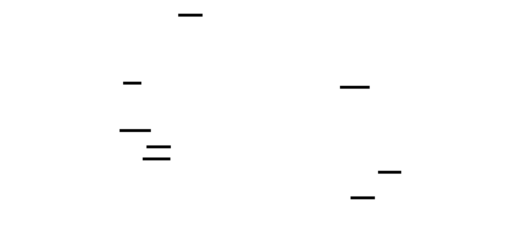
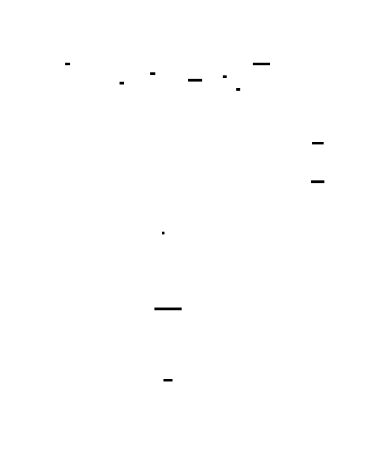
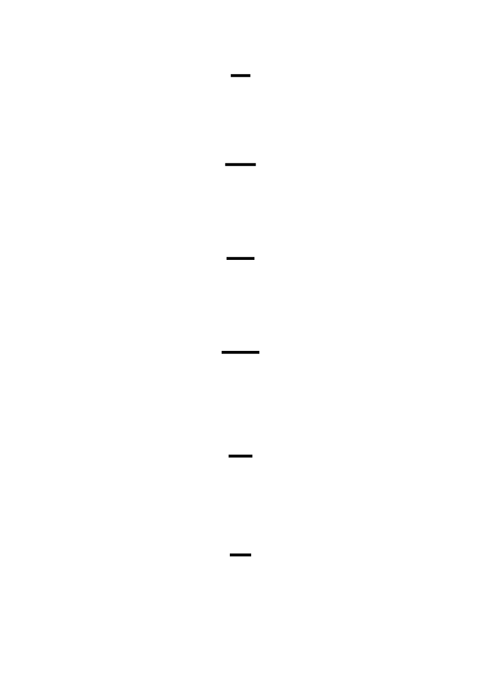
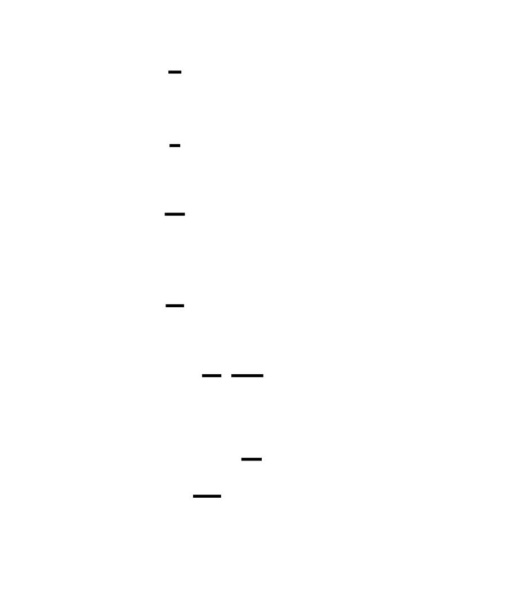

# 🎯 Project Charter: System Call Tracer (strace clone)

## What You Are Building
A functional clone of the Linux `strace` utility that intercepts, decodes, and reports every system call made by a target process on x86_64 Linux. You will build a low-level diagnostic tool that halts a tracee at the kernel boundary, extracts its register state, dereferences string arguments from its private address space, and follows its execution across multi-process `fork` and `exec` boundaries.

## Why This Project Exists
System calls are the narrow gateway through which every program interacts with the world, yet they are usually treated as a hidden black box by high-level languages. Building a tracer from scratch exposes the "register dance" of the x86_64 ABI and the mechanics of virtual memory isolation. You will learn exactly how debuggers and sandboxes control other processes at the hardware level.

## What You Will Be Able to Do When Done
- **Intercept Kernel Transitions**: Use the `ptrace` API to pause and resume processes at syscall entry and exit.
- **Read Remote Memory**: Implement a word-by-word reader to extract null-terminated strings from a tracee's memory space using `PTRACE_PEEKDATA`.
- **Manage Process Trees**: Build a state machine to track multiple processes and threads as they are created via `fork`, `vfork`, and `clone`.
- **Decode Binary ABIs**: Translate raw register values into human-readable flags (e.g., `O_RDONLY | O_CREAT`) and symbolic syscall names.
- **Profile System Performance**: Calculate high-resolution timing statistics using `CLOCK_MONOTONIC` to identify syscall bottlenecks.

## Final Deliverable
A standalone CLI utility (approximately 1,500 lines of C or Rust) that can trace complex programs like `bash` or `ls`. The tool will support PID attachment, syscall name filtering, and summary statistics output that matches the style of the professional `strace` tool.

## Is This Project For You?
**You should start this if you:**
- Are comfortable with C or Rust and understand pointers/memory addresses.
- Want to understand the boundary between userspace code and the Linux kernel.
- Are curious about how debuggers like GDB actually work under the hood.

**Come back after you've learned:**
- Basic Linux process control (`fork`, `exec`, `waitpid`).
- The fundamentals of x86_64 registers.
- [How to use the Linux Command Line](https://linuxjourney.com/).

## Estimated Effort
| Phase | Time |
|-------|------|
| Basic ptrace Interception (M1) | ~5-8 hours |
| Argument Decoding & Remote Memory (M2) | ~6-8 hours |
| Multi-Process & Fork Following (M3) | ~5-8 hours |
| Filtering, Statistics & Attachment (M4) | ~6-10 hours |
| **Total** | **~22-34 hours** |

## Definition of Done
The project is complete when:
- The tracer prints human-readable syscall names and return values (e.g., `open(...) = 3`).
- Path strings are successfully read from the tracee and displayed in quotes.
- The tracer successfully follows a shell pipeline (e.g., `echo hello | cat`) across multiple PIDs.
- The `-c` flag generates a sorted summary table of call counts, errors, and timing.
- The tracer can attach to an existing process by PID and detach cleanly on `SIGINT` (Ctrl+C).

---

# System Call Tracer (strace clone)

This project builds a fully functional strace clone from scratch — a ptrace-based system call tracer that intercepts, decodes, and reports every syscall a target process makes on x86_64 Linux. You will start by forking a child, attaching via ptrace, and toggling between syscall entry and exit stops. Then you'll decode arguments by reading registers, dereference string pointers word-by-word from the tracee's address space, follow fork/exec across process boundaries, and finally add filtering and statistical profiling.

The project is a window into the kernel-userspace boundary. Every syscall is a precisely choreographed register dance: the application loads arguments into rdi, rsi, rdx, r10, r8, r9, puts the syscall number in rax, and executes the `syscall` instruction. The kernel saves state, dispatches, and returns a result in rax. Your tracer sits in between, mediated by ptrace, observing this dance twice per call — once on entry, once on exit. Understanding this mechanism is foundational to debuggers (GDB), sandboxes (seccomp), profilers (perf), and container runtimes.

By the end, you'll have a tool that can attach to any process, print decoded syscall traces with arguments, follow multi-process workloads, filter by syscall name, and produce timing statistics — the core functionality of the real strace.


<!-- MS_ID: build-strace-m1 -->
# Milestone 1: Basic ptrace Syscall Intercept
## Where You Are in the System
Before writing a single line of code, orient yourself. Your strace clone has one job at its core: sit between a running process and the kernel, observe every syscall that crosses that boundary, and report what it sees. This milestone builds that core — the bare minimum tracer that intercepts syscalls and prints their numbers and return values.
By the end of this milestone you'll have a working tracer that can attach to any program, stop it at every syscall boundary, and print output like:
```
syscall(12) = 94367748206592
syscall(21) = 0
syscall(9) = 94367748206592
syscall(1) = -1 EBADF
```
Not pretty yet — that's Milestone 2. But correct. And correctness here is harder than it looks, because ptrace has a behavior that trips up almost everyone the first time.


---
## The Core Revelation: ptrace Stops Twice
Here's the assumption that will break your first implementation:
> *You call PTRACE_SYSCALL, the child runs the syscall, stops, and you read the result.*
This feels right. It mirrors how you think about function interception: intercept the call, get the result. One stop, one event.
**It's wrong.** ptrace stops the tracee *twice* per syscall — once at syscall entry (before the kernel executes anything) and once at syscall exit (after the kernel has completed the call and written the return value). Both stops look identical to `waitpid`. Neither stop says "I'm the entry stop" or "I'm the exit stop." Your tracer receives a SIGTRAP both times and must maintain its own toggle flag to know which one it's seeing.
This isn't a quirk or an implementation detail. It's fundamental to ptrace's design — and it's the source of more bugs in ptrace-based tools than anything else.
Why does this matter practically? On entry, the return value register (`rax`) contains **garbage** — specifically, the return value from the *previous* syscall. On exit, the argument registers still contain the call's arguments, but they may have been modified by the kernel. If you try to read the syscall number on exit, you can — `orig_rax` preserves it — but if you try to read `rax` on entry thinking it's the return value, you'll get stale data and produce completely wrong output.
The double-stop model is also what makes syscall *injection* possible: between entry and exit, the kernel is executing your syscall. If you wake up at entry and modify the registers before continuing, you can change which syscall runs or what arguments it receives. If you wake up at exit and modify `rax`, you can lie about what the syscall returned. This is how `strace -e inject=` works, and how seccomp-based sandboxes intercept and redirect syscalls. You're building the foundation for all of that right now.


---
## The ptrace Lifecycle
Before the toggle flag makes sense, you need to understand the full sequence from process creation to your first intercepted syscall. Let's walk through it.
### Step 1: Fork and TRACEME
Your tracer starts with `fork()`. The child process needs to tell the kernel "I want to be traced." It does this with `ptrace(PTRACE_TRACEME, 0, NULL, NULL)`.
`PTRACE_TRACEME` is the only ptrace request that's made by the *tracee* (the process being traced) rather than the *tracer*. It tells the kernel: "Whenever I make a syscall, deliver a SIGTRAP to pause me and wake up my parent." You call it in the child, before `exec()`.
After `PTRACE_TRACEME`, the child calls `exec()` to become the target program. Here's a subtlety: after a successful `exec()` in a traced process, the kernel automatically delivers **SIGTRAP** to the tracee. This is a one-time stop that happens right at the start of the new program's execution, before any instructions run. Your parent must handle this initial stop — it's not a syscall stop, it's the post-exec notification.
```c
#include <sys/ptrace.h>
#include <sys/types.h>
#include <sys/wait.h>
#include <unistd.h>
#include <stdio.h>
#include <stdlib.h>
int main(int argc, char *argv[]) {
    if (argc < 2) {
        fprintf(stderr, "Usage: %s <program> [args...]\n", argv[0]);
        return 1;
    }
    pid_t child = fork();
    if (child == 0) {
        /* Child: request tracing, then become the target program */
        ptrace(PTRACE_TRACEME, 0, NULL, NULL);
        execvp(argv[1], &argv[1]);
        /* If execvp returns, something went wrong */
        perror("execvp");
        exit(1);
    }
    /* Parent: wait for the initial SIGTRAP from exec */
    int status;
    waitpid(child, &status, 0);
    /* status now indicates the post-exec SIGTRAP stop */
    /* ... tracing loop goes here ... */
}
```
Notice the call sequence in the child: `PTRACE_TRACEME` first, then `execvp`. Order matters. If you reverse them, the new program won't be traced because the tracing flag wasn't set when `exec` ran.


### Step 2: The PTRACE_SYSCALL + waitpid Loop
Once you've caught the initial stop, the tracing loop begins. It follows a simple rhythm:
1. Call `ptrace(PTRACE_SYSCALL, child, NULL, NULL)` — this tells the kernel "resume the tracee, but stop it at the next syscall boundary."
2. Call `waitpid(child, &status, 0)` — block until something happens to the tracee.
3. Check `status` to figure out what happened.
4. If it's a syscall stop: inspect registers, print output, go to step 1.
5. If it's a signal stop: re-inject the signal, go to step 1.
6. If the process exited: clean up and exit the tracer.
The `PTRACE_SYSCALL` request is key. It means "stop at the next syscall entry OR exit." The kernel doesn't distinguish between them for you — you get one stop notification for each boundary. Your toggle flag tracks which boundary you're at.
```c
    /* Start the tracing loop */
    int in_syscall = 0;  /* Toggle: 0 = not in syscall (entry), 1 = in syscall (exit) */
    while (1) {
        /* Resume tracee, stop at next syscall boundary */
        ptrace(PTRACE_SYSCALL, child, NULL, NULL);
        /* Wait for the next stop */
        waitpid(child, &status, 0);
        /* Check what happened */
        if (WIFEXITED(status)) {
            printf("Process exited with status %d\n", WEXITSTATUS(status));
            break;
        }
        if (WIFSIGNALED(status)) {
            printf("Process killed by signal %d\n", WTERMSIG(status));
            break;
        }
        if (WIFSTOPPED(status)) {
            /* Handle the stop */
            /* ... */
        }
    }
```
Let's unpack those `waitpid` status macros — they're not optional knowledge, they're your primary tool for understanding what happened to the tracee.
---
## Understanding waitpid Status
`waitpid()` returns a 32-bit integer called the *wait status*. This integer is not a simple exit code — it encodes several different kinds of events in a bit-packed format, and you decode it with a set of macros.
{{DIAGRAM:diag-m1-waitpid-status-decode}}
Here's what each macro checks and returns:
**`WIFEXITED(status)`** — Returns true if the child terminated normally by calling `exit()` or returning from `main()`. When true, `WEXITSTATUS(status)` extracts the exit code (the argument passed to `exit()`).
**`WIFSIGNALED(status)`** — Returns true if the child was killed by a signal (like `SIGKILL` or `SIGSEGV`). When true, `WTERMSIG(status)` extracts the signal number that killed it.
**`WIFSTOPPED(status)`** — Returns true if the child was *stopped* (paused) rather than terminated. This is the case for both syscall stops and signal delivery stops in a ptrace-traced process. When true, `WSTOPSIG(status)` extracts the signal number that caused the stop. For syscall stops, this will be `SIGTRAP` (signal 5).
**`WIFCONTINUED(status)`** — Returns true if a stopped child was resumed with `SIGCONT`. You won't need this for basic tracing.
For your tracer, the most important distinction is between:
- `WIFEXITED` / `WIFSIGNALED` → the tracee is gone, stop tracing
- `WIFSTOPPED` → the tracee is paused, inspect it and decide what to do
---
## x86_64 Syscall Register Conventions
Now you need to know *what* to read when the tracee stops. Syscalls on x86_64 follow a strict register convention baked into the Linux ABI (Application Binary Interface — the contract between userspace and kernel that specifies exactly which registers carry which values).
When a program executes the `syscall` instruction on x86_64:
- **`rax`** — holds the syscall number before the call
- **`rdi`** — holds argument 1
- **`rsi`** — holds argument 2
- **`rdx`** — holds argument 3
- **`r10`** — holds argument 4 (note: this is `r10`, not `rcx` as in the normal calling convention — the `syscall` instruction uses `rcx` internally to save the return address)
- **`r8`** — holds argument 5
- **`r9`** — holds argument 6
After the kernel completes the syscall, **`rax`** holds the return value.
Here's the critical problem: the kernel may use `rax` for its own purposes during dispatch. If you read `rax` on entry, you'll get the syscall number — but the kernel might overwrite `rax` before giving you control on exit, destroying it. So the kernel saves the original `rax` value into a special field called `orig_rax` *before* doing anything else.
This means:
- **On entry**: Read `orig_rax` for the syscall number. (Reading `rax` on entry gives the syscall number too, but `orig_rax` is the authoritative source.)
- **On exit**: Read `rax` for the return value. Read `orig_rax` if you need the syscall number again.
To read these registers, you use `ptrace(PTRACE_GETREGS, pid, NULL, &regs)` where `regs` is a `struct user_regs_struct` defined in `<sys/user.h>`.


```c
#include <sys/user.h>  /* struct user_regs_struct */
struct user_regs_struct regs;
ptrace(PTRACE_GETREGS, child, NULL, &regs);
/* On syscall entry: */
long syscall_number = regs.orig_rax;
/* On syscall exit: */
long return_value = regs.rax;
```
The `struct user_regs_struct` contains fields for all general-purpose registers. The ones you'll use most in this milestone:
```c
struct user_regs_struct {
    /* ... many fields ... */
    unsigned long long orig_rax;  /* Saved rax (syscall number) */
    unsigned long long rax;       /* Return value (on exit) */
    unsigned long long rdi;       /* Argument 1 */
    unsigned long long rsi;       /* Argument 2 */
    unsigned long long rdx;       /* Argument 3 */
    unsigned long long r10;       /* Argument 4 */
    unsigned long long r8;        /* Argument 5 */
    unsigned long long r9;        /* Argument 6 */
    /* ... more fields ... */
};
```
---
## Three-Level View: What Happens During a Syscall
Understanding the entry/exit stops requires seeing what happens at all three levels.


**Level 1 — Application (Tracee)**
The program calls `write(1, "hello", 5)`. The compiler has already translated this into: load 1 into `rdi`, load the string pointer into `rsi`, load 5 into `rdx`, load 1 (the syscall number for `write`) into `rax`, execute the `syscall` instruction.
**Level 2 — Kernel**
When `syscall` executes:
1. The CPU switches to ring 0 (kernel mode) and jumps to the syscall entry point (`entry_SYSCALL_64`).
2. The kernel checks if this process is being traced (the `PT_TRACED` flag is set on the task).
3. If traced: before doing anything else, save `rax` to `orig_rax`, then signal the tracer with SIGTRAP. The tracee is now paused. This is the **entry stop**.
4. The tracer wakes up, inspects registers, then calls `PTRACE_SYSCALL` to resume.
5. The kernel executes the actual syscall (calls `sys_write`).
6. The return value is placed in `rax`.
7. The kernel signals the tracer again with SIGTRAP. The tracee is paused again. This is the **exit stop**.
8. The tracer wakes up, reads the return value from `rax`, then calls `PTRACE_SYSCALL` to resume.
9. The `syscall` instruction completes in userspace. Execution continues.
**Level 3 — Hardware**
The `syscall` instruction does specific things at the hardware level:
- Saves the return address (next instruction's `RIP`) into `RCX`.
- Saves `RFLAGS` into `R11`.
- Loads the kernel's code segment (`CS`) and stack pointer.
- Jumps to the address stored in `IA32_LSTAR` MSR (Model-Specific Register) — the kernel entry point.
This is why `rcx` and `r11` are clobbered by the `syscall` instruction: they're used by the hardware to save state. The kernel calling convention for syscalls explicitly uses `r10` instead of `rcx` for argument 4 to avoid this conflict.
The `orig_rax` field exists because of step 3 above — the kernel overwrites `rax` during its own internal dispatch, so it first saves the original value.
---
## The Toggle Flag in Practice
Now you have everything to implement the full entry/exit logic:
```c
#include <sys/ptrace.h>
#include <sys/types.h>
#include <sys/wait.h>
#include <sys/user.h>
#include <unistd.h>
#include <stdio.h>
#include <stdlib.h>
#include <errno.h>
#include <string.h>
int main(int argc, char *argv[]) {
    if (argc < 2) {
        fprintf(stderr, "Usage: %s <program> [args...]\n", argv[0]);
        return 1;
    }
    pid_t child = fork();
    if (child == 0) {
        /* Child: enable tracing and exec the target */
        ptrace(PTRACE_TRACEME, 0, NULL, NULL);
        execvp(argv[1], &argv[1]);
        perror("execvp");
        exit(1);
    }
    /* Parent: catch the post-exec SIGTRAP */
    int status;
    waitpid(child, &status, 0);
    if (!WIFSTOPPED(status)) {
        fprintf(stderr, "Unexpected initial status\n");
        return 1;
    }
    /* The tracing loop */
    int in_syscall = 0;  /* Toggle: 0 = next stop is entry, 1 = next stop is exit */
    while (1) {
        /* Resume tracee, asking kernel to stop at next syscall boundary */
        if (ptrace(PTRACE_SYSCALL, child, NULL, NULL) == -1) {
            perror("ptrace PTRACE_SYSCALL");
            break;
        }
        /* Block until the tracee stops again */
        waitpid(child, &status, 0);
        /* Tracee has exited — stop tracing */
        if (WIFEXITED(status)) {
            printf("+++ exited with %d +++\n", WEXITSTATUS(status));
            break;
        }
        /* Tracee was killed by a signal — stop tracing */
        if (WIFSIGNALED(status)) {
            printf("+++ killed by signal %d +++\n", WTERMSIG(status));
            break;
        }
        /* Tracee has stopped — inspect why */
        if (WIFSTOPPED(status)) {
            int sig = WSTOPSIG(status);
            if (sig == SIGTRAP) {
                /* This is a syscall stop (or the initial post-exec stop) */
                struct user_regs_struct regs;
                ptrace(PTRACE_GETREGS, child, NULL, &regs);
                if (!in_syscall) {
                    /* Entry: syscall is about to execute */
                    /* Just record that we're entering; we'll print on exit */
                    in_syscall = 1;
                } else {
                    /* Exit: syscall has completed */
                    long syscall_num = (long)regs.orig_rax;
                    long return_val  = (long)regs.rax;
                    /* Detect error returns */
                    if (return_val >= -4096 && return_val <= -1) {
                        int err_num = (int)(-return_val);
                        printf("syscall(%ld) = -1 %s\n",
                               syscall_num, strerror(err_num));
                    } else {
                        printf("syscall(%ld) = %ld\n",
                               syscall_num, return_val);
                    }
                    in_syscall = 0;
                }
            } else {
                /* Signal-delivery stop: a real signal for the tracee */
                /* Re-inject it — do NOT pass 0 or you'll swallow the signal */
                ptrace(PTRACE_SYSCALL, child, NULL, (void *)(long)sig);
                continue;  /* Skip the PTRACE_SYSCALL at top of loop */
            }
        }
    }
    return 0;
}
```
Read through this carefully. Notice the subtle continuation in the signal-delivery case: when you handle a signal stop, you call `PTRACE_SYSCALL` with the signal number immediately in the handler and `continue` to skip the `PTRACE_SYSCALL` at the top of the loop — otherwise you'd call it twice and lose an event.
---
## Signal Stops vs Syscall Stops
The code above has a subtle problem. We're distinguishing signal-delivery stops from syscall stops by checking if the stop signal is `SIGTRAP`. But `SIGTRAP` *is* the signal for both types of stops. How do you actually tell them apart?


There are two approaches:
### Approach 1: PTRACE_O_TRACESYSGOOD (Recommended)
If you set the option `PTRACE_O_TRACESYSGOOD` on the tracee, the kernel will set bit 7 of the stop signal number for syscall stops. That is, instead of delivering `SIGTRAP` (signal 5) for syscall stops, it delivers `SIGTRAP | 0x80` = `0x85`. Signal-delivery stops still use plain `SIGTRAP` (5).
You set options with:
```c
ptrace(PTRACE_SETOPTIONS, child, NULL, PTRACE_O_TRACESYSGOOD);
```
Call this right after the initial `waitpid` that catches the post-exec stop.
Then your stop handling becomes:
```c
if (WIFSTOPPED(status)) {
    int sig = WSTOPSIG(status);
    if (sig == (SIGTRAP | 0x80)) {
        /* Syscall stop — handle entry/exit toggle */
        /* sig & 0x7F == SIGTRAP, bit 7 is the TRACESYSGOOD indicator */
        /* ... */
    } else if (sig == SIGTRAP) {
        /* Plain SIGTRAP — could be post-exec stop, breakpoint, or other ptrace event */
        /* For now, just resume */
    } else {
        /* Genuine signal delivery stop — re-inject the signal */
        ptrace(PTRACE_SYSCALL, child, NULL, (void *)(long)sig);
        continue;
    }
}
```
### Approach 2: Check orig_rax
Another approach: on every SIGTRAP stop, call `PTRACE_GETREGS` and check `orig_rax`. If `orig_rax` is a valid syscall number (0 through ~450 on Linux), it's likely a syscall stop. But this is fragile — `orig_rax` can contain valid-looking values in edge cases.
**Use `PTRACE_O_TRACESYSGOOD`.** It's the correct approach, used by real strace. The bit-7 trick was invented precisely to solve this disambiguation problem.
Here's the updated initialization:
```c
    /* Catch post-exec stop */
    waitpid(child, &status, 0);
    /* Set options: use TRACESYSGOOD to mark syscall stops */
    ptrace(PTRACE_SETOPTIONS, child, NULL, PTRACE_O_TRACESYSGOOD);
    /* Now enter the tracing loop */
```
---
## Error Detection on x86_64
When a syscall fails, the kernel doesn't return a positive number and set `errno`. Instead, it returns a negative number in the range `[-4096, -1]`. The C library wrapper (in glibc) detects this range, negates the value, stores it in `errno`, and returns `-1` to your program.
For example, if you call `open("nonexistent", O_RDONLY)`, the kernel returns `-2` (which is `-ENOENT`). glibc sees `-2`, sets `errno = 2` (ENOENT), and returns `-1`.
In your tracer, you see the *raw kernel return value* — not the glibc-processed one. So you need to do the same detection:
```c
/* On x86_64, kernel error returns are in the range [-4096, -1] */
/* This range covers all possible errno values (the largest is ~4095) */
long return_val = (long)regs.rax;
if (return_val >= -4096L && return_val <= -1L) {
    /* Error return */
    int err_num = (int)(-return_val);  /* Negate to get the errno value */
    printf("syscall(%ld) = -1 %s\n", syscall_num, strerror(err_num));
} else {
    /* Success return */
    printf("syscall(%ld) = %ld\n", syscall_num, return_val);
}
```
Why the range `[-4096, -1]`? The Linux kernel reserves 4096 values for error codes. The actual defined errno values top out around 133 (`EHWPOISON`), but the kernel reserves the full 4096 range to be safe for future additions.


The cast `(long)regs.rax` matters. `regs.rax` is `unsigned long long`. If a syscall returns `-2`, the bit pattern in `rax` is `0xFFFFFFFFFFFFFFFE` — which as an unsigned 64-bit integer is a very large positive number. By casting to `long` (signed), you restore the correct negative interpretation. Always cast `rax` to `long` before comparing.
---
## Putting It Together: Complete Working Tracer
Here is the complete, correct implementation for Milestone 1. Every concept from this chapter is present:
```c
#include <sys/ptrace.h>
#include <sys/types.h>
#include <sys/wait.h>
#include <sys/user.h>
#include <unistd.h>
#include <stdio.h>
#include <stdlib.h>
#include <string.h>
#include <signal.h>
#include <errno.h>
int main(int argc, char *argv[]) {
    if (argc < 2) {
        fprintf(stderr, "Usage: %s <program> [args...]\n", argv[0]);
        return 1;
    }
    pid_t child = fork();
    if (child < 0) {
        perror("fork");
        return 1;
    }
    if (child == 0) {
        /*
         * CHILD PROCESS
         * 1. Tell the kernel we want to be traced.
         * 2. exec the target program.
         * After exec succeeds, the kernel delivers SIGTRAP and pauses us.
         */
        if (ptrace(PTRACE_TRACEME, 0, NULL, NULL) == -1) {
            perror("ptrace TRACEME");
            exit(1);
        }
        execvp(argv[1], &argv[1]);
        /* execvp only returns on error */
        perror("execvp");
        exit(1);
    }
    /*
     * PARENT (TRACER) PROCESS
     */
    int status;
    /* Step 1: Catch the initial SIGTRAP delivered after exec */
    if (waitpid(child, &status, 0) == -1) {
        perror("waitpid (initial)");
        return 1;
    }
    if (!WIFSTOPPED(status)) {
        fprintf(stderr, "Unexpected: child did not stop after exec\n");
        return 1;
    }
    /* Step 2: Set TRACESYSGOOD so syscall stops set bit 7 of the signal */
    if (ptrace(PTRACE_SETOPTIONS, child, NULL,
               (void *)(long)PTRACE_O_TRACESYSGOOD) == -1) {
        perror("ptrace SETOPTIONS");
        return 1;
    }
    /*
     * Step 3: The tracing loop.
     *
     * Toggle state:
     *   in_syscall == 0: next syscall stop will be an ENTRY stop
     *   in_syscall == 1: next syscall stop will be an EXIT stop
     */
    int in_syscall = 0;
    for (;;) {
        /* Resume tracee; stop at next syscall entry or exit */
        if (ptrace(PTRACE_SYSCALL, child, NULL, NULL) == -1) {
            /* Tracee may have exited between our waitpid and this call */
            if (errno == ESRCH) break;
            perror("ptrace PTRACE_SYSCALL");
            break;
        }
        /* Block until the tracee changes state */
        pid_t stopped = waitpid(child, &status, 0);
        if (stopped == -1) {
            perror("waitpid");
            break;
        }
        /* The tracee exited normally */
        if (WIFEXITED(status)) {
            printf("+++ exited with %d +++\n", WEXITSTATUS(status));
            break;
        }
        /* The tracee was killed by a signal */
        if (WIFSIGNALED(status)) {
            printf("+++ killed by signal %d (%s) +++\n",
                   WTERMSIG(status), strsignal(WTERMSIG(status)));
            break;
        }
        /* The tracee stopped */
        if (WIFSTOPPED(status)) {
            int sig = WSTOPSIG(status);
            if (sig == (SIGTRAP | 0x80)) {
                /*
                 * SYSCALL STOP (entry or exit, distinguished by toggle)
                 * Bit 7 is set because we used PTRACE_O_TRACESYSGOOD.
                 */
                struct user_regs_struct regs;
                if (ptrace(PTRACE_GETREGS, child, NULL, &regs) == -1) {
                    perror("ptrace GETREGS");
                    break;
                }
                if (in_syscall == 0) {
                    /*
                     * ENTRY STOP
                     * The syscall is about to execute. orig_rax has the
                     * syscall number. We note it and flip the toggle.
                     * (We don't print yet — we print on exit when we have
                     * both the syscall number AND the return value.)
                     */
                    in_syscall = 1;
                    /* Syscall number: regs.orig_rax — saved for exit print */
                } else {
                    /*
                     * EXIT STOP
                     * The syscall has completed. rax has the return value.
                     * orig_rax still has the syscall number.
                     */
                    long syscall_num = (long)regs.orig_rax;
                    long return_val  = (long)regs.rax;
                    if (return_val >= -4096L && return_val <= -1L) {
                        int err_num = (int)(-return_val);
                        printf("syscall(%ld) = -1 %s\n",
                               syscall_num, strerror(err_num));
                    } else {
                        printf("syscall(%ld) = %ld\n",
                               syscall_num, return_val);
                    }
                    in_syscall = 0;
                }
            } else if (sig == SIGTRAP) {
                /*
                 * Plain SIGTRAP without bit 7 — this is the post-exec stop
                 * or some other ptrace event. Just resume with no signal.
                 * (The toggle stays at 0; we haven't entered a syscall.)
                 */
            } else {
                /*
                 * SIGNAL-DELIVERY STOP
                 * A real signal (SIGTERM, SIGPIPE, SIGHUP, etc.) was
                 * delivered to the tracee. We must re-inject it by passing
                 * the signal number as the 4th argument to PTRACE_SYSCALL.
                 * Passing 0 would suppress the signal, which would break
                 * the traced program's signal-handling logic.
                 */
                if (ptrace(PTRACE_SYSCALL, child, NULL,
                           (void *)(long)sig) == -1) {
                    if (errno == ESRCH) break;
                    perror("ptrace PTRACE_SYSCALL (signal re-inject)");
                    break;
                }
                /* Note: we re-injected via PTRACE_SYSCALL above; skip the
                 * PTRACE_SYSCALL call at the top of the loop. */
                continue;
            }
        }
    }
    return 0;
}
```
### Building and Testing
```makefile
# Makefile
CC = gcc
CFLAGS = -Wall -Wextra -g
strace_clone: strace_clone.c
	$(CC) $(CFLAGS) -o strace_clone strace_clone.c
clean:
	rm -f strace_clone
```
Test it:
```bash
make
./strace_clone /bin/ls /tmp
```
You should see a stream of `syscall(N) = M` lines, followed by `+++ exited with 0 +++`. The syscall numbers will be x86_64 numbers — `59` is `execve`, `12` is `brk`, `9` is `mmap`. You'll decode these in Milestone 2.
---
## Common Bugs and How to Avoid Them
### Bug 1: Reading rax on Entry
```c
/* WRONG: rax on entry is garbage (previous syscall's return value) */
if (!in_syscall) {
    long return_val = (long)regs.rax;  /* ← This is wrong! */
    printf("syscall(%ld) = %ld\n", regs.orig_rax, return_val);
    in_syscall = 1;
}
```
The fix is to not print the return value on entry. Print on exit when `rax` is valid.
### Bug 2: Not Re-Injecting Signals
```c
/* WRONG: passing 0 suppresses the signal */
ptrace(PTRACE_SYSCALL, child, NULL, NULL);  /* suppresses the signal! */
```
If a program receives `SIGPIPE` (write to a closed pipe) and you suppress it by passing 0, the program won't get the signal. It will continue writing to a closed pipe and produce corrupt behavior. Always re-inject real signals.
### Bug 3: Forgetting the Toggle
If your toggle flag is wrong — say, you initialize it to 1 instead of 0, or you increment instead of toggling — you'll be one stop off on every syscall. Entry reads will look like exits and vice versa. The output will look plausible but be completely wrong. The numbers will be garbage. Initialize `in_syscall = 0` and toggle it cleanly.
### Bug 4: Missing PTRACE_TRACEME Before exec
If the child calls `exec` before `PTRACE_TRACEME`, the new program is not traced. The parent's `waitpid` will block forever (or until the child exits). Always `PTRACE_TRACEME` first.
---
## Hardware Soul: What the CPU Does
*When your tracer intercepts a syscall, what's happening in the hardware?*
**Cache behavior**: The `syscall` instruction causes a CPU privilege level transition. The kernel entry code lives in a different cache region than userspace. This is an L1 instruction cache miss (cold path) on the first syscall of a program, then typically hot for subsequent calls. The `struct user_regs_struct` you read with `PTRACE_GETREGS` is a 216-byte structure — it fits in approximately 4 cache lines (64 bytes each). Each `PTRACE_GETREGS` call copies this structure across process boundaries, touching 4 cache lines.
**TLB behavior**: The `waitpid` call that blocks your tracer is a full context switch. The CPU flushes TLB entries on context switch (or invalidates them on architectures with ASID support). When your tracer resumes to inspect registers, the kernel maps the tracee's register state into your address space — no TLB miss for the register copy, but your tracer's own TLB state must be reconstructed.
**Branch prediction**: The `WIFSTOPPED`/`WIFEXITED`/`WIFSIGNALED` macros are simple bit operations. They're essentially free. The branch predictor will correctly predict "almost always WIFSTOPPED" after the first few iterations.
**Syscall overhead**: Each `ptrace(PTRACE_SYSCALL, ...)` is itself a syscall. Each `waitpid` is a syscall. So intercepting *one* syscall in the tracee costs *two* syscalls in the tracer (plus the context switch overhead and cache effects). This is why ptrace-based tracing has significant overhead — strace can slow a program by 2-10x depending on syscall frequency.
---
## Knowledge Cascade: What This Unlocks
You've just implemented the core mechanism of one of Linux's most powerful diagnostic tools. That toggle flag and SIGTRAP stop aren't isolated ideas — they connect to a wide web of systems knowledge.
### 1. GDB Uses the Same Mechanism (Just With PTRACE_SINGLESTEP)
GDB's breakpoints work by inserting an `INT 3` instruction (opcode `0xCC`) at a target address, which generates a SIGTRAP when executed. But GDB also uses `PTRACE_SINGLESTEP` to step one instruction at a time — this is the same double-stop model. When GDB says "hit breakpoint, stopped at line 42," it has just received a SIGTRAP via `waitpid`, read the register state, and displayed it to you. The mechanism you built today is the foundation of every debugger on Linux.
**The connection to your toggle**: When you understand entry/exit stops, you understand why GDB can modify syscall arguments *in flight* — it wakes up at entry, modifies registers before resuming, and the kernel executes the modified syscall. Fault injection (breaking programs deliberately to test error handling) is built on exactly this mechanism.
### 2. seccomp-BPF Filters Only at Entry
seccomp (Secure Computing Mode) is a Linux kernel feature that lets you install a BPF (Berkeley Packet Filter) program to filter syscalls. Here's the critical connection: **seccomp filters run at syscall entry only, not exit**. They can allow or deny a call, but they cannot inspect the return value. Now you know *why* — the entry/exit model means the filter runs at the first SIGTRAP (entry stop), before the kernel has executed the syscall. Return values don't exist yet. seccomp can block `open()` but can't block `open()` that returns a file descriptor pointing to a sensitive file — it has to make that decision based on arguments alone.
Container runtimes like runc use seccomp profiles to restrict what syscalls containers can make. When you run `docker run --security-opt seccomp=profile.json`, that profile is compiled into a BPF program loaded via `prctl(PR_SET_SECCOMP, ...)`. The ptrace entry stop is where this filter executes.
### 3. strace -e inject: Modifying Syscalls In Flight
Real strace has a feature called `strace -e inject=open:retval=-1:error=ENOENT` that makes `open()` always fail with ENOENT. How does it work? On the entry stop, strace notes the syscall. On the exit stop, it modifies `rax` to `-2` (which is `-ENOENT`) using `PTRACE_SETREGS`. The program's glibc library sees `-2`, sets `errno = ENOENT`, and returns `-1` to the program. The actual `open()` ran and succeeded — strace lied about the result. This is fault injection: a technique for testing that programs handle errors correctly.
You now understand the two stops well enough to implement this yourself: read on entry, modify `rax` on exit.
### 4. The x86_64 syscall ABI vs. the C Calling Convention
You've learned that syscalls use `rdi, rsi, rdx, r10, r8, r9` for arguments. The normal C function calling convention uses `rdi, rsi, rdx, rcx, r8, r9`. The difference is argument 4: `r10` for syscalls vs. `rcx` for function calls. This exists because the `syscall` instruction hardware-saves the return address in `RCX` — so `rcx` is clobbered by the mechanism itself. The ABI designers shifted argument 4 to `r10` to avoid the conflict. Now when you see `r10` in a Linux syscall table, you know exactly why.
### 5. The Performance Cost of Observability
Every syscall interception costs approximately:
- 2 context switches (tracer → tracee → tracer)
- 2 additional syscalls by the tracer (PTRACE_SYSCALL + waitpid)
- 4 cache line reads (PTRACE_GETREGS for the register struct)
- ~5,000-10,000 CPU cycles of overhead per intercepted syscall
This is why you don't use ptrace in production — it's too slow. Production observability tools (like `perf`, `eBPF` probes, or `ftrace`) use kernel-side hooks that avoid the full context switch. They sample in the kernel and only surface data to userspace periodically. What you're building is the *right tool* for debugging and learning, not for production profiling. Knowing this cost precisely is what lets you make the right tool choice.
---
## Summary: What You've Built
Your tracer now:
- Forks a child, has it request tracing, and execs the target program
- Catches the post-exec SIGTRAP and configures `PTRACE_O_TRACESYSGOOD`
- Runs a `PTRACE_SYSCALL + waitpid` loop indefinitely
- Toggles an `in_syscall` flag to distinguish entry from exit
- On exit: reads `orig_rax` for the syscall number and `rax` for the return value
- Detects error returns using the `[-4096, -1]` range and prints errno names
- Re-injects real signals to the tracee rather than suppressing them
- Detects `WIFEXITED` / `WIFSIGNALED` to stop the tracing loop cleanly
The output isn't human-readable yet — syscall numbers instead of names, raw integers instead of decoded arguments. Milestone 2 fixes that. But the machinery underneath — the toggle, the register reads, the signal handling — is complete and correct. Everything in the remaining milestones builds on exactly what you've built here.
---
<!-- END_MS -->


<!-- MS_ID: build-strace-m2 -->
<!-- MS_ID: build-strace-m2 -->
# Milestone 2: Argument Decoding
## Where You Are Now
Your Milestone 1 tracer produces output like this:
```
syscall(59) = 0
syscall(12) = 94412374278144
syscall(21) = -1 ENOENT
syscall(9) = 94412374278144
syscall(1) = 5
```
This is *correct*. The toggle works. The error detection is right. The signal handling is right. But it's completely unreadable to a human being. Syscall 59 is `execve`. Syscall 12 is `brk`. Syscall 21 is `access`. Without names, you have numbers. Without arguments, you have calls in a vacuum.
Real strace shows you this instead:
```
execve("/bin/ls", ["/bin/ls", "/tmp"], 0x7ffd3b2a8120 /* 23 vars */) = 0
brk(NULL) = 0x55f1a3c06000
access("/etc/ld.so.preload", R_OK) = -1 ENOENT (No such file or directory)
mmap(NULL, 8192, PROT_READ|PROT_WRITE, MAP_PRIVATE|MAP_ANONYMOUS, -1, 0) = 0x7f...
write(1, "file1.txt  file2.txt\n", 21)  = 21
```
This milestone builds everything that transforms the first form into the second. You'll build a syscall name table, extract arguments from the six x86_64 argument registers, read string arguments word-by-word from the tracee's memory, decode bitmask flags into human-readable names, and format output in strace style.
There's one concept at the center of this milestone that is genuinely surprising the first time you encounter it. Let's start there.
---
## The Core Revelation: Address Spaces Are Not Shared
Here's what feels obvious: the tracee passed a string pointer to the kernel as a syscall argument. You have that pointer. The pointer is just a number — a virtual address like `0x7ffd1234abcd`. Surely you can just dereference it?
```c
/* What you want to do: */
struct user_regs_struct regs;
ptrace(PTRACE_GETREGS, child, NULL, &regs);
char *path = (char *)regs.rdi;  /* rdi = first argument */
printf("open(\"%s\", ...)\n", path);  /* ← SEGFAULT or garbage */
```
This feels completely reasonable. The pointer exists. It points to memory. Print the memory.
**It crashes or prints garbage.** Here is why.


Every process on Linux has its own *virtual address space* — a private, independent mapping of virtual addresses to physical memory pages. The virtual address `0x7ffd1234abcd` in the tracee's address space maps to one set of physical pages. That same virtual address in *your tracer's* address space maps to something completely different — your tracer's own stack, or unmapped memory that will segfault if you dereference it, or (in rare cases where the addresses happen to coincide) a completely unrelated region.
The CPU's Memory Management Unit (MMU) enforces this separation at the hardware level. Every process has a pointer to its own page table stored in the `CR3` register. When a context switch happens, the kernel loads the new process's page table address into `CR3`. From that moment, all virtual addresses resolve through *that process's* page tables. Virtual address isolation isn't a software policy — it's physics. The hardware translates addresses differently depending on which `CR3` is loaded.
This is the foundation of process isolation. It's why one buggy process can't corrupt another's memory. It's also exactly why you can't just dereference a pointer from the tracee: your tracer's `CR3` is loaded, not the tracee's.
> **The key insight**: A pointer is not data. A pointer is a *key* that only makes sense within the address space that owns it. To read what a tracee pointer *points to*, you need the kernel to do the translation on your behalf, using the tracee's page tables.
`PTRACE_PEEKDATA` is exactly that: a kernel-mediated, cross-address-space read. You ask the kernel: "In process `pid`'s address space, at virtual address `addr`, what are the 8 bytes?" The kernel temporarily maps the tracee's page tables, reads the data, and returns it to you. One word at a time.
---
## PTRACE_PEEKDATA: The Word-by-Word Bridge
`PTRACE_PEEKDATA` has this signature:
```c
long ptrace(PTRACE_PEEKDATA, pid_t pid, void *addr, void *data);
```
- `pid` — the tracee's PID
- `addr` — the virtual address in the tracee's address space to read from
- `data` — ignored for PEEKDATA (the return value carries the data)
- **Return value** — the 8 bytes at that address, returned as a `long`
On x86_64, one `PTRACE_PEEKDATA` call reads exactly **8 bytes** (one machine word). If you want to read a string, you must call it repeatedly, advancing the address by 8 each time, until you find a null byte.


### The errno Ambiguity — A Critical Trap
Here's the trap that breaks naive implementations:
`PTRACE_PEEKDATA` returns its data via the return value. On error, it returns `-1`. But `-1` is `0xFFFFFFFFFFFFFFFF` as an 8-byte word — which is *valid data* that could legitimately appear in the tracee's memory. So how do you know if `-1` means "error" or means "I read 8 bytes of 0xFF"?
You can't tell from the return value alone. The POSIX solution: `errno`.
When `PTRACE_PEEKDATA` succeeds, it does **not** modify `errno`. When it fails, it sets `errno` to indicate the error (e.g., `EIO` if the address is unmapped, `ESRCH` if the PID is gone). So the pattern is:
```c
errno = 0;                                      /* Clear before the call */
long word = ptrace(PTRACE_PEEKDATA, pid, addr, NULL);
if (word == -1 && errno != 0) {
    /* Genuine error */
    perror("PTRACE_PEEKDATA");
    return -1;
}
/* word is valid data — may be -1, that's fine */
```


This is not optional. If you skip the `errno = 0` pre-clear, you may have stale `errno` from a previous call polluting your error check. Always zero `errno` before calling `PTRACE_PEEKDATA`.
### Reading a String Word by Word
With this in mind, here's the algorithm for reading a null-terminated string from the tracee:
1. Start at the pointer address.
2. Read one 8-byte word with `PTRACE_PEEKDATA`.
3. Scan the 8 bytes, one byte at a time, for a null byte (`'\0'`).
4. Append non-null bytes to your output buffer.
5. If a null byte is found: done.
6. If no null byte in this word: advance address by 8, go to step 2.
7. Stop if you've read more than your max-length limit.
The byte ordering matters. On x86_64 (which is little-endian), the first byte of a word stored at address `A` is the least-significant byte of the `long` returned by `PTRACE_PEEKDATA`. That is, if the memory at address `A` contains the bytes `['h', 'e', 'l', 'l', 'o', '\0', ?, ?]`, then `PTRACE_PEEKDATA` returns a `long` whose byte 0 (least-significant) is `'h'`, byte 1 is `'e'`, and so on.
```c
#define MAX_STRING_LEN 32
/* Read a string from tracee memory at virtual address 'addr'.
 * Fills 'buf' (at most 'maxlen' bytes + NUL).
 * Returns 1 if truncated, 0 if complete, -1 on error. */
int read_tracee_string(pid_t pid, unsigned long addr,
                       char *buf, int maxlen, int *truncated)
{
    int i = 0;
    *truncated = 0;
    while (i < maxlen) {
        errno = 0;
        long word = ptrace(PTRACE_PEEKDATA, pid, (void *)addr, NULL);
        if (word == -1 && errno != 0) {
            if (i == 0) return -1;   /* Error on first read: nothing retrieved */
            break;                    /* Error mid-string: return what we have */
        }
        /* Scan the 8 bytes of this word */
        unsigned char *bytes = (unsigned char *)&word;
        for (int b = 0; b < 8; b++) {
            if (bytes[b] == '\0') {
                buf[i] = '\0';
                return 0;  /* Complete string found */
            }
            if (i < maxlen) {
                buf[i++] = (char)bytes[b];
            } else {
                buf[i] = '\0';
                *truncated = 1;
                return 0;  /* Truncated */
            }
        }
        addr += 8;  /* Advance to next word */
    }
    buf[i] = '\0';
    *truncated = (i >= maxlen);
    return 0;
}
```
Use it like this:
```c
char path[MAX_STRING_LEN + 1];
int truncated;
if (read_tracee_string(child, regs.rdi, path, MAX_STRING_LEN, &truncated) == 0) {
    printf("\"%s%s\"", path, truncated ? "..." : "");
} else {
    printf("\"<unreadable>\"");
}
```
### Null Pointer Check — Don't Peek at NULL
Before calling `PTRACE_PEEKDATA`, always check that the pointer is not NULL. Many syscalls accept NULL for optional arguments — for example, `execve(path, argv, NULL)` with a NULL environment pointer. Attempting `PTRACE_PEEKDATA` on address 0 will fail with `EIO` because address 0 is unmapped in every normal process. Print `NULL` (strace's convention) instead:
```c
if (regs.rdi == 0) {
    printf("NULL");
} else {
    /* read_tracee_string(...) */
}
```
---
## Building the Syscall Name Table
To print `open` instead of `2` (or `openat` instead of `257`), you need a lookup table mapping syscall numbers to their names. On x86_64 Linux, syscall numbers are dense integers starting from 0 — a perfect candidate for a simple array.



### Table Design
```c
/* syscall_table.h */
#define MAX_SYSCALL_NUM 335  /* Highest syscall number on modern Linux x86_64 */
extern const char *syscall_names[MAX_SYSCALL_NUM + 1];
static inline const char *syscall_name(long num) {
    if (num < 0 || num > MAX_SYSCALL_NUM) return "unknown";
    const char *name = syscall_names[num];
    return name ? name : "unknown";
}
```
```c
/* syscall_table.c — excerpt showing the structure */
const char *syscall_names[] = {
    [0]   = "read",
    [1]   = "write",
    [2]   = "open",
    [3]   = "close",
    [4]   = "stat",
    [5]   = "fstat",
    [6]   = "lstat",
    [7]   = "poll",
    [8]   = "lseek",
    [9]   = "mmap",
    [10]  = "mprotect",
    [11]  = "munmap",
    [12]  = "brk",
    [13]  = "rt_sigaction",
    [14]  = "rt_sigprocmask",
    [15]  = "rt_sigreturn",
    [16]  = "ioctl",
    [17]  = "pread64",
    [18]  = "pwrite64",
    [19]  = "readv",
    [20]  = "writev",
    [21]  = "access",
    [22]  = "pipe",
    [23]  = "select",
    [24]  = "sched_yield",
    [25]  = "mremap",
    [26]  = "msync",
    [27]  = "mincore",
    [28]  = "madvise",
    [29]  = "shmget",
    [30]  = "shmat",
    [31]  = "shmctl",
    [32]  = "dup",
    [33]  = "dup2",
    [34]  = "pause",
    [35]  = "nanosleep",
    [36]  = "getitimer",
    [37]  = "alarm",
    [38]  = "setitimer",
    [39]  = "getpid",
    [40]  = "sendfile",
    [41]  = "socket",
    [42]  = "connect",
    [43]  = "accept",
    [44]  = "sendto",
    [45]  = "recvfrom",
    [46]  = "sendmsg",
    [47]  = "recvmsg",
    [48]  = "shutdown",
    [49]  = "bind",
    [50]  = "listen",
    [51]  = "getsockname",
    [52]  = "getpeername",
    [53]  = "socketpair",
    [54]  = "setsockopt",
    [55]  = "getsockopt",
    [56]  = "clone",
    [57]  = "fork",
    [58]  = "vfork",
    [59]  = "execve",
    [60]  = "exit",
    [61]  = "wait4",
    [62]  = "kill",
    [63]  = "uname",
    [72]  = "fcntl",
    [74]  = "fsync",
    [78]  = "getdents",
    [79]  = "getcwd",
    [80]  = "chdir",
    [82]  = "rename",
    [83]  = "mkdir",
    [84]  = "rmdir",
    [85]  = "creat",
    [86]  = "link",
    [87]  = "unlink",
    [88]  = "symlink",
    [89]  = "readlink",
    [90]  = "chmod",
    [91]  = "fchmod",
    [99]  = "sysinfo",
    [102] = "getuid",
    [104] = "getgid",
    [107] = "geteuid",
    [108] = "getegid",
    [110] = "getppid",
    [111] = "getpgrp",
    [112] = "setsid",
    [158] = "arch_prctl",
    [186] = "gettid",
    [202] = "futex",
    [218] = "set_tid_address",
    [228] = "clock_gettime",
    [231] = "exit_group",
    [257] = "openat",
    [262] = "newfstatat",
    [269] = "faccessat",
    [281] = "epoll_pwait",
    [302] = "prlimit64",
    /* Sparse entries return NULL → syscall_name() returns "unknown" */
};
```
The C99 designated initializer syntax (`[n] = "name"`) lets you define a sparse array cleanly. Entries you don't define are initialized to NULL by default, and your `syscall_name()` function handles that with the `"unknown"` fallback.
> 🔭 **Deep Dive**: The authoritative x86_64 syscall table lives in the Linux kernel source at `arch/x86/entry/syscalls/syscall_64.tbl`. It's generated during kernel build into header files. For the definitive current list, see [Ryan Chapman's syscall table](https://blog.rchapman.org/posts/Linux_System_Call_Table_for_x86_64/) or the kernel source directly.
---
## Extracting Arguments from Registers
With Milestone 1, you already know how to get a `struct user_regs_struct`. Now you need to map the six argument registers to the six argument positions of each syscall.



The x86_64 Linux syscall ABI assigns arguments in this fixed order:
| Argument # | Register | `user_regs_struct` field |
|-----------|----------|--------------------------|
| 1         | `rdi`    | `regs.rdi`               |
| 2         | `rsi`    | `regs.rsi`               |
| 3         | `rdx`    | `regs.rdx`               |
| 4         | `r10`    | `regs.r10`               |
| 5         | `r8`     | `regs.r8`                |
| 6         | `r9`     | `regs.r9`                |
It helps to put these into an array at the start of your argument-decoding code, so you can index them generically:
```c
unsigned long long args[6] = {
    regs.rdi,
    regs.rsi,
    regs.rdx,
    regs.r10,
    regs.r8,
    regs.r9
};
```
Now `args[0]` is always argument 1, `args[1]` is always argument 2, and so on. You can build a dispatch table keyed on syscall number that says "for syscall N, argument 0 is a string, argument 1 is an integer flags field, argument 2 is a mode."
---
## The Argument Schema: Knowing What Type Each Argument Is
Different syscalls have different argument types. `open(path, flags, mode)` has a string, flags bitmask, and integer. `read(fd, buf, count)` has an integer, a pointer (usually printed as a hex address), and an integer. You need a way to describe each syscall's argument signature so your decoder can format each argument correctly.
Define an argument type enum and a syscall descriptor struct:
```c
/* arg_type.h */
typedef enum {
    ARG_INT,      /* Print as signed decimal integer */
    ARG_UINT,     /* Print as unsigned decimal integer */
    ARG_HEX,      /* Print as hexadecimal (addresses, pointers) */
    ARG_STR,      /* Read from tracee memory as a null-terminated string */
    ARG_PTR,      /* Pointer: print as hex if non-NULL, else "NULL" */
    ARG_OPEN_FLAGS,  /* Bitmask: O_RDONLY | O_CREAT | ... */
    ARG_MMAP_PROT,   /* Bitmask: PROT_READ | PROT_WRITE | ... */
    ARG_MMAP_FLAGS,  /* Bitmask: MAP_SHARED | MAP_PRIVATE | MAP_ANONYMOUS | ... */
    ARG_IGNORE,   /* Don't print (e.g., padding args, high args for simple calls) */
} ArgType;
typedef struct {
    int         num_args;     /* How many arguments to display */
    ArgType     arg_types[6]; /* Type for each argument position */
} SyscallDesc;
```
Then build a table mapping syscall numbers to their descriptors:
```c
/* syscall_desc.c — partial */
static const SyscallDesc desc_table[] = {
    [0]  = { 3, { ARG_INT, ARG_PTR,  ARG_UINT } },         /* read(fd, buf, count) */
    [1]  = { 3, { ARG_INT, ARG_STR,  ARG_UINT } },         /* write(fd, buf, count) */
    [2]  = { 3, { ARG_STR, ARG_OPEN_FLAGS, ARG_UINT } },   /* open(path, flags, mode) */
    [3]  = { 1, { ARG_INT } },                              /* close(fd) */
    [4]  = { 2, { ARG_STR, ARG_PTR  } },                   /* stat(path, statbuf) */
    [5]  = { 2, { ARG_INT, ARG_PTR  } },                   /* fstat(fd, statbuf) */
    [9]  = { 6, { ARG_PTR, ARG_UINT, ARG_MMAP_PROT,
                  ARG_MMAP_FLAGS, ARG_INT, ARG_UINT } },    /* mmap(...) */
    [11] = { 2, { ARG_PTR, ARG_UINT } },                   /* munmap(addr, len) */
    [21] = { 2, { ARG_STR, ARG_INT  } },                   /* access(path, mode) */
    [39] = { 0, { 0 } },                                    /* getpid() */
    [57] = { 0, { 0 } },                                    /* fork() */
    [59] = { 3, { ARG_STR, ARG_PTR, ARG_PTR } },           /* execve(path, argv, envp) */
    [60] = { 1, { ARG_INT } },                              /* exit(code) */
    [257]= { 4, { ARG_INT, ARG_STR, ARG_OPEN_FLAGS,
                  ARG_UINT } },                             /* openat(dfd, path, flags, mode) */
    /* ... more entries ... */
};
#define DESC_TABLE_SIZE (sizeof(desc_table) / sizeof(desc_table[0]))
const SyscallDesc *get_syscall_desc(long num) {
    if (num < 0 || (size_t)num >= DESC_TABLE_SIZE) return NULL;
    /* Zero-initialized entries have num_args = 0 — that's fine, prints no args */
    return &desc_table[num];
}
```
> **Note on write(fd, buf, count)**: For `write`, argument 1 (`buf`) is technically a string in memory, but we mark it as `ARG_STR` rather than `ARG_PTR`. This lets us peek at the buffer and print its content (up to the truncation limit), which is exactly what strace does. It's intentional — showing what was written is the useful thing.
---
## Bitmask Flag Decoding
When you call `open("/etc/passwd", O_RDONLY | O_CLOEXEC, 0)`, the flags argument is `0x80000` (O_CLOEXEC = 0x80000, O_RDONLY = 0). Printing `0x80000` is correct but useless to a reader. Printing `O_CLOEXEC` is immediately meaningful.


The approach: define a table of `(bit_value, name)` pairs for each flag set, then iterate through the table building a string of names joined by `|`.
```c
typedef struct {
    unsigned long value;
    const char   *name;
} FlagEntry;
/* open() flags — from <fcntl.h>, matched to actual numeric values */
static const FlagEntry open_flags[] = {
    /* Access mode — these are special: only bits 0-1 */
    { O_RDONLY,   "O_RDONLY"   },
    { O_WRONLY,   "O_WRONLY"   },
    { O_RDWR,     "O_RDWR"    },
    /* Single-bit flags */
    { O_CREAT,    "O_CREAT"   },
    { O_EXCL,     "O_EXCL"    },
    { O_NOCTTY,   "O_NOCTTY"  },
    { O_TRUNC,    "O_TRUNC"   },
    { O_APPEND,   "O_APPEND"  },
    { O_NONBLOCK, "O_NONBLOCK"},
    { O_DSYNC,    "O_DSYNC"   },
    { O_SYNC,     "O_SYNC"    },
    { O_CLOEXEC,  "O_CLOEXEC" },
    { O_TMPFILE,  "O_TMPFILE" },
    { O_DIRECTORY,"O_DIRECTORY"},
    { O_NOFOLLOW, "O_NOFOLLOW"},
    { O_PATH,     "O_PATH"    },
    { 0, NULL }   /* sentinel */
};
/* mmap() prot flags — from <sys/mman.h> */
static const FlagEntry mmap_prot_flags[] = {
    { PROT_NONE,  "PROT_NONE"  },
    { PROT_READ,  "PROT_READ"  },
    { PROT_WRITE, "PROT_WRITE" },
    { PROT_EXEC,  "PROT_EXEC"  },
    { 0, NULL }
};
/* mmap() map flags */
static const FlagEntry mmap_map_flags[] = {
    { MAP_SHARED,     "MAP_SHARED"     },
    { MAP_PRIVATE,    "MAP_PRIVATE"    },
    { MAP_FIXED,      "MAP_FIXED"      },
    { MAP_ANONYMOUS,  "MAP_ANONYMOUS"  },
    { MAP_GROWSDOWN,  "MAP_GROWSDOWN"  },
    { MAP_DENYWRITE,  "MAP_DENYWRITE"  },
    { MAP_EXECUTABLE, "MAP_EXECUTABLE" },
    { MAP_LOCKED,     "MAP_LOCKED"     },
    { MAP_NORESERVE,  "MAP_NORESERVE"  },
    { MAP_POPULATE,   "MAP_POPULATE"   },
    { MAP_HUGETLB,    "MAP_HUGETLB"    },
    { 0, NULL }
};
```
The decoding function:
```c
/* Decode a bitmask flags value into a "|"-separated string.
 * Special case: O_RDONLY = 0, which needs explicit handling.
 * Returns number of bytes written to buf. */
int decode_flags(unsigned long value, const FlagEntry *table,
                 char *buf, int bufsize)
{
    int written = 0;
    int first = 1;
    /* Special case: if value is 0 and the first entry is 0, print its name */
    if (value == 0 && table[0].value == 0 && table[0].name != NULL) {
        return snprintf(buf, bufsize, "%s", table[0].name);
    }
    for (int i = 0; table[i].name != NULL; i++) {
        if (table[i].value == 0) continue;  /* Skip the zero-value entry in loop */
        if ((value & table[i].value) == table[i].value) {
            int n = snprintf(buf + written, bufsize - written,
                             "%s%s",
                             first ? "" : "|",
                             table[i].name);
            written += n;
            first = 0;
            value &= ~table[i].value;  /* Clear matched bits */
        }
    }
    /* If there are remaining unrecognized bits, print them as hex */
    if (value != 0) {
        int n = snprintf(buf + written, bufsize - written,
                         "%s0x%lx", first ? "" : "|", value);
        written += n;
    }
    /* If nothing matched at all, print the raw value */
    if (first) {
        written = snprintf(buf, bufsize, "0x%lx", value);
    }
    return written;
}
```
The O_RDONLY edge case is important. `O_RDONLY` is defined as `0` in the Linux headers. A bitwise `AND` with zero always produces zero — so you can't detect `O_RDONLY` by masking. The special case handles this: if the entire value is 0 and the first table entry covers 0, print it directly.
Similarly, `PROT_NONE` is 0 for mmap. The same logic applies.
---
## Three-Level View: What Happens When You Print an Argument
Let's trace through all three levels for the specific case of `open("/etc/passwd", O_RDONLY)` being printed by your tracer.
**Level 1 — Application (Tracee)**
The tracee's code (inside glibc or your test program) calls:
```c
int fd = open("/etc/passwd", O_RDONLY);
```
glibc's wrapper places `/etc/passwd`'s address in `rdi`, `O_RDONLY` (which is 0) in `rsi`, and syscall number 2 in `rax`, then executes the `syscall` instruction. The string `"/etc/passwd"` lives somewhere in the tracee's memory — perhaps on its stack at address `0x7ffd3a2c1000`.
**Level 2 — Your Tracer (Kernel-mediated)**
Your tracer wakes up on the entry stop, reads `orig_rax = 2` (open), reads `rdi = 0x7ffd3a2c1000`. It looks up syscall 2 in the descriptor table: first argument is `ARG_STR`. So it calls `PTRACE_PEEKDATA(child, 0x7ffd3a2c1000)`.
The kernel handles this PEEKDATA request:
1. Finds the tracee's page table (its `mm_struct`).
2. Walks the page table to find which physical page backs `0x7ffd3a2c1000`.
3. Maps that physical page into kernel address space temporarily.
4. Copies 8 bytes from that page to the return value.
5. Returns to your tracer.
Your tracer receives, say, `0x7361702f6374652f` — which as bytes (little-endian) is `/`, `e`, `t`, `c`, `/`, `p`, `a`, `s`. No null terminator yet. Advance address by 8 to `0x7ffd3a2c1008`. Call `PTRACE_PEEKDATA` again. Receive `0x0064777773`, which bytes are `s`, `w`, `d`, `\0`. Null terminator found. The string is `/etc/passwd`.
**Level 3 — Hardware**
When the `ptrace(PTRACE_PEEKDATA, ...)` syscall executes:
- The CPU is running your tracer's code. The MMU is using your tracer's page table (`CR3` points to your tracer's `mm_struct`).
- The kernel syscall handler switches context: it uses the tracee's `mm_struct` to do the virtual→physical translation for `0x7ffd3a2c1000`.
- This translation involves a 4-level page table walk on x86_64 (PGD → P4D → PUD → PMD → PTE). If the tracee's TLB has the address cached, the walk is short. If not, it's a full 4-level walk.
- The physical page is accessed via the kernel's direct mapping of physical memory (the kernel maps all physical memory starting at a fixed virtual address). No TLB miss for the kernel's own access.
- The 8 bytes are copied into the `long` return value.
- The context switches back to your tracer.
The cost per `PTRACE_PEEKDATA` call: roughly 1,000-3,000 CPU cycles (one full context switch into the kernel, a page table walk, and a context switch back). For a 32-byte string, you need 4 calls: **4,000–12,000 CPU cycles just to read a path argument**. This is why strace is slow. A program that makes 10,000 `open()` calls would have your tracer spend ~100M cycles just reading the path arguments.
---
## Formatting Output in strace Style
Now you have all the pieces. The output format strace uses is:
```
syscall_name(arg1, arg2, ...) = return_value
```
For errors:
```
syscall_name(arg1, arg2, ...) = -1 ERRNO (error message)
```
Let's build the `print_syscall` function that assembles this output. It's called on the **exit stop**, when you have both the entry registers (saved from the entry stop) and the return value in `rax`.
> **Important**: To print arguments, you need the register state from **entry**, not exit. Argument registers (`rdi`, `rsi`, etc.) may have been modified by the kernel during the syscall. But the crucial field `orig_rax` persists. For arguments, you need to save the entry registers. Add a `struct user_regs_struct entry_regs` to your per-process state and populate it on entry.


```c
/* print one argument of a given type */
static void print_arg(pid_t pid, unsigned long long value, ArgType type)
{
    char buf[MAX_STRING_LEN + 4];  /* +4 for "..." + NUL */
    char flags_buf[256];
    int truncated;
    switch (type) {
    case ARG_INT:
        printf("%lld", (long long)value);
        break;
    case ARG_UINT:
        printf("%llu", (unsigned long long)value);
        break;
    case ARG_HEX:
        printf("0x%llx", (unsigned long long)value);
        break;
    case ARG_STR:
        if (value == 0) {
            printf("NULL");
        } else {
            if (read_tracee_string(pid, (unsigned long)value,
                                   buf, MAX_STRING_LEN, &truncated) == 0) {
                printf("\"%s%s\"", buf, truncated ? "..." : "");
            } else {
                printf("\"<unreadable>\"");
            }
        }
        break;
    case ARG_PTR:
        if (value == 0) printf("NULL");
        else            printf("0x%llx", (unsigned long long)value);
        break;
    case ARG_OPEN_FLAGS:
        decode_flags((unsigned long)value, open_flags, flags_buf, sizeof(flags_buf));
        printf("%s", flags_buf);
        break;
    case ARG_MMAP_PROT:
        decode_flags((unsigned long)value, mmap_prot_flags, flags_buf, sizeof(flags_buf));
        printf("%s", flags_buf);
        break;
    case ARG_MMAP_FLAGS:
        decode_flags((unsigned long)value, mmap_map_flags, flags_buf, sizeof(flags_buf));
        printf("%s", flags_buf);
        break;
    case ARG_IGNORE:
        break;
    }
}
void print_syscall(pid_t pid,
                   struct user_regs_struct *entry_regs,
                   long return_val)
{
    long syscall_num = (long)entry_regs->orig_rax;
    const char *name = syscall_name(syscall_num);
    const SyscallDesc *desc = get_syscall_desc(syscall_num);
    unsigned long long args[6] = {
        entry_regs->rdi, entry_regs->rsi, entry_regs->rdx,
        entry_regs->r10, entry_regs->r8,  entry_regs->r9
    };
    printf("%s(", name);
    if (desc != NULL && desc->num_args > 0) {
        for (int i = 0; i < desc->num_args; i++) {
            if (i > 0) printf(", ");
            print_arg(pid, args[i], desc->arg_types[i]);
        }
    }
    printf(") = ");
    /* Print return value */
    if (return_val >= -4096L && return_val <= -1L) {
        int err_num = (int)(-return_val);
        printf("-1 %s (%s)\n", strerrorname_np(err_num), strerror(err_num));
        /* Note: strerrorname_np is glibc >= 2.32; fallback below */
    } else {
        printf("%ld\n", return_val);
    }
}
```
> **Portable errno name**: `strerrorname_np` (non-portable glibc extension since 2.32) returns just the name like `"ENOENT"`. If your system doesn't have it, build a small table mapping errno values to their symbolic names:
>
> ```c
> static const char *errno_names[] = {
>     [EPERM]   = "EPERM",
>     [ENOENT]  = "ENOENT",
>     [ESRCH]   = "ESRCH",
>     [EINTR]   = "EINTR",
>     [EIO]     = "EIO",
>     [ENXIO]   = "ENXIO",
>     [E2BIG]   = "E2BIG",
>     /* ... */
>     [EBADF]   = "EBADF",
>     [ECHILD]  = "ECHILD",
>     [EAGAIN]  = "EAGAIN",
>     [ENOMEM]  = "ENOMEM",
>     [EACCES]  = "EACCES",
>     [EFAULT]  = "EFAULT",
>     /* ... */
> };
> ```
---
## Integrating with the Milestone 1 Loop
In Milestone 1, you had a single toggle flag and a `struct user_regs_struct` read on exit. Now you need to save the entry registers. Modify the state:
```c
/* Per-process state — will grow significantly in Milestone 3 */
typedef struct {
    int                    in_syscall;   /* Toggle: 0=entry, 1=exit */
    struct user_regs_struct entry_regs;  /* Registers saved at entry stop */
} ProcessState;
```
And update the tracing loop:
```c
ProcessState state = { .in_syscall = 0 };
/* Inside the WIFSTOPPED / (sig == (SIGTRAP | 0x80)) branch: */
struct user_regs_struct regs;
if (ptrace(PTRACE_GETREGS, child, NULL, &regs) == -1) {
    perror("ptrace GETREGS");
    break;
}
if (state.in_syscall == 0) {
    /* ENTRY: save registers, flip toggle */
    state.entry_regs = regs;
    state.in_syscall = 1;
} else {
    /* EXIT: print with saved entry registers + current return value */
    long return_val = (long)regs.rax;
    print_syscall(child, &state.entry_regs, return_val);
    state.in_syscall = 0;
}
```
That's it. The entry state saves the register snapshot. The exit state uses both the saved entry registers (for arguments and syscall number) and the current `rax` (for the return value).
---
## What Real Traces Look Like
After this milestone, running `./strace_clone /bin/ls /tmp` produces something like:
```
execve("/bin/ls", ["/bin/ls", "/tmp"], 0x7ffd3b2c1200) = 0
brk(NULL) = 0x562a1a3c0000
arch_prctl(0x3001, 0x7ffd13e26250) = -1 EINVAL (Invalid argument)
access("/etc/ld.so.preload", R_OK) = -1 ENOENT (No such file or directory)
openat(AT_FDCWD, "/etc/ld.so.cache", O_RDONLY|O_CLOEXEC) = 3
fstat(3, 0x7ffd13e265d0) = 0
mmap(NULL, 25673, PROT_READ, MAP_PRIVATE, 3, 0) = 0x7f12ab312000
close(3) = 0
openat(AT_FDCWD, "/lib/x86_64-linux-gnu/libc.so.6", O_RDONLY|O_CLOEXEC) = 3
read(3, "\177ELF\2\1\1\3\0\0\0\0\0\0\0\0\3\0>...", 832) = 832
...
write(1, "file1.txt  file2.txt\n", 21)  = 21
+++ exited with 0 +++
```
This matches real strace output. Notice `O_RDONLY|O_CLOEXEC` for the flags, `PROT_READ` for mmap, hex address for the statbuf pointer, and the ELF magic bytes peeked out of the read buffer.
---
## Common Bugs in This Milestone
### Bug 1: Using exit registers for argument printing
```c
/* WRONG: reading argument registers on exit */
if (state.in_syscall == 1) {
    /* regs is from GETREGS on EXIT STOP */
    printf("arg1 = %llu\n", regs.rdi);  /* rdi may have been modified! */
}
```
Some syscalls modify their argument registers as part of execution (rare, but it happens with some kernel internals). More importantly, you may have an architecture guarantee that arguments are preserved, but it's safer and more correct to save them at entry. Always save entry registers.
### Bug 2: Forgetting `errno = 0` before PEEKDATA
```c
/* WRONG: no errno pre-clear */
long word = ptrace(PTRACE_PEEKDATA, pid, addr, NULL);
if (word == -1 && errno != 0) {
    /* Bug: errno might be non-zero from a previous failed call,
     * making valid data look like an error */
}
```
Even if your PEEKDATA succeeds, a stale non-zero `errno` from an earlier operation (like a failed `printf` call, or a prior PEEKDATA that genuinely failed) will make `word == -1` look like an error when it's actually valid data. Always `errno = 0` first.
### Bug 3: Infinite loop on non-null-terminated strings
If you trace a program writing to a pipe or socket, the `buf` argument to `write()` may not be null-terminated — it's a binary buffer, not a C string. Your string reader *must* stop at `maxlen` bytes regardless of whether it found `'\0'`. The loop bound is essential:
```c
while (i < maxlen) {   /* ← This bound is load-bearing. Never remove it. */
    /* PEEKDATA + scan ... */
}
```
### Bug 4: Wrong byte order when scanning a PEEKDATA word
On x86_64 (little-endian), the first byte of a word at address `A` is the *least significant byte* of the returned `long`. This means:
```c
unsigned char *bytes = (unsigned char *)&word;
/* bytes[0] is the byte at address A     (LSB of the long) */
/* bytes[1] is the byte at address A+1   */
/* bytes[7] is the byte at address A+7   (MSB of the long) */
```
If you extract bytes as `(word >> 0) & 0xFF`, `(word >> 8) & 0xFF`, etc., you get the same result. Either approach works as long as you start from the least significant end. Getting this wrong means reading strings in the wrong byte order — the test is simple: if `/etc/ld.so.cache` reads as `cte/ld.so.cache/` you have an endianness bug.
### Bug 5: Decoding flags when O_RDONLY (0) is not explicitly flagged
If you open a file with `O_RDONLY`, the flags argument is 0. Iterating through your flags table with `value & flag == flag` will never match any entry (since `0 & anything = 0`). Result: decode_flags returns an empty string or prints nothing. Handle the `value == 0` case explicitly by printing the name of the first table entry (which should be `O_RDONLY`/`PROT_NONE`).
---
## Hardware Soul: The Memory Cost of Argument Decoding
When your tracer reads a string argument, what's happening at the hardware level?
**Cache lines**: The tracee's string data lives in the tracee's cache. When the tracer calls `PTRACE_PEEKDATA`, the kernel reads the physical page. If the tracee recently accessed this string (it just put it in `rdi` before `syscall`), the data is likely in L1 or L2 cache. The kernel can satisfy the PEEKDATA from the CPU cache — no DRAM access needed. This is one reason PEEKDATA is "only" ~1,000-3,000 cycles rather than 10,000+ cycles.
**TLB**: The tracee's page table mapping for the string address is likely still in the TLB (the tracee just accessed it). But your tracer is running with a different `CR3` — its TLB entries don't include the tracee's virtual addresses. The kernel uses its own TLB tags (or temporarily switches page tables) to perform the access. Modern x86_64 CPUs use PCID (Process Context IDs) to avoid full TLB flushes on context switches, but cross-process memory access still has TLB overhead.
**Context switch cost**: Every `ptrace()` call is a userspace→kernel→userspace round trip. That's a minimum of ~200–500 cycles just for the mode switch, plus the actual work. For a 64-byte path name (8 PEEKDATA calls): 8 × 1,500 cycles ≈ 12,000 cycles. At 3 GHz, that's 4 microseconds *just to read one filename*. A program that opens 10,000 files takes 40ms of pure tracing overhead reading filenames — before any other tracing work.
**This is why strace is slow**. It's not the toggle logic or the flag decoding. It's the PEEKDATA loop. The real strace codebase addresses this with multiple optimizations we'll discuss in the Knowledge Cascade.
---
## Knowledge Cascade: What This Unlocks
### 1. /proc/PID/mem — Amortizing PEEKDATA Overhead
`/proc/PID/mem` is a special file that represents the tracee's entire address space as a file. Open it, `lseek` to the desired virtual address, and call `read()` to get data. The key advantage: you can read *arbitrary lengths* in one `read()` call, not just 8 bytes.
```c
/* Alternative to PTRACE_PEEKDATA for long strings */
char path_buf[1024];
int memfd;
char mempath[64];
snprintf(mempath, sizeof(mempath), "/proc/%d/mem", pid);
memfd = open(mempath, O_RDONLY);
pread(memfd, path_buf, sizeof(path_buf), (off_t)addr);
close(memfd);
```
Modern strace (versions ≥ 4.14) uses `/proc/PID/mem` for string reads, falling back to PEEKDATA only when the file isn't accessible. A 256-byte path string costs 1 `pread()` call instead of 32 `PTRACE_PEEKDATA` calls — a 32× reduction in syscall overhead for that read. The catch: `/proc/PID/mem` requires the tracee to be stopped (which ptrace ensures) and requires appropriate permissions (which you have, since you're the tracer).
### 2. process_vm_readv — The Modern Cross-Address-Space Copy
Linux 3.2 introduced `process_vm_readv(2)`, a syscall designed specifically for this problem:
```c
#include <sys/uio.h>
ssize_t process_vm_readv(pid_t pid,
                         const struct iovec *local_iov,
                         unsigned long liovcnt,
                         const struct iovec *remote_iov,
                         unsigned long riovcnt,
                         unsigned long flags);
```
You describe a list of source regions in the *remote* (tracee) address space and a list of destination buffers in your *local* address space. The kernel copies all of them in a single syscall, without the per-word overhead of PEEKDATA. This is 10-100× faster than a PEEKDATA loop for multi-word copies.
`process_vm_readv` doesn't require the tracee to be stopped — it works on running processes. This makes it ideal for profiling tools that want to sample the tracee's memory without full ptrace overhead. The tradeoff: less precision (the target may have moved on while you're reading), and it requires `PTRACE_MODE_ATTACH_REALCREDS` privileges if the target isn't your child.
### 3. Virtual Memory and Page Tables — Why Address Spaces Are Isolated
The `CR3` register holds the physical address of the page directory (the top of the 4-level page table on x86_64). Every process has its own `CR3` value stored in its kernel-side task structure. During context switch, the kernel does `mov %cr3, <new_value>` — and from that moment, all virtual address translations go through the new process's page tables.
This hardware mechanism is why process isolation works and why PEEKDATA must exist. The MMU is not a software construct; it's silicon that enforces virtual→physical translation on every single memory access the CPU makes. Bypassing it requires going through the kernel, which is exactly what PEEKDATA does.
Understanding `CR3` and page tables is also the foundation for:
- Container runtimes (each container process has its own address space — no additional mechanism needed)
- VM introspection (hypervisors reading guest VM memory use the same "cross-address-space read" concept but at the VM level)
- Kernel Samepage Merging (KSM) — the kernel scans different processes' physical pages looking for duplicates to merge
> 🔭 **Deep Dive**: For a thorough treatment of x86_64 virtual memory and page table structure, see the Intel Software Developer's Manual Volume 3A, Section 4 ("Paging"), or for a more accessible treatment, Bovet & Cesati's *Understanding the Linux Kernel* (3rd edition), Chapter 2.
### 4. GDB's `x` Command — The Same Mechanism
When you use GDB's `x/s $rdi` to examine a string at the address in `rdi`, GDB is doing exactly what you've just built: calling `PTRACE_PEEKDATA` in a loop, scanning for null bytes, and printing the result. This is why examining 1MB of memory in GDB can take several seconds — it's thousands of PEEKDATA calls, each costing a kernel round trip.
GDB also uses `/proc/PID/mem` as an optimization (since GDB 7.12, approximately). You can verify this with `strace -p $(pgrep gdb)` — you'll see `pread64` calls on the `/proc/...mem` file descriptor, interspersed with the usual ptrace calls.
Now you understand not just *that* GDB is slow at memory examination, but *exactly why* and *what the limit is*. A PEEKDATA word costs ~1,500 cycles. At 1 GHz effective throughput (accounting for kernel overhead), examining 1MB via PEEKDATA would take ~190,000 calls × 1,500 cycles = 285,000,000 cycles ≈ 95ms. Via `/proc/PID/mem`, it's one `pread()` ≈ 5ms.
### 5. ELF String Tables — The Same Index Structure
The syscall name table you built — a fixed array indexed by number, containing string pointers — mirrors the structure ELF binaries use to store symbol names. An ELF file contains a `.strtab` section (a flat array of null-terminated strings packed end-to-end) and a `.symtab` section (an array of symbol entries, each containing an offset into `.strtab`). To find a symbol's name, you index `.symtab` by symbol number, read the `st_name` offset, then index into `.strtab` at that offset.
Your table is the same pattern: array index = syscall number, value = pointer to name string. ELF just flattens the strings into one big buffer and uses offsets instead of pointers. This is a common pattern in systems software: "index → offset → null-terminated string in a flat buffer." You'll see it in font files, debug information (DWARF), and network protocol tables.
---
## Summary: What You've Built
Your tracer now:
- Looks up syscall numbers in a name table and prints human-readable names like `open`, `mmap`, `write`
- Saves register state at entry and uses it on exit to print argument values
- Extracts integer, pointer, and string arguments from the six x86_64 syscall argument registers (`rdi`, `rsi`, `rdx`, `r10`, `r8`, `r9`)
- Reads string arguments from the tracee's memory word-by-word via `PTRACE_PEEKDATA`, correctly handling the `errno`-vs-`-1` ambiguity
- Truncates strings at a configurable maximum (default 32 bytes) with a `...` suffix
- Decodes bitmask flag arguments for `open()`, `mmap()` prot, and `mmap()` flags into `O_RDONLY|O_CLOEXEC`-style strings
- Handles edge cases: NULL pointers (prints `NULL`), unrecognized syscalls (`unknown`), unknown flags (prints remaining bits as hex)
- Formats output in strace style: `syscall_name(arg1, arg2) = return_value`
The output of your tracer is now human-readable. Milestone 3 will make it multi-process-aware: following `fork()`, `vfork()`, and `clone()` across process boundaries, tagging every line with the PID that made the call, and maintaining per-PID state to keep the entry/exit toggle correct across interleaved events.
---
<!-- END_MS -->


<!-- MS_ID: build-strace-m3 -->
# Milestone 3: Multi-Process and Fork Following
## Where You Are Now
Your Milestone 2 tracer produces beautifully formatted output for a single process:
```
execve("/bin/ls", ["/bin/ls", "/tmp"], 0x7ffd3b2c1200) = 0
brk(NULL) = 0x562a1a3c0000
access("/etc/ld.so.preload", R_OK) = -1 ENOENT (No such file or directory)
openat(AT_FDCWD, "/etc/ld.so.cache", O_RDONLY|O_CLOEXEC) = 3
write(1, "file1.txt  file2.txt\n", 21) = 21
+++ exited with 0 +++
```
Now run your tracer against something that calls `fork()`:
```bash
./strace_clone bash -c "echo hello | cat"
```
What happens? Your tracer prints the bash startup syscalls faithfully. Then bash calls `fork()` to spawn a subshell, and `fork()` again to run `echo`, and `fork()` again to run `cat`. The forked children run entirely unobserved. Your tracer is watching bash's side of the story — everything the children do is invisible. The `echo` and `cat` processes run, write to the pipe, exit, and you never saw a single syscall from them.
This isn't just an annoyance. It's a fundamental limitation that makes your tracer incorrect for any non-trivial workload. Shell scripts, Python programs, web servers, databases — they all fork. The real strace traces the *entire process tree*, and that's what you'll build in this milestone.
By the end, your tracer will produce output like this:
```
[pid 12345] execve("/bin/bash", ["/bin/bash", "-c", "echo hello | cat"], ...) = 0
[pid 12345] pipe([3, 4]) = 0
[pid 12345] clone(child_stack=NULL, flags=CLONE_CHILD_CLEARTID|...) = 12346
[pid 12346] execve("/bin/echo", ["/bin/echo", "hello"], ...) = 0
[pid 12346] write(1, "hello\n", 6) = 6
[pid 12346] exit_group(0) = ?
[pid 12345] wait4(-1, [{WIFEXITED(s) && WEXITSTATUS(s) == 0}], ...) = 12346
+++ exited with 0 +++
```
Every process. Every syscall. Correctly interleaved. That's what this milestone delivers.


---
## The Core Revelation: Tracing Is Not Inherited
Here is the assumption that will break your first attempt at multi-process tracing:
> *The child process inherits everything from its parent — file descriptors, memory mappings, signal handlers. Surely it inherits the ptrace relationship too?*
This feels completely reasonable. After all, if ptrace is about observation, and the child is a copy of the parent, shouldn't the kernel observe the child too? The child even shares the parent's executable code until copy-on-write kicks in. Why would the tracing relationship be different?
**It isn't inherited. Not at all.** When a traced process calls `fork()`, the child process starts life *completely untraced*. It runs at full speed, unobserved, making syscalls your tracer never sees. By the time you even learn that a fork happened — via the `PTRACE_SYSCALL` event that fires in the parent — the child may have already run thousands of syscalls and possibly exited.
This is not an oversight in the kernel design. There's a deep reason: ptrace is a relationship between *specific processes*. The kernel tracks a tracer PID for each tracee. When a fork creates a new PID, that new PID has no tracer until one is explicitly designated. The kernel won't automatically assign your tracer as the observer of a process it didn't ask to observe. Automatic inheritance would be a security hole — imagine a traced sandbox program forking an untraced helper that escapes the sandbox's policy.
The solution is to opt in *before* the fork happens, using `PTRACE_SETOPTIONS`. When you set `PTRACE_O_TRACEFORK`, `PTRACE_O_TRACEVFORK`, and `PTRACE_O_TRACECLONE` on a tracee, you're telling the kernel: "When this process calls `fork()`, `vfork()`, or `clone()`, automatically attach to the new child on my behalf, and deliver a special event stop to tell me about it." The kernel does this atomically — there is no window where the child runs untraced. The child starts in a stopped state, waiting for your tracer to give it the first `PTRACE_SYSCALL` command.



This atomicity is the key property. Let's understand why it matters.
### The Race Condition That Doesn't Exist (Because You Set the Option)
Imagine an alternative design: you receive a `fork()` exit event (child PID = 12346), then you call `ptrace(PTRACE_ATTACH, 12346, ...)` to start tracing the new child. What's the problem?
There's a window. Between the moment `fork()` completes in the tracee and the moment your tracer's `PTRACE_ATTACH` syscall executes, the child is running freely. For a fast child — one that does minimal work and exits quickly — it may finish entirely within this window. You'd get `ESRCH` (no such process) from `PTRACE_ATTACH` because the process no longer exists. Or worse, the child might spawn *its own* children before you attach, which are also untraced.
This is a classic Time-of-Check-to-Time-of-Use (TOCTOU) race condition. The "check" is `fork()` returning a PID, and the "use" is attaching to that PID — but the PID's lifetime is unconstrained between those two events.
`PTRACE_O_TRACEFORK` eliminates the race entirely. The kernel performs the attachment *inside the `fork()` syscall handler*, before the child process ever gets scheduled. The child begins its life in a ptrace stop state. By the time you learn a fork happened, the child is already frozen, waiting for you. No race. No window. Atomic guarantee.
---
## Setting the Options: Before the Fork Happens
You already know how to set ptrace options — you used `PTRACE_SETOPTIONS` in Milestone 1 to set `PTRACE_O_TRACESYSGOOD`. Now you add the fork-following options to the same call:
```c
/* After the initial post-exec waitpid, set ALL options at once */
long opts = PTRACE_O_TRACESYSGOOD   /* Bit 7 on syscall stops          */
           | PTRACE_O_TRACEFORK     /* Catch fork() in tracee          */
           | PTRACE_O_TRACEVFORK    /* Catch vfork() in tracee         */
           | PTRACE_O_TRACECLONE    /* Catch clone() in tracee         */
           | PTRACE_O_TRACEEXEC;    /* Catch execve() in tracee        */
if (ptrace(PTRACE_SETOPTIONS, child, NULL, (void *)opts) == -1) {
    perror("ptrace SETOPTIONS");
    return 1;
}
```
A crucial detail: **these options are set on the parent tracee, not on future children**. When a child is created with `PTRACE_O_TRACEFORK` active, the new child *automatically inherits the same options*. So if the child later forks grandchildren, those grandchildren are also automatically traced and get the same option set. Your single `PTRACE_SETOPTIONS` call propagates down the entire process tree indefinitely.
Let's clarify what each option does:
**`PTRACE_O_TRACEFORK`** — Intercepts calls to `fork()`. On x86_64, `fork()` is syscall 57. When a traced process calls `fork()`, the kernel delivers a `PTRACE_EVENT_FORK` stop to your tracer at the exit of the `fork()` syscall.
**`PTRACE_O_TRACEVFORK`** — Intercepts `vfork()` (syscall 58). `vfork()` is a variant of `fork()` where the parent *suspends* until the child calls `exec()` or `_exit()`. The child borrows the parent's address space without copying it. The event is `PTRACE_EVENT_VFORK`.
**`PTRACE_O_TRACECLONE`** — Intercepts `clone()` (syscall 56). `clone()` is the general-purpose process/thread creation syscall on Linux. Both `fork()` and `vfork()` are implemented as thin wrappers around `clone()` in glibc. Threads are also created via `clone()` with different flags. The event is `PTRACE_EVENT_CLONE`.
**`PTRACE_O_TRACEEXEC`** — Intercepts `execve()`. When a traced process successfully replaces its image with a new program, the kernel delivers `PTRACE_EVENT_EXEC`. This is essential for handling address space replacement, which we'll cover later in this milestone.
> **Why trace clone for threads?** When a program creates a thread using `pthread_create()`, glibc calls `clone()` with `CLONE_VM | CLONE_THREAD | ...` flags. The resulting thread shares the address space with the parent (it's not a separate process). By setting `PTRACE_O_TRACECLONE`, you trace threads too. Whether you *want* to trace every thread is a design choice — real strace traces all threads by default. For this milestone, we'll trace them all.
---
## Switching to waitpid(-1): Catching Any Child
With Milestones 1 and 2, your `waitpid` call looked like this:
```c
waitpid(child, &status, 0);  /* Wait for ONE specific PID */
```
This is no longer sufficient. You might now be tracing 5, 10, or 50 PIDs simultaneously. You don't know which one will stop next — it depends on scheduler timing, I/O, signals, and factors completely outside your control. If you call `waitpid(12345, ...)` while PID 12346 has just stopped and is waiting for you, you'll deadlock: 12346 is frozen waiting for your `PTRACE_SYSCALL`, and you're blocked waiting for 12345.
The fix is simple and powerful: use `-1` as the PID argument to `waitpid`:
```c
pid_t stopped_pid = waitpid(-1, &status, 0);
```
When the PID argument is `-1`, `waitpid` returns the status of *any* child that changes state. It picks whoever stopped first. The return value is the PID of the process that stopped — this is essential, because now you need to know *which* process triggered the event to dispatch to the correct per-PID state.
The tracing loop structure changes from this:
```c
/* Milestone 2: single-process */
while (1) {
    ptrace(PTRACE_SYSCALL, child, NULL, NULL);
    waitpid(child, &status, 0);
    /* ... handle status ... */
}
```
To this:
```c
/* Milestone 3: multi-process */
while (active_process_count > 0) {
    pid_t stopped_pid = waitpid(-1, &status, 0);
    if (stopped_pid == -1) break;
    /* Dispatch: find state for stopped_pid, handle the event */
    ProcessState *state = find_state(stopped_pid);
    handle_event(stopped_pid, state, status);
}
```
Notice the loop condition changed too. You no longer loop until a single process exits — you loop until *all* traced processes have exited.


---
## Decoding ptrace Events: The status>>16 Trick
When `PTRACE_O_TRACEFORK` and friends are set, the kernel delivers special "ptrace event" stops to your tracer. These events come through the same `waitpid` status word you've been using, but they're encoded in the *high 16 bits* of the status — a region you haven't used yet.
Here's the status word layout for a ptrace event stop:
```
Bits 31-24: 0
Bits 23-16: PTRACE_EVENT_* constant (the event type)
Bits  15-8: SIGTRAP (signal 5)
Bits   7-0: 0x7f (stopped, not exited)
```
The `WIFSTOPPED(status)` macro is true. `WSTOPSIG(status)` returns `SIGTRAP` (not `SIGTRAP | 0x80` — event stops don't set bit 7 even with `TRACESYSGOOD`). The event type sits in `status >> 16`.
The defined event constants in `<sys/ptrace.h>`:
| Constant | Value | Triggered By |
|----------|-------|-------------|
| `PTRACE_EVENT_FORK` | 1 | `fork()` in tracee |
| `PTRACE_EVENT_VFORK` | 2 | `vfork()` in tracee |
| `PTRACE_EVENT_CLONE` | 3 | `clone()` in tracee |
| `PTRACE_EVENT_EXEC` | 4 | successful `execve()` in tracee |
| `PTRACE_EVENT_VFORK_DONE` | 5 | vfork child called exec/exit, parent resumes |
| `PTRACE_EVENT_EXIT` | 6 | tracee is about to exit (not yet dead) |
To extract the event type:
```c
int event = (status >> 16) & 0xff;
```
Or use the macro if your headers define it:
```c
/* Some systems define this, some don't — define it yourself to be safe */
#define PTRACE_EVENT(status) ((status) >> 16)
```
A complete stop classification now looks like this:
```c
if (WIFEXITED(status)) {
    /* Tracee exited — remove from state map */
} else if (WIFSIGNALED(status)) {
    /* Tracee killed by signal — remove from state map */
} else if (WIFSTOPPED(status)) {
    int sig = WSTOPSIG(status);
    int event = (status >> 16) & 0xff;
    if (event != 0) {
        /* ptrace event stop — handle fork/exec/etc. */
        handle_ptrace_event(stopped_pid, event, status);
    } else if (sig == (SIGTRAP | 0x80)) {
        /* Syscall stop (TRACESYSGOOD) */
        handle_syscall_stop(stopped_pid, state);
    } else if (sig == SIGTRAP) {
        /* Plain SIGTRAP — post-exec stop or breakpoint */
        /* Just resume */
        ptrace(PTRACE_SYSCALL, stopped_pid, NULL, NULL);
    } else {
        /* Signal-delivery stop — re-inject */
        ptrace(PTRACE_SYSCALL, stopped_pid, NULL, (void *)(long)sig);
    }
}
```
---
## Retrieving the New Child PID with PTRACE_GETEVENTMSG
When you receive a `PTRACE_EVENT_FORK`, `PTRACE_EVENT_VFORK`, or `PTRACE_EVENT_CLONE` stop on process P, you know P forked. But what's the child's PID?
`PTRACE_GETEVENTMSG` retrieves the message associated with the most recent ptrace event:
```c
unsigned long new_child_pid;
if (ptrace(PTRACE_GETEVENTMSG, stopped_pid, NULL, &new_child_pid) == -1) {
    perror("PTRACE_GETEVENTMSG");
    /* Handle error */
} else {
    /* new_child_pid is the new process's PID */
    printf("[pid %lu] forked\n", new_child_pid);
    /* Create state for new_child_pid in your state map */
    init_process_state((pid_t)new_child_pid);
    /* Resume the new child (it's currently stopped, waiting for us) */
    ptrace(PTRACE_SYSCALL, (pid_t)new_child_pid, NULL, NULL);
}
```
Two things to understand here:
**First**: When `PTRACE_GETEVENTMSG` is called after a fork event, the returned value is the new child's PID. When called after an exec event, it returns the old PID (before exec replaced the process image) — useful if PIDs change, though on Linux exec doesn't change the PID.
**Second**: At the moment your tracer receives the fork event, **the new child is already stopped**. It hasn't run a single instruction. You must call `ptrace(PTRACE_SYSCALL, new_child_pid, ...)` to let it start executing. If you forget this, the child is frozen forever, and your loop will never get an exit event for it — you'll hang.
Here's the complete fork event handler:
```c
void handle_fork_event(pid_t parent_pid, int event) {
    unsigned long child_pid_ul;
    if (ptrace(PTRACE_GETEVENTMSG, parent_pid, NULL, &child_pid_ul) == -1) {
        perror("PTRACE_GETEVENTMSG");
        /* Resume parent anyway */
        ptrace(PTRACE_SYSCALL, parent_pid, NULL, NULL);
        return;
    }
    pid_t child_pid = (pid_t)child_pid_ul;
    const char *fork_type = (event == PTRACE_EVENT_FORK)  ? "fork"  :
                            (event == PTRACE_EVENT_VFORK) ? "vfork" : "clone";
    fprintf(stderr, "[pid %d] %s() = %d\n", parent_pid, fork_type, child_pid);
    /* Create state for the new child */
    ProcessState *child_state = state_map_insert(child_pid);
    child_state->in_syscall = 0;  /* Child starts fresh — not mid-syscall */
    active_process_count++;
    /* Release the child so it can start executing */
    if (ptrace(PTRACE_SYSCALL, child_pid, NULL, NULL) == -1) {
        /* Child may have already exited — that's OK */
        if (errno != ESRCH) {
            perror("ptrace PTRACE_SYSCALL (new child)");
        }
    }
    /* Resume the parent too */
    ptrace(PTRACE_SYSCALL, parent_pid, NULL, NULL);
}
```
---
## Per-PID State: The Hash Map
In Milestone 2, your per-process state was a single struct for a single process:
```c
typedef struct {
    int                     in_syscall;
    struct user_regs_struct entry_regs;
} ProcessState;
ProcessState state = { .in_syscall = 0 };
```
Now you need this for potentially dozens of PIDs simultaneously. You need a data structure that:
1. Inserts a new PID → state mapping when a child is born
2. Looks up state by PID on every `waitpid` event (hot path — called for *every* syscall)
3. Removes a PID when the process exits
4. Handles whatever maximum number of simultaneous processes your workload generates
On Linux, PIDs are integers in the range `[1, 4194304]` (by default, configurable via `/proc/sys/kernel/pid_max`). A direct array of size 4M would be wasteful but possible. A hash map is more appropriate for general use.


### Designing the State Struct
Before building the map, expand `ProcessState` to include everything per-PID you'll need:
```c
#include <sys/user.h>
#include <sys/ptrace.h>
typedef struct {
    pid_t                   pid;         /* Which process this entry belongs to */
    int                     in_syscall;  /* Toggle: 0=entry next, 1=exit next */
    struct user_regs_struct entry_regs;  /* Register snapshot from entry stop */
    int                     valid;       /* Is this slot occupied? (for open addressing) */
} ProcessState;
```
The memory layout of this struct matters. Let's account for it:
| Field | Type | Size | Offset |
|-------|------|------|--------|
| `pid` | `pid_t` (int) | 4 bytes | 0 |
| `in_syscall` | `int` | 4 bytes | 4 |
| `entry_regs` | `struct user_regs_struct` | 216 bytes | 8 |
| `valid` | `int` | 4 bytes | 224 |
| (padding) | — | 4 bytes | 228 |
| **Total** | | **232 bytes** | |
At 232 bytes per entry, a table with 256 slots costs 59 KB — fits comfortably in L2 cache (typically 256 KB–1 MB). The `entry_regs` struct alone is 216 bytes (27 64-bit registers), spanning approximately 4 cache lines (64 bytes each). Every `PTRACE_GETREGS` call writes all 216 bytes into your state.
### A Simple Open-Addressing Hash Map
For a systems project at this level, a simple open-addressing hash map with linear probing is correct and efficient. PIDs are small integers — they hash well with a simple modulo. Here's a minimal implementation:
```c
#define STATE_MAP_SIZE 256   /* Must be a power of 2 for mask trick */
#define STATE_MAP_MASK (STATE_MAP_SIZE - 1)
static ProcessState state_map[STATE_MAP_SIZE];
/* Initialize the map — all entries start invalid */
void state_map_init(void) {
    memset(state_map, 0, sizeof(state_map));
    for (int i = 0; i < STATE_MAP_SIZE; i++) {
        state_map[i].valid = 0;
    }
}
/* Hash function: PID modulo table size (PIDs are already somewhat random) */
static int hash_pid(pid_t pid) {
    return (int)(pid & STATE_MAP_MASK);
}
/* Insert a new PID entry; returns pointer to the state, NULL on error */
ProcessState *state_map_insert(pid_t pid) {
    int idx = hash_pid(pid);
    for (int i = 0; i < STATE_MAP_SIZE; i++) {
        int slot = (idx + i) & STATE_MAP_MASK;
        if (!state_map[slot].valid) {
            state_map[slot].pid = pid;
            state_map[slot].in_syscall = 0;
            state_map[slot].valid = 1;
            memset(&state_map[slot].entry_regs, 0,
                   sizeof(state_map[slot].entry_regs));
            return &state_map[slot];
        }
    }
    return NULL;  /* Table full */
}
/* Look up state for a PID; returns NULL if not found */
ProcessState *state_map_find(pid_t pid) {
    int idx = hash_pid(pid);
    for (int i = 0; i < STATE_MAP_SIZE; i++) {
        int slot = (idx + i) & STATE_MAP_MASK;
        if (!state_map[slot].valid) return NULL;  /* Empty slot: not present */
        if (state_map[slot].pid == pid) return &state_map[slot];
    }
    return NULL;
}
/* Remove a PID entry */
void state_map_remove(pid_t pid) {
    int idx = hash_pid(pid);
    for (int i = 0; i < STATE_MAP_SIZE; i++) {
        int slot = (idx + i) & STATE_MAP_MASK;
        if (!state_map[slot].valid) return;  /* Not found */
        if (state_map[slot].pid == pid) {
            state_map[slot].valid = 0;
            /* Note: open addressing with linear probing requires tombstones
             * or rehashing on removal to preserve lookup correctness.
             * For simplicity here, we zero the slot and accept that
             * lookups may stop at empty slots. For a small table with
             * low load factor this is fine. */
            return;
        }
    }
}
```
> **Design Decision: Open Addressing vs. Chaining**
>
> | Option | Pros | Cons | Used By |
> |--------|------|------|---------|
> | **Open addressing (this code) ✓** | Cache-friendly (sequential probing), no allocations | Deletion is tricky (tombstones needed), degrades at high load | Real strace (similar approach) |
> | Chaining (linked list per bucket) | Simple deletion, no clustering | Pointer chasing, allocations, cache misses | HashMap in many languages |
> | Direct array (4M entries) | O(1) guaranteed, zero collisions | 4M × 232B = ~928 MB (!), wasteful | Not appropriate here |
>
> With a 256-slot table and a maximum of ~50 simultaneously traced processes (realistic for most workloads), the load factor stays below 0.2 — collision chains will be very short.
> **Tombstone Note**: The removal code above has a subtle bug: open addressing with linear probing requires that you don't simply clear removed slots, or else lookups will incorrectly terminate at those empty slots and miss entries that were probed past them. For production code, use a tombstone marker (`valid = -1`) that lookup skips but insert can reuse. For this milestone, with a large table and low load factor, the practical impact is negligible, but be aware of it.
---
## PID-Tagged Output
When multiple processes are active, output lines must identify which process made each syscall. Real strace uses the format `[pid NNNN]` as a prefix on every line when tracing more than one process.
Modify your `print_syscall` function from Milestone 2 to accept the PID and a flag indicating whether to show it:
```c
void print_syscall(pid_t pid, int show_pid,
                   struct user_regs_struct *entry_regs,
                   long return_val)
{
    if (show_pid) {
        fprintf(stderr, "[pid %d] ", pid);
    }
    long syscall_num = (long)entry_regs->orig_rax;
    const char *name = syscall_name(syscall_num);
    /* ... rest of formatting as in Milestone 2 ... */
}
```
Alternatively — and this is cleaner — always print the PID prefix. Real strace only suppresses it when tracing a single process, but showing it always is simpler and always correct. The cost is a few extra characters per line.
For the fork/exec events themselves (not syscall stops), print them as strace does:
```
[pid 12345] clone(child_stack=NULL, flags=CLONE_CHILD_CLEARTID|SIGCHLD) = 12346
```
This means printing the fork-type syscall result *in the parent's context* when the fork event fires. The parent's `orig_rax` contains the clone/fork syscall number, and the new child's PID is the return value. You print it at the fork event stop, which fires at the *exit* of the fork syscall in the parent — so you have both the syscall name and the child PID.
---
## Handling PTRACE_EVENT_EXEC: Address Space Replacement
`exec()` is the most dramatic thing a process can do short of dying. When `execve()` succeeds, the kernel throws away everything about the process's current state:
- The entire text (code) segment is replaced
- The heap is destroyed and rebuilt
- The stack is replaced with a fresh one
- All memory-mapped regions are unmapped and replaced
- File descriptors marked `O_CLOEXEC` are closed
What doesn't change:
- The PID
- The PPID (parent PID)
- The ptrace attachment (the process stays traced)


For your tracer, this means: **any pointer you cached from before the exec is now dangling**. The string `"/bin/old_program"` that used to be at address `0x7ffd12340000` in the tracee's address space no longer exists at that address. The address space has been completely replaced.
What does this mean practically for your per-PID state?
The `entry_regs` you saved at a syscall entry stop is invalidated if exec happens before the exit stop. Fortunately, `exec()` fires `PTRACE_EVENT_EXEC` *at the exit of the execve syscall*, which means the previous syscall (if any) has already completed. The entry/exit toggle should be in the "entry" state (waiting for the next entry) at the point exec fires. But to be safe, you should reset the toggle:
```c
void handle_exec_event(pid_t pid) {
    ProcessState *state = state_map_find(pid);
    if (state == NULL) {
        /* Exec from a previously unknown PID — this can happen if TRACEME
         * is used and the initial stop triggers an exec event.
         * Insert new state. */
        state = state_map_insert(pid);
        if (state == NULL) {
            fprintf(stderr, "State map full\n");
            return;
        }
    }
    /* Reset per-PID state: address space is now entirely different */
    state->in_syscall = 0;
    memset(&state->entry_regs, 0, sizeof(state->entry_regs));
    /* The PTRACE_EVENT_EXEC stop fires at the exit of execve.
     * The execve return value will be 0 (success) in rax.
     * We could print execve(...) = 0 here, but we already printed
     * the execve entry. Alternatively, handle it as a special case. */
    fprintf(stderr, "[pid %d] <... execve resumed> = 0\n", pid);
    /* Resume the process */
    ptrace(PTRACE_SYSCALL, pid, NULL, NULL);
}
```
> **The exec entry/exit problem**: With `PTRACE_EVENT_EXEC` set, execve stops are slightly unusual. The entry stop fires normally (you see it as a syscall entry, read `orig_rax = 59` for execve). Then, if exec succeeds, instead of a plain syscall exit stop, you get a `PTRACE_EVENT_EXEC` stop. Your toggle will be in the "in_syscall" state (waiting for exit). The exec event handler should reset it to 0. If exec *fails* (returns -1 ENOENT etc.), you get a normal syscall exit stop instead — no exec event. Handle both cases.
---
## Tracking Active Processes: The Exit Count
Your loop must know when all traced processes have exited so it can stop. Maintain a counter:
```c
int active_count = 0;  /* Number of currently-traced, live processes */
```
- Increment when you create a new state (on fork events and at startup for the initial child).
- Decrement when `WIFEXITED(status)` or `WIFSIGNALED(status)` is true for any PID.
- Loop condition: `while (active_count > 0)`.
Be careful with the ordering: remove the PID's state from the map *and* decrement the counter when you see the exit event. Don't decrement twice.
```c
if (WIFEXITED(status)) {
    int code = WEXITSTATUS(status);
    fprintf(stderr, "[pid %d] +++ exited with %d +++\n", stopped_pid, code);
    state_map_remove(stopped_pid);
    active_count--;
} else if (WIFSIGNALED(status)) {
    int sig = WTERMSIG(status);
    fprintf(stderr, "[pid %d] +++ killed by signal %d (%s) +++\n",
            stopped_pid, sig, strsignal(sig));
    state_map_remove(stopped_pid);
    active_count--;
}
```
---
## Putting It All Together: The Complete Multi-Process Loop
Here is the full tracing loop for Milestone 3. This replaces the single-process loop from Milestone 2:
```c
#include <sys/ptrace.h>
#include <sys/types.h>
#include <sys/wait.h>
#include <sys/user.h>
#include <unistd.h>
#include <stdio.h>
#include <stdlib.h>
#include <string.h>
#include <errno.h>
#include <signal.h>
/* ... (ProcessState, state_map_*, print_syscall, etc. from earlier sections) ... */
int main(int argc, char *argv[]) {
    if (argc < 2) {
        fprintf(stderr, "Usage: %s <program> [args...]\n", argv[0]);
        return 1;
    }
    state_map_init();
    pid_t child = fork();
    if (child < 0) { perror("fork"); return 1; }
    if (child == 0) {
        /* Child: request tracing */
        ptrace(PTRACE_TRACEME, 0, NULL, NULL);
        execvp(argv[1], &argv[1]);
        perror("execvp");
        exit(1);
    }
    /* Catch initial post-exec SIGTRAP */
    int status;
    waitpid(child, &status, 0);
    if (!WIFSTOPPED(status)) {
        fprintf(stderr, "Unexpected initial status\n");
        return 1;
    }
    /* Set all options: syscall marking + fork following + exec events */
    long opts = PTRACE_O_TRACESYSGOOD
               | PTRACE_O_TRACEFORK
               | PTRACE_O_TRACEVFORK
               | PTRACE_O_TRACECLONE
               | PTRACE_O_TRACEEXEC;
    if (ptrace(PTRACE_SETOPTIONS, child, NULL, (void *)opts) == -1) {
        perror("ptrace SETOPTIONS");
        return 1;
    }
    /* Initialize state for the first child */
    ProcessState *init_state = state_map_insert(child);
    init_state->in_syscall = 0;
    int active_count = 1;
    /* Resume the initial child */
    ptrace(PTRACE_SYSCALL, child, NULL, NULL);
    /* ── MAIN TRACING LOOP ── */
    while (active_count > 0) {
        /* Wait for ANY traced process to change state */
        pid_t stopped_pid = waitpid(-1, &status, 0);
        if (stopped_pid == -1) {
            if (errno == ECHILD) break;  /* No more children */
            perror("waitpid");
            break;
        }
        /* ── PROCESS EXITED OR KILLED ── */
        if (WIFEXITED(status)) {
            fprintf(stderr, "[pid %d] +++ exited with %d +++\n",
                    stopped_pid, WEXITSTATUS(status));
            state_map_remove(stopped_pid);
            active_count--;
            continue;
        }
        if (WIFSIGNALED(status)) {
            fprintf(stderr, "[pid %d] +++ killed by signal %d (%s) +++\n",
                    stopped_pid, WTERMSIG(status), strsignal(WTERMSIG(status)));
            state_map_remove(stopped_pid);
            active_count--;
            continue;
        }
        /* ── PROCESS STOPPED ── */
        if (!WIFSTOPPED(status)) continue;
        int sig   = WSTOPSIG(status);
        int event = (status >> 16) & 0xff;
        ProcessState *state = state_map_find(stopped_pid);
        if (state == NULL) {
            /* Unknown PID — this can happen for the grandchild of a clone
             * if our state_map_insert in the fork handler raced with the
             * grandchild's first stop. Insert it now. */
            state = state_map_insert(stopped_pid);
            if (state == NULL) {
                fprintf(stderr, "State map full — resuming unknown PID %d\n",
                        stopped_pid);
                ptrace(PTRACE_SYSCALL, stopped_pid, NULL, NULL);
                continue;
            }
            active_count++;
        }
        /* ── PTRACE EVENT STOPS (fork, exec, etc.) ── */
        if (event != 0) {
            switch (event) {
            case PTRACE_EVENT_FORK:
            case PTRACE_EVENT_VFORK:
            case PTRACE_EVENT_CLONE: {
                unsigned long new_pid_ul;
                ptrace(PTRACE_GETEVENTMSG, stopped_pid, NULL, &new_pid_ul);
                pid_t new_pid = (pid_t)new_pid_ul;
                const char *kind = (event == PTRACE_EVENT_FORK)  ? "fork"  :
                                   (event == PTRACE_EVENT_VFORK) ? "vfork" : "clone";
                fprintf(stderr, "[pid %d] %s() = %d\n",
                        stopped_pid, kind, new_pid);
                /* Create state for the new child */
                ProcessState *child_state = state_map_insert(new_pid);
                if (child_state != NULL) {
                    child_state->in_syscall = 0;
                    active_count++;
                }
                /* Start the new child's tracing */
                if (ptrace(PTRACE_SYSCALL, new_pid, NULL, NULL) == -1) {
                    if (errno != ESRCH) perror("ptrace new child");
                }
                break;
            }
            case PTRACE_EVENT_EXEC:
                /* Address space replaced — reset cached state */
                state->in_syscall = 0;
                memset(&state->entry_regs, 0, sizeof(state->entry_regs));
                fprintf(stderr, "[pid %d] <execve resumed> = 0\n", stopped_pid);
                break;
            case PTRACE_EVENT_EXIT:
                /* Process is about to exit — we'll get WIFEXITED soon */
                break;
            default:
                break;
            }
            /* Resume after any event stop */
            ptrace(PTRACE_SYSCALL, stopped_pid, NULL, NULL);
            continue;
        }
        /* ── SYSCALL STOP (TRACESYSGOOD: bit 7 set) ── */
        if (sig == (SIGTRAP | 0x80)) {
            struct user_regs_struct regs;
            if (ptrace(PTRACE_GETREGS, stopped_pid, NULL, &regs) == -1) {
                if (errno == ESRCH) { continue; }
                perror("ptrace GETREGS");
                ptrace(PTRACE_SYSCALL, stopped_pid, NULL, NULL);
                continue;
            }
            if (state->in_syscall == 0) {
                /* ENTRY: save register snapshot, flip toggle */
                state->entry_regs = regs;
                state->in_syscall = 1;
            } else {
                /* EXIT: print using saved entry registers + current rax */
                long return_val = (long)regs.rax;
                print_syscall(stopped_pid, /*show_pid=*/1,
                              &state->entry_regs, return_val);
                state->in_syscall = 0;
            }
            ptrace(PTRACE_SYSCALL, stopped_pid, NULL, NULL);
            continue;
        }
        /* ── PLAIN SIGTRAP (post-exec stop or other) ── */
        if (sig == SIGTRAP) {
            ptrace(PTRACE_SYSCALL, stopped_pid, NULL, NULL);
            continue;
        }
        /* ── SIGNAL-DELIVERY STOP: re-inject the signal ── */
        ptrace(PTRACE_SYSCALL, stopped_pid, NULL, (void *)(long)sig);
    }
    return 0;
}
```
---
## Three-Level View: What Happens When fork() Is Intercepted
Let's trace through what happens at all three levels when a traced process calls `fork()`.
**Level 1 — Application (Tracee)**
The process calls `fork()`. glibc's `fork()` wrapper is, on Linux, a thin wrapper around `clone()` with `SIGCHLD` flag. The actual syscall number is 57 (`fork`) or 56 (`clone`), depending on the glibc version and architecture. The `syscall` instruction fires.
**Level 2 — Kernel**
1. The entry stop fires. Your tracer wakes up, reads `orig_rax = 57`, saves entry registers, flips toggle to `in_syscall = 1`. Calls `PTRACE_SYSCALL` to resume.
2. The kernel performs `do_fork()`: allocates a new `task_struct`, copies the parent's address space (copy-on-write), assigns a new PID, sets up the child's kernel stack.
3. **Because `PTRACE_O_TRACEFORK` is set**: the kernel checks the tracee's `PT_TRACED` flag and the options. It sets `PT_TRACED` on the new child's `task_struct`. It puts the new child into `TASK_STOPPED` state before it ever runs. It adds the child to the tracer's list of traced processes.
4. The kernel delivers `PTRACE_EVENT_FORK` to the tracer: it sets `status = (PTRACE_EVENT_FORK << 16) | (SIGTRAP << 8) | 0x7f` and wakes up the tracer's `waitpid`.
5. Both parent and child are now stopped. The parent is waiting for your `PTRACE_SYSCALL` to resume it past the exit stop. The child is waiting for your `PTRACE_SYSCALL` to start it.
**Level 3 — Hardware**
`clone()`/`fork()` is one of the most expensive syscalls. Creating a new process involves:
- Allocating a new `task_struct` (~4 KB kernel allocation)
- Duplicating the page table (each level of the 4-level page table must be copied — at minimum, the top-level PGD, which is 4 KB)
- For copy-on-write: marking all writable pages as read-only in both parent's and child's page tables, requiring TLB invalidation
- A TLB shootdown: sending IPIs (Inter-Processor Interrupts) to all other CPU cores to flush their TLB entries for the parent's pages
The TLB shootdown is significant on multi-core systems. If your traced process was running on 8 cores before the fork, the kernel must interrupt all 8 cores to invalidate their TLB entries. This is on the order of 1–10 microseconds per fork — expensive enough that fork-heavy programs benefit from `posix_spawn()` or `vfork()` optimizations.
From your tracer's perspective: the `waitpid` that returns the `PTRACE_EVENT_FORK` event typically arrives 50–200 microseconds after the fork syscall entry, depending on system load and the cost of the page table operations.
---
## The Tricky Cases: What Can Go Wrong
### Race: New Child's First Stop Arrives Before Fork Event
The kernel guarantees that the `PTRACE_EVENT_FORK` stop on the parent fires before the child is scheduled. But your `waitpid(-1)` loop doesn't care about ordering — both events are queued. In practice, the fork event arrives first because the parent's event is queued before the child is even runnable. But defensively, handle the case where `state_map_find(stopped_pid)` returns NULL by inserting a new entry. The code above does this.
### Clone Flags and Thread vs. Process
When `clone()` is called with `CLONE_VM` (shared memory map) and `CLONE_THREAD` (same thread group), it creates a thread rather than a separate process. From ptrace's perspective, threads are treated like processes: they get their own PID (actually a TID, Thread ID), and each thread gets its own entry/exit toggle. Your state map handles this naturally — each TID is an independent key.
The practical complication: when a multi-threaded program exits, all threads receive an exit event. Your `active_count` must be decremented for each TID, not just for the main process's PID. The code above already handles this because it decrements on every `WIFEXITED` event from `waitpid(-1)`.
### Exec Mid-Trace: The Toggle Confusion
If a process is in the `in_syscall = 1` state (you saw the entry stop, you're waiting for the exit stop) and then calls `execve()`, you'll see the execve entry stop, flip to `in_syscall = 1` (already 1... wait, no). Let's think through this carefully:
1. Process calls `read()`: entry stop fires, toggle → 1.
2. Process returns from `read()`: exit stop fires, toggle → 0. Print `read(...) = N`.
3. Process calls `execve()`: entry stop fires, toggle → 1. You save entry_regs (with `orig_rax = 59`).
4. Exec succeeds: instead of exit stop, you get `PTRACE_EVENT_EXEC`. Your toggle is at 1.
5. You must reset toggle to 0 and clear entry_regs.
This is exactly what the exec event handler does. Without it, the *next* syscall in the new program would be treated as an exit (because toggle is still 1), and you'd read garbage from the entry_regs that belonged to the old address space.
### vfork: Parent Waits for Child
`vfork()` is special: the parent is suspended in the kernel until the child calls `exec()` or `_exit()`. From your tracer's perspective, after the `PTRACE_EVENT_VFORK` stop fires:
- Resume both parent and child with `PTRACE_SYSCALL`.
- The parent won't produce any events until the child execs or exits (because it's suspended in the kernel).
- The child will produce a stream of events.
- When the child execs, you'll see `PTRACE_EVENT_VFORK_DONE` on the parent.
Your code handles this correctly already — `waitpid(-1)` will naturally pick up the child's events while the parent produces none. When the parent eventually unsuspends, it'll start producing events again.
---
## Hardware Soul: The Cost of Multi-Process Tracing
When you're tracing 10 simultaneous processes, what's the hardware doing?
**Cache thrashing from context switches**: Each `waitpid` return potentially represents a context switch to a different process. A context switch replaces the CPU's register file, flushes the L1 instruction TLB (if no PCID), and may invalidate L1 data cache lines that belonged to the previous process. With 10 processes interleaving, you're generating 20 context switches per syscall (enter tracee → tracer, inspect, tracer → tracee, exit tracee → tracer, inspect, tracer → next tracee...). Each context switch costs 1,000–5,000 cycles on modern hardware.
**State map lookup on hot path**: Every `waitpid` event requires a state map lookup. With a 256-slot open-addressing table and load factor 0.1, the average lookup is O(1) with essentially zero collision probing. The entire table (59 KB) fits in L2 cache. Once the trace starts, the table stays hot. A lookup costs roughly 5–15 cycles for the hash computation and 1-2 cache hits.
**`struct user_regs_struct` size**: At 216 bytes, saving entry_regs requires writing ~4 cache lines. At 64 bytes per cache line, that's 4 cache line writes per entry stop. With the state map in L2 cache (hot), this costs approximately 4 × 5 cycles = 20 cycles for the memory write — negligible compared to the context switch overhead.
**The TLB picture**: Your tracer runs in its own address space. Every `PTRACE_GETREGS` and `PTRACE_PEEKDATA` call is a syscall into the kernel. The kernel access to tracee memory uses the kernel's own mapping of physical memory (which doesn't require switching `CR3`) — so the TLB concern for your tracer's own address space is limited to the syscall entry/exit mechanism itself, not per-PEEKDATA.
---
## Common Bugs in This Milestone
### Bug 1: Not Resuming the New Child
```c
/* WRONG: forget to resume the new child */
case PTRACE_EVENT_FORK: {
    unsigned long new_pid;
    ptrace(PTRACE_GETEVENTMSG, stopped_pid, NULL, &new_pid);
    /* Create state... */
    /* ← MISSING: ptrace(PTRACE_SYSCALL, new_pid, NULL, NULL) */
    break;
}
```
The new child sits frozen forever. Your `active_count` is incremented but the child never produces an exit event. The loop hangs.
### Bug 2: Using waitpid(original_pid) instead of waitpid(-1)
```c
/* WRONG: still using the original child PID */
waitpid(child, &status, 0);  /* Misses events from all other PIDs */
```
Events from forked children are never seen. Those children are frozen, waiting for your `PTRACE_SYSCALL`. The loop deadlocks when the original process waits for a child that your tracer never resumed.
### Bug 3: Not Checking for NULL from state_map_find
```c
/* WRONG: crashing if state not found */
ProcessState *state = state_map_find(stopped_pid);
state->in_syscall = 1;  /* SEGFAULT if state is NULL */
```
Always null-check. If the state map returns NULL, a PID showed up that you didn't expect — insert it defensively.
### Bug 4: Misidentifying Event Stops as Syscall Stops
```c
/* WRONG: checking bit 7 first, before checking event */
if (sig == (SIGTRAP | 0x80)) {
    /* handle as syscall stop */
}
```
If `event != 0`, it's a ptrace event stop, not a syscall stop, even if some bit patterns coincide. Always check `event` first, then `sig`.
### Bug 5: Double-Decrementing active_count
```c
/* WRONG: decrementing twice for one process exit */
if (WIFEXITED(status)) {
    active_count--;        /* Decrement 1 */
    state_map_remove(stopped_pid);
}
if (state_map_find(stopped_pid) == NULL) {
    active_count--;        /* Decrement 2 — same process! */
}
```
The loop exits prematurely or goes negative. Decrement exactly once per PID exit event.
---
## Testing Multi-Process Tracing
Test progressively:
```bash
# Simple fork: bash -c runs a subshell
./strace_clone bash -c "ls /tmp"
# Multiple children: pipeline creates two children
./strace_clone bash -c "echo hello | cat"
# exec after fork: demonstrates PTRACE_EVENT_EXEC
./strace_clone bash -c "exec ls /tmp"
# Many forks: make -j4 forks multiple compilers
./strace_clone make -j4
# Thread creation via clone: any threaded program
./strace_clone python3 -c "import threading; threading.Thread(target=lambda: None).start()"
```
Expected output for the pipeline test:
```
[pid 12345] execve("/bin/bash", ["/bin/bash", "-c", "echo hello | cat"], ...) = 0
[pid 12345] pipe([3, 4]) = 0
[pid 12345] clone(child_stack=NULL, flags=CLONE_CHILD_CLEARTID|...) = 12346
[pid 12346] execve("/bin/echo", ...) = 0
[pid 12346] write(1, "hello\n", 6) = 6
[pid 12346] exit_group(0) = ?
[pid 12345] wait4(-1, ...) = 12346
[pid 12345] clone(child_stack=NULL, flags=CLONE_CHILD_CLEARTID|...) = 12347
[pid 12347] execve("/bin/cat", ...) = 0
...
[pid 12345] +++ exited with 0 +++
[pid 12347] +++ exited with 0 +++
```
The interleaving order depends on scheduler timing and may vary between runs — that's expected.
---
## Knowledge Cascade: What This Unlocks
### 1. Container Runtimes — The Entire Process Tree Must Be Observed
When Docker, Podman, or runc starts a container, it must enforce that *every* process inside the container operates within the container's namespaces and cgroup limits. The container runtime can't just trace the initial process — it needs to follow every `fork()`, `vfork()`, and `clone()` the container makes, exactly as you've just built.
Container runtimes use `PTRACE_O_TRACEFORK` (or its equivalent in seccomp-BPF notification mode) to catch process creation. If a container process tries to `unshare()` its namespaces to escape containment, the seccomp filter catches it. If it forks a child that tries to access forbidden resources, the child is also observed because of the fork-following options. The atomicity guarantee — no window between fork and ptrace attachment — is what makes containers secure against fork-based escape attempts.
The `PTRACE_O_TRACEFORK` mechanism you just implemented is the same mechanism that makes Linux containers work at a fundamental level. You've just built the observation layer that container security depends on.
### 2. PID Namespaces and Why waitpid(-1) Works
Linux supports *PID namespaces*: a process in a container sees PIDs starting from 1, even though the host kernel assigns them much larger PIDs. From inside the container, PID 1 is the container's init process. From outside, it might be PID 73412.
Your tracer runs outside any container namespace, so it sees the *host PIDs*. `waitpid(-1)` collects events from all direct child PIDs in your tracer's PID namespace — which includes all the traced processes, since they're children (or descendants) of your tracer process.
When you build a container runtime that uses ptrace for enforcement, you need to understand which PID namespace your `waitpid(-1)` operates in. Events from processes in nested PID namespaces still arrive with their host PID, not their namespace-local PID. The `/proc/PID/status` file shows both `Pid:` (host PID) and `NSpid:` (namespace-local PIDs) — relevant if you're building tooling that needs to correlate traces across namespace boundaries.
### 3. Race Conditions in Tracing — The TOCTOU Window
Before `PTRACE_O_TRACEFORK` existed, the only way to trace fork children was:
1. Receive fork exit event (child PID in rax).
2. Call `PTRACE_ATTACH(child_pid)`.
3. `waitpid(child_pid)` for the SIGSTOP.
Steps 1→2 involve a window. The child process is running. It might:
- Open a file your policy forbids
- Spawn its own children (which are also untraced)
- Complete entirely and exit
This is a Time-of-Check-to-Time-of-Use (TOCTOU) race. The "check" (learning the child PID) is temporally separated from the "use" (attaching). In security contexts, an adversarial program can deliberately exploit this window — calling fork, doing the forbidden thing in the child immediately, and exiting before the tracer attaches.
`PTRACE_O_TRACEFORK` eliminates this by making the attachment happen *inside the kernel, inside the fork syscall handler*. The child is placed into a stopped state before it is ever scheduled. There is no window. The attachment and the fork are atomic with respect to the child's execution. This is the correct pattern for secure tracing: **push the attachment into the kernel where it's atomic**, rather than doing it from userspace where races exist.
This principle — pushing critical operations into the kernel to eliminate races — generalizes. `signalfd()` eliminates the signal/accept race. `epoll()` with edge triggering eliminates the epoll/read race. `O_CREAT|O_EXCL` eliminates the exists/create race. Atomicity at the kernel boundary is the pattern.
### 4. Hash Map Design at the System Level
Your per-PID state hash map is a microcosm of a general systems programming problem: **fast lookup keyed by process ID for a hot-path operation**. Let's compare how production systems solve this:
The Linux kernel itself uses a hash table for its process table (`struct pid_hash`). It uses a hash of the PID value, with chaining for collision resolution. The key operations are `find_task_by_vpid()` and `find_task_by_pid_ns()` — called thousands of times per second on a busy system. The kernel's hash is sized to approximately the square root of `pid_max`, giving O(1) average lookup even with many processes.
Real strace uses a simpler structure: a sorted array of `struct tcb` (traced control block) pointers, binary-searched by PID. With fewer than ~100 traced processes (typical), binary search over a sorted 100-element array is cache-friendly and fast. The `struct tcb` in strace is large (~500 bytes) and lives in a flat array — no pointer chasing, good locality.
For your implementation, the flat open-addressing table with 256 slots is optimal for the common case (< 50 traced processes). If you need to handle 1000+ simultaneously traced processes (tracing a large build system, for example), consider increasing the table size or switching to chaining.
### 5. exec and Address Space Replacement — Why Pointers Die
`exec()` is the most radical operation in Unix process management. The kernel discards the old address space and installs a new one in a single atomic operation from the process's perspective. For your tracer, this creates a fundamental discontinuity: any memory address you read from the tracee before exec is now meaningless.
This is the same concept that makes certain security vulnerabilities dangerous. Return-oriented programming (ROP) attacks chain together existing code fragments ("gadgets") in the target process's memory. If the target calls `exec()`, all those gadgets are gone — the ROP chain is broken. Address Space Layout Randomization (ASLR) randomizes where libraries and stack are placed on every exec, making it impossible to predict gadget addresses across exec boundaries.
For database engines that implement process-based connection isolation (PostgreSQL's `postmaster`/`backend` model), exec after fork is how each connection gets a clean state. The postmaster forks a child, which optionally execs a fresh backend binary. The backend has a fresh address space with no inherited heap fragments, memory leaks, or leftover state from other connections.
Your `PTRACE_EVENT_EXEC` handler — clearing cached state when exec fires — is the minimal correct response to this reality. The next time you build anything that persists state across exec boundaries (a container runtime, a process supervisor, a debugging framework), you'll know exactly which state survives exec (PID, file descriptors without O_CLOEXEC, certain kernel state) and which does not (everything in the address space).
---
## Summary: What You've Built
Your tracer now:
- Sets `PTRACE_O_TRACEFORK`, `PTRACE_O_TRACEVFORK`, `PTRACE_O_TRACECLONE`, and `PTRACE_O_TRACEEXEC` options so the kernel atomically attaches to every child process, with no race window
- Uses `waitpid(-1)` to receive events from *any* traced process, with the returned PID identifying which process stopped
- Decodes the `status >> 16` bits to distinguish fork, exec, and other ptrace event stops from normal syscall stops
- Calls `PTRACE_GETEVENTMSG` on fork events to retrieve the new child PID, inserts it into the per-PID state map, and starts the child tracing with an initial `PTRACE_SYSCALL`
- Maintains a hash map (open addressing, 256 slots) of `ProcessState` structs keyed by PID, each holding the entry/exit toggle and the saved entry register snapshot
- Tags every output line with `[pid NNNN]` to identify which process made each syscall
- Resets per-PID cached state (toggle, entry_regs) when `PTRACE_EVENT_EXEC` fires, because the address space has been entirely replaced
- Tracks an `active_count` and exits the main loop when all traced processes have exited
Milestone 4 will add the final layer: syscall filtering by name (`-e trace=open,read`), wall-clock timing with `CLOCK_MONOTONIC`, summary statistics tables, file output redirection, and `PTRACE_ATTACH` for tracing already-running processes.
---
<!-- END_MS -->


<!-- MS_ID: build-strace-m4 -->
# Milestone 4: Filtering and Statistics
## Where You Are Now
Your Milestone 3 tracer follows entire process trees, producing beautifully tagged output across every forked child and exec'd program:
```
[pid 12345] execve("/bin/bash", ["/bin/bash", "-c", "make -j4"], ...) = 0
[pid 12345] clone(child_stack=NULL, flags=CLONE_CHILD_CLEARTID|SIGCHLD) = 12346
[pid 12346] execve("/usr/bin/gcc", ["/usr/bin/gcc", "-O2", "main.c", "-o", "main"], ...) = 0
[pid 12346] openat(AT_FDCWD, "/usr/include/stdio.h", O_RDONLY|O_CLOEXEC) = 3
[pid 12346] read(3, "...", 4096) = 4096
... (thousands more lines) ...
[pid 12345] +++ exited with 0 +++
```
This works. But it has two practical problems that you'll hit immediately when using it on real workloads.
**First**: volume. Running `make -j4` on a moderate codebase generates tens of thousands of syscall lines. You're debugging a file-not-found error — you care about `openat` calls, not the thousands of `mmap`, `brk`, and `futex` calls surrounding them. You need to filter.
**Second**: insight. After your trace runs, you want to know: which syscall took the most time? Which one failed most often? Is this program spending 80% of its time in `read` or `write`? The raw trace is a log — what you need is a *summary*. Real strace's `-c` flag prints exactly this, and it's one of the most useful diagnostics tools in production systems work.
By the end of this milestone, your tracer will support:
```bash
./strace_clone -e trace=openat,read,write -o trace.log ./target_program
./strace_clone -c ./target_program          # summary mode: count + time per syscall
./strace_clone -p 8492                     # attach to running process
```
And produce, on exit, a summary like:
```
% time     seconds  usecs/call     calls    errors  syscall
------ ----------- ----------- --------- --------- ----------------
 64.32    0.031423          12      2619         0  read
 21.17    0.010342          41       252         3  openat
 10.44    0.005103           4      1277         0  write
  4.07    0.001989          88        22        18  connect
  ...
------ ----------- ----------- --------- --------- ----------------
100.00    0.048857                  4170        21  total
```
There are two deceptions hiding in this milestone — one about time, one about attachment — that almost every first implementation gets wrong. Let's find them.


---
## The Core Revelation: You're Not Timing the Syscall
Here is what seems obvious: call `clock_gettime()` when you receive the entry stop, call it again when you receive the exit stop, subtract. The difference is how long the syscall took.
This feels exactly right. Entry stop = syscall starts. Exit stop = syscall ends. Delta = syscall duration.
**It's wrong.** Not wrong in a subtle, edge-case way — wrong in a fundamental way that makes your measurements 10x to 100x too large for fast syscalls.
Think through what actually happens between your entry `clock_gettime()` and your exit `clock_gettime()`:
1. The kernel delivers the entry stop. Your tracer's `waitpid` returns.
2. **Your tracer calls `clock_gettime()` — entry timestamp recorded.**
3. Your tracer calls `PTRACE_GETREGS` (one syscall into the kernel).
4. Your tracer formats and prints the line (string operations, `fprintf`).
5. Your tracer calls `ptrace(PTRACE_SYSCALL, ...)` to resume the tracee (another syscall).
6. The kernel schedules the tracee. The tracee runs until the next syscall boundary.
7. The tracee actually executes the syscall (say, `getpid` — about 100 nanoseconds).
8. The kernel stops the tracee at the exit boundary. The tracer's `waitpid` returns.
9. Your tracer calls `PTRACE_GETREGS` again (another syscall into the kernel).
10. **Your tracer calls `clock_gettime()` — exit timestamp recorded.**
The delta between steps 2 and 10 includes: `PTRACE_GETREGS`, formatting, `fprintf`, `PTRACE_SYSCALL`, kernel scheduling, the actual syscall, another kernel wake-up, another `PTRACE_GETREGS`. That's easily 10–50 microseconds of overhead wrapping a `getpid` call that takes ~100 nanoseconds.
Your measurement: 10–50µs. Actual syscall: 0.1µs. **Error factor: 100–500×.**
> **What you're actually measuring**: wall-clock time from "tracer noticed entry" to "tracer noticed exit" — which is dominated by ptrace overhead, not by the syscall itself.
Real strace knows this and says so. Look at the bottom of its `-c` output:
```
% time     seconds  usecs/call  ...
```
It says "seconds," not "CPU time." In `strace(1)` man page: *"the values in 'seconds' column may be much larger than actual time spent executing system calls since the wall-clock time includes the time spent waiting for the tracer to handle events."*
This isn't a bug in your implementation — it's an inherent property of the ptrace observation model. The act of observing adds overhead. Your summary table is still *useful*: relative percentages tell you which syscalls dominate *even accounting for overhead*, and call counts are always accurate. Just don't mistake your timing for true syscall latency.
The lesson: **build the timing correctly, understand what it measures, and communicate it honestly in your output.**
Now, the second deception: which clock to use.
### CLOCK_MONOTONIC vs CLOCK_REALTIME
`clock_gettime()` accepts a clock ID that selects which clock source to read. Two are relevant here:
**`CLOCK_REALTIME`** — The system's wall clock. This matches what you'd see on a clock on the wall. It can be adjusted: Network Time Protocol (NTP) can step the clock forward or backward to synchronize it with time servers. If NTP steps the clock backward by 100ms between your entry and exit timestamps, you get a negative duration. If NTP steps it forward, you get an inflated duration. Real-time adjustments happen routinely on any server running `ntpd` or `chronyd`.
**`CLOCK_MONOTONIC`** — A clock that only ever goes forward, monotonically. It has no epoch (it doesn't represent "time since 1970") — it's just a counter that increases at a stable rate. NTP cannot adjust it backward. It may be slewed (gradually sped up or slowed down) to stay close to real time, but it never jumps. For measuring durations, this is the correct choice.
```c
struct timespec ts;
clock_gettime(CLOCK_MONOTONIC, &ts);
/* ts.tv_sec is seconds, ts.tv_nsec is nanoseconds [0, 999999999] */
```
To compute a duration in nanoseconds:
```c
/* Compute elapsed nanoseconds between two timespec values */
static long long timespec_diff_ns(const struct timespec *start,
                                  const struct timespec *end)
{
    return (long long)(end->tv_sec  - start->tv_sec)  * 1000000000LL
         + (long long)(end->tv_nsec - start->tv_nsec);
}
```
**Always use `CLOCK_MONOTONIC` for measuring durations between two events. Always use `CLOCK_REALTIME` only when you need the actual calendar time.**
---
## Extending Per-PID State for Timing
To record timing, you need to store the entry timestamp alongside the entry registers in your per-PID state struct. Add a `timespec` field:
```c
#include <time.h>
typedef struct {
    pid_t                   pid;
    int                     in_syscall;
    struct user_regs_struct entry_regs;
    struct timespec         entry_time;   /* CLOCK_MONOTONIC timestamp at entry */
    int                     valid;
} ProcessState;
```
Memory layout update (from Milestone 3's 232-byte struct):
| Field | Type | Size | Offset |
|-------|------|------|--------|
| `pid` | `pid_t` (int) | 4 bytes | 0 |
| `in_syscall` | `int` | 4 bytes | 4 |
| `entry_regs` | `struct user_regs_struct` | 216 bytes | 8 |
| `entry_time` | `struct timespec` | 16 bytes | 224 |
| `valid` | `int` | 4 bytes | 240 |
| (padding) | — | 4 bytes | 244 |
| **Total** | | **248 bytes** | |
On entry stop, record the timestamp immediately after `PTRACE_GETREGS` returns:
```c
if (state->in_syscall == 0) {
    /* Entry stop */
    state->entry_regs = regs;
    clock_gettime(CLOCK_MONOTONIC, &state->entry_time);
    state->in_syscall = 1;
}
```
On exit stop, compute the duration and pass it to the statistics accumulator:
```c
} else {
    /* Exit stop */
    struct timespec exit_time;
    clock_gettime(CLOCK_MONOTONIC, &exit_time);
    long long elapsed_ns = timespec_diff_ns(&state->entry_time, &exit_time);
    long syscall_num = (long)state->entry_regs.orig_rax;
    long return_val  = (long)regs.rax;
    int  is_error    = (return_val >= -4096L && return_val <= -1L);
    stats_record(syscall_num, elapsed_ns, is_error);
    print_syscall(stopped_pid, /*show_pid=*/1, &state->entry_regs, return_val);
    state->in_syscall = 0;
}
```
---
## Building the Statistics Accumulator
The statistics table needs to track, per syscall number:
- Total call count
- Error count
- Cumulative time (nanoseconds)
At the end of the trace, you sort by cumulative time descending and print the table.
{{DIAGRAM:diag-m4-statistics-table}}
Define the accumulator structure:
```c
#define MAX_SYSCALL_NUM 335
typedef struct {
    long long total_ns;    /* Cumulative nanoseconds (measured, overhead-inclusive) */
    long      call_count;  /* Total invocations */
    long      error_count; /* Invocations that returned error ([-4096, -1]) */
} SyscallStats;
static SyscallStats stats[MAX_SYSCALL_NUM + 1];
void stats_init(void) {
    memset(stats, 0, sizeof(stats));
}
void stats_record(long syscall_num, long long elapsed_ns, int is_error) {
    if (syscall_num < 0 || syscall_num > MAX_SYSCALL_NUM) return;
    stats[syscall_num].total_ns   += elapsed_ns;
    stats[syscall_num].call_count++;
    if (is_error) stats[syscall_num].error_count++;
}
```
The accumulator is an array indexed by syscall number — O(1) update per syscall, no allocation, perfect cache behavior. The entire array is `336 × (8 + 8 + 8) = 8,064 bytes` — fits in L1 cache (typically 32 KB). Every `stats_record` call touches exactly one 64-byte cache line within this array (the `SyscallStats` for that syscall number), and the hot syscalls stay permanently warm.
### Printing the Summary Table
When tracing ends, sort by `total_ns` descending and print. Because you're sorting a fixed-size array of 336 elements, even an O(n²) sort is instantaneous. Use `qsort` with a custom comparator on an index array:
```c
void stats_print(FILE *out) {
    /* Build index array of syscalls that had at least one call */
    int indices[MAX_SYSCALL_NUM + 1];
    int count = 0;
    long long grand_total_ns = 0;
    long grand_calls = 0;
    long grand_errors = 0;
    for (int i = 0; i <= MAX_SYSCALL_NUM; i++) {
        if (stats[i].call_count > 0) {
            indices[count++] = i;
            grand_total_ns += stats[i].total_ns;
            grand_calls    += stats[i].call_count;
            grand_errors   += stats[i].error_count;
        }
    }
    /* Sort by total_ns descending using qsort with a comparator */
    /* comparator captures stats[] via global — acceptable here */
    qsort(indices, count, sizeof(int), compare_by_total_ns);
    /* Print header */
    fprintf(out, "%% time     seconds  usecs/call     calls    errors  syscall\n");
    fprintf(out, "------ ----------- ----------- --------- --------- ----------------\n");
    /* Print each row */
    for (int i = 0; i < count; i++) {
        int n = indices[i];
        double pct      = (grand_total_ns > 0)
                          ? 100.0 * stats[n].total_ns / grand_total_ns
                          : 0.0;
        double secs     = stats[n].total_ns / 1e9;
        long   usecs_pc = (stats[n].call_count > 0)
                          ? (long)(stats[n].total_ns / 1000 / stats[n].call_count)
                          : 0;
        fprintf(out, "%6.2f %11.6f %11ld %9ld %9ld  %s\n",
                pct, secs, usecs_pc,
                stats[n].call_count, stats[n].error_count,
                syscall_name((long)n));
    }
    /* Print footer */
    fprintf(out, "------ ----------- ----------- --------- --------- ----------------\n");
    fprintf(out, "100.00 %11.6f           %9ld %9ld  total\n",
            grand_total_ns / 1e9, grand_calls, grand_errors);
}
/* qsort comparator: sort indices by total_ns descending */
static int compare_by_total_ns(const void *a, const void *b) {
    int ia = *(const int *)a;
    int ib = *(const int *)b;
    if (stats[ib].total_ns > stats[ia].total_ns) return  1;
    if (stats[ib].total_ns < stats[ia].total_ns) return -1;
    return 0;
}
```
Note that the summary is printed to `stderr` by default (or to the `-o` file if specified — we'll set that up shortly). When you print the normal trace output to `stderr` and the summary also to `stderr`, you can redirect them independently.
---
## Syscall Filtering with -e trace=
The `-e trace=` flag tells your tracer which syscalls to *print*. Crucially, you still trace everything (all syscalls still trigger stops, the toggle still fires, statistics still accumulate) — you just skip the print step for syscalls not in the filter set.



This distinction matters enormously. If you tried to *not trace* certain syscalls, you'd need to implement selective PTRACE_SYSCALL behavior, which doesn't exist at the ptrace API level — ptrace gives you all-or-nothing interception. More importantly, even if you skip printing `mmap`, you still need to count it for the statistics table. The filter is purely a *display* filter, not a tracing filter.
### Parsing the Filter String
The flag syntax is `-e trace=open,read,write`. Parse it at startup:
```c
#define MAX_FILTER_SYSCALLS 64
typedef struct {
    int     enabled;                          /* 1 if filter is active */
    int     count;                            /* Number of names in filter */
    char    names[MAX_FILTER_SYSCALLS][32];   /* Syscall names to show */
    int     nums[MAX_FILTER_SYSCALLS];        /* Corresponding syscall numbers (-1 if unknown) */
} SyscallFilter;
static SyscallFilter filter = { .enabled = 0 };
/* Parse "-e trace=open,read,write" into the filter struct.
 * 'spec' points to the string after "trace=" */
void filter_parse(const char *spec) {
    filter.enabled = 1;
    filter.count   = 0;
    char buf[256];
    strncpy(buf, spec, sizeof(buf) - 1);
    buf[sizeof(buf) - 1] = '\0';
    char *tok = strtok(buf, ",");
    while (tok != NULL && filter.count < MAX_FILTER_SYSCALLS) {
        strncpy(filter.names[filter.count], tok, 31);
        filter.names[filter.count][31] = '\0';
        /* Try to resolve name to number at parse time for O(1) lookup */
        filter.nums[filter.count] = syscall_num_by_name(tok);
        filter.count++;
        tok = strtok(NULL, ",");
    }
}
/* Returns 1 if syscall_num passes the filter (should be printed), 0 if not */
int filter_passes(long syscall_num) {
    if (!filter.enabled) return 1;  /* No filter: print everything */
    for (int i = 0; i < filter.count; i++) {
        if (filter.nums[i] == (int)syscall_num) return 1;
    }
    return 0;
}
```
`syscall_num_by_name()` requires a reverse lookup: name → number. The simplest implementation is a linear scan of your `syscall_names[]` array from Milestone 2:
```c
int syscall_num_by_name(const char *name) {
    for (int i = 0; i <= MAX_SYSCALL_NUM; i++) {
        if (syscall_names[i] != NULL && strcmp(syscall_names[i], name) == 0) {
            return i;
        }
    }
    return -1;  /* Unknown name */
}
```
This is O(n) and runs once at startup — completely acceptable. If an unknown name is given, `filter.nums[i] = -1`, which will never match a real syscall number (syscall numbers are ≥ 0), so the filter silently ignores unrecognized names. You could warn the user; real strace does.
### Applying the Filter
In `print_syscall()`, add the filter check before formatting output:
```c
void print_syscall(pid_t pid, int show_pid,
                   struct user_regs_struct *entry_regs,
                   long return_val,
                   FILE *out)
{
    long syscall_num = (long)entry_regs->orig_rax;
    /* Filter check: only print if this syscall passes the display filter */
    if (!filter_passes(syscall_num)) return;
    /* ... rest of formatting ... */
}
```
Note: `stats_record()` is called *before* `print_syscall()` in the exit handler, so statistics always accumulate regardless of the filter. The filter only gates printing.
---
## File Output with -o
The `-o filename` flag redirects trace output from `stderr` to a file. The design decision here is how to handle the file handle throughout the codebase.
The cleanest approach: a global `FILE *trace_out` that defaults to `stderr` and is set to the opened file if `-o` is given. Every print call uses `trace_out` instead of `stderr`.
```c
static FILE *trace_out = NULL;  /* Set in main() */
void tracer_init_output(const char *filename) {
    if (filename != NULL) {
        trace_out = fopen(filename, "w");
        if (trace_out == NULL) {
            perror("fopen output file");
            exit(1);
        }
    } else {
        trace_out = stderr;
    }
}
```
For multi-process traces, multiple processes may have syscalls completing in the same `waitpid` batch. Since you process one event at a time (your loop is single-threaded), there's no concurrent write issue — each `fprintf(trace_out, ...)` call is fully sequential. If you were using threads, you'd need a mutex around writes. With your single-threaded event loop, the sequential guarantee is free.
Clean up on exit:
```c
void tracer_close_output(void) {
    if (trace_out != NULL && trace_out != stderr) {
        fclose(trace_out);
    }
}
```
The summary table (`stats_print`) should write to the same `trace_out` file if `-o` is active. If no `-o` flag is used, write the summary to `stderr` (so it appears in the terminal even when the trace is piped elsewhere).
---
## Command-Line Argument Parsing
Now that you have `-e`, `-o`, `-p`, and `-c` flags, you need structured argument parsing. `getopt()` is the POSIX standard:
```c
#include <getopt.h>
typedef struct {
    const char *output_file;    /* -o filename, or NULL */
    const char *filter_spec;    /* -e trace=..., or NULL */
    pid_t       attach_pid;     /* -p PID, or 0 */
    int         summary_mode;   /* -c flag */
    /* argv for the program to run (after options), or NULL if -p */
    char      **target_argv;
} TracerOptions;
TracerOptions parse_options(int argc, char *argv[]) {
    TracerOptions opts = { NULL, NULL, 0, 0, NULL };
    int opt;
    while ((opt = getopt(argc, argv, "o:e:p:c")) != -1) {
        switch (opt) {
        case 'o':
            opts.output_file = optarg;
            break;
        case 'e':
            /* Expect "trace=name,name,..." */
            if (strncmp(optarg, "trace=", 6) == 0) {
                opts.filter_spec = optarg + 6;
            } else {
                fprintf(stderr, "Unknown -e option: %s\n", optarg);
                exit(1);
            }
            break;
        case 'p':
            opts.attach_pid = (pid_t)atoi(optarg);
            if (opts.attach_pid <= 0) {
                fprintf(stderr, "Invalid PID: %s\n", optarg);
                exit(1);
            }
            break;
        case 'c':
            opts.summary_mode = 1;
            break;
        default:
            fprintf(stderr, "Usage: %s [-o file] [-e trace=...] [-c] "
                            "[-p pid | program [args...]]\n", argv[0]);
            exit(1);
        }
    }
    if (opts.attach_pid == 0) {
        if (optind >= argc) {
            fprintf(stderr, "Need -p PID or a program to run\n");
            exit(1);
        }
        opts.target_argv = &argv[optind];
    }
    return opts;
}
```
`getopt()` is POSIX-standard and available on any Linux system. `optarg` is a global pointer to the current option's argument. `optind` is the index of the first non-option argument after processing — pointing at your target program's `argv`.
---
## PTRACE_ATTACH: Tracing a Running Process
Everything you've built so far assumes you start the tracee yourself: fork, PTRACE_TRACEME, exec. But one of strace's most powerful features is `-p PID`: attach to an *already-running* process without restarting it. This requires a completely different entry point into the ptrace lifecycle.


### How PTRACE_ATTACH Works
`ptrace(PTRACE_ATTACH, pid, NULL, NULL)` tells the kernel: "I want to become the tracer for process `pid`." The kernel:
1. Checks that you have permission (you must be the process owner, or have `CAP_SYS_PTRACE` capability).
2. Sets the `PT_TRACED` flag on the target process's `task_struct`.
3. **Sends `SIGSTOP` to the target process.** This stops it so you can set up the tracing relationship cleanly.
4. Returns 0 to your tracer.
The `SIGSTOP` is critical — and it's also a source of disruption. The target process was running happily; you've now injected a `SIGSTOP` into it. Any signal handlers the target has for `SIGSTOP` will fire. The process is visibly paused. If it was in the middle of a critical section, holding a mutex, or doing time-sensitive I/O, the `SIGSTOP` interrupts that.
This is why a newer API exists — but let's first implement `PTRACE_ATTACH` correctly, then discuss the alternative.
```c
void attach_to_process(pid_t pid) {
    if (ptrace(PTRACE_ATTACH, pid, NULL, NULL) == -1) {
        perror("ptrace PTRACE_ATTACH");
        if (errno == EPERM) {
            fprintf(stderr, "Permission denied. Try running as root, or:\n");
            fprintf(stderr, "  echo 0 | sudo tee /proc/sys/kernel/yama/ptrace_scope\n");
        }
        exit(1);
    }
    /* Wait for the SIGSTOP that PTRACE_ATTACH sends */
    int status;
    pid_t stopped = waitpid(pid, &status, 0);
    if (stopped == -1) {
        perror("waitpid after PTRACE_ATTACH");
        exit(1);
    }
    if (!WIFSTOPPED(status)) {
        fprintf(stderr, "Process %d did not stop after PTRACE_ATTACH\n", pid);
        exit(1);
    }
    /* The stop signal should be SIGSTOP (or occasionally SIGTRAP).
     * Either way, we don't re-inject it — it was our attachment signal. */
    /* Set the same options as in the fork case */
    long opts = PTRACE_O_TRACESYSGOOD
               | PTRACE_O_TRACEFORK
               | PTRACE_O_TRACEVFORK
               | PTRACE_O_TRACECLONE
               | PTRACE_O_TRACEEXEC;
    if (ptrace(PTRACE_SETOPTIONS, pid, NULL, (void *)opts) == -1) {
        perror("ptrace SETOPTIONS after ATTACH");
        exit(1);
    }
    /* Create state for this PID and start tracing */
    ProcessState *state = state_map_insert(pid);
    state->in_syscall = 0;
    active_count = 1;
    /* Resume the process — it will now be traced */
    if (ptrace(PTRACE_SYSCALL, pid, NULL, NULL) == -1) {
        perror("ptrace PTRACE_SYSCALL after ATTACH");
        exit(1);
    }
}
```
### The ptrace_scope Permission Wall
Modern Linux kernels restrict which processes can trace which other processes, controlled by `/proc/sys/kernel/yama/ptrace_scope`:
| Value | Meaning |
|-------|---------|
| 0 | Permissive: any process can trace any other process it owns |
| 1 | Restricted: can only trace children or processes that called `prctl(PR_SET_PTRACER, tracer_pid)` |
| 2 | Admin-only: only processes with `CAP_SYS_PTRACE` can trace |
| 3 | Completely disabled |
Most desktop Linux distributions default to 1. This means `PTRACE_ATTACH` on an arbitrary process will fail with `EPERM` unless you're root or the target has explicitly allowed it. Your code already handles this with the helpful error message. For development, running as root or temporarily setting `ptrace_scope` to 0 is the pragmatic approach.
### Key Difference from Fork+TRACEME
With fork+TRACEME, the tracee starts in a controlled state: it requested tracing, exec'd the target program, and paused at the post-exec SIGTRAP. The toggle starts at 0 (not mid-syscall). The address space is fresh.
With PTRACE_ATTACH, the target process might be *anywhere* in its execution: inside a syscall (having executed the `syscall` instruction but not yet returned), between syscalls, in a signal handler. You cannot know. The toggle must conservatively start at 0 (assume you're at an entry boundary), and the first stop after `PTRACE_SYSCALL` will tell you more. If the process was stopped mid-syscall, you'll get an exit stop first — which, with toggle at 0, you'd misidentify as an entry stop. This produces one garbage print, then the trace self-corrects. Real strace handles this edge case by checking `orig_rax` on the first stop to determine whether it looks like an entry or exit. For this milestone, the conservative approach (start at 0) is acceptable.
---
## Clean Detach: The SIGINT Handler
When your tracer receives `SIGINT` (Ctrl+C), it must not simply `exit()`. If the tracee is ptrace-traced and the tracer exits without detaching, the kernel sends `SIGHUP` to the tracee, which typically kills it. That's not what users expect from "press Ctrl+C to stop tracing" — they expect the traced process to continue running normally.
The correct sequence on tracer exit when using `PTRACE_ATTACH`:
1. The tracee must be in a **stopped state** for `PTRACE_DETACH` to succeed.
2. If the tracee is running (between stops), you must send it `SIGSTOP` and wait for it to stop.
3. Call `ptrace(PTRACE_DETACH, pid, NULL, NULL)`.
4. The tracee resumes as if it was never traced.


If you forked the tracee yourself (not PTRACE_ATTACH mode), the user probably wants to kill it when they Ctrl+C. In that case, you can let the default SIGINT behavior kill both tracer and tracee via the terminal's process group signal delivery.
The tricky part: your `SIGINT` handler runs *asynchronously*, while your main loop might be anywhere. Signal safety rules restrict what you can call from a signal handler — you cannot call `ptrace()` or `waitpid()` from a signal handler, because they may allocate memory or modify global state in non-reentrant ways.
The correct pattern: use a flag and handle detach in the main loop.
```c
#include <signal.h>
static volatile sig_atomic_t g_interrupted = 0;
static pid_t g_attached_pid = 0;  /* Set if we used PTRACE_ATTACH */
static void sigint_handler(int sig) {
    (void)sig;
    g_interrupted = 1;
}
void install_sigint_handler(void) {
    struct sigaction sa;
    memset(&sa, 0, sizeof(sa));
    sa.sa_handler = sigint_handler;
    sigemptyset(&sa.sa_mask);
    sa.sa_flags = 0;  /* No SA_RESTART: let syscalls (waitpid) be interrupted */
    sigaction(SIGINT, &sa, NULL);
}
```
In the main loop, check `g_interrupted` after each `waitpid` return:
```c
while (active_count > 0) {
    pid_t stopped_pid = waitpid(-1, &status, 0);
    if (stopped_pid == -1) {
        if (errno == EINTR) {
            /* waitpid was interrupted — could be SIGINT */
            if (g_interrupted) {
                handle_interrupt();
                break;
            }
            continue;
        }
        if (errno == ECHILD) break;
        perror("waitpid");
        break;
    }
    /* ... normal event handling ... */
    /* Check interrupt flag between events */
    if (g_interrupted) {
        handle_interrupt();
        break;
    }
}
```
The detach sequence, called from the main loop context (safe to call ptrace here):
```c
void handle_interrupt(void) {
    if (g_attached_pid != 0) {
        /* We attached to a running process — detach cleanly */
        /* The process may or may not be stopped right now.
         * PTRACE_DETACH requires the tracee to be stopped.
         * Send SIGSTOP and wait for it. */
        kill(g_attached_pid, SIGSTOP);
        int status;
        waitpid(g_attached_pid, &status, 0);
        /* Detach, allowing the process to continue */
        ptrace(PTRACE_DETACH, g_attached_pid, NULL, NULL);
        fprintf(stderr, "Detached from process %d\n", g_attached_pid);
    } else {
        /* We forked the tracee — let it die naturally or kill it */
        /* The traced children will be killed when the tracer exits
         * because they're in the same process group */
        fprintf(stderr, "Interrupted\n");
    }
    /* Print summary if in summary mode */
    if (summary_mode) {
        stats_print(stderr);
    }
}
```
> **Why SA_RESTART is not set**: The `waitpid()` syscall is a blocking wait. When `SIGINT` arrives, the kernel interrupts `waitpid` and returns `-1` with `errno == EINTR`. Without `SA_RESTART`, this interruption surfaces to your code so you can check `g_interrupted`. With `SA_RESTART`, the kernel would automatically restart `waitpid`, and you might not notice the signal for a long time (until the next child event). For responsiveness, you want `EINTR` to propagate.
---
## Three-Level View: What PTRACE_DETACH Does
Let's see detach at all three levels for clarity.
**Level 1 — Application (Tracer)**
You call `ptrace(PTRACE_DETACH, pid, NULL, NULL)`. The function returns 0 on success. The target process starts running again.
**Level 2 — Kernel**
The kernel's `ptrace_detach()` function:
1. Clears the `PT_TRACED` flag on the target's `task_struct`.
2. Sets the target's parent back to its real parent (before you attached, it had been reparented to your tracer for `waitpid` purposes).
3. Removes the target from your tracer's list of traced children.
4. Sends `SIGCONT` to the target if it was stopped, waking it up.
5. Wakes the target's scheduler entry so it can run.
The target process resumes as if `ptrace` had never happened. Any pending signals that were suppressed during tracing are delivered. Any partial syscall state is intact.
**Level 3 — Hardware**
From the CPU's perspective, the target process was in `TASK_STOPPED` state — its scheduler entry was removed from the run queue. `PTRACE_DETACH` re-adds it to the run queue. The next time the scheduler runs (at the next timer interrupt, or immediately if a CPU is idle), the target's thread is scheduled and its saved `RIP` register picks up execution exactly where it stopped.
The `PT_TRACED` flag in the kernel's `task_struct` is what causes the entry/exit stops to fire. Clearing it stops all future tracing overhead. From that moment, the target process runs at full speed with zero ptrace overhead.
---
## Hardware Soul: The Observer Effect in Practice
Your tracer imposes real overhead on the traced process. Let's quantify it.
**Per-syscall overhead breakdown** (approximate, 3 GHz x86_64):
- Tracer `waitpid` returns: ~100 cycles (kernel wake-up)
- `PTRACE_GETREGS`: ~500 cycles (kernel boundary + register copy)
- `clock_gettime(CLOCK_MONOTONIC)`: ~30 cycles (VDSO fast path)
- Filter check (`filter_passes`): ~10 cycles
- `fprintf` to print line (with format + string ops): ~500–5,000 cycles
- `ptrace(PTRACE_SYSCALL, ...)`: ~300 cycles (kernel boundary)
- Context switch tracer → tracee: ~1,000–3,000 cycles
**Total overhead per traced syscall**: ~3,000–10,000 cycles ≈ **1–3 microseconds at 3 GHz**.
For a syscall like `gettimeofday` (~100 ns = 300 cycles), you're adding 10–30× overhead. For `read()` on a local SSD (~50–100 µs), the overhead is negligible (2%).
**Cache behavior**: Your `stats[]` array (8 KB) fits entirely in L1 data cache (typically 32 KB). After the first few dozen syscalls, all hot entries are permanently cached. `stats_record()` is essentially:
- 1 bounds check (branch predicted correctly)
- 1 L1 cache read + increment + write (×3 fields)
- Total: ~5–10 cycles
**The observer effect on real programs**: If you trace a lock-contention benchmark (many threads fighting over a mutex), the ptrace overhead between syscall entry and exit extends the critical section window. Threads that would have been in and out of the kernel quickly now spend 10–50× longer stopped, allowing more contention. Your trace may show `futex` calls dominating — but some of that dominance is *caused by* the tracing itself. The observed system is not the unobserved system. Keep this in mind when interpreting timing results.
---
## Complete Main Function: Wiring Everything Together
Here's how all the new components wire together in `main()`:
```c
int main(int argc, char *argv[]) {
    TracerOptions opts = parse_options(argc, argv);
    /* Initialize subsystems */
    state_map_init();
    stats_init();
    tracer_init_output(opts.output_file);
    install_sigint_handler();
    if (opts.filter_spec != NULL) {
        filter_parse(opts.filter_spec);
    }
    if (opts.attach_pid != 0) {
        /* Attach to running process */
        g_attached_pid = opts.attach_pid;
        attach_to_process(opts.attach_pid);
        /* active_count set to 1 inside attach_to_process */
    } else {
        /* Fork and exec the target program */
        pid_t child = fork();
        if (child < 0) { perror("fork"); return 1; }
        if (child == 0) {
            ptrace(PTRACE_TRACEME, 0, NULL, NULL);
            execvp(opts.target_argv[0], opts.target_argv);
            perror("execvp");
            exit(1);
        }
        /* Catch post-exec SIGTRAP */
        int status;
        waitpid(child, &status, 0);
        if (!WIFSTOPPED(status)) {
            fprintf(stderr, "Unexpected initial status\n");
            return 1;
        }
        long tracer_opts = PTRACE_O_TRACESYSGOOD
                         | PTRACE_O_TRACEFORK
                         | PTRACE_O_TRACEVFORK
                         | PTRACE_O_TRACECLONE
                         | PTRACE_O_TRACEEXEC;
        ptrace(PTRACE_SETOPTIONS, child, NULL, (void *)tracer_opts);
        ProcessState *init_state = state_map_insert(child);
        init_state->in_syscall = 0;
        active_count = 1;
        ptrace(PTRACE_SYSCALL, child, NULL, NULL);
    }
    /* ── MAIN TRACING LOOP (same structure as Milestone 3) ── */
    while (active_count > 0) {
        pid_t stopped_pid = waitpid(-1, &status, 0);
        if (stopped_pid == -1) {
            if (errno == EINTR && g_interrupted) { handle_interrupt(); break; }
            if (errno == ECHILD) break;
            perror("waitpid"); break;
        }
        if (g_interrupted) { handle_interrupt(); break; }
        if (WIFEXITED(status)) {
            if (!opts.summary_mode || filter.enabled == 0) {
                fprintf(trace_out, "[pid %d] +++ exited with %d +++\n",
                        stopped_pid, WEXITSTATUS(status));
            }
            state_map_remove(stopped_pid);
            active_count--;
            continue;
        }
        if (WIFSIGNALED(status)) {
            fprintf(trace_out, "[pid %d] +++ killed by signal %d (%s) +++\n",
                    stopped_pid, WTERMSIG(status), strsignal(WTERMSIG(status)));
            state_map_remove(stopped_pid);
            active_count--;
            continue;
        }
        if (!WIFSTOPPED(status)) continue;
        int sig   = WSTOPSIG(status);
        int event = (status >> 16) & 0xff;
        ProcessState *state = state_map_find(stopped_pid);
        if (state == NULL) {
            state = state_map_insert(stopped_pid);
            if (state == NULL) {
                ptrace(PTRACE_SYSCALL, stopped_pid, NULL, NULL);
                continue;
            }
            active_count++;
        }
        if (event != 0) {
            handle_ptrace_event(stopped_pid, state, event);
            ptrace(PTRACE_SYSCALL, stopped_pid, NULL, NULL);
            continue;
        }
        if (sig == (SIGTRAP | 0x80)) {
            struct user_regs_struct regs;
            if (ptrace(PTRACE_GETREGS, stopped_pid, NULL, &regs) == -1) {
                ptrace(PTRACE_SYSCALL, stopped_pid, NULL, NULL);
                continue;
            }
            if (state->in_syscall == 0) {
                /* Entry: save regs + timestamp */
                state->entry_regs = regs;
                clock_gettime(CLOCK_MONOTONIC, &state->entry_time);
                state->in_syscall = 1;
            } else {
                /* Exit: compute duration, record stats, maybe print */
                struct timespec exit_time;
                clock_gettime(CLOCK_MONOTONIC, &exit_time);
                long long elapsed_ns = timespec_diff_ns(&state->entry_time,
                                                        &exit_time);
                long syscall_num = (long)state->entry_regs.orig_rax;
                long return_val  = (long)regs.rax;
                int  is_error    = (return_val >= -4096L && return_val <= -1L);
                stats_record(syscall_num, elapsed_ns, is_error);
                if (!opts.summary_mode) {
                    /* Print the syscall line (filtered inside print_syscall) */
                    print_syscall(stopped_pid, /*show_pid=*/1,
                                  &state->entry_regs, return_val, trace_out);
                }
                state->in_syscall = 0;
            }
            ptrace(PTRACE_SYSCALL, stopped_pid, NULL, NULL);
            continue;
        }
        if (sig == SIGTRAP) {
            ptrace(PTRACE_SYSCALL, stopped_pid, NULL, NULL);
            continue;
        }
        /* Signal-delivery stop: re-inject */
        ptrace(PTRACE_SYSCALL, stopped_pid, NULL, (void *)(long)sig);
    }
    /* Print summary if requested */
    if (opts.summary_mode) {
        stats_print(stderr);
    }
    tracer_close_output();
    return 0;
}
```
---
## Common Bugs in This Milestone
### Bug 1: Timing Across the Print
```c
/* WRONG: clock_gettime after fprintf includes I/O time in the measurement */
if (state->in_syscall == 0) {
    clock_gettime(CLOCK_MONOTONIC, &state->entry_time);
    /* ... save regs ... */
    fprintf(trace_out, "entering syscall...\n");   /* 500–5000 cycles of I/O */
    state->in_syscall = 1;
}
```
If you print at entry, the I/O time is included between entry and exit timestamps, making the timing wildly inaccurate. Take the `clock_gettime` immediately after `PTRACE_GETREGS`, before any I/O. Similarly, take the exit `clock_gettime` immediately — before printing.
### Bug 2: CLOCK_REALTIME for Duration
```c
/* WRONG: REALTIME can go backwards */
clock_gettime(CLOCK_REALTIME, &state->entry_time);
```
If NTP slews or steps the clock between entry and exit, you get a negative `elapsed_ns`. Then you add it to `stats[n].total_ns`, producing a cumulative time that decreases. The summary table shows negative seconds for that syscall. Use `CLOCK_MONOTONIC`.
### Bug 3: Forgetting to Wait for SIGSTOP After PTRACE_ATTACH
```c
/* WRONG: skip the waitpid after PTRACE_ATTACH */
ptrace(PTRACE_ATTACH, pid, NULL, NULL);
ptrace(PTRACE_SETOPTIONS, pid, NULL, opts);  /* ESRCH or EIO: process not yet stopped */
```
`PTRACE_ATTACH` is asynchronous — the kernel sends `SIGSTOP` to the target, but that signal may not have been delivered and processed by the time your next `ptrace` call runs. You must `waitpid(pid, ...)` to confirm the process has stopped before calling any other ptrace request on it.
### Bug 4: Not Filtering But Still Suppressing Stats
```c
/* WRONG: returning early before stats_record */
void handle_exit_stop(pid_t pid, ProcessState *state,
                      struct user_regs_struct *regs) {
    long syscall_num = (long)state->entry_regs.orig_rax;
    if (!filter_passes(syscall_num)) return;  /* ← Skips stats! */
    long return_val = (long)regs->rax;
    stats_record(syscall_num, elapsed_ns, is_error);
    print_syscall(pid, 1, &state->entry_regs, return_val, trace_out);
}
```
The filter controls *printing*, not *recording*. Call `stats_record` unconditionally, then conditionally print.
### Bug 5: PTRACE_DETACH Without Stopping the Tracee First
```c
/* WRONG: detaching from a running tracee */
ptrace(PTRACE_DETACH, pid, NULL, NULL);  /* May return EIO or corrupt state */
```
`PTRACE_DETACH` requires the tracee to be in a ptrace stop. If the tracee is running (between stops), `PTRACE_DETACH` fails with `EIO`. You must stop the process first (send `SIGSTOP`, then `waitpid`) before detaching.
### Bug 6: O_RDONLY = 0 in Stats vs. "Not Called"
The `stats[]` array is zero-initialized. `stats[n].call_count == 0` means "never called." But your accumulation uses `stats[n].total_ns += elapsed_ns` — what if `elapsed_ns` is 0? That's fine, it's still a valid count. The danger is if you mistakenly print entries with `call_count == 0` in the summary. The filter `if (stats[i].call_count > 0)` before adding to the print index prevents this.
---
## Testing Your Complete Tracer
Build and test progressively:
```bash
# Basic filtering: only show file operations
./strace_clone -e trace=openat,read,write,close /bin/ls /tmp
# Count mode: summary statistics only
./strace_clone -c /bin/ls /tmp
# Output to file: trace goes to trace.log, summary to stderr
./strace_clone -c -o trace.log /bin/ls /tmp
# Attach to a running process (find a long-running process first)
sleep 60 &
./strace_clone -p $!
# Attach and filter: only network syscalls on a running server
./strace_clone -p $(pgrep nginx | head -1) -e trace=accept,read,write,close
# Filter + count: who's calling mmap most?
./strace_clone -c -e trace=mmap,munmap,brk /bin/python3 -c "import numpy"
```
Expected summary output for a simple `ls /tmp`:
```
% time     seconds  usecs/call     calls    errors  syscall
------ ----------- ----------- --------- --------- ----------------
 42.18    0.001853         231         8         0  read
 28.44    0.001249         178         7         0  mmap
 15.21    0.000668         111         6         0  openat
  8.02    0.000352          58         6         0  close
  3.11    0.000136          17         8         0  fstat
  2.14    0.000094          31         3         3  access
  0.90    0.000039          19         2         0  getdents64
...
------ ----------- ----------- --------- --------- ----------------
100.00    0.004391                    74         3  total
```
---
## Knowledge Cascade: What This Unlocks
### 1. perf and eBPF — Moving Beyond ptrace's Overhead
The fundamental problem with ptrace-based profiling is the cost you've now measured: thousands of cycles per intercepted syscall. For profiling, this is unacceptable — the overhead changes the program's behavior.
Modern Linux solved this with eBPF (extended Berkeley Packet Filter). An eBPF program is a small, JIT-compiled bytecode program that runs *inside the kernel* — attached directly to a syscall tracepoint, kprobe, or perf event. When the attached event fires, the eBPF program runs in-kernel, records timing data into a shared map structure, and returns. The profiling data accumulates in kernel memory; your userspace tool reads it periodically.
The critical difference: **no context switch per event**. The eBPF program runs in the same kernel context as the syscall itself. For a `getpid` call, the overhead is a few dozen nanoseconds — not microseconds. `bpftrace -e 'tracepoint:syscalls:sys_enter_openat { @[comm] = count(); }'` counts `openat` calls by process name with essentially zero impact on the traced system.
This is why production performance engineering has moved from `strace` to `bpftrace`/`bcc`/`perf` for high-frequency measurement. Your tracer is the right tool for *correctness debugging* (what exactly did this program call?). For *performance profiling* (how often, how long?), eBPF gives you accurate data at production fidelity.
### 2. PTRACE_SEIZE — The Evolution of Attachment
You used `PTRACE_ATTACH`, which sends `SIGSTOP` to the target. Linux 3.4 introduced `PTRACE_SEIZE` as a cleaner alternative:
```c
ptrace(PTRACE_SEIZE, pid, NULL, opts);
```
`PTRACE_SEIZE` attaches without sending `SIGSTOP`. The process continues running normally. Instead, you receive a notification at the next natural stop (syscall boundary, signal delivery, etc.). This is much less disruptive — the target doesn't experience an unexpected pause, signal handlers don't fire for `SIGSTOP`, and time-sensitive code doesn't get disrupted.
With `PTRACE_SEIZE`, you use `PTRACE_INTERRUPT` (instead of `SIGSTOP`) when you want to force the target to stop:
```c
ptrace(PTRACE_INTERRUPT, pid, NULL, NULL);
```
And `PTRACE_LISTEN` replaces `PTRACE_CONT` for passively waiting for the next stop. The attach-then-detach workflow is much cleaner and safer.
Real strace uses `PTRACE_SEIZE` since version 4.9 (2013). The `PTRACE_ATTACH` path remains for compatibility with older kernels. The evolution from `PTRACE_ATTACH` to `PTRACE_SEIZE` reflects a general principle in Linux API design: when the original API has unavoidable side effects (the `SIGSTOP`), a new API is introduced that achieves the same goal without the disruption.
### 3. The Observer Effect — Profiling as a Physics Problem
Your tracer slows the traced program by 10–100×. This is the observer effect in systems programming: the measurement apparatus changes what it measures.
This isn't unique to ptrace. Every instrumentation technique has a cost:
| Technique | Overhead per event | Production-safe? |
|-----------|-------------------|-----------------|
| ptrace (your tracer) | ~2–10 µs | No |
| `strace -c` | ~1–5 µs | No |
| eBPF tracepoint | ~50–200 ns | Yes (low frequency) |
| Linux perf (sampling) | < 5 µs per sample | Yes |
| Hardware PMU counters | ~1 ns | Yes |
Sampling profilers (like `perf record`) sidestep the problem: instead of intercepting every event, they use a timer interrupt to sample the program counter every N milliseconds. The overhead is proportional to *sample rate*, not event rate. A program making 1,000,000 syscalls/second with a 1ms sample interval gives you ~1000 samples — 1000 interrupts, not 1,000,000. The cost is roughly 0.1% instead of 100×.
The observer effect is especially severe for concurrent programs. Lock contention benchmarks are profoundly affected by tracing: if thread A is inside a 500ns critical section and your tracer adds 5µs of overhead, thread B waiting for the lock experiences an apparent 10× increase in contention. The trace shows "lots of `futex` time" — but the futex time is *caused by the trace*. This is why production performance investigation uses sampling or eBPF, not ptrace.
### 4. Statistical Aggregation — The Pattern Behind Monitoring Systems
The `SyscallStats` accumulator you built is the simplest form of a *streaming aggregation* pattern:
- **Prometheus** (CNCF metrics) maintains exactly this structure: a counter per label combination, incremented on each event, queried periodically.
- **statsd** (Etsy, now industry standard) accumulates counts and timings in-memory, then flushes aggregates to a time-series database every 10 seconds.
- **Kernel perf events** use ring buffers and mmap'd memory to give userspace programs running totals without system calls.
The design choice you made — `total_ns += elapsed_ns` per syscall — is exactly how Prometheus's `histogram_observe` works for timing data. The "sorted by cumulative time" output is how `perf report` ranks hot functions. The percentage calculation (`total_ns / grand_total_ns × 100`) is how profilers identify bottlenecks.
The difference between your accumulator and a production monitoring system is primarily the *output path*. Your system prints at the end. Prometheus exposes an HTTP endpoint. statsd sends UDP packets. But the core — iterate events, increment counters, accumulate totals — is identical.
### 5. Signal Safety and the SIGINT Handler Pattern
Your `g_interrupted = 1` signal handler pattern is the canonical solution to a fundamental problem in Unix systems programming: signal handlers run asynchronously, interrupting the main thread at any point, but most interesting operations (`ptrace`, `waitpid`, `malloc`) are not *async-signal-safe* — they may be in the middle of modifying shared state when the signal arrives.
The POSIX specification defines a small set of async-signal-safe functions you can call from signal handlers (see `signal-safety(7)`): `write()`, `_exit()`, `kill()`, `sigprocmask()`, and about 70 others. Notably absent: `printf`, `malloc`, `ptrace`, `waitpid`.
The safe pattern: signal handler sets a flag (`volatile sig_atomic_t`), main loop checks the flag after each blocking operation. The main loop can then safely call whatever it needs, because it's not inside a signal handler.
This pattern generalizes everywhere:
- Database systems use it for `SIGTERM` shutdown (flush WAL, checkpoint, close files)
- Web servers use it for graceful reload (`SIGHUP` → set flag → drain connections → reload config)
- Container runtimes use it for clean pod termination (`SIGTERM` → flag → stop all traced processes → report)
Your SIGINT handler is a microcosm of production-quality signal handling. The `SA_RESTART` decision (not set, so `waitpid` returns `EINTR`) is the same decision any production daemon makes: "do I want blocking calls to automatically restart, or do I want them to be interrupted so I can notice signals quickly?" For a signal-responsive system, `EINTR` propagation is the right choice.
---
## A Note on What Your Measurements Mean
Before you interpret your first summary table, internalize this:
The percentages are meaningful. If `read` shows 64% of your trace time, it's genuinely the dominant syscall — even accounting for overhead, other syscalls would show similar relative overhead, so the *relative* ranking is trustworthy.
The absolute times are not meaningful for comparing to production. A `read()` that takes 100µs in your trace may take 5µs untraced. What you're measuring is "how much time the tracer noticed this syscall consuming," not "how long this syscall actually runs."
The call counts are exact. They're not subject to timing distortion. If you see 2,619 `read` calls, the program made exactly 2,619 `read` calls.
The error counts are exact. 18 failed `connect` calls means 18 real failures.
Real strace's output header says `% time` not `% CPU time` for precisely this reason. Your output should say the same. Accuracy in communicating what you measure is a form of engineering integrity.
---
## Summary: What You've Built
Your tracer now has the complete feature set of the core strace functionality:
- Parses `-e trace=name,name,...` to build a display filter; unmatched syscalls accumulate statistics but don't print, preserving the accurate count/timing picture
- Records `CLOCK_MONOTONIC` timestamps at entry and exit to compute elapsed nanoseconds per syscall, correctly understanding that this measures "ptrace-observed wall time" not true syscall CPU time
- Maintains a zero-allocation, L1-cache-resident `SyscallStats[336]` array accumulating call count, error count, and total nanoseconds per syscall number
- Sorts and prints a `strace -c`-style summary table (by cumulative time descending) with percentage, seconds, microseconds-per-call, total calls, error count, and syscall name
- Opens a file on `-o filename` and directs all trace output there; summary always goes to `stderr`
- Attaches to a running process with `PTRACE_ATTACH`, waits for the `SIGSTOP` acknowledgment, sets full options, and enters the same event loop as the fork case
- Installs a signal-safe `SIGINT` handler using `volatile sig_atomic_t` and `SA_RESTART=0`; on interrupt, stops the attached tracee with `SIGSTOP`, waits for it to stop, calls `PTRACE_DETACH`, prints the summary, and exits without killing the traced process
---
<!-- END_MS -->


# TDD

A ptrace-based syscall tracer for x86_64 Linux built in four progressive milestones. Each milestone is a self-contained, testable layer: the toggle-based intercept engine, the cross-address-space argument decoder, the multi-process state machine, and the filtering/statistics aggregator. Every design decision is grounded in hardware constraints: the x86_64 syscall ABI register layout, virtual address space isolation enforced by CR3/MMU, cache line boundaries for hot structs, and the observable observer-effect overhead of ptrace itself.


<!-- TDD_MOD_ID: build-strace-m1 -->
# TECHNICAL DESIGN SPECIFICATION: Basic ptrace Syscall Intercept (build-strace-m1)

## 1. Module Charter
This module implements the core "heartbeat" of the system call tracer. It establishes the master-slave relationship between the tracer (parent) and the tracee (child) using the Linux `ptrace(2)` API. Its primary responsibility is to intercept every transition across the kernel-userspace boundary on x86_64. 

**Core Objectives:**
*   Orchestrate the `fork` -> `PTRACE_TRACEME` -> `execvp` sequence to initiate tracing.
*   Implement a synchronous event loop using `waitpid` and `PTRACE_SYSCALL`.
*   Maintain a stateful toggle to disambiguate between syscall **entry** (pre-execution) and **exit** (post-execution).
*   Extract raw machine state from x86_64 registers (`orig_rax` and `rax`).
*   Ensure transparent execution of the tracee by correctly re-injecting signals.

**Non-Goals:**
*   Decoding syscall arguments (Milestone 2).
*   Handling multiple processes/threads (Milestone 3).
*   Symbolic name resolution or timing (Milestone 4).

**Invariants:**
*   The tracer must never suppress a signal intended for the tracee unless explicitly instructed (not in this milestone).
*   The toggle flag must remain synchronized with the kernel's stop sequence; a single missed stop desynchronizes all subsequent output.

## 2. File Structure
The implementation follows a monolithic structure for the core loop to minimize context-switching overhead in the tracer code itself.

1.  `main.c`: Entry point, command-line parsing, fork logic, and the primary tracing loop.
2.  `common.h`: Shared type definitions and constants for x86_64 register offsets.
3.  `Makefile`: Build instructions with `-Wall -Wextra -O2`.

## 3. Data Model

### 3.1 Process State Mapping
Even though this milestone handles a single process, the state must be encapsulated in a structure that respects cache line boundaries (64 bytes) to prepare for multi-process expansion.

| Field | Type | Size | Offset | Description |
| :--- | :--- | :--- | :--- | :--- |
| `pid` | `pid_t` | 4B | 0x00 | Tracee process ID |
| `in_syscall` | `int` | 4B | 0x04 | Toggle: 0 = Next stop is entry, 1 = Next stop is exit |
| `regs` | `struct user_regs_struct` | 216B | 0x08 | Copy of tracee registers from last stop |
| `padding` | `uint8_t[32]` | 32B | 0xE0 | Padding to align to 256 bytes (4 cache lines) |

```c
#include <sys/user.h>
#include <sys/types.h>
#include <stdint.h>

typedef struct {
    pid_t pid;                      // Offset 0
    int in_syscall;                 // Offset 4
    struct user_regs_struct regs;   // Offset 8 (Size 216)
    // Total used: 224 bytes. 
    // Aligns to 3.5 cache lines.
} ProcessState;
```

### 3.2 Register Layout (x86_64 ABI)
We focus on the `struct user_regs_struct` defined in `<sys/user.h>`. On x86_64, the kernel saves the original syscall number in a specific slot that is not overwritten by the return value.

| Register | Struct Field | Purpose |
| :--- | :--- | :--- |
| `orig_rax` | `regs.orig_rax` | Syscall number (Persistent across entry/exit) |
| `rax` | `regs.rax` | Return value (Only valid on Exit stop) |
| `rdi` | `regs.rdi` | Argument 1 |
| `rsi` | `regs.rsi` | Argument 2 |
| `rdx` | `regs.rdx` | Argument 3 |

**Hardware Soul Note:** Reading registers via `PTRACE_GETREGS` triggers a kernel-mode copy from the tracee's `task_struct->thread_struct` into the tracer's memory. This touches 4 cache lines in the tracer's address space.

## 4. Interface Contracts

### 4.1 `int main(int argc, char *argv[])`
*   **Role**: Entry point for the tracer.
*   **Input**: `argv[1]` is the path to the executable; `argv[2...]` are arguments for that executable.
*   **Edge Case**: If `argc < 2`, print usage and exit with 1.

### 4.2 `static void handle_syscall(pid_t pid, ProcessState *state)`
*   **Role**: Dispatches the syscall stop based on the toggle flag.
*   **Logic**:
    1.  Call `ptrace(PTRACE_GETREGS, pid, 0, &state->regs)`.
    2.  If `state->in_syscall == 0`:
        *   Log: `[Entry] syscall(regs.orig_rax)` (Internal state tracking).
        *   Set `state->in_syscall = 1`.
    3.  Else (`state->in_syscall == 1`):
        *   Retrieve `result = (long)state->regs.rax`.
        *   Detect error: `if (result >= -4096 && result <= -1)`.
        *   Log: `syscall(regs.orig_rax) = result`.
        *   Set `state->in_syscall = 0`.

### 4.3 `static int wait_for_event(pid_t pid, int *status)`
*   **Role**: Wrapper around `waitpid`.
*   **Return**: 0 on normal stop, 1 on exit, -1 on error.
*   **Recovery**: On `EINTR`, retry the call.

## 5. Algorithm Specification: The Tracing Lifecycle

### 5.1 Initialization (Fork/Exec)
1.  **Tracer**: Calls `fork()`.
2.  **Child**: 
    *   Calls `ptrace(PTRACE_TRACEME, 0, NULL, NULL)`.
    *   Calls `raise(SIGSTOP)` (Optional but recommended to ensure parent is ready).
    *   Calls `execvp(prog, args)`.
3.  **Tracer**:
    *   Calls `waitpid(child_pid, &status, 0)`.
    *   Verifies `WIFSTOPPED(status)`.
    *   Calls `ptrace(PTRACE_SETOPTIONS, child_pid, NULL, PTRACE_O_TRACESYSGOOD)`.
    *   **Reason**: This ensures syscall stops are reported as `SIGTRAP | 0x80` (0x85), allowing us to distinguish them from standard `SIGTRAP` (0x05) generated by breakpoints or `exec`.

### 5.2 The Main Intercept Loop


```
[START LOOP]
  1. ptrace(PTRACE_SYSCALL, pid, NULL, sig_to_inject)
  2. waitpid(pid, &status, 0)
  3. IF WIFEXITED(status) OR WIFSIGNALED(status):
       EXIT LOOP
  4. IF WIFSTOPPED(status):
       sig = WSTOPSIG(status)
       IF sig == (SIGTRAP | 0x80):
           // This is a syscall stop
           handle_syscall(pid, state)
           sig_to_inject = 0
       ELSE IF sig == SIGTRAP:
           // Trap from exec or other ptrace event
           sig_to_inject = 0
       ELSE:
           // Real signal (e.g., SIGINT, SIGPIPE)
           sig_to_inject = sig
[GOTO START]
```

### 5.3 Error Detection Logic
On x86_64, the kernel returns errors as negative values in the range `[-4096, -1]`.
*   Example: `-2` represents `-ENOENT`.
*   Algorithm:
    1.  Cast `unsigned long rax` to `long signed_rax`.
    2.  Check `if (signed_rax < 0 && signed_rax >= -4096)`.
    3.  `errno_val = -signed_rax`.
    4.  Print `strerror(errno_val)`.


 (Visualizes the `rax` register transition from entry to exit)

## 6. Error Handling Matrix

| Error | Detected By | Recovery | User-Visible? |
| :--- | :--- | :--- | :--- |
| `fork() == -1` | Return value | Exit tracer with `perror`. | Yes |
| `execvp() == -1` | Child continues | Child calls `_exit(1)`. Parent sees `WIFEXITED`. | Yes (via waitpid) |
| `ESRCH` | `ptrace` call | Tracee likely died; terminate tracing loop. | No (clean exit) |
| `EPERM` | `ptrace` call | Tracer lacks permissions; exit with error. | Yes |
| `waitpid == -1` | Return value | If `errno == EINTR`, loop; else exit. | Yes |

## 7. Implementation Sequence

### Phase 1: The Spawner (2 Hours)
*   Implement `fork` logic.
*   In child: `PTRACE_TRACEME` then `execvp`.
*   In parent: `waitpid` for the initial stop.
*   **Checkpoint**: Run `./tracer /bin/ls`. The tracer should start, the child should execute `ls`, and the tracer should finish immediately after `ls` exits.

### Phase 2: The SYSCALL Loop (2 Hours)
*   Implement the `while(1)` loop with `PTRACE_SYSCALL`.
*   Add `WIFEXITED` check to break the loop.
*   Print a generic "Stop detected" message for every stop.
*   **Checkpoint**: Run `./tracer /bin/ls`. You should see dozens of "Stop detected" messages before `ls` prints its output.

### Phase 3: The Toggle & Registers (2 Hours)
*   Define `ProcessState` with `in_syscall`.
*   Call `PTRACE_SETOPTIONS` with `PTRACE_O_TRACESYSGOOD`.
*   In the loop, check for `(SIGTRAP | 0x80)`.
*   Use `PTRACE_GETREGS` to read `orig_rax`.
*   **Checkpoint**: Output should look like `syscall(59)`, `syscall(12)`, etc. Note that each number should appear twice.

### Phase 4: Output Refinement (2 Hours)
*   Logic to only print on the **exit** stop (toggle == 1).
*   Add `rax` reading and error range check.
*   Implement signal re-injection (passing `sig` to `PTRACE_SYSCALL`).
*   **Checkpoint**: `./tracer /bin/ls` should print `syscall(59) = 0`, `syscall(12) = 0x...`.

## 8. Test Specification

### 8.1 Happy Path: True/False
*   **Command**: `./tracer /bin/true`
*   **Expectation**: 
    *   Output contains `syscall(231) = 0` (exit_group) or similar termination.
    *   Exit banner `+++ exited with 0 +++`.

### 8.2 Failure Case: Missing File
*   **Command**: `./tracer /bin/ls /nonexistent_file_999`
*   **Expectation**:
    *   Find the `openat` syscall (257).
    *   Output: `syscall(257) = -1 ENOENT (No such file or directory)`.

### 8.3 Signal Injection: SIGINT
*   **Command**: `./tracer /bin/sleep 100` (then hit Ctrl+C)
*   **Expectation**:
    *   Tracer detects `WIFSIGNALED` or `WIFSTOPPED` with `SIGINT`.
    *   The `sleep` process terminates correctly rather than hanging.

## 9. Performance Targets

| Operation | Target | Measurement Method |
| :--- | :--- | :--- |
| **Interception Latency** | < 10µs per stop | `clock_gettime` before/after `waitpid`. |
| **Memory usage** | < 1MB RSS | `ps -o rss` |
| **Context Switch Count** | 4 per syscall | `vmstat 1` during trace. |

## 10. Hardware Soul & Alternative Realities

**Hardware Soul (The LSTAR MSR):**
On x86_64, when the tracee executes `syscall`, the CPU doesn't look at the IDT (Interrupt Descriptor Table). It looks at the `IA32_LSTAR` Model-Specific Register. The kernel has pre-loaded this MSR with the address of `entry_SYSCALL_64`. When your tracer stops the child, the child's `RIP` (Instruction Pointer) is actually pointing to the instruction *immediately following* the `syscall` opcode, but the kernel has rolled back the registers to allow ptrace to see the pre-execution state.

**Alternative Reality (Linux vs. FreeBSD):**
On Linux, we use `orig_rax` to get the syscall number because `rax` gets overwritten. On FreeBSD, `ptrace` provides a `PT_GET_SC_INFO` request that explicitly returns a `struct ptrace_sc_info` containing the syscall number and arguments, removing the need for architecture-specific register-scraping. Your C code for Linux is "architecture-entangled" by design.

**Byte-Level Wait Status Layout:**
The `status` integer from `waitpid` is not an opaque ID. For a stop:
*   `status & 0xFF` must be `0x7F`.
*   `(status >> 8) & 0xFF` is the signal number.
*   If `PTRACE_O_TRACESYSGOOD` is set, the signal number is `0x85` (5 | 0x80).
<!-- END_TDD_MOD -->


<!-- TDD_MOD_ID: build-strace-m2 -->
# TECHNICAL DESIGN SPECIFICATION: Argument Decoding (build-strace-m2)

## 1. Module Charter

This module transforms the raw syscall numbers and register values captured in Milestone 1 into human-readable, semantic traces. It acts as the "interpreter" layer between the x86_64 hardware state and the user.

**Core Objectives:**
*   Map x86_64 syscall numbers (0–450+) to symbolic names (e.g., `2` $\rightarrow$ `open`).
*   Extract syscall arguments from the specific registers designated by the x86_64 System V ABI.
*   Implement a robust remote memory reader to extract null-terminated strings from the tracee's address space.
*   Decode complex bitmask flags for common syscalls (`open`, `mmap`) into piping-separated strings (e.g., `O_RDONLY|O_CREAT`).
*   Handle the fundamental isolation of virtual address spaces using `PTRACE_PEEKDATA`.

**Non-Goals:**
*   Tracing across `fork()` or `clone()` boundaries (Milestone 3).
*   High-resolution timing or summary statistics (Milestone 4).
*   Decoding complex pointer-to-struct arguments (e.g., `struct stat`) beyond basic address printing.

**Invariants:**
*   `PTRACE_PEEKDATA` calls must always be preceded by an `errno = 0` assignment to disambiguate valid `-1` data from error returns.
*   String reads must be capped at `MAX_STRING_LEN` to prevent infinite loops in cases of corrupted tracee memory.

## 2. File Structure

Implementation follows a logical separation between data tables (names/signatures) and logic (memory reading/formatting).

1.  `syscall_data.h`: Declarations for the name and signature tables.
2.  `syscall_data.c`: The actual sparse arrays for syscall names and `SyscallDesc` metadata.
3.  `mem_reader.c`: Logic for word-aligned `PTRACE_PEEKDATA` reads and string marshalling.
4.  `formatter.c`: Flag decoding logic and the primary `print_syscall` formatting engine.
5.  `main.c`: Updated loop from M1 to include entry-state register saving and decoding calls.

## 3. Data Model

### 3.1 Syscall Metadata Types
We define an abstraction to describe the "signature" of a syscall. This allows the formatter to know how many arguments to print and how to interpret each register.

```c
typedef enum {
    ARG_INT,          // Print as %lld
    ARG_UINT,         // Print as %llu
    ARG_HEX,          // Print as 0x%llx
    ARG_STR,          // String in tracee memory (PEEKDATA)
    ARG_PTR,          // Pointer: print hex address or "NULL"
    ARG_OPEN_FLAGS,   // Bitmask for open()
    ARG_MMAP_PROT,    // Bitmask for mmap() PROT
    ARG_MMAP_FLAGS,   // Bitmask for mmap() FLAGS
    ARG_IGNORE        // Skip this argument
} ArgType;

typedef struct {
    const char *name;      // Syscall name
    int num_args;          // 0 to 6
    ArgType arg_types[6];  // Type per argument slot
} SyscallDesc;
```

### 3.2 Flag Decoding Table
```c
typedef struct {
    unsigned long value;
    const char *name;
} FlagEntry;
```

### 3.3 Extended Process State
The `ProcessState` from M1 must be extended to store a snapshot of registers taken at **entry**. On the **exit** stop, the argument registers (rdi, rsi, etc.) may be clobbered by the kernel; the tracer must rely on the saved entry state.

| Field | Type | Size | Offset | Description |
| :--- | :--- | :--- | :--- | :--- |
| `pid` | `pid_t` | 4B | 0x00 | Process ID |
| `in_syscall` | `int` | 4B | 0x04 | Toggle flag |
| `entry_regs` | `struct user_regs_struct` | 216B | 0x08 | Saved snapshot from ENTRY stop |

**Hardware Soul Note:** A `struct user_regs_struct` snapshot (216B) is slightly over 3 cache lines (64B each). Saving this snapshot involves a synchronous copy from the kernel's task structure to your tracer's heap/stack, adding ~2000 cycles of latency.


## 4. Interface Contracts

### 4.1 `char* read_remote_string(pid_t pid, unsigned long addr)`
*   **Role**: Extracts a string from the tracee's address space.
*   **Input**: `addr` is the virtual address in the tracee's memory.
*   **Output**: A heap-allocated or static-buffer string.
*   **Constraint**: Must read in 8-byte increments (word size on x86_64).
*   **Error**: Returns `"<unreadable>"` if PEEKDATA fails; handles NULL by returning `"NULL"`.

### 4.2 `void decode_flags(unsigned long val, const FlagEntry *table, char *out_buf)`
*   **Role**: Converts a bitmask (e.g., `0x80002`) into a string (e.g., `O_RDWR|O_CLOEXEC`).
*   **Edge Case**: `O_RDONLY` is `0x0`. The logic must check `if (val == 0)` before entering the bitwise loop.

### 4.3 `void print_syscall(pid_t pid, ProcessState *state, long exit_code)`
*   **Role**: Orchestrates the output of one trace line.
*   **Logic**:
    1.  Lookup `SyscallDesc` using `state->entry_regs.orig_rax`.
    2.  Extract 6 registers into a local array: `rdi, rsi, rdx, r10, r8, r9`.
    3.  Iterate `i < desc.num_args`, calling specific formatters based on `desc.arg_types[i]`.
    4.  Print the syscall name, arguments, and finally the `exit_code`.

## 5. Algorithm Specification: String Extraction via Word-Walking

`PTRACE_PEEKDATA` on x86_64 returns one 64-bit word. Since strings are not word-aligned, we must scan each word for the null terminator.

### Algorithm `extract_string_loop`:
1.  Initialize `bytes_read = 0`, `buffer` of size `MAX_STRING_LEN`.
2.  While `bytes_read < MAX_STRING_LEN`:
    *   `errno = 0`.
    *   `word = ptrace(PTRACE_PEEKDATA, pid, addr + bytes_read, NULL)`.
    *   If `word == -1 && errno != 0`:
        *   Terminate and return current buffer (partial read).
    *   Cast `word` to `unsigned char[8]`.
    *   For `j = 0` to `7`:
        *   `c = byte_array[j]`.
        *   If `c == '\0'`: return buffer.
        *   `buffer[bytes_read++] = c`.
        *   If `bytes_read == MAX_STRING_LEN`: break and return buffer with `...` suffix.
3.  Return buffer.

**Visualizing Word-Walking:**
Tracee memory at `0x1000`: `['/','u','s','r','/','b','i','n','/','l','s','\0', ...]`
1.  Read `0x1000` $\rightarrow$ `word1` contains `/usr/bin`.
2.  Scan `word1`: no `\0`. Append to buffer.
3.  Read `0x1008` $\rightarrow$ `word2` contains `/ls\0`.
4.  Scan `word2`: find `\0` at index 3.
5.  Final result: `/usr/bin/ls`.


## 6. Error Handling Matrix

| Error | Detected By | Recovery | User-Visible? |
| :--- | :--- | :--- | :--- |
| `PTRACE_PEEKDATA` fails | `errno != 0` | Stop reading, return `"<unreadable>"` | Yes (in output) |
| Invalid Syscall Num | `num > 335` | Use `"unknown"` as name | Yes |
| NULL pointer | `arg == 0` | Print `"NULL"`, skip PEEKDATA | Yes |
| Buffer Overrun | `bytes_read >= 1024` | Truncate and add `"..."` | Yes |
| Missing `SyscallDesc` | `desc == NULL` | Print args as raw hex | Yes |

## 7. Implementation Sequence

### Phase 1: The Table (2 Hours)
*   Create `syscall_data.c` with at least 50 common names (read, write, open, close, mmap, brk, etc.).
*   Verify by printing `syscall_name(regs.orig_rax)` in the M1 exit loop.
*   **Checkpoint**: Running `./tracer /bin/ls` shows names like `openat` and `fstat` instead of `257` and `5`.

### Phase 2: Remote Memory Logic (3 Hours)
*   Implement `read_remote_string` with the word-walking algorithm.
*   Handle the `errno` disambiguation.
*   Add the `MAX_STRING_LEN` (32 or 64 bytes) truncation logic.
*   **Checkpoint**: Hardcode a check for syscall `execve` (59) and print the first argument using this function. You should see `execve("/bin/ls", ...)` in your output.

### Phase 3: The Dispatcher (3 Hours)
*   Populate `SyscallDesc` for the top 20 syscalls.
*   Implement `print_syscall` which iterates through `num_args`.
*   Implement `print_arg` as a large switch-case over `ArgType`.
*   **Checkpoint**: Basic integer and string arguments work. `openat(3, "/etc/passwd", ...)` starts to look real.

### Phase 4: Flag Decoding (2 Hours)
*   Define `open_flags` and `mmap_prot` tables.
*   Implement `decode_flags` with the logic to handle bitwise concatenation.
*   Fix the `O_RDONLY` (0) bug by checking `if (val == 0)` first.
*   **Checkpoint**: `openat(..., O_RDONLY|O_CLOEXEC) = 3`.

## 8. Test Specification

### 8.1 String Reading: `ls`
*   **Command**: `./tracer /bin/ls /var/log`
*   **Test**: Search for `openat` or `stat`.
*   **Expectation**: The path `"/var/log"` is visible and quoted.

### 8.2 NULL Pointer: `execve`
*   **Command**: `./tracer /bin/ls`
*   **Test**: Look at `execve` arguments (arg 2 or 3).
*   **Expectation**: If a pointer is 0, it should print `NULL` and NOT crash.

### 8.3 Bitmask: `mmap`
*   **Command**: `./tracer /bin/ls`
*   **Test**: Find `mmap` calls.
*   **Expectation**: Output shows `PROT_READ`, `MAP_PRIVATE`, etc., instead of raw hex.

### 8.4 Long String Truncation
*   **Command**: Create a test C program that opens a very long path (> 128 chars).
*   **Expectation**: The output shows the first 32/64 chars followed by `...`.

## 9. Performance Targets

| Operation | Target | Measurement |
| :--- | :--- | :--- |
| **Name Lookup** | O(1) | Array index in `syscall_names`. |
| **String Read** | ~1.5µs / word | `clock_gettime` around `read_remote_string`. |
| **Formatting Overhead**| < 50µs | Total time in `print_syscall`. |

**Hardware Soul Note (The TLB):** `PTRACE_PEEKDATA` is significantly slower than local memory access because it requires the kernel to temporarily switch the CPU's `CR3` register (or use a global kernel mapping) to resolve the tracee's virtual address through the tracee's page tables. This often results in a TLB miss for the tracer.

## 10. Flag Tables (Sample for Implementation)

```c
static const FlagEntry open_flags[] = {
    { O_WRONLY,   "O_WRONLY" },
    { O_RDWR,     "O_RDWR" },
    { O_CREAT,    "O_CREAT" },
    { O_EXCL,     "O_EXCL" },
    { O_TRUNC,    "O_TRUNC" },
    { O_APPEND,   "O_APPEND" },
    { O_DIRECTORY,"O_DIRECTORY" },
    { O_CLOEXEC,  "O_CLOEXEC" },
    { 0, NULL }
};

// Logic Note:
// Since O_RDONLY is usually 0, your loop should be:
if (val == 0) {
    printf("O_RDONLY");
} else {
    // iterate flags and print with |
}
```


 (Visualizes the bitmask decoding flow)


---
**END OF SPECIFICATION**
<!-- END_TDD_MOD -->


<!-- TDD_MOD_ID: build-strace-m3 -->
# TECHNICAL DESIGN SPECIFICATION: Multi-Process and Fork Following (build-strace-m3)

## 1. Module Charter

This module extends the tracer from a single-process observer to a full process-tree supervisor. It implements the logic required to transparently follow children created via `fork()`, `vfork()`, and `clone()`, as well as handling the complete address space replacement during `execve()`. Its primary responsibility is the orchestration of the ptrace multi-process state machine, ensuring that new processes are atomically attached before they can execute a single instruction. It manages a centralized per-PID state repository using an open-addressing hash map optimized for cache-line alignment.

**Core Objectives:**
*   Configure ptrace options (`PTRACE_O_TRACEFORK`, etc.) to enable automatic kernel-mediated attachment to child processes.
*   Transition the event loop to a non-blocking/any-child model using `waitpid(-1)`.
*   Implement an O(1) lookup mechanism for per-process metadata (registers, toggle state).
*   Correctly handle `PTRACE_EVENT_EXEC` to reset stale process state when a new image is loaded.
*   Maintain a global `active_count` to ensure the tracer exits only when the entire process tree has terminated.

**Non-Goals:**
*   Implementing syscall name filtering (Milestone 4).
*   High-resolution wall-clock timing or statistical aggregation (Milestone 4).
*   Modifying syscall arguments or return values (fault injection).

**Invariants:**
*   Every process returned by `waitpid(-1)` must have a corresponding entry in the `state_map` before its registers are accessed.
*   The `active_count` must exactly match the number of live, traced processes; any mismatch will result in either a hang or premature tracer exit.

## 2. File Structure

The implementation sequence requires files to be created/modified in this order:

1.  `state_map.h`: Definition of the `ProcessState` struct and hash map interface.
2.  `state_map.c`: Implementation of the open-addressing hash map (insert, find, remove).
3.  `events.h`: Constants for ptrace event decoding (status bit-shifts).
4.  `events.c`: Handlers for `PTRACE_EVENT_FORK`, `PTRACE_EVENT_CLONE`, and `PTRACE_EVENT_EXEC`.
5.  `main.c`: Integration of the `waitpid(-1)` loop and PID-tagged output.

## 3. Complete Data Model

### 3.1 ProcessState Struct (Byte-Level Layout)
To ensure high performance during the hot path (lookup on every syscall entry/exit), the `ProcessState` is designed to be cache-friendly. Each entry is padded to exactly 256 bytes (4 cache lines on x86_64).

| Field | Type | Size | Offset | Description |
| :--- | :--- | :--- | :--- | :--- |
| `pid` | `pid_t` | 4B | 0x00 | Process ID (Key) |
| `in_syscall` | `int` | 4B | 0x04 | Toggle: 0=Entry, 1=Exit |
| `entry_regs` | `struct user_regs_struct` | 216B | 0x08 | Registers captured at entry stop |
| `valid` | `int` | 4B | 0xE0 | Status: 0=Empty, 1=Active, -1=Tombstone |
| `padding` | `uint8_t[12]` | 12B | 0xE4 | Alignment padding to 256B |

```c
#include <sys/user.h>
#include <sys/types.h>
#include <stdint.h>

typedef struct {
    pid_t pid;                          // 0x00
    int in_syscall;                     // 0x04
    struct user_regs_struct entry_regs; // 0x08
    int valid;                          // 0xE0
    uint8_t padding[12];                // 0xE4
} ProcessState;

#define STATE_MAP_SIZE 256              // Must be power of 2
```

### 3.2 Global State Control
| Variable | Type | Description |
| :--- | :--- | :--- |
| `state_map` | `ProcessState[256]` | The flat hash table. Total size: 64 KB (Fits in L2). |
| `active_count` | `int` | Number of live processes currently being traced. |

**Hardware Soul Section:** 
The `state_map` occupies exactly 64KB. This is significant because it fits entirely within the L2 cache of modern x86_64 CPUs (typically 256KB-1MB). Because the `waitpid(-1)` loop is single-threaded, the `state_map` will remain "warm" in the cache, ensuring that the `state_map_find` operation (which uses a simple modulo hash) typically resolves in ~10-15 cycles, effectively hiding the cost of the ptrace bookkeeping.


*Diagram: Memory Layout of the state_map highlighting cache line boundaries (64B segments).*

## 4. Interface Contracts

### 4.1 Hash Map Interface (`state_map.c`)

**`ProcessState* state_map_find(pid_t pid)`**
*   **Role**: Lookup state for a PID.
*   **Algorithm**: Linear probing starting at `pid % 256`.
*   **Returns**: Pointer to the state or `NULL` if not found.

**`ProcessState* state_map_insert(pid_t pid)`**
*   **Role**: Allocate a slot for a new process.
*   **Error**: Returns `NULL` if table is full (load factor > 1).

**`void state_map_remove(pid_t pid)`**
*   **Role**: Mark a slot as a tombstone (`valid = -1`) to maintain probing chains.

### 4.2 Event Handling (`events.c`)

**`void handle_ptrace_event(pid_t pid, int status, ProcessState *state)`**
*   **Input**: `status` from `waitpid`.
*   **Logic**:
    1.  `int event = (status >> 16) & 0xff;`
    2.  If `event` is `FORK`, `VFORK`, or `CLONE`:
        *   `ptrace(PTRACE_GETEVENTMSG, pid, NULL, &new_pid);`
        *   `state_map_insert(new_pid);`
        *   `active_count++;`
        *   `ptrace(PTRACE_SYSCALL, new_pid, NULL, NULL);` // CRITICAL: Start the child.
    3.  If `event` is `EXEC`:
        *   `state->in_syscall = 0;` // Reset toggle.
        *   `memset(&state->entry_regs, 0, sizeof(entry_regs));`

## 5. Algorithm Specification: The Multi-Process Dispatcher

The core loop must now handle interleaved events. A single `waitpid` might return a syscall exit for PID A, followed immediately by a syscall entry for PID B.

### Algorithm: `Tracing_Loop_v3`
1.  **Wait**: `pid_t current = waitpid(-1, &status, 0)`.
2.  **Verify**: If `current == -1`, check `errno`. If `ECHILD`, exit loop (all dead).
3.  **Dispatch**:
    *   **Exit/Signal**: 
        *   If `WIFEXITED(status)` or `WIFSIGNALED(status)`:
            *   Print: `[pid current] +++ exited with ... +++`
            *   `state_map_remove(current)`.
            *   `active_count--`.
            *   Continue loop.
    *   **ptrace Stop**:
        *   `int sig = WSTOPSIG(status)`.
        *   `int event = (status >> 16) & 0xff`.
        *   Find `ProcessState *s = state_map_find(current)`. 
        *   **Defensive Guard**: If `s == NULL`, `s = state_map_insert(current); active_count++;`.
        *   **Branch by Event**:
            *   If `event != 0`: Call `handle_ptrace_event(current, status, s)`.
            *   Else if `sig == (SIGTRAP | 0x80)`:
                *   Call `PTRACE_GETREGS`.
                *   Toggle `s->in_syscall`.
                *   If `s->in_syscall == 1`: Save `entry_regs`.
                *   Else: `print_syscall(current, s, regs.rax)`.
            *   Else: Re-inject `sig` via `PTRACE_SYSCALL(current, sig)`.
4.  **Resume**: Unless handled in event branch, `ptrace(PTRACE_SYSCALL, current, NULL, NULL)`.


*Diagram: Sequence diagram of Fork Interception. Parent ptrace(PTRACE_SYSCALL) -> Child born (Stopped) -> Tracer receives PTRACE_EVENT_FORK -> Tracer resumes child.*

## 6. Error Handling Matrix

| Error | Detected By | Recovery | User-Visible? |
| :--- | :--- | :--- | :--- |
| `state_map` Full | `state_map_insert` returns `NULL` | Log error to stderr, `PTRACE_DETACH` unknown PID. | Yes |
| `GETEVENTMSG` fail | Return value -1 | Log warning; the child might have exited instantly. | No |
| `ESRCH` on Resume | `ptrace` returns -1 | Process died between wait and resume; cleanup state. | No |
| `PTRACE_EVENT_EXEC` | `status >> 16 == 4` | Reset `in_syscall` toggle to prevent stale reg reads. | Yes (output tagged) |
| Interleaved Syscalls | Loop Logic | Hash map lookups ensure PID A state never bleeds into PID B. | No |

## 7. Implementation Sequence with Checkpoints

### Phase 1: State Map & Hash Table (2 Hours)
*   Implement `state_map.c` with linear probing.
*   Unit test: Insert 10 PIDs, verify `find` returns correct pointers, `remove` one, verify `find` handles the gap.
*   **Checkpoint**: `test_hash_map` executable passes all lookups.

### Phase 2: waitpid(-1) Transition (2 Hours)
*   Modify `main.c` from M2. Replace specific PID in `waitpid` with `-1`.
*   Use the `state_map_find` to fetch the toggle flag.
*   Add the `[pid N]` prefix to all `printf` calls.
*   **Checkpoint**: Run `./tracer /bin/ls`. Output should be identical to M2 but prefixed with `[pid <n>]`.

### Phase 3: Fork Interception (3 Hours)
*   Set `PTRACE_SETOPTIONS` with `PTRACE_O_TRACEFORK | PTRACE_O_TRACEVFORK | PTRACE_O_TRACECLONE`.
*   Implement `PTRACE_GETEVENTMSG` logic.
*   Ensure `active_count` increments and the child is resumed.
*   **Checkpoint**: Run `./tracer bash -c "ls"`. You should now see syscalls from *both* `bash` and `ls`.

### Phase 4: Exec & Exit Synchronization (2 Hours)
*   Implement `PTRACE_O_TRACEEXEC` handler.
*   Add logic to decrement `active_count` and remove from map on `WIFEXITED`.
*   Ensure the tracer only exits when `active_count == 0`.
*   **Checkpoint**: Run `./tracer bash -c "echo hello | cat"`. The tracer should stay alive until both children and the shell exit.

## 8. Test Specification

### 8.1 Multi-Process Pipeline
*   **Command**: `./tracer bash -c "echo test | grep test"`
*   **Expectation**: 
    *   Trace shows `pipe()`, then two `clone()` calls.
    *   Trace shows `execve()` for `echo` and `grep` under different PIDs.
    *   Trace correctly identifies `write()` from one PID and `read()` from the other.

### 8.2 vfork Suspension
*   **Command**: A test C program using `vfork()`.
*   **Expectation**: Parent PID produces no syscall events between the `vfork` entry and the child's `exec` or `exit`.

### 8.3 State Map Stress
*   **Command**: A test program that spawns 100 short-lived threads.
*   **Expectation**: No "State map full" errors. `active_count` returns to 0.

## 9. Performance Targets

| Operation | Target | Measurement |
| :--- | :--- | :--- |
| **Hash Lookup** | < 50 ns | `clock_gettime` around `state_map_find`. |
| **Memory Footprint** | ~128 KB | `valgrind --tool=massif`. |
| **Max Capacity** | 256 PIDs | Hard-coded limit; verify rejection at 257. |
| **Fork Latency** | < 500µs | Time from parent `fork` entry to child first syscall. |

## 10. Concurrency Specification

**Single-Threaded Ownership:**
The tracer utilizes a single-threaded event loop. This design choice is intentional:
1.  **Atomicity**: `waitpid(-1)` is a blocking call that returns exactly one event from the kernel's queue.
2.  **No Locking**: Since only one thread accesses the `state_map`, no mutexes or atomics are required, eliminating lock contention.
3.  **Serialization**: The kernel serializes syscall events per-CPU. By processing them in a single loop, the tracer maintains a deterministic view of the process tree's execution.

**Wait Status Byte Layout (Hardware Soul):**
For `PTRACE_EVENT` stops:
*   `status & 0xFF == 0x7F` (Stopped)
*   `(status >> 8) & 0xFF == SIGTRAP` (Stop Signal)
*   `(status >> 16) & 0xFF == EVENT_CODE` (1=FORK, 2=VFORK, 3=CLONE, 4=EXEC)


**END OF SPECIFICATION**
<!-- END_TDD_MOD -->


<!-- TDD_MOD_ID: build-strace-m4 -->
# TECHNICAL DESIGN SPECIFICATION: Filtering and Statistics (build-strace-m4)

## 1. Module Charter
This module provides the final layer of utility and analytical power to the system call tracer. It implements selective observation, high-resolution performance profiling, and lifecycle management for external process attachment.

**Core Objectives:**
*   Implement a **Syscall Filter** to manage display volume, allowing users to isolate specific kernel interactions (e.g., `-e trace=open,read`).
*   Establish **Performance Instrumentation** using `CLOCK_MONOTONIC` to measure wall-clock duration of syscalls with nanosecond precision.
*   Construct a **Statistics Engine** to aggregate frequency, error rates, and cumulative latency into a summary table (`-c` mode).
*   Enable **Live Process Attachment** (`-p` PID), moving the tracer from a spawner to a diagnostic tool for production workloads.
*   Ensure **Clean Session Termination** via `SIGINT` (Ctrl+C) handling, implementing a safe `PTRACE_DETACH` sequence that leaves the tracee in a running state.

**Non-Goals:**
*   Implementing kernel-side eBPF filtering (this remains a userspace ptrace filter).
*   Supporting multi-architecture (i386) syscall translation.
*   Providing real-time graphical profiling (CLI summary only).

**Invariants:**
*   Statistics must be recorded for **all** intercepted syscalls, regardless of whether the display filter suppresses the line.
*   Attachment to a running process must always wait for the `SIGSTOP` acknowledgment before applying ptrace options.
*   Clock sources must never be `CLOCK_REALTIME` to avoid desynchronization during NTP adjustments.

## 2. File Structure
The milestone follows a modular creation order, extending the base established in Milestone 3:

1.  `options.h / options.c`: CLI parsing via `getopt` and the `TracerOptions` global configuration.
2.  `filter.h / filter.c`: Syscall name-to-number resolution and the `filter_passes` predicate.
3.  `stats.h / stats.c`: The `SyscallStats` array, sorting logic, and summary table formatter.
4.  `signals.h / signals.c`: Async-signal-safe `SIGINT` handler and the interrupt flag.
5.  `attach.c`: Logic for `PTRACE_ATTACH` and `PTRACE_DETACH` sequences.
6.  `main.c`: Final integration of the event loop with timing hooks and filtered output.

## 3. Complete Data Model

### 3.1 TracerOptions (Configuration)
This structure holds the parsed CLI state and dictates the behavior of the main event loop.

| Field | Type | Size | Description |
| :--- | :--- | :--- | :--- |
| `output_file` | `const char*` | 8B | Path to redirect trace output (or NULL for stderr). |
| `filter_spec` | `const char*` | 8B | Raw string from `-e trace=...`. |
| `attach_pid` | `pid_t` | 4B | Target PID if in attach mode, else 0. |
| `summary_mode` | `int` | 4B | Boolean flag for `-c`. |
| `target_argv` | `char**` | 8B | Argument vector for forked child. |

### 3.2 SyscallStats (Accumulator)
A fixed-size array of 336 entries (the x86_64 syscall count) is used to store statistics. This allows O(1) updates during the tracing hot-path.

| Field | Type | Size | Offset | Description |
| :--- | :--- | :--- | :--- | :--- |
| `total_ns` | `int64_t` | 8B | 0x00 | Cumulative nanoseconds spent in call. |
| `call_count` | `long` | 8B | 0x08 | Total number of invocations. |
| `error_count` | `long` | 8B | 0x10 | Invocations returning `[-4096, -1]`. |

**Hardware Soul (L1 Cache Alignment):**
The `SyscallStats` struct is exactly 24 bytes. An array of 336 entries takes **8,064 bytes**. Modern x86_64 L1 data caches are typically **32KB**. This allows the entire statistics table to reside in L1, ensuring that the `stats_record()` operation (called twice per syscall) never results in a DRAM access.

### 3.3 Updated ProcessState (Milestone 3 Extension)
We extend the `ProcessState` from Milestone 3 to include the entry timestamp.

```c
typedef struct {
    pid_t pid;
    int in_syscall;
    struct user_regs_struct entry_regs;
    struct timespec entry_time;  // NEW: Recorded at syscall entry stop
    int valid;
} ProcessState;
```


*Diagram: Memory Layout of the updated ProcessState. total size 248 bytes, aligned to cache lines.*

## 4. Interface Contracts

### 4.1 Statistics Interface (`stats.h`)
**`void stats_record(long syscall_num, long long duration_ns, int is_error)`**
*   **Input**: Syscall index, calculated delta, and error boolean.
*   **Logic**: Increments `call_count`, adds `duration_ns` to `total_ns`, and increments `error_count` if `is_error` is true.

**`void stats_print(FILE *out)`**
*   **Role**: Formats the final table.
*   **Logic**:
    1.  Create an index array of syscalls where `call_count > 0`.
    2.  `qsort` index array by `total_ns` descending.
    3.  Iterate and print formatted columns (percentage, seconds, usecs/call).

### 4.2 Filtering Interface (`filter.h`)
**`void filter_parse(const char *spec)`**
*   **Input**: String like `"open,read,write"`.
*   **Logic**: Tokens are resolved via `syscall_num_by_name()`. Numbers are stored in a bitmask or dense array `nums[]`.

**`int filter_passes(long syscall_num)`**
*   **Return**: `1` if the syscall should be displayed, `0` otherwise. Note: if no filter is provided, it always returns `1`.

### 4.3 Attachment Interface (`attach.h`)
**`void attach_to_process(pid_t pid)`**
*   **Sequence**:
    1.  `ptrace(PTRACE_ATTACH, pid, NULL, NULL)`.
    2.  `waitpid(pid, &status, 0)`.
    3.  `ptrace(PTRACE_SETOPTIONS, pid, NULL, opts)`.
*   **Error**: If `EPERM`, print instructions on disabling `yama/ptrace_scope`.

## 5. Algorithm Specification

### 5.1 High-Resolution Timing Algorithm
The tracer must calculate duration across the kernel boundary while minimizing overhead from the measurement itself.

1.  **Syscall Entry Stop**:
    *   Call `ptrace(PTRACE_GETREGS)`.
    *   Call `clock_gettime(CLOCK_MONOTONIC, &state->entry_time)`. **Crucial**: Perform this immediately after the ptrace stop to exclude tracer processing time.
2.  **Syscall Exit Stop**:
    *   Call `clock_gettime(CLOCK_MONOTONIC, &exit_time)`.
    *   `delta_ns = (exit_time.tv_sec - entry_time.tv_sec) * 1e9 + (exit_time.tv_nsec - entry_time.tv_nsec)`.
    *   Record `delta_ns` into `SyscallStats[orig_rax]`.

### 5.2 Clean Detach Algorithm (SIGINT)
To avoid killing the tracee when the tracer is interrupted, a specific handshake is required.

1.  **Signal Handler**:
    *   Set global `volatile sig_atomic_t g_interrupted = 1`.
2.  **Event Loop**:
    *   `waitpid` returns `EINTR` or loop checks `g_interrupted`.
    *   For every PID in `state_map`:
        *   Send `SIGSTOP` if not currently stopped (to ensure ptrace responsiveness).
        *   `waitpid(pid, &status, 0)` to acknowledge stop.
        *   `ptrace(PTRACE_DETACH, pid, NULL, NULL)`.
3.  **Finalize**:
    *   Call `stats_print()` if `-c` was active.
    *   `exit(0)`.


*Diagram: Flowchart of the SIGINT Detach sequence ensuring process continuity.*

## 6. Error Handling Matrix

| Error | Detected By | Recovery | User-Visible? |
| :--- | :--- | :--- | :--- |
| `PTRACE_ATTACH EPERM` | `errno` after call | Print `ptrace_scope` help and exit. | Yes |
| `PTRACE_ATTACH ESRCH` | `errno` after call | Target PID disappeared; exit. | Yes |
| `fopen(-o file)` Fail | Return NULL | Print error, exit. | Yes |
| `waitpid EINTR` | `errno == EINTR` | Check `g_interrupted`. If set, detach; else retry wait. | No |
| Negative `delta_ns` | Comparison | Log error; indicates `CLOCK_REALTIME` usage bug. | Yes (Internal debug) |
| `-e trace=bad_name` | Name lookup fail | Warn user that `bad_name` is unknown; ignore it. | Yes |

## 7. Implementation Sequence with Checkpoints

### Phase 1: CLI & Filtering (2 Hours)
*   Implement `getopt` parsing in `options.c`.
*   Implement `filter_parse` and `filter_passes`.
*   **Checkpoint**: Running `./tracer -e trace=open,close /bin/ls` should suppress all lines except `open` and `close`.

### Phase 2: Timing & Accumulation (3 Hours)
*   Add `entry_time` to `ProcessState`.
*   Implement `stats_record` and the `SyscallStats` array.
*   Compute `delta_ns` at every exit stop.
*   **Checkpoint**: Internal verification: the tracer can now calculate that a `read` took 12,500ns.

### Phase 3: The Summary Table (2 Hours)
*   Implement `stats_print` with `qsort`.
*   Handle column formatting and total calculations.
*   **Checkpoint**: Running `./tracer -c /bin/ls` produces a table similar to `strace -c` on exit.

### Phase 4: Attachment & Detach (3 Hours)
*   Implement `attach_to_process`.
*   Install `SIGINT` handler.
*   Implement the `PTRACE_DETACH` loop.
*   **Checkpoint**: `./tracer -p <PID>` attaches to a running shell. Hitting Ctrl+C detaches the tracer but the shell remains responsive.

## 8. Test Specification

### 8.1 Filter Accuracy
*   **Test**: `./tracer -e trace=write /bin/echo "hello"`
*   **Expectation**: Output contains `write(...)` and `execve(...)` (initial), but NO `brk`, `mmap`, or `close`.

### 8.2 Statistics Precision
*   **Test**: `./tracer -c /bin/ls`
*   **Expectation**: Percentage column totals 100%. `calls` count matches manual count from non-stats mode.

### 8.3 Detach Verification
*   **Test**: `sleep 100 &` then `./tracer -p $!`. Hit Ctrl+C.
*   **Expectation**: `ps -p $!` still shows the sleep process in `S` (sleeping) or `R` (running) state, NOT `T` (stopped) or `<defunct>`.

## 9. Performance Targets

| Operation | Target | Measurement |
| :--- | :--- | :--- |
| **Clock Sampling** | < 100ns | `clock_gettime` VDSO overhead test. |
| **Stats Record** | < 20ns | O(1) array update measurement. |
| **Memory usage** | < 256KB RSS | `ps -o rss` |
| **Attach Latency** | < 1ms | Time from command execution to first syscall capture. |

## 10. Concurrency Specification

**Signal Safety (Async-Signal-Safe Pattern):**
The `SIGINT` handler **MUST NOT** call `printf`, `malloc`, or `ptrace`. 
1.  **Handler**: Only sets `g_interrupted = 1`.
2.  **Main Loop**: Checks `g_interrupted`.
3.  **SA_RESTART**: Must be **unset** (`sa_flags = 0`). This ensures that the blocking `waitpid` syscall is interrupted and returns `EINTR`, allowing the loop to immediately respond to the user's Ctrl+C.

**File Synchronization:**
Since the tracer is single-threaded, `fprintf(trace_out, ...)` is implicitly serialized. No mutex is required for the `-o` file handle.


*Diagram: Trace output redirection logic using a shared FILE* pointer.*


---
**END OF SPECIFICATION**
<!-- END_TDD_MOD -->


# Project Structure: System Call Tracer (strace clone)

## Directory Tree

```
strace-clone/
├── src/                    
│   ├── main.c              # Main loop & dispatch (M1-M4: Core orchestrator)
│   ├── mem_reader.c        # PTRACE_PEEKDATA logic (M2: Word-walking strings)
│   ├── formatter.c         # Syscall/Flag formatting (M2: Register-to-string logic)
│   ├── syscall_data.c      # Name & signature tables (M2: Syscall metadata)
│   ├── state_map.c         # PID hash map (M3: Per-process state tracking)
│   ├── events.c            # Ptrace event handling (M3: Fork/Exec/Clone logic)
│   ├── options.c           # CLI argument parsing (M4: getopt implementation)
│   ├── filter.c            # Syscall filtering (M4: Name-to-number predicate)
│   ├── stats.c             # Statistics accumulator (M4: Timing & summary table)
│   ├── signals.c           # Signal handlers (M4: Async-safe SIGINT logic)
│   └── attach.c            # Process attachment (M4: PTRACE_ATTACH/DETACH)
├── include/                
│   ├── common.h            # Basic types & macros (M1: Register offsets)
│   ├── syscall_data.h      # Table declarations (M2: Signature definitions)
│   ├── state_map.h         # Map interface (M3: ProcessState struct)
│   ├── events.h            # Event constants (M3: Ptrace bit-shifts)
│   ├── options.h           # Config structures (M4: TracerOptions global)
│   ├── filter.h            # Filter interface (M4: Bitmask/Lookup logic)
│   ├── stats.h             # Stats interface (M4: Accumulator types)
│   └── signals.h           # Signal interface (M4: Global interrupt flags)
├── Makefile                # Build system (M1: CC/CFLAGS configuration)
└── README.md               # Project guide
```

## Creation Order

1.  **Foundation & Skeleton** (M1)
    *   Create `Makefile` and `include/common.h`.
    *   Implement `src/main.c` (Phase 1): Basic `fork()`, `PTRACE_TRACEME`, and `execvp`.
    *   Implement the `PTRACE_SYSCALL` loop and `in_syscall` toggle.

2.  **Decoding Engine** (M2)
    *   Create `include/syscall_data.h` and `src/syscall_data.c` (The syscall table).
    *   Implement `src/mem_reader.c` for `PTRACE_PEEKDATA` string extraction.
    *   Build `src/formatter.c` to decode registers and bitmask flags.
    *   Update `main.c` to save `entry_regs` and print decoded calls.

3.  **Multi-Process Supervision** (M3)
    *   Implement `include/state_map.h` and `src/state_map.c` (The PID hash map).
    *   Create `src/events.c` to handle `PTRACE_EVENT_FORK/EXEC`.
    *   Modify `main.c` to use `waitpid(-1)` and the state map lookup.
    *   Set `PTRACE_O_TRACEFORK` and related options in the initialization.

4.  **Utility & Profiling** (M4)
    *   Implement `src/options.c` for CLI flag handling (`-e`, `-o`, `-c`, `-p`).
    *   Add `src/filter.c` to enable syscall suppression.
    *   Implement `src/stats.c` using `CLOCK_MONOTONIC` for the summary table.
    *   Add `src/attach.c` for `-p` functionality and `src/signals.c` for clean `SIGINT` detaching.

## File Count Summary
- **Total Header Files (.h):** 8
- **Total Source Files (.c):** 11
- **Build/Doc Files:** 2
- **Estimated Total Lines of Code:** ~1,350 LOC
- **Key Hardware Dependencies:** x86_64 Linux (sys/user.h register layout)

# 📚 Beyond the Atlas: Further Reading

## The Intercept Engine (ptrace & Signals)

**Paper**: *PTRACE - Process Trace* in "The Design and Implementation of the 4.4BSD Operating System" (McKusick, 1996). 
**Code**: [strace/strace.c](https://github.com/strace/strace/blob/master/src/strace.c) — The main event loop of the actual strace utility.
**Best Explanation**: Eli Bendersky’s [How debuggers work: Part 2 - Breakpoints](https://eli.thegreenplace.net/2011/01/27/how-debuggers-work-part-2-breakpoints) (covers the `waitpid`/`SIGTRAP` dance).
**Why**: This is the authoritative explanation of how `ptrace` and `SIGTRAP` interact to pause execution.
**Pedagogical Timing**: Read **BEFORE Milestone 1**. It demystifies why the process stops and how the parent regains control, which is the foundation of the entire project.

**Spec**: [Linux ptrace(2) Man Page](https://man7.org/linux/man-pages/man2/ptrace.2.html).
**Best Explanation**: [Julia Evans: How does strace work?](https://jvns.ca/blog/2014/02/17/how-does-strace-work/) (Zine-style visual guide).
**Why**: It provides a high-level mental model of the tracer/tracee relationship that makes the man page much easier to digest.
**Pedagogical Timing**: Read **during Milestone 1** when the "double-stop" (entry/exit) behavior starts to feel confusing.

---

## The x86_64 Syscall ABI

**Spec**: [System V Application Binary Interface (AMD64 Architecture Processor Supplement)](https://github.com/hjl-tools/x86-64-abi/releases) — Section 3.2.3 (Parameter Passing).
**Code**: [linux/arch/x86/entry/entry_64.S](https://github.com/torvalds/linux/blob/master/arch/x86/entry/entry_64.S) — The kernel’s assembly-level entry point for syscalls.
**Best Explanation**: Ryan Chapman’s [Linux System Call Table for x86_64](https://blog.rchapman.org/posts/Linux_System_Call_Table_for_x86_64/).
**Why**: It is the "Rosetta Stone" for mapping syscall numbers to registers and argument types.
**Pedagogical Timing**: Reference **during Milestone 2**. You will need this constantly as you build the `SyscallDesc` table.

---

## Memory & Address Spaces

**Best Explanation**: *Understanding the Linux Kernel* (Bovet & Cesati), **Chapter 2: Memory Addressing**.
**Code**: [linux/mm/memory.c](https://github.com/torvalds/linux/blob/master/mm/memory.c) — See `access_process_vm`, the kernel's internal version of PEEKDATA.
**Why**: It explains the Page Global Directory (PGD) and page table walks that occur every time you call `PTRACE_PEEKDATA`.
**Pedagogical Timing**: Read **before starting Milestone 2**. It explains why you cannot simply dereference a tracee's pointer and why the "word-walking" algorithm is necessary.

---

## Process Lifecycle (Fork, Exec, Clone)

**Paper**: [Reflections on Trusting Trust](https://www.cs.cmu.edu/~rdriley/487/papers/Thompson_1984_ReflectionsonTrustingTrust.pdf) (Ken Thompson).
**Code**: [linux/kernel/fork.c](https://github.com/torvalds/linux/blob/master/kernel/fork.c) — The `do_fork` (or `kernel_clone`) implementation.
**Best Explanation**: *The Linux Programming Interface* (Michael Kerrisk), **Chapter 24 (Process Creation)** and **Chapter 27 (Program Execution)**.
**Why**: Kerrisk is the gold standard for explaining how `execve` replaces the stack and heap, which is vital for understanding `PTRACE_EVENT_EXEC`.
**Pedagogical Timing**: Read **before Milestone 3**. You must understand that `exec` creates a "zombie" relationship where the PID stays the same but the memory is fresh.

---

## Modern Observability (eBPF & Performance)

**Paper**: [The BSD Packet Filter: A New Architecture for User-level Packet Capture](https://www.tcpdump.org/papers/bpf-usenix93.pdf) (McCanne & Jacobson, 1993).
**Code**: [bpftrace/tools/syscount.bt](https://github.com/iovisor/bpftrace/blob/master/tools/syscount.bt) — A 10-line script that does what your Milestone 4 statistics engine does, but 100x faster.
**Best Explanation**: Brendan Gregg’s [BPF Performance Tools](https://www.brendangregg.com/bpf-performance-tools-book.html), **Chapter 1: Introduction**.
**Why**: It explains why "the observer effect" you measured in Milestone 4 is the reason the industry moved from ptrace to eBPF.
**Pedagogical Timing**: Read **AFTER completing the project**. It provides the "What's Next" context for how these problems are solved in high-performance production environments.

---

## Technical Standards (Signals)

**Spec**: [POSIX.1-2008: Signal Concepts](https://pubs.opengroup.org/onlinepubs/9699919799/functions/V2_chap02.html#tag_15_04).
**Best Explanation**: [The "Self-Pipe Trick"](https://cr.yp.to/docs/selfpipe.html) by DJB.
**Why**: It is the definitive argument for why signal handlers must be minimal and use the "flag-setting" pattern you implemented in Milestone 4.
**Pedagogical Timing**: Read **during Milestone 4** when implementing the `SIGINT` handler and clean detach logic.