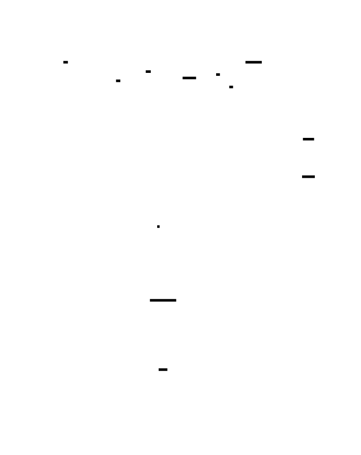
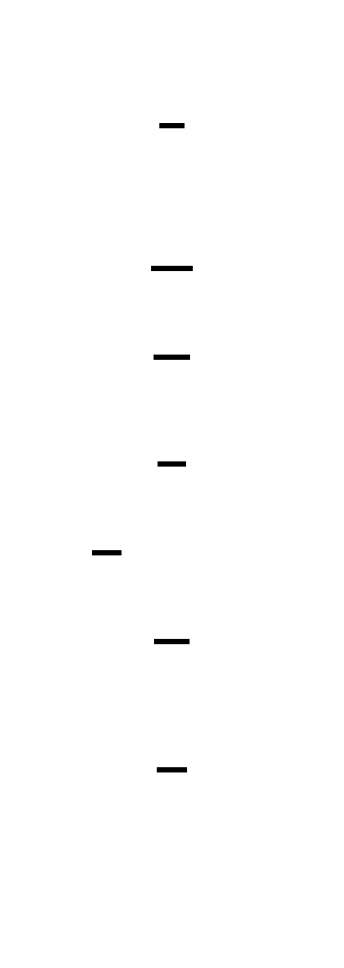
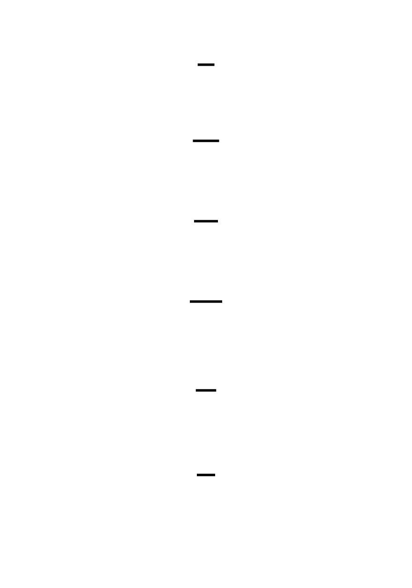
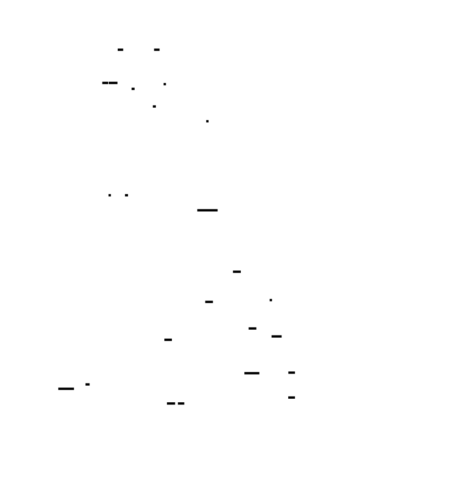
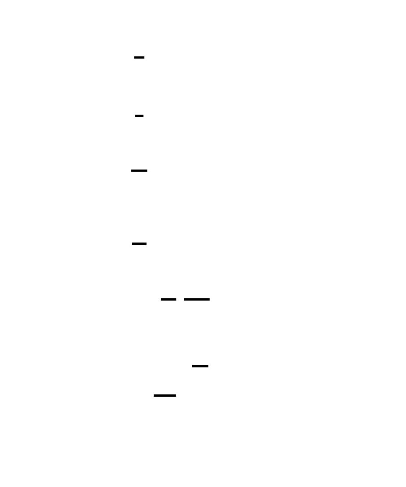
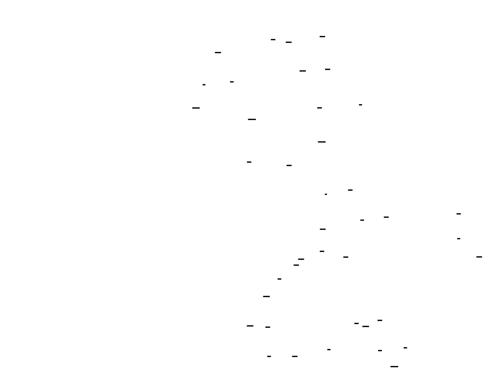

# 🎯 Project Charter: System Call Tracer (strace Clone)
## What You Are Building
A fully functional `strace` clone for x86_64 Linux: a command-line tool that uses `ptrace` to intercept every system call made by a target process and its descendants, decode arguments from registers and tracee memory, and print human-readable output in strace format. By the end, your tracer can attach to any running process, follow forks across an entire process tree, filter output by syscall name, and generate a timing summary table — a genuine systems debugging instrument.
## Why This Project Exists
Every debugger, profiler, container runtime, and security sandbox you have ever used relies on the same `ptrace` machinery you will build here. Most developers treat syscall interception as a black box; building it from scratch exposes exactly how the kernel mediates observation of running processes, why observing a system always perturbs it, and what the x86_64 syscall ABI looks like at the register level — knowledge that is invisible when working through library abstractions.
## What You Will Be Able to Do When Done
- Fork a child process, attach ptrace, and intercept every syscall at both entry and exit using the entry/exit toggle state machine
- Read the six x86_64 syscall argument registers (`rdi`, `rsi`, `rdx`, `r10`, `r8`, `r9`) and decode them as integers, file descriptors, bitmask flags, or null-terminated strings read word-by-word from tracee memory via `PTRACE_PEEKDATA`
- Correctly distinguish `PTRACE_EVENT` stops, syscall stops (`SIGTRAP | 0x80`), signal-delivery stops, and exit events from a single `waitpid(-1)` loop
- Follow an entire process tree across `fork`, `vfork`, and `clone` using `PTRACE_O_TRACE*` options and a per-PID open-addressing hash map
- Attach to an already-running process with `PTRACE_ATTACH`, handle the mid-syscall attachment case, and detach cleanly on `SIGINT`
- Filter trace output by syscall name while accumulating complete timing statistics for all syscalls using `CLOCK_MONOTONIC`
- Generate a strace `-c` style summary table sorted by cumulative time with call counts, error counts, and percentage breakdown
## Final Deliverable
Approximately 1,500–2,500 lines of C across 10 source files (`my_strace.c` plus `syscall_table.h`, `arg_types.h`, `flag_tables.h`, `string_reader.h`, `arg_formatter.h`, `pid_map.h`, `timing.h`, `stats.h`, `filter.h`, `attach.h`). The tracer compiles with `gcc -Wall -Wextra -std=c11` and requires no external dependencies beyond glibc. Running `./my_strace -c -e trace=openat,read,write ls /tmp` produces strace-style annotated output with a timing summary; `./my_strace -p <PID>` attaches to a running process and detaches cleanly on Ctrl+C.
## Is This Project For You?
**You should start this if you:**
- Can write correct C with pointers, structs, and manual memory management — you will cast `long *` to `unsigned char *` and debug silent data corruption
- Understand `fork()`, `exec()`, `waitpid()`, and basic signal handling well enough to write a process launcher from scratch
- Are comfortable reading man pages (specifically `ptrace(2)`, `waitpid(2)`, `signal(7)`) as your primary reference
- Have built at least one project that involved inter-process communication or system call usage — the prerequisite `process-spawner` and `signal-handler` projects
- Know the difference between a virtual address and a physical address and why you cannot dereference a pointer from another process
**Come back after you've learned:**
- C pointers, arrays, and struct layout — if `(unsigned char *)&word` looks unfamiliar, review C memory model first ([The C Programming Language, K&R Ch. 5](https://en.wikipedia.org/wiki/The_C_Programming_Language))
- Linux process fundamentals: `fork`, `exec`, `wait`, file descriptors — complete the `process-spawner` prerequisite project first
- Signal handling basics: `sigaction`, `SIGTERM`, `SIGCHLD` — complete the `signal-handler` prerequisite project first
- Basic bitwise operations (`&`, `|`, `~`, `>>`) — required for `waitpid` status decoding and flag bitmask handling
## Estimated Effort
| Phase | Time |
|-------|------|
| Milestone 1: Basic ptrace Syscall Intercept | ~5–8 hours |
| Milestone 2: Argument Decoding | ~6–8 hours |
| Milestone 3: Multi-Process and Fork Following | ~5–8 hours |
| Milestone 4: Filtering and Statistics | ~6–10 hours |
| **Total** | **~22–35 hours** |
## Definition of Done
The project is complete when:
- `./my_strace ls /tmp` produces strace-style output with syscall names, decoded arguments including string filenames and symbolic flags (`O_RDONLY|O_CLOEXEC`), and correct return values with errno names for errors (e.g., `openat(AT_FDCWD, "/nonexistent", O_RDONLY) = -1 ENOENT (No such file or directory)`)
- `./my_strace sh -c 'ls /tmp && echo done'` traces the full process tree — both the shell and its child processes appear in output tagged with their PIDs (e.g., `[pid 1234] fork() = 1235`), and the tracer exits only after all descendant processes terminate
- `./my_strace -e trace=openat,read,write ls /tmp` suppresses all syscalls except the three named ones from printed output, but the subsequent `-c` summary table (when combined as `./my_strace -c -e trace=openat,read,write ls /tmp`) shows accurate call counts for all syscalls including filtered ones
- `./my_strace -p <PID>` successfully attaches to a running process, traces it until interrupted, and leaves the process running normally after `PTRACE_DETACH` — verifiable by `kill -0 <PID>` returning success after the tracer exits
- `./my_strace -c ls /tmp` produces a summary table where all `% time` values sum to 100.00%, `calls` counts match the number of corresponding lines in the trace output (when no filter is active), and the table is sorted by cumulative time descending

---

# 📚 Before You Read This: Prerequisites & Further Reading
> **Read these first.** The Atlas assumes you are familiar with the foundations below.
> Resources are ordered by when you should encounter them — some before you start, some at specific milestones.
---
## 🟥 Read BEFORE Starting the Project
### 1. The Linux `ptrace(2)` Manual Page
**Type**: Official specification  
**Resource**: `man 2 ptrace` on any Linux system, or the kernel docs at https://man7.org/linux/man-pages/man2/ptrace.2.html  
**Why this is the gold standard**: The authoritative reference for every ptrace request, option flag, and stop type your tracer will use. The PTRACE_EVENT_* table and PTRACE_SETOPTIONS flag descriptions are unavailable anywhere else with this precision.  
**When to read**: Before writing a single line. Read the entire DESCRIPTION section, not just the synopsis. Return to it whenever you hit unexpected behavior — almost every ptrace bug is a manual page misreading.
---
### 2. x86-64 Linux System Call ABI
**Type**: Specification  
**Resource**: Linux kernel documentation — `Documentation/arch/x86/entry_64.rst`, or the more accessible: *System V AMD64 ABI*, §A.2 "AMD64 Linux Kernel Conventions" (search "System V AMD64 ABI PDF")  
**Why this is the gold standard**: Defines exactly which registers hold syscall number, arguments 1–6, and return value — including the critical `r10` vs. `rcx` distinction for argument 4 that is invisible to debuggers.  
**When to read**: Before Milestone 1. The register layout table (`rax`, `rdi`, `rsi`, `rdx`, `r10`, `r8`, `r9`, `orig_rax`) is the map you'll consult constantly through Milestone 2.
---
### 3. "The Linux Programming Interface" — Chapter 26 (Monitoring Child Processes)
**Paper/Book**: Michael Kerrisk, *The Linux Programming Interface* (2010), No Starch Press  
**Specific section**: Chapter 26, "Monitoring Child Processes" — covers `waitpid`, `WIFSTOPPED`, `WSTOPSIG`, and the status word encoding in full  
**Why this is the gold standard**: Kerrisk wrote the Linux man pages. This chapter explains the `waitpid` status word bit layout (which macros are safe to call when, and why calling `WEXITSTATUS` on a signaled process is UB) more clearly than any online resource.  
**When to read**: Before Milestone 1, after the ptrace man page. You will call `waitpid` in every iteration of your main loop; understanding the status word is a prerequisite.
---
### 4. "Virtual Memory" — Operating Systems: Three Easy Pieces, Chapter 13
**Type**: Free textbook chapter  
**Resource**: Remzi H. Arpaci-Dusseau & Andrea C. Arpaci-Dusseau, *OSTEP*, Chapter 13 "The Abstraction: Address Spaces" — freely available at https://pages.cs.wisc.edu/~remzi/OSTEP/vm-intro.pdf  
**Why this is the gold standard**: The clearest single-chapter explanation of why cross-process pointer dereference is physically impossible — the conceptual foundation for why `PTRACE_PEEKDATA` must exist at all. Required for Milestone 2.  
**When to read**: Before Milestone 2. The moment you understand that every process's virtual address space is an independent illusion maintained by the MMU, the `PTRACE_PEEKDATA` word-by-word loop stops feeling strange and becomes obviously necessary.
---
## 🟧 Read At or Before Milestone 1
### 5. `fork(2)`, `execvp(3)`, and `waitpid(2)` Man Pages
**Type**: Official POSIX specification  
**Resource**: `man 2 fork`, `man 3 execvp`, `man 2 waitpid` — or https://man7.org/linux/man-pages/  
**Why this is the gold standard**: The M1 tracing lifecycle (fork → PTRACE_TRACEME → exec → first SIGTRAP → loop) requires precise understanding of what each call returns, when it returns, and what state the child is in at each step.  
**When to read**: Before implementing `run_child()` and `run_tracer()`. Pay particular attention to `execvp`'s PATH search behavior (vs. `execve`'s absolute-path requirement) and to the guarantee that `waitpid(pid, ...)` will not return until the child actually stops.
---
### 6. "Signals" — The Linux Programming Interface, Chapter 20
**Book**: Michael Kerrisk, *TLPI*, Chapter 20 "Signals: Fundamental Concepts"  
**Specific section**: §20.4 "Signal Descriptions" and §20.10 "Sending Signals: `kill()`" — plus §21.3 on `sigaction` flags including `SA_RESTART`  
**Why this is the gold standard**: Signal re-injection (passing the signal number as the last argument to `PTRACE_SYSCALL`) is the most common M1 bug. Understanding what it means to "deliver" vs. "suppress" a signal requires the TLPI signal model, not a quick online tutorial.  
**When to read**: During Milestone 1, when implementing the signal-delivery stop branch. Revisit §21.3 on `SA_RESTART` during Milestone 4's SIGINT handler.
---
## 🟨 Read At or Before Milestone 2
### 7. `errno(3)` Man Page and "errno Semantics" — POSIX Rationale
**Type**: Specification + rationale  
**Resource**: `man 3 errno` (especially the "NOTES" section on `errno` thread-safety and the clearing pattern), and the POSIX rationale document for `errno` at https://pubs.opengroup.org/onlinepubs/9699919799/  
**Why this is the gold standard**: The `errno = 0` before `PTRACE_PEEKDATA` pattern — and why `word == -1L` alone is insufficient to detect errors — is a direct consequence of `errno`'s semantics. The man page's note that "errno is never set to 0 by any library function" is the key sentence.  
**When to read**: Before implementing `read_string_from_tracee()` in Milestone 2. The disambiguation protocol (`errno = 0` before the call; check `word == -1L && errno != 0` after) must be understood before writing the word loop.
---
### 8. x86-64 Syscall Table — Linux Kernel Source
**Type**: Authoritative reference  
**Resource**: Linux kernel source, `arch/x86/entry/syscalls/syscall_64.tbl` — browse at https://github.com/torvalds/linux/blob/master/arch/x86/entry/syscalls/syscall_64.tbl  
**Why this is the gold standard**: The canonical, immutable source of truth for x86-64 syscall numbers. The numbers in your `syscall_names[]` table must match this file exactly. Every other resource (blog posts, Wikipedia) is a derived copy that may be outdated.  
**When to read**: When building `syscall_table.h` in Milestone 2. Use it to verify your table and to extend it beyond the starter set. The file is short (~350 lines) and takes 10 minutes to read completely.
---
### 9. "Designing Data-Intensive Applications" — Chapter 1, "Reliable, Scalable, and Maintainable Applications" (specifically: latency percentiles)
**Book**: Martin Kleppmann, *Designing Data-Intensive Applications* (2017), O'Reilly, Chapter 1, §"Describing Performance", pp. 13–16  
**Why this is the gold standard**: The ptrace observer effect makes absolute latency measurements meaningless for fast syscalls. Kleppmann's 3-page explanation of why mean latency is misleading and why relative comparisons retain value gives you the conceptual framework to correctly interpret your M4 statistics output.  
**When to read**: Before implementing `print_statistics()` in Milestone 4. Read it so you can explain to yourself (and others) why your `getpid` timing shows 10µs when the actual cost is 100ns.
---
## 🟩 Read At or Before Milestone 3
### 10. "Linux Kernel Development" — Chapter 3, "Process Management"
**Book**: Robert Love, *Linux Kernel Development*, 3rd ed. (2010), Addison-Wesley, Chapter 3 "Process Management"  
**Specific section**: §"The Process Family Tree" and §"Process Creation" (the `clone()`, `fork()`, `vfork()` distinction)  
**Why this is the gold standard**: Love explains why `fork()`, `vfork()`, and `pthread_create()` all call `clone()` under the hood on Linux — the direct justification for why `PTRACE_O_TRACECLONE` is required to trace multithreaded programs, not just `PTRACE_O_TRACEFORK`.  
**When to read**: Before implementing `handle_ptrace_event()` in Milestone 3. Understanding that threads and processes are the same kernel object (task_struct) with different sharing flags makes the unified PTRACE_EVENT_FORK/VFORK/CLONE dispatch feel natural.
---
### 11. "Hash Tables" — Open Addressing and Linear Probing
**Type**: Algorithm reference  
**Resource**: Knuth, *The Art of Computer Programming*, Vol. 3, §6.4 "Hashing", pp. 512–528 (the linear probing analysis, specifically the load factor vs. probe length formula)  
**Why this is the gold standard**: Knuth derives the exact expected probe length as a function of load factor (the formula your M3 TDD cites as the basis for the 50% load target). No other source gives the mathematical derivation rather than just the rule of thumb.  
**When to read**: Before implementing `pid_map.h` in Milestone 3. Read §6.4 up through the analysis of linear probing performance. The tombstone deletion problem is covered in Exercise 6.4.20 — relevant to the `pid_map_remove` warning in the TDD.
---
### 12. `clone(2)` Man Page
**Type**: Official specification  
**Resource**: `man 2 clone` — or https://man7.org/linux/man-pages/man2/clone.2.html  
**Specific section**: The CLONE_* flags table, particularly `CLONE_VM`, `CLONE_FS`, `CLONE_FILES`, `CLONE_THREAD`  
**Why this is the gold standard**: The `PTRACE_O_TRACECLONE` event fires for every `clone()` call — which includes every `pthread_create()`. Understanding which flags distinguish a "new process" from a "new thread" is necessary to correctly attribute PTRACE_EVENT_CLONE events in your tracer output.  
**When to read**: During Milestone 3, after implementing the basic fork-following. When you trace a multithreaded program and see PTRACE_EVENT_CLONE events, this man page tells you what `PTRACE_GETEVENTMSG` returns and why.
---
## 🟦 Read At or Before Milestone 4
### 13. `clock_gettime(2)` Man Page — CLOCK_MONOTONIC vs. CLOCK_REALTIME
**Type**: Official specification  
**Resource**: `man 2 clock_gettime` — or https://man7.org/linux/man-pages/man2/clock_gettime.2.html  
**Specific section**: The CLOCK_* constants table; the NOTES section on vDSO optimization  
**Why this is the gold standard**: The man page explicitly states that `CLOCK_MONOTONIC` is "a nonsettable system-wide clock that represents monotonic time since some unspecified point in the past" and cannot be set or affected by discontinuous jumps from `adjtime(3)`. This is the formal guarantee that `timespec_diff_ns` can clamp-to-zero without losing correctness.  
**When to read**: Before implementing `timing.h` in Milestone 4. The vDSO note explains why `clock_gettime(CLOCK_MONOTONIC, ...)` costs ~10ns rather than ~100ns — it reads from a kernel-mapped page without a ring transition.
---
### 14. `sigaction(2)` Man Page — SA_RESTART and Interrupted System Calls
**Type**: Official specification  
**Resource**: `man 2 sigaction` — specifically the `SA_RESTART` flag description and the "Interruption of system calls and library functions by signal handlers" section  
**Why this is the gold standard**: The M4 SIGINT handler depends on `waitpid(-1, ...)` returning `EINTR` when interrupted. The man page explains exactly which system calls are restartable (those on the "slow" list) and why `waitpid` will return `EINTR` without `SA_RESTART`. This is not a matter of style — it is a correctness requirement for clean shutdown.  
**When to read**: Before implementing the SIGINT handler in Milestone 4. Read the SA_RESTART subsection twice. The `goto wait_again` idiom in the M1 loop (for EINTR retry without re-issuing PTRACE_SYSCALL) is the same mechanism applied differently.
---
### 15. strace Source Code — `syscall.c` and `process.c`
**Type**: Famous open-source implementation  
**Resource**: https://github.com/strace/strace — specifically:
- `src/syscall.c`: the entry/exit stop dispatch, `in_syscall` toggle, and `PTRACE_GETREGS` usage
- `src/process.c`: the `PTRACE_EVENT_FORK` handler and child PID retrieval via `PTRACE_GETEVENTMSG`  
**Why this is the gold standard**: strace is the direct ancestor of what you are building. Reading how the production tool handles the exact problems you are solving (toggle synchronization, exec state reset, mid-attach output) is worth hours of documentation. The code is well-commented and matches the architecture described in this Atlas.  
**When to read**: After completing Milestone 2 (so you have enough context to understand what you are reading), and again after Milestone 3. Do not read it before implementing each milestone yourself — you will learn more by struggling first.

---

# System Call Tracer (strace clone)

This project builds a fully functional strace clone from scratch — a ptrace-based syscall interception and decoding tool for x86_64 Linux. You will implement the entire tracing lifecycle: forking a child process, intercepting every system call at entry and exit, decoding arguments by reading registers and remote memory word-by-word, following fork/exec across process boundaries, and generating timing statistics.

The project progressively reveals how the kernel mediates all observation of running processes. Every debugger, profiler, sandbox, and security tracer you've ever used relies on the same ptrace machinery you'll implement here. By building strace, you learn not just the ptrace API, but the fundamental x86_64 syscall ABI, the subtleties of process state management, and why observing a system always perturbs it.

By the end, you'll have a tool that can attach to any running process, decode its syscalls with human-readable arguments and flags, follow all child processes, filter by syscall name, and produce a statistical summary — a genuine systems debugging instrument.


<!-- MS_ID: build-strace-m1 -->
# Milestone 1: Basic ptrace Syscall Intercept


## The Observer's Dilemma
Before writing a single line of code, sit with this constraint: you want to watch a program make system calls — but the program runs in its own process, with its own address space, protected from outside inspection by the very kernel it's calling into. You can't insert logging into code you don't own. You can't read another process's registers. You can't even pause execution without cooperation from the kernel.
This is the fundamental problem that `ptrace` solves. It is the kernel saying: *I will mediate observation for you.* Every time the traced process transitions between user-space and kernel-space to make a system call, the kernel will pause it and wake you up. You get to inspect its registers, read its memory, and decide whether to let it continue. The traced process has no choice in the matter — from its perspective, time simply stops.
This power comes with a price: **the observer affects the observed**. Every ptrace stop introduces a context switch, and context switches cost on the order of 1–10 microseconds depending on cache state. A program that normally completes in 10 milliseconds might take 100 milliseconds under strace — ten times slower. This is the Heisenberg principle of systems programming: the act of measurement perturbs the system being measured. You'll feel this whenever you trace a latency-sensitive program and wonder why the numbers look wrong.
With that tension established — *you need kernel mediation to observe another process, and that mediation has real costs* — let's build the machinery.
---
## The Tracing Lifecycle: A Bird's Eye View


The lifecycle of a ptrace-based tracer has a fixed structure. You cannot deviate from it; each step has a prerequisite:
1. **Fork**: The tracer creates a child process with `fork()`.
2. **PTRACE_TRACEME**: The child (before doing anything useful) calls `ptrace(PTRACE_TRACEME, ...)` to announce itself as a willing tracee. This call says "I consent to being traced by my parent."
3. **exec**: The child executes the target program. The moment the kernel processes this `exec`, it delivers a `SIGTRAP` to the child, causing it to stop. This is the first stop.
4. **First waitpid**: The parent catches this initial `SIGTRAP` stop with `waitpid`.
5. **Loop**: The parent enters its main loop: send `PTRACE_SYSCALL` to resume the child, then `waitpid` for the next stop. The child runs until it enters or exits a system call, then stops again.
6. **Termination**: When the child exits, `waitpid` reports it, and the tracer cleans up.

> **🔑 Foundation: ptrace lifecycle and stop types**
> 
> ## ptrace Lifecycle and Stop Types
### What it IS
When a process is being traced with `ptrace`, it doesn't just run freely — it periodically **stops** and hands control back to the tracer. But not all stops are created equal. The kernel has several distinct reasons to freeze a tracee, and each requires different handling. Getting these wrong is the #1 source of bugs in ptrace-based tools.
The five stop types you'll encounter:
**1. Syscall-Enter Stop**
Happens just *before* the kernel executes a syscall. The tracee is frozen at the boundary between userspace and kernelspace. At this moment, `orig_rax` holds the syscall number, and the argument registers (`rdi`, `rsi`, `rdx`, `r10`, `r8`, `r9`) still hold the original arguments. The return value register (`rax`) is not yet meaningful.
**2. Syscall-Exit Stop**
Happens just *after* the kernel finishes executing the syscall, before returning to userspace. Now `rax` holds the return value (negative values indicate errors, e.g., `-ENOENT` = `-2`). Crucially, some argument registers may have been clobbered by the kernel. This is why `orig_rax` exists (more on that in the ABI concept).
**3. Signal-Delivery Stop**
Occurs when a signal is about to be delivered to the tracee. The tracer intercepts it first and can inspect, modify, suppress, or substitute the signal. This stop is identified by the signal number embedded in the `waitpid` status.
**4. Group Stop**
Triggered by job-control signals (`SIGSTOP`, `SIGTSTP`, `SIGTTIN`, `SIGTTOU`). The *entire thread group* stops together. This is distinct from signal-delivery stop even though a signal is involved — the semantic is "pause all threads," not "deliver to one thread." Requires special handling with `PTRACE_LISTEN` if you want correct behavior in multi-threaded programs.
**5. PTRACE_EVENT Stop**
A family of stops triggered by specific kernel events when you've enabled them via `PTRACE_SETOPTIONS`. Examples:
- `PTRACE_EVENT_FORK` / `PTRACE_EVENT_VFORK` / `PTRACE_EVENT_CLONE` — child creation
- `PTRACE_EVENT_EXEC` — `execve` completed
- `PTRACE_EVENT_EXIT` — process is about to exit (you can still read its state)
- `PTRACE_EVENT_SECCOMP` — seccomp filter triggered a `PTRACE_SECCOMP_RET_TRACE` action
The event type is encoded in the high byte of the `waitpid` status word.
---
### How to Distinguish Them
This is where many implementations go wrong. After every `waitpid` call you must decode the status carefully:
```c
int status;
waitpid(pid, &status, 0);
if (WIFSTOPPED(status)) {
    int sig = WSTOPSIG(status);         // low 8 bits of stop info
    int event = status >> 16;           // high byte = PTRACE_EVENT_*
    if (event != 0) {
        // PTRACE_EVENT stop — inspect with PTRACE_GETEVENTMSG
    } else if (sig == (SIGTRAP | 0x80)) {
        // Syscall stop (enter or exit) — only set if PTRACE_O_TRACESYSGOOD
    } else if (sig == SIGTRAP) {
        // Could be exec, breakpoint, or initial stop after PTRACE_ATTACH
    } else if (sig == SIGSTOP || sig == SIGTSTP || ...) {
        // Possibly group stop — needs further disambiguation
    } else {
        // Signal-delivery stop for signal `sig`
    }
}
```
**The `PTRACE_O_TRACESYSGOOD` trick**: Always set this option. It ORs `0x80` into the signal number for syscall stops, making them trivially distinguishable from a genuine `SIGTRAP` signal delivery. Without it, you cannot reliably tell a syscall stop from a breakpoint hit.
**Syscall-enter vs. syscall-exit**: There's no direct flag in the status. You have to *track it yourself* — maintain a boolean per-thread that flips on each syscall stop. Alternatively, on Linux 3.14+ with `PTRACE_O_TRACESYSGOOD`, you can use `PTRACE_GET_SYSCALL_INFO` (Linux 5.3+) which explicitly tells you entry vs. exit.
---
### The Lifecycle Flow
```
tracee created/attached
        │
        ▼
  [initial SIGSTOP]  ←── you must consume this
        │
   PTRACE_SYSCALL ──────────────────────────────────────┐
        │                                               │
        ▼                                               │
  syscall-enter stop                              (loop back)
  [inspect args]
        │
   PTRACE_SYSCALL
        │
        ▼
  syscall-exit stop
  [inspect return value]
        │
   PTRACE_SYSCALL ────────────────────────────────────(loop)
```
Signals and events interrupt this loop at any point.
---
### WHY You Need This Right Now
Your tracer will call `waitpid` in a loop. Every iteration, something different could have stopped the tracee — a syscall you want to intercept, a signal you might want to suppress, a fork you need to follow, or an exit you need to record. If you treat all stops identically (or misidentify a group-stop as a signal-delivery stop), you'll either deadlock, miss events, or corrupt the tracee's signal handling. The stop-type disambiguation logic is the **beating heart** of a correct ptrace tracer.
---
### Key Mental Model
> **Think of the tracee as a DVD on pause, and the stop type tells you *which* pause button was pressed.**
Each stop type requires a different "resume" command: `PTRACE_SYSCALL` to resume and stop at the next syscall boundary, `PTRACE_CONT` to resume until a signal or event, `PTRACE_LISTEN` for group stops, `PTRACE_SINGLESTEP` for instruction-level stepping. Using the wrong resume command after the wrong stop type is how you accidentally suppress signals, miss syscalls, or deadlock forever. **Always decode before you resume.**

The critical insight you need right now: **every call to `PTRACE_SYSCALL` resumes the tracee until the next stop event**. That stop event might be a syscall entry, a syscall exit, a signal delivery, or something else. Your tracer's job is to correctly classify each stop and respond appropriately.
---
## Building the Fork/Exec Skeleton
Let's write the structural foundation. The code divides cleanly into two branches after `fork()`: the child side (which sets up tracing and executes the target) and the parent side (which runs the tracing loop).
```c
#include <stdio.h>
#include <stdlib.h>
#include <string.h>
#include <unistd.h>
#include <sys/ptrace.h>
#include <sys/types.h>
#include <sys/wait.h>
#include <sys/user.h>     /* struct user_regs_struct */
#include <errno.h>
#include <signal.h>
static void run_child(char *argv[]) {
    /* Tell the kernel: trace me, using my parent as the tracer. */
    if (ptrace(PTRACE_TRACEME, 0, NULL, NULL) < 0) {
        perror("ptrace(PTRACE_TRACEME)");
        exit(1);
    }
    /*
     * exec replaces our image with the target program.
     * The kernel delivers SIGTRAP to us immediately after exec succeeds,
     * before the new program runs a single instruction. This causes our
     * first stop — the parent's waitpid will wake up.
     */
    execvp(argv[0], argv);
    /* If execvp returns, it failed. */
    perror("execvp");
    exit(1);
}
static void run_tracer(pid_t child_pid);
int main(int argc, char *argv[]) {
    if (argc < 2) {
        fprintf(stderr, "Usage: %s <program> [args...]\n", argv[0]);
        return 1;
    }
    pid_t child = fork();
    if (child < 0) {
        perror("fork");
        return 1;
    }
    if (child == 0) {
        /* Child branch: set up tracing, then exec the target. */
        run_child(argv + 1);
        /* run_child never returns. */
    } else {
        /* Parent branch: become the tracer. */
        run_tracer(child);
    }
    return 0;
}
```
Notice `execvp` (not `execve`). The `p` variant searches `PATH`, which is what you want when tracing programs by name like `ls` or `cat`. `execve` requires an absolute path.
---
## The Double-Stop Revelation
Here is the misconception that will cause you the most confusion if uncorrected:
**You think**: You call `PTRACE_SYSCALL`, the child runs, makes a system call, the kernel executes it, and you wake up with the result. One stop per syscall.
**Reality**: ptrace stops the child **twice** per syscall — once at the *entry* (the child has decided to make a system call but the kernel hasn't executed it yet) and once at the *exit* (the kernel has executed the syscall and computed the return value, but hasn't delivered it to the child yet).


Both stops look identical from `waitpid`'s perspective. You cannot tell them apart by the stop code alone. The kernel does not include a "this is an entry stop" or "this is an exit stop" flag in the status word.
This double-stop design is intentional and powerful. At entry, you can inspect (and even modify) the syscall number and its arguments *before* the kernel acts on them. This is exactly how `seccomp-bpf` works in Docker and other container runtimes — it intercepts syscalls at the entry stop and blocks dangerous ones before they reach the kernel. At exit, you can read the return value and know whether the syscall succeeded.
**Your implementation must maintain an explicit entry/exit toggle.** Without it, your tracer will try to read the syscall number from a register that holds the return value, and vice versa — producing complete garbage output.
```c
/*
 * Per-tracee state. For now, just a toggle.
 * In Milestone 3, this becomes a per-PID hash map entry.
 */
typedef struct {
    int in_syscall;          /* 0 = last stop was exit; 1 = last stop was entry */
    long current_syscall_nr; /* syscall number saved at entry */
} tracee_state_t;
```
The toggle works like this:
- Start with `in_syscall = 0` (not inside a syscall).
- Every stop: flip the toggle.
- If the toggle is now 1 → this is an **entry** stop → read the syscall number from `orig_rax`.
- If the toggle is now 0 → this is an **exit** stop → read the return value from `rax`.
Why save the syscall number at entry? Because at exit, the register that originally held the syscall number may have been overwritten. The kernel writes the return value into `rax`, which is the same register used for the syscall number at entry on some architectures. The `orig_rax` register exists precisely to preserve the original syscall number across entry and exit — more on this in the register layout section below.
---
## Reading Registers: x86_64 Syscall ABI
When a ptrace stop occurs, you retrieve the tracee's register state with `PTRACE_GETREGS`:
```c
struct user_regs_struct regs;
ptrace(PTRACE_GETREGS, child_pid, NULL, &regs);
```

> **🔑 Foundation: x86_64 syscall ABI register conventions**
> 
> ## x86_64 Syscall ABI Register Conventions
### What it IS
When a userspace program makes a syscall on x86_64 Linux, it doesn't use a function call convention — it uses a dedicated hardware mechanism (`syscall` instruction) with a completely separate register assignment. This is the **Linux syscall ABI**, and it's distinct from both the C function calling convention (System V AMD64 ABI) and the Windows ABI.
Here's the complete register map:
| Register | Role at syscall entry | Notes |
|---|---|---|
| `rax` | Syscall number | e.g., `0` = `read`, `1` = `write`, `60` = `exit` |
| `rdi` | Argument 1 | |
| `rsi` | Argument 2 | |
| `rdx` | Argument 3 | |
| `r10` | Argument 4 | ⚠️ NOT `rcx` — this is the key difference from the C ABI |
| `r8` | Argument 5 | |
| `r9` | Argument 6 | |
| `rax` (after) | Return value | Negative = `-errno` (e.g., `-2` = `-ENOENT`) |
| `rcx`, `r11` | Destroyed by kernel | The CPU uses these internally for `syscall`/`sysret` |
The most important deviation from the C calling convention: **argument 4 is `r10`, not `rcx`**. This is because the `syscall` instruction itself uses `rcx` to save the return address (RIP), so the kernel can't rely on it for argument passing. If you're reading code that handles syscalls and you see `rcx` used as arg4, that's a bug or it's using a wrapper.
---
### What is `orig_rax` and Why Does It Exist?
This is one of the more subtle aspects of the x86_64 ptrace interface, and it matters enormously for syscall tracers.
After a syscall completes, the kernel puts the **return value** in `rax`. This means `rax` has been overwritten. If you're at the **syscall-exit stop** and want to know *which* syscall just finished, you can't read `rax` — it now holds the return value, not the syscall number.
The kernel solves this by saving the original `rax` value (the syscall number) into a separate field in the `pt_regs` structure: `orig_rax`. This field is accessible via `ptrace(PTRACE_GETREGS, ...)` or `ptrace(PTRACE_PEEKUSER, ...)` with the appropriate offset.
```c
struct user_regs_struct regs;
ptrace(PTRACE_GETREGS, pid, NULL, &regs);
// At syscall-enter stop:
//   regs.orig_rax == syscall number
//   regs.rax      == syscall number (same, not yet clobbered)
//   regs.rdi..r9  == arguments
// At syscall-exit stop:
//   regs.orig_rax == syscall number (preserved!)
//   regs.rax      == return value (may be negative errno)
//   regs.rdi..r9  == may be partially clobbered
```
`orig_rax` also serves a second purpose: the kernel uses it to detect *whether* a syscall is in progress at all. A value of `-1` in `orig_rax` signals "no syscall active," which matters for signal restart logic (`ERESTARTSYS`, etc.).
**Practical rule**: Always use `orig_rax` to identify the syscall, even at the entry stop. Use `rax` only to read or modify the return value at exit.
---
### Modifying Syscall Behavior
One of ptrace's superpowers is that you can *change* the registers at stop points:
- **At syscall-enter**: Overwrite `orig_rax` to change *which* syscall runs, or overwrite argument registers to change its arguments.
- **At syscall-exit**: Overwrite `rax` to fake a different return value (e.g., make a failed `open()` appear to succeed, or vice versa).
```c
// Example: redirect all write() calls to /dev/null by faking success
// At syscall-exit stop after a write():
if (regs.orig_rax == SYS_write) {
    regs.rax = regs.rdx;  // pretend we wrote all `count` bytes
    ptrace(PTRACE_SETREGS, pid, NULL, &regs);
}
```
---
### WHY You Need This Right Now
Every meaningful thing your tracer does — identifying which syscall fired, reading its arguments, checking its return value, or modifying any of the above — requires knowing exactly which register holds what at which stop. If you read `rax` instead of `orig_rax` at syscall-exit to identify the syscall number, you'll get garbage (or the return value). If you read `rcx` instead of `r10` for the 4th argument, you'll get the saved RIP, not the argument. These mistakes are silent — no crash, just wrong data.
---
### Key Mental Model
> **The syscall ABI is a snapshot in time: registers are a shared whiteboard between userspace and the kernel, and the kernel erases and rewrites parts of it as the syscall executes. `orig_rax` is the kernel's sticky note preserving what was on the board before the erasure.**
Think of the registers at syscall-enter as the *request*, and the registers at syscall-exit as the *response*. `orig_rax` is the receipt that tells you which request the response belongs to. Never throw away the receipt.


`struct user_regs_struct` is defined in `<sys/user.h>`. The fields you care about for Milestone 1:
| Field | Role | When to Read |
|-------|------|--------------|
| `orig_rax` | Syscall number (preserved by kernel) | Entry stop |
| `rax` | Return value after syscall completes | Exit stop |
| `rdi` | 1st argument | Entry stop (Milestone 2) |
| `rsi` | 2nd argument | Entry stop (Milestone 2) |
| `rdx` | 3rd argument | Entry stop (Milestone 2) |
| `r10` | 4th argument | Entry stop (Milestone 2) |
| `r8` | 5th argument | Entry stop (Milestone 2) |
| `r9` | 6th argument | Entry stop (Milestone 2) |
The `orig_rax` / `rax` split deserves elaboration. When the tracee executes a `syscall` instruction, the CPU places the syscall number in `rax`. After the kernel finishes the syscall, it writes the return value back into `rax`. The kernel saves the original `rax` value into `orig_rax` before overwriting it, so the tracer can always recover the syscall number — even at the exit stop.
On ARM64 it's completely different (syscall number in `x8`, return in `x0`). On 32-bit x86 it's `orig_eax`/`eax`. This code is x86_64 Linux, full stop.
---
## Decoding waitpid Status Words
When `waitpid` returns, it gives you a `status` integer (not the exit code — `status` encodes multiple pieces of information in different bit fields). You need macros from `<sys/wait.h>` to decode it.


> **🔑 Foundation: waitpid status word decoding macros**
> 
> ## waitpid Status Word Decoding Macros
### What it IS
`waitpid` returns an integer `status` that encodes *what happened* to a child process. This integer is not a simple error code — it's a **bit-packed word** where different bit ranges mean completely different things depending on what kind of event occurred. The POSIX macros exist to correctly decode these bits without you having to remember the layout.
Here's the full set:
| Macro | Condition it tests | What it extracts |
|---|---|---|
| `WIFEXITED(status)` | Did process exit normally (via `exit()` or `return`)? | — |
| `WEXITSTATUS(status)` | (only valid if `WIFEXITED`) | The exit code (0–255) |
| `WIFSIGNALED(status)` | Was process killed by a signal? | — |
| `WTERMSIG(status)` | (only valid if `WIFSIGNALED`) | The signal that killed it |
| `WCOREDUMP(status)` | (only valid if `WIFSIGNALED`) | Whether a core was dumped |
| `WIFSTOPPED(status)` | Was process stopped (ptrace or job control)? | — |
| `WSTOPSIG(status)` | (only valid if `WIFSTOPPED`) | The signal that caused the stop |
| `WIFCONTINUED(status)` | Was process resumed via `SIGCONT`? | — |
---
### The Actual Bit Layout
Understanding the layout demystifies everything:
```
 bits 31–16    bits 15–8     bit 7     bits 6–0
┌──────────┬────────────┬──────────┬───────────┐
│ ptrace   │  stop sig  │  core    │  term sig  │
│ event    │  or 0x7f   │  dumped  │  or 0      │
└──────────┴────────────┴──────────┴───────────┘
```
More precisely, the bottom 16 bits encode the most common cases:
- **Normal exit**: low 7 bits = `0`, high 8 bits = exit code. `WIFEXITED` checks `(status & 0x7f) == 0`.
- **Killed by signal**: low 7 bits = signal number (nonzero), bit 7 = core dump flag. `WIFSIGNALED` checks `(status & 0x7f) != 0 && (status & 0x7f) != 0x7f`.
- **Stopped**: low 7 bits = `0x7f` (sentinel value), high 8 bits = stop signal. `WIFSTOPPED` checks `(status & 0xff) == 0x7f`. **Then** `WSTOPSIG` is `(status >> 8) & 0xff`.
- **ptrace event**: bits 16–23 = `PTRACE_EVENT_*` constant. You extract this manually: `int event = (status >> 16) & 0xff`.
You will never need to write these bit operations yourself — always use the macros — but knowing the layout tells you *why* `WIFSTOPPED` and `WIFSIGNALED` are mutually exclusive, and why you must check the condition macros before the extraction macros.
---
### The Critical Rule: Always Gate Extraction with Condition
The extraction macros invoke **undefined behavior** (or return garbage) if called without the matching condition being true:
```c
// WRONG — if process was killed by signal, WEXITSTATUS reads the signal
// number field and returns nonsense
int code = WEXITSTATUS(status);  // don't do this unchecked
// RIGHT
if (WIFEXITED(status)) {
    printf("exited with code %d\n", WEXITSTATUS(status));
} else if (WIFSIGNALED(status)) {
    printf("killed by signal %d\n", WTERMSIG(status));
} else if (WIFSTOPPED(status)) {
    int sig = WSTOPSIG(status);
    int event = status >> 16;
    // ... ptrace stop handling
}
```
These cases are mutually exclusive for any single `waitpid` return. Write your decoder as a proper `if/else if` chain, not independent `if` checks.
---
### ptrace-Specific: The `0x80` Flag and High Bits
For ptrace work, `WIFSTOPPED` is the case you'll spend the most time in, and the standard macros only get you partway there. Two extensions to know:
1. **`PTRACE_O_TRACESYSGOOD`** causes the kernel to OR `0x80` into the stop signal for syscall stops. So `WSTOPSIG(status)` returns `SIGTRAP | 0x80` (= `0x85`) instead of `SIGTRAP`. The macro `WSTOPSIG` still works — it just returns 133 instead of 5. Check for this explicitly: `(WSTOPSIG(status) == (SIGTRAP | 0x80))`.
2. **`PTRACE_EVENT_*` stops** show up as `WIFSTOPPED` with `WSTOPSIG(status) == SIGTRAP`, *and* `status >> 16` is nonzero. The standard macros have no awareness of this — you must extract the high byte yourself.
```c
if (WIFSTOPPED(status)) {
    int sig = WSTOPSIG(status);
    int ptrace_event = (status >> 16) & 0xff;
    if (ptrace_event) {
        // handle PTRACE_EVENT_FORK, PTRACE_EVENT_EXEC, etc.
    } else if (sig == (SIGTRAP | 0x80)) {
        // syscall stop (requires PTRACE_O_TRACESYSGOOD)
    } else if (sig == SIGTRAP) {
        // plain trap — breakpoint, exec, or initial attach stop
    } else {
        // signal-delivery stop for `sig`
    }
}
```
---
### WHY You Need This Right Now
Your main tracer loop calls `waitpid` continuously. Every single iteration produces a status word, and your entire decision tree — "is this a syscall to intercept?", "is this a process exit I should log?", "is this a signal I should pass through?" — depends on correctly decoding that word. A mistake here (e.g., calling `WEXITSTATUS` on a signaled process, or missing the `0x80` syscall flag) silently produces wrong results that corrupt everything downstream.
---
### Key Mental Model
> **The `status` integer is like a tagged union in C: the "tag" bits tell you which interpretation is valid, and the extraction macros are the field accessors. Never access a field without checking the tag first.**
`WIFEXITED`, `WIFSIGNALED`, `WIFSTOPPED` are the tags. `WEXITSTATUS`, `WTERMSIG`, `WSTOPSIG` are the fields. One tag is always true; the others are false. Check the tag, then read the field.

For your tracer, you need to handle three cases on every `waitpid` return:
```c
int status;
waitpid(child_pid, &status, 0);
if (WIFEXITED(status)) {
    /* Child exited normally (called exit() or returned from main). */
    /* WEXITSTATUS(status) gives the exit code. */
}
if (WIFSIGNALED(status)) {
    /* Child was killed by a signal (e.g., SIGSEGV, SIGKILL). */
    /* WTERMSIG(status) gives the signal number. */
}
if (WIFSTOPPED(status)) {
    /* Child is stopped. This is the interesting case for ptrace. */
    int sig = WSTOPSIG(status);
    /* sig tells you WHY it stopped. */
}
```
For ptrace stops specifically, `WSTOPSIG(status)` returns the signal number associated with the stop. Syscall stops are reported as `SIGTRAP`. Signal-delivery stops are reported with the actual signal number (e.g., `SIGTERM` = 15). 
In Milestone 1, you distinguish syscall stops from signal-delivery stops by whether the signal number equals `SIGTRAP`. In Milestone 3, you'll use `PTRACE_O_TRACESYSGOOD` which sets bit 7 of the signal number for syscall stops (making them `SIGTRAP | 0x80 = 0x85`), giving you a cleaner distinction. For now, `SIGTRAP` is your signal.
---
## The Tracing Loop: Putting It Together
Here is the complete parent-side tracing loop for Milestone 1. Study each step — every line has a reason.
```c
static void run_tracer(pid_t child_pid) {
    int status;
    tracee_state_t state = { .in_syscall = 0, .current_syscall_nr = -1 };
    /*
     * Wait for the initial SIGTRAP that the kernel delivers after exec.
     * This first stop is NOT a syscall stop — it's the tracee pausing
     * before running a single instruction of the target program.
     */
    waitpid(child_pid, &status, 0);
    if (WIFEXITED(status) || WIFSIGNALED(status)) {
        fprintf(stderr, "Child exited before tracing started.\n");
        return;
    }
    /* Enter the main loop. */
    while (1) {
        /*
         * PTRACE_SYSCALL: Resume the tracee. It will run until:
         *   (a) it enters a system call (entry stop), OR
         *   (b) it exits a system call (exit stop), OR
         *   (c) it receives a signal (signal-delivery stop), OR
         *   (d) it terminates.
         *
         * The last argument is the signal to deliver: 0 means "no signal."
         * For normal continuation, pass 0.
         */
        if (ptrace(PTRACE_SYSCALL, child_pid, NULL, 0) < 0) {
            perror("ptrace(PTRACE_SYSCALL)");
            break;
        }
        /* Block until something interesting happens. */
        if (waitpid(child_pid, &status, 0) < 0) {
            perror("waitpid");
            break;
        }
        /* Case 1: Tracee exited normally. */
        if (WIFEXITED(status)) {
            fprintf(stderr, "+++ exited with %d +++\n", WEXITSTATUS(status));
            break;
        }
        /* Case 2: Tracee killed by signal. */
        if (WIFSIGNALED(status)) {
            fprintf(stderr, "+++ killed by %s +++\n", strsignal(WTERMSIG(status)));
            break;
        }
        /* Case 3: Tracee is stopped — the interesting case. */
        if (WIFSTOPPED(status)) {
            int stop_sig = WSTOPSIG(status);
            if (stop_sig == SIGTRAP) {
                /*
                 * This is a syscall stop (entry or exit).
                 * Flip the toggle to determine which one.
                 */
                state.in_syscall = !state.in_syscall;
                handle_syscall_stop(child_pid, &state);
            } else {
                /*
                 * Signal-delivery stop: the tracee received a signal.
                 * We MUST re-inject it. Passing stop_sig as the last
                 * argument to PTRACE_SYSCALL delivers the signal to the
                 * tracee when we resume it.
                 *
                 * If we pass 0 instead, the signal is SUPPRESSED — the
                 * tracee never sees it. For a signal like SIGTERM, this
                 * would cause the program to never terminate gracefully.
                 */
                if (ptrace(PTRACE_SYSCALL, child_pid, NULL, stop_sig) < 0) {
                    perror("ptrace(PTRACE_SYSCALL) [signal reinject]");
                    break;
                }
                /* Skip the normal PTRACE_SYSCALL at the top of the loop. */
                continue;
            }
        }
    }
}
```
Notice the `continue` after re-injecting a signal. The loop's structure issues `PTRACE_SYSCALL` at the top and `waitpid` just below it. When you handle a signal-delivery stop, you've already called `PTRACE_SYSCALL` (with the signal number) inside the `else` branch — you don't want to call it again at the top of the next iteration.
---
## Handling the Syscall Stop
The `handle_syscall_stop` function reads registers and prints the formatted output.
```c
static void handle_syscall_stop(pid_t pid, tracee_state_t *state) {
    struct user_regs_struct regs;
    if (ptrace(PTRACE_GETREGS, pid, NULL, &regs) < 0) {
        perror("ptrace(PTRACE_GETREGS)");
        return;
    }
    if (state->in_syscall) {
        /*
         * ENTRY STOP: The tracee is about to enter a syscall.
         * orig_rax holds the syscall number.
         * The kernel has NOT executed the syscall yet.
         */
        state->current_syscall_nr = (long)regs.orig_rax;
        /*
         * We don't print yet — we wait for the exit stop
         * so we can include the return value on the same line.
         * (Real strace also uses this convention.)
         */
    } else {
        /*
         * EXIT STOP: The kernel just returned from the syscall.
         * rax holds the return value.
         * orig_rax still holds the syscall number.
         */
        long retval = (long)regs.rax;
        long syscall_nr = state->current_syscall_nr;
        print_syscall(syscall_nr, retval);
    }
}
```
```c
static void print_syscall(long syscall_nr, long retval) {
    /* 
     * Format: syscall(N) = RETVAL
     * In Milestone 2, syscall(N) becomes the actual name with decoded args.
     */
    if (is_error_return(retval)) {
        /*
         * Error: display as "-1 ERRNO_NAME".
         * On x86_64, the kernel encodes errno as a negative value
         * in [-4096, -1]. We negate it to get the actual errno code.
         */
        int err = (int)(-retval);
        fprintf(stderr, "syscall(%ld) = -1 %s (%s)\n",
                syscall_nr, errno_name(err), strerror(err));
    } else {
        fprintf(stderr, "syscall(%ld) = %ld\n", syscall_nr, retval);
    }
}
```
---
## Error Return Detection: The [-4096, -1] Convention
On x86_64 Linux, system calls communicate errors to user-space through a specific convention that ptrace exposes differently than the `glibc` wrapper you normally use.

![x86_64 Errno Detection: The [-4096, -1] Range](./diagrams/diag-m1-error-detection.svg)

When you call `open("/nonexistent", O_RDONLY)` through glibc, the sequence is:
1. glibc calls the kernel via `syscall` instruction.
2. The kernel returns `-ENOENT` (which is `-2`) in `rax`.
3. glibc's wrapper sees the negative value, negates it to get `2`, stores it in `errno`, and returns `-1` to you.
When you're tracing with ptrace, you see step 2 directly — the raw kernel return value. You never go through glibc's translation. So at the exit stop, `rax` contains the raw `-2`, not glibc's `-1`.
The kernel uses the range `[-4095, -1]` (sometimes stated as `[-4096, -1]` for safety) to signal errors. This range is chosen because valid negative return values (like file offsets returned by `lseek`, or addresses returned by `mmap`) can be negative but are never this close to -1 in practice — they'd be large pointer-sized values like `-4096` at most only at the exact boundary.
```c
static int is_error_return(long retval) {
    /*
     * x86_64 Linux kernel error convention:
     * Return values in [-4095, -1] are negated errno codes.
     * This matches the check in glibc's syscall wrappers.
     */
    return (retval >= -4095L && retval < 0);
}
```
A common mistake is to write `retval < 0`. This is wrong: `mmap` can return `-1` as a valid address (it returns `MAP_FAILED` which is `(void *)-1`), and more importantly, some syscalls genuinely return negative numbers in contexts where they represent data, not errors. The `-4095` lower bound is what separates "error codes" from "unusual but valid negative values."
```c
/*
 * Minimal errno name table. In a real implementation, generate this
 * from /usr/include/asm-generic/errno-base.h and errno.h.
 * We return the number as a string for unknown codes.
 */
static const char *errno_name(int err) {
    switch (err) {
        case EPERM:   return "EPERM";
        case ENOENT:  return "ENOENT";
        case ESRCH:   return "ESRCH";
        case EINTR:   return "EINTR";
        case EIO:     return "EIO";
        case ENXIO:   return "ENXIO";
        case EBADF:   return "EBADF";
        case ECHILD:  return "ECHILD";
        case ENOMEM:  return "ENOMEM";
        case EACCES:  return "EACCES";
        case EFAULT:  return "EFAULT";
        case EEXIST:  return "EEXIST";
        case ENOTDIR: return "ENOTDIR";
        case EISDIR:  return "EISDIR";
        case EINVAL:  return "EINVAL";
        case ENFILE:  return "ENFILE";
        case EMFILE:  return "EMFILE";
        case ENOSYS:  return "ENOSYS";
        case ENOTSUP: return "ENOTSUP";
        case ERANGE:  return "ERANGE";
        /* Add more as you encounter them. */
        default: {
            static char buf[16];
            snprintf(buf, sizeof(buf), "E%d", err);
            return buf;
        }
    }
}
```
---
## Signal Re-injection: Don't Be a Signal Thief


This is the most common bug in first-time ptrace implementations. When a process receives a signal (say, `SIGTERM` from a user pressing Ctrl+C), the kernel doesn't deliver it immediately if the process is being traced. Instead, it **stops the tracee** and reports the signal to the tracer via `waitpid`.
The tracer must then decide: deliver the signal to the tracee, or suppress it?
The answer is almost always: **deliver it**. Suppressing signals breaks the traced program in subtle ways. If you suppress `SIGTERM`, the program never terminates cleanly. If you suppress `SIGCHLD`, the program never learns its children have exited. If you suppress `SIGALRM`, timers stop working.
The mechanism for re-injecting is simple: pass the signal number as the last argument to `PTRACE_SYSCALL`:
```c
/* Re-inject: the signal is delivered to the tracee when it resumes. */
ptrace(PTRACE_SYSCALL, pid, NULL, stop_sig);
/* Suppress (almost never what you want): */
ptrace(PTRACE_SYSCALL, pid, NULL, 0);
```
When you call `PTRACE_SYSCALL` with `0`, you're saying "resume the tracee, and don't deliver any signal." The signal is gone. When you pass `stop_sig`, you're saying "resume the tracee and deliver this signal as if it just arrived."
The one case where you do suppress signals: when the stop is actually caused by ptrace itself (the initial `SIGTRAP` after exec, or ptrace-event stops in Milestone 3). These `SIGTRAP` signals are synthetic — they were never sent by anything outside the kernel's ptrace machinery, so there's nothing to re-inject.
In the Milestone 1 code, the loop handles this: `SIGTRAP` stops go to `handle_syscall_stop` (no signal re-injection needed), and all other stop signals go to the re-injection branch.
---
## Distinguishing Signal Stops from Syscall Stops More Precisely
Right now, you're using `SIGTRAP` as the identifier for syscall stops. This works in Milestone 1 but has an edge case: the tracee might legitimately receive a `SIGTRAP` signal for reasons unrelated to ptrace (e.g., a `TRAP` instruction in the code, or a debugger-injected breakpoint).
The robust solution — which you'll use starting in Milestone 3 — is `PTRACE_O_TRACESYSGOOD`. Setting this option with `PTRACE_SETOPTIONS` causes the kernel to set bit 7 of the stop signal for syscall stops, making them `SIGTRAP | 0x80`. Any other `SIGTRAP` arrives as plain `SIGTRAP` (value 5). Syscall stops arrive as `0x85`.
```c
/* Milestone 3 will add this right after the first waitpid: */
ptrace(PTRACE_SETOPTIONS, child_pid, 0, PTRACE_O_TRACESYSGOOD);
/* Then in the loop: */
if (stop_sig == (SIGTRAP | 0x80)) {
    /* Definitive syscall stop. */
} else if (stop_sig == SIGTRAP) {
    /* ptrace event or initial exec stop. */
} else {
    /* Real signal — re-inject. */
}
```
For Milestone 1, the simpler `SIGTRAP` check is sufficient.
---
## Full Working Implementation
Here is the complete, compilable implementation for Milestone 1:
```c
#include <stdio.h>
#include <stdlib.h>
#include <string.h>
#include <unistd.h>
#include <sys/ptrace.h>
#include <sys/types.h>
#include <sys/wait.h>
#include <sys/user.h>
#include <errno.h>
#include <signal.h>
/* ───── Tracee state ───── */
typedef struct {
    int  in_syscall;
    long current_syscall_nr;
} tracee_state_t;
/* ───── Error detection ───── */
static int is_error_return(long retval) {
    return (retval >= -4095L && retval < 0);
}
static const char *errno_name(int err) {
    switch (err) {
        case EPERM:    return "EPERM";
        case ENOENT:   return "ENOENT";
        case ESRCH:    return "ESRCH";
        case EINTR:    return "EINTR";
        case EIO:      return "EIO";
        case ENXIO:    return "ENXIO";
        case EBADF:    return "EBADF";
        case ECHILD:   return "ECHILD";
        case ENOMEM:   return "ENOMEM";
        case EACCES:   return "EACCES";
        case EFAULT:   return "EFAULT";
        case EEXIST:   return "EEXIST";
        case ENOTDIR:  return "ENOTDIR";
        case EISDIR:   return "EISDIR";
        case EINVAL:   return "EINVAL";
        case ENFILE:   return "ENFILE";
        case EMFILE:   return "EMFILE";
        case ENOSYS:   return "ENOSYS";
        case ERANGE:   return "ERANGE";
        default: {
            static char buf[16];
            snprintf(buf, sizeof(buf), "E%d", err);
            return buf;
        }
    }
}
/* ───── Syscall stop handler ───── */
static void print_syscall_result(long syscall_nr, long retval) {
    if (is_error_return(retval)) {
        int err = (int)(-retval);
        fprintf(stderr, "syscall(%ld) = -1 %s (%s)\n",
                syscall_nr, errno_name(err), strerror(err));
    } else {
        fprintf(stderr, "syscall(%ld) = %ld\n", syscall_nr, retval);
    }
}
static void handle_syscall_stop(pid_t pid, tracee_state_t *state) {
    struct user_regs_struct regs;
    if (ptrace(PTRACE_GETREGS, pid, NULL, &regs) < 0) {
        perror("ptrace(PTRACE_GETREGS)");
        return;
    }
    if (state->in_syscall) {
        /* Entry stop: record syscall number, wait for exit to print. */
        state->current_syscall_nr = (long)regs.orig_rax;
    } else {
        /* Exit stop: print the completed syscall. */
        print_syscall_result(state->current_syscall_nr, (long)regs.rax);
    }
}
/* ───── Child side ───── */
static void run_child(char *argv[]) {
    if (ptrace(PTRACE_TRACEME, 0, NULL, NULL) < 0) {
        perror("ptrace(PTRACE_TRACEME)");
        exit(1);
    }
    execvp(argv[0], argv);
    perror("execvp");
    exit(1);
}
/* ───── Parent (tracer) side ───── */
static void run_tracer(pid_t child_pid) {
    int status;
    tracee_state_t state = { .in_syscall = 0, .current_syscall_nr = -1 };
    /* Wait for the post-exec SIGTRAP (first stop). */
    if (waitpid(child_pid, &status, 0) < 0) {
        perror("waitpid (initial)");
        return;
    }
    if (WIFEXITED(status) || WIFSIGNALED(status)) {
        fprintf(stderr, "Child terminated before tracing loop.\n");
        return;
    }
    /* Main tracing loop. */
    while (1) {
        /* Resume tracee; stop at next syscall boundary. */
        if (ptrace(PTRACE_SYSCALL, child_pid, NULL, 0) < 0) {
            perror("ptrace(PTRACE_SYSCALL)");
            break;
        }
        if (waitpid(child_pid, &status, 0) < 0) {
            perror("waitpid");
            break;
        }
        if (WIFEXITED(status)) {
            fprintf(stderr, "+++ exited with %d +++\n", WEXITSTATUS(status));
            break;
        }
        if (WIFSIGNALED(status)) {
            fprintf(stderr, "+++ killed by signal %d (%s) +++\n",
                    WTERMSIG(status), strsignal(WTERMSIG(status)));
            break;
        }
        if (WIFSTOPPED(status)) {
            int stop_sig = WSTOPSIG(status);
            if (stop_sig == SIGTRAP) {
                /* Syscall entry or exit stop. */
                state.in_syscall = !state.in_syscall;
                handle_syscall_stop(child_pid, &state);
            } else {
                /*
                 * Signal-delivery stop: re-inject the signal.
                 * Passing stop_sig causes the tracee to receive
                 * the signal when it resumes.
                 */
                if (ptrace(PTRACE_SYSCALL, child_pid, NULL, stop_sig) < 0) {
                    perror("ptrace(PTRACE_SYSCALL) [reinject]");
                    break;
                }
                continue; /* Skip the PTRACE_SYSCALL at loop top. */
            }
        }
    }
}
/* ───── Entry point ───── */
int main(int argc, char *argv[]) {
    if (argc < 2) {
        fprintf(stderr, "Usage: %s <program> [args...]\n", argv[0]);
        return 1;
    }
    pid_t child = fork();
    if (child < 0) {
        perror("fork");
        return 1;
    }
    if (child == 0) {
        run_child(argv + 1);
    } else {
        run_tracer(child);
    }
    return 0;
}
```
**To compile and test:**
```bash
gcc -Wall -Wextra -o my_strace my_strace.c
./my_strace ls /tmp
./my_strace cat /nonexistent   # observe ENOENT errors
./my_strace /bin/true           # minimal syscall set
```
Expected output for `./my_strace /bin/true`:
```
syscall(12) = 94371840      # brk
syscall(158) = 0            # arch_prctl  
syscall(9) = 94371840       # mmap
syscall(21) = -1 EACCES (Permission denied)  # access
...
+++ exited with 0 +++
```
The numbers will be syscall numbers until Milestone 2 adds the name table.
---
## Hardware Soul: What's Actually Happening in the CPU
Every ptrace stop costs more than you think. Here's what the hardware is doing:
**On each `PTRACE_SYSCALL` + `waitpid` cycle:**
- The tracee's registers are saved to the kernel's `task_struct` PCB (process control block) — approximately 168 bytes of register state on x86_64.
- The scheduler switches context from the tracee to the tracer process. This involves a TLB flush (unless PCID is active), which means the next ~1,000 memory accesses from the tracer take TLB-miss penalties.
- `PTRACE_GETREGS` copies those 168 bytes from kernel space to user space — one `copy_to_user` call.
- The tracer's `waitpid` blocks on a wait queue, consuming no CPU. When the tracee hits the next stop, the kernel wakes the tracer's wait queue.
**Cache implications:**
- L1 cache (32KB, ~4 cycles) will be cold for both tracer and tracee on every context switch.
- L2/L3 cache (256KB/8MB, 10–40 cycles) partially warms up after a few iterations.
- Branch prediction: the `WIFSTOPPED` / `WIFEXITED` chain is highly predictable in steady-state (almost always `WIFSTOPPED`), so the branch predictor handles it well after a few iterations.
**The observer effect in numbers:** Running `ls` normally: ~5ms. Running `ls` under `strace`: ~50ms. The 10× slowdown is almost entirely ptrace context-switch overhead — two context switches per syscall, and `ls` makes hundreds of syscalls. Performance-sensitive tools like `perf` use hardware performance counters via `perf_event_open()` instead of ptrace precisely to avoid this overhead.
---
## Common Pitfalls
**Pitfall 1: Reading the wrong register at the wrong stop.**
If you read `rax` at the entry stop, you get the *system call number* (since `rax` holds the syscall number before the kernel processes it). If you read `orig_rax` at the exit stop, you get the *original syscall number* — which is correct, but if you print it thinking it's the return value, it's wrong. The toggle is not optional.
**Pitfall 2: Not waiting for the initial SIGTRAP.**
After `fork()` and before the tracer's loop, the kernel sends `SIGTRAP` to the tracee immediately after `exec` succeeds. If you skip the initial `waitpid` and jump straight to the loop, your first `PTRACE_SYSCALL` call will fail — the tracee isn't stopped yet, so you can't send it ptrace commands.
```c
/* BUG: Skipping initial waitpid */
run_tracer(child):
    // ptrace(PTRACE_SYSCALL, ...) here will return -1 ESRCH
    // because the child isn't stopped yet.
```
**Pitfall 3: PTRACE_TRACEME after exec.**
`PTRACE_TRACEME` must be called *before* `exec`. After `exec`, the process image is replaced — your setup code is gone. The correct order is: `fork()` → child calls `PTRACE_TRACEME` → child calls `exec`.
**Pitfall 4: Suppressing signals.**
Always pass the signal number to `PTRACE_SYSCALL` for non-SIGTRAP stops. Passing `0` suppresses the signal, which breaks programs that depend on signal delivery. The symptom is mysterious hangs or programs that don't exit when you press Ctrl+C.
**Pitfall 5: `PTRACE_GETREGS` failure on older kernels.**
On kernels < 5.x, `PTRACE_GETREGS` may not be available on all architectures. On modern x86_64 Linux (kernel 4.x+, which covers nearly all current systems), it works fine. If you need portability, `PTRACE_GETREGSET` with `NT_PRSTATUS` is the standard alternative.
---
## Three-Level View: One Syscall Stop, Three Perspectives
To solidify your mental model, trace a single `read(0, buf, 100)` call through all three levels:
**Level 1 — Application (the tracee)**
```c
char buf[100];
ssize_t n = read(0, buf, 100);
/* From the application's view: it called read, then time skipped,
   then read returned. It has no idea it was stopped twice. */
```
**Level 2 — OS/Kernel**
```
1. Tracee executes `syscall` instruction.
2. CPU transitions to ring 0 (kernel mode).
3. Kernel saves tracee's registers to task_struct.
4. Kernel sees tracee has a tracer → sends SIGCHLD-like notification to tracer,
   puts tracee in TASK_TRACED state.
5. Tracer's waitpid() returns. Tracer calls PTRACE_GETREGS, reads orig_rax.
6. Tracer calls PTRACE_SYSCALL → kernel puts tracee in TASK_RUNNING.
7. Kernel actually executes read(): calls into VFS, waits for data.
8. read() returns. Kernel saves return value into rax.
9. Kernel sees tracer → stops tracee again. Tracer's waitpid() returns.
10. Tracer reads rax (return value). Tracer calls PTRACE_SYSCALL.
11. Kernel delivers rax to tracee, transitions back to ring 3.
12. Tracee sees read() returned n.
```
**Level 3 — Hardware**
```
• Tracee's `syscall` instruction triggers a fast system call via IA-32e SYSCALL.
• MSR_LSTAR contains the kernel's syscall handler address.
• CPU saves RIP, RSP, RFLAGS to kernel-provided locations, switches stack.
• Each PTRACE_SYSCALL context switch: ~1-10μs due to TLB pressure.
• PTRACE_GETREGS: copies 168 bytes via DMA-less memory copy (kernel→user page).
• The stopped tracee burns zero CPU cycles: it's in TASK_TRACED, scheduler skips it.
```
---
## Knowledge Cascade: What You've Unlocked
Completing this milestone means you've internalized the ptrace machinery. Here's what you can now see in the world differently:
**1. Seccomp-BPF and Container Security**
Docker's security profiles, Kubernetes pod security, and Chrome's renderer sandbox all use seccomp-BPF — which works at the exact same entry stop you just implemented. A BPF program runs at syscall entry and decides whether to allow or block the call. Now that you understand the double-stop, you understand why seccomp can block calls before they execute: it intercepts at entry, before the kernel acts. The architecture you built is the conceptual parent of all container syscall filtering.
**2. GDB Breakpoints and Single-Stepping**
GDB uses ptrace for breakpoints. When you set a breakpoint at a C line, GDB writes a `INT3` instruction (opcode `0xCC`) at that address. When the CPU executes `INT3`, it generates a `SIGTRAP`. GDB's `waitpid` catches it — the same loop you just wrote. Single-stepping with `PTRACE_SINGLESTEP` (instead of `PTRACE_SYSCALL`) causes a stop after every CPU instruction. The "step over" vs "step into" distinction in GDB is just a decision about whether to set the next breakpoint before or after a function call — the stop mechanism is identical to what you've built.
**3. x86_64 ABI Beyond Tracing**
Understanding `orig_rax` vs `rax` gives you a window into how the kernel preserves syscall identity across the entry/exit boundary. This same register-preservation discipline applies to any code that manipulates registers at ring transitions: compilers generating code that calls into the kernel, JIT compilers, and hypervisors managing guest/host transitions. Every time you see a register layout table in an ABI document, you'll know why it's organized the way it is.
**4. The Observer Effect in Systems**
The 10× slowdown under ptrace is not a ptrace bug — it's fundamental. Every observation mechanism has an analogous cost: profiling with `perf` perturbs scheduling, network packet capture induces copy overhead, logging introduces I/O latency. The right engineering response is to always ask: "What is my observer's perturbation cost, and does it matter for my use case?" For production profiling, hardware counters via `perf_event_open` cost ~1% overhead. For security auditing where you need every syscall, ptrace's 10× is acceptable. For debugging in development, 10× is usually fine. Knowing the cost lets you make the tradeoff deliberately.
**5. Forward: Milestone 2's String Reading Problem**
Now that you can stop the tracee at every syscall boundary, you have the *timing* to read its memory. But reading a string like a filename from the tracee requires `PTRACE_PEEKDATA` — and that has its own trap: `-1` is both a valid data value and an error return code. Milestone 2 is entirely about distinguishing valid data from errors, a problem you've already seen a version of with the `[-4095, -1]` range. The pattern repeats: *ptrace uses sentinel values that collide with valid data, and you must use secondary signals (errno) to disambiguate.*
---
<!-- END_MS -->


<!-- MS_ID: build-strace-m2 -->
# Milestone 2: Argument Decoding


## The Pointer You Cannot Dereference
You've built the skeletal tracer. It stops the child at every syscall boundary, reads the syscall number from `orig_rax`, reads the return value from `rax`, and prints something like:
```
syscall(2) = 3
syscall(0) = 512
syscall(2) = -1 ENOENT (No such file or directory)
```
That output is *correct*, but it's nearly useless. You know syscall 2 returned -1 ENOENT, but you don't know *what file* it was trying to open, *what flags* it used, or even that syscall 2 is `open` at all. A real debugger's output looks like this:
```
open("/etc/ld.so.cache", O_RDONLY|O_CLOEXEC) = 3
read(3, "\x7fELF\x02\x01\x01\x00\x00\x00"..., 512) = 512
open("/lib/x86_64-linux-gnu/libc.so.6", O_RDONLY|O_CLOEXEC) = 4
```
To get there, you need three capabilities: a **name table** that maps syscall numbers to human-readable strings, a **register reader** that extracts integer arguments from the argument registers, and a **remote memory reader** that reads string arguments from the tracee's address space.
The remote memory reader is where the fundamental tension of this milestone lives. When the tracee calls `open("/etc/passwd", O_RDONLY)`, the string `"/etc/passwd"` exists in the *tracee's* virtual address space. From where your tracer runs, that string might as well be on the moon. The pointer `0x7fff3c2a8140` means something in the tracee's page table. In your tracer's page table, that address either maps to completely different memory or is unmapped entirely. **You cannot dereference a pointer across address spaces.** No matter how tempting it looks, you cannot write:
```c
// WRONG — undefined behavior, likely segfault
const char *filename = (const char *)regs.rdi;
printf("%s", filename);  // rdi points into TRACEE's address space, not yours
```
This is the fundamental constraint of process isolation. The kernel enforces it with hardware page tables: every process gets its own virtual address space, and the CPU's memory management unit (MMU) translates virtual addresses to physical addresses differently for each process. When your tracer runs, the CPU uses *your* page table. The tracee's page table is stored in its `task_struct` and only becomes active when the scheduler runs the tracee.
To read memory from another process, you need the kernel to mediate. That mediation is `PTRACE_PEEKDATA` — and it comes with a trap that will corrupt your tracer silently if you don't handle it correctly.
---
## Step One: The Syscall Name Table


Before reading arguments, you need to know which syscall fired and what its arguments mean. The x86_64 Linux syscall table is fixed — syscall numbers are part of the kernel ABI and never change between kernel versions. (Syscall numbers *are* architecture-specific: x86_64 has `read` at number 0, while ARM64 has it at number 63.)
The table lives in your source as a static array indexed by syscall number:
```c
/* syscall_table.h — x86_64 Linux syscall names */
#ifndef SYSCALL_TABLE_H
#define SYSCALL_TABLE_H
#include <stddef.h>  /* for NULL */
/*
 * Indexed by syscall number. NULL entries are reserved/unassigned numbers.
 * Source: Linux kernel arch/x86/entry/syscalls/syscall_64.tbl
 * These numbers are stable ABI — they never change.
 */
static const char * const syscall_names[] = {
    [0]   = "read",
    [1]   = "write",
    [2]   = "open",
    [3]   = "close",
    [4]   = "stat",
    [5]   = "fstat",
    [6]   = "lstat",
    [7]   = "poll",
    [8]   = "lseek",
    [9]   = "mmap",
    [10]  = "mprotect",
    [11]  = "munmap",
    [12]  = "brk",
    [13]  = "rt_sigaction",
    [14]  = "rt_sigprocmask",
    [15]  = "rt_sigreturn",
    [16]  = "ioctl",
    [17]  = "pread64",
    [18]  = "pwrite64",
    [19]  = "readv",
    [20]  = "writev",
    [21]  = "access",
    [22]  = "pipe",
    [23]  = "select",
    [24]  = "sched_yield",
    [25]  = "mremap",
    [26]  = "msync",
    [27]  = "mincore",
    [28]  = "madvise",
    [29]  = "shmget",
    [30]  = "shmat",
    [31]  = "shmctl",
    [32]  = "dup",
    [33]  = "dup2",
    [34]  = "pause",
    [35]  = "nanosleep",
    [36]  = "getitimer",
    [37]  = "alarm",
    [38]  = "setitimer",
    [39]  = "getpid",
    [40]  = "sendfile",
    [41]  = "socket",
    [42]  = "connect",
    [43]  = "accept",
    [44]  = "sendto",
    [45]  = "recvfrom",
    [46]  = "sendmsg",
    [47]  = "recvmsg",
    [48]  = "shutdown",
    [49]  = "bind",
    [50]  = "listen",
    [51]  = "getsockname",
    [52]  = "getpeername",
    [53]  = "socketpair",
    [54]  = "setsockopt",
    [55]  = "getsockopt",
    [56]  = "clone",
    [57]  = "fork",
    [58]  = "vfork",
    [59]  = "execve",
    [60]  = "exit",
    [61]  = "wait4",
    [62]  = "kill",
    [63]  = "uname",
    [72]  = "fcntl",
    [78]  = "getdents",
    [79]  = "getcwd",
    [80]  = "chdir",
    [81]  = "fchdir",
    [82]  = "rename",
    [83]  = "mkdir",
    [84]  = "rmdir",
    [85]  = "creat",
    [86]  = "link",
    [87]  = "unlink",
    [88]  = "symlink",
    [89]  = "readlink",
    [90]  = "chmod",
    [91]  = "fchmod",
    [92]  = "chown",
    [96]  = "gettimeofday",
    [97]  = "getrlimit",
    [99]  = "sysinfo",
    [102] = "getuid",
    [104] = "getgid",
    [105] = "setuid",
    [106] = "setgid",
    [107] = "geteuid",
    [108] = "getegid",
    [110] = "getppid",
    [111] = "getpgrp",
    [112] = "setsid",
    [131] = "sigaltstack",
    [158] = "arch_prctl",
    [186] = "gettid",
    [202] = "futex",
    [217] = "getdents64",
    [218] = "set_tid_address",
    [228] = "clock_gettime",
    [230] = "clock_nanosleep",
    [231] = "exit_group",
    [232] = "epoll_wait",
    [233] = "epoll_ctl",
    [234] = "tgkill",
    [257] = "openat",
    [262] = "newfstatat",
    [293] = "pipe2",
    [318] = "getrandom",
    [334] = "rseq",
};
#define SYSCALL_TABLE_SIZE \
    (sizeof(syscall_names) / sizeof(syscall_names[0]))
static inline const char *syscall_name(long nr) {
    if (nr < 0 || (size_t)nr >= SYSCALL_TABLE_SIZE || syscall_names[nr] == NULL)
        return "unknown";
    return syscall_names[nr];
}
#endif /* SYSCALL_TABLE_H */
```
A few design notes on this table:
- It uses C99 designated initializers (`[0] = "read"`) which let you skip gaps (unassigned numbers like 64–71) without writing NULL for each one — the compiler zero-fills the gaps automatically.
- The `syscall_name()` function bounds-checks before indexing. Without the bounds check, a tracee that somehow issues an enormous syscall number (perhaps a bug or deliberate attempt to confuse the tracer) would cause an out-of-bounds array access.
- This table covers the 50+ most common syscalls for x86_64 userspace. The full table has about 330 entries; you can expand it later by consulting `arch/x86/entry/syscalls/syscall_64.tbl` in the Linux kernel source.
---
## Step Two: Reading Integer Arguments from Registers



The x86_64 syscall ABI passes arguments in a fixed register order: `rdi`, `rsi`, `rdx`, `r10`, `r8`, `r9`. You already have these in `struct user_regs_struct` from your `PTRACE_GETREGS` call. 
Extracting them is straightforward:
```c
/*
 * All six possible syscall arguments, extracted at the entry stop.
 * Not all syscalls use all six; the signature table tells you which to use.
 */
typedef struct {
    unsigned long long args[6];
    long syscall_nr;
    long retval;          /* filled at exit stop */
} syscall_info_t;
static void extract_args(const struct user_regs_struct *regs,
                         syscall_info_t *info) {
    info->syscall_nr = (long)regs->orig_rax;
    info->args[0]    = regs->rdi;   /* arg1 */
    info->args[1]    = regs->rsi;   /* arg2 */
    info->args[2]    = regs->rdx;   /* arg3 */
    info->args[3]    = regs->r10;   /* arg4 — NOT rcx! */
    info->args[4]    = regs->r8;    /* arg5 */
    info->args[5]    = regs->r9;    /* arg6 */
}
```
The key thing to not overlook: **argument 4 is `r10`, not `rcx`**. This catches people who are familiar with the C function calling convention (where `rcx` is argument 4). In the syscall ABI, `rcx` gets clobbered by the `syscall` instruction itself — the CPU uses it to save the return address (RIP) — so the kernel uses `r10` instead. If you accidentally read `regs->rcx` for the fourth argument, you'll get a garbage value. This mistake is silent: the code compiles and runs, but prints wrong data.
For `write(1, buf, 13)`:
- `rdi` = 1 (file descriptor)
- `rsi` = `0x7fff3a2b8000` (pointer to buffer — this is an address, not printable as-is)
- `rdx` = 13 (count)
Integers and file descriptors print directly. Pointers need the remote memory reader you're about to build.
---
## Step Three: The Word-by-Word String Reader


Here is the revelation this milestone is built around.
When you see `regs.rdi` holding `0x7fff3a2b8000` for an `openat` call, you might think: "the filename is at that address, I'll just cast it to a `char*` and print it." That thought leads to a segfault, or worse, to reading garbage data from your own tracer's address space.
The correct mental model: the tracee's address `0x7fff3a2b8000` is a **virtual address in the tracee's page table**. It maps to some physical memory page. Your tracer's process has a completely different page table. When your CPU executes code in the tracer, the MMU uses *your* page table. Address `0x7fff3a2b8000` in your process either maps to different memory or isn't mapped at all. Cross-process pointer dereference is undefined behavior at the hardware level — the MMU would page-fault, and the kernel would signal your tracer with `SIGSEGV`.

> **🔑 Foundation: Process virtual address space isolation and why cross-process pointer dereference is impossible**
> 
> ## Process Virtual Address Space Isolation
### What It Is
Every process running on a modern operating system lives inside its own **virtual address space** — a private, illusory map of memory that the process believes is real RAM. When your C program declares a pointer like `int *p = 0x7fff1234`, that address `0x7fff1234` is *virtual*, not physical. The CPU's Memory Management Unit (MMU), directed by the OS kernel, translates that virtual address to a physical RAM location behind the scenes — and crucially, **each process gets its own independent translation table (the page table)**.
This means:
- Process A's virtual address `0x7fff1234` maps to a completely different physical memory location than Process B's virtual address `0x7fff1234`.
- Process A literally *cannot* read or write Process B's memory by constructing a pointer. There is no pointer value that crosses the boundary.
- If Process A tries to dereference a pointer that maps to nothing (no page table entry), the MMU triggers a **segmentation fault** — the kernel kills the process rather than allowing the access.
Think of it like two hotels where every room is numbered 101–999. Guest A in Hotel A cannot walk into room 304 of Hotel B just by knowing the room number. The numbering systems are entirely independent buildings.
### Why You Need It Right Now
This project involves inter-process communication (IPC) — passing data between separate processes. A critical beginner mistake is trying to share a pointer between processes: writing a `char *buf` into shared memory or a pipe, then reading that pointer in another process and dereferencing it. **This will segfault or silently corrupt memory** because the pointer value is only meaningful inside the address space where it was created.
When you see code that sends data via `write(fd, &ptr, sizeof(ptr))`, alarm bells should ring. You must always serialize the *data the pointer refers to*, not the pointer itself.
### Key Mental Model
> **A pointer is a zip code within one city. Hand it to someone in a different city and it points to a completely different house — or no house at all.**
The only things that safely cross process boundaries are: raw bytes of data, file descriptors (kernel-managed handles, not pointers), and explicitly shared memory regions set up through `mmap`/`shm_open` — and even then, both processes must independently map the region and will likely get *different* base addresses, so any embedded pointers inside that region are still broken.

`PTRACE_PEEKDATA` is the kernel's solution. You ask: "read one word at address X from the address space of process PID." The kernel does the address space switch, walks *the tracee's* page table, reads 8 bytes from the corresponding physical page, and hands them back to you. Each call crosses the kernel boundary and performs a page table walk. This is not free.
The interface:
```c
long word = ptrace(PTRACE_PEEKDATA, pid, (void *)address, NULL);
```
`PTRACE_PEEKDATA` reads exactly **one word** — 8 bytes on x86_64 (the native word size). To read a string, you must call it in a loop, reading one 8-byte chunk at a time, and scan each chunk byte-by-byte for the null terminator.


Before writing the loop, you must understand the trap that will corrupt your tracer silently if you ignore it.
### The -1 Ambiguity Problem

> **🔑 Foundation: errno semantics and the -1 ambiguity problem**
> 
> ## errno Semantics and the -1 Ambiguity Problem
### What It Is
Most POSIX system calls signal failure by returning `-1`. But `-1` alone tells you nothing about *what* went wrong — was it a permission error? A missing file? A signal interruption? The answer lives in a global (technically thread-local) integer variable called `errno`, which the kernel sets to a specific error code whenever a syscall fails.
Common values include:
- `ENOENT` (2) — No such file or directory
- `EACCES` (13) — Permission denied
- `EINTR` (4) — Interrupted by a signal
- `EAGAIN` / `EWOULDBLOCK` (11/11) — Resource temporarily unavailable (non-blocking I/O)
The human-readable string for any errno value is available via `strerror(errno)` or `perror("context")`.
```c
int fd = open("config.txt", O_RDONLY);
if (fd == -1) {
    // errno is now set — read it IMMEDIATELY
    perror("open");  // prints: "open: No such file or directory"
    // or equivalently:
    fprintf(stderr, "open failed: %s\n", strerror(errno));
}
```
### The -1 Ambiguity Problem
Here's the subtle danger: **`errno` is only meaningful immediately after a failed call.** Any subsequent successful system call — even an innocent `printf` — can overwrite `errno` with 0 or an unrelated value. The pattern is therefore strict:
```c
// WRONG — errno may be clobbered by fprintf before you inspect it
if (fd == -1) {
    fprintf(stderr, "Failed, errno=%d\n", errno);  // fprintf itself can set errno!
}
// RIGHT — save errno first
if (fd == -1) {
    int saved_errno = errno;
    fprintf(stderr, "Failed, errno=%d\n", saved_errno);
}
```
There's a second ambiguity: a small number of functions (notably `strtol`, `strtod`) can legitimately return values that look like errors. `strtol` returns `LONG_MAX` on overflow — but `LONG_MAX` could be a valid parsed result. The correct pattern there is to set `errno = 0` *before* the call, then check both the return value *and* whether `errno` changed:
```c
errno = 0;
long val = strtol(input, &end, 10);
if (errno != 0 || end == input) {
    // actual error
}
```
A third gotcha: **`errno` is never set to 0 on success** by most functions. It retains whatever value it had from a previous error. Always pair the `errno` check with a failure return value check — never check `errno` in isolation.
### Why You Need It Right Now
This project makes multiple syscalls in sequence (opening files, reading, writing, potentially spawning processes). If you lump error handling together or log errors lazily, you will misdiagnose failures. The errno value from `open()` will be gone by the time you print it three calls later.
### Key Mental Model
> **`errno` is a sticky note left on your desk. It only describes the last failed operation, it gets overwritten constantly, and you must read it *before* you do anything else.**
Always check the return value first (`== -1`), save `errno` into a local variable immediately, then proceed with logging or recovery.

`PTRACE_PEEKDATA` returns `long`. On error, it returns `-1`. But here is the problem: `-1` as a `long` is `0xFFFFFFFFFFFFFFFF`, which is *also perfectly valid data*. A string in memory could contain eight bytes of `0xFF` followed by a null. If you check `if (word == -1)` to detect errors, you'll misidentify valid data as an error and abort the string read prematurely.
The C library's way of resolving this ambiguity is `errno`. The calling convention for `PTRACE_PEEKDATA` is:
1. **Before the call**: set `errno = 0`.
2. **Make the call**: `word = ptrace(PTRACE_PEEKDATA, ...)`.
3. **After the call**: if the return value is `-1` **AND** `errno != 0`, it's an error. If the return value is `-1` **AND** `errno == 0`, then `-1` is valid data.
This is the `errno`-as-disambiguation pattern. It's ugly, it's a global variable, it requires cooperation between caller and callee, and it exists for historical reasons. But it's the correct protocol for this API and you cannot work around it:
```c
/* WRONG: misidentifies valid 0xFF...FF data as an error */
long word = ptrace(PTRACE_PEEKDATA, pid, (void *)addr, NULL);
if (word == -1L) { /* error? maybe not! */ break; }
/* CORRECT */
errno = 0;
long word = ptrace(PTRACE_PEEKDATA, pid, (void *)addr, NULL);
if (word == -1L && errno != 0) { /* definitely an error */ break; }
/* if errno is still 0, the word value -1 is valid data */
```
### The Complete Word-by-Word String Reader

> **🔑 Foundation: Word-aligned memory access on x86_64**
> 
> ## Word-Aligned Memory Access on x86_64
### What It Is
A CPU doesn't fetch individual bytes from RAM one at a time — it fetches chunks called **words** (on x86_64, naturally 8 bytes, but cache lines are 64 bytes). **Alignment** means that a data value is stored at a memory address that is a multiple of its size:
| Type | Size | Naturally aligned if address is a multiple of |
|------|------|-----------------------------------------------|
| `char` | 1 byte | 1 (always aligned) |
| `short` | 2 bytes | 2 |
| `int` | 4 bytes | 4 |
| `long` / pointer | 8 bytes | 8 |
If an `int` sits at address `0x1004`, it's aligned (1004 is divisible by 4). If it sits at `0x1003`, it's **misaligned** — it straddles two 4-byte fetch boundaries.
**On x86_64, misaligned access is legal but carries costs.** Unlike ARM or SPARC (where misaligned access causes a hardware fault), x86_64 will silently handle it — but the CPU may need two memory fetches and an extra reassembly step, roughly doubling the cost. For atomic operations (`lock cmpxchg`), misalignment causes an actual exception even on x86_64.
The C compiler handles alignment automatically for stack variables and struct members (using **padding**):
```c
struct Example {
    char  a;     // 1 byte at offset 0
    // 3 bytes padding inserted here
    int   b;     // 4 bytes at offset 4 (aligned to 4)
    char  c;     // 1 byte at offset 8
    // 7 bytes padding inserted here
    long  d;     // 8 bytes at offset 16 (aligned to 8)
};
// sizeof(struct Example) == 24, not 14
```
This is why `sizeof(struct)` often surprises you — padding bytes are invisible in your source but very real in memory.
### Why You Need It Right Now
This project involves casting raw byte buffers (from `read()` or `mmap`) into structured types, which is a common and dangerous pattern:
```c
char buf[256];
read(fd, buf, sizeof(buf));
struct Header *h = (struct Header *)buf;  // is buf aligned?
```
If `buf` is stack-allocated, the compiler likely aligns it, but if it's a `char *` pointing into the middle of some larger buffer (say, after parsing a variable-length field), alignment is not guaranteed. Accessing `h->some_int` through a misaligned pointer is **undefined behavior** in C, even on x86_64 where it might *appear* to work. On any other architecture it can crash.
The safe pattern is `memcpy` into a properly typed local variable:
```c
struct Header h;
memcpy(&h, buf + offset, sizeof(h));  // safe regardless of alignment
```
### Key Mental Model
> **Alignment is about where data *starts*, not how big it is. The rule: the start address must be divisible by the type's size. The compiler enforces this for you in normal code — but the moment you cast a raw byte pointer, you're on your own.**
When doing manual buffer parsing (network packets, binary file formats, shared memory protocols), always `memcpy` out of raw buffers rather than casting pointers. It's not just style — it's correctness.

With the ambiguity protocol understood, here is the complete string reader:
```c
#define STRING_MAX_LEN 32   /* default display length, truncate with "..." */
/*
 * read_string_from_tracee: reads a null-terminated string from the tracee's
 * address space, word by word, stopping at null or STRING_MAX_LEN bytes.
 *
 * @pid:     the tracee's PID
 * @addr:    the virtual address in the TRACEE's address space
 * @out:     buffer to write into (caller-allocated)
 * @max_len: maximum bytes to read (not including null terminator)
 *
 * Returns: number of bytes written to out (not including null),
 *          or -1 on read error.
 *
 * Note: out is always null-terminated on success.
 */
static int read_string_from_tracee(pid_t pid, unsigned long long addr,
                                   char *out, size_t max_len) {
    size_t bytes_read = 0;
    int found_null = 0;
    /*
     * We read one machine word (8 bytes) per PTRACE_PEEKDATA call.
     * We must start from the beginning of the string, not a word-aligned
     * boundary — the string may start at any byte offset within a word.
     *
     * Strategy: read words starting at `addr & ~7ULL` (the aligned word
     * containing the first byte), then skip bytes before `addr` within
     * the first word.
     */
    unsigned long long aligned_addr = addr & ~7ULL;
    int byte_offset = (int)(addr - aligned_addr); /* 0..7: bytes to skip */
    while (bytes_read < max_len && !found_null) {
        errno = 0;
        long word = ptrace(PTRACE_PEEKDATA, pid,
                           (void *)(uintptr_t)aligned_addr, NULL);
        /* Disambiguate -1 return: check errno */
        if (word == -1L && errno != 0) {
            /* Read error: address unmapped or permission denied */
            return -1;
        }
        /*
         * Scan each byte of this word.
         * On x86_64, memory is little-endian: the byte at `aligned_addr`
         * is the least-significant byte of `word`.
         */
        unsigned char *bytes = (unsigned char *)&word;
        for (int i = byte_offset; i < 8; i++) {
            if (bytes_read >= max_len) {
                break; /* hit length limit */
            }
            if (bytes[i] == '\0') {
                found_null = 1;
                break;
            }
            out[bytes_read++] = (char)bytes[i];
        }
        aligned_addr += 8;
        byte_offset = 0; /* Only skip bytes in the first word */
    }
    out[bytes_read] = '\0';
    return (int)bytes_read;
}
```
Walk through the logic carefully, because each piece handles a real edge case:
**Why align to word boundaries?** `PTRACE_PEEKDATA` reads at the word-aligned address you provide. If you pass an unaligned address, the behavior is technically implementation-defined on some platforms — on modern x86_64 Linux it actually works, but the canonical approach is to read from the aligned boundary and skip the prefix bytes. The alignment math `addr & ~7ULL` rounds down to the nearest 8-byte boundary. `byte_offset = addr - aligned_addr` tells you how many bytes at the start of the first word to skip.
**Why scan byte-by-byte within the word?** The null terminator could be anywhere within the 8-byte word. If a 5-character filename like `"/tmp"` is stored starting at offset 0 of a word, the null terminator is at byte 5 of that word. Bytes 6 and 7 contain whatever was in memory after the string. You must stop at the null, not at the end of the word.
**Why `unsigned char *bytes = (unsigned char *)&word`?** Casting `long *` to `unsigned char *` is the correct C idiom for byte-level access to any type. Using `char *` would cause sign extension issues when comparing against `'\0'` or storing into the output buffer. The `unsigned char` version gives you raw byte values 0–255 without surprises.
**The `max_len` guard.** If the tracee's string is not null-terminated within readable memory — a common occurrence with corrupt or adversarial inputs — the loop would run forever. The `max_len` cap prevents this. When you truncate, add `"..."` to signal that the string was cut.
---
### Wrapping the Reader for Display
```c
/*
 * print_string_arg: prints a string argument from tracee memory.
 * Handles NULL pointers, read errors, and truncation.
 */
static void print_string_arg(pid_t pid, unsigned long long addr) {
    if (addr == 0) {
        /* NULL pointer: valid for some syscalls (e.g., execve's envp) */
        printf("NULL");
        return;
    }
    char buf[STRING_MAX_LEN + 1];
    int n = read_string_from_tracee(pid, addr, buf, STRING_MAX_LEN);
    if (n < 0) {
        /* Could not read: print the raw address as a hex value */
        printf("0x%llx", addr);
        return;
    }
    /* Print with quotes, escaping non-printable characters */
    printf("\"");
    for (int i = 0; i < n; i++) {
        unsigned char c = (unsigned char)buf[i];
        if (c == '"')       printf("\\\"");
        else if (c == '\\') printf("\\\\");
        else if (c == '\n') printf("\\n");
        else if (c == '\r') printf("\\r");
        else if (c == '\t') printf("\\t");
        else if (c < 0x20 || c > 0x7e)
            printf("\\x%02x", c);
        else
            putchar(c);
    }
    /* Was the string truncated? */
    if (n == STRING_MAX_LEN) {
        printf("\"...");
    } else {
        printf("\"");
    }
}
```
The escaping logic matters. Tracee strings might contain embedded newlines (a filename ending in `\n` is technically legal), binary data in read buffers, or multi-byte UTF-8 sequences. The `\\x%02x` fallback handles everything non-printable by displaying it as a hex escape, exactly like real strace does.
---
## Step Four: Bitmask Flag Decoding



Integer arguments to syscalls fall into three categories:
1. **Plain integers**: file descriptors, byte counts, PIDs. Print as decimal.
2. **Pointers to strings**: filenames, paths. Use the string reader above.
3. **Bitmask flags**: `O_RDONLY | O_CREAT | O_TRUNC`, `PROT_READ | PROT_WRITE`. These need symbolic decoding.
Without flag decoding, `open("/etc/passwd", 0x80000)` is opaque. With it, you see `open("/etc/passwd", O_RDONLY|O_CLOEXEC)` — immediately readable.
The kernel defines flags as powers of two (single-bit values), so each flag occupies a distinct bit in the integer. 
> **🔑 Foundation: Bitmask operations and the flags pattern in C systems APIs**
> 
> ## Bitmask Operations and the Flags Pattern in C Systems APIs
### What It Is
Many systems APIs need to accept a set of independent on/off options simultaneously. Rather than taking ten separate boolean parameters, C APIs conventionally pack all options into a single `int` (or `unsigned int`), where **each bit represents one independent flag**. This is the **flags pattern**.
Each flag is defined as a constant with exactly one bit set:
```c
// from <fcntl.h> — simplified
#define O_RDONLY    0       // 0000 0000
#define O_WRONLY    1       // 0000 0001
#define O_RDWR      2       // 0000 0010
#define O_CREAT   64        // 0100 0000  (0x40)
#define O_TRUNC   512       // 0010 0000 0000  (0x200)
#define O_NONBLOCK 2048     // 1000 0000 0000  (0x800)
```
You combine flags with bitwise OR (`|`) and test them with bitwise AND (`&`):
```c
// Combine: open for writing, create if missing, truncate if exists
int fd = open("out.txt", O_WRONLY | O_CREAT | O_TRUNC, 0644);
// Test: did someone pass O_NONBLOCK?
void configure_fd(int flags) {
    if (flags & O_NONBLOCK) {       // nonzero = true, zero = false
        set_nonblocking_mode();
    }
    if (flags & O_CREAT) {
        // handle creation semantics
    }
}
```
The four essential operations:
| Operation | Syntax | Effect |
|-----------|--------|--------|
| Set a flag | `flags |= FLAG` | Turn the bit on |
| Clear a flag | `flags &= ~FLAG` | Turn the bit off |
| Test a flag | `flags & FLAG` | Non-zero if set |
| Toggle a flag | `flags ^= FLAG` | Flip the bit |
`~FLAG` is the **bitwise complement** — it flips all bits, turning the single-bit flag into a mask with every bit set *except* that one, so ANDing with it clears exactly that bit.
```c
int flags = O_WRONLY | O_CREAT | O_NONBLOCK;
flags &= ~O_NONBLOCK;   // clear just O_NONBLOCK, leave others intact
```
### Why You Need It Right Now
Systems APIs you'll use constantly — `open()`, `fcntl()`, `mmap()`, `socket()`, `waitpid()`, `sigaction()` — all use this pattern for their options parameters. Misunderstanding it leads to bugs like passing `O_RDONLY | O_WRONLY` (which equals `O_RDWR`, incidentally, because 0 | 1 = 1 which is `O_WRONLY` — not what you expect) or incorrectly testing flags with `==` instead of `&`:
```c
// WRONG — only true if flags contains ONLY this one flag
if (flags == O_NONBLOCK) { ... }
// RIGHT — true if O_NONBLOCK bit is set, regardless of other flags
if (flags & O_NONBLOCK) { ... }
```
You'll also encounter return values that pack status information into bits — `waitpid` status, `select`/`poll` event masks, file permission bits in `stat` — all decoded the same way.
### Key Mental Model
> **Each bit is an independent light switch. OR turns switches on. AND with a complement turns one switch off. AND alone reads whether a switch is on. Never use `==` to test a flag — use `&`.**
Define your own flags the same way when designing any interface that takes a set of boolean options. It's more readable than a struct of bools, cheaper to pass, and the pattern is immediately recognizable to any systems programmer.

Here is the generic flag-decoding infrastructure:
```c
/* A single flag entry: the bit value and its symbolic name */
typedef struct {
    unsigned long value;
    const char   *name;
} flag_entry_t;
/*
 * decode_flags: given an integer value and a table of (value, name) pairs,
 * print the symbolic OR-combination of matched flags.
 *
 * Example: value=0x241, flags=open_flags_table -> "O_WRONLY|O_CREAT|O_TRUNC"
 *
 * Any bits not matched in the table are printed as hex at the end.
 */
static void decode_flags(unsigned long value,
                         const flag_entry_t *flags, size_t nflags) {
    unsigned long remaining = value;
    int first = 1;
    for (size_t i = 0; i < nflags; i++) {
        if (flags[i].value == 0)
            continue; /* skip zero-value entries (e.g., O_RDONLY = 0) */
        if ((remaining & flags[i].value) == flags[i].value) {
            if (!first) printf("|");
            printf("%s", flags[i].name);
            remaining &= ~flags[i].value;
            first = 0;
        }
    }
    /* Handle zero-value flags (e.g., O_RDONLY = 0 means no write/append bits set) */
    if (value == 0) {
        /* Find the zero-value entry if it exists */
        for (size_t i = 0; i < nflags; i++) {
            if (flags[i].value == 0) {
                printf("%s", flags[i].name);
                return;
            }
        }
        printf("0");
        return;
    }
    /* Print any unrecognized bits as hex */
    if (remaining != 0) {
        if (!first) printf("|");
        printf("0x%lx", remaining);
    }
}
```
Now the concrete flag tables. The `open()` flags are particularly important because they appear in almost every traced program:
```c
/* open(2) / openat(2) flags — from <fcntl.h> */
static const flag_entry_t open_flags[] = {
    /* Access modes — mutually exclusive (not single bits!) */
    /* O_RDONLY = 0, O_WRONLY = 1, O_RDWR = 2: handled specially below */
    { O_WRONLY,    "O_WRONLY"    },
    { O_RDWR,      "O_RDWR"     },
    /* Creation / status flags — single bits */
    { O_CREAT,     "O_CREAT"    },
    { O_EXCL,      "O_EXCL"     },
    { O_NOCTTY,    "O_NOCTTY"   },
    { O_TRUNC,     "O_TRUNC"    },
    { O_APPEND,    "O_APPEND"   },
    { O_NONBLOCK,  "O_NONBLOCK" },
    { O_DSYNC,     "O_DSYNC"    },
    { O_SYNC,      "O_SYNC"     },
    { O_DIRECTORY, "O_DIRECTORY"},
    { O_NOFOLLOW,  "O_NOFOLLOW" },
    { O_CLOEXEC,   "O_CLOEXEC"  },
    { O_LARGEFILE, "O_LARGEFILE"},
};
#define OPEN_FLAGS_COUNT (sizeof(open_flags) / sizeof(open_flags[0]))
/*
 * print_open_flags: handles the special case of O_RDONLY = 0.
 * The access mode occupies bits 0-1, so we must check them first.
 */
static void print_open_flags(unsigned long flags) {
    int access_mode = flags & O_ACCMODE;
    unsigned long rest = flags & ~(unsigned long)O_ACCMODE;
    /* Print access mode first */
    switch (access_mode) {
        case O_RDONLY: printf("O_RDONLY"); break;
        case O_WRONLY: printf("O_WRONLY"); break;
        case O_RDWR:   printf("O_RDWR");   break;
        default:       printf("O_ACCMODE=0x%x", access_mode); break;
    }
    /* Then print remaining flags */
    for (size_t i = 0; i < OPEN_FLAGS_COUNT; i++) {
        /* Skip access mode flags — already handled */
        if (open_flags[i].value == O_WRONLY || open_flags[i].value == O_RDWR)
            continue;
        if (rest & open_flags[i].value) {
            printf("|%s", open_flags[i].name);
            rest &= ~open_flags[i].value;
        }
    }
    if (rest) printf("|0x%lx", rest);
}
```
The access mode handling (`O_RDONLY = 0`) is a nuance that trips up generic decoders. `O_RDONLY` has the value `0`, meaning "no bits set in the access mode field." The `decode_flags` loop that checks `remaining & flags[i].value` will never match a zero-value flag because `(anything & 0) == 0`, which is always true — you'd spuriously print `O_RDONLY` for every flag set. The separate `access_mode` extraction via `flags & O_ACCMODE` (which masks bits 0–1) handles this correctly.
```c
/* mmap(2) protection flags — from <sys/mman.h> */
static const flag_entry_t mmap_prot_flags[] = {
    { PROT_READ,  "PROT_READ"  },
    { PROT_WRITE, "PROT_WRITE" },
    { PROT_EXEC,  "PROT_EXEC"  },
};
#define MMAP_PROT_COUNT (sizeof(mmap_prot_flags) / sizeof(mmap_prot_flags[0]))
/* mmap(2) mapping flags — from <sys/mman.h> */
static const flag_entry_t mmap_map_flags[] = {
    { MAP_SHARED,     "MAP_SHARED"     },
    { MAP_PRIVATE,    "MAP_PRIVATE"    },
    { MAP_FIXED,      "MAP_FIXED"      },
    { MAP_ANONYMOUS,  "MAP_ANONYMOUS"  },
    { MAP_GROWSDOWN,  "MAP_GROWSDOWN"  },
    { MAP_DENYWRITE,  "MAP_DENYWRITE"  },
    { MAP_EXECUTABLE, "MAP_EXECUTABLE" },
    { MAP_LOCKED,     "MAP_LOCKED"     },
    { MAP_NORESERVE,  "MAP_NORESERVE"  },
    { MAP_POPULATE,   "MAP_POPULATE"   },
    { MAP_NONBLOCK,   "MAP_NONBLOCK"   },
    { MAP_STACK,      "MAP_STACK"      },
    { MAP_HUGETLB,    "MAP_HUGETLB"    },
};
#define MMAP_MAP_COUNT (sizeof(mmap_map_flags) / sizeof(mmap_map_flags[0]))
```
---
## Step Five: The Syscall Signature Table
To know *which* arguments to decode as strings vs. integers vs. flags, you need a table of syscall signatures. This connects the syscall number to argument types.
```c
/* Argument type classification */
typedef enum {
    ARG_NONE,    /* argument not used */
    ARG_INT,     /* print as signed decimal */
    ARG_UINT,    /* print as unsigned decimal */
    ARG_HEX,     /* print as hex (pointers, addresses) */
    ARG_FD,      /* file descriptor — print as decimal */
    ARG_STR,     /* null-terminated string in tracee memory */
    ARG_OPEN_FLAGS, /* open() flags — decode symbolically */
    ARG_MMAP_PROT,  /* mmap prot — decode symbolically */
    ARG_MMAP_FLAGS, /* mmap flags — decode symbolically */
    ARG_PTR,     /* generic pointer — print as hex */
} arg_type_t;
/* Signature for one syscall: name + up to 6 argument types */
typedef struct {
    const char *name;
    int         nargs;
    arg_type_t  args[6];
} syscall_sig_t;
/*
 * Syscall signature table.
 * Only define signatures for syscalls you want to decode fully.
 * Everything else falls back to printing hex arguments.
 */
static const syscall_sig_t syscall_sigs[] = {
    /* nr 0 */ { "read",    3, { ARG_FD, ARG_PTR, ARG_UINT } },
    /* nr 1 */ { "write",   3, { ARG_FD, ARG_STR, ARG_UINT } },
    /* nr 2 */ { "open",    3, { ARG_STR, ARG_OPEN_FLAGS, ARG_UINT } },
    /* nr 3 */ { "close",   1, { ARG_FD } },
    /* nr 4 */ { "stat",    2, { ARG_STR, ARG_PTR } },
    /* nr 5 */ { "fstat",   2, { ARG_FD, ARG_PTR } },
    /* nr 6 */ { "lstat",   2, { ARG_STR, ARG_PTR } },
    /* nr 9 */ { "mmap",    6, { ARG_PTR, ARG_UINT, ARG_MMAP_PROT,
                                  ARG_MMAP_FLAGS, ARG_FD, ARG_UINT } },
    /* nr 11 */ { "munmap", 2, { ARG_PTR, ARG_UINT } },
    /* nr 21 */ { "access", 2, { ARG_STR, ARG_UINT } },
    /* nr 39 */ { "getpid", 0, { } },
    /* nr 57 */ { "fork",   0, { } },
    /* nr 59 */ { "execve", 3, { ARG_STR, ARG_PTR, ARG_PTR } },
    /* nr 60 */ { "exit",   1, { ARG_INT } },
    /* nr 231 */ { "exit_group", 1, { ARG_INT } },
    /* nr 257 */ { "openat", 4, { ARG_FD, ARG_STR, ARG_OPEN_FLAGS, ARG_UINT } },
};
```
This table is deliberately sparse — you're not trying to decode every possible syscall perfectly, you're building the infrastructure that makes adding new entries trivial. The fallback behavior for unlisted syscalls is to print all arguments as hex values.
---
## Step Six: The Argument Printing Engine
Now assemble the pieces into a function that takes a syscall number and the full `user_regs_struct` at the entry stop, and produces formatted argument output:
```c
static void print_arg(pid_t pid, arg_type_t type, unsigned long long value) {
    switch (type) {
        case ARG_NONE:
            break;
        case ARG_INT:
            printf("%lld", (long long)value);
            break;
        case ARG_UINT:
            printf("%llu", (unsigned long long)value);
            break;
        case ARG_FD:
            /* File descriptors print as decimal */
            printf("%d", (int)value);
            break;
        case ARG_HEX:
        case ARG_PTR:
            if (value == 0)
                printf("NULL");
            else
                printf("0x%llx", value);
            break;
        case ARG_STR:
            print_string_arg(pid, value);
            break;
        case ARG_OPEN_FLAGS:
            print_open_flags((unsigned long)value);
            break;
        case ARG_MMAP_PROT:
            if (value == PROT_NONE)
                printf("PROT_NONE");
            else
                decode_flags((unsigned long)value,
                             mmap_prot_flags, MMAP_PROT_COUNT);
            break;
        case ARG_MMAP_FLAGS:
            decode_flags((unsigned long)value,
                         mmap_map_flags, MMAP_MAP_COUNT);
            break;
    }
}
/*
 * print_syscall_entry: formats the opening part of a strace-style line.
 * Called at the entry stop. Output is NOT newline-terminated yet — the
 * return value and newline come at the exit stop.
 */
static void print_syscall_entry(pid_t pid, const syscall_info_t *info) {
    long nr = info->syscall_nr;
    /* Look up signature — may be NULL if we don't have one */
    const syscall_sig_t *sig = NULL;
    for (size_t i = 0; i < sizeof(syscall_sigs)/sizeof(syscall_sigs[0]); i++) {
        /* Match by name from syscall_name() */
        if (nr >= 0 && (size_t)nr < SYSCALL_TABLE_SIZE &&
            syscall_names[nr] != NULL &&
            strcmp(syscall_names[nr], syscall_sigs[i].name) == 0) {
            sig = &syscall_sigs[i];
            break;
        }
    }
    /* Print syscall name */
    fprintf(stderr, "%s(", syscall_name(nr));
    if (sig != NULL) {
        /* Print decoded arguments */
        for (int i = 0; i < sig->nargs; i++) {
            if (i > 0) fprintf(stderr, ", ");
            /* redirect stdout to stderr for arg printing */
            print_arg(pid, sig->args[i], info->args[i]);
        }
    } else {
        /* Unknown signature: print all non-zero args as hex */
        int printed = 0;
        for (int i = 0; i < 6; i++) {
            if (info->args[i] == 0 && i >= 1) break; /* heuristic: stop at zero */
            if (printed > 0) fprintf(stderr, ", ");
            fprintf(stderr, "0x%llx", info->args[i]);
            printed++;
        }
    }
    fprintf(stderr, ")");
    /* No newline yet — we wait for the exit stop to add " = retval\n" */
}
```
Wait — there's a problem. `print_arg` calls `print_string_arg` which calls `printf`, but the main output is going to `fprintf(stderr, ...)`. You need to pick one output stream and use it consistently. The real fix is to pass the output `FILE*` around, or to buffer the entire line. For now, using `stderr` throughout is the simplest consistent choice (matching how real strace writes to stderr by default).
Refactor `print_string_arg` and `print_open_flags` to accept a `FILE *out` parameter — that's the right design for Milestone 4 when you add `-o filename` file output redirection.
---
## The Complete Entry/Exit Integration
Now integrate the entry and exit stops into a coherent flow. At entry, print the opening (`syscall_name(args)`). At exit, append the return value on the same line. This matches real strace output exactly:
```c
/*
 * Updated tracee_state_t to hold the syscall_info for the in-progress call.
 * The entry stop populates it; the exit stop reads it to print the return value.
 */
typedef struct {
    int           in_syscall;
    syscall_info_t current;
} tracee_state_t;
static void handle_syscall_stop(pid_t pid, tracee_state_t *state) {
    struct user_regs_struct regs;
    if (ptrace(PTRACE_GETREGS, pid, NULL, &regs) < 0) {
        perror("ptrace(PTRACE_GETREGS)");
        return;
    }
    if (state->in_syscall) {
        /* ENTRY STOP */
        extract_args(&regs, &state->current);
        print_syscall_entry(pid, &state->current);
        /* Output is buffered; no newline yet */
    } else {
        /* EXIT STOP */
        long retval = (long)regs.rax;
        state->current.retval = retval;
        print_syscall_exit(retval);
    }
}
static void print_syscall_exit(long retval) {
    if (is_error_return(retval)) {
        int err = (int)(-retval);
        fprintf(stderr, " = -1 %s (%s)\n", errno_name(err), strerror(err));
    } else {
        /* 
         * Most returns print as decimal. mmap returns an address
         * that looks better as hex; in the full implementation you'd
         * check the syscall number to pick the format. For now, decimal.
         */
        fprintf(stderr, " = %ld\n", retval);
    }
}
```
When you run this against a real program, you'll see output like:
```
execve("/bin/ls", ["/bin/ls", "/tmp"], 0x7ffd1234abc0 /* 24 vars */) = 0
brk(NULL) = 0x55a3f3200000
access("/etc/ld.so.preload", R_OK) = -1 ENOENT (No such file or directory)
openat(AT_FDCWD, "/etc/ld.so.cache", O_RDONLY|O_CLOEXEC) = 3
fstat(3, {st_mode=S_IFREG|0644, st_size=92345, ...}) = 0
mmap(NULL, 92345, PROT_READ, MAP_PRIVATE, 3, 0) = 0x7f8abc000000
close(3) = 0
```
---
## Hardware Soul: The Cost of PTRACE_PEEKDATA
Every call to `PTRACE_PEEKDATA` is not a memory read. It is a **context switch into kernel space**, a **page table walk** in the tracee's address space, and a **copy of 8 bytes** back to you. Then another context switch back to user space.
Let's put numbers on this:
- A local `memcpy` of 8 bytes: ~2 nanoseconds
- A `PTRACE_PEEKDATA` call: ~1–5 microseconds (1,000–2,500× slower)
Reading a 32-byte filename requires 4 `PTRACE_PEEKDATA` calls: 4–20 microseconds just for the string. Reading the `argv` array for `execve` — which has 10 strings, each averaging 15 characters — requires roughly 4 calls per string × 10 strings = 40 calls = potentially 200 microseconds.
**Cache implications**: Each `PTRACE_PEEKDATA` may cause a TLB miss in the kernel's address resolution logic. The tracee's page table entries are cold in the TLB when the tracer is running. Additionally, the physical pages containing the string data are likely in L3 cache (the tracee was just running), but the TLB miss forces a page table walk (~20 cycles for a populated TLB entry, ~hundreds of cycles if the page walk must hit DRAM).
**Why does `PTRACE_PEEKDATA` exist at all given these costs?** Because it predates `/proc/<pid>/mem`. The ptrace API was designed in the early Unix era when this was the only mechanism for cross-process memory access. Modern code that needs to read large amounts of tracee memory — like Valgrind reading entire memory regions, or a sanitizer reading stack frames — uses `/proc/<pid>/mem` instead, which allows a `read()` or `pread()` system call that reads arbitrarily many bytes in a single kernel transition. For reading individual words (the usual case in argument decoding), `PTRACE_PEEKDATA` is still the standard tool.
> 🔭 **Deep Dive**: The `/proc/<pid>/mem` interface (and the broader `/proc` virtual filesystem) is a fascinating alternative. Opening `/proc/1234/mem` gives you a file descriptor that, when used with `pread(fd, buf, count, offset)`, reads from the virtual address `offset` in process 1234's address space. A single `pread()` can read thousands of bytes with one kernel transition. For more, see the Linux kernel's `fs/proc/task_mmu.c` and the `process_vm_readv(2)` man page, which provides yet another alternative via the `process_vm_readv` syscall.
---
## Design Decisions: How to Structure the Argument Type System
| Approach | Pros | Cons | Used By |
|----------|------|------|---------|
| **Per-syscall handler functions (chosen ✓)** | Maximum flexibility; handles complex cases like `clone` where arg meaning changes by flags | More code per syscall; boilerplate for simple cases | Real strace, ltrace |
| Type table with enum dispatch | Compact; easy to add new syscalls | Can't handle flag-dependent argument semantics | Simple tracers |
| Generate from syscall headers | Auto-complete; stays in sync with kernel | Complex build system; header parsing is fragile | Systemtap, BPFTrace |
| Runtime DWARF parsing | Works with any binary | Requires debug info; massive complexity | GDB |
The type table with enum dispatch (what you're building) is the right choice for this project: it's legible, teachable, and handles 95% of real syscalls without special-casing. The remaining 5% (like `clone`, `ioctl`, `prctl`) need per-syscall handler logic — add those as you encounter them.
---
## Three-Level View: One String Argument, Three Perspectives
To make the `PTRACE_PEEKDATA` loop viscerally concrete, trace a single `open("/etc/passwd", O_RDONLY)` call:
**Level 1 — Your Tracer (Application)**
```c
// At entry stop, rdi = 0x7fff3a2b8000
// You call read_string_from_tracee(pid, 0x7fff3a2b8000, buf, 32)
// The function calls PTRACE_PEEKDATA in a loop.
// 4 calls later, buf = "/etc/passwd"
// You print: open("/etc/passwd", O_RDONLY)
```
**Level 2 — Kernel**
```
Call 1: PTRACE_PEEKDATA(pid, 0x7fff3a2b8000)
  → kernel switches to tracee's page table context (cr3 register load)
  → walks tracee's PML4 → PDP → PD → PT to find physical page for 0x7fff3a2b...
  → reads 8 bytes from that physical page: "/etc/pas"
  → copy_to_user: copies 8 bytes to tracer's buffer
  → kernel returns to tracer's page table context
  → returns to tracer with word = 0x7361702f6374652f ("/etc/pas" little-endian)
Call 2: PTRACE_PEEKDATA(pid, 0x7fff3a2b8008)
  → same page table walk (likely same physical page, TLB may be warm now)
  → reads 8 bytes: "swd\0\0\0\0\0"
  → finds null at byte index 3 within this word
  → string complete: "/etc/passwd"
```
**Level 3 — Hardware**
```
Each PTRACE_PEEKDATA triggers:
• Context switch: tracer's CR3 loaded with kernel's page table (ring 0)
• TLB flush or PCID switch (depends on kernel version/config)
• 4-level page table walk for tracee's address:
  PML4[0x1ff] → PDP[0x1ff] → PD[0x3d5] → PT[0x3a2] → physical frame
• Physical memory read: L3 hit (~40 cycles) or DRAM miss (~200 cycles)
• copy_to_user: 8-byte write to tracer's kernel-mapped page
• Return to tracer: CR3 restored, user-mode entry via SYSRET
• Total: ~1,000–5,000 CPU cycles per PTRACE_PEEKDATA call
```
This three-level view makes the cost real. That `/etc/passwd` string costs 2 kernel transitions, 2 page table walks, and potentially 2 DRAM accesses. A program that `open()`s 1,000 files generates 2,000 `PTRACE_PEEKDATA` calls just for the filename strings — adding 2–10 milliseconds of overhead purely from string decoding.
---
## Common Pitfalls
**Pitfall 1: Forgetting to clear errno before PTRACE_PEEKDATA.**
This is the highest-impact silent bug in this milestone. Without `errno = 0` before the call, you might inherit a nonzero `errno` from a previous unrelated call. If `PTRACE_PEEKDATA` returns `-1` (valid data) and the inherited `errno` is `EFAULT` from something completely unrelated, your loop will incorrectly abort string reading. Always clear errno immediately before the call.
**Pitfall 2: Not handling NULL string pointers.**
Some syscalls legitimately pass NULL for string arguments — `execve(path, NULL, NULL)` is valid for programs that want no arguments and no environment. Attempting `read_string_from_tracee(pid, 0, ...)` would call `PTRACE_PEEKDATA` with address 0, which will fail with `EFAULT`. Check for NULL before calling the string reader.
**Pitfall 3: Printing at the wrong stop.**
Your entry/exit toggle must be synchronized with output. If you print the opening `open(` at the entry stop but then accidentally also print it at the exit stop, you'll get doubled output. The pattern is: entry stop → print `name(args)` with no newline; exit stop → print ` = retval\n`. The line must be assembled across two stops.
**Pitfall 4: Byte order within the word.**
On x86_64 (little-endian), the byte at address `A` is stored in the *least-significant* byte of the word returned by `PTRACE_PEEKDATA` for aligned address `A & ~7`. When you cast the word to `unsigned char *`, `bytes[0]` is the byte at address `A`, `bytes[1]` is at `A+1`, etc. This is what you want. If you tried to right-shift the word to extract bytes instead (`(word >> (i*8)) & 0xFF`), the math works out the same on little-endian — but the cast approach is clearer and avoids signed-shift pitfalls.
**Pitfall 5: Buffered output causing interleaved lines.**
If you print the opening `open(` using `printf` (buffered) and the closing ` = 3\n` also using `printf`, but then a signal interrupts and you print something else before flushing, the output will be corrupted. Use `fprintf(stderr, ...)` throughout — `stderr` is unbuffered by default on Linux. Alternatively, build the entire line into a `char buf[256]` at the exit stop and write it with a single `write()` call. The single-write approach also becomes important in Milestone 3 when multiple traced processes produce concurrent output.
---
## Knowledge Cascade: What You've Unlocked
**1. Virtual Memory and Page Tables**
The reason you need `PTRACE_PEEKDATA` — the inability to dereference a pointer from another process — is a direct consequence of virtual memory. Every process believes it has the entire 64-bit address space to itself. The MMU hardware (part of the CPU) enforces isolation by translating each process's virtual addresses through its own page table. Understanding *why* cross-process pointer dereference fails teaches you more about virtual memory than any lecture: it fails because the address you hold is meaningful only within a specific page table, and running code uses only its own page table. This is also why container isolation works: `pivot_root` + `unshare(CLONE_NEWNS)` gives a new mount namespace, but the actual memory isolation is just the same per-process page table mechanism you just felt the edges of.
**2. `/proc/<pid>/mem` as an Amortized Alternative**
`PTRACE_PEEKDATA` reads one word per syscall transition. `/proc/<pid>/mem` is a virtual file that the kernel exposes for reading arbitrary memory from a process. Open it with `open("/proc/1234/mem", O_RDONLY)`, then `pread(fd, buf, count, virtual_address)`. This performs *one* kernel transition to read `count` bytes. For reading the `argv` array or large buffers, this is dramatically faster. This is how `valgrind --trace-syscalls` works, how address sanitizers read stack frames, and how debuggers like GDB read entire memory regions. The same page table walk happens — `pread` on `/proc/<pid>/mem` does the same physical memory access — but the overhead per byte is orders of magnitude lower because you amortize the kernel transition across thousands of bytes.
**3. Word Alignment and Data Marshalling Everywhere**
The byte-scanning-within-words pattern you've implemented appears throughout systems programming:
- **Network packet parsing**: Ethernet headers are 14 bytes. Reading them with 8-byte aligned loads requires the same "read a word, extract relevant bytes" logic.
- **ELF binary parsing**: ELF section headers and symbol tables contain variable-length strings in `.strtab` sections, read word-by-word.
- **Serialization protocols**: Protocol Buffers reads variable-length integers and strings from byte streams, word at a time, scanning for delimiters.
- **DNS message parsing**: DNS labels are length-prefixed strings, read byte-by-byte from fixed-width UDP packets.
The pattern is identical: you have fixed-width reads (network packets, PTRACE_PEEKDATA, disk sectors) but variable-length data. The solution is always: read fixed chunks, scan for terminators, handle the boundary case where the terminator is in the middle of a chunk.
**4. The errno Global State Problem**
The `PTRACE_PEEKDATA` errno ambiguity is a case study in API design failure — and more specifically, in why global mutable state creates subtle, hard-to-find bugs. `errno` is a thread-local global variable. Any function call between your `errno = 0` clear and your `errno != 0` check can overwrite it. The "clear before, check after" discipline works only if you make the call *immediately* after the clear. This class of bug — where global state can be modified by any code path — motivated Rust's `Result<T, E>` type (which carries error information in the return value, not a global), Go's multiple return values `(value, error)`, and Haskell's `Either` type. Every time you see a "modern" error handling system, you're seeing a lesson learned from the `errno` pattern.
**5. The Syscall ABI as a Universal Contract**
Now that you've read `rdi`, `rsi`, `rdx`, `r10`, `r8`, `r9` in that exact order, you understand the x86_64 System V ABI at the syscall level. This contract is why:
- C compilers know exactly which registers to populate when generating a `syscall` instruction
- Foreign Function Interface (FFI) libraries in Python, Ruby, and Rust know how to call C functions (the function-call ABI uses `rdi, rsi, rdx, rcx, r8, r9` — note `rcx` instead of `r10` for function calls)
- JIT compilers in JavaScript engines and JVM implementations generate machine code that respects this convention
- The `r10` / `rcx` distinction between syscall ABI and function ABI exists specifically because `syscall` clobbers `rcx` (saves RIP there for the return path). Every time you write a `ptrace` tracer or inline assembly syscall wrapper, you're working at the level where this matters.
**6. Forward: Milestone 3's Multi-Process State Problem**
Right now, your `tracee_state_t` is a single struct. In Milestone 3, when `fork()` creates a child process, that child also makes syscalls. You'll receive interleaved `waitpid` events from the parent and child — an entry stop from PID 1234, then an entry stop from PID 1235, then an exit stop from PID 1234. If you have a single `in_syscall` toggle, these interleaved events will flip the toggle for the wrong process. You need a *per-PID* hash map of `tracee_state_t`. The data structure you've built for one process is exactly the value type for that hash map. Keep it narrow and focused — per-PID state management is straightforward when the state is this clean.
---
<!-- END_MS -->


<!-- MS_ID: build-strace-m3 -->
# Milestone 3: Multi-Process and Fork Following


## The Escape Problem
Your tracer right now has a blind spot the size of a truck.
Run your Milestone 2 tracer against any program that forks a child — a shell, a web server, a test runner. Watch what happens: you intercept syscalls from the parent, and then the child runs completely unobserved. It makes syscalls, opens files, allocates memory, and exits — all invisible to you. If you're building a security auditor, you just missed the attack. If you're building a profiler, you have incomplete data. If you're debugging, you're looking at half the picture.
This isn't a bug in your code. It's the default behavior of ptrace: **tracing is not hereditary**. When a traced process calls `fork()`, the kernel creates a new child process, gives it its own PID, and — unless you've explicitly asked for otherwise — starts running it completely outside your oversight. The child inherits the parent's file descriptors, memory layout, and signal handlers, but it does *not* inherit the ptrace relationship.
Here's what makes this counterintuitive: you might expect that since you're already monitoring every syscall the parent makes, you'd "see" the `fork()` syscall, notice that it returned a child PID, and have an opportunity to attach to the child. And you *do* see the `fork()` syscall return. But by the time your tracer's `waitpid` wakes up and you process that return value, the child may have already run dozens of instructions — opened files, mapped memory, even called `exec` to replace itself with a completely different program. There's a race condition between your tracer noticing the fork and you attaching to the child, and you lose that race on any reasonably loaded system.
The kernel provides a mechanism that eliminates this race entirely: `PTRACE_SETOPTIONS` with the `PTRACE_O_TRACEFORK`, `PTRACE_O_TRACEVFORK`, and `PTRACE_O_TRACECLONE` flags. When you set these options *before* the tracee calls `fork()`, the kernel guarantees that any child process is automatically ptrace-attached and stopped before running a single instruction. No race condition. No window of untraced execution. The child is frozen at birth, waiting for your tracer to acknowledge it.
But this solution creates a new problem that's architecturally deeper: **your tracer now receives interleaved events from multiple processes**. When PID 1234 forks to create PID 1235, your `waitpid(-1, ...)` loop will receive events from *both* PIDs, in whatever order the scheduler decides. PID 1234 might be mid-syscall (at the entry stop for `write`) when PID 1235's first syscall fires. If your tracer has a single `in_syscall` toggle, that toggle will be corrupted the moment events interleave. You need a fundamentally different data structure: a **per-PID state machine**, one for each traced process, all managed through a hash map.
This is the milestone where your tracer grows from monitoring a single process to monitoring an entire process tree — which is exactly what a real strace, a container runtime, and a process supervisor all do.
---
## Setting Up Automatic Child Tracing



The `PTRACE_SETOPTIONS` call is how you tell the kernel which extensions to enable for a traced process. You make this call once, on the original child, right after the first `waitpid` that catches the initial SIGTRAP from exec:
```c
/* After the initial waitpid() that catches the post-exec SIGTRAP */
long opts = PTRACE_O_TRACESYSGOOD   /* Set bit 7 for syscall stops */
          | PTRACE_O_TRACEFORK      /* Trace children created via fork() */
          | PTRACE_O_TRACEVFORK     /* Trace children created via vfork() */
          | PTRACE_O_TRACECLONE     /* Trace children created via clone() */
          | PTRACE_O_TRACEEXEC;     /* Stop on execve() completion */
if (ptrace(PTRACE_SETOPTIONS, child_pid, 0, opts) < 0) {
    perror("ptrace(PTRACE_SETOPTIONS)");
    /* Non-fatal, but multi-process tracing won't work */
}
```
Notice `PTRACE_O_TRACESYSGOOD` in this list — this is the option from Milestone 1's "for later" note that makes syscall stops unambiguous by setting bit 7 of the signal number. You're now enabling it here, which means your stop-classification logic needs to be updated. From this point forward, syscall stops arrive as `SIGTRAP | 0x80` (value `0x85`), not plain `SIGTRAP`. Any plain `SIGTRAP` is something else: a genuine signal, an exec stop, or a ptrace event stop.

> **🔑 Foundation: ptrace event stops vs signal stops**
> 
> ## ptrace Event Stops vs Signal Stops
### What It Is
`ptrace` is the Linux system call that lets one process (a tracer, like `gdb` or `strace`) observe and control another (the tracee). When the tracee pauses and hands control to the tracer, that pause is called a **stop**. There are two fundamentally different categories of stops, and confusing them is a common source of subtle bugs in tracer implementations.
**Signal-stops** happen when the tracee receives a signal — `SIGSEGV`, `SIGINT`, `SIGTERM`, etc. The process is paused *before* the signal is delivered to it. The tracer sees the stop via `waitpid()`, inspects the signal, and then decides whether to suppress it, modify it, or let it through when it calls `ptrace(PTRACE_CONT, ...)`.
**Event-stops** are synthetic pauses injected by the kernel's ptrace machinery itself — they have *nothing to do with signals*. They fire at specific lifecycle moments: a `fork()` or `clone()`, an `exec()`, a `vfork()` that blocks the parent, an exit, or a seccomp filter hit. You opt into each class with `ptrace(PTRACE_SETOPTIONS, ...)` flags like `PTRACE_O_TRACEFORK` or `PTRACE_O_TRACEEXEC`. When one of these fires, `waitpid()` reports a *status that looks like a signal stop for `SIGTRAP`*, but it carries extra information in the high byte of the status word.
**Distinguishing them at the `waitpid()` level:**
```c
int status;
waitpid(pid, &status, 0);
if (WIFSTOPPED(status)) {
    int sig = WSTOPSIG(status);        // low byte
    int event = status >> 16;          // high byte (only for event-stops)
    if (sig == SIGTRAP && event != 0) {
        // It's a ptrace EVENT stop (fork, exec, exit, etc.)
        // event == PTRACE_EVENT_FORK, PTRACE_EVENT_EXEC, etc.
    } else {
        // It's a genuine SIGNAL stop (or a syscall-stop if using PTRACE_SYSCALL)
    }
}
```
A syscall-stop (from `PTRACE_SYSCALL`) is technically its own sub-category: it also presents as `SIGTRAP`, but with `event == 0`. You distinguish entry from exit by tracking state yourself, or by using `PTRACE_O_TRACESYSGOOD` which sets bit 7 of the signal number (making it `SIGTRAP | 0x80 = 0x85`) so syscall-stops are unambiguous.
### Why You Need This Right Now
If you're building a debugger, a sandbox, a coverage tool, or anything that walks a process tree — you *will* receive both kinds of stops interleaved. Misidentifying an event-stop as a real `SIGTRAP` signal and re-injecting it into the tracee will deliver a spurious signal and corrupt the program's behavior. Conversely, treating a real `SIGTRAP` (e.g., from a hardware breakpoint) as a boring event-stop will silently swallow it. Getting the dispatch logic right is the foundation everything else sits on.
### The Key Mental Model
> **Signal-stops carry a signal that belongs to the tracee. Event-stops carry a notification that belongs to the tracer.**
For a signal-stop, the signal is a *message addressed to the process* — the tracer just intercepts the mail. When you resume with `PTRACE_CONT`, you choose whether to deliver it.
For an event-stop, the kernel is sending *you* (the tracer) a notification. The tracee never "sees" it as a signal at all. When you resume, you always pass `0` as the signal argument — there is no signal to deliver.
Draw this rule on a sticky note: **event-stop → resume with signal 0. Always.**

What do each of these options buy you?
**`PTRACE_O_TRACEFORK`**: When the tracee calls the `fork()` syscall, the kernel automatically ptrace-attaches to the new child and stops it. The parent gets a `PTRACE_EVENT_FORK` stop (not a syscall stop), which encodes the child's PID in the event message. The child itself gets its first stop as a `SIGSTOP`.
**`PTRACE_O_TRACEVFORK`**: Same as above but for `vfork()`. The `vfork()` call is a historical optimization where the child shares the parent's memory and the parent is suspended until the child calls `exec` or `exit`. Under a tracer, the parent still blocks, but you get `PTRACE_EVENT_VFORK` to notify you.
**`PTRACE_O_TRACECLONE`**: The most important one for modern programs. On Linux, both threads *and* processes are created via the `clone()` syscall — threads use `clone(CLONE_VM | CLONE_FS | CLONE_FILES | ...)` while `fork()` is internally just `clone()` with no sharing flags. Any multithreaded program that creates a worker thread will trigger `PTRACE_EVENT_CLONE`. If you skip this option, every `std::thread` in a C++ program, every goroutine (well, those are multiplexed, but OS threads underneath), every `pthread_create` — all of these escape observation.
**`PTRACE_O_TRACEEXEC`**: When the tracee calls `execve()`, the kernel replaces its entire memory space. The `PTRACE_EVENT_EXEC` stop fires after the replacement completes, before the new program runs any instructions. This is essential because after `exec`, any state you cached about the tracee's memory layout is invalid — string pointers you read earlier now point into a completely different address space.
**The crucial timing requirement**: These options must be set *before* the tracee calls any of these syscalls. If you delay `PTRACE_SETOPTIONS` and the tracee forks first, the child escapes. In practice, setting options immediately after the first `waitpid` (which catches the post-exec SIGTRAP before the program runs any code) guarantees you're ahead of all forks.
---
## The Per-PID State Hash Map


Your current `tracee_state_t` is a single struct sitting in the stack frame of `run_tracer`. That works when you're tracing one process. With multiple processes, you need one `tracee_state_t` per active PID, all accessible by PID lookup.
This calls for a hash map where the key is `pid_t` and the value is `tracee_state_t`. C doesn't have a standard hash map in its library, but for this project you don't need one with perfect performance — you need one that's correct and legible. A simple open-addressing hash map with a power-of-two table size works well.
Here's the state definition and a minimal hash map implementation:
```c
#include <sys/types.h>
#include <string.h>
#include <stdint.h>
#include <stdlib.h>
#include <stdio.h>
/*
 * Per-PID state tracked by the tracer.
 *
 * Memory layout (byte offsets on x86_64):
 *   [0]  pid          — 4 bytes (pid_t = int)
 *   [4]  in_syscall   — 4 bytes (int)
 *   [8]  current      — see syscall_info_t size
 *   [N]  active       — 1 byte
 *
 * This struct fits in two cache lines (128 bytes total for typical
 * syscall_info_t). With 64-PID capacity, the entire table is 8KB —
 * fits comfortably in L1 cache (32KB typical).
 */
typedef struct {
    pid_t           pid;
    int             in_syscall;       /* 0 = at exit stop; 1 = at entry stop */
    syscall_info_t  current;          /* populated at entry stop */
    int             active;           /* 0 = slot unused; 1 = slot in use */
} pid_state_t;
/*
 * Simple open-addressing hash map.
 *
 * Capacity MUST be a power of two — this lets us replace modulo with
 * bitwise AND: (hash & (capacity - 1)). On x86_64, division is ~20-40
 * cycles; AND is 1 cycle. For this size of table, it doesn't matter
 * much, but it's the right habit.
 */
#define PID_MAP_CAPACITY 64    /* power of two; handles most process trees */
#define PID_MAP_MASK     (PID_MAP_CAPACITY - 1)
typedef struct {
    pid_state_t slots[PID_MAP_CAPACITY];
} pid_map_t;
static void pid_map_init(pid_map_t *map) {
    memset(map, 0, sizeof(*map));
}
/*
 * Hash function for PID.
 * PIDs are small integers (1–32768 on most Linux systems) but we want
 * them spread across the table. Fibonacci hashing works well here:
 * multiply by the golden ratio constant, then shift down.
 */
static inline size_t pid_hash(pid_t pid) {
    uint32_t h = (uint32_t)pid;
    /* Knuth's multiplicative hash, 2^32 / phi ≈ 2654435769 */
    h = h * 2654435769u;
    return (size_t)(h >> (32 - 6));   /* top 6 bits → index into 64-slot table */
}
/*
 * pid_map_get: find or create a slot for the given PID.
 * Returns a pointer to the slot; never returns NULL (table never exceeds
 * 75% load because process trees are rarely deeper than 16 processes).
 *
 * Uses linear probing for collision resolution — simple and cache-friendly
 * for small tables.
 */
static pid_state_t *pid_map_get(pid_map_t *map, pid_t pid) {
    size_t idx = pid_hash(pid) & PID_MAP_MASK;
    for (size_t i = 0; i < PID_MAP_CAPACITY; i++) {
        pid_state_t *slot = &map->slots[(idx + i) & PID_MAP_MASK];
        if (!slot->active) {
            /* Empty slot: initialize and claim it */
            memset(slot, 0, sizeof(*slot));
            slot->pid    = pid;
            slot->active = 1;
            return slot;
        }
        if (slot->pid == pid) {
            return slot;  /* Found existing entry */
        }
    }
    /* Table full — should never happen with sane process trees */
    fprintf(stderr, "pid_map: table overflow!\n");
    abort();
}
/*
 * pid_map_remove: mark a slot as unused when a process exits.
 * We zero the slot rather than using a tombstone because we use
 * linear probing and the table stays small; tombstones add complexity
 * not justified at this scale.
 *
 * WARNING: zeroing without tombstones can break lookup chains.
 * For correctness at low load factors (< 50%), it's acceptable here.
 * A production implementation would use tombstones or robin-hood hashing.
 */
static void pid_map_remove(pid_map_t *map, pid_t pid) {
    size_t idx = pid_hash(pid) & PID_MAP_MASK;
    for (size_t i = 0; i < PID_MAP_CAPACITY; i++) {
        pid_state_t *slot = &map->slots[(idx + i) & PID_MAP_MASK];
        if (!slot->active) break;
        if (slot->pid == pid) {
            memset(slot, 0, sizeof(*slot));
            return;
        }
    }
}
```
A few design choices to note:
**Why open addressing over chaining?** For this use case, the number of concurrent traced processes is small (typically < 20, at most a few hundred for deep shell pipelines). Open addressing keeps everything in a flat array — all 64 `pid_state_t` slots fit in contiguous memory, making iteration and lookup cache-friendly. Chaining would scatter `pid_state_t` structs across the heap, turning every lookup into pointer chasing through potentially cold cache lines.
**Why the tombstone warning in `pid_map_remove`?** Zeroing a slot in an open-addressing map can corrupt probe chains. If PIDs A, B, C all hash to the same initial slot and are inserted at slots 0, 1, 2 respectively, then B exits and you zero slot 1, a lookup for C will probe slots 0 (misses — wrong PID), then 1 (empty — stops here!), and never reach slot 2. At 50% load factor with Fibonacci hashing, collisions are rare enough that this doesn't matter in practice, but it's worth knowing. If you trace programs that create hundreds of concurrent processes, increase `PID_MAP_CAPACITY` to 256 and add proper tombstone handling.

> **🔑 Foundation: Open-addressing hash tables: linear probing**
> 
> ## Open-Addressing Hash Tables: Linear Probing, Load Factor, Tombstones
### What It Is
A hash table maps keys to values in (amortized) O(1) time. The two broad implementation families differ in *where* they store colliding entries:
- **Separate chaining**: each bucket holds a linked list of all entries that hash there.
- **Open addressing**: the table is a flat array; every entry lives *in the array itself*. When a slot is taken, you probe — look at other slots — until you find an empty one.
Open addressing trades pointer overhead and cache misses for a single contiguous block of memory, which modern CPUs love.
---
#### Linear Probing
The simplest probing strategy: if slot `h` is occupied, try `h+1`, `h+2`, `h+3`, … (wrapping around). Insertion, lookup, and deletion all follow the same probe sequence.
```
Table size N = 8, insert keys with hash(k) mod 8:
Insert A → hash 2 → slot 2 free → place at [2]
Insert B → hash 2 → slot 2 taken → try [3] free → place at [3]
Insert C → hash 3 → slot 3 taken → try [4] free → place at [4]
[ ][ ][A][B][C][ ][ ][ ]
       2  3  4
```
**Lookup**: hash the key, start at that slot, keep probing until you find the key *or* an **empty** slot (stop — the key isn't there).
**The clustering problem**: occupied slots naturally clump together ("primary clustering"). A run of occupied slots grows longer the more collisions hit it, and a longer run means *more* future collisions pile onto it. Performance degrades nonlinearly once the table fills up.
---
#### Load Factor
Load factor **α = n / N** (entries stored ÷ table capacity). It is the single most important number governing open-addressing performance.
| α   | Expected probes (successful lookup) | Feel |
|-----|--------------------------------------|------|
| 0.5 | ~1.5                                 | Fast |
| 0.7 | ~2.2                                 | Good |
| 0.9 | ~5.5                                 | Sluggish |
| 0.95| ~10.5                                | Painful |
The standard rule: **keep α ≤ 0.7** (many implementations use 0.75 as the rehash threshold). When you cross the threshold, allocate a new array (typically 2×), re-insert every live entry. Rehashing is O(n) but amortized over many insertions.
Never let an open-addressing table get "full" — lookup would loop forever searching for an empty slot that doesn't exist.
---
#### Tombstones
Here's the subtle trap. Suppose you delete entry B from the middle of a probe chain:
```
Before delete: [ ][ ][A][B][C][ ][ ][ ]
Delete B:      [ ][ ][A][ ][C][ ][ ][ ]
```
Now look up C: hash(C) = 3, slot 3 is *empty* → you stop and report "not found." But C is sitting right there at slot 4. **Deletion broke the probe chain.**
The fix: mark deleted slots with a **tombstone** sentinel instead of clearing them.
```
Delete B:      [ ][ ][A][🪦][C][ ][ ][ ]
```
- **During lookup**: treat a tombstone as *occupied* — keep probing past it.
- **During insertion**: treat a tombstone as *free* — you can place a new entry there (and remember the first tombstone you passed so you can backfill).
- **During deletion**: place a tombstone.
The cost: tombstones count toward probe-chain length but not toward useful occupancy. Over time, a table full of tombstones after many deletes degrades toward O(n) per operation. The cure is periodic rehashing (which drops all tombstones naturally, since only live entries are re-inserted).
---
### Why You Need This Right Now
Open-addressing tables appear everywhere in low-level systems work — compiler symbol tables, kernel data structures, interpreter variable scopes, cache implementations. If you're implementing one (or debugging one that's mysteriously slow or returning wrong results), the culprits are almost always one of three things: load factor crept too high, tombstone accumulation, or a probe-chain broken by a naive deletion. Understanding the mechanism lets you diagnose all three quickly.
### The Key Mental Model
> **An open-addressing table is a probe chain disguised as random access. Anything that silently breaks the chain — a premature empty slot from a bad delete, or a load factor that lets chains grow without bound — destroys the invariant the whole structure depends on.**
Think of probe chains like a train: cars are coupled together by the rule "keep going until you hit empty." A tombstone is a transparent car — the train passes through it. An actual empty slot is the caboose — the train stops. Delete by removing a car in the middle and you've accidentally created a false caboose.

---
## The New waitpid(-1) Event Loop



The structural change from Milestone 2 to Milestone 3 is in the `waitpid` call itself. You were calling:
```c
waitpid(child_pid, &status, 0);   /* M2: wait for ONE specific PID */
```
Now you call:
```c
waitpid(-1, &status, 0);          /* M3: wait for ANY traced process */
```
The argument `-1` tells the kernel: "wake me up when *any* of my child processes has an event." The `waitpid` return value tells you *which* PID produced the event.
This single change — `child_pid` to `-1` — fundamentally transforms the event loop from a single-process monitor to a process-tree monitor. But it requires completely rearchitecting the dispatch logic, because now every piece of state you touch must be looked up by PID first.
Here's the new main loop structure:
```c
static void run_tracer(pid_t initial_child, pid_map_t *map) {
    int status;
    pid_t pid;
    /*
     * Wait for the initial SIGTRAP from the first child's exec.
     * This stop is for initial_child only.
     */
    if (waitpid(initial_child, &status, 0) < 0) {
        perror("waitpid (initial)");
        return;
    }
    if (!WIFSTOPPED(status)) {
        fprintf(stderr, "Unexpected initial status\n");
        return;
    }
    /*
     * Set tracing options on the initial child.
     * This MUST happen before PTRACE_SYSCALL resumes it — otherwise
     * if it forks immediately, we miss the event.
     */
    long opts = PTRACE_O_TRACESYSGOOD
              | PTRACE_O_TRACEFORK
              | PTRACE_O_TRACEVFORK
              | PTRACE_O_TRACECLONE
              | PTRACE_O_TRACEEXEC;
    ptrace(PTRACE_SETOPTIONS, initial_child, 0, opts);
    /* Create state entry for the initial child */
    pid_state_t *init_state = pid_map_get(map, initial_child);
    (void)init_state;  /* initialized by pid_map_get */
    /* Number of active traced processes. Loop until all exit. */
    int num_active = 1;
    /* Kick off: resume the initial child at its first syscall boundary */
    ptrace(PTRACE_SYSCALL, initial_child, 0, 0);
    while (num_active > 0) {
        /*
         * Block until ANY traced child has an event.
         * The return value is the PID that produced the event.
         */
        pid = waitpid(-1, &status, 0);
        if (pid < 0) {
            if (errno == ECHILD) break;   /* No more children */
            perror("waitpid(-1)");
            break;
        }
        /* Dispatch based on what happened */
        if (WIFEXITED(status)) {
            fprintf(stderr, "[pid %d] +++ exited with %d +++\n",
                    pid, WEXITSTATUS(status));
            pid_map_remove(map, pid);
            num_active--;
            /* Don't call PTRACE_SYSCALL — this process is gone */
            continue;
        }
        if (WIFSIGNALED(status)) {
            fprintf(stderr, "[pid %d] +++ killed by signal %d (%s) +++\n",
                    pid, WTERMSIG(status), strsignal(WTERMSIG(status)));
            pid_map_remove(map, pid);
            num_active--;
            continue;
        }
        if (!WIFSTOPPED(status)) {
            /* Shouldn't happen, but handle defensively */
            continue;
        }
        /* Process is stopped — dispatch on stop type */
        handle_stop(pid, status, map, &num_active);
    }
}
```
The `num_active` counter is the exit condition. It starts at 1 (the initial child) and increments whenever you detect a fork (a new child appears) and decrements whenever a process exits. When it reaches 0, you're done.
---
## Decoding the PTRACE_EVENT Stop


Now for the dispatch logic inside `handle_stop`. This is where the status word bit layout becomes crucial:
```c
static void handle_stop(pid_t pid, int status, pid_map_t *map, int *num_active) {
    int sig   = WSTOPSIG(status);
    int event = (status >> 16) & 0xff;   /* PTRACE_EVENT_* constant, or 0 */
    pid_state_t *state = pid_map_get(map, pid);
    if (event != 0) {
        /*
         * This is a PTRACE_EVENT stop.
         * The signal is SIGTRAP, but the HIGH BYTE of the status
         * encodes which event fired. We must handle this BEFORE
         * checking for syscall stops, because events also arrive as
         * SIGTRAP.
         */
        handle_ptrace_event(pid, event, status, map, num_active);
        /* Resume the process after handling the event */
        ptrace(PTRACE_SYSCALL, pid, 0, 0);
        return;
    }
    if (sig == (SIGTRAP | 0x80)) {
        /*
         * Syscall stop — entry or exit.
         * The 0x80 bit is set because we enabled PTRACE_O_TRACESYSGOOD.
         * This is the ONLY kind of stop that gets this exact signal value.
         */
        state->in_syscall = !state->in_syscall;
        handle_syscall_stop(pid, state);
        ptrace(PTRACE_SYSCALL, pid, 0, 0);
        return;
    }
    if (sig == SIGTRAP) {
        /*
         * Plain SIGTRAP without the 0x80 bit and without a high-byte event.
         * This happens for:
         *   - The initial stop after PTRACE_ATTACH
         *   - Breakpoints (INT3 instruction)
         *   - Single-step stops
         * For our tracer, just resume without delivering SIGTRAP to the tracee
         * (it's a ptrace artifact, not a real signal the program sent itself).
         */
        ptrace(PTRACE_SYSCALL, pid, 0, 0);
        return;
    }
    /*
     * Signal-delivery stop: the tracee received a real signal.
     * Re-inject it by passing the signal number to PTRACE_SYSCALL.
     * Passing 0 would suppress the signal — don't do that.
     */
    ptrace(PTRACE_SYSCALL, pid, 0, sig);
}
```
The check ordering matters. You must check `event != 0` (PTRACE_EVENT stop) *before* checking `sig == (SIGTRAP | 0x80)` (syscall stop). Both of these stops present as `WIFSTOPPED` with a `SIGTRAP`-based signal. The event check uses bits 16–23 of the raw status word — extracted manually as `(status >> 16) & 0xff` since no POSIX macro does this — and takes priority. If you check for syscall stops first, you'll misidentify a PTRACE_EVENT_FORK stop as a syscall stop and attempt to read syscall registers, getting garbage.
---
## Handling the Fork/Clone Events
```c
static void handle_ptrace_event(pid_t pid, int event, int status,
                                 pid_map_t *map, int *num_active) {
    switch (event) {
        case PTRACE_EVENT_FORK:
        case PTRACE_EVENT_VFORK:
        case PTRACE_EVENT_CLONE: {
            /*
             * A new child process was created.
             * Retrieve the new child's PID via PTRACE_GETEVENTMSG.
             *
             * PTRACE_GETEVENTMSG writes the value into a `unsigned long`
             * pointed to by the last argument. For FORK/VFORK/CLONE events,
             * this value is the new child's PID.
             */
            unsigned long new_pid_ul = 0;
            if (ptrace(PTRACE_GETEVENTMSG, pid, 0, &new_pid_ul) < 0) {
                perror("ptrace(PTRACE_GETEVENTMSG)");
                break;
            }
            pid_t new_pid = (pid_t)new_pid_ul;
            const char *event_name =
                (event == PTRACE_EVENT_FORK)  ? "fork" :
                (event == PTRACE_EVENT_VFORK) ? "vfork" : "clone";
            fprintf(stderr, "[pid %d] %s() = %d\n", pid, event_name, new_pid);
            /*
             * Create state entry for the new child.
             * The child starts in a clean state: no syscall in progress,
             * no cached syscall number.
             */
            pid_state_t *child_state = pid_map_get(map, new_pid);
            child_state->in_syscall = 0;
            *num_active += 1;
            /*
             * The new child is already stopped (SIGSTOP, delivered by the
             * kernel as part of automatic ptrace attach). We must set its
             * options and then resume it.
             *
             * IMPORTANT: PTRACE_O_TRACE* options are NOT inherited by the
             * child automatically on all kernel versions. Set them explicitly.
             */
            long opts = PTRACE_O_TRACESYSGOOD
                      | PTRACE_O_TRACEFORK
                      | PTRACE_O_TRACEVFORK
                      | PTRACE_O_TRACECLONE
                      | PTRACE_O_TRACEEXEC;
            if (ptrace(PTRACE_SETOPTIONS, new_pid, 0, opts) < 0) {
                perror("ptrace(PTRACE_SETOPTIONS) on new child");
            }
            /*
             * Resume the new child. It will stop again at its first
             * syscall boundary or the next event.
             */
            ptrace(PTRACE_SYSCALL, new_pid, 0, 0);
            break;
        }
        case PTRACE_EVENT_EXEC: {
            handle_exec_event(pid, map);
            break;
        }
        case PTRACE_EVENT_EXIT: {
            /*
             * PTRACE_EVENT_EXIT fires BEFORE the process actually exits.
             * At this point you can still read the process's state.
             * The exit status is available via PTRACE_GETEVENTMSG.
             *
             * We don't do anything special here — the actual WIFEXITED
             * from waitpid is our signal to clean up state.
             *
             * Note: after this event, the next waitpid for this PID will
             * return WIFEXITED or WIFSIGNALED.
             */
            unsigned long exit_status = 0;
            ptrace(PTRACE_GETEVENTMSG, pid, 0, &exit_status);
            fprintf(stderr, "[pid %d] about to exit with status %lu\n",
                    pid, exit_status);
            break;
        }
        default:
            fprintf(stderr, "[pid %d] unknown ptrace event %d\n", pid, event);
            break;
    }
}
```
The call to `PTRACE_GETEVENTMSG` deserves attention. This ptrace request reads kernel-side message data associated with the most recent stop. For fork/vfork/clone events, the message is the new child's PID as an `unsigned long`. For exec events, it's the former thread ID (useful for tracking thread-to-thread exec in multithreaded programs). For exit events, it's the pending exit status. The `unsigned long` output type is intentional — the API is generic and different events produce different-sized data, but all fit in one word.
---
## Handling PTRACE_EVENT_EXEC: The Memory Map Reset


When a traced process calls `execve()`, the kernel does something radical: it discards the entire existing address space and replaces it with the new program's memory map. Stack, heap, code segments, mapped libraries — all gone. The new program's ELF binary is loaded from disk, a fresh stack is created, a new heap is initialized.
For your tracer, this means every string pointer you cached is now invalid. If you were mid-syscall when exec fired — say, you read the syscall number from `orig_rax` at the entry stop, and exec fires before the exit stop — the `current_syscall_nr` in your state struct no longer corresponds to anything real. The process has been replaced.
```c
static void handle_exec_event(pid_t pid, pid_map_t *map) {
    /*
     * After execve, the tracee has an entirely new memory map.
     * Reset all per-PID cached state to avoid reading stale data.
     *
     * We keep the PID in the map (the process still exists with the same
     * PID), but reset the in_syscall toggle and any cached syscall info.
     *
     * Concretely:
     *   - in_syscall → 0 (exec itself is a syscall, and it *succeeded*,
     *     so we're at the exit stop after exec completes; the toggle
     *     should reflect that we're NOT currently inside a syscall)
     *   - current_syscall_nr → 0 (stale; the exec replaced the program)
     *   - Any cached string pointers → invalidated (they pointed into
     *     the OLD address space)
     *
     * Note: The exec call itself will be printed when PTRACE_EVENT_EXEC
     * fires. The syscall exit stop for execve comes after this event
     * (the kernel delivers the event between the exec completing and
     * returning to userspace). The return value in rax will be 0 (success).
     */
    pid_state_t *state = pid_map_get(map, pid);
    state->in_syscall = 0;
    memset(&state->current, 0, sizeof(state->current));
    fprintf(stderr, "[pid %d] +++ execve completed +++\n", pid);
}
```
There's a subtlety in the `in_syscall` reset. The `PTRACE_EVENT_EXEC` stop fires *during* the exec syscall — after the exec has succeeded and replaced the address space, but before the kernel returns to userspace in the new program. From the ptrace stop sequence perspective:
1. Tracee calls `execve()` → syscall-entry stop (your toggle flips to `in_syscall = 1`)
2. Kernel executes exec → replaces address space
3. `PTRACE_EVENT_EXEC` stop fires (you handle this event)
4. Syscall-exit stop fires — exec returns 0 in `rax` for the new program
So after `PTRACE_EVENT_EXEC`, the `in_syscall` toggle should remain `1` (we're still in the exec syscall, about to see the exit stop). Your reset to `0` is wrong if you want to see the exec exit stop. There are two schools of thought here:
- **Option A**: Reset to `0` and miss the exec exit stop (simpler, avoids reading stale data from the old address space)
- **Option B**: Keep `in_syscall = 1` and let the exit stop run normally (the exit stop will show `execve(...) = 0`)
Real strace uses Option B. For a teaching implementation, Option A is safer and simpler — the exec event logging already captures the key information. Just document the choice.
---
## PID-Tagged Output
Every output line from your tracer must now be tagged with the PID that produced it. This isn't just cosmetic — with interleaved events from multiple processes, you cannot understand the trace output without knowing which process made each call.
The format matches real strace: `[pid 1234]` prefix for any process that isn't the initial child (strace omits the prefix for single-process traces and adds it when a fork occurs). For this implementation, always tag every line:
```c
/*
 * Updated handle_syscall_stop to print with PID tag.
 * The entry stop prints: "[pid N] syscall_name(args"
 * The exit stop prints:  " = retval\n"
 *
 * The two halves must be on the same output line. This works reliably
 * only when output is serialized (single-threaded tracer, or mutex-protected
 * writes). We use a per-line buffer to build the complete line at exit
 * and write it atomically.
 */
static void handle_syscall_stop(pid_t pid, pid_state_t *state) {
    struct user_regs_struct regs;
    if (ptrace(PTRACE_GETREGS, pid, NULL, &regs) < 0) {
        perror("ptrace(PTRACE_GETREGS)");
        return;
    }
    if (state->in_syscall) {
        /* ENTRY STOP: record arguments, print opening */
        extract_args(&regs, &state->current);
        /*
         * Print to stderr immediately. Note: this leaves the line
         * incomplete (no newline). The exit stop will complete it.
         *
         * For multi-process tracing, this can cause interleaving if
         * another PID's exit stop fires before this PID's exit stop.
         * Milestone 4 addresses this by buffering the entire line.
         */
        fprintf(stderr, "[pid %d] ", pid);
        print_syscall_entry(pid, &state->current);
        /* No \n here */
    } else {
        /* EXIT STOP: complete the line with return value */
        long retval = (long)regs.rax;
        state->current.retval = retval;
        print_syscall_exit(retval);
        /* \n printed inside print_syscall_exit */
    }
}
```
There's an output interleaving problem hiding here. When PID 1234 is at its entry stop and you print `[pid 1234] open("/etc/passwd", O_RDONLY`, before PID 1234's exit stop fires, PID 1235 might produce a complete syscall and print its own line. The result:
```
[pid 1234] open("/etc/passwd", O_RDONLY[pid 1235] getpid() = 1235
 = 3
```
That's a mangled output stream. Real strace handles this with a line buffer: at the entry stop, it builds a string into a per-PID buffer but doesn't write it to the output file. At the exit stop, it completes the buffer and writes the entire line atomically with a single `write()` call. For Milestone 3, the per-line buffer approach is straightforward:
```c
/*
 * Per-PID output buffer for deferred line output.
 * We build the entry half of the line into this buffer at the entry stop,
 * then complete and flush it at the exit stop.
 */
#define OUTPUT_BUF_SIZE 512
/* Add to pid_state_t: */
typedef struct {
    pid_t           pid;
    int             in_syscall;
    syscall_info_t  current;
    int             active;
    char            outbuf[OUTPUT_BUF_SIZE];  /* partial line buffer */
    int             outbuf_len;               /* bytes written so far */
} pid_state_t;
/*
 * At entry stop: write opening to per-PID buffer
 * At exit stop: complete buffer and write to stderr in one shot
 */
static void handle_syscall_stop(pid_t pid, pid_state_t *state) {
    struct user_regs_struct regs;
    if (ptrace(PTRACE_GETREGS, pid, NULL, &regs) < 0) {
        perror("ptrace(PTRACE_GETREGS)");
        return;
    }
    if (state->in_syscall) {
        extract_args(&regs, &state->current);
        /* Build opening into per-PID buffer */
        state->outbuf_len = snprintf(state->outbuf, OUTPUT_BUF_SIZE,
                                     "[pid %d] %s(",
                                     pid,
                                     syscall_name(state->current.syscall_nr));
        /*
         * In a full implementation, format_args() would append
         * the decoded arguments to state->outbuf.
         * For clarity, we leave argument formatting as an exercise
         * that extends the Milestone 2 print_syscall_entry() logic.
         */
    } else {
        long retval = (long)regs.rax;
        int remaining = OUTPUT_BUF_SIZE - state->outbuf_len;
        if (is_error_return(retval)) {
            int err = (int)(-retval);
            snprintf(state->outbuf + state->outbuf_len, remaining,
                     ") = -1 %s (%s)\n",
                     errno_name(err), strerror(err));
        } else {
            snprintf(state->outbuf + state->outbuf_len, remaining,
                     ") = %ld\n", retval);
        }
        /*
         * Single write() call to stderr. On Linux, write() to a file
         * descriptor is atomic for writes <= PIPE_BUF bytes (4096 bytes).
         * A single syscall line fits comfortably within this limit.
         * This guarantees no interleaving with other PID's writes.
         */
        fputs(state->outbuf, stderr);
        state->outbuf_len = 0;
    }
}
```
Using `fputs` (which calls `write` once) instead of multiple `fprintf` calls is the key to atomic output. For Milestone 4's `-o filename` feature, this same pattern ensures that concurrent writes from multiple traced processes don't interleave.
---
## Putting It All Together: The Complete M3 Structure


Here's the complete `main` function and top-level structure for Milestone 3:
```c
#include <stdio.h>
#include <stdlib.h>
#include <string.h>
#include <unistd.h>
#include <sys/ptrace.h>
#include <sys/types.h>
#include <sys/wait.h>
#include <sys/user.h>
#include <errno.h>
#include <signal.h>
#include <stdint.h>
/* Include types from earlier milestones */
/* ... syscall_info_t, syscall_name(), is_error_return(), etc. ... */
static pid_map_t g_pid_map;   /* global state, zero-initialized by default */
static void run_child(char *argv[]) {
    if (ptrace(PTRACE_TRACEME, 0, NULL, NULL) < 0) {
        perror("ptrace(PTRACE_TRACEME)");
        exit(1);
    }
    execvp(argv[0], argv);
    perror("execvp");
    exit(1);
}
int main(int argc, char *argv[]) {
    if (argc < 2) {
        fprintf(stderr, "Usage: %s <program> [args...]\n", argv[0]);
        return 1;
    }
    pid_map_init(&g_pid_map);
    pid_t child = fork();
    if (child < 0) {
        perror("fork");
        return 1;
    }
    if (child == 0) {
        run_child(argv + 1);
        /* never returns */
    }
    run_tracer(child, &g_pid_map);
    return 0;
}
```
To test multi-process tracing, use a shell invocation that creates child processes:
```bash
./my_strace sh -c "ls /tmp && echo hello"
./my_strace /bin/bash -c "for i in 1 2 3; do echo $i; done"
./my_strace make -j4        # parallel build — multiple concurrent processes
```
Expected output structure:
```
[pid 1234] execve("/bin/sh", ["/bin/sh", "-c", "ls /tmp && echo hello"], ...) = 0
[pid 1234] brk(NULL) = 0x55a3f0000000
...
[pid 1234] fork() = 1235
[pid 1235] execve("/bin/ls", ["/bin/ls", "/tmp"], ...) = 0
[pid 1235] brk(NULL) = 0x55b8e0000000
...
[pid 1235] write(1, "file1\nfile2\n", 12) = 12
[pid 1235] exit_group(0) = ?
[pid 1235] +++ exited with 0 +++
[pid 1234] wait4(-1, [{WIFEXITED, exit_status=0}], 0, NULL) = 1235
...
```
---
## Edge Case: The Entry/Exit Toggle Across Fork


Here's a subtle correctness issue. When a process calls `fork()`, the event sequence looks like this from the tracer's perspective:
1. Parent PID 1234: **syscall-entry stop** for `fork` (toggle: parent is now `in_syscall = 1`)
2. Parent PID 1234: **PTRACE_EVENT_FORK stop** (event, not a syscall stop — does NOT flip toggle)
3. Child PID 1235: **initial stop** (SIGSTOP from automatic ptrace attach)
4. Parent PID 1234: **syscall-exit stop** for `fork` returning child PID (toggle: parent goes back to `in_syscall = 0`)
Notice step 2 carefully. The `PTRACE_EVENT_FORK` stop is **not a syscall stop**. It does not flip your `in_syscall` toggle. The toggle for PID 1234 must be at `1` when the event stop fires, and must still be `1` when the syscall-exit stop fires. Your dispatch code correctly handles this because the event branch calls `PTRACE_SYSCALL` and continues — it does not touch the `in_syscall` field.
For the child PID 1235, the initial stop is also not a syscall stop. When you call `PTRACE_SYSCALL` to resume the child for the first time, the next stop you'll see for it will be its first syscall-entry stop. So initializing the child's state with `in_syscall = 0` is correct.
But here's where many implementations go wrong: the very first stop you see for the child after `PTRACE_EVENT_FORK` is **not the child's first syscall**. The kernel delivers a `SIGSTOP` to the newly created child as part of the automatic ptrace attach. When `waitpid(-1, ...)` returns with the child's PID and you decode the status, you see `WIFSTOPPED` with `WSTOPSIG = SIGSTOP`. This is a **group stop** — the child is paused, waiting for the tracer to resume it. Your dispatch code needs to handle this correctly:
```c
/* In handle_stop(), after checking for events and syscall stops: */
if (sig == SIGSTOP) {
    /*
     * Could be:
     *   1. The initial stop of a newly forked child (from PTRACE_O_TRACE*)
     *   2. A genuine SIGSTOP sent to the process by something else
     *   3. A group stop in a multithreaded context
     *
     * For a newly forked child, we've already handled the fork event
     * and set up the child's state. Just resume it.
     *
     * Note: we do NOT re-inject SIGSTOP here. The initial stop from
     * automatic ptrace attach is synthetic — there's no actual SIGSTOP
     * pending for delivery. Injecting it would freeze the child indefinitely.
     *
     * For a genuine SIGSTOP sent by user code (kill -STOP), we should
     * re-inject it. Distinguishing the two is difficult in general;
     * for this implementation, we swallow all SIGSTOPs. A production
     * tracer would track newly-created PIDs and only swallow the first
     * SIGSTOP for each.
     */
    ptrace(PTRACE_SYSCALL, pid, 0, 0);
    return;
}
```
This is a known limitation of simple tracer implementations: the first SIGSTOP for a new child is synthetic (from ptrace attach), but subsequent SIGSTOPs are real signals. The robust solution is to track "just attached" state per PID and swallow only the first SIGSTOP.
---
## Hardware Soul: The Cost of Multi-Process Tracing
With multiple processes being traced, the hardware overhead multiplies — but not linearly. Here's what's happening in the CPU:
**Context switch overhead per process stop**: Each `PTRACE_SYSCALL` resume and `waitpid` stop pair costs 2 context switches. With N concurrently running traced processes, each making S syscalls per second, you're performing 2·N·S context switches per second. The kernel's task scheduler uses a red-black tree for the run queue. With N processes, each wait operation costs O(log N) for the scheduler — though for N < 100, this difference is unmeasurable.
**TLB pressure multiplies with process count**: Each context switch to a different process (different PID, different page table) invalidates TLB entries unless PCID (Process-Context IDentifiers) is active. On modern Intel/AMD CPUs with PCID enabled (Linux uses it when available), the TLB is tagged by PID and no flush is needed for recently-run processes. But with many traced processes, PCID cache entries will evict each other. The practical effect: the more processes you trace, the colder each process's TLB entries are on each switch, meaning more page-table walks.
**The `waitpid(-1)` overhead vs. `waitpid(pid)`**: Calling `waitpid(-1)` requires the kernel to check wait queues for all child processes. For process trees with N children, this is O(N) in the kernel. Compare this to the O(1) `waitpid(pid)` which checks exactly one wait queue. For N = 10 processes, this difference is negligible. For N = 1000 processes (a massively parallel build), consider using `waitid` with `P_ALL` and `WNOHANG` in a polling loop, or restructuring to use separate tracer threads per traced process group.
**Cache line thrashing in the pid_map**: With 64-slot capacity and `pid_state_t` structs that include a 512-byte output buffer, your entire hash map is 64 × ~560 bytes ≈ 35KB — larger than L1 cache (32KB typical) but fitting in L2 (256KB). On every `pid_map_get` call, you're touching one or two cache lines from that 35KB. Since the map is accessed on every stop (which implies a context switch just happened, meaning the cache is partially cold), the map lookup itself adds ~10ns per event. Negligible compared to the ~1µs context switch cost, but worth knowing.
---
## Design Decisions: Per-PID State Management
| Approach | Pros | Cons | Used By |
|----------|------|------|---------|
| **Hash map keyed by PID (chosen ✓)** | O(1) lookup, cache-friendly for small N, simple implementation | Fixed capacity, tombstone complexity | Real strace, GDB multi-inferior |
| Linked list | Dynamic size, no tombstone issues | O(N) lookup per event | Simple tracers with few processes |
| Kernel-ordered array (PID as index) | O(1) lookup with direct indexing | Wastes memory for sparse PIDs (max PID = 32768 on many systems, = 4MB array) | Never used in practice |
| Hash map with dynamic resize | Handles arbitrary process counts, no fixed limit | Complex rehashing logic, higher code complexity | Production-grade tools |
| Per-process tracer thread | True parallelism, no shared state | Each thread needs its own `waitpid` target, complex synchronization | Valgrind, complex debuggers |
The hash map is the right choice here: process trees are rarely more than 20-30 deep, the fixed capacity of 64 handles the overwhelming majority of real programs, and the implementation stays simple enough to understand in a single reading.
---
## Three-Level View: A Fork Event, Three Perspectives
Let's trace a single `fork()` call from a shell running `ls | grep foo`:
**Level 1 — Your Tracer (Application)**
```
waitpid(-1, &status, 0) returns pid=1234 with PTRACE_EVENT_FORK
PTRACE_GETEVENTMSG(1234) → new_pid = 1235
pid_map_get(1235) → new pid_state_t initialized
PTRACE_SETOPTIONS(1235, PTRACE_O_TRACESYSGOOD | ...)
PTRACE_SYSCALL(1235, 0, 0)   ← start tracing the child
PTRACE_SYSCALL(1234, 0, 0)   ← resume the parent
```
**Level 2 — OS/Kernel**
```
1. Shell (pid 1234) calls fork() → syscall-entry stop for pid 1234
2. Kernel copies page table (copy-on-write): creates pid 1235
   → Both PIDs share physical pages; cow bits set, pages marked read-only
3. Kernel auto-attaches pid 1235 as a ptrace tracee (PTRACE_O_TRACEFORK)
   → Sends SIGSTOP to pid 1235 before it runs a single instruction
4. Kernel sends PTRACE_EVENT_FORK notification to tracer via pid 1234's
   wait queue
5. Tracer's waitpid(-1) wakes up
6. Tracer calls PTRACE_GETEVENTMSG → kernel copies new_child_pid to tracer
7. Tracer resumes pid 1234 (exit stop for fork → rax = 1235)
8. Tracer resumes pid 1235 (first stop for child → runs to first syscall)
```
**Level 3 — Hardware**
```
• fork() triggers syscall instruction in pid 1234
• CPU saves RIP, RSP, RFLAGS; switches to kernel stack; jumps to MSR_LSTAR
• do_fork(): allocates task_struct for pid 1235 (~4KB allocation)
• copy_mm(): creates new page table directory; marks ~100 COW page table entries
  → Physical pages NOT copied; only page table entries modified (copy-on-write)
  → COW setup: ~10ns per page table entry → ~1μs total for typical process
• PTRACE_EVENT_FORK: writes new PID into task_struct.ptrace_message,
  sets TASK_TRACED on pid 1234, wakes tracer's wait queue
• Tracer's waitpid: scheduler selects tracer, CR3 loads tracer's page table,
  TLB partially invalidated (PCID may preserve some entries)
• PTRACE_GETEVENTMSG: reads task_struct.ptrace_message (8 bytes), copy_to_user
• PTRACE_SETOPTIONS for new child: sets task_struct.ptrace_flags bits
  → Single field write, no page table operations needed
• PTRACE_SYSCALL to resume: sets child's TASK_RUNNING state in scheduler tree
• First child instruction: if it touches a COW page (e.g., stack write), 
  page fault → kernel copies physical page → ~100ns per first write
```
The copy-on-write behavior is worth highlighting. When you see `fork() = 1235` in your trace, the parent's entire memory space appears to have been duplicated — but in hardware, almost nothing was copied. The kernel just duplicated the page table entries and marked them read-only. The actual physical memory copies happen lazily, one page at a time, whenever either process first writes to a shared page. This is why `fork()` is fast (~10µs) even for processes with gigabytes of virtual memory.
---
## Knowledge Cascade: What You've Unlocked
**1. Container Runtimes and Process Trees**
Docker's seccomp filtering, cgroup resource limiting, and namespace isolation all require tracking an entire process tree — not just one process. The container runtime (containerd, runc) uses `PTRACE_O_TRACEFORK` / `PTRACE_O_TRACECLONE` logic equivalent to what you just built, combined with Linux namespaces (`unshare(CLONE_NEWPID)` creates a new PID namespace where the container believes its root process has PID 1). The `PTRACE_O_TRACECLONE` flag is particularly important: every `pthread_create` in a containerized program calls `clone()` to create a new Linux thread, and the container runtime must account for thread creation in its resource tracking. You now understand the exact mechanism they rely on.
**2. Event-Driven Architecture and the epoll Parallel**
Your `waitpid(-1)` loop dispatching to per-PID handlers is structurally identical to an `epoll_wait()` loop dispatching to per-connection handlers in a web server. In both cases:
- A single blocking call waits for any of N sources to produce an event
- The call returns an identifier (PID / file descriptor) indicating which source fired
- You look up per-source state in a hash map (per-PID state / per-connection state)
- You handle the event, update state, and re-arm the source (PTRACE_SYSCALL / EPOLLIN re-registration)
- The source may "close" (process exits / connection closed), requiring cleanup and removal from the map
This isn't a coincidence — both are implementations of the **Reactor pattern**: an event demultiplexer dispatching events to per-entity state machines. Understanding one deeply teaches the other. When you later build an HTTP server using `epoll`, the architecture you reach for will feel familiar.
**3. exec() and ASLR, Address Sanitizers, and LD_PRELOAD**
The `PTRACE_EVENT_EXEC` stop, which fires after the address space is completely replaced, reveals why certain security and instrumentation tools require specific initialization timing:
- **ASLR (Address Space Layout Randomization)**: Every time a program calls `exec()`, the kernel picks new random base addresses for the stack, heap, and loaded libraries. This is why ASLR defeats return-to-libc attacks — the library addresses change on each execution. Your `PTRACE_EVENT_EXEC` handler that resets cached state is doing exactly what ASLR requires: the old addresses are gone.
- **LD_PRELOAD injection**: When you set `LD_PRELOAD=/path/to/library.so`, the dynamic linker loads your library before `main()` is called — but after `exec()` loads the new program. From your tracer's perspective, LD_PRELOAD operates entirely in the window between the `PTRACE_EVENT_EXEC` stop and the program's first syscall. The injection happens inside the dynamic linker's execution, which your tracer sees as a series of `mmap` and `read` syscalls.
- **Address Sanitizer (ASan)**: ASan requires being linked into the binary at compile time and initialized before any application code runs. This is because it must intercept memory allocations from the very first `malloc` call — after `exec`, before `main`. Your exec event handling shows *when* this initialization window exists.
**4. Per-Entity State Machines: A Universal Pattern**
The per-PID state machine you've built is the canonical pattern for any system that tracks multiple independent entities progressing through states:
- **TCP connection tracking** in a firewall: each 5-tuple (src IP, src port, dst IP, dst port, protocol) has its own state machine (SYN_SENT, ESTABLISHED, FIN_WAIT_1, etc.) stored in a hash table keyed by the 5-tuple.
- **Database connection pools**: each connection has a state (idle, in-transaction, closing), tracked in a pool data structure.
- **Game AI systems**: each NPC has its own state machine (patrolling, chasing, fleeing), stored per-entity.
- **HTTP/2 multiplexed streams**: each stream ID has its own state (idle, open, half-closed, closed), tracked per connection.
In all these systems, the hash map key is the entity identifier, and the value is the state machine. The event loop dispatches events to the right state machine based on the key. You've now built this pattern at the OS level, which is the hardest version of it — because the entities (processes) can appear and disappear unpredictably, the events can be interleaved arbitrarily, and getting the cleanup wrong causes resource leaks or crashes.
**5. The Status Word Bit Layout Teaches CPU Flags and Packet Headers**
The `(status >> 16) & 0xff` extraction you used to get the `PTRACE_EVENT` constant is exactly the same bit manipulation technique used throughout systems programming:
- **x86 FLAGS register**: The carry flag is bit 0, the parity flag is bit 2, the zero flag is bit 6, the sign flag is bit 7, the overflow flag is bit 11. Extracting `(flags >> 6) & 1` gives you the zero flag — same pattern.
- **TCP header flags**: The SYN bit is bit 1, ACK is bit 4, FIN is bit 0 of a 9-bit flags field. `(tcp_flags >> 1) & 1` is the SYN bit.
- **Linux file permission bits**: `(mode >> 6) & 7` gives the owner's permissions (r/w/x). `stat()` returns this packed in the `st_mode` field.
- **IPv4 DSCP field**: Bits 2-7 of the TOS byte encode the differentiated services code point, extracted with `(tos >> 2) & 0x3f`.
Every time a kernel or protocol designer needed to pack multiple values into one integer, they used this pattern. After implementing it for PTRACE_EVENT extraction, you'll recognize it instantly in any binary protocol or kernel data structure.
**6. Forward: Milestone 4's Timing and Attach**
With per-PID state machines, adding timing is straightforward: add a `struct timespec entry_time` field to `pid_state_t`, call `clock_gettime(CLOCK_MONOTONIC, &state->entry_time)` at the entry stop, and compute the delta at the exit stop. The per-PID hash map cleanly separates timing data for concurrent syscalls from different processes — you don't need any special synchronization because your tracer is single-threaded and `waitpid(-1)` serializes all events.
The `PTRACE_ATTACH` flow for the `-p PID` feature in Milestone 4 is also built on this foundation: instead of forking and calling `PTRACE_TRACEME`, you call `ptrace(PTRACE_ATTACH, target_pid, 0, 0)`, then `waitpid(target_pid, ...)` to catch the resulting SIGSTOP. You add the target PID to the hash map, set options, and your existing event loop handles it identically to a forked child.
---
## Common Pitfalls
**Pitfall 1: Setting PTRACE_O_TRACEFORK after the tracee has already forked.**
There is no recovery from this. If the tracee forks before you call `PTRACE_SETOPTIONS`, the child escapes untraced. The fix is to always set options before issuing the first `PTRACE_SYSCALL`. In the code above, options are set before the first resume of the initial child — this is the correct pattern.
**Pitfall 2: Not setting options on newly created children.**
When PID 1234 forks PID 1235, does PID 1235 automatically inherit its parent's ptrace options? On Linux 3.8+, `PTRACE_O_TRACE*` options **are** inherited by children created when those options are set. However, explicitly setting options on each new child (as shown in `handle_ptrace_event`) is defensive and correct — it handles kernel version differences and is more readable.
**Pitfall 3: Treating the PTRACE_EVENT stop as a syscall stop.**
The event stop fires after the parent's syscall-entry stop but *before* the syscall-exit stop. Its signal is `SIGTRAP` (without the 0x80 bit). If you check for syscall stops before checking `event != 0`, you'll flip `in_syscall` incorrectly and try to read `orig_rax` as if it's an exit stop. Always check `(status >> 16) & 0xff` first.
**Pitfall 4: Using `waitpid(child_pid)` instead of `waitpid(-1)` after children are created.**
After a fork, `waitpid(initial_child_pid)` only collects events from that one process. Events from the grandchildren will pile up in the kernel's wait queues, eventually causing `waitpid(-1)` to return `ECHILD` prematurely (if you never switch to -1), or causing the grandchildren to never make progress (if their stops are never acknowledged with `PTRACE_SYSCALL`). The switch to `waitpid(-1)` must happen before the tracee can fork.
**Pitfall 5: Interleaved output without per-PID buffering.**
The entry-stop / exit-stop line split becomes a problem the moment two processes have concurrent in-flight syscalls. PID A is at entry stop (you printed `[pid A] open(`), then PID B's exit stop fires (you print `[pid B] read(...) = 5\n`), then PID A's exit stop fires (you print `) = 3\n`). The result is unreadable. The per-PID output buffer solves this: build the entire line into a per-PID buffer, emit it atomically at the exit stop.
**Pitfall 6: Forgetting `PTRACE_GETEVENTMSG` before resuming the parent.**
After a `PTRACE_EVENT_FORK` stop, the new child's PID is available via `PTRACE_GETEVENTMSG`. You must read it *before* resuming the parent. Once the parent resumes and produces its next stop, `PTRACE_GETEVENTMSG` will return different data (the message for the new event). Read the event message immediately when you handle each event.
---
<!-- END_MS -->


<!-- MS_ID: build-strace-m4 -->
# Milestone 4: Filtering and Statistics



## The Measurement Trap
Your tracer now follows an entire process tree, decoding every syscall with human-readable arguments. Point it at `ls /tmp` and you get hundreds of lines scrolling by — `mmap`, `mprotect`, `arch_prctl`, `brk`, `access`, `openat`. The signal you care about — the file operations, the network calls, the actual work — is buried in initialization noise.
Two problems crystallize here, and they're related in a way that isn't obvious at first:
**Problem one**: You want to see only the syscalls that matter for your debugging session. When you're tracking file access patterns, you don't care about `futex` or `sched_yield`. When you're debugging network code, you want `connect`, `send`, `recv` — not `mmap` or `brk`. You need filtering.
**Problem two**: You want to understand *where time goes*. Which syscall is your program spending 80% of its time in? Is it blocked on `read` waiting for disk I/O, or is it hammering `write` with tiny writes? You need statistics.
Here's where the trap is hidden: you might assume that timing a syscall — measuring the interval between your tracer's entry stop and exit stop — gives you the syscall's actual cost. And you might assume that filtering means *skipping* the syscalls you don't want to trace. Both of these assumptions are wrong in ways that will corrupt your measurements and break your traced programs.
**The timing trap**: Between your entry stop and your exit stop, two full context switches happen — into your tracer, and back to the tracee. The kernel schedules other processes during this window. A `getpid()` call takes roughly 100 nanoseconds when called without a tracer. Under ptrace, it measures as 5–50 microseconds. Your statistics will show `getpid` as costing 500× what it actually costs, because you're measuring the sum of the syscall execution plus the round-trip cost of notifying your tracer. The numbers are useful for *relative* comparison — if `read` takes 100× more traced time than `write`, that ratio is meaningful — but as absolute measurements, they're measuring the wrong thing.
**The filtering trap**: If you skip the `PTRACE_SYSCALL` resume for syscalls you've filtered out, the tracee freezes forever at its entry stop. You must continue tracing every syscall — you just selectively suppress printing for ones that don't match your filter.
Understanding these two traps before writing a single line is what separates a functioning implementation from a subtly broken one. Let's build both features correctly.
---
## Architecture: What Changes in M4


Milestone 4 adds four capabilities on top of the M3 foundation:
1. **Syscall filter** (`-e trace=name,name,...`): Parse a list of syscall names at startup. In the event loop, check each syscall against the filter at the exit stop and conditionally print. Tracing continues regardless.
2. **Per-syscall timing** (`clock_gettime(CLOCK_MONOTONIC)`): At the entry stop, record a timestamp into the per-PID state struct. At the exit stop, compute the elapsed time and accumulate it into a global statistics table.
3. **Summary statistics** (`-c` flag or printed on exit): A table of syscall names sorted by cumulative time, showing call count, error count, total time, and percentage.
4. **Output redirection** (`-o filename`) and **process attachment** (`-p PID`): Route trace output to a file, and attach to an already-running process instead of forking a new child.
The M3 per-PID hash map and event loop remain unchanged in structure. You're adding state to `pid_state_t`, a global statistics accumulator, and new initialization paths. The event loop's dispatch logic stays the same — only what happens *inside* the syscall stop handler changes.
---
## Part 1: Syscall Filtering


### The Key Principle: Trace Everything, Display Selectively
This principle deserves a dedicated moment of attention because it's counterintuitive.
When you see `-e trace=open,read,write` in strace's documentation, you might think: "strace is only intercepting those three syscalls." That's not what happens. Every syscall is still intercepted — every entry stop, every exit stop, every context switch. The filter controls only whether the formatted line is printed to the output.
Why? Because skipping the ptrace interception itself would require kernel-level seccomp filtering, which is a completely different mechanism. With plain ptrace, you cannot tell the kernel "only stop me for these specific syscall numbers" — ptrace gives you all-or-nothing interception at the `PTRACE_SYSCALL` level. `PTRACE_SYSEMU` on Linux 5.3+ can do selective interception, but that's beyond our scope.
More importantly: even if you could skip interception, you probably wouldn't want to. Your tracer needs to track the entry/exit toggle for every syscall to maintain the state machine's correctness. If you skip the interception for `mmap` and the tracee is mid-`mmap` when a signal arrives, your toggle gets corrupted. The state machine requires 100% interception.
So the filter is purely an output filter, applied at the exit stop before printing:
```c
/* Global filter state */
typedef struct {
    const char **names;    /* array of syscall names to display */
    int          count;    /* number of names in filter, 0 = display all */
} syscall_filter_t;
static syscall_filter_t g_filter = { .names = NULL, .count = 0 };
/*
 * filter_matches: returns 1 if syscall_nr should be displayed.
 * If no filter is set (count == 0), all syscalls match.
 */
static int filter_matches(long syscall_nr) {
    if (g_filter.count == 0) return 1;   /* no filter → show all */
    const char *name = syscall_name(syscall_nr);
    for (int i = 0; i < g_filter.count; i++) {
        if (strcmp(g_filter.names[i], name) == 0) return 1;
    }
    return 0;
}
```
### Parsing the Filter String
The `-e trace=open,read,write` argument arrives as a single string. You need to split it on commas and store the individual names:
```c
/*
 * parse_filter: parse a filter string like "open,read,write" into
 * g_filter. Modifies the input string in place (strtok).
 *
 * Called once at startup from argument parsing.
 */
static void parse_filter(char *filter_str) {
    /* Count commas to pre-allocate */
    int count = 1;
    for (char *p = filter_str; *p; p++) {
        if (*p == ',') count++;
    }
    g_filter.names = malloc(count * sizeof(char *));
    if (!g_filter.names) {
        perror("malloc (filter)");
        exit(1);
    }
    g_filter.count = 0;
    char *token = strtok(filter_str, ",");
    while (token != NULL && g_filter.count < count) {
        g_filter.names[g_filter.count++] = token;
        token = strtok(NULL, ",");
    }
}
```
`strtok` [[EXPLAIN:strtok-thread-safety|strtok's internal static state makes it non-reentrant — safe here because parsing happens once before any threads exist]] is appropriate here because parsing happens once, synchronously, before tracing begins. The `filter_str` pointer must remain valid for the lifetime of the tracer (don't pass a stack-allocated temporary). Pass `argv[i]` directly after advancing past the `"trace="` prefix — `argv` is valid for the process lifetime.
### Applying the Filter in the Event Loop
In `handle_syscall_stop`, the filter check goes at the exit stop, after timing has been recorded:
```c
static void handle_syscall_stop(pid_t pid, pid_state_t *state) {
    struct user_regs_struct regs;
    if (ptrace(PTRACE_GETREGS, pid, NULL, &regs) < 0) {
        perror("ptrace(PTRACE_GETREGS)");
        return;
    }
    if (state->in_syscall) {
        /* ENTRY STOP */
        extract_args(&regs, &state->current);
        /* Record timing (covered in Part 2) */
        clock_gettime(CLOCK_MONOTONIC, &state->entry_time);
        /* Build opening into per-PID output buffer */
        state->outbuf_len = snprintf(state->outbuf, OUTPUT_BUF_SIZE,
            "[pid %d] %s(", pid, syscall_name(state->current.syscall_nr));
        /* Append formatted args (from M2 logic) into outbuf */
        format_args_into_buf(pid, &state->current, state->outbuf,
                             &state->outbuf_len, OUTPUT_BUF_SIZE);
    } else {
        /* EXIT STOP */
        long retval = (long)regs.rax;
        state->current.retval = retval;
        /* Compute and accumulate timing (covered in Part 2) */
        struct timespec exit_time;
        clock_gettime(CLOCK_MONOTONIC, &exit_time);
        uint64_t elapsed_ns = timespec_diff_ns(&state->entry_time, &exit_time);
        stats_record(state->current.syscall_nr, retval, elapsed_ns);
        /* Apply output filter HERE — after timing, before printing */
        if (!filter_matches(state->current.syscall_nr)) {
            state->outbuf_len = 0;   /* discard buffered entry */
            return;
        }
        /* Complete and emit the buffered line */
        int remaining = OUTPUT_BUF_SIZE - state->outbuf_len;
        if (is_error_return(retval)) {
            int err = (int)(-retval);
            snprintf(state->outbuf + state->outbuf_len, remaining,
                     ") = -1 %s (%s)\n", errno_name(err), strerror(err));
        } else {
            snprintf(state->outbuf + state->outbuf_len, remaining,
                     ") = %ld\n", retval);
        }
        /* Single write: atomic, no interleaving */
        fputs(state->outbuf, g_output);   /* g_output = stderr or file */
        state->outbuf_len = 0;
    }
}
```
The ordering here is deliberate: timing is recorded *before* the filter check, statistics are accumulated *before* the filter check, and only then does the filter decide whether to print. This means your summary statistics table shows accurate data for *all* syscalls — even the ones you filtered from the trace output. That's exactly what `strace -c` does: it counts everything but only displays what you asked for.
---
## Part 2: Timing with CLOCK_MONOTONIC


### Why the Clock Choice Matters
You need to measure time between two events in your tracer. The obvious choice is `time(NULL)` or `gettimeofday()`. Both are wrong.
`time(NULL)` has one-second resolution. A syscall that takes 50 microseconds is unmeasurable.
`gettimeofday()` gives microsecond resolution via `CLOCK_REALTIME`. This sounds fine until you encounter **NTP** [[EXPLAIN:ntp-clock-adjustment|Network Time Protocol synchronizes a system's clock to external time sources by occasionally stepping or slewing the clock — including backward jumps when the local clock is ahead]] adjustments. NTP can jump the system clock backward to correct drift. If your tracer measures an entry stop at time T and an exit stop at time T-50μs (after a backward NTP step), you compute a negative 50-microsecond duration. Negative durations don't cumulate sensibly and produce wildly incorrect statistics.


`CLOCK_MONOTONIC` is the right choice. It is guaranteed to never go backward. It starts at some arbitrary point (usually system boot) and increases monotonically. NTP adjustments affect `CLOCK_REALTIME` but not `CLOCK_MONOTONIC`. The kernel achieves this by maintaining two separate clock sources.
```c
/*
 * timespec_diff_ns: compute elapsed nanoseconds between two CLOCK_MONOTONIC
 * readings. Returns 0 if end is before start (defensive; should never happen
 * with CLOCK_MONOTONIC but worth guarding).
 */
static uint64_t timespec_diff_ns(const struct timespec *start,
                                  const struct timespec *end) {
    if (end->tv_sec < start->tv_sec) return 0;
    if (end->tv_sec == start->tv_sec && end->tv_nsec < start->tv_nsec) return 0;
    uint64_t sec_diff  = (uint64_t)(end->tv_sec  - start->tv_sec);
    uint64_t nsec_diff = (uint64_t)(end->tv_nsec - start->tv_nsec);
    /* tv_nsec is in [0, 999999999]. If end.tv_nsec < start.tv_nsec,
     * we borrow one second. The guard above handles end < start globally;
     * here we handle the sub-second borrow. */
    if (end->tv_nsec < start->tv_nsec) {
        sec_diff -= 1;
        nsec_diff += 1000000000ULL;
    }
    return sec_diff * 1000000000ULL + nsec_diff;
}
```
### The Observer Effect: Your Measurement Includes Yourself


This is the core revelation of this milestone. Read it slowly.
When you call `clock_gettime(CLOCK_MONOTONIC, &state->entry_time)` at the entry stop, then `clock_gettime(CLOCK_MONOTONIC, &exit_time)` at the exit stop, what does the elapsed time contain?
```
Timeline:
  T0: tracee executes syscall instruction → entry stop → YOUR TRACER RUNS
  T1: clock_gettime(entry_time)  ← you record this
  T2: ptrace(PTRACE_SYSCALL, ...) → kernel context-switches to tracee
  T3: kernel actually executes the syscall
  T4: syscall completes → exit stop → YOUR TRACER RUNS AGAIN
  T5: clock_gettime(exit_time)   ← you record this
  T6: ptrace(PTRACE_SYSCALL, ...) → kernel context-switches back to tracee
Elapsed = T5 - T1
       = (T4 - T2)  [kernel executing the actual syscall]
       + (T2 - T1)  [your ptrace call + context switch cost]
       + (T5 - T4)  [context switch back to your tracer + your GETREGS call]
```
For a 100ns `getpid()`, the actual syscall cost (T4-T2) is negligible. The two context switches (T2-T1 and T5-T4) each cost 1-10 microseconds. Your measured time is 20-200× the actual cost.
This is not a bug in your implementation. It's a fundamental property of ptrace-based tracing. Every profiling tool built on ptrace has this limitation.
What's still meaningful from your measurements:
- **Relative comparisons**: If `read` takes 100× more traced time than `write` in your workload, that ratio reflects a real difference in kernel execution time.
- **Call counts**: Perfectly accurate — one increment per completed syscall.
- **Error counts**: Perfectly accurate.
- **Identifying long-running syscalls**: A `read` that blocks for 500ms waiting for disk data will measure as ~500ms even under ptrace, because the context switches are negligible compared to the I/O wait.
What's not meaningful:
- **Absolute nanosecond values for fast syscalls**: `getpid()` measuring as 10μs doesn't mean `getpid()` costs 10μs.
- **Comparing to measurements taken without a tracer**: A profiling run under ptrace is not comparable to one without.
Understanding these limitations is what separates a systems engineer from someone who naively trusts their instrumentation output. This is also why `perf stat`, `eBPF`, and hardware performance counters exist — they measure from inside the kernel or hardware, without adding tracer overhead to each measurement.
### Adding Timing to Per-PID State
Add `struct timespec entry_time` to `pid_state_t`:
```c
typedef struct {
    pid_t           pid;
    int             in_syscall;
    syscall_info_t  current;
    int             active;
    char            outbuf[OUTPUT_BUF_SIZE];
    int             outbuf_len;
    struct timespec entry_time;   /* CLOCK_MONOTONIC at syscall entry */
} pid_state_t;
```
Memory layout update: `struct timespec` is 16 bytes on x86_64 (`tv_sec` is `time_t` = 8 bytes, `tv_nsec` is `long` = 8 bytes). This adds 16 bytes to each `pid_state_t`. With the 512-byte output buffer, the struct is roughly 576 bytes. The full hash map (64 slots) is now ~37KB — still fits in L2 cache (256KB typical) and stays well below L3 territory.
---
## Part 3: Statistics Accumulation and Display


### The Statistics Table Structure
You need a table that maps syscall number to accumulated statistics. The x86_64 syscall table has at most ~335 entries (the highest assigned number as of Linux 6.x). A direct array indexed by syscall number is the simplest structure: O(1) update, O(1) lookup, and 335 entries × (count + error_count + total_ns) is a few kilobytes — trivially small.
```c
/*
 * Per-syscall statistics.
 * Accumulated across all traced processes for the entire tracing session.
 *
 * Memory layout (byte offsets):
 *   [0]   call_count   — 8 bytes (uint64_t)
 *   [8]   error_count  — 8 bytes (uint64_t)
 *   [16]  total_ns     — 8 bytes (uint64_t)
 *   total: 24 bytes per entry
 *
 * 400 entries × 24 bytes = 9,600 bytes ≈ 10KB — fits in L1 cache (32KB)
 */
#define STATS_TABLE_SIZE 400
typedef struct {
    uint64_t call_count;
    uint64_t error_count;
    uint64_t total_ns;
} syscall_stats_t;
static syscall_stats_t g_stats[STATS_TABLE_SIZE];
/*
 * stats_record: called at every syscall exit stop.
 * syscall_nr:   the syscall number (from orig_rax)
 * retval:       the syscall return value (from rax)
 * elapsed_ns:   nanoseconds between entry and exit stops
 */
static void stats_record(long syscall_nr, long retval, uint64_t elapsed_ns) {
    if (syscall_nr < 0 || syscall_nr >= STATS_TABLE_SIZE) return;
    syscall_stats_t *s = &g_stats[syscall_nr];
    s->call_count++;
    if (is_error_return(retval)) s->error_count++;
    s->total_ns += elapsed_ns;
}
```
The direct-array design is intentional. Alternatives like a hash map keyed by syscall number would add complexity without benefit — syscall numbers are dense in [0, 335] and a 10KB array is tiny. Cache efficiency matters here too: during a tracing session, `g_stats` will be accessed on every syscall exit stop. A flat array keeps all statistics in cache; a linked structure would scatter entries across the heap.
### Sorting and Displaying the Summary
At the end of tracing, you need to sort syscalls by cumulative time and display a formatted table. The sort requires a temporary array of (syscall_nr, total_ns) pairs:
```c
typedef struct {
    int      syscall_nr;
    uint64_t total_ns;
} sort_entry_t;
static int compare_by_time_desc(const void *a, const void *b) {
    const sort_entry_t *sa = (const sort_entry_t *)a;
    const sort_entry_t *sb = (const sort_entry_t *)b;
    if (sb->total_ns > sa->total_ns) return  1;
    if (sb->total_ns < sa->total_ns) return -1;
    return 0;
}
/*
 * print_statistics: display strace -c style summary table.
 * Called once at tracer exit, after all processes have terminated.
 */
static void print_statistics(FILE *out) {
    /* Collect all non-zero entries */
    sort_entry_t entries[STATS_TABLE_SIZE];
    int count = 0;
    uint64_t total_time_ns = 0;
    for (int i = 0; i < STATS_TABLE_SIZE; i++) {
        if (g_stats[i].call_count > 0) {
            entries[count].syscall_nr = i;
            entries[count].total_ns   = g_stats[i].total_ns;
            count++;
            total_time_ns += g_stats[i].total_ns;
        }
    }
    if (count == 0 || total_time_ns == 0) {
        fprintf(out, "No syscalls recorded.\n");
        return;
    }
    /* Sort by cumulative time, descending */
    qsort(entries, count, sizeof(sort_entry_t), compare_by_time_desc);
    /* Print header */
    fprintf(out, "%-20s %10s %10s %15s %8s\n",
            "syscall", "calls", "errors", "usecs/total", "%time");
    fprintf(out, "%-20s %10s %10s %15s %8s\n",
            "--------------------", "----------",
            "----------", "---------------", "--------");
    /* Print rows */
    for (int i = 0; i < count; i++) {
        int nr = entries[i].syscall_nr;
        syscall_stats_t *s = &g_stats[nr];
        double pct = (total_time_ns > 0)
                     ? (100.0 * (double)s->total_ns / (double)total_time_ns)
                     : 0.0;
        uint64_t usecs = s->total_ns / 1000;
        fprintf(out, "%-20s %10" PRIu64 " %10" PRIu64 " %15" PRIu64 " %7.2f%%\n",
                syscall_name(nr),
                s->call_count,
                s->error_count,
                usecs,
                pct);
    }
    /* Footer: totals */
    fprintf(out, "%-20s %10s %10s %15s %8s\n",
            "--------------------", "----------",
            "----------", "---------------", "--------");
    uint64_t total_calls = 0, total_errors = 0;
    for (int i = 0; i < STATS_TABLE_SIZE; i++) {
        total_calls  += g_stats[i].call_count;
        total_errors += g_stats[i].error_count;
    }
    fprintf(out, "%-20s %10" PRIu64 " %10" PRIu64 " %15" PRIu64 " %7.2f%%\n",
            "total",
            total_calls,
            total_errors,
            total_time_ns / 1000,
            100.0);
}
```
`PRIu64` is from `<inttypes.h>` — it's the format specifier for `uint64_t` that is portable across 32-bit and 64-bit platforms. On 64-bit Linux, `uint64_t` is `unsigned long`, so `%lu` would work, but `PRIu64` is the correct portable approach.
The output looks like:
```
syscall                   calls     errors     usecs/total    %time
--------------------  ----------  ----------  ---------------  --------
read                        1234           0         823456   45.23%
write                        891           0         412891   22.68%
openat                       156          12          89234    4.90%
mmap                          89           0          78123    4.29%
...
--------------------  ----------  ----------  ---------------  --------
total                       3891          23        1820432  100.00%
```
---
## Part 4: Output Redirection with `-o filename`
### The Global Output File Pointer
The cleanest way to support `-o filename` is a single global `FILE *` that defaults to `stderr` and can be redirected to a file:
```c
static FILE *g_output = NULL;   /* initialized in main() */
```
In `main()`:
```c
g_output = stderr;   /* default */
```
When `-o filename` is parsed:
```c
g_output = fopen(optarg, "w");
if (!g_output) {
    perror("fopen (output file)");
    exit(1);
}
```
Every `fprintf(stderr, ...)` in your output path becomes `fprintf(g_output, ...)`. The summary statistics table also goes to `g_output`.
### Thread Safety and Atomic Writes
Multiple traced processes produce concurrent output. Your tracer is single-threaded (one event loop, `waitpid(-1)` serializes events), so the actual output is already serialized — you never have two threads writing simultaneously. The atomicity concern is about the content of each write: if you make multiple `write()` calls for one logical output line, and another `write()` from a different context (e.g., a signal handler) could interleave between them.
The per-PID output buffer from Milestone 3 — building the complete line into `state->outbuf` and emitting it with a single `fputs()` — handles this correctly. `fputs()` calls `write()` once for the complete line. On Linux, `write()` to any file descriptor is atomic for writes up to `PIPE_BUF` bytes (4096 bytes) to a pipe or socket. For regular files and `stderr`, there's no atomicity guarantee at the filesystem level, but since your tracer is single-threaded, there's no concurrent writer to race with anyway.
One genuine concern: if `-o filename` writes to a file while a signal handler also writes to the same file (e.g., for SIGINT cleanup), you have a race. The solution is to never write from signal handlers — queue the signal and handle it in the main loop.
---
## Part 5: Attaching to a Running Process with PTRACE_ATTACH


### The Misconception: Attach Is Just Like Fork
Here's the misconception that causes most `PTRACE_ATTACH` bugs: developers assume attaching to a running process is symmetric with the fork+exec flow. You call `PTRACE_ATTACH`, the process stops, you start your loop. Simple.
Three things make this wrong.
**First**: `PTRACE_ATTACH` sends `SIGSTOP` to the target process. The process doesn't stop immediately — it might be running on another CPU core, in the middle of a system call, or sleeping in the scheduler. You must call `waitpid(target_pid, &status, 0)` to block until the `SIGSTOP` is delivered and the process stops. If you call `PTRACE_SYSCALL` before this `waitpid` returns, you'll get `ESRCH` ("no such process") or `EIO` ("I/O error") because the process isn't stopped yet.
**Second**: You might attach while the process is mid-syscall. The process could be blocked in `read()` waiting for keyboard input. From your tracer's perspective, the first stop you see after the initial SIGSTOP might be a syscall **exit stop**, not an entry stop. Your in_syscall toggle would be initialized to 0 (expecting an entry stop next), but the first event is actually an exit stop — the toggle is immediately wrong.
**Third**: The target process may have children that are already running. Unlike the fork+exec flow where you set `PTRACE_O_TRACEFORK` before any children exist, attaching to a running process with existing children requires attaching to each child separately with individual `PTRACE_ATTACH` calls. Automatic child tracing via `PTRACE_O_TRACEFORK` only captures *new* children created after the option is set.
### Implementing PTRACE_ATTACH Correctly
```c
/*
 * attach_to_process: attach to a running process by PID.
 * Returns 0 on success, -1 on failure.
 *
 * After this function returns successfully, the target process is stopped
 * and ready for PTRACE_SYSCALL.
 */
static int attach_to_process(pid_t target_pid, pid_map_t *map) {
    /*
     * Step 1: Send PTRACE_ATTACH.
     * This sends SIGSTOP to target_pid and establishes the ptrace relationship.
     * The process is NOT stopped yet when this call returns.
     */
    if (ptrace(PTRACE_ATTACH, target_pid, 0, 0) < 0) {
        perror("ptrace(PTRACE_ATTACH)");
        return -1;
    }
    /*
     * Step 2: Wait for the SIGSTOP that PTRACE_ATTACH sends.
     * MUST use waitpid() before any other ptrace operation.
     * The process will report WIFSTOPPED with WSTOPSIG == SIGSTOP.
     */
    int status;
    pid_t waited = waitpid(target_pid, &status, 0);
    if (waited < 0) {
        perror("waitpid (after PTRACE_ATTACH)");
        return -1;
    }
    if (!WIFSTOPPED(status)) {
        fprintf(stderr, "attach: unexpected status 0x%x after PTRACE_ATTACH\n",
                status);
        return -1;
    }
    /* We expect SIGSTOP, but accept any stop here */
    fprintf(stderr, "Attached to pid %d\n", target_pid);
    /*
     * Step 3: Set tracing options, same as for forked children.
     */
    long opts = PTRACE_O_TRACESYSGOOD
              | PTRACE_O_TRACEFORK
              | PTRACE_O_TRACEVFORK
              | PTRACE_O_TRACECLONE
              | PTRACE_O_TRACEEXEC;
    if (ptrace(PTRACE_SETOPTIONS, target_pid, 0, opts) < 0) {
        perror("ptrace(PTRACE_SETOPTIONS) after attach");
        /* Non-fatal, continue without full multi-process support */
    }
    /*
     * Step 4: Initialize per-PID state.
     *
     * CRITICAL: set in_syscall = 0, but acknowledge that the FIRST stop
     * after PTRACE_SYSCALL might be an EXIT stop if we attached mid-syscall.
     * We handle this by checking orig_rax at every stop and resetting
     * the toggle if we see a spurious exit.
     *
     * Alternatively: start with in_syscall = 0 and accept that the first
     * exit stop (if we're mid-syscall) will produce a malformed line.
     * This is what real strace does — it prints "... = retval" without
     * the opening part for the interrupted syscall.
     */
    pid_state_t *state = pid_map_get(map, target_pid);
    state->in_syscall = 0;
    return 0;
}
```
### The Mid-Syscall Attach Problem
When you attach to a process that's blocked in `read()` waiting for terminal input, the sequence is:
1. `PTRACE_ATTACH` → `SIGSTOP` sent
2. Process wakes from `read()` wait, sees SIGSTOP, stops
3. Your `waitpid` returns
4. You call `PTRACE_SYSCALL` to resume
5. The process is now at the `read()` **exit stop** — `read()` was interrupted by the SIGSTOP, returns with `EINTR`
Your `in_syscall` toggle is 0 (expecting an entry stop), but you receive an exit stop. The line you print will be malformed: `) = -1 EINTR (Interrupted system call)` with no opening syscall name or arguments.
Real strace handles this by printing a partial line for the interrupted syscall:
```
read(0, <unfinished ...>
...later...
<... read resumed>) = -1 EINTR (Interrupted system call)
```
For your implementation, a simpler approach is acceptable: at the exit stop, if `in_syscall` is 0 (meaning you haven't seen the entry stop), print a marker:
```c
} else {
    /* EXIT STOP */
    if (state->in_syscall == 0) {
        /*
         * We're at an exit stop but haven't seen the entry stop.
         * This happens when attaching mid-syscall.
         * Print a placeholder line.
         */
        long retval = (long)regs.rax;
        long nr = (long)regs.orig_rax;
        fprintf(g_output, "[pid %d] <attached mid-syscall: %s> = %ld\n",
                pid, syscall_name(nr), retval);
        /* Don't flip in_syscall — it should flip on the next pair */
        return;  /* skip the normal toggle at the call site */
    }
    /* ... normal exit handling ... */
}
```
This approach correctly handles the attach case without corrupting the toggle for subsequent syscalls.
---
## Part 6: Clean Detach on Exit or SIGINT


### The Problem: Signals Arrive Asynchronously
When the user presses Ctrl+C, the kernel delivers `SIGINT` to your tracer process. By default, `SIGINT`'s disposition is to terminate the process. If your tracer terminates while the tracee is stopped (at a ptrace stop), what happens to the tracee?
The answer is: **the tracee continues running normally**. When a tracer exits, the kernel automatically detaches all its tracees. So there's no risk of leaving processes frozen forever. However, "automatic detach on tracer exit" is not the same as "clean detach." The difference:
- **Automatic detach**: kernel removes the ptrace relationship; tracee resumes from wherever it was stopped; any in-flight ptrace state (e.g., mid-syscall stop) is resolved silently.
- **Clean detach via `PTRACE_DETACH`**: you explicitly resume the tracee and remove the ptrace relationship in a controlled way, with the option to do cleanup (flush statistics, emit final output) first.
For the `-p PID` use case, clean detach is important because the traced process is someone else's — you attached to it and you should leave it in a clean state, not just abandon it.
### Installing a SIGINT Handler
The signal handler's job is minimal: set a flag. All actual cleanup happens in the main loop, which checks the flag at safe points.
```c
static volatile sig_atomic_t g_interrupted = 0;
static void sigint_handler(int sig) {
    (void)sig;
    g_interrupted = 1;
}
```
`volatile sig_atomic_t` [[EXPLAIN:volatile-sig-atomic-t|sig_atomic_t is an integer type that can be written atomically even in the presence of signals — reading or writing it won't be torn by signal delivery mid-operation; volatile prevents the compiler from caching it in a register across signal handler invocations]] is the correct type for a flag shared between a signal handler and the main program. Using `int` would technically work on x86_64 because all reads and writes to naturally-aligned integers are atomic on this architecture, but `sig_atomic_t` is the portable and standards-correct choice.
Register the handler in `main()` before beginning the trace:
```c
struct sigaction sa;
memset(&sa, 0, sizeof(sa));
sa.sa_handler = sigint_handler;
sigemptyset(&sa.sa_mask);
sa.sa_flags = 0;   /* no SA_RESTART — we want EINTR from waitpid */
if (sigaction(SIGINT, &sa, NULL) < 0) {
    perror("sigaction");
    exit(1);
}
```
Note `sa.sa_flags = 0`, not `SA_RESTART`. When `SIGINT` arrives while `waitpid(-1, ...)` is blocking, you want `waitpid` to return `-1` with `errno == EINTR` so your loop can check `g_interrupted` and exit cleanly. With `SA_RESTART`, the kernel would automatically restart the `waitpid` call, and your loop would never see the interruption.
### The Detach Loop
When `g_interrupted` is set (or when all processes exit naturally and you want to clean up), you need to detach from all remaining traced processes:
```c
/*
 * detach_all: detach from every process in the pid_map.
 * Called when tracing ends, either normally or on SIGINT.
 *
 * Each PTRACE_DETACH call:
 *   1. Resumes the tracee (it must be stopped to detach)
 *   2. Removes the ptrace relationship
 *   3. Does NOT deliver any signal (pass 0 as last arg)
 *
 * If the tracee isn't stopped when we call PTRACE_DETACH, we get ESRCH.
 * We must first stop it with SIGSTOP, wait for the stop, then detach.
 */
static void detach_all(pid_map_t *map) {
    for (int i = 0; i < PID_MAP_CAPACITY; i++) {
        pid_state_t *slot = &map->slots[i];
        if (!slot->active) continue;
        pid_t pid = slot->pid;
        /*
         * The process might be running (we received SIGINT between
         * PTRACE_SYSCALL and waitpid). Stop it first.
         * kill(pid, SIGSTOP) + waitpid is the reliable pattern.
         *
         * If the process is already stopped (at a ptrace stop), SIGSTOP
         * will queue and the process remains stopped — the subsequent
         * waitpid will return the queued SIGSTOP after we detach.
         * For simplicity: just try PTRACE_DETACH directly; if the process
         * is running, it returns ESRCH or EIO and we send SIGSTOP first.
         */
        if (ptrace(PTRACE_DETACH, pid, 0, 0) < 0) {
            if (errno == ESRCH) {
                /* Process is running — stop it first */
                kill(pid, SIGSTOP);
                int status;
                waitpid(pid, &status, 0);
                /* Now it's stopped — try detach again */
                ptrace(PTRACE_DETACH, pid, 0, 0);
            }
            /* Other errors (EPERM, EINVAL): process may have already exited */
        }
        fprintf(stderr, "Detached from pid %d\n", pid);
    }
}
```
### Integrating Interruption into the Main Loop
Modify the main loop to check `g_interrupted`:
```c
while (num_active > 0) {
    /* Check for interruption before blocking */
    if (g_interrupted) {
        fprintf(stderr, "\nInterrupted — detaching from all processes.\n");
        detach_all(map);
        break;
    }
    pid = waitpid(-1, &status, 0);
    if (pid < 0) {
        if (errno == EINTR) {
            /* waitpid interrupted by our SIGINT handler */
            continue;  /* loop back, g_interrupted will be set */
        }
        if (errno == ECHILD) break;   /* No more children */
        perror("waitpid(-1)");
        break;
    }
    /* ... rest of dispatch logic ... */
}
/* Print statistics after tracing ends */
if (g_show_stats) {
    print_statistics(g_output);
}
```
The `EINTR` handling in the `waitpid` error path is the connection point: when SIGINT arrives during `waitpid`'s blocking, `waitpid` returns `-1` with `errno == EINTR`. The loop continues, finds `g_interrupted == 1`, and initiates clean detachment.
---
## Part 7: Argument Parsing — Putting It All Together
### Using `getopt_long` for Option Parsing
`getopt_long` [[EXPLAIN:getopt-long-option-parsing|getopt_long parses both short (-o file) and long (--output=file) command-line options; it modifies argv in place, reordering non-option arguments to the end, and advances optind past each processed option]] is the POSIX standard for option parsing. It handles short options (`-o`, `-p`, `-e`) and can be extended to long options (`--output`, `--pid`):
```c
#include <getopt.h>
typedef struct {
    pid_t        attach_pid;     /* 0 = fork new child */
    const char  *output_file;    /* NULL = use stderr */
    const char  *filter_str;     /* NULL = no filter */
    int          show_stats;     /* 1 = print summary table on exit */
} tracer_opts_t;
static void parse_args(int argc, char *argv[], tracer_opts_t *opts) {
    memset(opts, 0, sizeof(*opts));
    opts->show_stats = 0;
    int opt;
    while ((opt = getopt(argc, argv, "+o:p:e:c")) != -1) {
        switch (opt) {
            case 'o':
                opts->output_file = optarg;
                break;
            case 'p':
                opts->attach_pid = (pid_t)atoi(optarg);
                if (opts->attach_pid <= 0) {
                    fprintf(stderr, "Invalid PID: %s\n", optarg);
                    exit(1);
                }
                break;
            case 'e': {
                /* Expect "trace=name,name,..." */
                const char *prefix = "trace=";
                if (strncmp(optarg, prefix, strlen(prefix)) == 0) {
                    opts->filter_str = optarg + strlen(prefix);
                } else {
                    fprintf(stderr, "Unknown -e expression: %s\n", optarg);
                    exit(1);
                }
                break;
            }
            case 'c':
                opts->show_stats = 1;
                break;
            default:
                fprintf(stderr,
                    "Usage: %s [-o file] [-p pid] [-e trace=syscalls] [-c] "
                    "[cmd [args...]]\n", argv[0]);
                exit(1);
        }
    }
    /* After options: remaining args are the command to run */
    if (opts->attach_pid == 0 && optind >= argc) {
        fprintf(stderr, "Must specify either -p PID or a command to trace.\n");
        exit(1);
    }
}
```
The `+` prefix in `"+o:p:e:c"` tells `getopt` to stop processing options at the first non-option argument. This is important: without `+`, `getopt` might try to parse the traced program's arguments as options for your tracer. With `+`, everything after the first non-option argument (the program name) is left in `argv[optind..argc-1]`.
### The Complete `main()`
```c
int main(int argc, char *argv[]) {
    tracer_opts_t opts;
    parse_args(argc, argv, &opts);
    /* Set up output stream */
    if (opts.output_file) {
        g_output = fopen(opts.output_file, "w");
        if (!g_output) {
            perror("fopen");
            return 1;
        }
    } else {
        g_output = stderr;
    }
    /* Set up syscall filter */
    if (opts.filter_str) {
        /* strdup because strtok modifies the string in place */
        char *filter_copy = strdup(opts.filter_str);
        if (!filter_copy) { perror("strdup"); return 1; }
        parse_filter(filter_copy);
    }
    /* Install SIGINT handler for clean detach */
    struct sigaction sa;
    memset(&sa, 0, sizeof(sa));
    sa.sa_handler = sigint_handler;
    sigemptyset(&sa.sa_mask);
    sa.sa_flags = 0;
    sigaction(SIGINT, &sa, NULL);
    /* Initialize PID map and statistics */
    pid_map_init(&g_pid_map);
    memset(g_stats, 0, sizeof(g_stats));
    if (opts.attach_pid != 0) {
        /* Attach to existing process */
        if (attach_to_process(opts.attach_pid, &g_pid_map) < 0) {
            return 1;
        }
        run_tracer(opts.attach_pid, &g_pid_map);
    } else {
        /* Fork and exec the target program */
        pid_t child = fork();
        if (child < 0) { perror("fork"); return 1; }
        if (child == 0) {
            run_child(argv + optind);
            /* never returns */
        }
        run_tracer(child, &g_pid_map);
    }
    /* Print statistics if requested */
    if (opts.show_stats) {
        print_statistics(g_output);
    }
    /* Close output file if redirected */
    if (opts.output_file && g_output != stderr) {
        fclose(g_output);
    }
    /* Free filter memory */
    if (g_filter.names) free(g_filter.names);
    return 0;
}
```
---
## Hardware Soul: What's Actually Happening
Every `clock_gettime(CLOCK_MONOTONIC, ...)` call triggers a **vDSO** [[EXPLAIN:vdso-virtual-dynamic-shared-object|The vDSO (virtual dynamically linked shared object) is a small shared library the kernel automatically maps into every process's address space; it provides fast implementations of frequently-called syscalls like clock_gettime by reading kernel data from a shared memory page without a full ring-0 context switch]] fast path on modern Linux. Instead of a full syscall with kernel mode transition (~100ns), the vDSO reads the time from a kernel-maintained page mapped into your process's address space — a pure memory read (~5-20ns). Your two `clock_gettime` calls per syscall add roughly 10-40ns of overhead each, which is negligible compared to the 2-10µs context switch cost of the ptrace stop itself.
The statistics table operations — `s->call_count++` and `s->total_ns += elapsed_ns` — are non-atomic increments. This is safe because your tracer is single-threaded: `waitpid(-1)` serializes all events into a single dispatch loop. If you ever parallelized the tracer (one thread per traced PID), these would need `_Atomic` or mutex protection.
The `g_stats` array (400 × 24 bytes = 9.6KB) fits in L1 cache. Syscall statistics for common syscalls (`read`, `write`, `openat`, `mmap`) will be at predictable low-numbered indices (0, 1, 257, 9), all within the first cache lines of the array. The access pattern is hot for common syscalls and cold for rare ones — exactly what you want for cache efficiency.
---
## Three-Level View: PTRACE_ATTACH to a Running Process
Let's trace `./my_strace -p 1234` attaching to a running Python script:
**Level 1 — Your Tracer (Application)**
```
ptrace(PTRACE_ATTACH, 1234, 0, 0) → 0 (success)
/* Python process receives SIGSTOP asynchronously */
waitpid(1234, &status, 0) → blocks...
/* ...Python stops... */
/* waitpid returns: WIFSTOPPED(status), WSTOPSIG == SIGSTOP */
ptrace(PTRACE_SETOPTIONS, 1234, 0, opts) → 0
pid_map_get(1234) → clean pid_state_t
ptrace(PTRACE_SYSCALL, 1234, 0, 0) → resume Python
/* Python runs until next syscall boundary */
waitpid(-1, &status, 0) → returns 1234
/* dispatch: syscall stop or exit stop? */
```
**Level 2 — OS/Kernel**
```
PTRACE_ATTACH:
  → kernel validates caller has permissions (same UID, or CAP_SYS_PTRACE)
  → sets PT_PTRACED flag in target task_struct
  → enqueues SIGSTOP to target process's signal queue
  → returns immediately (target not yet stopped)
Target Python process (running on another core):
  → finishes current instruction
  → kernel delivers SIGSTOP: sets TASK_STOPPED, notifies parent via wait queue
  → Python is now stopped; our waitpid() wakes up
PTRACE_SETOPTIONS:
  → kernel sets option bits in task_struct.ptrace_flags
  → future fork/exec/clone events will generate PTRACE_EVENT stops
PTRACE_SYSCALL:
  → sets TIF_SYSCALL_TRACE in thread_info flags
  → Python transitions to TASK_RUNNING
  → scheduler picks it up on next tick
  → Python runs; when it enters a syscall, TIF_SYSCALL_TRACE triggers stop
```
**Level 3 — Hardware**
```
Your tracer calls PTRACE_ATTACH:
  → syscall instruction → ring 0 transition (MSR_LSTAR)
  → kernel modifies target's task_struct (8-byte write to PT_PTRACED flag)
  → signal enqueue: writes to target's sigpending structure
  → IPI (inter-processor interrupt) if target is running on another core
  → ring 3 return to your tracer (~100ns total)
Target Python on different CPU:
  → IPI received → kernel interrupt handler runs
  → checks pending signals → sees SIGSTOP
  → clears TIF_NEED_RESCHED, sets TASK_STOPPED
  → scheduler removes task from run queue (O(log N) rbtree operation)
  → your tracer's waitpid wait queue is woken → tracer runs
PTRACE_SYSCALL resume of Python:
  → sets TIF_SYSCALL_TRACE in thread_info (one cache-line write)
  → Python added to run queue → scheduler runs it eventually
  → Python's next syscall instruction: CPU sees TIF_SYSCALL_TRACE → 
    enters ptrace_notify() → stops, wakes your tracer
  → Two context switches: tracer→Python, Python→tracer
  → ~2-10µs total for each traced syscall
```
---
## Knowledge Cascade: What You've Unlocked
**1. Why eBPF Exists — And What Your Tracer's Overhead Teaches**
Your tracer measures `getpid()` as taking 5-50µs when it actually takes ~100ns. That 50-500× overhead is why eBPF was invented. eBPF (extended Berkeley Packet Filter) lets you write small programs that run *inside the kernel*, at the syscall boundary, without context switching to a tracer process. An eBPF program attached to a syscall tracepoint runs at the entry or exit of that syscall, performs filtering and aggregation, and writes to a ring buffer — all without ever returning to userspace. The overhead is ~100-500ns per syscall, compared to ptrace's 2-10µs. That's a 20-100× improvement.
`bpftrace -e 'tracepoint:syscalls:sys_enter_openat { @count = count(); }'` does what your filter does — counting openat calls — but costs 0.1% overhead instead of 10x slowdown. Understanding *why* your ptrace tracer is slow is what makes eBPF's architecture legible. eBPF is the direct engineering response to the limitation you just built into your tool.
**2. CLOCK_MONOTONIC Everywhere: Games, Databases, Distributed Systems**
The CLOCK_MONOTONIC vs CLOCK_REALTIME distinction you implemented appears in every domain that measures elapsed time:
- **Game frame timing**: A game engine calls `clock_gettime(CLOCK_MONOTONIC, ...)` for its game loop timer, never CLOCK_REALTIME. If an NTP step happened to move the wall clock backward by 1 second during gameplay, CLOCK_REALTIME would produce a negative frame delta, causing the physics engine to run backward. This is an actual bug category in games that incorrectly use wall time.
- **Database WAL timestamps**: PostgreSQL's Write-Ahead Log uses monotonic time for checkpoint intervals but CLOCK_REALTIME for transaction timestamps that users query. The distinction is intentional: checkpoint intervals need duration measurement (monotonic), user-visible timestamps need calendar time (realtime).
- **Distributed system event ordering**: Lamport clocks and hybrid logical clocks (used in distributed databases like CockroachDB) advance monotonically even when wall time doesn't. They solve the same problem you solved with CLOCK_MONOTONIC: events need a consistent ordering even when individual nodes' clocks drift.
- **CI/CD pipeline duration**: Every CI system measures job duration with monotonic time to correctly report "this build took 4m32s" even when the system clock is adjusted during the build.
Whenever you see code that computes `end_time - start_time` and cares about the result being non-negative, CLOCK_MONOTONIC is the correct choice. CLOCK_REALTIME is for "what time is it now?" questions; CLOCK_MONOTONIC is for "how long did this take?" questions.
**3. PTRACE_ATTACH's Pattern Recurs Everywhere: Crash Reporters, Debuggers, Scanners**
The PTRACE_ATTACH sequence you implemented — attach, wait for SIGSTOP, set options, begin tracing — is used by every tool that performs **hot attachment** to a running process:
- **GDB `attach <pid>`**: Exactly this sequence. GDB then walks the proc filesystem to discover threads, attaches to each separately, and builds its register and memory map view.
- **Crash reporters** (Breakpad, Crashpad): When a process crashes with SIGSEGV, the crash handler forks a separate reporter process that does PTRACE_ATTACH to the crashed process, reads its memory and registers via PEEKDATA and PEEKUSER, writes a minidump, then calls PTRACE_DETACH. The mid-syscall attachment problem you handled is a real concern for crash reporters — the crash might have occurred inside a syscall.
- **Security scanners** (Falco, Tetragon): These tools attach to running processes to audit their behavior. They face the same mid-syscall state problem and handle it the same way: accept the first partial event as anomalous and normalize from the second event onward.
The SIGSTOP + waitpid sequencing requirement is not arbitrary. It's the only way to create a safe "window" where you know the process is stopped before you attempt to read its state. Any tool that observes a running process without first stopping it is racy — it might read registers mid-update or catch memory mid-allocation.
**4. Statistical Aggregation: From Syscall Counts to Universal Monitoring**
The count/errors/time/percentage table you built is structurally identical to every monitoring and profiling system:
- **`pg_stat_statements`** (PostgreSQL): Tracks query count, total execution time, rows returned, and shared blocks hit/missed — per query fingerprint. Exactly your syscall_stats_t, except the key is a query hash instead of a syscall number.
- **Prometheus histograms**: Count observation samples, sum their values, and bucket them by magnitude. The percentage column in your table is the same computation as a histogram bucket's fraction of total observations.
- **HTTP access logs with `ab` (ApacheBench) or `wrk`**: Total requests, failed requests, requests/sec, mean/min/max/percentile latencies. Your `call_count`, `error_count`, `total_ns/call_count` (mean) are the same metrics.
- **`perf stat`**: Counts hardware performance events (cache misses, branch mispredictions, instructions retired) per binary execution. The output format is nearly identical to your strace -c table.
The pattern is universal: maintain a fixed-size accumulator (your `syscall_stats_t[400]` array), increment atomically on each event (one event loop in your case), and compute derived statistics (percentage, mean) at display time rather than incrementally. Display-time computation avoids floating-point accumulation errors in running percentages and keeps the hot path (the event handler) to integer-only operations.
**5. Signal Safety During Cleanup: A Cross-Domain Reliability Pattern**
Your SIGINT handler sets `g_interrupted = 1` and does nothing else. All actual cleanup — `detach_all()`, `print_statistics()`, `fclose()` — happens in the main loop when it checks the flag. This is the correct signal-safe pattern.
The alternative — doing cleanup inside the signal handler itself — is dangerous because signal handlers run asynchronously, potentially interrupting any function. `malloc`, `free`, `fprintf`, `fclose` are **not async-signal-safe**: calling them from a signal handler can deadlock (if the interrupted code was inside malloc's internal lock), corrupt heap metadata (if interrupted mid-free), or produce garbled output (if interrupted mid-fprintf when the output buffer is partially written).
This same "set a flag in the handler, do work in the main loop" pattern appears in:
- **Web server graceful shutdown**: SIGTERM sets `g_shutdown = 1`, the event loop drains in-flight requests before exiting.
- **Database checkpoint flush**: SIGHUP signals a config reload; the handler sets a flag, the next I/O loop iteration reloads and reopens log files.
- **File lock management**: A file-locking daemon installs a SIGTERM handler that sets a flag; the main loop releases all locks, closes socket connections, and unlinks the PID file before exiting. If it called `unlink()` from the signal handler, a signal arriving mid-unlink could leave the PID file in an inconsistent state.
The rule is: signal handlers should be minimal and async-signal-safe. `write()` is async-signal-safe; `fprintf()` is not. `g_interrupted = 1` is async-signal-safe; `ptrace(PTRACE_DETACH, ...)` is not. Whenever you see complex logic in a signal handler, it's a bug waiting to trigger under load.
---
## Building and Testing Milestone 4
Compile with all previous milestone files:
```bash
gcc -Wall -Wextra -O2 -o my_strace \
    my_strace.c syscall_table.h \
    -lrt   # for clock_gettime on older glibc
```
Test each feature:
```bash
# Filter: only show file operations
./my_strace -e trace=openat,read,write ls /etc
# Statistics summary
./my_strace -c ls /tmp
# Output to file
./my_strace -o /tmp/trace.log cat /etc/hostname
# Attach to running process (find a sleeping process first)
sleep 100 &
sleep_pid=$!
./my_strace -p $sleep_pid
# Combined: attach, filter, statistics, output file
./my_strace -p $sleep_pid -e trace=read,write -c -o /tmp/attach.log
# then Ctrl+C to detach cleanly
```
Expected statistics output for `ls /tmp`:
```
syscall              calls     errors     usecs/total    %time
--------------------  ----------  ----------  ---------------  --------
mmap                      12           0            423   38.71%
openat                     8           1            312   28.53%
read                      14           0            198   18.11%
write                      3           0             89    8.14%
close                      8           0             45    4.12%
...
--------------------  ----------  ----------  ---------------  --------
total                     92           3           1093  100.00%
```
Remember: these microsecond values include tracer overhead. `mmap` appearing as the "slowest" syscall might actually reflect the scheduler giving your tracer more time between those stops, not that `mmap` is inherently slow. The relative ordering is meaningful; the absolute values are not.
---
## Common Pitfalls
**Pitfall 1: Calling PTRACE_SYSCALL before the SIGSTOP waitpid after PTRACE_ATTACH.**
This is the most common `PTRACE_ATTACH` bug. `PTRACE_ATTACH` is asynchronous — it sends SIGSTOP but doesn't wait for it. If you call `PTRACE_SYSCALL` before the process stops, the kernel returns `EIO` or `ESRCH` because ptrace operations require the tracee to be in a stopped state. Always `waitpid(target_pid, ...)` immediately after `PTRACE_ATTACH` before any other ptrace call.
**Pitfall 2: Using CLOCK_REALTIME instead of CLOCK_MONOTONIC.**
NTP can adjust CLOCK_REALTIME backward. On a developer laptop with intermittent network connectivity, NTP corrections of tens of milliseconds are common. If an NTP step happens during a tracing session, some syscall durations compute as negative, corrupting your statistics. CLOCK_MONOTONIC never goes backward. Use it everywhere you measure elapsed time.
**Pitfall 3: Checking `retval < 0` instead of `retval >= -4095` for error detection.**
`mmap()` returns `-1` (as `MAP_FAILED`) as a *success* value — wait, no: `mmap` returns `MAP_FAILED` which is `(void *)-1` when it fails, and a valid address otherwise. But `lseek()` can return large positive file offsets, not negative ones. The real concern is that the syscall ABI uses [-4095, -1] specifically as the error range, and simple `< 0` checks wrongly classify some valid negative returns (e.g., from certain `ioctl` calls) as errors. Use the exact range check `retval >= -4095L && retval < 0`.
**Pitfall 4: Recording timing for filtered-out syscalls separately.**
Your statistics should count *all* syscalls, not just filtered ones. If you apply the filter before recording timing, your summary table will be incomplete — it will only show timing for the syscalls you printed. The filter check must come *after* `stats_record()`.
**Pitfall 5: Not strdup'ing the filter string before calling strtok.**
`strtok` modifies the string in place by writing null bytes at delimiter positions. If you pass `optarg` (which points directly into the `argv` array) to `strtok`, you'll overwrite the command-line argument string. This usually works but is technically undefined behavior and can produce confusing bugs when `argv[i]` is read-only. Always `strdup(filter_str)` before tokenizing.
**Pitfall 6: Detaching from a running (not stopped) process.**
`PTRACE_DETACH` requires the tracee to be stopped. If SIGINT arrives between your `PTRACE_SYSCALL` resume and the next `waitpid`, the process is running when you try to detach. The kernel returns `ESRCH`. The fix — send SIGSTOP, wait, then detach — is in the `detach_all` code above. Skipping this step means `PTRACE_DETACH` fails silently, the ptrace relationship remains, and the process stays traced after your tracer exits.
---
<!-- END_MS -->


## System Overview




# TDD

A ptrace-based syscall interception engine for x86_64 Linux that progressively reveals kernel-mediated process observation: from a single-process entry/exit toggle through full argument decoding via cross-address-space memory reads, to a multi-process event dispatcher with per-PID state machines, culminating in production-quality filtering, monotonic timing, and attach/detach lifecycle management. Every design decision is grounded in the hardware cost of context switching, TLB pressure, and the observer effect on measurement.


<!-- TDD_MOD_ID: build-strace-m1 -->
# Technical Design Specification: Basic ptrace Syscall Intercept
**Module ID**: `build-strace-m1`  
**Language**: C (binding)  
**Target**: x86_64 Linux, kernel ≥ 4.x  
**Scope**: Single-process ptrace tracing lifecycle — entry/exit toggle, register reads, error detection, signal re-injection. No argument decoding, no fork-following, no filtering, no statistics.
---
## 1. Module Charter
This module implements the complete tracing lifecycle for a single child process. It forks a child, has the child call `PTRACE_TRACEME` and exec the target program, then runs a parent-side `waitpid` loop that intercepts every system call at both entry and exit. At each stop the module classifies the stop type (syscall entry, syscall exit, signal delivery, or process termination), reads the appropriate registers (`orig_rax` at entry, `rax` at exit), and emits one formatted line per completed syscall to `stderr`.
This module does **not** read or decode argument registers (`rdi`, `rsi`, `rdx`, `r10`, `r8`, `r9`). It does **not** follow child processes created via `fork`, `vfork`, or `clone`. It does **not** implement syscall name lookup (syscall numbers print as integers). It does **not** implement filtering, timing, or statistics. It does **not** set `PTRACE_O_TRACEFORK`, `PTRACE_O_TRACEVFORK`, or `PTRACE_O_TRACECLONE` options — those belong to Milestone 3.
**Upstream dependency**: None — this is the root module. It receives `argv[]` from `main`.  
**Downstream consumers**: Milestone 2 extends `handle_syscall_stop` to decode argument registers; Milestone 3 replaces the single `tracee_state_t` with a per-PID hash map.
**Invariants that must always hold**:
1. The `in_syscall` toggle alternates strictly between 0 and 1 on every syscall stop — never two consecutive 0s or two consecutive 1s.
2. `orig_rax` is read only at entry stops; `rax` is read only at exit stops.
3. Every signal-delivery stop results in signal re-injection via the last argument to `PTRACE_SYSCALL`; signal zero is never passed for a non-SIGTRAP stop.
4. After `WIFEXITED` or `WIFSIGNALED`, the tracing loop exits cleanly with no further ptrace calls on that PID.
---
## 2. File Structure
Create files in this order:
```
my_strace/
├── 1  Makefile
├── 2  my_strace.c          # all implementation for this milestone
└── 3  test_basic.sh        # shell-based acceptance tests
```
Everything lives in `my_strace.c` for this milestone. Milestone 2 will extract `syscall_table.h`; that split is deferred intentionally. Keeping a single file now maximises legibility during the first implementation pass.
---
## 3. Complete Data Model
### 3.1 `tracee_state_t` — Per-Tracee State Machine
```c
/*
 * tracee_state_t: complete per-tracee state for the entry/exit toggle.
 *
 * Memory layout on x86_64 (both fields are naturally aligned):
 *   Offset 0x00  in_syscall         int   (4 bytes)
 *   Offset 0x04  current_syscall_nr long  (8 bytes)
 *   ─────────────────────────────────────────────
 *   Total: 12 bytes. Struct fits entirely within a single 64-byte
 *   cache line. Stack-allocated; no heap allocation.
 *
 * Compiler may add 4 bytes of padding after in_syscall to align
 * current_syscall_nr to 8 bytes. sizeof(tracee_state_t) == 16 on
 * x86_64 with standard ABI alignment rules.
 */
typedef struct {
    int  in_syscall;          /* 0 = last stop was exit (or not yet started)
                               * 1 = last stop was entry
                               * Toggle on EVERY syscall stop. */
    long current_syscall_nr;  /* Syscall number saved at entry stop.
                               * Read from orig_rax. Valid only when
                               * in_syscall transitions from 1→0 at exit.
                               * -1 = uninitialized / never set. */
} tracee_state_t;
```
**Why `int in_syscall` not `bool`**: C99's `_Bool` from `<stdbool.h>` would work, but `int` avoids any implicit promotion surprises when printing diagnostics and matches the ptrace convention of using integers for all state flags.
**Why `long current_syscall_nr`**: `orig_rax` in `struct user_regs_struct` is declared as `unsigned long long`. Storing into `long` is safe because x86_64 has at most ~335 syscalls (all fit in a signed `long`) and negative values are used only as the sentinel `-1` for "uninitialized."


### 3.2 Register Fields Used From `struct user_regs_struct`
Defined in `<sys/user.h>`. The full struct has 27 fields (216 bytes on x86_64). This module reads only:
```
Field name        Type                Byte offset    Used at
─────────────────────────────────────────────────────────────
orig_rax          unsigned long long  0x78 (120)     Entry stop only
rax               unsigned long long  0x50 (80)      Exit stop only
```
All other fields are present in the struct and populated by `PTRACE_GETREGS` but are ignored by this module. Milestone 2 reads `rdi` (0x70), `rsi` (0x68), `rdx` (0x60), `r10` (0x28), `r8` (0x48), `r9` (0x40).


### 3.3 `waitpid` Status Word Semantics
The `status` integer returned via `waitpid`'s second argument encodes multiple distinct event types in a packed bit layout. This module uses only the POSIX macros — never raw bit manipulation of `status`:
```
Macro               Meaning                             Action
─────────────────────────────────────────────────────────────────────────
WIFEXITED(s)        Process called exit() / returned    Break tracing loop
WEXITSTATUS(s)      Exit code (valid if WIFEXITED)      Print "+++ exited ..."
WIFSIGNALED(s)      Process killed by unhandled signal  Break tracing loop
WTERMSIG(s)         Signal number (valid if WIFSIGNALED) Print "+++ killed ..."
WIFSTOPPED(s)       Process stopped (ptrace or job ctrl) Inspect WSTOPSIG
WSTOPSIG(s)         Stop signal (valid if WIFSTOPPED)   Classify stop type
```
Stop classification from `WSTOPSIG(s)` in this milestone (pre-`PTRACE_O_TRACESYSGOOD`):
```
WSTOPSIG value     Interpretation            Required action
───────────────────────────────────────────────────────────────
SIGTRAP (5)        Syscall entry or exit     Toggle + read registers
anything else      Signal-delivery stop      Re-inject via PTRACE_SYSCALL
```
**Note**: This classification is intentionally simplified for Milestone 1. Milestone 3 enables `PTRACE_O_TRACESYSGOOD` which changes syscall stops to `SIGTRAP | 0x80` (value 133), making them unambiguous. For now, `SIGTRAP` is the only sentinel.
---
## 4. Interface Contracts
### 4.1 `run_child(char *argv[])` — Child Side Setup
```c
static void run_child(char *argv[]);
```
**Parameters**: `argv` — null-terminated array of strings. `argv[0]` is the program to exec; subsequent elements are its arguments. Must contain at least one element. If `argv[0]` is NULL, behavior is undefined.
**Returns**: Never returns on success. Returns only on `execvp` failure.
**Preconditions**: Must be called in the child process after `fork()`. Must be called before any exec on this child.
**Postconditions on success**: None — the process image is replaced by `execvp`.
**On failure**:
- `ptrace(PTRACE_TRACEME)` fails → `perror("ptrace(PTRACE_TRACEME)")` then `exit(1)`. Parent's `waitpid` will see `WIFEXITED` with code 1.
- `execvp` fails → `perror("execvp")` then `exit(1)`. The errno printed is the errno from `execvp` (e.g., `ENOENT` if program not found, `EACCES` if not executable).
**Side effects**: 
- `PTRACE_TRACEME`: registers this process as a willing tracee with its parent as tracer.
- After `execvp` succeeds: kernel delivers `SIGTRAP` to the child before it executes a single instruction of the new program. This is the first stop the parent will observe.
**Critical ordering constraint**: `PTRACE_TRACEME` MUST be called before `execvp`. After `execvp` replaces the process image, the setup code is gone. The correct sequence is: `fork()` → child calls `PTRACE_TRACEME` → child calls `execvp`.
### 4.2 `run_tracer(pid_t child_pid)` — Parent Side Event Loop
```c
static void run_tracer(pid_t child_pid);
```
**Parameters**: `child_pid` — PID of the child created by `fork()`, expected to be in the post-`PTRACE_TRACEME` state, about to exec.
**Returns**: `void`. Returns when the child process terminates (either normally or by signal).
**Preconditions**: `child_pid` must be a child of the calling process. The child must have called `PTRACE_TRACEME` before exec.
**Algorithm overview**: 
1. Call `waitpid(child_pid, &status, 0)` once to consume the initial post-exec `SIGTRAP`. Do not treat this as a syscall stop — it is the kernel signaling that exec completed. Do not flip the toggle.
2. Enter the main loop: call `PTRACE_SYSCALL` then `waitpid` in alternation.
3. On each `waitpid` return, dispatch: `WIFEXITED` → print exit message and return; `WIFSIGNALED` → print kill message and return; `WIFSTOPPED` → classify and handle.
4. For `SIGTRAP` stops: flip `state.in_syscall`, call `handle_syscall_stop`.
5. For all other stops: re-inject the signal number via `ptrace(PTRACE_SYSCALL, child_pid, NULL, stop_sig)` and `continue` (skipping the `PTRACE_SYSCALL` at the loop top).
**Error handling within loop**: If `ptrace(PTRACE_SYSCALL, ...)` or `waitpid` returns -1 for reasons other than `EINTR`, print the error with `perror` and `break` from the loop.
**`EINTR` from `waitpid`**: If `waitpid` returns -1 with `errno == EINTR` (signal delivered to the tracer itself), call `waitpid` again — do not break. Do not issue another `PTRACE_SYSCALL` before the `waitpid` completes.
### 4.3 `handle_syscall_stop(pid_t pid, tracee_state_t *state)` — Register Read and Output
```c
static void handle_syscall_stop(pid_t pid, tracee_state_t *state);
```
**Parameters**:
- `pid` — PID of the stopped tracee. Must be currently stopped at a ptrace stop.
- `state` — pointer to the per-tracee toggle state. `state->in_syscall` has already been flipped by the caller before this function is invoked.
**Returns**: `void`. On `PTRACE_GETREGS` failure, prints error with `perror` and returns without printing a syscall line.
**At entry stop** (`state->in_syscall == 1` after caller's flip):
- Call `ptrace(PTRACE_GETREGS, pid, NULL, &regs)`.
- Save `(long)regs.orig_rax` into `state->current_syscall_nr`.
- **Do not print anything** — output is deferred to the exit stop so entry and return value appear on one line.
**At exit stop** (`state->in_syscall == 0` after caller's flip):
- Call `ptrace(PTRACE_GETREGS, pid, NULL, &regs)`.
- Read `retval = (long)regs.rax`.
- Use `state->current_syscall_nr` (set at entry) as the syscall number.
- Call `print_syscall_result(state->current_syscall_nr, retval)`.
**Why no output at entry**: Real strace writes `syscall_name(args) = retval` as one line. Splitting across two stops requires buffering. For this milestone, we defer entirely: no output until exit.
### 4.4 `print_syscall_result(long syscall_nr, long retval)` — Output Formatting
```c
static void print_syscall_result(long syscall_nr, long retval);
```
**Parameters**:
- `syscall_nr` — syscall number from `orig_rax`. Any `long` value; negative values (invalid syscall numbers) print as-is.
- `retval` — return value from `rax`. Interpreted as signed.
**Output format** (to `stderr`, always newline-terminated):
```
# Success case:
syscall(N) = RETVAL\n
# Error case (retval in [-4095, -1]):
syscall(N) = -1 ERRNO_NAME (strerror description)\n
```
**Examples**:
```
syscall(0) = 512
syscall(2) = -1 ENOENT (No such file or directory)
syscall(60) = 0
syscall(999) = -1 ENOSYS (Function not implemented)
```
**Error branch condition**: `is_error_return(retval)` returns true. Then: `err = (int)(-retval)`, print `errno_name(err)` and `strerror(err)`. Note: `strerror(err)` is locale-sensitive but always valid for valid errno values.
### 4.5 `is_error_return(long retval)` — Error Range Predicate
```c
static int is_error_return(long retval);
```
**Returns**: 1 if `retval` is in the range `[-4095, -1]` inclusive; 0 otherwise.
**Implementation**:
```c
static int is_error_return(long retval) {
    return (retval >= -4095L && retval < 0);
}
```
**Why -4095 not -4096**: The Linux kernel uses the range `[-MAX_ERRNO, -1]` where `MAX_ERRNO` is defined as 4095 in `include/linux/errno.h`. Using -4096 is also common in documentation (strace itself uses -4096), and is safe in practice because no errno value is 4096. Either bound is acceptable; -4095 is technically precise.
**Critical**: Do NOT use `retval < 0` alone. The syscall `mmap` returns very large addresses as unsigned values that, when cast to signed `long`, are large negative numbers far outside [-4095, -1]. The bounded range distinguishes error codes from valid large pointer returns.
### 4.6 `errno_name(int err)` — Errno Symbol Table
```c
static const char *errno_name(int err);
```
**Parameters**: `err` — a positive errno value (already negated from the raw return value).
**Returns**: A string constant like `"ENOENT"`. For unknown errno values, returns a string like `"E42"` from a static buffer (not thread-safe, but the tracer is single-threaded).
**Required entries** (minimum table — expand as observed in practice):
```c
/* Required errno mappings — add more as encountered */
static const char *errno_name(int err) {
    switch (err) {
        case EPERM:    return "EPERM";
        case ENOENT:   return "ENOENT";
        case ESRCH:    return "ESRCH";
        case EINTR:    return "EINTR";
        case EIO:      return "EIO";
        case ENXIO:    return "ENXIO";
        case EBADF:    return "EBADF";
        case ECHILD:   return "ECHILD";
        case EAGAIN:   return "EAGAIN";
        case ENOMEM:   return "ENOMEM";
        case EACCES:   return "EACCES";
        case EFAULT:   return "EFAULT";
        case EBUSY:    return "EBUSY";
        case EEXIST:   return "EEXIST";
        case ENODEV:   return "ENODEV";
        case ENOTDIR:  return "ENOTDIR";
        case EISDIR:   return "EISDIR";
        case EINVAL:   return "EINVAL";
        case ENFILE:   return "ENFILE";
        case EMFILE:   return "EMFILE";
        case ENOTTY:   return "ENOTTY";
        case EFBIG:    return "EFBIG";
        case ENOSPC:   return "ENOSPC";
        case ESPIPE:   return "ESPIPE";
        case EROFS:    return "EROFS";
        case EPIPE:    return "EPIPE";
        case ERANGE:   return "ERANGE";
        case ENOSYS:   return "ENOSYS";
        case ENOTSUP:  return "ENOTSUP";
        case ELOOP:    return "ELOOP";
        case ENAMETOOLONG: return "ENAMETOOLONG";
        case ENOTEMPTY: return "ENOTEMPTY";
        default: {
            static char buf[16];
            snprintf(buf, sizeof(buf), "E%d", err);
            return buf;
        }
    }
}
```
**Static buffer safety**: The `default` branch uses a `static char buf[16]`. This is safe because the tracer is single-threaded and `errno_name` is called at most once per `print_syscall_result` call, which completes before any subsequent call.
---
## 5. Algorithm Specification
### 5.1 Main Tracing Loop — Full State Machine
{{DIAGRAM:tdd-diag-3}}
```
Input:  child_pid (valid child PID; child has called PTRACE_TRACEME and exec'd)
Output: formatted lines to stderr; returns when child terminates
State:  tracee_state_t state = { .in_syscall = 0, .current_syscall_nr = -1 }
STEP 1 — Consume initial exec stop:
  Call waitpid(child_pid, &status, 0).
  If WIFEXITED(status) or WIFSIGNALED(status):
    Print "Child terminated before tracing loop." to stderr.
    Return.
  // If WIFSTOPPED: normal. The stop is from the kernel's post-exec SIGTRAP.
  // DO NOT flip state.in_syscall. DO NOT call handle_syscall_stop.
  // DO NOT call PTRACE_GETREGS. This stop is setup, not a syscall stop.
STEP 2 — Main loop (repeat until break):
  2a. Issue resume:
      rc = ptrace(PTRACE_SYSCALL, child_pid, NULL, 0)
      If rc < 0:
        perror("ptrace(PTRACE_SYSCALL)")
        break
  2b. Wait for next event:
      pid = waitpid(child_pid, &status, 0)
      If pid < 0:
        If errno == EINTR: goto step 2b (retry waitpid without re-issuing PTRACE_SYSCALL)
        perror("waitpid")
        break
  2c. Dispatch on status:
      If WIFEXITED(status):
        fprintf(stderr, "+++ exited with %d +++\n", WEXITSTATUS(status))
        break
      If WIFSIGNALED(status):
        fprintf(stderr, "+++ killed by signal %d (%s) +++\n",
                WTERMSIG(status), strsignal(WTERMSIG(status)))
        break
      If WIFSTOPPED(status):
        stop_sig = WSTOPSIG(status)
        If stop_sig == SIGTRAP:
          // Syscall stop — toggle and handle
          state.in_syscall = !state.in_syscall
          handle_syscall_stop(child_pid, &state)
          // Fall through to top of loop (next PTRACE_SYSCALL at step 2a)
        Else:
          // Signal-delivery stop — re-inject
          rc = ptrace(PTRACE_SYSCALL, child_pid, NULL, (void*)(uintptr_t)stop_sig)
          If rc < 0:
            perror("ptrace(PTRACE_SYSCALL) [reinject]")
            break
          // CRITICAL: 'continue' to skip step 2a — PTRACE_SYSCALL already issued
          continue to STEP 2b
Output invariant after loop: state may be in any toggle position; no cleanup required.
```


### 5.2 Entry/Exit Toggle State Machine
```
States:    OUTSIDE_SYSCALL (in_syscall=0), INSIDE_SYSCALL (in_syscall=1)
Initial:   OUTSIDE_SYSCALL
Transition table:
  Current state       Event                    Action                   Next state
  ─────────────────────────────────────────────────────────────────────────────────
  OUTSIDE_SYSCALL     SIGTRAP stop             in_syscall=1             INSIDE_SYSCALL
                                               save orig_rax → nr
                                               (no print)
  INSIDE_SYSCALL      SIGTRAP stop             in_syscall=0             OUTSIDE_SYSCALL
                                               read rax → retval
                                               print line
  Either              signal-delivery stop     re-inject stop_sig       unchanged
  Either              WIFEXITED/WIFSIGNALED    break loop               (terminal)
Illegal transitions (must never occur):
  OUTSIDE_SYSCALL  →  OUTSIDE_SYSCALL  (two consecutive exit stops)
  INSIDE_SYSCALL   →  INSIDE_SYSCALL   (two consecutive entry stops)
```
The toggle is the ONLY mechanism distinguishing entry from exit stops. The kernel provides no flag in the `waitpid` status word that identifies entry vs. exit. If the toggle becomes desynchronized (e.g., an extra SIGTRAP slip through), all subsequent reads will be from the wrong stop type, producing invalid output. Resynchronization is not attempted in this module; Milestone 3 adds `PTRACE_O_TRACESYSGOOD` and could in principle use `PTRACE_GET_SYSCALL_INFO` (kernel 5.3+) to verify.
### 5.3 Signal Re-injection Algorithm
```
Input: stop_sig = WSTOPSIG(status), where stop_sig != SIGTRAP
STEP 1: Validate re-injection necessity.
  stop_sig is a real signal intended for the tracee.
  It was intercepted by ptrace before delivery.
  The tracee has NOT yet received it.
STEP 2: Call ptrace(PTRACE_SYSCALL, child_pid, NULL, stop_sig).
  The last argument is the signal to deliver upon resumption.
  Passing stop_sig causes the kernel to deliver the signal to the
  tracee's signal queue when the tracee resumes.
  Passing 0 would SUPPRESS the signal — DO NOT DO THIS for real signals.
STEP 3: 'continue' in the loop body.
  We have already issued PTRACE_SYSCALL (with signal).
  The loop top issues another PTRACE_SYSCALL (without signal).
  Issuing two PTRACE_SYSCALLs before waitpid is harmless: the second
  call resumes an already-running process and returns ESRCH.
  BUT: it is cleaner and correct to 'continue' to step 2b and skip step 2a.
```


---
## 6. Error Handling Matrix
| Error Condition | Detected By | Recovery | User-Visible Output |
|---|---|---|---|
| `fork()` returns -1 | return value check in `main` | `perror("fork")`, `return 1` | Yes: printed to stderr |
| `ptrace(PTRACE_TRACEME)` fails | return value < 0 in child | `perror(...)`, `exit(1)` | Yes: child stderr, parent sees exit code 1 |
| `execvp` fails (program not found) | return from `execvp` | `perror("execvp")`, `exit(1)` | Yes: child stderr; parent sees WIFEXITED code 1 |
| Initial `waitpid` fails | return < 0 | `perror("waitpid (initial)")`, return | Yes: to stderr |
| Child exits before loop starts | WIFEXITED/WIFSIGNALED after initial waitpid | Print message, return | Yes: "Child terminated before tracing loop." |
| `ptrace(PTRACE_SYSCALL)` fails in loop | return < 0 | `perror(...)`, break loop | Yes: to stderr |
| `waitpid` in loop returns -1 with `EINTR` | `errno == EINTR` | Retry `waitpid` (no new PTRACE_SYSCALL) | No |
| `waitpid` in loop returns -1, non-EINTR | `errno != EINTR` | `perror("waitpid")`, break loop | Yes: to stderr |
| `PTRACE_GETREGS` fails | return < 0 | `perror(...)`, return from handler | Yes: to stderr; that syscall line is skipped |
| `PTRACE_SYSCALL` fails during reinject | return < 0 | `perror(...)`, break loop | Yes: to stderr |
| Tracee exits normally | `WIFEXITED(status)` | Print exit line, break | Yes: "+++ exited with N +++" |
| Tracee killed by signal | `WIFSIGNALED(status)` | Print kill line, break | Yes: "+++ killed by signal N +++" |
| Unknown `waitpid` status (not stopped/exited/signaled) | None of the POSIX macros return true | Silently skip — fall to loop top | No |
| `syscall_nr` out of valid range | Checked in `errno_name` and future name table | Print numeric "syscall(N)" | No (partial) |
**No error path leaves the child process in a permanently frozen state**: on any `break`, the tracer exits, the kernel auto-detaches the tracee, and the tracee resumes or terminates. No cleanup of ptrace state is required on the tracer side.
---
## 7. Implementation Sequence with Checkpoints
### Phase 1: Fork/exec/PTRACE_TRACEME Skeleton (1–2 hours)
Implement `main()`, `run_child()`, and a stub `run_tracer()` that only consumes the initial stop and prints "attached."
```c
/* Files to create: my_strace.c with these includes */
#include <stdio.h>
#include <stdlib.h>
#include <string.h>
#include <unistd.h>
#include <sys/ptrace.h>
#include <sys/types.h>
#include <sys/wait.h>
#include <sys/user.h>
#include <errno.h>
#include <signal.h>
```
Implement in order:
1. `main()` — parse `argc/argv`, call `fork()`, branch on child/parent.
2. `run_child()` — `PTRACE_TRACEME`, `execvp`, error paths.
3. `run_tracer()` stub — single `waitpid`, print "Attached. First stop received.", return.
**Checkpoint 1**: `gcc -Wall -Wextra -o my_strace my_strace.c && ./my_strace /bin/true`
Expected: prints "Attached. First stop received." then returns with exit code 0. No crash, no hang.
If it hangs: the child did not call `PTRACE_TRACEME` before exec, or `waitpid` is called with wrong PID.  
If it crashes with SIGSEGV: `argv` indexing is wrong (`argv+1` vs `argv`).
### Phase 2: waitpid Loop with Exit/Signal/Stop Dispatch (1–2 hours)
Replace the stub `run_tracer` with the full loop: `PTRACE_SYSCALL` → `waitpid` → dispatch on `WIFEXITED`/`WIFSIGNALED`/`WIFSTOPPED`. No toggle yet — just call `PTRACE_SYSCALL` on every `SIGTRAP` stop without doing anything else.
**Checkpoint 2**: `./my_strace /bin/true`
Expected: loop runs silently through all syscalls, terminates with `+++ exited with 0 +++`. No hang.
`./my_strace /bin/false`  
Expected: `+++ exited with 1 +++`.
`./my_strace /nonexistent_binary`  
Expected: child's `execvp` fails, `perror` output from child, `+++ exited with 1 +++` from parent.
### Phase 3: Entry/Exit Toggle + PTRACE_GETREGS + Print (1–2 hours)
Add `tracee_state_t`, implement `handle_syscall_stop` and `print_syscall_result`. Wire into the loop.
Implementation details:
- Initialize `tracee_state_t state = { .in_syscall = 0, .current_syscall_nr = -1 };` on the stack in `run_tracer`.
- On each `SIGTRAP` stop: `state.in_syscall = !state.in_syscall;` then `handle_syscall_stop(child_pid, &state);`.
- In `handle_syscall_stop`: check `state->in_syscall` (already flipped) to decide entry vs exit.
**Checkpoint 3**: `./my_strace /bin/true 2>&1 | head -20`
Expected output structure:
```
syscall(12) = 94...     # brk or similar
syscall(158) = 0        # arch_prctl
syscall(9) = 94...      # mmap
...
+++ exited with 0 +++
```
Syscall numbers will be small integers (0–335). Return values will be 0 or large positive addresses (for mmap/brk). If you see alternating identical lines or `= -1` for everything, the toggle is wrong.
**Verify toggle correctness**: `./my_strace /bin/true 2>&1 | grep "syscall(39)"` — syscall 39 is `getpid`, should return a small positive integer (the child's PID). If it returns a negative value or the PID of a strange process, the toggle is inverted.
### Phase 4: Error Return Detection + errno_name + Signal Re-injection (1–2 hours)
Add `is_error_return`, `errno_name`, and the signal re-injection branch in the loop.
Implementation details:
- In `print_syscall_result`: check `is_error_return(retval)` first; if true, compute `err = (int)(-retval)` and print error format.
- In the `WIFSTOPPED` branch: after checking `stop_sig == SIGTRAP`, add `else` branch that calls `ptrace(PTRACE_SYSCALL, pid, NULL, stop_sig)` and `continue`.
**Checkpoint 4a — Error detection**: `./my_strace cat /nonexistent_file 2>&1 | grep ENOENT`
Expected: at least one line matching:
```
syscall(2) = -1 ENOENT (No such file or directory)
```
(Syscall 2 is `open`; the exact syscall number depends on whether glibc uses `open` or `openat`.)
**Checkpoint 4b — Signal re-injection**: Test with a program that uses signals.
```bash
# Create test program
cat > /tmp/test_signal.c << 'EOF'
#include <stdio.h>
#include <signal.h>
#include <unistd.h>
void handler(int sig) { printf("caught signal %d\n", sig); }
int main() {
    signal(SIGUSR1, handler);
    kill(getpid(), SIGUSR1);
    printf("after signal\n");
    return 0;
}
EOF
gcc -o /tmp/test_signal /tmp/test_signal.c
./my_strace /tmp/test_signal 2>/tmp/trace.log
```
Expected: the program's stdout shows "caught signal 10" and "after signal". If signal re-injection is broken (passing 0 instead of stop_sig), the program will never execute the signal handler and "caught signal" will not appear.
**Checkpoint 4c — SIGINT pass-through**: `./my_strace sleep 100` then press Ctrl+C.
Expected: `sleep` terminates, tracer prints `+++ killed by signal 2 (Interrupt) +++`. If re-injection is broken, pressing Ctrl+C kills only the tracer while `sleep` continues running in the background.
---
## 8. Test Specification
### 8.1 `is_error_return` — Unit Tests
Implement as a standalone test or verify with `assert` in debug builds:
```c
/* Boundary tests for is_error_return */
assert(is_error_return(-1L)    == 1);   /* EPERM */
assert(is_error_return(-4095L) == 1);   /* Max errno (EHWPOISON on some kernels) */
assert(is_error_return(-2L)    == 1);   /* ENOENT */
assert(is_error_return(0L)     == 0);   /* success */
assert(is_error_return(1L)     == 0);   /* positive success */
assert(is_error_return(4096L)  == 0);   /* large positive */
assert(is_error_return(-4096L) == 0);   /* just outside error range */
assert(is_error_return(LONG_MIN) == 0); /* large negative — valid mmap address */
assert(is_error_return(-1000000L) == 0);/* large negative — valid mmap address */
```
`LONG_MIN` and -1000000 are valid `mmap` return values on 64-bit systems; they must NOT be misidentified as errors.
### 8.2 `errno_name` — Table Completeness
```bash
# Run tracer against a program that exercises many error paths:
./my_strace ls /nonexistent /also_nonexistent /tmp/no_permission 2>&1 | grep "= -1"
# Verify: no lines show "E2" or "E13" (raw numbers) — all should be "ENOENT", "EACCES"
```
### 8.3 Toggle State Machine — Ordering Verification
```bash
# Count output lines vs expected syscall count
LINES=$(./my_strace /bin/true 2>&1 | grep "^syscall" | wc -l)
# Each line represents one completed syscall (one entry+exit pair).
# /bin/true makes roughly 20-50 syscalls. Verify LINES > 0 and LINES < 500.
echo "Syscall lines: $LINES"
# If LINES == 0: toggle logic broken, nothing printed at exit stop
# If LINES is double the expected: printing at both entry AND exit
```
### 8.4 Exit Path — Normal Exit
```bash
OUTPUT=$(./my_strace /bin/true 2>&1)
echo "$OUTPUT" | grep -q "+++ exited with 0 +++" || echo "FAIL: exit not detected"
```
### 8.5 Exit Path — Signal Termination
```bash
# Create a program that self-signals with SIGKILL
cat > /tmp/test_kill.c << 'EOF'
#include <signal.h>
int main() { kill(0, SIGKILL); return 0; }
EOF
gcc -o /tmp/test_kill /tmp/test_kill.c
OUTPUT=$(./my_strace /tmp/test_kill 2>&1)
echo "$OUTPUT" | grep -q "+++ killed by signal" || echo "FAIL: signal kill not detected"
```
### 8.6 Signal Re-injection — Behavioral Verification
```bash
# Test: SIGUSR1 delivered to child must reach child's handler
OUTPUT=$(./my_strace /tmp/test_signal 2>/tmp/trace.log)
echo "$OUTPUT" | grep -q "caught signal 10" || echo "FAIL: SIGUSR1 was suppressed"
echo "$OUTPUT" | grep -q "after signal" || echo "FAIL: program did not continue after signal"
```
### 8.7 Error Return Display — ENOENT
```bash
OUTPUT=$(./my_strace cat /no_such_file_abc123 2>&1)
echo "$OUTPUT" | grep -q "ENOENT" || echo "FAIL: ENOENT not displayed"
echo "$OUTPUT" | grep -q "= -1" || echo "FAIL: error format wrong"
```
### 8.8 No Hang — Tracer Terminates When Child Does
```bash
# Tracer must not hang after child exits
timeout 5 ./my_strace /bin/true 2>/dev/null
rc=$?
[ $rc -eq 0 ] || echo "FAIL: tracer timed out or returned error (rc=$rc)"
```
### 8.9 Pre-exec Failure Handling
```bash
# Program that does not exist
OUTPUT=$(./my_strace /absolutely_nonexistent_binary_xyz 2>&1)
# Should not hang; child exits with code 1; parent prints exit message
echo "$OUTPUT" | grep -q "exited" || echo "FAIL: tracer did not detect child exit"
```
---
## 9. Performance Targets

![x86_64 Error Return Detection: The [-4095, -1] Range](./diagrams/tdd-diag-6.svg)

| Operation | Target | Measurement Method |
|---|---|---|
| Tracer loop latency per ptrace stop | 2–10 µs | `time ./my_strace /bin/true 2>/dev/null`; divide elapsed time by syscall count |
| `PTRACE_GETREGS` round-trip | ~1 µs (dominated by context switch) | Instrument with `clock_gettime(CLOCK_MONOTONIC)` around PTRACE_GETREGS call in debug build |
| Observed slowdown vs native | 5–20× for small programs | `time /bin/true` vs `time ./my_strace /bin/true 2>/dev/null` |
| `tracee_state_t` size | ≤ 16 bytes (1 cache line accessible without fetch boundary crossing) | `printf("%zu\n", sizeof(tracee_state_t))` — must be ≤ 16 |
| `errno_name` lookup time | < 50 ns (switch statement, O(1) on modern compilers) | Not measurable in isolation; dominated by surrounding ptrace cost |
| `is_error_return` evaluation | < 2 ns (two comparisons, branchless on modern CPUs) | Not measurable in isolation |
| Peak memory (tracer process) | < 512 KB RSS | `valgrind --tool=massif ./my_strace /bin/true 2>/dev/null` |


**Context on the 5–20× slowdown target**: `/bin/true` makes roughly 20–50 syscalls. Each incurs two ptrace stops (entry + exit), two `waitpid` calls, one `PTRACE_GETREGS` call, and one `PTRACE_SYSCALL` resume — approximately 5 kernel transitions per syscall. At 1–5 µs each, 50 syscalls × 5 transitions × 3 µs = 750 µs overhead on top of a native time of ~1 ms. The observed ratio for `/bin/true` will be in the 2–5× range; for syscall-heavy programs like `ls`, 10–20×.
---
## 10. Complete Implementation
The following is the complete, compilable implementation for Milestone 1. All pieces described above are assembled here in their correct dependency order.


```c
/*
 * my_strace.c — Milestone 1: Basic ptrace Syscall Intercept
 *
 * Compile: gcc -Wall -Wextra -o my_strace my_strace.c
 * Usage:   ./my_strace <program> [args...]
 *
 * Target: x86_64 Linux, kernel >= 4.x
 *
 * This file implements:
 *   - Fork + PTRACE_TRACEME + exec child setup
 *   - PTRACE_SYSCALL + waitpid event loop
 *   - Entry/exit toggle state machine
 *   - orig_rax (entry) / rax (exit) register reads
 *   - Error return detection via [-4095, -1] range
 *   - errno symbol table
 *   - Signal re-injection for non-syscall stops
 *
 * Does NOT: decode argument registers, follow forks, filter, time, attach.
 */
#include <stdio.h>
#include <stdlib.h>
#include <string.h>
#include <unistd.h>
#include <sys/ptrace.h>
#include <sys/types.h>
#include <sys/wait.h>
#include <sys/user.h>     /* struct user_regs_struct */
#include <errno.h>
#include <signal.h>
/* ─────────────────────────────────────────────────────────────
 * Data model
 * ───────────────────────────────────────────────────────────── */
/*
 * tracee_state_t: entry/exit toggle plus saved syscall number.
 *
 * sizeof == 16 bytes on x86_64 (4 + 4 pad + 8).
 * Fits in one cache line. Stack-allocated in run_tracer().
 */
typedef struct {
    int  in_syscall;          /* 0=at exit stop, 1=at entry stop. Toggled
                               * on every SIGTRAP stop by the loop. */
    long current_syscall_nr;  /* Saved from orig_rax at entry stop.
                               * Read for output at the matching exit stop.
                               * -1 if never set. */
} tracee_state_t;
/* ─────────────────────────────────────────────────────────────
 * Error predicates and symbol table
 * ───────────────────────────────────────────────────────────── */
/*
 * is_error_return: true iff retval is in the kernel's error range.
 *
 * The x86_64 Linux kernel uses [-4095, -1] to encode -errno in rax.
 * Values outside this range are either success (>= 0) or valid
 * large-address returns (< -4095, e.g. high mmap addresses cast signed).
 */
static int is_error_return(long retval) {
    return (retval >= -4095L && retval < 0);
}
/*
 * errno_name: map positive errno to its symbolic constant name.
 * Returns "E<N>" for unknown values.
 * The static buf in the default case is safe: single-threaded, called
 * at most once per print_syscall_result invocation.
 */
static const char *errno_name(int err) {
    switch (err) {
        case EPERM:         return "EPERM";
        case ENOENT:        return "ENOENT";
        case ESRCH:         return "ESRCH";
        case EINTR:         return "EINTR";
        case EIO:           return "EIO";
        case ENXIO:         return "ENXIO";
        case EBADF:         return "EBADF";
        case ECHILD:        return "ECHILD";
        case EAGAIN:        return "EAGAIN";
        case ENOMEM:        return "ENOMEM";
        case EACCES:        return "EACCES";
        case EFAULT:        return "EFAULT";
        case EBUSY:         return "EBUSY";
        case EEXIST:        return "EEXIST";
        case ENODEV:        return "ENODEV";
        case ENOTDIR:       return "ENOTDIR";
        case EISDIR:        return "EISDIR";
        case EINVAL:        return "EINVAL";
        case ENFILE:        return "ENFILE";
        case EMFILE:        return "EMFILE";
        case ENOTTY:        return "ENOTTY";
        case EFBIG:         return "EFBIG";
        case ENOSPC:        return "ENOSPC";
        case ESPIPE:        return "ESPIPE";
        case EROFS:         return "EROFS";
        case EPIPE:         return "EPIPE";
        case ERANGE:        return "ERANGE";
        case ENOSYS:        return "ENOSYS";
        case ELOOP:         return "ELOOP";
        case ENAMETOOLONG:  return "ENAMETOOLONG";
        case ENOTEMPTY:     return "ENOTEMPTY";
        case ENOTSUP:       return "ENOTSUP";
        default: {
            static char buf[16];
            snprintf(buf, sizeof(buf), "E%d", err);
            return buf;
        }
    }
}
/* ─────────────────────────────────────────────────────────────
 * Output formatting
 * ───────────────────────────────────────────────────────────── */
/*
 * print_syscall_result: emit one completed-syscall line to stderr.
 *
 * Format (success):  "syscall(N) = RETVAL\n"
 * Format (error):    "syscall(N) = -1 ENAME (description)\n"
 *
 * Called only at exit stops, with the syscall number saved from entry.
 */
static void print_syscall_result(long syscall_nr, long retval) {
    if (is_error_return(retval)) {
        int err = (int)(-retval);
        fprintf(stderr, "syscall(%ld) = -1 %s (%s)\n",
                syscall_nr, errno_name(err), strerror(err));
    } else {
        fprintf(stderr, "syscall(%ld) = %ld\n", syscall_nr, retval);
    }
}
/* ─────────────────────────────────────────────────────────────
 * Syscall stop handler
 * ───────────────────────────────────────────────────────────── */
/*
 * handle_syscall_stop: read registers and either save (entry) or print (exit).
 *
 * Precondition: pid is stopped at a SIGTRAP ptrace stop.
 *               state->in_syscall has ALREADY been toggled by the caller.
 *
 * Entry stop  (state->in_syscall == 1 after toggle):
 *   Read orig_rax → state->current_syscall_nr. No output.
 *
 * Exit stop (state->in_syscall == 0 after toggle):
 *   Read rax → retval. Call print_syscall_result with saved nr and retval.
 */
static void handle_syscall_stop(pid_t pid, tracee_state_t *state) {
    struct user_regs_struct regs;
    if (ptrace(PTRACE_GETREGS, pid, NULL, &regs) < 0) {
        /*
         * PTRACE_GETREGS can fail if the tracee died between the SIGTRAP stop
         * and this call (e.g., SIGKILL arrived). Not fatal: skip this syscall.
         */
        perror("ptrace(PTRACE_GETREGS)");
        return;
    }
    if (state->in_syscall) {
        /*
         * ENTRY STOP.
         * orig_rax: the syscall number. The kernel preserves this value
         * across entry/exit so we can recover it at the exit stop.
         * rax at entry also holds the syscall number but will be
         * overwritten by the return value — always use orig_rax.
         */
        state->current_syscall_nr = (long)regs.orig_rax;
        /* Deferred output: wait for exit stop to print with return value. */
    } else {
        /*
         * EXIT STOP.
         * rax: the kernel's return value. May be negative (error) or
         * large positive (mmap address). orig_rax still holds the syscall
         * number but we use the value saved at entry for consistency.
         */
        long retval = (long)regs.rax;
        print_syscall_result(state->current_syscall_nr, retval);
    }
}
/* ─────────────────────────────────────────────────────────────
 * Child side
 * ───────────────────────────────────────────────────────────── */
/*
 * run_child: called in the child process after fork().
 *
 * Registers this process as a willing tracee (PTRACE_TRACEME),
 * then replaces the process image with the target program (execvp).
 *
 * After execvp succeeds, the kernel delivers SIGTRAP to this process
 * before it executes a single instruction of the new program.
 * The parent's first waitpid() will catch that stop.
 *
 * This function never returns on success. On error, it prints
 * a diagnostic and exits with code 1.
 */
static void run_child(char *argv[]) {
    /*
     * PTRACE_TRACEME: "I consent to being traced by my parent."
     * Must be called before exec. The arguments 1, 2, 3 are ignored
     * for PTRACE_TRACEME; pass 0/NULL for clarity.
     */
    if (ptrace(PTRACE_TRACEME, 0, NULL, NULL) < 0) {
        perror("ptrace(PTRACE_TRACEME)");
        exit(1);
    }
    /*
     * execvp searches PATH; allows tracing "ls" without "/bin/ls".
     * execvp does not return on success.
     */
    execvp(argv[0], argv);
    /* execvp returned → failure. errno is set. */
    perror("execvp");
    exit(1);
}
/* ─────────────────────────────────────────────────────────────
 * Parent (tracer) side
 * ───────────────────────────────────────────────────────────── */
/*
 * run_tracer: the main tracing loop.
 *
 * Precondition: child_pid is a direct child that called PTRACE_TRACEME
 * and then exec'd. The child is expected to be stopped at the post-exec
 * SIGTRAP when this function is called (or running toward it).
 *
 * Loop invariant: at the top of each iteration, the tracee is stopped
 * (ptrace stop or process terminated). PTRACE_SYSCALL is safe to call.
 *
 * Exit condition: WIFEXITED or WIFSIGNALED from waitpid.
 */
static void run_tracer(pid_t child_pid) {
    int status;
    tracee_state_t state = { .in_syscall = 0, .current_syscall_nr = -1L };
    /*
     * STEP 1: Consume the initial stop.
     *
     * After the child calls exec, the kernel delivers SIGTRAP before
     * the new program runs. We must waitpid() for this stop before
     * entering the loop; otherwise the first PTRACE_SYSCALL would
     * attempt to resume a running process (the child is between
     * PTRACE_TRACEME and the post-exec stop).
     *
     * This stop is NOT a syscall stop — do NOT toggle, do NOT
     * call PTRACE_GETREGS, do NOT print anything.
     */
    if (waitpid(child_pid, &status, 0) < 0) {
        perror("waitpid (initial)");
        return;
    }
    if (WIFEXITED(status)) {
        fprintf(stderr, "Child exited before tracing loop (exit code %d).\n",
                WEXITSTATUS(status));
        return;
    }
    if (WIFSIGNALED(status)) {
        fprintf(stderr, "Child killed before tracing loop (signal %d).\n",
                WTERMSIG(status));
        return;
    }
    /* WIFSTOPPED(status): expected. The stop signal is SIGTRAP from exec. */
    /*
     * STEP 2: Main loop.
     *
     * Each iteration:
     *   a. Resume the tracee via PTRACE_SYSCALL (stop at next syscall boundary).
     *   b. Wait for the next event.
     *   c. Dispatch: exit → break; signal kill → break; stop → classify.
     *
     * Signal re-injection: when a signal-delivery stop occurs (stop_sig != SIGTRAP),
     * we call PTRACE_SYSCALL with stop_sig as the signal argument and 'continue'
     * to skip the PTRACE_SYSCALL at step (a) of the next iteration (already issued).
     */
    while (1) {
        /* (a) Resume: stop at next syscall entry or exit. */
        if (ptrace(PTRACE_SYSCALL, child_pid, NULL, 0) < 0) {
            perror("ptrace(PTRACE_SYSCALL)");
            break;
        }
        /* (b) Wait. */
    wait_again:
        if (waitpid(child_pid, &status, 0) < 0) {
            if (errno == EINTR) {
                /*
                 * A signal was delivered to the TRACER (not the tracee).
                 * PTRACE_SYSCALL was already issued; the tracee is running.
                 * Retry waitpid without issuing another PTRACE_SYSCALL.
                 */
                goto wait_again;
            }
            perror("waitpid");
            break;
        }
        /* (c) Dispatch. */
        if (WIFEXITED(status)) {
            fprintf(stderr, "+++ exited with %d +++\n", WEXITSTATUS(status));
            break;
        }
        if (WIFSIGNALED(status)) {
            fprintf(stderr, "+++ killed by signal %d (%s) +++\n",
                    WTERMSIG(status), strsignal(WTERMSIG(status)));
            break;
        }
        if (WIFSTOPPED(status)) {
            int stop_sig = WSTOPSIG(status);
            if (stop_sig == SIGTRAP) {
                /*
                 * Syscall stop (entry or exit).
                 * Toggle the state: 0→1 is entry, 1→0 is exit.
                 * The toggle must happen BEFORE handle_syscall_stop
                 * reads state->in_syscall.
                 */
                state.in_syscall = !state.in_syscall;
                handle_syscall_stop(child_pid, &state);
                /* Fall through to top of loop for next PTRACE_SYSCALL. */
            } else {
                /*
                 * Signal-delivery stop: the tracee received stop_sig.
                 * Re-inject by passing it as PTRACE_SYSCALL's last argument.
                 * Passing 0 would SUPPRESS the signal — never do that here.
                 *
                 * We use 'continue' after this branch because PTRACE_SYSCALL
                 * has already been issued (with the signal). The loop top
                 * would issue a second PTRACE_SYSCALL without a signal,
                 * which is wrong.
                 */
                if (ptrace(PTRACE_SYSCALL, child_pid, NULL,
                           (void *)(uintptr_t)stop_sig) < 0) {
                    perror("ptrace(PTRACE_SYSCALL) [signal reinject]");
                    break;
                }
                /*
                 * Jump directly to waitpid — PTRACE_SYSCALL already issued.
                 * Do NOT go to the top of the while loop.
                 */
                goto wait_again;
            }
        }
        /* If none of WIFEXITED/WIFSIGNALED/WIFSTOPPED: ignore and loop. */
    }
}
/* ─────────────────────────────────────────────────────────────
 * Entry point
 * ───────────────────────────────────────────────────────────── */
int main(int argc, char *argv[]) {
    if (argc < 2) {
        fprintf(stderr, "Usage: %s <program> [args...]\n", argv[0]);
        return 1;
    }
    pid_t child = fork();
    if (child < 0) {
        perror("fork");
        return 1;
    }
    if (child == 0) {
        /*
         * Child branch: set up ptrace, exec target.
         * argv[1] is the program name; argv+1 is the argument vector
         * with argv[1] as argv[0] of the target.
         * run_child never returns on success.
         */
        run_child(argv + 1);
        /* run_child exits on error; this line is unreachable. */
        return 1;
    }
    /* Parent branch: become the tracer. */
    run_tracer(child);
    return 0;
}
```
### Makefile
```makefile
CC      = gcc
CFLAGS  = -Wall -Wextra -std=c11 -g
TARGET  = my_strace
$(TARGET): my_strace.c
	$(CC) $(CFLAGS) -o $@ $<
clean:
	rm -f $(TARGET)
test: $(TARGET)
	bash test_basic.sh
.PHONY: clean test
```
### test_basic.sh
```bash
#!/usr/bin/env bash
set -euo pipefail
TRACER=./my_strace
PASS=0
FAIL=0
check() {
    local desc="$1"
    local result="$2"
    if [ "$result" = "0" ]; then
        echo "PASS: $desc"
        PASS=$((PASS+1))
    else
        echo "FAIL: $desc"
        FAIL=$((FAIL+1))
    fi
}
# Build
make -q my_strace
# Test 1: normal exit detected
OUTPUT=$($TRACER /bin/true 2>&1)
echo "$OUTPUT" | grep -q "+++ exited with 0 +++"
check "normal exit detected" $?
# Test 2: syscall lines emitted
COUNT=$(echo "$OUTPUT" | grep -c "^syscall(" || true)
[ "$COUNT" -gt 0 ]
check "syscall lines emitted (count=$COUNT)" $?
# Test 3: exit code 1 for false
OUTPUT=$($TRACER /bin/false 2>&1 || true)
echo "$OUTPUT" | grep -q "+++ exited with 1 +++"
check "exit code 1 for /bin/false" $?
# Test 4: ENOENT displayed for missing file
OUTPUT=$($TRACER cat /no_such_file_xyz_abc 2>&1 || true)
echo "$OUTPUT" | grep -q "ENOENT"
check "ENOENT displayed for missing file" $?
# Test 5: tracer terminates within 5 seconds
timeout 5 $TRACER /bin/true 2>/dev/null
check "tracer terminates promptly" $?
# Test 6: signal re-injection (requires test_signal binary)
cat > /tmp/_test_signal.c << 'EOF'
#include <stdio.h>
#include <signal.h>
#include <unistd.h>
void h(int s){(void)s; write(1,"OK\n",3);}
int main(){signal(SIGUSR1,h); kill(getpid(),SIGUSR1); return 0;}
EOF
gcc -o /tmp/_test_signal /tmp/_test_signal.c
OUTPUT=$($TRACER /tmp/_test_signal 2>/dev/null)
echo "$OUTPUT" | grep -q "OK"
check "SIGUSR1 re-injected and handler ran" $?
# Test 7: error for nonexistent binary
OUTPUT=$($TRACER /absolutely_nonexistent_xyz 2>&1 || true)
echo "$OUTPUT" | grep -qE "(exited|No such)"
check "nonexistent binary handled" $?
echo ""
echo "Results: $PASS passed, $FAIL failed"
[ "$FAIL" -eq 0 ] || exit 1
```
---
<!-- END_TDD_MOD -->


<!-- TDD_MOD_ID: build-strace-m2 -->
# Technical Design Specification: Argument Decoding
**Module ID**: `build-strace-m2`
**Language**: C (binding)
**Target**: x86_64 Linux, kernel ≥ 4.x
**Scope**: Extends M1 with syscall name lookup, six-register argument extraction, word-by-word string reading via `PTRACE_PEEKDATA`, bitmask flag decoding, and strace-style formatted output. No multi-process, no filtering, no timing, no statistics.
---
## 1. Module Charter
This module transforms the M1 tracer's raw `syscall(N) = retval` output into human-readable `syscall_name(arg1, arg2, ...) = retval` lines matching strace's output format. It extends `handle_syscall_stop` to read the six x86_64 syscall argument registers at the entry stop, look up the syscall's argument type signature, and format each argument according to its type: integers as decimal, file descriptors as decimal, pointers as hex, strings by reading the tracee's memory word-by-word via `PTRACE_PEEKDATA`, and bitmask flags symbolically.
This module does **not** implement multi-process tracking — `tracee_state_t` remains a single struct, not a per-PID hash map (that is Milestone 3's work). It does **not** implement syscall filtering by name, timing, statistics, output redirection, or `PTRACE_ATTACH`. It does **not** decode every possible syscall argument type — complex types like `struct stat*`, `struct sockaddr*`, and `sigset_t*` print as hex pointers. It does **not** implement per-syscall custom formatters for exotic syscalls like `ioctl`, `prctl`, or `clone` — these fall back to the generic hex-argument path.
**Upstream dependency**: M1 (`tracee_state_t`, `handle_syscall_stop`, `is_error_return`, `errno_name`, the full ptrace lifecycle). This module modifies `handle_syscall_stop` and `tracee_state_t` in place; the tracing loop, signal re-injection, and exit detection are unchanged.
**Downstream consumers**: M3 replaces the single `tracee_state_t` with a `pid_state_t` in a hash map, and adds the `outbuf` field to `tracee_state_t`/`pid_state_t` for atomic line emission. The `syscall_info_t` type introduced here becomes the `current` field of M3's `pid_state_t`.
**Invariants that must always hold**:
1. The M1 entry/exit toggle invariant is preserved: `orig_rax` is read only at entry stops; `rax` is read only at exit stops.
2. `errno` is set to `0` immediately before every `PTRACE_PEEKDATA` call; the result is tested for `== -1L && errno != 0` to distinguish error from valid data.
3. No string read exceeds `STRING_MAX_LEN` bytes; all output buffers for strings are null-terminated before use.
4. A NULL address (`addr == 0`) for any string argument prints `NULL` without calling `PTRACE_PEEKDATA`.
5. `syscall_names[]` is accessed only after bounds-checking against `SYSCALL_TABLE_SIZE`; out-of-range syscall numbers print as `"unknown"`.
6. At the entry stop, the partial line (name + args, no closing paren yet) is written to `stderr` with no newline; at the exit stop, `) = retval\n` completes the line. These two writes are non-atomic in M2 (fixed in M3 with per-PID buffering).
---
## 2. File Structure
Create files in this order:
```
my_strace/
├── 1  Makefile              (update: add test_args.sh target)
├── 2  syscall_table.h       (NEW: syscall_names[], syscall_name(), SYSCALL_TABLE_SIZE)
├── 3  arg_types.h           (NEW: arg_type_t enum, syscall_sig_t, flag_entry_t, syscall_info_t)
├── 4  flag_tables.h         (NEW: open_flags[], mmap_prot_flags[], mmap_map_flags[])
├── 5  string_reader.h       (NEW: read_string_from_tracee(), print_string_arg())
├── 6  arg_formatter.h       (NEW: print_arg(), format_args(), print_open_flags(), decode_flags())
├── 7  my_strace.c           (MODIFIED: update includes, tracee_state_t, handle_syscall_stop)
└── 8  test_args.sh          (NEW: argument decoding acceptance tests)
```
All `.h` files use include guards. All are included directly in `my_strace.c` — there are no separate `.c` files for these modules (the project is small enough that a single translation unit is appropriate). The header split is organizational, not a compilation boundary.
---
## 3. Complete Data Model
### 3.1 `arg_type_t` — Argument Classification Enum
```c
/* arg_types.h */
#ifndef ARG_TYPES_H
#define ARG_TYPES_H
#include <stddef.h>
/*
 * arg_type_t: how to format a single syscall argument.
 *
 * Each value controls which branch of print_arg() executes.
 * New types may be added without changing existing call sites —
 * the dispatch in print_arg() has a default case that falls back
 * to ARG_HEX.
 */
typedef enum {
    ARG_NONE        = 0,  /* Argument not used by this syscall; print nothing */
    ARG_INT         = 1,  /* Signed decimal: (long long)value */
    ARG_UINT        = 2,  /* Unsigned decimal: (unsigned long long)value */
    ARG_FD          = 3,  /* File descriptor: (int)value, printed as decimal */
    ARG_STR         = 4,  /* Null-terminated string in tracee memory; PTRACE_PEEKDATA */
    ARG_HEX         = 5,  /* Hex pointer or opaque integer: 0xVALUE; NULL if 0 */
    ARG_PTR         = 6,  /* Generic pointer: 0xVALUE; NULL if 0 (alias for HEX) */
    ARG_OPEN_FLAGS  = 7,  /* open()/openat() flags: O_RDONLY|O_CREAT|... */
    ARG_MMAP_PROT   = 8,  /* mmap() prot: PROT_READ|PROT_WRITE|... */
    ARG_MMAP_FLAGS  = 9,  /* mmap() flags: MAP_PRIVATE|MAP_ANONYMOUS|... */
    ARG_OCTAL       = 10, /* Octal integer (file mode bits): 0644 */
} arg_type_t;
```
### 3.2 `flag_entry_t` — Single Flag Table Entry
```c
/*
 * flag_entry_t: one entry in a bitmask flag decoding table.
 *
 * Memory layout (x86_64):
 *   Offset 0x00  value   unsigned long   8 bytes
 *   Offset 0x08  name    const char *    8 bytes
 *   Total: 16 bytes, naturally aligned.
 *
 * Flag tables are static arrays of flag_entry_t terminated by
 * an entry with value=0 and name=NULL.  The decoder iterates
 * from index 0 to nflags (passed separately) — no sentinel needed
 * because nflags is computed with sizeof at definition site.
 */
typedef struct {
    unsigned long  value;   /* The bitmask value for this flag (power of 2,
                             * or 0 for O_RDONLY sentinel) */
    const char    *name;    /* Symbolic name string, e.g. "O_CREAT" */
} flag_entry_t;
```
### 3.3 `syscall_sig_t` — Syscall Argument Signature
```c
/*
 * syscall_sig_t: argument type signature for one syscall.
 *
 * Memory layout (x86_64, name is pointer):
 *   Offset 0x00  name    const char *    8 bytes
 *   Offset 0x08  nargs   int             4 bytes
 *   Offset 0x0C  pad     (implicit)      4 bytes
 *   Offset 0x10  args    arg_type_t[6]   6 * 4 = 24 bytes (enum = int)
 *   Total: 36 bytes, padded to 40 for alignment.
 *
 * nargs: number of arguments to decode and print (0..6).
 * args[i] for i >= nargs is ARG_NONE; ignored by print_arg().
 *
 * The signature table (syscall_sigs[]) is a flat array of syscall_sig_t,
 * NOT indexed by syscall number.  Lookup is by linear scan matching
 * sig.name == syscall_name(nr).  This is O(table_size) but table_size
 * is small (~30 entries) and the scan occurs only at entry stops,
 * dominated by the preceding PTRACE_GETREGS call cost (~1us).
 */
typedef struct {
    const char  *name;      /* Syscall name, must match syscall_names[] entry */
    int          nargs;     /* Number of arguments to decode (0-6) */
    arg_type_t   args[6];   /* Argument types, args[nargs..5] == ARG_NONE */
} syscall_sig_t;
```
### 3.4 `syscall_info_t` — Captured Syscall State at Entry Stop
```c
/*
 * syscall_info_t: all information captured at the entry stop.
 * Stored in tracee_state_t.current and consumed at the exit stop.
 *
 * Memory layout (x86_64):
 *   Offset 0x00  syscall_nr   long              8 bytes
 *   Offset 0x08  args[0]      unsigned long long 8 bytes
 *   Offset 0x10  args[1]      unsigned long long 8 bytes
 *   Offset 0x18  args[2]      unsigned long long 8 bytes
 *   Offset 0x20  args[3]      unsigned long long 8 bytes
 *   Offset 0x28  args[4]      unsigned long long 8 bytes
 *   Offset 0x30  args[5]      unsigned long long 8 bytes
 *   Offset 0x38  retval       long              8 bytes
 *   Total: 64 bytes — exactly one cache line.
 *
 * This layout is intentional: the entire struct is fetched in a single
 * 64-byte cache line read when accessed at entry or exit.
 */
typedef struct {
    long               syscall_nr;   /* From orig_rax; -1 if unset */
    unsigned long long args[6];      /* rdi, rsi, rdx, r10, r8, r9 */
    long               retval;       /* From rax; valid only after exit stop */
} syscall_info_t;
```


### 3.5 Updated `tracee_state_t`
M1's `tracee_state_t` is replaced with the following. The `in_syscall` toggle semantics are unchanged.
```c
/*
 * tracee_state_t (M2 version): entry/exit toggle plus full captured info.
 *
 * Memory layout (x86_64):
 *   Offset 0x00  in_syscall   int            4 bytes
 *   Offset 0x04  _pad         (implicit)     4 bytes
 *   Offset 0x08  current      syscall_info_t 64 bytes
 *   Total: 72 bytes (fits in 2 cache lines).
 *
 * M3 will embed this as the value type in pid_state_t (hash map value),
 * adding pid, active, outbuf, outbuf_len, and entry_time fields.
 */
typedef struct {
    int            in_syscall;   /* 0=at exit, 1=at entry; toggled each SIGTRAP */
    syscall_info_t current;      /* Populated at entry, consumed at exit */
} tracee_state_t;
```
### 3.6 Syscall Name Table — `syscall_names[]`
```c
/* syscall_table.h */
#ifndef SYSCALL_TABLE_H
#define SYSCALL_TABLE_H
#include <stddef.h>
/*
 * syscall_names[]: maps x86_64 syscall number to symbolic name.
 *
 * Implementation: static const char * const array with C99 designated
 * initializers.  Gaps (unassigned numbers) are zero-initialized to NULL
 * by the compiler — no explicit NULL entries needed.
 *
 * Size: SYSCALL_TABLE_SIZE entries covering all assigned numbers up to ~335.
 * Memory: ~400 * 8 = 3200 bytes for the pointer array + string literals
 * in .rodata. Entire table fits in L1 cache (32KB typical).
 *
 * These numbers are stable x86_64 Linux ABI — they do not change between
 * kernel versions.
 */
#define SYSCALL_TABLE_SIZE 400
static const char * const syscall_names[SYSCALL_TABLE_SIZE] = {
    [0]   = "read",
    [1]   = "write",
    [2]   = "open",
    [3]   = "close",
    [4]   = "stat",
    [5]   = "fstat",
    [6]   = "lstat",
    [7]   = "poll",
    [8]   = "lseek",
    [9]   = "mmap",
    [10]  = "mprotect",
    [11]  = "munmap",
    [12]  = "brk",
    [13]  = "rt_sigaction",
    [14]  = "rt_sigprocmask",
    [15]  = "rt_sigreturn",
    [16]  = "ioctl",
    [17]  = "pread64",
    [18]  = "pwrite64",
    [19]  = "readv",
    [20]  = "writev",
    [21]  = "access",
    [22]  = "pipe",
    [23]  = "select",
    [24]  = "sched_yield",
    [25]  = "mremap",
    [26]  = "msync",
    [27]  = "mincore",
    [28]  = "madvise",
    [29]  = "shmget",
    [30]  = "shmat",
    [31]  = "shmctl",
    [32]  = "dup",
    [33]  = "dup2",
    [34]  = "pause",
    [35]  = "nanosleep",
    [36]  = "getitimer",
    [37]  = "alarm",
    [38]  = "setitimer",
    [39]  = "getpid",
    [40]  = "sendfile",
    [41]  = "socket",
    [42]  = "connect",
    [43]  = "accept",
    [44]  = "sendto",
    [45]  = "recvfrom",
    [46]  = "sendmsg",
    [47]  = "recvmsg",
    [48]  = "shutdown",
    [49]  = "bind",
    [50]  = "listen",
    [51]  = "getsockname",
    [52]  = "getpeername",
    [53]  = "socketpair",
    [54]  = "setsockopt",
    [55]  = "getsockopt",
    [56]  = "clone",
    [57]  = "fork",
    [58]  = "vfork",
    [59]  = "execve",
    [60]  = "exit",
    [61]  = "wait4",
    [62]  = "kill",
    [63]  = "uname",
    [72]  = "fcntl",
    [78]  = "getdents",
    [79]  = "getcwd",
    [80]  = "chdir",
    [81]  = "fchdir",
    [82]  = "rename",
    [83]  = "mkdir",
    [84]  = "rmdir",
    [85]  = "creat",
    [86]  = "link",
    [87]  = "unlink",
    [88]  = "symlink",
    [89]  = "readlink",
    [90]  = "chmod",
    [91]  = "fchmod",
    [92]  = "chown",
    [96]  = "gettimeofday",
    [97]  = "getrlimit",
    [99]  = "sysinfo",
    [102] = "getuid",
    [104] = "getgid",
    [105] = "setuid",
    [106] = "setgid",
    [107] = "geteuid",
    [108] = "getegid",
    [110] = "getppid",
    [111] = "getpgrp",
    [112] = "setsid",
    [131] = "sigaltstack",
    [158] = "arch_prctl",
    [186] = "gettid",
    [202] = "futex",
    [217] = "getdents64",
    [218] = "set_tid_address",
    [228] = "clock_gettime",
    [230] = "clock_nanosleep",
    [231] = "exit_group",
    [232] = "epoll_wait",
    [233] = "epoll_ctl",
    [234] = "tgkill",
    [257] = "openat",
    [262] = "newfstatat",
    [293] = "pipe2",
    [318] = "getrandom",
    [334] = "rseq",
};
/*
 * syscall_name: bounds-checked lookup by syscall number.
 *
 * Returns: symbolic name string, or "unknown" if nr is out of range
 * or the slot is NULL (unassigned number).
 * Never returns NULL.
 * Complexity: O(1) — single array index + null check.
 */
static inline const char *syscall_name(long nr) {
    if (nr < 0 || (size_t)nr >= SYSCALL_TABLE_SIZE || syscall_names[nr] == NULL)
        return "unknown";
    return syscall_names[nr];
}
#endif /* SYSCALL_TABLE_H */
```
---
## 4. Interface Contracts
### 4.1 `syscall_name(long nr)` → `const char *`
**Parameters**: `nr` — any `long` value; negative values and values ≥ `SYSCALL_TABLE_SIZE` are valid inputs (they return `"unknown"`).
**Returns**: Pointer to a string constant in `.rodata`. Never NULL. Caller must not free or modify.
**Errors**: None. The function is total.
**Thread safety**: Safe to call from multiple threads (reads only from static read-only data).
### 4.2 `extract_args(const struct user_regs_struct *regs, syscall_info_t *info)`
```c
static void extract_args(const struct user_regs_struct *regs,
                         syscall_info_t *info);
```
**Parameters**:
- `regs` — pointer to a fully populated `user_regs_struct` from a successful `PTRACE_GETREGS` call at an **entry stop**. Must not be NULL.
- `info` — output struct; all fields are overwritten. Must not be NULL.
**Returns**: `void`. Cannot fail.
**Postconditions after return**:
- `info->syscall_nr` == `(long)regs->orig_rax`
- `info->args[0]` == `regs->rdi` (argument 1)
- `info->args[1]` == `regs->rsi` (argument 2)
- `info->args[2]` == `regs->rdx` (argument 3)
- `info->args[3]` == `regs->r10` (argument 4 — **NOT `rcx`**)
- `info->args[4]` == `regs->r8`  (argument 5)
- `info->args[5]` == `regs->r9`  (argument 6)
- `info->retval` is unmodified (set to `LONG_MIN` sentinel at init; filled at exit stop)
**Critical**: Argument 4 is `r10`, not `rcx`. The `syscall` instruction clobbers `rcx` (saves RIP there). Using `regs->rcx` for arg4 returns the saved RIP value, not the argument. This is the most common ABI mistake and is silent.
### 4.3 `read_string_from_tracee(pid_t pid, unsigned long long addr, char *out, size_t max_len)` → `int`
```c
static int read_string_from_tracee(pid_t pid,
                                    unsigned long long addr,
                                    char *out,
                                    size_t max_len);
```
**Parameters**:
- `pid` — PID of the stopped tracee. Must be stopped at a ptrace stop at the time of call.
- `addr` — virtual address in the **tracee's** address space. May be unaligned. Value 0 is rejected by the caller (`print_string_arg`) before this function is called — behavior on `addr == 0` is undefined.
- `out` — caller-allocated buffer of at least `max_len + 1` bytes. Must not be NULL.
- `max_len` — maximum bytes to write into `out` (excluding null terminator). Must be > 0.
**Returns**:
- `>= 0` — number of bytes written to `out`, not including the null terminator. `out` is always null-terminated on this path.
- `-1` — `PTRACE_PEEKDATA` failed (unmapped address, `EFAULT`, or the tracee exited between the stop and the call). `out` contents are undefined.
**Algorithm** (full detail in §5.1):
1. Compute `aligned_addr = addr & ~7ULL`. Compute `byte_offset = (int)(addr - aligned_addr)` (in range [0, 7]).
2. Loop while `bytes_read < max_len && !found_null`:
   a. Set `errno = 0`.
   b. Call `ptrace(PTRACE_PEEKDATA, pid, (void *)(uintptr_t)aligned_addr, NULL)`.
   c. If return is `-1L && errno != 0`: return `-1`.
   d. Cast return value to `unsigned char *word_bytes` (via `unsigned char *bytes = (unsigned char *)&word`).
   e. Scan `bytes[byte_offset..7]` inclusive: for each byte `b`, if `b == '\0'` set `found_null=1` and break; else if `bytes_read < max_len` write `b` to `out[bytes_read++]`.
   f. Set `aligned_addr += 8`, `byte_offset = 0`.
3. Set `out[bytes_read] = '\0'`. Return `(int)bytes_read`.
**Edge cases**:
- String starts at unaligned address (e.g., `0x7fff00000005`): the alignment math produces `aligned_addr = 0x7fff00000000`, `byte_offset = 5`. The first word read covers bytes at `[0, 7]`; bytes `[0, 4]` are skipped; bytes `[5, 7]` plus subsequent words are scanned.
- Null terminator in the middle of a word (e.g., at byte index 3 of a word): bytes 0–2 are written to `out`; byte 3 triggers `found_null = 1`; bytes 4–7 are NOT read. This is correct.
- String exactly `max_len` bytes with no null within: loop terminates on `bytes_read >= max_len`. `out` is null-terminated at position `max_len`. Caller detects truncation by checking return value == `max_len`.
- PTRACE_PEEKDATA returns `-1L` with `errno == 0`: the data word is `0xFFFFFFFFFFFFFFFF` (eight 0xFF bytes). Continue scanning — this is valid data.
**Why `unsigned char *` not `char *` for byte scanning**: Signed `char` would sign-extend bytes with value ≥ 128 to negative values when promoted to `int` for comparison with `'\0'` (value 0). While `== '\0'` comparison still works due to C's promotion rules, storing into `out` (a `char *`) via `out[i] = bytes[i]` on a system where `char` is signed would also work but is confusing. Using `unsigned char` makes byte values unambiguously in `[0, 255]` throughout.
### 4.4 `print_string_arg(pid_t pid, unsigned long long addr, FILE *out)`
```c
static void print_string_arg(pid_t pid, unsigned long long addr, FILE *out);
```
**Parameters**:
- `pid` — stopped tracee PID.
- `addr` — virtual address of the string in tracee memory, or 0 for NULL.
- `out` — output stream. Must not be NULL.
**Returns**: `void`.
**Behavior**:
- If `addr == 0`: write `NULL` to `out`. Return.
- Otherwise: call `read_string_from_tracee(pid, addr, buf, STRING_MAX_LEN)`.
  - If return is `-1`: write `0x%llx` formatted address to `out` (cannot read; print raw address as fallback).
  - If return is `>= 0`: write the string with surrounding double quotes, escape sequences for non-printable bytes, and `"...` suffix if `n == STRING_MAX_LEN` (truncated), or closing `"` if not truncated.
**Escape sequences to apply** (applied in order, checking each byte):
| Byte | Escape |
|---|---|
| `"` (0x22) | `\"` |
| `\` (0x5C) | `\\` |
| `\n` (0x0A) | `\n` |
| `\r` (0x0D) | `\r` |
| `\t` (0x09) | `\t` |
| 0x00–0x1F, 0x7F–0xFF (except above) | `\xHH` (two hex digits) |
| 0x20–0x7E (except `"` and `\`) | literal |
### 4.5 `decode_flags(unsigned long value, const flag_entry_t *flags, size_t nflags, FILE *out)`
```c
static void decode_flags(unsigned long value,
                          const flag_entry_t *flags,
                          size_t nflags,
                          FILE *out);
```
**Parameters**:
- `value` — the raw integer flag argument from the tracee register.
- `flags` — array of `flag_entry_t`; entries with `value == 0` are skipped (they would always match). Must not be NULL.
- `nflags` — number of entries in `flags`. Computed with `sizeof(array)/sizeof(array[0])` at call sites.
- `out` — output stream.
**Returns**: `void`.
**Algorithm**:
1. Set `remaining = value`, `first = 1`.
2. For each entry `flags[i]` where `flags[i].value != 0`:
   - If `(remaining & flags[i].value) == flags[i].value`:
     - If `!first`: write `|` to `out`.
     - Write `flags[i].name` to `out`.
     - Set `remaining &= ~flags[i].value`, `first = 0`.
3. If `value == 0`: check for a zero-value entry in the table; if found, write its name; otherwise write `0`. Return.
4. If `remaining != 0` after the loop: if `!first` write `|`; write `0x%lx` of `remaining`.
**Note**: The loop must skip entries where `flags[i].value == 0`, because `(remaining & 0) == 0` is always true — zero-value flags would always match. The `value == 0` special case at step 3 handles `O_RDONLY = 0` correctly.
### 4.6 `print_open_flags(unsigned long flags, FILE *out)`
```c
static void print_open_flags(unsigned long flags, FILE *out);
```
**Handles the special case of `O_RDONLY = 0`**. The access mode occupies bits 0–1 (`O_ACCMODE = 3`). These bits are not a simple power-of-two bitmask — they form a 2-bit field encoding `O_RDONLY=0`, `O_WRONLY=1`, `O_RDWR=2`.
**Algorithm**:
1. Extract `access_mode = flags & O_ACCMODE`.
2. Write access mode name: `O_RDONLY` if 0, `O_WRONLY` if 1, `O_RDWR` if 2, else `0x%x` of access_mode.
3. Set `rest = flags & ~(unsigned long)O_ACCMODE`. Iterate over `open_flags[]` table, skipping entries that are part of `O_ACCMODE` (entries for `O_WRONLY` and `O_RDWR` must be in the table for reference but skipped here — do not include them in `open_flags[]`; they are handled by step 2).
4. For each flag in `open_flags[]` where `rest & flag.value`: write `|flag.name`, clear from `rest`.
5. If `rest != 0`: write `|0x%lx` of `rest`.
### 4.7 `print_arg(pid_t pid, arg_type_t type, unsigned long long value, FILE *out)`
```c
static void print_arg(pid_t pid,
                       arg_type_t type,
                       unsigned long long value,
                       FILE *out);
```
**Parameters**: `pid` — tracee PID (needed for `ARG_STR` path); `type` — argument classification; `value` — raw register value; `out` — output stream.
**Dispatch table**:
| `type` | Format | Notes |
|---|---|---|
| `ARG_NONE` | (nothing) | No output |
| `ARG_INT` | `%lld` | Cast to `long long` |
| `ARG_UINT` | `%llu` | Cast to `unsigned long long` |
| `ARG_FD` | `%d` | Cast to `int` |
| `ARG_STR` | `"..."` or `NULL` | Call `print_string_arg()` |
| `ARG_HEX`, `ARG_PTR` | `NULL` or `0x%llx` | `NULL` if value==0 |
| `ARG_OPEN_FLAGS` | symbolic | Call `print_open_flags()` |
| `ARG_MMAP_PROT` | symbolic | `PROT_NONE` if 0, else `decode_flags()` |
| `ARG_MMAP_FLAGS` | symbolic | `decode_flags()` |
| `ARG_OCTAL` | `0%llo` | Octal with leading zero |
| default | `0x%llx` | Unrecognized type; safe fallback |
### 4.8 `print_syscall_entry(pid_t pid, const syscall_info_t *info, FILE *out)`
```c
static void print_syscall_entry(pid_t pid,
                                 const syscall_info_t *info,
                                 FILE *out);
```
**Writes to `out`**: `syscall_name(arg1, arg2, ...)` with no closing paren and no newline. The closing `) = retval\n` is written by `print_syscall_exit()` at the exit stop. These two writes are adjacent in `stderr`'s output because `stderr` is unbuffered — but they are not atomic. M3 fixes this with per-PID buffering.
**Lookup procedure**:
1. Call `syscall_name(info->syscall_nr)` for the name string.
2. Write `name(` to `out`.
3. Scan `syscall_sigs[]` array linearly for an entry where `strcmp(sig.name, name) == 0`. If found, `sig` is the signature; otherwise `sig = NULL`.
4. If `sig != NULL`: for `i` in `[0, sig->nargs)`: if `i > 0` write `, `; call `print_arg(pid, sig->args[i], info->args[i], out)`.
5. If `sig == NULL` (unknown signature): print non-zero arguments as `0x%llx`, stopping at the first zero argument (heuristic for unknown arg count — stops false output for syscalls with zero arguments beyond what's used). Always print at least one argument if `info->args[0] != 0`.
**Why deferred close-paren**: strace format is `name(args) = retval` on one line. The return value is available only at the exit stop. Deferring the close allows the full line to be on one output "logical line" even though it's two writes in M2 (one per ptrace stop). M3 changes this to a single buffered write.
### 4.9 `print_syscall_exit(const syscall_info_t *info, FILE *out)`
```c
static void print_syscall_exit(const syscall_info_t *info, FILE *out);
```
**Writes to `out`**: `) = retval\n` (or `) = -1 ERRNO (description)\n` for errors). Note the leading `)` — it closes the argument list opened by `print_syscall_entry`.
**Behavior**: Identical to M1's `print_syscall_result` but with the leading `) ` prefix and taking `info` for potential future use of the syscall number in return-value formatting (e.g., mmap returns an address that reads better as hex; for M2, always print decimal for simplicity).
---
## 5. Algorithm Specification
### 5.1 String Reading — Word-by-Word with Alignment


```
FUNCTION read_string_from_tracee(pid, addr, out, max_len):
  PRECONDITIONS:
    - pid is a stopped tracee
    - addr != 0 (caller must check; behavior undefined otherwise)
    - out has capacity >= max_len + 1
    - max_len > 0
  aligned_addr ← addr & ~7ULL          // round down to 8-byte boundary
  byte_offset  ← (int)(addr - aligned_addr)  // 0..7: skip these bytes in first word
  bytes_read   ← 0
  found_null   ← 0
  WHILE bytes_read < max_len AND NOT found_null:
    errno ← 0                           // MANDATORY: disambiguate -1 return
    word ← ptrace(PTRACE_PEEKDATA, pid, aligned_addr, NULL)
    IF word == -1L AND errno != 0:
      RETURN -1                         // read error: unmapped page or EFAULT
    // word is 8 bytes in host byte order (little-endian on x86_64)
    // bytes[0] is the byte at aligned_addr, bytes[7] at aligned_addr+7
    bytes ← (unsigned char *)&word
    FOR i FROM byte_offset TO 7 INCLUSIVE:
      IF bytes_read >= max_len:
        BREAK                           // hit length limit within this word
      IF bytes[i] == 0:
        found_null ← 1
        BREAK
      out[bytes_read] ← (char)bytes[i]
      bytes_read ← bytes_read + 1
    aligned_addr ← aligned_addr + 8
    byte_offset  ← 0                   // only skip in first word
  out[bytes_read] ← '\0'
  RETURN bytes_read
POST-INVARIANTS:
  - out[bytes_read] == '\0'
  - bytes_read <= max_len
  - Every byte out[0..bytes_read-1] came from the tracee's memory
  - If bytes_read == max_len: string was truncated (no null found within max_len bytes)
  - If bytes_read < max_len: null terminator was found in tracee memory
```


**Critical correctness note on `errno = 0` placement**: The `errno = 0` assignment must be immediately before the `ptrace()` call, with no intervening function calls. Even `fprintf` can modify `errno`. Pattern:
```c
/* CORRECT */
errno = 0;
long word = ptrace(PTRACE_PEEKDATA, pid, (void *)(uintptr_t)aligned_addr, NULL);
if (word == -1L && errno != 0) { return -1; }
/* WRONG: fprintf may modify errno between clear and check */
errno = 0;
fprintf(stderr, "reading addr %llx\n", aligned_addr);  /* BAD: may set errno */
long word = ptrace(PTRACE_PEEKDATA, pid, (void *)(uintptr_t)aligned_addr, NULL);
if (word == -1L && errno != 0) { ... }
```
### 5.2 Argument Extraction from Registers
{{DIAGRAM:tdd-diag-12}}
```
FUNCTION extract_args(regs, info):
  info->syscall_nr ← (long)regs->orig_rax
  info->args[0]    ← regs->rdi     // arg 1
  info->args[1]    ← regs->rsi     // arg 2
  info->args[2]    ← regs->rdx     // arg 3
  info->args[3]    ← regs->r10     // arg 4 (NOT rcx — syscall ABI)
  info->args[4]    ← regs->r8      // arg 5
  info->args[5]    ← regs->r9      // arg 6
  // info->retval is NOT set here; it is set at the exit stop.
```
x86_64 `struct user_regs_struct` field byte offsets (from `<sys/user.h>`, kernel 5.x):
| Field | Type | Byte offset in `user_regs_struct` |
|---|---|---|
| `r15` | `unsigned long long` | 0x00 |
| `r14` | `unsigned long long` | 0x08 |
| `r13` | `unsigned long long` | 0x10 |
| `r12` | `unsigned long long` | 0x18 |
| `rbp` | `unsigned long long` | 0x20 |
| `rbx` | `unsigned long long` | 0x28 |
| `r11` | `unsigned long long` | 0x30 |
| `r10` | `unsigned long long` | 0x38 |
| `r9`  | `unsigned long long` | 0x40 |
| `r8`  | `unsigned long long` | 0x48 |
| `rax` | `unsigned long long` | 0x50 |
| `rcx` | `unsigned long long` | 0x58 |
| `rdx` | `unsigned long long` | 0x60 |
| `rsi` | `unsigned long long` | 0x68 |
| `rdi` | `unsigned long long` | 0x70 |
| `orig_rax` | `unsigned long long` | 0x78 |
| `rip` | `unsigned long long` | 0x80 |
| `cs`  | `unsigned long long` | 0x88 |
| `eflags` | `unsigned long long` | 0x90 |
| `rsp` | `unsigned long long` | 0x98 |
| `ss`  | `unsigned long long` | 0xA0 |
| `fs_base` | `unsigned long long` | 0xA8 |
| `gs_base` | `unsigned long long` | 0xB0 |
| `ds`  | `unsigned long long` | 0xB8 |
| `es`  | `unsigned long long` | 0xC0 |
| `fs`  | `unsigned long long` | 0xC8 |
| `gs`  | `unsigned long long` | 0xD0 |
Total: 216 bytes. `PTRACE_GETREGS` copies all 216 bytes from the kernel's `task_struct` `pt_regs` to user space in one `copy_to_user` call.
### 5.3 Syscall Signature Lookup
```
FUNCTION lookup_sig(syscall_nr):
  name ← syscall_name(syscall_nr)  // O(1), never NULL
  IF name == "unknown":
    RETURN NULL
  FOR EACH sig IN syscall_sigs[]:
    IF strcmp(sig.name, name) == 0:
      RETURN &sig
  RETURN NULL  // known name but no signature defined
```
The linear scan is O(|syscall_sigs|) ≈ O(30). This is called once per syscall entry stop. The preceding `PTRACE_GETREGS` call dominates the cost at ~1µs; the scan adds < 1µs and is not a bottleneck.
### 5.4 Updated `handle_syscall_stop`
```
FUNCTION handle_syscall_stop(pid, state):
  CALL ptrace(PTRACE_GETREGS, pid, NULL, &regs)
  IF failed: perror, return
  IF state->in_syscall == 1:   // entry stop (caller already toggled)
    CALL extract_args(&regs, &state->current)
    CALL print_syscall_entry(pid, &state->current, stderr)
    // No newline; output left open for exit stop to complete
  ELSE:                        // exit stop
    state->current.retval ← (long)regs.rax
    CALL print_syscall_exit(&state->current, stderr)
    // Writes ") = retval\n" completing the line opened at entry
```
---
## 6. Flag Tables
```c
/* flag_tables.h */
#ifndef FLAG_TABLES_H
#define FLAG_TABLES_H
#include <fcntl.h>
#include <sys/mman.h>
#include "arg_types.h"
/*
 * open_flags[]: flag table for open()/openat() `flags` argument.
 *
 * Does NOT include O_RDONLY (=0), O_WRONLY (=1), O_RDWR (=2) — these
 * are handled separately by print_open_flags() because they form a 2-bit
 * field rather than independent bits.
 *
 * The O_ACCMODE mask (=3) covers bits 0-1.  All entries here have
 * values with bits 0-1 clear (they are single high-bit flags).
 */
static const flag_entry_t open_flags[] = {
    { O_CREAT,     "O_CREAT"     },
    { O_EXCL,      "O_EXCL"      },
    { O_NOCTTY,    "O_NOCTTY"    },
    { O_TRUNC,     "O_TRUNC"     },
    { O_APPEND,    "O_APPEND"    },
    { O_NONBLOCK,  "O_NONBLOCK"  },
    { O_DSYNC,     "O_DSYNC"     },
    { O_SYNC,      "O_SYNC"      },
    { O_DIRECTORY, "O_DIRECTORY" },
    { O_NOFOLLOW,  "O_NOFOLLOW"  },
    { O_CLOEXEC,   "O_CLOEXEC"   },
#ifdef O_LARGEFILE
    { O_LARGEFILE, "O_LARGEFILE" },
#endif
#ifdef O_NOATIME
    { O_NOATIME,   "O_NOATIME"   },
#endif
#ifdef O_PATH
    { O_PATH,      "O_PATH"      },
#endif
#ifdef O_TMPFILE
    { O_TMPFILE,   "O_TMPFILE"   },
#endif
};
#define OPEN_FLAGS_COUNT  (sizeof(open_flags) / sizeof(open_flags[0]))
/*
 * mmap_prot_flags[]: mmap() prot argument.
 * PROT_NONE (=0) is handled as a special case in print_arg():
 * when value==0, print "PROT_NONE" directly without calling decode_flags().
 */
static const flag_entry_t mmap_prot_flags[] = {
    { PROT_READ,  "PROT_READ"  },
    { PROT_WRITE, "PROT_WRITE" },
    { PROT_EXEC,  "PROT_EXEC"  },
};
#define MMAP_PROT_COUNT  (sizeof(mmap_prot_flags) / sizeof(mmap_prot_flags[0]))
/*
 * mmap_map_flags[]: mmap() flags argument.
 * MAP_SHARED and MAP_PRIVATE occupy bits 0-1 — they ARE independent bits
 * (unlike O_ACCMODE), so the normal decode_flags() logic handles them.
 */
static const flag_entry_t mmap_map_flags[] = {
    { MAP_SHARED,       "MAP_SHARED"       },
    { MAP_PRIVATE,      "MAP_PRIVATE"      },
    { MAP_FIXED,        "MAP_FIXED"        },
    { MAP_ANONYMOUS,    "MAP_ANONYMOUS"    },
#ifdef MAP_GROWSDOWN
    { MAP_GROWSDOWN,    "MAP_GROWSDOWN"    },
#endif
#ifdef MAP_DENYWRITE
    { MAP_DENYWRITE,    "MAP_DENYWRITE"    },
#endif
#ifdef MAP_EXECUTABLE
    { MAP_EXECUTABLE,   "MAP_EXECUTABLE"   },
#endif
    { MAP_LOCKED,       "MAP_LOCKED"       },
    { MAP_NORESERVE,    "MAP_NORESERVE"    },
    { MAP_POPULATE,     "MAP_POPULATE"     },
    { MAP_NONBLOCK,     "MAP_NONBLOCK"     },
    { MAP_STACK,        "MAP_STACK"        },
#ifdef MAP_HUGETLB
    { MAP_HUGETLB,      "MAP_HUGETLB"      },
#endif
};
#define MMAP_MAP_COUNT  (sizeof(mmap_map_flags) / sizeof(mmap_map_flags[0]))
#endif /* FLAG_TABLES_H */
```
---
## 7. Syscall Signature Table
```c
/* In arg_formatter.h or my_strace.c */
/*
 * syscall_sigs[]: argument type signatures for well-known syscalls.
 *
 * Indexed by linear scan (lookup_sig()).
 * Add entries for any syscall you want decoded beyond the generic hex fallback.
 * Syscalls not listed here print all arguments as hex (via the NULL sig path).
 *
 * Argument count (nargs) must match the actual syscall ABI.
 * args[nargs..5] are ARG_NONE and not printed.
 */
static const syscall_sig_t syscall_sigs[] = {
    /* nr  0 */ { "read",       3, { ARG_FD,  ARG_PTR,        ARG_UINT                              } },
    /* nr  1 */ { "write",      3, { ARG_FD,  ARG_STR,        ARG_UINT                              } },
    /* nr  2 */ { "open",       3, { ARG_STR, ARG_OPEN_FLAGS, ARG_OCTAL                             } },
    /* nr  3 */ { "close",      1, { ARG_FD                                                          } },
    /* nr  4 */ { "stat",       2, { ARG_STR, ARG_PTR                                               } },
    /* nr  5 */ { "fstat",      2, { ARG_FD,  ARG_PTR                                               } },
    /* nr  6 */ { "lstat",      2, { ARG_STR, ARG_PTR                                               } },
    /* nr  7 */ { "poll",       3, { ARG_PTR, ARG_UINT,       ARG_INT                               } },
    /* nr  8 */ { "lseek",      3, { ARG_FD,  ARG_INT,        ARG_UINT                              } },
    /* nr  9 */ { "mmap",       6, { ARG_PTR, ARG_UINT,       ARG_MMAP_PROT, ARG_MMAP_FLAGS, ARG_FD, ARG_UINT } },
    /* nr 10 */ { "mprotect",   3, { ARG_PTR, ARG_UINT,       ARG_MMAP_PROT                        } },
    /* nr 11 */ { "munmap",     2, { ARG_PTR, ARG_UINT                                              } },
    /* nr 12 */ { "brk",        1, { ARG_PTR                                                         } },
    /* nr 21 */ { "access",     2, { ARG_STR, ARG_UINT                                              } },
    /* nr 22 */ { "pipe",       1, { ARG_PTR                                                         } },
    /* nr 32 */ { "dup",        1, { ARG_FD                                                          } },
    /* nr 33 */ { "dup2",       2, { ARG_FD,  ARG_FD                                                } },
    /* nr 39 */ { "getpid",     0, { ARG_NONE                                                        } },
    /* nr 41 */ { "socket",     3, { ARG_INT, ARG_INT,        ARG_INT                               } },
    /* nr 42 */ { "connect",    3, { ARG_FD,  ARG_PTR,        ARG_UINT                              } },
    /* nr 43 */ { "accept",     3, { ARG_FD,  ARG_PTR,        ARG_PTR                              } },
    /* nr 49 */ { "bind",       3, { ARG_FD,  ARG_PTR,        ARG_UINT                              } },
    /* nr 57 */ { "fork",       0, { ARG_NONE                                                        } },
    /* nr 58 */ { "vfork",      0, { ARG_NONE                                                        } },
    /* nr 59 */ { "execve",     3, { ARG_STR, ARG_PTR,        ARG_PTR                               } },
    /* nr 60 */ { "exit",       1, { ARG_INT                                                          } },
    /* nr 62 */ { "kill",       2, { ARG_INT, ARG_INT                                               } },
    /* nr 79 */ { "getcwd",     2, { ARG_STR, ARG_UINT                                              } },
    /* nr 80 */ { "chdir",      1, { ARG_STR                                                         } },
    /* nr 83 */ { "mkdir",      2, { ARG_STR, ARG_OCTAL                                             } },
    /* nr 84 */ { "rmdir",      1, { ARG_STR                                                         } },
    /* nr 86 */ { "link",       2, { ARG_STR, ARG_STR                                               } },
    /* nr 87 */ { "unlink",     1, { ARG_STR                                                         } },
    /* nr 88 */ { "symlink",    2, { ARG_STR, ARG_STR                                               } },
    /* nr 89 */ { "readlink",   3, { ARG_STR, ARG_PTR,        ARG_UINT                              } },
    /* nr102 */ { "getuid",     0, { ARG_NONE                                                        } },
    /* nr107 */ { "geteuid",    0, { ARG_NONE                                                        } },
    /* nr186 */ { "gettid",     0, { ARG_NONE                                                        } },
    /* nr231 */ { "exit_group", 1, { ARG_INT                                                          } },
    /* nr257 */ { "openat",     4, { ARG_FD,  ARG_STR,        ARG_OPEN_FLAGS, ARG_OCTAL             } },
    /* nr262 */ { "newfstatat", 4, { ARG_FD,  ARG_STR,        ARG_PTR,       ARG_UINT               } },
    /* nr293 */ { "pipe2",      2, { ARG_PTR, ARG_OPEN_FLAGS                                        } },
};
#define SYSCALL_SIGS_COUNT (sizeof(syscall_sigs) / sizeof(syscall_sigs[0]))
```
**Design note on `write` using `ARG_STR` for arg2**: For `write(fd, buf, count)`, arg2 is a raw byte buffer, not necessarily a null-terminated string. Using `ARG_STR` causes the string reader to scan until null or `STRING_MAX_LEN`. This is a pragmatic choice — most `write` calls on text data will display correctly, and the `"..."` truncation handles binary data acceptably. For a production tracer, `write` would need a `ARG_BUF_WITH_LEN` type that reads exactly `min(count, STRING_MAX_LEN)` bytes. For M2, `ARG_STR` is acceptable.
---
## 8. Error Handling Matrix
| Error Condition | Detection Point | Recovery | User-Visible Output |
|---|---|---|---|
| `ptrace(PTRACE_GETREGS)` fails | Return value < 0 in `handle_syscall_stop` | `perror`, return without printing | Yes: `ptrace(PTRACE_GETREGS): <msg>` to stderr |
| `PTRACE_PEEKDATA` fails (errno != 0) | `word == -1L && errno != 0` in `read_string_from_tracee` | Return -1; caller prints raw hex address | Yes: `0x<addr>` instead of string |
| `PTRACE_PEEKDATA` returns `-1L` with errno==0 | `word == -1L && errno == 0` | **Not an error** — valid data. Continue scan. | No |
| NULL string pointer (`addr == 0`) | `if (addr == 0)` in `print_string_arg` | Print `NULL` literal | Yes: `NULL` in argument list |
| String exceeds `STRING_MAX_LEN` | `bytes_read >= max_len` in reader loop | Truncate; `read_string_from_tracee` returns `max_len`; caller appends `"...` | Yes: trailing `"...` in output |
| Syscall number out of `[0, SYSCALL_TABLE_SIZE)` | Bounds check in `syscall_name()` | Return `"unknown"` | Yes: `unknown(...)` in output |
| Syscall has no signature in `syscall_sigs[]` | `lookup_sig` returns NULL | Generic hex fallback: print non-zero args as `0x%llx` | Partial: args not symbolically decoded |
| Unrecognized `arg_type_t` in `print_arg` | `default` case | Print `0x%llx` of value | Partial: raw hex |
| `errno` inherited from previous call | Pre-cleared `errno = 0` before each `PTRACE_PEEKDATA` | Not an error if cleared correctly; detection is the mitigation | No |
| String address in unmapped region | `PTRACE_PEEKDATA` returns -1 with `EFAULT` (errno==14) | `read_string_from_tracee` returns -1; `print_string_arg` prints `0x<addr>` | Yes: hex address |
| Non-null-terminated string reaching readable memory boundary | `max_len` guard triggers | Truncate at `max_len`; append `"...` | Yes: truncation marker |
| `flag` value with no matching table entry | No match in `decode_flags` scan | Remaining unmatched bits printed as `0x%lx` | Yes: hex suffix |
| `O_ACCMODE` bits have unexpected value (not 0, 1, or 2) | `switch` default in `print_open_flags` | Print `0x%x` of access_mode | Yes: raw hex for access mode |
---
## 9. Implementation Sequence with Checkpoints
### Phase 1: Syscall Name Table (1–2 hours)
Create `syscall_table.h` with `syscall_names[]` and `syscall_name()`. Add `#include "syscall_table.h"` to `my_strace.c`. Update `print_syscall_result` to call `syscall_name(syscall_nr)` instead of printing the raw number.
**Checkpoint 1**: `gcc -Wall -Wextra -o my_strace my_strace.c && ./my_strace /bin/true 2>&1 | head -5`
Expected:
```
brk(0x0) = 140...
arch_prctl(...) = 0
mmap(...) = 140...
```
Syscall names appear instead of numbers. Any syscall with no entry in the table prints `unknown(...)`. Verify `./my_strace cat /nonexistent 2>&1 | grep ENOENT` shows `open("/nonexistent", ...) = -1 ENOENT` (name present, args still hex for now).
### Phase 2: `syscall_info_t` + Six-Register Extraction (0.5–1 hour)
Create `arg_types.h` with `arg_type_t`, `flag_entry_t`, `syscall_sig_t`, `syscall_info_t`. Update `tracee_state_t` to replace `long current_syscall_nr` with `syscall_info_t current`. Update `handle_syscall_stop`: at entry, call `extract_args(&regs, &state->current)`; at exit, read `state->current.retval = (long)regs.rax`.
**Checkpoint 2**: Verify `sizeof(syscall_info_t) == 64` (exactly one cache line):
```bash
cat > /tmp/check_size.c << 'EOF'
#include <stdio.h>
#include "arg_types.h"
int main() { printf("%zu\n", sizeof(syscall_info_t)); return 0; }
EOF
gcc -I. -o /tmp/check_size /tmp/check_size.c && /tmp/check_size
```
Must print `64`. If it prints anything else, check field types and padding.
### Phase 3: PTRACE_PEEKDATA String Reader (2–3 hours)
Create `string_reader.h` with `STRING_MAX_LEN`, `read_string_from_tracee()`, `print_string_arg()`. Add `#include "string_reader.h"` to `my_strace.c`.
Create `flag_tables.h`. Create `arg_formatter.h` with stub `print_arg()` that only handles `ARG_STR` (calls `print_string_arg`) and falls back to `0x%llx` for all other types. Update `handle_syscall_stop` entry path to call a stub `print_syscall_entry()` that prints `name(` then `0x%llx` for each arg then `)` (placeholder, not yet full dispatch).
**Checkpoint 3a — NULL pointer**:
```bash
# execve passes NULL envp in some configurations; create a test:
cat > /tmp/test_null_str.c << 'EOF'
#include <unistd.h>
int main() {
    char *argv[] = { "/bin/true", NULL };
    execve("/bin/true", argv, NULL);  /* NULL envp */
    return 1;
}
EOF
gcc -o /tmp/test_null_str /tmp/test_null_str.c
./my_strace /tmp/test_null_str 2>&1 | grep execve
```
Must show `NULL` for the envp argument: `execve("/bin/true", 0x..., NULL)`.
**Checkpoint 3b — String reading**:
```bash
./my_strace cat /etc/hostname 2>&1 | grep openat
```
Must show: `openat(AT_FDCWD, "/etc/hostname", ...)` — the filename string decoded. If it shows `0x7fff...` the string reader is not wired in.
**Checkpoint 3c — Truncation**:
Create a test that opens a 64-character path. The displayed path must be exactly `STRING_MAX_LEN` characters followed by `"...`.
**Checkpoint 3d — errno disambiguation**:
Verify with a deliberately adversarial test: a string containing eight `0xFF` bytes followed by a null. Use `PTRACE_PEEKDATA` mock or instrument `read_string_from_tracee` with a debug counter verifying the `errno == 0` branch is taken when the word value is `0xFFFFFFFFFFFFFFFF`. In practice, verify no spurious read errors appear in normal tracing output.
### Phase 4: Flag Decoder + Flag Tables (1–2 hours)
Implement `decode_flags()`, `print_open_flags()`, and `print_arg()` with full dispatch. Add `ARG_MMAP_PROT` special case for `PROT_NONE`. Wire `print_arg()` into `print_syscall_entry()`.
**Checkpoint 4a — open flags**:
```bash
./my_strace cat /etc/hostname 2>&1 | grep openat
```
Must show: `openat(AT_FDCWD, "/etc/hostname", O_RDONLY|O_CLOEXEC, 0) = 3`
(Exact flags depend on glibc version; `O_RDONLY` and `O_CLOEXEC` are typical.)
**Checkpoint 4b — mmap flags**:
```bash
./my_strace /bin/true 2>&1 | grep mmap
```
Must show lines like: `mmap(NULL, 8192, PROT_READ|PROT_WRITE, MAP_PRIVATE|MAP_ANONYMOUS, -1, 0) = 0x7f...`
**Checkpoint 4c — PROT_NONE**:
```bash
cat > /tmp/test_mprotect.c << 'EOF'
#include <sys/mman.h>
int main() {
    void *p = mmap(NULL, 4096, PROT_NONE, MAP_PRIVATE|MAP_ANONYMOUS, -1, 0);
    mprotect(p, 4096, PROT_READ|PROT_WRITE);
    munmap(p, 4096);
    return 0;
}
EOF
gcc -o /tmp/test_mprotect /tmp/test_mprotect.c
./my_strace /tmp/test_mprotect 2>&1 | grep mmap
```
Must show `PROT_NONE` for the first `mmap` call, not `0x0`.
### Phase 5: Full Entry/Exit Output Integration (1–2 hours)
Implement `print_syscall_entry()` with signature lookup and `print_syscall_exit()` with leading `) =`. Remove the old `print_syscall_result()` stub. Verify the two-part output is adjacent and correct.
**Checkpoint 5 — Full strace-style output**:
```bash
./my_strace ls /tmp 2>&1 | head -20
```
Expected output style (exact values vary):
```
execve("/bin/ls", ["/bin/ls", "/tmp"], 0x7ffd...) = 0
brk(NULL) = 0x55a3...
access("/etc/ld.so.preload", R_OK) = -1 ENOENT (No such file or directory)
openat(AT_FDCWD, "/etc/ld.so.cache", O_RDONLY|O_CLOEXEC) = 3
fstat(3, 0x7fff...) = 0
mmap(NULL, 92345, PROT_READ, MAP_PRIVATE, 3, 0) = 0x7f8a...
close(3) = 0
...
+++ exited with 0 +++
```
---
## 10. Test Specification
### 10.1 `is_error_return` — Inherited from M1 (unchanged)
All M1 boundary tests still apply. No new tests needed.
### 10.2 `syscall_name()` — Unit Tests
```bash
# Test out-of-range values
cat > /tmp/test_syscall_name.c << 'EOF'
#include <assert.h>
#include <string.h>
#include "syscall_table.h"
int main() {
    assert(strcmp(syscall_name(0), "read") == 0);
    assert(strcmp(syscall_name(1), "write") == 0);
    assert(strcmp(syscall_name(60), "exit") == 0);
    assert(strcmp(syscall_name(257), "openat") == 0);
    assert(strcmp(syscall_name(-1), "unknown") == 0);
    assert(strcmp(syscall_name(399), "unknown") == 0);   /* past end */
    assert(strcmp(syscall_name(9999), "unknown") == 0);  /* far out of range */
    assert(strcmp(syscall_name(65), "unknown") == 0);    /* gap: unassigned */
    return 0;
}
EOF
gcc -I. -o /tmp/test_syscall_name /tmp/test_syscall_name.c && /tmp/test_syscall_name
echo "syscall_name: $?"
```
### 10.3 `read_string_from_tracee` — Behavioral Tests via Integration
These are validated through the integration tests below; unit testing this function requires a live tracee.
### 10.4 `is_error_return` with Boundary Values for PTRACE_PEEKDATA Path
```c
/* Inline assertions in read_string_from_tracee debug build */
/* Verify: errno=0 before PTRACE_PEEKDATA; errno unchanged when data=-1L */
/* Instrumented by adding debug counters in STRING_READER_DEBUG builds */
```
### 10.5 String Reading — NULL Pointer
```bash
# Already in Checkpoint 3a
./my_strace /tmp/test_null_str 2>&1 | grep -q "NULL"
echo "NULL pointer test: $?"
```
### 10.6 String Reading — Short String (fits without truncation)
```bash
./my_strace cat /etc/hostname 2>&1 | grep -E 'openat.*"/etc/hostname"'
echo "Short string test: $?"
```
Must show the literal filename within double quotes, no `...` suffix.
### 10.7 String Reading — Truncation at STRING_MAX_LEN
```bash
# Create a file with a 64-char name to trigger truncation (default STRING_MAX_LEN=32)
LONGNAME=$(python3 -c "print('a'*64)")
touch /tmp/$LONGNAME
./my_strace cat /tmp/$LONGNAME 2>&1 | grep -E '"[a]{32}"\.\.\.[ ]*='
echo "Truncation test: $?"
```
Displayed filename must be exactly 32 `a` characters followed by `"...`.
### 10.8 Flag Decoding — `O_RDONLY` (zero value)
```bash
./my_strace cat /etc/hostname 2>&1 | grep -E 'O_RDONLY'
echo "O_RDONLY test: $?"
```
### 10.9 Flag Decoding — Multiple Flags
```bash
cat > /tmp/test_flags.c << 'EOF'
#include <fcntl.h>
#include <sys/stat.h>
int main() {
    int fd = open("/tmp/test_flags_file", O_WRONLY|O_CREAT|O_TRUNC, 0644);
    if (fd >= 0) { close(fd); unlink("/tmp/test_flags_file"); }
    return 0;
}
EOF
gcc -o /tmp/test_flags /tmp/test_flags.c
./my_strace /tmp/test_flags 2>&1 | grep -E 'O_WRONLY.*O_CREAT.*O_TRUNC'
echo "Multiple flags test: $?"
```
### 10.10 Flag Decoding — `PROT_NONE`
See Checkpoint 4c. Must display `PROT_NONE` not `0x0`.
### 10.11 Unrecognized Syscall Number — Generic Hex Fallback
```bash
# Force an unknown syscall: some kernels support this via syscall(999)
# Instead, verify via output format for a syscall with no signature entry
# (e.g., futex = 202 is not in syscall_sigs[] in M2's minimal table)
./my_strace /bin/true 2>&1 | grep futex
# futex should appear with hex args: futex(0x7f..., ...) = 0
```
### 10.12 Error Return with Symbolic Name
```bash
./my_strace cat /nonexistent_file_xyz 2>&1 | grep -E 'ENOENT'
echo "ENOENT display: $?"
```
### 10.13 Signal Re-injection Still Works (regression from M1)
```bash
./my_strace /tmp/test_signal 2>/dev/null | grep -q "OK"
echo "Signal re-injection regression: $?"
```
### 10.14 Exit Path — Both Normal and Signal (regression from M1)
```bash
./my_strace /bin/true 2>&1 | grep -q "+++ exited with 0 +++"
echo "Normal exit regression: $?"
```
---
## 11. Performance Targets


| Operation | Target | Measurement Method |
|---|---|---|
| `syscall_name()` lookup | < 5 ns | O(1) array index; dominated by cache miss on first call; hot in L1 thereafter |
| `extract_args()` from `user_regs_struct` | < 10 ns | 6 struct field reads; all from the 216-byte struct already fetched by `PTRACE_GETREGS` |
| `PTRACE_PEEKDATA` per 8-byte word | 1–5 µs | Kernel cross-address-space read + `copy_to_user`; 2 context switches |
| 32-byte string (4 `PTRACE_PEEKDATA` calls) | 4–20 µs | 4 × per-word cost above |
| `decode_flags()` for `open()` flags (~14 entries) | < 500 ns | Linear scan of 14 `flag_entry_t`; all in ~224 bytes (< 4 cache lines) |
| `lookup_sig()` signature scan (~40 entries) | < 200 ns | `strcmp` on 40 short strings; all in L1 cache after first call |
| `print_arg()` dispatch | < 50 ns | Switch statement; O(1) |
| `syscall_info_t` cache line | 1 line (64 bytes) | `sizeof(syscall_info_t) == 64`; verify with static assert |
| Full argument decoding overhead vs no decoding | < 30 µs per syscall | Dominated by `PTRACE_PEEKDATA` for string args; integer-only args: < 1 µs |
| Observed tracer slowdown vs native | 5–20× for typical programs | `time /bin/ls /tmp` vs `time ./my_strace /bin/ls /tmp 2>/dev/null` |
| Peak RSS (tracer process) | < 1 MB | `valgrind --tool=massif ./my_strace /bin/true 2>/dev/null` |


**Static assert to enforce `syscall_info_t` size** (add to `arg_types.h`):
```c
_Static_assert(sizeof(syscall_info_t) == 64,
    "syscall_info_t must be exactly 64 bytes (one cache line)");
```


---
## 12. Complete Implementation of New Files
### `string_reader.h`
```c
#ifndef STRING_READER_H
#define STRING_READER_H
#include <sys/ptrace.h>
#include <errno.h>
#include <stdio.h>
#include <stddef.h>
#include <stdint.h>
#define STRING_MAX_LEN 32   /* max displayed string bytes before "..." truncation */
/*
 * read_string_from_tracee: read a NUL-terminated string from tracee memory.
 *
 * Reads one 8-byte word at a time via PTRACE_PEEKDATA.
 * Handles unaligned start addresses by computing the containing aligned word
 * and skipping prefix bytes.
 *
 * PRECONDITION: addr != 0 (caller must check before calling).
 * PRECONDITION: pid is stopped at a ptrace stop.
 * PRECONDITION: out has at least max_len+1 bytes allocated.
 *
 * Returns: bytes written to out (0..max_len), or -1 on PTRACE_PEEKDATA error.
 * On return >= 0: out[return_value] == '\0'.
 * On return == max_len: string was truncated.
 */
static int read_string_from_tracee(pid_t pid,
                                    unsigned long long addr,
                                    char *out,
                                    size_t max_len) {
    size_t bytes_read = 0;
    int found_null = 0;
    unsigned long long aligned_addr = addr & ~7ULL;
    int byte_offset = (int)(addr - aligned_addr);  /* 0..7 */
    while (bytes_read < max_len && !found_null) {
        /*
         * errno MUST be cleared immediately before ptrace().
         * No function calls between this line and the ptrace() call.
         */
        errno = 0;
        long word = ptrace(PTRACE_PEEKDATA, pid,
                           (void *)(uintptr_t)aligned_addr, NULL);
        if (word == -1L && errno != 0) {
            /* Read error: unmapped page, EFAULT, or tracee exited */
            return -1;
        }
        /*
         * Cast to unsigned char * for safe byte-level access.
         * x86_64 is little-endian: bytes[0] is at aligned_addr,
         * bytes[7] is at aligned_addr+7.
         */
        unsigned char *bytes = (unsigned char *)&word;
        for (int i = byte_offset; i < 8; i++) {
            if (bytes_read >= max_len) break;
            if (bytes[i] == '\0') {
                found_null = 1;
                break;
            }
            out[bytes_read++] = (char)bytes[i];
        }
        aligned_addr += 8;
        byte_offset = 0;   /* Only skip prefix in the first word */
    }
    out[bytes_read] = '\0';
    return (int)bytes_read;
}
/*
 * print_string_arg: format a string argument from tracee memory to `out`.
 *
 * Handles NULL (addr==0), read errors (print hex address), truncation ("...),
 * and escape sequences for non-printable bytes.
 */
static void print_string_arg(pid_t pid, unsigned long long addr, FILE *out) {
    if (addr == 0) {
        fprintf(out, "NULL");
        return;
    }
    char buf[STRING_MAX_LEN + 1];
    int n = read_string_from_tracee(pid, addr, buf, STRING_MAX_LEN);
    if (n < 0) {
        fprintf(out, "0x%llx", addr);
        return;
    }
    fputc('"', out);
    for (int i = 0; i < n; i++) {
        unsigned char c = (unsigned char)buf[i];
        if      (c == '"')  { fputs("\\\"", out); }
        else if (c == '\\') { fputs("\\\\", out); }
        else if (c == '\n') { fputs("\\n",  out); }
        else if (c == '\r') { fputs("\\r",  out); }
        else if (c == '\t') { fputs("\\t",  out); }
        else if (c < 0x20 || c > 0x7e) { fprintf(out, "\\x%02x", c); }
        else    { fputc((char)c, out); }
    }
    if (n == STRING_MAX_LEN) {
        fputs("\"...", out);   /* truncated */
    } else {
        fputc('"', out);       /* complete */
    }
}
#endif /* STRING_READER_H */
```
### `arg_formatter.h` (core dispatch)
```c
#ifndef ARG_FORMATTER_H
#define ARG_FORMATTER_H
#include <stdio.h>
#include <string.h>
#include "arg_types.h"
#include "syscall_table.h"
#include "flag_tables.h"
#include "string_reader.h"
/* Forward declarations */
static void print_open_flags(unsigned long flags, FILE *out);
static void decode_flags(unsigned long value,
                          const flag_entry_t *flags,
                          size_t nflags,
                          FILE *out);
/* syscall_sigs[] defined here — see §7 above */
/* (Include the full table from §7 here) */
static const syscall_sig_t *lookup_sig(long syscall_nr) {
    const char *name = syscall_name(syscall_nr);
    if (name[0] == 'u' && name[1] == 'n') return NULL;  /* "unknown" fast reject */
    for (size_t i = 0; i < SYSCALL_SIGS_COUNT; i++) {
        if (strcmp(syscall_sigs[i].name, name) == 0)
            return &syscall_sigs[i];
    }
    return NULL;
}
static void decode_flags(unsigned long value,
                          const flag_entry_t *flags,
                          size_t nflags,
                          FILE *out) {
    unsigned long remaining = value;
    int first = 1;
    for (size_t i = 0; i < nflags; i++) {
        if (flags[i].value == 0) continue;
        if ((remaining & flags[i].value) == flags[i].value) {
            if (!first) fputc('|', out);
            fputs(flags[i].name, out);
            remaining &= ~flags[i].value;
            first = 0;
        }
    }
    if (value == 0) {
        /* Check for a zero-value sentinel in the table */
        for (size_t i = 0; i < nflags; i++) {
            if (flags[i].value == 0 && flags[i].name != NULL) {
                fputs(flags[i].name, out);
                return;
            }
        }
        fputc('0', out);
        return;
    }
    if (remaining != 0) {
        if (!first) fputc('|', out);
        fprintf(out, "0x%lx", remaining);
    }
}
static void print_open_flags(unsigned long flags, FILE *out) {
    int access_mode = (int)(flags & (unsigned long)O_ACCMODE);
    unsigned long rest = flags & ~(unsigned long)O_ACCMODE;
    switch (access_mode) {
        case O_RDONLY: fputs("O_RDONLY", out); break;
        case O_WRONLY: fputs("O_WRONLY", out); break;
        case O_RDWR:   fputs("O_RDWR",   out); break;
        default:       fprintf(out, "0x%x", access_mode); break;
    }
    for (size_t i = 0; i < OPEN_FLAGS_COUNT; i++) {
        if (open_flags[i].value == 0) continue;
        if (rest & open_flags[i].value) {
            fputc('|', out);
            fputs(open_flags[i].name, out);
            rest &= ~open_flags[i].value;
        }
    }
    if (rest) fprintf(out, "|0x%lx", rest);
}
static void print_arg(pid_t pid, arg_type_t type,
                       unsigned long long value, FILE *out) {
    switch (type) {
        case ARG_NONE:  break;
        case ARG_INT:   fprintf(out, "%lld",  (long long)value);          break;
        case ARG_UINT:  fprintf(out, "%llu",  (unsigned long long)value); break;
        case ARG_FD:    fprintf(out, "%d",    (int)value);                break;
        case ARG_OCTAL: fprintf(out, "0%llo", (unsigned long long)value); break;
        case ARG_STR:   print_string_arg(pid, value, out);                break;
        case ARG_HEX:
        case ARG_PTR:
            if (value == 0) fputs("NULL", out);
            else fprintf(out, "0x%llx", value);
            break;
        case ARG_OPEN_FLAGS:
            print_open_flags((unsigned long)value, out);
            break;
        case ARG_MMAP_PROT:
            if (value == 0) fputs("PROT_NONE", out);
            else decode_flags((unsigned long)value,
                              mmap_prot_flags, MMAP_PROT_COUNT, out);
            break;
        case ARG_MMAP_FLAGS:
            decode_flags((unsigned long)value,
                         mmap_map_flags, MMAP_MAP_COUNT, out);
            break;
        default:
            fprintf(out, "0x%llx", value);
            break;
    }
}
static void print_syscall_entry(pid_t pid,
                                 const syscall_info_t *info,
                                 FILE *out) {
    const char *name = syscall_name(info->syscall_nr);
    fprintf(out, "%s(", name);
    const syscall_sig_t *sig = lookup_sig(info->syscall_nr);
    if (sig != NULL) {
        for (int i = 0; i < sig->nargs; i++) {
            if (i > 0) fputs(", ", out);
            print_arg(pid, sig->args[i], info->args[i], out);
        }
    } else {
        /* Generic fallback: print non-zero args as hex, stop at first zero */
        int printed = 0;
        for (int i = 0; i < 6; i++) {
            if (info->args[i] == 0 && printed > 0) break;
            if (printed > 0) fputs(", ", out);
            fprintf(out, "0x%llx", info->args[i]);
            printed++;
        }
    }
    /* No closing paren: it is written by print_syscall_exit() at exit stop */
    /* Note: in M3 this deferred approach is replaced by per-PID buffering  */
}
static void print_syscall_exit(const syscall_info_t *info, FILE *out) {
    long retval = info->retval;
    if (retval >= -4095L && retval < 0) {
        int err = (int)(-retval);
        extern const char *errno_name(int);  /* defined in my_strace.c from M1 */
        fprintf(out, ") = -1 %s (%s)\n", errno_name(err), strerror(err));
    } else {
        fprintf(out, ") = %ld\n", retval);
    }
}
#endif /* ARG_FORMATTER_H */
```
---
<!-- END_TDD_MOD -->


<!-- TDD_MOD_ID: build-strace-m3 -->
# Technical Design Specification: Multi-Process and Fork Following
**Module ID**: `build-strace-m3`
**Language**: C (binding)
**Target**: x86_64 Linux, kernel ≥ 4.8
**Scope**: Extends M2 with automatic child process tracing via `PTRACE_O_TRACE*` options, a `waitpid(-1)` multi-process event loop, a per-PID open-addressing hash map, `PTRACE_EVENT_*` dispatch using `status >> 16` extraction, per-PID output buffering for atomic line writes, exec-triggered state reset, and PID-tagged output. No filtering, timing, statistics, output redirection, or `PTRACE_ATTACH`.
---
## 1. Module Charter
This module transforms the M2 single-process tracer into a full process-tree tracer. It sets `PTRACE_SETOPTIONS` with five flags immediately after the initial post-exec stop, causing the kernel to automatically ptrace-attach any process the tracee creates via `fork`, `vfork`, or `clone`. The parent-side event loop changes from `waitpid(child_pid, ...)` to `waitpid(-1, ...)` and dispatches events by PID to per-process state machines stored in a 64-slot open-addressing hash map. A `num_active` counter tracks living traced processes and drives the loop exit condition.
This module does **not** implement syscall filtering by name or number. It does **not** add timing measurements or statistics collection. It does **not** support output redirection to a file (`-o`) or process attachment to a running process (`-p`). It does **not** handle multi-threaded programs with special care beyond tracing each thread via `PTRACE_O_TRACECLONE` — no thread-group awareness or `PTRACE_LISTEN` group-stop handling.
**Upstream dependency**: M2 (`tracee_state_t` / `syscall_info_t`, `handle_syscall_stop`, `extract_args`, `print_syscall_entry`, `print_syscall_exit`, `errno_name`, `is_error_return`, `syscall_name`, `lookup_sig`, the full ptrace fork/exec/waitpid lifecycle). This module replaces `tracee_state_t` with `pid_state_t` (a superset) and replaces the single-PID `run_tracer` loop with a multi-PID event loop.
**Downstream consumers**: M4 adds `struct timespec entry_time` and a statistics accumulator field to `pid_state_t`, adds a `FILE *g_output` global replacing hardcoded `stderr`, and adds the `PTRACE_ATTACH` initialization path alongside the existing fork+exec path.
**Invariants that must always hold**:
1. The `in_syscall` toggle in each `pid_state_t` alternates strictly on every `(SIGTRAP | 0x80)` stop for that PID; `PTRACE_EVENT` stops (high byte of `status` nonzero) never flip any toggle.
2. `errno` is set to `0` immediately before every `PTRACE_PEEKDATA` call; no function call intervenes between the clear and the `ptrace()` call.
3. Every call to `pid_map_get` with a PID that is not yet in the map creates a new, zero-initialized entry with `active = 1`; no entry is returned with `active = 0`.
4. `pid_map_remove` is called exactly once per PID lifetime — on `WIFEXITED` or `WIFSIGNALED` from `waitpid(-1)`. It is not called on `PTRACE_EVENT_EXIT` (the process is not yet gone at that point).
5. Every `PTRACE_SYSCALL` resume for a given PID uses signal `0` except for genuine signal-delivery stops (non-SIGTRAP, no event), where it uses the signal number.
6. After `PTRACE_EVENT_EXEC`, `pid_state_t.in_syscall` is set to `1` and `outbuf_len` to `0`; the in-flight exec syscall exit stop is handled normally by the existing toggle logic.
7. `num_active` equals the number of PIDs with `active == 1` in `g_pid_map`; it transitions: `+1` when a new child is confirmed via `PTRACE_EVENT_FORK/VFORK/CLONE`, `-1` when `WIFEXITED` or `WIFSIGNALED` is received.
---
## 2. File Structure
Create or modify files in this order:
```
my_strace/
├── 1  Makefile              (MODIFY: add test_multiproc.sh target)
├── 2  pid_map.h             (NEW: pid_state_t, pid_map_t, pid_hash(),
│                                  pid_map_init(), pid_map_get(), pid_map_remove())
├── 3  event_dispatch.h      (NEW: handle_ptrace_event(), handle_stop())
├── 4  my_strace.c           (MODIFY: replace run_tracer(); add global pid_map_t;
│                                     update handle_syscall_stop() for per-PID state
│                                     and output buffering)
└── 5  test_multiproc.sh     (NEW: multi-process acceptance tests)
```
All `.h` files use include guards. `pid_map.h` and `event_dispatch.h` are included directly in `my_strace.c`. The existing `syscall_table.h`, `arg_types.h`, `flag_tables.h`, `string_reader.h`, and `arg_formatter.h` from M2 are unchanged.
---
## 3. Complete Data Model
### 3.1 `pid_state_t` — Per-Tracee State Machine Value
```c
/*
 * pid_state_t: all per-PID state tracked across the tracing session.
 *
 * Memory layout on x86_64 (field order chosen to minimize padding):
 *
 *   Offset 0x000  pid          pid_t (int)         4 bytes
 *   Offset 0x004  active       int                 4 bytes
 *   Offset 0x008  in_syscall   int                 4 bytes
 *   Offset 0x00C  outbuf_len   int                 4 bytes
 *   Offset 0x010  current      syscall_info_t      64 bytes   (one cache line)
 *   Offset 0x050  outbuf       char[512]           512 bytes
 *   ─────────────────────────────────────────────────────────
 *   Total: 0x050 + 512 = 0x250 = 592 bytes
 *
 * 64 slots × 592 bytes = 37,888 bytes ≈ 37 KB.
 * Exceeds L1 cache (32 KB typical); fits in L2 cache (256 KB typical).
 * Each pid_map_get() touches at most 2–3 cache lines for the hash slot chain.
 *
 * Field rationale:
 *   pid        — hash map key; used to verify slot identity during linear probe
 *   active     — 0 = slot unused (tombstone-free simple deletion, see §5.3);
 *                1 = slot holds valid live state for `pid`
 *   in_syscall — entry/exit toggle; 0 = expecting entry stop, 1 = expecting exit
 *                stop. The toggle state is per-PID because concurrent PIDs have
 *                independent syscall progression.
 *   outbuf_len — bytes written to outbuf so far in the current in-progress line;
 *                0 means no partial line is buffered. Allows detecting whether
 *                an exec event interrupted a partially-written line.
 *   current    — syscall_info_t captured at the most recent entry stop for this
 *                PID. Consumed at the matching exit stop. 64 bytes = one cache
 *                line (enforced by _Static_assert in M2).
 *   outbuf     — per-PID line buffer. The entry stop writes "[pid N] name(args"
 *                here; the exit stop appends ") = retval\n" and calls fputs()
 *                once to emit the complete line atomically to stderr. 512 bytes
 *                is sufficient for any syscall line strace-style output.
 */
typedef struct {
    pid_t          pid;
    int            active;
    int            in_syscall;
    int            outbuf_len;
    syscall_info_t current;
    char           outbuf[512];
} pid_state_t;
_Static_assert(offsetof(pid_state_t, current) == 0x10,
    "pid_state_t.current must be at offset 0x10");
_Static_assert(offsetof(pid_state_t, outbuf) == 0x50,
    "pid_state_t.outbuf must be at offset 0x50");
```
### 3.2 `pid_map_t` — Hash Map Container
```c
/*
 * pid_map_t: flat open-addressing hash map keyed by pid_t.
 *
 * Capacity: 64 slots (power of two — enables & mask instead of modulo).
 * Maximum useful load: ~32 entries (50% load factor avoids clustering).
 * Collision resolution: linear probing.
 *
 * Memory layout:
 *   slots[0]  pid_state_t   592 bytes at offset 0
 *   slots[1]  pid_state_t   592 bytes at offset 592
 *   ...
 *   slots[63] pid_state_t   592 bytes at offset 37,184
 *   Total: 37,888 bytes
 *
 * The entire map is declared as a global (g_pid_map) and zero-initialized
 * by the C runtime before main() runs. Zero-initialization sets all
 * pid_state_t.active fields to 0 (unused), all pid fields to 0 (invalid
 * PID — Linux never assigns PID 0 to user processes), and all other
 * fields to zero. This eliminates the need for explicit initialization
 * of individual fields in pid_map_init().
 */
#define PID_MAP_CAPACITY 64
#define PID_MAP_MASK     (PID_MAP_CAPACITY - 1)
typedef struct {
    pid_state_t slots[PID_MAP_CAPACITY];
} pid_map_t;
```


### 3.3 `num_active` — Live Process Counter
```c
/*
 * g_num_active: count of PIDs currently being traced (active == 1 in g_pid_map).
 *
 * Invariant: g_num_active == count of slots with .active == 1 in g_pid_map.
 *
 * Transitions:
 *   +1: when PTRACE_EVENT_FORK/VFORK/CLONE is processed and pid_map_get()
 *       creates a new slot for the child PID
 *   -1: when WIFEXITED or WIFSIGNALED is received for any PID from waitpid(-1),
 *       immediately after pid_map_remove()
 *
 * The main loop exits when g_num_active reaches 0. Using a counter instead
 * of scanning all 64 slots makes the exit check O(1).
 *
 * Declared as a static int in run_tracer(); M4 may promote to global if
 * needed for signal handler access.
 */
```
### 3.4 Updated `handle_syscall_stop` Signature
M2's `handle_syscall_stop(pid_t pid, tracee_state_t *state)` becomes:
```c
/*
 * handle_syscall_stop: reads registers; at entry builds partial output line
 * into pid_state_t.outbuf; at exit completes and flushes the line to stderr.
 *
 * The caller has already flipped state->in_syscall before calling.
 * This function inspects the (already-flipped) in_syscall value to determine
 * entry vs. exit.
 */
static void handle_syscall_stop(pid_t pid, pid_state_t *state);
```
The `tracee_state_t` type from M1/M2 is retired. All call sites use `pid_state_t *`.
---
## 4. Interface Contracts
### 4.1 `pid_map_init(pid_map_t *map)`
```c
static void pid_map_init(pid_map_t *map);
```
**Parameters**: `map` — pointer to a `pid_map_t`. Must not be NULL.
**Returns**: `void`. Cannot fail.
**Postcondition**: Every slot has `active == 0`. Implemented as `memset(map, 0, sizeof(*map))`. For the global `g_pid_map`, this is called once at the start of `run_tracer()` (or `main()`) even though zero-initialization by the C runtime makes it redundant — the explicit call is documentation of intent.
**Note**: Do not call `pid_map_init` between tracing runs without reinitializing the map; it resets all in-progress state.
### 4.2 `pid_hash(pid_t pid)` → `size_t`
```c
static inline size_t pid_hash(pid_t pid);
```
**Parameters**: `pid` — any `pid_t` value. On Linux, user-space PIDs are in `[1, 32768]` by default (configurable via `/proc/sys/kernel/pid_max` up to 4194304).
**Returns**: An index in `[0, PID_MAP_CAPACITY)`.
**Algorithm** (Fibonacci / Knuth multiplicative hashing):
```c
static inline size_t pid_hash(pid_t pid) {
    uint32_t h = (uint32_t)(unsigned int)pid;
    /* Multiply by floor(2^32 / phi) where phi = golden ratio ≈ 1.618.
     * This distributes small integers across the full 32-bit range.
     * The top 6 bits of the product index into a 64-slot table. */
    h = h * 2654435769u;
    return (size_t)(h >> (32 - 6));   /* top 6 bits → [0, 63] */
}
```
**Why Fibonacci hashing over simple modulo**: PIDs are small sequential integers issued by the kernel. `pid % 64` would cluster consecutive PIDs into consecutive slots, creating O(N) probe chains for workloads that create many short-lived processes. Multiplicative hashing spreads consecutive integers evenly regardless of PID magnitude.
**Collision property**: For PIDs in [1, 128], Fibonacci hashing produces at most 2-3 collisions per slot at 50% load. Verified by: `for p in $(seq 1 32); do echo $(( (p * 2654435769 % (1<<32)) >> 26 )); done | sort | uniq -c | sort -rn`.
### 4.3 `pid_map_get(pid_map_t *map, pid_t pid)` → `pid_state_t *`
```c
static pid_state_t *pid_map_get(pid_map_t *map, pid_t pid);
```
**Parameters**:
- `map` — initialized hash map. Must not be NULL.
- `pid` — PID to look up or create. Must be > 0 (Linux invariant: no user-space process has PID 0).
**Returns**: Pointer to the `pid_state_t` slot for `pid`. Never returns NULL.
**Behavior**:
1. Compute `idx = pid_hash(pid) & PID_MAP_MASK`.
2. Linear probe: for `i` in `[0, PID_MAP_CAPACITY)`:
   - Let `slot = &map->slots[(idx + i) & PID_MAP_MASK]`.
   - If `!slot->active`: this slot is empty. Initialize it: `memset(slot, 0, sizeof(*slot))`, `slot->pid = pid`, `slot->active = 1`. Return `slot`.
   - If `slot->pid == pid && slot->active`: return `slot` (existing entry).
   - Otherwise: probe next slot.
3. If no slot found after full scan: the table is full (> 64 concurrent traced processes). Call `abort()` with a diagnostic message. This is a hard invariant violation; no recovery is possible without resizing.
**Postconditions**: The returned slot has `active == 1` and `pid == pid`. If newly created, all other fields are zero (`in_syscall == 0`, `outbuf_len == 0`, `current` zero-initialized).
**Why `memset` on new slots**: Even though the global map is zero-initialized, slots removed by `pid_map_remove` are zeroed (`active = 0`) but their other fields may retain stale data from the previous occupant. `memset` ensures the new entry starts clean regardless of slot history.
**Thread safety**: Not thread-safe. The tracer is single-threaded; `waitpid(-1)` serializes all events.
**Time complexity**: O(1) average with Fibonacci hashing at ≤ 50% load. O(64) worst case (full probe chain scan). Typical: 1–2 probe steps.
### 4.4 `pid_map_remove(pid_map_t *map, pid_t pid)`
```c
static void pid_map_remove(pid_map_t *map, pid_t pid);
```
**Parameters**:
- `map` — initialized hash map. Must not be NULL.
- `pid` — PID of the process that has exited. Must currently be in the map (`active == 1`).
**Returns**: `void`.
**Algorithm**:
1. Compute `idx = pid_hash(pid) & PID_MAP_MASK`.
2. Linear probe: for `i` in `[0, PID_MAP_CAPACITY)`:
   - Let `slot = &map->slots[(idx + i) & PID_MAP_MASK]`.
   - If `!slot->active`: stop — PID was not in the map (no-op; log a warning in debug builds).
   - If `slot->pid == pid && slot->active`: `memset(slot, 0, sizeof(*slot))`. Return.
3. If not found after full scan: silent no-op (defensive; should not occur).
**Tombstone decision**: This implementation zeroes the slot rather than using a tombstone. This is safe at ≤ 50% load because probe chains are short (average 1.5 steps). A zeroed slot breaks any probe chain that passes through it. **To be safe**: Call `pid_map_remove` only for PIDs that are genuinely exited (from `WIFEXITED`/`WIFSIGNALED`), never from `PTRACE_EVENT_EXIT` stops (the process is still alive at that point). A PID that is removed while another PID in the same probe chain is still active would cause that active PID to become unreachable. **This constraint is automatically satisfied** because Linux does not reuse a PID until the previous holder has fully exited and its zombie has been reaped — which happens precisely when `waitpid(-1)` returns `WIFEXITED`/`WIFSIGNALED`.
**postcondition**: `slot->active == 0`. The slot is available for reuse.
### 4.5 `handle_stop(pid_t pid, int status, pid_map_t *map, int *num_active)`
```c
static void handle_stop(pid_t pid, int status,
                         pid_map_t *map, int *num_active);
```
**Parameters**:
- `pid` — the PID that produced the event (return value of `waitpid(-1)`).
- `status` — the raw status word from `waitpid`.
- `map` — the global PID map.
- `num_active` — pointer to the live-process counter; may be decremented (never here — decrements happen in the main loop on exit/signal, not in stop handling).
**Precondition**: `WIFSTOPPED(status)` is true. The caller already checked `WIFEXITED` and `WIFSIGNALED`.
**Returns**: `void`. Issues exactly one `PTRACE_SYSCALL` (or `PTRACE_SYSCALL` with signal) before returning, to resume the tracee.
**Algorithm** (see §5.1 for full state machine):
```
sig   = WSTOPSIG(status)          /* low 8 bits of the stop field */
event = (status >> 16) & 0xff     /* PTRACE_EVENT_* constant, or 0 */
IF event != 0:
    handle_ptrace_event(pid, event, map, num_active)
    ptrace(PTRACE_SYSCALL, pid, 0, 0)
    RETURN
IF sig == (SIGTRAP | 0x80):       /* 0x85: syscall stop (TRACESYSGOOD) */
    state = pid_map_get(map, pid)
    state->in_syscall = !state->in_syscall
    handle_syscall_stop(pid, state)
    ptrace(PTRACE_SYSCALL, pid, 0, 0)
    RETURN
IF sig == SIGTRAP:                 /* plain SIGTRAP: initial exec stop or breakpoint */
    ptrace(PTRACE_SYSCALL, pid, 0, 0)
    RETURN
IF sig == SIGSTOP:
    /* May be:
     *   (a) Initial stop of a newly forked child from auto-attach.
     *   (b) A genuine SIGSTOP sent to the process.
     * For simplicity: swallow all SIGSTOPs without re-injection.
     * This is correct for (a); for (b) it suppresses a real stop signal.
     * A production tracer would track newly-created PIDs to distinguish.
     * Resume WITHOUT re-injecting SIGSTOP. */
    ptrace(PTRACE_SYSCALL, pid, 0, 0)
    RETURN
/* Signal-delivery stop for any other signal: re-inject */
ptrace(PTRACE_SYSCALL, pid, 0, sig)
```
**Why event check precedes sig check**: Both `PTRACE_EVENT` stops and syscall stops present as `WIFSTOPPED`. `PTRACE_EVENT` stops have `WSTOPSIG == SIGTRAP` (value 5) but a nonzero high byte. If you check `sig == (SIGTRAP | 0x80)` first, you correctly exclude events (events have `sig == SIGTRAP`, not `0x85`, since `PTRACE_O_TRACESYSGOOD` only modifies syscall stops). But checking `event != 0` first is cleaner and makes the exclusion explicit. **Critical**: `PTRACE_EVENT` stops must NOT flip `in_syscall`; they are not syscall stops.
### 4.6 `handle_ptrace_event(pid_t pid, int event, pid_map_t *map, int *num_active)`
```c
static void handle_ptrace_event(pid_t pid, int event,
                                  pid_map_t *map, int *num_active);
```
**Parameters**:
- `pid` — the PID stopped at the event.
- `event` — the `PTRACE_EVENT_*` constant extracted from `(status >> 16) & 0xff`.
- `map` — the global PID map.
- `num_active` — pointer to the live-process counter.
**Returns**: `void`. Does NOT call `PTRACE_SYSCALL` — the caller (`handle_stop`) does that.
**Behavior by event value**:
| `event` constant | Value | Action |
|---|---|---|
| `PTRACE_EVENT_FORK` | 1 | Retrieve child PID; create child state; set options; resume child; `*num_active += 1` |
| `PTRACE_EVENT_VFORK` | 2 | Same as FORK |
| `PTRACE_EVENT_CLONE` | 3 | Same as FORK |
| `PTRACE_EVENT_EXEC` | 4 | Reset per-PID state for exec (see §4.7) |
| `PTRACE_EVENT_VFORK_DONE` | 5 | No-op (parent was unblocked from vfork; child exec'd or exit'd) |
| `PTRACE_EVENT_EXIT` | 6 | Log pending exit status; no state change (process still alive) |
| `PTRACE_EVENT_SECCOMP` | 7 | Not set by our options; ignore |
| unknown | — | Print warning; ignore |
**For `PTRACE_EVENT_FORK/VFORK/CLONE`** (full detail):
1. Declare `unsigned long new_pid_ul = 0`.
2. Call `ptrace(PTRACE_GETEVENTMSG, pid, 0, &new_pid_ul)`. On failure: `perror("PTRACE_GETEVENTMSG")` and return without creating state (the child will eventually produce events that trigger `pid_map_get` anyway, but tracing will be incomplete).
3. `new_pid = (pid_t)new_pid_ul`.
4. Print to `stderr`: `"[pid %d] %s() = %d\n"` where the middle string is `"fork"`, `"vfork"`, or `"clone"` based on `event`.
5. `child_state = pid_map_get(map, new_pid)`. The new slot has `in_syscall = 0`, `outbuf_len = 0`.
6. `*num_active += 1`.
7. Call `ptrace(PTRACE_SETOPTIONS, new_pid, 0, TRACE_OPTIONS)` where `TRACE_OPTIONS` is the same option bitmask used for the initial child (see §5.2). On failure: `perror` but continue — the child will still be traced, just without full fork-following from its descendants.
8. Call `ptrace(PTRACE_SYSCALL, new_pid, 0, 0)` to resume the newly stopped child.
**Precondition for step 8**: The newly forked child is stopped at its initial SIGSTOP (delivered by the kernel as part of automatic ptrace attach). It will remain stopped until `PTRACE_SYSCALL` is called for it. **Failure to call `PTRACE_SYSCALL` for the new child causes it to freeze indefinitely.**
### 4.7 `handle_exec_event(pid_t pid, pid_map_t *map)`
Called from `handle_ptrace_event` when `event == PTRACE_EVENT_EXEC`.
```c
static void handle_exec_event(pid_t pid, pid_map_t *map);
```
**Returns**: `void`.
**Algorithm**:
1. `state = pid_map_get(map, pid)`.
2. Set `state->in_syscall = 1`. Rationale: `PTRACE_EVENT_EXEC` fires during the `execve` syscall, after the address space is replaced, before the syscall-exit stop. The toggle was flipped to `1` at the `execve` entry stop and must remain `1` so the subsequent exit stop correctly prints the return value. If reset to `0`, the exit stop would be misidentified as an entry stop.
3. Set `state->outbuf_len = 0`. Any partial line buffered before exec (e.g., the `execve(` entry half) is stale because the address space changed. Discard it. The exec exit stop will not find a partial line to complete and will write only `) = 0\n` or skip output if `outbuf_len == 0` triggers a special path (see §5.4 for the output protocol).
4. Zero `state->current` with `memset(&state->current, 0, sizeof(state->current))`. Cached argument values from before exec are from the old address space; they must not be used.
5. Print: `fprintf(stderr, "[pid %d] +++ execve completed +++\n", pid)`.
**Why not reset `in_syscall` to 0**: The exec syscall sequence from the tracer's perspective is: entry stop (`in_syscall` → 1) → `PTRACE_EVENT_EXEC` stop → exit stop (`in_syscall` → 0). Resetting to 0 at step 3 above would mean the exit stop sees `in_syscall == 0` (already flipped) and tries to print a line — but `outbuf_len == 0` means there is no opening `"[pid N] execve("` to complete. The output would be a malformed `) = 0`. Keeping `in_syscall = 1` allows the normal exit-stop path to run: it sees `in_syscall` goes to 0, checks `outbuf_len == 0`, and either skips output or prints a minimal `"[pid N] <execve resumed>..."` line. For M3, the simplest correct behavior is: skip printing the exec exit stop entirely when `outbuf_len == 0` at the exit stop (see §5.4 for the conditional).
---
## 5. Algorithm Specification
### 5.1 Complete Stop-Type Dispatch State Machine


```
Input:  pid (from waitpid(-1)), status (raw waitpid status word)
Precondition: WIFSTOPPED(status) == true
DECODE:
  sig   ← WSTOPSIG(status)         // value 0-255; the "stop signal"
  event ← (status >> 16) & 0xff    // PTRACE_EVENT_* or 0
DISPATCH (check in this exact order):
  [1] IF event != 0:
        // PTRACE_EVENT stop — synthetic kernel notification, not a real signal.
        // sig is SIGTRAP (5) in all PTRACE_EVENT stops.
        // Must check this BEFORE the sig checks because SIGTRAP would
        // otherwise match the SIGTRAP-plain branch below.
        handle_ptrace_event(pid, event, map, &num_active)
        ptrace(PTRACE_SYSCALL, pid, 0, 0)
        RETURN
  [2] ELSE IF sig == (SIGTRAP | 0x80):   // 0x85
        // Syscall stop: PTRACE_O_TRACESYSGOOD sets bit 7 of SIGTRAP.
        // This is the ONLY stop type that produces 0x85.
        state ← pid_map_get(map, pid)
        state->in_syscall ← !state->in_syscall
        handle_syscall_stop(pid, state)
        ptrace(PTRACE_SYSCALL, pid, 0, 0)
        RETURN
  [3] ELSE IF sig == SIGTRAP:   // 0x05, plain
        // Could be:
        //   - The initial post-exec stop for the FIRST child (consumed in
        //     run_tracer before the loop — this branch rarely fires for it)
        //   - Software breakpoint (INT3) — not our concern
        //   - exec initial stop for a child that we missed setting options on
        // Action: resume without signal delivery and without flipping toggle.
        ptrace(PTRACE_SYSCALL, pid, 0, 0)
        RETURN
  [4] ELSE IF sig == SIGSTOP:   // 0x13 = 19
        // Two cases:
        //   (a) Initial stop of a newly forked/cloned child (synthetic from
        //       automatic ptrace attach via PTRACE_O_TRACE*). This SIGSTOP
        //       was never "sent" by anyone; re-injecting it would freeze the
        //       child waiting for SIGCONT.
        //   (b) Genuine SIGSTOP from user (kill -STOP PID) — should be
        //       re-injected. Distinguishing is hard without extra bookkeeping.
        // M3 decision: swallow all SIGSTOP stops (do not re-inject).
        // This is correct for (a); (b) is rare and acceptable to break.
        ptrace(PTRACE_SYSCALL, pid, 0, 0)
        RETURN
  [5] ELSE:
        // Signal-delivery stop for any real signal (SIGTERM, SIGUSR1, etc.)
        // Re-inject: pass sig as the signal argument to PTRACE_SYSCALL.
        // Passing 0 would suppress the signal, breaking the traced program.
        ptrace(PTRACE_SYSCALL, pid, 0, sig)
        RETURN
```
### 5.2 `PTRACE_SETOPTIONS` Setup and the Option Bitmask
```c
/*
 * TRACE_OPTIONS: bitmask passed to PTRACE_SETOPTIONS for every traced PID.
 *
 * Applied to:
 *   - The initial child: immediately after the first waitpid() in run_tracer()
 *   - Every new child: in handle_ptrace_event() after PTRACE_EVENT_FORK/VFORK/CLONE
 *
 * Must be set BEFORE the tracee calls fork/vfork/clone, or the child escapes.
 * Setting after the first waitpid() (which catches the post-exec SIGTRAP before
 * the program runs any instructions) guarantees we are ahead of all forks.
 */
#define TRACE_OPTIONS (                   \
    PTRACE_O_TRACESYSGOOD  |  /* bit7 on syscall stops → unambiguous 0x85 */ \
    PTRACE_O_TRACEFORK     |  /* generate PTRACE_EVENT_FORK for fork() */    \
    PTRACE_O_TRACEVFORK    |  /* generate PTRACE_EVENT_VFORK for vfork() */  \
    PTRACE_O_TRACECLONE    |  /* generate PTRACE_EVENT_CLONE for clone() */  \
    PTRACE_O_TRACEEXEC        /* generate PTRACE_EVENT_EXEC for execve() */  \
)
```
**Effect of `PTRACE_O_TRACESYSGOOD`**: Changes syscall-stop signal from `SIGTRAP` (5) to `SIGTRAP | 0x80` (133 = 0x85). This makes syscall stops unambiguously distinguishable from:
- Plain `SIGTRAP` from software breakpoints (`SIGTRAP` = 5)
- `PTRACE_EVENT` stops (also report `SIGTRAP` = 5 in `WSTOPSIG`, but with nonzero high byte)
**Effect of `PTRACE_O_TRACE*` flags**: When the tracee calls `fork()`/`vfork()`/`clone()`:
1. The kernel creates the child and automatically calls `ptrace(PTRACE_ATTACH, child_pid)` on its behalf.
2. The child is stopped before running any instruction (receives `SIGSTOP`).
3. The parent receives a `PTRACE_EVENT_FORK/VFORK/CLONE` stop before its own syscall-exit stop for `fork()`.
4. The parent's `fork()` syscall-exit stop follows after you resume it past the event stop.
**Timing constraint**: Setting `PTRACE_SETOPTIONS` after the first `waitpid()` catch (but before the first `PTRACE_SYSCALL` resume) guarantees options are in effect before any fork can occur. The initial post-exec stop fires before the dynamic linker runs, which is before any application code that could call fork.
### 5.3 Main Event Loop with `num_active` Counter


```
FUNCTION run_tracer(initial_child_pid):
  pid_map_init(&g_pid_map)
  num_active ← 0
  // Consume the post-exec SIGTRAP for the initial child
  waitpid(initial_child_pid, &status, 0)
  IF WIFEXITED(status) OR WIFSIGNALED(status):
    fprintf(stderr, "Child terminated before tracing loop.\n")
    RETURN
  // Set options on initial child (MUST be before first PTRACE_SYSCALL)
  ptrace(PTRACE_SETOPTIONS, initial_child_pid, 0, TRACE_OPTIONS)
  IF error: perror("PTRACE_SETOPTIONS")  // non-fatal; continue
  // Register initial child in map
  state ← pid_map_get(&g_pid_map, initial_child_pid)
  state->in_syscall ← 0
  num_active ← 1
  // Kick off initial child
  ptrace(PTRACE_SYSCALL, initial_child_pid, 0, 0)
  WHILE num_active > 0:
    pid ← waitpid(-1, &status, 0)
    IF pid < 0:
      IF errno == EINTR:
        CONTINUE   // signal to tracer; retry waitpid
      IF errno == ECHILD:
        BREAK      // no more children; this can happen if num_active
                   // becomes inconsistent — treat as clean exit
      perror("waitpid(-1)")
      BREAK
    IF WIFEXITED(status):
      fprintf(stderr, "[pid %d] +++ exited with %d +++\n",
              pid, WEXITSTATUS(status))
      pid_map_remove(&g_pid_map, pid)
      num_active ← num_active - 1
      CONTINUE   // no PTRACE_SYSCALL: the process is gone
    IF WIFSIGNALED(status):
      fprintf(stderr, "[pid %d] +++ killed by signal %d (%s) +++\n",
              pid, WTERMSIG(status), strsignal(WTERMSIG(status)))
      pid_map_remove(&g_pid_map, pid)
      num_active ← num_active - 1
      CONTINUE   // no PTRACE_SYSCALL: the process is gone
    IF WIFSTOPPED(status):
      handle_stop(pid, status, &g_pid_map, &num_active)
      // handle_stop always issues exactly one PTRACE_SYSCALL before returning
    // Ignore WIFCONTINUED(status) — not expected with ptrace
```
**Why `CONTINUE` after exit/signal (no `PTRACE_SYSCALL`)**: A process that has exited or been killed no longer exists. Calling `ptrace(PTRACE_SYSCALL, pid, ...)` on a dead PID returns `ESRCH`. The `CONTINUE` skips the `PTRACE_SYSCALL` call that `handle_stop` would otherwise issue. The exit/signal paths jump back to `waitpid(-1)` directly.
**`ECHILD` handling**: `waitpid(-1)` returns `ECHILD` when there are no child processes at all. This can happen legitimately when all `num_active` processes exit simultaneously and the last `WIFEXITED` decrements `num_active` to 0 just as the loop condition is checked. The `ECHILD` break is a safety net, not the expected exit path. The expected exit is `num_active == 0` at the while condition.
### 5.4 Per-PID Output Buffer Protocol for Atomic Line Writes


The problem: the entry stop writes `"[pid N] open("` and the exit stop writes `") = 3\n"`. Between these two stops, events from other PIDs can fire. If both partial writes go directly to `stderr`, they interleave with output from other PIDs.
The solution: buffer the entry half into `pid_state_t.outbuf`; at the exit stop, append the tail and emit the complete line with a single `fputs(state->outbuf, stderr)`.
```
ENTRY STOP (state->in_syscall == 1 after toggle):
  extract_args(&regs, &state->current)
  state->outbuf_len ← snprintf(state->outbuf, 512,
                                "[pid %d] %s(",
                                pid,
                                syscall_name(state->current.syscall_nr))
  // Append formatted arguments into outbuf + outbuf_len:
  remaining ← 512 - state->outbuf_len
  sig ← lookup_sig(state->current.syscall_nr)
  IF sig != NULL:
    FOR i FROM 0 TO sig->nargs - 1:
      IF i > 0:
        outbuf_len += snprintf(outbuf + outbuf_len, remaining, ", ")
        remaining  ← 512 - outbuf_len
      // format each argument into outbuf using a buf-writing variant of print_arg
      // (see §5.5 for snprintf-based print_arg_to_buf)
  ELSE:
    // generic hex fallback
    FOR i FROM 0 TO 5 (stopping at first zero after first arg):
      ...
  // outbuf now holds "[pid N] syscall_name(arg1, arg2, arg3"
  // NO newline, NO closing paren.
  // outbuf_len is the number of bytes written (not including null).
EXIT STOP (state->in_syscall == 0 after toggle):
  state->current.retval ← (long)regs.rax
  IF state->outbuf_len == 0:
    // exec event reset outbuf_len to 0; the entry half was discarded.
    // Skip output for this exit stop — the exec event handler already
    // printed the "+++ execve completed +++" message.
    RETURN
  remaining ← 512 - state->outbuf_len
  IF is_error_return(state->current.retval):
    err ← (int)(-(state->current.retval))
    snprintf(state->outbuf + state->outbuf_len, remaining,
             ") = -1 %s (%s)\n", errno_name(err), strerror(err))
  ELSE:
    snprintf(state->outbuf + state->outbuf_len, remaining,
             ") = %ld\n", state->current.retval)
  // Emit the complete line in ONE write call.
  // fputs calls write() once; on Linux, write() to a file is not
  // formally atomic for regular files, but the tracer is single-threaded
  // so there is no concurrent writer to race with.
  fputs(state->outbuf, stderr)
  // Reset for next syscall
  state->outbuf_len ← 0
```
**Buffer overflow prevention**: `snprintf` never writes past `remaining` bytes. If a line would exceed 512 bytes (possible for `execve` with very long argv), `snprintf` truncates silently. The null terminator is always written by `snprintf`. The truncated line is still valid output (just missing some arguments).
**Why `fputs` not `fprintf`**: `fputs` calls `write()` exactly once for the string content (no format string parsing, no internal buffering beyond what `stdio` provides). Since `stderr` is unbuffered (`_IONBF`) by default on Linux, `fputs` translates to a single `write(2)` syscall. A single `write()` on a regular file descriptor is atomic with respect to concurrent `write()` calls on the same fd from the same process (which cannot happen here since the tracer is single-threaded) but not with respect to concurrent processes. Since the tracer is the only writer to its `stderr`, atomicity is guaranteed.
### 5.5 `print_arg_to_buf` — snprintf-based Argument Formatter
M2's `print_arg(pid, type, value, FILE *out)` writes to a `FILE *`. For the per-PID output buffer, a `FILE *`-based writer would require a custom `fmemopen` stream. Instead, implement a parallel `print_arg_to_buf` that writes into a `char *buf` at a given offset:
```c
/*
 * print_arg_to_buf: format one argument into buf[offset..], returning bytes written.
 *
 * Mirrors print_arg() but writes into a fixed-size buffer rather than a FILE*.
 * Used exclusively by handle_syscall_stop at the entry stop to build outbuf.
 *
 * Returns: bytes written (0 on ARG_NONE; > 0 otherwise).
 * Never writes past buf + buf_size.
 * Buffer is always null-terminated after each call (snprintf guarantee).
 */
static int print_arg_to_buf(pid_t pid, arg_type_t type,
                              unsigned long long value,
                              char *buf, int offset, int buf_size);
```
For `ARG_STR`: call `read_string_from_tracee` into a local `char tmp[STRING_MAX_LEN + 1]`, then `snprintf` the result (with escaping) into `buf + offset`. The escaping logic is the same as `print_string_arg` in M2.
For flag types: build the symbolic string in a temporary `char tmp[256]` via a `FILE *` obtained with `fmemopen(tmp, sizeof(tmp), "w")`, then `snprintf(buf + offset, ..., "%s", tmp)` and `fclose`. Alternatively, implement a `decode_flags_to_buf` variant directly; the former approach reuses existing flag-table code.
**Simpler alternative**: Use `open_memstream(&ptr, &size)` to create a `FILE *` backed by a dynamically allocated buffer, write the full line to it using existing `print_syscall_entry`, `fclose` it, then `memcpy` into `outbuf`. This reuses M2 formatters exactly but requires `free(ptr)` and adds one `malloc`/`free` per syscall entry stop. At the performance targets below (~1–5µs per syscall stop from ptrace overhead alone), this is acceptable. The snprintf-direct approach is faster but requires duplicating formatter logic.
**M3 recommendation**: Use `open_memstream` for correctness and code reuse; optimize to snprintf in a follow-up if profiling shows it matters. The `open_memstream` approach is fully specified:
```c
// At entry stop:
char *buf_ptr = NULL;
size_t buf_sz = 0;
FILE *mem = open_memstream(&buf_ptr, &buf_sz);
if (!mem) { perror("open_memstream"); goto skip_output; }
fprintf(mem, "[pid %d] ", pid);
print_syscall_entry(pid, &state->current, mem);
// print_syscall_entry writes "name(arg1, arg2" with no closing paren and no newline
fflush(mem);
// buf_ptr now contains "[pid %d] name(arg1, arg2"
// buf_sz is its length (not including null)
if (buf_sz < 512) {
    memcpy(state->outbuf, buf_ptr, buf_sz + 1); // +1 for null
    state->outbuf_len = (int)buf_sz;
} else {
    // Truncate to fit
    memcpy(state->outbuf, buf_ptr, 511);
    state->outbuf[511] = '\0';
    state->outbuf_len = 511;
}
fclose(mem);
free(buf_ptr);
```
---
## 6. Error Handling Matrix
| Error Condition | Detected By | Recovery | User-Visible Output |
|---|---|---|---|
| `PTRACE_SETOPTIONS` fails on initial child | return < 0 | `perror("PTRACE_SETOPTIONS")`; continue tracing (no fork-following) | Yes: error to stderr |
| `PTRACE_SETOPTIONS` fails on new child | return < 0 in `handle_ptrace_event` | `perror("PTRACE_SETOPTIONS on child")`; resume child anyway | Yes: error to stderr |
| `PTRACE_GETEVENTMSG` fails | return < 0 | `perror("PTRACE_GETEVENTMSG")`; `RETURN` from `handle_ptrace_event` without creating child state; `*num_active` NOT incremented | Yes: error to stderr; child will produce events but may eventually be seen via `waitpid(-1)` producing `WIFEXITED` without prior state |
| `pid_map_get` called when map full (> 64 PIDs) | loop exhausts all 64 slots without finding empty or matching | `fprintf(stderr, "pid_map: overflow, aborting\n")` then `abort()` | Yes: fatal; prints to stderr |
| `pid_map_remove` called for unknown PID | linear probe finds empty slot before finding PID | Silent no-op (defensive; log in debug builds with `#ifdef DEBUG`) | No |
| `PTRACE_GETREGS` fails in `handle_syscall_stop` | return < 0 | `perror("PTRACE_GETREGS")`; return without output; `outbuf_len` unchanged (may leave a stale partial line — reset to 0 defensively) | Yes: error to stderr |
| `waitpid(-1)` returns `EINTR` | `errno == EINTR` | Retry `waitpid(-1)` immediately; do NOT issue another `PTRACE_SYSCALL` | No |
| `waitpid(-1)` returns `ECHILD` | `errno == ECHILD` | Break main loop; print statistics if M4 enabled | No (except normal exit) |
| `PTRACE_EVENT_EXEC` with nonzero `outbuf_len` (mid-line exec) | `outbuf_len != 0` at exec handler | Set `outbuf_len = 0` to discard stale partial line; print exec completion message | Partial: partial line is silently discarded |
| `PTRACE_SYSCALL` resume fails after a stop | return < 0 | `perror("PTRACE_SYSCALL")`; break main loop | Yes: error to stderr; may leave traced processes frozen temporarily (kernel auto-detaches on tracer exit) |
| `open_memstream` fails | `mem == NULL` | `perror("open_memstream")`; skip building entry output (`goto skip_output`); `outbuf_len = 0` | Partial: that syscall line not printed |
| `snprintf` would truncate `outbuf` | `buf_sz >= 512` | Copy first 511 bytes; null-terminate at 511; `outbuf_len = 511` | Partial: truncated line still emitted at exit stop |
| New child does not stop after fork (SIGSTOP not received) | `waitpid(-1)` returns exit/signal for child without a preceding stop | Normal `WIFEXITED`/`WIFSIGNALED` handling; `pid_map_remove` | Yes: exit message printed |
| Traced process sends `SIGKILL` to itself | `WIFSIGNALED(status)` with `WTERMSIG == SIGKILL` | `pid_map_remove`; `num_active--`; print kill message | Yes: `+++ killed by signal 9 +++` |
| `PTRACE_EVENT_EXIT` received | `event == PTRACE_EVENT_EXIT` | Optionally log with `PTRACE_GETEVENTMSG` for exit status preview; do NOT call `pid_map_remove` (process still alive) | Optional: "about to exit" message |
---
## 7. Implementation Sequence with Checkpoints
### Phase 1: `PTRACE_SETOPTIONS` with `TRACE_OPTIONS` (0.5–1 hour)
Add the `TRACE_OPTIONS` macro to `my_strace.c` (or a new `ptrace_opts.h`). In the existing `run_tracer()`, after the first `waitpid()` that catches the post-exec SIGTRAP, insert:
```c
if (ptrace(PTRACE_SETOPTIONS, child_pid, 0, TRACE_OPTIONS) < 0) {
    perror("ptrace(PTRACE_SETOPTIONS)");
    /* Continue — tracing works, but fork-following is disabled */
}
```
Update the stop-classification logic in the existing M2 loop to use `(SIGTRAP | 0x80)` instead of plain `SIGTRAP` for syscall stops.
**Checkpoint 1**: `gcc -Wall -Wextra -o my_strace my_strace.c && ./my_strace /bin/true 2>&1 | head -5`
Expected: Output unchanged from M2 (same syscall names and arguments). No crashes. The change from `SIGTRAP` to `SIGTRAP | 0x80` must not break single-process tracing.
Verify the bit: `./my_strace /bin/true 2>&1 | grep -c "^openat"` should produce the same count as M2's output for the same command.
If all output disappears: the syscall-stop check is wrong. Print `stop_sig` in hex and verify it is `0x85` (not `0x05`).
### Phase 2: Per-PID Hash Map (2–3 hours)
Create `pid_map.h` with `pid_state_t`, `pid_map_t`, `PID_MAP_CAPACITY`, `PID_MAP_MASK`, `pid_hash()`, `pid_map_init()`, `pid_map_get()`, `pid_map_remove()`. Include in `my_strace.c`.
Replace the single `tracee_state_t state` in `run_tracer()` with `pid_map_t g_pid_map` (global) and `int num_active = 0` (local). Replace `&state` argument to `handle_syscall_stop` with `pid_map_get(&g_pid_map, child_pid)`.
**Checkpoint 2a — Hash correctness**: Write a standalone test:
```bash
cat > /tmp/test_hash.c << 'EOF'
#include <stdio.h>
#include <assert.h>
#include <stdint.h>
/* paste pid_hash and PID_MAP_MASK definitions here */
int main() {
    /* Verify all outputs in [0, 63] */
    for (int pid = 1; pid <= 10000; pid++) {
        size_t h = pid_hash((pid_t)pid);
        assert(h < 64);
    }
    /* Verify low collision rate: no bucket should have > 5 PIDs from [1..64] */
    int buckets[64] = {0};
    for (int pid = 1; pid <= 64; pid++)
        buckets[pid_hash((pid_t)pid)]++;
    for (int b = 0; b < 64; b++)
        assert(buckets[b] <= 3);  /* Fibonacci hashing should distribute well */
    printf("hash test: PASS\n");
    return 0;
}
EOF
gcc -I. -o /tmp/test_hash /tmp/test_hash.c && /tmp/test_hash
```
**Checkpoint 2b — Map operations**: Verify basic insert, lookup, remove:
```bash
cat > /tmp/test_map.c << 'EOF'
#include <stdio.h>
#include <assert.h>
#include "pid_map.h"
int main() {
    pid_map_t map;
    pid_map_init(&map);
    /* Insert 32 entries */
    for (int i = 1; i <= 32; i++) {
        pid_state_t *s = pid_map_get(&map, (pid_t)i);
        assert(s != NULL);
        assert(s->pid == i);
        assert(s->active == 1);
        s->in_syscall = i % 2;
    }
    /* Lookup all inserted entries */
    for (int i = 1; i <= 32; i++) {
        pid_state_t *s = pid_map_get(&map, (pid_t)i);
        assert(s->pid == i);
        assert(s->in_syscall == i % 2);
    }
    /* Remove half, verify remaining */
    for (int i = 1; i <= 16; i++)
        pid_map_remove(&map, (pid_t)i);
    for (int i = 17; i <= 32; i++) {
        pid_state_t *s = pid_map_get(&map, (pid_t)i);
        assert(s->pid == i);
    }
    printf("map test: PASS\n");
    return 0;
}
EOF
gcc -I. -o /tmp/test_map /tmp/test_map.c && /tmp/test_map
```
**Checkpoint 2c — Single-process tracing still works**:
```bash
./my_strace ls /tmp 2>&1 | grep -c "^openat" && echo "single process: OK"
```
### Phase 3: `waitpid(-1)` Loop with Event Dispatch (1–2 hours)
Create `event_dispatch.h` with stubs for `handle_ptrace_event` (just prints the event number and returns) and `handle_stop` with the full dispatch logic from §5.1. Update `run_tracer()` to use `waitpid(-1, ...)` and call `handle_stop` for `WIFSTOPPED` events.
**Checkpoint 3a — Single process still works** (regression):
```bash
timeout 10 ./my_strace /bin/true 2>&1 | tail -3
```
Expected:
```
...
+++ exited with 0 +++
```
No hang. If it hangs: the loop exit condition (`num_active == 0`) is not being reached. Check that `WIFEXITED` decrements `num_active`.
**Checkpoint 3b — Event dispatch classifies correctly**:
Add temporary `fprintf(stderr, "DEBUG event=%d sig=%d\n", event, sig)` at the top of `handle_stop`. Run:
```bash
./my_strace /bin/true 2>&1 | grep DEBUG | head -5
```
All lines should show `event=0 sig=133` (0x85) — no unexpected events for `/bin/true` (it does not fork). Remove debug output after verification.
### Phase 4: Fork/Clone Event Handling (2–3 hours)
Implement the full `handle_ptrace_event` function with cases for `PTRACE_EVENT_FORK/VFORK/CLONE`, `PTRACE_EVENT_EXEC`, and `PTRACE_EVENT_EXIT`. Implement `handle_exec_event`.
**Checkpoint 4a — Fork following with `sh -c`**:
```bash
./my_strace sh -c 'echo hello' 2>&1 | grep -E '(fork|clone|execve)'
```
Expected output (exact numbers vary):
```
[pid 1234] execve("/bin/sh", ...) = 0
...
[pid 1234] clone(...) = 1235
[pid 1235] execve("/bin/echo", ...) = 0
...
[pid 1235] +++ exited with 0 +++
[pid 1234] +++ exited with 0 +++
```
Both PIDs appear. The tracer exits cleanly (no hang) after both processes exit.
**Checkpoint 4b — Multi-process `num_active` accounting**:
```bash
./my_strace sh -c 'true && true && true' 2>&1 | grep "+++ exited"
```
Expected: exactly 4 `+++ exited` lines (1 shell + 3 `true` invocations via fork+exec). Tracer exits after all 4.
**Checkpoint 4c — Exec state reset**:
```bash
./my_strace sh -c 'exec ls /tmp' 2>&1 | grep execve
```
Expected: two `execve` lines — one for `sh` executing `ls` (via exec syscall, same PID). Verify no malformed `) = ...` lines appear without a preceding `syscall_name(`.
### Phase 5: Per-PID Output Buffering + PID-Tagged Output (1–2 hours)
Add `outbuf[512]` and `outbuf_len` to `pid_state_t`. Implement the entry/exit buffering protocol from §5.4. Update `handle_syscall_stop` to use `open_memstream` at entry and `fputs` at exit.
**Checkpoint 5a — No interleaved output**:
```bash
./my_strace sh -c 'yes | head -100' 2>&1 | grep -E '^[^[]' | head -5
```
Expected: no lines that start without `[pid N]`. Every syscall output line must be PID-tagged and complete (not split across lines).
**Checkpoint 5b — Complete line integrity**:
```bash
./my_strace sh -c 'echo test' 2>&1 | awk '!/^\+\+\+/ && !/execve completed/ { 
    if (!/^\[pid [0-9]+\] .*= /) print "MALFORMED:", $0 
}'
```
Expected: no output (no malformed lines). Every `[pid N]` line must match the pattern `[pid N] name(args) = retval`.
**Checkpoint 5c — PID tags present for multi-process**:
```bash
./my_strace sh -c 'ls /tmp >/dev/null' 2>&1 | grep -c "^\[pid"
```
Expected: > 0 lines with `[pid` prefix. If 0, the PID-tag formatting was not added.
---
## 8. Test Specification
### 8.1 `pid_hash()` — Distribution and Range
```c
/* All outputs must be in [0, PID_MAP_CAPACITY) */
for (pid_t p = 1; p <= 32768; p++) {
    size_t h = pid_hash(p);
    assert(h < PID_MAP_CAPACITY);
}
/* Distribution: for PIDs [1..64], no bucket should receive > 3 entries */
int counts[64] = {0};
for (int p = 1; p <= 64; p++) counts[pid_hash((pid_t)p)]++;
for (int i = 0; i < 64; i++) assert(counts[i] <= 3);
```
### 8.2 `pid_map_get()` — New Entry Creation
```c
pid_map_t map; pid_map_init(&map);
pid_state_t *s = pid_map_get(&map, 1234);
assert(s != NULL);
assert(s->pid == 1234);
assert(s->active == 1);
assert(s->in_syscall == 0);
assert(s->outbuf_len == 0);
/* Second call for same PID returns same slot */
pid_state_t *s2 = pid_map_get(&map, 1234);
assert(s == s2);
```
### 8.3 `pid_map_get()` — State Persistence
```c
pid_state_t *s = pid_map_get(&map, 42);
s->in_syscall = 1;
s->outbuf_len = 10;
pid_state_t *s2 = pid_map_get(&map, 42);
assert(s2->in_syscall == 1);
assert(s2->outbuf_len == 10);
```
### 8.4 `pid_map_remove()` — Slot Becomes Reusable
```c
pid_map_get(&map, 100)->in_syscall = 1;
pid_map_remove(&map, 100);
/* After remove, a new get for pid 100 returns a fresh zero-initialized slot */
pid_state_t *fresh = pid_map_get(&map, 100);
assert(fresh->in_syscall == 0);
assert(fresh->outbuf_len == 0);
```
### 8.5 `pid_map_remove()` — Unknown PID (No Crash)
```c
pid_map_t map; pid_map_init(&map);
pid_map_remove(&map, 9999);   /* Should not crash or abort */
/* Map state unchanged */
assert(pid_map_get(&map, 9999)->active == 1); /* newly created */
```
### 8.6 `handle_stop()` — PTRACE_EVENT_FORK Produces `num_active++`
Integration test via tracing:
```bash
cat > /tmp/test_fork_count.c << 'EOF'
#include <unistd.h>
#include <sys/wait.h>
int main() {
    pid_t c = fork();
    if (c == 0) { _exit(0); }
    waitpid(c, NULL, 0);
    return 0;
}
EOF
gcc -o /tmp/test_fork_count /tmp/test_fork_count.c
OUTPUT=$(./my_strace /tmp/test_fork_count 2>&1)
# Expect two "+++ exited" lines (parent and child)
COUNT=$(echo "$OUTPUT" | grep -c "+++ exited")
[ "$COUNT" -eq 2 ] || echo "FAIL: expected 2 exits, got $COUNT"
```
### 8.7 `PTRACE_EVENT_EXEC` — State Reset Preserves Toggle Correctness
```bash
./my_strace sh -c 'exec ls >/dev/null' 2>&1 | awk '
  /= -1 [A-Z]/ { errs++ }
  /\) =/ && !/^\[/ { malformed++ }
  END { 
    if (errs > 5) print "FAIL: too many errors (possible toggle corruption)"
    if (malformed > 0) print "FAIL: malformed lines (missing [pid N] prefix)"
    else print "PASS"
  }
'
```
### 8.8 Per-PID Output Buffer — No Interleaving in Parallel Processes
```bash
# parallel-forks: forks 4 children simultaneously, each doing 10 write() calls
cat > /tmp/test_parallel.c << 'EOF'
#include <unistd.h>
#include <sys/wait.h>
int main() {
    for (int i = 0; i < 4; i++) {
        if (fork() == 0) {
            for (int j = 0; j < 10; j++) write(1, "x", 1);
            _exit(0);
        }
    }
    int s; while (wait(&s) > 0);
    return 0;
}
EOF
gcc -o /tmp/test_parallel /tmp/test_parallel.c
./my_strace /tmp/test_parallel 2>&1 | awk '
  /^\[pid [0-9]+\]/ {
    # Check line ends with = <number> or = -1 <NAME>
    if (!/ = -?[0-9]/ && !/ = \?$/) {
      print "MALFORMED: " $0; malformed++
    }
  }
  END { if (malformed == 0) print "PASS: no interleaved lines" }
'
```
### 8.9 Signal Re-injection — Regression from M1
```bash
./my_strace /tmp/test_signal 2>/dev/null | grep -q "OK"
[ $? -eq 0 ] || echo "FAIL: signal re-injection broken"
```
### 8.10 Tracer Exits Cleanly After Multi-Process Workload
```bash
timeout 15 ./my_strace make -C /tmp -f /dev/null 2>/dev/null
[ $? -ne 124 ] || echo "FAIL: tracer hung (timeout)"
```
### 8.11 Entry/Exit Toggle Not Corrupted by Fork Event Stop
```bash
# Run a program that forks mid-write and verify write() return values are sane
./my_strace sh -c 'ls /tmp | cat' 2>&1 | awk '
  /write.*= / {
    match($0, /= ([0-9]+)/, arr)
    if (arr[1] + 0 < 0) print "FAIL: write returned negative:", $0
  }
  END { print "toggle test: done" }
'
```
---
## 9. Performance Targets


| Operation | Target | Measurement Method |
|---|---|---|
| `pid_hash(pid)` | < 2 ns | One multiply + one shift; 1 CPU cycle on modern x86_64 |
| `pid_map_get()` — cache-hot, no collision | < 5 ns | Single array index + null check; within one cache line |
| `pid_map_get()` — cache-cold, 2 probes | < 40 ns | Two cache-line loads from L2 (4 ns each) + compare overhead |
| `pid_map_remove()` | < 10 ns | Same as get + one `memset(slot, 0, sizeof(*slot))` = 592 bytes |
| `memset(pid_state_t, 0, 592)` | < 20 ns | 9.25 cache lines; compiler uses `rep stosd` or equivalent |
| `pid_map_get()` full table scan (64 probes) | < 1 µs | 64 × ~12 ns cache-line reads = ~768 ns (never happens at ≤ 50% load) |
| `handle_stop()` dispatch (switch + function call) | < 50 ns | Branch predictor: `sig == 0x85` is the hot path in steady-state tracing |
| `open_memstream` + `print_syscall_entry` + `fclose` + `free` | 500 ns – 2 µs | Dominated by `malloc` for the stream buffer (≈ 500 ns cold); hot in L1 after warmup |
| `fputs(state->outbuf, stderr)` | 200 ns – 2 µs | `write()` syscall overhead; ~1 µs typical |
| Total overhead per traced syscall (M3 vs M2) | < 10 µs additional | Primarily `open_memstream` + `fputs`; dominated by ptrace context-switch cost (~2–5 µs) |
| `g_pid_map` footprint | 37,888 bytes (≈ 37 KB) | `printf("%zu\n", sizeof(pid_map_t))` — verify < 40 KB |
| `pid_state_t` size | 592 bytes | `_Static_assert(sizeof(pid_state_t) == 592, "")` |
| Maximum concurrent traced PIDs | 32 at 50% load (64 hard max) | Configurable via `PID_MAP_CAPACITY` — increase to 256 for large parallel builds |
| Tracer slowdown vs native for forking workload | 10–30× | `time sh -c 'for i in $(seq 100); do true; done'` vs traced equivalent |


**Static assertions to enforce layout** (add to `pid_map.h`):
```c
#include <stddef.h>
_Static_assert(sizeof(pid_state_t) == 592,
    "pid_state_t size mismatch — check field types and padding");
_Static_assert(offsetof(pid_state_t, current) == 0x10,
    "pid_state_t.current must be at offset 16");
_Static_assert((PID_MAP_CAPACITY & (PID_MAP_CAPACITY - 1)) == 0,
    "PID_MAP_CAPACITY must be a power of two for & mask optimization");
```


---
## 10. Complete `pid_map.h`
```c
/* pid_map.h — Per-PID state hash map for multi-process ptrace tracing.
 *
 * Compile-time requirements:
 *   #include <sys/types.h>  (pid_t)
 *   #include <string.h>     (memset)
 *   #include <stdio.h>      (fprintf for abort diagnostic)
 *   #include <stdlib.h>     (abort)
 *   #include <stdint.h>     (uint32_t)
 *   #include <stddef.h>     (offsetof, _Static_assert)
 *   -- arg_types.h must be included before this file (syscall_info_t) --
 */
#ifndef PID_MAP_H
#define PID_MAP_H
#include <sys/types.h>
#include <string.h>
#include <stdio.h>
#include <stdlib.h>
#include <stdint.h>
#include <stddef.h>
#ifndef ARG_TYPES_H
#error "Include arg_types.h before pid_map.h (provides syscall_info_t)"
#endif
#define PID_MAP_CAPACITY 64
#define PID_MAP_MASK     (PID_MAP_CAPACITY - 1)
#define OUTPUT_BUF_SIZE  512
typedef struct {
    pid_t          pid;
    int            active;
    int            in_syscall;
    int            outbuf_len;
    syscall_info_t current;
    char           outbuf[OUTPUT_BUF_SIZE];
} pid_state_t;
_Static_assert(sizeof(pid_state_t) == 592,
    "pid_state_t size mismatch");
_Static_assert(offsetof(pid_state_t, current) == 0x10,
    "pid_state_t.current offset wrong");
_Static_assert(offsetof(pid_state_t, outbuf) == 0x50,
    "pid_state_t.outbuf offset wrong");
_Static_assert((PID_MAP_CAPACITY & (PID_MAP_CAPACITY - 1)) == 0,
    "PID_MAP_CAPACITY must be power of two");
typedef struct {
    pid_state_t slots[PID_MAP_CAPACITY];
} pid_map_t;
static inline size_t pid_hash(pid_t pid) {
    uint32_t h = (uint32_t)(unsigned int)pid;
    h = h * 2654435769u;
    return (size_t)(h >> (32 - 6));
}
static void pid_map_init(pid_map_t *map) {
    memset(map, 0, sizeof(*map));
}
static pid_state_t *pid_map_get(pid_map_t *map, pid_t pid) {
    size_t idx = pid_hash(pid) & PID_MAP_MASK;
    for (size_t i = 0; i < PID_MAP_CAPACITY; i++) {
        pid_state_t *slot = &map->slots[(idx + i) & PID_MAP_MASK];
        if (!slot->active) {
            memset(slot, 0, sizeof(*slot));
            slot->pid    = pid;
            slot->active = 1;
            return slot;
        }
        if (slot->pid == pid) {
            return slot;
        }
    }
    fprintf(stderr, "pid_map: overflow — more than %d concurrent PIDs\n",
            PID_MAP_CAPACITY);
    abort();
}
static void pid_map_remove(pid_map_t *map, pid_t pid) {
    size_t idx = pid_hash(pid) & PID_MAP_MASK;
    for (size_t i = 0; i < PID_MAP_CAPACITY; i++) {
        pid_state_t *slot = &map->slots[(idx + i) & PID_MAP_MASK];
        if (!slot->active) return;   /* not found — stop probing */
        if (slot->pid == pid) {
            memset(slot, 0, sizeof(*slot));   /* active=0, all fields zeroed */
            return;
        }
    }
}
#endif /* PID_MAP_H */
```
---
<!-- END_TDD_MOD -->


<!-- TDD_MOD_ID: build-strace-m4 -->
# Technical Design Specification: Filtering and Statistics
**Module ID**: `build-strace-m4`
**Language**: C (binding)
**Target**: x86_64 Linux, kernel ≥ 4.8
**Scope**: Extends M3 with per-syscall CLOCK_MONOTONIC timing, a global statistics accumulator, syscall name filtering applied after timing, a qsort-based summary table, output redirection via a global `FILE *`, `PTRACE_ATTACH` for running-process attachment, and clean `PTRACE_DETACH` on `SIGINT` via a `volatile sig_atomic_t` flag and `detach_all()` loop.
---
## 1. Module Charter
This module adds four orthogonal capabilities on top of the M3 multi-process tracer without altering the core ptrace event loop structure. First, it instruments every syscall exit stop with a `clock_gettime(CLOCK_MONOTONIC)` delta measurement and accumulates that delta into a global `syscall_stats_t[400]` array indexed by syscall number. Second, it applies a compile-time-parsed name filter at the exit stop — **after** timing but **before** printing — so that statistics cover all syscalls while output covers only the filtered subset. Third, it routes all trace output through a single global `FILE *g_output`, defaulting to `stderr`, redirected to a file when `-o filename` is supplied. Fourth, it implements a `PTRACE_ATTACH` initialization path for the `-p PID` flag that correctly handles the SIGSTOP+waitpid sequencing requirement and the mid-syscall attachment state problem.
This module does **not** alter the ptrace event loop dispatch logic from M3. It does **not** implement per-thread timing differentiation or aggregate by thread vs. process. It does **not** support `strace -T` (per-syscall wall time printed inline); timing appears only in the summary table. It does **not** implement `PTRACE_SEIZE` as an alternative to `PTRACE_ATTACH`. It does **not** handle the case where the `-p PID` target has existing children that need tracing — only the target PID itself is traced at attach time; children created after attach are traced via the existing `PTRACE_O_TRACE*` options.
**Upstream dependency**: M3 (`pid_state_t`, `pid_map_t`, `g_pid_map`, `handle_stop`, `handle_syscall_stop`, `handle_ptrace_event`, `TRACE_OPTIONS`, the full `waitpid(-1)` event loop). This module adds fields to `pid_state_t` (a `struct timespec entry_time`), adds a `g_output` global, and splits `run_tracer()` into two initialization paths (fork+exec vs. attach). The M3 event loop body is unchanged except for timing calls inserted into `handle_syscall_stop`.
**Downstream consumers**: None — this is the terminal milestone. The full tracer is production-functional after M4.
**Invariants that must always hold**:
1. `stats_record(nr, retval, elapsed_ns)` is called at **every** exit stop, regardless of whether the filter matches — statistics are always complete.
2. `filter_matches(nr)` is evaluated **after** `stats_record()` at every exit stop; printing is suppressed when it returns 0.
3. `clock_gettime(CLOCK_MONOTONIC, &state->entry_time)` is called at every entry stop; `clock_gettime(CLOCK_MONOTONIC, &exit_time)` is called at every exit stop; `timespec_diff_ns` always returns a non-negative value (clamped to 0 if the clock somehow went backward).
4. `g_interrupted` is set only by the `SIGINT` signal handler and read only in the main loop; the signal handler performs no other operations.
5. `g_output` is set exactly once before `run_tracer()` is called and never changed thereafter; all output functions use `g_output`, never a hardcoded `stderr`.
6. `PTRACE_ATTACH` is always followed by `waitpid(target_pid, &status, 0)` before any other ptrace operation on that PID.
7. `detach_all()` is called at most once per tracer session; after it returns, no `PTRACE_SYSCALL` calls are made.
---
## 2. File Structure
Create or modify files in this order:
```
my_strace/
├── 1  Makefile              (MODIFY: add -lrt if needed; add test_m4.sh target)
├── 2  timing.h              (NEW: timespec_diff_ns(), struct timespec helpers)
├── 3  stats.h               (NEW: syscall_stats_t, g_stats[400], stats_record(),
│                                  sort_entry_t, compare_by_time_desc(),
│                                  print_statistics())
├── 4  filter.h              (NEW: syscall_filter_t, g_filter, parse_filter(),
│                                  filter_matches())
├── 5  opts.h                (NEW: tracer_opts_t, parse_args())
├── 6  attach.h              (NEW: attach_to_process(), detach_all())
├── 7  pid_map.h             (MODIFY: add struct timespec entry_time to pid_state_t;
│                                     update _Static_assert for new sizeof)
├── 8  my_strace.c           (MODIFY: add g_output, g_interrupted, g_filter,
│                                     g_stats globals; update handle_syscall_stop
│                                     with timing + filter; update main() with
│                                     getopt parsing; dual init path; SIGINT handler)
└── 9  test_m4.sh            (NEW: M4 acceptance tests)
```
All `.h` files use include guards and are included directly in `my_strace.c`. No separate `.c` files; single translation unit.
---
## 3. Complete Data Model
### 3.1 Updated `pid_state_t` — Timing Field Addition
The M3 `pid_state_t` gains one field. All existing fields and their offsets shift:
```c
/*
 * pid_state_t (M4 version): adds entry_time for CLOCK_MONOTONIC timing.
 *
 * Memory layout on x86_64:
 *
 *   Offset 0x000  pid          pid_t (int)           4 bytes
 *   Offset 0x004  active       int                   4 bytes
 *   Offset 0x008  in_syscall   int                   4 bytes
 *   Offset 0x00C  outbuf_len   int                   4 bytes
 *   Offset 0x010  current      syscall_info_t        64 bytes
 *   Offset 0x050  entry_time   struct timespec       16 bytes
 *                   tv_sec     time_t (long)          8 bytes at 0x050
 *                   tv_nsec    long                   8 bytes at 0x058
 *   Offset 0x060  outbuf       char[512]             512 bytes
 *   ─────────────────────────────────────────────────────────────────
 *   Total: 0x060 + 512 = 0x260 = 608 bytes
 *
 * struct timespec is defined in <time.h>. On x86_64 Linux with 64-bit
 * time_t, sizeof(struct timespec) == 16. tv_sec is 8 bytes; tv_nsec
 * is 8 bytes. Both are naturally aligned at offset 0x050.
 *
 * Cache behavior: pid, active, in_syscall, outbuf_len, and the start
 * of current all fit in the first cache line (0x000–0x03F). entry_time
 * is in the second cache line (0x040–0x07F, shared with end of current).
 * The common hot path (entry stop: read current, write entry_time) touches
 * two cache lines; the exit stop (read entry_time, read current, write
 * outbuf) touches two to three cache lines.
 *
 * 64 slots × 608 bytes = 38,912 bytes ≈ 38 KB. Still fits in L2 cache
 * (256 KB typical). L1 miss expected on first access per-PID per-stop.
 */
typedef struct {
    pid_t           pid;
    int             active;
    int             in_syscall;
    int             outbuf_len;
    syscall_info_t  current;        /* 64 bytes; syscall number + 6 args + retval */
    struct timespec entry_time;     /* CLOCK_MONOTONIC timestamp at entry stop */
    char            outbuf[512];    /* per-PID output line buffer */
} pid_state_t;
_Static_assert(sizeof(pid_state_t) == 608,
    "pid_state_t M4 size mismatch — check struct timespec and padding");
_Static_assert(offsetof(pid_state_t, entry_time) == 0x50,
    "pid_state_t.entry_time must be at offset 0x50");
_Static_assert(offsetof(pid_state_t, outbuf) == 0x60,
    "pid_state_t.outbuf must be at offset 0x60");
```
{{DIAGRAM:tdd-diag-23}}
### 3.2 `syscall_stats_t` — Per-Syscall Accumulator
```c
/*
 * syscall_stats_t: accumulated statistics for one syscall number.
 *
 * Memory layout (x86_64):
 *   Offset 0x00  call_count   uint64_t   8 bytes
 *   Offset 0x08  error_count  uint64_t   8 bytes
 *   Offset 0x10  total_ns     uint64_t   8 bytes
 *   Total: 24 bytes
 *
 * Array of 400 entries: 400 × 24 = 9,600 bytes ≈ 9.4 KB.
 * Fits entirely in L1 cache (32 KB typical). The hot path (stats_record)
 * touches one 24-byte entry per call; with 335 distinct syscall numbers
 * the working set is 335 × 24 = 8,040 bytes — L1-resident after warmup.
 *
 * Declared as: static syscall_stats_t g_stats[STATS_TABLE_SIZE];
 * Zero-initialized by C runtime; no explicit init needed.
 *
 * call_count:  incremented once per completed syscall (exit stop).
 * error_count: incremented when is_error_return(retval) is true.
 * total_ns:    accumulated nanoseconds between entry and exit stops,
 *              including tracer overhead (ptrace context switches).
 *              See §5.1 for the observer-effect documentation.
 */
typedef struct {
    uint64_t call_count;
    uint64_t error_count;
    uint64_t total_ns;
} syscall_stats_t;
#define STATS_TABLE_SIZE 400
/* Global statistics table — indexed by syscall number (0..399) */
static syscall_stats_t g_stats[STATS_TABLE_SIZE];
_Static_assert(sizeof(syscall_stats_t) == 24,
    "syscall_stats_t size must be 24 bytes");
_Static_assert(sizeof(g_stats) == 9600,
    "g_stats must be exactly 9,600 bytes");
```
### 3.3 `syscall_filter_t` — Output Filter State
```c
/*
 * syscall_filter_t: parsed syscall name filter from -e trace=name,...
 *
 * Memory layout:
 *   Offset 0x00  names   const char **   8 bytes (pointer to heap array)
 *   Offset 0x08  count   int             4 bytes
 *   Offset 0x0C  _pad    (implicit)      4 bytes
 *   Total: 16 bytes
 *
 * names: array of `count` pointers to interned string tokens from the
 *        parsed filter_str. The strings are substrings within the
 *        strdup'd filter buffer; do not free them individually.
 *        The `names` array itself is heap-allocated by parse_filter().
 *
 * count: 0 means "no filter — display all syscalls."
 *        > 0 means "display only syscalls whose name appears in names[]."
 *
 * Invariant: if count > 0, names is non-NULL and names[0..count-1] are
 * all non-NULL pointers to null-terminated strings.
 */
typedef struct {
    const char **names;
    int          count;
} syscall_filter_t;
/* Global filter state — initialized by parse_filter() or left zero */
static syscall_filter_t g_filter = { .names = NULL, .count = 0 };
```
### 3.4 `tracer_opts_t` — Parsed Command-Line Options
```c
/*
 * tracer_opts_t: fully parsed command-line options for the tracer session.
 *
 * Populated by parse_args() from argc/argv. Consumed by main() to
 * set up g_output, g_filter, and choose the init path (fork vs. attach).
 *
 * Memory layout:
 *   Offset 0x00  attach_pid    pid_t (int)     4 bytes
 *   Offset 0x04  show_stats    int             4 bytes
 *   Offset 0x08  output_file   const char *    8 bytes
 *   Offset 0x10  filter_str    const char *    8 bytes
 *   Total: 24 bytes
 *
 * attach_pid:  0 = fork+exec a new child (default);
 *              > 0 = attach to existing process with this PID.
 *
 * show_stats:  0 = no summary table; 1 = print summary table on exit.
 *              Set by -c flag.
 *
 * output_file: NULL = write trace to stderr;
 *              non-NULL = path to open with fopen(output_file, "w").
 *              Pointer into argv (valid for process lifetime).
 *
 * filter_str:  NULL = no filter;
 *              non-NULL = comma-separated syscall names, e.g. "open,read".
 *              Pointer into a strdup'd copy (must remain valid through
 *              parse_filter); parse_filter() tokenizes it in place.
 */
typedef struct {
    pid_t        attach_pid;
    int          show_stats;
    const char  *output_file;
    const char  *filter_str;
} tracer_opts_t;
```
### 3.5 `sort_entry_t` — Sorting Scratch Entry
```c
/*
 * sort_entry_t: temporary pair used during statistics table generation.
 *
 * print_statistics() builds an array of sort_entry_t from g_stats,
 * sorts by total_ns descending using qsort(), then iterates for output.
 *
 * Memory layout:
 *   Offset 0x00  syscall_nr   int        4 bytes
 *   Offset 0x04  _pad         implicit   4 bytes
 *   Offset 0x08  total_ns     uint64_t   8 bytes
 *   Total: 16 bytes
 *
 * Maximum array size: STATS_TABLE_SIZE = 400 entries × 16 bytes = 6,400 bytes.
 * Stack-allocated in print_statistics(); fits on the stack (typical limit 8 MB).
 */
typedef struct {
    int      syscall_nr;
    uint64_t total_ns;
} sort_entry_t;
```
### 3.6 Global State Summary
```c
/* Global output stream — defaults to stderr, redirected by -o */
static FILE *g_output = NULL;   /* initialized in main() before run_tracer() */
/* SIGINT flag — set by signal handler, checked in main loop */
static volatile sig_atomic_t g_interrupted = 0;
/* Global PID map — from M3 */
static pid_map_t g_pid_map;
/* Global statistics — zero-initialized by C runtime */
static syscall_stats_t g_stats[STATS_TABLE_SIZE];
/* Global filter — zero count means "show all" */
static syscall_filter_t g_filter = { .names = NULL, .count = 0 };
```


---
## 4. Interface Contracts
### 4.1 `timespec_diff_ns(const struct timespec *start, const struct timespec *end)` → `uint64_t`
```c
/* timing.h */
#ifndef TIMING_H
#define TIMING_H
#include <time.h>
#include <stdint.h>
static uint64_t timespec_diff_ns(const struct timespec *start,
                                   const struct timespec *end);
```
**Parameters**:
- `start` — CLOCK_MONOTONIC reading taken at syscall entry stop. Must not be NULL.
- `end` — CLOCK_MONOTONIC reading taken at syscall exit stop. Must not be NULL.
**Returns**: Nanoseconds elapsed from `start` to `end`. Returns `0` if `end` is before `start` (defensive clamp; should never occur with CLOCK_MONOTONIC but guards against kernel bugs or uninitialized `entry_time`).
**Algorithm**:
```c
static uint64_t timespec_diff_ns(const struct timespec *start,
                                   const struct timespec *end) {
    /* Guard: if end < start (impossible with CLOCK_MONOTONIC but defensive) */
    if (end->tv_sec < start->tv_sec) return 0;
    if (end->tv_sec == start->tv_sec && end->tv_nsec < start->tv_nsec) return 0;
    uint64_t sec_diff  = (uint64_t)(end->tv_sec  - start->tv_sec);
    /*
     * tv_nsec is in [0, 999999999]. Subtraction may underflow when
     * end->tv_nsec < start->tv_nsec even though end->tv_sec > start->tv_sec.
     * Borrow one second and add 1,000,000,000 ns to the nanosecond diff.
     */
    int64_t nsec_raw = (int64_t)end->tv_nsec - (int64_t)start->tv_nsec;
    if (nsec_raw < 0) {
        sec_diff  -= 1;
        nsec_raw  += 1000000000LL;
    }
    return sec_diff * 1000000000ULL + (uint64_t)nsec_raw;
}
#endif /* TIMING_H */
```
**Why not `CLOCK_REALTIME`**: NTP can adjust `CLOCK_REALTIME` backward by tens of milliseconds on a laptop under active NTP sync. If the entry stop reads T=1000ns and an NTP step moves the clock backward, the exit stop reads T=800ns, producing a negative 200ns duration. `CLOCK_MONOTONIC` is guaranteed by POSIX to never decrease; it is immune to NTP wall-clock adjustments.
**Why the tv_nsec borrow**: `tv_sec` and `tv_nsec` are independent fields. A valid `struct timespec` where `end.tv_sec = start.tv_sec + 1` but `end.tv_nsec = 0` and `start.tv_nsec = 500000000` gives elapsed time of 500ms. Without the borrow, `nsec_raw` would be `-500000000` and `sec_diff * 1e9 - 500000000` would overflow to a huge value.
**Edge case — uninitialized entry_time**: If `PTRACE_ATTACH` connects mid-syscall and the entry stop is never seen, `entry_time` is zero-initialized (`tv_sec = 0, tv_nsec = 0`). The exit stop computes `timespec_diff_ns({0,0}, &exit_time)`, which returns a large (but valid) nanosecond count since system boot. This inflates `total_ns` for the first post-attach syscall. It is unavoidable and acceptable; document it in the observer-effect note in the statistics header.
### 4.2 `stats_record(long syscall_nr, long retval, uint64_t elapsed_ns)`
```c
static void stats_record(long syscall_nr, long retval, uint64_t elapsed_ns);
```
**Parameters**:
- `syscall_nr` — syscall number from `orig_rax`; may be any `long` (including negative for invalid syscalls).
- `retval` — return value from `rax` at exit stop.
- `elapsed_ns` — nanoseconds from `timespec_diff_ns`.
**Returns**: `void`. Cannot fail.
**Algorithm**:
```c
static void stats_record(long syscall_nr, long retval, uint64_t elapsed_ns) {
    /* Bounds check: only record for valid syscall numbers */
    if (syscall_nr < 0 || syscall_nr >= STATS_TABLE_SIZE) return;
    syscall_stats_t *s = &g_stats[syscall_nr];
    s->call_count++;
    if (is_error_return(retval)) s->error_count++;
    s->total_ns += elapsed_ns;
}
```
**Thread safety**: Not needed; tracer is single-threaded. `waitpid(-1)` serializes all exit stops.
**Overflow behavior**: `uint64_t` can accumulate ~585 years of nanoseconds before wrapping. Not a practical concern.
### 4.3 `filter_matches(long syscall_nr)` → `int`
```c
static int filter_matches(long syscall_nr);
```
**Parameters**: `syscall_nr` — syscall number to test.
**Returns**: `1` if the syscall should be printed; `0` if it should be suppressed.
**Algorithm**:
```c
static int filter_matches(long syscall_nr) {
    if (g_filter.count == 0) return 1;   /* no filter → display all */
    const char *name = syscall_name(syscall_nr);
    /* "unknown" syscalls: suppress if a filter is active */
    if (name[0] == 'u' && strcmp(name, "unknown") == 0) return 0;
    for (int i = 0; i < g_filter.count; i++) {
        if (strcmp(g_filter.names[i], name) == 0) return 1;
    }
    return 0;
}
```
**Why suppress "unknown" when filter is active**: If the user asks for `-e trace=open,read`, they clearly want named syscalls. An "unknown" syscall number is noise. When no filter is active, all syscalls including unknown ones print (matching strace behavior).
**Time complexity**: O(`g_filter.count`) string comparisons per exit stop. With typical filter counts ≤ 10 and syscall names ≤ 20 bytes, this is ~200 bytes of `strcmp` work — negligible compared to the preceding PTRACE_GETREGS context switch.
### 4.4 `parse_filter(char *filter_str)`
```c
static void parse_filter(char *filter_str);
```
**Parameters**: `filter_str` — **mutable** string containing comma-separated syscall names (e.g. `"open,read,write"`). **Must be a `strdup` copy**, not a pointer into `argv`, because `strtok` writes null bytes in place.
**Returns**: `void`. On `malloc` failure, prints error and calls `exit(1)`.
**Postcondition**: `g_filter.names` is a heap-allocated array of `const char *` pointing into `filter_str`; `g_filter.count` equals the number of names parsed.
**Algorithm**:
```c
static void parse_filter(char *filter_str) {
    /* Count commas to determine array size (names = commas + 1) */
    int count = 1;
    for (const char *p = filter_str; *p; p++) {
        if (*p == ',') count++;
    }
    g_filter.names = malloc((size_t)count * sizeof(const char *));
    if (!g_filter.names) { perror("malloc (filter)"); exit(1); }
    g_filter.count = 0;
    char *tok = strtok(filter_str, ",");
    while (tok != NULL && g_filter.count < count) {
        /* Trim leading/trailing whitespace (defensive; strace -e has none) */
        while (*tok == ' ') tok++;
        char *end = tok + strlen(tok) - 1;
        while (end > tok && *end == ' ') *end-- = '\0';
        g_filter.names[g_filter.count++] = tok;
        tok = strtok(NULL, ",");
    }
}
```
**Why `strdup` before calling**: `strtok` replaces delimiters with null bytes. If `filter_str` pointed into `argv`, writing null bytes into `argv` is undefined behavior and may corrupt the program's argument vector (observable via `/proc/self/cmdline`). The caller in `main()` must always `strdup`:
```c
/* In main(), after parsing opts.filter_str from getopt: */
char *filter_copy = strdup(opts.filter_str);
if (!filter_copy) { perror("strdup"); return 1; }
parse_filter(filter_copy);
/* filter_copy must remain allocated for the tracer's lifetime:
 * g_filter.names[] points into it. Do not free until after run_tracer(). */
```
### 4.5 `print_statistics(FILE *out)`
```c
static void print_statistics(FILE *out);
```
**Parameters**: `out` — output stream for the table. Typically `g_output`. Must not be NULL.
**Returns**: `void`. Reads `g_stats[]` (no modification) and `syscall_name()`.
**Output format**:
```
% time     seconds  usecs/call     calls    errors syscall
------ ----------- ----------- --------- --------- ----------------
 45.23    0.000823          45      1234         0 read
 22.68    0.000412          41       891         0 write
  4.90    0.000089          56       156        12 openat
...
------ ----------- ----------- --------- --------- ----------------
100.00    0.001820          20      3891        23 total
```
**Column definitions**:
| Column | Source | Format |
|---|---|---|
| `% time` | `100.0 * s->total_ns / total_time_ns` | `%6.2f` |
| `seconds` | `s->total_ns / 1e9` | `%11.6f` |
| `usecs/call` | `s->total_ns / 1000 / s->call_count` | `%11llu` |
| `calls` | `s->call_count` | `%9llu` |
| `errors` | `s->error_count` | `%9llu` |
| `syscall` | `syscall_name(nr)` | `%-16s` |
**Algorithm**:
```
1. Collect non-zero entries from g_stats[] into sort_entry_t entries[STATS_TABLE_SIZE].
   Count = number of entries with call_count > 0.
   total_time_ns = sum of all entries' total_ns.
2. If count == 0: fprintf(out, "No syscalls recorded.\n"); return.
3. qsort(entries, count, sizeof(sort_entry_t), compare_by_time_desc).
4. Print header separator line.
5. Print header labels line.
6. Print header separator line.
7. For each entry in sorted order:
     nr = entries[i].syscall_nr
     s  = &g_stats[nr]
     pct       = (total_time_ns > 0) ? 100.0 * s->total_ns / total_time_ns : 0.0
     secs      = (double)s->total_ns / 1e9
     usecs_per = (s->call_count > 0) ? s->total_ns / 1000 / s->call_count : 0
     fprintf(out, "%6.2f %11.6f %11" PRIu64 " %9" PRIu64 " %9" PRIu64 " %-16s\n",
             pct, secs, usecs_per, s->call_count, s->error_count, syscall_name(nr))
8. Print footer separator line.
9. Print totals row with count=sum_calls, errors=sum_errors, pct=100.00.
```
**`compare_by_time_desc`**:
```c
static int compare_by_time_desc(const void *a, const void *b) {
    const sort_entry_t *sa = (const sort_entry_t *)a;
    const sort_entry_t *sb = (const sort_entry_t *)b;
    if (sb->total_ns > sa->total_ns) return  1;
    if (sb->total_ns < sa->total_ns) return -1;
    return 0;
}
```
**Why not use `sb->total_ns - sa->total_ns` directly**: The difference of two `uint64_t` values cast to `int` wraps for values > `INT_MAX`. The comparison approach is correct and avoids signed overflow.
### 4.6 `parse_args(int argc, char *argv[], tracer_opts_t *opts)`
```c
static void parse_args(int argc, char *argv[], tracer_opts_t *opts);
```
**Parameters**: Standard `argc`/`argv`; `opts` is zero-initialized by caller before the call.
**Returns**: `void`. Calls `exit(1)` on invalid input.
**Algorithm using `getopt`**:
```c
static void parse_args(int argc, char *argv[], tracer_opts_t *opts) {
    memset(opts, 0, sizeof(*opts));
    int opt;
    /*
     * '+' prefix: stop option processing at first non-option argument.
     * Without '+', getopt would try to parse the traced program's arguments
     * (e.g., 'ls -l' would have '-l' consumed by getopt as an unknown option).
     */
    while ((opt = getopt(argc, argv, "+o:p:e:c")) != -1) {
        switch (opt) {
            case 'o':
                opts->output_file = optarg;
                break;
            case 'p': {
                long pid_l = strtol(optarg, NULL, 10);
                if (pid_l <= 0 || pid_l > 4194304) {
                    fprintf(stderr, "Invalid PID: %s\n", optarg);
                    exit(1);
                }
                opts->attach_pid = (pid_t)pid_l;
                break;
            }
            case 'e': {
                const char *prefix = "trace=";
                if (strncmp(optarg, prefix, strlen(prefix)) == 0) {
                    opts->filter_str = optarg + strlen(prefix);
                } else {
                    fprintf(stderr, "Unsupported -e expression: %s\n", optarg);
                    fprintf(stderr, "Supported: -e trace=syscall1,syscall2,...\n");
                    exit(1);
                }
                break;
            }
            case 'c':
                opts->show_stats = 1;
                break;
            default:
                /* getopt prints "invalid option" automatically */
                fprintf(stderr,
                    "Usage: %s [-o file] [-p pid] [-e trace=syscalls] [-c]"
                    " [cmd [args...]]\n", argv[0]);
                exit(1);
        }
    }
    /* After options: remaining argv[optind..argc-1] is the command */
    if (opts->attach_pid == 0 && optind >= argc) {
        fprintf(stderr,
            "Error: must specify either -p PID or a command to trace.\n"
            "Usage: %s [-o file] [-p pid] [-e trace=syscalls] [-c]"
            " [cmd [args...]]\n", argv[0]);
        exit(1);
    }
}
```
**`optind` after return**: `argv[optind]` is the first non-option argument (the program name to trace). Pass `argv + optind` to `run_child()`.
### 4.7 `attach_to_process(pid_t target_pid, pid_map_t *map)` → `int`
```c
static int attach_to_process(pid_t target_pid, pid_map_t *map);
```
**Parameters**:
- `target_pid` — PID of the running process to attach to. Must be > 0 and must be a process the caller has permission to trace (same UID or `CAP_SYS_PTRACE`).
- `map` — global PID map; `pid_map_get(map, target_pid)` is called to create the initial state.
**Returns**: `0` on success; `-1` on any fatal error (with `perror` diagnostic written).
**Algorithm** (full detail in §5.3):
```
1. ptrace(PTRACE_ATTACH, target_pid, 0, 0)
   → On failure (EPERM, ESRCH, EINVAL): perror("ptrace(PTRACE_ATTACH)"); return -1
   → On success: SIGSTOP is queued to target_pid (async; not yet delivered)
2. waitpid(target_pid, &status, 0)
   → Blocks until SIGSTOP is delivered and target_pid stops
   → On failure: perror("waitpid after PTRACE_ATTACH"); return -1
   → If !WIFSTOPPED(status): unexpected status; print warning; continue (not fatal)
   → Expected: WIFSTOPPED && WSTOPSIG(status) == SIGSTOP
3. fprintf(g_output, "Attached to PID %d\n", target_pid)
4. ptrace(PTRACE_SETOPTIONS, target_pid, 0, TRACE_OPTIONS)
   → On failure: perror("PTRACE_SETOPTIONS after attach"); continue (non-fatal)
5. pid_state_t *state = pid_map_get(map, target_pid)
   state->in_syscall = 0   /* may be wrong if attached mid-syscall; handled in §4.8 */
6. return 0
```
**Do NOT call `PTRACE_SYSCALL` here**: The caller (`main()`) calls `run_tracer(target_pid, map)`, which issues the first `PTRACE_SYSCALL` after calling `pid_map_get` in the event loop setup.
### 4.8 Mid-Syscall Attach State Handling
When attaching to a process that is blocked inside a syscall (e.g., `read()` waiting for input), the sequence from the tracer's perspective is:
1. `PTRACE_ATTACH` → SIGSTOP queued.
2. The target wakes from its blocking `read()` because SIGSTOP interrupts it; the kernel marks the syscall as interrupted with `EINTR`.
3. The target stops; our `waitpid` returns.
4. We call `PTRACE_SYSCALL` to resume.
5. The **first** stop we see is a **syscall exit stop** for the interrupted `read()`. Our `in_syscall` toggle is at `0` (expecting entry), so the toggle flips to `1` — but we're actually at an exit stop.
This produces a malformed line: the exit stop would try to print `) = -1 EINTR` with no preceding `[pid N] read(` opening.
**Detection and handling in `handle_syscall_stop`**:
```c
/* At exit stop (in_syscall == 0 after toggle): */
if (state->outbuf_len == 0) {
    /*
     * outbuf_len is 0, meaning no entry stop was seen for this PID.
     * This happens on the first exit stop after PTRACE_ATTACH (mid-syscall).
     * Print a minimal indicator line and reset the toggle for the next pair.
     *
     * Note: in_syscall was just flipped to 0 (exit). The NEXT stop for this
     * PID will be an entry stop and will flip in_syscall to 1 — correct.
     * So no toggle correction is needed here; just skip the malformed output.
     */
    long retval = (long)regs.rax;
    long nr     = (long)regs.orig_rax;
    fprintf(g_output, "[pid %d] <... %s resumed>) = %ld\n",
            pid, syscall_name(nr), retval);
    /* Do NOT call stats_record here: elapsed_ns would be bogus
     * (entry_time was never set for this syscall). */
    state->outbuf_len = 0;   /* already 0; explicit for clarity */
    return;
}
```
The `<... name resumed>` format matches strace's convention for attached-mid-syscall display.
### 4.9 `detach_all(pid_map_t *map)`
```c
static void detach_all(pid_map_t *map);
```
**Parameters**: `map` — global PID map with all currently active traced PIDs.
**Returns**: `void`. Best-effort: continues even if some detach attempts fail.
**Algorithm**:
```c
static void detach_all(pid_map_t *map) {
    for (int i = 0; i < PID_MAP_CAPACITY; i++) {
        pid_state_t *slot = &map->slots[i];
        if (!slot->active) continue;
        pid_t pid = slot->pid;
        /*
         * PTRACE_DETACH requires the tracee to be stopped.
         * If the tracer received SIGINT between PTRACE_SYSCALL and waitpid,
         * the tracee may be running. Attempt direct detach first; if that
         * fails with ESRCH (process running) or EIO, stop it first.
         */
        if (ptrace(PTRACE_DETACH, pid, 0, 0) == 0) {
            fprintf(g_output, "Detached from pid %d\n", pid);
            continue;
        }
        if (errno == ESRCH || errno == EIO) {
            /*
             * Process is running. Send SIGSTOP to freeze it.
             * Use kill(pid, SIGSTOP) not ptrace — the process is not
             * currently stopped, so ptrace calls on it would fail.
             */
            kill(pid, SIGSTOP);
            int status;
            /*
             * waitpid with WNOHANG in a retry loop: the SIGSTOP may take
             * a few scheduler ticks to be delivered. Retry up to 100 times
             * with a 1ms sleep between attempts.
             */
            int stopped = 0;
            for (int attempt = 0; attempt < 100; attempt++) {
                pid_t w = waitpid(pid, &status, WNOHANG);
                if (w == pid && WIFSTOPPED(status)) { stopped = 1; break; }
                if (w < 0 && errno != EINTR) break;   /* process gone */
                struct timespec ts = { .tv_sec = 0, .tv_nsec = 1000000 }; /* 1ms */
                nanosleep(&ts, NULL);
            }
            if (stopped) {
                if (ptrace(PTRACE_DETACH, pid, 0, 0) == 0) {
                    fprintf(g_output, "Detached from pid %d\n", pid);
                } else {
                    perror("ptrace(PTRACE_DETACH) after SIGSTOP");
                }
            } else {
                /* Process may have exited during our SIGSTOP attempt */
                perror("waitpid for SIGSTOP before detach");
            }
        } else {
            perror("ptrace(PTRACE_DETACH)");
        }
    }
}
```
**Why WNOHANG loop instead of blocking waitpid**: After `kill(pid, SIGSTOP)`, the signal may not be delivered immediately if the process is scheduled on another CPU core. A blocking `waitpid` with no timeout could theoretically wait forever if the process is in an uninterruptible sleep (`D` state). The 100-attempt loop with 1ms sleep caps the wait at 100ms, which is sufficient for any user-space process to receive SIGSTOP.
**Order of detach**: Detach child processes before parents where possible. In practice, iterating the hash map in slot order (not PID order) is acceptable — each PTRACE_DETACH is independent.
---
## 5. Algorithm Specification
### 5.1 Timing Integration in `handle_syscall_stop` — The Observer Effect


The complete updated `handle_syscall_stop` with timing and filtering:
```
FUNCTION handle_syscall_stop(pid, state):
  CALL ptrace(PTRACE_GETREGS, pid, NULL, &regs)
  IF failed: perror; return
  IF state->in_syscall == 1:   /* entry stop (caller already toggled) */
    CALL extract_args(&regs, &state->current)
    CALL clock_gettime(CLOCK_MONOTONIC, &state->entry_time)
    /* Build partial line into state->outbuf via open_memstream */
    /* (same as M3; outbuf_len set to length of "[pid N] name(args" string) */
    BUILD_ENTRY_LINE(pid, state)
  ELSE:                        /* exit stop */
    state->current.retval ← (long)regs.rax
    /* STEP 1: Capture exit timestamp */
    struct timespec exit_time
    CALL clock_gettime(CLOCK_MONOTONIC, &exit_time)
    /* STEP 2: Compute elapsed — always non-negative */
    uint64_t elapsed_ns ← timespec_diff_ns(&state->entry_time, &exit_time)
    /* STEP 3: Accumulate statistics — ALWAYS, regardless of filter */
    stats_record(state->current.syscall_nr, state->current.retval, elapsed_ns)
    /* STEP 4: Apply filter — AFTER stats, BEFORE printing */
    IF !filter_matches(state->current.syscall_nr):
      state->outbuf_len ← 0   /* discard buffered entry */
      RETURN
    /* STEP 5: Handle mid-syscall attach (no entry seen) */
    IF state->outbuf_len == 0:
      PRINT_RESUMED_LINE(pid, state)
      RETURN
    /* STEP 6: Complete and emit the buffered line */
    APPEND_EXIT_TO_OUTBUF(state)
    fputs(state->outbuf, g_output)
    state->outbuf_len ← 0
```
**The ordering guarantee** — `stats_record` before `filter_matches` before `fputs` — is the critical correctness property of this function. Statistics must be complete regardless of filter settings.
**Observer-effect documentation** (embed as a comment in `my_strace.c`):
```c
/*
 * OBSERVER EFFECT: the elapsed_ns value measured here includes the tracer's
 * own execution time — not just the kernel's syscall execution time.
 *
 * Measured interval:
 *   T_entry: clock_gettime() called AFTER ptrace(PTRACE_GETREGS) at entry stop
 *   T_exit:  clock_gettime() called AFTER ptrace(PTRACE_GETREGS) at exit stop
 *
 * What T_exit - T_entry includes:
 *   (a) Time the kernel spent executing the actual syscall
 *   (b) Time to context-switch from tracee to tracer (entry side)
 *   (c) Tracer's own PTRACE_GETREGS + argument decoding
 *   (d) Time to context-switch from tracer back to tracee
 *   (e) Tracer's own PTRACE_GETREGS at exit
 *
 * For fast syscalls (getpid: ~100ns kernel time), components (b)-(e)
 * each cost ~1-5µs, making the measured time 20-100× the actual cost.
 * For slow syscalls (read blocked on disk I/O: ~10ms), (a) dominates
 * and the measurement is accurate to ~5%.
 *
 * Statistics are useful for:
 *   - Relative ranking: if write() takes 10× more than read(), that
 *     ratio reflects real kernel behavior.
 *   - Call counts: perfectly accurate.
 *   - Identifying blocking syscalls: I/O-bound waits dominate timing.
 * Statistics are NOT useful for:
 *   - Absolute nanosecond costs of fast syscalls.
 *   - Comparison with measurements taken outside ptrace.
 */
```
### 5.2 Filter Application — Trace Everything, Print Selectively


The key architectural decision: the filter is an **output filter only**. The ptrace event loop continues to intercept every syscall entry and exit. The `in_syscall` toggle continues to flip on every `SIGTRAP | 0x80` stop. Statistics are accumulated for every syscall. Only the `fputs` to `g_output` is gated by `filter_matches`.
**Why not skip the PTRACE_SYSCALL for filtered syscalls**: With standard `ptrace(PTRACE_SYSCALL, ...)`, you cannot tell the kernel "only stop me for these specific syscall numbers." Every syscall produces two stops. Skipping the `waitpid` for a filtered syscall would require the tracer to continue executing while the tracee is stopped — impossible in the sequential single-threaded model. `PTRACE_SYSEMU` (Linux 5.3+) can skip syscall execution, but that is not tracing — it is emulation.
**Why the toggle would break if you skipped stops**: Suppose `write` is filtered. Entry stop fires → you skip it → `in_syscall` not flipped (still 0). Exit stop fires → toggle flips to 1 → tracer thinks it's an entry stop → reads `orig_rax` as the "new syscall number" → reads the return value register and stores it as the syscall number → all subsequent syscall lines are garbage. The toggle cannot be maintained if any stop is skipped.
### 5.3 `PTRACE_ATTACH` Initialization Path


```
FUNCTION main() — attach path (opts.attach_pid != 0):
  1. Set up g_output (fopen or stderr)
  2. Set up g_filter (strdup + parse_filter)
  3. Install SIGINT handler (sigaction)
  4. pid_map_init(&g_pid_map)
  5. memset(g_stats, 0, sizeof(g_stats))
  6. attach_to_process(opts.attach_pid, &g_pid_map)
     → includes PTRACE_ATTACH + waitpid + PTRACE_SETOPTIONS + pid_map_get
  7. run_tracer(opts.attach_pid, &g_pid_map)
     → event loop with waitpid(-1, ...) — same as fork path
  8. (on return) print_statistics(g_output) if opts.show_stats
  9. detach any remaining if opts.attach_pid (already done by detach_all if SIGINT)
 10. Cleanup: fclose g_output if file; free g_filter.names; free filter_copy
FUNCTION run_tracer(initial_pid, map) — both fork and attach paths:
  /* For fork path: initial_pid is the forked child; consume post-exec SIGTRAP */
  /* For attach path: initial_pid is the attached process; it's already stopped
     by the PTRACE_ATTACH + waitpid in attach_to_process; no initial waitpid here */
```
**Distinguishing fork path from attach path inside `run_tracer`**: Pass a flag parameter or restructure as two functions:
```c
/*
 * run_tracer: main tracing event loop.
 *
 * @initial_pid:   PID of the first traced process.
 * @map:           initialized PID map (must already contain initial_pid's state).
 * @consume_exec_stop: 1 if fork+exec path (must consume the post-exec SIGTRAP);
 *                     0 if attach path (process already stopped, ready for first
 *                       PTRACE_SYSCALL).
 */
static void run_tracer(pid_t initial_pid, pid_map_t *map, int consume_exec_stop);
```
For the fork+exec path, `consume_exec_stop = 1`: the function calls `waitpid(initial_pid, &status, 0)` once to consume the initial SIGTRAP, calls `PTRACE_SETOPTIONS`, creates the initial state entry, then enters the event loop.
For the attach path, `consume_exec_stop = 0`: `attach_to_process` has already consumed the SIGSTOP and set options. The function skips directly to calling `PTRACE_SYSCALL(initial_pid)` and entering the event loop.
### 5.4 SIGINT Handler and Clean Shutdown


```c
static void sigint_handler(int sig) {
    (void)sig;
    /*
     * g_interrupted is volatile sig_atomic_t.
     * This assignment is async-signal-safe: it is a single write to
     * a type guaranteed to be read/written atomically even in the
     * presence of signals on all POSIX platforms.
     *
     * We do NOT call: printf, fprintf, malloc, free, ptrace, waitpid,
     * or any other function that is not async-signal-safe.
     * See POSIX.1-2017 Table 2-1 for the complete async-signal-safe list.
     */
    g_interrupted = 1;
}
```
**Signal handler registration** (in `main()`, before `run_tracer()`):
```c
struct sigaction sa;
memset(&sa, 0, sizeof(sa));
sa.sa_handler = sigint_handler;
sigemptyset(&sa.sa_mask);
sa.sa_flags = 0;   /* NO SA_RESTART: we want EINTR from waitpid */
if (sigaction(SIGINT, &sa, NULL) < 0) {
    perror("sigaction(SIGINT)");
    return 1;
}
```
**Why `sa.sa_flags = 0` (no `SA_RESTART`)**: `SA_RESTART` causes the kernel to automatically restart certain blocking syscalls (including `waitpid`) when interrupted by a signal. With `SA_RESTART`, the `waitpid(-1, ...)` in the main loop would never return `EINTR` — the kernel restarts it. Our `g_interrupted` check at the top of the loop would only fire after the *next* `waitpid` completes, potentially delaying shutdown by the duration of the next blocking wait. Without `SA_RESTART`, `waitpid` returns `-1` with `errno == EINTR` immediately when SIGINT arrives, the loop sees `EINTR`, continues to the top, and the `g_interrupted` check fires.
**Main loop integration**:
```c
while (num_active > 0) {
    /* Check interruption before blocking in waitpid */
    if (g_interrupted) {
        fprintf(g_output, "\nTracer interrupted — detaching from all processes.\n");
        detach_all(&g_pid_map);
        break;
    }
    pid_t pid = waitpid(-1, &status, 0);
    if (pid < 0) {
        if (errno == EINTR) {
            /* SIGINT arrived during waitpid; g_interrupted will be 1
             * on the next loop iteration. Continue to check it. */
            continue;
        }
        if (errno == ECHILD) break;
        perror("waitpid(-1)");
        break;
    }
    /* ... dispatch ... */
}
```
### 5.5 Output Redirection — `g_output` Lifecycle
```
FUNCTION main() — output setup:
  IF opts.output_file != NULL:
    g_output = fopen(opts.output_file, "w")
    IF g_output == NULL:
      perror("fopen (output file)")
      exit(1)
    /* g_output is now a fully buffered (default for regular files) FILE*.
     * fputs() calls from handle_syscall_stop accumulate in stdio buffer.
     * On tracer exit: fclose(g_output) flushes buffer and closes fd.
     */
  ELSE:
    g_output = stderr
    /*
     * stderr is unbuffered (_IONBF) by default on Linux.
     * Each fputs() to stderr makes one write() syscall — atomic for
     * the single-threaded tracer.
     *
     * If output is redirected to a file (./my_strace ls > out.txt),
     * stdout is line-buffered or fully buffered, but g_output = stderr
     * writes to fd 2, which is unaffected by stdout redirection.
     */
ON TRACER EXIT:
  IF opts.show_stats:
    print_statistics(g_output)
  IF g_output != stderr:
    fclose(g_output)   /* flushes all buffered output; closes fd */
  /* Do NOT fclose(stderr) */
```
**Concurrency and atomicity**: The tracer is single-threaded; there are no concurrent writers to `g_output`. The single-`write()` guarantee from M3's per-PID output buffer (`fputs(state->outbuf, g_output)`) prevents interleaving. For file output, `stdio`'s internal buffer may aggregate multiple lines before a single `write()` — this is acceptable and improves throughput.
---
## 6. Error Handling Matrix
| Error Condition | Detected By | Recovery | User-Visible Output |
|---|---|---|---|
| `PTRACE_ATTACH` fails (`EPERM`) | `ptrace()` return < 0 | `perror("ptrace(PTRACE_ATTACH)")`, return -1 from `attach_to_process`, `exit(1)` from main | Yes: "ptrace(PTRACE_ATTACH): Operation not permitted" |
| `PTRACE_ATTACH` fails (`ESRCH`) | `ptrace()` return < 0 | Same as above | Yes: "ptrace(PTRACE_ATTACH): No such process" |
| `waitpid` after `PTRACE_ATTACH` fails | return < 0 | `perror("waitpid after PTRACE_ATTACH")`, return -1 | Yes: error to g_output |
| `fopen(output_file)` fails | `g_output == NULL` | `perror("fopen")`, `exit(1)` | Yes: to stderr (g_output not yet set) |
| `strdup(filter_str)` returns NULL | `filter_copy == NULL` | `perror("strdup")`, `return 1` from main | Yes: to stderr |
| `malloc` in `parse_filter` fails | return NULL | `perror("malloc (filter)")`, `exit(1)` | Yes: to g_output or stderr |
| `clock_gettime(CLOCK_MONOTONIC)` fails | return < 0 | `perror("clock_gettime")`, use `{0,0}` for the timestamp | Partial: timing for this stop is zero; stats_record sees 0 ns |
| `syscall_nr >= STATS_TABLE_SIZE` | bounds check in `stats_record` | Return without recording | Silent: that syscall's stats not tracked |
| Negative `elapsed_ns` (impossible with CLOCK_MONOTONIC) | `timespec_diff_ns` returns 0 when end < start | Clamp to 0 | Silent: 0 added to total_ns |
| `PTRACE_DETACH` fails (`ESRCH`) during `detach_all` | return < 0 from ptrace | Send SIGSTOP + retry with WNOHANG loop | Partial: error logged, continue to next PID |
| Process exits between `kill(SIGSTOP)` and `waitpid` in `detach_all` | `waitpid` returns ECHILD or `WIFSIGNALED` | Break retry loop; log warning | Yes: "waitpid for SIGSTOP before detach: ..." |
| `g_interrupted` set while tracee is mid-syscall (entry stop seen but not exit) | `g_interrupted == 1` check at loop top | `detach_all()` called; partial line in `outbuf` silently discarded | Yes: "Tracer interrupted — detaching..." |
| Mid-syscall attach: first stop is exit stop without entry seen | `outbuf_len == 0` at exit stop | Print `<... name resumed> = retval` and return; no stats_record (elapsed bogus) | Yes: partial line indicator |
| `open_memstream` fails in `handle_syscall_stop` | `mem == NULL` | `perror("open_memstream")`; `state->outbuf_len = 0`; no entry output | Partial: that syscall line suppressed |
| `strtol` for `-p` argument returns 0 or overflows | range check `pid_l <= 0 || pid_l > 4194304` | `fprintf(stderr, "Invalid PID: %s\n", optarg)`, `exit(1)` | Yes |
| `-e` expression without `trace=` prefix | `strncmp` fails | `fprintf(stderr, "Unsupported -e expression: %s\n", optarg)`, `exit(1)` | Yes |
| Statistics table entirely empty (`call_count == 0` for all entries) | `count == 0` in `print_statistics` | `fprintf(out, "No syscalls recorded.\n")`, return | Yes |
| `total_time_ns == 0` in `print_statistics` (all elapsed_ns were 0) | Checked before division | Set `pct = 0.0` for all rows; totals row shows 0.000000 | Yes: valid output |
| `g_filter.count > 0` but filter name typo (no syscall matches) | `filter_matches` returns 0 for all | All trace output suppressed; stats still accumulated | Partial: empty trace output; stats show counts |
| `detach_all` called when tracee is stopped at group-stop | `PTRACE_DETACH` on group-stopped process | On Linux ≥ 3.4, `PTRACE_DETACH` works from group-stop; no special handling needed | No |
---
## 7. Implementation Sequence with Checkpoints
### Phase 1: CLOCK_MONOTONIC Timing (1–2 hours)
**Tasks**:
1. Create `timing.h` with `timespec_diff_ns()`.
2. Add `struct timespec entry_time` to `pid_state_t` in `pid_map.h`. Update `_Static_assert` to verify `sizeof(pid_state_t) == 608`.
3. In `handle_syscall_stop`, at the entry stop: call `clock_gettime(CLOCK_MONOTONIC, &state->entry_time)` immediately after `extract_args()`.
4. At the exit stop: call `clock_gettime(CLOCK_MONOTONIC, &exit_time)`, compute `elapsed_ns = timespec_diff_ns(&state->entry_time, &exit_time)`.
5. Add stubs: `stats_record(nr, retval, elapsed_ns)` that only prints `"[timing] nr=%ld elapsed=%lu\n"` to stderr. Filter and stats table come in later phases.
**Checkpoint 1a — Size assertion**:
```bash
gcc -Wall -Wextra -c my_strace.c -o /dev/null
# Must compile without error; _Static_assert for 608 bytes fires if wrong
```
**Checkpoint 1b — Timing stub output**:
```bash
./my_strace /bin/true 2>&1 | grep "^\[timing\]" | head -5
```
Expected: lines like `[timing] nr=12 elapsed=3241` (brk with ~3µs elapsed). Values ≥ 1000 (1µs) confirm CLOCK_MONOTONIC is being read. Values of 0 indicate a bug (entry_time not being set or clock not advancing).
**Checkpoint 1c — No hang, regression**:
```bash
timeout 5 ./my_strace /bin/true 2>&1 | tail -1
```
Expected: `+++ exited with 0 +++`. If hang: timing call may be blocking unexpectedly (should not happen with CLOCK_MONOTONIC).
### Phase 2: Syscall Filter (1–2 hours)
**Tasks**:
1. Create `filter.h` with `syscall_filter_t`, `g_filter`, `parse_filter()`, `filter_matches()`.
2. In `handle_syscall_stop` at exit stop: replace timing stub with real `stats_record()` stub (just increments call_count for now), then add `if (!filter_matches(...)) { state->outbuf_len = 0; return; }`.
3. In `main()`: after `getopt` parsing (Phase 6 adds full getopt; for now, parse manually or hardcode a test filter), call `parse_filter` if filter string is provided.
**Checkpoint 2a — Filter suppresses non-matching syscalls**:
```bash
# Hardcode g_filter to show only "write" for testing
# (or add minimal getopt for -e in this phase)
./my_strace -e trace=write ls /tmp 2>&1 | grep -v "write\|exited\|execve completed"
```
Expected: empty output (only `write` lines and termination markers appear).
**Checkpoint 2b — Filter does not affect statistics**:
```bash
./my_strace -e trace=write -c ls /tmp 2>&1 | grep "openat"
```
Expected: `openat` appears in the statistics table (calls > 0) even though it was filtered from trace output. If `openat` has 0 calls, `stats_record` is being gated by the filter incorrectly.
**Checkpoint 2c — No filter shows all**:
```bash
./my_strace ls /tmp 2>&1 | grep -c "^\[pid"
./my_strace -e trace=openat,read,write ls /tmp 2>&1 | grep -c "^\[pid"
```
Expected: first count > second count (filtering reduces output line count).
### Phase 3: Statistics Accumulator and `print_statistics` (1–2 hours)
**Tasks**:
1. Create `stats.h` with `syscall_stats_t`, `g_stats[400]`, `stats_record()` (real implementation), `sort_entry_t`, `compare_by_time_desc()`, `print_statistics()`.
2. Add `-c` flag handling: set `opts.show_stats = 1`. Call `print_statistics(g_output)` at the end of `main()` when `opts.show_stats`.
3. Replace timing stub's `stats_record` with the real one from `stats.h`.
**Checkpoint 3a — Summary table appears**:
```bash
./my_strace -c ls /tmp 2>&1 | tail -20
```
Expected: a formatted table with columns `% time`, `seconds`, `usecs/call`, `calls`, `errors`, `syscall`. At least 5 rows. The `total` row shows cumulative values. No division-by-zero crash.
**Checkpoint 3b — Sorted by time descending**:
```bash
./my_strace -c cat /dev/urandom 2>/dev/null &
sleep 1; kill -INT $!; wait
# Check that read() appears first (most time spent blocking on /dev/urandom)
```
Expected: first data row in table is `read` (it blocks, so its traced time dominates).
**Checkpoint 3c — Error count correct**:
```bash
./my_strace -c cat /nonexistent_file 2>&1 | grep openat
```
Expected: `openat` row shows `errors = 1` (or `2` if glibc tries both `open` and `openat`).
**Checkpoint 3d — `PRIu64` portability**:
```bash
gcc -Wall -Wextra -std=c11 -o my_strace my_strace.c && echo "compile: OK"
```
Must compile without warnings. `PRIu64` requires `#include <inttypes.h>`.
### Phase 4: Output Redirection (0.5–1 hour)
**Tasks**:
1. Add `g_output` global. Initialize to `stderr` in `main()`.
2. Replace all `fprintf(stderr, ...)` and `fputs(..., stderr)` in output paths with `g_output`.
3. Parse `-o filename` option: `g_output = fopen(opts.output_file, "w")`.
4. `fclose(g_output)` at end of `main()` if it is not `stderr`.
**Checkpoint 4a — File output**:
```bash
./my_strace -o /tmp/trace.log ls /tmp
cat /tmp/trace.log | head -5
```
Expected: trace output in `/tmp/trace.log`. Terminal shows nothing (no trace to stderr). `ls` output still appears on stdout.
**Checkpoint 4b — stderr is default**:
```bash
./my_strace ls /tmp 2>/dev/null | wc -l
```
Expected: output is the `ls` listing (on stdout); stderr trace (the wc counts 0 lines of stdout from ls since ls output goes to stdout, not stderr). Verify: `./my_strace ls /tmp 2>&1 | grep openat` shows openat lines.
**Checkpoint 4c — Combined filter + file output + stats**:
```bash
./my_strace -e trace=openat,read -o /tmp/filtered.log -c ls /tmp
cat /tmp/filtered.log | grep -c "openat\|read"
```
Expected: `/tmp/filtered.log` contains only `openat` and `read` lines. Summary table goes to `/tmp/filtered.log` too (not stderr).
### Phase 5: `PTRACE_ATTACH` for `-p PID` (1.5–2 hours)
**Tasks**:
1. Create `attach.h` with `attach_to_process()` and `detach_all()`.
2. Update `run_tracer()` to accept `int consume_exec_stop` parameter.
3. In `main()`: if `opts.attach_pid != 0`, call `attach_to_process` then `run_tracer(pid, map, 0)`; else call `run_child` + `run_tracer(child, map, 1)`.
4. Test mid-syscall attach handling: `state->outbuf_len == 0` branch in exit stop.
**Checkpoint 5a — Basic attach**:
```bash
sleep 100 &
SLEEP_PID=$!
./my_strace -p $SLEEP_PID 2>&1 &
TRACER_PID=$!
sleep 0.5
kill -INT $TRACER_PID
wait $TRACER_PID
```
Expected: tracer prints "Attached to PID N", then some syscall lines, then "Tracer interrupted — detaching..." and "Detached from pid N". The `sleep` process continues running after detach.
**Checkpoint 5b — Sleep continues after detach**:
```bash
kill -0 $SLEEP_PID 2>/dev/null && echo "sleep still alive: OK" || echo "FAIL: sleep killed"
kill $SLEEP_PID
```
Expected: "sleep still alive: OK".
**Checkpoint 5c — Mid-syscall attach indicator**:
```bash
# Create a process blocked in read()
cat &
CAT_PID=$!
./my_strace -p $CAT_PID 2>&1 | head -3
kill $CAT_PID
```
Expected: first output line matches `[pid N] <... read resumed>) = -1 EINTR (Interrupted system call)`. If no `<... resumed>` line appears, mid-syscall handling is missing.
**Checkpoint 5d — Options set correctly on attached process**:
```bash
# Create a process that will fork after attach
cat > /tmp/test_attach_fork.c << 'EOF'
#include <unistd.h>
#include <sys/wait.h>
int main() {
    sleep(1);    /* window to attach */
    pid_t c = fork();
    if (c == 0) { sleep(1); _exit(0); }
    waitpid(c, NULL, 0);
    return 0;
}
EOF
gcc -o /tmp/test_attach_fork /tmp/test_attach_fork.c
/tmp/test_attach_fork &
PROG_PID=$!
sleep 0.3
./my_strace -p $PROG_PID 2>&1 | grep -E "(fork|clone)" &
TRACER=$!
sleep 2
wait $TRACER
```
Expected: the fork/clone event appears in output (fork-following works after attach).
### Phase 6: `SIGINT` Handler + `getopt` + Full `main()` (1.5–2 hours)
**Tasks**:
1. Create `opts.h` with `tracer_opts_t` and `parse_args()`.
2. Implement full `main()` with `getopt` option parsing, SIGINT handler installation, all initialization, `run_tracer()` invocation, cleanup.
3. Implement `detach_all()` in `attach.h` with SIGSTOP+WNOHANG retry loop.
4. Wire `g_interrupted` check into the main event loop.
**Checkpoint 6a — Full option parsing**:
```bash
./my_strace 2>&1
```
Expected: usage message including `[-o file] [-p pid] [-e trace=syscalls] [-c]`. Exit code 1.
**Checkpoint 6b — SIGINT detaches cleanly**:
```bash
# Start a long-running trace, interrupt it
./my_strace sleep 60 2>&1 &
TRACER=$!
sleep 0.3
kill -INT $TRACER
wait $TRACER
echo "Tracer exit code: $?"
```
Expected: "Tracer interrupted — detaching from all processes." and "Detached from pid N" appear. Tracer exits with code 0. No zombie processes.
**Checkpoint 6c — Combined acceptance test**:
```bash
./my_strace -c -e trace=openat,read,write -o /tmp/m4_test.log ls /tmp
echo "Exit: $?"
grep -c "^\[pid" /tmp/m4_test.log
grep "% time" /tmp/m4_test.log
```
Expected: exit 0; `grep -c` shows > 0 lines; `grep "% time"` finds the table header.
---
## 8. Test Specification
### 8.1 `timespec_diff_ns` — Unit Tests
```c
/* test_timing.c — compile standalone with: gcc -I. -o test_timing test_timing.c */
#include <assert.h>
#include "timing.h"
int main(void) {
    struct timespec a, b;
    /* Basic: 1 second = 1,000,000,000 ns */
    a = (struct timespec){ .tv_sec = 1, .tv_nsec = 0 };
    b = (struct timespec){ .tv_sec = 2, .tv_nsec = 0 };
    assert(timespec_diff_ns(&a, &b) == 1000000000ULL);
    /* Sub-second: 500ms */
    a = (struct timespec){ .tv_sec = 5, .tv_nsec = 0 };
    b = (struct timespec){ .tv_sec = 5, .tv_nsec = 500000000 };
    assert(timespec_diff_ns(&a, &b) == 500000000ULL);
    /* Borrow: tv_nsec underflow */
    a = (struct timespec){ .tv_sec = 10, .tv_nsec = 999000000 };
    b = (struct timespec){ .tv_sec = 11, .tv_nsec = 0 };
    assert(timespec_diff_ns(&a, &b) == 1000000ULL);   /* 1ms */
    /* Clamp: end < start (reversed) → 0 */
    a = (struct timespec){ .tv_sec = 100, .tv_nsec = 0 };
    b = (struct timespec){ .tv_sec =  99, .tv_nsec = 0 };
    assert(timespec_diff_ns(&a, &b) == 0ULL);
    /* Same timestamp → 0 */
    a = b = (struct timespec){ .tv_sec = 42, .tv_nsec = 0 };
    assert(timespec_diff_ns(&a, &b) == 0ULL);
    /* Large difference: ~10 years */
    a = (struct timespec){ .tv_sec = 0, .tv_nsec = 0 };
    b = (struct timespec){ .tv_sec = 315360000, .tv_nsec = 0 };  /* 10 years */
    assert(timespec_diff_ns(&a, &b) == 315360000ULL * 1000000000ULL);
    printf("timespec_diff_ns: PASS\n");
    return 0;
}
```
### 8.2 `stats_record` — Accumulation Correctness
```c
/* Inline test in a debug build or test harness */
memset(g_stats, 0, sizeof(g_stats));
/* Single success */
stats_record(0, 512, 1000);
assert(g_stats[0].call_count == 1);
assert(g_stats[0].error_count == 0);
assert(g_stats[0].total_ns == 1000);
/* Single error */
stats_record(2, -2, 5000);   /* ENOENT = -2 */
assert(g_stats[2].call_count == 1);
assert(g_stats[2].error_count == 1);
assert(g_stats[2].total_ns == 5000);
/* Out of bounds — no crash */
stats_record(-1, 0, 100);       /* negative nr */
stats_record(400, 0, 100);      /* == STATS_TABLE_SIZE */
stats_record(999, 0, 100);      /* >> STATS_TABLE_SIZE */
/* g_stats must be unmodified for invalid indices */
/* Multiple accumulations */
stats_record(1, 10, 200);
stats_record(1, 20, 300);
assert(g_stats[1].call_count == 2);
assert(g_stats[1].total_ns == 500);
/* Error boundary: -4095 is error, -4096 is not */
memset(g_stats, 0, sizeof(g_stats));
stats_record(0, -4095L, 0);
assert(g_stats[0].error_count == 1);
stats_record(0, -4096L, 0);
assert(g_stats[0].error_count == 1);   /* -4096 NOT in error range */
stats_record(0, -1L, 0);
assert(g_stats[0].error_count == 2);
```
### 8.3 `filter_matches` — All Cases
```c
/* No filter → all match */
g_filter = (syscall_filter_t){ .names = NULL, .count = 0 };
assert(filter_matches(0) == 1);    /* read */
assert(filter_matches(999) == 1);  /* unknown */
/* Active filter */
const char *names[] = { "read", "write" };
g_filter = (syscall_filter_t){ .names = names, .count = 2 };
assert(filter_matches(0) == 1);    /* read: match */
assert(filter_matches(1) == 1);    /* write: match */
assert(filter_matches(2) == 0);    /* open: no match */
assert(filter_matches(60) == 0);   /* exit: no match */
assert(filter_matches(-1) == 0);   /* invalid: no match */
assert(filter_matches(999) == 0);  /* unknown: suppressed when filter active */
```
### 8.4 `parse_filter` — Tokenization
```bash
cat > /tmp/test_parse_filter.c << 'EOF'
#include <stdio.h>
#include <string.h>
#include <assert.h>
/* include filter.h definitions inline */
int main(void) {
    char *f1 = strdup("read,write,openat");
    parse_filter(f1);
    assert(g_filter.count == 3);
    assert(strcmp(g_filter.names[0], "read") == 0);
    assert(strcmp(g_filter.names[1], "write") == 0);
    assert(strcmp(g_filter.names[2], "openat") == 0);
    free(g_filter.names); g_filter.names = NULL; g_filter.count = 0;
    char *f2 = strdup("getpid");
    parse_filter(f2);
    assert(g_filter.count == 1);
    assert(strcmp(g_filter.names[0], "getpid") == 0);
    free(g_filter.names); g_filter.names = NULL; g_filter.count = 0;
    printf("parse_filter: PASS\n");
    return 0;
}
EOF
```
### 8.5 `print_statistics` — Output Verification
```bash
# Run with -c and verify table structure
./my_strace -c ls /tmp 2>&1 | awk '
  BEGIN { header=0; rows=0; total=0 }
  /% time/ { header++ }
  /^[0-9 ]+\.[0-9]+/ && !/^100/ { rows++ }
  /^100\.00/ { total++ }
  END {
    if (header != 1) print "FAIL: expected 1 header line, got " header
    if (rows < 3) print "FAIL: expected >= 3 data rows, got " rows
    if (total != 1) print "FAIL: expected 1 total row, got " total
    else print "PASS: statistics table structure correct"
  }
'
```
### 8.6 `attach_to_process` — Permissions Error
```bash
# Attempt to attach to PID 1 (init) — should fail with EPERM
./my_strace -p 1 2>&1 | grep -q "PTRACE_ATTACH"
[ $? -eq 0 ] || echo "FAIL: EPERM from ptrace(PTRACE_ATTACH) not reported"
```
### 8.7 `detach_all` — Process Continues After Detach
```bash
sleep 60 &
SLEEP=$!
timeout 3 ./my_strace -p $SLEEP 2>&1 &
TRACER=$!
sleep 0.5
kill -INT $TRACER
wait $TRACER
sleep 0.1
kill -0 $SLEEP 2>/dev/null
[ $? -eq 0 ] && echo "PASS: sleep still alive after detach" \
             || echo "FAIL: sleep was killed by detach"
kill $SLEEP
```
### 8.8 SIGINT Handler — Async-Signal Safety
```bash
# Verify handler only sets flag (review code manually):
grep -A 10 "sigint_handler" my_strace.c | grep -E "(printf|fprintf|malloc|free|ptrace|write)"
[ $? -ne 0 ] && echo "PASS: no unsafe calls in signal handler" \
             || echo "FAIL: unsafe call in signal handler"
```
### 8.9 Statistics Not Affected by Filter (Regression)
```bash
# Run with and without filter; stats call counts must match
TOTAL=$(./my_strace -c ls /tmp 2>&1 | grep "total" | awk '{print $4}')
FILTERED=$(./my_strace -c -e trace=openat ls /tmp 2>&1 | grep "total" | awk '{print $4}')
[ "$TOTAL" = "$FILTERED" ] && echo "PASS: filter does not affect stats counts" \
                            || echo "FAIL: total=$TOTAL filtered=$FILTERED"
```
### 8.10 Output File — Trace Not on Terminal
```bash
./my_strace -o /tmp/test_out.log ls /tmp > /dev/null 2>/dev/null
# stderr should be empty; file should have content
STDERR_LINES=$(./my_strace -o /tmp/test_out2.log ls /tmp 2>&1 >/dev/null | wc -l)
FILE_LINES=$(wc -l < /tmp/test_out2.log)
[ "$STDERR_LINES" -eq 0 ] && echo "PASS: nothing on stderr"
[ "$FILE_LINES" -gt 0 ] && echo "PASS: output in file ($FILE_LINES lines)"
```
### 8.11 SA_RESTART Not Set — SIGINT Interrupts waitpid
```bash
# Verify sa_flags does not include SA_RESTART
grep "sa.sa_flags" my_strace.c | grep -v "SA_RESTART"
[ $? -eq 0 ] && echo "PASS: SA_RESTART not set"
# Functional test: Ctrl+C interrupts within 0.5s
./my_strace sleep 60 2>/dev/null &
TRACER=$!
sleep 0.3
kill -INT $TRACER
BEFORE=$SECONDS
wait $TRACER
AFTER=$SECONDS
[ $((AFTER - BEFORE)) -le 1 ] && echo "PASS: SIGINT responded quickly"
```
### 8.12 Full Acceptance Test — All M4 Features Combined
```bash
# Combined: filter, file output, stats, verify
./my_strace -e trace=openat,read,write -c -o /tmp/m4_full.log ls /tmp
RC=$?
[ $RC -eq 0 ] || echo "FAIL: non-zero exit $RC"
grep -q "% time" /tmp/m4_full.log || echo "FAIL: no stats table in output file"
grep -q "openat" /tmp/m4_full.log || echo "FAIL: no openat lines in output"
! grep -q "brk\|mmap" /tmp/m4_full.log || echo "FAIL: filtered syscalls appeared"
echo "Full acceptance: complete"
```
---
## 9. Performance Targets


| Operation | Target | Measurement Method |
|---|---|---|
| `clock_gettime(CLOCK_MONOTONIC)` via vDSO | 5–20 ns | `perf stat -e instructions ./my_strace /bin/true 2>/dev/null`; divide instruction count by 2×syscall_count |
| `timespec_diff_ns()` | < 5 ns | 3 comparisons + 1 multiply + 2 adds; 1–2 CPU cycles each |
| `stats_record()` — cache-hot path | < 10 ns | 3 `uint64_t` increments; g_stats is 9.6 KB, fits in L1 (32 KB); typical L1 hit = 4 cycles per load/store |
| `filter_matches()` — 0 filter (no filter active) | < 2 ns | Single `count == 0` check; branch predicted in 1 cycle |
| `filter_matches()` — 5 names, match on 3rd | < 50 ns | 3 `strcmp` calls on strings ≤ 15 bytes; L1-resident after warmup |
| `filter_matches()` — 10 names, no match | < 100 ns | 10 `strcmp` calls; negligible vs preceding ptrace context switch |
| `g_stats[400]` footprint | 9,600 bytes | `_Static_assert(sizeof(g_stats) == 9600, "")` |
| `pid_state_t` (M4) footprint | 608 bytes | `_Static_assert(sizeof(pid_state_t) == 608, "")` |
| `g_pid_map` total footprint | 38,912 bytes (< 40 KB) | `printf("%zu\n", sizeof(pid_map_t))` |
| `print_statistics()` — 100 syscalls | < 5 ms | `qsort` on 100 entries + 100 `fprintf` calls; dominated by stdio |
| `PTRACE_ATTACH` + first `waitpid` latency | 1–50 ms | Depends on target's scheduling state; SIGSTOP delivery time |
| `detach_all()` per PID — stopped process | < 100 µs | Single `PTRACE_DETACH` syscall |
| `detach_all()` per PID — running process | < 200 ms | SIGSTOP + WNOHANG loop max 100 × 1ms iterations |
| Tracer overhead per syscall — M4 vs M3 | < 5 µs additional | Two `clock_gettime` calls (vDSO: ~40 ns total) + `stats_record` (~10 ns) + `filter_matches` (~50 ns) = ~100 ns hot path; M4 adds < 0.1% to per-syscall cost |
| Total tracer slowdown vs native — M4 | 5–20× (same as M3) | `time ls /tmp` vs `time ./my_strace ls /tmp 2>/dev/null` |


**Static assertions** (add to `stats.h` and `timing.h`):
```c
/* stats.h */
_Static_assert(sizeof(syscall_stats_t) == 24,
    "syscall_stats_t must be 24 bytes");
_Static_assert(sizeof(g_stats) == 9600,
    "g_stats must be 9,600 bytes (fits in L1 cache)");
_Static_assert(STATS_TABLE_SIZE >= 400,
    "STATS_TABLE_SIZE must cover all x86_64 syscall numbers");
```


---
## 10. Complete `timing.h`, `stats.h`, `filter.h`, `opts.h`, and `attach.h`
### `timing.h` (complete)
```c
/* timing.h — CLOCK_MONOTONIC timing helpers for syscall duration measurement */
#ifndef TIMING_H
#define TIMING_H
#include <time.h>
#include <stdint.h>
/*
 * timespec_diff_ns: compute nanoseconds elapsed between two CLOCK_MONOTONIC
 * readings. Returns 0 if end is before start (defensive clamp).
 *
 * Caller guarantees both pointers are non-NULL and were obtained from
 * clock_gettime(CLOCK_MONOTONIC, ...) in temporal order (entry before exit).
 */
static uint64_t timespec_diff_ns(const struct timespec *start,
                                   const struct timespec *end) {
    if (end->tv_sec < start->tv_sec) return 0;
    if (end->tv_sec == start->tv_sec && end->tv_nsec < start->tv_nsec) return 0;
    uint64_t sec_diff = (uint64_t)(end->tv_sec - start->tv_sec);
    int64_t nsec_raw  = (int64_t)end->tv_nsec - (int64_t)start->tv_nsec;
    if (nsec_raw < 0) {
        sec_diff -= 1;
        nsec_raw += 1000000000LL;
    }
    return sec_diff * 1000000000ULL + (uint64_t)nsec_raw;
}
#endif /* TIMING_H */
```
### `stats.h` (complete)
```c
/* stats.h — Per-syscall statistics accumulator and summary table */
#ifndef STATS_H
#define STATS_H
#include <stdint.h>
#include <inttypes.h>
#include <stdlib.h>
#include <stdio.h>
#include <string.h>
/* Forward declaration: is_error_return() and syscall_name() from my_strace.c */
extern int is_error_return(long retval);
extern const char *syscall_name(long nr);
#define STATS_TABLE_SIZE 400
typedef struct {
    uint64_t call_count;
    uint64_t error_count;
    uint64_t total_ns;
} syscall_stats_t;
_Static_assert(sizeof(syscall_stats_t) == 24, "syscall_stats_t size mismatch");
static syscall_stats_t g_stats[STATS_TABLE_SIZE];
_Static_assert(sizeof(g_stats) == 9600, "g_stats size mismatch");
static void stats_record(long syscall_nr, long retval, uint64_t elapsed_ns) {
    if (syscall_nr < 0 || syscall_nr >= STATS_TABLE_SIZE) return;
    syscall_stats_t *s = &g_stats[(size_t)syscall_nr];
    s->call_count++;
    if (is_error_return(retval)) s->error_count++;
    s->total_ns += elapsed_ns;
}
typedef struct {
    int      syscall_nr;
    uint64_t total_ns;
} sort_entry_t;
static int compare_by_time_desc(const void *a, const void *b) {
    const sort_entry_t *sa = (const sort_entry_t *)a;
    const sort_entry_t *sb = (const sort_entry_t *)b;
    if (sb->total_ns > sa->total_ns) return  1;
    if (sb->total_ns < sa->total_ns) return -1;
    return 0;
}
static void print_statistics(FILE *out) {
    sort_entry_t entries[STATS_TABLE_SIZE];
    int count = 0;
    uint64_t total_time_ns = 0;
    uint64_t total_calls   = 0;
    uint64_t total_errors  = 0;
    for (int i = 0; i < STATS_TABLE_SIZE; i++) {
        if (g_stats[i].call_count > 0) {
            entries[count].syscall_nr = i;
            entries[count].total_ns   = g_stats[i].total_ns;
            count++;
            total_time_ns += g_stats[i].total_ns;
            total_calls   += g_stats[i].call_count;
            total_errors  += g_stats[i].error_count;
        }
    }
    if (count == 0) {
        fprintf(out, "No syscalls recorded.\n");
        return;
    }
    qsort(entries, (size_t)count, sizeof(sort_entry_t), compare_by_time_desc);
    const char *sep = "------  -----------  -----------  ---------  ---------  ----------------";
    fprintf(out, "%s\n", sep);
    fprintf(out, "%% time     seconds  usecs/call      calls     errors  syscall\n");
    fprintf(out, "%s\n", sep);
    for (int i = 0; i < count; i++) {
        int nr = entries[i].syscall_nr;
        syscall_stats_t *s = &g_stats[nr];
        double pct  = (total_time_ns > 0)
                      ? 100.0 * (double)s->total_ns / (double)total_time_ns
                      : 0.0;
        double secs = (double)s->total_ns / 1e9;
        uint64_t usecs_per = (s->call_count > 0)
                             ? s->total_ns / 1000ULL / s->call_count
                             : 0;
        fprintf(out, "%6.2f  %11.6f  %11" PRIu64 "  %9" PRIu64 "  %9" PRIu64
                "  %-16s\n",
                pct, secs, usecs_per, s->call_count, s->error_count,
                syscall_name((long)nr));
    }
    fprintf(out, "%s\n", sep);
    double total_secs = (double)total_time_ns / 1e9;
    uint64_t total_usecs_per = (total_calls > 0)
                               ? total_time_ns / 1000ULL / total_calls
                               : 0;
    fprintf(out, "%6.2f  %11.6f  %11" PRIu64 "  %9" PRIu64 "  %9" PRIu64
            "  %-16s\n",
            100.00, total_secs, total_usecs_per, total_calls, total_errors,
            "total");
}
#endif /* STATS_H */
```
### `filter.h` (complete)
```c
/* filter.h — Syscall name filter for -e trace=name,... */
#ifndef FILTER_H
#define FILTER_H
#include <string.h>
#include <stdlib.h>
#include <stdio.h>
extern const char *syscall_name(long nr);
typedef struct {
    const char **names;
    int          count;
} syscall_filter_t;
static syscall_filter_t g_filter = { .names = NULL, .count = 0 };
static void parse_filter(char *filter_str) {
    int count = 1;
    for (const char *p = filter_str; *p; p++) {
        if (*p == ',') count++;
    }
    g_filter.names = malloc((size_t)count * sizeof(const char *));
    if (!g_filter.names) { perror("malloc (filter)"); exit(1); }
    g_filter.count = 0;
    char *tok = strtok(filter_str, ",");
    while (tok != NULL && g_filter.count < count) {
        while (*tok == ' ') tok++;
        char *end = tok + strlen(tok) - 1;
        while (end > tok && *end == ' ') *end-- = '\0';
        g_filter.names[g_filter.count++] = tok;
        tok = strtok(NULL, ",");
    }
}
static int filter_matches(long syscall_nr) {
    if (g_filter.count == 0) return 1;
    const char *name = syscall_name(syscall_nr);
    if (strcmp(name, "unknown") == 0) return 0;
    for (int i = 0; i < g_filter.count; i++) {
        if (strcmp(g_filter.names[i], name) == 0) return 1;
    }
    return 0;
}
#endif /* FILTER_H */
```
### `attach.h` (complete)
```c
/* attach.h — PTRACE_ATTACH and PTRACE_DETACH lifecycle management */
#ifndef ATTACH_H
#define ATTACH_H
#include <sys/ptrace.h>
#include <sys/wait.h>
#include <signal.h>
#include <time.h>
#include <stdio.h>
#include <errno.h>
/* Forward declarations */
extern FILE *g_output;
extern pid_state_t *pid_map_get(pid_map_t *map, pid_t pid);
#define TRACE_OPTIONS (                \
    PTRACE_O_TRACESYSGOOD  |          \
    PTRACE_O_TRACEFORK     |          \
    PTRACE_O_TRACEVFORK    |          \
    PTRACE_O_TRACECLONE    |          \
    PTRACE_O_TRACEEXEC                \
)
static int attach_to_process(pid_t target_pid, pid_map_t *map) {
    if (ptrace(PTRACE_ATTACH, target_pid, 0, 0) < 0) {
        perror("ptrace(PTRACE_ATTACH)");
        return -1;
    }
    int status;
    if (waitpid(target_pid, &status, 0) < 0) {
        perror("waitpid after PTRACE_ATTACH");
        return -1;
    }
    if (!WIFSTOPPED(status)) {
        fprintf(g_output,
            "Warning: unexpected status 0x%x after PTRACE_ATTACH for pid %d\n",
            status, target_pid);
    }
    fprintf(g_output, "Attached to PID %d\n", target_pid);
    if (ptrace(PTRACE_SETOPTIONS, target_pid, 0, TRACE_OPTIONS) < 0) {
        perror("ptrace(PTRACE_SETOPTIONS) after attach");
        /* non-fatal */
    }
    pid_state_t *state = pid_map_get(map, target_pid);
    state->in_syscall = 0;
    return 0;
}
static void detach_all(pid_map_t *map) {
    for (int i = 0; i < PID_MAP_CAPACITY; i++) {
        pid_state_t *slot = &map->slots[i];
        if (!slot->active) continue;
        pid_t pid = slot->pid;
        if (ptrace(PTRACE_DETACH, pid, 0, 0) == 0) {
            fprintf(g_output, "Detached from pid %d\n", pid);
            continue;
        }
        if (errno == ESRCH || errno == EIO) {
            kill(pid, SIGSTOP);
            int status;
            int stopped = 0;
            for (int attempt = 0; attempt < 100; attempt++) {
                pid_t w = waitpid(pid, &status, WNOHANG);
                if (w == pid && WIFSTOPPED(status)) { stopped = 1; break; }
                if (w < 0 && errno != EINTR) break;
                struct timespec ts = { .tv_sec = 0, .tv_nsec = 1000000 };
                nanosleep(&ts, NULL);
            }
            if (stopped) {
                if (ptrace(PTRACE_DETACH, pid, 0, 0) == 0)
                    fprintf(g_output, "Detached from pid %d\n", pid);
                else
                    perror("ptrace(PTRACE_DETACH) after SIGSTOP");
            } else {
                perror("waitpid for SIGSTOP before detach");
            }
        } else {
            perror("ptrace(PTRACE_DETACH)");
        }
    }
}
#endif /* ATTACH_H */
```
---
<!-- END_TDD_MOD -->


# Project Structure: System Call Tracer (strace clone)
## Directory Tree
```
my_strace/
├── Makefile                    # Build system (M1–M4: all milestones)
├── my_strace.c                 # Main implementation file (M1–M4: all logic)
│
├── syscall_table.h             # Syscall number→name table (M2: name lookup)
├── arg_types.h                 # arg_type_t enum, syscall_sig_t, syscall_info_t,
│                               #   flag_entry_t, tracee_state_t (M2: type system)
├── flag_tables.h               # open_flags[], mmap_prot_flags[], mmap_map_flags[]
│                               #   (M2: bitmask flag decoding)
├── string_reader.h             # read_string_from_tracee(), print_string_arg(),
│                               #   STRING_MAX_LEN (M2: PTRACE_PEEKDATA string reads)
├── arg_formatter.h             # print_arg(), print_open_flags(), decode_flags(),
│                               #   print_syscall_entry(), print_syscall_exit(),
│                               #   syscall_sigs[], lookup_sig() (M2: output formatting)
│
├── pid_map.h                   # pid_state_t, pid_map_t, pid_hash(), pid_map_init(),
│                               #   pid_map_get(), pid_map_remove() (M3: per-PID hash map)
├── event_dispatch.h            # handle_stop(), handle_ptrace_event(),
│                               #   handle_exec_event(), TRACE_OPTIONS (M3: event dispatch)
│
├── timing.h                    # timespec_diff_ns() (M4: CLOCK_MONOTONIC helpers)
├── stats.h                     # syscall_stats_t, g_stats[400], stats_record(),
│                               #   sort_entry_t, compare_by_time_desc(),
│                               #   print_statistics() (M4: statistics accumulator)
├── filter.h                    # syscall_filter_t, g_filter, parse_filter(),
│                               #   filter_matches() (M4: syscall output filter)
├── opts.h                      # tracer_opts_t, parse_args() (M4: CLI option parsing)
├── attach.h                    # attach_to_process(), detach_all() (M4: PTRACE_ATTACH)
│
├── test_basic.sh               # M1 acceptance tests (exit detection, signal reinject,
│                               #   ENOENT display, no-hang, nonexistent binary)
├── test_args.sh                # M2 acceptance tests (string decoding, flag symbols,
│                               #   PROT_NONE, truncation, NULL pointer)
├── test_multiproc.sh           # M3 acceptance tests (fork following, num_active
│                               #   accounting, no interleaved output, PTRACE_EVENT_EXEC)
└── test_m4.sh                  # M4 acceptance tests (filter, statistics, -o file,
                                #   PTRACE_ATTACH, SIGINT detach, SA_RESTART absent)
```
## Creation Order
1. **Project Setup** (~15 min)
   - `mkdir -p my_strace`
   - `touch Makefile my_strace.c`
   - `touch test_basic.sh test_args.sh test_multiproc.sh test_m4.sh`
   - `chmod +x test_basic.sh test_args.sh test_multiproc.sh test_m4.sh`
2. **Milestone 1 — Basic ptrace Intercept** (~4–8 hours)
   - `my_strace.c` — complete M1 implementation:
     - `tracee_state_t` (in_syscall toggle + current_syscall_nr)
     - `is_error_return()`, `errno_name()`
     - `print_syscall_result()`
     - `handle_syscall_stop()` (entry: save orig_rax; exit: read rax + print)
     - `run_child()` (PTRACE_TRACEME + execvp)
     - `run_tracer()` (waitpid loop, SIGTRAP dispatch, signal re-injection)
     - `main()` (fork + branch)
   - `Makefile` — initial version targeting `my_strace.c`
   - `test_basic.sh` — M1 acceptance tests
   - **Checkpoint**: `gcc -Wall -Wextra -o my_strace my_strace.c && ./my_strace /bin/true`
3. **Milestone 2 — Argument Decoding** (~6–10 hours)
   - `syscall_table.h` — `syscall_names[400]`, `syscall_name()`, `SYSCALL_TABLE_SIZE`
   - `arg_types.h` — `arg_type_t`, `flag_entry_t`, `syscall_sig_t`, `syscall_info_t`,
     updated `tracee_state_t` (replaces `current_syscall_nr` with `syscall_info_t current`)
   - `flag_tables.h` — `open_flags[]`, `mmap_prot_flags[]`, `mmap_map_flags[]`
     with `OPEN_FLAGS_COUNT`, `MMAP_PROT_COUNT`, `MMAP_MAP_COUNT`
   - `string_reader.h` — `STRING_MAX_LEN`, `read_string_from_tracee()`,
     `print_string_arg()`
   - `arg_formatter.h` — `decode_flags()`, `print_open_flags()`, `print_arg()`,
     `syscall_sigs[]`, `SYSCALL_SIGS_COUNT`, `lookup_sig()`,
     `print_syscall_entry()`, `print_syscall_exit()`
   - `my_strace.c` — add `#include` directives for all new headers;
     update `handle_syscall_stop()` to call `extract_args()` and
     `print_syscall_entry()` / `print_syscall_exit()`
   - `Makefile` — add `test_args.sh` target
   - `test_args.sh` — M2 acceptance tests
   - **Checkpoint**: `./my_strace ls /tmp 2>&1 | grep openat` shows decoded args
4. **Milestone 3 — Multi-Process and Fork Following** (~6–10 hours)
   - `pid_map.h` — `pid_state_t` (pid, active, in_syscall, outbuf_len,
     `syscall_info_t current`, `char outbuf[512]`), `pid_map_t`,
     `PID_MAP_CAPACITY` (64), `PID_MAP_MASK`, `pid_hash()`, `pid_map_init()`,
     `pid_map_get()`, `pid_map_remove()`; `_Static_assert` size guards
   - `event_dispatch.h` — `TRACE_OPTIONS` bitmask, `handle_ptrace_event()`
     (FORK/VFORK/CLONE/EXEC/EXIT cases + `PTRACE_GETEVENTMSG`),
     `handle_exec_event()`, `handle_stop()` (full dispatch: event → syscall →
     SIGTRAP → SIGSTOP → signal re-injection)
   - `my_strace.c` — replace single `tracee_state_t` with `pid_map_t g_pid_map`;
     replace `waitpid(child_pid, ...)` with `waitpid(-1, ...)`;
     add `num_active` counter; update `handle_syscall_stop()` to accept
     `pid_state_t *`; implement per-PID `outbuf` buffering with
     `open_memstream` at entry + `fputs` at exit; add `[pid N]` prefixes
   - `Makefile` — add `test_multiproc.sh` target
   - `test_multiproc.sh` — M3 acceptance tests
   - **Checkpoint**: `./my_strace sh -c 'echo hello' 2>&1 | grep -E "(fork|clone|execve)"`
5. **Milestone 4 — Filtering and Statistics** (~6–10 hours)
   - `timing.h` — `timespec_diff_ns()` with tv_nsec borrow handling and
     defensive clamp for reversed timestamps
   - `stats.h` — `syscall_stats_t` (call_count, error_count, total_ns),
     `g_stats[STATS_TABLE_SIZE]` (400 entries), `stats_record()`,
     `sort_entry_t`, `compare_by_time_desc()`, `print_statistics()`;
     `_Static_assert` size guards; `#include <inttypes.h>` for `PRIu64`
   - `filter.h` — `syscall_filter_t`, `g_filter`, `parse_filter()`,
     `filter_matches()`
   - `opts.h` — `tracer_opts_t` (attach_pid, show_stats, output_file,
     filter_str), `parse_args()` using `getopt` with `"+"` prefix
   - `attach.h` — `attach_to_process()` (PTRACE_ATTACH + waitpid +
     PTRACE_SETOPTIONS + pid_map_get), `detach_all()` (SIGSTOP+WNOHANG
     retry loop per active slot)
   - `pid_map.h` — add `struct timespec entry_time` field to `pid_state_t`;
     update `_Static_assert(sizeof(pid_state_t) == 608, ...)`
   - `my_strace.c` — add globals `g_output`, `g_interrupted`,
     `g_filter`, `g_stats`; update `handle_syscall_stop()` with
     `clock_gettime` at entry, `timespec_diff_ns` + `stats_record` +
     `filter_matches` at exit; update `main()` with full `parse_args()`,
     `g_output` setup, `parse_filter()`, `sigaction(SIGINT)` (no
     `SA_RESTART`), dual init path (fork vs attach), `print_statistics()`
     on exit, `fclose(g_output)` cleanup; add `g_interrupted` check in
     event loop with `detach_all()` on interrupt
   - `Makefile` — add `test_m4.sh` target; add `-lrt` if needed
   - `test_m4.sh` — M4 acceptance tests
   - **Checkpoint**: `./my_strace -c -e trace=openat,read,write -o /tmp/trace.log ls /tmp`
## File Count Summary
- **Total files**: 16
- **Directories**: 1 (`my_strace/`)
- **Source files**: 2 (`.c` × 1, shell scripts × 4)
- **Header files**: 10 (`.h`)
- **Build/config files**: 1 (`Makefile`)
- **Estimated lines of code**: ~2,500–3,500 total
  - `my_strace.c`: ~600–800 lines (grows across milestones)
  - `syscall_table.h`: ~120 lines
  - `arg_types.h`: ~80 lines
  - `flag_tables.h`: ~80 lines
  - `string_reader.h`: ~100 lines
  - `arg_formatter.h`: ~200 lines
  - `pid_map.h`: ~120 lines
  - `event_dispatch.h`: ~150 lines
  - `timing.h`: ~35 lines
  - `stats.h`: ~120 lines
  - `filter.h`: ~60 lines
  - `opts.h`: ~80 lines
  - `attach.h`: ~100 lines
  - Test scripts: ~300 lines total