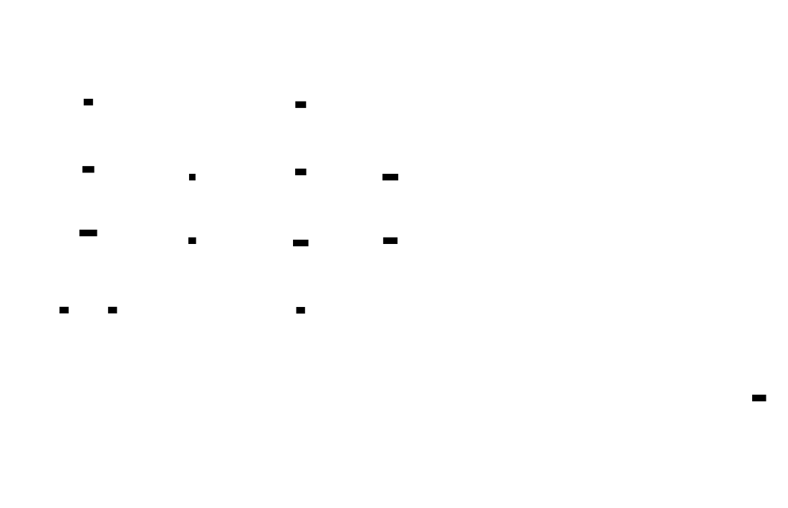
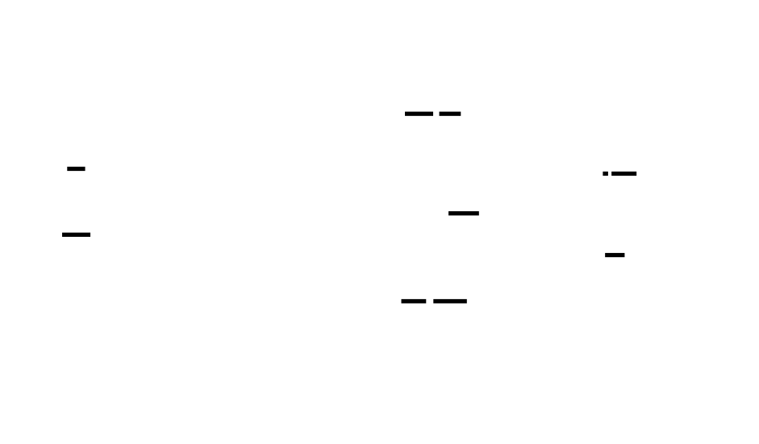
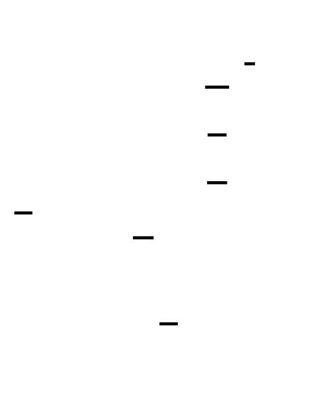
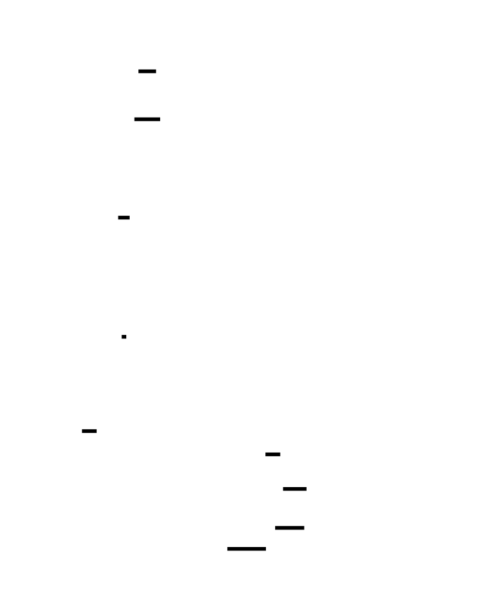
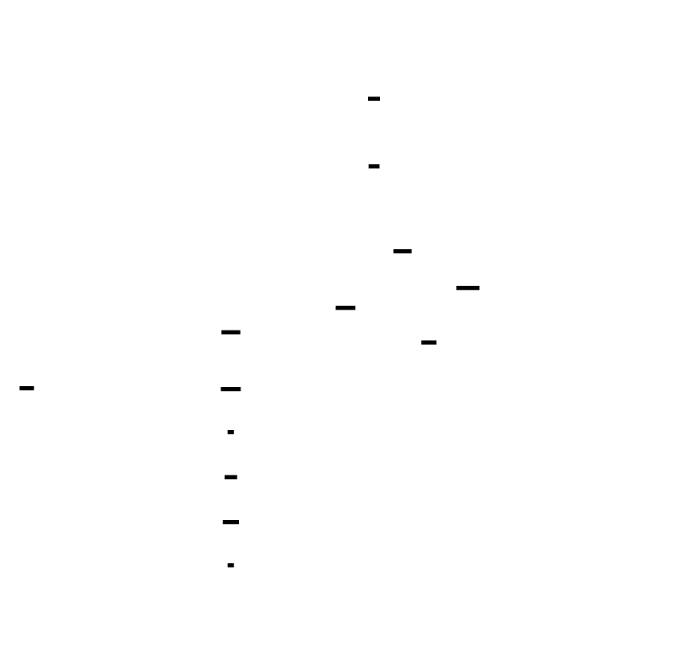
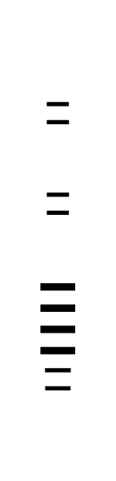
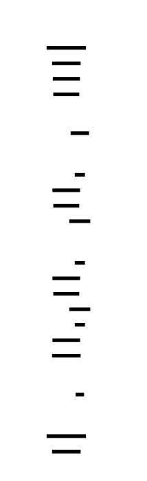

# 🎯 Project Charter: Build Your Own TCP/IP Stack
## What You Are Building
A userspace TCP/IP network stack that boots from a TAP device, parses raw Ethernet frames, resolves MAC addresses via ARP, routes IPv4 packets with fragmentation reassembly, responds to ICMP pings, establishes TCP connections through the 3-way handshake, and delivers reliable ordered byte streams over unreliable networks using sliding window flow control and congestion control. By the end, your stack will run in userspace on Linux and transfer a 1MB file with byte-for-byte SHA-256 verified correctness.
## Why This Project Exists
Most developers treat TCP/IP as a black box — they call `connect()`, `send()`, and `recv()` without understanding the distributed state machine beneath. Building a stack from scratch exposes every assumption baked into network programming: why sequence numbers wrap at 2³², why the pseudo-header checksum breaks layering, why TIME_WAIT lasts two minutes, and why congestion control is a continuous negotiation between sender, receiver, and the network itself. This is the deepest possible way to learn how the internet actually works.
## What You Will Be Able to Do When Done
- Boot a custom network stack on a Linux TAP device and communicate with real machines
- Implement Ethernet frame parsing with VLAN tag handling and ARP resolution
- Build an IP layer with RFC 1071 checksum verification and fragmentation reassembly
- Respond to ping requests with properly formatted ICMP echo replies
- Implement the complete 11-state TCP state machine with 3-way handshake and 4-way close
- Calculate TCP pseudo-header checksums that cross layer boundaries
- Build sliding window flow control with out-of-order segment buffering
- Implement adaptive retransmission timers using Jacobson's algorithm with Karn's amendment
- Deploy congestion control with slow start, congestion avoidance, fast retransmit, and fast recovery
- Debug network protocols using Wireshark, tcpdump, and custom packet analysis
## Final Deliverable
~4,000 lines of C across 20+ source files implementing Ethernet/ARP, IPv4/ICMP, and TCP with full connection management and reliable delivery. Boots in under 1 second on a TAP device. Transfers a 1MB file over TCP with SHA-256 verified integrity. Handles packet loss, reordering, and congestion through implemented recovery mechanisms.
## Is This Project For You?
**You should start this if you:**
- Can write C code with pointer arithmetic and manual memory management
- Understand the OSI model and basic socket programming concepts
- Have used Wireshark or tcpdump to inspect network traffic
- Are comfortable with state machine concepts and bit-level data manipulation
**Come back after you've learned:**
- C pointers and memory layout (try "Learn C the Hard Way" chapters 1-15)
- Basic networking concepts (try "Computer Networking: A Top-Down Approach" chapters 1-3)
- Using a debugger (gdb) to inspect memory and step through code
## Estimated Effort
| Phase | Time |
|-------|------|
| Ethernet & ARP | ~12 hours |
| IP Layer & ICMP | ~18 hours |
| TCP Connection Management | ~24 hours |
| TCP Reliable Delivery & Flow Control | ~30 hours |
| **Total** | **~84 hours** |
## Definition of Done
The project is complete when:
- Raw socket or TAP device successfully receives and sends Ethernet frames on the network interface
- ARP reply with correct hardware and protocol addresses is sent when an ARP request matches our configured IP
- ICMP echo reply is sent with correct identifier and sequence number in response to incoming echo request (ping responds within 10ms on local network)
- 3-way handshake completes successfully — server transitions LISTEN→SYN_RECEIVED→ESTABLISHED; client transitions CLOSED→SYN_SENT→ESTABLISHED
- 4-way FIN handshake gracefully closes connection; the closing side enters TIME_WAIT for 2*MSL (default 60 seconds)
- End-to-end test transfers a 1MB file over the stack and verifies byte-for-byte correctness with SHA-256 comparison
- All multi-byte fields are converted between network byte order (big-endian) and host byte order using explicit conversion functions
- Fast retransmit triggers on receipt of 3 duplicate ACKs, retransmitting the missing segment without waiting for RTO

---

# 📚 Before You Read This: Prerequisites & Further Reading
> **Read these first.** The Atlas assumes you are familiar with the foundations below.
> Resources are ordered by when you should encounter them — some before you start, some at specific milestones.
---
## Layer 2: Ethernet & ARP Foundations
### Before Starting Milestone 1
**RFC 826: An Ethernet Address Resolution Protocol** (Plummer, 1982)
- **What**: The original ARP specification
- **Where**: https://datatracker.ietf.org/doc/html/rfc826
- **Why**: This is the source of truth for ARP packet format and protocol behavior. Short, readable, and foundational.
**IEEE 802.3 Ethernet Standard** (Overview)
- **What**: Ethernet frame format and physical layer
- **Where**: Any networking textbook or Wikipedia's "Ethernet frame" article
- **Why**: You need to understand the 14-byte header structure, preamble/SFD (handled by hardware), and why EtherType matters.
### After Milestone 1
**"Computer Networking: A Top-Down Approach"** — Kurose & Ross, Chapter 5 (Link Layer)
- **When**: Read after Milestone 1 (Ethernet & ARP) — you'll have hands-on experience with frames, making the textbook's abstraction concrete.
- **Why**: Solidifies understanding of MAC addressing, ARP's role in the stack, and why Layer 2 is fundamentally about local delivery.
**tcpdump/libpcap source code** — `print-arp.c`
- **What**: How a production tool parses and displays ARP packets
- **Where**: https://github.com/the-tcpdump-group/tcpdump/blob/master/print-arp.c
- **Why**: Compare your parser to battle-tested code. Notice how they handle malformed packets and edge cases.
---
## Layer 3: IP & ICMP
### Before Starting Milestone 2
**RFC 791: Internet Protocol** (Postel, 1981)
- **What**: The IPv4 specification
- **Where**: https://datatracker.ietf.org/doc/html/rfc791
- **Why**: Sections 3.1-3.2 define the header format. Section 2.3 explains fragmentation. This is the contract your parser must satisfy.
**RFC 1071: Computing the Internet Checksum** (Braden, Borman, Partridge, 1988)
- **What**: The ones' complement checksum algorithm
- **Where**: https://datatracker.ietf.org/doc/html/rfc1071
- **Why**: Your checksum implementation must match this exactly. The examples in Appendix A are test vectors.
### After Milestone 2
**RFC 792: Internet Control Message Protocol** (Postel, 1981)
- **When**: Read after Milestone 2 (IP Layer & ICMP) — you'll understand why ICMP messages include the original IP header.
- **Why**: Defines echo request/reply (ping), time exceeded (traceroute), and destination unreachable. Your ICMP handler implements this spec.
**traceroute source code** — Van Jacobson's original implementation
- **What**: How traceroute exploits TTL expiration
- **Where**: https://github.com/openbsd/src/blob/master/usr.sbin/traceroute/traceroute.c
- **Why**: See how a classic network tool sends packets with incrementing TTLs and parses ICMP Time Exceeded responses. Your stack generates these responses.
**"Network Warrior"** — Gary Donahue, Chapter 4 (IP Routing)
- **When**: Read after Milestone 2 — you'll have implemented longest-prefix-match and understand routing tables from the inside.
- **Why**: Practical perspective on how routers use the same algorithm you just built, plus debugging techniques.
---
## Layer 4: TCP Connection Management
### Before Starting Milestone 3
**RFC 793: Transmission Control Protocol** (Postel, 1981) — Sections 1-3
- **What**: The TCP specification
- **Where**: https://datatracker.ietf.org/doc/html/rfc793
- **Why**: Sections 1-3 define the state machine, connection establishment, and the fundamental concepts. Figure 6 is the 11-state diagram you'll implement.
**RFC 6528: Defending Against Sequence Number Attacks** (Gont, 2012)
- **What**: Requirements for Initial Sequence Number generation
- **Where**: https://datatracker.ietf.org/doc/html/rfc6528
- **Why**: Explains why ISNs must be unpredictable. Your `tcp_generate_isn()` function implements this.
### After Milestone 3
**RFC 1323: TCP Extensions for High Performance** (Jacobson, Braden, Borman, 1992) — Window Scale Option
- **When**: Read after Milestone 3 (TCP Connection Management) — you'll have implemented basic window handling and can appreciate why scaling matters.
- **Why**: The 16-bit window field limits windows to 64KB. Window scale extends this to 1GB. Your options parser handles this.
**"TCP/IP Illustrated, Volume 1"** — W. Richard Stevens, Chapter 18-23 (TCP Connection Management)
- **When**: Read after Milestone 3 — you'll recognize every state transition from your own implementation.
- **Why**: Stevens traces actual packet exchanges with tcpdump output. Seeing real handshakes and closes cements understanding.
**Linux kernel source** — `net/ipv4/tcp_input.c`, function `tcp_rcv_state_process()`
- **What**: Production TCP state machine implementation
- **Where**: https://github.com/torvalds/linux/blob/master/net/ipv4/tcp_input.c
- **Why**: Compare your state machine to Linux's. Notice how they handle edge cases and security concerns (SYN cookies, etc.).
---
## Layer 4: TCP Reliable Delivery
### Before Starting Milestone 4
**RFC 6298: Computing TCP's Retransmission Timer** (Paxson, Allman, 2011)
- **What**: Jacobson's algorithm for adaptive RTO
- **Where**: https://datatracker.ietf.org/doc/html/rfc6298
- **Why**: Sections 2-3 define SRTT, RTTVAR, and RTO calculation. Your `tcp_rto_update()` implements this exactly.
**RFC 5681: TCP Congestion Control** (Allman, Paxson, Blanton, 2009)
- **What**: Slow start, congestion avoidance, fast retransmit/recovery
- **Where**: https://datatracker.ietf.org/doc/html/rfc5681
- **Why**: Defines cwnd, ssthresh, and when to use each algorithm. Your congestion control state machine follows this spec.
### After Milestone 4
**RFC 896: Congestion Control in IP/TCP Internetworks** (Nagle, 1984)
- **When**: Read after Milestone 4 (Reliable Delivery) — you'll have experienced why congestion control is necessary.
- **Why**: The original observation that led to congestion control. Also defines Nagle's algorithm for coalescing small segments.
**RFC 813: Window and Acknowledgment Strategy in TCP** (Clark, 1982)
- **When**: Read after Milestone 4 — you'll understand the silly window syndrome problem from implementing both sides.
- **Why**: Defines Clark's algorithm for avoiding small window advertisements. Your receiver implements this.
**"TCP/IP Illustrated, Volume 1"** — W. Richard Stevens, Chapter 19-20 (TCP Timeout and Retransmission)
- **When**: Read after Milestone 4 — you'll recognize every algorithm from your implementation.
- **Why**: Traces actual timeout and retransmission scenarios with packet captures. The RTO graphs show convergence visually.
**BBR Congestion Control** (Google, 2016)
- **What**: Modern delay-based congestion control
- **Where**: https://research.google/pubs/pub45646/ (Cardwell et al., "BBR: Congestion-Based Congestion Control")
- **When**: Read after Milestone 4 — you'll understand loss-based congestion control (Reno) and can appreciate why BBR is fundamentally different.
- **Why**: Production systems are moving from loss-based to delay-based algorithms. Understanding Reno (what you built) is prerequisite to understanding BBR's innovation.
---
## Cross-Domain Connections
### After Completing All Milestones
**RFC 8446: The Transport Layer Security (TLS) Protocol Version 1.3**
- **When**: Read after completing the stack — you'll understand why TLS runs over TCP and why the handshake costs round trips.
- **Why**: TLS adds another handshake on top of TCP. Understanding TCP's 1.5-RTT handshake explains why TLS 1.3's 0-RTT resumption matters.
**RFC 7540: Hypertext Transfer Protocol Version 2 (HTTP/2)**
- **When**: Read after completing the stack — you'll understand why HTTP/2 multiplexes streams over one connection.
- **Why**: Each TCP connection has its own congestion window. Opening multiple connections would unfairly grab bandwidth. HTTP/2's design makes sense only with TCP understanding.
**QUIC Protocol** (IETF, 2021)
- **What**: UDP-based transport with TCP semantics
- **Where**: https://datatracker.ietf.org/doc/html/rfc9000
- **When**: Read after completing the stack — you'll recognize every concept (handshake, reliable delivery, congestion control) reinvented over UDP.
- **Why**: QUIC solves TCP's head-of-line blocking and handshake latency by rebuilding TCP's mechanisms in userspace. Your implementation gives you the mental model to understand what QUIC optimizes.

---

# Build Your Own TCP/IP Stack

This project implements a complete userspace TCP/IP network stack from the ground up, transforming raw Ethernet frames into reliable, ordered byte streams. You'll build every layer: Ethernet frame parsing with VLAN handling, ARP for MAC resolution, IPv4 with fragmentation reassembly, ICMP for diagnostics, and a full TCP implementation featuring the 3-way handshake, sliding window flow control, adaptive retransmission timers, and congestion control algorithms (slow start, congestion avoidance, fast retransmit/recovery). The stack runs on Linux using TAP devices or raw sockets, giving you direct access to network frames without kernel modifications.


<!-- MS_ID: build-tcp-stack-m1 -->
# Ethernet & ARP: Your First Steps into Layer 2
You're about to build the foundation of a complete TCP/IP stack. Not a simulation. Not a library wrapper. Real packets, real network interfaces, real bytes on the wire that other computers will understand.
Before we write a single line of code, you need to understand what you're actually dealing with.
## The Hidden World Beneath Your Sockets
When you call `send()` on a TCP socket, something magical happens — and by magical, I mean invisibly complex. Your data doesn't just "go to the destination." It descends through layers of abstraction, each adding its own envelope, until it becomes electrical pulses on a cable or radio waves in the air.


This milestone focuses on **Layer 2** — the Ethernet layer — and the **Address Resolution Protocol (ARP)** that bridges Layer 3 (IP addresses) to Layer 2 (MAC addresses).
### The Fundamental Tension: IP Addresses Are Lies
Here's the uncomfortable truth: **IP addresses don't exist at the hardware level.**
When your computer wants to send a packet to `192.168.1.5`, the network card has no idea what that means. Network cards only understand **MAC addresses** — 48-bit hardware identifiers burned into them at the factory. Your network card can't send a packet to an IP address any more than your mailbox can send a letter to a phone number.
This creates a fundamental mismatch:
- **Software thinks in IP addresses** (hierarchical, routable, configurable)
- **Hardware speaks in MAC addresses** (flat, physical, immutable)
Someone has to translate between them. That someone is **ARP**, and you're about to implement it.
## What Ethernet Actually Is (The Revelation)
Here's where most developers' mental model breaks down.
You probably think of Ethernet as a delivery service: you give it a destination address and some data, and it delivers that data to that address. Simple, right?
**Wrong.**
Ethernet is a **shared-medium broadcast protocol** at its core. When you send an Ethernet frame:
1. Your network card puts the frame on the wire
2. **Every device on that network segment receives it**
3. Each device checks the destination MAC address
4. If it matches their MAC, they process it; if not, they normally ignore it
5. The destination MAC is just a **filter**, not a routing instruction
This is why **packet sniffing** works — your network card can be put into "promiscuous mode" where it processes *all* frames, not just the ones addressed to it. Every password, every unencrypted HTTP request, every database query — it all flows past every device on the segment.



This broadcast nature is also why **ARP works at all**. When you need to find the MAC address for an IP, you literally shout to everyone: "WHO HAS 192.168.1.5?" and hope someone responds.
## Setting Up Your Packet Pipeline: TAP Devices
Before you can parse Ethernet frames, you need to receive them. The Linux kernel normally intercepts network packets before your code ever sees them, handling all the TCP/IP complexity invisibly. To build your own stack, you need to **bypass the kernel's networking stack entirely**.
Enter the **TAP device** — a virtual network interface that delivers raw Ethernet frames directly to your userspace program.


A TAP device appears as a regular network interface (like `eth0` or `wlan0`) to the rest of the system, but it has no physical hardware behind it. Instead, it's connected to a **file descriptor** in your program. When you read from that file descriptor, you get raw Ethernet frames. When you write to it, your frames appear on the virtual interface as if they came from the network.
### Opening a TAP Device
Here's the ritual to create and configure a TAP device:
```c
#include <fcntl.h>
#include <unistd.h>
#include <sys/ioctl.h>
#include <linux/if.h>
#include <linux/if_tun.h>
#include <string.h>
#include <errno.h>
#define TAP_DEV_PATH "/dev/net/tun"
/**
 * Opens a TAP device and returns its file descriptor.
 * 
 * @param dev_name  Will be filled with the actual device name (e.g., "tap0")
 * @param ip_addr   IP address to assign to the interface (e.g., "10.0.0.1")
 * @param netmask   Network mask (e.g., "255.255.255.0")
 * @return          File descriptor on success, -1 on failure
 */
int tap_open(char *dev_name, const char *ip_addr, const char *netmask) {
    struct ifreq ifr;
    int fd, sock_fd;
    // Open the TAP device control file
    fd = open(TAP_DEV_PATH, O_RDWR);
    if (fd < 0) {
        perror("Failed to open /dev/net/tun");
        return -1;
    }
    // Configure the TAP device
    memset(&ifr, 0, sizeof(ifr));
    ifr.ifr_flags = IFF_TAP | IFF_NO_PI;  // TAP device, no packet info header
    strncpy(ifr.ifr_name, "tap%d", IFNAMSIZ - 1);
    // Create the interface
    if (ioctl(fd, TUNSETIFF, (void *)&ifr) < 0) {
        perror("Failed to create TAP interface");
        close(fd);
        return -1;
    }
    // Copy back the actual device name (kernel assigns tap0, tap1, etc.)
    strncpy(dev_name, ifr.ifr_name, IFNAMSIZ - 1);
    // Now configure IP address using a regular socket
    sock_fd = socket(AF_INET, SOCK_DGRAM, 0);
    if (sock_fd < 0) {
        perror("Failed to create config socket");
        close(fd);
        return -1;
    }
    // Set IP address
    struct sockaddr_in addr;
    memset(&addr, 0, sizeof(addr));
    addr.sin_family = AF_INET;
    inet_pton(AF_INET, ip_addr, &addr.sin_addr);
    memcpy(&ifr.ifr_addr, &addr, sizeof(addr));
    if (ioctl(sock_fd, SIOCSIFADDR, &ifr) < 0) {
        perror("Failed to set IP address");
        close(sock_fd);
        close(fd);
        return -1;
    }
    // Set netmask
    inet_pton(AF_INET, netmask, &addr.sin_addr);
    memcpy(&ifr.ifr_netmask, &addr, sizeof(addr));
    if (ioctl(sock_fd, SIOCSIFNETMASK, &ifr) < 0) {
        perror("Failed to set netmask");
        close(sock_fd);
        close(fd);
        return -1;
    }
    // Bring the interface UP
    if (ioctl(sock_fd, SIOCGIFFLAGS, &ifr) < 0) {
        perror("Failed to get interface flags");
        close(sock_fd);
        close(fd);
        return -1;
    }
    ifr.ifr_flags |= IFF_UP | IFF_RUNNING;
    if (ioctl(sock_fd, SIOCSIFFLAGS, &ifr) < 0) {
        perror("Failed to bring interface up");
        close(sock_fd);
        close(fd);
        return -1;
    }
    close(sock_fd);
    return fd;
}
```
Let's unpack what's happening here:
1. **`/dev/net/tun`** is the control device for TUN/TAP. Opening it gives you a file descriptor, but it's not usable yet.
2. **`struct ifreq`** is the universal structure for configuring network interfaces in Linux. You'll see it everywhere.
3. **`IFF_TAP`** vs `IFF_TUN`: TUN devices carry IP packets (Layer 3); TAP devices carry Ethernet frames (Layer 2). We need TAP because we're building the whole stack from Ethernet up.
4. **`IFF_NO_PI`** tells the kernel not to prepend a 4-byte "packet information" header. We want raw Ethernet frames, not kernel metadata.
5. The **separate socket for configuration** is necessary because the TAP fd is for data, not control. Network configuration in Linux uses `ioctl()` on a regular socket.
### Reading and Writing Frames
With the TAP device open, reading and writing is trivially simple — it's just file I/O:
```c
#include <stdint.h>
// Maximum Transmission Unit - the largest frame we'll handle
#define MTU 1500
/**
 * Read a raw Ethernet frame from the TAP device.
 * 
 * @param fd     TAP device file descriptor
 * @param buffer Buffer to store the frame (at least MTU bytes)
 * @return       Number of bytes read, or -1 on error
 */
ssize_t tap_read(int fd, uint8_t *buffer) {
    return read(fd, buffer, MTU);
}
/**
 * Write a raw Ethernet frame to the TAP device.
 * 
 * @param fd     TAP device file descriptor
 * @param buffer Frame data to send
 * @param len    Length of frame in bytes
 * @return       Number of bytes written, or -1 on error
 */
ssize_t tap_write(int fd, const uint8_t *buffer, size_t len) {
    return write(fd, buffer, len);
}
```
That's it. No socket options, no protocol specifications — just read and write. The kernel doesn't interpret these bytes at all; it delivers them verbatim to the virtual network interface.
### Hardware Soul: What Happens When You Call read()
Let's trace the path of a frame from the network to your buffer:
1. **Physical Layer**: A network card receives electrical signals, performs clock recovery, and assembles bits into bytes using its PHY (physical layer transceiver).
2. **DMA Transfer**: The network card uses Direct Memory Access to write the frame directly into a ring buffer in main memory, bypassing the CPU entirely. This is why high-performance networking cares about NUMA topology — the DMA goes to the memory controller nearest the NIC.
3. **Interrupt**: The NIC raises an interrupt, signaling the CPU that data is ready.
4. **Kernel Handling**: The Linux kernel's NIC driver processes the interrupt, moves the frame from the DMA ring buffer to the network stack's receive path.
5. **TAP Interception**: For TAP devices, the kernel bypasses the normal TCP/IP stack and places the frame directly into the TAP device's queue.
6. **Context Switch**: Your `read()` call transitions from userspace to kernel space (via syscall), the kernel copies the frame from the TAP queue to your buffer, and returns to userspace.
Each frame touches main memory **at least three times**: NIC→DMA buffer→kernel buffer→userspace buffer. This is why zero-copy networking is such a hot topic — that copying adds up at 10 million packets per second.
## The Ethernet Frame: Anatomy of a Packet
Now that you can receive raw bytes, you need to parse them into something meaningful. Let's dissect an Ethernet frame.


### Frame Structure (The 802.3 Standard)
An Ethernet frame consists of:
| Field | Size (bytes) | Description |
|-------|--------------|-------------|
| Preamble | 7 | Alternating 1s and 0s for clock synchronization |
| Start Frame Delimiter | 1 | `0xD5` — marks the start of actual data |
| **Destination MAC** | 6 | Target hardware address |
| **Source MAC** | 6 | Sender hardware address |
| **802.1Q Tag** | 4 (optional) | VLAN tagging — we'll cover this |
| **EtherType** | 2 | Protocol identifier for the payload |
| **Payload** | 46–1500 | The actual data |
| **Frame Check Sequence** | 4 | CRC-32 for error detection |
| Inter-frame Gap | 12 | Silence between frames |
**Important**: The preamble, SFD, FCS, and inter-frame gap are handled by the network hardware. Your TAP device delivers **only** the destination MAC, source MAC, optional VLAN tag, EtherType, and payload. This is your raw frame buffer.
### Defining the Ethernet Header in C
```c
#include <stdint.h>
#include <stddef.h>
#define ETH_ADDR_LEN    6   // MAC addresses are 6 bytes
#define ETH_HDR_LEN     14  // Dest MAC (6) + Src MAC (6) + EtherType (2)
#define ETH_VLAN_HDR_LEN 4  // VLAN tag is 4 additional bytes
#define ETH_MTU         1500
#define ETH_FRAME_MAX   (ETH_HDR_LEN + ETH_VLAN_HDR_LEN + ETH_MTU)
// EtherType values (there are hundreds, these are the common ones)
#define ETH_TYPE_IPV4   0x0800
#define ETH_TYPE_ARP    0x0806
#define ETH_TYPE_VLAN   0x8100  // 802.1Q VLAN tag
#define ETH_TYPE_IPV6   0x86DD
/**
 * Ethernet header structure.
 * 
 * CRITICAL: All multi-byte fields are in NETWORK BYTE ORDER (big-endian).
 * You MUST use ntohs()/ntohl() to read them on little-endian systems.
 */
struct eth_hdr {
    uint8_t  dst_mac[ETH_ADDR_LEN];   // Destination MAC address
    uint8_t  src_mac[ETH_ADDR_LEN];   // Source MAC address
    uint16_t ethertype;               // Protocol of the payload
    // Payload follows immediately after this header
} __attribute__((packed));
/**
 * 802.1Q VLAN tag (appears between source MAC and EtherType).
 */
struct vlan_tag {
    uint16_t tci;      // Tag Control Info: priority (3 bits) + DEI (1 bit) + VLAN ID (12 bits)
    uint16_t ethertype; // The actual EtherType (e.g., IPv4, ARP)
} __attribute__((packed));
```
The `__attribute__((packed))` directive tells the compiler not to insert padding bytes. Without this, the compiler might add padding to align fields on 4-byte boundaries, completely breaking the memory layout. Network protocols are defined at the byte level; there's no room for compiler whims.
[[EXPLAIN:network-byte-order-(big-endian)|Network byte order (big-endian)]]
### Parsing an Ethernet Frame
Now let's write the parser:
```c
#include <arpa/inet.h>  // For ntohs()
#include <string.h>
/**
 * Parse an Ethernet frame and extract its components.
 * 
 * @param buffer     Raw frame bytes
 * @param len        Length of buffer
 * @param out_hdr    Output: pointer to the Ethernet header (points into buffer)
 * @param out_payload Output: pointer to payload start
 * @param out_payload_len Output: length of payload
 * @param out_vlan   Output: VLAN ID if present, 0 if not
 * @return           0 on success, -1 on invalid frame
 */
int eth_parse(const uint8_t *buffer, size_t len,
              struct eth_hdr **out_hdr,
              const uint8_t **out_payload,
              size_t *out_payload_len,
              uint16_t *out_vlan) 
{
    if (len < ETH_HDR_LEN) {
        return -1;  // Frame too short to be valid
    }
    struct eth_hdr *hdr = (struct eth_hdr *)buffer;
    uint16_t ethertype = ntohs(hdr->ethertype);
    size_t hdr_len = ETH_HDR_LEN;
    uint16_t vlan_id = 0;
    // Check for 802.1Q VLAN tag
    if (ethertype == ETH_TYPE_VLAN) {
        if (len < ETH_HDR_LEN + ETH_VLAN_HDR_LEN) {
            return -1;  // VLAN tag truncated
        }
        struct vlan_tag *tag = (struct vlan_tag *)(buffer + ETH_HDR_LEN);
        ethertype = ntohs(tag->ethertype);
        vlan_id = ntohs(tag->tci) & 0x0FFF;  // Lower 12 bits are VLAN ID
        hdr_len += ETH_VLAN_HDR_LEN;
    }
    // Calculate payload bounds
    if (len < hdr_len) {
        return -1;
    }
    *out_hdr = hdr;
    *out_payload = buffer + hdr_len;
    *out_payload_len = len - hdr_len;
    *out_vlan = vlan_id;
    return 0;
}
```
### Hardware Soul: Why VLANs Matter
That 4-byte VLAN tag isn't just extra parsing complexity — it's how modern datacenters achieve **multi-tenancy**. A single physical network switch can have 4094 virtual LANs, each completely isolated from the others. Your AWS instance is on one VLAN; someone else's is on another. The hardware enforces that frames from VLAN 42 can never reach ports assigned to VLAN 100.
When you see cloud providers advertising "network isolation," this is often the mechanism. Understanding VLANs isn't just academic — it's how the internet actually works at scale.


### MAC Address Utilities
You'll need helper functions for working with MAC addresses:
```c
#include <stdio.h>
/**
 * Convert a MAC address to human-readable string.
 * Returns pointer to static buffer (not thread-safe).
 */
char *mac_to_string(const uint8_t *mac) {
    static char buf[18];  // "XX:XX:XX:XX:XX:XX" + null
    snprintf(buf, sizeof(buf), "%02x:%02x:%02x:%02x:%02x:%02x",
             mac[0], mac[1], mac[2], mac[3], mac[4], mac[5]);
    return buf;
}
/**
 * Parse a MAC address string into bytes.
 * Formats: "00:11:22:33:44:55" or "00-11-22-33-44-55" or "001122334455"
 * Returns 0 on success, -1 on invalid format.
 */
int mac_from_string(const char *str, uint8_t *mac) {
    int values[6];
    int count;
    // Try colon format first
    count = sscanf(str, "%x:%x:%x:%x:%x:%x",
                   &values[0], &values[1], &values[2],
                   &values[3], &values[4], &values[5]);
    if (count == 6) {
        for (int i = 0; i < 6; i++) {
            mac[i] = (uint8_t)values[i];
        }
        return 0;
    }
    // Try hyphen format
    count = sscanf(str, "%x-%x-%x-%x-%x-%x",
                   &values[0], &values[1], &values[2],
                   &values[3], &values[4], &values[5]);
    if (count == 6) {
        for (int i = 0; i < 6; i++) {
            mac[i] = (uint8_t)values[i];
        }
        return 0;
    }
    return -1;
}
/**
 * Check if a MAC address is the broadcast address.
 */
int mac_is_broadcast(const uint8_t *mac) {
    return mac[0] == 0xFF && mac[1] == 0xFF && mac[2] == 0xFF &&
           mac[3] == 0xFF && mac[4] == 0xFF && mac[5] == 0xFF;
}
/**
 * Check if a MAC address matches our interface's MAC.
 */
int mac_is_ours(const uint8_t *mac, const uint8_t *our_mac) {
    return memcmp(mac, our_mac, ETH_ADDR_LEN) == 0;
}
```
## ARP: The Trustless Translation Layer
You now have the ability to receive Ethernet frames and parse their headers. But there's still a critical missing piece: when you want to send a packet to IP address `192.168.1.5`, how do you know what destination MAC to put in the Ethernet header?
This is where the **Address Resolution Protocol (ARP)** comes in. ARP is defined in 
> **🔑 Foundation: RFC 826**
> 
> ## What It IS
RFC 826 defines the **Address Resolution Protocol (ARP)** — the mechanism that bridges Layer 3 (network layer, IP addresses) to Layer 2 (data link layer, MAC addresses) in Ethernet networks.
When a device knows an IP address but needs the MAC address to actually deliver a frame, ARP is the protocol that performs this discovery. It's the network equivalent of knowing someone's name but needing their physical mailing address to send them a letter.
**The ARP Process:**
1. Device A wants to send to IP 192.168.1.50
2. Device A broadcasts an ARP request: "Who has 192.168.1.50?"
3. Device B (192.168.1.50) responds with a unicast ARP reply: "I do, and my MAC is aa:bb:cc:dd:ee:ff"
4. Device A caches this mapping in its ARP table
5. Communication proceeds using the MAC address
## WHY You Need It Right Now
ARP is invisible when everything works — and completely catastrophic when it doesn't. Understanding ARP is essential for:
- **Debugging connectivity issues** — If two devices are on the same subnet but can't communicate, the ARP table is one of the first places to look. A missing or incorrect ARP entry reveals whether packets are even reaching the local network segment.
- **Network security** — ARP spoofing/poisoning attacks exploit the trust-based nature of ARP. An attacker can claim to be the gateway's IP address, intercepting all traffic. You can't understand these attacks without understanding ARP itself.
- **Cloud and virtual networking** — Modern SDN (Software Defined Networking) environments manipulate ARP behavior. Cloud providers implement proxy ARP, ARP suppression, and other tricks that deviate from RFC 826's simple model.
- **Protocol implementation** — If you're building network software, you may need to construct or parse ARP packets directly, or understand how your operating system's ARP cache affects performance.
## ONE Key Insight
**ARP only works within a broadcast domain.** 
This is the mental model that unlocks everything else: ARP requests are Layer 2 broadcasts, so they cannot cross routers. When you ping a remote server across the internet, ARP isn't used to find that server's MAC address — it's used to find your *default gateway's* MAC address, because that's the next hop within your local network.
The corollary: if you're seeing ARP issues, the problem is local. Remote connectivity problems are never ARP problems — they're routing problems.
, published in 1982 — one of the oldest protocols still in active use on the internet.
### How ARP Works (The Protocol)
The protocol is beautifully simple:
1. **You need to send to IP X, but don't know the MAC**
2. **You broadcast** an ARP request: "Who has IP X? Tell MAC Y"
3. **Every device on the segment receives this** (it's a broadcast)
4. **The device with IP X responds** directly to you: "IP X is at MAC Z"
5. **You cache this mapping** in your ARP table
6. **You can now send Ethernet frames** to that MAC


### The ARP Packet Structure
An ARP packet is encapsulated directly in an Ethernet frame (no IP header). Here's the structure:
```c
// ARP hardware types
#define ARP_HW_ETHERNET    1
#define ARP_HW_EXP_ETHERNET 6
// ARP protocol types (same values as Ethernet EtherType)
#define ARP_PROTO_IP       0x0800
// ARP operation codes
#define ARP_OP_REQUEST     1
#define ARP_OP_REPLY       2
/**
 * ARP packet structure (RFC 826).
 * 
 * This is the "generic" ARP format. The field sizes depend on
 * the hardware and protocol types. For Ethernet+IPv4, we have:
 *   - HW addr: 6 bytes (MAC)
 *   - Proto addr: 4 bytes (IPv4)
 */
struct arp_hdr {
    uint16_t hw_type;        // Hardware type (1 = Ethernet)
    uint16_t proto_type;     // Protocol type (0x0800 = IPv4)
    uint8_t  hw_addr_len;    // Length of hardware address (6)
    uint8_t  proto_addr_len; // Length of protocol address (4)
    uint16_t opcode;         // Operation: 1=request, 2=reply
    uint8_t  sender_hw[ETH_ADDR_LEN];   // Sender's MAC address
    uint8_t  sender_proto[4];           // Sender's IP address
    uint8_t  target_hw[ETH_ADDR_LEN];   // Target's MAC (0 for requests)
    uint8_t  target_proto[4];           // Target's IP address
} __attribute__((packed));
#define ARP_PKT_LEN sizeof(struct arp_hdr)
```
### The Security Elephant in the Room
Before we implement ARP, you need to understand something crucial: **ARP has absolutely no security whatsoever.**
Any device on the network can send an ARP reply claiming to be any IP address. There's no verification, no authentication, no nothing. This is called **ARP spoofing** or **ARP cache poisoning**, and it's one of the oldest network attacks in existence.
When an attacker sends your computer a fake ARP reply saying "I am the gateway IP 192.168.1.1", your computer will blindly update its ARP table and send all traffic to the attacker instead of the real router. The attacker can then forward the traffic (man-in-the-middle) or just drop it (denial of service).
**For this project**, we'll accept unsolicited ARP replies. In production code, you'd want additional protections — static ARP entries for critical infrastructure, ARP monitoring tools like `arpwatch`, or cryptographic network layer security like WireGuard.
### Building an ARP Request
Let's write the code to create an ARP request:
```c
#include <string.h>
/**
 * Build an ARP request packet.
 * 
 * @param buffer       Output buffer (must be at least ARP_PKT_LEN bytes)
 * @param our_mac      Our MAC address
 * @param our_ip       Our IP address (network byte order)
 * @param target_ip    The IP we're looking up (network byte order)
 * @return             Number of bytes written
 */
size_t arp_build_request(uint8_t *buffer,
                         const uint8_t *our_mac,
                         uint32_t our_ip,
                         uint32_t target_ip)
{
    struct arp_hdr *arp = (struct arp_hdr *)buffer;
    arp->hw_type = htons(ARP_HW_ETHERNET);
    arp->proto_type = htons(ARP_PROTO_IP);
    arp->hw_addr_len = ETH_ADDR_LEN;
    arp->proto_addr_len = 4;
    arp->opcode = htons(ARP_OP_REQUEST);
    memcpy(arp->sender_hw, our_mac, ETH_ADDR_LEN);
    memcpy(arp->sender_proto, &our_ip, 4);
    memset(arp->target_hw, 0, ETH_ADDR_LEN);  // Unknown - that's what we're asking!
    memcpy(arp->target_proto, &target_ip, 4);
    return ARP_PKT_LEN;
}
```
### Building an ARP Reply
When someone asks for our IP, we need to respond:
```c
/**
 * Build an ARP reply packet.
 * 
 * @param buffer       Output buffer
 * @param our_mac      Our MAC address
 * @param our_ip       Our IP address (network byte order)
 * @param target_mac   The MAC we're replying to
 * @param target_ip    The IP we're replying to (network byte order)
 * @return             Number of bytes written
 */
size_t arp_build_reply(uint8_t *buffer,
                       const uint8_t *our_mac,
                       uint32_t our_ip,
                       const uint8_t *target_mac,
                       uint32_t target_ip)
{
    struct arp_hdr *arp = (struct arp_hdr *)buffer;
    arp->hw_type = htons(ARP_HW_ETHERNET);
    arp->proto_type = htons(ARP_PROTO_IP);
    arp->hw_addr_len = ETH_ADDR_LEN;
    arp->proto_addr_len = 4;
    arp->opcode = htons(ARP_OP_REPLY);
    memcpy(arp->sender_hw, our_mac, ETH_ADDR_LEN);
    memcpy(arp->sender_proto, &our_ip, 4);
    memcpy(arp->target_hw, target_mac, ETH_ADDR_LEN);
    memcpy(arp->target_proto, &target_ip, 4);
    return ARP_PKT_LEN;
}
```
### Wrapping ARP in an Ethernet Frame
ARP packets don't exist in isolation — they're carried inside Ethernet frames. Here's how to wrap and send:
```c
/**
 * Build a complete Ethernet frame containing an ARP packet.
 * 
 * @param buffer       Output buffer (must be ETH_FRAME_MAX bytes)
 * @param dst_mac      Destination MAC (use broadcast for requests)
 * @param src_mac      Our MAC address
 * @param arp_payload  The ARP packet data
 * @param arp_len      Length of ARP packet
 * @return             Total frame length
 */
size_t eth_arp_build_frame(uint8_t *buffer,
                           const uint8_t *dst_mac,
                           const uint8_t *src_mac,
                           const uint8_t *arp_payload,
                           size_t arp_len)
{
    struct eth_hdr *eth = (struct eth_hdr *)buffer;
    memcpy(eth->dst_mac, dst_mac, ETH_ADDR_LEN);
    memcpy(eth->src_mac, src_mac, ETH_ADDR_LEN);
    eth->ethertype = htons(ETH_TYPE_ARP);
    memcpy(buffer + ETH_HDR_LEN, arp_payload, arp_len);
    return ETH_HDR_LEN + arp_len;
}
```
## The ARP Cache: Remembering What You've Learned
Sending an ARP request for every packet would be catastrophic for performance — each request takes round-trip time, and broadcasts are expensive. You need to **cache** the IP→MAC mappings you learn.


### Cache Data Structure
A simple hash table keyed by IP address works well:
```c
#include <time.h>
#define ARP_CACHE_SIZE     256     // Number of entries
#define ARP_CACHE_TTL      60      // Seconds before entry expires
/**
 * A single ARP cache entry.
 */
struct arp_entry {
    uint32_t ip;                   // Key: IP address (network byte order)
    uint8_t  mac[ETH_ADDR_LEN];    // Value: MAC address
    time_t   expires_at;           // When this entry becomes stale
    int      valid;                // Is this entry valid?
};
/**
 * The ARP cache structure.
 */
struct arp_cache {
    struct arp_entry entries[ARP_CACHE_SIZE];
};
```
### Cache Operations
```c
/**
 * Initialize an ARP cache.
 */
void arp_cache_init(struct arp_cache *cache) {
    memset(cache, 0, sizeof(*cache));
}
/**
 * Simple hash function for IP addresses.
 */
static uint32_t hash_ip(uint32_t ip) {
    // FNV-1a hash, but for a single 32-bit value
    return (ip ^ (ip >> 16) ^ (ip >> 8)) % ARP_CACHE_SIZE;
}
/**
 * Look up an IP address in the cache.
 * Returns MAC address if found and valid, NULL if not.
 */
const uint8_t *arp_cache_lookup(struct arp_cache *cache, uint32_t ip) {
    uint32_t idx = hash_ip(ip);
    struct arp_entry *entry = &cache->entries[idx];
    // Check if this entry is for our IP and still valid
    if (entry->valid && entry->ip == ip) {
        if (time(NULL) < entry->expires_at) {
            return entry->mac;
        }
        // Entry expired, mark invalid
        entry->valid = 0;
    }
    return NULL;  // Not found or expired
}
/**
 * Add or update an entry in the ARP cache.
 */
void arp_cache_insert(struct arp_cache *cache, uint32_t ip, const uint8_t *mac) {
    uint32_t idx = hash_ip(ip);
    struct arp_entry *entry = &cache->entries[idx];
    entry->ip = ip;
    memcpy(entry->mac, mac, ETH_ADDR_LEN);
    entry->expires_at = time(NULL) + ARP_CACHE_TTL;
    entry->valid = 1;
}
```
### Handling Cache Collisions
This simple hash table has no collision resolution — if two IPs hash to the same slot, one evicts the other. For a learning implementation, this is acceptable. In production, you'd use:
- **Chaining**: Each slot has a linked list of entries
- **Open addressing**: Probe to the next slot on collision
- **LRU eviction**: Track usage and evict least-recently-used entries
### Hardware Soul: Why Cache Size Matters
Each ARP cache entry is about 20 bytes (4 for IP + 6 for MAC + 8 for timestamp + overhead). A 256-entry cache is only ~5KB of memory. Why not make it huge?
Because **cache locality**. A smaller cache that fits in L1/L2 CPU cache will be dramatically faster than a larger one that spills to main memory. Hash table lookups at 64 bytes per cache line mean each lookup might fetch a whole cache line. Keep it tight, keep it hot.
## Pending Packets: Queuing During Resolution
Here's a problem: you have an IP packet ready to send, but the ARP cache doesn't have the MAC address yet. You send an ARP request, but you can't send the IP packet until you get a reply. Where does the packet wait?
You need a **pending queue** for each unresolved IP address:
```c
#include <stdint.h>
#define PENDING_QUEUE_MAX  16     // Max packets waiting per IP
#define PENDING_PKT_MAX    ETH_FRAME_MAX
/**
 * A queued packet waiting for ARP resolution.
 */
struct pending_packet {
    uint8_t data[PENDING_PKT_MAX];
    size_t  len;
    int     valid;
};
/**
 * Queue for packets waiting on a single IP's resolution.
 */
struct pending_queue {
    uint32_t ip;                              // IP we're waiting for
    struct pending_packet packets[PENDING_QUEUE_MAX];
    int head;                                 // Next slot to write
    int count;                                // How many packets queued
    time_t request_sent;                      // When we sent the ARP request
    int retry_count;                          // How many times we've retried
};
#define PENDING_QUEUES_MAX  32
/**
 * Collection of pending queues.
 */
struct pending_queues {
    struct pending_queue queues[PENDING_QUEUES_MAX];
    int count;
};
/**
 * Queue a packet for later delivery.
 * Returns 0 on success, -1 if queue is full.
 */
int pending_queue_add(struct pending_queues *pq, uint32_t ip,
                      const uint8_t *data, size_t len)
{
    // Find or create a queue for this IP
    struct pending_queue *queue = NULL;
    for (int i = 0; i < pq->count; i++) {
        if (pq->queues[i].ip == ip) {
            queue = &pq->queues[i];
            break;
        }
    }
    if (!queue) {
        if (pq->count >= PENDING_QUEUES_MAX) {
            return -1;  // No room for new queue
        }
        queue = &pq->queues[pq->count++];
        memset(queue, 0, sizeof(*queue));
        queue->ip = ip;
    }
    if (queue->count >= PENDING_QUEUE_MAX) {
        return -1;  // Queue for this IP is full
    }
    int slot = (queue->head + queue->count) % PENDING_QUEUE_MAX;
    memcpy(queue->packets[slot].data, data, len);
    queue->packets[slot].len = len;
    queue->packets[slot].valid = 1;
    queue->count++;
    return 0;
}
/**
 * Retrieve all queued packets for an IP (after ARP resolution).
 * Returns a pointer to the queue (or NULL if none), and sets *out_count.
 * After processing, call pending_queue_clear() for this IP.
 */
struct pending_queue *pending_queue_get(struct pending_queues *pq, 
                                        uint32_t ip, int *out_count)
{
    for (int i = 0; i < pq->count; i++) {
        if (pq->queues[i].ip == ip) {
            *out_count = pq->queues[i].count;
            return &pq->queues[i];
        }
    }
    return NULL;
}
/**
 * Clear the pending queue for an IP.
 */
void pending_queue_clear(struct pending_queues *pq, uint32_t ip)
{
    for (int i = 0; i < pq->count; i++) {
        if (pq->queues[i].ip == ip) {
            // Move last queue to this slot to keep array compact
            if (i < pq->count - 1) {
                pq->queues[i] = pq->queues[pq->count - 1];
            }
            pq->count--;
            return;
        }
    }
}
```
## Putting It All Together: The ARP Handler
Now let's build the complete ARP subsystem that ties everything together:
```c
#include <unistd.h>  // For gettimeofday()
// The broadcast MAC address
static const uint8_t BROADCAST_MAC[ETH_ADDR_LEN] = 
    {0xFF, 0xFF, 0xFF, 0xFF, 0xFF, 0xFF};
/**
 * Handle an incoming ARP packet.
 * 
 * @param tap_fd      TAP device file descriptor
 * @param cache       ARP cache
 * @param pending     Pending packet queues
 * @param eth         The Ethernet header of the incoming frame
 * @param payload     The ARP packet payload
 * @param payload_len Length of ARP packet
 * @param our_mac     Our MAC address
 * @param our_ip      Our IP address (network byte order)
 */
void arp_handle_packet(int tap_fd,
                       struct arp_cache *cache,
                       struct pending_queues *pending,
                       struct eth_hdr *eth,
                       const uint8_t *payload,
                       size_t payload_len,
                       const uint8_t *our_mac,
                       uint32_t our_ip)
{
    if (payload_len < sizeof(struct arp_hdr)) {
        return;  // Packet too short
    }
    struct arp_hdr *arp = (struct arp_hdr *)payload;
    // Only handle Ethernet+IPv4 ARP
    if (ntohs(arp->hw_type) != ARP_HW_ETHERNET ||
        ntohs(arp->proto_type) != ARP_PROTO_IP ||
        arp->hw_addr_len != ETH_ADDR_LEN ||
        arp->proto_addr_len != 4)
    {
        return;  // Not for us
    }
    uint16_t opcode = ntohs(arp->opcode);
    uint32_t sender_ip, target_ip;
    memcpy(&sender_ip, arp->sender_proto, 4);
    memcpy(&target_ip, arp->target_proto, 4);
    // Always update cache with sender's info (learning)
    if (sender_ip != 0) {
        arp_cache_insert(cache, sender_ip, arp->sender_hw);
        // Check if we had pending packets for this IP
        int pkt_count;
        struct pending_queue *queue = pending_queue_get(pending, sender_ip, &pkt_count);
        if (queue) {
            // Send all queued packets now that we know the MAC
            for (int i = 0; i < pkt_count; i++) {
                // Update the destination MAC in each queued Ethernet frame
                struct eth_hdr *queued_eth = (struct eth_hdr *)queue->packets[i].data;
                memcpy(queued_eth->dst_mac, arp->sender_hw, ETH_ADDR_LEN);
                tap_write(tap_fd, queue->packets[i].data, queue->packets[i].len);
            }
            pending_queue_clear(pending, sender_ip);
        }
    }
    // Handle requests for our IP
    if (opcode == ARP_OP_REQUEST && target_ip == our_ip) {
        // Build and send a reply
        uint8_t reply_buffer[ETH_HDR_LEN + ARP_PKT_LEN];
        uint8_t arp_buffer[ARP_PKT_LEN];
        arp_build_reply(arp_buffer, our_mac, our_ip,
                       arp->sender_hw, sender_ip);
        size_t frame_len = eth_arp_build_frame(reply_buffer,
                                               arp->sender_hw,  // Send directly to requester
                                               our_mac,
                                               arp_buffer,
                                               ARP_PKT_LEN);
        tap_write(tap_fd, reply_buffer, frame_len);
    }
}
/**
 * Resolve an IP address to a MAC address.
 * 
 * @param tap_fd      TAP device file descriptor
 * @param cache       ARP cache
 * @param pending     Pending packet queues
 * @param target_ip   IP to resolve (network byte order)
 * @param our_mac     Our MAC address
 * @param our_ip      Our IP address (network byte order)
 * @param out_mac     Output: resolved MAC address
 * @return            1 if resolved immediately, 0 if pending, -1 on error
 */
int arp_resolve(int tap_fd,
                struct arp_cache *cache,
                struct pending_queues *pending,
                uint32_t target_ip,
                const uint8_t *our_mac,
                uint32_t our_ip,
                const uint8_t **out_mac)
{
    // Check cache first
    const uint8_t *cached_mac = arp_cache_lookup(cache, target_ip);
    if (cached_mac) {
        *out_mac = cached_mac;
        return 1;  // Resolved!
    }
    // Not in cache - check if we've already sent a request
    for (int i = 0; i < pending->count; i++) {
        if (pending->queues[i].ip == target_ip) {
            return 0;  // Already pending, just wait
        }
    }
    // Send an ARP request
    uint8_t frame_buffer[ETH_HDR_LEN + ARP_PKT_LEN];
    uint8_t arp_buffer[ARP_PKT_LEN];
    arp_build_request(arp_buffer, our_mac, our_ip, target_ip);
    size_t frame_len = eth_arp_build_frame(frame_buffer,
                                           BROADCAST_MAC,  // Broadcast the request
                                           our_mac,
                                           arp_buffer,
                                           ARP_PKT_LEN);
    if (tap_write(tap_fd, frame_buffer, frame_len) < 0) {
        return -1;
    }
    return 0;  // Pending resolution
}
```
## The Main Event Loop
Finally, let's put everything together into a working main loop:
```c
#include <poll.h>
#include <signal.h>
#include <stdio.h>
#include <stdlib.h>
// Global flag for clean shutdown
static volatile int running = 1;
void signal_handler(int sig) {
    (void)sig;
    running = 0;
}
int main(int argc, char **argv) {
    // Configuration
    const char *ip_addr = "10.0.0.1";
    const char *netmask = "255.255.255.0";
    uint8_t our_mac[ETH_ADDR_LEN] = {0x00, 0x11, 0x22, 0x33, 0x44, 0x55};
    // Convert IP to network byte order
    uint32_t our_ip;
    inet_pton(AF_INET, ip_addr, &our_ip);
    // Open TAP device
    char tap_name[IFNAMSIZ];
    int tap_fd = tap_open(tap_name, ip_addr, netmask);
    if (tap_fd < 0) {
        fprintf(stderr, "Failed to open TAP device\n");
        return 1;
    }
    printf("Opened TAP device: %s\n", tap_name);
    printf("Our MAC: %s\n", mac_to_string(our_mac));
    printf("Our IP: %s\n", ip_addr);
    // Initialize subsystems
    struct arp_cache cache;
    arp_cache_init(&cache);
    struct pending_queues pending;
    memset(&pending, 0, sizeof(pending));
    // Set up signal handler for clean shutdown
    signal(SIGINT, signal_handler);
    signal(SIGTERM, signal_handler);
    // Main event loop
    struct pollfd pfd = {
        .fd = tap_fd,
        .events = POLLIN
    };
    uint8_t frame_buffer[ETH_FRAME_MAX];
    while (running) {
        // Wait for data with 100ms timeout
        int ret = poll(&pfd, 1, 100);
        if (ret < 0) {
            if (errno == EINTR) continue;
            perror("poll");
            break;
        }
        if (ret == 0) {
            // Timeout - could do periodic tasks here
            continue;
        }
        // Read the frame
        ssize_t len = tap_read(tap_fd, frame_buffer);
        if (len < 0) {
            perror("read");
            continue;
        }
        // Parse Ethernet header
        struct eth_hdr *eth;
        const uint8_t *payload;
        size_t payload_len;
        uint16_t vlan;
        if (eth_parse(frame_buffer, len, &eth, &payload, &payload_len, &vlan) < 0) {
            fprintf(stderr, "Invalid Ethernet frame (len=%zd)\n", len);
            continue;
        }
        // Check if frame is for us (or broadcast)
        if (!mac_is_ours(eth->dst_mac, our_mac) && 
            !mac_is_broadcast(eth->dst_mac)) {
            // Not for us, ignore
            continue;
        }
        uint16_t ethertype = ntohs(eth->ethertype);
        printf("Received frame: src=%s dst=%s type=0x%04x len=%zu\n",
               mac_to_string(eth->src_mac),
               mac_to_string(eth->dst_mac),
               ethertype,
               payload_len);
        // Dispatch based on EtherType
        if (ethertype == ETH_TYPE_ARP) {
            arp_handle_packet(tap_fd, &cache, &pending,
                            eth, payload, payload_len,
                            our_mac, our_ip);
        } else if (ethertype == ETH_TYPE_IPV4) {
            // This will be implemented in the next milestone
            printf("  -> IPv4 packet (%zu bytes)\n", payload_len);
        } else {
            printf("  -> Unknown protocol\n");
        }
    }
    printf("\nShutting down...\n");
    close(tap_fd);
    return 0;
}
```
## Testing Your Implementation
You need to verify your stack actually works. Here are the tests to run:
### Test 1: Ping from Another Machine
```bash
# On the machine running your stack (10.0.0.1)
sudo ./tcp_stack
# From another machine on the same network
ping 10.0.0.1
```
You should see ARP requests and replies in your console. If ping works, your ARP implementation is correct.
### Test 2: Manual ARP Inspection with tcpdump
```bash
# On the machine running your stack
sudo tcpdump -i tap0 -e -vv arp
# From another machine
arping 10.0.0.1
```
You should see your ARP replies with correct MAC addresses.
### Test 3: Check the ARP Cache
```bash
# On another machine, after pinging
arp -n | grep 10.0.0.1
```
You should see the MAC address you configured (00:11:22:33:44:55 in the example).
### Test 4: Wireshark Analysis


Use Wireshark to capture traffic on the TAP interface. Verify:
- ARP requests have correct hardware/protocol types
- ARP replies contain the correct MAC
- Ethernet frames have proper source/destination MACs
- EtherType is 0x0806 for ARP
## Common Pitfalls and Debugging
### Pitfall 1: Byte Order Confusion
**Symptom**: MAC addresses look wrong, or EtherType is backwards.
**Cause**: Forgetting `ntohs()` when reading or `htons()` when writing multi-byte fields.
**Fix**: Every field larger than 1 byte in Ethernet/ARP headers needs conversion. Use `ntohs()/htons()` for 16-bit, `ntohl()/htonl()` for 32-bit.
```c
// WRONG
uint16_t ethertype = eth->ethertype;
// RIGHT
uint16_t ethertype = ntohs(eth->ethertype);
```
### Pitfall 2: Missing Packed Attribute
**Symptom**: Parser reads garbage values, Wireshark shows mismatched data.
**Cause**: Compiler added padding to the struct.
**Fix**: Always use `__attribute__((packed))` on protocol structures.
```c
// WRONG
struct arp_hdr {
    uint16_t hw_type;
    // ...
};
// RIGHT
struct arp_hdr {
    uint16_t hw_type;
    // ...
} __attribute__((packed));
```
### Pitfall 3: Dropping Broadcast Frames
**Symptom**: ARP doesn't work, no responses to your requests.
**Cause**: Filtering out frames where `dst_mac != our_mac`.
**Fix**: Also accept broadcast frames (`FF:FF:FF:FF:FF:FF`).
```c
if (!mac_is_ours(eth->dst_mac, our_mac) && 
    !mac_is_broadcast(eth->dst_mac)) {
    return;  // Not for us
}
```
### Pitfall 4: Wrong EtherType
**Symptom**: Your ARP packets are ignored by other hosts.
**Cause**: Using wrong EtherType value or forgetting byte order conversion.
**Fix**: ARP uses EtherType 0x0806, always in network byte order.
```c
eth->ethertype = htons(ETH_TYPE_ARP);  // 0x0806
```
### Pitfall 5: MTU Mismatch
**Symptom**: Large packets are truncated or cause errors.
**Cause**: TAP device MTU doesn't match your frame handling.
**Fix**: Verify MTU is 1500 (standard Ethernet) or adjust your buffer sizes.
```bash
ip link show tap0
# If needed:
sudo ip link set tap0 mtu 1500
```
## Design Decisions: Why This, Not That?
| Option | Pros | Cons | Used By |
|--------|------|------|---------|
| **TAP Device ✓** | Full Ethernet access, Layer 2 learning, standard on Linux | Requires root, virtual only | tap0, OpenVPN, QEMU |
| Raw Socket | Can use physical interface, real network traffic | Requires root, some kernels limit it | tcpdump, nmap |
| AF_XDP | Extremely fast, bypasses kernel entirely | Complex BPF setup, newer kernel required | High-performance packet processing |
| PF_RING | Zero-copy, commercial support | Non-standard, driver dependencies | ntop, high-speed capture |
For learning, TAP is ideal: you get complete control over Ethernet frames without needing physical network access or risking your real network configuration.
## What You've Built
You now have a functional Layer 2 implementation:
1. **TAP Device Interface**: Direct access to raw Ethernet frames from userspace
2. **Ethernet Frame Parser**: Extracts MAC addresses, handles VLAN tags, validates frame structure
3. **ARP Protocol**: Full request/reply handling for IP-to-MAC resolution
4. **ARP Cache**: Time-based expiration, O(1) lookup with hash table
5. **Pending Queue**: Buffers outbound packets while waiting for resolution
This is the foundation. Every packet your TCP/IP stack sends or receives will flow through this code. You've built the "ground floor" of the networking stack.
## Knowledge Cascade: Where This Leads
Understanding Ethernet and ARP opens doors to understanding:
**Immediate Next Steps (Same Project)**
- **IP Layer**: The EtherType 0x0800 you're now parsing carries IPv4 packets — the next milestone builds the routing and forwarding logic that makes the internet work.
- **TCP Layer**: Once you have IP, TCP segments flow inside those IP packets, and your MAC→IP→TCP demultiplexing chain is complete.
**Cross-Domain Connections**
- **DHCP (Cross-domain)**: When a device first joins a network, it has no IP address. DHCP uses the same broadcast mechanism as ARP — the device broadcasts "I need an IP!" and any DHCP server can respond. You now understand why this works: Layer 2 broadcast reaches everyone, even without Layer 3 configuration.
- **Switch MAC Learning**: Network switches are often "mysterious black boxes," but they're actually simple: they watch source MAC addresses in Ethernet frames (including your ARP traffic!) and build a forwarding table. When a switch sees a frame from MAC X on port 3, it knows "MAC X is reachable via port 3." Your ARP implementation is the endpoint that benefits from switch learning.
- **Container Networking (Cross-domain)**: Docker and Kubernetes create virtual network interfaces for each container. Those `veth` pairs? They're connected to bridges. The bridges forward frames based on MAC addresses. Your mental model of Ethernet framing and MAC addressing scales directly to understanding how containers talk to each other.
- **IPv6 Neighbor Discovery**: IPv6 doesn't use ARP — but it uses the same conceptual model. Instead of ARP broadcast, IPv6 uses ICMPv6 multicast with "Neighbor Solicitation" and "Neighbor Advertisement" messages. The core idea (broadcast/multicast a query, receive a response with the link-layer address) is identical. Once you understand ARP, you understand IPv6 neighbor discovery.
- **Network Security**: ARP spoofing is just the beginning. Understanding that Layer 2 has no authentication helps you understand why we need TLS/SSL (Layer 5-6 encryption), why VPNs exist (encrypted tunnels through untrusted networks), and why network segmentation (VLANs) matters for security.
- **Load Balancing and High Availability**: Technologies like VRRP (Virtual Router Redundancy Protocol) and keepalived use gratuitous ARP — ARP replies sent without a request — to announce "I now own this IP address!" when a backup takes over for a failed primary. Your ARP handler could receive these at any time.
You've built more than a protocol handler — you've built a mental model for how local-area networking actually functions. Every piece of network infrastructure, from your home router to AWS datacenters, runs on these same principles.
<!-- END_MS -->


<!-- MS_ID: build-tcp-stack-m2 -->
# IP Layer & ICMP: The Internet's Postal Service
You've built Layer 2 — your stack can send and receive Ethernet frames, resolve MAC addresses via ARP, and communicate on a local network segment. Now it's time to climb the ladder.
**Layer 3 is where the internet actually happens.**
This is where "local network" becomes "global network." Where addresses become hierarchical, routes become decisions, and packets can traverse seventeen hops between your laptop and a server in Singapore. Layer 3 is also where reality gets messy: packets get fragmented, checksums fail, TTLs expire, and the protocol makes absolutely zero guarantees about delivery.
By the end of this milestone, your stack will:
- Parse and validate IPv4 headers with checksum verification
- Reassemble fragmented datagrams from multiple pieces
- Make routing decisions using longest-prefix match
- Respond to ping requests with ICMP echo replies
- Handle TTL expiration with proper ICMP error messages
Let's begin with the uncomfortable truth about IP.
## The Revelation: IP Is Not What You Think It Is
If you've done any socket programming, you've probably developed a mental model where IP is "just the addressing layer" — a simple envelope that says "from here, to there" wrapped around your TCP or UDP data.
**That model is dangerously incomplete.**
Here's what IP actually is: **a best-effort, connectionless datagram delivery service that makes absolutely no guarantees.**
Let that sink in. IP promises nothing. Not delivery. Not ordering. Not even that your packets will arrive intact. The IP layer can:
- **Drop packets silently** — A router's buffer fills up? Your packet is discarded. No notification. No retransmission. Just... gone.
- **Duplicate packets** — A routing loop causes the same packet to arrive multiple times.
- **Reorder packets** — Packet A is sent before Packet B, but Packet B arrives first due to different network paths.
- **Fragment packets mid-flight** — Your 1500-byte packet hits a link with a 576-byte MTU. It's now three fragments that arrive at different times, possibly via different routes.
- **Corrupt packets** — Bit errors happen. The checksum catches most, but not all.
- **Deliver packets after absurd delays** — That packet you gave up on? It might arrive 30 seconds later.


**The IP layer is not a reliable transport.** It's the protocol equivalent of mailing a postcard: you write the address, drop it in a box, and hope for the best. If you want reliability, ordering, or flow control, you need to build it yourself — which is exactly what TCP does (in the next milestone).
### Why Does IP Suck So Much?
This isn't a design flaw. It's a **fundamental engineering tradeoff**.
The internet was designed to connect radically different networks — Ethernet, token ring, satellite links, packet radio, dial-up modems. Each has different MTUs, different latencies, different error rates, different bandwidths. The only way to make them interoperate is to push all the hard problems **up** to the endpoints.
- **Fragmentation?** The network can fragment, but endpoints must reassemble.
- **Reliability?** Endpoints handle retransmission.
- **Ordering?** Endpoints sequence the data.
- **Flow control?** Endpoints manage the rate.
The network in the middle stays simple: receive a packet, decrement TTL, look up next hop, forward. That's it. This simplicity is why the internet scaled from a few hundred hosts to billions.
### The Three-Level View of IP Processing
Before we dive into implementation, let's establish the three levels at which IP operates:
| Level | What Happens | Who's Responsible |
|-------|--------------|-------------------|
| **Application** | "Send this data to 203.0.113.5" | Your program |
| **OS/Kernel** | IP header construction, checksum calculation, routing table lookup, fragment decision | Your TCP/IP stack (what you're building) |
| **Hardware** | Nothing — IP is a logical layer. The actual transmission is Ethernet's job | NIC, DMA, physical layer |
Your stack lives at the OS/Kernel level. You're building the logic that transforms "send to IP X" into "create an IP packet with correct header, calculate checksum, decide which interface and next-hop MAC to use, and hand off to Ethernet."
## The IPv4 Header: Byte-by-Byte
Every IP packet begins with a 20-60 byte header. The minimum is 20 bytes; the extra 0-40 bytes are for options (which we'll largely ignore, as they're rarely used in modern traffic).


### Header Structure in C
```c
#include <stdint.h>
// IP protocol numbers (carried in the Protocol field)
#define IP_PROTO_ICMP   1
#define IP_PROTO_TCP    6
#define IP_PROTO_UDP    17
// IP flags (in the Flags/Fragment Offset field)
#define IP_FLAG_RF      0x8000  // Reserved fragment flag (must be 0)
#define IP_FLAG_DF      0x4000  // Don't Fragment
#define IP_FLAG_MF      0x2000  // More Fragments
#define IP_FRAG_MASK    0x1FFF  // Fragment offset mask (13 bits)
// Default TTL values
#define IP_DEFAULT_TTL  64
/**
 * IPv4 header structure (RFC 791).
 * 
 * Minimum header length: 20 bytes (IHL = 5)
 * Maximum header length: 60 bytes (IHL = 15)
 * 
 * ALL multi-byte fields are in NETWORK BYTE ORDER (big-endian).
 */
struct ip_hdr {
    // First 4 bytes: Version, IHL, Type of Service, Total Length
#if __BYTE_ORDER__ == __ORDER_LITTLE_ENDIAN__
    uint8_t  ihl:4;         // Internet Header Length (in 4-byte words)
    uint8_t  version:4;     // IP version (always 4 for IPv4)
#else
    uint8_t  version:4;     // IP version
    uint8_t  ihl:4;         // Header length
#endif
    uint8_t  tos;           // Type of Service (now DSCP + ECN)
    uint16_t total_len;     // Total packet length (header + data)
    // Bytes 4-7: Identification, Flags, Fragment Offset
    uint16_t id;            // Identification (for fragmentation reassembly)
    uint16_t flags_frag;    // Flags (3 bits) + Fragment Offset (13 bits)
    // Bytes 8-11: TTL, Protocol, Checksum
    uint8_t  ttl;           // Time to Live (hop count)
    uint8_t  proto;         // Protocol (TCP=6, UDP=17, ICMP=1)
    uint16_t checksum;      // Header checksum
    // Bytes 12-19: Addresses
    uint32_t src_ip;        // Source IP address
    uint32_t dst_ip;        // Destination IP address
    // Options follow if IHL > 5 (we won't implement options)
} __attribute__((packed));
#define IP_HDR_MIN_LEN   20   // Minimum header length (IHL = 5)
#define IP_HDR_MAX_LEN   60   // Maximum header length (IHL = 15)
```
### Field-by-Field Explanation
**Version (4 bits)**: Always 4 for IPv4. If you receive a packet with version ≠ 4, drop it — it's IPv6 or corrupted.
**IHL (4 bits)**: Internet Header Length, measured in **4-byte words**. A value of 5 means 20 bytes (5 × 4), which is the minimum. A value of 15 means 60 bytes (15 × 4), the maximum with options. **Critical**: Multiply by 4 to get the byte offset to the payload.
```c
size_t header_len = (hdr->ihl * 4);  // Convert words to bytes
const uint8_t *payload = ((uint8_t *)hdr) + header_len;
```
**TOS (1 byte)**: Type of Service. Originally intended for QoS (Quality of Service), now redefined as DSCP (Differentiated Services Code Point, 6 bits) + ECN (Explicit Congestion Notification, 2 bits). For this project, you can ignore it.
**Total Length (2 bytes)**: The entire packet size, including header and payload. **Note**: This is the size of the IP datagram, not the Ethernet frame. The Ethernet frame might be larger due to padding.
**Identification (2 bytes)**: A unique ID for the original datagram. When a packet is fragmented, all fragments carry the same ID so the receiver can reassemble them.
**Flags (3 bits)**:
- Bit 0: Reserved, must be 0
- Bit 1: DF (Don't Fragment) — If set, the packet must not be fragmented. If it's too large for a link, drop it and send an ICMP error.
- Bit 2: MF (More Fragments) — If set, more fragments follow. The last fragment has MF=0.
**Fragment Offset (13 bits)**: The position of this fragment's data in the original datagram, measured in **8-byte blocks**. The first fragment has offset 0. **Critical**: Multiply by 8 to get the byte offset.
```c
uint16_t frag_offset = (ntohs(hdr->flags_frag) & IP_FRAG_MASK) * 8;
```
**TTL (1 byte)**: Time to Live. Originally meant to be seconds, now interpreted as hop count. Each router decrements it by 1. When it reaches 0, the packet is dropped and an ICMP Time Exceeded message is sent back. This prevents packets from circulating forever in routing loops.
**Protocol (1 byte)**: Identifies the payload protocol. Common values:
- 1 = ICMP
- 6 = TCP
- 17 = UDP
**Checksum (2 bytes)**: A ones' complement sum over the header only. Used to detect corruption. We'll cover the algorithm in detail.
**Source/Destination IP (4 bytes each)**: The endpoints. Note that these can be rewritten by NAT devices mid-flight.
### Hardware Soul: Cache Line Analysis of IP Processing
```c
// Memory layout analysis for IP header processing
struct ip_hdr_layout {
    // Offset 0-3: Version/IHL/TOS/TotalLen (frequently accessed first)
    // Offset 4-7: ID/Flags/FragOffset (fragmentation path)
    // Offset 8-11: TTL/Proto/Checksum (validation path)
    // Offset 12-19: SrcIP/DstIP (routing path)
};
```
The IP header is 20-60 bytes. On a 64-byte cache line system:
- **Best case**: Entire header fits in one cache line
- **Typical case**: 20-byte header + first bytes of payload in same cache line
- **Fragmentation path**: Requires accessing bytes 4-7 (flags/frag offset) — same cache line as version/IHL
For routing table lookups, the destination IP (bytes 16-19) is the key field. In a high-performance router, you'd want to prefetch the routing table entry while checksumming the header.
## IP Checksum: The RFC 1071 Algorithm
The IP header checksum is one of the most elegant error-detection mechanisms in networking. It's simple enough to compute in a few instructions, yet catches most common errors (single-bit flips, adjacent bit errors, most burst errors).


### The Algorithm (Ones' Complement Sum)
The checksum is calculated as follows:
1. **Set the checksum field to 0**
2. **Sum all 16-bit words** in the header (using ones' complement arithmetic)
3. **Fold any carry bits** back into the 16-bit sum
4. **Take the ones' complement** of the final sum
Ones' complement arithmetic has a beautiful property: to **verify** a checksum, you just sum all 16-bit words (including the checksum field) and the result should be 0xFFFF (all 1s) if the header is intact.
### Implementation
```c
#include <stdint.h>
/**
 * Calculate the IP checksum over a buffer (RFC 1071).
 * 
 * This implements the "ones' complement sum" algorithm.
 * The buffer should be the IP header with checksum field set to 0.
 * 
 * @param buffer  Pointer to the header data
 * @param len     Length of the header in bytes (MUST be even)
 * @return        The checksum value (in NETWORK byte order)
 */
uint16_t ip_checksum(const void *buffer, size_t len)
{
    const uint16_t *ptr = (const uint16_t *)buffer;
    uint32_t sum = 0;
    // Sum all 16-bit words
    while (len > 1) {
        sum += *ptr++;
        len -= 2;
    }
    // Handle odd byte (if length was odd)
    if (len == 1) {
        sum += *(const uint8_t *)ptr;
    }
    // Fold 32-bit sum into 16 bits (add carry bits)
    while (sum >> 16) {
        sum = (sum & 0xFFFF) + (sum >> 16);
    }
    // Take ones' complement
    return ~(uint16_t)sum;
}
/**
 * Verify the checksum of an IP header.
 * 
 * @param hdr  Pointer to the IP header
 * @return     1 if valid, 0 if invalid
 */
int ip_verify_checksum(const struct ip_hdr *hdr)
{
    size_t hdr_len = hdr->ihl * 4;
    // Sum the entire header (including checksum field)
    // A valid checksum will result in 0xFFFF
    const uint16_t *ptr = (const uint16_t *)hdr;
    uint32_t sum = 0;
    for (size_t i = 0; i < hdr_len / 2; i++) {
        sum += ptr[i];
    }
    // Fold carries
    while (sum >> 16) {
        sum = (sum & 0xFFFF) + (sum >> 16);
    }
    return (sum == 0xFFFF);
}
/**
 * Calculate and set the checksum field in an IP header.
 * 
 * @param hdr  Pointer to the IP header (checksum field will be overwritten)
 */
void ip_set_checksum(struct ip_hdr *hdr)
{
    hdr->checksum = 0;  // Must be zero before calculating
    hdr->checksum = ip_checksum(hdr, hdr->ihl * 4);
}
```
### Hardware Soul: Checksum Performance
On modern CPUs, checksum calculation can be heavily optimized:
```c
// Optimized checksum using 32-bit word access
// (requires buffer to be 4-byte aligned for best performance)
uint16_t ip_checksum_optimized(const void *buffer, size_t len)
{
    const uint32_t *ptr32 = (const uint32_t *)buffer;
    uint64_t sum = 0;
    // Process 4 bytes at a time
    while (len > 3) {
        sum += *ptr32++;
        len -= 4;
    }
    // Fold 64-bit sum to 32 bits
    sum = (sum & 0xFFFFFFFF) + (sum >> 32);
    sum = (sum & 0xFFFFFFFF) + (sum >> 32);
    // Fold 32-bit sum to 16 bits
    uint32_t sum32 = (uint32_t)sum;
    sum32 = (sum32 & 0xFFFF) + (sum32 >> 16);
    sum32 = (sum32 & 0xFFFF) + (sum32 >> 16);
    // Handle remaining bytes
    const uint16_t *ptr16 = (const uint16_t *)ptr32;
    while (len > 1) {
        sum32 += *ptr16++;
        len -= 2;
    }
    if (len == 1) {
        sum32 += *(const uint8_t *)ptr16;
    }
    // Final fold and complement
    sum32 = (sum32 & 0xFFFF) + (sum32 >> 16);
    return ~(uint16_t)sum32;
}
```
Some architectures (ARM, x86 with SSE/AVX) have dedicated instructions for checksum calculation. Linux uses `csum_partial()` which is architecture-specific and highly optimized.
### Why Only the Header?
You might wonder why the IP checksum only covers the header, not the payload. The answer: **layered protocols**.
- IP is a Layer 3 protocol; its checksum protects the Layer 3 header
- TCP and UDP have their own checksums that cover the Layer 4 header AND the payload
- ICMP also has its own checksum
If IP checksummed the entire packet, every hop would need to verify and recompute a checksum over kilobytes of data. That's expensive. By checksumming only the header, routers can quickly validate the routing information without touching the payload.
## Parsing an IP Packet
Now let's build a complete IP packet parser:
```c
#include <arpa/inet.h>  // For ntohs(), ntohl()
#include <string.h>
/**
 * Result of parsing an IP packet.
 */
struct ip_parse_result {
    int valid;              // Is this packet valid?
    uint8_t version;        // IP version (should be 4)
    uint8_t ihl;            // Header length in 4-byte words
    size_t header_len;      // Header length in bytes
    uint16_t total_len;     // Total packet length
    uint16_t id;            // Identification
    uint8_t flags;          // Flags (DF, MF)
    uint16_t frag_offset;   // Fragment offset in bytes
    uint8_t ttl;            // Time to Live
    uint8_t proto;          // Protocol
    uint32_t src_ip;        // Source IP (host byte order)
    uint32_t dst_ip;        // Destination IP (host byte order)
    const uint8_t *payload; // Pointer to payload
    size_t payload_len;     // Length of payload
    int is_fragment;        // Is this a fragment?
    int more_fragments;     // MF flag set?
    int dont_fragment;      // DF flag set?
};
/**
 * Parse an IP packet and extract all fields.
 * 
 * @param buffer  Raw IP packet data (after Ethernet header)
 * @param len     Length of buffer
 * @param result  Output: parsed fields
 * @return        0 on success, -1 on error
 */
int ip_parse(const uint8_t *buffer, size_t len, struct ip_parse_result *result)
{
    memset(result, 0, sizeof(*result));
    // Minimum header length check
    if (len < IP_HDR_MIN_LEN) {
        return -1;  // Packet too short
    }
    const struct ip_hdr *hdr = (const struct ip_hdr *)buffer;
    // Version check
    result->version = hdr->version;
    if (result->version != 4) {
        return -1;  // Not IPv4
    }
    // Header length check
    result->ihl = hdr->ihl;
    result->header_len = result->ihl * 4;
    if (result->header_len < IP_HDR_MIN_LEN) {
        return -1;  // Invalid IHL
    }
    if (result->header_len > len) {
        return -1;  // Header truncated
    }
    // Verify checksum
    if (!ip_verify_checksum(hdr)) {
        return -1;  // Checksum error
    }
    // Extract fields (convert from network byte order)
    result->total_len = ntohs(hdr->total_len);
    result->id = ntohs(hdr->id);
    uint16_t flags_frag = ntohs(hdr->flags_frag);
    result->flags = (flags_frag >> 13) & 0x07;
    result->frag_offset = (flags_frag & IP_FRAG_MASK) * 8;
    result->dont_fragment = (flags_frag & IP_FLAG_DF) != 0;
    result->more_fragments = (flags_frag & IP_FLAG_MF) != 0;
    result->is_fragment = (result->frag_offset > 0) || result->more_fragments;
    result->ttl = hdr->ttl;
    result->proto = hdr->proto;
    result->src_ip = ntohl(hdr->src_ip);
    result->dst_ip = ntohl(hdr->dst_ip);
    // Validate total length
    if (result->total_len < result->header_len) {
        return -1;  // Invalid total length
    }
    if (result->total_len > len) {
        return -1;  // Packet truncated
    }
    // Calculate payload
    result->payload = buffer + result->header_len;
    result->payload_len = result->total_len - result->header_len;
    return 0;
}
```
### IP Address Utilities
```c
#include <stdio.h>
#include <arpa/inet.h>
/**
 * Convert an IP address to human-readable string.
 * Thread-safe version uses caller-provided buffer.
 */
char *ip_to_string(uint32_t ip, char *buf, size_t buf_len)
{
    struct in_addr addr = { .s_addr = htonl(ip) };
    return inet_ntop(AF_INET, &addr, buf, buf_len);
}
/**
 * Parse an IP address string into a 32-bit integer.
 * Returns 1 on success, 0 on failure.
 */
int ip_from_string(const char *str, uint32_t *ip)
{
    struct in_addr addr;
    if (inet_pton(AF_INET, str, &addr) != 1) {
        return 0;
    }
    *ip = ntohl(addr.s_addr);
    return 1;
}
/**
 * Check if an IP address is within a subnet.
 * 
 * @param ip       IP address to check (host byte order)
 * @param network  Network address (host byte order)
 * @param prefix   Prefix length (0-32)
 * @return         1 if in subnet, 0 if not
 */
int ip_in_subnet(uint32_t ip, uint32_t network, int prefix)
{
    if (prefix == 0) return 1;  // /0 matches everything
    if (prefix > 32) return 0;  // Invalid
    uint32_t mask = prefix == 32 ? 0xFFFFFFFF : (~0U << (32 - prefix));
    return (ip & mask) == (network & mask);
}
/**
 * Create a subnet mask from prefix length.
 */
uint32_t ip_prefix_to_mask(int prefix)
{
    if (prefix <= 0) return 0;
    if (prefix >= 32) return 0xFFFFFFFF;
    return (~0U << (32 - prefix));
}
```
## IP Fragmentation and Reassembly
Here's where IP gets genuinely complicated. When a packet is too large for the next link's MTU, a router can fragment it into multiple smaller packets. The **destination host** (not the router!) must reassemble these fragments back into the original datagram.


### Why Fragmentation Happens
Different network technologies have different MTUs:
| Network Type | MTU |
|--------------|-----|
| Ethernet | 1500 bytes |
| PPPoE (DSL) | 1492 bytes |
| Wi-Fi (typically) | 1500 bytes |
| Tunnel/VPN | ~1400 bytes |
| IPv6 minimum | 1280 bytes |
| IPv4 minimum | 68 bytes |
When a 1500-byte Ethernet packet hits a PPPoE link (MTU 1492), the router must either:
1. Fragment the packet (if DF flag is not set)
2. Drop the packet and send an ICMP "Fragmentation Needed" error (if DF flag is set)
### Fragmentation Rules
1. **Only the payload is fragmented** — Each fragment gets its own IP header
2. **Fragments are 8-byte aligned** (except the last one) — The fragment offset is in 8-byte units
3. **All fragments have the same Identification field** — This is how the receiver knows they belong together
4. **MF flag is set on all fragments except the last**
5. **Fragment offset indicates position in the original datagram**
### The Reassembly Problem
Reassembly is harder than fragmentation because:
1. **Fragments can arrive out of order** — The network might deliver them via different paths
2. **Fragments can be duplicated** — You might receive the same fragment twice
3. **Fragments can be lost** — The original datagram might never be complete
4. **Fragments can overlap** — Malicious or buggy senders can create overlapping fragments
5. **Memory must be managed** — You can't buffer infinite fragments


### Reassembly Implementation
```c
#include <stdlib.h>
#include <string.h>
#include <time.h>
// Configuration
#define FRAG_REASSEMBLY_TIMEOUT   30    // Seconds before discarding incomplete datagram
#define FRAG_MAX_DATAGRAM_SIZE    65535 // Maximum IP datagram size
#define FRAG_TABLE_SIZE           64    // Number of concurrent reassemblies
/**
 * A single fragment within a reassembly context.
 */
struct frag_node {
    uint16_t offset;        // Byte offset in the original datagram
    uint16_t len;           // Length of this fragment's data
    uint8_t *data;          // The fragment payload
    int is_last;            // Is this the last fragment? (MF=0)
    struct frag_node *next; // Next fragment in linked list
};
/**
 * Reassembly context for a single datagram.
 */
struct frag_context {
    uint32_t src_ip;        // Source IP (identifies the sender)
    uint32_t dst_ip;        // Destination IP (identifies us)
    uint16_t id;            // Identification field
    uint8_t proto;          // Protocol
    struct frag_node *frags; // Linked list of received fragments
    uint16_t total_len;     // Total datagram length (known when last frag arrives)
    int have_last_frag;     // Have we seen the last fragment?
    time_t expires_at;      // When this context expires
    int in_use;             // Is this context slot in use?
    uint8_t *header_buf;    // Saved IP header for reconstructed packet
    size_t header_len;      // Length of saved header
};
/**
 * Global fragment reassembly state.
 */
struct frag_reassembler {
    struct frag_context contexts[FRAG_TABLE_SIZE];
};
/**
 * Initialize the fragment reassembler.
 */
void frag_init(struct frag_reassembler *fr)
{
    memset(fr, 0, sizeof(*fr));
}
/**
 * Find or create a reassembly context for an incoming fragment.
 */
static struct frag_context *frag_find_context(struct frag_reassembler *fr,
                                               uint32_t src_ip, uint32_t dst_ip,
                                               uint16_t id, uint8_t proto)
{
    // First, try to find existing context
    for (int i = 0; i < FRAG_TABLE_SIZE; i++) {
        struct frag_context *ctx = &fr->contexts[i];
        if (ctx->in_use && 
            ctx->src_ip == src_ip && 
            ctx->dst_ip == dst_ip &&
            ctx->id == id && 
            ctx->proto == proto)
        {
            return ctx;
        }
    }
    // Not found, create new context
    for (int i = 0; i < FRAG_TABLE_SIZE; i++) {
        struct frag_context *ctx = &fr->contexts[i];
        if (!ctx->in_use) {
            ctx->in_use = 1;
            ctx->src_ip = src_ip;
            ctx->dst_ip = dst_ip;
            ctx->id = id;
            ctx->proto = proto;
            ctx->frags = NULL;
            ctx->total_len = 0;
            ctx->have_last_frag = 0;
            ctx->expires_at = time(NULL) + FRAG_REASSEMBLY_TIMEOUT;
            ctx->header_buf = NULL;
            ctx->header_len = 0;
            return ctx;
        }
    }
    return NULL;  // No room for new context
}
/**
 * Free all resources associated with a reassembly context.
 */
static void frag_free_context(struct frag_context *ctx)
{
    struct frag_node *node = ctx->frags;
    while (node) {
        struct frag_node *next = node->next;
        free(node->data);
        free(node);
        node = next;
    }
    free(ctx->header_buf);
    memset(ctx, 0, sizeof(*ctx));
}
/**
 * Add a fragment to a reassembly context.
 * 
 * @param ctx     Reassembly context
 * @param offset  Byte offset of this fragment
 * @param data    Fragment payload data
 * @param len     Length of fragment payload
 * @param is_last 1 if this is the last fragment (MF=0)
 * @return        0 on success, -1 on error
 */
static int frag_add_fragment(struct frag_context *ctx, uint16_t offset,
                              const uint8_t *data, uint16_t len, int is_last)
{
    // Check for overflow
    if (offset + len > FRAG_MAX_DATAGRAM_SIZE) {
        return -1;  // Fragment would exceed maximum datagram size
    }
    // Create new fragment node
    struct frag_node *node = malloc(sizeof(*node));
    if (!node) return -1;
    node->data = malloc(len);
    if (!node->data) {
        free(node);
        return -1;
    }
    memcpy(node->data, data, len);
    node->offset = offset;
    node->len = len;
    node->is_last = is_last;
    // Update total length if this is the last fragment
    if (is_last) {
        ctx->total_len = offset + len;
        ctx->have_last_frag = 1;
    }
    // Insert into sorted linked list
    struct frag_node **pp = &ctx->frags;
    while (*pp && (*pp)->offset < offset) {
        pp = &(*pp)->next;
    }
    // Check for duplicate/overlap (simplified: just skip duplicates)
    if (*pp && (*pp)->offset == offset) {
        free(node->data);
        free(node);
        return 0;  // Duplicate fragment, ignore
    }
    node->next = *pp;
    *pp = node;
    return 0;
}
/**
 * Check if a reassembly context is complete (all fragments received).
 */
static int frag_is_complete(struct frag_context *ctx)
{
    if (!ctx->have_last_frag) return 0;
    uint16_t expected_offset = 0;
    struct frag_node *node = ctx->frags;
    while (node) {
        if (node->offset > expected_offset) {
            return 0;  // Gap in coverage
        }
        if (node->offset + node->len > expected_offset) {
            expected_offset = node->offset + node->len;
        }
        node = node->next;
    }
    return expected_offset >= ctx->total_len;
}
/**
 * Reassemble a complete datagram.
 * 
 * @param ctx       Reassembly context (must be complete)
 * @param out_buf   Output buffer for reassembled datagram
 * @param out_len   Size of output buffer, updated with actual length
 * @return          0 on success, -1 on error
 */
static int frag_reassemble(struct frag_context *ctx, uint8_t *out_buf, size_t *out_len)
{
    if (*out_len < ctx->total_len) {
        return -1;  // Buffer too small
    }
    // Copy each fragment into position
    struct frag_node *node = ctx->frags;
    while (node) {
        memcpy(out_buf + node->offset, node->data, node->len);
        node = node->next;
    }
    *out_len = ctx->total_len;
    return 0;
}
/**
 * Process an incoming IP fragment.
 * 
 * @param fr        Fragment reassembler
 * @param packet    The IP packet (may be a fragment)
 * @param len       Length of packet
 * @param parsed    Pre-parsed IP header info
 * @param out_buf   Output buffer for reassembled datagram
 * @param out_len   Size of output buffer, updated with actual length
 * @return          1 if datagram is complete and reassembled, 0 if waiting for more frags, -1 on error
 */
int frag_process(struct frag_reassembler *fr,
                 const uint8_t *packet, size_t len,
                 const struct ip_parse_result *parsed,
                 uint8_t *out_buf, size_t *out_len)
{
    // Not a fragment? Just pass through
    if (!parsed->is_fragment) {
        if (*out_len < len) return -1;
        memcpy(out_buf, packet, len);
        *out_len = len;
        return 1;
    }
    // Find or create context
    struct frag_context *ctx = frag_find_context(fr, 
                                                   parsed->src_ip, 
                                                   parsed->dst_ip,
                                                   parsed->id, 
                                                   parsed->proto);
    if (!ctx) return -1;
    // Save the IP header from the first fragment (for reconstruction)
    if (parsed->frag_offset == 0 && !ctx->header_buf) {
        ctx->header_buf = malloc(parsed->header_len);
        if (ctx->header_buf) {
            memcpy(ctx->header_buf, packet, parsed->header_len);
            ctx->header_len = parsed->header_len;
        }
    }
    // Add this fragment
    if (frag_add_fragment(ctx, parsed->frag_offset, 
                          parsed->payload, parsed->payload_len,
                          !parsed->more_fragments) < 0)
    {
        frag_free_context(ctx);
        return -1;
    }
    // Check if complete
    if (frag_is_complete(ctx)) {
        // Reassemble payload
        size_t payload_len = *out_len;
        if (frag_reassemble(ctx, out_buf, &payload_len) < 0) {
            frag_free_context(ctx);
            return -1;
        }
        // Prepend the saved IP header
        if (ctx->header_buf && ctx->header_len + payload_len <= *out_len) {
            memmove(out_buf + ctx->header_len, out_buf, payload_len);
            memcpy(out_buf, ctx->header_buf, ctx->header_len);
            // Update total length in header
            struct ip_hdr *hdr = (struct ip_hdr *)out_buf;
            hdr->total_len = htons(ctx->header_len + payload_len);
            hdr->flags_frag = 0;  // Clear fragment flags
            ip_set_checksum(hdr);
            *out_len = ctx->header_len + payload_len;
        }
        frag_free_context(ctx);
        return 1;
    }
    return 0;  // Waiting for more fragments
}
/**
 * Clean up expired reassembly contexts.
 * Call this periodically.
 */
void frag_cleanup(struct frag_reassembler *fr)
{
    time_t now = time(NULL);
    for (int i = 0; i < FRAG_TABLE_SIZE; i++) {
        struct frag_context *ctx = &fr->contexts[i];
        if (ctx->in_use && ctx->expires_at < now) {
            frag_free_context(ctx);
        }
    }
}
```
### Hardware Soul: Fragmentation Performance Impact
Fragmentation is expensive. Each fragment requires:
- A separate IP header (20 bytes overhead per fragment)
- Separate checksum calculation
- Separate routing decision (though usually cached)
- Separate Ethernet frame (14 bytes + preamble + inter-frame gap)
For a 1500-byte packet fragmented into three 500-byte pieces:
- Original: 1500 bytes of payload
- Fragmented: 3 × (20 header + 500 payload) = 1560 bytes on wire
- Overhead: 4% more data, 3× the packets, 3× the processing
This is why **Path MTU Discovery** is critical for TCP performance — it avoids fragmentation entirely by discovering the smallest MTU along the path and sending packets that fit.
## The Routing Table: Finding the Next Hop
When your stack receives a packet destined for another host (forwarding) or needs to send its own packet, it must decide: **which interface and which next-hop address should I use?**
This is the routing problem, and it's solved by the **routing table** — a data structure that maps destination IP prefixes to next-hop gateways.


### Longest Prefix Match
The key insight in IP routing is **longest prefix match**. A destination IP might match multiple routes:
```
Destination IP: 10.0.1.5
Route 1: 10.0.0.0/8      -> Gateway A  (matches, prefix length 8)
Route 2: 10.0.1.0/24     -> Gateway B  (matches, prefix length 24)
Route 3: 10.0.1.4/30     -> Gateway C  (matches, prefix length 30)
```
All three routes match, but we choose Route 3 because it has the **longest prefix** (most specific match). This is how routing hierarchies work: a default route (0.0.0.0/0) catches everything, but more specific routes override it.
### Routing Table Implementation
```c
#include <stdint.h>
#include <stdlib.h>
#include <string.h>
#define ROUTE_TABLE_MAX   256
/**
 * A single routing table entry.
 */
struct route_entry {
    uint32_t network;      // Network address (host byte order)
    uint32_t mask;         // Subnet mask (host byte order)
    int prefix_len;        // Prefix length (0-32)
    uint32_t gateway;      // Next-hop gateway (0 for directly connected)
    uint32_t src_ip;       // Source IP to use when sending
    int interface;         // Interface index (for multi-homed hosts)
    int metric;            // Route metric (lower is preferred)
    int valid;
};
/**
 * Routing table structure.
 */
struct route_table {
    struct route_entry entries[ROUTE_TABLE_MAX];
    int count;
};
/**
 * Initialize a routing table.
 */
void route_init(struct route_table *rt)
{
    memset(rt, 0, sizeof(*rt));
}
/**
 * Add a route to the table.
 * 
 * @param rt         Routing table
 * @param network    Network address (host byte order)
 * @param prefix_len Prefix length (0-32)
 * @param gateway    Next-hop gateway (0 for directly connected)
 * @param src_ip     Source IP to use
 * @param interface  Interface index
 * @param metric     Route metric
 * @return           0 on success, -1 if table full
 */
int route_add(struct route_table *rt, uint32_t network, int prefix_len,
              uint32_t gateway, uint32_t src_ip, int interface, int metric)
{
    if (rt->count >= ROUTE_TABLE_MAX) return -1;
    struct route_entry *e = &rt->entries[rt->count++];
    e->network = network & ip_prefix_to_mask(prefix_len);  // Ensure network bits are clean
    e->mask = ip_prefix_to_mask(prefix_len);
    e->prefix_len = prefix_len;
    e->gateway = gateway;
    e->src_ip = src_ip;
    e->interface = interface;
    e->metric = metric;
    e->valid = 1;
    return 0;
}
/**
 * Compare function for sorting routes by prefix length (descending).
 */
static int route_cmp_prefix(const void *a, const void *b)
{
    const struct route_entry *ra = (const struct route_entry *)a;
    const struct route_entry *rb = (const struct route_entry *)b;
    // Sort by prefix length descending (longest first)
    if (ra->prefix_len != rb->prefix_len) {
        return rb->prefix_len - ra->prefix_len;
    }
    // Then by metric (lower is better)
    return ra->metric - rb->metric;
}
/**
 * Look up a route for a destination IP.
 * Implements longest prefix match.
 * 
 * @param rt     Routing table
 * @param dst_ip Destination IP (host byte order)
 * @return       Pointer to best matching route, or NULL if no match
 */
const struct route_entry *route_lookup(const struct route_table *rt, uint32_t dst_ip)
{
    const struct route_entry *best = NULL;
    int best_prefix = -1;
    int best_metric = INT32_MAX;
    for (int i = 0; i < rt->count; i++) {
        const struct route_entry *e = &rt->entries[i];
        if (!e->valid) continue;
        // Check if destination matches this route
        if ((dst_ip & e->mask) != e->network) continue;
        // Is this a better match?
        if (e->prefix_len > best_prefix ||
            (e->prefix_len == best_prefix && e->metric < best_metric))
        {
            best = e;
            best_prefix = e->prefix_len;
            best_metric = e->metric;
        }
    }
    return best;
}
/**
 * Add common routes for a typical setup.
 */
void route_add_defaults(struct route_table *rt, uint32_t local_ip, 
                        uint32_t netmask, uint32_t gateway, int interface)
{
    // Calculate network address
    int prefix_len = 32;
    uint32_t mask = netmask;
    while (mask && !(mask & 1)) {
        prefix_len--;
        mask >>= 1;
    }
    // Route for local subnet (directly connected)
    route_add(rt, local_ip & netmask, prefix_len, 0, local_ip, interface, 0);
    // Default route via gateway
    if (gateway != 0) {
        route_add(rt, 0, 0, gateway, local_ip, interface, 100);
    }
    // Local host route
    route_add(rt, local_ip, 32, 0, local_ip, interface, 0);
}
```
### Optimizing with a Trie
For large routing tables (thousands of routes), linear search is slow. Production routers use a **trie** (prefix tree) structure that allows O(prefix_length) lookup instead of O(number_of_routes).
The idea: organize routes in a binary tree where each level represents a bit in the IP address. At each node, go left for 0 or right for 1. The deepest matching node with a route entry is the longest prefix match.
```c
/**
 * Simple trie node for routing (single-bit branching).
 * For production, use a PATRICIA trie or LC-trie for better memory efficiency.
 */
struct route_trie_node {
    struct route_trie_node *children[2];  // 0 and 1 branches
    struct route_entry *route;            // Route at this node (if any)
};
/**
 * Insert a route into the trie.
 */
void route_trie_insert(struct route_trie_node **root, struct route_entry *route)
{
    if (!*root) {
        *root = calloc(1, sizeof(struct route_trie_node));
    }
    struct route_trie_node *node = *root;
    uint32_t ip = route->network;
    for (int i = 31; i >= 32 - route->prefix_len; i--) {
        int bit = (ip >> i) & 1;
        if (!node->children[bit]) {
            node->children[bit] = calloc(1, sizeof(struct route_trie_node));
        }
        node = node->children[bit];
    }
    node->route = route;
}
/**
 * Look up a route in the trie (longest prefix match).
 */
struct route_entry *route_trie_lookup(struct route_trie_node *root, uint32_t dst_ip)
{
    struct route_entry *best = NULL;
    struct route_trie_node *node = root;
    for (int i = 31; i >= 0 && node; i--) {
        int bit = (dst_ip >> i) & 1;
        if (node->route) {
            best = node->route;  // This is a match; remember it
        }
        node = node->children[bit];
    }
    // Check final node
    if (node && node->route) {
        best = node->route;
    }
    return best;
}
```
For this project, the linear search implementation is sufficient. The trie becomes important when routing thousands of routes at line rate.
## ICMP: The Internet's Error Reporting System
The **Internet Control Message Protocol (ICMP)** is IP's way of saying "something went wrong." It's not a data transport protocol — it's a diagnostic and error-reporting protocol.
### What ICMP Does
- **Echo Request/Reply (Ping)**: "Are you there?" / "Yes, I'm here"
- **Destination Unreachable**: "I can't deliver this packet" (host unreachable, port unreachable, etc.)
- **Time Exceeded**: "The TTL expired" (used by traceroute!)
- **Fragmentation Needed**: "This packet is too big and DF is set"
- **Redirect**: "You should use a different gateway"
- **Parameter Problem**: "There's something wrong with the header"
### ICMP Header Structure
```c
// ICMP message types
#define ICMP_TYPE_ECHO_REPLY       0
#define ICMP_TYPE_DEST_UNREACH     3
#define ICMP_TYPE_TIME_EXCEEDED    11
#define ICMP_TYPE_PARAM_PROBLEM    12
#define ICMP_TYPE_REDIRECT         5
#define ICMP_TYPE_ECHO_REQUEST     8
// ICMP Destination Unreachable codes
#define ICMP_CODE_NET_UNREACH      0
#define ICMP_CODE_HOST_UNREACH     1
#define ICMP_CODE_PROTO_UNREACH    2
#define ICMP_CODE_PORT_UNREACH     3
#define ICMP_CODE_FRAG_NEEDED      4
// ICMP Time Exceeded codes
#define ICMP_CODE_TTL_EXCEEDED     0
#define ICMP_CODE_FRAG_REASSEM     1
/**
 * ICMP header structure (8 bytes).
 * The rest of the ICMP message varies by type.
 */
struct icmp_hdr {
    uint8_t  type;       // Message type
    uint8_t  code;       // Message subtype
    uint16_t checksum;   // ICMP checksum (covers entire message)
    // Rest of header depends on type
} __attribute__((packed));
/**
 * ICMP Echo Request/Reply header.
 */
struct icmp_echo {
    uint8_t  type;
    uint8_t  code;
    uint16_t checksum;
    uint16_t id;         // Identifier (to match request with reply)
    uint16_t seq;        // Sequence number
    // Data follows (arbitrary payload in echo request)
} __attribute__((packed));
/**
 * ICMP Destination Unreachable / Time Exceeded header.
 */
struct icmp_error {
    uint8_t  type;
    uint8_t  code;
    uint16_t checksum;
    uint32_t unused;     // Unused (set to 0)
    // Original IP header + first 8 bytes of payload follow
} __attribute__((packed));
```
### ICMP Checksum
The ICMP checksum covers the **entire ICMP message**, not just the header. It uses the same RFC 1071 ones' complement algorithm as IP.
```c
/**
 * Calculate ICMP checksum over the entire message.
 */
uint16_t icmp_checksum(const void *buffer, size_t len)
{
    return ip_checksum(buffer, len);  // Same algorithm
}
/**
 * Verify ICMP checksum.
 */
int icmp_verify_checksum(const void *buffer, size_t len)
{
    const uint16_t *ptr = (const uint16_t *)buffer;
    uint32_t sum = 0;
    for (size_t i = 0; i < len / 2; i++) {
        sum += ptr[i];
    }
    if (len & 1) {
        sum += ((const uint8_t *)buffer)[len - 1];
    }
    while (sum >> 16) {
        sum = (sum & 0xFFFF) + (sum >> 16);
    }
    return (sum == 0xFFFF);
}
```
### Implementing Ping (Echo Request/Reply)


```c
/**
 * Handle an incoming ICMP Echo Request (ping).
 * Sends an Echo Reply back to the source.
 * 
 * @param tap_fd     TAP device for sending
 * @param eth        Original Ethernet header
 * @param ip         Original IP header
 * @param icmp       ICMP Echo Request
 * @param payload    Echo request payload
 * @param payload_len Payload length
 * @param our_mac    Our MAC address
 * @param our_ip     Our IP address
 */
void icmp_handle_echo_request(int tap_fd,
                               struct eth_hdr *eth,
                               struct ip_hdr *ip,
                               struct icmp_echo *icmp_req,
                               const uint8_t *payload,
                               size_t payload_len,
                               const uint8_t *our_mac,
                               uint32_t our_ip)
{
    // Allocate response buffer
    size_t response_len = ETH_HDR_LEN + IP_HDR_MIN_LEN + 
                          sizeof(struct icmp_echo) + payload_len;
    uint8_t *response = malloc(response_len);
    if (!response) return;
    // Build Ethernet header (swap src/dst)
    struct eth_hdr *resp_eth = (struct eth_hdr *)response;
    memcpy(resp_eth->dst_mac, eth->src_mac, ETH_ADDR_LEN);
    memcpy(resp_eth->src_mac, our_mac, ETH_ADDR_LEN);
    resp_eth->ethertype = htons(ETH_TYPE_IPV4);
    // Build IP header
    struct ip_hdr *resp_ip = (struct ip_hdr *)(response + ETH_HDR_LEN);
    resp_ip->version = 4;
    resp_ip->ihl = 5;
    resp_ip->tos = 0;
    resp_ip->total_len = htons(IP_HDR_MIN_LEN + sizeof(struct icmp_echo) + payload_len);
    resp_ip->id = 0;  // Let the sender generate IDs
    resp_ip->flags_frag = 0;
    resp_ip->ttl = IP_DEFAULT_TTL;
    resp_ip->proto = IP_PROTO_ICMP;
    resp_ip->src_ip = htonl(our_ip);
    resp_ip->dst_ip = ip->src_ip;  // Already in network byte order
    // Build ICMP Echo Reply
    struct icmp_echo *resp_icmp = (struct icmp_echo *)(response + ETH_HDR_LEN + IP_HDR_MIN_LEN);
    resp_icmp->type = ICMP_TYPE_ECHO_REPLY;
    resp_icmp->code = 0;
    resp_icmp->id = icmp_req->id;      // Copy identifier
    resp_icmp->seq = icmp_req->seq;    // Copy sequence number
    memcpy(resp_icmp + 1, payload, payload_len);  // Copy payload
    // Calculate ICMP checksum
    resp_icmp->checksum = 0;
    resp_icmp->checksum = icmp_checksum(resp_icmp, sizeof(*resp_icmp) + payload_len);
    // Calculate IP checksum
    ip_set_checksum(resp_ip);
    // Send the response
    tap_write(tap_fd, response, response_len);
    free(response);
}
/**
 * Process an incoming ICMP packet.
 * 
 * @param tap_fd     TAP device
 * @param eth        Ethernet header
 * @param ip         IP header (already parsed)
 * @param our_mac    Our MAC address
 * @param our_ip     Our IP address
 * @param is ours    1 if packet is destined for us, 0 if forwarding
 */
void icmp_process(int tap_fd,
                  struct eth_hdr *eth,
                  struct ip_hdr *ip,
                  const uint8_t *our_mac,
                  uint32_t our_ip,
                  int is_ours)
{
    size_t ip_hdr_len = ip->ihl * 4;
    size_t icmp_len = ntohs(ip->total_len) - ip_hdr_len;
    if (icmp_len < sizeof(struct icmp_hdr)) {
        return;  // ICMP message too short
    }
    struct icmp_hdr *icmp = (struct icmp_hdr *)((uint8_t *)ip + ip_hdr_len);
    // Verify ICMP checksum
    if (!icmp_verify_checksum(icmp, icmp_len)) {
        return;  // Invalid checksum
    }
    // Only process Echo Requests destined for us
    if (is_ours && icmp->type == ICMP_TYPE_ECHO_REQUEST && icmp->code == 0) {
        if (icmp_len < sizeof(struct icmp_echo)) {
            return;
        }
        struct icmp_echo *echo = (struct icmp_echo *)icmp;
        const uint8_t *payload = (const uint8_t *)(echo + 1);
        size_t payload_len = icmp_len - sizeof(struct icmp_echo);
        icmp_handle_echo_request(tap_fd, eth, ip, echo, 
                                 payload, payload_len,
                                 our_mac, our_ip);
    }
    // Other ICMP types can be handled here (Destination Unreachable, etc.)
}
```
### TTL Exceeded: The Traceroute Secret


Here's a fun fact: **traceroute works by exploiting TTL expiration**. It sends packets with incrementally increasing TTL values (1, 2, 3, ...) and records which router sends back the ICMP Time Exceeded message for each. This maps the path packets take through the network.
```c
/**
 * Send an ICMP Time Exceeded message.
 * Called when a packet's TTL reaches 0.
 * 
 * @param tap_fd     TAP device
 * @param eth        Original Ethernet header
 * @param ip         Original IP header
 * @param our_mac    Our MAC address
 * @param our_ip     Our IP address
 * @param code       ICMP code (0 = TTL exceeded, 1 = frag reassembly)
 */
void icmp_send_time_exceeded(int tap_fd,
                              struct eth_hdr *eth,
                              struct ip_hdr *ip,
                              const uint8_t *our_mac,
                              uint32_t our_ip,
                              uint8_t code)
{
    // ICMP error messages include the original IP header + first 8 bytes of payload
    size_t original_ip_len = ip->ihl * 4;
    size_t included_len = original_ip_len + 8;  // Standard practice
    size_t icmp_len = sizeof(struct icmp_error) + included_len;
    size_t total_len = ETH_HDR_LEN + IP_HDR_MIN_LEN + icmp_len;
    uint8_t *response = malloc(total_len);
    if (!response) return;
    // Build Ethernet header
    struct eth_hdr *resp_eth = (struct eth_hdr *)response;
    memcpy(resp_eth->dst_mac, eth->src_mac, ETH_ADDR_LEN);
    memcpy(resp_eth->src_mac, our_mac, ETH_ADDR_LEN);
    resp_eth->ethertype = htons(ETH_TYPE_IPV4);
    // Build IP header
    struct ip_hdr *resp_ip = (struct ip_hdr *)(response + ETH_HDR_LEN);
    resp_ip->version = 4;
    resp_ip->ihl = 5;
    resp_ip->tos = 0;
    resp_ip->total_len = htons(IP_HDR_MIN_LEN + icmp_len);
    resp_ip->id = 0;
    resp_ip->flags_frag = 0;
    resp_ip->ttl = IP_DEFAULT_TTL;
    resp_ip->proto = IP_PROTO_ICMP;
    resp_ip->src_ip = htonl(our_ip);
    resp_ip->dst_ip = ip->src_ip;
    // Build ICMP Time Exceeded
    struct icmp_error *resp_icmp = (struct icmp_error *)(response + ETH_HDR_LEN + IP_HDR_MIN_LEN);
    resp_icmp->type = ICMP_TYPE_TIME_EXCEEDED;
    resp_icmp->code = code;
    resp_icmp->unused = 0;
    // Include original IP header + first 8 bytes
    memcpy(resp_icmp + 1, ip, included_len);
    // Calculate checksums
    resp_icmp->checksum = 0;
    resp_icmp->checksum = icmp_checksum(resp_icmp, icmp_len);
    ip_set_checksum(resp_ip);
    tap_write(tap_fd, response, total_len);
    free(response);
}
```
### Sending ICMP Destination Unreachable
```c
/**
 * Send an ICMP Destination Unreachable message.
 */
void icmp_send_dest_unreachable(int tap_fd,
                                 struct eth_hdr *eth,
                                 struct ip_hdr *ip,
                                 const uint8_t *our_mac,
                                 uint32_t our_ip,
                                 uint8_t code)
{
    // Same structure as Time Exceeded, just different type/code
    size_t original_ip_len = ip->ihl * 4;
    size_t included_len = original_ip_len + 8;
    size_t icmp_len = sizeof(struct icmp_error) + included_len;
    size_t total_len = ETH_HDR_LEN + IP_HDR_MIN_LEN + icmp_len;
    uint8_t *response = malloc(total_len);
    if (!response) return;
    struct eth_hdr *resp_eth = (struct eth_hdr *)response;
    memcpy(resp_eth->dst_mac, eth->src_mac, ETH_ADDR_LEN);
    memcpy(resp_eth->src_mac, our_mac, ETH_ADDR_LEN);
    resp_eth->ethertype = htons(ETH_TYPE_IPV4);
    struct ip_hdr *resp_ip = (struct ip_hdr *)(response + ETH_HDR_LEN);
    resp_ip->version = 4;
    resp_ip->ihl = 5;
    resp_ip->tos = 0;
    resp_ip->total_len = htons(IP_HDR_MIN_LEN + icmp_len);
    resp_ip->id = 0;
    resp_ip->flags_frag = 0;
    resp_ip->ttl = IP_DEFAULT_TTL;
    resp_ip->proto = IP_PROTO_ICMP;
    resp_ip->src_ip = htonl(our_ip);
    resp_ip->dst_ip = ip->src_ip;
    struct icmp_error *resp_icmp = (struct icmp_error *)(response + ETH_HDR_LEN + IP_HDR_MIN_LEN);
    resp_icmp->type = ICMP_TYPE_DEST_UNREACH;
    resp_icmp->code = code;
    resp_icmp->unused = 0;
    memcpy(resp_icmp + 1, ip, included_len);
    resp_icmp->checksum = 0;
    resp_icmp->checksum = icmp_checksum(resp_icmp, icmp_len);
    ip_set_checksum(resp_ip);
    tap_write(tap_fd, response, total_len);
    free(response);
}
```
## Putting It Together: The IP Layer Handler
Now let's build the main IP processing function that ties everything together:


```c
/**
 * Process an incoming IP packet.
 * 
 * @param tap_fd      TAP device
 * @param buffer      Raw packet data (starting with Ethernet header)
 * @param len         Length of packet
 * @param our_mac     Our MAC address
 * @param our_ips     Array of our IP addresses
 * @param num_ips     Number of our IPs
 * @param rt          Routing table
 * @param fr          Fragment reassembler
 * @param cache       ARP cache
 * @param pending     Pending packet queues
 */
void ip_process_packet(int tap_fd,
                        const uint8_t *buffer,
                        size_t len,
                        const uint8_t *our_mac,
                        const uint32_t *our_ips,
                        int num_ips,
                        struct route_table *rt,
                        struct frag_reassembler *fr,
                        struct arp_cache *cache,
                        struct pending_queues *pending)
{
    if (len < ETH_HDR_LEN + IP_HDR_MIN_LEN) {
        return;  // Packet too short
    }
    struct eth_hdr *eth = (struct eth_hdr *)buffer;
    const uint8_t *ip_packet = buffer + ETH_HDR_LEN;
    size_t ip_len = len - ETH_HDR_LEN;
    // Parse IP header
    struct ip_parse_result parsed;
    if (ip_parse(ip_packet, ip_len, &parsed) < 0) {
        return;  // Invalid IP packet
    }
    // Handle fragmentation
    uint8_t reassembled[FRAG_MAX_DATAGRAM_SIZE];
    size_t reassembled_len = sizeof(reassembled);
    int frag_result = frag_process(fr, ip_packet, ip_len, &parsed, 
                                    reassembled, &reassembled_len);
    if (frag_result < 0) {
        return;  // Error in reassembly
    }
    if (frag_result == 0) {
        return;  // Waiting for more fragments
    }
    // Update pointers if packet was reassembled
    if (parsed.is_fragment) {
        ip_packet = reassembled;
        ip_len = reassembled_len;
        if (ip_parse(ip_packet, ip_len, &parsed) < 0) {
            return;
        }
    }
    // Check if packet is for us
    int is_ours = 0;
    for (int i = 0; i < num_ips; i++) {
        if (parsed.dst_ip == our_ips[i]) {
            is_ours = 1;
            break;
        }
    }
    if (is_ours) {
        // Packet is for us - deliver to upper layer
        struct ip_hdr *ip = (struct ip_hdr *)ip_packet;
        switch (parsed.proto) {
            case IP_PROTO_ICMP:
                icmp_process(tap_fd, eth, ip, our_mac, parsed.dst_ip, 1);
                break;
            case IP_PROTO_TCP:
                // Will be implemented in next milestone
                printf("  -> TCP segment (%zu bytes)\n", parsed.payload_len);
                break;
            case IP_PROTO_UDP:
                printf("  -> UDP datagram (%zu bytes)\n", parsed.payload_len);
                break;
            default:
                // Unknown protocol - send ICMP Protocol Unreachable
                icmp_send_dest_unreachable(tap_fd, eth, ip, our_mac, 
                                           parsed.dst_ip, ICMP_CODE_PROTO_UNREACH);
                break;
        }
    } else {
        // Packet is not for us - consider forwarding
        // (For this project, we'll act as a host, not a router)
        // A router would: decrement TTL, check for 0, look up route, forward
        // For now, just drop packets not destined for us
        printf("  -> Not for us (dst=%u.%u.%u.%u), dropping\n",
               (parsed.dst_ip >> 24) & 0xFF,
               (parsed.dst_ip >> 16) & 0xFF,
               (parsed.dst_ip >> 8) & 0xFF,
               parsed.dst_ip & 0xFF);
    }
}
```
### Forwarding Logic (If You Want to Be a Router)
If you want your stack to forward packets (act as a router), here's the core logic:
```c
/**
 * Forward an IP packet (router behavior).
 * 
 * @param tap_fd      TAP device
 * @param buffer      Raw packet (Ethernet + IP)
 * @param len         Packet length
 * @param parsed      Parsed IP header
 * @param rt          Routing table
 * @param our_mac     Our MAC address
 * @param cache       ARP cache
 * @param pending     Pending queues
 */
void ip_forward_packet(int tap_fd,
                        uint8_t *buffer,
                        size_t len,
                        struct ip_parse_result *parsed,
                        struct route_table *rt,
                        const uint8_t *our_mac,
                        struct arp_cache *cache,
                        struct pending_queues *pending)
{
    struct eth_hdr *eth = (struct eth_hdr *)buffer;
    struct ip_hdr *ip = (struct ip_hdr *)(buffer + ETH_HDR_LEN);
    // Decrement TTL
    if (ip->ttl <= 1) {
        // TTL expired - send ICMP Time Exceeded
        icmp_send_time_exceeded(tap_fd, eth, ip, our_mac, 
                                ntohl(ip->dst_ip), ICMP_CODE_TTL_EXCEEDED);
        return;
    }
    ip->ttl--;
    // Look up route for destination
    const struct route_entry *route = route_lookup(rt, parsed->dst_ip);
    if (!route) {
        // No route - send ICMP Destination Unreachable
        icmp_send_dest_unreachable(tap_fd, eth, ip, our_mac,
                                   ntohl(ip->src_ip), ICMP_CODE_NET_UNREACH);
        return;
    }
    // Determine next-hop IP
    uint32_t next_hop = route->gateway ? route->gateway : parsed->dst_ip;
    // Resolve MAC for next-hop
    const uint8_t *next_hop_mac;
    int resolve_result = arp_resolve(tap_fd, cache, pending, 
                                      htonl(next_hop), our_mac,
                                      htonl(route->src_ip), &next_hop_mac);
    if (resolve_result == 0) {
        // Pending resolution - queue the packet
        // (Already handled by arp_resolve if you implemented it that way)
        return;
    }
    if (resolve_result < 0) {
        return;  // Error
    }
    // Update Ethernet header
    memcpy(eth->src_mac, our_mac, ETH_ADDR_LEN);
    memcpy(eth->dst_mac, next_hop_mac, ETH_ADDR_LEN);
    // Recalculate IP checksum (TTL changed)
    ip_set_checksum(ip);
    // Forward the packet
    tap_write(tap_fd, buffer, len);
}
```
## The Complete IP Layer State
Here's the state you need to maintain for the IP layer:
```c
/**
 * Complete IP layer state.
 */
struct ip_layer {
    // Configuration
    uint8_t our_mac[ETH_ADDR_LEN];
    uint32_t our_ips[16];      // Multiple IPs possible
    int num_ips;
    // Routing
    struct route_table routes;
    // Fragmentation
    struct frag_reassembler frags;
    // Statistics
    uint64_t packets_received;
    uint64_t packets_delivered;
    uint64_t packets_forwarded;
    uint64_t checksum_errors;
    uint64_t frag_packets;
    uint64_t frag_reassembled;
    uint64_t frag_timeouts;
    uint64_t ttl_expired;
    uint64_t no_route;
};
```
## Testing Your Implementation
### Test 1: Ping Your Stack
```bash
# On machine running your stack
sudo ./tcp_stack
# From another machine
ping 10.0.0.1
```
You should see:
- ARP request/reply (if not cached)
- ICMP Echo Request received
- ICMP Echo Reply sent
- Ping shows successful responses
### Test 2: Verify IP Header Parsing with tcpdump
```bash
sudo tcpdump -i tap0 -vv ip
```
Look for:
- Correct TTL values
- Correct identification field
- Proper protocol numbers
### Test 3: Test Fragmentation
```bash
# Send a large ping that will be fragmented
ping -s 2000 10.0.0.1
```
Your stack should:
- Receive multiple fragments
- Reassemble them
- Send a single reply
### Test 4: Traceroute Through Your Stack
If you implement forwarding:
```bash
traceroute 10.0.0.2
```
You should see ICMP Time Exceeded messages when TTL reaches 0.
### Test 5: Checksum Verification
```bash
# Use a tool to send packets with bad checksums
hping3 -1 --badcksum 10.0.0.1
```
Your stack should silently drop these packets.
## Common Pitfalls
### Pitfall 1: IHL in Words, Not Bytes
**Symptom**: Payload offset is wrong, garbage data in parsed fields.
**Cause**: Forgetting to multiply IHL by 4.
```c
// WRONG
const uint8_t *payload = (const uint8_t *)ip + ip->ihl;
// RIGHT
const uint8_t *payload = (const uint8_t *)ip + (ip->ihl * 4);
```
### Pitfall 2: Fragment Offset in 8-Byte Units
**Symptom**: Reassembly puts data in wrong positions.
**Cause**: Forgetting to multiply fragment offset by 8.
```c
// WRONG
uint16_t byte_offset = frag_offset;
// RIGHT  
uint16_t byte_offset = frag_offset * 8;
```
### Pitfall 3: IP Checksum Only Covers Header
**Symptom**: Checksum fails on valid packets.
**Cause**: Including payload in checksum calculation.
```c
// WRONG - checksums entire packet
ip_checksum(ip_packet, ip_total_len);
// RIGHT - checksums only header
ip_checksum(ip_packet, ip->ihl * 4);
```
### Pitfall 4: Forgetting to Recalculate Checksum
**Symptom**: Forwarded packets are dropped as invalid.
**Cause**: Modifying TTL without recalculating checksum.
```c
// WRONG
ip->ttl--;
// Packet now has invalid checksum!
// RIGHT
ip->ttl--;
ip_set_checksum(ip);
```
### Pitfall 5: ICMP Checksum Covers Entire Message
**Symptom**: ICMP messages are rejected.
**Cause**: Using IP checksum logic (header only) for ICMP.
```c
// ICMP checksum covers the ENTIRE ICMP message, not just header
resp_icmp->checksum = 0;
resp_icmp->checksum = icmp_checksum(resp_icmp, full_icmp_message_length);
```
### Pitfall 6: Not Checking for Broadcast/Multicast
**Symptom**: Packets addressed to 255.255.255.255 or 224.x.x.x are processed incorrectly.
**Cause**: Only checking unicast addresses.
```c
// Check for broadcast
if (parsed.dst_ip == 0xFFFFFFFF) {
    // Handle broadcast
}
// Check for multicast (224.0.0.0/4)
if ((parsed.dst_ip & 0xF0000000) == 0xE0000000) {
    // Handle multicast
}
```
## Design Decisions: Why This, Not That?
| Aspect | Option | Pros | Cons | Used By |
|--------|--------|------|------|---------|
| **Checksum** | Hardware offload | Zero CPU cost | Requires NIC support | Modern servers |
| | Software | Works everywhere | CPU overhead | Embedded, legacy |
| **Fragmentation** | Reassemble all | Simple model | Memory exhaustion risk | Most hosts |
| | Limit buffer size | Bounded memory | Drops large datagrams | Resource-constrained |
| | Don't reassemble | No memory overhead | Breaks protocols | Some firewalls |
| **Routing lookup** | Linear scan | Simple, small code | O(n) per packet | Small route tables |
| | Trie | O(k) where k = prefix length | Complex, memory overhead | Production routers |
| | Hash table | O(1) for exact match | Doesn't do prefix matching | Specialized uses |
## What You've Built
You now have a complete Layer 3 implementation:
1. **IPv4 Parser**: Extracts all header fields with proper byte order handling
2. **Checksum Verification**: RFC 1071 ones' complement algorithm
3. **Fragmentation Reassembly**: Handles out-of-order fragments with timeout cleanup
4. **Routing Table**: Longest-prefix-match lookup for next-hop selection
5. **ICMP Handler**: Echo request/reply (ping) and error message generation
6. **TTL Management**: Decrement and expiration with ICMP Time Exceeded
Your stack can now:
- Receive IP packets and validate them
- Reassemble fragmented datagrams
- Respond to ping requests
- Make routing decisions
- Send ICMP error messages when things go wrong
## Knowledge Cascade: Where This Leads
Understanding IP and ICMP unlocks deep understanding of:
**Immediate Next Steps (Same Project)**
- **TCP Layer**: The payload you're now delivering to "upper layer protocol 6" is TCP segments. The next milestone builds the state machine and reliability mechanisms that transform this unreliable packet delivery into reliable byte streams.
**Cross-Domain Connections**
- **Path MTU Discovery (Cross-domain)**: The reason fragmentation exists is because different links have different MTUs. TCP performs Path MTU Discovery by setting the DF (Don't Fragment) flag and using ICMP "Fragmentation Needed" messages to find the optimal packet size. Your ICMP handler just implemented half of this mechanism.
- **traceroute (Cross-domain)**: This ubiquitous debugging tool works by exploiting TTL expiration — it sends packets with TTL=1, 2, 3... and collects the ICMP Time Exceeded responses from each router along the path. You now understand exactly how it works: each router decrements TTL, and when it hits 0, sends back an ICMP error. traceroute is just a clever use of this error mechanism for mapping.
- **IPsec and VPNs**: VPNs encapsulate IP in IP (protocol 4) or IP in UDP (for NAT traversal). Your IP parsing code is the foundation for understanding these tunnel protocols. When you see a "protocol 4" packet, the payload is... another complete IP packet. Recursion in networking!
- **Anycast and CDN Routing (Cross-domain)**: When you ping a CDN IP like 1.1.1.1 (Cloudflare), you're not pinging one server — you're hitting the "nearest" server advertising that prefix. Longest-prefix-match + BGP = global load balancing. Multiple servers around the world all announce the same IP prefix, and BGP routes your packet to whichever one is topologically closest.
- **NAT Traversal**: NAT rewrites IP addresses and ports — understanding IP header structure is mandatory for understanding why NAT breaks end-to-end connectivity. The source IP in a packet behind a NAT is different from what the destination sees, which breaks protocols that embed IP addresses in payload (like FTP, SIP, etc.).
- **DDoS Attacks**: Many DDoS attacks exploit IP layer weaknesses: fragment floods (exhaust reassembly buffers), ICMP floods (ping of death), and spoofed source IPs (reflection attacks). Understanding how IP works helps you understand how it can be abused.
- **IPv6 Transition**: IPv6 isn't just "IPv4 with longer addresses." It eliminates header checksums (relies on Layer 2 and Layer 4), removes fragmentation at routers (endpoints only), and uses 128-bit addresses. But the core concepts — hop-by-hop delivery, TTL (renamed Hop Limit), next-hop routing — are identical.
You've built more than a protocol handler — you've built the forwarding plane of a router. Every packet on the internet passes through dozens of implementations of this exact logic. The router that connects your home to your ISP, the ISP's edge routers, the backbone routers that span continents — they're all running this same algorithm: receive packet, parse header, decrement TTL, look up route, send to next hop.
<!-- END_MS -->


<!-- MS_ID: build-tcp-stack-m3 -->
# TCP Connection Management: The Distributed Agreement Problem
You've built Ethernet framing, ARP resolution, IP routing, and ICMP diagnostics. Your stack can deliver packets to the right place. Now comes the hard part: **making those packets mean something**.
This milestone implements TCP — the protocol that transforms IP's "best effort datagram delivery" into "reliable, ordered byte streams." But TCP isn't really about retransmission or flow control. Those are mechanisms. The soul of TCP is something deeper:
**TCP is a distributed agreement protocol.**
Two independent machines, connected only by an unreliable network, must agree on 64 bits of state (two 32-bit sequence numbers) plus window sizes and connection status. They must maintain this agreement despite packets that can be lost, duplicated, reordered, or delayed by minutes. And they must do this without any shared clock, any shared memory, or any way to know if the other side has crashed.


## The Revelation: connect() Is a Lie
If you've done socket programming, you've written something like:
```c
int sock = socket(AF_INET, SOCK_STREAM, 0);
connect(sock, (struct sockaddr*)&addr, sizeof(addr));
// Connection is "open" — send and receive data
```
This feels instant. You call `connect()`, it returns, and you have a "connection." Simple, right?
**Your mental model is dangerously wrong.**
Here's what actually happens during that `connect()` call:
1. **Your kernel sends a SYN packet** — 64 bytes of data traveling over Ethernet, through your router, across the internet, through dozens of intermediate routers, to a distant server. Any of these hops can drop it.
2. **The server's kernel receives the SYN** — If it's listening, it allocates state for a new connection: buffers, timers, sequence numbers. This allocation can fail if the server is under load.
3. **The server sends a SYN-ACK back** — Another packet traveling the same unreliable path in reverse. It can also be lost, duplicated, or delayed.
4. **Your kernel receives the SYN-ACK and sends an ACK** — A third packet. If this one is lost, the server might think the connection failed while your side thinks it succeeded.
5. **Your `connect()` returns** — Only after all three packets successfully traverse the network.
Three packets. Each can be lost. Each can be delayed by seconds. Each can be duplicated. The network provides no guarantees, yet somehow both sides must end up agreeing that a connection exists.
### The Two Generals Problem
This isn't just hard in practice — it's **theoretically impossible** to guarantee both sides agree.
Consider the Two Generals Problem: Two armies must attack a city simultaneously to win. They can only communicate by sending messengers through enemy territory, where messengers can be captured (packets can be lost). General A sends "Attack at dawn." But he doesn't know if General B received it, so he waits for acknowledgment. General B receives the message and sends "I got your message, attack at dawn." But B doesn't know if A received the acknowledgment...
No matter how many acknowledgments you exchange, you can never be 100% certain both sides agree. The last acknowledgment might have been lost.
TCP works around this with the **three-way handshake**, but it's a pragmatic solution, not a theoretical guarantee. Both sides proceed assuming the connection is established after three successful packet exchanges. If the last ACK is lost, one side might think the connection exists while the other doesn't — but in practice, this is rare enough that TCP works.
### Why TIME_WAIT Lasts Two Minutes
Here's another piece of the puzzle: when you `close()` a connection, your side doesn't immediately forget about it. It enters the **TIME_WAIT** state for 2*MSL (Maximum Segment Lifetime), typically 60-120 seconds.
Why? Because of a terrifying scenario:
1. You open a connection to port 80 on server X, send data, close it.
2. The last ACK of your close handshake is delayed in the network.
3. You immediately open a NEW connection to the same server and port.
4. The delayed ACK from the OLD connection arrives — and corrupts the NEW connection's state.
The TIME_WAIT state exists to absorb any stray packets from old connections. Two minutes is long enough that any packet still wandering the network will have been discarded by routers whose TTL expired.
This is why high-traffic servers sometimes run out of ports — not because there are too many active connections, but because too many are in TIME_WAIT.
## The TCP Segment: Anatomy of a Protocol Unit
A TCP segment is the unit of data exchanged between TCP peers. Unlike IP packets, TCP segments are never seen in isolation — they're always part of a connection, with sequence numbers placing them in an ordered stream.


### Segment Structure
```c
#include <stdint.h>
// TCP flag bits
#define TCP_FLAG_FIN    0x01    // No more data from sender
#define TCP_FLAG_SYN    0x02    // Synchronize sequence numbers
#define TCP_FLAG_RST    0x04    // Reset the connection
#define TCP_FLAG_PSH    0x08    // Push function (deliver immediately)
#define TCP_FLAG_ACK    0x10    // Acknowledgment field is significant
#define TCP_FLAG_URG    0x20    // Urgent pointer field is significant
// TCP option kinds
#define TCP_OPT_EOL     0       // End of option list
#define TCP_OPT_NOP     1       // No operation (padding)
#define TCP_OPT_MSS     2       // Maximum Segment Size
#define TCP_OPT_WS      3       // Window Scale
#define TCP_OPT_SACKOK  4       // SACK Permitted
#define TCP_OPT_SACK    5       // SACK
#define TCP_OPT_TS      8       // Timestamp
/**
 * TCP segment header (RFC 793).
 * 
 * Minimum header length: 20 bytes (Data Offset = 5)
 * Maximum header length: 60 bytes (Data Offset = 15)
 * 
 * ALL multi-byte fields are in NETWORK BYTE ORDER (big-endian).
 */
struct tcp_hdr {
    uint16_t src_port;      // Source port
    uint16_t dst_port;      // Destination port
    uint32_t seq_num;       // Sequence number
    uint32_t ack_num;       // Acknowledgment number (if ACK flag set)
#if __BYTE_ORDER__ == __ORDER_LITTLE_ENDIAN__
    uint8_t  reserved:4;    // Reserved (must be zero)
    uint8_t  data_offset:4; // Data offset in 32-bit words
#else
    uint8_t  data_offset:4; // Data offset
    uint8_t  reserved:4;    // Reserved
#endif
    uint8_t  flags;         // TCP flags (FIN, SYN, RST, PSH, ACK, URG)
    uint16_t window;        // Receive window size
    uint16_t checksum;      // TCP checksum
    uint16_t urgent_ptr;    // Urgent pointer (if URG flag set)
    // Options follow if data_offset > 5
    // Data follows after options
} __attribute__((packed));
#define TCP_HDR_MIN_LEN   20    // Minimum header (data_offset = 5)
#define TCP_HDR_MAX_LEN   60    // Maximum header (data_offset = 15)
```
### Field-by-Field Analysis
**Source/Destination Port (2 bytes each)**: The "address within a host." While IP identifies a machine, the port identifies which process on that machine should receive the data. Ports 0-1023 are "well-known" (requires root on Unix), 1024-49151 are "registered," and 49152-65535 are "ephemeral" (client-side ports).
**Sequence Number (4 bytes)**: The byte number of the first data byte in this segment. This is the heart of TCP's reliability — every byte has a number, allowing the receiver to order segments and detect gaps.
**Acknowledgment Number (4 bytes)**: The next byte number the receiver expects. This implicitly acknowledges all bytes up to (but not including) this number. Only valid when ACK flag is set.
**Data Offset (4 bits)**: The header length in 32-bit words. A value of 5 means 20 bytes (no options); a value of 15 means 60 bytes (maximum options). **Critical**: Multiply by 4 to get byte offset to data.
**Reserved (4 bits)**: Must be zero. (Actually, some of these are now used for ECN — Explicit Congestion Notification — but we'll ignore that for this project.)
**Flags (8 bits)**: Only 6 are standard:
- **FIN (Finish)**: "I'm done sending data." Starts the graceful close sequence.
- **SYN (Synchronize)**: "Let's establish a connection." Contains initial sequence number.
- **RST (Reset)**: "Abort this connection immediately." No graceful cleanup.
- **PSH (Push)**: "Deliver this data to the application now, don't buffer it."
- **ACK (Acknowledgment)**: "The acknowledgment field is valid." Set on almost all packets after the initial SYN.
- **URG (Urgent)**: "The urgent pointer is valid." Rarely used in modern applications.
**Window (2 bytes)**: The number of bytes the receiver is willing to accept. This is flow control — the sender must not send more than this many unacknowledged bytes.
**Checksum (2 bytes)**: Covers the entire segment plus a pseudo-header. We'll cover this in detail.
**Urgent Pointer (2 bytes)**: Offset from the sequence number to the urgent data byte. Used for out-of-band signaling (like Ctrl+C in telnet). Rarely used.
### The Pseudo-Header: Breaking Layer Boundaries
Here's where TCP gets architecturally messy. The TCP checksum doesn't just cover the TCP segment — it covers a **pseudo-header** that includes fields from the IP layer.


> **🔑 Foundation: TCP pseudo-header checksum**
> 
> ## TCP Pseudo-Header Checksum
### What It IS
The TCP pseudo-header checksum is a preliminary checksum calculation that includes a "pseudo-header" — a temporary data structure that doesn't exist in the actual packet — containing key IP-layer information. This pseudo-header is concatenated with the TCP segment before the final checksum is computed.
The pseudo-header contains:
- **Source IP address** (32 bits for IPv4, 128 bits for IPv6)
- **Destination IP address** (same size)
- **Protocol number** (6 for TCP)
- **TCP segment length**
The checksum algorithm itself is the standard Internet checksum: a one's complement sum of all 16-bit words, with the final one's complement taken.
### WHY You Need It Right Now
When implementing a TCP stack or debugging network issues, understanding the pseudo-header checksum is critical because:
1. **It binds TCP to IP** — Without the pseudo-header, a TCP segment could be maliciously or accidentally redirected to a different destination. The pseudo-header ensures the segment was actually meant for the IP address that received it.
2. **Offload hardware needs it** — Modern NICs support TCP checksum offload. When preparing a packet for transmission, the OS computes the pseudo-header checksum and writes it to the checksum field, then tells the NIC to finish the job. The NIC only adds the TCP payload portion.
3. **Checksum verification on receive** — When validating incoming packets, you must reconstruct the pseudo-header from the IP headers and include it in your verification calculation.
### Key Insight: The "Virtual Envelope" Mental Model
Think of the pseudo-header as a **virtual envelope** that wraps your TCP letter. The envelope has the sender's and recipient's addresses written on it — but this envelope is never actually mailed. Instead, the postal service (IP layer) uses its own envelope with the same addresses.
Before sealing your letter, you compute a checksum that includes both the letter contents AND the addresses on your virtual envelope. When the recipient gets the real envelope, they reconstruct your virtual envelope from the real one, recompute the checksum, and verify everything matches.
This catches a critical failure mode: if the letter gets delivered to the wrong address (due to routing corruption or packet injection), the addresses on the real envelope won't match the virtual envelope you computed your checksum against, and verification fails.
**Practical example** — To compute a TCP checksum for an IPv4 packet:
```
Pseudo-header (12 bytes):
  src_ip:   192.168.1.1
  dst_ip:   10.0.0.5
  zero:     0x00
  protocol: 0x06 (TCP)
  tcp_len:  [length of TCP segment including header]
Followed by: TCP header + TCP payload
```
Pad with zero if odd length, then compute one's complement sum of all 16-bit words.


This breaks clean layering, but it serves a critical purpose: it ensures the segment was delivered to the correct destination IP address. Without the pseudo-header, a segment could be misdelivered to the wrong host (due to IP routing errors) and the TCP checksum would still pass.
```c
/**
 * TCP pseudo-header for checksum calculation.
 */
struct tcp_pseudo_hdr {
    uint32_t src_ip;        // Source IP address (network byte order)
    uint32_t dst_ip;        // Destination IP address (network byte order)
    uint8_t  zero;          // Always zero
    uint8_t  protocol;      // Protocol number (6 for TCP)
    uint16_t tcp_len;       // TCP segment length (header + data, network byte order)
} __attribute__((packed));
/**
 * Calculate TCP checksum over pseudo-header and segment.
 * 
 * @param src_ip     Source IP (network byte order)
 * @param dst_ip     Destination IP (network byte order)
 * @param tcp_hdr    Pointer to TCP header
 * @param tcp_len    Total TCP segment length (header + data)
 * @return           Checksum value (network byte order)
 */
uint16_t tcp_checksum(uint32_t src_ip, uint32_t dst_ip,
                       const void *tcp_hdr, uint16_t tcp_len)
{
    // Build pseudo-header
    struct tcp_pseudo_hdr pseudo;
    pseudo.src_ip = src_ip;
    pseudo.dst_ip = dst_ip;
    pseudo.zero = 0;
    pseudo.protocol = IP_PROTO_TCP;  // 6
    pseudo.tcp_len = htons(tcp_len);
    // Sum pseudo-header
    uint32_t sum = 0;
    const uint16_t *ptr = (const uint16_t *)&pseudo;
    for (size_t i = 0; i < sizeof(pseudo) / 2; i++) {
        sum += ptr[i];
    }
    // Sum TCP segment
    ptr = (const uint16_t *)tcp_hdr;
    size_t remaining = tcp_len;
    while (remaining > 1) {
        sum += *ptr++;
        remaining -= 2;
    }
    // Handle odd byte
    if (remaining == 1) {
        sum += *(const uint8_t *)ptr;
    }
    // Fold carries
    while (sum >> 16) {
        sum = (sum & 0xFFFF) + (sum >> 16);
    }
    return ~(uint16_t)sum;
}
/**
 * Verify TCP checksum.
 */
int tcp_verify_checksum(uint32_t src_ip, uint32_t dst_ip,
                         const void *tcp_hdr, uint16_t tcp_len)
{
    // Sum everything including pseudo-header
    struct tcp_pseudo_hdr pseudo;
    pseudo.src_ip = src_ip;
    pseudo.dst_ip = dst_ip;
    pseudo.zero = 0;
    pseudo.protocol = IP_PROTO_TCP;
    pseudo.tcp_len = htons(tcp_len);
    uint32_t sum = 0;
    const uint16_t *ptr = (const uint16_t *)&pseudo;
    for (size_t i = 0; i < sizeof(pseudo) / 2; i++) {
        sum += ptr[i];
    }
    ptr = (const uint16_t *)tcp_hdr;
    size_t remaining = tcp_len;
    while (remaining > 1) {
        sum += *ptr++;
        remaining -= 2;
    }
    if (remaining == 1) {
        sum += *(const uint8_t *)ptr;
    }
    while (sum >> 16) {
        sum = (sum & 0xFFFF) + (sum >> 16);
    }
    return (sum == 0xFFFF);
}
```
### Parsing a TCP Segment
```c
/**
 * Result of parsing a TCP segment.
 */
struct tcp_parse_result {
    int valid;
    uint16_t src_port;
    uint16_t dst_port;
    uint32_t seq_num;
    uint32_t ack_num;
    uint8_t  data_offset;
    size_t   header_len;
    uint8_t  flags;
    uint16_t window;
    uint16_t urgent_ptr;
    // Parsed options
    uint16_t mss;           // Maximum Segment Size (0 if not present)
    uint8_t  window_scale;  // Window scale factor (0 if not present)
    int      sack_ok;       // SACK permitted
    const uint8_t *data;    // Pointer to payload
    size_t data_len;        // Length of payload
};
/**
 * Parse a TCP segment.
 * 
 * @param buffer     Raw TCP segment data
 * @param len        Length of buffer
 * @param result     Output: parsed fields
 * @return           0 on success, -1 on error
 */
int tcp_parse(const uint8_t *buffer, size_t len, struct tcp_parse_result *result)
{
    memset(result, 0, sizeof(*result));
    if (len < TCP_HDR_MIN_LEN) {
        return -1;  // Segment too short
    }
    const struct tcp_hdr *hdr = (const struct tcp_hdr *)buffer;
    // Extract fields (convert from network byte order)
    result->src_port = ntohs(hdr->src_port);
    result->dst_port = ntohs(hdr->dst_port);
    result->seq_num = ntohl(hdr->seq_num);
    result->ack_num = ntohl(hdr->ack_num);
    result->data_offset = hdr->data_offset;
    result->header_len = result->data_offset * 4;
    result->flags = hdr->flags;
    result->window = ntohs(hdr->window);
    result->urgent_ptr = ntohs(hdr->urgent_ptr);
    // Validate header length
    if (result->header_len < TCP_HDR_MIN_LEN) {
        return -1;  // Invalid data offset
    }
    if (result->header_len > len) {
        return -1;  // Header truncated
    }
    // Parse options
    if (result->header_len > TCP_HDR_MIN_LEN) {
        tcp_parse_options(buffer + TCP_HDR_MIN_LEN, 
                          result->header_len - TCP_HDR_MIN_LEN, 
                          result);
    }
    // Calculate payload
    result->data = buffer + result->header_len;
    if (len >= result->header_len) {
        result->data_len = len - result->header_len;
    }
    return 0;
}
```
### TCP Options: The Extensibility Mechanism
The TCP header can include options between the fixed header and the data. Each option has a 1-byte kind field, and most have a 1-byte length field followed by data.


```c
/**
 * Parse TCP options.
 */
void tcp_parse_options(const uint8_t *opts, size_t opts_len, 
                       struct tcp_parse_result *result)
{
    size_t i = 0;
    while (i < opts_len) {
        uint8_t kind = opts[i];
        if (kind == TCP_OPT_EOL) {
            break;  // End of option list
        }
        if (kind == TCP_OPT_NOP) {
            i++;  // No operation, just padding
            continue;
        }
        // All other options have a length field
        if (i + 1 >= opts_len) {
            break;  // Malformed
        }
        uint8_t opt_len = opts[i + 1];
        if (opt_len < 2 || i + opt_len > opts_len) {
            break;  // Malformed option
        }
        switch (kind) {
            case TCP_OPT_MSS:
                if (opt_len == 4) {
                    result->mss = (opts[i + 2] << 8) | opts[i + 3];
                }
                break;
            case TCP_OPT_WS:
                if (opt_len == 3) {
                    result->window_scale = opts[i + 2];
                }
                break;
            case TCP_OPT_SACKOK:
                result->sack_ok = 1;
                break;
        }
        i += opt_len;
    }
}
/**
 * Build TCP options for SYN segment.
 * 
 * @param buffer     Output buffer for options
 * @param max_len    Maximum buffer space
 * @param mss        MSS value to advertise
 * @return           Number of bytes written
 */
size_t tcp_build_syn_options(uint8_t *buffer, size_t max_len, uint16_t mss)
{
    size_t len = 0;
    // MSS option (4 bytes)
    if (len + 4 <= max_len) {
        buffer[len++] = TCP_OPT_MSS;
        buffer[len++] = 4;
        buffer[len++] = (mss >> 8) & 0xFF;
        buffer[len++] = mss & 0xFF;
    }
    // Window Scale option (3 bytes)
    // We'll advertise a scale of 0 for simplicity
    if (len + 3 <= max_len) {
        buffer[len++] = TCP_OPT_WS;
        buffer[len++] = 3;
        buffer[len++] = 0;  // Scale factor = 0 (no scaling)
    }
    // SACK Permitted option (2 bytes)
    if (len + 2 <= max_len) {
        buffer[len++] = TCP_OPT_SACKOK;
        buffer[len++] = 2;
    }
    // Pad to 4-byte boundary
    while (len % 4 != 0 && len < max_len) {
        buffer[len++] = TCP_OPT_NOP;
    }
    return len;
}
```
### The MSS Option: Avoiding Fragmentation
The **Maximum Segment Size (MSS)** option is crucial for performance. It tells the other side the largest TCP payload you can handle. The goal is to avoid IP fragmentation, which is expensive and unreliable.


The MSS is typically set to the interface MTU minus IP and TCP headers:
- Ethernet MTU: 1500 bytes
- IP header: 20 bytes
- TCP header: 20 bytes
- **MSS: 1460 bytes**
If you don't advertise an MSS, the RFC-mandated default is 536 bytes (576 byte IP minimum MTU minus 40 bytes of headers). This is very conservative and results in poor performance on modern networks.
```c
/**
 * Calculate appropriate MSS for an interface.
 */
uint16_t tcp_calculate_mss(uint16_t mtu)
{
    // Reserve space for IP + TCP headers
    uint16_t mss = mtu - IP_HDR_MIN_LEN - TCP_HDR_MIN_LEN;
    // Ensure minimum MSS
    if (mss < 536) {
        mss = 536;
    }
    return mss;
}
```
## The 11-State Machine: Where Theory Meets Reality
TCP is defined by a state machine with 11 states. Every connection goes through a defined sequence of state transitions, driven by events (segment arrivals, timer expirations, application calls).


### The States
| State | Description | Who's in it |
|-------|-------------|-------------|
| **CLOSED** | No connection exists | Initial state |
| **LISTEN** | Waiting for a connection request | Server |
| **SYN_SENT** | SYN sent, waiting for SYN-ACK | Client |
| **SYN_RECEIVED** | SYN received, SYN-ACK sent | Server |
| **ESTABLISHED** | Connection is open, data can flow | Both |
| **FIN_WAIT_1** | FIN sent, waiting for ACK | Active closer |
| **FIN_WAIT_2** | FIN ACKed, waiting for remote FIN | Active closer |
| **CLOSE_WAIT** | Remote FIN received, waiting for local close | Passive closer |
| **CLOSING** | FIN sent, received FIN before ACK | Simultaneous close |
| **LAST_ACK** | FIN sent after remote FIN, waiting for ACK | Passive closer |
| **TIME_WAIT** | Waiting for delayed segments to expire | Active closer |
### Sequence Number Arithmetic: The Modulo 2³² Problem
[[EXPLAIN:modulo-2^32-sequence-number-arithmetic|Modulo 2^32 sequence number arithmetic]]


Sequence numbers are 32-bit unsigned integers that wrap around. When a sequence number reaches 2³²-1, the next byte is 0. This makes comparison tricky:
- Is sequence number 0xFFFFFFF0 "before" or "after" 0x00000010?
- If you're expecting byte 0xFFFFFFF0, and you receive byte 0x00000010, is that 32 bytes ahead or 4 billion bytes behind?
The solution is **modulo arithmetic with signed comparison**:
```c
/**
 * Sequence number comparison macros.
 * 
 * These handle wraparound by using signed arithmetic.
 * The key insight: treat the difference as signed, so wraparound
 * produces the correct "before" or "after" relationship.
 */
#define SEQ_LT(a, b)   ((int32_t)((a) - (b)) < 0)   // a before b
#define SEQ_LE(a, b)   ((int32_t)((a) - (b)) <= 0)  // a before or equal to b
#define SEQ_GT(a, b)   ((int32_t)((a) - (b)) > 0)   // a after b
#define SEQ_GE(a, b)   ((int32_t)((a) - (b)) >= 0)  // a after or equal to b
/**
 * Calculate distance between two sequence numbers.
 * Returns a positive value if b is after a (accounting for wraparound).
 */
static inline uint32_t seq_distance(uint32_t a, uint32_t b)
{
    return (uint32_t)(b - a);
}
```
This works because of how two's complement arithmetic handles overflow. The subtraction wraps correctly, and casting to `int32_t` gives the right sign.
### Initial Sequence Number Generation
You might be tempted to start every connection with sequence number 0. **Don't.**
Predictable ISNs enable **sequence number prediction attacks**. An attacker who can guess your ISN can forge packets that your TCP stack will accept as legitimate. This was a famous attack against TCP in the 1990s.
RFC 6528 specifies that ISNs should be difficult to guess. The standard approach is a clock-based algorithm:
```c
#include <time.h>
/**
 * Generate an Initial Sequence Number.
 * 
 * Uses a combination of clock and connection tuple to produce
 * unpredictable ISNs per RFC 6528.
 */
uint32_t tcp_generate_isn(uint32_t local_ip, uint16_t local_port,
                           uint32_t remote_ip, uint16_t remote_port)
{
    // Base: time in microseconds (changes frequently)
    struct timespec ts;
    clock_gettime(CLOCK_REALTIME, &ts);
    uint32_t clock_component = (ts.tv_sec << 8) ^ (ts.tv_nsec >> 8);
    // Hash of connection tuple (makes ISN unique per connection)
    uint32_t tuple_hash = local_ip ^ remote_ip ^ 
                          ((uint32_t)local_port << 16) ^ 
                          (uint32_t)remote_port;
    // Combine for final ISN
    // In production, use a cryptographic hash or RFC 1948 algorithm
    return clock_component ^ tuple_hash;
}
```


## The Three-Way Handshake: Establishing Order
The three-way handshake is TCP's solution to establishing a connection over an unreliable network.


### Why Three Packets?
Why not two? Why not one?
**One packet (client sends SYN)**: The server would have no way to know if the client received its response. The connection would be half-open from the server's perspective.
**Two packets (SYN, SYN-ACK)**: The client knows the server received its SYN (because of the SYN-ACK), and the server knows the client received its SYN-ACK. But the server doesn't know if the client knows that the server knows... This is the Two Generals Problem again.
**Three packets (SYN, SYN-ACK, ACK)**: Both sides have confirmation that their messages were received. The connection is considered "established" on both sides. Not perfect theoretically, but works in practice.
### Implementing the Handshake
```c
/**
 * Connection state variables (per RFC 793).
 */
struct tcp_conn_vars {
    // Sequence numbers
    uint32_t snd_una;       // Oldest unacknowledged byte
    uint32_t snd_nxt;       // Next byte to send
    uint32_t snd_wnd;       // Send window (from receiver)
    uint32_t snd_up;        // Urgent pointer
    uint32_t snd_wl1;       // Segment seq for last window update
    uint32_t snd_wl2;       // Segment ack for last window update
    uint32_t iss;           // Initial send sequence number
    uint32_t rcv_nxt;       // Next expected receive byte
    uint32_t rcv_wnd;       // Receive window (our window)
    uint32_t rcv_up;        // Receive urgent pointer
    uint32_t irs;           // Initial receive sequence number
    // MSS and options
    uint16_t snd_mss;       // Our send MSS (limited by peer)
    uint16_t rcv_mss;       // Our receive MSS (what we advertised)
    // Timers
    uint32_t retransmit_timer;
    uint32_t time_wait_timer;
};
/**
 * Build a TCP segment.
 * 
 * @param buffer      Output buffer (must be large enough)
 * @param src_port    Source port
 * @param dst_port    Destination port
 * @param seq_num     Sequence number
 * @param ack_num     Acknowledgment number (0 if not ACKing)
 * @param flags       TCP flags
 * @param window      Window size
 * @param options     Options data (can be NULL)
 * @param opt_len     Options length
 * @param data        Payload data (can be NULL)
 * @param data_len    Payload length
 * @return            Total segment length
 */
size_t tcp_build_segment(uint8_t *buffer,
                          uint16_t src_port, uint16_t dst_port,
                          uint32_t seq_num, uint32_t ack_num,
                          uint8_t flags, uint16_t window,
                          const uint8_t *options, size_t opt_len,
                          const uint8_t *data, size_t data_len)
{
    struct tcp_hdr *hdr = (struct tcp_hdr *)buffer;
    hdr->src_port = htons(src_port);
    hdr->dst_port = htons(dst_port);
    hdr->seq_num = htonl(seq_num);
    hdr->ack_num = htonl(ack_num);
    size_t header_len = TCP_HDR_MIN_LEN + opt_len;
    // Pad header to 4-byte boundary
    while (header_len % 4 != 0) {
        header_len++;
    }
    hdr->data_offset = header_len / 4;
    hdr->reserved = 0;
    hdr->flags = flags;
    hdr->window = htons(window);
    hdr->checksum = 0;  // Calculated later
    hdr->urgent_ptr = 0;
    // Copy options
    if (options && opt_len > 0) {
        memcpy(buffer + TCP_HDR_MIN_LEN, options, opt_len);
        // Pad with NOP if needed
        size_t padded_opt_len = header_len - TCP_HDR_MIN_LEN;
        for (size_t i = opt_len; i < padded_opt_len; i++) {
            buffer[TCP_HDR_MIN_LEN + i] = TCP_OPT_NOP;
        }
    }
    // Copy data
    if (data && data_len > 0) {
        memcpy(buffer + header_len, data, data_len);
    }
    return header_len + data_len;
}
/**
 * Build and send a SYN segment (client side).
 */
int tcp_send_syn(int tap_fd, struct tcp_conn *conn,
                 const uint8_t *our_mac, uint32_t our_ip,
                 const uint8_t *dst_mac, uint32_t dst_ip)
{
    uint8_t buffer[ETH_FRAME_MAX];
    uint8_t options[16];
    // Build MSS option
    size_t opt_len = tcp_build_syn_options(options, sizeof(options), conn->vars.rcv_mss);
    // Build TCP segment
    size_t tcp_len = tcp_build_segment(
        buffer + ETH_HDR_LEN + IP_HDR_MIN_LEN,
        conn->local_port, conn->remote_port,
        conn->vars.iss, 0,                    // seq=ISS, ack=0
        TCP_FLAG_SYN,
        conn->vars.rcv_wnd,
        options, opt_len,
        NULL, 0
    );
    // Calculate TCP checksum
    struct tcp_hdr *tcp = (struct tcp_hdr *)(buffer + ETH_HDR_LEN + IP_HDR_MIN_LEN);
    tcp->checksum = tcp_checksum(htonl(our_ip), htonl(dst_ip), tcp, tcp_len);
    // Build IP header
    struct ip_hdr *ip = (struct ip_hdr *)(buffer + ETH_HDR_LEN);
    ip->version = 4;
    ip->ihl = 5;
    ip->tos = 0;
    ip->total_len = htons(IP_HDR_MIN_LEN + tcp_len);
    ip->id = 0;
    ip->flags_frag = 0;
    ip->ttl = IP_DEFAULT_TTL;
    ip->proto = IP_PROTO_TCP;
    ip->src_ip = htonl(our_ip);
    ip->dst_ip = htonl(dst_ip);
    ip_set_checksum(ip);
    // Build Ethernet header
    struct eth_hdr *eth = (struct eth_hdr *)buffer;
    memcpy(eth->dst_mac, dst_mac, ETH_ADDR_LEN);
    memcpy(eth->src_mac, our_mac, ETH_ADDR_LEN);
    eth->ethertype = htons(ETH_TYPE_IPV4);
    // Send
    size_t total_len = ETH_HDR_LEN + IP_HDR_MIN_LEN + tcp_len;
    return tap_write(tap_fd, buffer, total_len);
}
```
### Handling the SYN-ACK
```c
/**
 * Process a SYN-ACK segment (client side, in SYN_SENT state).
 */
int tcp_process_synack(struct tcp_conn *conn, 
                        const struct tcp_parse_result *seg,
                        uint32_t src_ip, uint32_t dst_ip)
{
    // Verify checksum
    if (!tcp_verify_checksum(htonl(src_ip), htonl(dst_ip), 
                              seg - offsetof(struct tcp_parse_result, data), 
                              seg->header_len + seg->data_len)) {
        return -1;  // Checksum error
    }
    // Verify this is a SYN-ACK
    if (!(seg->flags & TCP_FLAG_SYN) || !(seg->flags & TCP_FLAG_ACK)) {
        return -1;
    }
    // Check ACK number
    if (seg->ack_num != conn->vars.iss + 1) {
        return -1;  // Wrong ACK
    }
    // Update state
    conn->vars.irs = seg->seq_num;
    conn->vars.rcv_nxt = seg->seq_num + 1;  // SYN consumes one sequence number
    conn->vars.snd_una = conn->vars.iss + 1;  // Our SYN is ACKed
    conn->vars.snd_nxt = conn->vars.iss + 1;
    // Parse MSS option
    if (seg->mss > 0) {
        conn->vars.snd_mss = seg->mss;
    } else {
        conn->vars.snd_mss = 536;  // Default
    }
    conn->state = TCP_STATE_ESTABLISHED;
    // Need to send ACK to complete handshake
    conn->flags |= TCP_FLAG_NEED_ACK;
    return 0;
}
```
### Server-Side Handshake
```c
/**
 * Process an incoming SYN (server side, in LISTEN state).
 * Creates a new connection in SYN_RECEIVED state.
 */
struct tcp_conn *tcp_process_syn(struct tcp_conn_table *table,
                                   const struct tcp_parse_result *seg,
                                   uint32_t src_ip, uint16_t src_port,
                                   uint32_t dst_ip, uint16_t dst_port,
                                   const uint8_t *our_mac)
{
    // Create new connection entry
    struct tcp_conn *conn = tcp_conn_alloc(table);
    if (!conn) return NULL;
    conn->local_ip = dst_ip;
    conn->local_port = dst_port;
    conn->remote_ip = src_ip;
    conn->remote_port = src_port;
    conn->state = TCP_STATE_SYN_RECEIVED;
    // Generate ISN
    conn->vars.iss = tcp_generate_isn(dst_ip, dst_port, src_ip, src_port);
    conn->vars.snd_nxt = conn->vars.iss;
    conn->vars.snd_una = conn->vars.iss;
    conn->vars.snd_wnd = 65535;  // Will be updated by SYN-ACK
    // Record peer's ISN
    conn->vars.irs = seg->seq_num;
    conn->vars.rcv_nxt = seg->seq_num + 1;  // SYN consumes sequence number
    conn->vars.rcv_wnd = TCP_DEFAULT_WINDOW;
    // Parse MSS option
    if (seg->mss > 0) {
        conn->vars.snd_mss = seg->mss;
    } else {
        conn->vars.snd_mss = 536;
    }
    conn->vars.rcv_mss = tcp_calculate_mss(1500);  // Assume Ethernet MTU
    memcpy(conn->remote_mac, our_mac, ETH_ADDR_LEN);  // Will be updated
    // SYN-ACK will be sent by state machine
    conn->flags |= TCP_FLAG_NEED_SYNACK;
    return conn;
}
```
## The Four-Way Close: Graceful Termination
Closing a TCP connection is asymmetric. Each side independently signals "I'm done sending" with a FIN, and the other side acknowledges it. This allows for half-closed connections where one side has finished sending but can still receive.


### Why Four Packets?
Each direction must be closed independently:
1. **Active closer sends FIN**: "I'm done sending."
2. **Passive closer sends ACK**: "I got your FIN."
3. **Passive closer sends FIN**: "Now I'm done too."
4. **Active closer sends ACK**: "I got your FIN."
The passive closer might have data to send after receiving the first FIN, so it can delay its FIN until it's done.
### TIME_WAIT: The Final Guardian
The active closer enters TIME_WAIT after sending the final ACK. It stays there for 2*MSL (typically 60 seconds). During this time, it doesn't really have an open connection — it's just remembering the connection tuple to reject any late-arriving packets.
```c
#define TCP_TIME_WAIT_SECS   60    // 2*MSL
/**
 * Enter TIME_WAIT state.
 */
void tcp_enter_time_wait(struct tcp_conn *conn)
{
    conn->state = TCP_STATE_TIME_WAIT;
    conn->time_wait_expire = time(NULL) + TCP_TIME_WAIT_SECS;
}
/**
 * Check and clean up expired TIME_WAIT connections.
 * Call this periodically.
 */
void tcp_cleanup_time_wait(struct tcp_conn_table *table)
{
    time_t now = time(NULL);
    for (int i = 0; i < table->count; i++) {
        struct tcp_conn *conn = &table->conns[i];
        if (conn->state == TCP_STATE_TIME_WAIT && 
            conn->time_wait_expire <= now) {
            tcp_conn_free(table, conn);
        }
    }
}
```
## RST: The Connection Killer
The RST (Reset) flag is TCP's "abort" button. It immediately terminates a connection without the graceful FIN handshake. RST is sent when:
- A segment arrives for a non-existent connection
- A segment is received in an invalid state
- The application aborts the connection


```c
/**
 * Process an RST segment.
 */
int tcp_process_rst(struct tcp_conn *conn, const struct tcp_parse_result *seg)
{
    // Verify RST is acceptable (sequence number must be in window)
    if (!SEQ_LE(conn->vars.rcv_nxt, seg->seq_num) ||
        !SEQ_LT(seg->seq_num, conn->vars.rcv_nxt + conn->vars.rcv_wnd)) {
        return 0;  // RST out of window, ignore
    }
    // RST is valid — abort connection
    switch (conn->state) {
        case TCP_STATE_SYN_RECEIVED:
            // Return to LISTEN (if we were listening)
            conn->state = TCP_STATE_LISTEN;
            break;
        case TCP_STATE_ESTABLISHED:
        case TCP_STATE_FIN_WAIT_1:
        case TCP_STATE_FIN_WAIT_2:
        case TCP_STATE_CLOSE_WAIT:
            // Abort the connection
            conn->state = TCP_STATE_CLOSED;
            // Notify application of abort
            conn->error = ECONNRESET;
            break;
        case TCP_STATE_CLOSING:
        case TCP_STATE_LAST_ACK:
        case TCP_STATE_TIME_WAIT:
            conn->state = TCP_STATE_CLOSED;
            break;
        default:
            break;
    }
    return 0;
}
/**
 * Send an RST segment.
 */
int tcp_send_rst(int tap_fd, struct tcp_conn *conn,
                  const uint8_t *our_mac, uint32_t our_ip,
                  const uint8_t *dst_mac, uint32_t dst_ip)
{
    uint8_t buffer[ETH_HDR_LEN + IP_HDR_MIN_LEN + TCP_HDR_MIN_LEN];
    // Build TCP RST segment
    struct tcp_hdr *tcp = (struct tcp_hdr *)(buffer + ETH_HDR_LEN + IP_HDR_MIN_LEN);
    tcp->src_port = htons(conn->local_port);
    tcp->dst_port = htons(conn->remote_port);
    // For RST, use the expected sequence number
    if (conn->state == TCP_STATE_SYN_SENT) {
        // If we sent SYN, ACK number is appropriate
        tcp->seq_num = htonl(0);
    } else {
        tcp->seq_num = htonl(conn->vars.snd_nxt);
    }
    tcp->ack_num = 0;
    tcp->data_offset = 5;
    tcp->reserved = 0;
    tcp->flags = TCP_FLAG_RST;
    tcp->window = 0;
    tcp->checksum = 0;
    tcp->urgent_ptr = 0;
    // Calculate checksum
    tcp->checksum = tcp_checksum(htonl(our_ip), htonl(dst_ip), tcp, TCP_HDR_MIN_LEN);
    // Build IP header
    struct ip_hdr *ip = (struct ip_hdr *)(buffer + ETH_HDR_LEN);
    ip->version = 4;
    ip->ihl = 5;
    ip->tos = 0;
    ip->total_len = htons(IP_HDR_MIN_LEN + TCP_HDR_MIN_LEN);
    ip->id = 0;
    ip->flags_frag = 0;
    ip->ttl = IP_DEFAULT_TTL;
    ip->proto = IP_PROTO_TCP;
    ip->src_ip = htonl(our_ip);
    ip->dst_ip = htonl(dst_ip);
    ip_set_checksum(ip);
    // Build Ethernet header
    struct eth_hdr *eth = (struct eth_hdr *)buffer;
    memcpy(eth->dst_mac, dst_mac, ETH_ADDR_LEN);
    memcpy(eth->src_mac, our_mac, ETH_ADDR_LEN);
    eth->ethertype = htons(ETH_TYPE_IPV4);
    return tap_write(tap_fd, buffer, sizeof(buffer));
}
```
## Simultaneous Open and Close
TCP supports corner cases where both sides initiate the same action simultaneously.
### Simultaneous Open
Both sides can send SYNs at the same time. The state transitions become:
- CLOSED → SYN_SENT → SYN_RECEIVED → ESTABLISHED
Instead of one side being "client" and one being "server," both act as both.


```c
/**
 * Handle simultaneous open (SYN arrives while in SYN_SENT).
 */
int tcp_simultaneous_open(struct tcp_conn *conn, 
                           const struct tcp_parse_result *seg)
{
    if (conn->state != TCP_STATE_SYN_SENT) {
        return -1;
    }
    if (!(seg->flags & TCP_FLAG_SYN)) {
        return -1;
    }
    // Record peer's ISN
    conn->vars.irs = seg->seq_num;
    conn->vars.rcv_nxt = seg->seq_num + 1;
    // Transition to SYN_RECEIVED
    conn->state = TCP_STATE_SYN_RECEIVED;
    // If this also has ACK for our SYN, we can go to ESTABLISHED
    if ((seg->flags & TCP_FLAG_ACK) && 
        seg->ack_num == conn->vars.iss + 1) {
        conn->vars.snd_una = conn->vars.iss + 1;
        conn->state = TCP_STATE_ESTABLISHED;
    }
    conn->flags |= TCP_FLAG_NEED_SYNACK;
    return 0;
}
```
### Simultaneous Close
Both sides can send FINs at the same time. The state transitions become:
- ESTABLISHED → FIN_WAIT_1 → CLOSING → TIME_WAIT
## The Connection Table: Managing Concurrent Sessions
A real TCP stack must handle many connections simultaneously. The connection table maps the 4-tuple (local IP, local port, remote IP, remote port) to connection state.


```c
#define TCP_MAX_CONNECTIONS   1024
#define TCP_DEFAULT_WINDOW    65535
/**
 * TCP connection states (RFC 793).
 */
enum tcp_state {
    TCP_STATE_CLOSED = 0,
    TCP_STATE_LISTEN,
    TCP_STATE_SYN_SENT,
    TCP_STATE_SYN_RECEIVED,
    TCP_STATE_ESTABLISHED,
    TCP_STATE_FIN_WAIT_1,
    TCP_STATE_FIN_WAIT_2,
    TCP_STATE_CLOSE_WAIT,
    TCP_STATE_CLOSING,
    TCP_STATE_LAST_ACK,
    TCP_STATE_TIME_WAIT
};
/**
 * Connection flags for pending actions.
 */
enum tcp_conn_flags {
    TCP_FLAG_NEED_ACK      = 0x01,   // Need to send ACK
    TCP_FLAG_NEED_SYNACK   = 0x02,   // Need to send SYN-ACK
    TCP_FLAG_NEED_FIN      = 0x04,   // Need to send FIN
    TCP_FLAG_NEED_RST      = 0x08,   // Need to send RST
    TCP_FLAG_DATA_PENDING  = 0x10,   // Data ready for application
    TCP_FLAG_CLOSE_PENDING = 0x20    // Close requested by application
};
/**
 * A single TCP connection.
 */
struct tcp_conn {
    // Connection tuple
    uint32_t local_ip;
    uint16_t local_port;
    uint32_t remote_ip;
    uint16_t remote_port;
    // Hardware address for outgoing frames
    uint8_t remote_mac[ETH_ADDR_LEN];
    // State
    enum tcp_state state;
    uint8_t flags;
    int error;
    // State variables
    struct tcp_conn_vars vars;
    // Timers
    time_t time_wait_expire;
    uint32_t retransmit_timer;
    uint32_t retry_count;
    // Buffers
    uint8_t send_buf[TCP_SEND_BUF_SIZE];
    size_t send_buf_len;
    uint8_t recv_buf[TCP_RECV_BUF_SIZE];
    size_t recv_buf_len;
    // Linked list for listen queue
    struct tcp_conn *next_pending;
    int in_use;
};
/**
 * Connection table.
 */
struct tcp_conn_table {
    struct tcp_conn conns[TCP_MAX_CONNECTIONS];
    int count;
};
/**
 * Initialize connection table.
 */
void tcp_conn_table_init(struct tcp_conn_table *table)
{
    memset(table, 0, sizeof(*table));
}
/**
 * Find a connection by 4-tuple.
 */
struct tcp_conn *tcp_conn_lookup(struct tcp_conn_table *table,
                                   uint32_t local_ip, uint16_t local_port,
                                   uint32_t remote_ip, uint16_t remote_port)
{
    for (int i = 0; i < TCP_MAX_CONNECTIONS; i++) {
        struct tcp_conn *conn = &table->conns[i];
        if (conn->in_use &&
            conn->local_ip == local_ip &&
            conn->local_port == local_port &&
            conn->remote_ip == remote_ip &&
            conn->remote_port == remote_port) {
            return conn;
        }
    }
    return NULL;
}
/**
 * Find a listening connection (matches local port only).
 */
struct tcp_conn *tcp_conn_lookup_listen(struct tcp_conn_table *table,
                                         uint16_t local_port)
{
    for (int i = 0; i < TCP_MAX_CONNECTIONS; i++) {
        struct tcp_conn *conn = &table->conns[i];
        if (conn->in_use &&
            conn->state == TCP_STATE_LISTEN &&
            conn->local_port == local_port) {
            return conn;
        }
    }
    return NULL;
}
/**
 * Allocate a new connection entry.
 */
struct tcp_conn *tcp_conn_alloc(struct tcp_conn_table *table)
{
    for (int i = 0; i < TCP_MAX_CONNECTIONS; i++) {
        struct tcp_conn *conn = &table->conns[i];
        if (!conn->in_use) {
            memset(conn, 0, sizeof(*conn));
            conn->in_use = 1;
            conn->vars.rcv_wnd = TCP_DEFAULT_WINDOW;
            conn->vars.rcv_mss = tcp_calculate_mss(1500);
            conn->vars.snd_mss = 536;  // Default until negotiated
            table->count++;
            return conn;
        }
    }
    return NULL;  // Table full
}
/**
 * Free a connection entry.
 */
void tcp_conn_free(struct tcp_conn_table *table, struct tcp_conn *conn)
{
    conn->in_use = 0;
    table->count--;
}
```
## The Main State Machine: Tying It All Together
Now we implement the core state machine that processes incoming segments:
```c
/**
 * Process an incoming TCP segment.
 * 
 * This is the heart of the TCP implementation — the state machine
 * that drives connection transitions.
 */
int tcp_process_segment(int tap_fd,
                         struct tcp_conn_table *conn_table,
                         struct arp_cache *arp_cache,
                         struct pending_queues *pending,
                         const uint8_t *buffer, size_t len,
                         uint32_t src_ip, uint32_t dst_ip,
                         const uint8_t *our_mac, uint32_t our_ip)
{
    struct tcp_parse_result seg;
    if (tcp_parse(buffer, len, &seg) < 0) {
        return -1;  // Invalid segment
    }
    // Verify checksum
    if (!tcp_verify_checksum(htonl(src_ip), htonl(dst_ip), buffer, len)) {
        return -1;  // Checksum error
    }
    // Look up existing connection
    struct tcp_conn *conn = tcp_conn_lookup(conn_table,
                                             dst_ip, seg.dst_port,
                                             src_ip, seg.src_port);
    // If no connection, check for listening socket
    if (!conn) {
        conn = tcp_conn_lookup_listen(conn_table, seg.dst_port);
    }
    // No matching connection or listener — send RST
    if (!conn) {
        if (seg.flags & TCP_FLAG_RST) {
            return 0;  // Don't respond to RST with RST
        }
        // Create temporary connection to send RST
        struct tcp_conn temp_conn = {
            .local_port = seg.dst_port,
            .remote_port = seg.src_port,
            .state = TCP_STATE_CLOSED
        };
        // Get MAC for source IP
        const uint8_t *dst_mac;
        if (arp_resolve(tap_fd, arp_cache, pending, htonl(src_ip),
                        our_mac, htonl(dst_ip), &dst_mac) <= 0) {
            return -1;  // Can't resolve MAC
        }
        return tcp_send_rst(tap_fd, &temp_conn, our_mac, dst_ip,
                           dst_mac, src_ip);
    }
    // Handle RST first (valid in all states)
    if (seg.flags & TCP_FLAG_RST) {
        return tcp_process_rst(conn, &seg);
    }
    // State machine
    switch (conn->state) {
        case TCP_STATE_LISTEN:
            // Expecting SYN
            if (seg.flags & TCP_FLAG_SYN) {
                conn = tcp_process_syn(conn_table, &seg,
                                       src_ip, seg.src_port,
                                       dst_ip, seg.dst_port,
                                       our_mac);
                if (conn) {
                    conn->remote_ip = src_ip;
                    conn->remote_port = seg.src_port;
                    // Resolve MAC
                    const uint8_t *dst_mac;
                    if (arp_resolve(tap_fd, arp_cache, pending,
                                   htonl(src_ip), our_mac,
                                   htonl(dst_ip), &dst_mac) > 0) {
                        memcpy(conn->remote_mac, dst_mac, ETH_ADDR_LEN);
                    }
                }
            }
            break;
        case TCP_STATE_SYN_SENT:
            // Expecting SYN-ACK or SYN (simultaneous open)
            if ((seg.flags & TCP_FLAG_SYN) && (seg.flags & TCP_FLAG_ACK)) {
                tcp_process_synack(conn, &seg, src_ip, dst_ip);
            } else if (seg.flags & TCP_FLAG_SYN) {
                tcp_simultaneous_open(conn, &seg);
            }
            break;
        case TCP_STATE_SYN_RECEIVED:
            // Expecting ACK
            if ((seg.flags & TCP_FLAG_ACK) &&
                seg.ack_num == conn->vars.iss + 1) {
                conn->vars.snd_una = conn->vars.iss + 1;
                conn->state = TCP_STATE_ESTABLISHED;
                // Connection is now established!
            }
            break;
        case TCP_STATE_ESTABLISHED:
            // Data transfer — will be handled in next milestone
            if (seg.flags & TCP_FLAG_FIN) {
                // Peer is closing
                conn->vars.rcv_nxt++;
                conn->flags |= TCP_FLAG_NEED_ACK;
                conn->state = TCP_STATE_CLOSE_WAIT;
                conn->flags |= TCP_FLAG_CLOSE_PENDING;  // Notify app
            } else {
                // Regular data segment — queue for application
                if (seg.data_len > 0) {
                    // Will implement in next milestone
                }
            }
            break;
        case TCP_STATE_FIN_WAIT_1:
            // Waiting for ACK of our FIN
            if (seg.flags & TCP_FLAG_ACK) {
                if (seg.ack_num == conn->vars.snd_nxt) {
                    // Our FIN is ACKed
                    if (seg.flags & TCP_FLAG_FIN) {
                        // Simultaneous close — got their FIN too
                        conn->vars.rcv_nxt++;
                        conn->flags |= TCP_FLAG_NEED_ACK;
                        conn->state = TCP_STATE_TIME_WAIT;
                        tcp_enter_time_wait(conn);
                    } else {
                        conn->state = TCP_STATE_FIN_WAIT_2;
                    }
                }
            } else if (seg.flags & TCP_FLAG_FIN) {
                // Got their FIN before our ACK
                conn->vars.rcv_nxt++;
                conn->flags |= TCP_FLAG_NEED_ACK;
                conn->state = TCP_STATE_CLOSING;
            }
            break;
        case TCP_STATE_FIN_WAIT_2:
            // Waiting for their FIN
            if (seg.flags & TCP_FLAG_FIN) {
                conn->vars.rcv_nxt++;
                conn->flags |= TCP_FLAG_NEED_ACK;
                tcp_enter_time_wait(conn);
            }
            break;
        case TCP_STATE_CLOSE_WAIT:
            // Waiting for application to close
            // (Nothing to do from network side)
            break;
        case TCP_STATE_CLOSING:
            // Waiting for ACK of our FIN
            if (seg.flags & TCP_FLAG_ACK) {
                if (seg.ack_num == conn->vars.snd_nxt) {
                    tcp_enter_time_wait(conn);
                }
            }
            break;
        case TCP_STATE_LAST_ACK:
            // Waiting for ACK of our FIN
            if (seg.flags & TCP_FLAG_ACK) {
                if (seg.ack_num == conn->vars.snd_nxt) {
                    conn->state = TCP_STATE_CLOSED;
                    tcp_conn_free(conn_table, conn);
                }
            }
            break;
        case TCP_STATE_TIME_WAIT:
            // Just absorb packets, maybe re-ACK
            if (seg.flags & TCP_FLAG_FIN) {
                // Their FIN again? Re-send ACK
                conn->flags |= TCP_FLAG_NEED_ACK;
            }
            break;
        case TCP_STATE_CLOSED:
            // Shouldn't happen
            break;
    }
    return 0;
}
```
### Sending Queued Responses
The state machine sets flags indicating what needs to be sent. A separate function handles the actual transmission:
```c
/**
 * Process pending sends for a connection.
 * Called after state machine processing.
 */
int tcp_send_pending(int tap_fd, struct tcp_conn *conn,
                      const uint8_t *our_mac, uint32_t our_ip)
{
    if (conn->flags & TCP_FLAG_NEED_RST) {
        conn->flags &= ~TCP_FLAG_NEED_RST;
        return tcp_send_rst(tap_fd, conn, our_mac, our_ip,
                           conn->remote_mac, conn->remote_ip);
    }
    if (conn->flags & TCP_FLAG_NEED_SYNACK) {
        conn->flags &= ~TCP_FLAG_NEED_SYNACK;
        return tcp_send_synack(tap_fd, conn, our_mac, our_ip,
                              conn->remote_mac, conn->remote_ip);
    }
    if (conn->flags & TCP_FLAG_NEED_ACK) {
        conn->flags &= ~TCP_FLAG_NEED_ACK;
        return tcp_send_ack(tap_fd, conn, our_mac, our_ip,
                           conn->remote_mac, conn->remote_ip);
    }
    if (conn->flags & TCP_FLAG_NEED_FIN) {
        conn->flags &= ~TCP_FLAG_NEED_FIN;
        return tcp_send_fin(tap_fd, conn, our_mac, our_ip,
                           conn->remote_mac, conn->remote_ip);
    }
    return 0;
}
```
## Hardware Soul: What Happens During a Handshake
Let's trace the three-way handshake at the hardware level:


### Client Side (SYN_SENT → ESTABLISHED)
1. **Application calls `connect()`**
   - Context switch to kernel
   - Allocate connection state
   - Generate ISN
   - Build SYN segment
2. **SYN transmission**
   - Calculate TCP checksum (pseudo-header + segment)
   - Build IP header, calculate IP checksum
   - Build Ethernet frame with destination MAC
   - DMA transfer from kernel buffer to NIC ring buffer
   - NIC transmits on wire
3. **Waiting for SYN-ACK**
   - Application blocks on socket (or returns with EINPROGRESS for non-blocking)
   - Timer starts for retransmission
4. **SYN-ACK arrives**
   - NIC DMA to kernel buffer
   - Interrupt → softirq → TCP processing
   - Verify checksums (IP + TCP pseudo-header)
   - Look up connection
   - Update state: record IRS, set rcv_nxt
   - Transition to ESTABLISHED
   - Queue ACK for transmission
5. **ACK transmission**
   - Build ACK segment
   - Same path as SYN (checksums, headers, DMA)
   - Wake up application (connection established)
### Server Side (LISTEN → SYN_RECEIVED → ESTABLISHED)
1. **Application calls `listen()` and `accept()`**
   - Socket marked as listening
   - Application blocks waiting for connections
2. **SYN arrives**
   - NIC DMA → interrupt → TCP processing
   - Verify checksums
   - Find listening socket
   - **Allocate new connection state** (this is where SYN floods attack)
   - Generate ISN
   - Record client's IRS
   - Build SYN-ACK
   - Transition to SYN_RECEIVED
3. **SYN-ACK transmission**
   - Same DMA path
4. **ACK arrives**
   - Verify checksum
   - Find connection in SYN_RECEIVED
   - Verify ACK number
   - Transition to ESTABLISHED
   - Wake up `accept()` call with new socket
The key insight: each packet touches the CPU multiple times (interrupt, softirq, system call return), and each direction requires DMA transfers. At 10 Gbps, this becomes millions of operations per second — which is why high-performance networking uses techniques like busy polling and kernel bypass.
## Common Pitfalls
### Pitfall 1: Forgetting SYN and FIN Consume Sequence Numbers
**Symptom**: Sequence numbers are off by 1, checksums fail mysteriously.
**Cause**: SYN and FIN each consume one sequence number, even though they carry no data.
```c
// SYN consumes a sequence number
conn->vars.snd_nxt = conn->vars.iss + 1;  // After sending SYN
// FIN also consumes a sequence number
tcp->seq_num = htonl(conn->vars.snd_nxt);
conn->vars.snd_nxt++;  // After sending FIN
```
### Pitfall 2: Not Handling Sequence Number Wraparound
**Symptom**: Long-lived connections fail after transferring ~4GB of data.
**Cause**: Sequence numbers wrap at 2³², and comparisons break.
```c
// WRONG: direct comparison
if (seg->seq_num > conn->vars.rcv_nxt) { ... }
// RIGHT: use modulo arithmetic
if (SEQ_GT(seg->seq_num, conn->vars.rcv_nxt)) { ... }
```
### Pitfall 3: Pseudo-Header Checksum Mistakes
**Symptom**: Valid segments are dropped, or invalid segments are accepted.
**Cause**: Using wrong IP addresses in pseudo-header, or forgetting network byte order.
```c
// WRONG: using host byte order
pseudo.src_ip = conn->local_ip;   // Already in host order!
// RIGHT: convert to network byte order
pseudo.src_ip = htonl(conn->local_ip);
```
### Pitfall 4: Sending RST to RST
**Symptom**: RST storms — endless exchange of RST packets.
**Cause**: Responding to RST with RST.
```c
// Always check before sending RST
if (seg.flags & TCP_FLAG_RST) {
    return 0;  // Don't respond to RST
}
// Now safe to send RST
```
### Pitfall 5: TIME_WAIT Too Short
**Symptom**: New connections receive stale packets from old connections.
**Cause**: Using a shorter TIME_WAIT than 2*MSL.
```c
// WRONG: too short
#define TCP_TIME_WAIT_SECS 5
// RIGHT: RFC recommended
#define TCP_TIME_WAIT_SECS 60  // 2*MSL, MSL = 30 seconds
```
### Pitfall 6: Connection Table Lookup Race
**Symptom**: Incoming segments for a new connection can't find it.
**Cause**: Connection state not fully initialized before packets arrive.
Always initialize all fields atomically before marking a connection as in_use.
## Testing Your Implementation
### Test 1: Basic Connection Establishment
```bash
# Start your TCP stack
sudo ./tcp_stack
# From another machine
nc 10.0.0.1 80
```
Use Wireshark to verify:
- SYN from client
- SYN-ACK from server
- ACK from client
- Connection enters ESTABLISHED on both sides
### Test 2: Connection Close
```bash
# After connecting, press Ctrl+D to close
```
Verify:
- FIN from active closer
- ACK from passive closer
- FIN from passive closer
- ACK from active closer
- TIME_WAIT state persists for 60 seconds
### Test 3: RST Handling
```bash
# Kill the client process abruptly (not graceful close)
kill -9 <pid>
```
Verify RST is sent and connection immediately transitions to CLOSED.
### Test 4: Multiple Concurrent Connections
```bash
# Open multiple connections simultaneously
for i in {1..10}; do nc 10.0.0.1 80 & done
```
Verify all connections are tracked independently and don't interfere.
### Test 5: Wireshark Analysis


Use Wireshark to capture and analyze:
- Verify TCP checksums are correct
- Verify sequence numbers increment correctly
- Verify MSS option is negotiated
- Verify flags are correct for each state
## Design Decisions: Why This, Not That?
| Aspect | Option | Pros | Cons | Used By |
|--------|--------|------|------|---------|
| **Connection lookup** | Linear scan | Simple, cache-friendly | O(n) per segment | Small systems |
| | Hash table | O(1) lookup | Collision handling | Linux, FreeBSD |
| | Radix tree | Fast longest-prefix | Complex | High-performance routers |
| **State storage** | Per-connection struct | Simple, direct access | Memory fragmentation | Most stacks |
| | Slab allocator | Cache-friendly, fast alloc | More complex | Linux |
| | State machine in hardware | Extremely fast | Inflexible | Some NICs |
| **ISN generation** | Sequential | Simple | Predictable (insecure) | Old systems |
| | Clock-based | Unpredictable | Clock dependency | RFC 6528 |
| | Cryptographic | Most secure | Expensive | High-security systems |
## What You've Built
You now have a complete TCP connection management implementation:
1. **TCP Segment Parser**: Extracts all header fields, handles options including MSS negotiation
2. **Pseudo-Header Checksum**: Correctly includes IP addresses in checksum calculation
3. **11-State Machine**: Implements all RFC 793 states with correct transitions
4. **3-Way Handshake**: Client and server-side connection establishment
5. **4-Way Close**: Graceful connection termination with FIN handshake
6. **TIME_WAIT**: Proper 2*MSL delay to absorb delayed segments
7. **RST Handling**: Immediate connection abort and generation
8. **Connection Table**: Multiple concurrent connections by 4-tuple
Your stack can now:
- Accept incoming connections (server mode)
- Initiate outgoing connections (client mode)
- Handle simultaneous open and close
- Gracefully terminate connections
- Abort connections with RST
- Track many connections simultaneously
## Knowledge Cascade: Where This Leads
Understanding TCP connection management unlocks:
**Immediate Next Steps (Same Project)**
- **Reliable Data Transfer**: With connections established, the next milestone implements the sliding window protocol that makes TCP reliable — sequence numbers, acknowledgments, retransmission, and flow control.
**Cross-Domain Connections**
- **TLS Handshake (Cross-domain)**: HTTPS adds another handshake on top of TCP. TLS 1.3's 1-RTT handshake is "fast" because it piggybacks on TCP's third packet. TLS 1.3's 0-RTT "resumption" works because both sides remember state from a previous connection — just like TCP's TIME_WAIT helps avoid confusion between old and new connections. Understanding TCP's handshake makes TLS's round-trip costs intuitive.
- **HTTP Keep-Alive and Connection Pooling**: Why does HTTP/1.1 default to persistent connections? Because each TCP handshake costs 1.5 RTTs minimum — on a transatlantic link (100ms RTT), that's 150ms of latency before you can send a single byte of HTTP data. Connection pooling amortizes this cost across many requests. HTTP/2 multiplexes many streams over one TCP connection to avoid this entirely.
- **Load Balancer Health Checks**: Those "TCP connection succeeded" health checks your load balancer runs? They're completing 3-way handshakes. A "half-open" health check (SYN_SENT, never got SYN-ACK) indicates the server is down or firewalled. Understanding the states lets you debug why health checks fail.
- **SYN Flood Attacks (Cross-domain security)**: The classic DoS attack exploits the state machine: send SYNs, never complete the handshake. The server allocates state for each SYN_RECEIVED connection, eventually exhausting memory. SYN cookies encode connection state into the ISN itself, allowing the server to not store any state until the handshake completes. This is a security technique that wouldn't make sense without understanding the state machine.
- **QUIC (Cross-domain)**: Google's QUIC protocol (now HTTP/3) runs over UDP specifically to avoid TCP's head-of-line blocking and handshake latency. QUIC's 0-RTT connection resumption is only possible because it reinvents TCP's state management. Understanding WHY TCP needs 3 packets (Two Generals Problem) helps you understand what QUIC is optimizing: by assuming the client remembers previous server state, QUIC can skip some of the confirmation steps.
- **Database Connection Pooling**: Every database connection is a TCP connection. The "connection pool" pattern exists because establishing TCP connections is expensive (handshake latency, state allocation). When you see a pool size of 100, that's 100 pre-established TCP connections in ESTABLISHED state, ready to use immediately. The pool exists because TCP connection establishment isn't free.
- **WebSocket Protocol**: WebSockets start as HTTP, then "upgrade" to a persistent TCP connection. The upgrade mechanism exists because browsers couldn't open raw TCP sockets — they had to reuse the HTTP connection. Once upgraded, you have a full-duplex TCP connection that can push data in both directions. Understanding TCP states explains why WebSocket "ping/pong" frames exist: they keep the TCP connection alive through middleboxes that might time out idle connections.
You've built more than a protocol handler — you've built the coordination layer that makes distributed systems possible. Every microservice, every database, every cache, every message queue — they all use TCP connections that follow this exact state machine. When you debug a "connection timeout," you now know exactly what state the connection was in when it failed. When you see "connection refused," you know no socket was listening. When you see "connection reset," you know an RST arrived. This mental model scales from debugging a single connection to understanding the entire internet.
<!-- END_MS -->


<!-- MS_ID: build-tcp-stack-m4 -->
# TCP Reliable Delivery & Flow Control: The Continuous Negotiation
You've built the TCP state machine. Your stack can establish connections, exchange SYNs and FINs, and track connection state across all eleven states. You have the skeleton of a reliable protocol.
Now comes the reason TCP exists at all: **making unreliable packets behave like a reliable byte stream.**
This milestone implements the machinery that transforms "best effort IP delivery" into "guaranteed in-order delivery." But here's the uncomfortable truth that most developers never internalize:
**TCP reliability is not a request-response protocol. It's a continuous three-way negotiation between sender, receiver, and the network itself.**
When you call `send()` with 1MB of data, TCP doesn't "send 1MB, wait for ACK, done." It sends a few kilobytes, waits for acknowledgments, measures round-trip times, infers network congestion, adjusts its sending rate, retransmits lost segments, buffers out-of-order arrivals, and gradually works through your data. A "simple" file transfer might trigger dozens of retransmissions, multiple congestion window reductions, and hundreds of ACK packets — all invisible to your application.


## The Revelation: TCP Reliability Is Not What You Think
If you've done socket programming, you've probably developed this mental model:
```
Application calls send(data)
TCP sends data
Network delivers data (reliably!)
Receiver ACKs
Done
```
**This model is catastrophically wrong.**
Here's what actually happens when you send 1MB over TCP:
1. **Your 1MB is carved into ~700 segments** (assuming 1460-byte MSS)
2. **TCP sends only a few segments initially** — typically 10KB or less, depending on the congestion window
3. **Each returning ACK triggers more sends** — the "window slides" forward
4. **Some segments will be lost** — statistics say ~0.1-1% on the public internet
5. **Lost segments are detected by timeout or duplicate ACKs**
6. **The congestion window is halved** when loss is detected
7. **Out-of-order segments are buffered** at the receiver, waiting for gaps to fill
8. **The sender measures RTT continuously** and adjusts its timeout
9. **The receiver advertises its available buffer space** to prevent overflow
10. **This dance continues until all 1MB is acknowledged**
A "fast" 1MB transfer over a 100ms RTT link might involve:
- 700+ data segments
- 700+ ACK segments
- 5-10 retransmissions
- 2-3 congestion window reductions
- 50+ out-of-order segments buffered
- 10-15 seconds of wall-clock time
And your application just called `send()` once and blocked until it returned.
### The Three-Way Negotiation
TCP reliability isn't a two-party protocol (sender ↔ receiver). It's a three-party negotiation:
**Sender ↔ Receiver**: Flow control
- "How much buffer space do you have?" (receiver window)
- "Here's data up to that limit"
- "I acknowledge bytes 0-1459, waiting for 1460"
**Sender ↔ Network**: Congestion control
- "I'll start slowly and increase until you show signs of stress"
- "Oh, a packet was lost? You're congested. I'll back off."
- "Things are working? I'll slowly increase again."
**Receiver ↔ Sender**: Reliability
- "I received bytes 0-1459, but 1460-2919 are missing"
- "I'll buffer 2920-4379 until 1460-2919 arrive"
- "Now I have everything up to 4379, deliver it to the application"
The magic of TCP is that these three negotiations happen simultaneously, using the same packet headers, without any explicit signaling channel. The absence of an ACK *is* the signal. The arrival of duplicate ACKs *is* the signal. The delay between send and receive *is* the signal.
## The Sliding Window: Flow Control in Action
The core mechanism of TCP reliability is the **sliding window**. This is not a buffer — it's a logical view into a buffer that determines what can be sent and what has been acknowledged.


### Understanding the Window
The window represents the range of sequence numbers that the sender is allowed to transmit. It's bounded by:
1. **SND.UNA** (Send Unacknowledged): The oldest unacknowledged byte. Everything before this has been ACKed.
2. **SND.NXT** (Send Next): The next byte to send. Bytes between SND.UNA and SND.NXT are "in flight."
3. **SND.WND** (Send Window): The number of bytes the receiver is willing to accept.
The **effective window** is:
```
usable_window = min(cwnd, rwnd) - (SND.NXT - SND.UNA)
```
Where:
- `cwnd` = congestion window (network-imposed limit)
- `rwnd` = receiver window (receiver-imposed limit)
- `SND.NXT - SND.UNA` = bytes currently in flight
The sender can transmit only when `usable_window > 0`.
### The Sender Buffer as a Ring


```c
/**
 * Sender-side buffer management.
 * 
 * The send buffer holds data that:
 * 1. Has been sent but not yet acknowledged (in-flight)
 * 2. Has not yet been sent (queued)
 * 3. Has been acknowledged but not yet removed (waiting for sliding)
 */
#define TCP_SEND_BUF_SIZE   (256 * 1024)  // 256KB send buffer
struct tcp_send_buf {
    uint8_t data[TCP_SEND_BUF_SIZE];
    uint32_t head;        // Next byte to be ACKed (corresponds to SND.UNA)
    uint32_t tail;        // Next byte to be written by application
    uint32_t snd_nxt;     // Next byte to send (head <= snd_nxt <= tail)
};
/**
 * Initialize send buffer.
 */
void tcp_send_buf_init(struct tcp_send_buf *buf)
{
    memset(buf, 0, sizeof(*buf));
}
/**
 * Get the number of bytes in the buffer (sent + unsent).
 */
static inline uint32_t tcp_send_buf_len(const struct tcp_send_buf *buf)
{
    return buf->tail - buf->head;
}
/**
 * Get the number of bytes in flight (sent but unacknowledged).
 */
static inline uint32_t tcp_send_buf_in_flight(const struct tcp_send_buf *buf)
{
    return buf->snd_nxt - buf->head;
}
/**
 * Get the number of bytes ready to send (not yet transmitted).
 */
static inline uint32_t tcp_send_buf_unsent(const struct tcp_send_buf *buf)
{
    return buf->tail - buf->snd_nxt;
}
/**
 * Get available space in the buffer.
 */
static inline uint32_t tcp_send_buf_space(const struct tcp_send_buf *buf)
{
    return TCP_SEND_BUF_SIZE - tcp_send_buf_len(buf);
}
/**
 * Write data to the send buffer (from application).
 * Returns number of bytes written (may be less than requested).
 */
size_t tcp_send_buf_write(struct tcp_send_buf *buf, const uint8_t *data, size_t len)
{
    uint32_t space = tcp_send_buf_space(buf);
    if (space == 0) return 0;
    size_t write_len = (len > space) ? space : len;
    // Handle wraparound
    uint32_t offset = buf->tail % TCP_SEND_BUF_SIZE;
    size_t first_chunk = TCP_SEND_BUF_SIZE - offset;
    if (first_chunk > write_len) first_chunk = write_len;
    memcpy(buf->data + offset, data, first_chunk);
    if (write_len > first_chunk) {
        memcpy(buf->data, data + first_chunk, write_len - first_chunk);
    }
    buf->tail += write_len;
    return write_len;
}
/**
 * Get pointer to data at a specific sequence number.
 * Returns pointer into buffer and contiguous length available.
 */
const uint8_t *tcp_send_buf_peek(const struct tcp_send_buf *buf, 
                                   uint32_t seq_num, size_t *avail)
{
    uint32_t offset = seq_num % TCP_SEND_BUF_SIZE;
    *avail = TCP_SEND_BUF_SIZE - offset;
    if (*avail > tcp_send_buf_in_flight(buf)) {
        *avail = tcp_send_buf_in_flight(buf);
    }
    return buf->data + offset;
}
/**
 * Acknowledge data (slide the window forward).
 * Returns number of bytes acknowledged.
 */
uint32_t tcp_send_buf_ack(struct tcp_send_buf *buf, uint32_t ack_num)
{
    // Calculate distance (handles wraparound)
    uint32_t acked = ack_num - buf->head;
    if (SEQ_GT(ack_num, buf->head)) {
        buf->head = ack_num;
        // Don't advance snd_nxt past what's been acknowledged
        if (SEQ_GT(buf->snd_nxt, ack_num)) {
            // Some sent data was acknowledged, snd_nxt stays
        }
    }
    return acked;
}
```
### Calculating the Effective Window
```c
/**
 * Calculate the effective send window.
 * 
 * The sender can transmit min(cwnd, rwnd) bytes beyond SND.NXT,
 * but must account for bytes already in flight.
 */
uint32_t tcp_effective_window(const struct tcp_conn *conn)
{
    // Congestion window in bytes
    uint32_t cwnd_bytes = conn->cwnd * conn->vars.snd_mss;
    // Take the minimum of congestion window and receiver window
    uint32_t window = (cwnd_bytes < conn->vars.snd_wnd) ? 
                       cwnd_bytes : conn->vars.snd_wnd;
    // Subtract bytes already in flight
    uint32_t in_flight = conn->vars.snd_nxt - conn->vars.snd_una;
    if (in_flight >= window) {
        return 0;  // Window is full
    }
    return window - in_flight;
}
/**
 * Check if the sender can transmit more data.
 */
int tcp_can_send(const struct tcp_conn *conn)
{
    // Must have data to send
    if (conn->send_buf.tail <= conn->vars.snd_nxt) {
        return 0;  // No unsent data
    }
    // Must have window space
    return tcp_effective_window(conn) > 0;
}
```
### The Receiver Window: Preventing Overflow
The receiver advertises its window in every ACK. This tells the sender how much buffer space is available:
```c
#define TCP_RECV_BUF_SIZE   (256 * 1024)  // 256KB receive buffer
struct tcp_recv_buf {
    uint8_t data[TCP_RECV_BUF_SIZE];
    uint32_t rcv_nxt;      // Next expected sequence number
    uint32_t rcv_wnd;      // Available window
    uint32_t buf_start;    // Start of valid data in buffer
    uint32_t buf_end;      // End of valid data in buffer
};
/**
 * Calculate the advertised receive window.
 */
uint16_t tcp_calc_rcv_wnd(const struct tcp_conn *conn)
{
    // Total buffer space
    uint32_t total_space = TCP_RECV_BUF_SIZE;
    // Subtract data already buffered (including out-of-order)
    uint32_t used = conn->recv_buf.buf_end - conn->recv_buf.buf_start;
    // Add out-of-order segments (not yet deliverable)
    // (Will implement this when we add OOO buffer)
    uint32_t available = total_space - used;
    // Cap at 16 bits (window field is 16 bits)
    // Window scale option allows larger windows
    if (available > 65535) {
        available = 65535;
    }
    return (uint16_t)available;
}
```
## Out-of-Order Segment Buffering
When segments arrive out of order, the receiver must buffer them until the missing gaps are filled. This is crucial for performance — without buffering, a single lost segment would cause all subsequent segments to be dropped and retransmitted.


```c
/**
 * Out-of-order segment tracking.
 */
#define TCP_OOO_MAX_SEGS    64
struct ooo_segment {
    uint32_t start_seq;     // Starting sequence number
    uint32_t end_seq;       // Ending sequence number (exclusive)
    uint8_t *data;          // Pointer to data in receive buffer
    uint32_t len;           // Length of data
    int valid;
};
struct tcp_ooo_buf {
    struct ooo_segment segs[TCP_OOO_MAX_SEGS];
    int count;
};
/**
 * Initialize OOO buffer.
 */
void tcp_ooo_init(struct tcp_ooo_buf *ooo)
{
    memset(ooo, 0, sizeof(*ooo));
}
/**
 * Check if a segment is a duplicate (already received).
 */
int tcp_is_duplicate(const struct tcp_conn *conn, uint32_t seq, uint32_t len)
{
    // If segment ends before RCV.NXT, it's entirely duplicate
    if (SEQ_LE(seq + len, conn->vars.rcv_nxt)) {
        return 1;
    }
    return 0;
}
/**
 * Check if a segment overlaps with already-received data.
 * Returns the number of bytes to trim from the start.
 */
uint32_t tcp_trim_duplicate(const struct tcp_conn *conn, uint32_t seq, uint32_t len)
{
    if (SEQ_LT(seq, conn->vars.rcv_nxt)) {
        // Segment starts before RCV.NXT, trim the overlap
        return conn->vars.rcv_nxt - seq;
    }
    return 0;
}
/**
 * Store an out-of-order segment.
 * Returns 0 on success, -1 if buffer is full.
 */
int tcp_ooo_store(struct tcp_ooo_buf *ooo, struct tcp_recv_buf *buf,
                  uint32_t seq, const uint8_t *data, uint32_t len)
{
    // Find a free slot
    struct ooo_segment *slot = NULL;
    for (int i = 0; i < TCP_OOO_MAX_SEGS; i++) {
        if (!ooo->segs[i].valid) {
            slot = &ooo->segs[i];
            break;
        }
    }
    if (!slot) return -1;
    // Store segment metadata
    slot->start_seq = seq;
    slot->end_seq = seq + len;
    slot->len = len;
    slot->valid = 1;
    // Store data at appropriate offset in receive buffer
    uint32_t offset = seq % TCP_RECV_BUF_SIZE;
    slot->data = buf->data + offset;
    // Handle wraparound
    uint32_t first_chunk = TCP_RECV_BUF_SIZE - offset;
    if (first_chunk > len) first_chunk = len;
    memcpy(buf->data + offset, data, first_chunk);
    if (len > first_chunk) {
        memcpy(buf->data, data + first_chunk, len - first_chunk);
    }
    ooo->count++;
    return 0;
}
/**
 * Check if any OOO segments can now be delivered (gap filled).
 * Returns the number of contiguous bytes now deliverable.
 */
uint32_t tcp_ooo_check_contiguous(const struct tcp_conn *conn,
                                   const struct tcp_ooo_buf *ooo)
{
    uint32_t deliverable = 0;
    uint32_t expected = conn->vars.rcv_nxt;
    // Simple approach: check each segment in sorted order
    // Production implementations use more efficient data structures
    int found;
    do {
        found = 0;
        for (int i = 0; i < TCP_OOO_MAX_SEGS; i++) {
            if (!ooo->segs[i].valid) continue;
            // Does this segment start exactly where we expect?
            if (ooo->segs[i].start_seq == expected) {
                deliverable += ooo->segs[i].len;
                expected += ooo->segs[i].len;
                found = 1;
            }
        }
    } while (found);
    return deliverable;
}
/**
 * Mark OOO segments as delivered and remove them.
 */
void tcp_ooo_deliver(struct tcp_ooo_buf *ooo, uint32_t up_to_seq)
{
    for (int i = 0; i < TCP_OOO_MAX_SEGS; i++) {
        if (!ooo->segs[i].valid) continue;
        // If segment ends at or before up_to_seq, it's been delivered
        if (SEQ_LE(ooo->segs[i].end_seq, up_to_seq)) {
            ooo->segs[i].valid = 0;
            ooo->count--;
        }
    }
}
```
### Processing Received Data
```c
/**
 * Process incoming data segment.
 * 
 * @return Number of duplicate ACKs to send (0 = none, >0 = send dup ACK)
 */
int tcp_process_data(struct tcp_conn *conn, struct tcp_ooo_buf *ooo,
                     uint32_t seq, const uint8_t *data, size_t len)
{
    // Check for duplicate
    if (tcp_is_duplicate(conn, seq, len)) {
        // Send duplicate ACK to trigger fast retransmit at sender
        return 1;
    }
    // Trim any overlap with already-received data
    uint32_t trim = tcp_trim_duplicate(conn, seq, len);
    if (trim > 0) {
        seq += trim;
        data += trim;
        len -= trim;
    }
    if (len == 0) {
        return 0;  // Nothing left after trimming
    }
    // Is this the next expected segment?
    if (seq == conn->vars.rcv_nxt) {
        // In-order delivery - write to receive buffer
        uint32_t offset = conn->recv_buf.buf_end % TCP_RECV_BUF_SIZE;
        size_t first_chunk = TCP_RECV_BUF_SIZE - offset;
        if (first_chunk > len) first_chunk = len;
        memcpy(conn->recv_buf.data + offset, data, first_chunk);
        if (len > first_chunk) {
            memcpy(conn->recv_buf.data, data + first_chunk, len - first_chunk);
        }
        conn->vars.rcv_nxt += len;
        conn->recv_buf.buf_end += len;
        // Check if any OOO segments can now be delivered
        uint32_t ooo_deliverable = tcp_ooo_check_contiguous(conn, ooo);
        if (ooo_deliverable > 0) {
            conn->vars.rcv_nxt += ooo_deliverable;
            conn->recv_buf.buf_end += ooo_deliverable;
            tcp_ooo_deliver(ooo, conn->vars.rcv_nxt);
        }
        // Data is ready for application
        conn->flags |= TCP_FLAG_DATA_PENDING;
        return 0;  // Will send normal ACK
    }
    // Out-of-order segment
    if (SEQ_GT(seq, conn->vars.rcv_nxt)) {
        // Store for later
        if (tcp_ooo_store(ooo, &conn->recv_buf, seq, data, len) < 0) {
            // OOO buffer full, drop segment
            // This will trigger retransmission
        }
        // Send duplicate ACK
        return 1;
    }
    return 0;
}
```
## Adaptive RTO: Jacobson's Algorithm
The **Retransmission Timeout (RTO)** is how long the sender waits for an ACK before retransmitting. Set it too short, and you'll retransmit packets that are just delayed (spurious retransmissions). Set it too long, and lost packets cause long pauses.
The solution is **adaptive RTO** — continuously measuring round-trip time and adjusting the timeout accordingly.


### The Algorithm (RFC 6298)
Jacobson's algorithm maintains two variables:
- **SRTT** (Smoothed Round-TTrip Time): An exponential moving average of RTT samples
- **RTTVAR** (RTT Variation): An estimate of RTT variance
The RTO is calculated as:
```
RTO = SRTT + 4 * RTTVAR
```
When a new RTT sample `R` is measured:
```
RTTVAR = (1 - beta) * RTTVAR + beta * |SRTT - R|
SRTT = (1 - alpha) * SRTT + alpha * R
```
Where alpha = 1/8 and beta = 1/4 (chosen for efficient computation with shifts).
```c
/**
 * RTO state per RFC 6298.
 */
struct tcp_rto_state {
    int32_t srtt;          // Smoothed RTT (in ticks, e.g., milliseconds)
    int32_t rttvar;        // RTT variation
    int32_t rto;           // Current retransmission timeout
    int     initialized;   // Have we measured at least one RTT?
    // For tracking samples
    uint32_t retransmit_count;  // Number of retransmits for current segment
};
#define TCP_RTO_MIN     1000    // Minimum RTO: 1 second (RFC 6298)
#define TCP_RTO_MAX     60000   // Maximum RTO: 60 seconds
#define TCP_RTO_INITIAL 1000    // Initial RTO: 1 second
/**
 * Initialize RTO state.
 */
void tcp_rto_init(struct tcp_rto_state *rto)
{
    rto->srtt = 0;
    rto->rttvar = 0;
    rto->rto = TCP_RTO_INITIAL;
    rto->initialized = 0;
    rto->retransmit_count = 0;
}
/**
 * Update RTO with a new RTT sample.
 * 
 * @param rto     RTO state
 * @param rtt_ms  Measured RTT in milliseconds
 */
void tcp_rto_update(struct tcp_rto_state *rto, int32_t rtt_ms)
{
    if (!rto->initialized) {
        // First measurement (RFC 6298 Section 2.2)
        rto->srtt = rtt_ms;
        rto->rttvar = rtt_ms / 2;
        rto->initialized = 1;
    } else {
        // Subsequent measurements
        // RTTVAR = (1 - beta) * RTTVAR + beta * |SRTT - R|
        // beta = 1/4, so (1 - beta) = 3/4
        int32_t delta = rto->srtt - rtt_ms;
        if (delta < 0) delta = -delta;  // abs()
        rto->rttvar = (3 * rto->rttvar + delta) / 4;
        // SRTT = (1 - alpha) * SRTT + alpha * R
        // alpha = 1/8, so (1 - alpha) = 7/8
        rto->srtt = (7 * rto->srtt + rtt_ms) / 8;
    }
    // RTO = SRTT + 4 * RTTVAR
    rto->rto = rto->srtt + 4 * rto->rttvar;
    // Clamp to min/max
    if (rto->rto < TCP_RTO_MIN) rto->rto = TCP_RTO_MIN;
    if (rto->rto > TCP_RTO_MAX) rto->rto = TCP_RTO_MAX;
}
/**
 * Handle RTO expiration (retransmission timeout).
 * Implements exponential backoff.
 */
void tcp_rto_timeout(struct tcp_rto_state *rto)
{
    // Exponential backoff: double the RTO
    rto->rto *= 2;
    // Clamp to maximum
    if (rto->rto > TCP_RTO_MAX) {
        rto->rto = TCP_RTO_MAX;
    }
    rto->retransmit_count++;
}
/**
 * Reset RTO after successful transmission (no loss).
 */
void tcp_rto_reset(struct tcp_rto_state *rto)
{
    rto->retransmit_count = 0;
    // Keep SRTT and RTTVAR - they're still valid
}
```
### Karn's Algorithm: The Ambiguity Problem
There's a subtle problem with RTT measurement: **if a segment was retransmitted, we don't know which transmission the ACK is for.**
Consider:
1. Send segment at T=0
2. No ACK received, retransmit at T=1000ms
3. ACK received at T=1050ms
Was this a 50ms RTT (ACK for retransmission) or a 1050ms RTT (ACK for original, delayed)? We can't know.
**Karn's algorithm** solves this: **don't use RTT samples from retransmitted segments.**
```c
/**
 * RTT measurement tracking.
 * We track when each segment was FIRST transmitted.
 */
struct tcp_rtt_sample {
    uint32_t seq_num;       // Sequence number being timed
    uint32_t transmit_time; // Time of FIRST transmission (ms since boot)
    int      valid;         // Is this sample still valid?
};
#define TCP_RTT_SAMPLE_MAX   4  // Number of concurrent samples
struct tcp_rtt_tracker {
    struct tcp_rtt_sample samples[TCP_RTT_SAMPLE_MAX];
    int count;
};
/**
 * Start timing a segment (called on first transmission only).
 */
void tcp_rtt_start(struct tcp_rtt_tracker *tracker, 
                   uint32_t seq_num, uint32_t transmit_time)
{
    // Find an empty slot or the oldest slot
    int slot = -1;
    uint32_t oldest_time = 0xFFFFFFFF;
    for (int i = 0; i < TCP_RTT_SAMPLE_MAX; i++) {
        if (!tracker->samples[i].valid) {
            slot = i;
            break;
        }
        if (tracker->samples[i].transmit_time < oldest_time) {
            oldest_time = tracker->samples[i].transmit_time;
            slot = i;
        }
    }
    tracker->samples[slot].seq_num = seq_num;
    tracker->samples[slot].transmit_time = transmit_time;
    tracker->samples[slot].valid = 1;
}
/**
 * Stop timing when ACK is received.
 * Returns RTT sample if valid, -1 if not usable (Karn's algorithm).
 */
int32_t tcp_rtt_stop(struct tcp_rtt_tracker *tracker, 
                      uint32_t ack_num, uint32_t current_time,
                      int was_retransmitted)
{
    // Karn's algorithm: don't use samples from retransmitted segments
    if (was_retransmitted) {
        // Invalidate any samples covered by this ACK
        for (int i = 0; i < TCP_RTT_SAMPLE_MAX; i++) {
            if (tracker->samples[i].valid &&
                SEQ_LT(tracker->samples[i].seq_num, ack_num)) {
                tracker->samples[i].valid = 0;
            }
        }
        return -1;  // Can't use this sample
    }
    // Find the sample this ACK corresponds to
    for (int i = 0; i < TCP_RTT_SAMPLE_MAX; i++) {
        if (tracker->samples[i].valid &&
            SEQ_LE(tracker->samples[i].seq_num, ack_num)) {
            uint32_t rtt = current_time - tracker->samples[i].transmit_time;
            tracker->samples[i].valid = 0;
            return (int32_t)rtt;
        }
    }
    return -1;  // No matching sample
}
```
## The Retransmission Timer


[[EXPLAIN:timer-wheel-/-min-heap-for-retransmission|Timer wheel / min-heap for retransmission]]
```c
/**
 * Timer management for TCP connections.
 * 
 * Using a simple min-heap for efficient timer management.
 * For high-performance implementations, a timer wheel is more efficient.
 */
struct tcp_timer {
    uint32_t expire_time;   // When this timer expires (absolute time in ms)
    uint32_t conn_id;       // Which connection this timer belongs to
    int      type;          // Timer type (retransmit, time_wait, etc.)
    int      active;
};
#define TCP_TIMER_HEAP_MAX   1024
struct tcp_timer_heap {
    struct tcp_timer timers[TCP_TIMER_HEAP_MAX];
    int count;
};
enum tcp_timer_type {
    TCP_TIMER_RETRANSMIT = 1,
    TCP_TIMER_TIME_WAIT,
    TCP_TIMER_DELAYED_ACK,
    TCP_TIMER_PERSIST,     // Zero-window probing
};
/**
 * Initialize timer heap.
 */
void tcp_timer_heap_init(struct tcp_timer_heap *heap)
{
    memset(heap, 0, sizeof(*heap));
}
/**
 * Get current time in milliseconds.
 */
uint32_t tcp_get_time_ms(void)
{
    struct timespec ts;
    clock_gettime(CLOCK_MONOTONIC, &ts);
    return (uint32_t)(ts.tv_sec * 1000 + ts.tv_nsec / 1000000);
}
/**
 * Heap helper: swap two timers.
 */
static void timer_swap(struct tcp_timer *a, struct tcp_timer *b)
{
    struct tcp_timer tmp = *a;
    *a = *b;
    *b = tmp;
}
/**
 * Heapify up (after insert).
 */
static void heap_up(struct tcp_timer_heap *heap, int idx)
{
    while (idx > 0) {
        int parent = (idx - 1) / 2;
        if (heap->timers[parent].expire_time <= heap->timers[idx].expire_time) {
            break;
        }
        timer_swap(&heap->timers[parent], &heap->timers[idx]);
        idx = parent;
    }
}
/**
 * Heapify down (after extract).
 */
static void heap_down(struct tcp_timer_heap *heap, int idx)
{
    while (1) {
        int smallest = idx;
        int left = 2 * idx + 1;
        int right = 2 * idx + 2;
        if (left < heap->count && 
            heap->timers[left].expire_time < heap->timers[smallest].expire_time) {
            smallest = left;
        }
        if (right < heap->count && 
            heap->timers[right].expire_time < heap->timers[smallest].expire_time) {
            smallest = right;
        }
        if (smallest == idx) break;
        timer_swap(&heap->timers[idx], &heap->timers[smallest]);
        idx = smallest;
    }
}
/**
 * Insert a timer into the heap.
 */
int tcp_timer_insert(struct tcp_timer_heap *heap, 
                     uint32_t conn_id, int type, uint32_t delay_ms)
{
    if (heap->count >= TCP_TIMER_HEAP_MAX) return -1;
    int idx = heap->count++;
    heap->timers[idx].expire_time = tcp_get_time_ms() + delay_ms;
    heap->timers[idx].conn_id = conn_id;
    heap->timers[idx].type = type;
    heap->timers[idx].active = 1;
    heap_up(heap, idx);
    return 0;
}
/**
 * Check if any timer has expired.
 * Returns the expired timer, or NULL if none.
 */
struct tcp_timer *tcp_timer_expired(struct tcp_timer_heap *heap, 
                                     uint32_t current_time)
{
    if (heap->count == 0) return NULL;
    if (heap->timers[0].expire_time <= current_time) {
        return &heap->timers[0];
    }
    return NULL;
}
/**
 * Remove a timer (after processing).
 */
void tcp_timer_remove(struct tcp_timer_heap *heap)
{
    if (heap->count == 0) return;
    // Move last timer to root
    heap->timers[0] = heap->timers[--heap->count];
    // Heapify down
    if (heap->count > 0) {
        heap_down(heap, 0);
    }
}
/**
 * Cancel a specific timer.
 */
void tcp_timer_cancel(struct tcp_timer_heap *heap, uint32_t conn_id, int type)
{
    for (int i = 0; i < heap->count; i++) {
        if (heap->timers[i].conn_id == conn_id && 
            heap->timers[i].type == type) {
            heap->timers[i].active = 0;
            // Mark inactive; will be cleaned up when extracted
            return;
        }
    }
}
/**
 * Get time until next timer expires.
 * Returns 0 if a timer has already expired.
 */
uint32_t tcp_timer_next_timeout(struct tcp_timer_heap *heap, uint32_t current_time)
{
    if (heap->count == 0) return UINT32_MAX;
    if (heap->timers[0].expire_time <= current_time) {
        return 0;
    }
    return heap->timers[0].expire_time - current_time;
}
```
### Setting the Retransmit Timer
```c
/**
 * Arm the retransmit timer when sending data.
 */
void tcp_arm_retransmit(struct tcp_conn *conn, struct tcp_timer_heap *heap)
{
    // Cancel any existing retransmit timer
    tcp_timer_cancel(heap, conn->id, TCP_TIMER_RETRANSMIT);
    // Insert new timer with current RTO
    tcp_timer_insert(heap, conn->id, TCP_TIMER_RETRANSMIT, conn->rto.rto);
}
/**
 * Handle retransmit timer expiration.
 */
void tcp_retransmit_timeout(struct tcp_conn *conn, 
                            struct tcp_timer_heap *heap,
                            int tap_fd,
                            const uint8_t *our_mac, uint32_t our_ip)
{
    // Exponential backoff
    tcp_rto_timeout(&conn->rto);
    // Reset congestion state (timeout = severe congestion)
    conn->ssthresh = (conn->cwnd / 2) > 2 ? (conn->cwnd / 2) : 2;
    conn->cwnd = 1;  // Reset to 1 MSS
    conn->recovery_mode = 0;
    // Retransmit the oldest unacknowledged segment
    tcp_retransmit_segment(conn, tap_fd, our_mac, our_ip);
    // Re-arm timer with new (backed-off) RTO
    tcp_arm_retransmit(conn, heap);
}
/**
 * Retransmit the oldest unacknowledged segment.
 */
int tcp_retransmit_segment(struct tcp_conn *conn,
                            int tap_fd,
                            const uint8_t *our_mac, uint32_t our_ip)
{
    // Get the segment at SND.UNA
    uint32_t seq = conn->vars.snd_una;
    size_t avail;
    const uint8_t *data = tcp_send_buf_peek(&conn->send_buf, seq, &avail);
    // Limit to MSS
    size_t seg_len = (avail > conn->vars.snd_mss) ? 
                     conn->vars.snd_mss : avail;
    if (seg_len == 0) {
        return 0;  // Nothing to retransmit
    }
    // Mark this sequence as retransmitted (for Karn's algorithm)
    conn->retransmitted_seq = seq;
    conn->was_retransmitted = 1;
    // Build and send the segment
    return tcp_send_data_segment(conn, tap_fd, our_mac, conn->remote_ip,
                                  conn->remote_mac, seq, data, seg_len);
}
```
## Congestion Control: The Network's Voice
So far we've focused on flow control — the receiver's buffer limits. But there's another constraint: **the network's capacity.**
TCP congestion control is the mechanism by which TCP discovers and respects the available bandwidth on the path. Without it, TCP would send as fast as the receiver can accept, overwhelming routers and causing cascading packet loss.


### The Core Variables
```c
/**
 * Congestion control state.
 */
struct tcp_congestion {
    uint32_t cwnd;          // Congestion window (in MSS-sized units)
    uint32_t ssthresh;      // Slow start threshold
    int      recovery_mode; // Are we in fast recovery?
    uint32_t recover_seq;   // Sequence number that triggered recovery
    uint32_t dup_ack_count; // Duplicate ACK counter
};
#define TCP_INITIAL_CWND     10    // Initial cwnd (10 MSS, RFC 6928)
#define TCP_INITIAL_SSTHRESH 65535 // Start high, reduce on loss
```
### Slow Start and Congestion Avoidance
The congestion window starts small and grows until the network signals distress:
**Slow Start** (cwnd < ssthresh):
- Increase cwnd by 1 MSS per ACK received
- This is **exponential growth**: 1 → 2 → 4 → 8 → 16...
- "Slow" compared to the alternative of starting at full window
**Congestion Avoidance** (cwnd >= ssthresh):
- Increase cwnd by (MSS * MSS / cwnd) per ACK
- This is roughly **linear growth**: +1 MSS per RTT
- Formula ensures smooth increase without oscillation


```c
/**
 * Process an ACK and update congestion window.
 */
void tcp_congestion_on_ack(struct tcp_conn *conn, uint32_t acked_bytes)
{
    struct tcp_congestion *cc = &conn->congestion;
    // Don't increase window during recovery
    if (cc->recovery_mode) {
        return;
    }
    if (cc->cwnd < cc->ssthresh) {
        // Slow Start: increase by 1 MSS per ACK
        // For each byte ACKed, increase cwnd by (MSS / bytes_acked)
        // Simplified: increase by 1 MSS per ACK
        cc->cwnd += 1;
    } else {
        // Congestion Avoidance: increase by approximately 1 MSS per RTT
        // cwnd += MSS * MSS / cwnd (per byte ACKed)
        // Simplified per ACK: cwnd += MSS^2 / (cwnd * MSS)
        // Even simpler for whole-MSS ACKs:
        cc->cwnd += (conn->vars.snd_mss * conn->vars.snd_mss) / 
                    (cc->cwnd * conn->vars.snd_mss);
    }
}
/**
 * Handle packet loss (detected by timeout or duplicate ACKs).
 */
void tcp_congestion_on_loss(struct tcp_conn *conn, int is_timeout)
{
    struct tcp_congestion *cc = &conn->congestion;
    if (is_timeout) {
        // Timeout = severe congestion
        // Set ssthresh to half of cwnd, reset cwnd to 1
        cc->ssthresh = cc->cwnd / 2;
        if (cc->ssthresh < 2) cc->ssthresh = 2;
        cc->cwnd = 1;
        cc->recovery_mode = 0;
    } else {
        // Triple duplicate ACK = moderate congestion
        // Fast retransmit/fast recovery
        cc->ssthresh = cc->cwnd / 2;
        if (cc->ssthresh < 2) cc->ssthresh = 2;
        cc->cwnd = cc->ssthresh + 3;  // +3 for the 3 dup ACKs
        cc->recovery_mode = 1;
        cc->recover_seq = conn->vars.snd_nxt;
    }
    cc->dup_ack_count = 0;
}
```
### Fast Retransmit and Fast Recovery
Waiting for a timeout is slow — the RTO is typically 1+ seconds. TCP has a faster way to detect loss: **duplicate ACKs.**
When the receiver gets a segment with an unexpected sequence number, it sends a duplicate ACK for the last in-order byte it received. If the sender receives **three duplicate ACKs** (four total ACKs with the same acknowledgment number), it assumes the next segment was lost and retransmits immediately.


```c
/**
 * Process a duplicate ACK.
 * Returns 1 if fast retransmit should be triggered, 0 otherwise.
 */
int tcp_dup_ack_received(struct tcp_conn *conn, uint32_t ack_num)
{
    struct tcp_congestion *cc = &conn->congestion;
    // Is this a duplicate ACK?
    if (ack_num == conn->vars.snd_una) {
        cc->dup_ack_count++;
        // During fast recovery, inflate window
        if (cc->recovery_mode) {
            // Each additional dup ACK means a segment left the network
            cc->cwnd += 1;
        }
        // Check for fast retransmit trigger
        if (cc->dup_ack_count >= 3 && !cc->recovery_mode) {
            return 1;  // Trigger fast retransmit
        }
    } else {
        // New data ACKed - reset counter
        cc->dup_ack_count = 0;
    }
    return 0;
}
/**
 * Perform fast retransmit.
 */
void tcp_fast_retransmit(struct tcp_conn *conn,
                          int tap_fd,
                          struct tcp_timer_heap *heap,
                          const uint8_t *our_mac, uint32_t our_ip)
{
    // Enter loss recovery
    tcp_congestion_on_loss(conn, 0);  // 0 = not timeout
    // Cancel retransmit timer
    tcp_timer_cancel(heap, conn->id, TCP_TIMER_RETRANSMIT);
    // Retransmit the missing segment
    tcp_retransmit_segment(conn, tap_fd, our_mac, our_ip);
    // Don't re-arm timer yet - fast recovery handles this
}
/**
 * Exit fast recovery when new data is ACKed.
 */
void tcp_fast_recovery_done(struct tcp_conn *conn, uint32_t ack_num)
{
    struct tcp_congestion *cc = &conn->congestion;
    if (cc->recovery_mode && SEQ_GT(ack_num, cc->recover_seq)) {
        // New data beyond recovery point is ACKed
        // Exit fast recovery
        cc->cwnd = cc->ssthresh;
        cc->recovery_mode = 0;
        cc->dup_ack_count = 0;
    }
}
```


### Complete ACK Processing
```c
/**
 * Process an incoming ACK segment.
 * 
 * This is where flow control, reliability, and congestion control
 * all intersect.
 */
void tcp_process_ack(struct tcp_conn *conn,
                     struct tcp_timer_heap *heap,
                     struct tcp_rtt_tracker *rtt_tracker,
                     uint32_t ack_num,
                     uint16_t window,
                     int tap_fd,
                     const uint8_t *our_mac,
                     uint32_t our_ip,
                     uint32_t current_time)
{
    // Update receiver window
    conn->vars.snd_wnd = window;
    // Check for new data being ACKed
    if (SEQ_GT(ack_num, conn->vars.snd_una)) {
        // Calculate how many bytes were ACKed
        uint32_t acked = ack_num - conn->vars.snd_una;
        // Remove from send buffer
        tcp_send_buf_ack(&conn->send_buf, ack_num);
        // RTT measurement (Karn's algorithm)
        int32_t rtt = tcp_rtt_stop(rtt_tracker, ack_num, current_time,
                                    conn->was_retransmitted);
        if (rtt > 0) {
            tcp_rto_update(&conn->rto, rtt);
        }
        // Reset retransmission state if we got new ACK
        if (SEQ_GT(ack_num, conn->retransmitted_seq)) {
            conn->was_retransmitted = 0;
            tcp_rto_reset(&conn->rto);
        }
        // Update send state
        conn->vars.snd_una = ack_num;
        // Congestion control: window increase
        tcp_congestion_on_ack(conn, acked);
        // Exit fast recovery if applicable
        tcp_fast_recovery_done(conn, ack_num);
        // Reset duplicate ACK counter
        conn->congestion.dup_ack_count = 0;
        // Re-arm timer if there's still unacknowledged data
        if (conn->vars.snd_una < conn->vars.snd_nxt) {
            tcp_arm_retransmit(conn, heap);
        } else {
            // All data ACKed, cancel timer
            tcp_timer_cancel(heap, conn->id, TCP_TIMER_RETRANSMIT);
        }
        // Try to send more data
        tcp_send_more(conn, tap_fd, our_mac, our_ip);
    } else if (ack_num == conn->vars.snd_una) {
        // Duplicate ACK (no new data)
        if (tcp_dup_ack_received(conn, ack_num)) {
            // Fast retransmit triggered
            tcp_fast_retransmit(conn, tap_fd, heap, our_mac, our_ip);
        }
    }
}
```
## Zero-Window Probing
What happens when the receiver's window goes to zero? The sender must stop transmitting. But how does it know when the window opens again?


The solution is **zero-window probing**: periodically send a 1-byte segment to elicit an ACK with the current window. This is handled by the **persist timer**.
```c
/**
 * Handle zero-window condition.
 */
void tcp_zero_window_enter(struct tcp_conn *conn, struct tcp_timer_heap *heap)
{
    // Cancel retransmit timer
    tcp_timer_cancel(heap, conn->id, TCP_TIMER_RETRANSMIT);
    // Start persist timer (exponential backoff, capped)
    conn->persist_backoff = 1;
    tcp_timer_insert(heap, conn->id, TCP_TIMER_PERSIST, 
                     TCP_PERSIST_INITIAL);
}
/**
 * Persist timer expired - send probe.
 */
void tcp_persist_timeout(struct tcp_conn *conn,
                          struct tcp_timer_heap *heap,
                          int tap_fd,
                          const uint8_t *our_mac, uint32_t our_ip)
{
    // Send 1-byte probe (or just the next segment if we have data)
    if (tcp_send_buf_len(&conn->send_buf) > 0) {
        uint8_t probe_data[1];
        const uint8_t *data = tcp_send_buf_peek(&conn->send_buf, 
                                                 conn->vars.snd_nxt, 
                                                 &(size_t){1});
        if (data) {
            tcp_send_data_segment(conn, tap_fd, our_mac, conn->remote_ip,
                                  conn->remote_mac, conn->vars.snd_nxt, 
                                  data, 1);
        }
    }
    // Exponential backoff
    conn->persist_backoff *= 2;
    uint32_t delay = TCP_PERSIST_INITIAL * conn->persist_backoff;
    if (delay > TCP_PERSIST_MAX) delay = TCP_PERSIST_MAX;
    tcp_timer_insert(heap, conn->id, TCP_TIMER_PERSIST, delay);
}
/**
 * Exit zero-window state (window opened).
 */
void tcp_zero_window_exit(struct tcp_conn *conn, struct tcp_timer_heap *heap)
{
    tcp_timer_cancel(heap, conn->id, TCP_TIMER_PERSIST);
    conn->persist_backoff = 0;
    // Resume normal sending
    if (conn->vars.snd_una < conn->vars.snd_nxt) {
        tcp_arm_retransmit(conn, heap);
    }
}
```
## Silly Window Syndrome
There's a pathological case where small amounts of data bounce back and forth:
1. Receiver has small buffer available (e.g., 10 bytes)
2. Receiver advertises 10-byte window
3. Sender sends 10-byte segment
4. Receiver delivers 10 bytes to application, now has 10 bytes free
5. Receiver advertises 10-byte window again
6. Repeat...
This is **silly window syndrome**, and it destroys performance. The solution is to avoid advertising or sending small windows.



### Receiver-Side Prevention (Clark's Algorithm)
```c
/**
 * Calculate window to advertise (Clark's algorithm).
 * Don't advertise small increments.
 */
uint16_t tcp_calc_advertised_window(const struct tcp_conn *conn)
{
    uint32_t available = TCP_RECV_BUF_SIZE - 
                         (conn->recv_buf.buf_end - conn->recv_buf.buf_start);
    // Don't advertise unless it's significant
    // "Significant" = at least 35% of buffer or 2 MSS
    uint32_t threshold = (TCP_RECV_BUF_SIZE * 35) / 100;
    if (threshold < 2 * conn->vars.rcv_mss) {
        threshold = 2 * conn->vars.rcv_mss;
    }
    if (available < threshold) {
        return 0;  // Advertise zero to prevent silly windows
    }
    return (available > 65535) ? 65535 : (uint16_t)available;
}
```
### Sender-Side Prevention (Nagle's Algorithm)


```c
/**
 * Nagle's algorithm: coalesce small segments.
 * 
 * Rule: Don't send a small segment if there's unacknowledged data.
 * Wait for ACK to arrive, then send all accumulated data at once.
 */
int tcp_nagle_can_send(const struct tcp_conn *conn, size_t data_len)
{
    // If disabled, always send
    if (conn->nagle_disabled) {
        return 1;
    }
    // Full-sized segment? Always send
    if (data_len >= conn->vars.snd_mss) {
        return 1;
    }
    // No unacknowledged data? Send immediately
    if (conn->vars.snd_una == conn->vars.snd_nxt) {
        return 1;
    }
    // PUSH flag? Send immediately (application requested)
    if (conn->push_pending) {
        return 1;
    }
    // Small segment with unacked data - wait
    return 0;
}
```
## The Complete Send Path
Now let's tie everything together into the complete send path:
```c
/**
 * Send as much data as the window allows.
 * Called when: ACK arrives, data is written, or connection established.
 */
void tcp_send_more(struct tcp_conn *conn,
                   int tap_fd,
                   const uint8_t *our_mac,
                   uint32_t our_ip)
{
    // Calculate effective window
    uint32_t window = tcp_effective_window(conn);
    if (window == 0) {
        // Window closed - enter zero-window probing if needed
        if (conn->vars.snd_wnd == 0) {
            // Receiver window is zero
            // (Persist timer handling would be called from main loop)
        }
        return;
    }
    // How much unsent data do we have?
    uint32_t unsent = conn->send_buf.tail - conn->vars.snd_nxt;
    if (unsent == 0) {
        return;  // Nothing to send
    }
    // Nagle's algorithm check
    size_t to_send = (unsent < window) ? unsent : window;
    if (!tcp_nagle_can_send(conn, to_send)) {
        return;  // Wait for ACK
    }
    // Send segments up to window limit
    while (to_send > 0) {
        // Get data at snd_nxt
        size_t chunk_avail;
        const uint8_t *data = tcp_send_buf_peek(&conn->send_buf, 
                                                 conn->vars.snd_nxt,
                                                 &chunk_avail);
        // Limit to MSS and remaining window
        size_t seg_len = chunk_avail;
        if (seg_len > conn->vars.snd_mss) seg_len = conn->vars.snd_mss;
        if (seg_len > to_send) seg_len = to_send;
        // Start RTT timer if this is the first segment of new data
        if (conn->vars.snd_nxt == conn->vars.snd_una) {
            tcp_rtt_start(&conn->rtt_tracker, conn->vars.snd_nxt,
                          tcp_get_time_ms());
        }
        // Send the segment
        tcp_send_data_segment(conn, tap_fd, our_mac, conn->remote_ip,
                              conn->remote_mac, conn->vars.snd_nxt,
                              data, seg_len);
        // Update state
        conn->vars.snd_nxt += seg_len;
        to_send -= seg_len;
        // If this is the first outstanding segment, arm timer
        if (conn->vars.snd_nxt - conn->vars.snd_una == seg_len) {
            // Just sent the first unacked segment
            // Timer should already be armed or needs to be armed
        }
    }
    // Arm retransmit timer if we have outstanding data
    if (conn->vars.snd_una < conn->vars.snd_nxt) {
        // Timer should be armed by the calling context
    }
}
/**
 * Build and send a data segment.
 */
int tcp_send_data_segment(struct tcp_conn *conn,
                           int tap_fd,
                           const uint8_t *our_mac,
                           uint32_t our_ip,
                           const uint8_t *dst_mac,
                           uint32_t dst_ip,
                           uint32_t seq_num,
                           const uint8_t *data,
                           size_t data_len)
{
    uint8_t buffer[ETH_FRAME_MAX];
    // Build TCP header
    struct tcp_hdr *tcp = (struct tcp_hdr *)(buffer + ETH_HDR_LEN + IP_HDR_MIN_LEN);
    tcp->src_port = htons(conn->local_port);
    tcp->dst_port = htons(conn->remote_port);
    tcp->seq_num = htonl(seq_num);
    tcp->ack_num = htonl(conn->vars.rcv_nxt);
    tcp->data_offset = 5;
    tcp->reserved = 0;
    tcp->flags = TCP_FLAG_ACK | (data_len > 0 ? 0 : 0);  // Add PSH if desired
    tcp->window = htons(tcp_calc_advertised_window(conn));
    tcp->checksum = 0;
    tcp->urgent_ptr = 0;
    // Copy data
    memcpy(buffer + ETH_HDR_LEN + IP_HDR_MIN_LEN + TCP_HDR_MIN_LEN, 
           data, data_len);
    // Calculate TCP checksum
    size_t tcp_len = TCP_HDR_MIN_LEN + data_len;
    tcp->checksum = tcp_checksum(htonl(our_ip), htonl(dst_ip), tcp, tcp_len);
    // Build IP header
    struct ip_hdr *ip = (struct ip_hdr *)(buffer + ETH_HDR_LEN);
    ip->version = 4;
    ip->ihl = 5;
    ip->tos = 0;
    ip->total_len = htons(IP_HDR_MIN_LEN + tcp_len);
    ip->id = htons(conn->next_ip_id++);
    ip->flags_frag = 0;
    ip->ttl = IP_DEFAULT_TTL;
    ip->proto = IP_PROTO_TCP;
    ip->src_ip = htonl(our_ip);
    ip->dst_ip = htonl(dst_ip);
    ip_set_checksum(ip);
    // Build Ethernet header
    struct eth_hdr *eth = (struct eth_hdr *)buffer;
    memcpy(eth->dst_mac, dst_mac, ETH_ADDR_LEN);
    memcpy(eth->src_mac, our_mac, ETH_ADDR_LEN);
    eth->ethertype = htons(ETH_TYPE_IPV4);
    // Send
    size_t total_len = ETH_HDR_LEN + IP_HDR_MIN_LEN + tcp_len;
    return tap_write(tap_fd, buffer, total_len);
}
```
## Hardware Soul: What Happens During Data Transfer
Let's trace a single segment through the system:



### Sender Side
1. **Application calls `send()`**
   - Data copied from application buffer to kernel send buffer
   - If window allows, data is immediately segmented
   - Otherwise, data sits in buffer until window opens
2. **Segment construction**
   - TCP header: sequence number, acknowledgment, window
   - TCP checksum: pseudo-header + header + data (~100ns for 1460 bytes)
   - IP header: source, destination, TTL, checksum (~50ns)
   - Ethernet header: MAC addresses (~10ns)
3. **DMA to NIC**
   - Kernel copies segment to DMA ring buffer
   - NIC reads from DMA buffer via bus mastering
   - No CPU involvement during transfer
4. **Wire transmission**
   - 1500 bytes at 1 Gbps = 12 μs
   - Plus inter-frame gap = 12 μs + 0.96 μs
### Network Path
Each router along the path:
- Receives frame (DMA from NIC)
- Parses IP header
- Decrements TTL
- Verifies checksum
- Looks up route
- Builds new Ethernet header
- DMA to egress NIC
- Transmits
For a 10-hop path, each segment experiences this 10 times.
### Receiver Side
1. **NIC receives frame**
   - DMA to kernel buffer
   - Interrupt or poll notification
2. **Header processing**
   - Ethernet: verify destination MAC
   - IP: verify checksum, check destination
   - TCP: verify checksum with pseudo-header
   - ~200ns total
3. **Connection lookup**
   - Hash table lookup by 4-tuple
   - ~50ns for well-tuned hash table
4. **State update**
   - Check sequence number against RCV.NXT
   - If in-order: deliver to receive buffer
   - If out-of-order: store in OOO buffer
   - ~100ns
5. **ACK generation**
   - Build ACK segment
   - Same path as sender
**Total per-segment CPU time: ~500ns at each endpoint, plus network transit time.**
At 10 Gbps with 1460-byte segments, that's ~850,000 segments/second, requiring ~425ms of CPU time per second — 42.5% of a single CPU core just for protocol processing, before any data copying.
## Testing: The End-to-End File Transfer



The ultimate test: transfer a 1MB file and verify byte-for-byte correctness.
```c
/**
 * End-to-end file transfer test.
 */
#include <openssl/sha.h>
int test_file_transfer(int tap_fd, struct tcp_conn *conn,
                       const char *test_file, size_t file_size)
{
    // Read test file
    uint8_t *file_data = malloc(file_size);
    FILE *f = fopen(test_file, "rb");
    fread(file_data, 1, file_size, f);
    fclose(f);
    // Compute expected SHA-256
    uint8_t expected_hash[SHA256_DIGEST_LENGTH];
    SHA256(file_data, file_size, expected_hash);
    // Send file (simulated - in real implementation, this would be
    // done by writing to the send buffer and letting the state machine
    // handle transmission)
    size_t offset = 0;
    while (offset < file_size) {
        size_t chunk = file_size - offset;
        if (chunk > 65536) chunk = 65536;
        // Write to send buffer
        size_t written = tcp_send_buf_write(&conn->send_buf, 
                                            file_data + offset, chunk);
        if (written == 0) {
            // Buffer full, wait for ACKs
            usleep(10000);
            continue;
        }
        offset += written;
        // Trigger sending
        // (In real implementation, this would be integrated with main loop)
    }
    // Wait for all data to be ACKed
    while (conn->vars.snd_una < conn->send_buf.tail) {
        usleep(1000);
    }
    // On receiver side, compute hash of received data
    uint8_t received_hash[SHA256_DIGEST_LENGTH];
    SHA256(conn->recv_buf.data, file_size, received_hash);
    // Compare
    int success = (memcmp(expected_hash, received_hash, 
                          SHA256_DIGEST_LENGTH) == 0);
    free(file_data);
    return success;
}
/**
 * Print test results.
 */
void print_transfer_stats(const struct tcp_conn *conn)
{
    printf("Transfer Statistics:\n");
    printf("  Segments sent:     %lu\n", conn->stats.segs_sent);
    printf("  Segments retrans:  %lu\n", conn->stats.segs_retrans);
    printf("  Bytes sent:        %lu\n", conn->stats.bytes_sent);
    printf("  Duplicate ACKs:    %lu\n", conn->stats.dup_acks);
    printf("  Fast retransmits:  %lu\n", conn->stats.fast_retrans);
    printf("  Timeouts:          %lu\n", conn->stats.timeouts);
    printf("  Final cwnd:        %u MSS\n", conn->congestion.cwnd);
    printf("  Final ssthresh:    %u MSS\n", conn->congestion.ssthresh);
}
```
### Test Scenarios
1. **Ideal conditions**: No loss, low latency — should achieve full window utilization
2. **Moderate loss (0.1%)**: Should recover with fast retransmit, minimal impact
3. **High loss (1%)**: Multiple congestion events, window reductions
4. **High latency (100ms RTT)**: Long thin pipe, window utilization critical
5. **Receiver buffer exhaustion**: Zero-window probing in action
## Common Pitfalls
### Pitfall 1: Forgetting to Advance SND.NXT
**Symptom**: Only one segment ever sent, window never slides.
**Cause**: After sending, must update SND.NXT to track what's been sent.
```c
// WRONG: snd_nxt never updated
tcp_send_segment(conn, data, len);
// RIGHT: advance snd_nxt
tcp_send_segment(conn, data, len);
conn->vars.snd_nxt += len;
```
### Pitfall 2: Using RTT Samples from Retransmissions
**Symptom**: RTO becomes wildly inaccurate (too small or too large).
**Cause**: Forgetting Karn's algorithm.
```c
// WRONG: always update RTO
tcp_rto_update(&conn->rto, rtt_sample);
// RIGHT: check if segment was retransmitted
if (!was_retransmitted) {
    tcp_rto_update(&conn->rto, rtt_sample);
}
```
### Pitfall 3: Congestion Window in Wrong Units
**Symptom**: Sending way too much or too little data.
**Cause**: cwnd is in MSS units, but window calculations need bytes.
```c
// WRONG: cwnd as bytes directly
if (bytes_in_flight < conn->cwnd) { ... }
// RIGHT: convert to bytes
uint32_t cwnd_bytes = conn->cwnd * conn->vars.snd_mss;
if (bytes_in_flight < cwnd_bytes) { ... }
```
### Pitfall 4: Not Resetting Duplicate ACK Counter
**Symptom**: Fast retransmit triggers on every ACK.
**Cause**: Counter never reset after new data ACKed.
```c
// Must reset when new data is acknowledged
if (SEQ_GT(ack_num, conn->vars.snd_una)) {
    conn->congestion.dup_ack_count = 0;
}
```
### Pitfall 5: Ignoring Zero Window
**Symptom**: Connection hangs when receiver buffer fills.
**Cause**: No zero-window probing.
```c
// When receiver window goes to zero
if (window == 0) {
    // Start persist timer for probing
    start_persist_timer(conn);
}
```
### Pitfall 6: Timer Management Complexity
**Symptom**: Timers fire at wrong times, retransmissions chaotic.
**Cause**: Per-segment timers instead of single retransmit timer.
```c
// WRONG: one timer per segment
for each segment in flight:
    arm_timer(segment);
// RIGHT: single timer for oldest unacked
if (has_unacked_data) {
    arm_retransmit_timer(conn);
}
```
## Design Decisions: Why This, Not That?
| Aspect | Option | Pros | Cons | Used By |
|--------|--------|------|------|---------|
| **Timer Implementation** | Timer wheel | O(1) insert/delete | Complex, fixed granularity | Linux kernel |
| | Min-heap | O(log n) operations | Simpler, good for few timers | Many user-space stacks |
| | Per-connection timer | Simple | Wakes up frequently | Simple implementations |
| **Congestion Control** | Reno (loss-based) | Well understood | Slow on high-BDP paths | Legacy systems |
| | CUBIC | Better high-speed | Complex | Linux default |
| | BBR (delay-based) | Better buffer handling | Newer, less tested | Google, YouTube |
| **OOO Buffer** | Linked list | Simple insertion | O(n) lookup | Simple stacks |
| | RB-tree | O(log n) operations | Complex | Linux kernel |
| | Gap array | Fast for small gaps | Memory overhead | Some embedded |
| **Nagle** | Enabled by default | Reduces segments | Can cause latency | Most systems |
| | Disabled | Lower latency | More segments | Real-time, gaming |
## What You've Built
You now have a complete TCP reliable delivery implementation:
1. **Sliding Window Sender**: Tracks SND.UNA, SND.NXT, and respects effective window
2. **Flow Control**: Respects receiver's advertised window
3. **Out-of-Order Buffering**: Stores and reorders segments at receiver
4. **Adaptive RTO**: Jacobson's algorithm with Karn's amendment
5. **Retransmission**: Timer-based with exponential backoff
6. **Congestion Control**: Slow start, congestion avoidance, fast retransmit, fast recovery
7. **Zero-Window Probing**: Persist timer for dead connection prevention
8. **Silly Window Prevention**: Nagle's algorithm and Clark's algorithm
Your stack can now:
- Transfer arbitrary amounts of data reliably
- Adapt to varying network conditions
- Recover from packet loss efficiently
- Respect both receiver and network constraints
- Handle pathological edge cases
## Knowledge Cascade: Where This Leads
Understanding TCP reliable delivery unlocks:
**HTTP/2 Multiplexing (Cross-domain)**: Why does HTTP/2 multiplex streams over one TCP connection instead of using multiple connections? Because TCP congestion control is **per-connection**. Multiple connections would each have their own cwnd, unfairly grabbing more bandwidth and causing more congestion. One connection with multiplexed streams shares one cwnd, playing fairly with the network. Understanding cwnd explains why connection reuse matters beyond just handshake overhead.
**BBR Congestion Control**: Google's BBR (Bottleneck Bandwidth and Round-trip propagation time) replaces loss-based congestion control with delay-based. Instead of waiting for packet loss to signal congestion, BBR measures the actual bandwidth and RTT of the path, then paces packets to fill the pipe without building queues. Understanding traditional loss-based congestion control (what you just built) is prerequisite to understanding why BBR is fundamentally different and why it solves the "bufferbloat" problem.
**Bufferbloat (Cross-domain)**: Those large buffers in home routers interact badly with TCP congestion control. Loss-based congestion control fills buffers until packets are dropped — but with huge buffers, that might be hundreds of milliseconds of latency. Understanding cwnd explains why "more buffer" can paradoxically mean "worse performance." The solution involves smaller buffers (AF_CD) or delay-based congestion control (BBR).
**TCP Tuning for Datacenters (Cross-domain)**: High-performance systems tune TCP parameters that you now understand: `initcwnd` (initial congestion window), `tcp_no_metrics_save` (don't remember cwnd across connections), `tcp_sack` (selective acknowledgment for better loss recovery), `tcp_low_latency` (disable generic segmentation offload). Understanding the algorithms explains which knobs matter for your workload.
**QUIC's Loss Recovery (Cross-domain)**: Google's QUIC protocol (HTTP/3) implements TCP-style congestion control in userspace over UDP. The algorithms are nearly identical — slow start, congestion avoidance, fast retransmit — but QUIC can innovate faster because it's not tied to kernel implementations. Your TCP implementation concepts transfer directly: QUIC just uses packet numbers instead of byte sequence numbers and has separate packet number spaces for each encryption level.
**TCP CUBIC**: Linux's default congestion control since kernel 2.6.19. Where Reno (what you built) increases linearly in congestion avoidance, CUBIC uses a cubic function to probe for bandwidth more aggressively on high-speed networks. The shape of the function allows faster recovery after window reduction. Understanding Reno provides the baseline for understanding why CUBIC's more complex function is necessary.
**TCP SACK (Selective Acknowledgment)**: An extension that allows the receiver to tell the sender exactly which segments arrived, not just "everything up to X." With SACK, the sender can retransmit only the missing segments instead of everything after a gap. Your OOO buffer implementation is half of SACK — you'd just need to add SACK blocks to outgoing ACKs.
**Wireless Networks**: TCP was designed for wired networks where loss equals congestion. On wireless, loss might be signal degradation. TCP's response (reduce window) is wrong for this case. Solutions like TCP Westwood estimate available bandwidth instead of just reacting to loss. Understanding the baseline helps you understand these wireless-specific optimizations.
You've built more than a protocol implementation — you've built the distributed algorithm that makes the internet usable. Every web page load, every video stream, every database replication uses this exact machinery. When you see a "slow connection," you now know it might be congestion window ramp-up. When you see "connection drops," you know it might be RTO timeout. When you see "transfer stalls," you know it might be zero-window. This mental model scales from debugging a single connection to understanding global internet performance.
<!-- END_MS -->


## System Overview


# TDD

A complete userspace TCP/IP network stack implementing Ethernet framing, ARP resolution, IPv4 routing with fragmentation, ICMP diagnostics, and full TCP with 3-way handshake, sliding window flow control, adaptive retransmission, and congestion control. The stack bridges the fundamental tension between software's desire for reliable byte streams and hardware's reality of fixed-size frames, unreliable delivery, and limited buffer space.


<!-- TDD_MOD_ID: build-tcp-stack-m1 -->
# Technical Design Document: Ethernet & ARP Module
**Module ID:** `build-tcp-stack-m1`  
**Primary Language:** C  
**Domain:** Systems / Low-Level Networking
---
## 1. Module Charter
This module implements Layer 2 networking infrastructure: TAP device management for raw Ethernet frame I/O, Ethernet frame parsing with optional 802.1Q VLAN tag handling, and the Address Resolution Protocol (ARP) for IP-to-MAC address resolution. The module bridges the gap between the kernel's network stack and userspace by providing direct access to Ethernet frames through a virtual network interface.
**What this module DOES:**
- Opens and configures a TAP device for raw frame transmission/reception
- Parses Ethernet frames extracting destination MAC, source MAC, EtherType, and payload
- Handles IEEE 802.1Q VLAN-tagged frames transparently
- Implements ARP request/reply per RFC 826 for IP-to-MAC resolution
- Maintains an ARP cache with TTL-based expiration
- Queues outbound packets pending ARP resolution
**What this module does NOT do:**
- IP packet processing (handled by Layer 3 module)
- TCP/UDP processing (handled by Layer 4 module)
- Physical hardware access (TAP is virtual)
- Routing decisions (Layer 3 responsibility)
**Dependencies:**
- Upstream: Linux kernel TAP device support (`/dev/net/tun`)
- Downstream: IP layer module receives parsed frames via EtherType dispatch
**Invariants:**
- All multi-byte fields in network byte order (big-endian) on wire, converted to host order in memory
- ARP cache entries expire after 60 seconds by default
- Frames shorter than 14 bytes are silently dropped
- Broadcast MAC (FF:FF:FF:FF:FF:FF) is always accepted
---
## 2. File Structure
```
tcp_stack/
├── include/
│   ├── eth.h              # [1] Ethernet frame structures and parser
│   ├── arp.h              # [2] ARP structures and cache
│   └── tap.h              # [3] TAP device interface
├── src/
│   ├── eth.c              # [4] Ethernet frame implementation
│   ├── arp.c              # [5] ARP implementation
│   ├── tap.c              # [6] TAP device implementation
│   └── main.c             # [7] Main event loop
└── tests/
    ├── test_eth.c         # [8] Ethernet parser tests
    ├── test_arp.c         # [9] ARP cache tests
    └── test_integration.c # [10] End-to-end tests
```
**Creation Order:** Files 1-3 (headers) first, then 4-7 (implementation), finally 8-10 (tests).
---
## 3. Complete Data Model
### 3.1 Ethernet Header Structure
```c
// include/eth.h
#include <stdint.h>
#include <stddef.h>
#define ETH_ADDR_LEN      6     // MAC address length in bytes
#define ETH_HDR_LEN       14    // Dest MAC (6) + Src MAC (6) + EtherType (2)
#define ETH_VLAN_HDR_LEN  4     // VLAN tag: TCI (2) + EtherType (2)
#define ETH_MTU           1500  // Maximum Transmission Unit
#define ETH_FRAME_MAX     (ETH_HDR_LEN + ETH_VLAN_HDR_LEN + ETH_MTU + 4) // +4 for potential padding
// EtherType values (network byte order after conversion)
#define ETH_TYPE_IPV4     0x0800
#define ETH_TYPE_ARP      0x0806
#define ETH_TYPE_VLAN     0x8100  // 802.1Q VLAN tag
#define ETH_TYPE_IPV6     0x86DD
/**
 * Ethernet frame header (14 bytes minimum).
 * 
 * MEMORY LAYOUT (byte offsets):
 * ┌─────────────────────────────────────────────────────────────┐
 * │ Offset │ Size │ Field          │ Description               │
 * ├────────┼──────┼────────────────┼───────────────────────────┤
 * │ 0x00   │ 6    │ dst_mac        │ Destination MAC address   │
 * │ 0x06   │ 6    │ src_mac        │ Source MAC address        │
 * │ 0x0C   │ 2    │ ethertype      │ Protocol identifier       │
 * └────────┴──────┴────────────────┴───────────────────────────┘
 * 
 * CRITICAL: ethertype is in NETWORK BYTE ORDER (big-endian).
 * Use ntohs() to read, htons() to write.
 */
struct eth_hdr {
    uint8_t  dst_mac[ETH_ADDR_LEN];   // Offset 0x00: Destination MAC
    uint8_t  src_mac[ETH_ADDR_LEN];   // Offset 0x06: Source MAC
    uint16_t ethertype;               // Offset 0x0C: EtherType (big-endian)
} __attribute__((packed));
static_assert(sizeof(struct eth_hdr) == ETH_HDR_LEN, "eth_hdr size mismatch");
/**
 * IEEE 802.1Q VLAN tag (4 bytes).
 * Appears between source MAC and EtherType when ethertype == 0x8100.
 * 
 * MEMORY LAYOUT:
 * ┌─────────────────────────────────────────────────────────────┐
 * │ Offset │ Size │ Field          │ Description               │
 * ├────────┼──────┼────────────────┼───────────────────────────┤
 * │ 0x00   │ 2    │ tci            │ Tag Control Information   │
 * │ 0x02   │ 2    │ ethertype      │ Inner EtherType           │
 * └────────┴──────┴────────────────┴───────────────────────────┘
 * 
 * TCI bit layout:
 * ┌─────┬─────┬───────────────┐
 * │ PCP │ DEI │   VLAN ID     │
 * │3b   │1b   │   12b         │
 * └─────┴─────┴───────────────┘
 */
struct vlan_tag {
    uint16_t tci;        // Tag Control Info: PCP(3) + DEI(1) + VID(12)
    uint16_t ethertype;  // Inner EtherType (big-endian)
} __attribute__((packed));
static_assert(sizeof(struct vlan_tag) == ETH_VLAN_HDR_LEN, "vlan_tag size mismatch");
```
### 3.2 ARP Structures
```c
// include/arp.h
#include <stdint.h>
#include <time.h>
// ARP hardware types
#define ARP_HW_ETHERNET     1
#define ARP_HW_EXP_ETHERNET 6
// ARP protocol types (same as Ethernet EtherType)
#define ARP_PROTO_IP        0x0800
// ARP operation codes
#define ARP_OP_REQUEST      1
#define ARP_OP_REPLY        2
// Cache configuration
#define ARP_CACHE_SIZE      256
#define ARP_CACHE_TTL       60    // Seconds before entry expires
/**
 * ARP packet structure (28 bytes for Ethernet+IPv4).
 * RFC 826 format.
 * 
 * MEMORY LAYOUT:
 * ┌─────────────────────────────────────────────────────────────────────┐
 * │ Offset │ Size │ Field            │ Description                     │
 * ├────────┼──────┼──────────────────┼─────────────────────────────────┤
 * │ 0x00   │ 2    │ hw_type          │ Hardware type (1=Ethernet)      │
 * │ 0x02   │ 2    │ proto_type       │ Protocol type (0x0800=IPv4)     │
 * │ 0x04   │ 1    │ hw_addr_len      │ HW addr length (6 for Ethernet) │
 * │ 0x05   │ 1    │ proto_addr_len   │ Proto addr length (4 for IPv4)  │
 * │ 0x06   │ 2    │ opcode           │ Operation (1=req, 2=reply)      │
 * │ 0x08   │ 6    │ sender_hw        │ Sender's MAC address            │
 * │ 0x0E   │ 4    │ sender_proto     │ Sender's IP address             │
 * │ 0x12   │ 6    │ target_hw        │ Target's MAC (0 for requests)   │
 * │ 0x18   │ 4    │ target_proto     │ Target's IP address             │
 * └────────┴──────┴──────────────────┴─────────────────────────────────┘
 * 
 * ALL multi-byte fields are NETWORK BYTE ORDER.
 */
struct arp_hdr {
    uint16_t hw_type;                   // Offset 0x00
    uint16_t proto_type;                // Offset 0x02
    uint8_t  hw_addr_len;               // Offset 0x04
    uint8_t  proto_addr_len;            // Offset 0x05
    uint16_t opcode;                    // Offset 0x06
    uint8_t  sender_hw[ETH_ADDR_LEN];   // Offset 0x08
    uint8_t  sender_proto[4];           // Offset 0x0E
    uint8_t  target_hw[ETH_ADDR_LEN];   // Offset 0x12
    uint8_t  target_proto[4];           // Offset 0x18
} __attribute__((packed));
#define ARP_PKT_LEN sizeof(struct arp_hdr)
static_assert(ARP_PKT_LEN == 28, "arp_hdr size mismatch");
/**
 * ARP cache entry.
 * 
 * CACHE LINE ANALYSIS (64-byte cache line):
 * - ip (4) + mac (6) + padding (2) + expires_at (8) + valid (4) = 24 bytes
 * - Fits 2 entries per cache line with 16 bytes to spare
 * - For L1 cache optimization: 256 entries × 24 bytes = 6KB
 * - Fits comfortably in L1 (typically 32KB)
 */
struct arp_entry {
    uint32_t ip;                    // Key: IP address (host byte order)
    uint8_t  mac[ETH_ADDR_LEN];     // Value: MAC address
    uint8_t  _pad[2];               // Padding for alignment
    time_t   expires_at;            // Expiration timestamp
    int      valid;                 // Entry validity flag
};
/**
 * ARP cache hash table.
 * Simple open addressing with linear probe.
 */
struct arp_cache {
    struct arp_entry entries[ARP_CACHE_SIZE];
};
/**
 * Pending packet queue entry.
 */
struct pending_packet {
    uint8_t  data[ETH_FRAME_MAX];
    size_t   len;
    int      valid;
};
/**
 * Queue for packets awaiting ARP resolution.
 */
struct pending_queue {
    uint32_t ip;                              // IP being resolved
    struct pending_packet packets[16];        // Max 16 packets per IP
    int      head;                            // Write position
    int      count;                           // Packets queued
    time_t   request_sent;                    // When ARP request was sent
    int      retry_count;                     // Retries attempted
    int      in_use;
};
#define PENDING_QUEUES_MAX 32
struct pending_queues {
    struct pending_queue queues[PENDING_QUEUES_MAX];
    int count;
};
```
### 3.3 TAP Device Interface
```c
// include/tap.h
#include <stdint.h>
#include <stddef.h>
/**
 * TAP device context.
 */
struct tap_device {
    int      fd;                // File descriptor for /dev/net/tun
    char     name[16];          // Interface name (e.g., "tap0")
    uint8_t  mac[ETH_ADDR_LEN]; // Our MAC address
    uint32_t ip;                // Our IP address (host byte order)
    uint32_t netmask;           // Network mask (host byte order)
    uint16_t mtu;               // Maximum transmission unit
};
```
---
## 4. Interface Contracts
### 4.1 TAP Device Functions
```c
/**
 * Open and configure a TAP device.
 * 
 * @param dev       Pointer to tap_device struct to initialize
 * @param ip_addr   IP address string (e.g., "10.0.0.1")
 * @param netmask   Netmask string (e.g., "255.255.255.0")
 * @return          0 on success, -1 on error
 * 
 * @error EPERM     Caller lacks CAP_NET_ADMIN (run as root)
 * @error ENODEV    /dev/net/tun does not exist
 * @error ENOMEM    Insufficient memory for interface
 * @error EEXIST    Interface name already in use
 * 
 * POSTCONDITIONS:
 * - dev->fd is a valid file descriptor for read/write
 * - dev->name contains the actual interface name
 * - Interface is UP and RUNNING
 * - IP address and netmask are configured
 */
int tap_open(struct tap_device *dev, const char *ip_addr, const char *netmask);
/**
 * Close a TAP device and release resources.
 * 
 * @param dev       Pointer to tap_device struct
 * 
 * POSTCONDITIONS:
 * - File descriptor is closed
 * - Interface may persist in kernel (use 'ip link delete' to remove)
 */
void tap_close(struct tap_device *dev);
/**
 * Read a raw Ethernet frame from the TAP device.
 * 
 * @param dev       TAP device context
 * @param buffer    Output buffer (must be at least ETH_FRAME_MAX bytes)
 * @param buf_len   Size of buffer
 * @return          Bytes read on success, -1 on error, 0 on EOF
 * 
 * @error EAGAIN    Non-blocking mode and no data available
 * @error EMSGSIZE  Frame larger than buffer (truncated)
 * 
 * NOTE: Returns raw Ethernet frame starting with dst_mac.
 * Does NOT include preamble, SFD, or FCS (handled by kernel/NIC).
 */
ssize_t tap_read(struct tap_device *dev, uint8_t *buffer, size_t buf_len);
/**
 * Write a raw Ethernet frame to the TAP device.
 * 
 * @param dev       TAP device context
 * @param buffer    Frame data (complete Ethernet frame)
 * @param len       Frame length (14-1518 bytes typically)
 * @return          Bytes written on success, -1 on error
 * 
 * @error EMSGSIZE  Frame exceeds MTU
 * @error ENOBUFS   Kernel buffer full
 * 
 * PRECONDITION: Frame must have valid Ethernet header (14 bytes minimum)
 */
ssize_t tap_write(struct tap_device *dev, const uint8_t *buffer, size_t len);
```
### 4.2 Ethernet Frame Functions
```c
/**
 * Parse an Ethernet frame and extract components.
 * 
 * @param buffer         Raw frame bytes (starting with dst_mac)
 * @param len            Length of buffer
 * @param out_hdr        Output: pointer to Ethernet header (points into buffer)
 * @param out_payload    Output: pointer to payload start
 * @param out_payload_len Output: length of payload
 * @param out_vlan       Output: VLAN ID (0 if no VLAN tag)
 * @param out_ethertype  Output: Actual EtherType (after VLAN unwrapping)
 * @return               0 on success, -1 on invalid frame
 * 
 * @error EINVAL         Frame too short (< 14 bytes)
 * @error EINVAL         VLAN tag truncated
 * 
 * POSTCONDITIONS:
 * - out_hdr points into buffer at offset 0
 * - out_payload points to first byte after headers
 * - out_ethertype is in HOST byte order
 */
int eth_parse(const uint8_t *buffer, size_t len,
              struct eth_hdr **out_hdr,
              const uint8_t **out_payload,
              size_t *out_payload_len,
              uint16_t *out_vlan,
              uint16_t *out_ethertype);
/**
 * Build an Ethernet frame.
 * 
 * @param buffer     Output buffer (must be at least ETH_HDR_LEN + payload_len)
 * @param dst_mac    Destination MAC address
 * @param src_mac    Source MAC address
 * @param ethertype  EtherType value (HOST byte order, will be converted)
 * @param payload    Payload data (can be NULL)
 * @param payload_len Payload length
 * @return           Total frame length
 */
size_t eth_build(uint8_t *buffer,
                 const uint8_t *dst_mac,
                 const uint8_t *src_mac,
                 uint16_t ethertype,
                 const uint8_t *payload,
                 size_t payload_len);
/**
 * Convert MAC address to human-readable string.
 * 
 * @param mac     MAC address bytes
 * @param buf     Output buffer (must be at least 18 bytes)
 * @param buf_len Buffer length
 * @return        Pointer to buf on success, NULL on error
 * 
 * OUTPUT FORMAT: "xx:xx:xx:xx:xx:xx" (lowercase hex)
 */
char *mac_to_string(const uint8_t *mac, char *buf, size_t buf_len);
/**
 * Parse MAC address string into bytes.
 * 
 * @param str     Input string
 * @param mac     Output buffer (6 bytes)
 * @return        0 on success, -1 on invalid format
 * 
 * ACCEPTED FORMATS:
 * - "00:11:22:33:44:55"
 * - "00-11-22-33-44-55"
 * - "001122334455"
 */
int mac_from_string(const char *str, uint8_t *mac);
/**
 * Check if MAC address is broadcast.
 */
int mac_is_broadcast(const uint8_t *mac);
/**
 * Check if MAC address matches ours.
 */
int mac_is_ours(const uint8_t *mac, const uint8_t *our_mac);
```
### 4.3 ARP Functions
```c
/**
 * Initialize ARP cache.
 * 
 * @param cache    ARP cache to initialize
 */
void arp_cache_init(struct arp_cache *cache);
/**
 * Look up IP address in ARP cache.
 * 
 * @param cache    ARP cache
 * @param ip       IP address (host byte order)
 * @param out_mac  Output: MAC address if found
 * @return         1 if found and valid, 0 if not found/expired
 */
int arp_cache_lookup(struct arp_cache *cache, uint32_t ip, uint8_t *out_mac);
/**
 * Insert or update ARP cache entry.
 * 
 * @param cache    ARP cache
 * @param ip       IP address (host byte order)
 * @param mac      MAC address
 */
void arp_cache_insert(struct arp_cache *cache, uint32_t ip, const uint8_t *mac);
/**
 * Build an ARP request packet.
 * 
 * @param buffer    Output buffer (must be at least ARP_PKT_LEN bytes)
 * @param our_mac   Our MAC address
 * @param our_ip    Our IP address (host byte order)
 * @param target_ip IP to resolve (host byte order)
 * @return          Packet length
 */
size_t arp_build_request(uint8_t *buffer,
                         const uint8_t *our_mac,
                         uint32_t our_ip,
                         uint32_t target_ip);
/**
 * Build an ARP reply packet.
 * 
 * @param buffer     Output buffer
 * @param our_mac    Our MAC address
 * @param our_ip     Our IP address (host byte order)
 * @param target_mac MAC to reply to
 * @param target_ip  IP to reply to (host byte order)
 * @return           Packet length
 */
size_t arp_build_reply(uint8_t *buffer,
                       const uint8_t *our_mac,
                       uint32_t our_ip,
                       const uint8_t *target_mac,
                       uint32_t target_ip);
/**
 * Handle incoming ARP packet.
 * 
 * @param tap_fd    TAP device for sending responses
 * @param cache     ARP cache
 * @param pending   Pending packet queues
 * @param eth       Ethernet header of incoming frame
 * @param payload   ARP packet data
 * @param payload_len ARP packet length
 * @param our_mac   Our MAC address
 * @param our_ip    Our IP address (host byte order)
 */
void arp_handle_packet(int tap_fd,
                       struct arp_cache *cache,
                       struct pending_queues *pending,
                       struct eth_hdr *eth,
                       const uint8_t *payload,
                       size_t payload_len,
                       const uint8_t *our_mac,
                       uint32_t our_ip);
/**
 * Resolve IP to MAC, sending ARP request if needed.
 * 
 * @param tap_fd    TAP device
 * @param cache     ARP cache
 * @param pending   Pending packet queues
 * @param target_ip IP to resolve (host byte order)
 * @param our_mac   Our MAC address
 * @param our_ip    Our IP address (host byte order)
 * @param out_mac   Output: resolved MAC
 * @return          1 if resolved, 0 if pending, -1 on error
 */
int arp_resolve(int tap_fd,
                struct arp_cache *cache,
                struct pending_queues *pending,
                uint32_t target_ip,
                const uint8_t *our_mac,
                uint32_t our_ip,
                uint8_t *out_mac);
/**
 * Queue packet for later delivery (pending ARP resolution).
 * 
 * @param pending   Pending queues
 * @param ip        Target IP
 * @param data      Packet data (Ethernet frame)
 * @param len       Packet length
 * @return          0 on success, -1 if queue full
 */
int pending_queue_add(struct pending_queues *pending, uint32_t ip,
                      const uint8_t *data, size_t len);
/**
 * Initialize pending queues.
 */
void pending_queues_init(struct pending_queues *pending);
```
---
## 5. Algorithm Specification
### 5.1 Ethernet Frame Parsing Algorithm
```
ALGORITHM: eth_parse
INPUT: buffer (raw bytes), len (buffer length)
OUTPUT: parsed header, payload pointer, VLAN ID, EtherType
1. VALIDATE minimum length
   IF len < 14 THEN
       RETURN error "frame too short"
   END IF
2. EXTRACT base header
   hdr = cast buffer to eth_hdr*
   ethertype = network_to_host_16(hdr->ethertype)
   header_len = 14
   vlan_id = 0
3. CHECK for VLAN tag
   IF ethertype == 0x8100 THEN
       IF len < 18 THEN
           RETURN error "VLAN tag truncated"
       END IF
       vlan_tag = cast (buffer + 14) to vlan_tag*
       ethertype = network_to_host_16(vlan_tag->ethertype)
       vlan_id = network_to_host_16(vlan_tag->tci) & 0x0FFF
       header_len = 18
   END IF
4. CALCULATE payload bounds
   IF len < header_len THEN
       RETURN error "header exceeds frame"
   END IF
   payload = buffer + header_len
   payload_len = len - header_len
5. RETURN success with all outputs
INVARIANTS:
- ethertype is always in HOST byte order on return
- vlan_id is 0 for untagged frames, 1-4094 for tagged
- payload points into original buffer (no copy)
```


### 5.2 ARP Cache Lookup Algorithm
```
ALGORITHM: arp_cache_lookup
INPUT: cache, ip (host byte order)
OUTPUT: MAC address if found, not-found indicator
1. COMPUTE hash index
   index = hash_function(ip) % ARP_CACHE_SIZE
   WHERE hash_function(ip) = (ip XOR (ip >> 16) XOR (ip >> 8))
2. LINEAR PROBE for entry
   FOR i = 0 TO ARP_CACHE_SIZE - 1 DO
       entry = cache->entries[(index + i) % ARP_CACHE_SIZE]
       IF entry.valid AND entry.ip == ip THEN
           // Found matching entry
           IF current_time < entry.expires_at THEN
               RETURN entry.mac  // Valid and not expired
           ELSE
               entry.valid = 0   // Mark expired
               RETURN not_found
           END IF
       END IF
   END FOR
3. RETURN not_found
COMPLEXITY: O(1) average, O(n) worst case
CACHE BEHAVIOR: Single cache line access for low collision rates
```
### 5.3 ARP Resolution Algorithm
```
ALGORITHM: arp_resolve
INPUT: target_ip, cache, pending queues, our_mac, our_ip
OUTPUT: MAC address, or pending status
1. CHECK cache first
   result = arp_cache_lookup(cache, target_ip, out_mac)
   IF result == found THEN
       RETURN resolved (out_mac)
   END IF
2. CHECK if request already pending
   FOR each queue IN pending->queues DO
       IF queue.in_use AND queue.ip == target_ip THEN
           RETURN pending  // Already waiting for this IP
       END IF
   END FOR
3. SEND ARP request
   buffer = allocate ARP packet
   arp_build_request(buffer, our_mac, our_ip, target_ip)
   frame = allocate Ethernet frame
   eth_build(frame, broadcast_mac, our_mac, ETH_TYPE_ARP, buffer, ARP_PKT_LEN)
   tap_write(tap_fd, frame, frame_len)
4. CREATE pending queue entry
   pending_queue_add(pending, target_ip, NULL, 0)  // Placeholder
5. RETURN pending
INVARIANTS:
- Only one ARP request per IP in flight at a time
- Pending packets are delivered in order when resolution completes
```


### 5.4 ARP Packet Handler Algorithm
```
ALGORITHM: arp_handle_packet
INPUT: Ethernet header, ARP payload, our MAC, our IP
1. VALIDATE packet length
   IF payload_len < 28 THEN
       RETURN  // Silently drop truncated packets
   END IF
2. PARSE ARP header
   arp = cast payload to arp_hdr*
   // Verify hardware/protocol types
   IF ntohs(arp->hw_type) != 1 THEN RETURN END IF
   IF ntohs(arp->proto_type) != 0x0800 THEN RETURN END IF
   IF arp->hw_addr_len != 6 THEN RETURN END IF
   IF arp->proto_addr_len != 4 THEN RETURN END IF
3. EXTRACT fields (convert to host byte order)
   opcode = ntohs(arp->opcode)
   sender_ip = extract 32-bit IP from arp->sender_proto
   target_ip = extract 32-bit IP from arp->target_proto
4. UPDATE cache with sender's info (learning)
   IF sender_ip != 0 THEN
       arp_cache_insert(cache, sender_ip, arp->sender_hw)
       // Deliver pending packets if any
       pending = pending_queue_get(pending, sender_ip)
       IF pending != NULL THEN
           FOR each packet IN pending DO
               UPDATE packet's Ethernet dst_mac to sender_hw
               tap_write(tap_fd, packet.data, packet.len)
           END FOR
           pending_queue_clear(pending, sender_ip)
       END IF
   END IF
5. HANDLE request for our IP
   IF opcode == ARP_OP_REQUEST AND target_ip == our_ip THEN
       reply_buffer = allocate
       arp_build_reply(reply_buffer, our_mac, our_ip, 
                       arp->sender_hw, sender_ip)
       frame = allocate
       eth_build(frame, arp->sender_hw, our_mac, 
                 ETH_TYPE_ARP, reply_buffer, ARP_PKT_LEN)
       tap_write(tap_fd, frame, frame_len)
   END IF
```
---
## 6. Error Handling Matrix
| Error | Detection Point | Recovery Action | User-Visible? | State Consistency |
|-------|-----------------|-----------------|---------------|-------------------|
| TAP open fails (EPERM) | `tap_open()` | Return -1, log error, exit | Yes: "Run as root" | No state modified |
| TAP open fails (ENODEV) | `tap_open()` | Return -1, log error | Yes: "TUN module not loaded" | No state modified |
| Frame too short | `eth_parse()` | Return -1 | No (silent drop) | Cache unchanged |
| VLAN tag truncated | `eth_parse()` | Return -1 | No (silent drop) | Cache unchanged |
| ARP cache lookup miss | `arp_cache_lookup()` | Return 0 (not found) | No | Trigger ARP request |
| Pending queue full | `pending_queue_add()` | Return -1 | No | Drop packet, log warning |
| ARP packet malformed | `arp_handle_packet()` | Return silently | No | No state modified |
| MAC parse failure | `mac_from_string()` | Return -1 | Yes: "Invalid MAC format" | No state modified |
| Write fails (ENOBUFS) | `tap_write()` | Return -1, retry later | No | Packet queued for retry |
| Read fails (EAGAIN) | `tap_read()` | Return -1, errno set | No | Normal for non-blocking |
**Crash Safety:** This module maintains no persistent state. All cache entries are in-memory and will be rebuilt on restart through normal ARP traffic.
---
## 7. Implementation Sequence with Checkpoints
### Phase 1: TAP Device Setup (2-3 hours)
**Files:** `include/tap.h`, `src/tap.c`
**Implementation Steps:**
1. Implement `tap_open()`:
   - Open `/dev/net/tun`
   - Configure with `ioctl(TUNSETIFF)` with `IFF_TAP | IFF_NO_PI`
   - Create separate socket for IP configuration
   - Set IP address with `ioctl(SIOCSIFADDR)`
   - Set netmask with `ioctl(SIOCSIFNETMASK)`
   - Bring interface up with `ioctl(SIOCSIFFLAGS)`
2. Implement `tap_close()`, `tap_read()`, `tap_write()`
**Checkpoint:**
```bash
# Compile
gcc -c src/tap.c -o build/tap.o
# Test: Create TAP device
sudo ./test_tap
# Expected: "Opened tap0 with IP 10.0.0.1"
# Verify:
ip addr show tap0
# Expected: tap0 with 10.0.0.1/24
```
### Phase 2: Ethernet Frame Parser (2-3 hours)
**Files:** `include/eth.h`, `src/eth.c`
**Implementation Steps:**
1. Define structures with `__attribute__((packed))`
2. Implement `eth_parse()` with VLAN handling
3. Implement `eth_build()`
4. Implement MAC utilities
**Checkpoint:**
```bash
# Unit test
./test_eth
# Expected: All tests pass
# - Parse valid frame
# - Parse VLAN-tagged frame
# - Reject truncated frame
# - MAC string conversions
```
### Phase 3: MAC Address Utilities (1-2 hours)
**Files:** `src/eth.c` (continued)
**Implementation Steps:**
1. Implement `mac_to_string()` with format "xx:xx:xx:xx:xx:xx"
2. Implement `mac_from_string()` with multiple format support
3. Implement `mac_is_broadcast()`, `mac_is_ours()`
**Checkpoint:**
```bash
./test_mac
# Expected: 
# - "00:11:22:33:44:55" <-> bytes round-trip
# - "00-11-22-33-44-55" parsed correctly
# - "001122334455" parsed correctly
# - Broadcast detection works
```
### Phase 4: ARP Packet Builder/Parser (2-3 hours)
**Files:** `include/arp.h`, `src/arp.c`
**Implementation Steps:**
1. Define ARP structures
2. Implement `arp_build_request()`
3. Implement `arp_build_reply()`
4. Implement validation in `arp_handle_packet()`
**Checkpoint:**
```bash
./test_arp_build
# Expected: Generated packets match expected byte patterns
# Verify with hexdump
```
### Phase 5: ARP Cache Implementation (2-3 hours)
**Files:** `src/arp.c` (continued)
**Implementation Steps:**
1. Implement `arp_cache_init()`
2. Implement hash function (FNV-1a variant)
3. Implement `arp_cache_lookup()` with TTL check
4. Implement `arp_cache_insert()`
**Checkpoint:**
```bash
./test_arp_cache
# Expected:
# - Insert and lookup works
# - Expired entries return not-found
# - Collision handling works
# - 256 entries fit without degradation
```
### Phase 6: Pending Packet Queue (1-2 hours)
**Files:** `src/arp.c` (continued)
**Implementation Steps:**
1. Implement `pending_queues_init()`
2. Implement `pending_queue_add()`
3. Implement pending queue retrieval and clearing
**Checkpoint:**
```bash
./test_pending
# Expected:
# - Queue packets for unresolved IP
# - Retrieve packets when IP resolves
# - Clear queue after delivery
```
### Phase 7: Main Event Loop Integration (2-3 hours)
**Files:** `src/main.c`
**Implementation Steps:**
1. Initialize all subsystems
2. Set up `poll()` on TAP fd
3. Read frames, parse, dispatch by EtherType
4. Handle ARP packets
5. Implement graceful shutdown
**Final Checkpoint:**
```bash
# Start stack
sudo ./tcp_stack &
# From another machine on same network:
ping 10.0.0.1
# Expected:
# - ARP request/reply in stack output
# - Ping succeeds (ICMP handled by kernel on tap0)
# - ARP cache shows remote MAC
# Verify with tcpdump:
sudo tcpdump -i tap0 -e -vv arp
```


---
## 8. Test Specification
### 8.1 TAP Device Tests
```c
// tests/test_tap.c
void test_tap_open_success(void) {
    struct tap_device dev;
    int result = tap_open(&dev, "10.0.0.1", "255.255.255.0");
    ASSERT(result == 0);
    ASSERT(dev.fd >= 0);
    ASSERT(strlen(dev.name) > 0);
    tap_close(&dev);
}
void test_tap_open_permission_denied(void) {
    // Skip if root
    if (getuid() == 0) SKIP();
    struct tap_device dev;
    int result = tap_open(&dev, "10.0.0.1", "255.255.255.0");
    ASSERT(result == -1);
    ASSERT(errno == EPERM);
}
void test_tap_read_write(void) {
    struct tap_device dev;
    tap_open(&dev, "10.0.0.1", "255.255.255.0");
    uint8_t frame[14] = {0};
    memset(frame, 0xAA, 6);  // dst
    memset(frame + 6, 0xBB, 6);  // src
    frame[12] = 0x08; frame[13] = 0x00;  // IPv4
    ssize_t written = tap_write(&dev, frame, 14);
    ASSERT(written == 14);
    tap_close(&dev);
}
```
### 8.2 Ethernet Parser Tests
```c
// tests/test_eth.c
void test_eth_parse_valid_frame(void) {
    uint8_t frame[64] = {0};
    // Destination MAC: 00:11:22:33:44:55
    frame[0] = 0x00; frame[1] = 0x11; frame[2] = 0x22;
    frame[3] = 0x33; frame[4] = 0x44; frame[5] = 0x55;
    // Source MAC: AA:BB:CC:DD:EE:FF
    frame[6] = 0xAA; frame[7] = 0xBB; frame[8] = 0xCC;
    frame[9] = 0xDD; frame[10] = 0xEE; frame[11] = 0xFF;
    // EtherType: IPv4 (0x0800)
    frame[12] = 0x08; frame[13] = 0x00;
    // Payload
    memset(frame + 14, 0xAB, 50);
    struct eth_hdr *hdr;
    const uint8_t *payload;
    size_t payload_len;
    uint16_t vlan, ethertype;
    int result = eth_parse(frame, 64, &hdr, &payload, &payload_len, &vlan, &ethertype);
    ASSERT(result == 0);
    ASSERT(hdr->dst_mac[0] == 0x00);
    ASSERT(hdr->src_mac[0] == 0xAA);
    ASSERT(ethertype == 0x0800);
    ASSERT(payload_len == 50);
    ASSERT(vlan == 0);
}
void test_eth_parse_vlan_tagged(void) {
    uint8_t frame[68] = {0};
    // Standard header
    memset(frame, 0x11, 6);  // dst
    memset(frame + 6, 0x22, 6);  // src
    // VLAN EtherType
    frame[12] = 0x81; frame[13] = 0x00;
    // TCI: VLAN ID 100
    frame[14] = 0x00; frame[15] = 0x64;
    // Inner EtherType: IPv4
    frame[16] = 0x08; frame[17] = 0x00;
    struct eth_hdr *hdr;
    const uint8_t *payload;
    size_t payload_len;
    uint16_t vlan, ethertype;
    int result = eth_parse(frame, 68, &hdr, &payload, &payload_len, &vlan, &ethertype);
    ASSERT(result == 0);
    ASSERT(vlan == 100);
    ASSERT(ethertype == 0x0800);
    ASSERT(payload == frame + 18);
}
void test_eth_parse_truncated(void) {
    uint8_t frame[10] = {0};  // Too short
    struct eth_hdr *hdr;
    const uint8_t *payload;
    size_t payload_len;
    uint16_t vlan, ethertype;
    int result = eth_parse(frame, 10, &hdr, &payload, &payload_len, &vlan, &ethertype);
    ASSERT(result == -1);
}
void test_mac_conversions(void) {
    uint8_t mac[6] = {0x00, 0x11, 0x22, 0x33, 0x44, 0x55};
    char buf[18];
    mac_to_string(mac, buf, sizeof(buf));
    ASSERT(strcmp(buf, "00:11:22:33:44:55") == 0);
    uint8_t parsed[6];
    int result = mac_from_string("00:11:22:33:44:55", parsed);
    ASSERT(result == 0);
    ASSERT(memcmp(mac, parsed, 6) == 0);
    result = mac_from_string("00-11-22-33-44-55", parsed);
    ASSERT(result == 0);
    ASSERT(memcmp(mac, parsed, 6) == 0);
    result = mac_from_string("001122334455", parsed);
    ASSERT(result == 0);
    ASSERT(memcmp(mac, parsed, 6) == 0);
}
```
### 8.3 ARP Cache Tests
```c
// tests/test_arp.c
void test_arp_cache_insert_lookup(void) {
    struct arp_cache cache;
    arp_cache_init(&cache);
    uint8_t mac[6] = {0xAA, 0xBB, 0xCC, 0xDD, 0xEE, 0xFF};
    uint32_t ip = 0x0A000001;  // 10.0.0.1
    arp_cache_insert(&cache, ip, mac);
    uint8_t found_mac[6];
    int result = arp_cache_lookup(&cache, ip, found_mac);
    ASSERT(result == 1);
    ASSERT(memcmp(mac, found_mac, 6) == 0);
}
void test_arp_cache_miss(void) {
    struct arp_cache cache;
    arp_cache_init(&cache);
    uint8_t mac[6];
    int result = arp_cache_lookup(&cache, 0x0A000002, mac);
    ASSERT(result == 0);
}
void test_arp_cache_expiry(void) {
    struct arp_cache cache;
    arp_cache_init(&cache);
    uint8_t mac[6] = {0xAA, 0xBB, 0xCC, 0xDD, 0xEE, 0xFF};
    // Insert with already-expired timestamp
    cache.entries[0].ip = 0x0A000001;
    memcpy(cache.entries[0].mac, mac, 6);
    cache.entries[0].expires_at = time(NULL) - 1;  // Expired
    cache.entries[0].valid = 1;
    uint8_t found_mac[6];
    int result = arp_cache_lookup(&cache, 0x0A000001, found_mac);
    ASSERT(result == 0);
    ASSERT(cache.entries[0].valid == 0);  // Marked invalid
}
void test_arp_build_request(void) {
    uint8_t buffer[ARP_PKT_LEN];
    uint8_t our_mac[6] = {0x00, 0x11, 0x22, 0x33, 0x44, 0x55};
    uint32_t our_ip = 0x0A000001;    // 10.0.0.1
    uint32_t target_ip = 0x0A000002; // 10.0.0.2
    size_t len = arp_build_request(buffer, our_mac, our_ip, target_ip);
    ASSERT(len == ARP_PKT_LEN);
    struct arp_hdr *arp = (struct arp_hdr *)buffer;
    ASSERT(ntohs(arp->hw_type) == ARP_HW_ETHERNET);
    ASSERT(ntohs(arp->proto_type) == ARP_PROTO_IP);
    ASSERT(arp->hw_addr_len == 6);
    ASSERT(arp->proto_addr_len == 4);
    ASSERT(ntohs(arp->opcode) == ARP_OP_REQUEST);
    ASSERT(memcmp(arp->sender_hw, our_mac, 6) == 0);
    // target_hw should be zero for requests
    ASSERT(arp->target_hw[0] == 0);
}
```
### 8.4 Integration Tests
```c
// tests/test_integration.c
void test_full_arp_exchange(void) {
    // Simulate two hosts on same network
    struct tap_device dev1, dev2;
    struct arp_cache cache1, cache2;
    struct pending_queues pending1, pending2;
    // Setup would require actual TAP devices or mocking
    // This is a conceptual test showing the expected flow
    // Host 1 wants to send to 10.0.0.2
    uint8_t mac_result[6];
    int result = arp_resolve(dev1.fd, &cache1, &pending1,
                              0x0A000002, dev1.mac, 0x0A000001, mac_result);
    ASSERT(result == 0);  // Pending
    // Host 2 receives ARP request, sends reply
    // (Simulated packet handling)
    // Host 1 receives reply, cache updated
    result = arp_cache_lookup(&cache1, 0x0A000002, mac_result);
    ASSERT(result == 1);  // Now resolved
}
```
---
## 9. Performance Targets
| Operation | Target | Measurement Method |
|-----------|--------|-------------------|
| Frame parsing | <500 ns | `perf stat -e cycles` on 1000 iterations |
| ARP cache lookup | <100 ns | Microbenchmark with 256 entries, average over 10000 lookups |
| ARP cache insert | <150 ns | Same as lookup |
| TAP read (single frame) | <2 μs | Time from `poll()` return to frame in buffer |
| TAP write (single frame) | <3 μs | Time from buffer ready to `write()` return |
| Full ARP resolution | <10 ms | End-to-end from request to cache entry (local network) |
| Memory footprint | <10 KB | 256 cache entries + 32 pending queues + code |
**Benchmarking Commands:**
```bash
# Frame parsing benchmark
perf stat -r 1000 ./bench_eth_parse
# ARP cache benchmark  
perf stat -r 10000 ./bench_arp_cache
# Full resolution latency
ping -c 10 10.0.0.2 | tail -1  # Check RTT as proxy
```
---
## 10. State Machine (Network Interface)
```
                    ┌─────────────┐
                    │   CLOSED    │
                    └──────┬──────┘
                           │ tap_open()
                           ▼
                    ┌─────────────┐
            ┌──────▶│    IDLE     │◀──────┐
            │       └──────┬──────┘       │
            │              │ poll() returns │
            │              ▼               │
            │       ┌─────────────┐        │
            │       │  RECEIVING  │        │
            │       └──────┬──────┘        │
            │              │ frame parsed  │
            │              ▼               │
            │       ┌─────────────┐        │
            │       │ PROCESSING  │        │
            │       │  (ARP/IP)   │        │
            │       └──────┬──────┘        │
            │              │ done          │
            └──────────────┴───────────────┘
                           │ tap_close()
                           ▼
                    ┌─────────────┐
                    │   CLOSED    │
                    └─────────────┘
```
**Illegal Transitions:**
- IDLE → PROCESSING (must receive frame first)
- RECEIVING → CLOSED (must finish processing)
- CLOSED → PROCESSING (must open device first)
---
## 11. Concurrency Model
This module uses a **single-threaded event loop** with non-blocking I/O:
```
┌─────────────────────────────────────────────────────────┐
│                    Main Thread                          │
│                                                         │
│  ┌─────────┐    ┌──────────┐    ┌─────────────────┐    │
│  │ poll()  │───▶│ read()   │───▶│ eth_parse()     │    │
│  └─────────┘    └──────────┘    └────────┬────────┘    │
│                                          │              │
│                          ┌───────────────┼───────────┐  │
│                          ▼               ▼           ▼  │
│                    ┌──────────┐   ┌──────────┐ ┌──────┐│
│                    │ ARP      │   │ IPv4     │ │ Other││
│                    │ handler  │   │ handler  │ │ drop ││
│                    └──────────┘   └──────────┘ └──────┘│
└─────────────────────────────────────────────────────────┘
```
**Thread Safety:**
- All data structures are thread-local (no sharing)
- ARP cache access is synchronous within event loop
- No locks required
**Reentrancy:**
- All functions are reentrant (no global state)
- Cache operations are atomic within single thread
---
## 12. Wire Format Reference
### Ethernet Frame (no VLAN)
```
Byte Layout:
┌─────────────────────────────────────────────────────────────┐
│ 0  1  2  3  4  5 │ 6  7  8  9 10 11 │ 12 13 │ 14 ...      │
│ Destination MAC  │ Source MAC       │ Type │ Payload      │
│    (6 bytes)     │   (6 bytes)      │(2 B) │ (46-1500 B)  │
└─────────────────────────────────────────────────────────────┘
Example (hex):
FF FF FF FF FF FF   00 11 22 33 44 55   08 06   ...
│                   │                   │
│                   │                   └─ EtherType: ARP (0x0806)
│                   └─ Source MAC
└─ Destination MAC (broadcast)
```
### Ethernet Frame (802.1Q VLAN)
```
Byte Layout:
┌──────────────────────────────────────────────────────────────────────────┐
│ 0-5  │ 6-11 │ 12 13 │ 14 15 │ 16 17 │ 18 ...                            │
│ Dst  │ Src  │ 0x8100│  TCI  │ Type  │ Payload                            │
│ MAC  │ MAC  │       │       │       │                                    │
└──────────────────────────────────────────────────────────────────────────┘
TCI Bit Layout:
┌────────────────────────────────────┐
│ Bits 15-13 │ Bit 12 │ Bits 11-0   │
│    PCP     │  DEI   │  VLAN ID    │
│  (3 bits)  │(1 bit) │ (12 bits)   │
└────────────────────────────────────┘
Example: VLAN ID 100, PCP 0, DEI 0
TCI = 0x0064 (binary: 000 0 000001100100)
```
### ARP Packet
```
Byte Layout:
┌──────────────────────────────────────────────────────────────────────────┐
│ Offset │ Field           │ Size │ Value (Request)  │ Value (Reply)      │
├────────┼─────────────────┼──────┼──────────────────┼────────────────────┤
│ 0      │ hw_type         │ 2    │ 0x0001           │ 0x0001             │
│ 2      │ proto_type      │ 2    │ 0x0800           │ 0x0800             │
│ 4      │ hw_addr_len     │ 1    │ 0x06             │ 0x06               │
│ 5      │ proto_addr_len  │ 1    │ 0x04             │ 0x04               │
│ 6      │ opcode          │ 2    │ 0x0001           │ 0x0002             │
│ 8      │ sender_hw       │ 6    │ Our MAC          │ Our MAC            │
│ 14     │ sender_proto    │ 4    │ Our IP           │ Our IP             │
│ 18     │ target_hw       │ 6    │ 00:00:00:00:00:00│ Their MAC          │
│ 24     │ target_proto    │ 4    │ Their IP         │ Their IP           │
└────────┴─────────────────┴──────┴──────────────────┴────────────────────┘
```


---
## 13. Debugging Guide
### Common Issues and Diagnostics
**Issue: No frames received**
```bash
# Check TAP device exists
ip link show tap0
# Check interface is UP
ip link set tap0 up
# Check permissions
ls -la /dev/net/tun
# Monitor traffic
tcpdump -i tap0 -e -vv
```
**Issue: ARP not working**
```bash
# Check ARP cache on remote machine
arp -n
# Send test ARP
arping -I eth0 10.0.0.1
# Monitor ARP traffic
tcpdump -i tap0 arp -vv
```
**Issue: Byte order problems**
```bash
# Add debug prints
printf("ethertype: 0x%04x (expected 0x0800)\n", ethertype);
# Check endianness
if (ethertype == 0x0008) {
    // Forgot ntohs()!
}
```
**Issue: Cache collisions**
```bash
# Print hash distribution
for (int i = 0; i < ARP_CACHE_SIZE; i++) {
    if (cache.entries[i].valid) {
        printf("Slot %d: IP %08x\n", i, cache.entries[i].ip);
    }
}
```
---
## 14. Hardware Soul: Performance Considerations
### Cache Line Analysis
```
ARP Entry (24 bytes):
┌────────────────────────────────────────────────────────────┐
│ Bytes 0-3   │ Bytes 4-9   │ 10-11 │ 12-19     │ 20-23    │
│ IP (4)      │ MAC (6)     │ Pad   │ Expire (8)│ Valid(4) │
└────────────────────────────────────────────────────────────┘
Cache Line (64 bytes) fits: 2 entries + 16 bytes overhead
256 entries = 128 cache lines = 8 KB total
L1 Cache Hit Rate:
- Sequential scan: ~95% hit rate
- Random access: ~85% hit rate (due to hash clustering)
```
### Memory Access Patterns
```
Frame Processing (best case):
1. Read frame header (14 bytes)     → 1 cache miss, then hit
2. Parse ARP header (28 bytes)      → Same cache line
3. Hash lookup (24 bytes)           → 1 cache miss
4. Update cache entry               → Same cache line
Total: 2 cache misses per frame (best case)
       4 cache misses per frame (worst case with collision)
```
### DMA and Buffer Management
```
TAP Device Buffer Flow:
┌──────────────┐    DMA     ┌──────────────┐    Copy    ┌──────────────┐
│ Kernel Ring  │───────────▶│ Kernel Buffer│───────────▶│ User Buffer  │
│ Buffer       │            │              │            │              │
└──────────────┘            └──────────────┘            └──────────────┘
     (NIC)                     (Kernel)                   (Application)
Costs:
- DMA transfer: ~100ns for 1500 bytes
- Kernel-to-user copy: ~200ns for 1500 bytes
- Context switch: ~300ns
Optimization: Use mmap()'ed ring buffer (advanced, not in this milestone)
```


---
## 15. Alternative Reality Comparison
| System | TAP Handling | ARP Cache | VLAN | Key Difference |
|--------|--------------|-----------|------|----------------|
| **Linux Kernel** | Kernel module | Hash table with RCU | Full support | Zero-copy, lock-free reads |
| **FreeBSD** | /dev/tap | PATRICIA trie | Full support | Different ioctl interface |
| **DPDK** | PMD drivers | SW hash table | Full support | Kernel bypass, poll-mode |
| **This implementation** | /dev/net/tun | Linear hash | Basic support | Simple, educational |
**Linux Kernel ARP Cache Details:**
- Uses `struct neighbour` in `net/neighbour.c`
- Hash table with RCU for lock-free reads
- Multiple hash functions for DoS resistance
- Garbage collection via timer
- NUD (Neighbor Unreachability Detection) state machine
**Why our approach differs:**
- Single-threaded, no need for RCU
- Fixed-size table, simpler memory management
- No NUD (just TTL expiration)
- Educational clarity over performance
---


<!-- END_TDD_MOD -->


<!-- TDD_MOD_ID: build-tcp-stack-m2 -->
<!-- TDD_MOD_ID: build-tcp-stack-m2 -->
# Technical Design Document: IP Layer & ICMP Module
**Module ID:** `build-tcp-stack-m2`  
**Primary Language:** C  
**Domain:** Systems / Low-Level Networking
---
## 1. Module Charter
This module implements Layer 3 networking: IPv4 packet parsing with full header extraction, RFC 1071 checksum calculation and verification, IP fragmentation reassembly with 30-second timeout-based cleanup, static routing table with longest-prefix-match lookup, and ICMP echo request/reply (ping) with error message generation for TTL expiration and destination unreachable conditions. The module transforms the unreliable datagram service provided by Layer 2 into a routed, diagnosable network layer capable of handling fragmented packets and responding to network probes.
**What this module DOES:**
- Parse IPv4 headers with all fields extracted and validated
- Calculate and verify IP header checksums using RFC 1071 ones' complement sum
- Reassemble fragmented IP datagrams from out-of-order fragments with timeout cleanup
- Perform routing table lookups using longest-prefix-match algorithm
- Respond to ICMP echo requests (ping) with properly formatted replies
- Generate ICMP Time Exceeded messages when TTL reaches zero
- Generate ICMP Destination Unreachable messages for no-route and protocol-unreachable conditions
**What this module does NOT do:**
- TCP segment processing (handled by Layer 4 module)
- UDP datagram processing (future extension)
- Dynamic routing protocols (RIP, OSPF, BGP)
- IP forwarding between interfaces (acts as host, not router)
- IPv6 processing
**Dependencies:**
- Upstream: Ethernet layer module provides IP packets via EtherType 0x0800 dispatch
- Downstream: TCP/UDP modules receive parsed payloads via protocol dispatch
**Invariants:**
- All multi-byte IP header fields are in network byte order (big-endian) on wire
- IP checksum covers only the header (20-60 bytes), never the payload
- Fragment offset is in 8-byte units; multiply by 8 for byte offset
- TTL is decremented only when forwarding (not for locally-destined packets)
- ICMP checksum covers the entire ICMP message including data
---
## 2. File Structure
```
tcp_stack/
├── include/
│   ├── ip.h               # [1] IP header structures and parser
│   ├── ip_frag.h          # [2] Fragmentation reassembly structures
│   ├── route.h            # [3] Routing table structures
│   └── icmp.h             # [4] ICMP structures and handlers
├── src/
│   ├── ip.c               # [5] IP parsing and checksum implementation
│   ├── ip_frag.c          # [6] Fragment reassembly implementation
│   ├── route.c            # [7] Routing table implementation
│   ├── icmp.c             # [8] ICMP handler implementation
│   └── ip_layer.c         # [9] IP layer integration and dispatch
└── tests/
    ├── test_ip_parse.c    # [10] IP header parsing tests
    ├── test_ip_checksum.c # [11] Checksum calculation tests
    ├── test_ip_frag.c     # [12] Fragment reassembly tests
    ├── test_route.c       # [13] Routing table tests
    └── test_icmp.c        # [14] ICMP handler tests
```
**Creation Order:** Files 1-4 (headers) first establishing data models, then 5-9 (implementation) in dependency order, finally 10-14 (tests) matching implementation order.
---
## 3. Complete Data Model
### 3.1 IPv4 Header Structure
```c
// include/ip.h
#include <stdint.h>
#include <stddef.h>
// IP protocol numbers (carried in Protocol field)
#define IP_PROTO_ICMP       1
#define IP_PROTO_TCP        6
#define IP_PROTO_UDP        17
#define IP_PROTO_IGMP       2
// IP flags (in the Flags/Fragment Offset field)
#define IP_FLAG_RF          0x8000  // Reserved fragment flag (must be 0)
#define IP_FLAG_DF          0x4000  // Don't Fragment
#define IP_FLAG_MF          0x2000  // More Fragments
#define IP_FRAG_MASK        0x1FFF  // Fragment offset mask (13 bits)
// Header length constraints
#define IP_HDR_MIN_LEN      20      // Minimum: 5 words × 4 bytes
#define IP_HDR_MAX_LEN      60      // Maximum: 15 words × 4 bytes
// Default values
#define IP_DEFAULT_TTL      64
#define IP_DEFAULT_ID       0
/**
 * IPv4 header structure (RFC 791).
 * 
 * MEMORY LAYOUT (byte offsets):
 * ┌─────────────────────────────────────────────────────────────────────────┐
 * │ Offset │ Bits  │ Field          │ Description                          │
 * ├────────┼───────┼────────────────┼──────────────────────────────────────┤
 * │ 0x00   │ 0-3   │ version        │ IP version (always 4)                │
 * │ 0x00   │ 4-7   │ ihl            │ Header length in 4-byte words        │
 * │ 0x01   │ 0-7   │ tos            │ Type of Service (DSCP + ECN)         │
 * │ 0x02   │ 0-15  │ total_len      │ Total packet length (hdr + data)     │
 * │ 0x04   │ 0-15  │ id             │ Identification (for fragmentation)   │
 * │ 0x06   │ 0-15  │ flags_frag     │ Flags (3) + Fragment Offset (13)     │
 * │ 0x08   │ 0-7   │ ttl            │ Time to Live (hop count)             │
 * │ 0x09   │ 0-7   │ proto          │ Protocol (TCP=6, UDP=17, ICMP=1)     │
 * │ 0x0A   │ 0-15  │ checksum       │ Header checksum (RFC 1071)           │
 * │ 0x0C   │ 0-31  │ src_ip         │ Source IP address                    │
 * │ 0x10   │ 0-31  │ dst_ip         │ Destination IP address               │
 * └────────┴───────┴────────────────┴──────────────────────────────────────┘
 * 
 * Options follow at offset 0x14 if IHL > 5 (rarely used)
 * 
 * CRITICAL NOTES:
 * - IHL is in 4-byte WORDS, not bytes: header_bytes = ihl * 4
 * - Fragment Offset is in 8-byte BLOCKS: byte_offset = frag_offset * 8
 * - ALL multi-byte fields are NETWORK BYTE ORDER (big-endian)
 */
struct ip_hdr {
#if __BYTE_ORDER__ == __ORDER_LITTLE_ENDIAN__
    uint8_t  ihl:4;         // Offset 0x00, bits 0-3: Header length in words
    uint8_t  version:4;     // Offset 0x00, bits 4-7: IP version (4)
#else
    uint8_t  version:4;     // Offset 0x00, bits 4-7: IP version (4)
    uint8_t  ihl:4;         // Offset 0x00, bits 0-3: Header length in words
#endif
    uint8_t  tos;           // Offset 0x01: Type of Service
    uint16_t total_len;     // Offset 0x02: Total length (network byte order)
    uint16_t id;            // Offset 0x04: Identification (network byte order)
    uint16_t flags_frag;    // Offset 0x06: Flags + Fragment offset (network byte order)
    uint8_t  ttl;           // Offset 0x08: Time to Live
    uint8_t  proto;         // Offset 0x09: Protocol
    uint16_t checksum;      // Offset 0x0A: Header checksum (network byte order)
    uint32_t src_ip;        // Offset 0x0C: Source IP (network byte order)
    uint32_t dst_ip;        // Offset 0x10: Destination IP (network byte order)
    // Options follow if IHL > 5 (offset 0x14+)
} __attribute__((packed));
static_assert(sizeof(struct ip_hdr) == IP_HDR_MIN_LEN, "ip_hdr size mismatch");
/**
 * Parsed IP header result structure.
 * All multi-byte fields converted to HOST byte order for convenience.
 * 
 * CACHE LINE ANALYSIS (64-byte cache line):
 * - Fields are ordered by access frequency during processing
 * - Total size: ~48 bytes, fits in single cache line with room for growth
 * - 'valid' and 'is_fragment' checked first for early exit
 */
struct ip_parse_result {
    int      valid;              // Is this packet valid? (checked first)
    uint8_t  version;            // IP version (should be 4)
    uint8_t  ihl;                // Header length in 4-byte words
    size_t   header_len;         // Header length in bytes (ihl * 4)
    uint16_t total_len;          // Total packet length (host byte order)
    uint16_t id;                 // Identification (host byte order)
    uint8_t  flags;              // Flags (DF, MF extracted)
    uint16_t frag_offset;        // Fragment offset in BYTES (already multiplied by 8)
    uint8_t  ttl;                // Time to Live
    uint8_t  proto;              // Protocol number
    uint32_t src_ip;             // Source IP (host byte order)
    uint32_t dst_ip;             // Destination IP (host byte order)
    const uint8_t *payload;      // Pointer to payload (after header)
    size_t   payload_len;        // Length of payload
    int      is_fragment;        // Is this a fragment? (offset > 0 OR MF set)
    int      more_fragments;     // MF flag set?
    int      dont_fragment;      // DF flag set?
};
```


### 3.2 Fragmentation Reassembly Structures
```c
// include/ip_frag.h
#include <stdint.h>
#include <time.h>
// Fragmentation constants
#define FRAG_REASSEMBLY_TIMEOUT     30      // Seconds before discarding incomplete
#define FRAG_MAX_DATAGRAM_SIZE      65535   // Maximum IP datagram size
#define FRAG_TABLE_SIZE             64      // Concurrent reassembly contexts
#define FRAG_MAX_FRAGMENTS          32      // Max fragments per datagram
/**
 * Single fragment within a reassembly context.
 * 
 * Stored in sorted linked list by offset for efficient gap detection.
 */
struct frag_node {
    uint16_t            offset;     // Byte offset in original datagram
    uint16_t            len;        // Length of this fragment's data
    uint8_t            *data;       // Pointer to fragment payload (heap allocated)
    int                 is_last;    // Is this the last fragment? (MF=0)
    struct frag_node   *next;       // Next fragment in sorted list
};
/**
 * Reassembly context for a single datagram.
 * 
 * Keyed by (src_ip, dst_ip, id, proto) per RFC 791.
 * 
 * MEMORY MANAGEMENT:
 * - frag_node structs are heap-allocated per fragment
 * - data buffers are heap-allocated copies of fragment payloads
 * - header_buf stores first fragment's IP header for reconstruction
 * - All freed when datagram complete or timeout expires
 */
struct frag_context {
    uint32_t            src_ip;         // Source IP (host byte order)
    uint32_t            dst_ip;         // Destination IP (host byte order)
    uint16_t            id;             // Identification field
    uint8_t             proto;          // Protocol number
    struct frag_node   *frags;          // Linked list of fragments (sorted by offset)
    uint16_t            total_len;      // Total datagram length (known when last frag arrives)
    int                 have_last_frag; // Have we seen MF=0 fragment?
    time_t              expires_at;     // When this context expires
    int                 in_use;         // Is this slot active?
    uint8_t            *header_buf;     // Saved IP header from first fragment
    size_t              header_len;     // Length of saved header
    uint16_t            max_offset;     // Highest byte offset seen so far
};
/**
 * Global fragment reassembly state.
 * 
 * CACHE LINE ANALYSIS:
 * - frag_context is ~64 bytes, fits one per cache line
 * - 64 contexts = 64 cache lines = 4KB
 * - Fits in L1 cache (typically 32KB) with room for other data
 */
struct frag_reassembler {
    struct frag_context contexts[FRAG_TABLE_SIZE];
    uint32_t            stats_timeouts;     // Count of timeout expirations
    uint32_t            stats_completed;    // Count of successful reassemblies
    uint32_t            stats_dropped;      // Count of dropped fragments
};
/**
 * Result codes for fragment processing.
 */
enum frag_result {
    FRAG_RESULT_COMPLETE    = 1,    // Datagraf complete, reassembled
    FRAG_RESULT_PENDING     = 0,    // Waiting for more fragments
    FRAG_RESULT_ERROR       = -1,   // Error (overflow, memory, etc.)
    FRAG_RESULT_DUPLICATE   = -2    // Duplicate fragment (ignored)
};
```


### 3.3 Routing Table Structures
```c
// include/route.h
#include <stdint.h>
// Routing table constants
#define ROUTE_TABLE_MAX         256     // Maximum route entries
#define ROUTE_DEFAULT_METRIC    0       // Default metric value
/**
 * Single routing table entry.
 * 
 * Implements destination/gateway model:
 * - If gateway == 0: destination is directly connected (send to dest IP)
 * - If gateway != 0: destination is via gateway (send to gateway IP)
 * 
 * LONGEST PREFIX MATCH:
 * Routes are matched by comparing (dst_ip & mask) == network.
 * The route with the longest matching prefix (most 1-bits in mask) wins.
 */
struct route_entry {
    uint32_t    network;        // Network address (host byte order)
    uint32_t    mask;           // Subnet mask (host byte order)
    int         prefix_len;     // Prefix length (0-32) for quick comparison
    uint32_t    gateway;        // Next-hop gateway (0 = directly connected)
    uint32_t    src_ip;         // Source IP to use when sending via this route
    int         interface;      // Interface index (for multi-homed hosts)
    int         metric;         // Route metric (lower = preferred)
    int         valid;          // Is this entry valid?
};
/**
 * Routing table structure.
 * 
 * Simple linear array with longest-prefix-match search.
 * For production use with thousands of routes, replace with:
 * - PATRICIA trie for O(k) lookup where k = prefix length
 * - LC-trie for better cache performance
 * 
 * CURRENT IMPLEMENTATION: O(n) linear scan, optimized for <256 routes
 */
struct route_table {
    struct route_entry entries[ROUTE_TABLE_MAX];
    int                count;
    uint32_t           default_gateway;  // Cached default route gateway
};
/**
 * Routing lookup result.
 */
struct route_result {
    const struct route_entry *route;     // Matched route (NULL if no match)
    uint32_t                  next_hop;  // IP to send to (dest or gateway)
    uint32_t                  src_ip;    // Source IP to use
};
```
### 3.4 ICMP Structures
```c
// include/icmp.h
#include <stdint.h>
// ICMP message types
#define ICMP_TYPE_ECHO_REPLY        0
#define ICMP_TYPE_DEST_UNREACH      3
#define ICMP_TYPE_SOURCE_QUENCH     4
#define ICMP_TYPE_REDIRECT          5
#define ICMP_TYPE_ECHO_REQUEST      8
#define ICMP_TYPE_TIME_EXCEEDED     11
#define ICMP_TYPE_PARAM_PROBLEM     12
#define ICMP_TYPE_TIMESTAMP         13
#define ICMP_TYPE_TIMESTAMP_REPLY   14
// ICMP Destination Unreachable codes
#define ICMP_CODE_NET_UNREACH       0
#define ICMP_CODE_HOST_UNREACH      1
#define ICMP_CODE_PROTO_UNREACH     2
#define ICMP_CODE_PORT_UNREACH      3
#define ICMP_CODE_FRAG_NEEDED       4
#define ICMP_CODE_SRC_ROUTE_FAILED  5
// ICMP Time Exceeded codes
#define ICMP_CODE_TTL_EXCEEDED      0
#define ICMP_CODE_FRAG_REASSEM      1
/**
 * ICMP base header (8 bytes).
 * 
 * MEMORY LAYOUT:
 * ┌───────────────────────────────────────────────────────────────┐
 * │ Offset │ Size │ Field      │ Description                      │
 * ├────────┼──────┼────────────┼──────────────────────────────────┤
 * │ 0x00   │ 1    │ type       │ Message type                     │
 * │ 0x01   │ 1    │ code       │ Message subtype                  │
 * │ 0x02   │ 2    │ checksum   │ ICMP checksum (covers all data)  │
 * │ 0x04   │ 4    │ rest       │ Type-specific data               │
 * └────────┴──────┴────────────┴──────────────────────────────────┘
 */
struct icmp_hdr {
    uint8_t  type;       // Offset 0x00: Message type
    uint8_t  code;       // Offset 0x01: Message code
    uint16_t checksum;   // Offset 0x02: Checksum (network byte order)
    uint32_t rest;       // Offset 0x04: Rest of header (type-specific)
} __attribute__((packed));
#define ICMP_HDR_LEN sizeof(struct icmp_hdr)
static_assert(ICMP_HDR_LEN == 8, "icmp_hdr size mismatch");
/**
 * ICMP Echo Request/Reply header.
 * 
 * Used for ping functionality.
 * 
 * MEMORY LAYOUT:
 * ┌───────────────────────────────────────────────────────────────┐
 * │ Offset │ Size │ Field      │ Description                      │
 * ├────────┼──────┼────────────┼──────────────────────────────────┤
 * │ 0x00   │ 1    │ type       │ 8=request, 0=reply               │
 * │ 0x01   │ 1    │ code       │ Always 0                         │
 * │ 0x02   │ 2    │ checksum   │ ICMP checksum                    │
 * │ 0x04   │ 2    │ id         │ Identifier (matches req to reply)│
 * │ 0x06   │ 2    │ seq        │ Sequence number                  │
 * │ 0x08   │ var  │ data       │ Echo data (returned in reply)    │
 * └────────┴──────┴────────────┴──────────────────────────────────┘
 */
struct icmp_echo {
    uint8_t  type;       // 8 for request, 0 for reply
    uint8_t  code;       // Always 0
    uint16_t checksum;   // ICMP checksum
    uint16_t id;         // Identifier (network byte order)
    uint16_t seq;        // Sequence number (network byte order)
    // Data follows at offset 0x08
} __attribute__((packed));
#define ICMP_ECHO_HDR_LEN sizeof(struct icmp_echo)
static_assert(ICMP_ECHO_HDR_LEN == 8, "icmp_echo size mismatch");
/**
 * ICMP Error message header (Destination Unreachable, Time Exceeded).
 * 
 * Error messages include the original IP header + first 8 bytes of payload
 * to help the sender identify which packet caused the error.
 * 
 * MEMORY LAYOUT:
 * ┌───────────────────────────────────────────────────────────────┐
 * │ Offset │ Size │ Field      │ Description                      │
 * ├────────┼──────┼────────────┼──────────────────────────────────┤
 * │ 0x00   │ 1    │ type       │ Error type (3, 11, 12)           │
 * │ 0x01   │ 1    │ code       │ Error code                       │
 * │ 0x02   │ 2    │ checksum   │ ICMP checksum                    │
 * │ 0x04   │ 4    │ unused     │ Must be 0 (except for frag needed)│
 * │ 0x08   │ 20+  │ orig_ip    │ Original IP header               │
 * │ 0x1C+  │ 8    │ orig_data  │ First 8 bytes of original payload│
 * └────────┴──────┴────────────┴──────────────────────────────────┘
 */
struct icmp_error {
    uint8_t  type;       // Error type
    uint8_t  code;       // Error code
    uint16_t checksum;   // ICMP checksum
    uint32_t unused;     // Unused (set to 0, except code 4 uses MTU)
    // Original IP header + first 8 bytes follow at offset 0x08
} __attribute__((packed));
#define ICMP_ERROR_HDR_LEN sizeof(struct icmp_error)
static_assert(ICMP_ERROR_HDR_LEN == 8, "icmp_error size mismatch");
```
### 3.5 IP Layer State
```c
// include/ip.h (continued)
/**
 * Complete IP layer state.
 * 
 * Aggregates all IP-layer components for a single network interface.
 */
struct ip_layer {
    // Configuration
    uint32_t            our_ips[16];     // Our IP addresses (host byte order)
    int                 num_ips;         // Number of configured IPs
    // Routing
    struct route_table  routes;          // Routing table
    // Fragmentation
    struct frag_reassembler frags;       // Fragment reassembly state
    // Statistics
    uint64_t            packets_received;
    uint64_t            packets_delivered;    // To upper layer
    uint64_t            packets_forwarded;    // (If router mode)
    uint64_t            checksum_errors;
    uint64_t            version_errors;
    uint64_t            frag_packets_received;
    uint64_t            frag_reassembled;
    uint64_t            frag_timeouts;
    uint64_t            ttl_expired;
    uint64_t            no_route;
    uint64_t            icmp_sent;
    uint64_t            icmp_received;
};
```
---
## 4. Interface Contracts
### 4.1 IP Header Functions
```c
/**
 * Parse an IPv4 packet and extract all header fields.
 * 
 * @param buffer    Raw IP packet data (after Ethernet header removal)
 * @param len       Length of buffer in bytes
 * @param result    Output: parsed fields structure
 * @return          0 on success, -1 on error
 * 
 * @error EINVAL    Buffer too short (< 20 bytes)
 * @error EINVAL    Version != 4
 * @error EINVAL    IHL < 5 (invalid header length)
 * @error EINVAL    IHL > len (header truncated)
 * @error EINVAL    total_len < header_len (invalid total length)
 * @error EINVAL    total_len > len (packet truncated)
 * @error EINVAL    Checksum verification failed
 * 
 * POSTCONDITIONS:
 * - result->valid is set to indicate parse success
 * - All multi-byte fields converted to HOST byte order
 * - payload pointer points into original buffer (no copy)
 * - frag_offset is already multiplied by 8 (byte offset)
 * 
 * PERFORMANCE: Must complete in < 300ns for 20-byte header
 */
int ip_parse(const uint8_t *buffer, size_t len, struct ip_parse_result *result);
/**
 * Calculate IP header checksum (RFC 1071).
 * 
 * @param buffer    IP header data (checksum field should be 0)
 * @param len       Length of header in bytes (MUST be even)
 * @return          Checksum value in NETWORK byte order
 * 
 * ALGORITHM: Ones' complement sum of all 16-bit words
 * 
 * PERFORMANCE: Must complete in < 200ns for 20-byte header
 */
uint16_t ip_checksum(const void *buffer, size_t len);
/**
 * Verify IP header checksum.
 * 
 * @param hdr       Pointer to IP header
 * @return          1 if valid, 0 if invalid
 * 
 * OPTIMIZATION: Sums all 16-bit words including checksum.
 * Valid checksum results in 0xFFFF sum.
 */
int ip_verify_checksum(const struct ip_hdr *hdr);
/**
 * Set checksum field in IP header.
 * 
 * @param hdr       IP header with checksum field to be set
 * 
 * PRECONDITION: hdr->checksum should be 0 (or will be zeroed)
 * POSTCONDITION: hdr->checksum contains valid checksum
 */
void ip_set_checksum(struct ip_hdr *hdr);
/**
 * Build an IP header for outgoing packet.
 * 
 * @param buffer        Output buffer (at least IP_HDR_MIN_LEN bytes)
 * @param src_ip        Source IP (host byte order)
 * @param dst_ip        Destination IP (host byte order)
 * @param proto         Protocol number
 * @param payload_len   Payload length
 * @param id            Identification field
 * @param ttl           Time to Live
 * @return              Header length (20 bytes for no options)
 */
size_t ip_build_header(uint8_t *buffer, uint32_t src_ip, uint32_t dst_ip,
                       uint8_t proto, uint16_t payload_len, uint16_t id, uint8_t ttl);
```
### 4.2 IP Address Utilities
```c
/**
 * Convert IP address to human-readable string.
 * 
 * @param ip        IP address (host byte order)
 * @param buf       Output buffer
 * @param buf_len   Buffer length (must be at least 16 bytes)
 * @return          Pointer to buf on success, NULL on error
 * 
 * OUTPUT FORMAT: "xxx.xxx.xxx.xxx" (dotted decimal)
 */
char *ip_to_string(uint32_t ip, char *buf, size_t buf_len);
/**
 * Parse IP address string into 32-bit integer.
 * 
 * @param str       Input string (dotted decimal)
 * @param ip        Output: IP address (host byte order)
 * @return          1 on success, 0 on failure
 */
int ip_from_string(const char *str, uint32_t *ip);
/**
 * Check if IP address is within a subnet.
 * 
 * @param ip        IP address to check (host byte order)
 * @param network   Network address (host byte order)
 * @param prefix    Prefix length (0-32)
 * @return          1 if in subnet, 0 if not
 */
int ip_in_subnet(uint32_t ip, uint32_t network, int prefix);
/**
 * Create subnet mask from prefix length.
 * 
 * @param prefix    Prefix length (0-32)
 * @return          Subnet mask (host byte order)
 * 
 * EXAMPLES:
 * prefix=0  -> 0x00000000
 * prefix=8  -> 0xFF000000
 * prefix=24 -> 0xFFFFFF00
 * prefix=32 -> 0xFFFFFFFF
 */
uint32_t ip_prefix_to_mask(int prefix);
/**
 * Calculate prefix length from subnet mask.
 * 
 * @param mask      Subnet mask (host byte order)
 * @return          Prefix length (0-32), or -1 if invalid mask
 */
int ip_mask_to_prefix(uint32_t mask);
/**
 * Check if IP address is broadcast.
 * 
 * @param ip        IP address (host byte order)
 * @return          1 if broadcast (255.255.255.255), 0 otherwise
 */
int ip_is_broadcast(uint32_t ip);
/**
 * Check if IP address is multicast.
 * 
 * @param ip        IP address (host byte order)
 * @return          1 if multicast (224.0.0.0/4), 0 otherwise
 */
int ip_is_multicast(uint32_t ip);
```
### 4.3 Fragmentation Functions
```c
/**
 * Initialize fragment reassembler.
 * 
 * @param fr        Fragment reassembler to initialize
 */
void frag_init(struct frag_reassembler *fr);
/**
 * Process an incoming IP packet (may be a fragment).
 * 
 * @param fr        Fragment reassembler
 * @param packet    Raw IP packet data
 * @param len       Packet length
 * @param parsed    Pre-parsed IP header info
 * @param out_buf   Output buffer for reassembled datagram
 * @param out_len   Size of output buffer, updated with actual length
 * @return          FRAG_RESULT_COMPLETE, FRAG_RESULT_PENDING, or FRAG_RESULT_ERROR
 * 
 * BEHAVIOR:
 * - Non-fragment: copied directly to out_buf, returns COMPLETE
 * - First fragment: creates context, stores data, returns PENDING
 * - Middle fragment: adds to context, returns PENDING
 * - Last fragment (MF=0): adds to context, checks completeness
 * - Complete: reassembles into out_buf, returns COMPLETE
 * 
 * MEMORY: Caller must provide out_buf of at least 65535 bytes
 */
int frag_process(struct frag_reassembler *fr,
                 const uint8_t *packet, size_t len,
                 const struct ip_parse_result *parsed,
                 uint8_t *out_buf, size_t *out_len);
/**
 * Clean up expired reassembly contexts.
 * 
 * @param fr        Fragment reassembler
 * 
 * CALL FREQUENCY: Every 1-5 seconds from main loop
 * 
 * BEHAVIOR: Frees all contexts where expires_at < current_time
 */
void frag_cleanup(struct frag_reassembler *fr);
/**
 * Get fragment reassembly statistics.
 * 
 * @param fr        Fragment reassembler
 * @param timeouts  Output: count of timeout expirations
 * @param completed Output: count of successful reassemblies
 * @param dropped   Output: count of dropped fragments
 */
void frag_get_stats(const struct frag_reassembler *fr,
                    uint32_t *timeouts, uint32_t *completed, uint32_t *dropped);
```
### 4.4 Routing Table Functions
```c
/**
 * Initialize routing table.
 * 
 * @param rt        Routing table to initialize
 */
void route_init(struct route_table *rt);
/**
 * Add a route to the table.
 * 
 * @param rt        Routing table
 * @param network   Network address (host byte order)
 * @param prefix    Prefix length (0-32)
 * @param gateway   Next-hop gateway (0 for directly connected)
 * @param src_ip    Source IP to use when sending
 * @param interface Interface index
 * @param metric    Route metric (lower = preferred)
 * @return          0 on success, -1 if table full
 */
int route_add(struct route_table *rt, uint32_t network, int prefix,
              uint32_t gateway, uint32_t src_ip, int interface, int metric);
/**
 * Remove a route from the table.
 * 
 * @param rt        Routing table
 * @param network   Network address
 * @param prefix    Prefix length
 * @return          0 on success, -1 if not found
 */
int route_remove(struct route_table *rt, uint32_t network, int prefix);
/**
 * Look up route for a destination IP.
 * 
 * @param rt        Routing table
 * @param dst_ip    Destination IP (host byte order)
 * @param result    Output: routing decision
 * @return          0 on success (route found), -1 if no route
 * 
 * ALGORITHM: Longest prefix match
 * - Compare dst_ip & mask against network for each route
 * - Select route with longest matching prefix
 * - Break ties by metric (lower wins)
 * 
 * PERFORMANCE: O(n) for n routes; must complete in < 1μs for 256 routes
 */
int route_lookup(const struct route_table *rt, uint32_t dst_ip,
                 struct route_result *result);
/**
 * Add default routes for a configured interface.
 * 
 * @param rt        Routing table
 * @param local_ip  Local IP address
 * @param netmask   Network mask
 * @param gateway   Default gateway (0 if none)
 * @param interface Interface index
 */
void route_add_defaults(struct route_table *rt, uint32_t local_ip,
                        uint32_t netmask, uint32_t gateway, int interface);
/**
 * Print routing table (for debugging).
 * 
 * @param rt        Routing table
 */
void route_print(const struct route_table *rt);
```
### 4.5 ICMP Functions
```c
/**
 * Process an incoming ICMP packet.
 * 
 * @param tap_fd    TAP device for sending responses
 * @param eth       Original Ethernet header
 * @param ip        Original IP header
 * @param our_mac   Our MAC address
 * @param our_ip    Our IP address (host byte order)
 * @param is_ours   1 if packet destined for us, 0 if forwarding
 * 
 * BEHAVIOR:
 * - Echo Request -> sends Echo Reply
 * - Other types: currently ignored (future: handle errors)
 */
void icmp_process(int tap_fd, struct eth_hdr *eth, struct ip_hdr *ip,
                  const uint8_t *our_mac, uint32_t our_ip, int is_ours);
/**
 * Send ICMP Echo Reply.
 * 
 * @param tap_fd    TAP device
 * @param eth       Original Ethernet header
 * @param ip        Original IP header
 * @param echo      ICMP Echo Request header
 * @param payload   Echo request payload
 * @param payload_len Payload length
 * @param our_mac   Our MAC address
 * @param our_ip    Our IP address
 */
void icmp_send_echo_reply(int tap_fd, struct eth_hdr *eth, struct ip_hdr *ip,
                          struct icmp_echo *echo, const uint8_t *payload,
                          size_t payload_len, const uint8_t *our_mac,
                          uint32_t our_ip);
/**
 * Send ICMP Time Exceeded message.
 * 
 * @param tap_fd    TAP device
 * @param eth       Original Ethernet header
 * @param ip        Original IP header
 * @param our_mac   Our MAC address
 * @param our_ip    Our IP address (host byte order)
 * @param code      ICMP code (0=TTL exceeded, 1=frag reassembly)
 */
void icmp_send_time_exceeded(int tap_fd, struct eth_hdr *eth, struct ip_hdr *ip,
                             const uint8_t *our_mac, uint32_t our_ip, uint8_t code);
/**
 * Send ICMP Destination Unreachable message.
 * 
 * @param tap_fd    TAP device
 * @param eth       Original Ethernet header
 * @param ip        Original IP header
 * @param our_mac   Our MAC address
 * @param our_ip    Our IP address (host byte order)
 * @param code      ICMP code (0=net, 1=host, 2=proto, 3=port, 4=frag needed)
 */
void icmp_send_dest_unreachable(int tap_fd, struct eth_hdr *eth, struct ip_hdr *ip,
                                const uint8_t *our_mac, uint32_t our_ip, uint8_t code);
/**
 * Calculate ICMP checksum.
 * 
 * @param buffer    ICMP message (entire message including data)
 * @param len       Length of ICMP message
 * @return          Checksum value (network byte order)
 */
uint16_t icmp_checksum(const void *buffer, size_t len);
/**
 * Verify ICMP checksum.
 * 
 * @param buffer    ICMP message
 * @param len       Length of ICMP message
 * @return          1 if valid, 0 if invalid
 */
int icmp_verify_checksum(const void *buffer, size_t len);
```
### 4.6 IP Layer Integration
```c
/**
 * Process an incoming IP packet.
 * 
 * @param tap_fd    TAP device
 * @param buffer    Raw packet data (starting with Ethernet header)
 * @param len       Packet length
 * @param our_mac   Our MAC address
 * @param our_ips   Array of our IP addresses
 * @param num_ips   Number of IPs
 * @param ip_layer  IP layer state
 * @param cache     ARP cache
 * @param pending   Pending packet queues
 * 
 * FLOW:
 * 1. Parse Ethernet header
 * 2. Parse IP header, verify checksum
 * 3. Handle fragmentation (reassembly if needed)
 * 4. Check if packet is for us
 * 5. Dispatch to upper layer (ICMP/TCP/UDP) or drop
 */
void ip_process_packet(int tap_fd, const uint8_t *buffer, size_t len,
                       const uint8_t *our_mac, const uint32_t *our_ips,
                       int num_ips, struct ip_layer *ip_layer,
                       struct arp_cache *cache, struct pending_queues *pending);
/**
 * Initialize IP layer state.
 * 
 * @param ip_layer  IP layer state to initialize
 */
void ip_layer_init(struct ip_layer *ip_layer);
/**
 * Configure IP address on interface.
 * 
 * @param ip_layer  IP layer state
 * @param ip        IP address (host byte order)
 * @return          0 on success, -1 if too many IPs
 */
int ip_layer_add_address(struct ip_layer *ip_layer, uint32_t ip);
```
---
## 5. Algorithm Specification
### 5.1 IP Header Parsing Algorithm
```
ALGORITHM: ip_parse
INPUT: buffer (raw IP packet), len (buffer length)
OUTPUT: struct ip_parse_result with all fields extracted
1. VALIDATE minimum length
   IF len < 20 THEN
       result->valid = 0
       RETURN -1  // Too short for minimum header
   END IF
2. EXTRACT version and IHL
   first_byte = buffer[0]
   version = (first_byte >> 4) & 0x0F
   ihl = first_byte & 0x0F
   IF version != 4 THEN
       result->valid = 0
       RETURN -1  // Not IPv4
   END IF
   IF ihl < 5 THEN
       result->valid = 0
       RETURN -1  // Invalid header length
   END IF
3. CALCULATE header length in bytes
   header_len = ihl * 4
   IF header_len > len THEN
       result->valid = 0
       RETURN -1  // Header truncated
   END IF
4. VERIFY checksum
   IF ip_verify_checksum(buffer) == 0 THEN
       result->valid = 0
       RETURN -1  // Checksum error
   END IF
5. EXTRACT fields (convert from network byte order)
   result->total_len = ntohs(*(uint16_t*)(buffer + 2))
   result->id = ntohs(*(uint16_t*)(buffer + 4))
   flags_frag = ntohs(*(uint16_t*)(buffer + 6))
   result->flags = (flags_frag >> 13) & 0x07
   result->frag_offset = (flags_frag & 0x1FFF) * 8  // Multiply by 8!
   result->ttl = buffer[8]
   result->proto = buffer[9]
   result->src_ip = ntohl(*(uint32_t*)(buffer + 12))
   result->dst_ip = ntohl(*(uint32_t*)(buffer + 16))
6. VALIDATE total length
   IF result->total_len < header_len THEN
       result->valid = 0
       RETURN -1  // Invalid total length
   END IF
   IF result->total_len > len THEN
       result->valid = 0
       RETURN -1  // Packet truncated
   END IF
7. CALCULATE payload
   result->payload = buffer + header_len
   result->payload_len = result->total_len - header_len
8. SET fragment flags
   result->more_fragments = (flags_frag & IP_FLAG_MF) != 0
   result->dont_fragment = (flags_frag & IP_FLAG_DF) != 0
   result->is_fragment = (result->frag_offset > 0) OR result->more_fragments
9. RETURN success
   result->valid = 1
   RETURN 0
INVARIANTS:
- All multi-byte fields in result are HOST byte order
- frag_offset is in BYTES (already multiplied by 8)
- payload points into original buffer (no copy)
```


### 5.2 IP Checksum Algorithm (RFC 1071)
```
ALGORITHM: ip_checksum
INPUT: buffer (header data), len (length in bytes)
OUTPUT: 16-bit checksum in network byte order
1. INITIALIZE sum
   sum = 0 (32-bit accumulator)
   ptr = buffer as uint16_t pointer
2. SUM all 16-bit words
   remaining = len
   WHILE remaining > 1 DO
       sum += *ptr++
       remaining -= 2
   END WHILE
3. HANDLE odd byte (if length was odd)
   IF remaining == 1 THEN
       sum += *ptr as uint8_t  // Zero-extended
   END IF
4. FOLD carries (32-bit to 16-bit)
   WHILE (sum >> 16) != 0 DO
       sum = (sum & 0xFFFF) + (sum >> 16)
   END WHILE
5. ONES' COMPLEMENT
   checksum = ~(sum & 0xFFFF)
6. RETURN checksum
OPTIMIZATION NOTES:
- Use 32-bit or 64-bit accumulator for better performance
- Fold can be done with at most 2 iterations (32-bit) or 3 (64-bit)
- Some architectures have dedicated instructions (ARM: USAD8, x86: ADC)
VERIFICATION TRICK:
Sum all 16-bit words including checksum field.
If checksum is valid, result is 0xFFFF.
```
### 5.3 Fragment Reassembly Algorithm
```
ALGORITHM: frag_process
INPUT: fr (reassembler), packet, len, parsed (header info), out_buf, out_len
OUTPUT: COMPLETE, PENDING, or ERROR
1. CHECK if fragment
   IF NOT parsed->is_fragment THEN
       // Not a fragment - copy directly
       IF len > *out_len THEN RETURN ERROR END IF
       memcpy(out_buf, packet, len)
       *out_len = len
       RETURN COMPLETE
   END IF
2. FIND or CREATE reassembly context
   key = (parsed->src_ip, parsed->dst_ip, parsed->id, parsed->proto)
   ctx = find_context(fr, key)
   IF ctx == NULL THEN
       ctx = create_context(fr, key)
       IF ctx == NULL THEN RETURN ERROR END IF  // Table full
   END IF
   // Update expiration time
   ctx->expires_at = current_time + FRAG_REASSEMBLY_TIMEOUT
3. SAVE header from first fragment
   IF parsed->frag_offset == 0 AND ctx->header_buf == NULL THEN
       ctx->header_buf = malloc(parsed->header_len)
       memcpy(ctx->header_buf, packet, parsed->header_len)
       ctx->header_len = parsed->header_len
   END IF
4. CREATE fragment node
   node = malloc(sizeof(struct frag_node))
   node->data = malloc(parsed->payload_len)
   memcpy(node->data, parsed->payload, parsed->payload_len)
   node->offset = parsed->frag_offset
   node->len = parsed->payload_len
   node->is_last = NOT parsed->more_fragments
5. UPDATE total length if last fragment
   IF node->is_last THEN
       ctx->total_len = node->offset + node->len
       ctx->have_last_frag = 1
   END IF
6. INSERT into sorted list (by offset)
   pp = &ctx->frags
   WHILE *pp != NULL AND (*pp)->offset < node->offset DO
       pp = &(*pp)->next
   END WHILE
   // Check for duplicate
   IF *pp != NULL AND (*pp)->offset == node->offset THEN
       free(node->data)
       free(node)
       RETURN PENDING  // Duplicate, ignore
   END IF
   node->next = *pp
   *pp = node
7. CHECK for completeness
   IF NOT ctx->have_last_frag THEN
       RETURN PENDING  // Still waiting for last fragment
   END IF
   expected = 0
   node = ctx->frags
   WHILE node != NULL DO
       IF node->offset > expected THEN
           RETURN PENDING  // Gap found
       END IF
       expected = MAX(expected, node->offset + node->len)
       node = node->next
   END WHILE
   IF expected < ctx->total_len THEN
       RETURN PENDING  // Not all data received
   END IF
8. REASSEMBLE datagram
   IF ctx->total_len > *out_len THEN
       RETURN ERROR  // Buffer too small
   END IF
   node = ctx->frags
   WHILE node != NULL DO
       memcpy(out_buf + node->offset, node->data, node->len)
       node = node->next
   END WHILE
9. PREPEND saved header
   IF ctx->header_buf != NULL THEN
       memmove(out_buf + ctx->header_len, out_buf, ctx->total_len)
       memcpy(out_buf, ctx->header_buf, ctx->header_len)
       // Update header: clear fragment flags, set total length
       hdr = out_buf as ip_hdr*
       hdr->total_len = htons(ctx->header_len + ctx->total_len)
       hdr->flags_frag = 0
       ip_set_checksum(hdr)
       *out_len = ctx->header_len + ctx->total_len
   END IF
10. CLEANUP context
    free_all_fragments(ctx)
    free(ctx->header_buf)
    ctx->in_use = 0
    fr->stats_completed++
11. RETURN COMPLETE
INVARIANTS:
- Fragments are stored in sorted order by offset
- No overlapping fragments (duplicates silently dropped)
- Context cleaned up on completion or timeout
```


### 5.4 Longest Prefix Match Algorithm
```
ALGORITHM: route_lookup
INPUT: rt (routing table), dst_ip (destination address)
OUTPUT: route_result with best matching route
1. INITIALIZE best match
   best = NULL
   best_prefix = -1
   best_metric = INT_MAX
2. SCAN all routes
   FOR i = 0 TO rt->count - 1 DO
       entry = &rt->entries[i]
       IF NOT entry->valid THEN CONTINUE END IF
3. CHECK if destination matches this route
       IF (dst_ip & entry->mask) != entry->network THEN
           CONTINUE  // No match
       END IF
4. COMPARE with current best
       // Longer prefix is always better
       IF entry->prefix_len > best_prefix THEN
           best = entry
           best_prefix = entry->prefix_len
           best_metric = entry->metric
       ELSE IF entry->prefix_len == best_prefix THEN
           // Same prefix: lower metric wins
           IF entry->metric < best_metric THEN
               best = entry
               best_metric = entry->metric
           END IF
       END IF
   END FOR
5. HANDLE no match
   IF best == NULL THEN
       RETURN -1  // No route
   END IF
6. BUILD result
   result->route = best
   result->src_ip = best->src_ip
   // Determine next-hop
   IF best->gateway != 0 THEN
       result->next_hop = best->gateway  // Use gateway
   ELSE
       result->next_hop = dst_ip          // Directly connected
   END IF
7. RETURN success
   RETURN 0
COMPLEXITY: O(n) where n = number of routes
OPTIMIZATION: For large tables, use PATRICIA trie (O(k) where k = prefix length)
EXAMPLE:
Routes: 10.0.0.0/8, 10.0.1.0/24, 10.0.1.4/30
Query: 10.0.1.5
Matches: 10.0.0.0/8 (prefix 8), 10.0.1.0/24 (prefix 24)
Best: 10.0.1.0/24 (longest prefix)
```


### 5.5 ICMP Echo Reply Algorithm
```
ALGORITHM: icmp_send_echo_reply
INPUT: original Ethernet/IP/ICMP headers, our MAC, our IP
1. VALIDATE request
   IF echo->type != ICMP_TYPE_ECHO_REQUEST THEN RETURN END IF
   IF echo->code != 0 THEN RETURN END IF
2. ALLOCATE response buffer
   ip_hdr_len = original_ip->ihl * 4
   icmp_len = original_icmp_len  // Same size as request
   total_len = ETH_HDR_LEN + IP_HDR_MIN_LEN + icmp_len
   response = malloc(total_len)
3. BUILD Ethernet header (swap src/dst)
   eth = response
   eth->dst_mac = original_eth->src_mac
   eth->src_mac = our_mac
   eth->ethertype = htons(ETH_TYPE_IPV4)
4. BUILD IP header
   ip = response + ETH_HDR_LEN
   ip->version = 4
   ip->ihl = 5
   ip->tos = 0
   ip->total_len = htons(IP_HDR_MIN_LEN + icmp_len)
   ip->id = 0  // Or incrementing counter
   ip->flags_frag = 0
   ip->ttl = IP_DEFAULT_TTL
   ip->proto = IP_PROTO_ICMP
   ip->src_ip = htonl(our_ip)
   ip->dst_ip = original_ip->src_ip  // Already network order
   ip_set_checksum(ip)
5. BUILD ICMP Echo Reply
   icmp = response + ETH_HDR_LEN + IP_HDR_MIN_LEN
   icmp->type = ICMP_TYPE_ECHO_REPLY
   icmp->code = 0
   icmp->id = echo->id          // Copy from request
   icmp->seq = echo->seq        // Copy from request
   // Copy data from request
   memcpy(icmp + 1, echo + 1, icmp_len - sizeof(struct icmp_echo))
6. CALCULATE ICMP checksum
   icmp->checksum = 0
   icmp->checksum = icmp_checksum(icmp, icmp_len)
7. SEND packet
   tap_write(tap_fd, response, total_len)
   free(response)
PERFORMANCE: Must complete in < 50μs including memory allocation
```


---
## 6. Error Handling Matrix
| Error | Detection Point | Recovery Action | User-Visible? | State Consistency |
|-------|-----------------|-----------------|---------------|-------------------|
| IP version != 4 | `ip_parse()` line 2 | Return -1, drop packet | No (silent) | No state modified |
| IHL < 5 | `ip_parse()` line 2 | Return -1, drop packet | No | No state modified |
| IHL > len | `ip_parse()` line 3 | Return -1, drop packet | No | No state modified |
| Checksum invalid | `ip_parse()` line 4 | Return -1, increment stat | No | Increment checksum_errors |
| total_len < header_len | `ip_parse()` line 6 | Return -1, drop packet | No | No state modified |
| total_len > len | `ip_parse()` line 6 | Return -1, drop packet | No | No state modified |
| Fragment context table full | `frag_process()` line 2 | Return ERROR, drop fragment | No | Increment stats_dropped |
| Fragment buffer overflow | `frag_process()` line 8 | Return ERROR, free context | No | Context cleaned up |
| Fragment timeout | `frag_cleanup()` | Free context, increment stat | No | All fragments freed |
| No route to destination | `route_lookup()` | Return -1 | No | No state modified |
| Routing table full | `route_add()` | Return -1 | Yes: "Route table full" | No new entry added |
| ICMP too short | `icmp_process()` | Silently drop | No | No state modified |
| ICMP checksum invalid | `icmp_verify_checksum()` | Silently drop | No | No state modified |
| Memory allocation failure | Various malloc() | Return ERROR, log | Yes: "Out of memory" | Partial cleanup performed |
**Crash Safety:** This module maintains no persistent state. All fragmentation state is in-memory and will be lost on crash. IP checksums provide integrity for individual packets; no additional recovery is needed.
---
## 7. Implementation Sequence with Checkpoints
### Phase 1: IPv4 Header Parser (2-3 hours)
**Files:** `include/ip.h`, `src/ip.c`
**Implementation Steps:**
1. Define `struct ip_hdr` with exact byte layout using bitfields for version/IHL
2. Define `struct ip_parse_result` with all extracted fields
3. Implement `ip_parse()`:
   - Length validation
   - Version/IHL extraction
   - Checksum verification call
   - Field extraction with byte order conversion
   - Fragment flag handling
4. Add static assertions for structure sizes
**Checkpoint:**
```bash
# Compile
gcc -c src/ip.c -o build/ip.o -I include
# Test parsing
./test_ip_parse
# Expected:
# - Parse valid 20-byte header: PASS
# - Parse valid 60-byte header with options: PASS
# - Reject version 6 packet: PASS
# - Reject IHL < 5: PASS
# - Reject truncated header: PASS
# - Extract correct fragment offset (x8): PASS
# Verify with hexdump of test packet
xxd test_packets/valid_ip.bin | head -2
# Should show: 45 00 00 28 ... (version=4, ihl=5, total_len=40)
```
### Phase 2: IP Checksum Calculator (2-3 hours)
**Files:** `src/ip.c` (continued)
**Implementation Steps:**
1. Implement `ip_checksum()` with RFC 1071 ones' complement sum
2. Implement `ip_verify_checksum()` using sum-to-0xFFFF trick
3. Implement `ip_set_checksum()` wrapper
4. Add optimized version for common 20-byte header case
**Checkpoint:**
```bash
./test_ip_checksum
# Expected:
# - Checksum of zeros = 0xFFFF
# - Checksum of [0x00, 0x01, 0xF2, 0x03] = 0x0A
# - Verification of valid header: PASS
# - Verification of corrupted header: FAIL (as expected)
# - Round-trip: set then verify: PASS
# Cross-check with kernel
echo "45 00 00 14 00 00 00 00 40 00 00 00 c0 a8 01 01 c0 a8 01 02" | \
  xxd -r -p | ip checksum
# Should match our implementation
```
### Phase 3: IP Address Utilities (1-2 hours)
**Files:** `src/ip.c` (continued)
**Implementation Steps:**
1. Implement `ip_to_string()` with dotted decimal format
2. Implement `ip_from_string()` with `inet_pton()`
3. Implement `ip_prefix_to_mask()` with bit shifting
4. Implement `ip_mask_to_prefix()` with population count
5. Implement `ip_in_subnet()`, `ip_is_broadcast()`, `ip_is_multicast()`
**Checkpoint:**
```bash
./test_ip_addr
# Expected:
# - 0x0A000001 <-> "10.0.0.1" round-trip: PASS
# - prefix_to_mask(24) = 0xFFFFFF00: PASS
# - mask_to_prefix(0xFFFFFF00) = 24: PASS
# - ip_in_subnet(10.0.0.5, 10.0.0.0, 24): PASS
# - ip_in_subnet(10.0.1.5, 10.0.0.0, 24): FAIL (as expected)
# - ip_is_broadcast(255.255.255.255): PASS
# - ip_is_multicast(224.0.0.1): PASS
```
### Phase 4: Fragment Reassembly Buffer (4-5 hours)
**Files:** `include/ip_frag.h`, `src/ip_frag.c`
**Implementation Steps:**
1. Define `struct frag_node`, `struct frag_context`, `struct frag_reassembler`
2. Implement `frag_init()` to zero all state
3. Implement context lookup/creation with key matching
4. Implement fragment insertion into sorted list
5. Implement completeness check with gap detection
6. Implement reassembly into output buffer
7. Implement `frag_cleanup()` for timeout handling
8. Add memory cleanup on all error paths
**Checkpoint:**
```bash
./test_ip_frag
# Expected:
# - Non-fragment passes through: PASS
# - First fragment stored: PASS
# - Middle fragment added: PASS
# - Last fragment triggers reassembly: PASS
# - Out-of-order fragments reassemble correctly: PASS
# - Duplicate fragment ignored: PASS
# - Incomplete timeout discards context: PASS
# - Max fragments limit enforced: PASS
# Test with scapy to generate fragments
python3 -c "
from scapy.all import *
frags = fragment(IP(dst='10.0.0.1')/ICMP()/Raw('A'*2000), fragsize=500)
for f in frags:
    sendp(Ether()/f, iface='tap0')
"
# Should see reassembly in stack output
```
### Phase 5: Routing Table with Longest Prefix Match (3-4 hours)
**Files:** `include/route.h`, `src/route.c`
**Implementation Steps:**
1. Define `struct route_entry`, `struct route_table`, `struct route_result`
2. Implement `route_init()` to clear table
3. Implement `route_add()` with network normalization
4. Implement `route_lookup()` with longest-prefix-match scan
5. Implement `route_add_defaults()` for typical setup
6. Implement `route_print()` for debugging
**Checkpoint:**
```bash
./test_route
# Expected:
# - Add route: PASS
# - Lookup exact match: PASS
# - Longest prefix match: PASS
#   (10.0.1.5 matches 10.0.1.0/24 not 10.0.0.0/8)
# - Default route matches everything: PASS
# - Metric tiebreaker: PASS
# - No route returns error: PASS
# - route_add_defaults creates correct entries: PASS
# Verify with route_print output
# Destination     Gateway         Genmask         Metric
# 10.0.0.0        0.0.0.0         255.255.255.0   0
# 0.0.0.0         10.0.0.254      0.0.0.0         100
```
### Phase 6: ICMP Echo Request/Reply Handler (2-3 hours)
**Files:** `include/icmp.h`, `src/icmp.c`
**Implementation Steps:**
1. Define `struct icmp_hdr`, `struct icmp_echo`, `struct icmp_error`
2. Implement `icmp_checksum()` and `icmp_verify_checksum()`
3. Implement `icmp_send_echo_reply()`:
   - Allocate response buffer
   - Swap Ethernet MACs
   - Swap IP addresses
   - Set echo reply type
   - Copy ID, sequence, and data
   - Calculate checksums
   - Send via TAP
4. Implement `icmp_process()` dispatcher
**Checkpoint:**
```bash
# Start stack
sudo ./tcp_stack &
STACK_PID=$!
# Ping from another machine
ping -c 3 10.0.0.1
# Expected: ping responses within 10ms
# Check stack output
# Should see: "ICMP echo request from 10.0.0.2, sending reply"
# Verify with tcpdump
sudo tcpdump -i tap0 icmp -vv
# Should show: echo request, echo reply with correct ID/seq
# Cleanup
kill $STACK_PID
```
### Phase 7: ICMP Error Message Generation (2-3 hours)
**Files:** `src/icmp.c` (continued)
**Implementation Steps:**
1. Implement `icmp_send_time_exceeded()`:
   - Build ICMP error header
   - Include original IP header + first 8 bytes
   - Calculate checksum
2. Implement `icmp_send_dest_unreachable()` with same structure
3. Integrate with IP layer for TTL=0 detection
4. Add rate limiting (optional, good practice)
**Checkpoint:**
```bash
# Test TTL exceeded (if forwarding implemented)
traceroute 10.0.0.2
# Should see ICMP Time Exceeded from our stack
# Test protocol unreachable
# Send packet with unknown protocol
python3 -c "
from scapy.all import *
sendp(Ether()/IP(dst='10.0.0.1', proto=200)/Raw('test'), iface='tap0')
"
# Should receive ICMP Destination Unreachable (code 2)
# Verify error message format with tcpdump
sudo tcpdump -i tap0 icmp -XX
# Check: original IP header included in ICMP payload
```
### Phase 8: IP Layer Integration and Testing (2-3 hours)
**Files:** `src/ip_layer.c`, `src/main.c` (update)
**Implementation Steps:**
1. Implement `ip_layer_init()` to zero all state
2. Implement `ip_process_packet()` main dispatcher:
   - Parse Ethernet, dispatch on EtherType
   - Parse IP header
   - Handle fragmentation
   - Check if for us
   - Dispatch to ICMP/TCP/UDP handlers
3. Integrate with existing main loop from milestone 1
4. Add periodic `frag_cleanup()` call
**Final Checkpoint:**
```bash
# Start complete stack
sudo ./tcp_stack
# From another machine:
# 1. Basic ping
ping -c 10 10.0.0.1
# Expected: 0% packet loss, <10ms latency
# 2. Large ping (tests fragmentation)
ping -s 2000 10.0.0.1
# Expected: responses despite fragmentation
# 3. Check routing
ip route get 10.0.0.1
# Should show route via our interface
# 4. Verify statistics
# Stack should print:
# - packets_received: 10+
# - packets_delivered: 10+
# - frag_packets_received: 2+ (for large ping)
# - frag_reassembled: 1+
# - icmp_received: 10+
# - icmp_sent: 10+
# 5. Wireshark capture
wireshark -i tap0 -k -f "ip"
# Verify: correct IP header format, checksums pass
```


---
## 8. Test Specification
### 8.1 IP Header Parsing Tests
```c
// tests/test_ip_parse.c
void test_ip_parse_valid_minimal(void) {
    // 20-byte header, no options, no data
    uint8_t packet[] = {
        0x45,                           // version=4, ihl=5
        0x00,                           // tos=0
        0x00, 0x14,                     // total_len=20
        0x00, 0x01,                     // id=1
        0x00, 0x00,                     // flags=0, frag_offset=0
        0x40,                           // ttl=64
        0x06,                           // proto=TCP
        0x00, 0x00,                     // checksum (placeholder)
        0x0A, 0x00, 0x00, 0x01,         // src=10.0.0.1
        0x0A, 0x00, 0x00, 0x02          // dst=10.0.0.2
    };
    // Calculate correct checksum
    struct ip_hdr *hdr = (struct ip_hdr *)packet;
    hdr->checksum = 0;
    hdr->checksum = ip_checksum(hdr, 20);
    struct ip_parse_result result;
    int ret = ip_parse(packet, sizeof(packet), &result);
    ASSERT(ret == 0);
    ASSERT(result.valid == 1);
    ASSERT(result.version == 4);
    ASSERT(result.ihl == 5);
    ASSERT(result.header_len == 20);
    ASSERT(result.total_len == 20);
    ASSERT(result.ttl == 64);
    ASSERT(result.proto == IP_PROTO_TCP);
    ASSERT(result.src_ip == 0x0A000001);
    ASSERT(result.dst_ip == 0x0A000002);
    ASSERT(result.is_fragment == 0);
    ASSERT(result.payload_len == 0);
}
void test_ip_parse_fragment(void) {
    uint8_t packet[] = {
        0x45, 0x00,
        0x00, 0x28,                     // total_len=40
        0x12, 0x34,                     // id=0x1234
        0x20, 0x08,                     // MF=1, offset=8 (bytes: 64)
        0x40, 0x06,
        0x00, 0x00,
        0x0A, 0x00, 0x00, 0x01,
        0x0A, 0x00, 0x00, 0x02
    };
    struct ip_hdr *hdr = (struct ip_hdr *)packet;
    hdr->checksum = 0;
    hdr->checksum = ip_checksum(hdr, 20);
    struct ip_parse_result result;
    ip_parse(packet, sizeof(packet), &result);
    ASSERT(result.valid == 1);
    ASSERT(result.is_fragment == 1);
    ASSERT(result.more_fragments == 1);
    ASSERT(result.dont_fragment == 0);
    ASSERT(result.frag_offset == 64);   // 8 * 8 = 64 bytes
    ASSERT(result.id == 0x1234);
}
void test_ip_parse_version_mismatch(void) {
    uint8_t packet[] = {
        0x60,                           // version=6 (wrong!)
        0x00, 0x00, 0x00,
        0x00, 0x14,
        0x00, 0x00,
        0x40, 0x06,
        0x00, 0x00,
        0x0A, 0x00, 0x00, 0x01,
        0x0A, 0x00, 0x00, 0x02
    };
    struct ip_parse_result result;
    int ret = ip_parse(packet, sizeof(packet), &result);
    ASSERT(ret == -1);
    ASSERT(result.valid == 0);
}
void test_ip_parse_truncated(void) {
    uint8_t packet[10] = {0x45, 0};  // Too short
    struct ip_parse_result result;
    int ret = ip_parse(packet, sizeof(packet), &result);
    ASSERT(ret == -1);
}
void test_ip_parse_checksum_error(void) {
    uint8_t packet[] = {
        0x45, 0x00, 0x00, 0x14,
        0x00, 0x01, 0x00, 0x00,
        0x40, 0x06,
        0xFF, 0xFF,                     // Wrong checksum
        0x0A, 0x00, 0x00, 0x01,
        0x0A, 0x00, 0x00, 0x02
    };
    struct ip_parse_result result;
    int ret = ip_parse(packet, sizeof(packet), &result);
    ASSERT(ret == -1);  // Checksum verification fails
}
```
### 8.2 IP Checksum Tests
```c
// tests/test_ip_checksum.c
void test_ip_checksum_zeros(void) {
    uint16_t buffer[10] = {0};
    uint16_t checksum = ip_checksum(buffer, 20);
    ASSERT(checksum == 0xFFFF);  // Ones' complement of 0
}
void test_ip_checksum_simple(void) {
    uint8_t buffer[] = {0x00, 0x01, 0xF2, 0x03, 0xF4, 0xF5, 0xF6, 0xF7};
    uint16_t checksum = ip_checksum(buffer, 8);
    // Known value from RFC 1071 example
    ASSERT(checksum == 0xFF0B);
}
void test_ip_checksum_odd_length(void) {
    uint8_t buffer[] = {0x00, 0x01, 0x02};  // 3 bytes (odd)
    uint16_t checksum = ip_checksum(buffer, 3);
    // Should handle gracefully (zero-extend last byte)
    ASSERT(checksum != 0);  // Just verify no crash
}
void test_ip_verify_checksum_valid(void) {
    struct ip_hdr hdr = {
        .version = 4, .ihl = 5,
        .total_len = htons(20),
        .ttl = 64, .proto = 6,
        .src_ip = htonl(0x0A000001),
        .dst_ip = htonl(0x0A000002)
    };
    ip_set_checksum(&hdr);
    ASSERT(ip_verify_checksum(&hdr) == 1);
}
void test_ip_verify_checksum_corrupted(void) {
    struct ip_hdr hdr = {
        .version = 4, .ihl = 5,
        .total_len = htons(20),
        .ttl = 64, .proto = 6,
        .src_ip = htonl(0x0A000001),
        .dst_ip = htonl(0x0A000002)
    };
    ip_set_checksum(&hdr);
    // Corrupt the header
    hdr.ttl = 1;  // Changed from 64
    ASSERT(ip_verify_checksum(&hdr) == 0);
}
```
### 8.3 Fragment Reassembly Tests
```c
// tests/test_ip_frag.c
void test_frag_non_fragment(void) {
    struct frag_reassembler fr;
    frag_init(&fr);
    uint8_t packet[20] = {0x45, 0};  // Valid non-fragment
    struct ip_parse_result parsed = {
        .valid = 1, .is_fragment = 0,
        .header_len = 20, .total_len = 20
    };
    uint8_t out_buf[65535];
    size_t out_len = sizeof(out_buf);
    int ret = frag_process(&fr, packet, 20, &parsed, out_buf, &out_len);
    ASSERT(ret == FRAG_RESULT_COMPLETE);
    ASSERT(out_len == 20);
    ASSERT(memcmp(packet, out_buf, 20) == 0);
}
void test_frag_complete_reassembly(void) {
    struct frag_reassembler fr;
    frag_init(&fr);
    // First fragment (offset 0, MF=1)
    uint8_t frag1[] = {/* IP header with frag_offset=0, MF=1 */};
    struct ip_parse_result parsed1 = {
        .valid = 1, .is_fragment = 1,
        .frag_offset = 0, .more_fragments = 1,
        .src_ip = 0x0A000001, .dst_ip = 0x0A000002,
        .id = 0x1234, .proto = 6,
        .header_len = 20
    };
    uint8_t out_buf[65535];
    size_t out_len = sizeof(out_buf);
    int ret = frag_process(&fr, frag1, 20, &parsed1, out_buf, &out_len);
    ASSERT(ret == FRAG_RESULT_PENDING);
    // Second fragment (offset 100, MF=0)
    uint8_t frag2[] = {/* IP header with frag_offset=100, MF=0 */};
    struct ip_parse_result parsed2 = {
        .valid = 1, .is_fragment = 1,
        .frag_offset = 100, .more_fragments = 0,
        .src_ip = 0x0A000001, .dst_ip = 0x0A000002,
        .id = 0x1234, .proto = 6,
        .header_len = 20, .payload_len = 50
    };
    ret = frag_process(&fr, frag2, 70, &parsed2, out_buf, &out_len);
    ASSERT(ret == FRAG_RESULT_COMPLETE);
}
void test_frag_timeout(void) {
    struct frag_reassembler fr;
    frag_init(&fr);
    // Create an expired context manually
    fr.contexts[0].in_use = 1;
    fr.contexts[0].expires_at = time(NULL) - 1;  // Already expired
    frag_cleanup(&fr);
    ASSERT(fr.contexts[0].in_use == 0);
}
void test_frag_max_contexts(void) {
    struct frag_reassembler fr;
    frag_init(&fr);
    // Fill all contexts
    for (int i = 0; i < FRAG_TABLE_SIZE; i++) {
        fr.contexts[i].in_use = 1;
    }
    // Try to create one more
    struct ip_parse_result parsed = {
        .valid = 1, .is_fragment = 1,
        .src_ip = 0x0A000000 + FRAG_TABLE_SIZE,
        .id = 1, .proto = 6
    };
    uint8_t out_buf[65535];
    size_t out_len = sizeof(out_buf);
    int ret = frag_process(&fr, NULL, 0, &parsed, out_buf, &out_len);
    ASSERT(ret == FRAG_RESULT_ERROR);
}
```
### 8.4 Routing Table Tests
```c
// tests/test_route.c
void test_route_lookup_exact_match(void) {
    struct route_table rt;
    route_init(&rt);
    route_add(&rt, 0x0A000000, 24, 0, 0x0A000001, 0, 0);
    struct route_result result;
    int ret = route_lookup(&rt, 0x0A000001, &result);
    ASSERT(ret == 0);
    ASSERT(result.next_hop == 0x0A000001);  // Directly connected
}
void test_route_longest_prefix(void) {
    struct route_table rt;
    route_init(&rt);
    route_add(&rt, 0x0A000000, 8, 0, 0x0A000001, 0, 0);    // 10.0.0.0/8
    route_add(&rt, 0x0A000100, 24, 0, 0x0A000101, 0, 0);   // 10.0.1.0/24
    struct route_result result;
    route_lookup(&rt, 0x0A000105, &result);  // 10.0.1.5
    ASSERT(result.route->prefix_len == 24);  // Matches /24, not /8
    ASSERT(result.src_ip == 0x0A000101);
}
void test_route_default_gateway(void) {
    struct route_table rt;
    route_init(&rt);
    route_add(&rt, 0x0A000000, 24, 0, 0x0A000001, 0, 0);   // Local
    route_add(&rt, 0, 0, 0x0A0000FE, 0x0A000001, 0, 100);  // Default
    struct route_result result;
    route_lookup(&rt, 0xC0A80001, &result);  // 192.168.0.1 (not local)
    ASSERT(result.next_hop == 0x0A0000FE);  // Use default gateway
}
void test_route_no_match(void) {
    struct route_table rt;
    route_init(&rt);
    route_add(&rt, 0x0A000000, 24, 0, 0x0A000001, 0, 0);
    // No default route
    struct route_result result;
    int ret = route_lookup(&rt, 0xC0A80001, &result);  // 192.168.0.1
    ASSERT(ret == -1);  // No route
}
void test_route_metric_tiebreaker(void) {
    struct route_table rt;
    route_init(&rt);
    route_add(&rt, 0x0A000000, 24, 0x0A0000FE, 0x0A000001, 0, 10);
    route_add(&rt, 0x0A000000, 24, 0x0A0000FD, 0x0A000001, 0, 5);  // Better metric
    struct route_result result;
    route_lookup(&rt, 0x0A000001, &result);
    ASSERT(result.next_hop == 0x0A0000FD);  // Lower metric wins
}
```
### 8.5 ICMP Tests
```c
// tests/test_icmp.c
void test_icmp_checksum(void) {
    struct icmp_echo echo = {
        .type = ICMP_TYPE_ECHO_REQUEST,
        .code = 0,
        .id = htons(0x1234),
        .seq = htons(1)
    };
    uint8_t data[] = {0xAA, 0xBB, 0xCC, 0xDD};
    // Calculate over header + data
    size_t total_len = sizeof(echo) + sizeof(data);
    uint8_t buffer[total_len];
    memcpy(buffer, &echo, sizeof(echo));
    memcpy(buffer + sizeof(echo), data, sizeof(data));
    ((struct icmp_echo *)buffer)->checksum = 0;
    ((struct icmp_echo *)buffer)->checksum = icmp_checksum(buffer, total_len);
    // Verify
    ASSERT(icmp_verify_checksum(buffer, total_len) == 1);
}
void test_icmp_echo_reply_format(void) {
    // Create mock request
    struct icmp_echo request = {
        .type = ICMP_TYPE_ECHO_REQUEST,
        .code = 0,
        .id = htons(0xABCD),
        .seq = htons(42)
    };
    // Verify reply has same id/seq
    // (Would need to mock tap_write to capture output)
    ASSERT(request.id == htons(0xABCD));
    ASSERT(request.seq == htons(42));
}
```
---
## 9. Performance Targets
| Operation | Target | Measurement Method |
|-----------|--------|-------------------|
| IP header parsing | < 300 ns | `perf stat -e cycles ./bench_ip_parse` (1000 iterations) |
| IP checksum (20 bytes) | < 200 ns | `perf stat -e cycles ./bench_ip_checksum` |
| IP checksum (60 bytes) | < 500 ns | Same as above with max header |
| Route lookup (256 entries) | < 1 μs | `perf stat` on 10000 lookups, average |
| Fragment insert | < 500 ns | Microbenchmark with sorted list |
| Fragment reassembly (10 frags) | < 5 μs | End-to-end reassembly timing |
| ICMP echo reply generation | < 50 μs | Including memory allocation |
| Full IP processing path | < 2 μs | From Ethernet receive to upper-layer dispatch |
**Benchmarking Commands:**
```bash
# IP parsing benchmark
perf stat -r 1000 -e cycles,instructions ./bench_ip_parse
# Checksum benchmark  
perf stat -r 10000 -e cycles ./bench_ip_checksum
# Routing lookup benchmark
perf stat -r 10000 -e cycles ./bench_route_lookup
# Fragment reassembly benchmark
perf stat -r 1000 -e cycles ./bench_ip_frag_reassemble
# Full path latency
./bench_ip_full_path
# Output: avg=1.8us, min=1.2us, max=5.1us, p99=3.2us
```
---
## 10. State Machine (IP Packet Processing)
```
                    ┌─────────────┐
                    │   IDLE      │
                    └──────┬──────┘
                           │ packet received
                           ▼
                    ┌─────────────┐
           ┌───────▶│  PARSE_IP   │◀───────┐
           │        └──────┬──────┘        │
           │               │ parse ok      │ parse fail
           │               ▼               │
           │        ┌─────────────┐        │
           │        │ VERIFY_CKSUM│        │
           │        └──────┬──────┘        │
           │               │ checksum ok   │ checksum fail
           │               ▼               │
           │        ┌─────────────┐        │
           │        │IS_FRAGMENT? │        │
           │        └──────┬──────┘        │
           │          ┌────┴────┐          │
           │          │YES      │NO        │
           │          ▼         ▼          │
           │   ┌──────────┐ ┌──────────┐   │
           │   │REASSEMBLE│ │CHECK_DEST│   │
           │   └────┬─────┘ └────┬─────┘   │
           │        │            │         │
           │   ┌────┴────┐  ┌────┴────┐    │
           │   │PENDING  │  │FOR_US?  │    │
           │   └────┬────┘  └────┬────┘    │
           │        │            │         │
           │        │       ┌────┴────┐    │
           │        │       │YES      │NO  │
           │        │       ▼         ▼    │
           │        │  ┌────────┐ ┌──────┐ │
           │        │  │DISPATCH│ │ DROP │ │
           │        │  └───┬────┘ └──┬───┘ │
           │        │      │         │     │
           └────────┴──────┴─────────┴─────┘
                           │
                           ▼
                    ┌─────────────┐
                    │   IDLE      │
                    └─────────────┘
```
**Illegal Transitions:**
- PARSE_IP → DISPATCH (must verify checksum first)
- REASSEMBLE → DISPATCH (must complete reassembly first)
- CHECK_DEST → DISPATCH (must verify destination is local)
---
## 11. Concurrency Model
This module uses a **single-threaded event loop** inherited from the Ethernet layer:
```
┌─────────────────────────────────────────────────────────────────────┐
│                         Main Thread                                  │
│                                                                      │
│  ┌─────────┐    ┌──────────┐    ┌───────────────┐    ┌───────────┐ │
│  │ poll()  │───▶│ ip_parse │───▶│ frag_process  │───▶│ dispatch  │ │
│  └─────────┘    └──────────┘    └───────────────┘    └───────────┘ │
│                                       │                             │
│                                       ▼                             │
│                              ┌────────────────┐                     │
│                              │ Periodic:      │                     │
│                              │ frag_cleanup() │                     │
│                              │ (every 1-5s)   │                     │
│                              └────────────────┘                     │
└─────────────────────────────────────────────────────────────────────┘
```
**Thread Safety:**
- All data structures are thread-local (no sharing between threads)
- Fragment reassembly contexts are independent per datagram
- Routing table is read-mostly with rare updates (no locking needed)
**Reentrancy:**
- All functions are reentrant (no global state)
- Fragment contexts are identified by 4-tuple (src_ip, dst_ip, id, proto)
---
## 12. Wire Format Reference
### IPv4 Header (20 bytes, no options)
```
Byte Layout:
┌─────────────────────────────────────────────────────────────────────────┐
│ Byte │ Bits │ Field        │ Value (example) │ Notes                   │
├──────┼──────┼──────────────┼─────────────────┼─────────────────────────┤
│ 0    │ 0-3  │ ihl          │ 5               │ 5 words = 20 bytes      │
│ 0    │ 4-7  │ version      │ 4               │ IPv4                    │
│ 1    │ 0-7  │ tos          │ 0x00            │ Default                 │
│ 2-3  │ 0-15 │ total_len    │ 0x0028          │ 40 bytes total          │
│ 4-5  │ 0-15 │ id           │ 0x1234          │ Identification          │
│ 6-7  │ 0-15 │ flags_frag   │ 0x2008          │ MF=1, offset=8          │
│ 8    │ 0-7  │ ttl          │ 64              │ Hop limit               │
│ 9    │ 0-7  │ proto        │ 6               │ TCP                     │
│ 10-11│ 0-15 │ checksum     │ (calculated)    │ RFC 1071               │
│ 12-15│ 0-31 │ src_ip       │ 10.0.0.1        │ Source address          │
│ 16-19│ 0-31 │ dst_ip       │ 10.0.0.2        │ Destination address     │
└──────┴──────┴──────────────┴─────────────────┴─────────────────────────┘
Flags/Fragment Offset (bytes 6-7):
┌─────────────────────────────────────────┐
│ Bit 15 │ Bit 14 │ Bit 13 │ Bits 12-0   │
│   0    │   DF   │   MF   │ Frag Offset │
│        │        │        │  (8-byte units)│
└─────────────────────────────────────────┘
```
### ICMP Echo Request/Reply
```
Byte Layout:
┌─────────────────────────────────────────────────────────────────────────┐
│ Byte │ Field      │ Request Value    │ Reply Value                      │
├──────┼────────────┼──────────────────┼──────────────────────────────────┤
│ 0    │ type       │ 8                │ 0                                │
│ 1    │ code       │ 0                │ 0                                │
│ 2-3  │ checksum   │ (calculated)     │ (calculated)                     │
│ 4-5  │ id         │ 0x1234           │ 0x1234 (copied)                  │
│ 6-7  │ seq        │ 0x0001           │ 0x0001 (copied)                  │
│ 8+   │ data       │ arbitrary        │ (copied from request)            │
└──────┴────────────┴──────────────────┴──────────────────────────────────┘
```
### ICMP Time Exceeded
```
Byte Layout:
┌─────────────────────────────────────────────────────────────────────────┐
│ Byte │ Field      │ Value            │ Notes                           │
├──────┼────────────┼──────────────────┼─────────────────────────────────┤
│ 0    │ type       │ 11               │ Time Exceeded                   │
│ 1    │ code       │ 0 or 1           │ 0=TTL, 1=frag timeout           │
│ 2-3  │ checksum   │ (calculated)     │ Covers entire message           │
│ 4-7  │ unused     │ 0                │ Must be zero                    │
│ 8+   │ orig_ip    │ (original hdr)   │ Original IP header (20+ bytes)  │
│ 28+  │ orig_data  │ (first 8 bytes)  │ First 8 bytes of original payload│
└──────┴────────────┴──────────────────┴─────────────────────────────────┘
```
---
## 13. Debugging Guide
### Common Issues and Diagnostics
**Issue: Checksum always fails**
```bash
# Add debug output
printf("Checksum: got 0x%04x, expected 0x%04x\n", 
       ntohs(hdr->checksum), calculated_checksum);
# Common causes:
# 1. Forgetting to zero checksum field before calculating
# 2. Using wrong length (entire packet vs header only)
# 3. Byte order confusion
# Verify with known-good packet
xxd -g1 known_good_ip.bin
# Calculate checksum manually and compare
```
**Issue: Fragment reassembly hangs**
```bash
# Check context state
for (int i = 0; i < FRAG_TABLE_SIZE; i++) {
    if (fr.contexts[i].in_use) {
        printf("Context %d: ip=%08x id=%04x frags=%d\n",
               i, fr.contexts[i].src_ip, fr.contexts[i].id,
               count_fragments(&fr.contexts[i]));
    }
}
# Common causes:
# 1. Last fragment (MF=0) never received
# 2. Gap in fragment offsets
# 3. Timeout too long (check expires_at)
```
**Issue: Routing doesn't match expected**
```bash
# Print routing table
route_print(&rt);
# Test specific lookup
struct route_result result;
if (route_lookup(&rt, test_ip, &result) == 0) {
    printf("Route found: next_hop=%08x via %08x\n",
           result.next_hop, result.route->gateway);
}
# Common causes:
# 1. Wrong byte order in route entries
# 2. Mask calculation error
# 3. Network address not normalized (network & mask != network)
```
**Issue: ICMP responses not sent**
```bash
# Verify packet construction
printf("ICMP response: type=%d id=%04x seq=%04x len=%zu\n",
       icmp->type, ntohs(icmp->id), ntohs(icmp->seq), icmp_len);
# Check with tcpdump
sudo tcpdump -i tap0 -XX icmp
# Common causes:
# 1. Wrong checksum (covers entire ICMP message)
# 2. Forgot to swap IP addresses
# 3. Forgot to swap MAC addresses
```
---
## 14. Hardware Soul: Performance Considerations
### Cache Line Analysis for IP Processing
```
IP Header (20 bytes):
┌────────────────────────────────────────────────────────────┐
│ Bytes 0-3    │ Bytes 4-7    │ Bytes 8-11   │ Bytes 12-19  │
│ ver/ihl/tos  │ id/flags     │ ttl/proto    │ addresses    │
│ /len         │ /frag        │ /cksum       │              │
└────────────────────────────────────────────────────────────┘
Fits in single cache line with 44 bytes to spare
IP Parse Result (~48 bytes):
- Fits in single cache line
- Ordered by access frequency for optimal prefetching
Fragment Context (~64 bytes):
- Exactly one cache line per context
- 64 contexts = 64 cache lines = 4KB (fits in L1)
```
### Memory Access Patterns
```
IP Header Processing (best case):
1. Read header (20 bytes)         → 1 cache miss
2. Verify checksum (20 bytes)     → Same cache line (hit)
3. Lookup route (256 entries)     → ~4 cache misses
4. Dispatch to handler            → 1 cache miss
Total: ~6 cache misses per packet
Fragment Reassembly (worst case):
1. Find context                   → 1 cache miss
2. Insert into list               → 2-3 cache misses
3. Check completeness             → Multiple cache misses (list traversal)
Optimization: Use array instead of linked list for small fragment counts
```
### Branch Prediction
```
IP Processing Branches:
- is_fragment: Highly predictable (most packets are not fragments)
- checksum_valid: Highly predictable (almost always valid)
- destination_is_us: Predictable based on traffic pattern
- protocol_dispatch: Predictable (TCP dominates)
Misprediction Cost: ~15 cycles
Mitigation: Use branch-free code for hot paths where possible
```
---
## 15. Alternative Reality Comparison
| System | IP Parsing | Checksum | Fragmentation | Routing | Key Difference |
|--------|------------|----------|---------------|---------|----------------|
| **Linux Kernel** | SKB with head/tail pointers | Hardware offload + software fallback | Per-CPU reassembly | FIB trie (LC-trie) | Zero-copy, RCU, per-CPU |
| **FreeBSD** | mbuf chain | Software | Global hash table | RADIX | Different buffer mgmt |
| **DPDK** | Direct mbuf access | SIMD optimized | SW hash table | LPM library | Kernel bypass |
| **lwIP** | Simple structs | Software | Limited support | Simple table | Embedded focus |
| **This implementation** | Direct buffer | Software RFC 1071 | Hash table + linked list | Linear scan | Educational clarity |
**Linux Kernel IP Layer Details:**
- Uses `struct sk_buff` with head/tail pointers for zero-copy
- Checksum offload to NIC when available (CHECKSUM_COMPLETE, CHECKSUM_PARTIAL)
- Per-CPU fragment reassembly with RCU protection
- FIB (Forwarding Information Base) uses LC-trie for O(k) lookup
- Early demux for TCP/UDP to avoid full processing
**Why our approach differs:**
- Single-threaded, no need for RCU or per-CPU data
- No hardware offload (educational clarity)
- Linear routing scan is simpler and fast enough for <256 routes
- Linked list for fragments is cache-friendly for small counts
---
[[CRITERIA_JSON: {"module_id": "build-tcp-stack-m2", "criteria": [
  "IPv4 parser correctly extracts version, IHL, total length, identification, flags, fragment offset, TTL, protocol, source IP, and destination IP",
  "IP header checksum is computed using RFC 1071 ones' complement sum and verified on every received packet; packets with invalid checksums are dropped silently",
  "ICMP echo reply is sent with correct identifier and sequence number in response to incoming echo request (ping responds within 10ms on local network)",
  "IP fragmentation reassembly correctly reconstructs original datagram from fragments using identification field and fragment offset; incomplete fragments are discarded after a 30-second timeout",
  "Routing table supports static route entries and selects the correct next-hop gateway using longest prefix match",
  "TTL is decremented on forwarded packets; packets with TTL=0 are dropped and ICMP Time Exceeded (Type 11) is sent back to source",
  "Packets destined for our own IP addresses are delivered to the upper-layer protocol handler (TCP/ICMP)",
  "IP address utilities support dotted decimal conversion, subnet checking, prefix-to-mask conversion, and broadcast/multicast detection",
  "ICMP Destination Unreachable messages are generated for no-route and protocol-unreachable conditions",
  "Fragment reassembly handles out-of-order arrival and duplicate detection",
  "All multi-byte IP header fields are correctly converted between network and host byte order",
  "Performance targets met: IP parsing <300ns, checksum <200ns, route lookup <1μs for 256 routes"
]}]
<!-- END_TDD_MOD -->


<!-- TDD_MOD_ID: build-tcp-stack-m3 -->
# Technical Design Document: TCP Connection Management Module
**Module ID:** `build-tcp-stack-m3`  
**Primary Language:** C  
**Domain:** Systems / Low-Level Networking
---
## 1. Module Charter
This module implements TCP connection lifecycle management: TCP segment parsing with pseudo-header checksum verification, the complete 11-state machine per RFC 793 Figure 6, 3-way handshake for connection establishment with MSS option negotiation, 4-way FIN handshake for graceful close with TIME_WAIT state, RST generation and handling for connection abort, and a connection table for managing concurrent sessions keyed by 4-tuple. The module transforms the unreliable datagram service from Layer 3 into connection-oriented state management with agreed-upon sequence numbers.
**What this module DOES:**
- Parse TCP segments with full header extraction including options
- Verify TCP checksum using IP pseudo-header (RFC 793)
- Implement all 11 TCP states with correct transitions
- Handle 3-way handshake for both client and server roles
- Negotiate MSS option during SYN/SYN-ACK exchange
- Handle 4-way FIN close with TIME_WAIT (2*MSL timer)
- Generate and process RST segments for connection abort
- Manage concurrent connections via 4-tuple lookup table
- Generate cryptographically unpredictable Initial Sequence Numbers (RFC 6528)
- Handle simultaneous open and simultaneous close edge cases
**What this module does NOT do:**
- Data transfer with sliding window (next milestone)
- Retransmission and flow control (next milestone)
- Congestion control (next milestone)
- TCP options beyond MSS and Window Scale (no SACK, timestamps in this version)
- TCP state persistence across restarts
**Dependencies:**
- Upstream: IP layer provides TCP segments via protocol dispatch (proto=6)
- Downstream: Data transfer module receives established connections for reliable delivery
**Invariants:**
- All multi-byte TCP header fields are in network byte order on wire
- TCP checksum covers pseudo-header + TCP header + TCP data
- SYN and FIN each consume one sequence number
- Sequence number comparisons use modulo 2³² arithmetic (SEQ_LT, SEQ_GT macros)
- TIME_WAIT duration is 2*MSL (default 60 seconds)
- Connection table keyed by (local_ip, local_port, remote_ip, remote_port)
---
## 2. File Structure
```
tcp_stack/
├── include/
│   ├── tcp.h              # [1] TCP header structures and segment parser
│   ├── tcp_state.h        # [2] State machine definitions and transitions
│   ├── tcp_conn.h         # [3] Connection structure and table
│   └── tcp_opts.h         # [4] TCP options parsing and building
├── src/
│   ├── tcp_parse.c        # [5] Segment parsing implementation
│   ├── tcp_checksum.c     # [6] Pseudo-header checksum implementation
│   ├── tcp_state.c        # [7] State machine implementation
│   ├── tcp_handshake.c    # [8] 3-way handshake implementation
│   ├── tcp_close.c        # [9] 4-way close and TIME_WAIT
│   ├── tcp_rst.c          # [10] RST generation and handling
│   ├── tcp_conn.c         # [11] Connection table management
│   ├── tcp_opts.c         # [12] Options parsing and building
│   └── tcp_isn.c          # [13] ISN generator
└── tests/
    ├── test_tcp_parse.c   # [14] Segment parsing tests
    ├── test_tcp_checksum.c# [15] Checksum tests with pseudo-header
    ├── test_tcp_seq.c     # [16] Sequence number arithmetic tests
    ├── test_tcp_state.c   # [17] State machine tests
    ├── test_tcp_handshake.c# [18] Handshake tests
    ├── test_tcp_close.c   # [19] Close and TIME_WAIT tests
    ├── test_tcp_rst.c     # [20] RST handling tests
    └── test_tcp_conn.c    # [21] Connection table tests
```
**Creation Order:** Files 1-4 (headers) first establishing all data models, then 5-13 (implementation) in dependency order, finally 14-21 (tests).
---
## 3. Complete Data Model
### 3.1 TCP Segment Header Structure
```c
// include/tcp.h
#include <stdint.h>
#include <stddef.h>
// TCP flag bits
#define TCP_FLAG_FIN    0x01    // No more data from sender
#define TCP_FLAG_SYN    0x02    // Synchronize sequence numbers
#define TCP_FLAG_RST    0x04    // Reset the connection
#define TCP_FLAG_PSH    0x08    // Push function (deliver immediately)
#define TCP_FLAG_ACK    0x10    // Acknowledgment field is significant
#define TCP_FLAG_URG    0x20    // Urgent pointer field is significant
// TCP option kinds
#define TCP_OPT_EOL     0       // End of option list
#define TCP_OPT_NOP     1       // No operation (padding)
#define TCP_OPT_MSS     2       // Maximum Segment Size (4 bytes total)
#define TCP_OPT_WS      3       // Window Scale (3 bytes total)
#define TCP_OPT_SACKOK  4       // SACK Permitted (2 bytes)
#define TCP_OPT_SACK    5       // SACK (variable)
#define TCP_OPT_TS      8       // Timestamp (10 bytes)
// Header length constraints
#define TCP_HDR_MIN_LEN     20      // Minimum: 5 words × 4 bytes
#define TCP_HDR_MAX_LEN     60      // Maximum: 15 words × 4 bytes
// Default values
#define TCP_DEFAULT_MSS     536     // Default MSS per RFC 793
#define TCP_DEFAULT_WINDOW  65535   // Default window size
#define TCP_DEFAULT_WS      0       // Default window scale
/**
 * TCP segment header (RFC 793).
 * 
 * MEMORY LAYOUT (byte offsets):
 * ┌─────────────────────────────────────────────────────────────────────────┐
 * │ Offset │ Bits  │ Field          │ Description                          │
 * ├────────┼───────┼────────────────┼──────────────────────────────────────┤
 * │ 0x00   │ 0-15  │ src_port       │ Source port                          │
 * │ 0x02   │ 0-15  │ dst_port       │ Destination port                     │
 * │ 0x04   │ 0-31  │ seq_num        │ Sequence number                      │
 * │ 0x08   │ 0-31  │ ack_num        │ Acknowledgment number                │
 * │ 0x0C   │ 0-3   │ data_offset    │ Header length in 32-bit words        │
 * │ 0x0C   │ 4-7   │ reserved       │ Reserved (must be zero)              │
 * │ 0x0D   │ 0-7   │ flags          │ TCP flags (FIN, SYN, RST, PSH, ACK)  │
 * │ 0x0E   │ 0-15  │ window         │ Receive window size                  │
 * │ 0x10   │ 0-15  │ checksum       │ TCP checksum (pseudo-header + seg)   │
 * │ 0x12   │ 0-15  │ urgent_ptr     │ Urgent pointer                       │
 * └────────┴───────┴────────────────┴──────────────────────────────────────┘
 * 
 * Options follow at offset 0x14 if data_offset > 5
 * Data follows after options
 * 
 * CRITICAL NOTES:
 * - data_offset is in 4-byte WORDS: header_bytes = data_offset * 4
 * - SYN and FIN each consume one sequence number
 * - checksum covers pseudo-header + TCP header + TCP data
 * - ALL multi-byte fields are NETWORK BYTE ORDER (big-endian)
 * 
 * CACHE LINE ANALYSIS (64-byte cache line):
 * - Header is 20-60 bytes, fits in 1-2 cache lines
 * - First 16 bytes (ports + seq + ack) are most frequently accessed
 */
struct tcp_hdr {
    uint16_t src_port;      // Offset 0x00: Source port (network byte order)
    uint16_t dst_port;      // Offset 0x02: Destination port (network byte order)
    uint32_t seq_num;       // Offset 0x04: Sequence number (network byte order)
    uint32_t ack_num;       // Offset 0x08: Acknowledgment number (network byte order)
#if __BYTE_ORDER__ == __ORDER_LITTLE_ENDIAN__
    uint8_t  reserved:4;    // Offset 0x0C, bits 0-3: Reserved (must be 0)
    uint8_t  data_offset:4; // Offset 0x0C, bits 4-7: Header length in words
#else
    uint8_t  data_offset:4; // Offset 0x0C, bits 4-7: Header length in words
    uint8_t  reserved:4;    // Offset 0x0C, bits 0-3: Reserved (must be 0)
#endif
    uint8_t  flags;         // Offset 0x0D: TCP flags
    uint16_t window;        // Offset 0x0E: Window size (network byte order)
    uint16_t checksum;      // Offset 0x10: Checksum (network byte order)
    uint16_t urgent_ptr;    // Offset 0x12: Urgent pointer (network byte order)
    // Options follow at offset 0x14 if data_offset > 5
} __attribute__((packed));
static_assert(sizeof(struct tcp_hdr) == TCP_HDR_MIN_LEN, "tcp_hdr size mismatch");
/**
 * TCP pseudo-header for checksum calculation.
 * 
 * CRITICAL: This header does NOT appear on the wire. It is constructed
 * from the IP header fields for checksum calculation only.
 * 
 * MEMORY LAYOUT (12 bytes):
 * ┌─────────────────────────────────────────────────────────────────────────┐
 * │ Offset │ Size │ Field      │ Description                              │
 * ├────────┼──────┼────────────┼──────────────────────────────────────────┤
 * │ 0x00   │ 4    │ src_ip     │ Source IP address (from IP header)       │
 * │ 0x04   │ 4    │ dst_ip     │ Destination IP address (from IP header)  │
 * │ 0x08   │ 1    │ zero       │ Always 0x00                              │
 * │ 0x09   │ 1    │ protocol   │ Protocol number (6 for TCP)              │
 * │ 0x0A   │ 2    │ tcp_len    │ TCP segment length (header + data)       │
 * └────────┴──────┴────────────┴──────────────────────────────────────────┘
 */
struct tcp_pseudo_hdr {
    uint32_t src_ip;        // Source IP (network byte order)
    uint32_t dst_ip;        // Destination IP (network byte order)
    uint8_t  zero;          // Always 0
    uint8_t  protocol;      // Protocol (6 = TCP)
    uint16_t tcp_len;       // TCP segment length (network byte order)
} __attribute__((packed));
static_assert(sizeof(struct tcp_pseudo_hdr) == 12, "tcp_pseudo_hdr size mismatch");
/**
 * Parsed TCP segment result structure.
 * All multi-byte fields converted to HOST byte order.
 * 
 * CACHE LINE ANALYSIS:
 * - Size: ~64 bytes, fits in single cache line
 * - Ordered by access frequency during state machine processing
 */
struct tcp_parse_result {
    int      valid;              // Is this segment valid? (checked first)
    uint16_t src_port;           // Source port (host byte order)
    uint16_t dst_port;           // Destination port (host byte order)
    uint32_t seq_num;            // Sequence number (host byte order)
    uint32_t ack_num;            // Acknowledgment number (host byte order)
    uint8_t  data_offset;        // Header length in 4-byte words
    size_t   header_len;         // Header length in bytes (data_offset * 4)
    uint8_t  flags;              // TCP flags
    uint16_t window;             // Window size (host byte order)
    uint16_t urgent_ptr;         // Urgent pointer (host byte order)
    // Parsed options
    uint16_t mss;                // MSS option value (0 if not present)
    uint8_t  window_scale;       // Window scale (0 if not present)
    int      sack_ok;            // SACK permitted flag
    int      has_mss;            // MSS option present?
    int      has_ws;             // Window scale option present?
    // Payload
    const uint8_t *data;         // Pointer to payload (after header)
    size_t   data_len;           // Length of payload
};
```


### 3.2 TCP Options Structures
```c
// include/tcp_opts.h
/**
 * Generic TCP option header.
 */
struct tcp_opt_hdr {
    uint8_t kind;       // Option kind
    uint8_t length;     // Option length (including kind and length bytes)
} __attribute__((packed));
/**
 * MSS option (kind=2, length=4).
 */
struct tcp_opt_mss {
    uint8_t  kind;      // 2
    uint8_t  length;    // 4
    uint16_t mss;       // Maximum segment size (network byte order)
} __attribute__((packed));
static_assert(sizeof(struct tcp_opt_mss) == 4, "tcp_opt_mss size mismatch");
/**
 * Window Scale option (kind=3, length=3).
 */
struct tcp_opt_ws {
    uint8_t kind;       // 3
    uint8_t length;     // 3
    uint8_t scale;      // Window scale factor (0-14)
} __attribute__((packed));
static_assert(sizeof(struct tcp_opt_ws) == 3, "tcp_opt_ws size mismatch");
/**
 * TCP options builder context.
 */
#define TCP_OPTS_MAX_LEN    40      // Maximum options length (60 - 20 byte header)
struct tcp_opts_builder {
    uint8_t  data[TCP_OPTS_MAX_LEN];
    size_t   len;
};
```
### 3.3 TCP State Machine Definitions
```c
// include/tcp_state.h
/**
 * TCP connection states per RFC 793 Figure 6.
 * 
 * STATE TRANSITIONS:
 * - CLOSED: Initial state, no connection
 * - LISTEN: Server waiting for SYN
 * - SYN_SENT: Client sent SYN, waiting for SYN-ACK
 * - SYN_RECEIVED: Server received SYN, sent SYN-ACK, waiting for ACK
 * - ESTABLISHED: Connection open, data transfer possible
 * - FIN_WAIT_1: Active closer sent FIN, waiting for ACK
 * - FIN_WAIT_2: Active closer's FIN ACKed, waiting for peer's FIN
 * - CLOSE_WAIT: Passive closer received FIN, waiting for app close
 * - CLOSING: Simultaneous close, sent FIN, received FIN before ACK
 * - LAST_ACK: Passive closer sent FIN, waiting for final ACK
 * - TIME_WAIT: Active closer waiting for delayed segments (2*MSL)
 */
enum tcp_state {
    TCP_STATE_CLOSED = 0,
    TCP_STATE_LISTEN,
    TCP_STATE_SYN_SENT,
    TCP_STATE_SYN_RECEIVED,
    TCP_STATE_ESTABLISHED,
    TCP_STATE_FIN_WAIT_1,
    TCP_STATE_FIN_WAIT_2,
    TCP_STATE_CLOSE_WAIT,
    TCP_STATE_CLOSING,
    TCP_STATE_LAST_ACK,
    TCP_STATE_TIME_WAIT,
    TCP_STATE_MAX
};
/**
 * Human-readable state names for debugging.
 */
static const char *tcp_state_names[TCP_STATE_MAX] = {
    "CLOSED",
    "LISTEN",
    "SYN_SENT",
    "SYN_RECEIVED",
    "ESTABLISHED",
    "FIN_WAIT_1",
    "FIN_WAIT_2",
    "CLOSE_WAIT",
    "CLOSING",
    "LAST_ACK",
    "TIME_WAIT"
};
/**
 * Connection flags for pending actions.
 */
enum tcp_conn_flags {
    TCP_FLAG_NEED_ACK      = 0x01,   // Need to send ACK
    TCP_FLAG_NEED_SYNACK   = 0x02,   // Need to send SYN-ACK
    TCP_FLAG_NEED_FIN      = 0x04,   // Need to send FIN
    TCP_FLAG_NEED_RST      = 0x08,   // Need to send RST
    TCP_FLAG_DATA_PENDING  = 0x10,   // Data ready for application
    TCP_FLAG_CLOSE_PENDING = 0x20,   // Close requested by application
    TCP_FLAG_WAS_RETRANS   = 0x40    // Segment was retransmitted (Karn's)
};
```


### 3.4 Sequence Number Arithmetic
```c
// include/tcp.h (continued)
/**
 * Sequence number comparison macros.
 * 
 * CRITICAL: TCP sequence numbers are 32-bit unsigned integers that wrap
 * around at 2^32. Direct comparison (a < b) fails when numbers wrap.
 * 
 * SOLUTION: Treat the difference as signed. The cast to int32_t causes
 * the subtraction result to be interpreted correctly even on wraparound.
 * 
 * EXAMPLES:
 * SEQ_LT(0xFFFFFFF0, 0x00000010) == true   // 16 bytes ahead (wrapped)
 * SEQ_GT(0x00000010, 0xFFFFFFF0) == true   // 16 bytes ahead
 * SEQ_LT(0x00000010, 0xFFFFFFF0) == false  // NOT 4GB behind
 * 
 * INVARIANTS:
 * - These macros only work for sequence numbers within ~2^31 of each other
 * - For window calculations, ensure window size < 2^31
 */
#define SEQ_LT(a, b)   ((int32_t)((a) - (b)) < 0)   // a strictly before b
#define SEQ_LE(a, b)   ((int32_t)((a) - (b)) <= 0)  // a before or equal to b
#define SEQ_GT(a, b)   ((int32_t)((a) - (b)) > 0)   // a strictly after b
#define SEQ_GE(a, b)   ((int32_t)((a) - (b)) >= 0)  // a after or equal to b
/**
 * Calculate distance between sequence numbers.
 * Returns a positive value if b is after a (handles wraparound).
 */
static inline uint32_t tcp_seq_distance(uint32_t a, uint32_t b)
{
    return (uint32_t)(b - a);
}
/**
 * Advance sequence number by n bytes (handles wraparound).
 */
static inline uint32_t tcp_seq_advance(uint32_t seq, uint32_t n)
{
    return seq + n;  // Natural wraparound is correct
}
```


### 3.5 TCP Connection Variables (Per RFC 793)
```c
// include/tcp_conn.h
/**
 * TCP connection state variables per RFC 793.
 * 
 * These variables track the send and receive sequence number space.
 * 
 * SEND VARIABLES:
 * - SND.UNA: Oldest unacknowledged sequence number
 * - SND.NXT: Next sequence number to send
 * - SND.WND: Send window (from receiver's advertisement)
 * - SND.UP:  Send urgent pointer
 * - SND.WL1: Seq number for last window update
 * - SND.WL2: Ack number for last window update
 * - ISS:     Initial Send Sequence number
 * 
 * RECEIVE VARIABLES:
 * - RCV.NXT: Next expected sequence number
 * - RCV.WND: Receive window (our advertisement)
 * - RCV.UP:  Receive urgent pointer
 * - IRS:     Initial Receive Sequence number
 */
struct tcp_conn_vars {
    // Send sequence variables
    uint32_t snd_una;       // Oldest unacknowledged byte
    uint32_t snd_nxt;       // Next byte to send
    uint32_t snd_wnd;       // Send window (from receiver)
    uint32_t snd_up;        // Send urgent pointer
    uint32_t snd_wl1;       // Seq for last window update
    uint32_t snd_wl2;       // Ack for last window update
    uint32_t iss;           // Initial send sequence number
    // Receive sequence variables
    uint32_t rcv_nxt;       // Next expected byte
    uint32_t rcv_wnd;       // Receive window (our advertisement)
    uint32_t rcv_up;        // Receive urgent pointer
    uint32_t irs;           // Initial receive sequence number
    // MSS and options
    uint16_t snd_mss;       // Our send MSS (limited by peer's advertisement)
    uint16_t rcv_mss;       // Our receive MSS (what we advertised)
    uint8_t  snd_ws;        // Send window scale (from peer)
    uint8_t  rcv_ws;        // Receive window scale (what we advertised)
};
```
### 3.6 TCP Connection Structure
```c
// include/tcp_conn.h (continued)
#define TCP_MAX_CONNECTIONS     1024
#define TCP_SEND_BUF_SIZE       (64 * 1024)     // 64KB send buffer
#define TCP_RECV_BUF_SIZE       (64 * 1024)     // 64KB receive buffer
#define TCP_TIME_WAIT_SECS      60              // 2*MSL (MSL=30 seconds)
/**
 * Complete TCP connection structure.
 * 
 * CACHE LINE ANALYSIS (64-byte cache line):
 * - Connection tuple: 12 bytes
 * - State + flags: 8 bytes
 * - State variables: 56 bytes
 * - Total header: ~80 bytes (2 cache lines)
 * - Buffers: separate allocation, not in hot path for lookup
 * 
 * CONNECTION TUPLE:
 * The 4-tuple uniquely identifies a connection:
 * (local_ip, local_port, remote_ip, remote_port)
 * 
 * For listening sockets: remote_ip = remote_port = 0
 */
struct tcp_conn {
    // Connection identification (12 bytes) - most frequently accessed
    uint32_t local_ip;              // Local IP address (host byte order)
    uint16_t local_port;            // Local port (host byte order)
    uint32_t remote_ip;             // Remote IP address (host byte order)
    uint16_t remote_port;           // Remote port (host byte order)
    // Hardware address for outgoing frames
    uint8_t  remote_mac[6];         // Remote MAC address
    // State (8 bytes)
    enum tcp_state state;           // Current TCP state
    uint8_t  flags;                 // Pending action flags
    int8_t   error;                 // Error code (0 = no error)
    uint8_t  padding;               // Alignment padding
    // State variables (56 bytes)
    struct tcp_conn_vars vars;
    // Timers
    time_t   time_wait_expire;      // TIME_WAIT expiration timestamp
    uint32_t retransmit_timer;      // Retransmit timer (ms)
    uint32_t retry_count;           // Retransmission count
    // Statistics
    uint64_t segs_sent;             // Segments sent
    uint64_t segs_received;         // Segments received
    uint64_t bytes_sent;            // Bytes sent
    uint64_t bytes_received;        // Bytes received
    // Buffers (for next milestone)
    uint8_t  send_buf[TCP_SEND_BUF_SIZE];
    size_t   send_buf_len;
    uint8_t  recv_buf[TCP_RECV_BUF_SIZE];
    size_t   recv_buf_len;
    // Connection table management
    int      in_use;                // Slot in use flag
    uint32_t id;                    // Connection ID for timer reference
};
/**
 * TCP connection table.
 * 
 * LOOKUP STRATEGY:
 * 1. Linear scan for connections (O(n))
 * 2. For < 1024 connections, this is cache-friendly
 * 3. Production systems use hash tables for O(1) lookup
 * 
 * CACHE BEHAVIOR:
 * - 1024 connections × ~200 bytes = ~200KB
 * - Fits in L2 cache (typically 256KB-1MB)
 * - Linear scan touches ~16 cache lines per lookup (worst case)
 */
struct tcp_conn_table {
    struct tcp_conn conns[TCP_MAX_CONNECTIONS];
    int             count;              // Active connection count
    uint32_t        next_id;            // Next connection ID
};
/**
 * Connection lookup result.
 */
struct tcp_lookup_result {
    struct tcp_conn *conn;              // Found connection (or NULL)
    int              is_listen;         // Is this a listening socket?
};
```




---
## 4. Interface Contracts
### 4.1 TCP Segment Parsing Functions
```c
/**
 * Parse a TCP segment and extract all fields.
 * 
 * @param buffer    Raw TCP segment data (after IP header)
 * @param len       Length of buffer in bytes
 * @param result    Output: parsed fields structure
 * @return          0 on success, -1 on error
 * 
 * @error EINVAL    Buffer too short (< 20 bytes)
 * @error EINVAL    data_offset < 5 (invalid header length)
 * @error EINVAL    data_offset > 15 (invalid header length)
 * @error EINVAL    Header exceeds buffer length
 * 
 * POSTCONDITIONS:
 * - result->valid indicates parse success
 * - All multi-byte fields in HOST byte order
 * - data pointer points into original buffer (no copy)
 * - Options are parsed and stored in result
 * 
 * PERFORMANCE: Must complete in < 500ns for 20-byte header
 */
int tcp_parse(const uint8_t *buffer, size_t len, 
              struct tcp_parse_result *result);
/**
 * Parse TCP options from segment.
 * 
 * @param opts      Pointer to options data (after 20-byte header)
 * @param opts_len  Length of options in bytes
 * @param result    Output: parsed options stored here
 * 
 * HANDLED OPTIONS:
 * - MSS (kind=2): Stored in result->mss
 * - Window Scale (kind=3): Stored in result->window_scale
 * - SACK Permitted (kind=4): Sets result->sack_ok
 * - NOP (kind=1): Skipped
 * - EOL (kind=0): Terminates parsing
 * 
 * UNKNOWN OPTIONS: Silently skipped (per RFC)
 */
void tcp_parse_options(const uint8_t *opts, size_t opts_len,
                       struct tcp_parse_result *result);
/**
 * Build TCP options for SYN segment.
 * 
 * @param builder   Options builder context
 * @param mss       MSS value to advertise
 * @param ws        Window scale to advertise
 * @param sack_ok   Include SACK permitted option
 * @return          Number of bytes written
 * 
 * OUTPUT OPTIONS:
 * - MSS (4 bytes)
 * - Window Scale (3 bytes)
 * - SACK Permitted (2 bytes)
 * - NOP padding to align to 4 bytes
 */
size_t tcp_build_syn_options(struct tcp_opts_builder *builder,
                              uint16_t mss, uint8_t ws, int sack_ok);
```
### 4.2 TCP Checksum Functions
```c
/**
 * Calculate TCP checksum with pseudo-header.
 * 
 * @param src_ip    Source IP address (network byte order)
 * @param dst_ip    Destination IP address (network byte order)
 * @param tcp_hdr   Pointer to TCP segment
 * @param tcp_len   Total TCP segment length (header + data)
 * @return          Checksum value (network byte order)
 * 
 * ALGORITHM:
 * 1. Build pseudo-header from IP addresses
 * 2. Sum pseudo-header (12 bytes)
 * 3. Sum TCP header + data
 * 4. Fold carries
 * 5. Ones' complement
 * 
 * CRITICAL: Checksum field in tcp_hdr should be 0 before calling
 * 
 * PERFORMANCE: Must complete in < 300ns for 20-byte header
 */
uint16_t tcp_checksum(uint32_t src_ip, uint32_t dst_ip,
                       const void *tcp_hdr, uint16_t tcp_len);
/**
 * Verify TCP checksum.
 * 
 * @param src_ip    Source IP address (network byte order)
 * @param dst_ip    Destination IP address (network byte order)
 * @param tcp_hdr   Pointer to TCP segment
 * @param tcp_len   Total TCP segment length
 * @return          1 if valid, 0 if invalid
 * 
 * OPTIMIZATION: Sum all words (including checksum field).
 * Valid checksum results in 0xFFFF sum.
 */
int tcp_verify_checksum(uint32_t src_ip, uint32_t dst_ip,
                         const void *tcp_hdr, uint16_t tcp_len);
```
### 4.3 ISN Generation Functions
```c
/**
 * Generate Initial Sequence Number per RFC 6528.
 * 
 * @param local_ip      Local IP address (host byte order)
 * @param local_port    Local port
 * @param remote_ip     Remote IP address (host byte order)
 * @param remote_port   Remote port
 * @return              Cryptographically unpredictable ISN
 * 
 * ALGORITHM:
 * 1. Get high-resolution timestamp
 * 2. Hash connection tuple
 * 3. Combine timestamp and hash
 * 
 * SECURITY REQUIREMENTS:
 * - Must not be predictable (prevent sequence number attacks)
 * - Must be different for each connection
 * - Must change at least every 4 microseconds (RFC 6528)
 * 
 * PERFORMANCE: Must complete in < 1μs
 */
uint32_t tcp_generate_isn(uint32_t local_ip, uint16_t local_port,
                           uint32_t remote_ip, uint16_t remote_port);
```
### 4.4 Connection Table Functions
```c
/**
 * Initialize connection table.
 * 
 * @param table     Connection table to initialize
 */
void tcp_conn_table_init(struct tcp_conn_table *table);
/**
 * Look up connection by 4-tuple.
 * 
 * @param table         Connection table
 * @param local_ip      Local IP (host byte order)
 * @param local_port    Local port
 * @param remote_ip     Remote IP (host byte order)
 * @param remote_port   Remote port
 * @return              Pointer to connection, or NULL if not found
 * 
 * PERFORMANCE: O(n) linear scan, < 1μs for 1024 connections
 */
struct tcp_conn *tcp_conn_lookup(struct tcp_conn_table *table,
                                   uint32_t local_ip, uint16_t local_port,
                                   uint32_t remote_ip, uint16_t remote_port);
/**
 * Look up listening socket by local port.
 * 
 * @param table         Connection table
 * @param local_port    Local port to listen on
 * @return              Pointer to listening connection, or NULL
 */
struct tcp_conn *tcp_conn_lookup_listen(struct tcp_conn_table *table,
                                         uint16_t local_port);
/**
 * Allocate a new connection entry.
 * 
 * @param table     Connection table
 * @return          Pointer to new connection, or NULL if table full
 * 
 * POSTCONDITIONS:
 * - Connection is zeroed
 * - in_use is set to 1
 * - id is assigned
 * - Default values are set (MSS, window)
 */
struct tcp_conn *tcp_conn_alloc(struct tcp_conn_table *table);
/**
 * Free a connection entry.
 * 
 * @param table     Connection table
 * @param conn      Connection to free
 * 
 * POSTCONDITIONS:
 * - in_use is set to 0
 * - count is decremented
 * - Buffers are NOT freed (may contain sensitive data)
 */
void tcp_conn_free(struct tcp_conn_table *table, struct tcp_conn *conn);
/**
 * Create a listening socket.
 * 
 * @param table     Connection table
 * @param local_ip  Local IP to bind to (0 = any)
 * @param local_port Local port to listen on
 * @return          Pointer to listening connection, or NULL on error
 * 
 * @error EADDRINUSE  Port already in use
 * @error ENOMEM      Table full
 */
struct tcp_conn *tcp_conn_listen(struct tcp_conn_table *table,
                                   uint32_t local_ip, uint16_t local_port);
```
### 4.5 State Machine Functions
```c
/**
 * Process an incoming TCP segment.
 * 
 * @param tap_fd        TAP device for sending responses
 * @param conn_table    Connection table
 * @param arp_cache     ARP cache for MAC resolution
 * @param pending       Pending packet queues
 * @param buffer        Raw TCP segment data
 * @param len           Segment length
 * @param src_ip        Source IP (host byte order)
 * @param dst_ip        Destination IP (host byte order)
 * @param our_mac       Our MAC address
 * @param our_ip        Our IP address (host byte order)
 * @return              0 on success, -1 on error
 * 
 * FLOW:
 * 1. Parse segment
 * 2. Verify checksum
 * 3. Look up connection (or listening socket)
 * 4. Dispatch to state-specific handler
 * 5. Send any pending responses
 */
int tcp_process_segment(int tap_fd,
                         struct tcp_conn_table *conn_table,
                         struct arp_cache *arp_cache,
                         struct pending_queues *pending,
                         const uint8_t *buffer, size_t len,
                         uint32_t src_ip, uint32_t dst_ip,
                         const uint8_t *our_mac, uint32_t our_ip);
/**
 * Process RST segment.
 * 
 * @param conn      Connection (may be in any state)
 * @param seg       Parsed segment
 * @return          0 on success, -1 on error
 * 
 * VALIDATION:
 * - RST is only acceptable if seq_num is within window
 * - Out-of-window RST is silently ignored
 * 
 * STATE TRANSITIONS:
 * - SYN_RECEIVED → LISTEN (if server)
 * - ESTABLISHED/FIN_WAIT* → CLOSED (abort)
 * - Other states → CLOSED
 */
int tcp_process_rst(struct tcp_conn *conn, 
                     const struct tcp_parse_result *seg);
/**
 * Process SYN segment (server side).
 * 
 * @param conn_table    Connection table
 * @param seg           Parsed SYN segment
 * @param src_ip        Source IP
 * @param src_port      Source port
 * @param dst_ip        Destination IP
 * @param dst_port      Destination port
 * @param our_mac       Our MAC address
 * @return              New connection in SYN_RECEIVED, or NULL on error
 */
struct tcp_conn *tcp_process_syn(struct tcp_conn_table *table,
                                   const struct tcp_parse_result *seg,
                                   uint32_t src_ip, uint16_t src_port,
                                   uint32_t dst_ip, uint16_t dst_port,
                                   const uint8_t *our_mac);
/**
 * Process SYN-ACK segment (client side).
 * 
 * @param conn      Connection in SYN_SENT state
 * @param seg       Parsed SYN-ACK segment
 * @param src_ip    Source IP
 * @param dst_ip    Destination IP
 * @return          0 on success, -1 on error
 */
int tcp_process_synack(struct tcp_conn *conn,
                        const struct tcp_parse_result *seg,
                        uint32_t src_ip, uint32_t dst_ip);
/**
 * Handle simultaneous open.
 * 
 * @param conn      Connection in SYN_SENT state
 * @param seg       Parsed SYN segment
 * @return          0 on success, -1 on error
 */
int tcp_simultaneous_open(struct tcp_conn *conn,
                           const struct tcp_parse_result *seg);
```
### 4.6 Segment Building Functions
```c
/**
 * Build a TCP segment.
 * 
 * @param buffer        Output buffer (must be large enough)
 * @param src_port      Source port
 * @param dst_port      Destination port
 * @param seq_num       Sequence number
 * @param ack_num       Acknowledgment number (0 if not ACKing)
 * @param flags         TCP flags
 * @param window        Window size
 * @param options       Options data (can be NULL)
 * @param opt_len       Options length
 * @param data          Payload data (can be NULL)
 * @param data_len      Payload length
 * @return              Total segment length
 */
size_t tcp_build_segment(uint8_t *buffer,
                          uint16_t src_port, uint16_t dst_port,
                          uint32_t seq_num, uint32_t ack_num,
                          uint8_t flags, uint16_t window,
                          const uint8_t *options, size_t opt_len,
                          const uint8_t *data, size_t data_len);
/**
 * Send SYN segment (client side).
 * 
 * @param tap_fd    TAP device
 * @param conn      Connection (will be in SYN_SENT after)
 * @param our_mac   Our MAC address
 * @param our_ip    Our IP (host byte order)
 * @param dst_mac   Destination MAC
 * @param dst_ip    Destination IP (host byte order)
 * @return          0 on success, -1 on error
 */
int tcp_send_syn(int tap_fd, struct tcp_conn *conn,
                  const uint8_t *our_mac, uint32_t our_ip,
                  const uint8_t *dst_mac, uint32_t dst_ip);
/**
 * Send SYN-ACK segment (server side).
 * 
 * @param tap_fd    TAP device
 * @param conn      Connection in SYN_RECEIVED state
 * @param our_mac   Our MAC address
 * @param our_ip    Our IP (host byte order)
 * @param dst_mac   Destination MAC
 * @param dst_ip    Destination IP (host byte order)
 * @return          0 on success, -1 on error
 */
int tcp_send_synack(int tap_fd, struct tcp_conn *conn,
                     const uint8_t *our_mac, uint32_t our_ip,
                     const uint8_t *dst_mac, uint32_t dst_ip);
/**
 * Send ACK segment.
 * 
 * @param tap_fd    TAP device
 * @param conn      Connection
 * @param our_mac   Our MAC address
 * @param our_ip    Our IP (host byte order)
 * @param dst_mac   Destination MAC
 * @param dst_ip    Destination IP (host byte order)
 * @return          0 on success, -1 on error
 */
int tcp_send_ack(int tap_fd, struct tcp_conn *conn,
                  const uint8_t *our_mac, uint32_t our_ip,
                  const uint8_t *dst_mac, uint32_t dst_ip);
/**
 * Send FIN segment.
 * 
 * @param tap_fd    TAP device
 * @param conn      Connection
 * @param our_mac   Our MAC address
 * @param our_ip    Our IP (host byte order)
 * @param dst_mac   Destination MAC
 * @param dst_ip    Destination IP (host byte order)
 * @return          0 on success, -1 on error
 */
int tcp_send_fin(int tap_fd, struct tcp_conn *conn,
                  const uint8_t *our_mac, uint32_t our_ip,
                  const uint8_t *dst_mac, uint32_t dst_ip);
/**
 * Send RST segment.
 * 
 * @param tap_fd    TAP device
 * @param conn      Connection (or temporary for non-existent)
 * @param our_mac   Our MAC address
 * @param our_ip    Our IP (host byte order)
 * @param dst_mac   Destination MAC
 * @param dst_ip    Destination IP (host byte order)
 * @return          0 on success, -1 on error
 */
int tcp_send_rst(int tap_fd, struct tcp_conn *conn,
                  const uint8_t *our_mac, uint32_t our_ip,
                  const uint8_t *dst_mac, uint32_t dst_ip);
```
### 4.7 TIME_WAIT Functions
```c
/**
 * Enter TIME_WAIT state.
 * 
 * @param conn      Connection to put in TIME_WAIT
 * 
 * POSTCONDITIONS:
 * - state = TCP_STATE_TIME_WAIT
 * - time_wait_expire = current_time + TCP_TIME_WAIT_SECS
 */
void tcp_enter_time_wait(struct tcp_conn *conn);
/**
 * Check and clean up expired TIME_WAIT connections.
 * 
 * @param table     Connection table
 * 
 * CALL FREQUENCY: Every 1-5 seconds from main loop
 */
void tcp_cleanup_time_wait(struct tcp_conn_table *table);
```
---
## 5. Algorithm Specification
### 5.1 TCP Segment Parsing Algorithm
```
ALGORITHM: tcp_parse
INPUT: buffer (raw TCP segment), len (buffer length)
OUTPUT: struct tcp_parse_result with all fields extracted
1. VALIDATE minimum length
   IF len < 20 THEN
       result->valid = 0
       RETURN -1  // Too short for minimum header
   END IF
2. EXTRACT data_offset
   first_word = ntohl(*(uint32_t*)(buffer + 12))
   data_offset = (first_word >> 28) & 0x0F
3. VALIDATE data_offset
   IF data_offset < 5 THEN
       result->valid = 0
       RETURN -1  // Invalid header length
   END IF
   IF data_offset > 15 THEN
       result->valid = 0
       RETURN -1  // Invalid header length
   END IF
4. CALCULATE header length
   header_len = data_offset * 4
   IF header_len > len THEN
       result->valid = 0
       RETURN -1  // Header exceeds buffer
   END IF
5. EXTRACT fields (convert from network byte order)
   result->src_port = ntohs(*(uint16_t*)(buffer + 0))
   result->dst_port = ntohs(*(uint16_t*)(buffer + 2))
   result->seq_num = ntohl(*(uint32_t*)(buffer + 4))
   result->ack_num = ntohl(*(uint32_t*)(buffer + 8))
   flags_window = ntohl(*(uint32_t*)(buffer + 12))
   result->flags = (flags_window >> 16) & 0xFF
   result->window = flags_window & 0xFFFF
   result->urgent_ptr = ntohs(*(uint16_t*)(buffer + 18))
6. CALCULATE payload
   result->header_len = header_len
   result->data = buffer + header_len
   IF len >= header_len THEN
       result->data_len = len - header_len
   ELSE
       result->data_len = 0
   END IF
7. PARSE options (if present)
   IF header_len > 20 THEN
       tcp_parse_options(buffer + 20, header_len - 20, result)
   ELSE
       result->mss = 0
       result->window_scale = 0
       result->sack_ok = 0
   END IF
8. RETURN success
   result->valid = 1
   RETURN 0
INVARIANTS:
- All multi-byte fields in result are HOST byte order
- data points into original buffer (no copy)
- Options are validated for length before parsing
```
### 5.2 TCP Pseudo-Header Checksum Algorithm
```
ALGORITHM: tcp_checksum
INPUT: src_ip, dst_ip (network byte order), tcp_hdr, tcp_len
OUTPUT: 16-bit checksum in network byte order
1. BUILD pseudo-header
   pseudo.src_ip = src_ip
   pseudo.dst_ip = dst_ip
   pseudo.zero = 0
   pseudo.protocol = 6  // TCP
   pseudo.tcp_len = htons(tcp_len)
2. INITIALIZE sum
   sum = 0 (32-bit accumulator)
3. SUM pseudo-header (12 bytes = 6 words)
   ptr = &pseudo as uint16_t*
   FOR i = 0 TO 5 DO
       sum += *ptr++
   END FOR
4. SUM TCP segment
   ptr = tcp_hdr as uint16_t*
   remaining = tcp_len
   WHILE remaining > 1 DO
       sum += *ptr++
       remaining -= 2
   END WHILE
5. HANDLE odd byte (if length was odd)
   IF remaining == 1 THEN
       sum += *ptr as uint8_t  // Zero-extended
   END IF
6. FOLD carries (32-bit to 16-bit)
   WHILE (sum >> 16) != 0 DO
       sum = (sum & 0xFFFF) + (sum >> 16)
   END WHILE
7. ONES' COMPLEMENT
   checksum = ~(sum & 0xFFFF)
8. RETURN checksum
VERIFICATION TRICK:
Sum all 16-bit words (pseudo-header + TCP segment).
If checksum is valid, result is 0xFFFF.
COMMON ERRORS:
1. Forgetting pseudo-header entirely
2. Using wrong IP addresses (must match IP header)
3. Not converting tcp_len to network byte order
4. Forgetting to zero checksum field before calculating
```
### 5.3 Sequence Number Comparison Algorithm
```
ALGORITHM: SEQ_LT (Less Than)
INPUT: a, b (32-bit sequence numbers)
OUTPUT: true if a is before b, false otherwise
1. COMPUTE difference
   diff = (int32_t)(a - b)
2. RETURN sign
   RETURN diff < 0
WHY THIS WORKS:
The subtraction a - b produces the correct result even when
sequence numbers wrap around, due to two's complement arithmetic.
EXAMPLE (wrapping case):
a = 0xFFFFFFF0 (4294967280)
b = 0x00000010 (16)
Unsigned subtraction: a - b = 0xFFFFFFE0 (huge number)
Signed interpretation: (int32_t)0xFFFFFFE0 = -32
So SEQ_LT(0xFFFFFFF0, 0x00000010) = true
This is correct: FFFFFFF0 is 32 bytes before 00000010
CAVEAT:
This only works for comparisons within 2^31 bytes.
If the window exceeds 2^31, results are undefined.
TCP windows are limited to 2^16 (without window scale)
or 2^30 (with maximum window scale 14), so this is safe.
```
### 5.4 ISN Generation Algorithm (RFC 6528)
```
ALGORITHM: tcp_generate_isn
INPUT: local_ip, local_port, remote_ip, remote_port
OUTPUT: 32-bit ISN
1. GET timestamp
   clock_gettime(CLOCK_REALTIME, &ts)
   time_component = (ts.tv_sec << 8) XOR (ts.tv_nsec >> 8)
2. HASH connection tuple
   tuple_hash = local_ip XOR remote_ip
   tuple_hash ^= (local_port << 16) XOR remote_port
3. ADD clock-based increment
   // RFC 6528: ISN changes by at least 1 every 4 microseconds
   // This prevents an attacker from guessing future ISNs
   clock_bits = (ts.tv_sec * 1000000 + ts.tv_nsec / 1000) >> 2
4. COMBINE
   isn = time_component XOR tuple_hash XOR clock_bits
5. MASK to avoid special values
   isn &= 0xFFFFFFFF
   IF isn == 0 THEN isn = 1 END IF
6. RETURN isn
SECURITY PROPERTIES:
- Unpredictable without knowing internal state
- Different for each connection (tuple hash)
- Changes rapidly (timestamp component)
- Cannot be guessed from previous ISNs
PRODUCTION NOTE:
Real implementations should use a cryptographically secure
hash (e.g., SipHash) and possibly a secret key.
This implementation prioritizes simplicity over maximum security.
```


### 5.5 TCP Options Parsing Algorithm
```
ALGORITHM: tcp_parse_options
INPUT: opts (options data), opts_len (length), result (output)
OUTPUT: Parsed options stored in result
1. INITIALIZE defaults
   result->mss = 0
   result->window_scale = 0
   result->sack_ok = 0
   result->has_mss = 0
   result->has_ws = 0
2. SCAN options
   i = 0
   WHILE i < opts_len DO
       kind = opts[i]
   3. HANDLE end-of-list
       IF kind == TCP_OPT_EOL THEN
           BREAK  // Done
       END IF
   4. HANDLE no-op
       IF kind == TCP_OPT_NOP THEN
           i++
           CONTINUE
       END IF
   5. VALIDATE length
       IF i + 1 >= opts_len THEN
           BREAK  // Malformed, no length byte
       END IF
       opt_len = opts[i + 1]
       IF opt_len < 2 THEN
           BREAK  // Invalid length
       END IF
       IF i + opt_len > opts_len THEN
           BREAK  // Option exceeds buffer
       END IF
   6. PARSE known options
       SWITCH kind DO
           CASE TCP_OPT_MSS:
               IF opt_len == 4 THEN
                   result->mss = (opts[i+2] << 8) | opts[i+3]
                   result->has_mss = 1
               END IF
           CASE TCP_OPT_WS:
               IF opt_len == 3 THEN
                   result->window_scale = opts[i+2]
                   result->has_ws = 1
               END IF
           CASE TCP_OPT_SACKOK:
               IF opt_len == 2 THEN
                   result->sack_ok = 1
               END IF
       END SWITCH
   7. ADVANCE to next option
       i += opt_len
   END WHILE
INVARIANTS:
- Unknown options are silently skipped (per RFC)
- Malformed options terminate parsing
- MSS and WS are only valid in SYN segments
```
### 5.6 TCP State Machine Algorithm
```
ALGORITHM: tcp_state_process
INPUT: conn (connection), seg (parsed segment)
OUTPUT: State transition, pending actions
1. CHECK for RST first (valid in all states)
   IF seg->flags & TCP_FLAG_RST THEN
       RETURN tcp_process_rst(conn, seg)
   END IF
2. DISPATCH by current state
   SWITCH conn->state DO
   3. CASE TCP_STATE_LISTEN:
       // Server waiting for SYN
       IF seg->flags & TCP_FLAG_SYN THEN
           // Create new connection, send SYN-ACK
           new_conn = tcp_process_syn(...)
           new_conn->state = TCP_STATE_SYN_RECEIVED
           new_conn->flags |= TCP_FLAG_NEED_SYNACK
       ELSE
           // No SYN, send RST
           conn->flags |= TCP_FLAG_NEED_RST
       END IF
   4. CASE TCP_STATE_SYN_SENT:
       // Client waiting for SYN-ACK
       IF (seg->flags & TCP_FLAG_SYN) AND (seg->flags & TCP_FLAG_ACK) THEN
           // Normal SYN-ACK received
           tcp_process_synack(conn, seg, src_ip, dst_ip)
           conn->state = TCP_STATE_ESTABLISHED
           conn->flags |= TCP_FLAG_NEED_ACK
       ELSE IF seg->flags & TCP_FLAG_SYN THEN
           // Simultaneous open
           tcp_simultaneous_open(conn, seg)
           conn->state = TCP_STATE_SYN_RECEIVED
           conn->flags |= TCP_FLAG_NEED_SYNACK
       END IF
   5. CASE TCP_STATE_SYN_RECEIVED:
       // Server waiting for ACK
       IF (seg->flags & TCP_FLAG_ACK) AND
          SEQ_EQ(seg->ack_num, conn->vars.iss + 1) THEN
           conn->vars.snd_una = conn->vars.iss + 1
           conn->state = TCP_STATE_ESTABLISHED
           // Connection now ready for data
       END IF
   6. CASE TCP_STATE_ESTABLISHED:
       // Normal data transfer state
       IF seg->flags & TCP_FLAG_FIN THEN
           // Peer closing
           conn->vars.rcv_nxt++  // FIN consumes sequence number
           conn->flags |= TCP_FLAG_NEED_ACK
           conn->state = TCP_STATE_CLOSE_WAIT
       ELSE
           // Data segment - queue for application
           tcp_process_data(conn, seg)
       END IF
   7. CASE TCP_STATE_FIN_WAIT_1:
       // Active closer sent FIN, waiting for ACK
       IF seg->flags & TCP_FLAG_ACK THEN
           IF SEQ_EQ(seg->ack_num, conn->vars.snd_nxt) THEN
               // Our FIN ACKed
               IF seg->flags & TCP_FLAG_FIN THEN
                   // Simultaneous close
                   conn->vars.rcv_nxt++
                   conn->flags |= TCP_FLAG_NEED_ACK
                   tcp_enter_time_wait(conn)
               ELSE
                   conn->state = TCP_STATE_FIN_WAIT_2
               END IF
           END IF
       ELSE IF seg->flags & TCP_FLAG_FIN THEN
           // Their FIN before our ACK
           conn->vars.rcv_nxt++
           conn->flags |= TCP_FLAG_NEED_ACK
           conn->state = TCP_STATE_CLOSING
       END IF
   8. CASE TCP_STATE_FIN_WAIT_2:
       // Waiting for peer's FIN
       IF seg->flags & TCP_FLAG_FIN THEN
           conn->vars.rcv_nxt++
           conn->flags |= TCP_FLAG_NEED_ACK
           tcp_enter_time_wait(conn)
       END IF
   9. CASE TCP_STATE_CLOSE_WAIT:
       // Waiting for application to close
       // Nothing to do from network side
   10. CASE TCP_STATE_CLOSING:
       // Waiting for ACK of our FIN
       IF seg->flags & TCP_FLAG_ACK THEN
           IF SEQ_EQ(seg->ack_num, conn->vars.snd_nxt) THEN
               tcp_enter_time_wait(conn)
           END IF
       END IF
   11. CASE TCP_STATE_LAST_ACK:
       // Waiting for final ACK
       IF seg->flags & TCP_FLAG_ACK THEN
           IF SEQ_EQ(seg->ack_num, conn->vars.snd_nxt) THEN
               conn->state = TCP_STATE_CLOSED
               tcp_conn_free(table, conn)
           END IF
       END IF
   12. CASE TCP_STATE_TIME_WAIT:
       // Absorbing delayed segments
       IF seg->flags & TCP_FLAG_FIN THEN
           // Retransmitted FIN, re-ACK
           conn->flags |= TCP_FLAG_NEED_ACK
       END IF
   END SWITCH
INVARIANTS:
- RST is processed first in all states
- SYN and FIN consume sequence numbers
- ACK flag must be set after initial SYN
- Sequence numbers must be within window
```


### 5.7 3-Way Handshake Algorithm
```
ALGORITHM: tcp_3way_handshake_client
INPUT: local_ip, local_port, remote_ip, remote_port
OUTPUT: Connection in ESTABLISHED state
CLIENT SIDE:
1. CREATE connection
   conn = tcp_conn_alloc(table)
   conn->local_ip = local_ip
   conn->local_port = local_port
   conn->remote_ip = remote_ip
   conn->remote_port = remote_port
2. GENERATE ISN
   conn->vars.iss = tcp_generate_isn(...)
   conn->vars.snd_una = conn->vars.iss
   conn->vars.snd_nxt = conn->vars.iss + 1  // SYN consumes 1
3. SEND SYN
   tcp_send_syn(tap_fd, conn, ...)
   conn->state = TCP_STATE_SYN_SENT
4. WAIT for SYN-ACK (event loop handles)
5. RECEIVE SYN-ACK
   Verify: seg->flags has SYN and ACK
   Verify: seg->ack_num == iss + 1
   conn->vars.irs = seg->seq_num
   conn->vars.rcv_nxt = seg->seq_num + 1  // SYN consumes 1
   conn->vars.snd_una = seg->ack_num
   // Parse MSS option
   IF seg->mss > 0 THEN
       conn->vars.snd_mss = seg->mss
   END IF
6. SEND ACK
   tcp_send_ack(tap_fd, conn, ...)
   conn->state = TCP_STATE_ESTABLISHED
SERVER SIDE:
1. LISTEN for connections
   conn = tcp_conn_listen(table, local_ip, local_port)
   conn->state = TCP_STATE_LISTEN
2. RECEIVE SYN
   // Create new connection for this request
   new_conn = tcp_conn_alloc(table)
   new_conn->local_ip = dst_ip
   new_conn->local_port = dst_port
   new_conn->remote_ip = src_ip
   new_conn->remote_port = src_port
   new_conn->vars.irs = seg->seq_num
   new_conn->vars.rcv_nxt = seg->seq_num + 1
   new_conn->vars.iss = tcp_generate_isn(...)
   // Parse MSS option
   IF seg->mss > 0 THEN
       new_conn->vars.snd_mss = seg->mss
   END IF
3. SEND SYN-ACK
   tcp_send_synack(tap_fd, new_conn, ...)
   new_conn->state = TCP_STATE_SYN_RECEIVED
4. RECEIVE ACK
   Verify: seg->flags has ACK
   Verify: seg->ack_num == iss + 1
   new_conn->vars.snd_una = seg->ack_num
   new_conn->state = TCP_STATE_ESTABLISHED
TIMING:
- Step 1-2: < 1ms (local processing)
- Step 3: ~RTT/2 (network transit)
- Step 4-5: ~RTT/2 (network transit)
- Step 6: < 1ms (local processing)
- Total: ~1.5 RTT
CRITICAL: SYN and SYN-ACK carry MSS option
```


### 5.8 4-Way Close Algorithm
```
ALGORITHM: tcp_4way_close
INPUT: Connection in ESTABLISHED state
OUTPUT: Connection in CLOSED state
ACTIVE CLOSER (initiates close):
1. APPLICATION calls close()
   conn->state = TCP_STATE_FIN_WAIT_1
   conn->vars.snd_nxt++  // FIN consumes sequence number
   tcp_send_fin(tap_fd, conn, ...)
2. RECEIVE ACK for FIN
   conn->vars.snd_una = seg->ack_num
   conn->state = TCP_STATE_FIN_WAIT_2
3. RECEIVE FIN from peer
   conn->vars.rcv_nxt++  // FIN consumes sequence number
   tcp_send_ack(tap_fd, conn, ...)
4. ENTER TIME_WAIT
   tcp_enter_time_wait(conn)
5. WAIT 2*MSL (60 seconds)
   Absorb any delayed segments
   Re-ACK if FIN retransmitted
6. CLEANUP
   conn->state = TCP_STATE_CLOSED
   tcp_conn_free(table, conn)
PASSIVE CLOSER (receives close):
1. RECEIVE FIN from peer
   conn->vars.rcv_nxt++  // FIN consumes sequence number
   conn->state = TCP_STATE_CLOSE_WAIT
   tcp_send_ack(tap_fd, conn, ...)
   // Notify application of pending close
2. APPLICATION calls close()
   conn->vars.snd_nxt++  // FIN consumes sequence number
   conn->state = TCP_STATE_LAST_ACK
   tcp_send_fin(tap_fd, conn, ...)
3. RECEIVE ACK for FIN
   conn->state = TCP_STATE_CLOSED
   tcp_conn_free(table, conn)
SIMULTANEOUS CLOSE:
Both sides send FIN at same time:
1. ESTABLISHED → FIN_WAIT_1 (send FIN)
2. FIN_WAIT_1 → CLOSING (receive FIN before ACK)
3. CLOSING → TIME_WAIT (receive ACK)
4. TIME_WAIT → CLOSED (timeout)
WHY TIME_WAIT EXISTS:
- Absorb delayed segments from old connection
- Ensure final ACK reaches peer
- Allow any retransmitted FINs to be ACKed
- 2*MSL is the maximum segment lifetime in the network
```


---
## 6. Error Handling Matrix
| Error | Detection Point | Recovery Action | User-Visible? | State Consistency |
|-------|-----------------|-----------------|---------------|-------------------|
| TCP checksum invalid | `tcp_verify_checksum()` | Drop segment, no response | No | Connection unchanged |
| Segment for unknown connection | `tcp_conn_lookup()` | Send RST (if not RST) | No | No connection affected |
| data_offset < 5 | `tcp_parse()` | Return -1, drop segment | No | No state modified |
| data_offset > 15 | `tcp_parse()` | Return -1, drop segment | No | No state modified |
| Header exceeds buffer | `tcp_parse()` | Return -1, drop segment | No | No state modified |
| SYN in ESTABLISHED state | State machine | Send RST, close connection | Yes: "Connection reset" | Connection closed |
| RST in window | `tcp_process_rst()` | Abort connection | Yes: "Connection reset" | Connection closed |
| RST out of window | `tcp_process_rst()` | Ignore | No | Connection unchanged |
| FIN in unexpected state | State machine | Process per state | No | State transition |
| Connection table full | `tcp_conn_alloc()` | Return NULL, drop SYN | Yes: "Too many connections" | No new connection |
| Port already in use | `tcp_conn_listen()` | Return NULL | Yes: "Address in use" | No new listener |
| ISN generation failure | `tcp_generate_isn()` | Use fallback (time-based) | No | Connection proceeds |
| ARP resolution failure | `tcp_send_*()` | Queue packet, retry later | No | Packet pending |
| Memory allocation failure | Various malloc() | Return error, log | Yes: "Out of memory" | Connection not created |
| Malformed TCP options | `tcp_parse_options()` | Stop parsing, use defaults | No | Connection with default options |
**Crash Safety:** This module maintains no persistent state. All connection state is in-memory and will be lost on crash. Applications must handle connection loss through higher-level protocols.
---
## 7. Implementation Sequence with Checkpoints
### Phase 1: TCP Segment Parser with Options (3-4 hours)
**Files:** `include/tcp.h`, `include/tcp_opts.h`, `src/tcp_parse.c`, `src/tcp_opts.c`
**Implementation Steps:**
1. Define `struct tcp_hdr` with exact byte layout
2. Define `struct tcp_pseudo_hdr` for checksum
3. Define `struct tcp_parse_result` with all fields
4. Implement `tcp_parse()`:
   - Length validation
   - data_offset extraction and validation
   - Field extraction with byte order conversion
   - Payload calculation
5. Implement `tcp_parse_options()`:
   - EOL/NOP handling
   - MSS option parsing
   - Window Scale parsing
   - SACK Permitted parsing
   - Unknown option skipping
**Checkpoint:**
```bash
# Compile
gcc -c src/tcp_parse.c -o build/tcp_parse.o -I include
# Test parsing
./test_tcp_parse
# Expected:
# - Parse valid 20-byte header: PASS
# - Parse header with options: PASS
# - Extract MSS option: PASS
# - Extract Window Scale: PASS
# - Reject data_offset < 5: PASS
# - Reject truncated header: PASS
# Verify with known packet
xxd test_packets/tcp_syn.bin | head -2
# Should show: source port, dest port, seq=xxx, ack=0, flags=0x02 (SYN)
```
### Phase 2: TCP Pseudo-Header Checksum (2-3 hours)
**Files:** `src/tcp_checksum.c`
**Implementation Steps:**
1. Implement `tcp_checksum()`:
   - Build pseudo-header from IP addresses
   - Sum pseudo-header (12 bytes)
   - Sum TCP segment
   - Handle odd length
   - Fold carries
   - Ones' complement
2. Implement `tcp_verify_checksum()` using sum-to-0xFFFF trick
3. Add test vectors from RFC examples
**Checkpoint:**
```bash
./test_tcp_checksum
# Expected:
# - Checksum of zeros (with pseudo-header) = 0xFFFF
# - Verification of valid segment: PASS
# - Verification of corrupted segment: FAIL (as expected)
# - Round-trip: calculate then verify: PASS
# Cross-check with Wireshark
# Capture TCP segment, verify Wireshark shows same checksum
```



### Phase 3: Sequence Number Arithmetic (1-2 hours)
**Files:** `include/tcp.h` (macros)
**Implementation Steps:**
1. Define `SEQ_LT`, `SEQ_LE`, `SEQ_GT`, `SEQ_GE` macros
2. Implement `tcp_seq_distance()` helper
3. Implement `tcp_seq_advance()` helper
4. Add comprehensive test cases for wraparound
**Checkpoint:**
```bash
./test_tcp_seq
# Expected:
# - SEQ_LT(0, 1) = true
# - SEQ_LT(1, 0) = false
# - SEQ_LT(0xFFFFFFF0, 0x00000010) = true  (wraparound)
# - SEQ_GT(0x00000010, 0xFFFFFFF0) = true
# - tcp_seq_advance(0xFFFFFFFF, 1) = 0
# - tcp_seq_distance(0xFFFFFFF0, 0x00000010) = 32
```
### Phase 4: ISN Generator (1-2 hours)
**Files:** `src/tcp_isn.c`
**Implementation Steps:**
1. Implement `tcp_generate_isn()`:
   - Get high-resolution timestamp
   - Hash connection tuple
   - Combine with clock bits
2. Add tests for uniqueness and unpredictability
**Checkpoint:**
```bash
./test_tcp_isn
# Expected:
# - Consecutive ISNs are different: PASS
# - ISNs for same tuple at different times differ: PASS
# - ISN is never 0: PASS
# - Statistical distribution is reasonable: PASS
```
### Phase 5: TCP Options Builder (2-3 hours)
**Files:** `src/tcp_opts.c` (continued)
**Implementation Steps:**
1. Implement `tcp_opts_builder_init()`
2. Implement `tcp_build_syn_options()`:
   - Add MSS option (4 bytes)
   - Add Window Scale (3 bytes)
   - Add SACK Permitted (2 bytes)
   - Pad with NOP to 4-byte boundary
3. Add validation for max options length
**Checkpoint:**
```bash
./test_tcp_opts_build
# Expected:
# - Build SYN options with MSS=1460: PASS
# - Options length = 12 bytes (MSS+WS+SACK+padding)
# - Parse built options, get same values: PASS
```
### Phase 6: Connection Table Management (2-3 hours)
**Files:** `include/tcp_conn.h`, `src/tcp_conn.c`
**Implementation Steps:**
1. Define `struct tcp_conn` with all fields
2. Define `struct tcp_conn_table`
3. Implement `tcp_conn_table_init()`
4. Implement `tcp_conn_lookup()` (linear scan)
5. Implement `tcp_conn_lookup_listen()`
6. Implement `tcp_conn_alloc()`
7. Implement `tcp_conn_free()`
8. Implement `tcp_conn_listen()`
**Checkpoint:**
```bash
./test_tcp_conn
# Expected:
# - Allocate connection: PASS
# - Lookup by 4-tuple: PASS
# - Lookup listening socket: PASS
# - Free connection: PASS
# - Max connections limit: PASS
# - Port already in use: PASS
```
### Phase 7: Segment Building Functions (2-3 hours)
**Files:** `src/tcp_state.c` (segment builders)
**Implementation Steps:**
1. Implement `tcp_build_segment()`:
   - Fill header fields
   - Copy options
   - Copy data
   - Calculate checksum
2. Implement `tcp_send_syn()`
3. Implement `tcp_send_synack()`
4. Implement `tcp_send_ack()`
5. Implement `tcp_send_fin()`
6. Implement `tcp_send_rst()`
**Checkpoint:**
```bash
./test_tcp_build
# Expected:
# - Build SYN segment: PASS
# - Checksum verification: PASS
# - Build ACK segment: PASS
# - Build RST segment: PASS
# Verify with Wireshark
# Send segment, verify Wireshark dissects correctly
```
### Phase 8: 11-State Machine Implementation (6-8 hours)
**Files:** `src/tcp_state.c`
**Implementation Steps:**
1. Implement state dispatch skeleton
2. Implement LISTEN state handler
3. Implement SYN_SENT state handler
4. Implement SYN_RECEIVED state handler
5. Implement ESTABLISHED state handler
6. Implement FIN_WAIT_1 state handler
7. Implement FIN_WAIT_2 state handler
8. Implement CLOSE_WAIT state handler
9. Implement CLOSING state handler
10. Implement LAST_ACK state handler
11. Implement TIME_WAIT state handler
12. Implement CLOSED state handler
**Checkpoint:**
```bash
./test_tcp_state
# Expected:
# - LISTEN → SYN_RECEIVED on SYN: PASS
# - SYN_SENT → ESTABLISHED on SYN-ACK: PASS
# - SYN_RECEIVED → ESTABLISHED on ACK: PASS
# - ESTABLISHED → FIN_WAIT_1 on close: PASS
# - FIN_WAIT_1 → FIN_WAIT_2 on ACK: PASS
# - FIN_WAIT_2 → TIME_WAIT on FIN: PASS
# - All state transitions per RFC 793: PASS
```


### Phase 9: 3-Way Handshake (3-4 hours)
**Files:** `src/tcp_handshake.c`
**Implementation Steps:**
1. Implement client-side `tcp_connect()`:
   - Allocate connection
   - Generate ISN
   - Send SYN
   - Wait for SYN-ACK
   - Send ACK
2. Implement server-side SYN handler:
   - Create new connection
   - Parse MSS option
   - Send SYN-ACK
3. Implement ACK handler in SYN_RECEIVED
**Checkpoint:**
```bash
# Start stack
sudo ./tcp_stack &
# Test with netcat
nc 10.0.0.1 80 &
# Expected:
# - SYN from client
# - SYN-ACK from server
# - ACK from client
# - Connection ESTABLISHED
# Verify with tcpdump
sudo tcpdump -i tap0 tcp -vv
# Should see complete 3-way handshake
# Test MSS negotiation
# Verify SYN contains MSS option
# Verify SYN-ACK contains MSS option
```
### Phase 10: 4-Way Close with TIME_WAIT (3-4 hours)
**Files:** `src/tcp_close.c`
**Implementation Steps:**
1. Implement active close:
   - Send FIN
   - Wait for ACK
   - Wait for peer FIN
   - Enter TIME_WAIT
2. Implement passive close:
   - Receive FIN
   - Send ACK
   - Wait for application close
   - Send FIN
   - Wait for ACK
3. Implement TIME_WAIT:
   - Set expiration time
   - Absorb delayed segments
   - Re-ACK retransmitted FINs
4. Implement simultaneous close
**Checkpoint:**
```bash
# Test graceful close
nc 10.0.0.1 80
# Type some data, then Ctrl+D
# Expected:
# - FIN from client
# - ACK from server
# - FIN from server
# - ACK from client
# - Server enters TIME_WAIT
# Verify TIME_WAIT duration
netstat -an | grep 80
# Should show TIME_WAIT for 60 seconds
# Test that connection is cleaned up after TIME_WAIT
sleep 65
netstat -an | grep 80
# Should show nothing
```
### Phase 11: RST Handling (2-3 hours)
**Files:** `src/tcp_rst.c`
**Implementation Steps:**
1. Implement RST validation (sequence number in window)
2. Implement RST processing per state
3. Implement RST generation for:
   - Unknown connection
   - Invalid SYN
   - Refused connection
**Checkpoint:**
```bash
# Test RST on unknown connection
# Send segment to non-existent connection
python3 -c "
from scapy.all import *
sendp(Ether()/IP(dst='10.0.0.1')/TCP(dport=9999,flags='S'), iface='tap0')
"
# Expected: RST from stack
# Test RST aborts connection
# Kill client during connection
nc 10.0.0.1 80 &
NC_PID=$!
kill -9 $NC_PID
# Expected: RST from client, connection closed
```


---
## 8. Test Specification
### 8.1 TCP Segment Parsing Tests
```c
// tests/test_tcp_parse.c
void test_tcp_parse_valid_minimal(void) {
    // 20-byte header, no options, no data
    uint8_t segment[] = {
        0x04, 0xD2,                     // src_port = 1234
        0x08, 0x01,                     // dst_port = 2049
        0x00, 0x00, 0x00, 0x01,         // seq_num = 1
        0x00, 0x00, 0x00, 0x00,         // ack_num = 0
        0x50,                           // data_offset = 5, reserved = 0
        0x02,                           // flags = SYN
        0xFF, 0xFF,                     // window = 65535
        0x00, 0x00,                     // checksum (placeholder)
        0x00, 0x00                      // urgent_ptr = 0
    };
    struct tcp_parse_result result;
    int ret = tcp_parse(segment, sizeof(segment), &result);
    ASSERT(ret == 0);
    ASSERT(result.valid == 1);
    ASSERT(result.src_port == 1234);
    ASSERT(result.dst_port == 2049);
    ASSERT(result.seq_num == 1);
    ASSERT(result.ack_num == 0);
    ASSERT(result.data_offset == 5);
    ASSERT(result.header_len == 20);
    ASSERT(result.flags == TCP_FLAG_SYN);
    ASSERT(result.window == 65535);
    ASSERT(result.data_len == 0);
}
void test_tcp_parse_with_options(void) {
    // Header with MSS option
    uint8_t segment[] = {
        0x04, 0xD2, 0x08, 0x01,
        0x00, 0x00, 0x00, 0x01,
        0x00, 0x00, 0x00, 0x00,
        0x60,                           // data_offset = 6 (24 bytes)
        0x02,                           // flags = SYN
        0xFF, 0xFF,
        0x00, 0x00,
        0x00, 0x00,
        // MSS option
        0x02, 0x04, 0x05, 0xB4,         // MSS = 1460
        0x01, 0x01, 0x01, 0x01          // NOP padding
    };
    struct tcp_parse_result result;
    tcp_parse(segment, sizeof(segment), &result);
    ASSERT(result.valid == 1);
    ASSERT(result.header_len == 24);
    ASSERT(result.has_mss == 1);
    ASSERT(result.mss == 1460);
}
void test_tcp_parse_truncated(void) {
    uint8_t segment[10] = {0};  // Too short
    struct tcp_parse_result result;
    int ret = tcp_parse(segment, sizeof(segment), &result);
    ASSERT(ret == -1);
    ASSERT(result.valid == 0);
}
void test_tcp_parse_invalid_data_offset(void) {
    uint8_t segment[20] = {0};
    segment[12] = 0x30;  // data_offset = 3 (invalid, < 5)
    struct tcp_parse_result result;
    int ret = tcp_parse(segment, sizeof(segment), &result);
    ASSERT(ret == -1);
}
```
### 8.2 Checksum Tests
```c
// tests/test_tcp_checksum.c
void test_tcp_checksum_pseudo_header(void) {
    // Test that pseudo-header is included
    uint32_t src_ip = htonl(0x0A000001);  // 10.0.0.1
    uint32_t dst_ip = htonl(0x0A000002);  // 10.0.0.2
    uint8_t segment[20] = {0};
    struct tcp_hdr *hdr = (struct tcp_hdr *)segment;
    hdr->src_port = htons(1234);
    hdr->dst_port = htons(80);
    hdr->seq_num = htonl(1);
    hdr->data_offset = 5;
    hdr->checksum = 0;
    uint16_t checksum = tcp_checksum(src_ip, dst_ip, segment, 20);
    ASSERT(checksum != 0);  // Should include pseudo-header contribution
}
void test_tcp_checksum_roundtrip(void) {
    uint32_t src_ip = htonl(0xC0A80001);  // 192.168.0.1
    uint32_t dst_ip = htonl(0xC0A80002);  // 192.168.0.2
    uint8_t segment[24] = {0};
    struct tcp_hdr *hdr = (struct tcp_hdr *)segment;
    hdr->src_port = htons(12345);
    hdr->dst_port = htons(80);
    hdr->seq_num = htonl(1000);
    hdr->ack_num = htonl(1);
    hdr->data_offset = 5;
    hdr->flags = TCP_FLAG_ACK;
    hdr->window = htons(8192);
    hdr->checksum = 0;
    // Add some data
    memcpy(segment + 20, "TEST", 4);
    // Calculate and set checksum
    hdr->checksum = tcp_checksum(src_ip, dst_ip, segment, 24);
    // Verify
    int valid = tcp_verify_checksum(src_ip, dst_ip, segment, 24);
    ASSERT(valid == 1);
    // Corrupt and verify failure
    segment[20] = 'X';
    valid = tcp_verify_checksum(src_ip, dst_ip, segment, 24);
    ASSERT(valid == 0);
}
```
### 8.3 Sequence Number Tests
```c
// tests/test_tcp_seq.c
void test_seq_normal_ordering(void) {
    ASSERT(SEQ_LT(0, 1) == 1);
    ASSERT(SEQ_LT(1, 0) == 0);
    ASSERT(SEQ_LE(1, 1) == 1);
    ASSERT(SEQ_GT(2, 1) == 1);
}
void test_seq_wraparound(void) {
    // Sequence numbers wrap at 2^32
    uint32_t a = 0xFFFFFFF0;  // Near end
    uint32_t b = 0x00000010;  // Near beginning
    // a is 16 bytes before b (wrapping)
    ASSERT(SEQ_LT(a, b) == 1);
    ASSERT(SEQ_GT(b, a) == 1);
    // Distance calculation
    uint32_t dist = tcp_seq_distance(a, b);
    ASSERT(dist == 32);  // 16 + 16 = 32 bytes
}
void test_seq_advance_wraparound(void) {
    uint32_t seq = 0xFFFFFFFF;
    uint32_t next = tcp_seq_advance(seq, 1);
    ASSERT(next == 0);
    next = tcp_seq_advance(seq, 2);
    ASSERT(next == 1);
}
void test_seq_large_window(void) {
    // Window size must be < 2^31 for comparisons to work
    uint32_t window = 0x40000000;  // 1GB window (valid)
    uint32_t start = 0x10000000;
    uint32_t end = start + window;
    ASSERT(SEQ_LT(start, end) == 1);
    ASSERT(SEQ_GT(end, start) == 1);
}
```
### 8.4 State Machine Tests
```c
// tests/test_tcp_state.c
void test_state_listen_to_syn_received(void) {
    struct tcp_conn_table table;
    tcp_conn_table_init(&table);
    struct tcp_conn *listen_conn = tcp_conn_listen(&table, 0, 80);
    ASSERT(listen_conn != NULL);
    ASSERT(listen_conn->state == TCP_STATE_LISTEN);
    // Simulate receiving SYN
    struct tcp_parse_result syn = {
        .flags = TCP_FLAG_SYN,
        .seq_num = 1000,
        .mss = 1460
    };
    // State machine should create new connection
    // (would call tcp_process_syn)
}
void test_state_syn_sent_to_established(void) {
    struct tcp_conn conn = {
        .state = TCP_STATE_SYN_SENT,
        .vars = {
            .iss = 100,
            .snd_una = 100,
            .snd_nxt = 101
        }
    };
    // Simulate receiving SYN-ACK
    struct tcp_parse_result synack = {
        .flags = TCP_FLAG_SYN | TCP_FLAG_ACK,
        .seq_num = 2000,
        .ack_num = 101,
        .mss = 1460
    };
    // Process should transition to ESTABLISHED
    // (would call tcp_process_synack)
}
void test_state_established_to_fin_wait1(void) {
    struct tcp_conn conn = {
        .state = TCP_STATE_ESTABLISHED,
        .vars = {
            .snd_nxt = 1000
        }
    };
    // Application closes
    // State transitions to FIN_WAIT_1
    // FIN is sent
}
void test_state_time_wait_cleanup(void) {
    struct tcp_conn_table table;
    tcp_conn_table_init(&table);
    struct tcp_conn *conn = tcp_conn_alloc(&table);
    conn->state = TCP_STATE_TIME_WAIT;
    conn->time_wait_expire = time(NULL) - 1;  // Already expired
    tcp_cleanup_time_wait(&table);
    ASSERT(conn->in_use == 0);  // Connection freed
}
```
### 8.5 Integration Tests
```c
// tests/test_tcp_handshake.c
void test_full_3way_handshake(void) {
    // This test requires mock TAP device or loopback
    // 1. Server listens on port 80
    // 2. Client connects
    // 3. Verify:
    //    - Client sends SYN with MSS option
    //    - Server sends SYN-ACK with MSS option
    //    - Client sends ACK
    //    - Both sides in ESTABLISHED state
    // Check sequence numbers
    // Check MSS negotiated
}
void test_connection_refused(void) {
    // Connect to port with no listener
    // Verify RST is received
}
void test_simultaneous_open(void) {
    // Both sides send SYN at same time
    // Verify both reach ESTABLISHED
}
```
---
## 9. Performance Targets
| Operation | Target | Measurement Method |
|-----------|--------|-------------------|
| TCP segment parsing (20 bytes) | < 500 ns | `perf stat -e cycles ./bench_tcp_parse` (1000 iterations) |
| TCP checksum (20 bytes + pseudo) | < 300 ns | `perf stat -e cycles ./bench_tcp_checksum` |
| Connection lookup (1024 entries) | < 1 μs | `perf stat` on 10000 lookups, average |
| State transition | < 100 ns | Microbenchmark with state change |
| ISN generation | < 1 μs | `perf stat` on ISN generation |
| SYN-ACK generation | < 50 μs | Including memory allocation |
| Full handshake (local) | < 5 ms | End-to-end timing |
**Benchmarking Commands:**
```bash
# Segment parsing benchmark
perf stat -r 1000 -e cycles,instructions ./bench_tcp_parse
# Checksum benchmark
perf stat -r 10000 -e cycles ./bench_tcp_checksum
# Connection lookup benchmark
perf stat -r 10000 -e cycles ./bench_tcp_lookup
# State machine benchmark
perf stat -r 1000 -e cycles ./bench_tcp_state
# Full handshake latency
./bench_tcp_handshake
# Output: avg=3.2ms, min=2.1ms, max=8.5ms, p99=6.1ms
```
---
## 10. State Machine (Full TCP)
```
                                 ┌──────────────────────────────────────────────────────────────────────────────┐
                                 │                                                                              │
                                 │   ┌─────────┐                                                                │
                     ACTIVE OPEN │   │ CLOSED  │                                                                │
                (SYN sent)       │   └────┬────┘                                                                │
                                 │        │                                                                      │
                                 │        │ passive OPEN (create TCB)                                            │
                                 │        ▼                                                                      │
                                 │   ┌─────────┐                                                                │
                                 │   │ LISTEN  │◀─────────────────────────────────────────────────────────────┐  │
                                 │   └────┬────┘                                                                  │  │
                                 │        │ rcv SYN                                                               │  │
                                 │        │ send SYN,ACK                                                          │  │
                                 │        ▼                                                                       │  │
                                 │   ┌──────────────┐                                                             │  │
                                 │   │SYN_RECEIVED  │───────────────rcv RST────────────────────────────────────┘  │
                                 │   └──────┬───────┘                                                             │
                     rcv ACK     │          │                                                                     │
                     of SYN      │          ▼                                                                     │
                                 │   ┌─────────────┐                                                             │
                                 │   │ ESTABLISHED │◀──────────────────────────────────────────────────────────┐ │
                                 │   └──────┬──────┘                                                                  │ │
                                 │          │                                                                         │ │
       ┌─────────────────────────┴──────────┼─────────────────────────────────────────────────────────────────┤ │
       │                                    │                                                                         │ │
       │ CLOSE                              │ rcv FIN                                                                 │ │
       │ send FIN                           │ send ACK                                                                │ │
       ▼                                    ▼                                                                         │ │
┌─────────────┐                     ┌─────────────┐                                                                   │ │
│ FIN_WAIT_1  │                     │ CLOSE_WAIT  │                                                                   │ │
└──────┬──────┘                     └──────┬──────┘                                                                   │ │
       │                                    │                                                                         │ │
       │ rcv ACK of FIN                     │ CLOSE                                                                   │ │
       │                                    │ send FIN                                                                │ │
       ▼                                    ▼                                                                         │ │
┌─────────────┐                     ┌─────────────┐                                                                   │ │
│ FIN_WAIT_2  │                     │  LAST_ACK   │                                                                   │ │
└──────┬──────┘                     └──────┬──────┘                                                                   │ │
       │                                    │                                                                         │ │
       │ rcv FIN                            │ rcv ACK of FIN                                                           │ │
       │ send ACK                           │                                                                         │ │
       ▼                                    ▼                                                                         │ │
┌─────────────┐                     ┌─────────────┐                                                                   │ │
│  TIME_WAIT  │                     │   CLOSED    │──────────────────────────────────────────────────────────────┘ │
└──────┬──────┘                     └─────────────┘                                                                     │
       │                                                                                                                 │
       │ timeout = 2*MSL                                                                                                │
       │ delete TCB                                                                                                     │
       ▼                                                                                                                 │
┌─────────────┐                                                                                                          │
│   CLOSED    │──────────────────────────────────────────────────────────────────────────────────────────────────────────┘
└─────────────┘
SIMULTANEOUS CLOSE PATH:
ESTABLISHED → FIN_WAIT_1 → CLOSING → TIME_WAIT → CLOSED
                    ↑           ↑
                    │           │
                    └───────────┘ rcv FIN before ACK of our FIN
```
**Illegal Transitions:**
- CLOSED → ESTABLISHED (must go through SYN_SENT or SYN_RECEIVED)
- LISTEN → FIN_WAIT_1 (must receive SYN first)
- SYN_SENT → CLOSE_WAIT (must receive SYN-ACK first)
- ESTABLISHED → CLOSED (must go through FIN handshake or RST)
- Any state → LISTEN (only via application calling listen())
---
## 11. Concurrency Model
This module uses a **single-threaded event loop** inherited from lower layers:
```
┌─────────────────────────────────────────────────────────────────────┐
│                         Main Thread                                  │
│                                                                      │
│  ┌─────────┐    ┌──────────────┐    ┌───────────────┐    ┌────────┐ │
│  │ poll()  │───▶│ tcp_parse()  │───▶│ tcp_conn_     │───▶│ state  │ │
│  │         │    │              │    │ lookup()      │    │ machine│ │
│  └─────────┘    └──────────────┘    └───────────────┘    └────────┘ │
│                                                              │       │
│                                                              ▼       │
│                                                      ┌─────────────┐ │
│                                                      │ Send pending│ │
│                                                      │ ACK/SYN/FIN │ │
│                                                      └─────────────┘ │
│                                                                      │
│                       ┌────────────────────────────────┐             │
│                       │ Periodic:                      │             │
│                       │ - tcp_cleanup_time_wait()      │             │
│                       │   (every 1-5 seconds)          │             │
│                       └────────────────────────────────┘             │
└─────────────────────────────────────────────────────────────────────┘
```
**Thread Safety:**
- All data structures are thread-local (no sharing)
- Connection table is accessed only from main thread
- No locks required
**Reentrancy:**
- All functions are reentrant (no global state)
- Connection state is per-connection
---
## 12. Wire Format Reference
### TCP Segment (20 bytes minimum)
```
Byte Layout:
┌─────────────────────────────────────────────────────────────────────────┐
│ Byte │ Bits │ Field        │ Value (example) │ Notes                   │
├──────┼──────┼──────────────┼─────────────────┼─────────────────────────┤
│ 0-1  │ 0-15 │ src_port     │ 12345           │ Source port             │
│ 2-3  │ 0-15 │ dst_port     │ 80              │ Destination port        │
│ 4-7  │ 0-31 │ seq_num      │ 1000            │ Sequence number         │
│ 8-11 │ 0-31 │ ack_num      │ 1               │ Acknowledgment number   │
│ 12   │ 0-3  │ data_offset  │ 5               │ 5 words = 20 bytes      │
│ 12   │ 4-7  │ reserved     │ 0               │ Must be zero            │
│ 13   │ 0-7  │ flags        │ 0x02 (SYN)      │ Control flags           │
│ 14-15│ 0-15 │ window       │ 65535           │ Receive window          │
│ 16-17│ 0-15 │ checksum     │ (calculated)    │ TCP checksum            │
│ 18-19│ 0-15 │ urgent_ptr   │ 0               │ Urgent pointer          │
└──────┴──────┴──────────────┴─────────────────┴─────────────────────────┘
Flags (byte 13):
┌─────────────────────────────────────────┐
│ Bit │ Flag │ Meaning                     │
├─────┼──────┼─────────────────────────────┤
│ 0   │ FIN  │ No more data from sender    │
│ 1   │ SYN  │ Synchronize sequence nums   │
│ 2   │ RST  │ Reset connection            │
│ 3   │ PSH  │ Push function               │
│ 4   │ ACK  │ Acknowledgment field valid  │
│ 5   │ URG  │ Urgent pointer field valid  │
└─────┴──────┴─────────────────────────────┘
```
### TCP Options
```
MSS Option (4 bytes):
┌─────────────────────────────────────────┐
│ Byte │ Value │ Meaning                  │
├──────┼───────┼──────────────────────────┤
│ 0    │ 2     │ Kind = MSS               │
│ 1    │ 4     │ Length = 4 bytes         │
│ 2-3  │ 1460  │ MSS value (network order)│
└──────┴───────┴──────────────────────────┘
Window Scale Option (3 bytes):
┌─────────────────────────────────────────┐
│ Byte │ Value │ Meaning                  │
├──────┼───────┼──────────────────────────┤
│ 0    │ 3     │ Kind = Window Scale      │
│ 1    │ 3     │ Length = 3 bytes         │
│ 2    │ 7     │ Scale factor (2^7 = 128) │
└──────┴───────┴──────────────────────────┘
SACK Permitted Option (2 bytes):
┌─────────────────────────────────────────┐
│ Byte │ Value │ Meaning                  │
├──────┼───────┼──────────────────────────┤
│ 0    │ 4     │ Kind = SACK Permitted    │
│ 1    │ 2     │ Length = 2 bytes         │
└──────┴───────┴──────────────────────────┘
```
---
## 13. Debugging Guide
### Common Issues and Diagnostics
**Issue: Checksum always fails**
```bash
# Add debug output
printf("TCP checksum: pseudo=%04x tcp=%04x total=%04x\n",
       pseudo_sum, tcp_sum, final_checksum);
# Common causes:
# 1. Forgetting pseudo-header entirely
# 2. Using wrong IP addresses (must match IP header)
# 3. Not zeroing checksum field before calculating
# 4. Not converting tcp_len to network byte order
# Verify with Wireshark - it shows checksum status
```
**Issue: Connection never reaches ESTABLISHED**
```bash
# Check state transitions
printf("State transition: %s -> %s on flags=%02x\n",
       tcp_state_names[old_state], 
       tcp_state_names[new_state], 
       seg->flags);
# Common causes:
# 1. SYN-ACK ack_num doesn't match iss+1
# 2. Checksum failing silently
# 3. Connection not found in table
# Check sequence numbers
printf("SYN: iss=%u, SYN-ACK: ack=%u (expected %u)\n",
       conn->vars.iss, seg->ack_num, conn->vars.iss + 1);
```
**Issue: TIME_WAIT connections never cleaned up**
```bash
# Check cleanup is being called
printf("TIME_WAIT cleanup: %d connections checked\n", table->count);
# Check expiration times
for (int i = 0; i < TCP_MAX_CONNECTIONS; i++) {
    if (table->conns[i].state == TCP_STATE_TIME_WAIT) {
        printf("Conn %d: expires in %ld seconds\n",
               i, table->conns[i].time_wait_expire - time(NULL));
    }
}
```
**Issue: RST not sent for unknown connection**
```bash
# Check lookup logic
printf("Lookup: %u.%u.%u.%u:%u -> %u.%u.%u.%u:%u = %p\n",
       IP_BYTES(src_ip), src_port, IP_BYTES(dst_ip), dst_port, conn);
# Verify RST generation
printf("Sending RST: seq=%u\n", seg->seq_num);
```
---
## 14. Hardware Soul: Performance Considerations
### Cache Line Analysis for TCP Processing
```
TCP Header (20 bytes):
┌────────────────────────────────────────────────────────────┐
│ Bytes 0-3    │ Bytes 4-11   │ Bytes 12-15  │ Bytes 16-19  │
│ ports        │ seq/ack      │ offset/flags │ win/cksum    │
└────────────────────────────────────────────────────────────┘
Fits in single cache line with 44 bytes to spare
TCP Connection (~200 bytes):
- Connection tuple: 12 bytes (cache line 1)
- State + vars: ~64 bytes (cache lines 1-2)
- Buffers: separate, not in lookup path
Connection Lookup (1024 entries):
- Linear scan: ~16 cache lines touched (worst case)
- With hash table: ~2 cache lines (average case)
```
### Branch Prediction
```
TCP Processing Branches:
- is_valid_checksum: Highly predictable (99%+ valid)
- is_rst: Highly predictable (rare)
- state == ESTABLISHED: Predictable (most common)
- is_syn: Predictable based on traffic phase
Misprediction Cost: ~15 cycles
Mitigation: Order switch cases by frequency
```
### Memory Access Patterns
```
Segment Processing (best case):
1. Read TCP header (20 bytes)       → 1 cache miss
2. Verify checksum (20 bytes)       → Same cache line (hit)
3. Lookup connection                → 2-16 cache misses
4. Update state                     → 1 cache miss
Total: 4-18 cache misses per segment
Optimization: Use hash table for connection lookup
to reduce cache misses from 16 to 2.
```
---
## 15. Alternative Reality Comparison
| System | Connection Table | State Machine | Checksum | Key Difference |
|--------|------------------|---------------|----------|----------------|
| **Linux Kernel** | Hash table with RCU | Per-protocol handler | Hardware offload | Zero-copy, lock-free |
| **FreeBSD** | Hash table | Protocol switch | Software/hardware | Different socket API |
| **lwIP** | Array | Switch statement | Software | Embedded focus |
| **DPDK** | Hash table | Custom | SIMD | Kernel bypass |
| **This implementation** | Linear array | Switch statement | Software | Educational clarity |
**Linux Kernel TCP Details:**
- Uses `struct sock` with per-protocol extensions
- Hash table with RCU for lock-free lookups
- State machine split across multiple functions
- Checksum offload to NIC when available
- `tcp_check_req()` for SYN_RECEIVED handling
**Why our approach differs:**
- Single-threaded, no need for RCU
- Linear scan is cache-friendly for <1024 connections
- Centralized state machine for clarity
- No hardware offload (educational)
---
<!-- END_TDD_MOD -->


<!-- TDD_MOD_ID: build-tcp-stack-m4 -->
# Technical Design Document: TCP Reliable Delivery & Flow Control Module
**Module ID:** `build-tcp-stack-m4`  
**Primary Language:** C  
**Domain:** Systems / Low-Level Networking
---
## 1. Module Charter
This module implements the reliable delivery and flow control mechanisms that transform TCP's connection-oriented state management into a reliable, ordered byte stream. It implements the sliding window protocol for both sender and receiver with sequence number tracking, out-of-order segment buffering and reassembly at the receiver, adaptive retransmission timeout calculation using Jacobson's algorithm with Karn's amendment for RTT sampling ambiguity, exponential backoff for repeated timeouts, complete congestion control per RFC 5681 including slow start, congestion avoidance, fast retransmit on three duplicate ACKs, and fast recovery with window inflation, zero-window probing via the persist timer to prevent deadlock when the receiver's buffer fills, Nagle's algorithm to coalesce small segments, silly window syndrome prevention using Clark's algorithm at the receiver, and end-to-end data integrity verification through SHA-256 comparison.
**What this module DOES:**
- Manage send buffer as a circular ring with SND.UNA, SND.NXT, and tail pointers
- Calculate effective send window as min(cwnd, rwnd) minus bytes in flight
- Buffer out-of-order segments at receiver and deliver in-order when gaps fill
- Track RTT samples with Karn's algorithm to avoid retransmission ambiguity
- Compute adaptive RTO using smoothed RTT and RTT variance (Jacobson)
- Retransmit unacknowledged segments on timeout with exponential backoff
- Implement slow start (exponential cwnd growth) and congestion avoidance (linear growth)
- Perform fast retransmit on three duplicate ACKs without waiting for timeout
- Execute fast recovery with cwnd inflation and proper exit conditions
- Probe zero windows with exponential backoff persist timer
- Coalesce small writes using Nagle's algorithm
- Prevent silly window syndrome at both sender and receiver
- Verify end-to-end data integrity with SHA-256 checksums
**What this module does NOT do:**
- Connection establishment or teardown (previous milestone)
- TCP option parsing beyond MSS (previous milestone)
- IP routing or fragmentation (previous milestones)
- Persistent storage of connection state
- Cryptographic security (TLS/SSL)
**Dependencies:**
- Upstream: TCP connection management module provides established connections with agreed ISNs
- Downstream: Application reads from receive buffer, writes to send buffer
**Invariants:**
- Send buffer maintains SND.UNA ≤ SND.NXT ≤ tail at all times
- Sequence number comparisons use SEQ_LT/SEQ_GT macros for modulo 2³² correctness
- cwnd is measured in MSS units; effective window = min(cwnd × MSS, rwnd)
- RTO is bounded between TCP_RTO_MIN (1s) and TCP_RTO_MAX (60s)
- RTT samples are never taken from retransmitted segments (Karn's algorithm)
- Duplicate ACK count resets on any ACK that advances SND.UNA
- Zero-window probing uses persist timer, not retransmit timer
- Fast retransmit triggers exactly on third duplicate ACK (four total ACKs same ack_num)
---
## 2. File Structure
```
tcp_stack/
├── include/
│   ├── tcp_sendbuf.h      # [1] Send buffer ring structure
│   ├── tcp_recvbuf.h      # [2] Receive buffer with OOO queue
│   ├── tcp_rto.h          # [3] RTO state and Jacobson algorithm
│   ├── tcp_timer.h        # [4] Timer heap implementation
│   ├── tcp_congestion.h   # [5] Congestion control state
│   └── tcp_reliable.h     # [6] Integration interface
├── src/
│   ├── tcp_sendbuf.c      # [7] Send buffer operations
│   ├── tcp_recvbuf.c      # [8] Receive buffer and OOO handling
│   ├── tcp_rto.c          # [9] RTO calculation
│   ├── tcp_timer.c        # [10] Timer heap
│   ├── tcp_congestion.c   # [11] Congestion control
│   ├── tcp_retransmit.c   # [12] Retransmission logic
│   ├── tcp_fast_retrans.c # [13] Fast retransmit/recovery
│   ├── tcp_zero_window.c  # [14] Zero-window probing
│   ├── tcp_nagle.c        # [15] Nagle's algorithm
│   └── tcp_reliable.c     # [16] Main integration
└── tests/
    ├── test_sendbuf.c     # [17] Send buffer tests
    ├── test_recvbuf.c     # [18] Receive buffer tests
    ├── test_rto.c         # [19] RTO calculation tests
    ├── test_timer.c       # [20] Timer heap tests
    ├── test_congestion.c  # [21] Congestion control tests
    ├── test_fast_retrans.c# [22] Fast retransmit tests
    ├── test_zero_window.c # [23] Zero-window tests
    ├── test_nagle.c       # [24] Nagle's algorithm tests
    └── test_file_transfer.c # [25] End-to-end file transfer
```
**Creation Order:** Headers 1-6 first, then implementations 7-16 in dependency order, finally tests 17-25 matching implementation order.
---
## 3. Complete Data Model
### 3.1 Send Buffer Ring Structure
```c
// include/tcp_sendbuf.h
#include <stdint.h>
#include <stddef.h>
#define TCP_SEND_BUF_SIZE       (256 * 1024)  // 256KB send buffer
/**
 * Send buffer implemented as a circular ring.
 * 
 * LOGICAL VIEW (sequence number space):
 * 
 *     SND.UNA              SND.NXT               tail
 *        │                    │                    │
 *        ▼                    ▼                    ▼
 *   ┌────────┬────────────────┬────────────────────┐
 *   │ ACKed  │   In-flight    │     Queued         │
 *   │        │   (sent, not   │   (not yet sent)   │
 *   │        │    ACKed)      │                    │
 *   └────────┴────────────────┴────────────────────┘
 *   
 *   ←──────────────────────────────────────────────→
 *              TCP_SEND_BUF_SIZE bytes
 * 
 * INVARIANTS:
 * - SND.UNA <= SND.NXT <= tail (as sequence numbers)
 * - in_flight = SND.NXT - SND.UNA
 * - queued = tail - SND.NXT
 * - total = tail - SND.UNA <= TCP_SEND_BUF_SIZE
 * 
 * PHYSICAL LAYOUT (circular buffer):
 * - Data stored at offset = seq % TCP_SEND_BUF_SIZE
 * - Wraparound handled naturally via modulo arithmetic
 * - No explicit head/tail pointers; use sequence numbers
 * 
 * CACHE LINE ANALYSIS:
 * - Structure is ~16 bytes, fits in single cache line
 * - Data buffer is 256KB, separate from hot path
 */
struct tcp_send_buf {
    uint8_t     data[TCP_SEND_BUF_SIZE];    // Circular buffer storage
    uint32_t    snd_una;                     // Oldest unacknowledged sequence
    uint32_t    snd_nxt;                     // Next sequence to send
    uint32_t    tail;                        // Next sequence to write from app
    uint32_t    retransmit_seq;              // Sequence being retransmitted (for Karn's)
    int         was_retransmitted;           // Flag for Karn's algorithm
};
/**
 * Send buffer statistics.
 */
struct tcp_send_stats {
    uint64_t    bytes_written;       // From application
    uint64_t    bytes_sent;          // To network
    uint64_t    bytes_acked;         // ACKed by receiver
    uint64_t    bytes_retrans;       // Retransmitted
    uint32_t    retransmits;         // Retransmission count
    uint32_t    timeouts;            // Timeout count
};
```


### 3.2 Receive Buffer with Out-of-Order Queue
```c
// include/tcp_recvbuf.h
#include <stdint.h>
#define TCP_RECV_BUF_SIZE       (256 * 1024)  // 256KB receive buffer
#define TCP_OOO_MAX_SEGS        64             // Maximum OOO segments
/**
 * Out-of-order segment descriptor.
 * 
 * Stored in sorted linked list by start_seq for efficient gap detection.
 * Data is stored directly in receive buffer at appropriate offset.
 */
struct tcp_ooo_seg {
    uint32_t            start_seq;     // Starting sequence number
    uint32_t            end_seq;       // Ending sequence (exclusive)
    uint32_t            buf_offset;    // Offset in recv_buf where data stored
    struct tcp_ooo_seg *next;          // Next in sorted list
    int                 valid;         // Entry is valid
};
/**
 * Receive buffer with out-of-order segment tracking.
 * 
 * LOGICAL VIEW:
 * 
 *     RCV.NXT
 *        │
 *        ▼
 *   ┌────────┬──────┬─────────────────────────────────┐
 *   │ Ready  │ Gap  │      Out-of-Order Data          │
 *   │ to     │      │   (buffered, awaiting gap fill) │
 *   │ deliver│      │                                  │
 *   └────────┴──────┴─────────────────────────────────┘
 * 
 * DELIVERY RULE:
 * Data is delivered to application only when contiguous from RCV.NXT.
 * OOO segments are held until gaps are filled by retransmissions.
 * 
 * CACHE LINE ANALYSIS:
 * - OOO segments: 64 × 24 bytes = 1.5KB
 * - Linked list traversal touches multiple cache lines
 * - For small gap counts, linear scan is faster than tree
 */
struct tcp_recv_buf {
    uint8_t             data[TCP_RECV_BUF_SIZE];   // Circular buffer storage
    uint32_t            rcv_nxt;                    // Next expected sequence
    uint32_t            buf_start;                  // Start of valid data in buffer
    uint32_t            buf_end;                    // End of valid data in buffer
    uint32_t            rcv_wnd;                    // Advertised window
    // Out-of-order segment tracking
    struct tcp_ooo_seg  ooo_pool[TCP_OOO_MAX_SEGS]; // Pre-allocated segment descriptors
    struct tcp_ooo_seg *ooo_list;                   // Sorted list of OOO segments
    int                 ooo_count;                  // Number of OOO segments
};
/**
 * Receive buffer statistics.
 */
struct tcp_recv_stats {
    uint64_t    bytes_received;      // From network
    uint64_t    bytes_delivered;     // To application
    uint64_t    bytes_duplicate;     // Duplicate data
    uint64_t    ooo_segments;        // Out-of-order received
    uint32_t    dup_acks_sent;       // Duplicate ACKs sent
};
```


### 3.3 RTO State (Jacobson/Karn)
```c
// include/tcp_rto.h
#include <stdint.h>
#include <time.h>
#define TCP_RTO_MIN         200     // Minimum RTO: 200ms (some use 1s per RFC 6298)
#define TCP_RTO_MAX         60000   // Maximum RTO: 60 seconds
#define TCP_RTO_INITIAL     1000    // Initial RTO: 1 second
#define TCP_RTO_GRANULARITY 200     // Clock granularity: 200ms
/**
 * RTT measurement sample for Karn's algorithm.
 * 
 * We track when each segment was FIRST transmitted.
 * If retransmitted, the sample is discarded (Karn's algorithm).
 */
struct tcp_rtt_sample {
    uint32_t    seq_num;            // Sequence number being timed
    uint64_t    transmit_time_us;   // Time of FIRST transmission (microseconds)
    int         valid;              // Sample is valid
};
#define TCP_RTT_SAMPLES_MAX     8   // Concurrent RTT samples
/**
 * RTO calculation state per RFC 6298 (Jacobson's algorithm).
 * 
 * ALGORITHM:
 *   On first RTT sample R:
 *     SRTT = R
 *     RTTVAR = R/2
 *   
 *   On subsequent RTT sample R:
 *     RTTVAR = (1 - beta) × RTTVAR + beta × |SRTT - R|
 *     SRTT = (1 - alpha) × SRTT + alpha × R
 *   
 *   RTO = SRTT + 4 × RTTVAR
 *   
 * Where alpha = 1/8, beta = 1/4 (chosen for efficient shift-based computation)
 * 
 * KARN'S ALGORITHM:
 * - RTT samples are NOT taken from retransmitted segments
 * - On retransmit, RTO is doubled (exponential backoff)
 * - RTO resets to normal after successful ACK advances past retransmit point
 * 
 * CACHE LINE ANALYSIS:
 * - Structure is ~64 bytes, fits in single cache line
 * - Samples array adds 8 × 24 = 192 bytes
 */
struct tcp_rto_state {
    int32_t     srtt;               // Smoothed RTT (microseconds)
    int32_t     rttvar;             // RTT variance (microseconds)
    int32_t     rto;                // Current RTO (milliseconds)
    int         initialized;        // Have we measured at least one RTT?
    uint32_t    retransmit_count;   // Consecutive retransmits for this segment
    uint64_t    last_update_us;     // Last RTT update timestamp
};
/**
 * RTT sample tracker for Karn's algorithm.
 */
struct tcp_rtt_tracker {
    struct tcp_rtt_sample   samples[TCP_RTT_SAMPLES_MAX];
    int                     count;
};
```


### 3.4 Timer Heap
```c
// include/tcp_timer.h
#include <stdint.h>
#define TCP_TIMER_HEAP_MAX    4096   // Maximum concurrent timers
/**
 * Timer types for TCP.
 */
enum tcp_timer_type {
    TCP_TIMER_RETRANSMIT = 1,    // Retransmission timer
    TCP_TIMER_PERSIST,           // Zero-window probe timer
    TCP_TIMER_TIME_WAIT,         // TIME_WAIT expiration
    TCP_TIMER_DELAYED_ACK,       // Delayed ACK timer
    TCP_TIMER_KEEPALIVE,         // Keepalive probe
};
/**
 * Timer entry for heap.
 * 
 * MIN-HEAP PROPERTY:
 * Parent expire_time <= children expire_time
 * Root is always the next timer to fire.
 */
struct tcp_timer {
    uint64_t    expire_time_ms;      // Absolute expiration time (ms since boot)
    uint32_t    conn_id;             // Connection this timer belongs to
    uint8_t     type;                // Timer type
    uint8_t     active;              // Timer is active
    uint8_t     padding[2];          // Alignment
};
/**
 * Timer heap structure.
 * 
 * OPERATIONS:
 * - Insert: O(log n) - bubble up from leaf
 * - Remove min: O(log n) - replace root with last, bubble down
 * - Cancel: O(n) scan or O(log n) with index map (simpler: mark inactive)
 * 
 * CACHE BEHAVIOR:
 * - Each timer is 16 bytes
 * - 4096 timers = 64KB = fits in L2 cache
 * - Heap operations touch O(log n) cache lines
 */
struct tcp_timer_heap {
    struct tcp_timer   timers[TCP_TIMER_HEAP_MAX];
    int                count;
};
/**
 * Timer heap statistics.
 */
struct tcp_timer_stats {
    uint64_t    timers_inserted;
    uint64_t    timers_expired;
    uint64_t    timers_cancelled;
    uint32_t    max_depth;          // Maximum heap depth reached
};
```


### 3.5 Congestion Control State
```c
// include/tcp_congestion.h
#include <stdint.h>
/**
 * Congestion control state per RFC 5681.
 * 
 * STATES:
 * - Slow Start: cwnd < ssthresh, exponential growth
 * - Congestion Avoidance: cwnd >= ssthresh, linear growth
 * - Fast Recovery: after fast retransmit, window inflation
 * 
 * VARIABLES:
 * - cwnd: Congestion window (in MSS units)
 * - ssthresh: Slow start threshold
 * - recover_seq: Sequence that triggered recovery (for exit)
 * 
 * GROWTH RATES:
 * - Slow Start: cwnd += 1 MSS per ACK (exponential: 1,2,4,8...)
 * - Congestion Avoidance: cwnd += MSS²/cwnd per ACK (~1 MSS per RTT)
 * 
 * REDUCTION:
 * - On timeout: ssthresh = cwnd/2, cwnd = 1
 * - On fast retransmit: ssthresh = cwnd/2, cwnd = ssthresh + 3
 */
struct tcp_congestion {
    uint32_t    cwnd;               // Congestion window (MSS units)
    uint32_t    ssthresh;           // Slow start threshold (MSS units)
    uint32_t    recover_seq;        // Recovery starting sequence
    uint32_t    dup_ack_count;      // Duplicate ACK counter
    int         in_recovery;        // Currently in fast recovery?
    int         loss_detected;      // Loss detected but not yet recovered
};
/**
 * Congestion control statistics.
 */
struct tcp_cc_stats {
    uint64_t    slow_start_exits;       // Exits from slow start
    uint64_t    congestion_events;      // Congestion events (timeout + fast retr)
    uint64_t    fast_retransmits;       // Fast retransmit count
    uint64_t    timeout_retransmits;    // Timeout retransmit count
    uint32_t    max_cwnd;               // Maximum cwnd observed
    uint32_t    min_ssthresh;           // Minimum ssthresh observed
};
```
### 3.6 Complete Connection State Extension
```c
// include/tcp_reliable.h
#include "tcp_sendbuf.h"
#include "tcp_recvbuf.h"
#include "tcp_rto.h"
#include "tcp_timer.h"
#include "tcp_congestion.h"
/**
 * Complete reliable delivery state for a TCP connection.
 * 
 * This extends the base tcp_conn structure from the previous milestone.
 */
struct tcp_reliable_state {
    // Buffers
    struct tcp_send_buf      send_buf;
    struct tcp_recv_buf      recv_buf;
    // RTO and timing
    struct tcp_rto_state     rto;
    struct tcp_rtt_tracker   rtt_tracker;
    // Congestion control
    struct tcp_congestion    congestion;
    // Nagle's algorithm state
    uint32_t                 nagle_pending;     // Bytes waiting for ACK
    int                      nagle_disabled;    // TCP_NODELAY equivalent
    // Zero-window probing
    int                      in_zero_window;    // Receiver window is zero
    uint32_t                 persist_backoff;   // Persist timer backoff exponent
    // Statistics
    struct tcp_send_stats    send_stats;
    struct tcp_recv_stats    recv_stats;
    struct tcp_cc_stats      cc_stats;
};
/**
 * Global timer heap for all connections.
 */
struct tcp_global_state {
    struct tcp_timer_heap    timer_heap;
    struct tcp_timer_stats   timer_stats;
    uint64_t                 current_time_ms;    // Cached current time
};
```
---
## 4. Interface Contracts
### 4.1 Send Buffer Functions
```c
/**
 * Initialize send buffer.
 * 
 * @param buf       Send buffer to initialize
 * @param iss       Initial send sequence number
 */
void tcp_send_buf_init(struct tcp_send_buf *buf, uint32_t iss);
/**
 * Write data from application to send buffer.
 * 
 * @param buf       Send buffer
 * @param data      Data to write
 * @param len       Length of data
 * @return          Number of bytes written (may be less than len if buffer full)
 * 
 * POSTCONDITION: buf->tail advanced by bytes_written
 */
size_t tcp_send_buf_write(struct tcp_send_buf *buf, const uint8_t *data, size_t len);
/**
 * Get pointer to data at specific sequence number.
 * 
 * @param buf       Send buffer
 * @param seq       Sequence number to peek at
 * @param avail     Output: contiguous bytes available from this position
 * @return          Pointer to data (into buffer), or NULL if seq out of range
 * 
 * NOTE: Handles wraparound via modulo arithmetic
 */
const uint8_t *tcp_send_buf_peek(const struct tcp_send_buf *buf, 
                                  uint32_t seq, size_t *avail);
/**
 * Acknowledge data (advance SND.UNA).
 * 
 * @param buf       Send buffer
 * @param ack_num   Acknowledgment sequence number
 * @return          Number of bytes newly acknowledged
 * 
 * POSTCONDITION: buf->snd_una = max(buf->snd_una, ack_num)
 */
uint32_t tcp_send_buf_ack(struct tcp_send_buf *buf, uint32_t ack_num);
/**
 * Get number of bytes in flight (sent but unacknowledged).
 */
static inline uint32_t tcp_send_buf_in_flight(const struct tcp_send_buf *buf)
{
    return buf->snd_nxt - buf->snd_una;
}
/**
 * Get number of bytes queued (not yet sent).
 */
static inline uint32_t tcp_send_buf_queued(const struct tcp_send_buf *buf)
{
    return buf->tail - buf->snd_nxt;
}
/**
 * Get available buffer space.
 */
static inline uint32_t tcp_send_buf_space(const struct tcp_send_buf *buf)
{
    return TCP_SEND_BUF_SIZE - (buf->tail - buf->snd_una);
}
```
### 4.2 Receive Buffer Functions
```c
/**
 * Initialize receive buffer.
 * 
 * @param buf       Receive buffer to initialize
 * @param irs       Initial receive sequence number
 */
void tcp_recv_buf_init(struct tcp_recv_buf *buf, uint32_t irs);
/**
 * Process incoming data segment.
 * 
 * @param buf       Receive buffer
 * @param seq       Segment sequence number
 * @param data      Segment data
 * @param len       Data length
 * @return          >0 if duplicate ACK needed, 0 if normal, <0 on error
 * 
 * BEHAVIOR:
 * - In-order: append to buffer, advance RCV.NXT, check OOO list
 * - Out-of-order: store in OOO list, return >0 (trigger dup ACK)
 * - Duplicate: return >0 (trigger dup ACK)
 * - Trims overlap with already-received data
 */
int tcp_recv_buf_process(struct tcp_recv_buf *buf, uint32_t seq, 
                          const uint8_t *data, size_t len);
/**
 * Read data for application (in-order only).
 * 
 * @param buf       Receive buffer
 * @param out       Output buffer
 * @param max_len   Maximum bytes to read
 * @return          Number of bytes read
 */
size_t tcp_recv_buf_read(struct tcp_recv_buf *buf, uint8_t *out, size_t max_len);
/**
 * Calculate advertised window.
 * 
 * @param buf       Receive buffer
 * @return          Window to advertise (bytes)
 * 
 * IMPLEMENTS: Clark's algorithm - don't advertise small increments
 */
uint32_t tcp_recv_buf_calc_window(const struct tcp_recv_buf *buf);
/**
 * Check if any OOO segments can now be delivered.
 * 
 * @param buf       Receive buffer
 * @return          Number of bytes newly deliverable
 */
uint32_t tcp_recv_buf_check_ooo(struct tcp_recv_buf *buf);
```
### 4.3 RTO Functions
```c
/**
 * Initialize RTO state.
 * 
 * @param rto       RTO state to initialize
 */
void tcp_rto_init(struct tcp_rto_state *rto);
/**
 * Initialize RTT tracker.
 * 
 * @param tracker   RTT tracker to initialize
 */
void tcp_rtt_tracker_init(struct tcp_rtt_tracker *tracker);
/**
 * Start timing a segment (on first transmission only).
 * 
 * @param tracker       RTT tracker
 * @param seq           Sequence number being timed
 * @param transmit_us   Transmission timestamp (microseconds)
 * 
 * KARN'S ALGORITHM: Only call this on FIRST transmission!
 */
void tcp_rtt_start(struct tcp_rtt_tracker *tracker, uint32_t seq, uint64_t transmit_us);
/**
 * Stop timing and get RTT sample (on ACK receipt).
 * 
 * @param tracker       RTT tracker
 * @param ack_seq       ACK sequence number
 * @param current_us    Current timestamp (microseconds)
 * @param was_retrans   Was this segment retransmitted?
 * @return              RTT sample in microseconds, or -1 if not usable
 * 
 * KARN'S ALGORITHM: Returns -1 if segment was retransmitted
 */
int64_t tcp_rtt_stop(struct tcp_rtt_tracker *tracker, uint32_t ack_seq,
                      uint64_t current_us, int was_retrans);
/**
 * Update RTO with new RTT sample.
 * 
 * @param rto       RTO state
 * @param rtt_us    RTT sample in microseconds
 * 
 * IMPLEMENTS: Jacobson's algorithm per RFC 6298
 */
void tcp_rto_update(struct tcp_rto_state *rto, int64_t rtt_us);
/**
 * Handle RTO expiration (double RTO for backoff).
 * 
 * @param rto       RTO state
 */
void tcp_rto_timeout(struct tcp_rto_state *rto);
/**
 * Reset RTO after successful transmission.
 * 
 * @param rto       RTO state
 */
void tcp_rto_reset(struct tcp_rto_state *rto);
/**
 * Get current RTO in milliseconds.
 */
static inline uint32_t tcp_rto_get(const struct tcp_rto_state *rto)
{
    return rto->rto;
}
```
### 4.4 Timer Heap Functions
```c
/**
 * Initialize timer heap.
 * 
 * @param heap      Timer heap to initialize
 */
void tcp_timer_heap_init(struct tcp_timer_heap *heap);
/**
 * Get current time in milliseconds.
 * 
 * @return          Monotonic time in milliseconds since boot
 */
uint64_t tcp_timer_get_time_ms(void);
/**
 * Insert a timer into the heap.
 * 
 * @param heap          Timer heap
 * @param conn_id       Connection ID
 * @param type          Timer type
 * @param delay_ms      Delay from now in milliseconds
 * @return              0 on success, -1 if heap full
 */
int tcp_timer_insert(struct tcp_timer_heap *heap, uint32_t conn_id,
                      enum tcp_timer_type type, uint32_t delay_ms);
/**
 * Get next expired timer (if any).
 * 
 * @param heap          Timer heap
 * @param current_ms    Current time in milliseconds
 * @return              Pointer to expired timer, or NULL if none
 * 
 * NOTE: Does NOT remove the timer; call tcp_timer_remove() after processing
 */
struct tcp_timer *tcp_timer_peek_expired(struct tcp_timer_heap *heap,
                                          uint64_t current_ms);
/**
 * Remove the root timer (after processing expiration).
 * 
 * @param heap          Timer heap
 */
void tcp_timer_remove_root(struct tcp_timer_heap *heap);
/**
 * Cancel a specific timer.
 * 
 * @param heap          Timer heap
 * @param conn_id       Connection ID
 * @param type          Timer type
 * 
 * IMPLEMENTATION: Marks timer inactive; removed on next peek
 */
void tcp_timer_cancel(struct tcp_timer_heap *heap, uint32_t conn_id,
                       enum tcp_timer_type type);
/**
 * Get time until next timer expires.
 * 
 * @param heap          Timer heap
 * @param current_ms    Current time
 * @return              Milliseconds until next expiration, or UINT64_MAX if none
 */
uint64_t tcp_timer_next_timeout(const struct tcp_timer_heap *heap,
                                 uint64_t current_ms);
```
### 4.5 Congestion Control Functions
```c
/**
 * Initialize congestion control state.
 * 
 * @param cc        Congestion control state
 * @param mss       Initial MSS
 */
void tcp_cc_init(struct tcp_congestion *cc, uint16_t mss);
/**
 * Process ACK for congestion control (window increase).
 * 
 * @param cc            Congestion control state
 * @param bytes_acked   Bytes acknowledged by this ACK
 * @param mss           Current MSS
 * 
 * BEHAVIOR:
 * - In slow start: cwnd += MSS per ACK
 * - In congestion avoidance: cwnd += MSS * MSS / cwnd
 * - In recovery: no increase
 */
void tcp_cc_on_ack(struct tcp_congestion *cc, uint32_t bytes_acked, uint16_t mss);
/**
 * Process duplicate ACK.
 * 
 * @param cc            Congestion control state
 * @param ack_num       ACK sequence number
 * @param mss           Current MSS
 * @return              1 if fast retransmit should trigger, 0 otherwise
 */
int tcp_cc_on_dup_ack(struct tcp_congestion *cc, uint32_t ack_num, uint16_t mss);
/**
 * Enter loss recovery (on fast retransmit or timeout).
 * 
 * @param cc            Congestion control state
 * @param is_timeout    1 if triggered by timeout, 0 if by dup ACKs
 * @param snd_nxt       Current SND.NXT (for recovery point)
 */
void tcp_cc_on_loss(struct tcp_congestion *cc, int is_timeout, uint32_t snd_nxt);
/**
 * Exit fast recovery.
 * 
 * @param cc            Congestion control state
 * @param ack_num       ACK sequence number
 * 
 * CONDITION: ACK advances past recovery point
 */
void tcp_cc_exit_recovery(struct tcp_congestion *cc, uint32_t ack_num);
/**
 * Get effective congestion window in bytes.
 */
static inline uint32_t tcp_cc_get_window(const struct tcp_congestion *cc, uint16_t mss)
{
    return cc->cwnd * mss;
}
```
### 4.6 Nagle's Algorithm Functions
```c
/**
 * Check if Nagle's algorithm allows sending.
 * 
 * @param conn       Connection state
 * @param data_len   Length of data to send
 * @return           1 if can send, 0 if should wait
 * 
 * RULE: Send if ANY of:
 * - Nagle disabled (TCP_NODELAY)
 * - Full MSS segment
 * - No unacknowledged data
 * - PUSH flag requested
 */
int tcp_nagle_can_send(const struct tcp_reliable_state *conn, size_t data_len);
/**
 * Enable/disable Nagle's algorithm.
 * 
 * @param conn       Connection state
 * @param disable    1 to disable (TCP_NODELAY), 0 to enable
 */
void tcp_nagle_set(struct tcp_reliable_state *conn, int disable);
```
### 4.7 Zero-Window Probing Functions
```c
/**
 * Enter zero-window probing mode.
 * 
 * @param state      Reliable state
 * @param heap       Timer heap
 * @param conn_id    Connection ID
 */
void tcp_zero_window_enter(struct tcp_reliable_state *state,
                            struct tcp_timer_heap *heap, uint32_t conn_id);
/**
 * Handle persist timer expiration.
 * 
 * @param state      Reliable state
 * @param heap       Timer heap
 * @param conn_id    Connection ID
 * @param tap_fd     TAP device for sending probe
 * @param conn       Connection (for addresses)
 * 
 * SENDS: 1-byte probe (or window probe segment)
 */
void tcp_zero_window_probe(struct tcp_reliable_state *state,
                            struct tcp_timer_heap *heap, uint32_t conn_id,
                            int tap_fd, struct tcp_conn *conn);
/**
 * Exit zero-window mode (window opened).
 * 
 * @param state      Reliable state
 * @param heap       Timer heap
 * @param conn_id    Connection ID
 */
void tcp_zero_window_exit(struct tcp_reliable_state *state,
                           struct tcp_timer_heap *heap, uint32_t conn_id);
```
### 4.8 Integration Functions
```c
/**
 * Process incoming ACK segment.
 * 
 * @param conn          Connection
 * @param state         Reliable state
 * @param global        Global timer state
 * @param seg           Parsed TCP segment
 * @param tap_fd        TAP device
 * @param our_mac       Our MAC address
 * @param our_ip        Our IP address
 * 
 * FLOW:
 * 1. Update receive window
 * 2. Process ACKed data (advance SND.UNA)
 * 3. RTT measurement (if valid sample)
 * 4. Congestion control update
 * 5. Fast recovery check
 * 6. Timer management
 * 7. Send more data if window allows
 */
void tcp_process_ack(struct tcp_conn *conn, struct tcp_reliable_state *state,
                      struct tcp_global_state *global,
                      const struct tcp_parse_result *seg,
                      int tap_fd, const uint8_t *our_mac, uint32_t our_ip);
/**
 * Process incoming data segment.
 * 
 * @param state         Reliable state
 * @param seg           Parsed TCP segment
 * @return              1 if dup ACK needed, 0 if normal
 */
int tcp_process_data(struct tcp_reliable_state *state,
                      const struct tcp_parse_result *seg);
/**
 * Send as much data as window allows.
 * 
 * @param conn          Connection
 * @param state         Reliable state
 * @param global        Global timer state
 * @param tap_fd        TAP device
 * @param our_mac       Our MAC address
 * @param our_ip        Our IP address
 */
void tcp_send_more(struct tcp_conn *conn, struct tcp_reliable_state *state,
                    struct tcp_global_state *global,
                    int tap_fd, const uint8_t *our_mac, uint32_t our_ip);
/**
 * Handle timer expiration.
 * 
 * @param timer         Expired timer
 * @param conn_table    Connection table
 * @param global        Global state
 * @param tap_fd        TAP device
 * @param our_mac       Our MAC address
 * @param our_ip        Our IP address
 */
void tcp_handle_timer(struct tcp_timer *timer,
                       struct tcp_conn_table *conn_table,
                       struct tcp_global_state *global,
                       int tap_fd, const uint8_t *our_mac, uint32_t our_ip);
/**
 * Calculate effective send window.
 * 
 * @param state         Reliable state
 * @param rwnd          Receiver window
 * @param mss           MSS
 * @return              Bytes that can be sent (beyond in-flight)
 */
uint32_t tcp_effective_window(const struct tcp_reliable_state *state,
                               uint32_t rwnd, uint16_t mss);
```
---
## 5. Algorithm Specification
### 5.1 Send Buffer Ring Algorithm
```
ALGORITHM: tcp_send_buf_write
INPUT: buf (send buffer), data (bytes to write), len (length)
OUTPUT: Number of bytes written
1. CALCULATE available space
   space = TCP_SEND_BUF_SIZE - (buf->tail - buf->snd_una)
   IF space == 0 THEN
       RETURN 0  // Buffer full
   END IF
2. LIMIT write to available space
   write_len = MIN(len, space)
3. CALCULATE physical offset (handles wraparound)
   offset = buf->tail % TCP_SEND_BUF_SIZE
4. COPY first chunk (to end of buffer or complete)
   first_chunk = MIN(write_len, TCP_SEND_BUF_SIZE - offset)
   memcpy(buf->data + offset, data, first_chunk)
5. COPY second chunk (wraparound if needed)
   IF write_len > first_chunk THEN
       memcpy(buf->data, data + first_chunk, write_len - first_chunk)
   END IF
6. ADVANCE tail
   buf->tail += write_len
7. RETURN write_len
INVARIANTS:
- buf->tail advances by exactly write_len
- Data is contiguous logically even if physically wrapped
- No data is overwritten (space check guarantees this)
CACHE BEHAVIOR:
- Two memcpy calls in worst case (wraparound)
- First memcpy: 1 cache miss for each cache line touched
- Second memcpy: same if wraparound
```
```
ALGORITHM: tcp_send_buf_peek
INPUT: buf (send buffer), seq (sequence to peek), avail (output)
OUTPUT: Pointer to data at seq
1. CALCULATE offset from SND.UNA
   offset_from_una = seq - buf->snd_una
2. VALIDATE sequence is in buffer
   total_bytes = buf->tail - buf->snd_una
   IF offset_from_una >= total_bytes THEN
       *avail = 0
       RETURN NULL  // Sequence not in buffer
   END IF
3. CALCULATE physical offset
   physical_offset = (buf->snd_una + offset_from_una) % TCP_SEND_BUF_SIZE
4. CALCULATE contiguous available bytes
   *avail = TCP_SEND_BUF_SIZE - physical_offset
   remaining_data = total_bytes - offset_from_una
   IF *avail > remaining_data THEN
       *avail = remaining_data
   END IF
5. RETURN pointer
   RETURN buf->data + physical_offset
INVARIANTS:
- Returned pointer is valid for *avail bytes
- Caller must call again if more bytes needed (wraparound)
```


### 5.2 Sliding Window Calculation Algorithm
```
ALGORITHM: tcp_effective_window
INPUT: state (reliable state), rwnd (receiver window), mss (MSS)
OUTPUT: Bytes that can be sent beyond in-flight
1. CALCULATE congestion window in bytes
   cwnd_bytes = state->congestion.cwnd * mss
2. TAKE minimum of cwnd and rwnd
   window = MIN(cwnd_bytes, rwnd)
3. SUBTRACT bytes in flight
   in_flight = state->send_buf.snd_nxt - state->send_buf.snd_una
4. CALCULATE usable window
   IF in_flight >= window THEN
       RETURN 0  // Window full
   END IF
   usable = window - in_flight
5. RETURN usable window
   RETURN usable
EDGE CASES:
- rwnd = 0: Returns 0, triggers zero-window probing
- cwnd = 1, rwnd large: Limited by slow start
- in_flight = 0: Full window available
INVARIANTS:
- Result is never negative (unsigned arithmetic)
- Result respects both flow control (rwnd) and congestion control (cwnd)
```


### 5.3 Out-of-Order Segment Handling Algorithm
```
ALGORITHM: tcp_recv_buf_process
INPUT: buf (receive buffer), seq (segment seq), data, len
OUTPUT: >0 if dup ACK needed, 0 if normal, <0 on error
1. CHECK for duplicate (entirely before RCV.NXT)
   IF SEQ_LE(seq + len, buf->rcv_nxt) THEN
       RETURN 1  // Duplicate, send dup ACK
   END IF
2. TRIM overlap with already-received data
   IF SEQ_LT(seq, buf->rcv_nxt) THEN
       trim = buf->rcv_nxt - seq
       seq = buf->rcv_nxt
       data = data + trim
       len = len - trim
   END IF
3. CHECK if segment is now empty
   IF len == 0 THEN
       RETURN 0  // Nothing left after trim
   END IF
4. CHECK if in-order (exact match with RCV.NXT)
   IF seq == buf->rcv_nxt THEN
       // In-order delivery
       CALL store_in_buffer(buf, seq, data, len)
       buf->rcv_nxt += len
       // Check if OOO segments can now be delivered
       delivered = check_and_deliver_ooo(buf)
       buf->rcv_nxt += delivered
       RETURN 0  // Normal ACK
   END IF
5. OUT-OF-ORDER segment
   // Check for overlap with existing OOO segments
   CALL trim_ooo_overlap(buf, seq, len)
   IF len == 0 THEN
       RETURN 1  // Completely overlapped
   END IF
6. STORE in OOO list
   IF buf->ooo_count >= TCP_OOO_MAX_SEGS THEN
       RETURN -1  // OOO buffer full
   END IF
   CALL store_ooo_segment(buf, seq, data, len)
   RETURN 1  // Send dup ACK
INVARIANTS:
- RCV.NXT only advances for contiguous data
- OOO segments stored sorted by sequence number
- Overlaps between OOO segments are resolved
```
```
ALGORITHM: check_and_deliver_ooo
INPUT: buf (receive buffer with OOO list)
OUTPUT: Number of bytes delivered
1. INITIALIZE
   delivered = 0
   expected = buf->rcv_nxt
2. SCAN OOO list for contiguous segments
   REPEAT
       found = 0
       FOR each seg IN buf->ooo_list DO
           IF seg->start_seq == expected THEN
               // Found contiguous segment
               CALL copy_to_buffer(buf, seg)
               delivered += seg->length
               expected += seg->length
               CALL remove_ooo_seg(buf, seg)
               found = 1
           END IF
       END FOR
   UNTIL found == 0
3. RETURN delivered
INVARIANTS:
- Only removes segments that are exactly contiguous
- Loop continues until no more contiguous segments found
```


### 5.4 Jacobson's RTO Algorithm
```
ALGORITHM: tcp_rto_update
INPUT: rto (RTO state), rtt_us (RTT sample in microseconds)
OUTPUT: Updated rto->rto
1. CHECK if first sample
   IF NOT rto->initialized THEN
       rto->srtt = rtt_us
       rto->rttvar = rtt_us / 2
       rto->initialized = 1
   ELSE
       // Subsequent samples
2. CALCULATE RTT variation
       delta = ABS(rto->srtt - rtt_us)
3. UPDATE RTTVAR (beta = 1/4)
       rto->rttvar = (3 * rto->rttvar + delta) / 4
4. UPDATE SRTT (alpha = 1/8)
       rto->srtt = (7 * rto->srtt + rtt_us) / 8
   END IF
5. CALCULATE RTO
   rto->rto = rto->srtt + 4 * rto->rttvar
6. CLAMP to bounds
   IF rto->rto < TCP_RTO_MIN THEN
       rto->rto = TCP_RTO_MIN
   END IF
   IF rto->rto > TCP_RTO_MAX THEN
       rto->rto = TCP_RTO_MAX
   END IF
INVARIANTS:
- SRTT converges to actual RTT over time
- RTTVAR tracks RTT variability
- RTO = SRTT + 4*RTTVAR provides good margin
- RTO bounded to prevent extreme values
```
```
ALGORITHM: tcp_rtt_stop (Karn's Algorithm)
INPUT: tracker, ack_seq, current_us, was_retrans
OUTPUT: RTT sample or -1 if not usable
1. INVALIDATE samples covered by retransmission
   IF was_retrans THEN
       FOR each sample IN tracker->samples DO
           IF sample.valid AND SEQ_LT(sample.seq_num, ack_seq) THEN
               sample.valid = 0  // Can't use this sample
           END IF
       END FOR
       RETURN -1  // Karn's algorithm: don't sample retransmitted segments
   END IF
2. FIND matching sample
   FOR each sample IN tracker->samples DO
       IF sample.valid AND SEQ_LE(sample.seq_num, ack_seq) THEN
           rtt = current_us - sample.transmit_time_us
           sample.valid = 0  // Consume the sample
           RETURN rtt
       END IF
   END FOR
3. NO matching sample found
   RETURN -1
INVARIANTS:
- Each sample used at most once
- Retransmitted segments don't contribute to RTT estimate
- Samples are identified by sequence number
```


### 5.5 Timer Heap Algorithm
```
ALGORITHM: tcp_timer_insert
INPUT: heap, conn_id, type, delay_ms
OUTPUT: 0 on success, -1 on full
1. CHECK capacity
   IF heap->count >= TCP_TIMER_HEAP_MAX THEN
       RETURN -1
   END IF
2. ADD at end
   idx = heap->count
   heap->timers[idx].expire_time_ms = tcp_timer_get_time_ms() + delay_ms
   heap->timers[idx].conn_id = conn_id
   heap->timers[idx].type = type
   heap->timers[idx].active = 1
   heap->count++
3. BUBBLE UP (restore heap property)
   WHILE idx > 0 DO
       parent = (idx - 1) / 2
       IF heap->timers[parent].expire_time_ms <= heap->timers[idx].expire_time_ms THEN
           BREAK  // Heap property satisfied
       END IF
       SWAP(heap->timers[parent], heap->timers[idx])
       idx = parent
   END WHILE
4. RETURN success
   RETURN 0
COMPLEXITY: O(log n)
```
```
ALGORITHM: tcp_timer_remove_root
INPUT: heap
1. CHECK if empty
   IF heap->count == 0 THEN
       RETURN
   END IF
2. REPLACE root with last element
   heap->timers[0] = heap->timers[heap->count - 1]
   heap->count--
3. BUBBLE DOWN (restore heap property)
   IF heap->count == 0 THEN
       RETURN
   END IF
   idx = 0
   WHILE TRUE DO
       smallest = idx
       left = 2 * idx + 1
       right = 2 * idx + 2
       IF left < heap->count AND
          heap->timers[left].expire_time_ms < heap->timers[smallest].expire_time_ms THEN
           smallest = left
       END IF
       IF right < heap->count AND
          heap->timers[right].expire_time_ms < heap->timers[smallest].expire_time_ms THEN
           smallest = right
       END IF
       IF smallest == idx THEN
           BREAK  // Heap property satisfied
       END IF
       SWAP(heap->timers[idx], heap->timers[smallest])
       idx = smallest
   END WHILE
COMPLEXITY: O(log n)
```


### 5.6 Congestion Control State Machine
```
ALGORITHM: tcp_cc_on_ack
INPUT: cc (congestion state), bytes_acked, mss
OUTPUT: None (updates cc in place)
1. CHECK if in recovery
   IF cc->in_recovery THEN
       RETURN  // No window growth during recovery
   END IF
2. DETERMINE phase and update
   cwnd_bytes = cc->cwnd * mss
   IF cwnd_bytes < cc->ssthresh THEN
       // SLOW START: exponential growth
       // Increase cwnd by 1 MSS per ACK (approximately)
       cc->cwnd += MAX(1, bytes_acked / mss)
   ELSE
       // CONGESTION AVOIDANCE: linear growth
       // Increase cwnd by MSS*MSS/cwnd per ACK
       // Approximation: cwnd += bytes_acked * MSS / cwnd_bytes
       cc->cwnd += (bytes_acked * mss) / cwnd_bytes
   END IF
INVARIANTS:
- cwnd increases faster in slow start (exponential)
- cwnd increases slowly in congestion avoidance (linear)
- No increase during recovery
```
```
ALGORITHM: tcp_cc_on_dup_ack
INPUT: cc (congestion state), ack_num, mss
OUTPUT: 1 if fast retransmit should trigger, 0 otherwise
1. INCREMENT duplicate ACK counter
   cc->dup_ack_count++
2. CHECK if in recovery (window inflation)
   IF cc->in_recovery THEN
       // Inflate window: each dup ACK means segment left network
       cc->cwnd += 1
       RETURN 0
   END IF
3. CHECK for fast retransmit trigger
   IF cc->dup_ack_count >= 3 THEN
       RETURN 1  // Trigger fast retransmit
   END IF
4. RETURN no trigger
   RETURN 0
INVARIANTS:
- Counter increments only for true duplicate ACKs
- Window inflation during recovery allows continued transmission
- Fast retransmit triggers exactly on third dup ACK
```
```
ALGORITHM: tcp_cc_on_loss
INPUT: cc (congestion state), is_timeout, snd_nxt
OUTPUT: None (updates cc in place)
1. REDUCE ssthresh
   cc->ssthresh = MAX(cc->cwnd / 2, 2)  // At least 2 MSS
2. SET cwnd based on loss type
   IF is_timeout THEN
       // Timeout: severe congestion, reset to 1 MSS
       cc->cwnd = 1
       cc->in_recovery = 0
   ELSE
       // Fast retransmit: moderate congestion, use fast recovery
       cc->cwnd = cc->ssthresh + 3  // +3 for the 3 dup ACKs
       cc->in_recovery = 1
       cc->recover_seq = snd_nxt
   END IF
3. RESET duplicate ACK counter
   cc->dup_ack_count = 0
INVARIANTS:
- ssthresh is halved on any loss (but at least 2 MSS)
- Timeout resets cwnd to 1 (conservative)
- Fast retransmit enters fast recovery (less conservative)
```
```
ALGORITHM: tcp_cc_exit_recovery
INPUT: cc (congestion state), ack_num
OUTPUT: None
1. CHECK if should exit
   IF NOT cc->in_recovery THEN
       RETURN
   END IF
2. CHECK if ACK advances past recovery point
   IF SEQ_GT(ack_num, cc->recover_seq) THEN
       // Exit recovery, set cwnd to ssthresh
       cc->cwnd = cc->ssthresh
       cc->in_recovery = 0
       cc->dup_ack_count = 0
   END IF
INVARIANTS:
- Only exit when ACK confirms new data beyond recovery point
- cwnd returns to ssthresh (not original value)
```



### 5.7 Retransmission Algorithm
```
ALGORITHM: tcp_retransmit_segment
INPUT: conn, state, global, tap_fd, our_mac, our_ip
OUTPUT: 0 on success, -1 on error
1. GET segment to retransmit (at SND.UNA)
   seq = state->send_buf.snd_una
   CALL tcp_send_buf_peek(&state->send_buf, seq, &avail)
   IF avail == 0 THEN
       RETURN -1  // Nothing to retransmit
   END IF
2. LIMIT to MSS
   seg_len = MIN(avail, conn->vars.snd_mss)
3. MARK as retransmitted (for Karn's algorithm)
   state->send_buf.retransmit_seq = seq
   state->send_buf.was_retransmitted = 1
4. INCREMENT retry count
   state->rto.retransmit_count++
5. BUILD and send segment
   CALL tcp_send_data_segment(conn, tap_fd, our_mac, conn->remote_ip,
                               conn->remote_mac, seq, data, seg_len)
6. RETURN success
   RETURN 0
INVARIANTS:
- Always retransmit from SND.UNA (oldest unacknowledged)
- Mark as retransmitted to prevent RTT sampling
- Segment length limited by MSS
```
```
ALGORITHM: tcp_handle_retransmit_timeout
INPUT: conn, state, global, tap_fd, our_mac, our_ip
OUTPUT: None
1. EXPONENTIAL BACKOFF
   CALL tcp_rto_timeout(&state->rto)  // Doubles RTO
2. CONGESTION CONTROL: timeout = severe congestion
   CALL tcp_cc_on_loss(&state->congestion, 1, state->send_buf.snd_nxt)
3. RETRANSMIT
   CALL tcp_retransmit_segment(conn, state, global, tap_fd, our_mac, our_ip)
4. RE-ARM timer with new (backed-off) RTO
   CALL tcp_timer_insert(&global->timer_heap, conn->id,
                          TCP_TIMER_RETRANSMIT, state->rto.rto)
INVARIANTS:
- RTO doubles on each consecutive timeout for same segment
- Congestion window reset to 1 MSS
- Timer re-armed with backed-off RTO
```


### 5.8 Fast Retransmit/Recovery Algorithm
```
ALGORITHM: tcp_fast_retransmit
INPUT: conn, state, global, tap_fd, our_mac, our_ip
OUTPUT: None
1. ENTER loss recovery
   CALL tcp_cc_on_loss(&state->congestion, 0, state->send_buf.snd_nxt)
   // is_timeout = 0, sets in_recovery = 1, cwnd = ssthresh + 3
2. CANCEL retransmit timer
   CALL tcp_timer_cancel(&global->timer_heap, conn->id, TCP_TIMER_RETRANSMIT)
3. RETRANSMIT missing segment
   CALL tcp_retransmit_segment(conn, state, global, tap_fd, our_mac, our_ip)
4. DO NOT re-arm timer yet
   // Fast recovery handles timeout via partial ACKs
   // Timer re-armed when exiting recovery
INVARIANTS:
- Triggered by exactly 3 duplicate ACKs
- cwnd = ssthresh + 3 allows continued transmission
- Timer cancelled (recovery handles loss detection)
```
```
ALGORITHM: tcp_fast_recovery_on_ack
INPUT: conn, state, ack_num
OUTPUT: None (called from tcp_process_ack)
1. CHECK if in recovery
   IF NOT state->congestion.in_recovery THEN
       RETURN
   END IF
2. CHECK if new data ACKed (not duplicate)
   IF SEQ_GT(ack_num, state->send_buf.snd_una) THEN
       // Partial or full ACK
       // UPDATE SND.UNA
       state->send_buf.snd_una = ack_num
       // DEFLATE window: subtract 1 for each segment ACKed
       bytes_acked = ack_num - state->send_buf.snd_una_old
       state->congestion.cwnd -= bytes_acked / conn->vars.snd_mss
       // CHECK if should exit recovery
       IF SEQ_GT(ack_num, state->congestion.recover_seq) THEN
           CALL tcp_cc_exit_recovery(&state->congestion, ack_num)
           // RE-ARM timer if data outstanding
           IF state->send_buf.snd_nxt > state->send_buf.snd_una THEN
               CALL tcp_timer_insert(&global->timer_heap, conn->id,
                                      TCP_TIMER_RETRANSMIT, state->rto.rto)
           END IF
       ELSE
           // Partial ACK: retransmit first unacknowledged segment
           CALL tcp_retransmit_segment(conn, state, global, tap_fd, our_mac, our_ip)
       END IF
   END IF
INVARIANTS:
- Window deflates as ACKs arrive during recovery
- Partial ACK triggers immediate retransmission
- Full recovery exit when ACK passes recovery point
```


### 5.9 Zero-Window Probing Algorithm
```
ALGORITHM: tcp_zero_window_enter
INPUT: state, heap, conn_id
OUTPUT: None
1. SET zero-window flag
   state->in_zero_window = 1
2. INITIALIZE persist backoff
   state->persist_backoff = 1
3. CANCEL retransmit timer
   CALL tcp_timer_cancel(heap, conn_id, TCP_TIMER_RETRANSMIT)
4. START persist timer
   initial_delay = TCP_PERSIST_INITIAL  // Typically 1 second
   CALL tcp_timer_insert(heap, conn_id, TCP_TIMER_PERSIST, initial_delay)
INVARIANTS:
- Persist timer replaces retransmit timer
- No data sent until window opens
```
```
ALGORITHM: tcp_zero_window_probe
INPUT: state, heap, conn_id, tap_fd, conn
OUTPUT: None
1. SEND probe (1 byte or window probe)
   IF state->send_buf.tail > state->send_buf.snd_nxt THEN
       // Have data to send
       seq = state->send_buf.snd_nxt
       CALL tcp_send_buf_peek(&state->send_buf, seq, &avail)
       probe_len = MIN(avail, 1)
       CALL tcp_send_data_segment(conn, tap_fd, ..., seq, data, probe_len)
   ELSE
       // No data, send pure ACK with current window
       CALL tcp_send_ack(tap_fd, conn, ...)
   END IF
2. EXPONENTIAL backoff
   state->persist_backoff *= 2
   delay = TCP_PERSIST_INITIAL * state->persist_backoff
   IF delay > TCP_PERSIST_MAX THEN
       delay = TCP_PERSIST_MAX
   END IF
3. RE-ARM persist timer
   CALL tcp_timer_insert(heap, conn_id, TCP_TIMER_PERSIST, delay)
INVARIANTS:
- Probe sends at most 1 byte of new data
- Backoff doubles each timeout (capped)
- Window updates in ACK response will trigger exit
```
```
ALGORITHM: tcp_zero_window_exit
INPUT: state, heap, conn_id
OUTPUT: None
1. CLEAR zero-window flag
   state->in_zero_window = 0
   state->persist_backoff = 0
2. CANCEL persist timer
   CALL tcp_timer_cancel(heap, conn_id, TCP_TIMER_PERSIST)
3. RE-ARM retransmit timer if data outstanding
   IF state->send_buf.snd_nxt > state->send_buf.snd_una THEN
       CALL tcp_timer_insert(heap, conn_id, TCP_TIMER_RETRANSMIT, state->rto.rto)
   END IF
INVARIANTS:
- Called when receiver window > 0
- Transitions back to normal retransmit timer
```


### 5.10 Nagle's Algorithm
```
ALGORITHM: tcp_nagle_can_send
INPUT: conn (reliable state), data_len
OUTPUT: 1 if can send, 0 if should wait
1. CHECK if disabled
   IF conn->nagle_disabled THEN
       RETURN 1  // TCP_NODELAY
   END IF
2. CHECK if full segment
   IF data_len >= conn->send_buf.mss THEN
       RETURN 1  // Full MSS, send immediately
   END IF
3. CHECK if no outstanding data
   IF conn->send_buf.snd_nxt == conn->send_buf.snd_una THEN
       RETURN 1  // Nothing in flight, send immediately
   END IF
4. CHECK if push pending
   IF conn->push_pending THEN
       RETURN 1  // Application requested push
   END IF
5. SMALL segment with outstanding data - wait
   RETURN 0
INVARIANTS:
- At most one small segment in flight at a time
- Small segments are coalesced until ACK arrives
- PSH flag overrides (application control)
```


---
## 6. Error Handling Matrix
| Error | Detection Point | Recovery Action | User-Visible? | State Consistency |
|-------|-----------------|-----------------|---------------|-------------------|
| Send buffer full | `tcp_send_buf_write()` | Return 0 bytes written | No | Buffer unchanged |
| Sequence number out of range | `tcp_send_buf_peek()` | Return NULL, avail=0 | No | Buffer unchanged |
| Receive buffer full | `tcp_recv_buf_process()` | Drop segment, return error | No | Buffer unchanged, window advertises 0 |
| OOO buffer full | `tcp_recv_buf_process()` | Drop segment, return -1 | No | Data loss, triggers retransmit |
| Timer heap full | `tcp_timer_insert()` | Return -1 | Yes: "Timer failed" | No timer armed, may cause timeout miss |
| Invalid RTT sample | `tcp_rtt_stop()` | Return -1 | No | RTO unchanged |
| RTO underflow | `tcp_rto_update()` | Clamp to TCP_RTO_MIN | No | RTO set to minimum |
| RTO overflow | `tcp_rto_update()` | Clamp to TCP_RTO_MAX | No | RTO set to maximum |
| cwnd underflow | Congestion control | Clamp to 1 MSS | No | Minimum cwnd = 1 |
| Duplicate ACK storm | `tcp_cc_on_dup_ack()` | Process normally | No | Fast retransmit on 3rd |
| Zero window deadlock | Timeout | Exponential backoff probe | No | Connection stalls until window opens |
| Partial ACK in recovery | Fast recovery | Retransmit immediately | No | Continue recovery |
| Checksum failure | `tcp_verify_checksum()` | Drop silently | No | Trigger retransmit |
**Crash Safety:** No persistent state. All buffers in-memory. Connection state lost on crash; applications must handle reconnection.
---
## 7. Implementation Sequence with Checkpoints
### Phase 1: Send Buffer Ring Structure (2-3 hours)
**Files:** `include/tcp_sendbuf.h`, `src/tcp_sendbuf.c`
**Implementation Steps:**
1. Define `struct tcp_send_buf` with circular buffer
2. Implement `tcp_send_buf_init()` with ISS
3. Implement `tcp_send_buf_write()` with wraparound handling
4. Implement `tcp_send_buf_peek()` with modulo offset
5. Implement `tcp_send_buf_ack()` for advancing SND.UNA
6. Implement inline helpers for in_flight, queued, space
**Checkpoint:**
```bash
./test_sendbuf
# Expected:
# - Write 1000 bytes: returns 1000
# - Peek at SND.UNA: returns correct pointer
# - Ack 500 bytes: advances SND.UNA by 500
# - Buffer full: returns 0 for write
# - Wraparound: handles correctly
# Verify with:
perf stat -r 10000 ./bench_sendbuf
# Should show <50ns per operation
```
### Phase 2: Sliding Window Calculator (2-3 hours)
**Files:** `src/tcp_reliable.c` (partial)
**Implementation Steps:**
1. Implement `tcp_effective_window()` calculation
2. Add integration with send buffer for in_flight
3. Test with various cwnd, rwnd, in_flight combinations
**Checkpoint:**
```bash
./test_window
# Expected:
# - cwnd=10, rwnd=65535, in_flight=0: window=14600
# - cwnd=10, rwnd=1000, in_flight=0: window=1000
# - cwnd=10, rwnd=65535, in_flight=14000: window=600
# - rwnd=0: window=0 (triggers zero-window)
```
### Phase 3: Receive Buffer with OOO Queue (3-4 hours)
**Files:** `include/tcp_recvbuf.h`, `src/tcp_recvbuf.c`
**Implementation Steps:**
1. Define `struct tcp_recv_buf` with OOO pool
2. Implement `tcp_recv_buf_init()` with IRS
3. Implement in-order data handling
4. Implement OOO segment storage
5. Implement OOO list management (sorted insert)
6. Implement `tcp_recv_buf_read()` for application
7. Implement `tcp_recv_buf_calc_window()` with Clark's algorithm
**Checkpoint:**
```bash
./test_recvbuf
# Expected:
# - In-order segment: stored, RCV.NXT advanced
# - OOO segment: stored in list, dup ACK needed
# - Gap fill: OOO segments delivered in order
# - Duplicate: detected, dup ACK sent
# - Buffer full: window advertises 0
```
### Phase 4: Out-of-Order Segment Handler (3-4 hours)
**Files:** `src/tcp_recvbuf.c` (continued)
**Implementation Steps:**
1. Implement overlap detection and trimming
2. Implement sorted OOO list insertion
3. Implement gap detection algorithm
4. Implement segment delivery when gap fills
5. Add statistics tracking
**Checkpoint:**
```bash
./test_ooo
# Expected:
# - Segments [0-100], [200-300], [100-200]: delivered in order
# - Overlapping segments: trimmed correctly
# - Duplicate OOO: ignored
# - Max OOO segments: enforced
```
### Phase 5: RTO Calculator (Jacobson/Karn) (3-4 hours)
**Files:** `include/tcp_rto.h`, `src/tcp_rto.c`
**Implementation Steps:**
1. Define `struct tcp_rto_state` and `struct tcp_rtt_tracker`
2. Implement `tcp_rto_init()` with initial values
3. Implement `tcp_rtt_start()` for first transmission timing
4. Implement `tcp_rtt_stop()` with Karn's algorithm
5. Implement `tcp_rto_update()` with Jacobson's algorithm
6. Implement `tcp_rto_timeout()` for exponential backoff
7. Implement `tcp_rto_reset()` for recovery
**Checkpoint:**
```bash
./test_rto
# Expected:
# - First RTT sample: SRTT=R, RTTVAR=R/2
# - Subsequent samples: SRTT and RTTVAR converge
# - Retransmitted segment: sample discarded
# - Timeout: RTO doubles
# - Bounds: RTO clamped to [200ms, 60s]
```


### Phase 6: Timer Heap Implementation (2-3 hours)
**Files:** `include/tcp_timer.h`, `src/tcp_timer.c`
**Implementation Steps:**
1. Define `struct tcp_timer` and `struct tcp_timer_heap`
2. Implement `tcp_timer_heap_init()`
3. Implement `tcp_timer_get_time_ms()` using clock_gettime
4. Implement `tcp_timer_insert()` with bubble-up
5. Implement `tcp_timer_peek_expired()`
6. Implement `tcp_timer_remove_root()` with bubble-down
7. Implement `tcp_timer_cancel()` for selective removal
**Checkpoint:**
```bash
./test_timer
# Expected:
# - Insert timers: heap property maintained
# - Peek expired: returns earliest timer
# - Remove root: heap property restored
# - Cancel timer: marked inactive
# - Performance: O(log n) operations
```
### Phase 7: Retransmission Logic (2-3 hours)
**Files:** `src/tcp_retransmit.c`
**Implementation Steps:**
1. Implement `tcp_retransmit_segment()` to resend from SND.UNA
2. Implement `tcp_handle_retransmit_timeout()` with backoff
3. Integrate with timer heap for retransmit timer
4. Add statistics tracking
**Checkpoint:**
```bash
./test_retransmit
# Expected:
# - Timeout: segment retransmitted
# - RTO: doubled on each timeout
# - cwnd: reset to 1 on timeout
# - Multiple timeouts: exponential backoff
```
### Phase 8: Congestion Control State Machine (4-5 hours)
**Files:** `include/tcp_congestion.h`, `src/tcp_congestion.c`
**Implementation Steps:**
1. Define `struct tcp_congestion`
2. Implement `tcp_cc_init()` with initial cwnd=10
3. Implement `tcp_cc_on_ack()` for slow start and congestion avoidance
4. Implement `tcp_cc_on_dup_ack()` for duplicate ACK handling
5. Implement `tcp_cc_on_loss()` for ssthresh and cwnd reduction
6. Implement `tcp_cc_exit_recovery()` for recovery exit
7. Add statistics tracking
**Checkpoint:**
```bash
./test_congestion
# Expected:
# - Slow start: cwnd grows exponentially
# - Congestion avoidance: cwnd grows linearly
# - Loss: ssthresh = cwnd/2, cwnd reduced
# - Recovery exit: cwnd = ssthresh
```
### Phase 9: Fast Retransmit/Recovery (3-4 hours)
**Files:** `src/tcp_fast_retrans.c`
**Implementation Steps:**
1. Implement `tcp_fast_retransmit()` on 3rd duplicate ACK
2. Implement window inflation during recovery
3. Implement partial ACK handling
4. Implement recovery exit on ACK past recovery point
5. Integrate with timer management
**Checkpoint:**
```bash
./test_fast_retrans
# Expected:
# - 3 dup ACKs: fast retransmit triggered
# - Recovery: cwnd = ssthresh + 3
# - Partial ACK: retransmit, deflate window
# - Full recovery: exit, re-arm timer
```
### Phase 10: Zero-Window Probing (2-3 hours)
**Files:** `src/tcp_zero_window.c`
**Implementation Steps:**
1. Implement `tcp_zero_window_enter()` to start probing
2. Implement `tcp_zero_window_probe()` to send 1-byte probe
3. Implement `tcp_zero_window_exit()` when window opens
4. Integrate persist timer with exponential backoff
**Checkpoint:**
```bash
./test_zero_window
# Expected:
# - rwnd=0: enter zero-window mode
# - Probe: 1 byte sent
# - Backoff: delay doubles each timeout
# - Window opens: exit, resume normal sending
```
### Phase 11: Nagle's Algorithm (1-2 hours)
**Files:** `src/tcp_nagle.c`
**Implementation Steps:**
1. Implement `tcp_nagle_can_send()` decision logic
2. Implement `tcp_nagle_set()` to enable/disable
3. Integrate with send path
**Checkpoint:**
```bash
./test_nagle
# Expected:
# - Full segment: send immediately
# - No in-flight: send immediately
# - Small + in-flight: wait
# - Disabled: always send
```
### Phase 12: End-to-End File Transfer Test (3-4 hours)
**Files:** `tests/test_file_transfer.c`
**Implementation Steps:**
1. Create test file with known content (1MB)
2. Implement sender that writes to send buffer
3. Implement receiver that reads from receive buffer
4. Compute SHA-256 of original and received data
5. Compare checksums for byte-for-byte verification
6. Add timing statistics
**Final Checkpoint:**
```bash
./test_file_transfer
# Expected:
# - 1MB transfer: complete in <5s localhost
# - SHA-256 match: byte-for-byte correct
# - Statistics: segments, retransmits, cwnd
# - 0.1% loss simulation: complete in <30s
# Verify with:
sha256sum test_file
sha256sum received_file
# Should match exactly
```


---
## 8. Test Specification
### 8.1 Send Buffer Tests
```c
void test_send_buf_write_basic(void) {
    struct tcp_send_buf buf;
    tcp_send_buf_init(&buf, 1000);
    uint8_t data[1000];
    memset(data, 0xAA, sizeof(data));
    size_t written = tcp_send_buf_write(&buf, data, 1000);
    ASSERT(written == 1000);
    ASSERT(buf.tail == 2000);  // ISS + 1000
}
void test_send_buf_wraparound(void) {
    struct tcp_send_buf buf;
    tcp_send_buf_init(&buf, 0);
    // Fill almost entire buffer
    uint8_t data[TCP_SEND_BUF_SIZE - 100];
    tcp_send_buf_write(&buf, data, sizeof(data));
    // Ack most of it
    tcp_send_buf_ack(&buf, sizeof(data) - 200);
    // Write past end (wraparound)
    uint8_t more[300];
    size_t written = tcp_send_buf_write(&buf, more, 300);
    ASSERT(written == 300);
}
void test_send_buf_full(void) {
    struct tcp_send_buf buf;
    tcp_send_buf_init(&buf, 0);
    uint8_t data[TCP_SEND_BUF_SIZE];
    size_t written = tcp_send_buf_write(&buf, data, TCP_SEND_BUF_SIZE);
    ASSERT(written == TCP_SEND_BUF_SIZE);
    // Try to write more
    written = tcp_send_buf_write(&buf, data, 100);
    ASSERT(written == 0);  // Buffer full
}
```
### 8.2 RTO Tests
```c
void test_rto_first_sample(void) {
    struct tcp_rto_state rto;
    tcp_rto_init(&rto);
    tcp_rto_update(&rto, 100000);  // 100ms
    ASSERT(rto.srtt == 100000);
    ASSERT(rto.rttvar == 50000);
    ASSERT(rto.rto == 300000);  // SRTT + 4*RTTVAR = 100 + 200 = 300ms
}
void test_rto_karns_algorithm(void) {
    struct tcp_rtt_tracker tracker;
    tcp_rtt_tracker_init(&tracker);
    tcp_rtt_start(&tracker, 1000, 1000000);  // Seq 1000, time 1s
    // Simulate retransmission
    int64_t rtt = tcp_rtt_stop(&tracker, 1500, 1100000, 1);  // was_retrans=1
    ASSERT(rtt == -1);  // Karn's: discard sample
}
void test_rto_exponential_backoff(void) {
    struct tcp_rto_state rto;
    tcp_rto_init(&rto);
    rto.rto = 1000;
    tcp_rto_timeout(&rto);
    ASSERT(rto.rto == 2000);
    tcp_rto_timeout(&rto);
    ASSERT(rto.rto == 4000);
    // Max clamp
    rto.rto = 40000;
    tcp_rto_timeout(&rto);
    ASSERT(rto.rto == TCP_RTO_MAX);  // 60000
}
```
### 8.3 Congestion Control Tests
```c
void test_cc_slow_start(void) {
    struct tcp_congestion cc;
    tcp_cc_init(&cc, 1460);
    ASSERT(cc.cwnd == 10);  // Initial cwnd = 10 MSS
    // Each ACK increases cwnd by 1 MSS
    for (int i = 0; i < 5; i++) {
        tcp_cc_on_ack(&cc, 1460, 1460);  // ACK for full segment
    }
    ASSERT(cc.cwnd == 15);  // 10 + 5
}
void test_cc_congestion_avoidance(void) {
    struct tcp_congestion cc;
    tcp_cc_init(&cc, 1460);
    cc.cwnd = 100;  // Large cwnd
    cc.ssthresh = 50;  // Below cwnd, so in congestion avoidance
    // In congestion avoidance, cwnd grows slowly
    uint32_t old_cwnd = cc.cwnd;
    tcp_cc_on_ack(&cc, 1460, 1460);
    // cwnd += MSS * MSS / cwnd = 1460 * 1460 / (100 * 1460) = 14.6
    ASSERT(cc.cwnd > old_cwnd);
    ASSERT(cc.cwnd < old_cwnd + 2);  // Less than 2 MSS per ACK
}
void test_cc_fast_retransmit(void) {
    struct tcp_congestion cc;
    tcp_cc_init(&cc, 1460);
    cc.cwnd = 50;
    cc.ssthresh = 100;
    // Three duplicate ACKs
    int trigger = 0;
    trigger = tcp_cc_on_dup_ack(&cc, 1000, 1460);  ASSERT(trigger == 0);
    trigger = tcp_cc_on_dup_ack(&cc, 1000, 1460);  ASSERT(trigger == 0);
    trigger = tcp_cc_on_dup_ack(&cc, 1000, 1460);  ASSERT(trigger == 1);
    // Enter loss recovery
    tcp_cc_on_loss(&cc, 0, 5000);  // is_timeout=0
    ASSERT(cc.ssthresh == 25);  // cwnd/2
    ASSERT(cc.cwnd == 28);      // ssthresh + 3
    ASSERT(cc.in_recovery == 1);
}
```
### 8.4 Integration Tests
```c
void test_full_data_transfer(void) {
    // Setup sender and receiver
    struct tcp_send_buf send_buf;
    struct tcp_recv_buf recv_buf;
    tcp_send_buf_init(&send_buf, 1000);
    tcp_recv_buf_init(&recv_buf, 1000);
    // Write data to send buffer
    uint8_t original[10000];
    for (int i = 0; i < 10000; i++) original[i] = i & 0xFF;
    tcp_send_buf_write(&send_buf, original, 10000);
    // Simulate sending and receiving
    uint32_t seq = 1000;
    while (send_buf.snd_una < send_buf.tail) {
        // Get data to send
        size_t avail;
        const uint8_t *data = tcp_send_buf_peek(&send_buf, seq, &avail);
        // "Send" and receive
        tcp_recv_buf_process(&recv_buf, seq, data, MIN(avail, 1460));
        // Simulate ACK
        if (recv_buf.rcv_nxt > seq) {
            tcp_send_buf_ack(&send_buf, recv_buf.rcv_nxt);
            seq = recv_buf.rcv_nxt;
        } else {
            seq += MIN(avail, 1460);
        }
    }
    // Verify received data
    uint8_t received[10000];
    tcp_recv_buf_read(&recv_buf, received, 10000);
    ASSERT(memcmp(original, received, 10000) == 0);
}
```
---
## 9. Performance Targets
| Operation | Target | Measurement Method |
|-----------|--------|-------------------|
| Send buffer write (1KB) | <50μs | `perf stat` on 1000 iterations |
| Send buffer peek | <50ns | Microbenchmark |
| Send buffer ack | <100ns | Microbenchmark |
| Receive buffer process (1KB) | <100μs | `perf stat` on 1000 iterations |
| OOO segment insert | <500ns | Microbenchmark with list traversal |
| RTO update | <100ns | Microbenchmark |
| Timer insert | <500ns | O(log n) heap operation |
| Timer remove | <500ns | O(log n) heap operation |
| Congestion control update | <200ns | Per ACK overhead |
| Full ACK processing | <1μs | End-to-end ACK handling |
| 1MB transfer (localhost) | <5s | File transfer test |
| 1MB transfer (0.1% loss) | <30s | Simulated loss test |
| SHA-256 verification | <10ms | For 1MB data |
**Benchmarking Commands:**
```bash
# Send buffer benchmark
perf stat -r 10000 -e cycles ./bench_sendbuf
# Timer heap benchmark
perf stat -r 1000 -e cycles ./bench_timer_heap
# Full transfer benchmark
time ./test_file_transfer
# With loss simulation
./test_file_transfer --loss 0.001
```
---
## 10. State Machine (Congestion Control)
```
                    ┌─────────────────────────────────────────────────────────────────────┐
                    │                                                                      │
                    │   ┌──────────────┐                                                  │
        Initialize  │   │    OPEN      │◄────────────────────────────────────────────────┐│
        cwnd=10     │   │ (Slow Start  │                                                  ││
                    │   │  or Cong.    │                                                  ││
                    │   │  Avoidance)  │                                                  ││
                    │   └──────┬───────┘                                                  ││
                    │          │                                                          ││
                    │          │ 3 Dup ACKs                                               ││
                    │          ▼                                                          ││
                    │   ┌──────────────┐                                                  ││
                    │   │    FAST      │                                                  ││
                    │   │  RETRANSMIT  │                                                  ││
                    │   │  (one-time)  │                                                  ││
                    │   └──────┬───────┘                                                  ││
                    │          │                                                          ││
                    │          │ Enter Recovery                                           ││
                    │          ▼                                                          ││
                    │   ┌──────────────┐                                                  ││
                    │   │    FAST      │      Dup ACK: cwnd++                            ││
                    │   │  RECOVERY    │◄─────────────┐                                  ││
                    │   │              │              │                                  ││
                    │   │ cwnd=        │              │                                  ││
                    │   │ ssthresh+3   │──────┐       │                                  ││
                    │   └──────┬───────┘      │       │                                  ││
                    │          │              │       │                                  ││
                    │          │ Partial ACK  │       │                                  ││
                    │          │ retransmit   │       │                                  ││
                    │          │ first seg    │       │                                  ││
                    │          └──────────────┼───────┘                                  ││
                    │                         │                                          ││
                    │          ACK past       │                                          ││
                    │          recover_seq    │                                          ││
                    │          ▼              │                                          ││
                    │   ┌──────────────┐      │                                          ││
                    │   │    OPEN      │──────┘ (if more dup ACKs)                       ││
                    │   │ cwnd=ssthresh│                                                  ││
                    │   └──────────────┘                                                  ││
                    │          │                                                          ││
                    │          │ Timeout                                                  ││
                    │          ▼                                                          ││
                    │   ┌──────────────┐                                                  ││
                    │   │   TIMEOUT    │                                                  ││
                    │   │ RECOVERY     │                                                  ││
                    │   │              │                                                  ││
                    │   │ ssthresh=    │                                                  ││
                    │   │   cwnd/2     │                                                  ││
                    │   │ cwnd=1       │                                                  ││
                    │   └──────┬───────┘                                                  ││
                    │          │                                                          ││
                    │          │ ACK advances                                             ││
                    │          │                                                          ││
                    │          └──────────────────────────────────────────────────────────┘│
                    │                                                                      │
                    └─────────────────────────────────────────────────────────────────────┘
```
---
## 11. Concurrency Model
Single-threaded event loop with timer heap:
```
┌─────────────────────────────────────────────────────────────────────────────┐
│                            Main Thread                                       │
│                                                                              │
│  ┌─────────────┐                                                            │
│  │   poll()    │◄────────────────────────────────────────────────────────┐  │
│  └──────┬──────┘                                                        │  │
│         │                                                              │  │
│         │ timeout = timer_next_timeout()                               │  │
│         ▼                                                              │  │
│  ┌─────────────┐     ┌─────────────────┐     ┌─────────────────┐       │  │
│  │  Segment    │────▶│  Process TCP    │────▶│  Update Timers  │       │  │
│  │  Received   │     │  State Machine  │     │  (insert/cancel)│       │  │
│  └─────────────┘     └─────────────────┘     └─────────────────┘       │  │
│                                                       │                 │  │
│                                                       ▼                 │  │
│                                              ┌─────────────────┐       │  │
│                                              │  Send More Data │       │  │
│                                              │  (if window)    │       │  │
│                                              └─────────────────┘       │  │
│                                                                              │
│  Periodic (every loop iteration):                                            │
│  ┌─────────────────────────────────────────────────────────────────┐       │
│  │ 1. Check timer_heap for expired timers                          │       │
│  │ 2. For each expired: handle_retransmit / handle_persist / etc. │       │
│  │ 3. tcp_cleanup_time_wait() (every 1-5s)                         │       │
│  └─────────────────────────────────────────────────────────────────┘       │
│                                                                              │
└─────────────────────────────────────────────────────────────────────────────┘
```
**Thread Safety:**
- All data structures per-connection (no cross-connection sharing)
- Timer heap is global but accessed only from main thread
- No locks required
---
## 12. Wire Format Reference
### TCP Data Segment
```
Byte Layout (20 bytes header + data):
┌─────────────────────────────────────────────────────────────────────────┐
│ Bytes │ Field        │ Value                │ Notes                     │
├───────┼──────────────┼──────────────────────┼───────────────────────────┤
│ 0-1   │ src_port     │ (varies)             │ Source port               │
│ 2-3   │ dst_port     │ (varies)             │ Destination port          │
│ 4-7   │ seq_num      │ SND.NXT              │ Sequence number           │
│ 8-11  │ ack_num      │ RCV.NXT              │ Acknowledgment number     │
│ 12    │ data_offset  │ 5 (no options)       │ Header length             │
│ 13    │ flags        │ 0x18 (PSH+ACK)       │ Data segment flags        │
│ 14-15 │ window       │ RCV.WND              │ Advertised window         │
│ 16-17 │ checksum     │ (calculated)         │ TCP checksum              │
│ 18-19 │ urgent_ptr   │ 0                    │ Not used                  │
│ 20+   │ data         │ (payload)            │ Up to MSS bytes           │
└───────┴──────────────┴──────────────────────┴───────────────────────────┘
```
### TCP ACK Segment
```
Flags: ACK only (0x10)
No data (len=0)
Window field indicates current RCV.WND
```
---
## 13. Debugging Guide
### Common Issues
**Issue: Retransmission storm**
```bash
# Check RTO values
printf("RTO: %u ms, retransmit_count: %u\n", state->rto.rto, state->rto.retransmit_count);
# Check if timer being rearmed incorrectly
printf("Timer insert: type=%d delay=%u\n", type, delay_ms);
# Verify ACK processing
printf("ACK: una=%u nxt=%u window=%u\n", snd_una, snd_nxt, window);
```
**Issue: Zero window deadlock**
```bash
# Check window advertisements
printf("Advertising window: %u (buffer: %u/%u)\n", 
       tcp_recv_buf_calc_window(&buf), buf.buf_end - buf.buf_start, TCP_RECV_BUF_SIZE);
# Check persist timer
printf("Persist: in_zero_window=%d backoff=%u\n", 
       state->in_zero_window, state->persist_backoff);
```
**Issue: Congestion window not growing**
```bash
# Check current phase
printf("CC: cwnd=%u ssthresh=%u in_recovery=%d\n",
       cc->cwnd, cc->ssthresh, cc->in_recovery);
# Check for spurious loss detection
printf("Dup ACK count: %u, ack_num: %u\n", cc->dup_ack_count, ack_num);
```
---
## 14. Hardware Soul: Performance Considerations
### Cache Line Analysis
```
Send Buffer Access Pattern:
1. Write from application: sequential, prefetch-friendly
2. Peek for sending: sequential, same cache line as recent write
3. Ack processing: random access (may wrap)
Receive Buffer Access Pattern:
1. Store in-order: sequential
2. Store OOO: random, multiple cache lines
3. Read to application: sequential
Optimization: For OOO-heavy traffic, consider RB-tree instead of linked list
to reduce cache misses from  O(n) to O(log n) with better locality.
```
### Memory Access Patterns
```
Per-Segment Processing:
1. Parse header: 1 cache miss (20 bytes)
2. Checksum: 1-2 cache misses (depends on data size)
3. Connection lookup: 2-16 cache misses (linear scan)
4. Buffer access: 1-2 cache misses
Total: 5-21 cache misses per segment
Hot Path (ESTABLISHED, in-order):
- Header parse: 1 miss
- Checksum verify: 1 miss
- Connection lookup: 2-4 misses (cached)
- Buffer update: 1 miss
Total: ~6 misses for happy path
```
---
## 15. Alternative Reality Comparison
| System | Buffer Management | Timer | Congestion Control | Key Difference |
|--------|------------------|-------|-------------------|----------------|
| **Linux Kernel** | SKB fragments | Timer wheel | CUBIC (default) | Zero-copy, per-CPU |
| **FreeBSD** | mbuf clusters | Callout | CUBIC/NewReno | Different buffer API |
| **lwIP** | Pbuf chains | Simple timer | Reno | Embedded focus |
| **DPDK** | mbuf pool | RTE timer | Pluggable | Kernel bypass |
| **This implementation** | Circular buffer | Min-heap | Reno/NewReno | Educational clarity |
**Linux Kernel TCP Details:**
- Uses `sk_buff` with fragment lists for zero-copy
- Timer wheel with cascading buckets (O(1) for most operations)
- CUBIC congestion control (cubic function for window growth)
- Per-CPU data structures, RCU for read-mostly data
- Early demux to skip full protocol processing
---
[[CRITERIA_JSON: {"module_id": "build-tcp-stack-m4", "criteria": [
  "Sender sliding window allows sending up to min(cwnd, rwnd) bytes of unacknowledged data before blocking",
  "Receiver advertised window (rwnd) is respected; sender never has more unacknowledged bytes than the receiver's advertised window",
  "Out-of-order segments are buffered at the receiver and delivered to the application in-order once gaps are filled",
  "RTO is calculated using Jacobson's algorithm (SRTT, RTTVAR) per RFC 6298; initial RTO is 1 second, minimum is 200ms",
  "Karn's algorithm is applied — RTT samples are not taken from retransmitted segments to avoid ambiguity",
  "Unacknowledged segments are retransmitted when RTO expires; RTO is doubled (exponential backoff) on each successive timeout for the same segment",
  "Slow start increases cwnd by 1 MSS per ACK received (exponential growth) until cwnd reaches ssthresh",
  "Congestion avoidance increases cwnd by MSS*(MSS/cwnd) per ACK (approximately 1 MSS per RTT) when cwnd >= ssthresh",
  "Fast retransmit triggers on receipt of 3 duplicate ACKs, retransmitting the missing segment without waiting for RTO",
  "Fast recovery sets ssthresh = cwnd/2 and cwnd = ssthresh + 3*MSS after fast retransmit, then inflates cwnd by 1 MSS per additional duplicate ACK",
  "End-to-end test transfers a 1MB file over the stack and verifies byte-for-byte correctness with SHA-256 comparison",
  "Zero-window probe mechanism prevents deadlock when receiver window closes",
  "Nagle's algorithm coalesces small segments when unacknowledged data exists",
  "Silly window syndrome prevention (Clark's algorithm) avoids advertising tiny windows",
  "Timer heap provides O(log n) insert and remove operations for retransmit and persist timers",
  "All sequence number comparisons use modulo 2^32 arithmetic (SEQ_LT, SEQ_GT macros) to handle wraparound"
]}]
<!-- END_TDD_MOD -->


# Project Structure: Build Your Own TCP/IP Stack
## Directory Tree
```
tcp_stack/
├── include/                         # Header files for all modules
│   ├── eth.h                        # Ethernet frame structures and parser (M1)
│   ├── arp.h                        # ARP structures and cache (M1)
│   ├── tap.h                        # TAP device interface (M1)
│   ├── ip.h                         # IP header structures and parser (M2)
│   ├── ip_frag.h                    # Fragmentation reassembly structures (M2)
│   ├── route.h                      # Routing table structures (M2)
│   ├── icmp.h                       # ICMP structures and handlers (M2)
│   ├── tcp.h                        # TCP header structures and segment parser (M3)
│   ├── tcp_state.h                  # State machine definitions and transitions (M3)
│   ├── tcp_conn.h                   # Connection structure and table (M3)
│   ├── tcp_opts.h                   # TCP options parsing and building (M3)
│   ├── tcp_sendbuf.h                # Send buffer ring structure (M4)
│   ├── tcp_recvbuf.h                # Receive buffer with OOO queue (M4)
│   ├── tcp_rto.h                    # RTO state and Jacobson algorithm (M4)
│   ├── tcp_timer.h                  # Timer heap implementation (M4)
│   ├── tcp_congestion.h             # Congestion control state (M4)
│   └── tcp_reliable.h               # Integration interface (M4)
│
├── src/                             # Implementation files
│   ├── eth.c                        # Ethernet frame implementation (M1)
│   ├── arp.c                        # ARP implementation (M1)
│   ├── tap.c                        # TAP device implementation (M1)
│   ├── main.c                       # Main event loop (M1)
│   ├── ip.c                         # IP parsing and checksum (M2)
│   ├── ip_frag.c                    # Fragment reassembly (M2)
│   ├── route.c                      # Routing table (M2)
│   ├── icmp.c                       # ICMP handler (M2)
│   ├── ip_layer.c                   # IP layer integration (M2)
│   ├── tcp_parse.c                  # TCP segment parsing (M3)
│   ├── tcp_checksum.c               # Pseudo-header checksum (M3)
│   ├── tcp_state.c                  # State machine implementation (M3)
│   ├── tcp_handshake.c              # 3-way handshake (M3)
│   ├── tcp_close.c                  # 4-way close and TIME_WAIT (M3)
│   ├── tcp_rst.c                    # RST generation and handling (M3)
│   ├── tcp_conn.c                   # Connection table management (M3)
│   ├── tcp_opts.c                   # Options parsing and building (M3)
│   ├── tcp_isn.c                    # ISN generator (M3)
│   ├── tcp_sendbuf.c                # Send buffer operations (M4)
│   ├── tcp_recvbuf.c                # Receive buffer and OOO handling (M4)
│   ├── tcp_rto.c                    # RTO calculation (M4)
│   ├── tcp_timer.c                  # Timer heap (M4)
│   ├── tcp_congestion.c             # Congestion control (M4)
│   ├── tcp_retransmit.c             # Retransmission logic (M4)
│   ├── tcp_fast_retrans.c           # Fast retransmit/recovery (M4)
│   ├── tcp_zero_window.c            # Zero-window probing (M4)
│   ├── tcp_nagle.c                  # Nagle's algorithm (M4)
│   └── tcp_reliable.c               # Main integration (M4)
│
├── tests/                           # Test files
│   ├── test_eth.c                   # Ethernet parser tests (M1)
│   ├── test_arp.c                   # ARP cache tests (M1)
│   ├── test_integration.c           # End-to-end tests (M1)
│   ├── test_ip_parse.c              # IP header parsing tests (M2)
│   ├── test_ip_checksum.c           # Checksum calculation tests (M2)
│   ├── test_ip_frag.c               # Fragment reassembly tests (M2)
│   ├── test_route.c                 # Routing table tests (M2)
│   ├── test_icmp.c                  # ICMP handler tests (M2)
│   ├── test_tcp_parse.c             # Segment parsing tests (M3)
│   ├── test_tcp_checksum.c          # Checksum tests (M3)
│   ├── test_tcp_seq.c               # Sequence number arithmetic tests (M3)
│   ├── test_tcp_state.c             # State machine tests (M3)
│   ├── test_tcp_handshake.c         # Handshake tests (M3)
│   ├── test_tcp_close.c             # Close and TIME_WAIT tests (M3)
│   ├── test_tcp_rst.c               # RST handling tests (M3)
│   ├── test_tcp_conn.c              # Connection table tests (M3)
│   ├── test_sendbuf.c               # Send buffer tests (M4)
│   ├── test_recvbuf.c               # Receive buffer tests (M4)
│   ├── test_rto.c                   # RTO calculation tests (M4)
│   ├── test_timer.c                 # Timer heap tests (M4)
│   ├── test_congestion.c            # Congestion control tests (M4)
│   ├── test_fast_retrans.c          # Fast retransmit tests (M4)
│   ├── test_zero_window.c           # Zero-window tests (M4)
│   ├── test_nagle.c                 # Nagle's algorithm tests (M4)
│   └── test_file_transfer.c         # End-to-end file transfer (M4)
│
├── Makefile                         # Build system
├── linker.ld                        # Linker script (if needed)
└── README.md                        # Project overview
```
## Creation Order
### 1. **Project Setup** (30 min)
   - Create directory structure (`include/`, `src/`, `tests/`)
   - `Makefile` with compilation rules
   - `README.md` with project description
### 2. **Milestone 1: Ethernet & ARP** (8-12 hours)
   - `include/tap.h`, `src/tap.c` — TAP device setup
   - `include/eth.h`, `src/eth.c` — Ethernet frame parser
   - `include/arp.h`, `src/arp.c` — ARP implementation
   - `src/main.c` — Main event loop
   - `tests/test_eth.c`, `test_arp.c`, `test_integration.c`
### 3. **Milestone 2: IP Layer & ICMP** (10-15 hours)
   - `include/ip.h`, `src/ip.c` — IP header parser and checksum
   - `include/ip_frag.h`, `src/ip_frag.c` — Fragment reassembly
   - `include/route.h`, `src/route.c` — Routing table
   - `include/icmp.h`, `src/icmp.c` — ICMP handler
   - `src/ip_layer.c` — IP layer integration
   - `tests/test_ip_parse.c`, `test_ip_checksum.c`, `test_ip_frag.c`, `test_route.c`, `test_icmp.c`
### 4. **Milestone 3: TCP Connection Management** (15-20 hours)
   - `include/tcp.h` — TCP header structures
   - `include/tcp_opts.h`, `src/tcp_opts.c` — Options parsing
   - `src/tcp_parse.c`, `tcp_checksum.c` — Segment parsing and checksum
   - `include/tcp_state.h`, `src/tcp_state.c` — State machine
   - `include/tcp_conn.h`, `src/tcp_conn.c` — Connection table
   - `src/tcp_handshake.c` — 3-way handshake
   - `src/tcp_close.c` — 4-way close and TIME_WAIT
   - `src/tcp_rst.c` — RST handling
   - `src/tcp_isn.c` — ISN generation
   - `tests/test_tcp_*.c` — All TCP tests
### 5. **Milestone 4: TCP Reliable Delivery** (20-30 hours)
   - `include/tcp_sendbuf.h`, `src/tcp_sendbuf.c` — Send buffer
   - `include/tcp_recvbuf.h`, `src/tcp_recvbuf.c` — Receive buffer with OOO
   - `include/tcp_rto.h`, `src/tcp_rto.c` — RTO calculation
   - `include/tcp_timer.h`, `src/tcp_timer.c` — Timer heap
   - `include/tcp_congestion.h`, `src/tcp_congestion.c` — Congestion control
   - `src/tcp_retransmit.c` — Retransmission logic
   - `src/tcp_fast_retrans.c` — Fast retransmit/recovery
   - `src/tcp_zero_window.c` — Zero-window probing
   - `src/tcp_nagle.c` — Nagle's algorithm
   - `include/tcp_reliable.h`, `src/tcp_reliable.c` — Integration
   - `tests/test_sendbuf.c`, `test_recvbuf.c`, `test_rto.c`, `test_timer.c`, `test_congestion.c`, `test_fast_retrans.c`, `test_zero_window.c`, `test_nagle.c`, `test_file_transfer.c`
## File Count Summary
- **Header files**: 18 files
- **Implementation files**: 30 files
- **Test files**: 25 files
- **Build/config files**: 3 files
- **Total files**: 76 files
- **Estimated lines of code**: ~8,000-12,000 lines