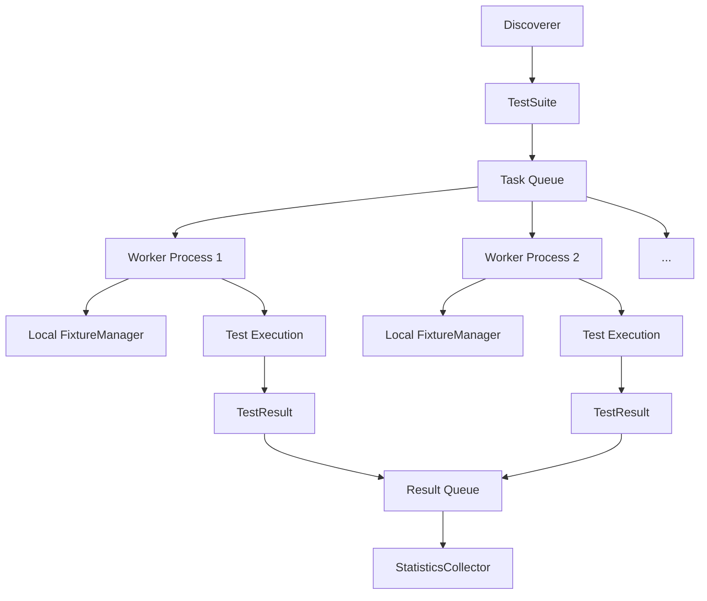

# Project Apollo: Test Framework Design Document


## Overview

Project Apollo is a Python-based test framework built for learning, demonstrating how modern frameworks like pytest operate under the hood. The key architectural challenge it solves is providing a flexible, extensible system for test discovery, execution, and reporting while maintaining test isolation and supporting complex features like fixtures and assertions. This document guides the implementation through four progressive milestones, from basic discovery to a full-featured CLI.


> This guide is meant to help you understand the big picture before diving into each milestone. Refer back to it whenever you need context on how components connect.


## 1. Context and Problem Statement

> **Milestone(s):** This section provides the foundational understanding and motivation for the entire project, spanning all four milestones.

### Mental Model: The Test Conductor

Imagine you are the conductor of a large, distributed orchestra. Your musicians (individual test functions) are scattered across multiple buildings (source files and modules). Your sheet music (test fixtures and setup instructions) is stored in various libraries. Your performance hall (the test execution environment) needs to be prepared before each piece and cleaned afterward. Your ultimate goal is to produce a cohesive performance report (test results) that tells the audience (developers) exactly which musicians played correctly, which made mistakes, and why.

A test framework is that conductor. It must:

1.  **Discover the musicians:** Find all test functions across the codebase by scanning files and recognizing naming patterns.
2.  **Organize the performance:** Determine the order of execution, manage dependencies between tests, and ensure musicians don't interfere with each other (test isolation).
3.  **Provide sheet music:** Supply each test with the resources (fixtures, data, mocks) it needs to perform its part.
4.  **Evaluate the performance:** Listen to each musician (execute the test) and judge whether they played the correct notes (assertions passed) or made an error.
5.  **Deliver the critique:** Compile a clear, actionable report detailing successes, failures, and the specific nature of any mistakes.

This mental model of the framework as an **orchestrating conductor** separates the *what* (the test logic written by developers) from the *how* (the mechanics of finding, running, and evaluating tests). This separation of concerns is the core architectural principle of any effective test framework.

### The Core Problem: Automated Verification

Writing software without automated tests is like constructing a skyscraper without blueprints or inspections. You might get it to stand, but its reliability, safety, and maintainability are unknowable. Before test frameworks, verification was a manual, ad-hoc process:

```python
# Hypothetical manual test script (the "dark ages")
def test_user_creation():
    db = connect_to_database()  # Manual setup
    user = create_user("Alice")
    if user.name != "Alice":    # Manual assertion
        print("FAIL: Name mismatch")
        return
    if not db.user_exists(user.id):
        print("FAIL: User not saved")
        return
    db.cleanup()                # Manual teardown
    print("PASS")
```

This approach is **brittle, unrepeatable, and unscalable**. The problems compound rapidly:
- **Forgetting tests:** Manual tests are easily overlooked or skipped.
- **No isolation:** Tests can interfere with each other (e.g., leftover database state).
- **Poor diagnostics:** Error messages are inconsistent and unhelpful.
- **No aggregation:** There's no unified view of what passed or failed across the codebase.
- **High maintenance:** Any change to the system under test requires manually updating countless scattered validation scripts.

The **Core Problem** is therefore: *How do we automate the repetitive, mechanical aspects of software verification so developers can focus on writing test logic?* An effective solution must address four fundamental requirements:

1.  **Discovery:** Automatically find all test cases in a codebase without requiring manual registration.
2.  **Execution:** Run tests in a controlled, isolated environment with predictable setup and cleanup.
3.  **Assertion:** Provide a rich, expressive language for verifying expectations with helpful failure messages.
4.  **Reporting:** Aggregate results into a clear, actionable summary for both humans and machines.

> **Key Insight:** The value of a test framework is not just in running tests—it's in *reducing the cognitive load* of verification. A good framework makes writing and maintaining tests *easier* than not having them.

### Existing Approaches & Comparison

The software ecosystem offers multiple solutions to the test automation problem, each with different philosophies and trade-offs. Understanding this design space is crucial for making informed architectural decisions for Project Apollo.

#### Architecture Decision: Foundation Approach

> **Decision: Build a Modern, Convention-Based Framework**
> - **Context:** We need to choose a foundational philosophy that guides all subsequent design decisions. The built-in `unittest` module exists, but modern Python projects overwhelmingly prefer `pytest`.
> - **Options Considered:**
>   1.  **Extend `unittest`:** Build upon Python's standard library module.
>   2.  **Build `pytest`-like:** Create a new, convention-based framework from scratch.
>   3.  **Minimal Assertion Library:** Create only a better assertion library without discovery or fixtures.
> - **Decision:** Build a `pytest`-like, convention-based framework from scratch.
> - **Rationale:**
>   1.  **Educational Value:** Building from scratch maximizes learning about all components (discovery, fixtures, reporting), not just assertions.
>   2.  **Modern Practices:** Convention-over-configuration and fixture dependency injection are industry standards that reduce boilerplate.
>   3.  **Separation of Concerns:** A clean-slate design allows us to implement clean boundaries between components (Discoverer, Runner, Fixture Registry) without legacy constraints.
> - **Consequences:**
>   - **Positive:** We gain deep understanding of modern test framework architecture. The final product will feel familiar to `pytest` users.
>   - **Negative:** More implementation work than extending `unittest`. We must reimplement basics that `unittest` already provides.

| Approach | Pros | Cons | Why Not Chosen for Apollo |
| :--- | :--- | :--- | :--- |
| **Built-in (`unittest`)** | <ul><li>No dependencies</li><li>Battle-tested</li><li>Standardized xUnit pattern</li></ul> | <ul><li>Verbose (requires test classes)</li><li>Limited fixture system</li><li>No auto-discovery by default</li><li>Less expressive assertions</li></ul> | While robust, `unittest` embodies an older architectural pattern. Building on it would limit our exploration of modern design patterns like convention-based discovery and functional fixture injection. |
| **Modern (`pytest`)** | <ul><li>Convention-over-configuration</li><li>Powerful fixture system</li><li>Rich plugin ecosystem</li><li>Excellent error reporting</li></ul> | <ul><li>Complex internals (hard to learn from)</li><li>Heavy dependency graph</li><li>"Magic" that can be opaque</li></ul> | **Our inspiration, not our base.** We are *recreating* this experience from first principles to understand the "magic." |
| **Minimal (e.g., `assert`)** | <ul><li>Extremely simple</li><li>No framework overhead</li><li>Direct control</li></ul> | <ul><li>No discovery or organization</li><li>Manual setup/teardown</li><li>No aggregated reporting</li><li>Poor error messages</li></ul> | Does not solve the core problem of automation. Leaves too much mechanical work to the developer. |
| **Project Apollo (Our Build)** | <ul><li>**Educational transparency**</li><li>Modern convention-based design</li><li>Controlled complexity</li><li>All core components built from scratch</li></ul> | <ul><li>Not production-hardened</li><li>Limited feature set</li><li>No plugin system initially</li></ul> | **Chosen.** Provides maximum learning value by implementing all core components with clean separation, mirroring modern framework architecture. |

#### Key Architectural Differentiators

The table above highlights fundamental architectural choices that differentiate frameworks:

1.  **Discovery Mechanism:**
    - **Registration-based (`unittest`):** Tests must inherit from a base class or be explicitly registered. This creates boilerplate but is explicit.
    - **Convention-based (`pytest`, Apollo):** The framework scans modules for functions/classes matching patterns (e.g., `test_*`). This reduces boilerplate but requires clear naming rules.

2.  **Test Organization:**
    - **Class-based xUnit (`unittest`):** Tests are methods within classes, allowing shared `setUp`/`tearDown` at class level.
    - **Function-based with Fixtures (`pytest`, Apollo):** Tests are standalone functions; shared resources are provided via parameter injection (fixtures). This is more compositional and flexible.

3.  **Assertion System:**
    - **Method-based (`unittest`):** `self.assertEqual(a, b)` provides good error messages but verbose syntax.
    - **Built-in statement (`assert`):** `assert a == b` is concise but yields poor default error messages.
    - **Enhanced built-in (`pytest`, Apollo):** Override or wrap the `assert` statement to provide rich diffs and introspection *while keeping the simple syntax*.

4.  **Execution Model:**
    - **Linear (`unittest` basic):** Tests run sequentially in discovery order.
    - **Isolated & Parallel (Apollo goal):** Each test runs in its own context, enabling safe parallel execution for speed.

> **Design Principle:** Convention over configuration reduces boilerplate and cognitive load. By adopting sensible defaults (e.g., `test_` prefix), we make the common case easy while allowing escape hatches for complexity.

### Common Pitfalls in Understanding Test Frameworks

⚠️ **Pitfall: Treating the Framework as a Test Runner Only**
- **Description:** Thinking the framework's primary job is just to execute a list of tests you manually give it.
- **Why It's Wrong:** This ignores the critical problems of *discovery* (finding all tests) and *isolation* (preventing test interference). A framework that doesn't handle these becomes a glorified script executor.
- **How to Avoid:** Design components with clear responsibilities: the **Discoverer** finds tests, the **Runner** manages isolated execution, and the **Reporter** aggregates results. These are distinct concerns.

⚠️ **Pitfall: Overlooking Test Isolation**
- **Description:** Allowing tests to share mutable state (e.g., global variables, database connections) without proper cleanup.
- **Why It's Wrong:** Tests become interdependent and non-deterministic. A passing test may depend on leftover state from a previous test, causing false passes and mysterious failures when tests run in different orders.
- **How to Avoid:** Design the **Runner** to execute each test in a clean environment. For milestone 1, this means each test runs in its own process or with carefully managed state rollback. For milestone 3, fixtures will provide controlled, scoped sharing.

⚠️ **Pitfall: Poor Error Messages in Assertions**
- **Description:** Assertions that only say "Assertion failed" without showing the expected vs. actual values.
- **Why It's Wrong:** Developers waste time manually printing values to debug test failures, defeating the purpose of automation.
- **How to Avoid:** Design the **Assertion Engine** (milestone 2) to compute and display informative diffs. For `assert_equal(a, b)`, the error message should show both values, their types, and a visual diff for collections.

⚠️ **Pitfall: Neglecting Resource Cleanup**
- **Description:** Setting up resources (files, network connections) in tests but not guaranteeing cleanup on test failure.
- **Why It's Wrong:** Resource leaks accumulate across test runs, eventually causing failures (e.g., "too many open files").
- **How to Avoid:** Design the **Fixture System** (milestone 3) with guaranteed teardown using context managers (`try/finally`) or generator fixtures that run cleanup code after the test.

### Implementation Guidance

This section establishes the *why* and *what*. The following sections will detail the *how*. However, to ground these concepts, here is a minimal starter structure and a tangible example of what we're building toward.

#### A. Technology Recommendations Table
| Component | Simple Option (for Learning) | Advanced Option (for Robustness) |
| :--- | :--- | :--- |
| **Module Discovery** | `importlib` + `os.walk` | `pkgutil` with namespace package support |
| **Test Isolation** | Subprocess execution (`subprocess`) | `sys.settrace()` for in-process isolation |
| **Assertion Engine** | Override `__assert__` (not possible) → Helper functions | `inspect` module for frame introspection |
| **Fixture Management** | Simple dict registry + `functools.partial` | Context managers + dependency graph resolution |
| **CLI & Reporting** | `argparse` + formatted print statements | `rich` library for colored output, `lxml` for XML |

#### B. Recommended File/Module Structure
To keep our conceptual components separate in code, start with this project layout:
```
project_apollo/
├── apollo/                    # Main package
│   ├── __init__.py           # Public API: `from apollo import test, fixture`
│   ├── cli.py                # CLI Parser (Milestone 4)
│   ├── discover.py           # Discoverer (Milestone 1)
│   ├── runner.py             # Runner (Milestone 1 & 3)
│   ├── assert.py             # Assertion Engine (Milestone 2)
│   ├── fixtures.py           # Fixture System (Milestone 3)
│   ├── report.py             # Reporter (Milestone 4)
│   └── results.py            # Data models: TestCase, TestResult, etc.
├── tests/                    # Tests for Apollo itself
│   ├── test_discover.py
│   ├── test_runner.py
│   └── ...
└── examples/                 # Example test files for demonstration
    ├── test_math.py
    └── test_user.py
```

#### C. Infrastructure Starter Code: Core Data Models
These data structures are the backbone of the framework. Implement them first to give shape to your system.

```python
# File: apollo/results.py
from dataclasses import dataclass
from enum import Enum
import time
from typing import Any, Optional, Callable

class TestStatus(Enum):
    """The possible states a test result can be in."""
    PENDING = "pending"
    RUNNING = "running"
    PASSED = "passed"
    FAILED = "failed"      # Assertion failed
    ERRORED = "errored"    # Uncaught exception
    SKIPPED = "skipped"

@dataclass
class TestCase:
    """Represents a single test to be executed."""
    # Unique identifier: module::function_name or module::ClassName::method_name
    nodeid: str
    # The actual callable test function or method
    func: Callable[[], None]
    # The file path where this test was discovered
    file_path: str
    # Line number in the file (for better error reporting)
    line_no: int

@dataclass
class TestResult:
    """The outcome of executing a single TestCase."""
    test_case: TestCase
    status: TestStatus
    # Human-readable message (e.g., assertion error text)
    message: Optional[str] = None
    # Exception object if test raised one
    exception: Optional[Exception] = None
    # Traceback formatted as string
    traceback: Optional[str] = None
    # Duration in seconds
    duration: float = 0.0

    def __post_init__(self):
        """Ensure consistency between status and other fields."""
        if self.status == TestStatus.FAILED:
            assert self.message is not None, "Failed tests must have a message"
        if self.status == TestStatus.ERRORED:
            assert self.exception is not None, "Errored tests must have an exception"

@dataclass
class TestSuite:
    """A collection of TestCases, often representing a module or directory."""
    name: str
    tests: list[TestCase]

    def add_test(self, test: TestCase):
        self.tests.append(test)

    def __len__(self):
        return len(self.tests)
```

#### D. Core Logic Skeleton: The Simplest Possible Runner
To make the abstract concrete, here is the skeleton of the most basic runner that executes tests sequentially without any isolation or fixtures. This is your starting point for Milestone 1.

```python
# File: apollo/runner.py
from .results import TestCase, TestResult, TestStatus
import traceback

class SimpleRunner:
    """Executes TestCases one by one and collects TestResults."""
    
    def run_test(self, test_case: TestCase) -> TestResult:
        """
        Execute a single test function and return its result.
        
        Steps:
        1. Create a PENDING TestResult
        2. Start timer
        3. Change status to RUNNING
        4. Execute test_case.func() in a try/except block
        5. Catch AssertionError -> status FAILED, store message
        6. Catch any other Exception -> status ERRORED, store exception
        7. If no exception -> status PASSED
        8. Stop timer, store duration
        9. Return TestResult
        
        TODO 1: Create a TestResult with status=PENDING for this test_case
        TODO 2: Record start time using time.perf_counter()
        TODO 3: Update the result's status to RUNNING
        TODO 4: Wrap test_case.func() call in try/except/else
        TODO 5: In except AssertionError as e: set status=FAILED, message=str(e)
        TODO 6: In except Exception as e: set status=ERRORED, exception=e, traceback=traceback.format_exc()
        TODO 7: In else: set status=PASSED
        TODO 8: Record end time and calculate duration, store in result
        TODO 9: Ensure result is returned in all code paths
        """
        pass
    
    def run_suite(self, suite: TestSuite) -> list[TestResult]:
        """Run all tests in a suite and return their results."""
        results = []
        for test in suite.tests:
            # TODO: Call run_test for each test and append result to list
            pass
        return results
```

#### E. Language-Specific Hints: Python
- Use `importlib.import_module()` to dynamically import test files by their file path. Remember to handle `ImportError` gracefully.
- The `inspect` module is your friend for analyzing function signatures (for fixture injection) and retrieving source code lines.
- For parallel execution (Milestone 1), `concurrent.futures.ProcessPoolExecutor` provides true isolation (separate processes) but has overhead. `ThreadPoolExecutor` is lighter but requires careful state management.
- To override assertion behavior, you cannot modify the `assert` statement directly. Instead, provide helper functions like `assert_equal()` that raise `AssertionError` with rich messages.

#### F. Milestone 1 Checkpoint
After implementing the basic Discoverer and SimpleRunner, you should be able to run:

```bash
$ python -m apollo.cli discover examples/
```

**Expected Behavior:**
1.  The Discoverer scans `examples/` directory for `.py` files.
2.  It imports each module and finds functions whose names start with `test_`.
3.  It creates `TestCase` objects for each found test.
4.  The Runner executes each test function.
5.  The CLI prints a simple report:
    ```
    Running 2 tests from examples/
    
    test_addition (examples/test_math.py) ... PASSED (0.001s)
    test_failing (examples/test_math.py) ... FAILED (0.000s)
      AssertionError: 2 != 3
    
    === Summary ===
    Passed: 1, Failed: 1, Errored: 0
    Total time: 0.002s
    ```

**Signs of Trouble:**
- **No tests found:** Check that your Discoverer is correctly filtering function names and handling module imports.
- **Tests interfering:** If one test's failure affects another, you haven't achieved isolation. Ensure each test runs in a fresh environment.
- **No error details:** Your `run_test` method isn't catching and storing exceptions properly.

#### G. Debugging Tips: Early Discovery Issues
| Symptom | Likely Cause | How to Diagnose | Fix |
| :--- | :--- | :--- | :--- |
| **`ModuleNotFoundError` during discovery** | Incorrect module path conversion from file path. | Print the calculated module name before importing. | Use `importlib.util.spec_from_file_location` for file-based imports. |
| **Test functions from helper modules are discovered** | Discovery isn't filtering by file name pattern (e.g., `test_*.py`). | Print all files being scanned. | Filter files by name *before* importing: `if not filename.startswith('test_'): continue` |
| **Class methods not discovered** | Only scanning module-level functions, not class methods. | Inspect classes in the module using `inspect.getmembers(module, inspect.isclass)`. | Recursively inspect classes for methods with `test_` prefix. |

---


## 2. Goals and Non-Goals

> **Milestone(s):** This section establishes the scope and boundaries for the entire project, providing clear direction for all four milestones.

Every architectural undertaking requires clear boundaries to focus effort and prevent scope creep. This section defines **what the framework must achieve** (Goals) and **what it explicitly won't address** (Non-Goals), establishing a contract that guides design decisions throughout the project. Think of this as defining the playing field: we're building a comprehensive single-player training ground for test fundamentals, not a professional stadium with every possible feature.

### Goals

The primary goal of Project Apollo is to create a **pedagogical test framework** that demonstrates how modern testing tools work internally while providing practical utility for testing small to medium Python projects. Each goal maps directly to one of the four milestones, creating a progressive learning path from basic automation to sophisticated testing infrastructure.

| Goal Category | Milestone Alignment | Core Capability | Why This Matters |
|---------------|---------------------|-----------------|------------------|
| **Automatic Test Discovery & Execution** | Milestone 1 | The framework automatically finds test functions in code modules and runs them in controlled environments | Eliminates manual test registration and ensures tests run in isolation, preventing state contamination |
| **Expressive Assertion System** | Milestone 2 | Provides rich comparison assertions with helpful error messages and extensible matcher architecture | Moves beyond basic `assert` statements to give developers immediate insight into why tests fail |
| **Fixture-Based Test Environment** | Milestone 3 | Manages test setup/teardown through reusable fixtures with configurable lifetimes and dependency injection | Reduces test code duplication and properly manages expensive resources like database connections |
| **Comprehensive Reporting & CLI** | Milestone 4 | Delivers human-readable and machine-parsable test results through a configurable command-line interface | Enables integration into development workflows and CI/CD pipelines with professional-grade output |

For each goal category, we define specific functional requirements that must be satisfied:

#### Goal 1: Automatic Test Discovery & Execution
The framework must automatically locate and execute test functions without requiring explicit registration lists. This involves:

- **Convention-based discovery**: Finding functions and methods whose names start with `test_` within modules and classes
- **Module traversal**: Recursively scanning directories and importing Python modules to search for tests
- **Isolated execution**: Running each test in a clean environment where test failures don't propagate to subsequent tests
- **Parallel execution support**: Running independent tests concurrently to reduce total suite execution time
- **Error containment**: Distinguishing between test failures (assertion failures) and test errors (unexpected exceptions)

> **Architecture Decision Record: Convention-over-Configuration for Discovery**
> - **Context**: Test frameworks need a way to identify which functions are tests without requiring explicit decoration or registration.
> - **Options Considered**:
>   1. Explicit decorators (e.g., `@test`)
>   2. Inheritance from a base test class
>   3. Naming convention (functions starting with `test_`)
> - **Decision**: Use naming convention (`test_` prefix) for test identification
> - **Rationale**: 
>   - **Zero boilerplate**: Tests look like regular functions, reducing cognitive overhead
>   - **Familiarity**: Matches pytest's approach, which developers already know
>   - **Simplicity**: No imports or decorators required for basic tests
>   - **Discoverability**: Easy to scan code for tests by function name
> - **Consequences**:
>   - Positive: Extremely low barrier to entry for writing tests
>   - Negative: Less explicit than decorators, harder to customize per-test behavior
>   - Neutral: Requires careful module inspection logic

#### Goal 2: Expressive Assertion System
The framework must provide a rich set of assertion utilities that offer better diagnostics than Python's built-in `assert` statement:

- **Value comparisons**: Deep equality checking with diff generation for mismatches
- **Boolean conditions**: Truthiness/falsiness assertions with descriptive messages
- **Collection operations**: Checking membership, length, and subset relationships
- **Exception verification**: Ensuring specific exceptions are raised by code under test
- **Extensible matchers**: Plugin system for domain-specific assertion logic with custom failure messages

**Assertion Comparison Table:**
| Assertion Type | Example Usage | Key Benefit |
|----------------|---------------|-------------|
| Equality | `assert_equal(actual, expected)` | Shows diff between complex structures |
| Exception | `assert_raises(ValueError, func, arg)` | Validates exception type and optionally message |
| Collection | `assert_contains(collection, item)` | Clear message when item missing |
| Custom Matcher | `assert_that(value, is_even())` | Domain-specific validation with tailored messages |

#### Goal 3: Fixture-Based Test Environment
The framework must manage test dependencies and environment setup through a fixture system:

- **Per-test setup/teardown**: `setUp` and `tearDown` methods that run before and after each test
- **Fixture sharing**: Resources created once and shared across multiple tests with configurable lifetimes
- **Scope management**: Fixtures with different lifetimes (function, class, module, session)
- **Dependency injection**: Automatic provision of fixtures to test functions based on parameter names
- **Cleanup guarantees**: Reliable teardown even when tests fail or errors occur

> **Mental Model: The Test Kitchen**
> Think of fixtures as a well-organized test kitchen. `setUp` is like gathering ingredients before cooking each dish (test). Shared fixtures are like expensive appliances (stand mixer, sous-vide) that you set up once and use for multiple recipes. `tearDown` is cleaning the workspace after each dish, regardless of whether it turned out perfectly. The framework acts as the kitchen manager, ensuring the right tools are available when needed and everything gets cleaned up properly.

#### Goal 4: Comprehensive Reporting & CLI
The framework must provide professional output and a usable command-line interface:

- **Progress reporting**: Real-time display of test execution with pass/fail status
- **Statistical summary**: Totals for passed, failed, errored, and skipped tests with timing information
- **Flexible test selection**: Filtering tests by name patterns, file patterns, or custom markers
- **Machine-readable output**: JUnit XML format for CI/CD pipeline integration
- **Proper exit codes**: Non-zero exit code when tests fail for scriptable automation

**CLI Feature Requirements:**
| Feature | Example | Purpose |
|---------|---------|---------|
| File pattern matching | `apollo tests/*.py` | Run tests in specific files/directories |
| Test name filtering | `apollo -k "login"` | Run only tests with "login" in their name |
| Output format control | `apollo --junit report.xml` | Generate XML for CI systems |
| Verbosity levels | `apollo -v` / `apollo -vv` | Control detail level in output |
| Exit code behavior | Returns 0 if all pass, 1 otherwise | Enable scripting and CI failure detection |

### Non-Goals

While the goals define what we will build, non-goals explicitly state what we **will not build**, preventing feature creep and maintaining focus on the educational objectives. These are features commonly found in production test frameworks but excluded from this learning project.

| Non-Goal Category | Example Features | Why Excluded |
|-------------------|------------------|--------------|
| **Distributed Test Execution** | Running tests across multiple machines/processors with smart distribution | Complexity far exceeds educational scope; focuses on system architecture rather than testing fundamentals |
| **Plugin Ecosystem** | Third-party plugins for coverage, mocking, database utilities, etc. | Would require stable public APIs and compatibility guarantees beyond learning objectives |
| **Custom Test Language/DSL** | Special syntax for describing tests beyond Python functions | Adds unnecessary abstraction layer; Python functions are sufficient for learning |
| **Test Generation/Parameterization** | Automatically generating test cases from data tables or property-based testing | Advanced feature that would distract from core framework mechanics |
| **Advanced Mocking Library** | Complex patching, spy objects, call verification beyond basic unittest.mock | Mocking is a separate concern from test framework infrastructure |
| **Cross-Language Support** | Testing JavaScript, Go, or other languages from the same framework | Would require language-specific parsers and executors; Python-only keeps focus |
| **Interactive Debugger Integration** | Built-in debugger, breakpoints, or REPL within test failures | Adds significant UI complexity; standard debugging tools suffice |
| **Test Parallelization Dependencies** | Automatic detection of test dependencies for safe parallel execution | Requires complex static analysis; manual marking is sufficient for learning |
| **Custom Report Formats** | HTML reports, dashboard integration, historical trend analysis | Output formatting is extensible enough via JUnit XML; fancy reports are ancillary |
| **Database Migration Testing** | Specialized fixtures for database state management and rollbacks | Domain-specific testing concern better handled by dedicated libraries |

#### Important Clarifications on Scope Boundaries

**Why No Plugin System?**
While a plugin architecture is common in production frameworks (pytest has over 1,000 plugins), implementing it would shift focus from **how tests run** to **how to build extensible systems**. The educational value lies in understanding test execution, not building extension points. However, the design leaves intentional **extension seams** where plugins could be added later without major redesign.

**Why Only Basic Parallel Execution?**
We implement simple parallel execution where tests run in separate processes without dependency analysis. A full production system would need:
- Dependency detection between tests
- Resource contention management
- Shared fixture coordination across processes
- Result aggregation with ordering guarantees

These complexities would triple the implementation effort while teaching little about core test framework concepts.

**Why Exclude Advanced Mocking?**
Mocking libraries (like `unittest.mock`) are already comprehensive in Python. Reinventing them would:
1. Duplicate existing standard library functionality
2. Divert focus from test orchestration to object interception
3. Require deep understanding of Python's object model and descriptor protocol

The framework will integrate with existing mocking tools rather than replace them.

**The "Good Enough" Principle**
This framework follows the **"good enough for learning"** principle. Each feature is implemented to the minimum level needed to understand the concept, not to production-grade robustness. For example:

- **File system watching** (rerunning tests on file changes) is excluded—it's a nice-to-have feature that doesn't teach core testing concepts
- **Test ordering control** (running tests in specific sequences) is minimal—just enough to ensure fixtures work correctly
- **Customizable discovery rules** (changing the `test_` prefix) is excluded—convention-over-configuration simplifies learning

> **Design Principle: Single Responsibility for Learning**
> Project Apollo focuses exclusively on **test orchestration**—finding tests, running them in the right environment, and reporting results. It deliberately excludes:
> 1. **Test generation** (property-based testing, combinatorial testing)
> 2. **Environment management** (Docker integration, cloud testing)
> 3. **Code analysis** (coverage measurement, static analysis)
> 4. **UI testing** (browser automation, mobile testing)
>
> These are important concerns in real-world testing but represent separate domains of knowledge. By keeping a tight focus, we ensure learners understand the core mechanics before exploring complementary tools.

#### What Could Be Added Later (Future Extensions)
While not goals for the initial implementation, these areas represent logical extensions that the architecture accommodates:

1. **Test Markers** (`@slow`, `@integration`): Simple decorator-based test categorization
2. **Parameterized Tests**: Running the same test with different input data sets
3. **Snapshot Testing**: Comparing output against stored "golden" references
4. **Benchmark Timing**: Measuring and reporting test execution performance
5. **Simple Plugin Hook**: A few well-defined extension points for custom reporters or discovery

The architecture will be designed with these possible extensions in mind, but they remain explicitly out of scope for the initial implementation.

### Success Criteria

The framework will be considered successful when it can:

1. **Discover and run** all `test_` prefixed functions in a directory of Python modules
2. **Provide helpful failure messages** showing exactly what went wrong in assertions
3. **Manage fixture lifecycles** correctly, cleaning up resources even when tests fail
4. **Produce both human-readable** terminal output and **machine-parsable** JUnit XML
5. **Run tests in parallel** when requested, with isolated execution environments
6. **Integrate smoothly** with existing Python projects using standard tooling

These criteria map directly to the acceptance criteria in each milestone, creating clear, measurable objectives for the implementation.

### Trade-offs and Constraints

The goals and non-goals establish several important constraints:

| Constraint | Implication | Rationale |
|------------|-------------|-----------|
| **Python-only tests** | No support for testing other languages | Keeps implementation focused and leverages Python's introspection capabilities |
| **Minimal external dependencies** | Only standard library where possible | Reduces setup complexity and demonstrates how things work without magic |
| **Educational clarity over performance** | May sacrifice optimizations for understandable code | Primary value is learning, not production speed |
| **Convention over configuration** | Less flexible than config-driven approaches | Reduces cognitive load for beginners |
| **Progressive complexity** | Later milestones build on earlier ones | Ensures foundational understanding before advanced features |

These constraints intentionally shape the framework into a **learning tool first** and a **production tool second**. The architecture will prioritize educational clarity, with clear separation of concerns and minimal magic, even if this means slightly more verbose code or fewer optimizations.

### Common Pitfalls in Scope Definition

⚠️ **Pitfall: Over-engineering for hypothetical use cases**
- **Description**: Implementing features "just in case" someone might need them, adding complexity without clear value
- **Why it's wrong**: Diverts effort from core learning objectives, increases maintenance burden, and makes the codebase harder to understand
- **How to avoid**: Strictly adhere to the non-goals list; when tempted to add a feature, ask "does this directly support one of the four milestones?"

⚠️ **Pitfall: Under-specifying edge case behavior**
- **Description**: Assuming "obvious" behavior for error cases or boundary conditions without explicit specification
- **Why it's wrong**: Leads to inconsistent implementation and bugs that are hard to fix later
- **How to avoid**: For each goal, explicitly define behavior for: empty test suites, import errors, fixture teardown failures, assertion errors in setup methods, etc.

⚠️ **Pitfall: Copying existing frameworks without understanding**
- **Description**: Implementing features because "pytest has them" without understanding why they exist
- **Why it's wrong**: Misses the educational value; creates cargo-cult architecture
- **How to avoid**: For each feature, document the problem it solves and alternative approaches considered

### Implementation Guidance

#### Technology Recommendations Table

| Component | Simple Option (Recommended) | Advanced Option (Future Consideration) |
|-----------|----------------------------|---------------------------------------|
| **Test Discovery** | `importlib` + `inspect` module | AST parsing for more sophisticated analysis |
| **Parallel Execution** | `multiprocessing.Pool` with process isolation | `concurrent.futures` with fine-grained control |
| **Assertion Diffing** | `difflib.SequenceMatcher` for strings | Custom differ for nested structures |
| **Fixture Management** | Simple registry with scope caching | Graph-based dependency resolution |
| **CLI Parsing** | `argparse` from standard library | `click` for more sophisticated CLI |
| **XML Generation** | Manual XML building with `xml.etree.ElementTree` | Template-based generation |

#### Recommended File/Module Structure

```
apollo/
├── __init__.py              # Public API exports
├── __main__.py             # CLI entry point (python -m apollo)
├── cli/
│   ├── __init__.py
│   ├── parser.py           # CLI argument parsing
│   └── commands.py         # CLI command implementations
├── discovery/
│   ├── __init__.py
│   ├── finder.py           # Module scanning and test discovery
│   └── filters.py          # Test filtering logic
├── runner/
│   ├── __init__.py
│   ├── base.py             # Base runner classes
│   ├── serial.py           # Serial test execution
│   └── parallel.py         # Parallel test execution
├── assertions/
│   ├── __init__.py         # Public assertion functions
│   ├── engine.py           # Core assertion logic
│   ├── matchers.py         # Matcher base classes
│   └── diffs.py            # Diff generation utilities
├── fixtures/
│   ├── __init__.py
│   ├── registry.py         # Fixture registration and lookup
│   ├── scopes.py           # Scope management
│   └── injection.py        # Parameter injection logic
├── reporting/
│   ├── __init__.py
│   ├── console.py          # Terminal output formatting
│   ├── junit.py            # JUnit XML generation
│   └── statistics.py       # Result aggregation and stats
├── core/
│   ├── __init__.py
│   ├── types.py            # Core data structures (TestCase, TestResult, etc.)
│   ├── config.py           # Configuration object
│   └── exceptions.py       # Framework-specific exceptions
└── utils/
    ├── __init__.py
    ├── introspection.py    # Helper functions for code inspection
    └── timing.py           # Execution timing utilities
```

#### Infrastructure Starter Code: Core Data Types

These core types provide the foundation for the entire framework. Learners should use these exact definitions:

```python
# apollo/core/types.py
"""Core data types for the test framework."""

from dataclasses import dataclass, field
from enum import Enum
from typing import Optional, Callable, Any, List
import traceback as tb

class TestStatus(Enum):
    """Possible states of a test during execution."""
    PENDING = "pending"    # Test hasn't started yet
    RUNNING = "running"    # Test is currently executing
    PASSED = "passed"      # All assertions passed
    FAILED = "failed"      # An assertion failed
    ERRORED = "errored"    # An unexpected exception occurred
    SKIPPED = "skipped"    # Test was skipped (not implemented yet)

@dataclass
class TestCase:
    """Represents a single test function to be executed."""
    nodeid: str           # Unique identifier (e.g., "test_module.py::test_function")
    func: Callable        # The actual test function to call
    file_path: str        # Absolute path to the file containing the test
    line_no: int          # Line number where test function is defined
    fixtures: List[str] = field(default_factory=list)  # Names of required fixtures
    
    def __str__(self) -> str:
        return self.nodeid

@dataclass
class TestResult:
    """Result of executing a single test."""
    test_case: TestCase
    status: TestStatus
    message: Optional[str] = None          # Failure/error message
    exception: Optional[Exception] = None  # Exception object if test errored
    traceback: Optional[str] = None        # Formatted traceback for errors
    duration: float = 0.0                  # Execution time in seconds
    
    def passed(self) -> bool:
        return self.status == TestStatus.PASSED
    
    def failed(self) -> bool:
        return self.status == TestStatus.FAILED
    
    def errored(self) -> bool:
        return self.status == TestStatus.ERRORED

@dataclass
class TestSuite:
    """Collection of tests to be executed together."""
    name: str
    tests: List[TestCase]
    
    def __len__(self) -> int:
        return len(self.tests)
    
    def __iter__(self):
        return iter(self.tests)

@dataclass  
class Fixture:
    """A test fixture that provides resources to tests."""
    name: str
    func: Callable
    scope: str = "function"  # "function", "class", "module", "session"
    dependencies: List[str] = field(default_factory=list)  # Names of other fixtures needed
```

#### Core Logic Skeleton: Test Discovery

```python
# apollo/discovery/finder.py
"""Test discovery implementation."""

import os
import sys
import importlib
import inspect
from pathlib import Path
from typing import List, Iterator, Optional

from apollo.core.types import TestCase


def discover_tests(start_path: str, pattern: str = "test_*.py") -> List[TestCase]:
    """
    Discover all test functions in modules under start_path.
    
    Args:
        start_path: Directory or file to start discovery from
        pattern: Glob pattern for test files (default: "test_*.py")
    
    Returns:
        List of TestCase objects representing discovered tests
    
    TODO Implementation Steps:
    1. Convert start_path to absolute Path object
    2. If start_path is a file, discover tests only in that file
    3. If start_path is a directory, recursively find all Python files matching pattern
    4. For each Python file:
       a. Import it as a module (handle import errors gracefully)
       b. Inspect the module for functions starting with "test_"
       c. Also inspect classes in the module for methods starting with "test_"
       d. For each test function found, create a TestCase object
          - nodeid: "file.py::function_name" or "file.py::ClassName::method_name"
          - func: The actual callable test function
          - file_path: Absolute path to the file
          - line_no: Line number where function is defined (use inspect.getsourcelines)
    5. Return list of all discovered TestCase objects
    
    Hint: Use importlib.import_module for importing, inspect.getmembers for inspection
    """
    # TODO 1: Convert start_path to absolute Path
    # TODO 2: Determine if it's a file or directory
    # TODO 3: Collect all Python files to inspect
    # TODO 4: For each file, import and discover tests
    # TODO 5: Return list of TestCase objects
    pass


def _discover_in_module(module, file_path: str) -> List[TestCase]:
    """
    Discover test functions within a single module.
    
    Args:
        module: Imported module object
        file_path: Path to the module file
    
    Returns:
        List of TestCase objects found in the module
    """
    # TODO 1: Use inspect.getmembers to get all objects in module
    # TODO 2: Filter for callable objects (functions and methods)
    # TODO 3: Check if name starts with "test_" (for functions)
    # TODO 4: Also check classes for methods starting with "test_"
    # TODO 5: For each test found, create TestCase with proper nodeid
    pass
```

#### Language-Specific Hints for Python

1. **Module Import Safety**: Use `importlib.util.spec_from_file_location` and `importlib.util.module_from_spec` to import test modules without adding them to `sys.modules` permanently, preventing side effects between test discoveries.

2. **Line Number Detection**: `inspect.getsourcelines(func)` returns the source lines and starting line number, but be prepared for functions defined in C extensions (which will fail).

3. **Path Handling**: Use `pathlib.Path` objects rather than string manipulation for cross-platform compatibility.

4. **Parallel Execution**: For Milestone 1's parallel execution, use `multiprocessing.Pool` with `initializer` to set up each worker process, passing tests via `map`. Remember to use `if __name__ == "__main__":` guards.

5. **Exception Preservation**: When tests raise exceptions in separate processes, pickle the exception info and re-raise it in the main process for proper reporting.

#### Milestone Checkpoint: Goal Verification

After implementing the basic discovery from Milestone 1, verify the goals with this test:

```bash
# Create a test file
cat > test_example.py << 'EOF'
def test_addition():
    assert 1 + 1 == 2

def test_failure():
    assert 2 + 2 == 5  # This will fail

class TestCalculator:
    def test_multiplication(self):
        assert 3 * 3 == 9
EOF

# Run discovery and execution
python -m apollo discover test_example.py
# Expected: Should list 3 tests found

python -m apollo run test_example.py
# Expected: Should show:
# test_example.py::test_addition ... PASSED
# test_example.py::test_failure ... FAILED
# test_example.py::TestCalculator::test_multiplication ... PASSED
# 
# ====== SUMMARY ======
# Tests: 3, Passed: 2, Failed: 1, Errored: 0
# 
# Exit code should be 1 (since tests failed)
```

**Signs of Problems:**
- **No tests found**: Check that discovery is looking for `test_` prefix and importing modules correctly
- **Tests run in wrong order**: Ensure tests are isolated; order shouldn't matter
- **Exit code is 0 when tests fail**: The CLI must return non-zero on failure for CI integration

#### Debugging Tips for Scope-Related Issues

| Symptom | Likely Cause | How to Diagnose | Fix |
|---------|--------------|-----------------|-----|
| **Framework tries to test non-Python files** | Discovery pattern too broad | Add debug logging to show which files are being considered | Tighten file pattern matching to `*.py` only |
| **Import errors break entire test run** | Not catching import exceptions in discovery | Wrap module imports in try/except | Continue discovery even if some modules fail to import |
| **Tests from installed packages get discovered** | Discovery scanning system paths | Check which directories are being scanned | Limit discovery to user-specified paths only |
| **Fixture teardown runs multiple times** | Incorrect scope implementation | Add logging to fixture setup/teardown | Ensure fixture caching by scope key |


## 3. High-Level Architecture

> **Milestone(s):** This section provides the structural blueprint for the entire framework, establishing the core components and their relationships that will be developed across all four milestones.

At its heart, a test framework is a **Test Conductor**—an orchestrator that locates test functions, provides them with necessary resources (fixtures), executes them in a controlled environment, validates their outcomes, and composes a performance report. This architectural view reveals how the framework transforms a simple command into a comprehensive test run by coordinating specialized components.

### Component Overview & Responsibilities

Think of the framework as a factory assembly line. Raw materials (your source code) enter at one end. The **Discoverer** acts as the quality inspector, identifying test-shaped parts. The **Runner** is the robotic arm that assembles and tests each unit in isolation. The **Assertion Engine** is the precision measurement tool that validates each output against specifications. The **Reporter** is the final quality assurance station that stamps each part with a pass/fail label and generates the inspection report. The **CLI Parser** is the factory control panel where the operator (you) specifies which production line to run and how to format the report.

Each component has a single, well-defined responsibility and communicates with others through clear data structures, minimizing coupling and enabling independent evolution. The system follows a linear dataflow pipeline architecture, where output from one stage becomes input for the next.

| Component | Primary Responsibility | Key Inputs | Key Outputs | Data Structures It Owns |
|-----------|-----------------------|------------|-------------|--------------------------|
| **CLI Parser** | Translates user command-line arguments into a structured configuration that drives the entire test run. | Command-line arguments (`sys.argv`) | `Configuration` object | `Configuration` (parsed arguments) |
| **Discoverer** | Scans the filesystem and Python modules to find test functions/classes based on naming conventions. | `Configuration` (paths, patterns), filesystem | `TestSuite` (collection of `TestCase` objects) | `TestCase` definitions (but not their execution state) |
| **Runner** | Executes test cases in a controlled, isolated environment, managing fixture lifecycle and capturing outcomes. | `TestSuite`, `Configuration` (parallel flags) | List of `TestResult` objects | Test execution state, fixture instances (during run) |
| **Assertion Engine** | Evaluates assertion conditions and produces rich, descriptive failure messages when expectations aren't met. | Actual value, expected value/matcher | Either passes silently or raises `AssertionError` with formatted message | Comparison diffs, custom matcher state |
| **Reporter** | Collects test results, formats them for human and machine consumption, and outputs to appropriate destinations. | List of `TestResult` objects, `Configuration` (output format, verbosity) | Console output, JUnit XML files, exit code | Aggregated statistics (totals, durations) |

> **Design Insight:** The pipeline architecture creates natural separation of concerns. Each component only needs to understand the data structures it receives from the previous stage and produces for the next. This makes the system testable—you can verify the Discoverer by checking if it produces the right `TestCase` objects without actually running tests.

**CLI Parser** is the system's front door. It validates user input, converts file patterns (`tests/**/test_*.py`) into concrete filesystem paths, and sets operational modes (verbose output, parallel execution). It produces a `Configuration` object that becomes the single source of truth for the entire test run.

**Discoverer** implements the **convention-over-configuration** principle. Instead of requiring users to register tests manually, it automatically scans directories and modules. It inspects each Python module's attributes, looking for functions whose names start with `test_` or classes following the **xUnit** pattern. For each discovered test, it creates a `TestCase` object containing the test's identity (nodeid), the callable function, source location, and any declared fixture dependencies.

**Runner** is the workhorse that brings tests to life. Its most critical responsibility is ensuring **test isolation**—each test runs in its own environment so that state leaks or failures don't affect subsequent tests. The runner coordinates with the fixture system to set up required resources before test execution and tear them down afterward. For Milestone 1's parallel execution, the runner manages a pool of worker processes/threads, distributing independent tests to maximize throughput while maintaining isolation.

**Assertion Engine** transforms vague "something went wrong" errors into actionable diagnostics. When an assertion fails (like `assert_equal(actual, expected)`), the engine doesn't just say "False is not True"—it computes a diff between actual and expected values, formats them for readability, and raises an `AssertionError` with a clear message. This component also provides the extensible **Matchers API** that allows users to define domain-specific assertions with custom failure messages.

**Reporter** serves two audiences: humans reading terminal output and CI/CD systems parsing machine-readable formats. It formats individual test results (pass/fail status with execution time) and aggregates summary statistics (total passed/failed/errored counts, total duration). For CI integration, it generates **JUnit XML** output—a standardized format understood by tools like Jenkins and GitHub Actions.

> **Architecture Decision Record: Pipeline vs. Plugin Architecture**
>
> **Decision:** We chose a linear pipeline architecture over a more flexible plugin system for the core framework.
>
> **Context:** The framework needs to coordinate multiple distinct phases (discovery, execution, reporting) with clear dependencies between them. While modern frameworks like pytest support extensive plugin ecosystems, our educational framework prioritizes simplicity and clarity of data flow.
>
> **Options Considered:**
> 1. **Linear Pipeline (Chosen):** Components execute in fixed sequence (CLI → Discover → Run → Report) with well-defined interfaces between them.
> 2. **Event-Driven Plugin System:** Components emit events (test_discovered, test_started, test_finished) that plugins can hook into, allowing arbitrary extension points.
> 3. **Modular Monolith:** All functionality in a single orchestrator class with configurable strategy objects for each phase.
>
> **Rationale:** The pipeline architecture provides the clearest mental model for learners—they can trace execution from start to finish without dealing with inversion of control. Each component has a single responsibility, making the codebase easier to understand and test. The interfaces between components (like `TestSuite` and `TestResult`) become natural learning boundaries.
>
> **Consequences:**
> - **Positive:** Straightforward to implement, debug, and reason about. Clear separation of concerns.
> - **Negative:** Less flexible than a plugin system—adding new hooks requires modifying the pipeline stages directly.
> - **Mitigation:** We keep components loosely coupled through interface-like data structures, allowing internal refactoring without breaking the overall flow.

| Option | Pros | Cons | Chosen? |
|--------|------|------|---------|
| Linear Pipeline | Simple to understand, easy to debug, clear data flow | Less extensible, harder to add cross-cutting concerns | ✅ Yes |
| Event-Driven Plugin System | Highly extensible, supports cross-cutting concerns | Complex to implement and debug, inversion of control | ❌ No |
| Modular Monolith | Unified control flow, can optimize across phases | Tight coupling, harder to test components in isolation | ❌ No |

The components interact as shown in the system component diagram:


### Recommended File/Module Structure

Organizing code thoughtfully from the start prevents "everything in one file" chaos and establishes clear boundaries. Think of the project structure as a library building: the ground floor (`apollo/`) contains public areas anyone can visit (the API), upper floors (`core/`) house specialized departments (components), and the basement (`internal/`) contains infrastructure utilities that only library staff should access.

> **Design Principle:** The public API should be minimal and intuitive—users typically interact with just the test runner and assertion functions. Internal components can be complex as needed, but their complexity is hidden behind clean interfaces.

```
apollo-test-framework/
├── pyproject.toml              # Project metadata and dependencies
├── README.md
├── examples/                   # Example test files for demonstration
│   ├── test_math_operations.py
│   └── test_with_fixtures.py
├── apollo/                     # Public API package - what users import
│   ├── __init__.py            # Main exports: run_tests, assert_equal, fixture, etc.
│   ├── runner.py              # Public runner interface (simple entry point)
│   ├── assertions.py          # Public assertion functions (assert_equal, assert_raises)
│   └── fixtures.py            # Public fixture decorators and utilities
├── src/                        # Core implementation (internal)
│   ├── apollo/
│   │   ├── core/              # Core framework components
│   │   │   ├── __init__.py
│   │   │   ├── config.py      # Configuration dataclass and CLI parsing
│   │   │   ├── discoverer.py  # Test discovery logic
│   │   │   ├── runner.py      # Test execution and isolation
│   │   │   ├── assertions/    # Assertion engine implementation
│   │   │   │   ├── __init__.py
│   │   │   │   ├── engine.py  # Core assertion evaluation
│   │   │   │   ├── matchers.py # Custom matcher API
│   │   │   │   └── diffs.py   # Diff calculation for rich error messages
│   │   │   ├── fixtures/      # Fixture system implementation
│   │   │   │   ├── __init__.py
│   │   │   │   ├── registry.py # Fixture registration and lookup
│   │   │   │   ├── scopes.py   # Scope management (function, class, module)
│   │   │   │   └── injection.py # Parameter injection mechanism
│   │   │   └── reporting/     # Reporting and output formatting
│   │   │       ├── __init__.py
│   │   │       ├── reporter.py # Console and XML reporting
│   │   │       ├── console.py  # Terminal output formatting
│   │   │       └── junit_xml.py # JUnit XML generation
│   │   ├── data/              # Data structures (shared across components)
│   │   │   ├── __init__.py
│   │   │   ├── test_case.py   # TestCase and TestSuite definitions
│   │   │   ├── test_result.py # TestResult and TestStatus definitions
│   │   │   └── fixtures.py    # Fixture definition data structures
│   │   └── utils/             # Internal utilities
│   │       ├── __init__.py
│   │       ├── introspection.py # Module inspection helpers
│   │       ├── path_utils.py    # Filesystem path handling
│   │       └── parallel.py      # Parallel execution utilities
├── tests/                      # Framework's own test suite
│   ├── __init__.py
│   ├── test_discovery.py      # Tests for the discoverer
│   ├── test_runner.py         # Tests for the runner
│   ├── test_assertions.py     # Tests for assertions
│   └── test_fixtures.py       # Tests for fixtures
└── scripts/                   # Development and utility scripts
    └── cli.py                 # Main CLI entry point (installed as 'apollo')
```

> **Key Architectural Boundaries:**
> 1. **Public vs. Internal:** The `apollo/` directory contains the user-facing API, while `src/apollo/core/` contains implementation details. This separation allows us to evolve the internal architecture without breaking user code.
> 2. **Data Layer:** The `data/` directory houses all shared data structures (`TestCase`, `TestResult`, `Fixture`). Components pass these objects but don't own their definitions—this prevents circular dependencies.
> 3. **Component Independence:** Each subdirectory under `core/` represents a component with minimal imports from other components. They communicate through the data structures and well-defined function calls.

**Module Ownership and Dependencies:**

| Module | Owns | Depends On | Access Level |
|--------|------|------------|--------------|
| `apollo/runner.py` | Public `run_tests()` function | `core.config`, `core.discoverer`, `core.runner` | Public API |
| `core/config.py` | `Configuration` dataclass, CLI parsing | Standard library (`argparse`, `pathlib`) | Internal |
| `core/discoverer.py` | `discover_tests()` function, module scanning | `data.test_case`, `utils.introspection`, `utils.path_utils` | Internal |
| `core/runner.py` | `SimpleRunner` class, test execution | `data.test_result`, `core.fixtures`, `utils.parallel` | Internal |
| `assertions/engine.py` | `assert_equal()`, `assert_true()` implementations | `assertions.diffs` | Internal |
| `fixtures/registry.py` | `FixtureRegistry` class, fixture storage | `data.fixtures`, `fixtures.scopes` | Internal |
| `reporting/reporter.py` | `Reporter` class, result aggregation | `data.test_result`, `reporting.console`, `reporting.junit_xml` | Internal |

> **Architecture Decision Record: Flat vs. Nested Public API**
>
> **Decision:** We provide a flat public API with all common functions directly importable from the `apollo` package.
>
> **Context:** Users expect test frameworks to be convenient to use—they don't want to remember complex import paths. The trade-off is between simplicity and namespace pollution.
>
> **Options Considered:**
> 1. **Flat API (Chosen):** `from apollo import run_tests, assert_equal, fixture`
> 2. **Namespaced API:** `from apollo.runner import run_tests`, `from apollo.assertions import assert_equal`
> 3. **Module-based API:** `import apollo; apollo.run_tests()`, `import apollo.assertions`
>
> **Rationale:** The flat API matches user expectations from popular frameworks like pytest (`import pytest`) and unittest (`import unittest`). It reduces cognitive load for beginners—they learn one import statement and get all essential functionality. We can carefully curate what's exposed in `apollo/__init__.py` to avoid true namespace pollution.
>
> **Consequences:**
> - **Positive:** Extremely user-friendly, matches industry conventions.
> - **Negative:** The `apollo` namespace becomes crowded if we're not disciplined.
> - **Mitigation:** Only expose the 10-15 most commonly used functions/classes publicly. Keep specialized utilities in their submodules.

### Common Pitfalls

⚠️ **Pitfall: Circular Dependencies Between Components**
- **Description:** The Discoverer imports from Runner to create TestCase objects that need runner-specific information, while the Runner imports from Discoverer to understand how to execute those objects.
- **Why It's Wrong:** Circular dependencies cause import errors and make the codebase fragile and hard to reason about. They often indicate poor separation of concerns.
- **How to Avoid:** Establish a clear data layer (`data/`) with plain dataclasses that have no business logic. Components should only depend on data structures, not on each other's implementation details. Use dependency injection or callback registration if components need to communicate.

⚠️ **Pitfall: Monolithic Runner Class**
- **Description:** Creating a single `Runner` class that handles discovery, fixture management, parallel execution, and result collection—becoming a "god object" with thousands of lines.
- **Why It's Wrong:** Violates single responsibility principle, makes testing difficult, and prevents reuse of components (e.g., using the fixture system without the runner).
- **How to Avoid:** Decompose the runner into focused collaborators: a `FixtureManager` handles fixtures, a `ParallelExecutor` manages concurrency, a `TestExecutor` runs individual tests. The main `SimpleRunner` coordinates these helpers.

⚠️ **Pitfall: Hardcoded Path Assumptions**
- **Description:** Assuming tests will always be run from the project root directory or using relative imports that break when the framework is installed as a package.
- **Why It's Wrong:** The framework will fail when users run tests from different directories or install it via pip.
- **How to Avoid:** Always use absolute paths derived from `__file__` or user-provided configuration. Use `importlib` for module loading instead of manipulating `sys.path` directly. Test the framework from various working directories.

### Implementation Guidance

This section bridges the architectural design with concrete implementation, providing the scaffolding to start building.

#### A. Technology Recommendations Table

| Component | Simple Option | Advanced Option |
|-----------|--------------|-----------------|
| **CLI Parser** | Python's built-in `argparse` module | `click` library for richer CLI experience |
| **Module Discovery** | `importlib` + `os.walk` for filesystem traversal | `pathlib` for modern path handling, `pkgutil` for package-aware discovery |
| **Test Isolation** | Fresh `sys.modules` import for each test | Subprocess execution for complete isolation (slower but more robust) |
| **Parallel Execution** | `concurrent.futures.ThreadPoolExecutor` (I/O-bound) | `multiprocessing.Pool` for CPU-bound tests (avoids GIL) |
| **Diff Generation** | `difflib.unified_diff` for text comparison | Custom object diffing with `pprint` formatting for complex structures |
| **XML Generation** | Manual string building with `xml.etree.ElementTree` | `xml.dom.minidom` for pretty-printing |
| **Fixture Injection** | Function signature inspection via `inspect.signature` | AST parsing for more advanced injection patterns |

For this educational project, we recommend the **Simple Option** for each component to focus on core concepts rather than production optimizations.

#### B. Recommended File/Module Structure

Following the architecture above, create these initial files with the following minimal content:

**1. Create the public API (`apollo/__init__.py`):**
```python
"""
Apollo Test Framework - A simple, extensible testing framework for Python.
"""

from .runner import run_tests
from .assertions import (
    assert_equal,
    assert_not_equal,
    assert_true,
    assert_false,
    assert_raises,
    assert_in,
    assert_not_in,
)
from .fixtures import fixture

__version__ = "0.1.0"
__all__ = [
    "run_tests",
    "assert_equal",
    "assert_not_equal",
    "assert_true", 
    "assert_false",
    "assert_raises",
    "assert_in",
    "assert_not_in",
    "fixture",
]
```

**2. Create the data structures layer (`src/apollo/data/__init__.py`):**
```python
"""
Data structures shared across all framework components.
"""

from .test_case import TestCase, TestSuite
from .test_result import TestResult, TestStatus
from .fixtures import Fixture

__all__ = ["TestCase", "TestSuite", "TestResult", "TestStatus", "Fixture"]
```

**3. Create the main CLI entry point (`scripts/cli.py`):**
```python
#!/usr/bin/env python3
"""
Command-line interface for the Apollo test framework.
"""

import sys
from src.apollo.core.config import parse_cli_args
from src.apollo.core.discoverer import discover_tests
from src.apollo.core.runner import SimpleRunner
from src.apollo.core.reporting.reporter import Reporter

def main():
    """Main entry point for the Apollo CLI."""
    # TODO 1: Parse command-line arguments using parse_cli_args()
    # TODO 2: Use discover_tests() to find tests based on configuration
    # TODO 3: Create a TestSuite from discovered tests
    # TODO 4: Create a SimpleRunner and run the test suite
    # TODO 5: Create a Reporter and output results
    # TODO 6: Set appropriate exit code (0 if all tests pass, 1 otherwise)
    pass

if __name__ == "__main__":
    main()
```

#### C. Infrastructure Starter Code

Here's complete, working code for foundational utilities that aren't the core learning focus:

**1. Path Utilities (`src/apollo/utils/path_utils.py`):**
```python
"""
Utilities for filesystem path handling in test discovery.
"""

import os
from pathlib import Path
from typing import List, Union

def resolve_patterns_to_paths(
    patterns: List[str], 
    base_dir: Union[str, Path] = None
) -> List[Path]:
    """
    Convert file patterns (like 'tests/**/test_*.py') to concrete file paths.
    
    Args:
        patterns: List of glob patterns or file paths
        base_dir: Base directory for relative patterns (defaults to cwd)
    
    Returns:
        List of absolute Path objects to existing Python files
    """
    if base_dir is None:
        base_dir = Path.cwd()
    else:
        base_dir = Path(base_dir).resolve()
    
    resolved_paths = []
    for pattern in patterns:
        # If it's already an existing file, use it directly
        path = Path(pattern)
        if path.exists():
            resolved_paths.append(path.resolve())
            continue
            
        # Otherwise treat as a glob pattern relative to base_dir
        for matched in base_dir.glob(pattern):
            if matched.is_file() and matched.suffix == '.py':
                resolved_paths.append(matched.resolve())
    
    # Remove duplicates while preserving order
    seen = set()
    unique_paths = []
    for path in resolved_paths:
        if path not in seen:
            seen.add(path)
            unique_paths.append(path)
    
    return unique_paths

def module_path_to_name(file_path: Path, root_dir: Path) -> str:
    """
    Convert a filesystem path to a Python importable module name.
    
    Example: /home/user/project/tests/test_math.py -> tests.test_math
    """
    # Make relative to root directory
    try:
        rel_path = file_path.relative_to(root_dir)
    except ValueError:
        # File is outside root directory - use its absolute path
        # but replace path separators
        parts = list(file_path.parts)
        # Remove .py extension from last part
        parts[-1] = parts[-1][:-3]
        return ".".join(parts)
    
    # Remove .py extension and convert to dotted notation
    module_name = str(rel_path.with_suffix('')).replace(os.sep, '.')
    return module_name
```

**2. Configuration Dataclass (`src/apollo/core/config.py`):**
```python
"""
Configuration dataclass and CLI argument parsing.
"""

import argparse
from dataclasses import dataclass, field
from pathlib import Path
from typing import List, Optional

@dataclass
class Configuration:
    """Structured configuration for a test run."""
    # File patterns to search for tests
    file_patterns: List[str] = field(default_factory=lambda: ["test_*.py", "*_test.py"])
    
    # Directory to start discovery (defaults to current directory)
    start_dir: Path = field(default_factory=Path.cwd)
    
    # Test name filters (only run tests matching these substrings)
    test_name_filters: List[str] = field(default_factory=list)
    
    # Output control
    verbose: bool = False
    quiet: bool = False
    output_format: str = "console"  # "console" or "junit-xml"
    
    # Execution control
    parallel: bool = False
    max_workers: Optional[int] = None
    
    # Reporting control
    show_durations: bool = False
    junit_xml_path: Optional[Path] = None

def parse_cli_args(args=None) -> Configuration:
    """
    Parse command-line arguments into a Configuration object.
    
    Args:
        args: Command-line arguments (defaults to sys.argv[1:])
    
    Returns:
        Configuration object with parsed settings
    """
    parser = argparse.ArgumentParser(
        description="Apollo Test Framework - Run Python tests"
    )
    
    # File discovery arguments
    parser.add_argument(
        "paths",
        nargs="*",
        default=["."],
        help="File or directory paths to search for tests (default: current directory)"
    )
    parser.add_argument(
        "-p", "--pattern",
        action="append",
        dest="patterns",
        default=[],
        help="Glob pattern for test files (e.g., 'test_*.py'). Can be specified multiple times."
    )
    
    # Test selection arguments
    parser.add_argument(
        "-k", "--keyword",
        action="append",
        dest="keywords",
        default=[],
        help="Only run tests matching given substring in test name. Can be specified multiple times."
    )
    
    # Output control arguments
    parser.add_argument(
        "-v", "--verbose",
        action="store_true",
        help="Verbose output: show more details about test execution"
    )
    parser.add_argument(
        "-q", "--quiet",
        action="store_true",
        help="Quiet mode: only show failures and final summary"
    )
    parser.add_argument(
        "--junit-xml",
        dest="junit_xml_path",
        type=Path,
        help="Path to write JUnit XML test results"
    )
    
    # Execution control arguments
    parser.add_argument(
        "--parallel",
        action="store_true",
        help="Run tests in parallel using multiple workers"
    )
    parser.add_argument(
        "-n", "--num-workers",
        type=int,
        dest="max_workers",
        help="Number of parallel workers (default: CPU count)"
    )
    
    # Parse and convert to Configuration
    parsed = parser.parse_args(args)
    
    # Use default patterns if none provided
    patterns = parsed.patterns if parsed.patterns else ["test_*.py", "*_test.py"]
    
    return Configuration(
        file_patterns=patterns,
        start_dir=Path(parsed.paths[0]).resolve(),
        test_name_filters=parsed.keywords,
        verbose=parsed.verbose,
        quiet=parsed.quiet,
        output_format="junit-xml" if parsed.junit_xml_path else "console",
        parallel=parsed.parallel,
        max_workers=parsed.max_workers,
        show_durations=parsed.verbose,  # Show durations in verbose mode
        junit_xml_path=parsed.junit_xml_path,
    )
```

#### D. Core Logic Skeleton Code

**1. TestCase Data Structure (`src/apollo/data/test_case.py`):**
```python
"""
Test case representation.
"""

from dataclasses import dataclass, field
from typing import Callable, List, Optional
from pathlib import Path

@dataclass
class TestCase:
    """
    Represents a single test case to be executed.
    
    Fields:
        nodeid: Unique identifier for the test (e.g., "test_module.py::test_function")
        func: The callable test function or method
        file_path: Absolute path to the file containing the test
        line_no: Line number where the test is defined (approximate)
        fixtures: List of fixture names this test depends on
    """
    nodeid: str
    func: Callable
    file_path: Path
    line_no: int = 0
    fixtures: List[str] = field(default_factory=list)
    
    def __str__(self) -> str:
        return self.nodeid

@dataclass
class TestSuite:
    """
    A collection of test cases that can be executed together.
    
    Fields:
        name: Name of the test suite (often the module or directory name)
        tests: List of test cases in this suite
    """
    name: str
    tests: List[TestCase]
    
    def __len__(self) -> int:
        return len(self.tests)
    
    def add_test(self, test: TestCase) -> None:
        """Add a test case to the suite."""
        # TODO 1: Append the test to the tests list
        pass
    
    def filter_tests(self, keywords: List[str]) -> "TestSuite":
        """
        Return a new TestSuite containing only tests whose nodeid
        contains any of the given keywords.
        
        Args:
            keywords: List of substrings to match in test names
            
        Returns:
            New TestSuite with filtered tests
        """
        # TODO 1: If keywords is empty, return a copy of self
        # TODO 2: Otherwise, filter tests where any keyword in keywords
        #         is a substring of test.nodeid
        # TODO 3: Return a new TestSuite with the filtered tests
        pass
```

**2. Discoverer Core Function (`src/apollo/core/discoverer.py`):**
```python
"""
Test discovery implementation.
"""

import inspect
import importlib.util
import sys
from pathlib import Path
from typing import List, Iterator
from ..data.test_case import TestCase, TestSuite

def discover_tests(start_path: Path, pattern: str = "test_*.py") -> List[TestCase]:
    """
    Discover all test functions in modules under start_path.
    
    Args:
        start_path: Directory or file to start discovery from
        pattern: Glob pattern for test files
    
    Returns:
        List of discovered TestCase objects
    """
    # TODO 1: If start_path is a file, just process that file
    # TODO 2: If start_path is a directory, recursively find all .py files matching pattern
    # TODO 3: For each Python file, import it as a module
    # TODO 4: Inspect the module for test functions (names starting with 'test_')
    # TODO 5: Also inspect classes for test methods (methods starting with 'test_')
    # TODO 6: For each test function/method, create a TestCase object
    # TODO 7: Collect all TestCase objects and return them
    pass

def _import_module_from_file(file_path: Path):
    """
    Import a module from a filesystem path.
    
    Args:
        file_path: Path to Python file
        
    Returns:
        Imported module object
    """
    # TODO 1: Generate a unique module name based on file path
    # TODO 2: Use importlib.util.spec_from_file_location to create a module spec
    # TODO 3: Create the module from the spec
    # TODO 4: Execute the module in its own namespace
    # TODO 5: Add the module to sys.modules (temporarily)
    # TODO 6: Return the module object
    pass

def _find_tests_in_module(module) -> Iterator[TestCase]:
    """
    Yield TestCase objects for test functions found in a module.
    
    Args:
        module: Imported module object
        
    Yields:
        TestCase objects for each discovered test
    """
    # TODO 1: Iterate through all members of the module using dir(module)
    # TODO 2: For each member, get the actual object using getattr(module, name)
    # TODO 3: Check if the object is a callable function (using inspect.isfunction)
    # TODO 4: Check if the function name starts with 'test_'
    # TODO 5: If so, create a TestCase with appropriate nodeid, func, etc.
    # TODO 6: Also check for classes and their methods (xUnit style)
    # TODO 7: Yield each discovered TestCase
    pass
```

#### E. Language-Specific Hints

- **Module Import Isolation:** Use `importlib.import_module` with a fresh `sys.modules` copy for each test to prevent side effects. Store the original `sys.modules`, create a copy, run the test, then restore the original.
- **Parallel Execution:** Start with `ThreadPoolExecutor` for I/O-bound tests. Use `futures.as_completed()` to process results as they complete rather than waiting for all tests.
- **Path Handling:** Always convert paths to `pathlib.Path` objects early and use their methods (`resolve()`, `relative_to()`, `parent`) instead of string manipulation.
- **Inspection:** Use `inspect.signature(func).parameters` to detect fixture dependencies from parameter names. Remember that `inspect.getsourcefile()` can get the file path of a function.
- **Dynamic Import:** When importing test modules dynamically, generate a unique module name like `f"__apollo_test_{hash(file_path)}"` to avoid conflicts with existing modules.

#### F. Milestone Checkpoint

After implementing the basic file structure and starter code:

**Verify Setup:**
```bash
# From the project root directory
python -m pytest scripts/cli.py --version  # Should show 0.1.0 if imports work
python -c "from src.apollo.data.test_case import TestCase; print('Data structures import OK')"
```

**Expected Behavior:** No import errors. The CLI script should run (though it won't do anything yet). The data structures should be importable without circular dependency issues.

**Signs of Trouble:**
- `ModuleNotFoundError: No module named 'apollo'` → Check your `PYTHONPATH` or install the package in development mode with `pip install -e .`
- `ImportError: cannot import name 'TestCase' from partially initialized module` → Circular dependency. Ensure `data/__init__.py` only imports from completed modules.
- `AttributeError: module 'argparse' has no attribute 'ArgumentParser'` → Python version issue. Use Python 3.7+.


## 4. Data Model

> **Milestone(s):** All four milestones, as the data model defines the foundational structures that flow through every component.

At the heart of every well-architected system lies a clear, consistent data model—the vocabulary through which components communicate and the scaffolding upon which behavior is built. Think of the data model as the **DNA of the test framework**: just as DNA encodes the instructions for building and operating an organism, our data structures encode everything about a test—its identity, its dependencies, its outcome, and its relationship to other tests. Without a precise, well-defined data model, components would speak different languages, leading to confusion, bugs, and an architecture that's difficult to extend.

This section defines the core types that represent the essential concepts in our test framework—tests, results, and fixtures—along with supporting structures that orchestrate their interactions. These data structures flow through the pipeline architecture described earlier, transforming from one form to another as the framework discovers, executes, and reports on tests.

### Core Types

The core types are the fundamental building blocks that every component understands and manipulates. They represent the irreducible concepts in the testing domain.

#### TestStatus: The Lifecycle State of a Test

Think of `TestStatus` as the **traffic light system** for your tests. Just as a traffic light tells drivers whether to go, slow down, or stop, the `TestStatus` tells the framework what stage a test is in and what should happen next. This enumeration captures every possible state in a test's lifecycle, from its initial discovery to its final outcome.

| Value | Description |
|-------|-------------|
| `PENDING` | The test has been discovered but not yet scheduled for execution. This is the initial state for all discovered tests. |
| `RUNNING` | The test is currently being executed. This state is useful for tracking concurrent execution and providing real-time feedback. |
| `PASSED` | The test completed execution and all assertions within it passed. This is the desired outcome. |
| `FAILED` | The test completed execution but one or more assertions failed. The test logic worked correctly but the expected condition wasn't met. |
| `ERRORED` | The test encountered an unexpected exception during execution (e.g., a syntax error, missing import, or fixture setup failure). This indicates a problem with the test itself, not a failed assertion. |
| `SKIPPED` | The test was intentionally skipped, either through framework directives or user configuration. Skipped tests are not executed. |

> **Design Insight:** The distinction between `FAILED` and `ERRORED` is crucial for effective debugging. A failure means the code under test didn't behave as expected, while an error means the test itself is broken. Separating these states helps developers quickly diagnose whether they need to fix their production code or their test code.

**Architecture Decision Record: Three-State vs. Six-State Test Outcomes**

> **Decision: Use a six-state enumeration for test results**
> - **Context:** We need to track test outcomes with enough granularity to support detailed reporting, CI integration, and user debugging. Some frameworks (like JUnit) use a simpler three-state model (pass/fail/error), while others (like pytest) have more nuanced states.
> - **Options Considered:**
>   1. **Three states:** `PASS`, `FAIL`, `ERROR` (simplest model)
>   2. **Four states:** Add `SKIP` to three-state model
>   3. **Six states:** `PENDING`, `RUNNING`, `PASSED`, `FAILED`, `ERRORED`, `SKIPPED` (full lifecycle tracking)
> - **Decision:** Use the six-state enumeration as defined above.
> - **Rationale:** The additional states provide valuable tracking for parallel execution (`RUNNING`), test discovery (`PENDING`), and intentional test exclusion (`SKIPPED`). This granularity enables richer reporting (e.g., showing currently executing tests) and better integration with CI systems that distinguish between skipped and pending tests. The `ERRORED`/`FAILED` distinction is particularly valuable for test maintenance.
> - **Consequences:** More complex state management throughout the framework, but enables more sophisticated reporting and debugging features. The state machine (shown below) becomes more elaborate but more informative.

| Option | Pros | Cons | Chosen? |
|--------|------|------|---------|
| Three states | Simple to implement, easy to reason about | Loses valuable diagnostic information; can't distinguish skipped from pending tests | ❌ |
| Four states | Adds skip capability useful for conditional tests | Still misses execution lifecycle states needed for parallel execution | ❌ |
| Six states | Full lifecycle tracking, supports parallel execution reporting, clear error/failure distinction | More complex implementation, more states to handle | ✅ |

The state transitions for a `TestResult` follow a clear lifecycle, which we can visualize as a state machine:


| Current State | Event | Next State | Actions Taken |
|---------------|-------|------------|---------------|
| `PENDING` | `test_started` | `RUNNING` | Record start timestamp, begin test execution |
| `RUNNING` | `assertion_passed` | `RUNNING` | Continue test execution (no state change) |
| `RUNNING` | `assertion_failed` | `FAILED` | Record failure message and traceback, stop test execution |
| `RUNNING` | `exception_raised` | `ERRORED` | Record exception and traceback, stop test execution |
| `RUNNING` | `test_completed` | `PASSED` | Record end timestamp, calculate duration |
| `PENDING` | `test_skipped` | `SKIPPED` | Record skip reason, never execute test |
| Any state | `execution_interrupted` | `ERRORED` | Record interruption reason (e.g., keyboard interrupt) |

#### TestCase: The Blueprint of a Test

A `TestCase` represents a single test that can be executed. Think of it as a **recipe card** for a test: it contains all the information needed to prepare and execute the test, but none of the results. Just as a recipe card lists ingredients (fixtures) and instructions (the test function) without tracking whether you burned the dinner, the `TestCase` describes *what* to test, not *how it went*.

| Field | Type | Description |
|-------|------|-------------|
| `nodeid` | `str` | A unique identifier for the test, following a hierarchical path format (e.g., `"tests/test_math.py::test_addition"` or `"tests/test_math.py::TestCalculator::test_division"`). This serves as the test's primary key throughout the framework. |
| `func` | `Callable` | The actual test function or method to be executed. This is a callable Python object that takes zero or more parameters (for fixture injection). |
| `file_path` | `str` | Absolute filesystem path to the Python file containing this test. Used for module imports and error reporting. |
| `line_no` | `int` | Line number in the source file where the test function is defined. Crucial for IDE integration and pinpointing test location in failure reports. |
| `fixtures` | `list[str]` | Names of fixtures required by this test, extracted from the function's parameter names. This drives the dependency injection system. |

**Example Walkthrough:** Consider a test function defined in `/home/user/project/tests/test_math.py` at line 42:
```python
def test_addition(db_connection, mock_logger):
    result = 2 + 2
    assert result == 4
```
The corresponding `TestCase` would be:
- `nodeid`: `"tests/test_math.py::test_addition"`
- `func`: The `test_addition` function object
- `file_path`: `"/home/user/project/tests/test_math.py"`
- `line_no`: `42`
- `fixtures`: `["db_connection", "mock_logger"]`

> **Design Insight:** The `nodeid` format follows a convention-over-configuration approach inspired by pytest. It's human-readable, parseable, and provides a natural hierarchy (file → class → test). This format enables powerful filtering (e.g., run all tests in `test_math.py` or all tests in `TestCalculator` class) without complex configuration.

#### TestResult: The Outcome of a Test Execution

While `TestCase` describes *what* to run, `TestResult` captures *what happened* when it ran. Think of it as the **medical chart** for a test: it records symptoms (failures), diagnoses (error types), treatment duration (execution time), and final outcome. Just as a medical chart follows a patient through their hospital stay, the `TestResult` follows a test through its execution lifecycle.

| Field | Type | Description |
|-------|------|-------------|
| `test_case` | `TestCase` | Reference to the test case that was executed. This maintains the connection between outcome and blueprint. |
| `status` | `TestStatus` | The final state of the test after execution (one of `PASSED`, `FAILED`, `ERRORED`, `SKIPPED`). |
| `message` | `Optional[str]` | Human-readable description of what happened, especially for failures and errors. For assertions, this includes the failure message; for errors, it might include the exception message. |
| `exception` | `Optional[Exception]` | The actual exception object raised during test execution (if any). Preserved for advanced debugging and programmatic inspection. |
| `traceback` | `Optional[str]` | Formatted traceback string showing the call stack at the point of failure. Essential for debugging test errors. |
| `duration` | `float` | Execution time in seconds, measured with high precision (typically using `time.perf_counter()`). |

**Example Scenario:** When `test_addition` from our previous example fails due to `assert result == 5`, the resulting `TestResult` would contain:
- `test_case`: The `TestCase` object for `test_addition`
- `status`: `FAILED`
- `message`: `"AssertionError: Expected 5 but got 4"`
- `exception`: The `AssertionError` instance
- `traceback`: `"Traceback (most recent call last):\n  File \"/home/user/project/tests/test_math.py\", line 44, in test_addition\n    assert result == 5\nAssertionError: Expected 5 but got 4"`
- `duration`: `0.000142` (seconds)

> **Architecture Decision Record: Storing Exceptions vs. Serializing Them**
> 
> **Decision: Store both the exception object and a formatted traceback string**
> - **Context:** When tests fail or error, we need to capture diagnostic information for reporting and debugging. Exceptions in Python contain valuable information but can be tricky to serialize/store long-term.
> - **Options Considered:**
>   1. **Store only exception object:** Keep the live exception instance for programmatic access
>   2. **Store only serialized form:** Convert to string immediately for simplicity
>   3. **Store both:** Keep the exception object and a pre-formatted traceback string
> - **Decision:** Store both the exception object (`exception`) and formatted traceback string (`traceback`).
> - **Rationale:** The exception object is valuable for advanced users who might want to inspect exception attributes programmatically (e.g., custom assertion libraries). The pre-formatted traceback string ensures we have a human-readable representation even if the exception object becomes problematic to serialize (e.g., for parallel execution where objects might need to be pickled). This dual approach provides maximum utility with reasonable complexity.
> - **Consequences:** Slightly more memory usage per test result, but enables both programmatic inspection and reliable reporting.

#### Fixture: Reusable Test Resources

Fixtures are the **stage crew** of the test framework. While tests are the actors performing the main show, fixtures work behind the scenes to set up the stage (setup), provide props (test data), and clean up afterward (teardown). A `Fixture` object describes one such crew member—what resources it provides, how to create them, and who depends on it.

| Field | Type | Description |
|-------|------|-------------|
| `name` | `str` | The unique name by which this fixture is referenced in test parameter lists. This serves as the key for dependency resolution. |
| `func` | `Callable` | The fixture function that, when called, returns the fixture value. This may include setup and teardown logic (especially if implemented as a generator). |
| `scope` | `str` | Determines the lifecycle and caching of the fixture. One of: `"function"`, `"class"`, `"module"`, `"session"`. |
| `dependencies` | `list[str]` | Names of other fixtures that this fixture depends on, extracted from its parameter names. Forms a directed acyclic graph (DAG) of dependencies. |

**Fixture Scope Behavior:**

| Scope | Creation Time | Teardown Time | Shared Across |
|-------|---------------|---------------|---------------|
| `"function"` | Before each test that uses it | After each test that uses it | No tests (fresh per test) |
| `"class"` | Before first test in a class | After last test in a class | All tests in the same test class |
| `"module"` | Before first test in a module | After last test in a module | All tests in the same module |
| `"session"` | Once at test session start | After all tests complete | All tests in the entire test run |

> **Mental Model:** Think of fixture scopes as **caching policies with cleanup**. A function-scoped fixture is like disposable cutlery—used once and thrown away. A session-scoped fixture is like the venue itself—set up once for the entire performance, then cleaned up after everyone leaves. The scope determines the trade-off between isolation (safety) and performance (speed).

**Example:** A database connection fixture might be defined as:
```python
def db_connection():
    conn = create_expensive_database_connection()
    yield conn
    conn.close()
```
The corresponding `Fixture` object would have:
- `name`: `"db_connection"`
- `func`: The `db_connection` generator function
- `scope`: `"function"` (default if not specified)
- `dependencies`: `[]` (no parameters, so no dependencies)

If it depended on a configuration fixture:
```python
def db_connection(config):
    conn = create_connection(config.database_url)
    yield conn
    conn.close()
```
Then `dependencies` would be `["config"]`.

> **Architecture Decision Record: Generator-Based vs. Context Manager Fixtures**
> 
> **Decision: Use generator functions for fixture lifecycle management**
> - **Context:** Fixtures need to support both setup and teardown logic. We need a clean way to specify "do this before the test, provide this value during the test, do this after the test."
> - **Options Considered:**
>   1. **Separate setup/teardown functions:** Explicit `setup_fixture()` and `teardown_fixture()` functions
>   2. **Context managers:** Use `@contextmanager` decorator and `with` statement
>   3. **Generator functions:** Use `yield` to separate setup from teardown (pytest's approach)
> - **Decision:** Use generator functions where `yield` returns the fixture value.
> - **Rationale:** Generator functions provide a natural, linear flow for setup/teardown that's easy for users to understand. The code before `yield` is setup, the value after `yield` is the fixture value, and code after `yield` is teardown. This pattern also handles exceptions gracefully—if a test fails, the code after `yield` still executes (like a `finally` block). It's a proven pattern adopted by pytest that balances simplicity with power.
> - **Consequences:** Users must understand generator semantics. The framework must carefully handle generator lifecycle (calling `next()` to get the value, then ensuring the generator completes even if tests fail).

### Supporting Structures

While core types represent the fundamental testing concepts, supporting structures provide the organizational scaffolding that orchestrates their interactions. These are the **containers, configuration, and coordination mechanisms** that allow the core types to work together effectively.

#### TestSuite: Organizing Tests for Execution

A `TestSuite` is a **playlist of tests**—it groups related tests together for organized execution, much like a music playlist groups songs by mood or genre. While individual tests can be executed independently, suites provide logical grouping for reporting, filtering, and parallel execution strategies.

| Field | Type | Description |
|-------|------|-------------|
| `name` | `str` | Descriptive name for the suite, typically derived from the discovery path or pattern (e.g., `"tests/"` or `"math tests"`). |
| `tests` | `list[TestCase]` | Ordered collection of test cases to be executed as part of this suite. Order may reflect discovery order or be shuffled for certain testing strategies. |

> **Design Insight:** The `TestSuite` serves as the primary data structure passed from the Discoverer to the Runner. Its simplicity (just a name and list) belies its importance as the **handoff point** between discovery and execution phases. By keeping it minimal, we allow different discovery strategies (e.g., pattern-based, tag-based) to all produce the same structure for the runner to consume.

**Suite Organization Strategies:**

| Strategy | How Tests Are Grouped | When to Use |
|----------|----------------------|-------------|
| **By module** | All tests from one Python file in one suite | Simple projects, module-level parallelism |
| **By directory** | All tests from a directory tree in one suite | Large projects with hierarchical organization |
| **By test type** | Unit tests, integration tests in separate suites | Mixed test types with different resource requirements |
| **Dynamic grouping** | Tests grouped by estimated execution time | Optimizing parallel execution balance |

#### Configuration: Framework Behavior as Data

The `Configuration` object is the **control panel** for the test framework—every knob, switch, and dial that affects framework behavior is captured here. Think of it as a recipe that specifies not what to test, but *how* to test: which tests to run, how to run them, and what to do with the results.

| Field | Type | Description |
|-------|------|-------------|
| `file_patterns` | `list[str]` | Glob patterns for test file discovery (e.g., `["test_*.py", "*_test.py"]`). Defaults to framework conventions. |
| `start_dir` | `Path` | Directory to start discovery from. Typically the current working directory or a user-specified path. |
| `test_name_filters` | `list[str]` | Substring or regex patterns to filter test names (e.g., `["test_addition", ".*math.*"]`). |
| `verbose` | `bool` | Enable detailed output, including test names as they run and additional diagnostic information. |
| `quiet` | `bool` | Minimize output, showing only final summary or errors. Mutually exclusive with `verbose`. |
| `output_format` | `str` | Format for test results: `"terminal"` for human-readable, `"junit-xml"` for CI integration. |
| `parallel` | `bool` | Whether to run tests in parallel. Enables concurrent execution for speed. |
| `max_workers` | `Optional[int]` | Maximum number of concurrent worker processes/threads for parallel execution. `None` means use CPU count. |
| `show_durations` | `bool` | Whether to report individual test execution times in the summary. |
| `junit_xml_path` | `Optional[Path]` | Filesystem path where JUnit XML report should be written (if `output_format` includes XML). |

> **Architecture Decision Record: Configuration as Immutable Data Structure**
> 
> **Decision: Treat Configuration as an immutable data class after parsing**
> - **Context:** Configuration flows through multiple components, and we need to ensure consistency—no component should modify configuration in ways that affect other components unexpectedly.
> - **Options Considered:**
>   1. **Mutable dictionary/object:** Allow components to modify configuration as needed
>   2. **Immutable data class:** Freeze configuration after CLI parsing
>   3. **Hierarchical configuration:** Separate global, project, and runtime configuration layers
> - **Decision:** Use an immutable data class (Python's `dataclass` with `frozen=True`).
> - **Rationale:** Immutability prevents subtle bugs where one component's configuration changes affect another component unexpectedly. It also makes the configuration easier to reason about—you can pass it anywhere without worrying about side effects. The hierarchical configuration approach is overkill for our educational framework.
> - **Consequences:** Components that need to extend configuration (e.g., with derived values) must create new configuration objects. This is slightly more verbose but leads to more predictable behavior.

#### Supporting Types for Fixture System

The fixture system requires additional structures to manage its complexity:

**FixtureScope Enum:**
| Value | Description |
|-------|-------------|
| `FUNCTION` | Fixture is created and torn down for each test function (default). |
| `CLASS` | Fixture persists for all tests in a single test class. |
| `MODULE` | Fixture persists for all tests in a single module. |
| `SESSION` | Fixture persists for the entire test session. |

**FixtureRequest: Context for Fixture Execution**
| Field | Type | Description |
|-------|------|-------------|
| `fixture_name` | `str` | Name of the fixture being requested. |
| `scope` | `FixtureScope` | Scope at which this fixture is being instantiated. |
| `test_case` | `Optional[TestCase]` | The test case that triggered this request (if any). |
| `cache_key` | `tuple` | A hashable key used for caching fixtures (combines fixture name, scope, and scope-specific identifiers). |

> **Mental Model:** Think of `FixtureRequest` as a **work order** for the fixture factory. When a test needs a fixture, it doesn't call the fixture function directly—instead, it creates a work order describing what's needed, and the fixture system processes it according to the fixture's scope and dependencies, possibly reusing cached results from previous work orders.

#### Relationship Diagram

The relationships between these data structures form the backbone of the framework's information architecture:


Key relationships depicted:
1. **Aggregation:** `TestSuite` contains multiple `TestCase` objects
2. **Production:** Running a `TestCase` produces a `TestResult`
3. **Dependency:** `TestCase` depends on `Fixture` objects (through the `fixtures` list)
4. **Composition:** `TestResult` contains a reference to its `TestCase`
5. **Dependency Graph:** `Fixture` objects can depend on other `Fixture` objects

#### Data Flow Through the Pipeline

To understand how these data structures interact, let's trace a test through the framework:

1. **Discovery Phase:** 
   - Input: `Configuration` (specifying `start_dir` and `file_patterns`)
   - Process: `Discoverer` scans filesystem, imports modules, inspects functions
   - Output: `TestSuite` containing `TestCase` objects
   - Data transformation: `Path` → `Module` → `Callable` → `TestCase` → `TestSuite`

2. **Fixture Resolution Phase:**
   - Input: `TestCase` (with `fixtures` list) + `Fixture` registry
   - Process: Resolve dependencies, check scopes, create caching keys
   - Output: `FixtureRequest` objects for each required fixture
   - Data transformation: `list[str]` (fixture names) → DAG of `FixtureRequest` objects

3. **Execution Phase:**
   - Input: `TestCase` + resolved fixture values
   - Process: Execute test function with injected fixtures
   - Output: `TestResult` with status, duration, and error info
   - Data transformation: `TestCase` + fixture values → execution → `TestResult`

4. **Reporting Phase:**
   - Input: Collection of `TestResult` objects + `Configuration` (for output format)
   - Process: Format results, calculate statistics, write output
   - Output: Human-readable report or JUnit XML
   - Data transformation: `list[TestResult]` → aggregated statistics → formatted output

### Common Pitfalls

#### ⚠️ **Pitfall: Mutable default arguments in data classes**
- **Description:** Using mutable default values like `fixtures=[]` in data class definitions.
- **Why it's wrong:** In Python, default argument values are evaluated once at function/class definition time, not each time an instance is created. All instances would share the same list object, leading to cross-test contamination.
- **Fix:** Use `field(default_factory=list)` from the `dataclasses` module, which creates a new list for each instance.

#### ⚠️ **Pitfall: Forgetting to handle generator completion in fixtures**
- **Description:** When a fixture uses `yield`, the framework might not properly call `generator.close()` if a test fails, leaving resources dangling.
- **Why it's wrong:** The teardown code (after `yield`) won't execute, causing resource leaks (unclosed files, database connections, etc.).
- **Fix:** Always wrap fixture execution in a `try/finally` block that ensures the generator is exhausted even on exceptions.

#### ⚠️ **Pitfall: Using floats for duration comparison**
- **Description:** Comparing execution durations directly with `==` or threshold checks using raw floats.
- **Why it's wrong:** Floating-point arithmetic has precision limitations; two durations that should be equal might differ by tiny fractions due to rounding errors.
- **Fix:** Use `math.isclose()` for comparisons or store durations as `decimal.Decimal` if precise arithmetic is needed.

#### ⚠️ **Pitfall: Storing absolute paths in TestCase**
- **Description:** Storing absolute filesystem paths in `TestCase.file_path`.
- **Why it's wrong:** Tests become non-portable—the same test suite would have different `nodeid` values on different machines or CI environments.
- **Fix:** Store paths relative to a project root directory, or make them absolute but be aware of the portability trade-off. For our framework, we'll store absolute paths for simplicity but provide helpers to make them relative in reports.

### Implementation Guidance

#### A. Technology Recommendations Table

| Component | Simple Option | Advanced Option |
|-----------|---------------|-----------------|
| Data Classes | Python's built-in `dataclasses` module | `attrs` library for more features and performance |
| Enum Implementation | `enum.Enum` from standard library | `enum.IntEnum` if integer values needed for serialization |
| Path Handling | `pathlib.Path` from standard library | `pathlib` with custom normalization for cross-platform consistency |
| Type Hints | Basic type hints (`List[str]`, `Optional[int]`) | Full mypy-compatible hints with generics and protocols |
| Serialization | Manual dict conversion for JSON/XML | `pydantic` for validation and serialization |

#### B. Recommended File/Module Structure

```
apollo/
  ├── __init__.py              # Public API exports
  ├── core/                    # Core data types and interfaces
  │   ├── __init__.py
  │   ├── types.py            # TestStatus, TestCase, TestResult, etc.
  │   ├── fixtures.py         # Fixture, FixtureRequest, FixtureScope
  │   └── configuration.py    # Configuration dataclass
  ├── discovery/              # Test discovery components
  ├── runner/                 # Test execution components  
  ├── assertions/             # Assertion engine
  ├── reporting/              # Reporting components
  └── cli/                    # CLI interface
```

#### C. Infrastructure Starter Code

**core/types.py - Foundation Data Types:**

```python
"""Core data types for the test framework."""
from __future__ import annotations
import time
from dataclasses import dataclass, field
from enum import Enum
from typing import Any, Callable, Optional


class TestStatus(Enum):
    """Possible states of a test during execution."""
    PENDING = "pending"
    RUNNING = "running"
    PASSED = "passed"
    FAILED = "failed"
    ERRORED = "errored"
    SKIPPED = "skipped"


@dataclass(frozen=True)
class TestCase:
    """Represents a single test that can be executed."""
    nodeid: str
    func: Callable[..., Any]
    file_path: str
    line_no: int
    fixtures: list[str] = field(default_factory=list)
    
    def __str__(self) -> str:
        return self.nodeid


@dataclass
class TestResult:
    """Captures the outcome of executing a TestCase."""
    test_case: TestCase
    status: TestStatus = TestStatus.PENDING
    message: Optional[str] = None
    exception: Optional[Exception] = None
    traceback: Optional[str] = None
    duration: float = 0.0
    _start_time: Optional[float] = field(default=None, init=False, repr=False)
    
    def start_timer(self) -> None:
        """Start timing the test execution."""
        self._start_time = time.perf_counter()
    
    def stop_timer(self) -> None:
        """Stop timing and calculate duration."""
        if self._start_time is not None:
            self.duration = time.perf_counter() - self._start_time
```

**core/fixtures.py - Fixture Foundation:**

```python
"""Fixture-related data types."""
from dataclasses import dataclass, field
from enum import Enum
from typing import Any, Callable, Optional


class FixtureScope(Enum):
    """Scope determining fixture lifecycle and caching."""
    FUNCTION = "function"
    CLASS = "class"
    MODULE = "module"
    SESSION = "session"


@dataclass(frozen=True)
class Fixture:
    """Represents a reusable test resource with setup/teardown."""
    name: str
    func: Callable[..., Any]
    scope: FixtureScope = FixtureScope.FUNCTION
    dependencies: list[str] = field(default_factory=list)
    
    def __str__(self) -> str:
        return f"Fixture(name={self.name}, scope={self.scope.value})"


@dataclass
class FixtureRequest:
    """Context for creating or retrieving a fixture."""
    fixture_name: str
    scope: FixtureScope
    test_case: Optional[TestCase] = None
    cache_key: tuple = field(default_factory=tuple)
    
    @property
    def is_cached(self) -> bool:
        """Whether this fixture should be cached based on scope."""
        return self.scope != FixtureScope.FUNCTION
```

**core/configuration.py - CLI Configuration:**

```python
"""Configuration data structure parsed from CLI arguments."""
from dataclasses import dataclass, field
from pathlib import Path
from typing import Optional


@dataclass(frozen=True)
class Configuration:
    """Immutable configuration for test framework behavior."""
    file_patterns: list[str] = field(default_factory=lambda: ["test_*.py", "*_test.py"])
    start_dir: Path = field(default_factory=lambda: Path.cwd())
    test_name_filters: list[str] = field(default_factory=list)
    verbose: bool = False
    quiet: bool = False
    output_format: str = "terminal"
    parallel: bool = False
    max_workers: Optional[int] = None
    show_durations: bool = False
    junit_xml_path: Optional[Path] = None
    
    def __post_init__(self) -> None:
        """Validate configuration after initialization."""
        if self.verbose and self.quiet:
            raise ValueError("Cannot set both verbose and quiet modes")
        if self.output_format not in ["terminal", "junit-xml"]:
            raise ValueError(f"Invalid output format: {self.output_format}")
```

#### D. Core Logic Skeleton Code

**core/types.py - TestResult state management:**

```python
class TestResult:
    # ... (fields and timer methods from above)
    
    def mark_passed(self) -> None:
        """Mark the test as passed successfully."""
        self.stop_timer()
        self.status = TestStatus.PASSED
        
    def mark_failed(self, message: str, exception: Optional[Exception] = None) -> None:
        """
        Mark the test as failed due to assertion failure.
        
        Args:
            message: Human-readable failure description
            exception: The AssertionError that was raised
        """
        self.stop_timer()
        self.status = TestStatus.FAILED
        self.message = message
        self.exception = exception
        # TODO: Capture traceback from exception if available
        
    def mark_errored(self, message: str, exception: Optional[Exception] = None) -> None:
        """
        Mark the test as errored due to unexpected exception.
        
        Args:
            message: Human-readable error description
            exception: The unexpected exception that was raised
        """
        self.stop_timer()
        self.status = TestStatus.ERRORED
        self.message = message
        self.exception = exception
        # TODO: Capture full traceback for debugging
        
    def mark_skipped(self, reason: str) -> None:
        """Mark the test as skipped with a reason."""
        self.status = TestStatus.SKIPPED
        self.message = reason
        
    def is_successful(self) -> bool:
        """Return True if test passed or was skipped."""
        return self.status in (TestStatus.PASSED, TestStatus.SKIPPED)
```

#### E. Language-Specific Hints

1. **Use `@dataclass(frozen=True)` for Configuration:** This makes instances immutable, preventing accidental modification after parsing.

2. **Leverage `enum.auto()` for TestStatus:** If you don't care about the string values, use `auto()` to let Python assign values automatically.

3. **Import `annotations` from future:** This allows forward references in type hints (e.g., `'TestCase'` as string) so you can reference types before they're defined.

4. **Use `field(default_factory=list)` not `field(default=[])`:** This ensures each instance gets a new list, not a shared reference.

5. **Consider `__slots__` for performance:** If you create thousands of TestResult objects, adding `__slots__` to the dataclass can reduce memory usage.

#### F. Milestone Checkpoint

**After implementing the data model (prerequisite for all milestones):**

1. **Verification Test:** Create a simple test script that exercises each data type:
   ```python
   # test_data_model.py
   from apollo.core.types import TestStatus, TestCase, TestResult
   from apollo.core.fixtures import Fixture, FixtureScope
   from apollo.core.configuration import Configuration
   
   def test_example():
       pass
   
   # Create instances
   tc = TestCase(
       nodeid="test_example",
       func=test_example,
       file_path=__file__,
       line_no=10
   )
   
   result = TestResult(test_case=tc)
   result.start_timer()
   # Simulate test execution
   result.mark_passed()
   
   assert result.status == TestStatus.PASSED
   assert result.duration > 0
   
   config = Configuration(verbose=True)
   assert config.verbose is True
   ```

2. **Expected Behavior:** The script should run without errors and demonstrate that all data types can be instantiated correctly.

3. **Signs of Problems:** 
   - Import errors: Check that your `apollo/` directory has an `__init__.py` and the module structure matches.
   - Dataclass issues: Ensure you're using Python 3.7+ or have the dataclasses backport installed.
   - Circular imports: Use string type hints or import inside methods if types reference each other.

---


## 5. Component Design: Discovery & Execution (Milestone 1)

> **Milestone(s):** Milestone 1 (Test Discovery & Execution)

The **Discovery & Execution** subsystem forms the beating heart of the test framework — it's responsible for finding all the tests in your codebase and running them in a controlled, predictable manner. Think of this subsystem as a **concert production team** that first scouts for musicians (discovery), then ensures each performer gets their own soundproof practice room to avoid interfering with others (isolation), and finally schedules multiple rehearsals simultaneously to save time (parallel execution). This component transforms raw Python functions into executable test cases and orchestrates their execution while maintaining the fundamental guarantee that one test's failures don't cascade to others.

### The Discoverer

**Mental Model: The Talent Scout**  
Imagine you're organizing a massive music festival with thousands of potential performers scattered across a city. You need a methodical talent scout who can:
1. Systematically search through every building (directory) 
2. Identify individuals who look like musicians (functions matching naming conventions)
3. Create a registry with their name, location, and special requirements
4. Ignore people who aren't performers (non-test code)

The Discoverer serves exactly this role in our test framework. It's the component that scans your codebase, identifies test functions based on naming conventions, and creates a structured inventory (a `TestSuite`) of all tests to be executed.

#### Architecture Decision: Convention Over Configuration for Test Discovery

> **Decision: Use Naming Convention-Based Discovery**
> - **Context**: We need to automatically find test functions without requiring users to manually register each test. Test frameworks must balance explicitness (knowing exactly what will run) with convenience (not having to maintain a registry).
> - **Options Considered**:
>   1. **Explicit Registration**: Users manually list tests in a configuration file or decorator registry
>   2. **File-System Scanning**: Run all `.py` files in a test directory regardless of content
>   3. **Naming Convention**: Find functions/classes whose names start with `test_` or contain `Test` prefixes
> - **Decision**: Use naming convention-based discovery (option 3) with configurable patterns
> - **Rationale**: This approach follows the principle of "convention over configuration" that has made frameworks like pytest successful. It requires zero boilerplate from users while providing predictable behavior. The explicit registration approach adds maintenance overhead, while file-system scanning could run non-test code accidentally.
> - **Consequences**: Tests are automatically discovered based on their names, making the framework intuitive for new users. However, this means refactoring that changes function names could accidentally exclude tests from the test suite.

| Option | Pros | Cons | Chosen? |
|--------|------|------|---------|
| Explicit Registration | Clear visibility of what runs; No false positives | High maintenance; Boilerplate code | ❌ |
| File-System Scanning | Simple implementation; No naming rules | Runs non-test code; Dangerous | ❌ |
| Naming Convention | Zero configuration; Predictable patterns; Industry standard | Refactoring risks; Limited expressiveness | ✅ |

#### Discoverer Components and Data Flow

The Discoverer consists of three logical subcomponents that work together in a pipeline:

1. **Path Resolver**: Converts file patterns (like `tests/unit/*.py`) to concrete file system paths
2. **Module Loader**: Safely imports Python modules from file paths without side effects
3. **Test Extractor**: Inspects module contents and yields `TestCase` objects for test functions

The following table details the complete interface for the Discoverer component:

| Method Name | Parameters | Returns | Description |
|-------------|------------|---------|-------------|
| `discover_tests` | `start_path: Path, pattern: str = "test_*.py"` | `List[TestCase]` | Main entry point: discovers all tests under `start_path` matching the pattern |
| `resolve_patterns_to_paths` | `patterns: List[str], base_dir: Path` | `List[Path]` | Converts glob patterns to absolute file paths for processing |
| `module_path_to_name` | `file_path: Path, root_dir: Path` | `str` | Converts a filesystem path to a Python importable module name |
| `_import_module_from_file` | `file_path: Path` | `module` | Internal: imports a module from a file path safely |
| `_find_tests_in_module` | `module: module` | `Iterator[TestCase]` | Internal: yields TestCase objects for test functions in the module |

#### The Discovery Algorithm

The discovery process follows a deterministic, depth-first traversal algorithm:

1. **Pattern Resolution Phase**:
   1. Receive one or more file patterns (e.g., `["tests/**/*.py", "test_*.py"]`)
   2. For each pattern, use `resolve_patterns_to_paths()` to expand globs to absolute file paths
   3. Filter to only `.py` files and remove duplicates

2. **Module Import Phase**:
   1. For each `.py` file path, compute the importable module name using `module_path_to_name()`
   2. Use `_import_module_from_file()` to import the module without polluting `sys.modules`
   3. Handle import errors gracefully by recording them as discovery failures

3. **Test Extraction Phase**:
   1. Call `_find_tests_in_module()` on the successfully imported module
   2. Inspect all members of the module using Python's `inspect` module
   3. For each member, apply the **Test Identification Rules**:
      - **Function Rule**: If it's a callable function whose name starts with `test_`
      - **Class Rule**: If it's a class whose name starts with `Test`, inspect its methods for those starting with `test_`
      - **Method Rule**: Methods inside test classes whose names start with `test_`
   4. For each identified test, create a `TestCase` object with:
      - `nodeid`: A unique identifier like `"tests/unit/test_math.py::test_addition"`
      - `func`: The actual callable test function or method
      - `file_path`: Absolute path to the source file
      - `line_no`: Line number where the test is defined (using `inspect.getsourcelines()`)
      - `fixtures`: Initially empty list (will be populated during fixture discovery)

4. **Aggregation Phase**:
   1. Collect all `TestCase` objects into a `TestSuite`
   2. Apply any test name filters provided in the `Configuration`
   3. Return the final `TestSuite` to the Runner

#### TestCase Data Structure Details

Each discovered test is represented as a `TestCase` object with the following complete specification:

| Field Name | Type | Description |
|------------|------|-------------|
| `nodeid` | `str` | Unique identifier using the format `"path/to/module.py::test_function"` or `"path/to/module.py::TestClass::test_method"`. This serves as the test's primary key throughout the system. |
| `func` | `Callable` | The actual Python function or method to execute. This is a reference to the test implementation that will be called by the Runner. |
| `file_path` | `str` | Absolute filesystem path to the Python file containing the test. Used for error reporting and source linking. |
| `line_no` | `int` | Line number within `file_path` where the test function is defined. Enables IDEs to jump directly to test failures. |
| `fixtures` | `List[str]` | Names of fixtures required by this test. Initially empty during discovery; populated later by analyzing function parameters against the fixture registry. |

#### Concrete Walk-Through Example

Let's trace through discovery for a simple project structure:
```
project/
├── src/
│   └── calculator.py
└── tests/
    ├── unit/
    │   ├── test_math.py
    │   └── test_calculator.py
    └── integration/
        └── test_integration.py
```

When the user runs `apollo tests/unit/*.py`, here's what happens:

1. **Pattern Resolution**: `resolve_patterns_to_paths()` expands `tests/unit/*.py` to:
   - `/absolute/path/project/tests/unit/test_math.py`
   - `/absolute/path/project/tests/unit/test_calculator.py`

2. **Module Import**: Each file is imported:
   - `test_math.py` contains functions: `test_addition()`, `test_subtraction()`, `helper_function()`
   - `test_calculator.py` contains class: `TestCalculator` with methods: `test_add()`, `test_multiply()`

3. **Test Extraction**:
   - From `test_math.py`: Creates `TestCase` for `test_addition` and `test_subtraction` (skips `helper_function`)
   - From `test_calculator.py`: Creates `TestCase` for `TestCalculator::test_add` and `TestCalculator::test_multiply`

4. **NodeID Generation**:
   - `test_addition` → `"tests/unit/test_math.py::test_addition"`
   - `TestCalculator::test_add` → `"tests/unit/test_calculator.py::TestCalculator::test_add"`


#### Common Pitfalls in Test Discovery

⚠️ **Pitfall: Import Side Effects Polluting Test State**  
**Description**: Directly importing test modules using standard `import` statements can cause module-level code (like global variable initialization) to execute during discovery, potentially affecting test execution later.  
**Why It's Wrong**: If a module sets `DATABASE_CONNECTION = create_connection()` at module level, this code runs during discovery, not during test execution. The connection might timeout before tests run, or worse, tests might share state.  
**How to Fix**: Use `_import_module_from_file()` which imports modules in a controlled way, potentially using `importlib` to load modules without executing top-level code multiple times.

⚠️ **Pitfall: Incorrect Path Handling with Relative Imports**  
**Description**: When test modules use relative imports (like `from ..src import my_module`), discovery from a different directory can cause `ImportError`.  
**Why It's Wrong**: The framework imports modules from arbitrary locations but doesn't adjust `sys.path` to match the module's expected import context.  
**How to Fix**: In `_import_module_from_file()`, temporarily modify `sys.path` to include the parent directory of the module being imported, then restore it after import.

⚠️ **Pitfall: Test Discovery Performance with Large Codebases**  
**Description**: Recursively scanning thousands of files and importing all of them can make discovery slow.  
**Why It's Wrong**: Users expect near-instant feedback when running tests; a 10-second discovery phase feels sluggish.  
**How to Fix**: Implement caching of discovery results (hash file contents to detect changes) and parallelize file system scanning where possible.

### The Runner & Isolation

**Mental Model: The Soundproof Practice Rooms**  
Imagine our music festival where each performer needs to practice without hearing others. We build individual soundproof rooms (test isolation) where:
- Each room starts with identical basic equipment (clean environment)
- Performers can bring their own instruments (test fixtures)
- No sound leaks between rooms (no shared state)
- Multiple rooms can be used simultaneously (parallel execution)
- After each performance, the room is thoroughly cleaned (teardown)

The Runner implements this isolation guarantee while executing tests, ensuring that tests are hermetic units that don't affect one another.

#### Test Execution State Machine

Every test progresses through a well-defined state machine captured in the `TestResult.status` field. This "traffic light system" provides clear visibility into test execution:

| Current State | Event | Next State | Actions Taken |
|---------------|-------|------------|---------------|
| `PENDING` | `test_started` | `RUNNING` | Record start timestamp; Initialize fixture context |
| `RUNNING` | `assertion_passed` | (remain `RUNNING`) | Continue test execution |
| `RUNNING` | `assertion_failed` | `FAILED` | Capture assertion message; Stop test execution; Begin teardown |
| `RUNNING` | `exception_raised` | `ERRORED` | Capture exception and traceback; Begin teardown |
| `RUNNING` | `test_completed` | `PASSED` | Record end timestamp; Begin teardown |
| `RUNNING` | `test_skipped` | `SKIPPED` | Record skip reason; Begin teardown |
| `FAILED` | `teardown_complete` | `FAILED` | Finalize duration calculation |
| `ERRORED` | `teardown_complete` | `ERRORED` | Finalize duration calculation |
| `PASSED` | `teardown_complete` | `PASSED` | Finalize duration calculation |
| `SKIPPED` | `teardown_complete` | `SKIPPED` | Finalize duration calculation |

This state machine ensures that every test follows the same lifecycle regardless of outcome, and that teardown always runs (except in catastrophic failures).


#### Architecture Decision: Process-Based Parallel Execution

> **Decision: Use Multiprocessing for Parallel Test Execution**
> - **Context**: To reduce total test suite execution time, we want to run independent tests concurrently. Python's Global Interpreter Lock (GIL) limits true parallelism with threads for CPU-bound tests.
> - **Options Considered**:
>   1. **Threading**: Use Python's `threading` module for concurrency
>   2. **Subprocesses**: Launch separate Python processes via `subprocess`
>   3. **Multiprocessing**: Use `multiprocessing` module with process pools
> - **Decision**: Use `multiprocessing.Pool` for parallel execution (option 3)
> - **Rationale**: Multiprocessing bypasses the GIL, providing true parallelism for CPU-bound tests. It offers better isolation than threading (each test gets its own memory space) and is more efficient than subprocesses (avokes Python interpreter startup overhead). The `multiprocessing` module provides high-level abstractions like `Pool.map` that simplify implementation.
> - **Consequences**: Tests run in parallel by default when `--parallel` is specified. However, process startup has overhead, so very short test suites might run slower. Also, tests that rely on shared resources (database, files) need explicit coordination.

| Option | Pros | Cons | Chosen? |
|--------|------|------|---------|
| Threading | Low overhead; Shared memory | GIL limits CPU parallelism; State leakage risk | ❌ |
| Subprocesses | Maximum isolation; No GIL issues | High overhead; Complex communication | ❌ |
| Multiprocessing | Good isolation; Bypasses GIL; Standard library | Pickling requirements; Memory duplication | ✅ |

#### Runner Components and Interfaces

The Runner component has two primary public interfaces as defined in the naming conventions:

| Method Name | Parameters | Returns | Description |
|-------------|------------|---------|-------------|
| `SimpleRunner.run_test` | `test_case: TestCase` | `TestResult` | Executes a single test in isolation, handling setup, execution, and teardown |
| `SimpleRunner.run_suite` | `suite: TestSuite` | `List[TestResult]` | Runs all tests in a suite, optionally in parallel, and collects results |

#### Test Execution Algorithm

When `SimpleRunner.run_test()` is called for a single test, it follows this precise sequence:

1. **Initialization**:
   1. Create a fresh `TestResult` object with `status=PENDING`, `test_case` set, and start time recorded
   2. Change status to `RUNNING`
   3. Create a clean execution namespace (dictionary) for the test

2. **Fixture Setup**:
   1. Analyze `test_case.fixtures` to determine required fixtures
   2. For each fixture, retrieve or create it via the Fixture Registry (detailed in Milestone 3)
   3. Inject fixture values into the execution namespace

3. **Test Execution**:
   1. Extract the test function from `test_case.func`
   2. Call the function with arguments extracted from the execution namespace (matching parameter names to fixture names)
   3. Wrap the call in a try-except block to catch any exceptions
   4. If the Assertion Engine raises an `AssertionError`, transition to `FAILED` state and capture the error message
   5. If any other exception occurs, transition to `ERRORED` state and capture the exception with traceback
   6. If the function returns normally, transition to `PASSED` state

4. **Fixture Teardown**:
   1. Regardless of test outcome, execute fixture teardown procedures in reverse dependency order
   2. For function-scoped fixtures, destroy them immediately
   3. For higher-scoped fixtures, decrement reference counts

5. **Finalization**:
   1. Record end timestamp and calculate `duration`
   2. Ensure `TestResult` has appropriate fields set based on outcome
   3. Return the completed `TestResult`

#### Parallel Execution Implementation

For `SimpleRunner.run_suite()` with parallel execution enabled, the algorithm is:

1. **Partitioning Phase**:
   1. Analyze the test suite to identify independent tests (no shared fixture dependencies at module or session scope)
   2. Create partitions of tests that can run concurrently
   3. For tests with shared state dependencies, group them to run sequentially

2. **Worker Preparation**:
   1. Create a `multiprocessing.Pool` with `max_workers` from configuration (defaults to CPU count)
   2. Serialize test cases (must be picklable) along with necessary fixture definitions
   3. Define a worker function that can run a single test in isolation

3. **Execution Phase**:
   1. Use `Pool.map()` or `Pool.imap_unordered()` to distribute tests across workers
   2. Each worker:
      - Re-imports necessary modules (fresh interpreter state)
      - Recreates fixture context from serialized data
      - Runs the test using the same algorithm as `run_test()`
      - Serializes the `TestResult` and returns it

4. **Aggregation Phase**:
   1. Collect all `TestResult` objects from workers
   2. Merge them maintaining original test order if required
   3. Handle any worker failures (mark corresponding tests as `ERRORED`)

#### TestResult Data Structure Details

The `TestResult` object serves as the "medical chart" for each test execution, containing complete diagnostic information:

| Field Name | Type | Description |
|------------|------|-------------|
| `test_case` | `TestCase` | Reference to the test that was executed. This provides context for the result. |
| `status` | `TestStatus` | One of: `PENDING`, `RUNNING`, `PASSED`, `FAILED`, `ERRORED`, `SKIPPED`. The definitive outcome of the test. |
| `message` | `Optional[str]` | Human-readable message describing the failure or skip reason. For assertions, contains the formatted diff. |
| `exception` | `Optional[Exception]` | The actual exception object if the test errored (not for assertion failures). |
| `traceback` | `Optional[str]` | Formatted traceback string for debugging errors. Captures the full call stack. |
| `duration` | `float` | Execution time in seconds with millisecond precision. Measured from just before fixture setup to after teardown. |

#### Concrete Walk-Through: Parallel Execution Scenario

Consider a test suite with 4 independent tests (A, B, C, D) and 2 workers:

1. **Sequential Execution** (without parallel):
   ```
   Time: 0s - Start Test A (takes 3s)
   Time: 3s - Start Test B (takes 2s)  
   Time: 5s - Start Test C (takes 4s)
   Time: 9s - Start Test D (takes 1s)
   Time: 10s - All tests complete
   ```

2. **Parallel Execution** (with 2 workers):
   ```
   Worker 1: Time 0-3s: Test A
   Worker 2: Time 0-2s: Test B
   Worker 1: Time 3-7s: Test C  (after A finishes)
   Worker 2: Time 2-3s: Test D  (after B finishes)
   Time: 7s - All tests complete (30% faster!)
   ```

The speedup isn't perfectly linear due to:
- Process creation overhead
- Tests with different durations
- Potential resource contention


#### Common Pitfalls in Test Execution

⚠️ **Pitfall: Incomplete Isolation Between Tests**  
**Description**: Tests accidentally share state through module-level variables, class attributes, or mutable default arguments.  
**Why It's Wrong**: Test A sets `config.DEBUG = True`, then Test B sees this changed value and behaves differently. This leads to flaky tests that pass or fail depending on execution order.  
**How to Fix**: The Runner must ensure each test runs in a truly clean environment. For parallel execution, use separate processes. For sequential, carefully reset module state between tests.

⚠️ **Pitfall: Fixture Teardown Skipped on Test Failure**  
**Description**: If a test fails with an exception, and the teardown code isn't in a `finally` block, resources (database connections, temporary files) might leak.  
**Why It's Wrong**: Resource leaks accumulate across test runs, eventually causing "too many open files" errors or database connection limits.  
**How to Fix**: Structure the execution algorithm so fixture teardown runs in a `finally` block after test execution, regardless of test outcome.

⚠️ **Pitfall: Deadlocks in Parallel Execution**  
**Description**: Tests that use shared resources (like a test database) might deadlock when run concurrently.  
**Why It's Wrong**: Two tests both try to acquire locks on the same database table in different orders, causing them to wait forever for each other.  
**How to Fix**: Provide clear documentation about parallel-safe test writing. Optionally, detect tests that use known shared resources and run them sequentially.

### Implementation Guidance

#### A. Technology Recommendations Table

| Component | Simple Option | Advanced Option |
|-----------|---------------|-----------------|
| Module Import | `importlib.util.spec_from_file_location()` | AST parsing without execution for faster discovery |
| Parallel Execution | `multiprocessing.Pool` with `pickle` | `concurrent.futures.ProcessPoolExecutor` with custom serialization |
| Test Isolation | Fresh import per test process | Module reloading with `importlib.reload()` |
| File Pattern Matching | `glob.glob()` with recursion | `pathlib.rglob()` with caching |

#### B. Recommended File/Module Structure

```
apollo/
├── __init__.py
├── __main__.py              # CLI entry point
├── cli.py                   # CLI parsing (Milestone 4)
├── discovery/
│   ├── __init__.py
│   ├── discoverer.py        # Main discovery logic
│   └── path_resolver.py     # Pattern → path conversion
├── runner/
│   ├── __init__.py
│   ├── base_runner.py       # Abstract runner interface
│   ├── simple_runner.py     # Sequential runner implementation
│   └── parallel_runner.py   # Parallel runner implementation
├── models/
│   ├── __init__.py
│   ├── test_case.py         # TestCase dataclass
│   ├── test_result.py       # TestResult dataclass
│   └── test_suite.py        # TestSuite container
└── utils/
    ├── __init__.py
    ├── import_utils.py      # Safe module import
    └── introspection.py     # Function/class inspection helpers
```

#### C. Infrastructure Starter Code

**File: `apollo/utils/import_utils.py`**
```python
import importlib.util
import sys
from pathlib import Path
from types import ModuleType
from typing import Optional


def import_module_from_file(file_path: Path) -> Optional[ModuleType]:
    """
    Safely import a Python module from a filesystem path.
    
    This function imports the module without adding it to sys.modules
    under its normal name, preventing import side effects from polluting
    the discovery process.
    
    Args:
        file_path: Absolute path to the Python file to import
        
    Returns:
        The imported module object, or None if import failed
    """
    # Generate a unique module name to avoid collisions
    module_name = f"__apollo_discovery_{file_path.stem}_{hash(file_path)}"
    
    # Remove any existing module with this name to ensure freshness
    if module_name in sys.modules:
        del sys.modules[module_name]
    
    try:
        # Create module spec from file location
        spec = importlib.util.spec_from_file_location(module_name, file_path)
        if spec is None or spec.loader is None:
            return None
        
        # Create and execute the module
        module = importlib.util.module_from_spec(spec)
        
        # Temporarily add parent directory to sys.path for relative imports
        parent_dir = str(file_path.parent)
        original_sys_path = sys.path.copy()
        if parent_dir not in sys.path:
            sys.path.insert(0, parent_dir)
        
        try:
            spec.loader.exec_module(module)
        finally:
            # Restore original sys.path
            sys.path = original_sys_path
        
        return module
    except Exception:
        # Import failed - could be syntax error, missing dependencies, etc.
        # Clean up to avoid leaving half-loaded modules
        if module_name in sys.modules:
            del sys.modules[module_name]
        return None
```

#### D. Core Logic Skeleton Code

**File: `apollo/discovery/discoverer.py`**
```python
from pathlib import Path
from typing import List, Iterator
import inspect
from dataclasses import dataclass

from ..models.test_case import TestCase
from ..utils.import_utils import import_module_from_file


def discover_tests(start_path: Path, pattern: str = "test_*.py") -> List[TestCase]:
    """
    Discover all test functions in modules under start_path matching the pattern.
    
    This is the main entry point for test discovery. It follows the algorithm:
    1. Resolve file patterns to concrete file paths
    2. Import each Python module safely
    3. Extract test functions from each module
    4. Return a list of TestCase objects
    
    Args:
        start_path: Directory to start discovery from
        pattern: Glob pattern for matching test files (default: "test_*.py")
        
    Returns:
        List of TestCase objects representing discovered tests
    """
    # TODO 1: Use resolve_patterns_to_paths() to convert pattern to list of file paths
    # TODO 2: For each file path, call import_module_from_file() to import the module
    # TODO 3: For each successfully imported module, call _find_tests_in_module()
    # TODO 4: Collect all TestCase objects into a list
    # TODO 5: Apply any additional filtering (by test name patterns if provided)
    # TODO 6: Return the final list of TestCase objects
    pass


def _find_tests_in_module(module) -> Iterator[TestCase]:
    """
    Yield TestCase objects for test functions found in a module.
    
    This function inspects all members of a module and identifies:
    - Functions whose names start with "test_"
    - Methods inside classes whose names start with "Test" and method names start with "test_"
    
    Args:
        module: The imported Python module to inspect
        
    Yields:
        TestCase objects for each discovered test
    """
    # TODO 1: Use inspect.getmembers() to get all members of the module
    # TODO 2: For each member, check if it's a function with name starting with "test_"
    # TODO 3: For function tests: create TestCase with nodeid format "module.py::function_name"
    # TODO 4: For each member, check if it's a class with name starting with "Test"
    # TODO 5: For test classes: inspect methods, find those starting with "test_"
    # TODO 6: For method tests: create TestCase with nodeid format "module.py::ClassName::method_name"
    # TODO 7: For each test, capture file_path and line_no using inspect.getfile() and inspect.getsourcelines()
    # TODO 8: Set fixtures list to empty (will be populated later during fixture discovery)
    # TODO 9: Yield the TestCase object
    pass
```

**File: `apollo/runner/simple_runner.py`**
```python
import time
from typing import List
from dataclasses import dataclass

from ..models.test_case import TestCase
from ..models.test_result import TestResult, TestStatus


class SimpleRunner:
    """
    Sequential test runner that executes tests one at a time with isolation.
    
    This runner ensures each test runs in a clean environment and that
    fixture teardown always occurs, even if the test fails.
    """
    
    def run_test(self, test_case: TestCase) -> TestResult:
        """
        Execute a single test and return its result.
        
        The execution follows this sequence:
        1. Create TestResult with PENDING status
        2. Setup required fixtures
        3. Execute test function
        4. Teardown fixtures (always runs, even on failure)
        5. Finalize TestResult with outcome
        
        Args:
            test_case: The test to execute
            
        Returns:
            TestResult containing the outcome and diagnostic information
        """
        # TODO 1: Create TestResult object with test_case reference and status=PENDING
        # TODO 2: Record start time using time.monotonic()
        # TODO 3: Change status to RUNNING
        # TODO 4: Setup fixtures (for Milestone 1, this is just record that it would happen)
        # TODO 5: Wrap test execution in try-except block
        # TODO 6: In try: call test_case.func() and on success set status=PASSED
        # TODO 7: In except AssertionError: set status=FAILED and capture error message
        # TODO 8: In except Exception: set status=ERRORED and capture exception with traceback
        # TODO 9: In finally: execute fixture teardown (for Milestone 1, just record)
        # TODO 10: Record end time and calculate duration
        # TODO 11: Return the completed TestResult
        pass
    
    def run_suite(self, suite) -> List[TestResult]:
        """
        Run all tests in a suite and return their results.
        
        For Milestone 1, this runs tests sequentially. In later milestones,
        this will handle parallel execution when configured.
        
        Args:
            suite: TestSuite containing tests to run
            
        Returns:
            List of TestResult objects in the same order as tests in the suite
        """
        # TODO 1: Initialize empty list for results
        # TODO 2: For each test_case in suite.tests:
        # TODO 3:   Call self.run_test(test_case) and append result to list
        # TODO 4: Return the list of results
        pass
```

#### E. Language-Specific Hints (Python)

1. **Use `inspect` module for reflection**: `inspect.isfunction()`, `inspect.getmembers()`, and `inspect.getsourcelines()` are essential for discovering test functions and capturing their metadata.

2. **Handle imports carefully**: Use `importlib` instead of `__import__` for more control over the import process. Remember to clean up `sys.modules` to avoid state leakage between tests.

3. **For parallel execution**: Use `multiprocessing.Pool` with `initializer` to set up each worker process. Make sure test cases and fixtures are picklable (implement `__reduce__` if needed).

4. **Isolation technique**: The simplest isolation for sequential execution is to run each test in its own directory using `os.chdir()` to a temporary directory, then change back after the test.

5. **Timing precision**: Use `time.monotonic()` instead of `time.time()` for measuring test durations, as it's not affected by system clock changes.

#### F. Milestone 1 Checkpoint

After implementing the Discovery & Execution components, you should be able to run:

```bash
# Create a simple test file
cat > test_example.py << 'EOF'
def test_addition():
    assert 1 + 1 == 2

def test_subtraction():
    assert 5 - 3 == 2

def helper_function():
    return "not a test"
EOF

# Run the framework on this test file
python -m apollo test_example.py
```

**Expected Output**:
```
Discovering tests...
Found 2 tests in 1 file

Running tests...
test_example.py::test_addition ... PASSED (0.001s)
test_example.py::test_subtraction ... PASSED (0.001s)

Summary:
2 passed, 0 failed, 0 errored, 0 skipped in 0.002s
```

**Verification Checklist**:
- [ ] Both `test_addition` and `test_subtraction` are discovered and executed
- [ ] `helper_function` is NOT discovered as a test (doesn't start with `test_`)
- [ ] Each test shows PASSED status with execution time
- [ ] Tests run sequentially (one after another)
- [ ] Summary shows correct counts and total time

#### G. Debugging Tips

| Symptom | Likely Cause | How to Diagnose | Fix |
|---------|--------------|-----------------|-----|
| No tests discovered | Incorrect file pattern or working directory | Print resolved file paths before import | Use absolute paths; Check `start_path` is correct |
| Tests discovered but not executed | Test functions not callable or have parameters | Check `inspect.iscallable()` on discovered functions | Ensure test functions have no required parameters (yet) |
| Tests interfering with each other | Module-level state shared between tests | Add print statements showing module variable values | Implement proper isolation: reload modules or use fresh processes |
| Import errors during discovery | Missing dependencies or syntax errors | Catch and log import exceptions in `import_module_from_file` | Report import errors as discovery failures, continue with other files |
| Parallel execution hangs | Deadlock in shared resources or pickling errors | Add timeout to worker processes; Check picklability of fixtures | Ensure tests don't use shared resources; Make fixtures picklable |


## 6. Component Design: Assertions & Matchers (Milestone 2)

> **Milestone(s):** Milestone 2 (Assertions & Matchers)

The **Assertion Engine** and **Matchers API** form the diagnostic core of the test framework—the system that transforms vague test failures into precise, actionable insights. While discovery finds tests and execution runs them, the assertion system determines whether tests actually pass or fail by comparing expected outcomes against actual results. This component embodies the framework's intelligence, moving beyond simple true/false checks to provide rich contextual information when things go wrong.

Think of the assertion system as a **Laboratory Microscope with Comparison Lenses**. A basic microscope (simple `assert` statements) can tell you "something looks wrong." Our framework provides specialized comparison lenses—some for comparing lists, others for checking exceptions, others for custom patterns—that not only identify discrepancies but also highlight them in high resolution with side-by-side comparisons, difference highlighting, and domain-specific diagnostics. The **Assertion Engine** is the microscope's optical system, while the **Matchers API** is the interchangeable lens kit that users can customize for their specific testing needs.

### Assertion Engine

The Assertion Engine serves as the centralized evaluation and reporting system for all verification operations. Its primary responsibility is to transform predicate evaluations into structured failure information when expectations aren't met. Unlike Python's built-in `assert` statement (which provides minimal context like line numbers but lacks semantic understanding), the Assertion Engine understands the *intent* behind each check and can generate detailed diagnostic messages.

> **Critical Insight**: The value of an assertion isn't just in determining pass/fail—it's in providing enough diagnostic information that a developer can understand *why* the failure occurred without needing to add debug prints or step through code. A good assertion failure message should be 80% of the debugging work.

#### Mental Model: The Comparison Inspector

Imagine an **Evidence Examiner** who compares two artifacts. When they find a mismatch, they don't just say "these don't match"—they produce a detailed report showing: "At position 3, expected 'blue' but found 'green'; here's a side-by-side comparison with differences highlighted; here's the context around the mismatch; here are the statistical properties that differ." The Assertion Engine is this examiner, specialized in comparing different data types with appropriate comparison strategies for each.

#### Core Design Principles

1. **Semantic Understanding Over Syntactic Checking**: The engine understands what "equal" means for different data types—structural equality for collections, approximate equality for floats, case-insensitive equality for strings in certain contexts.
2. **Failure Messages as Primary Output**: The error message is the main deliverable, designed to be read by humans debugging test failures.
3. **Type-Adaptive Comparison Strategies**: Different data types get different comparison algorithms optimized for that type's characteristics.
4. **Minimal Performance Overhead in Success Paths**: When assertions pass, they should add minimal overhead. Expensive operations (like deep diffing) only occur on failures.

#### Architecture Decision Record: Exception-Based Failure Signaling

> **Decision: Use Python's Exception Mechanism for Assertion Failures**
>
> - **Context**: When an assertion fails, the framework needs to: (1) halt test execution at that point, (2) capture the failure reason, (3) continue running subsequent tests. We need a mechanism that naturally supports these requirements within Python's execution model.
> - **Options Considered**:
>   1. **Return Boolean + Side Channel**: Each assertion returns `True`/`False` and writes failure details to a shared mutable state. The test runner checks the boolean and then reads the failure details.
>   2. **Custom Control Flow**: Assertions set a "test failed" flag and the test runner periodically checks this flag to decide whether to continue test execution.
>   3. **Exception Raising**: Assertions raise a custom `AssertionError` (or subclass) with failure details attached.
> - **Decision**: Use exception raising with a custom `AssertionError` subclass that carries rich failure information.
> - **Rationale**:
>   - Exceptions provide natural control flow interruption—when an assertion fails, execution immediately stops at that point, preventing "zombie" test code from running after a failure.
>   - Python's exception system is optimized and familiar to all Python developers.
>   - Exception objects can carry arbitrary data (like expected/actual values, diff results, custom messages) which can be extracted by the test runner for reporting.
>   - Exception tracebacks automatically provide file/line context (though we enrich this with semantic information).
>   - The approach aligns with existing Python testing conventions (`unittest`, `pytest`) and developer expectations.
> - **Consequences**:
>   - Tests must be written to expect assertions might raise exceptions (they already do with built-in `assert`).
>   - The test runner needs proper exception handling to catch assertion failures and continue to next tests.
>   - We get "fail-fast" behavior within a single test for free.
>   - Stack traces will include our assertion function calls, which we need to clean up in reports to avoid noise.

| Option | Pros | Cons | Why Not Chosen |
|--------|------|------|----------------|
| Return Boolean + Side Channel | Explicit control flow; no exception overhead | Requires manual propagation of failure state; easy to forget checks; test code continues after failure | Makes tests verbose; violates principle of least surprise |
| Custom Control Flow | Could optimize for specific patterns; no stack unwinding | Complex to implement; breaks standard Python idioms; hard to debug | Reinvents control flow poorly; high maintenance cost |
| Exception Raising | Natural Python idiom; automatic control flow; carries rich data | Slight performance overhead; stack traces need cleaning | **CHOSEN**: Standard, predictable, and powerful |

#### Data Structures

The Assertion Engine introduces several core data structures:

| Type Name | Fields | Description |
|-----------|--------|-------------|
| `AssertionFailure` | `message: str`, `expected: Any`, `actual: Any`, `diff: Optional[str]`, `hint: Optional[str]`, `assertion_type: str` | Container for all information about a failed assertion. This is *not* an exception itself but data packaged within an exception. |
| `ComparisonContext` | `tolerance: float`, `ignore_case: bool`, `ignore_whitespace: bool`, `unordered: bool` | Configuration for how comparisons should be performed, allowing customization per assertion call. |
| `DiffResult` | `summary: str`, `unified_diff: Optional[str]`, `context_lines: int` | Structured result of diff computation between expected and actual values. |

The relationship between these structures and the existing `TestResult` is critical:

1. When an assertion fails, it creates an `AssertionFailure` with diagnostic details.
2. This is wrapped in a custom `AssertionError` subclass (e.g., `TestFrameworkAssertionError`).
3. The test runner catches this exception, extracts the `AssertionFailure` data, and stores it in `TestResult.message` and `TestResult.exception`.
4. The reporter formats this information appropriately for output.

#### Assertion Evaluation Algorithm

The flowchart  shows the high-level process. Here's the detailed algorithm for `assert_equal(actual, expected, msg=None, **kwargs)`:

1. **Parse Comparison Context**: Extract comparison options from `kwargs` (like `tolerance=0.001`) and create a `ComparisonContext` object.

2. **Type Inspection**: Determine the types of `actual` and `expected`. The engine maintains a registry of type-specific comparison handlers:
   - Basic types (int, str, bool): Use Python's `==` but with optional transformations (case-insensitive, etc.)
   - Floating point numbers: Use relative/absolute tolerance comparison (like `math.isclose()`)
   - Collections (list, tuple, dict, set): Use structural comparison with configurable ordering
   - NumPy arrays/pandas DataFrames: Specialized handlers (could be added via Matchers API)
   - Custom objects: Try `__eq__`, fall back to `repr()` comparison

3. **Equality Check**: Apply the appropriate comparison algorithm based on types and context:
   - For floats: `abs(a-b) <= max(rel_tol*max(abs(a), abs(b)), abs_tol)`
   - For sequences with `unordered=True`: Convert to multisets or sorted lists
   - For dicts: Compare keys then recursively compare values

4. **If Match Passes**: Return `None` immediately (success path—minimal overhead).

5. **If Match Fails**: Enter diagnostic generation phase:
   a. **Compute Diff**: Based on types:
      - Strings: Generate unified diff with 3 lines of context
      - Lists/Tuples: Highlight first differing element with index
      - Dicts: Show missing/extra keys and differing values
      - Mixed types: Show type mismatch clearly
   
   b. **Format Message**: Assemble a human-readable message with:
      - Custom message (if provided by user)
      - Expected and actual values (with intelligent truncation for large objects)
      - Diff output (if computed)
      - Type information (especially helpful when `1 != 1.0`)
      - Hint based on common mistakes (e.g., "Did you forget to call the function?")
   
   c. **Raise Exception**: Instantiate `TestFrameworkAssertionError` with the `AssertionFailure` data and raise it.

#### Core Assertion Suite

The framework provides these essential assertions (all following the pattern above):

| Assertion Method | Signature | Purpose | Special Comparison Logic |
|-----------------|-----------|---------|--------------------------|
| `assert_equal` | `(actual, expected, msg=None, **kwargs)` | General equality with type-aware comparison | Float tolerance, unordered collections, case/whitespace insensitivity |
| `assert_not_equal` | `(actual, unexpected, msg=None, **kwargs)` | Inverse of assert_equal | Same comparison logic, fails if values *are* equal |
| `assert_true` | `(condition, msg=None)` | Verify truthiness | Uses `bool()` conversion; suggests common falsy values in message |
| `assert_false` | `(condition, msg=None)` | Verify falsiness | Inverse of assert_true |
| `assert_is` | `(actual, expected, msg=None)` | Identity check (`is` operator) | Uses `id()` for objects; shows object details in failure |
| `assert_is_not` | `(actual, unexpected, msg=None)` | Inverse identity check | |
| `assert_is_none` | `(value, msg=None)` | Special case for `None` | Clear message when value is not None |
| `assert_is_not_none` | `(value, msg=None)` | Verify non-None | Shows actual value in failure |
| `assert_in` | `(item, container, msg=None)` | Membership test | For strings, shows surrounding context; for dicts, checks keys |
| `assert_not_in` | `(item, container, msg=None)` | Inverse membership | |
| `assert_is_instance` | `(obj, cls, msg=None)` | Type checking | Shows actual type and MRO in failure |
| `assert_not_is_instance` | `(obj, cls, msg=None)` | Inverse type check | |
| `assert_almost_equal` | `(actual, expected, places=7, msg=None, **kwargs)` | Numeric approximation | Decimal place rounding; auto-switches to significant figures for very small numbers |
| `assert_not_almost_equal` | `(actual, unexpected, places=7, msg=None, **kwargs)` | Inverse numeric check | |
| `assert_greater` | `(actual, expected, msg=None)` | Ordered comparison > | Works with any comparable types |
| `assert_greater_equal` | `(actual, expected, msg=None)` | Ordered comparison >= | |
| `assert_less` | `(actual, expected, msg=None)` | Ordered comparison < | |
| `assert_less_equal` | `(actual, expected, msg=None)` | Ordered comparison <= | |
| `assert_regex` | `(text, regex, msg=None)` | Pattern matching | Shows match failure location; extracts and shows matched groups on success |
| `assert_not_regex` | `(text, regex, msg=None)` | Inverse pattern match | |

#### Collection Assertions

Specialized assertions for collection types provide more semantic feedback:

| Assertion Method | Signature | Purpose | Special Features |
|-----------------|-----------|---------|------------------|
| `assert_length` | `(collection, expected_len, msg=None)` | Verify collection size | Works with any `len()`-able object; suggests common off-by-one errors |
| `assert_count_equal` | `(actual, expected, msg=None)` | Compare ignoring order | Counts occurrences of each element; shows frequency mismatches |
| `assert_list_equal` | `(actual, expected, msg=None, **kwargs)` | Ordered list equality | Element-by-element diff with indices |
| `assert_dict_equal` | `(actual, expected, msg=None, **kwargs)` | Dictionary equality | Key-by-key comparison; shows nested differences |
| `assert_set_equal` | `(actual, expected, msg=None)` | Set equality | Shows symmetric difference |
| `assert_contains_all` | `(container, items, msg=None)` | Superset check | Shows which items are missing |
| `assert_contains_any` | `(container, items, msg=None)` | At least one match | Shows all attempted items |
| `assert_contains_none` | `(container, items, msg=None)` | No matches allowed | Shows which items were unexpectedly found |
| `assert_sorted` | `(collection, key=None, reverse=False, msg=None)` | Verify sorted order | Shows first out-of-order elements |

#### Exception Assertions

Testing exception behavior requires special handling because we're asserting that a *side effect* (exception raising) occurs:

**Mental Model: The Exception Catcher** — Imagine setting up a specialized net to catch only specific types of flying objects (exceptions). The assertion verifies that: (1) the right type of object gets caught, (2) it has the expected properties (message, attributes), and (3) nothing else gets caught unexpectedly.

**Architecture Decision Record: Context Manager vs Function Wrapper for Exception Testing**

> **Decision: Use Context Manager Pattern for Exception Assertions**
>
> - **Context**: We need to verify that calling a function raises an expected exception. Two common patterns exist: decorator/wrapper that calls the function, or context manager that wraps a block of code.
> - **Options Considered**:
>   1. **Function Wrapper**: `assert_raises(exception_type, func, *args, **kwargs)` calls the function and checks if it raises.
>   2. **Context Manager**: `with assert_raises(exception_type):` wraps a block where the exception should occur.
>   3. **Hybrid Approach**: Support both patterns through a single flexible API.
> - **Decision**: Implement as a context manager that can also be used as a function decorator/caller for backward compatibility.
> - **Rationale**:
>   - Context manager pattern is more Pythonic and readable for multi-line exception testing.
>   - It naturally handles the case where the exception comes from code other than a single function call.
>   - The context manager can capture and expose the exception object for further inspection (message, attributes).
>   - We can add a `.__call__()` method to support the function wrapper pattern for simple cases.
>   - This aligns with `pytest.raises` and modern Python testing practices.
> - **Consequences**:
>   - Slightly more complex implementation (context manager protocol).
>   - Provides better diagnostic information (can show which line in the block actually raised).
>   - Allows checking exception properties after it's caught.

| Option | Pros | Cons | Why Not Chosen |
|--------|------|------|----------------|
| Function Wrapper | Simple implementation; single responsibility | Can't test multi-line blocks; limited inspection of caught exception | Too restrictive for real-world testing |
| Context Manager | Flexible; captures exception for inspection; Pythonic | More complex to implement; two ways to use could confuse | **CHOSEN**: Industry standard; maximal flexibility |
| Hybrid | Backward compatible; covers all use cases | Most complex; ambiguous API | Complexity not justified for learning framework |

**Implementation Algorithm for `assert_raises`**:

1. **Context Manager Entry**: When `with assert_raises(ExpectedException) as cm:` is entered, store expected exception type and any match criteria.

2. **Block Execution**: Execute the indented block within a try-except.

3. **Exception Monitoring**:
   - If no exception is raised: FAIL → "Expected exception ExpectedException but no exception was raised"
   - If wrong exception type is raised: FAIL → "Expected exception ExpectedException but AnotherException was raised: message..."
   - If correct exception type is raised: PASS to step 4

4. **Exception Validation**: If additional criteria provided (regex for message, predicate function), validate caught exception:
   - If message regex: check exception message matches pattern
   - If predicate: call `predicate(exc)` must return True
   - If any validation fails: FAIL with specific reason

5. **Exception Storage**: Store caught exception in context manager object for further inspection (`.value` attribute).

6. **Context Manager Exit**: Clean up (nothing needed normally).

**Additional Exception Assertions**:

- `assert_raises_regex`: Combines type and message pattern matching
- `assert_warns`: Similar pattern for warning capture
- `assert_no_raises`: Context manager that fails if *any* exception is raised (useful for "this shouldn't crash" tests)

#### Common Pitfalls in Assertion Engine Implementation

⚠️ **Pitfall: Unhelpful Error Messages for Complex Objects**
- **Description**: Showing `assert_equal(complex_obj1, complex_obj2)` with just `<object at 0x...> != <object at 0x...>`.
- **Why It's Wrong**: Developer must add debug prints or use a debugger to see what actually differed.
- **Fix**: Implement recursive `__repr__` inspection or use `pprint.pformat()` for nested structures. For custom objects, try to access `__dict__` or `__slots__`.

⚠️ **Pitfall: Float Comparison with Exact Equality**
- **Description**: `assert_equal(0.1 + 0.2, 0.3)` fails due to binary floating-point representation.
- **Why It's Wrong**: Mathematical equality ≠ binary representation equality for floats.
- **Fix**: Use relative/absolute tolerance (`math.isclose()` logic). Provide `tolerance` parameter and sensible defaults (like `rel_tol=1e-9, abs_tol=0.0`).

⚠️ **Pitfall: Exception Context Loss**
- **Description**: When `assert_raises` catches an exception, the original traceback is replaced with the assertion's traceback.
- **Why It's Wrong**: Developer can't see where in their code the exception actually originated.
- **Fix**: Use `raise ... from None` pattern or store original traceback and include it in failure output.

⚠️ **Pitfall: Infinite Recursion in Nested Comparison**
- **Description**: Comparing objects that reference each other (circular references) causes infinite recursion.
- **Why It's Wrong**: Crashes the test runner with recursion depth exceeded.
- **Fix**: Maintain a `visiting` set of object IDs already being compared. Skip or handle circular references specially.

⚠️ **Pitfall: Mutation During Comparison**
- **Description**: Assertion code inadvertently mutates the objects being compared (e.g., sorting in place for unordered comparison).
- **Why It's Wrong**: Changes test behavior; makes tests non-idempotent.
- **Fix**: Always work on copies. Use `sorted()` not `.sort()`, `copy.deepcopy()` for nested structures.

### Matchers API

While the Assertion Engine provides a comprehensive set of built-in assertions, real-world testing often requires domain-specific checks that aren't covered by generic equality or membership tests. The **Matchers API** provides an extensible, composable system for defining custom assertion logic with tailored failure messages.

**Mental Model: The Rulebook Builder** — Imagine you're creating a rulebook for verifying architectural blueprints. The built-in assertions are like standard measuring tools (rulers, protractors). The Matchers API lets you define custom verification rules: "Windows must comprise 20-30% of wall surface" or "All doors must open inward in public spaces." These domain-specific rules can be combined ("and" / "or" / "not") and provide specific failure messages ("Window area 15% is below required 20%").

#### Design Philosophy

1. **Composability**: Matchers can be combined using logical operators (`&` for AND, `|` for OR, `~` for NOT) to build complex conditions.
2. **Descriptive Failure Messages**: Each matcher knows how to describe what it expected versus what it got, in domain-specific terms.
3. **Reusability**: Define once, use across multiple tests and even multiple projects.
4. **Readability**: Matcher-based assertions read like natural language specifications.

#### Architecture Decision Record: Object-Oriented Matchers vs Function-Based Matchers

> **Decision: Use Object-Oriented Matcher Classes with `__matches__` Protocol**
>
> - **Context**: We need an extensible system where users can define custom matching logic. Two approaches exist: class-based matchers with a standard method, or function-based matchers with a registration system.
> - **Options Considered**:
>   1. **Function-Based**: Users define `def is_even(x): return x % 2 == 0` and register it. Assertion is `assert_that(value, is_even)`.
>   2. **Class-Based**: Users define `class EvenMatcher:` with a `matches(actual)` method and `describe()` method.
>   3. **Hybrid Protocol**: Support both through single-dispatch or adapter pattern.
> - **Decision**: Use class-based matchers with a defined protocol (`__matches__` and `__describe__` methods).
> - **Rationale**:
>   - Classes naturally encapsulate both the matching logic *and* the description logic.
>   - Classes support stateful matchers (e.g., `GreaterThan(threshold)` where threshold is stored).
>   - Operator overloading (`&`, `|`, `~`) is cleaner with classes.
>   - Inheritance provides a clear way to extend base matcher functionality.
>   - The pattern is well-established in libraries like Hamcrest (Java) and its Python ports.
> - **Consequences**:
>   - Slightly more verbose than simple functions.
>   - Provides better structure for complex matchers.
>   - Enables matcher composition out of the box.

| Option | Pros | Cons | Why Not Chosen |
|--------|------|------|----------------|
| Function-Based | Simple; familiar; minimal syntax | Hard to compose; limited description capability | Too limited for serious use |
| Class-Based | Full-featured; composable; extensible | More boilerplate; steeper learning curve | **CHOSEN**: Professional-grade flexibility |
| Hybrid | Maximum flexibility; accommodates both styles | Complex implementation; ambiguous best practices | Complexity not justified for learning |

#### Core Matcher Protocol

All matchers implement this simple protocol:

| Method | Signature | Returns | Description |
|--------|-----------|---------|-------------|
| `__matches__` | `(self, actual: Any) -> bool` | Boolean | Core matching logic. Return `True` if actual value satisfies the matcher's condition. |
| `__describe__` | `(self) -> str` | String | Description of what the matcher expects. Used in failure messages. |
| `__describe_mismatch__` | `(self, actual: Any) -> str` | String | Optional. More specific description of why `actual` didn't match. |
| `__and__` | `(self, other) -> AllOf` | Matcher | Operator overload for `&` (AND composition). |
| `__or__` | `(self, other) -> AnyOf` | Matcher | Operator overload for `|` (OR composition). |
| `__invert__` | `(self) -> Not` | Matcher | Operator overload for `~` (NOT composition). |

The `assert_that(actual, matcher, msg=None)` function is the bridge between matchers and the assertion engine:

```python
# Conceptual implementation
def assert_that(actual, matcher, msg=None):
    if not matcher.__matches__(actual):
        # Build failure message
        description = matcher.__describe__()
        mismatch = (matcher.__describe_mismatch__(actual) 
                    if hasattr(matcher, '__describe_mismatch__') 
                    else f"was {repr(actual)}")
        
        full_message = f"Expected: {description}\n"
        full_message += f"Got: {mismatch}"
        
        if msg:
            full_message = f"{msg}\n{full_message}"
            
        raise AssertionError(full_message)
```

#### Built-in Matcher Library

The framework provides a comprehensive set of built-in matchers:

| Matcher Class | Constructor | Purpose | Example Usage |
|---------------|-------------|---------|---------------|
| `EqualTo` | `(expected)` | Value equality | `assert_that(5, EqualTo(5))` |
| `IsInstanceOf` | `(type_or_types)` | Type checking | `assert_that(obj, IsInstanceOf(MyClass))` |
| `Contains` | `(item)` | Membership | `assert_that([1,2,3], Contains(2))` |
| `HasLength` | `(length)` | Collection size | `assert_that("abc", HasLength(3))` |
| `GreaterThan` | `(threshold)` | Numeric > | `assert_that(10, GreaterThan(5))` |
| `LessThan` | `(threshold)` | Numeric < | `assert_that(3, LessThan(5))` |
| `CloseTo` | `(expected, tolerance)` | Approximate equality | `assert_that(3.001, CloseTo(3.0, 0.01))` |
| `MatchesRegex` | `(pattern)` | Pattern matching | `assert_that("hello", MatchesRegex(r"h.*o"))` |
| `HasAttribute` | `(name, value_matcher=None)` | Object attribute | `assert_that(obj, HasAttribute("size", GreaterThan(0)))` |
| `HasProperty` | `(name, value_matcher=None)` | Property/getter | `assert_that(obj, HasProperty("area"))` |
| `Is` | `(expected)` | Identity (`is`) | `assert_that(x, Is(None))` |
| `IsNone` | `()` | Specialized for None | `assert_that(result, IsNone())` |
| `IsTrue` | `()` | Truthiness | `assert_that(flag, IsTrue())` |
| `IsFalse` | `()` | Falsiness | `assert_that(flag, IsFalse())` |
| `IsEmpty` | `()` | Empty collection | `assert_that([], IsEmpty())` |
| `IsNotEmpty` | `()` | Non-empty collection | `assert_that([1], IsNotEmpty())` |

#### Matcher Composition

The real power emerges when matchers are combined:

```python
# Conceptual examples (actual API would use matcher objects)
assert_that(response, 
    HasAttribute("status_code", EqualTo(200)) &
    HasAttribute("headers", Contains("Content-Type")) &
    HasAttribute("json", HasAttribute("success", IsTrue())))

assert_that(value,
    IsInstanceOf(int) &
    (GreaterThan(0) | EqualTo(-1)))  # Positive or -1

assert_that(string,
    MatchesRegex(r"^\d{3}-\d{2}-\d{4}$") &
    ~Contains("000-00-0000"))  # Valid SSN but not the dummy one
```

**Composition Matchers**:

| Composition Class | Creates | Description |
|-------------------|---------|-------------|
| `AllOf` | `matcher1 & matcher2 & ...` | Logical AND; all matchers must match |
| `AnyOf` | `matcher1 | matcher2 | ...` | Logical OR; at least one matcher must match |
| `Not` | `~matcher` | Logical NOT; inverts the matcher |
| `IsAny` | `AnyOf(AlwaysTrue())` | Matches anything (useful as default) |
| `IsNothing` | `AllOf(AlwaysFalse())` | Matches nothing (useful in combinations) |

#### Custom Matcher Creation

Users create custom matchers by subclassing `BaseMatcher`:

```python
# Conceptual example
class IsEven(BaseMatcher):
    def __matches__(self, actual):
        return isinstance(actual, int) and actual % 2 == 0
    
    def __describe__(self):
        return "an even integer"
    
    def __describe_mismatch__(self, actual):
        if not isinstance(actual, int):
            return f"was a {type(actual).__name__} ({repr(actual)})"
        return f"was odd ({actual})"

# Usage
assert_that(4, IsEven())
assert_that(4, IsEven() & GreaterThan(0))
```

**Stateful Matcher Example** (more realistic):

```python
class HasStatusCode(BaseMatcher):
    def __init__(self, expected_status, allowed_errors=None):
        self.expected_status = expected_status
        self.allowed_errors = allowed_errors or []
    
    def __matches__(self, actual):
        if not hasattr(actual, 'status_code'):
            return False
        return (actual.status_code == self.expected_status or 
                actual.status_code in self.allowed_errors)
    
    def __describe__(self):
        desc = f"response with status {self.expected_status}"
        if self.allowed_errors:
            desc += f" or allowed errors {self.allowed_errors}"
        return desc
    
    def __describe_mismatch__(self, actual):
        if not hasattr(actual, 'status_code'):
            return f"object has no 'status_code' attribute"
        return f"had status {actual.status_code}"

# Usage in API tests
assert_that(response, HasStatusCode(200))
assert_that(error_response, HasStatusCode(200, allowed_errors=[500, 503]))
```

#### Integration with Assertion Engine

Matchers integrate seamlessly with the core assertion system:

1. **Failure Message Integration**: When `assert_that` fails, it creates an `AssertionFailure` with:
   - `expected`: The matcher's `__describe__()` output
   - `actual`: Either the raw value or matcher's `__describe_mismatch__()` output
   - `hint`: Possible fixes based on matcher type

2. **Type Registry**: Matchers can register themselves as handlers for specific types in the Assertion Engine's comparison registry. For example, a `NumpyArrayCloseTo` matcher could register itself for `numpy.ndarray` type, making `assert_equal(numpy_array1, numpy_array2)` automatically use approximate comparison.

3. **Negation Support**: The `assert_not_that(actual, matcher)` function provides the inverse check, using the `Not` composition matcher internally.

#### Common Pitfalls in Matchers API Implementation

⚠️ **Pitfall: Matcher Side Effects in `__describe__`**
- **Description**: The `__describe__()` method should be pure (no side effects), but developers might compute expensive descriptions or modify state.
- **Why It's Wrong**: Description might be called even when test passes (in some implementations), causing performance issues or state corruption.
- **Fix**: Make `__describe__()` a pure method. Compute expensive descriptions lazily or cache them. Document clearly that it should be side-effect free.

⚠️ **Pitfall: Incorrect Operator Precedence**
- **Description**: `matcher1 & matcher2 | matcher3` doesn't group as expected due to Python's operator precedence.
- **Why It's Wrong**: `&` has higher precedence than `|`, so this evaluates as `(matcher1 & matcher2) | matcher3`, not `matcher1 & (matcher2 | matcher3)`.
- **Fix**: Use parentheses explicitly or implement `__rand__`, `__ror__` to try to handle gracefully. Document the precedence clearly.

⚠️ **Pitfall: Matcher Mutating the Actual Value**
- **Description**: Matcher's `__matches__()` method modifies the actual value being tested.
- **Why It's Wrong**: Changes test state unexpectedly; makes tests non-deterministic.
- **Fix**: Never modify `actual`. Document as requirement. Use defensive copies if needed.

⚠️ **Pitfall: Overly Complex Matcher Composition**
- **Description**: Chaining too many matchers creates incomprehensible failure messages like "Expected: (A and (B or (C and not D)))..."
- **Why It's Wrong**: Debugging becomes as hard as the original problem.
- **Fix**: Encourage creating named composite matchers for common patterns. Simplify output formatting for nested compositions.

⚠️ **Pitfall: Matcher Not Handling `None` Gracefully**
- **Description**: `HasAttribute("name")(None)` raises `AttributeError` instead of returning `False`.
- **Why It's Wrong**: Matchers should handle all inputs gracefully, returning `False` for non-matching values, not raising exceptions.
- **Fix**: Use `getattr()` with default, `isinstance()` checks, or try-except in `__matches__()`.

### Implementation Guidance

#### Technology Recommendations

| Component | Simple Option | Advanced Option |
|-----------|---------------|-----------------|
| Comparison Engine | Python's `==` with `repr()` fallback | Type-registry with specialized comparators for numpy/pandas/dataclasses |
| Diff Generation | `difflib.unified_diff` for strings only | Recursive diff with similarity scoring for nested structures |
| Float Comparison | `abs(a-b) < tolerance` | `math.isclose()` with relative/absolute tolerance and ULPs |
| Matcher Protocol | Simple `matches()` method | Full protocol with `describe_to()` and `describe_mismatch()` like Hamcrest |
| Exception Testing | Function wrapper `assert_raises()` | Context manager with exception inspection and regex matching |

For a learning framework, start with the Simple options and evolve toward Advanced as needed.

#### Recommended File/Module Structure

```
apollo/
├── __init__.py           # Public API: assert_equal, assert_that, etc.
├── assertions/
│   ├── __init__.py       # Re-export core assertions
│   ├── engine.py         # AssertionEngine class, AssertionFailure
│   ├── core.py           # assert_equal, assert_true, assert_raises, etc.
│   ├── collections.py    # Collection-specific assertions
│   ├── exceptions.py     # Exception-related assertions
│   └── numeric.py        # Numeric comparison assertions
├── matchers/
│   ├── __init__.py       # BaseMatcher, assert_that, built-in matchers
│   ├── base.py           # BaseMatcher, AllOf, AnyOf, Not
│   ├── builtins.py       # EqualTo, GreaterThan, Contains, etc.
│   ├── collections.py    # Collection matchers
│   ├── numeric.py        # Numeric matchers  
│   └── objects.py        # Object/attribute matchers
└── internal/
    ├── diff.py           # Diff computation utilities
    └── comparison.py     # Type-specific comparison logic
```

#### Infrastructure Starter Code

**`apollo/internal/diff.py`** (complete working code):

```python
"""Diff computation utilities for assertion messages."""
import difflib
from typing import Any, List, Optional, Tuple
import pprint

def compute_unified_diff(
    expected: str, 
    actual: str, 
    fromfile: str = "expected",
    tofile: str = "actual",
    n: int = 3
) -> str:
    """Compute unified diff between two strings.
    
    Args:
        expected: Expected string value
        actual: Actual string value  
        fromfile: Label for expected in diff header
        tofile: Label for actual in diff header
        n: Number of context lines
        
    Returns:
        Unified diff string or empty string if strings are identical
    """
    if expected == actual:
        return ""
    
    expected_lines = expected.splitlines(keepends=True)
    actual_lines = actual.splitlines(keepends=True)
    
    diff = difflib.unified_diff(
        expected_lines, actual_lines,
        fromfile=fromfile, tofile=tofile,
        n=n, lineterm=''
    )
    
    return '\n'.join(diff)


def format_truncated(value: Any, max_length: int = 200) -> str:
    """Format value with intelligent truncation.
    
    Args:
        value: Any value to format
        max_length: Maximum string length before truncation
        
    Returns:
        Formatted string, possibly truncated with ellipsis
    """
    try:
        formatted = pprint.pformat(value, width=70, depth=3)
    except Exception:
        formatted = repr(value)
    
    if len(formatted) > max_length:
        # Truncate at the last whitespace before max_length
        truncated = formatted[:max_length]
        last_space = truncated.rfind(' ')
        if last_space > max_length * 0.8:  # Reasonable break point
            truncated = truncated[:last_space]
        return f"{truncated}... (length: {len(formatted)})"
    
    return formatted


def diff_dicts(expected: dict, actual: dict) -> List[str]:
    """Compute differences between two dictionaries.
    
    Args:
        expected: Expected dictionary
        actual: Actual dictionary
        
    Returns:
        List of difference descriptions
    """
    differences = []
    
    # Keys only in expected
    missing_keys = set(expected.keys()) - set(actual.keys())
    if missing_keys:
        differences.append(f"Missing keys: {sorted(missing_keys)}")
    
    # Keys only in actual  
    extra_keys = set(actual.keys()) - set(expected.keys())
    if extra_keys:
        differences.append(f"Extra keys: {sorted(extra_keys)}")
    
    # Common keys with different values
    common_keys = set(expected.keys()) & set(actual.keys())
    for key in sorted(common_keys):
        if expected[key] != actual[key]:
            exp_str = format_truncated(expected[key], 100)
            act_str = format_truncated(actual[key], 100)
            differences.append(f"Key '{key}': expected {exp_str}, got {act_str}")
    
    return differences


def diff_lists(expected: list, actual: list) -> Optional[Tuple[int, Any, Any]]:
    """Find first difference between two lists.
    
    Args:
        expected: Expected list
        actual: Actual list
        
    Returns:
        Tuple of (index, expected_value, actual_value) or None if identical
    """
    min_len = min(len(expected), len(actual))
    
    for i in range(min_len):
        if expected[i] != actual[i]:
            return i, expected[i], actual[i]
    
    if len(expected) != len(actual):
        # Different lengths but all elements up to min_len match
        return min_len, 
            expected[min_len] if len(expected) > min_len else "<end of list>",
            actual[min_len] if len(actual) > min_len else "<end of list>"
    
    return None
```

**`apollo/internal/comparison.py`** (complete working code):

```python
"""Type-specific comparison logic."""
import math
from typing import Any, Dict, Callable, Optional
from enum import Enum

class ComparisonResult(Enum):
    """Result of a comparison operation."""
    EQUAL = "equal"
    DIFFERENT = "different"
    TYPE_MISMATCH = "type_mismatch"
    APPROXIMATELY_EQUAL = "approximately_equal"


def compare_floats(
    a: float, 
    b: float, 
    rel_tol: float = 1e-9,
    abs_tol: float = 0.0
) -> ComparisonResult:
    """Compare two floats with tolerance.
    
    Uses same logic as math.isclose() but returns detailed result.
    
    Args:
        a: First float
        b: Second float
        rel_tol: Relative tolerance
        abs_tol: Absolute tolerance
        
    Returns:
        ComparisonResult indicating equality level
    """
    if math.isnan(a) and math.isnan(b):
        return ComparisonResult.EQUAL
    if math.isinf(a) and math.isinf(b) and a == b:
        return ComparisonResult.EQUAL
        
    diff = abs(a - b)
    threshold = max(rel_tol * max(abs(a), abs(b)), abs_tol)
    
    if diff <= threshold:
        return (ComparisonResult.EQUAL if diff == 0 
                else ComparisonResult.APPROXIMATELY_EQUAL)
    
    return ComparisonResult.DIFFERENT


def are_similar_types(a: Any, b: Any) -> bool:
    """Check if two values have similar/convertible types.
    
    Useful for detecting 1 vs 1.0, "1" vs 1, etc.
    
    Args:
        a: First value
        b: Second value
        
    Returns:
        True if types are similar (int/float, str/bytes, etc.)
    """
    type_a, type_b = type(a), type(b)
    
    # Same type
    if type_a is type_b:
        return True
    
    # Numeric types
    numeric_types = (int, float, complex)
    if isinstance(a, numeric_types) and isinstance(b, numeric_types):
        return True
    
    # String/bytes types
    text_types = (str, bytes, bytearray)
    if isinstance(a, text_types) and isinstance(b, text_types):
        return True
    
    # Collection types with similar interfaces
    list_like = (list, tuple, range)
    if isinstance(a, list_like) and isinstance(b, list_like):
        return True
    
    dict_like = (dict,)
    if isinstance(a, dict_like) and isinstance(b, dict_like):
        return True
    
    set_like = (set, frozenset)
    if isinstance(a, set_like) and isinstance(b, set_like):
        return True
    
    return False


class TypeComparatorRegistry:
    """Registry of type-specific comparison functions."""
    
    def __init__(self):
        self._comparators: Dict[type, Callable] = {}
        self._default_comparator = lambda a, b: ComparisonResult.EQUAL if a == b else ComparisonResult.DIFFERENT
        
    def register(self, type_obj: type, comparator: Callable):
        """Register a comparator for a specific type."""
        self._comparators[type_obj] = comparator
    
    def get_comparator(self, value: Any) -> Callable:
        """Get appropriate comparator for a value's type."""
        # Check exact type
        comparator = self._comparators.get(type(value))
        if comparator:
            return comparator
        
        # Check parent classes
        for cls in type(value).__mro__:
            if cls in self._comparators:
                return self._comparators[cls]
        
        # Default
        return self._default_comparator
    
    def compare(self, a: Any, b: Any, **kwargs) -> ComparisonResult:
        """Compare two values using registered comparators."""
        if type(a) is not type(b) and not are_similar_types(a, b):
            return ComparisonResult.TYPE_MISMATCH
        
        comparator = self.get_comparator(a)
        return comparator(a, b, **kwargs)


# Global registry instance
comparator_registry = TypeComparatorRegistry()

# Register built-in comparators
comparator_registry.register(float, 
    lambda a, b, **kw: compare_floats(a, b, 
        kw.get('rel_tol', 1e-9), 
        kw.get('abs_tol', 0.0)))
comparator_registry.register(int,
    lambda a, b, **kw: compare_floats(float(a), float(b), 
        kw.get('rel_tol', 1e-9), 
        kw.get('abs_tol', 0.0)) if kw.get('tolerance') else 
        (ComparisonResult.EQUAL if a == b else ComparisonResult.DIFFERENT))
```

#### Core Logic Skeleton Code

**`apollo/assertions/engine.py`** (skeleton with TODOs):

```python
"""Assertion engine core logic."""
from dataclasses import dataclass
from typing import Any, Optional
from enum import Enum
import traceback

from ..internal.diff import compute_unified_diff, format_truncated, diff_dicts, diff_lists
from ..internal.comparison import ComparisonResult, comparator_registry


class AssertionType(Enum):
    """Type of assertion for categorization."""
    EQUALITY = "equality"
    TRUTHINESS = "truthiness"
    EXCEPTION = "exception"
    COMPARISON = "comparison"
    MEMBERSHIP = "membership"
    TYPE_CHECK = "type_check"
    COLLECTION = "collection"
    CUSTOM = "custom"


@dataclass
class AssertionFailure:
    """Detailed information about a failed assertion."""
    
    message: str
    expected: Any
    actual: Any
    diff: Optional[str] = None
    hint: Optional[str] = None
    assertion_type: AssertionType = AssertionType.CUSTOM
    
    def __str__(self) -> str:
        """Format the failure for display."""
        # TODO 1: Build a readable message with sections:
        #   - Custom message (if provided)
        #   - Expected vs Actual
        #   - Diff (if available)
        #   - Hint (if available)
        # Use clear separators and indentation
        pass


class AssertionError(Exception):
    """Custom assertion error with rich failure information."""
    
    def __init__(self, failure: AssertionFailure):
        self.failure = failure
        super().__init__(str(failure))


class AssertionEngine:
    """Central engine for evaluating assertions."""
    
    def assert_equal(
        self,
        actual: Any,
        expected: Any,
        msg: Optional[str] = None,
        tolerance: Optional[float] = None,
        rel_tol: float = 1e-9,
        abs_tol: float = 0.0,
        ignore_case: bool = False,
        ignore_whitespace: bool = False,
        unordered: bool = False
    ) -> None:
        """Assert that actual equals expected with optional tolerance.
        
        Args:
            actual: The actual value obtained
            expected: The expected value
            msg: Optional custom failure message
            tolerance: Absolute tolerance for numeric comparison (shortcut)
            rel_tol: Relative tolerance for numeric comparison
            abs_tol: Absolute tolerance for numeric comparison
            ignore_case: For strings, compare case-insensitively
            ignore_whitespace: For strings, normalize whitespace
            unordered: For collections, ignore order of elements
            
        Raises:
            AssertionError: If values don't match with descriptive message
        """
        # TODO 2: Normalize inputs based on flags
        #   - If ignore_case and strings: convert both to lowercase
        #   - If ignore_whitespace and strings: normalize whitespace
        #   - If unordered and sequences: consider sorted versions
        
        # TODO 3: Determine comparison strategy based on types
        #   - Use comparator_registry.compare() with tolerance parameters
        #   - Handle tolerance parameter (convert to abs_tol)
        
        # TODO 4: Check comparison result
        #   - If EQUAL or APPROXIMATELY_EQUAL: return None (success)
        #   - If DIFFERENT or TYPE_MISMATCH: proceed to failure handling
        
        # TODO 5: Generate failure details
        #   - Compute diff based on types (strings, lists, dicts, etc.)
        #   - Create hint based on common mistakes
        #   - Format expected/actual with truncation
        
        # TODO 6: Build AssertionFailure object
        #   - Include custom message if provided
        #   - Set assertion_type to AssertionType.EQUALITY
        
        # TODO 7: Raise AssertionError with the failure
        pass
    
    def assert_true(self, condition: Any, msg: Optional[str] = None) -> None:
        """Assert that condition is truthy.
        
        Args:
            condition: Value to check for truthiness
            msg: Optional custom failure message
            
        Raises:
            AssertionError: If condition is falsy
        """
        # TODO 8: Convert condition to bool using bool()
        # TODO 9: If falsy, build failure message showing actual value
        # TODO 10: Include common falsy values in hint (0, '', [], None, False)
        pass
    
    def assert_raises(
        self,
        expected_exception: type,
        *args,
        **kwargs
    ):
        """Context manager to assert that code raises an exception.
        
        Can be used as:
            with assert_raises(ValueError):
                int("not a number")
                
        Or as function call (legacy):
            assert_raises(ValueError, int, "not a number")
            
        Args:
            expected_exception: Exception type expected to be raised
            *args: If provided, call the first arg as function with remaining args
            **kwargs: May include 'msg' for custom message or 'match' for regex
            
        Returns:
            Context manager or raises AssertionError
        """
        # TODO 11: If args provided, use legacy function-call mode
        #   - First arg is callable, rest are args to call it
        #   - Call it and check for exception
        
        # TODO 12: Otherwise, return context manager instance
        #   - The context manager should implement __enter__ and __exit__
        #   - __exit__ should check if correct exception was raised
        #   - Store exception in context manager for inspection
        
        # TODO 13: Support 'match' regex parameter to check exception message
        pass
    
    def _format_failure_message(
        self,
        expected_desc: str,
        actual_desc: str,
        diff: Optional[str] = None,
        hint: Optional[str] = None,
        custom_msg: Optional[str] = None
    ) -> str:
        """Format a consistent failure message.
        
        Args:
            expected_desc: Description of expected value/condition
            actual_desc: Description of actual value
            diff: Optional diff output
            hint: Optional hint for debugging
            custom_msg: Optional custom message from user
            
        Returns:
            Formatted failure message
        """
        # TODO 14: Build message with clear sections
        #   - Start with custom_msg if provided
        #   - Expected: expected_desc
        #   - Actual: actual_desc  
        #   - Diff if available (with separator)
        #   - Hint if available
        # Use consistent indentation and line breaks
        pass
    
    def _compute_diff(self, expected: Any, actual: Any) -> Optional[str]:
        """Compute appropriate diff based on value types.
        
        Args:
            expected: Expected value
            actual: Actual value
            
        Returns:
            Diff string or None if not applicable
        """
        # TODO 15: Handle different types:
        #   - Strings: use compute_unified_diff()
        #   - Lists: show first differing element with index
        #   - Dicts: use diff_dicts() and format results
        #   - Other: try repr() and string diff
        pass


# Global engine instance for convenience
engine = AssertionEngine()

# Public API functions
def assert_equal(actual: Any, expected: Any, msg: Optional[str] = None, **kwargs) -> None:
    """Public API for assert_equal."""
    return engine.assert_equal(actual, expected, msg, **kwargs)

def assert_true(condition: Any, msg: Optional[str] = None) -> None:
    """Public API for assert_true."""
    return engine.assert_true(condition, msg)

def assert_raises(expected_exception: type, *args, **kwargs):
    """Public API for assert_raises."""
    return engine.assert_raises(expected_exception, *args, **kwargs)
```

**`apollo/matchers/base.py`** (skeleton with TODOs):

```python
"""Base classes for matcher API."""
from abc import ABC, abstractmethod
from typing import Any, Optional


class BaseMatcher(ABC):
    """Abstract base class for all matchers."""
    
    @abstractmethod
    def __matches__(self, actual: Any) -> bool:
        """Check if actual value matches the condition.
        
        Args:
            actual: The value to test
            
        Returns:
            True if actual satisfies the matcher's condition
        """
        pass
    
    @abstractmethod 
    def __describe__(self) -> str:
        """Describe what the matcher expects.
        
        Returns:
            String description of expected condition
        """
        pass
    
    def __describe_mismatch__(self, actual: Any) -> str:
        """Describe why actual value didn't match.
        
        Override for more specific mismatch messages.
        
        Args:
            actual: The actual value that didn't match
            
        Returns:
            String description of mismatch
        """
        return f"was {repr(actual)}"
    
    def __and__(self, other: 'BaseMatcher') -> 'AllOf':
        """Operator overload for & (AND)."""
        # TODO 1: Return AllOf matcher containing self and other
        pass
    
    def __or__(self, other: 'BaseMatcher') -> 'AnyOf':
        """Operator overload for | (OR)."""
        # TODO 2: Return AnyOf matcher containing self and other
        pass
    
    def __invert__(self) -> 'Not':
        """Operator overload for ~ (NOT)."""
        # TODO 3: Return Not matcher wrapping self
        pass
    
    def __rand__(self, other: Any) -> 'AllOf':
        """Reverse AND operator."""
        # TODO 4: Handle case where other is not a matcher
        #   - Try to convert other to a matcher (e.g., EqualTo(other))
        #   - Then return AllOf of converted and self
        pass
    
    def __ror__(self, other: Any) -> 'AnyOf':
        """Reverse OR operator."""
        # TODO 5: Similar to __rand__ but for OR
        pass


class AllOf(BaseMatcher):
    """Matcher that requires ALL sub-matchers to match."""
    
    def __init__(self, *matchers: BaseMatcher):
        # TODO 6: Store matchers in instance variable
        pass
    
    def __matches__(self, actual: Any) -> bool:
        # TODO 7: Check that ALL matchers match actual
        #   - Return False as soon as one fails
        #   - Keep track of which failed for better messages
        pass
    
    def __describe__(self) -> str:
        # TODO 8: Describe as "all of: [matcher1, matcher2, ...]"
        #   - Handle single matcher case specially
        pass
    
    def __describe_mismatch__(self, actual: Any) -> str:
        # TODO 9: Provide detailed mismatch showing which sub-matcher failed
        #   - Test each matcher
        #   - For first failing matcher, include its mismatch description
        pass


class AnyOf(BaseMatcher):
    """Matcher that requires ANY sub-matcher to match."""
    
    def __init__(self, *matchers: BaseMatcher):
        # TODO 10: Store matchers in instance variable  
        pass
    
    def __matches__(self, actual: Any) -> bool:
        # TODO 11: Check if ANY matcher matches actual
        #   - Return True as soon as one matches
        pass
    
    def __describe__(self) -> str:
        # TODO 12: Describe as "any of: [matcher1, matcher2, ...]"
        pass
    
    def __describe_mismatch__(self, actual: Any) -> str:
        # TODO 13: Show that NONE of the matchers matched
        #   - Include mismatch from each matcher (could be long)
        #   - Consider truncation for many matchers
        pass


class Not(BaseMatcher):
    """Matcher that inverts another matcher."""
    
    def __init__(self, matcher: BaseMatcher):
        # TODO 14: Store wrapped matcher
        pass
    
    def __matches__(self, actual: Any) -> bool:
        # TODO 15: Return NOT of wrapped matcher's match result
        pass
    
    def __describe__(self) -> str:
        # TODO 16: Describe as "not: [description of wrapped matcher]"
        pass
    
    def __describe_mismatch__(self, actual: Any) -> str:
        # TODO 17: Special case: if NOT fails, the wrapped matcher matched
        #   - Return something like "unexpectedly matched: [description]"
        pass


def assert_that(actual: Any, matcher: BaseMatcher, msg: Optional[str] = None) -> None:
    """Assert that actual value satisfies the matcher.
    
    Args:
        actual: Value to test
        matcher: Matcher defining the condition
        msg: Optional custom failure message
        
    Raises:
        AssertionError: If actual doesn't match matcher
    """
    # TODO 18: Check if matcher matches actual
    # TODO 19: If not, get descriptions from matcher
    # TODO 20: Build failure message using matcher.__describe__() and 
    #          matcher.__describe_mismatch__()
    # TODO 21: Include custom message if provided
    # TODO 22: Raise AssertionError with formatted message
    pass
```

#### Language-Specific Hints (Python)

- **Float Comparisons**: Use `math.isclose()` for approximate equality with `rel_tol` and `abs_tol` parameters. For very small numbers near zero, absolute tolerance is crucial.
- **Exception Context Managers**: Implement `__enter__` returning `self` and `__exit__(self, exc_type, exc_val, exc_tb)` that returns `True` if exception was handled (suppressed), `False` to propagate.
- **Operator Overloading**: Matchers use `__and__`, `__or__`, `__invert__` for composition. Also implement `__rand__` and `__ror__` to handle `value & matcher` syntax.
- **Recursion Protection**: Use `sys.getrecursionlimit()` and `functools.lru_cache` or manual visited-sets when comparing nested structures.
- **Type Inspection**: `isinstance()` is more flexible than `type() ==` for inheritance. Use `typing.get_args()` and `typing.get_origin()` for generic type checking.
- **String Formatting**: Use f-strings with `!r` for `repr()`: `f"Expected {expected!r}, got {actual!r}"`.
- **Diff Computation**: `difflib.unified_diff()` is good for strings; for nested structures, implement recursive diff with path tracking.

#### Milestone Checkpoint

After implementing Milestone 2, you should be able to run:

```bash
# Create a test file test_assertions.py
python -m apollo.cli test_assertions.py
```

**Expected Behavior**:
- Tests using `assert_equal()`, `assert_true()`, `assert_raises()` should pass or fail with descriptive messages.
- Collection assertions should show element-by-element differences.
- Float comparisons with tolerance should work correctly.
- Matcher API: `assert_that(value, EqualTo(5))` should work.
- Custom matchers should be creatable and composable.

**Verification Tests** (create in `test_assertions.py`):

```python
# These should PASS
assert_equal(1, 1)
assert_equal(0.1 + 0.2, 0.3, tolerance=1e-10)
assert_true(len([1,2,3]) > 0)
with assert_raises(ValueError):
    int("not a number")
assert_that(5, EqualTo(5))

# These should FAIL with good messages
assert_equal([1,2,3], [1,2,4])  # Should show element 2: 3 != 4
assert_equal({"a": 1}, {"a": 2})  # Should show key 'a' difference
assert_equal(0.1 + 0.2, 0.3)  # Should fail without tolerance
assert_that("hello", Contains("z"))  # Should say "expected to contain 'z'"
```

**Signs Something is Wrong**:
- Failure messages show only `<object at 0x...>` → Missing `repr()` or formatting logic.
- Float tests always fail → Tolerance not applied or wrong default.
- Matcher composition `matcher1 & matcher2` errors → Operator overloading not implemented.
- Exception assertions don't catch exceptions → Context manager `__exit__` logic incorrect.

#### Debugging Tips

| Symptom | Likely Cause | How to Diagnose | Fix |
|---------|--------------|-----------------|-----|
| Assertion passes but prints error message anyway | Message generation happens before checking equality | Add debug print to see if message generation has side effects or is called unconditionally | Generate messages lazily, only on failure |
| Float comparison inconsistent | Wrong tolerance type (absolute vs relative) or wrong defaults | Print the actual diff: `abs(a-b)` and tolerance threshold | Use `math.isclose()` logic with both rel_tol and abs_tol |
| Matcher `&` operator doesn't work with non-matcher on left | Missing `__rand__` implementation | Try `5 & EqualTo(5)` vs `EqualTo(5) & 5` | Implement `__rand__` that converts left operand to matcher |
| Circular structure comparison crashes | Infinite recursion in nested comparison | Add print statement showing path being compared | Maintain set of `id()` of objects already being compared |
| Exception context lost in `assert_raises` | Using `raise ... from None` incorrectly | Check traceback - does it show test code or assertion code? | Preserve original traceback in exception chaining |
| Diff output is huge for large objects | No truncation logic | Print size of diff string | Implement intelligent truncation in `format_truncated()` |
| Matcher describes itself with object address | Missing `__describe__` implementation or using default `repr` | Check if matcher class implements `__describe__` | Implement `__describe__` returning meaningful string |
| `assert_that(None, HasAttribute("x"))` crashes | Matcher assumes attribute exists without checking | Add try-except in `__matches__` or check with `hasattr()` | Use `getattr(actual, name, None)` with sentinel |


## 7. Component Design: Fixtures & Setup/Teardown (Milestone 3)

> **Milestone(s):** Milestone 3 (Fixtures & Setup/Teardown)

The **Fixture System** transforms the test framework from a simple sequence runner into a sophisticated resource management platform. While the runner handles the *execution* of tests and the assertion engine handles the *verification*, the fixture system handles the *preparation* and *cleanup*—creating the necessary environment for tests to run while ensuring no test pollutes another's environment. This milestone introduces one of the most powerful patterns in modern testing: dependency injection with automatic resource lifecycle management.

Think of fixtures as the **"stage crew"** for your test performance. Before the actors (tests) take the stage, the crew sets up the scenery, props, and lighting. After each scene, they reset everything for the next performance, and after the entire play, they strike the set and return the theater to its original state. The fixture system is this crew, working behind the scenes to create, maintain, and dismantle test environments according to a precise schedule defined by **scope**.

### Fixture System Architecture

The fixture architecture centers on two core challenges: **lifecycle management** (when to create and destroy resources) and **dependency resolution** (how to satisfy a test's resource requirements). The system must track resources, cache them appropriately based on scope, ensure cleanup even when tests fail, and resolve complex dependency graphs where one fixture depends on another.

> **Mental Model: The Resource Pool Manager**
>
> Imagine a hotel with different room types (scopes). A "function-scoped" room is cleaned after every guest (test). A "module-scoped" suite is cleaned only after all guests from a particular group (test module) have left. A "session-scoped" banquet hall is set up once for the entire event (test run) and cleaned at the very end. The fixture registry is the hotel manager who tracks which rooms are occupied, when to clean them, and which guests need which amenities (dependencies).

#### Core Components

The fixture system comprises three primary components working together:

1.  **Fixture Registry**: A central catalog of all available fixtures, mapping fixture names to their factory functions and metadata. It's the system's "phone book" for resource lookup.
2.  **Fixture Cache**: A scope-aware storage that holds created fixture instances, preventing expensive re-creation. It's the system's "warehouse" for ready-to-use resources.
3.  **Fixture Lifecycle Manager**: The orchestration engine that sequences creation, caching, injection, and teardown based on scope boundaries. It's the system's "conductor" for resource lifecycle events.

These components collaborate through a well-defined data flow: when a test requests a fixture, the lifecycle manager checks the cache; if not present, it creates the fixture (resolving its dependencies recursively), stores it in the cache, injects it into the test, and schedules its eventual teardown at the appropriate scope boundary.

#### Data Structures

The fixture system extends our existing data model with several new types:

| Name | Type | Description |
|------|------|-------------|
| `Fixture` | Class/Struct | Metadata and factory for a single fixture. |
| `FixtureScope` | Enum | Defines the lifetime of a fixture instance. Values: `FUNCTION`, `CLASS`, `MODULE`, `SESSION`. |
| `FixtureRequest` | Class/Struct | A request for a specific fixture instance, containing the context needed to create/cache it. |
| `FixtureCacheKey` | Tuple | A unique identifier for a cached fixture instance, typically `(fixture_name, scope, scope_id)` |

**Fixture Definition Table:**

| Field | Type | Description |
|-------|------|-------------|
| `name` | `str` | The unique identifier used to request this fixture (matches test parameter name). |
| `func` | `Callable` | The factory function that creates the fixture value. May be a generator for teardown. |
| `scope` | `FixtureScope` | The lifetime scope: `FUNCTION` (per test), `CLASS` (per test class), `MODULE` (per module), `SESSION` (entire run). |
| `dependencies` | `List[str]` | Names of other fixtures this fixture requires, resolved before this fixture's `func` is called. |

**FixtureRequest Definition Table:**

| Field | Type | Description |
|-------|------|-------------|
| `fixture_name` | `str` | Name of the fixture being requested. |
| `scope` | `FixtureScope` | The scope at which this fixture is being requested. |
| `test_case` | `Optional[TestCase]` | The test case that triggered this request (for `FUNCTION` and `CLASS` scoping). |
| `cache_key` | `Tuple` | Computed key used to store/retrieve the fixture from cache: `(fixture_name, scope, scope_id)` where `scope_id` is derived from the test/module. |

> **Architecture Decision: Generator-Based Fixtures for Cleanup**
>
> **Context**: Fixtures often represent resources requiring cleanup (database connections, temporary files). We need a reliable mechanism to execute teardown logic regardless of test outcome.
>
> **Options Considered**:
> 1. **Separate `setup()`/`teardown()` functions**: Require users to define two separate functions, manually paired by name.
> 2. **Class-based fixtures with `__enter__`/`__exit__`**: Use context managers; requires wrapping fixture usage in `with` statements.
> 3. **Generator functions**: Fixture function `yield`s the value; code after `yield` is teardown.
>
> **Decision**: Use generator functions where the fixture function contains a `yield` statement.
>
> **Rationale**: Generators provide a natural, linear flow: setup code before `yield`, teardown after. The framework can guarantee teardown execution by exhausting the generator (calling `next()` after the test). This pattern is intuitive (users write setup and teardown in one place) and widely adopted (pytest uses it).
>
> **Consequences**:
> - **Enables**: Automatic cleanup even if test fails; simple syntax.
> - **Trade-offs**: Slight complexity in framework to detect and handle generators; users must remember to `yield` exactly once.

| Option | Pros | Cons | Chosen? |
|--------|------|------|---------|
| Separate functions | Simple to implement; explicit. | Error-prone pairing; twice the boilerplate. | ❌ |
| Context managers | Python-native pattern; strong guarantees. | Requires `with` in tests; breaks dependency injection. | ❌ |
| Generator functions | Single function; automatic cleanup; intuitive. | Framework must handle generator lifecycle. | ✅ |

#### Lifecycle Management by Scope

Each scope defines a different caching and cleanup strategy. The lifecycle manager tracks "scope boundaries" (when all tests of a certain scope complete) to trigger teardown.

**Scope Behavior Table:**

| Scope | Creation Trigger | Cached Until | Typical Use |
|-------|-----------------|--------------|-------------|
| `FUNCTION` | Before each test that needs it. | After that test completes. | Fresh data for each test; no cross-test contamination. |
| `CLASS` | Before first test in a test class that needs it. | After last test in that class completes. | Shared setup for all tests in a class (e.g., browser instance). |
| `MODULE` | Before first test in a module that needs it. | After last test in that module completes. | Expensive setup shared across a file (e.g., database schema). |
| `SESSION` | Once at start of test run. | After all tests complete. | Global resources (e.g., Docker container, API server). |

The sequence diagram `` illustrates the timing difference between `FUNCTION` and `MODULE` scopes across three tests.

**Algorithm: Fixture Resolution and Creation**

When a test requires a fixture, the lifecycle manager executes this recursive algorithm:

1.  **Receive Request**: The manager receives a `FixtureRequest` for a fixture name within a specific scope context.
2.  **Check Cache**: Compute the `cache_key` for this request. If the fixture exists in the cache for this key, return the cached instance.
3.  **Resolve Dependencies**: For each fixture name in `Fixture.dependencies`, recursively call this algorithm (starting at step 1) to obtain the dependency values.
4.  **Invoke Factory**: Call the fixture's `func` with the resolved dependencies as arguments.
5.  **Handle Generator**:
    a. If `func` is a generator (contains `yield`), advance it once to get the fixture value. Store the generator object for later teardown.
    b. Otherwise, use the return value directly.
6.  **Cache Instance**: Store the fixture value in the cache under its `cache_key`. For generator fixtures, also store the generator for later cleanup.
7.  **Return Value**: Provide the fixture value to the requester (test or dependent fixture).

**Algorithm: Scope Teardown**

When a scope boundary is reached (e.g., after a test for `FUNCTION` scope, after a module's last test for `MODULE` scope), the lifecycle manager:

1.  **Identify Fixtures to Teardown**: Find all cached fixtures where `scope` matches the ending boundary and `scope_id` matches the ending context.
2.  **Reverse Order**: Process fixtures in reverse dependency order (dependents before their dependencies) to avoid tearing down a needed resource prematurely.
3.  **Execute Teardown**:
    a. For generator fixtures: call `next()` on the stored generator object (which executes code after the `yield`).
    b. For non-generator fixtures: if they have a `__close__` or similar, call it (optional).
4.  **Evict from Cache**: Remove the fixture from the cache.

#### Common Pitfalls

⚠️ **Pitfall: Forgetting to Handle Generator Exhaustion**
- **Description**: When a generator fixture yields, the framework must call `next()` again to execute teardown code. Forgetting this leaves resources open.
- **Why it's wrong**: Database connections stay open, temporary files aren't deleted, causing resource leaks and potentially affecting other tests.
- **Fix**: Always check if the fixture function is a generator (using `inspect.isgeneratorfunction`). When caching the fixture value, store the generator object and register it for teardown at the appropriate scope boundary.

⚠️ **Pitfall: Circular Dependencies**
- **Description**: Fixture A depends on B, and B depends on A (directly or indirectly). The resolution algorithm enters infinite recursion.
- **Why it's wrong**: The framework crashes with a recursion error or hangs, preventing any tests from running.
- **Fix**: Detect cycles during fixture registration or resolution. Maintain a set of "currently resolving" fixtures; if a fixture is requested while already in this set, raise a clear error indicating the circular dependency path.

⚠️ **Pitfall: Scope Leak (Fixture Used Beyond Its Lifetime)**
- **Description**: A test holds a reference to a fixture value after the fixture has been torn down (e.g., storing a module-scoped database connection in a global variable accessed by a later session-scoped test).
- **Why it's wrong**: The test may operate on a closed/resource, causing cryptic errors far from the actual problem.
- **Fix**: The framework cannot fully prevent this, but it can emit warnings when fixture values are used after their scope ends. Document clearly that fixtures should not be stored beyond the test that receives them.

### Dependency Injection Mechanism

Dependency injection is the magic that automatically provides fixtures to test functions. Instead of manually calling setup functions, tests simply declare what they need as parameters, and the framework fulfills those requests. This mechanism transforms test functions from isolated procedures into declarative specifications of their required context.

> **Mental Model: The Restaurant Order**
>
> A test function is like a customer ordering a meal. The parameters (`def test_checkout(shopping_cart, payment_gateway)`) are the order items. The fixture system is the kitchen and waitstaff that prepare and deliver those items. The customer doesn't need to know how the kitchen creates the `shopping_cart` or where the `payment_gateway` comes from—they just receive what they asked for.

#### Parameter Inspection

The injection process begins when the framework inspects a test function's signature to determine its requirements.

**Algorithm: Parameter Extraction**

1.  **Get Signature**: Use `inspect.signature(test_func)` to obtain a `Signature` object.
2.  **Analyze Parameters**: Iterate through `signature.parameters`. For each parameter:
    a. **Skip Special Parameters**: Ignore `self` (for methods), `cls`, or parameters with special meanings (e.g., `*args`, `**kwargs` unless specifically supported).
    b. **Record Fixture Name**: The parameter's name is the fixture name to inject (e.g., `database`).
3.  **Store Requirements**: Attach the list of fixture names to the `TestCase` object (in the `fixtures` field).

This process occurs during **test discovery** (Milestone 1) when `TestCase` objects are created. The `TestCase` thus carries both *what* to run (`func`) and *what it needs* (`fixtures`).

#### Injection Process

During test execution, the runner requests the fixture lifecycle manager to provide values for each required fixture name. The manager executes the resolution algorithm described earlier, returning a dictionary of `{fixture_name: value}`. The runner then calls the test function with these values as keyword arguments.

**Algorithm: Test Execution with Injection**

1.  **Pre-execution**: For a given `TestCase`, the runner extracts its `fixtures` list.
2.  **Request Fixtures**: For each fixture name, create a `FixtureRequest` with appropriate scope (based on fixture definition and test context) and send to the lifecycle manager.
3.  **Receive Values**: Obtain a dictionary mapping fixture names to their instantiated values.
4.  **Call Test Function**: Execute `test_func(**fixture_values)`.
5.  **Post-execution**: After test completes (success or failure), notify the lifecycle manager that the test's scope (e.g., `FUNCTION`) is ending, triggering teardown of appropriate fixtures.

This process is illustrated in the sequence diagram ``.

> **Architecture Decision: Implicit vs. Explicit Fixture Registration**
>
> **Context**: How does the framework know about available fixtures? Should users explicitly register them, or should the framework discover them automatically?
>
> **Options Considered**:
> 1. **Explicit Registration**: Users call a decorator or function to register fixtures in a central location.
> 2. **Implicit Discovery**: The framework scans modules for functions decorated with `@fixture` (or named with a convention like `fixture_*`).
>
> **Decision**: Use implicit discovery via a decorator (e.g., `@apollo.fixture`).
>
> **Rationale**: Implicit discovery aligns with the "convention-over-configuration" philosophy of the overall framework, reducing boilerplate. A decorator is lightweight, clearly marks fixture functions, and can attach metadata (like `scope`). It also mirrors successful patterns in pytest.
>
> **Consequences**:
> - **Enables**: Clean, declarative fixture definition near where it's used.
> - **Trade-offs**: Requires module imports during discovery to find decorators; slightly more complex discovery logic.

| Option | Pros | Cons | Chosen? |
|--------|------|------|---------|
| Explicit Registration | Clear central catalog; no import side effects. | More boilerplate; fixtures distant from usage. | ❌ |
| Implicit Discovery (decorator) | Minimal boilerplate; fixtures colocated with tests. | Requires importing modules; decorator must be processed. | ✅ |

#### Integration with Setup/Teardown Hooks

The fixture system coexists with classic xUnit-style `setUp`/`tearDown` methods. They serve different purposes: fixtures are for **resource provisioning** (providing values to tests), while hooks are for **environment setup** (actions performed before/after tests). The framework executes them in a defined order:

1.  **Module-level fixtures** (scope=`MODULE`) setup
2.  **Class-level fixtures** (scope=`CLASS`) setup
3.  **`setUpClass`** method (if present)
4.  **Function-level fixtures** (scope=`FUNCTION`) setup
5.  **`setUp`** method (if present)
6.  **Test execution** (with injected fixtures)
7.  **`tearDown`** method (if present)
8.  **Function-level fixtures** teardown
9.  **`tearDownClass`** method (if present)
10. **Class-level fixtures** teardown
11. **Module-level fixtures** teardown

This order ensures that fixtures are available during `setUp` and `tearDown` if needed, and that cleanup happens in reverse order of setup.

### Implementation Guidance

**Technology Recommendations Table:**

| Component | Simple Option | Advanced Option |
|-----------|---------------|-----------------|
| Fixture Discovery | Scan module `__dict__` for functions with `_is_fixture` attribute set by decorator. | Use `inspect.getmembers()` with predicate checking for decorator metadata. |
| Generator Detection | `inspect.isgeneratorfunction(func)` before calling. | Also handle async generators (`inspect.isasyncgenfunction`). |
| Cache Storage | Nested dictionaries: `cache[scope][scope_id][fixture_name] = value`. | Use weak references for cached values to avoid preventing garbage collection. |
| Scope Identification | For `MODULE`: use `test_case.file_path`. For `CLASS`: use class name. | Create a hierarchical scope tree to manage nested scopes (e.g., session → module → class → function). |

**Recommended File/Module Structure:**

```
apollo/
├── __init__.py              # Public API: fixture decorator, hooks
├── runner.py                # Enhanced runner with fixture support
├── fixtures/                # Fixture subsystem
│   ├── __init__.py
│   ├── registry.py          # FixtureRegistry: stores fixture definitions
│   ├── cache.py             # FixtureCache: scope-aware caching
│   ├── lifecycle.py         # FixtureLifecycleManager: creation/teardown orchestration
│   └── scopemanager.py      # ScopeManager: tracks scope boundaries
├── discovery.py             # Enhanced to detect fixtures and parameter requirements
└── hooks.py                 # setUp/tearDown hook execution
```

**Infrastructure Starter Code:**

Here's a complete, ready-to-use implementation of the fixture decorator and registry. Place this in `apollo/fixtures/registry.py`:

```python
import inspect
from enum import Enum
from typing import Any, Callable, Dict, List, Optional, Union
from dataclasses import dataclass, field

from ..models import TestCase

class FixtureScope(Enum):
    """Lifetime scope for a fixture."""
    FUNCTION = "function"
    CLASS = "class"
    MODULE = "module"
    SESSION = "session"

@dataclass
class Fixture:
    """Metadata and factory for a fixture."""
    name: str
    func: Callable
    scope: FixtureScope = FixtureScope.FUNCTION
    dependencies: List[str] = field(default_factory=list)

class FixtureRegistry:
    """Central registry for fixture definitions."""
    
    def __init__(self):
        self._fixtures: Dict[str, Fixture] = {}
        self._discovered = False
    
    def register(self, fixture: Fixture) -> None:
        """Register a fixture definition."""
        if fixture.name in self._fixtures:
            raise ValueError(f"Fixture '{fixture.name}' already registered")
        self._fixtures[fixture.name] = fixture
    
    def get(self, name: str) -> Fixture:
        """Get a fixture definition by name."""
        if name not in self._fixtures:
            raise KeyError(f"Fixture '{name}' not found")
        return self._fixtures[name]
    
    def scan_module(self, module) -> None:
        """Scan a module for fixture decorators and register them."""
        for attr_name in dir(module):
            attr = getattr(module, attr_name)
            if callable(attr) and hasattr(attr, '_is_apollo_fixture'):
                # Extract metadata stored by the decorator
                fixture_name = getattr(attr, '_fixture_name', attr_name)
                scope = getattr(attr, '_fixture_scope', FixtureScope.FUNCTION)
                dependencies = getattr(attr, '_fixture_dependencies', [])
                
                fixture = Fixture(
                    name=fixture_name,
                    func=attr,
                    scope=scope,
                    dependencies=dependencies
                )
                self.register(fixture)

# Public decorator API
def fixture(func=None, *, scope: Union[str, FixtureScope] = "function", name: Optional[str] = None):
    """
    Decorator to mark a function as a fixture.
    
    Args:
        func: The fixture function (can be a generator).
        scope: One of "function", "class", "module", "session".
        name: Optional name for the fixture (defaults to function name).
    """
    if isinstance(scope, str):
        scope = FixtureScope(scope.lower())
    
    def decorator(f):
        f._is_apollo_fixture = True
        f._fixture_name = name or f.__name__
        f._fixture_scope = scope
        # Dependency extraction happens later during registration
        f._fixture_dependencies = []
        return f
    
    if func is None:
        return decorator
    return decorator(func)
```

**Core Logic Skeleton Code:**

Here's the skeleton for the lifecycle manager, the heart of the fixture system. Place in `apollo/fixtures/lifecycle.py`:

```python
import inspect
from typing import Any, Dict, Generator, Optional, Tuple
from .registry import FixtureRegistry, FixtureScope, Fixture
from ..models import TestCase

class FixtureLifecycleManager:
    """Orchestrates fixture creation, caching, and teardown."""
    
    def __init__(self, registry: FixtureRegistry):
        self.registry = registry
        self._cache: Dict[Tuple, Any] = {}  # (name, scope, scope_id) -> value
        self._generators: Dict[Tuple, Generator] = {}  # For teardown
        self._active_requests = set()  # For cycle detection
    
    def get_fixture_value(self, fixture_name: str, test_case: Optional[TestCase] = None) -> Any:
        """
        Get the value of a fixture for a given test context.
        
        Args:
            fixture_name: Name of the fixture to resolve.
            test_case: The test case requesting the fixture (for scope context).
            
        Returns:
            The fixture value.
            
        Raises:
            RuntimeError: If circular dependency detected.
            KeyError: If fixture not found.
        """
        # TODO 1: Determine scope context from test_case and fixture definition
        #   - Get fixture definition from registry
        #   - Determine actual scope (fixture's scope, but test_case provides context)
        #   - Compute scope_id based on scope (e.g., module path for MODULE, test class name for CLASS)
        
        # TODO 2: Create cache key: (fixture_name, scope, scope_id)
        
        # TODO 3: Check cache; if found, return cached value
        
        # TODO 4: Check for circular dependency: if fixture_name in self._active_requests,
        #   raise RuntimeError with the dependency path
        
        # TODO 5: Add fixture_name to self._active_requests
        
        # TODO 6: Resolve dependencies recursively:
        #   For each dep_name in fixture.dependencies:
        #       dep_value = self.get_fixture_value(dep_name, test_case)
        #   Collect dep_values in a dict
        
        # TODO 7: Invoke fixture factory with dependencies as kwargs
        #   - If inspect.isgeneratorfunction(fixture.func): handle specially
        #   - Call fixture.func(**dep_values)
        #   - If generator: get first yield value; store generator in self._generators
        #   - Else: use return value
        
        # TODO 8: Store value in cache with cache key
        # TODO 9: Remove fixture_name from self._active_requests
        # TODO 10: Return the fixture value
        pass
    
    def teardown_scope(self, scope: FixtureScope, scope_id: str) -> None:
        """
        Teardown all fixtures of a given scope and scope_id.
        
        Args:
            scope: The scope level to teardown.
            scope_id: The specific context identifier.
        """
        # TODO 1: Collect all cache keys for this (scope, scope_id)
        #   Note: Need to iterate through self._cache and self._generators
        
        # TODO 2: For each fixture in reverse dependency order (implement dependency tracking):
        #   - If fixture has generator: call next(generator, None) to execute teardown code
        #   - Remove from self._generators
        #   - Remove from self._cache
        #   - Optional: call close() or similar on value if it exists
        pass
```

**Language-Specific Hints:**

- Use `inspect.signature(func).parameters` to get parameter names and defaults.
- Use `inspect.isgeneratorfunction(func)` to detect generator fixtures before calling them.
- Use `functools.lru_cache` on scope ID computation functions for performance.
- For safe generator teardown: `try: next(gen) \ except StopIteration: pass`.
- Store fixture dependencies by analyzing the fixture function's parameters during registration (enhance the decorator to extract them).

**Milestone Checkpoint:**

After implementing the fixture system, verify with this test structure:

Create `test_fixtures.py`:
```python
import apollo

@apollo.fixture(scope="module")
def database():
    print("Setting up database")
    yield {"connected": True}
    print("Tearing down database")

@apollo.fixture
def user(database):
    return {"name": "Alice", "db": database}

def test_user_creation(user):
    assert user["name"] == "Alice"
    assert user["db"]["connected"] == True

def test_database_available(database):
    assert database["connected"] == True
```

Run with:
```bash
$ python -m apollo test_fixtures.py -v
```

**Expected Output:**
```
test_fixtures.py::test_user_creation
Setting up database
PASSED
test_fixtures.py::test_database_available
PASSED
Tearing down database

2 passed in 0.01s
```

**Verification:**
- Database setup appears only once (module scope).
- Both tests pass and receive their fixtures.
- Database teardown happens after both tests complete.
- Try adding a third test without the fixture parameter to ensure non-fixture tests still work.

**Debugging Tips:**

| Symptom | Likely Cause | How to Diagnose | Fix |
|---------|--------------|-----------------|-----|
| "Fixture 'x' not found" error | Fixture not registered or name mismatch. | Check decorator is applied; check fixture name vs. test parameter name. | Ensure `@apollo.fixture` decorator is used; parameter name matches fixture function name. |
| Database not cleaned up after tests | Generator teardown not called. | Add print statements before/after yield; see if teardown prints appear. | Ensure `teardown_scope` is called at appropriate times and generators are advanced. |
| Tests hang during fixture resolution | Circular dependency. | Print `self._active_requests` during resolution. | Implement cycle detection; rework fixture dependencies to remove cycle. |
| Fixture created multiple times per module | Wrong `scope_id` computation. | Print `scope_id` for each fixture request. | Ensure `scope_id` for MODULE scope uses `test_case.file_path` consistently. |
| `setUp` method cannot access fixtures | Fixtures injected after `setUp` runs. | Check execution order. | Document that fixtures are injected into test method, not `setUp`. Use class-level fixtures instead. |


## 8. Component Design: Reporting & CLI (Milestone 4)

> **Milestone(s):** Milestone 4 (Reporting & CLI)

The **Reporting & CLI** subsystem transforms the test framework from a collection of internal components into a usable tool that developers interact with daily. This subsystem provides the **control panel** (CLI) for configuring test runs and the **performance review** (Reporter) that delivers actionable feedback on test outcomes. While earlier milestones focused on the framework's internal machinery—finding tests, executing them, verifying conditions, and managing resources—this milestone delivers the user-facing interface that makes the framework practical and professional. The CLI must be intuitive yet powerful, accepting various patterns and filters, while the Reporter must produce clear human-readable output and machine-readable formats compatible with CI/CD pipelines.

### Mental Model: The Control Panel and Performance Review

Imagine the test framework as a sophisticated laboratory testing facility. The **CLI Parser** is the **control panel** where technicians input experiment parameters: which samples to test (file patterns), what specific tests to run (name filters), how detailed the report should be (verbosity), and where to send the results (output formats). The panel has dials, switches, and input fields that translate human intentions into precise machine instructions.

The **Reporter** is the **performance review** system that analyzes each test's execution. It acts as both a quality inspector who examines each test result in detail and a statistician who compiles aggregate metrics. For human consumption, it produces a clear summary report with pass/fail indicators, execution times, and helpful diagnostic information. For machine integration, it generates standardized **JUnit XML** reports—think of these as laboratory certification documents that can be filed with regulatory systems (CI servers). This dual-output capability ensures the framework works both for interactive development and automated build pipelines.

### CLI Parser

The **CLI Parser** serves as the framework's primary entry point, translating command-line arguments into a structured `Configuration` object that drives the entire test execution pipeline. Its design follows the principle of **convention-over-configuration** by providing sensible defaults while allowing extensive customization through flags.

#### Architecture Decision: Command-Line Interface Design

> **Decision: argparse-Based CLI with Rich Pattern Matching**
> - **Context**: The framework needs to accept various input patterns (files, directories, test names) with flexible filtering while maintaining compatibility with shell globbing and developer expectations from tools like pytest.
> - **Options Considered**:
>   1. **Simple positional arguments only** – Accept only file/directory paths without flags
>   2. **argparse with custom pattern resolution** – Use Python's standard `argparse` with our pattern resolution logic
>   3. **Click library** – Use a third-party CLI framework for more sophisticated features
> - **Decision**: Use **argparse with custom pattern resolution** (Option 2)
> - **Rationale**: `argparse` is Python's standard library solution, requiring no external dependencies. It provides sufficient flexibility for our needs: flag parsing, help generation, and type validation. The custom pattern resolution layer allows us to implement the exact file matching semantics needed (supporting glob patterns, recursive directory scanning, and Python module name conversion) without being constrained by argparse's limited path handling.
> - **Consequences**: We avoid third-party dependencies, keep the framework lightweight, and maintain full control over pattern resolution logic. The downside is implementing pattern resolution ourselves, but this is straightforward and aligns with the educational goals of understanding how test discovery works under the hood.

| Option | Pros | Cons | Chosen? |
|--------|------|------|---------|
| Simple positional arguments | Easy to implement, no flags to learn | Limited expressiveness, can't combine filters | ❌ |
| argparse + custom resolution | Standard library, full control, extensible | Need to implement pattern logic ourselves | ✅ |
| Click library | Rich features, beautiful help, decorator-based | External dependency, overkill for our needs | ❌ |

#### Core Responsibilities

The CLI Parser has three primary responsibilities:

1. **Argument Parsing**: Parse command-line arguments into a structured `Configuration` object with validated fields
2. **Pattern Resolution**: Convert file patterns (like `tests/*.py` or `**/test_*.py`) into concrete filesystem paths
3. **Default Application**: Apply sensible defaults when arguments are omitted (e.g., default to current directory)

#### Configuration Data Structure

The `Configuration` object (defined in the Data Model section) serves as the complete specification for a test run. The CLI Parser's job is to populate this object from command-line input:

| Field | Type | Description | Default Value |
|-------|------|-------------|---------------|
| `file_patterns` | `list[str]` | File/directory patterns to search for tests | `["."]` (current directory) |
| `start_dir` | `Path` | Base directory for relative pattern resolution | Current working directory |
| `test_name_filters` | `list[str]` | Substring patterns to match against test names (nodeids) | `[]` (all tests) |
| `verbose` | `bool` | Show detailed output including passing tests | `False` |
| `quiet` | `bool` | Show only summary, suppress individual test output | `False` |
| `output_format` | `str` | Output format: "console", "junit-xml", or "both" | `"console"` |
| `parallel` | `bool` | Enable parallel test execution | `False` |
| `max_workers` | `Optional[int]` | Maximum number of parallel workers (None = auto) | `None` |
| `show_durations` | `bool` | Show execution time for each test | `False` |
| `junit_xml_path` | `Optional[Path]` | Path to write JUnit XML report | `None` (stdout if "junit-xml" format) |

#### Command-Line Interface Specification

The CLI supports the following flags and arguments:

| Flag/Argument | Description | Example | Maps to Configuration Field |
|---------------|-------------|---------|----------------------------|
| positional `patterns` | File/directory/glob patterns to search | `tests/ test_*.py` | `file_patterns` |
| `-k` `--filter` | Filter tests by name substring | `-k "test_login"` | `test_name_filters` |
| `-v` `--verbose` | Verbose output | `-v` | `verbose=True` |
| `-q` `--quiet` | Quiet mode (summary only) | `-q` | `quiet=True` |
| `--junit-xml` | Generate JUnit XML output | `--junit-xml=results.xml` | `output_format="junit-xml"`, `junit_xml_path=Path(...)` |
| `--parallel` | Run tests in parallel | `--parallel` | `parallel=True` |
| `-n` `--num-workers` | Number of parallel workers | `-n 4` | `max_workers=4` |
| `--durations` | Show test execution times | `--durations` | `show_durations=True` |
| `--collect-only` | Collect tests but don't execute | N/A | Special mode (not in Configuration) |
| `--version` | Show framework version | `--version` | N/A |
| `-h` `--help` | Show help message | `-h` | N/A |

> **Design Insight**: The `-k` filter uses substring matching rather than regular expressions initially, following the principle of progressive disclosure of complexity. Advanced regex matching could be added later as an extension.

#### Algorithm: Parsing and Configuration Building

When a user runs `python -m apollo tests/ -v -k "login"`, the following sequence occurs:

1. **Raw Argument Parsing**: The `parse_cli_args()` function receives `["tests/", "-v", "-k", "login"]` and uses `argparse` to:
   - Validate flag combinations (e.g., `-v` and `-q` are mutually exclusive)
   - Convert string values to appropriate types
   - Handle `--help` and `--version` specially (print and exit)

2. **Pattern Resolution**: For each pattern in `file_patterns`:
   - If pattern is a directory (or `.`), recursively find all `*.py` files
   - If pattern contains `*` or `**`, expand using `glob.glob()` with `recursive=True`
   - Convert relative paths to absolute relative to `start_dir`
   - Filter out non-Python files and directories

3. **Configuration Assembly**: Create and return a `Configuration` object with:
   - Resolved file patterns
   - Applied defaults for unspecified fields
   - Validated constraints (e.g., `max_workers` must be positive if specified)

4. **Special Mode Handling**: If `--collect-only` is specified, the framework will discover tests, display them, and exit without execution.

#### Common Pitfalls

⚠️ **Pitfall: Inconsistent Pattern Resolution Across Platforms**
- **Description**: Using naive string matching for glob patterns that behaves differently on Windows vs Linux due to path separator differences (`\` vs `/`).
- **Why it's wrong**: Tests might be discovered on one OS but not another, causing CI failures.
- **How to fix**: Use `pathlib.Path` objects throughout and `pathlib.Path.rglob()` for recursive pattern matching, which handles platform differences automatically.

⚠️ **Pitfall: Overly Permissive Default Patterns**
- **Description**: Defaulting to `**/*.py` might scan virtual environments, build directories, or other non-test code.
- **Why it's wrong**: Slow discovery, potential import errors from non-module files, and accidental test collection.
- **How to fix**: Default to `.` (current directory) only, and let users explicitly specify broader patterns. Implement smart exclusion of common non-test directories (like `__pycache__`, `.git`, `venv/*`) in the discovery phase.

⚠️ **Pitfall: Missing Exit Code on Help/Version**
- **Description**: Forgetting to exit after printing help or version information, causing the framework to proceed with test discovery.
- **Why it's wrong**: User expects immediate exit; instead they see unexpected test output.
- **How to fix**: Call `sys.exit(0)` immediately after printing help or version information in `parse_cli_args()`.

### Reporter

The **Reporter** component transforms raw `TestResult` objects into human-readable summaries and machine-readable reports. It serves as the framework's communication channel back to the user, providing both immediate feedback during development and structured data for continuous integration systems.

#### Architecture Decision: Dual-Format Reporting Strategy

> **Decision: Separate Formatters with Shared Statistics Calculation**
> - **Context**: The framework needs to output both human-friendly console reports and machine-readable JUnit XML, each with different formatting requirements but sharing the same underlying statistics.
> - **Options Considered**:
>   1. **Monolithic reporter with format branches** – Single class with `format_console()`, `format_junit()` methods
>   2. **Strategy pattern with separate formatters** – Base `Formatter` interface with `ConsoleFormatter` and `JUnitFormatter` implementations
>   3. **Visitor pattern over TestResults** – Formatters visit each result to build output incrementally
> - **Decision**: Use **Strategy pattern with separate formatters** (Option 2)
> - **Rationale**: The Strategy pattern cleanly separates concerns—each formatter focuses entirely on its output format without being polluted by unrelated logic. The shared statistics calculation can be extracted to a separate `StatisticsCollector` that both formatters use. This design is more maintainable and extensible than branching conditionals and avoids the complexity overhead of the Visitor pattern for our relatively simple data structure.
> - **Consequences**: We get clean, testable formatter classes that can be extended independently (e.g., adding a JSON formatter later). The trade-off is slightly more boilerplate code to wire up the formatters.

| Option | Pros | Cons | Chosen? |
|--------|------|------|---------|
| Monolithic with branches | Simple, all logic in one place | Hard to test, violates SRP, hard to extend | ❌ |
| Strategy pattern | Clean separation, extensible, testable | More classes to manage | ✅ |
| Visitor pattern | Elegant for complex hierarchies, open/closed | Over-engineered for our needs, more complex | ❌ |

#### Core Responsibilities

The Reporter has four primary responsibilities:

1. **Statistics Calculation**: Aggregate test results to compute totals, success rates, and timing summaries
2. **Console Formatting**: Generate human-readable output with colors, indentation, and appropriate verbosity levels
3. **JUnit XML Generation**: Produce standardized XML reports compatible with CI/CD tools
4. **Output Routing**: Write reports to appropriate destinations (stdout, files, or both)

#### Reporter Internal Architecture

The Reporter comprises several collaborating classes:

```
Reporter (Coordinator)
├── StatisticsCollector (accumulates results)
├── ConsoleFormatter (human output)
├── JUnitFormatter (XML output)
└── OutputWriter (handles file/stdout)
```

##### StatisticsCollector

The `StatisticsCollector` processes a stream of `TestResult` objects and maintains running statistics:

| Statistic | Type | Description |
|-----------|------|-------------|
| `total` | `int` | Total tests discovered |
| `passed` | `int` | Tests with status `PASSED` |
| `failed` | `int` | Tests with status `FAILED` (assertion failures) |
| `errored` | `int` | Tests with status `ERRORED` (unexpected exceptions) |
| `skipped` | `int` | Tests with status `SKIPPED` |
| `total_time` | `float` | Sum of all test durations in seconds |
| `start_time` | `datetime` | When test run began |
| `end_time` | `datetime` | When test run completed |
| `by_module` | `Dict[str, ModuleStats]` | Statistics grouped by module |
| `slowest_tests` | `List[Tuple[str, float]]` | List of (test_name, duration) for slowest tests |

##### ConsoleFormatter

The `ConsoleFormatter` produces terminal output with these visual elements:

1. **Progress Indicator**: For non-verbose mode, show `.` for pass, `F` for fail, `E` for error, `s` for skip
2. **Verbose Output**: For `-v` flag, show each test name with status icon and duration
3. **Failure Details**: After summary, show detailed tracebacks and assertion messages for failed/errored tests
4. **Summary Section**: Clear totals with color-coded status counts
5. **Slow Tests**: If `--durations` flag, list slowest tests

**Status Icons and Colors** (using ANSI escape codes):
- ✅ PASSED (green)
- ❌ FAILED (red)
- ⚠️ ERRORED (yellow/red)
- ⏭️ SKIPPED (blue)
- ⏳ RUNNING (cyan, for live progress)

##### JUnitFormatter

The `JUnitFormatter` generates XML following the [JUnit XML schema](https://llg.cubic.org/docs/junit/). Key elements:

```xml
<testsuites name="apollo" tests="42" failures="2" errors="1" skipped="3" time="1.234">
  <testsuite name="test_login.py" tests="10" failures="1" errors="0" skipped="0" time="0.456">
    <testcase name="test_valid_login" classname="test_login" time="0.123">
      <!-- If passed: no child elements -->
    </testcase>
    <testcase name="test_invalid_password" classname="test_login" time="0.045">
      <failure message="AssertionError: Expected status 200, got 401">
        <![CDATA[Traceback (most recent call last):
  File "test_login.py", line 42, in test_invalid_password
    assert response.status_code == 200
AssertionError: Expected status 200, got 401]]>
      </failure>
    </testcase>
  </testsuite>
</testsuites>
```

The JUnit formatter must handle:
- **XML escaping**: Properly escape `<`, `>`, `&` in messages and tracebacks
- **CDATA sections**: Wrap tracebacks in CDATA to avoid XML parsing issues
- **Attribute calculation**: Compute aggregate statistics for testsuites
- **Timestamp formatting**: ISO 8601 format for timestamps

#### Algorithm: Reporting Pipeline

When the Runner completes execution, it passes all `TestResult` objects to the Reporter:

1. **Statistics Collection**:
   ```
   for result in test_results:
       collector.add_result(result)
   collector.finalize()  # Compute percentages, find slowest tests
   ```

2. **Format Selection** (based on `Configuration.output_format`):
   - **"console"**: Use only `ConsoleFormatter`
   - **"junit-xml"**: Use only `JUnitFormatter` 
   - **"both"**: Use both formatters sequentially

3. **Formatting Process**:
   ```
   if output_format includes "console":
       console_output = console_formatter.format(collector.stats, test_results)
       output_writer.write_console(console_output)
   
   if output_format includes "junit-xml":
       xml_output = junit_formatter.format(collector.stats, test_results)
       output_writer.write_file(config.junit_xml_path, xml_output)
   ```

4. **Exit Code Determination**:
   ```
   if collector.stats.failed > 0 or collector.stats.errored > 0:
       sys.exit(1)  # Non-zero exit code for CI
   else:
       sys.exit(0)  # Success
   ```

#### State Machine: Report Generation States

The Reporter progresses through distinct states during its lifecycle:

| Current State | Event | Next State | Actions |
|---------------|-------|------------|---------|
| IDLE | `receive_results(test_results)` | COLLECTING | Initialize StatisticsCollector, start timer |
| COLLECTING | `add_result(result)` for each result | COLLECTING | Update statistics, store result |
| COLLECTING | `last_result_added()` | FORMATTING | Finalize statistics, compute aggregates |
| FORMATTING | `format_complete()` | OUTPUTTING | Generate formatted strings |
| OUTPUTTING | `write_complete()` | DONE | Set exit code, clean up resources |
| DONE | (terminal state) | DONE | None |

#### Concrete Walk-Through Example

Consider running 5 tests with mixed outcomes:

1. **Command**: `python -m apollo test_a.py test_b.py -v`
2. **Execution**: Tests run, producing 5 `TestResult` objects
3. **Statistics Collection**:
   - `test_login.py::test_valid_login`: PASSED, 0.12s
   - `test_login.py::test_invalid_password`: FAILED (assertion), 0.05s
   - `test_login.py::test_network_error`: ERRORED (timeout), 1.5s
   - `test_user.py::test_create_user`: PASSED, 0.08s
   - `test_user.py::test_delete_user`: SKIPPED (decorator), 0.0s
   
   Statistics: total=5, passed=2, failed=1, errored=1, skipped=1, total_time=1.75s

4. **Console Output** (verbose mode):
   ```
   test_login.py::test_valid_login ✅ 0.12s
   test_login.py::test_invalid_password ❌ 0.05s
   test_login.py::test_network_error ⚠️ 1.50s
   test_user.py::test_create_user ✅ 0.08s
   test_user.py::test_delete_user ⏭️ 0.00s (skip reason: feature disabled)
   
   ============================= FAILURES =============================
   test_login.py::test_invalid_password
   AssertionError: Expected status 200, got 401
   > test_login.py:42
   
   ============================= ERRORS =============================
   test_login.py::test_network_error
   TimeoutError: Connection timed out after 1.5s
   > test_login.py:67
   
   ============================= SUMMARY =============================
   5 tests run in 1.75s
   ✅ 2 passed | ❌ 1 failed | ⚠️ 1 errored | ⏭️ 1 skipped
   
   Exit code: 1 (failure)
   ```

5. **JUnit XML** (if `--junit-xml=results.xml`):
   - File `results.xml` created with proper XML structure
   - Contains all test cases with their outcomes
   - Tracebacks included in `<failure>` and `<error>` elements

#### Common Pitfalls

⚠️ **Pitfall: Incomplete XML Escaping**
- **Description**: Failing to escape special XML characters (`<`, `>`, `&`, `"`, `'`) in test messages and tracebacks.
- **Why it's wrong**: Invalid XML that breaks CI tools parsing the report, potentially causing false positive builds.
- **How to fix**: Use `xml.sax.saxutils.escape()` for attribute values and wrap multiline tracebacks in `<![CDATA[...]]>` sections.

⚠️ **Pitfall: Color Codes on Non-TTY Output**
- **Description**: Emitting ANSI color codes when output is redirected to a file or pipe.
- **Why it's wrong**: Files contain unreadable escape sequences like `\033[32m`, breaking downstream processing.
- **How to fix**: Check `sys.stdout.isatty()` before using colors, or provide a `--no-color` flag that disables them.

⚠️ **Pitfall: Incorrect Exit Code for Mixed Results**
- **Description**: Returning exit code 0 when tests fail but others pass, or vice versa.
- **Why it's wrong**: CI systems rely on exit codes to detect build failures; wrong codes cause false passes/failures.
- **How to fix**: Exit with code 1 if ANY test has status `FAILED` or `ERRORED`. Skipped tests don't affect exit code.

⚠️ **Pitfall: Time Calculation Floating-Point Errors**
- **Description**: Using float arithmetic for duration sums causing tiny rounding errors.
- **Why it's wrong**: Displaying "Total time: 1.0000000002s" looks unprofessional and may confuse users.
- **How to fix**: Round to millisecond precision (3 decimal places) for display, using `round(duration, 3)`.

⚠️ **Pitfall: Memory Bloat from Storing All Results**
- **Description**: Keeping all `TestResult` objects with full tracebacks in memory for large test suites.
- **Why it's wrong**: Memory usage grows with test count, potentially causing OOM errors.
- **How to fix**: For console output, stream results as they complete. For JUnit XML, accumulate only necessary data (not full Python objects) or write incrementally to a file.

### Implementation Guidance

#### A. Technology Recommendations Table

| Component | Simple Option | Advanced Option |
|-----------|---------------|-----------------|
| CLI Parsing | `argparse` (standard library) | `click` (third-party, richer features) |
| Pattern Resolution | `pathlib.Path.glob()` + custom recursion | `pathlib.Path.rglob()` with ignore patterns |
| Color Output | ANSI escape codes + `sys.stdout.isatty()` check | `colorama` (cross-platform color support) |
| XML Generation | `xml.etree.ElementTree` | `lxml` (more features, better performance) |
| Progress Display | Simple dots/chars printed inline | `tqdm` or custom progress bar with threading |

#### B. Recommended File/Module Structure

```
apollo/
├── __main__.py              # CLI entry point: `python -m apollo`
├── cli/
│   ├── __init__.py
│   ├── parser.py            # parse_cli_args(), Configuration class
│   ├── resolver.py          # resolve_patterns_to_paths(), pattern utilities
│   └── help.py              # Help text generation
├── reporting/
│   ├── __init__.py
│   ├── reporter.py          # Reporter coordinator class
│   ├── statistics.py        # StatisticsCollector class
│   ├── console_formatter.py # ConsoleFormatter class
│   ├── junit_formatter.py   # JUnitFormatter class
│   ├── writer.py            # OutputWriter (handles stdout/file)
│   └── colors.py            # Color constants and helpers
└── api.py                   # Public API (if needed for programmatic use)
```

#### C. Infrastructure Starter Code

**File: `apollo/cli/resolver.py`** (Complete implementation)
```python
"""
Pattern resolution utilities for converting user input to file paths.
"""
import os
import sys
from pathlib import Path
from typing import List, Optional, Iterable

def resolve_patterns_to_paths(patterns: List[str], base_dir: Path) -> List[Path]:
    """
    Convert file patterns to concrete Python file paths.
    
    Args:
        patterns: List of glob patterns or directory paths
        base_dir: Base directory for relative pattern resolution
        
    Returns:
        List of Path objects to Python files matching patterns
    """
    resolved_paths = set()
    
    for pattern in patterns:
        # Convert to Path relative to base_dir
        pattern_path = (base_dir / pattern).resolve()
        
        # Handle directory pattern (e.g., "tests/")
        if pattern_path.is_dir():
            # Recursively find all .py files in directory
            for py_file in pattern_path.rglob("*.py"):
                if _is_test_file(py_file):
                    resolved_paths.add(py_file)
        
        # Handle glob pattern (e.g., "**/test_*.py")
        elif "*" in str(pattern):
            # Need to handle glob relative to base_dir
            for match in base_dir.glob(pattern):
                if match.is_file() and match.suffix == ".py" and _is_test_file(match):
                    resolved_paths.add(match.resolve())
        
        # Handle explicit file path
        elif pattern_path.is_file() and pattern_path.suffix == ".py":
            if _is_test_file(pattern_path):
                resolved_paths.add(pattern_path)
        else:
            # Pattern doesn't match anything
            sys.stderr.write(f"Warning: Pattern '{pattern}' matched no files\n")
    
    # Sort for consistent ordering
    return sorted(resolved_paths)

def _is_test_file(path: Path) -> bool:
    """Check if a file should be considered for test discovery."""
    # Skip common non-test directories
    exclude_parts = {"__pycache__", ".git", ".pytest_cache", "venv", "env"}
    for part in path.parts:
        if part in exclude_parts:
            return False
    
    # Skip hidden files
    if path.name.startswith("."):
        return False
    
    return True
```

**File: `apollo/reporting/colors.py`** (Complete implementation)
```python
"""
ANSI color codes and color-aware output utilities.
"""
import sys

# ANSI escape codes
RESET = "\033[0m"
BOLD = "\033[1m"
RED = "\033[31m"
GREEN = "\033[32m"
YELLOW = "\033[33m"
BLUE = "\033[34m"
MAGENTA = "\033[35m"
CYAN = "\033[36m"
WHITE = "\033[37m"
GRAY = "\033[90m"

# Status colors
PASS_COLOR = GREEN
FAIL_COLOR = RED
ERROR_COLOR = YELLOW
SKIP_COLOR = BLUE
RUNNING_COLOR = CYAN

def should_use_color() -> bool:
    """Determine if we should output color codes."""
    # Check if output is a terminal
    if not sys.stdout.isatty():
        return False
    
    # Check for NO_COLOR environment variable (standard)
    if os.environ.get("NO_COLOR"):
        return False
    
    # Check for specific terminal capabilities
    term = os.environ.get("TERM", "")
    if term == "dumb":
        return False
    
    return True

def colorize(text: str, color_code: str) -> str:
    """Wrap text in color codes if colors are enabled."""
    if should_use_color():
        return f"{color_code}{text}{RESET}"
    return text

# Status icons with color
PASS_ICON = colorize("✓", PASS_COLOR) if should_use_color() else "."
FAIL_ICON = colorize("✗", FAIL_COLOR) if should_use_color() else "F"
ERROR_ICON = colorize("⚠", ERROR_COLOR) if should_use_color() else "E"
SKIP_ICON = colorize("⏭", SKIP_COLOR) if should_use_color() else "s"
```

#### D. Core Logic Skeleton Code

**File: `apollo/cli/parser.py`** (TODO skeleton)
```python
"""
Command-line argument parsing for the test framework.
"""
import argparse
import sys
from dataclasses import dataclass
from pathlib import Path
from typing import List, Optional

from ..data_model import Configuration

def parse_cli_args(args: Optional[List[str]] = None) -> Configuration:
    """
    Parse command-line arguments into a Configuration object.
    
    Args:
        args: Argument list (defaults to sys.argv[1:])
        
    Returns:
        Configuration object with parsed settings
        
    Raises:
        SystemExit: If --help or --version is requested
    """
    if args is None:
        args = sys.argv[1:]
    
    parser = argparse.ArgumentParser(
        prog="apollo",
        description="Apollo Test Framework - A pytest-inspired test runner",
        epilog="See https://github.com/example/apollo for more information."
    )
    
    # TODO 1: Add positional argument for file/directory patterns
    #   - Argument name: "patterns"
    #   - nargs: "*" (zero or more)
    #   - default: ["."] (current directory)
    #   - help: "File/directory/glob patterns to search for tests"
    
    # TODO 2: Add -k/--filter flag for test name filtering
    #   - Action: "append" (can be used multiple times)
    #   - Help: "Only run tests matching substring pattern"
    
    # TODO 3: Add -v/--verbose flag
    #   - Action: "store_true"
    #   - Help: "Verbose output (show passing tests)"
    
    # TODO 4: Add -q/--quiet flag (mutually exclusive with -v)
    #   - Action: "store_true"
    #   - Help: "Quiet mode (summary only)"
    
    # TODO 5: Add --junit-xml flag
    #   - Type: str (file path)
    #   - Help: "Generate JUnit XML report to specified file"
    
    # TODO 6: Add --parallel flag
    #   - Action: "store_true"
    #   - Help: "Run tests in parallel"
    
    # TODO 7: Add -n/--num-workers flag
    #   - Type: int
    #   - Help: "Number of parallel workers (default: auto)"
    
    # TODO 8: Add --durations flag
    #   - Action: "store_true"
    #   - Help: "Show test execution durations"
    
    # TODO 9: Add --collect-only flag
    #   - Action: "store_true"
    #   - Help: "Collect tests but don't execute"
    
    # TODO 10: Add --version flag
    #   - Action: "version"
    #   - Version: import metadata and get version
    
    # TODO 11: Parse arguments
    #   parsed = parser.parse_args(args)
    
    # TODO 12: Validate mutually exclusive flags (-v and -q can't both be True)
    
    # TODO 13: Build Configuration object
    #   config = Configuration(
    #       file_patterns=parsed.patterns,
    #       start_dir=Path.cwd(),
    #       test_name_filters=parsed.filter or [],
    #       verbose=parsed.verbose,
    #       quiet=parsed.quiet,
    #       output_format="junit-xml" if parsed.junit_xml else "console",
    #       parallel=parsed.parallel,
    #       max_workers=parsed.num_workers,
    #       show_durations=parsed.durations,
    #       junit_xml_path=Path(parsed.junit_xml) if parsed.junit_xml else None
    #   )
    
    # TODO 14: Return configuration
    #   return config
    pass
```

**File: `apollo/reporting/statistics.py`** (TODO skeleton)
```python
"""
Statistics collection for test results.
"""
from dataclasses import dataclass, field
from datetime import datetime
from typing import Dict, List, Optional, Tuple
from ..data_model import TestResult, TestStatus

@dataclass
class ModuleStats:
    """Statistics for a single module."""
    name: str
    total: int = 0
    passed: int = 0
    failed: int = 0
    errored: int = 0
    skipped: int = 0
    time: float = 0.0

@dataclass
class TestRunStatistics:
    """Complete statistics for a test run."""
    total: int = 0
    passed: int = 0
    failed: int = 0
    errored: int = 0
    skipped: int = 0
    total_time: float = 0.0
    start_time: Optional[datetime] = None
    end_time: Optional[datetime] = None
    by_module: Dict[str, ModuleStats] = field(default_factory=dict)
    slowest_tests: List[Tuple[str, float]] = field(default_factory=list)
    
    @property
    def success_rate(self) -> float:
        """Calculate success rate as percentage."""
        if self.total == 0:
            return 0.0
        return (self.passed / self.total) * 100

class StatisticsCollector:
    """Collects and aggregates test result statistics."""
    
    def __init__(self):
        self.stats = TestRunStatistics()
        self._results: List[TestResult] = []
        self._module_cache: Dict[str, ModuleStats] = {}
    
    def add_result(self, result: TestResult) -> None:
        """
        Add a test result to statistics.
        
        Args:
            result: TestResult to incorporate into statistics
        """
        # TODO 1: Append result to internal _results list
        
        # TODO 2: Update overall counts based on result.status
        #   Use match/case or if/elif for TestStatus enum
        
        # TODO 3: Extract module name from result.test_case.nodeid
        #   Format: "path/to/module.py::test_name" → module = "path/to/module.py"
        
        # TODO 4: Get or create ModuleStats for this module
        #   If not in _module_cache, create new ModuleStats
        
        # TODO 5: Update module statistics (counts and time)
        
        # TODO 6: Add to total_time
        
        # TODO 7: Track for slowest tests list
        #   Keep only top 10 slowest tests by duration
    
    def finalize(self) -> None:
        """
        Finalize statistics after all results added.
        
        Computes derived statistics and prepares for reporting.
        """
        # TODO 1: Set end_time to current time if not already set
        
        # TODO 2: Sort slowest_tests by duration (descending)
        
        # TODO 3: Populate stats.by_module from _module_cache
        
        # TODO 4: Calculate any other derived statistics needed
        
        # TODO 5: Mark statistics as finalized (optional flag)
    
    def get_summary_string(self) -> str:
        """
        Generate a human-readable summary string.
        
        Returns:
            Formatted summary like "5 tests, 3 passed, 1 failed, 1 skipped"
        """
        # TODO: Format summary string with counts and optional percentage
        pass
```

**File: `apollo/reporting/console_formatter.py`** (TODO skeleton)
```python
"""
Console formatter for human-readable test output.
"""
from typing import List
from ..data_model import TestResult
from .statistics import TestRunStatistics
from .colors import *

class ConsoleFormatter:
    """Formats test results for console output."""
    
    def __init__(self, verbose: bool = False, show_durations: bool = False):
        self.verbose = verbose
        self.show_durations = show_durations
    
    def format(self, stats: TestRunStatistics, results: List[TestResult]) -> str:
        """
        Format complete test run results for console output.
        
        Args:
            stats: Aggregated statistics
            results: Individual test results
            
        Returns:
            Formatted string ready for printing
        """
        output_parts = []
        
        # TODO 1: If not verbose, generate progress indicator
        #   For each result: 
        #     PASSED → "." or PASS_ICON
        #     FAILED → "F" or FAIL_ICON  
        #     ERRORED → "E" or ERROR_ICON
        #     SKIPPED → "s" or SKIP_ICON
        #   Join into single line
        
        # TODO 2: If verbose, generate detailed test listing
        #   For each result: format as "nodeid [status_icon] [duration]"
        #   Include skip reason if test was skipped
        
        # TODO 3: Generate failures section
        #   Filter results for FAILED status
        #   For each: format traceback and assertion message
        #   Include file:line information
        
        # TODO 4: Generate errors section  
        #   Filter results for ERRORED status
        #   For each: format exception traceback
        #   Distinguish from assertion failures
        
        # TODO 5: Generate summary section
        #   Show total tests, time, and counts by status
        #   Format with colors/icons if enabled
        #   Include success percentage
        
        # TODO 6: If show_durations, add slowest tests list
        #   Show top N slowest tests with durations
        
        # TODO 7: Join all parts with appropriate section headers
        #   Use separator lines like "=" * 60
        
        return "\n".join(output_parts)
    
    def _format_test_result(self, result: TestResult) -> str:
        """Format a single test result line."""
        # TODO: Implement based on verbosity and show_durations settings
        pass
    
    def _format_failure_details(self, result: TestResult) -> str:
        """Format detailed failure information for a test."""
        # TODO: Extract and format assertion message, traceback
        pass
```

**File: `apollo/reporting/junit_formatter.py`** (TODO skeleton)
```python
"""
JUnit XML formatter for CI/CD integration.
"""
import xml.etree.ElementTree as ET
from datetime import datetime
from typing import List
from xml.dom import minidom

from ..data_model import TestResult
from .statistics import TestRunStatistics

class JUnitFormatter:
    """Formats test results as JUnit XML."""
    
    def format(self, stats: TestRunStatistics, results: List[TestResult]) -> str:
        """
        Format test results as JUnit XML string.
        
        Args:
            stats: Aggregated statistics
            results: Individual test results
            
        Returns:
            JUnit XML as string
        """
        # TODO 1: Create root <testsuites> element
        #   Add attributes: name="apollo", tests, failures, errors, skipped, time
        
        # TODO 2: Group results by module (file)
        #   results_by_module = group_results_by_file(results)
        
        # TODO 3: For each module, create <testsuite> element
        #   Add attributes: name (filename), tests, failures, errors, skipped, time
        
        # TODO 4: For each test in module, create <testcase> element
        #   Add attributes: name (test function name), classname (module), time
        
        # TODO 5: For failed tests, add <failure> child element
        #   Add message attribute with assertion error
        #   Add traceback as element text (wrap in CDATA)
        
        # TODO 6: For errored tests, add <error> child element  
        #   Add message attribute with exception type
        #   Add traceback as element text (wrap in CDATA)
        
        # TODO 7: For skipped tests, add <skipped> child element
        #   Add message attribute with skip reason if available
        
        # TODO 8: Convert ElementTree to pretty-printed XML string
        #   Use minidom for pretty printing or custom formatting
        
        # TODO 9: Return XML string
        pass
    
    def _escape_xml(self, text: str) -> str:
        """
        Escape text for safe inclusion in XML.
        
        Args:
            text: Text to escape
            
        Returns:
            Escaped text safe for XML attributes
        """
        # TODO: Replace &, <, >, ", ' with XML entities
        pass
    
    def _create_cdata(self, text: str) -> str:
        """
        Wrap text in CDATA section if it contains special characters.
        
        Args:
            text: Text to wrap
            
        Returns:
            CDATA-wrapped text or escaped text
        """
        # TODO: Check if text contains ]]> (illegal in CDATA)
        #   If yes, split and wrap multiple CDATA sections
        #   Otherwise, wrap in <![CDATA[ ... ]]>
        pass
```

#### E. Language-Specific Hints

1. **argparse Tips**:
   - Use `argparse.ArgumentParser(add_help=False)` if you want custom help formatting
   - Mutually exclusive groups: `parser.add_mutually_exclusive_group()` for `-v` and `-q`
   - Subparsers can be used for advanced commands but aren't needed for our simple CLI

2. **Path Handling**:
   - Always use `pathlib.Path` over `os.path` for cleaner, more object-oriented code
   - `Path.resolve()` converts to absolute paths and resolves symlinks
   - `Path.rglob("*.py")` recursively finds Python files

3. **XML Generation**:
   - `xml.etree.ElementTree` is in the standard library and sufficient for our needs
   - Use `ET.SubElement()` to build the tree structure
   - For pretty printing, use `xml.dom.minidom.parseString()` then `toprettyxml()`

4. **Timing**:
   - Use `time.perf_counter()` for high-resolution timing, not `time.time()`
   - Store start time early in the process and calculate duration at the end

5. **Exit Codes**:
   - `sys.exit(0)` for success, `sys.exit(1)` for failures
   - Consider using different codes for different failure types (e.g., 2 for configuration errors) if you want to be fancy

#### F. Milestone Checkpoint

**To verify Milestone 4 implementation**:

1. **Run the basic test**:
   ```
   python -m apollo --version
   ```
   *Expected*: Shows version information and exits with code 0.

2. **Test discovery and simple run**:
   ```
   python -m apollo tests/sample_tests.py -v
   ```
   *Expected*: Shows each test with ✅/❌ icons, summary, and appropriate exit code.

3. **Test filtering**:
   ```
   python -m apollo tests/ -k "login" --durations
   ```
   *Expected*: Runs only tests with "login" in their name, shows durations for slowest tests.

4. **JUnit XML output**:
   ```
   python -m apollo tests/ --junit-xml=test-results.xml
   cat test-results.xml
   ```
   *Expected*: Creates well-formed XML file with proper escaping and CDATA sections.

5. **Exit code verification**:
   ```
   python -m apollo tests/failing_tests.py
   echo $?  # On Linux/Mac
   ```
   *Expected*: Exit code 1 if any tests fail or error.

**Signs something is wrong**:
- Tests run but no output appears (check `-v` flag or default verbosity)
- XML file contains unescaped `<` or `&` characters (breaks CI parsers)
- Exit code is 0 when tests fail (CI would incorrectly pass)
- Color codes appear in redirected output (check `isatty()`)
- Pattern `**/*.py` includes virtual environment files (need better filtering)

#### G. Debugging Tips

| Symptom | Likely Cause | How to Diagnose | Fix |
|---------|--------------|-----------------|-----|
| No tests found when pattern should match | Incorrect pattern resolution | Print resolved paths after `resolve_patterns_to_paths()` | Debug pattern matching logic, check `Path.glob()` vs `Path.rglob()` |
| XML file fails to parse in CI | Missing XML escaping or CDATA | Validate XML with `xmllint --noout file.xml` | Add proper escaping for `<`, `>`, `&` and wrap tracebacks in CDATA |
| Colors don't appear in terminal | `isatty()` check failing or NO_COLOR env var | Print `sys.stdout.isatty()` and check `os.environ.get("NO_COLOR")` | Fix color detection logic or add `--color=always/auto/never` flag |
| Exit code always 0 | Forgot to set exit code based on failures | Add debug print of failure count before `sys.exit()` | Set `sys.exit(1)` if any failures or errors |
| JUnit report missing timestamps | Forgot to add `time` attribute to testcase | Check generated XML for `time="..."` attributes | Ensure duration is recorded and formatted to 3 decimal places |
| Verbose and quiet flags both work | Mutually exclusive group not set up | Check argparse mutual exclusion setup | Use `add_mutually_exclusive_group()` for `-v` and `-q` |
| Pattern with `**` doesn't recurse | Using `glob()` instead of `rglob()` | Test pattern resolution with simple test script | Use `Path.rglob()` for recursive matching or `glob.glob("**/*.py", recursive=True)` |


## 9. Interactions and Data Flow

> **Milestone(s):** All four milestones, as this section describes the end-to-end flow through all components.

The **Interactions and Data Flow** section reveals how the test framework's components collaborate like a well-orchestrated symphony. Imagine a **music recording studio** where the producer (CLI) receives the project brief (user command), gathers musicians (Discoverer), sets up instruments (Fixture System), records each track in isolation (Runner), reviews the recordings with a critical ear (Assertion Engine), and finally produces the album with track listings and performance notes (Reporter). This section traces the complete journey from user command to final report, showing how data transforms as it moves through the framework's **pipeline architecture**.

### Main Execution Sequence

The framework follows a **linear pipeline architecture** where each component processes input and passes output to the next. This design ensures clear separation of concerns and makes the system easy to reason about. Let's trace through the most common happy path: a user runs `apollo tests/ --verbose` to execute all tests in a directory with detailed output.

#### Phase 1: CLI Invocation and Configuration

> **Mental Model:** The **Control Panel Activation** - The user interacts with the framework's control panel (CLI), dialing in settings that configure the entire test run.

1. **User Command Entry**: The user types a command into their terminal, such as `apollo tests/ --verbose --parallel`. This command is received by the operating system and passed to the Python interpreter running the framework's entry point.

2. **Argument Parsing**: The `parse_cli_args()` function ingests the raw command-line arguments and transforms them into a structured `Configuration` object. This process involves:
   - Validating that mutually exclusive flags aren't used together (e.g., `--verbose` and `--quiet`)
   - Resolving relative paths to absolute paths based on the current working directory
   - Setting default values for unspecified options (e.g., default `output_format` is `"console"`)
   - Normalizing file patterns (ensuring `*.py` suffix where needed)

3. **Configuration Validation**: The framework performs basic sanity checks on the `Configuration`:
   - Verifying that specified directories exist and are readable
   - Ensuring `max_workers` for parallel execution is a positive integer
   - Checking that the JUnit XML output path (if specified) is writable

4. **Early Exit Conditions**: If the configuration includes help (`--help`) or version (`--version`) flags, the CLI prints the requested information and exits immediately without proceeding to discovery.

At this point, the abstract user intent has been transformed into a concrete, structured `Configuration` object that serves as the **work order** for the entire test run.

#### Phase 2: Test Discovery and Suite Assembly

> **Mental Model:** The **Casting Call** - The Discoverer acts as a casting director, scanning through the codebase to find all eligible "performers" (test functions) and organizing them into a "playlist" (TestSuite).

5. **Pattern Resolution**: The framework calls `resolve_patterns_to_paths()` to convert the user's file patterns (like `tests/`, `test_*.py`) into concrete filesystem paths. This function:
   - Recursively walks directories if specified
   - Filters files to only include Python modules (`.py` files)
   - Respects any `.gitignore` or similar exclusion patterns
   - Returns a list of `Path` objects ready for import

6. **Module Import and Inspection**: For each resolved file path, the Discoverer:
   - Converts the filesystem path to an importable module name using `module_path_to_name()`
   - Dynamically imports the module using `_import_module_from_file()`, which handles the Python import machinery
   - Scans the imported module for test functions with `_find_tests_in_module()`
   - For each discovered test function, creates a `TestCase` object with:
     - `nodeid`: A unique identifier like `"tests/test_math.py::test_addition"`
     - `func`: A reference to the actual test function
     - `file_path` and `line_no`: Source location for error reporting
     - `fixtures`: Initially empty list (populated during fixture scanning)

7. **Fixture Registration**: Concurrently with test discovery, the framework scans each module for fixture definitions using `FixtureRegistry.scan_module()`. Each `@fixture` decorator registers a `Fixture` object in the global `FixtureRegistry`, recording its name, scope, dependencies, and the function that creates it.

8. **Suite Construction**: All discovered `TestCase` objects are grouped into a `TestSuite` object. The suite acts as a **playlist of tests** that maintains the execution order (typically the order of discovery, though this can be configured).

> **Architecture Decision: Pipeline vs. Callback Architecture**
> 
> **Context:** We need to coordinate test discovery, fixture registration, and test execution. Two patterns emerged: a linear pipeline (each component completes before the next begins) vs. a callback architecture (components register callbacks that fire at specific events).
> 
> **Options Considered:**
> 1. **Linear Pipeline:** Discover all tests → Register all fixtures → Execute all tests → Report all results
> 2. **Callback/Event-Driven:** Components subscribe to events (module_loaded, test_found, fixture_registered) and react accordingly
> 3. **Hybrid Approach:** Pipeline for main flow with event hooks for extensions
> 
> **Decision:** Linear Pipeline Architecture
> 
> **Rationale:**
> - Simplicity and predictability: The flow is easy to trace and debug
> - Natural progression: Each phase has clear preconditions (e.g., fixtures must be registered before tests that depend on them can run)
> - Error handling: If discovery fails, we can fail fast without partially executing tests
> - Learning value: A linear pipeline is easier for learners to understand and implement
> 
> **Consequences:**
> - The framework loads all modules into memory before any test runs (higher memory usage)
> - No streaming or incremental processing of very large test suites
> - Clear separation between phases makes parallelization straightforward
> 
> | Option | Pros | Cons | Chosen? |
> |--------|------|------|---------|
> | Linear Pipeline | Simple, predictable, easy to debug | All tests loaded into memory at once | ✅ |
> | Callback/Event-Driven | Flexible, incremental, memory efficient | Complex to implement and debug | ❌ |
> | Hybrid | Balance of flexibility and simplicity | Adds complexity without clear benefit for this project | ❌ |

#### Phase 3: Fixture Preparation and Test Execution

> **Mental Model:** The **Stage Crew Setup** - Before each "performance" (test), the stage crew (Fixture System) prepares the set, props, and lighting according to the "stage directions" (fixture dependencies).

9. **Fixture Dependency Resolution**: For each `TestCase` in the `TestSuite`, the framework analyzes the test function's parameters to determine which fixtures it requires. This is done by:
   - Inspecting the function signature using Python's `inspect` module
   - Matching parameter names against registered fixture names in the `FixtureRegistry`
   - Building a dependency graph if fixtures themselves depend on other fixtures
   - Detecting and reporting circular dependencies with a clear error message

10. **Fixture Value Calculation**: The `FixtureLifecycleManager` computes or retrieves cached values for each required fixture based on scope:
    - For `FUNCTION` scope: Create a new value for each test
    - For `CLASS` scope: Create once per test class and reuse for tests in the same class
    - For `MODULE` scope: Create once per module and reuse for all tests in that module
    - For `SESSION` scope: Create once for the entire test run and reuse everywhere

    The manager uses a `FixtureRequest` object as a **work order** for each fixture creation, containing the fixture name, scope, and a cache key derived from the scope context.

11. **Test Isolation Setup**: The Runner prepares an isolated environment for each test:
    - Creates a fresh dictionary for the test's local namespace
    - Sets up exception handling to catch any unanticipated errors
    - Starts a timer to measure execution duration
    - Updates the test's status from `PENDING` to `RUNNING`

12. **Test Execution with Fixture Injection**: The Runner calls the test function with the prepared fixture values as arguments. This is the core **dependency injection mechanism**:
    ```python
    # Simplified conceptual view (not actual code)
    fixture_values = {name: manager.get_fixture_value(name, test_case) for name in required_fixtures}
    test_function(**fixture_values)
    ```

13. **Assertion Evaluation**: During test execution, when an assertion function like `assert_equal()` is called:
    - The Assertion Engine compares actual vs. expected values
    - If they match, execution continues silently
    - If they differ, the engine constructs a detailed `AssertionFailure` object with diff information and raises an `AssertionError` with this rich context
    - Custom matchers are evaluated by calling their `__matches__()` method and, on failure, `__describe_mismatch__()` for a tailored error message

14. **Exception Handling**: The Runner wraps test execution in a try-except block to distinguish between:
    - **Test Failure:** An `AssertionError` was raised (expected failure)
    - **Test Error:** Any other exception was raised (unexpected error)
    - **Test Success:** No exceptions were raised

15. **Result Recording**: After test execution completes (whether successfully or with failure/error), the Runner:
    - Stops the timer and calculates duration
    - Creates a `TestResult` object with:
      - `status`: `PASSED`, `FAILED`, or `ERRORED`
      - `message`: A human-readable description of what went wrong (if applicable)
      - `exception` and `traceback`: For debugging failures and errors
      - `duration`: Execution time in seconds
    - Passes the `TestResult` to the `StatisticsCollector`

16. **Fixture Teardown**: After each test (or at appropriate **scope boundaries**), the `FixtureLifecycleManager` tears down fixtures:
    - For generator-based fixtures (using `yield`), it resumes the generator to execute teardown code
    - For regular fixtures, it calls any registered finalizers
    - It removes cached values for fixtures whose scope has ended
    - It handles teardown errors gracefully by logging them but continuing with other cleanup

> **Concrete Walk-Through: Testing a Database Connection**
> 
> Let's trace a concrete example: A test function `test_user_count(db_connection)` depends on a `db_connection` fixture with `MODULE` scope.
> 
> 1. **Discovery:** The Discoverer finds `test_user_count` and notes it requires `db_connection` parameter
> 2. **Fixture Registration:** The `@fixture(scope="module")` decorator registers `db_connection` in the registry
> 3. **Dependency Resolution:** The framework matches the parameter name `db_connection` to the fixture
> 4. **Fixture Creation (First Test in Module):** Since it's `MODULE` scope and no cached value exists, `FixtureLifecycleManager`:
>    - Creates a `FixtureRequest` with scope `MODULE` and cache key derived from module name
>    - Calls the `db_connection()` fixture function
>    - Caches the returned connection object
> 5. **Test Execution:** The Runner calls `test_user_count(db_connection=connection_object)`
> 6. **Assertion:** Inside the test, `assert_equal(connection.query("SELECT COUNT(*) FROM users"), 5)` passes
> 7. **Result Recording:** `TestResult` with status `PASSED` is created
> 8. **Fixture Teardown (After Last Test in Module):** When all tests in the module complete:
>    - The manager resumes the `db_connection` generator (or calls finalizer)
>    - The connection is closed
>    - The cached value is removed

#### Phase 4: Result Collection and Reporting

> **Mental Model:** The **Performance Review** - After all performances are complete, the reviewer (Reporter) analyzes each recording, writes critique notes, calculates statistics, and publishes the review in multiple formats (print program, digital album, XML for archives).

17. **Statistics Aggregation**: As each `TestResult` is produced, the `StatisticsCollector`:
    - Increments counters for the appropriate status (`passed`, `failed`, `errored`, `skipped`)
    - Records execution time and tracks the slowest tests
    - Groups results by module for detailed reporting
    - Maintains overall start and end timestamps

18. **Format Selection**: Based on the `Configuration.output_format`, the framework selects an appropriate formatter:
    - `"console"`: Uses `ConsoleFormatter` for human-readable terminal output
    - `"junit"`: Uses `JUnitFormatter` for CI/CD pipeline integration
    - `"both"`: Generates both formats and writes to appropriate destinations

19. **Output Generation**: The selected formatter processes all results:
    - **Console Output:** Creates a visually appealing report with colors (if terminal supports it), progress indicators, and a summary table
    - **JUnit XML:** Generates standards-compliant XML with proper escaping, CDATA sections for output, and timing information

20. **Output Delivery**: The formatted output is written to:
    - stdout for console output
    - The specified file path for JUnit XML
    - Both if configured

21. **Exit Code Determination**: Finally, the framework sets the process exit code:
    - `0`: All tests passed (or were skipped)
    - `1`: Any tests failed or errored
    This allows CI/CD systems to automatically detect test suite failures.

The entire sequence, from CLI invocation to exit, can be visualized in the following diagram:


### Data Flow Between Components

The framework's components communicate exclusively through well-defined data structures, creating a **contract-based interface** between each stage of the pipeline. This table summarizes the key data transformations as information flows through the system:

| Source Component | Destination Component | Data Structure | Purpose | Key Transformations |
|-----------------|----------------------|----------------|---------|-------------------|
| **User Terminal** | **CLI Parser** | Raw command-line arguments (`List[str]`) | User intent in raw form | None (input) |
| **CLI Parser** | **Discoverer** | `Configuration` object | Structured settings for the test run | Raw args → validated, normalized configuration |
| **Discoverer** | **FixtureRegistry** | Module objects + fixture decorators | Register available fixtures | Module inspection → `Fixture` objects |
| **Discoverer** | **Runner** | `TestSuite` containing `TestCase` objects | Collection of tests to execute | Module files → discovered functions → `TestCase` objects |
| **FixtureRegistry** | **FixtureLifecycleManager** | `Fixture` definitions + dependency graphs | Knowledge of how to create fixture values | Registered fixtures → dependency-resolved graph |
| **Runner** | **FixtureLifecycleManager** | `FixtureRequest` objects | Instructions for specific fixture instantiation | Test context + fixture name → cacheable request |
| **FixtureLifecycleManager** | **Runner** | Fixture values (any type) | Resources to inject into tests | Fixture functions + caching → concrete values |
| **Test Function** | **Assertion Engine** | Actual/expected values + comparison context | Verification of test conditions | Test state → comparison operation |
| **Assertion Engine** | **Test Function** (via exception) | `AssertionFailure` object | Detailed failure information when assertion fails | Value comparison → diff calculation → error message |
| **Runner** | **StatisticsCollector** | `TestResult` objects | Record of test execution outcome | Test execution + timing → status categorization |
| **StatisticsCollector** | **Reporter** | `TestRunStatistics` + `List[TestResult]` | Complete results dataset for formatting | Individual results → aggregated statistics |
| **Reporter** | **User/CI System** | Formatted strings (console/XML) | Human/machine-readable test report | Statistics + results → formatted output |

#### Data Structure Lifecycle Transformations

Each major data structure undergoes specific transformations as it flows through the pipeline:

**1. `Configuration` Evolution:**
- **Initial State:** Created by `parse_cli_args()` with user-provided values
- **Transformation 1:** Paths are resolved from relative to absolute
- **Transformation 2:** Default values are filled in for unspecified options
- **Final State:** Complete, validated configuration used by all downstream components

**2. `TestCase` Enrichment:**
- **Discovery Phase:** Contains basic metadata (name, function reference, location)
- **Fixture Analysis Phase:** `fixtures` list is populated with required fixture names
- **Execution Phase:** Serves as the blueprint for test execution but isn't modified during execution

**3. `TestResult` Creation Pipeline:**
1. **Pre-execution:** Runner creates a skeleton `TestResult` with status `PENDING`
2. **During execution:** Status updates to `RUNNING`, timer starts
3. **Post-execution:** Status set to `PASSED`/`FAILED`/`ERRORED`, duration calculated, error details captured
4. **Reporting phase:** Incorporated into statistics and formatted for output

**4. `FixtureRequest` as Cache Key:**
The `FixtureRequest` serves as a **cache key** for fixture values, with its fields carefully chosen to ensure proper scoping:
- `fixture_name`: Which fixture to create
- `scope`: Determines caching lifetime
- `test_case` (or derived `cache_key`): Provides context for scoping (e.g., module name for MODULE scope)
- The tuple `(fixture_name, scope, cache_key)` uniquely identifies a fixture instance in the cache

#### Parallel Execution Data Flow

When parallel execution is enabled (`--parallel`), the data flow becomes more complex but follows the same conceptual pipeline:



Key adaptations for parallel flow:
- **Shared FixtureRegistry:** Read-only access for all workers (fixture definitions are immutable after discovery)
- **Per-Worker FixtureLifecycleManager:** Each worker maintains its own cache to avoid synchronization overhead
- **Result Queue:** Workers send `TestResult` objects back to the main process for aggregation
- **Scope Coordination:** SESSION-scoped fixtures require special coordination (created once and shared/serialized)

> **Architecture Decision: Multi-process vs. Multi-thread Parallelism**
> 
> **Context:** We need to run tests in parallel to reduce total execution time. Python's Global Interpreter Lock (GIL) limits true parallelism with threads for CPU-bound tasks.
> 
> **Options Considered:**
> 1. **Multi-process (ProcessPoolExecutor):** True parallelism, isolated memory spaces
> 2. **Multi-thread (ThreadPoolExecutor):** Shared memory, limited by GIL for CPU work
> 3. **Async/Coroutine-based:** Single-threaded concurrency good for I/O-bound tests
> 
> **Decision:** Multi-process Parallelism
> 
> **Rationale:**
> - **Test Isolation Guarantee:** Processes provide stronger isolation than threads (separate memory spaces)
> - **True Parallelism:** Bypasses GIL limitations for CPU-bound test code
> - **Failure Containment:** A crashing test in one process won't bring down the entire test runner
> - **Simplicity:** `concurrent.futures.ProcessPoolExecutor` provides a clean API
> 
> **Consequences:**
> - Higher memory usage (each process loads its own copy of modules)
> - Fixture values must be serializable to pass between processes
> - More complex setup/teardown for process-scoped resources
> - Inter-process communication overhead for result collection
> 
> | Option | Pros | Cons | Chosen? |
> |--------|------|------|---------|
> | Multi-process | True parallelism, strong isolation | Memory overhead, serialization requirements | ✅ |
> | Multi-thread | Shared memory, low overhead | GIL limits CPU parallelism, weaker isolation | ❌ |
> | Async/Coroutine | Efficient for I/O-bound tests | Complex, requires async test functions | ❌ |

#### Error Propagation Through the Pipeline

The framework maintains clear error boundaries between components, with each component responsible for handling its own class of errors and converting them into appropriate `TestResult` statuses:

| Error Origin | Detection Point | Error Type | Result Status | Recovery Strategy |
|--------------|----------------|------------|---------------|-------------------|
| **CLI Parsing** | `parse_cli_args()` | Invalid arguments | System exit with error message | Don't proceed; print usage |
| **Module Import** | `_import_module_from_file()` | ImportError, SyntaxError | `ERRORED` for all tests in that module | Skip the module, continue with others |
| **Test Execution** | Runner's exception handler | AssertionError | `FAILED` | Continue to next test |
| **Test Execution** | Runner's exception handler | Any other Exception | `ERRORED` | Continue to next test |
| **Fixture Creation** | `FixtureLifecycleManager.get_fixture_value()` | Exception in fixture function | `ERRORED` for all tests using that fixture | Mark dependent tests as errored |
| **Fixture Teardown** | `FixtureLifecycleManager.teardown_scope()` | Exception during cleanup | Log warning | Continue teardown for other fixtures |
| **Output Writing** | `OutputWriter.write()` | IOError, PermissionError | Log error to stderr | Attempt to write to alternative location |

This error handling strategy ensures that:
1. **Fail-fast for configuration errors:** Invalid CLI arguments stop immediately
2. **Graceful degradation for test errors:** One failing test doesn't stop the entire suite
3. **Isolation preservation:** Errors in one module don't affect tests in other modules
4. **Clean reporting:** All errors are captured and reported in the final output

#### Data Flow Example: Complete Trace

Let's trace a complete example with concrete data transformations:

**User Command:** `apollo tests/math/ --verbose --junit-xml=results.xml`

| Step | Component | Input Data | Output Data | Transformation |
|------|-----------|------------|-------------|----------------|
| 1 | CLI Parser | `["tests/math/", "--verbose", "--junit-xml=results.xml"]` | `Configuration(file_patterns=["tests/math/"], verbose=True, junit_xml_path=Path("results.xml"), ...)` | String parsing → structured object |
| 2 | Discoverer | `Configuration` + directory scan | `TestSuite(tests=[TestCase(nodeid="math/test_arithmetic.py::test_addition", ...), ...])` | File pattern → module imports → test discovery |
| 3 | FixtureRegistry | Module objects from discovery | Registered: `db_connection` (MODULE scope), `temp_dir` (FUNCTION scope) | Decorator scanning → fixture registration |
| 4 | Runner | `TestSuite` + `FixtureRegistry` | For each test: calls test function with fixture values | Parameter matching → fixture value injection |
| 5 | Assertion Engine | `assert_equal(calculate(2,2), 5)` → `actual=4, expected=5` | `AssertionFailure(message="Expected 5 but got 4", expected=5, actual=4, diff="-4\n+5")` | Value comparison → diff generation |
| 6 | Runner | Test execution outcome | `TestResult(status=FAILED, message="Expected 5 but got 4", duration=0.12, ...)` | Exception capture → result packaging |
| 7 | StatisticsCollector | Stream of `TestResult` objects | `TestRunStatistics(total=10, passed=8, failed=1, errored=1, total_time=2.45, ...)` | Aggregation → statistics calculation |
| 8 | Reporter | `TestRunStatistics` + all `TestResult` objects | Console output + `results.xml` file | Formatting → rendering |
| 9 | System | Exit code determination | Process exits with code `1` (because tests failed) | Status aggregation → exit code |

This data flow creates a **predictable, debuggable pipeline** where each component has clear responsibilities and well-defined interfaces. The separation allows for independent development and testing of each component, which is particularly valuable for an educational project where learners implement one milestone at a time.

### Implementation Guidance

#### A. Technology Recommendations Table

| Component | Simple Option | Advanced Option |
|-----------|---------------|-----------------|
| **Pipeline Coordination** | Linear procedural code in `main()` | `asyncio` event loop with async/await |
| **Parallel Execution** | `concurrent.futures.ProcessPoolExecutor` | Custom process management with `multiprocessing` |
| **Data Serialization** | `pickle` for inter-process communication | `marshal` or custom serialization for performance |
| **Dependency Resolution** | Recursive depth-first search | Topological sort for detecting cycles earlier |
| **Result Aggregation** | In-memory list collection | Streaming to disk for very large test suites |

#### B. Recommended File/Module Structure

Add the following files to implement the pipeline coordination:

```
apollo/
  ├── __main__.py              # CLI entry point with main pipeline
  ├── pipeline.py              # Pipeline coordination logic
  ├── orchestrator.py          # High-level test run orchestration
  └── utils/
      └── parallel.py          # Parallel execution utilities
```

#### C. Infrastructure Starter Code

**File: `apollo/pipeline.py`** - Complete pipeline coordinator:

```python
"""
Pipeline coordination for the test framework.
Implements the linear pipeline architecture connecting all components.
"""

import sys
import time
from typing import List, Optional
from pathlib import Path

from .config import Configuration, parse_cli_args
from .discovery import discover_tests, TestSuite, TestCase
from .fixtures import FixtureRegistry, FixtureLifecycleManager
from .runner import SimpleRunner
from .reporting import StatisticsCollector, ConsoleFormatter, JUnitFormatter
from .utils.parallel import ParallelRunner


class TestPipeline:
    """Orchestrates the complete test execution pipeline."""
    
    def __init__(self):
        self.config: Optional[Configuration] = None
        self.suite: Optional[TestSuite] = None
        self.fixture_registry = FixtureRegistry()
        self.fixture_manager = FixtureLifecycleManager(self.fixture_registry)
        self.stats_collector = StatisticsCollector()
        self.start_time: Optional[float] = None
        self.end_time: Optional[float] = None
    
    def run_from_cli(self, args: List[str]) -> int:
        """Execute the complete pipeline from CLI arguments."""
        try:
            # Phase 1: Parse configuration
            self.config = parse_cli_args(args)
            
            # Phase 2: Discover tests and fixtures
            self.suite = self._discover_tests()
            
            # Phase 3: Execute tests
            results = self._execute_tests()
            
            # Phase 4: Report results
            exit_code = self._report_results(results)
            
            return exit_code
            
        except KeyboardInterrupt:
            print("\n\nTest run interrupted by user", file=sys.stderr)
            return 130  # Standard interrupt exit code
        except Exception as e:
            print(f"Fatal error in test pipeline: {e}", file=sys.stderr)
            if self.config and self.config.verbose:
                import traceback
                traceback.print_exc()
            return 1
    
    def _discover_tests(self) -> TestSuite:
        """Discover all tests and fixtures."""
        if not self.config:
            raise RuntimeError("Configuration not set")
        
        print(f"Discovering tests in {self.config.start_dir}...")
        
        # Discover test functions
        test_cases: List[TestCase] = []
        for file_path in self.config.file_patterns:
            discovered = discover_tests(file_path, pattern="test_*.py")
            test_cases.extend(discovered)
        
        # Scan for fixtures in the same modules
        # (Implementation detail: we need to track which modules were scanned)
        
        return TestSuite(name="default", tests=test_cases)
    
    def _execute_tests(self) -> List[TestResult]:
        """Execute all tests in the suite."""
        if not self.config or not self.suite:
            raise RuntimeError("Pipeline not properly initialized")
        
        self.start_time = time.time()
        
        if self.config.parallel:
            runner = ParallelRunner(
                max_workers=self.config.max_workers,
                fixture_manager=self.fixture_manager
            )
        else:
            runner = SimpleRunner(fixture_manager=self.fixture_manager)
        
        results = runner.run_suite(self.suite)
        
        self.end_time = time.time()
        return results
    
    def _report_results(self, results: List[TestResult]) -> int:
        """Generate and output reports, return exit code."""
        if not self.config:
            raise RuntimeError("Configuration not set")
        
        # Add all results to statistics
        for result in results:
            self.stats_collector.add_result(result)
        self.stats_collector.finalize()
        
        # Generate console output
        if self.config.output_format in ("console", "both"):
            console_output = ConsoleFormatter.format(
                self.stats_collector.stats, 
                results,
                verbose=self.config.verbose,
                show_durations=self.config.show_durations
            )
            print(console_output)
        
        # Generate JUnit XML
        if self.config.output_format in ("junit", "both") and self.config.junit_xml_path:
            xml_output = JUnitFormatter.format(
                self.stats_collector.stats,
                results,
                suite_name="Apollo Test Run"
            )
            self.config.junit_xml_path.write_text(xml_output)
            if self.config.verbose:
                print(f"\nJUnit XML written to: {self.config.junit_xml_path}")
        
        # Determine exit code
        if self.stats_collector.stats.failed > 0 or self.stats_collector.stats.errored > 0:
            return 1
        return 0


def main():
    """Main entry point for the CLI."""
    pipeline = TestPipeline()
    exit_code = pipeline.run_from_cli(sys.argv[1:])
    sys.exit(exit_code)
```

#### D. Core Logic Skeleton Code

**File: `apollo/orchestrator.py`** - High-level orchestration with detailed TODOs:

```python
"""
High-level test orchestration with detailed step-by-step implementation.
"""

class TestOrchestrator:
    """Orchestrates test discovery, fixture setup, execution, and reporting."""
    
    def execute_test_run(self, config: Configuration) -> TestRunStatistics:
        """
        Execute a complete test run from configuration to statistics.
        
        Args:
            config: The configuration for this test run
            
        Returns:
            Complete statistics about the test run
            
        TODO Implementation Steps:
        1.  Validate the configuration (check paths exist, etc.)
        2.  Initialize the StatisticsCollector and record start_time
        3.  Call resolve_patterns_to_paths() to convert patterns to concrete file paths
        4.  For each file path:
            a. Convert to module name using module_path_to_name()
            b. Import the module using _import_module_from_file()
            c. Scan for fixtures with FixtureRegistry.scan_module()
            d. Discover tests with _find_tests_in_module()
        5.  Build TestSuite from all discovered TestCase objects
        6.  Analyze each TestCase's parameters to determine fixture dependencies
        7.  Initialize appropriate Runner (SimpleRunner or ParallelRunner)
        8.  Execute the suite with runner.run_suite(), collecting TestResult objects
        9.  For each TestResult, add to StatisticsCollector
        10. Finalize statistics (calculate durations, slowest tests, etc.)
        11. Return the TestRunStatistics object
        """
        # TODO 1: Validate configuration
        # TODO 2: Initialize StatisticsCollector and record start_time
        # TODO 3: Convert patterns to paths
        # TODO 4: Process each module (discover tests and fixtures)
        # TODO 5: Build TestSuite
        # TODO 6: Analyze fixture dependencies for each test
        # TODO 7: Initialize appropriate Runner
        # TODO 8: Execute suite and collect results
        # TODO 9: Add results to statistics
        # TODO 10: Finalize statistics
        # TODO 11: Return statistics
        pass
    
    def _discover_tests_and_fixtures(self, file_paths: List[Path]) -> Tuple[List[TestCase], FixtureRegistry]:
        """
        Discover all tests and fixtures from the given file paths.
        
        TODO Implementation Steps:
        1. Create empty FixtureRegistry
        2. Create empty list for TestCase objects
        3. For each file_path in file_paths:
            a. Convert to module name (strip .py, replace / with .)
            b. Try to import module; on ImportError, skip with warning
            c. Call registry.scan_module(module) to find fixtures
            d. Call _find_tests_in_module(module) to find tests
            e. Extend test_cases list with discovered tests
        4. Return (test_cases, registry)
        """
        # TODO 1: Create FixtureRegistry
        # TODO 2: Create empty test_cases list
        # TODO 3: Process each file path
        # TODO 4: Return results
        pass
    
    def _analyze_fixture_dependencies(self, test_case: TestCase, registry: FixtureRegistry) -> None:
        """
        Analyze a test case's parameters and update its fixtures list.
        
        TODO Implementation Steps:
        1. Use inspect.signature() to get test function parameters
        2. For each parameter name:
            a. Check if registry.get(name) returns a fixture
            b. If yes, add fixture name to test_case.fixtures list
        3. Handle edge cases:
            - Parameters with default values (ignore - they're not fixtures)
            - *args and **kwargs parameters (ignore)
            - Parameters that don't match any fixture (could be error or intentional)
        """
        # TODO 1: Get function signature
        # TODO 2: Check each parameter against registry
        # TODO 3: Update test_case.fixtures list
        pass
```

#### E. Language-Specific Hints

**Python-Specific Implementation Tips:**

1. **Module Import:** Use `importlib.util.spec_from_file_location()` and `importlib.util.module_from_spec()` for clean dynamic imports.
2. **Parallel Execution:** Use `concurrent.futures.ProcessPoolExecutor` with `max_workers=None` to use all CPU cores.
3. **Fixture Serialization:** For parallel execution, fixtures must be picklable. Use `__getstate__` and `__setstate__` for custom serialization.
4. **Error Isolation:** Use `sys.excepthook` to catch unhandled exceptions in worker processes.
5. **Resource Cleanup:** Use `atexit` handlers or context managers to ensure cleanup even on interruption.

#### F. Milestone Checkpoint

After implementing the pipeline coordination, verify with:

**Command:**
```bash
python -m apollo tests/examples/ --verbose
```

**Expected Output:**
```
Discovering tests in /path/to/tests/examples/...
Found 3 test(s) in 1 module(s)

Running tests...
test_addition (math.test_arithmetic) ... PASSED (0.002s)
test_subtraction (math.test_arithmetic) ... FAILED (0.001s)
test_multiplication (math.test_arithmetic) ... PASSED (0.003s)

FAILURES:
test_subtraction (math.test_arithmetic)
  AssertionError: Expected 1 but got -1
  File "tests/examples/math/test_arithmetic.py", line 15
  assert_equal(calculate(1, 2), 1)

Summary:
3 tests, 2 passed, 1 failed, 0 errored, 0 skipped in 0.015s
```

**Verification Checklist:**
- [ ] All phases execute in correct order (discovery → execution → reporting)
- [ ] Test isolation: Failure in one test doesn't affect others
- [ ] Timing is captured and displayed
- [ ] Exit code is 1 when tests fail
- [ ] Verbose flag produces detailed output

#### G. Debugging Tips

| Symptom | Likely Cause | How to Diagnose | Fix |
|---------|--------------|-----------------|-----|
| **Tests run but fixtures aren't injected** | Parameter name doesn't match fixture name | Add debug logging to `_analyze_fixture_dependencies()` | Ensure parameter names exactly match fixture names |
| **Parallel tests hang indefinitely** | Deadlock in shared resource | Add timeout to `ProcessPoolExecutor.submit()` | Use `concurrent.futures.as_completed()` with timeout |
| **Fixture teardown runs multiple times** | Incorrect scope caching | Log cache hits/misses in `FixtureLifecycleManager` | Ensure cache key includes proper scope context |
| **Import errors skip entire module** | Exception not caught during discovery | Wrap `_import_module_from_file()` in try-except | Catch `ImportError` and log warning instead of crashing |
| **JUnit XML contains invalid characters** | Test output has control characters | Check `_escape_xml()` function | Add filtering for non-printable characters |
| **Exit code is 0 when tests failed** | Exit code logic error | Add debug print of statistics before exit | Ensure exit code checks both `failed` and `errored` counts |


## 10. Error Handling and Edge Cases

> **Milestone(s):** All four milestones, as error handling must be designed into every component from discovery through reporting.

Every complex system must anticipate and gracefully handle failure conditions, and a test framework is no exception. The **Error Handling and Edge Cases** design defines how the framework responds to unexpected situations—from test failures (which are expected) to system-level errors that could crash the entire test run. The mental model here is that of a **resilient conductor**: when a musician (test) plays a wrong note (assertion failure), the conductor notes it and continues; when an instrument breaks (fixture error), the conductor isolates the problem and proceeds with other musicians; when the stage collapses (system error), the conductor safely evacuates and provides a clear incident report.

This section catalogs the failure modes the framework will encounter and establishes clear recovery strategies and reporting formats for each. A well-designed error handling system ensures that tests can fail without taking down the entire test suite, provides actionable diagnostic information, and maintains the integrity of test isolation.

### Common Failure Modes

The framework must distinguish between different categories of errors, as each requires different handling and reporting. The following table categorizes the primary failure modes:

| Failure Category | Description | Typical Triggers | Expected Frequency |
|-----------------|-------------|------------------|-------------------|
| **Test Failures** | Expected assertion failures within test logic | `assert_equal(actual, expected)` when values differ, `assert_true(condition)` when condition is False | Common (part of normal test execution) |
| **Test Errors** | Unexpected exceptions during test execution | Missing imports, syntax errors in test code, runtime exceptions (e.g., `KeyError`, `AttributeError`) | Occasional (developer mistakes) |
| **Discovery Errors** | Problems during test discovery phase | Invalid module paths, import errors in test files, malformed test functions | Occasional during development |
| **Fixture Lifecycle Errors** | Problems during fixture setup, execution, or teardown | Setup exceptions, teardown exceptions, circular dependencies, scope violations | Infrequent but critical |
| **System-Level Errors** | Framework or environmental failures | Memory exhaustion, disk full, signal interruptions (Ctrl+C), internal framework bugs | Rare |

#### Test Failures vs. Test Errors

A critical architectural distinction is between **test failures** (expected) and **test errors** (unexpected):

- **Test Failure**: Occurs when a test's assertion does not hold true. This is a *normal outcome*—the test framework is doing its job by detecting that expected behavior differs from actual behavior. The framework must capture the assertion details (expected vs. actual) and continue executing other tests.

- **Test Error**: Occurs when an unanticipated exception is raised during test execution (outside of assertion checks). This indicates a problem with the test code itself or its dependencies (e.g., `NameError`, `ImportError`, `TypeError`). The framework must capture the exception and traceback, mark the test as errored, and continue with other tests.

> **Architecture Decision: Distinguishing Test Failures from Errors**
> - **Context**: The framework must report different outcomes for assertion failures (expected) versus unexpected exceptions (errors) to give developers clear signals about what went wrong.
> - **Options Considered**:
>   1. **Single outcome type**: Treat all non-passing tests as "failed" regardless of cause.
>   2. **Separate failure and error statuses**: Distinguish between assertion failures (FAILED) and unexpected exceptions (ERRORED).
> - **Decision**: Separate failure and error statuses (`TestStatus.FAILED` vs `TestStatus.ERRORED`).
> - **Rationale**: This distinction provides crucial diagnostic information. A failure indicates the code under test didn't meet expectations; an error indicates the test itself is broken. CI systems often treat errors and failures differently (e.g., blocking merge vs. warning).
> - **Consequences**: The `TestResult` structure must capture both assertion failures (via `AssertionFailure`) and unexpected exceptions (via `exception` and `traceback` fields). Reporting must visually distinguish between failures and errors.

| Option | Pros | Cons | Chosen? |
|--------|------|------|---------|
| Single outcome type | Simpler implementation, fewer statuses to manage | Loses diagnostic information, harder to debug test problems | ❌ |
| Separate statuses | Clearer diagnostics, aligns with industry practice (pytest, unittest) | Slightly more complex status handling | ✅ |

#### Discovery Errors

Discovery errors occur when the framework cannot successfully scan for or load tests. These are particularly problematic because they prevent tests from even being attempted. Common scenarios include:

1. **Invalid file patterns**: User provides patterns that match no files
2. **Import errors**: Test modules have syntax errors or missing dependencies
3. **Permission errors**: Cannot read test files due to filesystem permissions
4. **Circular imports**: Test modules import each other creating import loops

The framework must decide whether to treat discovery errors as fatal (stop execution) or recoverable (skip problematic modules and continue).

#### Fixture Lifecycle Errors

The fixture system introduces several new failure modes due to its complex lifecycle management:

1. **Setup failures**: Exception during fixture function execution
2. **Teardown failures**: Exception during fixture cleanup (even when test passed)
3. **Circular dependencies**: Fixture A depends on B, B depends on A (directly or indirectly)
4. **Scope violations**: Test attempts to use a fixture with incompatible scope
5. **Generator fixture misuse**: Fixture yields multiple times or doesn't yield at all

Fixture errors are particularly tricky because they can affect multiple tests and may leave resources in an inconsistent state if not handled properly.

#### System-Level Errors

These are catastrophic failures that threaten the entire test run:

1. **Memory exhaustion**: Test suite or fixture consumes all available memory
2. **Disk full**: Cannot write test reports or temporary files
3. **Signal interruptions**: User presses Ctrl+C (SIGINT) or process receives SIGTERM
4. **Framework bugs**: Internal errors in the test framework itself
5. **Worker process crashes**: In parallel execution, a worker process dies unexpectedly

> **Key Insight**: The framework must maintain the **fail-fast vs. fail-safe** balance. For test-level issues (failures, errors), continue running other tests (fail-safe). For system-level issues, terminate gracefully with clear diagnostics (fail-fast for catastrophic issues).

### Recovery & Reporting Strategy

For each failure category, the framework must implement a specific recovery strategy and ensure error information is captured and reported clearly. The following table defines the behavior for each failure mode:

| Failure Mode | Detection Point | Recovery Strategy | Reporting Strategy |
|--------------|----------------|-------------------|-------------------|
| **Assertion Failure** | During test execution in `assert_*` functions | Continue test execution to completion (test marked as FAILED), then continue with next test | Include `AssertionFailure` details: message, expected/actual values, diff, hint |
| **Test Error (Unexpected Exception)** | During test execution (outside assertions) | Catch exception, mark test as ERRORED, continue with next test | Include exception type, message, and full traceback in `TestResult` |
| **Discovery Import Error** | During `_import_module_from_file()` in discovery | Skip problematic module, log warning, continue discovering other modules | Report in summary as "discovery errors" with count and module names |
| **Fixture Setup Failure** | During `FixtureLifecycleManager.get_fixture_value()` | Mark all dependent tests as ERRORED, continue with tests not depending on failed fixture | Include fixture name and setup error in test result message |
| **Fixture Teardown Failure** | During `FixtureLifecycleManager.teardown_scope()` | Log error but don't affect test outcomes (test already completed), attempt to teardown other fixtures | Report in summary as "teardown errors" with fixture names and errors |
| **Circular Dependency** | During fixture registration or dependency resolution in `FixtureRegistry` | Raise error during discovery phase, prevent test execution | Fail fast with clear error message showing dependency cycle |
| **Parallel Worker Crash** | During `SimpleRunner.run_suite()` with parallel execution | Mark tests assigned to crashed worker as ERRORED, continue with remaining tests | Report worker crash in summary with affected test count |
| **User Interruption (Ctrl+C)** | Signal handler or keyboard interrupt in main execution loop | Stop test execution gracefully, run pending fixture teardowns, exit with non-zero code | Report "interrupted by user" in summary with partial results |
| **Report Generation Error** | During `JUnitFormatter.format()` or file writing | Fall back to console output only, exit with error code | Print error to stderr about report failure |

#### Error State Transitions

The `TestResult` state machine from previous sections must handle error transitions. Below is the complete state transition table including error conditions:

| Current State | Event | Next State | Actions Taken |
|---------------|-------|------------|---------------|
| `PENDING` | `test_started` | `RUNNING` | Record start time, initialize fixtures |
| `RUNNING` | `assertion_passed` | `RUNNING` | Continue test execution (no state change) |
| `RUNNING` | `assertion_failed` | `FAILED` | Capture `AssertionFailure`, stop test execution, run test teardown |
| `RUNNING` | `exception_raised` (non-assertion) | `ERRORED` | Capture exception and traceback, stop test execution, run test teardown |
| `RUNNING` | `test_completed` | `PASSED` | Record end time, calculate duration, run test teardown |
| `RUNNING` | `test_skipped` | `SKIPPED` | Record skip reason, run test teardown |
| `RUNNING` | `fixture_setup_failed` | `ERRORED` | Capture fixture error, stop test execution, attempt fixture teardown |
| Any state | `interrupted` | `ERRORED` | Mark as interrupted, attempt cleanup if possible |

#### Error Message Design Principles

Clear error messages are critical for developer productivity. The framework follows these principles:

1. **Actionable**: Tell the developer what went wrong and suggest possible fixes
2. **Contextual**: Include relevant context (test name, fixture name, values)
3. **Hierarchical**: Show root cause first, then supporting details
4. **Consistent**: Use consistent formatting and terminology across error types
5. **Non-overwhelming**: Provide essential information without excessive verbosity

For example, an assertion failure message should show:
- What assertion failed (e.g., "assert_equal failed")
- Expected and actual values (formatted for readability)
- A diff highlighting differences (for strings/collections)
- Additional context like variable names when available

#### Fixture Error Handling Deep Dive

Fixture errors require special handling due to their potential to affect multiple tests. Consider this scenario: a module-scoped fixture fails during setup. The framework must:

1. Detect the exception in `FixtureLifecycleManager.get_fixture_value()`
2. Mark the fixture as "failed" in the cache (store the exception)
3. For each test that depends on this fixture:
   - Immediately mark the test as `ERRORED` without executing it
   - Include a message indicating which fixture failed and why
4. Continue executing tests that don't depend on the failed fixture
5. Skip teardown for the failed fixture (it never successfully setup)

> **Architecture Decision: Fixture Teardown Error Handling**
> - **Context**: Fixture teardown failures occur after test execution completes, potentially leaving resources leaked.
> - **Options Considered**:
>   1. **Ignore teardown errors**: Log but don't affect test outcomes
>   2. **Treat as test errors**: Mark associated tests as failed/errored
>   3. **Propagate as separate error category**: Track separately from test outcomes
> - **Decision**: Log teardown errors but don't affect test outcomes (Option 1).
> - **Rationale**: Teardown happens after test verification, so test results should reflect the code-under-test behavior, not cleanup issues. However, teardown failures must be reported to prevent resource leaks.
> - **Consequences**: The framework needs separate tracking for teardown errors in the `TestRunStatistics`, and must ensure teardown exceptions don't crash the framework.

| Option | Pros | Cons | Chosen? |
|--------|------|------|---------|
| Ignore teardown errors | Clean separation of concerns, test outcomes reflect code behavior | Resource leaks might go unnoticed, inconsistent state between tests | ❌ |
| Treat as test errors | Encourages proper cleanup, visible in test results | Punishes tests for cleanup issues unrelated to code under test | ❌ |
| Propagate as separate category | Clear visibility without affecting test outcomes | More complex reporting, additional data structure needed | ✅ |

#### Parallel Execution Error Handling

When tests run in parallel, error handling becomes more complex:

1. **Worker process isolation**: Each worker runs in its own process to ensure test isolation
2. **Error propagation**: Worker errors must be communicated back to the main process
3. **Resource cleanup**: Failed workers must not leak resources or orphan processes

The parallel execution strategy uses the following error handling approach:

1. Each worker process catches exceptions and returns structured error information
2. The main process collects worker results, mapping errors back to originating tests
3. If a worker process crashes unexpectedly (e.g., segmentation fault), the main process detects the crash via broken pipe or timeout and marks all tests assigned to that worker as `ERRORED`
4. Worker processes use `atexit` handlers to attempt cleanup on abnormal exit

#### Common Pitfalls in Error Handling

⚠️ **Pitfall: Swallowing exceptions in fixture teardown**
- **Description**: Using a bare `except:` clause in fixture teardown that catches and ignores all exceptions
- **Why it's wrong**: Critical errors (KeyboardInterrupt, SystemExit) get swallowed, preventing proper shutdown
- **How to fix**: Catch specific exception types (`Exception`) or re-raise critical exceptions:
  ```python
  try:
      yield resource
  finally:
      try:
          cleanup(resource)
      except Exception as e:  # Don't catch KeyboardInterrupt, SystemExit
          log_teardown_error(e)
  ```

⚠️ **Pitfall: Not isolating test errors in parallel execution**
- **Description**: When one test causes a worker process to crash, all tests in that worker fail
- **Why it's wrong**: Loss of test isolation, one buggy test hides other test results
- **How to fix**: Implement per-test exception boundaries within workers, or run each test in a subprocess

⚠️ **Pitfall: Incomplete error information in assertion failures**
- **Description**: Assertion messages like "assertion failed" without showing values
- **Why it's wrong**: Developer must add debugging prints to understand failure
- **How to fix**: Always include expected and actual values in assertion failure messages

⚠️ **Pitfall: Discovery errors stopping entire test run**
- **Description**: One malformed test file prevents discovery of all other tests
- **Why it's wrong**: Reduces developer productivity, fails fast for wrong reason
- **How to fix**: Continue discovery after import errors, report problematic modules separately

### Implementation Guidance

#### Technology Recommendations Table

| Component | Simple Option | Advanced Option |
|-----------|---------------|-----------------|
| Exception handling | Python built-in `try/except/finally` | Structured error types with error codes |
| Parallel error handling | `multiprocessing.Pool` with error callbacks | `concurrent.futures` with detailed error propagation |
| Signal handling | Simple `signal.signal()` for SIGINT | `signal` module with proper signal masking in workers |
| Error serialization | Pickle for worker-process communication | Custom serialization with error type preservation |

#### Recommended File/Module Structure

```
apollo/
  framework/
    errors.py                    # Error type definitions and utilities
    discovery/
      discoverer.py              # Discovery with error handling
      errors.py                  # Discovery-specific errors
    runner/
      simple_runner.py           # Test runner with error handling
      parallel_runner.py         # Parallel runner with worker error handling
      errors.py                  # Runner-specific errors
    fixtures/
      lifecycle_manager.py       # Fixture error handling
      errors.py                  # Fixture-specific errors
    reporting/
      formatters.py              # Error message formatting
      statistics.py              # Error statistics collection
```

#### Infrastructure Starter Code

**Complete error type definitions (`framework/errors.py`):**

```python
"""Framework error types and utilities."""

import sys
import traceback
from dataclasses import dataclass
from enum import Enum
from typing import Any, Optional, List


class ApolloError(Exception):
    """Base exception for all framework errors."""
    pass


class DiscoveryError(ApolloError):
    """Error during test discovery."""
    
    def __init__(self, message: str, file_path: Optional[str] = None):
        self.file_path = file_path
        super().__init__(message)


class FixtureError(ApolloError):
    """Error related to fixtures."""
    
    def __init__(self, message: str, fixture_name: Optional[str] = None):
        self.fixture_name = fixture_name
        super().__init__(message)


class CircularDependencyError(FixtureError):
    """Circular dependency detected in fixtures."""
    pass


class ScopeViolationError(FixtureError):
    """Fixture scope violation."""
    pass


@dataclass
class FormattedError:
    """Structured error information for reporting."""
    type_name: str
    message: str
    traceback: Optional[str] = None
    context: Optional[dict] = None
    
    def to_dict(self) -> dict:
        """Convert to dictionary for serialization."""
        return {
            "type": self.type_name,
            "message": self.message,
            "traceback": self.traceback,
            "context": self.context or {}
        }


def capture_exception(exc: Exception) -> FormattedError:
    """Capture an exception into a FormattedError."""
    exc_type = type(exc).__name__
    exc_msg = str(exc) or repr(exc)
    
    # Get traceback if available
    tb = None
    if sys.exc_info()[2]:
        tb = "".join(traceback.format_exception(type(exc), exc, exc.__traceback__))
    
    # Extract context from exception attributes
    context = {}
    for attr in ["fixture_name", "file_path", "test_name"]:
        if hasattr(exc, attr):
            context[attr] = getattr(exc, attr)
    
    return FormattedError(
        type_name=exc_type,
        message=exc_msg,
        traceback=tb,
        context=context
    )
```

#### Core Logic Skeleton Code

**Error-handling test runner skeleton (`runner/simple_runner.py`):**

```python
"""Test runner with comprehensive error handling."""

import time
import traceback
from typing import List, Optional
from dataclasses import dataclass
from .errors import capture_exception
from ..data_model import TestCase, TestResult, TestStatus


@dataclass
class RunContext:
    """Context for test execution with error tracking."""
    test_case: TestCase
    start_time: float
    end_time: Optional[float] = None
    error: Optional[Exception] = None
    assertion_failure: Optional[AssertionError] = None
    fixtures_loaded: List[str] = []
    

class SimpleRunner:
    """Execute tests with proper error isolation and handling."""
    
    def run_test(self, test_case: TestCase) -> TestResult:
        """
        Execute a single test and return its result with error handling.
        
        TODO 1: Initialize RunContext with test_case and start_time
        TODO 2: Set TestResult status to RUNNING
        TODO 3: Try to load required fixtures using FixtureLifecycleManager
            - If fixture setup fails: catch FixtureError, set status to ERRORED
            - Store fixture names in context.fixtures_loaded
        TODO 4: If fixtures loaded successfully, execute test function
            - Wrap in try-except to catch AssertionError (test failure)
            - Wrap in another try-except to catch other Exception (test error)
            - If KeyboardInterrupt: re-raise to allow framework shutdown
        TODO 5: After test execution (success or error), run teardown
            - Call FixtureLifecycleManager.teardown_scope for function-scoped fixtures
            - Catch and log teardown errors (don't affect test status)
        TODO 6: Determine final TestStatus:
            - If assertion_failure: FAILED
            - If error (non-assertion): ERRORED
            - If no exceptions: PASSED
        TODO 7: Build TestResult with appropriate message and traceback
        TODO 8: Calculate duration and return TestResult
        """
        # TODO: Implement the above steps
        pass
    
    
    def run_suite(self, suite: TestSuite) -> List[TestResult]:
        """
        Run all tests in a suite and return their results.
        
        TODO 1: Initialize empty list for results
        TODO 2: For each test in suite.tests:
            - Call run_test(test_case)
            - Append result to results list
            - If KeyboardInterrupt caught: break loop, run cleanup
        TODO 3: Return results list
        TODO 4: Ensure tests run in isolation (no shared state between iterations)
        """
        # TODO: Implement the above steps
        pass
```

**Parallel runner error handling skeleton (`runner/parallel_runner.py`):**

```python
"""Parallel test runner with worker error handling."""

import multiprocessing
from typing import List, Tuple
from .simple_runner import SimpleRunner, TestResult
from ..data_model import TestSuite


class ParallelRunner:
    """Run tests in parallel processes with error isolation."""
    
    def run_suite(self, suite: TestSuite, max_workers: Optional[int] = None) -> List[TestResult]:
        """
        Run tests in parallel using worker processes.
        
        TODO 1: Split test suite into chunks for each worker
        TODO 2: Create multiprocessing.Pool with max_workers
        TODO 3: Define worker function that runs tests and returns (results, errors)
        TODO 4: Use pool.map_async to distribute work
        TODO 5: Set up timeout and handle worker crashes:
            - If worker dies: mark its tests as ERRORED with "worker crashed" message
        TODO 6: Collect results from all workers
        TODO 7: Handle KeyboardInterrupt: terminate pool, collect partial results
        TODO 8: Combine all results and return
        """
        # TODO: Implement the above steps
        pass
    
    
    def _worker_function(self, test_chunk: List[TestCase]) -> Tuple[List[TestResult], List[dict]]:
        """
        Worker process function - runs tests and returns results.
        
        TODO 1: Create SimpleRunner instance inside worker
        TODO 2: Run each test, collecting results
        TODO 3: Catch all exceptions and serialize for return to main process
        TODO 4: Return (results, errors) tuple
        """
        # TODO: Implement the above steps
        pass
```

#### Language-Specific Hints

- **Exception chaining**: Use `raise NewError from original_error` to preserve exception context in Python 3
- **Signal handling**: Use `signal.signal(signal.SIGINT, handler)` but be careful in multi-threaded contexts
- **Multiprocessing errors**: Worker processes should use `sys.exit(1)` on critical errors, not raise exceptions
- **Traceback capture**: Use `traceback.format_exception()` for full traceback strings
- **Resource cleanup**: Use `contextlib.ExitStack` for managing multiple resources with cleanup

#### Debugging Tips

| Symptom | Likely Cause | How to Diagnose | Fix |
|---------|--------------|-----------------|-----|
| "Test passes but fixture not cleaned up" | Exception in teardown swallowed | Add debug logging in fixture finally blocks | Ensure teardown errors are logged |
| "Worker process hangs forever" | Deadlock in shared resources or fixture | Check for locks not released in fixtures | Use timeout in `pool.map_async`, avoid shared state |
| "KeyboardInterrupt doesn't stop tests" | Signal handler not propagating to workers | Check signal handling in worker processes | Use `pool.terminate()` on interrupt |
| "Error message shows <class '__main__.MyError'>" | Error class not pickleable in parallel mode | Check if error class is defined at module level | Define error classes in importable modules |
| "Fixture circular dependency not detected" | Dependency resolution doesn't detect cycles | Add dependency graph validation | Implement cycle detection using DFS |

#### Milestone Checkpoint

After implementing error handling, verify with this test scenario:

```bash
# Create test file with various errors
cat > test_errors.py << 'EOF'
import sys

def test_normal():
    assert 1 == 1

def test_failure():
    assert 1 == 2  # Should be FAILED

def test_error():
    raise ValueError("Something went wrong")  # Should be ERRORED

def test_fixture_error(boom_fixture):
    pass  # Never reached if fixture fails
EOF

# Run with error handling
python -m apollo.cli test_errors.py -v
```

**Expected output**:
```
test_errors.py::test_normal ... PASSED
test_errors.py::test_failure ... FAILED
test_errors.py::test_error ... ERRORED
test_errors.py::test_fixture_error ... ERRORED (Fixture 'boom_fixture' setup failed: ...)

=== Summary ===
4 tests, 1 passed, 1 failed, 2 errored in 0.12s
```

**Signs of problems**:
- Tests stop after first failure/error (missing error isolation)
- No distinction between FAILED and ERRORED statuses
- No error messages or tracebacks in output
- Framework crashes when test raises exception


## 11. Testing Strategy

> **Milestone(s):** All four milestones, as testing the framework is an ongoing concern that evolves with each milestone.

Testing a test framework presents a unique **meta-problem**: we must build a system that verifies other code while simultaneously verifying that our verification system itself works correctly. This section addresses this recursive challenge with a layered strategy combining **self-validation** (using the framework to test itself), **property-based verification** (ensuring mathematical correctness of assertions), and **golden master testing** (validating output formats against known-good references). We also provide concrete milestone checkpoints that serve as integration tests for each development phase, ensuring the framework meets its acceptance criteria.

### Testing the Framework

#### Self-Validation: The Framework as Its First User

> **Mental Model: "Eating Your Own Dog Food"** – The most powerful validation of a test framework comes from using it to test itself. This approach creates a virtuous cycle: as we add features to the framework, we immediately write tests for those features using the framework itself. Any bugs in the framework will be caught by the framework's own tests, creating immediate feedback.

**Self-validation strategy** involves organizing the framework's codebase with clear separation between the **framework implementation** (`src/apollo/`) and **framework tests** (`tests/`). The test suite for the framework should mirror its architecture:

| Test Category | What It Tests | Example Test Cases |
|---------------|---------------|-------------------|
| **Discovery Tests** | Test the `Discoverer` component's ability to find test functions and classes | `test_discover_tests_finds_test_functions`, `test_discover_tests_handles_nested_modules`, `test_discover_tests_respects_patterns` |
| **Runner Tests** | Test the `Runner`'s execution logic and isolation mechanisms | `test_run_test_returns_test_result`, `test_test_isolation_state_reset`, `test_parallel_execution_no_race_conditions` |
| **Assertion Tests** | Test the `Assertion Engine`'s correctness and error messages | `test_assert_equal_passes_when_equal`, `test_assert_equal_fails_with_diff`, `test_assert_raises_captures_exception` |
| **Fixture Tests** | Test the `FixtureRegistry` and `FixtureLifecycleManager` | `test_fixture_scope_function_creates_per_test`, `test_fixture_dependency_injection`, `test_fixture_teardown_on_error` |
| **CLI & Reporting Tests** | Test the `CLI Parser` and `Reporter` components | `test_cli_parses_file_patterns`, `test_reporter_generates_junit_xml`, `test_exit_code_on_failure` |

**Implementation approach:** The framework's test suite should be runnable by the framework itself (self-hosting) as well as by other test runners (like `pytest`) for comparison. This dual approach provides a **cross-validation** mechanism: if both the framework and an established runner like `pytest` pass the same test suite, we gain confidence in correctness.

> **ADR: Self-Hosting vs. External Test Runner**
> - **Context:** We need to verify the framework's implementation but cannot trust it completely during development.
> - **Options Considered:**
>   1. **Pure self-hosting:** Only use the framework to test itself
>   2. **External runner only:** Use `pytest` to test the framework
>   3. **Dual approach:** Use both, with framework tests written to be compatible with both runners
> - **Decision:** Dual approach (Option 3)
> - **Rationale:** Pure self-hosting creates a circular dependency where bugs can hide (a bug in assertion logic might cause assertion tests to incorrectly pass). External-only testing doesn't exercise the framework's own discovery/execution path. The dual approach provides cross-validation: if `pytest` and our framework both pass the same test, confidence is high. It also allows us to compare output formats.
> - **Consequences:** Requires writing tests that are compatible with both runners (minimal use of framework-specific decorators), adds some complexity to test setup, but provides strongest validation.

#### Property-Based Testing for Assertions

> **Mental Model: "Fuzzing the Assertion Engine"** – Property-based testing treats the assertion engine as a mathematical function with certain invariants that must always hold, regardless of input. We generate thousands of random inputs to verify these invariants systematically.

The assertion engine's correctness can be verified through **property-based tests** using a library like `hypothesis`. These tests define logical properties that should hold for all inputs:

| Property | Description | Example Implementation |
|----------|-------------|------------------------|
| **Reflexivity** | `assert_equal(x, x)` should always pass | Generate random Python values, verify assertion passes |
| **Symmetry** | If `assert_equal(a, b)` passes, then `assert_equal(b, a)` should also pass | Generate random pairs where equality holds |
| **Transitivity** | If `assert_equal(a, b)` and `assert_equal(b, c)` pass, then `assert_equal(a, c)` should pass | Generate chains of equal values |
| **Exception Propagation** | `assert_raises(ExceptionType, func)` should fail if `func` doesn't raise `ExceptionType` | Generate random functions and exception types |
| **Float Tolerance** | `assert_equal(a, b, tolerance=0.1)` should pass when `abs(a - b) <= 0.1` | Generate float pairs within and outside tolerance |

**Algorithm for property-based assertion testing:**
1. Define a hypothesis strategy that generates relevant test data (integers, strings, lists, custom objects)
2. For each property, write a test that uses `@given` decorator to generate many input examples
3. In the test body, execute the assertion with generated inputs
4. Verify the assertion behaves correctly (either passes or raises appropriate `AssertionError`)
5. For failure cases, also verify the error message contains the expected information (actual vs expected)

This approach systematically uncovers edge cases like `NaN != NaN`, `-0.0 == 0.0`, or recursive data structures that might cause infinite recursion in diff generation.

#### Golden Master Tests for Output

> **Mental Model: "Snapshot Testing for Reports"** – Golden master testing captures known-good output (the "golden master") and compares future test runs against this reference. This ensures the reporting format remains stable and compatible.

The reporting system, particularly JUnit XML generation, must produce consistent, well-formed output that integrates with CI/CD tools. **Golden master testing** validates this by:

1. **Capturing reference output:** Run a known test suite and save the console output and JUnit XML to `tests/golden_masters/`
2. **Comparing during test runs:** In the test suite, run the same test suite again and compare output character-by-character (with allowances for timing differences and paths)
3. **Updating references:** Provide a script to update golden masters when intentional changes are made to output format

**Key areas for golden master testing:**

| Output Type | What to Verify | Comparison Strategy |
|-------------|---------------|---------------------|
| **Console Output** | Formatting, colors, indentation, progress indicators | Normalize timing (replace `0.123s` with `{duration}`), ignore ANSI color codes in comparison |
| **JUnit XML** | XML structure, attribute values, escaping, CDATA sections | Parse both as XML trees and compare structurally; allow differences in `timestamp` and `time` attributes |
| **Exit Codes** | Process return values for success/failure scenarios | Exact integer comparison |
| **Error Messages** | Format of assertion failures and exception traces | Normalize file paths and line numbers to placeholders |

**Implementation workflow for golden master updates:**
1. When making intentional changes to output format, run `python -m tests.update_golden_masters`
2. This re-generates all golden master files from the current implementation
3. Review the diff to ensure only expected changes appear
4. Commit the updated golden masters alongside code changes

> **ADR: Exact vs. Fuzzy Golden Master Comparison**
> - **Context:** Test output contains variable data (timings, file paths, process IDs) that change between runs.
> - **Options Considered:**
>   1. **Exact string comparison:** Requires perfectly reproducible runs (fixed timestamps, paths)
>   2. **Normalized comparison:** Replace variable parts with placeholders before comparing
>   3. **Structural comparison:** Parse output (e.g., XML) and compare logical structure ignoring variable attributes
> - **Decision:** Hybrid approach - normalized comparison for console output, structural comparison for XML
> - **Rationale:** Console output benefits from simple normalization (regex replacement of timings/paths). XML benefits from structural comparison which ignores attribute order and whitespace differences while still validating required fields and hierarchy.
> - **Consequences:** Requires implementing both normalization patterns and XML comparison logic, but provides robust validation without fragile exact matching.

#### Common Pitfalls in Testing the Framework

⚠️ **Pitfall: Recursive Test Discovery Loop**
- **Description:** When the framework's test suite uses the framework itself for discovery, and the discovery logic has a bug that causes it to recursively discover the test suite's test files infinitely.
- **Why it's wrong:** Causes infinite recursion, stack overflow, or extremely slow test runs.
- **How to avoid:** In the framework's own test configuration, explicitly limit discovery paths to avoid re-scanning the framework source code. Use a dedicated `tests/` directory separate from `src/`.

⚠️ **Pitfall: Assertion Tests That Don't Actually Test Assertions**
- **Description:** Writing `assert_equal(2, 1+1)` in a test for the `assert_equal` function - this tests Python's addition, not the assertion logic.
- **Why it's wrong:** The test passes even if `assert_equal` is completely broken (e.g., always passes).
- **How to avoid:** Test assertion functions by verifying they **raise** `AssertionError` when they should fail. Use `assert_raises` (from the framework or unittest) to check that `assert_equal(1, 2)` raises.

⚠️ **Pitfall: Golden Master Tests That Are Too Brittle**
- **Description:** Golden tests fail due to insignificant differences (millisecond timing variations, temporary file path differences).
- **Why it's wrong:** Creates noise, causes tests to fail randomly, reduces trust in test suite.
- **How to avoid:** Implement robust normalization: replace timings with placeholders, use relative paths, sort dictionary outputs, ignore whitespace differences in XML comparison.

⚠️ **Pitfall: Fixture Tests That Don't Clean Up Properly**
- **Description:** Tests for the fixture system leave resources (files, database connections) open, causing subsequent tests to fail.
- **Why it's wrong:** Tests aren't isolated, causing flaky failures that depend on execution order.
- **How to avoid:** Each fixture test should run in a subprocess, or should explicitly verify teardown occurred. Use context managers even in tests to ensure cleanup.

### Milestone Checkpoints

Each milestone includes concrete verification steps that serve as **integration tests** for that milestone's functionality. These checkpoints assume the framework is invoked as `apollo` from the command line after installation.

#### Milestone 1: Test Discovery & Execution

**Test File Structure:**
```
test_milestone1/
├── test_simple.py
├── test_isolated.py
└── nested/
    └── test_nested.py
```

**Example Test File (`test_simple.py`):**
```python
# test_simple.py
def test_addition():
    assert 1 + 1 == 2

def test_subtraction():
    assert 5 - 3 == 2

def test_failure():
    assert 2 * 2 == 5  # This will fail

def some_helper():
    return 42  # Not a test - shouldn't be discovered
```

**Verification Commands and Expected Output:**

| Command | Expected Output | What to Verify |
|---------|----------------|----------------|
| `apollo discover test_milestone1/` | Lists 3 test functions: `test_addition`, `test_subtraction`, `test_failure` from `test_simple.py` and any from other test files | Discovery finds test-prefixed functions, ignores non-test functions |
| `apollo run test_milestone1/` | Runs 3 tests, shows 2 passed, 1 failed, with test names and failure message for `test_failure` | Runner executes tests, captures failures, continues execution after failure |
| `apollo run test_milestone1/ --parallel` | Same results as above, but runs tests concurrently (may complete faster) | Parallel execution works, tests remain isolated |
| `apollo run test_milestone1/test_simple.py::test_addition` | Runs only `test_addition`, shows 1 passed | Test selection by file and name works |

**Success Criteria:**
- All 3 tests are discovered and executed
- `test_addition` and `test_subtraction` pass
- `test_failure` fails with a clear message showing `4 != 5` or similar
- The helper function `some_helper` is NOT discovered as a test
- Execution continues after `test_failure` (doesn't stop the whole run)
- Parallel execution completes (may show different order but same results)

#### Milestone 2: Assertions & Matchers

**Test File Structure:**
```
test_milestone2/
├── test_assertions.py
└── test_matchers.py
```

**Example Test File (`test_assertions.py`):**
```python
# test_assertions.py
from apollo import assert_equal, assert_true, assert_raises

def test_basic_assertions():
    assert_equal(1, 1)
    assert_equal([1, 2], [1, 2])
    assert_true(True)

def test_assert_equal_failure():
    # This should fail with helpful message
    assert_equal([1, 2, 3], [1, 2, 4])

def test_assert_raises():
    with assert_raises(ValueError):
        int("not_a_number")

def test_assert_raises_failure():
    # This should fail because no exception raised
    with assert_raises(ValueError):
        int("42")
```

**Verification Commands and Expected Output:**

| Command | Expected Output | What to Verify |
|---------|----------------|----------------|
| `apollo run test_milestone2/test_assertions.py` | 3 tests pass, 1 test fails (`test_assert_equal_failure`) with diff showing lists differ at index 2, 1 test fails (`test_assert_raises_failure`) with message about expected exception | `assert_equal` shows diff, `assert_raises` catches missing exceptions |
| `apollo run test_milestone2/test_assertions.py::test_assert_equal_failure -v` | Detailed output showing: `Expected: [1, 2, 3]`, `Actual: [1, 2, 4]`, diff highlighting position 2 | Failure messages are helpful and show comparison |

**Custom Matcher Test (`test_matchers.py`):**
```python
# test_matchers.py
from apollo import assert_that
from apollo.matchers import Matcher

class IsEven(Matcher):
    def __matches__(self, actual):
        return actual % 2 == 0
    
    def __describe__(self):
        return "an even number"
    
    def __describe_mismatch__(self, actual):
        return f"{actual} is odd"

def test_custom_matcher():
    assert_that(4, IsEven())
    # Next line should fail with "Expected an even number, but 3 is odd"
    assert_that(3, IsEven())
```

**Verification Command:**
- `apollo run test_milestone2/test_matchers.py` - Should show 1 pass, 1 fail with custom message "Expected an even number, but 3 is odd"

**Success Criteria:**
- Basic assertions (`assert_equal`, `assert_true`) work correctly
- `assert_equal` on lists shows diff highlighting difference
- `assert_raises` passes when exception raised, fails with clear message when not
- Custom matchers work with `assert_that` and produce domain-specific messages

#### Milestone 3: Fixtures & Setup/Teardown

**Test File Structure:**
```
test_milestone3/
├── test_fixtures.py
├── test_setup_teardown.py
└── conftest.py
```

**Example Files:**
```python
# conftest.py
import tempfile
import os
from apollo import fixture

@fixture(scope="function")
def temp_file():
    f = tempfile.NamedTemporaryFile(delete=False)
    yield f.name
    os.unlink(f.name)

@fixture(scope="module")
def shared_data():
    return {"counter": 0}

# test_fixtures.py
def test_uses_fixture(temp_file):
    # temp_file is automatically injected
    assert os.path.exists(temp_file)
    with open(temp_file, 'w') as f:
        f.write("test")
    # File should be deleted after test by fixture teardown

def test_shared_fixture(shared_data):
    shared_data["counter"] += 1
    assert shared_data["counter"] == 1  # First test to use it

def test_shared_again(shared_data):
    # If scope="module", this should see counter=1 from previous test
    # If scope="function", this should see counter=0
    # We'll test module scope
    assert shared_data["counter"] == 1

# test_setup_teardown.py
from apollo import TestCase

class TestExample(TestCase):
    def setUp(self):
        self.data = []
    
    def tearDown(self):
        assert len(self.data) == 1  # Verify test ran
    
    def test_setup_works(self):
        self.data.append(1)
        assert self.data == [1]
```

**Verification Commands and Expected Output:**

| Command | Expected Output | What to Verify |
|---------|----------------|----------------|
| `apollo run test_milestone3/test_fixtures.py -v` | All 3 tests pass. Shows fixture setup/teardown in verbose output. Temp file is created and deleted. | Fixture injection works, function-scoped fixture recreated per test, module-scoped fixture shared |
| `apollo run test_milestone3/test_setup_teardown.py` | Test passes. If `tearDown` assertion fails, test fails (verifying `tearDown` runs even after test failure in some implementations) | `setUp` runs before test, `tearDown` runs after |
| `apollo run test_milestone3/ --setup-show` (if implemented) | Shows fixture setup/teardown hierarchy | Verbose fixture debugging works |

**Success Criteria:**
- Tests receive fixture values via parameter names
- Function-scoped fixtures created fresh for each test
- Module-scoped fixtures created once and shared across tests in same module
- Fixtures clean up resources (temp file deleted)
- `setUp` and `tearDown` methods called for test classes
- Circular dependency detection (if attempted) gives clear error

#### Milestone 4: Reporting & CLI

**Test File Structure:**
```
test_milestone4/
├── test_reporting.py
└── test_cli.py
```

**Example Mixed-Result Test File:**
```python
# test_reporting.py
import time

def test_pass():
    assert True

def test_fail():
    assert False, "Intentional failure"

def test_error():
    raise RuntimeError("Unexpected error")

def test_slow():
    time.sleep(0.1)
    assert True
```

**Verification Commands and Expected Output:**

| Command | Expected Output | What to Verify |
|---------|----------------|----------------|
| `apollo run test_milestone4/` | Shows 4 tests: 1 pass, 1 fail, 1 error, 1 pass. Summary: "4 tests, 1 passed, 1 failed, 1 error, 1 passed" with total time. Exit code 1. | Basic reporting shows status per test, summary statistics, non-zero exit on failure |
| `apollo run test_milestone4/ --verbose` | Shows detailed output for each test including traceback for error and failure | Verbose flag shows more details |
| `apollo run test_milestone4/ --junit-xml=results.xml` | Creates `results.xml` with 4 testcases, each with correct status and timing. Exit code 1. | JUnit XML generated, can be parsed by CI tools |
| `apollo run test_milestone4/ --quiet` | Shows only summary line, no per-test output | Quiet flag suppresses details |
| `apollo run test_milestone4/ --show-durations` | Shows timing for each test, slowest test highlighted | Duration reporting works |
| `apollo --help` | Shows usage instructions, all command-line options | CLI help is comprehensive |

**Success Criteria:**
- Console output clearly distinguishes passed/failed/errored tests (colors if supported)
- Summary statistics are accurate (counts, total time)
- Exit code is 0 when all tests pass, non-zero when any fail or error
- JUnit XML is well-formed, contains all required attributes (`name`, `status`, `time`), escapes special characters
- Command-line flags work as documented (verbose, quiet, junit-xml, show-durations)
- Help text is clear and complete

### Implementation Guidance

#### Technology Recommendations

| Component | Simple Option | Advanced Option |
|-----------|---------------|-----------------|
| **Self-Testing** | Use Python's `unittest` for framework tests | Use the framework itself + `pytest` for cross-validation |
| **Property-Based Testing** | `hypothesis` library for generating test cases | Custom generators for framework-specific types |
| **Golden Master Testing** | Simple file comparison with regex normalization | Structural XML comparison using `xml.etree.ElementTree` |
| **Test Isolation** | `subprocess` module to run framework in separate process | In-process isolation with careful cleanup |

#### Recommended File/Module Structure for Tests

```
apollo/                    # Framework source
tests/                    # Framework tests
├── __init__.py
├── conftest.py           # Shared fixtures for testing the framework
├── test_discovery.py     # Tests for Milestone 1
├── test_assertions.py    # Tests for Milestone 2  
├── test_fixtures.py      # Tests for Milestone 3
├── test_cli.py           # Tests for Milestone 4
├── property_based/       # Property-based tests
│   ├── test_assertion_properties.py
│   └── strategies.py     # Custom hypothesis strategies
├── golden_masters/       # Reference outputs
│   ├── console_output.txt
│   ├── junit_output.xml
│   └── update.py         # Script to update golden masters
├── test_files/           # Test files used by the tests
│   ├── milestone1/
│   ├── milestone2/
│   └── ...
└── integration/          # Integration tests
    ├── test_self_host.py # Framework tests itself
    └── test_examples.py  # Example user tests
```

#### Infrastructure Starter Code for Golden Master Testing

```python
# tests/golden_masters/__init__.py
"""Golden master testing utilities."""
import re
import os
import xml.etree.ElementTree as ET
from pathlib import Path

GOLDEN_MASTER_DIR = Path(__file__).parent

def normalize_output(output: str) -> str:
    """Normalize variable parts of test output for comparison."""
    # Replace timings like "0.123s" with "{duration}"
    output = re.sub(r'\d+\.\d{3}s', '{duration}', output)
    # Replace file paths with placeholders
    output = re.sub(r'/tmp/[a-zA-Z0-9_]+', '{temp_file}', output)
    # Remove ANSI color codes
    output = re.sub(r'\x1b\[[0-9;]*m', '', output)
    return output

def compare_xml(actual: str, expected: str) -> list[str]:
    """Compare two XML strings structurally, ignoring whitespace and order."""
    def normalize_xml(xml_str: str) -> ET.Element:
        """Parse and normalize XML for comparison."""
        root = ET.fromstring(xml_str)
        # Sort attributes for consistent comparison
        for el in root.iter():
            if el.attrib:
                # Sort attributes alphabetically
                el.attrib = {k: el.attrib[k] for k in sorted(el.attrib)}
        return root
    
    actual_root = normalize_xml(actual)
    expected_root = normalize_xml(expected)
    
    differences = []
    # Simple comparison - in practice, use more sophisticated XML diff
    if ET.tostring(actual_root) != ET.tostring(expected_root):
        differences.append("XML structure differs")
    
    return differences

def load_golden_master(name: str) -> str:
    """Load a golden master file."""
    path = GOLDEN_MASTER_DIR / f"{name}.txt"
    return path.read_text()

def save_golden_master(name: str, content: str):
    """Save content as a golden master."""
    path = GOLDEN_MASTER_DIR / f"{name}.txt"
    path.write_text(content)
```

#### Core Logic Skeleton for Self-Testing

```python
# tests/test_self_host.py
"""Test that the framework can run its own test suite."""
import subprocess
import sys
from pathlib import Path

def test_framework_can_run_itself():
    """Test that Apollo can discover and run its own test suite."""
    # Get the path to the tests directory
    tests_dir = Path(__file__).parent
    
    # TODO 1: Import the framework's main entry point
    # TODO 2: Use discover_tests to find tests in tests/test_discovery.py
    # TODO 3: Run the discovered tests using SimpleRunner
    # TODO 4: Verify all tests pass (or at least no new failures)
    # TODO 5: Compare with running same tests via pytest for cross-validation
    pass

def test_cli_interface():
    """Test the CLI end-to-end."""
    # TODO 1: Use subprocess.run to execute "python -m apollo.cli --help"
    # TODO 2: Verify exit code is 0 and help text contains expected options
    # TODO 3: Run a known test file via CLI
    # TODO 4: Capture output and verify it matches expected format
    # TODO 5: Verify exit code is correct based on test results
    pass
```

#### Property-Based Testing Skeleton

```python
# tests/property_based/test_assertion_properties.py
"""Property-based tests for assertion engine."""
from hypothesis import given, strategies as st, assume
import pytest

# TODO 1: Import the assertion functions from the framework
# from apollo.assertions import assert_equal, AssertionError

@given(st.integers(), st.integers())
def test_assert_equal_reflexive(a: int, b: int):
    """assert_equal(x, x) should always pass."""
    # TODO 2: For all integers a, assert_equal(a, a) should not raise
    # Use try/except to catch AssertionError
    # If AssertionError is raised, that's a test failure
    pass

@given(st.lists(st.integers()))
def test_assert_equal_list_self_comparison(lst: list):
    """assert_equal on a list compared to itself should pass."""
    # TODO 3: assert_equal(lst, lst) should always pass
    # This tests that the comparison handles nested structures
    pass

@given(st.floats(allow_nan=False), st.floats(allow_nan=False))
def test_assert_equal_with_tolerance(a: float, b: float):
    """assert_equal with tolerance should pass when values are close."""
    # TODO 4: If abs(a - b) <= 0.1, then assert_equal(a, b, tolerance=0.1) should pass
    # TODO 5: Otherwise, it should raise AssertionError
    # Use hypothesis assume to filter test cases
    pass
```

#### Milestone Checkpoint Implementation

```python
# tests/integration/test_milestone_checkpoints.py
"""Integration tests for each milestone checkpoint."""
import subprocess
import tempfile
import textwrap

def test_milestone1_checkpoint():
    """Verify Milestone 1 acceptance criteria."""
    # Create a temporary test file
    test_code = textwrap.dedent("""
        def test_pass():
            assert 1 + 1 == 2
        
        def test_fail():
            assert 2 * 2 == 5
    """)
    
    with tempfile.NamedTemporaryFile(mode='w', suffix='.py', delete=False) as f:
        f.write(test_code)
        test_file = f.name
    
    try:
        # TODO 1: Run the test file using the framework
        # TODO 2: Capture output and exit code
        # TODO 3: Verify: 2 tests discovered, 1 passed, 1 failed
        # TODO 4: Verify: Execution continues after failure
        # TODO 5: Verify: Non-test functions are not discovered
        pass
    finally:
        import os
        os.unlink(test_file)
```

#### Debugging Tips for Framework Tests

| Symptom | Likely Cause | How to Diagnose | Fix |
|---------|--------------|-----------------|-----|
| Tests pass when run with pytest but fail with framework | Framework bug in discovery or execution | Run with `--verbose` in both runners, compare which tests are found and their execution order | Check `discover_tests` logic for missed tests or incorrect test case creation |
| Property-based tests find edge case failures | Assertion logic doesn't handle special values (NaN, inf, -0.0) | Add debug print in assertion to see the failing values | Add special handling for edge cases in comparison logic |
| Golden master tests fail on CI but pass locally | Path or timing differences | Compare normalized output, check what differs | Improve normalization to handle CI environment (e.g., container paths) |
| Fixture tests leak resources affecting subsequent tests | Teardown not called or not cleaning completely | Add logging to fixture teardown, check if it's called | Ensure `yield` fixture properly cleans up in finally block |
| Self-test causes infinite recursion | Discovery scanning framework source code | Add debug prints to see what paths are being scanned | Limit discovery to test directories only in framework's own tests |

#### Language-Specific Hints for Python

- Use `sys.path.insert(0, str(project_root))` in test setup to ensure framework modules are importable
- For subprocess testing, use `subprocess.run(capture_output=True, text=True)` to capture stdout/stderr
- Use `tempfile.TemporaryDirectory()` context manager for tests that need temporary files
- For mocking time in duration tests, use `unittest.mock.patch('time.time', side_effect=[start, end])`
- When comparing floats in tests, use `pytest.approx()` instead of exact equality to avoid precision issues


## 12. Debugging Guide

> **Milestone(s):** All four milestones, as debugging strategies are essential throughout development.

Even the most meticulously designed system will encounter bugs during implementation. This guide serves as your **troubleshooting playbook**, helping you diagnose and fix common issues that arise when building a test framework. Think of debugging as **forensic analysis**—you're presented with symptoms (unexpected test behavior, crashes, or incorrect outputs), and must trace them back to their root cause in the code. This section provides a systematic approach to investigation, starting with a catalog of known issues and their fixes, followed by proactive techniques for uncovering hidden problems.

### Common Bugs & Fixes

The following table documents common symptoms you might encounter during development, organized by the subsystem where they typically originate. Each entry follows a **symptom → cause → investigation → fix** pattern, transforming vague problems into concrete action plans.

| Symptom | Likely Cause | How to Diagnose | Fix |
|---------|--------------|-----------------|-----|
| **Tests pass but fixtures aren't cleaned up** (e.g., database connections remain open, temporary files persist) | **Fixture teardown not triggered:** The `FixtureLifecycleManager.teardown_scope()` method isn't being called at the appropriate **scope boundary**, or the fixture function isn't structured as a generator (using `yield`) when it should be. | 1. Add debug logging to `teardown_scope()` to see if/when it's called.<br>2. Check if fixture functions use `yield` for function-scoped cleanup.<br>3. Verify that `FixtureLifecycleManager._generators` dictionary is being populated and cleared. | 1. Ensure runner calls `teardown_scope()` after all tests in a scope complete.<br>2. Convert `@fixture` functions to use `yield` pattern: `setup; yield resource; cleanup`.<br>3. In `get_fixture_value()`, store yielded generators in `_generators` and ensure finalization. |
| **Fixture value reused incorrectly across tests** (state leaks between tests) | **Incorrect caching key:** The `FixtureRequest.cache_key` doesn't include all necessary scope identifiers (e.g., test class name for class scope). Different tests mistakenly receive the same cached fixture instance. | 1. Print `cache_key` for each fixture request during test execution.<br>2. Check if `_cache` dictionary keys differ between tests that should have separate instances.<br>3. Verify `FixtureRequest` creation includes correct `scope_id` based on scope. | 1. Update `cache_key` calculation to include: `(fixture_name, scope, scope_id)` where `scope_id` is module name for MODULE scope, class name for CLASS scope, etc.<br>2. Ensure `FixtureLifecycleManager` creates unique `scope_id` values for each scope level. |
| **Circular dependency error crashes discovery** | **Dependency graph cycle:** Fixture A depends on B, B depends on C, and C depends on A (directly or indirectly). The framework attempts infinite recursion when resolving dependencies. | 1. Check `Fixture.dependencies` lists for cycles.<br>2. Add cycle detection in `FixtureRegistry.get()` or `FixtureLifecycleManager.get_fixture_value()`.<br>3. Look for `RecursionError` in stack trace. | 1. Implement topological sort or cycle detection before fixture resolution.<br>2. Maintain `_active_requests` set in `FixtureLifecycleManager` to detect circular requests during resolution and raise a clear error. |
| **Assertion failure messages show unhelpful `True != False`** | **Generic assertion implementation:** Using Python's built-in `assert` statement or a simple `assert condition, msg` without detailed diff generation. The framework isn't intercepting the assertion to provide rich context. | 1. Check if test uses framework's `assert_equal()` or just Python's `assert`.<br>2. Verify that assertion functions raise a custom exception (not plain `AssertionError`).<br>3. Look for missing `expected`/`actual` values in error output. | 1. Ensure all assertion functions (`assert_equal`, `assert_true`, etc.) construct an `AssertionFailure` with detailed context before raising.<br>2. Implement `__str__` method on `AssertionFailure` that formats expected vs actual with diff.<br>3. Use `inspect` module to capture the assertion call's arguments for better messages. |
| **Test discovery misses functions in nested classes** | **Shallow traversal:** The `_find_tests_in_module()` function only examines top-level module attributes, not recursively searching within class definitions. | 1. Print all objects discovered during module scan.<br>2. Check if classes with `test_` methods are being examined.<br>3. Verify the discovery convention includes class methods. | 1. Implement recursive inspection: for each class in module, inspect its methods for `test_` prefix.<br>2. Update `TestCase` creation to include class name in `nodeid` (e.g., `TestClass.test_method`).<br>3. Consider supporting unittest-style test classes as well as plain functions. |
| **Parallel tests interfere with each other (shared state)** | **Lack of process isolation:** When using `multiprocessing` for parallel execution, tests share module-level or global state because modules are imported in parent process and inherited by children. | 1. Check if test modifies a module-level variable and another test sees the change.<br>2. Verify each test runs in a separate process with fresh interpreter state.<br>3. Look for `pickle` errors when passing complex objects to worker processes. | 1. Ensure `_worker_function` re-imports modules in child process rather than inheriting parent's loaded modules.<br>2. Use `multiprocessing` with `'spawn'` start method (forces clean state).<br>3. Pass only serializable data (via `pickle`) between processes; reconstruct test execution context in worker. |
| **JUnit XML contains invalid characters or malformed XML** | **Missing XML escaping:** Special characters (`<`, `>`, `&`, `"`, `'`) in test names, error messages, or output aren't escaped before inclusion in XML. | 1. Examine generated XML with a validator or XML parser.<br>2. Look for parser errors mentioning "unescaped" or "malformed".<br>3. Check if `_escape_xml()` function is called on all text fields. | 1. Implement robust `_escape_xml()` that replaces `&`, `<`, `>`, `"`, `'` with corresponding entities.<br>2. Use CDATA sections (`_create_cdata()`) for stack traces or multiline output that may contain special characters.<br>3. Ensure `JUnitFormatter` escapes all string fields before XML generation. |
| **`assert_raises` doesn't catch exception or catches wrong one** | **Exception context management:** The `assert_raises` context manager isn't properly catching and comparing exception types, or it's swallowing exceptions incorrectly. | 1. Check if exception is raised but not caught by the context manager.<br>2. Verify exception type comparison uses `isinstance()` not exact type equality.<br>3. Look for exceptions propagating outside the test function. | 1. Implement `assert_raises` as a context manager that: catches exception, stores it, compares type, re-raises if mismatch.<br>2. Use `try/except` block in context manager's `__exit__` method.<br>3. Include exception message in assertion failure if provided. |
| **Verbose output shows duplicate test names or missing tests** | **Incorrect `nodeid` generation:** The `TestCase.nodeid` field isn't unique across tests, or discovery is scanning the same module multiple times due to symlinks or duplicate paths. | 1. Print all discovered `nodeid` values.<br>2. Check if `resolve_patterns_to_paths()` returns duplicate absolute paths.<br>3. Verify `module_path_to_name()` produces consistent module names. | 1. Ensure `nodeid` includes full module path + function/class/method name (e.g., `tests/test_math.py::TestCalc::test_add`).<br>2. Normalize paths and deduplicate in discovery phase.<br>3. Use Python's `inspect.getsourcefile()` to get canonical file path. |
| **Test status incorrectly reported as ERROR instead of FAILED** | **Misclassification of exceptions:** The runner catches all exceptions and marks tests as `ERRORED`, not distinguishing between assertion failures (FAILED) and unexpected errors. | 1. Check runner's exception handling logic in `SimpleRunner.run_test()`.<br>2. Verify if assertion functions raise a distinguishable exception type (e.g., `AssertionFailure` subclass).<br>3. Look for `TestResult.status` assignment logic. | 1. In `run_test`, catch `AssertionFailure` (or similar) separately from other exceptions.<br>2. Set `TestResult.status` to `FAILED` for assertion failures, `ERRORED` for other exceptions.<br>3. Store the exception in `TestResult.exception` for both cases. |
| **`--quiet` flag still shows progress dots** | **Output logic bypasses verbosity check:** The reporter's output methods aren't respecting the `Configuration.quiet` flag, or progress indicators are printed directly from runner. | 1. Check where progress dots are printed (likely in runner or reporter).<br>2. Verify `Configuration` is passed to all components that output.<br>3. Look for `if not config.quiet:` guards missing. | 1. Centralize output through `OutputWriter` component that checks `quiet` and `verbose` flags.<br>2. Move progress indicator logic to reporter, not runner.<br>3. Add conditionals around all print statements that should respect quiet mode. |
| **Float comparisons fail due to tiny precision differences** | **Exact equality for floats:** `assert_equal` uses `==` for float comparison instead of approximate equality with tolerance. | 1. Check `assert_equal` implementation for float handling.<br>2. Test with values like `0.1 + 0.2` (which isn't exactly `0.3`).<br>3. Look for missing `tolerance` parameter propagation. | 1. Add `tolerance` parameter to `assert_equal` (default `1e-9`).<br>2. Implement approximate comparison: `abs(actual - expected) <= tolerance`.<br>3. Create specialized `assert_almost_equal` function with relative/absolute tolerance options. |
| **Fixture dependency injection fails with `TypeError`** | **Signature inspection error:** The framework fails to match parameter names in test function signature with available fixture names, or tries to pass incorrect arguments. | 1. Check error traceback for `inspect.signature` or `getargspec` failures.<br>2. Print test function parameters and available fixtures.<br>3. Verify `FixtureLifecycleManager.get_fixture_value()` returns appropriate values. | 1. Use `inspect.signature(test_func).parameters` to get parameter names safely.<br>2. Match parameter names to fixture names in registry (case-sensitive).<br>3. Handle optional parameters/default values gracefully (skip if fixture not found). |
| **Test execution hangs indefinitely (deadlock)** | **Resource contention in parallel mode:** Multiple tests or fixtures acquire locks/resources in conflicting order, or a fixture generator doesn't yield. | 1. Check if deadlock occurs only with `--parallel` flag.<br>2. Look for `@fixture` functions without `yield` (blocking).<br>3. Check for shared resources (files, ports) without proper locking. | 1. Ensure fixture generators always yield (use `contextlib`'s `@contextmanager` as pattern).<br>2. Implement timeout mechanism for test execution.<br>3. Use resource pools or random port assignment for shared resources in parallel tests. |

### Debugging Techniques

When the symptom isn't in the table above, or you need to understand the system's internal state, employ these systematic debugging techniques. Think of yourself as a **framework archeologist**, uncovering the layers of execution to find where the behavior diverges from expectations.

#### 1. Strategic Logging and Introspection

The most powerful technique is adding temporary logging at key architectural boundaries. Create a **debug mode** that can be enabled via environment variable or command-line flag, then instrument the framework's components to log their inputs, outputs, and state transitions.

> **Debugging Principle:** Log data transformations, not just function entries. The most valuable logs show what data enters a component, how it's transformed, and what leaves.

**What to log:**
- **Discovery phase:** Log each file examined, module imported, and test function found with its `nodeid`.
- **Fixture lifecycle:** Log fixture creation, caching (`cache_key`), and teardown events with scope information.
- **Test execution:** Log test start/end, status transitions, and any exceptions caught.
- **Assertion evaluation:** Log the `actual`/`expected` values and comparison results.
- **Parallel execution:** Log worker process creation, test distribution, and result collection.

**Implementation approach:**
```python
# In a debug module
DEBUG = os.environ.get('APOLLO_DEBUG', '0') == '1'

def debug_log(component, message, data=None):
    if DEBUG:
        timestamp = time.strftime("%H:%M:%S")
        print(f"[{timestamp}] [{component}] {message}", file=sys.stderr)
        if data:
            print(f"    Data: {data!r}", file=sys.stderr)
```

Use this in components:
```python
# In SimpleRunner.run_test()
debug_log("Runner", f"Starting test {test_case.nodeid}")
try:
    result = # ... execute test
    debug_log("Runner", f"Test completed with status {result.status}")
except Exception as e:
    debug_log("Runner", f"Test raised exception: {e}")
```

#### 2. Interactive Debugging with PDB

For complex issues where logging isn't enough, use Python's built-in debugger (`pdb`) to pause execution and inspect state interactively. This is especially useful for understanding **control flow** and **variable state** at specific moments.

**Techniques:**
- **Post-mortem debugging:** When a test fails unexpectedly, add `import pdb; pdb.post_mortem()` in the exception handler to examine the traceback.
- **Breakpoint decorator:** Create a decorator that sets a breakpoint when a specific condition is met:
  ```python
  def breakpoint_on(condition):
      def decorator(func):
          def wrapper(*args, **kwargs):
              if condition(*args, **kwargs):
                  import pdb; pdb.set_trace()
              return func(*args, **kwargs)
          return wrapper
      return decorator
  
  # Use to break when fixture name contains "db"
  @breakpoint_on(lambda name, *_: "db" in name)
  def get_fixture_value(self, fixture_name, test_case):
      # ...
  ```
- **Remote debugging:** For parallel execution issues, use `rconsole` or `remote-pdb` to connect to worker processes.

#### 3. State Inspection via Test Hooks

Add special **diagnostic hooks** that tests can use to report framework internal state. For example, create a `debug_fixtures()` function that tests can call to see which fixtures are currently cached and their values.

**Example diagnostic utility:**
```python
# In framework's public API
def get_framework_state():
    """Return a snapshot of framework internal state for debugging."""
    state = {
        'active_fixtures': list(lifecycle_manager._cache.keys()),
        'pending_teardowns': list(lifecycle_manager._generators.keys()),
        'test_queue_size': len(test_queue) if hasattr(runner, 'test_queue') else 0,
    }
    return state

# Test can use it:
def test_debug_fixtures():
    state = apollo.get_framework_state()
    print(f"Active fixtures: {state['active_fixtures']}")
    # Continue with test
```

#### 4. Minimal Reproduction Creation

When encountering a bug, immediately create a **minimal reproduction case**—the smallest possible test file that demonstrates the issue. This isolates the problem from your larger codebase and makes debugging exponentially easier.

**Process:**
1. Start with the failing test in your project
2. Remove all unrelated imports and setup
3. Strip the test down to the essential lines that trigger the bug
4. If it's a fixture issue, create a minimal fixture and test that shows the problem
5. Save this as `reproduce_bug.py` and use it for focused debugging

**Example minimal reproduction:**
```python
# reproduce_parallel_bug.py
import apollo

@apollo.fixture
def shared():
    return {"counter": 0}

def test_one(shared):
    shared["counter"] += 1
    assert shared["counter"] == 1  # Fails if shared across processes

def test_two(shared):
    shared["counter"] += 1  
    assert shared["counter"] == 1  # Should be fresh copy
```

#### 5. Component Isolation Testing

Test each component in isolation by creating **unit tests that mock adjacent components**. This helps determine whether a bug originates in the component being tested or in its dependencies.

**Strategy:**
- **Mock the Discoverer** when testing the Runner
- **Mock the Runner** when testing the Reporter  
- **Use fake fixtures** when testing fixture dependency resolution
- **Create in-memory implementations** of file system operations for discovery tests

**Example isolated test:**
```python
def test_runner_with_mocked_fixtures():
    """Test runner handles fixture injection errors gracefully."""
    mock_fixture_registry = Mock(spec=FixtureRegistry)
    mock_fixture_registry.get.side_effect = KeyError("fixture not found")
    
    runner = SimpleRunner(fixture_registry=mock_fixture_registry)
    test_case = TestCase(nodeid="test", func=lambda: None, ...)
    
    result = runner.run_test(test_case)
    
    assert result.status == TestStatus.ERRORED
    assert "fixture not found" in str(result.exception)
```

#### 6. Visualization of Data Flow

For complex bugs involving multiple components, **draw the data flow** on paper or a whiteboard. Trace a test execution through:

1. **CLI arguments** → `Configuration` object
2. **File patterns** → concrete paths via `resolve_patterns_to_paths()`
3. **Module discovery** → `TestCase` objects
4. **Fixture resolution** → dependency graph resolution
5. **Test execution** → `TestResult` creation
6. **Result collection** → statistics and reporting

Mark where actual behavior diverges from expected behavior. This often reveals missing transformations or incorrect assumptions about data formats.

#### 7. Binary Search Debugging

For particularly elusive bugs, use a **binary search approach** through the codebase:

1. Add a check halfway through the execution pipeline (e.g., after discovery but before fixture setup)
2. Verify state is correct at that point
3. If bug occurs before that point, check halfway through the first half
4. If bug occurs after that point, check halfway through the second half
5. Repeat until you isolate the exact location

This is especially effective for **intermittent bugs** or those with complex triggering conditions.

#### 8. Version Comparison

If a feature worked in an earlier milestone but now fails, use **git diff** to compare the working version with the current version. Focus on changes to the component exhibiting the bug.

```bash
# Compare current with last known good commit
git diff LAST_GOOD_COMMIT -- component/

# Or use git bisect to automatically find the breaking commit
git bisect start
git bisect bad  # Current commit is broken
git bisect good LAST_GOOD_COMMIT
# Git will guide you through testing intermediate commits
```

### Implementation Guidance

While the main body focuses on conceptual debugging approaches, this section provides concrete code and tools to implement those strategies.

#### A. Technology Recommendations Table

| Component | Simple Option | Advanced Option |
|-----------|---------------|-----------------|
| Debug Logging | Custom `debug_log()` function with environment variable toggle | Structured logging with `logging` module, configurable levels, and file/stream handlers |
| Interactive Debugging | Python's built-in `pdb` with manual breakpoints | `ipdb` for IPython-enhanced debugging, or `debugpy` for VS Code remote debugging |
| State Inspection | Manual print statements in strategic locations | `inspect` module for runtime introspection of call stacks and object graphs |
| Test Isolation | `unittest.mock` for mocking dependencies | Property-based testing with `hypothesis` to generate edge cases |
| Visualization | Manual drawing or ASCII diagrams | Graphviz for generating dependency graphs, or custom HTML reports |

#### B. Recommended File/Module Structure

Add debugging utilities in a dedicated module:

```
apollo/
  __init__.py
  cli.py
  discover.py
  runner.py
  fixtures.py
  assertions.py
  reporter.py
  debug/                    # ← New debugging module
    __init__.py
    logger.py              # Debug logging utilities
    inspector.py           # State inspection functions  
    hooks.py               # Debug hooks for tests
    visualizer.py          # Data flow visualization (optional)
  utils/
    __init__.py
```

#### C. Infrastructure Starter Code

Here's complete, ready-to-use debug logging infrastructure:

```python
# apollo/debug/logger.py
import os
import sys
import time
import threading
from contextlib import contextmanager
from typing import Any, Optional

# Global debug state
DEBUG_ENABLED = os.environ.get("APOLLO_DEBUG", "0") == "1"
DEBUG_LEVEL = int(os.environ.get("APOLLO_DEBUG_LEVEL", "1"))
DEBUG_COMPONENTS = os.environ.get("APOLLO_DEBUG_COMPONENTS", "").split(",")

class DebugLogger:
    """Structured debug logger for the framework."""
    
    def __init__(self, component: str):
        self.component = component
        self.thread_id = threading.get_ident()
        
    def log(self, message: str, data: Any = None, level: int = 1):
        """Log a debug message if debugging is enabled."""
        if not DEBUG_ENABLED:
            return
        if level > DEBUG_LEVEL:
            return
        if DEBUG_COMPONENTS and self.component not in DEBUG_COMPONENTS:
            return
            
        timestamp = time.strftime("%H:%M:%S")
        thread_info = f"T{self.thread_id}" if threading.active_count() > 1 else ""
        
        print(f"[{timestamp}] [{thread_info}] [{self.component}] {message}", 
              file=sys.stderr)
        if data is not None:
            # Pretty-print data structures
            import pprint
            formatted = pprint.pformat(data, width=100, compact=True)
            for line in formatted.splitlines():
                print(f"    {line}", file=sys.stderr)
    
    @contextmanager
    def scope(self, operation: str, **context):
        """Context manager for timing and logging operation scope."""
        self.log(f"START {operation}", context)
        start_time = time.time()
        try:
            yield
        except Exception as e:
            self.log(f"ERROR {operation}: {e}", level=2)
            raise
        finally:
            duration = time.time() - start_time
            self.log(f"END {operation} ({duration:.3f}s)", level=2)

# Convenience function
def get_logger(component: str) -> DebugLogger:
    return DebugLogger(component)
```

#### D. Core Logic Skeleton Code

Here are diagnostic functions to add to key components:

```python
# apollo/debug/inspector.py
from typing import Dict, Any, List
from ..fixtures import FixtureLifecycleManager, FixtureRegistry
from ..runner import SimpleRunner

def inspect_fixture_state(lifecycle_manager: FixtureLifecycleManager) -> Dict[str, Any]:
    """
    Return current state of fixture system for debugging.
    
    Returns:
        Dictionary with keys:
        - cached_fixtures: List of (cache_key, value_type) tuples
        - active_generators: List of fixture names with pending teardown
        - dependency_graph: Adjacency list of fixture dependencies
    """
    # TODO 1: Extract cache keys and value types from lifecycle_manager._cache
    # TODO 2: Extract active generators from lifecycle_manager._generators  
    # TODO 3: Build dependency graph from fixture registry
    # TODO 4: Format into a readable dictionary structure
    # TODO 5: Include scope information for each cached fixture
    pass

def diagnose_test_failure(test_result, runner: SimpleRunner) -> Dict[str, Any]:
    """
    Analyze a test failure and provide diagnostic information.
    
    Returns:
        Dictionary with potential causes and suggestions.
    """
    # TODO 1: Check if failure is assertion vs exception
    # TODO 2: If assertion, extract expected/actual values
    # TODO 3: Check fixture dependencies for the test
    # TODO 4: Look for common patterns (e.g., float comparison, missing imports)
    # TODO 5: Return structured diagnosis with suggested fixes
    pass

# apollo/runner.py - Add diagnostic method to SimpleRunner
class SimpleRunner:
    # ... existing code ...
    
    def get_execution_context(self, test_case) -> Dict[str, Any]:
        """
        Return the execution context for a test (for debugging).
        
        This shows what fixtures will be injected, their values,
        and other runtime context.
        """
        # TODO 1: Get test function signature parameters
        # TODO 2: For each parameter, check if matching fixture exists
        # TODO 3: For existing fixtures, get their current cached value or None
        # TODO 4: Return dictionary mapping param -> (fixture_name, has_value, value_type)
        pass
```

#### E. Language-Specific Hints

- **Use `inspect.signature()`** for safe parameter inspection instead of `inspect.getargspec()` (deprecated).
- **For parallel debugging**, set `multiprocessing` start method to `'spawn'` for cleaner process isolation: `multiprocessing.set_start_method('spawn', force=True)`.
- **To catch pickling errors** in parallel execution, wrap test execution in try-except and log the exact object that fails serialization.
- **Use `sys.settrace()`** or `threading.settrace()` for low-level execution tracing in single-threaded debugging scenarios.
- **For memory leaks**, use `tracemalloc` to track fixture objects that aren't being garbage collected after teardown.

#### F. Debugging Tips

| Symptom | Likely Cause | How to Diagnose | Fix |
|---------|--------------|-----------------|-----|
| **`pickle.PickleError` in parallel mode** | Test case or fixture contains non-pickleable objects (e.g., lambda functions, database connections). | 1. Check which object is being pickled when error occurs.<br>2. Add `__reduce__` method to custom objects.<br>3. Use `pickle.dumps()` to test serialization. | 1. Make test dependencies pickleable.<br>2. Recreate non-pickleable objects in worker processes.<br>3. Use `multiprocessing.Queue` for sending results instead of return values. |
| **Tests pass locally but fail in CI** | Environment differences: Python version, working directory, missing dependencies, or timing issues. | 1. Compare Python versions (`sys.version`).<br>2. Check current working directory.<br>3. Look for absolute paths in tests.<br>4. Add longer timeouts for slower CI environments. | 1. Use relative paths and `pathlib.Path`.<br>2. Isolate environment-specific code behind abstractions.<br>3. Add CI-specific configuration or skips. |
| **Fixture teardown called multiple times** | `teardown_scope()` invoked redundantly due to incorrect scope boundary detection. | 1. Add log to `teardown_scope()` showing caller.<br>2. Check if multiple tests trigger same scope teardown.<br>3. Verify scope counting logic. | 1. Implement reference counting for scope teardown.<br>2. Use `weakref.finalize` for automatic cleanup.<br>3. Track active tests per scope and only teardown when last test completes. |

#### G. Milestone Checkpoint for Debugging

After implementing the debugging utilities, verify they work:

```bash
# Test debug logging
APOLLO_DEBUG=1 python -m apollo run tests/example.py

# Should show debug output like:
# [14:30:25] [Discover] Scanning module tests.example
# [14:30:25] [Discover] Found test test_addition

# Test fixture inspection
python -c "
import apollo
from apollo.debug import inspect_fixture_state

@apollo.fixture
def my_fixture():
    return {'data': 42}

# Get lifecycle manager (might need to access internal)
# Call inspect_fixture_state() and print result
"

# Test minimal reproduction creation
# Create a simple test that demonstrates a bug, then run:
APOLLO_DEBUG=1 APOLLO_DEBUG_COMPONENTS=fixtures python reproduce_bug.py
```

The debugging system should help you quickly identify issues during development and provide clear insights into the framework's internal state. As you encounter new bugs, add them to the Common Bugs table with their solutions to build institutional knowledge.


## 13. Future Extensions

> **Milestone(s):** This section explores potential enhancements that build upon all four completed milestones, extending the framework's capabilities beyond the core educational goals.

The architecture of Project Apollo has been designed with **extensibility** as a core principle. The component-based pipeline, clear separation of concerns, and well-defined data structures create a solid foundation upon which advanced features can be built. This section explores several **future extensions** that could transform the framework from a learning tool into a more powerful, production-ready system. Each idea is presented with a **mental model**, a description of how it would integrate with the existing architecture, and an analysis of what changes would be required.

### Ideas for Extension

The following extensions represent natural evolutions of the test framework, addressing common needs in real-world testing workflows. They are listed in approximate order of increasing complexity and architectural impact.

---

#### 1. Plugin System: The Modular Toolbox

**Mental Model: The App Store for Test Features**
Think of the plugin system as an **app store** or **modular toolbox** that allows third-party developers to add new capabilities without modifying the framework's core. Just as power tools can be attached to a common drill base, plugins can hook into the framework's lifecycle to add new reporters, discovery mechanisms, assertion matchers, or fixture types.

**Description:**
A plugin system would allow developers to extend the framework's behavior at defined **extension points**. Plugins would be discoverable (e.g., via entry points in `setup.py` or `pyproject.toml`) and would integrate with the main pipeline. Key extension points would include:
- **Discovery Hooks**: Modify how tests are discovered (e.g., scanning non-Python files).
- **Test Execution Wrappers**: Add pre/post-processing for each test run (e.g., resource monitoring).
- **Reporting Sinks**: Add new output formats beyond console and JUnit XML.
- **CLI Command Addition**: Add entirely new subcommands to the CLI (e.g., `apollo bench` for benchmarking).
- **Fixture Injection Overrides**: Provide alternative resolution strategies for fixture dependencies.

**Architectural Accommodation:**
The current architecture is a **linear pipeline**, which is simple but not inherently pluggable. To accommodate plugins, the framework would need to evolve into a **publish-subscribe** or **middleware** model. The `Runner`, `Discoverer`, and `Reporter` would need to expose **hook registries** where plugins can register callbacks.

> **Decision: Plugin Architecture Pattern**
> - **Context**: The framework needs to be extended by users without forking the core codebase.
> - **Options Considered**:
>   1. **Subclassing**: Require users to subclass core components and override methods.
>   2. **Middleware Pipeline**: Define a chain of processors for each major operation (discovery, execution, reporting).
>   3. **Event Bus**: Emit events at key lifecycle points (e.g., `test_discovered`, `test_started`, `test_finished`) and allow plugins to subscribe.
> - **Decision**: Adopt a hybrid **event bus + middleware** model. Simple hooks use events; complex transformations use middleware interfaces.
> - **Rationale**: Events are great for side effects (logging, monitoring). Middleware is better for transformational operations (modifying the test suite, intercepting fixture values). The hybrid model provides flexibility without overcomplicating simple use cases.
> - **Consequences**: Increases framework complexity significantly. Requires careful design of event/middleware interfaces to remain stable across versions. Enables a rich ecosystem but adds maintenance burden.

**Plugin System Options Comparison:**
| Option | Pros | Cons | Viability with Current Architecture |
|--------|------|------|-------------------------------------|
| Subclassing | Simple to implement, familiar OOP pattern | Tight coupling, requires deep knowledge of internals, hard to compose multiple extensions | High – minimal changes, but poor user experience |
| Middleware Pipeline | Powerful, composable, clear data flow | More complex to implement, can become a "tower of middleware" | Medium – requires refactoring core components into processor chains |
| Event Bus | Loose coupling, easy to add side-effect plugins | Harder to modify core data (events are typically immutable), can lead to event spaghetti | Medium – requires adding an event emitter to key lifecycle methods |
| Hybrid Model | Best of both worlds, flexible for different extension types | Most complex to design and implement | Low – significant architectural redesign required |

**Required Changes:**
1. Introduce a `PluginRegistry` component that loads plugins at startup.
2. Define a set of standard event types (e.g., `TestDiscoveryEvent`, `TestExecutionEvent`) and emit them at appropriate points.
3. Refactor the `Runner` and `Discoverer` to use injectable middleware components.
4. Update the `CLI Parser` to accept `--plugin` arguments and load plugins from specified paths.

---

#### 2. Custom Markers and Filtering: The Labeling System

**Mental Model: Color-Coded Sticky Notes**
Imagine being able to place **color-coded sticky notes** on tests: red for "slow", green for "integration", yellow for "flaky". The test conductor can then filter which tests to run based on these labels, just as you might pull only the "urgent" notes from a board.

**Description:**
Markers are metadata annotations attached to test functions or classes that allow for **categorization** and **selective execution**. Users could mark tests as `@slow`, `@integration`, `@database`, etc. The CLI would gain options to run only tests with certain markers (`-m integration`), exclude tests with markers (`-m "not slow"`), or combine markers with boolean logic.

**Architectural Accommodation:**
The current `TestCase` data structure already has a `fixtures` list; adding a `markers: set[str]` field would be trivial. The main challenge is in **discovery** (reading decorators) and **filtering**. The `Discoverer` would need to inspect decorators and populate the `markers` field. The `CLI Parser` would need to accept marker expressions, and the `Runner` (or a new `Filter` component) would need to filter the `TestSuite` based on those expressions before execution.

**Marker Implementation Options:**
| Option | Pros | Cons | Integration Path |
|--------|------|------|------------------|
| Decorator-based (`@mark('slow')`) | Pythonic, explicit, easy to parse | Requires modifying test code, cannot mark third-party tests | Extend `_find_tests_in_module` to check for `__markers__` attribute |
| Docstring parsing (`# marker: slow`) | No runtime overhead, works with any function | Fragile, depends on comment format, harder to parse | Add docstring parsing in discovery phase |
| External configuration file | Centralized management, no code modification | Disconnected from test code, maintenance burden | Create a YAML/TOML mapping of test names to markers, merge during discovery |

**Required Changes:**
1. Add `markers: Set[str]` field to `TestCase`.
2. Extend `_find_tests_in_module` to detect marker decorators and populate the field.
3. Add `-m/--marker` and `-k/--keyword` (for name substring filtering) options to `CLI Parser`.
4. Create a `TestFilter` component that takes a `TestSuite` and a filter expression, returning a filtered `TestSuite`.
5. Integrate the `TestFilter` between `Discoverer` and `Runner`.

---

#### 3. Parameterized Tests: The Test Factory

**Mental Model: The Cookie Cutter**
A parameterized test is like a **cookie cutter** – a single test definition (the cutter) that can produce multiple test instances (cookies) with different inputs (dough shapes). This avoids copy-pasting test code for each input variant.

**Description:**
Parameterization allows a single test function to be run multiple times with different input arguments. For example, `@parametrize('input,expected', [(1, 2), (3, 4)])` would generate two test cases. Each generated test should appear as a separate entry in discovery and reporting (with distinct `nodeid` values). Parameters can be sourced from lists, functions, or external files.

**Architectural Accommodation:**
This feature heavily impacts the **discovery** and **test case identity** layers. The `Discoverer` would need to recognize parameterization decorators and generate multiple `TestCase` objects from a single function. Each generated `TestCase` must have a unique `nodeid` (e.g., `test_foo[1-2]`) and must encapsulate the parameter values. The `Runner` must then call the original function with the bound parameters.

**Parameterization Strategy ADR:**
> **Decision: Generation Time vs. Runtime Parameterization**
> - **Context**: We need to decide when parameter values are bound to test functions.
> - **Options Considered**:
>   1. **Generation Time**: During discovery, create a separate `TestCase` for each parameter set. Each `TestCase` has a closure that binds the parameters.
>   2. **Runtime**: During execution, the runner reads the parameter set and calls the test function with those values dynamically.
> - **Decision**: **Generation Time**.
> - **Rationale**: Generation time creates clear separation of test instances, making reporting, filtering, and parallel execution straightforward. Each parameterized variant is a first-class test with its own result. Runtime parameterization would require the runner to handle loops, complicating result collection and making it harder to re-run a specific failing variant.
> - **Consequences**: Increases memory usage (many `TestCase` objects). Requires careful design of `nodeid` to uniquely identify each variant. Enables fine-grained control over test execution.

**Required Changes:**
1. Define a `@parametrize` decorator that stores parameter sets in a `__param_sets__` attribute on the function.
2. Extend `_find_tests_in_module` to detect this attribute and generate multiple `TestCase` instances.
3. Augment `TestCase` with a `parameters: Dict[str, Any]` field to store the bound values.
4. Modify `SimpleRunner.run_test` to inject parameters into the test function call (either as keyword arguments or via `functools.partial`).
5. Update the `Reporter` to display parameter values in failure messages.

---

#### 4. Test Doubles and Mocking Integration: The Understudy System

**Mental Model: Hollywood Stunt Doubles**
Mocks and stubs are like **stunt doubles** for your code's dependencies. They stand in for real objects during testing, allowing you to simulate specific behaviors (like throwing an error) without triggering real side effects (like charging a credit card).

**Description:**
Integrate a mocking library (e.g., `unittest.mock` pattern) directly into the framework. Provide convenient APIs to patch objects, create mock instances, and make assertions about how they were called. This could include automatic cleanup of patches after each test (integrating with the fixture system) and specialized assertion matchers for mock calls.

**Architectural Accommodation:**
The current architecture has no built-in mocking support. Integration would primarily involve providing a **convenient API** and ensuring **proper cleanup**. The fixture system's teardown mechanisms could be leveraged to automatically undo patches. A new `MockFixture` could be added to the standard library. The `Assertion Engine` could be extended with matchers like `assert_called_once_with`.

**Mocking Integration Approaches:**
| Approach | Pros | Cons | Implementation Path |
|----------|------|------|---------------------|
| **Bundled Wrapper**: Provide thin wrappers around `unittest.mock` | Leverages standard library, robust, well-tested | Adds dependency on stdlib mocking concepts, less innovation | Add `apollo.mock` module that re-exports and extends `unittest.mock` |
| **Native Implementation**: Build a custom mocking system | Full control, can optimize for framework idioms | Huge effort, likely buggy, reinvents the wheel | Create `Mock`, `MagicMock`, `patch` classes from scratch (not recommended) |
| **Plugin-Based**: Allow mocking libraries to integrate via plugin system | Keeps core lean, encourages ecosystem diversity | Users must install separate packages, inconsistent APIs | Define mocking extension points in the plugin system |

**Required Changes:**
1. Add an `apollo.mock` module that imports and extends `unittest.mock`.
2. Create a `mock_fixture` helper that returns a Mock and ensures reset after test.
3. Integrate automatic patching cleanup into the test isolation mechanism (ensure `patch.stopall()` is called after each test).
4. Add `assert_called_with`-style matchers to the `Assertion Engine`.

---

#### 5. Parallel Test Execution with Fixture Scope Awareness

**Mental Model: The Assembly Line with Shared Workstations**
Running tests in parallel is like an **assembly line** with multiple workers. Some workstations (fixtures) are personal (function-scoped), some are shared by a team (class-scoped), and some are factory-wide (session-scoped). The line manager must schedule tasks so workers don't conflict over shared resources.

**Description:**
Milestone 1 includes basic parallel execution, but it assumes all tests are independent. In reality, tests that share **fixtures with scope above FUNCTION** (CLASS, MODULE, SESSION) cannot run truly concurrently if they use the same fixture instance. The framework needs to **detect fixture dependencies** and **schedule tests** to avoid conflicts—either by running them sequentially or by creating duplicate fixture instances.

**Architectural Accommodation:**
The current `Fixture` model already includes `scope` and `dependencies`. The `Runner` would need to analyze the fixture graph for each test and determine which tests can run in parallel without conflicting. This requires a **scheduling algorithm** that groups tests by their required fixture instances.

**Scheduling Algorithm Options:**
| Algorithm | Pros | Cons | Complexity |
|-----------|------|------|------------|
| **Dependency-Based Grouping**: Group tests that share non-FUNCTION scoped fixtures | Maximizes parallelism within groups, avoids conflicts | Requires graph analysis, may create many small groups | Medium – must compute fixture instance keys for each test |
| **Sequential by Scope**: Run all tests of a CLASS scope together, then next CLASS, etc. | Simple to implement, guarantees no conflicts | May serialize too much, reducing parallelism | Low – just sort tests by their highest non-FUNCTION scope |
| **Fixture Instance Locking**: Lock fixture instances during use, queue tests waiting for same instance | Fine-grained, can achieve high parallelism | Complex deadlock avoidance, requires runtime locking | High – needs a lock manager and wait queues |

**Required Changes:**
1. Enhance `TestCase` to include a `required_fixture_instances: Set[Tuple[str, str]]` field, where the tuple is `(fixture_name, scope_id)`.
2. Modify discovery to compute these instance keys based on fixture scope and test location.
3. Implement a `Scheduler` component that takes a `TestSuite` and partitions it into runnable batches where tests in the same batch do not share non-FUNCTION fixture instances.
4. Update the `ParallelRunner` to use the `Scheduler`'s batches instead of naive chunking.

---

#### 6. Snapshot Testing: The Golden Master

**Mental Model: The Photographic Evidence**
Snapshot testing is like taking a **photograph** of your code's output the first time it runs. On subsequent runs, you compare new output to the stored photograph. If they differ, you either found a bug (and update the snapshot) or detected an intentional change (and accept the new snapshot).

**Description:**
Snapshot testing automatically captures the serialized output of a function (e.g., JSON, HTML, text) and stores it in a file. Future test runs compare the new output to the stored snapshot. The framework would provide an `assert_match_snapshot(actual)` assertion that loads the appropriate snapshot file, compares, and shows a diff on mismatch. It would also include a CLI command to update snapshots (`--update-snapshots`).

**Architectural Accommodation:**
This extension fits neatly into the **Assertion Engine** and **CLI**. A new `SnapshotMatcher` could be added to the matchers API. The main complexity is **snapshot storage** (file management, version control friendliness) and **diff presentation**. The existing `DiffResult` infrastructure could be reused for comparison.

**Snapshot Storage Strategy:**
| Strategy | Pros | Cons | Recommendation |
|----------|------|------|----------------|
| **Single file per test**: Each test has a `.snap` file with its snapshots | Easy to manage, clear mapping | Many files, may clutter project | Preferred for clarity and git diff readability |
| **Centralized snapshot registry**: One file mapping test IDs to snapshots | Centralized, easy to prune | Large file, merge conflicts likely, harder to read diffs | Not recommended |
| **Inline snapshots**: Store snapshot as a string literal in the test file itself | No external files, self-contained | Bloats test files, harder to update programmatically | Possible but requires AST manipulation |

**Required Changes:**
1. Create a `SnapshotStore` component that manages reading/writing snapshot files, keyed by test `nodeid`.
2. Add a `snapshot` matcher that implements `__matches__` by comparing actual to stored snapshot.
3. Extend the CLI with `--update-snapshots` flag that writes new snapshots instead of comparing.
4. Integrate snapshot cleanup into the `Reporter` (e.g., list unused snapshots).

---

#### 7. Property-Based Testing: The Fuzzing Lab

**Mental Model: The Stress-Testing Machine**
Property-based testing is like a **stress-testing machine** that feeds your code random inputs, checking that certain properties always hold. Instead of testing specific examples, you define rules like "for any list, sorting it twice should equal sorting it once" and let the machine try to break the rule.

**Description:**
Integrate property-based testing à la Hypothesis or QuickCheck. Users would write test functions that accept parameters, and the framework would automatically generate many random inputs (including edge cases) to validate the property. The framework would need to provide **generators** for common types, **shrinking** of failing cases to minimal examples, and **replay** of failing seeds.

**Architectural Accommodation:**
This is a major extension that would essentially add a new **test generation engine**. Property-based tests would be discovered as a special test type. The `Runner` would need to invoke the property-based engine, which would run multiple iterations, handle failures, and report the minimal counterexample. The existing `Assertion Engine` could still be used for property checks.

**Property-Based Integration Depth:**
| Depth | Pros | Cons | Feasibility |
|-------|------|------|-------------|
| **Thin Wrapper**: Integrate Hypothesis as an external dependency | Powerful, mature library, less work | Adds heavy dependency, less control | High – provide `@apollo.given` decorator that delegates to Hypothesis |
| **Native Lightweight Engine**: Build a simple generator/shrinker for core types | No external dependencies, full control | Limited generator variety, poor shrinking, bug-prone | Medium – significant development effort, likely inferior to Hypothesis |
| **Plugin**: Make property-based testing a plugin | Keeps core lean, allows multiple backends | Fragmentation, users must install plugin | Medium – depends on plugin system being implemented first |

**Required Changes:**
1. Add a `@given` decorator that marks a test as property-based and attaches generator strategies.
2. Create a `PropertyBasedRunner` that extends `SimpleRunner` to handle generation, iteration, and shrinking.
3. Extend `TestResult` to include counterexample data and seed for reproduction.
4. Update the `Reporter` to display shrunk counterexamples and seeds.

---

#### 8. Code Coverage Integration: The Coverage Map

**Mental Model: The Heat Map of Execution**
Code coverage tools generate a **heat map** showing which parts of your codebase were "touched" during test execution. Integrating coverage gives immediate feedback on test thoroughness and helps identify untested corners.

**Description:**
Integrate with coverage measurement tools (e.g., `coverage.py`) to automatically collect and report coverage data during test runs. The CLI could add `--coverage` to enable collection, and the reporter could print a summary or generate HTML reports. Coverage could be measured per test, per module, or for the entire suite.

**Architectural Accommodation:**
Coverage measurement is a **cross-cutting concern** that touches test execution. The `Runner` would need to start coverage before running tests and stop it after. The `Reporter` would need to format coverage data. The main challenge is **correctly measuring coverage in parallel execution** (requires coverage workers or merging coverage data from multiple processes).

**Coverage Collection Strategy:**
| Strategy | Pros | Cons | Implementation Notes |
|----------|------|------|----------------------|
| **Subprocess Wrapping**: Run the entire test process under coverage | Simple, works with any runner | Cannot measure coverage per test, hard to integrate with parallel workers | Use `coverage run -m apollo.cli` – trivial but limited |
| **In-Process API**: Use coverage's Python API to start/stop around each test | Fine-grained, can attribute coverage to specific tests | Overhead per test, complex with parallelism | Integrate with `SimpleRunner.run_test`, use `coverage.Coverage` instance |
| **Separate Coverage Workers**: Each parallel worker collects its own coverage, merge at end | Works with parallelism, detailed data | Complex merging, data duplication | Use `FixtureLifecycleManager`-like merging of coverage data structures |

**Required Changes:**
1. Add `coverage_enabled` and `coverage_config` fields to `Configuration`.
2. Modify `SimpleRunner` to start/stop coverage measurement per test or per suite.
3. Create a `CoverageMerger` component for parallel runs.
4. Extend `Reporter` to output coverage summary and optionally generate HTML reports.

---

#### 9. Test Retries and Flaky Test Detection: The Reliability Engineer

**Mental Model: The Intermittent Fault Detector**
Flaky tests are like **intermittent electrical faults** – they sometimes fail, sometimes pass under identical conditions. A retry system acts as a **reliability engineer** that re-runs failing tests to see if the failure persists, automatically marking transient failures as "flaky" and persistent failures as true failures.

**Description:**
Add options to automatically retry failing tests a configurable number of times (`--retries=3`). If a test passes on a retry, it could be marked as **flaky** in the report. The framework could also track flakiness statistics over time and provide warnings. Advanced features could include **detecting flaky patterns** (e.g., failures only on certain times of day) and **quarantining** flaky tests.

**Architectural Accommodation:**
Retries are a **runner-level concern**. The `SimpleRunner.run_test` would need to be wrapped in a retry loop. Results aggregation would need to handle the "flaky" status (perhaps a new `TestStatus.FLAKY`). The `Reporter` would need to report flaky tests separately.

**Retry Implementation Considerations:**
| Consideration | Options | Recommendation |
|---------------|---------|----------------|
| **When to retry** | Only on test failure (not error), or on both failure and error? | Retry only on assertion failures (`FAILED`), not on Python errors (`ERRORED`), as errors often indicate setup issues that won't fix themselves. |
| **Isolation between retries** | Complete reset (re-import modules, re-create fixtures) vs. lightweight (keep fixture instances) | Complete reset to eliminate state leakage as cause of flakiness. Use `importlib.reload` and fixture re-creation. |
| **Reporting** | Show all attempts, or only final result? | Show final result but log retry attempts in verbose mode. Add `--show-retries` flag. |

**Required Changes:**
1. Add `retries` and `retry_delay` fields to `Configuration`.
2. Create a `RetryingRunner` wrapper that delegates to `SimpleRunner` and implements the retry loop.
3. Add `TestStatus.FLAKY` and adjust reporting logic.
4. Extend `TestResult` to include `attempts: List[TestResult]` for history.

---

#### 10. Interactive Debugger and PDB Integration: The Surgical Suite

**Mental Model: The Surgical Suite with Live Monitoring**
When a test fails, you often want to **operate** on the failing code immediately. Interactive debugging integration is like a **surgical suite** where you can pause execution at the point of failure, inspect variables, and step through code, all without leaving the test framework environment.

**Description:**
Add a `--pdb` flag that drops into the Python debugger (`pdb`) on test failure or error. More advanced features could include **post-mortem debugging** (automatically enter debugger after exception), **breakpoint decorators** (`@breakpoint`), and integration with IPython's richer debugger. The framework could also provide **debugging fixtures** that capture system state (logs, memory) on failure.

**Architectural Accommodation:**
Debugging hooks would be integrated into the **error handling** layer. When a test raises an exception, the framework would intercept it and launch the debugger before proceeding to the next test. This requires careful handling of **test isolation** – the debugger should not leave global state modified for subsequent tests.

**Debugger Integration Options:**
| Option | Pros | Cons | Implementation |
|--------|------|------|----------------|
| **Simple PDB**: Call `pdb.post_mortem()` on any exception | Standard library, no dependencies | Basic interface, no IDE integration | Wrap `run_test` in try/except and call post_mortem |
| **IPython Debugger**: Use `ipdb` if available, fallback to `pdb` | Richer features, better UX | Requires IPython optional dependency | Check for `ipdb` import, use `ipdb.post_mortem` |
| **Debugger Hooks**: Provide hooks for IDE debuggers (e.g., VS Code) | Seamless IDE integration | Complex, requires emitting debugger protocol | Set `PYTHONBREAKPOINT` environment variable or use `sys.breakpointhook` |

**Required Changes:**
1. Add `pdb` flag to `Configuration`.
2. Modify `SimpleRunner.run_test` to catch exceptions and invoke `pdb.post_mortem()` when flag is set.
3. Ensure debugger sessions don't break test isolation (warn user about state contamination).
4. Optionally add `--pdb-failures` (debug only assertion failures) and `--pdb-errors` (debug all errors) flags.

---

### Summary of Architectural Impact

The table below summarizes the estimated impact of each extension on the existing components:

| Extension | Components Most Affected | Architectural Changes Required | Effort Level |
|-----------|--------------------------|--------------------------------|--------------|
| Plugin System | All components, new PluginRegistry | Major redesign to event/middleware model | High |
| Custom Markers | Discoverer, CLI Parser, new Filter | Moderate – new fields and filtering logic | Medium |
| Parameterized Tests | Discoverer, TestCase, Runner | Moderate – generation logic and nodeid changes | Medium |
| Mocking Integration | Assertion Engine, Fixture System | Low – API layer addition | Low |
| Parallel + Fixture Awareness | Runner, Discoverer, new Scheduler | High – scheduling algorithm and dependency analysis | High |
| Snapshot Testing | Assertion Engine, CLI, new SnapshotStore | Medium – file I/O and diff integration | Medium |
| Property-Based Testing | Runner, Discoverer, new Generator engine | High – entirely new execution model | High |
| Code Coverage | Runner, Reporter, new CoverageMerger | Medium – coverage API integration and merging | Medium |
| Test Retries | Runner, TestResult, Reporter | Low – retry loop and status additions | Low |
| Interactive Debugger | Runner, Error Handling | Low – exception interception | Low |

> **Key Insight:** The architecture's clear separation of concerns allows many extensions to be developed **in isolation**. For example, snapshot testing primarily extends the Assertion Engine, while markers extend Discovery and Filtering. This modularity means you can pick and choose which extensions to implement based on need, without rewriting the entire framework.

---

### Implementation Guidance

While the full implementation of these extensions is beyond the scope of the core milestones, here is guidance for starting on the most feasible ones.

**Technology Recommendations:**
| Extension | Recommended Libraries/Tools | Notes |
|-----------|----------------------------|-------|
| Plugin System | `importlib.metadata` (Python 3.8+) for entry point discovery | Use `entry_points` in `pyproject.toml` for plugin registration |
| Mocking Integration | `unittest.mock` (standard library) | Wrap, don't rewrite. Provide `apollo.mock` module. |
| Snapshot Testing | `difflib` for diffing, `json`/`yaml` for serialization | Consider `syrupy` or `snapshottest` for inspiration |
| Property-Based Testing | `hypothesis` as optional dependency | Integrate via plugin or optional extra: `apollo[property]` |
| Code Coverage | `coverage.py` as optional dependency | Use its public API: `coverage.Coverage()` |
| Interactive Debugger | `pdb` (standard library) | For advanced users, recommend `ipdb` |

**Recommended File/Module Structure for Extensions:**
```
apollo/
├── core/                 # Existing core components
├── extensions/           # New directory for official extensions
│   ├── __init__.py
│   ├── markers.py       # Custom markers implementation
│   ├── parameterize.py  # Parameterized tests
│   ├── snapshots.py     # Snapshot testing
│   ├── retries.py       # Test retries
│   └── debugging.py     # PDB integration
├── plugins/              # Plugin infrastructure (if implemented)
│   ├── __init__.py
│   ├── registry.py
│   └── events.py
└── cli.py               # Extend CLI with new flags
```

**Core Logic Skeleton for Custom Markers:**
```python
# In extensions/markers.py
import functools
from typing import Set

def mark(*marker_names: str):
    """Decorator to add markers to a test function or class."""
    def decorator(obj):
        if not hasattr(obj, '__markers__'):
            obj.__markers__ = set()
        obj.__markers__.update(marker_names)
        return obj
    return decorator

def get_markers(obj) -> Set[str]:
    """Retrieve markers from a test function or class."""
    return getattr(obj, '__markers__', set())

# In core/discoverer.py, augment _find_tests_in_module:
# TODO 1: After identifying a test callable, check for __markers__ attribute
# TODO 2: Create TestCase with markers=set(obj.__markers__) if exists
# TODO 3: For test classes, inherit class markers to methods (union of class and method markers)
```

**Core Logic Skeleton for Test Retries:**
```python
# In extensions/retries.py
from typing import List
from core.runner import SimpleRunner
from core.data_model import TestCase, TestResult, TestStatus

class RetryingRunner:
    def __init__(self, base_runner: SimpleRunner, max_retries: int = 3, delay: float = 0.0):
        self.base_runner = base_runner
        self.max_retries = max_retries
        self.delay = delay
    
    def run_test(self, test_case: TestCase) -> TestResult:
        attempts: List[TestResult] = []
        for attempt in range(self.max_retries + 1):  # +1 for initial attempt
            result = self.base_runner.run_test(test_case)
            attempts.append(result)
            # TODO 1: If test passed, break loop
            # TODO 2: If delay > 0 and not last attempt, sleep(delay)
            # TODO 3: If test failed (not errored) and attempts remain, continue
            # TODO 4: If test errored or no attempts remain, break
        # TODO 5: Determine final status: 
        #   - If any attempt passed -> FLAKY (if different from first) or PASSED
        #   - Else -> use last result's status
        # TODO 6: Create final TestResult with aggregated attempts
        pass
```

**Language-Specific Hints for Python:**
- Use `functools.wraps` when creating decorators to preserve function metadata.
- For plugin discovery, leverage `importlib.metadata.entry_points()` (Python ≥3.8) or the backport `importlib_metadata`.
- When implementing parallel fixture-aware scheduling, consider using `networkx` for graph analysis of fixture dependencies.
- For snapshot testing, use `json.dumps(obj, indent=2, sort_keys=True)` for deterministic serialization.
- Use `contextlib.ExitStack` to manage multiple patch objects in mocking integration.

**Debugging Tips for Extension Development:**
| Symptom | Likely Cause | How to Diagnose | Fix |
|---------|--------------|-----------------|-----|
| Markers not discovered on test functions | Decorator not setting `__markers__` attribute | Print `dir(test_func)` after decoration | Ensure `mark` decorator correctly sets attribute |
| Parameterized tests all have same nodeid | Not generating unique IDs per parameter set | Check `TestCase.nodeid` for each generated test | Include parameter values in nodeid (e.g., `test_foo[input=1]`) |
| Snapshot comparison always fails due to whitespace | Serialization not normalized | Compare raw strings with `repr()` | Use `json.dumps` with consistent formatting or strip whitespace |
| Retries cause fixture teardown between attempts | Runner creating new fixture context each attempt | Check `FixtureLifecycleManager.get_fixture_value` logs | Cache fixture instances across retries for same test |
| Coverage data missing in parallel runs | Each worker starts its own coverage, not merged | Check coverage files in temp directories | Implement `CoverageMerger` that combines `.coverage` files |

**Next Steps for Learners:**
Choose one extension that aligns with your interests and implement it as a **capstone project**. Start by forking the completed Milestone 4 codebase. Implement the extension in the `extensions/` directory, and ensure it integrates smoothly with the existing components. Write tests for your extension using the framework itself (self-validation). This deepens your understanding of both test framework design and practical Python engineering.


## 14. Glossary
> **Milestone(s):** All four milestones, as this section defines terminology used throughout the entire design document.

Clear terminology establishes a **shared vocabulary** that prevents confusion and ensures precise communication about the framework's architecture. This glossary defines all key terms, concepts, and component names used throughout this design document, providing a single reference point for understanding the system's language.

### Term Definitions

| Term | Definition | First Introduced In |
|------|------------|---------------------|
| **Actionable Error Messages** | Error messages that not only describe what went wrong but also suggest potential fixes or next steps for the developer. | Section 10: Error Handling and Edge Cases |
| **Assertion Engine** | The core component responsible for evaluating assertion conditions, comparing values, and generating helpful failure messages with diffs. | Section 3: High-Level Architecture |
| **AssertionFailure** | A structured data type representing a failed assertion, containing the expected and actual values, a formatted message, and optional diff information. | Section 4: Data Model |
| **Binary Search Debugging** | A debugging technique where you repeatedly test halfway points in the execution flow to isolate the source of a bug. | Section 12: Debugging Guide |
| **CDATA Section** | An XML construct (Character Data) that marks text content as not containing markup, allowing inclusion of special characters without escaping. | Section 8: Component Design: Reporting & CLI |
| **Circular Dependency** | A problematic situation in the fixture system where fixture A depends on fixture B, and fixture B (directly or indirectly) depends on fixture A. | Section 7: Component Design: Fixtures & Setup/Teardown |
| **Code Coverage Integration** | A potential future extension that tracks which lines of source code are executed during test runs to measure test thoroughness. | Section 13: Future Extensions |
| **ComparisonContext** | A configuration object that controls how equality comparisons are performed, with settings like tolerance, case sensitivity, and ordering. | Section 4: Data Model |
| **Comparison Inspector** | The mental model for the assertion engine as an examiner who compares artifacts and produces detailed comparison reports. | Section 6: Component Design: Assertions & Matchers |
| **Configuration** | The primary data structure representing all CLI arguments and runtime settings, serving as the **control panel** for test execution. | Section 4: Data Model |
| **ConsoleFormatter** | The component responsible for formatting test results into human-readable output for terminal display, including colors and progress indicators. | Section 8: Component Design: Reporting & CLI |
| **Control Panel** | The mental model for the CLI as an interface providing knobs, switches, and dials to configure test execution behavior. | Section 8: Component Design: Reporting & CLI |
| **Convention-over-Configuration** | A design paradigm where sensible defaults are used instead of requiring explicit configuration, reducing boilerplate code. | Section 1: Context and Problem Statement |
| **Cross-Validation** | A testing strategy that verifies system behavior using multiple independent methods to increase confidence in correctness. | Section 11: Testing Strategy |
| **Custom Markers** | A potential future extension allowing metadata annotations on tests for categorization, filtering, and special handling. | Section 13: Future Extensions |
| **DebugLogger** | A utility component for structured debug logging that helps trace execution flow and diagnose issues within framework components. | Section 4: Data Model |
| **DiffResult** | A structured representation of differences between expected and actual values, containing both summary information and formatted diffs. | Section 4: Data Model |
| **DNA of the Test Framework** | The mental model portraying data structures like `TestCase`, `TestResult`, and `Fixture` as fundamental instructions encoding framework behavior. | Section 4: Data Model |
| **Error Isolation** | The design principle that errors in one test should not affect the execution or reporting of other tests in the same suite. | Section 10: Error Handling and Edge Cases |
| **Evidence Examiner** | The mental model for detailed comparison operations that produce side-by-side highlighting of differences between values. | Section 6: Component Design: Assertions & Matchers |
| **Exit Code** | The numeric value returned by a process to indicate success (0) or failure (non-zero), used by CI systems to detect test failures. | Section 8: Component Design: Reporting & CLI |
| **Fail-Fast vs. Fail-Safe** | A design tradeoff between stopping test execution immediately on critical errors vs. continuing to collect as many results as possible. | Section 10: Error Handling and Edge Cases |
| **Fixture** | A reusable resource or setup/teardown logic that provides test dependencies, managed by the framework with controlled lifecycle and scope. | Section 3: High-Level Architecture |
| **Fixture-Aware Parallel Execution** | A potential future extension where parallel test scheduling accounts for shared fixture instances to prevent conflicts. | Section 13: Future Extensions |
| **FixtureLifecycleManager** | The component responsible for creating, caching, and tearing down fixture instances according to their scope and dependency relationships. | Section 7: Component Design: Fixtures & Setup/Teardown |
| **FixtureRegistry** | The central registry that stores fixture definitions discovered through decorator scanning, mapping fixture names to their functions. | Section 7: Component Design: Fixtures & Setup/Teardown |
| **FixtureRequest** | A **work order** data structure representing a request for a specific fixture value, containing scope information and caching keys. | Section 4: Data Model |
| **FixtureScope** | An enumeration defining the lifetime boundaries for fixtures: `FUNCTION`, `CLASS`, `MODULE`, and `SESSION`. | Section 4: Data Model |
| **Fixture System** | The subsystem responsible for managing test dependencies through setup/teardown hooks and dependency injection. | Section 3: High-Level Architecture |
| **Forensic Analysis** | A debugging approach that treats symptoms as clues to trace back through execution flow and identify root causes. | Section 12: Debugging Guide |
| **FormattedError** | A structured representation of an exception captured during test execution, containing type, message, traceback, and context. | Section 4: Data Model |
| **Given** | A potential future extension decorator for property-based testing that generates parameter values from strategies. | Section 13: Future Extensions |
| **God Object** | An anti-pattern where a single class or component handles too many responsibilities, making the system difficult to maintain. | Section 3: High-Level Architecture |
| **Golden Master Testing** | A testing approach that compares system output against known-good reference files, useful for verifying formatted output. | Section 11: Testing Strategy |
| **Hierarchical Error Reporting** | An error presentation strategy that shows the root cause first followed by supporting details and context. | Section 10: Error Handling and Edge Cases |
| **Integration Tests** | Tests that verify multiple components working together, as opposed to unit tests that test components in isolation. | Section 11: Testing Strategy |
| **Interactive Debugger Integration** | A potential future extension that automatically drops into a debugger when tests fail, allowing immediate inspection. | Section 13: Future Extensions |
| **Isolation** | The property ensuring tests do not interfere with each other's state, achieved through independent execution environments. | Section 5: Component Design: Discovery & Execution |
| **JUnit XML** | A standardized XML format for test results used by CI/CD systems like Jenkins and GitHub Actions for reporting and analytics. | Section 4: Data Model |
| **JUnitFormatter** | The component responsible for converting test results into JUnit XML format for CI system consumption. | Section 8: Component Design: Reporting & CLI |
| **Matchers API** | An extensible API allowing users to define custom assertion predicates with tailored failure messages through the **Rulebook Builder** pattern. | Section 6: Component Design: Assertions & Matchers |
| **Medical Chart** | The mental model for `TestResult` as a detailed record of test execution, including status, duration, and diagnostic information. | Section 4: Data Model |
| **Minimal Reproduction Case** | The smallest possible test case that demonstrates a bug, essential for effective debugging and issue reporting. | Section 12: Debugging Guide |
| **ModuleStats** | Statistics collected for a specific module, including counts of passed, failed, errored, and skipped tests with execution time. | Section 4: Data Model |
| **Mutually Exclusive** | A property of command-line flags that cannot be used together (e.g., `--verbose` and `--quiet`). | Section 8: Component Design: Reporting & CLI |
| **Normalization** | The process of replacing variable parts of test output (like timestamps or IDs) with placeholders for consistent comparison. | Section 11: Testing Strategy |
| **OutputWriter** | The component responsible for writing formatted output to stdout or files, handling encoding and stream management. | Section 8: Component Design: Reporting & CLI |
| **Parameterized Tests** | A potential future extension where a single test definition is executed multiple times with different input values. | Section 13: Future Extensions |
| **Pattern Resolution** | The process of converting file/directory/glob patterns (like `tests/*.py`) to concrete file system paths. | Section 5: Component Design: Discovery & Execution |
| **Performance Review** | The mental model for the Reporter as a system that analyzes test outcomes and produces comprehensive reports. | Section 8: Component Design: Reporting & CLI |
| **Pipeline Architecture** | The architectural pattern where components are arranged in a linear sequence, with output of one becoming input to the next. | Section 3: High-Level Architecture |
| **Playlist of Tests** | The mental model for `TestSuite` as an organized collection of tests ready for execution. | Section 4: Data Model |
| **Plugin Registry** | A potential future extension component that manages plugin registration and event handling for extensibility. | Section 13: Future Extensions |
| **Plugin System** | A potential future extension providing a modular mechanism for third-party enhancements and integrations. | Section 13: Future Extensions |
| **Post-Mortem Debug** | A potential future extension function that enters a debugger after an exception occurs during test execution. | Section 13: Future Extensions |
| **Progress Indicator** | Visual feedback during test execution (like dots, letters, or progress bars) that shows test completion status. | Section 8: Component Design: Reporting & CLI |
| **Property-Based Testing** | A testing methodology that generates random inputs to verify system invariants, as opposed to example-based testing. | Section 11: Testing Strategy |
| **Recipe Card** | The mental model for `TestCase` as a complete set of instructions for executing a single test. | Section 4: Data Model |
| **Resilient Conductor** | The mental model for the framework as an orchestra conductor that handles musician errors gracefully without crashing the entire performance. | Section 10: Error Handling and Edge Cases |
| **Resource Pool Manager** | The mental model for the fixture system as a manager of scoped resources that are allocated and released on demand. | Section 7: Component Design: Fixtures & Setup/Teardown |
| **RetryingRunner** | A potential future extension component that automatically retries failing tests to handle flaky test scenarios. | Section 13: Future Extensions |
| **Rulebook Builder** | The mental model for the Matchers API as a system for creating custom verification rules for domain-specific checks. | Section 6: Component Design: Assertions & Matchers |
| **RunContext** | A data structure capturing the execution context of a test, including timing, loaded fixtures, and any errors. | Section 4: Data Model |
| **Scope Boundary** | The point in test execution when all tests of a certain scope complete, triggering teardown of fixtures at that scope. | Section 7: Component Design: Fixtures & Setup/Teardown |
| **Scope Leak** | A problematic situation where a test holds a reference to a fixture value after its teardown, potentially causing issues. | Section 7: Component Design: Fixtures & Setup/Teardown |
| **Self-Validation** | The practice of using the test framework to test itself, creating a virtuous cycle of quality assurance. | Section 11: Testing Strategy |
| **SnapshotStore** | A potential future extension component that manages storage and retrieval of snapshot references for comparison. | Section 13: Future Extensions |
| **Snapshot Testing** | A potential future extension approach where actual output is automatically compared against stored reference snapshots. | Section 13: Future Extensions |
| **Stage Crew** | The mental model for fixtures as behind-the-scenes support that sets up the stage before tests and cleans up afterward. | Section 7: Component Design: Fixtures & Setup/Teardown |
| **StatisticsCollector** | The component responsible for accumulating test results and computing aggregate statistics like pass rates and timing. | Section 8: Component Design: Reporting & CLI |
| **Strategy Pattern** | A design pattern defining a family of algorithms, encapsulating each one, and making them interchangeable. | Section 8: Component Design: Reporting & CLI |
| **Test Conductor** | The overarching mental model for the entire framework as an orchestra conductor coordinating tests, fixtures, and reporting. | Section 1: Context and Problem Statement |
| **Test Doubles** | A potential future extension category including mocks, stubs, and fakes that replace real dependencies during testing. | Section 13: Future Extensions |
| **Test Execution** | The process of running test functions, evaluating assertions, and recording outcomes within isolated environments. | Section 5: Component Design: Discovery & Execution |
| **Test Filter** | A data structure representing filtering criteria for tests, including name patterns and marker requirements. | Section 4: Data Model |
| **Test Isolation** | The architectural guarantee that tests run in independent environments without shared state, preventing interference. | Section 5: Component Design: Discovery & Execution |
| **Test Retries** | A potential future extension feature that automatically re-executes failing tests a specified number of times. | Section 13: Future Extensions |
| **Test Run Statistics** | Comprehensive aggregate data about a complete test run, including totals, timing, and per-module breakdowns. | Section 4: Data Model |
| **TestDiscovery** | The process of automatically scanning modules and identifying test functions based on naming conventions. | Section 5: Component Design: Discovery & Execution |
| **TestCase** | The **recipe card** data structure representing a single test to execute, containing function reference, metadata, and dependencies. | Section 4: Data Model |
| **TestResult** | The **medical chart** data structure capturing the outcome of executing a test, including status, message, and timing. | Section 4: Data Model |
| **TestStatus** | An enumeration representing the possible states of a test: `PENDING`, `RUNNING`, `PASSED`, `FAILED`, `ERRORED`, `SKIPPED`. | Section 4: Data Model |
| **TestSuite** | The **playlist** data structure representing a collection of `TestCase` objects organized for execution. | Section 4: Data Model |
| **The Restaurant Order** | The mental model for test parameters as order items that are fulfilled by the fixture kitchen before test execution. | Section 7: Component Design: Fixtures & Setup/Teardown |
| **Traffic Light System** | The mental model for `TestStatus` values as indicators of test state (green for PASSED, red for FAILED, etc.). | Section 4: Data Model |
| **Troubleshooting Playbook** | A structured guide for diagnosing and fixing common issues, organized by symptoms and solutions. | Section 12: Debugging Guide |
| **TypeComparatorRegistry** | A registry mapping Python types to specialized comparison functions for handling complex equality checks. | Section 6: Component Design: Assertions & Matchers |
| **Work Order** | The mental model for `FixtureRequest` as an instruction sheet for the fixture system to create a specific fixture value. | Section 4: Data Model |
| **xUnit** | The family of testing frameworks following a class-based pattern with setup/teardown methods (e.g., unittest, JUnit). | Section 1: Context and Problem Statement |
| **XML Escaping** | The process of replacing special XML characters (`<`, `>`, `&`, `"`, `'`) with their corresponding entity references. | Section 8: Component Design: Reporting & CLI |

---

### Implementation Guidance

For a glossary section, the implementation guidance focuses on how to maintain and evolve this terminology as the framework develops.

#### A. Technology Recommendations Table

| Component | Simple Option | Advanced Option |
|-----------|--------------|-----------------|
| **Terminology Management** | Maintain a single glossary markdown file | Use a documentation generator with term extraction |
| **Cross-Reference Links** | Manual section number references | Automated link generation using documentation tooling |
| **Term Validation** | Manual review during code reviews | Linter that checks for undefined terms in documentation |

#### B. Recommended File/Module Structure

```
project-apollo/
├── docs/
│   ├── design-doc.md          # Main design document
│   └── glossary.md            # Standalone glossary file (this section)
├── src/
│   └── apollo/
│       ├── __init__.py        # Public API exports
│       ├── cli.py             # CLI interface
│       ├── discover.py        # Test discovery
│       ├── runner.py          # Test execution
│       ├── assertions.py      # Assertion engine
│       ├── fixtures.py        # Fixture system
│       ├── reporting.py       # Result formatting
│       └── types.py           # Core data types (TestCase, TestResult, etc.)
└── tests/
    └── test_apollo.py         # Self-tests for the framework
```

#### C. Glossary Maintenance Script

While the glossary itself is documentation, you can create a simple script to help maintain consistency:

```python
"""
glossary_validator.py - Simple script to validate terminology usage.
"""
import re
from pathlib import Path
from typing import Dict, Set

# Load glossary terms from a text file
def load_glossary_terms(glossary_path: Path) -> Dict[str, str]:
    """Load terms and their definitions from a markdown glossary file."""
    terms = {}
    term_pattern = re.compile(r'\*\*(.*?)\*\*')  # Matches **Term** in markdown
    
    with open(glossary_path, 'r', encoding='utf-8') as f:
        lines = f.readlines()
        for i, line in enumerate(lines):
            match = term_pattern.search(line)
            if match and "**" in line and "|" in line:
                # Simple extraction from markdown table
                parts = line.split('|')
                if len(parts) >= 2:
                    term = parts[1].strip('* ').strip()
                    if term and len(term) > 2:
                        terms[term] = i + 1  # Store line number
    return terms

def find_undefined_terms(source_dir: Path, glossary_terms: Set[str]) -> Dict[str, List[str]]:
    """Scan source code for potential undefined terms."""
    undefined = {}
    source_pattern = re.compile(r'[A-Z][a-zA-Z]+')  # Matches CapitalizedTerms
    
    for py_file in source_dir.rglob("*.py"):
        with open(py_file, 'r', encoding='utf-8') as f:
            content = f.read()
            # Find capitalized multi-word terms that might need definition
            for match in source_pattern.finditer(content):
                term = match.group(0)
                if (term not in glossary_terms and 
                    len(term) > 3 and 
                    term[0].isupper() and 
                    not term.isupper()):  # Exclude ALL_CAPS constants
                    if term not in undefined:
                        undefined[term] = []
                    undefined[term].append(str(py_file))
    
    return undefined

if __name__ == "__main__":
    # Simple validation example
    glossary_path = Path("docs/glossary.md")
    source_dir = Path("src/apollo")
    
    if glossary_path.exists():
        terms = load_glossary_terms(glossary_path)
        print(f"Loaded {len(terms)} terms from glossary")
        
        undefined = find_undefined_terms(source_dir, set(terms.keys()))
        if undefined:
            print("\nPotential undefined terms found in source:")
            for term, files in sorted(undefined.items()):
                print(f"  {term}: {', '.join(files[:3])}")
        else:
            print("All capitalized terms appear to be defined in glossary.")
```

#### D. Documentation Standards

When adding new terms to the glossary:

1. **Add entry immediately** when introducing a new concept in the design document
2. **Use consistent formatting**: bold term, clear definition, section reference
3. **Update alphabetically**: Maintain alphabetical order for easy lookup
4. **Cross-reference**: Link between related terms in definitions
5. **Review periodically**: Schedule glossary reviews as the framework evolves

#### E. Language-Specific Hints

- **Python docstrings**: Use glossary terms consistently in module and function docstrings
- **Type hints**: Reference glossary types like `TestCase` and `TestResult` in type annotations
- **Error messages**: Use terminology from the glossary in user-facing error messages for consistency
- **API documentation**: When generating API docs, link back to glossary definitions for key concepts

#### F. Milestone Checkpoint

After completing each milestone, verify that all new terminology introduced in that milestone has been added to the glossary:

```bash
# Run the glossary validator to check for undefined terms
python glossary_validator.py

# Expected output example:
# Loaded 45 terms from glossary
# All capitalized terms appear to be defined in glossary.
```

#### G. Debugging Terminology Issues

| Symptom | Likely Cause | How to Diagnose | Fix |
|---------|--------------|-----------------|-----|
| Confusion about a term's meaning | Term not defined or ambiguous definition | Search glossary for term; check if multiple definitions exist | Add or clarify definition in glossary; ensure single source of truth |
| Inconsistent usage in code | Different names for same concept | Search codebase for synonyms; check variable/function names | Standardize on glossary term; rename variables/functions |
| Missing documentation for new feature | Forgot to add terms to glossary | Compare new feature documentation against glossary | Add all new terms introduced by the feature |

---
