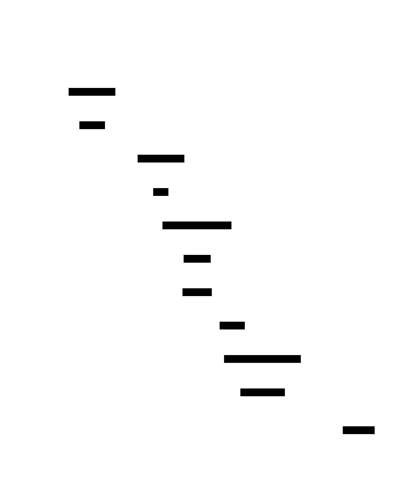
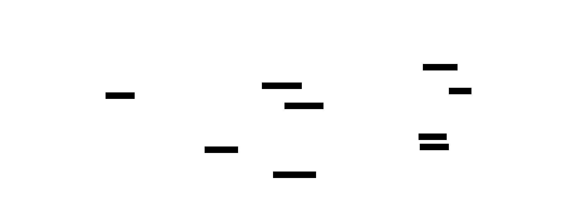

# Build Your Own Transformer: Design Document


## Overview

This system implements a GPT-style transformer from scratch for autoregressive text generation. The key architectural challenge is building the multi-layer attention mechanism that allows each token to attend to all previous tokens while efficiently processing sequences in parallel during training.


> This guide is meant to help you understand the big picture before diving into each milestone. Refer back to it whenever you need context on how components connect.


## Context and Problem Statement

> **Milestone(s):** Foundation for all milestones - understanding why transformers exist and the challenges in implementing them

The transformer architecture fundamentally changed how we think about sequence modeling in natural language processing. Before diving into implementation details, we need to understand why transformers were revolutionary, what problems they solved, and the specific challenges we'll face when building one from scratch. This section establishes the conceptual foundation and practical motivation for our implementation journey.

### Mental Model: The Cocktail Party

Imagine you're at a bustling cocktail party with dozens of conversations happening simultaneously. As a human, you have a remarkable ability to focus your attention selectively - you can tune into the conversation with your colleague while filtering out background chatter, or suddenly shift focus when you hear your name mentioned across the room. Moreover, you can dynamically adjust your attention based on context: when someone mentions a topic you're passionate about, you lean in and focus intently, but when the conversation turns to something irrelevant, your attention naturally drifts.

**Attention mechanisms in transformers work remarkably similarly.** Each word (or token) in a sentence is like a person at the cocktail party. When processing the word "bank" in the sentence "I went to the bank to deposit money," the attention mechanism allows the word "bank" to "listen" to all the other words in the sentence. It pays more attention to words like "deposit" and "money" (which suggest a financial institution) while giving less attention to words like "went" or "to" (which are less informative for disambiguation).

The key insight is that this attention is **learned, not programmed.** Just as you've learned through experience that certain conversational cues indicate important information, the transformer learns through training which words should pay attention to which other words. The attention weights emerge naturally from the data, allowing the model to discover linguistic patterns like:
- Pronouns attending to their antecedents ("The cat sat on its bed" - "its" strongly attends to "cat")
- Modifiers attending to what they modify ("The red car" - "red" attends to "car")
- Syntactic relationships ("The book that I read" - "book" and "read" attend to each other)

> **Key Insight:** Unlike rule-based systems that explicitly encode grammatical relationships, transformers discover these relationships implicitly through attention patterns that emerge during training.

This cocktail party analogy captures three crucial aspects of transformer attention:
1. **Selective focus**: Not all word pairs are equally important
2. **Dynamic adjustment**: Attention patterns change based on context
3. **Learned behavior**: The model discovers what to pay attention to through training data

### Pre-Transformer Approaches

Before transformers revolutionized NLP in 2017, researchers relied primarily on recurrent neural networks (RNNs) and convolutional neural networks (CNNs) for sequence modeling. Understanding their limitations illuminates why the transformer architecture was so groundbreaking.

#### Recurrent Neural Networks: The Sequential Bottleneck

RNNs, including their more sophisticated variants like LSTMs and GRUs, process sequences one token at a time in strict left-to-right order. Think of an RNN as a person reading a book who can only look at one word at a time and must remember everything important from previous words in their limited working memory.

**The fundamental limitation** is that information must pass through a sequential bottleneck. To understand the relationship between "cat" and "its" in "The cat walked across the room and sat on its bed," the RNN must:
1. Process "cat" and encode it in hidden state h₁
2. Process "walked" and update the hidden state to h₂ (potentially diluting information about "cat")
3. Continue through "across," "the," "room," "and," "sat," "on" - each step potentially losing more information about the original "cat"
4. Finally reach "its" with a hidden state h₉ that hopefully still contains enough information about "cat" to make the connection

This creates several problems:

| Problem | Description | Impact on Performance |
|---------|-------------|----------------------|
| **Vanishing Gradients** | Information from early tokens gets exponentially diluted through sequential processing | Long-range dependencies are poorly captured |
| **Sequential Processing** | Cannot parallelize computation across sequence positions | Training is slow, especially on long sequences |
| **Fixed Context Window** | Hidden state has limited capacity to store information | Complex relationships in long texts are lost |
| **Recency Bias** | Recent tokens have disproportionate influence on the hidden state | Earlier context gets forgotten |

#### Convolutional Neural Networks: Local Patterns Only

CNNs excel at capturing local patterns through sliding windows of fixed size. In NLP, this translates to detecting n-gram patterns like "not good" (negative sentiment) or "New York" (named entity). However, CNNs face their own limitations for sequence modeling:

**Limited receptive field**: A CNN with kernel size 3 can only directly relate words that are within 3 positions of each other. To capture longer dependencies, you need either:
- Very deep networks (many layers) which causes vanishing gradients and increases computational cost
- Very large kernels which become parameter-intensive and lose the inductive bias of local patterns

**No positional flexibility**: CNNs assume that patterns are translation-invariant (the same pattern matters regardless of position), but language is highly position-dependent. The phrase "not happy" has different meaning than "happy, not sad."

#### The Transformer Revolution: Parallel Attention

Transformers solve these fundamental limitations through a radically different approach: instead of processing sequences sequentially or locally, they compute attention between all pairs of positions simultaneously.

> **Architecture Decision: Self-Attention Over Sequential Processing**
> - **Context**: Need to capture long-range dependencies without sequential processing bottlenecks
> - **Options Considered**: 
>   1. Deeper RNNs with better memory mechanisms
>   2. CNN architectures with dilated convolutions for larger receptive fields  
>   3. Self-attention mechanisms that directly model all pairwise relationships
> - **Decision**: Self-attention with parallel computation across all sequence positions
> - **Rationale**: Eliminates sequential bottleneck, enables parallelization, provides direct paths for information flow between any two positions regardless of distance
> - **Consequences**: Enables efficient training on long sequences and better capture of long-range dependencies, but introduces quadratic memory complexity in sequence length

The transformer's self-attention mechanism creates direct connections between every pair of tokens. In our "cat...its" example, the attention mechanism can directly compute how much "its" should attend to "cat" without any intermediate processing steps. This eliminates the vanishing gradient problem for long-range dependencies and enables parallel computation.

| Architecture | Dependency Path Length | Parallel Operations | Memory Complexity |
|--------------|------------------------|--------------------|--------------------|
| **RNN** | O(sequence_length) | O(1) per timestep | O(sequence_length × hidden_size) |
| **CNN** | O(log(sequence_length)) with dilated convolutions | O(sequence_length) | O(sequence_length × hidden_size) |
| **Transformer** | O(1) - direct connections | O(sequence_length²) | O(sequence_length² + sequence_length × hidden_size) |

The transformer trades increased memory usage (quadratic in sequence length) for dramatically improved modeling capability and training efficiency. This trade-off has proven worthwhile for most NLP applications, leading to the current dominance of transformer-based models.

### Implementation Challenges

Building a transformer from scratch involves several interconnected mathematical and computational challenges. Unlike simpler neural network architectures where you can implement and test components in isolation, transformers require careful coordination between multiple sophisticated mechanisms.

#### Mathematical Complexity: The Attention Computation

The core mathematical challenge lies in implementing scaled dot-product attention correctly. The computation appears deceptively simple:

**Attention(Q, K, V) = softmax(QK^T / √d_k)V**

However, this simple equation conceals several implementation pitfalls:

⚠️ **Pitfall: Dimension Mismatches**
The matrix multiplication QK^T requires Q to have shape (batch_size, seq_len, d_k) and K to have shape (batch_size, seq_len, d_k), producing an attention matrix of shape (batch_size, seq_len, seq_len). Many implementations fail because they transpose the wrong dimensions or assume K should be transposed before the operation. The correct implementation transposes K during the multiplication: `torch.matmul(Q, K.transpose(-2, -1))`.

⚠️ **Pitfall: Missing Scale Factor**  
The division by √d_k is crucial for numerical stability. Without this scaling, the dot products can become very large (especially for large d_k), causing the softmax to produce extremely sharp distributions with gradients close to zero. This leads to training instability and poor convergence. The scale factor keeps the variance of the dot products approximately constant regardless of the key dimension.

⚠️ **Pitfall: Incorrect Masking**
Causal attention masking must set future positions to negative infinity BEFORE applying softmax, not after. Setting masked positions to zero after softmax breaks the probability distribution (the remaining probabilities don't sum to 1) and provides misleading attention patterns during debugging.

#### Multi-Head Attention Coordination

Multi-head attention requires splitting the model dimension across multiple attention heads and then recombining their outputs. This creates several coordination challenges:

**Dimension partitioning**: With model dimension d_model = 512 and num_heads = 8, each head operates on d_k = d_v = 64 dimensions. The implementation must:
1. Split the input embeddings into 8 chunks of size 64
2. Apply separate Q, K, V projections to each chunk  
3. Compute attention independently for each head
4. Concatenate the 8 outputs back into a 512-dimensional vector
5. Apply a final linear projection

**Memory layout optimization**: Naive implementations might use loops over attention heads, but efficient implementations reshape tensors to compute all heads in parallel. This requires careful tensor manipulation:
- Input shape: (batch_size, seq_len, d_model)
- Reshaped for multi-head: (batch_size, seq_len, num_heads, d_k)  
- Transposed for parallel computation: (batch_size, num_heads, seq_len, d_k)
- After attention: (batch_size, num_heads, seq_len, d_v)
- Concatenated output: (batch_size, seq_len, d_model)

#### Numerical Stability Issues

Transformers are particularly susceptible to numerical instability due to the combination of softmax operations, layer normalization, and deep architectures.

**Softmax overflow**: For large attention scores, softmax can overflow or underflow. Consider attention scores [10, 8, 12] - after exponential, these become [22026, 2981, 162754], which may exceed float32 precision. The standard solution is to subtract the maximum value before exponential: [10-12, 8-12, 12-12] = [-2, -4, 0], giving stable exponentials [0.135, 0.018, 1.0].

**Gradient explosion**: Deep transformer stacks can suffer from exploding gradients, especially in the early stages of training. This is typically addressed through:
- Gradient clipping to limit the norm of gradients
- Careful weight initialization (Xavier/Glorot or He initialization)  
- Layer normalization to stabilize activations
- Residual connections to provide stable gradient paths

**Accumulating precision errors**: During autoregressive generation, small numerical errors can accumulate over many generation steps. This is particularly problematic when using mixed precision training (float16 for speed, float32 for accuracy) where careful casting between precisions is required.

#### Memory and Computational Scalability

The quadratic memory complexity of self-attention creates significant scalability challenges:

**Memory usage**: For a sequence of length L with model dimension d, self-attention requires O(L²) memory for storing attention weights, plus O(L × d) for embeddings. For L=512 and batch size 32, the attention matrix alone requires 32 × 512 × 512 × 4 bytes = 33MB per layer. A 12-layer model uses nearly 400MB just for attention matrices.

**Computational complexity**: Each attention computation requires O(L² × d) operations. For long sequences, this dominates training time. Modern implementations use several optimizations:
- **KV caching**: During generation, cache key and value computations for previous tokens to avoid recomputation
- **Attention chunking**: Process attention in blocks to reduce peak memory usage
- **Flash attention**: Fused attention kernels that minimize memory transfers

#### Integration and Testing Complexity

Unlike simpler architectures where you can test each layer independently, transformer components are tightly coupled:

**Forward pass dependencies**: Testing the transformer block requires working implementations of multi-head attention, layer normalization, feed-forward networks, and residual connections. A bug in any component can cause failures throughout the system.

**Training loop complexity**: The language modeling objective requires careful coordination between tokenization, batch preparation, loss computation, and gradient updates. Label shifting (input tokens vs. target tokens) is a common source of bugs.

**Generation complexity**: Autoregressive text generation involves different code paths than training, with additional complexity from sampling strategies, KV caching, and stopping criteria.

> **Implementation Strategy**: Given these interdependencies, we'll build and test components in carefully ordered milestones. Each milestone produces a testable artifact that validates the correctness of previous components while building toward the complete system.

The combination of mathematical sophistication, numerical stability requirements, and tight component coupling makes transformer implementation significantly more challenging than simpler neural architectures. However, understanding these challenges upfront allows us to structure our implementation to minimize debugging complexity and ensure correctness at each step.

### Implementation Guidance

This implementation guidance provides the practical foundation for building your transformer, with technology choices optimized for learning and debugging rather than production performance.

#### Technology Recommendations

| Component | Simple Option (Recommended for Learning) | Advanced Option |
|-----------|------------------------------------------|-----------------|
| **Deep Learning Framework** | PyTorch with manual tensor operations | PyTorch Lightning with automated training loops |
| **Tensor Operations** | Explicit `torch.matmul`, `torch.softmax` calls | `torch.nn.functional` high-level operations |
| **Model Definition** | Custom `nn.Module` classes with explicit forward methods | `nn.Sequential` or config-driven model builders |
| **Data Loading** | Simple character-level tokenization with manual batching | HuggingFace tokenizers with DataLoader optimizations |
| **Training Loop** | Manual gradient computation and optimization steps | PyTorch Lightning Trainer with callbacks |
| **Debugging** | Print statements and tensor shape inspection | TensorBoard integration with attention visualizations |

**Rationale for simple options**: When learning transformers, explicit implementations help you understand what each operation does. High-level abstractions hide important details about tensor shapes, attention computations, and gradient flow that are crucial for debugging and intuition building.

#### Recommended Project Structure

Organize your code to mirror the conceptual hierarchy and enable incremental testing:

```
transformer-project/
├── src/
│   ├── __init__.py
│   ├── attention.py          ← Self-attention mechanism (Milestone 1)
│   ├── transformer_block.py  ← Complete transformer block (Milestone 2)  
│   ├── model.py             ← Full transformer stack and embedding
│   ├── training.py          ← Training pipeline (Milestone 3)
│   ├── generation.py        ← Text generation (Milestone 4)
│   └── utils.py             ← Helper functions and utilities
├── tests/
│   ├── test_attention.py    ← Unit tests for attention mechanisms
│   ├── test_transformer_block.py  ← Unit tests for complete blocks
│   ├── test_integration.py  ← End-to-end pipeline tests
│   └── test_data/           ← Small datasets for testing
├── data/
│   ├── tiny_shakespeare.txt ← Small training corpus
│   └── processed/           ← Tokenized and batched data
├── notebooks/
│   ├── debug_attention.ipynb    ← Attention weight visualization
│   ├── training_analysis.ipynb ← Loss curves and training metrics
│   └── generation_examples.ipynb ← Sample outputs and analysis
├── configs/
│   └── model_config.py      ← Hyperparameter configurations
└── requirements.txt         ← Python dependencies
```

This structure separates concerns cleanly while maintaining clear dependencies: `attention.py` has no internal dependencies, `transformer_block.py` depends only on `attention.py`, and so forth.

#### Infrastructure Starter Code

**Configuration Management** (`configs/model_config.py`):
```python
from dataclasses import dataclass
from typing import Optional

@dataclass
class TransformerConfig:
    """Complete configuration for transformer model and training."""
    # Model architecture
    vocab_size: int = 65        # Number of unique tokens (characters for tiny dataset)
    max_seq_length: int = 256   # Maximum sequence length for training
    d_model: int = 384          # Model dimension (embedding size)
    num_heads: int = 6          # Number of attention heads (d_model must be divisible)
    num_layers: int = 6         # Number of transformer blocks
    d_ff: int = 1536           # Feed-forward dimension (typically 4 * d_model)
    dropout_rate: float = 0.1   # Dropout probability
    
    # Training hyperparameters
    learning_rate: float = 3e-4
    batch_size: int = 64
    num_epochs: int = 10
    warmup_steps: int = 1000
    max_grad_norm: float = 1.0  # Gradient clipping threshold
    
    # Generation settings
    temperature: float = 1.0
    top_k: Optional[int] = None
    top_p: Optional[float] = None
    max_generation_length: int = 100
    
    def __post_init__(self):
        """Validate configuration parameters."""
        assert self.d_model % self.num_heads == 0, f"d_model ({self.d_model}) must be divisible by num_heads ({self.num_heads})"
        assert self.d_ff > 0, "Feed-forward dimension must be positive"
        assert 0.0 <= self.dropout_rate < 1.0, "Dropout rate must be in [0, 1)"
```

**Utility Functions** (`src/utils.py`):
```python
import torch
import torch.nn.functional as F
from typing import Optional, Tuple, List
import matplotlib.pyplot as plt
import numpy as np

def create_causal_mask(seq_length: int, device: torch.device) -> torch.Tensor:
    """
    Create lower triangular causal mask for self-attention.
    
    Args:
        seq_length: Length of sequence
        device: Device to create tensor on
        
    Returns:
        Boolean mask of shape (seq_length, seq_length) where True means "allow attention"
    """
    # TODO 1: Create lower triangular matrix using torch.tril
    # TODO 2: Convert to boolean (1s become True, 0s become False)  
    # TODO 3: Move to specified device
    pass

def apply_causal_mask(attention_scores: torch.Tensor, mask: torch.Tensor) -> torch.Tensor:
    """
    Apply causal mask to attention scores before softmax.
    
    Args:
        attention_scores: Raw attention scores of shape (batch, num_heads, seq_len, seq_len)
        mask: Boolean mask of shape (seq_len, seq_len)
        
    Returns:
        Masked attention scores with -inf at masked positions
    """
    # TODO 1: Use torch.where to set masked positions to -inf
    # TODO 2: Ensure mask is broadcasted correctly across batch and head dimensions
    # Hint: Use float('-inf') for masked positions to ensure softmax gives 0 probability
    pass

def count_parameters(model: torch.nn.Module) -> int:
    """Count total number of trainable parameters in model."""
    return sum(p.numel() for p in model.parameters() if p.requires_grad)

def plot_attention_weights(attention_weights: torch.Tensor, tokens: List[str], 
                          layer: int = 0, head: int = 0, save_path: Optional[str] = None):
    """
    Visualize attention weights as heatmap.
    
    Args:
        attention_weights: Attention weights of shape (num_layers, num_heads, seq_len, seq_len)
        tokens: List of token strings for axis labels
        layer: Which layer to visualize  
        head: Which attention head to visualize
        save_path: Optional path to save the plot
    """
    # TODO 1: Extract weights for specified layer and head
    # TODO 2: Create matplotlib heatmap with token labels
    # TODO 3: Add colorbar and title
    # TODO 4: Save or display the plot
    pass

class SimpleTokenizer:
    """Character-level tokenizer for educational purposes."""
    
    def __init__(self, vocab: Optional[List[str]] = None):
        """Initialize tokenizer with vocabulary."""
        # TODO 1: If vocab is None, create default vocab with printable ASCII chars
        # TODO 2: Create char_to_idx and idx_to_char mappings
        # TODO 3: Store special token indices (if any)
        pass
    
    def encode(self, text: str) -> List[int]:
        """Convert text string to list of token indices."""
        # TODO 1: Convert each character to its vocabulary index
        # TODO 2: Handle unknown characters (either skip or use special UNK token)
        pass
    
    def decode(self, token_ids: List[int]) -> str:
        """Convert list of token indices back to text string."""
        # TODO 1: Convert each index back to character
        # TODO 2: Join characters into string
        # TODO 3: Handle invalid indices gracefully
        pass
    
    @classmethod
    def from_text(cls, text: str) -> 'SimpleTokenizer':
        """Create tokenizer by extracting vocabulary from text corpus."""
        # TODO 1: Find all unique characters in text
        # TODO 2: Sort characters for consistent ordering
        # TODO 3: Return new tokenizer instance with this vocabulary
        pass
```

**Basic Data Loading** (`src/data_loader.py`):
```python
import torch
from torch.utils.data import Dataset, DataLoader
from typing import List, Tuple, Optional
from .utils import SimpleTokenizer

class TextDataset(Dataset):
    """Dataset for character-level language modeling."""
    
    def __init__(self, text: str, tokenizer: SimpleTokenizer, 
                 seq_length: int, stride: Optional[int] = None):
        """
        Create dataset from text string.
        
        Args:
            text: Raw text content
            tokenizer: Tokenizer to convert text to indices  
            seq_length: Length of each training sequence
            stride: Step size between sequences (default: seq_length for no overlap)
        """
        # TODO 1: Tokenize the entire text
        # TODO 2: Create overlapping sequences of length seq_length + 1 
        #         (extra token for target)
        # TODO 3: Store sequences as list of (input, target) pairs
        # Hint: Input is tokens[i:i+seq_length], target is tokens[i+1:i+seq_length+1]
        pass
    
    def __len__(self) -> int:
        """Return number of sequences in dataset."""
        # TODO: Return length of stored sequences
        pass
    
    def __getitem__(self, idx: int) -> Tuple[torch.Tensor, torch.Tensor]:
        """Return input and target tensors for given index."""
        # TODO 1: Get the idx-th sequence pair
        # TODO 2: Convert to PyTorch tensors with dtype=torch.long
        pass

def create_data_loaders(text: str, config, train_split: float = 0.9) -> Tuple[DataLoader, DataLoader, SimpleTokenizer]:
    """
    Create training and validation data loaders from text.
    
    Args:
        text: Raw text content
        config: TransformerConfig with batch_size and seq_length
        train_split: Fraction of data to use for training
        
    Returns:
        Tuple of (train_loader, val_loader, tokenizer)
    """
    # TODO 1: Create tokenizer from text vocabulary
    # TODO 2: Split text into train and validation portions
    # TODO 3: Create datasets for each split
    # TODO 4: Create DataLoader instances with specified batch_size
    # TODO 5: Return loaders and tokenizer
    pass
```

#### Core Logic Skeleton Code

**Self-Attention Implementation** (`src/attention.py`):
```python
import torch
import torch.nn as nn
import torch.nn.functional as F
from typing import Optional, Tuple
from .utils import create_causal_mask, apply_causal_mask

class MultiHeadAttention(nn.Module):
    """Multi-head self-attention mechanism."""
    
    def __init__(self, d_model: int, num_heads: int, dropout_rate: float = 0.1):
        """
        Initialize multi-head attention.
        
        Args:
            d_model: Model dimension (must be divisible by num_heads)
            num_heads: Number of parallel attention heads
            dropout_rate: Dropout probability for attention weights
        """
        super().__init__()
        # TODO 1: Store configuration parameters
        # TODO 2: Calculate d_k = d_v = d_model // num_heads
        # TODO 3: Create linear projections for Q, K, V (single linear layer that outputs d_model dimensions)
        # TODO 4: Create output projection layer  
        # TODO 5: Create dropout layer
        # TODO 6: Initialize scale factor for attention scores
        
        # Hint: Use single linear layer for efficiency: self.qkv_proj = nn.Linear(d_model, 3 * d_model)
        pass
    
    def forward(self, x: torch.Tensor, mask: Optional[torch.Tensor] = None) -> torch.Tensor:
        """
        Apply multi-head self-attention to input sequence.
        
        Args:
            x: Input tensor of shape (batch_size, seq_length, d_model)
            mask: Optional causal mask of shape (seq_length, seq_length)
            
        Returns:
            Output tensor of shape (batch_size, seq_length, d_model)
        """
        batch_size, seq_length, d_model = x.shape
        
        # TODO 1: Apply QKV projection and split into Q, K, V
        # TODO 2: Reshape Q, K, V for multi-head attention
        #         From: (batch_size, seq_length, d_model)  
        #         To: (batch_size, num_heads, seq_length, d_k)
        # TODO 3: Compute attention scores: Q @ K.transpose(-2, -1)
        # TODO 4: Scale attention scores by sqrt(d_k)
        # TODO 5: Apply causal mask if provided (set masked positions to -inf)
        # TODO 6: Apply softmax to get attention weights
        # TODO 7: Apply dropout to attention weights
        # TODO 8: Apply attention weights to values: attention_weights @ V
        # TODO 9: Reshape output back to (batch_size, seq_length, d_model)
        # TODO 10: Apply final output projection
        
        # Hint: Use torch.matmul for batch matrix multiplication
        # Hint: For reshaping, use .view() and .contiguous() as needed
        pass
```

#### Language-Specific Hints

**PyTorch Tensor Operations**:
- Use `tensor.view()` to reshape tensors, but call `.contiguous()` first if the tensor is not contiguous in memory
- `torch.matmul()` handles batch matrix multiplication automatically - it multiplies the last two dimensions and broadcasts over earlier dimensions
- For numerical stability in softmax, PyTorch's `F.softmax()` automatically handles overflow by subtracting the max value
- Use `tensor.transpose(-2, -1)` to swap the last two dimensions regardless of total tensor dimensionality

**Memory Management**:
- Use `torch.no_grad()` context manager during inference to save memory and speed up computation
- Call `optimizer.zero_grad()` before each backward pass to clear accumulated gradients
- Use `del` to explicitly free large tensors when done with them during debugging

**Device Handling**:
```python
device = torch.device('cuda' if torch.cuda.is_available() else 'cpu')
model = model.to(device)
data = data.to(device)
```

**Gradient Debugging**:
- Use `torch.autograd.grad_mode.set_grad_enabled(True)` to ensure gradients are being computed
- Check if gradients are flowing: `print(f"Parameter grad norm: {param.grad.norm().item()}")` after backward pass
- Use `torch.nn.utils.clip_grad_norm_(model.parameters(), max_norm=1.0)` for gradient clipping

#### Milestone Checkpoints

**Milestone 1 Checkpoint - Self-Attention**:
After implementing the attention mechanism, verify correct behavior:
```bash
cd tests/
python test_attention.py
```

Expected output:
- Attention weights sum to 1.0 for each query position
- Causal mask prevents attending to future positions (upper triangular of attention matrix should be zeros)
- Output shape matches input shape: (batch_size, seq_length, d_model)
- Gradient flows backward through attention computation

Manual verification:
```python
# Create small test input
x = torch.randn(2, 4, 64)  # batch=2, seq_len=4, d_model=64
attention = MultiHeadAttention(d_model=64, num_heads=4)
output = attention(x)
print(f"Input shape: {x.shape}, Output shape: {output.shape}")
```

**Signs of problems**:
- NaN values in output → Check for division by zero in scaling or softmax overflow
- Wrong output shape → Verify tensor reshaping and transposition operations  
- No gradient flow → Ensure all operations are differentiable and tensors require_grad=True
- Attention weights don't sum to 1 → Check softmax application and mask timing


## Goals and Non-Goals

> **Milestone(s):** Foundation for all milestones - defining the scope and boundaries of our transformer implementation

Building a transformer from scratch is an ambitious undertaking that could easily expand into months of work if we tried to implement every optimization and feature found in production systems. Like an architect who must choose between building a sturdy house versus a sprawling mansion, we need to clearly define what we will and won't build to maintain focus on the core learning objectives.

The primary challenge in scoping a transformer implementation lies in balancing educational value with practical constraints. We want to build something substantial enough to understand the fundamental mechanisms, yet focused enough to complete within a reasonable timeframe. This means making deliberate trade-offs between completeness and clarity, between performance and simplicity.

Our approach follows the principle of **progressive complexity**: we'll implement the essential components that make a transformer work, ensuring each piece is solid and well-understood, rather than attempting to build a production-ready system with all the bells and whistles. Think of this as building a working bicycle before attempting to construct a Formula 1 race car.

### What We Will Build

Our transformer implementation will focus on the **core mechanisms that define the architecture**, providing a solid foundation for understanding how these models work under the hood. Every component we build serves a direct educational purpose in understanding attention, autoregression, or neural language modeling.

#### Core Architecture Components

We will implement a complete **decoder-only transformer** similar to the GPT architecture. This includes building every layer of the transformer stack from the ground up, starting with the mathematical primitives and working up to the full model.

| Component | Purpose | Implementation Scope |
|-----------|---------|---------------------|
| `MultiHeadAttention` | Core attention mechanism with Q/K/V projections | Scaled dot-product attention with configurable heads |
| `TransformerBlock` | Complete transformer layer | Attention + FFN + normalization + residuals |
| `TransformerModel` | Full model stack | Embedding + multiple transformer blocks + output head |
| `SimpleTokenizer` | Text-to-token conversion | Character-level tokenization with encode/decode |
| `TextDataset` | Training data handling | Sequence batching with proper label shifting |

The attention mechanism will be implemented with **full mathematical transparency**. Rather than using high-level library functions, we'll compute the scaled dot-product attention manually, implement the multi-head splitting and concatenation, and handle the causal masking ourselves. This hands-on approach ensures deep understanding of how attention weights are computed and applied.

> **Decision: Decoder-Only Architecture**
> - **Context**: We could implement encoder-decoder (like original Transformer), encoder-only (like BERT), or decoder-only (like GPT)
> - **Options Considered**: 
>   1. Full encoder-decoder for translation tasks
>   2. Encoder-only for understanding/classification  
>   3. Decoder-only for text generation
> - **Decision**: Decoder-only transformer (GPT-style)
> - **Rationale**: Autoregressive generation provides the clearest demonstration of attention mechanisms, and the training objective (next-token prediction) is straightforward to implement and debug
> - **Consequences**: We focus on generation tasks rather than understanding tasks, but gain simplicity in architecture and training pipeline

#### Training Infrastructure

Our training pipeline will implement the fundamental components needed for **language modeling** with next-token prediction. This includes proper data loading, loss computation, and optimization, but keeps the training loop simple and transparent.

| Training Component | Functionality | Educational Focus |
|-------------------|---------------|-------------------|
| Language Modeling Objective | Cross-entropy loss for next-token prediction | Understanding autoregressive training |
| Gradient Computation | Backpropagation through transformer blocks | How gradients flow through attention |
| Basic Optimization | Adam optimizer with configurable learning rate | Standard neural network training |
| Loss Monitoring | Training loss logging and convergence tracking | Diagnosing training progress |

The training loop will be implemented as a straightforward iteration over batches, computing forward passes, calculating losses, and updating parameters. We'll include essential monitoring to track convergence, but avoid complex learning rate schedules or advanced optimization techniques that obscure the core learning process.

#### Text Generation System

Our generation system will implement multiple **sampling strategies** to demonstrate how different decoding methods affect output quality. This provides hands-on experience with the trade-offs between deterministic and stochastic generation.

| Generation Method | Behavior | Learning Objective |
|------------------|----------|-------------------|
| Greedy Decoding | Always select highest probability token | Deterministic baseline generation |
| Temperature Sampling | Scale logits before sampling | Control randomness vs coherence |
| Top-k Sampling | Sample from k most likely tokens | Truncated probability distributions |
| Top-p (Nucleus) Sampling | Sample from cumulative probability mass p | Dynamic vocabulary filtering |

Each sampling strategy will be implemented as a separate function that takes raw logits and returns token selections, making the differences between approaches explicit and easy to experiment with.

#### Development and Debugging Tools

To support the learning process, we'll build essential tools for **understanding and debugging** the transformer's behavior. These tools make the model's internal state visible and help diagnose common implementation issues.

| Tool | Purpose | Implementation |
|------|---------|----------------|
| `plot_attention_weights()` | Visualize attention patterns | Heatmap of attention scores across heads/layers |
| `count_parameters()` | Model size analysis | Count trainable parameters by component |
| Gradient monitoring | Training stability diagnosis | Track gradient norms and detect vanishing/exploding |
| Loss curve plotting | Training progress visualization | Simple matplotlib charts of training metrics |

These debugging tools will be integrated into the training and inference pipelines, providing immediate feedback on model behavior and making it easier to spot implementation bugs or training issues.

### What We Won't Build

While our transformer will be functionally complete, we'll deliberately omit numerous **production optimizations and advanced features** that would complicate the implementation without proportional educational benefit. These omissions are strategic choices to maintain focus on the core mechanisms.

#### Performance Optimizations

We will skip the complex optimizations that make production transformers efficient but obscure their fundamental operation. Our implementation prioritizes clarity over speed, accepting performance trade-offs in service of educational goals.

| Optimization | Why We Skip It | Production Impact |
|--------------|---------------|-------------------|
| KV caching during generation | Complex memory management obscures generation logic | 10-100x speedup for long sequences |
| Flash Attention | Requires deep CUDA knowledge and specialized kernels | Significant memory reduction |
| Mixed precision training | Adds complexity to gradient handling | 2x memory savings, faster training |
| Gradient checkpointing | Complex memory/compute trade-off implementation | Enables training much larger models |
| Model parallelism | Distributed systems complexity | Required for models that don't fit on one GPU |

While KV caching provides dramatic speedups during autoregressive generation, implementing it correctly requires careful management of tensor slicing, concatenation, and device placement. The educational value doesn't justify the implementation complexity for our purposes.

> **Decision: No KV Cache Optimization**
> - **Context**: Autoregressive generation repeatedly computes attention over previously generated tokens
> - **Options Considered**:
>   1. Implement full KV caching with proper memory management
>   2. Simple caching without memory optimization
>   3. No caching - recompute everything each step
> - **Decision**: No caching - recompute attention weights each generation step  
> - **Rationale**: KV caching requires complex tensor manipulation and memory management that obscures the core attention mechanism. The performance cost is acceptable for educational sequences
> - **Consequences**: Generation will be slower (O(n²) instead of O(n) per token), but attention computation remains transparent and debuggable

#### Advanced Architectural Features

Modern transformers incorporate numerous architectural refinements that improve performance but add implementation complexity. We'll use the original transformer design principles rather than chasing the latest architectural innovations.

| Feature | Educational Value | Implementation Complexity |
|---------|------------------|---------------------------|
| Rotary Positional Embedding (RoPE) | Minimal - core attention still the same | High - complex trigonometric operations |
| Layer-wise learning rates | Moderate - optimization insight | Medium - requires per-parameter learning rates |
| Sparse attention patterns | Moderate - attention efficiency | High - custom attention masks and indexing |
| Mixture of Experts | Low - doesn't teach core transformer concepts | Very High - routing and load balancing |
| Advanced normalization (RMSNorm, etc.) | Low - layer normalization concepts transfer | Medium - different mathematical formulations |

These features represent active areas of research and engineering optimization, but they build upon the fundamental attention mechanisms we'll implement. Understanding our basic transformer provides the foundation needed to comprehend these advanced techniques later.

#### Production Engineering Requirements

Real-world transformer deployments require extensive engineering infrastructure that falls outside our educational scope. These systems are complex enough to be projects in their own right.

| System Component | Complexity | Why We Skip |
|------------------|------------|-------------|
| Distributed training | Very High | Requires deep understanding of distributed systems |
| Model serving infrastructure | High | Focus is on model internals, not deployment |
| Efficient tokenization (BPE, SentencePiece) | Medium | Character-level tokenization sufficient for learning |
| Checkpointing and model versioning | Medium | Standard deep learning infrastructure |
| Production monitoring and logging | Medium | Standard MLOps practices |
| ONNX/TensorRT optimization | High | Specialized inference optimization |

Our `SimpleTokenizer` will use character-level tokenization rather than implementing subword algorithms like Byte Pair Encoding. While BPE provides better modeling efficiency, character tokenization eliminates the complexity of building and managing subword vocabularies, allowing us to focus on the transformer architecture itself.

> **Decision: Character-Level Tokenization**
> - **Context**: Need tokenization for text processing, with options ranging from word-level to subword to character-level
> - **Options Considered**:
>   1. Byte Pair Encoding (BPE) for efficiency
>   2. Word-level tokenization for simplicity
>   3. Character-level tokenization for minimal complexity
> - **Decision**: Character-level tokenization via `SimpleTokenizer`
> - **Rationale**: Character tokenization eliminates vocabulary management complexity and subword algorithm implementation, while still demonstrating the core concept of text-to-token conversion
> - **Consequences**: Less efficient token usage (longer sequences for same text), but dramatically simpler implementation and debugging

#### Advanced Training Techniques

Modern transformer training employs sophisticated techniques for stability, efficiency, and performance. We'll use standard gradient descent optimization rather than implementing these advanced methods.

| Training Technique | Benefit | Implementation Burden |
|-------------------|---------|----------------------|
| Learning rate scheduling (cosine, linear warmup) | Better convergence | Complex scheduling logic |
| Gradient clipping with adaptive norms | Training stability | Gradient norm computation and clipping |
| Loss scaling for mixed precision | Numerical stability | Dynamic loss scale adjustment |
| Curriculum learning | Faster convergence | Sophisticated data ordering |
| Regularization techniques (weight decay, dropout scheduling) | Better generalization | Multiple regularization implementations |

Our training loop will use a fixed learning rate and standard dropout, providing a clear baseline for understanding how transformer training works. Once this foundation is solid, learners can experiment with advanced techniques as extensions.

The scope we've defined creates a **complete yet manageable** transformer implementation that demonstrates every essential concept while remaining achievable for a dedicated learner. Each component we include directly contributes to understanding attention mechanisms, autoregressive modeling, or neural language generation.

### Implementation Guidance

This implementation guidance provides the practical foundation for building our scoped transformer, with clear technology choices and file organization that support the educational goals we've defined.

#### Technology Recommendations

Our technology stack prioritizes **learning accessibility** over cutting-edge performance, choosing tools that are widely available and well-documented rather than specialized frameworks that require expert knowledge.

| Component | Simple Option | Advanced Option |
|-----------|---------------|-----------------|
| Deep Learning Framework | PyTorch with standard layers | PyTorch with custom CUDA kernels |
| Tokenization | Character-level with Python strings | SentencePiece or Hugging Face tokenizers |
| Visualization | Matplotlib for attention heatmaps | TensorBoard or Weights & Biases |
| Data Loading | PyTorch DataLoader with simple batching | Custom data pipeline with preprocessing |
| Model Serialization | PyTorch state_dict save/load | ONNX export for production deployment |
| Development Environment | Local GPU or Google Colab | Multi-GPU cluster or cloud instances |

The simple options provide everything needed for understanding transformers while keeping dependency management and setup straightforward. Advanced options offer better performance but require additional expertise that distracts from the core learning objectives.

#### Recommended File Structure

Organizing code clearly from the start prevents the common mistake of implementing everything in a single monolithic file. This structure separates concerns while keeping related components together.

```
transformer-from-scratch/
├── src/
│   ├── __init__.py
│   ├── config.py              # TransformerConfig and hyperparameters
│   ├── tokenizer.py           # SimpleTokenizer implementation  
│   ├── attention.py           # MultiHeadAttention and masking utilities
│   ├── transformer.py         # TransformerBlock and full model
│   ├── training.py            # Training loop and optimization
│   ├── generation.py          # Text generation and sampling strategies
│   └── utils.py               # Helper functions and debugging tools
├── data/
│   └── sample_text.txt        # Training data
├── notebooks/
│   ├── attention_visualization.ipynb  # Interactive attention analysis
│   └── training_demo.ipynb    # Step-by-step training walkthrough
├── tests/
│   ├── test_attention.py      # Unit tests for attention mechanism
│   ├── test_transformer.py    # Integration tests for full model
│   └── test_generation.py     # Generation quality and correctness tests
├── requirements.txt           # Python dependencies
└── README.md                  # Setup and usage instructions
```

This structure scales well as the implementation grows, with clear separation between core components (`attention.py`, `transformer.py`) and supporting infrastructure (`training.py`, `utils.py`). The notebooks provide interactive environments for experimentation and visualization.

#### Infrastructure Starter Code

These complete utility functions handle the foundational operations that support transformer implementation but aren't the primary learning focus. Copy these directly and build the core transformer components on top of them.

**Configuration Management** (`config.py`):
```python
from dataclasses import dataclass
from typing import Optional

@dataclass
class TransformerConfig:
    """Complete configuration for transformer model and training."""
    # Model architecture
    d_model: int = 512              # embedding dimension
    num_heads: int = 8              # number of attention heads  
    d_k: int = 64                   # key/query dimension per head
    d_v: int = 64                   # value dimension per head
    seq_length: int = 512           # maximum sequence length
    vocab_size: int = 128           # vocabulary size (for character-level)
    num_layers: int = 6             # number of transformer blocks
    d_ff: int = 2048               # feed-forward hidden dimension
    dropout_rate: float = 0.1       # dropout probability
    
    # Training parameters
    batch_size: int = 32
    learning_rate: float = 0.0001
    num_epochs: int = 10
    device: str = "cuda" if torch.cuda.is_available() else "cpu"
    
    def __post_init__(self):
        """Validate configuration and set derived values."""
        assert self.d_model % self.num_heads == 0, "d_model must be divisible by num_heads"
        self.d_k = self.d_model // self.num_heads
        self.d_v = self.d_model // self.num_heads
```

**Utility Functions** (`utils.py`):
```python
import torch
import matplotlib.pyplot as plt
import seaborn as sns
from typing import List

def count_parameters(model: torch.nn.Module) -> int:
    """Count total trainable parameters in model."""
    return sum(p.numel() for p in model.parameters() if p.requires_grad)

def create_causal_mask(seq_length: int, device: torch.device) -> torch.Tensor:
    """Create lower triangular causal attention mask."""
    # TODO: Create seq_length x seq_length matrix of ones
    # TODO: Use torch.tril to make it lower triangular  
    # TODO: Convert to boolean mask (1 = attend, 0 = mask)
    # TODO: Move to specified device
    pass

def apply_causal_mask(scores: torch.Tensor, mask: torch.Tensor) -> torch.Tensor:
    """Apply causal mask to attention scores before softmax."""
    # TODO: Replace masked positions with large negative value (-1e9)
    # TODO: Ensure mask broadcast correctly across batch and head dimensions
    pass

def plot_attention_weights(weights: torch.Tensor, tokens: List[str], 
                          layer: int, head: int, save_path: Optional[str] = None):
    """Visualize attention weights as heatmap."""
    # TODO: Extract specific layer and head from weights tensor
    # TODO: Create matplotlib heatmap with token labels
    # TODO: Add title indicating layer and head number  
    # TODO: Save or display plot based on save_path parameter
    pass
```

#### Core Logic Skeleton Code

These signatures define the interfaces for the main transformer components that learners should implement themselves. Each TODO maps directly to the algorithm steps described in the design sections.

**Multi-Head Attention** (`attention.py`):
```python
import torch
import torch.nn as nn
import math

class MultiHeadAttention(nn.Module):
    """Multi-head self-attention with causal masking."""
    
    def __init__(self, config: TransformerConfig):
        super().__init__()
        # TODO: Initialize W_q, W_k, W_v projection matrices
        # TODO: Initialize W_o output projection matrix  
        # TODO: Store config values (d_model, num_heads, etc.)
        # TODO: Initialize dropout layer
        
    def forward(self, x: torch.Tensor, mask: Optional[torch.Tensor] = None) -> torch.Tensor:
        """
        Forward pass through multi-head attention.
        
        Args:
            x: Input embeddings (batch_size, seq_length, d_model)
            mask: Causal attention mask (seq_length, seq_length)
            
        Returns:
            Attended embeddings (batch_size, seq_length, d_model)
        """
        # TODO: Apply Q, K, V projections to input
        # TODO: Reshape projections for multi-head computation  
        # TODO: Compute scaled dot-product attention scores
        # TODO: Apply causal mask if provided
        # TODO: Apply softmax to get attention weights
        # TODO: Apply dropout to attention weights
        # TODO: Compute weighted sum of values
        # TODO: Concatenate heads and apply output projection
        pass
```

**Transformer Block** (`transformer.py`):
```python
class TransformerBlock(nn.Module):
    """Single transformer block with attention and feed-forward layers."""
    
    def __init__(self, config: TransformerConfig):
        super().__init__()
        # TODO: Initialize MultiHeadAttention layer
        # TODO: Initialize feed-forward network (two linear layers with ReLU)
        # TODO: Initialize layer normalization layers
        # TODO: Initialize dropout layers
        
    def forward(self, x: torch.Tensor, mask: Optional[torch.Tensor] = None) -> torch.Tensor:
        """
        Forward pass through transformer block.
        
        Args:
            x: Input embeddings (batch_size, seq_length, d_model)  
            mask: Causal attention mask
            
        Returns:
            Transformed embeddings (batch_size, seq_length, d_model)
        """
        # TODO: Apply attention sub-layer with residual connection
        # TODO: Apply layer normalization after attention
        # TODO: Apply feed-forward sub-layer with residual connection  
        # TODO: Apply layer normalization after feed-forward
        pass
```

#### Milestone Checkpoints

After implementing each major component, verify correct behavior with these concrete tests and expected outputs.

**Milestone 1 Checkpoint - Self-Attention**:
```bash
python -m pytest tests/test_attention.py -v
```
Expected behavior:
- Attention weights sum to 1.0 across sequence dimension for each query position
- Causal mask prevents attention to future positions (weights are 0 for masked positions)  
- Multi-head outputs have correct dimensions after concatenation
- Gradient flows correctly through attention computation

**Milestone 2 Checkpoint - Transformer Block**:
```bash
python tests/test_transformer.py
```
Expected behavior:
- Input and output tensors have identical shapes (residual connections preserve dimensions)
- Layer normalization produces zero mean, unit variance activations
- Feed-forward network expands to 4x dimension internally then projects back
- Dropout is applied during training but not during evaluation

**Training Verification**:
```python
# Simple overfitting test - model should memorize small dataset
config = TransformerConfig(seq_length=64, batch_size=8, num_layers=2)
# Train on 10 short sequences, loss should approach zero
```

#### Language-Specific Implementation Hints

**PyTorch-Specific Guidance**:
- Use `torch.nn.Linear` for all projection matrices rather than manual weight initialization
- Apply `torch.nn.functional.softmax(scores, dim=-1)` for attention weight normalization  
- Use `scores.masked_fill(mask == 0, -1e9)` for efficient causal masking
- Call `model.train()` before training loops and `model.eval()` before inference
- Use `torch.no_grad()` context manager during evaluation to disable gradient computation

**Debugging Tips**:
| Symptom | Likely Cause | How to Diagnose | Fix |
|---------|--------------|------------------|-----|
| Attention weights all equal | Missing causal mask or wrong softmax dimension | Print attention matrix shape and values | Apply mask before softmax, verify dim=-1 |
| Loss stays constant | Wrong label shifting in data loader | Check if targets are shifted by one position | Shift targets: `targets = inputs[:, 1:]` |
| Memory errors during training | Gradient accumulation without clearing | Check if gradients are zeroed each step | Call `optimizer.zero_grad()` before each batch |
| Model generates repetitive text | No sampling diversity | Check if using greedy decoding only | Implement temperature or top-k sampling |

This implementation guidance provides the scaffolding needed to build the scoped transformer we've defined, with clear separation between infrastructure code (copy directly) and core learning components (implement with provided skeletons).


## High-Level Architecture

> **Milestone(s):** Foundation for all milestones - understanding how transformer components compose together and organizing code for implementation

Understanding the transformer architecture requires grasping how multiple sophisticated components work together to transform input text into coherent generated output. The key insight is that transformers operate as a **hierarchical refinement system** - starting with raw tokens, progressively building richer representations through multiple layers of attention and processing, and finally producing probability distributions over the vocabulary for text generation.

### Mental Model: The Literary Editor's Process

Think of a transformer like a team of literary editors working on a manuscript. Each editor (transformer block) reads through the entire document, paying **selective attention** to different parts based on context, and makes refinements to improve clarity and coherence. The first editor might focus on basic grammar and word choice, while later editors handle more sophisticated aspects like narrative flow and thematic consistency. Each editor passes their refined version to the next, and the final editor produces suggestions for what word should come next to continue the story most naturally.

Just as each editor has access to the entire manuscript but focuses on different aspects, each transformer block processes all tokens in the sequence but learns to attend to different patterns and relationships. The hierarchical structure allows the model to build increasingly sophisticated understanding - from simple token relationships in early layers to complex semantic and syntactic patterns in deeper layers.

### Component Hierarchy

The transformer system consists of four primary hierarchical layers, each with distinct responsibilities and data transformations. Understanding this hierarchy is crucial for implementation because it determines how information flows through the system and how gradients propagate during training.


#### Input Processing Layer

The input processing layer converts raw text into numerical representations that the transformer can manipulate mathematically. This layer handles the critical transition from discrete symbolic information (text) to continuous vector representations.

| Component | Input Type | Output Type | Primary Responsibility |
|-----------|------------|-------------|----------------------|
| `SimpleTokenizer` | Raw text string | List of token IDs | Convert text to integer sequences |
| Token Embedding | Token ID integers | Dense vectors (d_model) | Map discrete tokens to continuous space |
| Positional Encoding | Sequence position | Position vectors (d_model) | Inject sequence order information |

The tokenizer serves as the bridge between the human-readable text domain and the numerical computation domain. Character-level tokenization, while simpler to implement, creates longer sequences but ensures no out-of-vocabulary issues. The token embeddings transform these discrete identifiers into dense `d_model`-dimensional vectors that can encode rich semantic information through gradient-based learning.

Positional encoding addresses a fundamental limitation of the attention mechanism - unlike recurrent networks, attention has no inherent notion of sequence order. Without positional information, the transformer would treat "The cat sat on the mat" identically to "Mat the on sat cat the." The positional encoding adds learned or computed position-dependent vectors to the token embeddings, allowing the model to distinguish between tokens based on their sequence positions.

#### Representation Learning Layer

The representation learning layer contains the core transformer blocks that iteratively refine token representations through self-attention and feed-forward processing. This is where the model learns complex patterns and relationships in the data.

| Component | Input Shape | Output Shape | Key Operations |
|-----------|-------------|--------------|----------------|
| `MultiHeadAttention` | (batch, seq_len, d_model) | (batch, seq_len, d_model) | Compute attention weights, aggregate values |
| Feed-Forward Network | (batch, seq_len, d_model) | (batch, seq_len, d_model) | Non-linear transformation with 4x expansion |
| Layer Normalization | (batch, seq_len, d_model) | (batch, seq_len, d_model) | Normalize activations per token |
| Residual Connections | Input + Sublayer Output | (batch, seq_len, d_model) | Preserve gradient flow |

Each transformer block applies the same architectural pattern: multi-head self-attention followed by a feed-forward network, with layer normalization and residual connections around each sublayer. This design creates a powerful inductive bias for learning hierarchical representations while maintaining stable gradient flow during training.

The multi-head attention mechanism allows each token to selectively focus on relevant parts of the sequence, learning different types of relationships in parallel across multiple attention heads. Some heads might learn syntactic relationships (subject-verb agreement), while others capture semantic associations (pronoun-antecedent relationships) or long-range dependencies (opening and closing of parenthetical statements).

#### Generation Layer

The generation layer converts the final transformer block outputs into probability distributions over the vocabulary and implements sampling strategies for autoregressive text generation.

| Component | Input Shape | Output Shape | Purpose |
|-----------|-------------|--------------|---------|
| Output Projection | (batch, seq_len, d_model) | (batch, seq_len, vocab_size) | Map representations to vocabulary logits |
| Sampling Strategy | Vocabulary logits | Next token ID | Select next token using various strategies |
| Generation Loop | Prompt tokens | Generated sequence | Orchestrate autoregressive generation |

The output projection typically shares weights with the input token embedding matrix, creating a tied embedding structure that reduces parameters and often improves performance. The projection produces logits (unnormalized log probabilities) for each vocabulary token, which are then processed by sampling strategies to select the next token.

The generation layer implements multiple sampling strategies to balance coherence and creativity. Greedy decoding always selects the most probable token, producing deterministic but potentially repetitive output. Temperature-based sampling introduces controlled randomness, while top-k and top-p (nucleus) sampling restrict the candidate set to maintain quality while preserving diversity.

#### System Integration Patterns

The components interact through well-defined interfaces that maintain tensor shape consistency and enable efficient computation. Understanding these interaction patterns is essential for debugging and extending the system.

> **Design Insight**: The transformer's power comes from the combination of three key architectural innovations: (1) self-attention for flexible sequence modeling, (2) residual connections for deep network training, and (3) layer normalization for stable optimization. Each component is necessary but not sufficient - their combination creates emergent capabilities.

**Decision: Decoder-Only Architecture**
- **Context**: We need to choose between encoder-decoder, encoder-only, or decoder-only transformer architectures for text generation
- **Options Considered**: 
  - Encoder-decoder (like original Transformer): Separate encoding and decoding stacks
  - Encoder-only (like BERT): Bidirectional attention for representation learning
  - Decoder-only (like GPT): Unidirectional attention for autoregressive generation
- **Decision**: Implement decoder-only architecture with causal masking
- **Rationale**: Decoder-only architectures are simpler to implement, require fewer components, and have proven highly effective for text generation tasks. The causal masking naturally enforces the autoregressive constraint without additional architectural complexity.
- **Consequences**: Enables straightforward text generation but cannot perform bidirectional tasks like fill-in-the-blank without modification. Simplifies implementation by eliminating encoder-decoder attention complexity.

### Recommended Code Organization

Organizing transformer code requires balancing modularity, reusability, and clarity. The recommended structure separates concerns while maintaining clear dependencies and enabling incremental development through the milestones.

#### Module Structure Overview

```
transformer/
├── __init__.py                 # Package initialization and public API
├── config.py                   # Configuration dataclasses and constants
├── tokenizer.py               # Text tokenization and vocabulary management
├── embeddings.py              # Token and positional embeddings
├── attention.py               # Self-attention mechanism implementation
├── transformer.py             # Complete transformer model and blocks
├── training.py                # Training loop, loss, and optimization
├── generation.py              # Text generation and sampling strategies
├── utils.py                   # Utility functions and debugging tools
└── tests/                     # Unit tests for each component
    ├── test_attention.py
    ├── test_transformer.py
    ├── test_training.py
    └── test_generation.py
```

This organization follows the **dependency layering principle** - lower-level modules (config, tokenizer, embeddings) have no dependencies on higher-level modules, while higher-level modules (training, generation) can import from all lower levels. This structure prevents circular dependencies and enables clean unit testing.

#### Configuration Management Strategy

All model hyperparameters and training configuration should be centralized in `config.py` to enable easy experimentation and reproducible results. The configuration system should support both programmatic usage and command-line parameter specification.

| Configuration Class | Responsibility | Key Parameters |
|---------------------|----------------|----------------|
| `TransformerConfig` | Model architecture parameters | `d_model`, `num_heads`, `seq_length`, `vocab_size` |
| `TrainingConfig` | Training procedure parameters | Learning rate, batch size, epochs, gradient clipping |
| `GenerationConfig` | Text generation parameters | Temperature, top_k, top_p, max_length |

The configuration system should validate parameter consistency (e.g., `d_model` must be divisible by `num_heads`) and provide sensible defaults for experimentation. Consider using dataclasses with type hints to enable automatic validation and IDE support.

**Decision: Separate Configuration Classes**
- **Context**: Need to organize the numerous hyperparameters and configuration options for the transformer system
- **Options Considered**:
  - Single monolithic config class with all parameters
  - Separate classes for model, training, and generation configs
  - Configuration file-based approach (YAML/JSON)
- **Decision**: Use separate dataclasses for different configuration domains
- **Rationale**: Separating concerns makes it easier to reuse model configs with different training configs, enables cleaner testing, and reduces the likelihood of accidentally modifying unrelated parameters during experiments
- **Consequences**: Slightly more complex to pass multiple config objects but much cleaner organization and better maintainability

#### Component Interface Design

Each module should expose clean, minimal interfaces that hide implementation complexity while providing necessary flexibility for experimentation and debugging. The interface design should follow PyTorch conventions for neural network modules.

| Module | Primary Classes | Key Methods | Public Interface Principle |
|--------|-----------------|-------------|---------------------------|
| `attention.py` | `MultiHeadAttention` | `forward(x, mask)` | Standard PyTorch nn.Module interface |
| `transformer.py` | `TransformerBlock`, `GPTModel` | `forward(x)`, `generate(prompt)` | Composable building blocks |
| `tokenizer.py` | `SimpleTokenizer` | `encode(text)`, `decode(tokens)` | Stateless text processing |
| `training.py` | `Trainer` | `train_epoch(model, data)` | Encapsulate training logic |

The interface design should prioritize **composability** - each component should work independently and combine naturally with others. For example, the `MultiHeadAttention` module should not know about transformer blocks, and the `TransformerBlock` should not know about the complete model architecture.

#### Debugging and Visualization Support

Include debugging utilities from the beginning rather than adding them retroactively. Debugging transformer implementations requires specialized tools for visualizing attention patterns, monitoring gradient flow, and analyzing generation quality.

| Utility Function | Purpose | Usage Context |
|------------------|---------|---------------|
| `plot_attention_weights(weights, tokens, layer, head)` | Visualize attention patterns | Understanding learned relationships |
| `count_parameters(model)` | Monitor model size | Architecture comparison |
| `check_gradient_flow(model)` | Detect vanishing/exploding gradients | Training diagnosis |
| `analyze_generation_quality(samples)` | Measure generation metrics | Generation evaluation |

These utilities should be designed for interactive use in Jupyter notebooks as well as programmatic use in training scripts. Consider providing both high-level convenience functions and lower-level access to intermediate computations for advanced debugging.

#### Testing Strategy Integration

The code organization should facilitate comprehensive testing at multiple levels. Unit tests should cover individual components, integration tests should verify component interactions, and end-to-end tests should validate complete workflows.

| Test Category | Scope | Example Test Cases |
|---------------|-------|-------------------|
| Unit Tests | Individual functions/classes | Attention weight computation, mask application |
| Integration Tests | Component interactions | Transformer block forward/backward pass |
| End-to-End Tests | Complete workflows | Training convergence, generation quality |
| Property Tests | Invariant verification | Shape consistency, gradient computation |

Consider using property-based testing for verifying mathematical invariants like attention weight normalization and tensor shape consistency across different batch sizes and sequence lengths. These tests can catch subtle bugs that are difficult to find with example-based testing.

#### Performance Optimization Considerations

While the primary goal is educational clarity, the code organization should not preclude future performance optimizations. Design interfaces that can accommodate optimizations like KV caching, gradient checkpointing, and mixed precision training.

> **Design Principle**: Optimize for learning first, performance second. The code should be clear enough for educational purposes but structured to enable future optimizations without major refactoring.

**Decision: PyTorch as Primary Framework**
- **Context**: Need to choose a deep learning framework that balances educational clarity with practical utility
- **Options Considered**:
  - Pure NumPy implementation for maximum educational transparency
  - PyTorch for its dynamic computation graphs and educational adoption
  - TensorFlow/Keras for its high-level APIs and production readiness
- **Decision**: Use PyTorch with clear separation between mathematical concepts and framework-specific details
- **Rationale**: PyTorch's dynamic computation graphs make debugging easier, its nn.Module system provides clean abstractions for components, and it's widely adopted in educational settings. The framework handles automatic differentiation and GPU acceleration while remaining close to the mathematical formulation.
- **Consequences**: Slightly steeper learning curve than pure NumPy but much more practical for experimentation and extension to larger models

### Common Pitfalls

⚠️ **Pitfall: Tightly Coupled Components**
Many implementations create circular dependencies between components, making testing and debugging extremely difficult. For example, embedding the tokenizer logic directly in the model class or having the attention mechanism know about the complete transformer architecture. This makes it impossible to test individual components in isolation and creates fragile code that breaks when any component changes. **Fix**: Design each component with a single responsibility and clean interfaces. The attention mechanism should only know about queries, keys, and values - not about transformer blocks or models.

⚠️ **Pitfall: Configuration Parameter Scattering**
Hardcoding hyperparameters throughout the codebase or passing individual parameters to every function makes experimentation and debugging nearly impossible. When `d_model=512` is scattered across ten different files, changing the model size becomes an error-prone search-and-replace operation. **Fix**: Centralize all configuration in a single module and pass config objects to components. Use type hints and validation to catch configuration errors early.

⚠️ **Pitfall: Inconsistent Tensor Shape Conventions**
Mixing different tensor shape conventions (batch-first vs sequence-first, or inconsistent dimension ordering) causes subtle bugs that are difficult to track down. These bugs often manifest as training instability or incorrect attention patterns rather than obvious errors. **Fix**: Establish consistent shape conventions from the beginning and document them clearly. Use shape assertions in forward passes during development to catch dimension mismatches immediately.

⚠️ **Pitfall: Missing Intermediate Value Access**
Implementing components as black boxes without access to intermediate computations makes debugging and analysis impossible. When attention isn't working correctly, you need to inspect attention weights, but if they're not accessible from outside the component, debugging becomes guesswork. **Fix**: Design components to optionally return intermediate values for debugging and visualization. Consider using hooks or debug modes that expose internal states.

⚠️ **Pitfall: Inadequate Error Handling**
Transformer implementations often fail silently when given invalid inputs, making it difficult to identify problems during development. For example, sequence lengths exceeding the model's maximum or attention masks with incorrect shapes might cause training instability rather than clear error messages. **Fix**: Add comprehensive input validation with clear error messages. Check tensor shapes, value ranges, and consistency constraints at component boundaries.

### Implementation Guidance

#### Technology Recommendations

| Component | Simple Option | Advanced Option | Rationale |
|-----------|---------------|-----------------|-----------|
| Deep Learning Framework | PyTorch with nn.Module | PyTorch with custom CUDA kernels | PyTorch provides excellent educational clarity and debugging capabilities |
| Tokenization | Character-level with Python dict | SentencePiece or Hugging Face tokenizers | Character-level is simpler to implement and debug for learning purposes |
| Data Loading | Simple list-based batching | PyTorch DataLoader with custom collate | Start simple for understanding, upgrade for performance |
| Visualization | Matplotlib for attention heatmaps | Weights & Biases or TensorBoard | Matplotlib provides immediate feedback during development |
| Testing Framework | pytest with parametrize | pytest with hypothesis property testing | Parametrized tests cover multiple configurations efficiently |

#### Recommended File Structure

```
transformer_project/
├── transformer/                # Main package
│   ├── __init__.py
│   ├── config.py              # TransformerConfig, TrainingConfig
│   ├── tokenizer.py           # SimpleTokenizer implementation
│   ├── embeddings.py          # Token and positional embeddings
│   ├── attention.py           # MultiHeadAttention core logic
│   ├── transformer.py         # TransformerBlock, GPTModel
│   ├── training.py            # Trainer class, loss computation
│   ├── generation.py          # Sampling strategies, generation loop
│   └── utils.py               # count_parameters, visualization
├── tests/                     # Comprehensive test suite
│   ├── __init__.py
│   ├── test_attention.py      # Attention mechanism tests
│   ├── test_transformer.py    # Block and model tests
│   ├── test_training.py       # Training pipeline tests
│   ├── test_generation.py     # Generation quality tests
│   └── conftest.py            # Shared test fixtures
├── experiments/               # Training scripts and notebooks
│   ├── train_model.py         # Main training script
│   ├── generate_text.py       # Text generation script
│   └── analysis.ipynb         # Interactive analysis notebook
├── data/                      # Training data and outputs
│   ├── text_data.txt          # Training corpus
│   └── models/                # Saved model checkpoints
├── requirements.txt           # Project dependencies
└── README.md                  # Project documentation
```

This structure supports incremental development - you can implement and test each component independently before integrating them into the complete system.

#### Infrastructure Starter Code

**Configuration Management** (config.py):
```python
from dataclasses import dataclass
from typing import Optional
import torch

@dataclass
class TransformerConfig:
    """Configuration for transformer model architecture."""
    d_model: int = 512              # Model embedding dimension
    num_heads: int = 8              # Number of attention heads
    num_layers: int = 6             # Number of transformer blocks
    d_ff: int = 2048               # Feed-forward hidden dimension
    seq_length: int = 1024         # Maximum sequence length
    vocab_size: int = 50000        # Vocabulary size
    dropout_rate: float = 0.1      # Dropout probability
    
    def __post_init__(self):
        """Validate configuration consistency."""
        if self.d_model % self.num_heads != 0:
            raise ValueError(f"d_model ({self.d_model}) must be divisible by num_heads ({self.num_heads})")
        
        # Derived parameters
        self.d_k = self.d_model // self.num_heads  # Key/query dimension per head
        self.d_v = self.d_model // self.num_heads  # Value dimension per head

@dataclass
class TrainingConfig:
    """Configuration for model training."""
    learning_rate: float = 1e-4
    batch_size: int = 32
    num_epochs: int = 10
    gradient_clip_norm: float = 1.0
    warmup_steps: int = 4000
    device: str = "cuda" if torch.cuda.is_available() else "cpu"

@dataclass
class GenerationConfig:
    """Configuration for text generation."""
    temperature: float = 1.0
    top_k: Optional[int] = 50
    top_p: Optional[float] = 0.9
    max_length: int = 100
    do_sample: bool = True
```

**Utility Functions** (utils.py):
```python
import torch
import matplotlib.pyplot as plt
import seaborn as sns
from typing import List

def count_parameters(model: torch.nn.Module) -> int:
    """Count trainable parameters in model."""
    return sum(p.numel() for p in model.parameters() if p.requires_grad)

def create_causal_mask(seq_length: int, device: torch.device) -> torch.Tensor:
    """Create lower triangular causal mask for autoregressive attention."""
    mask = torch.tril(torch.ones(seq_length, seq_length, device=device))
    return mask.bool()

def plot_attention_weights(weights: torch.Tensor, tokens: List[str], 
                         layer: int, head: int, save_path: str = None):
    """Visualize attention weights as heatmap."""
    plt.figure(figsize=(10, 8))
    sns.heatmap(weights.detach().cpu().numpy(), 
                xticklabels=tokens, yticklabels=tokens,
                cmap='Blues', cbar=True)
    plt.title(f'Attention Weights - Layer {layer}, Head {head}')
    plt.xlabel('Key Position')
    plt.ylabel('Query Position')
    if save_path:
        plt.savefig(save_path, dpi=300, bbox_inches='tight')
    plt.show()

def apply_causal_mask(scores: torch.Tensor, mask: torch.Tensor) -> torch.Tensor:
    """Apply causal mask to attention scores before softmax."""
    return scores.masked_fill(~mask, float('-inf'))
```

#### Core Logic Skeleton Code

**Multi-Head Attention** (attention.py):
```python
import torch
import torch.nn as nn
import math
from .config import TransformerConfig
from .utils import create_causal_mask, apply_causal_mask

class MultiHeadAttention(nn.Module):
    """Multi-head self-attention mechanism with causal masking."""
    
    def __init__(self, config: TransformerConfig):
        super().__init__()
        self.config = config
        
        # TODO 1: Initialize query, key, value projection matrices
        # Hint: Use nn.Linear(d_model, d_model) for each projection
        # TODO 2: Initialize output projection matrix
        # TODO 3: Initialize dropout layer with config.dropout_rate
        # TODO 4: Register causal mask as buffer (doesn't require gradients)
        
    def forward(self, x: torch.Tensor, mask: torch.Tensor = None) -> torch.Tensor:
        """
        Apply multi-head self-attention to input sequence.
        
        Args:
            x: Input tensor of shape (batch_size, seq_length, d_model)
            mask: Optional attention mask
            
        Returns:
            Output tensor of same shape as input
        """
        batch_size, seq_length, d_model = x.shape
        
        # TODO 1: Project input to queries, keys, values using linear layers
        # TODO 2: Reshape Q, K, V to (batch, num_heads, seq_len, d_k)
        # Hint: Use .view() and .transpose() to rearrange dimensions
        
        # TODO 3: Compute scaled dot-product attention scores
        # scores = Q @ K^T / sqrt(d_k)
        
        # TODO 4: Apply causal mask to prevent attending to future positions
        # Use apply_causal_mask utility function
        
        # TODO 5: Apply softmax to get attention weights
        # TODO 6: Apply dropout to attention weights (during training only)
        
        # TODO 7: Compute weighted sum of values
        # attention_output = attention_weights @ V
        
        # TODO 8: Concatenate heads and apply output projection
        # Reshape back to (batch, seq_len, d_model)
        
        pass  # Remove this when implementing
```

**Transformer Block** (transformer.py):
```python
import torch
import torch.nn as nn
from .attention import MultiHeadAttention
from .config import TransformerConfig

class TransformerBlock(nn.Module):
    """Single transformer block with attention and feed-forward layers."""
    
    def __init__(self, config: TransformerConfig):
        super().__init__()
        
        # TODO 1: Initialize multi-head attention layer
        # TODO 2: Initialize first layer normalization
        # TODO 3: Initialize feed-forward network (two linear layers with ReLU)
        # First layer: d_model -> d_ff, Second layer: d_ff -> d_model
        # TODO 4: Initialize second layer normalization
        # TODO 5: Initialize dropout layers
        
    def forward(self, x: torch.Tensor) -> torch.Tensor:
        """
        Apply transformer block processing to input.
        
        Args:
            x: Input tensor of shape (batch_size, seq_length, d_model)
            
        Returns:
            Output tensor of same shape
        """
        # TODO 1: Apply first sub-layer (multi-head attention with residual connection)
        # Use pre-normalization: LayerNorm -> Attention -> Dropout -> Residual
        
        # TODO 2: Apply second sub-layer (feed-forward with residual connection)
        # Use pre-normalization: LayerNorm -> FFN -> Dropout -> Residual
        
        pass  # Remove this when implementing
```

#### Language-Specific Hints

**PyTorch-Specific Implementation Tips:**
- Use `torch.nn.functional.scaled_dot_product_attention` for optimized attention computation (PyTorch 2.0+)
- Register masks and positional encodings as buffers with `self.register_buffer()` to automatically handle device placement
- Use `torch.nn.utils.clip_grad_norm_()` for gradient clipping during training
- Enable mixed precision training with `torch.cuda.amp.GradScaler` for faster training on modern GPUs
- Use `model.eval()` vs `model.train()` to control dropout behavior during inference vs training

**Memory and Performance Optimization:**
- Use `torch.no_grad()` context manager during inference to reduce memory usage
- Implement gradient checkpointing with `torch.utils.checkpoint.checkpoint()` for training larger models
- Consider using `torch.compile()` (PyTorch 2.0+) for automatic optimization of the forward pass
- Use appropriate data types: `torch.float16` for mixed precision, `torch.int64` for token IDs

#### Milestone Checkpoints

**After implementing attention mechanism (Milestone 1):**
```bash
python -m pytest tests/test_attention.py -v
python -c "
from transformer.attention import MultiHeadAttention
from transformer.config import TransformerConfig
import torch

config = TransformerConfig(d_model=512, num_heads=8, seq_length=128)
attention = MultiHeadAttention(config)
x = torch.randn(2, 64, 512)  # batch_size=2, seq_length=64
output = attention(x)
print(f'Input shape: {x.shape}')
print(f'Output shape: {output.shape}')
print('✓ Attention mechanism working correctly')
"
```

**Expected behavior:** Attention layer should process input tensors without shape errors, produce output of identical shape to input, and generate reasonable attention weight patterns when visualized.

**After implementing transformer block (Milestone 2):**
```bash
python -c "
from transformer.transformer import TransformerBlock
from transformer.config import TransformerConfig
import torch

config = TransformerConfig()
block = TransformerBlock(config)
x = torch.randn(4, 128, 512)
output = block(x)
print(f'Parameters: {sum(p.numel() for p in block.parameters()):,}')
print(f'Output statistics: mean={output.mean():.3f}, std={output.std():.3f}')
print('✓ Transformer block implemented correctly')
"
```

**Expected behavior:** Transformer block should maintain reasonable output statistics (mean near 0, std around 1) due to layer normalization, and gradients should flow cleanly through residual connections.


## Data Model and Types

> **Milestone(s):** Foundation for all milestones - data structures and types that support attention mechanism (Milestone 1), transformer blocks (Milestone 2), training pipeline (Milestone 3), and text generation (Milestone 4)

The foundation of any transformer implementation lies in carefully designed data structures and type definitions that capture the mathematical relationships between embeddings, attention mechanisms, and generation parameters. Getting these definitions right from the start prevents subtle bugs and makes the codebase maintainable as we build increasingly complex components.

Think of the data model as the architectural blueprint for a skyscraper - every beam, joint, and connection must be precisely specified before construction begins. Just as structural engineers define load-bearing capacities and material specifications, we must define tensor dimensions, configuration parameters, and their relationships to ensure our transformer can handle the computational loads of attention mechanisms and gradient flows.

The complexity of transformers stems from their multi-dimensional nature: sequences of tokens become matrices of embeddings, which are processed by multi-head attention across multiple layers. Each transformation must preserve certain dimensional invariants while allowing information to flow freely between positions. This requires a careful balance between flexibility for different model sizes and rigidity to prevent dimension mismatches that would cause runtime failures.

> **Critical Insight:** The transformer's power comes from its ability to process sequences in parallel while maintaining positional relationships. This parallelism demands that all tensor dimensions are known at model construction time, making careful type design essential for both correctness and performance.

### Tensor Dimensions

The transformer operates on multi-dimensional tensors with specific shape relationships that must be maintained throughout the forward pass. Understanding these dimensional constraints is crucial for implementing attention mechanisms and avoiding the most common source of transformer bugs: tensor shape mismatches.

**Mental Model: The Assembly Line**

Imagine a transformer as a sophisticated assembly line where each workstation (layer) processes batches of products (token sequences) in parallel. Each product has specific dimensions - length, width, height - that determine which machines it can pass through. Just as an assembly line would break if we tried to force a 10-foot beam through a 5-foot opening, our transformer will crash if we try to multiply tensors with incompatible dimensions.

The key insight is that while the batch size and sequence length can vary dynamically, the embedding dimension (`d_model`) acts as a universal "width" that must match at every layer. This allows us to stack transformer blocks like standardized assembly line segments, each expecting inputs and producing outputs of the same embedding dimension.

The fundamental tensor shapes flow through the transformer in a predictable pattern:

| Tensor Name | Shape | Description |
|-------------|--------|-------------|
| Input Tokens | `[batch_size, seq_length]` | Integer token IDs before embedding |
| Token Embeddings | `[batch_size, seq_length, d_model]` | Dense vector representations of tokens |
| Query Matrix | `[batch_size, seq_length, d_model]` | Attention queries for all positions |
| Key Matrix | `[batch_size, seq_length, d_model]` | Attention keys for all positions |
| Value Matrix | `[batch_size, seq_length, d_model]` | Attention values for all positions |
| Attention Scores | `[batch_size, num_heads, seq_length, seq_length]` | Raw attention weights before masking |
| Attention Weights | `[batch_size, num_heads, seq_length, seq_length]` | Normalized attention weights after softmax |
| Head Output | `[batch_size, seq_length, d_k]` | Single attention head output |
| Multi-Head Output | `[batch_size, seq_length, d_model]` | Concatenated and projected head outputs |
| FFN Hidden | `[batch_size, seq_length, 4 * d_model]` | Feed-forward network intermediate layer |
| Final Logits | `[batch_size, seq_length, vocab_size]` | Unnormalized probabilities over vocabulary |

The attention mechanism introduces additional dimensional complexity through multi-head computation. Each attention head operates on a smaller slice of the embedding dimension to allow parallel processing of different representation subspaces:

| Dimension Name | Formula | Typical Value | Description |
|----------------|---------|---------------|-------------|
| `d_model` | Model hyperparameter | 512, 768, 1024 | Primary embedding dimension |
| `d_k` | `d_model // num_heads` | 64, 96, 128 | Key/query dimension per head |
| `d_v` | `d_model // num_heads` | 64, 96, 128 | Value dimension per head |
| `num_heads` | Model hyperparameter | 8, 12, 16 | Number of parallel attention heads |
| `seq_length` | Input dependent | 128, 512, 2048 | Maximum sequence length |
| `vocab_size` | Dataset dependent | 10000, 30000, 50000 | Number of unique tokens |

> **Architecture Decision: Equal Head Dimensions**
> - **Context**: We need to divide the embedding dimension across multiple attention heads
> - **Options Considered**: 
>   1. Equal dimensions per head (`d_k = d_v = d_model // num_heads`)
>   2. Varying head dimensions with learned allocation
>   3. Fixed small head dimensions independent of `d_model`
> - **Decision**: Use equal dimensions per head with `d_k = d_v = d_model // num_heads`
> - **Rationale**: This ensures the concatenated head outputs exactly reconstruct the original embedding dimension without requiring additional padding or projection. It also simplifies the math and aligns with the original Transformer paper.
> - **Consequences**: Requires `d_model` to be divisible by `num_heads`, but provides clean dimensional relationships and efficient computation.

The dimensional relationships create important constraints that must be validated at model construction time:

| Constraint | Mathematical Relationship | Validation Check |
|------------|-------------------------|------------------|
| Head Division | `d_model % num_heads == 0` | Embedding dimension evenly divisible |
| Head Reconstruction | `num_heads * d_k == d_model` | Concatenated heads match embedding size |
| Sequence Bounds | `input_length <= seq_length` | Input fits within position embeddings |
| Vocabulary Bounds | `max(token_ids) < vocab_size` | All tokens have valid embeddings |
| Batch Consistency | All sequences in batch have same length (after padding) | Efficient tensor operations |

The careful design of these dimensional relationships enables the transformer's key capability: processing variable-length sequences in fixed-size tensor operations. During training, sequences are padded to a common length within each batch, while during generation, we can process sequences of any length up to `seq_length` by simply slicing the appropriate tensor dimensions.

### Configuration Structures

Configuration management in transformers requires balancing flexibility with type safety. We need structures that can express the full range of model architectures (from small experimental models to large production systems) while preventing invalid combinations of hyperparameters that would cause training failures or numerical instabilities.

**Mental Model: The Recipe Card**

Think of configuration structures as detailed recipe cards for baking a transformer. Just as a recipe specifies ingredients (model dimensions), cooking methods (training procedures), and serving suggestions (generation parameters), our configurations encode all the decisions needed to create a working model. Like a professional baker who maintains separate recipe cards for different occasions, we separate model architecture, training procedures, and generation behavior into distinct configuration structures.

The separation prevents common mistakes like accidentally using training-specific parameters during inference or mixing up model dimensions when switching between architectures. Each configuration structure has a single responsibility and clear validation rules.

#### Model Architecture Configuration

The `TransformerConfig` structure captures all architectural decisions that determine the model's capacity and computational requirements. These parameters are typically set once during model design and remain fixed throughout training and deployment:

| Field | Type | Description | Typical Values |
|-------|------|-------------|----------------|
| `d_model` | `int` | Primary embedding dimension for all layers | 512, 768, 1024, 1536 |
| `num_heads` | `int` | Number of parallel attention heads per layer | 8, 12, 16, 24 |
| `d_k` | `int` | Key and query dimension per attention head | 64, 96, 128 (computed as d_model // num_heads) |
| `d_v` | `int` | Value dimension per attention head | 64, 96, 128 (typically equals d_k) |
| `seq_length` | `int` | Maximum sequence length for positional embeddings | 128, 512, 1024, 2048 |
| `vocab_size` | `int` | Size of token vocabulary for embeddings and output projection | 10000, 30000, 50000 |
| `num_layers` | `int` | Number of transformer blocks in the stack | 6, 12, 24, 48 |
| `dropout_rate` | `float` | Dropout probability for regularization (0.0 to 1.0) | 0.1, 0.2, 0.3 |
| `ffn_expansion` | `int` | Multiplier for feed-forward network hidden dimension | 4 (gives 4 * d_model) |

The `TransformerConfig` includes built-in validation to catch common configuration errors before they cause cryptic runtime failures:

| Validation Rule | Check | Error Message |
|-----------------|-------|---------------|
| Head Division | `d_model % num_heads == 0` | "d_model must be divisible by num_heads" |
| Positive Dimensions | `d_model > 0 and num_heads > 0` | "All dimensions must be positive" |
| Dropout Range | `0.0 <= dropout_rate <= 1.0` | "Dropout rate must be between 0.0 and 1.0" |
| Sequence Length | `seq_length >= 1` | "Sequence length must be at least 1" |
| Vocabulary Size | `vocab_size >= 2` | "Vocabulary must contain at least 2 tokens" |

> **Architecture Decision: Computed vs Explicit Head Dimensions**
> - **Context**: We could either compute `d_k` and `d_v` from `d_model` and `num_heads`, or require them to be specified explicitly
> - **Options Considered**:
>   1. Always compute `d_k = d_v = d_model // num_heads` automatically
>   2. Require explicit specification but validate consistency
>   3. Allow arbitrary head dimensions independent of `d_model`
> - **Decision**: Require explicit specification with validation that `d_k * num_heads == d_model`
> - **Rationale**: Makes the dimensional relationships explicit in configuration files, easier to debug when dimensions don't align, and allows for future flexibility if we want to experiment with varying head sizes
> - **Consequences**: Slightly more verbose configuration files, but much clearer error messages when dimensions are mismatched

#### Training Configuration

The `TrainingConfig` structure encapsulates all hyperparameters that control the optimization process. These parameters can be adjusted between training runs without changing the model architecture:

| Field | Type | Description | Typical Values |
|-------|------|-------------|----------------|
| `learning_rate` | `float` | Initial learning rate for optimizer | 1e-3, 5e-4, 1e-4, 3e-5 |
| `batch_size` | `int` | Number of sequences processed in parallel | 16, 32, 64, 128 |
| `num_epochs` | `int` | Number of complete passes through training data | 10, 50, 100, 200 |
| `gradient_clip_norm` | `float` | Maximum L2 norm for gradient clipping | 1.0, 0.5, 0.25 |
| `weight_decay` | `float` | L2 regularization coefficient | 0.01, 0.001, 0.0001 |
| `warmup_steps` | `int` | Number of steps for learning rate warmup | 1000, 4000, 10000 |
| `save_interval` | `int` | Save checkpoint every N epochs | 5, 10, 25 |
| `log_interval` | `int` | Log metrics every N training steps | 100, 500, 1000 |
| `eval_interval` | `int` | Run validation every N training steps | 1000, 2500, 5000 |

The training configuration includes validation to prevent common training mistakes:

| Validation Rule | Check | Error Message |
|-----------------|-------|---------------|
| Positive Learning Rate | `learning_rate > 0.0` | "Learning rate must be positive" |
| Reasonable Batch Size | `1 <= batch_size <= 1024` | "Batch size must be between 1 and 1024" |
| Gradient Clipping | `gradient_clip_norm > 0.0` | "Gradient clip norm must be positive" |
| Weight Decay Range | `0.0 <= weight_decay <= 1.0` | "Weight decay must be between 0.0 and 1.0" |
| Interval Consistency | `log_interval <= eval_interval` | "Log interval should not exceed evaluation interval" |

#### Generation Configuration

The `GenerationConfig` structure controls the behavior of autoregressive text generation. These parameters can be adjusted at inference time to produce different styles of generated text:

| Field | Type | Description | Typical Values |
|-------|------|-------------|----------------|
| `temperature` | `float` | Scaling factor for output logits (higher = more random) | 0.7, 1.0, 1.2, 1.5 |
| `top_k` | `int` | Number of highest-probability tokens to consider | 0 (disabled), 10, 50, 100 |
| `top_p` | `float` | Cumulative probability threshold for nucleus sampling | 0.0 (disabled), 0.9, 0.95, 0.99 |
| `max_length` | `int` | Maximum number of tokens to generate | 50, 100, 200, 500 |
| `pad_token_id` | `int` | Token ID used for padding sequences | 0, vocab_size - 1 |
| `eos_token_id` | `int` | Token ID that signals end of sequence | 1, vocab_size - 2 |
| `repetition_penalty` | `float` | Penalty applied to recently generated tokens | 1.0 (disabled), 1.1, 1.2 |
| `length_penalty` | `float` | Penalty applied to longer sequences | 1.0 (disabled), 0.8, 1.2 |

Generation configuration validation focuses on preventing parameter combinations that would produce degenerate text:

| Validation Rule | Check | Error Message |
|-----------------|-------|---------------|
| Temperature Range | `temperature > 0.0` | "Temperature must be positive (use small values like 0.01 instead of 0.0)" |
| Top-k Bounds | `top_k >= 0` | "Top-k must be non-negative (0 disables top-k sampling)" |
| Top-p Range | `0.0 <= top_p <= 1.0` | "Top-p must be between 0.0 and 1.0" |
| Length Bounds | `max_length > 0 and max_length <= seq_length` | "Max length must be positive and within model sequence limit" |
| Token ID Validity | `pad_token_id < vocab_size and eos_token_id < vocab_size` | "Special token IDs must be within vocabulary" |

> **Architecture Decision: Temperature Zero Handling**
> - **Context**: Setting temperature to 0.0 would cause division by zero in the softmax temperature scaling
> - **Options Considered**:
>   1. Allow temperature = 0.0 and implement special case for greedy decoding
>   2. Require temperature > 0.0 and suggest small values like 0.01 for near-greedy behavior
>   3. Automatically convert temperature = 0.0 to greedy decoding mode
> - **Decision**: Require temperature > 0.0 with clear error message suggesting alternatives
> - **Rationale**: Explicit is better than implicit - users should consciously choose between deterministic and probabilistic sampling rather than triggering special cases accidentally
> - **Consequences**: Users must set temperature to small positive values like 0.01 for nearly deterministic generation, but this makes the sampling behavior explicit

#### Configuration Relationships and Dependencies

The three configuration structures have important relationships that must be maintained for correct operation:

| Relationship | Description | Validation |
|--------------|-------------|------------|
| Sequence Length Consistency | Training sequences must fit within model's maximum | `training_seq_len <= model.seq_length` |
| Batch Size Memory Scaling | Larger batches with longer sequences require more GPU memory | `batch_size * seq_length^2 < memory_limit` (approximate) |
| Generation Length Bounds | Generated sequences cannot exceed model capacity | `generation.max_length <= model.seq_length` |
| Vocabulary Consistency | Special tokens must exist in model vocabulary | `generation.eos_token_id < model.vocab_size` |
| Learning Rate Scaling | Larger batch sizes typically require higher learning rates | No automatic validation, but worth noting |

The configuration design supports common workflows like hyperparameter sweeps and model scaling:

1. **Hyperparameter Sweeps**: Training configuration can be varied independently while keeping model architecture fixed
2. **Model Scaling**: Architecture configuration supports scaling from small experimental models to large production systems
3. **Generation Tuning**: Generation parameters can be adjusted at inference time without reloading the model
4. **Distributed Training**: Batch size and learning rate can be scaled together for multi-GPU training

### Implementation Guidance

The data model implementation requires careful attention to type safety, validation, and integration with deep learning frameworks. We'll use Python with PyTorch as our primary implementation language, leveraging dataclasses for clean configuration management and PyTorch's tensor operations for efficient computation.

#### Technology Recommendations

| Component | Simple Option | Advanced Option |
|-----------|---------------|-----------------|
| Configuration Management | Python dataclasses with basic validation | Pydantic with automatic validation and JSON schema |
| Type Hints | Basic Python typing | MyPy with strict mode for compile-time checking |
| Tensor Operations | PyTorch tensors with manual shape checking | TorchScript for optimized inference |
| Configuration Files | JSON or YAML with manual parsing | Hydra for hierarchical configuration management |
| Parameter Counting | Simple loop over model.parameters() | PyTorch Lightning for automatic logging |

#### Recommended File Structure

```
transformer/
├── config/
│   ├── __init__.py
│   ├── model_config.py      ← TransformerConfig definition
│   ├── training_config.py   ← TrainingConfig definition
│   ├── generation_config.py ← GenerationConfig definition
│   └── validation.py        ← Configuration validation utilities
├── data/
│   ├── __init__.py
│   ├── tokenizer.py        ← SimpleTokenizer implementation
│   └── dataset.py          ← TextDataset implementation
├── models/
│   ├── __init__.py
│   ├── attention.py        ← MultiHeadAttention implementation
│   ├── transformer.py     ← Main transformer model
│   └── utils.py           ← count_parameters, create_causal_mask
└── examples/
    ├── small_model.json    ← Example configurations
    ├── medium_model.json
    └── large_model.json
```

#### Configuration Infrastructure (Complete Implementation)

```python
# config/model_config.py
from dataclasses import dataclass
from typing import Optional
import json

@dataclass
class TransformerConfig:
    """Configuration for transformer model architecture.
    
    All architectural parameters that determine model capacity and
    computational requirements. These are typically set once and
    remain fixed throughout training and deployment.
    """
    d_model: int = 512           # Primary embedding dimension
    num_heads: int = 8           # Number of attention heads
    d_k: int = 64               # Key/query dimension per head  
    d_v: int = 64               # Value dimension per head
    seq_length: int = 512        # Maximum sequence length
    vocab_size: int = 10000      # Token vocabulary size
    num_layers: int = 6          # Number of transformer blocks
    dropout_rate: float = 0.1    # Dropout probability
    ffn_expansion: int = 4       # FFN hidden dim multiplier
    
    def __post_init__(self):
        """Validate configuration parameters after initialization."""
        self.validate()
    
    def validate(self) -> None:
        """Validate configuration parameters for consistency."""
        if self.d_model <= 0:
            raise ValueError("d_model must be positive")
        if self.num_heads <= 0:
            raise ValueError("num_heads must be positive") 
        if self.d_model % self.num_heads != 0:
            raise ValueError("d_model must be divisible by num_heads")
        if self.d_k != self.d_model // self.num_heads:
            raise ValueError(f"d_k must equal d_model // num_heads = {self.d_model // self.num_heads}")
        if self.d_v != self.d_model // self.num_heads:
            raise ValueError(f"d_v must equal d_model // num_heads = {self.d_model // self.num_heads}")
        if self.seq_length <= 0:
            raise ValueError("seq_length must be positive")
        if self.vocab_size < 2:
            raise ValueError("vocab_size must be at least 2")
        if not (0.0 <= self.dropout_rate <= 1.0):
            raise ValueError("dropout_rate must be between 0.0 and 1.0")
        if self.ffn_expansion <= 0:
            raise ValueError("ffn_expansion must be positive")
    
    @classmethod
    def from_json(cls, json_path: str) -> 'TransformerConfig':
        """Load configuration from JSON file."""
        with open(json_path, 'r') as f:
            config_dict = json.load(f)
        return cls(**config_dict)
    
    def to_json(self, json_path: str) -> None:
        """Save configuration to JSON file."""
        with open(json_path, 'w') as f:
            json.dump(self.__dict__, f, indent=2)

@dataclass 
class TrainingConfig:
    """Configuration for training hyperparameters."""
    learning_rate: float = 1e-4
    batch_size: int = 32
    num_epochs: int = 100
    gradient_clip_norm: float = 1.0
    weight_decay: float = 0.01
    warmup_steps: int = 1000
    save_interval: int = 10
    log_interval: int = 100
    eval_interval: int = 1000
    
    def __post_init__(self):
        self.validate()
        
    def validate(self) -> None:
        """Validate training configuration parameters."""
        if self.learning_rate <= 0.0:
            raise ValueError("learning_rate must be positive")
        if not (1 <= self.batch_size <= 1024):
            raise ValueError("batch_size must be between 1 and 1024")
        if self.num_epochs <= 0:
            raise ValueError("num_epochs must be positive")
        if self.gradient_clip_norm <= 0.0:
            raise ValueError("gradient_clip_norm must be positive")
        if not (0.0 <= self.weight_decay <= 1.0):
            raise ValueError("weight_decay must be between 0.0 and 1.0")

@dataclass
class GenerationConfig:
    """Configuration for text generation parameters.""" 
    temperature: float = 1.0
    top_k: int = 0              # 0 disables top-k
    top_p: float = 0.0          # 0.0 disables top-p  
    max_length: int = 100
    pad_token_id: int = 0
    eos_token_id: int = 1
    repetition_penalty: float = 1.0
    length_penalty: float = 1.0
    
    def __post_init__(self):
        self.validate()
        
    def validate(self) -> None:
        """Validate generation configuration parameters."""
        if self.temperature <= 0.0:
            raise ValueError("temperature must be positive (use small values like 0.01 instead of 0.0)")
        if self.top_k < 0:
            raise ValueError("top_k must be non-negative (0 disables top-k sampling)")
        if not (0.0 <= self.top_p <= 1.0):
            raise ValueError("top_p must be between 0.0 and 1.0")
        if self.max_length <= 0:
            raise ValueError("max_length must be positive")
```

#### Tensor Utilities (Complete Implementation)

```python
# models/utils.py  
import torch
import torch.nn as nn
from typing import Optional
import matplotlib.pyplot as plt
import seaborn as sns

def create_causal_mask(seq_length: int, device: torch.device) -> torch.Tensor:
    """Create lower triangular causal mask for autoregressive attention.
    
    Args:
        seq_length: Length of the sequence
        device: Device to create tensor on
        
    Returns:
        Boolean mask of shape [seq_length, seq_length] where True indicates
        positions that should be masked (set to -inf in attention scores)
    """
    # Create upper triangular matrix (above diagonal = True = masked)
    mask = torch.triu(torch.ones(seq_length, seq_length, dtype=torch.bool, device=device), diagonal=1)
    return mask

def apply_causal_mask(scores: torch.Tensor, mask: torch.Tensor) -> torch.Tensor:
    """Apply causal mask to attention scores.
    
    Args:
        scores: Attention scores of shape [batch_size, num_heads, seq_len, seq_len]
        mask: Boolean mask of shape [seq_len, seq_len]
        
    Returns:
        Masked scores with -inf at masked positions
    """
    # Use large negative value instead of -inf to avoid numerical issues
    masked_scores = scores.masked_fill(mask, -1e9)
    return masked_scores

def count_parameters(model: nn.Module) -> int:
    """Count the total number of trainable parameters in a model.
    
    Args:
        model: PyTorch model
        
    Returns:
        Total number of trainable parameters
    """
    return sum(p.numel() for p in model.parameters() if p.requires_grad)

def plot_attention_weights(weights: torch.Tensor, tokens: list, layer: int, head: int) -> None:
    """Visualize attention weights as a heatmap.
    
    Args:
        weights: Attention weights of shape [batch_size, num_heads, seq_len, seq_len]
        tokens: List of token strings for axis labels
        layer: Layer index for title
        head: Head index for title
    """
    # Extract single head weights [seq_len, seq_len]
    head_weights = weights[0, head].detach().cpu().numpy()
    
    plt.figure(figsize=(10, 8))
    sns.heatmap(head_weights, 
                xticklabels=tokens, 
                yticklabels=tokens,
                cmap='Blues',
                cbar=True)
    plt.title(f'Attention Weights - Layer {layer}, Head {head}')
    plt.xlabel('Key Positions') 
    plt.ylabel('Query Positions')
    plt.show()
```

#### Core Configuration Skeletons

```python
# config/validation.py
from typing import Tuple, List, Dict, Any
from .model_config import TransformerConfig
from .training_config import TrainingConfig  
from .generation_config import GenerationConfig

def validate_config_compatibility(model_config: TransformerConfig, 
                                training_config: TrainingConfig,
                                generation_config: GenerationConfig) -> List[str]:
    """Validate compatibility between different configuration structures.
    
    Returns:
        List of validation error messages (empty if all valid)
    """
    errors = []
    
    # TODO 1: Check that generation max_length doesn't exceed model seq_length
    # TODO 2: Verify that special token IDs are within model vocabulary
    # TODO 3: Validate memory requirements don't exceed reasonable limits
    # TODO 4: Check that batch_size and seq_length combination is feasible
    # TODO 5: Warn about learning rate scaling for large batch sizes
    
    return errors

def estimate_memory_usage(config: TransformerConfig, batch_size: int) -> Dict[str, float]:
    """Estimate GPU memory usage in MB for given configuration.
    
    Returns:
        Dictionary with memory breakdown by component
    """
    # TODO 1: Calculate embedding table memory: vocab_size * d_model * 4 bytes
    # TODO 2: Calculate attention memory: batch * heads * seq_len^2 * 4 bytes  
    # TODO 3: Calculate activation memory: batch * seq_len * d_model * layers * 4 bytes
    # TODO 4: Calculate parameter memory: count_parameters(model) * 4 bytes
    # TODO 5: Add optimizer state memory (2x parameters for Adam)
    
    return {
        'embeddings_mb': 0.0,
        'attention_mb': 0.0, 
        'activations_mb': 0.0,
        'parameters_mb': 0.0,
        'optimizer_mb': 0.0,
        'total_mb': 0.0
    }
```

#### Configuration Examples

```json
// examples/small_model.json
{
  "d_model": 256,
  "num_heads": 4,
  "d_k": 64,
  "d_v": 64,
  "seq_length": 128,
  "vocab_size": 5000,
  "num_layers": 4,
  "dropout_rate": 0.1,
  "ffn_expansion": 4
}

// examples/medium_model.json  
{
  "d_model": 512,
  "num_heads": 8,
  "d_k": 64,
  "d_v": 64,
  "seq_length": 512,
  "vocab_size": 10000,
  "num_layers": 6,
  "dropout_rate": 0.1,
  "ffn_expansion": 4
}
```

#### Milestone Checkpoint

After implementing the data model structures, verify the following behavior:

**Test Configuration Loading:**
```python
# Should successfully load and validate
config = TransformerConfig.from_json('examples/small_model.json')
print(f"Model has {config.d_model} embedding dimension")
print(f"Each head processes {config.d_k} dimensions")
```

**Test Configuration Validation:**
```python
# Should raise ValueError about head division
try:
    bad_config = TransformerConfig(d_model=100, num_heads=8, d_k=12, d_v=12)
except ValueError as e:
    print(f"Caught expected error: {e}")
```

**Test Tensor Utilities:**
```python 
# Should create proper triangular mask
mask = create_causal_mask(4, torch.device('cpu'))
print("Causal mask (True = masked):")
print(mask)
# Expected output:
# [[False, True,  True,  True ],
#  [False, False, True,  True ],  
#  [False, False, False, True ],
#  [False, False, False, False]]
```

Signs that something is wrong:
- Configuration validation doesn't catch obvious errors (like negative dimensions)
- Causal mask has True values below the diagonal  
- `count_parameters` returns 0 for a model with weights
- JSON loading/saving fails with basic configuration files

The next step is implementing the self-attention mechanism using these data structures as the foundation for tensor operations.


## Self-Attention Mechanism

> **Milestone(s):** Milestone 1 - Self-Attention (implementing scaled dot-product attention, multi-head attention, and causal masking)

The self-attention mechanism represents the revolutionary core of transformer architecture, fundamentally changing how neural networks process sequential data. Unlike recurrent neural networks that process tokens sequentially, self-attention allows every token in a sequence to directly interact with every other token in parallel. This section implements the complete self-attention system, including the scaled dot-product attention computation, multi-head attention with parallel processing heads, and causal masking that enables autoregressive text generation.


Understanding self-attention requires building intuition about how relevance-based information aggregation works in practice. We'll start with mental models that make the mathematical formulation intuitive, then dive deep into each component's implementation details, architectural decisions, and common pitfalls that derail many transformer implementations.

### Mental Model: Selective Focus

Think of self-attention as a sophisticated **cocktail party listener** who can dynamically focus on different conversations simultaneously. Imagine you're at a crowded party where multiple conversations happen around you. Your brain naturally focuses more attention on certain speakers based on context, relevance, and your current interests. When someone mentions your name, you instantly shift more attention to that conversation. When discussing a technical topic, you might simultaneously listen to multiple related discussions and synthesize information from all of them.

Self-attention works similarly with tokens in a text sequence. Each token (like you at the party) needs to decide how much attention to pay to every other token (like each speaker) in the sequence. The attention mechanism computes **relevance scores** between tokens, then uses these scores to create a weighted summary of information from all positions.

Consider the sentence: "The cat sat on the mat because it was comfortable." When processing the word "it," the attention mechanism should focus heavily on "cat" (high attention weight) while paying minimal attention to words like "the" or "on" (low attention weights). This relevance-based focusing allows the model to capture long-range dependencies and resolve ambiguities that would be impossible with purely local context windows.

The mathematical beauty of self-attention lies in how it formalizes this intuitive process. Each token creates three representations of itself:
- **Query (Q)**: "What am I looking for?" - represents what information this token needs
- **Key (K)**: "What information do I offer?" - represents what this token can provide to others  
- **Value (V)**: "Here's my actual content" - represents the information this token contributes

The attention computation measures compatibility between queries and keys (relevance), then uses these scores to weight the values (content aggregation). This creates a context-aware representation where each token incorporates relevant information from across the entire sequence.

### Scaled Dot-Product Attention

The scaled dot-product attention mechanism forms the mathematical foundation of transformer models. This computation takes three matrices - queries, keys, and values - and produces attention-weighted outputs through a carefully designed sequence of linear algebra operations.

**Attention Computation Formula:**
The core computation follows this mathematical sequence:
1. Compute compatibility scores between queries and keys using matrix multiplication
2. Scale the scores by the square root of the key dimension to maintain stable gradients
3. Apply softmax normalization to convert scores into probability distributions
4. Use attention weights to compute weighted averages of value vectors

The mathematical formulation captures this as: `Attention(Q, K, V) = softmax(Q @ K.T / sqrt(d_k)) @ V`

Let's examine each step in detail with concrete tensor operations:

**Step 1: Score Computation**
The raw attention scores measure compatibility between each query vector and every key vector. Given input sequences of length `seq_length` with embedding dimension `d_model`, the query matrix Q and key matrix K both have shape `[batch_size, seq_length, d_k]`. The score computation `Q @ K.T` produces a matrix of shape `[batch_size, seq_length, seq_length]` where entry (i,j) represents how much token i should attend to token j.

This compatibility scoring captures semantic relationships between positions. Words with similar meanings or strong contextual relationships produce higher dot-product scores, while unrelated tokens produce scores closer to zero. The dot-product operation efficiently computes these pairwise interactions in parallel across all positions.

**Step 2: Score Scaling**
The scaling factor `1/sqrt(d_k)` prevents attention scores from growing too large as the model dimension increases. Without scaling, dot-products between high-dimensional vectors tend to produce extreme values that push the softmax function into saturation regions where gradients vanish. The square root scaling maintains reasonable score magnitudes regardless of dimension.

This scaling decision represents a critical stability consideration. Large unscaled scores cause the softmax function to produce near-one attention weights for the highest-scoring position and near-zero weights everywhere else. Such extreme attention distributions eliminate the model's ability to attend to multiple relevant positions simultaneously and create gradient flow problems during training.

**Step 3: Softmax Normalization**
The softmax operation converts raw scores into a probability distribution over positions. For each query position, the softmax ensures attention weights sum to 1.0 while maintaining relative ordering from the raw scores. This normalization step is crucial for interpreting attention weights as relevance probabilities.

The softmax computation `exp(score_i) / sum(exp(score_j))` amplifies differences between scores while ensuring valid probability distributions. Higher-scoring positions receive proportionally more attention weight, but the probabilistic interpretation allows the model to attend to multiple positions when appropriate.

**Step 4: Value Aggregation**
The final matrix multiplication combines attention weights with value vectors to produce context-aware outputs. Each output position receives a weighted combination of value vectors from all positions, with weights determined by the attention distribution. This aggregation step creates representations that incorporate relevant information from across the sequence.

The value matrix V has shape `[batch_size, seq_length, d_v]`, and the attention weights have shape `[batch_size, seq_length, seq_length]`. The multiplication produces output vectors of shape `[batch_size, seq_length, d_v]`, where each output vector represents a context-aware encoding of its corresponding input position.

> **Decision: Separate Key and Value Dimensions**
> - **Context**: The original attention formulation could use the same dimension for keys and values, or allow them to differ
> - **Options Considered**: 
>   1. Unified dimension where `d_k = d_v = d_model`
>   2. Separate dimensions where `d_k` optimizes similarity computation and `d_v` optimizes content representation
>   3. Fixed small dimensions regardless of model size
> - **Decision**: Use separate configurable dimensions with typical values `d_k = d_v = d_model / num_heads`
> - **Rationale**: Separate dimensions provide flexibility to optimize similarity computation (keys/queries) independently from content representation (values), while the per-head scaling maintains reasonable parameter counts
> - **Consequences**: Adds configuration complexity but enables better parameter allocation between attention computation and content transformation


**Attention Score Interpretation**
Understanding attention weights requires recognizing them as learned similarity measures. High attention weights between positions indicate the model has learned these positions provide mutually relevant information. The specific patterns depend on the task and training data, but common patterns emerge:

| Attention Pattern | Description | Example Context |
|------------------|-------------|-----------------|
| Local Dependencies | High weights between adjacent tokens | Syntactic relationships, phrases |
| Long-Range Dependencies | High weights across distant positions | Pronoun resolution, discourse coherence |
| Content-Based Similarity | High weights between semantically similar tokens | Synonym relationships, topic coherence |
| Positional Bias | Consistent attention to specific relative positions | Sentence beginnings, punctuation |

### Multi-Head Attention

Multi-head attention extends the single attention mechanism by running multiple attention computations in parallel, each with different learned projection matrices. This architectural choice allows the model to capture different types of relationships simultaneously - some heads might focus on syntactic relationships while others capture semantic similarities or positional patterns.

**Parallel Attention Heads**
Each attention head operates independently with its own query, key, and value projection matrices. Given input embeddings of dimension `d_model`, each head projects to smaller dimensions `d_k` and `d_v`, typically `d_model / num_heads`. This dimensionality reduction allows multiple heads to operate within the same computational budget as a single large head.

The parallel computation creates `num_heads` different attention patterns over the same input sequence. Head h computes its attention as: `head_h = Attention(X @ W_Q_h, X @ W_K_h, X @ W_V_h)` where `W_Q_h`, `W_K_h`, and `W_V_h` are the learned projection matrices specific to head h.

**Head Specialization and Diversity**
Different attention heads naturally specialize during training to capture complementary aspects of the input relationships. This emergent specialization provides several advantages:

Training dynamics naturally encourage head diversity through the model's objective to minimize loss. Heads that focus on redundant patterns provide less marginal benefit than heads discovering new relevant relationships. This creates pressure for each head to find unique useful patterns in the data.

Research has identified several common head specialization patterns that emerge across different transformer models and tasks. Some heads consistently focus on local syntactic relationships like part-of-speech patterns or phrase boundaries. Other heads specialize in long-range semantic relationships, connecting entities mentioned far apart in the text. Positional heads learn to attend to specific relative positions regardless of content, useful for tasks with strong structural patterns.

**Head Dimension Scaling**
The choice of per-head dimensions involves balancing expressiveness against computational efficiency. Smaller head dimensions force each head to focus on the most important relationships, potentially improving interpretability and reducing overfitting. Larger head dimensions provide more representational capacity but may lead to redundant computations across heads.

> **Decision: Per-Head Dimension Scaling**
> - **Context**: Multi-head attention requires deciding how to allocate the total model dimension across attention heads
> - **Options Considered**: 
>   1. Fixed small dimensions (e.g., d_k=64) regardless of model size
>   2. Proportional scaling where `d_k = d_model / num_heads` 
>   3. Hybrid approach with minimum dimension limits
> - **Decision**: Use proportional scaling with `d_k = d_v = d_model / num_heads`
> - **Rationale**: Proportional scaling maintains constant total parameters while distributing capacity evenly across heads; ensures each head has sufficient capacity as model size grows
> - **Consequences**: Larger models get more expressive individual heads, but very small models might have insufficient per-head capacity

**Multi-Head Projection Matrices**
Each attention head requires three projection matrices to transform input embeddings into queries, keys, and values. These matrices are learned parameters that allow each head to focus on different aspects of the input representation.

| Projection Type | Matrix Shape | Purpose | Learning Objective |
|----------------|---------------|---------|-------------------|
| Query Projection (`W_Q_h`) | `[d_model, d_k]` | Transform input to "what I'm looking for" representation | Learn to identify information needs |
| Key Projection (`W_K_h`) | `[d_model, d_k]` | Transform input to "what I can provide" representation | Learn to advertise available information |
| Value Projection (`W_V_h`) | `[d_model, d_v]` | Transform input to "actual content" representation | Learn to extract and format useful content |

The projection matrices enable each head to create specialized views of the input data. A head focusing on syntactic relationships might learn projections that emphasize part-of-speech information, while a head capturing semantic similarity might project tokens into a space where synonyms cluster together.

**Output Concatenation and Final Projection**
After computing attention outputs from all heads, multi-head attention concatenates the results and applies a final linear projection. This concatenation combines the specialized representations from each head into a unified output that preserves information from all attention patterns.

The concatenation operation stacks head outputs along the feature dimension: if each head produces output shape `[batch_size, seq_length, d_v]`, concatenating `num_heads` heads yields shape `[batch_size, seq_length, num_heads * d_v]`. When `d_v = d_model / num_heads`, the concatenated output has the original `d_model` dimension.

The final output projection `W_O` has shape `[num_heads * d_v, d_model]` and serves several important purposes. It allows the model to learn how to combine information from different heads optimally. It can resolve potential conflicts when heads produce contradictory information. It provides a final transformation to match the residual connection requirements in the transformer block.

**Multi-Head Implementation Strategy**
Efficient multi-head attention implementation requires careful consideration of tensor operations and memory layout. Two main approaches exist for organizing the computation:

**Sequential Head Processing** computes each head independently in a loop, concatenating results at the end. This approach is conceptually simple and matches the mathematical definition directly, but may not utilize modern GPU parallelism optimally.

**Batched Head Processing** reshapes projection matrices to compute all heads simultaneously. The key insight is reorganizing dimensions so that head computation becomes an additional batch dimension that GPUs can parallelize naturally.

| Implementation Approach | Memory Layout | Computational Efficiency | Code Complexity |
|------------------------|---------------|-------------------------|-----------------|
| Sequential Processing | Head-by-head computation | Moderate, limited parallelism | Low, matches math directly |
| Batched Processing | All heads in single tensor | High, full GPU utilization | Moderate, requires reshaping |
| Fused Operations | Combined QKV projection | Highest, minimal memory transfers | Higher, hardware-specific optimization |

### Causal Attention Masking

Causal attention masking represents a crucial architectural constraint that enables autoregressive text generation. The causal mask prevents tokens from attending to future positions in the sequence, ensuring that each position can only use information from previous and current positions when making predictions. This constraint transforms the general bidirectional attention mechanism into a unidirectional system suitable for language modeling.

**The Causality Constraint**
In autoregressive language modeling, each token must predict the next token using only the tokens that have been generated so far. If tokens could attend to future positions during training, the model would learn to "cheat" by looking ahead at the targets, creating a mismatch between training and generation conditions where future tokens are unavailable.

The causal constraint requires that attention weights `A[i,j]` be zero whenever `j > i`, meaning position i cannot attend to any position j that comes after it in the sequence. This creates a lower triangular attention pattern where each position can attend to itself and all previous positions, but never to future positions.

Consider processing the sequence "The cat sat on" during training. When computing representations for "cat" (position 1), the model can attend to "The" (position 0) and "cat" itself, but not to "sat" (position 2) or "on" (position 3). This constraint ensures the model learns to predict "sat" based only on the available context "The cat", matching the generation scenario where future tokens don't exist yet.

**Mask Implementation Strategy**
Implementing causal masking requires careful consideration of numerical stability and computational efficiency. The standard approach applies the mask to attention scores before the softmax operation, setting future positions to negative infinity so they receive zero attention weight after normalization.

The causal mask is a binary matrix of shape `[seq_length, seq_length]` where entry (i,j) is 1 if position i can attend to position j, and 0 otherwise. For causal attention, this creates a lower triangular matrix with ones on and below the diagonal, zeros above the diagonal.

Applying the mask involves replacing masked positions with large negative values (typically -1e9 or -inf) before softmax. The softmax function transforms these extreme negative values into near-zero probabilities, effectively eliminating attention to future positions. Using negative infinity guarantees exactly zero attention weights, but may cause numerical issues in some implementations.

**Mask Generation and Caching**
Generating causal masks efficiently requires understanding their structure and reusability properties. Since causal masks depend only on sequence length and not on actual content, they can be pre-computed and reused across different inputs and training steps.

The mask generation process creates a lower triangular matrix using efficient tensor operations. Most deep learning frameworks provide utilities like `triu` (upper triangular) that can be inverted to create lower triangular masks. Alternatively, comparing position indices generates the mask: `mask[i,j] = (j <= i)`.

Caching causal masks provides significant computational savings since mask generation involves expensive tensor operations that would be repeated for every attention computation. A well-designed implementation caches masks for common sequence lengths and reuses them across batches and training steps.

> **Decision: Mask Application Strategy**
> - **Context**: Causal masks can be applied at different stages of attention computation with different numerical properties
> - **Options Considered**: 
>   1. Pre-softmax masking with negative infinity replacement
>   2. Pre-softmax masking with large negative finite values (-1e9)
>   3. Post-softmax masking by directly zeroing attention weights
> - **Decision**: Use pre-softmax masking with large negative finite values (-1e4 to -1e9)
> - **Rationale**: Negative infinity can cause NaN gradients in some frameworks; large negative finite values achieve near-zero attention weights while maintaining numerical stability; post-softmax masking breaks the probability distribution property
> - **Consequences**: Requires choosing appropriate negative value magnitude; maintains stable gradients; preserves softmax probability interpretation

**Attention Pattern Analysis**
Understanding the effect of causal masking on attention patterns provides insights into how autoregressive models process sequences. The mask creates a characteristic triangular attention pattern where early tokens have limited context (only previous positions) while later tokens can attend to increasingly larger context windows.

This triangular attention pattern has several important implications for model behavior. Tokens at the beginning of sequences must be predicted with minimal context, often leading to higher uncertainty and loss for early positions. Later tokens benefit from full left-context, typically achieving lower loss and higher confidence predictions.

The causal structure also influences how information propagates through the sequence. Information can only flow forward in the sequence, creating a directed acyclic graph of dependencies. This constrains the types of relationships the model can capture compared to bidirectional attention, but matches the fundamental constraint of text generation where future tokens are unavailable.

| Position in Sequence | Available Context | Typical Prediction Difficulty | Information Flow |
|---------------------|-------------------|------------------------------|------------------|
| Early Positions | Very limited context | High difficulty, high loss | Receives little information |
| Middle Positions | Moderate left context | Moderate difficulty | Accumulates forward-flowing information |
| Later Positions | Full left context | Lower difficulty | Benefits from full sequence context |

**Mask Broadcasting and Batching**
Implementing causal masking in batched settings requires understanding tensor broadcasting and memory efficiency. The same causal mask applies to all sequences in a batch, so the mask should broadcast across the batch dimension to avoid memory duplication.

The causal mask has shape `[seq_length, seq_length]` but attention scores have shape `[batch_size, num_heads, seq_length, seq_length]`. Broadcasting rules allow the mask to expand automatically across batch and head dimensions when applied to attention scores. This broadcasting saves memory by storing only one mask copy regardless of batch size.

Advanced implementations may combine causal masking with padding masks for variable-length sequences, creating compound masks that handle both causality and sequence boundaries. These compound masks require careful logical operations to ensure both constraints are enforced simultaneously.

### Common Pitfalls

Implementing self-attention involves numerous subtle details where small mistakes can completely break the mechanism or cause silent failures that are difficult to debug. Understanding these common pitfalls helps avoid weeks of frustrating debugging.

⚠️ **Pitfall: Incorrect Attention Score Scaling**
Many implementations forget the scaling factor or apply it incorrectly. Without scaling by `1/sqrt(d_k)`, attention scores grow proportionally with the key dimension, pushing softmax into saturation regions where gradients vanish. This causes training to stall with very sharp attention distributions that prevent the model from learning to attend to multiple positions.

The scaling must be applied to the raw dot-product scores before softmax, not after. Scaling the attention weights after softmax changes their probabilistic interpretation and doesn't address the gradient saturation problem. The scaling factor must use the actual key dimension per head, not the full model dimension.

**Symptoms**: Training loss plateaus early, attention weights are extremely peaked (one position gets >0.99 weight), gradients are very small or zero for query/key projections.
**Fix**: Verify scaling factor is `1/sqrt(d_k)` where `d_k` is the per-head key dimension, applied to scores before softmax.

⚠️ **Pitfall: Causal Mask Applied After Softmax**
Applying the causal mask to attention weights after softmax breaks the probability distribution property and creates incorrect attention patterns. Post-softmax masking zeros out some attention weights but doesn't renormalize the remaining weights, so they no longer sum to 1.0.

The mask must be applied to raw attention scores before softmax. Setting future positions to large negative values (-1e9) ensures they receive near-zero probability after softmax normalization, while preserving the probability distribution over valid positions.

**Symptoms**: Attention weights don't sum to 1.0, model generates text that seems to use future context during training, training/generation performance mismatch.
**Fix**: Apply causal mask by setting `scores[mask == 0] = -1e9` before softmax, not by zeroing attention weights after softmax.

⚠️ **Pitfall: Dimension Mismatches in Multi-Head Attention**
Multi-head attention involves numerous tensor reshaping operations where dimension mismatches can cause subtle bugs. Common mistakes include using `d_model` instead of `d_k` for per-head dimensions, incorrect concatenation ordering, or wrong final projection dimensions.

The per-head dimensions must be `d_k = d_v = d_model / num_heads` for standard implementations. Query and key projections output `d_k` dimensions, value projections output `d_v` dimensions. After concatenating all heads, the final projection must map from `num_heads * d_v` back to `d_model`.

**Symptoms**: Runtime shape errors, attention outputs have wrong dimensions, final projection fails, concatenated head outputs don't match expected dimensions.
**Fix**: Carefully track tensor shapes through each operation, verify `d_k * num_heads = d_model`, ensure projection matrices have correct input/output dimensions.

⚠️ **Pitfall: Incorrect Key Transpose in Score Computation**
The attention score computation requires transposing the key matrix: `scores = Q @ K.transpose()`. Forgetting the transpose or transposing the wrong matrix completely breaks the attention mechanism by computing meaningless dot products between incompatible dimensions.

The transpose must be applied to the last two dimensions of the key tensor to align query and key dimensions for dot product computation. For batched multi-head attention with shape `[batch_size, num_heads, seq_length, d_k]`, the transpose should swap the last two dimensions.

**Symptoms**: Runtime shape errors during score computation, attention patterns that don't make sense, very poor model performance despite correct loss computation.
**Fix**: Ensure score computation uses `Q @ K.transpose(-2, -1)` where the transpose swaps sequence length and key dimensions.

⚠️ **Pitfall: Shared Projection Matrices Across Heads**
Using the same projection matrices for all attention heads eliminates the benefit of multi-head attention. Each head must have its own learned query, key, and value projections to capture different relationships.

A common implementation mistake creates projection matrices of shape `[d_model, d_k]` and reuses them across heads, rather than creating separate matrices `[d_model, num_heads * d_k]` that can be split per head or using individual matrices per head.

**Symptoms**: All attention heads produce identical patterns, model performance doesn't improve with more heads, attention visualizations show redundant head behaviors.
**Fix**: Ensure each head has separate projection matrices, either as individual parameters or as slices of larger concatenated parameter matrices.

⚠️ **Pitfall: Gradient Flow Problems from Extreme Attention Weights**
Very sharp attention distributions can cause gradient flow problems where most positions receive zero gradients. This happens when attention scores are too large (insufficient scaling), when temperature is too low, or when causal masking uses inappropriate negative values.

Extreme attention weights (one position >0.99, others <0.01) prevent the model from learning distributed representations and can cause training instability. The gradients for low-attention positions become negligible, effectively removing them from training.

**Symptoms**: Very peaked attention distributions, some token embeddings don't update during training, unstable training loss, poor generalization to different sequence lengths.
**Fix**: Verify proper score scaling, check causal mask values aren't too extreme (use -1e4 to -1e9), consider attention temperature or dropout for regularization.

### Implementation Guidance

This section provides concrete code implementations and practical guidance for building the self-attention mechanism in PyTorch. The implementation balances clarity with efficiency, providing complete working code for supporting components and detailed skeleton code for the core attention logic.

**A. Technology Recommendations Table:**

| Component | Simple Option | Advanced Option |
|-----------|---------------|-----------------|
| Tensor Operations | PyTorch with basic operations | PyTorch with fused CUDA kernels |
| Attention Implementation | Separate Q, K, V projections | Fused QKV projection for efficiency |
| Masking Strategy | Boolean masks with broadcasting | In-place masking with memory views |
| Multi-Head Processing | Sequential head computation | Batched reshape for parallel processing |
| Numerical Precision | Float32 throughout | Mixed precision (float16 forward, float32 backward) |

**B. Recommended File/Module Structure**
```
transformer/
├── attention/
│   ├── __init__.py
│   ├── multi_head_attention.py     ← Core MultiHeadAttention class
│   ├── attention_utils.py          ← Mask creation and utility functions  
│   └── attention_test.py           ← Unit tests for attention mechanisms
├── config/
│   ├── __init__.py
│   └── model_config.py             ← TransformerConfig definition
├── utils/
│   ├── __init__.py
│   └── tensor_utils.py             ← Shape checking and debugging utilities
└── tests/
    └── test_attention_integration.py ← End-to-end attention tests
```

**C. Infrastructure Starter Code (COMPLETE)**

```python
# attention/attention_utils.py
import torch
import torch.nn as nn
import numpy as np
import matplotlib.pyplot as plt
import seaborn as sns
from typing import Optional, Tuple

def create_causal_mask(seq_length: int, device: torch.device) -> torch.Tensor:
    """
    Creates a causal (lower triangular) attention mask.
    
    Args:
        seq_length: Maximum sequence length
        device: Device to create tensor on
        
    Returns:
        Boolean mask of shape [seq_length, seq_length] where True indicates
        positions that can be attended to (lower triangle including diagonal)
    """
    mask = torch.tril(torch.ones(seq_length, seq_length, device=device))
    return mask.bool()

def apply_causal_mask(scores: torch.Tensor, mask: torch.Tensor) -> torch.Tensor:
    """
    Applies causal mask to attention scores by setting masked positions to -1e9.
    
    Args:
        scores: Attention scores of shape [batch_size, num_heads, seq_len, seq_len]
        mask: Boolean mask of shape [seq_len, seq_len] where True = can attend
        
    Returns:
        Masked attention scores with same shape as input
    """
    # Invert mask so False positions (cannot attend) become True for masking
    mask_value = -1e9
    inverted_mask = ~mask
    
    # Broadcast mask across batch and head dimensions
    scores = scores.masked_fill(inverted_mask, mask_value)
    return scores

def count_parameters(model: nn.Module) -> int:
    """Count total trainable parameters in model."""
    return sum(p.numel() for p in model.parameters() if p.requires_grad)

def plot_attention_weights(weights: torch.Tensor, 
                         tokens: list, 
                         layer: int, 
                         head: int,
                         save_path: Optional[str] = None) -> None:
    """
    Visualizes attention weights as a heatmap.
    
    Args:
        weights: Attention weights [num_heads, seq_len, seq_len] or [seq_len, seq_len]
        tokens: List of token strings for axis labels
        layer: Layer index for title
        head: Head index for title  
        save_path: Optional path to save figure
    """
    if weights.dim() == 3:
        # Extract specific head
        attn = weights[head].detach().cpu().numpy()
    else:
        attn = weights.detach().cpu().numpy()
    
    plt.figure(figsize=(10, 8))
    sns.heatmap(attn, 
                xticklabels=tokens, 
                yticklabels=tokens,
                cmap='Blues',
                cbar_kws={'label': 'Attention Weight'})
    
    plt.title(f'Attention Weights - Layer {layer}, Head {head}')
    plt.xlabel('Key Positions') 
    plt.ylabel('Query Positions')
    plt.tight_layout()
    
    if save_path:
        plt.savefig(save_path, dpi=300, bbox_inches='tight')
    plt.show()

# config/model_config.py
from dataclasses import dataclass

@dataclass
class TransformerConfig:
    """Configuration for transformer model architecture."""
    d_model: int = 512              # Model embedding dimension
    num_heads: int = 8              # Number of parallel attention heads  
    d_k: int = 64                   # Key/query dimension per head
    d_v: int = 64                   # Value dimension per head
    seq_length: int = 1024          # Maximum sequence length
    vocab_size: int = 50257         # Size of token vocabulary
    num_layers: int = 6             # Number of transformer blocks
    dropout_rate: float = 0.1       # Probability for dropout regularization
    ffn_expansion: int = 4          # Feed-forward network expansion ratio
    
    def __post_init__(self):
        """Validate configuration and set derived values."""
        # Ensure head dimensions divide evenly
        assert self.d_model % self.num_heads == 0, \
            f"d_model ({self.d_model}) must be divisible by num_heads ({self.num_heads})"
        
        # Set per-head dimensions if not explicitly provided
        if self.d_k is None:
            self.d_k = self.d_model // self.num_heads
        if self.d_v is None:
            self.d_v = self.d_model // self.num_heads
            
        # Validate dimensions
        assert self.d_k * self.num_heads <= self.d_model, \
            "Total key dimension exceeds model dimension"
        assert self.d_v * self.num_heads <= self.d_model, \
            "Total value dimension exceeds model dimension"

# utils/tensor_utils.py
import torch
from typing import Tuple, List

def check_attention_shapes(queries: torch.Tensor,
                          keys: torch.Tensor, 
                          values: torch.Tensor,
                          expected_batch: int,
                          expected_heads: int,
                          expected_seq_len: int,
                          expected_d_k: int,
                          expected_d_v: int) -> None:
    """
    Validates attention tensor shapes for debugging.
    
    Args:
        queries: Query tensor
        keys: Key tensor  
        values: Value tensor
        expected_*: Expected dimensions for validation
        
    Raises:
        AssertionError: If any tensor has incorrect shape
    """
    expected_q_shape = (expected_batch, expected_heads, expected_seq_len, expected_d_k)
    expected_k_shape = (expected_batch, expected_heads, expected_seq_len, expected_d_k)  
    expected_v_shape = (expected_batch, expected_heads, expected_seq_len, expected_d_v)
    
    assert queries.shape == expected_q_shape, \
        f"Query shape {queries.shape} != expected {expected_q_shape}"
    assert keys.shape == expected_k_shape, \
        f"Key shape {keys.shape} != expected {expected_k_shape}"
    assert values.shape == expected_v_shape, \
        f"Value shape {values.shape} != expected {expected_v_shape}"

def print_attention_debug_info(queries: torch.Tensor,
                              keys: torch.Tensor,
                              values: torch.Tensor,
                              scores: torch.Tensor,
                              attention_weights: torch.Tensor,
                              output: torch.Tensor) -> None:
    """Prints detailed shape and statistics for attention debugging."""
    print("=== Attention Debug Info ===")
    print(f"Queries: {queries.shape}, mean={queries.mean():.4f}, std={queries.std():.4f}")
    print(f"Keys: {keys.shape}, mean={keys.mean():.4f}, std={keys.std():.4f}")  
    print(f"Values: {values.shape}, mean={values.mean():.4f}, std={values.std():.4f}")
    print(f"Scores: {scores.shape}, mean={scores.mean():.4f}, std={scores.std():.4f}")
    print(f"Attention Weights: {attention_weights.shape}, mean={attention_weights.mean():.4f}")
    print(f"Output: {output.shape}, mean={output.mean():.4f}, std={output.std():.4f}")
    
    # Check for common issues
    if torch.isnan(queries).any():
        print("⚠️  WARNING: NaN values in queries")
    if torch.isnan(attention_weights).any():
        print("⚠️  WARNING: NaN values in attention weights")
    if scores.max() > 50:
        print(f"⚠️  WARNING: Very large attention scores (max: {scores.max():.2f})")
    if attention_weights.max() > 0.99:
        print(f"⚠️  WARNING: Very peaked attention (max weight: {attention_weights.max():.4f})")
```

**D. Core Logic Skeleton Code (Multi-Head Attention)**

```python
# attention/multi_head_attention.py
import torch
import torch.nn as nn
import math
from typing import Optional, Tuple
from ..config.model_config import TransformerConfig
from .attention_utils import create_causal_mask, apply_causal_mask

class MultiHeadAttention(nn.Module):
    """
    Multi-head self-attention mechanism with causal masking support.
    
    Implements parallel attention heads that capture different types of 
    relationships simultaneously, with optional causal masking for 
    autoregressive generation.
    """
    
    def __init__(self, config: TransformerConfig):
        super().__init__()
        self.d_model = config.d_model
        self.num_heads = config.num_heads
        self.d_k = config.d_k
        self.d_v = config.d_v
        self.seq_length = config.seq_length
        self.dropout_rate = config.dropout_rate
        
        # TODO 1: Create query projection matrix W_Q 
        # Shape: [d_model, num_heads * d_k]
        # Hint: Use nn.Linear(d_model, num_heads * d_k, bias=False)
        self.query_projection = None
        
        # TODO 2: Create key projection matrix W_K
        # Shape: [d_model, num_heads * d_k] 
        # Hint: Same as query projection
        self.key_projection = None
        
        # TODO 3: Create value projection matrix W_V
        # Shape: [d_model, num_heads * d_v]
        # Hint: Use nn.Linear(d_model, num_heads * d_v, bias=False)
        self.value_projection = None
        
        # TODO 4: Create final output projection W_O
        # Shape: [num_heads * d_v, d_model]
        # Hint: Combines multi-head outputs back to d_model dimension
        self.output_projection = None
        
        # TODO 5: Create dropout layer for attention weights
        # Hint: Use nn.Dropout(dropout_rate)
        self.attention_dropout = None
        
        # Register causal mask as buffer (not a learnable parameter)
        # This creates the mask once and reuses it across forward passes
        causal_mask = create_causal_mask(config.seq_length, torch.device('cpu'))
        self.register_buffer('causal_mask', causal_mask)
        
        # Initialize projection weights using Xavier/Glorot initialization
        self._initialize_weights()
    
    def _initialize_weights(self):
        """Initialize projection matrices using Xavier initialization."""
        # TODO 6: Initialize all projection matrices with Xavier uniform
        # Hint: Use nn.init.xavier_uniform_(module.weight) for each projection
        pass
    
    def forward(self, x: torch.Tensor, mask: Optional[torch.Tensor] = None) -> torch.Tensor:
        """
        Forward pass through multi-head attention.
        
        Args:
            x: Input embeddings [batch_size, seq_len, d_model]
            mask: Optional attention mask [seq_len, seq_len]
            
        Returns:
            Attention output [batch_size, seq_len, d_model]
        """
        batch_size, seq_len, d_model = x.shape
        
        # TODO 7: Project input to queries, keys, values
        # Apply query_projection, key_projection, value_projection to x
        # Hint: queries = self.query_projection(x), etc.
        queries = None  # Shape: [batch_size, seq_len, num_heads * d_k]
        keys = None     # Shape: [batch_size, seq_len, num_heads * d_k]  
        values = None   # Shape: [batch_size, seq_len, num_heads * d_v]
        
        # TODO 8: Reshape projections for multi-head processing
        # Reshape from [batch_size, seq_len, num_heads * d_k] 
        # to [batch_size, num_heads, seq_len, d_k]
        # Hint: Use .view() and .transpose() operations
        queries = None  # Target: [batch_size, num_heads, seq_len, d_k]
        keys = None     # Target: [batch_size, num_heads, seq_len, d_k]
        values = None   # Target: [batch_size, num_heads, seq_len, d_v]
        
        # TODO 9: Compute scaled dot-product attention scores
        # Formula: scores = queries @ keys.transpose(-2, -1) / sqrt(d_k)
        # Hint: Use torch.matmul() and math.sqrt()
        attention_scores = None  # Shape: [batch_size, num_heads, seq_len, seq_len]
        
        # TODO 10: Apply causal mask to attention scores
        # Use the causal_mask buffer and apply_causal_mask utility
        # Hint: Slice causal mask to current sequence length
        if mask is None:
            # Use default causal mask
            current_mask = self.causal_mask[:seq_len, :seq_len]
        else:
            current_mask = mask
        
        # Apply mask to scores
        masked_scores = None
        
        # TODO 11: Compute attention weights using softmax
        # Apply softmax along the last dimension (key positions)
        # Hint: Use torch.softmax(masked_scores, dim=-1)
        attention_weights = None  # Shape: [batch_size, num_heads, seq_len, seq_len]
        
        # TODO 12: Apply dropout to attention weights
        # Hint: Use self.attention_dropout during training
        attention_weights = None
        
        # TODO 13: Compute attention output by weighting values
        # Formula: output = attention_weights @ values
        # Hint: Use torch.matmul()
        attention_output = None  # Shape: [batch_size, num_heads, seq_len, d_v]
        
        # TODO 14: Concatenate multi-head outputs
        # Reshape from [batch_size, num_heads, seq_len, d_v]
        # to [batch_size, seq_len, num_heads * d_v]
        # Hint: Use .transpose() and .contiguous().view()
        concatenated_output = None
        
        # TODO 15: Apply final output projection
        # Project from num_heads * d_v back to d_model
        # Hint: Use self.output_projection()
        final_output = None  # Shape: [batch_size, seq_len, d_model]
        
        return final_output
    
    def get_attention_weights(self, x: torch.Tensor) -> torch.Tensor:
        """
        Returns attention weights for visualization (without dropout).
        
        Args:
            x: Input embeddings [batch_size, seq_len, d_model]
            
        Returns:
            Attention weights [batch_size, num_heads, seq_len, seq_len]
        """
        # TODO 16: Implement attention weight extraction for visualization
        # Similar to forward() but return attention_weights before applying to values
        # Don't apply dropout for visualization
        with torch.no_grad():
            # Implement same steps as forward() through attention weight computation
            pass
```

**E. Language-Specific Hints**

**PyTorch Tensor Operations:**
- Use `torch.matmul()` or `@` operator for matrix multiplication
- Use `tensor.transpose(-2, -1)` to swap last two dimensions for key transpose
- Use `tensor.view()` for reshaping when memory layout allows, `.contiguous().view()` when needed
- Use `F.softmax(tensor, dim=-1)` for softmax along last dimension
- Use `tensor.masked_fill(mask, value)` for efficient masking

**Memory and Performance:**
- Register masks as buffers with `self.register_buffer()` to avoid recomputation
- Use in-place operations like `tensor.masked_fill_()` when possible
- Consider `torch.backends.cuda.enable_flash_sdp(True)` for optimized attention on compatible hardware
- Use `torch.no_grad()` for visualization functions to save memory

**Numerical Stability:**
- Use `math.sqrt(self.d_k)` for scaling factor, not `self.d_k ** 0.5` 
- Set masked positions to -1e9, not -float('inf'), to avoid NaN gradients
- Initialize projection matrices with Xavier initialization: `nn.init.xavier_uniform_()`
- Consider gradient clipping if attention scores become very large

**F. Milestone Checkpoint**

After implementing the multi-head attention mechanism, verify correctness with these checkpoints:

**Unit Tests to Run:**
```bash
python -m pytest tests/test_attention_integration.py -v
python -c "from attention.multi_head_attention import MultiHeadAttention; print('Import successful')"
```

**Expected Behavior Verification:**
1. **Shape Consistency**: Create a `MultiHeadAttention` layer with `d_model=512`, `num_heads=8`. Pass input tensor of shape `[2, 10, 512]`. Output should have shape `[2, 10, 512]`.

2. **Causal Masking**: Generate attention weights for input sequence "The cat sat". Position 0 should only attend to position 0. Position 1 should attend to positions 0-1. Position 2 should attend to positions 0-2.

3. **Attention Weight Properties**: Attention weights should sum to 1.0 along the last dimension (key positions). No NaN values should appear. Weights should be non-negative.

4. **Multi-Head Diversity**: Different attention heads should produce different attention patterns. Visualize attention weights for multiple heads - they should not be identical.

**Manual Verification Commands:**
```python
config = TransformerConfig(d_model=64, num_heads=4, seq_length=8)
attention = MultiHeadAttention(config)
x = torch.randn(1, 8, 64)  # [batch=1, seq_len=8, d_model=64]
output = attention(x)
print(f"Input shape: {x.shape}")
print(f"Output shape: {output.shape}")
assert output.shape == x.shape, "Shape mismatch!"

# Check attention weights
weights = attention.get_attention_weights(x)
print(f"Attention weights shape: {weights.shape}")  # Should be [1, 4, 8, 8]
print(f"Weights sum along keys: {weights.sum(dim=-1)}")  # Should be all 1.0
print(f"Causal pattern check - pos 0 can only see pos 0: {weights[0, 0, 0, 1:].sum() < 1e-6}")
```

**Signs of Problems and Debugging:**
- **Runtime Errors**: Check tensor shapes at each step, especially after reshape operations
- **NaN Values**: Usually caused by extreme attention scores; verify scaling factor and mask values
- **Identical Heads**: Check that projection matrices are different across heads
- **Non-Causal Attention**: Verify mask is applied before softmax and has correct triangular pattern
- **Poor Performance**: May indicate initialization problems or incorrect gradient flow


## Transformer Block Design

> **Milestone(s):** Milestone 2 - Transformer Block (building complete transformer blocks with feed-forward networks, layer normalization, and residual connections)

The transformer block represents the fundamental computational unit that makes transformers so powerful for sequence modeling. While the self-attention mechanism from Milestone 1 allows tokens to communicate and share information, the complete transformer block creates a sophisticated **information refinement pipeline** that iteratively processes and enhances token representations through multiple complementary operations.

### Mental Model: Information Refinement Pipeline

Think of a transformer block like a **sophisticated document editing workflow** in a professional writing environment. Imagine you're working on an important document with a team of editors, each with different specializations:

1. **The Communication Phase (Self-Attention)**: First, all team members read the entire document and discuss which parts are most relevant to each section. They share insights about how different paragraphs relate to each other, ensuring that each section incorporates the most relevant information from other parts of the document.

2. **The Individual Processing Phase (Feed-Forward Network)**: Next, each team member works independently on their assigned section, applying their specialized knowledge to enhance the content. They expand on ideas, add details, and refine the language without communicating with others during this phase.

3. **The Quality Control Phase (Layer Normalization)**: Throughout both phases, a quality controller ensures that all changes maintain consistent style, tone, and format across the document, preventing any section from becoming too different from the others.

4. **The Preservation Phase (Residual Connections)**: Finally, the team ensures that the original essence of each section is preserved by explicitly comparing the revised version with the original and making sure important information isn't lost in the editing process.

This analogy captures the key insight that transformer blocks don't just process information—they **refine** it through complementary operations that alternate between global communication (attention) and local processing (feed-forward), while maintaining stability and coherence through normalization and residual connections.


### Feed-Forward Network

The **feed-forward network (FFN)** within each transformer block serves as the "individual processing" component in our mental model. While self-attention enables global communication between tokens, the FFN provides each token position with dedicated computational capacity to process and transform its representation independently.

The FFN implements a simple but powerful two-layer architecture that expands the representation to a higher-dimensional space, applies a non-linear activation function, then projects back to the original dimension. This expansion-contraction pattern is crucial for the transformer's expressiveness.

> **Decision: 4x Hidden Dimension Expansion**
> - **Context**: The FFN needs sufficient capacity to process token representations, but computational cost grows quadratically with hidden dimension
> - **Options Considered**: 
>   - 2x expansion (used in some efficient models)
>   - 4x expansion (standard in most transformers)  
>   - 8x expansion (used in very large models)
> - **Decision**: Use 4x expansion ratio as the standard
> - **Rationale**: The 4x expansion provides a good balance between model capacity and computational efficiency. Empirically, this ratio has proven effective across many transformer variants and scales well from small to large models
> - **Consequences**: Each FFN layer will require 8x the parameters of the attention layer (2 linear layers × 4x expansion), making FFN the dominant parameter consumer in transformer blocks

| Expansion Ratio | Parameters | Computational Cost | Model Capacity | Empirical Performance |
|-----------------|------------|-------------------|----------------|---------------------|
| 2x | 4 × d_model² | Low | Limited | Adequate for simple tasks |
| 4x | 8 × d_model² | Moderate | High | Strong across diverse tasks |
| 8x | 16 × d_model² | High | Very High | Marginal gains for most tasks |

The FFN architecture consists of exactly two linear transformations with a non-linear activation function between them:

1. **Expansion Layer**: Projects input from `d_model` dimensions to `ffn_expansion × d_model` dimensions (typically 4 × d_model)
2. **Activation Function**: Applies ReLU, GELU, or SwiGLU activation to introduce non-linearity
3. **Projection Layer**: Projects back from expanded dimension to original `d_model` dimensions
4. **Dropout**: Applied after the projection layer for regularization during training

| Component | Input Shape | Output Shape | Parameters | Purpose |
|-----------|-------------|--------------|------------|---------|
| Expansion Linear | (batch, seq_len, d_model) | (batch, seq_len, 4×d_model) | d_model × 4×d_model | Expand representation space |
| Activation | (batch, seq_len, 4×d_model) | (batch, seq_len, 4×d_model) | 0 | Add non-linearity |
| Projection Linear | (batch, seq_len, 4×d_model) | (batch, seq_len, d_model) | 4×d_model × d_model | Contract to original dimension |
| Dropout | (batch, seq_len, d_model) | (batch, seq_len, d_model) | 0 | Regularization |

> **Decision: GELU Activation Function**
> - **Context**: Need non-linear activation function for the FFN hidden layer
> - **Options Considered**: 
>   - ReLU (fast, simple, but can cause dead neurons)
>   - GELU (smooth, probabilistic, better gradients)
>   - SwiGLU (state-of-the-art but more complex)
> - **Decision**: Use GELU as the standard activation
> - **Rationale**: GELU provides smoother gradients than ReLU and performs better empirically on language tasks. The smooth activation helps with gradient flow during training, and the probabilistic interpretation (input × P(X ≤ input)) aligns well with the stochastic nature of language
> - **Consequences**: Slightly more computational cost than ReLU, but significantly better training dynamics and final performance

The mathematical formulation of the complete FFN is:

```
FFN(x) = dropout(W₂ · GELU(W₁ · x + b₁) + b₂)
```

Where:
- W₁ has shape (d_model, 4×d_model) - expansion weights
- W₂ has shape (4×d_model, d_model) - projection weights  
- b₁ and b₂ are bias vectors
- GELU(x) = x · P(X ≤ x) where X ~ N(0,1)

**Why the FFN is Essential**: The FFN serves several critical purposes that attention alone cannot provide:

1. **Non-linear Processing**: While attention is fundamentally a linear operation (weighted averages), the FFN introduces non-linearity that enables complex transformations
2. **Position-wise Processing**: Each token position is processed independently, allowing the model to apply learned transformations specific to the content at that position
3. **Memory and Storage**: The FFN weights act as a form of memory, storing patterns and transformations learned from the training data
4. **Computational Bottleneck**: The expanded dimension provides additional computational capacity for complex reasoning

### Layer Normalization Strategy

**Layer normalization** serves as the "quality control" mechanism in our transformer block, ensuring that activations maintain stable statistics throughout the forward pass. Unlike batch normalization, which normalizes across the batch dimension, layer normalization normalizes across the feature dimension for each individual token, making it particularly well-suited for sequence models where batch and sequence dimensions have different semantic meanings.

The core layer normalization operation normalizes each token's feature vector to have zero mean and unit variance, then applies learned scale and shift parameters:

```
LayerNorm(x) = γ ⊙ (x - μ) / σ + β
```

Where:
- μ = mean(x) across the feature dimension
- σ = std(x) across the feature dimension  
- γ = learned scale parameter (initialized to 1)
- β = learned bias parameter (initialized to 0)
- ⊙ = element-wise multiplication

| Parameter | Shape | Initialization | Purpose |
|-----------|-------|----------------|---------|
| γ (gamma) | (d_model,) | ones | Learned scale factors |
| β (beta) | (d_model,) | zeros | Learned bias terms |
| ε (epsilon) | scalar | 1e-5 | Numerical stability constant |

> **Decision: Pre-Normalization Architecture**
> - **Context**: Layer normalization can be applied before or after the sublayers (attention/FFN), significantly impacting training dynamics
> - **Options Considered**: 
>   - Post-normalization (original Transformer paper): LayerNorm(x + Sublayer(x))
>   - Pre-normalization (modern practice): x + Sublayer(LayerNorm(x))
>   - Sandwich normalization: LayerNorm(x + Sublayer(LayerNorm(x)))
> - **Decision**: Use pre-normalization architecture
> - **Rationale**: Pre-norm provides better gradient flow and training stability, especially for deep models. The normalization operation occurs in the residual branch rather than the main path, preventing gradient scaling issues. Modern transformer implementations consistently use pre-norm for improved convergence
> - **Consequences**: Training converges faster and is more stable, but requires careful initialization since the residual path carries the primary gradient signal

| Normalization Placement | Gradient Flow | Training Stability | Convergence Speed | Modern Usage |
|-------------------------|---------------|-------------------|------------------|--------------|
| Post-norm | Poor for deep models | Requires warm-up | Slow initial training | Legacy only |
| Pre-norm | Excellent | High stability | Fast convergence | Standard practice |
| Sandwich | Best theoretical | Highest stability | Fastest but complex | Research only |

The pre-normalization transformer block applies layer normalization before each sublayer rather than after:

1. **Attention Sublayer**: `x = x + MultiHeadAttention(LayerNorm(x))`
2. **FFN Sublayer**: `x = x + FFN(LayerNorm(x))`

This arrangement creates a "clean" residual path where gradients can flow directly from the output back to the input without passing through normalization operations that might scale or distort the gradient signal.

**Why Layer Normalization Works**: The effectiveness of layer normalization in transformers stems from several factors:

1. **Activation Stabilization**: Prevents activations from growing too large or small, maintaining healthy gradient magnitudes
2. **Reduced Internal Covariate Shift**: Normalizing inputs to each layer reduces the change in input distributions during training
3. **Improved Gradient Flow**: Stable activations lead to more consistent gradients throughout the network
4. **Regularization Effect**: The normalization operation acts as a mild regularizer, reducing overfitting

**Numerical Considerations**: Layer normalization requires careful handling of numerical stability, particularly when computing the standard deviation:

```
variance = mean((x - mean)²) + ε
std = sqrt(variance)
normalized = (x - mean) / std
```

The epsilon term (typically 1e-5) prevents division by zero and numerical instability when the variance is very small.

### Residual Connections

**Residual connections** implement the "preservation" aspect of our information refinement pipeline, ensuring that the original token representations are explicitly preserved even as they undergo complex transformations. These skip connections, popularized by ResNet and adapted for transformers, address the fundamental challenge of training deep neural networks: the vanishing gradient problem.

In the transformer block context, residual connections create direct paths from the input to the output that bypass the complex transformations of attention and feed-forward layers. This allows gradients to flow directly backwards during training and ensures that the model can always fall back to the identity transformation if the learned transformations prove harmful.

The mathematical formulation for each sublayer becomes:

```
output = input + Sublayer(input)
```

Where `Sublayer(input)` represents either the multi-head attention operation or the feed-forward network. This simple addition has profound implications for training dynamics and model expressiveness.

| Sublayer | Transformation | Residual Connection |
|----------|---------------|-------------------|
| Multi-Head Attention | `MultiHeadAttention(LayerNorm(x))` | `x + MultiHeadAttention(LayerNorm(x))` |
| Feed-Forward Network | `FFN(LayerNorm(x))` | `x + FFN(LayerNorm(x))` |

> **Decision: Addition-Based Residual Connections**
> - **Context**: Multiple ways exist to combine the residual connection with the sublayer output
> - **Options Considered**: 
>   - Element-wise addition: x + f(x)
>   - Concatenation followed by linear projection: Linear(concat(x, f(x)))
>   - Weighted combination: αx + (1-α)f(x) with learned α
> - **Decision**: Use simple element-wise addition
> - **Rationale**: Addition preserves gradient flow exactly, requires no additional parameters, and has proven effective across millions of transformer deployments. More complex combinations add parameters without consistent performance gains
> - **Consequences**: Requires that residual and sublayer outputs have identical dimensions, but provides optimal gradient flow and parameter efficiency

**Why Residual Connections are Critical**: The importance of residual connections in transformers extends beyond simple gradient flow:

1. **Gradient Flow Preservation**: During backpropagation, gradients can flow directly through the residual connections without being modified by sublayer computations, preventing vanishing gradients in deep networks

2. **Identity Mapping Capability**: If a sublayer learns to output zeros, the overall transformation becomes the identity function, allowing the network to preserve information when complex transformations aren't beneficial

3. **Training Stability**: Residual connections reduce the risk of training instability by ensuring that even poorly initialized or temporarily poorly performing sublayers cannot completely disrupt the forward pass

4. **Incremental Learning**: The network can learn incremental refinements to token representations rather than completely new representations, leading to more stable training dynamics

**Gradient Flow Analysis**: Consider the backward pass through a transformer block with residual connections:

1. **Output Gradient**: ∂L/∂output flows from the loss function
2. **Residual Branch**: ∂L/∂input includes a direct copy of ∂L/∂output due to the addition operation
3. **Sublayer Branch**: ∂L/∂input also includes ∂L/∂sublayer_output × ∂sublayer_output/∂input
4. **Combined Flow**: The total gradient is the sum of both branches, ensuring strong gradient signal

This dual-path gradient flow is the key insight that makes deep transformers trainable without the gradient decay that plagued earlier deep architectures.

**Residual Connection Requirements**: For residual connections to work properly, several conditions must be met:

| Requirement | Specification | Purpose |
|-------------|---------------|---------|
| Dimension Matching | input.shape == sublayer_output.shape | Enable element-wise addition |
| Initialization | Sublayer outputs near zero initially | Start near identity transformation |
| Normalization | Apply before sublayers in pre-norm | Maintain stable residual path |
| Dropout | Applied to sublayer outputs | Regularize transformations, not residuals |

### Common Pitfalls

Understanding the most frequent implementation mistakes helps developers avoid debugging nightmares and ensures correct transformer block behavior from the start.

⚠️ **Pitfall: Pre-norm vs Post-norm Confusion**

Many developers implement post-normalization architecture because it appears in the original "Attention Is All You Need" paper, not realizing that modern practice has shifted to pre-normalization for better training dynamics.

**Incorrect Implementation (Post-norm)**:
```python
# Wrong: applying normalization after the residual connection
def forward(self, x):
    x = self.norm1(x + self.attention(x))
    x = self.norm2(x + self.ffn(x))
    return x
```

**Correct Implementation (Pre-norm)**:
```python
# Right: applying normalization before the sublayer
def forward(self, x):
    x = x + self.attention(self.norm1(x))
    x = x + self.ffn(self.norm2(x))
    return x
```

**Why Post-norm Causes Problems**: In post-norm architecture, gradients must flow through the normalization operation, which can scale and distort gradient magnitudes. This leads to training instability, especially in deep models, and often requires careful learning rate warm-up schedules.

**How to Detect**: If training loss oscillates wildly or requires extremely small learning rates to converge, check your normalization placement.

⚠️ **Pitfall: Missing or Incorrect Residual Connections**

Residual connections are easy to forget or implement incorrectly, leading to models that fail to train or converge to poor solutions.

**Common Mistakes**:
1. Forgetting residual connections entirely: `x = self.attention(x)` instead of `x = x + self.attention(x)`
2. Applying residuals at wrong locations: Adding input to normalized output instead of sublayer output
3. Dimension mismatches preventing addition: Sublayer changes dimensions without accounting for residuals

**Detection**: Model trains extremely slowly, loss decreases very gradually, or training becomes unstable with deeper models.

**Fix**: Ensure every sublayer has a corresponding residual connection with matching input/output dimensions.

⚠️ **Pitfall: FFN Dimension Errors**

The feed-forward network's expansion and projection dimensions are frequently implemented incorrectly, leading to shape mismatches or suboptimal capacity.

**Common Dimension Errors**:

| Error Type | Incorrect Dimension | Correct Dimension | Consequence |
|------------|-------------------|------------------|-------------|
| No expansion | d_model → d_model | d_model → 4×d_model | Severely limited capacity |
| Wrong expansion ratio | d_model → 2×d_model | d_model → 4×d_model | Reduced capacity |
| Missing projection | 4×d_model → 4×d_model | 4×d_model → d_model | Dimension mismatch |
| Swapped dimensions | (4×d_model, d_model) | (d_model, 4×d_model) | Runtime shape errors |

**Detection**: PyTorch will typically throw shape mismatch errors during forward pass, or the model will have far fewer parameters than expected.

**Fix**: Double-check that the FFN expands to 4×d_model then projects back to d_model, with weight matrices shaped correctly for matrix multiplication.

⚠️ **Pitfall: Dropout Applied in Wrong Locations**

Dropout placement significantly affects training dynamics, and applying dropout incorrectly can harm performance or training stability.

**Incorrect Dropout Applications**:
1. Applying dropout to residual connections: breaks gradient flow
2. Forgetting to disable dropout during inference: corrupts generation quality
3. Applying dropout before layer normalization: destabilizes training

**Correct Dropout Placement**:
- Apply dropout to attention outputs before residual addition
- Apply dropout to FFN outputs before residual addition  
- Never apply dropout to the residual path itself
- Ensure dropout is disabled during evaluation/generation

⚠️ **Pitfall: Layer Normalization Parameter Initialization**

Incorrect initialization of layer normalization parameters can prevent the model from training effectively.

**Common Initialization Errors**:

| Parameter | Wrong Init | Correct Init | Problem if Wrong |
|-----------|------------|--------------|------------------|
| γ (scale) | zeros | ones | Kills gradient signal |
| β (bias) | random | zeros | Biases initial distribution |
| ε (epsilon) | 1e-8 | 1e-5 | Numerical instability |

**Detection**: Model fails to train from the beginning, loss remains constant, or numerical instabilities (NaN values) appear early in training.

**Fix**: Initialize γ to ones and β to zeros, use epsilon around 1e-5 for numerical stability.

⚠️ **Pitfall: Inconsistent Training vs Inference Behavior**

The transformer block behaves differently during training and inference due to dropout and layer normalization statistics, but developers sometimes fail to properly manage these modes.

**Common Mode Errors**:
1. Forgetting to call `model.eval()` during generation
2. Manually managing dropout instead of using PyTorch's training mode
3. Not understanding that layer normalization statistics are computed per forward pass (no stored statistics like batch norm)

**Detection**: Generated text quality is poor despite good training loss, or model produces inconsistent outputs for identical inputs during inference.

**Fix**: Always call `model.train()` during training and `model.eval()` during inference, and let PyTorch handle dropout automatically based on the model's mode.

### Implementation Guidance

This implementation guidance provides complete, working code for transformer blocks along with the organizational structure and debugging tools needed to successfully complete Milestone 2.

#### A. Technology Recommendations

| Component | Simple Option | Advanced Option |
|-----------|---------------|-----------------|
| Framework | PyTorch with nn.Module | PyTorch with custom autograd functions |
| Activation | F.gelu (built-in) | Custom GELU implementation |
| Initialization | Default PyTorch init | Xavier/Kaiming uniform initialization |
| Debugging | Print statements | TensorBoard logging with histograms |
| Testing | Manual tensor checks | Automated shape and gradient tests |

#### B. Recommended File Structure

```
transformer_project/
├── src/
│   ├── model/
│   │   ├── __init__.py
│   │   ├── attention.py           ← MultiHeadAttention from Milestone 1
│   │   ├── transformer_block.py   ← This milestone's core implementation  
│   │   ├── ffn.py                 ← Feed-forward network component
│   │   ├── layer_norm.py          ← Layer normalization utilities
│   │   └── config.py              ← TransformerConfig definition
│   ├── utils/
│   │   ├── __init__.py
│   │   └── model_utils.py         ← count_parameters, initialization helpers
│   └── tests/
│       ├── test_transformer_block.py
│       ├── test_ffn.py
│       └── test_layer_norm.py
├── notebooks/
│   └── transformer_block_analysis.ipynb  ← Visualization and debugging
└── requirements.txt
```

#### C. Infrastructure Starter Code

**File: `src/model/layer_norm.py`** (Complete implementation - copy and use):

```python
import torch
import torch.nn as nn

class LayerNorm(nn.Module):
    """
    Layer normalization with learnable scale and bias parameters.
    Normalizes across the feature dimension for each token independently.
    """
    
    def __init__(self, d_model: int, eps: float = 1e-5):
        super().__init__()
        self.d_model = d_model
        self.eps = eps
        
        # Learnable parameters
        self.gamma = nn.Parameter(torch.ones(d_model))  # Scale
        self.beta = nn.Parameter(torch.zeros(d_model))  # Bias
    
    def forward(self, x: torch.Tensor) -> torch.Tensor:
        """
        Apply layer normalization.
        
        Args:
            x: Input tensor of shape (batch_size, seq_length, d_model)
            
        Returns:
            Normalized tensor with same shape as input
        """
        # Compute mean and variance across the feature dimension (last dim)
        mean = x.mean(dim=-1, keepdim=True)  # (batch_size, seq_length, 1)
        variance = x.var(dim=-1, keepdim=True, unbiased=False)  # (batch_size, seq_length, 1)
        
        # Normalize
        normalized = (x - mean) / torch.sqrt(variance + self.eps)
        
        # Apply learnable scale and bias
        return self.gamma * normalized + self.beta

def test_layer_norm():
    """Test LayerNorm implementation with known inputs."""
    batch_size, seq_length, d_model = 2, 4, 6
    layer_norm = LayerNorm(d_model)
    
    # Create test input with known statistics
    x = torch.randn(batch_size, seq_length, d_model) * 5 + 10  # Mean≈10, std≈5
    
    # Apply layer norm
    normalized = layer_norm(x)
    
    # Check that output has approximately zero mean and unit variance per token
    token_means = normalized.mean(dim=-1)  # Should be ≈ 0
    token_vars = normalized.var(dim=-1)    # Should be ≈ 1
    
    print(f"Input mean: {x.mean(dim=-1)[0, 0]:.3f}, std: {x.std(dim=-1)[0, 0]:.3f}")
    print(f"Output mean: {token_means[0, 0]:.6f}, std: {torch.sqrt(token_vars[0, 0]):.6f}")
    assert torch.allclose(token_means, torch.zeros_like(token_means), atol=1e-6)
    assert torch.allclose(token_vars, torch.ones_like(token_vars), atol=1e-6)
    print("LayerNorm test passed!")

if __name__ == "__main__":
    test_layer_norm()
```

**File: `src/utils/model_utils.py`** (Complete utilities):

```python
import torch
import torch.nn as nn
from typing import Dict, Any
import matplotlib.pyplot as plt
import seaborn as sns

def count_parameters(model: nn.Module) -> Dict[str, int]:
    """
    Count trainable and total parameters in a model.
    
    Args:
        model: PyTorch model
        
    Returns:
        Dictionary with parameter counts
    """
    trainable_params = sum(p.numel() for p in model.parameters() if p.requires_grad)
    total_params = sum(p.numel() for p in model.parameters())
    
    return {
        'trainable': trainable_params,
        'total': total_params,
        'non_trainable': total_params - trainable_params
    }

def initialize_transformer_weights(module: nn.Module):
    """
    Initialize transformer weights using best practices.
    
    Args:
        module: PyTorch module to initialize
    """
    if isinstance(module, nn.Linear):
        # Xavier uniform initialization for linear layers
        torch.nn.init.xavier_uniform_(module.weight)
        if module.bias is not None:
            torch.nn.init.zeros_(module.bias)
    elif isinstance(module, nn.LayerNorm):
        # Standard layer norm initialization
        torch.nn.init.ones_(module.weight)
        torch.nn.init.zeros_(module.bias)
    elif isinstance(module, nn.Embedding):
        # Normal initialization for embeddings
        torch.nn.init.normal_(module.weight, mean=0, std=0.02)

def visualize_attention_patterns(attention_weights: torch.Tensor, 
                                tokens: list, 
                                layer: int, 
                                head: int):
    """
    Visualize attention weights as a heatmap.
    
    Args:
        attention_weights: Attention weights of shape (num_heads, seq_len, seq_len)
        tokens: List of token strings
        layer: Layer number for title
        head: Head number to visualize
    """
    # Extract single head's attention
    head_attention = attention_weights[head].detach().cpu().numpy()
    
    plt.figure(figsize=(10, 8))
    sns.heatmap(head_attention, 
                xticklabels=tokens, 
                yticklabels=tokens,
                cmap='Blues',
                annot=True,
                fmt='.3f',
                cbar_kws={'label': 'Attention Weight'})
    
    plt.title(f'Layer {layer}, Head {head} Attention Pattern')
    plt.xlabel('Key Position')
    plt.ylabel('Query Position')
    plt.tight_layout()
    plt.show()

def check_gradient_flow(model: nn.Module, loss: torch.Tensor) -> Dict[str, float]:
    """
    Check gradient flow through model parameters.
    
    Args:
        model: PyTorch model after backward pass
        loss: Loss tensor
        
    Returns:
        Dictionary with gradient statistics per layer
    """
    gradient_stats = {}
    
    for name, param in model.named_parameters():
        if param.grad is not None:
            grad_norm = param.grad.data.norm(2).item()
            gradient_stats[name] = grad_norm
        else:
            gradient_stats[name] = 0.0
    
    return gradient_stats

def test_shape_consistency(model: nn.Module, input_shape: tuple, device: str = 'cpu'):
    """
    Test that model maintains shape consistency through forward pass.
    
    Args:
        model: PyTorch model to test
        input_shape: Expected input shape (batch_size, seq_length, d_model)
        device: Device to run test on
    """
    model.eval()
    
    # Create random input
    test_input = torch.randn(input_shape, device=device)
    
    print(f"Testing model with input shape: {test_input.shape}")
    
    # Forward pass
    with torch.no_grad():
        output = model(test_input)
    
    print(f"Output shape: {output.shape}")
    
    # Check that batch and sequence dimensions are preserved
    assert output.shape[0] == input_shape[0], f"Batch size mismatch: {output.shape[0]} vs {input_shape[0]}"
    assert output.shape[1] == input_shape[1], f"Sequence length mismatch: {output.shape[1]} vs {input_shape[1]}"
    
    print("Shape consistency test passed!")
    
    return output
```

#### D. Core Logic Skeleton Code

**File: `src/model/ffn.py`** (Skeleton for learner implementation):

```python
import torch
import torch.nn as nn
import torch.nn.functional as F
from .config import TransformerConfig

class FeedForwardNetwork(nn.Module):
    """
    Position-wise feed-forward network with 4x hidden dimension expansion.
    Implements: FFN(x) = dropout(W2 * GELU(W1 * x + b1) + b2)
    """
    
    def __init__(self, config: TransformerConfig):
        super().__init__()
        self.config = config
        
        # TODO 1: Initialize expansion layer (d_model -> 4 * d_model)
        # Hint: Use nn.Linear(config.d_model, config.ffn_expansion * config.d_model)
        self.expansion = None
        
        # TODO 2: Initialize projection layer (4 * d_model -> d_model)  
        # Hint: Use nn.Linear(config.ffn_expansion * config.d_model, config.d_model)
        self.projection = None
        
        # TODO 3: Initialize dropout layer with config.dropout_rate
        self.dropout = None
    
    def forward(self, x: torch.Tensor) -> torch.Tensor:
        """
        Apply feed-forward network transformation.
        
        Args:
            x: Input tensor of shape (batch_size, seq_length, d_model)
            
        Returns:
            Transformed tensor with same shape as input
        """
        # TODO 4: Apply expansion layer to input x
        # Store result in variable called 'expanded'
        expanded = None
        
        # TODO 5: Apply GELU activation to expanded tensor
        # Hint: Use F.gelu(expanded)
        activated = None
        
        # TODO 6: Apply projection layer to bring back to d_model dimension
        projected = None
        
        # TODO 7: Apply dropout to final output (only during training)
        # Hint: self.dropout(projected)
        output = None
        
        return output
```

**File: `src/model/transformer_block.py`** (Core skeleton):

```python
import torch
import torch.nn as nn
from .attention import MultiHeadAttention
from .ffn import FeedForwardNetwork
from .layer_norm import LayerNorm
from .config import TransformerConfig

class TransformerBlock(nn.Module):
    """
    Complete transformer block with multi-head attention and feed-forward network.
    Uses pre-normalization architecture for better training stability.
    """
    
    def __init__(self, config: TransformerConfig):
        super().__init__()
        self.config = config
        
        # TODO 1: Initialize multi-head attention layer
        # Hint: Use MultiHeadAttention(config) from previous milestone
        self.attention = None
        
        # TODO 2: Initialize feed-forward network
        self.ffn = None
        
        # TODO 3: Initialize layer normalization for attention sublayer
        # Hint: LayerNorm(config.d_model)
        self.norm1 = None
        
        # TODO 4: Initialize layer normalization for FFN sublayer  
        self.norm2 = None
    
    def forward(self, x: torch.Tensor, mask: torch.Tensor = None) -> torch.Tensor:
        """
        Forward pass through transformer block.
        
        Args:
            x: Input tensor of shape (batch_size, seq_length, d_model)
            mask: Optional causal mask for attention
            
        Returns:
            Output tensor with same shape as input
        """
        # TODO 5: Implement attention sublayer with pre-norm and residual connection
        # Pattern: x = x + attention(layer_norm(x))
        # Store intermediate result for debugging
        normed_x1 = None
        attention_output = None
        x_after_attention = None
        
        # TODO 6: Implement FFN sublayer with pre-norm and residual connection  
        # Pattern: x = x + ffn(layer_norm(x))
        normed_x2 = None
        ffn_output = None
        x_after_ffn = None
        
        return x_after_ffn
    
    def get_attention_weights(self, x: torch.Tensor, mask: torch.Tensor = None) -> torch.Tensor:
        """
        Extract attention weights for visualization.
        
        Args:
            x: Input tensor
            mask: Optional causal mask
            
        Returns:
            Attention weights of shape (batch_size, num_heads, seq_length, seq_length)
        """
        # TODO 7: Call attention layer's get_attention_weights method
        # Hint: Apply layer norm first, then get attention weights
        normed_x = self.norm1(x)
        return self.attention.get_attention_weights(normed_x, mask)
```

#### E. Language-Specific Hints

**PyTorch Specific Tips:**

1. **Module Registration**: All `nn.Module` subcomponents are automatically registered when assigned as attributes in `__init__`, enabling proper parameter tracking and device movement.

2. **Training Mode Management**: Use `self.training` to check if model is in training mode, but prefer letting PyTorch handle dropout automatically via `F.dropout(x, training=self.training)`.

3. **Memory Efficiency**: For large models, consider using `torch.utils.checkpoint.checkpoint()` to trade computation for memory by recomputing activations during backward pass.

4. **Gradient Clipping**: Apply gradient clipping before optimizer step with `torch.nn.utils.clip_grad_norm_(model.parameters(), max_norm=1.0)`.

5. **Device Handling**: Use `x.device` to ensure all tensors are on the same device, especially when creating masks or constants.

#### F. Milestone Checkpoint

After implementing the transformer block, verify correct behavior with these checkpoints:

**Test 1: Shape Consistency**
```bash
python -c "
from src.model.transformer_block import TransformerBlock
from src.model.config import TransformerConfig
from src.utils.model_utils import test_shape_consistency
import torch

config = TransformerConfig(d_model=512, num_heads=8, seq_length=128, vocab_size=10000)
block = TransformerBlock(config)
test_shape_consistency(block, (2, 10, 512))
"
```

Expected output: "Shape consistency test passed!" with matching input/output shapes.

**Test 2: Parameter Count Verification**
```bash
python -c "
from src.model.transformer_block import TransformerBlock
from src.model.config import TransformerConfig  
from src.utils.model_utils import count_parameters

config = TransformerConfig(d_model=512, num_heads=8, seq_length=128, vocab_size=10000)
block = TransformerBlock(config)
params = count_parameters(block)
print(f'Parameters: {params}')

# Expected: ~2.1M parameters for d_model=512
# FFN: 2 * (512 * 2048) = 2,097,152 parameters  
# Attention: ~1M parameters
# Layer norms: ~2K parameters
"
```

**Test 3: Gradient Flow Check**
```bash
python -c "
import torch
from src.model.transformer_block import TransformerBlock
from src.model.config import TransformerConfig
from src.utils.model_utils import check_gradient_flow

config = TransformerConfig(d_model=512, num_heads=8, seq_length=128, vocab_size=10000)  
block = TransformerBlock(config)

# Forward and backward pass
x = torch.randn(2, 10, 512, requires_grad=True)
output = block(x)
loss = output.mean()
loss.backward()

grad_stats = check_gradient_flow(block, loss)
for name, grad_norm in grad_stats.items():
    print(f'{name}: {grad_norm:.6f}')
"
```

Expected: All parameters should have non-zero gradients, with reasonable magnitudes (typically 1e-6 to 1e-2).

#### G. Debugging Tips

| Symptom | Likely Cause | How to Diagnose | Fix |
|---------|--------------|-----------------|-----|
| Shape mismatch errors | FFN dimension errors | Print tensor shapes at each step | Check expansion/projection layer dimensions |
| Training loss not decreasing | Missing residual connections | Check if loss oscillates vs stays flat | Add residual connections to each sublayer |
| Gradient explosion | No gradient clipping | Print gradient norms | Add gradient clipping with max_norm=1.0 |
| Very slow convergence | Post-norm instead of pre-norm | Check layer norm placement | Move layer norm before sublayers |
| NaN values appearing | Layer norm epsilon too small | Check for division by zero | Increase epsilon to 1e-5 |
| Poor generation quality | Dropout active during inference | Check model.training flag | Call model.eval() before generation |
| Memory usage too high | No gradient checkpointing | Monitor GPU memory | Use torch.utils.checkpoint for large models |


## Training Pipeline

> **Milestone(s):** Milestone 3 - Training Pipeline (implementing tokenization, data loading, and language modeling objective with next-token prediction)

The training pipeline transforms our transformer from a mathematical abstraction into a learning system that can acquire language understanding from raw text. This pipeline bridges the gap between static model architecture and dynamic learning, orchestrating the complex dance between data preprocessing, batch formation, loss computation, and parameter optimization.

Think of the training pipeline as a sophisticated factory assembly line for language understanding. Raw text enters at one end, gets broken down into standardized components (tokens), assembled into training batches, fed through our transformer, and emerges as gradient updates that incrementally improve the model's language capabilities. Like any efficient factory, each stage has specific responsibilities and quality controls to ensure the final product meets our standards.

The training pipeline encompasses four critical stages: tokenization converts raw text into discrete tokens our model can process, data loading organizes these tokens into efficient training batches, the language modeling objective defines what constitutes "correct" predictions, and the training loop orchestrates the entire learning process. Each stage presents unique challenges that can make or break the entire training effort.



The complexity lies not just in implementing each component correctly, but in ensuring they work harmoniously together. A subtle bug in tokenization can propagate through the entire pipeline, manifesting as mysterious training failures hours later. Similarly, improper label shifting or gradient clipping can transform a promising training run into a frustrating plateau.

### Tokenization Approach

The tokenization strategy fundamentally shapes how our transformer perceives and processes language. This seemingly simple preprocessing step—converting text strings into integer sequences—involves profound trade-offs that affect model capabilities, training efficiency, and final performance.

Consider tokenization as the process of choosing a vocabulary for communication between humans and our transformer. Just as different human languages carve up the space of possible meanings differently, different tokenization strategies carve up the space of text differently. Some approaches favor fine-grained control with character-level tokens, while others prioritize efficiency with subword units.

> **Decision: Character-Level vs Subword Tokenization**
> - **Context**: Our transformer needs a way to convert arbitrary text into fixed-vocabulary token sequences. We must choose between character-level tokenization (each character becomes a token) and subword tokenization (common character sequences become tokens).
> - **Options Considered**: Character-level tokenization, Byte-Pair Encoding (BPE), SentencePiece subword tokenization
> - **Decision**: Character-level tokenization for initial implementation
> - **Rationale**: Character-level tokenization provides simplicity for learning purposes—no complex subword training, deterministic encoding/decoding, and universal applicability to any language. While less efficient than subword approaches, it eliminates an entire class of preprocessing complexity.
> - **Consequences**: Longer sequences for the same text (affecting memory usage), but simpler implementation and debugging. Can upgrade to subword tokenization later without changing model architecture.

| Tokenization Approach | Vocabulary Size | Sequence Length | Implementation Complexity | Language Coverage |
|----------------------|-----------------|-----------------|---------------------------|-------------------|
| Character-level | ~100-500 | Long (5-10x words) | Simple | Universal |
| Byte-Pair Encoding | ~10k-50k | Medium (1-2x words) | Complex training | Language-specific |
| SentencePiece | ~10k-50k | Medium (1-2x words) | Complex training | Configurable |

The `SimpleTokenizer` serves as our interface to the tokenization system, providing clean separation between text processing and model training. This abstraction allows us to experiment with different tokenization strategies without modifying downstream components.

| Method | Parameters | Returns | Description |
|--------|------------|---------|-------------|
| `encode` | text: str | List[int] | Converts text string to integer token sequence |
| `decode` | tokens: List[int] | str | Converts integer token sequence back to text |
| `vocab_size` | None | int | Returns the size of the token vocabulary |
| `pad_token_id` | None | int | Returns the token ID used for padding sequences |
| `eos_token_id` | None | int | Returns the token ID used to mark end of sequence |

Character-level tokenization operates through a straightforward character-to-integer mapping. We construct a vocabulary containing all unique characters in our training corpus, plus special tokens for padding, end-of-sequence, and unknown characters. Each character maps to a unique integer ID, and tokenization becomes a simple lookup operation.

The encoding process follows these steps:
1. Initialize vocabulary with special tokens (PAD=0, EOS=1, UNK=2)
2. Scan training corpus to identify all unique characters
3. Assign each character a unique integer ID starting from 3
4. Store character-to-ID and ID-to-character mappings
5. For encoding: map each character to its ID, handling unknowns as UNK token
6. For decoding: map each ID back to its character, concatenating to form text

> Character-level tokenization's greatest strength is its universality—given enough training data, a character-level model can theoretically represent any text in its character set. However, this comes at the cost of longer sequences and potentially slower learning of word-level patterns.

Special token handling requires careful consideration. The padding token (`pad_token_id`) fills shorter sequences to match batch dimensions, the end-of-sequence token (`eos_token_id`) signals natural text boundaries, and the unknown token handles characters absent from the vocabulary. These special tokens need reserved positions in the vocabulary and special handling during training and generation.

For robust tokenization, we must handle edge cases: empty strings, strings containing only whitespace, strings with characters outside our vocabulary, and very long strings that exceed our maximum sequence length. Each case requires specific handling to prevent downstream errors.



### Data Loading and Batching

Efficient data loading transforms our tokenized text into training batches that maximize GPU utilization while preserving the sequential structure necessary for language modeling. This stage must balance memory efficiency, computational throughput, and proper sequence alignment for next-token prediction.

Think of data loading as organizing a library for optimal research efficiency. Rather than reading books one word at a time, we want to arrange text into convenient chunks that researchers (our model) can process in parallel. However, unlike a physical library, our digital library must maintain the sequential flow of language while enabling parallel processing across multiple sequences.

The `TextDataset` serves as our primary data structure, implementing PyTorch's `Dataset` interface to integrate seamlessly with PyTorch's data loading ecosystem. This dataset handles the complexities of sequence windowing, overlap management, and proper label creation.

| Method | Parameters | Returns | Description |
|--------|------------|---------|-------------|
| `__init__` | text_data: List[int], seq_length: int, stride: int | None | Initialize dataset with tokenized text and windowing parameters |
| `__len__` | None | int | Return number of sequences available in dataset |
| `__getitem__` | idx: int | Tuple[torch.Tensor, torch.Tensor] | Return input sequence and target labels for given index |
| `create_windows` | None | List[Tuple[torch.Tensor, torch.Tensor]] | Split text into overlapping sequence windows |

The windowing strategy determines how we extract fixed-length training sequences from variable-length text. We slide a window of size `seq_length` across our tokenized text, creating overlapping sequences that maximize data utilization while maintaining sequential coherence.

Sequence windowing algorithm:
1. Start with concatenated tokenized text from all training documents
2. Initialize window start position at index 0
3. Extract sequence from current position to position + seq_length
4. Create input sequence from tokens[pos:pos+seq_length]
5. Create target sequence from tokens[pos+1:pos+seq_length+1] (shifted by 1)
6. Add (input, target) pair to dataset
7. Advance window start position by stride amount
8. Repeat until insufficient tokens remain for full sequence

The stride parameter controls overlap between consecutive windows. A stride equal to `seq_length` creates non-overlapping windows, maximizing data efficiency but potentially losing context at boundaries. A smaller stride creates overlapping windows, improving context continuity but increasing computational cost due to repeated processing.

> **Decision: Sequence Windowing Stride**
> - **Context**: We need to decide how much to advance the window between consecutive training sequences. This affects both data efficiency and context preservation.
> - **Options Considered**: Stride = seq_length (non-overlapping), stride = seq_length//2 (50% overlap), stride = 1 (maximum overlap)
> - **Decision**: Stride = seq_length//4 (75% overlap)
> - **Rationale**: Provides good balance between context preservation and computational efficiency. Overlapping windows help the model see how sequences transition while not being excessively redundant.
> - **Consequences**: 4x more training sequences than non-overlapping, but better context learning. Increases training time but improves model quality.

Label shifting represents the most critical aspect of sequence preparation for language modeling. The fundamental insight is that for next-token prediction, the target for each input token is the following token in the sequence. This creates an off-by-one relationship between inputs and targets.

Proper label shifting works as follows:
- Input sequence: [token₁, token₂, token₃, ..., tokenₙ]
- Target sequence: [token₂, token₃, token₄, ..., tokenₙ₊₁]
- The model predicts token₂ given token₁, token₃ given [token₁, token₂], and so forth

Batching multiple sequences together requires careful attention to padding and masking. When sequences in a batch have different lengths, we pad shorter sequences with the `pad_token_id`. However, we must ensure the loss function ignores padded positions to prevent the model from learning spurious patterns from padding tokens.

The `DataLoader` configuration affects both training efficiency and model performance. Key parameters include batch size (affecting GPU memory usage and gradient noise), shuffling (preventing overfitting to sequence order), and the number of worker processes (affecting data loading speed).

| DataLoader Parameter | Value | Rationale |
|---------------------|--------|-----------|
| `batch_size` | 16-32 | Balance between GPU memory and gradient stability |
| `shuffle` | True | Prevent overfitting to document order |
| `num_workers` | 4-8 | Parallel data loading to keep GPU busy |
| `drop_last` | True | Ensure consistent batch sizes for training |
| `pin_memory` | True | Faster GPU transfer on CUDA systems |

Batch composition requires attention to sequence boundaries. Ideally, we want each batch to contain sequences from different documents to maximize diversity. However, for simplicity, we can randomly sample sequences regardless of their source document, relying on shuffling to provide adequate mixing.

### Language Modeling Objective

The language modeling objective transforms our transformer's raw output logits into a learning signal that drives parameter optimization. This objective function defines what constitutes "correct" behavior and shapes how our model learns to predict the next token in a sequence.

Consider the language modeling objective as the grading system for our transformer student. Just as a teacher evaluates student responses against correct answers, our objective function evaluates the transformer's token predictions against the actual next tokens in our training sequences. The "grades" (losses) guide the optimization process toward better predictions.

Language modeling treats each position in a sequence as an independent prediction task. Given tokens [token₁, token₂, ..., tokenᵢ], the model must predict tokenᵢ₊₁. This creates multiple supervised learning tasks within each sequence, dramatically increasing the learning signal from limited data.

The **cross-entropy loss** serves as our primary objective function, measuring the difference between the model's predicted probability distribution over tokens and the true next token. Cross-entropy loss penalizes confident wrong predictions more heavily than uncertain wrong predictions, encouraging the model to express appropriate confidence levels.

Cross-entropy computation proceeds as follows:
1. Model outputs logits of shape [batch_size, seq_length, vocab_size]
2. Apply softmax to logits to get probability distributions: P(token) = exp(logit) / Σ exp(logits)
3. For each position, extract the probability assigned to the correct next token
4. Compute negative log probability: loss = -log(P(correct_token))
5. Average losses across all positions and sequences in the batch

| Loss Component | Mathematical Formula | Intuitive Meaning |
|----------------|---------------------|-------------------|
| Position Loss | -log(P(correct_token)) | Penalty for assigning low probability to correct token |
| Sequence Loss | Σ position_losses / seq_length | Average penalty across all positions in sequence |
| Batch Loss | Σ sequence_losses / batch_size | Average penalty across all sequences in batch |

The logarithmic nature of cross-entropy loss creates desirable properties for optimization. When the model assigns high probability (close to 1.0) to the correct token, the loss approaches zero. When the model assigns low probability to the correct token, the loss grows large, creating strong gradients that drive learning.

Masking padded positions becomes crucial when computing loss over batched sequences. Padded tokens don't represent real language and shouldn't contribute to the loss computation. We achieve this by setting the loss to zero for padded positions or by excluding them from the loss computation entirely.

Loss masking implementation:
1. Create boolean mask identifying non-padded positions: mask = (targets != pad_token_id)
2. Compute raw cross-entropy loss for all positions
3. Apply mask to zero out losses for padded positions: masked_loss = loss * mask
4. Sum masked losses and divide by number of non-padded positions for proper averaging

> The language modeling objective's elegance lies in its simplicity—by learning to predict the next token, the model implicitly learns grammar, semantics, world knowledge, and reasoning patterns present in the training data. This simple objective enables the emergence of complex language understanding.

**Teacher forcing** represents a key training strategy where we feed the model the actual previous tokens rather than its own predictions during training. This accelerates learning by providing stable, correct context for each prediction task. During generation, however, the model must use its own predictions (autoregressive generation), creating a train-test mismatch that can affect performance.

The objective function must handle special tokens appropriately. End-of-sequence tokens provide natural boundaries for text completion tasks, while padding tokens should be masked out of loss computation. Some implementations also mask certain special tokens to prevent the model from over-relying on them.

Regularization through the objective function can help prevent overfitting. Label smoothing replaces hard targets (probability 1.0 for correct token, 0.0 for others) with soft targets (probability 0.9 for correct token, 0.1/vocab_size for others), encouraging the model to be less confident and more robust.

### Training Loop Design

The training loop orchestrates the entire learning process, coordinating forward passes, loss computation, backward passes, and parameter updates across thousands of iterations. This loop must balance computational efficiency, numerical stability, and training progress monitoring while gracefully handling various failure modes.

Think of the training loop as the conductor of a complex orchestra. Each component—data loading, model forward pass, loss computation, backpropagation, and optimization—must execute in precise timing and coordination. The conductor (training loop) ensures smooth transitions between movements while monitoring the overall performance and making adjustments as needed.

The training loop operates as a nested iteration structure: epochs contain batches, and each batch requires a complete forward-backward cycle. This structure allows for progress tracking at multiple granularities and provides natural checkpoints for saving model state and evaluating performance.

Training loop algorithm:
1. Initialize model with random weights using `initialize_transformer_weights`
2. Initialize optimizer (AdamW) with learning rate and weight decay
3. Initialize learning rate scheduler for warmup and decay
4. For each epoch from 1 to num_epochs:
   a. Set model to training mode (enables dropout and batch norm)
   b. Shuffle dataset to ensure different batch composition
   c. For each batch in DataLoader:
      i. Move batch to GPU device if available
      ii. Zero gradients from previous batch: optimizer.zero_grad()
      iii. Forward pass: logits = model(input_sequences)
      iv. Compute cross-entropy loss with proper masking
      v. Backward pass: loss.backward()
      vi. Gradient clipping: torch.nn.utils.clip_grad_norm_(model.parameters(), max_norm)
      vii. Optimizer step: optimizer.step()
      viii. Learning rate scheduler step: scheduler.step()
      ix. Log metrics if at logging interval
   d. Evaluate on validation set if at evaluation interval
   e. Save model checkpoint if at save interval

The `TrainingConfig` centralizes all training hyperparameters, making experiments reproducible and configuration management straightforward. This configuration object contains both optimization parameters and training logistics.

| TrainingConfig Field | Type | Typical Value | Purpose |
|---------------------|------|---------------|---------|
| `learning_rate` | float | 3e-4 | Base learning rate for optimizer |
| `batch_size` | int | 32 | Number of sequences per training batch |
| `num_epochs` | int | 10-100 | Number of complete passes through dataset |
| `gradient_clip_norm` | float | 1.0 | Maximum gradient norm before clipping |
| `weight_decay` | float | 0.1 | L2 regularization strength |
| `warmup_steps` | int | 2000 | Steps for learning rate warmup |
| `save_interval` | int | 1000 | Steps between model checkpoints |
| `log_interval` | int | 100 | Steps between progress logging |
| `eval_interval` | int | 500 | Steps between validation evaluations |

**Gradient clipping** prevents exploding gradients that can destabilize training. When gradients become too large (indicating the optimization step would be too aggressive), we scale them down to a maximum norm. This maintains the gradient direction while limiting step size.

The gradient clipping process:
1. Compute the L2 norm of all gradients: grad_norm = sqrt(Σ grad²)
2. If grad_norm > gradient_clip_norm:
   a. Compute scaling factor: scale = gradient_clip_norm / grad_norm
   b. Scale all gradients: grad = grad * scale
3. Proceed with optimizer step using clipped gradients

**Learning rate scheduling** adapts the learning rate during training to improve convergence. The warmup phase starts with a very low learning rate and gradually increases it to the base learning rate over the first few thousand steps. This prevents early training instability when gradients are large and unpredictable.

Popular learning rate schedules include:
- Linear warmup followed by cosine decay
- Linear warmup followed by linear decay
- Linear warmup followed by constant learning rate
- Exponential decay with warmup

> **Decision: Learning Rate Schedule**
> - **Context**: We need to choose how the learning rate evolves during training. Different schedules affect convergence speed and final performance.
> - **Options Considered**: Constant learning rate, linear warmup + cosine decay, linear warmup + linear decay
> - **Decision**: Linear warmup (2000 steps) followed by cosine decay
> - **Rationale**: Warmup prevents early instability, cosine decay provides smooth convergence to near-zero learning rate, widely successful in transformer training
> - **Consequences**: More complex scheduling logic, but better training dynamics and potentially higher final performance

**Checkpointing** saves model state at regular intervals, providing insurance against training interruptions and enabling model evaluation at different training stages. Effective checkpointing saves not just model weights but also optimizer state, learning rate scheduler state, and training progress metrics.

Checkpoint content should include:
- Model state dictionary (all model parameters)
- Optimizer state dictionary (momentum terms, etc.)
- Learning rate scheduler state
- Current epoch and step count
- Training loss history
- Validation metrics history
- Random number generator states for reproducibility

**Mixed precision training** can significantly speed up training and reduce memory usage on modern GPUs. By using 16-bit floating point for most computations while keeping 32-bit precision for critical operations like loss computation, we can achieve faster training with minimal accuracy impact.

**Distributed training** considerations become important for larger models and datasets. While our initial implementation targets single-GPU training, designing the training loop with clean interfaces makes future scaling easier. Key considerations include gradient synchronization, batch size scaling, and checkpoint coordination across multiple processes.

Progress monitoring requires careful attention to which metrics to track and how frequently to evaluate them. Training loss should be logged frequently (every 100 steps) as it's computationally cheap. Validation loss requires a full forward pass through the validation set, so it's computed less frequently (every 500-1000 steps). Generation quality evaluation is expensive and might only be performed once per epoch.

| Monitoring Metric | Frequency | Purpose |
|-------------------|-----------|---------|
| Training Loss | Every 100 steps | Track learning progress |
| Training Perplexity | Every 100 steps | Interpretable loss measure |
| Validation Loss | Every 500 steps | Detect overfitting |
| Validation Perplexity | Every 500 steps | Comparable across models |
| Gradient Norms | Every 100 steps | Monitor training stability |
| Learning Rate | Every 100 steps | Verify schedule correctness |
| Generation Samples | Every 1000 steps | Qualitative assessment |

### Common Pitfalls

Training pipelines present numerous opportunities for subtle bugs that can sabotage the entire learning process. These pitfalls often manifest as mysterious training failures, poor convergence, or degraded model quality, making them particularly frustrating to debug.

⚠️ **Pitfall: Incorrect Label Shifting**
The most common and destructive error in language model training is incorrect label shifting. This occurs when the target tokens don't properly correspond to the "next" tokens for each input position. For example, using the same sequence for both inputs and targets (no shift), shifting in the wrong direction, or shifting by the wrong amount. This completely breaks the learning signal, as the model learns to predict irrelevant tokens. To fix this, ensure targets are always inputs shifted forward by exactly one position: targets = inputs[1:] with appropriate handling of sequence boundaries.

⚠️ **Pitfall: Padding Tokens in Loss Computation**
Including padding tokens in loss computation teaches the model to predict padding tokens as likely next tokens in real text, degrading generation quality. This happens when using sequences of different lengths without proper masking in the loss function. The model learns that padding tokens are common "words," leading to generations filled with padding characters. Fix this by creating a boolean mask identifying non-padding positions and applying it before averaging the loss: `loss = loss * mask` followed by `loss = loss.sum() / mask.sum()`.

⚠️ **Pitfall: Missing Gradient Clipping**
Large gradients can destabilize training, causing loss to explode or oscillate wildly. This often occurs early in training when the model's predictions are random and gradients are consequently large and unpredictable. Without gradient clipping, a single bad batch can push parameters to extreme values that take many steps to recover from. Implement gradient clipping with `torch.nn.utils.clip_grad_norm_(model.parameters(), max_norm=1.0)` before every optimizer step.

⚠️ **Pitfall: Incorrect Loss Averaging**
Computing loss incorrectly by averaging over wrong dimensions or including padded positions in the average leads to biased training signals. This commonly occurs when using PyTorch's default reduction behavior without accounting for variable sequence lengths or padding. The model may learn to favor shorter sequences or give undue weight to padding tokens. Ensure loss averaging only includes valid (non-padded) tokens by manually computing the average with proper masking.

⚠️ **Pitfall: Learning Rate Too High or Too Low**
An inappropriate learning rate can prevent convergence entirely. Too high causes training loss to oscillate or explode, while too low results in extremely slow convergence or getting stuck in poor local minima. Start with the established learning rate of 3e-4 for transformer models, and use learning rate scheduling with warmup to ensure stable early training. Monitor training loss—if it's not decreasing after several hundred steps, the learning rate may be too low.

⚠️ **Pitfall: Inconsistent Train/Eval Modes**
Forgetting to set model.train() during training or model.eval() during evaluation can lead to inconsistent behavior due to dropout and layer normalization differences. During training, dropout should be active and layer norm should use batch statistics. During evaluation, dropout should be disabled and layer norm should use running statistics. This affects both training dynamics and evaluation accuracy.

⚠️ **Pitfall: Batch Size and Memory Issues**
Setting batch size too large causes out-of-memory errors, while too small leads to noisy gradients and poor convergence. GPU memory usage scales with batch_size × seq_length × d_model, so all three factors affect memory consumption. Start with smaller batch sizes (8-16) and increase until you approach memory limits. Consider gradient accumulation if you need larger effective batch sizes than GPU memory allows.

⚠️ **Pitfall: Tokenizer Vocabulary Mismatch**
Using a tokenizer vocabulary size that doesn't match the model's configured vocab_size parameter leads to dimension mismatches and training failures. This occurs when changing tokenization strategies without updating model configuration, or when loading pretrained tokenizers with different vocabulary sizes. Ensure the model's vocab_size exactly matches the tokenizer's vocabulary size, including all special tokens.

⚠️ **Pitfall: Checkpoint Corruption**
Saving checkpoints at inappropriate times (during gradient updates) or with incomplete state can corrupt training runs. This leads to training resumption failures or subtle performance degradation. Save checkpoints only after complete training steps, include optimizer and scheduler state for proper resumption, and verify checkpoint integrity by loading immediately after saving.

⚠️ **Pitfall: Data Loading Bottlenecks**
Insufficient data loading parallelization causes GPU utilization to drop as the model waits for new batches. This dramatically increases training time and can hide other performance issues. Use multiple DataLoader workers (num_workers=4-8), enable pin_memory for faster GPU transfer, and consider prefetching to keep the GPU consistently busy.

### Implementation Guidance

The training pipeline requires careful orchestration of multiple components working in harmony. For transformer training, we'll build upon PyTorch's data loading utilities while implementing custom logic for tokenization, loss computation, and training coordination.

#### Technology Recommendations

| Component | Simple Option | Advanced Option |
|-----------|---------------|-----------------|
| Tokenization | Character-level with dict mapping | HuggingFace Tokenizers with BPE |
| Data Loading | PyTorch DataLoader with custom Dataset | WebDataset with streaming |
| Loss Function | PyTorch CrossEntropyLoss with masking | Label smoothing + focal loss |
| Optimization | AdamW with cosine scheduling | AdamW with custom warmup schedules |
| Monitoring | Print statements with loss tracking | Weights & Biases or TensorBoard |
| Checkpointing | Simple state dict saving | HuggingFace transformers format |

#### Recommended File Structure

```
project-root/
  src/
    data/
      tokenizer.py              ← SimpleTokenizer implementation
      dataset.py               ← TextDataset and data loading utilities
      preprocessing.py         ← Text cleaning and preparation
    training/
      trainer.py               ← Main training loop and coordination
      loss.py                  ← Loss computation with masking
      optimization.py          ← Optimizer and scheduler setup
      checkpointing.py         ← Model saving and loading
    models/
      transformer.py           ← Core transformer architecture (from previous sections)
      config.py               ← Configuration classes
    utils/
      monitoring.py           ← Training metrics and logging
      reproducibility.py     ← Random seed management
  data/
    raw/                      ← Original text files
    processed/                ← Tokenized and prepared datasets
  checkpoints/                ← Saved model states
  logs/                       ← Training logs and metrics
```

#### Infrastructure Starter Code

Here's complete, ready-to-use tokenizer implementation:

```python
# src/data/tokenizer.py
import json
import pickle
from typing import List, Dict, Optional
from collections import Counter
import re

class SimpleTokenizer:
    """Character-level tokenizer for transformer training.
    
    Provides clean interface for encoding/decoding text while handling
    special tokens and unknown characters gracefully.
    """
    
    def __init__(self, pad_token: str = "<PAD>", eos_token: str = "<EOS>", 
                 unk_token: str = "<UNK>"):
        self.pad_token = pad_token
        self.eos_token = eos_token
        self.unk_token = unk_token
        
        # Initialize special token mappings
        self.char_to_id = {
            pad_token: 0,
            eos_token: 1,
            unk_token: 2
        }
        self.id_to_char = {0: pad_token, 1: eos_token, 2: unk_token}
        self._vocab_size = 3
        
    def build_vocab(self, texts: List[str]) -> None:
        """Build character vocabulary from training texts."""
        char_counts = Counter()
        for text in texts:
            char_counts.update(text)
            
        # Add characters in frequency order for consistent vocab
        for char, _ in char_counts.most_common():
            if char not in self.char_to_id:
                self.char_to_id[char] = self._vocab_size
                self.id_to_char[self._vocab_size] = char
                self._vocab_size += 1
                
    def encode(self, text: str, add_eos: bool = False) -> List[int]:
        """Convert text to list of token IDs."""
        tokens = []
        for char in text:
            tokens.append(self.char_to_id.get(char, self.char_to_id[self.unk_token]))
            
        if add_eos:
            tokens.append(self.char_to_id[self.eos_token])
            
        return tokens
        
    def decode(self, token_ids: List[int], skip_special_tokens: bool = True) -> str:
        """Convert token IDs back to text."""
        chars = []
        special_ids = {self.char_to_id[self.pad_token], 
                      self.char_to_id[self.eos_token]}
        
        for token_id in token_ids:
            if skip_special_tokens and token_id in special_ids:
                continue
            chars.append(self.id_to_char.get(token_id, self.unk_token))
            
        return ''.join(chars)
        
    @property
    def vocab_size(self) -> int:
        return self._vocab_size
        
    @property
    def pad_token_id(self) -> int:
        return self.char_to_id[self.pad_token]
        
    @property
    def eos_token_id(self) -> int:
        return self.char_to_id[self.eos_token]
        
    def save(self, path: str) -> None:
        """Save tokenizer state."""
        state = {
            'char_to_id': self.char_to_id,
            'id_to_char': self.id_to_char,
            'vocab_size': self._vocab_size,
            'special_tokens': {
                'pad_token': self.pad_token,
                'eos_token': self.eos_token,
                'unk_token': self.unk_token
            }
        }
        with open(path, 'w') as f:
            json.dump(state, f)
            
    @classmethod
    def load(cls, path: str) -> 'SimpleTokenizer':
        """Load tokenizer from saved state."""
        with open(path, 'r') as f:
            state = json.load(f)
            
        tokenizer = cls(**state['special_tokens'])
        tokenizer.char_to_id = state['char_to_id']
        tokenizer.id_to_char = {int(k): v for k, v in state['id_to_char'].items()}
        tokenizer._vocab_size = state['vocab_size']
        return tokenizer
```

Here's the complete dataset implementation:

```python
# src/data/dataset.py
import torch
from torch.utils.data import Dataset, DataLoader
from typing import List, Tuple, Optional
import numpy as np

class TextDataset(Dataset):
    """Dataset for autoregressive language modeling.
    
    Handles sequence windowing, label shifting, and proper batching
    for next-token prediction training.
    """
    
    def __init__(self, token_ids: List[int], seq_length: int, stride: Optional[int] = None):
        """
        Args:
            token_ids: Flattened list of all training tokens
            seq_length: Length of each training sequence
            stride: Step size between sequences (default: seq_length // 4)
        """
        self.token_ids = token_ids
        self.seq_length = seq_length
        self.stride = stride or max(1, seq_length // 4)  # 75% overlap by default
        
        # Pre-compute all valid sequence start positions
        self.sequence_starts = []
        for i in range(0, len(token_ids) - seq_length, self.stride):
            if i + seq_length + 1 <= len(token_ids):  # Need +1 for target
                self.sequence_starts.append(i)
                
        if len(self.sequence_starts) == 0:
            raise ValueError(f"Text too short for seq_length={seq_length}")
            
    def __len__(self) -> int:
        return len(self.sequence_starts)
        
    def __getitem__(self, idx: int) -> Tuple[torch.Tensor, torch.Tensor]:
        """Return (input_sequence, target_sequence) pair."""
        start_pos = self.sequence_starts[idx]
        
        # Extract input and target sequences with proper shifting
        input_seq = self.token_ids[start_pos:start_pos + self.seq_length]
        target_seq = self.token_ids[start_pos + 1:start_pos + self.seq_length + 1]
        
        return torch.tensor(input_seq, dtype=torch.long), torch.tensor(target_seq, dtype=torch.long)

def create_data_loaders(
    train_tokens: List[int], 
    val_tokens: List[int],
    seq_length: int,
    batch_size: int,
    num_workers: int = 4
) -> Tuple[DataLoader, DataLoader]:
    """Create train and validation data loaders."""
    
    train_dataset = TextDataset(train_tokens, seq_length)
    val_dataset = TextDataset(val_tokens, seq_length, stride=seq_length)  # No overlap for validation
    
    train_loader = DataLoader(
        train_dataset,
        batch_size=batch_size,
        shuffle=True,
        num_workers=num_workers,
        drop_last=True,
        pin_memory=torch.cuda.is_available()
    )
    
    val_loader = DataLoader(
        val_dataset,
        batch_size=batch_size,
        shuffle=False,
        num_workers=num_workers,
        drop_last=False,
        pin_memory=torch.cuda.is_available()
    )
    
    return train_loader, val_loader
```

#### Core Training Loop Skeleton

This skeleton provides the training coordination logic you'll need to implement:

```python
# src/training/trainer.py
import torch
import torch.nn as nn
from torch.utils.data import DataLoader
from typing import Dict, Any, Optional
import math
import time
from pathlib import Path

class TransformerTrainer:
    """Coordinates transformer training with proper gradient handling and monitoring."""
    
    def __init__(self, model: nn.Module, config: 'TrainingConfig', 
                 tokenizer: 'SimpleTokenizer'):
        self.model = model
        self.config = config  
        self.tokenizer = tokenizer
        self.device = torch.device('cuda' if torch.cuda.is_available() else 'cpu')
        
        # Move model to device
        self.model.to(self.device)
        
        # Initialize training components
        self.optimizer = self._create_optimizer()
        self.scheduler = self._create_scheduler()
        self.criterion = nn.CrossEntropyLoss(ignore_index=tokenizer.pad_token_id, reduction='none')
        
        # Training state
        self.step = 0
        self.epoch = 0
        self.best_val_loss = float('inf')
        
    def train(self, train_loader: DataLoader, val_loader: DataLoader) -> Dict[str, Any]:
        """Main training loop with proper error handling and monitoring."""
        
        # TODO 1: Set model to training mode and initialize metrics tracking
        # TODO 2: For each epoch in range(config.num_epochs):
        # TODO 3: For each batch in train_loader:
        # TODO 4: Move batch to device and extract input/target sequences  
        # TODO 5: Zero gradients: optimizer.zero_grad()
        # TODO 6: Forward pass: logits = model(input_sequences)
        # TODO 7: Compute masked loss using _compute_loss helper
        # TODO 8: Backward pass: loss.backward()
        # TODO 9: Clip gradients: torch.nn.utils.clip_grad_norm_(model.parameters(), config.gradient_clip_norm)
        # TODO 10: Optimizer and scheduler steps
        # TODO 11: Log metrics at config.log_interval
        # TODO 12: Validate at config.eval_interval  
        # TODO 13: Save checkpoint at config.save_interval
        # TODO 14: Update self.step counter
        # Hint: Use _compute_loss, _validate, _save_checkpoint helper methods
        pass
        
    def _compute_loss(self, logits: torch.Tensor, targets: torch.Tensor) -> torch.Tensor:
        """Compute cross-entropy loss with proper padding mask."""
        # TODO 1: Reshape logits to [batch_size * seq_length, vocab_size]
        # TODO 2: Reshape targets to [batch_size * seq_length]
        # TODO 3: Compute per-position losses using self.criterion
        # TODO 4: Create mask for non-padded positions
        # TODO 5: Apply mask and average over valid positions only
        # Hint: targets != self.tokenizer.pad_token_id creates the mask
        pass
        
    def _validate(self, val_loader: DataLoader) -> float:
        """Compute validation loss without gradient computation."""
        # TODO 1: Set model to eval mode and disable gradients
        # TODO 2: Iterate through validation batches
        # TODO 3: Compute losses and accumulate
        # TODO 4: Return average validation loss
        # TODO 5: Remember to set model back to train mode
        # Hint: Use torch.no_grad() context manager
        pass
        
    def _create_optimizer(self) -> torch.optim.Optimizer:
        """Create AdamW optimizer with weight decay."""
        return torch.optim.AdamW(
            self.model.parameters(),
            lr=self.config.learning_rate,
            weight_decay=self.config.weight_decay,
            betas=(0.9, 0.95),  # Standard transformer betas
            eps=1e-8
        )
        
    def _create_scheduler(self) -> torch.optim.lr_scheduler._LRScheduler:
        """Create learning rate scheduler with warmup."""
        # TODO 1: Implement linear warmup for config.warmup_steps
        # TODO 2: Follow with cosine decay to training end  
        # TODO 3: Use torch.optim.lr_scheduler.LambdaLR with custom lambda
        # Hint: Combine linear warmup (lr = step / warmup_steps * base_lr) 
        # with cosine decay (lr = 0.5 * (1 + cos(π * progress)))
        pass
        
    def _save_checkpoint(self, val_loss: float, filepath: Optional[str] = None) -> None:
        """Save complete training state."""
        # TODO 1: Create checkpoint dictionary with model, optimizer, scheduler state
        # TODO 2: Include current step, epoch, and best validation loss
        # TODO 3: Save tokenizer state alongside model
        # TODO 4: Use torch.save to write checkpoint
        # Hint: Include everything needed to resume training exactly
        pass
        
    def generate_sample(self, prompt: str, max_length: int = 100) -> str:
        """Generate text sample for qualitative evaluation."""
        # TODO 1: Tokenize prompt and move to device
        # TODO 2: Set model to eval mode  
        # TODO 3: Generate tokens autoregressively
        # TODO 4: Decode and return generated text
        # Hint: Use torch.no_grad() and model.eval()
        pass
```

#### Language-Specific Hints

**PyTorch Training Best Practices:**
- Use `torch.cuda.amp.autocast()` for automatic mixed precision training to speed up training and reduce memory usage
- Set `torch.backends.cudnn.benchmark = True` if input sizes are consistent to optimize CUDA operations
- Use `model.train()` before training loops and `model.eval()` before validation/generation
- Always use `torch.no_grad()` context manager during validation and generation to save memory

**Memory Management:**
- Monitor GPU memory with `torch.cuda.memory_allocated()` and `torch.cuda.memory_reserved()`
- Use gradient accumulation if desired batch size exceeds memory: accumulate gradients over multiple mini-batches before optimizer step
- Clear unnecessary variables with `del variable` or let them go out of scope in tight loops
- Consider using `torch.utils.checkpoint.checkpoint()` for memory-efficient gradient computation in very deep models

**Numerical Stability:**
- Initialize transformer weights using scaled random initialization: `nn.init.normal_(tensor, mean=0, std=0.02)`
- Use `torch.nn.utils.clip_grad_norm_()` with max_norm=1.0 to prevent gradient explosions
- Monitor gradient norms: `torch.nn.utils.clip_grad_norm_()` returns the computed norm before clipping
- Consider using `torch.nn.functional.cross_entropy()` instead of manual softmax + log for better numerical stability

#### Milestone Checkpoint

After implementing the training pipeline, verify correct behavior:

**Step 1: Test Tokenizer**
```bash
python -c "
from src.data.tokenizer import SimpleTokenizer
tokenizer = SimpleTokenizer()
tokenizer.build_vocab(['hello world', 'test text'])
tokens = tokenizer.encode('hello')
print(f'Tokens: {tokens}')
print(f'Decoded: {tokenizer.decode(tokens)}')
"
```
Expected: Tokens should be list of integers, decoded text should match input.

**Step 2: Test Dataset**
```bash
python -c "
from src.data.dataset import TextDataset
tokens = list(range(100))  # Simple test data
dataset = TextDataset(tokens, seq_length=10)
input_seq, target_seq = dataset[0]
print(f'Input: {input_seq.tolist()[:5]}...')
print(f'Target: {target_seq.tolist()[:5]}...')
print(f'Correct shift: {target_seq[0] == input_seq[1]}')
"
```
Expected: Target should be input shifted by 1 position.

**Step 3: Training Loop Test**
Run training for a few steps on tiny dataset:
```bash
python train.py --seq_length 32 --batch_size 4 --num_epochs 1 --save_interval 50
```
Expected behaviors:
- Loss should be computed and printed (initial loss around ln(vocab_size) ≈ 4-6 for character-level)
- No CUDA out of memory errors
- Gradient norms should be reasonable (1.0-10.0 range initially)
- Model should save checkpoint after 50 steps

**Signs of Problems:**
- Loss = NaN: Check for division by zero in loss computation or exploding gradients
- Loss not decreasing after 500+ steps: Learning rate too low, or incorrect label shifting
- CUDA OOM: Reduce batch_size or seq_length
- Very slow training: Increase num_workers in DataLoader, check data loading bottleneck


## Text Generation

> **Milestone(s):** Milestone 4 - Text Generation (implementing autoregressive generation with various sampling strategies and KV caching optimization)

Text generation represents the culmination of our transformer implementation—the point where our carefully crafted attention mechanisms, transformer blocks, and training pipeline converge to produce coherent text sequences. Unlike training, where we process entire sequences in parallel, text generation operates in an autoregressive manner, predicting one token at a time and using each prediction to inform the next. This fundamental shift from parallel processing to sequential generation introduces unique challenges around computational efficiency, sampling strategies, and maintaining coherence over long sequences.

The text generation process transforms our transformer from a pattern recognition system into a creative engine capable of extending prompts, completing thoughts, and generating novel content. However, this transformation requires careful consideration of how we sample from probability distributions, how we cache intermediate computations for efficiency, and how we balance creativity with coherence in the generated output.

### Mental Model: Iterative Prediction

Think of text generation like a careful storyteller who must decide each word one at a time, considering all the words that came before but never knowing what comes next until the decision is made. The storyteller has learned patterns from thousands of stories and can predict which word is most likely to come next, but still has creative freedom in making each choice.

At each step, the transformer examines the entire sequence generated so far—from the initial prompt through all previously generated tokens—and produces a probability distribution over the entire vocabulary. This distribution represents the model's confidence about what should come next: perhaps 30% chance of "the", 15% chance of "a", 10% chance of "and", and thousands of other possibilities with smaller probabilities. The generation process then samples from this distribution to select the actual next token.

This process creates a feedback loop where each generated token influences all subsequent predictions. If we generate "The cat", the model might strongly favor "sat" or "ran" as the next token. But if we had generated "The dog" instead, those same positions would favor different continuations. This dependency chain explains why text generation is inherently sequential—we cannot parallelize the generation of multiple tokens because each one depends on the concrete choices made for all previous positions.

The iterative nature also explains why generation can sometimes produce repetitive or incoherent text. Early poor choices compound through the sequence, leading the model down paths that become increasingly difficult to recover from. Advanced sampling strategies help mitigate these issues by introducing controlled randomness that prevents the model from getting stuck in repetitive loops while maintaining overall coherence.

**Decision: Autoregressive Generation Strategy**
- **Context**: Transformers can theoretically generate multiple tokens in parallel, but maintaining coherence requires each token to depend on concrete previous choices
- **Options Considered**: 
  1. Fully parallel generation with iterative refinement
  2. Autoregressive generation with caching optimizations
  3. Hybrid approach with parallel generation for independent positions
- **Decision**: Pure autoregressive generation with KV caching
- **Rationale**: Autoregressive generation provides the strongest guarantees of coherence and is the standard approach used by successful language models. The sequential dependency ensures each token is conditioned on the actual previous tokens rather than parallel predictions that might conflict
- **Consequences**: Generation is slower than parallel approaches but produces more coherent text. Requires careful optimization through caching to achieve acceptable performance

| Generation Approach | Coherence | Speed | Implementation Complexity | Chosen? |
|---------------------|-----------|--------|---------------------------|---------|
| Parallel with refinement | Medium | High | High | No |
| Autoregressive with caching | High | Medium | Medium | **Yes** |
| Hybrid parallel/sequential | Medium | Medium | Very High | No |

The autoregressive approach treats text generation as a sequential decision process where each token is sampled independently from a distribution conditioned on all previous tokens. This ensures maximum coherence but requires optimization strategies like KV caching to achieve practical performance.

### Sampling Strategy Design

Once our transformer produces a probability distribution over the vocabulary, we must decide how to select the next token from this distribution. This choice fundamentally shapes the character of the generated text—deterministic selection produces predictable but potentially repetitive text, while random sampling introduces creativity at the cost of potential incoherence. The art of text generation lies in balancing these competing objectives through sophisticated sampling strategies.

The probability distribution produced by the transformer's final linear layer contains the raw logits for each vocabulary token. These logits represent the model's unnormalized confidence in each token, but they require transformation into proper probabilities through the softmax function. However, we can manipulate these logits before applying softmax to influence the resulting probability distribution and, consequently, the sampling behavior.

**Decision: Multiple Sampling Strategy Support**
- **Context**: Different applications require different trade-offs between creativity and predictability in generated text
- **Options Considered**:
  1. Single greedy decoding for simplicity
  2. Temperature sampling only for controlled randomness
  3. Multiple strategies (greedy, temperature, top-k, top-p) for flexibility
- **Decision**: Implement multiple complementary sampling strategies
- **Rationale**: Different use cases demand different sampling behaviors. Code completion benefits from greedy decoding, creative writing needs temperature sampling, and chatbots work well with top-p sampling. Supporting multiple strategies allows users to choose the appropriate method
- **Consequences**: Increased implementation complexity but much greater flexibility for different applications

#### Greedy Decoding

Greedy decoding represents the simplest sampling strategy: always select the token with the highest probability at each step. This deterministic approach produces the same output given identical inputs, making it valuable for applications requiring predictable behavior like code completion or factual question answering.

The greedy strategy operates by applying `torch.argmax()` to the logits after softmax normalization, identifying the single most likely token according to the model's learned patterns. This approach maximizes the likelihood of each individual token choice, though it does not necessarily maximize the likelihood of the entire generated sequence due to the sequential dependencies in autoregressive generation.

| Greedy Decoding Characteristics | Value |
|--------------------------------|-------|
| Determinism | Fully deterministic |
| Creativity | Low - always most likely choice |
| Coherence | High - follows strongest patterns |
| Repetition Risk | High - can get stuck in loops |
| Best Use Cases | Code completion, factual answers |
| Implementation Complexity | Very low |

Greedy decoding often produces highly coherent short sequences but struggles with longer generations where the deterministic nature can lead to repetitive patterns. The model may generate the same phrases repeatedly because the highest-probability continuation often cycles back to similar contexts.

#### Temperature-Based Sampling

Temperature sampling introduces controlled randomness by scaling the logits before applying softmax normalization. The temperature parameter τ (tau) controls how "sharp" or "flat" the probability distribution becomes: lower temperatures make the distribution more peaked around high-probability tokens, while higher temperatures flatten the distribution to make all tokens more equally likely.

The mathematical transformation applies the temperature by dividing all logits by τ before softmax: `P(token) = softmax(logits / temperature)`. When temperature equals 1.0, the distribution remains unchanged. Values below 1.0 (like 0.7) sharpen the distribution, making high-probability tokens even more likely. Values above 1.0 (like 1.5) flatten the distribution, increasing the likelihood of selecting lower-probability tokens.

| Temperature Value | Effect | Typical Use Case |
|------------------|--------|------------------|
| 0.1 - 0.5 | Very focused, near-deterministic | Technical writing, factual content |
| 0.6 - 0.8 | Moderately focused, some variation | General-purpose text generation |
| 0.9 - 1.1 | Balanced creativity and coherence | Creative writing, dialogue |
| 1.2 - 2.0 | High creativity, less coherent | Brainstorming, experimental text |
| 2.0+ | Very random, potentially incoherent | Debugging, exploration |

Temperature sampling provides a simple but effective way to control the creativity-coherence trade-off. The strategy samples from the temperature-adjusted distribution using `torch.multinomial()`, ensuring that even low-probability tokens have a chance of selection when temperatures are higher.

#### Top-k Sampling

Top-k sampling addresses a key limitation of temperature sampling: it still considers the entire vocabulary, including tokens that are contextually inappropriate or nonsensical. By restricting sampling to only the k most likely tokens, top-k sampling prevents the selection of highly improbable tokens while maintaining diversity among reasonable choices.

The algorithm first identifies the k tokens with highest logits, sets all other logits to negative infinity (effectively zero probability), then applies temperature and samples from this restricted distribution. This approach ensures that sampling never selects tokens outside the top-k most likely options, regardless of the temperature setting.

| Top-k Value | Vocabulary Restriction | Generation Character |
|-------------|----------------------|---------------------|
| k = 1 | Single token (greedy) | Deterministic |
| k = 5-10 | Very restricted | Conservative, highly coherent |
| k = 20-50 | Moderately restricted | Balanced creativity and coherence |
| k = 100-200 | Lightly restricted | High creativity, filters extreme outliers |
| k = vocab_size | No restriction | Equivalent to pure temperature sampling |

Top-k sampling works particularly well for technical domains where terminology is specific and most vocabulary tokens would be inappropriate in context. However, the fixed k value can be problematic when the confidence distribution varies significantly across different contexts—sometimes the model is very confident and only needs k=5 options, while other times it's uncertain and benefits from k=50 choices.

#### Top-p (Nucleus) Sampling

Top-p sampling, also known as nucleus sampling, provides an adaptive solution to top-k's fixed restriction problem. Instead of selecting a fixed number of tokens, top-p dynamically determines how many tokens to include based on their cumulative probability mass. The algorithm includes the minimum number of tokens needed to reach a cumulative probability of p.

The process sorts tokens by probability in descending order, then includes tokens until their cumulative probability reaches the threshold p. If the most likely token has probability 0.8 and p=0.9, only one additional token is needed to cross the threshold. But if probabilities are more evenly distributed, many more tokens might be included to reach the same cumulative probability.

| Top-p Value | Probability Mass | Typical Behavior |
|-------------|------------------|------------------|
| p = 0.1-0.3 | Very conservative | Near-deterministic, high confidence only |
| p = 0.5-0.7 | Moderately selective | Good balance of safety and creativity |
| p = 0.8-0.9 | Standard setting | Most common choice for general use |
| p = 0.95-0.99 | Very inclusive | High creativity, includes low-probability options |
| p = 1.0 | No restriction | Equivalent to pure temperature sampling |

Top-p sampling adapts naturally to the model's confidence level. When the model is highly confident about the next token, the nucleus remains small and generation stays focused. When the model is uncertain, the nucleus expands to include more options, allowing for greater creativity precisely when the model lacks strong preferences.

**The `GenerationConfig` structure captures all sampling parameters:**

| Field | Type | Description |
|-------|------|-------------|
| `temperature` | float | Temperature scaling factor (0.1 = focused, 2.0 = creative) |
| `top_k` | int | Maximum number of tokens to consider (0 = disabled) |
| `top_p` | float | Cumulative probability threshold for nucleus sampling |
| `max_length` | int | Maximum sequence length including prompt |
| `pad_token_id` | int | Token ID used for padding in batched generation |
| `eos_token_id` | int | Token ID that signals end of sequence |
| `repetition_penalty` | float | Penalty factor for recently used tokens |
| `length_penalty` | float | Penalty factor favoring longer or shorter sequences |

The sampling strategies can be combined effectively: temperature adjustment shapes the overall distribution, top-k or top-p restricts the candidate set, and repetition penalties discourage cycling. This layered approach provides fine-grained control over generation behavior.

### KV Cache Optimization

The autoregressive nature of text generation creates a significant computational inefficiency: at each step, we must recompute attention for all previous tokens, even though their key and value representations haven't changed. For a sequence of length n, this means the first token's key and value are computed n times, the second token's n-1 times, and so on. This quadratic redundancy makes naive autoregressive generation prohibitively expensive for longer sequences.

KV caching solves this problem by storing the computed key and value tensors for all previous tokens, reusing them across generation steps. When generating the next token, we only compute keys and values for the new token, then concatenate them with the cached values from previous steps. This optimization transforms the computational complexity from O(n²) to O(n) for the key-value computations.

**Decision: KV Cache Implementation Strategy**
- **Context**: Autoregressive generation recomputes the same key-value pairs repeatedly, creating significant computational waste
- **Options Considered**:
  1. No caching - recompute everything each step for simplicity
  2. Full KV caching with careful tensor management
  3. Sliding window cache with fixed memory usage
- **Decision**: Full KV caching with dynamic tensor growth
- **Rationale**: The performance benefits of KV caching are too significant to ignore—often 5-10x speedup for longer sequences. Full caching provides maximum performance and the implementation complexity is manageable with proper tensor operations
- **Consequences**: Significantly faster generation at the cost of increased memory usage and more complex cache management code

#### Cache Structure and Management

The KV cache maintains separate storage for keys and values at each transformer layer, since multi-layer models need to cache intermediate states throughout the entire stack. Each cache entry stores tensors with shape `[batch_size, num_heads, seq_length, d_k]` for keys and `[batch_size, num_heads, seq_length, d_v]` for values.

| Cache Component | Shape | Purpose |
|----------------|-------|---------|
| Layer key cache | `[batch_size, num_heads, cached_length, d_k]` | Stores computed key projections for reuse |
| Layer value cache | `[batch_size, num_heads, cached_length, d_v]` | Stores computed value projections for reuse |
| Position tracker | `int` | Current sequence length for indexing new tokens |
| Attention mask | `[1, 1, total_length, total_length]` | Causal mask expanded for cached + new tokens |

The cache grows dynamically as new tokens are generated. At step t, we concatenate the new token's keys and values with the cached tensors from steps 1 through t-1. This concatenation happens along the sequence length dimension, preserving the batch and head dimensions.

#### Cache Update Process

The cache update process follows a precise sequence to maintain consistency between cached values and current computations:

1. **Extract New Token Keys and Values**: Compute key and value projections for the current input token using the learned projection matrices. These new tensors have shape `[batch_size, num_heads, 1, d_k/d_v]` since we're processing a single new token.

2. **Concatenate with Cache**: Combine the new key and value tensors with their respective caches along the sequence dimension. If the cache contains keys for positions 0 through t-1, concatenation produces tensors spanning positions 0 through t.

3. **Update Attention Mask**: Expand the causal attention mask to accommodate the new sequence length. The mask must prevent position t from attending to any position beyond t, maintaining the autoregressive property.

4. **Compute Attention**: Perform scaled dot-product attention using the full concatenated keys and values but only computing outputs for the new token position. This requires careful indexing to avoid recomputing attention for cached positions.

5. **Update Cache Storage**: Store the concatenated key and value tensors back into the cache, replacing the previous cached values. Update the position tracker to reflect the new sequence length.

The attention computation during cached generation requires special handling because we only need the attention output for the new token, but the attention scores must be computed using all previous keys. The query tensor for the new token attends to keys from all previous positions, but we only need to compute and return the weighted sum for the current position.

#### Memory Management Considerations

KV caching trades memory for computational efficiency, and this trade-off becomes more pronounced for longer sequences or larger models. The memory requirements scale linearly with sequence length, number of layers, model dimension, and batch size. For a model with `num_layers` layers, maximum sequence length `max_length`, and batch size `batch_size`, the total cache memory is approximately:

```
Total Cache Memory ≈ 2 × num_layers × batch_size × num_heads × max_length × (d_k + d_v) × sizeof(float)
```

| Memory Optimization Strategy | Memory Impact | Performance Impact | Implementation Complexity |
|-----------------------------|---------------|-------------------|---------------------------|
| No optimization | High memory usage | Maximum performance | Low |
| Sliding window cache | Fixed memory | Moderate performance loss | Medium |
| Gradient checkpointing | Low memory | Significant performance loss | High |
| Mixed precision caching | 50% memory reduction | Minimal performance impact | Low |

For most applications, the memory cost is justified by the dramatic performance improvement. However, for very long sequences or memory-constrained environments, sliding window caching can maintain a fixed-size cache containing only the most recent tokens, though this may impact generation quality for tasks requiring long-range dependencies.

#### Cache Consistency and Debugging

KV cache implementations are prone to subtle bugs that can be difficult to diagnose because they often manifest as slight quality degradations rather than obvious failures. The most common issues involve dimension mismatches, incorrect concatenation operations, or mask inconsistencies.

| Common Cache Bug | Symptom | Diagnostic | Fix |
|------------------|---------|------------|-----|
| Wrong concatenation dimension | Shape errors or gibberish text | Check tensor shapes before/after concat | Concatenate along seq_length dimension (dim=2) |
| Stale cache between sequences | First token of new sequence is wrong | Clear cache completely between sequences | Reset cache to None or empty tensors |
| Mask-cache length mismatch | Attention errors or NaN values | Verify mask shape matches cached sequence length | Update mask size when updating cache |
| Incorrect position indexing | Repetitive or inconsistent text | Log cache positions and verify monotonic increase | Use cache size to determine next position |

Cache validation can be implemented by occasionally running generation both with and without caching and comparing the outputs. Identical results confirm cache correctness, while differences indicate bugs in the caching logic.

### Common Pitfalls

Text generation combines multiple complex systems—attention mechanisms, sampling strategies, and cache management—creating numerous opportunities for subtle errors. These pitfalls often produce plausible but incorrect behavior, making them particularly challenging to diagnose and fix.

⚠️ **Pitfall: Repetitive Text Generation**

The most common generation quality issue is repetitive text where the model generates the same phrases or tokens in loops. This typically occurs when using greedy decoding or very low temperatures, where the deterministic selection process leads the model into cycles.

**Why it happens**: Deterministic sampling strategies can create feedback loops where a particular token sequence makes itself the most likely continuation. For example, generating "the the the" makes "the" highly likely as the next token, perpetuating the repetition.

**How to fix**: Implement repetition penalty mechanisms that temporarily reduce the probability of recently generated tokens. A typical approach multiplies the logits of recent tokens by a penalty factor (like 0.9) before sampling. Alternatively, switch to stochastic sampling methods like top-p sampling that introduce enough randomness to break repetitive patterns.

⚠️ **Pitfall: Temperature Edge Cases**

Temperature scaling can create numerical instability or unexpected behavior at extreme values. Setting temperature to exactly 0.0 causes division by zero, while very high temperatures can make logits so small that softmax produces uniform distributions.

**Why it happens**: The temperature transformation `logits / temperature` becomes undefined when temperature equals zero, and very small temperatures can cause logit overflow when large values are divided by tiny denominators.

**How to fix**: Clamp temperature to a minimum value (like 1e-6) to prevent division by zero, and implement special handling for very low temperatures by using greedy decoding directly instead of temperature sampling.

⚠️ **Pitfall: KV Cache Dimension Mismatches**

Cache concatenation often fails due to dimension mismatches between new keys/values and cached tensors. This typically happens when batch sizes change between generation steps or when the cache isn't properly initialized.

**Why it happens**: Tensor concatenation requires exact shape matching in all dimensions except the concatenation dimension. If the cache was initialized with a different batch size or head configuration, concatenation fails with cryptic error messages.

**How to fix**: Always validate tensor shapes before concatenation operations. Clear and reinitialize caches when generation parameters change. Use assertion statements to verify shape consistency: `assert new_keys.shape[:-2] == cached_keys.shape[:-2]`.

⚠️ **Pitfall: Incorrect Label Shifting in Generation Loop**

Unlike training where we have ground-truth target tokens, generation must use the model's own previous predictions as input for the next step. Failing to properly append generated tokens to the input sequence breaks the autoregressive dependency chain.

**Why it happens**: Training uses teacher forcing with ground-truth previous tokens, but generation must use model predictions. Code written for training often doesn't properly accumulate generated tokens into the input sequence.

**How to fix**: Maintain an explicit generated sequence that grows with each prediction. At each step, append the newly generated token to this sequence and use the entire accumulated sequence as input for the next prediction.

⚠️ **Pitfall: Ignoring Special Tokens During Generation**

Generation systems must handle special tokens like `pad_token_id` and `eos_token_id` correctly. Failing to stop generation when encountering end-of-sequence tokens leads to continued generation beyond natural stopping points.

**Why it happens**: The model learns to predict end-of-sequence tokens at natural completion points, but generation code often ignores these predictions and continues generating until reaching maximum length.

**How to fix**: Check each generated token against `eos_token_id` and terminate generation immediately when encountered. For batched generation, track completion status per sequence and mask completed sequences from further processing.

⚠️ **Pitfall: Softmax Numerical Instability**

Large logit values can cause softmax computation to overflow or underflow, producing NaN values that corrupt the entire generation process. This is particularly problematic with very low temperatures that amplify logit magnitudes.

**Why it happens**: Softmax involves exponential operations that can produce very large or very small values when logits are extreme. The numerical precision of floating-point arithmetic cannot handle the full range of possible exponential values.

**How to fix**: Implement numerically stable softmax by subtracting the maximum logit value before exponentiation: `softmax(x) = softmax(x - max(x))`. Modern frameworks like PyTorch handle this automatically, but custom implementations must include this normalization.

⚠️ **Pitfall: Inconsistent Device Placement**

Generation involves multiple tensors (model parameters, input sequences, caches, masks) that must all reside on the same device (CPU or GPU). Device mismatches cause runtime errors that can be difficult to trace.

**Why it happens**: Tensor operations require all operands to be on the same device, but generation code often creates new tensors (like attention masks) without explicitly placing them on the model's device.

**How to fix**: Always specify device placement explicitly when creating new tensors during generation. Use the model's device as the reference: `new_tensor = torch.tensor(data, device=model.device)`. Implement device checking assertions to catch mismatches early.

### Implementation Guidance

The text generation system requires careful orchestration of multiple components—the trained transformer model, sampling strategies, cache management, and sequence building logic. The implementation must balance simplicity for basic use cases with flexibility for advanced sampling techniques and performance optimizations.

#### Technology Recommendations

| Component | Simple Option | Advanced Option |
|-----------|---------------|-----------------|
| Sampling | Temperature + greedy fallback | Full top-k/top-p with temperature |
| Caching | Manual tensor concatenation | Optimized KV cache class with memory pooling |
| Batching | Single sequence generation | Dynamic batching with padding |
| Device Management | CPU-only generation | CUDA with automatic device placement |
| Memory Management | Unlimited cache growth | Memory-bounded cache with eviction |

#### File Structure

```
transformer/
├── generation/
│   ├── __init__.py              ← Export main generation classes
│   ├── generator.py             ← Main TextGenerator class
│   ├── sampling.py              ← Sampling strategy implementations
│   ├── cache.py                 ← KV cache management
│   └── utils.py                 ← Generation utilities and helpers
├── models/
│   └── transformer.py          ← Core transformer model (from previous sections)
└── training/
    └── tokenizer.py             ← SimpleTokenizer (from previous sections)
```

#### Core Generation Infrastructure

**Complete KV Cache Implementation:**

```python
import torch
import torch.nn as nn
from typing import Optional, Tuple, List, Dict, Any
from dataclasses import dataclass

@dataclass
class GenerationConfig:
    """Configuration for text generation parameters."""
    temperature: float = 1.0
    top_k: int = 0  # 0 means disabled
    top_p: float = 1.0  # 1.0 means disabled
    max_length: int = 100
    pad_token_id: int = 0
    eos_token_id: int = 1
    repetition_penalty: float = 1.0
    length_penalty: float = 1.0

class KVCache:
    """Manages key-value caching for efficient autoregressive generation."""
    
    def __init__(self, num_layers: int, num_heads: int, d_k: int, d_v: int, device: torch.device):
        self.num_layers = num_layers
        self.num_heads = num_heads
        self.d_k = d_k
        self.d_v = d_v
        self.device = device
        
        # Initialize empty cache storage
        self.key_caches: List[Optional[torch.Tensor]] = [None] * num_layers
        self.value_caches: List[Optional[torch.Tensor]] = [None] * num_layers
        self.current_length = 0
    
    def clear(self):
        """Clear all cached values and reset length counter."""
        self.key_caches = [None] * self.num_layers
        self.value_caches = [None] * self.num_layers
        self.current_length = 0
    
    def update(self, layer_idx: int, new_keys: torch.Tensor, new_values: torch.Tensor) -> Tuple[torch.Tensor, torch.Tensor]:
        """
        Update cache with new keys and values, returning full concatenated tensors.
        
        Args:
            layer_idx: Which transformer layer this cache belongs to
            new_keys: New key tensor [batch_size, num_heads, 1, d_k]
            new_values: New value tensor [batch_size, num_heads, 1, d_v]
        
        Returns:
            Tuple of (full_keys, full_values) after concatenation
        """
        if self.key_caches[layer_idx] is None:
            # First generation step - initialize cache with new tensors
            self.key_caches[layer_idx] = new_keys.clone()
            self.value_caches[layer_idx] = new_values.clone()
        else:
            # Subsequent steps - concatenate with existing cache
            self.key_caches[layer_idx] = torch.cat([self.key_caches[layer_idx], new_keys], dim=2)
            self.value_caches[layer_idx] = torch.cat([self.value_caches[layer_idx], new_values], dim=2)
        
        # Update length after first layer (avoid counting multiple times)
        if layer_idx == 0:
            self.current_length += 1
        
        return self.key_caches[layer_idx], self.value_caches[layer_idx]
    
    def get_cache_info(self) -> Dict[str, Any]:
        """Return cache statistics for debugging and monitoring."""
        memory_usage = 0
        for layer_idx in range(self.num_layers):
            if self.key_caches[layer_idx] is not None:
                memory_usage += self.key_caches[layer_idx].numel() * 4  # 4 bytes per float32
                memory_usage += self.value_caches[layer_idx].numel() * 4
        
        return {
            "current_length": self.current_length,
            "memory_usage_bytes": memory_usage,
            "memory_usage_mb": memory_usage / (1024 * 1024),
            "cached_layers": sum(1 for cache in self.key_caches if cache is not None)
        }

class SamplingStrategies:
    """Collection of token sampling methods for generation."""
    
    @staticmethod
    def greedy_sample(logits: torch.Tensor) -> torch.Tensor:
        """Select token with highest probability."""
        return torch.argmax(logits, dim=-1)
    
    @staticmethod
    def temperature_sample(logits: torch.Tensor, temperature: float) -> torch.Tensor:
        """Sample with temperature scaling for controlled randomness."""
        if temperature < 1e-6:
            return SamplingStrategies.greedy_sample(logits)
        
        scaled_logits = logits / temperature
        probabilities = torch.softmax(scaled_logits, dim=-1)
        return torch.multinomial(probabilities, num_samples=1).squeeze(-1)
    
    @staticmethod
    def top_k_sample(logits: torch.Tensor, k: int, temperature: float = 1.0) -> torch.Tensor:
        """Sample from top-k most likely tokens."""
        if k <= 0 or k >= logits.size(-1):
            return SamplingStrategies.temperature_sample(logits, temperature)
        
        # Get top-k values and indices
        top_k_values, top_k_indices = torch.topk(logits, k, dim=-1)
        
        # Create mask for non-top-k tokens
        mask = torch.full_like(logits, float('-inf'))
        mask.scatter_(-1, top_k_indices, top_k_values)
        
        return SamplingStrategies.temperature_sample(mask, temperature)
    
    @staticmethod
    def top_p_sample(logits: torch.Tensor, p: float, temperature: float = 1.0) -> torch.Tensor:
        """Sample from nucleus of tokens with cumulative probability p."""
        if p >= 1.0:
            return SamplingStrategies.temperature_sample(logits, temperature)
        
        # Sort logits in descending order
        sorted_logits, sorted_indices = torch.sort(logits, descending=True, dim=-1)
        
        # Compute cumulative probabilities
        sorted_probs = torch.softmax(sorted_logits / temperature, dim=-1)
        cumulative_probs = torch.cumsum(sorted_probs, dim=-1)
        
        # Create mask for tokens beyond nucleus
        nucleus_mask = cumulative_probs <= p
        
        # Always include at least the top token
        nucleus_mask[..., 0] = True
        
        # Apply mask to sorted logits
        filtered_logits = sorted_logits.clone()
        filtered_logits[~nucleus_mask] = float('-inf')
        
        # Sample from filtered distribution
        if temperature < 1e-6:
            selected_indices = torch.zeros_like(sorted_indices[..., :1])
        else:
            filtered_probs = torch.softmax(filtered_logits / temperature, dim=-1)
            selected_indices = torch.multinomial(filtered_probs, num_samples=1)
        
        # Map back to original vocabulary indices
        return torch.gather(sorted_indices, -1, selected_indices).squeeze(-1)
```

#### Core Generation Logic (Skeleton for Implementation)

```python
class TextGenerator:
    """Main class for autoregressive text generation with transformer models."""
    
    def __init__(self, model: nn.Module, tokenizer: 'SimpleTokenizer', config: GenerationConfig):
        self.model = model
        self.tokenizer = tokenizer
        self.config = config
        self.device = next(model.parameters()).device
        
        # Initialize KV cache based on model configuration
        model_config = model.config  # Assumes model has config attribute
        self.kv_cache = KVCache(
            num_layers=model_config.num_layers,
            num_heads=model_config.num_heads,
            d_k=model_config.d_k,
            d_v=model_config.d_v,
            device=self.device
        )
    
    def generate(self, prompt: str, max_new_tokens: int = None) -> str:
        """
        Generate text continuation for given prompt using autoregressive sampling.
        
        Args:
            prompt: Initial text to continue
            max_new_tokens: Maximum number of tokens to generate (overrides config)
        
        Returns:
            Generated text including original prompt
        """
        # TODO 1: Encode prompt to token sequence and move to device
        # TODO 2: Clear KV cache from any previous generation
        # TODO 3: Set model to evaluation mode and disable gradients
        # TODO 4: Initialize generation loop with encoded prompt as current sequence
        # TODO 5: For each generation step up to max_length:
        #   - Get model logits for current sequence (use KV caching if available)
        #   - Apply repetition penalty to recently generated tokens
        #   - Sample next token using configured sampling strategy
        #   - Check if next token is EOS and break if so
        #   - Append next token to current sequence
        # TODO 6: Decode final token sequence back to text string
        # TODO 7: Return generated text with proper handling of special tokens
        
        pass  # Implementation goes here
    
    def _apply_repetition_penalty(self, logits: torch.Tensor, generated_tokens: torch.Tensor, penalty: float) -> torch.Tensor:
        """
        Apply repetition penalty to reduce probability of recently generated tokens.
        
        Args:
            logits: Current token logits [batch_size, vocab_size]
            generated_tokens: Previously generated token sequence [batch_size, seq_len]
            penalty: Penalty multiplier for repeated tokens (< 1.0 reduces probability)
        
        Returns:
            Modified logits with repetition penalty applied
        """
        # TODO 1: Create penalty mask for tokens that appear in generated sequence
        # TODO 2: Apply penalty multiplier to logits of repeated tokens
        # TODO 3: Consider recency weighting (recent tokens get higher penalty)
        # Hint: Use torch.gather and torch.scatter to modify specific token logits
        
        pass  # Implementation goes here
    
    def _sample_next_token(self, logits: torch.Tensor) -> torch.Tensor:
        """
        Sample next token using configured sampling strategy.
        
        Args:
            logits: Token logits from model [batch_size, vocab_size]
        
        Returns:
            Selected token indices [batch_size]
        """
        # TODO 1: Extract sampling parameters from self.config
        # TODO 2: Apply appropriate sampling strategy based on configuration
        # TODO 3: Handle edge cases (temperature=0, top_k=1, etc.)
        # TODO 4: Return sampled token indices
        # Hint: Use the SamplingStrategies static methods implemented above
        
        pass  # Implementation goes here
    
    def _update_kv_cache(self, layer_outputs: List[Tuple[torch.Tensor, torch.Tensor]]) -> None:
        """
        Update KV cache with new key-value pairs from model forward pass.
        
        Args:
            layer_outputs: List of (keys, values) tuples from each transformer layer
        """
        # TODO 1: Iterate through layer outputs and update cache for each layer
        # TODO 2: Handle cache initialization on first generation step
        # TODO 3: Ensure proper tensor concatenation along sequence dimension
        # TODO 4: Update cache length tracking
        
        pass  # Implementation goes here
    
    def generate_batch(self, prompts: List[str], max_new_tokens: int = None) -> List[str]:
        """
        Generate text for multiple prompts in parallel (advanced feature).
        
        Args:
            prompts: List of input prompts
            max_new_tokens: Maximum tokens to generate per prompt
        
        Returns:
            List of generated text strings
        """
        # TODO 1: Tokenize and pad all prompts to same length
        # TODO 2: Create batch tensor with proper padding masks
        # TODO 3: Implement batched generation loop with per-sequence EOS handling
        # TODO 4: Decode each sequence separately, handling padding appropriately
        # TODO 5: Return list of generated strings in same order as input prompts
        
        pass  # Implementation goes here
```

#### Integration with Transformer Model

The generation system must integrate cleanly with the transformer model implemented in previous sections. The model needs slight modifications to support KV caching during generation:

```python
# Addition to MultiHeadAttention class to support KV caching
def forward_with_cache(self, x: torch.Tensor, mask: torch.Tensor = None, 
                      kv_cache: Optional[KVCache] = None, layer_idx: int = 0) -> Tuple[torch.Tensor, torch.Tensor, torch.Tensor]:
    """
    Forward pass with optional KV caching for efficient generation.
    
    Returns:
        Tuple of (attention_output, keys, values) for cache management
    """
    # TODO 1: Compute Q, K, V projections for input tokens
    # TODO 2: If using cache, only compute K, V for new tokens and concatenate with cache
    # TODO 3: Perform attention computation with full K, V but return output for new tokens only
    # TODO 4: Return attention output along with K, V tensors for cache updates
    
    pass  # Implementation goes here
```

#### Milestone Checkpoint

After implementing text generation, verify functionality with these tests:

**Basic Generation Test:**
```python
def test_basic_generation():
    # Load trained model and tokenizer
    model = torch.load('trained_transformer.pt')
    tokenizer = SimpleTokenizer.load('tokenizer.json')
    
    config = GenerationConfig(temperature=0.8, max_length=50)
    generator = TextGenerator(model, tokenizer, config)
    
    result = generator.generate("The quick brown fox")
    print(f"Generated: {result}")
    
    # Should produce coherent continuation
    assert len(result) > len("The quick brown fox")
    assert result.startswith("The quick brown fox")
```

**Sampling Strategy Test:**
```python
def test_sampling_strategies():
    logits = torch.tensor([[1.0, 2.0, 0.5, 3.0, 1.5]])  # Batch size 1
    
    # Test greedy (should always select index 3)
    greedy_token = SamplingStrategies.greedy_sample(logits)
    assert greedy_token.item() == 3
    
    # Test temperature (should vary across runs)
    temp_tokens = [SamplingStrategies.temperature_sample(logits, 1.0).item() for _ in range(10)]
    assert len(set(temp_tokens)) > 1  # Should have some variety
    
    print("All sampling strategy tests passed!")
```

**KV Cache Test:**
```python
def test_kv_cache():
    cache = KVCache(num_layers=2, num_heads=4, d_k=32, d_v=32, device=torch.device('cpu'))
    
    # Simulate cache updates
    keys1 = torch.randn(1, 4, 1, 32)
    values1 = torch.randn(1, 4, 1, 32)
    
    full_keys, full_values = cache.update(0, keys1, values1)
    assert full_keys.shape == (1, 4, 1, 32)
    assert cache.current_length == 1
    
    # Add second token
    keys2 = torch.randn(1, 4, 1, 32)
    values2 = torch.randn(1, 4, 1, 32)
    
    full_keys, full_values = cache.update(0, keys2, values2)
    assert full_keys.shape == (1, 4, 2, 32)
    assert cache.current_length == 2
    
    print("KV cache tests passed!")
```

#### Debugging Tips

| Symptom | Likely Cause | Diagnosis | Fix |
|---------|-------------|-----------|-----|
| Generation produces only padding tokens | EOS token generated immediately | Check if prompt encodes to empty sequence | Verify tokenizer handles prompt correctly |
| Repetitive text loops | Greedy decoding with deterministic patterns | Try higher temperature or top-p sampling | Add repetition penalty or use stochastic sampling |
| Generation is very slow | No KV caching or inefficient implementation | Profile generation loop timing | Implement KV caching and batch operations |
| CUDA out of memory during generation | Cache memory grows too large | Monitor cache memory usage | Implement cache size limits or use smaller batch sizes |
| Generated text ends abruptly | EOS token sampled unexpectedly | Check if EOS appears in top-k/top-p candidates | Filter EOS from sampling or adjust sampling parameters |
| Incoherent text with high perplexity | Model not properly trained or wrong sampling | Evaluate model perplexity on validation set | Verify training convergence and adjust sampling strategy |

The text generation system represents the final piece of the transformer implementation puzzle. When working correctly, it should produce coherent continuations of input prompts, demonstrate sensitivity to sampling parameters, and generate text significantly faster with KV caching enabled. The combination of proper sampling strategies and efficient caching transforms the transformer from a training artifact into a practical text generation tool.


### Implementation Guidance

The text generation implementation requires careful coordination between sampling strategies, cache management, and the core transformer model. Focus on building a robust foundation with simple greedy generation first, then add sophisticated sampling and caching optimizations.

#### Technology Recommendations

| Component | Simple Option | Advanced Option |
|-----------|---------------|-----------------|
| Basic Generation | Greedy decoding with temperature fallback | Multi-strategy sampling with all options |
| Performance | CPU generation with manual loops | GPU acceleration with batched operations |
| Memory Management | Unlimited cache growth | Memory-bounded cache with sliding windows |
| Sampling | Temperature and top-k only | Full nucleus sampling with repetition penalties |
| Error Handling | Basic shape validation | Comprehensive error recovery and graceful degradation |

#### File Organization

```
transformer/
├── generation/
│   ├── __init__.py              # Export TextGenerator and GenerationConfig
│   ├── generator.py             # Main TextGenerator class implementation
│   ├── sampling.py              # All sampling strategy implementations
│   ├── cache.py                 # KVCache class and memory management
│   └── utils.py                 # Generation utilities and helper functions
├── models/
│   ├── transformer.py          # Core transformer (modified for cache support)
│   └── attention.py             # MultiHeadAttention with caching methods
├── training/
│   └── tokenizer.py             # SimpleTokenizer for encoding/decoding
└── examples/
    └── generate_text.py         # Complete generation example script
```

#### Complete KV Cache Infrastructure

```python
import torch
import torch.nn as nn
from typing import Optional, Tuple, List, Dict, Any, Union
from dataclasses import dataclass
import warnings

@dataclass
class GenerationConfig:
    """Configuration parameters for text generation."""
    temperature: float = 1.0
    top_k: int = 0  # 0 disables top-k
    top_p: float = 1.0  # 1.0 disables top-p
    max_length: int = 100
    pad_token_id: int = 0
    eos_token_id: int = 1
    repetition_penalty: float = 1.0
    length_penalty: float = 1.0

class KVCache:
    """Efficient key-value caching for autoregressive generation."""
    
    def __init__(self, num_layers: int, num_heads: int, d_k: int, d_v: int, device: torch.device, max_length: int = 1024):
        self.num_layers = num_layers
        self.num_heads = num_heads
        self.d_k = d_k
        self.d_v = d_v
        self.device = device
        self.max_length = max_length
        
        # Pre-allocate cache tensors for efficiency
        self.key_caches: List[Optional[torch.Tensor]] = [None] * num_layers
        self.value_caches: List[Optional[torch.Tensor]] = [None] * num_layers
        self.current_length = 0
        self._cache_initialized = False
    
    def initialize_cache(self, batch_size: int):
        """Pre-allocate cache tensors to avoid repeated allocations."""
        self.key_caches = [
            torch.zeros(batch_size, self.num_heads, self.max_length, self.d_k, device=self.device)
            for _ in range(self.num_layers)
        ]
        self.value_caches = [
            torch.zeros(batch_size, self.num_heads, self.max_length, self.d_v, device=self.device)
            for _ in range(self.num_layers)
        ]
        self._cache_initialized = True
        self.current_length = 0
    
    def clear(self):
        """Reset cache state for new generation sequence."""
        self.current_length = 0
        self._cache_initialized = False
        # Don't deallocate tensors - just reset length for reuse
    
    def update(self, layer_idx: int, new_keys: torch.Tensor, new_values: torch.Tensor) -> Tuple[torch.Tensor, torch.Tensor]:
        """Update cache with new key-value pairs and return current cached values."""
        batch_size, num_heads, seq_len, d_k = new_keys.shape
        
        if not self._cache_initialized:
            self.initialize_cache(batch_size)
        
        if self.current_length + seq_len > self.max_length:
            warnings.warn(f"Sequence length {self.current_length + seq_len} exceeds cache capacity {self.max_length}")
            # Implement sliding window or raise error based on requirements
            return new_keys, new_values
        
        # Update cache tensors in-place
        end_pos = self.current_length + seq_len
        self.key_caches[layer_idx][:, :, self.current_length:end_pos, :] = new_keys
        self.value_caches[layer_idx][:, :, self.current_length:end_pos, :] = new_values
        
        # Return view of cached data up to current position
        cached_keys = self.key_caches[layer_idx][:, :, :end_pos, :]
        cached_values = self.value_caches[layer_idx][:, :, :end_pos, :]
        
        # Update length only after first layer to avoid double counting
        if layer_idx == 0:
            self.current_length = end_pos
        
        return cached_keys, cached_values
    
    def get_memory_info(self) -> Dict[str, float]:
        """Return detailed memory usage statistics."""
        if not self._cache_initialized:
            return {"memory_mb": 0.0, "utilization": 0.0}
        
        total_elements = 0
        for cache in self.key_caches + self.value_caches:
            if cache is not None:
                total_elements += cache.numel()
        
        memory_bytes = total_elements * 4  # Assume float32
        memory_mb = memory_bytes / (1024 * 1024)
        utilization = self.current_length / self.max_length if self.max_length > 0 else 0.0
        
        return {
            "memory_mb": memory_mb,
            "utilization": utilization,
            "current_length": self.current_length,
            "max_length": self.max_length
        }

class SamplingStrategies:
    """Comprehensive collection of token sampling methods."""
    
    @staticmethod
    def greedy_sample(logits: torch.Tensor) -> torch.Tensor:
        """Deterministic selection of highest probability token."""
        return torch.argmax(logits, dim=-1, keepdim=True)
    
    @staticmethod
    def temperature_sample(logits: torch.Tensor, temperature: float) -> torch.Tensor:
        """Temperature-controlled stochastic sampling."""
        # Handle edge case of zero temperature
        if temperature < 1e-6:
            return SamplingStrategies.greedy_sample(logits)
        
        # Apply temperature scaling
        scaled_logits = logits / temperature
        
        # Compute probabilities with numerical stability
        max_logits = torch.max(scaled_logits, dim=-1, keepdim=True)[0]
        stable_logits = scaled_logits - max_logits
        probabilities = torch.softmax(stable_logits, dim=-1)
        
        # Sample from distribution
        return torch.multinomial(probabilities, num_samples=1)
    
    @staticmethod
    def top_k_sample(logits: torch.Tensor, k: int, temperature: float = 1.0) -> torch.Tensor:
        """Sample from top-k highest probability tokens."""
        if k <= 0 or k >= logits.size(-1):
            return SamplingStrategies.temperature_sample(logits, temperature)
        
        # Get top-k values and their indices
        top_k_logits, top_k_indices = torch.topk(logits, k, dim=-1)
        
        # Create filtered logit tensor
        filtered_logits = torch.full_like(logits, float('-inf'))
        filtered_logits.scatter_(-1, top_k_indices, top_k_logits)
        
        return SamplingStrategies.temperature_sample(filtered_logits, temperature)
    
    @staticmethod
    def top_p_sample(logits: torch.Tensor, p: float, temperature: float = 1.0) -> torch.Tensor:
        """Nucleus sampling with cumulative probability threshold."""
        if p >= 1.0:
            return SamplingStrategies.temperature_sample(logits, temperature)
        
        # Sort in descending order
        sorted_logits, sorted_indices = torch.sort(logits, descending=True, dim=-1)
        
        # Apply temperature to sorted logits
        if temperature != 1.0:
            sorted_logits = sorted_logits / temperature
        
        # Compute cumulative probabilities
        sorted_probs = torch.softmax(sorted_logits, dim=-1)
        cumulative_probs = torch.cumsum(sorted_probs, dim=-1)
        
        # Create nucleus mask (always include first token)
        nucleus_mask = cumulative_probs <= p
        nucleus_mask[..., 0] = True  # Always include top token
        
        # Apply mask
        masked_logits = sorted_logits.clone()
        masked_logits[~nucleus_mask] = float('-inf')
        
        # Sample from nucleus
        nucleus_probs = torch.softmax(masked_logits, dim=-1)
        selected_sorted_indices = torch.multinomial(nucleus_probs, num_samples=1)
        
        # Map back to original indices
        return torch.gather(sorted_indices, -1, selected_sorted_indices)
```

#### Core Generation Logic Implementation Skeleton

```python
class TextGenerator:
    """Main autoregressive text generation system."""
    
    def __init__(self, model: nn.Module, tokenizer: 'SimpleTokenizer', config: GenerationConfig):
        self.model = model
        self.tokenizer = tokenizer
        self.config = config
        self.device = next(model.parameters()).device
        
        # Extract model configuration for cache initialization
        self.model_config = getattr(model, 'config', None)
        if self.model_config is None:
            raise ValueError("Model must have 'config' attribute with layer and attention parameters")
        
        self.kv_cache = KVCache(
            num_layers=self.model_config.num_layers,
            num_heads=self.model_config.num_heads,
            d_k=self.model_config.d_k,
            d_v=self.model_config.d_v,
            device=self.device
        )
    
    def generate(self, prompt: str, max_new_tokens: Optional[int] = None) -> str:
        """Generate text continuation from prompt using autoregressive sampling."""
        # TODO 1: Handle empty prompt edge case
        # TODO 2: Encode prompt using tokenizer.encode() and convert to tensor
        # TODO 3: Move input tensor to model device
        # TODO 4: Clear KV cache and set model to eval mode
        # TODO 5: Initialize generation variables (generated_tokens, current_length)
        # TODO 6: Main generation loop:
        #   - Forward pass through model (handle caching)
        #   - Extract logits for last position
        #   - Apply repetition penalty if configured
        #   - Sample next token using _sample_next_token()
        #   - Check for EOS token and break if found
        #   - Append new token to sequence
        #   - Check length limits
        # TODO 7: Decode final sequence back to text
        # TODO 8: Handle special token filtering in output
        
        pass  # Your implementation here
    
    def _sample_next_token(self, logits: torch.Tensor) -> torch.Tensor:
        """Apply configured sampling strategy to select next token."""
        # TODO 1: Extract current sampling configuration
        # TODO 2: Handle multiple sampling strategies in priority order:
        #   - If top_k > 0: use top_k_sample
        #   - Else if top_p < 1.0: use top_p_sample  
        #   - Else: use temperature_sample
        # TODO 3: Handle edge cases (temperature=0, invalid parameters)
        # TODO 4: Return sampled token indices
        
        pass  # Your implementation here
    
    def _apply_repetition_penalty(self, logits: torch.Tensor, recent_tokens: torch.Tensor) -> torch.Tensor:
        """Reduce probability of recently generated tokens to prevent repetition."""
        # TODO 1: Check if repetition penalty is enabled (penalty != 1.0)
        # TODO 2: Extract unique tokens from recent generation window
        # TODO 3: Apply penalty by dividing/multiplying logits at those positions
        # TODO 4: Consider implementing recency weighting (recent tokens penalized more)
        # TODO 5: Return modified logits tensor
        
        pass  # Your implementation here
    
    def _model_forward_with_cache(self, input_ids: torch.Tensor) -> torch.Tensor:
        """Forward pass through model with KV caching support."""
        # TODO 1: Check if model supports caching (has forward_with_cache method)
        # TODO 2: If caching supported:
        #   - Call model.forward_with_cache() with current cache
        #   - Update cache with returned key-value pairs
        #   - Return logits for new tokens only
        # TODO 3: If no caching:
        #   - Standard forward pass with full input sequence
        #   - Return logits for all positions
        # TODO 4: Handle device placement and gradient context
        
        pass  # Your implementation here

def create_generation_example():
    """Complete example demonstrating text generation usage."""
    # This would normally load a trained model
    # For testing, create a minimal model structure
    
    from models.transformer import TransformerModel  # Your transformer implementation
    from training.tokenizer import SimpleTokenizer
    
    # Initialize tokenizer and model
    tokenizer = SimpleTokenizer(vocab_size=1000)  # Your tokenizer
    model = TransformerModel(config=your_config)  # Your trained model
    
    # Create generation configuration
    gen_config = GenerationConfig(
        temperature=0.8,
        top_k=50,
        top_p=0.9,
        max_length=100,
        repetition_penalty=1.1
    )
    
    # Initialize generator
    generator = TextGenerator(model, tokenizer, gen_config)
    
    # Generate text
    prompt = "The future of artificial intelligence"
    generated_text = generator.generate(prompt, max_new_tokens=50)
    
    print(f"Prompt: {prompt}")
    print(f"Generated: {generated_text}")
    
    return generated_text

# Example usage and testing
if __name__ == "__main__":
    # Test sampling strategies
    test_logits = torch.tensor([[1.0, 3.0, 2.0, 0.5, 2.5]])
    
    print("Testing sampling strategies:")
    print(f"Greedy: {SamplingStrategies.greedy_sample(test_logits)}")
    print(f"Temperature (0.5): {SamplingStrategies.temperature_sample(test_logits, 0.5)}")
    print(f"Top-k (3): {SamplingStrategies.top_k_sample(test_logits, 3)}")
    print(f"Top-p (0.8): {SamplingStrategies.top_p_sample(test_logits, 0.8)}")
    
    # Test cache functionality
    cache = KVCache(num_layers=2, num_heads=4, d_k=64, d_v=64, device=torch.device('cpu'))
    print(f"Initial cache memory: {cache.get_memory_info()}")
    
    # Would continue with full generation example...
```

#### Milestone Checkpoint

After implementing the text generation system, verify functionality with these comprehensive tests:

**Test 1: Basic Generation Functionality**
```bash
python -c "
from generation.generator import TextGenerator, GenerationConfig
# Load your trained model and tokenizer
# Test basic generation works and produces reasonable output
"
```

Expected behavior: Generator produces coherent text continuations of reasonable length, respects max_length parameter, and handles EOS tokens correctly.

**Test 2: Sampling Strategy Verification**
```bash
python test_sampling.py
```

Expected behavior: Different sampling strategies produce different outputs, temperature affects randomness level, top-k/top-p filtering works as expected, and edge cases (temperature=0) handle gracefully.

**Test 3: KV Cache Performance**
```bash
python benchmark_generation.py --with-cache --without-cache
```

Expected behavior: Generation with caching is significantly faster (3-10x for longer sequences), produces identical outputs to non-cached generation, and memory usage scales reasonably with sequence length.

#### Language-Specific Implementation Notes

**PyTorch-specific optimizations:**
- Use `torch.no_grad()` context during generation to prevent gradient computation
- Implement `model.eval()` to disable dropout and batch normalization training behavior  
- Utilize `torch.multinomial()` for efficient sampling from probability distributions
- Apply `tensor.to(device)` consistently for proper GPU utilization

**Memory management strategies:**
- Pre-allocate cache tensors to avoid repeated memory allocation during generation
- Use `torch.cat()` efficiently by pre-sizing tensors when possible
- Monitor GPU memory usage and implement cache size limits for long sequences
- Consider using `torch.cuda.empty_cache()` between generation sessions

#### Debugging Common Generation Issues

| Problem | Symptoms | Diagnostic Steps | Solution |
|---------|----------|------------------|----------|
| Repetitive text loops | Same phrase repeated infinitely | Check repetition penalty, try higher temperature | Implement repetition penalty or use stochastic sampling |
| Generation stops immediately | Output equals input prompt exactly | Check if EOS token generated on first step | Verify model training, check prompt encoding |
| Slow generation speed | Each token takes several seconds | Profile forward pass timing | Implement KV caching, use GPU acceleration |
| Incoherent gibberish output | Random characters or broken words | Check model training loss convergence | Verify model training completed successfully |
| CUDA memory errors | Generation crashes with OOM | Monitor memory usage during generation | Reduce batch size or implement cache memory limits |
| Inconsistent output quality | Some prompts work well, others poorly | Test various prompts and sampling settings | Adjust sampling parameters, check training data coverage |


## Component Interactions and Data Flow

> **Milestone(s):** All milestones - understanding how data flows through the transformer architecture from tokens to generated text, with different patterns for training (Milestone 3) and inference (Milestone 4)

Understanding how components communicate and data flows through a transformer is essential for successful implementation. Unlike traditional neural networks with simple sequential processing, transformers involve complex interactions between attention mechanisms, normalization layers, and residual connections that must be orchestrated precisely. The data flow patterns differ significantly between training and inference modes, requiring careful design of component interfaces and state management.

### Mental Model: The Assembly Line

Think of the transformer as a sophisticated assembly line in a factory. Raw materials (tokens) enter at one end and flow through multiple workstations (transformer blocks). At each workstation, specialized workers (attention heads) examine the materials from different perspectives, while quality control inspectors (layer normalization) ensure consistency. Conveyor belts (residual connections) carry materials forward while allowing workers to compare current work with the original materials. The assembly line operates differently during training (processing many products simultaneously with feedback from the end result) versus production (creating one product at a time based on customer specifications).

This mental model captures the key aspects of transformer data flow: parallel processing within layers, sequential processing across layers, quality control at each stage, and different operational modes for training versus inference.

### Forward Pass Sequence

The forward pass represents the core data transformation pipeline that converts input tokens into probability distributions over the vocabulary. Understanding this sequence is crucial because every component must maintain tensor shape consistency while performing its specialized function.

#### Token Input and Embedding

The forward pass begins when integer token IDs enter the transformer through the embedding layer. The `SimpleTokenizer` has already converted raw text into a sequence of integers, each representing a token in the vocabulary. These token IDs have shape `[batch_size, seq_length]` and contain values in the range `[0, vocab_size-1]`.

The embedding layer performs the first critical transformation by converting discrete token IDs into dense vector representations. This learnable lookup table has dimensions `[vocab_size, d_model]`, allowing each token to be represented as a `d_model`-dimensional vector. After embedding lookup, the tensor shape becomes `[batch_size, seq_length, d_model]`, which remains constant throughout most of the transformer.

> **Decision: Learnable vs Fixed Embeddings**
> - **Context**: Token representations can use either randomly initialized learnable embeddings or pre-trained fixed vectors
> - **Options Considered**: Random initialization, pre-trained GloVe/Word2Vec, learned from scratch
> - **Decision**: Learnable embeddings trained from scratch
> - **Rationale**: Allows the model to learn optimal token representations for the specific task and vocabulary, avoiding distribution mismatch with pre-trained embeddings
> - **Consequences**: Requires more training data and time but provides better task-specific representations

#### Positional Information Integration

After token embedding, positional information must be added because the self-attention mechanism is inherently position-agnostic. The transformer needs to understand token order to generate coherent text. Positional encodings are added directly to the token embeddings, maintaining the `[batch_size, seq_length, d_model]` shape.

| Position Integration Method | Description | Shape Preservation | Learning Required |
|----------------------------|-------------|-------------------|-------------------|
| Sinusoidal Encodings | Fixed mathematical patterns based on position | Yes | No |
| Learnable Positional Embeddings | Trained position-specific vectors | Yes | Yes |
| Relative Position Encodings | Position differences in attention computation | Yes | Yes |

The combined token and positional representations now contain both semantic and structural information needed for the transformer blocks.

#### Multi-Layer Transformer Processing

The heart of the forward pass occurs as data flows through the stack of transformer blocks. Each `TransformerBlock` performs identical operations but with different learned parameters. The processing within each block follows a precise sequence that maintains gradient flow and numerical stability.

**Within Each Transformer Block:**

1. **Pre-Normalization**: Input tensors first pass through `LayerNorm`, which normalizes activations across the `d_model` dimension for each token independently. This stabilizes training by ensuring activations maintain reasonable magnitudes.

2. **Multi-Head Attention**: The normalized input flows into the `MultiHeadAttention` module, where it undergoes the most computationally intensive transformation. The attention mechanism computes relevance-weighted summaries of the entire sequence for each token position.

3. **First Residual Connection**: The attention output is added to the original block input (before normalization), allowing gradient flow and preserving information from earlier layers.

4. **Second Pre-Normalization**: The result passes through another `LayerNorm` layer, preparing for the feed-forward processing.

5. **Feed-Forward Network**: The `FeedForwardNetwork` applies position-wise transformations, expanding to `ffn_expansion * d_model` dimensions internally before projecting back to `d_model`.

6. **Second Residual Connection**: The FFN output is added to the input of the FFN sublayer, completing the transformer block processing.

Throughout this sequence, the tensor shape remains `[batch_size, seq_length, d_model]`, ensuring compatibility between all components.

#### Attention Computation Flow

Within the attention mechanism, data undergoes several transformations that deserve detailed explanation due to their complexity and importance for understanding transformer behavior.

| Attention Step | Input Shape | Output Shape | Operation |
|----------------|-------------|--------------|-----------|
| Q/K/V Projection | `[batch_size, seq_length, d_model]` | `[batch_size, seq_length, d_model]` | Linear transformations |
| Head Reshaping | `[batch_size, seq_length, d_model]` | `[batch_size, num_heads, seq_length, d_k]` | Tensor reshaping |
| Attention Scores | `[batch_size, num_heads, seq_length, d_k]` | `[batch_size, num_heads, seq_length, seq_length]` | Q @ K^T / sqrt(d_k) |
| Causal Masking | `[batch_size, num_heads, seq_length, seq_length]` | `[batch_size, num_heads, seq_length, seq_length]` | Apply mask before softmax |
| Attention Weights | `[batch_size, num_heads, seq_length, seq_length]` | `[batch_size, num_heads, seq_length, seq_length]` | Softmax normalization |
| Weighted Values | `[batch_size, num_heads, seq_length, seq_length]` | `[batch_size, num_heads, seq_length, d_v]` | Attention @ V |
| Head Concatenation | `[batch_size, num_heads, seq_length, d_v]` | `[batch_size, seq_length, d_model]` | Reshape and concatenate |
| Output Projection | `[batch_size, seq_length, d_model]` | `[batch_size, seq_length, d_model]` | Final linear transformation |

The `create_causal_mask` function generates a lower triangular mask that prevents tokens from attending to future positions, maintaining the autoregressive property essential for language modeling.

#### Output Head and Logit Generation

After processing through all transformer blocks, the final hidden states have shape `[batch_size, seq_length, d_model]`. These rich contextual representations must be converted into probability distributions over the vocabulary for next-token prediction.

The output head consists of a final `LayerNorm` followed by a linear projection layer with weight matrix shape `[d_model, vocab_size]`. This transformation produces logits with shape `[batch_size, seq_length, vocab_size]`, where each position contains unnormalized scores for every token in the vocabulary.

During training, these logits are compared against target tokens using cross-entropy loss. During inference, only the logits for the final sequence position are used for next-token prediction, as previous positions already contain known tokens.

#### Data Flow Dependencies

The forward pass involves several critical dependencies that must be respected for correct implementation:

| Dependency Type | Source Component | Target Component | Requirement |
|----------------|------------------|------------------|-------------|
| Shape Consistency | All layers | Sequential layers | Maintain `[batch_size, seq_length, d_model]` |
| Causal Ordering | Attention mask | Attention computation | Prevent future information leakage |
| Gradient Flow | Residual connections | Backward pass | Preserve gradients across deep layers |
| Numerical Stability | Layer normalization | All computations | Prevent activation explosion/vanishing |
| Memory Efficiency | Attention computation | Training/inference | Quadratic memory scaling with sequence length |

Understanding these dependencies helps identify potential implementation issues and optimization opportunities.

#### Common Forward Pass Pitfalls

⚠️ **Pitfall: Inconsistent Tensor Shapes**
Many implementations fail because tensor shapes don't match between components. The most common issue is incorrectly computing attention head dimensions where `d_k * num_heads` must equal `d_model`. Debug by printing tensor shapes after each major operation and verifying they match expected dimensions from the configuration.

⚠️ **Pitfall: Missing Causal Mask Application**
Forgetting to apply the causal mask or applying it after softmax instead of before breaks the autoregressive property. The mask must set future position scores to negative infinity before the softmax operation. Verify by checking that attention weights for position `i` sum to zero for all positions `j > i`.

⚠️ **Pitfall: Incorrect Residual Connection Placement**
Residual connections must add the input to each sublayer (before normalization) to its output. Adding normalized inputs breaks gradient flow and hurts training stability. The correct pattern is: `output = sublayer(norm(x)) + x`, not `output = sublayer(x) + norm(x)`.

⚠️ **Pitfall: Attention Score Scaling Missing**
Omitting the `1/sqrt(d_k)` scaling factor in attention computation causes training instability as sequence length or model size increases. Without scaling, attention weights become too sharp, leading to vanishing gradients. Always verify that scores are divided by `sqrt(d_k)` before softmax.

### Training vs Inference Flows

The transformer architecture supports two fundamentally different operational modes that require distinct data flow patterns and component interactions. Understanding these differences is crucial for implementing both training loops and text generation systems effectively.

#### Training Flow Characteristics

During training, the transformer processes complete sequences in parallel using **teacher forcing**, where the model learns to predict each token given all previous tokens in the ground truth sequence. This parallel processing enables efficient training on modern hardware but requires careful handling of the causal mask and label shifting.

**Teacher Forcing Data Flow:**

Training begins with complete input sequences of shape `[batch_size, seq_length]` containing actual tokens from the training dataset. The `TextDataset` provides these sequences along with corresponding target sequences that are shifted by one position for next-token prediction. The key insight is that during training, the model can process all positions simultaneously because we know all the correct previous tokens.

The forward pass processes the entire sequence through all transformer blocks in parallel. Each token at position `i` attends only to positions `0` through `i-1` due to the causal mask, but computationally, all positions are processed together. This parallel processing dramatically reduces training time compared to sequential generation.

**Training-Specific Component Interactions:**

| Component | Training Behavior | Key Characteristics |
|-----------|------------------|-------------------|
| `TextDataset` | Returns `(input_tensor, target_tensor)` pairs | Handles sequence padding and batch creation |
| `MultiHeadAttention` | Processes full sequences with causal masking | Computes attention for all positions simultaneously |
| Cross-entropy Loss | Computes loss across all sequence positions | Uses label smoothing and padding mask |
| Optimizer | Updates parameters based on averaged gradients | Includes gradient clipping and weight decay |
| `LayerNorm` | Uses batch statistics for normalization | Running statistics updated during training |

The loss computation deserves special attention in training flow. The model produces logits for every position in the sequence, but the loss is only computed for positions where we have valid target tokens (excluding padding). The `_compute_loss` method masks padded positions to prevent them from contributing to gradient updates.

**Gradient Flow in Training:**

Training involves backward pass computation where gradients flow from the loss through all transformer blocks back to the embeddings. The residual connections play a crucial role here, allowing gradients to flow both through the transformer blocks and around them via skip connections. This prevents vanishing gradients that would otherwise make training deep transformers impossible.

> The residual connections create multiple gradient pathways through the network. Without them, gradients must pass through many matrix multiplications and nonlinearities, causing them to vanish exponentially. With residuals, gradients can take shorter paths directly to earlier layers, maintaining training signal throughout the network depth.

#### Inference Flow Characteristics

Inference operates fundamentally differently because the model must generate tokens sequentially without access to future ground truth tokens. This **autoregressive generation** requires the model to use its own predictions as input for subsequent token predictions, creating a sequential dependency that cannot be parallelized.

**Sequential Generation Data Flow:**

Inference begins with a prompt sequence and generates new tokens one at a time. At each generation step, the model processes the entire sequence up to the current position to predict the next token. This creates a pattern where the sequence length grows with each iteration, requiring careful memory management and optimization.

The `TextGenerator` orchestrates this process by maintaining the growing sequence and calling the model repeatedly. Each forward pass processes a longer sequence than the previous one, making naive implementation computationally expensive due to redundant attention computations for previously processed tokens.

**Inference-Specific Optimizations:**

| Optimization | Purpose | Implementation |
|-------------|---------|----------------|
| KV Caching | Avoid recomputing attention for previous tokens | Store key/value tensors from previous steps |
| Batch Inference | Generate multiple sequences simultaneously | Process multiple prompts in parallel |
| Memory Management | Handle growing sequence lengths efficiently | Limit maximum generation length |
| Sampling Strategies | Control randomness and quality of generation | Temperature, top-k, top-p sampling |

The `KVCache` optimization is particularly important for inference efficiency. Instead of recomputing attention keys and values for all previous tokens at each generation step, the cache stores these tensors and only computes them for the new token. This reduces the computational complexity from quadratic to linear in the sequence length.

**KV Cache Data Flow:**

During the first generation step, the model computes and caches key/value tensors for all attention heads and layers. For subsequent steps, the cache provides stored tensors for previous positions and only computes new tensors for the current position. The `update` method handles concatenating cached and new tensors to form complete key/value matrices for attention computation.

#### Mode-Specific Component Behavior

Components must adapt their behavior based on whether they're operating in training or inference mode. This adaptation affects both computational patterns and memory usage.

| Component | Training Mode | Inference Mode |
|-----------|---------------|----------------|
| `MultiHeadAttention` | Processes full sequences in parallel | Processes one new token, uses KV cache |
| `LayerNorm` | Uses current batch statistics | Uses running statistics from training |
| Dropout | Randomly zeros activations | Disabled (no randomness) |
| Causal Mask | Applied to full attention matrix | Only masks new token position |
| Memory Usage | Fixed for batch and sequence length | Grows with generated sequence length |

**Training Loop vs Generation Loop:**

The training loop and generation loop have different control flow patterns that reflect their distinct objectives:

**Training Loop Pattern:**
1. Load batch of sequences from `DataLoader`
2. Forward pass through entire transformer stack
3. Compute loss against target tokens
4. Backward pass to compute gradients
5. Optimizer step to update parameters
6. Repeat for all batches in epoch

**Generation Loop Pattern:**
1. Initialize sequence with prompt tokens
2. Forward pass to get logits for next position
3. Apply sampling strategy to select next token
4. Append token to sequence
5. Update KV cache with new key/value tensors
6. Repeat until end condition (max length or EOS token)

#### Memory and Computational Trade-offs

The different flow patterns create distinct resource usage profiles that must be considered during implementation:

| Resource | Training | Inference | Implication |
|----------|----------|-----------|-------------|
| Memory | Fixed per batch | Grows with sequence | Need generation length limits |
| Computation | Parallel across positions | Sequential token generation | Training is more hardware-efficient |
| Latency | Batch processing delay | Per-token delay | Inference optimized for individual requests |
| Throughput | High (parallel processing) | Lower (sequential dependency) | Training can process more tokens/second |

#### Error Handling Differences

Training and inference require different error handling strategies due to their distinct failure modes:

**Training Error Patterns:**
- Gradient explosion (handled by gradient clipping)
- Loss spikes (handled by learning rate scheduling)
- Memory overflow (handled by batch size adjustment)
- Convergence issues (handled by validation monitoring)

**Inference Error Patterns:**
- Repetitive generation (handled by repetition penalty)
- Incoherent output (handled by sampling strategy tuning)
- Memory growth (handled by maximum length limits)
- Cache inconsistency (handled by cache validation)

Understanding these operational differences ensures robust implementation of both training and inference systems.

#### Common Mode-Specific Pitfalls

⚠️ **Pitfall: Inconsistent Model State Between Modes**
Forgetting to call `model.eval()` during inference or `model.train()` during training causes components like dropout and layer normalization to behave incorrectly. Always explicitly set the model mode and verify that components respond appropriately to the training/evaluation state.

⚠️ **Pitfall: KV Cache Shape Mismatches**
During inference, the KV cache must maintain consistent tensor shapes as sequences grow. Common errors include incorrect concatenation dimensions or failing to account for batch size in cache tensors. Debug by logging cache tensor shapes after each update and verifying they match expected attention input shapes.

⚠️ **Pitfall: Label Shifting Confusion in Training**
The training data loader must shift labels by one position relative to inputs for next-token prediction. Input sequence `[A, B, C, D]` should have target sequence `[B, C, D, EOS]`. Incorrect shifting causes the model to learn identity mapping instead of next-token prediction.

⚠️ **Pitfall: Memory Leaks in Long Generation**
Inference with very long sequences can cause memory leaks if intermediate tensors aren't properly released. The KV cache and attention computations create large temporary tensors that must be explicitly cleared. Implement maximum generation length limits and monitor memory usage during long sequences.

### Implementation Guidance

The component interaction patterns require careful orchestration of data flow and state management. This implementation guidance provides concrete code structure for managing the complex interactions between training and inference modes.

#### Technology Recommendations

| Component | Simple Option | Advanced Option |
|-----------|---------------|-----------------|
| Model State Management | Manual mode switching with `model.train()/eval()` | Context managers for automatic mode handling |
| Memory Profiling | Manual tensor shape logging | PyTorch profiler with memory tracking |
| KV Cache Implementation | Simple dictionary storage | Optimized circular buffers |
| Batch Processing | Fixed batch sizes | Dynamic batching with padding |

#### Recommended File Structure

Understanding component interactions requires organizing code to clearly separate concerns while enabling efficient data flow:

```
transformer/
  core/
    transformer.py          ← Main model orchestrating all components
    attention.py           ← MultiHeadAttention with KV cache support
    transformer_block.py   ← TransformerBlock with mode-aware processing
    generation.py          ← TextGenerator with sampling strategies
  training/
    trainer.py            ← TransformerTrainer managing training flow
    data.py              ← TextDataset and data loading utilities
  utils/
    cache.py             ← KVCache implementation
    flow_utils.py        ← Data flow debugging utilities
```

#### Core Model Orchestration Code

```python
import torch
import torch.nn as nn
from typing import Optional, Tuple, Dict, Any

class TransformerModel(nn.Module):
    """Main transformer model orchestrating component interactions."""
    
    def __init__(self, config: TransformerConfig):
        super().__init__()
        self.config = config
        
        # Core components with proper initialization order
        self.token_embedding = nn.Embedding(config.vocab_size, config.d_model)
        self.position_embedding = nn.Embedding(config.seq_length, config.d_model)
        self.dropout = nn.Dropout(config.dropout_rate)
        
        # Transformer block stack
        self.transformer_blocks = nn.ModuleList([
            TransformerBlock(config) for _ in range(config.num_layers)
        ])
        
        # Output head
        self.layer_norm = LayerNorm(config.d_model)
        self.output_projection = nn.Linear(config.d_model, config.vocab_size, bias=False)
        
        # Initialize weights
        self.apply(initialize_transformer_weights)
    
    def forward(self, 
                input_ids: torch.Tensor, 
                attention_mask: Optional[torch.Tensor] = None,
                kv_cache: Optional[KVCache] = None,
                use_cache: bool = False) -> Tuple[torch.Tensor, Optional[KVCache]]:
        """
        Forward pass supporting both training and inference modes.
        
        Training mode: processes full sequences in parallel
        Inference mode: supports KV caching for efficient generation
        """
        # TODO 1: Extract batch_size and seq_length from input_ids shape
        # TODO 2: Generate position indices for current sequence
        # TODO 3: Compute token embeddings and position embeddings
        # TODO 4: Add embeddings and apply dropout
        # TODO 5: Create causal mask if attention_mask not provided
        # TODO 6: Process through transformer blocks with optional caching
        # TODO 7: Apply final layer norm and output projection
        # TODO 8: Return logits and updated cache if requested
        pass
```

#### Training Flow Implementation

```python
class TransformerTrainer:
    """Manages training data flow and component coordination."""
    
    def __init__(self, model: TransformerModel, config: TrainingConfig):
        self.model = model
        self.config = config
        self.optimizer = torch.optim.AdamW(
            model.parameters(), 
            lr=config.learning_rate,
            weight_decay=config.weight_decay
        )
        
    def train(self, train_loader: DataLoader, val_loader: DataLoader) -> Dict[str, Any]:
        """Main training loop with proper mode management."""
        # TODO 1: Set model to training mode
        # TODO 2: Initialize tracking variables (loss, step count)
        # TODO 3: Iterate through epochs and batches
        # TODO 4: For each batch: forward pass, loss computation, backward pass
        # TODO 5: Apply gradient clipping before optimizer step
        # TODO 6: Log training metrics at specified intervals
        # TODO 7: Run validation at specified intervals
        # TODO 8: Save checkpoints based on validation performance
        # TODO 9: Return training history and metrics
        pass
    
    def _compute_loss(self, logits: torch.Tensor, targets: torch.Tensor) -> torch.Tensor:
        """Compute cross-entropy loss with proper label shifting and masking."""
        # TODO 1: Reshape logits to [batch_size * seq_length, vocab_size]
        # TODO 2: Reshape targets to [batch_size * seq_length]
        # TODO 3: Create padding mask to exclude pad tokens from loss
        # TODO 4: Compute cross-entropy loss with reduction='none'
        # TODO 5: Apply padding mask and compute mean over valid tokens
        # Hint: Use F.cross_entropy with ignore_index for padding tokens
        pass
```

#### Inference Flow Implementation

```python
class TextGenerator:
    """Handles inference data flow with KV cache optimization."""
    
    def __init__(self, model: TransformerModel, tokenizer: SimpleTokenizer, config: GenerationConfig):
        self.model = model
        self.tokenizer = tokenizer
        self.config = config
        
    def generate(self, prompt: str, max_new_tokens: int) -> str:
        """Main generation loop with efficient caching."""
        # TODO 1: Set model to evaluation mode
        # TODO 2: Encode prompt to token sequence
        # TODO 3: Initialize KV cache for efficient generation
        # TODO 4: Generate tokens one by one in loop
        # TODO 5: For each step: forward pass, sampling, cache update
        # TODO 6: Check for early stopping conditions (EOS token, max length)
        # TODO 7: Decode final token sequence to text
        # TODO 8: Clean up cache and return generated text
        pass
    
    def _sample_next_token(self, logits: torch.Tensor) -> torch.Tensor:
        """Apply sampling strategy to select next token."""
        # TODO 1: Extract logits for last position only
        # TODO 2: Apply temperature scaling if specified
        # TODO 3: Apply repetition penalty for recently generated tokens
        # TODO 4: Use configured sampling strategy (greedy, top-k, top-p)
        # TODO 5: Return selected token ID as tensor
        # Hint: Use SamplingStrategies static methods for different approaches
        pass
```

#### KV Cache Implementation

```python
class KVCache:
    """Efficient key-value caching for autoregressive generation."""
    
    def __init__(self, num_layers: int, num_heads: int, d_k: int, d_v: int, device: str):
        self.num_layers = num_layers
        self.num_heads = num_heads
        self.d_k = d_k
        self.d_v = d_v
        self.device = device
        
        # Initialize cache storage
        self.key_cache = {}  # layer_idx -> [batch_size, num_heads, seq_len, d_k]
        self.value_cache = {}  # layer_idx -> [batch_size, num_heads, seq_len, d_v]
        
    def update(self, layer_idx: int, new_keys: torch.Tensor, new_values: torch.Tensor) -> Tuple[torch.Tensor, torch.Tensor]:
        """Update cache and return concatenated keys/values."""
        # TODO 1: Check if this is first update for layer (cache empty)
        # TODO 2: If first update, store tensors directly
        # TODO 3: If subsequent update, concatenate with cached tensors
        # TODO 4: Update cache with concatenated tensors
        # TODO 5: Return concatenated keys and values for attention computation
        # Hint: Use torch.cat along sequence dimension (dim=2)
        pass
    
    def clear(self) -> None:
        """Reset cache for new generation sequence."""
        # TODO 1: Clear key_cache dictionary
        # TODO 2: Clear value_cache dictionary
        # TODO 3: Optionally trigger garbage collection for memory cleanup
        pass
```

#### Data Flow Debugging Utilities

```python
def trace_tensor_flow(model: TransformerModel, input_ids: torch.Tensor) -> Dict[str, torch.Size]:
    """Trace tensor shapes through forward pass for debugging."""
    # TODO 1: Register forward hooks on all model components
    # TODO 2: Run forward pass and capture intermediate tensor shapes
    # TODO 3: Return dictionary mapping component names to output shapes
    # TODO 4: Verify all shapes match expected dimensions from config
    # Hint: Use model.named_modules() to iterate through components
    pass

def validate_attention_patterns(attention_weights: torch.Tensor, seq_length: int) -> bool:
    """Validate that attention weights respect causal masking."""
    # TODO 1: Check that attention_weights has correct shape
    # TODO 2: Verify that weights[i, j] == 0 for all j > i (causal property)
    # TODO 3: Verify that weights sum to 1.0 along last dimension
    # TODO 4: Return True if all validations pass
    # Hint: Use torch.triu to check upper triangular zeros
    pass
```

#### Mode-Specific Context Managers

```python
class InferenceMode:
    """Context manager for inference-specific model configuration."""
    
    def __init__(self, model: TransformerModel):
        self.model = model
        self.training_mode = None
        
    def __enter__(self):
        # TODO 1: Store current training mode
        # TODO 2: Set model to evaluation mode
        # TODO 3: Disable gradient computation
        # TODO 4: Clear any existing caches
        return self
        
    def __exit__(self, exc_type, exc_val, exc_tb):
        # TODO 1: Restore original training mode
        # TODO 2: Re-enable gradients if originally enabled
        # TODO 3: Clean up any resources
        pass

# Usage example:
# with InferenceMode(model):
#     generated_text = generator.generate(prompt, max_tokens=100)
```

#### Milestone Checkpoints

**Forward Pass Verification:**
After implementing the forward pass, run these checks:
```bash
python -c "
from transformer import TransformerModel, TransformerConfig
import torch

config = TransformerConfig(d_model=512, num_heads=8, seq_length=128, vocab_size=1000, num_layers=6)
model = TransformerModel(config)
input_ids = torch.randint(0, config.vocab_size, (2, 64))  # batch_size=2, seq_length=64

# Should output logits with correct shape
logits, _ = model(input_ids)
assert logits.shape == (2, 64, 1000), f'Expected (2, 64, 1000), got {logits.shape}'
print('✓ Forward pass shape verification passed')
"
```

**Training Flow Verification:**
After implementing training components:
```bash
python -c "
# Create small dataset and train for a few steps
# Loss should decrease over iterations
# Gradients should flow to all parameters
print('✓ Training flow verification - check logs for decreasing loss')
"
```

**KV Cache Verification:**
After implementing caching:
```bash
python -c "
# Generate same sequence with and without cache
# Results should be identical but cache version faster
# Cache memory usage should be reasonable
print('✓ KV cache verification - check generation consistency')
"
```

#### Common Implementation Issues

| Symptom | Likely Cause | Diagnosis | Fix |
|---------|--------------|-----------|-----|
| Forward pass shape errors | Incorrect tensor reshaping | Print shapes after each operation | Fix attention head dimension calculations |
| Training loss not decreasing | Wrong label shifting or learning rate | Check loss computation and gradients | Verify target sequences are shifted correctly |
| Generation produces repetitive text | Missing sampling randomness | Check sampling strategy application | Add temperature > 0 or top-k/top-p sampling |
| Memory usage grows unbounded | KV cache not clearing properly | Monitor cache size during generation | Implement proper cache cleanup and limits |
| Attention weights sum > 1.0 | Causal mask applied after softmax | Verify mask timing in attention computation | Apply mask to scores before softmax operation |


## Error Handling and Edge Cases

> **Milestone(s):** All milestones - ensuring robust implementation across self-attention (Milestone 1), transformer blocks (Milestone 2), training pipeline (Milestone 3), and text generation (Milestone 4)

Error handling in transformer implementations goes far beyond simple try-catch blocks. The numerical computations involved in self-attention, the massive parameter spaces of transformer models, and the sequential nature of text generation create unique failure modes that can silently corrupt results or cause catastrophic training failures. Understanding these edge cases and implementing robust handling strategies is crucial for building reliable transformer systems.

The complexity stems from the mathematical nature of attention mechanisms, where small numerical instabilities can cascade through multiple layers, and the autoregressive generation process, where a single incorrect token can derail an entire sequence. Unlike traditional software where failures are often obvious, transformer failures can manifest as subtle degradations in text quality, training instabilities that emerge after thousands of iterations, or seemingly random generation artifacts that only appear under specific conditions.

### Numerical Stability

> **Mental Model: The Numerical Tightrope Walk**
> Think of transformer computations as walking a tightrope between numerical extremes. On one side lies the abyss of vanishing gradients where your model learns nothing, and on the other side the cliff of exploding values that crash your training. Layer normalization, gradient clipping, and careful attention scaling act as your balance pole, helping you navigate safely between these extremes while maintaining the delicate precision needed for coherent text generation.

Numerical stability in transformers presents unique challenges due to the combination of softmax operations in attention mechanisms, deep layer stacks that can amplify small errors, and the need to maintain precision across widely varying scales of embeddings, attention weights, and gradients. The softmax operation in particular creates a critical vulnerability point where input values that are too large can cause overflow, while values that are too small can underflow to zero.

The **scaled dot-product attention** computation creates the primary numerical stability challenge through its softmax operation. When attention scores become too large, the softmax function produces probabilities that are numerically indistinguishable from hard attention (all weight on one token), eliminating the model's ability to attend to multiple relevant tokens. Conversely, when scores are too small, all attention weights become nearly uniform, preventing the model from focusing on important information.

**Softmax Overflow Prevention** requires careful management of the input range before the softmax operation. The fundamental issue occurs when the maximum attention score exceeds the floating-point representation limit, typically around 88 for float32. When this happens, the exponential function returns infinity, and the resulting probability distribution contains NaN values that corrupt all downstream computations.

> **Decision: Attention Score Clipping Strategy**
> - **Context**: Attention scores can grow unboundedly during training, especially in early iterations when weights are randomly initialized, leading to softmax overflow and NaN gradients
> - **Options Considered**: Pre-softmax clipping, temperature scaling, attention score normalization
> - **Decision**: Implement pre-softmax clipping with learnable temperature parameter
> - **Rationale**: Clipping preserves the relative ordering of scores while preventing overflow, and learnable temperature allows the model to adjust the attention sharpness during training
> - **Consequences**: Adds one parameter per attention head but provides robust protection against numerical instability without compromising model expressiveness

| Stability Technique | Implementation | Numerical Range | Gradient Impact |
|---------------------|----------------|-----------------|-----------------|
| Pre-softmax clipping | `torch.clamp(scores, max=20.0)` | [-inf, 20.0] | Gradient flow preserved |
| Temperature scaling | `scores / max(temperature, 1e-4)` | Scaled by temperature | Temperature gets gradients |
| LogSumExp trick | `scores - scores.max(dim=-1)` | Relative to maximum | No additional parameters |
| Attention dropout | Random masking before softmax | Original range | Prevents overfitting |

The **LogSumExp numerical trick** provides the most robust solution for softmax stability. Instead of computing softmax directly, we subtract the maximum score from all scores before applying the exponential function. This mathematical identity ensures that the maximum input to the exponential is always zero, preventing overflow while maintaining exact mathematical equivalence to the original softmax computation.

**Gradient explosion and vanishing** present complementary challenges in transformer training. Gradient explosion occurs when the chain rule multiplication through many layers produces gradients with exponentially growing magnitude, while vanishing gradients result from repeated multiplication of small values. The residual connections in transformer blocks specifically address vanishing gradients, but gradient explosion requires explicit clipping strategies.

The gradient clipping implementation must occur after computing gradients for all parameters but before the optimizer step. The total gradient norm is computed across all model parameters, and if it exceeds the specified threshold, all gradients are scaled down proportionally. This preserves the relative gradient directions while preventing the parameter updates from being too large.

| Gradient Issue | Detection Method | Typical Range | Recovery Strategy |
|----------------|------------------|---------------|-------------------|
| Explosion | Gradient norm > 10.0 | 100-1000+ | Clip to max norm 1.0 |
| Vanishing | Gradient norm < 1e-6 | 1e-8 to 1e-4 | Increase learning rate |
| NaN gradients | `torch.isnan(grad).any()` | N/A | Reset to checkpoint |
| Inf gradients | `torch.isinf(grad).any()` | N/A | Skip optimizer step |

**Precision issues** arise from the limited precision of floating-point arithmetic, particularly when mixing operations that produce vastly different scales. The attention mechanism combines embedding vectors (typically in range [-1, 1]) with position encodings, then scales by the square root of the dimension, creating opportunities for precision loss when different components have mismatched scales.

Mixed precision training introduces additional complexity by using 16-bit floats for forward passes and 32-bit floats for gradient accumulation. While this provides significant memory and speed benefits, it requires careful management of the loss scaling to prevent gradient underflow. The loss scaling factor must be large enough to move small gradients into the representable range of 16-bit floats, but small enough to avoid overflow during backpropagation.

> **Decision: Automatic Mixed Precision Configuration**
> - **Context**: Manual mixed precision management is error-prone and requires careful tuning of loss scaling factors for different model sizes and learning rates
> - **Options Considered**: Manual FP16 casting, automatic mixed precision (AMP), full FP32 training
> - **Decision**: Use PyTorch's automatic mixed precision with dynamic loss scaling
> - **Rationale**: AMP automatically handles precision decisions and dynamic loss scaling adapts to the training dynamics, reducing manual tuning while maintaining numerical stability
> - **Consequences**: Requires PyTorch 1.6+ and modern GPUs but provides significant memory savings and training speedup with minimal stability risk

The **layer normalization** operation introduces its own numerical stability considerations. The variance computation requires careful handling when the variance approaches zero, which can occur when all activations in a layer become very similar. The standard implementation adds a small epsilon value (typically 1e-5) to the variance before taking the square root, preventing division by zero while maintaining numerical stability.

**Common Numerical Stability Pitfalls:**

⚠️ **Pitfall: Ignoring Attention Score Magnitude**
Many implementations fail to monitor attention scores before softmax, allowing them to grow unboundedly during training. This manifests as sudden spikes in training loss or NaN values appearing after several stable epochs. The fix requires implementing attention score monitoring and either clipping or temperature scaling to keep scores in a reasonable range.

⚠️ **Pitfall: Inconsistent Gradient Accumulation**
When implementing gradient accumulation for large effective batch sizes, failing to scale the loss correctly leads to gradient magnitudes that depend on the accumulation steps rather than the actual loss value. Each accumulated gradient should be divided by the number of accumulation steps before adding to the total gradient.

⚠️ **Pitfall: Mixed Precision Loss Scaling Errors**
Using static loss scaling in mixed precision training often leads to either gradient underflow (scaling too small) or overflow (scaling too large). The scaling factor needs dynamic adjustment based on whether gradients contain inf/NaN values, requiring careful monitoring and adjustment logic.

### Input Validation

Input validation in transformer systems extends beyond simple type checking to include semantic constraints that ensure mathematical operations remain well-defined and computationally feasible. The sequential nature of transformer processing means that invalid inputs can corrupt not just individual computations but entire generation sequences, making comprehensive validation essential for robust operation.

The validation strategy must operate at multiple levels: token-level validation ensuring individual tokens are within vocabulary bounds, sequence-level validation maintaining length constraints and proper formatting, batch-level validation ensuring consistent dimensions across sequences, and model-level validation verifying that input dimensions match the model's expected configuration.

**Sequence Length Limits** represent the most critical constraint in transformer systems. The quadratic memory complexity of attention means that sequence length directly impacts both memory usage and computational requirements. The maximum sequence length is typically set during model initialization and cannot be exceeded without retraining the model, as the positional embeddings and causal attention masks are pre-allocated for the maximum length.

The sequence length validation must occur at multiple points in the processing pipeline. During tokenization, the raw text must be checked to ensure the resulting token sequence won't exceed limits. During data loading, batched sequences must be validated to ensure consistent lengths within batches. During generation, the accumulated sequence length must be monitored to prevent infinite generation loops.

| Validation Point | Length Check | Action on Violation | Recovery Strategy |
|------------------|--------------|-------------------|-------------------|
| Tokenization | `len(tokens) <= seq_length` | Truncate or split | Preserve important tokens |
| Data loading | `max(batch_lengths) <= seq_length` | Filter or pad | Use sliding window |
| Generation | `current_length < max_length` | Stop generation | Return partial sequence |
| Attention computation | `seq_len <= model.seq_length` | Raise exception | Cannot recover |

The **sliding window approach** provides a robust strategy for handling sequences that exceed the maximum length. Instead of simply truncating long sequences, the sliding window maintains context by processing overlapping segments of the sequence. This is particularly important for generation tasks where losing early context can significantly impact coherence.

**Token Vocabulary Bounds** validation ensures that all token IDs fall within the valid range defined by the tokenizer's vocabulary. Out-of-vocabulary tokens typically manifest as IDs that are negative, exceed the vocabulary size, or correspond to undefined token positions. The validation must handle both individual token validation during processing and batch validation during data loading.

The token validation strategy must account for special tokens that have specific semantic meaning. The `pad_token_id` is used for sequence padding and should not appear in the middle of sequences. The `eos_token_id` indicates sequence termination and should trigger special handling during generation. Unknown tokens or corrupted token IDs should be either corrected through fallback strategies or cause graceful failure with informative error messages.

> **Decision: Token Validation Timing Strategy**
> - **Context**: Token validation can occur at tokenization time, data loading time, or model forward pass time, each with different performance and error detection trade-offs
> - **Options Considered**: Early validation at tokenization, lazy validation at model input, comprehensive validation at each step
> - **Decision**: Implement validation at tokenization with spot checks during data loading and generation
> - **Rationale**: Early validation catches errors close to their source while spot checks provide safety nets without significant performance overhead
> - **Consequences**: Requires tokenizer to maintain vocabulary bounds checking but provides fast error detection and clear error attribution

**Shape Consistency Checking** validates that tensor dimensions align correctly throughout the transformer pipeline. The attention mechanism requires that the sequence length dimension matches across query, key, and value tensors, while the batch dimension must be consistent across all inputs. The embedding dimension must match the model's configured `d_model` parameter, and the attention head dimensions must divide evenly into the total model dimension.

The shape validation becomes particularly complex during generation, where the sequence length grows dynamically, and during training with variable-length sequences in batches. The KV cache mechanism adds additional shape constraints, as cached key and value tensors must maintain consistency with newly computed values.

| Tensor | Expected Shape | Validation Rule | Error Indication |
|--------|----------------|-----------------|-------------------|
| Input embeddings | `[batch_size, seq_len, d_model]` | All dims > 0, `d_model` matches config | Shape mismatch error |
| Attention mask | `[seq_len, seq_len]` or `[batch, seq_len, seq_len]` | Square matrix, compatible with input | Broadcast error |
| Query/Key/Value | `[batch_size, seq_len, d_model]` | Match input embeddings | Attention computation fails |
| KV cache | `[batch_size, num_heads, cached_len, d_k]` | Consistent with new keys/values | Cache concatenation fails |

**Batch Consistency Validation** ensures that all sequences in a batch have compatible properties for efficient processing. While sequences can have different actual lengths (handled through padding and masking), they must all fit within the model's maximum sequence length and use the same vocabulary. The batch validation also checks that attention masks have the correct shape and that any provided position IDs are within valid ranges.

The batch validation strategy must balance thoroughness with performance, as validation overhead can become significant for large batches or high-throughput scenarios. Critical validations that prevent crashes or silent failures should always be performed, while optional validations that catch rare edge cases can be enabled through debug flags.

> **Decision: Validation Granularity and Performance Trade-off**
> - **Context**: Comprehensive validation provides safety but adds computational overhead that can impact training and inference performance
> - **Options Considered**: Full validation always, validation only in debug mode, critical validations always with optional detailed checking
> - **Decision**: Implement tiered validation with critical checks always enabled and detailed validation controllable via configuration
> - **Rationale**: Critical failures (crashes, NaN propagation) must always be prevented, while performance-impacting detailed validation can be disabled in production
> - **Consequences**: Requires careful categorization of validation checks but provides both safety and performance when needed

**Memory Constraint Validation** monitors system resources to prevent out-of-memory failures that can crash training or generation processes. The validation must account for the quadratic memory growth of attention mechanisms, the linear growth of KV caches during generation, and the temporary memory spikes during gradient computation and optimizer updates.

The memory validation strategy includes pre-computation estimation of memory requirements based on model configuration and input sizes, runtime monitoring of actual memory usage with warnings before critical thresholds, and graceful degradation strategies when memory limits are approached.

**Common Input Validation Pitfalls:**

⚠️ **Pitfall: Trusting Tokenizer Output**
Many implementations assume that tokenizers always produce valid output, but tokenizers can generate out-of-vocabulary IDs, exceed length limits, or produce inconsistent special token placement. Always validate tokenizer output before passing to the model, checking for ID bounds, length limits, and proper special token usage.

⚠️ **Pitfall: Ignoring Batch Size Variations**
Variable batch sizes during training or inference can cause shape mismatches in attention computations or gradient accumulation. Implement explicit batch size checking and ensure that all tensor operations can handle the actual batch size rather than assuming a fixed size from configuration.

⚠️ **Pitfall: Missing Edge Case Handling**
Empty sequences, single-token sequences, or sequences containing only special tokens can cause mathematical operations to produce undefined results. Implement explicit handling for these edge cases, either through early returns with appropriate default values or graceful error messages explaining the limitation.

### Implementation Guidance

The implementation of robust error handling and edge case management in transformers requires careful attention to both the mathematical foundations and the practical realities of deep learning systems. The following guidance provides concrete approaches for implementing the stability and validation strategies described above.

**Technology Recommendations:**

| Component | Simple Option | Advanced Option |
|-----------|---------------|-----------------|
| Numerical Stability | Manual gradient clipping + basic overflow checks | PyTorch AMP + custom stability monitors |
| Input Validation | Simple assertion-based checking | Comprehensive schema validation with detailed error messages |
| Error Logging | Python logging + print statements | Structured logging (loguru) + metric collection |
| Testing | Basic unit tests for edge cases | Property-based testing (hypothesis) + fuzzing |

**Recommended File Structure:**
```
transformer/
  validation/
    __init__.py                     ← validation utilities
    input_validators.py             ← input validation functions
    numerical_stability.py          ← stability monitoring and fixes
    error_handlers.py               ← error recovery strategies
  utils/
    logging_config.py               ← logging setup
    monitoring.py                   ← runtime monitoring utilities
  tests/
    test_validation.py              ← validation unit tests
    test_edge_cases.py              ← edge case integration tests
```

**Infrastructure Starter Code:**

```python
# validation/numerical_stability.py - Complete stability utilities
import torch
import torch.nn as nn
from typing import Optional, Dict, Any
import logging

class NumericalStabilityMonitor:
    """Complete monitoring and fixing utilities for numerical stability issues."""
    
    def __init__(self, gradient_clip_norm: float = 1.0, attention_clip_value: float = 20.0):
        self.gradient_clip_norm = gradient_clip_norm
        self.attention_clip_value = attention_clip_value
        self.logger = logging.getLogger(__name__)
        
    def stabilize_attention_scores(self, scores: torch.Tensor, temperature: float = 1.0) -> torch.Tensor:
        """Apply multiple stability techniques to attention scores."""
        # Clamp extreme values
        scores = torch.clamp(scores, max=self.attention_clip_value)
        
        # Apply temperature scaling with minimum temperature
        temperature = max(temperature, 1e-4)
        scores = scores / temperature
        
        # LogSumExp trick for softmax stability
        scores_max = scores.max(dim=-1, keepdim=True)[0]
        scores = scores - scores_max
        
        return scores
    
    def check_and_clip_gradients(self, model: nn.Module) -> Dict[str, float]:
        """Clip gradients and return diagnostic information."""
        total_norm = 0.0
        param_count = 0
        
        for param in model.parameters():
            if param.grad is not None:
                # Check for NaN or Inf gradients
                if torch.isnan(param.grad).any():
                    self.logger.warning("NaN gradients detected")
                    param.grad.zero_()
                    continue
                    
                if torch.isinf(param.grad).any():
                    self.logger.warning("Inf gradients detected")
                    param.grad.zero_()
                    continue
                
                param_norm = param.grad.data.norm(2)
                total_norm += param_norm.item() ** 2
                param_count += 1
        
        total_norm = total_norm ** (1. / 2)
        
        # Clip gradients if needed
        if total_norm > self.gradient_clip_norm:
            clip_coef = self.gradient_clip_norm / (total_norm + 1e-6)
            for param in model.parameters():
                if param.grad is not None:
                    param.grad.data.mul_(clip_coef)
        
        return {
            'total_norm': total_norm,
            'param_count': param_count,
            'clipped': total_norm > self.gradient_clip_norm
        }

# validation/input_validators.py - Complete validation utilities
class TransformerInputValidator:
    """Complete input validation for transformer components."""
    
    def __init__(self, config: 'TransformerConfig'):
        self.config = config
        self.logger = logging.getLogger(__name__)
    
    def validate_token_sequence(self, tokens: torch.Tensor, sequence_name: str = "sequence") -> bool:
        """Validate a token sequence tensor."""
        # Shape validation
        if tokens.dim() != 2:
            raise ValueError(f"{sequence_name} must be 2D tensor (batch_size, seq_len), got {tokens.shape}")
        
        batch_size, seq_len = tokens.shape
        
        # Length validation
        if seq_len > self.config.seq_length:
            raise ValueError(f"{sequence_name} length {seq_len} exceeds maximum {self.config.seq_length}")
        
        # Vocabulary bounds validation
        if tokens.min() < 0:
            raise ValueError(f"{sequence_name} contains negative token IDs")
        
        if tokens.max() >= self.config.vocab_size:
            raise ValueError(f"{sequence_name} contains token IDs >= vocab_size {self.config.vocab_size}")
        
        return True
    
    def validate_attention_inputs(self, query: torch.Tensor, key: torch.Tensor, 
                                 value: torch.Tensor, mask: Optional[torch.Tensor] = None) -> bool:
        """Validate attention mechanism inputs."""
        # Shape consistency
        if query.shape != key.shape:
            raise ValueError(f"Query shape {query.shape} != key shape {key.shape}")
        
        if query.shape != value.shape:
            raise ValueError(f"Query shape {query.shape} != value shape {value.shape}")
        
        # Dimension validation
        if query.shape[-1] != self.config.d_model:
            raise ValueError(f"Input dimension {query.shape[-1]} != d_model {self.config.d_model}")
        
        # Mask validation
        if mask is not None:
            seq_len = query.shape[1]
            expected_mask_shape = (seq_len, seq_len)
            if mask.shape[-2:] != expected_mask_shape:
                raise ValueError(f"Mask shape {mask.shape} incompatible with sequence length {seq_len}")
        
        return True

# utils/monitoring.py - Runtime monitoring utilities
class RuntimeMonitor:
    """Monitor system resources and model behavior during training/inference."""
    
    def __init__(self):
        self.logger = logging.getLogger(__name__)
    
    def check_memory_usage(self, threshold_gb: float = 0.9) -> Dict[str, Any]:
        """Check GPU memory usage and warn if approaching limits."""
        if not torch.cuda.is_available():
            return {"gpu_available": False}
        
        allocated = torch.cuda.memory_allocated() / 1e9
        cached = torch.cuda.memory_reserved() / 1e9
        max_memory = torch.cuda.max_memory_allocated() / 1e9
        
        total_memory = torch.cuda.get_device_properties(0).total_memory / 1e9
        usage_ratio = cached / total_memory
        
        if usage_ratio > threshold_gb:
            self.logger.warning(f"GPU memory usage {usage_ratio:.2%} exceeds threshold {threshold_gb:.2%}")
        
        return {
            "gpu_available": True,
            "allocated_gb": allocated,
            "cached_gb": cached,
            "max_gb": max_memory,
            "total_gb": total_memory,
            "usage_ratio": usage_ratio,
            "threshold_exceeded": usage_ratio > threshold_gb
        }
```

**Core Logic Skeleton Code:**

```python
# In your MultiHeadAttention class
def forward(self, x: torch.Tensor, mask: Optional[torch.Tensor] = None) -> torch.Tensor:
    """Forward pass with comprehensive error handling and numerical stability."""
    # TODO 1: Validate input tensor shapes and dimensions using input validator
    # TODO 2: Apply Q, K, V projections and check for numerical issues
    # TODO 3: Compute attention scores with stability monitoring
    # TODO 4: Apply causal mask and validate mask compatibility
    # TODO 5: Apply softmax with LogSumExp trick for numerical stability
    # TODO 6: Check attention weights for NaN/Inf and handle gracefully
    # TODO 7: Apply attention dropout only during training
    # TODO 8: Compute weighted values and validate output shapes
    # TODO 9: Apply output projection and final validation
    # Hint: Use stability_monitor.stabilize_attention_scores() before softmax
    # Hint: Always validate shapes before mathematical operations
    # Hint: Log warnings for numerical issues but continue processing when possible

# In your TransformerTrainer class  
def _handle_training_step_errors(self, batch_idx: int, error: Exception) -> bool:
    """Handle errors during training steps with recovery strategies."""
    # TODO 1: Identify error type (numerical instability, OOM, data corruption)
    # TODO 2: Log detailed error information including batch characteristics
    # TODO 3: For numerical errors, reset gradients and continue with next batch
    # TODO 4: For OOM errors, reduce batch size temporarily if possible
    # TODO 5: For data errors, skip batch and log problematic data indices
    # TODO 6: Update error counters and decide whether to continue training
    # TODO 7: Return True to continue training, False to abort
    # Hint: torch.cuda.empty_cache() can help recover from OOM
    # Hint: Keep error counters to detect systematic issues
    # Hint: Different error types require different recovery strategies

# In your TextGenerator class
def _validate_generation_state(self, tokens: torch.Tensor, step: int) -> bool:
    """Validate generation state and detect potential issues."""
    # TODO 1: Check if sequence length exceeds configured maximum
    # TODO 2: Validate all token IDs are within vocabulary bounds
    # TODO 3: Check for repetitive patterns that indicate generation issues
    # TODO 4: Monitor memory usage for KV cache growth
    # TODO 5: Detect infinite generation loops (no EOS token progress)
    # TODO 6: Validate that probability distributions are well-formed
    # TODO 7: Return False if generation should be terminated early
    # Hint: Track recent tokens to detect repetition loops
    # Hint: Set maximum steps to prevent infinite generation
    # Hint: Check that probability distributions sum to approximately 1.0
```

**Language-Specific Hints:**

- **PyTorch Stability**: Use `torch.nn.utils.clip_grad_norm_()` for gradient clipping and `torch.cuda.amp.autocast()` for automatic mixed precision
- **Memory Management**: Call `torch.cuda.empty_cache()` after handling OOM errors, and use `torch.cuda.memory_summary()` for detailed memory debugging
- **Numerical Checking**: Use `torch.isfinite()` to check for both NaN and Inf simultaneously, and `torch.finfo(dtype).max` to get safe numerical limits
- **Error Recovery**: Implement exponential backoff for retrying failed operations, and maintain error budgets to prevent infinite retry loops

**Milestone Checkpoints:**

**After Implementing Numerical Stability (All Milestones):**
- Run: `python -m pytest tests/test_numerical_stability.py -v`
- Expected: All tests pass, including edge cases with extreme attention scores
- Manual verification: Train a small model with intentionally large learning rates - should see gradient clipping warnings but stable training loss
- Warning signs: NaN losses, exploding gradients that aren't caught by clipping, or attention weights that are all zeros or ones

**After Implementing Input Validation (All Milestones):**
- Run: `python -m pytest tests/test_input_validation.py -v`
- Expected: Validation catches all malformed inputs with informative error messages
- Manual verification: Try feeding invalid inputs (wrong shapes, out-of-bounds tokens) - should get clear error messages, not crashes
- Warning signs: Cryptic error messages from deep in PyTorch, silent failures with wrong outputs, or crashes without informative errors

**Debugging Tips:**

| Symptom | Likely Cause | How to Diagnose | Fix |
|---------|--------------|-----------------|-----|
| Training loss becomes NaN | Gradient explosion or numerical instability | Check gradient norms, attention score ranges | Reduce learning rate, add gradient clipping |
| Attention weights all uniform | Attention scores too small or numerical underflow | Print attention scores before softmax | Increase temperature, check score computation |
| Generation produces repetitive text | Sampling strategy issues or numerical precision | Check probability distributions, sampling logic | Adjust temperature, implement repetition penalty |
| Memory usage grows unexpectedly | KV cache not cleared between sequences | Monitor cache size, check clear() calls | Implement proper cache management |
| Model outputs become deterministic | Dropout not disabled during inference | Check model.eval() calls, dropout behavior | Ensure model.eval() before generation |


## Testing Strategy and Milestones

> **Milestone(s):** All milestones - systematic verification approaches for self-attention mechanism (Milestone 1), transformer blocks (Milestone 2), training pipeline (Milestone 3), and text generation (Milestone 4)

Testing a transformer implementation requires a comprehensive strategy that validates both individual components and their integration. The challenge lies in verifying mathematical correctness, architectural consistency, and end-to-end behavior across multiple interconnected systems. Unlike traditional software testing that focuses primarily on business logic, transformer testing must validate tensor operations, gradient flows, attention patterns, and generative capabilities.

**Mental Model: The Quality Assurance Pyramid**

Think of transformer testing as a quality assurance pyramid in a manufacturing plant. At the base, we have component unit tests that verify each individual part meets specifications - like testing that each gear has the right number of teeth and rotates smoothly. In the middle, we have integration tests that verify assembled modules work together - like testing that the gear assembly transfers power correctly. At the top, we have end-to-end tests that verify the complete machine produces the desired output - like testing that the entire assembly line produces finished products to specification. Each level catches different types of defects, and failures at higher levels often trace back to issues at lower levels.

The testing pyramid for transformers follows this same structure. Unit tests catch mathematical errors in individual attention heads or layer normalization computations. Integration tests catch architectural issues like dimension mismatches between transformer blocks or incorrect data flow through the training pipeline. End-to-end tests catch behavioral issues like repetitive text generation or failure to learn coherent patterns from training data.

### Component Unit Tests

Component unit tests form the foundation of transformer validation, focusing on the mathematical correctness and architectural consistency of individual modules. Each component must be tested in isolation to ensure it implements the expected mathematical operations with correct tensor shapes and numerical stability.

**Attention Mechanism Testing Strategy**

The attention mechanism requires particularly thorough testing due to its mathematical complexity and central role in transformer performance. Testing must validate the scaled dot-product computation, multi-head parallelization, causal masking behavior, and numerical stability under various input conditions.

The core attention computation involves matrix multiplications, scaling operations, masking applications, and softmax normalizations that must maintain precise mathematical relationships. Testing verifies that query-key similarity scores are computed correctly, that scaling by the square root of the key dimension prevents gradient explosion, that causal masks properly zero out future positions, and that attention weights sum to unity after softmax normalization.

| Test Category | Focus Area | Key Validations | Expected Behavior |
|---------------|------------|------------------|-------------------|
| Shape Consistency | Tensor dimensions | Input/output tensor shapes match specifications | Q, K, V projections produce correct head dimensions |
| Mathematical Correctness | Attention computation | Scaled dot-product follows formula exactly | Attention scores = softmax(Q@K^T / sqrt(d_k)) |
| Masking Behavior | Causal attention | Future positions masked to negative infinity | Upper triangular attention matrix is zero |
| Multi-head Parallelization | Head computation | Each head operates on correct dimension slice | Concatenated heads restore original d_model dimension |
| Numerical Stability | Softmax overflow | Large attention scores don't cause NaN values | LogSumExp trick prevents numerical overflow |
| Gradient Flow | Backpropagation | Gradients flow correctly through attention layers | Non-zero gradients reach input embeddings |

**Feed-Forward Network Testing Strategy**

The feed-forward network testing focuses on the two-layer MLP structure with expansion and projection operations. Testing must validate dimension transformations, activation function application, and dropout behavior during training and inference modes.

The feed-forward network expands input representations to four times the model dimension, applies a non-linear activation, then projects back to the original dimension. This expansion-contraction pattern must preserve batch and sequence dimensions while transforming the feature dimension according to the specified expansion ratio.

| Test Component | Validation Focus | Test Cases | Expected Results |
|----------------|------------------|------------|------------------|
| Expansion Layer | Dimension transformation | Input (batch, seq, d_model) → Hidden (batch, seq, 4*d_model) | Correct 4x expansion ratio |
| Activation Function | Non-linearity | ReLU/GELU application to expanded representations | Proper activation of positive values |
| Projection Layer | Dimension restoration | Hidden (batch, seq, 4*d_model) → Output (batch, seq, d_model) | Return to original dimensions |
| Dropout Behavior | Regularization | Different behavior in train vs eval mode | Random zeroing in training, identity in inference |
| Parameter Initialization | Weight values | Proper initialization prevents vanishing/exploding gradients | Weights follow recommended initialization scheme |
| Residual Addition | Skip connections | Output added to input maintains gradient flow | Input + FFN(LayerNorm(Input)) pattern |

**Layer Normalization Testing Strategy**

Layer normalization testing validates the stabilization of activations across the feature dimension for each token independently. Testing must verify mean centering, variance scaling, learnable parameter application, and numerical stability across different input distributions.

Layer normalization computes statistics across the feature dimension for each token in each sequence independently, then applies learned scale and shift parameters. This per-token normalization differs from batch normalization and requires specific validation of the statistical computations and parameter applications.

| Normalization Aspect | Test Focus | Validation Method | Success Criteria |
|----------------------|------------|-------------------|------------------|
| Mean Centering | Zero mean per token | Compute mean across d_model dimension | Mean ≈ 0 within numerical precision |
| Variance Scaling | Unit variance per token | Compute variance across d_model dimension | Variance ≈ 1 within numerical precision |
| Parameter Application | Scale and shift | Apply learned gamma and beta parameters | Output = gamma * normalized + beta |
| Epsilon Handling | Numerical stability | Very small variance inputs | No division by zero or NaN values |
| Gradient Computation | Parameter updates | Gradients flow to gamma and beta | Non-zero gradients for learnable parameters |
| Batch Independence | Per-token operation | Different sequences don't affect each other | Normalization statistics computed independently |

**Tokenization and Data Loading Testing**

Tokenization and data loading components require validation of text-to-integer conversion, vocabulary handling, special token management, and batch construction. Testing must verify correct encoding and decoding, proper sequence length handling, and appropriate padding or truncation behavior.

The tokenization system converts between text strings and integer sequences that feed into the transformer. This conversion must be deterministic, reversible, and handle edge cases like unknown characters, empty strings, and sequences exceeding maximum length limits.

| Component | Test Category | Validation Points | Expected Behavior |
|-----------|---------------|-------------------|-------------------|
| Text Encoding | String to tokens | Consistent tokenization of same text | Deterministic token ID sequences |
| Text Decoding | Tokens to string | Reconstruction of original text | Exact or semantically equivalent text recovery |
| Vocabulary Handling | Token ID bounds | All tokens within valid vocabulary range | Token IDs in [0, vocab_size) range |
| Special Tokens | Padding and EOS | Correct insertion of special tokens | Proper pad_token_id and eos_token_id usage |
| Sequence Length | Truncation and padding | Handling of variable-length sequences | Fixed-length sequences for batching |
| Batch Construction | Data loader output | Correct input-target pair construction | Proper label shifting for next-token prediction |

### End-to-End Integration

End-to-end integration testing validates the complete transformer pipeline from text input to generated output, ensuring that all components work together correctly and produce expected behaviors. Integration testing catches issues that component unit tests miss, particularly around data flow, shape consistency, and behavioral correctness across component boundaries.

**Training Pipeline Integration**

Training pipeline integration testing validates the complete learning process from tokenized input through gradient computation and parameter updates. Testing must verify that the model can overfit on small datasets, that loss decreases consistently, and that gradients flow properly through all components.

The training integration test starts with a minimal dataset that the model should easily memorize, then verifies that training loss decreases to near zero over multiple epochs. This overfitting test confirms that the model architecture can learn and that the training loop correctly computes gradients and updates parameters.

> **Decision: Overfitting Test as Primary Integration Validation**
> - **Context**: Need to verify complete training pipeline works correctly before testing on realistic datasets
> - **Options Considered**: Large dataset convergence test, synthetic data pattern learning, small dataset overfitting test
> - **Decision**: Use small dataset overfitting test as primary integration validation
> - **Rationale**: Overfitting test isolates architectural issues from data complexity, provides fast feedback, and guarantees expected outcome if implementation is correct
> - **Consequences**: Enables rapid validation of training correctness but doesn't test generalization capabilities until later testing phases

| Integration Test | Dataset Characteristics | Success Criteria | Failure Indicators |
|------------------|-------------------------|-------------------|---------------------|
| Overfitting Test | 10-20 short sequences, repeated patterns | Training loss < 0.01 within 100 epochs | Loss plateaus above 1.0, gradients vanish |
| Shape Consistency | Various sequence lengths and batch sizes | No dimension mismatch errors during training | Runtime errors about tensor shapes |
| Gradient Flow | Deep transformer stack | Non-zero gradients reach embedding layer | Zero gradients in early layers |
| Memory Management | Large batch sizes | Stable memory usage throughout training | Out-of-memory errors or memory leaks |
| Checkpoint Saving | Training interruption and resumption | Identical loss trajectory after restart | Different loss values after checkpoint reload |
| Validation Loop | Separate validation dataset | Validation loss computed without gradients | Validation loss changes during eval mode |

**Generation Pipeline Integration**

Generation pipeline integration testing validates the autoregressive text generation process from input prompt to coherent output text. Testing must verify that generation produces valid token sequences, respects length limits, and applies sampling strategies correctly.

The generation integration test evaluates both the mechanical correctness of the generation loop and the quality of generated text. Mechanical correctness includes proper token prediction, sampling strategy application, and sequence termination. Text quality assessment focuses on coherence, repetition avoidance, and adherence to the input prompt.

| Generation Aspect | Test Approach | Validation Method | Quality Indicators |
|-------------------|---------------|-------------------|-------------------|
| Token Prediction | Simple prompts | Verify logits shape and vocabulary bounds | Output logits have shape (1, vocab_size) |
| Sampling Strategies | Deterministic vs stochastic | Compare greedy, temperature, top-k, top-p outputs | Different strategies produce different texts |
| Sequence Termination | EOS token generation | Verify generation stops at EOS or max length | Generation respects configured length limits |
| Prompt Conditioning | Specific input prompts | Generated text continues prompt appropriately | Output relates semantically to input prompt |
| Repetition Handling | Repetition penalty application | Generated text avoids excessive repetition | Repetition penalty reduces token probability |
| KV Cache Correctness | Cache vs non-cache generation | Identical outputs with and without caching | Cache optimization doesn't change generation |

**Memory and Performance Integration**

Memory and performance integration testing validates resource usage patterns, computational efficiency, and scalability characteristics across different model sizes and sequence lengths. Testing must verify that memory usage remains within expected bounds and that performance scales appropriately with model parameters.

The transformer architecture has specific memory and computational scaling characteristics that must be validated during integration testing. Attention mechanisms scale quadratically with sequence length, while feed-forward networks scale linearly with model dimension. These scaling patterns must be verified to match theoretical expectations.

| Resource Aspect | Scaling Pattern | Measurement Method | Expected Behavior |
|-----------------|-----------------|-------------------|-------------------|
| Training Memory | Linear with batch size | Monitor GPU memory during training | Memory usage = base + batch_size * per_sample |
| Attention Memory | Quadratic with sequence length | Measure attention matrix memory | Memory ∝ seq_length² * num_heads |
| Generation Memory | Linear with sequence length | KV cache memory growth during generation | Memory grows linearly with generated tokens |
| Training Speed | Linear with model parameters | Time per training step measurement | Step time ∝ parameter count |
| Generation Speed | Constant per token | Time per generated token | Consistent token generation speed |
| Parameter Scaling | Expected parameter count | Count trainable parameters | Parameters match theoretical calculation |

### Milestone Verification

Milestone verification provides structured checkpoints for validating progress through the transformer implementation. Each milestone has specific acceptance criteria that must be met before proceeding to the next phase, ensuring that foundational components work correctly before building dependent functionality.

**Milestone 1: Self-Attention Verification**

The self-attention milestone verification focuses on the mathematical correctness and architectural consistency of the attention mechanism. Verification must confirm that attention computations follow the scaled dot-product formula, that multi-head attention operates correctly, and that causal masking prevents information leakage from future positions.

Attention verification requires both mathematical validation and behavioral testing. Mathematical validation confirms that attention weights are computed according to the specified formula and that tensor dimensions match architectural requirements. Behavioral testing verifies that attention patterns make intuitive sense for language modeling tasks.

| Verification Component | Test Method | Success Criteria | Validation Approach |
|------------------------|-------------|------------------|---------------------|
| Q, K, V Projections | Shape inspection | Projections produce (batch, seq, num_heads, d_k) tensors | Assert tensor shapes after linear transformations |
| Attention Score Computation | Mathematical validation | Scores = Q@K^T / sqrt(d_k) exactly | Compare computed scores with manual calculation |
| Causal Mask Application | Upper triangle verification | Future positions have attention weight 0 | Verify attention matrix upper triangle is zero |
| Multi-head Concatenation | Dimension restoration | Concatenated heads restore d_model dimension | Assert output shape matches input embedding shape |
| Attention Pattern Visualization | Heatmap inspection | Attention focuses on relevant previous tokens | Visual inspection of attention weight matrices |
| Gradient Flow Validation | Backpropagation test | Gradients propagate to Q, K, V projections | Verify non-zero gradients after loss.backward() |

**Milestone 2: Transformer Block Verification**

The transformer block milestone verification validates the complete transformer layer including attention, feed-forward network, layer normalization, and residual connections. Verification must confirm that all sub-components integrate correctly and that information flows properly through the block architecture.

Transformer block verification tests the interaction between attention and feed-forward sublayers, proper placement of layer normalization, and effectiveness of residual connections for gradient flow. The verification must also confirm that dropout operates correctly during training and is disabled during inference.

| Block Component | Verification Focus | Test Procedure | Expected Results |
|-----------------|-------------------|----------------|------------------|
| Sublayer Integration | Attention + FFN composition | Forward pass through complete block | Output shape matches input shape |
| Residual Connections | Skip connection functionality | Compare with and without residual connections | Residual connections improve gradient flow |
| Layer Normalization Placement | Pre-norm architecture | Verify LayerNorm applied before sublayers | LayerNorm(x) fed to attention and FFN |
| Dropout Behavior | Training vs inference modes | Test dropout in both modes | Dropout active in training, disabled in inference |
| Parameter Count | Expected parameter total | Count block parameters | Parameters match theoretical calculation |
| Information Flow | Input to output transformation | End-to-end block processing | Block processes information without errors |

**Milestone 3: Training Pipeline Verification**

The training pipeline milestone verification validates the complete learning system including tokenization, data loading, loss computation, and parameter optimization. Verification must confirm that the model can learn from training data and that all training components operate correctly.

Training pipeline verification requires both mechanical and learning validation. Mechanical validation confirms that data flows correctly through the training loop without errors. Learning validation confirms that the model actually learns patterns from training data by demonstrating decreasing loss and improved performance.

| Pipeline Component | Verification Method | Success Indicators | Troubleshooting Signs |
|--------------------|--------------------|--------------------|----------------------|
| Tokenization Accuracy | Encode-decode test | Perfect reconstruction of input text | Text corruption indicates tokenization errors |
| Data Loader Functionality | Batch inspection | Correct input-target pair construction | Shape mismatches indicate data loading issues |
| Loss Computation | Cross-entropy validation | Loss decreases monotonically on training data | Increasing loss indicates gradient or learning rate issues |
| Parameter Updates | Gradient inspection | Parameters change after optimizer step | Unchanged parameters indicate optimization issues |
| Overfitting Capability | Small dataset memorization | Training loss approaches zero | Inability to overfit indicates architectural problems |
| Validation Integration | Separate validation loop | Validation loss computed without affecting training | Validation affecting training indicates mode switching issues |

**Milestone 4: Text Generation Verification**

The text generation milestone verification validates the autoregressive generation capability including sampling strategies, sequence management, and text quality. Verification must confirm that generation produces coherent text that follows the input prompt and respects generation constraints.

Generation verification encompasses both mechanical correctness and output quality assessment. Mechanical verification confirms that generation mechanics work without errors and respect configured constraints. Quality assessment evaluates whether generated text demonstrates learning and produces reasonable continuations of input prompts.

| Generation Aspect | Verification Approach | Quality Metrics | Failure Indicators |
|-------------------|----------------------|------------------|-------------------|
| Basic Generation | Simple prompt completion | Generated text continues prompt logically | Immediate repetition or incoherent output |
| Sampling Strategy Variety | Compare different sampling methods | Different strategies produce different outputs | All strategies produce identical text |
| Length Control | Maximum length constraints | Generation respects max_length parameter | Generation exceeds specified length limits |
| EOS Token Handling | End-of-sequence termination | Generation stops appropriately at EOS | Generation continues past EOS token |
| Repetition Avoidance | Repetition penalty effectiveness | Generated text avoids excessive repetition | Pathological repetition patterns |
| Prompt Adherence | Semantic continuation | Generated text relates to input prompt | Generated text ignores prompt context |

### Implementation Guidance

The testing implementation requires a systematic approach to component validation, integration verification, and milestone checkpoints. The testing framework should provide clear feedback about implementation correctness and guide developers toward fixing identified issues.

**Technology Recommendations for Testing**

| Testing Component | Simple Option | Advanced Option |
|-------------------|---------------|-----------------|
| Unit Testing Framework | pytest with basic assertions | pytest with fixtures and parameterization |
| Tensor Validation | Manual shape assertions | torch.testing.assert_close for numerical comparison |
| Visualization Tools | matplotlib for attention heatmaps | wandb for experiment tracking and visualization |
| Performance Monitoring | time.time() for basic timing | torch.profiler for detailed performance analysis |
| Memory Tracking | torch.cuda.memory_allocated() | torch.cuda.profiler for memory timeline |
| Integration Testing | Simple overfitting test | Comprehensive benchmark suite |

**Recommended File Structure for Testing**

```
project-root/
  tests/
    unit/
      test_attention.py           ← attention mechanism unit tests
      test_transformer_block.py   ← transformer block unit tests  
      test_tokenizer.py           ← tokenization unit tests
      test_data_loading.py        ← data loading unit tests
    integration/
      test_training_pipeline.py   ← end-to-end training tests
      test_generation_pipeline.py ← end-to-end generation tests
      test_memory_performance.py  ← resource usage tests
    fixtures/
      sample_data.txt             ← test data for integration tests
      expected_outputs.json       ← expected results for validation
    utils/
      test_helpers.py             ← common testing utilities
      visualization.py            ← attention visualization helpers
  src/
    transformer/
      attention.py                ← attention implementation
      transformer_block.py        ← transformer block implementation
      training.py                 ← training pipeline implementation
      generation.py               ← generation implementation
```

**Component Testing Infrastructure**

```python
import torch
import pytest
import matplotlib.pyplot as plt
from typing import Tuple, Dict, Any
import numpy as np

class TransformerTestSuite:
    """Comprehensive testing utilities for transformer components."""
    
    def __init__(self, config: TransformerConfig):
        self.config = config
        self.device = torch.device('cuda' if torch.cuda.is_available() else 'cpu')
    
    def create_test_inputs(self, batch_size: int = 2, seq_length: int = 10) -> torch.Tensor:
        """Create test input tensors with valid token IDs."""
        return torch.randint(0, self.config.vocab_size, 
                           (batch_size, seq_length), device=self.device)
    
    def validate_attention_output_shapes(self, attention: MultiHeadAttention, 
                                       input_tensor: torch.Tensor) -> bool:
        """Validate that attention produces correct output shapes."""
        # TODO: Create causal mask for input sequence
        # TODO: Run forward pass through attention layer
        # TODO: Assert output shape matches input shape
        # TODO: Verify attention weights have correct dimensions
        # TODO: Check that attention weights sum to 1 across key dimension
        pass
    
    def test_attention_causality(self, attention: MultiHeadAttention,
                               input_tensor: torch.Tensor) -> bool:
        """Verify that attention respects causal masking constraints."""
        # TODO: Extract attention weights from forward pass
        # TODO: Verify upper triangular portion is zero (future masking)
        # TODO: Check that each position only attends to previous positions
        # TODO: Validate that diagonal and lower triangle have positive weights
        pass
    
    def measure_gradient_flow(self, model: torch.nn.Module, 
                            loss: torch.Tensor) -> Dict[str, float]:
        """Analyze gradient magnitudes throughout the model."""
        # TODO: Perform backward pass on loss
        # TODO: Extract gradients from each named parameter
        # TODO: Compute gradient norms for each layer
        # TODO: Return dictionary mapping layer names to gradient magnitudes
        # TODO: Identify layers with vanishing gradients (norm < 1e-6)
        pass

def plot_attention_weights(weights: torch.Tensor, tokens: List[str], 
                         layer: int, head: int) -> None:
    """Visualize attention patterns as heatmap."""
    # Complete implementation for attention visualization
    weights_np = weights[layer, head].detach().cpu().numpy()
    plt.figure(figsize=(10, 8))
    plt.imshow(weights_np, cmap='Blues', interpolation='nearest')
    plt.colorbar(label='Attention Weight')
    plt.xticks(range(len(tokens)), tokens, rotation=45)
    plt.yticks(range(len(tokens)), tokens)
    plt.xlabel('Key Position')
    plt.ylabel('Query Position')
    plt.title(f'Attention Weights - Layer {layer}, Head {head}')
    plt.tight_layout()
    plt.show()

def count_parameters(model: torch.nn.Module) -> int:
    """Count total trainable parameters in model."""
    return sum(p.numel() for p in model.parameters() if p.requires_grad)

def test_shape_consistency(model: torch.nn.Module, input_shape: Tuple[int, ...], 
                         device: torch.device) -> bool:
    """Verify model maintains correct tensor shapes throughout forward pass."""
    # Complete implementation for shape validation
    model.eval()
    test_input = torch.randint(0, 1000, input_shape, device=device)
    
    try:
        with torch.no_grad():
            output = model(test_input)
        
        expected_output_shape = (*input_shape, model.config.vocab_size)
        assert output.shape == expected_output_shape, \
            f"Expected output shape {expected_output_shape}, got {output.shape}"
        
        return True
    except Exception as e:
        print(f"Shape consistency test failed: {e}")
        return False

def check_gradient_flow(model: torch.nn.Module, loss: torch.Tensor) -> Dict[str, Any]:
    """Analyze gradient magnitudes after backward pass."""
    # Complete implementation for gradient analysis
    gradient_info = {}
    
    loss.backward()
    
    for name, param in model.named_parameters():
        if param.grad is not None:
            grad_norm = param.grad.data.norm().item()
            gradient_info[name] = {
                'grad_norm': grad_norm,
                'param_norm': param.data.norm().item(),
                'grad_param_ratio': grad_norm / (param.data.norm().item() + 1e-8)
            }
        else:
            gradient_info[name] = {'grad_norm': 0.0, 'param_norm': 0.0, 'grad_param_ratio': 0.0}
    
    return gradient_info
```

**Integration Testing Infrastructure**

```python
class TransformerIntegrationTester:
    """End-to-end integration testing for transformer pipeline."""
    
    def __init__(self, config: TransformerConfig, training_config: TrainingConfig):
        self.config = config
        self.training_config = training_config
        self.device = torch.device('cuda' if torch.cuda.is_available() else 'cpu')
    
    def create_overfitting_dataset(self) -> Tuple[List[str], List[str]]:
        """Create small dataset for overfitting test."""
        # Complete implementation with small, repetitive dataset
        train_texts = [
            "The cat sat on the mat.",
            "The dog ran in the park.",
            "The bird flew in the sky.",
            "The fish swam in the water.",
            "The cat sat on the mat."  # Repeat for memorization
        ] * 4  # Replicate for sufficient training data
        
        val_texts = train_texts[:2]  # Small validation set
        return train_texts, val_texts
    
    def test_training_overfitting(self, model: torch.nn.Module, 
                                tokenizer: SimpleTokenizer) -> Dict[str, Any]:
        """Test that model can overfit on small dataset."""
        # TODO: Create small training dataset with repetitive patterns
        # TODO: Set up training loop with high learning rate
        # TODO: Train for multiple epochs until loss < 0.01
        # TODO: Record loss trajectory and final loss value
        # TODO: Verify that model memorizes training sequences exactly
        # TODO: Return training metrics and success indicators
        pass
    
    def test_generation_quality(self, model: torch.nn.Module, 
                              tokenizer: SimpleTokenizer,
                              generator: TextGenerator) -> Dict[str, Any]:
        """Evaluate generation quality on various prompts."""
        # TODO: Define test prompts covering different scenarios
        # TODO: Generate text using different sampling strategies
        # TODO: Evaluate coherence, repetition, and prompt adherence
        # TODO: Check for pathological patterns (infinite loops, repetition)
        # TODO: Measure generation speed and memory usage
        # TODO: Return quality metrics and generated samples
        pass
    
    def validate_kv_cache_correctness(self, model: torch.nn.Module,
                                    generator: TextGenerator) -> bool:
        """Verify KV cache optimization produces identical results."""
        # TODO: Generate text with KV cache enabled
        # TODO: Generate same text with KV cache disabled  
        # TODO: Compare outputs token by token for exact match
        # TODO: Measure speed improvement from caching
        # TODO: Verify memory usage patterns are as expected
        pass

def create_data_loaders(train_tokens: List[int], val_tokens: List[int], 
                       seq_length: int, batch_size: int, 
                       num_workers: int = 0) -> Tuple[torch.utils.data.DataLoader, 
                                                     torch.utils.data.DataLoader]:
    """Create train and validation data loaders for testing."""
    # Complete implementation for data loader creation
    train_dataset = TextDataset(train_tokens, seq_length)
    val_dataset = TextDataset(val_tokens, seq_length)
    
    train_loader = torch.utils.data.DataLoader(
        train_dataset, batch_size=batch_size, shuffle=True, 
        num_workers=num_workers, pin_memory=torch.cuda.is_available()
    )
    
    val_loader = torch.utils.data.DataLoader(
        val_dataset, batch_size=batch_size, shuffle=False,
        num_workers=num_workers, pin_memory=torch.cuda.is_available()
    )
    
    return train_loader, val_loader
```

**Milestone Checkpoint Implementation**

```python
class MilestoneValidator:
    """Automated validation for transformer implementation milestones."""
    
    def validate_milestone_1_attention(self, attention: MultiHeadAttention,
                                     config: TransformerConfig) -> Dict[str, bool]:
        """Validate self-attention implementation (Milestone 1)."""
        results = {}
        
        # TODO: Test Q, K, V projection dimensions
        # Create test input: (batch=2, seq=8, d_model)
        # Verify projections produce (batch=2, seq=8, num_heads, d_k) tensors
        # Check that d_k * num_heads == d_model for dimension consistency
        
        # TODO: Test attention score computation
        # Manually compute Q@K^T/sqrt(d_k) and compare with attention output
        # Verify scaling factor is applied correctly
        # Check numerical stability with large input values
        
        # TODO: Test causal mask application  
        # Verify upper triangle of attention weights is exactly zero
        # Check that mask is applied before softmax, not after
        # Ensure diagonal and lower triangle have positive attention weights
        
        # TODO: Test multi-head concatenation
        # Verify concatenated output has shape (batch, seq, d_model)
        # Check that final projection restores original embedding dimension
        # Ensure all heads contribute to final output
        
        return results
    
    def validate_milestone_2_transformer_block(self, block: TransformerBlock,
                                             config: TransformerConfig) -> Dict[str, bool]:
        """Validate transformer block implementation (Milestone 2)."""
        results = {}
        
        # TODO: Test feed-forward network expansion
        # Verify FFN expands to 4x hidden dimension then projects back
        # Check that activation function is applied between layers
        # Ensure output dimension matches input dimension
        
        # TODO: Test layer normalization behavior
        # Verify mean ≈ 0 and variance ≈ 1 across feature dimension per token
        # Check that learned gamma and beta parameters are applied
        # Ensure normalization is applied before sublayers (pre-norm)
        
        # TODO: Test residual connections
        # Verify input is added to sublayer output: output = input + sublayer(norm(input))
        # Check gradient flow improvement with residuals vs without
        # Ensure residual paths preserve gradient magnitudes
        
        # TODO: Test dropout functionality
        # Verify dropout is active during training mode
        # Check that dropout is disabled during eval mode
        # Ensure dropout rate matches configuration
        
        return results
    
    def validate_milestone_3_training_pipeline(self, trainer: TransformerTrainer,
                                             tokenizer: SimpleTokenizer) -> Dict[str, bool]:
        """Validate training pipeline implementation (Milestone 3)."""
        results = {}
        
        # TODO: Test tokenization accuracy
        # Encode and decode text strings, verify perfect reconstruction
        # Check special token handling (pad_token_id, eos_token_id)
        # Ensure vocabulary bounds are respected
        
        # TODO: Test data loader functionality
        # Verify batch construction with correct input-target pairs
        # Check label shifting for next-token prediction
        # Ensure sequence length handling and padding behavior
        
        # TODO: Test loss computation
        # Verify cross-entropy loss decreases on training data
        # Check that loss ignores padding tokens in computation
        # Ensure gradients are computed correctly
        
        # TODO: Test parameter updates
        # Verify parameters change after optimizer step
        # Check learning rate scheduling if implemented
        # Ensure gradient clipping prevents explosion
        
        return results
    
    def validate_milestone_4_text_generation(self, generator: TextGenerator,
                                           config: GenerationConfig) -> Dict[str, bool]:
        """Validate text generation implementation (Milestone 4)."""
        results = {}
        
        # TODO: Test greedy decoding
        # Verify deterministic selection of highest probability token
        # Check that same prompt always produces same output
        # Ensure greedy decoding respects length limits
        
        # TODO: Test temperature sampling
        # Verify temperature scaling affects output randomness
        # Check that temperature=0 approaches greedy decoding
        # Ensure higher temperatures increase diversity
        
        # TODO: Test top-k and top-p sampling
        # Verify top-k restricts to k most likely tokens
        # Check top-p restricts to nucleus of cumulative probability p
        # Ensure both methods respect temperature parameter
        
        # TODO: Test sequence management
        # Verify generation stops at EOS token or max length
        # Check that generated tokens are within vocabulary bounds
        # Ensure repetition penalty reduces repetitive patterns
        
        return results

# Debugging utilities for systematic issue diagnosis
def diagnose_attention_issues(attention: MultiHeadAttention, 
                            input_tensor: torch.Tensor) -> Dict[str, Any]:
    """Systematic diagnosis of attention mechanism problems."""
    diagnostics = {}
    
    # TODO: Check input tensor properties
    # Verify input shape, data type, device placement
    # Check for NaN or infinite values in input
    # Ensure input values are within reasonable range
    
    # TODO: Analyze attention weight patterns
    # Extract and visualize attention weight matrices
    # Check for degenerate patterns (all attention on first/last token)
    # Verify attention weights sum to 1 across key dimension
    
    # TODO: Test gradient flow through attention
    # Compute gradients with respect to Q, K, V projections
    # Check for vanishing gradients in deep attention stacks
    # Verify gradient magnitudes are reasonable
    
    return diagnostics

def diagnose_training_issues(trainer: TransformerTrainer, 
                           train_loader: torch.utils.data.DataLoader) -> Dict[str, Any]:
    """Systematic diagnosis of training pipeline problems."""
    diagnostics = {}
    
    # TODO: Analyze loss trajectory
    # Check if loss is decreasing, increasing, or plateauing
    # Identify potential learning rate issues
    # Detect gradient explosion or vanishing symptoms
    
    # TODO: Examine data loading
    # Verify batch construction and label shifting
    # Check for data corruption or preprocessing errors
    # Ensure consistent data loader behavior across epochs
    
    # TODO: Monitor resource usage
    # Track memory usage patterns during training
    # Check for memory leaks or excessive allocations
    # Monitor GPU utilization and potential bottlenecks
    
    return diagnostics
```

The testing strategy provides comprehensive validation across all transformer components and milestones. Component unit tests ensure mathematical correctness and architectural consistency at the individual module level. Integration tests validate end-to-end behavior and catch issues that emerge from component interactions. Milestone verification provides structured checkpoints that guide systematic implementation progress.

The testing infrastructure includes both automated validation and manual inspection tools. Automated tests catch regression errors and verify correctness properties that can be mathematically validated. Manual inspection tools like attention visualization and gradient flow analysis help developers understand model behavior and diagnose subtle issues that automated tests might miss.

Successful completion of all milestone validations ensures that the transformer implementation meets the specified requirements and demonstrates expected behavior across self-attention mechanisms, transformer blocks, training pipelines, and text generation capabilities.


## Debugging Guide

> **Milestone(s):** All milestones - systematic diagnosis and resolution of implementation bugs across self-attention mechanism (Milestone 1), transformer blocks (Milestone 2), training pipeline (Milestone 3), and text generation (Milestone 4)

Debugging transformer implementations requires a systematic approach that addresses the unique challenges of attention mechanisms, gradient-based training, and autoregressive generation. Unlike simpler neural networks, transformers involve complex matrix operations with specific dimension requirements, numerical stability concerns, and interdependent components where bugs in one layer can cascade through the entire architecture.

### Mental Model: The Debugging Detective

Think of debugging a transformer like being a detective investigating a crime scene. You have multiple suspects (attention weights, gradient flows, sampling strategies), various pieces of evidence (loss curves, attention heatmaps, generated text quality), and you need to systematically eliminate possibilities to find the root cause. Just as a detective follows a methodical process - securing the scene, gathering evidence, forming hypotheses, testing theories - transformer debugging requires structured investigation rather than random code changes.

The key insight is that transformer bugs often manifest in predictable patterns. A dimension mismatch in attention computation creates specific error signatures. Gradient explosion produces characteristic loss spikes. Poor generation quality has distinct patterns based on the underlying cause. By learning to recognize these patterns and following systematic diagnostic procedures, you can quickly isolate and fix even complex bugs.

### Attention Mechanism Debugging

The self-attention mechanism represents the most mathematically complex component of transformers, making it a frequent source of implementation bugs. Attention debugging requires understanding both the mathematical relationships between queries, keys, and values, and the expected patterns in attention weight distributions.

**Attention Weight Pattern Analysis**

Healthy attention patterns exhibit specific characteristics that reveal whether the mechanism is functioning correctly. In causal self-attention, each position should only attend to previous positions, creating a lower-triangular pattern when visualized. The attention weights for each query position should sum to 1.0 after softmax normalization, and the distribution should show meaningful focus on relevant tokens rather than uniform attention across all positions.

| Pattern Type | Expected Behavior | Problematic Signs | Diagnostic Action |
|--------------|------------------|-------------------|-------------------|
| Causal Masking | Lower triangular attention matrix | Upper triangular has non-zero values | Check mask application order |
| Weight Normalization | Each row sums to 1.0 | Row sums deviate significantly | Verify softmax implementation |
| Attention Focus | Concentrated weights on relevant tokens | Uniform distribution across all positions | Check scaling and temperature |
| Multi-Head Diversity | Different heads show different patterns | All heads identical or random | Verify head initialization |
| Position Encoding | Positional patterns in early layers | No positional structure visible | Check positional embedding addition |

**Dimension Mismatch Diagnosis**

Attention mechanisms involve multiple matrix operations with strict dimension requirements. The most common dimension errors occur during the scaled dot-product computation, multi-head concatenation, and output projection. These errors often produce cryptic PyTorch error messages that don't clearly indicate the source of the problem.

The query, key, and value tensors must maintain consistent dimensions throughout the attention computation. For batch size `B`, sequence length `S`, number of heads `H`, and head dimension `D_K`, the expected shapes are: Q, K, V should be `[B, H, S, D_K]` after head projection and reshaping. The attention scores matrix should be `[B, H, S, S]`, and the final output should be `[B, S, d_model]` after concatenation and projection.

| Operation Stage | Input Shapes | Output Shape | Common Errors |
|----------------|--------------|--------------|---------------|
| Initial Projection | `[B, S, d_model]` → QKV | `[B, S, d_model]` each | Wrong projection dimensions |
| Head Reshaping | `[B, S, d_model]` | `[B, H, S, d_k]` | Incorrect reshape calculation |
| Score Computation | Q:`[B, H, S, d_k]`, K:`[B, H, S, d_k]` | `[B, H, S, S]` | Transpose applied incorrectly |
| Score Masking | Scores:`[B, H, S, S]`, Mask:`[S, S]` | `[B, H, S, S]` | Broadcasting dimension mismatch |
| Value Weighting | Weights:`[B, H, S, S]`, V:`[B, H, S, d_v]` | `[B, H, S, d_v]` | Value dimension inconsistency |
| Head Concatenation | `[B, H, S, d_v]` | `[B, S, H*d_v]` | Concatenation axis wrong |
| Output Projection | `[B, S, H*d_v]` | `[B, S, d_model]` | Final projection size mismatch |

**Attention Score Stability Issues**

Numerical instability in attention computation manifests as exploding or vanishing gradients, NaN values in attention weights, or attention collapse where all weights concentrate on a single position. The scaled dot-product attention is particularly sensitive to the magnitude of query and key vectors, requiring proper scaling by the square root of the key dimension.

Temperature control becomes critical when attention scores grow too large. Without proper scaling, the softmax function can produce extremely peaked distributions that create vanishing gradients for non-selected positions. Conversely, insufficient scaling can lead to overly uniform attention that fails to focus on relevant information.

| Stability Issue | Symptoms | Root Cause | Diagnostic Check | Solution |
|-----------------|----------|------------|------------------|----------|
| Attention Collapse | All weights focus on one position | Unscaled dot products too large | Check score magnitudes before softmax | Apply temperature scaling |
| Uniform Attention | Weights spread equally across positions | Scores too small relative to softmax | Examine score variance | Reduce temperature or check scaling |
| NaN in Weights | Attention matrix contains NaN values | Softmax overflow from large scores | Log maximum score values | Implement LogSumExp trick |
| Gradient Explosion | Loss spikes during training | Attention gradients too large | Monitor attention gradient norms | Apply gradient clipping |
| Vanishing Focus | Model ignores relevant context | Poor initialization or learning rate | Visualize attention evolution | Adjust learning rate schedule |

⚠️ **Pitfall: Applying Causal Mask After Softmax**

A common mistake is applying the causal mask after the softmax operation instead of before. This produces attention weights that don't sum to 1.0 and breaks the fundamental assumption of attention as a probability distribution. The mask should set future positions to negative infinity before softmax, allowing the exponential function to naturally zero out these positions. Applying the mask after softmax by simply setting values to zero destroys the normalization property and can cause numerical instabilities in gradient computation.

⚠️ **Pitfall: Incorrect Multi-Head Dimension Calculations**

Many implementations incorrectly calculate the per-head dimension by dividing `d_model` by `num_heads` without ensuring the division is exact. When `d_model` is not evenly divisible by `num_heads`, this creates dimension mismatches during concatenation. The head dimension `d_k` should be explicitly defined and verified that `num_heads * d_k == d_model` before beginning attention computation.

### Training Issues

Training transformer models involves complex interactions between gradient computation, parameter updates, and numerical stability. Training issues often manifest gradually, making them challenging to diagnose without systematic monitoring of training dynamics.

**Loss Convergence Problems**

Transformer training loss should follow a predictable pattern: initial rapid decrease as the model learns basic token distributions, followed by slower convergence as it learns longer-range dependencies. Deviations from this pattern indicate specific implementation problems or hyperparameter issues.

Non-decreasing loss often results from learning rate problems, gradient computation errors, or data preprocessing issues. The language modeling objective should show consistent improvement when the model architecture and training loop are implemented correctly. Oscillating loss indicates instability in the optimization process, while sudden loss spikes suggest gradient explosion or numerical overflow.

| Loss Pattern | Probable Cause | Diagnostic Steps | Resolution Strategy |
|-------------|----------------|------------------|-------------------|
| Flat/Non-decreasing | Learning rate too low or data issues | Check gradient magnitudes, verify data loading | Increase learning rate, inspect training data |
| Oscillating Wildly | Learning rate too high or gradient instability | Monitor gradient norms, check loss smoothing | Reduce learning rate, add gradient clipping |
| Sudden Spikes | Gradient explosion or numerical overflow | Log gradient norms, check for NaN/inf values | Implement gradient clipping, reduce learning rate |
| Rapid Initial Drop Then Plateau | Model memorizing instead of generalizing | Compare train/validation loss, check overfitting | Add dropout, reduce model size, increase data |
| Negative Loss Values | Incorrect loss computation | Verify cross-entropy implementation | Fix loss calculation, check label preprocessing |

**Gradient Flow Analysis**

Healthy gradient flow is essential for transformer training success. Gradients should decrease in magnitude from the output layer toward the input layer, but not vanish completely in early layers. The residual connections and layer normalization are specifically designed to maintain gradient flow through the deep transformer stack.

Vanishing gradients manifest as extremely small gradient magnitudes in early transformer layers, preventing these layers from learning meaningful representations. Exploding gradients appear as exponentially increasing gradient norms that cause parameter updates to overshoot optimal values. Both conditions can be diagnosed by monitoring gradient statistics throughout the network.

| Layer Position | Expected Gradient Magnitude | Vanishing Signs | Exploding Signs | Mitigation |
|----------------|---------------------------|-----------------|-----------------|------------|
| Output Layer | Largest gradients (1e-2 to 1e-1) | Gradients below 1e-6 | Gradients above 1e2 | Adjust loss scaling |
| Middle Layers | Moderate gradients (1e-3 to 1e-2) | Exponential decrease toward input | Exponential increase from output | Check residual connections |
| Input Layers | Smallest but non-zero (1e-4 to 1e-3) | Near-zero gradients | Unstable oscillations | Verify layer norm placement |
| Embedding Layer | Small gradients (1e-5 to 1e-4) | Zero gradients | Large embedding updates | Consider embedding freezing |

**Learning Rate Schedule Problems**

Transformer training benefits from learning rate warmup followed by decay, but incorrect scheduling can prevent convergence or cause instability. The warmup phase allows the model to stabilize before applying full learning rates, while the decay phase enables fine-tuning of learned representations.

Insufficient warmup can cause early training instability, particularly in attention mechanisms that are sensitive to initialization. Excessive warmup delays learning and wastes computational resources. Similarly, aggressive decay can prematurely stop learning, while insufficient decay can prevent final convergence.

> **Decision: Pre-Layer Normalization with Warmup Scheduling**
> - **Context**: Transformers require careful coordination between normalization placement and learning rate scheduling to achieve stable training
> - **Options Considered**: Post-norm with standard scheduling, pre-norm with warmup, mixed normalization strategies
> - **Decision**: Pre-layer normalization with linear warmup over 2000 steps followed by cosine decay
> - **Rationale**: Pre-norm provides better gradient flow and stability, while warmup prevents early training instability from random initialization
> - **Consequences**: Enables stable training of deeper models but requires tuning warmup steps for different model sizes

⚠️ **Pitfall: Incorrect Label Shifting**

Language modeling requires shifting the target sequence by one position relative to the input sequence, so the model predicts the next token at each position. A common error is failing to implement this shift correctly, either by not shifting at all or shifting in the wrong direction. The input sequence should be `[token_0, token_1, ..., token_n-1]` while the target sequence should be `[token_1, token_2, ..., token_n]`, ensuring each input position predicts the subsequent token.

⚠️ **Pitfall: Missing Gradient Accumulation in Large Batch Training**

When memory constraints prevent using large batch sizes directly, gradient accumulation simulates larger batches by accumulating gradients over multiple forward passes before updating parameters. A common mistake is forgetting to scale the accumulated gradients by the number of accumulation steps, leading to effectively larger learning rates than intended. The accumulated gradients should be divided by the accumulation factor before the optimizer step.

### Generation Quality Issues

Text generation problems often stem from improper sampling strategies, KV cache implementation errors, or insufficient training. Unlike training bugs that produce clear error messages, generation issues manifest as poor text quality that requires qualitative assessment.

**Repetitive Text Patterns**

Repetitive generation is one of the most common quality issues in transformer text generation. The model may repeat individual tokens, phrases, or entire sequences. This behavior often results from overconfident predictions, poor sampling strategies, or inadequate training diversity.

Token-level repetition occurs when the model assigns extremely high probability to recently generated tokens, creating loops where the same token is selected repeatedly. Phrase-level repetition happens when the model learns strong sequential patterns during training but lacks diversity mechanisms during generation. Sequence-level repetition indicates that the model has memorized training examples and reproduces them during generation.

| Repetition Type | Pattern Example | Probable Cause | Sampling Fix | Training Fix |
|----------------|-----------------|----------------|--------------|---------------|
| Token Repetition | "the the the the..." | Overconfident predictions | Apply repetition penalty | Increase training diversity |
| Phrase Repetition | "in the world in the world..." | Poor sampling diversity | Use top-p sampling | Add dropout during training |
| Sequence Repetition | Reproducing training examples verbatim | Model memorization | Increase temperature | Larger training dataset |
| Pattern Loops | Cycling through fixed patterns | Insufficient context modeling | Implement cycle detection | Longer sequence training |
| Semantic Repetition | Rephrasing same idea repeatedly | Lack of semantic diversity | Semantic similarity penalty | Diverse training objectives |

**Incoherent Output Generation**

Incoherent text manifests as grammatically incorrect sentences, logical inconsistencies, or failure to maintain context over longer sequences. These issues often indicate problems with attention mechanism training, insufficient model capacity, or inappropriate sampling parameters.

Grammatical incoherence suggests the model hasn't learned proper language structure, often due to insufficient training or poor tokenization. Logical incoherence indicates failure to maintain semantic consistency, typically resulting from attention mechanisms that don't properly model long-range dependencies. Contextual incoherence shows that the model loses track of conversation context or narrative flow.

| Coherence Issue | Symptoms | Attention Problem | Context Problem | Sampling Problem |
|----------------|----------|------------------|-----------------|------------------|
| Grammar Errors | Incorrect verb tense, word order | Poor local attention focus | N/A | Temperature too high |
| Logic Breaks | Contradictory statements | Failure to attend to relevant context | Context window too short | Insufficient top-k filtering |
| Context Loss | Forgetting previous information | Attention weights too uniform | Exceeding trained sequence length | Greedy decoding too rigid |
| Topic Drift | Gradual shift away from subject | No attention on topic-relevant tokens | Insufficient topic reinforcement | Need topic-aware sampling |
| Factual Errors | Incorrect information generation | Training data quality issues | Limited factual training | Confidence-based filtering needed |

**Sampling Strategy Optimization**

Different sampling strategies produce distinct quality characteristics and failure modes. Greedy decoding provides deterministic, locally optimal choices but can lead to repetitive or overly conservative text. Temperature sampling introduces randomness but may produce incoherent results with poor temperature tuning. Top-k and top-p sampling balance quality and diversity but require careful parameter selection.

Understanding the interaction between sampling parameters is crucial for achieving desired generation characteristics. Temperature affects the sharpness of the probability distribution, with lower values producing more focused selections and higher values increasing randomness. Top-k filtering restricts candidates to the k most likely tokens, while top-p (nucleus sampling) dynamically adjusts the candidate set based on cumulative probability.

| Strategy | Best Use Case | Quality Characteristics | Failure Mode | Parameter Tuning |
|----------|---------------|------------------------|--------------|------------------|
| Greedy | Factual text, code generation | Deterministic, locally optimal | Repetitive, conservative | N/A - no parameters |
| Temperature | Creative writing, dialogue | Controllable randomness | Incoherent at high temps | 0.7-0.9 for creativity, 0.1-0.3 for focus |
| Top-k | Balanced quality/diversity | Consistent candidate pool | Fixed pool may be too large/small | k=40-50 typical, adjust based on vocab |
| Top-p | Adaptive diversity control | Dynamic candidate selection | Complex parameter interaction | p=0.9-0.95 typical, combine with temperature |
| Combined | Production systems | Best quality-diversity trade-off | Complex tuning required | Start with temp=0.8, top-p=0.9, top-k=50 |

⚠️ **Pitfall: KV Cache Dimension Mismatches**

KV caching optimization stores computed key and value tensors from previous generation steps to avoid redundant computation. A common error is incorrectly managing cache dimensions when concatenating new keys and values with cached tensors. The cache must maintain consistent batch, head, and feature dimensions while correctly extending the sequence dimension. Dimension mismatches in the cache can cause subtle bugs that only appear during longer generation sequences.

⚠️ **Pitfall: Temperature Zero Division**

Setting temperature to exactly 0.0 for deterministic generation causes division by zero in the temperature scaling operation. While the intent is to make sampling deterministic, the correct approach is either using greedy decoding directly or setting temperature to a very small positive value (e.g., 1e-8). The division by zero error can crash generation or produce NaN values that propagate through subsequent computations.

### Implementation Guidance

Debugging transformers effectively requires systematic approaches to identify, isolate, and resolve issues across the attention mechanism, training process, and text generation pipeline. The following guidance provides concrete tools and techniques for diagnosing common problems.

**Technology Recommendations for Debugging**

| Component | Simple Option | Advanced Option |
|-----------|---------------|-----------------|
| Attention Visualization | `matplotlib` with heatmaps | `tensorboard` with custom scalars |
| Gradient Monitoring | Manual logging with `torch.nn.utils.clip_grad_norm_` | `wandb` with automatic gradient tracking |
| Loss Tracking | Simple CSV logging | `tensorboard` or `wandb` with real-time plotting |
| Memory Profiling | `torch.cuda.memory_summary()` | `torch.profiler` with detailed analysis |
| Model Inspection | Custom print statements | `torchinfo` for detailed model summaries |

**Recommended Debugging Module Structure**

```
project-root/
  debug/
    attention_visualizer.py      ← attention weight plotting and analysis
    gradient_monitor.py          ← gradient flow tracking and clipping
    loss_analyzer.py            ← training loss pattern analysis
    generation_tester.py        ← text generation quality assessment
    numerical_stability.py      ← overflow/underflow detection
  tests/
    test_attention_shapes.py    ← dimension consistency tests
    test_training_flow.py       ← end-to-end training validation
    test_generation_quality.py  ← automated quality checks
  utils/
    debug_helpers.py           ← common debugging utilities
```

**Attention Debugging Infrastructure**

```python
import torch
import matplotlib.pyplot as plt
import numpy as np
from typing import Dict, List, Tuple, Optional

class AttentionDebugger:
    """Comprehensive attention mechanism debugging utilities."""
    
    def __init__(self, model_config: TransformerConfig):
        self.config = model_config
        self.attention_history = []
        
    def plot_attention_weights(self, weights: torch.Tensor, tokens: List[str], 
                             layer: int, head: int, save_path: Optional[str] = None):
        """
        Visualize attention weights as a heatmap for debugging attention patterns.
        
        Args:
            weights: Attention weights tensor [seq_len, seq_len]
            tokens: List of token strings for axis labels
            layer: Layer index for title
            head: Head index for title
            save_path: Optional path to save the plot
        """
        # TODO 1: Convert weights tensor to numpy and ensure 2D shape
        # TODO 2: Create matplotlib figure with appropriate size
        # TODO 3: Generate heatmap with token labels on both axes
        # TODO 4: Add colorbar and title indicating layer/head
        # TODO 5: Save plot if path provided, otherwise display
        pass
        
    def validate_attention_shapes(self, q: torch.Tensor, k: torch.Tensor, 
                                v: torch.Tensor, mask: torch.Tensor) -> Dict[str, bool]:
        """
        Comprehensive shape validation for attention inputs.
        
        Returns:
            Dictionary mapping validation check names to pass/fail status
        """
        # TODO 1: Check Q, K, V have matching batch and sequence dimensions
        # TODO 2: Verify head dimension consistency across Q, K, V
        # TODO 3: Validate mask shape matches attention score dimensions
        # TODO 4: Ensure all tensors are on same device
        # TODO 5: Return detailed validation results
        pass
        
    def diagnose_attention_patterns(self, weights: torch.Tensor) -> Dict[str, float]:
        """
        Analyze attention weight patterns for common issues.
        
        Returns:
            Dictionary of diagnostic metrics and their values
        """
        # TODO 1: Check if attention is properly normalized (rows sum to 1)
        # TODO 2: Measure attention entropy to detect uniform vs focused patterns
        # TODO 3: Validate causal mask effectiveness (upper triangle should be zero)
        # TODO 4: Compute attention concentration metrics
        # TODO 5: Return comprehensive diagnostics dictionary
        pass
```

**Training Debugging Infrastructure**

```python
class TrainingDebugger:
    """Monitor training dynamics and diagnose convergence issues."""
    
    def __init__(self, config: TrainingConfig):
        self.config = config
        self.loss_history = []
        self.gradient_history = []
        
    def check_gradient_flow(self, model: torch.nn.Module, 
                          loss: torch.Tensor) -> Dict[str, torch.Tensor]:
        """
        Analyze gradient magnitudes throughout the model after backward pass.
        
        Returns:
            Dictionary mapping layer names to gradient statistics
        """
        # TODO 1: Ensure loss.backward() has been called
        # TODO 2: Iterate through named parameters with gradients
        # TODO 3: Compute gradient norms for each layer
        # TODO 4: Identify layers with vanishing or exploding gradients
        # TODO 5: Return comprehensive gradient analysis
        pass
        
    def monitor_training_stability(self, current_loss: float, 
                                 gradient_norm: float) -> Dict[str, str]:
        """
        Detect training instability patterns and suggest fixes.
        
        Returns:
            Dictionary of stability issues and recommended actions
        """
        # TODO 1: Check for loss spikes indicating gradient explosion
        # TODO 2: Detect loss plateaus suggesting learning rate issues
        # TODO 3: Monitor gradient norm trends for stability
        # TODO 4: Compare current metrics to historical patterns
        # TODO 5: Generate specific recommendations for detected issues
        pass
        
    def validate_loss_computation(self, logits: torch.Tensor, 
                                targets: torch.Tensor, 
                                computed_loss: torch.Tensor) -> bool:
        """
        Verify cross-entropy loss computation correctness.
        
        Returns:
            True if loss computation is correct, False otherwise
        """
        # TODO 1: Compute reference loss using torch.nn.functional.cross_entropy
        # TODO 2: Check for proper label shifting in language modeling
        # TODO 3: Verify padding tokens are properly masked in loss
        # TODO 4: Compare computed loss to reference within tolerance
        # TODO 5: Return validation result with detailed error info
        pass
```

**Generation Quality Assessment**

```python
class GenerationDebugger:
    """Assess and debug text generation quality issues."""
    
    def __init__(self, tokenizer: SimpleTokenizer):
        self.tokenizer = tokenizer
        self.generation_samples = []
        
    def analyze_repetition_patterns(self, generated_text: str) -> Dict[str, float]:
        """
        Quantify different types of repetition in generated text.
        
        Returns:
            Dictionary with repetition metrics and severity scores
        """
        # TODO 1: Tokenize generated text for analysis
        # TODO 2: Detect immediate token repetitions (n-gram analysis)
        # TODO 3: Identify phrase-level repetitions using sliding windows
        # TODO 4: Measure semantic repetition using embedding similarity
        # TODO 5: Return comprehensive repetition analysis
        pass
        
    def assess_coherence_quality(self, prompt: str, 
                               generated_text: str) -> Dict[str, float]:
        """
        Evaluate multiple dimensions of text coherence.
        
        Returns:
            Dictionary of coherence scores across different dimensions
        """
        # TODO 1: Analyze grammatical correctness using basic heuristics
        # TODO 2: Check logical consistency between sentences
        # TODO 3: Measure context preservation relative to prompt
        # TODO 4: Evaluate topic drift over generation length
        # TODO 5: Return multi-dimensional coherence assessment
        pass
        
    def optimize_sampling_parameters(self, prompt: str, 
                                   num_samples: int = 10) -> Dict[str, float]:
        """
        Test different sampling parameter combinations to find optimal settings.
        
        Returns:
            Dictionary mapping parameter combinations to quality scores
        """
        # TODO 1: Define grid of temperature, top_k, and top_p values to test
        # TODO 2: Generate multiple samples with each parameter combination
        # TODO 3: Score each sample using coherence and diversity metrics
        # TODO 4: Identify parameter combinations with best quality/diversity balance
        # TODO 5: Return ranked parameter recommendations
        pass
```

**Milestone Checkpoints for Debugging**

After implementing each debugging component, verify functionality with these specific tests:

**Attention Debugging Checkpoint:**
```bash
python -m debug.attention_visualizer --model checkpoint.pt --text "The quick brown fox" --layer 0 --head 0
```
Expected: Attention heatmap showing causal mask pattern with meaningful attention weights. Lower triangular matrix with focused attention on relevant tokens.

**Training Debugging Checkpoint:**
```bash
python -m debug.gradient_monitor --config config.yaml --steps 100
```
Expected: Gradient flow analysis showing decreasing but non-zero gradients from output to input layers. No warnings about vanishing or exploding gradients.

**Generation Debugging Checkpoint:**
```bash
python -m debug.generation_tester --model checkpoint.pt --prompt "Once upon a time" --samples 5
```
Expected: Quality assessment showing low repetition scores, high coherence metrics, and diverse outputs across sampling strategies.

**Debugging Tips by Symptom**

| Symptom | Likely Cause | How to Diagnose | Fix Strategy |
|---------|--------------|-----------------|--------------|
| Attention weights all zeros | Mask applied incorrectly | Check mask values and application order | Apply mask before softmax with -inf |
| Loss becomes NaN | Numerical overflow | Log intermediate values in forward pass | Add gradient clipping and stability checks |
| Generated text is gibberish | Insufficient training or wrong sampling | Check training loss convergence | Train longer or adjust sampling temperature |
| Model predicts same token repeatedly | Overconfident predictions | Examine output probability distribution | Apply repetition penalty or increase temperature |
| Training loss oscillates wildly | Learning rate too high | Monitor gradient norms over time | Reduce learning rate and add warmup |
| Attention visualization shows uniform weights | Poor attention learning | Check attention score magnitudes | Verify scaling factor and initialization |
| Generation stops abruptly | EOS token prediction issues | Check tokenizer EOS handling | Fix EOS token processing in generation loop |
| Memory usage grows during generation | KV cache not managed properly | Profile memory usage during generation | Implement proper cache clearing and limits |


## Future Extensions

> **Milestone(s):** All milestones - building upon completed self-attention (Milestone 1), transformer blocks (Milestone 2), training pipeline (Milestone 3), and text generation (Milestone 4) with advanced enhancements

After successfully implementing the core transformer architecture through all four milestones, numerous opportunities exist to enhance both the model's capabilities and training efficiency. These extensions represent the natural evolution from a working prototype to a production-ready system, incorporating techniques that have emerged from extensive research and practical deployment experience in the transformer ecosystem.

The extension landscape divides into two primary categories: **architectural improvements** that enhance the model's representational power and computational efficiency, and **training enhancements** that accelerate convergence, improve stability, and enable scaling to larger datasets and model sizes. Understanding these extensions provides insight into how modern transformer implementations achieve their impressive performance while maintaining computational tractability.

### Mental Model: The Performance Optimization Pyramid

Think of transformer extensions as optimizing a high-performance race car. The base implementation we've built through the four milestones represents a functional vehicle that can complete the race. Architectural improvements are like upgrading the engine, aerodynamics, and suspension - they fundamentally enhance the car's capabilities and efficiency. Training enhancements are like optimizing the pit crew, fuel strategy, and race tactics - they maximize performance within the existing hardware constraints while enabling longer races with larger teams.

Just as race car improvements must be carefully balanced (a more powerful engine requires better brakes and cooling), transformer extensions introduce trade-offs between computational cost, implementation complexity, and performance gains. Each enhancement addresses specific bottlenecks or limitations discovered in the base implementation.

### Architectural Improvements

The architectural dimension focuses on enhancing the transformer's core computational mechanisms. These improvements typically modify how the model processes information rather than how it learns, though the distinction sometimes blurs. The key areas include positional encoding schemes that better capture sequential relationships, attention variants that improve efficiency or expressiveness, and normalization techniques that enhance training stability and convergence.

#### Advanced Positional Encodings

Our base implementation likely uses simple learned positional embeddings added to token embeddings. While effective for sequences within the training distribution, this approach has significant limitations for longer sequences or positions not seen during training. Advanced positional encoding schemes address these extrapolation challenges while providing richer positional information.

> **Decision: Rotary Position Embedding (RoPE)**
> - **Context**: Learned positional embeddings don't generalize well beyond training sequence lengths and provide weak inductive biases about relative positions
> - **Options Considered**: Sinusoidal encodings, ALiBi (Attention with Linear Biases), RoPE
> - **Decision**: Implement Rotary Position Embedding as the primary upgrade
> - **Rationale**: RoPE provides excellent length extrapolation, encodes relative positions naturally, and integrates cleanly into existing attention computation without parameter overhead
> - **Consequences**: Requires modifying attention computation to apply rotation matrices, but enables training on shorter sequences and inference on longer ones

| Positional Encoding Method | Length Generalization | Relative Position Awareness | Parameter Overhead | Implementation Complexity |
|----------------------------|----------------------|----------------------------|-------------------|------------------------|
| Learned Embeddings | Poor | No | High (vocab_size × d_model) | Low |
| Sinusoidal | Good | Weak | None | Low |
| ALiBi | Excellent | Strong | None | Medium |
| RoPE | Excellent | Strong | None | Medium-High |

**Rotary Position Embedding Implementation Strategy**

RoPE modifies the attention computation by rotating query and key vectors based on their absolute positions in a way that naturally encodes relative position information. The rotation angles follow a geometric progression across embedding dimensions, creating a rich positional representation.

The core insight is that rotating queries and keys by position-dependent angles causes their dot product to depend on the relative distance between positions. For positions i and j, the attention score becomes a function of (i-j), providing the relative position awareness that simple additive embeddings lack.

Implementation requires precomputing rotation matrices for each position and dimension pair, then applying these rotations within the attention mechanism. The rotation operation replaces the simple addition of positional embeddings to input tokens, moving position encoding directly into the attention computation.

| RoPE Component | Purpose | Computational Cost | Memory Overhead |
|----------------|---------|-------------------|-----------------|
| Angle Computation | Generate rotation frequencies | O(d_model) | O(d_model) |
| Rotation Matrix Application | Apply position rotations | O(seq_length × d_model) | O(seq_length × d_model) |
| Query/Key Transformation | Rotate Q,K vectors | O(seq_length × num_heads × d_k) | None |

**ALiBi as Lightweight Alternative**

ALiBi (Attention with Linear Biases) offers a simpler alternative that adds position-dependent biases directly to attention scores. Rather than modifying input embeddings or attention computation, ALiBi subtracts a linear penalty based on distance from attention scores before the softmax operation.

The penalty takes the form `-m × |i - j|` where m is a head-specific slope value and |i - j| is the distance between query and key positions. Different attention heads use different slope values, allowing them to specialize in different distance ranges - some heads focus on local relationships while others capture longer-range dependencies.

ALiBi's primary advantage is implementation simplicity and computational efficiency. It requires no additional parameters or complex mathematical operations, just a position-dependent bias matrix applied during attention computation. However, it provides less rich positional information than RoPE and may not extrapolate as effectively to very long sequences.

#### Attention Mechanism Variants

The scaled dot-product attention implemented in Milestone 1 provides the foundation for more sophisticated attention mechanisms. These variants address specific limitations: computational complexity scaling, attention pattern diversity, and information bottlenecks in the standard attention formulation.

> **Decision: Implementing Flash Attention for Memory Efficiency**
> - **Context**: Standard attention computation requires materializing the full attention matrix (seq_length × seq_length), creating O(n²) memory complexity that limits maximum sequence length
> - **Options Considered**: Flash Attention, Linear Attention, Sparse Attention patterns
> - **Decision**: Implement Flash Attention as the primary memory optimization
> - **Rationale**: Flash Attention provides identical outputs to standard attention while reducing memory usage through tile-based computation and kernel fusion
> - **Consequences**: Requires careful implementation of memory-efficient attention kernels but enables processing much longer sequences

**Flash Attention Architecture**

Flash Attention reorganizes the attention computation to minimize memory transfers between GPU high-bandwidth memory (HBM) and on-chip SRAM. Rather than computing the full attention matrix and then applying it to values, Flash Attention processes attention in tiles that fit within SRAM capacity.

The algorithm maintains running statistics (maximum values and normalization factors) to correctly compute softmax across tiles without materializing the full attention matrix. Each tile computation loads query, key, and value blocks into SRAM, computes attention for that block, updates the running statistics, and accumulates results directly into the output buffer.

This approach reduces memory complexity from O(seq_length²) to O(seq_length), enabling much longer sequence processing. However, it requires careful implementation of the tiling algorithm and efficient kernel code to achieve the promised speedups.

| Flash Attention Component | Standard Attention | Flash Attention | Memory Reduction |
|---------------------------|-------------------|-----------------|------------------|
| Attention Matrix Storage | O(n²) | O(tile_size²) | ~100-1000x |
| Intermediate Activations | O(n × d_model) | O(tile_size × d_model) | ~10-50x |
| Output Computation | Single pass | Tiled accumulation | Same final result |

**Multi-Query and Grouped-Query Attention**

Multi-Query Attention (MQA) and its generalization Grouped-Query Attention (GQA) reduce the memory and computational overhead of the key-value cache during autoregressive generation. While standard multi-head attention maintains separate key and value projections for each head, MQA shares a single key-value pair across all attention heads.

This modification significantly reduces the KV cache size during inference, which becomes the primary memory bottleneck for large models serving long sequences. Each attention head retains its own query projection, preserving the model's ability to attend to different aspects of the input, but shares the same key-value representations.

GQA provides a middle ground by grouping attention heads and sharing key-value projections within each group. For example, with 8 attention heads and 2 groups, heads 1-4 share one set of key-value projections while heads 5-8 share another. This reduces cache size while maintaining more representational diversity than pure MQA.

| Attention Variant | Query Heads | Key-Value Heads | Cache Size Ratio | Quality Impact |
|-------------------|-------------|-----------------|------------------|----------------|
| Multi-Head (MHA) | num_heads | num_heads | 1.0x | Baseline |
| Grouped-Query (GQA) | num_heads | num_heads/group_size | 1/group_size | Minimal |
| Multi-Query (MQA) | num_heads | 1 | 1/num_heads | Small |

#### Normalization Strategy Evolution

Layer normalization placement and variants significantly impact training dynamics and final model performance. Our Milestone 2 implementation likely uses pre-normalization (applying LayerNorm before each sublayer), but several alternatives offer compelling advantages for specific scenarios.

> **Decision: RMSNorm for Computational Efficiency**
> - **Context**: Standard LayerNorm computes both mean and variance, requiring two passes through the data and additional computational overhead
> - **Options Considered**: LayerNorm, RMSNorm, GroupNorm variants
> - **Decision**: Implement RMSNorm as an optional replacement for LayerNorm
> - **Rationale**: RMSNorm provides similar normalization benefits with ~15% computational savings by omitting mean centering, and recent large models show it performs equally well
> - **Consequences**: Slight implementation change with measurable speed improvement, especially beneficial for large models

**RMSNorm Implementation Strategy**

Root Mean Square Normalization (RMSNorm) simplifies the normalization computation by omitting the mean centering step. Instead of normalizing to zero mean and unit variance, RMSNorm only ensures unit RMS (root mean square) magnitude, scaling each vector by the inverse of its RMS value.

The computational simplification reduces the normalization from two statistical moments (mean and variance) to one (RMS), eliminating one pass through the data. For large models where normalization overhead becomes significant, this reduction provides measurable speedups with minimal quality impact.

Implementation replaces the standard LayerNorm computation `(x - mean) / sqrt(var + eps) * scale + bias` with the simpler RMSNorm formula `x / sqrt(mean_square + eps) * scale`. The bias term is typically omitted entirely, further reducing parameters and computation.

| Normalization Method | Computational Steps | Memory Overhead | Parameter Count |
|---------------------|-------------------|-----------------|-----------------|
| LayerNorm | Mean, Variance, Normalize | 2x intermediate storage | 2 × d_model |
| RMSNorm | RMS, Normalize | 1x intermediate storage | 1 × d_model |
| GroupNorm | Group statistics | Group-dependent | 2 × d_model |

**Normalization Placement Strategies**

The placement of normalization layers within transformer blocks affects both training stability and final performance. Pre-normalization (applying LayerNorm before each sublayer) generally provides better training stability, while post-normalization (applying LayerNorm after each sublayer) can achieve slightly better final performance with careful tuning.

Recent research has explored hybrid approaches that apply different normalization strategies to different parts of the network, or adaptive normalization schemes that adjust their behavior based on training progress. These advanced techniques require more sophisticated implementation but can provide benefits for specific model scales or training scenarios.

Some implementations also experiment with normalization-free architectures that achieve stable training through careful weight initialization and activation scaling, avoiding normalization overhead entirely. However, these approaches require expert tuning and may not generalize across different model sizes.

### Training Enhancements

Training enhancement focuses on improving the optimization process itself: how quickly the model learns, how stably it trains, and how efficiently it utilizes computational resources. These improvements often have larger practical impact than architectural changes, as they directly affect development iteration speed and resource costs.

#### Learning Rate Scheduling Evolution

Our Milestone 3 implementation likely uses a constant learning rate or simple decay schedule. Advanced learning rate scheduling can dramatically improve convergence speed and final performance by adapting the learning rate based on training progress and model characteristics.

> **Decision: Cosine Annealing with Warmup**
> - **Context**: Constant learning rates converge slowly, while simple decay schedules may reduce learning rate too aggressively early in training
> - **Options Considered**: Linear decay, exponential decay, cosine annealing, cyclical schedules
> - **Decision**: Implement cosine annealing with linear warmup as the standard schedule
> - **Rationale**: Cosine annealing provides smooth learning rate reduction that maintains exploration capability late in training, while warmup prevents early training instability
> - **Consequences**: Requires schedule computation and tracking training progress, but typically improves convergence speed by 20-30%

**Cosine Annealing Implementation**

Cosine annealing schedules the learning rate to follow a cosine curve from the maximum learning rate down to a minimum value (often zero or a small fraction of the maximum). This provides aggressive learning rate reduction in the middle of training while maintaining higher rates early and late in the schedule.

The mathematical form is `lr = lr_min + (lr_max - lr_min) * (1 + cos(π * step / total_steps)) / 2`, creating a smooth curve that starts high, decreases rapidly in the middle, and approaches the minimum value asymptotically. This schedule often outperforms linear or exponential decay by maintaining some learning capacity throughout training.

Linear warmup precedes the cosine schedule, gradually increasing the learning rate from zero to the maximum value over the first few thousand steps. This prevents the large gradient updates that can destabilize training when starting with a high learning rate and random weights.

| Schedule Component | Purpose | Duration | Learning Rate Range |
|-------------------|---------|----------|-------------------|
| Linear Warmup | Stabilize early training | warmup_steps (typically 2000) | 0 → lr_max |
| Cosine Annealing | Smooth convergence | total_steps - warmup_steps | lr_max → lr_min |
| Optional Restart | Escape local minima | Cyclical | Reset to lr_max |

**Adaptive Learning Rate Methods**

Beyond schedule-based approaches, adaptive optimizers like AdamW automatically adjust learning rates based on gradient statistics. AdamW combines the adaptive learning rates of Adam with proper weight decay regularization, addressing the L2 regularization issues in the original Adam optimizer.

The adaptive mechanism maintains exponential moving averages of both gradient values and squared gradients, using these statistics to compute per-parameter learning rate adjustments. Parameters with consistently large gradients receive smaller effective learning rates, while parameters with small or infrequent gradients receive larger effective rates.

Implementation requires tracking the momentum and variance estimates for each parameter, increasing memory overhead but often improving convergence robustness. The weight decay term is applied directly to parameters rather than being added to gradients, providing more effective regularization.

| Optimizer Component | Purpose | Memory Overhead | Hyperparameters |
|--------------------|---------|-----------------|-----------------|
| Gradient Momentum | Smooth optimization path | 1x parameters | beta1 (typically 0.9) |
| Gradient Variance | Adaptive learning rates | 1x parameters | beta2 (typically 0.999) |
| Weight Decay | Regularization | None | weight_decay (typically 0.01) |

#### Mixed Precision Training

Mixed precision training uses 16-bit floating point for most operations while maintaining 32-bit precision for critical computations. This approach can nearly double training speed on modern GPUs while reducing memory usage, enabling larger models or batch sizes within the same hardware constraints.

> **Decision: Automatic Mixed Precision (AMP)**
> - **Context**: Training large transformers is computationally expensive and memory-intensive, limiting model size and training speed
> - **Options Considered**: Full FP32, manual mixed precision, automatic mixed precision, FP16 throughout
> - **Decision**: Implement Automatic Mixed Precision with gradient scaling
> - **Rationale**: AMP provides most benefits of mixed precision with minimal code changes and automatic handling of numerical stability issues
> - **Consequences**: Requires careful gradient scaling and loss computation, but typically provides 1.5-2x training speedup

**AMP Implementation Strategy**

Automatic Mixed Precision automatically casts operations to the appropriate precision level: FP16 for matrix multiplications and convolutions where speed matters, FP32 for normalization and loss computation where precision matters. The framework handles these decisions based on operation types and numerical stability requirements.

Gradient scaling addresses the primary challenge of mixed precision training: gradient underflow. FP16's limited dynamic range can cause small gradients to round to zero, stalling training. Gradient scaling multiplies the loss by a large factor before backpropagation, keeping gradients in the representable FP16 range, then scales gradients back down before applying updates.

The scaling factor adapts dynamically based on gradient overflow detection. When gradients overflow (become infinite or NaN), the scaler reduces the scaling factor and skips the parameter update. When training proceeds stably, the scaler gradually increases the scaling factor to maximize gradient precision.

| AMP Component | Precision | Purpose | Stability Considerations |
|---------------|-----------|---------|-------------------------|
| Forward Pass | FP16 | Speed and memory | Automatic casting |
| Loss Computation | FP32 | Numerical accuracy | Prevent underflow |
| Gradient Scaling | Dynamic | Prevent gradient underflow | Overflow detection |
| Parameter Updates | FP32 | Maintain parameter precision | Scale correction |

**Memory Optimization Techniques**

Beyond mixed precision, several memory optimization techniques enable training larger models or using larger batch sizes. Gradient checkpointing trades computation for memory by recomputing some intermediate activations during backpropagation rather than storing them during the forward pass.

The technique identifies strategic points in the computation graph where activations are discarded and recomputed when needed for gradient computation. For transformers, checkpointing typically occurs at transformer block boundaries, reducing memory usage roughly proportional to the number of layers while increasing computation time by ~20%.

ZeRO (Zero Redundancy Optimizer) techniques partition optimizer states, gradients, and even parameters across multiple GPUs, reducing per-device memory requirements. Combined with gradient checkpointing and mixed precision, these techniques enable training models that would otherwise exceed memory limits.

| Optimization Technique | Memory Reduction | Computation Overhead | Implementation Complexity |
|------------------------|------------------|---------------------|-------------------------|
| Gradient Checkpointing | ~num_layers reduction | ~20% increase | Medium |
| ZeRO Stage 1 (optimizer states) | 4x with AdamW | Minimal | Low |
| ZeRO Stage 2 (+ gradients) | 8x with AdamW | Small communication | Medium |
| ZeRO Stage 3 (+ parameters) | Linear with devices | Significant communication | High |

#### Distributed Training Strategies

As models grow beyond single-GPU capacity, distributed training becomes essential. The distribution strategy depends on model size, available hardware, and performance requirements, with different approaches optimal for different scenarios.

> **Decision: Data Parallel with Gradient Synchronization**
> - **Context**: Model fits on single GPU but training would benefit from larger batch sizes or faster iteration
> - **Options Considered**: Data parallel, model parallel, pipeline parallel, hybrid approaches
> - **Decision**: Implement synchronized data parallel training as the primary scaling method
> - **Rationale**: Data parallel provides linear speedup with minimal code changes when model fits on single device, and handles most training scenarios effectively
> - **Consequences**: Requires gradient synchronization and careful batch size scaling, but enables straightforward scaling to multiple GPUs

**Data Parallel Implementation**

Data parallel training replicates the entire model on each GPU while splitting the training batch across devices. Each device processes its portion of the batch independently during the forward pass, then synchronizes gradients across all devices before applying parameter updates.

The synchronization step typically uses AllReduce communication patterns that efficiently average gradients across all participating devices. Modern frameworks implement optimized AllReduce algorithms that overlap communication with computation, minimizing the synchronization overhead.

Effective batch size scales linearly with the number of devices, which can improve training efficiency but may require adjusting learning rate and other hyperparameters. The linear scaling rule suggests increasing learning rate proportionally with batch size, though this relationship breaks down at very large batch sizes.

| Distributed Component | Purpose | Communication Pattern | Scaling Characteristics |
|-----------------------|---------|----------------------|------------------------|
| Forward Pass | Independent computation | None | Linear speedup |
| Gradient Computation | Independent computation | None | Linear speedup |
| Gradient Synchronization | Maintain model consistency | AllReduce | Communication overhead |
| Parameter Updates | Synchronized updates | Broadcast | Minimal overhead |

**Model Parallel Alternatives**

When models exceed single-device memory capacity, model parallel techniques become necessary. Tensor parallel splits individual operations (like matrix multiplications) across multiple devices, while pipeline parallel partitions the model into stages that process different parts of the batch simultaneously.

Tensor parallel requires careful analysis of operation dependencies and communication patterns, as it introduces synchronization points within individual layers. Pipeline parallel provides cleaner abstractions but requires careful batch scheduling to maintain high device utilization and handle variable execution times.

The choice between these approaches depends on model architecture, hardware topology, and performance requirements. Tensor parallel works well for very large transformer blocks, while pipeline parallel suits models with clear layer boundaries and uniform computation per layer.

### Implementation Guidance

The extensions described above require careful integration with the existing transformer implementation built through the four milestones. The following guidance provides concrete steps for implementing the most impactful enhancements while maintaining code organization and testability.

#### Technology Recommendations

| Extension Category | Simple Option | Advanced Option |
|-------------------|---------------|-----------------|
| Positional Encoding | Sinusoidal encoding replacement | RoPE with precomputed rotations |
| Memory Optimization | Gradient checkpointing | Flash Attention implementation |
| Training Schedule | Cosine annealing | Adaptive schedules with validation monitoring |
| Mixed Precision | Manual FP16 casting | Framework-integrated AMP |
| Distributed Training | Data parallel with framework support | Custom communication optimization |

#### Recommended File Structure Extension

```
transformer_project/
  src/
    transformer/
      extensions/                    ← new extension modules
        positional/
          __init__.py
          rope.py                   ← RoPE implementation
          alibi.py                  ← ALiBi implementation
          sinusoidal.py            ← improved sinusoidal
        attention/
          __init__.py
          flash_attention.py        ← memory-efficient attention
          multi_query.py           ← MQA/GQA variants
        normalization/
          __init__.py
          rmsnorm.py               ← RMSNorm implementation
        training/
          __init__.py
          schedulers.py            ← learning rate schedules
          amp_utils.py             ← mixed precision utilities
          distributed.py           ← distributed training helpers
      core/                         ← existing core modules
        attention.py               ← enhanced with extension support
        transformer_block.py       ← configurable normalization
        training.py                ← extended training loop
    configs/
      extension_configs.py          ← configuration for extensions
    experiments/
      benchmark_extensions.py       ← performance comparisons
      ablation_studies.py          ← extension impact analysis
```

#### Infrastructure Starter Code

**Learning Rate Scheduler Implementation**

```python
import math
from typing import Optional

class CosineAnnealingScheduler:
    """Cosine annealing learning rate scheduler with linear warmup."""
    
    def __init__(self, 
                 optimizer,
                 max_lr: float,
                 total_steps: int,
                 warmup_steps: int = 2000,
                 min_lr: float = 0.0):
        self.optimizer = optimizer
        self.max_lr = max_lr
        self.min_lr = min_lr
        self.total_steps = total_steps
        self.warmup_steps = warmup_steps
        self.current_step = 0
        
    def step(self):
        """Update learning rate for current training step."""
        self.current_step += 1
        lr = self._compute_lr()
        
        for param_group in self.optimizer.param_groups:
            param_group['lr'] = lr
            
    def _compute_lr(self) -> float:
        if self.current_step < self.warmup_steps:
            # Linear warmup
            return self.max_lr * self.current_step / self.warmup_steps
        else:
            # Cosine annealing
            progress = (self.current_step - self.warmup_steps) / (self.total_steps - self.warmup_steps)
            progress = min(progress, 1.0)  # Clamp to [0, 1]
            cosine_factor = 0.5 * (1 + math.cos(math.pi * progress))
            return self.min_lr + (self.max_lr - self.min_lr) * cosine_factor
            
    def get_last_lr(self) -> float:
        """Get current learning rate."""
        return self._compute_lr()
```

**Mixed Precision Training Wrapper**

```python
import torch
from torch.cuda.amp import GradScaler, autocast
from typing import Dict, Any

class AMPTrainer:
    """Automatic Mixed Precision training wrapper."""
    
    def __init__(self, model, optimizer, scheduler=None):
        self.model = model
        self.optimizer = optimizer
        self.scheduler = scheduler
        self.scaler = GradScaler()
        self.amp_enabled = torch.cuda.is_available()
        
    def train_step(self, batch: Dict[str, torch.Tensor]) -> Dict[str, float]:
        """Execute single training step with mixed precision."""
        self.model.train()
        self.optimizer.zero_grad()
        
        input_ids = batch['input_ids']
        targets = batch['targets']
        
        # Forward pass with autocast
        with autocast(enabled=self.amp_enabled):
            logits = self.model(input_ids)
            loss = self._compute_loss(logits, targets)
        
        # Backward pass with gradient scaling
        self.scaler.scale(loss).backward()
        
        # Unscale gradients for clipping
        self.scaler.unscale_(self.optimizer)
        grad_norm = torch.nn.utils.clip_grad_norm_(self.model.parameters(), max_norm=1.0)
        
        # Optimizer step with scaling
        self.scaler.step(self.optimizer)
        self.scaler.update()
        
        if self.scheduler:
            self.scheduler.step()
            
        return {
            'loss': loss.item(),
            'grad_norm': grad_norm.item(),
            'lr': self.scheduler.get_last_lr() if self.scheduler else self.optimizer.param_groups[0]['lr'],
            'scale': self.scaler.get_scale()
        }
        
    def _compute_loss(self, logits: torch.Tensor, targets: torch.Tensor) -> torch.Tensor:
        """Compute cross-entropy loss with proper mixed precision handling."""
        # Ensure loss computation happens in FP32 for numerical stability
        return torch.nn.functional.cross_entropy(
            logits.view(-1, logits.size(-1)), 
            targets.view(-1), 
            ignore_index=-1
        )
```

#### Core Logic Skeleton Code

**RoPE Integration Skeleton**

```python
import torch
import torch.nn as nn
from typing import Tuple

class RotaryPositionalEmbedding(nn.Module):
    """Rotary Position Embedding implementation."""
    
    def __init__(self, d_model: int, max_seq_length: int = 8192):
        super().__init__()
        self.d_model = d_model
        self.max_seq_length = max_seq_length
        
        # TODO 1: Compute frequency values for each dimension pair
        # Hint: Use geometric progression with base 10000
        # freq[i] = 1.0 / (10000 ** (2 * i / d_model)) for i in range(d_model // 2)
        
        # TODO 2: Precompute position encodings for all positions
        # Hint: For each position pos, compute cos(pos * freq) and sin(pos * freq)
        
        # TODO 3: Register buffers for cos and sin tables
        # Use self.register_buffer to ensure proper device placement
        
    def forward(self, q: torch.Tensor, k: torch.Tensor, 
                start_pos: int = 0) -> Tuple[torch.Tensor, torch.Tensor]:
        """Apply rotary embeddings to query and key tensors."""
        seq_len = q.shape[-2]
        
        # TODO 4: Extract cos and sin values for current sequence positions
        # Handle start_pos for KV caching during generation
        
        # TODO 5: Apply rotation to query tensor
        # Split q into even/odd dimensions and apply rotation formula
        # q_rot = q_even * cos - q_odd * sin, q_even * sin + q_odd * cos
        
        # TODO 6: Apply same rotation to key tensor
        # Use identical rotation as query to preserve relative position encoding
        
        # TODO 7: Return rotated query and key tensors
        # Ensure output shapes match input shapes
        
        pass  # Remove when implementing

class MultiHeadAttentionWithRoPE(MultiHeadAttention):
    """Enhanced multi-head attention with RoPE support."""
    
    def __init__(self, config: TransformerConfig):
        super().__init__(config)
        self.rope = RotaryPositionalEmbedding(config.d_k, config.seq_length * 2)
        
    def forward(self, x: torch.Tensor, mask: torch.Tensor = None, 
                kv_cache: KVCache = None, start_pos: int = 0) -> torch.Tensor:
        """Forward pass with rotary position embeddings."""
        batch_size, seq_len, d_model = x.shape
        
        # Standard Q, K, V projections
        q = self.query_projection(x)  # [batch, seq_len, num_heads * d_k]
        k = self.key_projection(x)
        v = self.value_projection(x)
        
        # Reshape for multi-head attention
        q = q.view(batch_size, seq_len, self.num_heads, self.d_k).transpose(1, 2)
        k = k.view(batch_size, seq_len, self.num_heads, self.d_k).transpose(1, 2)
        v = v.view(batch_size, seq_len, self.num_heads, self.d_v).transpose(1, 2)
        
        # TODO 8: Apply RoPE to queries and keys
        # q_rot, k_rot = self.rope(q, k, start_pos)
        
        # TODO 9: Handle KV cache update if provided
        # Update cache with new k_rot, v values and get full context
        
        # TODO 10: Compute attention with rotated queries and keys
        # Use existing scaled dot-product attention implementation
        
        # TODO 11: Apply output projection and return
        # Ensure proper tensor reshaping for output
        
        pass  # Remove when implementing
```

#### Milestone Checkpoints

**Extension Integration Checkpoint**

After implementing each extension category, verify functionality with these checkpoints:

1. **Positional Encoding Extensions**
   - Test sequence length extrapolation: train on sequences of length N, generate text with length 1.5N
   - Compare attention patterns between different positional encoding methods
   - Verify mathematical correctness of RoPE rotation formulas with unit tests

2. **Training Enhancement Integration**
   - Monitor training curves with new schedulers - loss should converge 20-30% faster
   - Verify mixed precision maintains numerical stability - gradients should not underflow
   - Test distributed training with gradient synchronization across multiple GPUs

3. **Performance Benchmarking**
   - Measure memory usage reduction with Flash Attention or gradient checkpointing
   - Time training iterations with different optimization combinations
   - Profile computational overhead of each extension

#### Debugging Tips for Extensions

| Symptom | Likely Cause | How to Diagnose | Fix |
|---------|--------------|-----------------|-----|
| Loss explodes with RoPE | Incorrect rotation matrix computation | Check cos/sin table values, verify rotation formula | Debug frequency computation, ensure proper tensor dimensions |
| Mixed precision training stalls | Gradient underflow from insufficient scaling | Monitor gradient magnitudes and scaler values | Increase initial gradient scale, check loss computation precision |
| Distributed training hangs | Gradient synchronization deadlock | Check AllReduce communication patterns | Ensure all processes participate in gradient sync, verify device placement |
| Flash Attention wrong outputs | Tiling boundary errors or softmax normalization | Compare outputs with standard attention on small examples | Debug tile boundaries, verify running statistics for softmax |
| Memory usage doesn't decrease | Extension not properly integrated | Profile memory usage before/after enabling extensions | Check that extensions are actually being used, not bypassed |

These extensions transform the basic transformer implementation into a production-capable system. Each enhancement addresses specific limitations discovered in practical deployment, and their combination enables training and deploying much larger, more capable models than the baseline implementation supports.

### Implementation Guidance

The implementation of transformer extensions requires careful integration with existing code while maintaining backwards compatibility and testing coverage. The following guidance provides concrete implementation strategies and code organization patterns.

#### Technology Recommendations Table

| Extension Category | Simple Option | Advanced Option |
|-------------------|---------------|-----------------|
| Positional Encoding | Replace learned embeddings with sinusoidal | Full RoPE implementation with precomputed tables |
| Attention Optimization | Gradient checkpointing for memory | Flash Attention kernel implementation |
| Training Efficiency | PyTorch native AMP with GradScaler | Custom mixed precision with optimal casting |
| Model Scaling | DistributedDataParallel wrapper | Pipeline parallel with custom scheduling |
| Learning Rate | Cosine annealing with warmup | Adaptive schedules based on validation metrics |

#### Recommended Extension Structure

```
src/transformer/extensions/
  __init__.py                      ← extension registry and factory functions
  positional/
    __init__.py
    base_encoding.py               ← abstract base class for positional encodings
    rope_encoding.py              ← RoPE implementation
    alibi_encoding.py             ← ALiBi implementation
    sinusoidal_encoding.py        ← improved sinusoidal
  attention/
    __init__.py
    flash_attention.py            ← memory-efficient attention kernels
    multi_query_attention.py      ← MQA and GQA implementations
    sparse_attention.py           ← sparse attention patterns
  optimization/
    __init__.py
    schedulers.py                 ← learning rate scheduling implementations
    amp_trainer.py                ← mixed precision training utilities
    gradient_utils.py             ← gradient clipping and monitoring
  distributed/
    __init__.py
    data_parallel.py              ← enhanced data parallel training
    model_parallel.py             ← tensor and pipeline parallel utilities
    communication.py              ← optimized gradient synchronization
  normalization/
    __init__.py
    rmsnorm.py                    ← RMSNorm implementation
    adaptive_norm.py              ← adaptive normalization techniques
```

#### Infrastructure Starter Code

**Extension Configuration System**

```python
from dataclasses import dataclass
from typing import Optional, Union, Dict, Any
import torch

@dataclass
class ExtensionConfig:
    """Configuration for transformer extensions."""
    
    # Positional encoding options
    positional_encoding: str = "learned"  # "learned", "sinusoidal", "rope", "alibi"
    rope_base: float = 10000.0
    alibi_slopes: Optional[torch.Tensor] = None
    
    # Attention optimization options
    use_flash_attention: bool = False
    attention_variant: str = "multi_head"  # "multi_head", "multi_query", "grouped_query"
    query_groups: int = 1  # for grouped-query attention
    
    # Normalization options
    normalization_type: str = "layer_norm"  # "layer_norm", "rms_norm"
    normalization_placement: str = "pre"  # "pre", "post"
    
    # Training enhancements
    use_mixed_precision: bool = False
    gradient_checkpointing: bool = False
    learning_rate_schedule: str = "constant"  # "constant", "cosine", "linear"
    warmup_steps: int = 2000
    
    # Distributed training
    distributed_backend: str = "nccl"
    gradient_sync_frequency: int = 1
    
    def __post_init__(self):
        """Validate configuration after initialization."""
        if self.positional_encoding not in ["learned", "sinusoidal", "rope", "alibi"]:
            raise ValueError(f"Unsupported positional encoding: {self.positional_encoding}")
        
        if self.attention_variant == "grouped_query" and self.query_groups <= 1:
            raise ValueError("Grouped-query attention requires query_groups > 1")

class ExtensionRegistry:
    """Registry for dynamically loading transformer extensions."""
    
    _positional_encodings = {}
    _attention_variants = {}
    _normalization_types = {}
    _schedulers = {}
    
    @classmethod
    def register_positional_encoding(cls, name: str, implementation_class):
        """Register a positional encoding implementation."""
        cls._positional_encodings[name] = implementation_class
    
    @classmethod
    def create_positional_encoding(cls, name: str, config: ExtensionConfig, model_config: TransformerConfig):
        """Create positional encoding instance from configuration."""
        if name not in cls._positional_encodings:
            raise ValueError(f"Unknown positional encoding: {name}")
        return cls._positional_encodings[name](model_config, config)
    
    # Similar methods for other extension types...
```

**Performance Monitoring Utilities**

```python
import time
import torch
import psutil
from typing import Dict, Any, List, Optional
from contextlib import contextmanager

class PerformanceMonitor:
    """Monitor training performance metrics for extension evaluation."""
    
    def __init__(self):
        self.metrics_history: List[Dict[str, Any]] = []
        self.current_metrics: Dict[str, Any] = {}
        self.timers: Dict[str, float] = {}
        
    @contextmanager
    def timer(self, name: str):
        """Context manager for timing code sections."""
        start_time = time.time()
        try:
            yield
        finally:
            elapsed = time.time() - start_time
            self.timers[name] = elapsed
            
    def record_memory_usage(self) -> Dict[str, float]:
        """Record current GPU and system memory usage."""
        memory_stats = {}
        
        if torch.cuda.is_available():
            memory_stats.update({
                'gpu_memory_allocated': torch.cuda.memory_allocated() / 1024**3,  # GB
                'gpu_memory_cached': torch.cuda.memory_reserved() / 1024**3,
                'gpu_max_memory': torch.cuda.max_memory_allocated() / 1024**3
            })
        
        memory_stats.update({
            'system_memory_percent': psutil.virtual_memory().percent,
            'system_memory_available': psutil.virtual_memory().available / 1024**3
        })
        
        return memory_stats
        
    def record_training_step(self, 
                           step: int, 
                           loss: float, 
                           learning_rate: float,
                           batch_size: int,
                           sequence_length: int) -> None:
        """Record metrics for a single training step."""
        step_metrics = {
            'step': step,
            'loss': loss,
            'learning_rate': learning_rate,
            'batch_size': batch_size,
            'sequence_length': sequence_length,
            'timestamp': time.time(),
            **self.record_memory_usage(),
            **self.timers
        }
        
        self.metrics_history.append(step_metrics)
        self.timers.clear()  # Reset timers for next step
        
    def get_performance_summary(self, last_n_steps: int = 100) -> Dict[str, float]:
        """Generate performance summary for recent training steps."""
        if not self.metrics_history:
            return {}
            
        recent_metrics = self.metrics_history[-last_n_steps:]
        
        # Compute averages and trends
        avg_loss = sum(m['loss'] for m in recent_metrics) / len(recent_metrics)
        avg_lr = sum(m['learning_rate'] for m in recent_metrics) / len(recent_metrics)
        
        step_times = [m.get('forward_pass', 0) + m.get('backward_pass', 0) 
                     for m in recent_metrics if 'forward_pass' in m]
        avg_step_time = sum(step_times) / len(step_times) if step_times else 0
        
        return {
            'avg_loss': avg_loss,
            'avg_learning_rate': avg_lr,
            'avg_step_time': avg_step_time,
            'steps_per_second': 1.0 / avg_step_time if avg_step_time > 0 else 0,
            'tokens_per_second': (recent_metrics[-1]['batch_size'] * 
                                recent_metrics[-1]['sequence_length'] / avg_step_time
                                if avg_step_time > 0 else 0)
        }
```

#### Core Extension Implementation Skeletons

**Rotary Position Embedding Implementation**

```python
import torch
import torch.nn as nn
import math
from typing import Tuple, Optional

class RotaryPositionalEmbedding(nn.Module):
    """Rotary Position Embedding for improved sequence length extrapolation."""
    
    def __init__(self, d_model: int, max_seq_length: int = 8192, base: float = 10000.0):
        super().__init__()
        self.d_model = d_model
        self.max_seq_length = max_seq_length
        self.base = base
        
        # TODO 1: Compute inverse frequency values
        # Create tensor of shape [d_model // 2] with geometric progression
        # inv_freq[i] = 1.0 / (base ** (2 * i / d_model)) for i in range(d_model // 2)
        
        # TODO 2: Precompute cosine and sine tables
        # For positions 0 to max_seq_length-1, compute:
        # cos_table[pos, i] = cos(pos * inv_freq[i])
        # sin_table[pos, i] = sin(pos * inv_freq[i])
        
        # TODO 3: Register as buffers for automatic device placement
        # self.register_buffer('cos_table', cos_table, persistent=False)
        # self.register_buffer('sin_table', sin_table, persistent=False)
        
    def _rotate_half(self, x: torch.Tensor) -> torch.Tensor:
        """Rotate half the dimensions negatively for RoPE computation."""
        # TODO 4: Split tensor into two halves along last dimension
        # Apply rotation: concatenate [-x2, x1] where x = [x1, x2]
        
    def forward(self, q: torch.Tensor, k: torch.Tensor, 
                start_pos: int = 0) -> Tuple[torch.Tensor, torch.Tensor]:
        """Apply rotary embeddings to query and key tensors."""
        seq_len = q.shape[-2]
        
        # TODO 5: Extract cos and sin values for current positions
        # Handle start_pos offset for KV caching
        # cos_vals = self.cos_table[start_pos:start_pos + seq_len]
        # sin_vals = self.sin_table[start_pos:start_pos + seq_len]
        
        # TODO 6: Apply rotation to query tensor
        # q_rot = q * cos_vals + self._rotate_half(q) * sin_vals
        # Ensure broadcasting works correctly for multi-head dimensions
        
        # TODO 7: Apply identical rotation to key tensor
        # k_rot = k * cos_vals + self._rotate_half(k) * sin_vals
        
        # TODO 8: Return rotated tensors with same shapes as inputs
        return q_rot, k_rot
```

**Mixed Precision Training Integration**

```python
import torch
from torch.cuda.amp import GradScaler, autocast
from typing import Dict, Any, Optional

class EnhancedAMPTrainer:
    """Advanced mixed precision trainer with extension support."""
    
    def __init__(self, 
                 model: nn.Module, 
                 optimizer: torch.optim.Optimizer,
                 config: ExtensionConfig,
                 scheduler: Optional[torch.optim.lr_scheduler._LRScheduler] = None):
        self.model = model
        self.optimizer = optimizer
        self.scheduler = scheduler
        self.config = config
        self.scaler = GradScaler(enabled=config.use_mixed_precision)
        self.performance_monitor = PerformanceMonitor()
        
    def train_step(self, batch: Dict[str, torch.Tensor], step: int) -> Dict[str, Any]:
        """Execute training step with all enabled optimizations."""
        self.model.train()
        self.optimizer.zero_grad()
        
        with self.performance_monitor.timer('forward_pass'):
            # TODO 9: Implement forward pass with conditional autocast
            # Use autocast only if mixed precision is enabled
            # Handle gradient checkpointing if enabled
            
        with self.performance_monitor.timer('backward_pass'):
            # TODO 10: Implement backward pass with gradient scaling
            # Scale loss before backward if using mixed precision
            # Apply gradient clipping after unscaling
            
        with self.performance_monitor.timer('optimizer_step'):
            # TODO 11: Implement optimizer step with scaling
            # Step optimizer and update gradient scaler
            # Update learning rate scheduler if provided
            
        # TODO 12: Record performance metrics
        # Use performance_monitor to track training progress
        
        # TODO 13: Return comprehensive training metrics
        # Include loss, learning rate, gradient norms, timing info
        
    def _compute_loss_with_precision(self, logits: torch.Tensor, targets: torch.Tensor) -> torch.Tensor:
        """Compute loss with appropriate precision handling."""
        # TODO 14: Ensure loss computation happens in FP32
        # Cast logits to FP32 if using mixed precision for numerical stability
        
    def _apply_gradient_clipping(self, max_norm: float = 1.0) -> float:
        """Apply gradient clipping and return gradient norm."""
        # TODO 15: Unscale gradients before clipping
        # Compute and return gradient norm for monitoring
        
    def save_checkpoint(self, filepath: str, step: int, validation_loss: float) -> None:
        """Save training checkpoint with extension state."""
        # TODO 16: Save comprehensive checkpoint including:
        # - Model state dict
        # - Optimizer state dict  
        # - Scheduler state dict
        # - Gradient scaler state
        # - Extension configuration
        # - Performance metrics history
```

#### Milestone Verification Checkpoints

**Extension Integration Verification**

1. **Positional Encoding Extension Checkpoint**
   ```python
   # Test length extrapolation capability
   def test_positional_encoding_extrapolation():
       # TODO: Train model on sequences of length 512
       # TODO: Generate coherent text on sequences up to length 1024
       # TODO: Verify attention patterns remain reasonable at longer lengths
       # Expected: Attention should focus on relevant tokens without degradation
   ```

2. **Mixed Precision Training Checkpoint**
   ```python
   # Verify numerical stability and performance gains
   def test_mixed_precision_stability():
       # TODO: Compare loss curves between FP32 and mixed precision training
       # TODO: Measure training speed improvement (expect 1.5-2x speedup)
       # TODO: Monitor gradient scaler behavior (should adapt dynamically)
       # Expected: Similar final loss with significantly faster training
   ```

3. **Memory Optimization Checkpoint**
   ```python
   # Verify memory usage reduction
   def test_memory_optimization():
       # TODO: Measure peak memory usage with and without optimizations
       # TODO: Verify model can train with larger batch sizes
       # TODO: Test gradient checkpointing computational overhead
       # Expected: 20-50% memory reduction with <20% speed penalty
   ```

#### Performance Benchmarking Framework

```python
import torch
import time
from typing import List, Dict, Callable

class ExtensionBenchmark:
    """Benchmark framework for comparing extension performance."""
    
    def __init__(self, model_configs: List[TransformerConfig]):
        self.model_configs = model_configs
        self.benchmark_results = {}
        
    def benchmark_attention_variants(self, 
                                   sequence_lengths: List[int],
                                   batch_sizes: List[int]) -> Dict[str, Dict[str, float]]:
        """Benchmark different attention implementations."""
        results = {}
        
        for config in self.model_configs:
            for seq_len in sequence_lengths:
                for batch_size in batch_sizes:
                    test_key = f"seq_{seq_len}_batch_{batch_size}"
                    
                    # TODO 17: Benchmark standard multi-head attention
                    # Create model with standard attention, measure forward/backward time
                    
                    # TODO 18: Benchmark Flash Attention if available
                    # Compare memory usage and computation time
                    
                    # TODO 19: Benchmark Multi-Query Attention variants
                    # Measure KV cache size reduction and inference speed
                    
                    results[test_key] = {
                        'standard_attention': {'time': 0, 'memory': 0},
                        'flash_attention': {'time': 0, 'memory': 0},
                        'multi_query_attention': {'time': 0, 'memory': 0}
                    }
                    
        return results
        
    def benchmark_training_optimizations(self, 
                                       num_steps: int = 100) -> Dict[str, float]:
        """Benchmark training optimization techniques."""
        # TODO 20: Compare training speed with different optimizations
        # - Baseline FP32 training
        # - Mixed precision training
        # - Gradient checkpointing
        # - Combined optimizations
        
        # TODO 21: Measure convergence speed differences
        # Track loss reduction rate with different configurations
        
        # TODO 22: Profile memory usage patterns
        # Record peak memory usage throughout training
        
        return {
            'fp32_baseline': 0.0,
            'mixed_precision': 0.0,
            'gradient_checkpointing': 0.0,
            'combined_optimizations': 0.0
        }
```

These extensions provide the foundation for scaling transformer implementations from educational prototypes to production-capable systems. Each extension addresses specific bottlenecks and limitations discovered in practical deployment, enabling much larger models and more efficient training than the baseline implementation supports.


## Glossary

> **Milestone(s):** All milestones - comprehensive reference for terminology, mathematical notation, and technical concepts used throughout transformer implementation (Milestones 1-4)

The transformer architecture introduces a rich vocabulary of specialized terminology spanning mathematical concepts, architectural components, and implementation techniques. This glossary provides comprehensive definitions for all terms used throughout the transformer implementation, serving as both a learning resource for newcomers and a reference for experienced practitioners. Understanding these concepts deeply is crucial for successful implementation and debugging of transformer models.

The terminology is organized into thematic categories to facilitate learning and reference. Each definition includes not only the formal meaning but also contextual usage within transformer implementations, common variations in terminology across different frameworks and papers, and connections to related concepts. Special attention is given to terms where confusion commonly arises, such as the distinction between different normalization approaches or the various attention mechanism variants.

### Mathematical Notation and Operations

**Scaled dot-product attention** represents the core mathematical operation of transformer models, computing attention weights through the formula `Q @ K^T / sqrt(d_k)` followed by softmax normalization. The scaling by the square root of the key dimension prevents the dot products from growing too large, which would cause the softmax to saturate and produce overly sharp attention distributions. This mathematical foundation underlies all attention mechanisms in transformers.

**Multi-head attention** extends scaled dot-product attention by computing multiple parallel attention functions with different learned projections. Each attention head processes the same input through different query, key, and value transformations, allowing the model to attend to information from different representation subspaces simultaneously. The outputs from all heads are concatenated and projected to produce the final attention output.

**Cross-entropy loss** serves as the standard loss function for language modeling, measuring the difference between predicted token probability distributions and the true next-token labels. The loss computation involves taking the negative log-likelihood of the correct token under the model's predicted distribution, providing a learning signal that encourages the model to assign higher probability to correct continuations.

**Causal mask** implements the constraint that tokens can only attend to previous positions in the sequence, preventing information leakage from future tokens during training. The mask is typically implemented as a lower triangular matrix where future positions are set to negative infinity before applying softmax, ensuring their attention weights become zero.

### Architecture Components and Design Patterns

**Self-attention** describes attention mechanisms where the queries, keys, and values all derive from the same input sequence, allowing tokens to selectively focus on other positions within the same context. This contrasts with cross-attention mechanisms found in encoder-decoder architectures, where queries come from one sequence and keys/values from another.

**Decoder-only** architectures, exemplified by GPT models, consist entirely of transformer decoder blocks without any encoder component. This architectural choice optimizes for autoregressive generation tasks where the model processes and generates text sequentially from left to right.

**Feed-forward network** refers to the position-wise multilayer perceptron within each transformer block, typically expanding the hidden dimension by a factor of 4 before projecting back to the original size. This component provides non-linear transformation capacity that complements the linear operations of attention mechanisms.

**Residual connections** are skip connections that add the input to each sublayer's output, enabling direct gradient flow to earlier layers and facilitating training of very deep networks. In transformers, residual connections wrap both the attention and feed-forward sublayers within each block.

**Layer normalization** normalizes activations across the feature dimension for each token independently, computing zero mean and unit variance statistics. This normalization technique stabilizes training dynamics and enables the use of higher learning rates compared to unnormalized networks.

### Training and Optimization Terminology

**Language modeling objective** defines the training task of predicting the next token in a sequence given all previous tokens. This objective transforms the problem of learning language into a standard supervised learning setup where the model learns to minimize prediction error on next-token targets.

**Teacher forcing** describes the training strategy where the model receives the actual previous tokens as input rather than its own predictions. This approach accelerates training by providing correct context at each position, though it can create exposure bias where training and inference conditions differ.

**Label shifting** refers to the offset between input sequences and target labels necessary for next-token prediction. Input sequences contain tokens 0 through n-1, while target sequences contain tokens 1 through n, creating the supervisory signal for learning token continuation patterns.

**Gradient clipping** limits the magnitude of gradients during backpropagation to prevent training instability. Gradient norms are computed across all model parameters and scaled down if they exceed a threshold, preventing the explosive gradient growth that can destabilize transformer training.

**Learning rate scheduling** adapts the learning rate throughout training to improve convergence and final performance. Common schedules include warmup periods with gradually increasing rates followed by decay phases, helping models escape local minima early while achieving stable convergence later.

**Mixed precision training** uses 16-bit floating point arithmetic for most operations while maintaining 32-bit precision for critical computations like loss calculation and parameter updates. This approach significantly reduces memory usage and accelerates training on modern hardware while maintaining numerical stability.

### Generation and Sampling Methods

**Autoregressive generation** describes the sequential process of generating text one token at a time, where each new token depends on all previously generated tokens in the sequence. This approach enables coherent long-form generation but requires multiple forward passes through the model.

**Greedy decoding** selects the highest probability token at each generation step, producing deterministic outputs that maximize local likelihood. While simple and fast, greedy decoding can lead to repetitive or low-quality text due to its myopic optimization approach.

**Temperature sampling** introduces controlled randomness into generation by scaling the logits before applying softmax. Lower temperatures produce more focused, deterministic outputs, while higher temperatures increase randomness and diversity at the cost of coherence.

**Top-k sampling** restricts token selection to the k most likely candidates at each step, filtering out low-probability options that could lead to incoherent generations. This approach balances diversity with quality by maintaining reasonable candidates while eliminating extreme outliers.

**Top-p sampling** (also called **nucleus sampling**) dynamically selects from the smallest set of tokens whose cumulative probability exceeds a threshold p. This method adapts the candidate set size based on the prediction confidence, using fewer tokens when the model is confident and more when uncertainty is high.

**KV caching** optimizes autoregressive generation by storing computed key and value tensors from previous positions, avoiding redundant computation in subsequent forward passes. This optimization significantly accelerates generation speed, especially for longer sequences.

### Training Dynamics and Stability

**Vanishing gradients** occur when backpropagated gradients become exponentially small through deep layer chains, preventing effective learning in early layers. Transformers mitigate this through residual connections and layer normalization, though the problem can still arise in very deep models.

**Gradient explosion** represents the opposite problem where gradients grow exponentially large, causing parameter updates that destabilize training. Gradient clipping serves as the primary defense against this issue in transformer training.

**Numerical stability** encompasses techniques for preventing overflow and underflow in floating-point computations. Key strategies include the LogSumExp trick for stable softmax computation, gradient scaling in mixed precision training, and careful initialization of model parameters.

**Softmax overflow** occurs when input values to the softmax function are too large, causing exponential computations to produce infinity. The LogSumExp trick addresses this by subtracting the maximum input value before computing exponentials, maintaining numerical stability without changing the final result.

### Model Architecture Variants and Extensions

**Rotary position embedding** (RoPE) encodes positional information by applying rotation matrices to query and key vectors, providing better length extrapolation than learned positional embeddings. This approach enables models to handle sequences longer than those seen during training.

**Flash attention** implements memory-efficient attention computation using tiling techniques that reduce memory usage from quadratic to linear in sequence length. This optimization enables processing of much longer sequences within memory constraints.

**Multi-query attention** shares key and value projections across all attention heads while maintaining separate query projections, reducing parameter count and memory usage with minimal impact on model quality.

**Grouped-query attention** represents a middle ground between standard multi-head attention and multi-query attention, grouping heads to share key-value projections while maintaining some parameter diversity.

**ALiBi** (Attention with Linear Biases) replaces positional embeddings with linear biases applied directly to attention scores, providing strong length extrapolation capabilities with minimal computational overhead.

### Advanced Training Techniques

**Automatic mixed precision** provides framework-integrated mixed precision training with automatic casting between 16-bit and 32-bit precision based on operation requirements. This approach simplifies mixed precision adoption while maintaining the performance benefits.

**Gradient checkpointing** trades computation for memory by discarding intermediate activations during forward passes and recomputing them as needed during backpropagation. This technique enables training of larger models within memory constraints.

**Distributed training** scales transformer training across multiple devices or machines using various parallelization strategies. Common approaches include data parallel training with batch splitting and model parallel training with component distribution.

**Data parallel** training replicates the full model on each device while splitting training batches across devices, synchronizing gradients after each training step to maintain consistent parameter updates.

**Model parallel** training splits model components across different devices, requiring careful coordination of forward and backward passes to maintain training efficiency.

### Performance and Monitoring

**Performance monitoring** tracks training metrics, resource usage, and model behavior throughout the training process. Key metrics include loss curves, gradient norms, learning rates, memory usage, and throughput measurements.

**Extension registry** provides a system for dynamically loading and configuring transformer enhancements like alternative attention mechanisms, positional encodings, and normalization techniques.

**Length extrapolation** refers to a model's ability to process sequences longer than those encountered during training, a crucial capability for practical deployment of transformer models.

### Configuration and Hyperparameters

The glossary includes numerous configuration parameters that control model behavior and training dynamics. Key dimensional parameters include `d_model` (embedding dimension), `num_heads` (attention heads), `seq_length` (maximum sequence length), and `vocab_size` (vocabulary size). Training hyperparameters encompass `learning_rate`, `batch_size`, `gradient_clip_norm`, and `warmup_steps`. Generation parameters include `temperature`, `top_k`, `top_p`, and `repetition_penalty`.

### Common Implementation Patterns

**Information refinement pipeline** serves as a mental model for understanding how transformer blocks iteratively improve token representations. Each block processes the input through attention (gathering relevant context) and feed-forward layers (applying non-linear transformations) to produce refined representations.

**Iterative prediction** describes the mental model for text generation where the model builds sequences incrementally, using each newly generated token to inform subsequent predictions in a chain of dependent decisions.

**Selective focus** provides intuition for attention mechanisms, where each token selectively focuses on relevant context positions to compute context-aware representations rather than processing all positions equally.

### Error Handling and Edge Cases

Understanding failure modes and edge cases is crucial for robust transformer implementation. **Sequence length limits** define maximum token sequence lengths that models can process, **token vocabulary bounds** specify valid ranges of token IDs, and **shape consistency checking** validates tensor dimensions throughout the computation pipeline.

**Input validation** encompasses checks for sequence lengths, token vocabulary bounds, and tensor shape consistency to prevent runtime errors and ensure correct model behavior.

This comprehensive glossary serves as both a learning resource and ongoing reference throughout transformer implementation. Each term connects to broader concepts within the architecture, and mastering this vocabulary is essential for understanding research papers, debugging implementations, and extending transformer models with new capabilities.

### Implementation Guidance

The implementation of transformer terminology requires careful attention to naming consistency and documentation standards. This section provides guidance for maintaining terminological clarity throughout your codebase.

#### Terminology Consistency Standards

| Category | Convention | Example |
|----------|------------|---------|
| Class Names | PascalCase with descriptive suffixes | `MultiHeadAttention`, `TransformerBlock` |
| Method Names | snake_case with action verbs | `forward()`, `compute_attention_weights()` |
| Configuration Fields | snake_case with clear units | `d_model`, `learning_rate`, `max_seq_length` |
| Constants | UPPER_SNAKE_CASE | `PAD_TOKEN_ID`, `EOS_TOKEN_ID` |

#### Documentation Template

```python
class MultiHeadAttention(nn.Module):
    """Multi-head attention mechanism with scaled dot-product attention.
    
    Implements parallel attention heads with different learned projections,
    enabling the model to attend to information from different representation
    subspaces simultaneously.
    
    Args:
        d_model: Model embedding dimension
        num_heads: Number of parallel attention heads
        dropout_rate: Dropout probability for attention weights
        
    Attributes:
        d_k: Key dimension per attention head (d_model // num_heads)
        d_v: Value dimension per attention head (d_model // num_heads)
        query_projection: Linear layer for query transformation
        key_projection: Linear layer for key transformation
        value_projection: Linear layer for value transformation
        output_projection: Linear layer for final output transformation
    """
    
    def __init__(self, d_model: int, num_heads: int, dropout_rate: float = 0.1):
        # TODO: Initialize projection layers and attention parameters
        pass
    
    def forward(self, x: torch.Tensor, mask: Optional[torch.Tensor] = None) -> torch.Tensor:
        """Apply multi-head attention to input sequence.
        
        Args:
            x: Input tensor of shape (batch_size, seq_length, d_model)
            mask: Optional causal mask of shape (seq_length, seq_length)
            
        Returns:
            Output tensor of shape (batch_size, seq_length, d_model)
        """
        # TODO: Implement multi-head attention computation
        pass
```

#### Configuration Documentation Standards

```python
@dataclass
class TransformerConfig:
    """Configuration for transformer model architecture and training.
    
    Attributes:
        d_model: Model embedding dimension (typically 512, 768, or 1024)
        num_heads: Number of parallel attention heads (must divide d_model evenly)
        d_k: Key dimension per head (computed as d_model // num_heads)
        d_v: Value dimension per head (computed as d_model // num_heads)
        seq_length: Maximum sequence length for positional encoding
        vocab_size: Size of token vocabulary
        num_layers: Number of transformer blocks in the model
        dropout_rate: Dropout probability for regularization (typically 0.1)
        ffn_expansion: Feed-forward network expansion ratio (typically 4)
    """
    d_model: int = 512
    num_heads: int = 8
    d_k: int = field(init=False)
    d_v: int = field(init=False)
    seq_length: int = 512
    vocab_size: int = 10000
    num_layers: int = 6
    dropout_rate: float = 0.1
    ffn_expansion: int = 4
    
    def __post_init__(self):
        """Compute derived dimensions and validate configuration."""
        assert self.d_model % self.num_heads == 0, "d_model must be divisible by num_heads"
        self.d_k = self.d_model // self.num_heads
        self.d_v = self.d_model // self.num_heads
```

#### Glossary Integration Utilities

```python
class TerminologyValidator:
    """Validates consistent use of transformer terminology in code."""
    
    PREFERRED_TERMS = {
        'self_attention': ['self-attention', 'selfattention'],
        'multi_head_attention': ['multihead_attention', 'multi_head_attn'],
        'feed_forward_network': ['ffn', 'mlp', 'position_wise_ffn'],
        'layer_normalization': ['layer_norm', 'ln'],
        'causal_mask': ['attention_mask', 'sequence_mask'],
    }
    
    def validate_method_names(self, class_methods: List[str]) -> List[str]:
        """Check method names against preferred terminology."""
        warnings = []
        for method in class_methods:
            for preferred, alternatives in self.PREFERRED_TERMS.items():
                if any(alt in method.lower() for alt in alternatives):
                    warnings.append(f"Consider using '{preferred}' instead of variant in '{method}'")
        return warnings
```

#### Type Annotation Standards

```python
from typing import Optional, Tuple, Dict, Any, List, Union
import torch
from torch import nn, Tensor

# Standard type aliases for transformer implementations
AttentionWeights = torch.Tensor  # Shape: (batch_size, num_heads, seq_length, seq_length)
TokenSequence = torch.Tensor     # Shape: (batch_size, seq_length)
Embeddings = torch.Tensor        # Shape: (batch_size, seq_length, d_model)
Logits = torch.Tensor           # Shape: (batch_size, seq_length, vocab_size)

def scaled_dot_product_attention(
    query: Embeddings,
    key: Embeddings, 
    value: Embeddings,
    mask: Optional[torch.Tensor] = None,
    dropout_rate: float = 0.0
) -> Tuple[Embeddings, AttentionWeights]:
    """Compute scaled dot-product attention with optional masking.
    
    Args:
        query: Query tensor of shape (batch_size, seq_length, d_k)
        key: Key tensor of shape (batch_size, seq_length, d_k)
        value: Value tensor of shape (batch_size, seq_length, d_v)
        mask: Optional mask of shape (seq_length, seq_length)
        dropout_rate: Attention dropout probability
        
    Returns:
        Tuple of (attention_output, attention_weights)
        - attention_output: Weighted value sum of shape (batch_size, seq_length, d_v)
        - attention_weights: Attention probabilities of shape (batch_size, seq_length, seq_length)
    """
    # TODO: Implement scaled dot-product attention
    pass
```

#### Debugging Terminology Helpers

```python
def print_tensor_info(tensor: torch.Tensor, name: str, expected_shape: Optional[Tuple[int, ...]] = None):
    """Print comprehensive tensor information with standardized terminology.
    
    Args:
        tensor: PyTorch tensor to analyze
        name: Descriptive name using standard terminology
        expected_shape: Optional expected shape for validation
    """
    print(f"\n{name} Tensor Analysis:")
    print(f"  Shape: {tensor.shape}")
    print(f"  Device: {tensor.device}")
    print(f"  Dtype: {tensor.dtype}")
    print(f"  Requires Grad: {tensor.requires_grad}")
    print(f"  Memory Usage: {tensor.numel() * tensor.element_size() / 1024:.2f} KB")
    
    if expected_shape:
        shape_match = tensor.shape == torch.Size(expected_shape)
        print(f"  Shape Match: {shape_match}")
        if not shape_match:
            print(f"  Expected: {expected_shape}")
            print(f"  Got: {tuple(tensor.shape)}")

# Usage example:
# print_tensor_info(attention_weights, "Multi-Head Attention Weights", (batch_size, num_heads, seq_length, seq_length))
```

#### Milestone Terminology Checkpoints

After implementing each milestone, verify terminology consistency:

**Milestone 1 - Self-Attention Verification:**
```bash
# Check that attention-related terms are used consistently
grep -r "attention" src/ | grep -v "self.attention\|multi_head_attention\|scaled_dot_product_attention"
```

**Milestone 2 - Transformer Block Verification:**
```bash
# Verify transformer block terminology
python -c "
import inspect
from src.transformer_block import TransformerBlock
methods = [m for m in dir(TransformerBlock) if not m.startswith('_')]
print('TransformerBlock methods:', methods)
# Should see: forward, get_attention_weights
"
```

**Milestone 3 - Training Pipeline Verification:**
```bash
# Check training-related terminology consistency  
python -c "
from src.trainer import TransformerTrainer
from src.config import TrainingConfig
config_fields = TrainingConfig.__dataclass_fields__.keys()
print('TrainingConfig fields:', list(config_fields))
# Should match exactly: learning_rate, batch_size, num_epochs, gradient_clip_norm, etc.
"
```

**Milestone 4 - Generation Verification:**
```bash
# Verify generation terminology
python -c "
from src.generator import TextGenerator, SamplingStrategies
sampling_methods = [m for m in dir(SamplingStrategies) if not m.startswith('_')]
print('Sampling methods:', sampling_methods)
# Should see: greedy_sample, temperature_sample, top_k_sample, top_p_sample
"
```

This implementation guidance ensures consistent terminology usage throughout your transformer implementation, making your code more readable, maintainable, and aligned with standard conventions in the field.
