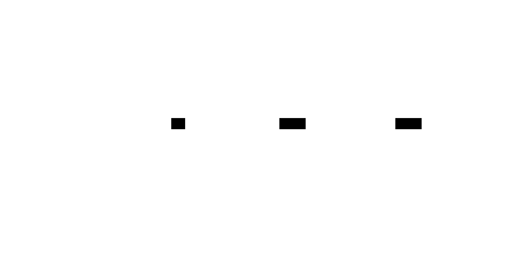
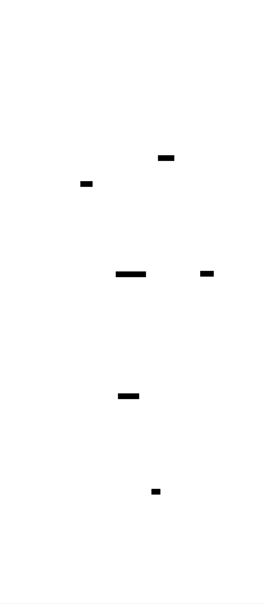
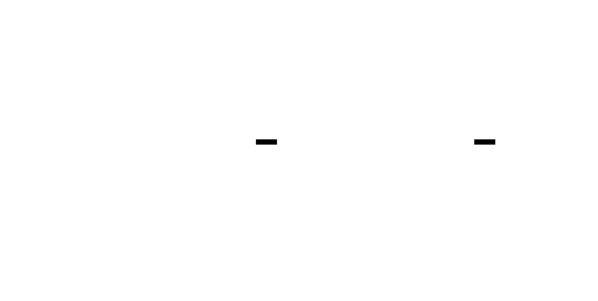
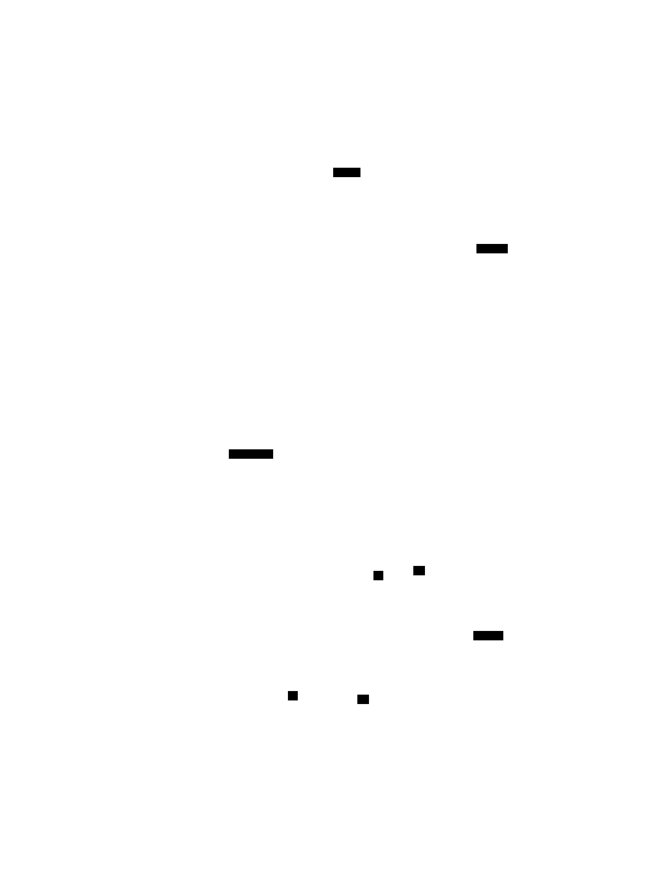

# Bytecode Virtual Machine: Design Document


## Overview

This document outlines the design of a stack-based virtual machine (VM) that interprets and executes a custom bytecode instruction set. The key architectural challenge is designing a simple yet extensible execution model that correctly manages program state (stack, frames, instruction pointer) and control flow, providing a foundational learning experience in low-level program execution.


> This guide is meant to help you understand the big picture before diving into each milestone. Refer back to it whenever you need context on how components connect.


## Context and Problem Statement
> **Milestone(s):** This foundational section underpins the design principles for all subsequent milestones. It establishes the core problem space and the rationale for choosing a stack-based virtual machine architecture.

### Mental Model: The Toy Factory
Imagine a single worker in a toy factory, tasked with assembling a complex toy. The worker doesn't have the full blueprint in their head. Instead, they stand at a workstation with a stack of trays and a set of tools. They are given a long, continuous punch card that is fed through a reader, one column at a time. Each column of the punch card has a pattern of holes. The first hole in the column indicates the *operation* to perform: "take a red block," "attach wheel," "paint," etc. Subsequent holes in the same column might provide *data* for that operation, like "from bin number 5."

The worker's job is a simple, repetitive cycle:
1.  **Fetch:** Look at the next column of the punch card coming out of the reader.
2.  **Decode:** Identify the pattern of holes to determine which operation is requested and what data it needs.
3.  **Execute:** Perform that operation. This might involve taking a part from a labeled bin (a constant pool), combining two parts from the top of the tray stack, or even jumping to a different column on the punch card to skip or repeat steps.

The **punch card** is the program—a sequence of simple, encoded instructions. The **stack of trays** is the worker's immediate workspace, ideal for holding intermediate results (like a partially assembled toy sub-component). The **bins of parts** are a pool of constants the instructions can reference. The worker's **cycle** is the unending fetch-decode-execute loop.

This is the precise mental model for our virtual machine. The punch card is our **bytecode chunk**, a stream of bytes. The holes in each column correspond to an **opcode** and its **operands**. The tray stack is our **operand stack**, a last-in, first-out data structure for temporary values. The worker's cycle is our **VM loop**. Building this model teaches the fundamental principle of how a CPU core executes instructions, abstracted into a clean, software-defined environment.

### The Core Problem: Software Execution
At its heart, a computer program is a sequence of operations that manipulate data to produce a desired outcome. The physical CPU is hardware designed to execute a specific set of instructions (like x86 or ARM). Our challenge is to create a *software simulation* of such a CPU—a **Virtual Machine (VM)**—that can execute programs defined in our own custom instruction set, independent of the host machine's native capabilities.

Why build a VM? For this project, the primary goals are **education** and **control**:
1.  **Understand Execution at a Low Level:** By building the machine that runs the program, you learn how program state (variables, control flow) is managed, how instructions are sequenced, and how functions call and return. It demystifies what "running a program" actually means.
2.  **Define a Portable Runtime Environment:** The VM provides a layer of abstraction. A program compiled to our bytecode can run anywhere the VM is implemented (in C, Rust, Go, etc.), without modification for different operating systems or CPU architectures.
3.  **Create a Sandbox for Safe Execution:** The VM has complete control. It can enforce rules, limit resource usage (prevent infinite loops, stack overflows), and cleanly report errors—something a native executable running directly on hardware cannot easily do.

The core problem, therefore, is to design a minimal but complete software CPU that can correctly interpret a stream of bytecode instructions, manage memory for computation (the stack), alter control flow (jumps), and isolate different function contexts (frames).

### Existing Approaches
There are several established models for executing code. Choosing the right one is a fundamental architectural decision. The table below compares three common approaches relevant to language implementation.

| Approach | How It Works | Pros | Cons | Best For |
| :--- | :--- | :--- | :--- | :--- |
| **Tree-Walk Interpreter** | Directly traverses the Abstract Syntax Tree (AST) generated by the parser. Each node in the tree has an `evaluate()` method that recursively evaluates its children. | • **Simple to implement** – mirrors the language's grammar closely.<br>• **Requires no intermediate compilation** – runs source code directly. | • **Very slow** – involves traversing a pointer-heavy tree structure for every operation.<br>• **Poor locality** – tree nodes are scattered in memory.<br>• **Hard to optimize** – each evaluation incurs function call overhead. | Prototyping, educational tools for parsing/ast, very simple domain-specific languages. |
| **Stack-Based Virtual Machine** | Compiles the program to a linear sequence of bytecode instructions. A VM with an operand stack executes these instructions. Operations pop their arguments from the stack and push results back onto it. | • **Denser, linear code** – better memory locality than a tree.<br>• **Simple instruction set** – most instructions are very simple (push, pop, add).<br>• **Smaller compiled code** – instructions are compact.<br>• **Easier to generate bytecode** – no need to allocate registers. | • **More instructions per operation** – e.g., `a + b + c` requires multiple pushes and adds.<br>• **Theoretical performance limit** – more memory accesses (stack pushes/pops) than an optimal register-based program. | Learning about VMs, portable runtimes (Java JVM, .NET CLR), and languages prioritizing simplicity and portability. |
| **Register-Based Virtual Machine** | Compiles to bytecode where instructions can directly reference virtual register slots for operands and results, similar to a real CPU. An instruction might be `ADD R1, R2, R3` (add R2 and R3, store result in R1). | • **Fewer instructions per program** – one instruction can handle multiple operands.<br>• **Closer to hardware models** – maps well to modern CPUs with many registers.<br>• **Potentially faster** – fewer instructions to decode and dispatch, less stack manipulation. | • **More complex instruction encoding** – needs to specify register numbers, leading to larger individual instructions.<br>• **More complex compiler** – must perform register allocation, a non-trivial optimization problem. | Performance-critical VMs (Lua 5.0+, Dalvik (Android)), where compiler complexity is justified by runtime speed. |

> **Decision: Choosing a Stack-Based VM**
> - **Context**: We need an execution model that is educational, simple to implement, and forms a solid foundation for understanding VM concepts. The primary constraints are the intermediate difficulty level and the goal of learning about instruction sets and execution models.
> - **Options Considered**:
>     1.  **Tree-Walk Interpreter**: Simplest to get started, but bypasses the core learning goals about bytecode and low-level execution.
>     2.  **Stack-Based VM**: Requires designing an instruction set and implementing a fetch-decode-execute loop, directly aligning with our milestones.
>     3.  **Register-Based VM**: More efficient but adds significant complexity in bytecode design (register allocation) which is a distraction at this stage.
> - **Decision**: Implement a **stack-based virtual machine**.
> - **Rationale**:
>     1.  **Educational Value**: It perfectly illustrates the fetch-decode-execute cycle, operand stack management, and control flow—core concepts of CPU design.
>     2.  **Implementation Simplicity**: The instruction set is trivial to encode (just opcodes and occasional operands). The compiler (when built later) doesn't need to solve register allocation.
>     3.  **Foundation for Further Study**: Stack-based VMs are widely used (JVM, CPython). Understanding them provides direct insight into many real-world systems.
> - **Consequences**:
>     - **Positive**: We will build a clean, understandable VM that clearly separates compilation (bytecode generation) from execution.
>     - **Negative**: The emitted bytecode will contain more instructions and stack manipulation overhead than an optimal register-based equivalent. This is an acceptable trade-off for clarity.

### Implementation Guidance

This section is purely conceptual and establishes the "why" behind the project. No implementation code is required here. The subsequent sections will delve into the detailed design and provide starter code for each component.

The recommended language for implementation is **C**, as specified. This choice aligns with the low-level nature of a VM, providing direct exposure to memory management and pointers, which are central to understanding the machine's operation.

**Recommended Initial File Structure:**
Before writing code, set up a logical module structure. This promotes separation of concerns and makes the codebase easier to navigate.

```
bytecode-vm/
├── include/                 # Public header files
│   ├── vm.h                # Main VM public API
│   └── chunk.h             # Bytecode chunk API
├── src/                    # Source files
│   ├── vm.c                # VM core implementation (execution loop, stack)
│   ├── chunk.c             # Bytecode chunk implementation (dynamic arrays)
│   ├── debug.c             # Disassembler and debugging utilities
│   └── memory.c            # Optional: memory management helpers
└── test/                   # Test programs
    ├── test_chunk.c        # Unit tests for the chunk module
    └── test_vm.c           # Unit tests for the VM core
```

**Technology Recommendations Table:**
| Component | Simple Option (Recommended) | Advanced Option (Future Extension) |
| :--- | :--- | :--- |
| **Bytecode Storage** | Dynamic array of `uint8_t` (manual `realloc`) | Arena allocator for whole chunks |
| **Value Representation** | Tagged union (`enum Type { VAL_NUMBER, VAL_BOOL, VAL_NIL }`) | NaN-boxing for compact storage |
| **Constant Pool** | Dynamic array of `Value` | Hash table for string interning |
| **Execution Loop** | `switch` statement on opcode in a `while` loop | Direct threaded code or computed `goto` for speed |

**Language-Specific Hint for C:**
- Use `typedef` to create clear type names like `Byte` for `uint8_t` and `Value` for your tagged union.
- Design your dynamic array utility (for the chunk's byte array and constant pool) as a reusable struct with `capacity`, `count`, and `items` fields. This pattern will be used repeatedly.
- Be meticulous about memory ownership. Document which functions allocate (`malloc`) and which merely use or free memory.

---


## Goals and Non-Goals

> **Milestone(s):** 1, 2, 3, 4 (all)

This section explicitly defines the project's scope—what capabilities the virtual machine must implement and what features are intentionally excluded. A well-defined scope prevents **scope creep** (where a project grows uncontrollably) and ensures the VM remains an **intermediate-level learning project** focused on core execution concepts rather than production-ready features. Think of building a **minimum viable calculator** before attempting a full scientific graphing calculator—we implement the essential arithmetic, memory, and basic functions first, leaving advanced features like graphing or symbolic math for future iterations.

### Goals

The following capabilities **must be implemented** to successfully complete the project. Each goal aligns with one of the four milestones, building a complete stack-based VM from instruction encoding to function calls.

| Goal Category | Specific Capability | Description | Aligned Milestone |
| :--- | :--- | :--- | :--- |
| **Instruction Set & Encoding** | Define a complete opcode enumeration | Create an `enum` or set of named constants for all supported bytecode operations, covering arithmetic (`OP_ADD`, `OP_SUBTRACT`), comparisons (`OP_EQUAL`, `OP_GREATER`), data movement (`OP_CONSTANT`, `OP_GET_LOCAL`, `OP_SET_LOCAL`), control flow (`OP_JUMP`, `OP_JUMP_IF_FALSE`), and function management (`OP_CALL`, `OP_RETURN`). Must include `OP_HALT` to stop execution. | Milestone 1 |
| | Design a variable-length bytecode instruction format | Each instruction consists of a **1-byte opcode** followed by zero or more **operand bytes**. Operands encode constant indices (1 byte), local variable slot indices (1 byte), or jump offsets (2 bytes, signed). The format must be documented and consistently parsed. | Milestone 1 |
| | Implement a bytecode chunk container | The `Chunk` struct holds a dynamic array of instruction bytes and a separate dynamic array of `Value` constants (the **constant pool**). It provides functions to append instructions and constants, and to read back encoded data. | Milestone 1 |
| | Build a disassembler for debugging | A function that takes a `Chunk` and prints a human-readable listing of each instruction, showing its byte offset, opcode name, and decoded operands (e.g., `0005 OP_CONSTANT     index: 3 → value: 42`). | Milestone 1 |
| **Execution Engine** | Implement the operand stack | A last-in, first-out stack of `Value` structures, with operations `push(value)` and `pop()`. The stack must be bounded (to detect overflow) and must not underflow (pop when empty). The `VM` struct owns this stack. | Milestone 2 |
| | Implement the fetch-decode-execute cycle | The main VM loop: 1. Fetch the next opcode from the current `Chunk` at the instruction pointer (IP). 2. Decode the opcode (via a switch statement). 3. Execute the corresponding handler function, which may manipulate the operand stack and IP. The loop continues until `OP_HALT` or a runtime error. | Milestone 2 |
| | Execute arithmetic and comparison instructions | Handlers for `OP_ADD`, `OP_SUBTRACT`, `OP_MULTIPLY`, `OP_DIVIDE`, `OP_NEGATE` that pop operand(s), perform the operation, and push the result. Comparison instructions (`OP_EQUAL`, `OP_GREATER`, `OP_LESS`) pop two values, compare them, and push a boolean `Value`. | Milestone 2 |
| **Control Flow** | Implement unconditional jumps | `OP_JUMP` reads a 2-byte signed offset operand, then adds that offset to the current IP, causing execution to continue at the new byte position within the same chunk. Used for loops and skipping code blocks. | Milestone 3 |
| | Implement conditional jumps | `OP_JUMP_IF_FALSE` pops the top stack value; if the value is **false** (boolean false or nil), it applies the offset jump; otherwise, execution continues to the next instruction. Used for `if` statements and loop conditions. | Milestone 3 |
| | Validate jump targets | Before performing any jump, the VM must verify that the target offset (current IP + offset) lies within the bounds of the chunk's instruction array. An invalid target triggers a runtime error. | Milestone 3 |
| | Support loop back-edges | A negative jump offset moves the IP backward, enabling repeated execution of a loop body. The VM must correctly handle this without infinite loops (assuming the loop condition eventually becomes false). | Milestone 3 |
| **Functions & State** | Implement local variable storage | Each function call has a set of local variable slots indexed from 0. `OP_GET_LOCAL <slot>` pushes the value from that slot onto the stack; `OP_SET_LOCAL <slot>` pops the top stack value and stores it in the slot. | Milestone 4 |
| | Implement call frames | A `CallFrame` struct tracks the execution state for one active function: a pointer to its `Chunk`, the IP within that chunk, and a **frame pointer** (stack index where its locals begin). The VM maintains a stack of frames, with the topmost frame being the currently executing function. | Milestone 4 |
| | Implement function call instruction | `OP_CALL` expects the number of arguments on the stack (arguments are already pushed by the caller). It creates a new `CallFrame`, initializes its local slots (arguments become locals 0..n-1), sets the IP to the function's entry point, and pushes the frame onto the frame stack. | Milestone 4 |
| | Implement return instruction | `OP_RETURN` pops the current frame from the frame stack, restores the caller's IP and frame pointer, and pushes the function's return value (the top of the operand stack before returning) onto the **now-current** operand stack (the caller's stack). | Milestone 4 |
| **Overall System** | Correctly execute complete programs | The fully assembled VM must execute bytecode sequences that include arithmetic, conditionals, loops, and function calls, producing the expected final result on the stack. | All Milestones |

> **Key Insight:** These goals are **minimal and sequential**—each milestone builds directly upon the previous one. You cannot implement function calls (Milestone 4) without a working operand stack (Milestone 2) and control flow (Milestone 3). This dependency graph ensures foundational concepts are solid before layering complexity.

### Non-Goals

The following features are **explicitly out of scope** for this intermediate learning project. Including them would shift focus from core execution mechanics to advanced topics better suited for follow-on projects.

| Non-Goal Category | Specific Feature | Reason for Exclusion | Potential Future Extension |
| :--- | :--- | :--- | :--- |
| **Memory Management** | Garbage collection | The VM only handles primitive `Value` types (numbers, booleans, nil) stored by value on the stack. There are no heap-allocated objects or reference cycles to collect. Adding a garbage collector would introduce significant complexity unrelated to the core execution model. | Extend `Value` to support strings, arrays, or user-defined objects, then implement mark-and-sweep or reference counting GC. |
| **Performance Optimization** | Just-In-Time (JIT) compilation | The VM is a straightforward **interpreter** that executes bytecode instruction by instruction. JIT compilation involves translating bytecode to native machine code at runtime, which is an advanced topic requiring deep understanding of compiler backends and platform-specific assembly. | Add a tiered execution model where hot loops are identified and compiled to native code using a lightweight JIT like libjit or Cranelift. |
| **Complex Type System** | Strings, arrays, structures, or user-defined types | The `Value` tagged union supports only numbers, booleans, and nil. Adding string manipulation, arrays, or custom structs would require designing a type system, memory layout, and associated instructions (concatenation, indexing, member access), which distracts from the VM's core loop and stack management. | Introduce a `Value` variant for `OBJ` pointing to a heap-allocated object header with type tag and fields. Add corresponding `OP_CREATE_ARRAY`, `OP_GET_PROPERTY` instructions. |
| **Error Recovery** | Exception handling with try/catch | The VM detects runtime errors (stack overflow, invalid jump) and halts with an error message. It does not support throwing and catching exceptions, resumable error recovery, or stack unwinding. Exception handling is a complex control-flow mechanism that would require significant extension to the frame and stack management. | Add `OP_THROW` and `OP_CATCH` instructions, and an exception stack separate from the operand stack, similar to setjmp/longjmp. |
| **Concurrency** | Multithreading or coroutines | The VM is single-threaded with a single call frame stack and operand stack. Concurrent execution would require multiple stacks, synchronization, and possibly an actor model or shared memory with locks—all advanced topics beyond the scope of a first VM. | Add `OP_FORK` to spawn a new VM thread with shared memory, or `OP_YIELD` for coroutine-style cooperative multitasking. |
| **Debugging Infrastructure** | Breakpoints, step execution, watchpoints | While a disassembler (Milestone 1) is required, a full interactive debugger is not. Implementing breakpoints would require modifying the fetch-decode-execute loop to check for debug events, which is a valuable but separate project. | Add a debug server that listens on a socket, accepts commands (break, continue, step), and can inspect/modify VM state. |
| **Standard Library** | Built-in functions (I/O, math, time) | The VM's `OP_CALL` only calls user-defined functions encoded in bytecode. There is no mechanism to call native C functions (like `print()` or `sqrt()`). Adding a native function interface (FFI) would require designing a calling convention and argument marshaling. | Define a `NATIVE_FUNCTION` type in the constant pool and an `OP_CALL_NATIVE` instruction that invokes a C function pointer with arguments popped from the stack. |
| **Module System** | Multiple chunks/linking, imports | All bytecode resides in a single `Chunk`. There is no support for loading multiple chunks, resolving cross-chunk references, or separate compilation. A module system involves symbol tables and relocation, which are more relevant to compiler design. | Extend `Chunk` to have an imports table and an `OP_IMPORT` instruction that loads and links another chunk at runtime. |
| **Optimizations** | Constant folding, register allocation, peephole optimization | The VM executes bytecode as given; it does not perform any transformations or optimizations on the instruction stream. Such optimizations are typically done by a compiler frontend before generating bytecode. | Add an optimization pass that walks the chunk and replaces sequences like `OP_CONSTANT 1; OP_CONSTANT 2; OP_ADD` with `OP_CONSTANT 3`. |
| **Persistent Storage** | Serializing/deserializing bytecode to disk | The VM operates on in-memory `Chunk` structures built programmatically (via API calls). There is no file format for saving/loading bytecode programs. Defining a binary format with versioning and checksums is a separate design challenge. | Design a `.bc` file format header and add `Chunk` serialization/deserialization functions. |

> **Design Principle:** **YAGNI (You Ain't Gonna Need It).** Each non-goal represents a feature that, while potentially useful, is not required to learn the fundamental concepts of a stack-based VM. By excluding them, we keep the project focused, achievable, and pedagogically effective. Learners can later extend the VM with these features as independent projects, applying the solid foundation built here.

---


## High-Level Architecture

> **Milestone(s):** 1, 2, 3, 4 (all)  
> This architectural overview establishes the structural foundation for the entire virtual machine. The component relationships defined here will be referenced and expanded upon in every subsequent milestone's design.

At its core, our virtual machine is a self-contained software simulation of a CPU. Its primary job is to load a sequence of instructions (**bytecode**), interpret each one, and update its internal state accordingly until the program halts. To understand how the VM functions as a cohesive system, we must first break it down into its fundamental, interacting parts.

Think of the VM as a **miniature computer within your computer**. It has its own **memory** (the constant pool and operand stack), its own **instruction decoder** (the main execution loop), its own **program counter** (the instruction pointer), and its own **call stack** for managing functions. The high-level architecture orchestrates these components to mimic the fetch-decode-execute cycle of a physical CPU.



### Component Overview

The VM's design centers on four primary data structures: the `VM`, the `Chunk`, the operand **Stack**, and the `CallFrame`. Each manages a distinct aspect of execution state and has clear responsibilities.

| Component | Responsibility | Key Data Held | Lifespan |
| :--- | :--- | :--- | :--- |
| **`VM` (Virtual Machine)** | The central execution engine. It orchestrates the fetch-decode-execute cycle, manages runtime state, and holds references to the core execution stacks. | `operand_stack` (Value array), `frames` (CallFrame array), `ip` (instruction pointer), `state` (enum). | Created at program start, persists for the entire execution session, destroyed at shutdown. |
| **`Chunk` (Bytecode Chunk)** | The **immutable program code**. It stores the sequence of bytecode instructions and the associated constant values (like numbers and strings) that the instructions reference. | `code` (dynamic Byte array), `constants` (dynamic Value array). | Loaded before execution (either from a compiler or a file). It is read-only during VM execution. |
| **Operand Stack** (within `VM`) | The **scratchpad for calculations**. Instructions pop operands from here, compute results, and push results back. It facilitates all arithmetic, comparisons, and temporary value storage. | A contiguous array of `Value` objects, managed as a LIFO stack. | Grows and shrinks dynamically during instruction execution. Lives inside the `VM` struct. |
| **`CallFrame`** (within `VM`) | An **activation record** for a single function invocation. It tracks where a function's code is (`chunk` and `ip`) and where its local variables live on the stack (`fp`). | `chunk` (pointer), `ip` (instruction pointer), `fp` (frame pointer / stack index). | Pushed when a function is called (`OP_CALL`), popped when it returns (`OP_RETURN`). Multiple frames form a stack. |

**The `VM` struct is the beating heart.** It contains the runtime mutable state. The `operand_stack` is a single, growing-and-shrinking array of `Value` objects. The `frames` array is a stack of `CallFrame` structs, with the currently executing function's frame always on top. The `ip` (instruction pointer) is actually stored within the topmost `CallFrame`; the `VM` struct's `ip` field is often a convenience pointer to that location.

**The `Chunk` is the read-only code repository.** It is separate from the VM state because multiple VMs could, in principle, execute the same chunk (though our design uses one). The `code` array is a stream of bytes where each instruction starts with an opcode and may be followed by operand bytes. The `constants` array holds all literal values (e.g., `3.14`, `"hello"`) that instructions like `OP_CONSTANT` load onto the stack.

**The operand stack and call frames share an intimate relationship.** While they are logically distinct—the operand stack is for temporary values, and frames manage function state—they are stored in the same `Value` array for efficiency. A frame's `fp` (frame pointer) is an index into the `operand_stack` array that marks the beginning of that function's local variable slots. The values *above* `fp` on the stack are the function's locals and temporary calculation results. This unified memory layout is a key architectural decision.

**Data Flow During Execution:**
1.  **Initialization:** The VM is initialized with an empty operand stack and a single call frame (for the "main" script).
2.  **Load Code:** A `Chunk` containing bytecode is attached to the initial call frame.
3.  **Cycle Begins:** The VM's main loop fetches the opcode at the `ip` in the topmost frame's chunk.
4.  **Decode & Execute:** The opcode is dispatched to a handler function. This handler may:
    *   **Read operands:** Read subsequent bytes from the `chunk->code` array (e.g., a constant index, a jump offset).
    *   **Manipulate the stack:** Pop `Value`(s) from the `operand_stack`, compute, and push results.
    *   **Manage control flow:** Update the `ip` to perform a jump, or push/popp `CallFrame`s on the `frames` stack for function calls/returns.
5.  **State Update:** The VM's `state` is checked (e.g., `HALT` encountered, stack overflow). The loop repeats until execution completes.

> **Architectural Insight:** The separation of the immutable `Chunk` from the mutable `VM` state is a form of **code/data separation**. It allows for potential future extensions like sharing compiled chunks between multiple VM instances or serializing compiled code to disk.

### Recommended File Structure

Organizing the code into logical modules is crucial for maintainability and clarity. We recommend a structure that groups related types and functions, mirroring the component breakdown. The following table maps each architectural component to its primary C source and header files.

| Module / Responsibility | Header File (`*.h`) | Implementation File (`*.c`) | Key Contents |
| :--- | :--- | :--- | :--- |
| **Common Types & Macros** | `common.h` | (Not applicable) | Universal typedefs (`Byte`, `Value` type), boolean constants, utility macros (e.g., `DEBUG_TRACE_EXECUTION`). |
| **Bytecode Chunk & Constants** | `chunk.h` | `chunk.c` | `Chunk` struct, functions to initialize/free chunks, write bytes/constants to a chunk, and the disassembler (`disassembleChunk`). |
| **Virtual Machine Core** | `vm.h` | `vm.c` | `VM` and `CallFrame` structs, VM lifecycle functions (`initVM`, `freeVM`, `interpret`), the main execution loop (`run`), and handler functions for *all* opcodes. |
| **Value Stack Operations** | `vm.h` (with `VM`) | `vm.c` | Helper functions for manipulating the `operand_stack` array (`push`, `pop`, `peek`). These are `static` helpers within `vm.c`. |
| **Memory Management Utilities** | `memory.h` | `memory.c` | Reusable dynamic array implementation (`Array` macro/functions), and any future garbage collection or allocation profiling. |
| **Main Program / CLI** | (Not applicable) | `main.c` | The `main()` function, handles command-line arguments, loads bytecode (for now, perhaps a hardcoded test chunk), and calls `interpret`. |

This results in the following project directory layout:

```
bytecode-vm-project/
├── include/                    # Optional: for a more structured include path
│   └── common.h
├── src/
│   ├── main.c                 # CLI entry point
│   ├── common.h               # Shared types & constants
│   ├── memory.h
│   ├── memory.c               # Dynamic array utility
│   ├── chunk.h
│   ├── chunk.c                # Bytecode chunk management
│   ├── vm.h
│   └── vm.c                   # VM core implementation
├── test/                      # (Optional) Test programs
│   └── test_chunk.c
└── Makefile                   # Build configuration
```

**Module Dependencies:**
*   `vm.c` depends on `vm.h`, `chunk.h`, `common.h`, and `memory.h`. It is the central integration point.
*   `chunk.c` depends on `chunk.h`, `common.h`, and `memory.h` (for its dynamic arrays).
*   `main.c` depends on `common.h`, `chunk.h`, and `vm.h`.
*   `memory.c` is a low-level utility with minimal dependencies (`common.h` and standard library).

This structure provides a clean separation of concerns. The `chunk` module knows nothing about execution. The `vm` module knows about chunks and values but delegates low-level memory growth to the `memory` module. Adding new features (like a compiler or native functions) would involve creating new modules (e.g., `compiler.h/c`, `native.h/c`) that integrate with this core.

### Implementation Guidance

This section provides concrete, ready-to-use starter code for the foundational infrastructure and skeletal outlines for the core logic you will implement. We use **C** as the primary language.

**A. Technology Recommendations Table**

| Component | Simple Option (Recommended) | Advanced Option (Future Extension) |
| :--- | :--- | :--- |
| **Dynamic Arrays** | Custom macro-based `Array` type with manual `realloc` management. | Use a pre-existing library (e.g., `stb_ds.h` or a custom generic container library). |
| **Value Representation** | Tagged union (`struct` with a `type` enum and a `union`). | NaN-boxing for more compact representation and type tagging in a single `uint64_t`. |
| **Execution Loop** | Simple `for(;;)` loop with a `switch(opcode)` dispatch. | Direct-threaded or computed goto dispatch for higher performance. |
| **Stack Storage** | Contiguous `Value` array with a top index, resized as needed. | Pre-allocated fixed-size stack with overflow checking; allows for simpler code. |

**B. Recommended File/Module Structure**

For the initial setup, create the files as shown in the directory tree above. Start with `common.h` and `memory.h/c` to build the utility foundation before tackling `chunk` or `vm`.

**C. Infrastructure Starter Code**

The following **complete, working code** provides a reusable dynamic array utility. This is not the core learning goal but is a prerequisite for managing growable arrays in `Chunk` (for code and constants) and potentially elsewhere. Place this in `memory.h` and `memory.c`.

**File: `memory.h`**
```c
#ifndef clox_memory_h
#define clox_memory_h

#include "common.h"
#include <stdlib.h>

// Macro to define and initialize a dynamic array of a given type.
// Usage: Array(Value) constants;
//        constants.count = 0; constants.capacity = 0; constants.data = NULL;
#define Array(type) struct { \
    int count; \
    int capacity; \
    type* data; \
}

// Function to manage the capacity of a dynamic array.
// Usage: ensureArrayCapacity((void**)&array.data, &array.count,
//                            &array.capacity, sizeof(array.data[0]));
void ensureArrayCapacity(void** data, int* count, int* capacity,
                         size_t elementSize);

// Macro wrapper for the above function for type safety and convenience.
#define ENSURE_ARRAY_CAPACITY(array, minCapacity) \
    ensureArrayCapacity((void**)&(array).data, &(array).count, \
                        &(array).capacity, sizeof((array).data[0]))

// Frees the underlying data array and resets the struct fields.
#define FREE_ARRAY(array) \
    do { \
        free((array).data); \
        (array).data = NULL; \
        (array).count = (array).capacity = 0; \
    } while (0)

#endif
```

**File: `memory.c`**
```c
#include "memory.h"

// Grows the array's capacity geometrically to accommodate at least one more element.
// If the array is NULL, it allocates initial capacity (typically 8).
void ensureArrayCapacity(void** data, int* count, int* capacity,
                         size_t elementSize) {
    if (*count + 1 > *capacity) {
        int newCapacity = (*capacity < 8) ? 8 : (*capacity * 2);
        void* newData = realloc(*data, newCapacity * elementSize);
        if (newData == NULL) {
            // In a real implementation, you might want a more robust error handler.
            exit(EXIT_FAILURE);
        }
        *data = newData;
        *capacity = newCapacity;
    }
}
```

**D. Core Logic Skeleton Code**

Below is the skeletal structure for the central `VM` type and its initialization. This code defines the data structures and stubs out the primary functions you will fill in across milestones. Place this in `vm.h` and `vm.c`.

**File: `vm.h`**
```c
#ifndef clox_vm_h
#define clox_vm_h

#include "chunk.h"
#include "common.h"
#include "value.h"

// Maximum depth of the call frame stack. Limits recursion.
#define FRAMES_MAX 64
// Initial capacity of the operand stack. Will grow if needed.
#define STACK_INITIAL_CAPACITY 256

// The activation record for a single function call.
typedef struct {
    Chunk* chunk;      // Pointer to the bytecode chunk this function executes.
    uint8_t* ip;       // Instruction Pointer: points to next instruction in chunk->code.
    Value* fp;         // Frame Pointer: points into VM.stack at the first local variable.
} CallFrame;

// The virtual machine state.
typedef struct {
    // Operand Stack: grows upward.
    Value stack[STACK_INITIAL_CAPACITY]; // In a more advanced version, this would be dynamic.
    Value* stackTop;                     // Pointer to just past the topmost value (next free slot).

    // Call Frame Stack: grows upward.
    CallFrame frames[FRAMES_MAX];
    int frameCount;                      // Number of active call frames.

    // Overall VM state.
    InterpretResult state;               // e.g., INTERPRET_OK, INTERPRET_RUNTIME_ERROR
} VM;

// Public API
void initVM(VM* vm);
void freeVM(VM* vm);
InterpretResult interpret(VM* vm, Chunk* chunk);

// Stack manipulation helpers (to be implemented in vm.c)
void push(VM* vm, Value value);
Value pop(VM* vm);
Value peek(VM* vm, int distance);

#endif
```

**File: `vm.c`**
```c
#include "vm.h"
#include <stdio.h>

// Initialize the VM to a clean state.
void initVM(VM* vm) {
    // TODO 1: Set stackTop to point to the beginning of the stack array.
    // TODO 2: Initialize frameCount to 0.
    // TODO 3: Set the VM state to INTERPRET_OK.
    // TODO 4: (Later) Initialize any other fields (e.g., for garbage collection).
}

// Free any resources owned by the VM.
void freeVM(VM* vm) {
    // TODO 1: (Later) Free any dynamically allocated memory (e.g., strings, objects).
}

// Main entry point: interpret a given chunk of bytecode.
InterpretResult interpret(VM* vm, Chunk* chunk) {
    // TODO 1: Set up the initial call frame.
    //   - Point the frame's chunk to the provided chunk.
    //   - Set the frame's ip to the start of chunk->code.
    //   - Set the frame's fp to vm->stackTop (no locals initially).
    // TODO 2: Call the internal run(vm) function to start execution.
    // TODO 3: Return the final state of the VM (e.g., INTERPRET_OK, INTERPRET_RUNTIME_ERROR).
    return INTERPRET_OK;
}

// The core execution loop. This function will be called by interpret().
static InterpretResult run(VM* vm) {
    // TODO 1: Start a loop that continues until the VM state is not INTERPRET_OK.
    // TODO 2: Fetch the current opcode from the ip of the topmost call frame.
    // TODO 3: Increment the ip to point past the opcode.
    // TODO 4: Use a switch statement to dispatch to the handler for each opcode.
    // TODO 5: Implement handlers for at least OP_CONSTANT, OP_ADD, OP_HALT.
    // TODO 6: In each handler, perform the necessary stack operations and IP updates.
    // TODO 7: Handle runtime errors (e.g., stack overflow, unknown opcode).
    return INTERPRET_OK;
}

// Push a value onto the operand stack.
void push(VM* vm, Value value) {
    // TODO 1: Check for stack overflow (stackTop must not exceed stack bounds).
    // TODO 2: Write the value to *stackTop.
    // TODO 3: Increment stackTop.
}

// Pop a value from the operand stack.
Value pop(VM* vm) {
    // TODO 1: Check for stack underflow (stackTop must be > stack base).
    // TODO 2: Decrement stackTop.
    // TODO 3: Return the value now pointed to by stackTop.
    Value dummy = {0};
    return dummy;
}

// Peek at a value a certain distance from the top of the stack (0 = top).
Value peek(VM* vm, int distance) {
    // TODO 1: Calculate pointer to the desired value (stackTop - 1 - distance).
    // TODO 2: Ensure the pointer is within valid stack bounds.
    // TODO 3: Return the value at that location.
    Value dummy = {0};
    return dummy;
}
```

**E. Language-Specific Hints (C)**
*   **Memory Management:** Use `realloc` for growing arrays. Always check its return value for `NULL`.
*   **Pointer Arithmetic:** The `ip` is a `Byte*` (or `uint8_t*`). Fetching an opcode is `uint8_t instruction = *vm->ip++;`. Fetching a 16-bit jump offset may require reading two bytes: `uint16_t offset = (vm->ip[0] << 8) | vm->ip[1]; vm->ip += 2;`.
*   **Stack Representation:** The `stackTop` pointer should always point to the *next free slot*. This means `stackTop - 1` is the topmost value. This convention simplifies `push` and `pop`.
*   **Frame Pointer:** The `fp` is a `Value*` pointing into the `VM.stack` array. Local variable `n` is accessed as `fp[n]`. The stack area for temporaries is above the locals.

**F. Milestone Checkpoint**
After implementing the basic structure from `vm.h` and `vm.c` above (along with the necessary `chunk` and `value` modules), you should be able to compile a simple test program. A successful compile with no linker errors indicates the foundational types and function signatures are correctly in place.

```bash
# Example compilation command (adjust paths as needed)
gcc -std=c99 -Isrc src/memory.c src/chunk.c src/value.c src/vm.c src/main.c -o vm
```

The program may not execute meaningful bytecode yet, but it should build without errors, setting the stage for implementing the execution loop in Milestone 2.


## Data Model

> **Milestone(s):** 1, 2, 3, 4 (all)
> 
> This section defines the foundational data structures that constitute the virtual machine's memory model and runtime state. These types collectively represent the complete state of a program's execution—from the bytecode instructions being interpreted to the values on the stack and the activation records of function calls. The relationships between these structures mirror the layered nature of program execution, where the `Chunk` contains the static program code, the `VM` manages the dynamic runtime environment, and `CallFrame` instances track the state of each active function invocation. Getting these data structures right is critical, as they form the skeleton upon which all execution logic hangs.

### The Value Type

Think of a **Value** as a universal container that can hold any type of data the virtual machine understands—like a multi-purpose toolbox compartment that can store either a wrench (number), a lightbulb (boolean), or an empty slot (nil). The VM needs this versatility because while executing a program, it must manipulate different kinds of data—performing arithmetic on numbers, evaluating boolean conditions for jumps, and representing the absence of a value. A tagged union (also called a discriminated union) is the perfect representation: a small tag indicates what's currently stored, and a reserved space holds the actual data.

The `Value` type uses a simple but effective encoding scheme:
- **Number**: A double-precision floating-point number, which can represent integers and decimals for arithmetic operations.
- **Boolean**: A simple true/false value used for logical operations and conditional jumps.
- **Nil**: A special sentinel representing "no value," useful for uninitialized variables or functions that don't return anything.

This design prioritizes simplicity and learning value. While production VMs use more sophisticated representations (like NaN boxing for memory efficiency), a straightforward tagged union is easier to understand and implement for an intermediate project. The `Value` type is the atomic unit of data that flows through the entire VM—pushed and popped on the stack, stored in local variables, and referenced from the constant pool.

**Value Structure:**

| Field Name | Type | Description |
|------------|------|-------------|
| `type` | `ValueType` (enum) | Discriminator tag indicating which union member is active. Possible values: `VAL_NUMBER`, `VAL_BOOL`, `VAL_NIL`. |
| `as` | `union` | Storage for the actual value. Only one member is valid at a time, determined by the `type` tag. |
| ↳ `number` | `double` | When `type == VAL_NUMBER`, stores a numeric value (e.g., `3.14`, `-2`, `0`). |
| ↳ `boolean` | `bool` | When `type == VAL_BOOL`, stores a truth value (`true` or `false`). |
| ↳ (none) | (none) | For `VAL_NIL`, no data storage is needed—the tag alone conveys the value. |

> **Design Insight:** The `Value` type is the fundamental data currency of the VM. Every operation consumes and produces `Value` instances. By making it a tagged union, we avoid the complexity of separate type-specific stacks or arrays, keeping the execution model uniform. The trade-off is memory overhead (each `Value` must be large enough to hold the largest type, plus a tag byte) and runtime type checking, which is acceptable for an educational VM.

### Bytecode Chunk Structure

Imagine a **Chunk** as a recipe book for a single function or script. The main text (the `code` array) is a sequence of step-by-step instructions written in a compact, machine-friendly language. At the back of the book, an appendix (the `constants` array) lists all the fixed ingredients—literal numbers like "2.5" or "true"—that the instructions refer to by index. This separation allows frequently used instructions to remain compact (just referencing an appendix entry) while keeping the constant data accessible.

The chunk is the static, immutable representation of a piece of code. It's created by a compiler (or hand-assembled for testing) and then loaded into the VM for execution. The design uses two dynamic arrays: one for instruction bytes and one for constants. This allows chunks to grow as code is generated, without imposing arbitrary limits on program size.

**Chunk Structure:**

| Field Name | Type | Description |
|------------|------|-------------|
| `code` | `Array` of `Byte` | A resizable array containing the sequence of bytecode instructions. Each instruction consists of an opcode byte followed by zero or more operand bytes. |
| `constants` | `Array` of `Value` | A resizable array holding all literal values (numbers, booleans, nil) that appear in the program. Instructions like `OP_CONSTANT` reference these by index. |

**Dynamic Array Infrastructure (`Array` macro):**
The project uses a macro-based generic dynamic array implementation to avoid code duplication. The macro generates a struct with the following fields for any type `T`:

| Field Name | Type | Description |
|------------|------|-------------|
| `count` | `int` | Number of elements currently stored in the array. |
| `capacity` | `int` | Total allocated capacity of the array (number of elements that fit before resizing). |
| `data` | `T*` | Pointer to the heap-allocated contiguous block of `T` elements. |

> **Design Insight:** Separating the constant pool from the instruction stream follows the classic "constant pool" pattern found in many bytecode formats (like Java class files). This design reduces bytecode size when the same constant is used multiple times (it's stored once, referenced many times) and simplifies instruction encoding (a 1-byte index can reference any constant). The dynamic array implementation provides flexibility while maintaining cache-friendly contiguous storage.

### VM State Structure

Picture the **VM** as the central control panel of a factory assembly line. The operand stack is a spring-loaded tray dispenser where workers temporarily place parts during assembly. The call frame stack is a pile of work orders, each representing a sub-assembly task, with the top sheet being the currently active task. The instruction pointer is the foreman's finger pointing to the next step in the current work order. This whole apparatus maintains the complete dynamic state of program execution.

The `VM` struct is the heart of the runtime. It owns all mutable execution state: the operand stack for intermediate calculations, the call frame stack for tracking function activations, and the current instruction pointer. It also tracks whether execution is proceeding normally or has entered an error state.

**VM Structure:**

| Field Name | Type | Description |
|------------|------|-------------|
| `operand_stack` | `Array` of `Value` | The operand (or "evaluation") stack. Values are pushed onto this stack by instructions like `OP_CONSTANT` and popped by instructions like `OP_ADD`. The stack grows upward (increasing indices). |
| `frames` | `Array` of `CallFrame` | The call frame stack. Each active function call (including the main script) has a frame. The top frame represents the currently executing function. |
| `ip` | `Byte*` | Instruction pointer: a pointer to the next bytecode byte to execute within the current frame's chunk. This is effectively `frames.data[frames.count-1].chunk->code.data + frames.data[frames.count-1].ip`. |
| `state` | `InterpretResult` (enum) | Current execution state. Possible values: `INTERPRET_OK` (running or successfully halted), `INTERPRET_RUNTIME_ERROR` (an error occurred, execution stopped). |

> **Design Insight:** Storing the instruction pointer (`ip`) directly in the VM (as a pointer to a byte in the `code` array) rather than as an offset within the current frame simplifies the fetch-decode-execute loop—we can increment it with simple pointer arithmetic. However, this pointer must be updated whenever we switch frames (on call/return). The `state` field provides a clean way to exit the main loop on errors or successful completion without relying on global variables.

### Call Frame Structure

Think of a **CallFrame** as a bookmark placed in a novel when you pause reading to look up a word in a dictionary. The bookmark records which page you were on (the instruction pointer) and which book you were reading (the chunk). When you return from the dictionary, you restore the bookmark and continue reading. In our VM, each function call creates a new frame/bookmark, allowing the VM to suspend one function's execution, run another, and then resume exactly where it left off.

A call frame is an **activation record**—it captures the execution context of a single function invocation. This includes where to return to (saved instruction pointer) and where the function's local variables live on the stack (frame pointer). The frame doesn't store local variables directly; instead, it points to a region of the unified `operand_stack` array.

**Call Frame Structure:**

| Field Name | Type | Description |
|------------|------|-------------|
| `chunk` | `Chunk*` | Pointer to the chunk (bytecode) of the function being executed. |
| `ip` | `int` | Instruction offset (index into `chunk->code`) of the next instruction to execute *within this frame*. This is saved when calling another function and restored upon return. |
| `fp` | `int` | Frame pointer: an index into the `operand_stack` array that points to the first slot (slot 0) of this function's local variables. All local variable accesses (`OP_GET_LOCAL`, `OP_SET_LOCAL`) are relative to this base. |

> **Design Insight:** The call frame design uses a **unified stack** approach: both temporary operands and local variables share the same `operand_stack` array. The frame pointer (`fp`) divides the stack into two regions: slots below `fp` belong to earlier frames (caller's locals and operands), while slots at and above `fp` belong to the current frame (first its parameters and locals, then temporary values pushed during execution). This design minimizes memory fragmentation and simplifies memory management—everything is in one resizable array.

### Relationships Between Structures



The data structures form a clear ownership hierarchy:

1. **VM owns everything**: The `VM` struct contains the `operand_stack` and `frames` arrays, which it allocates and frees.
2. **Frames reference chunks**: Each `CallFrame` holds a pointer to a `Chunk` (the function's bytecode). Multiple frames can point to the same chunk if a function is called recursively.
3. **Chunks own code and constants**: A `Chunk` owns two dynamic arrays: `code` (bytecode) and `constants` (values).
4. **Values flow through all structures**: `Value` instances are stored in the constant pool (`Chunk.constants`), moved onto the operand stack (`VM.operand_stack`), and accessed as local variables (via frame-relative indexing into the operand stack).

This hierarchy ensures clean memory management: when the VM is freed, it frees its stacks; chunks are freed separately when they're no longer needed (e.g., when unloading compiled code).

> **ADR: Unified Stack for Operands and Locals**
> 
> - **Context**: We need to store both temporary intermediate values (operand stack) and function-local variables. These have similar lifetimes: locals live for the duration of a function call, while temporaries live for shorter periods within that call.
> - **Options Considered**:
>   1. **Separate arrays**: Maintain distinct `operand_stack` and `locals` arrays in each `CallFrame`.
>   2. **Unified stack**: Use a single `operand_stack` array for both purposes, with frame pointers dividing it into regions.
> - **Decision**: Unified stack (single `Value` array in `VM`).
> - **Rationale**:
>   - **Simplicity**: Only one array to manage, resize, and debug.
>   - **Memory efficiency**: No pre-allocation of fixed-size local arrays; memory is allocated on demand as the stack grows.
>   - **Natural call/return semantics**: Function arguments are naturally passed by pushing them onto the caller's operand stack, then becoming the start of the callee's local variable region.
>   - **Educational value**: Demonstrates how real stack machines (like JVM, CPython) often use a unified stack.
> - **Consequences**:
>   - **Positive**: Simpler memory management, efficient argument passing, no arbitrary limits on locals or stack depth (bounded by total stack capacity).
>   - **Negative**: Local variable access requires calculating absolute stack indices (frame pointer + local index). Slightly more complex debugging (stack contains mixed locals and temporaries).

| Option | Pros | Cons | Chosen? |
|--------|------|------|---------|
| Separate arrays | Clean separation of concerns, straightforward local variable access | Memory fragmentation, fixed local array sizes or extra allocations, inefficient argument passing | ❌ |
| Unified stack | Memory efficient, natural argument passing, flexible, simple ownership | Mixed content makes debugging slightly harder, requires frame pointer arithmetic | ✅ |

### Common Pitfalls

⚠️ **Pitfall: Forgetting to initialize the Value tag**
- **Description**: Creating a `Value` and setting only the `as` union member (e.g., `value.as.number = 3.14`) without setting the `type` tag.
- **Why it's wrong**: The VM's equality comparisons, printing, and type checking rely on the tag. An uninitialized tag contains garbage, leading to incorrect type identification and crashes.
- **Fix**: Always use constructor-like helper functions (e.g., `NUMBER_VAL(3.14)`) that set both the tag and the value.

⚠️ **Pitfall: Not updating the VM's ip when switching frames**
- **Description**: When implementing function calls, updating the `CallFrame.ip` but forgetting to update the `VM.ip` pointer to point into the new frame's chunk.
- **Why it's wrong**: The fetch-decode-execute loop reads from `VM.ip`. If it still points to the old chunk, the VM will execute garbage bytes or crash.
- **Fix**: After pushing a new frame or popping a frame, recalculate `VM.ip` as `current_frame->chunk->code.data + current_frame->ip`.

⚠️ **Pitfall: Off-by-one errors in frame pointer calculation**
- **Description**: Incorrectly setting `fp` to point either before or after the first local variable slot when setting up a new call frame.
- **Why it's wrong**: Local variable access instructions use `fp + local_index`. An incorrect `fp` causes all local variable accesses to reference wrong stack slots, leading to corrupted data.
- **Fix**: When calling a function with N arguments, the frame pointer should point to the stack slot containing the *first* argument (the slot at `stack_top - N`). The arguments become the callee's locals 0 through N-1.

⚠️ **Pitfall: Not checking stack capacity before push operations**
- **Description**: Pushing values onto `operand_stack` without ensuring the dynamic array has enough capacity.
- **Why it's wrong**: Writing beyond the allocated array bounds causes heap corruption, crashes, or security vulnerabilities.
- **Fix**: Use the `ensureArrayCapacity` helper before every push, or implement a `push` function that handles growth internally.

### Implementation Guidance

**A. Technology Recommendations Table:**

| Component | Simple Option | Advanced Option |
|-----------|---------------|-----------------|
| Dynamic Array | Macro-based generic `Array` type | Separate type-specific arrays with manual memory management |
| Value Representation | Tagged union with explicit type enum | NaN boxing (encoding types in floating-point NaN space) |
| Constant Pool | Simple `Value` array with linear search for duplicates | Hash table for deduplication, constant merging |

**B. Recommended File Structure:**

```
bytecode-vm/
├── include/
│   ├── common.h           ← Common macros, Byte typedef, bool
│   ├── value.h            ← Value type definition and constructors
│   ├── chunk.h            ← Chunk structure and operations
│   ├── vm.h               ← VM structure, public API, InterpretResult
│   └── debug.h            ← Disassembler (for later milestones)
├── src/
│   ├── value.c            ← Value operations (printing, equality)
│   ├── chunk.c            ← Chunk code/constant management
│   ├── vm.c               ← VM implementation, stack, execution loop
│   ├── memory.c           ← Dynamic array utilities, allocator
│   └── main.c             ← Test harness, example programs
└── tests/
    └── test_vm.c          ← Unit tests for each component
```

**C. Infrastructure Starter Code:**

The dynamic array infrastructure is a prerequisite for nearly all components. Here's a complete, reusable implementation:

```c
// memory.h
#ifndef MEMORY_H
#define MEMORY_H

#include <stddef.h>
#include <stdlib.h>
#include <string.h>

// Macro to declare a dynamic array type for a given element type
#define DECLARE_ARRAY(Type) \
    typedef struct { \
        int count; \
        int capacity; \
        Type* data; \
    } Type##Array

// Macro to define array operations for a given type
#define DEFINE_ARRAY_OPS(Type) \
    void init##Type##Array(Type##Array* array) { \
        array->count = 0; \
        array->capacity = 0; \
        array->data = NULL; \
    } \
    void free##Type##Array(Type##Array* array) { \
        free(array->data); \
        init##Type##Array(array); \
    } \
    void write##Type##Array(Type##Array* array, Type value) { \
        if (array->count + 1 > array->capacity) { \
            int newCapacity = array->capacity == 0 ? 8 : array->capacity * 2; \
            array->data = (Type*)realloc(array->data, newCapacity * sizeof(Type)); \
            array->capacity = newCapacity; \
        } \
        array->data[array->count++] = value; \
    }

// Generic capacity check utility (used by VM for stack growth)
static inline void ensureArrayCapacity(void** data, int* count, int* capacity, 
                                       size_t elementSize, int minCapacity) {
    if (*capacity >= minCapacity) return;
    
    // Grow by factor of 2, with minimum of 8 elements
    int newCapacity = *capacity == 0 ? 8 : *capacity * 2;
    while (newCapacity < minCapacity) newCapacity *= 2;
    
    *data = realloc(*data, newCapacity * elementSize);
    *capacity = newCapacity;
}

#endif // MEMORY_H
```

```c
// common.h
#ifndef COMMON_H
#define COMMON_H

#include <stdint.h>
#include <stdbool.h>

typedef uint8_t Byte;

#endif // COMMON_H
```

**D. Core Logic Skeleton Code:**

```c
// value.h
#ifndef VALUE_H
#define VALUE_H

#include "common.h"

typedef enum {
    VAL_NUMBER,
    VAL_BOOL,
    VAL_NIL
} ValueType;

typedef struct {
    ValueType type;
    union {
        double number;
        bool boolean;
    } as;
} Value;

// Constructor macros/functions
#define NUMBER_VAL(value) ((Value){VAL_NUMBER, {.number = (value)}})
#define BOOL_VAL(value)   ((Value){VAL_BOOL, {.boolean = (value)}})
#define NIL_VAL           ((Value){VAL_NIL, {.number = 0}})

// Value type checking
#define IS_NUMBER(value)  ((value).type == VAL_NUMBER)
#define IS_BOOL(value)    ((value).type == VAL_BOOL)
#define IS_NIL(value)     ((value).type == VAL_NIL)

// Value extraction (call only after checking type!)
#define AS_NUMBER(value)  ((value).as.number)
#define AS_BOOL(value)    ((value).as.boolean)

#endif // VALUE_H
```

```c
// chunk.h
#ifndef CHUNK_H
#define CHUNK_H

#include "common.h"
#include "value.h"

// Declare dynamic array types using our macro
DECLARE_ARRAY(Byte);
DECLARE_ARRAY(Value);

typedef struct {
    ByteArray code;
    ValueArray constants;
} Chunk;

void initChunk(Chunk* chunk);
void freeChunk(Chunk* chunk);
void writeChunk(Chunk* chunk, Byte byte);
int addConstant(Chunk* chunk, Value value);

#endif // CHUNK_H
```

```c
// chunk.c
#include "chunk.h"
#include "memory.h"

// Define array operations for Byte and Value
DEFINE_ARRAY_OPS(Byte);
DEFINE_ARRAY_OPS(Value);

void initChunk(Chunk* chunk) {
    // TODO 1: Initialize the code array using initByteArray
    // TODO 2: Initialize the constants array using initValueArray
}

void freeChunk(Chunk* chunk) {
    // TODO 1: Free the code array using freeByteArray
    // TODO 2: Free the constants array using freeValueArray
    // TODO 3: Zero out the chunk structure for safety
}

void writeChunk(Chunk* chunk, Byte byte) {
    // TODO 1: Append the byte to the code array using writeByteArray
}

int addConstant(Chunk* chunk, Value value) {
    // TODO 1: Append the value to the constants array using writeValueArray
    // TODO 2: Return the index where the constant was added (count-1)
    // Note: For simplicity, we don't deduplicate constants. An advanced
    // implementation would search for existing equal values first.
}
```

```c
// vm.h
#ifndef VM_H
#define VM_H

#include "chunk.h"
#include "value.h"

// Execution result
typedef enum {
    INTERPRET_OK,
    INTERPRET_RUNTIME_ERROR
} InterpretResult;

// Call frame structure
typedef struct {
    Chunk* chunk;
    int ip;          // Instruction offset within chunk->code
    int fp;          // Frame pointer (stack index)
} CallFrame;

// Declare dynamic array types
DECLARE_ARRAY(Value);
DECLARE_ARRAY(CallFrame);

// Virtual machine structure
typedef struct {
    ValueArray operand_stack;
    CallFrameArray frames;
    Byte* ip;        // Current instruction pointer (derived from top frame)
    InterpretResult state;
} VM;

// Public API
void initVM(VM* vm);
void freeVM(VM* vm);
InterpretResult interpret(VM* vm, Chunk* chunk);

// Stack operations
void push(VM* vm, Value value);
Value pop(VM* vm);
Value peek(VM* vm, int distance);

#endif // VM_H
```

```c
// vm.c (partial - structure management only)
#include "vm.h"
#include "memory.h"

// Define array operations for Value and CallFrame
DEFINE_ARRAY_OPS(Value);
DEFINE_ARRAY_OPS(CallFrame);

void initVM(VM* vm) {
    // TODO 1: Initialize operand_stack using initValueArray
    // TODO 2: Initialize frames using initCallFrameArray
    // TODO 3: Set ip to NULL (no code loaded yet)
    // TODO 4: Set state to INTERPRET_OK
}

void freeVM(VM* vm) {
    // TODO 1: Free operand_stack using freeValueArray
    // TODO 2: Free frames using freeCallFrameArray
}

void push(VM* vm, Value value) {
    // TODO 1: Ensure operand_stack has capacity for one more element
    //         Use ensureArrayCapacity with elementSize = sizeof(Value)
    // TODO 2: Append value to operand_stack using writeValueArray
}

Value pop(VM* vm) {
    // TODO 1: Check that operand_stack is not empty (count > 0)
    // TODO 2: Decrement count and return the top value
    // TODO 3: For robustness, return NIL_VAL if stack underflow (but this
    //         should be caught earlier as a runtime error)
}

Value peek(VM* vm, int distance) {
    // TODO 1: Check that distance is within bounds (0 <= distance < count)
    // TODO 2: Return the value at position (count - 1 - distance)
    // TODO 3: Return NIL_VAL if out of bounds (should be caught earlier)
}
```

**E. Language-Specific Hints for C:**

- **Memory Management**: Use `malloc`/`realloc`/`free` for dynamic arrays. Always check for allocation failure in production code.
- **Struct Initialization**: Use `memset` or explicit field-by-field initialization. Avoid leaving struct fields uninitialized.
- **Type Safety**: The tagged union provides some type safety, but the C compiler won't prevent you from accessing the wrong union member. Always check the `type` tag first.
- **Pointer Arithmetic**: When implementing the instruction pointer (`ip`), remember that incrementing a `Byte*` by 1 moves it forward by one byte (not one instruction, since instructions vary in length).

**F. Milestone Checkpoint (Data Model):**

After implementing the structures in this section:

1. **Compile Test**: Ensure the code compiles without warnings:
   ```bash
   gcc -Wall -Wextra -std=c11 -c src/value.c src/chunk.c src/vm.c src/memory.c
   ```
2. **Memory Leak Check**: Write a simple test program that creates a VM, initializes it, and frees it. Run with Valgrind (if available) to ensure no memory leaks:
   ```bash
   gcc -g test_init.c src/*.c -o test_init && valgrind ./test_init
   ```
3. **Structure Sizes**: Print `sizeof(Value)`, `sizeof(Chunk)`, `sizeof(VM)` to verify they match expectations (e.g., Value should be 16 bytes on 64-bit systems: 4-byte enum + 8-byte double + 4-byte padding).

**Expected Outcome**: The structures are defined and can be initialized/freed without crashes. The dynamic arrays grow correctly when elements are added.

---


## Component Design: Bytecode Format & Instruction Set

> **Milestone(s):** 1 (Instruction Set Design)

The bytecode format and instruction set form the foundational language that our virtual machine understands and executes. This design defines the vocabulary (opcodes) and grammar (instruction encoding) of this language, which is stored in a container called a **Chunk**. This section details how we represent operations as a sequence of bytes, how we embed constant data within the instruction stream, and the decisions that led to this specific design.

### Mental Model: Punch Cards

Imagine a factory worker assembling a toy by following instructions on a **punch card**. The card has a long strip of paper with holes punched in specific positions. The worker looks at the first column of holes, which indicates the primary operation (e.g., "attach wheel"). Subsequent columns provide the necessary details for that operation (e.g., "use wheel #2" and "attach to axle #1").

In our VM, the **bytecode** is the punch card. Each instruction is a row of holes (bytes). The first byte, the **opcode**, tells the VM *what* to do. The bytes that follow, the **operands**, tell the VM *what to do it with*. The VM's **instruction pointer** moves along this card, reading each row (instruction) in sequence, unless a "jump" instruction tells it to skip to a different row entirely. The **constant pool** is like a separate parts bin referenced by part numbers (indices) in the instructions, allowing us to reuse complex data (like large numbers or strings) without duplicating them in every instruction.

This model emphasizes the linear, sequential nature of the instruction stream and the clear separation between operation codes and their arguments.

### Opcodes and Operands

The instruction set is defined as an enumeration of **opcodes**, each representing a fundamental operation the VM can perform. The opcode is always a single byte, allowing for up to 256 distinct instructions. Operands are additional bytes that immediately follow the opcode in the instruction stream and provide its arguments.

The initial instruction set for our VM is designed to be minimal but complete, covering arithmetic, data movement, control flow, and function management. Below is the complete table of opcodes we will implement across all milestones.

| Opcode | Operands | Description |
| :--- | :--- | :--- |
| `OP_CONSTANT` | 1 byte: constant index | Pushes the constant at the given index from the chunk's constant pool onto the operand stack. |
| `OP_ADD` | None | Pops the top two values from the stack, adds them (assuming numbers), and pushes the result. |
| `OP_SUBTRACT` | None | Pops `b`, then pops `a` from the stack, computes `a - b`, and pushes the result. |
| `OP_MULTIPLY` | None | Pops the top two values, multiplies them, and pushes the result. |
| `OP_DIVIDE` | None | Pops `b`, then pops `a`, computes `a / b`, and pushes the result. |
| `OP_NEGATE` | None | Pops the top value, negates it (arithmetic for numbers, logical for booleans), and pushes the result. |
| `OP_NOT` | None | Pops the top value, applies logical NOT, and pushes the boolean result. |
| `OP_EQUAL` | None | Pops two values, compares for equality, pushes the boolean result. |
| `OP_GREATER` | None | Pops `b`, then pops `a`, checks if `a > b`, pushes boolean result. |
| `OP_LESS` | None | Pops `b`, then pops `a`, checks if `a < b`, pushes boolean result. |
| `OP_JUMP` | 2 bytes: jump offset (16-bit signed) | Unconditionally jumps forward or backward by adding the offset to the current instruction pointer. |
| `OP_JUMP_IF_FALSE` | 2 bytes: jump offset (16-bit signed) | Pops the top value. If the value is false, jumps by the offset. Otherwise, continues to the next instruction. |
| `OP_LOOP` | 2 bytes: jump offset (16-bit signed) | Unconditionally jumps *backward* by the given offset (used for looping). |
| `OP_CALL` | 1 byte: argument count | Calls a function. Pops the function object and arguments from the stack, creates a new call frame, and transfers control. |
| `OP_RETURN` | None | Returns from the current function. Pops the current call frame, restores the caller's state, and pushes the return value (if any) onto the stack. |
| `OP_GET_LOCAL` | 1 byte: local slot index | Pushes the value stored in the given local variable slot (relative to the current frame's base) onto the stack. |
| `OP_SET_LOCAL` | 1 byte: local slot index | Pops the top value and stores it in the given local variable slot. |
| `OP_HALT` | None | Stops execution of the virtual machine. |

The operand encoding is straightforward:
*   **1-byte operand:** Used for indices into the constant pool or local variable slots. Its value ranges from 0 to 255.
*   **2-byte operand:** Used for jump offsets. Stored as a signed, 16-bit integer in **little-endian** byte order (least significant byte first). This allows jumps of up to ±32,767 bytes within the chunk.

The layout of these bytes in memory is visualized below:



### ADR: Bytecode Instruction Format

> **Decision: Variable-Length Instruction Encoding**

*   **Context:** We need an efficient way to encode a variety of instructions, some with no arguments (e.g., `OP_ADD`), some with a single byte argument (e.g., `OP_CONSTANT`), and some with a two-byte argument (e.g., `OP_JUMP`). The instruction format must be simple to decode, compact in memory, and easy to generate and disassemble.
*   **Options Considered:**
    1.  **Fixed-Length Instructions:** Every instruction occupies the same number of bytes (e.g., 4 bytes). Unused operand bytes are padded.
    2.  **Variable-Length Instructions:** Each instruction consists of an opcode byte followed by a variable number of operand bytes specific to that opcode.
    3.  **Prefix/Opcode Extension:** Use special prefix bytes to extend the opcode space or indicate operand formats.

| Option | Pros | Cons | Chosen? |
| :--- | :--- | :--- | :--- |
| **Fixed-Length** | Simplifies decoding; instruction pointer can be incremented by a fixed stride. Easy random access. | Wastes memory for simple instructions (like `OP_ADD`). Limits operand size or requires very large fixed size. | No |
| **Variable-Length** | Memory efficient. Natural fit for instructions with different operand needs. Common in real-world bytecode (Java, Python). | Decoding is slightly more complex (must read operand bytes based on opcode). Instruction pointer updates are variable. | **Yes** |
| **Prefix/Extension** | Can support a very large instruction set. Flexible operand encoding. | More complex decoder. Multiple byte opcodes can be slower to decode. | No |

*   **Decision:** Adopt a **variable-length instruction format** where each instruction begins with a one-byte opcode, followed by 0, 1, or 2 operand bytes as defined per opcode.
*   **Rationale:** For an educational VM, memory efficiency and a direct mapping between instruction semantics and encoding are paramount. Variable-length encoding mirrors real-world designs like the JVM or CPython, providing an authentic learning experience. The decoding complexity is minimal—a simple `switch` statement on the opcode determines how many operand bytes to read.
*   **Consequences:** The VM's fetch cycle must read a variable number of bytes per instruction. Disassemblers and debuggers must also be aware of each opcode's operand format. Jump offsets must be calculated relative to the start of the *next* instruction to be position-independent within the chunk.

### Common Pitfalls

⚠️ **Pitfall: Forgetting the `OP_HALT` Instruction**
*   **Description:** Failing to include a `OP_HALT` instruction or not handling it in the VM loop.
*   **Why it's wrong:** The VM will continue reading bytes past the end of the valid code array, treating random data or constant pool indices as opcodes, leading to a crash or infinite nonsense execution.
*   **Fix:** Always append an `OP_HALT` to the end of your main chunk's code. Ensure the main execution loop (`run`) checks for this opcode and exits gracefully.

⚠️ **Pitfall: Operand Encoding Issues (Byte Order)**
*   **Description:** Storing multi-byte operands (like a 16-bit jump offset) in the bytecode without a consistent byte order (endianness).
*   **Why it's wrong:** If the VM is run on a machine with a different native endianness, the operand will be interpreted incorrectly. A jump intended for offset 256 (`0x0100`) might be read as offset 1 (`0x0001`).
*   **Fix:** Choose a consistent byte order (we choose **little-endian**) and use helper functions to write and read 16-bit values. For example: `writeChunk(chunk, offset & 0xff); writeChunk(chunk, (offset >> 8) & 0xff);`.

⚠️ **Pitfall: Constant Index Out of Bounds**
*   **Description:** Writing an `OP_CONSTANT` instruction with an index that exceeds the size of the constant pool (e.g., index 5 when only 3 constants exist).
*   **Why it's wrong:** At runtime, the VM will attempt to read from an invalid memory location past the end of the constants array, causing undefined behavior or a crash.
*   **Fix:** The `addConstant` function should return the index it stored the constant at. Use that index when writing the `OP_CONSTANT` instruction. The VM's `OP_CONSTANT` handler should ideally perform a bounds check, though for simplicity in early milestones we may assume well-formed bytecode.

⚠️ **Pitfall: Incorrect Instruction Pointer Advancement**
*   **Description:** In the VM's fetch-decode-execute loop, incorrectly incrementing the instruction pointer (`ip`) by only 1 (the opcode size) without accounting for operand bytes.
*   **Why it's wrong:** The next fetch will start in the middle of the current instruction's operands, interpreting them as an opcode. This quickly leads to a cascade of decoding errors.
*   **Fix:** The `ip` must be advanced by the total size of the *current* instruction (1 + number of operand bytes) after it has been fully decoded and executed. This is typically done at the end of each opcode's handler or in a centralized dispatch step.

### Implementation Guidance

**Technology Recommendations Table:**
| Component | Simple Option | Advanced Option |
| :--- | :--- | :--- |
| **Dynamic Array** | Manual reallocation with `realloc` and a capacity/count pattern. | Use a pre-existing generic vector library. |
| **Instruction Encoding** | Direct byte writes using helper functions. | Abstract into an "Instruction Builder" struct that handles operand encoding. |

**Recommended File/Module Structure:**
The bytecode format and chunk management are core infrastructure, separate from the VM's execution engine.

```
bytecode-vm/
├── include/
│   ├── chunk.h          # Chunk struct and public API declarations
│   ├── common.h         # Common macros, typedefs (Byte, Value, etc.)
│   └── vm.h             # VM struct and API (for later milestones)
├── src/
│   ├── chunk.c          # Chunk implementation (init, free, write, addConstant)
│   ├── memory.c         # Dynamic array utility (ensureArrayCapacity)
│   └── vm.c             # VM implementation (for later milestones)
└── main.c               # Test driver and disassembler
```

**Infrastructure Starter Code (Dynamic Array Utility):**
This is a complete, reusable utility for managing dynamically sized arrays of any type. It handles memory allocation, growth, and basic lifecycle. Place this in `src/memory.c` and `include/common.h`.

```c
// --- File: include/common.h ---
#ifndef clox_common_h
#define clox_common_h

#include <stdbool.h>
#include <stddef.h>
#include <stdint.h>

typedef uint8_t Byte;

// A generic dynamic array structure.
#define DEFINE_ARRAY_TYPE(ElementType, ArrayName) \
    typedef struct { \
        int count; \
        int capacity; \
        ElementType* data; \
    } ArrayName

// Declare the array types we will use.
DEFINE_ARRAY_TYPE(Byte, ByteArray);
DEFINE_ARRAY_TYPE(Value, ValueArray);
DEFINE_ARRAY_TYPE(CallFrame, CallFrameArray);

// Function to ensure an array has at least a given capacity.
void ensureArrayCapacity(void** data, int* count, int* capacity, size_t elementSize, int minCapacity);

#endif
```

```c
// --- File: src/memory.c ---
#include "common.h"
#include <stdlib.h>

void ensureArrayCapacity(void** data, int* count, int* capacity,
                         size_t elementSize, int minCapacity) {
    if (*capacity >= minCapacity) return;

    // Grow by a factor of 2, with a minimum initial capacity.
    int newCapacity = (*capacity < 8) ? 8 : *capacity * 2;
    if (newCapacity < minCapacity) newCapacity = minCapacity;

    *data = realloc(*data, newCapacity * elementSize);
    if (*data == NULL) {
        fprintf(stderr, "Memory allocation failed.\n");
        exit(1);
    }
    *capacity = newCapacity;
}
```

**Core Logic Skeleton Code (Chunk Management):**
Now, using the dynamic array utility, implement the `Chunk` type and its associated functions in `chunk.h` and `chunk.c`. The TODOs guide you through the algorithm steps for writing bytecode and constants.

```c
// --- File: include/chunk.h ---
#ifndef clox_chunk_h
#define clox_chunk_h

#include "common.h"

typedef enum {
    OP_CONSTANT, OP_ADD, OP_SUBTRACT, OP_MULTIPLY, OP_DIVIDE,
    OP_NEGATE, OP_NOT, OP_EQUAL, OP_GREATER, OP_LESS,
    OP_JUMP, OP_JUMP_IF_FALSE, OP_LOOP,
    OP_CALL, OP_RETURN, OP_GET_LOCAL, OP_SET_LOCAL,
    OP_HALT
} OpCode;

typedef struct {
    int count;           // Number of bytes in the code array.
    int capacity;        // Allocated size of the code array.
    Byte* code;          // The bytecode itself (array of Byte).
    ValueArray constants; // Pool of constant values.
} Chunk;

void initChunk(Chunk* chunk);
void freeChunk(Chunk* chunk);
void writeChunk(Chunk* chunk, Byte byte);
int addConstant(Chunk* chunk, Value value);

#endif
```

```c
// --- File: src/chunk.c ---
#include "chunk.h"
#include "memory.h"
#include <stdlib.h>

void initChunk(Chunk* chunk) {
    chunk->count = 0;
    chunk->capacity = 0;
    chunk->code = NULL;
    // TODO 1: Initialize the constants ValueArray.
    //   - Set constants.count and constants.capacity to 0.
    //   - Set constants.data to NULL.
}

void freeChunk(Chunk* chunk) {
    // TODO 2: Free the dynamic code array.
    //   - Use free() on chunk->code.
    //   - Set chunk->code to NULL and reset count/capacity.
    // TODO 3: Free the dynamic constants array.
    //   - Use free() on chunk->constants.data.
    //   - Reset its count/capacity and data pointer.
    // Hint: Use the initChunk function to reset the struct to a clean state.
}

void writeChunk(Chunk* chunk, Byte byte) {
    // TODO 4: Ensure the code array has capacity for at least one more byte.
    //   - Call ensureArrayCapacity for chunk->code.
    //   - Pass the address of chunk->code, &chunk->count, &chunk->capacity,
    //     sizeof(Byte), and the required minimum capacity (chunk->count + 1).
    // TODO 5: Append the byte to the end of the code array.
    //   - Assign 'byte' to chunk->code[chunk->count].
    //   - Increment chunk->count.
}

int addConstant(Chunk* chunk, Value value) {
    // TODO 6: Ensure the constants array has capacity for one more Value.
    //   - Call ensureArrayCapacity for chunk->constants.data.
    // TODO 7: Append the provided Value to the constants array.
    //   - Assign 'value' to chunk->constants.data[chunk->constants.count].
    //   - Increment chunk->constants.count.
    // TODO 8: Return the index where the constant was stored.
    //   - This is the new count minus one.
}
```

**Language-Specific Hints (C):**
*   Use `size_t` for sizes and counts when dealing with `malloc`/`realloc`.
*   The `realloc` function can be used with a `NULL` pointer to act as `malloc`, which is perfect for our initial allocation in `ensureArrayCapacity`.
*   Always check the return value of `realloc` for `NULL` to handle out-of-memory conditions. Our starter code exits on failure for simplicity; a production VM would have a recovery strategy.
*   When freeing a `Chunk`, it's good practice to `free` the data pointer and then set it to `NULL` to prevent accidental use-after-free.

**Milestone 1 Checkpoint:**
After implementing the `Chunk` functions and a simple disassembler (not shown here, but part of Milestone 1's deliverables), you should be able to create a chunk, add constants and instructions, and view the human-readable disassembly.

1.  **Test Command:** Compile and run your test program (e.g., `gcc -o test_chunk src/*.c main.c && ./test_chunk`).
2.  **Expected Output:** The disassembler should print each instruction with its offset, opcode name, and any operands (like constant indices). For a chunk that writes `OP_CONSTANT 0`, `OP_CONSTANT 1`, `OP_ADD`, `OP_HALT`, you should see output similar to:
    ```
    0000 OP_CONSTANT        index:0
    0002 OP_CONSTANT        index:1
    0004 OP_ADD
    0005 OP_HALT
    ```
3.  **Verify:** Ensure the offsets increase correctly (note `OP_CONSTANT` is 2 bytes, `OP_ADD` is 1 byte). The constant indices should match the order you added constants.
4.  **Sign of Trouble:** If the disassembly shows garbled opcode names or incorrect offsets, check your `writeChunk` logic and ensure your disassembler is reading the correct number of operand bytes for each opcode.


## Component Design: Execution Engine & Operand Stack

> **Milestone(s):** 2 (Stack-Based Execution)

The execution engine is the beating heart of our virtual machine—the component that brings static bytecode to life by processing instructions sequentially while maintaining program state. At its core lies the **operand stack**, a last-in-first-out data structure that serves as the VM's primary workspace for intermediate calculations. This section details the design of this critical execution loop and the stack mechanism that enables computation within our stack-based architecture.

### Mental Model: Cafeteria Tray Stack

Imagine a cafeteria with a spring-loaded stack of clean trays. Customers take the top tray (pop), use it to carry their meal, and when finished, the tray is washed and placed back on top (push). Now imagine a special kitchen robot that uses these trays for cooking: it takes two trays with ingredients (pop, pop), combines them using a recipe, and puts the result on a new tray back onto the stack (push).

In our VM:
- Each **tray** represents a `Value` (a number, boolean, or nil)
- The **spring-loaded stack** is our operand stack—always providing access to the top tray
- The **kitchen robot** is the execution engine that follows instructions
- **Recipes** are bytecode instructions that tell the robot which operation to perform (`ADD`, `SUBTRACT`, etc.)
- Taking two trays and returning one is exactly how binary operations work: consume two operands, produce one result

This mental model highlights the elegant simplicity of stack-based computation: operations implicitly know where to find their inputs (the top of the stack) and where to place their output (back on top), eliminating the need for explicit operand addressing in most instructions.

### The Fetch-Decode-Execute Cycle

The VM's main execution loop follows the classic **fetch-decode-execute** pattern found in real CPUs. This three-phase cycle repeats continuously until a `HALT` instruction or runtime error occurs. Here's the complete algorithm:

1. **Initialize Execution State**: 
   - Set the instruction pointer (`ip`) to point to the first byte of the current chunk's code array
   - Ensure the operand stack is empty
   - Set VM state to `INTERPRET_OK`

2. **Enter Main Loop**: While VM state remains `INTERPRET_OK`:
   
3. **Fetch Phase**:
   - Read the byte at the current `ip` position—this is the **opcode**
   - Advance `ip` by one byte to point to the next instruction or operand
   
4. **Decode Phase**:
   - Determine which operation the opcode represents by checking against the `OpCode` enumeration
   - If the opcode requires operands, read additional bytes from the instruction stream:
     - For `OP_CONSTANT`: Read one byte as a constant pool index
     - For jump instructions: Read two bytes (little-endian) as a jump offset
     - For local variable instructions: Read one byte as a slot index
   - Advance `ip` accordingly after reading each operand
   
5. **Execute Phase**:
   - Dispatch to the appropriate instruction handler based on the opcode
   - Each handler manipulates the operand stack and/or instruction pointer:
     - **Arithmetic operations** (`ADD`, `SUBTRACT`, etc.): Pop required operands, compute result, push result
     - **Comparison operations** (`EQUAL`, `GREATER`, etc.): Pop two values, compare, push boolean result
     - **Stack manipulation**: `PUSH` loads constants, `POP` discards values
     - **Control flow**: Jump instructions modify `ip` to continue execution at a different offset
     - **HALT**: Set VM state to indicate normal termination
   
6. **Loop Continuation Check**:
   - If the handler didn't explicitly modify `ip` (except for reading operands), execution continues to the next sequential instruction
   - If a runtime error occurs (stack underflow, type mismatch), set VM state to `INTERPRET_RUNTIME_ERROR`
   - If `OP_HALT` was executed, break from the loop with `INTERPRET_OK`

7. **Cleanup and Return**:
   - Reset any temporary state
   - Return the final `InterpretResult` to the caller

The flowchart below visualizes this cycle:



### ADR: Stack-Based vs. Register-Based VM

> **Decision: Stack-Based Architecture**
> - **Context**: We need to choose a computational model for our educational VM that balances simplicity, implementation ease, and conceptual clarity for learners new to virtual machine design.
> - **Options Considered**:
>   1. **Stack-based VM**: Instructions operate on an implicit operand stack (e.g., `ADD` pops two values, adds them, pushes result)
>   2. **Register-based VM**: Instructions reference explicit virtual registers (e.g., `ADD R1, R2, R3` stores R2+R3 in R1)
>   3. **Hybrid approach**: Some stack operations with occasional register access
> - **Decision**: Implement a pure stack-based architecture.
> - **Rationale**:
>   - **Educational value**: Stack-based VMs have simpler instruction encoding (no register fields), making the fetch-decode cycle easier to understand and debug
>   - **Code density**: Stack instructions are typically shorter since they don't encode register numbers, leading to more compact bytecode
>   - **Implementation simplicity**: No register allocation problem during compilation (future extension), and the stack naturally matches expression evaluation order
>   - **Industry precedent**: Many influential VMs (Java JVM, Python CPython bytecode, .NET CIL) use stack-based designs, providing relevant learning transfer
> - **Consequences**:
>   - **Positive**: Simpler interpreter loop, easier debugging (stack traces map directly to execution), natural support for nested expressions
>   - **Negative**: More instructions executed for complex expressions (cannot reuse intermediate results in registers), potentially slower for compute-intensive code (acceptable for educational VM)

| Option | Pros | Cons | Chosen? |
|--------|------|------|---------|
| Stack-based | Simple instruction encoding; Easy to implement; Natural expression evaluation; Educational clarity | More instructions for complex expressions; Cannot reuse intermediate values without explicit stores | **Yes** |
| Register-based | Potentially fewer instructions; Can reuse intermediate values; Closer to real hardware | Complex instruction encoding; Requires register allocation; Harder to debug | No |
| Hybrid | Balance of benefits | Added complexity; Neither pure model's advantages fully realized | No |

### Common Pitfalls

⚠️ **Pitfall: Stack Underflow During Operation**
- **Description**: Attempting to pop operands from an empty or insufficiently populated stack, e.g., executing `ADD` when the stack has fewer than two values.
- **Why it's wrong**: The VM would read garbage memory (if stack pointer is unchecked) or crash attempting to access invalid array indices. This violates the VM's safety guarantee.
- **How to avoid**: Before each operation that requires N operands, check that `stackTop >= N`. Implement runtime checks that return `INTERPRET_RUNTIME_ERROR` with a descriptive message.

⚠️ **Pitfall: Operand Order for Non-commutative Operations**
- **Description**: Implementing `SUBTRACT` as `b - a` instead of `a - b` where `a` is the first popped value (deeper in stack) and `b` is the second (top of stack).
- **Why it's wrong**: Arithmetic results will be inverted. For expression `5 - 3`, pushing 5 then 3 should yield 2, but inverted order yields -2.
- **How to avoid**: Remember the stack is LIFO: `POP` returns the *most recently* pushed value. For `SUBTRACT`, store `a = pop()`, then `b = pop()`, compute `b - a`. Document this convention clearly.

⚠️ **Pitfall: Incorrect Instruction Pointer Advancement**
- **Description**: Forgetting to advance `ip` after reading an opcode or operand bytes, causing infinite re-execution of the same instruction.
- **Why it's wrong**: The VM enters an infinite loop, repeatedly executing the same instruction until stack overflow or manual termination.
- **How to avoid**: Create a helper function `READ_BYTE()` that reads from `*ip` and increments `ip`. Use it consistently for all byte reads. For multi-byte operands, increment `ip` after each byte read.

⚠️ **Pitfall: Missing Stack Overflow Protection**
- **Description**: Failing to check capacity before pushing values, causing buffer overflow in the stack's dynamic array.
- **Why it's wrong**: Writing beyond allocated memory corrupts adjacent data structures or causes segmentation faults—a serious security and stability issue.
- **How to avoid**: In the `push()` function, call `ensureArrayCapacity()` before writing to the stack array. Set a reasonable maximum stack height (e.g., 256 or 1024 frames) to catch infinite recursion early.

⚠️ **Pitfall: Type Confusion in Arithmetic Operations**
- **Description**: Applying arithmetic operations to non-numeric values (booleans, nil) without type checking.
- **Why it's wrong**: `true + false` or `nil * 5` are meaningless operations. Real VMs either implicitly convert (JavaScript) or throw type errors (Java).
- **How to avoid**: In our simple VM, we can either: (1) Check operand types at runtime and error on mismatch, or (2) Design the compiler to guarantee type safety. For Milestone 2, implement runtime type checks using the `ValueType` tag.

### Implementation Guidance

#### Technology Recommendations

| Component | Simple Option | Advanced Option |
|-----------|---------------|-----------------|
| Dynamic Array Growth | Double capacity when full | Use Fibonacci-like growth factor (1.5×) for better memory efficiency |
| Stack Safety Checks | Assertions in debug builds only | Full runtime checks with descriptive error messages in all builds |
| Instruction Dispatch | `switch` statement on opcode | Computed goto with label array (GCC extension) or threaded code |
| Value Representation | Tagged union with `type` enum | NaN-boxing for compact representation (advanced optimization) |

For this educational project, we recommend the **Simple Option** for all components to maintain clarity and focus on core concepts.

#### Recommended File Structure

The execution engine and operand stack span several files in our modular structure:

```
bytecode-vm/
├── include/
│   ├── common.h           ← Common macros, Byte typedef, array utility
│   ├── value.h            ← Value type definition and APIs
│   ├── chunk.h            ← Chunk structure and bytecode APIs
│   └── vm.h               ← VM state, stack APIs, execution function
├── src/
│   ├── value.c            ← Value manipulation functions
│   ├── chunk.c            ← Bytecode chunk implementation
│   ├── vm.c               ← Core VM loop and stack implementation (THIS SECTION)
│   └── main.c             ← Test harness and example programs
└── tests/
    ├── test_stack.c       ← Unit tests for operand stack
    └── test_vm.c          ← Integration tests for VM execution
```

#### Infrastructure Starter Code: Generic Dynamic Array

Since dynamic arrays are used throughout our VM (for the operand stack, constant pool, and later call frames), we provide a complete, reusable utility. Place this in `include/common.h` and `src/common.c`:

**`include/common.h`:**
```c
#ifndef BYTECODE_VM_COMMON_H
#define BYTECODE_VM_COMMON_H

#include <stdint.h>
#include <stdlib.h>
#include <string.h>

// Byte type alias for clarity
typedef uint8_t Byte;

// Macro to calculate growing capacity (doubling strategy)
#define GROW_CAPACITY(capacity) ((capacity) < 8 ? 8 : (capacity) * 2)

// Generic dynamic array reallocation function
// Usage: ensureArrayCapacity((void**)&array->data, &array->count, 
//                            &array->capacity, sizeof(ElementType), minCapacity);
static inline void ensureArrayCapacity(void** data, int* count, int* capacity, 
                                       size_t elementSize, int minCapacity) {
    if (*capacity >= minCapacity) return;
    
    int newCapacity = GROW_CAPACITY(minCapacity);
    *data = realloc(*data, newCapacity * elementSize);
    if (*data == NULL) {
        fprintf(stderr, "Memory allocation failed\n");
        exit(1);
    }
    *capacity = newCapacity;
}

#endif // BYTECODE_VM_COMMON_H
```

#### Core Logic Skeleton: Operand Stack Implementation

**`include/vm.h`:**
```c
#ifndef BYTECODE_VM_VM_H
#define BYTECODE_VM_VM_H

#include "common.h"
#include "value.h"
#include "chunk.h"

// VM execution result codes
typedef enum {
    INTERPRET_OK,
    INTERPRET_COMPILE_ERROR,
    INTERPRET_RUNTIME_ERROR
} InterpretResult;

// Virtual machine state structure
typedef struct {
    ValueArray operand_stack;  // LIFO stack for intermediate values
    // Note: frames array will be added in Milestone 4
    const Chunk* chunk;        // Currently executing chunk
    Byte* ip;                  // Instruction pointer
    InterpretResult state;     // Current execution state
} VM;

// Stack manipulation APIs
void initVM(VM* vm);
void freeVM(VM* vm);
InterpretResult interpret(VM* vm, const Chunk* chunk);
void push(VM* vm, Value value);
Value pop(VM* vm);
Value peek(VM* vm, int distance);

#endif // BYTECODE_VM_VM_H
```

**`src/vm.c` - Stack Operations (complete implementation):**
```c
#include "vm.h"
#include <stdio.h>

// Initialize VM with empty stack
void initVM(VM* vm) {
    vm->operand_stack.count = 0;
    vm->operand_stack.capacity = 0;
    vm->operand_stack.data = NULL;
    vm->chunk = NULL;
    vm->ip = NULL;
    vm->state = INTERPRET_OK;
}

// Free VM resources
void freeVM(VM* vm) {
    free(vm->operand_stack.data);
    initVM(vm);  // Reset to initial state
}

// Push a value onto the operand stack
void push(VM* vm, Value value) {
    // Ensure stack has capacity for one more element
    ensureArrayCapacity((void**)&vm->operand_stack.data,
                       &vm->operand_stack.count,
                       &vm->operand_stack.capacity,
                       sizeof(Value),
                       vm->operand_stack.count + 1);
    
    // Store value at top and increment count
    vm->operand_stack.data[vm->operand_stack.count] = value;
    vm->operand_stack.count++;
}

// Pop and return the top value from the stack
Value pop(VM* vm) {
    // TODO 1: Check for stack underflow (count == 0)
    // TODO 2: If underflow, set vm->state = INTERPRET_RUNTIME_ERROR
    // TODO 3: Decrement stack count
    // TODO 4: Return the value that was at the top
    // Hint: Don't actually shrink the array, just decrement count
}

// Peek at a value `distance` from the top (0 = top, 1 = second from top)
Value peek(VM* vm, int distance) {
    // TODO 1: Validate distance is non-negative and less than stack count
    // TODO 2: Calculate index: stackTop - 1 - distance
    // TODO 3: Return the value at that index
    // TODO 4: Handle invalid distance by setting runtime error
}
```

#### Core Logic Skeleton: Fetch-Decode-Execute Loop

**`src/vm.c` - Main Execution Loop (skeleton with TODOs):**
```c
// Internal helper to read a byte and advance IP
static Byte readByte(VM* vm) {
    // TODO 1: Return the byte at current IP position
    // TODO 2: Increment IP to point to next byte
    // TODO 3: Add bounds check (ensure IP hasn't gone past chunk end)
}

// Internal helper to read a 16-bit little-endian jump offset
static uint16_t readShort(VM* vm) {
    // TODO 1: Read low byte (first) using readByte()
    // TODO 2: Read high byte (second) using readByte()
    // TODO 3: Combine: (high << 8) | low
    // TODO 4: Return as uint16_t
}

// Core execution function
static InterpretResult run(VM* vm) {
    while (vm->state == INTERPRET_OK) {
        // FETCH phase
        Byte instruction = readByte(vm);
        
        // DECODE and EXECUTE phase
        switch (instruction) {
            case OP_CONSTANT: {
                // TODO 1: Read constant index (1 byte) using readByte()
                // TODO 2: Get constant value from chunk->constants at that index
                // TODO 3: Push the constant value onto operand stack
                break;
            }
            
            case OP_ADD: {
                // TODO 1: Pop right operand (b) from stack
                // TODO 2: Pop left operand (a) from stack
                // TODO 3: Check both are numbers (VAL_NUMBER type)
                // TODO 4: Compute a + b
                // TODO 5: Push result as a new number Value
                break;
            }
            
            case OP_SUBTRACT: {
                // TODO 1: Pop right operand (b) from stack
                // TODO 2: Pop left operand (a) from stack  
                // TODO 3: Check both are numbers
                // TODO 4: Compute a - b (CAREFUL: order matters!)
                // TODO 5: Push result
                break;
            }
            
            case OP_MULTIPLY: {
                // TODO 1: Implement similar to ADD but with multiplication
                break;
            }
            
            case OP_DIVIDE: {
                // TODO 1: Implement division
                // TODO 2: Add check for division by zero!
                break;
            }
            
            case OP_NEGATE: {
                // TODO 1: Pop operand from stack
                // TODO 2: Check it's a number
                // TODO 3: Compute -operand
                // TODO 4: Push result
                break;
            }
            
            case OP_EQUAL: {
                // TODO 1: Pop right operand (b)
                // TODO 2: Pop left operand (a)
                // TODO 3: Compare values using value equality function
                // TODO 4: Push boolean result (true if equal)
                break;
            }
            
            case OP_HALT: {
                // TODO 1: Set vm->state = INTERPRET_OK (normal termination)
                // TODO 2: Break out of the while loop
                return INTERPRET_OK;
            }
            
            default:
                // TODO: Handle unknown opcode (set runtime error)
                break;
        }
    }
    
    return vm->state;
}

// Public API to execute a chunk
InterpretResult interpret(VM* vm, const Chunk* chunk) {
    // TODO 1: Set vm->chunk to the provided chunk
    // TODO 2: Set vm->ip to point to beginning of chunk->code
    // TODO 3: Call run(vm) to execute
    // TODO 4: Return the execution result
}
```

#### Language-Specific Hints for C

1. **Stack Memory Management**: Use `realloc()` for growing arrays and `free()` for cleanup. Remember that `realloc(NULL, size)` is equivalent to `malloc(size)`.

2. **Type Punning Safely**: When implementing `Value` equality checks, use `memcmp()` for comparing the union bytes, but beware of padding bytes. Alternatively, compare by type tag first, then by union field.

3. **Debugging Support**: Add compile-time flags for tracing:
   ```c
   #ifdef DEBUG_TRACE_EXECUTION
   #define TRACE(...) printf(__VA_ARGS__)
   #else
   #define TRACE(...)
   #endif
   ```

4. **Error Reporting**: Create helper functions for consistent error messages:
   ```c
   static void runtimeError(VM* vm, const char* format, ...) {
       va_list args;
       va_start(args, format);
       vfprintf(stderr, format, args);
       va_end(args);
       fputs("\n", stderr);
       vm->state = INTERPRET_RUNTIME_ERROR;
   }
   ```

#### Milestone Checkpoint

After implementing the execution engine and operand stack, verify your work with this test:

**Create test program `tests/test_vm_basic.c`:**
```c
#include "../include/vm.h"
#include "../include/chunk.h"
#include <stdio.h>

int main() {
    VM vm;
    initVM(&vm);
    
    Chunk chunk;
    initChunk(&chunk);
    
    // Build bytecode: 5 + 3 * 2
    int constant5 = addConstant(&chunk, NUMBER_VAL(5.0));
    int constant3 = addConstant(&chunk, NUMBER_VAL(3.0));
    int constant2 = addConstant(&chunk, NUMBER_VAL(2.0));
    
    writeChunk(&chunk, OP_CONSTANT);
    writeChunk(&chunk, constant5);
    writeChunk(&chunk, OP_CONSTANT);
    writeChunk(&chunk, constant3);
    writeChunk(&chunk, OP_CONSTANT);
    writeChunk(&chunk, constant2);
    writeChunk(&chunk, OP_MULTIPLY);
    writeChunk(&chunk, OP_ADD);
    writeChunk(&chunk, OP_HALT);
    
    // Execute
    InterpretResult result = interpret(&vm, &chunk);
    
    if (result == INTERPRET_OK) {
        Value resultValue = pop(&vm);
        printf("Result: %g\n", AS_NUMBER(resultValue));
        printf("Stack count after execution: %d (should be 0)\n", 
               vm.operand_stack.count);
    } else {
        printf("Execution failed with error code: %d\n", result);
    }
    
    freeChunk(&chunk);
    freeVM(&vm);
    return 0;
}
```

**Expected behavior:**
```
$ ./test_vm_basic
Result: 11  # Because 3 * 2 = 6, then 5 + 6 = 11
Stack count after execution: 0
```

**Signs of problems:**
- **Wrong result (e.g., 13)**: Likely operand order issue in `MULTIPLY` or `ADD`
- **Stack count not 0**: Some instructions not popping enough values or pushing extras
- **Segmentation fault**: Missing bounds checks in stack operations or array access
- **Infinite loop**: `ip` not advancing correctly in `readByte()` or missing `HALT`

#### Debugging Tips

| Symptom | Likely Cause | How to Diagnose | Fix |
|---------|--------------|-----------------|-----|
| **VM crashes with segfault** | Stack overflow or underflow without bounds checking | Add stack print before each instruction: `printf("Stack: %d values\n", vm->stackTop)` | Add capacity check in `push()` and empty check in `pop()` |
| **Wrong arithmetic result** | Operand order reversed in non-commutative operations | Print operands before computation: `printf("a=%g, b=%g\n", a, b)` | Swap pop order: `b = pop(); a = pop(); result = a - b;` |
| **Infinite execution loop** | `ip` not advancing or `HALT` not handled | Add instruction tracing: `printf("Executing opcode %d at ip offset %ld\n", instruction, ip - chunk->code)` | Ensure `readByte()` increments `ip`, add `OP_HALT` case |
| **Stack grows endlessly** | Operations pushing but not popping | Add stack dump after each instruction to see accumulation | Check each operation's net stack effect (e.g., `ADD`: -2, +1 = net -1) |
| **Type errors not caught** | Missing type checks on operands | Add type assertion before operations | Check `value.type == VAL_NUMBER` before arithmetic |

**Debugging Technique**: Add a `#define DEBUG_TRACE_EXECUTION 1` flag that enables detailed logging:
```c
#ifdef DEBUG_TRACE_EXECUTION
    printf("          ");
    for (int i = 0; i < vm->operand_stack.count; i++) {
        printValue(vm->operand_stack.data[i]);
        printf(" ");
    }
    printf("\n");
    disassembleInstruction(vm->chunk, 
                          (int)(vm->ip - vm->chunk->code.data));
#endif
```

This will print the stack state and next instruction before each execution step, making it easy to trace execution flow and identify where problems occur.


## Component Design: Control Flow

> **Milestone(s):** 3 (Control Flow)

Control flow gives programs the ability to make decisions and repeat actions—the essence of computation beyond simple arithmetic. This section details how our stack-based virtual machine implements jumps (both unconditional and conditional) to enable loops, conditionals, and non-linear execution paths. The central challenge is safely redirecting the instruction pointer based on runtime conditions while maintaining the integrity of program state.

### Mental Model: Choose Your Own Adventure Book

Imagine you're reading a "Choose Your Own Adventure" book where the story progresses page by page until you reach a decision point. The narrative might say: *"If you decide to open the mysterious door, turn to page 47. If you want to retreat, turn to page 12."* The book's instructions are analogous to **conditional jump instructions**—they check a condition (your choice) and then set the next page to read based on that condition. An **unconditional jump** is like a command that says *"Turn to page 72"* without any decision—the flow of reading immediately jumps there.

In our VM, the "book" is the bytecode chunk (a sequence of instructions), and the "page number" is the offset within that bytecode. The **instruction pointer (IP)** tracks which "page" (byte) we're currently reading. A jump instruction modifies the IP to point to a different offset, changing what instruction executes next. The "condition" for a conditional jump comes from the top of the operand stack—a boolean value that determines whether to take the jump or continue sequentially. This simple mechanism, when combined with the stack for storing intermediate results, is sufficient to implement `if/else` statements, `while` loops, and function calls.

### Jump Instruction Mechanics

Jump instructions alter the normal sequential flow of execution (where the IP automatically advances by the length of each instruction). Our design includes three jump opcodes:

| Opcode | Operand Bytes | Description |
|--------|---------------|-------------|
| `OP_JUMP` | 2-byte offset | Unconditionally jumps forward by `offset` bytes |
| `OP_JUMP_IF_FALSE` | 2-byte offset | Pops the stack top; if the value is **false**, jumps forward by `offset` bytes; otherwise continues |
| `OP_LOOP` | 2-byte offset | Unconditionally jumps **backward** by `offset` bytes (used for loop back-edges) |

All jump offsets are **16-bit signed integers** stored in **little-endian** byte order. This allows jumps of up to ±32KB within a chunk, which is sufficient for our educational VM. The offset is **relative** to the current position of the IP *after* reading the entire jump instruction (including the offset bytes). This design choice is explained in the ADR below.

The algorithm for processing a jump instruction within the main execution loop follows these steps:

1. **Fetch the opcode** (already done by the main loop).
2. **Decode the offset**: Read the next two bytes from the instruction stream, combine them into a 16-bit signed integer using little-endian interpretation.
3. **For conditional jumps (`OP_JUMP_IF_FALSE`)**: 
   - Pop the top value from the operand stack.
   - Check if the value is **false** (in our VM, only the boolean `false` and `nil` are falsey; everything else is truthy).
   - If false, proceed to step 4 (take the jump). Otherwise, simply advance the IP past the offset bytes and continue to the next instruction.
4. **Apply the offset**: Calculate the new IP position as `current IP + offset`. For `OP_LOOP`, the offset is negative (jumping backward); for `OP_JUMP` and `OP_JUMP_IF_FALSE`, it's positive (jumping forward).
5. **Validate the target**: Before jumping, ensure the new IP points to a valid location within the chunk's code array (between `chunk->code` and `chunk->code + chunk->count`). If not, report a runtime error.
6. **Update the IP**: Set the VM's instruction pointer to the calculated target address. The main loop will then fetch the next opcode from this new location.

A critical detail is **when to advance the IP**. For instructions that don't jump, the IP is automatically advanced by the length of the instruction (1 byte for opcode plus operand bytes) at the end of the main loop's iteration. For jump instructions that *are* taken, we must **not** perform this automatic advancement—instead, we set the IP directly to the target. Our implementation handles this by having the jump instruction handler update the IP and then skipping the normal IP increment step in the main loop.

Here's a concrete walkthrough: Suppose we have bytecode for a simple loop that counts down from 5:

```
Offset | Instruction        | Operands | Description
-------|--------------------|----------|------------
0      | OP_CONSTANT        | 0        | Load constant 5 (value at index 0)
2      | OP_JUMP_IF_FALSE   | 10       | If top (eventually 0) is false, jump to offset 12
5      | OP_PRINT           |          | Print the current number (not a real opcode, for illustration)
6      | OP_CONSTANT        | 1        | Load constant 1
8      | OP_SUBTRACT        |          | Subtract 1 from the counter
9      | OP_LOOP            | -9       | Jump back to offset 0 (start of loop)
12     | OP_HALT            |          | End program
```

Execution proceeds: load 5, condition is true (so don't jump), print, load 1, subtract (5-1=4), loop jumps back to offset 0. Now we load 4, etc. When the counter becomes 0, `OP_JUMP_IF_FALSE` will jump over the loop body to offset 12 (the `OP_HALT`).

### ADR: Absolute vs. Relative Jump Offsets

> **Decision: Use Relative Jump Offsets**
> - **Context**: We need to encode jump targets within bytecode instructions. The target could be specified as an absolute byte index within the chunk or as a relative offset from the current instruction. The choice impacts code generation, position independence, and instruction size.
> - **Options Considered**:
>   1. **Absolute offsets**: Store the exact byte index of the target instruction within the chunk.
>   2. **Relative offsets**: Store a signed integer representing how many bytes to move forward or backward from the current instruction position.
> - **Decision**: Use **16-bit signed relative offsets** for all jump instructions.
> - **Rationale**:
>   - **Position independence within a chunk**: If we insert or remove bytes before the jump target (e.g., during optimization or debugging), relative jumps within the same chunk automatically remain valid as long as the distance between jump and target doesn't change. Absolute jumps would require updating all absolute addresses.
>   - **Simpler code generation**: When generating bytecode, the compiler often knows the distance between two points but may not yet know the final absolute addresses (due to forward references). Relative offsets can be patched more easily.
>   - **Compact representation**: For small chunks, relative offsets can be smaller (we use 2 bytes; absolute offsets would also need 2-4 bytes). Our 16-bit signed offset supports ±32KB, sufficient for our educational VM's likely chunk sizes.
>   - **Industry precedent**: Many real-world bytecode formats (like Java bytecode, Lua bytecode) use relative jumps for similar reasons.
> - **Consequences**:
>   - Jumps are limited to a range of ±32KB within the same chunk. For larger chunks, we'd need wider offsets or multiple jump instructions.
>   - The offset is calculated relative to the instruction *after* the jump instruction (i.e., after reading the offset bytes). This avoids off-by-one errors when the IP has already advanced.
>   - Negative offsets enable backward jumps (loops) with the same encoding as forward jumps, just with a negative value.

| Option | Pros | Cons | Chosen? |
|--------|------|------|---------|
| Absolute offsets | Simple to reason about: target is explicit index. | Fragile to bytecode modifications; requires knowing absolute addresses during code generation. | No |
| Relative offsets | Position-independent within chunk; easier patching; industry standard. | Limited range; slightly more complex calculation. | **Yes** |

### Common Pitfalls

Implementing control flow correctly requires careful attention to edge cases and semantics. Here are common mistakes learners make:

⚠️ **Pitfall: Infinite loops from incorrect back-edge offsets**
- **Description**: When implementing a loop (e.g., `while`), the `OP_LOOP` instruction must jump back to the beginning of the loop body. If the offset is miscalculated (too small or positive instead of negative), the jump may land outside the loop or not jump at all, causing either an infinite loop or skipping the loop entirely.
- **Why it's wrong**: An infinite loop hangs the VM; an incorrect skip breaks program logic.
- **Fix**: Double-check offset calculation: `target_offset - current_ip` where `current_ip` points to the instruction *after* the `OP_LOOP` instruction. Since `OP_LOOP` jumps backward, this difference should be negative. Write a test with a simple loop and verify it executes exactly the expected number of iterations.

⚠️ **Pitfall: Forgetting to pop the condition value in `OP_JUMP_IF_FALSE`**
- **Description**: The conditional jump should consume the boolean condition from the stack. If you forget to pop it, the value remains on the stack, causing stack growth and potentially interfering with subsequent instructions.
- **Why it's wrong**: The stack becomes imbalanced, leading to incorrect program behavior or stack overflow.
- **Fix**: Always pop the condition value *before* deciding whether to jump. Whether the jump is taken or not, the condition must be removed from the stack.

⚠️ **Pitfall: Miscalculating jump offsets (off-by-one errors)**
- **Description**: The offset should be applied relative to the position of the IP *after* reading the entire jump instruction (opcode + offset bytes). If you calculate relative to the start of the jump opcode, you'll be off by the size of the jump instruction itself.
- **Why it's wrong**: Jumps land at the wrong instruction, causing unpredictable behavior.
- **Fix**: When reading the offset, the IP has already advanced past the opcode. So the base for the relative jump is the current IP (pointing to the first byte of the offset). After reading the offset, the IP points just after the offset bytes. The jump target is `current_ip + offset` where `current_ip` is the address *after* the offset bytes.

⚠️ **Pitfall: Failing to validate jump targets**
- **Description**: A malicious or buggy bytecode sequence might contain a jump offset that points outside the chunk's code array—either before the first byte or after the last.
- **Why it's wrong**: Jumping to an invalid address can cause the VM to read garbage as opcodes, leading to crashes or undefined behavior.
- **Fix**: Before updating the IP, check that the target address is within the bounds of `chunk->code` and `chunk->code + chunk->count`. If not, report a runtime error.

⚠️ **Pitfall: Not skipping the automatic IP increment when a jump is taken**
- **Description**: In the main fetch-decode-execute loop, after each instruction handler returns, the loop typically advances the IP by the instruction's length. However, if a jump instruction handler has already updated the IP to a new target, this automatic increment would incorrectly skip an instruction.
- **Why it's wrong**: The IP moves too far, causing an instruction to be skipped.
- **Fix**: Have the jump instruction handler return a flag indicating that it has already updated the IP, or design the main loop to conditionally increment the IP only if no jump occurred. A simpler approach: have the jump handler update the IP and then set a flag that the main loop checks to skip its normal increment.

### Implementation Guidance

> **Technology Recommendations**
> 
> | Component | Simple Option | Advanced Option |
> |-----------|---------------|-----------------|
> | Jump Offset Encoding | 16-bit signed integer, little-endian (`uint8_t` pairs) | Variable-length integer (e.g., LEB128) to support larger chunks |
> | Conditional Jump Semantics | Pop stack top, interpret as boolean (false/nil = false) | Full truthy/falsy with custom rules, or support multiple condition types (e.g., compare two values) |
> | Jump Target Validation | Bounds check against chunk size | Also validate that target points to an instruction boundary (more complex) |

**Recommended File Structure**

Control flow logic resides primarily in the VM execution engine. No new source files are required; we extend existing ones:

```
bytecode-vm/
  include/
    vm.h          ← Add jump opcode enum values, function prototypes for jump helpers
    chunk.h       ← Already defined
  src/
    vm.c          ← Implement jump instruction handlers in run() function
    chunk.c       ← No changes needed for jumps
  main.c          ← Test programs that use jumps
```

**Infrastructure Starter Code**

We assume the dynamic array utilities (`ensureArrayCapacity`) and the `Value` stack operations (`push`, `pop`, `peek`) are already implemented as per previous milestones. The `run()` function skeleton from Milestone 2 should be in place.

**Core Logic Skeleton Code**

First, ensure the opcode enum in `vm.h` includes the jump instructions:

```c
// In vm.h
typedef enum {
  // ... existing opcodes (OP_CONSTANT, OP_ADD, etc.)
  OP_JUMP,           // Unconditional jump forward
  OP_JUMP_IF_FALSE,  // Conditional jump forward if top of stack is false
  OP_LOOP,           // Unconditional jump backward (for loops)
  // ... other opcodes
} OpCode;
```

Now, in `vm.c`, within the `run()` function's big switch statement, add cases for the jump instructions. We'll provide skeleton code with TODOs that map to the algorithm steps described earlier.

```c
// In vm.c, inside run() function's switch (instruction) statement
case OP_JUMP: {
  // TODO 1: Read a 16-bit signed little-endian offset from ip.
  //   - offset_low = *ip++; offset_high = *ip++;
  //   - Combine: int16_t offset = (offset_high << 8) | offset_low;
  //   - Note: ip now points to the byte AFTER the offset.
  // TODO 2: Validate the jump target: calculate target_ip = ip + offset.
  //   - Ensure target_ip is within chunk->code and chunk->code + chunk->count.
  //   - If invalid, return INTERPRET_RUNTIME_ERROR.
  // TODO 3: Update vm->ip to target_ip.
  // TODO 4: Since we manually updated ip, we must skip the normal ip increment at the end of the loop.
  //   - One way: set a flag (e.g., `jumped = true`) and check it after the switch.
  //   - Alternative: have the switch case break to a label that skips the increment.
  break;
}

case OP_JUMP_IF_FALSE: {
  // TODO 1: Read the 16-bit offset (same as OP_JUMP).
  // TODO 2: Pop the top value from the operand stack (use pop()).
  // TODO 3: Determine if the value is false (i.e., is false boolean or nil).
  //   - Hint: Use isFalsey(value) helper (to be implemented).
  // TODO 4: If the value is false:
  //   - Validate and compute target_ip = ip + offset (as in OP_JUMP).
  //   - Update vm->ip to target_ip.
  //   - Skip normal ip increment (same as OP_JUMP).
  // TODO 5: If the value is true:
  //   - Do nothing; ip has already advanced past the offset bytes, so normal increment will move to next instruction.
  //   - Ensure the condition value was popped (it already was).
  break;
}

case OP_LOOP: {
  // TODO 1: Read the 16-bit offset (same as OP_JUMP).
  // TODO 2: This offset is intended to be negative (jump backward).
  //   - Compute target_ip = ip + offset (offset is negative, so subtraction).
  // TODO 3: Validate target_ip (must be within chunk bounds).
  // TODO 4: Update vm->ip to target_ip.
  // TODO 5: Skip normal ip increment.
  break;
}
```

You'll need a helper function to check if a value is falsey. Add this to `vm.c` (static inline):

```c
static inline bool isFalsey(Value value) {
  // In our simple VM: only false boolean and nil are falsey; everything else is truthy.
  return (value.type == VAL_NIL) || (value.type == VAL_BOOL && !value.as.boolean);
}
```

To handle skipping the IP increment, one clean approach is to have a local variable `bool jumped = false;` in `run()`. In each jump case, if the jump is taken, set `jumped = true`. After the switch, conditionally increment the IP only if `jumped` is false. Example:

```c
InterpretResult run(VM* vm) {
  // ... local variable declarations
  bool jumped = false;
  
  for (;;) {
    // ... fetch instruction
    switch (instruction) {
      // ... other cases
      case OP_JUMP: {
        // ... read offset, compute target
        vm->ip = target_ip;
        jumped = true;
        break;
      }
      // ... similar for other jumps when taken
    }
    
    // After the switch, advance IP if no jump occurred.
    if (!jumped) {
      vm->ip += instruction_length; // You need to track instruction_length per opcode.
    } else {
      jumped = false; // Reset for next iteration.
    }
  }
}
```

**Language-Specific Hints (C)**

- **Reading 16-bit little-endian**: Use bitwise operations: `int16_t offset = (ip[1] << 8) | ip[0];` then advance `ip` by 2. Ensure you cast to `int16_t` to preserve sign when the high bit is set.
- **Bounds checking**: Compare pointer addresses: `if (target_ip < chunk->code || target_ip >= chunk->code + chunk->count) { return INTERPRET_RUNTIME_ERROR; }`.
- **Pointer arithmetic**: Since `ip` is a `Byte*` (typedef for `uint8_t*`), adding an `int16_t` offset works correctly. However, ensure you compute the target as `Byte* target_ip = ip + offset;` where `ip` points *after* reading the offset.
- **Debugging**: Add a trace flag that prints each instruction and IP value. When a jump occurs, log the offset and new IP.

**Milestone Checkpoint**

After implementing jump instructions, verify with a test program that uses loops and conditionals. For example, a program that counts down from 5 to 1 and prints each number (using a hypothetical `OP_PRINT` instruction). Alternatively, write a test that computes the factorial of 5 using a loop.

Expected behavior: The VM should execute the loop exactly the expected number of times and then halt. Use a debug trace to confirm the IP jumps correctly. Common signs of issues:
- **VM crashes or reports runtime error**: Likely invalid jump target or stack underflow.
- **Loop runs wrong number of times**: Check offset calculation and conditional logic.
- **Infinite loop**: Verify `OP_LOOP` offset is negative and that the condition eventually becomes false.


## Component Design: Functions & Call Frames

> **Milestone(s):** 4 (Variables and Functions)

This section details the mechanism that transforms the VM from a simple calculator into a genuine programming environment capable of abstraction and modularity: **functions** and their accompanying **call frames**. This design introduces lexical scope, parameter passing, return values, and the foundational stack discipline that enables procedural programming.

### Mental Model: Stack of Notebooks

Imagine you are working on a complex project using a stack of notebooks. Each notebook represents the execution context for a single task or function. You start with the main notebook open (the `main` function). When you need to perform a subtask, you open a fresh notebook on top of the stack, jot down some initial data (the function's arguments) at the top of its first page, and begin working exclusively in this new notebook. Your previous notebook remains safely underneath, its state preserved. When you finish the subtask, you write the final result at the top of your current notebook, close it, return to the notebook below, and copy that result into it to continue. This is precisely how call frames operate.

The **operand stack** is the scratchpad on the currently open notebook's page, used for intermediate calculations. **Local variables** are named boxes drawn on the current notebook's page, where you can store values you need to reference later. The **instruction pointer** is your finger pointing to the current line of instructions within the open notebook. When you call a function, you are essentially switching notebooks (pushing a new frame), resetting your finger to the start of that notebook's instructions, and beginning to execute there.

### Call and Return Mechanics

The core of function invocation is a pair of instructions: `OP_CALL` and `OP_RETURN`. Their execution follows a strict protocol to preserve caller state and transfer control.

**Calling a Function (`OP_CALL`):**
1. The caller prepares for the call by pushing the function's argument values onto the operand stack, in left-to-right order.
2. The `OP_CALL` instruction is encountered. Its operand is the **arity** (number of arguments) of the function.
3. The VM validates that the correct number of arguments are present on the stack (top `arity` values).
4. A new `CallFrame` is created. Its `chunk` pointer is set to the bytecode chunk of the function to be executed (for simplicity, we assume the function's chunk is accessible; in a full compiler, this would be resolved via a constant).
5. The new frame's **frame pointer (`fp`)** is set to point to the slot on the operand stack *just before* the first argument. This establishes the base for local variable indexing within the new frame.
6. The new frame's **instruction pointer (`ip`)** is set to the beginning of the function's chunk (`chunk->code`).
7. The current `ip` in the caller's frame (the address *after* the `OP_CALL` instruction) is saved as the **return address** (implicitly stored by the fact we are switching frames; the caller's frame remains on the frame stack).
8. The new frame is pushed onto the VM's call frame stack, making it the active frame.
9. The VM's global `ip` is updated to point into the new frame's chunk. Execution continues at the function's first instruction.

**Returning from a Function (`OP_RETURN`):**
1. The function's bytecode has computed its return value and left it as the single topmost value on the operand stack.
2. The `OP_RETURN` instruction is encountered (with no operands).
3. The VM records the **return value** by reading the top value on the operand stack.
4. The current (callee) frame is popped from the call frame stack. The frame below becomes active.
5. The VM's global `ip` is restored to the saved return address within the caller's frame (implicitly, as we've popped back to the caller's frame, its `ip` field is now the active one).
6. All values on the operand stack from the callee's frame pointer (`fp`) upwards (including arguments and local variables) are discarded. In practice, we simply reset the operand stack's top pointer (`stackTop`) to the caller's frame pointer, which points just before the arguments.
7. The recorded return value is then pushed onto the now-truncated operand stack, making it available to the caller.
8. Execution resumes in the caller at the instruction following the original `OP_CALL`.

### Local Variable Access

Within a function, local variables (including parameters) are accessed via `OP_GET_LOCAL` and `OP_SET_LOCAL` instructions. These instructions take a single byte operand: the **local slot index**. This index is **relative to the current frame's frame pointer (`fp`)**.

*   **`OP_GET_LOCAL <slot>`**: Pushes a copy of the value stored in local slot `slot` onto the operand stack. The effective address is `vm->operand_stack.data[frame->fp + slot]`.
*   **`OP_SET_LOCAL <slot>`**: Pops the top value from the operand stack and stores it into local slot `slot`. The effective address is the same as above.

**Layout in Memory:** The local variable slots for a function occupy a contiguous region of the *single, unified* `Value` array that also serves as the operand stack. They live *below* the frame pointer. The frame pointer itself points to the slot just *before* the first local variable (which is technically the slot that would hold the previous frame's base pointer in a more complex ABI; in our simple VM, it's a convenient boundary marker). Parameters are considered the first `arity` local variables.

> **Design Insight:** By storing locals and the operand stack in the same array, we achieve two goals: 1) **Memory locality** for fast access, and 2) **Simple cleanup** on return—we just move the stack top pointer back to the frame pointer, instantly freeing all memory used by the callee's locals and operand stack.


The diagram above illustrates this unified memory model. It shows how the `Value` array is partitioned among multiple active call frames, with each frame's local variables residing below its frame pointer and its section of the operand stack growing upwards from there.

### ADR: Call Frame Design

> **Decision: Unified Value Array for Operand Stack and Local Variables**
>
> *   **Context**: We need to manage storage for both temporary intermediate results (operand stack) and named, function-scoped storage (local variables) within the VM's memory. The design must support fast access, clean deallocation on function return, and multiple concurrently live function activations (call frames).
> *   **Options Considered**:
>     1.  **Separate Arrays**: Maintain a distinct `Value` array for the global operand stack and a separate array-of-arrays for local variable sets per call frame.
>     2.  **Unified Array**: Use a single, contiguous `Value` array. Each call frame claims a segment of this array for its locals (starting at its `fp`), and the operand stack grows upwards from the topmost frame's local segment.
> *   **Decision**: Use a **unified `Value` array**.
> *   **Rationale**:
>     *   **Simplicity and Efficiency**: Memory management is trivial. Freeing a frame's entire state is a single pointer assignment (`stackTop = frame->fp`). There's no need to allocate/free separate chunks of memory per frame.
>     *   **Natural Stack Order**: It mirrors the hardware call stack model used in most CPUs and languages, making the mental model consistent for learners.
>     *   **Argument Passing**: Passing arguments becomes a natural push onto the operand stack, which the callee then interprets as the initial values of its local parameter slots.
> *   **Consequences**:
>     *   The `Value` array must be large enough to accommodate the deepest possible call chain's combined local and stack space. A fixed maximum (`STACK_MAX`) is typically used.
>     *   The `fp` (frame pointer) becomes a crucial piece of state, acting as a bookmark to separate one frame's region from another's.
>     *   Index calculation for local variable access is an inexpensive addition (`fp + slot`).

**Option Comparison:**

| Option | Pros | Cons | Chosen? |
| :--- | :--- | :--- | :--- |
| **Separate Arrays** | Isolates frame state; can size locals per function. | Complex lifetime management; overhead of multiple allocations; slower argument passing (copying between arrays). | No |
| **Unified Array** | Extremely simple and fast deallocation; efficient argument passing; mirrors real hardware. | Requires pre-allocating a large enough contiguous block; all frames share one capacity limit. | **Yes** |

### Common Pitfalls

⚠️ **Pitfall: Incorrect Frame Pointer Calculation on CALL**
*   **Description**: Setting the new frame's `fp` to the current `stackTop` (which points *past* the top argument) or to `stackTop - arity - 1`.
*   **Why it's Wrong**: The `fp` must point to the slot *immediately before* the first argument (which becomes local slot 0). If it points into the arguments, `OP_GET_LOCAL 0` will fetch the wrong value or cause memory corruption. If it points too low, local variable access will read/write into the caller's stack region.
*   **Fix**: Calculate `newFrame->fp = vm->stackTop - arity;`. This points the `fp` to the address where the first argument will reside (`fp[1]`), leaving `fp[0]` unused (or available for other purposes in extended designs).

⚠️ **Pitfall: Mishandling the Return Value**
*   **Description**: Forgetting to pop the return value from the callee's stack before popping the frame, or pushing it back after resetting `stackTop` to the caller's `fp` (which would corrupt the caller's stack).
*   **Why it's Wrong**: The return value is the primary communication mechanism between functions. Losing it or placing it incorrectly renders function calls useless or leads to stack corruption.
*   **Fix**: Follow the precise sequence: 1) Peek and save the return value from the top of the stack (`stackTop[-1]`). 2) Pop the callee frame. 3) Reset `stackTop` to the caller's `fp`. 4) Push the saved return value onto the now-clean stack.

⚠️ **Pitfall: Argument Passing Order Mismatch**
*   **Description**: The caller pushes arguments in one order (e.g., right-to-left), but the callee's `OP_GET_LOCAL` instructions expect them in another order (e.g., left-to-right).
*   **Why it's Wrong**: Parameters will be assigned to the wrong local variables, causing logical bugs that are hard to trace.
*   **Fix**: Establish and consistently apply a **calling convention**. For simplicity and alignment with most high-level languages, choose **left-to-right** argument evaluation and pushing. Document this clearly. The compiler (or handwritten bytecode) must align with the VM's expectation.

⚠️ **Pitfall: Forgetting to Limit Call Depth**
*   **Description**: Allowing recursive or deeply nested calls to push frames indefinitely until the system runs out of memory (or hits the unified `Value` array's bounds).
*   **Why it's Wrong**: This is a classic stack overflow vulnerability. It can crash the VM.
*   **Fix**: Define a `FRAMES_MAX` constant (e.g., 64). In `OP_CALL`, check if the current frame count (`vm->frames.count`) is already at `FRAMES_MAX`. If so, report a runtime error and abort execution.

### Implementation Guidance

**Technology Recommendations:**
| Component | Simple Option | Advanced Option |
| :--- | :--- | :--- |
| Call Frame Management | Array of `CallFrame` structs | Linked list of frames (allows more flexible allocation) |
| Local Variable Access | Direct indexing via `fp + slot` | Add a level of indirection via a local variable table for more complex scoping |

**Recommended File/Module Structure:**
The frame management logic is integrated into the core VM execution module.
```
src/
├── include/
│   ├── chunk.h          # Chunk and instruction definitions
│   ├── common.h         # Common types, constants (e.g., FRAMES_MAX)
│   ├── value.h          # Value type and ValueArray
│   └── vm.h             # VM and CallFrame structs, public API
└── src/
    ├── chunk.c          # Chunk implementation
    ├── value.c          # Value array utilities
    └── vm.c             # VM implementation (includes frame handling)
```

**Infrastructure Starter Code:**
Here is a complete, reusable implementation of a generic dynamic array, which we'll use for the call frame stack (`CallFrameArray`). Add this to a new or existing utility file (e.g., `memory.c` / `memory.h`).

```c
/* memory.h */
#ifndef clox_memory_h
#define clox_memory_h

#include "common.h" /* For size_t, stdlib, etc. */

/* Macro to define and declare a typed dynamic array structure and its basic functions.
 * Usage: DECLARE_ARRAY_TYPE(Name, ElementType)
 * Creates: Name (struct), init##Name, free##Name, write##Name, ensure##Name##Capacity
 */
#define DECLARE_ARRAY_TYPE(Name, ElementType) \
    typedef struct { \
        int count; \
        int capacity; \
        ElementType* data; \
    } Name; \
    void init##Name(Name* array); \
    void free##Name(Name* array); \
    void write##Name(Name* array, ElementType element); \
    void ensure##Name##Capacity(Name* array, int minCapacity);

/* Declare the specific array types we need */
DECLARE_ARRAY_TYPE(ByteArray, uint8_t)
DECLARE_ARRAY_TYPE(ValueArray, Value)
DECLARE_ARRAY_TYPE(CallFrameArray, CallFrame)

#endif
```

```c
/* memory.c */
#include "memory.h"
#include "vm.h" /* For CallFrame definition, if needed here for sizeof */

#define GROW_CAPACITY(capacity) ((capacity) < 8 ? 8 : (capacity) * 2)

static void* reallocate(void* pointer, size_t oldSize, size_t newSize) {
    if (newSize == 0) {
        free(pointer);
        return NULL;
    }
    void* result = realloc(pointer, newSize);
    if (result == NULL) {
        fprintf(stderr, "Memory allocation failed.\n");
        exit(1);
    }
    return result;
}

/* Generic capacity ensure function */
static void ensureCapacity(void** data, int* count, int* capacity,
                           size_t elementSize, int minCapacity) {
    if (*capacity >= minCapacity) return;
    int newCapacity = GROW_CAPACITY(minCapacity);
    *data = reallocate(*data, (*capacity) * elementSize, newCapacity * elementSize);
    *capacity = newCapacity;
}

/* Implementations for each declared array type using the macro */
#define IMPLEMENT_ARRAY_FUNCTIONS(Name, ElementType) \
    void init##Name(Name* array) { \
        array->count = 0; \
        array->capacity = 0; \
        array->data = NULL; \
    } \
    void free##Name(Name* array) { \
        reallocate(array->data, array->capacity * sizeof(ElementType), 0); \
        init##Name(array); \
    } \
    void write##Name(Name* array, ElementType element) { \
        ensureCapacity((void**)&array->data, &array->count, &array->capacity, \
                       sizeof(ElementType), array->count + 1); \
        array->data[array->count++] = element; \
    } \
    void ensure##Name##Capacity(Name* array, int minCapacity) { \
        ensureCapacity((void**)&array->data, &array->count, &array->capacity, \
                       sizeof(ElementType), minCapacity); \
    }

/* Generate the functions */
IMPLEMENT_ARRAY_FUNCTIONS(ByteArray, uint8_t)
IMPLEMENT_ARRAY_FUNCTIONS(ValueArray, Value)
IMPLEMENT_ARRAY_FUNCTIONS(CallFrameArray, CallFrame)
```

**Core Logic Skeleton Code:**
Now, integrate frame management into the main VM structure and implement the key instructions in `vm.c`.

```c
/* In vm.h */
typedef struct {
    Chunk* chunk;   /* Pointer to the function's bytecode chunk */
    uint8_t* ip;    /* Instruction pointer within this chunk */
    int fp;         /* Frame Pointer: index into vm->operand_stack.data
                       marking the start of this frame's region. */
} CallFrame;

typedef struct {
    /* ... other fields ... */
    ValueArray operand_stack;
    CallFrameArray frames;
    /* ... other fields ... */
} VM;
```

```c
/* In vm.c */

InterpretResult run(VM* vm) {
    /* The main loop now operates on the current frame, which is at the top of vm->frames */
    CallFrame* frame = &vm->frames.data[vm->frames.count - 1];

    for (;;) {
        /* Fetch opcode from frame->ip, not a global ip */
        uint8_t instruction = *frame->ip;
        frame->ip++; /* Advance the CURRENT frame's ip */

        switch (instruction) {
            /* ... existing cases (OP_CONSTANT, OP_ADD, etc.) ... */

            case OP_GET_LOCAL: {
                /* TODO 1: Read the 1-byte operand (local slot index) from the instruction stream.
                           Hint: Use READ_BYTE() on frame->ip.
                */
                /* TODO 2: Calculate the effective address: frame->fp + slot.
                           Ensure slot is non-negative and within the function's known local count (if tracked).
                */
                /* TODO 3: Push the value from that address onto the operand stack.
                           Hint: Use vm->operand_stack.data[address].
                */
                break;
            }
            case OP_SET_LOCAL: {
                /* TODO 1: Read the 1-byte operand (local slot index). */
                /* TODO 2: Calculate the effective address: frame->fp + slot. */
                /* TODO 3: Pop the top value from the operand stack. */
                /* TODO 4: Store the popped value at the calculated address. */
                break;
            }
            case OP_CALL: {
                /* TODO 1: Read the 1-byte operand (function arity). */
                /* TODO 2: Validate that the stack has at least 'arity' values above the current frame's base.
                           If not, report a runtime error (e.g., "Stack underflow in call").
                */
                /* TODO 3: Check call depth limit (vm->frames.count < FRAMES_MAX).
                           If exceeded, report a runtime error ("Call stack overflow").
                */
                /* TODO 4: Create a new CallFrame.
                           - Its chunk pointer must be set. (For now, assume we're calling a function defined in the same chunk. A more advanced design would resolve this from a constant).
                           - Its ip should be set to the beginning of that chunk's code (chunk->code).
                           - Its fp should be set to (vm->operand_stack.count - arity). This points to the slot before the first argument.
                */
                /* TODO 5: Push this new CallFrame onto vm->frames. */
                /* TODO 6: Update the loop's `frame` pointer to this new frame for the next iteration.
                           (The loop will pick it up automatically on the next iteration because frame is recalculated at the top).
                */
                break;
            }
            case OP_RETURN: {
                /* TODO 1: Peek at the top of the operand stack to get the return value.
                           Hint: Value returnValue = vm->operand_stack.data[vm->operand_stack.count - 1];
                */
                /* TODO 2: Pop the current frame from vm->frames (decrement vm->frames.count). */
                /* TODO 3: If the frame stack is now empty, the main function returned. Halt execution with INTERPRET_OK. */
                /* TODO 4: Otherwise, we've returned to the caller.
                           - Truncate the operand stack: set vm->operand_stack.count = frame->fp.
                           - This discards the callee's arguments, locals, and temporary stack.
                */
                /* TODO 5: Push the saved return value onto the now-truncated operand stack. */
                /* TODO 6: The loop's `frame` pointer will now point to the caller's frame on the next iteration. */
                break;
            }
            /* ... other cases ... */
        }
    }
}
```

**Language-Specific Hints (C):**
*   **Pointer Arithmetic**: Be careful when advancing `frame->ip`. `frame->ip` is a `uint8_t*`. `frame->ip++` moves it one byte. Use `READ_BYTE()` macro (e.g., `#define READ_BYTE() (*frame->ip++)`) for clarity.
*   **Array Bounds**: The `fp + slot` calculation must not index outside the bounds of `vm->operand_stack.data`. Ensure `slot` is valid for the function. A simple guard is to check `slot` against a known function local count (if you add that metadata to chunks) or at least ensure the address is `>= 0` and `< vm->operand_stack.capacity`.
*   **Initial Frame**: Before `run()` starts, you must push an initial frame for the "main" chunk. Do this in the `interpret()` function.

**Milestone Checkpoint:**
After implementing this milestone, you should be able to write and execute bytecode that defines and calls a simple function.

| Step | Command/Action | Expected Output/Behavior |
| :--- | :--- | :--- |
| 1. Write a test chunk | Create a chunk with:<br>`OP_CONSTANT` (value 10)<br>`OP_CONSTANT` (value 20)<br>`OP_CALL` (arity 2)<br>... (function body: `OP_ADD`, `OP_RETURN`) | The chunk assembles without errors. |
| 2. Execute the VM | Call `interpret(vm, chunk)` | Returns `INTERPRET_OK`. |
| 3. Inspect final stack | Print the top value of `vm->operand_stack` after interpretation. | Should print `30` (the result of 10+20). |
| 4. Test recursion | Write a factorial function bytecode and call it. | Correctly computes factorial (e.g., `fact(5) = 120`). The VM should detect and report a stack overflow if recursion exceeds `FRAMES_MAX`. |

**Debugging Tips:**
| Symptom | Likely Cause | How to Diagnose | Fix |
| :--- | :--- | :--- | :--- |
| Returned value is garbage or wrong. | `fp` calculation on `CALL` is off, or stack truncation on `RETURN` is incorrect. | Add a debug trace that prints `fp`, `stackTop`, and local values before/after call/return. | Verify `newFrame->fp = vm->stackTop - arity;` and `vm->stackTop = frame->fp;` on return. |
| Local variable `0` contains the second argument. | Argument pushing order mismatch between caller and callee. | Check the order of `OP_CONSTANT` pushes before `OP_CALL`. Ensure `OP_GET_LOCAL 0` expects the first argument. | Standardize on left-to-right argument pushing. |
| VM crashes with segfault on deep recursion. | No check for `FRAMES_MAX`. | Add a print statement in `OP_CALL` to log the current frame count. | Add the limit check and return `INTERPRET_RUNTIME_ERROR`. |
| After returning, the caller's local variables are corrupted. | `OP_GET_LOCAL` in the caller uses absolute indices instead of indices relative to its own `fp`. | Ensure each frame's `fp` is used for its own local variable access. The `fp` is stored per frame. | In `OP_GET_LOCAL`, use the *current* frame's `fp`, not a global or the first frame's. |


## Interactions and Data Flow

> **Milestone(s):** 2, 3, 4 (Stack-Based Execution, Control Flow, Variables and Functions)
>
> This section traces the complete execution path of a bytecode program through the virtual machine's components. Understanding these interactions clarifies how the abstract design becomes concrete runtime behavior, revealing how data flows between the operand stack, call frames, and instruction pointer during arithmetic, jumps, and function calls.

### Example: Executing a Simple Program

To illustrate how the virtual machine's components interact, we'll walk through the execution of a concrete bytecode program that incorporates arithmetic, a loop, and a function call. This comprehensive example demonstrates the **data flow** between components and shows the **state transitions** of the operand stack, call frames, and instruction pointer.

#### Program Overview

Our example program calculates the factorial of 3 using recursion. The bytecode consists of two chunks:

1. **Main chunk**: Sets up the argument, calls the factorial function, then halts
2. **Factorial function chunk**: Implements `factorial(n)` using recursion

**Main Chunk Bytecode** (disassembled view):
```
0000 OP_CONSTANT    0    ; Load constant 3
0002 OP_CONSTANT    1    ; Load constant 1 (function reference)
0004 OP_CALL        1    ; Call function with 1 argument
0006 OP_HALT
```

**Factorial Function Chunk Bytecode**:
```
0000 OP_GET_LOCAL   0    ; Load parameter n
0002 OP_CONSTANT    0    ; Load constant 0
0004 OP_GREATER          ; Compare n > 0
0005 OP_JUMP_IF_FALSE 12 ; Jump to base case if false
0007 OP_GET_LOCAL   0    ; Load n again
0009 OP_GET_LOCAL   0    ; Load n again for n-1
0010 OP_CONSTANT    1    ; Load constant 1
0012 OP_SUBTRACT        ; n - 1
0013 OP_CALL        1    ; Recursive call: factorial(n-1)
0015 OP_MULTIPLY        ; n * factorial(n-1)
0016 OP_RETURN
0017 OP_CONSTANT    1    ; Base case: constant 1
0019 OP_RETURN
```

**Constant Pools**:
- Main chunk: `[3 (number), factorial_chunk (chunk pointer)]`
- Factorial chunk: `[0 (number), 1 (number)]`

The key insight is that execution involves continuous data movement between three primary areas: the **operand stack** (for intermediate values), **call frames** (for function state), and the **instruction stream** (for control flow). The VM orchestrates this dance through its fetch-decode-execute cycle.

#### Initial State

Before execution begins, the VM is initialized with empty structures:

| Component | Initial State |
|-----------|---------------|
| `VM.operand_stack` | Empty `ValueArray` (count = 0) |
| `VM.frames` (call frame stack) | Empty `CallFrameArray` (count = 0) |
| `VM.state` | `INTERPRET_OK` |
| Current `Chunk` | Main chunk (passed to `interpret()`) |
| Instruction Pointer (`ip`) | Points to byte 0 of main chunk |

The `interpret()` function pushes the initial call frame for the main chunk:

```c
// Pseudocode for initial frame setup
CallFrame main_frame;
main_frame.chunk = main_chunk;
main_frame.ip = main_chunk->code.data;
main_frame.fp = 0;  // Frame pointer starts at stack index 0
pushFrame(vm, main_frame);  // Add to frames array
```

This creates the first activation record. The frame pointer (`fp`) is 0 because no local variables exist yet in the main chunk. The instruction pointer (`ip`) is set to the beginning of the main chunk's bytecode.

#### Step-by-Step Execution Trace

We'll trace through the execution, showing the state after each instruction. The sequence diagram  illustrates the high-level interactions between components.

**Step 1: OP_CONSTANT 0 (Main chunk)**
- **Fetch**: Read opcode `OP_CONSTANT` (1 byte)
- **Decode**: Opcode requires 1 operand byte (constant index)
- **Execute**: Read index 0, fetch constant value `3` from main chunk's constant pool, push onto operand stack
- **IP Advancement**: Move forward 2 bytes (opcode + 1 operand)
- **Resulting State**:
  ```
  Operand stack: [3]
  Frames: [main_frame (ip at 0002)]
  ```

**Step 2: OP_CONSTANT 1 (Main chunk)**
- **Fetch/Decode**: Read `OP_CONSTANT` with index 1
- **Execute**: Fetch constant at index 1 (factorial_chunk pointer), push onto stack
- **Resulting State**:
  ```
  Operand stack: [3, factorial_chunk_ptr]
  Frames: [main_frame (ip at 0004)]
  ```
  
Note that function references are stored as chunk pointers in the constant pool. The factorial chunk is a separate `Chunk` structure containing its own bytecode and constants.

**Step 3: OP_CALL 1 (Main chunk)**
This instruction creates a new activation record for the function call. The process follows this algorithm:

1. **Pop function reference**: Pop `factorial_chunk_ptr` from stack
2. **Pop arguments**: Pop 1 argument (as specified by operand `1`) → value `3`
3. **Create new frame**:
   - `chunk` = `factorial_chunk_ptr`
   - `ip` = `factorial_chunk_ptr->code.data` (start of function)
   - `fp` = current operand stack count (where new frame's locals start)
4. **Push argument as local variable**: At stack index `fp + 0`, store argument `3`
5. **Push new frame** onto frame stack
6. **Update VM's current execution context** to use top frame

The operand stack now contains the argument in the local variable area for the new frame:

```
Operand stack: [3]          ← Argument stored at fp (index 0)
Frames: [main_frame (ip at 0006), factorial_frame (ip at 0000)]
```

The `fp` value in `factorial_frame` is 0, marking where its local variables begin in the combined stack. The main frame's IP is now at 0006 (after the CALL instruction), waiting for the function to return.

**Step 4: OP_GET_LOCAL 0 (Factorial chunk)**
- **Fetch/Decode**: Read `OP_GET_LOCAL` with index 0
- **Execute**: Calculate absolute stack index = `fp + 0` = 0, read value at that index (`3`), push onto stack
- **Resulting State**:
  ```
  Operand stack: [3, 3]     ← First 3 is local variable, second is pushed copy
  Frames: [main_frame, factorial_frame (ip at 0002)]
  ```

The operand stack now serves dual purpose: the lower portion (below the frame pointer) holds local variables, while the upper portion holds intermediate computation values. This unified design minimizes memory fragmentation.

**Step 5: OP_CONSTANT 0 (Factorial chunk)**
- **Execute**: Load constant 0 (value `0`), push onto stack
- **Resulting State**:
  ```
  Operand stack: [3, 3, 0]
  Frames: [main_frame, factorial_frame (ip at 0004)]
  ```

**Step 6: OP_GREATER (Factorial chunk)**
- **Execute**: Pop two values (`0` then `3`), compare `3 > 0`, push boolean `true`
- **Resulting State**:
  ```
  Operand stack: [3, true]   ← 3 is local variable, true is comparison result
  Frames: [main_frame, factorial_frame (ip at 0005)]
  ```

**Step 7: OP_JUMP_IF_FALSE 12 (Factorial chunk)**
- **Fetch/Decode**: Read jump offset operand (2 bytes, little-endian)
- **Execute**: Pop stack top (`true`). Since value is truthy, **do not jump**. IP advances normally.
- **Resulting State**:
  ```
  Operand stack: [3]         ← Only local variable remains
  Frames: [main_frame, factorial_frame (ip at 0007)]
  ```

**Step 8-13: Recursive Call Preparation**
The function now prepares for the recursive call `factorial(n-1)`:

| Instruction | Action | Operand Stack After | IP After |
|-------------|--------|---------------------|----------|
| `OP_GET_LOCAL 0` | Push local 0 (`3`) | `[3, 3]` | 0009 |
| `OP_GET_LOCAL 0` | Push local 0 again (`3`) | `[3, 3, 3]` | 0010 |
| `OP_CONSTANT 1` | Push constant 1 (`1`) | `[3, 3, 3, 1]` | 0012 |
| `OP_SUBTRACT` | Pop `1`, pop `3`, compute `2`, push result | `[3, 3, 2]` | 0013 |
| `OP_CALL 1` | Create frame for recursive call with argument `2` | `[3, 2]` (2 is arg for new call) | 0000 (in new frame) |

After `OP_CALL`, we now have three call frames:

```
Frames: [
  main_frame (ip at 0006, waiting), 
  factorial_frame_1 (ip at 0015, waiting), 
  factorial_frame_2 (ip at 0000, executing)
]
```

The operand stack layout shows the nested function state:
```
Stack indices:
  0: 3 (factorial_frame_1 local variable n)
  1: 2 (factorial_frame_2 local variable n) ← current fp = 1
```

**Step 14-20: Second Recursive Invocation**
The second invocation follows the same logic but with `n = 2`:
- Compares `2 > 0` → `true`
- Doesn't take the jump to base case
- Prepares `factorial(1)` with similar operations
- Makes another `OP_CALL` with argument `1`

After this call, we have four frames:
```
Frames: [main, fact(n=3), fact(n=2), fact(n=1)]
Operand stack: [3, 2, 1]  ← Each function's n in its local slot
```

**Step 21-26: Third Recursive Invocation**
Third invocation with `n = 1`:
- Compares `1 > 0` → `true`
- Prepares `factorial(0)` 
- Makes `OP_CALL` with argument `0`

**Step 27-32: Base Case Reached**
Fourth invocation with `n = 0`:
- `OP_GET_LOCAL 0` pushes `0`
- `OP_CONSTANT 0` pushes `0`
- `OP_GREATER` compares `0 > 0` → `false`
- `OP_JUMP_IF_FALSE 12` pops `false` and **takes the jump**
- IP jumps forward 12 bytes to address 0017
- `OP_CONSTANT 1` pushes `1` (base case return value)
- `OP_RETURN` executes

The `OP_RETURN` instruction performs the critical frame unwinding:

1. **Pop return value**: Store top of stack (`1`) temporarily
2. **Discard current frame**: Pop `factorial_frame_4` from frame stack
3. **Restore caller frame**: Current frame becomes `factorial_frame_3` (n=1)
4. **Cleanup**: Truncate operand stack to caller's `fp` (removing callee's locals)
5. **Push return value**: Push stored value (`1`) onto now-current stack
6. **Resume execution**: Continue at caller's saved IP (0015 in factorial_frame_3)

After return:
```
Frames: [main, fact(n=3), fact(n=2), fact(n=1)]  ← Now 3 frames
Operand stack: [3, 2, 1]  ← Return value 1 pushed at index 2
```

**Step 33: OP_MULTIPLY (in factorial_frame_3)**
- Pops `1` (return value), pops `1` (local n), computes `1 * 1 = 1`, pushes result
- Stack becomes: `[3, 2, 1]` (1 is new computation result)

**Step 34: OP_RETURN (factorial_frame_3 returns)**
- Returns value `1` to factorial_frame_2
- After cleanup and pushing return value:
  ```
  Frames: [main, fact(n=3), fact(n=2)]
  Operand stack: [3, 2, 1]  ← 1 is return value at index 2
  ```

**Step 35: OP_MULTIPLY (factorial_frame_2)**
- Pops `1` and `2`, computes `2 * 1 = 2`
- Stack: `[3, 2]`

**Step 36: OP_RETURN (factorial_frame_2 returns)**
- Returns `2` to factorial_frame_1
- Stack: `[3, 2]` (2 is return value)

**Step 37: OP_MULTIPLY (factorial_frame_1)**
- Pops `2` and `3`, computes `3 * 2 = 6`
- Stack: `[6]`

**Step 38: OP_RETURN (factorial_frame_1 returns)**
- Returns `6` to main frame
- Stack: `[6]` (in main frame context)
- Frames: `[main_frame]`

**Step 39: OP_HALT (Main chunk)**
- Ends execution with result `6` on stack
- `interpret()` returns `INTERPRET_OK`

#### Data Flow Patterns

This execution trace reveals several important data flow patterns in our stack-based VM:

1. **Argument Passing Flow**: Arguments move from caller's operand stack → callee's local variable slots via the `OP_CALL` instruction's argument popping and frame initialization.

2. **Return Value Flow**: Return values move from callee's operand stack top → temporary storage → caller's operand stack top via the `OP_RETURN` instruction's frame switching logic.

3. **Local Variable Access Pattern**: Local variables are accessed via `fp + index` calculation, where `fp` anchors each frame's variable region within the unified stack.

4. **Stack Growth Rhythm**: The operand stack follows a predictable rhythm: arguments are pushed, a call consumes them and creates new frame, the function uses the stack for computation, return consumes computation results and leaves exactly one value.

5. **Frame Stack LIFO Discipline**: The call frame stack strictly follows Last-In-First-Out ordering, mirroring the function call/return nesting in the source program.

The key insight is that the operand stack serves as both **communication channel** (for arguments/return values) and **scratch pad** (for intermediate computations), while the call frame stack maintains the **execution context** necessary to resume callers. This elegant division of responsibility enables recursive function calls without complex memory management.

> **Design Insight**: The unified stack architecture—where local variables and intermediate values share the same `Value` array—simplifies memory management and pointer arithmetic at the cost of requiring careful stack height maintenance during calls and returns. Each frame's `fp` serves as a bookmark separating "my locals" from "my computations."

#### Component Interactions Summary

The table below summarizes the primary interactions between VM components during key operations:

| Operation | Components Involved | Data Flow Direction | Key State Changes |
|-----------|---------------------|---------------------|-------------------|
| `OP_CONSTANT` | VM → Chunk → Stack | Constant pool → Operand stack | Stack count increases, IP advances |
| `OP_ADD` | Stack → VM → Stack | Two stack values → One stack value | Stack count decreases by 1, IP advances |
| `OP_JUMP_IF_FALSE` | Stack → VM → IP | Stack top → IP adjustment | IP may jump, condition value popped |
| `OP_CALL` | Stack → Frame stack → New frame | Arguments → Local slots, Frame metadata → Frame stack | New frame pushed, stack reorganized |
| `OP_RETURN` | Current frame → Caller frame → Stack | Return value → Caller's stack top | Current frame popped, stack truncated |

These interactions follow a consistent pattern: instructions either move data **from storage to stack** (loads), **transform stack data** (arithmetic), **move data from stack to storage** (stores), or **control instruction sequencing** (jumps/calls). The simplicity of this model makes the VM both understandable and extensible.

### Implementation Guidance

The execution trace above illustrates the theoretical behavior. To implement this in practice, you'll need to ensure your VM correctly maintains the interconnected state. Below is a checklist and debugging aid to verify the data flows work correctly.

#### Technology Recommendations

| Component | Simple Option | Advanced Option |
|-----------|---------------|-----------------|
| Execution Tracing | Manual state dumps after each instruction | Automated trace comparator against expected states |
| State Visualization | Text-based stack/frame printer | Graphical stack visualization tool |
| Integration Testing | Hand-written bytecode in test programs | Bytecode assembler for easier test creation |

#### Recommended Test Structure

Create a test directory with the following organization:
```
project-root/
  src/                    # VM implementation
    vm.c
    chunk.c
    # ... other files
  tests/
    test_factorial.c      # Example integration test
    test_helpers.h        # Utilities for bytecode creation
    expected_traces/      # Expected execution traces
      factorial_trace.txt
```

#### Core Logic Verification Points

To ensure your VM implements the data flows correctly, add these verification checks at strategic points:

1. **Before/After Each Instruction** (debug build only):
```c
#ifdef DEBUG_TRACE_EXECUTION
    printf("Stack before: ");
    printStack(vm);
    disassembleInstruction(vm->frames[vm->frame_count-1].chunk, 
                          (int)(vm->frames[vm->frame_count-1].ip - 
                                vm->frames[vm->frame_count-1].chunk->code.data));
#endif
```

2. **Frame Integrity Check** (in `OP_CALL` and `OP_RETURN`):
```c
// In OP_CALL handler:
assert(vm->frame_count < FRAMES_MAX);
assert(arg_count <= vm->stack_top - (vm->frames[vm->frame_count-1].fp + 1));

// In OP_RETURN handler:
assert(vm->frame_count > 0);
assert(returnValue.type == VAL_NUMBER || returnValue.type == VAL_BOOL);
```

3. **Stack Bounds Verification** (in `push()` and `pop()`):
```c
Value pop(VM* vm) {
    if (vm->stack_top == 0) {
        runtimeError(vm, "Stack underflow");
        return NIL_VAL;
    }
    vm->stack_top--;
    return vm->stack[vm->stack_top];
}
```

#### Integration Test Example

Create a test program that verifies the factorial example works end-to-end:

```c
// test_factorial.c
#include "vm.h"
#include <stdio.h>
#include <assert.h>

Chunk* makeFactorialChunk() {
    Chunk* chunk = malloc(sizeof(Chunk));
    initChunk(chunk);
    
    // Add constants: 0, 1
    int zero_idx = addConstant(chunk, NUMBER_VAL(0));
    int one_idx = addConstant(chunk, NUMBER_VAL(1));
    
    // Build factorial bytecode as shown in example
    writeChunk(chunk, OP_GET_LOCAL); writeChunk(chunk, 0);
    writeChunk(chunk, OP_CONSTANT); writeChunk(chunk, zero_idx);
    writeChunk(chunk, OP_GREATER);
    writeChunk(chunk, OP_JUMP_IF_FALSE); writeChunk(chunk, 0); writeChunk(chunk, 12);
    // ... continue building chunk ...
    
    return chunk;
}

int main() {
    VM vm;
    initVM(&vm);
    
    Chunk* main_chunk = malloc(sizeof(Chunk));
    initChunk(main_chunk);
    
    // Build main chunk as shown in example
    // ...
    
    InterpretResult result = interpret(&vm, main_chunk);
    assert(result == INTERPRET_OK);
    
    // Check result is 6
    Value result_val = pop(&vm);
    assert(result_val.type == VAL_NUMBER);
    assert(result_val.as.number == 6.0);
    
    printf("Factorial test passed!\n");
    
    freeVM(&vm);
    freeChunk(main_chunk);
    return 0;
}
```

#### Milestone Checkpoint

After implementing all components through Milestone 4, test the complete data flow with this verification table:

| Test Command | Expected Output/Behavior | Verification Method |
|--------------|--------------------------|---------------------|
| `./tests/test_factorial` | "Factorial test passed!" printed | Program exits with code 0 |
| `./tests/test_factorial 2>&1 \| grep -c "Stack:"` | Approximately 40 stack trace lines (one per instruction) | Debug trace shows state evolution |
| Valgrind: `valgrind ./tests/test_factorial` | "All heap blocks were freed -- no leaks are possible" | No memory leaks in complex call/return patterns |
| GDB: break at `OP_RETURN`, inspect frames | Frame count decreases from 4→3→2→1 during returns | Recursive unwinding works correctly |

#### Debugging Tips for Data Flow Issues

If your VM produces incorrect results or crashes during execution, use this symptom-cause analysis:

| Symptom | Likely Cause | How to Diagnose | Fix |
|---------|--------------|-----------------|-----|
| Wrong factorial result (not 6) | Arithmetic order incorrect in recursive case | Add trace showing each multiplication's operands | Verify `OP_MULTIPLY` pops in correct order (right then left) |
| VM crashes during recursion | Stack overflow from unlimited recursion | Check base case jump offset calculation | Ensure `OP_JUMP_IF_FALSE` jumps to base case when n=0 |
| Return value disappears | `OP_RETURN` truncates stack incorrectly | Trace stack before/after each return | Verify stack truncation uses correct `fp` value |
| Local variables show wrong values | Frame pointer calculation error | Print `fp` value when accessing each local | Ensure `fp` points to first local, not before it |
| Infinite recursion | Base case never reached | Check comparison instruction works for n=0 | Verify `OP_GREATER` gives `false` for 0 > 0 |

Add this debugging helper to your VM to inspect the complete state:

```c
void dumpVMState(VM* vm) {
    printf("=== VM State Dump ===\n");
    printf("Frames: %d\n", vm->frame_count);
    for (int i = 0; i < vm->frame_count; i++) {
        CallFrame* frame = &vm->frames[i];
        printf("  Frame %d: chunk=%p, ip offset=%ld, fp=%d\n",
               i, frame->chunk, 
               frame->ip - frame->chunk->code.data,
               frame->fp);
    }
    printf("Operand Stack (top at %d):\n", vm->stack_top);
    for (int i = 0; i < vm->stack_top; i++) {
        printf("  [%d] ", i);
        printValue(vm->stack[i]);
        // Mark frame boundaries
        for (int j = 0; j < vm->frame_count; j++) {
            if (i == vm->frames[j].fp) {
                printf(" <-- fp of frame %d", j);
            }
        }
        printf("\n");
    }
}
```

Call this function at strategic points (e.g., after each `OP_CALL` and `OP_RETURN`) to visualize the data flow and catch inconsistencies between your implementation and the design described in this section.


## Error Handling and Edge Cases

> **Milestone(s):** 2, 3, 4 (Stack-Based Execution, Control Flow, Variables and Functions)

A robust virtual machine must gracefully handle erroneous conditions rather than crashing or producing undefined behavior. This section defines the runtime errors our VM must detect and the strategy for reporting them back to the user. Proper error handling transforms the VM from a fragile prototype into a reliable execution environment that provides meaningful feedback for debugging.

### Mental Model: Factory Safety Systems

Think of the VM as a toy factory with automated safety checks. As the factory worker (execution engine) follows the punch cards (bytecode), various sensors monitor for dangerous conditions: a conveyor belt overflowing with toys (stack overflow), a punch card instruction to move to a nonexistent workstation (invalid jump), or trying to assemble a plastic toy with glue meant for wood (type error). When a sensor triggers, the factory doesn't silently break—it stops the production line, sounds an alarm, and displays exactly which sensor triggered and at which step. This allows the punch card programmer to fix their recipe. Our VM implements similar "safety sensors" that monitor execution and halt with descriptive errors when invariants are violated.

### Error Categories

The VM categorizes runtime errors based on which component invariant is violated. Each error type has specific detection logic and occurs at particular points during execution. The following table enumerates all runtime errors the VM must detect, along with their triggers and detection methodology:

| Error Category | Specific Error | Trigger Condition | Detection Point | Component Involved |
|----------------|----------------|-------------------|-----------------|-------------------|
| **Stack Errors** | Stack Underflow | Attempting to `pop()` or `peek()` when `stack_top == 0` | In `pop()` helper or directly in instruction handlers requiring operands | Operand Stack |
| | Stack Overflow | Attempting to `push()` when `stack_top >= stack_capacity` and reallocation fails | In `push()` helper after attempting growth | Operand Stack |
| **Control Flow Errors** | Invalid Jump Target | Jump offset points outside bytecode bounds (`ip + offset < chunk->code.data` or `>= chunk->code.data + chunk->code.count`) | During jump instruction execution, before updating IP | Instruction Pointer |
| | Invalid Loop Back-Edge | `OP_LOOP` offset jumps before chunk start (negative offset exceeds current position) | During `OP_LOOP` execution, bounds checking | Instruction Pointer |
| **Memory/Frame Errors** | Frame Stack Overflow | Calling a function when `frame_count >= FRAMES_MAX` | During `OP_CALL` execution, before pushing new frame | Call Frame Stack |
| | Frame Stack Underflow | Returning from function when `frame_count == 0` (no active frame) | During `OP_RETURN` execution | Call Frame Stack |
| | Invalid Local Variable Index | `OP_GET_LOCAL` or `OP_SET_LOCAL` with index ≥ function's local slot count | During local variable access, checking against frame's known local count | Call Frame |
| **Type Errors** | Operand Type Mismatch | Arithmetic (`OP_ADD`, `OP_SUBTRACT`, etc.) applied to non-number values | In arithmetic instruction handlers, after popping operands | Operand Stack |
| | Comparison Type Mismatch | Comparison (`OP_GREATER`, `OP_LESS`) between incompatible types (e.g., number vs. boolean) | In comparison handlers, type checking | Operand Stack |
| **Resource Errors** | Constant Pool Index Out of Bounds | `OP_CONSTANT` with index ≥ `chunk->constants.count` | During `OP_CONSTANT` execution | Bytecode Chunk |
| | Memory Allocation Failure | Dynamic array reallocation fails (returns `NULL`) | In `ensureArrayCapacity()` helper | All dynamic arrays |

> **Design Insight:** We distinguish between *programmer errors* (invalid jump, type mismatch) and *system limits* (stack overflow, frame limit). Both are runtime errors, but their fixes differ: programmer errors require bytecode correction, while system limits might be addressed by increasing VM capacities or optimizing the program.

#### Stack Error Deep Dive

Stack underflow represents a fundamental violation of stack machine semantics—an instruction attempts to consume more values than exist. Consider the bytecode `OP_ADD` with only one value on the stack. This indicates malformed bytecode (perhaps from a buggy compiler). Detection occurs naturally when instruction handlers call `pop()`: if `stack_top == 0`, the `pop()` function should detect this and signal an error. Stack overflow occurs when the value stack exceeds its capacity, even after attempted growth. Since we use dynamic arrays, overflow only happens when `realloc()` returns `NULL`, indicating system memory exhaustion.

#### Control Flow Error Analysis

Invalid jump targets break the VM's instruction pointer integrity. An `OP_JUMP` with offset `5000` in a 100-byte chunk would cause the IP to point outside allocated memory, potentially leading to segmentation faults or interpreting random memory as instructions. We prevent this by validating that `ip + offset` remains within `[chunk->code.data, chunk->code.data + chunk->code.count)`. Note that `OP_LOOP` uses a *negative* offset to jump backward; we must ensure the resulting IP doesn't jump before the chunk start.

#### Type System Considerations

Our simple VM uses a dynamically-typed `Value` tagged union. While this simplifies the instruction set (no separate `ADD_INTEGER` and `ADD_FLOAT`), it requires runtime type checks. The `OP_ADD` instruction expects two `VAL_NUMBER` operands; if either is `VAL_BOOL` or `VAL_NIL`, that's a type error. Some operations like `OP_EQUAL` work across types (comparing any two values for equality), while `OP_GREATER` requires numbers. This design mirrors dynamically-typed languages but requires careful validation.

### Error Reporting Strategy

When an error occurs, the VM must halt execution and communicate what went wrong to the calling application. We adopt a simple error code enumeration returned from the main `interpret()` entry point, supplemented with optional debugging information stored in VM state.

#### Error State Propagation

The VM uses a state field `state` within the `VM` struct to track whether execution is proceeding normally or has encountered an error. This field has type `InterpretResult`, an enumeration with at least two values: `INTERPRET_OK` and `INTERPRET_RUNTIME_ERROR`. When any runtime error is detected, the VM sets `vm->state = INTERPRET_RUNTIME_ERROR` and immediately breaks out of the main execution loop. The `interpret()` function returns this value to the caller.

> **ADR: Error Reporting via Return Code vs. Exception Propagation**
> 
> **Context**: The VM must communicate runtime errors to the host application (e.g., a REPL or script runner). We need a mechanism that is simple to implement in C, doesn't require complex control flow, and provides enough information for debugging.
> 
> **Options Considered**:
> 1. **Return Code Enumeration**: `interpret()` returns an `InterpretResult` enum; errors are set in VM state.
> 2. **Error Callback Function**: VM accepts a function pointer that gets called with error details.
> 3. **Longjmp/Setjmp Exception Emulation**: Use `setjmp()` to establish a recovery point, `longjmp()` on errors.
> 
> **Decision**: Return code enumeration (`InterpretResult`).
> 
> **Rationale**: 
> - **Simplicity**: Return codes are idiomatic in C and match the project's intermediate difficulty level.
> - **No External Dependency**: Doesn't require function pointer management or non-local jumps.
> - **Predictable Control Flow**: Easy for learners to trace error propagation through `run()` → `interpret()`.
> - **Extensible**: The enum can be extended with more specific error codes later.
> 
> **Consequences**:
> - Every instruction handler must check for errors and propagate them upward.
> - The caller gets limited information (just an error code), though debugging info can be stored separately.
> - Error checking adds conditional branches to the hot execution path, but overhead is negligible for a learning VM.

| Option | Pros | Cons | Chosen? |
|--------|------|------|---------|
| Return Code Enum | Simple, idiomatic C, predictable control flow | Limited error details, manual propagation | ✅ Yes |
| Error Callback | Richer error context, decoupled reporting | Adds complexity, function pointer management | ❌ No |
| Longjmp/Setjmp | Clean separation of error handling from detection | Non-local jumps are confusing, dangerous in C | ❌ No |

#### Error Information Enrichment

While the `InterpretResult` enum indicates *that* an error occurred, debugging requires knowing *what* error and *where*. We enhance error reporting with two mechanisms:

1. **Error Message Storage**: The `VM` struct includes a character buffer `error_message` (fixed size, e.g., 256 bytes) that stores a human-readable description of the last error, including the opcode and operand values when applicable.

2. **Instruction Pointer Snapshot**: When an error occurs, we save the current `ip` offset relative to the chunk start. Combined with the disassembler from Milestone 1, we can show the exact offending instruction.

The following table outlines the error reporting data flow:

| Step | Action | Data Captured | Outcome |
|------|--------|---------------|---------|
| 1. Error Detection | Instruction handler detects invalid condition (e.g., stack underflow) | Opcode, operands, stack size, IP offset | Sets `vm->state = INTERPRET_RUNTIME_ERROR` |
| 2. Message Formatting | Handler calls `vmRuntimeError(VM* vm, const char* format, ...)` | Formatted string with error details | Stores message in `vm->error_message` |
| 3. Loop Termination | `run()` function checks `vm->state` after each instruction | Current IP saved in `vm->last_error_ip` | Breaks from fetch-decode-execute loop |
| 4. Result Return | `interpret()` returns `INTERPRET_RUNTIME_ERROR` | Error message accessible via `vm->error_message` | Caller can print error with context |

#### Graceful Error Recovery

After a runtime error, the VM must leave its internal state consistent enough for debugging. We implement the following cleanup protocol:

1. **No Automatic Stack Clearing**: The operand stack retains its contents at the moment of error, allowing inspection of partial computation state.
2. **Frame Stack Preservation**: Call frames remain intact, showing the call chain leading to the error.
3. **Reset for Next Interpretation**: The `interpret()` function resets `vm->state` to `INTERPRET_OK` and clears the error message before starting new execution, ensuring previous errors don't persist.

This approach enables a REPL to print the stack trace and operand values when an error occurs, similar to how Python or Java VMs display stack traces on unhandled exceptions.

### Common Pitfalls

⚠️ **Pitfall: Silent Errors Leading to Corruption**  
*Description*: Failing to check for errors immediately, allowing the VM to continue in an invalid state. For example, not validating stack size before `pop()` might cause `stack_top` to become negative, corrupting future operations.  
*Why it's wrong*: Corrupted VM state can cause segmentation faults or incorrect results that are extremely difficult to debug.  
*Fix*: Validate preconditions at the start of each instruction handler and immediately return an error if violated.

⚠️ **Pitfall: Error Message Buffer Overflows**  
*Description*: Using `sprintf()` directly into a fixed-size `error_message` buffer without bounds checking.  
*Why it's wrong*: If the formatted error message exceeds buffer size, it causes a buffer overflow, potentially crashing the VM itself.  
*Fix*: Use `snprintf()` with buffer size limit, or implement a safe formatting helper that truncates gracefully.

⚠️ **Pitfall: Not Resetting Error State Between Runs**  
*Description*: Forgetting to clear `vm->state` and `vm->error_message` before starting interpretation of a new chunk.  
*Why it's wrong*: The previous error persists, causing the next `interpret()` call to immediately return an error without even attempting execution.  
*Fix*: Reset `vm->state = INTERPRET_OK` and clear `vm->error_message[0] = '\0'` at the start of `interpret()`.

⚠️ **Pitfall: Incomplete Type Checking**  
*Description*: Checking only the first operand's type in binary operations (e.g., verifying the left operand is a number but not checking the right).  
*Why it's wrong*: The VM might perform invalid operations like `number + nil`, leading to undefined behavior when interpreting the union.  
*Fix*: Check both operands' types before performing any operation. Use helper functions like `isNumber(Value)` for consistency.

⚠️ **Pitfall: Ignoring Allocation Failures**  
*Description*: Assuming `realloc()` always succeeds, especially for stack growth.  
*Why it's wrong*: In memory-constrained environments, allocation failure is possible. Ignoring it leads to null pointer dereferences.  
*Fix*: Check `realloc()` return value; if `NULL`, set error state indicating "memory allocation failed."

### Implementation Guidance

This subsection provides concrete implementation patterns for error handling in C, following our naming conventions.

#### A. Technology Recommendations Table

| Component | Simple Option | Advanced Option |
|-----------|---------------|-----------------|
| Error Reporting | `InterpretResult` enum with string message | Error codes with categories and metadata |
| Error Message Storage | Fixed-size char array in `VM` struct | Dynamically allocated string with length |
| Type Checking | Switch on `value.type` in each handler | Virtual method table per type for operations |
| Stack Safety | Check `stack_top` before each `pop()` | Canary values and integrity verification |

#### B. Recommended File/Module Structure

```
bytecode-vm/
├── include/
│   ├── vm.h          ← InterpretResult enum, VM struct with error fields
│   ├── chunk.h       ← Chunk structure
│   └── value.h       ← Value type definitions
├── src/
│   ├── vm.c          ← Error handling implementation, run() loop
│   ├── chunk.c       ← Constant pool bounds checking
│   └── memory.c      ← Safe allocation wrappers
└── test/
    └── error_test.c  ← Tests for runtime error conditions
```

#### C. Infrastructure Starter Code

**Safe Allocation Wrapper** (`memory.h`/`memory.c`): Since allocation failure is a runtime error, provide a wrapper that reports errors consistently.

```c
// memory.h
#ifndef MEMORY_H
#define MEMORY_H

#include <stddef.h>

void* reallocate(void* pointer, size_t oldSize, size_t newSize);
#define ALLOCATE(type, count) \
    (type*)reallocate(NULL, 0, sizeof(type) * (count))
#define FREE(type, pointer) \
    reallocate(pointer, sizeof(type), 0)
#define GROW_CAPACITY(capacity) \
    ((capacity) < 8 ? 8 : (capacity) * 2)

#endif
```

```c
// memory.c
#include "memory.h"
#include "vm.h"
#include <stdlib.h>

void* reallocate(void* pointer, size_t oldSize, size_t newSize) {
    (void)oldSize; // Not used in this simple allocator
    
    if (newSize == 0) {
        free(pointer);
        return NULL;
    }
    
    void* result = realloc(pointer, newSize);
    if (result == NULL) {
        // Handle allocation failure by setting VM error state
        // Note: This requires access to the VM instance, which we don't have here.
        // In practice, we might need a different approach or global VM reference.
        exit(1); // Simplified for starter code
    }
    
    return result;
}
```

#### D. Core Logic Skeleton Code

**Error Reporting Helper in VM** (`vm.c`):

```c
// vm.c
#include <stdio.h>
#include <stdarg.h>
#include "vm.h"

static void runtimeError(VM* vm, const char* format, ...) {
    va_list args;
    va_start(args, format);
    vsnprintf(vm->error_message, sizeof(vm->error_message), format, args);
    va_end(args);
    
    vm->state = INTERPRET_RUNTIME_ERROR;
    
    // Save instruction pointer for debugging
    if (vm->frame_count > 0) {
        CallFrame* frame = &vm->frames[vm->frame_count - 1];
        vm->last_error_ip = (int)(frame->ip - frame->chunk->code.data);
    }
}

InterpretResult interpret(VM* vm, Chunk* chunk) {
    // Reset error state before new interpretation
    vm->state = INTERPRET_OK;
    vm->error_message[0] = '\0';
    vm->last_error_ip = -1;
    
    // TODO 1: Initialize call frame stack with the main chunk
    // TODO 2: Call run() to execute bytecode
    // TODO 3: Return the final state (OK or RUNTIME_ERROR)
    return INTERPRET_OK;
}

static InterpretResult run(VM* vm) {
    CallFrame* frame = &vm->frames[vm->frame_count - 1];
    
    while (1) {
        // Fetch
        uint8_t instruction = *frame->ip++;
        
        // Decode and Execute
        switch (instruction) {
            case OP_CONSTANT: {
                // TODO 1: Read constant index operand
                // TODO 2: Check bounds: index < frame->chunk->constants.count
                // TODO 3: If out of bounds: runtimeError(vm, "Constant index out of bounds.");
                // TODO 4: Fetch constant value and push
                break;
            }
            
            case OP_ADD: {
                // TODO 1: Check stack has at least 2 values (stack_top >= 2)
                // TODO 2: If not: runtimeError(vm, "Stack underflow in OP_ADD.");
                // TODO 3: Pop right operand, check type is VAL_NUMBER
                // TODO 4: If not: runtimeError(vm, "Operand must be a number.");
                // TODO 5: Pop left operand, check type is VAL_NUMBER  
                // TODO 6: Compute result, push
                break;
            }
            
            case OP_JUMP: {
                // TODO 1: Read 16-bit jump offset (little-endian)
                // TODO 2: Calculate target_ip = frame->ip + offset
                // TODO 3: Validate target_ip is within chunk bounds
                // TODO 4: If invalid: runtimeError(vm, "Invalid jump target.");
                // TODO 5: Update frame->ip = target_ip
                break;
            }
            
            case OP_CALL: {
                // TODO 1: Check frame_count < FRAMES_MAX
                // TODO 2: If not: runtimeError(vm, "Call stack overflow.");
                // TODO 3: Push new call frame
                break;
            }
            
            case OP_HALT:
                return INTERPRET_OK;
        }
        
        // After each instruction, check if error occurred
        if (vm->state == INTERPRET_RUNTIME_ERROR) {
            return INTERPRET_RUNTIME_ERROR;
        }
    }
}
```

**Stack Safety Helpers** (`vm.c` continued):

```c
static Value pop(VM* vm) {
    // TODO 1: Check if stack_top > 0
    // TODO 2: If not, call runtimeError(vm, "Stack underflow.");
    // TODO 3: Decrement stack_top and return value
    Value dummy = {VAL_NIL, {0}};
    return dummy;
}

static void push(VM* vm, Value value) {
    // TODO 1: Check if stack_top == stack_capacity
    // TODO 2: If so, grow stack using ensureArrayCapacity
    // TODO 3: If growth fails, call runtimeError(vm, "Stack overflow.");
    // TODO 4: Assign value to stack[stack_top] and increment
}
```

#### E. Language-Specific Hints

- **Use `vsnprintf` for Safe Formatting**: Always use `vsnprintf()` with buffer size limit when formatting error messages to prevent buffer overflows.
- **Centralize Error Reporting**: Implement a single `runtimeError()` function that all components use, ensuring consistent error message format and state management.
- **Validate Early, Validate Often**: Check preconditions at the start of each instruction handler rather than assuming they hold. This makes the VM more robust against malformed bytecode.
- **Use `assert()` for Development, Runtime Checks for Production**: During development, use `assert()` for internal invariants, but keep runtime checks for user-generated errors (invalid bytecode).

#### F. Milestone Checkpoint

| Milestone | Test Command | Expected Behavior | Error to Trigger |
|-----------|--------------|-------------------|------------------|
| 2 (Stack) | `./vm test_stack_underflow.bc` | Prints "Runtime error: Stack underflow in OP_ADD." | `OP_ADD` with empty stack |
| 3 (Control) | `./vm test_invalid_jump.bc` | Prints "Runtime error: Invalid jump target." | `OP_JUMP` with offset beyond chunk |
| 4 (Functions) | `./vm test_frame_overflow.bc` | Prints "Runtime error: Call stack overflow." | Recursive calls exceeding `FRAMES_MAX` |

**Debugging Tip**: When an error occurs, the VM should print the error message along with the instruction offset. Use the disassembler from Milestone 1 to map the offset back to source line.

#### G. Debugging Tips Table

| Symptom | Likely Cause | How to Diagnose | Fix |
|---------|--------------|-----------------|-----|
| VM crashes with segfault after error | Error handler itself has bug (buffer overflow, null dereference) | Run under valgrind or add printf to error handler | Use `snprintf`, check pointer validity |
| Error message shows wrong instruction | `last_error_ip` not saved correctly | Print IP before and after error, compare with disassembly | Ensure IP saved before breaking loop |
| Stack overflow not detected | `ensureArrayCapacity` not checking allocation failure | Add logging to realloc wrapper, test with memory limit | Check `realloc` return value, set error |
| Type error on valid numbers | Union tag not set correctly when pushing constants | Inspect `Value` struct layout, check tag assignment | Ensure `type` field set when creating values |

---


## Testing Strategy
> **Milestone(s):** 1, 2, 3, 4 (all)

A rigorous testing strategy is essential for building a correct and reliable virtual machine. Unlike applications where you can visually inspect output, a VM's correctness hinges on precise internal state manipulation and adherence to the instruction set specification. This section outlines a systematic approach to verifying each component of the VM, from individual instructions to complex function calls, ensuring your implementation matches the design.

### Testing Approach

Testing a virtual machine requires a layered strategy that builds confidence from the ground up. Think of it like testing a new car engine: you don't just start the engine and hope it works; you first test individual components (fuel pump, spark plugs), then subsystems (fuel injection, ignition), and finally the entire engine under load. Similarly, we will test the VM in three layers:

1.  **Unit Tests for Core Infrastructure**: Validate the foundational data structures (`ByteArray`, `ValueArray`, `Chunk`) and stack operations (`push`, `pop`). These tests are independent of the execution engine.
2.  **Integration Tests for Instruction Semantics**: Verify that each opcode performs its defined operation correctly by executing small, handcrafted bytecode sequences and checking the resulting VM state.
3.  **System Tests for Whole Programs**: Test complex bytecode programs that combine multiple instructions, control flow, and function calls, verifying the final output matches the expected result.

**Mental Model: The Flight Simulator Checklist**
Imagine your VM is a flight simulator. A unit test is like checking that the landing gear indicator light turns on when you flip the switch. An integration test is like verifying that pulling back on the yoke makes the simulated plane climb. A system test is like running a full pre-programmed flight plan from takeoff to landing and checking you arrive at the correct airport. You need all three levels of verification to be confident the simulator behaves like a real plane.

Since the primary language is C, we recommend a straightforward approach without heavyweight testing frameworks. Each test will be a small C program that:
- **Sets up** the necessary state (e.g., initializes a `Chunk`, writes bytecode, initializes a `VM`).
- **Invokes** the functionality under test (e.g., calls `interpret`).
- **Asserts** that the outcome matches expectations using standard C `assert()` or by comparing values.
- **Cleans up** allocated resources (e.g., calls `freeChunk`, `freeVM`).

Tests should be compiled and run as part of your build process. A simple `Makefile` target (`make test`) can orchestrate running all test programs.

> **Key Insight:** Write tests *as you implement* each milestone, not after. For Milestone 1, write tests for `writeChunk`, `addConstant`, and the disassembler. This catches encoding bugs early before they cascade into confusing runtime behavior later.

The following table outlines the recommended test organization in your project directory. This structure keeps test code separate from the core VM implementation but closely associated.

| Test Category | Directory | Example Test Files | Purpose |
| :--- | :--- | :--- | :--- |
| **Infrastructure** | `tests/infra/` | `test_value.c`, `test_chunk.c`, `test_stack.c` | Validate dynamic arrays, `Value` type, and stack operations. |
| **Instructions** | `tests/instructions/` | `test_arithmetic.c`, `test_control_flow.c`, `test_functions.c` | Validate individual opcode semantics and small sequences. |
| **Programs** | `tests/programs/` | `test_fibonacci.c`, `test_factorial.c` | Validate complex, multi-instruction bytecode programs. |
| **Utilities** | `tests/` | `test_runner.c` | (Optional) A simple harness to run multiple test suites. |

**Error Testing Strategy**
Your tests must also verify that the VM correctly detects and reports runtime errors. For each error condition (stack overflow, invalid jump, type mismatch), write a test that:
1. Creates bytecode that would trigger the error.
2. Calls `interpret`.
3. Asserts that the return value is `INTERPRET_RUNTIME_ERROR` and that an appropriate error message was stored in the VM.

### Milestone Checkpoints

The following table provides concrete, executable checkpoints for each milestone. Successfully passing these checkpoints demonstrates that you have correctly implemented the core functionality for that phase of the project. Each checkpoint includes a description of the test, the specific bytecode to generate (or the C code to generate it), the expected behavior, and the command to run.

**Table: Milestone Verification Checkpoints**

| Milestone | Test Description | Test Bytecode / C Code to Generate It | Expected VM State / Output | Command to Verify |
| :--- | :--- | :--- | :--- | :--- |
| **1: Instruction Set Design** | **1.1 - Constant Loading**: Verify that `OP_CONSTANT` correctly loads a value from the constant pool and pushes it onto the operand stack. | Write a chunk with: `OP_CONSTANT` (operand: 0), `OP_HALT`. Add constant `3.14`. | After execution, the operand stack should contain one value: the number `3.14`. The VM should return `INTERPRET_OK`. | `./vm_test_m1_const` (Your test program should assert the stack top equals `3.14`). |
| | **1.2 - Disassembler Output**: Verify the disassembler prints correct human-readable instructions. | Write a chunk with: `OP_CONSTANT` (0), `OP_NEGATE`, `OP_HALT`. Constant `42`. | Disassembler output should show:<br>`0000 OP_CONSTANT  0 -> '42'`<br>`0002 OP_NEGATE`<br>`0003 OP_HALT` | `./disasm_test`. Pipe output and compare against expected strings. |
| **2: Stack-Based Execution** | **2.1 - Arithmetic (ADD)**: Verify binary arithmetic pops two operands and pushes the result. | `OP_CONSTANT` (0) // Load 20<br>`OP_CONSTANT` (1) // Load 22<br>`OP_ADD`<br>`OP_HALT`<br>Constants: `20`, `22`. | Final stack: one value = `42`. VM returns `INTERPRET_OK`. | `./vm_test_m2_add` |
| | **2.2 - Comparison (GREATER)**: Verify comparison pops two numbers and pushes a boolean. | `OP_CONSTANT` (0) // 10<br>`OP_CONSTANT` (1) // 5<br>`OP_GREATER`<br>`OP_HALT`<br>Constants: `10`, `5`. | Final stack: one value = `true` (boolean). | `./vm_test_m2_compare` |
| | **2.3 - Stack Underflow Detection**: Verify the VM catches popping from an empty stack. | `OP_ADD` // Attempt to add with empty stack.<br>`OP_HALT` | VM should return `INTERPRET_RUNTIME_ERROR` with a message like `"Stack underflow"`. | `./vm_test_m2_underflow` |
| **3: Control Flow** | **3.1 - Unconditional Jump (JUMP)**: Verify `IP` correctly jumps forward, skipping instructions. | `OP_JUMP` (operand: 4) // Jump 4 bytes forward<br>`OP_CONSTANT` (0) // **This should be skipped**<br>`OP_CONSTANT` (1) // Load 99<br>`OP_HALT`<br>Constants: `1` (skipped), `99`. | Final stack: one value = `99`. The constant `1` was never loaded, proving the jump worked. | `./vm_test_m3_jump` |
| | **3.2 - Conditional Jump (JUMP_IF_FALSE)**: Verify jump only occurs if condition is false. | `OP_CONSTANT` (0) // Load `false`<br>`OP_JUMP_IF_FALSE` (4)<br>`OP_CONSTANT` (1) // **Skipped if jump taken**<br>`OP_CONSTANT` (2) // Load 100<br>`OP_HALT`<br>Constants: `false`, `50`, `100`. | Because condition is `false`, the jump is taken. Final stack: `100`. Constant `50` is skipped. | `./vm_test_m3_jump_if_false` |
| | **3.3 - Loop Back-Edge (LOOP)**: Verify a backward jump creates a loop that executes a fixed number of times. | // Pseudocode: loop 3 times, push loop counter.<br>`OP_CONSTANT` (0) // Load 0 (counter)<br>`// loop_start:`<br>`OP_DUP` // Duplicate counter (hypothetical op)<br>`OP_CONSTANT` (1) // Load 3<br>`OP_LESS` // counter < 3?<br>`OP_JUMP_IF_FALSE` (X) // Exit loop<br>`... increment counter ...`<br>`OP_LOOP` (Y) // Jump back to loop_start<br>`// loop_exit:`<br>`OP_HALT` | Final stack should contain values `0, 1, 2` (or similar, depending on exact loop body). VM returns `INTERPRET_OK`. | `./vm_test_m3_loop` |
| **4: Variables & Functions** | **4.1 - Local Variable Set/Get**: Verify storing to and loading from a local variable slot works within a frame. | `OP_CONSTANT` (0) // Load 42<br>`OP_SET_LOCAL` (0) // Store in slot 0<br>`OP_GET_LOCAL` (0) // Load from slot 0<br>`OP_HALT`<br>Constant: `42`. | Final stack: one value = `42`. The value was stored and retrieved. | `./vm_test_m4_locals` |
| | **4.2 - Simple Function Call & Return**: Verify a function call pushes a new frame, executes, returns a value, and restores the caller. | **Main Chunk:**<br>`OP_CONSTANT` (0) // Load arg: 5<br>`OP_CALL` (0) // Call function at index 0<br>`OP_HALT`<br>**Function Chunk (index 0):**<br>`OP_GET_LOCAL` (0) // Get first argument<br>`OP_CONSTANT` (1) // Load 2<br>`OP_ADD` // arg + 2<br>`OP_RETURN`<br>Constants: `5`, `2`. | Final stack in main frame: one value = `7`. The function correctly received argument `5`, added `2`, and returned `7`. | `./vm_test_m4_call` |
| | **4.3 - Nested Function Calls**: Verify the call frame stack correctly handles recursion or nested calls. | A simple recursive function like `factorial(3)`. The bytecode would call itself with `n-1` until base case. | Final result should be `6`. The frame stack should grow and shrink appropriately without corruption. | `./vm_test_m4_recursion` |

**How to Construct Test Bytecode:**
For early milestones, you can manually write C code that calls `writeChunk` and `addConstant` to build the test chunk. As a more advanced step, you could create a minimal "bytecode assembler" that translates a textual representation of instructions into a `Chunk`. This makes writing complex tests for Milestones 3 and 4 much easier.

> **Common Pitfalls in Testing:**
> ⚠️ **Pitfall: Testing Only the "Happy Path"**
> *Description:* Only writing tests for correct programs that run without errors.
> *Why it's wrong:* A VM must be robust. Undetected stack overflows or invalid jumps can lead to memory corruption and crashes, which are much harder to debug than a clean runtime error.
> *How to fix:* For every instruction that can fail (e.g., `OP_ADD` can underflow, `OP_JUMP` can target invalid offset), write a dedicated error test.
>
> ⚠️ **Pitfall: Not Testing Intermediate State**
> *Description:* Only checking the final stack result, not the state after each important instruction in a sequence.
> *Why it's wrong:* A bug in an early instruction might be masked by a later one, making it hard to pinpoint the failure.
> *How to fix:* For complex tests, use the `dumpVMState` function (from the Debugging Guide) at key points in your test program to log and verify intermediate stack and frame state.
>
> ⚠️ **Pitfall: Hardcoding Bytecode Offsets**
> *Description:* Manually calculating and writing raw jump offsets in test C code, which is error-prone and breaks if you add an instruction.
> *Why it's wrong:* A single change to the test sequence requires recalculating all offsets. It's a maintenance headache.
> *How to fix:* Write helper functions that compute relative offsets based on labels. For example, `emitJump(OP_JUMP)` could return the location of the offset operand, and `patchJump(location)` could write the correct offset later when the target is known.

### Implementation Guidance

**A. Technology Recommendations Table**
| Component | Simple Option | Advanced Option |
| :--- | :--- | :--- |
| Test Runner | Individual executable test programs compiled with `-DDEBUG` and using `assert()`. | A unified test runner using a minimal framework like [µnit](https://nemequ.github.io/munit/) or [Greatest](https://github.com/silentbicycle/greatest). |
| Build System | A `Makefile` with separate targets for each test (`test_m1`, `test_m2`, etc.) and an `all_tests` target. | Integration with CMake or Meson for cross-platform build and `ctest` integration. |
| Bytecode Generation for Tests | Manual calls to `writeChunk`/`addConstant` in test code. | A custom in-memory assembler with a cleaner API (e.g., `emitByte(op)`, `emitShort(offset)`). |

**B. Recommended File/Module Structure**
Add a `tests/` directory at the project root. Each test file should include the necessary headers from the `src/` directory.
```
bytecode-vm/
├── src/
│   ├── vm.c
│   ├── vm.h
│   ├── chunk.c
│   ├── chunk.h
│   └── ... (other core modules)
├── tests/                  # All test code lives here
│   ├── infra/
│   │   ├── test_chunk.c
│   │   └── test_stack.c
│   ├── instructions/
│   │   ├── test_arithmetic.c
│   │   └── test_control_flow.c
│   ├── programs/
│   │   └── test_factorial.c
│   └── test_runner.c      # Optional unified runner
├── Makefile
└── README.md
```

**C. Infrastructure Starter Code (Test Helper)**
The following is a complete, reusable header file for writing tests. It provides macros for assertions and a function to compare `Value` types, which are tricky due to their tagged union nature. Place this in `tests/test_common.h`.

```c
// tests/test_common.h
#ifndef TEST_COMMON_H
#define TEST_COMMON_H

#include <stdio.h>
#include <stdlib.h>
#include <stdbool.h>
#include <string.h>
#include <math.h> // For fabs

#include "../src/vm.h"
#include "../src/chunk.h"

// Simple assertion macro that prints file/line on failure.
#define TEST_ASSERT(condition) \
    do { \
        if (!(condition)) { \
            fprintf(stderr, "[FAIL] %s:%d: %s\n", __FILE__, __LINE__, #condition); \
            exit(1); \
        } \
    } while(0)

// Assert that two Values are equal (handles numbers with epsilon).
bool valuesEqual(Value a, Value b);
#define TEST_ASSERT_VALUES_EQUAL(expected, actual) \
    TEST_ASSERT(valuesEqual((expected), (actual)))

// Helper to compare two Values.
bool valuesEqual(Value a, Value b) {
    if (a.type != b.type) return false;
    switch (a.type) {
        case VAL_NUMBER:
            // Use epsilon comparison for floating-point numbers.
            return fabs(a.as.number - b.as.number) < 1e-10;
        case VAL_BOOL:
            return a.as.boolean == b.as.boolean;
        case VAL_NIL:
            return true; // Both are NIL
        default:
            return false; // Should not happen
    }
}

// Macro to run a test function.
#define RUN_TEST(test_func) \
    do { \
        printf("Running %s... ", #test_func); \
        test_func(); \
        printf("OK\n"); \
    } while (0)

#endif // TEST_COMMON_H
```

**D. Core Logic Skeleton Code (Example Test for Milestone 2)**
Below is a skeleton for a test verifying the `OP_ADD` instruction. This demonstrates the pattern for writing an integration test: build a chunk, run it, check the result.

```c
// tests/instructions/test_arithmetic.c
#include "test_common.h"

void test_add_basic() {
    // TODO 1: Initialize a VM and a Chunk.
    VM vm;
    Chunk chunk;
    initVM(&vm);
    initChunk(&chunk);

    // TODO 2: Write a constant 20.0 to the chunk's constant pool.
    // Use addConstant and store the returned index.
    int constIndex20 = addConstant(&chunk, NUMBER_VAL(20.0));

    // TODO 3: Write a constant 22.0 to the chunk's constant pool.
    int constIndex22 = addConstant(&chunk, NUMBER_VAL(22.0));

    // TODO 4: Write bytecode sequence: OP_CONSTANT (constIndex20),
    // OP_CONSTANT (constIndex22), OP_ADD, OP_HALT.
    writeChunk(&chunk, OP_CONSTANT);
    writeChunk(&chunk, constIndex20);
    writeChunk(&chunk, OP_CONSTANT);
    writeChunk(&chunk, constIndex22);
    writeChunk(&chunk, OP_ADD);
    writeChunk(&chunk, OP_HALT);

    // TODO 5: Execute the chunk using interpret.
    InterpretResult result = interpret(&vm, &chunk);

    // TODO 6: Assert the result is INTERPRET_OK.
    TEST_ASSERT(result == INTERPRET_OK);

    // TODO 7: Assert the operand stack contains exactly one value.
    TEST_ASSERT(vm.stack_top == 1); // stack_top points past the top element.

    // TODO 8: Assert that the value on the stack is equal to 42.0.
    Value topValue = peek(&vm, 0); // Peek at distance 0 (top)
    TEST_ASSERT_VALUES_EQUAL(NUMBER_VAL(42.0), topValue);

    // TODO 9: Clean up allocated resources.
    freeChunk(&chunk);
    freeVM(&vm);
}

int main() {
    RUN_TEST(test_add_basic);
    printf("All arithmetic tests passed.\n");
    return 0;
}
```

**E. Language-Specific Hints (C)**
- **Compilation:** Compile each test with `-I./src` to include the VM headers and link against the object files from your `src/` directory (e.g., `vm.o`, `chunk.o`).
- **Debugging:** Use the `-DDEBUG` flag during compilation to enable any debug-specific code (like execution tracing) in your VM. This can be invaluable when a test fails.
- **Valgrind:** Run your tests under Valgrind (`valgrind ./my_test`) to detect memory leaks, especially after tests that trigger runtime errors (ensure cleanup still happens).

**F. Milestone Checkpoint Execution**
For each milestone, you should be able to run a batch of related tests. A `Makefile` target can automate this. For example:
```makefile
# In your Makefile
test_m1:
    $(CC) -I./src tests/infra/test_chunk.c src/chunk.c -o test_chunk
    ./test_chunk
    $(CC) -I./src tests/instructions/test_const.c src/vm.c src/chunk.c -o test_const
    ./test_const

test: test_m1 test_m2 test_m3 test_m4
    @echo "All tests passed."
```
After implementing Milestone 1, running `make test_m1` should compile and run your constant loading and disassembler tests without any assertion failures.

**G. Debugging Tips for Tests**
| Symptom | Likely Cause | How to Diagnose | Fix |
| :--- | :--- | :--- | :--- |
| **Test crashes with segfault in `writeChunk`** | Dynamic array (`ByteArray`) not initialized or `ensureArrayCapacity` logic flawed. | Use a debugger (`gdb`) to see where it crashes. Check that `chunk->code.data` is not `NULL`. | Ensure `initChunk` zeroes all fields and `ensureArrayCapacity` correctly handles the first allocation. |
| **`OP_ADD` test fails: stack is empty** | The constants weren't pushed, or `OP_CONSTANT` handler is broken. | Add a trace to log each executed instruction and the stack state after. | Step through the `OP_CONSTANT` handler: is it reading the correct operand byte? Is it calling `push`? |
| **Jump test loops infinitely** | Jump offset calculation is wrong (sign or magnitude). | Log the current `IP` and the target offset before jumping. | Check if you are adding or subtracting the offset correctly. Remember: relative offsets can be negative for loops. |
| **Function return value appears on wrong frame** | The `RETURN` instruction is popping the frame but not adjusting the stack pointer correctly for the return value. | Use `dumpVMState` before and after `RETURN`. Where is the return value relative to the old frame's `fp`? | Ensure the return value is moved to the correct position on the caller's stack (just above its local variables). |


## Debugging Guide

> **Milestone(s):** 2, 3, 4 (Stack-Based Execution, Control Flow, Variables and Functions)

Debugging a virtual machine is a unique challenge. Unlike typical application code where you can step through lines in a debugger, the VM executes a stream of raw bytes that only becomes meaningful when interpreted through the lens of your instruction set. When a bug surfaces, it's often a mismatch between what the bytecode *intends* and how the VM's internal state (the stack, frames, and instruction pointer) is being manipulated. This section provides a systematic approach to diagnosing and fixing the most common categories of VM bugs, along with practical techniques to illuminate the VM's internal state during execution.

Think of debugging the VM as being a **air traffic controller for data values**. You can't see the planes (values) directly—you only see blips on a radar screen (the bytecode stream). When two planes collide (a crash) or a plane lands at the wrong airport (an incorrect result), you must reconstruct the sequence of instructions that led to that state by examining the radar logs (execution trace) and the current positions of all planes (stack dump). The tools and tables below are your radar and communication systems.

### Symptom → Cause → Fix Table

The following table catalogs the most frequent symptoms learners encounter, their root causes, and specific fixes. Use this as a first-response guide when your VM behaves unexpectedly.

| Symptom | Likely Cause | Diagnosis Steps | Fix |
| :--- | :--- | :--- | :--- |
| **VM crashes with segmentation fault (SIGSEGV) or access violation** | 1. **Stack underflow**: Trying to `pop()` or `peek()` from an empty stack.<br>2. **Invalid memory access**: `ip` or `fp` points outside valid `Chunk` code or `VM.stack` bounds.<br>3. **Null pointer dereference**: `CallFrame.chunk` is `NULL`.<br>4. **Buffer overflow**: Writing beyond `stack_capacity` in `push()` without proper reallocation. | 1. Add a trace log right before the crash to see the last executed instruction.<br>2. Check `stack_top` before each `pop()`/`peek()`. Is it less than 0 or less than `fp`?<br>3. Validate `ip` is within `chunk->code.data` and `chunk->code.count`.<br>4. Check that `ensureArrayCapacity` is called in `push()` and `writeChunk()`. | 1. Add runtime checks in `pop()` and `peek()` to call `runtimeError()` on underflow.<br>2. Add bounds checking when setting `ip` (especially for jumps).<br>3. Ensure `chunk` pointer is set when pushing a new `CallFrame`.<br>4. Verify `ensureArrayCapacity` logic and initial capacity constants. |
| **Wrong calculation result (e.g., 5 + 3 = 2)** | 1. **Operand order for non-commutative operations**: Popping `b` then `a` for `a - b` but implementing `b - a`.<br>2. **Type confusion**: Treating a `Value`'s `boolean` field as a `number` or vice versa.<br>3. **Constant pool index error**: Loading constant at wrong index due to misaligned `ip` advancement.<br>4. **Stack corruption**: A previous instruction left extra values on the stack or popped too many. | 1. Write a test that exercises subtraction and division: `10 - 2` should be `8`.<br>2. Check the `Value.type` tag before using the union fields.<br>3. Use the disassembler to verify constant indices in `OP_CONSTANT` instructions.<br>4. Add stack dumping after each instruction in trace mode to see unexpected stack growth/shrinkage. | 1. Follow the convention: `a = pop(); b = pop(); push(a - b);` means `b - a`. Document the order.<br>2. Implement and use `AS_NUMBER()` and `AS_BOOL()` helper macros that assert type.<br>3. Double-check `ip` increment in `OP_CONSTANT` handler: `ip += 1` after reading the index.<br>4. Review instruction handlers to ensure they pop/push the exact number of values specified. |
| **Infinite loop (VM never halts)** | 1. **Missing or misplaced `OP_HALT`**: The bytecode chunk lacks a halt instruction, or `ip` jumps over it.<br>2. **Incorrect jump offset calculation**: `OP_JUMP` or `OP_LOOP` uses an offset that points back to itself.<br>3. **Conditional jump logic reversed**: `OP_JUMP_IF_FALSE` jumps when condition is *true*, creating a tight loop.<br>4. **`ip` not advanced**: For a one-byte opcode with no operands, forgetting to do `ip++`. | 1. Check disassembler output for `OP_HALT` at the end.<br>2. Print jump offsets during tracing: `"JUMP by offset X to new_ip Y"`.<br>3. Verify `isFalsey()` logic and the jump condition: jump if `isFalsey(peek(0))`.<br>4. Add trace logging for `ip` before and after each instruction handler. | 1. Always append `OP_HALT` in the compiler or test harness.<br>2. Use signed 16-bit offset and calculate: `ip += offset` (relative) or `ip = chunk->code.data + offset` (absolute). Double-check sign.<br>3. Re-read the spec: `OP_JUMP_IF_FALSE` should jump if the top-of-stack is *falsey*.<br>4. For every opcode handler, ensure `ip` is advanced to the start of the next instruction. |
| **Local variable loads/stores give wrong value** | 1. **Frame pointer (`fp`) calculation error**: `fp` does not point to the first local slot for the current frame.<br>2. **Index offset mistake**: Using raw operand as index without adding `fp` or adding it twice.<br>3. **Argument passing mismatch**: Function call does not store arguments into the new frame's local slots correctly.<br>4. **Stack unification bug**: Local variables and operand stack overlap incorrectly, overwriting each other. | 1. Dump the entire `VM.stack` and mark where `fp` points for each active frame.<br>2. For `OP_GET_LOCAL`, verify the accessed stack slot: `vm->stack[frame->fp + index]`.<br>3. Trace a function call: after `OP_CALL`, check that arguments are copied to slots 0..arity-1.<br>4. Draw a diagram of the stack layout during a function call with locals and temporary values. | 1. Set `fp` to the current `stack_top - arity - 1` when pushing a new frame? Wait, our design uses unified stack: `fp` is the index in `vm->stack` where this frame's locals start. On `OP_CALL`, `fp` for new frame = old `stack_top - arity`? Let's be precise: after pushing arguments, `stack_top` points one past the last argument. The new frame's `fp` should be `old_stack_top - arity`. |
| **Function return returns to wrong place or crashes** | 1. **Return address corrupted**: The `CallFrame.ip` saved at call time points to the wrong location (e.g., inside the argument list).<br>2. **Frame popping logic error**: Restoring `ip` and `fp` from the wrong frame or in wrong order.<br>3. **Return value mishandling**: Not preserving the return value across frame pop, or popping too many values.<br>4. **Frame stack underflow**: Trying to `popFrame()` when `frame_count` is already zero. | 1. Log the saved `ip` (as offset from chunk start) when pushing a frame and when returning.<br>2. Check that `popFrame()` restores `vm->ip` and `vm->fp` from the *caller* frame, not the callee.<br>3. Trace stack before and after `OP_RETURN`: the return value should be the only thing left from the callee's stack region.<br>4. Add an assertion that `frame_count > 0` before popping. | 1. Save `ip` pointing to the instruction *after* the `OP_CALL` and its operands (i.e., after reading the function index and arity).<br>2. In `OP_RETURN`: save return value, pop frame, push return value onto now-current stack.<br>3. Ensure `OP_RETURN` pops the callee's local slots but leaves the return value at the top of the caller's operand stack.<br>4. Add a runtime check in `popFrame()` for underflow. |
| **"Constant index out of bounds" runtime error** | 1. **Constant pool index operand too large**: The byte after `OP_CONSTANT` exceeds `chunk->constants.count`.<br>2. **Little-endian encoding mismatch**: Reading a 16-bit constant index as two bytes but in wrong order.<br>3. **`addConstant()` returns wrong index**: It returns the new count *after* addition, but you need the index *before* addition. | 1. Disassemble the chunk and check the constant index against the constants listed.<br>2. If using 16-bit indices, verify `(ip[0] << 8) | ip[1]` vs `(ip[1] << 8) | ip[0]`.<br>3. Check `addConstant`: should return `chunk->constants.count - 1` (the index of the added constant). | 1. Add bounds checking in `OP_CONSTANT` handler: if index >= constants.count, runtime error.<br>2. Stick to one-byte constant indices for simplicity, or document endianness clearly.<br>3. `addConstant` should return the index of the newly added constant. |
| **Stack overflow error even for small programs** | 1. **`STACK_INITIAL_CAPACITY` too small**: The default capacity (e.g., 8) is insufficient for simple expressions.<br>2. **`ensureArrayCapacity` growth factor too small**: It only adds one element at a time, causing frequent reallocations.<br>3. **Memory leak**: Not freeing old stack array after reallocation, causing fragmentation and eventual OOM.<br>4. **Unbounded recursion**: Function calls without base case fill the frame stack. | 1. Print `stack_top` and `stack_capacity` when overflow occurs.<br>2. Check the growth strategy in `ensureArrayCapacity`: it should double capacity or add a chunk.<br>3. Use Valgrind or similar tool to detect memory leaks.<br>4. Check for recursive function calls without a termination condition. | 1. Increase `STACK_INITIAL_CAPACITY` to 256 or similar.<br>2. Modify `ensureArrayCapacity` to grow geometrically: `new_capacity = old_capacity * 2`.<br>3. Ensure `freeVM()` frees all allocated arrays and that reallocation uses `realloc` correctly.<br>4. Implement a recursion limit (e.g., `FRAMES_MAX`). |

### Debugging Techniques

When the symptom-cause table isn't enough, you need to actively instrument your VM to observe its internal state. The two most powerful techniques are **execution tracing** and **stack state dumping**. Implementing these as compile-time or runtime flags will save hours of debugging.

#### Mental Model: The VM's Black Box Recorder

Imagine your VM is a sealed black box with a few diagnostic ports. By default, it runs silently—you only see the final result or a crash. **Execution tracing** is like wiring up a flight recorder that logs every action the VM takes: each instruction fetched, each stack push/pop, each jump. **Stack dumping** is like installing a glass side panel that lets you see the current arrangement of values inside the stack at any moment. Combining these gives you a complete replayable history of the VM's internal state.

#### 1. Execution Tracing with a `TRACE_EXECUTION` Flag

Add a compile-time flag (e.g., `-DTRACE_EXECUTION`) or a runtime field in the `VM` struct (e.g., `trace_execution`) that, when enabled, prints a detailed log of each instruction as it executes. The trace should include:

- The **instruction pointer offset** (where in the chunk this instruction starts).
- The **opcode name** and any **operands** (e.g., constant index, jump offset).
- The **state of the operand stack** before the instruction executes (a snapshot).

This allows you to see the exact path of execution and how each instruction transforms the stack.

**Implementation Guidance** below provides skeleton code for integrating tracing into the `run()` function.

#### 2. Stack and Frame State Dumping

Create a function `dumpVMState(VM* vm)` that prints:

- The current **instruction pointer** offset and the upcoming opcode (disassembled).
- The entire **operand stack**, from bottom (`stack[0]`) to top (`stack_top-1`), with indicators for the current frame pointer (`fp`) and stack top.
- The **call frame stack**, showing each active frame's chunk, return offset, and frame pointer.

Call this function at strategic points: when a runtime error occurs (set `last_error_ip` and then dump), or manually in the debugger.

> **Design Insight:** Always include the `last_error_ip` field in the `VM` struct. When a runtime error is detected (stack underflow, invalid jump, etc.), store the current `ip` offset in this field before calling `runtimeError()`. Then, in your `interpret()` function, if the result is `INTERPRET_RUNTIME_ERROR`, you can print a helpful message like "Runtime error at bytecode offset 42: stack underflow". This immediately directs the learner to the offending instruction.

#### 3. Common Debugging Workflow

When faced with a bug, follow this systematic workflow:

1. **Reproduce with the smallest possible bytecode chunk.** Isolate the bug to a minimal sequence of instructions (e.g., just `OP_CONSTANT`, `OP_CONSTANT`, `OP_ADD`, `OP_HALT`).
2. **Enable execution tracing.** Run the VM with tracing on and capture the log.
3. **Compare trace with mental model.** Manually step through the same bytecode instructions on paper, writing down the expected stack state after each instruction. Compare with the trace.
4. **Identify the first deviation.** The bug is often in the instruction *before* the state becomes wrong.
5. **Add strategic stack dumps.** If the trace isn't enough, add calls to `dumpVMState()` at key points (e.g., before and after a jump, before a return).
6. **Check invariants.** Ensure that after each instruction: `stack_top >= 0`, `ip` is within bounds, `frame_count >= 1`, and `fp` points to a valid stack index for the current frame.

### Implementation Guidance

This subsection provides concrete code to implement the debugging techniques described above. We'll add a compile-time flag for tracing and implement the `dumpVMState` function.

#### A. Technology Recommendations Table

| Component | Simple Option | Advanced Option |
|-----------|---------------|-----------------|
| Tracing | Compile-time `#ifdef TRACE_EXECUTION` | Runtime flag `vm->trace` with toggle command |
| Stack Dumping | Simple print to `stderr` | Colorized output with ANSI codes, or structured JSON log |
| Error Reporting | `vm->error_message` string buffer | Full stack trace with line numbers and variable values |

#### B. Recommended File/Module Structure

Add debugging utilities to their own module to keep `vm.c` focused on core execution.

```
vm/
  include/
    vm.h          ← VM struct, interpreter API
    chunk.h       ← Chunk struct, bytecode utilities
    debug.h       ← Disassembler and debugging function declarations
  src/
    vm.c          ← Core VM loop, stack ops, instruction handlers
    chunk.c       ← Chunk initialization, writing, constant pool
    debug.c       ← Disassembler, trace execution, dumpVMState
  main.c          ← CLI entry point, test harness
```

#### C. Infrastructure Starter Code: Debugging Module Header

First, create `debug.h` to declare the debugging functions.

```c
// debug.h
#ifndef clox_debug_h
#define clox_debug_h

#include "chunk.h"
#include "vm.h"

// Disassembler: convert bytecode to human-readable text.
void disassembleChunk(Chunk* chunk, const char* name);
int disassembleInstruction(Chunk* chunk, int offset);

// VM state dumping.
void dumpVMState(VM* vm);

// Trace execution (called from run() when flag is enabled).
void traceExecution(VM* vm, Byte* ip, const char* opcodeName, int operand);

#endif
```

#### D. Core Logic Skeleton Code: Enhanced `run()` with Tracing

Modify `vm.c` to include tracing logic. We'll use a compile-time flag for simplicity.

```c
// vm.c
#include "debug.h"

// In run(), inside the main loop, add tracing.
static InterpretResult run(VM* vm) {
    // ... initialization ...
    while (1) {
#ifdef TRACE_EXECUTION
        // Print stack state before executing the next instruction.
        printf("          ");  // Align with instruction print.
        for (Value* slot = vm->stack; slot < vm->stack_top; slot++) {
            printf("[ ");
            printValue(*slot);  // Assume printValue() is defined elsewhere.
            printf(" ]");
        }
        printf("\n");
        
        // Disassemble the upcoming instruction.
        int offset = (int)(vm->ip - vm->frames[vm->frame_count - 1].chunk->code.data);
        disassembleInstruction(vm->frames[vm->frame_count - 1].chunk, offset);
#endif
        
        // Fetch opcode...
        Byte instruction = *vm->ip++;
        switch (instruction) {
            case OP_CONSTANT: {
                Byte constantIndex = *vm->ip++;
#ifdef TRACE_EXECUTION
                traceExecution(vm, vm->ip - 2, "OP_CONSTANT", constantIndex);
#endif
                Value constant = vm->frames[vm->frame_count - 1].chunk->constants.data[constantIndex];
                push(vm, constant);
                break;
            }
            // ... other cases ...
            case OP_ADD: {
#ifdef TRACE_EXECUTION
                traceExecution(vm, vm->ip - 1, "OP_ADD", 0);
#endif
                Value b = pop(vm);
                Value a = pop(vm);
                // TODO: Check that both a and b are numbers.
                Value result = NUMBER_VAL(AS_NUMBER(a) + AS_NUMBER(b));
                push(vm, result);
                break;
            }
            // ... more instructions ...
        }
    }
}
```

Implement `traceExecution` in `debug.c`:

```c
// debug.c
void traceExecution(VM* vm, Byte* ip, const char* opcodeName, int operand) {
    // Calculate offset within the current chunk.
    CallFrame* frame = &vm->frames[vm->frame_count - 1];
    int offset = (int)(ip - frame->chunk->code.data);
    
    // Print offset, opcode, and operand.
    printf("%04d %s", offset, opcodeName);
    if (operand != -1) {  // -1 indicates no operand to print.
        printf(" %d", operand);
    }
    printf("\n");
}
```

#### E. Core Logic Skeleton Code: `dumpVMState` Function

Add a comprehensive state dumper to `debug.c`.

```c
// debug.c
void dumpVMState(VM* vm) {
    printf("=== VM State Dump ===\n");
    
    // 1. Current instruction pointer and upcoming instruction.
    if (vm->frame_count > 0) {
        CallFrame* frame = &vm->frames[vm->frame_count - 1];
        Byte* ip = frame->ip;
        int offset = (int)(ip - frame->chunk->code.data);
        printf("IP: offset %d (next instruction):\n", offset);
        disassembleInstruction(frame->chunk, offset);
    } else {
        printf("IP: No active frames.\n");
    }
    
    // 2. Operand stack.
    printf("Operand stack (top at %d, capacity %d):\n", vm->stack_top, vm->stack_capacity);
    for (int i = 0; i < vm->stack_top; i++) {
        printf("  [%d] ", i);
        printValue(vm->stack[i]);
        // Mark frame pointers.
        for (int f = 0; f < vm->frame_count; f++) {
            if (vm->frames[f].fp == i) {
                printf(" <-- fp of frame %d", f);
                break;
            }
        }
        printf("\n");
    }
    
    // 3. Call frame stack.
    printf("Call frames (%d active):\n", vm->frame_count);
    for (int i = 0; i < vm->frame_count; i++) {
        CallFrame* frame = &vm->frames[i];
        int ipOffset = (int)(frame->ip - frame->chunk->code.data);
        printf("  Frame %d: chunk %p, ip offset %d, fp %d\n",
               i, (void*)frame->chunk, ipOffset, frame->fp);
    }
    
    // 4. Error state.
    if (vm->state == INTERPRET_RUNTIME_ERROR) {
        printf("Last error: %s (at offset %d)\n", vm->error_message, vm->last_error_ip);
    }
    printf("=====================\n");
}
```

#### F. Language-Specific Hints (C)

- **Conditional Compilation**: Use `#ifdef TRACE_EXECUTION` to include tracing code only when needed. This keeps the production VM fast.
- **Printing Values**: Implement a `printValue(Value value)` function that switches on `value.type` and prints appropriately (e.g., `printf("%g", AS_NUMBER(value))` for numbers).
- **Safe Formatting**: In `runtimeError()`, use `vsnprintf` to format the error message safely into the fixed-size buffer, truncating if necessary.
- **Portable Casting**: When printing pointers (e.g., `chunk %p`), cast to `(void*)` to avoid compiler warnings.

#### G. Debugging Tips: Using the Tools

| Symptom | How to Diagnose with New Tools | Fix |
|---------|-------------------------------|-----|
| **Mysterious stack corruption** | Enable `TRACE_EXECUTION` and run. Look for where the stack grows/shrinks unexpectedly. Compare with expected stack effect for each instruction. | Correct the pop/push count in the offending instruction handler. |
| **Jump goes to wrong location** | In `traceExecution`, print the calculated jump target offset. Verify the offset is read correctly (endianness) and added correctly to `ip`. | Fix jump offset decoding or calculation. |
| **Function return loses value** | Call `dumpVMState()` right before `OP_RETURN` and right after. See if the return value is preserved on the stack across the frame pop. | Adjust the `OP_RETURN` handler to save the return value before popping the frame, then push it onto the caller's stack. |
| **Local variable access out of bounds** | In `dumpVMState`, the `fp` markers show where each frame's locals start. Verify the index operand plus `fp` is within the stack bounds and below the current `stack_top`. | Ensure `OP_GET_LOCAL` uses `vm->stack[frame->fp + index]` and that `index` is less than the function's local slot count. |

By integrating these debugging aids early, you transform the VM from an opaque bytecode executor into a transparent, observable system. This not only helps you squash bugs but also deepens your understanding of the machine's inner workings.


## Future Extensions

> **Milestone(s):** This section explores potential enhancements beyond the core project scope, showing how the current architecture provides a foundation for advanced features.

The virtual machine implemented in this project provides a complete, functioning execution environment for a simple stack-based bytecode language. However, it's intentionally minimal—designed to teach core concepts without overwhelming complexity. Once you've mastered the fundamentals, this VM architecture serves as an excellent foundation for adding more sophisticated features. This section explores several natural extensions, explaining how each would build upon the current design and what architectural changes would be required.

> **Key Insight:** A well-designed minimal system serves two purposes: it teaches fundamental concepts clearly, and it provides a clean foundation that can be extended in multiple directions without requiring a complete rewrite. Our VM's separation of concerns (bytecode format, execution engine, stack management, frame system) enables targeted enhancements.

### Extension Ideas

The following table presents potential enhancements ordered from those most closely aligned with the current architecture to more ambitious projects. Each extension includes a mental model analogy, a description of the feature, its design impact on the current system, and implementation challenges.

| Extension | Mental Model Analogy | Description | Design Impact | Implementation Challenges |
|-----------|----------------------|-------------|---------------|----------------------------|
| **Garbage Collection** | *Library Book Return System*: Imagine a library where books (objects) can be borrowed (allocated) by patrons (programs). The librarian (garbage collector) periodically checks which books are still referenced on patrons' reading lists (live references) and returns the unreferenced books (freed memory) to the shelves. | Automatic memory management for heap-allocated objects (strings, arrays, etc.) by identifying and reclaiming memory that is no longer reachable from the program's root set (stack, globals, frames). | **Major**: Requires adding a heap allocator, object headers with type and mark bits, root set enumeration during GC, and modifying the `Value` type to support object references. The `VM` struct would need a list of allocated objects. The operand stack and local variable slots would become part of the root set. | - Ensuring all roots are correctly traced (stack, frames, global variables).<br>- Handling cycles in object graphs.<br>- Minimizing pause times during collection.<br>- Integrating with the existing `Value` tagged union. |
| **Native Function Bindings** | *Plugin Adapter*: Like a power strip that converts between different plug types, native bindings provide adapters that allow bytecode programs to call functions written in the host language (C), translating between VM values and native types. | Allow bytecode programs to call functions implemented in the host language (C), enabling I/O operations (print, read), mathematical functions, or system calls that would be impractical to implement in pure bytecode. | **Moderate**: Requires extending the instruction set with `OP_CALL_NATIVE`, a registry of native functions (name → function pointer), and a calling convention for marshalling arguments from the VM stack to C parameters and return values back. The `Value` type may need to represent native function handles. | - Type conversion between VM `Value` types and C types.<br>- Managing C function pointers and ensuring they remain valid.<br>- Handling variable numbers of arguments.<br>- Ensuring native functions don't corrupt VM state. |
| **Compiler Frontend** | *Translator*: A translator who converts a high-level language (like English) into a simpler intermediary language (like simplified vocabulary) that can be understood by someone with limited vocabulary. The compiler translates source code (high-level language) into bytecode (our VM's language). | A parser and compiler that translates a higher-level language (like a simple arithmetic expression language, a subset of Lox from *Crafting Interpreters*, or a custom language) into the bytecode format our VM executes. | **Major but Separate**: The compiler would be a separate component that produces `Chunk` objects. It requires parsing, AST generation, semantic analysis, and code generation phases. The VM itself remains mostly unchanged—it just executes the compiled chunks. | - Designing a coherent language grammar and semantics.<br>- Implementing a robust parser (recursive descent is recommended).<br>- Generating efficient bytecode (optimizations like constant folding).<br>- Reporting user-friendly syntax and semantic errors. |
| **Closures and Upvalues** | *Lunchbox with Removable Compartments*: A lunchbox with fixed compartments for today's food (local variables) and removable compartments that can hold snacks from home (captured variables). When you take the lunchbox to school (enter a closure), the removable compartments keep their contents from home (outer scope). | Support for functions that capture variables from their enclosing scope, creating closures that maintain access to those variables even after the outer function has returned. Essential for functional programming patterns and callbacks. | **Moderate**: Requires extending the `CallFrame` to track *upvalues* (pointers to captured variables). The `Value` type needs a closure object type. The instruction set adds `OP_CLOSURE`, `OP_GET_UPVALUE`, `OP_SET_UPVALUE`. Upvalues can be implemented as indirect references that may point to stack slots (when the outer function is active) or to heap-allocated storage (when the outer function has returned). | - Managing the lifetime of captured variables (heap allocation when escaping).<br>- Efficient access to upvalues (indirection vs. copying).<br>- Handling nested closures and multiple captures. |
| **Modules and Imports** | *Chapter References in a Book*: A book (program) can reference definitions from other books (modules) by citing the book title and page number. The reader (VM) fetches the referenced book, reads the relevant definitions, and makes them available in the current context. | Organize code into separate files/modules that can import and export functions/variables. Enables code reuse, separation of concerns, and larger programs. | **Moderate**: Requires a module loader/resolver, a symbol table for exports/imports, and extending `Chunk` to store export metadata. The `VM` would maintain a module cache. Function calls would need to resolve across module boundaries. The `OP_CONSTANT` might be extended to support imported constants, or a new `OP_IMPORT` instruction added. | - Module resolution (file system paths).<br>- Avoiding duplicate loading/circular dependencies.<br>- Namespacing (qualified vs. unqualified imports).<br>- Sharing constants across modules. |
| **Exception Handling** | *Emergency Exit Routes*: In a building, marked emergency exits provide a structured way to evacuate when an unexpected condition (fire) occurs. Exception handling provides labeled exits (try-catch blocks) that allow the program to unwind execution to a known handler when an exceptional condition arises. | Structured error handling beyond simple runtime errors, allowing programs to `throw` exception objects and `catch` them in enclosing scopes, with automatic stack unwinding and cleanup. | **Moderate**: Requires exception stack frames or metadata to track `try` blocks, an exception object on the VM (distinct from runtime errors), and an unwind mechanism that pops frames until a handler is found. The instruction set adds `OP_TRY`, `OP_CATCH`, `OP_THROW`. The `VM` state tracks current exception. | - Unwinding the operand stack and restoring state correctly.<br>- Ensuring resources (like native handles) are cleaned up during unwinding.<br>- Performance overhead of setting up `try` blocks.<br>- Interaction with native function calls. |
| **Concurrency (Coroutines)** | *Passing the Microphone*: In a meeting with one microphone, only the person holding it can speak. Coroutines are like voluntarily passing the microphone—each coroutine runs until it explicitly yields, passing control to another, but remembers exactly where it left off. | Lightweight, cooperative multitasking via coroutines. Multiple execution contexts (each with its own stack) can be created, and control can be transferred between them explicitly via `yield`. Enables cooperative multitasking, generators, and asynchronous patterns. | **Major**: Requires extending the `VM` to manage multiple "fiber" or "coroutine" states, each with its own operand stack and call frames. The `Value` type needs a coroutine type. New instructions: `OP_CREATE_COROUTINE`, `OP_YIELD`, `OP_RESUME`. The scheduler (even if just a simple round-robin) must be integrated into the main loop. | - Managing multiple stacks' memory.<br>- Suspending and resuming execution at arbitrary points.<br>- Sharing data between coroutines safely (no built-in locks).<br>- Deciding on preemptive vs. cooperative scheduling. |
| **Just-In-Time (JIT) Compilation** | *Interpreter vs. Translator*: An interpreter translates each sentence of a foreign language as they hear it (bytecode → execution). A JIT compiler is like a translator who, after hearing a paragraph repeated often, memorizes a direct translation and can recite it without thinking about each word. | Dynamically translate "hot" bytecode loops into native machine code at runtime, executing them directly on the CPU for significant performance gains (10-100x). | **Very Major**: Requires a significant new component: the JIT compiler that emits native code (x86-64, ARM). The VM must profile execution to identify hot loops, manage allocated native code memory (with execution permissions), and patch the interpreter to jump to native code. The existing interpreter becomes the "fallback" for cold code. | - Platform-specific assembly generation.<br>- Managing memory for executable code (mmap/VirtualAlloc).<br>- Deoptimization (falling back to interpreter when assumptions fail).<br>- Integrating with garbage collection (safepoints). |
| **Debugger and Profiler** | *Flight Data Recorder*: An aircraft's black box records every instrument reading and control input. A debugger records VM state (stack, frames, IP) at each step, allowing post-mortem analysis or interactive inspection. | Interactive debugging (breakpoints, step-in/over/out, inspection of variables, stack traces) and performance profiling (instruction counts, time spent per function) to aid development and optimization. | **Moderate**: Requires instrumenting the VM with hooks that can be called before/after each instruction (or at specific breakpoints). A debugger protocol (over TCP or stdin/stdout) allows an external tool to control execution and query state. The `VM` struct needs flags for breakpoints and a communication buffer. | - Minimal performance impact when debugging is disabled.<br>- Synchronizing debugger state with running VM.<br>- Representing source-level information (line numbers) in bytecode.<br>- Handling async requests (pause, resume) during execution. |
| **More Value Types (Strings, Arrays, Maps)** | *Expanding the Toy Box*: Currently our toy box (`Value` type) holds only numbers, booleans, and nil. Adding string, array, and map types is like adding action figures, building blocks, and playsets—dramatically expanding what can be built. | Extend the VM's data model beyond numbers to include strings (text), arrays (ordered sequences), and maps (key-value dictionaries). These are heap-allocated objects managed by the garbage collector. | **Major**: Requires extending the `ValueType` enum and the `Value` union to support object references. Each new type needs a corresponding object struct (e.g., `ObjString`, `ObjArray`, `ObjMap`) with appropriate fields. The instruction set expands with operations for creation, indexing, concatenation, etc. The constant pool can store string literals. | - Designing efficient string and collection internals.<br>- Implementing a rich set of operations (slicing, searching, sorting).<br>- Memory overhead for small objects.<br>- Hash table implementation for maps. |

### Implementation Guidance: Adding Garbage Collection

While all extensions are substantial projects, implementing a simple garbage collector demonstrates how to extend the memory management of our VM. Below is a roadmap for adding **tracing garbage collection** using the **mark-and-sweep** algorithm.

> **Technology Recommendation**: For a learning-focused GC, implement a **stop-the-world mark-and-sweep collector**. It's simpler to understand and implement than generational or incremental collectors, and it integrates cleanly with our current design.

#### Recommended File Structure
```
vm/
├── vm.h              ← Extend VM struct with object list, GC fields
├── vm.c              ← Implement GC functions, modify allocation
├── memory.h          ← New header for allocation functions, GC constants
├── memory.c          ← Implementation of allocator and GC
├── object.h          ← New header for object type definitions
├── object.c          ← Object lifecycle functions
└── value.h           ← Extend Value to support object references
```

#### Infrastructure Starter Code

First, extend the `Value` type to support object references by adding an object type to the union and a tag for it:

**`value.h` (extensions):**
```c
#ifndef clox_value_h
#define clox_value_h

#include "common.h"

// Extend the ValueType enum
typedef enum {
  VAL_NUMBER,
  VAL_BOOL,
  VAL_NIL,
  VAL_OBJ,           // New: heap-allocated object
} ValueType;

// Forward declare object types
typedef struct Obj Obj;

typedef struct {
  ValueType type;
  union {
    double number;
    bool boolean;
    Obj* obj;        // New: pointer to heap object
  } as;
} Value;

// ... existing macros (AS_NUMBER, IS_BOOL, etc.) ...

// New macros for object values
#define IS_OBJ(value)    ((value).type == VAL_OBJ)
#define AS_OBJ(value)    ((value).as.obj)
#define OBJ_VAL(obj)     ((Value){VAL_OBJ, {.obj = (Obj*)obj}})

#endif
```

**`object.h` (new file):**
```c
#ifndef clox_object_h
#define clox_object_h

#include "common.h"
#include "value.h"

// Object type tags
typedef enum {
  OBJ_STRING,
  // Future: OBJ_ARRAY, OBJ_MAP, OBJ_CLOSURE, etc.
} ObjType;

// Base object struct - all heap objects start with this header
struct Obj {
  ObjType type;
  struct Obj* next;  // Linked list of all objects for GC tracing
  bool marked;       // Mark bit for GC
};

// String object (extends Obj)
typedef struct {
  Obj obj;           // Header must be first
  int length;
  char* chars;
} ObjString;

// Object interface functions
ObjString* allocateString(VM* vm, const char* chars, int length);
void printObject(Value value);

#endif
```

**`memory.h` (new file):**
```c
#ifndef clox_memory_h
#define clox_memory_h

#include "common.h"
#include "vm.h"

// Memory management functions
void* reallocate(VM* vm, void* pointer, size_t oldSize, size_t newSize);
void collectGarbage(VM* vm);
void freeObjects(VM* vm);

// Macros for allocation
#define ALLOCATE(vm, type, count) \
    (type*)reallocate(vm, NULL, 0, sizeof(type) * (count))

#define FREE(vm, type, pointer) \
    reallocate(vm, pointer, sizeof(type), 0)

#endif
```

**`vm.h` (extensions):**
```c
#ifndef clox_vm_h
#define clox_vm_h

#include "chunk.h"
#include "value.h"
#include "object.h"  // New include

// Add to VM struct
typedef struct {
  // ... existing fields (stack, frames, etc.) ...
  
  // Garbage collection fields
  Obj* objects;           // Linked list of all allocated objects
  int bytesAllocated;     // Total bytes currently allocated
  int nextGC;             // Threshold to trigger next collection
} VM;

#endif
```

#### Core Logic Skeleton Code

**`memory.c` (skeleton for mark-and-sweep):**
```c
#include "memory.h"
#include "vm.h"

// TODO 1: Implement reallocate() function that:
//   - Tracks bytesAllocated (increase on allocation, decrease on free)
//   - Calls collectGarbage() if bytesAllocated exceeds nextGC
//   - Uses realloc() for actual memory operations

// TODO 2: Implement markObject(Obj* obj) function that:
//   - Returns if object is NULL or already marked
//   - Sets object->marked = true
//   - Recursively marks all values reachable from this object
//   - (For strings: nothing to mark; for arrays: mark each element)

// TODO 3: Implement markValue(Value value) function that:
//   - If value is an object (IS_OBJ), calls markObject(AS_OBJ(value))

// TODO 4: Implement markRoots(VM* vm) function that:
//   - Marks all values on the operand stack (from stack[0] to stack_top)
//   - Marks all local variables in each active call frame
//   - Marks any global variables (if implemented)
//   - Marks any temporary roots (e.g., registers)

// TODO 5: Implement traceReferences(VM* vm) function that:
//   - Calls markRoots() to mark directly reachable objects
//   - Implement a worklist or recursive traversal to mark
//     objects referenced by already-marked objects

// TODO 6: Implement sweep(VM* vm) function that:
//   - Iterates through the linked list of all objects
//   - For each object:
//     - If marked: clear the marked flag for next GC cycle
//     - If not marked: remove from list and free its memory
//   - Updates bytesAllocated after frees

// TODO 7: Implement collectGarbage(VM* vm) function that:
//   - Calls traceReferences() to mark all reachable objects
//   - Calls sweep() to reclaim unreachable objects
//   - Sets nextGC = bytesAllocated * GC_HEAP_GROW_FACTOR (e.g., 2)

// TODO 8: Modify allocateObject() in object.c to:
//   - Link new object into VM->objects list
//   - Initialize marked = false
//   - Use ALLOCATE macro instead of malloc

// TODO 9: Modify freeVM() to call collectGarbage() once to free
//   all remaining objects, then verify bytesAllocated == 0
```

**`vm.c` (modifications for GC integration):**
```c
// In push() function, add check:
void push(VM* vm, Value value) {
  // ... existing stack capacity check ...
  
  // TODO: If pushing an object reference, ensure the object
  // doesn't get collected while it's on the stack
  
  vm->stack[vm->stack_top] = value;
  vm->stack_top++;
}

// In interpret() function, add initial GC threshold calculation:
InterpretResult interpret(VM* vm, Chunk* chunk) {
  // ... existing initialization ...
  
  // TODO: Set vm->nextGC = 1024 * 1024; // 1MB initial threshold
  
  // ... run the VM ...
}
```

#### Language-Specific Hints (C)

- Use `realloc()` for memory allocation/deallocation; it handles `malloc`, `free`, and resizing.
- Maintain the linked list of objects with `Obj->next`; insert new objects at the head for O(1) insertion.
- For marking, recursion is simplest but risks stack overflow for deep object graphs. Consider an iterative approach with an explicit mark stack.
- Use `sizeof` operator carefully with structs; remember padding may make structs larger than the sum of fields.
- When freeing objects, remember to free any nested dynamically allocated memory (e.g., `chars` in `ObjString`).
- Use `valgrind` or address sanitizer (`-fsanitize=address`) to detect memory leaks during development.

#### Milestone Checkpoint for GC Extension

| Checkpoint | Command/Action | Expected Outcome | Verification Method |
|------------|---------------|------------------|---------------------|
| **GC Infrastructure** | Compile with `make` | No compilation errors; VM starts normally | Run existing tests to ensure no regression |
| **String Allocation** | Add test that creates many temporary strings | Memory usage stabilizes instead of growing indefinitely | Monitor process memory with `top` or custom logging of `bytesAllocated` |
| **Collection Trigger** | Set low GC threshold (e.g., 1KB) and allocate objects | `collectGarbage()` is called automatically | Add `printf` in `collectGarbage()` to verify calls |
| **Mark Phase** | Create object graph with cycles | All objects remain allocated (not freed incorrectly) | Add object counter; ensure count doesn't drop unexpectedly |
| **Sweep Phase** | Allocate objects, make them unreachable, trigger GC | Objects are freed, `bytesAllocated` decreases | Log object allocations/frees; verify final count |
| **Integration Test** | Run complex program with loops creating temporary objects | Program completes successfully with stable memory | Compare memory usage before/after execution |

#### Debugging Tips for GC Implementation

| Symptom | Likely Cause | How to Diagnose | Fix |
|---------|--------------|-----------------|-----|
| **VM crashes with segmentation fault** | Dangling pointer: object freed but still referenced | Enable GC logging; check which object was freed just before crash | Ensure all reachable objects are marked; check marking of stack and frame locals |
| **Memory leak (usage grows unbounded)** | GC not triggered or not freeing unreachable objects | Log `bytesAllocated` and GC calls; verify `nextGC` threshold | Check threshold calculation; ensure `markRoots()` marks all roots |
| **Infinite recursion in mark phase** | Cyclic object graph causing recursive marking overflow | Add recursion depth limit or stack overflow detection | Implement iterative marking using an explicit mark stack |
| **Wrong objects collected** | Missing root in marking phase | Add logging for each root marked; compare with actual roots | Add all roots: operand stack, call frame locals, global table, temporary registers |
| **Performance extremely slow** | GC triggered too frequently | Log frequency of GC calls and bytes allocated between calls | Increase `GC_HEAP_GROW_FACTOR` (e.g., from 2 to 4) |

> **Design Principle for Extensions:** When extending the VM, maintain the separation of concerns. Garbage collection belongs in `memory.c`, new object types in `object.c`, and new instructions in `vm.c`. This modularity makes the system comprehensible and testable as it grows.


## Glossary

> **Milestone(s):** This foundational section defines terminology used throughout all milestones, providing a shared vocabulary for understanding the virtual machine design.

### Term Definitions

The following table provides alphabetical definitions of key terms used in this design document. Each term is linked to the section where it first appears conceptually, helping you trace its introduction in the architectural narrative.

| Term | Definition | First Appeared In |
|------|------------|-------------------|
| **Activation Record** | A runtime data structure that stores the execution state for a single function invocation, including local variables, return address, and bookkeeping information. Synonym for **Call Frame**. | Component Design: Functions & Call Frames |
| **Arity** | The number of arguments that a function expects to receive. In our VM, the `OP_CALL` instruction encodes the arity so the VM can properly set up the new call frame. | Component Design: Functions & Call Frames |
| **Back-edge** | A jump instruction whose target is at an earlier (lower) bytecode offset than the jump instruction itself, creating a loop by transferring control backward in the instruction stream. | Component Design: Control Flow |
| **Bytecode** | A sequence of compact, numeric instructions for a virtual machine, typically stored as a stream of bytes. It represents a program in a platform-independent intermediate format between source code and native machine code. | Context and Problem Statement |
| **Call Frame** | An **activation record** stored on the call frame stack that tracks the execution context of a currently running function. It contains a pointer to the function's bytecode (`chunk`), the current **instruction pointer** (`ip`), and a **frame pointer** (`fp`) indexing into the operand stack for local variable access. | Data Model |
| **Calling Convention** | The agreed-upon protocol for how arguments are passed from caller to callee, how return values are returned, and how the stack and registers are managed across function calls. Our VM uses a simple stack-based calling convention. | Component Design: Functions & Call Frames |
| **Chunk** | A container data structure that holds a sequence of bytecode instructions (`code`) along with an associated pool of constant values (`constants`). It is the unit of compilation and execution, analogous to a function or code module. | Data Model |
| **Conditional Jump** | A control flow instruction that conditionally transfers execution to a different bytecode offset based on the truthiness of a value popped from the operand stack (e.g., `OP_JUMP_IF_FALSE`). | Component Design: Control Flow |
| **Constant Pool** | An array of `Value` structures embedded within a `Chunk`. Instructions like `OP_CONSTANT` reference values in this pool by index, allowing large or repeated constants to be stored once and shared. | Component Design: Bytecode Format & Instruction Set |
| **Data Flow** | The movement and transformation of values (`Value` objects) between VM components (operand stack, call frames, constant pool) during the execution of a bytecode program. | Interactions and Data Flow |
| **Dynamic Array** | A resizable array data structure that grows on demand. It is implemented as a struct with `count` (number of elements), `capacity` (allocated size), and `data` (pointer to the element buffer). Used for the VM's operand stack, call frame stack, and chunk code/constant arrays. | High-Level Architecture |
| **Error Propagation** | The process by which a runtime error (e.g., stack underflow) is detected within the VM execution loop, halts further execution, and reports diagnostic information (error message and instruction offset) to the user via the `InterpretResult` and `VM.error_message`. | Error Handling and Edge Cases |
| **Falsey** | A value that evaluates to `false` in a boolean context. In our VM's semantics, the `false` boolean and `nil` values are falsey; all other values (including the number `0`) are truthy. The `isFalsey()` helper function encapsulates this logic. | Component Design: Control Flow |
| **Fetch-Decode-Execute Cycle** | The fundamental loop at the heart of the VM: 1. **Fetch** the next opcode byte from the instruction stream at `ip`, 2. **Decode** the opcode to determine which operation and handler to invoke, 3. **Execute** the corresponding handler function which manipulates VM state. The cycle repeats until a `HALT` or error occurs. | Component Design: Execution Engine & Operand Stack |
| **Frame Pointer (fp)** | An integer field within a `CallFrame` that stores an index into the unified `Value` array, marking the stack slot where the function's local variables begin. It provides a stable base for `OP_GET_LOCAL` and `OP_SET_LOCAL` instructions to access variables by offset. | Component Design: Functions & Call Frames |
| **Function Call** | The process of invoking a function, which involves pushing a new **Call Frame** onto the frame stack, setting up its local variables from arguments popped from the operand stack, and transferring control to the function's entry point. Initiated by the `OP_CALL` instruction. | Component Design: Functions & Call Frames |
| **Garbage Collection** | Automatic memory management that identifies and reclaims heap-allocated objects (like `ObjString`) that are no longer reachable from the **root set**, preventing memory leaks. Our design anticipates a **mark-and-sweep** collector. | Future Extensions |
| **Graceful Degradation** | The VM's strategy for handling runtime errors: instead of crashing (e.g., segfaulting), it cleanly halts execution, sets an error state (`INTERPRET_RUNTIME_ERROR`), stores a descriptive error message, and returns control to the host application. | Error Handling and Edge Cases |
| **Instruction Pointer (IP / ip)** | A pointer (of type `Byte*`) to the next bytecode instruction to be executed within the current function's chunk. It is stored in the active `CallFrame` and advanced by the fetch-decode-execute loop, or directly modified by jump instructions. | Component Design: Execution Engine & Operand Stack |
| **Jump** | A control flow instruction that unconditionally or conditionally modifies the **instruction pointer** to transfer execution to a different location within the same bytecode chunk, enabling loops and conditionals. | Component Design: Control Flow |
| **Little-endian** | A byte order convention where the least significant byte of a multi-byte value is stored at the lowest memory address. Our VM uses little-endian encoding for multi-byte operands (like jump offsets) within bytecode instructions for consistency with common host CPUs. | Component Design: Bytecode Format & Instruction Set |
| **Mark-and-Sweep** | A **garbage collection** algorithm that operates in two phases: 1. **Mark**: Starting from the **root set**, traverse and mark all reachable objects. 2. **Sweep**: Iterate through all heap objects, freeing those that were not marked. | Future Extensions |
| **Object Header** | Metadata stored at the beginning of every heap-allocated object (like `Obj`). It typically includes the object's type (`ObjType`), a link for the allocator's free list or GC metadata (`next`), and a mark bit for garbage collection (`marked`). | Future Extensions |
| **Opcodes** | Single-byte operation codes that define the VM's instruction set. Each opcode (e.g., `OP_ADD`, `OP_JUMP`) corresponds to a specific operation the VM can perform. The opcode byte is the first byte of every instruction. | Component Design: Bytecode Format & Instruction Set |
| **Operand** | Data bytes that immediately follow an **opcode** in a bytecode instruction, providing arguments needed for the operation (e.g., a constant pool index for `OP_CONSTANT`, or a jump offset for `OP_JUMP`). | Component Design: Bytecode Format & Instruction Set |
| **Operand Stack** | A last-in, first-out (LIFO) stack of `Value` objects used for intermediate calculations during bytecode execution. Instructions pop their operands from the top of this stack and push their results back onto it. | Component Design: Execution Engine & Operand Stack |
| **Offset** | A byte distance from the beginning of a chunk's `code` array. Used to identify instruction locations, particularly as targets for jump instructions. | Component Design: Control Flow |
| **Recursive Unwinding** | The process of returning from nested function calls, which involves repeatedly popping **Call Frames** from the frame stack (using `OP_RETURN`), restoring the caller's **instruction pointer** and **frame pointer**, and continuing execution. | Component Design: Functions & Call Frames |
| **Relative Offset** | A signed integer operand for jump instructions that specifies how many bytes to move the **instruction pointer** forward or backward from the *current* instruction's position, as opposed to an absolute offset from the start of the chunk. | Component Design: Control Flow |
| **Root Set** | The set of memory locations that are directly accessible to the VM without following any references—specifically, all `Value`s on the operand stack and in call frames, and any global variables. In garbage collection, all reachable objects are found by tracing references starting from the root set. | Future Extensions |
| **Runtime Error** | An error condition detected during bytecode execution, such as **stack underflow**, an invalid jump target, or a type mismatch (e.g., trying to add a boolean to a number). The VM halts execution and reports these via `INTERPRET_RUNTIME_ERROR`. | Error Handling and Edge Cases |
| **Stack Dumping** | A debugging technique that prints the current contents of the operand stack (values and their types) and the call frame stack (function names, return addresses). Invoked via `dumpVMState()`. | Debugging Guide |
| **Stack Overflow** | An error condition that occurs when attempting to **push** a value onto the operand stack would exceed its pre-allocated maximum capacity (`stack_capacity`). The VM prevents this by checking capacity before each push. | Component Design: Execution Engine & Operand Stack |
| **Stack Trace** | A diagnostic report showing the sequence of function calls (the call frame stack) active at the moment a runtime error occurred. It helps pinpoint the origin of an error in nested function calls. | Error Handling and Edge Cases |
| **Stack Underflow** | An error condition that occurs when attempting to **pop** a value from an empty operand stack (i.e., `stack_top` is at the bottom). The VM prevents this by checking `stack_top` before each pop. | Component Design: Execution Engine & Operand Stack |
| **Stop-the-World** | A characteristic of a simple **garbage collection** implementation where all program execution is paused during the entire mark and sweep process. Our anticipated GC design would have this property. | Future Extensions |
| **Tagged Union** | A C programming pattern for representing a value that can be one of several types. Our `Value` struct is a tagged union: it contains a `type` tag (`ValueType`) and a `union` holding the actual data (`double`, `bool`, etc.). | Data Model |
| **Tracing** | In garbage collection, the process of following pointers from the **root set** through all reachable objects to mark them as in-use. Performed by the `traceReferences()` function. | Future Extensions |
| **Type Checking** | The runtime verification that the **Value** operands on the stack have the expected types for the current instruction (e.g., that `OP_ADD` operates on two numbers). Our simple VM performs basic type checking and reports runtime errors for mismatches. | Error Handling and Edge Cases |
| **Unified Stack Architecture** | A design choice where the operand stack (for temporary values) and storage for local variables share the same contiguous `Value` array. Local variables for each call frame occupy a fixed region at the bottom of the frame's stack window, while temporary values grow upward from there. | Component Design: Functions & Call Frames |
| **Value** | A tagged union data type that can represent any datum the VM can manipulate: numbers, booleans, nil, and (in extended designs) object references. It is the fundamental unit of data stored in the operand stack, constant pool, and local variables. | Data Model |
| **Virtual Machine (VM)** | The software simulation of a CPU that executes **bytecode** instructions. Our VM is a stack-based interpreter that manages an **operand stack**, **call frames**, and an **instruction pointer** to run programs defined in our custom instruction set. | Context and Problem Statement |
