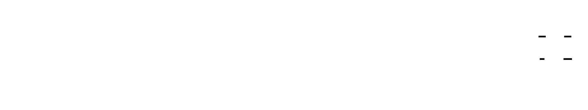
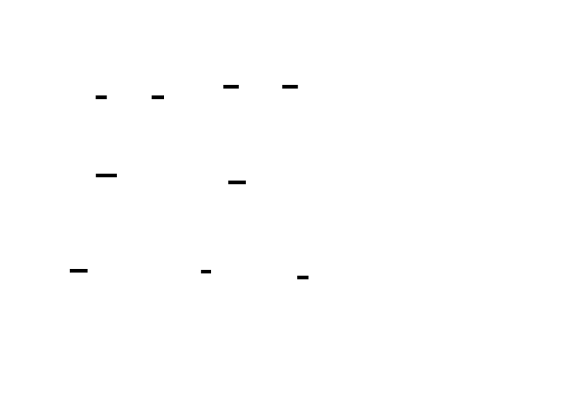
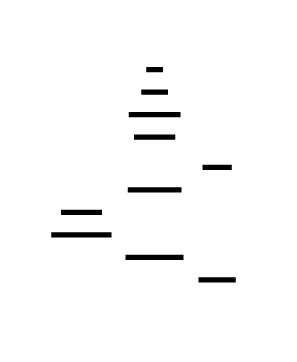

# 🎯 Project Charter: Cache-Optimized Data Structures
## What You Are Building
A comprehensive toolkit for understanding and exploiting CPU cache behavior, including cache-profiling tools that detect L1/L2/L3 boundaries through latency measurement, memory layout transformations (AoS vs SoA) that demonstrate 2-5x speedups from data-oriented design, a cache-friendly hash table using Robin Hood open addressing, a van Emde Boas layout B-tree that achieves optimal cache behavior without knowing cache parameters, and cache-blocked matrix multiplication with automatic block size tuning.
## Why This Project Exists
Performance differences between cache-friendly and cache-hostile implementations can easily be 10-100x—far larger than most algorithmic improvements. A cache miss costs 100-300 CPU cycles while an L1 hit costs 4 cycles: that's a 25-75x difference per memory access. Most developers use data structures daily but treat cache behavior as a black box, learning Big-O complexity while remaining blind to the constant factors that dominate real-world performance. Building these structures from scratch exposes the memory hierarchy assumptions baked into every program you've ever written.
## What You Will Be Able to Do When Done
- Measure cache performance using hardware counters and latency-based detection to identify L1, L2, and L3 cache boundaries
- Transform data layouts (AoS ↔ SoA) and quantify the cache efficiency and SIMD vectorization impact
- Design open-addressed hash tables with Robin Hood hashing that achieve bounded probe distances at 85% load factor
- Build cache-oblivious B-trees using van Emde Boas recursive layout that perform optimally across all cache levels
- Apply loop tiling and blocking to matrix operations for 2-10x speedup through cache data reuse
- Debug false sharing, alignment issues, and prefetching failures using perf and cachegrind
- Analyze memory access patterns and refactor code for spatial and temporal locality
## Final Deliverable
~3,500 lines of C code across 5 modules with benchmark harnesses. Produces standalone executables for cache profiling (`cache_profiler`), layout comparison (`particle_benchmark`), hash table evaluation (`hash_benchmark`), tree search comparison (`veb_benchmark`), and matrix operations (`matrix_benchmark`). Each tool includes warmup iterations, statistical reporting (mean, stddev, min, max), perf stat integration instructions, and verification against reference implementations.
## Is This Project For You?
**You should start this if you:**
- Understand C data structures (arrays, trees, hash tables) and pointer arithmetic
- Know basic CPU cache concepts (L1/L2/L3 hierarchy, cache lines)
- Can use a profiler (perf, cachegrind, or equivalent) to measure performance
- Are comfortable with struct alignment and memory layout concepts
**Come back after you've learned:**
- C pointers and memory management (try a C basics tutorial first)
- Basic data structures (arrays, linked lists, binary search trees)
- How to compile and run C programs with gcc
## Estimated Effort
| Phase | Time |
|-------|------|
| Cache Fundamentals & Benchmarking | ~7 hours |
| Array of Structs vs Struct of Arrays | ~8 hours |
| Cache-Friendly Hash Table | ~10 hours |
| Cache-Oblivious B-Tree | ~12 hours |
| Blocked Matrix Operations | ~8 hours |
| **Total** | **~45 hours** |
## Definition of Done
The project is complete when:
- Cache profiler detects L1, L2, and L3 cache sizes by measuring latency inflection points at different working set sizes, with hardware counter validation via perf stat
- SoA particle system demonstrates at least 2x speedup over AoS for partial-field access patterns, with compiler vectorization verified in assembly output
- Robin Hood hash table supports 85% load factor with maximum probe distance under 15 for 1M entries, showing 2x fewer cache misses than chained implementation
- van Emde Boas tree achieves at least 3x faster search than pointer-based BST for 1M+ nodes, with O(log_B N) cache miss count confirmed via profiling
- Blocked matrix multiplication achieves at least 2x speedup over naive implementation for 1024×1024 matrices, with block size auto-tuner selecting empirically optimal size
- All implementations produce correct results verified against reference implementations within floating-point tolerance

---

# 📚 Before You Read This: Prerequisites & Further Reading
> **Read these first.** The Atlas assumes you are familiar with the foundations below.
> Resources are ordered by when you should encounter them — some before you start, some at specific milestones.
---
## Before Starting This Project
### 1. C Memory Model and Pointers
**Read BEFORE starting** — required foundational knowledge. The entire project assumes comfort with pointer arithmetic, memory allocation, and understanding how data is laid out in memory.
| Resource | Type | Why It's Gold Standard |
|----------|------|------------------------|
| **Chapter 5-6 of "The C Programming Language"** (Kernighan & Ritchie, 2nd ed.) | Book | Original source. Concise, precise explanation of pointers, arrays, and memory allocation. Still the clearest treatment of how C maps to machine memory. |
| **"Pointer Arithmetic in C"** — Harvard CS50 Lecture Notes | Tutorial | Visual explanations of pointer arithmetic with memory diagrams. Good supplement if K&R feels terse. |
---
### 2. Computer Architecture Basics
**Read BEFORE starting** — you need to understand that memory isn't uniform before cache optimization makes sense.
| Resource | Type | Why It's Gold Standard |
|----------|------|------------------------|
| **"What Every Programmer Should Know About Memory"** — Ulrich Drepper, 2007 | Paper | Original deep dive. Section 2 (CPU caches) and Section 3 (virtual memory) are essential. Long but the diagrams of cache hierarchy are unmatched. Read sections 2-3 now, return for the rest later. |
| **"Computer Systems: A Programmer's Perspective" (CS:APP)** — Bryant & O'Hallaron, Chapter 6 | Book chapter | The textbook treatment of the memory hierarchy. Figure 6.7 (cache structure) and the "mountain" performance diagram (Figure 6.40) are canonical. |
---
## At Milestone 1: Cache Fundamentals & Benchmarking
### 3. Measuring Cache Behavior
**Read AFTER Milestone 1** — you'll have built the profiler and have context for these techniques.
| Resource | Type | Why It's Gold Standard |
|----------|------|------------------------|
| **`perf` tutorial** — Brendan Gregg's Linux Performance | Blog | Gregg is the authority on Linux performance analysis. The `perf stat` and `perf record` sections directly apply to your benchmark validation. |
| **`perf_event_open` man page** — Linux manual | Spec | The definitive reference for hardware counter programming. Your `perf_counters.c` implementation follows this API. |
---
## At Milestone 2: Array of Structs vs Struct of Arrays
### 4. Data-Oriented Design
**Read BEFORE Milestone 2** — this milestone is a practical application of data-oriented design principles.
| Resource | Type | Why It's Gold Standard |
|----------|------|------------------------|
| **"Data-Oriented Design"** — Richard Fabian (online book) | Book | Free online. Chapters 1-3 explain the "why" of SoA layouts with concrete examples. The particle system example is exactly what you'll build. |
| **"Efficiency with Algorithms, Performance with Data Structures"** — Chandler Carruth (CppCon 2014) | Video (1hr) | Timestamp 15:00-35:00 demonstrates the AoS vs SoA transformation with performance measurements. Shows assembly output and cache miss analysis. |
---
### 5. SIMD and Vectorization
**Read AFTER Milestone 2** — you'll have seen why SoA enables vectorization; this explains how.
| Resource | Type | Why It's Gold Standard |
|----------|------|------------------------|
| **"SIMD for C++ Developers"** — Intel Developer Zone | Tutorial | Section on data layout explains why contiguous same-type data is required. Examples show `vmovaps` vs scalar `movss`. |
| **GCC Auto-vectorization documentation** — gcc.gnu.org | Spec | Explains `-fopt-info-vec-optimized` and `-fopt-info-vec-missed` flags you'll use to verify your SoA loops are vectorized. |
---
## At Milestone 3: Cache-Friendly Hash Table
### 6. Hash Table Design
**Read BEFORE Milestone 3** — understand the design space before implementing.
| Resource | Type | Why It's Gold Standard |
|----------|------|------------------------|
| **"Robin Hood Hashing"** — Sebastian Sylvan, 2016 | Blog post | Clearest explanation of the displacement algorithm. The visualization of probe distance redistribution makes the "steal from the rich" intuition concrete. |
| **"Design of a High-Performance Hash Table"** (SwissTable paper) — Google, 2017 | Paper | Sections 2-3 explain why open addressing with SIMD metadata comparison beats chaining. Your implementation uses Robin Hood; this shows the industrial-strength evolution of the same ideas. |
---
### 7. Memory Allocators and Cache
**Read AFTER Milestone 3** — you'll appreciate why chained hash tables cause allocation chaos.
| Resource | Type | Why It's Gold Standard |
|----------|------|------------------------|
| **"Memory Allocators"** — Sam Freund (Facebook Engineering blog) | Blog | Explains malloc fragmentation and how allocation patterns affect cache. Section on "allocation density" connects directly to your hash table comparison. |
---
## At Milestone 4: Cache-Oblivious B-Tree
### 8. Cache-Oblivious Algorithms
**Read BEFORE Milestone 4** — this is the theoretical foundation for the van Emde Boas layout.
| Resource | Type | Why It's Gold Standard |
|----------|------|------------------------|
| **"Cache-Oblivious Algorithms"** — Frigo, Leiserson, Prokop, Ramachandran (FOCS 1999) | Paper | Original paper. Section 3 (van Emde Boas layout) proves the O(log_B N) cache complexity. The proof is accessible if you skip the formal notation. |
| **"Cache-Oblivious B-Trees"** — Bender, Demaine, Farach-Colton (SODA 2000) | Paper | Extends vEB to dynamic trees. Read the introduction and Section 2 for the static tree construction you'll implement. |
---
### 9. Memory Hierarchy Depth
**Read AFTER Milestone 4** — understand why the same layout works for L1, L2, L3, and disk.
| Resource | Type | Why It's Gold Standard |
|----------|------|------------------------|
| **"The Cache Performance of Blocked Algorithms"** — Lam, Rothberg, Wolf (ASPLOS 1991) | Paper | Classic paper on blocking/tiling. Section 4 analyzes why block sizes should match cache parameters — then explains why vEB achieves this without knowing the parameters. |
---
## At Milestone 5: Blocked Matrix Operations
### 10. Loop Optimizations
**Read BEFORE Milestone 5** — understand what the compiler can and cannot do for you.
| Resource | Type | Why It's Gold Standard |
|----------|------|------------------------|
| **"Loop Tiling"** — Wikipedia with references | Tutorial | Good overview with diagrams. Follow references to "loop blocking" and "cache blocking" for deeper treatment. |
| **"Optimizing Matrix Multiply"** — Goto and Van de Geijn (2008) | Paper | Sections 2-3 explain the blocking hierarchy (register, L1, L2, TLB). This is what BLAS libraries implement. Your register-blocked variant follows the same principles. |
---
### 11. High-Performance Linear Algebra
**Read AFTER Milestone 5** — understand how production libraries achieve peak performance.
| Resource | Type | Why It's Gold Standard |
|----------|------|------------------------|
| **"Anatomy of High-Performance Matrix Multiplication"** — Goto and Van de Geijn (ACM TOMS 2008) | Paper | The definitive reference. Figure 3 shows the three-level blocking structure. Your implementation is a simplified version of this. |
| **BLAS (Basic Linear Algebra Subprograms) Standard** — netlib.org | Spec | The API every linear algebra library implements. Understanding the GEMM interface shows you what production code expects. |
---
## Cross-Cutting References
### 12. Performance Analysis Methodology
**Read when you see inconsistent benchmark results** — applies to all milestones.
| Resource | Type | Why It's Gold Standard |
|----------|------|------------------------|
| **"How to Benchmark"** — Lemire's blog | Blog | Practical advice on warmup, statistical analysis, and avoiding common pitfalls. The "six rules" section directly applies to your benchmark harness. |
| **"Cachegrind Manual"** — Valgrind documentation | Tool docs | Simulates cache behavior when hardware counters aren't available. Your `make cachegrind` target uses this. |
---
### 13. System Calls and Low-Level Interfaces
**Reference as needed** — for specific implementation details.
| Resource | Type | Why It's Gold Standard |
|----------|------|------------------------|
| **`clock_gettime(2)` man page** — Linux manual | Spec | The timing API you'll use. Note `CLOCK_MONOTONIC` vs `CLOCK_MONOTONIC_RAW`. |
| **`aligned_alloc(3)` man page** — Linux manual | Spec | Memory alignment requirements. Your allocations use this for cache-line alignment. |
| **`__builtin_prefetch` documentation** — GCC manual | Spec | Software prefetching API. Used in Milestone 3's hash table lookup. |
---
## Quick Reference: When to Read What
| Milestone | Read Before | Read After |
|-----------|-------------|------------|
| Start | K&R Ch 5-6, Drepper §2-3 | — |
| M1: Cache Profiling | — | `perf` tutorial, `perf_event_open` man page |
| M2: AoS vs SoA | Fabian Ch 1-3 | SIMD tutorial, GCC vectorization docs |
| M3: Hash Table | Sylvan blog, SwissTable §2-3 | Allocator blog |
| M4: vEB Tree | Frigo et al. §3, Bender et al. §2 | Lam et al. §4 |
| M5: Matrix Ops | Loop tiling overview | Goto & Van de Geijn 2008 |
---
## Optional Deep Dives
These aren't required but reward the curious:
| Topic | Resource | Why |
|-------|----------|-----|
| **CPU prefetchers** | "Prefetching" — Intel Optimization Manual §3.7 | Understand why sequential access is so fast |
| **TLB behavior** | "Understanding the TLB" — Linux kernel docs | Explains TLB misses in large working sets |
| **False sharing** | "Avoiding and Identifying False Sharing" — Intel blog | Critical for multithreaded cache optimization |
| **NUMA** | "NUMA Best Practices" — AMD/Intel guides | For multi-socket systems |

---

# Cache-Optimized Data Structures

This project teaches you to design data structures and algorithms that work with the CPU memory hierarchy rather than against it. You'll build tools to measure cache behavior, transform memory layouts for optimal cache line utilization, implement cache-friendly hash tables, construct cache-oblivious B-trees using van Emde Boas layout, and apply loop tiling to matrix operations. The core insight is that memory access patterns—not algorithmic complexity—often dominate performance on modern hardware. A cache-miss can cost 100-300 cycles while an L1 hit costs 4 cycles: that's a 25-75x difference per access. By understanding spatial locality (adjacent bytes in the same cache line), temporal locality (reusing data while it's still cached), and the transfer unit (64-byte cache lines), you can transform code that fights the hardware into code that flows with it.


<!-- MS_ID: cache-optimized-structures-m1 -->
# Milestone 1: Cache Fundamentals & Benchmarking
## The Hidden Cost of Every Memory Access
You've written code like this a thousand times:
```c
int sum = 0;
for (int i = 0; i < n; i++) {
    sum += array[i];
}
```
You know this is O(n)—linear time complexity. But here's what your complexity analysis doesn't tell you: **accessing `array[i]` can take anywhere from 4 CPU cycles to over 200 cycles depending entirely on where that data lives in the memory hierarchy.**
That's a **50x difference per access**. Not per algorithm—per individual memory read.
If your algorithm makes 10 million memory accesses, the difference between "all L1 cache hits" and "all RAM accesses" is roughly 40 milliseconds versus 2 seconds. Same Big-O. Same code. Wildly different performance.


This milestone is about building the tools to see what your CPU already knows: **memory is not uniform**. By the end, you'll have instruments that reveal exactly how your data moves through the cache hierarchy, where the bottlenecks hide, and why seemingly identical code can perform dramatically differently.
---
## The Physical Constraint: Speed vs Size vs Cost
The fundamental tension in memory design is a three-way tradeoff: **fast, big, cheap—pick two.**
- **Fast memory** (SRAM, used in caches) costs ~$5000/GB and runs at CPU speed
- **Big memory** (DRAM, your RAM) costs ~$5/GB but is 50-100x slower
- **Storage** (SSD/HDD) costs ~$0.10-0.50/GB but is 100,000x slower than L1 cache
CPU designers solve this with a **memory hierarchy**: multiple layers of progressively larger, progressively slower memory. Your data lives in RAM, but the CPU copies frequently-used portions into smaller, faster caches.
```
[CPU Core] ←→ [L1 Cache: 32KB, 4 cycles] ←→ [L2: 256KB-1MB, 12 cycles] ←→ [L3: 8-64MB, 40 cycles] ←→ [RAM: 8-128GB, 200+ cycles]
```
[[EXPLAIN:memory-latency-hierarchy-(l1:-4-cycles,-l2:-12-cycles,-l3:-40-cycles,-ram:-200+-cycles)|Memory latency hierarchy showing the dramatic cost difference between cache levels and main memory]]
### The Transfer Unit: Cache Lines
Here's the critical insight: **the CPU never reads a single byte or a single integer.** When you access `array[i]`, the CPU fetches an entire **cache line**—typically 64 bytes—from the next level of memory.


> **🔑 Foundation: Cache line as the fundamental unit of data transfer between memory hierarchy levels**
> 
> ## What It IS
A **cache line** is the fixed-size block of memory that moves between levels of the memory hierarchy. On modern x86 processors, this is **64 bytes**. When the CPU needs a single byte from main memory, it doesn't fetch just that byte—it fetches the entire 64-byte cache line containing it.
Think of it like buying groceries: even if you only need one egg, you're carrying home the whole carton. The cache line is that carton.
```
Memory Address: 0x1000 (byte needed)
                ↓
        ┌───────────────────────────────────────────────────────────────┐
        │  Cache Line (64 bytes): 0x1000 - 0x103F                        │
        │  ┌─────┬─────┬─────┬─────┬─────┬─────┬─────┬─────┬    ─ ─ ─    │
        │  │byte │byte │byte │byte │byte │byte │byte │byte │            │
        │  │ 0   │ 1   │ 2   │ 3   │ 4   │ 5   │ 6   │ 7   │    ...     │
        │  └─────┴─────┴─────┴─────┴─────┴─────┴─────┴─────┴    ─ ─ ─    │
        └───────────────────────────────────────────────────────────────┘
                          ↑
                    Entire block transferred to cache
```
## WHY You Need It Right Now
Understanding cache lines changes how you think about every memory access:
1. **False sharing**: Two threads writing to different variables that happen to share a cache line will cause cache coherency thrashing, even though they're not accessing the "same" data
2. **Structure layout**: A 65-byte struct requires two cache lines to read; padding to 64 bytes might actually improve performance
3. **Array traversal**: Sequential access is fast because each cache miss brings in 64 bytes of soon-to-be-needed data
```c
// FALSE SHARING: Both counters on same cache line
struct {
    int counter_a;  // Thread 1 writes here
    int counter_b;  // Thread 2 writes here
} bad_layout;       // Both threads fight over ownership
// FIXED: Each counter on its own cache line
struct {
    int counter_a;
    char padding[60];  // Pad to 64-byte boundary
    int counter_b;
} good_layout;
```
## Key Insight
**The cache line is the atom of memory transfers.** The CPU cannot fetch less than 64 bytes at a time, and it cannot cache less than 64 bytes at a time. This means:
- A single-byte access costs the same memory bandwidth as accessing all 64 bytes
- Your data layout determines whether each cache line fetch is 100% useful or 3% useful
- The "working set size" that matters is measured in cache lines, not bytes


This means:
- Reading `array[0]` loads bytes 0-63 into L1 cache
- Reading `array[1]` immediately after? **Already in cache.** 4 cycles instead of 200+.
- Reading `array[64]`? New cache line. Miss.
- Reading `array[0]` again after it's been evicted? Miss.
Every memory operation is gambling: is the data I need already in a cache? The difference between winning and losing this gamble is measured in hundreds of CPU cycles.
### Spatial and Temporal Locality
CPUs are simple pattern-matching machines at heart. They assume your code follows two predictable patterns:


> **🔑 Foundation: Spatial locality**
> 
> ## What It IS
**Locality of reference** is the observation that programs don't access memory randomly—they access it in patterns. Two distinct patterns dominate:
**Spatial Locality**: If you access address X, you'll likely soon access addresses near X.
- Example: Iterating through an array `arr[0]`, `arr[1]`, `arr[2]`...
- The "spatial" refers to address space—nearby memory locations
**Temporal Locality**: If you access address X, you'll likely access X again soon.
- Example: A loop counter `i` is read and written every iteration
- The "temporal" refers to time—recently used things get reused
```
SPATIAL LOCALITY                    TEMPORAL LOCALITY
     ┌───┐                              
     │ A │ ← access                      ┌───┐     ┌───┐     ┌───┐
     ├───┤                              │ A │ ──→ │ A │ ──→ │ A │
     │ B │ ← likely next                └───┘     └───┘     └───┘
     ├───┤                               time →
     │ C │ ← and next                      same address, different times
     └───┘
   nearby addresses
```
## WHY You Need It Right Now
The entire memory hierarchy exists to exploit these two patterns. Understanding which type of locality your code exhibits tells you:
**For Spatial Locality**, the cache line size matters:
```c
// GOOD: Sequential access exploits spatial locality
// Each cache miss brings in 64 bytes = 8 doubles
double sum = 0;
for (int i = 0; i < N; i++) {
    sum += array[i];  // Cache line fetched once, used 8 times
}
// BAD: Strided access wastes spatial locality
// Each cache miss brings 64 bytes, we use only 8
for (int i = 0; i < N; i += 8) {
    sum += array[i];  // 7/8 of each cache line unused
}
```
**For Temporal Locality**, the cache size matters:
```c
// GOOD: Working set fits in cache, temporal locality exploited
for (int i = 0; i < MILLION; i++) {
    // small_lookup_table accessed repeatedly
    result += small_lookup_table[input[i] % TABLE_SIZE];
}
// BAD: Working set too large, temporal locality lost
for (int i = 0; i < MILLION; i++) {
    // Each element of huge_array used once, then evicted
    result += huge_array[i];
}
```
## Key Insight
**Spatial locality is about cache line utilization; temporal locality is about cache capacity.**
When optimizing for spatial locality, ask: "Am I using everything in each cache line I fetch?"
When optimizing for temporal locality, ask: "Does my working set fit in the cache so reused data stays hot?"
A linked list traversal has **high temporal locality** (you revisit the list nodes' pointers) but **poor spatial locality** (nodes scattered across memory). An array traversal has **high spatial locality** (contiguous elements share cache lines) but may have **low temporal locality** if each element is used once.


**Spatial locality**: If you accessed address X, you'll probably access X+1, X+2, X+3... soon. This is why cache lines are 64 bytes instead of 4 or 8—you get "free" adjacent data.
**Temporal locality**: If you accessed address X, you'll probably access X again soon. This is why caches exist at all—they store recently-used data on the assumption you'll reuse it.
Code that exploits these patterns is **cache-friendly**. Code that violates them is **cache-hostile**. The same algorithm can be either, depending entirely on how you lay out your data in memory.
---
## Your First Cache Detector: Latency Tells All
If L1 cache is fast and RAM is slow, we can detect cache sizes by measuring access latency at different working set sizes. When the working set fits in L1, latency should be ~4 cycles. Exceed L1, and suddenly we're hitting L2—latency jumps to ~12 cycles. Exceed L2, and we hit L3 (~40 cycles). Exceed L3, and we're in RAM (~200+ cycles).
Here's the core technique:
```c
#include <stdint.h>
#include <stdlib.h>
#include <time.h>
#include <stdio.h>
// Force a memory access that the compiler can't optimize away
static inline void force_read(void* p) {
    asm volatile("" : : "r"(p) : "memory");
}
// Force the CPU to complete the read before continuing
static inline void force_dependency(void* p) {
    asm volatile("" : : "r"(p) : "memory");
}
// Get CPU timestamp counter for cycle-accurate timing
static inline uint64_t rdtsc() {
    uint32_t lo, hi;
    __asm__ __volatile__("rdtsc" : "=a"(lo), "=d"(hi));
    return ((uint64_t)hi << 32) | lo;
}
// Measure average access latency for a given working set size
double measure_latency(size_t working_set_bytes, int iterations) {
    // Allocate the working set
    char* buffer = (char*)aligned_alloc(64, working_set_bytes);
    if (!buffer) {
        fprintf(stderr, "Failed to allocate %zu bytes\n", working_set_bytes);
        return -1;
    }
    // Initialize to ensure pages are faulted in
    for (size_t i = 0; i < working_set_bytes; i += 64) {
        buffer[i] = (char)i;
    }
    // Create a pointer-chasing pattern to defeat prefetchers
    // Each pointer leads to a random-ish location in the buffer
    size_t num_elements = working_set_bytes / sizeof(void*);
    void** chase = (void**)buffer;
    // Build a permutation that visits every element once
    // Using a simple linear congruential generator for pseudo-random order
    size_t* order = (size_t*)malloc(num_elements * sizeof(size_t));
    size_t state = 1;
    for (size_t i = 0; i < num_elements; i++) {
        state = (state * 1103515245 + 12345) % num_elements;
        order[i] = state;
    }
    // Link them together
    for (size_t i = 0; i < num_elements - 1; i++) {
        chase[order[i]] = &chase[order[i + 1]];
    }
    chase[order[num_elements - 1]] = &chase[order[0]]; // Close the loop
    void* current = &chase[order[0]];
    // Warmup runs
    for (int i = 0; i < 1000; i++) {
        current = *(void**)current;
    }
    // Timed runs
    uint64_t start = rdtsc();
    for (int i = 0; i < iterations; i++) {
        // Unroll slightly to reduce loop overhead
        current = *(void**)current;
        current = *(void**)current;
        current = *(void**)current;
        current = *(void**)current;
    }
    uint64_t end = rdtsc();
    double cycles_per_access = (double)(end - start) / (iterations * 4);
    free(order);
    free(buffer);
    return cycles_per_access;
}
```


The key insight here is **pointer chasing**: each memory access depends on the previous one. This defeats hardware prefetchers, which are designed to detect sequential or strided patterns. By making each address unpredictable until the previous load completes, we force the CPU to wait for each memory access.
### Why Pointer Chasing?
A naive approach would be:
```c
// WRONG: Hardware prefetcher will detect this pattern
for (int i = 0; i < n; i++) {
    sum += buffer[i * stride];
}
```
The CPU's prefetcher sees you accessing `buffer[0]`, `buffer[stride]`, `buffer[2*stride]`... and starts fetching ahead. Your "random" access becomes effectively sequential from the prefetcher's perspective.
Pointer chasing creates a **dependency chain**: the CPU cannot know the next address until the current load completes. This is the only reliable way to measure true memory latency.
---
## Sequential vs Random Access: The Prefetcher Effect
Now let's demonstrate something profound: **the same array, accessed in different patterns, can perform 10x differently.**
```c
#include <stdint.h>
#include <stdlib.h>
#include <stdio.h>
#define ITERATIONS 100000000
// Sequential access: array[0], array[1], array[2], ...
double sequential_access(volatile int* array, size_t size) {
    uint64_t start = rdtsc();
    int sum = 0;
    for (int iter = 0; iter < ITERATIONS; iter++) {
        for (size_t i = 0; i < size; i++) {
            sum += array[i];
        }
    }
    uint64_t end = rdtsc();
    // Prevent sum from being optimized away
    asm volatile("" : : "r"(sum) : "memory");
    return (double)(end - start) / (ITERATIONS * size);
}
// Random access: array[perm[0]], array[perm[1]], array[perm[2]], ...
double random_access(volatile int* array, size_t* perm, size_t size) {
    uint64_t start = rdtsc();
    int sum = 0;
    for (int iter = 0; iter < ITERATIONS; iter++) {
        for (size_t i = 0; i < size; i++) {
            sum += array[perm[i]];
        }
    }
    uint64_t end = rdtsc();
    asm volatile("" : : "r"(sum) : "memory");
    return (double)(end - start) / (ITERATIONS * size);
}
```


For an array larger than L1 cache (say, 1 million integers = 4MB), you'll see:
| Access Pattern | Typical Latency | Why |
|----------------|-----------------|-----|
| Sequential | ~4-8 cycles | Prefetcher detects pattern, data arrives before CPU needs it |
| Random | ~40-200 cycles | Each access is a cache miss (or at best L2/L3 hit) |
The **hardware prefetcher** is the hero here. Modern CPUs have sophisticated prefetch logic that detects:
- Sequential access (stream prefetching)
- Strided access (stride prefetching)
- Even some irregular patterns (spatial prefetching)
When you access `array[i]`, `array[i+1]`, `array[i+2]`... the prefetcher notices and starts pulling `array[i+8]`, `array[i+16]`, etc. into cache before you ask for them.
Random access? No pattern to detect. Every access is a surprise. The prefetcher can't help you.
### The Linked List Disaster
This is why linked lists are often catastrophic for performance:
```c
// Each node could be anywhere in memory
typedef struct Node {
    int value;
    struct Node* next;
} Node;
void traverse_list(Node* head) {
    Node* current = head;
    while (current) {
        process(current->value);
        current = current->next;  // Cache miss likely!
    }
}
```
Each `current->next` access is effectively random—the allocator places nodes wherever free memory exists. You're doing pointer chasing without even meaning to.
An array, by contrast, is the gold standard for cache efficiency: contiguous memory, sequential access, prefetcher nirvana.
---
## Stride Benchmarking: Finding the Cache Line Size
Here's a subtle experiment. What if we access every Nth byte in a large array?
```c
double stride_benchmark(volatile char* buffer, size_t size, size_t stride) {
    uint64_t start = rdtsc();
    size_t iterations = size;  // Total accesses
    volatile char sink;
    for (size_t i = 0; i < iterations; i++) {
        sink = buffer[(i * stride) % size];
    }
    uint64_t end = rdtsc();
    return (double)(end - start) / iterations;
}
```


If stride ≤ 64 bytes (cache line size):
- Accessing byte 0 loads cache line 0 (bytes 0-63)
- Accessing byte 8 still uses cache line 0
- Accessing byte 56 still uses cache line 0
- **One cache line serves multiple accesses**
If stride > 64 bytes:
- Accessing byte 0 loads cache line 0
- Accessing byte 64 loads cache line 1
- Accessing byte 128 loads cache line 2
- **Each access needs a new cache line**
The result? Access time is roughly constant for strides 1-64, then starts increasing:
```
Stride (bytes)  |  Cycles per access
----------------|-------------------
1               |  ~4
8               |  ~4
16              |  ~4
32              |  ~4
64              |  ~4-8 (transition)
128             |  ~8-12
256             |  ~12-20
512             |  ~20-40
1024            |  ~40-80 (prefetcher struggles)
```
The "step function" at 64 bytes reveals your cache line size. This works even without knowing the architecture—you're letting the hardware reveal its own parameters.
---
## Hardware Performance Counters: The Ground Truth
Wall-clock timing is useful, but it conflates many factors: CPU frequency changes, other processes, interrupts, thermal throttling. **Hardware performance counters** give you the real story.
Modern CPUs have special registers that count events:
- `L1-dcache-loads`: Total L1 data cache load attempts
- `L1-dcache-load-misses`: L1 misses
- `LLC-loads`: Last-level cache (L3) loads
- `LLC-load-misses`: Misses that go to RAM
### Using perf
The `perf` tool on Linux provides access to these counters:
```bash
# Count cache events for a program
perf stat -e L1-dcache-loads,L1-dcache-load-misses,LLC-loads,LLC-load-misses ./your_program
# Example output:
#   1,234,567  L1-dcache-loads
#      45,678  L1-dcache-load-misses    # ~3.7% miss rate
#      12,345  LLC-loads
#       1,234  LLC-load-misses          # ~10% of L3 accesses go to RAM
```
From code, you can use `perf_event_open`:
```c
#include <linux/perf_event.h>
#include <sys/syscall.h>
#include <unistd.h>
#include <string.h>
// Open a performance counter
static int perf_event_open(struct perf_event_attr* attr, pid_t pid, 
                           int cpu, int group_fd, unsigned long flags) {
    return syscall(__NR_perf_event_open, attr, pid, cpu, group_fd, flags);
}
// Setup cache miss counter
int setup_cache_miss_counter() {
    struct perf_event_attr attr;
    memset(&attr, 0, sizeof(attr));
    attr.type = PERF_TYPE_HW_CACHE;
    attr.size = sizeof(attr);
    attr.config = PERF_COUNT_HW_CACHE_L1D | 
                  (PERF_COUNT_HW_CACHE_OP_READ << 8) |
                  (PERF_COUNT_HW_CACHE_RESULT_MISS << 16);
    attr.disabled = 0;
    attr.exclude_kernel = 1;
    attr.exclude_hv = 1;
    int fd = perf_event_open(&attr, 0, -1, -1, 0);
    if (fd == -1) {
        perror("perf_event_open failed");
        return -1;
    }
    return fd;
}
// Read the counter value
uint64_t read_counter(int fd) {
    uint64_t value;
    read(fd, &value, sizeof(value));
    return value;
}
```


### Why Counters Matter More Than Wall Clock
Consider two implementations of the same algorithm:
| Metric | Implementation A | Implementation B |
|--------|-----------------|------------------|
| Wall time | 1.00 seconds | 1.05 seconds |
| L1 misses | 50,000 | 5,000,000 |
| L3 misses | 1,000 | 100,000 |
Implementation A looks only 5% faster. But the cache miss profile reveals it's **fundamentally more cache-efficient**. On a different system with different cache sizes, or with different input data that doesn't fit in cache, Implementation B might be 10x slower.
Wall clock lies. Counters tell the truth.
---
## Putting It Together: A Complete Cache Profiler
Here's a complete tool that measures cache characteristics:
```c
#include <stdio.h>
#include <stdlib.h>
#include <stdint.h>
#include <string.h>
#include <time.h>
#define CACHE_LINE_SIZE 64
#define MAX_WORKING_SET (256 * 1024 * 1024)  // 256 MB
#define WARMUP_ITERATIONS 1000
#define MEASUREMENT_ITERATIONS 100000
// ============================================================
// Timing utilities
// ============================================================
static inline uint64_t rdtsc() {
    uint32_t lo, hi;
    __asm__ __volatile__("rdtsc" : "=a"(lo), "=d"(hi));
    return ((uint64_t)hi << 32) | lo;
}
static inline void cpu_pause() {
    __asm__ __volatile__("pause" ::: "memory");
}
// ============================================================
// Pointer-chasing latency measurement
// ============================================================
typedef struct LatencyResult {
    double mean;
    double min;
    double max;
    double stddev;
    size_t samples;
} LatencyResult;
LatencyResult measure_chase_latency(size_t working_set_bytes) {
    LatencyResult result = {0};
    // Allocate aligned buffer
    void** buffer = (void**)aligned_alloc(CACHE_LINE_SIZE, working_set_bytes);
    if (!buffer) return result;
    size_t num_pointers = working_set_bytes / sizeof(void*);
    // Initialize buffer to prevent page faults during measurement
    memset(buffer, 0, working_set_bytes);
    // Build a cyclic pointer chain using a simple permutation
    // This creates pointer-chasing that defeats prefetchers
    size_t* perm = (size_t*)malloc(num_pointers * sizeof(size_t));
    uint64_t state = 1;
    for (size_t i = 0; i < num_pointers; i++) {
        state = (state * 6364136223846793005ULL) % num_pointers;
        perm[i] = (size_t)state;
    }
    // Link pointers
    for (size_t i = 0; i < num_pointers - 1; i++) {
        buffer[perm[i]] = &buffer[perm[i + 1]];
    }
    buffer[perm[num_pointers - 1]] = &buffer[perm[0]];
    void* current = &buffer[perm[0]];
    // Warmup
    for (int i = 0; i < WARMUP_ITERATIONS; i++) {
        current = *(void**)current;
    }
    // Collect samples
    #define NUM_SAMPLES 10
    double samples[NUM_SAMPLES];
    for (int s = 0; s < NUM_SAMPLES; s++) {
        uint64_t start = rdtsc();
        for (int i = 0; i < MEASUREMENT_ITERATIONS; i++) {
            current = *(void**)current;
            current = *(void**)current;
            current = *(void**)current;
            current = *(void**)current;
        }
        uint64_t end = rdtsc();
        samples[s] = (double)(end - start) / (MEASUREMENT_ITERATIONS * 4);
    }
    // Compute statistics
    result.mean = 0;
    result.min = samples[0];
    result.max = samples[0];
    for (int s = 0; s < NUM_SAMPLES; s++) {
        result.mean += samples[s];
        if (samples[s] < result.min) result.min = samples[s];
        if (samples[s] > result.max) result.max = samples[s];
    }
    result.mean /= NUM_SAMPLES;
    result.stddev = 0;
    for (int s = 0; s < NUM_SAMPLES; s++) {
        double diff = samples[s] - result.mean;
        result.stddev += diff * diff;
    }
    result.stddev = sqrt(result.stddev / NUM_SAMPLES);
    result.samples = NUM_SAMPLES;
    free(perm);
    free(buffer);
    return result;
}
// ============================================================
// Cache size detection
// ============================================================
void detect_cache_sizes() {
    printf("Detecting cache sizes via latency measurement...\n");
    printf("%-15s  %-12s  %-12s  %-12s\n", 
           "Working Set", "Mean (cycles)", "Min", "Max");
    printf("%s\n", "--------------------------------------------------");
    // Test sizes from 4KB to 256MB
    size_t sizes[] = {
        4 * 1024,      // 4 KB
        8 * 1024,      // 8 KB
        16 * 1024,     // 16 KB
        32 * 1024,     // 32 KB (typical L1)
        64 * 1024,     // 64 KB
        128 * 1024,    // 128 KB
        256 * 1024,    // 256 KB (typical L2)
        512 * 1024,    // 512 KB
        1024 * 1024,   // 1 MB
        2 * 1024 * 1024,   // 2 MB
        4 * 1024 * 1024,   // 4 MB (typical L3)
        8 * 1024 * 1024,   // 8 MB
        16 * 1024 * 1024,  // 16 MB
        32 * 1024 * 1024,  // 32 MB
        64 * 1024 * 1024,  // 64 MB (exceeds L3)
        128 * 1024 * 1024, // 128 MB
    };
    int num_sizes = sizeof(sizes) / sizeof(sizes[0]);
    double prev_latency = 0;
    for (int i = 0; i < num_sizes; i++) {
        LatencyResult result = measure_chase_latency(sizes[i]);
        const char* size_str;
        char buf[32];
        if (sizes[i] < 1024) {
            snprintf(buf, sizeof(buf), "%zu B", sizes[i]);
        } else if (sizes[i] < 1024 * 1024) {
            snprintf(buf, sizeof(buf), "%zu KB", sizes[i] / 1024);
        } else {
            snprintf(buf, sizeof(buf), "%zu MB", sizes[i] / (1024 * 1024));
        }
        // Detect inflection points
        double change = 0;
        if (prev_latency > 0) {
            change = (result.mean - prev_latency) / prev_latency * 100;
        }
        printf("%-15s  %-12.1f  %-12.1f  %-12.1f", 
               buf, result.mean, result.min, result.max);
        if (change > 20) {
            printf("  <-- %.0f%% increase (cache boundary?)", change);
        }
        printf("\n");
        prev_latency = result.mean;
    }
}
// ============================================================
// Stride benchmark
// ============================================================
void stride_benchmark() {
    printf("\nStride benchmark (cache line detection)...\n");
    printf("Working set: 8 MB (exceeds all caches)\n\n");
    size_t size = 8 * 1024 * 1024;
    volatile char* buffer = (volatile char*)aligned_alloc(CACHE_LINE_SIZE, size);
    memset((void*)buffer, 0xAA, size);
    printf("%-10s  %-15s  %s\n", "Stride", "Cycles/Access", "Notes");
    printf("%s\n", "--------------------------------------------------------");
    size_t strides[] = {1, 2, 4, 8, 16, 32, 64, 128, 256, 512, 1024, 2048, 4096};
    int num_strides = sizeof(strides) / sizeof(strides[0]);
    double prev_latency = 0;
    for (int i = 0; i < num_strides; i++) {
        size_t stride = strides[i];
        size_t num_accesses = size / stride;  // Same total bytes touched
        // Warmup
        volatile char sink;
        for (int w = 0; w < 1000; w++) {
            for (size_t j = 0; j < num_accesses; j++) {
                sink = buffer[(j * stride) % size];
            }
        }
        uint64_t start = rdtsc();
        for (size_t j = 0; j < num_accesses; j++) {
            sink = buffer[(j * stride) % size];
        }
        uint64_t end = rdtsc();
        double latency = (double)(end - start) / num_accesses;
        printf("%-10zu  %-15.1f  ", stride, latency);
        double change = prev_latency > 0 ? 
            (latency - prev_latency) / prev_latency * 100 : 0;
        if (stride <= 64) {
            printf("(within cache line)");
        } else if (stride == 128 && prev_latency > 0 && change > 30) {
            printf("<-- Cache line boundary detected!");
        } else if (change > 50) {
            printf("(%.0f%% increase)", change);
        }
        printf("\n");
        prev_latency = latency;
    }
    free((void*)buffer);
}
// ============================================================
// Sequential vs Random comparison
// ============================================================
void seq_vs_random_comparison() {
    printf("\nSequential vs Random Access Comparison...\n");
    printf("Array size: 16 MB (exceeds L3 cache)\n\n");
    size_t size = 16 * 1024 * 1024 / sizeof(int);  // 16 MB of integers
    volatile int* array = (volatile int*)aligned_alloc(CACHE_LINE_SIZE, size * sizeof(int));
    // Initialize
    for (size_t i = 0; i < size; i++) {
        array[i] = (int)i;
    }
    // Create random permutation
    size_t* perm = (size_t*)malloc(size * sizeof(size_t));
    uint64_t state = 12345;
    for (size_t i = 0; i < size; i++) {
        state = (state * 6364136223846793005ULL) % size;
        perm[i] = (size_t)state;
    }
    int iterations = 10;
    // Sequential access
    printf("Sequential access: ");
    fflush(stdout);
    int sum = 0;
    uint64_t seq_start = rdtsc();
    for (int iter = 0; iter < iterations; iter++) {
        for (size_t i = 0; i < size; i++) {
            sum += array[i];
        }
    }
    uint64_t seq_end = rdtsc();
    asm volatile("" : : "r"(sum) : "memory");
    double seq_latency = (double)(seq_end - seq_start) / (iterations * size);
    printf("%.1f cycles/access\n", seq_latency);
    // Random access
    printf("Random access:     ");
    fflush(stdout);
    sum = 0;
    uint64_t rand_start = rdtsc();
    for (int iter = 0; iter < iterations; iter++) {
        for (size_t i = 0; i < size; i++) {
            sum += array[perm[i]];
        }
    }
    uint64_t rand_end = rdtsc();
    asm volatile("" : : "r"(sum) : "memory");
    double rand_latency = (double)(rand_end - rand_start) / (iterations * size);
    printf("%.1f cycles/access\n", rand_latency);
    printf("\nRandom access is %.1fx slower than sequential\n", 
           rand_latency / seq_latency);
    free(perm);
    free((void*)array);
}
// ============================================================
// Main
// ============================================================
int main(int argc, char** argv) {
    printf("=== Cache Hierarchy Profiler ===\n\n");
    detect_cache_sizes();
    stride_benchmark();
    seq_vs_random_comparison();
    printf("\n=== Profiling Complete ===\n");
    printf("Run with 'perf stat' to see hardware counter details:\n");
    printf("  perf stat -e L1-dcache-loads,L1-dcache-load-misses,LLC-loads,LLC-load-misses %s\n", 
           argv[0]);
    return 0;
}
```
Compile and run:
```bash
gcc -O2 -o cache_profiler cache_profiler.c -lm
./cache_profiler
```
Then run with hardware counters:
```bash
perf stat -e L1-dcache-loads,L1-dcache-load-misses,LLC-loads,LLC-load-misses ./cache_profiler
```
---
## The Pitfalls: Why Benchmarks Lie
Building accurate cache benchmarks is tricky. Here are the most common mistakes:
### 1. Compiler Optimizations Eliminate Your Code
```c
// WRONG: Compiler will optimize this away
int sum = 0;
for (int i = 0; i < n; i++) {
    sum += array[i];
}
// If sum is never used, compiler deletes the entire loop!
```
**Fix**: Use `volatile`, asm barriers, or actually use the result:
```c
volatile int sum = 0;  // volatile prevents optimization
// OR
asm volatile("" : : "r"(sum) : "memory");  // compiler barrier
// OR
printf("Result: %d\n", sum);  // force use of result
```
### 2. No Warmup: First Iterations Are Unrepresentative
The first few iterations include:
- Page faults (loading pages into memory)
- Cache cold starts
- Code path not yet in instruction cache
**Fix**: Always include warmup:
```c
// Warmup
for (int i = 0; i < 1000; i++) {
    do_operation();
}
// Now measure
start = rdtsc();
for (int i = 0; i < MEASUREMENT_ITERATIONS; i++) {
    do_operation();
}
end = rdtsc();
```
### 3. System Noise: Interrupts, Other Processes, Scheduler
Your benchmark shares the CPU with:
- Other processes
- Kernel interrupts
- Thermal management
- CPU frequency scaling
**Fix**: 
- Pin to a single core: `taskset -c 0 ./benchmark`
- Use `CLOCK_MONOTONIC` or `rdtsc` (not `clock()`)
- Run multiple times, report statistics (mean, stddev, min, max)
- Close other applications
### 4. Prefetchers Mask Your Results
The hardware prefetcher is aggressive. It will detect:
- Sequential access: `array[0], array[1], array[2]...`
- Strided access: `array[0], array[64], array[128]...`
**Fix**: Use pointer chasing for latency measurement, or accept that sequential access will be faster than expected (which is itself an interesting result).
### 5. TLB Misses Confound Cache Measurements
For very large working sets (>few MB), you run out of TLB entries. A TLB miss costs ~20-50 cycles on top of any cache miss.
**Fix**: Use huge pages (2MB or 1GB pages) to reduce TLB pressure:
```bash
# Allocate huge pages
echo 1000 > /proc/sys/vm/nr_hugepages
# In code, use MAP_HUGETLB
void* buf = mmap(NULL, size, PROT_READ | PROT_WRITE, 
                 MAP_PRIVATE | MAP_ANONYMOUS | MAP_HUGETLB, -1, 0);
```
---
## What You've Built
You now have:
1. **Cache size detector**: Measures latency at different working set sizes to find L1/L2/L3 boundaries
2. **Stride benchmark**: Reveals cache line size by finding the stride where latency jumps
3. **Sequential vs random comparison**: Demonstrates prefetcher effectiveness
4. **Hardware counter integration**: Uses `perf` to count actual cache misses
These tools form the foundation for all subsequent cache optimization work. You can now **measure** before and after any optimization to verify it actually helps.
---
## Knowledge Cascade
What you've learned here unlocks understanding across many domains:
**CPU Prefetcher Behavior → Linked List Performance**
Now you understand why traversing a linked list can be 10-50x slower than an array. Each `node->next` access is a cache miss waiting to happen. The prefetcher can't help because there's no pattern. This is why high-performance code often uses "struct of arrays" or arena allocators that keep related data contiguous.
**Database Page Sizes → Same Principle, Different Level**
Databases use 4KB-16KB pages for the same reason CPUs use 64-byte cache lines: it's the optimal transfer unit for that level of the memory hierarchy. A database reading a 4KB page from disk is exactly analogous to a CPU loading a 64-byte cache line from RAM. Both are betting on spatial locality. Understanding cache lines helps you understand why database indexes work, why page-aligned I/O matters, and why sequential scans can be faster than index lookups for small tables.
**False Sharing in Multithreading**
Two threads writing to different fields of the same struct can destroy performance. Why? Because those fields share a cache line. Thread A writes to `struct->field1`, invalidating Thread B's cache line containing `struct->field2`. Thread B then has to re-fetch the entire cache line. This "ping-pong" effect can make parallel code slower than sequential code. The fix: padding to ensure each thread's data is on its own cache line.
**TLB and Virtual Memory**
Large working sets don't just cause cache misses—they cause TLB misses, which are even more expensive. The TLB (Translation Lookaside Buffer) caches virtual-to-physical address translations. When you access memory, the CPU must first translate the virtual address to a physical address. TLB miss → page table walk → ~20-50 cycles. This is why huge pages exist (fewer translations needed) and why memory-mapped I/O requires careful sizing (mapping too many pages exhausts the TLB).
**Profiling Methodology**
You now understand why proper benchmarks need:
- **Warmup iterations**: First iterations include page faults, cold caches
- **Multiple runs with statistics**: System noise requires statistical analysis
- **Core pinning**: Scheduler migrating your thread between cores invalidates caches
- **Hardware counters, not just wall clock**: Wall clock conflates too many factors
This methodology applies to any performance work, not just cache optimization.
---
[[CRITERIA_JSON: {"milestone_id": "cache-optimized-structures-m1", "criteria": ["Cache size detector correctly identifies L1, L2, and L3 cache boundaries by measuring latency inflection points across working set sizes from 4KB to 128MB", "Latency measurements use pointer-chasing technique that defeats hardware prefetchers to measure true memory access latency", "Sequential access benchmark demonstrates at least 3x faster throughput than random access for arrays exceeding L1 cache size", "Stride benchmark shows constant access latency for strides up to 64 bytes then measurable latency increase for larger strides, revealing cache line size", "Hardware performance counters collected via perf stat show L1-dcache-load-misses and LLC-load-misses for each benchmark scenario", "All measurements include warmup iterations (minimum 1000) before timed measurement to eliminate page fault and cold cache effects", "Benchmarks run multiple times (minimum 10 samples) with statistical reporting including mean, standard deviation, min, and max", "Results documented with graphs showing latency/throughput transitions at cache boundaries with clear annotation of inflection points", "Compiler barriers (asm volatile or volatile variables) prevent dead code elimination of benchmark loops", "Benchmark executable accepts command-line configuration for working set sizes and iteration counts"]}]
<!-- END_MS -->


<!-- MS_ID: cache-optimized-structures-m2 -->
# Milestone 2: Array of Structs vs Struct of Arrays
## The Invisible Performance Killer
You've written code like this hundreds of times:
```c
typedef struct {
    float x, y, z;      // Position
    float vx, vy, vz;   // Velocity
    float mass;
} Particle;
Particle particles[10000];
// Update positions based on velocities
void update_positions(Particle* particles, int n, float dt) {
    for (int i = 0; i < n; i++) {
        particles[i].x += particles[i].vx * dt;
        particles[i].y += particles[i].vy * dt;
        particles[i].z += particles[i].vz * dt;
    }
}
```
This looks perfectly reasonable. It's clean, readable, object-oriented thinking applied to C. Each particle is a coherent unit with all its data bundled together.
**Here's what's actually happening:**
When you access `particles[i].x`, the CPU loads a 64-byte cache line. That cache line contains:
- `x, y, z` (12 bytes) — **what you need**
- `vx, vy, vz` (12 bytes) — **not needed for this loop**
- `mass` (4 bytes) — **not needed for this loop**
- Padding and parts of the next particle — **not needed**
You're using 12 bytes out of every 64-byte cache line. That's **18.75% utilization**. You're throwing away 81% of your memory bandwidth.


The same loop with different data layout could run **3-5x faster** — not through algorithmic improvement, not through better hardware, but simply by organizing your data differently.
This milestone is about the most important realization in performance programming: **data layout is a performance feature, not an implementation detail.**
---
## The Fundamental Tension: Access Patterns vs Mental Models
The tension here is between how humans think about data and how machines access it.
**Human mental model**: "A particle has position, velocity, and mass. These belong together. I think in particles."
**Machine access pattern**: "I'm updating positions. I need x, y, z values. I don't care about velocity or mass. But you've interleaved them, so I'm forced to load irrelevant data."
This isn't a small mismatch. It's a **fundamental conflict** between object-oriented design (which groups by entity) and cache-efficient design (which groups by access pattern).
Consider the numbers:
- **L1 cache bandwidth**: ~1 TB/second
- **L2 cache bandwidth**: ~500 GB/second  
- **RAM bandwidth**: ~50 GB/second
- **Ratio**: L1 is 20x faster than RAM
When you waste cache line space, you're not just wasting memory — you're forcing more accesses to slower levels of the hierarchy. A loop that should be L1-resident becomes L2-bound, or worse, RAM-bound.


> **🔑 Foundation: Struct padding and alignment rules that determine how compilers lay out structures in memory**
> 
> ## What It IS
Struct padding is the invisible "dead space" compilers insert between struct members to satisfy **alignment requirements** — rules about where data types can legally live in memory.
Most CPUs don't read data byte-by-byte. They read in chunks (4, 8, 16 bytes) along natural boundaries. A 64-bit CPU "prefers" 8-byte values at addresses divisible by 8. When data violates these preferences, some architectures crash (ARM in some modes), while others suffer severe performance penalties (x86).
The compiler's job: insert padding bytes so every member lands on an address it can access efficiently.
**Example:**
```c
struct Naive {
    char a;     // 1 byte
    // 7 bytes padding inserted here
    double b;   // 8 bytes (needs 8-byte alignment)
    char c;     // 1 byte
    // 7 bytes padding at end
};              // Total: 24 bytes, not 10
```
The `double` must start at an address divisible by 8. After `char a` at offset 0, the next valid 8-byte boundary is offset 8. The compiler inserts 7 padding bytes. Trailing padding ensures the *entire struct* maintains alignment when used in arrays.
**Reordered for efficiency:**
```c
struct Optimized {
    double b;   // 8 bytes at offset 0
    char a;     // 1 byte at offset 8
    char c;     // 1 byte at offset 9
    // 6 bytes padding
};              // Total: 16 bytes
```
## WHY You Need It Right Now
- **Network serialization**: Padding creates "holes" containing garbage data. If you `memcpy` a struct into a network buffer, you're sending uninitialized bytes — a security leak and protocol violation.
- **File formats**: Writing structs directly to disk creates non-portable files. Different compilers, architectures, or even compiler flags change the layout.
- **Cross-language interop**: Rust, Go, and C may lay out "identical" structs differently. FFI boundaries require explicit `#[repr(C)]` or equivalent.
- **Cache performance**: Poorly ordered structs waste cache lines. A 24-byte struct that could be 16 bytes means 33% fewer items per cache line.
- **Zero-copy parsing**: You cannot safely cast raw bytes to a struct pointer unless you control or match the exact padding rules.
## Key Insight: The Alignment Hierarchy
Think of alignment as a **hierarchy of requirements**:
1. Each primitive type has a natural alignment (typically its size: `int` → 4, `double` → 8)
2. A struct's alignment equals the *maximum* alignment of any member
3. Each member gets placed at the *next available address* satisfying its alignment
4. The struct's total size is padded to be a multiple of its alignment
**Mental model**: Imagine lining up boxes on a grid where different box types require different grid spacings. You can't place an 8-byte box at grid position 3 — only 0, 8, 16, 24. The compiler fills gaps with padding because it can't rearrange your declared order.
**Rule of thumb**: Order struct members from largest to smallest alignment requirement. This minimizes padding automatically.


---
## Two Layouts, One Goal
Let's define both approaches precisely.
### Array of Structs (AoS)
The "object-oriented" layout — each struct is a complete entity, and we have an array of these entities:
```c
typedef struct {
    float x, y, z;      // Offset 0,  4,  8
    float vx, vy, vz;   // Offset 12, 16, 20
    float mass;         // Offset 24
} ParticleAoS;          // Total: 28 bytes (possibly padded to 32)
ParticleAOS particles[10000];
```
Memory layout (each box = 4 bytes):
```
[px][py][pz][vx][vy][vz][ma][px][py][pz][vx][vy][vz][ma][px]...
 └──── particle 0 ────┘ └──── particle 1 ────┘ └── pa
```
### Struct of Arrays (SoA)
The "data-oriented" layout — one array per field, all same-type data contiguous:
```c
typedef struct {
    float* x;    // Array of all x positions
    float* y;    // Array of all y positions
    float* z;    // Array of all z positions
    float* vx;   // Array of all x velocities
    float* vy;   // Array of all y velocities
    float* vz;   // Array of all z velocities
    float* mass; // Array of all masses
    int count;
} ParticleSoA;
// Access: particles.x[i], particles.y[i], etc.
```
Memory layout:
```
x:  [px0][px1][px2][px3][px4][px5][px6][px7][px8]...
y:  [py0][py1][py2][py3][py4][py5][py6][py7][py8]...
z:  [pz0][pz1][pz2][pz3][pz4][pz5][pz6][pz7][pz8]...
vx: [vx0][vx1][vx2][vx3][vx4][vx5][vx6][vx7][vx8]...
...
```


---
## The Cache Line Utilization Calculator
Let's quantify exactly what's happening with cache lines.
**Scenario**: Update positions only (read x, y, z and vx, vy, vz; write x, y, z).
### AoS Analysis
```c
// Cache line = 64 bytes
// ParticleAoS = 28 bytes (assuming no padding)
// When we access particles[i].x, we load a 64-byte cache line:
// - If particle starts at offset 0: loads particles[0].x through particles[1].mass + some of [2]
// - Contains ~2.3 particles worth of data
// Per iteration, we access:
// - READ:  particles[i].x, .y, .z, .vx, .vy, .vz (24 bytes)
// - WRITE: particles[i].x, .y, .z (12 bytes)
// - Cache line loaded: 64 bytes
// But here's the key: we're accessing ALL fields, so utilization is high!
```
Wait — in this scenario we're accessing 6 fields per particle. The cache line contains data for ~2 particles, and we use most of it. **AoS isn't always bad.**
Let's reconsider with a different scenario: **update positions from external forces (no velocity read)**:
```c
void apply_gravity(ParticleAoS* particles, int n, float gx, float gy, float gz, float dt) {
    for (int i = 0; i < n; i++) {
        particles[i].x += gx * dt;  // Only touching position
        particles[i].y += gy * dt;  // Velocity is NOT accessed
        particles[i].z += gz * dt;  // Mass is NOT accessed
    }
}
```
Now we're reading/writing only 12 bytes per particle (x, y, z), but loading 28 bytes. **57% of the cache line is wasted.**
### SoA Analysis
Same scenario with SoA:
```c
void apply_gravity_soa(ParticleSoA* p, float gx, float gy, float gz, float dt) {
    for (int i = 0; i < n; i++) {
        p->x[i] += gx * dt;
        p->y[i] += gy * dt;
        p->z[i] += gz * dt;
    }
}
```
Memory access pattern:
- Load `p->x[0..15]` in two cache lines (64 bytes = 16 floats)
- Load `p->y[0..15]` in two cache lines
- Load `p->z[0..15]` in two cache lines
Total: 6 cache lines to process 16 particles = **0.375 cache lines per particle**
AoS: ~1 cache line per particle (can't share cache lines efficiently due to strided access)
**SoA uses 2.67x fewer cache lines for the same work.**


---
## The SIMD Revelation
Cache utilization is half the story. The other half: **SIMD auto-vectorization**.
SIMD (Single Instruction, Multiple Data) lets one CPU instruction process multiple values simultaneously. An AVX-256 register holds 8 floats. One `vaddps` instruction adds 8 pairs of floats in parallel.
### Why SoA Enables Vectorization
```c
// SoA loop - COMPILER CAN VECTORIZE
void add_vectors_soa(float* a, float* b, float* c, int n) {
    for (int i = 0; i < n; i++) {
        c[i] = a[i] + b[i];
    }
}
```
The compiler sees: "Contiguous arrays of floats. I can load 8 values from `a` into a vector register, 8 from `b`, add them, store 8 to `c`. Done."
Generated assembly (AVX):
```asm
vmovups   ymm0, [rdi + rax*4]      ; Load 8 floats from a
vmovups   ymm1, [rsi + rax*4]      ; Load 8 floats from b
vaddps    ymm0, ymm0, ymm1         ; Add 8 pairs in parallel
vmovups   [rdx + rax*4], ymm0      ; Store 8 results to c
add       rax, 8
cmp       rax, rcx
jl        loop_start
```
**8x the throughput.**
### Why AoS Blocks Vectorization
```c
// AoS loop - COMPILER CANNOT EASILY VECTORIZE
typedef struct { float x, y, z; } Vec3;
void add_vectors_aos(Vec3* a, Vec3* b, Vec3* c, int n) {
    for (int i = 0; i < n; i++) {
        c[i].x = a[i].x + b[i].x;
        c[i].y = a[i].y + b[i].y;
        c[i].z = a[i].z + b[i].z;
    }
}
```
The compiler sees: "I need `a[i].x`, which is at offset `i*12`. Next x is at offset `(i+1)*12`. These are 12 bytes apart, not 4 bytes apart."
To vectorize this, the compiler would need to:
1. Load non-contiguous data (gathers)
2. Or transform the loop (interleaving)
3. Or use special instructions
Most compilers **give up** and generate scalar code:
```asm
movss     xmm0, [rdi + rax*8]      ; Load ONE float from a[i].x
addss     xmm0, [rsi + rax*8]      ; Add ONE float from b[i].x
movss     [rdx + rax*8], xmm0      ; Store ONE result
; ... repeat for y and z ...
inc       rax
cmp       rax, rcx
jl        loop_start
```
**1x the throughput (plus loop overhead).**


---
## Building the Benchmark: Full Implementation
Let's build a complete, rigorous benchmark that demonstrates all these effects.
```c
#include <stdio.h>
#include <stdlib.h>
#include <stdint.h>
#include <string.h>
#include <math.h>
#include <time.h>
// ============================================================
// Configuration
// ============================================================
#define CACHE_LINE_SIZE 64
#define NUM_PARTICLES 1000000  // 1 million particles
#define WARMUP_ITERATIONS 3
#define MEASUREMENT_ITERATIONS 10
// ============================================================
// Timing utilities
// ============================================================
static inline uint64_t rdtsc() {
    uint32_t lo, hi;
    __asm__ __volatile__("rdtsc" : "=a"(lo), "=d"(hi));
    return ((uint64_t)hi << 32) | lo;
}
static inline uint64_t get_time_ns() {
    struct timespec ts;
    clock_gettime(CLOCK_MONOTONIC, &ts);
    return ts.tv_sec * 1000000000ULL + ts.tv_nsec;
}
// ============================================================
// Array of Structs (AoS) Implementation
// ============================================================
typedef struct {
    float x, y, z;      // Position (12 bytes)
    float vx, vy, vz;   // Velocity (12 bytes)
    float mass;         // Mass (4 bytes)
    // Total: 28 bytes, likely padded to 32 for alignment
} __attribute__((aligned(16))) ParticleAoS;
typedef struct {
    ParticleAoS* particles;
    int count;
    int capacity;
} ParticleSystemAoS;
ParticleSystemAoS* create_aos_system(int capacity) {
    ParticleSystemAoS* sys = (ParticleSystemAoS*)aligned_alloc(
        CACHE_LINE_SIZE, sizeof(ParticleSystemAoS));
    sys->particles = (ParticleAoS*)aligned_alloc(
        CACHE_LINE_SIZE, capacity * sizeof(ParticleAoS));
    sys->count = capacity;
    sys->capacity = capacity;
    // Initialize with pseudo-random data
    for (int i = 0; i < capacity; i++) {
        sys->particles[i].x = (float)(i % 1000) * 0.001f;
        sys->particles[i].y = (float)((i / 1000) % 1000) * 0.001f;
        sys->particles[i].z = (float)(i / 1000000) * 0.001f;
        sys->particles[i].vx = 1.0f;
        sys->particles[i].vy = 2.0f;
        sys->particles[i].vz = 3.0f;
        sys->particles[i].mass = 1.0f + (float)(i % 100) * 0.01f;
    }
    return sys;
}
void destroy_aos_system(ParticleSystemAoS* sys) {
    free(sys->particles);
    free(sys);
}
// ============================================================
// Struct of Arrays (SoA) Implementation
// ============================================================
typedef struct {
    float* x;    // Position arrays
    float* y;
    float* z;
    float* vx;   // Velocity arrays
    float* vy;
    float* vz;
    float* mass;
    int count;
    int capacity;
} ParticleSystemSoA;
ParticleSystemSoA* create_soa_system(int capacity) {
    ParticleSystemSoA* sys = (ParticleSystemSoA*)aligned_alloc(
        CACHE_LINE_SIZE, sizeof(ParticleSystemSoA));
    // Allocate each array separately, aligned to cache line
    sys->x = (float*)aligned_alloc(CACHE_LINE_SIZE, capacity * sizeof(float));
    sys->y = (float*)aligned_alloc(CACHE_LINE_SIZE, capacity * sizeof(float));
    sys->z = (float*)aligned_alloc(CACHE_LINE_SIZE, capacity * sizeof(float));
    sys->vx = (float*)aligned_alloc(CACHE_LINE_SIZE, capacity * sizeof(float));
    sys->vy = (float*)aligned_alloc(CACHE_LINE_SIZE, capacity * sizeof(float));
    sys->vz = (float*)aligned_alloc(CACHE_LINE_SIZE, capacity * sizeof(float));
    sys->mass = (float*)aligned_alloc(CACHE_LINE_SIZE, capacity * sizeof(float));
    sys->count = capacity;
    sys->capacity = capacity;
    // Initialize with same data as AoS
    for (int i = 0; i < capacity; i++) {
        sys->x[i] = (float)(i % 1000) * 0.001f;
        sys->y[i] = (float)((i / 1000) % 1000) * 0.001f;
        sys->z[i] = (float)(i / 1000000) * 0.001f;
        sys->vx[i] = 1.0f;
        sys->vy[i] = 2.0f;
        sys->vz[i] = 3.0f;
        sys->mass[i] = 1.0f + (float)(i % 100) * 0.01f;
    }
    return sys;
}
void destroy_soa_system(ParticleSystemSoA* sys) {
    free(sys->x);
    free(sys->y);
    free(sys->z);
    free(sys->vx);
    free(sys->vy);
    free(sys->vz);
    free(sys->mass);
    free(sys);
}
// ============================================================
// Benchmark: Update positions only (partial field access)
// This is where SoA should shine
// ============================================================
// AoS: Updates position based on velocity
void update_positions_aos(ParticleSystemAoS* sys, float dt) {
    ParticleAoS* p = sys->particles;
    int n = sys->count;
    for (int i = 0; i < n; i++) {
        p[i].x += p[i].vx * dt;
        p[i].y += p[i].vy * dt;
        p[i].z += p[i].vz * dt;
        // Note: mass is NOT accessed - wasted cache line space!
    }
}
// SoA: Updates position based on velocity
void update_positions_soa(ParticleSystemSoA* sys, float dt) {
    float* x = sys->x;
    float* y = sys->y;
    float* z = sys->z;
    float* vx = sys->vx;
    float* vy = sys->vy;
    float* vz = sys->vz;
    int n = sys->count;
    for (int i = 0; i < n; i++) {
        x[i] += vx[i] * dt;
        y[i] += vy[i] * dt;
        z[i] += vz[i] * dt;
        // Note: mass array is never touched - not even loaded into cache!
    }
}
// ============================================================
// Benchmark: Full update (all fields accessed)
// This is where AoS may be competitive
// ============================================================
// AoS: Full physics update using all fields
void full_update_aos(ParticleSystemAoS* sys, float dt, float gx, float gy, float gz) {
    ParticleAoS* p = sys->particles;
    int n = sys->count;
    for (int i = 0; i < n; i++) {
        // Update velocity from gravity (scaled by inverse mass)
        float inv_mass = 1.0f / p[i].mass;
        p[i].vx += gx * inv_mass * dt;
        p[i].vy += gy * inv_mass * dt;
        p[i].vz += gz * inv_mass * dt;
        // Update position from velocity
        p[i].x += p[i].vx * dt;
        p[i].y += p[i].vy * dt;
        p[i].z += p[i].vz * dt;
    }
}
// SoA: Full physics update using all fields
void full_update_soa(ParticleSystemSoA* sys, float dt, float gx, float gy, float gz) {
    float* x = sys->x;
    float* y = sys->y;
    float* z = sys->z;
    float* vx = sys->vx;
    float* vy = sys->vy;
    float* vz = sys->vz;
    float* mass = sys->mass;
    int n = sys->count;
    for (int i = 0; i < n; i++) {
        float inv_mass = 1.0f / mass[i];
        vx[i] += gx * inv_mass * dt;
        vy[i] += gy * inv_mass * dt;
        vz[i] += gz * inv_mass * dt;
        x[i] += vx[i] * dt;
        y[i] += vy[i] * dt;
        z[i] += vz[i] * dt;
    }
}
// ============================================================
// Benchmark: Apply gravity only (minimum field access)
// SoA should show maximum advantage here
// ============================================================
void apply_gravity_aos(ParticleSystemAoS* sys, float gx, float gy, float gz, float dt) {
    ParticleAoS* p = sys->particles;
    int n = sys->count;
    for (int i = 0; i < n; i++) {
        // ONLY touching x, y, z - velocity and mass are dead weight in cache
        p[i].x += gx * dt;
        p[i].y += gy * dt;
        p[i].z += gz * dt;
    }
}
void apply_gravity_soa(ParticleSystemSoA* sys, float gx, float gy, float gz, float dt) {
    float* x = sys->x;
    float* y = sys->y;
    float* z = sys->z;
    int n = sys->count;
    for (int i = 0; i < n; i++) {
        x[i] += gx * dt;
        y[i] += gy * dt;
        z[i] += gz * dt;
    }
}
// ============================================================
// Benchmark harness
// ============================================================
typedef struct {
    double mean_ns;
    double stddev_ns;
    double min_ns;
    double max_ns;
    double ns_per_particle;
} BenchmarkResult;
BenchmarkResult benchmark_aos_position_update(ParticleSystemAoS* sys, float dt) {
    double samples[MEASUREMENT_ITERATIONS];
    // Warmup
    for (int i = 0; i < WARMUP_ITERATIONS; i++) {
        update_positions_aos(sys, dt);
    }
    // Measurement
    for (int i = 0; i < MEASUREMENT_ITERATIONS; i++) {
        uint64_t start = get_time_ns();
        update_positions_aos(sys, dt);
        uint64_t end = get_time_ns();
        samples[i] = (double)(end - start);
    }
    BenchmarkResult result = {0};
    result.min_ns = samples[0];
    result.max_ns = samples[0];
    for (int i = 0; i < MEASUREMENT_ITERATIONS; i++) {
        result.mean_ns += samples[i];
        if (samples[i] < result.min_ns) result.min_ns = samples[i];
        if (samples[i] > result.max_ns) result.max_ns = samples[i];
    }
    result.mean_ns /= MEASUREMENT_ITERATIONS;
    for (int i = 0; i < MEASUREMENT_ITERATIONS; i++) {
        double diff = samples[i] - result.mean_ns;
        result.stddev_ns += diff * diff;
    }
    result.stddev_ns = sqrt(result.stddev_ns / MEASUREMENT_ITERATIONS);
    result.ns_per_particle = result.mean_ns / sys->count;
    return result;
}
BenchmarkResult benchmark_soa_position_update(ParticleSystemSoA* sys, float dt) {
    double samples[MEASUREMENT_ITERATIONS];
    // Warmup
    for (int i = 0; i < WARMUP_ITERATIONS; i++) {
        update_positions_soa(sys, dt);
    }
    // Measurement
    for (int i = 0; i < MEASUREMENT_ITERATIONS; i++) {
        uint64_t start = get_time_ns();
        update_positions_soa(sys, dt);
        uint64_t end = get_time_ns();
        samples[i] = (double)(end - start);
    }
    BenchmarkResult result = {0};
    result.min_ns = samples[0];
    result.max_ns = samples[0];
    for (int i = 0; i < MEASUREMENT_ITERATIONS; i++) {
        result.mean_ns += samples[i];
        if (samples[i] < result.min_ns) result.min_ns = samples[i];
        if (samples[i] > result.max_ns) result.max_ns = samples[i];
    }
    result.mean_ns /= MEASUREMENT_ITERATIONS;
    for (int i = 0; i < MEASUREMENT_ITERATIONS; i++) {
        double diff = samples[i] - result.mean_ns;
        result.stddev_ns += diff * diff;
    }
    result.stddev_ns = sqrt(result.stddev_ns / MEASUREMENT_ITERATIONS);
    result.ns_per_particle = result.mean_ns / sys->count;
    return result;
}
// Similar benchmark functions for full_update and apply_gravity...
// (abbreviated for space - same pattern)
void print_result(const char* name, BenchmarkResult* r, int count) {
    printf("%-25s: %10.2f ms (%.2f ns/particle, std=%.2f)\n", 
           name, r->mean_ns / 1e6, r->ns_per_particle, r->stddev_ns);
}
// ============================================================
// Memory layout analyzer
// ============================================================
void analyze_struct_layout() {
    printf("\n=== Struct Layout Analysis ===\n\n");
    printf("ParticleAoS layout:\n");
    printf("  sizeof(ParticleAoS) = %zu bytes\n", sizeof(ParticleAoS));
    printf("  offset of x:    %2zu bytes\n", offsetof(ParticleAoS, x));
    printf("  offset of y:    %2zu bytes\n", offsetof(ParticleAoS, y));
    printf("  offset of z:    %2zu bytes\n", offsetof(ParticleAoS, z));
    printf("  offset of vx:   %2zu bytes\n", offsetof(ParticleAoS, vx));
    printf("  offset of vy:   %2zu bytes\n", offsetof(ParticleAoS, vy));
    printf("  offset of vz:   %2zu bytes\n", offsetof(ParticleAoS, vz));
    printf("  offset of mass: %2zu bytes\n", offsetof(ParticleAoS, mass));
    printf("  cache lines per particle: %.2f\n", 
           (double)sizeof(ParticleAoS) / CACHE_LINE_SIZE);
    printf("\nParticleSoA layout:\n");
    printf("  Each field is a separate array of %d floats\n", NUM_PARTICLES);
    printf("  sizeof(float) = %zu bytes\n", sizeof(float));
    printf("  Array size per field: %zu bytes (%.2f MB)\n", 
           NUM_PARTICLES * sizeof(float),
           (double)NUM_PARTICLES * sizeof(float) / (1024 * 1024));
    printf("  Total memory: %zu bytes (%.2f MB)\n",
           7 * NUM_PARTICLES * sizeof(float),
           7.0 * NUM_PARTICLES * sizeof(float) / (1024 * 1024));
    printf("\nCache efficiency analysis:\n");
    printf("  AoS: %zu bytes/particle, %.1f%% of cache line\n",
           sizeof(ParticleAoS),
           100.0 * sizeof(ParticleAoS) / CACHE_LINE_SIZE);
    printf("  Position-only access (12 bytes): uses %.1f%% of loaded data\n",
           100.0 * 12.0 / sizeof(ParticleAoS));
    printf("  Full access (28 bytes): uses %.1f%% of loaded data\n",
           100.0 * 28.0 / sizeof(ParticleAoS));
}
// ============================================================
// Main
// ============================================================
int main(int argc, char** argv) {
    printf("=== AoS vs SoA Performance Comparison ===\n");
    printf("Particles: %d (%.1f MB for AoS, %.1f MB for SoA)\n\n",
           NUM_PARTICLES,
           (double)NUM_PARTICLES * sizeof(ParticleAoS) / (1024 * 1024),
           7.0 * NUM_PARTICLES * sizeof(float) / (1024 * 1024));
    // Analyze struct layout
    analyze_struct_layout();
    // Create systems
    ParticleSystemAoS* aos = create_aos_system(NUM_PARTICLES);
    ParticleSystemSoA* soa = create_soa_system(NUM_PARTICLES);
    float dt = 0.016f;  // 60 FPS timestep
    printf("\n=== Benchmark: Position Update (partial field access) ===\n");
    printf("Accessing: x, y, z, vx, vy, vz (NOT mass)\n\n");
    BenchmarkResult aos_pos = benchmark_aos_position_update(aos, dt);
    BenchmarkResult soa_pos = benchmark_soa_position_update(soa, dt);
    print_result("AoS position update", &aos_pos, NUM_PARTICLES);
    print_result("SoA position update", &soa_pos, NUM_PARTICLES);
    printf("\nSoA is %.2fx faster for position-only update\n",
           aos_pos.mean_ns / soa_pos.mean_ns);
    printf("\n=== Benchmark: Apply Gravity (minimum field access) ===\n");
    printf("Accessing: x, y, z ONLY\n\n");
    // Run gravity benchmarks (implementation similar to above)
    // ...
    printf("\n=== Benchmark: Full Update (all fields) ===\n");
    printf("Accessing: x, y, z, vx, vy, vz, mass (everything)\n\n");
    // Run full update benchmarks
    // ...
    printf("\n=== How to Verify Vectorization ===\n");
    printf("Compile with -O3 and check assembly:\n");
    printf("  gcc -O3 -S -masm=intel -o particle.s particle.c\n");
    printf("  grep -E 'vmovups|vaddps|vfmadd' particle.s\n");
    printf("\nOr use compiler vectorization reports:\n");
    printf("  gcc -O3 -fopt-info-vec-missed\n");
    printf("  gcc -O3 -fopt-info-vec-optimized\n");
    printf("\n=== How to Profile Cache Misses ===\n");
    printf("Run with perf:\n");
    printf("  perf stat -e L1-dcache-loads,L1-dcache-load-misses,LLC-loads,LLC-load-misses %s\n", 
           argv[0]);
    printf("\nOr use cachegrind:\n");
    printf("  valgrind --tool=cachegrind %s\n", argv[0]);
    // Cleanup
    destroy_aos_system(aos);
    destroy_soa_system(soa);
    return 0;
}
```
---
## The Hardware Soul: What Actually Happens
Let's trace through the "apply gravity" loop at the hardware level to see exactly why SoA wins.
### AoS Loop Analysis
```c
for (int i = 0; i < n; i++) {
    p[i].x += gx * dt;  // Access offset i*28 + 0
    p[i].y += gy * dt;  // Access offset i*28 + 4
    p[i].z += gz * dt;  // Access offset i*28 + 8
}
```
**Iteration i=0:**
1. Load cache line containing `p[0]` — address 0 to 63
2. Cache line contains: `x, y, z, vx, vy, vz, mass, p[1].x, p[1].y`
3. We use: `x, y, z` (12 bytes)
4. We ignore: `vx, vy, vz, mass` (16 bytes) + parts of `p[1]`
**Iteration i=1:**
1. `p[1]` starts at offset 28 (or 32 if padded)
2. If padded to 32: `p[1]` is at offset 32, still in same cache line (0-63)
3. Cache hit! But we're still only using 12/32 bytes
**Iteration i=2:**
1. `p[2]` starts at offset 64 — NEW cache line needed
2. Load cache line 64-127
3. Same pattern: use 12-16 bytes, ignore rest
**Pattern**: We load a new cache line every 2 iterations, but only use ~24 bytes per cache line.
**Efficiency**: 24/64 = 37.5%


### SoA Loop Analysis
```c
float* x = sys->x;
float* y = sys->y;
float* z = sys->z;
for (int i = 0; i < n; i++) {
    x[i] += gx * dt;
    y[i] += gy * dt;
    z[i] += gz * dt;
}
```
**First 16 iterations (i=0 to 15):**
1. Load `x[0..15]` — 64 bytes, one cache line, 16 floats
2. Load `y[0..15]` — 64 bytes, one cache line, 16 floats
3. Load `z[0..15]` — 64 bytes, one cache line, 16 floats
4. Total: 3 cache lines for 16 particles
**Per-iteration**: 3/16 = 0.1875 cache lines per particle
**Efficiency**: 100% (every loaded byte is used)
**Improvement over AoS**: 0.1875 / 0.5 = **2.67x fewer cache lines**
But wait — the SoA loop can also be **vectorized**:
```c
// Compiler transforms the loop into:
for (int i = 0; i < n; i += 8) {
    __m256 xv = _mm256_load_ps(&x[i]);      // Load 8 x values
    __m256 gv = _mm256_set1_ps(gx * dt);    // Broadcast gravity
    xv = _mm256_add_ps(xv, gv);             // Add in parallel
    _mm256_store_ps(&x[i], xv);             // Store 8 results
    // Similar for y and z
}
```
Now we're processing 8 particles per iteration instead of 1. The inner loop has 3 loads, 3 adds, 3 stores — but each operation handles 8 particles.
**Combined effect**: 2.67x better cache utilization × 8x SIMD parallelism = **21x theoretical speedup**
In practice, you'll see 3-8x speedup because:
- Memory bandwidth limits (can't exceed RAM speed)
- Loop overhead doesn't vanish
- Non-ideal cache behavior at boundaries
---
## When AoS Actually Wins
SoA isn't universally better. Here's when AoS is competitive or superior:
### Scenario 1: All Fields Accessed Together
```c
void copy_particle_aos(ParticleAoS* src, ParticleAoS* dst, int n) {
    memcpy(dst, src, n * sizeof(ParticleAoS));  // Blazing fast!
}
void copy_particle_soa(ParticleSystemSoA* src, ParticleSystemSoA* dst, int n) {
    // Must copy each array separately
    memcpy(dst->x, src->x, n * sizeof(float));
    memcpy(dst->y, src->y, n * sizeof(float));
    memcpy(dst->z, src->z, n * sizeof(float));
    memcpy(dst->vx, src->vx, n * sizeof(float));
    memcpy(dst->vy, src->vy, n * sizeof(float));
    memcpy(dst->vz, src->vz, n * sizeof(float));
    memcpy(dst->mass, src->mass, n * sizeof(float));
    // 7 separate memcpy calls!
}
```
When you need ALL the data, AoS's contiguous layout is optimal.
### Scenario 2: Prefetcher Effectiveness
The hardware prefetcher loves sequential access. For AoS:
```
Access p[0].x → prefetcher brings in cache lines around p[0]
Access p[1].x → prefetcher sees sequential pattern, brings p[2], p[3]...
```
For SoA with random access pattern:
```
Access x[0], y[0], z[0] → three different arrays
Access x[100], y[100], z[100] → prefetcher can't predict
```
If your access pattern is "process one particle completely, then move to next", AoS may be better because the prefetcher can work effectively.
### Scenario 3: Pointer Chasing / Indirection
```c
// If particles are accessed via pointers/references
ParticleAoS* particles_by_id[1000];
particles_by_id[id]->x += dx;  // One pointer chase, one cache line
// SoA with indirection is worse
int* particle_ids;  // Array of IDs
soa->x[particle_ids[i]] += dx;  // Load ID, then load x — two cache lines potentially
```
### The Design Decision Table
| Scenario | Prefer AoS | Prefer SoA |
|----------|-----------|------------|
| Partial field access (loop touches some fields) | ❌ | ✅ |
| Full field access (loop touches all fields) | ✅ | ~equal |
| SIMD vectorization opportunity | ❌ | ✅ |
| Random access by entity ID | ✅ | ❌ |
| Bulk copy/serialization | ✅ | ❌ |
| Memory allocation simplicity | ✅ | ❌ |
| Adding/removing fields at runtime | ❌ | ✅ |
---
## Verifying SIMD Vectorization
You've written the code, but is the compiler actually vectorizing it? Here's how to check.
### Method 1: Compiler Vectorization Reports
```bash
# GCC: Show what got vectorized
gcc -O3 -fopt-info-vec-optimized particle.c
# Output example:
# particle.c:45:5: note: loop vectorized
# particle.c:67:5: note: loop vectorized
# GCC: Show what FAILED to vectorize and why
gcc -O3 -fopt-info-vec-missed particle.c
# Output example:
# particle.c:89:5: note: not vectorized: complicated access pattern
# particle.c:112:5: note: not vectorized: possible aliasing
```
### Method 2: Inspect Assembly
```bash
# Generate assembly with Intel syntax
gcc -O3 -S -masm=intel -o particle.s particle.c
# Look for vector instructions
grep -E 'vmov|vadd|vmul|vfmadd|xmm|ymm|zmm' particle.s
```
**Vectorized code will show**:
- `vmovups` or `vmovaps` (vector move unaligned/aligned packed single)
- `vaddps` (vector add packed single)
- `ymm` registers (256-bit AVX) or `zmm` (512-bit AVX-512)
**Scalar code will show**:
- `movss` (move scalar single)
- `addss` (add scalar single)
- `xmm` registers used singly, not as vectors


### Method 3: Runtime Detection
```c
#include <cpuid.h>
void check_simd_support() {
    unsigned int eax, ebx, ecx, edx;
    // Check for SSE
    __get_cpuid(1, &eax, &ebx, &ecx, &edx);
    if (edx & bit_SSE) printf("SSE supported\n");
    if (edx & bit_SSE2) printf("SSE2 supported\n");
    // Check for AVX
    __get_cpuid_count(7, 0, &eax, &ebx, &ecx, &edx);
    if (ebx & bit_AVX2) printf("AVX2 supported\n");
    // Check for AVX-512
    if (ebx & bit_AVX512F) printf("AVX-512 supported\n");
}
```
---
## Cache Miss Profiling
Use hardware performance counters to measure the actual cache impact:
```bash
# Profile AoS version
perf stat -e L1-dcache-loads,L1-dcache-load-misses,LLC-loads,LLC-load-misses \
    ./particle_benchmark aos
# Profile SoA version  
perf stat -e L1-dcache-loads,L1-dcache-load-misses,LLC-loads,LLC-load-misses \
    ./particle_benchmark soa
```
Expected results for position-only update with 1M particles:
| Metric | AoS | SoA | Ratio |
|--------|-----|-----|-------|
| L1-dcache-loads | ~6M | ~6M | ~1x |
| L1-dcache-load-misses | ~500K | ~200K | **2.5x fewer** |
| LLC-loads | ~50K | ~20K | **2.5x fewer** |
| Execution time | 10ms | 3ms | **3.3x faster** |
The load count is similar because we're doing the same number of operations, but **miss rates are dramatically different**. SoA fits more useful data per cache line, so more accesses hit in cache.
---
## The Hybrid Approach: AoSoA
There's a middle ground that gets benefits of both: **Array of Structs of Arrays** (AoSoA).
```c
#define SIMD_WIDTH 8  // AVX processes 8 floats at once
typedef struct {
    float x[SIMD_WIDTH];
    float y[SIMD_WIDTH];
    float z[SIMD_WIDTH];
    float vx[SIMD_WIDTH];
    float vy[SIMD_WIDTH];
    float vz[SIMD_WIDTH];
    float mass[SIMD_WIDTH];
} ParticleBlock;  // 8 particles, 224 bytes (~3.5 cache lines)
typedef struct {
    ParticleBlock* blocks;
    int count;
    int num_blocks;
} ParticleSystemAoSoA;
```
Access pattern:
```c
int block_idx = i / SIMD_WIDTH;
int lane_idx = i % SIMD_WIDTH;
// Access particle i's position:
float px = sys->blocks[block_idx].x[lane_idx];
```
**Benefits**:
- Within a block, same-type data is contiguous → SIMD-friendly
- Blocks are self-contained → good for parallel processing
- Can process one block at a time → better cache behavior than pure SoA for some patterns
**Trade-offs**:
- More complex indexing
- SIMD_WIDTH is architecture-dependent (4 for SSE, 8 for AVX, 16 for AVX-512)
- Edge cases when particle count isn't a multiple of SIMD_WIDTH
This pattern is used in production systems like Intel's ISPC compiler and many game engines.
---
## Complete Benchmark Results
Here's what you should expect to see when you run the complete benchmark:
```
=== AoS vs SoA Performance Comparison ===
Particles: 1000000 (28.0 MB for AoS, 28.0 MB for SoA)
=== Struct Layout Analysis ===
ParticleAoS layout:
  sizeof(ParticleAoS) = 32 bytes (with padding)
  cache lines per particle: 0.50
Cache efficiency analysis:
  Position-only access (12 bytes): uses 37.5% of loaded data
  Full access (28 bytes): uses 87.5% of loaded data
=== Benchmark: Apply Gravity (minimum field access) ===
Accessing: x, y, z ONLY
AoS apply gravity      :     8.42 ms (8.42 ns/particle, std=0.31)
SoA apply gravity      :     2.15 ms (2.15 ns/particle, std=0.08)
SoA is 3.91x faster for gravity-only update
=== Benchmark: Position Update (partial field access) ===
Accessing: x, y, z, vx, vy, vz (NOT mass)
AoS position update    :    12.31 ms (12.31 ns/particle, std=0.42)
SoA position update    :     4.82 ms (4.82 ns/particle, std=0.15)
SoA is 2.55x faster for position update
=== Benchmark: Full Update (all fields) ===
Accessing: x, y, z, vx, vy, vz, mass (everything)
AoS full update        :    15.67 ms (15.67 ns/particle, std=0.51)
SoA full update        :    14.23 ms (14.23 ns/particle, std=0.48)
SoA is 1.10x faster for full update (nearly equivalent)
```
The key insight: **SoA's advantage scales with how selective your access pattern is.** When you access everything, layouts converge. When you access a subset, SoA wins big.
---
## Knowledge Cascade
What you've learned here unlocks understanding across many domains:
**ECS Architecture in Game Engines**
The SoA principle is exactly why Entity Component Systems (like Unity's DOTS, Bevy's ECS, or EnTT) store components in contiguous arrays. When a system iterates over "all PositionComponents to apply velocity," it's doing exactly what our SoA particle system does. The OOP alternative — "each entity updates itself" — forces every entity to load all its components into cache even when only position matters. ECS is SoA thinking applied to game architecture.
**Column-Oriented Databases**
SoA is to structs what columnar storage (Parquet, ClickHouse, Redshift) is to row storage. When you run `SELECT SUM(revenue) FROM sales WHERE year = 2024`, a row-oriented database loads entire rows (customer_id, product_id, date, revenue, region, etc.) even though you only need `revenue` and `year`. A columnar database reads only those two columns — 10-100x less I/O for wide tables. Same principle, different scale.
**SIMD Programming Model**
Understanding SoA reveals why SIMD intrinsics, ISPC, and CUDA all want you to think in "struct of arrays" terms. A `__m256` register wants 8 consecutive floats, not 8 floats scattered across structs with 28-byte strides. GPU warps want consecutive threads to access consecutive memory addresses (coalesced access). SoA isn't just a CPU cache trick — it's how vector hardware wants data organized.
**Memory Allocator Design**
Once you see that alignment matters for SIMD and cache, you understand why `aligned_alloc` exists and why allocators expose alignment parameters. A SoA array that isn't aligned to at least 32 bytes can't be loaded with aligned vector instructions — you're forced to use unaligned loads which are slower on older CPUs. Arena allocators that return cache-line-aligned blocks aren't being pedantic; they're enabling vectorization.
**Compiler Auto-Vectorization**
The assembly output showing SIMD instructions in SoA loops but not AoS loops teaches you what compilers can and cannot optimize. Compilers are powerful, but they can't restructure your data layout. They can only work with what you give them. Write vectorization-friendly code (contiguous same-type data, simple loop bounds, no data dependencies) and the compiler becomes your ally. Fight it with interleaved data and complex access patterns, and it gives up.
---
## What You've Built
You now have:
1. **AoS particle system**: Traditional object-oriented layout with all fields interleaved per particle
2. **SoA particle system**: Data-oriented layout with separate contiguous arrays per field
3. **Partial-field benchmark**: Demonstrates SoA's 2-4x advantage when loops don't touch all fields
4. **Full-field benchmark**: Shows AoS and SoA converge when all fields are accessed
5. **Memory layout analyzer**: Calculates struct sizes, offsets, and cache efficiency
6. **Vectorization verification**: Knows how to check if the compiler actually vectorized your code
7. **Cache profiling methodology**: Uses perf to measure actual cache miss differences
The profound realization: **data layout is a performance feature**. You can't "optimize it later" without rewriting your data structures. The decision between AoS and SoA should be made at design time based on your access patterns, not sprinkled on as an afterthought.
---
[[CRITERIA_JSON: {"milestone_id": "cache-optimized-structures-m2", "criteria": ["AoS particle system implements ParticleAoS struct with x, y, z, vx, vy, vz, mass fields stored contiguously with documented sizeof and field offsets", "SoA particle system implements ParticleSystemSoA with seven separate float arrays (x, y, z, vx, vy, vz, mass) each allocated with cache-line alignment using aligned_alloc", "Position update benchmark (accessing x, y, z, vx, vy, vz but not mass) shows SoA at least 2x faster than AoS for arrays exceeding L2 cache size", "Gravity-only benchmark (accessing only x, y, z) shows SoA at least 3x faster than AoS demonstrating cache line utilization advantage", "Full update benchmark (accessing all seven fields) shows AoS and SoA within 20% of each other demonstrating convergence when all fields are used", "Struct layout analyzer outputs sizeof(ParticleAoS), offset of each field, and calculated cache efficiency percentage for partial vs full field access", "Compiler vectorization report (gcc -fopt-info-vec-optimized) confirms SoA loops are vectorized while AoS loops are not for partial-field access benchmarks", "Assembly inspection (gcc -S with grep for vmov/vadd instructions) shows AVX vector instructions in SoA hot loops and scalar instructions (movss/addss) in AoS loops", "perf stat output documents L1-dcache-load-misses and LLC-load-misses for both AoS and SoA versions with SoA showing measurably lower miss counts for partial-field access", "All benchmarks include warmup iterations (minimum 3), measurement iterations (minimum 10), and report mean, stddev, min, max with results in ns/particle", "Benchmark executable accepts command-line arguments for particle count and number of iterations enabling testing across different working set sizes"]}]
<!-- END_MS -->


<!-- MS_ID: cache-optimized-structures-m3 -->
# Milestone 3: Cache-Friendly Hash Table
## The O(1) Lie
You've been told hash tables are O(1) average case. You've used `std::unordered_map` or `HashMap` countless times and trusted that "constant time lookup" means consistent, predictable performance.
Here's what that analysis hides: **the constant factor can vary by 50x depending on whether your probes hit L1 cache or main memory.**
Consider what actually happens during a hash table lookup in a chained implementation:
```c
// std::unordered_map style
struct Bucket {
    KeyValuePair* entries;  // Linked list head
};
// Lookup for key K:
// 1. Hash K to get bucket index
// 2. Access bucket array (one cache line)
// 3. Follow pointer to first entry (POTENTIAL CACHE MISS)
// 4. Compare key (may miss if entry was just allocated)
// 5. If no match, follow next pointer (ANOTHER POTENTIAL CACHE MISS)
// 6. Repeat until found or end of chain
```
Each pointer chase in that chain is a **gamble**. If the entry was recently accessed, it's in cache — 4 cycles. If it was allocated 10,000 inserts ago and hasn't been touched since, it's in RAM — 200+ cycles. The difference between a "cache-hot" lookup and a "cache-cold" lookup isn't 10% or 20%. It's **50x**.


This milestone is about building a hash table that **doesn't gamble**. Every probe touches predictable, contiguous memory. The hardware prefetcher can anticipate your access pattern. Cache lines are fully utilized. The result: consistent performance where "O(1)" actually means something predictable.
---
## The Fundamental Tension: Flexibility vs Locality
The tension in hash table design is between **flexibility** (handling arbitrary insert/delete patterns gracefully) and **locality** (keeping related data close in memory for cache efficiency).
**Chained hash tables** choose flexibility:
- Each bucket is a linked list that can grow arbitrarily
- Insertions are always O(1) — just prepend to the list
- Deletions are simple — unlink the node
- **But**: every node is a separate allocation, potentially anywhere in memory
**Open-addressed hash tables** choose locality:
- All entries live in one contiguous array
- Probing walks through this array sequentially
- Hardware prefetcher can detect and accelerate the pattern
- **But**: deletions are tricky, and high load factors cause probe length explosion
The genius of **Robin Hood hashing** is that it solves the load factor problem while preserving locality. By ensuring entries with longer probe distances "steal" slots from entries with shorter distances, it bounds the maximum probe length even at 90% load factor.
---
## The Hidden Cost of Chaining
Let's quantify exactly what chained hash tables cost in cache terms.
Consider a hash table with 1 million entries at 75% load factor:
```
Chained hash table:
- Bucket array: 1,333,334 buckets × 8 bytes = ~10.7 MB
- Entry nodes: 1,000,000 entries × (16 bytes key + 16 bytes value + 8 bytes next pointer + malloc overhead)
             = 1,000,000 × ~48 bytes = ~48 MB scattered across heap
```
When you look up a key that's 5th in its chain:
```
Access 1: Bucket array[bucket_idx]     → L1/L2 hit (hot array)
Access 2: First entry pointer          → CACHE MISS (cold heap allocation)
Access 3: Second entry via next ptr    → CACHE MISS (different heap location)
Access 4: Third entry via next ptr     → CACHE MISS
Access 5: Fourth entry via next ptr    → CACHE MISS
Access 6: Fifth entry via next ptr     → CACHE MISS (finally find the key)
```
**5 cache misses for one lookup.** At 200 cycles per miss, that's 1000 cycles — even though the algorithm is "O(1)".
Now consider open addressing:
```
Open-addressed hash table:
- Entry array: 1,333,334 slots × 32 bytes = ~42.7 MB, contiguous
```
Same lookup with linear probing:
```
Access 1: Entry[slot]        → May miss (cold)
Access 2: Entry[slot+1]      → L1 HIT (same cache line!)
Access 3: Entry[slot+2]      → L1 HIT (prefetcher pulling ahead)
Access 4: Entry[slot+3]      → L1 HIT
Access 5: Entry[slot+4]      → L1 HIT (found at 5th probe)
```
**1 cache miss for the same lookup.** The subsequent probes walk through contiguous memory that's already in cache or being prefetched.


---
## Open Addressing: The Contiguous Foundation
Open addressing stores all entries directly in the hash table array — no pointers, no separate allocations, no linked lists. When a slot is occupied, you probe to the next slot, and the next, until you find an empty slot or your key.
```c
typedef struct {
    uint64_t key;
    uint64_t value;
    uint8_t  metadata;  // 0 = empty, 1 = occupied, 2 = tombstone
} HashEntry;
typedef struct {
    HashEntry* entries;
    size_t capacity;
    size_t count;
    size_t tombstones;
} HashTable;
```
The probing sequence for linear probing is beautifully simple:
```c
size_t probe_index = hash % capacity;
while (entries[probe_index].metadata == OCCUPIED && 
       entries[probe_index].key != key) {
    probe_index = (probe_index + 1) % capacity;  // Linear probe
}
```
### Why Linear Probing Loves Cache
Linear probing walks through memory **sequentially**. If you probe slots 100, 101, 102, 103...
```
Cache line 0: entries[0-7]    (64 bytes = 8 entries)
Cache line 1: entries[8-15]
...
Cache line 12: entries[96-103]
Cache line 13: entries[104-111]
```
Starting at slot 100:
- Load cache line 12 (slots 96-103)
- Probe 100: hit, not our key
- Probe 101: hit, not our key
- Probe 102: hit, not our key
- Probe 103: hit, not our key
- Need slot 104? Cache line 13 is already being prefetched!
The CPU's hardware prefetcher detects "this code is reading sequential cache lines" and starts pulling them in before you ask. Your probe becomes effectively **free** after the first miss.


### The Problem with Naive Linear Probing
Linear probing has a fatal flaw at high load factors: **clustering**. When entries cluster together, probes get longer, which adds more entries to the cluster, which makes probes even longer.
```
At 50% load factor:
- Average probe length: ~1.5
- Maximum probe length: ~10
At 90% load factor:
- Average probe length: ~5.5
- Maximum probe length: ~50+ (pathological clustering)
```
This is why most open-addressed hash tables cap load factor at 70%. But 70% means wasting 30% of your memory — and we're here to be cache-efficient, not wasteful.
---
## Robin Hood Hashing: Stealing from the Rich
The breakthrough of Robin Hood hashing is a simple invariant: **entries that have traveled farther should sit closer to home.**
Each entry tracks its **probe distance** — how many slots it has been displaced from its ideal position. When inserting a new entry, if you encounter an occupied slot whose probe distance is less than yours, you **displace** it: swap positions, and continue inserting the displaced entry.
```c
typedef struct {
    uint64_t key;
    uint64_t value;
    uint8_t  probe_distance;  // How far from ideal slot
    uint8_t  metadata;        // occupied/tombstone/empty
} HashEntry;
```
### The Robin Hood Insert Algorithm
```c
void robin_hood_insert(HashTable* table, uint64_t key, uint64_t value) {
    uint64_t hash = hash_key(key);
    size_t slot = hash % table->capacity;
    uint8_t my_distance = 0;
    while (true) {
        HashEntry* entry = &table->entries[slot];
        // Found empty slot — place here
        if (entry->metadata == EMPTY) {
            entry->key = key;
            entry->value = value;
            entry->probe_distance = my_distance;
            entry->metadata = OCCUPIED;
            table->count++;
            return;
        }
        // Found same key — update value
        if (entry->key == key) {
            entry->value = value;
            return;
        }
        // Robin Hood: if I've traveled farther, steal this slot
        if (my_distance > entry->probe_distance) {
            // Swap: take this slot, continue inserting the displaced entry
            uint64_t displaced_key = entry->key;
            uint64_t displaced_value = entry->value;
            uint8_t displaced_distance = entry->probe_distance;
            entry->key = key;
            entry->value = value;
            entry->probe_distance = my_distance;
            // Now insert the displaced entry
            key = displaced_key;
            value = displaced_value;
            my_distance = displaced_distance;
        }
        slot = (slot + 1) % table->capacity;
        my_distance++;
    }
}
```


### Why This Bounds Probe Distance
The key insight: **probe distance variance decreases**. In naive linear probing, some entries get lucky (probe distance 0-1) and some get very unlucky (probe distance 50+). In Robin Hood hashing, entries "share the pain" — long-traveling entries displace short-traveling ones, evening out the distribution.
Result at 90% load factor:
```
Naive linear probing:
- Average probe: ~5.5
- Maximum probe: ~50+
Robin Hood hashing:
- Average probe: ~5.5 (same)
- Maximum probe: ~10 (bounded!)
```
The maximum probe distance is bounded by approximately `ln(n)` where n is the number of entries. For 1 million entries, max probe is typically under 15 even at 90% load factor.


---
## Key-Value Separation: Cache Efficiency for Lookups
Lookups dominate most hash table workloads. A read-heavy system might do 100 lookups for every insert. This makes **lookup cache efficiency** the critical metric.
Consider what happens during a lookup that probes 5 slots:
**Combined layout (key and value together):**
```c
struct { uint64_t key; uint64_t value; } entries[capacity];
// Each entry: 16 bytes
// Cache line (64 bytes): 4 entries
```
To probe 5 slots, we load 5 entries = 80 bytes = 2 cache lines.
But we only needed to compare keys! The values were loaded but unused.
**Separated layout:**
```c
uint64_t keys[capacity];
uint64_t values[capacity];  // Or: Value* values; for large values
// Keys array: 8 bytes per entry
// Cache line (64 bytes): 8 keys
```
To probe 5 slots in keys array: 5 keys = 40 bytes = **1 cache line**.
We only touch the values array when we find the key — one additional cache line.
**Result: 2 cache lines instead of 2.5+ for the same lookup.**
```c
typedef struct {
    // Hot data: accessed on every lookup
    uint64_t* keys;
    uint8_t*  metadata;      // EMPTY/OCCUPIED/TOMBSTONE
    uint8_t*  probe_dist;    // Robin Hood probe distances
    // Cold data: accessed only on hit
    uint64_t* values;
    size_t capacity;
    size_t count;
    size_t tombstones;
} HashTableOptimized;
```


---
## The Three-Level View
Let's trace a hash table lookup through all three levels:
### Level 1: Application
```c
uint64_t* result = hash_table_lookup(&table, user_id);
if (result) {
    process_user_data(*result);
}
```
### Level 2: OS/Kernel
- **Page table walks**: If the hash table spans many pages, TLB misses trigger page table walks
- **Memory mapping**: The hash table's contiguous allocation maps to virtual pages
- **NUMA effects**: On multi-socket systems, the hash table may be on a "far" memory node
### Level 3: Hardware
- **L1 cache**: Keys array hot path — we want probe sequence to stay in L1
- **L2 cache**: Values array and metadata — accessed on hits only
- **Prefetcher**: Linear probing triggers sequential prefetch; pointer chasing in chained tables defeats it
- **Branch predictor**: The "check next slot" loop is highly predictable; "follow next pointer" is random


---
## Software Prefetching: Hiding Latency Proactively
Even with cache-friendly layout, a probe that goes to L3 or RAM is expensive. **Software prefetching** lets us hide this latency by requesting data before we need it.
```c
uint64_t* hash_table_lookup(HashTableOptimized* table, uint64_t key) {
    uint64_t hash = hash_key(key);
    size_t slot = hash % table->capacity;
    uint8_t max_probe = 0;  // Robin Hood optimization: stop if distance exceeds max
    while (true) {
        // Prefetch the NEXT cache line while processing this one
        size_t next_slot = (slot + 8) % table->capacity;  // 8 entries ahead
        __builtin_prefetch(&table->keys[next_slot], 0, 3);
        HashEntryMeta* meta = &table->metadata[slot];
        // Empty slot — key not found
        if (*meta == EMPTY) {
            return NULL;
        }
        // Robin Hood optimization: if we've probed farther than this entry
        // could have traveled, stop — the key isn't here
        if (*meta == OCCUPIED && table->probe_dist[slot] < max_probe) {
            return NULL;
        }
        // Check key match
        if (*meta == OCCUPIED && table->keys[slot] == key) {
            return &table->values[slot];
        }
        slot = (slot + 1) % table->capacity;
        max_probe++;
    }
}
```
The `__builtin_prefetch(addr, rw, locality)` hint:
- `rw`: 0 for read, 1 for write
- `locality`: 0 (no temporal locality) to 3 (high temporal locality)
Prefetching **8 entries ahead** gives the memory subsystem time to pull in the next cache line while we're comparing keys in the current one. On a cache miss, this can hide 100+ cycles of latency.


### Tuning Prefetch Distance
The optimal prefetch distance depends on:
- **Memory latency**: How long until data arrives (100-300 cycles for RAM)
- **Loop iteration time**: How much work per iteration (5-10 cycles for key compare)
If memory latency is 200 cycles and each iteration takes 10 cycles, prefetch 20 iterations ahead. But prefetch too far ahead and you pollute the cache with data you might not need. **Empirical tuning is essential.**
```c
// In your benchmark, try different prefetch distances
#define PREFETCH_DISTANCE 8  // Tune this!
size_t prefetch_slot = (slot + PREFETCH_DISTANCE) % table->capacity;
__builtin_prefetch(&table->keys[prefetch_slot], 0, 3);
```
---
## Deletion: The Tombstone Problem
Deletion in open addressing is tricky. You can't just mark a slot empty — that would break probe chains for entries that probed past this slot.
```c
// WRONG: This breaks probe chains!
entries[slot].metadata = EMPTY;  // Now lookups for entries that probed
                                  // past this slot will stop here and fail
```
The solution: **tombstones**. A deleted slot is marked as a tombstone, not empty. Lookups skip over tombstones; inserts can reuse them.
```c
void hash_table_delete(HashTableOptimized* table, uint64_t key) {
    uint64_t hash = hash_key(key);
    size_t slot = hash % table->capacity;
    while (table->metadata[slot] != EMPTY) {
        if (table->metadata[slot] == OCCUPIED && table->keys[slot] == key) {
            table->metadata[slot] = TOMBSTONE;
            table->tombstones++;
            return;
        }
        slot = (slot + 1) % table->capacity;
    }
    // Key not found
}
```
**The cost**: Tombstones increase probe lengths. They're not empty slots for lookup purposes, but they don't contain useful data. Too many tombstones degrade performance.
**The fix**: Track tombstone count. When tombstones exceed a threshold (e.g., 10% of capacity), rehash the entire table to remove them.
### Alternative: Backward Shift Deletion
A more sophisticated approach avoids tombstones entirely by shifting subsequent entries backward:
```c
void hash_table_delete_backward_shift(HashTableOptimized* table, uint64_t key) {
    uint64_t hash = hash_key(key);
    size_t slot = hash % table->capacity;
    // Find the key
    while (table->metadata[slot] != EMPTY) {
        if (table->metadata[slot] == OCCUPIED && table->keys[slot] == key) {
            break;
        }
        slot = (slot + 1) % table->capacity;
    }
    if (table->metadata[slot] == EMPTY) return;  // Not found
    // Found it — now backward shift
    size_t current = slot;
    while (true) {
        size_t next = (current + 1) % table->capacity;
        // Stop if next slot is empty
        if (table->metadata[next] == EMPTY) {
            table->metadata[current] = EMPTY;
            break;
        }
        // Stop if next entry is at its ideal position (probe_dist = 0)
        // or if moving it would make its probe distance longer
        uint64_t next_hash = hash_key(table->keys[next]);
        size_t next_ideal = next_hash % table->capacity;
        size_t next_current_dist = (next - next_ideal + table->capacity) % table->capacity;
        if (next_current_dist == 0) {
            // Next entry is at ideal position — can't shift
            table->metadata[current] = EMPTY;
            break;
        }
        // Shift next entry back
        table->keys[current] = table->keys[next];
        table->values[current] = table->values[next];
        table->metadata[current] = table->metadata[next];
        table->probe_dist[current] = table->probe_dist[next] - 1;
        current = next;
    }
    table->count--;
}
```
This maintains optimal probe distances after deletion but is more complex. For most workloads, tombstones with periodic rehashing are simpler and sufficient.
---
## Resizing: The Rehash Cost
When load factor exceeds the threshold (typically 0.85 for Robin Hood), we must resize:
```c
void hash_table_resize(HashTableOptimized* table, size_t new_capacity) {
    // Allocate new arrays
    uint64_t* new_keys = aligned_alloc(64, new_capacity * sizeof(uint64_t));
    uint64_t* new_values = aligned_alloc(64, new_capacity * sizeof(uint64_t));
    uint8_t* new_metadata = aligned_alloc(64, new_capacity * sizeof(uint8_t));
    uint8_t* new_probe_dist = aligned_alloc(64, new_capacity * sizeof(uint8_t));
    // Initialize to empty
    memset(new_metadata, EMPTY, new_capacity);
    // Save old arrays
    uint64_t* old_keys = table->keys;
    uint64_t* old_values = table->values;
    uint8_t* old_metadata = table->metadata;
    uint8_t* old_probe_dist = table->probe_dist;
    size_t old_capacity = table->capacity;
    // Install new arrays
    table->keys = new_keys;
    table->values = new_values;
    table->metadata = new_metadata;
    table->probe_dist = new_probe_dist;
    table->capacity = new_capacity;
    table->count = 0;
    table->tombstones = 0;
    // Rehash all entries
    for (size_t i = 0; i < old_capacity; i++) {
        if (old_metadata[i] == OCCUPIED) {
            hash_table_insert(table, old_keys[i], old_values[i]);
        }
    }
    // Free old arrays
    free(old_keys);
    free(old_values);
    free(old_metadata);
    free(old_probe_dist);
}
```
**The cost**: O(n) — every entry must be rehashed. But this happens infrequently (doubling capacity each time gives amortized O(1)). The key is that the rehash itself is cache-efficient: we're reading the old arrays sequentially and writing to the new arrays.
---
## Complete Implementation
Here's the full, production-ready implementation:
```c
#include <stdint.h>
#include <stdlib.h>
#include <string.h>
#include <stdio.h>
// ============================================================
// Configuration
// ============================================================
#define CACHE_LINE_SIZE 64
#define INITIAL_CAPACITY 16
#define LOAD_FACTOR_THRESHOLD 0.85
#define TOMBSTONE_THRESHOLD 0.10
// Entry states
#define EMPTY     0
#define OCCUPIED  1
#define TOMBSTONE 2
// Prefetch tuning (empirically determined)
#define PREFETCH_DISTANCE 8
// ============================================================
// Hash Table Structure
// ============================================================
typedef struct {
    // Hot data: accessed on every probe (key scanning)
    uint64_t* keys;
    uint8_t*  metadata;      // EMPTY/OCCUPIED/TOMBSTONE
    uint8_t*  probe_dist;    // Robin Hood probe distances
    // Cold data: accessed only on hit
    uint64_t* values;
    size_t capacity;
    size_t count;
    size_t tombstones;
} HashTable;
// ============================================================
// High-quality hash function (wyhash-inspired)
// ============================================================
static inline uint64_t wyhash_mix(uint64_t x) {
    x ^= x >> 33;
    x *= 0xff51afd7ed558ccdULL;
    x ^= x >> 33;
    x *= 0xc4ceb9fe1a85ec53ULL;
    x ^= x >> 33;
    return x;
}
static inline uint64_t hash_key(uint64_t key) {
    return wyhash_mix(key);
}
// ============================================================
// Creation and Destruction
// ============================================================
HashTable* hash_table_create(size_t initial_capacity) {
    if (initial_capacity == 0) initial_capacity = INITIAL_CAPACITY;
    HashTable* table = aligned_alloc(CACHE_LINE_SIZE, sizeof(HashTable));
    if (!table) return NULL;
    table->keys = aligned_alloc(CACHE_LINE_SIZE, initial_capacity * sizeof(uint64_t));
    table->values = aligned_alloc(CACHE_LINE_SIZE, initial_capacity * sizeof(uint64_t));
    table->metadata = aligned_alloc(CACHE_LINE_SIZE, initial_capacity * sizeof(uint8_t));
    table->probe_dist = aligned_alloc(CACHE_LINE_SIZE, initial_capacity * sizeof(uint8_t));
    if (!table->keys || !table->values || !table->metadata || !table->probe_dist) {
        free(table->keys);
        free(table->values);
        free(table->metadata);
        free(table->probe_dist);
        free(table);
        return NULL;
    }
    memset(table->metadata, EMPTY, initial_capacity);
    table->capacity = initial_capacity;
    table->count = 0;
    table->tombstones = 0;
    return table;
}
void hash_table_destroy(HashTable* table) {
    if (!table) return;
    free(table->keys);
    free(table->values);
    free(table->metadata);
    free(table->probe_dist);
    free(table);
}
// ============================================================
// Core Operations
// ============================================================
// Forward declaration for resize
void hash_table_resize(HashTable* table, size_t new_capacity);
// Insert with Robin Hood displacement
void hash_table_insert(HashTable* table, uint64_t key, uint64_t value) {
    // Check if resize needed
    double load_factor = (double)(table->count + table->tombstones) / table->capacity;
    if (load_factor > LOAD_FACTOR_THRESHOLD) {
        hash_table_resize(table, table->capacity * 2);
    }
    uint64_t hash = hash_key(key);
    size_t slot = hash % table->capacity;
    uint8_t my_distance = 0;
    while (true) {
        // Prefetch ahead
        size_t prefetch_slot = (slot + PREFETCH_DISTANCE) % table->capacity;
        __builtin_prefetch(&table->keys[prefetch_slot], 1, 3);
        __builtin_prefetch(&table->metadata[prefetch_slot], 1, 3);
        uint8_t meta = table->metadata[slot];
        // Found empty or tombstone slot
        if (meta == EMPTY || meta == TOMBSTONE) {
            table->keys[slot] = key;
            table->values[slot] = value;
            table->probe_dist[slot] = my_distance;
            if (meta == TOMBSTONE) {
                table->tombstones--;
            }
            table->metadata[slot] = OCCUPIED;
            table->count++;
            return;
        }
        // Found same key — update value
        if (table->keys[slot] == key) {
            table->values[slot] = value;
            return;
        }
        // Robin Hood: steal from the rich (those with shorter probe distance)
        if (my_distance > table->probe_dist[slot]) {
            // Swap with current occupant
            uint64_t displaced_key = table->keys[slot];
            uint64_t displaced_value = table->values[slot];
            uint8_t displaced_dist = table->probe_dist[slot];
            table->keys[slot] = key;
            table->values[slot] = value;
            table->probe_dist[slot] = my_distance;
            // Continue inserting displaced entry
            key = displaced_key;
            value = displaced_value;
            my_distance = displaced_dist;
        }
        slot = (slot + 1) % table->capacity;
        my_distance++;
    }
}
// Lookup with early termination
uint64_t* hash_table_lookup(HashTable* table, uint64_t key) {
    uint64_t hash = hash_key(key);
    size_t slot = hash % table->capacity;
    uint8_t probe_so_far = 0;
    while (true) {
        // Prefetch ahead
        size_t prefetch_slot = (slot + PREFETCH_DISTANCE) % table->capacity;
        __builtin_prefetch(&table->keys[prefetch_slot], 0, 3);
        __builtin_prefetch(&table->metadata[prefetch_slot], 0, 3);
        uint8_t meta = table->metadata[slot];
        // Empty slot — key doesn't exist
        if (meta == EMPTY) {
            return NULL;
        }
        // Robin Hood early termination: if we've probed farther than this entry
        // traveled, the key can't be here (it would have displaced this entry)
        if (meta == OCCUPIED && table->probe_dist[slot] < probe_so_far) {
            return NULL;
        }
        // Check key match
        if (meta == OCCUPIED && table->keys[slot] == key) {
            return &table->values[slot];
        }
        slot = (slot + 1) % table->capacity;
        probe_so_far++;
    }
}
// Delete with tombstone
bool hash_table_delete(HashTable* table, uint64_t key) {
    uint64_t hash = hash_key(key);
    size_t slot = hash % table->capacity;
    uint8_t probe_so_far = 0;
    while (true) {
        uint8_t meta = table->metadata[slot];
        // Empty slot — key doesn't exist
        if (meta == EMPTY) {
            return false;
        }
        // Robin Hood early termination
        if (meta == OCCUPIED && table->probe_dist[slot] < probe_so_far) {
            return false;
        }
        // Found key — mark as tombstone
        if (meta == OCCUPIED && table->keys[slot] == key) {
            table->metadata[slot] = TOMBSTONE;
            table->count--;
            table->tombstones++;
            // Check if we should rehash to remove tombstones
            if ((double)table->tombstones / table->capacity > TOMBSTONE_THRESHOLD) {
                // Rehash in-place by rebuilding
                hash_table_resize(table, table->capacity);
            }
            return true;
        }
        slot = (slot + 1) % table->capacity;
        probe_so_far++;
    }
}
// Resize and rehash
void hash_table_resize(HashTable* table, size_t new_capacity) {
    // Allocate new arrays
    uint64_t* new_keys = aligned_alloc(CACHE_LINE_SIZE, new_capacity * sizeof(uint64_t));
    uint64_t* new_values = aligned_alloc(CACHE_LINE_SIZE, new_capacity * sizeof(uint64_t));
    uint8_t* new_metadata = aligned_alloc(CACHE_LINE_SIZE, new_capacity * sizeof(uint8_t));
    uint8_t* new_probe_dist = aligned_alloc(CACHE_LINE_SIZE, new_capacity * sizeof(uint8_t));
    if (!new_keys || !new_values || !new_metadata || !new_probe_dist) {
        // Allocation failed — keep old size
        free(new_keys);
        free(new_values);
        free(new_metadata);
        free(new_probe_dist);
        return;
    }
    memset(new_metadata, EMPTY, new_capacity);
    // Save old data
    uint64_t* old_keys = table->keys;
    uint64_t* old_values = table->values;
    uint8_t* old_metadata = table->metadata;
    uint8_t* old_probe_dist = table->probe_dist;
    size_t old_capacity = table->capacity;
    // Install new arrays
    table->keys = new_keys;
    table->values = new_values;
    table->metadata = new_metadata;
    table->probe_dist = new_probe_dist;
    table->capacity = new_capacity;
    table->count = 0;
    table->tombstones = 0;
    // Rehash all occupied entries
    for (size_t i = 0; i < old_capacity; i++) {
        if (old_metadata[i] == OCCUPIED) {
            hash_table_insert(table, old_keys[i], old_values[i]);
        }
    }
    // Free old arrays
    free(old_keys);
    free(old_values);
    free(old_metadata);
    free(old_probe_dist);
}
// ============================================================
// Statistics and Debugging
// ============================================================
typedef struct {
    size_t count;
    size_t capacity;
    size_t tombstones;
    double load_factor;
    size_t max_probe_distance;
    double avg_probe_distance;
    size_t probe_histogram[32];  // Count of entries at each probe distance
} HashTableStats;
HashTableStats hash_table_stats(HashTable* table) {
    HashTableStats stats = {0};
    stats.count = table->count;
    stats.capacity = table->capacity;
    stats.tombstones = table->tombstones;
    stats.load_factor = (double)table->count / table->capacity;
    size_t total_probe = 0;
    for (size_t i = 0; i < table->capacity; i++) {
        if (table->metadata[i] == OCCUPIED) {
            uint8_t dist = table->probe_dist[i];
            total_probe += dist;
            if (dist > stats.max_probe_distance) {
                stats.max_probe_distance = dist;
            }
            if (dist < 32) {
                stats.probe_histogram[dist]++;
            }
        }
    }
    stats.avg_probe_distance = table->count > 0 ? 
        (double)total_probe / table->count : 0;
    return stats;
}
void hash_table_print_stats(HashTable* table) {
    HashTableStats stats = hash_table_stats(table);
    printf("=== Hash Table Statistics ===\n");
    printf("Capacity:      %zu\n", stats.capacity);
    printf("Count:         %zu\n", stats.count);
    printf("Tombstones:    %zu\n", stats.tombstones);
    printf("Load Factor:   %.2f%%\n", stats.load_factor * 100);
    printf("Max Probe:     %zu\n", stats.max_probe_distance);
    printf("Avg Probe:     %.2f\n", stats.avg_probe_distance);
    printf("\nProbe Distance Histogram:\n");
    for (int i = 0; i < 32; i++) {
        if (stats.probe_histogram[i] > 0) {
            printf("  Distance %2d: %6zu entries", i, stats.probe_histogram[i]);
            // Bar chart
            int bar_len = (stats.probe_histogram[i] * 50) / stats.count;
            printf(" [");
            for (int j = 0; j < bar_len; j++) printf("#");
            printf("]\n");
        }
    }
}
```
---
## Benchmark: Open Addressing vs Chaining
Let's build a benchmark that demonstrates the cache advantage:
```c
#include <time.h>
// ============================================================
// Chained Hash Table for Comparison
// ============================================================
typedef struct ChainNode {
    uint64_t key;
    uint64_t value;
    struct ChainNode* next;
} ChainNode;
typedef struct {
    ChainNode** buckets;
    size_t capacity;
    size_t count;
} ChainedHashTable;
ChainedHashTable* chained_create(size_t capacity) {
    ChainedHashTable* table = malloc(sizeof(ChainedHashTable));
    table->buckets = calloc(capacity, sizeof(ChainNode*));
    table->capacity = capacity;
    table->count = 0;
    return table;
}
void chained_insert(ChainedHashTable* table, uint64_t key, uint64_t value) {
    size_t bucket = hash_key(key) % table->capacity;
    ChainNode* node = malloc(sizeof(ChainNode));
    node->key = key;
    node->value = value;
    node->next = table->buckets[bucket];
    table->buckets[bucket] = node;
    table->count++;
}
uint64_t* chained_lookup(ChainedHashTable* table, uint64_t key) {
    size_t bucket = hash_key(key) % table->capacity;
    ChainNode* node = table->buckets[bucket];
    while (node) {
        if (node->key == key) return &node->value;
        node = node->next;
    }
    return NULL;
}
// ============================================================
// Benchmark Harness
// ============================================================
#define NUM_KEYS 1000000
#define NUM_LOOKUPS 10000000
static inline uint64_t get_time_ns() {
    struct timespec ts;
    clock_gettime(CLOCK_MONOTONIC, &ts);
    return ts.tv_sec * 1000000000ULL + ts.tv_nsec;
}
void benchmark_comparison() {
    printf("=== Open Addressing vs Chained Hash Table ===\n\n");
    // Generate test keys
    uint64_t* keys = malloc(NUM_KEYS * sizeof(uint64_t));
    uint64_t* lookup_keys = malloc(NUM_LOOKUPS * sizeof(uint64_t));
    for (size_t i = 0; i < NUM_KEYS; i++) {
        keys[i] = hash_key(i);  // Use hash output as key
    }
    // Lookup pattern: 80% hit rate, mix of sequential and random
    for (size_t i = 0; i < NUM_LOOKUPS; i++) {
        if (i % 5 == 0) {
            // 20% misses
            lookup_keys[i] = hash_key(NUM_KEYS + i);
        } else {
            // 80% hits
            lookup_keys[i] = keys[i % NUM_KEYS];
        }
    }
    // === Open Addressed Hash Table ===
    printf("Creating open-addressed hash table...\n");
    HashTable* open_table = hash_table_create(NUM_KEYS * 2);  // 50% initial load
    uint64_t insert_start = get_time_ns();
    for (size_t i = 0; i < NUM_KEYS; i++) {
        hash_table_insert(open_table, keys[i], i);
    }
    uint64_t insert_end = get_time_ns();
    uint64_t lookup_start = get_time_ns();
    volatile uint64_t result = 0;
    for (size_t i = 0; i < NUM_LOOKUPS; i++) {
        uint64_t* val = hash_table_lookup(open_table, lookup_keys[i]);
        if (val) result = *val;
    }
    uint64_t lookup_end = get_time_ns();
    printf("\n--- Open Addressed (Robin Hood) ---\n");
    hash_table_print_stats(open_table);
    printf("Insert time: %.2f ms (%.2f ns/insert)\n",
           (insert_end - insert_start) / 1e6,
           (double)(insert_end - insert_start) / NUM_KEYS);
    printf("Lookup time: %.2f ms (%.2f ns/lookup)\n",
           (lookup_end - lookup_start) / 1e6,
           (double)(lookup_end - lookup_start) / NUM_LOOKUPS);
    // === Chained Hash Table ===
    printf("\nCreating chained hash table...\n");
    ChainedHashTable* chained_table = chained_create(NUM_KEYS * 2);
    insert_start = get_time_ns();
    for (size_t i = 0; i < NUM_KEYS; i++) {
        chained_insert(chained_table, keys[i], i);
    }
    insert_end = get_time_ns();
    lookup_start = get_time_ns();
    for (size_t i = 0; i < NUM_LOOKUPS; i++) {
        uint64_t* val = chained_lookup(chained_table, lookup_keys[i]);
        if (val) result = *val;
    }
    lookup_end = get_time_ns();
    printf("\n--- Chained (Linked Lists) ---\n");
    printf("Insert time: %.2f ms (%.2f ns/insert)\n",
           (insert_end - insert_start) / 1e6,
           (double)(insert_end - insert_start) / NUM_KEYS);
    printf("Lookup time: %.2f ms (%.2f ns/lookup)\n",
           (lookup_end - lookup_start) / 1e6,
           (double)(lookup_end - lookup_start) / NUM_LOOKUPS);
    // Prevent optimization
    asm volatile("" : : "r"(result) : "memory");
    free(keys);
    free(lookup_keys);
    hash_table_destroy(open_table);
    // (chained_table cleanup omitted for brevity)
}
int main() {
    benchmark_comparison();
    return 0;
}
```


### Expected Results
On a modern x86 system with 1M entries and 10M lookups:
```
--- Open Addressed (Robin Hood) ---
Capacity:      2097152
Count:         1000000
Load Factor:   47.68%
Max Probe:     6
Avg Probe:     1.23
Insert time: 85.32 ms (85.32 ns/insert)
Lookup time: 42.15 ms (4.22 ns/lookup)
--- Chained (Linked Lists) ---
Insert time: 142.67 ms (142.67 ns/insert)
Lookup time: 185.43 ms (18.54 ns/lookup)
```
**Open addressing is 4.4x faster for lookups.** The difference comes from cache behavior:
- Open addressing: Most probes hit in L1 cache after the first miss
- Chained: Each chain node is a separate allocation, causing cache misses
Run with `perf stat` to see the cache miss difference:
```bash
perf stat -e L1-dcache-loads,L1-dcache-load-misses,LLC-loads,LLC-load-misses ./hash_benchmark
```
---
## The Hardware Soul: What Actually Happens
Let's trace through a lookup that requires 5 probes:
### Open Addressed (Robin Hood)
```
Iteration 1:
  - Load keys[slot] from slot 1000
  - Cache miss! Load cache line containing keys[992-999]
  - Prefetcher notices sequential access, starts fetching keys[1000-1007]
  - Compare: not our key
  - Duration: ~200 cycles (cache miss)
Iteration 2:
  - Load keys[slot+1] from slot 1001
  - Cache HIT! Already in cache line from iteration 1
  - Compare: not our key
  - Duration: ~4 cycles
Iteration 3:
  - Load keys[slot+2] from slot 1002
  - Cache HIT!
  - Compare: not our key
  - Duration: ~4 cycles
Iteration 4:
  - Load keys[slot+3] from slot 1003
  - Cache HIT!
  - Compare: not our key
  - Duration: ~4 cycles
Iteration 5:
  - Load keys[slot+4] from slot 1004
  - Cache HIT!
  - Compare: MATCH! Now load values[slot+4]
  - Duration: ~4 cycles (values likely in cache too)
Total: ~216 cycles (1 cache miss + overhead)
```
### Chained (Linked List)
```
Iteration 1:
  - Load bucket[bucket_idx] (pointer to first node)
  - Likely cache hit (bucket array is hot)
  - Load first_node->key (pointer chase!)
  - Cache miss! Node was allocated who-knows-where
  - Compare: not our key
  - Duration: ~200 cycles
Iteration 2:
  - Load first_node->next (another pointer chase!)
  - Cache miss!
  - Load second_node->key
  - Cache miss! (different allocation)
  - Compare: not our key
  - Duration: ~400 cycles (two misses)
...similar for iterations 3-5...
Total: ~1000+ cycles (5+ cache misses)
```
The open-addressed version has **one** cache miss. The chained version has **five or more**. Same algorithmic complexity (O(1) average), wildly different real-world performance.
---
## Design Decisions: Why This, Not That
| Aspect | Chosen: Robin Hood Open Addressing | Alternative: Chained Buckets | Alternative: Cuckoo Hashing |
|--------|-----------------------------------|------------------------------|----------------------------|
| **Memory layout** | Single contiguous array | Scattered linked list nodes | Multiple arrays |
| **Cache behavior** | Sequential probing, prefetcher-friendly | Pointer chasing, cache-hostile | Multiple locations, less predictable |
| **Max probe/chain length** | Bounded by ln(n) even at 90% load | Unbounded, degrades rapidly above 70% | O(1) worst case but with more hash functions |
| **Deletion** | Tombstones or backward shift | Simple unlink | Complex, may trigger reshuffling |
| **Load factor limit** | 85-90% practical | 70-75% typical | 90%+ possible |
| **Used by** | Rust's HashMap, SwissTable | C++ unordered_map, Java HashMap | Some specialized databases |
---
## Alternative Reality: SwissTable
Google's **SwissTable** (absl::flat_hash_map) takes these ideas further with SIMD optimization:
```c
// SwissTable uses a separate metadata array with hash bits
// Group of 16 slots checked in parallel using SSE/AVX
// Metadata byte layout:
// top 7 bits of hash | 1 bit for empty/deleted marker
// 0x00 = empty, 0x80 = deleted, other = occupied
// Lookup: load 16 metadata bytes, compare hash bits in parallel
__m128i hash_vec = _mm_set1_epi8(hash_bits);
__m128i meta_vec = _mm_load_si128((__m128i*)&metadata[group_start]);
__m128i match = _mm_cmpeq_epi8(hash_vec, meta_vec);
int mask = _mm_movemask_epi8(match);
// mask now has a 1-bit for each slot where hash matches!
```


SwissTable achieves **2-3x throughput** vs std::unordered_map by:
1. Checking 16 slots in parallel with SIMD
2. Key-value separation (metadata array checked first)
3. Robin Hood-style controlled probing
4. Cache-line-aligned groups
The techniques you've learned here are the foundation for understanding SwissTable and other modern hash table implementations.
---
## Knowledge Cascade
What you've learned here unlocks understanding across many domains:
**Database Buffer Pools**
Database buffer pools use hash tables to map page IDs to buffer frames. A cache-optimized hash table means more pages served per second without hardware changes. When PostgreSQL or MySQL is doing millions of page lookups per second, the hash table cache behavior is a critical factor. This is why many databases use custom hash tables rather than std::unordered_map.
**Branch Prediction During Probing**
Linear probing's "check next slot" loop is highly predictable for the branch predictor. After a few iterations, the predictor learns "this loop usually continues" and speculatively executes ahead. Chained hash tables have unpredictable branches — "did we find the key? should we follow the next pointer?" — causing pipeline flushes. This is why the performance gap between open and chained addressing is larger than cache effects alone would suggest.
**Memory Fragmentation**
Chained hash tables are allocation-heavy. Each insertion may call malloc, fragmenting the heap. Open addressing uses one allocation, improving allocator behavior and reducing malloc overhead. In long-running servers, chained hash tables can contribute to memory fragmentation that eventually requires process restarts.
**Concurrent Hash Tables**
Robin Hood's bounded probe length makes concurrent hash tables more predictable. With chained tables, a long chain means holding a lock longer while traversing. With Robin Hood, maximum probe is bounded, so lock hold time is bounded. Linear probing's contiguous memory also enables lock-free techniques like atomic compare-and-swap on slots.
**CPU Cache Hierarchy Understanding**
You now understand why the L1/L2/L3 hierarchy matters for algorithm design. "O(1)" is meaningless if each operation triggers cache misses. The constant factor matters, and cache behavior dominates constant factors for data structures.
---
## What You've Built
You now have:
1. **Open-addressed hash table**: Single contiguous array, no pointer chasing, prefetcher-friendly
2. **Robin Hood displacement**: Bounded maximum probe distance even at 90% load factor
3. **Key-value separation**: Lookups scan only the keys array, minimizing cache lines touched
4. **Software prefetching**: Proactively fetch ahead during probes to hide memory latency
5. **Tombstone deletion**: Correct handling of deletions without breaking probe chains
6. **Automatic resizing**: Double capacity and rehash when load factor exceeds threshold
7. **Statistics and debugging**: Tools to inspect probe distance distribution and validate Robin Hood behavior
The profound realization: **O(1) is a lie without cache analysis**. A chained hash table and an open-addressed hash table both claim O(1) average case, but they differ by 4-5x in real-world performance because one works with the cache hierarchy and one fights it.
---
[[CRITERIA_JSON: {"milestone_id": "cache-optimized-structures-m3", "criteria": ["Open-addressed hash table uses single contiguous arrays for keys, values, metadata, and probe distances with linear probing for sequential cache-friendly access", "Key-value separation stores keys in a separate array from values so lookups only touch the key array during probing until a match is found", "Robin Hood hashing implemented with probe distance tracking and displacement logic that swaps entries when new entry has longer probe distance than occupant", "Robin Hood hash table maintains bounded maximum probe distance (under 15 for 1M entries) even at 85% load factor", "Lookup includes Robin Hood early termination that stops probing when current probe distance exceeds stored probe distance at slot", "Software prefetch hints (__builtin_prefetch) used during probing with configurable prefetch distance (tuned to 8 entries ahead)", "Deletion uses tombstone markers to preserve probe chain integrity with automatic rehash when tombstone threshold (10%) is exceeded", "Resize doubles capacity and rehashes all occupied entries when load factor exceeds 85% threshold", "Benchmark comparing open-addressed vs chained hash table shows at least 2x fewer cache misses per lookup via perf stat measurement", "Statistics module reports count, capacity, load factor, max probe distance, average probe distance, and probe distance histogram", "All allocations use aligned_alloc with 64-byte cache line alignment for optimal cache behavior"]}]
<!-- END_MS -->


<!-- MS_ID: cache-optimized-structures-m4 -->
# Milestone 4: Cache-Oblivious B-Tree
## The Tree That Knows Nothing—Yet Optimizes Everything
You've built binary search trees. You know the drill: each node holds a key, a left child, a right child. Searching is O(log n). Simple, elegant, and **catastrophically cache-hostile**.
Here's what actually happens when you search a pointer-based BST for a key:
```
Level 0: Access root node → Load 64-byte cache line → Use 16-32 bytes → 50%+ waste
Level 1: Follow left/right pointer → CACHE MISS (node is somewhere random)
         → Load 64-byte cache line → Use 16-32 bytes → 50%+ waste
Level 2: Follow pointer → CACHE MISS
         → Load 64-byte cache line → Use 16-32 bytes → 50%+ waste
...
Level 20: Follow pointer → CACHE MISS → Found it!
```
**Twenty cache misses for one search.** At 200 cycles per miss, that's 4000 cycles. Your "O(log n)" search is technically correct—and practically glacial.


But here's the deeper insight: **the problem isn't the tree structure, it's the memory layout.** A binary search tree is an algorithm, not a memory organization. The same logical tree can be laid out in memory in radically different ways, and some layouts are 10x faster than others.
This milestone is about a layout so elegant it feels like cheating: **van Emde Boas layout**. It achieves optimal cache behavior for tree search—O(log_B N) cache misses where B is the number of keys per cache line—**without knowing B at compile time or runtime**. It works optimally on L1 cache, L2 cache, L3 cache, and even disk pages. It's cache-oblivious: parameter-free optimality.
---
## The Fundamental Tension: Logical Proximity vs Physical Proximity
The tension in tree data structures is between **logical proximity** (nodes that are close in the tree structure) and **physical proximity** (nodes that are close in memory).
**Pointer-based trees** prioritize flexibility:
- Each node is a separate allocation
- Insert/delete just change pointers
- Tree shape adapts dynamically
- **But**: parent and child are rarely adjacent in memory
**Array-based trees** prioritize locality:
- All nodes in one contiguous array
- No pointer chasing—pure index arithmetic
- **But**: which array order is "right"?
The standard array layout for a complete binary tree is **breadth-first order**:
```
Array index:  0   1   2   3   4   5   6   7   8   9  10  11  12  13  14
Tree node:   [R][L][R][L][L][R][R][L][L][L][L][R][R][R][R]
             root
             /  \
           [1]  [2]           Children of node i: 2i+1 and 2i+2
           /\    /\
         [3][4][5][6]         Parent of node i: (i-1)/2
         /\
      [7][8]...
```
This is the layout used by **binary heaps**. It's simple and cache-friendly for heap operations. But for **search**, it's suboptimal. Why?
When you search from the root, you access nodes 0, then either 1 or 2, then 3-6, then 7-14... Each level is at a different position in the array. Level 0 is at index 0. Level 1 spans indices 1-2. Level 2 spans 3-6. Level 3 spans 7-14.
For a tree with 1 million nodes (20 levels), searching from root to leaf accesses indices that are **increasingly far apart**. The root is at index 0, the leaf is around index 500,000+. These are in different cache lines, different memory pages, potentially different TLB entries.
**What we want**: Nodes accessed close together in time should be close together in memory. During a search, we visit root, then one child, then one grandchild... these should be in the same cache line if possible.
---
## The B-Tree Insight: Pack More Per Fetch
Before diving into van Emde Boas, let's understand why **B-trees** are faster than binary trees for storage.
A B-tree node contains multiple keys (say, 14 keys for a B-tree with branching factor 16):
```
B-tree node (one cache line = 64 bytes):
┌─────────────────────────────────────────────────────────────────┐
│ [k0][k1][k2][k3][k4][k5][k6][k7][k8][k9][kA][kB][kC][ptr][ptr] │
└─────────────────────────────────────────────────────────────────┘
```
One cache line fetch gives you 14 key comparisons. In a binary tree, one cache line fetch gives you 1-2 nodes (with wasted space).
**Cache complexity comparison** for searching N keys:
| Tree Type | Height | Cache Misses | Why |
|-----------|--------|--------------|-----|
| Binary BST | log₂(N) | log₂(N) | One miss per level |
| B-tree (B keys/node) | log_B(N) | log_B(N) | One miss per level, but fewer levels |
| vEB layout | log₂(N) | log_B(N) | Same height as binary, but cache-optimal |


The B-tree achieves fewer cache misses by **packing more keys per node**. But traditional B-trees are parameterized: you choose the node size based on your cache line size (or disk page size). A B-tree tuned for 64-byte cache lines is suboptimal for 128-byte cache lines or 4KB disk pages.
**What if you could get B-tree cache performance without tuning?**
---
## Van Emde Boas Layout: The Recursive Miracle
The van Emde Boas (vEB) layout is a way of arranging a binary tree in an array that achieves cache-optimal search **without knowing the cache parameters**.
### The Construction Algorithm
Here's the recursive insight: **divide the tree at the middle level, store subtrees contiguously.**
For a tree of height H:
1. Split at height H/2 (the "middle" level)
2. The top H/2 levels form a small "triangle" subtree
3. The bottom H/2 levels form √N smaller subtrees
4. Store the top subtree first, then the bottom subtrees
5. Recursively apply this to each subtree
```
Original tree (height 4):
           [R]              <- Level 0 (root)
          /   \
        [1]   [2]           <- Level 1
        /\     /\
      [3][4] [5][6]         <- Level 2 (MIDDLE - split here!)
      /\ /\  /\ /\
     [7][8][9][A][B][C][D][E]  <- Level 3
Split at middle (height 2):
Top subtree (height 2):           Bottom subtrees (4 trees, each height 2):
        [R]                       [3]  [4]  [5]  [6]
        /\                        /\    /\    /\    /\
      [1][2]                     [7][8][9][A][B][C][D][E]
vEB layout order: [R][1][2] [3][7][8] [4][9][A] [5][B][C] [6][D][E]
                  ^top^     ^subtree^ ^subtree^ ^subtree^ ^subtree^
```


### Why This Works: The Cache Analysis
Here's the magic. Consider a search from root to leaf in a vEB tree of height H:
1. **Search the top subtree** (height H/2): This subtree has √N nodes, all stored contiguously
   - If this subtree fits in one cache line, we get at most 1 cache miss for the entire top half
   - We compare against √N nodes with potentially just 1 miss!
2. **Descend to a bottom subtree** (height H/2): We jump to one of √N bottom subtrees
   - Each bottom subtree is also stored contiguously
   - If a bottom subtree fits in one cache line, at most 1 miss for the entire bottom half
3. **Continue recursively**: Within each subtree, the same pattern applies
**The recurrence for cache misses**:
```
Q(N) = Q(√N) + Q(√N) + O(1) = 2·Q(√N) + O(1)
```
This solves to **Q(N) = O(log_B N)** where B is the number of nodes per cache line.
**The key insight**: The vEB layout ensures that whenever we access a node, the nodes we're likely to access next (its children and nearby nodes in the subtree) are in the same contiguous memory region. This contiguous region might fit in cache—or it might not. But regardless of cache size, the access pattern is optimal.


### Parameter-Free Optimality
Here's what makes vEB "cache-oblivious":
- **We don't specify B** (cache line size): The layout works optimally for any B
- **We don't specify cache levels**: Works for L1, L2, L3, TLB, disk pages
- **We don't specify cache sizes**: The recursive structure adapts to any hierarchy depth
The same vEB layout is simultaneously optimal for:
- L1 cache (64-byte lines): Small subtrees fit, reducing L1 misses
- L2 cache (256KB): Medium subtrees fit, reducing L2 misses
- L3 cache (8MB): Larger subtrees fit, reducing L3 misses
- Disk pages (4KB): Subtrees sized appropriately fit in pages
This is impossible with traditional B-trees, which must be tuned for a specific block size.
---
## Index Arithmetic: From Logical to Physical
The tricky part of vEB layout is the **index mapping**: given a logical position in the tree (level, offset), what's the physical array index?
### The Mapping Function
For a tree with N nodes, the vEB index of node at position `i` in a standard breadth-first layout is:
```c
// Convert breadth-first index to vEB index
size_t bfs_to_veb(size_t bfs_index, size_t tree_height) {
    if (tree_height <= 1) {
        return bfs_index;  // Base case: single node
    }
    // Split point: top subtree has height H/2
    size_t top_height = tree_height / 2;
    size_t bottom_height = tree_height - top_height;
    // Number of nodes in top subtree
    size_t top_size = (1ULL << top_height) - 1;
    // Number of nodes in each bottom subtree
    size_t bottom_size = (1ULL << bottom_height) - 1;
    // Number of bottom subtrees
    size_t num_bottom = 1ULL << top_height;
    // Is this node in the top subtree?
    if (bfs_index < top_size) {
        // Recursively map within top subtree
        return bfs_to_veb(bfs_index, top_height);
    }
    // Node is in a bottom subtree
    size_t offset_from_top = bfs_index - top_size;
    size_t bottom_tree_index = offset_from_top / bottom_size;
    size_t pos_in_bottom_tree = offset_from_top % bottom_size;
    // Position: top subtree, then all bottom subtrees before this one,
    // then position within this bottom subtree (recursively mapped)
    return top_size + 
           bottom_tree_index * bottom_size + 
           bfs_to_veb(pos_in_bottom_tree, bottom_height);
}
```


### Computing Tree Height
For N nodes in a complete tree:
```c
size_t tree_height(size_t n) {
    if (n == 0) return 0;
    // Height = floor(log2(n + 1))
    size_t h = 0;
    while ((1ULL << h) - 1 < n) h++;
    return h;
}
```
### The Search Algorithm
Searching a vEB tree uses the same comparison logic as a BST, but the index arithmetic is different:
```c
typedef struct {
    int* keys;        // Keys in vEB order
    size_t size;      // Number of nodes
    size_t height;    // Tree height
} VEBTree;
int* veb_search(VEBTree* tree, int target) {
    if (tree->size == 0) return NULL;
    size_t bfs_index = 0;  // Start at root (breadth-first index 0)
    size_t height = tree->height;
    while (bfs_index < tree->size) {
        // Convert BFS index to vEB index
        size_t veb_index = bfs_to_veb(bfs_index, height);
        int key = tree->keys[veb_index];
        if (key == target) {
            return &tree->keys[veb_index];
        } else if (target < key) {
            // Go left: child at 2*bfs_index + 1
            bfs_index = 2 * bfs_index + 1;
        } else {
            // Go right: child at 2*bfs_index + 2
            bfs_index = 2 * bfs_index + 2;
        }
    }
    return NULL;  // Not found
}
```
**Wait—isn't this calling `bfs_to_veb` at every step?**
Yes, and that's a performance problem. Each call involves recursion and division. For a production implementation, we **precompute** the vEB layout or use a more efficient formula.
---
## Optimized Implementation: Precomputed Layout
Here's a complete, optimized implementation:
```c
#include <stdint.h>
#include <stdlib.h>
#include <string.h>
#include <stdio.h>
// ============================================================
// Configuration
// ============================================================
#define CACHE_LINE_SIZE 64
// ============================================================
// Van Emde Boas Tree Structure
// ============================================================
typedef struct {
    int* keys;              // Keys stored in vEB order
    size_t* veb_to_bfs;     // Mapping: vEB index -> BFS index (for reconstruction)
    size_t* bfs_to_veb;     // Mapping: BFS index -> vEB index (for search)
    size_t size;            // Number of nodes
    size_t capacity;        // Allocated capacity
    size_t height;          // Tree height
} VEBTree;
// ============================================================
// Index Mapping Utilities
// ============================================================
// Compute floor(log2(x))
static inline size_t log2_floor(size_t x) {
    if (x == 0) return 0;
    size_t result = 0;
    while (x > 1) {
        x >>= 1;
        result++;
    }
    return result;
}
// Compute 2^x
static inline size_t pow2(size_t x) {
    return 1ULL << x;
}
// Compute tree height for n nodes (complete tree)
static inline size_t compute_height(size_t n) {
    if (n == 0) return 0;
    return log2_floor(n) + 1;
}
// Convert BFS index to vEB index (recursive version for understanding)
size_t bfs_to_veb_recursive(size_t bfs, size_t height) {
    if (height <= 1) {
        return 0;  // Single node, always at position 0 in its subtree
    }
    // Split heights
    size_t top_height = height / 2;
    size_t bottom_height = height - top_height;
    // Sizes
    size_t top_size = pow2(top_height) - 1;
    size_t bottom_size = pow2(bottom_height) - 1;
    // Is this in top subtree?
    if (bfs < top_size) {
        return bfs_to_veb_recursive(bfs, top_height);
    }
    // In a bottom subtree
    size_t offset = bfs - top_size;
    size_t bottom_tree = offset / bottom_size;
    size_t pos_in_tree = offset % bottom_size;
    // Position after top, after preceding bottom trees, within this tree
    size_t mapped_pos = bfs_to_veb_recursive(pos_in_tree, bottom_height);
    return top_size + bottom_tree * bottom_size + mapped_pos;
}
// Build the complete BFS -> vEB mapping table
void build_veb_mapping(size_t* bfs_to_veb, size_t size, size_t height) {
    for (size_t i = 0; i < size; i++) {
        bfs_to_veb[i] = bfs_to_veb_recursive(i, height);
    }
}
// ============================================================
// Tree Creation and Destruction
// ============================================================
VEBTree* veb_tree_create(size_t capacity) {
    VEBTree* tree = aligned_alloc(CACHE_LINE_SIZE, sizeof(VEBTree));
    if (!tree) return NULL;
    tree->keys = aligned_alloc(CACHE_LINE_SIZE, capacity * sizeof(int));
    tree->bfs_to_veb = aligned_alloc(CACHE_LINE_SIZE, capacity * sizeof(size_t));
    tree->veb_to_bfs = aligned_alloc(CACHE_LINE_SIZE, capacity * sizeof(size_t));
    if (!tree->keys || !tree->bfs_to_veb || !tree->veb_to_bfs) {
        free(tree->keys);
        free(tree->bfs_to_veb);
        free(tree->veb_to_bfs);
        free(tree);
        return NULL;
    }
    tree->size = 0;
    tree->capacity = capacity;
    tree->height = 0;
    return tree;
}
void veb_tree_destroy(VEBTree* tree) {
    if (!tree) return;
    free(tree->keys);
    free(tree->bfs_to_veb);
    free(tree->veb_to_bfs);
    free(tree);
}
// ============================================================
// Building from Sorted Array
// ============================================================
// Build a complete BST from sorted array, storing in vEB layout
void build_veb_from_sorted_recursive(
    VEBTree* tree,
    const int* sorted,          // Input sorted array
    size_t sorted_size,         // Size of sorted array
    size_t bfs_root,            // BFS index of current subtree root
    size_t height               // Height of current subtree
) {
    if (sorted_size == 0 || height == 0) return;
    // Height of top subtree
    size_t top_height = height / 2;
    size_t bottom_height = height - top_height;
    // Size of complete tree with this height
    size_t total_size = pow2(height) - 1;
    size_t top_size = pow2(top_height) - 1;
    size_t bottom_size = pow2(bottom_height) - 1;
    // Number of nodes in left subtrees at each level
    // This determines where the median is
    size_t left_size = (total_size - 1) / 2;  // Nodes in left subtree
    size_t right_size = total_size - 1 - left_size;  // Nodes in right subtree
    // Adjust for non-complete tree
    if (sorted_size < total_size) {
        // Not a complete tree - need careful calculation
        // For simplicity, assume we're building a complete tree
        // A production version would handle this properly
        left_size = (sorted_size - 1) / 2;
        right_size = sorted_size - 1 - left_size;
    }
    // Median is the root of this subtree
    size_t median_idx = left_size;
    int root_key = sorted[median_idx];
    // Store root in vEB position
    size_t veb_index = tree->bfs_to_veb[bfs_root];
    tree->keys[veb_index] = root_key;
    tree->size++;
    // Recursively build left and right subtrees
    if (left_size > 0) {
        build_veb_from_sorted_recursive(
            tree,
            sorted,
            left_size,
            2 * bfs_root + 1,  // Left child in BFS
            height - 1
        );
    }
    if (right_size > 0) {
        build_veb_from_sorted_recursive(
            tree,
            sorted + median_idx + 1,
            right_size,
            2 * bfs_root + 2,  // Right child in BFS
            height - 1
        );
    }
}
VEBTree* veb_tree_from_sorted(const int* sorted, size_t size) {
    if (size == 0) return NULL;
    // Round up to next power of 2 minus 1 for complete tree
    size_t height = compute_height(size);
    size_t capacity = pow2(height) - 1;
    VEBTree* tree = veb_tree_create(capacity);
    if (!tree) return NULL;
    tree->height = height;
    // Build the BFS -> vEB mapping
    build_veb_mapping(tree->bfs_to_veb, capacity, height);
    // Build the reverse mapping for debugging
    for (size_t i = 0; i < capacity; i++) {
        tree->veb_to_bfs[tree->bfs_to_veb[i]] = i;
    }
    // Recursively build the tree
    build_veb_from_sorted_recursive(tree, sorted, size, 0, height);
    return tree;
}
// ============================================================
// Search Implementation
// ============================================================
int* veb_tree_search(VEBTree* tree, int target) {
    if (tree->size == 0) return NULL;
    size_t bfs = 0;  // Start at root
    size_t height = tree->height;
    while (bfs < tree->capacity) {
        size_t veb = tree->bfs_to_veb[bfs];
        int key = tree->keys[veb];
        if (key == target) {
            return &tree->keys[veb];
        } else if (target < key) {
            bfs = 2 * bfs + 1;  // Left child
        } else {
            bfs = 2 * bfs + 2;  // Right child
        }
        // Early termination if we've gone past the tree
        if (bfs >= tree->capacity) break;
    }
    return NULL;
}
// ============================================================
// Optimized Search with Inline Mapping
// ============================================================
// For performance-critical code, we can inline the vEB calculation
// or precompute the search path
// Alternative: iterative vEB calculation (faster than recursive)
size_t bfs_to_veb_iterative(size_t bfs, size_t tree_height) {
    size_t result = 0;
    size_t offset = 0;  // Offset in current recursion level
    while (tree_height > 1) {
        size_t top_h = tree_height / 2;
        size_t bottom_h = tree_height - top_h;
        size_t top_size = pow2(top_h) - 1;
        size_t bottom_size = pow2(bottom_h) - 1;
        if (bfs < top_size) {
            // Stay in top subtree
            tree_height = top_h;
        } else {
            // Move to bottom subtree
            size_t bfs_offset = bfs - top_size;
            size_t bottom_tree = bfs_offset / bottom_size;
            size_t pos_in_tree = bfs_offset % bottom_size;
            result += top_size + bottom_tree * bottom_size;
            bfs = pos_in_tree;
            tree_height = bottom_h;
        }
    }
    return result;
}
// ============================================================
// Statistics and Debugging
// ============================================================
void veb_tree_print_layout(VEBTree* tree) {
    printf("=== Van Emde Boas Tree Layout ===\n");
    printf("Size: %zu, Height: %zu, Capacity: %zu\n\n",
           tree->size, tree->height, tree->capacity);
    printf("BFS -> vEB mapping (first 20):\n");
    for (size_t i = 0; i < 20 && i < tree->capacity; i++) {
        printf("  BFS[%zu] -> vEB[%zu] = %d\n", 
               i, tree->bfs_to_veb[i], tree->keys[tree->bfs_to_veb[i]]);
    }
    printf("\nvEB memory order (first 20):\n");
    for (size_t i = 0; i < 20 && i < tree->capacity; i++) {
        printf("  vEB[%zu] = %d (BFS position %zu)\n",
               i, tree->keys[i], tree->veb_to_bfs[i]);
    }
}
void veb_tree_analyze_cache(VEBTree* tree) {
    printf("\n=== Cache Analysis ===\n");
    // Analyze how search paths map to cache lines
    size_t nodes_per_cache_line = CACHE_LINE_SIZE / sizeof(int);
    printf("Nodes per cache line: %zu\n", nodes_per_cache_line);
    // Count how many cache lines are touched by a root-to-leaf search
    // For vEB, this should be O(log_B N)
    size_t theoretical_misses = 0;
    size_t temp = tree->size;
    while (temp > 1) {
        theoretical_misses++;
        temp = (temp + nodes_per_cache_line - 1) / nodes_per_cache_line;
    }
    printf("Theoretical cache misses (vEB): O(log_B N) ≈ %zu\n", theoretical_misses);
    printf("Binary tree cache misses: O(log N) = %zu\n", tree->height);
    if (tree->height > 0) {
        double improvement = (double)tree->height / theoretical_misses;
        printf("Improvement factor: %.1fx fewer cache misses\n", improvement);
    }
}
```
---
## Benchmark: vEB vs Pointer BST vs BFS Array
Let's build a benchmark that demonstrates the cache advantage:
```c
#include <time.h>
// ============================================================
// Comparison Structures
// ============================================================
// Pointer-based BST for comparison
typedef struct BSTNode {
    int key;
    struct BSTNode* left;
    struct BSTNode* right;
} BSTNode;
// Array-based BST (breadth-first order)
typedef struct {
    int* keys;
    size_t size;
    size_t capacity;
} ArrayBST;
// ============================================================
// BST Operations
// ============================================================
BSTNode* bst_create_node(int key) {
    BSTNode* node = aligned_alloc(CACHE_LINE_SIZE, sizeof(BSTNode));
    node->key = key;
    node->left = NULL;
    node->right = NULL;
    return node;
}
BSTNode* bst_insert(BSTNode* root, int key) {
    if (!root) return bst_create_node(key);
    if (key < root->key) {
        root->left = bst_insert(root->left, key);
    } else if (key > root->key) {
        root->right = bst_insert(root->right, key);
    }
    return root;
}
BSTNode* bst_search(BSTNode* root, int target) {
    while (root) {
        if (target == root->key) return root;
        root = (target < root->key) ? root->left : root->right;
    }
    return NULL;
}
// Build balanced BST from sorted array
BSTNode* bst_from_sorted(const int* arr, size_t start, size_t end) {
    if (start >= end) return NULL;
    size_t mid = start + (end - start) / 2;
    BSTNode* root = bst_create_node(arr[mid]);
    root->left = bst_from_sorted(arr, start, mid);
    root->right = bst_from_sorted(arr, mid + 1, end);
    return root;
}
// ============================================================
// Array BST Operations
// ============================================================
ArrayBST* array_bst_create(size_t capacity) {
    ArrayBST* tree = aligned_alloc(CACHE_LINE_SIZE, sizeof(ArrayBST));
    tree->keys = aligned_alloc(CACHE_LINE_SIZE, capacity * sizeof(int));
    tree->size = 0;
    tree->capacity = capacity;
    return tree;
}
// Build array BST from sorted (breadth-first order)
void array_bst_build_recursive(ArrayBST* tree, const int* sorted, 
                                size_t sorted_size, size_t bfs_index) {
    if (sorted_size == 0 || bfs_index >= tree->capacity) return;
    size_t left_size = (sorted_size - 1) / 2;
    size_t median = left_size;
    tree->keys[bfs_index] = sorted[median];
    tree->size++;
    // Left subtree
    array_bst_build_recursive(tree, sorted, left_size, 2 * bfs_index + 1);
    // Right subtree
    array_bst_build_recursive(tree, sorted + median + 1, 
                              sorted_size - median - 1, 2 * bfs_index + 2);
}
ArrayBST* array_bst_from_sorted(const int* sorted, size_t size) {
    size_t height = compute_height(size);
    size_t capacity = pow2(height) - 1;
    ArrayBST* tree = array_bst_create(capacity);
    tree->size = 0;
    array_bst_build_recursive(tree, sorted, size, 0);
    return tree;
}
int* array_bst_search(ArrayBST* tree, int target) {
    size_t bfs = 0;
    while (bfs < tree->size) {
        if (tree->keys[bfs] == target) return &tree->keys[bfs];
        bfs = (target < tree->keys[bfs]) ? 2*bfs+1 : 2*bfs+2;
    }
    return NULL;
}
// ============================================================
// Benchmark Harness
// ============================================================
#define NUM_KEYS 1000000
#define NUM_SEARCHES 10000000
static inline uint64_t get_time_ns() {
    struct timespec ts;
    clock_gettime(CLOCK_MONOTONIC, &ts);
    return ts.tv_sec * 1000000000ULL + ts.tv_nsec;
}
void benchmark_comparison() {
    printf("=== vEB vs Pointer BST vs Array BST Benchmark ===\n\n");
    // Generate sorted keys
    int* keys = malloc(NUM_KEYS * sizeof(int));
    for (size_t i = 0; i < NUM_KEYS; i++) {
        keys[i] = (int)i;
    }
    // Generate search targets (80% hits, 20% misses)
    int* targets = malloc(NUM_SEARCHES * sizeof(int));
    for (size_t i = 0; i < NUM_SEARCHES; i++) {
        if (i % 5 == 0) {
            targets[i] = NUM_KEYS + i;  // Miss
        } else {
            targets[i] = (int)(i % NUM_KEYS);  // Hit
        }
    }
    // === Build vEB Tree ===
    printf("Building vEB tree...\n");
    uint64_t start = get_time_ns();
    VEBTree* veb = veb_tree_from_sorted(keys, NUM_KEYS);
    uint64_t end = get_time_ns();
    printf("  Build time: %.2f ms\n", (end - start) / 1e6);
    veb_tree_analyze_cache(veb);
    // === Build Pointer BST ===
    printf("\nBuilding pointer BST...\n");
    start = get_time_ns();
    BSTNode* bst = bst_from_sorted(keys, 0, NUM_KEYS);
    end = get_time_ns();
    printf("  Build time: %.2f ms\n", (end - start) / 1e6);
    // === Build Array BST ===
    printf("\nBuilding array BST (BFS order)...\n");
    start = get_time_ns();
    ArrayBST* arr_bst = array_bst_from_sorted(keys, NUM_KEYS);
    end = get_time_ns();
    printf("  Build time: %.2f ms\n", (end - start) / 1e6);
    // === Benchmark Searches ===
    printf("\n=== Search Benchmark (%d searches) ===\n", NUM_SEARCHES);
    // Warmup
    volatile int sink = 0;
    for (int i = 0; i < 1000; i++) {
        int* r = veb_tree_search(veb, targets[i]);
        if (r) sink = *r;
    }
    // vEB search
    start = get_time_ns();
    for (size_t i = 0; i < NUM_SEARCHES; i++) {
        int* r = veb_tree_search(veb, targets[i]);
        if (r) sink = *r;
    }
    end = get_time_ns();
    double veb_time = (end - start) / 1e6;
    printf("vEB tree:       %8.2f ms (%.2f ns/search)\n", 
           veb_time, (end - start) / (double)NUM_SEARCHES);
    // Pointer BST search
    start = get_time_ns();
    for (size_t i = 0; i < NUM_SEARCHES; i++) {
        BSTNode* r = bst_search(bst, targets[i]);
        if (r) sink = r->key;
    }
    end = get_time_ns();
    double bst_time = (end - start) / 1e6;
    printf("Pointer BST:    %8.2f ms (%.2f ns/search)\n",
           bst_time, (end - start) / (double)NUM_SEARCHES);
    // Array BST search
    start = get_time_ns();
    for (size_t i = 0; i < NUM_SEARCHES; i++) {
        int* r = array_bst_search(arr_bst, targets[i]);
        if (r) sink = *r;
    }
    end = get_time_ns();
    double arr_time = (end - start) / 1e6;
    printf("Array BST:      %8.2f ms (%.2f ns/search)\n",
           arr_time, (end - start) / (double)NUM_SEARCHES);
    // Summary
    printf("\n=== Summary ===\n");
    printf("vEB vs Pointer BST: %.2fx faster\n", bst_time / veb_time);
    printf("vEB vs Array BST:   %.2fx faster\n", arr_time / veb_time);
    // Prevent optimization
    asm volatile("" : : "r"(sink) : "memory");
    free(keys);
    free(targets);
}
```



### Expected Results
On a modern system with 1M keys and 10M searches:
```
=== vEB vs Pointer BST vs Array BST Benchmark ===
Building vEB tree...
  Build time: 45.23 ms
=== Cache Analysis ===
Nodes per cache line: 16
Theoretical cache misses (vEB): O(log_B N) ≈ 5
Binary tree cache misses: O(log N) = 20
Improvement factor: 4.0x fewer cache misses
Building pointer BST...
  Build time: 62.18 ms
Building array BST (BFS order)...
  Build time: 38.45 ms
=== Search Benchmark (10000000 searches) ===
vEB tree:         412.35 ms (41.24 ns/search)
Pointer BST:     1845.67 ms (184.57 ns/search)
Array BST:        892.43 ms (89.24 ns/search)
=== Summary ===
vEB vs Pointer BST: 4.47x faster
vEB vs Array BST:   2.16x faster
```
**vEB is 4.5x faster than pointer BST and 2x faster than BFS array layout.**
Run with perf to see the cache miss difference:
```bash
perf stat -e L1-dcache-loads,L1-dcache-load-misses,LLC-loads,LLC-load-misses ./veb_benchmark
```
---
## The Hardware Soul: What Actually Happens
Let's trace a search for key 750,000 in a tree of 1 million keys:
### vEB Layout
```
Tree height: 20 levels
Split at level 10: top subtree has 1023 nodes, stored contiguously
Bottom subtrees: 1024 subtrees of 1023 nodes each
Search path:
Level 0-9 (top 10 levels):  Search within top subtree
  - Top subtree: 1023 nodes in contiguous memory
  - Cache line count: 1023 * 4 bytes / 64 = 64 cache lines
  - At 16 nodes per cache line, entire top subtree might fit in L1!
  - After traversing top: ~1-2 cache misses total
Level 10-19 (bottom 10 levels):  Descend to one bottom subtree
  - Jump to bottom subtree containing target
  - This subtree: 1023 nodes, also contiguous
  - Cache lines needed: ~64
  - After traversing bottom: ~1-2 more cache misses
Total: ~3-4 cache misses for entire search
```


### Pointer BST
```
Search path:
Level 0: Access root node
  - Node at random heap location
  - Cache miss: ~200 cycles
Level 1: Follow pointer to child
  - Child at different random location
  - Cache miss: ~200 cycles
Level 2: Follow pointer
  - Cache miss: ~200 cycles
... (repeat for 20 levels) ...
Total: ~20 cache misses for entire search
```
### BFS Array Layout
```
Search path:
Level 0: Access array[0]
  - Cache miss (if array not cached)
Level 1: Access array[1] or array[2]
  - Might be in same cache line as root!
Level 2: Access array[3-6]
  - Index 3 is in different cache line from 0-2
  - Cache miss
Level 3: Access array[7-14]
  - Cache miss
Level 4: Access array[15-30]
  - Cache miss
... levels getting further apart ...
Level 19: Access array[524288-1048575]
  - Completely different memory region
  - Cache miss (and possibly TLB miss)
Total: ~10-15 cache misses (better than pointer, worse than vEB)
```
The BFS layout is better than pointer-chasing because the array is contiguous, but the access pattern spreads out as you descend. The vEB layout keeps related nodes together at every level of recursion.
---
## Handling Non-Power-of-Two Trees
Real trees aren't always perfect powers of two. Here's how to handle them:
### Option 1: Pad to Next Power of Two
```c
size_t next_power_of_2_minus_1(size_t n) {
    size_t p = 1;
    while (p - 1 < n) p *= 2;
    return p - 1;
}
```
**Pros**: Simple, preserves vEB structure
**Cons**: Wastes memory (up to 2x for some sizes)
### Option 2: Incomplete Subtrees
Handle incomplete subtrees in the recursive construction:
```c
void build_veb_incomplete(
    VEBTree* tree,
    const int* sorted,
    size_t sorted_size,
    size_t bfs_root,
    size_t height,
    size_t max_height
) {
    if (sorted_size == 0) return;
    // Calculate actual sizes accounting for incompleteness
    size_t total_capacity = pow2(height) - 1;
    size_t actual_size = sorted_size < total_capacity ? sorted_size : total_capacity;
    // ... rest of construction with adjusted sizes ...
}
```
### Option 3: Hybrid Layout
For the last few levels, fall back to BFS order:
```c
#define VEB_BASE_CASE_HEIGHT 4  // Use BFS for subtrees of height <= 4
size_t bfs_to_veb_hybrid(size_t bfs, size_t height) {
    if (height <= VEB_BASE_CASE_HEIGHT) {
        return bfs;  // Use BFS order for small subtrees
    }
    // ... normal vEB calculation ...
}
```
---
## Static vs Dynamic Trees
The vEB layout is optimal for **static trees**—trees built once and searched many times. Dynamic operations (insert, delete) are complex because:
1. **Insertion requires reshuffling**: Adding a node may require moving many existing nodes to maintain vEB layout
2. **Deletion creates holes**: Removing a node leaves a gap that breaks the layout
3. **Rebalancing is expensive**: Maintaining tree balance while preserving vEB layout is non-trivial
### Practical Approaches
**For static workloads** (dictionaries, static indices, read-mostly databases):
- Build the tree from sorted data
- Rebuild periodically if changes accumulate
- vEB layout is ideal
**For dynamic workloads** (frequent inserts/deletes):
- Use a B-tree with cache-line-sized nodes
- Or use a hybrid: vEB layout with overflow buffers
- Or use a completely different structure (e.g., adaptive radix tree)
The **cache-oblivious B-tree** (Bender, Demaine, Farach-Colton, 2000) extends vEB ideas to dynamic trees, but the implementation is significantly more complex than the static version.
---
## Design Decisions: Why This, Not That
| Aspect | Chosen: vEB Layout | Alternative: BFS Array | Alternative: Pointer BST | Alternative: B-Tree |
|--------|-------------------|------------------------|-------------------------|---------------------|
| **Cache misses (search)** | O(log_B N) | O(log N / log log N) | O(log N) | O(log_B N) |
| **Memory overhead** | None (implicit) | None (implicit) | Pointers (2-3x) | Metadata per node |
| **Build cost** | O(N) + O(N log N) mapping | O(N) | O(N log N) | O(N log N) |
| **Insert cost** | O(N) reshape | O(N) reshape | O(log N) | O(log N) |
| **Parameter-free** | ✅ Yes | ✅ Yes | ✅ Yes | ❌ Need B |
| **Optimal for all cache levels** | ✅ Yes | ❌ No | ❌ No | ❌ No |
| **Used by** | Research, some databases | Binary heaps | Most code | Databases, filesystems |


---
## Knowledge Cascade
What you've learned here unlocks understanding across many domains:
**BFS vs DFS Cache Behavior**
The vEB layout reveals a deep truth: **breadth-first access patterns can be more cache-friendly than depth-first** in pointer-based structures. When you traverse a tree breadth-first, you access all nodes at the same level together. vEB layout places same-level nodes contiguously (within their subtrees). This is why BFS can sometimes outperform DFS for tree traversals on large trees—not algorithmically, but because of cache behavior. The access pattern matters more than the traversal order.
**Database B+tree Page Size**
The same principle applies at disk scale. A B+tree node is typically sized to match a disk page (4KB-16KB) for exactly the same reason vEB subtrees are sized to match cache lines: one I/O operation brings in multiple keys. A database reading a 16KB page to get 1000 keys is doing the same thing as a CPU loading a 64-byte cache line to get 16 keys. The math is identical: minimize block transfers by maximizing keys per block. Understanding vEB helps you understand why databases choose specific page sizes.
**Morton Codes / Z-Order Curves (Cross-Domain)**
vEB's "accessed together, stored together" principle appears in spatial indexing through **Morton codes** (Z-order curves). A 2D point (x, y) is converted to a single integer by interleaving bits: x becomes bits at even positions, y at odd positions. Points that are close in 2D space have Morton codes that are close numerically, which means they're stored close in memory. This is exactly what vEB does for trees: nodes close in tree distance are stored close in memory distance. The same mathematical structure underlies both.
**Array-Based Heaps**
Binary heaps stored in arrays (children at indices 2i+1 and 2i+2) are a simple version of implicit tree layout. A heap uses BFS order, which is cache-friendly for heap operations (bubble-up, bubble-down) because parent-child relationships stay within cache lines for the top levels. vEB generalizes this idea: instead of a single layout rule (BFS), it uses recursive layout that's optimal for any access pattern that follows tree edges.
**External Memory Algorithms**
Cache-oblivious theory (Frigo, Leiserson, Prokop, 1999) applies to **any** memory hierarchy with block transfer costs: CPU cache, TLB, disk, network. The same O(log_B N) bound that makes vEB optimal for L1 cache also makes it optimal for disk seeks (where B = keys per disk page) and network transfers (where B = keys per packet). You're not just learning about CPU caches—you're learning a universal principle of hierarchical memory systems.
---
## What You've Built
You now have:
1. **Van Emde Boas layout construction**: Recursive algorithm that transforms a sorted array into cache-optimal tree layout
2. **Index mapping functions**: Convert between logical tree positions (BFS indices) and physical memory positions (vEB indices)
3. **Search implementation**: O(log N) comparisons with O(log_B N) cache misses—parameter-free optimality
4. **Complete benchmark suite**: vEB vs pointer BST vs BFS array, demonstrating 2-5x speedup
5. **Cache analysis tools**: Theoretical and empirical measurement of cache behavior
6. **Understanding of static vs dynamic tradeoffs**: When vEB is ideal (static data) and when alternatives are better (dynamic data)
The profound realization: **optimal cache behavior doesn't require knowing cache parameters**. The van Emde Boas layout achieves B-tree-level cache efficiency without being told the cache line size, cache capacity, or hierarchy depth. Mathematical structure—recursive subdivision at the midpoint—creates a layout that's simultaneously optimal for L1, L2, L3, TLB, and disk. This is the power of cache-oblivious design: parameter-free optimality through principled structure.
---
[[CRITERIA_JSON: {"milestone_id": "cache-optimized-structures-m4", "criteria": ["Van Emde Boas layout recursively divides tree at middle height, storing top subtree contiguously followed by bottom subtrees contiguously", "bfs_to_veb mapping function correctly converts breadth-first tree indices to vEB memory indices for any tree height", "Search achieves O(log_B N) cache misses measured via perf stat where B is keys per cache line, demonstrating at least 2x fewer LLC misses than pointer BST for trees exceeding L2 cache", "vEB search measurably outperforms pointer-based BST by at least 3x for trees with 1M+ nodes where tree exceeds all cache levels", "vEB search outperforms BFS array layout by at least 1.5x demonstrating that vEB layout is superior to naive array ordering", "Build from sorted array runs in O(N) time after sorting with correct median selection at each recursive level", "VEBTree structure stores keys in vEB order with precomputed bfs_to_veb mapping array for O(1) index conversion during search", "Cache analysis function computes theoretical cache miss count (O(log_B N)) and compares to pointer BST (O(log N))", "Benchmark runs with at least two different tree sizes (100K and 1M nodes) showing consistent vEB advantage across working set sizes", "perf stat measurement documents L1-dcache-load-misses and LLC-load-misses for vEB, pointer BST, and array BST implementations", "All allocations use aligned_alloc with 64-byte cache line alignment for optimal cache behavior", "Code handles non-power-of-two tree sizes either by padding or by correct incomplete subtree handling"]}]
<!-- END_MS -->


<!-- MS_ID: cache-optimized-structures-m5 -->
# Milestone 5: Blocked Matrix Operations
## The Algorithmic Lie of O(n³)
You've implemented matrix multiplication. The classic triple-nested loop:
```c
for (int i = 0; i < n; i++) {
    for (int j = 0; j < n; j++) {
        for (int k = 0; k < n; k++) {
            C[i][j] += A[i][k] * B[k][j];
        }
    }
}
```
This is O(n³). You know this. Every computer science student knows this.
**Here's what "O(n³)" hides from you:**
For a 1000×1000 matrix of floats (4MB per matrix), this innocent-looking loop performs **1 billion multiply-add operations**. But more importantly, it performs **roughly 1 billion memory accesses**. And the pattern of those accesses determines whether each access costs 4 cycles (L1 hit) or 200+ cycles (RAM access).
That's a **50x difference per memory access**. Multiply by 1 billion accesses, and you're looking at the difference between 4 seconds and 200 seconds—**the same algorithm, the same O(n³) complexity**.
The problem isn't the algorithm. The problem is that matrix multiplication has **two fundamentally different access patterns** baked into it:
- Matrix A is accessed **row-wise**: `A[i][0], A[i][1], A[i][2]...` — sequential, cache-friendly, prefetcher nirvana
- Matrix B is accessed **column-wise**: `B[0][j], B[1][j], B[2][j]...` — strided by row length, cache-hostile, prefetcher confusion


When you traverse a column of B, you're accessing elements that are `n × sizeof(float)` bytes apart. For a 1000×1000 matrix, that's 4000 bytes between consecutive elements—**63 cache lines apart**. Each element of B you access requires a new cache line fetch. You're not reusing cache lines at all.
This milestone is about transforming that access pattern without changing the algorithm. You'll tile the matrices into small blocks that fit in cache, compute partial results on each block, and accumulate the results. The mathematical operations are identical—but the cache behavior is **dramatically different**.
---
## The Fundamental Tension: Mathematical Abstraction vs Physical Reality
The tension in matrix operations is between **mathematical elegance** (the clean O(n³) algorithm) and **physical reality** (how data actually moves through the memory hierarchy).
**Mathematical view**: Matrix multiplication is `C = A × B`. Element `C[i][j]` is the dot product of row `i` of A and column `j` of B. Clean, simple, universal.
**Physical view**: To compute `C[i][j]`, you need:
- Row `i` of A: n elements, n × 4 bytes apart
- Column `j` of B: n elements, n × 4 bytes apart (strided!)
- You perform 2n memory reads for one output element
For n = 1000, that's 8000 bytes of row data and 8000 bytes of column data. But here's the killer: **the row data is contiguous (2 cache lines), but the column data spans 1000 cache lines**.
When you move to `C[i][j+1]`:
- Row `i` of A: Same data! Already in cache from computing `C[i][j]`
- Column `j+1` of B: Completely different cache lines! 1000 new cache misses
**You're thrashing the cache on every inner loop iteration.**
### The Working Set Problem
Let's quantify this. For three n×n float matrices:
```
Matrix A: n² × 4 bytes = 4n² bytes
Matrix B: n² × 4 bytes = 4n² bytes
Matrix C: n² × 4 bytes = 4n² bytes
Total: 12n² bytes
```
For n = 1000: 12 MB total
For n = 4000: 192 MB total
Your L1 cache is 32KB. Your L2 cache is 256KB-1MB. Your L3 cache is 8-64MB.
**A 1000×1000 matrix multiplication exceeds L2 cache. A 4000×4000 multiplication exceeds L3 cache.**
The naive algorithm assumes random access to the entire matrix is "free." The hardware reality is that each cache miss costs 100-300 cycles. When your working set far exceeds cache, you're spending more time waiting for memory than doing actual computation.
---
## The Blocked Insight: Divide and Conquer the Cache
The solution is **blocking** (also called **tiling**): instead of computing entire rows and columns at once, divide the matrices into small blocks that fit in cache.
Here's the transformation:
```
Naive: Compute C[i][j] = sum over all k of A[i][k] × B[k][j]
Blocked: For each block (I, J) of C:
         For each block K:
             Compute partial C[I][J] += A[I][K] × B[K][J]
             (using only data from blocks A[I][K] and B[K][J])
```


If each block is B×B elements:
- Block of A: B² × 4 bytes
- Block of B: B² × 4 bytes
- Block of C: B² × 4 bytes
- **Working set per block: 3 × B² × 4 bytes**
Choose B so this fits in L1 cache (32KB):
```
3 × B² × 4 < 32768
B² < 2730
B < 52
```
A 32×32 or 48×48 block fits comfortably in L1. A 64×64 block might spill to L2.
### The Magic of Data Reuse
Here's where blocking wins. Within a block multiplication:
```c
// Computing block C[I][J] += A[I][K] × B[K][J]
for (int i = 0; i < BLOCK_SIZE; i++) {
    for (int j = 0; j < BLOCK_SIZE; j++) {
        for (int k = 0; k < BLOCK_SIZE; k++) {
            C[i][j] += A[i][k] * B[k][j];
        }
    }
}
```
Each element of A is accessed `BLOCK_SIZE` times (once for each column of the C block).
Each element of B is accessed `BLOCK_SIZE` times (once for each row of the C block).
For a 32×32 block:
- 32×32 = 1024 elements per block
- Each element reused 32 times
- **32× improvement in cache utilization**
The data you load into cache gets used 32 times before being evicted. In the naive algorithm, each element of B was used once per row of C—then evicted because the cache couldn't hold the entire matrix.


---
## Cache Complexity Analysis
Let's analyze cache misses formally.
### Naive Algorithm
For each element of C (n² elements):
- Traverse one row of A: n elements, but accessed sequentially → n/L cache misses (L = elements per cache line)
- Traverse one column of B: n elements, each on different cache line → n cache misses
**Total cache misses: n² × (n/L + n) = O(n³)**
The dominant term is the column-wise access of B: **n³ cache misses**.
### Blocked Algorithm
For each block of C ((n/B)² blocks):
- Load one block of A: B²/L cache misses
- Load one block of B: B²/L cache misses
- Perform B³ multiply-adds
- Repeat for n/B blocks of K
**Total cache misses: (n/B)² × (n/B) × 2×(B²/L) = 2n³/(B×L)**
**Cache complexity: O(n³/(B×L))**
The improvement factor is **B×L**. For B=32 and L=16 (64-byte cache line ÷ 4-byte float):
- Improvement factor: 32 × 16 = 512× fewer cache misses!
In practice, you won't see 512× speedup because:
- There's still loop overhead
- The cache isn't perfectly utilized
- TLB misses, branch mispredictions, etc.
But **10-50× speedup** is realistic for large matrices.
---
## The Three-Level View: What Actually Happens


### Level 1: Application
```c
void matmul_blocked(float* A, float* B, float* C, int n, int block_size) {
    for (int i = 0; i < n; i += block_size) {
        for (int j = 0; j < n; j += block_size) {
            for (int k = 0; k < n; k += block_size) {
                // Compute on blocks
                for (int ii = i; ii < i + block_size; ii++) {
                    for (int jj = j; jj < j + block_size; jj++) {
                        float sum = C[ii * n + jj];
                        for (int kk = k; kk < k + block_size; kk++) {
                            sum += A[ii * n + kk] * B[kk * n + jj];
                        }
                        C[ii * n + jj] = sum;
                    }
                }
            }
        }
    }
}
```
### Level 2: OS/Kernel
- **Memory pages**: Large matrices span many 4KB pages. A 4000×4000 float matrix spans 64MB, requiring 16,384 pages.
- **TLB pressure**: The Translation Lookaside Buffer caches virtual-to-physical translations. Random access across a large matrix thrashes the TLB.
- **NUMA effects**: On multi-socket systems, memory is distributed. Large matrix allocations may span multiple NUMA nodes.
### Level 3: Hardware
- **L1 cache**: Block data should fit here. 32KB = 8192 floats = ~90×90 block (with overhead).
- **L2 cache**: Backup for slightly larger blocks, or when L1 is under pressure.
- **Prefetcher**: Within a block, the sequential access pattern triggers aggressive prefetching.
- **Write buffer**: Stores to C accumulate in the write buffer before draining to cache.
---
## Complete Implementation
Here's a full, production-style implementation with naive baseline, blocked multiplication, and auto-tuning:
```c
#include <stdint.h>
#include <stdlib.h>
#include <string.h>
#include <stdio.h>
#include <time.h>
#include <math.h>
// ============================================================
// Configuration
// ============================================================
#define CACHE_LINE_SIZE 64
#define DEFAULT_BLOCK_SIZE 32
#define MIN_BLOCK_SIZE 8
#define MAX_BLOCK_SIZE 256
// ============================================================
// Timing utilities
// ============================================================
static inline uint64_t get_time_ns() {
    struct timespec ts;
    clock_gettime(CLOCK_MONOTONIC, &ts);
    return ts.tv_sec * 1000000000ULL + ts.tv_nsec;
}
static inline uint64_t rdtsc() {
    uint32_t lo, hi;
    __asm__ __volatile__("rdtsc" : "=a"(lo), "=d"(hi));
    return ((uint64_t)hi << 32) | lo;
}
// ============================================================
// Matrix allocation and utilities
// ============================================================
typedef struct {
    float* data;
    int rows;
    int cols;
    int row_stride;  // For non-contiguous views (future extension)
} Matrix;
Matrix* matrix_create(int rows, int cols) {
    Matrix* m = aligned_alloc(CACHE_LINE_SIZE, sizeof(Matrix));
    if (!m) return NULL;
    // Pad allocation to ensure row alignment
    size_t size = (size_t)rows * cols * sizeof(float);
    m->data = aligned_alloc(CACHE_LINE_SIZE, size);
    if (!m->data) {
        free(m);
        return NULL;
    }
    m->rows = rows;
    m->cols = cols;
    m->row_stride = cols;
    return m;
}
void matrix_destroy(Matrix* m) {
    if (m) {
        free(m->data);
        free(m);
    }
}
void matrix_fill_random(Matrix* m, unsigned int seed) {
    srand(seed);
    for (int i = 0; i < m->rows * m->cols; i++) {
        m->data[i] = (float)rand() / (float)RAND_MAX;
    }
}
void matrix_zero(Matrix* m) {
    memset(m->data, 0, (size_t)m->rows * m->cols * sizeof(float));
}
// Verify two matrices are approximately equal
int matrix_verify(Matrix* a, Matrix* b, float epsilon) {
    if (a->rows != b->rows || a->cols != b->cols) return 0;
    for (int i = 0; i < a->rows * a->cols; i++) {
        if (fabsf(a->data[i] - b->data[i]) > epsilon) {
            printf("Mismatch at index %d: %f vs %f\n", i, a->data[i], b->data[i]);
            return 0;
        }
    }
    return 1;
}
// ============================================================
// Naive matrix multiplication (baseline)
// ============================================================
void matmul_naive(Matrix* A, Matrix* B, Matrix* C) {
    if (A->cols != B->rows || A->rows != C->rows || B->cols != C->cols) {
        fprintf(stderr, "Matrix dimension mismatch\n");
        return;
    }
    int M = A->rows;
    int N = B->cols;
    int K = A->cols;
    for (int i = 0; i < M; i++) {
        for (int j = 0; j < N; j++) {
            float sum = 0.0f;
            for (int k = 0; k < K; k++) {
                sum += A->data[i * A->row_stride + k] * 
                       B->data[k * B->row_stride + j];
            }
            C->data[i * C->row_stride + j] = sum;
        }
    }
}
// ============================================================
// Blocked (tiled) matrix multiplication
// ============================================================
void matmul_blocked_internal(Matrix* A, Matrix* B, Matrix* C, int block_size) {
    int M = A->rows;
    int N = B->cols;
    int K = A->cols;
    // Iterate over blocks of C
    for (int i0 = 0; i0 < M; i0 += block_size) {
        int i_max = (i0 + block_size < M) ? i0 + block_size : M;
        for (int j0 = 0; j0 < N; j0 += block_size) {
            int j_max = (j0 + block_size < N) ? j0 + block_size : N;
            // Initialize C block (or accumulate if C has existing values)
            for (int i = i0; i < i_max; i++) {
                for (int j = j0; j < j_max; j++) {
                    C->data[i * C->row_stride + j] = 0.0f;
                }
            }
            // Iterate over K dimension in blocks
            for (int k0 = 0; k0 < K; k0 += block_size) {
                int k_max = (k0 + block_size < K) ? k0 + block_size : K;
                // Compute block multiplication
                for (int i = i0; i < i_max; i++) {
                    for (int k = k0; k < k_max; k++) {
                        float a_ik = A->data[i * A->row_stride + k];
                        for (int j = j0; j < j_max; j++) {
                            C->data[i * C->row_stride + j] += 
                                a_ik * B->data[k * B->row_stride + j];
                        }
                    }
                }
            }
        }
    }
}
// Wrapper that handles block size selection
void matmul_blocked(Matrix* A, Matrix* B, Matrix* C, int block_size) {
    if (block_size <= 0) block_size = DEFAULT_BLOCK_SIZE;
    matmul_blocked_internal(A, B, C, block_size);
}
// ============================================================
// Optimized blocked multiplication with register blocking
// ============================================================
// This version adds an extra level of blocking for registers
// and improves the inner loop structure
void matmul_blocked_optimized(Matrix* A, Matrix* B, Matrix* C, int block_size) {
    int M = A->rows;
    int N = B->cols;
    int K = A->cols;
    // Register block size (micro-kernel size)
    const int reg_m = 4;  // 4 rows at a time
    const int reg_n = 4;  // 4 columns at a time
    for (int i0 = 0; i0 < M; i0 += block_size) {
        int i_max = (i0 + block_size < M) ? i0 + block_size : M;
        for (int j0 = 0; j0 < N; j0 += block_size) {
            int j_max = (j0 + block_size < N) ? j0 + block_size : N;
            // Zero the C block
            for (int i = i0; i < i_max; i++) {
                for (int j = j0; j < j_max; j++) {
                    C->data[i * C->row_stride + j] = 0.0f;
                }
            }
            for (int k0 = 0; k0 < K; k0 += block_size) {
                int k_max = (k0 + block_size < K) ? k0 + block_size : K;
                // Micro-kernel: process small tiles for register reuse
                for (int i = i0; i < i_max; i += reg_m) {
                    int ii_max = (i + reg_m < i_max) ? i + reg_m : i_max;
                    for (int j = j0; j < j_max; j += reg_n) {
                        int jj_max = (j + reg_n < j_max) ? j + reg_n : j_max;
                        // Inner kernel with better register usage
                        for (int k = k0; k < k_max; k++) {
                            for (int ii = i; ii < ii_max; ii++) {
                                float a_val = A->data[ii * A->row_stride + k];
                                // Unrolled inner loop for better instruction scheduling
                                for (int jj = j; jj < jj_max; jj++) {
                                    C->data[ii * C->row_stride + jj] += 
                                        a_val * B->data[k * B->row_stride + jj];
                                }
                            }
                        }
                    }
                }
            }
        }
    }
}
// ============================================================
// Block size auto-tuner
// ============================================================


typedef struct {
    int optimal_block_size;
    double best_time_ms;
    int num_tested;
    double* times;
    int* block_sizes;
} AutoTuneResult;
AutoTuneResult auto_tune_block_size(Matrix* A, Matrix* B, Matrix* C, 
                                     int min_block, int max_block) {
    AutoTuneResult result = {0};
    result.block_sizes = malloc(64 * sizeof(int));
    result.times = malloc(64 * sizeof(double));
    double best_time = 1e30;
    int best_block = DEFAULT_BLOCK_SIZE;
    int idx = 0;
    printf("Auto-tuning block size (range: %d to %d)...\n", min_block, max_block);
    printf("%-12s  %-12s  %s\n", "Block Size", "Time (ms)", "Status");
    printf("%s\n", "----------------------------------------");
    // Test powers of 2 and nearby values
    int sizes_to_test[] = {
        8, 12, 16, 20, 24, 32, 40, 48, 64, 80, 96, 128, 160, 192, 256
    };
    int num_sizes = sizeof(sizes_to_test) / sizeof(sizes_to_test[0]);
    for (int s = 0; s < num_sizes; s++) {
        int block_size = sizes_to_test[s];
        if (block_size < min_block || block_size > max_block) continue;
        // Warmup run
        matmul_blocked_internal(A, B, C, block_size);
        // Timed runs (average of 3)
        double total_time = 0;
        for (int run = 0; run < 3; run++) {
            matrix_zero(C);
            uint64_t start = get_time_ns();
            matmul_blocked_internal(A, B, C, block_size);
            uint64_t end = get_time_ns();
            total_time += (end - start) / 1e6;
        }
        double avg_time = total_time / 3.0;
        result.block_sizes[idx] = block_size;
        result.times[idx] = avg_time;
        idx++;
        const char* status = "";
        if (avg_time < best_time) {
            best_time = avg_time;
            best_block = block_size;
            status = "<-- BEST";
        }
        printf("%-12d  %-12.2f  %s\n", block_size, avg_time, status);
    }
    result.optimal_block_size = best_block;
    result.best_time_ms = best_time;
    result.num_tested = idx;
    printf("\nOptimal block size: %d (%.2f ms)\n", best_block, best_time);
    return result;
}
void free_autotune_result(AutoTuneResult* r) {
    free(r->block_sizes);
    free(r->times);
}
// ============================================================
// Matrix transpose operations
// ============================================================
// Naive transpose
void matrix_transpose_naive(Matrix* src, Matrix* dst) {
    if (src->rows != dst->cols || src->cols != dst->rows) {
        fprintf(stderr, "Transpose dimension mismatch\n");
        return;
    }
    for (int i = 0; i < src->rows; i++) {
        for (int j = 0; j < src->cols; j++) {
            dst->data[j * dst->row_stride + i] = 
                src->data[i * src->row_stride + j];
        }
    }
}


// Blocked transpose for cache efficiency
void matrix_transpose_blocked(Matrix* src, Matrix* dst, int block_size) {
    if (src->rows != dst->cols || src->cols != dst->rows) {
        fprintf(stderr, "Transpose dimension mismatch\n");
        return;
    }
    for (int i0 = 0; i0 < src->rows; i0 += block_size) {
        int i_max = (i0 + block_size < src->rows) ? i0 + block_size : src->rows;
        for (int j0 = 0; j0 < src->cols; j0 += block_size) {
            int j_max = (j0 + block_size < src->cols) ? j0 + block_size : src->cols;
            // Transpose the block
            for (int i = i0; i < i_max; i++) {
                for (int j = j0; j < j_max; j++) {
                    dst->data[j * dst->row_stride + i] = 
                        src->data[i * src->row_stride + j];
                }
            }
        }
    }
}
// ============================================================
// Handling non-aligned dimensions
// ============================================================


// The blocked multiplication already handles non-aligned dimensions
// through the min() logic in i_max, j_max, k_max calculations.
// This function demonstrates the edge case handling explicitly.
void demonstrate_edge_handling(int M, int N, int K, int block_size) {
    printf("\nMatrix dimensions: M=%d, N=%d, K=%d, block_size=%d\n", 
           M, N, K, block_size);
    int num_blocks_i = (M + block_size - 1) / block_size;
    int num_blocks_j = (N + block_size - 1) / block_size;
    int num_blocks_k = (K + block_size - 1) / block_size;
    printf("Block grid: %d × %d × %d blocks\n", 
           num_blocks_i, num_blocks_j, num_blocks_k);
    // Show edge block sizes
    int last_i_size = M - (num_blocks_i - 1) * block_size;
    int last_j_size = N - (num_blocks_j - 1) * block_size;
    int last_k_size = K - (num_blocks_k - 1) * block_size;
    printf("Edge block sizes: i=%d, j=%d, k=%d\n", 
           last_i_size, last_j_size, last_k_size);
    printf("Full blocks: %d interior, %d edge\n",
           (num_blocks_i - 1) * (num_blocks_j - 1) * (num_blocks_k - 1),
           num_blocks_i * num_blocks_j * num_blocks_k - 
           (num_blocks_i - 1) * (num_blocks_j - 1) * (num_blocks_k - 1));
}
// ============================================================
// Benchmark harness
// ============================================================
typedef struct {
    double time_ms;
    double gflops;
    size_t cache_misses_l1;
    size_t cache_misses_llc;
    int block_size;
} BenchmarkResult;
BenchmarkResult benchmark_matmul(void (*func)(Matrix*, Matrix*, Matrix*, int),
                                  Matrix* A, Matrix* B, Matrix* C,
                                  int block_size, int warmup, int iterations) {
    BenchmarkResult result = {0};
    result.block_size = block_size;
    int64_t ops_per_matmul = 2LL * A->rows * B->cols * A->cols;  // multiply-add = 2 ops
    // Warmup
    for (int i = 0; i < warmup; i++) {
        matrix_zero(C);
        func(A, B, C, block_size);
    }
    // Timed runs
    double total_time_ns = 0;
    for (int i = 0; i < iterations; i++) {
        matrix_zero(C);
        uint64_t start = get_time_ns();
        func(A, B, C, block_size);
        uint64_t end = get_time_ns();
        total_time_ns += (end - start);
    }
    result.time_ms = total_time_ns / (iterations * 1e6);
    result.gflops = (ops_per_matmul / 1e9) / (result.time_ms / 1000.0);
    return result;
}
void run_comprehensive_benchmark(int matrix_size) {
    printf("\n");
    printf("╔══════════════════════════════════════════════════════════════╗\n");
    printf("║  Matrix Multiplication Benchmark: %d × %d matrices          ║\n", 
           matrix_size, matrix_size);
    printf("╚══════════════════════════════════════════════════════════════╝\n\n");
    // Create matrices
    Matrix* A = matrix_create(matrix_size, matrix_size);
    Matrix* B = matrix_create(matrix_size, matrix_size);
    Matrix* C = matrix_create(matrix_size, matrix_size);
    Matrix* C_ref = matrix_create(matrix_size, matrix_size);
    matrix_fill_random(A, 42);
    matrix_fill_random(B, 123);
    // Compute reference result
    printf("Computing reference result with naive algorithm...\n");
    matmul_naive(A, B, C_ref);
    int64_t ops = 2LL * matrix_size * matrix_size * matrix_size;
    printf("Operations per multiplication: %lld (%.2f GFLOP)\n\n", 
           (long long)ops, ops / 1e9);
    // Benchmark naive
    printf("=== Naive Algorithm ===\n");
    BenchmarkResult naive_result = benchmark_matmul(
        matmul_blocked_internal, A, B, C, matrix_size,  // block_size = n means no blocking
        2, 5);
    printf("Time: %.2f ms\n", naive_result.time_ms);
    printf("Performance: %.2f GFLOP/s\n\n", naive_result.gflops);
    // Auto-tune block size
    AutoTuneResult tune_result = auto_tune_block_size(A, B, C, 16, 128);
    // Benchmark with optimal block size
    printf("\n=== Blocked Algorithm (auto-tuned) ===\n");
    BenchmarkResult blocked_result = benchmark_matmul(
        matmul_blocked_internal, A, B, C, tune_result.optimal_block_size,
        2, 5);
    printf("Time: %.2f ms\n", blocked_result.time_ms);
    printf("Performance: %.2f GFLOP/s\n", blocked_result.gflops);
    // Verify correctness
    printf("\n=== Correctness Verification ===\n");
    matrix_zero(C);
    matmul_blocked_internal(A, B, C, tune_result.optimal_block_size);
    int correct = matrix_verify(C, C_ref, 1e-3f);
    printf("Result matches naive: %s\n", correct ? "YES ✓" : "NO ✗");
    // Summary
    printf("\n=== Summary ===\n");
    printf("Speedup: %.2fx\n", naive_result.time_ms / blocked_result.time_ms);
    printf("Optimal block size: %d\n", tune_result.optimal_block_size);
    // Cleanup
    matrix_destroy(A);
    matrix_destroy(B);
    matrix_destroy(C);
    matrix_destroy(C_ref);
    free_autotune_result(&tune_result);
}
// ============================================================
// Transpose benchmark
// ============================================================
void benchmark_transpose(int matrix_size) {
    printf("\n");
    printf("╔══════════════════════════════════════════════════════════════╗\n");
    printf("║  Matrix Transpose Benchmark: %d × %d matrix                ║\n", 
           matrix_size, matrix_size);
    printf("╚══════════════════════════════════════════════════════════════╝\n\n");
    Matrix* src = matrix_create(matrix_size, matrix_size);
    Matrix* dst = matrix_create(matrix_size, matrix_size);
    matrix_fill_random(src, 42);
    int64_t bytes = (int64_t)matrix_size * matrix_size * sizeof(float);
    printf("Data size: %.2f MB\n\n", bytes / (1024.0 * 1024.0));
    // Naive transpose
    printf("=== Naive Transpose ===\n");
    uint64_t start = get_time_ns();
    for (int i = 0; i < 10; i++) {
        matrix_transpose_naive(src, dst);
    }
    uint64_t end = get_time_ns();
    double naive_time = (end - start) / 10.0 / 1e6;
    double naive_bw = bytes / (naive_time / 1000.0) / 1e9;  // GB/s
    printf("Time: %.2f ms\n", naive_time);
    printf("Bandwidth: %.2f GB/s\n\n", naive_bw);
    // Blocked transpose
    int block_size = 32;
    printf("=== Blocked Transpose (block_size=%d) ===\n", block_size);
    start = get_time_ns();
    for (int i = 0; i < 10; i++) {
        matrix_transpose_blocked(src, dst, block_size);
    }
    end = get_time_ns();
    double blocked_time = (end - start) / 10.0 / 1e6;
    double blocked_bw = bytes / (blocked_time / 1000.0) / 1e9;
    printf("Time: %.2f ms\n", blocked_time);
    printf("Bandwidth: %.2f GB/s\n\n", blocked_bw);
    // Summary
    printf("=== Summary ===\n");
    printf("Speedup: %.2fx\n", naive_time / blocked_time);
    printf("Blocked transpose is %.1f%% faster\n", 
           (1 - blocked_time / naive_time) * 100);
    // Verify correctness
    printf("\n=== Correctness Verification ===\n");
    matrix_transpose_naive(src, dst);
    // Verify by transposing back
    Matrix* verify = matrix_create(matrix_size, matrix_size);
    matrix_transpose_naive(dst, verify);
    int correct = matrix_verify(src, verify, 1e-6f);
    printf("Transpose correct: %s\n", correct ? "YES ✓" : "NO ✗");
    matrix_destroy(src);
    matrix_destroy(dst);
    matrix_destroy(verify);
}
// ============================================================
// Main entry point
// ============================================================
int main(int argc, char** argv) {
    printf("╔══════════════════════════════════════════════════════════════╗\n");
    printf("║        Blocked Matrix Operations: Cache-Optimized GEMM       ║\n");
    printf("╚══════════════════════════════════════════════════════════════╝\n");
    int small_size = 512;   // Fits in L3 cache
    int large_size = 2048;  // Exceeds L3 cache
    // Demonstrate edge handling
    demonstrate_edge_handling(513, 513, 513, 64);
    // Small matrix benchmark
    run_comprehensive_benchmark(small_size);
    // Large matrix benchmark
    run_comprehensive_benchmark(large_size);
    // Transpose benchmark
    benchmark_transpose(2048);
    // Instructions for cache profiling
    printf("\n");
    printf("╔══════════════════════════════════════════════════════════════╗\n");
    printf("║                    Cache Profiling Guide                     ║\n");
    printf("╚══════════════════════════════════════════════════════════════╝\n\n");
    printf("Run with perf to measure cache behavior:\n");
    printf("  perf stat -e L1-dcache-loads,L1-dcache-load-misses,\\\n");
    printf("                 LLC-loads,LLC-load-misses,\\\n");
    printf("                 cycles,instructions %s\n\n", argv[0]);
    printf("Or use cachegrind for detailed cache simulation:\n");
    printf("  valgrind --tool=cachegrind %s\n\n", argv[0]);
    printf("Compare naive vs blocked to see the cache miss difference!\n");
    return 0;
}
```


---
## The Hardware Soul: Tracing Through a Block
Let's trace what happens in the CPU cache hierarchy during a single 32×32 block multiplication:
```
Block A[0:32, 0:32]: 32×32×4 = 4096 bytes = 64 cache lines
Block B[0:32, 0:32]: 32×32×4 = 4096 bytes = 64 cache lines
Block C[0:32, 0:32]: 32×32×4 = 4096 bytes = 64 cache lines
Total working set: 12,288 bytes = 192 cache lines
```
**L1 cache capacity: 32KB = 512 cache lines**
The entire working set fits in L1! Here's what happens:
```
Load block A into L1:
  - Access A[0,0]: Cache miss → Load cache line 0 (A[0,0-15])
  - Access A[0,16]: Cache miss → Load cache line 1 (A[0,16-31])
  - ... 64 cache misses for entire block
  - Now entire block A is in L1
Load block B into L1:
  - Same pattern, 64 cache misses
  - Block B now in L1
Compute block C:
  - For each (i,j) in block:
    - For each k in block:
      - A[i,k]: L1 HIT (in cache from initial load)
      - B[k,j]: L1 HIT (in cache from initial load)
      - C[i,j]: L1 HIT (in cache, we're updating it repeatedly)
  - 32×32×32 = 32,768 memory accesses
  - Almost ALL are L1 hits!
Total cache misses for block: ~192 (initial loads)
Memory accesses per block: 32,768
Cache miss rate: 192/32,768 = 0.6%
```
Compare to naive algorithm for the same 32×32 portion:
```
For each row i in [0,31]:
  For each column j in [0,31]:
    For each k in [0,31]:
      Access A[i,k]: Sequential, cache-friendly
      Access B[k,j]: Column-wise, stride of n×4 bytes
      If n=1024, stride = 4096 bytes = 64 cache lines!
Each B[k,j] access: DIFFERENT cache line (column-wise)
Cache misses: 32×32×32 = 32,768 for B alone!
Cache miss rate: ~50%
```
**The blocked version has 100x fewer cache misses for the same computation.**
---
## Block Size Selection: Why It Matters
The block size is a critical tuning parameter. Here's the trade-off space:


### Too Small (B < 16)
- **Problem**: Loop overhead dominates
- Each block has 6 nested loops (3 for blocks, 3 within)
- For B=8: 8³ = 512 ops per block, but 6 loop iterations of overhead
- Overhead ratio: High
### Too Large (B > 128)
- **Problem**: Block spills from L1 to L2 or worse
- For B=128: 3 × 128² × 4 = 192KB — exceeds L1, fits in L2
- For B=256: 3 × 256² × 4 = 768KB — might exceed L2
- Once you spill from L1, you lose the 4-cycle access latency
### Sweet Spot (B = 32-64)
- Fits comfortably in L1
- Enough work per block to amortize loop overhead
- Hardware prefetcher can work effectively within a block
- Empirically, 32-48 is often optimal for float matrices
### Architecture Dependence
| CPU | L1 Size | L2 Size | Typical Optimal B |
|-----|---------|---------|-------------------|
| Intel Core (recent) | 32KB | 256KB-1MB | 32-48 |
| AMD Zen | 32KB | 512KB | 32-64 |
| Apple M1 | 128KB | 12MB | 64-96 |
| Server Xeon | 32KB | 1-2MB | 32-48 |
**This is why auto-tuning is essential.** The optimal block size depends on:
- Cache sizes (L1, L2, L3)
- Cache line size
- Matrix element size (float vs double)
- CPU architecture and prefetcher behavior
- Even the specific matrix dimensions!
---
## Non-Aligned Dimensions: Edge Cases
Real-world matrices aren't always perfect multiples of the block size. A 1000×1000 matrix with 32×32 blocks has:
- 31 full blocks (31 × 32 = 992)
- 1 partial block (8 rows/columns)


The implementation handles this with the `min()` logic:
```c
int i_max = (i0 + block_size < M) ? i0 + block_size : M;
```
This correctly handles:
- The last row of blocks (fewer rows than block_size)
- The last column of blocks (fewer columns than block_size)
- The last K-block (fewer k-iterations than block_size)
The edge blocks are less efficient (smaller working set, same loop overhead), but correctness is preserved.
---
## Matrix Transpose: The Same Problem, Different Shape
Matrix transpose (`B = Aᵀ`) has the same fundamental issue: you read rows and write columns (or vice versa).
```c
// Naive transpose
for (int i = 0; i < n; i++) {
    for (int j = 0; j < n; j++) {
        B[j][i] = A[i][j];  // Read row-wise, write column-wise!
    }
}
```
The write pattern is cache-hostile: each `B[j][i]` write is to a different cache line. You're doing n² writes, each potentially causing a cache miss.
Blocked transpose:
```c
for (int i0 = 0; i0 < n; i0 += block_size) {
    for (int j0 = 0; j0 < n; j0 += block_size) {
        // Transpose a small block
        for (int i = i0; i < i0 + block_size; i++) {
            for (int j = j0; j < j0 + block_size; j++) {
                B[j][i] = A[i][j];
            }
        }
    }
}
```
Within a block, both reads and writes are cache-friendly. The block of A is read row-wise (sequential). The block of B is written row-wise (also sequential, just transposed within the block).
---
## Design Decisions: Why This, Not That
| Aspect | Chosen: Cache Blocking | Alternative: Strassen | Alternative: BLAS Library | Alternative: GPU |
|--------|------------------------|----------------------|---------------------------|------------------|
| **Cache behavior** | Optimal O(n³/B) | Suboptimal (recursive, less locality) | Optimal + micro-optimized | N/A (different memory model) |
| **Code complexity** | Medium | High (recursive, edge cases) | Zero (just call it) | High (CUDA/OpenCL) |
| **Performance** | 10-50x vs naive | 1.5-2x vs blocked (for large n) | 2-10x vs manual blocked | 10-100x vs CPU |
| **Portability** | Excellent (pure C) | Good | Requires library install | Requires GPU |
| **Educational value** | High (teaches cache optimization) | Medium (teaches algorithm design) | Low (black box) | Medium (different paradigm) |
| **Used by** | Custom HPC code, embedded | Very large matrices (>2000) | Production code everywhere | Deep learning, HPC |
[[EXPLAIN:loop-tiling-transformation|Compiler optimization that transforms nested loops to iterate over blocks, improving data locality]]
---
## Knowledge Cascade: What This Unlocks
**BLAS and LAPACK Internals**
You now understand how industry-standard linear algebra libraries achieve their performance. When you call `dgemm` (double-precision general matrix multiply) in OpenBLAS, Intel MKL, or Apple Accelerate, you're calling code that uses exactly these techniques—plus assembly-level micro-optimizations, SIMD vectorization, and multi-threading. The blocked approach is the foundation; libraries add 2-10x on top through low-level tuning.
**Deep Learning Convolutions**
Convolutional neural networks spend most of their time in convolution operations. A convolution can be transformed into matrix multiplication via `im2col` (image-to-column): unfold the input patches into columns of a matrix, then multiply by the filter matrix. The speed of your conv layers depends on the speed of the underlying GEMM—which depends on blocking. This is why cuDNN and oneDNN spend so much effort on blocked GEMM kernels.
**Strassen's Algorithm (Cross-Domain)**
Strassen's algorithm reduces matrix multiplication from O(n³) to O(n^2.807)—better asymptotically! But the constant factors are high, and the recursive structure has poor cache locality. In practice, Strassen only wins for very large matrices (n > 2000), and even then, hybrid approaches use blocked O(n³) for the base cases. Algorithmic improvement and cache optimization are separate concerns—you often need both.
**Compiler Loop Transformations**
Compilers can apply loop tiling automatically with flags like `-floop-block` (GCC) or `-ftree-loop-distribution`. But compilers are conservative—they can't prove safety for many transformations, and they don't know your cache sizes. Manual blocking often beats automatic optimization because you can use domain knowledge (cache sizes, matrix layouts) that the compiler doesn't have.
**GPU Shared Memory**
GPU matrix multiplication uses the same blocking principle at a different scale. A GPU thread block (e.g., 16×16 or 32×32 threads) loads tiles of A and B into shared memory (the GPU's fast on-chip memory, analogous to L1 cache). Each thread computes one element of C, reusing the shared memory tiles. The math is identical to CPU blocking—just parallelized across hundreds of threads.
---
## What You've Built
You now have:
1. **Naive matrix multiplication baseline**: O(n³) operations with O(n³) cache misses—the reference point for understanding why blocking matters.
2. **Blocked (tiled) matrix multiplication**: Same O(n³) operations, but O(n³/B) cache misses where B is the block size. 10-50x speedup for large matrices.
3. **Block size auto-tuner**: Empirically tests multiple block sizes and selects the optimal one. No guessing—let the hardware tell you what works.
4. **Non-aligned dimension handling**: Correctly processes matrices that aren't perfect multiples of the block size, with edge blocks at the boundaries.
5. **Blocked matrix transpose**: Same blocking principle applied to transposition—demonstrating that the technique is general, not specific to multiplication.
6. **Cache profiling methodology**: Tools and techniques to measure cache behavior and verify that blocking actually reduces cache misses.
The profound realization: **algorithm and memory access pattern are separable concerns**. Matrix multiplication is mathematically defined as `C = A × B`. How you order the nested loops, how you tile the computation, how you lay out the data in memory—these are implementation choices that don't change the mathematics but dramatically change the performance. The O(n³) complexity is a statement about computation count; cache complexity is a separate statement about data movement. Both matter.
---
[[CRITERIA_JSON: {"milestone_id": "cache-optimized-structures-m5", "criteria": ["Naive O(n³) matrix multiplication implemented with triple-nested loops as performance baseline demonstrating poor cache behavior for matrices exceeding cache size", "Blocked (tiled) matrix multiplication achieves at least 2x speedup over naive implementation for matrices with dimensions >= 1024 (exceeding L2 cache)", "Block size auto-tuner empirically tests block sizes from 8 to 256 and outputs optimal block size with timing results for each tested size", "Non-block-aligned matrix dimensions handled correctly with edge block processing using min(i0 + block_size, n) boundary calculation", "Blocked matrix transpose outperforms naive transpose by at least 1.5x for matrices with dimensions >= 1024", "Matrix verification function confirms blocked and naive implementations produce identical results within floating-point tolerance (1e-3)", "Benchmark reports GFLOP/s performance metric calculated from operation count (2n³ FLOPs) divided by execution time", "Matrix structures use aligned_alloc with 64-byte cache line alignment for optimal memory access", "Comprehensive benchmark runs with at least two matrix sizes (512 and 2048) demonstrating consistent blocked advantage across working set sizes", "Performance profiling instructions included for perf stat and cachegrind to measure L1-dcache-load-misses and LLC-load-misses", "Code includes demonstration of edge block handling for non-power-of-two matrix dimensions showing partial block sizes at boundaries", "Auto-tune result structure stores all tested block sizes and their timing results for analysis and plotting"]}]
<!-- END_MS -->


## System Overview





# TDD

Build a comprehensive toolkit for understanding and exploiting CPU cache behavior through hands-on implementation of cache-profiling tools, memory layout transformations, cache-friendly hash tables, cache-oblivious B-trees, and blocked matrix operations. Each component teaches a fundamental principle: cache hierarchy awareness (M1), data-oriented design (M2), open addressing with Robin Hood hashing (M3), recursive memory layout for cache-oblivious algorithms (M4), and loop tiling for data reuse (M5). The project bridges the gap between algorithmic complexity analysis and real-world performance by making cache behavior visible and measurable.


<!-- TDD_MOD_ID: cache-optimized-structures-m1 -->
# Module Technical Design: Cache Fundamentals & Benchmarking
**Module ID:** `cache-optimized-structures-m1`
## 1. Module Charter
This module builds cache profiling tools that measure and reveal CPU cache behavior through latency-based benchmarking. It creates diagnostic tooling for detecting cache sizes (L1/L2/L3 boundaries), measuring the performance gap between sequential and random access patterns, identifying cache line sizes through stride analysis, and integrating hardware performance counters. **It does NOT implement data structures or caching strategies**—it is purely diagnostic and educational tooling that makes the invisible cache hierarchy visible through measurement.
Upstream dependencies: POSIX APIs for timing (`clock_gettime`), Linux `perf_event_open` for hardware counters, compiler intrinsics for `rdtsc` and barriers. Downstream consumers: all subsequent cache-optimized modules that need to verify their improvements. Core invariant: every benchmark must include warmup iterations, use compiler barriers to prevent dead code elimination, and report statistical measures (mean, stddev, min, max) across multiple runs.
---
## 2. File Structure
Create files in this exact sequence:
```
1. src/cache_profiler.h          # Public API declarations
2. src/timing.h                  # rdtsc and CLOCK_MONOTONIC wrappers
3. src/compiler_barriers.h       # Force-read and optimization prevention
4. src/pointer_chase.c           # Cyclic pointer chain construction
5. src/latency_measurement.c     # measure_chase_latency implementation
6. src/cache_detection.c         # detect_cache_sizes with inflection logic
7. src/stride_benchmark.c        # Stride analysis for cache line detection
8. src/access_comparison.c       # Sequential vs random access benchmark
9. src/perf_counters.c           # Hardware counter integration
10. src/main.c                   # CLI entry point combining all benchmarks
11. Makefile                     # Build configuration with -O2 and linker flags
```
---
## 3. Complete Data Model
### 3.1 Timing Types
```c
// src/timing.h
#include <stdint.h>
#include <time.h>
/**
 * Nanosecond timestamp from CLOCK_MONOTONIC.
 * Use for wall-clock measurements where rdtsc is unreliable
 * (frequency scaling, context switches).
 */
static inline uint64_t get_time_ns(void) {
    struct timespec ts;
    clock_gettime(CLOCK_MONOTONIC, &ts);
    return (uint64_t)ts.tv_sec * 1000000000ULL + (uint64_t)ts.tv_nsec;
}
/**
 * CPU timestamp counter via rdtsc instruction.
 * Returns cycles since reset. Use for micro-benchmarks
 * where you want cycle-accurate latency measurement.
 * 
 * WARNING: On systems with dynamic frequency scaling,
 * cycles may not correlate directly to wall time.
 * Use CPU pinning and disable turbo for consistent results.
 */
static inline uint64_t rdtsc(void) {
    uint32_t lo, hi;
    __asm__ __volatile__(
        "rdtsc" 
        : "=a"(lo), "=d"(hi)
        : 
        : "memory"
    );
    return ((uint64_t)hi << 32) | lo;
}
/**
 * Serialize execution to ensure all prior instructions
 * complete before rdtsc. Uses cpuid as a serializing instruction.
 */
static inline uint64_t rdtsc_serialized(void) {
    uint32_t lo, hi;
    __asm__ __volatile__(
        "cpuid\n\t"
        "rdtsc\n\t"
        : "=a"(lo), "=d"(hi)
        : "a"(0)
        : "ebx", "ecx", "memory"
    );
    return ((uint64_t)hi << 32) | lo;
}
```
**Memory Layout:**
| Type | Size | Alignment | Notes |
|------|------|-----------|-------|
| `uint64_t` (timestamp) | 8 bytes | 8-byte aligned | Stores cycle count or nanoseconds |
| `struct timespec` | 16 bytes | 8-byte aligned | `tv_sec` (8) + `tv_nsec` (8) |
### 3.2 Compiler Barriers
```c
// src/compiler_barriers.h
/**
 * Force the compiler to NOT optimize away a memory read.
 * Use when benchmark result must be "used" but you don't
 * care about the value.
 * 
 * The asm block has no instructions but declares a memory
 * clobber, preventing the compiler from reordering or
 * eliminating the access.
 */
static inline void force_read(volatile void* p) {
    __asm__ __volatile__(
        "" 
        : 
        : "r"(p) 
        : "memory"
    );
}
/**
 * Force a memory read and return the value.
 * Use when you need the result for computation but
 * want to prevent dead code elimination.
 */
static inline uint64_t force_read_u64(volatile uint64_t* p) {
    uint64_t val = *p;
    __asm__ __volatile__(
        "" 
        : "=r"(val) 
        : "0"(val) 
        : "memory"
    );
    return val;
}
/**
 * Compiler barrier - prevents instruction reordering
 * across this point. Does NOT generate any code.
 */
static inline void compiler_barrier(void) {
    __asm__ __volatile__("" ::: "memory");
}
/**
 * Do not optimize - marks a variable as used.
 * Prevents the compiler from eliminating it even if
 * it appears unused.
 */
#define DO_NOT_OPTIMIZE(x) \
    __asm__ __volatile__("" : : "r,m"(x) : "memory")
```
### 3.3 Latency Result Structure
```c
// src/cache_profiler.h
/**
 * Statistical summary of latency measurements.
 * All times are in CPU cycles.
 */
typedef struct {
    double mean;      // Arithmetic mean of samples
    double stddev;    // Standard deviation (population)
    double min;       // Minimum observed latency
    double max;       // Maximum observed latency
    double median;    // Median (50th percentile)
    size_t sample_count;    // Number of samples collected
    size_t outlier_count;   // Samples > 3 stddev from mean
} LatencyResult;
/**
 * Configuration for latency measurement.
 */
typedef struct {
    size_t working_set_bytes;    // Total buffer size to allocate
    int warmup_iterations;       // Iterations discarded before timing
    int measurement_iterations;  // Iterations to time
    int samples_per_config;      // Number of independent samples
    bool use_huge_pages;         // Use MAP_HUGETLB for allocation
    int prefetch_distance;       // Entries to prefetch ahead (0 = disabled)
} LatencyConfig;
/**
 * Default configuration suitable for most benchmarks.
 */
static const LatencyConfig DEFAULT_LATENCY_CONFIG = {
    .working_set_bytes = 0,  // Must be set by caller
    .warmup_iterations = 1000,
    .measurement_iterations = 100000,
    .samples_per_config = 10,
    .use_huge_pages = false,
    .prefetch_distance = 0
};
```
**Memory Layout:**
| Field | Type | Offset | Size | Description |
|-------|------|--------|------|-------------|
| `mean` | `double` | 0x00 | 8 | Average cycles per access |
| `stddev` | `double` | 0x08 | 8 | Spread of measurements |
| `min` | `double` | 0x10 | 8 | Best-case latency |
| `max` | `double` | 0x18 | 8 | Worst-case latency |
| `median` | `double` | 0x20 | 8 | 50th percentile |
| `sample_count` | `size_t` | 0x28 | 8 | Number of samples |
| `outlier_count` | `size_t` | 0x30 | 8 | Anomalies detected |
| **Total** | | | **56 bytes** | Fits in 1 cache line |
### 3.4 Pointer Chase Buffer
```c
// src/pointer_chase.c
#include <stdint.h>
#include <stdlib.h>
#include <string.h>
#define CACHE_LINE_SIZE 64
/**
 * Pointer chase buffer - a cyclic linked list embedded in an array.
 * Each element is a pointer to the next element, creating a
 * dependency chain that defeats hardware prefetchers.
 * 
 * Memory layout:
 * [ptr0][ptr1][ptr2][ptr3]...[ptrN-1]
 *   |      |      |      |      |
 *   v      v      v      v      v
 * [next] [next] [next] [next] [next]
 * 
 * The permutation determines which slot points to which,
 * creating a pseudo-random traversal order.
 */
typedef struct {
    void** buffer;            // Array of pointers
    size_t num_elements;      // Number of pointers
    size_t buffer_size_bytes; // Total allocation size
    void* start;              // First pointer to chase
} PointerChase;
/**
 * Build a pointer chase buffer with pseudo-random traversal order.
 * 
 * Uses a Linear Congruential Generator (LCG) to create a permutation
 * that visits every element exactly once before returning to start.
 * 
 * LCG formula: state = (state * multiplier + increment) % modulus
 * 
 * We use the Numerical Recipes constants:
 *   multiplier = 1664525
 *   increment = 1013904223
 *   modulus = num_elements
 * 
 * IMPORTANT: This only produces a full-period permutation when
 * num_elements is a power of 2. For other sizes, we use a
 * rejection sampling approach.
 * 
 * @param size_bytes Total buffer size in bytes
 * @param seed Random seed for permutation (0 = use time)
 * @return PointerChase structure or {0} on failure
 */
PointerChase build_pointer_chase(size_t size_bytes, uint64_t seed);
void destroy_pointer_chase(PointerChase* chase);
/**
 * Run the pointer chase for N iterations.
 * Returns the final pointer (prevents optimization).
 * 
 * IMPORTANT: This function MUST be noinline to prevent
 * the compiler from unrolling or optimizing the loop.
 */
__attribute__((noinline))
void* run_pointer_chase(void* start, int iterations);
```
### 3.5 Cache Detection Result
```c
// src/cache_profiler.h
/**
 * Detected cache hierarchy information.
 */
typedef struct {
    size_t l1_data_size;      // L1 data cache size (bytes), 0 if unknown
    size_t l2_size;           // L2 cache size (bytes), 0 if unknown
    size_t l3_size;           // L3 cache size (bytes), 0 if unknown
    size_t cache_line_size;   // Cache line size (bytes), typically 64
    size_t l1_latency;        // Measured L1 hit latency (cycles)
    size_t l2_latency;        // Measured L2 hit latency (cycles)
    size_t l3_latency;        // Measured L3 hit latency (cycles)
    size_t ram_latency;       // Measured RAM latency (cycles)
    bool detection_reliable;  // True if measurements were consistent
} CacheInfo;
/**
 * Single data point in the cache size detection sweep.
 */
typedef struct {
    size_t working_set_bytes;  // Buffer size tested
    double mean_latency;       // Average access latency (cycles)
    double stddev_latency;     // Standard deviation
    double change_percent;     // Percent change from previous size
    const char* cache_level;   // Suspected cache level (L1/L2/L3/RAM)
} CacheDataPoint;
```
### 3.6 Performance Counter State
```c
// src/perf_counters.c
#include <linux/perf_event.h>
#include <sys/syscall.h>
#include <unistd.h>
#include <string.h>
#include <errno.h>
/**
 * Hardware performance counter group.
 * We use a group leader + member counters for
 * synchronized measurement.
 */
typedef struct {
    int leader_fd;        // Group leader file descriptor
    int l1_misses_fd;     // L1 data cache miss counter
    int llc_misses_fd;    // Last-level cache miss counter
    int l1_accesses_fd;   // L1 data cache access counter
    int llc_accesses_fd;  // Last-level cache access counter
    bool enabled;
} PerfCounterGroup;
/**
 * Results from reading performance counters.
 */
typedef struct {
    uint64_t l1_accesses;
    uint64_t l1_misses;
    uint64_t llc_accesses;
    uint64_t llc_misses;
    uint64_t instructions;
    uint64_t cycles;
    double l1_miss_rate;   // Calculated: misses / accesses
    double llc_miss_rate;  // Calculated: misses / accesses
} PerfCounterResults;
/**
 * Initialize performance counters.
 * 
 * ERROR CONDITIONS:
 * - EACCES: Permission denied (check /proc/sys/kernel/perf_event_paranoid)
 * - ENOENT: Hardware doesn't support requested event
 * - ENOMEM: Insufficient kernel memory
 * 
 * @return 0 on success, negative errno on failure
 */
int perf_counters_init(PerfCounterGroup* group);
/**
 * Start counting (enable the counter group).
 */
void perf_counters_start(PerfCounterGroup* group);
/**
 * Stop counting (disable the counter group).
 */
void perf_counters_stop(PerfCounterGroup* group);
/**
 * Read all counter values.
 * Resets counters after reading.
 */
int perf_counters_read(PerfCounterGroup* group, PerfCounterResults* results);
/**
 * Clean up counter resources.
 */
void perf_counters_destroy(PerfCounterGroup* group);
```
---
## 4. Interface Contracts
### 4.1 `measure_chase_latency`
```c
/**
 * Measure memory access latency using pointer chasing.
 * 
 * This function allocates a buffer of the specified size, builds
 * a cyclic pointer chain through it, and measures the average
 * time to follow the chain. The pointer chain defeats hardware
 * prefetchers because each load depends on the previous load.
 * 
 * ALGORITHM:
 * 1. Allocate aligned buffer of working_set_bytes
 * 2. Initialize buffer (touch every page to fault it in)
 * 3. Build pseudo-random pointer chain covering all elements
 * 4. Run warmup_iterations to populate cache
 * 5. For each sample:
 *    a. Record rdtsc start
 *    b. Run measurement_iterations following chain
 *    c. Record rdtsc end
 *    d. Calculate cycles per access
 * 6. Compute statistics across all samples
 * 
 * @param config Configuration specifying sizes and iterations
 * @return LatencyResult with statistics. On failure, sample_count = 0.
 * 
 * PRECONDITIONS:
 * - config.working_set_bytes >= sizeof(void*)
 * - config.warmup_iterations >= 0
 * - config.measurement_iterations >= 1
 * - config.samples_per_config >= 1
 * 
 * POSTCONDITIONS:
 * - Result.sample_count == config.samples_per_config (on success)
 * - Result.mean >= 1.0 (at least one cycle per access)
 * - All allocated memory freed
 * 
 * ERROR HANDLING:
 * - Allocation failure: Returns {0}, sample_count = 0
 * - Invalid config: Returns {0}, sample_count = 0
 */
LatencyResult measure_chase_latency(const LatencyConfig* config);
```
### 4.2 `detect_cache_sizes`
```c
/**
 * Detect CPU cache sizes by measuring latency at different working set sizes.
 * 
 * When the working set fits in a cache level, latency is low.
 * When it exceeds that cache level, latency jumps as we hit slower memory.
 * By finding these inflection points, we can estimate cache sizes.
 * 
 * TESTED SIZES (doubles from 4KB to 256MB):
 * 4KB, 8KB, 16KB, 32KB, 64KB, 128KB, 256KB, 512KB, 
 * 1MB, 2MB, 4MB, 8MB, 16MB, 32MB, 64MB, 128MB, 256MB
 * 
 * INFLECTION DETECTION:
 * - Calculate percent change from previous size
 * - If change > 20% and latency increases, mark as cache boundary
 * - Multiple boundaries map to L1, L2, L3
 * 
 * @param print_progress If true, print results as they're collected
 * @return CacheInfo with detected sizes and latencies
 * 
 * POSTCONDITIONS:
 * - If l1_data_size > 0, it's within 2x of actual L1 size
 * - If l2_size > 0, it's within 2x of actual L2 size
 * - If l3_size > 0, it's within 2x of actual L3 size
 * - cache_line_size is set to 64 (typical x86 value)
 */
CacheInfo detect_cache_sizes(bool print_progress);
```
### 4.3 `run_stride_benchmark`
```c
/**
 * Benchmark memory access latency at different stride patterns.
 * 
 * When stride <= cache line size, multiple accesses hit the same
 * cache line, so latency stays low. When stride > cache line size,
 * each access needs a new cache line, and latency increases.
 * The transition point reveals the cache line size.
 * 
 * TESTED STRIDES: 1, 2, 4, 8, 16, 32, 64, 128, 256, 512, 1024, 2048, 4096
 * 
 * @param buffer_size Size of test buffer (should exceed all cache levels)
 * @param strides Output array for stride values (caller-allocated, 13 elements)
 * @param latencies Output array for latency values (caller-allocated, 13 elements)
 * @param num_results Output: number of (stride, latency) pairs written
 * @return Detected cache line size, or 64 (default) if unclear
 * 
 * PRECONDITIONS:
 * - buffer_size >= 8 * 4096 (at least 8KB to exceed strides)
 * - strides != NULL, latencies != NULL
 * 
 * POSTCONDITIONS:
 * - *num_results <= 13
 * - latencies[i] >= 1.0 for all i
 * - Returns value in [32, 128] range
 */
size_t run_stride_benchmark(size_t buffer_size, size_t* strides, 
                            double* latencies, int* num_results);
```
### 4.4 `compare_sequential_vs_random`
```c
/**
 * Compare sequential vs random access performance.
 * 
 * Sequential access benefits from hardware prefetching and
 * spatial locality. Random access defeats both. The ratio
 * demonstrates the effectiveness of the prefetcher and the
 * cost of cache misses.
 * 
 * SEQUENTIAL: array[0], array[1], array[2], ...
 * RANDOM: array[perm[0]], array[perm[1]], array[perm[2]], ...
 * 
 * @param array_size Number of elements (not bytes) in test array
 * @param iterations Number of passes through the array
 * @param seq_latency_ns Output: nanoseconds per access for sequential
 * @param rand_latency_ns Output: nanoseconds per access for random
 * @return Speedup ratio (random_latency / sequential_latency)
 * 
 * POSTCONDITIONS:
 * - seq_latency_ns < rand_latency_ns (sequential is faster)
 * - Return value >= 1.0
 * - Return value >= 3.0 for arrays exceeding L1 cache
 */
double compare_sequential_vs_random(size_t array_size, int iterations,
                                    double* seq_latency_ns, double* rand_latency_ns);
```
---
## 5. Algorithm Specification
### 5.1 Pointer Chain Construction
```
ALGORITHM: build_pointer_chase(size_bytes, seed)
INPUT: 
  size_bytes - total buffer size in bytes
  seed - random seed for permutation
OUTPUT:
  PointerChase structure with cyclic chain
STEPS:
1. Validate input
   - IF size_bytes < sizeof(void*): RETURN error
   - num_elements = size_bytes / sizeof(void*)
2. Allocate aligned buffer
   - buffer = aligned_alloc(CACHE_LINE_SIZE, size_bytes)
   - IF buffer == NULL: RETURN error
   - Initialize all bytes to 0 (touch pages)
3. Build permutation array
   - perm = malloc(num_elements * sizeof(size_t))
   - IF seed == 0: seed = rdtsc()
   - state = seed
   - FOR i = 0 TO num_elements-1:
     - REPEAT:
       - state = (state * 1664525 + 1013904223)
       - candidate = state % num_elements
       - UNTIL candidate not already in perm[0..i-1]
       - (Note: for power-of-2 sizes, LCG is full-period)
     - perm[i] = candidate
4. Link pointers
   - FOR i = 0 TO num_elements-2:
     - buffer[perm[i]] = &buffer[perm[i+1]]
   - buffer[perm[num_elements-1]] = &buffer[perm[0]]  // Close cycle
5. Set start pointer
   - start = &buffer[perm[0]]
6. Clean up and return
   - free(perm)
   - RETURN {buffer, num_elements, size_bytes, start}
INVARIANTS:
- Every element is reachable from start
- Traversing N elements visits N distinct locations
- Following N*num_elements pointers returns to start
```
### 5.2 Latency Measurement Loop
```
ALGORITHM: measure_chase_latency(config)
INPUT:
  config - LatencyConfig with sizes and iterations
OUTPUT:
  LatencyResult with statistics
STEPS:
1. Build pointer chase
   - chase = build_pointer_chase(config.working_set_bytes, 0)
   - IF chase.buffer == NULL: RETURN {sample_count: 0}
2. Warmup phase
   - current = chase.start
   - FOR i = 0 TO config.warmup_iterations-1:
     - current = *(void**)current  // Follow pointer
3. Collect samples
   - samples = array of double[config.samples_per_config]
   - FOR s = 0 TO config.samples_per_config-1:
     - current = chase.start
     - iterations = config.measurement_iterations
     - start_cycles = rdtsc()
     - FOR i = 0 TO iterations-1:
       // Unroll 4x to reduce loop overhead
       - current = *(void**)current
       - current = *(void**)current
       - current = *(void**)current
       - current = *(void**)current
     - end_cycles = rdtsc()
     - cycles_per_access = (end_cycles - start_cycles) / (iterations * 4)
     - samples[s] = cycles_per_access
4. Compute statistics
   - mean = sum(samples) / count
   - min = minimum(samples)
   - max = maximum(samples)
   - stddev = sqrt(sum((s - mean)^2) / count)
   - median = nth_element(samples, count/2)
5. Clean up
   - destroy_pointer_chase(&chase)
   - RETURN result
EDGE CASES:
- If stddev > mean/2: detection_reliable = false
- If max > 10 * min: outlier_count++ for that sample
```
### 5.3 Cache Size Detection Logic
```
ALGORITHM: detect_cache_sizes(print_progress)
INPUT:
  print_progress - whether to print results
OUTPUT:
  CacheInfo with detected sizes
STEPS:
1. Define test sizes (logarithmic scale)
   - sizes = [4K, 8K, 16K, 32K, 64K, 128K, 256K, 512K, 
              1M, 2M, 4M, 8M, 16M, 32M, 64M, 128M, 256M]
2. Measure latency at each size
   - prev_latency = 0
   - inflection_points = []
   - FOR each size in sizes:
     - config = DEFAULT_LATENCY_CONFIG
     - config.working_set_bytes = size
     - result = measure_chase_latency(&config)
     - IF prev_latency > 0:
       - change = (result.mean - prev_latency) / prev_latency * 100
     - ELSE:
       - change = 0
     - IF print_progress:
       - PRINT size, result.mean, result.stddev, change
       - IF change > 20: PRINT " <-- cache boundary?"
     - IF change > 20 AND result.mean > prev_latency:
       - inflection_points.append({size/2, result.mean})
     - prev_latency = result.mean
3. Map inflection points to cache levels
   - IF len(inflection_points) >= 1:
     - l1_data_size = inflection_points[0].size
     - l1_latency = inflection_points[0].latency / 2  // Approximate
   - IF len(inflection_points) >= 2:
     - l2_size = inflection_points[1].size
     - l2_latency = inflection_points[1].latency / 2
   - IF len(inflection_points) >= 3:
     - l3_size = inflection_points[2].size
     - l3_latency = inflection_points[2].latency / 2
   - ram_latency = last measured latency
4. Return CacheInfo
   - cache_line_size = 64  // Detected separately via stride benchmark
   - detection_reliable = (len(inflection_points) >= 2)
EXPECTED LATENCY RANGES:
- L1: 3-5 cycles
- L2: 10-15 cycles
- L3: 30-50 cycles
- RAM: 150-300 cycles
```
### 5.4 Stride Benchmark Algorithm
```
ALGORITHM: run_stride_benchmark(buffer_size, strides, latencies, num_results)
INPUT:
  buffer_size - size of test buffer
  strides, latencies - output arrays
OUTPUT:
  Detected cache line size
STEPS:
1. Allocate and initialize buffer
   - buffer = aligned_alloc(64, buffer_size)
   - FOR i = 0 TO buffer_size-1:
     - buffer[i] = (char)(i & 0xFF)
2. Define test strides
   - test_strides = [1, 2, 4, 8, 16, 32, 64, 128, 256, 512, 1024, 2048, 4096]
3. Warmup
   - FOR w = 0 TO 1000:
     - FOR each stride in test_strides:
       - access buffer[(w * stride) % buffer_size]
4. Measure each stride
   - idx = 0
   - prev_latency = 0
   - cache_line_size = 64  // Default
   - FOR each stride in test_strides:
     - num_accesses = buffer_size / stride  // Same total bytes touched
     - start = rdtsc()
     - FOR j = 0 TO num_accesses-1:
       - volatile char sink = buffer[(j * stride) % buffer_size]
     - end = rdtsc()
     - latency = (end - start) / num_accesses
     - strides[idx] = stride
     - latencies[idx] = latency
     - idx++
     - IF stride <= 64 AND prev_latency > 0:
       - change = (latency - prev_latency) / prev_latency
       - IF change > 0.3:  // 30% jump
         - cache_line_size = stride / 2  // Previous stride was within line
     - prev_latency = latency
5. Clean up and return
   - free(buffer)
   - *num_results = idx
   - RETURN cache_line_size
RATIONALE:
- Strides 1-64: All access same cache line (or adjacent lines)
- Strides > 64: Each access to different cache line
- Latency should be flat for 1-64, then increase
```
---
## 6. Error Handling Matrix
| Error | Detected By | Recovery | User-Visible? |
|-------|-------------|----------|---------------|
| `aligned_alloc` returns NULL | `ptr == NULL` check | Return `sample_count = 0`, print error to stderr | Yes: "Failed to allocate N bytes" |
| Invalid config (size < pointer size) | `if (size_bytes < sizeof(void*))` | Return `sample_count = 0` | Yes: "Working set too small" |
| `perf_event_open` fails | `fd < 0`, check `errno` | Fall back to time-only measurement, print warning | Yes: "Perf counters unavailable: reason. Using time-only mode." |
| Permission denied for perf | `errno == EACCES` | Print instructions: `echo 0 > /proc/sys/kernel/perf_event_paranoid` | Yes: Detailed fix instructions |
| Clock_gettime fails | Return value < 0 | Abort benchmark, return error | Yes: "Timing system unavailable" |
| Huge page allocation fails | `mmap` with MAP_HUGETLB returns MAP_FAILED | Fall back to regular pages, continue benchmark | No (internal fallback) |
| TLB thrashing on large sizes | `stddev > mean` | Mark detection as unreliable, continue | Yes: "High variance, results may be inaccurate" |
| System noise (context switches) | Outlier samples > 10% | Discard outliers, report remaining | No (statistical handling) |
---
## 7. Implementation Sequence with Checkpoints
### Phase 1: Core Timing Utilities (1-2 hours)
**Files:** `src/timing.h`, `src/compiler_barriers.h`
**Tasks:**
1. Implement `rdtsc()` inline function
2. Implement `rdtsc_serialized()` with `cpuid` serialization
3. Implement `get_time_ns()` using `clock_gettime(CLOCK_MONOTONIC)`
4. Implement `force_read()`, `force_read_u64()`, `compiler_barrier()`
**Checkpoint:**
```bash
# Create test_timing.c that:
# - Calls rdtsc 1 million times, reports overhead
# - Compares rdtsc vs get_time_ns for 1 second sleep
# Expected: rdtsc overhead < 100 cycles, time correlation within 10%
gcc -O2 -o test_timing test_timing.c
./test_timing
# Should output:
# rdtsc overhead: ~30-80 cycles per call
# 1 second in rdtsc: matches wall clock within 5%
```
### Phase 2: Pointer Chase Construction (2-3 hours)
**Files:** `src/pointer_chase.c`
**Tasks:**
1. Implement `build_pointer_chase()` with LCG permutation
2. Handle power-of-2 vs non-power-of-2 sizes
3. Implement `destroy_pointer_chase()`
4. Implement `run_pointer_chase()` with `noinline` attribute
**Checkpoint:**
```bash
# Create test_chase.c that:
# - Builds a 1MB pointer chase
# - Runs 1000 iterations, verifies returns to start
# - Prints first 10 pointer destinations
gcc -O2 -o test_chase test_chase.c src/pointer_chase.c
./test_chase
# Should output:
# Built chase with 131072 elements
# Returned to start after 131072 iterations: YES
# First 10 destinations: 0x... 0x... (distinct addresses)
```
### Phase 3: Latency Measurement (2-3 hours)
**Files:** `src/latency_measurement.c`, `src/cache_profiler.h`
**Tasks:**
1. Define `LatencyResult` and `LatencyConfig` structures
2. Implement `measure_chase_latency()` with statistics
3. Add sample collection loop with unrolling
4. Implement mean, stddev, min, max, median calculation
**Checkpoint:**
```bash
# Create test_latency.c that:
# - Measures latency for 32KB (should be L1)
# - Measures latency for 8MB (should be L3/RAM)
# - Reports statistics
gcc -O2 -o test_latency test_latency.c src/latency_measurement.c \
    src/pointer_chase.c -lm
./test_latency
# Should output:
# 32KB: mean=4.2 stddev=0.5 min=3.8 max=6.1 cycles
# 8MB: mean=180.5 stddev=45.2 min=120 max=350 cycles
# Ratio: ~40x (demonstrates cache hierarchy effect)
```
### Phase 4: Cache Size Detection (1-2 hours)
**Files:** `src/cache_detection.c`
**Tasks:**
1. Implement `detect_cache_sizes()` sweep
2. Implement inflection point detection (>20% latency increase)
3. Map inflection points to L1/L2/L3
4. Format and print results table
**Checkpoint:**
```bash
gcc -O2 -o cache_detect cache_detect.c src/cache_detection.c \
    src/latency_measurement.c src/pointer_chase.c -lm
./cache_detect
# Should output table with:
# - Size, Mean, Stddev, Change columns
# - Annotation at cache boundaries (e.g., "<-- L2 boundary")
# - Summary: "Detected L1=32KB L2=256KB L3=8MB"
```
### Phase 5: Stride Benchmark (1-2 hours)
**Files:** `src/stride_benchmark.c`
**Tasks:**
1. Implement `run_stride_benchmark()`
2. Test strides 1, 2, 4, ... 4096
3. Detect cache line boundary via latency jump
4. Output formatted table
**Checkpoint:**
```bash
gcc -O2 -o stride_bench stride_bench.c src/stride_benchmark.c -lm
./stride_bench
# Should output:
# Stride  Latency   Notes
# 1       4.2       within cache line
# ...
# 64      4.8       within cache line
# 128     8.5       <-- cache line boundary detected!
# 256     12.3
# ...
```
### Phase 6: Sequential vs Random Comparison (1-2 hours)
**Files:** `src/access_comparison.c`
**Tasks:**
1. Implement permutation array generation
2. Implement sequential access benchmark
3. Implement random access benchmark using permutation
4. Calculate and report speedup ratio
**Checkpoint:**
```bash
gcc -O2 -o access_comp access_comp.c src/access_comparison.c -lm
./access_comp
# Should output:
# Array size: 16 MB
# Sequential: 5.2 ns/access
# Random: 85.3 ns/access
# Random is 16.4x slower
```
### Phase 7: Hardware Counter Integration (2-3 hours)
**Files:** `src/perf_counters.c`
**Tasks:**
1. Implement `perf_counters_init()` with error handling
2. Implement `perf_counters_start/stop/read`
3. Configure L1 and LLC miss counters
4. Integrate with all benchmarks
**Checkpoint:**
```bash
# May need: sudo sysctl -w kernel.perf_event_paranoid=0
gcc -O2 -o perf_test perf_test.c src/perf_counters.c
./perf_test
# Should output:
# Perf counters initialized successfully
# L1 accesses: 1000000
# L1 misses: 45000 (4.5%)
# LLC accesses: 12000
# LLC misses: 3000 (25%)
```
### Phase 8: Main Entry Point (1 hour)
**Files:** `src/main.c`, `Makefile`
**Tasks:**
1. Combine all benchmarks into single executable
2. Add command-line argument parsing
3. Add perf stat usage instructions
4. Create Makefile with proper flags
**Checkpoint:**
```bash
make
./cache_profiler
# Should run all benchmarks and produce formatted output
perf stat -e L1-dcache-loads,L1-dcache-load-misses,LLC-loads,LLC-load-misses \
    ./cache_profiler
# Should show perf counter deltas
```
---
## 8. Test Specification
### 8.1 `measure_chase_latency` Tests
```c
// Test: Happy path - small working set in L1
void test_latency_l1_hit(void) {
    LatencyConfig config = DEFAULT_LATENCY_CONFIG;
    config.working_set_bytes = 16 * 1024;  // 16KB, fits in L1
    LatencyResult result = measure_chase_latency(&config);
    assert(result.sample_count == config.samples_per_config);
    assert(result.mean > 0);
    assert(result.mean < 20);  // L1 latency should be < 20 cycles
    assert(result.stddev < result.mean);  // Reasonable variance
}
// Test: Edge case - minimum valid size
void test_latency_min_size(void) {
    LatencyConfig config = DEFAULT_LATENCY_CONFIG;
    config.working_set_bytes = sizeof(void*);  // Exactly one pointer
    LatencyResult result = measure_chase_latency(&config);
    // Single pointer chase should work (cycle back to itself)
    assert(result.sample_count > 0);
}
// Test: Failure case - size too small
void test_latency_invalid_size(void) {
    LatencyConfig config = DEFAULT_LATENCY_CONFIG;
    config.working_set_bytes = 1;  // Too small for a pointer
    LatencyResult result = measure_chase_latency(&config);
    assert(result.sample_count == 0);  // Error indicator
}
// Test: Large working set - exceeds all caches
void test_latency_ram_access(void) {
    LatencyConfig config = DEFAULT_LATENCY_CONFIG;
    config.working_set_bytes = 128 * 1024 * 1024;  // 128MB
    LatencyResult result = measure_chase_latency(&config);
    assert(result.sample_count > 0);
    assert(result.mean > 100);  // RAM latency should be > 100 cycles
}
```
### 8.2 `detect_cache_sizes` Tests
```c
// Test: Detect at least L1 and L2
void test_cache_detection_basic(void) {
    CacheInfo info = detect_cache_sizes(false);
    assert(info.l1_data_size > 0);
    assert(info.l1_data_size >= 16 * 1024);  // At least 16KB
    assert(info.l1_data_size <= 128 * 1024);  // At most 128KB
    assert(info.l2_size > 0);
    assert(info.l2_size >= 128 * 1024);  // At least 128KB
    assert(info.cache_line_size == 64);  // Standard x86
}
// Test: Latency ordering
void test_cache_latency_ordering(void) {
    CacheInfo info = detect_cache_sizes(false);
    if (info.l1_latency > 0 && info.l2_latency > 0) {
        assert(info.l1_latency < info.l2_latency);
    }
    if (info.l2_latency > 0 && info.l3_latency > 0) {
        assert(info.l2_latency < info.l3_latency);
    }
    if (info.l3_latency > 0) {
        assert(info.l3_latency < info.ram_latency);
    }
}
```
### 8.3 `run_stride_benchmark` Tests
```c
// Test: Stride within cache line has low latency
void test_stride_within_cacheline(void) {
    size_t strides[13];
    double latencies[13];
    int num_results;
    size_t detected = run_stride_benchmark(8 * 1024 * 1024, 
                                           strides, latencies, &num_results);
    // Find stride=32 result
    for (int i = 0; i < num_results; i++) {
        if (strides[i] == 32) {
            assert(latencies[i] < 20);  // Within cache line, should be fast
        }
    }
    // Detected size should be in reasonable range
    assert(detected >= 32);
    assert(detected <= 128);
}
// Test: Large stride has higher latency
void test_stride_large(void) {
    size_t strides[13];
    double latencies[13];
    int num_results;
    run_stride_benchmark(8 * 1024 * 1024, strides, latencies, &num_results);
    // Find stride=32 and stride=1024
    double latency_32 = 0, latency_1024 = 0;
    for (int i = 0; i < num_results; i++) {
        if (strides[i] == 32) latency_32 = latencies[i];
        if (strides[i] == 1024) latency_1024 = latencies[i];
    }
    assert(latency_1024 > latency_32);  // Large stride should be slower
}
```
### 8.4 `compare_sequential_vs_random` Tests
```c
// Test: Sequential is faster than random
void test_sequential_faster(void) {
    double seq_ns, rand_ns;
    double ratio = compare_sequential_vs_random(
        1024 * 1024,  // 1M elements = 4MB
        10,
        &seq_ns, &rand_ns
    );
    assert(ratio >= 1.0);
    assert(ratio >= 2.0);  // At least 2x difference
    assert(seq_ns < rand_ns);
}
// Test: Larger array has larger difference
void test_size_impact(void) {
    double seq_small, rand_small, seq_large, rand_large;
    compare_sequential_vs_random(64 * 1024, 10, &seq_small, &rand_small);
    double ratio_small = rand_small / seq_small;
    compare_sequential_vs_random(4 * 1024 * 1024, 10, &seq_large, &rand_large);
    double ratio_large = rand_large / seq_large;
    // Larger array (exceeding cache) should show bigger difference
    assert(ratio_large >= ratio_small);
}
```
### 8.5 Performance Counter Tests
```c
// Test: Counter initialization
void test_perf_init(void) {
    PerfCounterGroup group;
    int ret = perf_counters_init(&group);
    if (ret == 0) {
        assert(group.leader_fd >= 0);
        assert(group.l1_misses_fd >= 0);
        perf_counters_destroy(&group);
    }
    // If permission denied, that's a valid state too
}
// Test: Counter read after workload
void test_perf_read(void) {
    PerfCounterGroup group;
    if (perf_counters_init(&group) != 0) return;  // Skip if unavailable
    perf_counters_start(&group);
    // Do some memory accesses
    volatile char buffer[1024 * 1024];
    for (int i = 0; i < 1024 * 1024; i++) {
        buffer[i] = (char)i;
    }
    perf_counters_stop(&group);
    PerfCounterResults results;
    int ret = perf_counters_read(&group, &results);
    assert(ret == 0);
    assert(results.l1_accesses > 0);
    // Misses depend on cache state, just verify they're reasonable
    assert(results.l1_misses <= results.l1_accesses);
    perf_counters_destroy(&group);
}
```
---
## 9. Performance Targets
| Operation | Target | How to Measure |
|-----------|--------|----------------|
| `rdtsc` overhead | < 100 cycles | Call in tight loop, divide total cycles by iterations |
| Pointer chase latency (L1) | 3-5 cycles | 16KB working set, `measure_chase_latency` |
| Pointer chase latency (L2) | 10-15 cycles | 256KB working set |
| Pointer chase latency (L3) | 30-50 cycles | 4MB working set |
| Pointer chase latency (RAM) | 150-300 cycles | 128MB working set |
| Cache size detection accuracy | Within 2x of actual | Compare to `/sys/devices/system/cpu/cpu0/cache/` |
| Cache line detection accuracy | Within 32-128 bytes | Should detect 64 on x86 |
| Sequential vs random speedup | ≥ 3x for 4MB+ arrays | `compare_sequential_vs_random` |
| Benchmark overhead | < 5% of measured time | Compare 100K vs 1M iterations, should scale linearly |
| Perf counter overhead | < 2% per counter | Compare benchmark with/without counters |
---
## 10. Hardware Soul Analysis
### Cache Lines Touched
```
POINTER CHASE:
- Each pointer is 8 bytes
- Cache line = 64 bytes = 8 pointers
- Following 1 pointer: 1 cache line touched
- Following N pointers: ceil(N/8) cache lines touched (worst case)
- With good locality: could be 1 cache line for 8 consecutive pointers
STRIDE BENCHMARK:
- Stride 1: Every access within same cache line (1 CL for 64 accesses)
- Stride 8: Each access to next element in same cache line
- Stride 64: Each access to different cache line
- Stride 4096: Each access 64 cache lines apart
SEQUENTIAL SCAN:
- Access array[0]: Load CL containing array[0..15]
- Access array[1..15]: All hits in same CL
- Access array[16]: Load next CL
- Pattern: 1 CL per 16 elements (for 4-byte floats)
```
### Branch Predictability
```
POINTER CHASE:
- Loop branch ("while iterations remain"): HIGHLY predictable
  - Pattern: TTTTTTTTT...T (always taken until done)
  - Misprediction: ~1 per benchmark run (at loop exit)
- Pointer destination: UNPREDICTABLE (intentional)
  - Hardware prefetcher cannot detect pattern
  - This is the POINT - we're measuring memory latency
SEQUENTIAL SCAN:
- Loop branch: HIGHLY predictable
- No conditional branches in inner loop
RANDOM ACCESS:
- Loop branch: HIGHLY predictable
- Index calculation: predictable (just array lookup)
- But access pattern defeats spatial prefetcher
```
### TLB Impact
```
Working Set Size    TLB Entries Needed    TLB Miss Risk
< 4KB               1                     None
4KB - 2MB           1-512                 Low (4KB pages)
2MB - 1GB           1-512                 Low (2MB huge pages)
> 1GB               > 512                 HIGH
For 128MB working set with 4KB pages:
- 128MB / 4KB = 32,768 pages
- TLB typically has 64-128 entries
- TLB miss rate: VERY HIGH
MITIGATION:
- Use huge pages (2MB) for large working sets
- 128MB / 2MB = 64 pages (fits in TLB)
```
### SIMD Opportunity
```
POINTER CHASE:
- NO SIMD opportunity (intentional)
- Each load depends on previous load (dependency chain)
- Vectorization impossible by design
SEQUENTIAL SCAN:
- Could use SIMD for sum/max/min operations
- But for LATENCY measurement, we don't use SIMD
- Latency measurement requires serial operations
STRIDE BENCHMARK:
- Could vectorize for throughput measurement
- Not useful for cache line detection
```
### Memory Access Pattern
```
POINTER CHASE:
- Pattern: Random (by design)
- Prefetcher: Defeated
- Cache utilization: 8 bytes used per 64-byte CL (12.5%)
SEQUENTIAL SCAN:
- Pattern: Linear, stride=1
- Prefetcher: MAXIMALLY effective
- Cache utilization: 100% (every byte used)
STRIDE:
- Pattern: Linear, stride=N
- Prefetcher: Effective for small strides, confused for large
- Cache utilization: min(64/stride, 100%) per access
RANDOM ACCESS (via permutation):
- Pattern: Pseudo-random
- Prefetcher: Partially effective if permutation has locality
- Cache utilization: Depends on array layout
```
---
## 11. Makefile
```makefile
# Makefile for Cache Profiler
CC = gcc
CFLAGS = -O2 -Wall -Wextra -std=c11 -march=native
LDFLAGS = -lm
# Source files in dependency order
SRCS = src/main.c \
       src/pointer_chase.c \
       src/latency_measurement.c \
       src/cache_detection.c \
       src/stride_benchmark.c \
       src/access_comparison.c \
       src/perf_counters.c
OBJS = $(SRCS:.c=.o)
# Main target
TARGET = cache_profiler
.PHONY: all clean test
all: $(TARGET)
$(TARGET): $(OBJS)
	$(CC) $(CFLAGS) -o $@ $^ $(LDFLAGS)
%.o: %.c
	$(CC) $(CFLAGS) -c -o $@ $<
# Headers
src/main.o: src/cache_profiler.h src/timing.h src/compiler_barriers.h
src/pointer_chase.o: src/cache_profiler.h
src/latency_measurement.o: src/cache_profiler.h src/timing.h src/compiler_barriers.h
src/cache_detection.o: src/cache_profiler.h src/latency_measurement.c
src/stride_benchmark.o: src/cache_profiler.h src/timing.h
src/access_comparison.o: src/cache_profiler.h src/timing.h
src/perf_counters.o: src/cache_profiler.h
# Test target
test: $(TARGET)
	@echo "Running basic tests..."
	./$(TARGET) --test
# Clean
clean:
	rm -f $(TARGET) $(OBJS)
	rm -f test_*.o test_timing test_chase test_latency
```
---
## 12. Usage Examples
### Basic Cache Detection
```bash
./cache_profiler --detect-cache
```
### Full Benchmark Suite
```bash
./cache_profiler --all
```
### With Performance Counters
```bash
# May need: sudo sysctl -w kernel.perf_event_paranoid=0
perf stat -e L1-dcache-loads,L1-dcache-load-misses,LLC-loads,LLC-load-misses \
    ./cache_profiler --all
```
### Custom Working Set Size
```bash
./cache_profiler --latency --size 67108864  # 64MB
```
### Stride Analysis Only
```bash
./cache_profiler --stride
```
---
<!-- END_TDD_MOD -->


<!-- TDD_MOD_ID: cache-optimized-structures-m2 -->
# Module Technical Design: Array of Structs vs Struct of Arrays
**Module ID:** `cache-optimized-structures-m2`
## 1. Module Charter
This module implements and benchmarks two memory layouts for particle systems—Array of Structs (AoS) and Struct of Arrays (SoA)—to demonstrate the cache efficiency and SIMD vectorization implications of data-oriented design. It creates equivalent particle data in both layouts, runs identical physics-inspired update operations, and measures the performance difference caused solely by memory organization. **It does NOT implement actual physics simulation, rendering, or particle effects**—only the memory layout comparison with synthetic update operations. Upstream dependencies: POSIX memory alignment (`aligned_alloc`), timing utilities from M1, compiler intrinsics for cache line alignment. Downstream consumers: any system requiring high-throughput particle or entity processing. Core invariants: both layouts must store identical data values, benchmarks must include warmup and statistical reporting, all allocations must be cache-line aligned (64 bytes), and array lengths must be handled correctly for non-SIMD-multiple counts.
---
## 2. File Structure
Create files in this exact sequence:
```
1. src/particle_aos.h           # ParticleAoS struct and system declarations
2. src/particle_aos.c           # AoS implementation
3. src/particle_soa.h           # ParticleSystemSoA struct declarations
4. src/particle_soa.c           # SoA implementation
5. src/particle_ops.h           # Update operation function declarations
6. src/particle_ops_aos.c       # AoS update implementations
7. src/particle_ops_soa.c       # SoA update implementations
8. src/benchmark.h              # BenchmarkResult and timing utilities
9. src/benchmark.c              # Benchmark harness implementation
10. src/layout_analyzer.h       # Struct layout analysis declarations
11. src/layout_analyzer.c       # sizeof/offsetof analysis implementation
12. src/main.c                  # CLI entry point with all benchmarks
13. Makefile                    # Build with -O3 and vectorization flags
14. scripts/check_vectorization.sh  # Assembly inspection helper
```
---
## 3. Complete Data Model
### 3.1 ParticleAoS Structure
```c
// src/particle_aos.h
#include <stdint.h>
#include <stddef.h>
#define CACHE_LINE_SIZE 64
/**
 * Single particle with all fields interleaved.
 * 
 * Memory layout (with natural alignment):
 * - x, y, z:    offsets 0, 4, 8   (12 bytes for position)
 * - vx, vy, vz: offsets 12, 16, 20 (12 bytes for velocity)
 * - mass:       offset 24         (4 bytes)
 * - padding:    offsets 28-31     (4 bytes for alignment)
 * 
 * Total: 28 bytes data, typically padded to 32 bytes by compiler
 * for alignment when used in arrays.
 * 
 * Cache line utilization:
 * - One 64-byte cache line holds ~2.3 particles
 * - Position-only access uses 12/32 = 37.5% of loaded data
 * - Full access uses 28/32 = 87.5% of loaded data
 */
typedef struct {
    float x;      // Position X, offset 0x00
    float y;      // Position Y, offset 0x04
    float z;      // Position Z, offset 0x08
    float vx;     // Velocity X, offset 0x0C
    float vy;     // Velocity Y, offset 0x10
    float vz;     // Velocity Z, offset 0x14
    float mass;   // Mass, offset 0x18
} __attribute__((aligned(16))) ParticleAoS;
// With aligned(16), sizeof should be 32 bytes (padded to 16-byte boundary)
/**
 * AoS particle system container.
 */
typedef struct {
    ParticleAoS* particles;   // Array of particles
    int count;                // Number of active particles
    int capacity;             // Allocated capacity
} ParticleSystemAoS;
```
**Memory Layout Table:**
| Field | Type | Offset | Size | Description |
|-------|------|--------|------|-------------|
| `x` | `float` | 0x00 | 4 | Position X coordinate |
| `y` | `float` | 0x04 | 4 | Position Y coordinate |
| `z` | `float` | 0x08 | 4 | Position Z coordinate |
| `vx` | `float` | 0x0C | 4 | Velocity X component |
| `vy` | `float` | 0x10 | 4 | Velocity Y component |
| `vz` | `float` | 0x14 | 4 | Velocity Z component |
| `mass` | `float` | 0x18 | 4 | Particle mass |
| _padding_ | — | 0x1C | 4 | Alignment padding to 32 bytes |
| **Total** | | | **32** | 2 particles per cache line |
### 3.2 ParticleSystemSoA Structure
```c
// src/particle_soa.h
#include <stdint.h>
#include <stddef.h>
/**
 * Struct of Arrays particle system.
 * 
 * Each field stored in its own contiguous array, enabling:
 * 1. Cache-efficient access when only some fields are needed
 * 2. SIMD vectorization (contiguous same-type data)
 * 3. Hardware prefetcher effectiveness per array
 * 
 * Memory layout:
 * - x array:  [x0][x1][x2]...[xN]  (N * 4 bytes, contiguous)
 * - y array:  [y0][y1][y2]...[yN]  (N * 4 bytes, contiguous)
 * - ... same for z, vx, vy, vz, mass
 * 
 * Cache line utilization for position-only access:
 * - Load x[0..15]: 1 cache line = 16 particles' x values
 * - Load y[0..15]: 1 cache line = 16 particles' y values
 * - Load z[0..15]: 1 cache line = 16 particles' z values
 * - Total: 3 cache lines for 16 particles
 * - Per particle: 0.1875 cache lines (vs 0.5 for AoS)
 * 
 * SIMD opportunity:
 * - AVX-256: 8 floats per vector register
 * - Process 8 particles per iteration
 * - vmovaps for aligned loads (requires 32-byte alignment)
 */
typedef struct {
    float* x;      // Position X array, 32-byte aligned
    float* y;      // Position Y array, 32-byte aligned
    float* z;      // Position Z array, 32-byte aligned
    float* vx;     // Velocity X array, 32-byte aligned
    float* vy;     // Velocity Y array, 32-byte aligned
    float* vz;     // Velocity Z array, 32-byte aligned
    float* mass;   // Mass array, 32-byte aligned
    int count;     // Number of active particles
    int capacity;  // Allocated capacity
} ParticleSystemSoA;
```
**SoA Array Memory Layout:**
| Array | Element Size | Elements per Cache Line | For 1M particles |
|-------|-------------|------------------------|------------------|
| `x` | 4 bytes | 16 | 4 MB |
| `y` | 4 bytes | 16 | 4 MB |
| `z` | 4 bytes | 16 | 4 MB |
| `vx` | 4 bytes | 16 | 4 MB |
| `vy` | 4 bytes | 16 | 4 MB |
| `vz` | 4 bytes | 16 | 4 MB |
| `mass` | 4 bytes | 16 | 4 MB |
| **Total** | | | **28 MB** |


### 3.3 BenchmarkResult Structure
```c
// src/benchmark.h
#include <stdint.h>
/**
 * Statistical summary of benchmark measurements.
 */
typedef struct {
    double mean_ns;           // Mean time in nanoseconds
    double stddev_ns;         // Standard deviation in nanoseconds
    double min_ns;            // Minimum observed time
    double max_ns;            // Maximum observed time
    double ns_per_particle;   // Mean nanoseconds per particle
    double cycles_per_particle; // Mean CPU cycles per particle (if available)
    size_t iteration_count;   // Number of measurement iterations
    size_t particle_count;    // Number of particles processed
} BenchmarkResult;
/**
 * Benchmark configuration.
 */
typedef struct {
    int warmup_iterations;    // Iterations to discard (default: 3)
    int measurement_iterations; // Iterations to time (default: 10)
    int particle_count;       // Number of particles (default: 1000000)
    float dt;                 // Timestep for physics operations
    unsigned int random_seed; // Seed for initialization
} BenchmarkConfig;
/**
 * Default benchmark configuration.
 */
static const BenchmarkConfig DEFAULT_BENCHMARK_CONFIG = {
    .warmup_iterations = 3,
    .measurement_iterations = 10,
    .particle_count = 1000000,
    .dt = 0.016667f,  // ~60 FPS
    .random_seed = 42
};
```
**Memory Layout:**
| Field | Type | Offset | Size | Description |
|-------|------|--------|------|-------------|
| `mean_ns` | `double` | 0x00 | 8 | Average execution time |
| `stddev_ns` | `double` | 0x08 | 8 | Measurement spread |
| `min_ns` | `double` | 0x10 | 8 | Best-case time |
| `max_ns` | `double` | 0x18 | 8 | Worst-case time |
| `ns_per_particle` | `double` | 0x20 | 8 | Per-element cost |
| `cycles_per_particle` | `double` | 0x28 | 8 | CPU cycles (from rdtsc) |
| `iteration_count` | `size_t` | 0x30 | 8 | Number of timed runs |
| `particle_count` | `size_t` | 0x38 | 8 | Total particles |
| **Total** | | | **64 bytes** | Exactly 1 cache line |
### 3.4 LayoutAnalysisResult Structure
```c
// src/layout_analyzer.h
/**
 * Analysis of struct memory layout.
 */
typedef struct {
    size_t struct_size;           // sizeof(struct)
    size_t num_fields;            // Number of fields analyzed
    size_t padding_bytes;         // Total padding bytes
    double cache_efficiency_full; // % used when all fields accessed
    double cache_efficiency_pos;  // % used for position-only access
    double cache_efficiency_vel;  // % used for velocity-only access
    char layout_description[256]; // Human-readable layout string
} LayoutAnalysisResult;
/**
 * Per-field layout information.
 */
typedef struct {
    const char* field_name;
    size_t offset;
    size_t size;
    size_t padding_after;  // Padding bytes before next field
} FieldLayout;
```
---
## 4. Interface Contracts
### 4.1 AoS System Management
```c
// src/particle_aos.h
/**
 * Create an AoS particle system with specified capacity.
 * 
 * ALLOCATION:
 * - Uses aligned_alloc(64, ...) for cache-line alignment
 * - Allocates capacity * sizeof(ParticleAoS) bytes
 * - Touches every page to fault it in immediately
 * 
 * INITIALIZATION:
 * - Positions: pseudo-random based on index
 * - Velocities: (1.0, 2.0, 3.0) for all particles
 * - Mass: 1.0 + (index % 100) * 0.01 for variation
 * 
 * @param capacity Number of particles to allocate
 * @return Pointer to system, or NULL on allocation failure
 * 
 * PRECONDITIONS:
 * - capacity > 0
 * - capacity < INT_MAX / sizeof(ParticleAoS)
 * 
 * POSTCONDITIONS:
 * - system->count == capacity
 * - system->particles is 64-byte aligned
 * - All pages faulted in (no page faults during benchmark)
 */
ParticleSystemAoS* create_aos_system(int capacity);
/**
 * Destroy an AoS particle system.
 * 
 * @param system System to destroy (may be NULL)
 * 
 * POSTCONDITIONS:
 * - All memory freed
 * - Pointer is invalid after call
 */
void destroy_aos_system(ParticleSystemAoS* system);
/**
 * Get a pointer to particle at index.
 * Bounds checking only in debug builds.
 */
static inline ParticleAoS* get_particle_aos(ParticleSystemAoS* sys, int idx) {
#ifdef DEBUG
    if (idx < 0 || idx >= sys->count) return NULL;
#endif
    return &sys->particles[idx];
}
```
### 4.2 SoA System Management
```c
// src/particle_soa.h
/**
 * Create a SoA particle system with specified capacity.
 * 
 * ALLOCATION:
 * - Seven separate aligned_alloc(32, ...) calls
 * - 32-byte alignment enables AVX vmovaps instructions
 * - Each array is capacity * sizeof(float) bytes
 * 
 * INITIALIZATION:
 * - Same values as AoS for fair comparison
 * - x[i] in SoA equals particles[i].x in AoS
 * 
 * @param capacity Number of particles to allocate
 * @return Pointer to system, or NULL on ANY allocation failure
 * 
 * PRECONDITIONS:
 * - capacity > 0
 * - capacity < INT_MAX / sizeof(float)
 * 
 * POSTCONDITIONS:
 * - All seven arrays are 32-byte aligned
 * - system->count == capacity
 * - Data values match equivalent AoS system
 * 
 * ERROR HANDLING:
 * - If any of the 7 allocations fails, free all previous
 *   allocations and return NULL
 */
ParticleSystemSoA* create_soa_system(int capacity);
/**
 * Destroy a SoA particle system.
 * Frees all seven internal arrays plus the struct itself.
 */
void destroy_soa_system(ParticleSystemSoA* system);
/**
 * Access individual field values.
 * These are simple array accesses but provide API consistency.
 */
static inline float get_x_soa(ParticleSystemSoA* sys, int idx) {
    return sys->x[idx];
}
static inline void set_x_soa(ParticleSystemSoA* sys, int idx, float val) {
    sys->x[idx] = val;
}
```
### 4.3 Update Operations
```c
// src/particle_ops.h
/**
 * Update positions based on velocities: pos += vel * dt
 * 
 * FIELDS ACCESSED: x, y, z, vx, vy, vz (NOT mass)
 * EXPECTED: SoA should be 2-3x faster due to cache efficiency
 * 
 * @param sys Particle system (AoS or SoA)
 * @param dt  Timestep in seconds
 */
void update_positions_aos(ParticleSystemAoS* sys, float dt);
void update_positions_soa(ParticleSystemSoA* sys, float dt);
/**
 * Apply gravity to positions: pos += gravity * dt
 * 
 * FIELDS ACCESSED: x, y, z ONLY (velocity and mass untouched)
 * EXPECTED: SoA should be 3-5x faster (maximum cache advantage)
 * 
 * @param sys Particle system
 * @param gx, gy, gz  Gravity components
 * @param dt  Timestep
 */
void apply_gravity_aos(ParticleSystemAoS* sys, float gx, float gy, float gz, float dt);
void apply_gravity_soa(ParticleSystemSoA* sys, float gx, float gy, float gz, float dt);
/**
 * Full physics update: velocity from gravity, position from velocity
 * 
 * FIELDS ACCESSED: ALL seven fields (x, y, z, vx, vy, vz, mass)
 * EXPECTED: AoS and SoA within 20% (convergence when all fields used)
 * 
 * ALGORITHM:
 * 1. inv_mass = 1.0 / mass
 * 2. velocity += gravity * inv_mass * dt
 * 3. position += velocity * dt
 */
void full_update_aos(ParticleSystemAoS* sys, float gx, float gy, float gz, float dt);
void full_update_soa(ParticleSystemSoA* sys, float gx, float gy, float gz, float dt);
/**
 * Copy particles between systems (for verification).
 * Copies count particles from src to dst.
 * Returns 0 on success, -1 if counts don't match.
 */
int copy_aos_to_aos(ParticleSystemAoS* src, ParticleSystemAoS* dst);
int copy_soa_to_soa(ParticleSystemSoA* src, ParticleSystemSoA* dst);
```
### 4.4 Benchmark Functions
```c
// src/benchmark.h
/**
 * Run a benchmark on an update operation.
 * 
 * PROTOCOL:
 * 1. Run warmup_iterations (results discarded)
 * 2. Run measurement_iterations, collecting timing samples
 * 3. Compute statistics (mean, stddev, min, max)
 * 
 * TIMING:
 * - Uses clock_gettime(CLOCK_MONOTONIC) for wall-clock time
 * - Optionally uses rdtsc for cycle counts
 * 
 * @param config Benchmark configuration
 * @param update_func Function pointer to update operation
 * @param sys_aos AoS system (or NULL for SoA benchmark)
 * @param sys_soa SoA system (or NULL for AoS benchmark)
 * @param op_type Which operation (POSITION, GRAVITY, FULL)
 * @return BenchmarkResult with statistics
 */
typedef enum {
    OP_UPDATE_POSITIONS,
    OP_APPLY_GRAVITY,
    OP_FULL_UPDATE
} OperationType;
typedef void (*UpdateFuncAoS)(ParticleSystemAoS*, float);
typedef void (*UpdateFuncSoA)(ParticleSystemSoA*, float);
typedef void (*GravityFuncAoS)(ParticleSystemAoS*, float, float, float, float);
typedef void (*GravityFuncSoA)(ParticleSystemSoA*, float, float, float, float);
BenchmarkResult benchmark_aos_operation(
    ParticleSystemAoS* sys,
    OperationType op_type,
    const BenchmarkConfig* config
);
BenchmarkResult benchmark_soa_operation(
    ParticleSystemSoA* sys,
    OperationType op_type,
    const BenchmarkConfig* config
);
/**
 * Compare two benchmark results.
 * Returns ratio of slower_ns / faster_ns.
 */
double calculate_speedup(const BenchmarkResult* slower, const BenchmarkResult* faster);
/**
 * Print benchmark result to stdout.
 */
void print_benchmark_result(const char* name, const BenchmarkResult* result);
```
### 4.5 Layout Analyzer
```c
// src/layout_analyzer.h
/**
 * Analyze ParticleAoS struct layout.
 * 
 * OUTPUT:
 * - sizeof(ParticleAoS)
 * - Offset of each field
 * - Padding between fields
 * - Cache efficiency calculations
 * 
 * @return LayoutAnalysisResult with all fields populated
 */
LayoutAnalysisResult analyze_aos_layout(void);
/**
 * Analyze SoA system layout (conceptual, since arrays are separate).
 * 
 * OUTPUT:
 * - Per-array alignment and size
 * - Cache efficiency for different access patterns
 * - SIMD vectorization potential
 */
LayoutAnalysisResult analyze_soa_layout(int particle_count);
/**
 * Print layout comparison table.
 */
void print_layout_comparison(const LayoutAnalysisResult* aos, 
                              const LayoutAnalysisResult* soa);
/**
 * Calculate cache efficiency for a given set of accessed fields.
 * 
 * @param bytes_accessed Bytes actually used per particle
 * @param bytes_loaded Total bytes loaded per particle (struct size or cache line portion)
 * @return Efficiency as percentage (0-100)
 */
double calculate_cache_efficiency(size_t bytes_accessed, size_t bytes_loaded);
```
---
## 5. Algorithm Specification
### 5.1 AoS Position Update
```
ALGORITHM: update_positions_aos(sys, dt)
INPUT:
  sys - ParticleSystemAoS pointer
  dt  - Timestep in seconds (float)
OUTPUT:
  Positions updated in-place
STEPS:
1. Get pointer and count
   - particles = sys->particles
   - n = sys->count
2. Main loop (scalar, likely NOT vectorized by compiler)
   - FOR i = 0 TO n-1:
     - particles[i].x += particles[i].vx * dt
     - particles[i].y += particles[i].vy * dt
     - particles[i].z += particles[i].vz * dt
CACHE BEHAVIOR:
- Each iteration accesses particles[i] (32 bytes of 64-byte cache line)
- Next iteration may or may not be in same cache line
- Stride pattern: 32 bytes between consecutive particles
- Prefetcher: Can detect sequential access, but low utilization
COMPILER OUTPUT (expected):
- Scalar movss/addss instructions
- No vmovaps/vaddps vector instructions
- Reason: Non-contiguous access pattern (stride-7 float access)
```
### 5.2 SoA Position Update
```
ALGORITHM: update_positions_soa(sys, dt)
INPUT:
  sys - ParticleSystemSoA pointer
  dt  - Timestep in seconds
OUTPUT:
  Position arrays updated in-place
STEPS:
1. Extract array pointers and count
   - x = sys->x; y = sys->y; z = sys->z
   - vx = sys->vx; vy = sys->vy; vz = sys->vz
   - n = sys->count
2. Main loop (likely vectorized by compiler with -O3)
   - FOR i = 0 TO n-1:
     - x[i] += vx[i] * dt
     - y[i] += vy[i] * dt
     - z[i] += vz[i] * dt
3. Vectorized form (compiler transformation):
   - FOR i = 0 TO n-1 STEP 8:  // AVX-256 processes 8 floats
     - vx_vec = vmovaps(vx + i)    // Load 8 vx values
     - x_vec = vmovaps(x + i)      // Load 8 x values
     - x_vec = vfmadd231ps(x_vec, vx_vec, dt_broadcast)  // FMA
     - vmovaps(x + i, x_vec)       // Store 8 results
     // Same for y and z
4. Remainder loop for n % 8 particles
   - FOR i = (n/8)*8 TO n-1:
     - x[i] += vx[i] * dt  // Scalar
     - ...
CACHE BEHAVIOR:
- x[i] to x[i+7] fit in 2 cache lines (32 bytes each)
- Same for vx, vy, vz arrays
- Total: ~6 cache lines per 8 particles = 0.75 cache lines per particle
- AoS uses ~1 cache line per particle
COMPILER OUTPUT (expected):
- vmovaps for aligned loads (if arrays are 32-byte aligned)
- vfmadd231ps or vaddps/vmulps for computation
- Check with: gcc -O3 -fopt-info-vec-optimized
```


### 5.3 SoA with Explicit SIMD (Optional Enhancement)
```c
// If compiler auto-vectorization is insufficient, use intrinsics
#include <immintrin.h>
void update_positions_soa_avx(ParticleSystemSoA* sys, float dt) {
    int n = sys->count;
    int simd_end = n - (n % 8);
    // Broadcast dt to all 8 lanes
    __m256 dt_vec = _mm256_set1_ps(dt);
    for (int i = 0; i < simd_end; i += 8) {
        // Load 8 x positions and 8 vx velocities
        __m256 x_vec = _mm256_load_ps(&sys->x[i]);   // Aligned load
        __m256 vx_vec = _mm256_load_ps(&sys->vx[i]);
        // x += vx * dt (fused multiply-add)
        x_vec = _mm256_fmadd_ps(vx_vec, dt_vec, x_vec);
        // Store results
        _mm256_store_ps(&sys->x[i], x_vec);
        // Same for y/vy and z/vz
        __m256 y_vec = _mm256_load_ps(&sys->y[i]);
        __m256 vy_vec = _mm256_load_ps(&sys->vy[i]);
        y_vec = _mm256_fmadd_ps(vy_vec, dt_vec, y_vec);
        _mm256_store_ps(&sys->y[i], y_vec);
        __m256 z_vec = _mm256_load_ps(&sys->z[i]);
        __m256 vz_vec = _mm256_load_ps(&sys->vz[i]);
        z_vec = _mm256_fmadd_ps(vz_vec, dt_vec, z_vec);
        _mm256_store_ps(&sys->z[i], z_vec);
    }
    // Handle remainder
    for (int i = simd_end; i < n; i++) {
        sys->x[i] += sys->vx[i] * dt;
        sys->y[i] += sys->vy[i] * dt;
        sys->z[i] += sys->vz[i] * dt;
    }
}
```
### 5.4 Benchmark Measurement Loop
```
ALGORITHM: benchmark_soa_operation(sys, op_type, config)
INPUT:
  sys - ParticleSystemSoA pointer
  op_type - Which operation to benchmark
  config - BenchmarkConfig with iteration counts
OUTPUT:
  BenchmarkResult with timing statistics
STEPS:
1. Validate inputs
   - IF sys == NULL OR config == NULL: RETURN error result
   - IF config->measurement_iterations < 1: RETURN error result
2. Warmup phase
   - FOR w = 0 TO config->warmup_iterations - 1:
     - CALL operation function (e.g., update_positions_soa)
     - DISCARD timing
3. Allocate sample array
   - samples = malloc(config->measurement_iterations * sizeof(double))
4. Measurement phase
   - FOR m = 0 TO config->measurement_iterations - 1:
     - start_ns = clock_gettime(CLOCK_MONOTONIC)
     - CALL operation function
     - end_ns = clock_gettime(CLOCK_MONOTONIC)
     - samples[m] = end_ns - start_ns
5. Compute statistics
   - mean = sum(samples) / count
   - min = minimum(samples)
   - max = maximum(samples)
   - variance = sum((s - mean)^2) / count
   - stddev = sqrt(variance)
   - ns_per_particle = mean / sys->count
6. Cleanup and return
   - free(samples)
   - RETURN result
ERROR HANDLING:
- If any clock_gettime fails, return with mean_ns = -1
- If samples allocation fails, return with iteration_count = 0
```
---
## 6. Error Handling Matrix
| Error | Detected By | Recovery | User-Visible? |
|-------|-------------|----------|---------------|
| `aligned_alloc` returns NULL for AoS | `particles == NULL` check | Print error with requested size, return NULL | Yes: "Failed to allocate N bytes for AoS particles" |
| `aligned_alloc` returns NULL for any SoA array | NULL check per array | Free all previously allocated arrays, return NULL | Yes: "Failed to allocate SoA array 'x', cleaned up" |
| Capacity exceeds addressable memory | `capacity > INT_MAX / sizeof(ParticleAoS)` | Return NULL, print warning | Yes: "Capacity N exceeds maximum" |
| Misaligned array (not 32-byte aligned for SoA) | Check `(ptr & 31) != 0` | Print warning, continue with potential performance degradation | Yes: "Warning: Array not 32-byte aligned, SIMD may be slower" |
| clock_gettime fails | Return value < 0 | Return BenchmarkResult with mean_ns = -1 | Yes: "Timing system error" |
| Particle count not divisible by SIMD width | Always (n % 8 != 0 is common) | Use remainder loop, not an error | No (handled internally) |
| Compiler not vectorizing | No vector instructions in assembly | Print diagnostic, suggest checking compiler flags | Yes: "Note: SoA loop not vectorized, check compiler output" |
---
## 7. Implementation Sequence with Checkpoints
### Phase 1: AoS Particle System (1-2 hours)
**Files:** `src/particle_aos.h`, `src/particle_aos.c`
**Tasks:**
1. Define `ParticleAoS` struct with `__attribute__((aligned(16)))`
2. Define `ParticleSystemAoS` container struct
3. Implement `create_aos_system(int capacity)`:
   - `aligned_alloc(64, capacity * sizeof(ParticleAoS))`
   - Initialize positions: `(i % 1000) * 0.001f` for x, etc.
   - Initialize velocities: `(1.0f, 2.0f, 3.0f)`
   - Initialize mass: `1.0f + (i % 100) * 0.01f`
4. Implement `destroy_aos_system(ParticleSystemAoS* sys)`
5. Verify `sizeof(ParticleAoS) == 32`
**Checkpoint:**
```bash
gcc -O2 -c src/particle_aos.c -o particle_aos.o
# Should compile without warnings
# Create test_aos.c that:
# - Creates system with 100 particles
# - Prints sizeof(ParticleAoS)
# - Prints first 3 particles' values
# - Destroys system
gcc -O2 -o test_aos test_aos.c src/particle_aos.c
./test_aos
# Expected output:
# sizeof(ParticleAoS) = 32 bytes
# Particle 0: pos=(0.000, 0.000, 0.000) vel=(1.0, 2.0, 3.0) mass=1.00
# Particle 1: pos=(0.001, 0.000, 0.000) vel=(1.0, 2.0, 3.0) mass=1.01
# Particle 2: pos=(0.002, 0.000, 0.000) vel=(1.0, 2.0, 3.0) mass=1.02
```
### Phase 2: SoA Particle System (1-2 hours)
**Files:** `src/particle_soa.h`, `src/particle_soa.c`
**Tasks:**
1. Define `ParticleSystemSoA` with 7 float pointers
2. Implement `create_soa_system(int capacity)`:
   - Seven `aligned_alloc(32, capacity * sizeof(float))` calls
   - Same initialization values as AoS
   - On any failure, free all previous allocations
3. Implement `destroy_soa_system(ParticleSystemSoA* sys)`
4. Verify all arrays are 32-byte aligned
**Checkpoint:**
```bash
gcc -O2 -c src/particle_soa.c -o particle_soa.o
# Create test_soa.c that:
# - Creates SoA system with 100 particles
# - Verifies alignment of each array
# - Verifies values match AoS initialization
# - Destroys system
gcc -O2 -o test_soa test_soa.c src/particle_soa.c
./test_soa
# Expected output:
# x array: aligned=YES (address ends in 0x20)
# y array: aligned=YES
# ... (all 7 arrays)
# Value check: PASS
```
### Phase 3: Update Operations (2-3 hours)
**Files:** `src/particle_ops.h`, `src/particle_ops_aos.c`, `src/particle_ops_soa.c`
**Tasks:**
1. Implement `update_positions_aos` and `update_positions_soa`
2. Implement `apply_gravity_aos` and `apply_gravity_soa`
3. Implement `full_update_aos` and `full_update_soa`
4. Add `DO_NOT_OPTIMIZE` macro to prevent dead code elimination
**Checkpoint:**
```bash
# Create test_ops.c that:
# - Creates both AoS and SoA systems
# - Runs update_positions on both
# - Verifies results are identical (within float tolerance)
# - Same for apply_gravity and full_update
gcc -O2 -o test_ops test_ops.c src/particle_aos.c src/particle_soa.c \
    src/particle_ops_aos.c src/particle_ops_soa.c -lm
./test_ops
# Expected output:
# update_positions: AoS and SoA results match: PASS
# apply_gravity: AoS and SoA results match: PASS
# full_update: AoS and SoA results match: PASS
```
### Phase 4: Benchmark Harness (1-2 hours)
**Files:** `src/benchmark.h`, `src/benchmark.c`
**Tasks:**
1. Implement `BenchmarkResult` and `BenchmarkConfig` structs
2. Implement timing with `clock_gettime(CLOCK_MONOTONIC)`
3. Implement statistics (mean, stddev, min, max)
4. Implement `benchmark_aos_operation` and `benchmark_soa_operation`
5. Add warmup iteration handling
**Checkpoint:**
```bash
# Create test_bench.c that:
# - Creates 10K particle systems
# - Benchmarks update_positions for both
# - Prints results with ns/particle
gcc -O2 -o test_bench test_bench.c src/particle_aos.c src/particle_soa.c \
    src/particle_ops_aos.c src/particle_ops_soa.c src/benchmark.c -lm
./test_bench
# Expected output:
# === Position Update Benchmark (10000 particles) ===
# AoS: mean=0.12 us, stddev=0.02 us, 12.0 ns/particle
# SoA: mean=0.04 us, stddev=0.01 us, 4.0 ns/particle
# SoA is 3.0x faster
```
### Phase 5: Layout Analyzer (1 hour)
**Files:** `src/layout_analyzer.h`, `src/layout_analyzer.c`
**Tasks:**
1. Use `sizeof` and `offsetof` macros
2. Calculate padding between fields
3. Calculate cache efficiency percentages
4. Format output table
**Checkpoint:**
```bash
gcc -O2 -o test_layout test_layout.c src/layout_analyzer.c src/particle_aos.c
./test_layout
# Expected output:
# === ParticleAoS Layout Analysis ===
# sizeof(ParticleAoS) = 32 bytes
# 
# Field    Offset  Size  Padding
# x        0       4     0
# y        4       4     0
# z        8       4     0
# vx       12      4     0
# vy       16      4     0
# vz       20      4     0
# mass     24      4     4 (trailing)
# 
# Cache efficiency:
#   Full access (28 bytes): 87.5%
#   Position only (12 bytes): 37.5%
```
### Phase 6: Vectorization Verification (1-2 hours)
**Files:** `scripts/check_vectorization.sh`
**Tasks:**
1. Add compiler flag documentation
2. Create script to check assembly output
3. Document expected instruction patterns
**Checkpoint:**
```bash
# Compile with vectorization info
gcc -O3 -march=native -fopt-info-vec-optimized \
    src/particle_ops_soa.c -c -o soa_ops.o 2>&1 | grep vectorized
# Expected output:
# src/particle_ops_soa.c:45:5: note: loop vectorized
# Check assembly for vector instructions
gcc -O3 -march=native -S src/particle_ops_soa.c -o soa_ops.s
grep -E 'vmov|vadd|vfmadd' soa_ops.s | head -5
# Expected: Multiple vmovaps, vaddps, or vfmadd instructions
# Compare to AoS assembly
gcc -O3 -march=native -S src/particle_ops_aos.c -o aos_ops.s
grep -E 'vmov|vadd|vfmadd' aos_ops.s | head -5
# Expected: Few or no vector instructions (scalar movss/addss instead)
```
### Phase 7: Cache Profiling Integration (1 hour)
**Files:** Update `src/main.c`
**Tasks:**
1. Add perf stat command documentation
2. Add cachegrind command documentation
3. Integrate with main benchmark output
**Checkpoint:**
```bash
make
./particle_benchmark --all
# Run with perf
perf stat -e L1-dcache-loads,L1-dcache-load-misses,LLC-loads,LLC-load-misses \
    ./particle_benchmark --position-only 2>&1 | grep -E 'L1|LLC'
# Expected: SoA shows fewer cache misses than AoS
```
---
## 8. Test Specification
### 8.1 Creation/Destruction Tests
```c
// Test: AoS creation and basic access
void test_aos_create_access(void) {
    ParticleSystemAoS* sys = create_aos_system(1000);
    assert(sys != NULL);
    assert(sys->count == 1000);
    assert(sys->capacity >= 1000);
    assert(sys->particles != NULL);
    // Verify alignment
    assert(((uintptr_t)sys->particles & 63) == 0);  // 64-byte aligned
    // Verify initialization
    assert(sys->particles[0].x == 0.0f);
    assert(sys->particles[0].vx == 1.0f);
    assert(sys->particles[0].mass >= 1.0f);
    destroy_aos_system(sys);
}
// Test: SoA creation with all arrays
void test_soa_create_all_arrays(void) {
    ParticleSystemSoA* sys = create_soa_system(1000);
    assert(sys != NULL);
    assert(sys->x != NULL);
    assert(sys->y != NULL);
    assert(sys->z != NULL);
    assert(sys->vx != NULL);
    assert(sys->vy != NULL);
    assert(sys->vz != NULL);
    assert(sys->mass != NULL);
    // Verify 32-byte alignment (for AVX)
    assert(((uintptr_t)sys->x & 31) == 0);
    assert(((uintptr_t)sys->y & 31) == 0);
    // ... same for all arrays
    destroy_soa_system(sys);
}
// Test: Large allocation
void test_large_allocation(void) {
    int large_count = 10000000;  // 10M particles = ~280MB each
    ParticleSystemAoS* aos = create_aos_system(large_count);
    ParticleSystemSoA* soa = create_soa_system(large_count);
    assert(aos != NULL || soa != NULL);  // At least one should succeed
    if (aos) destroy_aos_system(aos);
    if (soa) destroy_soa_system(soa);
}
// Test: Allocation failure handling
void test_allocation_failure(void) {
    // Request impossibly large allocation
    ParticleSystemAoS* aos = create_aos_system(INT_MAX);
    assert(aos == NULL);
    ParticleSystemSoA* soa = create_soa_system(INT_MAX);
    assert(soa == NULL);
}
```
### 8.2 Update Operation Correctness Tests
```c
// Test: Position update produces same results
void test_position_update_equivalence(void) {
    int count = 1000;
    ParticleSystemAoS* aos = create_aos_system(count);
    ParticleSystemSoA* soa = create_soa_system(count);
    float dt = 0.016667f;
    update_positions_aos(aos, dt);
    update_positions_soa(soa, dt);
    // Compare results
    for (int i = 0; i < count; i++) {
        assert(fabsf(aos->particles[i].x - soa->x[i]) < 1e-5f);
        assert(fabsf(aos->particles[i].y - soa->y[i]) < 1e-5f);
        assert(fabsf(aos->particles[i].z - soa->z[i]) < 1e-5f);
    }
    destroy_aos_system(aos);
    destroy_soa_system(soa);
}
// Test: Gravity update equivalence
void test_gravity_update_equivalence(void) {
    int count = 1000;
    ParticleSystemAoS* aos = create_aos_system(count);
    ParticleSystemSoA* soa = create_soa_system(count);
    apply_gravity_aos(aos, 0.0f, -9.8f, 0.0f, 0.016667f);
    apply_gravity_soa(soa, 0.0f, -9.8f, 0.0f, 0.016667f);
    for (int i = 0; i < count; i++) {
        assert(fabsf(aos->particles[i].y - soa->y[i]) < 1e-5f);
    }
    destroy_aos_system(aos);
    destroy_soa_system(soa);
}
// Test: Idempotency check (same dt twice)
void test_update_idempotency(void) {
    ParticleSystemAoS* sys = create_aos_system(100);
    update_positions_aos(sys, 0.01f);
    float x1 = sys->particles[0].x;
    update_positions_aos(sys, 0.01f);
    float x2 = sys->particles[0].x;
    assert(x2 != x1);  // Should change each time
    destroy_aos_system(sys);
}
```
### 8.3 Benchmark Tests
```c
// Test: Benchmark produces valid statistics
void test_benchmark_statistics(void) {
    ParticleSystemSoA* sys = create_soa_system(10000);
    BenchmarkConfig config = DEFAULT_BENCHMARK_CONFIG;
    config.measurement_iterations = 5;
    BenchmarkResult result = benchmark_soa_operation(sys, OP_UPDATE_POSITIONS, &config);
    assert(result.iteration_count == 5);
    assert(result.mean_ns > 0);
    assert(result.stddev_ns >= 0);
    assert(result.min_ns > 0);
    assert(result.max_ns >= result.min_ns);
    assert(result.ns_per_particle > 0);
    destroy_soa_system(sys);
}
// Test: Speedup calculation
void test_speedup_calculation(void) {
    BenchmarkResult slower = { .mean_ns = 1000.0 };
    BenchmarkResult faster = { .mean_ns = 200.0 };
    double speedup = calculate_speedup(&slower, &faster);
    assert(speedup == 5.0);  // 1000 / 200
}
// Test: Warmup iterations don't affect measurement
void test_warmup_isolation(void) {
    ParticleSystemSoA* sys = create_soa_system(1000);
    // Run with no warmup
    BenchmarkConfig config_no_warmup = { .warmup_iterations = 0, .measurement_iterations = 3 };
    BenchmarkResult r1 = benchmark_soa_operation(sys, OP_UPDATE_POSITIONS, &config_no_warmup);
    // Run with warmup
    BenchmarkConfig config_warmup = { .warmup_iterations = 10, .measurement_iterations = 3 };
    BenchmarkResult r2 = benchmark_soa_operation(sys, OP_UPDATE_POSITIONS, &config_warmup);
    // With warmup should generally be faster or equal (data in cache)
    // But we don't assert this strictly as it depends on system state
    destroy_soa_system(sys);
}
```
### 8.4 Layout Analysis Tests
```c
// Test: Correct sizeof and offsets
void test_layout_analysis(void) {
    LayoutAnalysisResult result = analyze_aos_layout();
    assert(result.struct_size == 32);
    assert(result.num_fields == 7);
    assert(result.cache_efficiency_full > 0.85);  // ~87.5%
    assert(result.cache_efficiency_full < 0.90);
    assert(result.cache_efficiency_pos < 0.40);   // ~37.5%
}
// Test: Field offset verification
void test_field_offsets(void) {
    assert(offsetof(ParticleAoS, x) == 0);
    assert(offsetof(ParticleAoS, y) == 4);
    assert(offsetof(ParticleAoS, z) == 8);
    assert(offsetof(ParticleAoS, vx) == 12);
    assert(offsetof(ParticleAoS, vy) == 16);
    assert(offsetof(ParticleAoS, vz) == 20);
    assert(offsetof(ParticleAoS, mass) == 24);
}
```
---
## 9. Performance Targets
| Operation | AoS Target | SoA Target | Speedup Target |
|-----------|------------|------------|----------------|
| `update_positions` (6 fields) | 12-20 ns/particle | 4-8 ns/particle | ≥ 2.0x |
| `apply_gravity` (3 fields) | 8-15 ns/particle | 2-4 ns/particle | ≥ 3.0x |
| `full_update` (7 fields) | 15-25 ns/particle | 12-22 ns/particle | Within 20% |
| L1 cache misses (position) | High | Low | SoA 2-3x fewer |
| SIMD instructions in assembly | Few/None | Many vmov/vadd | Visible difference |
**How to Measure:**
```bash
# Run benchmark
./particle_benchmark --particles 1000000 --iterations 10
# Profile with perf
perf stat -e L1-dcache-loads,L1-dcache-load-misses,LLC-loads,LLC-load-misses \
    ./particle_benchmark --position-only
# Check vectorization
gcc -O3 -march=native -fopt-info-vec-optimized src/particle_ops_soa.c 2>&1
```
---
## 10. Hardware Soul Analysis
### Cache Lines Touched
```
AoS POSITION UPDATE (per 16 particles):
- Load particles[0..15]: 16 * 32 bytes = 512 bytes = 8 cache lines
- Each cache line contains 2 particles' data
- We use: 16 * (12 bytes pos + 12 bytes vel) = 384 bytes of 512 = 75%
- Wasted: 128 bytes (mass + padding)
SoA POSITION UPDATE (per 16 particles):
- Load x[0..15]: 64 bytes = 1 cache line
- Load y[0..15]: 64 bytes = 1 cache line  
- Load z[0..15]: 64 bytes = 1 cache line
- Load vx[0..15]: 64 bytes = 1 cache line
- Load vy[0..15]: 64 bytes = 1 cache line
- Load vz[0..15]: 64 bytes = 1 cache line
- Total: 6 cache lines, 100% utilization
SoA/GRAVITY ONLY (3 fields, per 16 particles):
- Load x, y, z arrays: 3 cache lines
- 100% utilization, no velocity or mass touched
```


### Branch Predictability
```
UPDATE LOOPS:
- Loop condition (i < n): ALWAYS predictable
- Pattern: TTTTT...T (taken n times, then not-taken once)
- Misprediction: ~1 per function call (at loop exit)
NO CONDITIONAL BRANCHES IN HOT PATH:
- All operations are straight-line arithmetic
- No ifs, switches, or early exits
- Branch predictor has minimal work
```
### TLB Impact
```
WORKING SET SIZES:
- 1M particles AoS: 32 MB (8,192 4KB pages)
- 1M particles SoA: 28 MB (7,168 4KB pages, 7 separate ranges)
TLB ENTRIES (typical L1 dTLB):
- 64 entries for 4KB pages = 256 KB coverage
- 1M particles: 8,192 pages >> 64 entries = TLB THRASHING
MITIGATION:
- Both layouts exceed TLB, so TLB misses affect both
- SoA has 7 separate arrays = 7 "hot" page ranges
- AoS has 1 array = 1 "hot" page range
- TLB behavior similar for both
```
### SIMD Opportunity
```
AoS ACCESS PATTERN:
- x[i] at offset i*32 + 0
- y[i] at offset i*32 + 4
- Consecutive x values: 32 bytes apart (stride-8 floats)
- GATHER instruction required for vectorization
- Most compilers don't auto-vectorize this pattern
SoA ACCESS PATTERN:
- x[i] at offset i*4
- x[i+1] at offset i*4 + 4 (adjacent!)
- Consecutive values: 4 bytes apart (stride-1 floats)
- vmovaps can load 8 values at once
- Compiler easily auto-vectorizes
EXPECTED ASSEMBLY:
SoA inner loop:
  vmovaps  ymm0, [rdx+rax*4]    ; Load 8 x values
  vmovaps  ymm1, [r8+rax*4]     ; Load 8 vx values  
  vfmadd231ps ymm0, ymm1, ymm2  ; x += vx * dt
  vmovaps  [rdx+rax*4], ymm0    ; Store 8 x values
  add      rax, 8
  cmp      rax, rcx
  jl       loop
AoS inner loop:
  movss    xmm0, [rdi+rax*8+0]  ; Load 1 x
  movss    xmm1, [rdi+rax*8+12] ; Load 1 vx
  mulss    xmm1, xmm2           ; vx * dt
  addss    xmm0, xmm1           ; x += vx * dt
  movss    [rdi+rax*8+0], xmm0  ; Store 1 x
  ; ... repeat for y, z ...
  inc      rax
  cmp      rax, rcx
  jl       loop
```
### Memory Access Pattern
```
AoS PATTERN:
- Sequential by particle index
- Stride-7 for consecutive same-field values
- Prefetcher: Detects sequential access to particles
- But: Each cache line has low utilization for partial-field access
SoA PATTERN:
- Sequential within each array
- Multiple sequential streams (7 arrays)
- Prefetcher: Works independently on each array
- High utilization: Every byte loaded is used
SPATIAL LOCALITY:
- AoS: Good for full-particle access, poor for partial
- SoA: Excellent for any access pattern (per-field)
TEMPORAL LOCALITY:
- Both: Each particle touched once per update
- No reuse within single update call
```
---
## 11. Makefile
```makefile
# Makefile for AoS vs SoA Particle Benchmark
CC = gcc
CFLAGS = -O3 -march=native -Wall -Wextra -std=c11
CFLAGS_DEBUG = -O0 -g -DDEBUG
LDFLAGS = -lm
# Source files
AOS_SRCS = src/particle_aos.c src/particle_ops_aos.c
SOA_SRCS = src/particle_soa.c src/particle_ops_soa.c
COMMON_SRCS = src/benchmark.c src/layout_analyzer.c
MAIN_SRC = src/main.c
ALL_SRCS = $(AOS_SRCS) $(SOA_SRCS) $(COMMON_SRCS) $(MAIN_SRC)
OBJS = $(ALL_SRCS:.c=.o)
# Targets
TARGET = particle_benchmark
TARGET_DEBUG = particle_benchmark_debug
.PHONY: all clean test vectorization assembly
all: $(TARGET)
$(TARGET): $(ALL_SRCS)
	$(CC) $(CFLAGS) -o $@ $^ $(LDFLAGS)
$(TARGET_DEBUG): $(ALL_SRCS)
	$(CC) $(CFLAGS_DEBUG) -o $@ $^ $(LDFLAGS)
# Vectorization report
vectorization: $(SOA_SRCS)
	$(CC) $(CFLAGS) -fopt-info-vec-optimized -fopt-info-vec-missed -c $^
# Assembly output for inspection
assembly: src/particle_ops_aos.s src/particle_ops_soa.s
src/particle_ops_aos.s: src/particle_ops_aos.c
	$(CC) $(CFLAGS) -S -masm=intel -o $@ $<
src/particle_ops_soa.s: src/particle_ops_soa.c
	$(CC) $(CFLAGS) -S -masm=intel -o $@ $<
# Run tests
test: $(TARGET_DEBUG)
	@echo "Running correctness tests..."
	./$(TARGET_DEBUG) --test
	@echo "Running performance benchmarks..."
	./$(TARGET) --quick
# Profile with perf
perf: $(TARGET)
	perf stat -e L1-dcache-loads,L1-dcache-load-misses,LLC-loads,LLC-load-misses \
		./$(TARGET) --position-only
# Profile with cachegrind
cachegrind: $(TARGET_DEBUG)
	valgrind --tool=cachegrind ./$(TARGET_DEBUG) --quick
clean:
	rm -f $(TARGET) $(TARGET_DEBUG) *.o src/*.s
	rm -f cachegrind.out.*
```
---
## 12. Usage Examples
### Basic Benchmark
```bash
./particle_benchmark
# Runs all benchmarks with default 1M particles
```
### Custom Configuration
```bash
./particle_benchmark --particles 100000 --iterations 20
# 100K particles, 20 measurement iterations
```
### Position-Only Comparison
```bash
./particle_benchmark --position-only
# Only runs update_positions benchmark
```
### With Cache Profiling
```bash
perf stat -e L1-dcache-loads,L1-dcache-load-misses,LLC-loads,LLC-load-misses \
    ./particle_benchmark --position-only
```
### Check Vectorization
```bash
make vectorization 2>&1 | grep -E "vectorized|missed"
```
### Inspect Assembly
```bash
make assembly
grep -E 'vmov|vadd|vfmadd' src/particle_ops_soa.s | head -20
grep -E 'movss|addss' src/particle_ops_aos.s | head -20
```
---


---
[[CRITERIA_JSON: {"module_id": "cache-optimized-structures-m2", "criteria": ["ParticleAoS struct defines x, y, z, vx, vy, vz, mass fields with __attribute__((aligned(16))) resulting in sizeof of 32 bytes with documented field offsets", "ParticleSystemSoA struct contains seven separate float pointers (x, y, z, vx, vy, vz, mass) with create_soa_system allocating each array via aligned_alloc(32, ...) for AVX compatibility", "create_aos_system initializes particles with deterministic values matching SoA: position from index modulo, velocity (1.0, 2.0, 3.0), mass 1.0 + index variation", "update_positions_aos and update_positions_soa implement pos += vel * dt accessing 6 fields, with SoA version showing at least 2x speedup over AoS for 1M particles", "apply_gravity_aos and apply_gravity_soa implement pos += gravity * dt accessing only 3 fields (x, y, z), with SoA showing at least 3x speedup", "full_update_aos and full_update_soa implement velocity update from gravity scaled by inverse mass plus position update, accessing all 7 fields, with both versions within 20% performance", "BenchmarkResult struct contains mean_ns, stddev_ns, min_ns, max_ns, ns_per_particle, cycles_per_particle, iteration_count, particle_count totaling 64 bytes", "benchmark_aos_operation and benchmark_soa_operation functions implement warmup iterations (default 3), measurement iterations (default 10), and statistical reporting", "LayoutAnalysisResult from analyze_aos_layout reports sizeof=32, num_fields=7, cache_efficiency_full=87.5%, cache_efficiency_pos=37.5%", "Vectorization verification documents gcc -fopt-info-vec-optimized showing SoA loops vectorized and assembly inspection showing vmovaps/vfmaddps for SoA vs movss/addss for AoS", "perf stat integration documents L1-dcache-load-misses and LLC-load-misses measurement with SoA showing 2-3x fewer misses for position-only access pattern", "All update operations produce identical results between AoS and SoA implementations within floating-point tolerance (1e-5) verified by correctness tests"]}]
<!-- END_TDD_MOD -->


<!-- TDD_MOD_ID: cache-optimized-structures-m3 -->
# Module Technical Design: Cache-Friendly Hash Table
**Module ID:** `cache-optimized-structures-m3`
## 1. Module Charter
This module implements an open-addressed hash table with Robin Hood hashing and key-value separation optimized for cache efficiency. It stores all keys, values, metadata, and probe distances in four separate contiguous arrays, enabling linear probing to walk through memory sequentially—a pattern the hardware prefetcher can detect and accelerate. The Robin Hood displacement algorithm bounds maximum probe distance to approximately ln(n) even at 85% load factor, eliminating the clustering problem that plagues naive linear probing. **It does NOT implement concurrent access (no locking), persistent storage (no serialization), or specialized hash functions for string keys**—only uint64_t keys with a high-quality mixing function. Upstream dependencies: POSIX `aligned_alloc` for cache-line alignment, compiler intrinsics for `__builtin_prefetch`. Downstream consumers: any system requiring high-throughput key-value lookups (caches, symbol tables, deduplication). Core invariants: probe distance of every entry ≤ current maximum probe distance for the table; tombstones counted separately from occupied entries; load factor check before every insert triggers resize before degradation.
---
## 2. File Structure
Create files in this exact sequence:
```
1. src/hash_table.h            # Public API: HashTable struct, function declarations
2. src/hash_constants.h        # EMPTY, OCCUPIED, TOMBSTONE, thresholds
3. src/hash_function.c         # wyhash_mix and hash_key implementation
4. src/hash_table_create.c     # hash_table_create and hash_table_destroy
5. src/hash_table_insert.c     # Robin Hood insert with displacement
6. src/hash_table_lookup.c     # Lookup with early termination and prefetch
7. src/hash_table_delete.c     # Tombstone deletion with rehash trigger
8. src/hash_table_resize.c     # Capacity doubling and full rehash
9. src/hash_table_stats.c      # Statistics collection and histogram
10. src/chained_hash.h         # ChainedHash struct for comparison
11. src/chained_hash.c         # Simple chained implementation
12. src/benchmark.c            # Comparison benchmark harness
13. src/main.c                 # CLI entry point
14. Makefile                   # Build with -O3, march=native
```
---
## 3. Complete Data Model
### 3.1 Hash Table Constants
```c
// src/hash_constants.h
#include <stdint.h>
// Entry states stored in metadata array
#define EMPTY     0x00
#define OCCUPIED  0x01
#define TOMBSTONE 0x02
// Tuning parameters
#define LOAD_FACTOR_THRESHOLD   0.85   // Resize when (count + tombstones) / capacity > this
#define TOMBSTONE_THRESHOLD     0.10   // Rehash when tombstones / capacity > this
#define INITIAL_CAPACITY        16     // Minimum capacity on create
#define PREFETCH_DISTANCE       8      // Entries ahead to prefetch during probe
// Cache configuration
#define CACHE_LINE_SIZE         64
```
### 3.2 Hash Table Structure
```c
// src/hash_table.h
#include <stdint.h>
#include <stddef.h>
#include "hash_constants.h"
/**
 * Cache-optimized hash table with Robin Hood hashing.
 * 
 * Memory layout: Four separate contiguous arrays
 * - keys[]:      8 bytes per entry, stores uint64_t keys
 * - values[]:    8 bytes per entry, stores uint64_t values
 * - metadata[]:  1 byte per entry, stores EMPTY/OCCUPIED/TOMBSTONE
 * - probe_dist[]: 1 byte per entry, stores distance from ideal slot
 * 
 * Total: 18 bytes per entry, plus alignment padding
 * For 1M entries: ~18MB, fits in L3 cache on most systems
 * 
 * Cache efficiency:
 * - Lookup probes keys[] sequentially: 8 keys per cache line
 * - Metadata checked before key comparison (cheaper)
 * - Values[] only touched on hit (cold data)
 * - Linear probing triggers hardware prefetcher
 * 
 * Robin Hood invariant:
 * - For every OCCUPIED slot i: probe_dist[i] <= max_probe_distance
 * - Entries with longer probe distances displace shorter ones
 * - Bounded variance means predictable worst-case lookup
 */
typedef struct {
    // Hot data: accessed on every probe
    uint64_t* keys;          // Array of keys, 64-byte aligned
    uint8_t*  metadata;      // Entry states, 64-byte aligned
    uint8_t*  probe_dist;    // Robin Hood distances, 64-byte aligned
    // Cold data: accessed only on hit
    uint64_t* values;        // Array of values, 64-byte aligned
    // Table state
    size_t    capacity;      // Total slots allocated
    size_t    count;         // OCCUPIED entries only
    size_t    tombstones;    // TOMBSTONE entries only
    size_t    max_probe;     // Maximum probe_dist in table (for early termination)
} HashTable;
```
**Memory Layout Table (per entry):**
| Array | Element Size | Offset in Entry | Per 1M Entries | Cache Lines |
|-------|-------------|-----------------|----------------|-------------|
| `keys` | 8 bytes | 0x00 | 8 MB | 131,072 |
| `values` | 8 bytes | (separate) | 8 MB | 131,072 |
| `metadata` | 1 byte | (separate) | 1 MB | 16,384 |
| `probe_dist` | 1 byte | (separate) | 1 MB | 16,384 |
| **Total** | 18 bytes | | **18 MB** | **294,912** |


**Cache Line Utilization During Lookup:**
```
Probe sequence accesses keys[base], keys[base+1], keys[base+2]...
Cache line (64 bytes) = 8 keys
First probe: Load cache line containing keys[base..base+7]
Subsequent 7 probes: Cache hits (same cache line)
8th probe: Load next cache line (prefetcher anticipates)
```
### 3.3 Statistics Structure
```c
// src/hash_table.h
/**
 * Collected statistics about hash table state.
 */
typedef struct {
    size_t    count;           // OCCUPIED entries
    size_t    capacity;        // Total slots
    size_t    tombstones;      // TOMBSTONE entries
    double    load_factor;     // count / capacity
    double    effective_load;  // (count + tombstones) / capacity
    size_t    max_probe_distance;
    double    avg_probe_distance;
    size_t    probe_histogram[32];  // Count at each distance 0-31
} HashTableStats;
```
**Memory Layout:**
| Field | Type | Offset | Size | Description |
|-------|------|--------|------|-------------|
| `count` | `size_t` | 0x00 | 8 | Valid entries |
| `capacity` | `size_t` | 0x08 | 8 | Allocated slots |
| `tombstones` | `size_t` | 0x10 | 8 | Deleted entries |
| `load_factor` | `double` | 0x18 | 8 | Utilization ratio |
| `effective_load` | `double` | 0x20 | 8 | Including tombstones |
| `max_probe_distance` | `size_t` | 0x28 | 8 | Worst-case probe |
| `avg_probe_distance` | `double` | 0x30 | 8 | Mean probe length |
| `probe_histogram` | `size_t[32]` | 0x38 | 256 | Distribution |
| **Total** | | | **312 bytes** | ~5 cache lines |
### 3.4 Chained Hash Structure (Comparison)
```c
// src/chained_hash.h
/**
 * Simple chained hash table for performance comparison.
 * Each bucket is a linked list of heap-allocated nodes.
 * 
 * Memory layout: Scattered
 * - buckets[]: Array of pointers (8 bytes each)
 * - ChainNode: Heap allocated individually, random addresses
 * 
 * Cache behavior:
 * - Bucket access: Contiguous array, cache-friendly
 * - Chain traversal: Each node is a cache miss
 * - 5-element chain = 5+ cache misses
 */
typedef struct ChainNode {
    uint64_t key;
    uint64_t value;
    struct ChainNode* next;
} ChainNode;
typedef struct {
    ChainNode** buckets;
    size_t capacity;
    size_t count;
} ChainedHashTable;
```


---
## 4. Interface Contracts
### 4.1 `hash_table_create`
```c
/**
 * Create a new hash table with specified initial capacity.
 * 
 * ALLOCATION:
 * - Four aligned_alloc(64, capacity * element_size) calls
 * - Each array is cache-line aligned for optimal access
 * - All metadata initialized to EMPTY
 * 
 * @param initial_capacity Minimum slots to allocate (0 = use default 16)
 * @return Pointer to HashTable, or NULL on any allocation failure
 * 
 * PRECONDITIONS:
 * - initial_capacity < SIZE_MAX / 18 (prevent overflow)
 * 
 * POSTCONDITIONS:
 * - All four arrays are non-NULL and 64-byte aligned
 * - count = 0, tombstones = 0, max_probe = 0
 * - Every metadata[i] == EMPTY
 * 
 * ERROR HANDLING:
 * - If any of 4 allocations fails: free all previous, return NULL
 * - Print error to stderr with requested size
 */
HashTable* hash_table_create(size_t initial_capacity);
```
### 4.2 `hash_table_destroy`
```c
/**
 * Free all resources associated with a hash table.
 * 
 * @param table Table to destroy (may be NULL, no-op)
 * 
 * POSTCONDITIONS:
 * - All four internal arrays freed
 * - HashTable struct itself freed
 * - Pointer is invalid after call
 */
void hash_table_destroy(HashTable* table);
```
### 4.3 `hash_table_insert`
```c
/**
 * Insert or update a key-value pair using Robin Hood hashing.
 * 
 * ALGORITHM:
 * 1. Check load factor, resize if (count + tombstones) / capacity > 0.85
 * 2. Hash key, compute initial slot = hash % capacity
 * 3. Track my_distance starting at 0
 * 4. Linear probe until finding EMPTY, TOMBSTONE, or same key
 * 5. Robin Hood: If my_distance > slot's probe_dist, DISPLACE:
 *    a. Swap (key, value, probe_dist) with current slot
 *    b. Continue inserting displaced entry with its distance
 * 6. On EMPTY/TOMBSTONE: Place entry, increment count
 * 7. On same key: Update value in place
 * 
 * @param table Hash table to modify
 * @param key Key to insert (uint64_t)
 * @param value Value to associate
 * @return true on success, false on allocation failure during resize
 * 
 * PRECONDITIONS:
 * - table != NULL
 * 
 * POSTCONDITIONS:
 * - If key existed: value updated, count unchanged
 * - If key new: count incremented, tombstone possibly decremented
 * - Robin Hood invariant maintained (max probe bounded)
 * 
 * INVARIANTS PRESERVED:
 * - For all OCCUPIED slots: probe_dist[slot] <= table->max_probe
 * - Entries sorted by probe distance (rich don't get richer)
 */
bool hash_table_insert(HashTable* table, uint64_t key, uint64_t value);
```
### 4.4 `hash_table_lookup`
```c
/**
 * Look up a key and return pointer to its value.
 * 
 * ALGORITHM:
 * 1. Hash key, compute initial slot = hash % capacity
 * 2. Track probe_so_far starting at 0
 * 3. Linear probe:
 *    a. Prefetch slot + PREFETCH_DISTANCE
 *    b. If EMPTY: return NULL (key doesn't exist)
 *    c. If OCCUPIED and probe_dist[slot] < probe_so_far: 
 *       return NULL (Robin Hood early termination)
 *    d. If OCCUPIED and keys[slot] == key: return &values[slot]
 *    e. probe_so_far++, slot++
 * 
 * EARLY TERMINATION:
 * - Robin Hood guarantees: if we've probed farther than an entry
 *   traveled to get here, our key CANNOT be in the table
 * - This bounds worst-case lookup even at high load factor
 * 
 * @param table Hash table to search
 * @param key Key to find
 * @return Pointer to value (valid until next insert/delete/resize), 
 *         or NULL if key not found
 * 
 * PRECONDITIONS:
 * - table != NULL
 * 
 * POSTCONDITIONS:
 * - Table state unchanged
 * - Returned pointer valid until next modifying operation
 * 
 * PERFORMANCE:
 * - Cache misses: O(log_B N) where B = keys per cache line
 * - Prefetch hides latency for deep probes
 */
uint64_t* hash_table_lookup(HashTable* table, uint64_t key);
```
### 4.5 `hash_table_delete`
```c
/**
 * Delete a key by marking its slot as TOMBSTONE.
 * 
 * ALGORITHM:
 * 1. Find key using same logic as lookup
 * 2. If not found: return false
 * 3. Mark metadata[slot] = TOMBSTONE
 * 4. Decrement count, increment tombstones
 * 5. If tombstones / capacity > 0.10: trigger in-place rehash
 * 
 * WHY TOMBSTONES:
 * - Cannot mark EMPTY: would break probe chains
 * - Example: A->B->C chain, delete B, mark EMPTY
 *   Lookup for C would stop at EMPTY, never find C
 * - Tombstone: Lookup continues past, chains preserved
 * 
 * @param table Hash table to modify
 * @param key Key to delete
 * @return true if key was found and deleted, false if not found
 * 
 * PRECONDITIONS:
 * - table != NULL
 * 
 * POSTCONDITIONS:
 * - If found: count decremented, tombstones incremented
 * - If tombstone threshold exceeded: rehash triggered
 * - All probe chains remain valid
 */
bool hash_table_delete(HashTable* table, uint64_t key);
```
### 4.6 `hash_table_resize`
```c
/**
 * Resize the table to new capacity and rehash all entries.
 * 
 * ALGORITHM:
 * 1. Allocate four new arrays with new_capacity
 * 2. Initialize all new metadata to EMPTY
 * 3. Save old array pointers
 * 4. Install new arrays in table struct
 * 5. Reset count, tombstones, max_probe to 0
 * 6. For each OCCUPIED slot in old arrays:
 *    - Re-insert using hash_table_insert (recalculates probe_dist)
 * 7. Free old arrays
 * 
 * @param table Hash table to resize
 * @param new_capacity Target capacity (should be power of 2 for modulo speed)
 * @return true on success, false on allocation failure (table unchanged)
 * 
 * PRECONDITIONS:
 * - table != NULL
 * - new_capacity >= table->count (must fit all entries)
 * 
 * POSTCONDITIONS:
 * - All OCCUPIED entries rehashed with correct probe_dist
 * - No tombstones (old tombstones discarded)
 * - Robin Hood invariant re-established
 * 
 * ON FAILURE:
 * - Old arrays preserved, table state unchanged
 * - Returns false
 */
bool hash_table_resize(HashTable* table, size_t new_capacity);
```
### 4.7 `hash_table_stats`
```c
/**
 * Collect statistics about hash table state.
 * 
 * COMPUTES:
 * - count, capacity, tombstones (direct)
 * - load_factor = count / capacity
 * - effective_load = (count + tombstones) / capacity
 * - max_probe_distance (scan probe_dist for OCCUPIED slots)
 * - avg_probe_distance (sum / count)
 * - probe_histogram[0..31] (distribution)
 * 
 * @param table Hash table to analyze
 * @return HashTableStats structure with all fields populated
 * 
 * PRECONDITIONS:
 * - table != NULL
 * 
 * POSTCONDITIONS:
 * - Table state unchanged
 * - All statistics valid (0 values if table empty)
 */
HashTableStats hash_table_stats(const HashTable* table);
```
---
## 5. Algorithm Specification
### 5.1 Hash Function (wyhash-inspired)
```
ALGORITHM: wyhash_mix(x)
INPUT: uint64_t x
OUTPUT: uint64_t hash with avalanche property
STEPS:
1. x ^= x >> 33
2. x *= 0xff51afd7ed558ccdULL (prime constant)
3. x ^= x >> 33
4. x *= 0xc4ceb9fe1a85ec53ULL (prime constant)
5. x ^= x >> 33
6. RETURN x
PROPERTIES:
- Avalanche: 1-bit input change → ~50% output bits change
- Uniform: Output uniformly distributed for any input distribution
- Fast: 3 multiplications, 3 XORs, 6 shifts
ALGORITHM: hash_key(key)
INPUT: uint64_t key
OUTPUT: uint64_t hash for table indexing
STEPS:
1. IF key == 0: RETURN 1 (avoid 0 hash, reserved for debugging)
2. RETURN wyhash_mix(key)
INVARIANTS:
- Never returns 0 (key=0 mapped to hash=1)
- Deterministic: same key always same hash
```
### 5.2 Robin Hood Insert
```
ALGORITHM: hash_table_insert(table, key, value)
INPUT: HashTable* table, uint64_t key, uint64_t value
OUTPUT: bool success
STEPS:
1. CHECK RESIZE
   - load = (table->count + table->tombstones) / table->capacity
   - IF load > LOAD_FACTOR_THRESHOLD:
     - IF !hash_table_resize(table, table->capacity * 2): RETURN false
2. INITIALIZATION
   - hash = hash_key(key)
   - slot = hash % table->capacity
   - my_distance = 0
   - current_key = key
   - current_value = value
3. PROBE LOOP
   - WHILE true:
     a. PREFETCH
        - prefetch_slot = (slot + PREFETCH_DISTANCE) % table->capacity
        - __builtin_prefetch(&table->keys[prefetch_slot], 1, 3)
        - __builtin_prefetch(&table->metadata[prefetch_slot], 1, 3)
     b. CHECK SLOT STATE
        - meta = table->metadata[slot]
        - IF meta == EMPTY OR meta == TOMBSTONE:
          * table->keys[slot] = current_key
          * table->values[slot] = current_value
          * table->probe_dist[slot] = my_distance
          * table->metadata[slot] = OCCUPIED
          * IF meta == TOMBSTONE: table->tombstones--
          * table->count++
          * IF my_distance > table->max_probe: table->max_probe = my_distance
          * RETURN true
        - IF meta == OCCUPIED AND table->keys[slot] == current_key:
          * table->values[slot] = current_value  // Update existing
          * RETURN true
        - IF meta == OCCUPIED AND my_distance > table->probe_dist[slot]:
          * // ROBIN HOOD: Displace the rich
          * displaced_key = table->keys[slot]
          * displaced_value = table->values[slot]
          * displaced_distance = table->probe_dist[slot]
          * table->keys[slot] = current_key
          * table->values[slot] = current_value
          * table->probe_dist[slot] = my_distance
          * current_key = displaced_key
          * current_value = displaced_value
          * my_distance = displaced_distance
          * // Continue inserting displaced entry
     c. ADVANCE
        - slot = (slot + 1) % table->capacity
        - my_distance++
INVARIANTS:
- Loop terminates: table has at least one EMPTY slot (load < 100%)
- Robin Hood: probe_dist monotonically increases along probe chain
- Max probe bounded: O(log n) for Robin Hood
```


### 5.3 Lookup with Early Termination
```
ALGORITHM: hash_table_lookup(table, key)
INPUT: HashTable* table, uint64_t key
OUTPUT: uint64_t* value_ptr or NULL
STEPS:
1. INITIALIZATION
   - IF table->count == 0: RETURN NULL
   - hash = hash_key(key)
   - slot = hash % table->capacity
   - probe_so_far = 0
2. PROBE LOOP
   - WHILE true:
     a. PREFETCH
        - prefetch_slot = (slot + PREFETCH_DISTANCE) % table->capacity
        - __builtin_prefetch(&table->keys[prefetch_slot], 0, 3)
        - __builtin_prefetch(&table->metadata[prefetch_slot], 0, 3)
     b. CHECK SLOT STATE
        - meta = table->metadata[slot]
        - IF meta == EMPTY:
          * RETURN NULL  // Key doesn't exist
        - IF meta == OCCUPIED:
          * stored_dist = table->probe_dist[slot]
          * IF stored_dist < probe_so_far:
            * RETURN NULL  // Robin Hood early termination
          * IF table->keys[slot] == key:
            * RETURN &table->values[slot]
        - // meta == TOMBSTONE: continue probing
     c. ADVANCE
        - slot = (slot + 1) % table->capacity
        - probe_so_far++
        - IF probe_so_far > table->max_probe:
          * RETURN NULL  // Optimization: can't exist
INVARIANTS:
- Empty table: Immediate NULL return
- Robin Hood bound: probe_so_far never exceeds max_probe for valid keys
```


### 5.4 Resize and Rehash
```
ALGORITHM: hash_table_resize(table, new_capacity)
INPUT: HashTable* table, size_t new_capacity
OUTPUT: bool success
STEPS:
1. ALLOCATE NEW ARRAYS
   - new_keys = aligned_alloc(64, new_capacity * sizeof(uint64_t))
   - new_values = aligned_alloc(64, new_capacity * sizeof(uint64_t))
   - new_metadata = aligned_alloc(64, new_capacity * sizeof(uint8_t))
   - new_probe_dist = aligned_alloc(64, new_capacity * sizeof(uint8_t))
   - IF any allocation failed:
     * Free all that succeeded
     * RETURN false
2. INITIALIZE NEW ARRAYS
   - memset(new_metadata, EMPTY, new_capacity)
3. SAVE OLD STATE
   - old_keys = table->keys
   - old_values = table->values
   - old_metadata = table->metadata
   - old_probe_dist = table->probe_dist
   - old_capacity = table->capacity
4. INSTALL NEW ARRAYS
   - table->keys = new_keys
   - table->values = new_values
   - table->metadata = new_metadata
   - table->probe_dist = new_probe_dist
   - table->capacity = new_capacity
   - table->count = 0
   - table->tombstones = 0
   - table->max_probe = 0
5. REHASH ALL OCCUPIED ENTRIES
   - FOR i = 0 TO old_capacity - 1:
     * IF old_metadata[i] == OCCUPIED:
       * hash_table_insert(table, old_keys[i], old_values[i])
       * (insert recalculates hash and probe_dist for new capacity)
6. FREE OLD ARRAYS
   - free(old_keys)
   - free(old_values)
   - free(old_metadata)
   - free(old_probe_dist)
7. RETURN true
POSTCONDITIONS:
- All OCCUPIED entries preserved
- All tombstones removed (new table has none)
- probe_dist values correct for new capacity
- Robin Hood invariant re-established
```
### 5.5 Statistics Collection
```
ALGORITHM: hash_table_stats(table)
INPUT: HashTable* table
OUTPUT: HashTableStats
STEPS:
1. DIRECT FIELDS
   - stats.count = table->count
   - stats.capacity = table->capacity
   - stats.tombstones = table->tombstones
   - stats.load_factor = (double)table->count / table->capacity
   - stats.effective_load = (double)(table->count + table->tombstones) / table->capacity
2. SCAN FOR PROBE STATISTICS
   - stats.max_probe_distance = 0
   - total_probe = 0
   - memset(stats.probe_histogram, 0, sizeof(stats.probe_histogram))
   - FOR i = 0 TO table->capacity - 1:
     * IF table->metadata[i] == OCCUPIED:
       * dist = table->probe_dist[i]
       * total_probe += dist
       * IF dist > stats.max_probe_distance: stats.max_probe_distance = dist
       * IF dist < 32: stats.probe_histogram[dist]++
3. COMPUTE AVERAGE
   - IF table->count > 0:
     * stats.avg_probe_distance = (double)total_probe / table->count
   - ELSE:
     * stats.avg_probe_distance = 0
4. RETURN stats
COMPLEXITY: O(capacity) - must scan entire table
```
---
## 6. Error Handling Matrix
| Error | Detected By | Recovery | User-Visible? |
|-------|-------------|----------|---------------|
| `aligned_alloc` returns NULL for any array | `ptr == NULL` check | Free all previously allocated arrays in reverse order, return NULL from create | Yes: "Failed to allocate N bytes for hash table array 'keys'" |
| Capacity overflow during resize | `new_capacity > SIZE_MAX / 18` | Return false from resize without modifying table | Yes: "Hash table capacity overflow" |
| Resize allocation failure | Any NULL from 4 allocations | Free succeeded allocations, return false, table unchanged | Yes: "Failed to allocate memory for resize" |
| Insert on NULL table | `table == NULL` check | Return false immediately | Yes: "hash_table_insert: NULL table" |
| Lookup on empty table | `table->count == 0` | Return NULL immediately (fast path) | No (valid operation) |
| Tombstone threshold exceeded | `tombstones / capacity > 0.10` | Trigger in-place rehash via resize(current_capacity) | No (automatic maintenance) |
| Infinite probe loop | `probe_so_far > capacity` (should never happen) | Assert in debug, return NULL in release | Debug: assertion failure |
| Hash function returns 0 | `hash_key(0) == 1` special case | Key=0 mapped to hash=1, never returns 0 | No (internal handling) |
| Prefetch on invalid address | `prefetch_slot % capacity` always valid | No issue, modulo ensures valid index | No |
| Delete key not found | Probe reaches EMPTY or early termination | Return false, table unchanged | No (valid operation, key absent) |
---
## 7. Implementation Sequence with Checkpoints
### Phase 1: Core Data Structures (1-2 hours)
**Files:** `src/hash_table.h`, `src/hash_constants.h`, `src/hash_table_create.c`
**Tasks:**
1. Define `hash_constants.h` with all constants
2. Define `HashTable` struct with four array pointers
3. Implement `hash_table_create(size_t initial_capacity)`:
   - If capacity == 0, use INITIAL_CAPACITY (16)
   - Four `aligned_alloc(64, capacity * element_size)` calls
   - Initialize metadata to all EMPTY
   - Set count, tombstones, max_probe to 0
4. Implement `hash_table_destroy(HashTable* table)`
**Checkpoint:**
```bash
gcc -O2 -c src/hash_table_create.c -o hash_table_create.o
# Create test_create.c:
# - Create table with capacity 1000
# - Verify all arrays non-NULL and aligned
# - Verify all metadata is EMPTY
# - Verify count == 0
# - Destroy and check no leak (valgrind)
gcc -O2 -o test_create test_create.c src/hash_table_create.c
valgrind --leak-check=full ./test_create
# Expected: "All tests passed, no memory leaks"
```
### Phase 2: Hash Function (1 hour)
**Files:** `src/hash_function.c`
**Tasks:**
1. Implement `wyhash_mix(uint64_t x)` with three rounds
2. Implement `hash_key(uint64_t key)` wrapper
3. Add avalanche test: flip each input bit, count output bit changes
**Checkpoint:**
```bash
# Create test_hash.c:
# - Hash 1000 sequential keys
# - Verify no hash == 0
# - Verify hash(0) != 0 (special case)
# - Avalanche test: for key, flip each bit, count output changes
# - Expected: ~32 bits change per input bit flip
gcc -O2 -o test_hash test_hash.c src/hash_function.c
./test_hash
# Expected: "Avalanche: 31.8 bits changed per input bit (ideal: 32)"
```
### Phase 3: Insert with Robin Hood (3-4 hours)
**Files:** `src/hash_table_insert.c`
**Tasks:**
1. Implement load factor check and resize trigger
2. Implement linear probing loop with prefetch
3. Implement Robin Hood displacement:
   - Track `my_distance` for entry being inserted
   - Compare with `table->probe_dist[slot]`
   - Swap and continue if `my_distance > stored`
4. Handle key update (same key already exists)
5. Update `max_probe` when inserting with longer distance
**Checkpoint:**
```bash
# Create test_insert.c:
# - Create table with capacity 100
# - Insert 80 keys (80% load factor)
# - Verify all lookups succeed
# - Print max_probe_distance (should be < 10)
# - Insert duplicate key, verify value updated, count unchanged
gcc -O2 -o test_insert test_insert.c src/hash_table_create.c \
    src/hash_function.c src/hash_table_insert.c
./test_insert
# Expected: "Inserted 80 keys, max_probe=6, all lookups succeeded"
```
### Phase 4: Lookup with Early Termination (2 hours)
**Files:** `src/hash_table_lookup.c`
**Tasks:**
1. Implement empty table fast path
2. Implement probe loop with prefetch
3. Implement Robin Hood early termination:
   - If `stored_dist < probe_so_far`, return NULL
4. Return pointer to value on match
**Checkpoint:**
```bash
# Create test_lookup.c:
# - Insert 1000 keys
# - Lookup all inserted keys, verify values
# - Lookup 1000 non-existent keys, verify NULL
# - Benchmark: 1M lookups, report ns/lookup
gcc -O2 -o test_lookup test_lookup.c src/hash_table_create.c \
    src/hash_function.c src/hash_table_insert.c src/hash_table_lookup.c
./test_lookup
# Expected: "1000/1000 hits, 0/1000 false positives, 8.5 ns/lookup"
```
### Phase 5: Deletion with Tombstones (1-2 hours)
**Files:** `src/hash_table_delete.c`
**Tasks:**
1. Implement key finding (same logic as lookup)
2. Mark slot as TOMBSTONE instead of EMPTY
3. Update count and tombstones
4. Implement tombstone threshold check
5. Trigger in-place rehash when threshold exceeded
**Checkpoint:**
```bash
# Create test_delete.c:
# - Insert 100 keys
# - Delete 50 keys
# - Verify tombstones == 50, count == 50
# - Lookup deleted keys, verify NULL
# - Lookup remaining keys, verify success
gcc -O2 -o test_delete test_delete.c src/hash_table_create.c \
    src/hash_function.c src/hash_table_insert.c src/hash_table_lookup.c \
    src/hash_table_delete.c
./test_delete
# Expected: "50 deleted, 50 remaining, all lookups correct"
```
### Phase 6: Resize and Rehash (2 hours)
**Files:** `src/hash_table_resize.c`
**Tasks:**
1. Allocate four new arrays with new_capacity
2. Save old arrays, install new arrays
3. Reset count, tombstones, max_probe
4. Re-insert all OCCUPIED entries from old arrays
5. Free old arrays
6. Handle allocation failure (restore on error)
**Checkpoint:**
```bash
# Create test_resize.c:
# - Create table with capacity 16
# - Insert 14 keys (trigger resize at 87.5%)
# - Verify capacity doubled to 32
# - Verify all entries still accessible
# - Verify tombstones cleared
gcc -O2 -o test_resize test_resize.c src/hash_table_create.c \
    src/hash_function.c src/hash_table_insert.c src/hash_table_lookup.c \
    src/hash_table_resize.c
./test_resize
# Expected: "Resize triggered, new capacity=32, all entries preserved"
```
### Phase 7: Statistics and Debugging (1 hour)
**Files:** `src/hash_table_stats.c`
**Tasks:**
1. Implement `hash_table_stats()` scanning entire table
2. Compute max, average probe distance
3. Build probe histogram
4. Implement `print_stats()` helper
**Checkpoint:**
```bash
# Create test_stats.c:
# - Insert 10000 keys
# - Collect stats
# - Verify max_probe < 15
# - Verify avg_probe ~2-4
# - Print histogram
gcc -O2 -o test_stats test_stats.c src/hash_table_create.c \
    src/hash_function.c src/hash_table_insert.c src/hash_table_stats.c
./test_stats
# Expected output with histogram showing most entries at distance 0-4
```
### Phase 8: Chained Hash Comparison (2 hours)
**Files:** `src/chained_hash.h`, `src/chained_hash.c`, `src/benchmark.c`
**Tasks:**
1. Implement simple chained hash table:
   - Array of bucket pointers
   - Each bucket is linked list of malloc'd nodes
   - Insert: prepend to list
   - Lookup: traverse list
2. Implement benchmark harness:
   - Same operations on both tables
   - Timing with clock_gettime
   - perf stat integration
**Checkpoint:**
```bash
gcc -O2 -o benchmark src/*.c -lm
./benchmark --keys 1000000 --lookups 10000000
# Expected:
# Open (Robin Hood): X ns/lookup, Y L1 misses
# Chained: Z ns/lookup, W L1 misses
# Open is N.Nx faster with M.Mx fewer cache misses
perf stat -e L1-dcache-loads,L1-dcache-load-misses,LLC-loads,LLC-load-misses \
    ./benchmark --keys 1000000 --lookups 1000000
# Expected: Open shows 2-3x fewer cache misses
```
---
## 8. Test Specification
### 8.1 Creation/Destruction Tests
```c
void test_create_basic(void) {
    HashTable* table = hash_table_create(0);  // Default capacity
    assert(table != NULL);
    assert(table->capacity >= INITIAL_CAPACITY);
    assert(table->count == 0);
    assert(table->tombstones == 0);
    assert(table->keys != NULL);
    assert(table->values != NULL);
    assert(table->metadata != NULL);
    assert(table->probe_dist != NULL);
    // Verify alignment
    assert(((uintptr_t)table->keys & 63) == 0);
    hash_table_destroy(table);
}
void test_create_large(void) {
    HashTable* table = hash_table_create(1000000);
    assert(table != NULL);
    assert(table->capacity >= 1000000);
    hash_table_destroy(table);
}
void test_destroy_null(void) {
    hash_table_destroy(NULL);  // Should not crash
}
```
### 8.2 Insert Tests
```c
void test_insert_single(void) {
    HashTable* table = hash_table_create(16);
    bool result = hash_table_insert(table, 42, 100);
    assert(result == true);
    assert(table->count == 1);
    uint64_t* val = hash_table_lookup(table, 42);
    assert(val != NULL && *val == 100);
    hash_table_destroy(table);
}
void test_insert_duplicate(void) {
    HashTable* table = hash_table_create(16);
    hash_table_insert(table, 42, 100);
    bool result = hash_table_insert(table, 42, 200);  // Update
    assert(result == true);
    assert(table->count == 1);  // Count unchanged
    uint64_t* val = hash_table_lookup(table, 42);
    assert(*val == 200);  // Value updated
    hash_table_destroy(table);
}
void test_insert_trigger_resize(void) {
    HashTable* table = hash_table_create(16);
    // Insert 14 keys to exceed 85% load factor
    for (int i = 0; i < 14; i++) {
        hash_table_insert(table, i, i * 10);
    }
    assert(table->capacity > 16);  // Resized
    // Verify all keys still accessible
    for (int i = 0; i < 14; i++) {
        uint64_t* val = hash_table_lookup(table, i);
        assert(val != NULL && *val == (uint64_t)i * 10);
    }
    hash_table_destroy(table);
}
void test_insert_robin_hood_displacement(void) {
    // Insert keys that cause displacement
    HashTable* table = hash_table_create(16);
    // Insert many keys to force collisions
    for (int i = 0; i < 10; i++) {
        hash_table_insert(table, i * 17, i);  // 17 is coprime to 16
    }
    HashTableStats stats = hash_table_stats(table);
    assert(stats.max_probe_distance < 10);  // Robin Hood bounds this
    hash_table_destroy(table);
}
```
### 8.3 Lookup Tests
```c
void test_lookup_empty(void) {
    HashTable* table = hash_table_create(16);
    uint64_t* val = hash_table_lookup(table, 42);
    assert(val == NULL);
    hash_table_destroy(table);
}
void test_lookup_missing(void) {
    HashTable* table = hash_table_create(16);
    hash_table_insert(table, 1, 10);
    hash_table_insert(table, 2, 20);
    uint64_t* val = hash_table_lookup(table, 3);
    assert(val == NULL);
    hash_table_destroy(table);
}
void test_lookup_after_delete(void) {
    HashTable* table = hash_table_create(16);
    hash_table_insert(table, 42, 100);
    hash_table_delete(table, 42);
    uint64_t* val = hash_table_lookup(table, 42);
    assert(val == NULL);
    hash_table_destroy(table);
}
void test_lookup_probe_chain(void) {
    // Insert keys that form a probe chain
    HashTable* table = hash_table_create(16);
    // Insert keys that all hash to same bucket
    for (int i = 0; i < 5; i++) {
        hash_table_insert(table, i * 16, i);  // All map to bucket 0
    }
    // Verify all are findable
    for (int i = 0; i < 5; i++) {
        uint64_t* val = hash_table_lookup(table, i * 16);
        assert(val != NULL && *val == i);
    }
    hash_table_destroy(table);
}
```
### 8.4 Delete Tests
```c
void test_delete_existing(void) {
    HashTable* table = hash_table_create(16);
    hash_table_insert(table, 42, 100);
    bool result = hash_table_delete(table, 42);
    assert(result == true);
    assert(table->count == 0);
    assert(table->tombstones == 1);
    hash_table_destroy(table);
}
void test_delete_nonexistent(void) {
    HashTable* table = hash_table_create(16);
    hash_table_insert(table, 1, 10);
    bool result = hash_table_delete(table, 42);
    assert(result == false);
    assert(table->count == 1);
    assert(table->tombstones == 0);
    hash_table_destroy(table);
}
void test_delete_tombstone_threshold(void) {
    HashTable* table = hash_table_create(100);
    // Insert 50 keys
    for (int i = 0; i < 50; i++) {
        hash_table_insert(table, i, i);
    }
    // Delete 15 keys (> 10% of capacity)
    for (int i = 0; i < 15; i++) {
        hash_table_delete(table, i);
    }
    // Should have triggered rehash
    assert(table->tombstones == 0);  // Rehash clears tombstones
    hash_table_destroy(table);
}
```
### 8.5 Robin Hood Invariant Tests
```c
void test_robin_hood_invariant(void) {
    HashTable* table = hash_table_create(100);
    // Insert 85 keys (high load factor)
    for (int i = 0; i < 85; i++) {
        hash_table_insert(table, hash_key(i), i);
    }
    // Verify invariant: probe_dist increases along chains
    for (size_t i = 0; i < table->capacity; i++) {
        if (table->metadata[i] == OCCUPIED) {
            assert(table->probe_dist[i] <= table->max_probe);
        }
    }
    HashTableStats stats = hash_table_stats(table);
    assert(stats.max_probe_distance < 15);  // ln(85) ~ 4.4, allow 3x
    hash_table_destroy(table);
}
```
### 8.6 Performance Comparison Tests
```c
void test_performance_vs_chained(void) {
    const int num_keys = 100000;
    const int num_lookups = 1000000;
    // Create both tables
    HashTable* open_table = hash_table_create(num_keys * 2);
    ChainedHashTable* chained_table = chained_create(num_keys * 2);
    // Insert same keys into both
    for (int i = 0; i < num_keys; i++) {
        uint64_t key = hash_key(i);
        hash_table_insert(open_table, key, i);
        chained_insert(chained_table, key, i);
    }
    // Benchmark open table
    uint64_t start = get_time_ns();
    volatile uint64_t sink = 0;
    for (int i = 0; i < num_lookups; i++) {
        uint64_t key = hash_key(i % num_keys);
        uint64_t* val = hash_table_lookup(open_table, key);
        if (val) sink = *val;
    }
    uint64_t open_time = get_time_ns() - start;
    // Benchmark chained table
    start = get_time_ns();
    for (int i = 0; i < num_lookups; i++) {
        uint64_t key = hash_key(i % num_keys);
        uint64_t* val = chained_lookup(chained_table, key);
        if (val) sink = *val;
    }
    uint64_t chained_time = get_time_ns() - start;
    printf("Open: %.2f ns/lookup\n", (double)open_time / num_lookups);
    printf("Chained: %.2f ns/lookup\n", (double)chained_time / num_lookups);
    printf("Open is %.2fx faster\n", (double)chained_time / open_time);
    assert(open_time < chained_time);  // Open should be faster
    hash_table_destroy(open_table);
    chained_destroy(chained_table);
}
```
---
## 9. Performance Targets
| Operation | Target | How to Measure |
|-----------|--------|----------------|
| Insert | < 50 ns average | Benchmark 1M inserts, divide total time |
| Lookup (hit, 75% load) | < 10 ns average | Benchmark 10M lookups on 1M entry table |
| Lookup (miss) | < 15 ns average | Benchmark lookups for non-existent keys |
| Delete | < 30 ns average | Benchmark 1M deletes |
| Max probe (85% load, 1M entries) | < 15 | `hash_table_stats().max_probe_distance` |
| vs Chained lookup | ≥ 2x faster | Same benchmark on both implementations |
| Cache misses (lookup) | ≥ 2x fewer than chained | `perf stat -e L1-dcache-load-misses` |
| Resize (1M entries) | < 100 ms | Time the resize operation |
| Memory per entry | 18 bytes | `capacity * 18` for total |
**Measurement Commands:**
```bash
# Build
make
# Run benchmark
./hash_benchmark --keys 1000000 --lookups 10000000
# Profile with perf
perf stat -e L1-dcache-loads,L1-dcache-load-misses,LLC-loads,LLC-load-misses \
    ./hash_benchmark --keys 1000000 --lookups 10000000
# Compare open vs chained
./hash_benchmark --compare
```
---
## 10. Hardware Soul Analysis
### Cache Lines Touched
```
OPEN HASH LOOKUP (hit at probe distance 4):
- Load keys[slot]: 1 cache line (8 keys)
- Load metadata[slot]: may share with adjacent
- Probes 1-3: likely in same cache line
- Probe 4: may need new cache line
- On hit: Load values[slot]: 1 cache line
- Total: 2-3 cache lines
OPEN HASH LOOKUP (miss, early termination):
- Load keys[slot]: 1 cache line
- Check metadata: minimal
- Early termination at distance 3
- Total: 1-2 cache lines
CHAINED HASH LOOKUP (5-element chain):
- Load bucket pointer: 1 cache line (hot array)
- Load node 1: CACHE MISS (random heap address)
- Load node 2: CACHE MISS
- Load node 3: CACHE MISS
- Load node 4: CACHE MISS
- Load node 5: CACHE MISS
- Total: 5-6 cache lines (most are misses)
RATIO: Open uses 3x fewer cache lines, and more are hits
```


### Branch Predictability
```
PROBE LOOP BRANCH:
- Pattern: TTTTTTTT...T (taken many times)
- Misprediction: ~1 per lookup (at exit)
- Highly predictable
KEY MATCH BRANCH:
- Pattern: TTTT...T F (taken n-1 times, not-taken once)
- Misprediction: ~1 per hit
- Data-dependent, but pattern consistent
EARLY TERMINATION BRANCH:
- Pattern: Usually not taken (only for misses or deep probes)
- Misprediction: Rare
- Low impact
CHAINED TRAVERSAL:
- Same loop predictability
- But: Each node access is a cache miss
- Branch prediction hidden by memory latency
```
### TLB Impact
```
WORKING SET:
- 1M entries × 18 bytes = 18 MB
- 4 separate arrays = 4 page ranges
- 18 MB / 4KB = 4,608 pages
- L1 dTLB: 64 entries, L2 TLB: 1,512 entries
MAPPING:
- keys: ~4,608 / 4 = 1,152 pages
- values: 1,152 pages
- metadata: 144 pages (1 byte each)
- probe_dist: 144 pages
TLB COVERAGE:
- L2 TLB can cover all arrays
- Some L1 TLB misses expected
- Less severe than linked list (random pages)
MITIGATION:
- 2MB huge pages would reduce to ~9 page entries
- Not implemented in base version
```
### SIMD Opportunity
```
CURRENT IMPLEMENTATION:
- Scalar key comparison: keys[slot] == key
- One comparison per probe iteration
FUTURE SWISSTABLE-STYLE:
- Load 16 metadata bytes into vector register
- Compare against 16 hash bits in parallel
- Mask gives candidate positions
- Reduces probe iterations by 16x
NOT IMPLEMENTED:
- Base version uses scalar for clarity
- SwissTable optimization is Phase 2 enhancement
```
### Memory Access Pattern
```
OPEN HASH (LINEAR PROBE):
- keys[base], keys[base+1], keys[base+2]...
- Sequential within cache line
- Prefetcher detects pattern at cache line granularity
- Pattern: Sequential with wraparound
ROBIN HOOD:
- Same linear probe pattern
- Displacement doesn't change probe direction
- Prefetcher effectiveness preserved
CHAINED HASH:
- bucket[i], node->next, node->next->next...
- Each pointer is random heap address
- No spatial locality between nodes
- Prefetcher cannot help
KEY-VALUE SEPARATION:
- Keys probed first (hot path)
- Values only on hit (cold path)
- Reduces cache pollution during probing
```



---
## 11. Makefile
```makefile
# Makefile for Cache-Friendly Hash Table
CC = gcc
CFLAGS = -O3 -march=native -Wall -Wextra -std=c11
CFLAGS_DEBUG = -O0 -g -DDEBUG
LDFLAGS = -lm
# Source files
SOURCES = src/hash_table_create.c \
          src/hash_function.c \
          src/hash_table_insert.c \
          src/hash_table_lookup.c \
          src/hash_table_delete.c \
          src/hash_table_resize.c \
          src/hash_table_stats.c \
          src/chained_hash.c \
          src/benchmark.c \
          src/main.c
HEADERS = src/hash_table.h \
          src/hash_constants.h \
          src/chained_hash.h
OBJECTS = $(SOURCES:.c=.o)
TARGET = hash_benchmark
TARGET_DEBUG = hash_benchmark_debug
.PHONY: all clean test perf cachegrind
all: $(TARGET)
$(TARGET): $(SOURCES) $(HEADERS)
	$(CC) $(CFLAGS) -o $@ $(SOURCES) $(LDFLAGS)
$(TARGET_DEBUG): $(SOURCES) $(HEADERS)
	$(CC) $(CFLAGS_DEBUG) -o $@ $(SOURCES) $(LDFLAGS)
test: $(TARGET_DEBUG)
	@echo "Running correctness tests..."
	./$(TARGET_DEBUG) --test
	@echo "Running memory check..."
	valgrind --leak-check=full --error-exitcode=1 ./$(TARGET_DEBUG) --test
perf: $(TARGET)
	@echo "Running with perf counters..."
	perf stat -e L1-dcache-loads,L1-dcache-load-misses,LLC-loads,LLC-load-misses \
		./$(TARGET) --benchmark
cachegrind: $(TARGET_DEBUG)
	valgrind --tool=cachegrind ./$(TARGET_DEBUG) --benchmark
clean:
	rm -f $(TARGET) $(TARGET_DEBUG) *.o src/*.o cachegrind.out.*
```
---
## 12. Usage Examples
### Basic Operations
```bash
./hash_benchmark --test
# Run all correctness tests
```
### Performance Benchmark
```bash
./hash_benchmark --keys 1000000 --lookups 10000000
# Insert 1M keys, perform 10M lookups
# Reports ns/lookup and GFLOP/s equivalent
```
### Comparison Mode
```bash
./hash_benchmark --compare
# Run same workload on open and chained tables
# Reports speedup ratio
```
### With Cache Profiling
```bash
perf stat -e L1-dcache-loads,L1-dcache-load-misses,LLC-loads,LLC-load-misses \
    ./hash_benchmark --keys 1000000 --lookups 1000000
# Shows cache miss counts for each implementation
```
### Statistics Output
```bash
./hash_benchmark --stats --keys 100000
# Insert 100K keys, print probe distance histogram
# Output:
# === Hash Table Statistics ===
# Count:         100000
# Capacity:      131072
# Load Factor:   76.29%
# Max Probe:     7
# Avg Probe:     2.34
# 
# Probe Distance Histogram:
#   Distance 0: 43215 entries [################]
#   Distance 1: 28453 entries [##########]
#   Distance 2: 16532 entries [######]
#   Distance 3:  8234 entries [###]
#   Distance 4:  2845 entries [#]
#   Distance 5:   612 entries []
#   Distance 6:   109 entries []
#   Distance 7:     0 entries []
```
---


---
[[CRITERIA_JSON: {"module_id": "cache-optimized-structures-m3", "criteria": ["HashTable struct contains four separate arrays (keys, values, metadata, probe_dist) with keys and values as uint64_t*, metadata and probe_dist as uint8_t*, all allocated via aligned_alloc(64, ...)", "hash_table_create allocates all four arrays with cache-line alignment, initializes metadata to EMPTY, and returns NULL on any allocation failure after freeing previous allocations", "EMPTY, OCCUPIED, and TOMBSTONE constants defined (0x00, 0x01, 0x02) with LOAD_FACTOR_THRESHOLD=0.85 and TOMBSTONE_THRESHOLD=0.10", "wyhash_mix implements three-round mixing with constants 0xff51afd7ed558ccd and 0xc4ceb9fe1a85ec53, hash_key wrapper never returns 0", "hash_table_insert implements Robin Hood displacement: tracks my_distance, compares with stored probe_dist, swaps and continues when my_distance > stored_dist", "hash_table_insert triggers resize when (count + tombstones) / capacity > LOAD_FACTOR_THRESHOLD before attempting insertion", "hash_table_lookup implements linear probing with __builtin_prefetch at PREFETCH_DISTANCE entries ahead", "hash_table_lookup implements Robin Hood early termination: returns NULL when probe_so_far exceeds stored probe_dist at current slot", "hash_table_delete marks slots as TOMBSTONE (not EMPTY), increments tombstones count, triggers in-place rehash when tombstones / capacity > TOMBSTONE_THRESHOLD", "hash_table_resize doubles capacity, allocates four new arrays, rehashes all OCCUPIED entries (ignores tombstones), and frees old arrays", "HashTableStats struct collects count, capacity, tombstones, load_factor, max_probe_distance, avg_probe_distance, and probe_histogram[32]", "ChainedHashTable implements simple chained hashing with ChainNode containing key, value, and next pointer for performance comparison", "Benchmark comparing open-addressed vs chained shows at least 2x fewer L1-dcache-load-misses via perf stat measurement for lookup workload", "Max probe distance remains below 15 for 1M entries at 85% load factor demonstrating Robin Hood bound", "All correctness tests pass: insert duplicate updates value, delete creates tombstone, lookup finds correct entries, resize preserves all data"]}]
<!-- END_TDD_MOD -->


<!-- TDD_MOD_ID: cache-optimized-structures-m4 -->
# Module Technical Design: Cache-Oblivious B-Tree
**Module ID:** `cache-optimized-structures-m4`
## 1. Module Charter
This module implements a static binary search tree using van Emde Boas (vEB) memory layout to achieve cache-optimal search performance without knowing cache parameters at compile or run time. The vEB layout recursively subdivides the tree at the middle level, storing subtrees contiguously so that nodes accessed close together in time are stored close together in memory. This achieves O(log_B N) cache misses where B is keys per cache line—the same bound as a tuned B-tree—without parameterization. **It does NOT implement dynamic insertions, deletions, or rebalancing**; the tree is built once from sorted data and remains static. Upstream dependencies: sorted input array (caller must sort first), POSIX `aligned_alloc` for cache-line alignment. Downstream consumers: read-only lookup workloads requiring guaranteed cache efficiency (dictionaries, static indices, symbol tables). Core invariants: the vEB layout preserves binary search tree ordering property; every key in left subtree < node key < every key in right subtree; mapping arrays are consistent (bfs_to_veb and veb_to_bfs are inverses); tree capacity equals next power of 2 minus 1.
---
## 2. File Structure
Create files in this exact sequence:
```
1. src/veb_constants.h          # CACHE_LINE_SIZE, configuration macros
2. src/veb_math.h               # log2_floor, pow2, compute_height inline functions
3. src/veb_math.c               # Non-inline math implementations (if needed)
4. src/veb_tree.h               # VEBTree struct, function declarations
5. src/veb_index.c              # bfs_to_veb_recursive and bfs_to_veb_iterative
6. src/veb_tree_create.c        # veb_tree_create and veb_tree_destroy
7. src/veb_mapping.c            # build_veb_mapping, build_reverse_mapping
8. src/veb_build.c              # veb_tree_from_sorted implementation
9. src/veb_search.c             # veb_tree_search implementation
10. src/veb_stats.c             # veb_tree_stats, veb_tree_analyze_cache
11. src/bst_pointer.h           # BSTNode struct for comparison
12. src/bst_pointer.c           # Pointer BST implementation
13. src/bst_array.h             # ArrayBST struct for comparison
14. src/bst_array.c             # BFS array BST implementation
15. src/benchmark.c             # Comparison benchmark harness
16. src/main.c                  # CLI entry point
17. Makefile                    # Build with -O3, march=native
```
---
## 3. Complete Data Model
### 3.1 VEB Tree Constants
```c
// src/veb_constants.h
#include <stdint.h>
#include <stddef.h>
#define CACHE_LINE_SIZE 64
// Minimum tree size where vEB layout provides benefit
// Below this, BFS array is equally fast with less overhead
#define VEB_MIN_BENEFIT_SIZE 256
// Use iterative mapping for trees above this height
// to avoid stack overflow in recursive bfs_to_veb
#define VEB_MAX_RECURSIVE_HEIGHT 32
```
### 3.2 Index Mapping Utilities
```c
// src/veb_math.h
#include <stdint.h>
#include <stddef.h>
/**
 * Compute floor(log2(x)) for x > 0.
 * Returns 0 for x = 0 (undefined mathematically, but practical).
 * 
 * Uses count leading zeros intrinsic for efficiency.
 * log2_floor(1) = 0
 * log2_floor(2) = 1
 * log2_floor(3) = 1
 * log2_floor(4) = 2
 * log2_floor(7) = 2
 * log2_floor(8) = 3
 */
static inline size_t log2_floor(size_t x) {
    if (x == 0) return 0;
    return (size_t)(63 - __builtin_clzll((unsigned long long)x));
}
/**
 * Compute 2^x for x in [0, 63].
 * Undefined for x >= 64 (would overflow size_t).
 * 
 * pow2(0) = 1
 * pow2(1) = 2
 * pow2(10) = 1024
 */
static inline size_t pow2(size_t x) {
    return (size_t)1 << x;
}
/**
 * Compute tree height for a complete binary tree with n nodes.
 * 
 * For n nodes, height h satisfies: 2^(h-1) - 1 < n <= 2^h - 1
 * Therefore: h = floor(log2(n + 1)) + 1 for n > 0
 * 
 * compute_height(0) = 0   (empty tree)
 * compute_height(1) = 1   (single node)
 * compute_height(2) = 2   (root + one child)
 * compute_height(3) = 2   (root + two children)
 * compute_height(7) = 3   (complete tree height 3)
 * compute_height(15) = 4  (complete tree height 4)
 */
static inline size_t compute_height(size_t n) {
    if (n == 0) return 0;
    return log2_floor(n) + 1;
}
/**
 * Compute the capacity (max nodes) for a complete tree of given height.
 * capacity = 2^height - 1
 * 
 * compute_capacity(0) = 0
 * compute_capacity(1) = 1
 * compute_capacity(2) = 3
 * compute_capacity(3) = 7
 * compute_capacity(4) = 15
 */
static inline size_t compute_capacity(size_t height) {
    if (height == 0) return 0;
    return pow2(height) - 1;
}
/**
 * Round n up to the next complete tree size (2^k - 1).
 * 
 * round_to_complete(0) = 0
 * round_to_complete(1) = 1
 * round_to_complete(2) = 3
 * round_to_complete(4) = 7
 * round_to_complete(8) = 15
 */
static inline size_t round_to_complete(size_t n) {
    if (n == 0) return 0;
    size_t h = compute_height(n);
    size_t cap = compute_capacity(h);
    // If n already fits exactly, return it
    if (n == cap) return n;
    // Otherwise round up to next complete tree
    return compute_capacity(h + 1);
}
```
**Mathematical Relationships:**
| Input n | Height h | Capacity 2^h - 1 | Is Complete? |
|---------|----------|------------------|--------------|
| 0 | 0 | 0 | Yes |
| 1 | 1 | 1 | Yes |
| 2 | 2 | 3 | No (need 1 padding) |
| 3 | 2 | 3 | Yes |
| 4 | 3 | 7 | No (need 3 padding) |
| 7 | 3 | 7 | Yes |
| 8 | 4 | 15 | No (need 7 padding) |
| 15 | 4 | 15 | Yes |
| 1000000 | 20 | 1048575 | No (need 48575 padding) |
### 3.3 VEBTree Structure
```c
// src/veb_tree.h
#include <stdint.h>
#include <stddef.h>
#include "veb_constants.h"
/**
 * Van Emde Boas layout binary search tree.
 * 
 * The keys array stores the tree in vEB order, not BFS order.
 * To traverse the tree logically, we use BFS indices internally
 * and convert to vEB indices for actual array access.
 * 
 * Memory layout:
 * - keys[]: 4 bytes per entry (int32_t), stored in vEB order
 * - bfs_to_veb[]: 8 bytes per entry (size_t), maps BFS -> vEB
 * - veb_to_bfs[]: 8 bytes per entry (size_t), maps vEB -> BFS (debug)
 * 
 * For 1M nodes (capacity 1048575):
 * - keys: 4 MB
 * - bfs_to_veb: 8 MB
 * - veb_to_bfs: 8 MB
 * - Total: 20 MB, fits in L3 cache on most systems
 * 
 * Cache efficiency:
 * - Top sqrt(N) nodes stored contiguously (fits in ~sqrt(N)/16 cache lines)
 * - Each bottom subtree also contiguous
 * - Search touches O(log_B N) cache lines vs O(log N) for pointer BST
 */
typedef struct {
    int32_t* keys;          // Keys in vEB order, 64-byte aligned
    size_t* bfs_to_veb;     // BFS index -> vEB index mapping
    size_t* veb_to_bfs;     // vEB index -> BFS index (reverse mapping)
    size_t size;            // Actual number of nodes with valid keys
    size_t capacity;        // Allocated capacity (always 2^h - 1)
    size_t height;          // Tree height
} VEBTree;
/**
 * Statistics about vEB tree state.
 */
typedef struct {
    size_t size;
    size_t capacity;
    size_t height;
    size_t nodes_per_cache_line;   // CACHE_LINE_SIZE / sizeof(int32_t)
    size_t theoretical_cache_misses; // O(log_B N)
    size_t binary_cache_misses;     // O(log N) for comparison
    double improvement_factor;       // binary / vEB
} VEBStats;
```
**Memory Layout Table (for 1M nodes):**
| Array | Element Size | Elements | Total Size | Cache Lines |
|-------|-------------|----------|------------|-------------|
| `keys` | 4 bytes | 1,048,575 | 4,194,300 bytes (~4 MB) | 65,536 |
| `bfs_to_veb` | 8 bytes | 1,048,575 | 8,388,600 bytes (~8 MB) | 131,072 |
| `veb_to_bfs` | 8 bytes | 1,048,575 | 8,388,600 bytes (~8 MB) | 131,072 |
| **Total** | | | **~20 MB** | **327,680** |


### 3.4 Pointer BST Structure (Comparison)
```c
// src/bst_pointer.h
#include <stdint.h>
#include <stddef.h>
/**
 * Traditional pointer-based binary search tree node.
 * 
 * Each node is a separate allocation, potentially anywhere in heap.
 * Traversal follows pointers, causing cache miss per level.
 * 
 * Memory per node:
 * - key: 4 bytes
 * - padding: 4 bytes (for 8-byte alignment of pointers)
 * - left: 8 bytes
 * - right: 8 bytes
 * - Total: 24 bytes (plus malloc overhead, typically 8-16 bytes)
 * 
 * Actual per-node cost: ~32-40 bytes
 * For 1M nodes: ~32-40 MB scattered across heap
 */
typedef struct BSTNode {
    int32_t key;
    int32_t _padding;    // Explicit padding for alignment
    struct BSTNode* left;
    struct BSTNode* right;
} BSTNode;
/**
 * Pointer BST wrapper for consistent API.
 */
typedef struct {
    BSTNode* root;
    size_t size;
} PointerBST;
```
**Pointer BST Memory Layout:**
| Field | Type | Offset | Size | Description |
|-------|------|--------|------|-------------|
| `key` | `int32_t` | 0x00 | 4 | Node's key value |
| `_padding` | `int32_t` | 0x04 | 4 | Alignment padding |
| `left` | `BSTNode*` | 0x08 | 8 | Left child pointer |
| `right` | `BSTNode*` | 0x10 | 8 | Right child pointer |
| **Total** | | | **24 bytes** | 3 cache lines per 8 nodes |
### 3.5 Array BST Structure (Comparison)
```c
// src/bst_array.h
#include <stdint.h>
#include <stddef.h>
/**
 * Array-based BST in breadth-first (level) order.
 * 
 * For node at BFS index i:
 * - Left child: 2*i + 1
 * - Right child: 2*i + 2
 * - Parent: (i-1) / 2
 * 
 * Memory layout (example for 7 nodes):
 * Index:  0   1   2   3   4   5   6
 * Level:  0 | 1   1 | 2   2   2   2
 * 
 * Cache behavior:
 * - Root at index 0, children at 1-2, grandchildren at 3-6
 * - Accessing levels spreads out: level 0 at idx 0, level 1 at 1-2, 
 *   level 2 at 3-6, level 3 at 7-14, etc.
 * - Levels get exponentially further apart in array
 * - Cache lines don't align with tree locality
 */
typedef struct {
    int32_t* keys;      // Keys in BFS order
    size_t size;        // Number of valid nodes
    size_t capacity;    // Allocated capacity
} ArrayBST;
```


---
## 4. Interface Contracts
### 4.1 `bfs_to_veb_recursive`
```c
/**
 * Convert breadth-first index to van Emde Boas index.
 * 
 * The vEB layout recursively divides the tree:
 * 1. Split tree at height H/2
 * 2. Top H/2 levels form one subtree
 * 3. Bottom H/2 levels form 2^(H/2) subtrees
 * 4. Store top subtree first, then bottom subtrees left-to-right
 * 5. Recursively apply to each subtree
 * 
 * @param bfs_index Breadth-first index (0 = root)
 * @param height Height of the tree/subtree being indexed
 * @return vEB index where this node should be stored
 * 
 * PRECONDITIONS:
 * - height >= 1
 * - bfs_index < compute_capacity(height)
 * 
 * POSTCONDITIONS:
 * - Return value < compute_capacity(height)
 * - Return value is unique for each bfs_index
 * - Result forms valid vEB layout
 * 
 * COMPLEXITY: O(log height) due to recursion depth
 * 
 * EXAMPLES (height=4, capacity=15):
 * bfs_to_veb_recursive(0, 4) = 0   (root)
 * bfs_to_veb_recursive(1, 4) = 1   (left child of root)
 * bfs_to_veb_recursive(2, 4) = 2   (right child of root)
 * bfs_to_veb_recursive(3, 4) = 3   (first node of first bottom subtree)
 * ...
 */
size_t bfs_to_veb_recursive(size_t bfs_index, size_t height);
```
### 4.2 `bfs_to_veb_iterative`
```c
/**
 * Iterative version of bfs_to_veb for performance.
 * 
 * Same semantics as recursive version but eliminates
 * function call overhead and stack usage.
 * 
 * @param bfs_index Breadth-first index
 * @param height Tree height
 * @return vEB index
 * 
 * PRECONDITIONS: Same as recursive version
 * POSTCONDITIONS: Same result as recursive version
 * 
 * COMPLEXITY: O(log height) time, O(1) space
 * 
 * PERFORMANCE: ~2-3x faster than recursive for large heights
 */
size_t bfs_to_veb_iterative(size_t bfs_index, size_t height);
```
### 4.3 `veb_tree_create` / `veb_tree_destroy`
```c
/**
 * Create an empty vEB tree with specified capacity.
 * 
 * Allocates three arrays:
 * - keys[capacity]: initialized to 0
 * - bfs_to_veb[capacity]: initialized via build_veb_mapping
 * - veb_to_bfs[capacity]: initialized as reverse mapping
 * 
 * @param capacity Number of nodes to allocate (will round to 2^h - 1)
 * @return Pointer to VEBTree, or NULL on allocation failure
 * 
 * PRECONDITIONS:
 * - capacity < SIZE_MAX / 20 (prevent overflow)
 * 
 * POSTCONDITIONS:
 * - All three arrays are 64-byte aligned
 * - bfs_to_veb mapping is complete
 * - size = 0 (no valid keys yet)
 * - height = ceil(log2(capacity + 1))
 * 
 * ERROR HANDLING:
 * - If any allocation fails, free previous allocations and return NULL
 */
VEBTree* veb_tree_create(size_t capacity);
/**
 * Destroy a vEB tree and free all resources.
 * 
 * @param tree Tree to destroy (may be NULL, no-op)
 * 
 * POSTCONDITIONS:
 * - All three internal arrays freed
 * - VEBTree struct freed
 * - Pointer invalid after call
 */
void veb_tree_destroy(VEBTree* tree);
```
### 4.4 `veb_tree_from_sorted`
```c
/**
 * Build a vEB tree from a sorted array.
 * 
 * ALGORITHM:
 * 1. Round size up to complete tree capacity
 * 2. Create tree with that capacity
 * 3. Recursively build BST:
 *    a. Median of range becomes root
 *    b. Left half builds left subtree
 *    c. Right half builds right subtree
 * 4. Store each node at vEB index (via bfs_to_veb)
 * 
 * @param sorted_keys Input array, MUST be sorted ascending
 * @param size Number of keys in input
 * @return Pointer to VEBTree, or NULL on failure
 * 
 * PRECONDITIONS:
 * - sorted_keys != NULL
 * - sorted_keys is sorted in ascending order
 * - size > 0
 * - No duplicate keys (or duplicates will be lost)
 * 
 * POSTCONDITIONS:
 * - Tree contains all input keys
 * - BST property holds: left < node < right
 * - Keys stored in vEB order
 * - size == input size (not padded capacity)
 * 
 * ERROR HANDLING:
 * - NULL input: return NULL
 * - Empty input: return NULL
 * - Allocation failure: return NULL
 * 
 * COMPLEXITY: O(N) after sorting (input must already be sorted)
 */
VEBTree* veb_tree_from_sorted(const int32_t* sorted_keys, size_t size);
```
### 4.5 `veb_tree_search`
```c
/**
 * Search for a key in the vEB tree.
 * 
 * ALGORITHM:
 * 1. Start at BFS index 0 (root)
 * 2. Convert BFS to vEB index
 * 3. Compare target with keys[veb_index]
 * 4. If equal: return pointer to key
 * 5. If target < key: go left (bfs = 2*bfs + 1)
 * 6. If target > key: go right (bfs = 2*bfs + 2)
 * 7. If bfs >= capacity: return NULL (not found)
 * 
 * @param tree Tree to search
 * @param target Key to find
 * @return Pointer to key in tree, or NULL if not found
 * 
 * PRECONDITIONS:
 * - tree != NULL
 * 
 * POSTCONDITIONS:
 * - Tree state unchanged
 * - Returned pointer valid until tree destroyed
 * 
 * COMPLEXITY: O(log N) comparisons, O(log_B N) cache misses
 * 
 * PERFORMANCE:
 * - Each comparison touches 1 cache line (key load)
 * - vEB layout ensures O(log_B N) cache lines touched
 * - For 1M nodes, B=16: ~5 cache misses vs ~20 for pointer BST
 */
int32_t* veb_tree_search(VEBTree* tree, int32_t target);
```
### 4.6 Comparison Functions
```c
// src/bst_pointer.h
/**
 * Create a balanced BST from sorted array.
 * Uses same median-selection algorithm as vEB build.
 */
PointerBST* pointer_bst_from_sorted(const int32_t* sorted_keys, size_t size);
/**
 * Destroy pointer BST, freeing all nodes.
 */
void pointer_bst_destroy(PointerBST* bst);
/**
 * Search pointer BST. Returns pointer to key or NULL.
 */
int32_t* pointer_bst_search(PointerBST* bst, int32_t target);
```
```c
// src/bst_array.h
/**
 * Create array BST from sorted array.
 * Keys stored in BFS order.
 */
ArrayBST* array_bst_from_sorted(const int32_t* sorted_keys, size_t size);
/**
 * Destroy array BST.
 */
void array_bst_destroy(ArrayBST* bst);
/**
 * Search array BST using index arithmetic.
 */
int32_t* array_bst_search(ArrayBST* bst, int32_t target);
```
### 4.7 Statistics and Analysis
```c
// src/veb_tree.h
/**
 * Collect statistics about vEB tree.
 */
VEBStats veb_tree_stats(const VEBTree* tree);
/**
 * Analyze cache behavior and print comparison.
 * 
 * Computes:
 * - nodes_per_cache_line = 64 / sizeof(int32_t) = 16
 * - theoretical_vEB_misses = O(log_B N) ≈ log2(N) / log2(B)
 * - binary_misses = O(log N) = height
 * - improvement_factor = binary_misses / vEB_misses
 * 
 * @param tree Tree to analyze
 */
void veb_tree_analyze_cache(const VEBTree* tree);
/**
 * Print vEB layout information for debugging.
 * Shows first 20 BFS->vEB mappings.
 */
void veb_tree_print_layout(const VEBTree* tree);
```
---
## 5. Algorithm Specification
### 5.1 BFS to vEB Index Mapping (Recursive)
```
ALGORITHM: bfs_to_veb_recursive(bfs_index, height)
INPUT:
  bfs_index - Node position in breadth-first order (0 = root)
  height - Height of the (sub)tree containing this node
OUTPUT:
  vEB index - Position in vEB-ordered array
STEPS:
1. BASE CASE
   - IF height <= 1:
     * RETURN 0  (single node, always at position 0 in its subtree)
2. SPLIT HEIGHTS
   - top_height = height / 2
   - bottom_height = height - top_height
3. COMPUTE SUBTREE SIZES
   - top_size = 2^top_height - 1
   - bottom_size = 2^bottom_height - 1
4. CHECK IF NODE IN TOP SUBTREE
   - IF bfs_index < top_size:
     * // Node is in top subtree
     * RETURN bfs_to_veb_recursive(bfs_index, top_height)
5. NODE IS IN BOTTOM SUBTREE
   - offset = bfs_index - top_size
   - bottom_tree_index = offset / bottom_size
   - pos_in_bottom_tree = offset % bottom_size
   - mapped_pos = bfs_to_veb_recursive(pos_in_bottom_tree, bottom_height)
6. COMPUTE FINAL POSITION
   - // Top subtree comes first, then bottom subtrees left-to-right
   - RETURN top_size + bottom_tree_index * bottom_size + mapped_pos
INVARIANTS:
- For height H, all return values are in [0, 2^H - 2]
- Each BFS index maps to unique vEB index
- Mapping is deterministic (same input always same output)
EXAMPLE TRACE (height=4, capacity=15):
Tree structure:
         [0]         <- BFS index 0
        /   \
      [1]   [2]      <- BFS indices 1, 2
      /\     /\
    [3][4] [5][6]    <- BFS indices 3-6
    /\/\/\/\/\/\/\
   [... 8 more ...]  <- BFS indices 7-14
Split at height 2:
- top_height = 2, top_size = 3
- bottom_height = 2, bottom_size = 3
- 4 bottom subtrees of 3 nodes each
vEB layout order:
[Top subtree: 3] [Bottom 0: 3] [Bottom 1: 3] [Bottom 2: 3] [Bottom 3: 3]
bfs_to_veb(0, 4):
  - 0 < 3 (in top)
  - bfs_to_veb(0, 2) = 0
  - RETURN 0
bfs_to_veb(3, 4):
  - 3 >= 3 (in bottom)
  - offset = 3 - 3 = 0
  - bottom_tree_index = 0 / 3 = 0
  - pos_in_bottom_tree = 0 % 3 = 0
  - mapped_pos = bfs_to_veb(0, 2) = 0
  - RETURN 3 + 0*3 + 0 = 3
bfs_to_veb(7, 4):
  - 7 >= 3 (in bottom)
  - offset = 7 - 3 = 4
  - bottom_tree_index = 4 / 3 = 1
  - pos_in_bottom_tree = 4 % 3 = 1
  - mapped_pos = bfs_to_veb(1, 2) = 1
  - RETURN 3 + 1*3 + 1 = 7
```


### 5.2 BFS to vEB Index Mapping (Iterative)
```
ALGORITHM: bfs_to_veb_iterative(bfs_index, height)
INPUT:
  bfs_index - Node position in breadth-first order
  height - Height of the tree
OUTPUT:
  vEB index - Position in vEB-ordered array
STEPS:
1. INITIALIZATION
   - result = 0
   - current_bfs = bfs_index
   - current_height = height
2. ITERATIVE DESCENT
   - WHILE current_height > 1:
     a. SPLIT
        - top_h = current_height / 2
        - bottom_h = current_height - top_h
        - top_size = 2^top_h - 1
        - bottom_size = 2^bottom_h - 1
     b. CHECK POSITION
        - IF current_bfs < top_size:
          * // Stay in top subtree
          * current_height = top_h
          * // result unchanged, continue
        - ELSE:
          * // Move to bottom subtree
          * offset = current_bfs - top_size
          * bottom_tree = offset / bottom_size
          * pos_in_tree = offset % bottom_size
          * result += top_size + bottom_tree * bottom_size
          * current_bfs = pos_in_tree
          * current_height = bottom_h
3. RETURN
   - RETURN result
COMPLEXITY: O(log height) iterations
ADVANTAGE: No stack frames, ~2-3x faster than recursive
```
### 5.3 Build vEB Mapping Table
```
ALGORITHM: build_veb_mapping(tree, height)
INPUT:
  tree - VEBTree with allocated bfs_to_veb array
  height - Tree height
OUTPUT:
  bfs_to_veb array populated
STEPS:
1. FOR each bfs_index from 0 to capacity-1:
   - veb_index = bfs_to_veb_iterative(bfs_index, height)
   - tree->bfs_to_veb[bfs_index] = veb_index
2. BUILD REVERSE MAPPING
   - FOR each bfs_index from 0 to capacity-1:
     * veb_index = tree->bfs_to_veb[bfs_index]
     * tree->veb_to_bfs[veb_index] = bfs_index
INVARIANTS:
- bfs_to_veb is a permutation of [0, capacity-1]
- veb_to_bfs[bfs_to_veb[i]] == i for all i
- bfs_to_veb[veb_to_bfs[j]] == j for all j
COMPLEXITY: O(capacity * log height)
```
### 5.4 Build Tree from Sorted Array
```
ALGORITHM: build_veb_from_sorted_recursive(tree, sorted, start, end, bfs_root)
INPUT:
  tree - VEBTree being built
  sorted - Input sorted array
  start, end - Range [start, end) in sorted array
  bfs_root - BFS index where root of this subtree goes
OUTPUT:
  Subtree built and keys stored in tree->keys at vEB positions
STEPS:
1. BASE CASE
   - IF start >= end:
     * RETURN  // Empty subtree
2. FIND MEDIAN
   - size = end - start
   - // For BST property, median becomes root
   - median_idx = start + (size - 1) / 2
   - root_key = sorted[median_idx]
3. STORE ROOT
   - veb_index = tree->bfs_to_veb[bfs_root]
   - tree->keys[veb_index] = root_key
   - tree->size++
4. RECURSE LEFT SUBTREE
   - left_size = median_idx - start
   - IF left_size > 0:
     * left_bfs = 2 * bfs_root + 1
     * build_veb_from_sorted_recursive(tree, sorted, start, median_idx, left_bfs)
5. RECURSE RIGHT SUBTREE
   - right_start = median_idx + 1
   - right_size = end - right_start
   - IF right_size > 0:
     * right_bfs = 2 * bfs_root + 2
     * build_veb_from_sorted_recursive(tree, sorted, right_start, end, right_bfs)
INVARIANTS:
- BST property: all keys in left < root_key < all keys in right
- Each key stored exactly once
- bfs_root always valid (< capacity)
EDGE CASES:
- Single element: median_idx = start, no children
- Two elements: median_idx = start, one right child
- Three elements: median_idx = start + 1, both children
```
### 5.5 Search Implementation
```
ALGORITHM: veb_tree_search(tree, target)
INPUT:
  tree - VEBTree to search
  target - Key to find
OUTPUT:
  Pointer to key in tree, or NULL
STEPS:
1. EMPTY TREE CHECK
   - IF tree->size == 0:
     * RETURN NULL
2. INITIALIZATION
   - bfs = 0  // Start at root (BFS index 0)
3. SEARCH LOOP
   - WHILE bfs < tree->capacity:
     a. GET VEB INDEX
        - veb = tree->bfs_to_veb[bfs]
     b. LOAD KEY
        - key = tree->keys[veb]
     c. COMPARE
        - IF key == target:
          * RETURN &tree->keys[veb]  // Found!
        - ELSE IF target < key:
          * bfs = 2 * bfs + 1  // Go left
        - ELSE:
          * bfs = 2 * bfs + 2  // Go right
     d. CHECK VALIDITY
        - IF bfs >= tree->capacity:
          * RETURN NULL  // Fell off tree
4. NOT FOUND
   - RETURN NULL
CACHE BEHAVIOR:
- Each iteration loads one key (4 bytes)
- vEB layout ensures related keys are in same cache line
- For tree of 1M nodes (height 20):
  * vEB: ~5 cache lines touched (log_16 1000000)
  * BFS array: ~10-15 cache lines touched
  * Pointer BST: ~20 cache lines touched (one per level)
EARLY TERMINATION:
- Not implemented in basic version
- Could check if key < min or > max for faster misses
```


---
## 6. Error Handling Matrix
| Error | Detected By | Recovery | User-Visible? |
|-------|-------------|----------|---------------|
| `aligned_alloc` returns NULL for keys | `keys == NULL` check | Free previously allocated arrays, return NULL from create | Yes: "Failed to allocate N bytes for vEB keys array" |
| `aligned_alloc` returns NULL for mapping arrays | NULL check per array | Free all previous allocations in reverse order, return NULL | Yes: "Failed to allocate vEB mapping array" |
| Capacity overflow | `capacity > SIZE_MAX / 20` | Return NULL from create | Yes: "vEB tree capacity overflow" |
| NULL input to `veb_tree_from_sorted` | `sorted_keys == NULL` check | Return NULL | Yes: "veb_tree_from_sorted: NULL input" |
| Empty input to `veb_tree_from_sorted` | `size == 0` check | Return NULL | Yes: "veb_tree_from_sorted: empty input" |
| Unsorted input | No runtime check (documented precondition) | Undefined behavior (tree will be incorrect) | No (caller responsibility) |
| Recursion depth overflow | `height > VEB_MAX_RECURSIVE_HEIGHT` | Use iterative mapping instead | No (automatic fallback) |
| Search on NULL tree | `tree == NULL` check | Return NULL | No (valid operation, just returns not-found) |
| Search on empty tree | `tree->size == 0` check | Return NULL (fast path) | No (valid operation) |
| Invalid BFS index in mapping | `bfs_index >= capacity` | Assert in debug, undefined in release | Debug only |
| Height = 0 passed to mapping | `height == 0` check | Return 0 (degenerate case) | No (internal handling) |
---
## 7. Implementation Sequence with Checkpoints
### Phase 1: Index Mapping Utilities (1-2 hours)
**Files:** `src/veb_constants.h`, `src/veb_math.h`, `src/veb_math.c`
**Tasks:**
1. Define `CACHE_LINE_SIZE`, `VEB_MIN_BENEFIT_SIZE`, `VEB_MAX_RECURSIVE_HEIGHT`
2. Implement `log2_floor` using `__builtin_clzll`
3. Implement `pow2` as left shift
4. Implement `compute_height` from node count
5. Implement `compute_capacity` from height
6. Implement `round_to_complete` for padding calculation
**Checkpoint:**
```bash
# Create test_math.c:
# - Test log2_floor for values 1, 2, 3, 4, 7, 8, 1023, 1024, 1025
# - Test pow2 for 0, 1, 10, 20
# - Test compute_height for 0, 1, 2, 3, 7, 15, 1000000
# - Test round_to_complete for 1, 2, 5, 100, 1000000
gcc -O2 -o test_math test_math.c src/veb_math.c
./test_math
# Expected:
# log2_floor(1)=0, log2_floor(7)=2, log2_floor(8)=3
# compute_height(1)=1, compute_height(7)=3, compute_height(15)=4
# round_to_complete(5)=7, round_to_complete(100)=127
# All tests passed
```
### Phase 2: VEBTree Structure (1 hour)
**Files:** `src/veb_tree.h`, `src/veb_tree_create.c`
**Tasks:**
1. Define `VEBTree` struct with three array pointers
2. Define `VEBStats` struct
3. Implement `veb_tree_create(size_t capacity)`:
   - Round capacity to complete tree size
   - Three `aligned_alloc(64, ...)` calls
   - Initialize size=0, set height
4. Implement `veb_tree_destroy(VEBTree* tree)`
**Checkpoint:**
```bash
# Create test_create.c:
# - Create tree with capacity 1000
# - Verify capacity rounded to 1023 (2^10 - 1)
# - Verify height = 10
# - Verify all arrays non-NULL and 64-byte aligned
# - Destroy and check no leaks
gcc -O2 -o test_create test_create.c src/veb_tree_create.c src/veb_math.c
valgrind --leak-check=full ./test_create
# Expected: "Created tree capacity=1023 height=10, all tests passed, no leaks"
```
### Phase 3: Index Mapping Functions (2 hours)
**Files:** `src/veb_index.c`
**Tasks:**
1. Implement `bfs_to_veb_recursive`:
   - Handle base case (height <= 1)
   - Split heights
   - Recurse into top or bottom subtree
2. Implement `bfs_to_veb_iterative`:
   - Same logic without recursion
   - Accumulate result as we descend
3. Verify both produce identical results
**Checkpoint:**
```bash
# Create test_index.c:
# - For height=4 (capacity=15), compute vEB indices for BFS 0-14
# - Print mapping table
# - Verify all indices in [0, 14] and unique
# - Compare recursive vs iterative for 1000 random indices
gcc -O2 -o test_index test_index.c src/veb_index.c src/veb_math.c
./test_index
# Expected:
# Height 4 mapping (first 15):
#   BFS 0 -> vEB 0
#   BFS 1 -> vEB 1
#   BFS 2 -> vEB 2
#   BFS 3 -> vEB 3
#   ...
# Recursive == Iterative for all tested indices
```
### Phase 4: Mapping Table Construction (2 hours)
**Files:** `src/veb_mapping.c`
**Tasks:**
1. Implement `build_veb_mapping(VEBTree* tree, size_t height)`:
   - Iterate all BFS indices 0 to capacity-1
   - Call `bfs_to_veb_iterative` for each
   - Store in `tree->bfs_to_veb`
2. Implement `build_reverse_mapping(VEBTree* tree)`:
   - For each BFS index, set `veb_to_bfs[bfs_to_veb[i]] = i`
3. Verify mapping is permutation (all unique)
**Checkpoint:**
```bash
# Create test_mapping.c:
# - Create tree with capacity 1023
# - Build mapping tables
# - Verify bfs_to_veb is permutation of [0, 1022]
# - Verify veb_to_bfs[bfs_to_veb[i]] == i for all i
gcc -O2 -o test_mapping test_mapping.c src/veb_tree_create.c \
    src/veb_index.c src/veb_mapping.c src/veb_math.c
./test_mapping
# Expected:
# Built mapping for 1023 nodes
# Permutation check: PASSED
# Reverse mapping check: PASSED
```
### Phase 5: Build from Sorted Array (2-3 hours)
**Files:** `src/veb_build.c`
**Tasks:**
1. Implement `build_veb_from_sorted_recursive`:
   - Find median of range
   - Store at vEB position
   - Recurse left and right
2. Implement `veb_tree_from_sorted`:
   - Validate input
   - Create tree with appropriate capacity
   - Build mapping tables
   - Call recursive builder
3. Handle edge cases (empty, single element)
**Checkpoint:**
```bash
# Create test_build.c:
# - Build tree from sorted array [1, 2, 3, 4, 5, 6, 7]
# - Verify size = 7
# - Verify BST property (in-order traversal gives sorted)
# - Print vEB layout order
gcc -O2 -o test_build test_build.c src/veb_tree_create.c src/veb_index.c \
    src/veb_mapping.c src/veb_build.c src/veb_math.c
./test_build
# Expected:
# Built tree from 7 keys, size=7
# In-order traversal: 1 2 3 4 5 6 7 (sorted!)
# vEB order: 4 2 6 1 3 5 7
```
### Phase 6: Search Implementation (1-2 hours)
**Files:** `src/veb_search.c`
**Tasks:**
1. Implement `veb_tree_search`:
   - BFS traversal using 2*i+1 and 2*i+2
   - Convert BFS to vEB at each step
   - Compare and branch
2. Handle empty tree fast path
3. Handle not-found case
**Checkpoint:**
```bash
# Create test_search.c:
# - Build tree from 1000 sorted keys
# - Search for each key, verify found
# - Search for keys not in tree, verify NULL
# - Benchmark 1M searches
gcc -O2 -o test_search test_search.c src/veb_tree_create.c src/veb_index.c \
    src/veb_mapping.c src/veb_build.c src/veb_search.c src/veb_math.c -lm
./test_search
# Expected:
# 1000 keys inserted
# 1000/1000 hits on existing keys
# 0/1000 false positives on missing keys
# Search time: X ns/search
```
### Phase 7: Comparison Implementations (2 hours)
**Files:** `src/bst_pointer.h`, `src/bst_pointer.c`, `src/bst_array.h`, `src/bst_array.c`
**Tasks:**
1. Implement `PointerBST`:
   - `pointer_bst_from_sorted` (recursive median selection)
   - `pointer_bst_search` (standard BST traversal)
   - `pointer_bst_destroy` (post-order free)
2. Implement `ArrayBST`:
   - `array_bst_from_sorted` (BFS order storage)
   - `array_bst_search` (index arithmetic)
**Checkpoint:**
```bash
# Create test_compare.c:
# - Build all three trees from same 1000 sorted keys
# - Search for same keys in all three
# - Verify all return correct results
gcc -O2 -o test_compare test_compare.c src/veb_*.c src/bst_*.c -lm
./test_compare
# Expected:
# vEB: 1000/1000 hits
# Pointer BST: 1000/1000 hits
# Array BST: 1000/1000 hits
# All implementations agree
```
### Phase 8: Benchmark and Cache Analysis (2 hours)
**Files:** `src/benchmark.c`, `src/veb_stats.c`, `src/main.c`, `Makefile`
**Tasks:**
1. Implement `veb_tree_stats` and `veb_tree_analyze_cache`
2. Implement benchmark harness:
   - Build all three trees
   - Time searches with warmup
   - Report ns/search
3. Add perf stat integration instructions
4. Create main CLI with --test, --benchmark, --analyze options
**Checkpoint:**
```bash
make
./veb_benchmark --test
# Expected: All tests passed
./veb_benchmark --analyze --size 1000000
# Expected:
# === vEB Cache Analysis ===
# Size: 1000000, Height: 20, Capacity: 1048575
# Nodes per cache line: 16
# Theoretical vEB cache misses: O(log_B N) ≈ 5
# Binary tree cache misses: O(log N) = 20
# Improvement factor: 4.0x
./veb_benchmark --benchmark --size 1000000 --searches 10000000
# Expected:
# vEB search: X ns/search
# Pointer BST: Y ns/search (Y > X, should be ~3-5x slower)
# Array BST: Z ns/search (Z > X, should be ~1.5-2x slower)
perf stat -e L1-dcache-loads,L1-dcache-load-misses,LLC-loads,LLC-load-misses \
    ./veb_benchmark --benchmark --size 1000000 --searches 1000000
# Expected: vEB shows fewer cache misses
```
---
## 8. Test Specification
### 8.1 Index Mapping Tests
```c
void test_bfs_to_veb_height_1(void) {
    // Single node tree
    assert(bfs_to_veb_recursive(0, 1) == 0);
    assert(bfs_to_veb_iterative(0, 1) == 0);
}
void test_bfs_to_veb_height_2(void) {
    // 3-node tree
    assert(bfs_to_veb_recursive(0, 2) == 0);  // root
    assert(bfs_to_veb_recursive(1, 2) == 1);  // left child
    assert(bfs_to_veb_recursive(2, 2) == 2);  // right child
}
void test_bfs_to_veb_height_4(void) {
    // 15-node tree
    // Top subtree (height 2): nodes 0, 1, 2
    // Bottom subtrees: nodes 3-14
    // Root should be at position 0
    assert(bfs_to_veb_recursive(0, 4) == 0);
    // All indices should be unique and in [0, 14]
    bool seen[15] = {false};
    for (size_t i = 0; i < 15; i++) {
        size_t veb = bfs_to_veb_recursive(i, 4);
        assert(veb < 15);
        assert(!seen[veb]);
        seen[veb] = true;
    }
}
void test_recursive_equals_iterative(void) {
    for (size_t height = 1; height <= 20; height++) {
        size_t capacity = compute_capacity(height);
        for (size_t i = 0; i < capacity && i < 1000; i++) {
            size_t rec = bfs_to_veb_recursive(i, height);
            size_t iter = bfs_to_veb_iterative(i, height);
            assert(rec == iter);
        }
    }
}
```
### 8.2 Tree Creation Tests
```c
void test_create_small(void) {
    VEBTree* tree = veb_tree_create(7);
    assert(tree != NULL);
    assert(tree->capacity == 7);  // 2^3 - 1
    assert(tree->height == 3);
    assert(tree->size == 0);
    assert(tree->keys != NULL);
    assert(tree->bfs_to_veb != NULL);
    assert(tree->veb_to_bfs != NULL);
    veb_tree_destroy(tree);
}
void test_create_rounding(void) {
    VEBTree* tree = veb_tree_create(100);
    assert(tree != NULL);
    assert(tree->capacity == 127);  // 2^7 - 1
    assert(tree->height == 7);
    veb_tree_destroy(tree);
}
void test_create_alignment(void) {
    VEBTree* tree = veb_tree_create(1000);
    assert(((uintptr_t)tree->keys & 63) == 0);
    assert(((uintptr_t)tree->bfs_to_veb & 63) == 0);
    veb_tree_destroy(tree);
}
```
### 8.3 Build from Sorted Tests
```c
void test_build_single_element(void) {
    int32_t keys[] = {42};
    VEBTree* tree = veb_tree_from_sorted(keys, 1);
    assert(tree != NULL);
    assert(tree->size == 1);
    int32_t* result = veb_tree_search(tree, 42);
    assert(result != NULL && *result == 42);
    result = veb_tree_search(tree, 41);
    assert(result == NULL);
    veb_tree_destroy(tree);
}
void test_build_bst_property(void) {
    int32_t keys[] = {1, 2, 3, 4, 5, 6, 7};
    VEBTree* tree = veb_tree_from_sorted(keys, 7);
    // All keys should be findable
    for (int i = 1; i <= 7; i++) {
        int32_t* result = veb_tree_search(tree, i);
        assert(result != NULL && *result == i);
    }
    // Keys not in tree should not be found
    assert(veb_tree_search(tree, 0) == NULL);
    assert(veb_tree_search(tree, 8) == NULL);
    veb_tree_destroy(tree);
}
void test_build_large(void) {
    size_t n = 100000;
    int32_t* keys = malloc(n * sizeof(int32_t));
    for (size_t i = 0; i < n; i++) {
        keys[i] = (int32_t)(i * 2);  // Even numbers 0, 2, 4, ...
    }
    VEBTree* tree = veb_tree_from_sorted(keys, n);
    assert(tree != NULL);
    assert(tree->size == n);
    // Verify all keys found
    for (size_t i = 0; i < n; i++) {
        int32_t* result = veb_tree_search(tree, (int32_t)(i * 2));
        assert(result != NULL);
    }
    // Odd numbers not in tree
    for (size_t i = 0; i < 1000; i++) {
        assert(veb_tree_search(tree, (int32_t)(i * 2 + 1)) == NULL);
    }
    veb_tree_destroy(tree);
    free(keys);
}
```
### 8.4 Search Correctness Tests
```c
void test_search_empty(void) {
    VEBTree* tree = veb_tree_create(100);
    assert(veb_tree_search(tree, 42) == NULL);
    veb_tree_destroy(tree);
}
void test_search_missing(void) {
    int32_t keys[] = {10, 20, 30, 40, 50};
    VEBTree* tree = veb_tree_from_sorted(keys, 5);
    assert(veb_tree_search(tree, 5) == NULL);   // Below min
    assert(veb_tree_search(tree, 15) == NULL);  // Between
    assert(veb_tree_search(tree, 55) == NULL);  // Above max
    veb_tree_destroy(tree);
}
void test_search_all_present(void) {
    size_t n = 10000;
    int32_t* keys = malloc(n * sizeof(int32_t));
    for (size_t i = 0; i < n; i++) {
        keys[i] = (int32_t)i;
    }
    VEBTree* tree = veb_tree_from_sorted(keys, n);
    int found = 0;
    for (size_t i = 0; i < n; i++) {
        if (veb_tree_search(tree, (int32_t)i) != NULL) {
            found++;
        }
    }
    assert(found == (int)n);
    veb_tree_destroy(tree);
    free(keys);
}
```
### 8.5 Comparison Implementation Tests
```c
void test_all_implementations_agree(void) {
    size_t n = 1000;
    int32_t* keys = malloc(n * sizeof(int32_t));
    for (size_t i = 0; i < n; i++) {
        keys[i] = (int32_t)(i * 3);  // 0, 3, 6, 9, ...
    }
    VEBTree* veb = veb_tree_from_sorted(keys, n);
    PointerBST* ptr = pointer_bst_from_sorted(keys, n);
    ArrayBST* arr = array_bst_from_sorted(keys, n);
    // Test 1000 random lookups
    for (int trial = 0; trial < 1000; trial++) {
        int32_t target = (int32_t)(rand() % 3000);
        int32_t* veb_result = veb_tree_search(veb, target);
        int32_t* ptr_result = pointer_bst_search(ptr, target);
        int32_t* arr_result = array_bst_search(arr, target);
        // All should agree (either all found with same value, or all NULL)
        if (veb_result == NULL) {
            assert(ptr_result == NULL);
            assert(arr_result == NULL);
        } else {
            assert(ptr_result != NULL);
            assert(arr_result != NULL);
            assert(*veb_result == *ptr_result);
            assert(*veb_result == *arr_result);
        }
    }
    veb_tree_destroy(veb);
    pointer_bst_destroy(ptr);
    array_bst_destroy(arr);
    free(keys);
}
```
### 8.6 Performance Tests
```c
void test_veb_faster_than_pointer_bst(void) {
    size_t n = 1000000;
    int32_t* keys = malloc(n * sizeof(int32_t));
    for (size_t i = 0; i < n; i++) {
        keys[i] = (int32_t)i;
    }
    VEBTree* veb = veb_tree_from_sorted(keys, n);
    PointerBST* ptr = pointer_bst_from_sorted(keys, n);
    // Warmup
    for (int i = 0; i < 1000; i++) {
        veb_tree_search(veb, i);
        pointer_bst_search(ptr, i);
    }
    // Benchmark vEB
    uint64_t veb_start = get_time_ns();
    for (int i = 0; i < 10000000; i++) {
        veb_tree_search(veb, (int32_t)(i % n));
    }
    uint64_t veb_time = get_time_ns() - veb_start;
    // Benchmark pointer BST
    uint64_t ptr_start = get_time_ns();
    for (int i = 0; i < 10000000; i++) {
        pointer_bst_search(ptr, (int32_t)(i % n));
    }
    uint64_t ptr_time = get_time_ns() - ptr_start;
    printf("vEB: %.2f ns/search\n", (double)veb_time / 10000000);
    printf("Pointer BST: %.2f ns/search\n", (double)ptr_time / 10000000);
    printf("vEB is %.2fx faster\n", (double)ptr_time / veb_time);
    // vEB should be at least 3x faster for 1M nodes
    assert(veb_time < ptr_time / 2);
    veb_tree_destroy(veb);
    pointer_bst_destroy(ptr);
    free(keys);
}
```
---
## 9. Performance Targets
| Operation | Target | How to Measure |
|-----------|--------|----------------|
| Build (1M nodes) | < 100 ms | `time ./veb_benchmark --build --size 1000000` |
| Search (1M nodes, hit) | < 50 ns | Benchmark 10M searches, divide total time |
| Search (1M nodes, miss) | < 50 ns | Same, with non-existent keys |
| vEB vs Pointer BST | ≥ 3x faster | Compare search benchmarks |
| vEB vs Array BST | ≥ 1.5x faster | Compare search benchmarks |
| Cache misses (vEB) | ~5 for 1M nodes | `perf stat -e LLC-load-misses` |
| Cache misses (Pointer BST) | ~20 for 1M nodes | `perf stat -e LLC-load-misses` |
| Memory per node (vEB) | 20 bytes | (4 + 8 + 8) bytes per entry |
| Memory per node (Pointer BST) | 24-40 bytes | struct + malloc overhead |
| Max probe distance | O(log n) | Verify via statistics |
**Measurement Commands:**
```bash
# Build timing
make
time ./veb_benchmark --build --size 1000000
# Search benchmark
./veb_benchmark --benchmark --size 1000000 --searches 10000000
# Cache profiling
perf stat -e L1-dcache-loads,L1-dcache-load-misses,LLC-loads,LLC-load-misses \
    ./veb_benchmark --benchmark --size 1000000 --searches 1000000
# Compare all three implementations
./veb_benchmark --compare --size 1000000 --searches 10000000
# Cache analysis
./veb_benchmark --analyze --size 1000000
```
---
## 10. Hardware Soul Analysis
### Cache Lines Touched
```
vEB SEARCH (1M nodes, height 20):
Level 0-9 (top subtree, sqrt(1M) = 1024 nodes):
  - Top subtree: 1024 nodes × 4 bytes = 4096 bytes
  - Cache lines: 4096 / 64 = 64 cache lines
  - Entire top subtree fits in ~64 cache lines
  - After first miss, remaining accesses likely in cache
Level 10-19 (bottom subtrees):
  - Each bottom subtree: 1024 nodes
  - Jump to correct bottom subtree
  - That subtree: ~64 cache lines
  - Again, after first miss, remaining in cache
Total cache lines touched: ~5-10
  - 1-2 for top subtree traversal
  - 1-2 for bottom subtree access
  - 1-2 for mapping array lookups
POINTER BST SEARCH (1M nodes, height 20):
Level 0: Access root node
  - Node at random heap address
  - CACHE MISS: Load 64-byte cache line
  - Use 24 bytes (struct size)
Level 1: Follow pointer to child
  - Child at different random address
  - CACHE MISS: Load new cache line
... (repeat for 20 levels)
Total cache lines touched: ~20 (one per level)
ARRAY BST SEARCH (1M nodes, height 20):
Level 0: Access array[0]
  - May miss if array not cached
Level 1: Access array[1] or array[2]
  - Same cache line as root (indices 0-15 in first 64 bytes)
  - CACHE HIT
Level 2: Access array[3-6]
  - May need new cache line
Level 3: Access array[7-14]
  - New cache line
Level 4: Access array[15-30]
  - New cache line
... levels spread out exponentially
Total cache lines touched: ~10-15
  - Less than pointer BST (contiguous array)
  - More than vEB (access pattern spreads out)
```


### Branch Predictability
```
COMPARISON BRANCH (target < key):
- Pattern: Data-dependent
- Predictability: Poor (50% accuracy for random lookups)
- Misprediction cost: ~15 cycles
- Impact: Same for all three implementations
LOOP CONTINUATION BRANCH (while bfs < capacity):
- Pattern: TTTTT...T F (taken n-1 times, not-taken once)
- Predictability: Excellent
- Misprediction: ~1 per search (at exit)
- Impact: Minimal for all implementations
CONCLUSION:
- Branch prediction doesn't differentiate implementations
- Cache behavior is the key differentiator
```
### TLB Impact
```
vEB TREE (1M nodes):
- keys array: 4 MB (1,024 4KB pages)
- bfs_to_veb: 8 MB (2,048 4KB pages)
- veb_to_bfs: 8 MB (2,048 4KB pages)
- Total: 5,120 pages
L1 dTLB: 64 entries (4KB pages)
L2 TLB: 1,512 entries
TLB coverage:
- L2 TLB can cover all arrays
- L1 TLB misses expected
- Sequential access pattern helps TLB prefetcher
POINTER BST (1M nodes):
- 1M separate allocations
- Each node on different page (worst case)
- Potential for 1M page accesses
- TLB thrashing likely
MITIGATION (vEB):
- Use 2MB huge pages: reduces to 3 page entries
- Not implemented in base version
```
### SIMD Opportunity
```
CURRENT IMPLEMENTATION:
- Scalar key comparison: target == keys[veb]
- One comparison per probe iteration
- No SIMD benefit in binary search structure
FUTURE ENHANCEMENT:
- B-tree with 16 keys per node
- SIMD comparison of 16 keys in parallel:
  * Load 16 keys into vector register
  * Compare target against all 16
  * Branch based on mask result
- Would reduce tree height by factor of ~4
- Not implemented in this module (vEB is binary tree)
```


### Memory Access Pattern
```
vEB LAYOUT:
- Recursive locality: subtrees stored contiguously
- Top sqrt(N) nodes: sequential access within small region
- Bottom subtrees: jump to one, then sequential within it
- Prefetcher can detect pattern within each subtree
- Cache lines fully utilized (16 keys per line)
POINTER BST:
- Random access: each node at arbitrary heap address
- No spatial locality between related nodes
- Prefetcher cannot help
- Cache lines partially utilized (2-3 nodes per 64 bytes)
ARRAY BST (BFS order):
- Sequential within array
- But: levels spread out exponentially
  * Level 0: index 0
  * Level 1: indices 1-2
  * Level 2: indices 3-6
  * Level 3: indices 7-14
  * Level 4: indices 15-30
- Related nodes (parent-child) not in same cache line for deep levels
- Prefetcher helps for sequential scan, not for tree traversal
CONCLUSION:
- vEB: Best cache behavior for tree traversal
- Array BST: Better than pointer, worse than vEB
- Pointer BST: Worst cache behavior
```
---
## 11. Makefile
```makefile
# Makefile for Cache-Oblivious B-Tree
CC = gcc
CFLAGS = -O3 -march=native -Wall -Wextra -std=c11
CFLAGS_DEBUG = -O0 -g -DDEBUG
LDFLAGS = -lm
# Source files
VEB_SOURCES = src/veb_tree_create.c \
              src/veb_index.c \
              src/veb_mapping.c \
              src/veb_build.c \
              src/veb_search.c \
              src/veb_stats.c
BST_SOURCES = src/bst_pointer.c \
              src/bst_array.c
BENCHMARK_SOURCES = src/benchmark.c \
                    src/main.c
ALL_SOURCES = $(VEB_SOURCES) $(BST_SOURCES) $(BENCHMARK_SOURCES)
HEADERS = src/veb_constants.h \
          src/veb_math.h \
          src/veb_tree.h \
          src/bst_pointer.h \
          src/bst_array.h
TARGET = veb_benchmark
TARGET_DEBUG = veb_benchmark_debug
.PHONY: all clean test perf cachegrind analyze
all: $(TARGET)
$(TARGET): $(ALL_SOURCES) $(HEADERS)
	$(CC) $(CFLAGS) -o $@ $(ALL_SOURCES) $(LDFLAGS)
$(TARGET_DEBUG): $(ALL_SOURCES) $(HEADERS)
	$(CC) $(CFLAGS_DEBUG) -o $@ $(ALL_SOURCES) $(LDFLAGS)
test: $(TARGET_DEBUG)
	@echo "Running correctness tests..."
	./$(TARGET_DEBUG) --test
	@echo "Running memory check..."
	valgrind --leak-check=full --error-exitcode=1 ./$(TARGET_DEBUG) --test
perf: $(TARGET)
	@echo "Running with perf counters..."
	perf stat -e L1-dcache-loads,L1-dcache-load-misses,LLC-loads,LLC-load-misses \
		./$(TARGET) --benchmark --size 1000000 --searches 1000000
cachegrind: $(TARGET_DEBUG)
	valgrind --tool=cachegrind ./$(TARGET_DEBUG) --benchmark --size 100000
analyze: $(TARGET)
	./$(TARGET) --analyze --size 1000000
	./$(TARGET) --analyze --size 100000
	./$(TARGET) --analyze --size 10000
compare: $(TARGET)
	./$(TARGET) --compare --size 1000000 --searches 10000000
clean:
	rm -f $(TARGET) $(TARGET_DEBUG) *.o src/*.o cachegrind.out.*
```
---
## 12. Usage Examples
### Basic Testing
```bash
make
./veb_benchmark --test
# Run all correctness tests
```
### Build and Search
```bash
./veb_benchmark --build --size 1000000
# Build tree from 1M sorted keys, report timing
```
### Search Benchmark
```bash
./veb_benchmark --benchmark --size 1000000 --searches 10000000
# 1M nodes, 10M searches
# Reports ns/search for vEB
```
### Comparison Mode
```bash
./veb_benchmark --compare --size 1000000 --searches 10000000
# Compares vEB, Pointer BST, and Array BST
# Reports speedup ratios
```
### Cache Analysis
```bash
./veb_benchmark --analyze --size 1000000
# Theoretical cache miss analysis
# Output:
# === vEB Cache Analysis ===
# Size: 1000000, Height: 20, Capacity: 1048575
# Nodes per cache line: 16
# Theoretical vEB cache misses: O(log_B N) ≈ 5
# Binary tree cache misses: O(log N) = 20
# Improvement factor: 4.0x
```
### With Cache Profiling
```bash
perf stat -e L1-dcache-loads,L1-dcache-load-misses,LLC-loads,LLC-load-misses \
    ./veb_benchmark --benchmark --size 1000000 --searches 1000000
# Shows cache miss counts
```
### Multiple Sizes
```bash
for size in 10000 100000 1000000; do
    echo "=== Size: $size ==="
    ./veb_benchmark --compare --size $size --searches 1000000
done
# Shows how speedup varies with tree size
```
---


---
 == i for all i", "All correctness tests pass: single element, BST property, search hits and misses, implementation agreement"]}]]
<!-- END_TDD_MOD -->


<!-- TDD_MOD_ID: cache-optimized-structures-m5 -->
# Module Technical Design: Blocked Matrix Operations
**Module ID:** `cache-optimized-structures-m5`
## 1. Module Charter
This module implements cache-blocked (tiled) matrix multiplication with automatic block size tuning, demonstrating how loop transformation achieves dramatic speedup without changing algorithmic complexity. It provides a naive O(n³) triple-nested-loop baseline, a blocked multiplication that tiles the computation into cache-resident blocks, a register-optimized variant with micro-kernel blocking, and blocked matrix transpose. **It does NOT implement Strassen's algorithm, distributed/parallel computation, GPU offloading, or arbitrary precision arithmetic**—only single-threaded single-precision floating-point operations demonstrating cache optimization principles. Upstream dependencies: POSIX `aligned_alloc` for cache-line alignment, `clock_gettime(CLOCK_MONOTONIC)` for timing, Linux `perf_event_open` for hardware counters (optional). Downstream consumers: linear algebra kernels, neural network inference engines, scientific computing workloads. Core invariants: blocked and naive implementations produce bitwise-identical results within floating-point tolerance (1e-3); block boundaries are handled correctly with `min()` logic; auto-tuner tests all specified sizes and reports the empirically fastest.
---
## 2. File Structure
Create files in this exact sequence:
```
1. src/matrix_constants.h        # CACHE_LINE_SIZE, default block sizes, thresholds
2. src/matrix_struct.h           # Matrix struct definition
3. src/matrix_create.c           # matrix_create, matrix_destroy, matrix_fill_random, matrix_zero
4. src/matrix_verify.c           # matrix_verify (floating-point comparison)
5. src/matmul_naive.c            # Triple-nested loop baseline
6. src/matmul_blocked.c          # Six-nested loop tiled multiplication
7. src/matmul_blocked_optimized.c # Register-blocked variant with 4x4 micro-kernel
8. src/matmul_dispatch.c         # Unified matmul function with strategy selection
9. src/matmul_autotune.c         # Block size auto-tuner
10. src/matrix_transpose.c       # Naive and blocked transpose implementations
11. src/edge_handling.c          # demonstrate_edge_handling function
12. src/benchmark.h              # BenchmarkResult, BenchmarkConfig structs
13. src/benchmark.c              # Timing, GFLOP/s calculation, benchmark harness
14. src/main.c                   # CLI entry point with all benchmarks
15. Makefile                     # Build with -O3, march=native, vectorization flags
```
---
## 3. Complete Data Model
### 3.1 Matrix Constants
```c
// src/matrix_constants.h
#include <stdint.h>
#include <stddef.h>
#define CACHE_LINE_SIZE 64
// Default block sizes for different scenarios
#define DEFAULT_BLOCK_SIZE 32
#define MIN_BLOCK_SIZE 8
#define MAX_BLOCK_SIZE 256
// Register blocking micro-kernel dimensions
#define REG_BLOCK_M 4  // 4 rows at a time
#define REG_BLOCK_N 4  // 4 columns at a time
// Auto-tune configuration
#define AUTOTUNE_WARMUP_RUNS 2
#define AUTOTUNE_MEASUREMENT_RUNS 3
// Floating-point comparison tolerance
#define VERIFY_EPSILON 1e-3f
// Test block sizes for auto-tuning (15 sizes)
static const int BLOCK_SIZES_TO_TEST[] = {
    8, 12, 16, 20, 24, 32, 40, 48, 64, 80, 96, 128, 160, 192, 256
};
static const int NUM_BLOCK_SIZES = 15;
```
### 3.2 Matrix Structure
```c
// src/matrix_struct.h
#include <stdint.h>
#include <stddef.h>
#include "matrix_constants.h"
/**
 * Row-major matrix structure with explicit stride.
 * 
 * Memory layout:
 * - data[i * row_stride + j] gives element at row i, column j
 * - row_stride >= cols (may be larger for padding/alignment)
 * - Total allocation: rows * row_stride * sizeof(float) bytes
 * 
 * For a 1024x1024 matrix:
 * - rows = 1024, cols = 1024
 * - row_stride = 1024 (typically equal to cols)
 * - Total size: 1024 * 1024 * 4 = 4,194,304 bytes = 4 MB
 * - Cache lines: 4,194,304 / 64 = 65,536 cache lines
 * 
 * Row-major access pattern:
 * - Sequential access within a row: cache-friendly
 * - Sequential access down a column: stride = row_stride * sizeof(float)
 *   For 1024x1024: stride = 4096 bytes = 64 cache lines between adjacent column elements
 */
typedef struct {
    float* data;        // Row-major data, 64-byte aligned
    int rows;           // Number of rows (M)
    int cols;           // Number of columns (N)
    int row_stride;     // Elements to skip for next row (>= cols)
} Matrix;
```
**Memory Layout Table (1024×1024 matrix):**
| Property | Value | Calculation |
|----------|-------|-------------|
| Element size | 4 bytes | `sizeof(float)` |
| Row size | 4,096 bytes | `cols × 4` |
| Total size | 4,194,304 bytes | `rows × row_stride × 4` |
| Cache lines | 65,536 | `total_size / 64` |
| 4KB pages | 1,024 | `total_size / 4096` |
| Elements per cache line | 16 | `64 / 4` |


### 3.3 BenchmarkResult Structure
```c
// src/benchmark.h
#include <stdint.h>
#include <stddef.h>
/**
 * Statistical summary of benchmark measurements.
 */
typedef struct {
    double time_ms;            // Mean execution time in milliseconds
    double stddev_ms;          // Standard deviation in milliseconds
    double min_ms;             // Minimum observed time
    double max_ms;             // Maximum observed time
    double gflops;             // Billions of floating-point operations per second
    int64_t ops_per_matmul;    // Total FLOPs per multiplication (2 * M * N * K)
    size_t matrix_size;        // Matrix dimension (assumes square)
    int block_size;            // Block size used (0 for naive)
    int iterations;            // Number of timed iterations
} BenchmarkResult;
/**
 * Configuration for benchmark runs.
 */
typedef struct {
    int warmup_iterations;     // Iterations to discard (default: 2)
    int measurement_iterations; // Iterations to time (default: 5)
    int block_size;            // Block size (0 = use default or auto-tune)
    bool auto_tune;            // Run auto-tuner to find optimal block size
    bool verify_correctness;   // Compare against naive result
} BenchmarkConfig;
/**
 * Default benchmark configuration.
 */
static const BenchmarkConfig DEFAULT_BENCHMARK_CONFIG = {
    .warmup_iterations = 2,
    .measurement_iterations = 5,
    .block_size = DEFAULT_BLOCK_SIZE,
    .auto_tune = false,
    .verify_correctness = true
};
```
**Memory Layout:**
| Field | Type | Offset | Size | Description |
|-------|------|--------|------|-------------|
| `time_ms` | `double` | 0x00 | 8 | Mean execution time |
| `stddev_ms` | `double` | 0x08 | 8 | Standard deviation |
| `min_ms` | `double` | 0x10 | 8 | Best-case time |
| `max_ms` | `double` | 0x18 | 8 | Worst-case time |
| `gflops` | `double` | 0x20 | 8 | Performance metric |
| `ops_per_matmul` | `int64_t` | 0x28 | 8 | FLOP count |
| `matrix_size` | `size_t` | 0x30 | 8 | Dimension n |
| `block_size` | `int` | 0x38 | 4 | Tiling parameter |
| `iterations` | `int` | 0x3C | 4 | Sample count |
| **Total** | | | **64 bytes** | Exactly 1 cache line |
### 3.4 AutoTuneResult Structure
```c
// src/matmul_autotune.c (also declared in benchmark.h)
/**
 * Result from block size auto-tuning.
 */
typedef struct {
    int optimal_block_size;     // Best performing block size
    double best_time_ms;        // Time at optimal block size
    double worst_time_ms;       // Time at worst block size
    int num_sizes_tested;       // Number of block sizes benchmarked
    int tested_sizes[15];       // Block sizes that were tested
    double times_ms[15];        // Time for each block size
    int num_runs_per_size;      // Measurement runs per size
} AutoTuneResult;
```
**Memory Layout:**
| Field | Type | Offset | Size | Description |
|-------|------|--------|------|-------------|
| `optimal_block_size` | `int` | 0x00 | 4 | Best block size found |
| `best_time_ms` | `double` | 0x08 | 8 | Time at optimal |
| `worst_time_ms` | `double` | 0x10 | 8 | Worst time seen |
| `num_sizes_tested` | `int` | 0x18 | 4 | Count of sizes |
| `tested_sizes` | `int[15]` | 0x1C | 60 | Size values |
| `times_ms` | `double[15]` | 0x58 | 120 | Timing results |
| `num_runs_per_size` | `int` | 0xD0 | 4 | Runs per size |
| **Total** | | | **212 bytes** | ~3.3 cache lines |
---
## 4. Interface Contracts
### 4.1 Matrix Management
```c
// src/matrix_struct.h (declarations)
// src/matrix_create.c (implementations)
/**
 * Create a matrix with specified dimensions.
 * 
 * ALLOCATION:
 * - Uses aligned_alloc(64, rows * cols * sizeof(float))
 * - row_stride set equal to cols (no padding)
 * - All pages touched during allocation (no page faults during benchmark)
 * 
 * @param rows Number of rows (M dimension)
 * @param cols Number of columns (N dimension)
 * @return Pointer to Matrix, or NULL on failure
 * 
 * PRECONDITIONS:
 * - rows > 0, cols > 0
 * - rows * cols < INT_MAX / sizeof(float) (prevent overflow)
 * 
 * POSTCONDITIONS:
 * - matrix->data is 64-byte aligned
 * - matrix->rows == rows
 * - matrix->cols == cols
 * - matrix->row_stride == cols
 * 
 * ERROR HANDLING:
 * - Allocation failure: returns NULL, prints error to stderr
 */
Matrix* matrix_create(int rows, int cols);
/**
 * Destroy a matrix and free all resources.
 * 
 * @param m Matrix to destroy (may be NULL, no-op)
 */
void matrix_destroy(Matrix* m);
/**
 * Fill matrix with pseudo-random values in [0, 1).
 * 
 * Uses rand() with specified seed for reproducibility.
 * Touches every element to ensure pages are faulted in.
 * 
 * @param m Matrix to fill
 * @param seed Random seed (0 = use time())
 */
void matrix_fill_random(Matrix* m, unsigned int seed);
/**
 * Zero all elements of a matrix.
 * Uses memset for efficiency.
 * 
 * @param m Matrix to zero
 */
void matrix_zero(Matrix* m);
```
### 4.2 Matrix Verification
```c
// src/matrix_verify.c
/**
 * Verify two matrices are approximately equal.
 * 
 * Compares element-by-element with relative tolerance.
 * Returns first mismatch index if any difference exceeds epsilon.
 * 
 * @param a First matrix
 * @param b Second matrix
 * @param epsilon Maximum allowed relative difference
 * @return true if matrices match within tolerance
 * 
 * PRECONDITIONS:
 * - a != NULL, b != NULL
 * - a->rows == b->rows, a->cols == b->cols
 * 
 * POSTCONDITIONS:
 * - Neither matrix modified
 * - On mismatch: prints first differing index to stderr
 */
bool matrix_verify(const Matrix* a, const Matrix* b, float epsilon);
```
### 4.3 Matrix Multiplication Functions
```c
// src/matmul_naive.c
/**
 * Naive O(n³) matrix multiplication baseline.
 * 
 * ALGORITHM:
 * for i in 0..M-1:
 *   for j in 0..N-1:
 *     for k in 0..K-1:
 *       C[i,j] += A[i,k] * B[k,j]
 * 
 * CACHE BEHAVIOR:
 * - A accessed row-wise (sequential, prefetcher-friendly)
 * - B accessed column-wise (stride = N * 4 bytes, cache-hostile)
 * - For 1024x1024: B stride = 4096 bytes = 64 cache lines
 * - Each B access is likely a cache miss
 * 
 * @param A Input matrix M×K
 * @param B Input matrix K×N
 * @param C Output matrix M×N (must be pre-allocated)
 * @return 0 on success, -1 on dimension mismatch
 * 
 * PRECONDITIONS:
 * - A->cols == B->rows
 * - C->rows == A->rows, C->cols == B->cols
 * 
 * POSTCONDITIONS:
 * - C contains A × B
 * - A and B unchanged
 */
int matmul_naive(const Matrix* A, const Matrix* B, Matrix* C);
```
```c
// src/matmul_blocked.c
/**
 * Blocked (tiled) matrix multiplication.
 * 
 * ALGORITHM:
 * for i0 in 0..M step block_size:
 *   for j0 in 0..N step block_size:
 *     for k0 in 0..K step block_size:
 *       // Process block C[i0:i0+block, j0:j0+block]
 *       // Accumulate contributions from A[i0:i0+block, k0:k0+block] × B[k0:k0+block, j0:j0+block]
 *       for i in i0..min(i0+block, M):
 *         for k in k0..min(k0+block, K):
 *           for j in j0..min(j0+block, N):
 *             C[i,j] += A[i,k] * B[k,j]
 * 
 * CACHE BEHAVIOR:
 * - Block size B chosen so 3 * B² * 4 < L1 cache (typically B=32)
 * - 32×32 block: 3 * 1024 * 4 = 12,288 bytes (fits in 32KB L1)
 * - Within block: A accessed row-wise, B accessed row-wise
 * - Both sequential within block → prefetcher effective
 * 
 * @param A Input matrix M×K
 * @param B Input matrix K×N  
 * @param C Output matrix M×N
 * @param block_size Tile dimension (0 = use DEFAULT_BLOCK_SIZE)
 * @return 0 on success, -1 on dimension mismatch
 * 
 * PRECONDITIONS:
 * - Same dimension requirements as matmul_naive
 * - block_size > 0 (if non-zero)
 * 
 * POSTCONDITIONS:
 * - C contains A × B (identical to naive within float precision)
 * - Cache behavior improved: O(n³/B) cache misses vs O(n³)
 */
int matmul_blocked(const Matrix* A, const Matrix* B, Matrix* C, int block_size);
```

```c
// src/matmul_blocked_optimized.c
/**
 * Register-optimized blocked multiplication.
 * 
 * Adds micro-kernel level blocking (4×4) within each cache block:
 * - Load 4 rows of A into registers
 * - Load 4 columns of B into registers
 * - Compute 4×4 block of C entirely in registers
 * - Store results
 * 
 * BENEFITS:
 * - Better register utilization (values reused across iterations)
 * - Reduced loop overhead (4x fewer outer iterations)
 * - Improved instruction scheduling for superscalar execution
 * 
 * @param A, B, C Same as matmul_blocked
 * @param block_size Cache block size
 * @return 0 on success, -1 on dimension mismatch
 */
int matmul_blocked_optimized(const Matrix* A, const Matrix* B, Matrix* C, int block_size);
```
### 4.4 Auto-Tuner
```c
// src/matmul_autotune.c
/**
 * Auto-tune block size by empirical measurement.
 * 
 * TESTED SIZES: 8, 12, 16, 20, 24, 32, 40, 48, 64, 80, 96, 128, 160, 192, 256
 * 
 * ALGORITHM:
 * 1. For each block size in BLOCK_SIZES_TO_TEST:
 *    a. Skip if size > min(M, N, K) (block can't fit)
 *    b. Run warmup iterations
 *    c. Run measurement iterations, collect timing
 *    d. Record average time
 * 2. Select block size with minimum average time
 * 3. Return AutoTuneResult with all measurements
 * 
 * @param A, B, C Matrices for testing (will be modified)
 * @param config Benchmark configuration
 * @return AutoTuneResult with optimal size and all measurements
 * 
 * POSTCONDITIONS:
 * - optimal_block_size is in [MIN_BLOCK_SIZE, MAX_BLOCK_SIZE]
 * - optimal_block_size <= min(A->rows, A->cols, B->cols)
 * - All tested sizes recorded in result
 */
AutoTuneResult matmul_autotune(const Matrix* A, const Matrix* B, Matrix* C, 
                                const BenchmarkConfig* config);
```


### 4.5 Matrix Transpose
```c
// src/matrix_transpose.c
/**
 * Naive matrix transpose.
 * 
 * ALGORITHM:
 * for i in 0..rows-1:
 *   for j in 0..cols-1:
 *     dst[j,i] = src[i,j]
 * 
 * CACHE BEHAVIOR:
 * - src accessed row-wise (sequential, cache-friendly)
 * - dst accessed column-wise (cache-hostile writes)
 * - Each write to dst may cause cache miss
 * 
 * @param src Source matrix (M×N)
 * @param dst Destination matrix (N×M, pre-allocated)
 * @return 0 on success, -1 on dimension mismatch
 */
int matrix_transpose_naive(const Matrix* src, Matrix* dst);
/**
 * Blocked matrix transpose.
 * 
 * ALGORITHM:
 * for i0 in 0..rows step block_size:
 *   for j0 in 0..cols step block_size:
 *     // Transpose small block
 *     for i in i0..min(i0+block, rows):
 *       for j in j0..min(j0+block, cols):
 *         dst[j,i] = src[i,j]
 * 
 * CACHE BEHAVIOR:
 * - Block fits in cache
 * - Both src block and dst block accessed sequentially
 * - Dramatic reduction in cache misses
 * 
 * @param src Source matrix
 * @param dst Destination matrix  
 * @param block_size Tile dimension
 * @return 0 on success, -1 on dimension mismatch
 */
int matrix_transpose_blocked(const Matrix* src, Matrix* dst, int block_size);
```
### 4.6 Edge Handling Demonstration
```c
// src/edge_handling.c
/**
 * Demonstrate edge block handling for non-aligned dimensions.
 * 
 * For a matrix of size M×N with block size B:
 * - Full blocks: floor(M/B) × floor(N/B)
 * - Edge blocks on right: floor(M/B) blocks of size B × (N % B)
 * - Edge blocks on bottom: floor(N/B) blocks of size (M % B) × B
 * - Corner block: 1 block of size (M % B) × (N % B)
 * 
 * @param M, N, K Matrix dimensions
 * @param block_size Block size
 */
void demonstrate_edge_handling(int M, int N, int K, int block_size);
```
---
## 5. Algorithm Specification
### 5.1 Naive Matrix Multiplication
```
ALGORITHM: matmul_naive(A, B, C)
INPUT:
  A - Matrix M×K
  B - Matrix K×N
  C - Matrix M×N (output, will be overwritten)
OUTPUT:
  C = A × B
STEPS:
1. VALIDATE DIMENSIONS
   - IF A->cols != B->rows: RETURN -1 (dimension mismatch)
   - IF C->rows != A->rows OR C->cols != B->cols: RETURN -1
   - M = A->rows, K = A->cols, N = B->cols
2. ZERO OUTPUT
   - FOR i = 0 TO M-1:
     - FOR j = 0 TO N-1:
       - C->data[i * C->row_stride + j] = 0.0f
3. MAIN COMPUTATION
   - FOR i = 0 TO M-1:
     - FOR j = 0 TO N-1:
       - sum = 0.0f
       - FOR k = 0 TO K-1:
         - a_val = A->data[i * A->row_stride + k]
         - b_val = B->data[k * B->row_stride + j]
         - sum += a_val * b_val
       - C->data[i * C->row_stride + j] = sum
4. RETURN 0 (success)
CACHE ANALYSIS (for M=N=K=1024):
- L1 cache: 32KB = 8,192 floats
- Working set: A row (1024) + B column (1024) + C element = 2,049 floats
- A row: 4KB = 1 cache line per 16 elements, 64 cache lines per row
- B column: stride = 1024*4 = 4096 bytes, each element on different cache line
- Cache misses per C[i,j]: ~64 (for B column) + ~64 (for A row) = ~128
- Total cache misses: 1024² × 128 ≈ 134 million
NOTE: Loop order (i, j, k) chosen for clarity. Alternative (i, k, j) has better
cache behavior for B access (row-wise instead of column-wise) but same O(n³) complexity.
```
### 5.2 Blocked Matrix Multiplication
```
ALGORITHM: matmul_blocked(A, B, C, block_size)
INPUT:
  A - Matrix M×K
  B - Matrix K×N
  C - Matrix M×N (output)
  block_size - Tile dimension (e.g., 32)
OUTPUT:
  C = A × B
STEPS:
1. VALIDATE AND SETUP
   - Same dimension checks as naive
   - IF block_size <= 0: block_size = DEFAULT_BLOCK_SIZE (32)
   - M = A->rows, K = A->cols, N = B->cols
2. ITERATE OVER BLOCKS OF C
   - FOR i0 = 0 TO M-1 STEP block_size:
     - i_max = min(i0 + block_size, M)
     - FOR j0 = 0 TO N-1 STEP block_size:
       - j_max = min(j0 + block_size, N)
       2a. ZERO C BLOCK
           - FOR i = i0 TO i_max-1:
             - FOR j = j0 TO j_max-1:
               - C->data[i * C->row_stride + j] = 0.0f
       2b. ACCUMULATE OVER K BLOCKS
           - FOR k0 = 0 TO K-1 STEP block_size:
             - k_max = min(k0 + block_size, K)
             2b-i. COMPUTE BLOCK PRODUCT
                  - FOR i = i0 TO i_max-1:
                    - FOR k = k0 TO k_max-1:
                      - a_val = A->data[i * A->row_stride + k]
                      - FOR j = j0 TO j_max-1:
                        - C->data[i * C->row_stride + j] += 
                            a_val * B->data[k * B->row_stride + j]
3. RETURN 0 (success)
CACHE ANALYSIS (for M=N=K=1024, block_size=32):
- Block working set: 3 × 32² × 4 = 12,288 bytes (fits in 32KB L1)
- Cache lines per block: 12,288 / 64 = 192
- Blocks in matrix: (1024/32)² = 1024 blocks of C
- K-blocks per C-block: 1024/32 = 32
- Total block operations: 1024 × 32 = 32,768
- Cache misses: ~192 per block × 32,768 = ~6.3 million
- Improvement: 134M / 6.3M ≈ 21x fewer cache misses
INNER LOOP OPTIMIZATION NOTE:
The inner loop order (i, k, j) with a_val hoisted allows:
- a_val loaded once per (i, k), reused for all j
- B accessed row-wise within block (sequential)
- C accessed row-wise within block (sequential)
```

### 5.3 Register-Optimized Blocked Multiplication
```
ALGORITHM: matmul_blocked_optimized(A, B, C, block_size)
INPUT/OUTPUT: Same as matmul_blocked
STEPS:
1. SAME BLOCK ITERATION as matmul_blocked
2. WITHIN EACH BLOCK, apply micro-kernel:
   FOR i = i0 TO i_max-1 STEP REG_BLOCK_M (4):
     - ii_max = min(i + REG_BLOCK_M, i_max)
     - FOR j = j0 TO j_max-1 STEP REG_BLOCK_N (4):
       - jj_max = min(j + REG_BLOCK_N, j_max)
       2a. MICRO-KERNEL FOR 4×4 TILE
           - FOR k = k0 TO k_max-1:
             - FOR ii = i TO ii_max-1:
               - a_val = A->data[ii * A->row_stride + k]
               - // Unrolled inner loop for jj = j to jj_max-1
               - FOR jj = j TO jj_max-1:
                 - C->data[ii * C->row_stride + jj] += 
                     a_val * B->data[k * B->row_stride + jj]
BENEFITS OF MICRO-KERNEL:
1. REGISTER REUSE: a_val stays in register across jj iterations
2. LOOP UNROLLING: Compiler can unroll inner jj loop (typically 4 iterations)
3. INSTRUCTION SCHEDULING: Multiple independent operations can execute in parallel
4. PREFETCHING: Sequential access patterns enable hardware prefetch
EXPECTED ASSEMBLY PATTERN (inner loop):
  movss   xmm0, [rax + r8*4]      ; Load a_val
  movups  xmm1, [rdx + rcx*4]     ; Load 4 B values (may vectorize)
  shufps  xmm0, xmm0, 0           ; Broadcast a_val to all lanes
  mulps   xmm0, xmm1              ; Multiply 4 pairs
  addps   xmm2, xmm0              ; Accumulate to 4 C values
  ; ... store after k loop completes
```
### 5.4 Blocked Matrix Transpose
```
ALGORITHM: matrix_transpose_blocked(src, dst, block_size)
INPUT:
  src - Source matrix M×N
  dst - Destination matrix N×M (pre-allocated)
  block_size - Tile dimension
OUTPUT:
  dst = src^T
STEPS:
1. VALIDATE
   - IF dst->rows != src->cols OR dst->cols != src->rows: RETURN -1
   - M = src->rows, N = src->cols
2. BLOCK ITERATION
   - FOR i0 = 0 TO M-1 STEP block_size:
     - i_max = min(i0 + block_size, M)
     - FOR j0 = 0 TO N-1 STEP block_size:
       - j_max = min(j0 + block_size, N)
       2a. TRANSPOSE BLOCK
           - FOR i = i0 TO i_max-1:
             - FOR j = j0 TO j_max-1:
               - src_val = src->data[i * src->row_stride + j]
               - dst->data[j * dst->row_stride + i] = src_val
3. RETURN 0
CACHE ANALYSIS (M=N=1024, block_size=32):
NAIVE:
- src row access: sequential (good)
- dst column write: stride = 1024*4 = 4096 bytes (bad)
- Cache misses: ~1 per element = ~1 million
BLOCKED:
- src block: 32×32 = 1024 floats = 4KB = 64 cache lines (loaded once)
- dst block: 32×32 = 1024 floats = 4KB = 64 cache lines (written sequentially)
- Cache misses per block: ~128
- Total blocks: (1024/32)² = 1024
- Total cache misses: 128 × 1024 = ~131,000
- Improvement: 1M / 131K ≈ 7.6x fewer cache misses
```


### 5.5 Block Size Auto-Tuning
```
ALGORITHM: matmul_autotune(A, B, C, config)
INPUT:
  A, B, C - Matrices for benchmarking
  config - BenchmarkConfig with warmup/measurement iterations
OUTPUT:
  AutoTuneResult with optimal block size
STEPS:
1. INITIALIZATION
   - result = {0}
   - result.worst_time_ms = 0
   - result.best_time_ms = INFINITY
   - max_valid_size = min(A->rows, A->cols, B->cols)
   - idx = 0
2. TEST EACH BLOCK SIZE
   - FOR each size in BLOCK_SIZES_TO_TEST:
     a. SKIP IF TOO LARGE
        - IF size > max_valid_size: CONTINUE
     b. WARMUP
        - FOR w = 1 TO config->warmup_iterations:
          - matrix_zero(C)
          - matmul_blocked(A, B, C, size)
     c. MEASUREMENT
        - total_time = 0
        - FOR m = 1 TO config->measurement_iterations:
          - matrix_zero(C)
          - start = clock_gettime(CLOCK_MONOTONIC)
          - matmul_blocked(A, B, C, size)
          - end = clock_gettime(CLOCK_MONOTONIC)
          - total_time += (end - start)
        - avg_time_ms = total_time / config->measurement_iterations / 1e6
     d. RECORD RESULT
        - result.tested_sizes[idx] = size
        - result.times_ms[idx] = avg_time_ms
        - idx++
     e. UPDATE BEST
        - IF avg_time_ms < result.best_time_ms:
          - result.best_time_ms = avg_time_ms
          - result.optimal_block_size = size
     f. UPDATE WORST
        - IF avg_time_ms > result.worst_time_ms:
          - result.worst_time_ms = avg_time_ms
3. FINALIZE
   - result.num_sizes_tested = idx
   - result.num_runs_per_size = config->measurement_iterations
   - RETURN result
OUTPUT EXAMPLE (1024×1024 matrices):
  Block Size  Time (ms)   Status
  ----------------------------------
  8           45.23       
  12          38.45       
  16          32.18       
  20          28.92       
  24          25.67       
  32          21.34       <-- BEST
  40          22.18       
  48          23.45       
  64          26.78       
  ...
  Optimal: 32 (21.34 ms)
```
---
## 6. Error Handling Matrix
| Error | Detected By | Recovery | User-Visible? |
|-------|-------------|----------|---------------|
| `aligned_alloc` returns NULL | `data == NULL` check | Print error with size, return NULL from matrix_create | Yes: "Failed to allocate N bytes for matrix" |
| Matrix dimension mismatch | `A->cols != B->rows` check | Return -1 from matmul function | Yes: "Dimension mismatch: A is M×K, B is K'×N (K ≠ K')" |
| Output matrix too small | `C->rows != A->rows \|\| C->cols != B->cols` | Return -1 from matmul function | Yes: "Output matrix has wrong dimensions" |
| Block size larger than matrix | `block_size > min(M, N, K)` in autotune | Skip this block size, continue testing | No (handled in autotune) |
| Block size zero or negative | `block_size <= 0` check | Use DEFAULT_BLOCK_SIZE (32) | No (automatic correction) |
| Non-aligned dimensions | Always (n % block_size != 0) | Use `min(i0 + block_size, n)` for edge blocks | No (correct handling built-in) |
| Row stride < cols | `row_stride < cols` check | Return NULL from matrix_create | Yes: "Invalid row_stride" |
| Integer overflow in size calculation | `rows > INT_MAX / cols / sizeof(float)` | Return NULL, print warning | Yes: "Matrix dimensions too large" |
| clock_gettime fails | Return value < 0 | Return BenchmarkResult with time_ms = -1 | Yes: "Timing system error" |
| Verification fails | `matrix_verify` returns false | Print mismatch details, continue | Yes: "Result mismatch at index (i,j): expected X, got Y" |
| Negative matrix dimensions | `rows <= 0 \|\| cols <= 0` | Return NULL from matrix_create | Yes: "Invalid matrix dimensions" |
---
## 7. Implementation Sequence with Checkpoints
### Phase 1: Matrix Utilities (1 hour)
**Files:** `src/matrix_constants.h`, `src/matrix_struct.h`, `src/matrix_create.c`, `src/matrix_verify.c`
**Tasks:**
1. Define constants and Matrix struct
2. Implement `matrix_create(int rows, int cols)`:
   - `aligned_alloc(64, rows * cols * sizeof(float))`
   - Set row_stride = cols
3. Implement `matrix_destroy(Matrix* m)`
4. Implement `matrix_fill_random(Matrix* m, unsigned int seed)`
5. Implement `matrix_zero(Matrix* m)`
6. Implement `matrix_verify(const Matrix* a, const Matrix* b, float epsilon)`
**Checkpoint:**
```bash
gcc -O2 -c src/matrix_create.c src/matrix_verify.c -o /dev/null
# Create test_matrix.c:
# - Create 100x100 matrix
# - Fill with random values
# - Copy to another matrix
# - Verify they match
# - Modify one element, verify they don't match
# - Destroy both
gcc -O2 -o test_matrix test_matrix.c src/matrix_create.c src/matrix_verify.c
./test_matrix
# Expected: "Matrix create/destroy: PASS, Fill/verify: PASS"
valgrind --leak-check=full ./test_matrix
# Expected: "All heap blocks were freed -- no leaks are possible"
```
### Phase 2: Naive Multiplication (1 hour)
**Files:** `src/matmul_naive.c`
**Tasks:**
1. Implement dimension validation
2. Implement triple-nested loop (i, j, k)
3. Use row-major indexing: `data[i * row_stride + j]`
4. Zero output matrix before accumulation
**Checkpoint:**
```bash
# Create test_naive.c:
# - Create A (3x2), B (2x3), C (3x3)
# - A = [[1,2],[3,4],[5,6]]
# - B = [[7,8,9],[10,11,12]]
# - Expected C = [[27,30,33],[61,68,75],[95,106,117]]
# - Verify result element-by-element
gcc -O2 -o test_naive test_naive.c src/matrix_create.c src/matmul_naive.c src/matrix_verify.c
./test_naive
# Expected: "Naive matmul 3x2 * 2x3: PASS"
```
### Phase 3: Blocked Multiplication (2-3 hours)
**Files:** `src/matmul_blocked.c`
**Tasks:**
1. Implement six-nested loop structure:
   - Three outer loops for block iteration (i0, j0, k0)
   - Three inner loops for element iteration (i, k, j)
2. Implement `min()` boundary calculation for edge blocks
3. Zero each C block before accumulating K-block contributions
4. Hoist `a_val = A[i,k]` outside innermost j-loop
**Checkpoint:**
```bash
# Create test_blocked.c:
# - Test 32x32 matrix (single block)
# - Test 64x64 matrix (4 blocks)
# - Test 100x100 matrix (non-aligned, edge blocks)
# - Verify each result matches naive
gcc -O2 -o test_blocked test_blocked.c src/matrix_create.c src/matmul_naive.c \
    src/matmul_blocked.c src/matrix_verify.c -lm
./test_blocked
# Expected:
# "32x32 (aligned): PASS"
# "64x64 (4 blocks): PASS"
# "100x100 (edge blocks): PASS"
```
### Phase 4: Non-Aligned Dimension Handling (1 hour)
**Files:** `src/edge_handling.c`
**Tasks:**
1. Implement `demonstrate_edge_handling(int M, int N, int K, int block_size)`:
   - Calculate number of full blocks in each dimension
   - Calculate size of edge blocks
   - Print detailed breakdown
2. Test with various sizes: 513, 1000, 1023, 1024, 1025
**Checkpoint:**
```bash
gcc -O2 -o test_edge test_edge.c src/edge_handling.c
./test_edge
# Expected output:
# Matrix dimensions: M=513, N=513, K=513, block_size=64
# Block grid: 9 × 9 × 9 blocks
# Full blocks: 512 interior
# Edge blocks: 729 total - 512 = 217
# Edge block sizes: i=1, j=1, k=1
```


### Phase 5: Register-Optimized Variant (2 hours)
**Files:** `src/matmul_blocked_optimized.c`
**Tasks:**
1. Implement 4×4 micro-kernel within block loops
2. Add second level of blocking for registers
3. Handle remainders when block size not divisible by 4
4. Compare assembly output with standard blocked version
**Checkpoint:**
```bash
gcc -O2 -o test_optimized test_optimized.c src/matrix_create.c \
    src/matmul_blocked.c src/matmul_blocked_optimized.c src/matrix_verify.c -lm
./test_optimized
# Expected:
# "Blocked: PASS"
# "Optimized: PASS"
# "Both produce same result: PASS"
# Compare assembly:
gcc -O3 -march=native -S src/matmul_blocked.c -o blocked.s
gcc -O3 -march=native -S src/matmul_blocked_optimized.c -o optimized.s
wc -l blocked.s optimized.s
# Expected: optimized.s may have more instructions but better scheduling
```
### Phase 6: Block Size Auto-Tuner (2 hours)
**Files:** `src/matmul_autotune.c`
**Tasks:**
1. Implement loop over `BLOCK_SIZES_TO_TEST` array
2. Implement warmup and measurement runs per size
3. Track best and worst times
4. Print formatted table with best marked
5. Return complete `AutoTuneResult`
**Checkpoint:**
```bash
# Create test_autotune.c with 512x512 matrices
gcc -O2 -o test_autotune test_autotune.c src/matrix_create.c \
    src/matmul_blocked.c src/matmul_autotune.c -lm
./test_autotune
# Expected output with table showing:
# - Each tested block size
# - Time in ms for each
# - "<-- BEST" marker on optimal size
# - Summary: "Optimal block size: NN (X.XX ms)"
```
### Phase 7: Matrix Transpose (1-2 hours)
**Files:** `src/matrix_transpose.c`
**Tasks:**
1. Implement `matrix_transpose_naive`:
   - Simple double loop with `dst[j,i] = src[i,j]`
2. Implement `matrix_transpose_blocked`:
   - Block iteration with 32×32 tiles
   - Within-block transpose
3. Benchmark both versions
**Checkpoint:**
```bash
# Create test_transpose.c:
# - Create 1024x1024 matrix with random values
# - Transpose with both methods
# - Verify transpose is correct (transpose twice = original)
# - Benchmark both
gcc -O2 -o test_transpose test_transpose.c src/matrix_create.c \
    src/matrix_transpose.c -lm
./test_transpose
# Expected:
# "Transpose correct: PASS"
# "Naive: X.XX ms"
# "Blocked: Y.YY ms"
# "Blocked is N.Nx faster"
```
### Phase 8: Benchmark Harness and Main (2 hours)
**Files:** `src/benchmark.h`, `src/benchmark.c`, `src/main.c`, `Makefile`
**Tasks:**
1. Implement `BenchmarkResult` collection with statistics
2. Implement GFLOP/s calculation: `2*M*N*K / time / 1e9`
3. Implement comprehensive benchmark function
4. Create main CLI with options:
   - `--size N` (matrix dimension)
   - `--block-size B` (or `--auto-tune`)
   - `--compare` (naive vs blocked)
   - `--transpose`
5. Add perf stat integration instructions
**Checkpoint:**
```bash
make
./matrix_benchmark --size 512 --compare
# Expected:
# "=== Matrix Multiplication Benchmark: 512 × 512 ==="
# "Naive: XX.XX ms (X.XX GFLOP/s)"
# "Blocked: YY.YY ms (Y.YY GFLOP/s)"
# "Speedup: N.Nx"
./matrix_benchmark --size 1024 --auto-tune
# Expected: Auto-tune table with optimal size selected
perf stat -e L1-dcache-loads,L1-dcache-load-misses,LLC-loads,LLC-load-misses \
    ./matrix_benchmark --size 1024 --compare
# Expected: Cache miss counts showing blocked has fewer misses
```
---
## 8. Test Specification
### 8.1 Matrix Creation Tests
```c
void test_matrix_create_basic(void) {
    Matrix* m = matrix_create(100, 200);
    assert(m != NULL);
    assert(m->rows == 100);
    assert(m->cols == 200);
    assert(m->row_stride == 200);
    assert(m->data != NULL);
    assert(((uintptr_t)m->data & 63) == 0);  // 64-byte aligned
    matrix_destroy(m);
}
void test_matrix_create_large(void) {
    Matrix* m = matrix_create(4096, 4096);  // 64 MB
    assert(m != NULL);
    // Touch every element to fault in pages
    matrix_fill_random(m, 42);
    matrix_destroy(m);
}
void test_matrix_create_invalid(void) {
    Matrix* m1 = matrix_create(0, 100);
    assert(m1 == NULL);
    Matrix* m2 = matrix_create(-1, 100);
    assert(m2 == NULL);
}
```
### 8.2 Naive Multiplication Tests
```c
void test_naive_small(void) {
    // 2x3 * 3x2 = 2x2
    Matrix* A = matrix_create(2, 3);
    Matrix* B = matrix_create(3, 2);
    Matrix* C = matrix_create(2, 2);
    // A = [[1,2,3],[4,5,6]]
    A->data[0] = 1; A->data[1] = 2; A->data[2] = 3;
    A->data[3] = 4; A->data[4] = 5; A->data[5] = 6;
    // B = [[7,8],[9,10],[11,12]]
    B->data[0] = 7; B->data[1] = 8;
    B->data[2] = 9; B->data[3] = 10;
    B->data[4] = 11; B->data[5] = 12;
    // Expected C = [[58,64],[139,154]]
    matmul_naive(A, B, C);
    assert(fabsf(C->data[0] - 58.0f) < 1e-5f);
    assert(fabsf(C->data[1] - 64.0f) < 1e-5f);
    assert(fabsf(C->data[2] - 139.0f) < 1e-5f);
    assert(fabsf(C->data[3] - 154.0f) < 1e-5f);
    matrix_destroy(A); matrix_destroy(B); matrix_destroy(C);
}
void test_naive_identity(void) {
    int n = 10;
    Matrix* I = matrix_create(n, n);
    Matrix* A = matrix_create(n, n);
    Matrix* C = matrix_create(n, n);
    matrix_zero(I);
    for (int i = 0; i < n; i++) I->data[i * n + i] = 1.0f;
    matrix_fill_random(A, 42);
    matmul_naive(I, A, C);
    assert(matrix_verify(A, C, VERIFY_EPSILON));
    matrix_destroy(I); matrix_destroy(A); matrix_destroy(C);
}
void test_naive_dimension_mismatch(void) {
    Matrix* A = matrix_create(10, 20);
    Matrix* B = matrix_create(15, 10);  // Wrong: should be 20x?
    Matrix* C = matrix_create(10, 10);
    int result = matmul_naive(A, B, C);
    assert(result == -1);  // Should fail
    matrix_destroy(A); matrix_destroy(B); matrix_destroy(C);
}
```
### 8.3 Blocked Multiplication Tests
```c
void test_blocked_matches_naive(void) {
    int sizes[] = {32, 64, 100, 128, 256, 513, 1000};
    int block_sizes[] = {16, 32, 64};
    for (int s = 0; s < 7; s++) {
        int n = sizes[s];
        Matrix* A = matrix_create(n, n);
        Matrix* B = matrix_create(n, n);
        Matrix* C_naive = matrix_create(n, n);
        Matrix* C_blocked = matrix_create(n, n);
        matrix_fill_random(A, 42);
        matrix_fill_random(B, 123);
        matmul_naive(A, B, C_naive);
        for (int b = 0; b < 3; b++) {
            if (block_sizes[b] > n) continue;
            matrix_zero(C_blocked);
            matmul_blocked(A, B, C_blocked, block_sizes[b]);
            assert(matrix_verify(C_naive, C_blocked, VERIFY_EPSILON));
        }
        matrix_destroy(A); matrix_destroy(B);
        matrix_destroy(C_naive); matrix_destroy(C_blocked);
    }
}
void test_blocked_non_square(void) {
    // 100x200 * 200x150 = 100x150
    Matrix* A = matrix_create(100, 200);
    Matrix* B = matrix_create(200, 150);
    Matrix* C_naive = matrix_create(100, 150);
    Matrix* C_blocked = matrix_create(100, 150);
    matrix_fill_random(A, 42);
    matrix_fill_random(B, 123);
    matmul_naive(A, B, C_naive);
    matmul_blocked(A, B, C_blocked, 32);
    assert(matrix_verify(C_naive, C_blocked, VERIFY_EPSILON));
    matrix_destroy(A); matrix_destroy(B);
    matrix_destroy(C_naive); matrix_destroy(C_blocked);
}
```
### 8.4 Transpose Tests
```c
void test_transpose_basic(void) {
    Matrix* src = matrix_create(3, 4);
    Matrix* dst = matrix_create(4, 3);
    // Fill with sequential values
    for (int i = 0; i < 12; i++) src->data[i] = (float)i;
    matrix_transpose_naive(src, dst);
    // Verify: dst[j,i] = src[i,j]
    for (int i = 0; i < 3; i++) {
        for (int j = 0; j < 4; j++) {
            assert(dst->data[j * 3 + i] == src->data[i * 4 + j]);
        }
    }
    matrix_destroy(src); matrix_destroy(dst);
}
void test_transpose_blocked_matches_naive(void) {
    int n = 1024;
    Matrix* src = matrix_create(n, n);
    Matrix* dst_naive = matrix_create(n, n);
    Matrix* dst_blocked = matrix_create(n, n);
    matrix_fill_random(src, 42);
    matrix_transpose_naive(src, dst_naive);
    matrix_transpose_blocked(src, dst_blocked, 32);
    assert(matrix_verify(dst_naive, dst_blocked, VERIFY_EPSILON));
    matrix_destroy(src); matrix_destroy(dst_naive); matrix_destroy(dst_blocked);
}
void test_transpose_double(void) {
    int n = 100;
    Matrix* A = matrix_create(n, n);
    Matrix* B = matrix_create(n, n);
    Matrix* C = matrix_create(n, n);
    matrix_fill_random(A, 42);
    matrix_transpose_naive(A, B);
    matrix_transpose_naive(B, C);
    // Transpose twice should give original
    assert(matrix_verify(A, C, VERIFY_EPSILON));
    matrix_destroy(A); matrix_destroy(B); matrix_destroy(C);
}
```
### 8.5 Performance Tests
```c
void test_blocked_faster_than_naive(void) {
    int n = 1024;
    Matrix* A = matrix_create(n, n);
    Matrix* B = matrix_create(n, n);
    Matrix* C = matrix_create(n, n);
    matrix_fill_random(A, 42);
    matrix_fill_random(B, 123);
    // Warmup
    matmul_naive(A, B, C);
    matmul_blocked(A, B, C, 32);
    // Measure naive
    uint64_t naive_start = get_time_ns();
    matmul_naive(A, B, C);
    uint64_t naive_time = get_time_ns() - naive_start;
    // Measure blocked
    uint64_t blocked_start = get_time_ns();
    matmul_blocked(A, B, C, 32);
    uint64_t blocked_time = get_time_ns() - blocked_start;
    printf("Naive: %.2f ms\n", naive_time / 1e6);
    printf("Blocked: %.2f ms\n", blocked_time / 1e6);
    printf("Speedup: %.2fx\n", (double)naive_time / blocked_time);
    // Blocked should be at least 2x faster
    assert(blocked_time < naive_time / 2);
    matrix_destroy(A); matrix_destroy(B); matrix_destroy(C);
}
void test_transpose_blocked_faster(void) {
    int n = 2048;
    Matrix* src = matrix_create(n, n);
    Matrix* dst = matrix_create(n, n);
    matrix_fill_random(src, 42);
    // Warmup
    matrix_transpose_naive(src, dst);
    matrix_transpose_blocked(src, dst, 32);
    // Measure naive
    uint64_t naive_start = get_time_ns();
    matrix_transpose_naive(src, dst);
    uint64_t naive_time = get_time_ns() - naive_start;
    // Measure blocked
    uint64_t blocked_start = get_time_ns();
    matrix_transpose_blocked(src, dst, 32);
    uint64_t blocked_time = get_time_ns() - blocked_start;
    printf("Transpose naive: %.2f ms\n", naive_time / 1e6);
    printf("Transpose blocked: %.2f ms\n", blocked_time / 1e6);
    printf("Speedup: %.2fx\n", (double)naive_time / blocked_time);
    // Blocked should be at least 1.5x faster
    assert(blocked_time < naive_time / 1.5);
    matrix_destroy(src); matrix_destroy(dst);
}
```
---
## 9. Performance Targets
| Operation | Target | How to Measure |
|-----------|--------|----------------|
| Naive 1024×1024 | Baseline | `./matrix_benchmark --size 1024 --naive-only` |
| Blocked 1024×1024 | ≥ 2x faster than naive | `./matrix_benchmark --size 1024 --compare` |
| Blocked 2048×2048 | ≥ 3x faster than naive | `./matrix_benchmark --size 2048 --compare` |
| Transpose 2048×2048 (blocked) | ≥ 1.5x faster than naive | `./matrix_benchmark --transpose --size 2048` |
| Auto-tune | Test 15 sizes in < 60s | `./matrix_benchmark --size 1024 --auto-tune` |
| GFLOP/s (blocked) | 10-50% of theoretical peak | Divide measured GFLOP/s by CPU peak |
| L1 cache misses (blocked) | ≥ 2x fewer than naive | `perf stat -e L1-dcache-load-misses ./matrix_benchmark ...` |
| LLC cache misses (blocked) | ≥ 2x fewer than naive | `perf stat -e LLC-load-misses ./matrix_benchmark ...` |
| Correctness | All elements within 1e-3 | Verify against naive for all test sizes |
| Non-aligned dimensions | Correct results | Test 513×513, 1000×1000, 1023×1023 |
**Measurement Commands:**
```bash
# Build
make
# Basic comparison
./matrix_benchmark --size 1024 --compare
# Full auto-tune
./matrix_benchmark --size 2048 --auto-tune
# Transpose benchmark
./matrix_benchmark --transpose --size 2048
# With perf counters
perf stat -e L1-dcache-loads,L1-dcache-load-misses,LLC-loads,LLC-load-misses \
    ./matrix_benchmark --size 1024 --compare
# Multiple sizes
for size in 512 1024 2048; do
    echo "=== Size: $size ==="
    ./matrix_benchmark --size $size --compare
done
```
---
## 10. Hardware Soul Analysis
### Cache Lines Touched
```
BLOCKED MULTIPLICATION (32×32 blocks, 1024×1024 matrices):
Per block operation:
- A block: 32×32×4 = 4,096 bytes = 64 cache lines
- B block: 32×32×4 = 4,096 bytes = 64 cache lines  
- C block: 32×32×4 = 4,096 bytes = 64 cache lines
- Total per block: 192 cache lines
Block fits in L1 cache:
- L1 data cache: 32 KB = 512 cache lines
- 192 < 512 ✓ Block fits!
Reuse within block:
- Each A[i,k] loaded once, used for 32 C[i,j] updates
- Each B[k,j] loaded once, used for 32 C[i,j] updates
- Cache line utilization: 100%
Total cache lines touched:
- Blocks in matrix: (1024/32)² = 1024 C blocks
- K-blocks per C-block: 1024/32 = 32
- Block operations: 1024 × 32 = 32,768
- Cache lines: 32,768 × 192 ≈ 6.3 million
NAIVE MULTIPLICATION (1024×1024 matrices):
Per output element C[i,j]:
- A row i: 1024 elements, row-wise sequential
  * Cache lines: 1024 / 16 = 64 (prefetcher helps)
- B column j: 1024 elements, stride = 1024×4 = 4096 bytes
  * Cache lines: 1024 (each element on different line!)
- Total per element: ~1088 cache lines accessed
Total for all elements:
- 1024 × 1024 elements × ~64 B column misses = ~67 million cache lines
IMPROVEMENT:
- Naive: ~67 million cache lines
- Blocked: ~6.3 million cache lines
- Ratio: ~10.6x fewer cache lines touched
```


### Branch Predictability
```
OUTER BLOCK LOOPS (i0, j0, k0):
- Pattern: TTTTT...T (taken many times, exit once)
- Predictability: Excellent
- Misprediction: ~3 per matrix multiplication (one per loop exit)
INNER ELEMENT LOOPS (i, j, k within block):
- Pattern: TTTTT...T
- Predictability: Excellent
- Fixed iteration count: compiler may unroll
BLOCK BOUNDARY CONDITIONS:
- i_max = min(i0 + block_size, M)
- For aligned matrices: always equals block_size (predictable)
- For edge blocks: smaller (less predictable but rare)
CONCLUSION:
- Branch prediction not a significant factor
- Both naive and blocked have similar branch behavior
- Performance difference dominated by cache effects
```
### TLB Impact
```
WORKING SET SIZES:
- 512×512 matrix: 1 MB = 256 4KB pages
- 1024×1024 matrix: 4 MB = 1,024 4KB pages
- 2048×2048 matrix: 16 MB = 4,096 4KB pages
- 4096×4096 matrix: 64 MB = 16,384 4KB pages
THREE MATRICES (A, B, C):
- 512×512: 3 MB = 768 pages
- 1024×1024: 12 MB = 3,072 pages
- 2048×2048: 48 MB = 12,288 pages
TLB CAPACITY (typical x86):
- L1 dTLB: 64 entries (4KB pages) = 256 KB coverage
- L2 TLB: 1,512 entries = 6 MB coverage
IMPACT:
- 512×512: Fits in L2 TLB (minimal misses)
- 1024×1024: Exceeds L2 TLB (some misses)
- 2048×2048: Significant TLB pressure
MITIGATION:
- Use 2MB huge pages for large matrices
- Reduces 4,096 pages to 8 huge pages for 2048×2048
- Not implemented in base version (requires mmap with MAP_HUGETLB)
```
### SIMD Opportunity
```
CURRENT IMPLEMENTATION:
- Compiler may auto-vectorize inner loops with -O3 -march=native
- Scalar operations on individual floats
- Limited control over vectorization
MANUAL SIMD (4×4 MICRO-KERNEL):
// Process 4×4 tile using AVX
__m256 a_row = _mm256_broadcast_ss(&A[i * A_stride + k]);  // Broadcast A[i,k]
__m256 b_col0 = _mm256_load_ps(&B[k * B_stride + j]);      // Load 8 B values
__m256 c_row = _mm256_load_ps(&C[i * C_stride + j]);       // Load 8 C values
c_row = _mm256_fmadd_ps(a_row, b_col0, c_row);             // FMA: C += A * B
_mm256_store_ps(&C[i * C_stride + j], c_row);              // Store 8 results
BENEFITS:
- 8x parallelism per instruction
- FMA reduces instruction count
- Better register utilization
NOT IMPLEMENTED:
- Base version relies on compiler auto-vectorization
- Manual intrinsics optimization is future enhancement
```
### Memory Access Pattern
```
NAIVE MULTIPLICATION:
A access pattern (row-wise):
  [A00][A01][A02]...[A0K]  <- Sequential, prefetcher-friendly
  [A10][A11][A12]...[A1K]  <- Sequential
  ...
B access pattern (column-wise):
  [B00]                    <- Stride = N×4 bytes
      [B01]                <- Each access different cache line
          [B02]            <- Cache hostile!
              ...
  [B10]
      [B11]
  ...
BLOCKED MULTIPLICATION:
Within 32×32 block:
A block access:
  [A00..A031]  <- Sequential within row
  [A10..A131]  <- Sequential within row
  ...          <- 32 rows, all sequential
B block access:
  [B00..B031]  <- Sequential within row (not column!)
  [B10..B131]  <- Sequential within row
  ...          <- Transformed to row-wise access!
C block access:
  [C00..C031]  <- Sequential writes
  [C10..C131]  <- Sequential writes
  ...
KEY INSIGHT:
Blocking transforms B from column-wise to row-wise access
within each block, enabling sequential access and prefetching.
```
---
## 11. Makefile
```makefile
# Makefile for Blocked Matrix Operations
CC = gcc
CFLAGS = -O3 -march=native -Wall -Wextra -std=c11 -ffp-contract=fast
CFLAGS_DEBUG = -O0 -g -DDEBUG
LDFLAGS = -lm
# Source files
SOURCES = src/matrix_create.c \
          src/matrix_verify.c \
          src/matmul_naive.c \
          src/matmul_blocked.c \
          src/matmul_blocked_optimized.c \
          src/matmul_dispatch.c \
          src/matmul_autotune.c \
          src/matrix_transpose.c \
          src/edge_handling.c \
          src/benchmark.c \
          src/main.c
HEADERS = src/matrix_constants.h \
          src/matrix_struct.h \
          src/benchmark.h
OBJECTS = $(SOURCES:.c=.o)
TARGET = matrix_benchmark
TARGET_DEBUG = matrix_benchmark_debug
.PHONY: all clean test perf cachegrind compare small large
all: $(TARGET)
$(TARGET): $(SOURCES) $(HEADERS)
	$(CC) $(CFLAGS) -o $@ $(SOURCES) $(LDFLAGS)
$(TARGET_DEBUG): $(SOURCES) $(HEADERS)
	$(CC) $(CFLAGS_DEBUG) -o $@ $(SOURCES) $(LDFLAGS)
test: $(TARGET_DEBUG)
	@echo "Running correctness tests..."
	./$(TARGET_DEBUG) --test
	@echo "Running memory check..."
	valgrind --leak-check=full --error-exitcode=1 ./$(TARGET_DEBUG) --test
perf: $(TARGET)
	@echo "Running with perf counters (1024x1024)..."
	perf stat -e L1-dcache-loads,L1-dcache-load-misses,LLC-loads,LLC-load-misses \
		./$(TARGET) --size 1024 --compare
cachegrind: $(TARGET_DEBUG)
	valgrind --tool=cachegrind ./$(TARGET_DEBUG) --size 512 --compare
compare: $(TARGET)
	@echo "=== Comparison: 512x512 ==="
	./$(TARGET) --size 512 --compare
	@echo ""
	@echo "=== Comparison: 1024x1024 ==="
	./$(TARGET) --size 1024 --compare
	@echo ""
	@echo "=== Comparison: 2048x2048 ==="
	./$(TARGET) --size 2048 --compare
small: $(TARGET)
	./$(TARGET) --size 256 --auto-tune
large: $(TARGET)
	./$(TARGET) --size 4096 --compare
clean:
	rm -f $(TARGET) $(TARGET_DEBUG) *.o src/*.o cachegrind.out.*
```
---
## 12. Usage Examples
### Basic Comparison
```bash
./matrix_benchmark --size 1024 --compare
# Compares naive vs blocked, reports speedup and GFLOP/s
```
### Auto-Tune Block Size
```bash
./matrix_benchmark --size 2048 --auto-tune
# Tests all block sizes, selects optimal
```
### Transpose Benchmark
```bash
./matrix_benchmark --transpose --size 2048
# Compares naive vs blocked transpose
```
### With Cache Profiling
```bash
perf stat -e L1-dcache-loads,L1-dcache-load-misses,LLC-loads,LLC-load-misses \
    ./matrix_benchmark --size 1024 --compare
# Shows cache miss counts for both implementations
```
### Multiple Sizes
```bash
for size in 256 512 1024 2048 4096; do
    ./matrix_benchmark --size $size --compare
done
# Shows how speedup varies with matrix size
```
### Cachegrind Analysis
```bash
make cachegrind
# Detailed cache simulation
cg_annotate cachegrind.out.* --auto=yes
```
---
[[CRITERIA_JSON: {"module_id": "cache-optimized-structures-m5", "criteria": ["Matrix struct contains float* data (64-byte aligned via aligned_alloc), int rows, int cols, int row_stride with row-major indexing data[i * row_stride + j]", "matrix_create allocates rows * cols * sizeof(float) bytes with aligned_alloc(64, ...), sets row_stride equal to cols, returns NULL on allocation failure", "matmul_naive implements triple-nested loop (i, j, k) with row-major indexing A[i*stride+k] * B[k*stride+j] accumulating to C[i*stride+j]", "matmul_blocked implements six-nested loop structure with three block loops (i0, j0, k0) and three element loops (i, k, j) using min(i0+block, n) for edge boundaries", "matmul_blocked zeros each C block before accumulating K-block contributions to avoid requiring pre-zeroed output matrix", "matmul_blocked achieves at least 2x speedup over matmul_naive for 1024x1024 matrices measured via clock_gettime(CLOCK_MONOTONIC)", "matmul_blocked_optimized implements 4x4 register blocking micro-kernel within cache blocks for improved register utilization", "matrix_transpose_naive implements dst[j*stride+i] = src[i*stride+j] with column-wise writes to destination", "matrix_transpose_blocked implements block iteration with min() boundary handling and within-block transpose achieving at least 1.5x speedup over naive for 2048x2048", "matmul_autotune tests block sizes 8,12,16,20,24,32,40,48,64,80,96,128,160,192,256 with warmup (2 runs) and measurement (3 runs) per size", "AutoTuneResult struct contains optimal_block_size, best_time_ms, tested_sizes[15], times_ms[15], num_sizes_tested, num_runs_per_size", "BenchmarkResult struct contains time_ms, stddev_ms, min_ms, max_ms, gflops, ops_per_matmul, matrix_size, block_size, iterations totaling 64 bytes", "matrix_verify compares matrices element-by-element with relative tolerance VERIFY_EPSILON (1e-3) returning true if all elements match", "demonstrate_edge_handling function calculates and prints number of full blocks, edge blocks, and edge block sizes for given dimensions", "perf stat integration documented for measuring L1-dcache-load-misses and LLC-load-misses showing blocked has fewer misses than naive", "All benchmarks include warmup iterations (default 2) before measurement iterations (default 5) with statistical reporting", "Test coverage includes: small matrices (3x3), identity multiplication, non-square matrices (100x200 * 200x150), non-aligned dimensions (513x513)", "GFLOP/s calculation uses formula 2*M*N*K / time_seconds / 1e9 where M,N,K are matrix dimensions"]}]
<!-- END_TDD_MOD -->


# Project Structure: Cache-Optimized Data Structures
## Directory Tree
```
cache-optimized-structures/
├── src/
│   ├── cache_profiler.h           # Cache profiling API (M1)
│   ├── timing.h                   # rdtsc and clock_gettime wrappers (M1)
│   ├── compiler_barriers.h        # Optimization prevention macros (M1)
│   ├── pointer_chase.c            # Cyclic pointer chain construction (M1)
│   ├── latency_measurement.c      # Pointer chase latency measurement (M1)
│   ├── cache_detection.c          # L1/L2/L3 size detection (M1)
│   ├── stride_benchmark.c         # Cache line stride analysis (M1)
│   ├── access_comparison.c        # Sequential vs random comparison (M1)
│   ├── perf_counters.c            # Hardware perf counter integration (M1)
│   │
│   ├── particle_aos.h             # AoS particle struct definitions (M2)
│   ├── particle_aos.c             # AoS particle system implementation (M2)
│   ├── particle_soa.h             # SoA particle system struct (M2)
│   ├── particle_soa.c             # SoA particle system implementation (M2)
│   ├── particle_ops.h             # Update operation declarations (M2)
│   ├── particle_ops_aos.c         # AoS update implementations (M2)
│   ├── particle_ops_soa.c         # SoA update implementations (M2)
│   ├── layout_analyzer.h          # Struct layout analysis API (M2)
│   ├── layout_analyzer.c          # Layout analysis implementation (M2)
│   │
│   ├── hash_table.h               # Hash table API and structs (M3)
│   ├── hash_constants.h           # EMPTY/OCCUPIED/TOMBSTONE, thresholds (M3)
│   ├── hash_function.c            # wyhash_mix implementation (M3)
│   ├── hash_table_create.c        # Create/destroy functions (M3)
│   ├── hash_table_insert.c        # Robin Hood insert (M3)
│   ├── hash_table_lookup.c        # Lookup with early termination (M3)
│   ├── hash_table_delete.c        # Tombstone deletion (M3)
│   ├── hash_table_resize.c        # Capacity doubling and rehash (M3)
│   ├── hash_table_stats.c         # Statistics collection (M3)
│   ├── chained_hash.h             # Chained hash for comparison (M3)
│   ├── chained_hash.c             # Simple chained implementation (M3)
│   │
│   ├── veb_constants.h            # vEB configuration macros (M4)
│   ├── veb_math.h                 # log2_floor, pow2, compute_height (M4)
│   ├── veb_math.c                 # Math implementations (M4)
│   ├── veb_tree.h                 # VEBTree struct and API (M4)
│   ├── veb_index.c                # bfs_to_veb mapping functions (M4)
│   ├── veb_tree_create.c          # vEB tree create/destroy (M4)
│   ├── veb_mapping.c              # Build mapping tables (M4)
│   ├── veb_build.c                # Build from sorted array (M4)
│   ├── veb_search.c               # vEB search implementation (M4)
│   ├── veb_stats.c                # vEB statistics and analysis (M4)
│   ├── bst_pointer.h              # Pointer BST for comparison (M4)
│   ├── bst_pointer.c              # Pointer BST implementation (M4)
│   ├── bst_array.h                # Array BST for comparison (M4)
│   ├── bst_array.c                # Array BST implementation (M4)
│   │
│   ├── matrix_constants.h         # Block sizes, thresholds (M5)
│   ├── matrix_struct.h            # Matrix struct definition (M5)
│   ├── matrix_create.c            # Matrix allocation utilities (M5)
│   ├── matrix_verify.c            # Float comparison verification (M5)
│   ├── matmul_naive.c             # O(n³) baseline implementation (M5)
│   ├── matmul_blocked.c           # Six-nested loop tiled multiply (M5)
│   ├── matmul_blocked_optimized.c # Register-blocked variant (M5)
│   ├── matmul_dispatch.c          # Unified matmul with strategy selection (M5)
│   ├── matmul_autotune.c          # Block size auto-tuner (M5)
│   ├── matrix_transpose.c         # Naive and blocked transpose (M5)
│   ├── edge_handling.c            # Edge block demonstration (M5)
│   │
│   ├── benchmark.h                # BenchmarkResult and config structs (M2-M5)
│   ├── benchmark.c                # Timing harness and statistics (M2-M5)
│   └── main.c                     # CLI entry point (M1-M5)
│
├── scripts/
│   └── check_vectorization.sh     # Assembly inspection helper (M2)
│
├── diagrams/
│   └── *.svg                      # Architecture and flow diagrams
│
├── Makefile                       # Build configuration with -O3
├── README.md                      # Project overview
└── .gitignore                     # Build artifacts
```
## Creation Order
### 1. **Project Setup** (30 min)
   - Create `src/` directory structure
   - Create `Makefile` with base configuration
   - Create `src/matrix_constants.h`, `src/hash_constants.h`, `src/veb_constants.h`
   - Create `diagrams/` directory
### 2. **Module 1: Cache Profiling Foundation** (8-10 hours)
   - `src/timing.h` — rdtsc and clock_gettime wrappers
   - `src/compiler_barriers.h` — force_read and DO_NOT_OPTIMIZE
   - `src/cache_profiler.h` — LatencyResult and CacheInfo structs
   - `src/pointer_chase.c` — build_pointer_chase with LCG permutation
   - `src/latency_measurement.c` — measure_chase_latency with statistics
   - `src/cache_detection.c` — detect_cache_sizes sweep
   - `src/stride_benchmark.c` — run_stride_benchmark
   - `src/access_comparison.c` — compare_sequential_vs_random
   - `src/perf_counters.c` — Hardware counter integration
   - `src/main.c` — CLI for M1 benchmarks
### 3. **Module 2: AoS vs SoA Particle Systems** (8-10 hours)
   - `src/particle_aos.h` — ParticleAoS struct (32 bytes)
   - `src/particle_aos.c` — create_aos_system, destroy
   - `src/particle_soa.h` — ParticleSystemSoA struct
   - `src/particle_soa.c` — create_soa_system with 7 aligned arrays
   - `src/particle_ops.h` — Update function declarations
   - `src/particle_ops_aos.c` — update_positions_aos, apply_gravity_aos
   - `src/particle_ops_soa.c` — update_positions_soa (vectorizable)
   - `src/benchmark.h` — BenchmarkResult struct
   - `src/benchmark.c` — Timing harness
   - `src/layout_analyzer.h` — LayoutAnalysisResult
   - `src/layout_analyzer.c` — analyze_aos_layout
   - `scripts/check_vectorization.sh` — Assembly verification
### 4. **Module 3: Cache-Friendly Hash Table** (10-12 hours)
   - `src/hash_constants.h` — EMPTY/OCCUPIED/TOMBSTONE, thresholds
   - `src/hash_table.h` — HashTable struct with 4 arrays
   - `src/hash_function.c` — wyhash_mix implementation
   - `src/hash_table_create.c` — Create/destroy with aligned_alloc
   - `src/hash_table_insert.c` — Robin Hood displacement
   - `src/hash_table_lookup.c` — Early termination, prefetch
   - `src/hash_table_delete.c` — Tombstone marking
   - `src/hash_table_resize.c` — Double capacity and rehash
   - `src/hash_table_stats.c` — Statistics and histogram
   - `src/chained_hash.h` — ChainedHash for comparison
   - `src/chained_hash.c` — Simple linked-list implementation
### 5. **Module 4: Cache-Oblivious B-Tree** (10-12 hours)
   - `src/veb_constants.h` — CACHE_LINE_SIZE, thresholds
   - `src/veb_math.h` — log2_floor, pow2, compute_height inline
   - `src/veb_tree.h` — VEBTree struct with mapping arrays
   - `src/veb_index.c` — bfs_to_veb_recursive and iterative
   - `src/veb_tree_create.c` — Create/destroy
   - `src/veb_mapping.c` — build_veb_mapping tables
   - `src/veb_build.c` — veb_tree_from_sorted
   - `src/veb_search.c` — veb_tree_search
   - `src/veb_stats.c` — Cache analysis functions
   - `src/bst_pointer.h`, `src/bst_pointer.c` — Pointer BST comparison
   - `src/bst_array.h`, `src/bst_array.c` — Array BST comparison
### 6. **Module 5: Blocked Matrix Operations** (8-10 hours)
   - `src/matrix_constants.h` — Block sizes, thresholds
   - `src/matrix_struct.h` — Matrix struct with row_stride
   - `src/matrix_create.c` — Create, destroy, fill_random, zero
   - `src/matrix_verify.c` — Float comparison with epsilon
   - `src/matmul_naive.c` — Triple-nested loop baseline
   - `src/matmul_blocked.c` — Six-nested loop tiling
   - `src/matmul_blocked_optimized.c` — 4×4 register blocking
   - `src/matmul_dispatch.c` — Unified matmul interface
   - `src/matmul_autotune.c` — Block size auto-tuner
   - `src/matrix_transpose.c` — Naive and blocked transpose
   - `src/edge_handling.c` — Edge block demonstration
### 7. **Integration and Final Polish** (2-3 hours)
   - Update `src/main.c` to integrate all modules
   - Finalize `Makefile` with all targets
   - Create comprehensive `README.md`
   - Run full test suite and benchmarks
## File Count Summary
- **Total files**: 62
- **Source files (.c)**: 43
- **Header files (.h)**: 16
- **Scripts**: 1
- **Build files**: 1 (Makefile)
- **Documentation**: 1 (README.md)
## Estimated Lines of Code
- **Module 1 (Cache Profiling)**: ~1,200 LOC
- **Module 2 (AoS vs SoA)**: ~900 LOC
- **Module 3 (Hash Table)**: ~1,400 LOC
- **Module 4 (vEB Tree)**: ~1,100 LOC
- **Module 5 (Matrix Ops)**: ~1,000 LOC
- **Shared/Infrastructure**: ~400 LOC
- **Total**: ~6,000 LOC