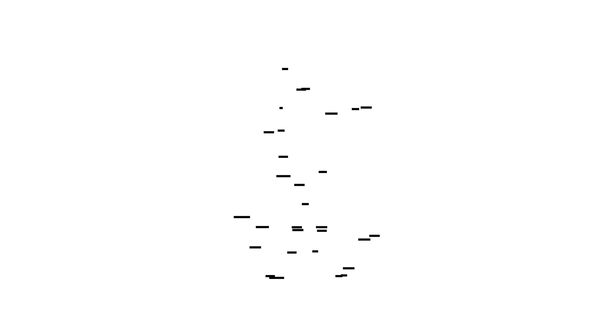
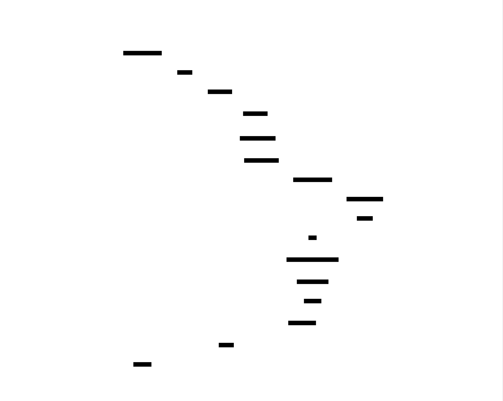

# Capstone: Complete Database Engine - Design Document


## Overview

This project designs and builds a complete, from-scratch relational database management system (RDBMS) supporting SQL queries, ACID transactions, and client connectivity. The key architectural challenge is integrating complex subsystems—parsing, planning, storage, concurrency control, and networking—into a single, coherent, and correct system, much like constructing a skyscraper where every floor must perfectly align with the foundation and the electrical, plumbing, and structural systems.


> This guide is meant to help you understand the big picture before diving into each milestone. Refer back to it whenever you need context on how components connect.


## Context and Problem Statement

> **Milestone(s):** All (Foundational Context)

This section establishes the intellectual groundwork for building a complete database engine. It explains the fundamental problem we are solving, provides an intuitive analogy to build a mental model, dissects the core technical challenges, and surveys existing architectural approaches to situate our project within the broader landscape of database systems.

### The Library Analogy for a Database

Before diving into technical specifications, it's crucial to build an accurate mental model. A relational database is analogous to a highly organized, automated, and massively parallel library.

| Library Component | Database Component | Purpose & Analogy |
| :--- | :--- | :--- |
| **Card Catalog / Index** | **System Catalog & B-tree Indexes** | The card catalog tells you where to find a book (by title, author, subject). Similarly, the catalog stores table schemas, and B-tree indexes allow you to find data rows by a key without scanning every shelf (page). |
| **Bookshelves (Stacks)** | **Storage Engine (Heap File & Pages)** | The shelves hold the actual books (data). In the database, the heap file is the unordered collection of all data rows, organized into fixed-size pages (like shelves with a fixed capacity). |
| **Librarians** | **Query Planner & Optimizer** | When you ask a complex question ("find books about 18th-century French art that are not checked out"), the librarian devises a plan: check the subject index, then the availability ledger. The query planner does the same, choosing the most efficient sequence of steps (scans, joins, sorts) to answer your SQL query. |
| **Checkout Desk & Ledger** | **Transaction Manager & Write-Ahead Log (WAL)** | The ledger records who borrowed which book and when. Before a book can be taken, the transaction (checkout) is recorded. If the library's power fails, the ledger can be used to reconstruct which books are checked out. The WAL serves as this immutable ledger, ensuring no committed change is lost. |
| **Multiple Reading Rooms** | **MVCC (Multi-Version Concurrency Control)** | Imagine a library with a "reading room" for each patron. A patron sees a snapshot of the library frozen at the time they entered. Others can check books in and out without disturbing the patron's view. MVCC creates these isolated snapshots for each transaction, allowing readers and writers to coexist without blocking. |
| **Inter-Library Loan Network** | **Client/Server Wire Protocol** | A standardized way (like a postal form) for remote patrons (clients) to request books (send queries) and receive them (get result sets). The PostgreSQL wire protocol is our standardized "form" that tools like `psql` understand. |

> **Key Insight:** The brilliance of a database lies not in any single component, but in their seamless orchestration. A librarian (optimizer) must understand the catalog (metadata), the shelf organization (storage layout), and the checkout system (transactions) to provide correct and fast service. Our challenge is building all these specialized components and their intricate interactions.

### The Core Technical Challenge

The fundamental problem a Database Management System (DBMS) solves is: **providing reliable, efficient, and concurrent access to structured, persistent data.** Each adjective represents a mountain of complexity.

1.  **Reliable (Durability & Consistency):** Data must survive system crashes (`kill -9`, power loss) without corruption. Once a transaction is committed, it must be permanent. The system must also enforce data integrity rules (e.g., "account balance cannot be negative").

2.  **Efficient (Performance):** Retrieving data must be fast, even from datasets far larger than available RAM. This requires intelligent data layout (pages, B-trees), caching (buffer pool), and query optimization (choosing the best plan from many possibilities).

3.  **Concurrent (Isolation):** Hundreds of users or processes must be able to read and write data simultaneously without interfering with each other, while each perceiving a consistent view of the database. This is the "concurrency control" problem.

4.  **Structured (Data Model):** Data is not a blob; it adheres to a schema (tables, columns, types, relationships). The system must understand and enforce this structure.

5.  **Persistent (Storage):** Data outlives the process. It must be stored on non-volatile media (disk, SSD) with a layout that balances access speed, storage density, and update cost.

These requirements are **deeply conflicting**. For example:
*   Durability requires writing to disk frequently, but disk I/O is the primary performance bottleneck.
*   Strong isolation often requires locking, which reduces concurrency and performance.
*   Rich query flexibility (ad-hoc SQL) makes optimization exponentially harder.

> **The Central Tension:** A database is a perpetual balancing act between **correctness** (ACID semantics), **performance** (low latency, high throughput), and **complexity** (manageable codebase). Every design decision is a trade-off along these axes.

The following ADR formalizes our primary architectural stance in navigating these tensions.

**Decision: Monolithic, Single-Node Educational Architecture**

*   **Context:** We are building a complete, from-scratch DBMS for educational purposes. The goal is to understand core components and their integration, not to achieve production-scale performance or distribution.
*   **Options Considered:**
    1.  **Microservices Architecture:** Split components (parser, planner, storage, transaction manager) into separate processes communicating via RPC.
    2.  **Shared-Nothing Distributed:** Design for distribution from the start, with data partitioned across multiple nodes, like Google Spanner.
    3.  **Monolithic Single-Node:** Build all components into a single process, sharing memory directly, similar to SQLite or the core of PostgreSQL.
*   **Decision:** Adopt a **Monolithic Single-Node** architecture.
*   **Rationale:**
    1.  **Educational Clarity:** Direct function calls and shared memory structures are easier to trace, debug, and understand than distributed RPCs and serialized messages. The focus stays on database algorithms, not network orchestration.
    2.  **Simplified Failure Modes:** We avoid the enormous complexity of network partitions, partial failures, and consensus protocols (Paxos/Raft). Crash recovery is "simply" replaying a local WAL.
    3.  **Proven Path:** SQLite and early versions of major databases (MySQL, PostgreSQL) followed this path. It's the most direct way to learn the fundamentals.
*   **Consequences:**
    *   **Enables:** Simplified development, easier reasoning about consistency, and a clear milestone progression.
    *   **Trade-offs:** Limits horizontal scalability and fault tolerance. Performance is bounded by a single machine's resources.

| Option | Pros | Cons | Chosen? |
| :--- | :--- | :--- | :--- |
| **Microservices** | Clear component boundaries, independent scaling, language flexibility. | Extreme complexity in coordination, debugging, and transaction management. Network overhead dominates. | ❌ |
| **Shared-Nothing Distributed** | Ultimate scalability and fault tolerance. | Astronomical complexity (global consensus, clock synchronization, distributed query planning). Far beyond educational scope. | ❌ |
| **Monolithic Single-Node** | **Conceptual simplicity, direct interaction between components, ideal for learning.** | Scales vertically only, single point of failure. | ✅ |

### Existing Architectural Approaches

Our monolithic design is one point in a vast design space. Understanding neighboring approaches clarifies our choices and provides a roadmap for future evolution.

**1. Monolithic Embedded (SQLite)**
*   **Model:** The database engine is a library linked directly into the application process. There is no separate server. The library manages local files.
*   **Characteristics:**
    *   **Zero Configuration:** No setup or administration.
    *   **Serverless:** Application makes direct C function calls (e.g., `sqlite3_exec`).
    *   **Single-Writer, Multiple-Readers (SWMR):** A simple concurrency model enforced by file locks.
    *   **Full ACID via WAL:** Despite its simplicity, it provides strong durability guarantees.
*   **Relevance to Our Project:** This is our closest architectural relative. We adopt SQLite's page-based storage, B-tree indexing, and WAL-based recovery. However, we will implement a client/server protocol rather than an embedded C API.

**2. Client-Server Process-Per-Connection (PostgreSQL)**
*   **Model:** A central server daemon listens for network connections. For each client connection, it forks a new backend process that handles all queries for that client. Processes share a buffer pool and lock tables via shared memory.
*   **Characteristics:**
    *   **Process Isolation:** A crash in one backend doesn't kill the entire server.
    *   **Rich Concurrency:** Uses MVCC (Snapshot Isolation) for highly concurrent read/write workloads.
    *   **Extensible:** Supports custom data types, functions, and procedural languages.
*   **Relevance:** We will adopt PostgreSQL's **wire protocol**, allowing us to use standard tools (`psql`, `libpq`). Our internal MVCC design will be inspired by PostgreSQL's tuple visibility rules.

**3. Shared-Nothing Distributed (Google Spanner)**
*   **Model:** Data is automatically partitioned ("sharded") across many commodity servers in globally distributed data centers. Uses the Paxos consensus algorithm for replication and fault tolerance. Relies on synchronized atomic clocks (TrueTime) for global transaction ordering.
*   **Characteristics:**
    *   **Global Scale:** Manages petabytes across continents.
    *   **External Consistency:** Provides linearizability (stronger than snapshot isolation) for distributed transactions.
    *   **Automatic Sharding & Rebalancing:** The system manages data distribution.
*   **Relevance:** This is a **non-goal** for our capstone. However, understanding it highlights the limitations of our single-node design and the monumental challenges of distribution: consensus, clock synchronization, and distributed query execution.

| Architecture | Typical Use Case | Concurrency Model | Scaling Model | Complexity | Our Project's Alignment |
| :--- | :--- | :--- | :--- | :--- | :--- |
| **SQLite (Embedded)** | Mobile apps, local caching, simple tools. | SWMR (file locks) | Single file, single process. | Low | High (Storage, WAL, B-tree) |
| **PostgreSQL (Client-Server)** | Web applications, OLTP, general-purpose. | MVCC (Snapshot Isolation) | Vertical (bigger server) / Read replicas. | High | Medium (Wire Protocol, MVCC) |
| **Spanner (Distributed)** | Global-scale services (Gmail, Ads). | Distributed MVCC + 2PC + Paxos | Horizontal (add nodes) across datacenters. | Extreme | Low (Conceptual inspiration only) |

> **Design Insight:** The progression from embedded (SQLite) to client-server (PostgreSQL) to distributed (Spanner) is a ladder of increasing scalability and fault tolerance, paid for with exponential growth in complexity. Our project deliberately stops at the middle rung, mastering the fundamentals required for the first two.

### Implementation Guidance

This section is purely foundational and doesn't require specific implementation. However, the architectural decision to build a monolithic single-node system has profound implications for our codebase structure from Day 1.

**A. Technology Recommendations Table**

| Component | Simple Option (for Learning) | Advanced Option (for Robustness) |
| :--- | :--- | :--- |
| **Overall Architecture** | Single-threaded event loop (for simplicity) | Multi-threaded with thread-per-connection or worker pool |
| **Inter-Component Communication** | Direct function calls & shared in-memory structs | Message passing channels (e.g., Rust `tokio::sync::mpsc`) for cleaner boundaries |
| **Persistence** | Direct `std::fs` file I/O | Memory-mapped I/O (`memmap2` crate) for performance |

**B. Recommended File/Module Structure**

Our monolithic architecture translates to a Rust workspace or a well-organized single crate. The following structure mirrors the component separation, promoting clean interfaces.

```
capstone-db/
├── Cargo.toml                    # Workspace root manifest
├── Cargo.lock
├── docs/
│   └── design.md                # This document
├── crates/
│   ├── sql_frontend/            # Milestone 1
│   │   ├── Cargo.toml
│   │   ├── src/
│   │   │   ├── parser/          # Recursive descent parser
│   │   │   │   ├── ast.rs       # AST type definitions
│   │   │   │   └── grammar.rs   # Parsing logic
│   │   │   ├── catalog/         # System catalog
│   │   │   │   ├── mod.rs
│   │   │   │   └── schema.rs    # Table, Column, Index metadata
│   │   │   └── planner/         # Logical -> Physical plan
│   │   │       └── logical.rs
│   │   └── tests/
│   ├── storage_engine/          # Milestone 2
│   │   ├── Cargo.toml
│   │   ├── src/
│   │   │   ├── disk/            # Page-oriented file I/O
│   │   │   ├── buffer/          # Buffer pool manager (LRU)
│   │   │   ├── heap/            # Table heap (slotted pages)
│   │   │   └── btree/           # B+tree index
│   │   └── tests/
│   ├── query_execution/         # Milestone 3
│   │   ├── Cargo.toml
│   │   ├── src/
│   │   │   ├── exec/            # Volcano operators (SeqScan, Join, etc.)
│   │   │   ├── optim/           # Cost-based optimizer
│   │   │   └── types.rs         # Data type representations (Value)
│   │   └── tests/
│   ├── transactions/            # Milestone 4
│   │   ├── Cargo.toml
│   │   ├── src/
│   │   │   ├── mvcc/            # Version storage & visibility
│   │   │   ├── wal/             # Write-Ahead Log
│   │   │   └── recovery.rs      # ARIES-style recovery
│   │   └── tests/
│   ├── wire_protocol/           # Milestone 5
│   │   ├── Cargo.toml
│   │   ├── src/
│   │   │   ├── server/          # TCP server & connection handling
│   │   │   ├── messages/        # PostgreSQL message serialization
│   │   │   └── session.rs       # Per-connection state
│   │   └── tests/
│   └── common/                  # Shared utilities
│       ├── Cargo.toml
│       └── src/
│           ├── error.rs         # Centralized error types
│           └── macros.rs        # Common helper macros
└── src/                         # Optional: Main binary (if not a workspace)
    └── main.rs                  # Glues all components together
```

**C. Infrastructure Starter Code**

While the core components are the learning goal, we need a minimal skeleton to start. Here is a foundational `Error` type that will be used across all crates to ensure consistent error handling.

**File:** `crates/common/src/error.rs`
```rust
use thiserror::Error;

#[derive(Error, Debug)]
pub enum DbError {
    // I/O and System Errors
    #[error("I/O error: {0}")]
    Io(#[from] std::io::Error),
    #[error("System error: {0}")]
    System(String),

    // SQL & Query Errors
    #[error("Syntax error: {0}")]
    Syntax(String),
    #[error("Unknown table: {0}")]
    UnknownTable(String),
    #[error("Unknown column: {0}")]
    UnknownColumn(String),
    #[error("Type mismatch: expected {expected}, found {found}")]
    TypeMismatch { expected: String, found: String },

    // Storage & Transaction Errors
    #[error("Page {0} not found in buffer pool")]
    PageNotFound(u32),
    #[error("Transaction conflict: {0}")]
    TransactionConflict(String),
    #[error("Serialization failure")]
    SerializationFailure,

    // Execution Errors
    #[error("Duplicate key violation")]
    DuplicateKey,
    #[error("Null constraint violation")]
    NullViolation,

    // Protocol Errors
    #[error("Protocol error: {0}")]
    Protocol(String),
    #[error("Authentication failed")]
    AuthenticationFailed,
}

pub type Result<T> = std::result::Result<T, DbError>;
```

**D. Core Logic Skeleton Code**

The main entry point of our monolithic server will coordinate all subsystems. Here's its skeleton.

**File:** `src/main.rs`
```rust
use common::error::{DbError, Result};
use sql_frontend::parser::parse_sql;
use sql_frontend::catalog::Catalog;
use storage_engine::buffer::BufferPoolManager;
use storage_engine::disk::DiskManager;
use transactions::wal::WriteAheadLog;
use wire_protocol::server::Server;

struct Database {
    catalog: Catalog,
    buffer_pool: BufferPoolManager,
    wal: WriteAheadLog,
    // ... other core components
}

impl Database {
    /// Initialize database from a data directory.
    fn new(data_dir: &str) -> Result<Self> {
        // TODO 1: Initialize DiskManager with path to database file (e.g., data_dir/db.bin)
        // TODO 2: Initialize BufferPoolManager with a reference to DiskManager
        // TODO 3: Initialize WriteAheadLog with its own file (e.g., data_dir/wal.bin)
        // TODO 4: Initialize Catalog, loading metadata from a special system pages
        // TODO 5: Perform crash recovery if needed (check WAL and replay)
        // TODO 6: Return a fully initialized Database struct
        unimplemented!()
    }

    /// Execute a single SQL statement.
    fn execute(&mut self, sql: &str) -> Result<QueryResult> {
        // TODO 1: Parse SQL string into an AST using parse_sql
        // TODO 2: Consult Catalog to resolve table/column names in AST
        // TODO 3: Generate a logical query plan from the resolved AST
        // TODO 4: Optimize logical plan into a physical execution plan (using cost model)
        // TODO 5: Begin a new transaction (obtain a transaction ID)
        // TODO 6: Execute the physical plan within the transaction context
        // TODO 7: For writes: record changes in WAL, then apply to buffer pool
        // TODO 8: Return results (for SELECT) or acknowledge completion (for INSERT/UPDATE/DELETE)
        unimplemented!()
    }

    /// Shutdown gracefully, ensuring all data is durable.
    fn shutdown(self) -> Result<()> {
        // TODO 1: Flush all dirty pages from buffer pool to disk
        // TODO 2: Close and sync the WAL file
        // TODO 3: Close the database file
        // TODO 4: Return Ok(()) on success
        unimplemented!()
    }
}

fn main() -> Result<()> {
    // TODO: Parse command-line arguments for data directory, port, etc.
    let data_dir = "./data";
    let port = 5432;

    println!("Starting database server on port {}...", port);

    // Initialize the core database engine
    let mut db = Database::new(data_dir)?;

    // Start the wire protocol server in a separate thread/task
    let server = Server::new("127.0.0.1", port, db)?;
    server.run() // This will block, handling client connections

    // On shutdown signal (e.g., Ctrl-C), call db.shutdown()
}
```

**E. Language-Specific Hints (Rust)**
*   **Error Handling:** Use the `thiserror` crate for convenient `Error` enum definitions, as shown above. Use `anyhow` for quick prototyping in binaries, but avoid it in library crates for clearer error types.
*   **Concurrency:** Start with `std::sync::{Mutex, RwLock}` for shared state. Later, consider `tokio` for async I/O, especially in the wire protocol server.
*   **Serialization:** The `bincode` crate is excellent for fast, compact serialization of structs to disk (for pages, WAL records). Use `serde` for JSON if needed for debugging.
*   **Testing:** Use `#[cfg(test)]` modules extensively. For integration tests that need a temporary database file, use the `tempfile` crate.

**F. Milestone Checkpoint**
After setting up the initial project structure, you should be able to:
1.  **Command:** `cargo build --workspace`
    *   **Expected Output:** Successful compilation of all crates (with many `unimplemented!` warnings).
2.  **Command:** `cargo test -p common`
    *   **Expected Output:** All tests in the `common` crate pass (initially, there may be none).
3.  **Sign of Trouble:** If you see "cannot find crate", check your `Cargo.toml` workspace membership and dependency declarations.

**G. Debugging Tips**
| Symptom | Likely Cause | How to Diagnose | Fix |
| :--- | :--- | :--- | :--- |
| "Circular dependency" errors in `Cargo.toml` | Crates depend on each other (e.g., `storage_engine` depends on `transactions` which depends back on `storage_engine`). | Run `cargo tree` to visualize dependencies. | Refactor shared types into a `common` crate. Keep dependencies acyclic. |
| `unimplemented!()` panic at runtime | You've run code that hasn't been written yet (as expected in early milestones). | The panic backtrace will show which function is missing. | Implement the corresponding function as you progress through milestones. |
| Confusion about where to start | The project seems overwhelming. | Re-read this design doc. Focus on one crate at a time, starting with `sql_frontend`. | Follow the Milestone 1 deliverables. Build the parser first, then catalog, then planner. |


## Goals and Non-Goals
> **Milestone(s):** All (Scope Definition)

This section defines the **boundaries of our educational database engine**—what we will build and, equally importantly, what we will intentionally exclude. Think of this as the architectural blueprint's legend and scale: it tells future builders exactly what the structure will contain (a five-story office building with elevators) and what it won't (no underground parking, no rooftop helipad). Establishing clear scope early prevents "scope creep"—the tendency for projects to gradually accumulate features until they become unmanageable—and ensures we focus our learning on the **core architectural patterns** of a relational database system.

### Must-Have Goals

Our database engine must fulfill the following **functional requirements** (what the system does) and **non-functional requirements** (how well it performs those functions). These goals are derived from the capabilities of a minimal, practical single-node RDBMS suitable for learning.

#### Functional Requirements: The "What"
The system must:

1. **Execute Standard SQL DML and Basic DDL**
   - **DDL**: `CREATE TABLE`, `DROP TABLE`, `CREATE INDEX` with basic column types (INTEGER, BIGINT, VARCHAR, BOOLEAN, NULL).
   - **DML**: Full `SELECT` with `WHERE`, `JOIN` (INNER, LEFT), `ORDER BY`, `GROUP BY` with aggregate functions (COUNT, SUM, AVG, MIN, MAX), `LIMIT`. Plus `INSERT`, `UPDATE`, `DELETE`.
   - **Example**: A user should be able to create a `books` table, insert records, and run a `SELECT` joining with an `authors` table, filtering, grouping, and sorting.

2. **Provide ACID Transactions with Snapshot Isolation**
   - **Atomicity**: A transaction's changes are all committed or all rolled back—no partial updates.
   - **Consistency**: Transactions leave the database in a consistent state (e.g., foreign key constraints are maintained, though our initial version may skip complex constraints).
   - **Isolation**: **Snapshot Isolation**—each transaction sees a consistent snapshot of the database as of its start time, preventing dirty reads and non-repeatable reads (though write skew is possible).
   - **Durability**: Once a transaction commits, its changes survive system crashes via **Write-Ahead Logging (WAL)**.

3. **Support Efficient Data Storage and Retrieval**
   - **Heap Storage**: Store table rows in a heap file (unordered collection) using a slotted-page format for variable-length records.
   - **B+ Tree Indexes**: Support single-column B+ tree indexes for fast point lookups (`WHERE id = 5`) and range scans (`WHERE id BETWEEN 10 AND 20`).
   - **Buffer Pool**: Cache frequently accessed pages in memory with an LRU eviction policy to minimize disk I/O.

4. **Optimize and Execute Query Plans**
   - **Volcano Iterator Model**: Use a pull-based execution model where each operator implements `next()` to produce rows.
   - **Join Algorithms**: Implement both **hash join** (for equality joins) and **sort-merge join** (for ordered joins).
   - **Cost-Based Optimization**: Choose the best join order and index usage based on simple statistics (table cardinality, index selectivity).

5. **Expose a Standard Client Interface**
   - **PostgreSQL Wire Protocol**: Communicate with clients over TCP using the PostgreSQL v3 protocol, allowing connections from standard tools like `psql`, `libpq`, and most ORMs.

6. **Recover from Crashes**
   - **WAL-Based Recovery**: After a crash (e.g., power loss), the database must restart and restore itself to the last consistent state by replaying the write-ahead log.

#### Non-Functional Requirements: The "How Well"
These quality attributes guide our architectural and implementation decisions:

| Requirement | Description | Rationale & Target |
|-------------|-------------|-------------------|
| **Educational Clarity** | The codebase must be readable, well-modularized, and demonstrate core database concepts clearly. | This is a learning project; understandability trumps extreme performance. Code should have clear separation between components (e.g., parser, executor, storage). |
| **Single-Node Monolithic Architecture** | All components run in a single OS process. No distributed components. | Keeps complexity manageable. A single-node monolithic design is the foundation for understanding distributed databases later. |
| **Moderate Performance** | Handle at least 10,000 rows per table and support 10-20 concurrent client connections with reasonable latency (<100ms for simple queries). | We need enough performance to feel interactive, but not to compete with commercial databases. Focus on correctness first. |
| **Disk Persistence** | All data must survive process restarts and system crashes. Use durable storage (local filesystem). | Teaches the challenges of durability and crash recovery. |
| **Concurrency** | Support multiple concurrent clients reading and writing via MVCC. Use coarse-grained locking (e.g., table-level locks for DDL) initially, with row-level versioning for DML. | Introduces concurrency control without overwhelming complexity. |
| **Portability** | Run on major OSes (Linux, macOS, Windows via WSL) with a single binary. Use Rust's standard library and cross-platform filesystem APIs. | Ensures learners can develop on their preferred environment. |
| **Minimal Dependencies** | Prefer pure Rust with minimal external crates. Use `std` for most tasks; allow essential crates for networking (`tokio`), parsing (`nom`/`peg`), and serialization (`serde`). | Reduces build complexity and teaches how core mechanisms work without black-box libraries. |

> **Architectural Principle:** **Correctness Over Performance** — While performance matters, we prioritize a correct, understandable implementation. A slow but correct database is a better learning tool than a fast but buggy one. Performance optimizations (e.g., lock-free structures, vectorized execution) are explicitly deferred to "Future Extensions."

#### Architecture Decision Records (ADRs) for Key Goals

> **Decision: Snapshot Isolation (SI) over Serializable Snapshot Isolation (SSI)**
> - **Context**: We need a concurrency control mechanism that allows high concurrency between readers and writers while providing strong isolation guarantees. Serializable isolation (the highest level) is complex to implement correctly (e.g., requires detection of serialization conflicts).
> - **Options Considered**:
>   1. **Read Committed**: Allows non-repeatable reads and phantom reads. Simpler but provides weak guarantees.
>   2. **Snapshot Isolation (SI)**: Prevents dirty reads and non-repeatable reads; allows write skew anomalies. Implemented via multi-versioning.
>   3. **Serializable Snapshot Isolation (SSI)**: Prevents write skew via additional conflict detection (e.g., tracking read/write sets). More complex.
> - **Decision**: Implement **Snapshot Isolation** using MVCC.
> - **Rationale**:
>   - SI is the default isolation level in many databases (e.g., Oracle, PostgreSQL's "REPEATABLE READ" actually provides SI). It offers a good balance of concurrency and isolation.
>   - MVCC is a well-understood pattern—readers don't block writers, writers don't block readers.
>   - Write skew, while a real anomaly, is acceptable for our educational scope; we can document it as a known limitation.
>   - Implementing SSI would require a significant increase in complexity (dependency tracking, predicate locking) that distracts from core storage and execution concepts.
> - **Consequences**:
>   - Learners will implement a classic MVCC system with transaction IDs and visibility rules.
>   - The database will exhibit write skew under certain interleavings (e.g., two concurrent transactions reading balance columns and updating based on that read).
>   - We can later add SSI as an extension (track read sets and detect conflicts).

| Option | Pros | Cons | Chosen? |
|--------|------|------|---------|
| Read Committed | Simple; minimal version tracking. | Non-repeatable reads, phantoms—weak guarantees. | ❌ |
| Snapshot Isolation (MVCC) | No dirty/non-repeatable reads; high concurrency. | Write skew anomaly possible. | ✅ |
| Serializable Snapshot Isolation | Prevents write skew; true serializability. | Complex conflict detection; more metadata. | ❌ |

> **Decision: PostgreSQL Wire Protocol over Custom Protocol**
> - **Context**: We need a way for clients to communicate with our database server. A custom protocol would be simpler to implement but would require custom client drivers.
> - **Options Considered**:
>   1. **Custom text-based protocol** (like Redis RESP): Simple to parse; but no existing client support.
>   2. **PostgreSQL wire protocol (v3)**: Binary protocol; complex but supported by countless clients (psql, JDBC, Python's psycopg2, etc.).
>   3. **HTTP/JSON REST API**: Easy for web clients; not a standard database interface.
> - **Decision**: Implement the **PostgreSQL wire protocol**.
> - **Rationale**:
>   - **Immediate compatibility** with existing tools is a huge win for testing and demonstration. Learners can use familiar tools like `psql` immediately.
>   - The protocol is well-documented and has many open-source implementations to reference.
>   - Implementing a real-world protocol teaches about framing, message types, and stateful connections—valuable skills.
> - **Consequences**:
>   - We must implement protocol negotiation, authentication (may start with "trust" authentication), and message serialization/deserialization.
>   - We must map our internal types (INTEGER, VARCHAR) to PostgreSQL's OIDs (Object Identifiers).
>   - Complexity is higher than a custom protocol, but the payoff in usability is worth it.

| Option | Pros | Cons | Chosen? |
|--------|------|------|---------|
| Custom text protocol | Simple to implement; total control. | No client support; users must write custom drivers. | ❌ |
| PostgreSQL wire protocol | Universal client compatibility; real-world experience. | More complex; must handle many message types. | ✅ |
| HTTP/JSON REST | Easy for web apps; simple to debug. | Not standard for databases; no transaction support. | ❌ |

#### Concrete Example: A Complete Workflow
To illustrate these goals, consider a typical use case:
1. **Client** connects via `psql` (PostgreSQL protocol).
2. **User** runs `BEGIN;` followed by `INSERT INTO accounts (id, balance) VALUES (1, 1000);` and `SELECT SUM(balance) FROM accounts;`.
3. **System**:
   - Parses SQL, creates a transaction with a unique ID (e.g., `txid=100`).
   - For `INSERT`: Writes a WAL record, adds a new row version tagged with `txid=100` to the heap file.
   - For `SELECT`: Creates a snapshot (sees all rows where `txid ≤ 100`), scans the heap, computes sum.
   - On `COMMIT`: Flushes WAL to disk, marks transaction `txid=100` as committed.
4. **Result**: The user sees the sum including their newly inserted row, and the change persists even after a server crash.

### Explicit Non-Goals

To keep the project tractable and focused on core concepts, we **explicitly exclude** the following features. This is a "not-to-do" list that prevents unnecessary complexity.

| Feature | Why It's Excluded | Alternative/Workaround |
|---------|-------------------|------------------------|
| **Distributed Transactions & Sharding** | Distributed consensus (Paxos, Raft), network partitions, and global snapshot isolation are advanced topics that would double the project scope. | Our database runs on a single node. For scaling, one could run multiple independent instances with application-level sharding. |
| **Advanced SQL Features** | `WITH` (CTEs), window functions, full-text search, stored procedures, triggers, views, foreign keys, cascading deletes. | These are important for real databases but can be added later as extensions. We focus on the core DML and DDL. |
| **Online Schema Changes** | Altering a table's schema (e.g., `ALTER TABLE ADD COLUMN`) while the database is live requires complex versioning of row formats and metadata. | Requires dropping and recreating tables. We can implement a simple `ALTER TABLE` that rewrites the entire table offline. |
| **Sophisticated Query Optimization** | Genetic algorithms for join ordering, histogram-based statistics, materialized view selection, query hints. | Our cost-based optimizer uses simple heuristics (table sizes, index selectivity) and limited search (greedy join ordering). |
| **Columnar Storage or Vectorized Execution** | These are optimizations for analytical (OLAP) workloads, whereas we focus on a row-oriented, OLTP-style engine. | Our row-oriented slotted pages and volcano model are foundational; columnar storage can be a future extension. |
| **Pluggable Storage Engines** | Supporting multiple storage backends (InnoDB vs MyISAM style) adds abstraction complexity. | We have one storage engine: B+ tree indexes atop a heap file. |
| **Advanced Authentication & Authorization** | Roles, granular permissions (GRANT/REVOKE), LDAP integration. | We'll support a simple password-based or "trust" authentication (no password) for learning. |
| **Backup & Replication** | Point-in-time recovery, logical replication, WAL archiving. | Crash recovery via WAL is implemented; manual file copies can serve as backups. |
| **Full-Text Indexes & GIS Extensions** | Specialized index types require different data structures (inverted indexes, R-trees). | Out of scope; we focus on B+ trees for scalar data. |
| **Memory-Optimized Tables** | Keeping all data in RAM with persistence to disk adds complexity for hybrid storage. | Our buffer pool caches disk pages; everything is ultimately disk-backed. |
| **SQL Standard Compliance** | Full SQL:2016 compliance is a massive undertaking. | We implement a useful subset. We'll document deviations. |

> **Design Philosophy:** **Depth Over Breadth** — By excluding these features, we can dive deep into the fundamental components (parsing, planning, storage, transactions) that form the backbone of every relational database. Learners who understand these foundations can later explore advanced features with a solid base.

#### Common Pitfalls in Scope Management

⚠️ **Pitfall: Creeping into Distributed Systems**
- **Description**: Trying to add features like "multi-primary replication" or "automatic failover" because they seem exciting.
- **Why It's Wrong**: Distributed systems introduce entirely new failure modes (network partitions, clock skew) and consensus algorithms that would dominate the project, pulling focus from core database internals.
- **How to Avoid**: Strictly adhere to the single-node monolithic architecture. If you find yourself designing a network protocol for coordination, stop and reconsider.

⚠️ **Pitfall: Over-Engineering the Parser**
- **Description**: Spending weeks implementing a full SQL grammar with every obscure clause (e.g., `INTERSECT`, `DISTINCT ON`).
- **Why It's Wrong**: The parser, while important, is not the core learning goal. A recursive descent parser for a subset of SQL is sufficient to feed the planner and executor where the real learning happens.
- **How to Avoid**: Implement only the SQL subset specified in "Must-Have Goals." Use a parser generator (like `peg`) to keep the grammar maintainable, but don't extend it beyond the required syntax.

⚠️ **Pitfall: Premature Performance Optimization**
- **Description**: Immediately implementing a sophisticated LRU-K buffer pool or a lock-free B+ tree to boost performance before having a working baseline.
- **Why It's Wrong**: This violates the "correctness over performance" principle. A complex, buggy optimization is harder to debug and may obscure the core algorithm.
- **How to Avoid**: First implement a simple, correct version (e.g., naive LRU, coarse-grained locking). Then, profile and optimize only after the system works correctly.

#### Non-Goals Rationale Table

For each excluded feature, we document the **educational trade-off**:

| Feature | Educational Cost (Complexity Added) | Educational Benefit (Concepts Learned) | Decision |
|---------|-------------------------------------|----------------------------------------|----------|
| Foreign Keys | Must validate constraints on every write; cascading updates/deletes require recursive operations. | Teaches referential integrity and constraint enforcement. | ❌ Defer: Can be added after core MVCC and WAL are stable. |
| Prepared Statements | Requires parameter binding, plan caching, and potential re-planning. | Teaches query reuse and security (SQL injection prevention). | ❌ Defer: Simple query flow is complex enough initially. |
| Secondary Indexes | Multiple B+ trees per table; index synchronization on updates. | Teaches how indexes accelerate different access patterns. | ❌ Defer: Single-column primary index is sufficient for learning B+ trees. |
| Checkpoints in WAL | Need to track dirty pages and periodically flush them to reduce recovery time. | Teaches how to bound WAL size and improve restart performance. | ❌ Defer: Initially, we can replay the entire WAL on recovery; adding checkpoints is an optimization. |

### Implementation Guidance

> **Milestone Checkpoint:** This section defines the overall scope; after reading, you should be able to articulate what the database will and won't do. Use this as a reference when deciding whether to implement a feature.

#### A. Technology Recommendations Table

| Component | Simple Option (Learning Focus) | Advanced Option (For Later) |
|-----------|--------------------------------|-----------------------------|
| SQL Parser | Recursive descent handwritten or parser generator (`peg`). | Use a full SQL grammar with ANTLR. |
| Storage Engine | Slotted pages in a single file; global file lock for writes. | Multiple files per table; lock-free page management. |
| Buffer Pool | Clock LRU; simple pin/unpin. | LRU-K; background writer thread. |
| B+ Tree | In-memory nodes; naive split/merge. | On-disk with copy-on-write for snapshot isolation. |
| WAL | Single log file; simple replay. | Segmented logs with checkpoints. |
| Networking | Single-threaded async (`tokio`) with simple query flow. | Connection pooling; pipelining; prepared statements. |

#### B. Recommended File/Module Structure

Organize the codebase as a Rust workspace with crates representing subsystems. This encourages clean interfaces and independent testing.

```
capstone-db/
├── Cargo.toml                    # Workspace definition
├── Cargo.lock
├── README.md
├── docs/
│   └── design.md                # This design document
├── crates/
│   ├── sqlparser/               # Milestone 1: SQL Frontend & Catalog
│   │   ├── src/
│   │   │   ├── ast.rs           # AST definitions (Select, Insert, etc.)
│   │   │   ├── parser.rs        # Recursive descent parser
│   │   │   ├── catalog.rs       # Catalog structs (Table, Column, Schema)
│   │   │   ├── planner.rs       # Logical plan generation
│   │   │   └── lib.rs
│   │   └── Cargo.toml
│   ├── storage/                 # Milestone 2: Storage Engine & B-tree
│   │   ├── src/
│   │   │   ├── disk.rs          # DiskManager, Page, PageId
│   │   │   ├── buffer.rs        # BufferPool, Frame, LRU
│   │   │   ├── heap.rs          # TableHeap, SlottedPage, Record
│   │   │   ├── btree.rs         # BTree, Node, SearchResult
│   │   │   └── lib.rs
│   │   └── Cargo.toml
│   ├── executor/                # Milestone 3: Query Execution & Optimization
│   │   ├── src/
│   │   │   ├── volcano.rs       # Operator trait, next(), etc.
│   │   │   ├── operators.rs     # SeqScan, IndexScan, HashJoin, etc.
│   │   │   ├── optimizer.rs     # CostBasedOptimizer, plan rewriting
│   │   │   └── lib.rs
│   │   └── Cargo.toml
│   ├── transaction/             # Milestone 4: Transactions & WAL
│   │   ├── src/
│   │   │   ├── mvcc.rs          # TransactionId, Snapshot, Visibility
│   │   │   ├── wal.rs           # LogRecord, LogManager, Recovery
│   │   │   ├── lock.rs          # Simple lock manager (table-level)
│   │   │   └── lib.rs
│   │   └── Cargo.toml
│   ├── protocol/                # Milestone 5: Wire Protocol & Client
│   │   ├── src/
│   │   │   ├── pgwire.rs        # Message parsing, formatting, OIDs
│   │   │   ├── server.rs        # TcpListener, Connection handler
│   │   │   └── lib.rs
│   │   └── Cargo.toml
│   └── database/                # Main integration crate
│       ├── src/
│       │   ├── error.rs         # DbError enum
│       │   ├── database.rs      # Database struct (main entry point)
│       │   ├── config.rs        # Configuration
│       │   └── lib.rs
│       └── Cargo.toml
└── tests/
    ├── integration/             # End-to-end tests
    └── data/                    # Sample .sql files for testing
```

#### C. Infrastructure Starter Code

Here's a minimal **error type** that will be used across all crates. Place this in `crates/database/src/error.rs`.

```rust
/// The main error type for the database engine.
/// Each subsystem should define its own error types and convert to this.
#[derive(thiserror::Error, Debug)]
pub enum DbError {
    // I/O and system errors
    #[error("IO error: {0}")]
    Io(#[from] std::io::Error),
    #[error("Storage error: {0}")]
    Storage(String),
    #[error("Buffer pool error: {0}")]
    BufferPool(String),

    // SQL and parsing errors
    #[error("SQL syntax error: {0}")]
    SqlSyntax(String),
    #[error("Catalog error: {0}")]
    Catalog(String),
    #[error("Type mismatch: expected {expected}, found {found}")]
    TypeMismatch { expected: String, found: String },

    // Transaction errors
    #[error("Transaction conflict: {0}")]
    TransactionConflict(String),
    #[error("Deadlock detected")]
    Deadlock,
    #[error("Transaction not found: {0}")]
    TransactionNotFound(u64),

    // Execution errors
    #[error("Execution error: {0}")]
    Execution(String),
    #[error("Invalid plan: {0}")]
    InvalidPlan(String),

    // Protocol errors
    #[error("Protocol error: {0}")]
    Protocol(String),
    #[error("Authentication failed")]
    AuthenticationFailed,

    // Other
    #[error("Configuration error: {0}")]
    Config(String),
    #[error("Internal error: {0}")]
    Internal(String),
}

pub type Result<T> = std::result::Result<T, DbError>;
```

#### D. Core Logic Skeleton Code

The `Database` struct is the main entry point that integrates all subsystems. Here's its skeleton in `crates/database/src/database.rs`:

```rust
use crate::error::{DbError, Result};
use sqlparser::catalog::Catalog;
use storage::buffer::BufferPool;
use transaction::wal::WalManager;
use protocol::server::ProtocolServer;

/// The main database struct that holds all subsystem components.
pub struct Database {
    /// System catalog storing table and index metadata.
    catalog: Catalog,
    /// Buffer pool caching disk pages.
    buffer_pool: BufferPool,
    /// Write-ahead log manager for durability.
    wal: WalManager,
    /// Protocol server for client connections (optional; may be started separately).
    server: Option<ProtocolServer>,
    /// Data directory path.
    data_dir: std::path::PathBuf,
}

impl Database {
    /// Initializes the database from a data directory, performing recovery if needed.
    /// This is the first function called when the database starts.
    pub fn new(data_dir: &str) -> Result<Self> {
        // TODO 1: Create data directory if it doesn't exist.
        // TODO 2: Initialize the WAL manager (open log file).
        // TODO 3: Run crash recovery if needed (see Milestone 4).
        // TODO 4: Initialize the buffer pool with a fixed number of frames (e.g., 1000).
        // TODO 5: Load the system catalog from disk (or create default catalog).
        // TODO 6: Initialize the protocol server (but don't start listening yet).
        // TODO 7: Return the Database struct with all components.
        unimplemented!()
    }

    /// Parses, plans, and executes a single SQL statement.
    /// This is the core method for executing SQL commands.
    pub fn execute(&mut self, sql: &str) -> Result<QueryResult> {
        // TODO 1: Parse the SQL string into an AST using the sqlparser crate.
        // TODO 2: Validate the AST against the catalog (check table/column existence, types).
        // TODO 3: Generate a logical plan from the AST.
        // TODO 4: Optimize the logical plan into a physical plan using the cost-based optimizer.
        // TODO 5: Execute the physical plan using the volcano iterator model.
        // TODO 6: For DML (INSERT/UPDATE/DELETE), ensure changes are written to WAL.
        // TODO 7: Return the appropriate QueryResult (e.g., rows for SELECT, count for UPDATE).
        unimplemented!()
    }

    /// Gracefully shuts down, ensuring durability.
    /// This should be called before the process exits.
    pub fn shutdown(self) -> Result<()> {
        // TODO 1: Stop the protocol server (if running) and close client connections.
        // TODO 2: Flush all dirty pages from the buffer pool to disk.
        // TODO 3: Ensure all WAL records are fsync'd.
        // TODO 4: Close the WAL file and other resources.
        unimplemented!()
    }
}

/// Enum representing the result of a query.
pub enum QueryResult {
    /// Result of a SELECT query: column names and rows.
    SelectResult {
        columns: Vec<String>,
        rows: Vec<Vec<sqlparser::value::Value>>,
    },
    /// Number of rows affected by an INSERT, UPDATE, or DELETE.
    UpdateCount(usize),
    /// Result of a DDL statement (e.g., CREATE TABLE).
    DdlResult,
    /// Empty result (e.g., COMMIT).
    Empty,
}
```

#### E. Language-Specific Hints

- **Error Handling**: Use the `thiserror` crate for easy `DbError` enum definitions and `anyhow` for context in tests.
- **Concurrency**: Use `std::sync::{Arc, Mutex, RwLock}` for shared components (like `BufferPool`). For the protocol server, use `tokio` for async I/O.
- **Serialization**: For WAL records, consider `bincode` or `serde` with a binary format. Keep records fixed-size where possible for faster recovery.
- **Testing**: Use `#[cfg(test)]` modules and integration tests in `tests/`. For property-based testing, use `proptest`.

#### F. Milestone Checkpoint

After reading this section, you should be able to answer:

1. **What SQL features will our database support?** List at least 5 DML features and 2 DDL statements.
2. **What isolation level are we implementing and what anomaly does it allow?**
3. **Why are we using the PostgreSQL wire protocol instead of a custom one?**
4. **Name three features explicitly excluded and why.**

To verify your understanding, sketch a simple architecture diagram showing the five main subsystems (Frontend, Storage, Execution, Transactions, Client) and write a paragraph describing how a `SELECT` query flows through them.

#### G. Debugging Tips

| Symptom | Likely Cause | How to Diagnose | Fix |
|---------|--------------|-----------------|-----|
| "Parser fails on valid SQL" | Grammar doesn't cover a clause (e.g., `HAVING`). | Check the AST produced; compare with expected structure. | Extend the parser grammar (but first check if it's in scope!). |
| "Transaction sees its own changes but others don't" | Snapshot isolation not implemented correctly; visibility rules wrong. | Print transaction IDs and row versions during a read. | Ensure each row version has `created_by` and `expired_by` transaction IDs; check snapshot construction. |
| "Database grows infinitely after many updates" | WAL not being truncated; old row versions not garbage collected. | Check WAL file size; count live vs. dead row versions. | Implement vacuuming (garbage collection) of old row versions. |
| "psql connection rejected" | Protocol version mismatch or authentication failure. | Check server logs for received startup packet. | Ensure you're sending correct protocol version (196608 for v3.0) and simple authentication. |


> **Milestone(s):** All (Architectural Foundation)

## High-Level Architecture

Think of our database engine as a **specialized factory for data**. Raw SQL queries arrive at the receiving dock, are broken down into their component parts on the assembly line, processed by specialized machinery that retrieves and manipates stored materials, and finally packaged into result sets for shipment back to the client. The factory must operate 24/7, handle multiple orders concurrently without mixing them up, and have a flawless record-keeping system to rebuild itself after a power outage. This section maps out the factory floor—the major subsystems, their responsibilities, and how work flows between them.

### Architectural Component Map

Our database adopts a **Monolithic Single-Node** architecture, where all core components reside in a single process. This simplifies development and is the classic model for systems like SQLite and early versions of PostgreSQL. The system is organized into five major subsystems, each corresponding to a project milestone.



| Subsystem | Milestone | Primary Responsibility | Key Analogy |
|-----------|-----------|------------------------|-------------|
| **SQL Frontend & Catalog** | 1 | **Understanding the request.** Parses SQL text, validates it against known schemas, and produces an initial logical plan. | The **order desk & blueprints**. Receives the customer's request (SQL), consults the master catalog of available products (tables/columns), and drafts an initial work order (logical plan). |
| **Storage Engine & B-tree** | 2 | **Storing and retrieving raw data.** Manages durable storage on disk, caches hot data in memory, and provides indexed access via B+ trees. | The **warehouse & forklifts**. Contains the physical shelves (disk pages), a loading dock cache (buffer pool), and an indexed catalog system (B-tree) to quickly locate items. |
| **Query Execution & Optimization** | 3 | **Executing the plan efficiently.** Transforms the logical plan into a physical execution plan, optimizes it for speed, and runs it using a pipeline of operators. | The **assembly line & foreman**. The foreman (optimizer) redesigns the work order for maximum efficiency, then the assembly line (executors) carries out the actual data processing steps. |
| **Transactions & Crash Recovery** | 4 | **Ensuring reliability & concurrency.** Provides ACID guarantees by managing transaction isolation via MVCC and guaranteeing durability via write-ahead logging and crash recovery. | The **quality control & safety office**. Tracks concurrent orders (transactions) to prevent interference, keeps an indelible flight recorder (WAL) of all actions, and can rebuild the factory state after a disaster. |
| **Wire Protocol & Client Interface** | 5 | **Communicating with the outside world.** Listens for network connections, speaks the PostgreSQL wire protocol, and routes queries/results between clients and the core engine. | The **shipping & receiving dock**. Handles the standardized packaging (protocol) for incoming requests and outgoing results, managing multiple loading bays (connections) simultaneously. |

> **Architecture Insight:** The **separation of concerns** between these subsystems is the linchpin of a maintainable database. The frontend worries about SQL semantics, the storage engine about bytes on disk, the executor about runtime efficiency, and transactions about correctness. This allows each to be developed, tested, and reasoned about in relative isolation.

**Decision: Monolithic Process Architecture**
- **Context**: We are building an educational, single-node RDBMS that must integrate complex subsystems while remaining understandable and debuggable.
- **Options Considered**:
    1. **Monolithic Single Process (Chosen)**: All components (parser, planner, storage, transaction manager) run in one OS process, communicating via function calls and shared memory.
    2. **Microservices-style Separation**: Each major subsystem runs as a separate process or thread with explicit IPC (e.g., over sockets or shared memory queues).
    3. **Client/Server with Embedded Engine**: The storage and execution engine runs in-process with the client application, while the network protocol is optional (like SQLite).
- **Decision**: Adopt the monolithic single-process architecture.
- **Rationale**:
    - **Simplicity**: Eliminates the massive complexity of cross-process communication, serialization, and synchronization for an educational project.
    - **Performance**: Function calls and shared memory are orders of magnitude faster than IPC, allowing us to focus on database algorithms, not communication overhead.
    - **Debuggability**: A single process is easier to instrument, trace, and debug with standard tools (gdb, lldb, logging).
    - **Precedent**: SQLite and the core of PostgreSQL use this model successfully.
- **Consequences**:
    - **Enables**: Straightforward code organization, easy sharing of complex in-memory structures (like the buffer pool hash table), and simple pointer-based data structures.
    - **Introduces**: The challenge of managing concurrency *within* the process (requiring careful use of mutexes and other synchronization primitives). Also limits horizontal scalability to a single machine.

| Option | Pros | Cons | Chosen? |
|--------|------|------|---------|
| Monolithic Single Process | Maximum simplicity and performance; easy debugging; strong precedent. | Concurrency must be managed in-process; scales vertically only. | **Yes** |
| Microservices Separation | Clear isolation; potential for distributed deployment; fault containment. | Massive IPC overhead; complex serialization; debugging nightmares. | No |
| Embedded Engine | Extremely lightweight deployment; no server process needed. | Less representative of typical production RDBMS architecture; network protocol becomes an add-on. | No |

### Life of a Query

To understand how these components interact, let's trace the journey of a moderately complex SQL query from a network client back to a result set. We'll follow a `SELECT` statement that joins two tables and uses a `WHERE` clause.

**Example Query:**
```sql
SELECT o.order_id, c.name, o.total
FROM orders o
JOIN customers c ON o.customer_id = c.id
WHERE c.country = 'USA'
ORDER BY o.total DESC
LIMIT 10;
```

**Step-by-Step Walkthrough:**

1.  **Connection & Reception (Wire Protocol Subsystem):**
    - A client (e.g., `psql`) establishes a TCP connection to the database server. The **Protocol Server** (part of Milestone 5) accepts the connection, performs any authentication (simplified for our project), and enters a command loop.
    - The client sends the SQL text as a `Query` message (PostgreSQL simple query protocol). The Protocol Server parses the message frame, extracts the raw SQL string, and passes it to the core `Database::execute` method.

2.  **Parsing & Validation (SQL Frontend Subsystem):**
    - The **SQL Parser** (Milestone 1) performs lexical analysis and parsing on the string. It breaks it down into tokens, validates the grammar against our SQL dialect, and produces an **Abstract Syntax Tree (AST)**. The AST is a structured, in-memory representation of the query's components: the SELECT list, the FROM clause with join condition, the WHERE predicate, etc.
    - The **System Catalog Manager** is consulted to **resolve and validate** all identifiers. It checks that tables `orders` and `customers` exist, that columns `order_id`, `name`, `customer_id`, `id`, `country`, and `total` are valid and have known data types. It also resolves the alias `o` to `orders` and `c` to `customers`. If any reference is invalid (e.g., a missing column), a `DbError` is raised and sent back to the client.

3.  **Logical Planning (SQL Frontend Subsystem):**
    - The **Logical Query Planner** (Milestone 1) transforms the validated AST into a **logical query plan**. This is a tree of relational algebra operators that describes *what* needs to be done, not *how*. For our query, it might produce:
        ```
        Projection([o.order_id, c.name, o.total])
          └── Sort(o.total DESC)
                └── Limit(10)
                      └── Selection(c.country = 'USA')
                            └── Join(o.customer_id = c.id)
                                  ├── Scan(orders) AS o
                                  └── Scan(customers) AS c
        ```
    - This plan is still naive; it assumes simple nested loops joins and hasn't considered indexes.

4.  **Optimization (Query Execution Subsystem):**
    - The **Cost-Based Optimizer (CBO)** (Milestone 3) takes the logical plan and transforms it into an **optimized physical execution plan**. It uses statistics from the catalog (e.g., table row counts, index selectivity) to estimate the cost of different execution strategies.
    - **Key Decisions it makes for our query:**
        - **Join Order & Algorithm:** It might decide to scan `customers` first (due to the selective `country = 'USA'` filter), then perform a **Hash Join** with `orders` using `customer_id`. This is cheaper than the naive nested loops.
        - **Index Selection:** If an index exists on `customers(country)` and/or `orders(customer_id)`, the optimizer will replace full table scans (`Scan`) with **Index Scans**.
        - **Predicate Pushdown:** It pushes the `country = 'USA'` filter down to be applied as early as possible (directly on the `customers` scan).
    - The final physical plan might look like:
        ```
        Projection([o.order_id, c.name, o.total])
          └── TopN(Limit=10, SortKey=o.total DESC)
                └── HashJoin(inner, o.customer_id = c.id)
                      ├── IndexScan(customers, idx_country, country='USA') AS c
                      └── IndexScan(orders, idx_customer_id) AS o
        ```

5.  **Execution (Query Execution & Storage Subsystems):**
    - The **Query Executor** (Milestone 3) instantiates the physical plan as a tree of **Volcano Iterator** operators. Each operator (`IndexScan`, `HashJoin`, `TopN`, `Projection`) implements a simple `next()` interface.
    - **Data Flow (Pull-Based):**
        1. The `Projection` operator is asked for its first row by the Protocol Server.
        2. `Projection` calls `next()` on its child, `TopN`.
        3. `TopN` calls `next()` on its child, `HashJoin`, until it has gathered 10 sorted rows.
        4. The `HashJoin` operator first **builds its hash table**: It calls `next()` on its left child (`IndexScan` on `customers`) until exhausted, hashing each qualifying `customer` row by its `id`.
        5. Then, for the **probe phase**, `HashJoin` repeatedly calls `next()` on its right child (`IndexScan` on `orders`). For each `order` row, it hashes `customer_id` and looks for a match in the hash table. When a match is found, it concatenates the rows and emits them up to `TopN`.
    - **Interaction with Storage:** Each `IndexScan` operator interacts with the **Storage Engine** (Milestone 2). It calls the `B+ Tree Index` to look up rows by key. The B-tree traverses nodes, which are fetched via the **Buffer Pool Manager**. The buffer pool checks if the required 4KB page is already in memory (its cache); if not, it issues a read to the **Disk Manager**, evicting a less-used page (using LRU) if the cache is full. Retrieved rows (in slotted page format) are decoded into the in-memory tuple format for the executor.

6.  **Transaction Management (Transactions Subsystem):**
    - Throughout execution, the **Transaction Manager** (Milestone 4) ensures **Snapshot Isolation**. When the client's transaction began, it was assigned a unique transaction ID (`txid`) and a **snapshot** (a list of active transactions at that moment).
    - For every row version encountered during `IndexScan`, the MVCC layer checks the row's creation `txid` and deletion `txid` against the reader's snapshot. Only rows that were committed before the snapshot and not deleted by an active transaction are visible. This allows our read query to proceed without blocking concurrent writes to `orders` or `customers`.
    - Since this is a read-only `SELECT`, no **Write-Ahead Log (WAL)** entries are generated.

7.  **Result Serialization & Return (Wire Protocol Subsystem):**
    - As the root `Projection` operator yields each resulting row, the Protocol Server formats it according to the PostgreSQL wire protocol. It sends a `RowDescription` message describing the name and type OID of each output column, followed by a series of `DataRow` messages containing the actual values.
    - After the last row, it sends a `CommandComplete` message (with tag "SELECT") and a `ReadyForQuery` message, indicating the transaction is idle and ready for the next command.
    - The client library (`psql`, JDBC) receives these messages and displays the results to the user.

8.  **Cleanup:**
    - After the query finishes, all iterator operators are closed, releasing any held resources (e.g., hash table memory, file pins in the buffer pool). The transaction remains open (in implicit or explicit transaction block), awaiting the next command or a `COMMIT`/`ROLLBACK`.

This flow illustrates the collaborative dance of all five subsystems. Changes (INSERT/UPDATE/DELETE) follow a similar path but involve additional steps: modifying data pages, recording changes in the WAL, and managing transaction commit/rollback.

### Recommended Codebase Structure

A well-organized codebase mirrors the architectural boundaries, making the system easier to navigate, test, and extend. For Rust, we recommend a **Cargo workspace** with multiple crates. This encourages clean interfaces (public APIs become crate boundaries) and allows independent compilation.

**Mental Model:** Think of the workspace as an **office building**. Each crate is a dedicated department (e.g., Storage, Parser) with its own internal workspace and a reception desk (public API) for interacting with other departments.

```
capstone-db/                    # Workspace root
├── Cargo.toml                  # Workspace definition, member crates listed below
├── Cargo.lock
│
├── bin/                        # Binary targets (entry points)
│   └── server/                 # The main database server binary
│       ├── Cargo.toml
│       └── src/main.rs         # Entry point: sets up subsystems, starts network server
│
├── libs/                       # All core library crates (subsystems)
│   ├── common/                 # Shared utilities, error types (`DbError`), constants
│   │   ├── Cargo.toml
│   │   └── src/lib.rs          # Defines `DbError`, `Result<T>`, `PageId`, `TxId`, etc.
│   │
│   ├── catalog/                # Milestone 1: System Catalog & Metadata
│   │   ├── Cargo.toml
│   │   └── src/lib.rs          # Defines `Catalog`, `Table`, `Column`, `Schema`
│   │
│   ├── parser/                 # Milestone 1: SQL Parser & AST
│   │   ├── Cargo.toml
│   │   └── src/lib.rs          # Defines `Parser`, `ast` module (Statement, Expr, etc.)
│   │
│   ├── storage/                # Milestone 2: Disk, Buffer Pool, B-tree, Heap
│   │   ├── Cargo.toml
│   │   └── src/lib.rs          # Defines `DiskManager`, `BufferPool`, `BTree`, `TableHeap`
│   │
│   ├── executor/               # Milestone 3: Query Execution & Optimization
│   │   ├── Cargo.toml
│   │   └── src/lib.rs          # Defines `Executor`, `Optimizer`, physical operators
│   │
│   ├── transaction/            # Milestone 4: MVCC, WAL, Recovery
│   │   ├── Cargo.toml
│   │   └── src/lib.rs          # Defines `TransactionManager`, `WalManager`, `Recovery`
│   │
│   └── protocol/               # Milestone 5: PostgreSQL Wire Protocol
│       ├── Cargo.toml
│       └── src/lib.rs          # Defines `ProtocolServer`, `Connection`, message handling
│
└── core/                       # The central integrating crate. Glues subsystems together.
    ├── Cargo.toml              # Depends on all `libs/*` crates.
    └── src/
        ├── lib.rs
        └── database.rs         # Defines the main `Database` struct and `execute` method.
```

**Key Integration Point - The `Database` Struct:**
The `core` crate defines the `Database` struct, which owns instances of each subsystem manager. It's the **orchestrator** that ties everything together.

```rust
// core/src/database.rs (conceptual outline)
pub struct Database {
    catalog: Arc<CatalogManager>,
    storage: Arc<StorageEngine>,
    executor: QueryExecutor,
    txn_manager: Arc<TransactionManager>,
    // ... other fields
}

impl Database {
    pub fn new(data_dir: &str) -> Result<Self> {
        // 1. Initialize subsystems in correct order (WAL recovery first!).
        // 2. Return configured Database.
    }

    pub fn execute(&self, sql: &str, params: &[Value]) -> Result<QueryResult> {
        // The main query processing pipeline as described in "Life of a Query".
    }

    pub fn shutdown(self) -> Result<()> {
        // Graceful shutdown: flush WAL, checkpoint, close files.
    }
}
```

**Decision: Rust Cargo Workspace Organization**
- **Context**: We need to structure a complex Rust project with multiple, loosely coupled subsystems that will be developed in parallel across milestones.
- **Options Considered**:
    1. **Single Crate (Monolith)**: All code in one `src/` directory with modules.
    2. **Multiple Independent Crates**: Each subsystem is a separate crate published/pulled via cargo (overkill for a single project).
    3. **Cargo Workspace with Member Crates (Chosen)**: A workspace containing multiple crates that share a common `Cargo.lock` and can be built/tested independently or together.
- **Decision**: Use a Cargo workspace with the structure outlined above.
- **Rationale**:
    - **Clear Boundaries**: Crate boundaries enforce public API discipline via `pub` visibility. You cannot accidentally reach into a subsystem's internals without explicitly modifying its `lib.rs`. This mirrors our architectural diagram.
    - **Independent Compilation**: Changing code in the `parser` crate does not require recompiling the `storage` crate, speeding up development.
    - **Flexible Testing**: Each crate can have its own unit and integration tests, run with `cargo test -p parser`.
    - **Real-World Practice**: Mirrors how large Rust systems (like Firefox) are organized.
- **Consequences**:
    - **Enables**: Better compile times, cleaner dependency graphs, and easier onboarding (you can understand one crate at a time).
    - **Introduces**: Slightly more complex `Cargo.toml` files and the need to think about inter-crate dependencies. Cyclic dependencies are forbidden, encouraging acyclic subsystem design.

| Option | Pros | Cons | Chosen? |
|--------|------|------|---------|
| Single Crate | Simpler initial setup; no need to manage multiple `Cargo.toml` files. | Everything is internally visible; poor separation; compile times suffer as project grows. | No |
| Multiple Independent Crates | Maximum modularity; could be published individually. | Heavyweight; version management overhead; unsuitable for a single cohesive project. | No |
| **Cargo Workspace** | Clear modularity; faster incremental compiles; enforces API boundaries. | Slightly more complex setup; must avoid cyclic dependencies. | **Yes** |

### Common Pitfalls

⚠️ **Pitfall 1: The God Crate**
- **Mistake**: Putting all code in a single crate or letting the `core` crate become a "god object" that contains logic from all subsystems.
- **Why It's Wrong**: It obliterates architectural boundaries, making the codebase a tangled web where changes in one area have unpredictable side effects elsewhere. It also makes testing and reasoning about components impossible in isolation.
- **Fix**: Religiously adhere to the crate boundaries. The `core` crate should only *orchestrate*: it calls into the public APIs of the `parser`, `catalog`, `executor`, etc., but contains minimal logic of its own. If you find yourself writing a complex function in `core`, ask which subsystem it truly belongs to.

⚠️ **Pitfall 2: Subsystem Circular Dependencies**
- **Mistake**: Allowing, for example, the `storage` crate to depend on `executor` because a B-tree scan uses an iterator trait defined in executor, while simultaneously the `executor` depends on `storage` for the `TableHeap`.
- **Why It's Wrong**: Circular dependencies create a "chicken-and-egg" build problem and indicate a flawed separation of concerns. They make the system rigid and hard to refactor.
- **Fix**: Define common, stable interfaces in the `common` crate. If two subsystems need to communicate, the interface should be in a lower-level crate that both depend on. For example, a `Row` or `Tuple` type used by both storage and executor belongs in `common`. Use **dependency inversion**: have the `executor` define a `StorageIterator` trait that the `storage` crate implements, rather than `executor` depending on concrete storage types.

⚠️ **Pitfall 3: Ignoring the Data Directory Layout**
- **Mistake**: Hardcoding file paths or assuming a single database file. Placing WAL logs, data files, and catalog files in an ad-hoc, undisciplined manner.
- **Why It's Wrong**: Makes recovery, backup, and management difficult. Different subsystems might overwrite each other's files.
- **Fix**: Design a clear **on-disk layout** from day one. The `data_dir` passed to `Database::new` should have a predictable structure:
    ```
    data_dir/
    ├── catalog.dat        # Serialized system catalog
    ├── data/              # Heap and B-tree pages
    │   ├── base/
    │   │   ├── 1.heap     # Table OID 1 (e.g., pg_class)
    │   │   └── 16384.heap # Table OID 16384 (user table)
    │   └── index/
    │       └── 16385.btree # Index OID 16385
    └── wal/
        ├── 0000000000000001.wal
        └── WAL_INDEX
    ```
    The `DiskManager` and `WalManager` should adhere to this convention.

### Implementation Guidance

**A. Technology Recommendations Table**

| Component | Simple Option (for Milestone 1) | Advanced Option (for later refinement) |
|-----------|----------------------------------|----------------------------------------|
| **Workspace Management** | Basic Cargo workspace with `[workspace]` in root `Cargo.toml`. | Use `cargo workspaces` plugin for unified versioning and publishing scripts. |
| **Error Handling** | `thiserror` crate for defining `DbError` enum variants. | Combine `thiserror` with `anyhow` for context in top-level binaries; implement error chaining. |
| **Serialization (Catalog, WAL)** | `serde` with `bincode` for simple, fast binary serialization. | For WAL, consider a custom binary format with checksums for robustness; use `crc32c` crate. |
| **Concurrency Primitives** | `std::sync::{Mutex, RwLock}` for in-memory structures. | Use `parking_lot` crate for more efficient locks; `crossbeam-channel` for message passing between components. |

**B. Recommended File/Module Structure**

Follow the workspace structure outlined above. For each crate (`libs/*`), a typical internal module layout might be:

```
libs/storage/
src/
├── lib.rs                  // Re-exports public API: `pub mod buffer_pool; pub mod disk;`
├── disk.rs                 // `DiskManager`, `PageId`, `Page` struct definition.
├── buffer_pool.rs          // `BufferPool`, `Frame`, eviction policies.
├── btree/
│   ├── mod.rs             // `BTree`, `Node`, `Leaf`, `Internal`.
│   ├── node.rs
│   └── iterator.rs        // `BTreeIterator` for range scans.
└── heap.rs                // `TableHeap`, `RecordId`, slotted page layout.
```

**C. Infrastructure Starter Code**

Here is a complete, ready-to-use foundation for the **common error type** (`DbError`). Every crate will depend on `common`.

```rust
// libs/common/src/lib.rs
use thiserror::Error;

/// The universal error type for all database operations.
/// Each subsystem should define its own variant.
#[derive(Error, Debug)]
pub enum DbError {
    // General I/O and system errors
    #[error("I/O error: {0}")]
    Io(#[from] std::io::Error),

    // Parser & SQL errors
    #[error("Syntax error at position {position}: {message}")]
    Syntax { position: usize, message: String },
    #[error("Semantic error: {0}")]
    Semantic(String),

    // Catalog errors
    #[error("Table not found: {0}")]
    TableNotFound(String),
    #[error("Column not found: {0}")]
    ColumnNotFound(String),

    // Storage errors
    #[error("Page {0} not found in buffer pool")]
    PageNotCached(u32),
    #[error("Corrupted page: {0}")]
    CorruptedPage(String),

    // Transaction errors
    #[error("Transaction conflict: {0}")]
    TransactionConflict(String),
    #[error("Deadlock detected")]
    Deadlock,

    // Execution errors
    #[error("Type mismatch: expected {expected}, got {actual}")]
    TypeMismatch { expected: String, actual: String },
    #[error("Division by zero")]
    DivisionByZero,

    // Protocol errors
    #[error("Protocol violation: {0}")]
    ProtocolViolation(String),

    // Add more variants as needed for your subsystems.
}

/// Convenient alias for `Result<T, DbError>`.
pub type Result<T> = std::result::Result<T, DbError>;

// Re-export common types that will be used across crates.
pub type PageId = u32;
pub type TransactionId = u64;
pub type Lsn = u64; // Log Sequence Number
```

**D. Core Logic Skeleton Code**

The main entry point and orchestrator is the `Database` struct in the `core` crate. Here is its skeleton with detailed TODOs mapping to the "Life of a Query" steps.

```rust
// core/src/database.rs
use common::Result;
use parser::{Parser, Statement};
use catalog::CatalogManager;
use executor::{Optimizer, PhysicalPlan, QueryExecutor};
use storage::StorageEngine;
use transaction::{TransactionManager, Transaction};

/// The central database handle. Owns all subsystem managers.
pub struct Database {
    catalog: Arc<CatalogManager>,
    storage: Arc<StorageEngine>,
    txn_manager: Arc<TransactionManager>,
    // ... other fields like protocol server handle, configuration, etc.
}

impl Database {
    /// Creates or opens a database from the given data directory.
    /// Performs crash recovery if necessary (from WAL).
    pub fn new(data_dir: &str) -> Result<Self> {
        // TODO 1: Initialize the Transaction Manager and perform WAL recovery first.
        //         This ensures the storage is in a consistent state before anything else runs.
        // TODO 2: Initialize the StorageEngine (DiskManager, BufferPool) with the recovered state.
        // TODO 3: Initialize the CatalogManager, loading system tables from storage.
        // TODO 4: Initialize other subsystems (Executor, etc.).
        // TODO 5: Return a configured `Database` instance.
        todo!()
    }

    /// Executes a single SQL statement.
    /// This is the main query processing pipeline.
    pub fn execute(&self, sql: &str) -> Result<QueryResult> {
        // TODO 1: Start or get the current transaction for this session.
        //         `self.txn_manager.begin()` or get implicit transaction.
        // TODO 2: Parse the SQL string into an AST (`Parser::parse(sql)`).
        // TODO 3: Validate the AST against the catalog (resolve table/column names, check types).
        // TODO 4: Generate an initial logical plan from the validated AST.
        // TODO 5: Optimize the logical plan into a physical execution plan (`Optimizer::optimize`).
        // TODO 6: Execute the physical plan (`QueryExecutor::execute`), which returns a result set.
        // TODO 7: For DML (INSERT/UPDATE/DELETE), handle transaction commit/rollback logic.
        // TODO 8: Format the result into a `QueryResult` (SelectResult, UpdateCount, etc.).
        // TODO 9: Return the result. (Note: For SELECT, rows may be streamed lazily).
        todo!()
    }

    /// Gracefully shuts down the database, ensuring all data is durable.
    pub fn shutdown(self) -> Result<()> {
        // TODO 1: Stop accepting new client connections (if network server is running).
        // TODO 2: Wait for ongoing transactions to complete or force abort them.
        // TODO 3: Flush all dirty pages from the buffer pool to disk.
        // TODO 4: Write a checkpoint record to the WAL and flush it.
        // TODO 5: Close all open files (data, WAL, catalog).
        todo!()
    }
}

/// The result of executing a query.
pub enum QueryResult {
    SelectResult { columns: Vec<String>, rows: Vec<Vec<Value>> },
    UpdateCount(u64),
    DdlResult,
    Empty,
}
```

**E. Language-Specific Hints (Rust)**
- **Error Propagation**: Use the `?` operator liberally with our custom `Result<T, DbError>`. The `thiserror` crate makes converting from `std::io::Error` etc., automatic via `#[from]`.
- **Concurrency**: Use `Arc<Mutex<T>>` or `Arc<RwLock<T>>` for shared mutable state (like the `BufferPool`'s page table). Consider using `#[derive(Clone)]` on managers to easily pass `Arc` handles.
- **Iterators**: The Volcano model is a natural fit for Rust's `Iterator` trait. Consider defining a `trait Executor: Iterator<Item = Result<Row>>` for physical operators.
- **Testing**: Use `#[cfg(test)]` modules. For integration tests that need a temporary directory, use the `tempfile` crate.

**F. Milestone Checkpoint**
After setting up the workspace and the `Database` skeleton, you should be able to run a basic test to verify the structure compiles.

1. **Command**: `cargo build --workspace`
2. **Expected Output**: Successful compilation of all crates (though they contain mostly TODOs).
3. **Verification**: Create a simple integration test in `core/tests/integration.rs` that tries to instantiate a `Database` with a temporary directory.
    ```rust
    #[test]
    fn test_database_creation() {
        let temp_dir = tempfile::tempdir().unwrap();
        let db_path = temp_dir.path().to_str().unwrap();
        let _db = Database::new(db_path).expect("Database should initialize");
        // If this compiles and runs without panic, the skeleton is correctly linked.
    }
    ```
4. **Signs of Trouble**:
    - **Cyclic dependency error**: Check your `Cargo.toml` files; ensure `core` depends on other libs, but libs do not depend on `core`.
    - **`DbError` not found**: Ensure `common` is added as a dependency in the crate's `Cargo.toml` and imported with `use common::DbError`.

---


> **Milestone(s):** 1, 2, 3, 4 (Core Data Structures)

## Data Model

The data model defines the fundamental building blocks of information that our database engine manipulates. Think of it as the **DNA of the system**—the exact schemas and formats that determine how every piece of data, from a table definition to a single integer value in a row, is represented in memory and on disk. Getting these structures right is critical because they form the contract between subsystems; a change here ripples through every component. This section details the three primary categories of structures: metadata (the "blueprints"), storage (the "physical storage units"), and runtime state (the "active work in progress").

### Catalog and Metadata

The **catalog** is the database's permanent memory about its own structure—a self-describing registry. Imagine a library's central card catalog that records every book's title, author, location, and genre. Our catalog does the same for tables, columns, indexes, and constraints. It is stored persistently (so it survives restarts) and is cached in memory for fast access during query processing.

The core design principle is that the catalog itself is stored as regular tables in the database (making it "self-describing"), but for our educational engine, we implement a simpler in-memory structure backed by a dedicated system page for simplicity. The catalog must be the first thing loaded when the database starts and the last thing persisted during shutdown.

#### Mental Model: The Factory Blueprint Room
Think of the catalog as a secured room in a factory containing all the blueprints for every product the factory makes. When a new production order (query) arrives, engineers first visit this room to fetch the blueprint (table schema) to understand what parts (columns) are needed, what tools (indexes) are available, and what quality checks (constraints) must be performed. Without accurate, up-to-date blueprints, the factory cannot operate correctly.

#### Core Data Structures

| Struct Name | Fields (Name: Type) | Description |
|-------------|---------------------|-------------|
| `Database` (Catalog Root) | `tables: HashMap<String, TableMeta>`<br>`indexes: HashMap<String, IndexMeta>`<br>`next_table_id: u32`<br>`next_index_id: u32`<br>`system_page_id: PageId` | The root of the catalog. Holds all table and index metadata by name. The `next_*_id` fields are monotonic counters for assigning unique IDs. The `system_page_id` points to the on-disk page where catalog data is stored. |
| `TableMeta` | `table_id: u32`<br>`name: String`<br>`columns: Vec<ColumnMeta>`<br>`primary_key: Option<Vec<u32>>` (column indices)<br>`num_rows: u64` (approximate)<br>`first_heap_page: PageId`<br>`created_at: u64` (timestamp) | Metadata for a single table. `table_id` is a unique numeric identifier used internally (more efficient than strings). `columns` is an ordered list of column definitions. `first_heap_page` points to the head of the page linked list storing the table's row data (heap). |
| `ColumnMeta` | `column_id: u32`<br>`name: String`<br>`data_type: DataType`<br>`nullable: bool`<br>`default_value: Option<Value>`<br>`is_unique: bool` | Definition of a single column. `data_type` is an enum (`Integer`, `BigInt`, `Varchar(max_len)`, `Boolean`, `Float`, `Timestamp`). `default_value` is a runtime `Value` that can be applied when an INSERT omits this column. |
| `IndexMeta` | `index_id: u32`<br>`name: String`<br>`table_id: u32`<br>`columns: Vec<u32>` (column indices)<br>`is_unique: bool`<br>`root_page_id: PageId`<br>`index_type: IndexType` (BTree, Hash) | Metadata for an index. `columns` defines the indexed columns in order (for composite indexes). `root_page_id` points to the root page of the B+ tree on disk. Currently only BTree is implemented. |
| `ConstraintMeta` | `constraint_id: u32`<br>`name: String`<br>`table_id: u32`<br>`constraint_type: ConstraintType` (PrimaryKey, ForeignKey, Check)<br>`columns: Vec<u32>`<br>`referenced_table: Option<u32>`<br>`referenced_columns: Option<Vec<u32>>`<br>`check_expr: Option<Expr>` | Represents a table constraint. Foreign key constraints reference another table/columns. Check constraints store an unresolved expression tree (`Expr`) that must be evaluated during INSERT/UPDATE. |

#### Architecture Decision Record: Catalog Storage Format

> **Decision: Store Catalog In-Memory with Periodic Checkpoint to a Dedicated System Page**
> - **Context**: The catalog must be persistent and available immediately at startup. We need a simple, reliable storage mechanism that doesn't require the full relational machinery (to avoid bootstrapping issues).
> - **Options Considered**:
>     1. **Store as Regular Tables**: Create `pg_tables`, `pg_columns` system tables and use the engine's own SQL capabilities to query them. This is elegant and self-hosting.
>     2. **Dedicated Serialized Blob**: Store the entire catalog as a serialized (e.g., protobuf/JSON) blob in a fixed known page (page 0). Simpler, no parsing overhead.
>     3. **Separate Catalog File**: Use a separate file (like SQLite's `sqlite_master`) with a custom text-based format.
> - **Decision**: Option 2: Dedicated Serialized Blob in Page 0.
> - **Rationale**: This project's primary educational focus is on the query engine and storage, not on bootstrapping and self-hosting complexity. A serialized blob provides maximum simplicity—we can use Rust's `serde` to serialize/deserialize the entire `Database` struct with one line. It avoids circular dependencies during system startup (the catalog can't depend on the SQL engine that depends on the catalog). Performance is adequate because catalog updates are infrequent.
> - **Consequences**: The catalog is loaded entirely into memory on startup; large catalogs consume RAM. Catalog changes require rewriting the entire page (but it's just one page). We lose the ability to query the catalog using SQL (though we could add a read-only view that mirrors the in-memory structures).

| Option | Pros | Cons | Chosen? |
|--------|------|------|---------|
| Store as Regular Tables | Self-hosting, queryable via SQL, uses existing machinery | Complex bootstrapping, chicken-and-egg problem (need catalog to read catalog) | No |
| Dedicated Serialized Blob | Extremely simple, fast to load, no parsing logic | Not queryable via SQL, entire catalog must fit in one page, full rewrite on update | **Yes** |
| Separate Catalog File | Isolated, can use simple format, doesn't pollute data file | Additional file to manage, consistency issues with main database file | No |

#### Common Pitfalls
⚠️ **Pitfall: Forgetting to Update Catalog on DDL Rollback**  
If a `CREATE TABLE` transaction is aborted, any in-memory catalog updates must be rolled back. Since we checkpoint catalogs only on commit, an abort must discard the in-memory changes. Failing to do so leaves the catalog in an inconsistent state where the table appears to exist but has no storage.

⚠️ **Pitfall: Not Assigning Stable Internal IDs**  
Using table/column names as identifiers in internal structures (like `PageId` mappings) is fragile and slow. Always assign numeric `table_id` and `column_id` at creation and use those in all on-disk structures. These IDs must never be reused, even if the object is dropped, to avoid confusion with old data.

⚠️ **Pitfall: Missing Catalog Concurrency Control**  
The catalog is read by every query and written by DDL statements. Without proper locking, a `DROP TABLE` concurrent with a SELECT could cause the SELECT to read freed memory or missing pages. Use a reader-writer lock (`RwLock`) on the entire catalog structure, with DDL taking an exclusive write lock.

### Storage and Page Layout

The storage layer translates the logical data model into physical bytes on disk. All data is organized into **fixed-size pages** (typically 4KB or 8KB) that are the unit of I/O between disk and buffer pool. This is the "warehouse shelving" of our database—everything must fit into standardized bins for efficient storage and retrieval.

#### Mental Model: The Warehouse with Standardized Bins
Imagine a giant warehouse where every storage unit is an identical metal bin (a page). Each bin has a label (page header) listing what's inside and where to find items. Inside, items (records) are stored in slots, with a directory at the front of the bin pointing to each item's location. Some bins are special: they form the index (like a hierarchical filing cabinet), while others form the write-ahead log (like a sequential audit tape). The warehouse manager (buffer pool) keeps frequently used bins in a loading bay (memory) and swaps them out when needed.

#### Page Architecture
All pages share a common header format, followed by type-specific data:

| Field | Type | Description |
|-------|------|-------------|
| `page_id: PageId` | u32 | Unique identifier for this page (offset in the database file). |
| `page_type: PageType` | u8 | Enum: `DataPage`, `BTreeLeaf`, `BTreeInternal`, `WALPage`, `SystemPage`. |
| `lsn: Lsn` | u64 | Log Sequence Number of the last WAL record that modified this page. Used for crash recovery. |
| `checksum: u32` | u32 | CRC32 of page contents (excluding checksum field) for corruption detection. |
| `next_page_id: PageId` | u32 | For pages linked in a list (e.g., heap file pages). `INVALID_PAGE_ID` if none. |

#### Data Pages (Slotted Page Format)
Data pages store table rows (tuples) using the **slotted page** layout, which efficiently manages variable-length records.

**Layout:**
```
+----------------+----------------------+---------------------+
| Page Header    | Slot Directory       | Free Space          |
| (fixed size)   | (array of offsets)   | (grows upward)      |
|                | (grows downward)     |                     |
+----------------+----------------------+---------------------+
^                ^                      ^                     ^
Page start      End of header          Slot dir start        Page end
```

| Struct/Field | Type | Description |
|--------------|------|-------------|
| `DataPageHeader` (extends `PageHeader`) | | |
| `slot_count: u16` | u16 | Number of slots currently in use. |
| `free_space_start: u16` | u16 | Offset from page start where free space begins (grows upward). |
| `free_space_end: u16` | u16 | Offset from page start where slot directory ends (grows downward). |
| `SlotEntry` | | Each entry in the slot directory. |
| `offset: u16` | u16 | Offset of the record from page start. If 0, slot is empty. |
| `length: u16` | u16 | Length of record in bytes. |
| `Record` | | Variable-length byte array containing serialized row data. |
| `flags: u8` | u8 | Bitmask: `DELETED`, `OVERFLOW` (points to overflow page). |
| `xmin: TransactionId` | u64 | Creation transaction ID (for MVCC). |
| `xmax: TransactionId` | u64 | Deletion transaction ID (0 if alive). |
| `data: [u8]` | byte array | Serialized column values. |

**Record Serialization Format:**
Each record is serialized as a contiguous byte array using a simple binary format:
1. **Null bitmap**: One bit per nullable column, 1 if column is NULL. Bitmap length = `ceil(nullable_columns/8)`.
2. **Value array**: For each non-null column, store the value in a type-specific fixed or variable length encoding:
   - `Integer`: 4 bytes little-endian
   - `BigInt`: 8 bytes little-endian
   - `Varchar`: 4-byte length prefix + UTF-8 bytes (no null terminator)
   - `Boolean`: 1 byte (0/1)
   - `Float`: 8 bytes IEEE 754
   - `Timestamp`: 8 bytes Unix microseconds

#### B+ Tree Pages
B+ tree pages store index entries. Leaves contain key-value pairs (key → RecordId), internal nodes contain key-child pointer pairs.

| Struct | Fields | Description |
|--------|--------|-------------|
| `BTreeNodeHeader` (extends `PageHeader`) | | |
| `node_type: NodeType` | u8 | `Leaf` or `Internal`. |
| `key_count: u16` | u16 | Number of keys currently stored. |
| `level: u16` | u16 | 0 for leaf, increasing upward. |
| `next_leaf: PageId` | u32 | For leaf nodes only: pointer to next leaf for range scans. |
| `LeafEntry` | | |
| `key: Vec<u8>` | byte array | Serialized key (multiple columns concatenated). |
| `record_id: RecordId` | `(PageId, u16)` | Page and slot number of the data record. |
| `InternalEntry` | | |
| `key: Vec<u8>` | byte array | Serialized key. |
| `child_page_id: PageId` | u32 | Pointer to child page with keys ≤ this key. |

**Key Serialization**: Composite keys are formed by concatenating each column's serialized value with a separator that preserves ordering. For variable-length columns, we use a length prefix.

#### Write-Ahead Log (WAL) Records
WAL records are serialized to a sequential log file (not page-oriented). Each record has a header and body.

| Field | Type | Description |
|-------|------|-------------|
| `lsn: Lsn` | u64 | Log Sequence Number, monotonically increasing. |
| `prev_lsn: Lsn` | u64 | Previous LSN for this transaction (for chaining). |
| `transaction_id: TransactionId` | u64 | Transaction that wrote this record. |
| `type: LogRecordType` | u8 | `INSERT`, `DELETE`, `UPDATE`, `COMMIT`, `ABORT`, `CHECKPOINT`. |
| `page_id: PageId` | u32 | Page being modified (for data records). |
| `data_len: u32` | u32 | Length of following data. |
| `data: [u8]` | byte array | Record-specific payload (e.g., old/new row images). |

**WAL Record Payloads**:
- `INSERT`: Serialized new row.
- `DELETE`: Serialized old row (for undo).
- `UPDATE`: Both old and new row images.
- `COMMIT`: No payload, just marks transaction commit.
- `CHECKPOINT`: Serialized list of active transactions and their last LSN.

#### Architecture Decision Record: Fixed vs Variable Page Size

> **Decision: Fixed 4KB Page Size**
> - **Context**: We need to choose the fundamental unit of disk I/O and memory allocation. The page size affects buffer pool efficiency, disk alignment, and implementation complexity.
> - **Options Considered**:
>     1. **Fixed 4KB**: Industry standard, matches most OS disk blocks and virtual memory pages.
>     2. **Fixed 8KB/16KB**: Better for larger rows, reduces tree height for indexes.
>     3. **Variable-size pages**: Dynamically allocate based on record size (like MongoDB).
> - **Decision**: Fixed 4KB pages.
> - **Rationale**: 4KB is a safe, portable choice that works well with modern OS and hardware. It simplifies buffer pool management (all pages are the same size). For educational purposes, it forces us to handle overflow pages for large records, which is an important real-world scenario. Performance is adequate for the expected workload (educational queries with moderate row sizes).
> - **Consequences**: Rows larger than ~3KB require overflow pages, adding complexity. B+ trees may have higher fanout but also more height for large datasets. The 4KB limit is hardcoded in many places.

| Option | Pros | Cons | Chosen? |
|--------|------|------|---------|
| Fixed 4KB | Simple, portable, OS-aligned, industry standard | Overflow pages needed for large records, may increase tree height | **Yes** |
| Fixed 8KB/16KB | Better for larger rows, reduces tree height | Wastes memory for small rows, less portable (some SSDs have 4KB sectors) | No |
| Variable-size | Optimal space utilization, no overflow pages | Complex memory management, fragmentation, harder buffer pool | No |

#### Common Pitfalls
⚠️ **Pitfall: Not Aligning Records to Word Boundaries**  
Storing multi-byte integers at arbitrary offsets can cause alignment faults on some architectures (especially ARM). Always serialize integers at offsets that are multiples of their size (e.g., 4-byte integers at 4-byte boundaries). Use padding bytes if necessary.

⚠️ **Pitfall: Forgetting to Update Slot Directory on Record Update**  
When a variable-length record is updated and changes size, the slot directory offset must be updated. If the new record is larger, it may need to be moved to free space, and the old space becomes fragmented. Implement a compaction routine that periodically defragments the page.

⚠️ **Pitfall: Missing WAL Record Checksums**  
WAL records must include a checksum (CRC32) to detect disk corruption. Without it, a single flipped bit in the log could cause incorrect recovery, corrupting the entire database. Compute checksum over the entire record (excluding the checksum field) and validate on read.

### Execution and Transactions

These structures represent the **runtime state** of the database—the active queries, transactions, and operator state. Unlike catalog and storage structures, most of these are transient and exist only in memory (though some, like transaction status, may be logged for recovery). They form the "work-in-progress" area of our factory, where raw materials (data pages) are assembled into final products (query results).

#### Mental Model: The Factory Assembly Line with Quality Control
Imagine an assembly line where each workstation (operator) performs a specific task (filter, join, sort). Between workstations, partially assembled products (intermediate rows) move on conveyor belts (iterators). Each product order (transaction) has its own quality control stamp (transaction ID) that determines which raw materials it's allowed to use (MVCC visibility). A central control room (transaction manager) tracks all active orders and ensures they don't interfere.

#### Query Execution Structures

| Struct | Fields | Description |
|--------|--------|-------------|
| `LogicalPlan` | `root: LogicalOp`<br>`output_schema: Vec<ColumnMeta>` | A tree of logical operators representing the declarative intent of a query, before optimization. |
| `PhysicalPlan` | `root: PhysicalOp`<br>`output_schema: Vec<ColumnMeta>` | A tree of physical operators ready for execution by the volcano engine. |
| `QueryContext` | `txn_id: TransactionId`<br>`snapshot: Snapshot`<br>`catalog: Arc<RwLock<Database>>`<br>`buffer_pool: Arc<BufferPool>`<br>`temp_directory: PathBuf` | Runtime context passed through the execution tree. Contains transaction state, catalog reference, and access to storage. |

**Logical Operators (enum variants)**:
- `Scan { table_id: u32, alias: Option<String> }`
- `Filter { input: Box<LogicalOp>, predicate: Expr }`
- `Project { input: Box<LogicalOp>, columns: Vec<Expr> }`
- `Join { left: Box<LogicalOp>, right: Box<LogicalOp>, join_type: JoinType, condition: Option<Expr> }`
- `Aggregate { input: Box<LogicalOp>, group_by: Vec<Expr>, aggregates: Vec<AggExpr> }`
- `Sort { input: Box<LogicalOp>, sort_keys: Vec<SortKey> }`
- `Limit { input: Box<LogicalOp>, limit: u64, offset: u64 }`

**Physical Operators (trait `PhysicalOp`)**:
Each implements the volcano iterator interface:
```rust
trait PhysicalOp {
    fn open(&mut self, context: &QueryContext) -> Result<()>;
    fn next(&mut self, context: &QueryContext) -> Result<Option<Row>>;
    fn close(&mut self) -> Result<()>;
}
```
Concrete implementations: `SeqScan`, `IndexScan`, `NestedLoopJoin`, `HashJoin`, `SortMergeJoin`, `HashAggregate`, `Sort`, `Limit`.

#### Transaction and MVCC Structures

| Struct | Fields | Description |
|--------|--------|-------------|
| `Transaction` | `txn_id: TransactionId`<br>`state: TransactionState`<br>`snapshot: Snapshot`<br>`read_only: bool`<br>`write_set: Vec<PageId>`<br>`undo_log: Vec<UndoRecord>` | In-memory state of an active transaction. `write_set` tracks pages modified (for efficient commit/abort). `undo_log` stores old values for rollback. |
| `TransactionState` | Enum: `Active`, `Prepared`, `Committed`, `Aborted`, `Failed` | Lifecycle state. `Prepared` is used for two-phase commit (not implemented in baseline). |
| `Snapshot` | `snapshot_id: u64`<br>`active_txns: Vec<TransactionId>` | Represents a consistent view of the database. `active_txns` is the list of transactions that were active when this snapshot was created (used for visibility checks). |
| `UndoRecord` | `page_id: PageId`<br>`slot_id: u16`<br>`old_data: Vec<u8>` | Stores the previous image of a row for rollback. Linked to transaction via `prev_undo_lsn`. |
| `RecordId` | `page_id: PageId, slot_id: u16` | Unique identifier for a row location (physical address). Used in indexes. |
| `Row` | `values: Vec<Value>`<br>`record_id: RecordId`<br>`xmin: TransactionId`<br>`xmax: TransactionId` | An in-memory representation of a row with visibility metadata. `values` are deserialized from storage. |

#### MVCC Visibility Rules
A row version is visible to a transaction T if ALL of the following hold:
1. `row.xmin` is committed AND `row.xmin` < T's snapshot ID AND `row.xmin` NOT in T's snapshot active list
2. `row.xmax` is either 0 (not deleted) OR `row.xmax` is not committed OR `row.xmax` > T's snapshot ID OR `row.xmax` is in T's snapshot active list
3. If T is the creator (`row.xmin == T.txn_id`), it's visible regardless of commit status (uncommitted writes are visible to self).

These rules are implemented in `Transaction::is_row_visible(&self, row: &Row) -> bool`.

#### Architecture Decision Record: Snapshot Isolation vs Serializable

> **Decision: Implement Snapshot Isolation (SI)**
> - **Context**: We need a concurrency control mechanism that provides good performance while preventing common anomalies. The choice affects both correctness and implementation complexity.
> - **Options Considered**:
>     1. **Snapshot Isolation (SI)**: Readers never block writers, writers don't block readers. Prevents dirty reads, non-repeatable reads, and lost updates (via first-committer-wins). Allows write skew.
>     2. **Serializable Snapshot Isolation (SSI)**: Adds detection of serialization conflicts to prevent write skew. More complex, requires tracking read/write sets.
>     3. **Two-Phase Locking (2PL)**: Classic locking approach, simpler to implement correctly but poor concurrency.
> - **Decision**: Snapshot Isolation.
> - **Rationale**: SI offers an excellent trade-off for an educational system: it's widely used (Oracle, PostgreSQL's REPEATABLE READ), provides high concurrency, and is relatively straightforward to implement with MVCC. Write skew, while a theoretical anomaly, is less common in typical workloads and can be addressed by application-level locking if needed. Implementing SSI would add significant complexity (tracking rw-dependencies, building a conflict graph) that distracts from core educational goals.
> - **Consequences**: Write skew anomalies are possible. For example, two concurrent transactions could each read that a certain constraint holds (e.g., "total < limit"), then both update different rows to violate the constraint collectively. Applications must be aware of this limitation.

| Option | Pros | Cons | Chosen? |
|--------|------|------|---------|
| Snapshot Isolation | High concurrency, no locking for reads, prevents common anomalies | Allows write skew, requires version storage/cleanup | **Yes** |
| Serializable Snapshot Isolation | Prevents all anomalies including write skew, still good concurrency | Complex conflict detection, performance overhead | No |
| Two-Phase Locking | Simple, prevents all anomalies, easier to reason about | Poor concurrency, deadlocks, readers block writers | No |

#### Common Pitfalls
⚠️ **Pitfall: Not Cleaning Up Old Row Versions**  
MVCC creates multiple versions of each row. Over time, old versions that are no longer visible to any active snapshot must be garbage-collected ("vacuumed"). Failing to do so leads to unbounded storage growth and slower scans (must skip over invisible versions). Implement a simple vacuum process that runs periodically, removing rows where `xmax` is committed and older than the oldest active snapshot.

⚠️ **Pitfall: Transaction ID Wraparound**  
`TransactionId` is a finite integer (64-bit). After exhausting all IDs, wraparound occurs, making old transactions appear newer. This can break visibility rules catastrophically. Implement preventive measures: (1) use 64-bit IDs (good for centuries at high TPS), (2) freeze old rows (mark as permanently visible), (3) refuse new transactions when approaching wraparound and force a vacuum.

⚠️ **Pitfall: Holding Operator State Across Transactions**  
Query executors often allocate memory (hash tables for joins, sort buffers). If a transaction is aborted, this memory must be released. Ensure each `PhysicalOp`'s `open()` method is called within the transaction's context and that all resources are cleaned up in `close()`, even on error.

### Implementation Guidance

#### A. Technology Recommendations Table
| Component | Simple Option | Advanced Option |
|-----------|---------------|-----------------|
| Serialization | Manual byte-by-byte read/write with `std::io::Read/Write` | `serde` with `bincode` or custom derive |
| Checksums | Simple XOR or Adler32 (fast) | CRC32 or XXHash (more robust) |
| MVCC Visibility | Linear scan of active transaction list for each row | `BitSet` of active transactions, commit timestamps |
| Page Management | Single mutable page buffer per page | Copy-on-write pages for MVCC |

#### B. Recommended File/Module Structure
```
src/
├── catalog/
│   ├── mod.rs              # Exports
│   ├── database.rs         # Database struct, TableMeta, ColumnMeta
│   ├── schema.rs           # DataType, Constraint definitions
│   └── loader.rs           # serialize/deserialize catalog to page 0
├── storage/
│   ├── mod.rs
│   ├── page.rs             # PageHeader, PageType, generic page buffer
│   ├── slotted_page.rs     # DataPageHeader, SlotEntry, Record
│   ├── btree_page.rs       # BTreeNodeHeader, Leaf/Internal entries
│   ├── wal_record.rs       # WAL record structures
│   └── serializer.rs       # Value serialization/deserialization
├── execution/
│   ├── mod.rs
│   ├── plan/
│   │   ├── logical.rs      # LogicalPlan, LogicalOp enum
│   │   └── physical.rs     # PhysicalPlan, PhysicalOp trait
│   ├── operators/          # Each operator in separate file
│   │   ├── seq_scan.rs
│   │   ├── hash_join.rs
│   │   └── ...
│   └── context.rs          # QueryContext
└── transaction/
    ├── mod.rs
    ├── transaction.rs      # Transaction, TransactionState
    ├── snapshot.rs         # Snapshot, visibility rules
    ├── undo.rs             # UndoRecord
    └── manager.rs          # TransactionId generation, active transaction tracking
```

#### C. Infrastructure Starter Code

**Value Serialization Utilities** (complete, ready to use):
```rust
// src/storage/serializer.rs
use std::io::{self, Read, Write};
use crate::catalog::DataType;
use crate::error::DbError;

pub trait Serialize: Sized {
    fn serialize<W: Write>(&self, writer: &mut W) -> Result<(), DbError>;
    fn deserialize<R: Read>(reader: &mut R) -> Result<Self, DbError>;
}

impl Serialize for i32 {
    fn serialize<W: Write>(&self, writer: &mut W) -> Result<(), DbError> {
        writer.write_all(&self.to_le_bytes()).map_err(Into::into)
    }
    fn deserialize<R: Read>(reader: &mut R) -> Result<Self, DbError> {
        let mut buf = [0u8; 4];
        reader.read_exact(&mut buf)?;
        Ok(i32::from_le_bytes(buf))
    }
}

// Implement for other types: i64, f64, bool, String, etc.

#[derive(Debug, Clone, PartialEq)]
pub enum Value {
    Null,
    Int(i32),
    BigInt(i64),
    Float(f64),
    Bool(bool),
    String(String),
    Timestamp(i64), // microseconds
}

impl Serialize for Value {
    fn serialize<W: Write>(&self, writer: &mut W) -> Result<(), DbError> {
        match self {
            Value::Null => writer.write_all(&[0xFF])?,
            Value::Int(v) => {
                writer.write_all(&[0x01])?;
                v.serialize(writer)?
            }
            Value::String(s) => {
                writer.write_all(&[0x05])?;
                (s.len() as u32).serialize(writer)?;
                writer.write_all(s.as_bytes())?
            }
            // ... other variants
        }
        Ok(())
    }
    
    fn deserialize<R: Read>(reader: &mut R) -> Result<Self, DbError> {
        let type_tag = {
            let mut buf = [0u8; 1];
            reader.read_exact(&mut buf)?;
            buf[0]
        };
        match type_tag {
            0xFF => Ok(Value::Null),
            0x01 => Ok(Value::Int(i32::deserialize(reader)?)),
            0x05 => {
                let len = u32::deserialize(reader)?;
                let mut buf = vec![0u8; len as usize];
                reader.read_exact(&mut buf)?;
                Ok(Value::String(String::from_utf8(buf).map_err(|_| 
                    DbError::Serialization("Invalid UTF-8 in string".to_string()))?))
            }
            // ... other variants
            _ => Err(DbError::Serialization(format!("Unknown type tag: {}", type_tag))),
        }
    }
}
```

#### D. Core Logic Skeleton Code

**Slotted Page Insert Record**:
```rust
// src/storage/slotted_page.rs
impl DataPage {
    /// Insert a record into the page, returning the slot number.
    /// Returns error if insufficient space.
    pub fn insert_record(
        &mut self,
        record: &[u8],
        flags: u8,
        xmin: TransactionId,
        xmax: TransactionId,
    ) -> Result<u16, DbError> {
        // TODO 1: Calculate total space needed: record len + header (flags + xmin + xmax)
        // TODO 2: Check if page has enough free space (consider slot directory entry too)
        // TODO 3: Find an empty slot (offset == 0) or allocate a new slot
        // TODO 4: Write record at free_space_start: first header, then record bytes
        // TODO 5: Update slot directory: set offset and length for this slot
        // TODO 6: Adjust free_space_start (move upward) and free_space_end (if new slot)
        // TODO 7: Update page header slot_count and checksum
        // TODO 8: Return slot number
        #![allow(unused_variables)]
        todo!("Implement slotted page insert")
    }
}
```

**MVCC Visibility Check**:
```rust
// src/transaction/snapshot.rs
impl Snapshot {
    /// Determine if a row version is visible to a transaction with this snapshot.
    pub fn is_visible(
        &self,
        row_xmin: TransactionId,
        row_xmax: TransactionId,
        current_txn_id: TransactionId,
    ) -> bool {
        // TODO 1: Handle self-created version: if row_xmin == current_txn_id, return true
        // TODO 2: Check if row_xmin is committed and not in active set
        //         - Need transaction manager to check commit status
        // TODO 3: If row_xmin not visible, return false
        // TODO 4: Check row_xmax: if 0 (not deleted), return true
        // TODO 5: If row_xmax == current_txn_id (self-deleted), return false
        // TODO 6: Check if row_xmax is committed and not in active set
        // TODO 7: If row_xmax not visible (i.e., deletion not committed), return true
        // TODO 8: Otherwise, row is deleted and visible -> false
        #![allow(unused_variables)]
        todo!("Implement MVCC visibility rules")
    }
}
```

**B+ Tree Search**:
```rust
// src/storage/btree.rs
impl BTreeIndex {
    /// Find the RecordId for a given key, or None if not found.
    pub fn get(&self, key: &[u8], txn_id: TransactionId) -> Result<Option<RecordId>, DbError> {
        // TODO 1: Start at root page (self.root_page_id)
        // TODO 2: While current page is not a leaf:
        //   - Load page from buffer pool
        //   - Binary search through keys to find child pointer
        //   - Follow child pointer to next page
        // TODO 3: At leaf page:
        //   - Binary search for key
        //   - If found, get RecordId
        //   - Load the actual data page to check MVCC visibility
        //   - If visible, return Some(record_id); if not, continue to next duplicate key?
        // TODO 4: If not found, return None
        #![allow(unused_variables)]
        todo!("Implement B+ tree point lookup")
    }
}
```

#### E. Language-Specific Hints
- **Rust Enums for Discriminated Unions**: Use `enum` for `PageType`, `LogRecordType`, `Value`—they're perfect for representing mutually exclusive variants with associated data.
- **`#[repr(C)]` for On-Disk Structures**: Consider adding `#[repr(C, packed)]` to structs that are directly written to disk to ensure predictable layout and avoid padding bytes. But be careful with alignment—accessing unaligned fields can be slow or cause faults on some architectures.
- **`Arc<RwLock<T>>` for Shared Catalog**: The catalog is read-heavy; use `Arc<RwLock<Database>>` for shared ownership across queries. Remember: `RwLock` in Rust is write-preferring, which could starve DDL operations under heavy read load. Consider `parking_lot::RwLock` for fairness.
- **`Box<dyn PhysicalOp>` for Operator Trees**: Use trait objects for the operator tree, or better, an enum of all operator types (simpler but less extensible).
- **`PageId` Type Alias**: Use `type PageId = u32;` for clarity. Create constants like `INVALID_PAGE_ID: PageId = 0xFFFFFFFF`.

#### F. Milestone Checkpoint (Data Model Validation)
After implementing the core data structures:
1. **Run unit tests**: `cargo test --lib -- --show-output`
2. **Verify serialization round-trip**:
   ```rust
   let original = Value::String("hello".to_string());
   let mut buf = Vec::new();
   original.serialize(&mut buf).unwrap();
   let deserialized = Value::deserialize(&mut &buf[..]).unwrap();
   assert_eq!(original, deserialized);
   ```
3. **Check page layout**: Create a `DataPage`, insert three records of different sizes, then verify:
   - Slot directory has correct offsets/lengths
   - Free space pointers are updated correctly
   - Records can be retrieved by slot number
4. **Validate MVCC rules**: Create two transactions T1 and T2. Have T1 insert a row, verify T2 cannot see it (uncommitted). Commit T1, verify T2 can see it. Have T2 delete it, verify T1 still sees it (snapshot isolation).

#### G. Debugging Tips
| Symptom | Likely Cause | How to Diagnose | Fix |
|---------|--------------|-----------------|-----|
| Page checksum failure on read | Memory corruption or disk corruption | Log the expected vs actual checksum, check for buffer overflow in page manipulation | Ensure all page updates recalculate checksum, use bounds checking |
| SELECT returns deleted rows | MVCC visibility bug or missing xmax | Print row's xmin/xmax and snapshot's active transaction list | Debug `is_visible()` logic, ensure DELETE sets xmax |
| B+ tree search returns wrong record | Key comparison bug or page split corruption | Log keys at each level during search, verify sort order | Ensure key serialization preserves ordering, test comparator |
| Database grows too fast | No vacuum of old row versions | Count invisible rows per page, track oldest active transaction | Implement simple vacuum: delete rows where xmax < oldest_active_txn |


> **Milestone(s):** 1 (SQL Frontend & Catalog)

## Component: SQL Frontend & Catalog (Milestone 1)

Think of the SQL Frontend as the **reception desk and translator** of our database. When a client arrives with a request written in the specialized language of SQL, this component's job is to understand the request, look up the necessary reference information (the catalog), and translate the high-level request into an internal work order that the rest of the factory can understand. This process involves three specialists: a **linguist** (the Parser) who deciphers the SQL syntax, a **librarian** (the Catalog Manager) who knows where every piece of metadata is stored, and an **architect** (the Logical Planner) who drafts the first blueprint of how to fulfill the request. The key challenge is transforming a human-readable, declarative statement ("show me all orders from last week") into a structured, executable plan without losing its original meaning.

### SQL Parser & AST

The SQL parser performs the **first crucial translation** in our system. It acts like a compiler's front-end, taking a stream of characters (the SQL string) and converting it into a structured, in-memory representation called an Abstract Syntax Tree (AST). This tree captures the *what* of the query—the intended operations—without specifying *how* to perform them.

> **Decision: Recursive Descent Parser**
> - **Context**: We need a reliable, understandable parsing strategy for a non-trivial but manageable subset of SQL. The parser must be maintainable and debuggable by learners.
> - **Options Considered**: 1) Handwritten recursive descent parser, 2) Parser generator (like `nom` or `lalrpop`), 3) Full-featured external SQL parser library.
> - **Decision**: Implement a handwritten recursive descent parser.
> - **Rationale**: Recursive descent provides excellent error messages (critical for debugging), direct control over the AST shape, and deep pedagogical value. Learners will understand every step of parsing, which is foundational. Parser generators add complexity and obscure the parsing logic, while external libraries bypass a core learning objective.
> - **Consequences**: We must carefully design the grammar to avoid left-recursion, and the parser will be tightly coupled to our AST definitions. However, it will be transparent, testable, and a valuable educational artifact.

The parser's workflow is a classic **lexical analysis → syntactic analysis** pipeline:
1.  **Tokenizer/Lexer**: Scans the input string, grouping characters into meaningful "tokens" (keywords like `SELECT`, identifiers like `table_name`, literals like `42`, and operators like `=`). It ignores whitespace and comments.
2.  **Parser**: Consumes the token stream according to a defined SQL grammar, recursively matching patterns (e.g., a `SELECT` statement consists of `SELECT` columns `FROM` table `WHERE` condition). For each matched pattern, it constructs a corresponding node in the AST.

| Option | Pros | Cons | Chosen? |
| :--- | :--- | :--- | :--- |
| **Recursive Descent (Handwritten)** | Excellent error reporting, full control, great for learning, no external dependencies. | More initial code, manual grammar management, must avoid left-recursion. | **Yes** |
| **Parser Generator (`nom`/`lalrpop`)** | Concise grammar specification, theoretically proven. | Opaque generated code, harder to debug, steeper learning curve for the tool itself. | No |
| **External Library (e.g., `sqlparser`)** | Fastest path to a working parser, often supports broad SQL. | Black box, limited customization, misses the core learning objective of building a DB from scratch. | No |

The **Abstract Syntax Tree (AST)** is the parser's output. It's a rich, hierarchical data structure that mirrors the nested nature of SQL. Here are the core node types we must define:

**AST Node Types and Their Fields**

| Node Type | Key Fields (Name | Type | Description) |
| :--- | :--- | :--- | :--- |
| `Statement` (Enum) | `Select(Box<SelectStmt>)` | N/A | The root of any parsed query; could be DML or DDL. |
| | `Insert(Box<InsertStmt>)` | N/A | |
| | `Update(Box<UpdateStmt>)` | N/A | |
| | `Delete(Box<DeleteStmt>)` | N/A | |
| | `CreateTable(Box<CreateTableStmt>)` | N/A | |
| `SelectStmt` | `distinct: bool` | `bool` | Presence of the `DISTINCT` keyword. |
| | `projection: Vec<SelectItem>` | `Vec<...>` | The list of expressions or columns to output. |
| | `from: Vec<TableWithJoins>` | `Vec<...>` | The tables to read from and their join conditions. |
| | `where_clause: Option<Expr>` | `Option<...>` | The `WHERE` clause filter expression. |
| | `group_by: Vec<Expr>` | `Vec<...>` | Expressions to group by. |
| | `having: Option<Expr>` | `Option<...>` | The `HAVING` clause filter. |
| | `order_by: Vec<OrderByExpr>` | `Vec<...>` | Expressions to sort by and direction. |
| | `limit: Option<Expr>` | `Option<...>` | Maximum number of rows to return. |
| | `offset: Option<Expr>` | `Option<...>` | Number of rows to skip. |
| `Expr` (Enum) | `ColumnRef(column_name: String, table_name: Option<String>)` | N/A | Reference to a table column. |
| | `Literal(Value)` | N/A | A constant value (string, number, null). |
| | `BinaryOp { left: Box<Expr>, op: BinaryOperator, right: Box<Expr> }` | N/A | An operation like `col1 + 5`. |
| | `UnaryOp { op: UnaryOperator, expr: Box<Expr> }` | N/A | An operation like `NOT condition`. |
| | `FunctionCall { name: String, args: Vec<Expr> }` | N/A | Call to a function like `COUNT(*)`. |
| | `Wildcard` | N/A | The `*` symbol. |
| `CreateTableStmt` | `table_name: String` | `String` | Name of the new table. |
| | `columns: Vec<ColumnDef>` | `Vec<...>` | Definitions for each column. |
| | `constraints: Vec<TableConstraint>` | `Vec<...>` | Table-level constraints (PK, FK). |

**Parsing Walkthrough Example**: Consider the SQL `SELECT id, name FROM users WHERE active = true ORDER BY id LIMIT 10;`.
1.  Lexer produces tokens: `[SELECT, Identifier("id"), Comma, Identifier("name"), FROM, Identifier("users"), WHERE, Identifier("active"), Equals, Boolean(true), ORDER, BY, Identifier("id"), LIMIT, Number(10), Semicolon]`.
2.  Parser's `parse_statement` entry point sees `SELECT`, so it calls `parse_select`.
3.  `parse_select` matches the projection list (`id`, `name`), the `FROM` clause (`users`), the `WHERE` clause (`active = true`), the `ORDER BY` clause (`id`), and the `LIMIT` clause (`10`).
4.  It constructs a `SelectStmt` node, populating each field with the corresponding sub-AST nodes (e.g., the `WHERE` clause becomes a `BinaryOp` expression node).

⚠️ **Pitfall: Ambiguous Column References in JOINs**
- **Description**: In a query like `SELECT id FROM orders JOIN customers ON orders.customer_id = customers.id`, the parser must correctly associate the column `id` in the `SELECT` list with its source table. A naive parser might not track table scope, leading to "ambiguous column" errors or incorrect binding.
- **Why it's wrong**: The logical planner later needs to know exactly which table a column comes from to generate a correct plan. An incorrect binding causes runtime errors or wrong results.
- **Fix**: During parsing, maintain a scope stack. When entering a `FROM` clause, push a new scope containing the table aliases. When resolving a column identifier (like `id`), search the current and parent scopes. If multiple tables in scope have a column named `id`, it's an error unless the user disambiguates with an alias (`customers.id`).

### System Catalog Manager

The **system catalog** is the database's **persistent memory and phone book**. It's a special set of tables (often called "system tables" or "meta-data tables") that store data *about* the user's data: what tables exist, their columns, data types, indexes, and constraints. Every other component in the system constantly consults the catalog. The `CatalogManager` is the component responsible for loading, caching, and providing transactional access to this metadata.

> **Decision: Catalog Stored as Special Heap Tables**
> - **Context**: We need a place to persistently store catalog data (e.g., table schemas). It must be accessible using the same machinery as user data for consistency and code reuse.
> - **Options Considered**: 1) Store catalog in special on-disk binary files, 2) Store catalog as serialized structs in a dedicated file, 3) Store catalog in regular heap tables managed by the storage engine.
> - **Decision**: Store catalog data in regular heap tables (e.g., `pg_catalog`, `sys` tables) managed by the storage engine.
> - **Rationale**: This approach is self-hosting and elegant. The database uses its own mechanisms to store its metadata. It simplifies bootstrapping (the first tables are hand-crafted) and ensures catalog operations (like creating an index) go through the same transaction and recovery paths as user data, guaranteeing ACID properties for metadata.
> - **Consequences**: We must carefully bootstrap the initial catalog tables when a new database is created. Catalog queries become slightly more expensive as they go through the full storage/execution stack, but caching mitigates this.

The catalog manager's primary data structures are in-memory caches (hash maps) of the persistent metadata, keyed by IDs or names for fast lookups. These caches are populated on startup by reading from the underlying system tables and are updated transactionally when DDL statements modify the schema.

**Core Catalog Data Structures**

| Struct Name | Fields (Name | Type | Description) |
| :--- | :--- | :--- | :--- |
| `Database` (Catalog) | `tables: RwLock<HashMap<u32, Arc<TableMeta>>>` | `RwLock<...>` | Map of table ID to table metadata. Protected by a read-write lock for concurrent access. |
| | `table_name_to_id: RwLock<HashMap<String, u32>>` | `RwLock<...>` | Map of table name to table ID for name resolution. |
| | `indexes: RwLock<HashMap<u32, Arc<IndexMeta>>>` | `RwLock<...>` | Map of index ID to index metadata. |
| | `next_table_id: AtomicU32` | `AtomicU32` | Atomic counter for assigning new table IDs. |
| | `next_index_id: AtomicU32` | `AtomicU32` | Atomic counter for assigning new index IDs. |
| `TableMeta` | `table_id: u32` | `u32` | Unique numeric identifier for the table. |
| | `name: String` | `String` | Table name. |
| | `columns: Vec<ColumnMeta>` | `Vec<...>` | Ordered list of column definitions. |
| | `primary_key: Option<Vec<u32>>` | `Option<...>` | List of column IDs forming the primary key, if any. |
| | `num_rows: u64` | `u64` | Approximate row count (for statistics). |
| | `first_heap_page: PageId` | `PageId` | Page ID of the first page in the table's heap file. |
| | `created_at: u64` | `u64` | Timestamp of creation. |
| `ColumnMeta` | `column_id: u32` | `u32` | Unique numeric identifier for the column within its table. |
| | `name: String` | `String` | Column name. |
| | `data_type: DataType` | `DataType` | The type of data stored (e.g., `Int`, `String`). |
| | `nullable: bool` | `bool` | Whether the column can contain NULL. |
| | `default_value: Option<Value>` | `Option<...>` | Default value for INSERT if not specified. |
| | `is_unique: bool` | `bool` | If the column has a UNIQUE constraint. |
| `IndexMeta` | `index_id: u32` | `u32` | Unique numeric identifier for the index. |
| | `name: String` | `String` | Index name. |
| | `table_id: u32` | `u32` | ID of the table this index is on. |
| | `columns: Vec<u32>` | `Vec<...>` | Ordered list of column IDs that define the index key. |
| | `is_unique: bool` | `bool` | Whether the index enforces uniqueness. |
| | `root_page_id: PageId` | `PageId` | Page ID of the root of the B+ tree for this index. |
| | `index_type: IndexType` | `IndexType` | Type of index (e.g., `BTree`). |

**Catalog Manager Key Interfaces**

| Method Signature | Returns | Description |
| :--- | :--- | :--- |
| `get_table_by_name(&self, name: &str) -> Result<Arc<TableMeta>>` | `Result<Arc<TableMeta>>` | Looks up table metadata by name. Returns `DbError::TableNotFound` on failure. |
| `get_table_by_id(&self, id: u32) -> Result<Arc<TableMeta>>` | `Result<Arc<TableMeta>>` | Looks up table metadata by ID. |
| `create_table(&self, stmt: &CreateTableStmt, txn_id: TransactionId) -> Result<u32>` | `Result<u32>` | Creates a new table entry in the catalog and its corresponding heap file. Returns the new table's ID. |
| `drop_table(&self, table_name: &str, txn_id: TransactionId) -> Result<()>` | `Result<()>` | Marks a table as deleted in the catalog (logical delete). Physical space is reclaimed later. |
| `get_indexes_for_table(&self, table_id: u32) -> Result<Vec<Arc<IndexMeta>>>` | `Result<Vec<...>>` | Returns all indexes defined on a given table. |
| `create_index(&self, stmt: &CreateIndexStmt, txn_id: TransactionId) -> Result<u32>` | `Result<u32>` | Creates a new index entry and builds the initial index structure. |

**Catalog Transactional Update Protocol**
When a DDL statement like `CREATE TABLE` executes, it must update the catalog *within the same transaction* as any associated data changes (like allocating the first heap page). The sequence is critical:
1.  The transaction begins.
2.  The `create_table` method generates a new `table_id`, allocates the first heap page, and writes a new row into the in-memory `TableMeta` cache.
3.  Crucially, it also writes a **WAL record** describing this catalog change. This ensures the catalog update is durable and recoverable.
4.  The transaction commits, which flushes the WAL record. Only then is the new table visible to other transactions.

⚠️ **Pitfall: Catalog Concurrency Issues**
- **Description**: If two threads simultaneously try to create tables, they might be assigned the same `table_id` or `first_heap_page` due to non-atomic operations.
- **Why it's wrong**: This leads to metadata corruption, where two tables share an ID or physical storage location, causing data loss or crashes.
- **Fix**: Use atomic counters (`AtomicU32`) for ID generation. Protect critical sections of catalog modification (like the entire `create_table` method) with a mutex, or treat catalog tables like regular data and rely on the transaction manager's MVCC to serialize concurrent DDL.

### Logical Query Planner

The logical query planner is the **bridge between syntax and execution strategy**. It takes the AST—a declarative description of the desired result—and transforms it into a **logical plan**, which is a tree of relational algebra operators. This plan still describes *what* to do, but now in the database's internal, procedural language. The logical plan is naive; it doesn't consider access methods (indexes vs. scans) or join order optimization. Its primary jobs are **validation** (do the referenced tables and columns exist?) and **semantic simplification** (e.g., resolving `*` to explicit column lists).

> **Decision: Two-Stage Planning (Logical then Physical)**
> - **Context**: We need to separate the concerns of semantic correctness and execution efficiency. The transformation from SQL to an executable plan is complex.
> - **Options Considered**: 1) Direct translation from AST to physical plan, 2) Two-stage planning (logical then physical/optimized).
> - **Decision**: Implement a clean two-stage separation: a logical planner first produces a validated logical plan, which is then passed to a cost-based optimizer to produce a physical plan.
> - **Rationale**: This separation of concerns is a classic and effective database architecture. It makes the system modular and testable. The logical planner handles language semantics and simple rewrites. The optimizer (Milestone 3) focuses solely on efficiency, using cost models to choose between many equivalent physical implementations of the same logical operation.
> - **Consequences**: We need to define two distinct plan representations (`LogicalPlan` and `PhysicalPlan`). It adds a layer of abstraction but provides a clear, maintainable pipeline.

The logical planner performs a **bottom-up traversal** of the AST, building the plan tree from the leaves (`FROM` clause) upwards to the root (`SELECT` list).

**Logical Plan Operator Types**

| Operator Node | Fields (Name | Type | Description) |
| :--- | :--- | :--- | :--- |
| `LogicalOp` (Enum) | `Scan(ScanOp)` | N/A | Read all rows from a base table (the `FROM` clause). |
| | `Filter(FilterOp)` | N/A | Filter rows based on a predicate (the `WHERE` clause). |
| | `Project(ProjectOp)` | N/A | Compute output expressions and rename columns (the `SELECT` list). |
| | `Join(JoinOp)` | N/A | Combine rows from two child plans based on a condition. |
| | `Aggregate(AggregateOp)` | N/A | Group rows and compute aggregates ( `GROUP BY`). |
| | `Sort(SortOp)` | N/A | Sort rows by specified columns (`ORDER BY`). |
| | `Limit(LimitOp)` | N/A | Limit the number of rows returned (`LIMIT`/`OFFSET`). |
| `ScanOp` | `table_name: String` | `String` | Name of the table to scan. |
| | `table_id: u32` | `u32` | Resolved table ID from the catalog. |
| | `output_schema: Vec<ColumnMeta>` | `Vec<...>` | Schema of the rows produced by this scan (the table's columns). |
| `FilterOp` | `condition: Expr` | `Expr` | The boolean filter expression. |
| | `input: Box<LogicalOp>` | `Box<...>` | The child operator producing rows to filter. |
| `ProjectOp` | `expressions: Vec<Expr>` | `Vec<...>` | List of expressions to compute for each output row. |
| | `input: Box<LogicalOp>` | `Box<...>` | The child operator. |

**Logical Planning Algorithm Walkthrough**: For `SELECT id, name FROM users WHERE active = true;`
1.  **Resolve `FROM`**: Look up `users` in the catalog to get its `table_id` and column list. Create a `ScanOp` leaf node with `table_id` and the table's schema as its `output_schema`.
2.  **Apply `WHERE`**: Create a `FilterOp` node. Set its `condition` to the AST's `where_clause` expression (`active = true`). Set its `input` to the `ScanOp` node from step 1.
3.  **Apply `SELECT`**: Create a `ProjectOp` node. Its `expressions` are the two column references (`id`, `name`) from the AST's projection list. Set its `input` to the `FilterOp` node from step 2. The `ProjectOp`'s `output_schema` is derived from its expressions (names and types).
4.  **Return Plan**: The root of the logical plan tree is the `ProjectOp`. The planner also returns the `output_schema` of the root node, which describes the final result's shape.

**Expression Resolution and Type Checking**
A critical function of the logical planner is **binding**. It must convert every `ColumnRef` in the AST (which might just be a name like `id`) into a fully resolved reference that includes the source table ID and column ID. This process involves:
-   Maintaining a mapping of table aliases (from the `FROM` clause) to their `table_id`.
-   For each column reference, searching the available tables for a matching column name.
-   Reporting an "ambiguous column" error if the name exists in multiple tables without an explicit table qualifier.
Additionally, the planner performs basic **type checking**: it verifies that operands in expressions (e.g., `active = true`) have compatible types, and that functions are called with the correct number and type of arguments.

⚠️ **Pitfall: Incorrect Handling of NULL in WHERE Clauses**
- **Description**: The SQL standard defines three-valued logic (`TRUE`, `FALSE`, `UNKNOWN`). A `WHERE` clause filters out rows where the condition evaluates to `FALSE` or `UNKNOWN`. A naive implementation that treats `UNKNOWN` (e.g., from `NULL = NULL`) as `FALSE` will produce incorrect results.
- **Why it's wrong**: Queries like `SELECT * FROM t WHERE col <> 5` should not return rows where `col IS NULL`, because `NULL <> 5` evaluates to `UNKNOWN`. An incorrect filter would incorrectly include them.
- **Fix**: Implement proper three-valued logic in the expression evaluator (later in the executor). The logical planner's job is to preserve the expression tree correctly; the runtime must evaluate `NULL` semantics according to SQL rules.

### Implementation Guidance

**A. Technology Recommendations Table**

| Component | Simple Option | Advanced Option |
| :--- | :--- | :--- |
| **Parser & Lexer** | Handwritten recursive descent with simple token look-ahead. | Use the `logos` crate for fast, generated lexing, then handwritten recursive descent. |
| **AST Representation** | Large `enum`s with `Box` for recursion. | Use the `enum_dispatch` crate to avoid large `match` statements later. |
| **Catalog Storage** | Store catalog as serialized JSON/`bincode` in a special file for simplicity in M1. | Implement as proper heap tables from the start (more work, but aligns with final design). |
| **Error Reporting** | Simple `DbError` enum with string messages. | Use `thiserror` or `anyhow` for rich, compositional error types. |

**B. Recommended File/Module Structure**

```
capstone-db/
  Cargo.toml
  src/
    lib.rs                     ← Main library crate, re-exports modules.
    error.rs                   ← `DbError` enum and `Result` alias.
    database.rs                ← `Database` struct integrating all components.
    frontend/                  ← **This Milestone's Module**
        mod.rs                 ← Re-exports parser, catalog, planner.
        ast.rs                 ← All AST node definitions (Statement, Expr, etc.).
        parser.rs              ← Recursive descent parser and lexer.
        catalog/
            mod.rs             ← Catalog manager.
            meta.rs            ← `TableMeta`, `ColumnMeta`, `IndexMeta` structs.
            manager.rs         ← `CatalogManager` implementation.
        planner/
            mod.rs             ← Logical planner.
            logical.rs         ← `LogicalPlan` and `LogicalOp` definitions.
            builder.rs         ← Functions to transform AST to LogicalPlan.
    storage/                   ← (Milestone 2)
    execution/                 ← (Milestone 3)
    transaction/               ← (Milestone 4)
    server/                    ← (Milestone 5)
    main.rs                    ← CLI entry point for testing.
```

**C. Infrastructure Starter Code**

**1. Core AST Definitions (`src/frontend/ast.rs`):**
```rust
use crate::error::{DbError, Result};
use crate::Value; // From data_model section

#[derive(Debug, Clone, PartialEq)]
pub enum Statement {
    Select(Box<SelectStmt>),
    Insert(Box<InsertStmt>),
    Update(Box<UpdateStmt>),
    Delete(Box<DeleteStmt>),
    CreateTable(Box<CreateTableStmt>),
    CreateIndex(Box<CreateIndexStmt>),
    DropTable(DropTableStmt),
}

#[derive(Debug, Clone, PartialEq)]
pub struct SelectStmt {
    pub distinct: bool,
    pub projection: Vec<SelectItem>,
    pub from: Vec<TableWithJoins>,
    pub where_clause: Option<Expr>,
    pub group_by: Vec<Expr>,
    pub having: Option<Expr>,
    pub order_by: Vec<OrderByExpr>,
    pub limit: Option<Expr>,
    pub offset: Option<Expr>,
}

#[derive(Debug, Clone, PartialEq)]
pub enum SelectItem {
    Wildcard, // *
    Expr { expr: Expr, alias: Option<String> },
}

#[derive(Debug, Clone, PartialEq)]
pub struct TableWithJoins {
    pub relation: TableFactor,
    pub joins: Vec<Join>,
}

#[derive(Debug, Clone, PartialEq)]
pub enum TableFactor {
    Table { name: String, alias: Option<String> },
    Subquery { stmt: Box<SelectStmt>, alias: String },
}

#[derive(Debug, Clone, PartialEq)]
pub struct Join {
    pub join_operator: JoinOperator,
    pub relation: TableFactor,
    pub condition: JoinCondition,
}

#[derive(Debug, Clone, PartialEq)]
pub enum Expr {
    ColumnRef {
        name: String,
        table: Option<String>,
    },
    Literal(Value),
    BinaryOp {
        left: Box<Expr>,
        op: BinaryOperator,
        right: Box<Expr>,
    },
    UnaryOp {
        op: UnaryOperator,
        expr: Box<Expr>,
    },
    FunctionCall {
        name: String,
        args: Vec<Expr>,
    },
    Wildcard,
}

// Additional supporting enums: BinaryOperator, UnaryOperator, DataType, etc.
```

**2. Parser Skeleton (`src/frontend/parser.rs`):**
```rust
use crate::frontend::ast::*;
use crate::error::{DbError, Result};

pub struct Parser {
    tokens: Vec<Token>,
    pos: usize,
}

impl Parser {
    pub fn new(sql: &str) -> Result<Self> {
        let tokens = Lexer::new(sql).tokenize()?;
        Ok(Self { tokens, pos: 0 })
    }

    pub fn parse_statement(&mut self) -> Result<Statement> {
        // TODO 1: Look at the current token to decide which statement type to parse.
        // TODO 2: If it's `SELECT`, call `parse_select`. If it's `CREATE TABLE`, call `parse_create_table`, etc.
        // TODO 3: Ensure the statement ends with a semicolon (or EOF).
        // TODO 4: Return the constructed `Statement` enum variant.
        todo!()
    }

    fn parse_select(&mut self) -> Result<SelectStmt> {
        // TODO 1: Expect and consume `SELECT` token.
        // TODO 2: Check for optional `DISTINCT` token.
        // TODO 3: Parse the projection list (a comma-separated list of `SelectItem`) using `parse_select_item`.
        // TODO 4: Expect and consume `FROM` token.
        // TODO 5: Parse the `FROM` clause (a comma-separated list of `TableWithJoins`).
        // TODO 6: Parse optional `WHERE` clause (keyword `WHERE` followed by an expression).
        // TODO 7: Parse optional `GROUP BY`, `HAVING`, `ORDER BY`, `LIMIT`, `OFFSET` clauses.
        // TODO 8: Construct and return a `SelectStmt` struct.
        todo!()
    }

    fn parse_expr(&mut self) -> Result<Expr> {
        // TODO 1: Parse a primary expression (literal, column reference, parenthesized expression, or function call).
        // TODO 2: While the next token is a binary operator (like `+`, `=`, `AND`), parse the operator and the next primary expression, building a left-associative binary expression tree.
        // TODO 3: Return the final expression.
        todo!()
    }
}

struct Lexer { /* ... */ }
impl Lexer {
    fn tokenize(&self) -> Result<Vec<Token>> { /* ... */ }
}
```

**D. Core Logic Skeleton Code**

**1. Catalog Manager (`src/frontend/catalog/manager.rs`):**
```rust
use crate::frontend::catalog::meta::{TableMeta, ColumnMeta, IndexMeta};
use crate::error::{DbError, Result};
use std::sync::{Arc, RwLock};
use std::collections::HashMap;

pub struct CatalogManager {
    tables: RwLock<HashMap<u32, Arc<TableMeta>>>,
    table_name_to_id: RwLock<HashMap<String, u32>>,
    next_table_id: AtomicU32,
    // ... other fields
}

impl CatalogManager {
    pub fn new() -> Self {
        // TODO 1: Initialize empty maps and atomic counters.
        // TODO 2: Optionally, bootstrap the catalog by creating the system tables if they don't exist.
        todo!()
    }

    pub fn get_table_by_name(&self, name: &str) -> Result<Arc<TableMeta>> {
        // TODO 1: Acquire a read lock on `table_name_to_id`.
        // TODO 2: Look up the name to get the table_id. If not found, return `DbError::TableNotFound`.
        // TODO 3: Acquire a read lock on `tables`.
        // TODO 4: Look up the `table_id` in the `tables` map and return a clone of the Arc.
        todo!()
    }

    pub fn create_table(
        &self,
        stmt: &CreateTableStmt,
        txn_id: TransactionId,
    ) -> Result<u32> {
        // TODO 1: Generate a new unique table_id using `self.next_table_id.fetch_add(1, Ordering::SeqCst)`.
        // TODO 2: Validate the table name doesn't already exist.
        // TODO 3: Allocate the first heap page for this table via the storage manager (Milestone 2). For now, use a placeholder `PageId`.
        // TODO 4: For each column in the AST, create a `ColumnMeta` with a unique `column_id`.
        // TODO 5: Construct a `TableMeta` object.
        // TODO 6: Acquire write locks on `tables` and `table_name_to_id` maps.
        // TODO 7: Insert the new `TableMeta` into both maps.
        // TODO 8: Write a WAL record for this catalog creation (Milestone 4). For now, log to stdout.
        // TODO 9: Return the new `table_id`.
        todo!()
    }
}
```

**2. Logical Planner (`src/frontend/planner/builder.rs`):**
```rust
use crate::frontend::ast::*;
use crate::frontend::catalog::CatalogManager;
use crate::frontend::planner::logical::{LogicalPlan, LogicalOp, ScanOp, FilterOp, ProjectOp};
use crate::error::{DbError, Result};

pub struct LogicalPlanner<'a> {
    catalog: &'a CatalogManager,
    current_scope: Vec<ScopeEntry>, // For resolving column names
}

impl<'a> LogicalPlanner<'a> {
    pub fn new(catalog: &'a CatalogManager) -> Self {
        Self {
            catalog,
            current_scope: Vec::new(),
        }
    }

    pub fn build_plan(&mut self, stmt: &Statement) -> Result<LogicalPlan> {
        match stmt {
            Statement::Select(select) => self.build_select_plan(select),
            Statement::Insert(_) => todo!(), // Returns a logical "Insert" operator
            _ => Err(DbError::NotImplemented("DDL planning".to_string())),
        }
    }

    fn build_select_plan(&mut self, select: &SelectStmt) -> Result<LogicalPlan> {
        // TODO 1: Process the FROM clause: For each table/alias, resolve the table name in the catalog and push a new ScopeEntry.
        // TODO 2: Build a logical scan operator for the first table in FROM.
        // TODO 3: For each subsequent table with a JOIN, build a join operator (initially a cross join, condition applied later).
        // TODO 4: Apply the WHERE clause: wrap the current plan in a FilterOp.
        // TODO 5: Resolve all column references in the SELECT list, GROUP BY, etc., using the current scope.
        // TODO 6: Apply the SELECT list: create a ProjectOp with the resolved expressions.
        // TODO 7: Apply GROUP BY and HAVING as AggregateOp.
        // TODO 8: Apply ORDER BY as SortOp.
        // TODO 9: Apply LIMIT/OFFSET as LimitOp.
        // TODO 10: Pop the scope entries for the FROM clause.
        // TODO 11: Return the final LogicalPlan (root operator + its output_schema).
        todo!()
    }

    fn resolve_column_ref(&self, col: &ColumnRef) -> Result<(u32, u32)> {
        // TODO 1: If `col.table` is Some, look up that specific table alias in the current scope to get table_id.
        // TODO 2: If `col.table` is None, search through all tables in the current scope (from most recent to oldest) for a column named `col.name`.
        // TODO 3: If found in exactly one table, return (table_id, column_id).
        // TODO 4: If found in multiple tables, return `DbError::AmbiguousColumn`.
        // TODO 5: If not found, return `DbError::ColumnNotFound`.
        todo!()
    }
}
```

**E. Language-Specific Hints (Rust)**
- Use `std::sync::atomic::AtomicU32` for ID generators. Remember to use `Ordering::SeqCst` for simplicity in a learning context.
- For the recursive AST, `Box` is your friend to avoid infinite size. Large enums are okay for this scale.
- Use `Arc<RwLock<T>>` for shared catalog caches. Prefer `RwLock` over `Mutex` as reads are frequent.
- The `thiserror` crate makes defining `DbError` enums with clean error messages very easy.
- Consider using `logos` for lexing if the handwritten lexer becomes tedious; it's efficient and generates code similar to what you'd write.

**F. Milestone Checkpoint**
To verify Milestone 1 is functional, you should be able to run a simple test that creates a table and queries it, all through the `Database::execute` API.

1.  **Setup and Test Command:**
    ```bash
    # In your project root
    cargo test --lib frontend
    ```
    Or create a simple integration test in `tests/integration.rs`:
    ```rust
    #[test]
    fn test_create_and_select() {
        let mut db = Database::new(":memory:").unwrap();
        db.execute("CREATE TABLE users (id INT, name TEXT);").unwrap();
        let result = db.execute("SELECT * FROM users;").unwrap();
        match result {
            QueryResult::SelectResult { rows, schema } => {
                assert_eq!(rows.len(), 0);
                assert_eq!(schema[0].name, "id");
            }
            _ => panic!("Expected SelectResult"),
        }
    }
    ```

2.  **Expected Output:** The test passes. You should also be able to run a simple CLI:
    ```bash
    cargo run -- --data-dir ./testdb "CREATE TABLE test (a INT);"
    cargo run -- --data-dir ./testdb "INSERT INTO test VALUES (1);" # Milestone 2/3
    ```
    The parser should handle basic SQL syntax without panicking.

3.  **Signs of Trouble:**
    - **Parser panics on valid SQL**: Check your token look-ahead and grammar rules for the specific statement.
    - **"Table not found" when it should exist**: Verify your `CatalogManager` inserts and lookups use the same key (case-sensitive?).
    - **"Ambiguous column" error in simple queries**: Your scope management in the logical planner is likely incorrect; ensure you push/pop scopes correctly for subqueries and joins.


> **Milestone(s):** 2 (Storage Engine & B-tree)

## Component: Storage Engine & B-tree (Milestone 2)

Think of the Storage Engine as the **warehouse and inventory system** of our database. When the query planner requests specific data, the storage engine is responsible for finding and retrieving that data from the shelves (disk) as efficiently as possible. Just like a modern warehouse has forklifts (buffer pool) to move items between shelves and a high-speed robotic indexing system (B+ tree) to locate items instantly, this component manages the physical storage, caching, and indexed lookup of all database data. Its primary challenge is bridging the massive speed gap between memory (nanoseconds) and disk (milliseconds) through intelligent caching and data organization.

### Disk Manager & Page Layout

Imagine the database file as a **massive warehouse divided into fixed-size storage bins**. Each bin (page) is exactly 4KB, providing a uniform unit of transfer between disk and memory. The Disk Manager is the warehouse's loading dock—it knows how to read and write these bins to/from the warehouse shelves (disk). Inside each bin, we use a **slotted page layout**, which works like a filing cabinet with a table of contents at the front and the actual documents stuffed in from the back. This allows us to efficiently store variable-length records while maintaining quick random access to any record within the page.

The fundamental abstraction is the **page**—a contiguous 4096-byte block that serves as the atomic unit of I/O. All database structures (table data, index nodes, metadata) are stored within pages. The Disk Manager provides a simple interface to read and write pages by their numeric ID, abstracting the underlying file system operations.

> **Decision: Fixed-Size Slotted Pages**
> - **Context**: We need to store variable-length rows (records) on disk while supporting efficient insertion, deletion, and random access within a page.
> - **Options Considered**: 
>     1. **Fixed-length records**: Simple but wastes space with padding and can't handle VARCHAR/text efficiently.
>     2. **Slotted pages with forward compaction**: Variable-length records with slot directory; free space compaction during deletion.
>     3. **Log-structured append-only**: Excellent for writes but complex for random reads and updates.
> - **Decision**: Slotted pages with forward compaction (PostgreSQL-style).
> - **Rationale**: Provides excellent space utilization for variable-length data while maintaining O(1) access to any record via slot index. Compaction during deletion prevents fragmentation without requiring periodic vacuuming. The design is battle-tested in major databases.
> - **Consequences**: Requires careful management of free space pointers; deletion causes compaction overhead but keeps pages densely packed.

| Option | Pros | Cons | Chosen? |
|--------|------|------|---------|
| Fixed-length records | Simple implementation, O(1) record access | Severe space waste for variable data, inflexible | ❌ |
| Slotted pages | Efficient variable-length storage, good space utilization | Compaction overhead on delete, more complex | ✅ |
| Log-structured | Excellent write performance, sequential I/O | Complex read path, garbage collection needed | ❌ |

Each page begins with a `PageHeader` containing metadata common to all page types:

| Field Name | Type (Alias) | Description |
|------------|--------------|-------------|
| `page_id` | `PageId` | Unique identifier for this page within the database file. |
| `page_type` | `PageType` | Enum: `DataPage`, `IndexLeaf`, `IndexInternal`, `FreePage`, `MetaPage`. |
| `lsn` | `Lsn` | **Log Sequence Number** of the last WAL record that modified this page. Used for crash recovery. |
| `checksum` | `u32` | CRC32 checksum of page contents for corruption detection. |
| `next_page_id` | `PageId` | For pages linked in a chain (e.g., overflow pages). Defaults to `INVALID_PAGE_ID`. |

Data pages (storing table rows) extend this header with a `DataPageHeader`:

| Field Name | Type | Description |
|------------|------|-------------|
| (inherits `PageHeader`) | | All fields from base header. |
| `slot_count` | `u16` | Number of active slots (records) in this page. |
| `free_space_start` | `u16` | Offset from page start where the slot directory ends and free space begins (grows forward). |
| `free_space_end` | `u16` | Offset from page start where record data area ends (grows backward). |

The page layout is visualized as follows:
```
0 ┌─────────────────────────────────────────────────────────────────────────────┐
  │ PageHeader (page_id, page_type, lsn, checksum, next_page_id)               │
  ├─────────────────────────────────────────────────────────────────────────────┤
  │ DataPageHeader (slot_count, free_space_start, free_space_end)              │
  ├─────────────────────────────────────────────────────────────────────────────┤
  │ Slot Entry 0 (offset: u16, length: u16)                                    │
  │ Slot Entry 1 (offset: u16, length: u16)                                    │
  │ ...                                                                        │
  │ Slot Entry N-1 (offset: u16, length: u16)                                  │
  │ ← free_space_start (slot directory grows forward)                          │
  │                                                                             │
  │                               FREE SPACE                                    │
  │                                                                             │
  │ ← free_space_end (record data grows backward)                              │
  │ Record N-1 (flags, xmin, xmax, data...)                                    │
  │ ...                                                                        │
  │ Record 1 (flags, xmin, xmax, data...)                                      │
  │ Record 0 (flags, xmin, xmax, data...)                                      │
4096 └─────────────────────────────────────────────────────────────────────────────┘
```

Each `SlotEntry` in the directory provides the offset and length of its corresponding record within the data area. The `free_space_start` pointer advances forward as slots are added; the `free_space_end` pointer retreats backward as records are inserted. When they meet, the page is full.

Records themselves have a specific format to support MVCC:

| Field Name | Type | Description |
|------------|------|-------------|
| `flags` | `u8` | Bitmask: `0x01` = deleted (tombstone), `0x02` = overflow record, `0x04` = version chain head. |
| `xmin` | `TransactionId` | ID of transaction that created this version. |
| `xmax` | `TransactionId` | ID of transaction that deleted this version (or 0 if alive). |
| `data` | `[u8]` | Variable-length serialized row data (actual column values). |

The Disk Manager's interface is minimal but critical:

| Method Name | Parameters | Returns | Description |
|-------------|------------|---------|-------------|
| `read_page` | `page_id: PageId` | `Result<[u8; PAGE_SIZE]>` | Reads a page from disk into a byte array. Returns `DbError::IoError` on failure. |
| `write_page` | `page_id: PageId, data: &[u8; PAGE_SIZE]` | `Result<()>` | Writes a page to disk. Must ensure write reaches persistent storage (fsync policy controlled by WAL). |
| `allocate_page` | — | `Result<PageId>` | Allocates a new page by extending the database file or reusing from free list. Returns the new page ID. |
| `deallocate_page` | `page_id: PageId` | `Result<()>` | Marks a page as free for future reuse. |

**Record Insertion Algorithm** into a data page:
1. **Check capacity**: Calculate required space = record length + size of new `SlotEntry`. Ensure `free_space_end - free_space_start >= required`.
2. **Write record**: Store the record's bytes starting at `free_space_end - record length`. Update `free_space_end` by subtracting record length.
3. **Create slot**: Write a new `SlotEntry` at offset `free_space_start` with offset pointing to the record's start position and length = record length. Increment `slot_count` and advance `free_space_start` by size of `SlotEntry`.
4. **Return slot ID**: The new slot's index (`slot_count - 1`) is returned as the `RecordId`'s slot number.

**Record Deletion Algorithm** (logical delete via MVCC):
1. **Mark tombstone**: Set the record's `flags` to include the deleted bit. The space is not immediately reclaimed.
2. **Update slot directory**: The slot remains but points to a dead record. During compaction, this slot will be removed.

**Page Compaction Algorithm** (executed when free space is insufficient for new insert):
1. **Iterate slots**: Process all slot entries in order.
2. **Copy live records**: For each live (not deleted) record, copy it to a temporary buffer, tracking its new position.
3. **Rebuild page**: Reset `free_space_start` and `free_space_end` pointers. Rewrite slot directory with updated offsets for live records only, then copy compacted record data back into page.
4. **Update metadata**: Set new `slot_count` and pointer values.

> **Key Insight**: The slotted page design provides **stable record identifiers**—a `RecordId` (page_id, slot_number) remains valid even after compaction because slot numbers are reassigned. This stability is crucial for index structures that store `RecordId` pointers.

### Buffer Pool Manager

Imagine the buffer pool as the **loading dock's active workspace**—a limited area where frequently accessed storage bins (pages) are kept for rapid access. Without it, every data request would require a slow trip deep into the warehouse (disk I/O). The buffer pool manager implements a **caching layer** that holds a fixed number of pages in memory, deciding which pages to keep based on access patterns (LRU eviction) and ensuring modified pages are eventually written back to disk.

The core challenge is managing the limited memory resource: when the workspace is full and we need to bring in a new page, we must decide which current page to evict. The **Least Recently Used (LRU)** policy assumes that pages accessed recently will likely be accessed again soon, so it evicts the page that hasn't been touched for the longest time.

| Component | Responsibility | Analogy |
|-----------|----------------|---------|
| **Frame** | Holds one page in memory | A single workspace bin |
| **Buffer Pool** | Collection of all frames | The entire loading dock workspace |
| **Page Table** | Maps `PageId` → `FrameId` | Bin location tracker |
| **LRU List** | Tracks access recency | "Recently used" shelf tags |

> **Decision: LRU with Clock Sweep for Eviction**
> - **Context**: Need an eviction policy that is simple to implement, reasonably efficient, and avoids scanning the entire buffer pool on every eviction.
> - **Options Considered**:
>     1. **Exact LRU (linked list)**: Maintains perfect access order but requires pointer updates on every page access.
>     2. **Clock algorithm (approximate LRU)**: Uses a circular buffer with reference bits; simpler, O(1) eviction decision.
>     3. **MRU (Most Recently Used)**: Useful for certain scan patterns but poor for general workloads.
> - **Decision**: Clock algorithm (PostgreSQL's "clock sweep").
> - **Rationale**: Provides good enough approximation of LRU with much lower overhead. No linked list maintenance on hot paths—just setting a reference bit. Performs well for database access patterns where sequential scans are common.
> - **Consequences**: May occasionally evict a recently accessed page if its reference bit was cleared during clock hand sweep. Less predictable than exact LRU but significantly simpler.

The buffer pool's internal state:

| Data Structure | Fields | Description |
|----------------|--------|-------------|
| `Frame` | `page_id: PageId`, `data: [u8; PAGE_SIZE]`, `pin_count: u32`, `is_dirty: bool`, `ref_bit: bool` | A frame holds one page. `pin_count` tracks active users (cannot evict if >0). `ref_bit` used by clock algorithm. |
| `BufferPool` | `frames: Vec<Frame>`, `page_table: HashMap<PageId, FrameId>`, `clock_hand: usize`, `free_list: Vec<FrameId>` | Main manager struct. `free_list` contains empty frames. |
| `BufferPoolHandle` | `pool: Arc<Mutex<BufferPool>>` | Thread-safe reference for sharing across system. |

The buffer pool API:

| Method Name | Parameters | Returns | Description |
|-------------|------------|---------|-------------|
| `fetch_page` | `page_id: PageId` | `Result<BufferGuard>` | Retrieve a page, loading from disk if not in pool. Increments pin count. |
| `new_page` | — | `Result<(PageId, BufferGuard)>` | Allocate a new page (via Disk Manager) and fetch it into pool. |
| `flush_page` | `page_id: PageId` | `Result<()>` | Write a dirty page to disk if it exists in pool. |
| `flush_all` | — | `Result<()>` | Write all dirty pages to disk (used during checkpoint). |

**Page Fetch Algorithm**:
1. **Check page table**: If page is already in pool (`page_table` contains mapping), get its `frame_id`.
2. **Existing frame**:
   - Increment frame's `pin_count`.
   - Set frame's `ref_bit` to true (accessed).
   - Return a `BufferGuard` that provides access to page data.
3. **Not in pool**:
   - **Evict a frame**: Run clock algorithm to find a victim frame with `pin_count == 0`.
   - **If victim is dirty**: Call `write_page` to flush to disk.
   - **Update metadata**: Clear victim's `page_id` from `page_table`.
   - **Load new page**: Call `read_page` from Disk Manager into victim frame.
   - **Initialize frame**: Set `page_id`, `pin_count=1`, `is_dirty=false`, `ref_bit=true`.
   - **Update page table**: Insert mapping from `page_id` to `frame_id`.
   - Return `BufferGuard`.

**Clock Eviction Algorithm**:
1. **Start scanning** from current `clock_hand` position.
2. **Examine each frame**:
   - If `pin_count > 0`, skip (cannot evict).
   - If `ref_bit == true`, set `ref_bit = false` and move to next frame.
   - If `ref_bit == false`, select this frame as victim.
3. **Wrap around** if reach end without finding victim (should always find one if buffer pool size > maximum concurrent pinned pages).

The `BufferGuard` returned by `fetch_page` implements Rust's `Drop` trait to automatically decrement the `pin_count` when the guard goes out of scope, ensuring pages aren't permanently pinned.

⚠️ **Pitfall: Pin Count Leaks**
- **Description**: Forgetting to release a `BufferGuard` (or manually decrement pin count) leaves a page permanently pinned, preventing eviction. Eventually, all frames become pinned and no new pages can be fetched.
- **Why it's wrong**: Causes system deadlock—queries stall waiting for free buffer frames that never become available.
- **Fix**: Always use `BufferGuard` RAII pattern. Never manually manage pin counts. Ensure all code paths (including error paths) drop guards.

⚠️ **Pitfall: Dirty Page Loss**
- **Description**: Evicting a dirty page without writing it to disk first, or crashing before dirty pages are flushed, loses committed data.
- **Why it's wrong**: Violates durability—committed transactions can disappear.
- **Fix**: Always check `is_dirty` before eviction and flush via WAL (not direct disk write). The WAL protocol ensures durability even if dirty pages aren't immediately flushed to data files.

### B+ Tree Index

Imagine a B+ tree as a **hierarchical library card catalog** on steroids. Instead of flipping through drawers alphabetically, you start at the root (like the main subject index), which directs you to increasingly specific sub-indices (internal nodes), eventually reaching the leaf nodes that contain direct pointers to every book (record) in sorted order. This multi-level structure allows finding any record in logarithmic time while supporting efficient range queries ("all books between these call numbers").

The B+ tree is a **self-balancing, sorted, on-disk data structure** that organizes keys in sorted order across leaf pages, with internal pages providing a navigation directory. All leaf pages are linked in a doubly-linked list (though we implement singly-linked for simplicity), enabling efficient range scans without returning to the root.

> **Decision: B+ Tree over Alternatives**
> - **Context**: Need an index structure that supports fast point lookups, range scans, and stays balanced under insert/delete workloads.
> - **Options Considered**:
>     1. **Hash index**: O(1) point lookups but no range scan capability.
>     2. **B-tree (classic)**: Keys in both internal and leaf nodes; more complex deletion.
>     3. **B+ tree**: Keys only in leaves; internal nodes are pure navigation. All leaves linked.
> - **Decision**: B+ tree with singly-linked leaf chain.
> - **Rationale**: Superior for range queries due to leaf linkage. More stable performance under modification because splits only affect parent nodes, not sibling redistribution. Industry standard for database indexing.
> - **Consequences**: Slightly higher space overhead (duplicate keys in internal nodes). Implementation complexity with concurrent modifications.

B+ tree nodes share a common `BTreeNodeHeader`:

| Field Name | Type | Description |
|------------|------|-------------|
| (inherits `PageHeader`) | | All fields from base header. |
| `node_type` | `NodeType` | `Leaf` or `Internal`. |
| `key_count` | `u16` | Number of keys currently stored in this node. |
| `level` | `u16` | Height of this node in tree (0 for leaves). |
| `next_leaf` | `PageId` | For leaf nodes: pointer to next leaf in sorted order. `INVALID_PAGE_ID` if last. |

**Leaf Node Layout**:
```
┌─────────────────────────────────────────────────────────────────────────────┐
│ BTreeNodeHeader                                                             │
├─────────────────────────────────────────────────────────────────────────────┤
│ Leaf Entry 0 (key_len: u16, key: [u8], record_id: RecordId)                 │
│ Leaf Entry 1 (key_len: u16, key: [u8], record_id: RecordId)                 │
│ ...                                                                         │
│ Leaf Entry N-1                                                              │
│                                                                             │
│ FREE SPACE                                                                  │
└─────────────────────────────────────────────────────────────────────────────┘
```

**Internal Node Layout**:
```
┌─────────────────────────────────────────────────────────────────────────────┐
│ BTreeNodeHeader                                                             │
├─────────────────────────────────────────────────────────────────────────────┤
│ Child 0 PageId (leftmost child)                                             │
│ Internal Entry 0 (key_len: u16, key: [u8], child_page_id: PageId)           │
│ Internal Entry 1 (key_len: u16, key: [u8], child_page_id: PageId)           │
│ ...                                                                         │
│ Internal Entry N-1                                                          │
│                                                                             │
│ FREE SPACE                                                                  │
└─────────────────────────────────────────────────────────────────────────────┘
```

Each `LeafEntry` contains a variable-length key and a `RecordId` (page_id + slot_number) pointing to the actual table row. `InternalEntry` contains a key and the page ID of the child node where all keys < this key reside.

The B+ tree index interface:

| Method Name | Parameters | Returns | Description |
|-------------|------------|---------|-------------|
| `BTreeIndex::new` | `root_page_id: PageId, is_unique: bool` | `Self` | Open an existing index. |
| `BTreeIndex::create` | `metadata: &IndexMeta` | `Result<Self>` | Create new empty index, allocating root page. |
| `insert` | `key: &[u8], record_id: RecordId` | `Result<()>` | Insert key-record pair. Returns `DbError::DuplicateKey` if unique violation. |
| `delete` | `key: &[u8]` | `Result<()>` | Remove entry with given key. |
| `get` | `key: &[u8]` | `Result<Option<RecordId>>` | Point lookup for exact key match. |
| `range_scan` | `low: Bound<&[u8]>, high: Bound<&[u8]>` | `Result<BTreeIterator>` | Returns iterator over keys in range. |
| `BTreeIterator::next` | — | `Result<Option<(Vec<u8>, RecordId)>>` | Advances iterator to next key-value pair. |

**Point Lookup Algorithm** (`get`):
1. **Start at root**: Fetch root page from buffer pool.
2. **Traverse down**:
   - If **internal node**: Binary search through keys to find the last key ≤ target. Follow corresponding child pointer.
   - If **leaf node**: Binary search for exact key. If found, return associated `RecordId`.
3. **Repeat** step 2 until leaf reached or key not found.

**Range Scan Algorithm** (`range_scan`):
1. **Find starting leaf**: Perform point lookup for lower bound to find first leaf page containing keys ≥ lower bound.
2. **Create iterator**: Store current leaf page and key index within that page.
3. **Iterate**: For each `next()` call:
   - If current key index exceeds keys in current leaf, follow `next_leaf` pointer to next leaf and reset index.
   - Return key and `RecordId` at current index, then increment index.
   - Stop when key exceeds upper bound or `next_leaf` is `INVALID_PAGE_ID`.

**Insert Algorithm** (simplified):
1. **Find leaf**: Traverse to leaf where key should be inserted.
2. **Check unique**: If `is_unique` and key exists, return `DuplicateKey` error.
3. **Insert in leaf**: Add key-record pair to leaf in sorted position. If leaf has enough space, done.
4. **Leaf overflow**: If leaf exceeds max capacity (`(PAGE_SIZE - header) / 2`):
   - **Split leaf**: Create new leaf page. Distribute keys evenly (ceil(N/2) stay, floor(N/2) move).
   - **Update pointers**: Set old leaf's `next_leaf` to new leaf.
   - **Propagate up**: Insert separator key (first key of new leaf) into parent node.
5. **Recursive split**: If parent overflows, split internal node similarly (but separator key moves up, not duplicated).
6. **Root split**: If root splits, create new root with two children.


**Delete Algorithm** (simplified):
1. **Find leaf**: Locate leaf containing key.
2. **Remove entry**: Delete key from leaf.
3. **Handle underflow**: If leaf below half capacity:
   - **Try redistribution**: Borrow a key from sibling if possible, update parent separator.
   - **Otherwise merge**: Combine with sibling, remove separator from parent.
4. **Propagate merge**: If parent underflows, repeat step 3 recursively.

⚠️ **Pitfall: Missing Parent Pointer Updates**
- **Description**: After splitting a node, forgetting to update the parent's pointer to the new sibling, or incorrectly updating separator keys.
- **Why it's wrong**: Creates "dangling" sections of tree—some keys become unreachable. Tree corruption ensues.
- **Fix**: Implement careful split protocol: 1) Allocate new sibling, 2) Copy keys, 3) Update sibling's `next_leaf`, 4) Update old node's `next_leaf`, 5) Insert separator in parent **atomically** (within same WAL record).

⚠️ **Pitfall: Incorrect Binary Search on Variable-Length Keys**
- **Description**: Implementing binary search assuming fixed-size keys, leading to misaligned reads.
- **Why it's wrong**: Reads garbage data, causing incorrect traversal or crashes.
- **Fix**: Store key length prefix for each entry. During binary search, deserialize keys only when comparing, or maintain a separate fixed-size directory of offsets.

### Table Heap & Scans

The table heap is the **unordered bulk storage area**—the main shelves where all the books (rows) are stored without any particular order. Unlike the organized card catalog (B+ tree), the heap is simply a collection of pages chained together. New rows are inserted wherever there's free space, leading to fragmentation over time but maximizing insertion speed. The **sequential scan** is the brute-force method of reading—walking through every shelf and examining every book to find what matches the query.

The table heap consists of a linked list of data pages (the heap file). Each table has a `first_heap_page` pointer in its `TableMeta`, which points to the first page of the heap. Each page header contains a `next_page_id` forming the chain.

**Heap Insertion Algorithm**:
1. **Start at first page**: Follow page chain looking for a page with sufficient free space.
2. **Insert record**: Call `DataPage::insert_record` on chosen page.
3. **Allocate new page**: If no page has space, allocate new page via buffer pool, link it into chain, and insert there.

**Sequential Scan Iterator**:
The `SeqScan` operator implements the volcano iterator interface:

| Method Name | Parameters | Returns | Description |
|-------------|------------|---------|-------------|
| `open` | — | `Result<()>` | Initializes iterator, sets current page to `first_heap_page`, slot index to 0. |
| `next` | — | `Result<Option<Row>>` | Advances through slots and pages, returning next visible row. |
| `close` | — | `Result<()>` | Cleans up resources. |

**Sequential Scan Algorithm** (`next` method):
1. **If slot index ≥ current page's slot count**:
   - Move to next page via `next_page_id`.
   - If `next_page_id` is `INVALID_PAGE_ID`, return `None` (end of scan).
   - Reset slot index to 0.
2. **Read slot entry**: Get offset/length for current slot.
3. **Check record visibility**: Deserialize record header (`xmin`, `xmax`, `flags`). Use `Snapshot::is_visible` to determine if this row version should be seen by the current transaction.
4. **If visible**:
   - Deserialize record data into `Row` struct with `values` vector.
   - Increment slot index.
   - Return `Some(row)`.
5. **If not visible**:
   - Increment slot index.
   - Loop back to step 1 (continue scanning).

**Index Scan**:
When a query has a WHERE clause that matches an index prefix, the optimizer may choose an `IndexScan` operator. This works similarly to `SeqScan` but uses the B+ tree to jump directly to relevant rows:

1. **Open iterator**: Call `BTreeIndex::range_scan` with bounds from WHERE clause.
2. **Each `next`**: Call `BTreeIterator::next` to get next `RecordId`.
3. **Fetch row**: Use `RecordId` to directly read the specific page and slot.
4. **Check visibility**: Same as sequential scan.

> **Decision: Heap-Only Tuples (HOT) Consideration**
> - **Context**: With MVCC, updates create new row versions, leading to heap fragmentation and index bloat (every new version requires index updates).
> - **Options**:
>     1. **Always create new row version in heap**: Simple but fragments heap and indexes.
>     2. **Heap-Only Tuples**: If updated columns aren't indexed, store new version in same page to avoid index updates.
>     3. **Index-organized tables**: Store data directly in index (no separate heap).
> - **Decision**: Simple new row version in heap (for Milestone 2).
> - **Rationale**: Keeps implementation manageable. HOT optimization adds significant complexity (version chains within pages, special vacuum logic). Can be added later as extension.
> - **Consequences**: More heap fragmentation, index maintenance overhead on updates. Acceptable for educational system.

⚠️ **Pitfall: Infinite Loop in Page Chain**
- **Description**: Corrupted `next_page_id` pointer creates a cycle in the heap page chain, causing sequential scan to loop forever.
- **Why it's wrong**: Query never completes; consumes 100% CPU.
- **Fix**: Add cycle detection in scan—track visited page IDs in a HashSet (memory overhead) or limit maximum pages scanned per table. Better: implement page header checksums to detect corruption early.

⚠️ **Pitfall: Ignoring Deleted Records in Scan**
- **Description**: Not skipping tombstoned records (deleted via MVCC) during sequential scan, causing the scan to return deleted rows.
- **Why it's wrong**: Violates transaction isolation—deleted rows should not be visible.
- **Fix**: Always check record `flags` for deleted bit and `xmax` visibility. Use `Snapshot::is_visible` which handles both creation and deletion visibility.

### Implementation Guidance

**A. Technology Recommendations Table**

| Component | Simple Option | Advanced Option |
|-----------|---------------|-----------------|
| Disk I/O | `std::fs::File` with direct reads/writes | Memory-mapped files (`memmap2` crate) |
| Buffer Pool Eviction | Clock algorithm (reference bit) | ARC (Adaptive Replacement Cache) |
| B+ Tree Concurrency | Single-threaded (global mutex) | B-link tree with right-link pointers for lock coupling |
| Checksum | CRC-32 (`crc32fast` crate) | xxHash for speed, CRC-64 for robustness |

**B. Recommended File/Module Structure**

```
src/
  storage/
    mod.rs              ← Storage engine module exports
    disk/
      mod.rs           ← Disk Manager
      manager.rs       ← File I/O abstraction
    buffer/
      mod.rs           ← Buffer Pool
      pool.rs          ← Main buffer pool struct
      frame.rs         ← Frame struct with pin count
      guard.rs         ← BufferGuard RAII wrapper
    page/
      mod.rs           ← Page layouts
      header.rs        ← PageHeader, DataPageHeader, BTreeNodeHeader
      data_page.rs     ← DataPage struct with insert/delete/compact methods
      btree_page.rs    ← BTree leaf/internal page methods
    btree/
      mod.rs           ← B+ Tree index
      index.rs         ← BTreeIndex struct with public API
      iterator.rs      ← BTreeIterator for range scans
      node.rs          ← Node manipulation (split/merge)
    heap/
      mod.rs           ← Table heap
      table.rs         ← TableHeap struct with insert/scan
      scan.rs          ← SeqScan iterator
```

**C. Infrastructure Starter Code**

Here's a complete, working `BufferGuard` implementation that ensures pin counts are properly managed:

```rust
// src/storage/buffer/guard.rs
use crate::storage::buffer::{BufferPool, FrameId};
use crate::storage::disk::PageId;
use std::ops::{Deref, DerefMut};
use std::sync::{Arc, Mutex, MutexGuard};

/// RAII guard for a buffer pool frame. Automatically decrements pin count on drop.
pub struct BufferGuard<'a> {
    pool: Arc<Mutex<BufferPool>>,
    frame_id: FrameId,
    page_id: PageId,
    data: MutexGuard<'a, [u8; crate::storage::PAGE_SIZE]>,
}

impl<'a> BufferGuard<'a> {
    /// Internal constructor. Called by BufferPool::fetch_page.
    pub(crate) fn new(
        pool: Arc<Mutex<BufferPool>>,
        frame_id: FrameId,
        page_id: PageId,
        data: MutexGuard<'a, [u8; crate::storage::PAGE_SIZE]>,
    ) -> Self {
        Self {
            pool,
            frame_id,
            page_id,
            data,
        }
    }

    /// Returns the page ID of this buffer.
    pub fn page_id(&self) -> PageId {
        self.page_id
    }

    /// Marks the page as dirty. The page will be written back to disk on eviction.
    pub fn mark_dirty(&mut self) {
        let mut pool = self.pool.lock().unwrap();
        if let Some(frame) = pool.get_frame_mut(self.frame_id) {
            frame.is_dirty = true;
        }
    }
}

impl<'a> Deref for BufferGuard<'a> {
    type Target = [u8; crate::storage::PAGE_SIZE];
    
    fn deref(&self) -> &Self::Target {
        &self.data
    }
}

impl<'a> DerefMut for BufferGuard<'a> {
    fn deref_mut(&mut self) -> &mut Self::Target {
        &mut self.data
    }
}

impl<'a> Drop for BufferGuard<'a> {
    fn drop(&mut self) {
        let mut pool = self.pool.lock().unwrap();
        if let Some(frame) = pool.get_frame_mut(self.frame_id) {
            frame.pin_count -= 1;
            // Note: pin_count should never underflow if used correctly
            assert!(frame.pin_count >= 0);
        }
    }
}
```

**D. Core Logic Skeleton Code**

```rust
// src/storage/buffer/pool.rs
use crate::storage::disk::{DiskManager, PageId};
use crate::DbError;
use std::collections::HashMap;
use std::sync::{Arc, Mutex};

const INVALID_PAGE_ID: PageId = 0xFFFFFFFF;
const PAGE_SIZE: usize = 4096;

struct Frame {
    page_id: PageId,
    data: [u8; PAGE_SIZE],
    pin_count: u32,
    is_dirty: bool,
    ref_bit: bool,
}

pub struct BufferPool {
    frames: Vec<Frame>,
    page_table: HashMap<PageId, usize>, // PageId -> frame index
    clock_hand: usize,
    disk_manager: Arc<DiskManager>,
}

impl BufferPool {
    /// Creates a new buffer pool with the given number of frames.
    pub fn new(num_frames: usize, disk_manager: Arc<DiskManager>) -> Self {
        // TODO 1: Initialize frames vector with default Frame values
        // TODO 2: Initialize empty page_table HashMap
        // TODO 3: Set clock_hand to 0
        // TODO 4: Store disk_manager
        todo!()
    }
    
    /// Fetches a page from buffer pool, loading from disk if not present.
    /// Returns a BufferGuard that automatically unpins on drop.
    pub fn fetch_page(&mut self, page_id: PageId) -> Result<BufferGuard, DbError> {
        // TODO 1: Check if page_id is already in page_table
        // TODO 2: If yes: get frame_id, increment pin_count, set ref_bit=true, return BufferGuard
        // TODO 3: If no: need to evict a frame to make space
        // TODO 4: Run clock algorithm to find victim frame with pin_count == 0
        // TODO 5: If victim is dirty, write it back to disk via disk_manager.write_page
        // TODO 6: Clear victim's page_id from page_table
        // TODO 7: Load new page from disk via disk_manager.read_page into victim's data
        // TODO 8: Update victim's metadata: page_id, pin_count=1, is_dirty=false, ref_bit=true
        // TODO 9: Insert mapping into page_table: page_id -> frame_id
        // TODO 10: Return BufferGuard
        todo!()
    }
    
    /// Finds a victim frame using the clock algorithm.
    fn find_victim(&mut self) -> Option<usize> {
        let num_frames = self.frames.len();
        for _ in 0..num_frames * 2 { // Try at most two full rounds
            // TODO 1: Get frame at current clock_hand
            // TODO 2: If frame.pin_count > 0, continue (move clock_hand to next)
            // TODO 3: If frame.ref_bit is true, set it to false and continue
            // TODO 4: If frame.ref_bit is false, return this frame index as victim
            // TODO 5: Increment clock_hand modulo num_frames
        }
        None // All frames are pinned
    }
}

// src/storage/page/data_page.rs
use crate::storage::RecordId;
use crate::DbError;

impl DataPage {
    /// Inserts a record into the page, returning the slot number.
    pub fn insert_record(
        &mut self,
        record: &[u8],
        flags: u8,
        xmin: u64,
        xmax: u64,
    ) -> Result<u16, DbError> {
        // TODO 1: Calculate total space needed: record len + size of Record header + size of SlotEntry
        // TODO 2: Check if page has enough free space (free_space_end - free_space_start >= needed)
        // TODO 3: If not, return DbError::PageFull
        // TODO 4: Write record: start at free_space_end - record_len
        // TODO 5: Write record header (flags, xmin, xmax) then record data
        // TODO 6: Update free_space_end: subtract total record size (header + data)
        // TODO 7: Create new SlotEntry at free_space_start with offset and length
        // TODO 8: Increment slot_count and advance free_space_start by size_of::<SlotEntry>()
        // TODO 9: Return new slot number (slot_count - 1)
        todo!()
    }
    
    /// Compacts the page by removing dead records and defragmenting free space.
    pub fn compact(&mut self) -> Result<(), DbError> {
        // TODO 1: Create temporary buffer to hold live records and their new offsets
        // TODO 2: Iterate through all slots in order
        // TODO 3: For each slot, check if record is alive (not deleted via flags)
        // TODO 4: If alive, copy record to temp buffer and record its new position
        // TODO 5: Reset page pointers: free_space_start after header, free_space_end at PAGE_SIZE
        // TODO 6: Rewrite slot directory: for each live record, create SlotEntry at free_space_start
        // TODO 7: Copy compacted records back into page starting at free_space_end - record_len
        // TODO 8: Update slot_count to number of live records
        // TODO 9: Update free_space_start and free_space_end pointers
        todo!()
    }
}
```

**E. Language-Specific Hints**
- Use `#[repr(C, packed)]` for page headers to ensure precise byte layout without compiler padding.
- For variable-length keys in B+ tree, store as `(key_len: u16, key: [u8])` prefix. Use `std::cmp::Ordering` with `slice::compare`.
- The `BufferPool` needs interior mutability—use `RefCell` in single-threaded prototype or `Mutex` for multi-threaded.
- Implement `Debug` trait for all page types with hex dumps for easier debugging: `println!("{:?}", page)`.

**F. Milestone Checkpoint**
After implementing Milestone 2, you should be able to:
1. **Create table and insert rows**:
   ```sql
   CREATE TABLE users (id INT PRIMARY KEY, name VARCHAR(50));
   INSERT INTO users VALUES (1, 'Alice'), (2, 'Bob'), (3, 'Charlie');
   ```
   Verify rows are stored in heap pages by checking database file size increases (should be multiple of 4KB).

2. **Sequential scan test**:
   ```sql
   SELECT * FROM users;
   ```
   Should return all three rows in insertion order.

3. **B+ tree lookup test** (primary key index should auto-create):
   ```sql
   SELECT * FROM users WHERE id = 2;
   ```
   Should return only Bob's row. Verify via logging that index lookup was used.

4. **Range scan test**:
   ```sql
   SELECT * FROM users WHERE id BETWEEN 1 AND 2;
   ```
   Should return Alice and Bob.

5. **Buffer pool validation**: Monitor hit/miss ratio. After repeated queries to same data, hits should approach 100%.

**Expected output signs of trouble**:
- **"Page not found" errors**: Likely incorrect page ID allocation or disk manager mapping.
- **Infinite loop in scan**: Check page chain linkage for cycles.
- **Corrupted data on read**: Verify page checksums, ensure proper record serialization.
- **Memory leak (growing RSS)**: Buffer guard not dropping properly; check pin count management.

**G. Debugging Tips**

| Symptom | Likely Cause | How to Diagnose | Fix |
|---------|--------------|-----------------|------|
| Page reads wrong data after split | Parent pointer not updated after B+ tree split | Print tree structure after insert; check parent page's child pointers | Ensure split atomically updates parent in same WAL record |
| Buffer pool gets "stuck" (no free frames) | Pin count leak (guard not dropped) | Add logging to pin count increments/decrements; check for panic bypassing drop | Use RAII guards exclusively; avoid manual pin_count management |
| Sequential scan returns deleted rows | Not checking MVCC visibility | Add debug output showing xmin/xmax vs snapshot | Implement `Snapshot::is_visible` correctly |
| B+ tree insert fails with "duplicate key" on unique insert | Key comparison incorrectly treats different keys as equal | Log actual byte values being compared; check collation for strings | Ensure key serialization preserves ordering (e.g., signed integers need proper encoding) |
| Database file grows excessively | Pages not reused after deletion | Check free page list management in disk manager | Implement free page tracking (bitmap or linked list) |

---


> **Milestone(s):** 3 (Query Execution & Optimization)

## Component: Query Execution & Optimization (Milestone 3)

Think of the Query Execution & Optimization component as the **assembly line and master scheduler** of our database factory. After the SQL frontend has designed a blueprint (the logical plan), this component is responsible for two critical tasks: **planning the most efficient assembly process** (optimization) and then **running the assembly line** (execution). It must transform the high-level logical plan into a detailed, executable physical plan, choose the fastest algorithms for each operation (like picking between a hash join and a sort-merge join), schedule the order of operations to minimize intermediate data, and finally, execute the plan step-by-step to produce the query result. This is where theoretical query planning meets the gritty reality of disk I/O, CPU cycles, and memory constraints.

### Volcano Iterator Model

Imagine a **factory assembly line where each workstation only asks the previous station for one part at a time**. The Volcano Iterator Model (also known as the *pull-based* or *pipeline* model) works exactly like this. Each query operator—like `SeqScan`, `HashJoin`, or `Sort`—is a workstation that implements a simple interface: `open()`, `next()`, and `close()`. When the root operator (e.g., `Projection`) needs a row to output to the client, it calls `next()` on its child operator. That child, in turn, calls `next()` on *its* children, pulling rows up the tree until the leaf operators (scans) read data from disk. This demand-driven flow creates a natural backpressure: no operator produces more rows than its parent can consume, which minimizes memory usage for pipelined operations.

The key abstraction is the `PhysicalOp` trait (interface) with three core methods:

| Method | Parameters | Returns | Description |
|--------|------------|---------|-------------|
| `open` | `&mut self, context: &QueryContext` | `Result<()>` | Initializes the operator's internal state, opens child operators, and allocates any necessary resources (e.g., building a hash table). |
| `next` | `&mut self, context: &QueryContext` | `Result<Option<Row>>` | Produces the next row of output. Returns `Ok(Some(row))` while rows are available, then `Ok(None)` when the stream is exhausted. This is the **heart of the pull model**. |
| `close` | `&mut self, context: &QueryContext` | `Result<()>` | Cleans up resources (e.g., deallocating hash tables, closing file handles). Should be called even after errors to prevent resource leaks. |

Each `Row` is a collection of `Value` objects aligned with the operator's output schema. The model's elegance lies in its composability: any operator can be the child of any other operator as long as their schemas match, enabling complex plan trees. However, some operators are **blocking** (like `Sort` or `HashJoin` in its build phase), meaning they must consume their entire input before producing their first output, breaking the pipeline.

> **Architecture Decision: Volcano Iterator Model vs. Materialization Model**
> - **Context**: We need a flexible execution model that can handle both pipelined and blocking operations, integrate easily with our query optimizer, and manage memory efficiently for large intermediate results.
> - **Options Considered**:
>   1. **Full Materialization**: Each operator fully consumes its input, materializes all intermediate results in memory/disk, then passes the complete set to its parent. Simple but memory-heavy.
>   2. **Vectorized/Batch Model**: Operators process batches of rows (e.g., 1024 at a time), improving CPU cache locality and reducing function call overhead. Used in modern analytical databases.
>   3. **Volcano Iterator (Pull) Model**: Row-at-a-time pull with standard `next()` interface. Highly composable and the academic standard.
> - **Decision**: Adopt the **Volcano Iterator Model**.
> - **Rationale**: The Volcano model is the simplest to implement correctly for our first complete database engine. Its clear separation between operator logic and data flow makes it easy to add new operators and debug execution. While less CPU-efficient than vectorized models, our primary learning goal is architectural integration, not ultimate performance. The model naturally supports both pipelined and blocking operators.
> - **Consequences**: We gain a clean, modular executor but must accept per-row function call overhead. We'll need to be careful with memory in blocking operators (e.g., `HashJoin` may need to spill to disk).

| Option | Pros | Cons | Chosen? |
|--------|------|------|---------|
| Full Materialization | Simple to implement; easy to debug. | High memory pressure; poor for large results. | No |
| Vectorized/Batch Model | Excellent CPU cache efficiency; modern best practice. | More complex operator logic; harder to integrate with our simple planner. | No |
| Volcano Iterator Model | Highly composable; clear separation of concerns; academic standard. | Per-row function call overhead; can be less CPU-efficient. | **Yes** |

The execution flow for a simple plan can be visualized: 

**Common State Management for Operators**: Each physical operator maintains an internal state struct. For example, a `SeqScan` holds a current page cursor and slot index, while a `HashJoin` holds a built hash table and a pointer to probe-side rows. This state is initialized in `open`, updated in each `next` call, and cleaned up in `close`.

**Error Propagation**: If any operator's `next` returns an `Err`, the error should propagate up the call chain. The executor should call `close` on all opened operators in the tree (a reverse-order cleanup) to ensure resources are freed.

### Physical Operators

Physical operators are the **concrete workstations on our assembly line**. Each implements the Volcano interface to perform a specific relational algebra operation. They must handle real data, manage memory, and interact with the storage layer and transaction manager. Below are the core operators required for our database.

#### Table Scans: SeqScan and IndexScan

These are the **leaf operators** that read data from storage.

- **`SeqScan`**: Iterates over all rows in a table heap in physical order (page-by-page, slot-by-slot). It's the fallback when no index is usable or a full table scan is cheaper.
- **`IndexScan`**: Uses a `BTreeIndex` to efficiently locate rows based on a search key (for point lookups) or to iterate over a range of keys (for range queries). It returns rows in the index's sorted order, which can avoid a separate `Sort` operator.

**IndexScan Operation**:
1. `open`: Initializes a `BTreeIterator` for the given search bounds (start and end keys). If performing a point lookup, the start and end keys are equal.
2. `next`: Asks the iterator for the next `RecordId`, then fetches the full row from the table heap via the `BufferPool`. It must perform MVCC visibility checks using the transaction's `Snapshot`.
3. `close`: Closes the iterator and releases any pinned pages.

> **Key Insight**: `IndexScan` returns `RecordId`s, not full rows. It must then fetch the row from the heap, which incurs an additional page access. This is known as an **indexed lookup**. For covering indexes (where all required columns are in the index), we could avoid the heap access, but that's an advanced optimization.

#### Join Operators: HashJoin and SortMergeJoin

Joins combine rows from two input tables based on a join condition. Choosing the right algorithm is critical for performance.

- **`HashJoin`**: Best for equi-joins (join condition uses `=`) when one side fits in memory. It has two phases:
  1. **Build**: Consumes the entire smaller (build) input, hashes each row on the join key, and stores it in an in-memory hash table.
  2. **Probe**: Iterates over the larger (probe) input, hashes each row, and looks for matches in the hash table, emitting joined rows.
- **`SortMergeJoin`**: Best for equi-joins and non-equi joins (`<`, `<=`, `>`, `>=`) when both inputs are already sorted or can be sorted cheaply. It has two phases:
  1. **Sort**: Sorts both inputs on the join key (if not already sorted).
  2. **Merge**: Scans both sorted inputs in parallel, advancing pointers to find matching keys.

**HashJoin State and Memory Management**:

| Field | Type | Description |
|-------|------|-------------|
| `build_input` | `Box<dyn PhysicalOp>` | The operator producing the build-side rows. |
| `probe_input` | `Box<dyn PhysicalOp>` | The operator producing the probe-side rows. |
| `build_keys` | `Vec<usize>` | Indices of columns in the build row used for hashing. |
| `probe_keys` | `Vec<usize>` | Indices of columns in the probe row used for hashing. |
| `hash_table` | `HashMap<HashKey, Vec<Row>>` | In-memory hash table mapping hash key to list of rows (handles duplicate keys). |
| `phase` | `HashJoinPhase` | Enum: `Building`, `Probing`, `Done`. |
| `current_probe_row` | `Option<Row>` | Current probe row being processed. |
| `current_matches` | `Vec<Row>` | Buffered matches for the current probe row. |
| `match_index` | `usize` | Index into `current_matches` for emitting. |

**Algorithm Steps for HashJoin::next**:
1. If in `Building` phase, consume all rows from `build_input`, hash each, and insert into `hash_table`. Switch to `Probing`.
2. If `current_matches` has remaining rows, pop and return the join with `current_probe_row`.
3. Otherwise, fetch the next `probe_row` from `probe_input`. If none, return `None` (done).
4. Hash the `probe_row` on `probe_keys` and look up in `hash_table`.
5. If matches found, store them in `current_matches` and set `match_index` to 0. Return the first joined row.
6. If no matches (for inner join), loop to step 3.

> **ADR: Hash Join with In-Memory Hash Table vs. Grace Hash Join**
> - **Context**: The build side of a hash join may be larger than available memory. We need a strategy to handle this.
> - **Options**:
>   1. **In-Memory Hash Table**: Assume build side fits in memory; panic or error if it doesn't.
>   2. **Grace Hash Join**: Partition both inputs to disk using a hash function, then join each partition separately.
>   3. **Hybrid Hash Join**: Keep one partition in memory, spill others to disk.
> - **Decision**: Start with a simple **In-Memory Hash Table** with a configurable memory limit.
> - **Rationale**: For our educational database and typical milestone queries (joining small tables), an in-memory hash table is sufficient. Implementing Grace Hash Join adds significant complexity (disk-based partitioning, multiple passes) that distracts from the core goal of integrating the executor. We can add a graceful error if memory is exceeded.
> - **Consequences**: Our join performance degrades sharply if build side exceeds memory. We accept this limitation for simplicity.

#### Aggregation and Sorting

- **`Aggregate`**: Computes aggregate functions (`COUNT`, `SUM`, `AVG`, `MIN`, `MAX`, `GROUP BY`). It must consume all input rows, group them by the `GROUP BY` keys, and compute aggregates per group. This is a **blocking operator**.
- **`Sort`**: Sorts all input rows by a given list of sort keys. This is also **blocking** and may need to spill to disk if memory is insufficient (external merge sort).

**Aggregate Operator State**:

| Field | Type | Description |
|-------|------|-------------|
| `input` | `Box<dyn PhysicalOp>` | Source of rows. |
| `group_by_exprs` | `Vec<Expr>` | Expressions to compute grouping keys. |
| `aggregate_exprs` | `Vec<AggExpr>` | Aggregate expressions (e.g., `Sum(ColumnRef)`, `CountStar`). |
| `groups` | `HashMap<Vec<Value>, Vec<Accumulator>>` | Map from group key to a list of accumulator states (one per aggregate expression). |
| `output_iterator` | `Option<std::vec::IntoIter<Row>>` | Iterator over materialized grouped results after aggregation is complete. |

**Aggregate Algorithm Steps**:
1. In `open`, initialize `groups` as an empty hash map.
2. In each `next` from the input, compute the group key by evaluating `group_by_exprs`. Look up or create an entry in `groups`.
3. For each aggregate expression, update the corresponding `Accumulator` (e.g., for `Sum`, add the value; for `Count`, increment).
4. After consuming all input (`next` returns `None`), materialize the results: for each group key and its accumulators, compute final values (e.g., for `Avg`, divide sum by count) and produce a row. Store these rows in a vector and create an iterator.
5. Subsequent `next` calls return rows from this iterator.

### Cost-Based Optimizer

The Cost-Based Optimizer (CBO) is the **master scheduler** that transforms a naive logical plan into an efficient physical plan. Think of it as a chess player evaluating millions of possible move sequences (plan alternatives) to pick the one with the lowest estimated "cost" (a proxy for execution time). The cost is a weighted sum of I/O (page reads/writes), CPU (tuple processing), and memory usage. The optimizer's decisions include:
1. **Join Ordering**: The order in which tables are joined dramatically affects intermediate result sizes.
2. **Join Algorithm Selection**: Choose between `HashJoin`, `SortMergeJoin`, and `NestedLoopJoin` for each join.
3. **Access Path Selection**: For each table, decide whether to use a `SeqScan` or an `IndexScan` (and which index).
4. **Physical Operator Implementation**: Choose between alternative implementations for logical operators (e.g., hash aggregation vs. sort-group aggregation).

The optimizer works in three phases: **exploration**, **cost estimation**, and **plan generation**.

#### 1. Exploration: Generating Alternative Plans

The optimizer takes a `LogicalPlan` and applies a set of **transformation rules** to generate equivalent logical plans. Key transformations include:
- **Join Commutativity**: `A ⨝ B` ≡ `B ⨝ A`
- **Join Associativity**: `(A ⨝ B) ⨝ C` ≡ `A ⨝ (B ⨝ C)`
- **Predicate Pushdown**: Move filter conditions as close to the scan as possible to reduce early row count.
- **Projection Pushdown**: Eliminate unused columns early.

We use a **rule-based optimizer** with a fixed set of rules applied iteratively until no more changes occur (a "fixpoint"). For join ordering, we employ a **dynamic programming** algorithm (System R style) for up to ~10 tables; beyond that, we use a greedy heuristic.

**Dynamic Programming Join Enumeration Algorithm**:
1. For each base table, create a single-table access path (including all applicable indexes). Compute the cost for each path and keep the cheapest per table.
2. For subset size `s` from 2 to `n` (number of tables):
   a. For each subset of tables of size `s`:
      i. Consider all binary partitions of the subset (left and right).
      ii. For each partition, combine the best plan for the left subset with the best plan for the right subset using each possible join algorithm.
      iii. Compute the cost of the resulting join plan, including the cost of its children.
      iv. Retain the cheapest plan for this subset and each interesting order (sorted property that may benefit later operations).
3. The best plan for the full set of tables is the final result.

#### 2. Cost Estimation: Statistics and Cardinality

Cost estimation relies on **statistics** about tables and columns stored in the system catalog. At minimum, we maintain:

| Statistic | Description | Used For |
|-----------|-------------|----------|
| `num_rows` | Total rows in table | Estimating scan output size |
| `num_pages` | Total pages occupied | I/O cost of sequential scan |
| `column_histogram` | Approximate distribution of values for a column | Selectivity of `WHERE` conditions |
| `index_height` | Number of levels in B-tree | Cost of index traversal |

**Selectivity Estimation**: The fraction of rows that satisfy a condition. For example:
- `column = literal`: selectivity = `1 / NDV` (Number of Distinct Values). If unknown, assume `0.1`.
- `column > literal`: selectivity = `(high_key - literal) / (high_key - low_key)`. Assume `0.33` if histogram missing.
- `column IN (list)`: selectivity = `list_size / NDV`.
- Conjunction (`AND`): selectivity = product of individual selectivities (assumes independence).
- Disjunction (`OR`): `sel(A OR B) = sel(A) + sel(B) - sel(A AND B)`.

**Cardinality Estimation**: The number of rows an operator will output.
- Scan: `cardinality = num_rows * selectivity(where)`.
- Join: For equi-join `A ⨝_{A.k=B.k} B`, cardinality = `|A| * |B| / max(NDV(A.k), NDV(B.k))`. This assumes uniform distribution and referential integrity.

**Cost Model**: We use a simple model where cost = `#I/O * w_io + #tuples * w_cpu`. I/O cost differs for sequential vs. random access. For example:
- Sequential scan: `cost = num_pages * seq_page_cost`.
- Index scan: `cost = (index_height + #leaf_pages) * random_page_cost + #matching_rows * seq_page_cost` (for heap fetches).

#### 3. Plan Generation and Conversion

After costing all alternatives, the optimizer converts the cheapest logical plan into a `PhysicalPlan`. This involves:
- Replacing `LogicalOp::Scan` with `PhysicalOp::SeqScan` or `PhysicalOp::IndexScan`.
- Replacing `LogicalOp::Join` with `PhysicalOp::HashJoin` or `PhysicalOp::SortMergeJoin`.
- Adding explicit `PhysicalOp::Sort` if required for `ORDER BY` or merge join.
- Adding `PhysicalOp::Aggregate` for `GROUP BY`.

The final `PhysicalPlan` is a tree of physical operators ready for execution.

> **ADR: Rule-Based + Cost-Based Hybrid vs. Pure Cost-Based**
> - **Context**: We need a pragmatic optimizer that can improve plans without excessive implementation complexity.
> - **Options**:
>   1. **Pure Rule-Based**: Apply heuristic rules (e.g., "always push down filters") without costing. Simple but can choose poor plans.
>   2. **Pure Cost-Based**: Enumerate all equivalent plans via algebraic transformations, cost each, pick cheapest. Optimal but complex, with risk of search space explosion.
>   3. **Hybrid**: Use heuristic rules for some transformations (predicate pushdown) and cost-based search for join ordering and algorithm selection.
> - **Decision**: Implement a **Hybrid** optimizer.
> - **Rationale**: This balances effectiveness with complexity. We get the biggest bang for the buck by cost-based join ordering and access path selection, while using simple rules for other optimizations. This mirrors the approach of early systems like System R.
> - **Consequences**: We must implement a join enumerator and basic statistics, but avoid the complexity of full transformation-based search.

#### Common Pitfalls in Optimization and Execution

⚠️ **Pitfall: Ignoring Statistics Updates**
- **Description**: Assuming statistics (like `num_rows`) never change after initial table creation.
- **Why it's wrong**: `INSERT`/`DELETE`/`UPDATE` change row counts and value distributions, causing the optimizer to make decisions based on stale data, leading to terrible plans.
- **Fix**: Periodically recompute statistics (e.g., after every 1000 modifications) or use a background ANALYZE command. At minimum, update `num_rows` on each bulk change.

⚠️ **Pitfall: Hash Join Memory Overflow Without Spill**
- **Description**: Building a hash table for a larger-than-memory dataset causes the process to run out of memory and crash.
- **Why it's wrong**: Real queries often join large tables; the executor must degrade gracefully.
- **Fix**: Implement a memory budget for hash joins. If exceeded, switch to a disk-based algorithm (Grace hash join) or at least return a clear error instead of crashing.

⚠️ **Pitfall: Forgetting to Propagate Sort Properties**
- **Description**: An `IndexScan` returns rows sorted by index key, but the optimizer doesn't recognize this, adding an unnecessary `Sort` operator.
- **Why it's wrong**: Wastes CPU and I/O.
- **Fix**: Maintain **interesting orders** in the optimizer. If a subtree produces data sorted in a way that satisfies a later `ORDER BY` or merge join, propagate this property upward and avoid adding redundant sorts.

⚠️ **Pitfall: Incorrect NULL Handling in Aggregates**
- **Description**: Treating NULL as a value in `GROUP BY` (creating a separate group) or incorrectly excluding NULLs from `COUNT(column)`.
- **Why it's wrong**: Violates SQL standard semantics.
- **Fix**: Explicitly handle NULLs: `GROUP BY` treats all NULLs as one group; `COUNT(column)` counts only non-NULL values; `COUNT(*)` counts all rows.

### Implementation Guidance

**A. Technology Recommendations Table**

| Component | Simple Option | Advanced Option |
|-----------|---------------|-----------------|
| Volcano Trait | Simple `dyn PhysicalOp` trait objects with `Box` | Enum-based operators with static dispatch for performance |
| Hash Table | `std::collections::HashMap` with custom hasher | `hashbrown` for faster hashing, or custom partitioned hash table for Grace join |
| Sorting | In-memory `Vec::sort` | External merge sort with run generation and multi-way merge |
| Cost Model | Simple scalar costs (I/O + CPU) | More detailed model with buffer pool hit ratio estimation |
| Statistics | Basic counts (num_rows) stored in catalog | Histograms (equi-depth) and correlation statistics |

**B. Recommended File/Module Structure**

```
src/
  execution/
    mod.rs                    # Export all execution modules
    operator.rs               # PhysicalOp trait and common utilities
    seqscan.rs                # SeqScan operator
    indexscan.rs              # IndexScan operator
    hashjoin.rs               # HashJoin operator
    sortmergejoin.rs          # SortMergeJoin operator
    aggregate.rs              # Aggregate operator
    sort.rs                   # Sort operator
    projection.rs             # Projection operator (for SELECT expressions)
    filter.rs                 # Filter operator (for WHERE)
  optimizer/
    mod.rs
    logical_optimizer.rs      # Heuristic rule applications
    join_order.rs             # Dynamic programming join enumeration
    cost_model.rs             # Cost calculations
    stats.rs                  # Statistics management
    physical_planner.rs       # Converts logical to physical plan
  planner/
    logical_plan.rs           # LogicalPlan and LogicalOp definitions
    physical_plan.rs          # PhysicalPlan and PhysicalOp definitions
```

**C. Infrastructure Starter Code: PhysicalOp Trait and Plan Structures**

```rust
// src/execution/operator.rs
use crate::planner::physical_plan::PhysicalPlan;
use crate::transaction::QueryContext;
use crate::error::DbError;
use crate::storage::row::Row;

/// The core iterator interface for all physical operators.
pub trait PhysicalOp: std::fmt::Debug {
    /// Opens the operator, preparing it for iteration.
    /// This may allocate resources, build hash tables, or open child operators.
    fn open(&mut self, context: &QueryContext) -> Result<(), DbError>;

    /// Produces the next row. Returns Ok(Some(row)) while rows are available,
    /// then Ok(None) when exhausted. Errors are propagated.
    fn next(&mut self, context: &QueryContext) -> Result<Option<Row>, DbError>;

    /// Closes the operator, releasing resources.
    /// Must be safe to call even if open() or next() failed.
    fn close(&mut self, context: &QueryContext) -> Result<(), DbError>;

    /// Returns the output schema of this operator (column types and names).
    fn output_schema(&self) -> &[crate::catalog::ColumnMeta];
}

// Helper to execute a whole plan
pub fn execute_plan(plan: &mut PhysicalPlan, context: &QueryContext) -> Result<Vec<Row>, DbError> {
    let root = &mut plan.root;
    root.open(context)?;
    let mut rows = Vec::new();
    while let Some(row) = root.next(context)? {
        rows.push(row);
    }
    root.close(context)?;
    Ok(rows)
}
```

```rust
// src/planner/physical_plan.rs
use super::logical_plan::ColumnMeta;
use crate::execution::operator::PhysicalOp;

/// A complete executable query plan.
pub struct PhysicalPlan {
    pub root: Box<dyn PhysicalOp>,
    pub output_schema: Vec<ColumnMeta>,
}

/// Enumeration of all physical operator types (optional, can use trait objects).
/// This allows pattern matching and is easier for debugging.
pub enum PhysicalOpEnum {
    SeqScan(SeqScan),
    IndexScan(IndexScan),
    HashJoin(HashJoin),
    SortMergeJoin(SortMergeJoin),
    Aggregate(Aggregate),
    Sort(Sort),
    Projection(Projection),
    Filter(Filter),
}

// Implement PhysicalOp for PhysicalOpEnum (delegate to inner operator).
```

**D. Core Logic Skeleton Code: HashJoin Operator**

```rust
// src/execution/hashjoin.rs
use super::operator::PhysicalOp;
use crate::transaction::QueryContext;
use crate::storage::row::{Row, Value};
use crate::error::DbError;
use std::collections::HashMap;

pub struct HashJoin {
    build_input: Box<dyn PhysicalOp>,
    probe_input: Box<dyn PhysicalOp>,
    build_keys: Vec<usize>,     // column indices in build row
    probe_keys: Vec<usize>,     // column indices in probe row
    hash_table: HashMap<Vec<Value>, Vec<Row>>,
    phase: HashJoinPhase,
    current_probe_row: Option<Row>,
    current_matches: Vec<Row>,
    match_index: usize,
    output_schema: Vec<crate::catalog::ColumnMeta>,
}

enum HashJoinPhase {
    Building,
    Probing,
    Done,
}

impl HashJoin {
    pub fn new(
        build_input: Box<dyn PhysicalOp>,
        probe_input: Box<dyn PhysicalOp>,
        build_keys: Vec<usize>,
        probe_keys: Vec<usize>,
        output_schema: Vec<crate::catalog::ColumnMeta>,
    ) -> Self {
        Self {
            build_input,
            probe_input,
            build_keys,
            probe_keys,
            hash_table: HashMap::new(),
            phase: HashJoinPhase::Building,
            current_probe_row: None,
            current_matches: Vec::new(),
            match_index: 0,
            output_schema,
        }
    }

    fn hash_key(row: &Row, key_indices: &[usize]) -> Vec<Value> {
        // TODO 1: Extract values at key_indices from row and return as Vec<Value>
        // Hint: Use row.values.get(index).cloned()
    }
}

impl PhysicalOp for HashJoin {
    fn open(&mut self, context: &QueryContext) -> Result<(), DbError> {
        // TODO 2: Open the build_input and probe_input children
        // TODO 3: Set phase to Building
        // TODO 4: Initialize hash_table (clear if reused)
    }

    fn next(&mut self, context: &QueryContext) -> Result<Option<Row>, DbError> {
        // TODO 5: If phase is Building, consume all rows from build_input
        //   - For each build_row, compute hash key using self.build_keys
        //   - Insert build_row into hash_table: hash_table.entry(key).or_insert_with(Vec::new).push(build_row)
        //   - After last row, set phase to Probing

        // TODO 6: If current_matches has rows at match_index, produce a joined row
        //   - Get the current probe_row (must be Some)
        //   - Get the matched build_row from current_matches[match_index]
        //   - Combine columns: build_row values then probe_row values (or according to output_schema)
        //   - Increment match_index; if reached end, clear current_matches and reset match_index
        //   - Return the combined row

        // TODO 7: Fetch next probe_row from probe_input (loop while None means exhausted)
        //   - If probe_input.next() returns None, set phase = Done and return None
        //   - Store probe_row in self.current_probe_row
        //   - Compute hash key using self.probe_keys
        //   - Look up in hash_table: if entries found, set current_matches = entries, match_index = 0
        //   - If no matches (for inner join), loop to fetch next probe_row
        //   - If matches, go to TODO 6 to produce first row

        Ok(None) // placeholder
    }

    fn close(&mut self, context: &QueryContext) -> Result<(), DbError> {
        // TODO 8: Close both child inputs
        // TODO 9: Clear hash_table and other state to free memory
        self.phase = HashJoinPhase::Done;
        Ok(())
    }

    fn output_schema(&self) -> &[crate::catalog::ColumnMeta] {
        &self.output_schema
    }
}
```

**E. Language-Specific Hints (Rust)**

- Use `Box<dyn PhysicalOp>` for type-erased operator children. This enables flexible plan trees.
- For hash join, consider using `ahash` for faster hashing of `Value` keys.
- Implement `PartialEq` and `Hash` for `Value` carefully: floating-point `NaN` should not be used as keys; consider defining a custom hash function that normalizes `NaN`.
- For sorting, `Vec::sort_by_key` works, but you'll need to define a comparator that respects SQL ordering (NULLs first/last, collation for strings).
- Use `std::collections::HashMap` with `RandomState` for hashing. For large hash tables, consider setting an initial capacity to reduce reallocations.
- For external sorting, create temporary files in `QueryContext::temp_directory` and use `std::io::BufWriter`/`BufReader` for efficient disk I/O.

**F. Milestone Checkpoint**

After implementing the executor and optimizer, verify with these steps:

1. **Unit Test Each Operator**: Run `cargo test --lib execution::hashjoin` etc. Ensure each operator correctly implements the iterator contract.

2. **Integration Test Simple Queries**:
   ```sql
   CREATE TABLE users (id INT, name TEXT);
   INSERT INTO users VALUES (1, 'Alice'), (2, 'Bob');
   SELECT * FROM users WHERE id = 1;
   ```
   Expected: Returns one row.

3. **Test Join and Aggregation**:
   ```sql
   CREATE TABLE orders (user_id INT, amount INT);
   INSERT INTO orders VALUES (1, 100), (1, 200), (2, 150);
   SELECT u.name, SUM(o.amount) FROM users u JOIN orders o ON u.id = o.user_id GROUP BY u.name ORDER BY u.name;
   ```
   Expected: `Alice 300, Bob 150`.

4. **Verify Optimization**: Enable debug logging to see the chosen physical plan. Ensure an index scan is used when appropriate:
   ```sql
   CREATE INDEX idx_users_id ON users(id);
   SELECT * FROM users WHERE id = 2;  -- Should use IndexScan
   ```

5. **Performance Smoke Test**: Time a query joining two 10,000-row tables. The hash join should be significantly faster than a nested loop join (if you implement both).

**Debugging Tips**:

| Symptom | Likely Cause | How to Diagnose | Fix |
|---------|--------------|-----------------|-----|
| Query returns no rows but data exists | MVCC visibility check incorrectly filtering | Log transaction ID and row xmin/xmax; check `Snapshot::is_visible` logic. | Ensure `Snapshot` includes the correct active transactions. |
| HashJoin runs out of memory | Build side too large; no spill to disk. | Log size of build input rows. | Implement Grace hash join or add a memory limit with error. |
| Incorrect join results (duplicates/missing) | Join key extraction bug or hash collision. | Print hash keys and matched rows. | Verify `hash_key` function and equality of `Value`. |
| Optimizer picks sequential scan when index exists | Statistics outdated or cost model misconfigured. | Log cost calculations for each alternative plan. | Update table statistics (`ANALYZE`); adjust cost constants. |


> **Milestone(s):** 4 (Transactions & WAL)

## Component: Transactions & Crash Recovery (Milestone 4)

Think of this component as the **air traffic control system and black box flight recorder** of our database. While other components handle storing and processing data, this system ensures safe concurrent operations and crash recovery. Like air traffic control, MVCC coordinates multiple "flights" (transactions) to prevent collisions while maximizing throughput. The WAL acts as the flight recorder, logging every action so that if the system crashes, we can reconstruct exactly what happened and restore safety.

This component provides the **ACID guarantees** that differentiate a real database from a simple data store:
- **Atomicity**: Transactions are "all-or-nothing" — either all changes commit or none do
- **Consistency**: Transactions transform the database from one valid state to another
- **Isolation**: Concurrent transactions appear to execute serially, without interfering
- **Durability**: Once committed, changes survive system crashes

### MVCC and Snapshot Isolation

Imagine a **multiversion library** where instead of having just one copy of each book, the library keeps every version ever published. When you check out a book, you get the version that existed when your library card was issued. New versions can be added by other patrons without affecting what you're reading. This is the core intuition behind MVCC — each transaction sees a consistent snapshot of the database as of its start time.

**Snapshot isolation** is a specific isolation level that prevents **dirty reads** (reading uncommitted data) and **non-repeatable reads** (seeing different values for the same row within a transaction), but allows **write skew** anomalies. It provides excellent performance by allowing readers and writers to proceed without blocking each other.

> **Architecture Decision: Why MVCC over Two-Phase Locking?**
> - **Context**: We need concurrent transaction support without serial execution performance
> - **Options Considered**: 
>   1. Two-Phase Locking (2PL) with read/write locks
>   2. Optimistic Concurrency Control (OCC) with validation phases
>   3. Multi-Version Concurrency Control (MVCC) with timestamp ordering
> - **Decision**: MVCC with snapshot isolation
> - **Rationale**: MVCC provides excellent read-write concurrency (readers don't block writers, writers don't block readers), avoids deadlocks for read-only transactions, and naturally supports historical queries. The write-skew anomaly is acceptable for our educational system versus the complexity of true serializability.
> - **Consequences**: We must maintain multiple versions of rows, implement garbage collection, and handle version visibility logic.

**MVCC Implementation Model**:
1. **Version Chains**: Each row has a linked list of versions, with each version containing `xmin` (creation transaction) and `xmax` (deletion transaction) timestamps
2. **Transaction IDs**: Every transaction gets a monotonically increasing ID that serves as its timestamp
3. **Snapshot**: A transaction's view of the database is defined by which transaction IDs were active when it started
4. **Visibility Rules**: A row version is visible to a transaction if:
   - Its `xmin` is committed AND `xmin` < current transaction ID
   - AND either `xmax` is 0 (not deleted) OR `xmax` is > current transaction ID OR `xmax` is uncommitted
   - AND `xmin` is not in the transaction's snapshot of active transactions

**MVCC Data Structures**:

| Structure | Fields | Description |
|-----------|--------|-------------|
| `Record` | `flags: u8`<br>`xmin: TransactionId`<br>`xmax: TransactionId`<br>`data: [u8]` | A version of a row with MVCC metadata |
| `Row` | `values: Vec<Value>`<br>`record_id: RecordId`<br>`xmin: TransactionId`<br>`xmax: TransactionId` | In-memory representation of a visible row with metadata |
| `Transaction` | `txn_id: TransactionId`<br>`state: TransactionState`<br>`snapshot: Snapshot`<br>`read_only: bool`<br>`write_set: Vec<PageId>`<br>`undo_log: Vec<UndoRecord>` | Active transaction state |
| `Snapshot` | `snapshot_id: u64`<br>`active_txns: Vec<TransactionId>` | Read-consistent view of the database |
| `UndoRecord` | `page_id: PageId`<br>`slot_id: u16`<br>`old_data: Vec<u8>` | Information needed to roll back a change |

**Record Header Layout**:
```
┌─────────────────┬──────────────────┬──────────────────┬─────────────────┐
│   flags (1B)    │   xmin (8B)      │   xmax (8B)      │   data (N B)    │
└─────────────────┴──────────────────┴──────────────────┴─────────────────┘
```
- **flags**: Bitmask with `IS_DELETED`, `HAS_OVERFLOW`, `IS_TOMBSTONE` flags
- **xmin**: Transaction ID that created this version
- **xmax**: Transaction ID that deleted this version (0 if not deleted)

**Visibility Checking Algorithm** (`Snapshot::is_visible`):
1. **Input**: `row_xmin`, `row_xmax`, `current_txn_id`, `snapshot` (active transaction list)
2. **Check xmin visibility**: 
   - If `row_xmin` == `current_txn_id`: visible (created by this transaction)
   - Else if `row_xmin` is in `snapshot.active_txns`: not visible (uncommitted by another)
   - Else if `row_xmin` > `current_txn_id`: not visible (created in future)
3. **Check xmax visibility**:
   - If `row_xmax` == 0: row not deleted, continue
   - Else if `row_xmax` == `current_txn_id`: deleted by this transaction → not visible
   - Else if `row_xmax` is in `snapshot.active_txns`: deletion uncommitted → still visible
   - Else if `row_xmax` < `current_txn_id`: deleted in past → not visible
4. **Return**: `true` if both checks pass

> **Key Insight**: The `active_txns` list in the snapshot captures the exact set of transactions that were in progress when this transaction started. This allows us to determine which operations were "in flight" and should be invisible.

**Common MVCC Operations**:

| Operation | MVCC Behavior |
|-----------|--------------|
| **INSERT** | Create new record with `xmin = current_txn_id`, `xmax = 0`. Immediately visible to creating transaction. |
| **UPDATE** | Mark old version with `xmax = current_txn_id`, create new version with `xmin = current_txn_id`. Both old (deleted) and new (created) versions visible to creating transaction until commit. |
| **DELETE** | Mark record with `xmax = current_txn_id`. Record remains visible to deleting transaction until commit. |
| **SELECT** | Scan records, applying visibility rules using transaction's snapshot. |

**Example Walkthrough**:
Consider transactions T1 (ID=100), T2 (ID=101), T3 (ID=102):
1. T1 starts, gets snapshot with active_txns = [] (empty)
2. T1 inserts row R1 with xmin=100, xmax=0
3. T2 starts, gets snapshot with active_txns = [100] (T1 still active)
4. T2 SELECTs: R1 not visible (xmin=100 is in active_txns)
5. T1 commits
6. T3 starts, gets snapshot with active_txns = [101] (T2 still active)
7. T3 SELECTs: R1 visible (xmin=100 < 102, not in active_txns, xmax=0)
8. T2 UPDATEs R1 to R1': marks R1 with xmax=101, creates R1' with xmin=101
9. T3 SELECTs: still sees R1 (xmin=100, xmax=0), not R1' (xmin=101 in active_txns)

**Common Pitfalls**:
- ⚠️ **Pitfall: Forgetting to track your own writes in visibility checks**
  - **Description**: When a transaction reads data it just wrote, it should see it even if the xmin is in the active transaction list
  - **Why wrong**: Transaction would be unable to read its own updates, breaking atomicity
  - **Fix**: Special-case `row_xmin == current_txn_id` in visibility check

- ⚠️ **Pitfall: Transaction ID wraparound**
  - **Description**: With 64-bit transaction IDs, wraparound seems impossible, but version chains grow indefinitely
  - **Why wrong**: Old versions never cleaned up → storage exhaustion, performance degradation
  - **Fix**: Implement vacuum process that removes old versions no longer needed by any active snapshot

- ⚠️ **Pitfall: Write skew anomaly**
  - **Description**: Two transactions read overlapping data, make conflicting updates based on what they read, both commit
  - **Example**: Two hotel bookings checking "rooms available > 0", both decrement, resulting in -1 rooms
  - **Fix**: For production systems, implement serializable snapshot isolation or predicate locking. For our educational system, document as known limitation.

### Transaction Manager

The transaction manager is the **conductor** of the transaction orchestra. It assigns IDs, tracks lifecycle, coordinates commit/abort, and ensures all components see a consistent view of transaction state.

**Transaction Lifecycle State Machine**:


**Transaction State Table**:

| Current State | Event | Next State | Actions |
|---------------|-------|------------|---------|
| `Active` | `ExecuteStatement` | `Active` | Add page to write_set, create undo record |
| `Active` | `CommitRequest` | `PartiallyCommitted` | Begin two-phase commit: write BEGIN_COMMIT to WAL |
| `Active` | `AbortRequest` | `Aborting` | Start rollback using undo_log |
| `PartiallyCommitted` | `WalFlushSuccess` | `Committed` | Mark transaction committed in transaction table, release locks |
| `PartiallyCommitted` | `WalFlushFailure` | `Failed` | Transition to Aborting for rollback |
| `Aborting` | `RollbackComplete` | `Aborted` | Clean up resources, remove from active transactions |
| `Committed` | `Cleanup` | `Terminated` | Garbage collect old versions no longer needed |
| `Aborted` | `Cleanup` | `Terminated` | Remove transaction from system |

**Transaction Manager Responsibilities**:

| Responsibility | Implementation |
|----------------|----------------|
| **ID Generation** | Atomic counter, skipping reserved IDs (0 = invalid, 1 = bootstrap) |
| **Snapshot Creation** | Capture list of active transaction IDs when transaction begins |
| **Status Tracking** | `TransactionTable` mapping ID → `TransactionState` |
| **Commit Coordination** | Two-phase: 1) Write commit record to WAL, 2) Update transaction status |
| **Abort Handling** | Roll back changes using undo_log, release resources |
| **Visibility Coordination** | Provide snapshot to executors for MVCC checks |

**Transaction Table Data Structure**:

| Field | Type | Description |
|-------|------|-------------|
| `txn_id` | `TransactionId` | Unique transaction identifier |
| `state` | `TransactionState` | Current state: Active, Committed, Aborted, etc. |
| `start_time` | `u64` | Timestamp when transaction began |
| `commit_time` | `Option<u64>` | Timestamp when committed (if applicable) |
| `snapshot` | `Snapshot` | Read snapshot for this transaction |
| `read_only` | `bool` | Whether transaction is read-only |
| `write_set` | `Vec<PageId>` | Pages modified by this transaction |

> **Architecture Decision: Two-Phase Commit Protocol**
> - **Context**: Need to ensure atomic commit across multiple components (WAL, buffer pool, indexes)
> - **Options Considered**:
>   1. **Simple single-phase**: Write commit record, update all components
>   2. **Two-phase with WAL as coordinator**: Prepare phase writes to WAL, commit phase updates components
>   3. **Distributed two-phase**: If we had multiple storage engines
> - **Decision**: Two-phase with WAL as coordinator
> - **Rationale**: Provides clear recovery points. If crash occurs after prepare (WAL write) but before commit, recovery knows transaction was committing and can redo. If crash before prepare, transaction can be aborted.
> - **Consequences**: Slightly more complex than single-phase, but necessary for correct crash recovery.

**Transaction Commit Algorithm**:
1. **Begin Commit Phase**:
   - Transaction enters `PartiallyCommitted` state
   - Write `BEGIN_COMMIT` record to WAL with transaction ID
   - Force WAL to disk (fsync)
   
2. **Update Data Structures**:
   - For each page in write_set:
     - Update page LSN to current WAL LSN
     - Mark buffer pool frame as dirty
   - Update transaction status to `Committed` in transaction table
   - Write `COMMIT` record to WAL
   
3. **Cleanup**:
   - Release any locks (if we had locking)
   - Schedule old versions for garbage collection
   - Transaction enters `Terminated` state

**Transaction Abort Algorithm**:
1. **Begin Rollback**:
   - Transaction enters `Aborting` state
   - Write `ABORT` record to WAL
   
2. **Apply Undo Records**:
   - Process `undo_log` in reverse chronological order
   - For each `UndoRecord`:
     - Load page from buffer pool
     - Restore old_data to the specified slot
     - Mark page as dirty
   
3. **Cleanup**:
   - Clear write_set
   - Update transaction status to `Aborted`
   - Release resources

**Common Pitfalls**:
- ⚠️ **Pitfall: Transaction ID reuse before cleanup**
  - **Description**: New transaction gets same ID as old transaction whose versions are still visible
  - **Why wrong**: Visibility checks become incorrect — new transaction might see old versions as its own
  - **Fix**: Never reuse IDs within vacuum period, or track minimum active transaction ID

- ⚠️ **Pitfall: Lost undo information during page eviction**
  - **Description**: Buffer pool evicts dirty page with uncommitted changes before transaction commits
  - **Why wrong**: If transaction aborts, cannot roll back because old data was overwritten on disk
  - **Fix**: Pin pages with uncommitted changes in buffer pool, or log before-images to WAL

- ⚠️ **Pitfall: Long-running transactions blocking vacuum**
  - **Description**: Old row versions cannot be cleaned because a long transaction might need them
  - **Why wrong**: Database grows indefinitely, performance degrades
  - **Fix**: Implement aggressive vacuum for old versions, or warn users about long transactions

### Write-Ahead Log (WAL)

The WAL is the database's **flight recorder**. Before any change touches the main data files, it's recorded in the log. This ensures that if a crash occurs mid-operation, we can "replay the tape" to reconstruct what happened.

**WAL Principle**: *No database page modification is written to disk before the corresponding log record is written to stable storage.*

**Log Record Format**:

| Field | Type | Description |
|-------|------|-------------|
| `lsn` | `Lsn` | Log Sequence Number — unique, monotonically increasing |
| `prev_lsn` | `Lsn` | Previous LSN for this transaction (for chaining) |
| `transaction_id` | `TransactionId` | Transaction that made this change |
| `type` | `LogRecordType` | Type of log record |
| `page_id` | `PageId` | Page being modified (if applicable) |
| `data_len` | `u32` | Length of log data |
| `data` | `[u8]` | Serialized record-specific data |

**Log Record Types**:

| Type | Purpose | Data Contents |
|------|---------|---------------|
| `BEGIN` | Start of transaction | Empty |
| `COMMIT` | Transaction commit | Commit timestamp |
| `ABORT` | Transaction abort | Empty |
| `INSERT` | Row insertion | Record data, slot number |
| `UPDATE` | Row update | Before-image, after-image, slot number |
| `DELETE` | Row deletion | Before-image, slot number |
| `COMPENSATION` | Undo of previous operation | Reference to LSN being undone |
| `CHECKPOINT` | Consistency point | Active transaction list, dirty page table |

**WAL File Organization**:
```
wal/
├── 00000001.wal    # Segment 1 (fixed size, e.g., 16MB)
├── 00000002.wal    # Segment 2
├── wal.index       # Index mapping LSN ranges to segments
└── checkpoint      # Last checkpoint information
```

**Log Record Layout**:
```
┌──────┬───────────┬───────────────┬─────┬─────────┬──────────┬──────┐
│ LSN  │ Prev LSN  │ TransactionID │Type │ PageID  │ Data Len │ Data │
│ (8B) │   (8B)    │     (8B)      │(1B) │  (4B)   │   (4B)   │(var)│
└──────┴───────────┴───────────────┴─────┴─────────┴──────────┴──────┘
```

**Checkpointing**: Periodic operation to limit WAL growth and speed up recovery:
1. **Begin Checkpoint**: Write `BEGIN_CHECKPOINT` record
2. **Capture State**: Record active transactions and dirty pages
3. **Flush Dirty Pages**: Write modified pages to disk (optional)
4. **End Checkpoint**: Write `END_CHECKPOINT` record with captured state
5. **Truncate WAL**: Discard log records before checkpoint

> **Architecture Decision: ARIES-style vs. Simple REDO-UNDO WAL**
> - **Context**: Need crash recovery algorithm that handles complex scenarios
> - **Options Considered**:
>   1. **Simple REDO-UNDO**: Log both before and after images, replay all on recovery
>   2. **ARIES (Algorithm for Recovery and Isolation Exploiting Semantics)**: Physiological logging with compensation log records
>   3. **Shadow paging**: Maintain two page versions, switch atomically
> - **Decision**: Simplified ARIES-style
> - **Rationale**: ARIES handles partial rollbacks, nested top actions, and supports fine-grained locking. Our simplified version gives educational exposure to industry-standard approach without full complexity.
> - **Consequences**: More complex than simple REDO-UNDO, but teaches important concepts like LSN, compensation records, and redo-from-checkpoint.

**WAL Operations**:

| Operation | WAL Actions |
|-----------|------------|
| **Transaction Begin** | Write `BEGIN` record |
| **Insert Record** | Write `INSERT` record with record data |
| **Update Record** | Write `UPDATE` record with before/after images |
| **Delete Record** | Write `DELETE` record with before-image |
| **Transaction Commit** | Write `COMMIT` record, force WAL to disk |
| **Transaction Abort** | Write compensation records or `ABORT` record |
| **Checkpoint** | Write checkpoint records, flush dirty pages |

**WAL Writer Implementation**:
1. **Append Record**: Serialize record, append to current WAL segment
2. **Group Commit**: Batch multiple transactions' commits for efficiency
3. **Force to Disk**: Periodically or on commit, call `fsync()` on WAL file
4. **Segment Rotation**: When segment reaches size limit, start new segment
5. **LSN Management**: Track next LSN, ensure monotonic increase

**Common Pitfalls**:
- ⚠️ **Pitfall: Forgetting to fsync after critical operations**
  - **Description**: WAL record written to OS buffer but not to disk before crash
  - **Why wrong**: On recovery, committed transaction appears lost, breaking durability
  - **Fix**: Always `fsync()` after `COMMIT` record and checkpoint operations

- ⚠️ **Pitfall: WAL growing without bound**
  - **Description**: Old log segments never cleaned up, consuming disk space
  - **Why wrong**: Disk fills, performance degrades due to long recovery
  - **Fix**: Implement checkpointing and WAL archiving/truncation

- ⚠️ **Pitfall: Torn writes in log records**
  - **Description**: Crash occurs while writing log record, leaving partial data
  - **Why wrong**: Recovery cannot parse log, database becomes corrupted
  - **Fix**: Use checksums in log records, implement careful write sequencing

### Crash Recovery Algorithm

When the database crashes and restarts, the recovery algorithm acts as an **emergency response team**. It examines the WAL, determines what operations were in progress, and brings the database back to a consistent state.

**Recovery Phases** (ARIES-inspired):
1. **Analysis**: Scan WAL to identify dirty pages and active transactions at crash time
2. **Redo**: Reapply all changes from checkpoint forward to restore database state
3. **Undo**: Roll back uncommitted transactions to ensure atomicity

**Recovery Flowchart**:


**Recovery Data Structures**:

| Structure | Purpose |
|-----------|---------|
| `DirtyPageTable` | Maps `PageId` → `LSN` of first modification since last flush |
| `TransactionTable` | Maps `TransactionId` → `last_lsn`, status, undo list |
| `RedoLSN` | Oldest LSN from which redo must start |

**Analysis Phase Algorithm**:
1. **Initialize**: Start from last checkpoint record
2. **Scan Forward**: Read WAL records from checkpoint to end
3. **Track Transactions**:
   - For `BEGIN`: Add to transaction table with `last_lsn`
   - For data operations: Update transaction's `last_lsn`, add page to dirty page table
   - For `COMMIT`: Remove from transaction table
   - For `ABORT`: Mark for undo
4. **Result**: Dirty page table and transaction table reflecting state at crash

**Redo Phase Algorithm**:
1. **Determine Start Point**: `RedoLSN` = minimum LSN in dirty page table
2. **Scan Forward**: From `RedoLSN` to end of WAL
3. **For each log record**:
   - If record's page is in dirty page table AND record's LSN > page's LSN in table:
     - Apply change to page
     - Update page's LSN to current record's LSN
4. **Outcome**: Database pages reflect all changes (committed and uncommitted)

**Undo Phase Algorithm**:
1. **Identify Loser Transactions**: All transactions in transaction table after analysis
2. **Process in Reverse LSN Order**:
   - For each transaction, follow `prev_lsn` chain backward
   - For each operation, write compensation log record (CLR) and undo change
   - Continue until transaction's `BEGIN` record
3. **Write Final Records**: Write `ABORT` records for rolled-back transactions
4. **Outcome**: No uncommitted changes remain in database

**Checkpoint-Based Optimization**:
- **Fuzzy Checkpoint**: Doesn't require flushing all dirty pages, just records which pages were dirty
- **Incremental Recovery**: Only redo from last checkpoint, not from beginning of WAL
- **Checkpoint Record Format**:
  ```
  CHECKPOINT {
    checkpoint_lsn: Lsn,
    active_transactions: Vec<(TransactionId, Lsn)>,
    dirty_pages: Vec<(PageId, Lsn)>
  }
  ```

**Complete Recovery Algorithm**:
1. **Startup Detection**:
   - Database opens, checks if clean shutdown marker exists
   - If not, recovery needed
   
2. **Find Last Checkpoint**:
   - Read `checkpoint` file for location of last checkpoint record
   - If no checkpoint, start from beginning of WAL
   
3. **Analysis Pass**:
   - Build transaction table and dirty page table
   - Identify `RedoLSN` (minimum dirty page LSN)
   
4. **Redo Pass**:
   - Replay all operations from `RedoLSN` to end
   - Apply changes regardless of transaction commit status
   
5. **Undo Pass**:
   - Roll back all transactions active at crash time
   - Write compensation log records
   
6. **Cleanup**:
   - Truncate WAL before checkpoint
   - Write clean shutdown marker
   - Start normal operation

**Example Recovery Scenario**:
Consider crash during transaction T1 (ID=100) committing:
1. **WAL Contents**:
   - LSN=10: BEGIN T1
   - LSN=20: UPDATE P1 by T1
   - LSN=30: BEGIN_COMMIT T1
   - LSN=40: UPDATE P2 by T1
   - **CRASH HERE** (no COMMIT record)
   
2. **Analysis**:
   - T1 active, last_lsn=40
   - Dirty pages: P1 (LSN=20), P2 (LSN=40)
   - RedoLSN = 20
   
3. **Redo**:
   - Replay LSN=20 (UPDATE P1) - already applied
   - Replay LSN=40 (UPDATE P2) - reapply
   
4. **Undo**:
   - Roll back T1: undo LSN=40, then LSN=20
   - Write compensation records
   - Write ABORT T1 record
   
5. **Result**: Database as if T1 never happened

**Common Pitfalls**:
- ⚠️ **Pitfall: Redo applying already-applied changes**
  - **Description**: Redo pass reapplies changes that were already on disk before crash
  - **Why wrong**: Double application corrupts data
  - **Fix**: Use page LSN to skip redo of already-applied changes

- ⚠️ **Pitfall: Undo creating new failures during recovery**
  - **Description**: While rolling back, system crashes again
  - **Why wrong**: Recovery becomes non-idempotent
  - **Fix**: Write compensation log records before undoing, making undo redoable

- ⚠️ **Pitfall: Checkpoint interrupting active transactions**
  - **Description**: Checkpoint occurs while transaction is modifying data
  - **Why wrong**: Inconsistent checkpoint state
  - **Fix**: Use fuzzy checkpoints that don't require quiescence, or coordinate with transaction manager

### Implementation Guidance

**Technology Recommendations**:

| Component | Simple Option | Advanced Option |
|-----------|--------------|-----------------|
| **MVCC** | In-page version storage with xmin/xmax | Separate version store with tombstone records |
| **WAL** | Single WAL file with append-only writes | Segmented WAL with circular buffer |
| **Recovery** | Simple REDO-UNDO from beginning | ARIES-style with checkpoints |
| **Transaction IDs** | Atomic counter | Epoch-based with hybrid logical clocks |

**Recommended File Structure**:
```
src/
├── transaction/
│   ├── mod.rs              # Transaction subsystem exports
│   ├── manager.rs          # TransactionManager
│   ├── snapshot.rs         # Snapshot and visibility rules
│   ├── state.rs           # Transaction states and state machine
│   └── error.rs           # Transaction-specific errors
├── wal/
│   ├── mod.rs             # WAL subsystem exports
│   ├── writer.rs          # WALWriter with append/fsync
│   ├── reader.rs          # WALReader for recovery
│   ├── checkpoint.rs      # Checkpoint management
│   ├── record.rs          # LogRecord types and serialization
│   └── segment.rs         # WAL segment file management
└── recovery/
    ├── mod.rs            # Recovery subsystem
    ├── analyzer.rs       # Analysis phase
    ├── redo.rs           # Redo phase
    ├── undo.rs           # Undo phase
    └── checkpoint.rs     # Checkpoint implementation
```

**Infrastructure Starter Code**:

**WAL File Manager** (`wal/segment.rs`):
```rust
use std::fs::{File, OpenOptions};
use std::io::{Read, Write, Seek, SeekFrom};
use std::path::Path;
use crate::error::DbError;

const WAL_SEGMENT_SIZE: u64 = 16 * 1024 * 1024; // 16MB
const WAL_HEADER_SIZE: usize = 32;

pub struct WalSegment {
    file: File,
    path: std::path::PathBuf,
    current_offset: u64,
    segment_id: u32,
}

impl WalSegment {
    pub fn create(path: &Path, segment_id: u32) -> Result<Self, DbError> {
        let file_path = path.join(format!("{:08}.wal", segment_id));
        let mut file = OpenOptions::new()
            .create(true)
            .write(true)
            .read(true)
            .open(&file_path)?;
            
        // Write segment header
        let mut header = [0u8; WAL_HEADER_SIZE];
        header[0..4].copy_from_slice(b"WAL1");  // Magic
        header[4..8].copy_from_slice(&segment_id.to_le_bytes());
        header[8..16].copy_from_slice(&0u64.to_le_bytes()); // First LSN
        file.write_all(&header)?;
        file.sync_all()?;
        
        Ok(WalSegment {
            file,
            path: file_path,
            current_offset: WAL_HEADER_SIZE as u64,
            segment_id,
        })
    }
    
    pub fn open(path: &Path, segment_id: u32) -> Result<Self, DbError> {
        let file_path = path.join(format!("{:08}.wal", segment_id));
        let file = OpenOptions::new()
            .read(true)
            .write(true)
            .open(&file_path)?;
            
        // Read and validate header
        let mut header = [0u8; WAL_HEADER_SIZE];
        file.read_exact(&mut header)?;
        
        if &header[0..4] != b"WAL1" {
            return Err(DbError::WalCorrupted(format!("Invalid magic in segment {}", segment_id)));
        }
        
        // Determine current offset by seeking to end
        let current_offset = file.seek(SeekFrom::End(0))?;
        
        Ok(WalSegment {
            file,
            path: file_path,
            current_offset,
            segment_id,
        })
    }
    
    pub fn append(&mut self, data: &[u8]) -> Result<u64, DbError> {
        if self.current_offset + data.len() as u64 > WAL_SEGMENT_SIZE {
            return Err(DbError::WalFull(self.segment_id));
        }
        
        self.file.seek(SeekFrom::Start(self.current_offset))?;
        self.file.write_all(data)?;
        let offset = self.current_offset;
        self.current_offset += data.len() as u64;
        Ok(offset)
    }
    
    pub fn sync(&self) -> Result<(), DbError> {
        self.file.sync_all()?;
        Ok(())
    }
    
    pub fn read_record(&mut self, offset: u64) -> Result<Vec<u8>, DbError> {
        self.file.seek(SeekFrom::Start(offset))?;
        
        // Read record header to determine length
        let mut len_buf = [0u8; 4];
        self.file.read_exact(&mut len_buf)?;
        let data_len = u32::from_le_bytes(len_buf) as usize;
        
        // Read full record
        let mut record = vec![0u8; 4 + data_len];
        record[0..4].copy_from_slice(&len_buf);
        self.file.read_exact(&mut record[4..])?;
        
        Ok(record)
    }
    
    pub fn is_full(&self) -> bool {
        self.current_offset >= WAL_SEGMENT_SIZE
    }
    
    pub fn segment_id(&self) -> u32 {
        self.segment_id
    }
}
```

**Core Logic Skeleton Code**:

**Transaction Manager** (`transaction/manager.rs`):
```rust
use std::collections::HashMap;
use std::sync::atomic::{AtomicU64, Ordering};
use parking_lot::RwLock;
use crate::wal::{WalWriter, LogRecord};
use crate::error::DbError;

pub struct TransactionManager {
    next_txn_id: AtomicU64,
    active_txns: RwLock<HashMap<TransactionId, TransactionState>>,
    wal_writer: Arc<WalWriter>,
    // TODO: Add vacuum scheduler for cleaning old versions
}

impl TransactionManager {
    pub fn new(wal_writer: Arc<WalWriter>) -> Self {
        // Start transaction IDs from 2 (0=invalid, 1=bootstrap)
        TransactionManager {
            next_txn_id: AtomicU64::new(2),
            active_txns: RwLock::new(HashMap::new()),
            wal_writer,
        }
    }
    
    pub fn begin_transaction(&self, read_only: bool) -> Result<Transaction, DbError> {
        // TODO 1: Generate unique transaction ID (atomic increment)
        // TODO 2: Create snapshot of currently active transactions
        // TODO 3: Write BEGIN record to WAL (unless read-only optimization)
        // TODO 4: Create Transaction struct with ID, snapshot, state
        // TODO 5: Insert into active_txns map
        // TODO 6: Return Transaction handle
        // Hint: Use self.next_txn_id.fetch_add(1, Ordering::SeqCst)
        // Hint: Snapshot should capture all transaction IDs in active_txns
        todo!()
    }
    
    pub fn commit_transaction(&self, txn: &mut Transaction) -> Result<(), DbError> {
        // TODO 1: Check transaction state is Active
        // TODO 2: If read-only, immediately mark committed (no WAL needed)
        // TODO 3: Write BEGIN_COMMIT record to WAL
        // TODO 4: Force WAL to disk (fsync)
        // TODO 5: Update all modified pages' LSNs in buffer pool
        // TODO 6: Write COMMIT record to WAL
        // TODO 7: Update transaction state to Committed
        // TODO 8: Remove from active_txns map
        // TODO 9: Schedule old versions for garbage collection
        // Hint: Use self.wal_writer.append_and_sync() for critical records
        todo!()
    }
    
    pub fn abort_transaction(&self, txn: &mut Transaction) -> Result<(), DbError> {
        // TODO 1: Write ABORT record to WAL
        // TODO 2: Process undo_log in reverse order to roll back changes
        // TODO 3: For each UndoRecord:
        //   - Load page from buffer pool
        //   - Restore old_data to specified slot
        //   - Mark page as dirty
        // TODO 4: Clear transaction's write_set
        // TODO 5: Update state to Aborted
        // TODO 6: Remove from active_txns map
        // TODO 7: Release any locks held
        todo!()
    }
    
    pub fn create_snapshot(&self) -> Snapshot {
        // TODO 1: Lock active_txns for reading
        // TODO 2: Collect all transaction IDs from active_txns
        // TODO 3: Generate snapshot ID (monotonic counter)
        // TODO 4: Return Snapshot with IDs and snapshot ID
        // Hint: Use parking_lot's RwLock for concurrent access
        todo!()
    }
    
    pub fn is_visible(
        &self, 
        snapshot: &Snapshot, 
        xmin: TransactionId, 
        xmax: TransactionId, 
        current_txn_id: TransactionId
    ) -> bool {
        // TODO 1: If xmin == current_txn_id, return true (own writes)
        // TODO 2: If xmin in snapshot.active_txns, return false (uncommitted)
        // TODO 3: If xmin > current_txn_id, return false (future transaction)
        // TODO 4: If xmax != 0:
        //   - If xmax == current_txn_id, return false (deleted by self)
        //   - If xmax in snapshot.active_txns, return true (deletion uncommitted)
        //   - If xmax < current_txn_id, return false (deleted in past)
        // TODO 5: Return true (visible)
        // Hint: This implements the visibility rules from MVCC section
        todo!()
    }
}
```

**WAL Writer** (`wal/writer.rs`):
```rust
use std::sync::atomic::{AtomicU64, Ordering};
use crate::error::DbError;

pub struct WalWriter {
    current_segment: Mutex<WalSegment>,
    next_lsn: AtomicU64,
    wal_dir: PathBuf,
    max_segment_size: u64,
}

impl WalWriter {
    pub fn append_record(&self, record: &LogRecord) -> Result<Lsn, DbError> {
        // TODO 1: Serialize record to bytes
        // TODO 2: Lock current segment
        // TODO 3: Check if segment has space, rotate if needed
        // TODO 4: Append to segment
        // TODO 5: Update next_lsn
        // TODO 6: Return LSN (offset in WAL)
        // Hint: Use atomic increment for LSN generation
        // Hint: Segment rotation: create new segment, update checkpoint
        todo!()
    }
    
    pub fn append_and_sync(&self, record: &LogRecord) -> Result<Lsn, DbError> {
        // TODO 1: Append record (calls append_record)
        // TODO 2: Call sync() on segment to force to disk
        // TODO 3: Return LSN
        // Hint: This is used for COMMIT records that require durability
        todo!()
    }
    
    pub fn checkpoint(&self) -> Result<(), DbError> {
        // TODO 1: Write BEGIN_CHECKPOINT record
        // TODO 2: Capture active transactions and dirty pages
        // TODO 3: Flush dirty pages to disk (optional optimization)
        // TODO 4: Write END_CHECKPOINT record with captured state
        // TODO 5: Truncate old WAL segments
        // TODO 6: Update checkpoint file
        // Hint: Coordinate with buffer pool for dirty page list
        // Hint: Checkpoint should be fast - consider fuzzy checkpoint
        todo!()
    }
}
```

**Recovery Manager** (`recovery/mod.rs`):
```rust
pub struct RecoveryManager {
    wal_dir: PathBuf,
    buffer_pool: Arc<BufferPool>,
    catalog: Arc<CatalogManager>,
}

impl RecoveryManager {
    pub fn recover(&self) -> Result<(), DbError> {
        // TODO 1: Check for clean shutdown marker
        // TODO 2: Find last checkpoint (read checkpoint file)
        // TODO 3: Analysis pass: build transaction and dirty page tables
        // TODO 4: Redo pass: replay from RedoLSN to end
        // TODO 5: Undo pass: roll back loser transactions
        // TODO 6: Cleanup: truncate WAL, write clean marker
        // TODO 7: Return success
        // Hint: Each pass should be implemented in separate function
        // Hint: Follow the ARIES-inspired algorithm from design
        todo!()
    }
    
    fn analysis_pass(&self, checkpoint_lsn: Lsn) -> Result<(DirtyPageTable, TransactionTable), DbError> {
        // TODO 1: Initialize empty tables
        // TODO 2: Start reading from checkpoint_lsn
        // TODO 3: For each log record:
        //   - Update transaction table (add/remove, track last_lsn)
        //   - Update dirty page table with min LSN for each page
        // TODO 4: Return tables
        // Hint: Use WalReader to iterate through records
        todo!()
    }
    
    fn redo_pass(&self, redo_lsn: Lsn, dirty_page_table: &DirtyPageTable) -> Result<(), DbError> {
        // TODO 1: Start reading from redo_lsn
        // TODO 2: For each log record:
        //   - If record's page is in dirty_page_table
        //   - AND record's LSN > page's recLSN in table
        //   - Apply change to page
        //   - Update page LSN
        // TODO 3: Return success
        // Hint: Skip records that don't modify data (BEGIN, COMMIT, etc.)
        // Hint: Use buffer pool to load pages, mark as dirty
        todo!()
    }
    
    fn undo_pass(&self, transaction_table: &TransactionTable) -> Result<(), DbError> {
        // TODO 1: Identify loser transactions (all in transaction_table)
        // TODO 2: For each transaction, follow prev_lsn chain backward
        // TODO 3: For each operation:
        //   - Write compensation log record (CLR)
        //   - Apply undo (restore before-image)
        //   - Continue to previous record
        // TODO 4: Write ABORT records for rolled-back transactions
        // Hint: Process in reverse LSN order across all transactions
        // Hint: Compensation records make undo redoable if crash during recovery
        todo!()
    }
}
```

**Language-Specific Hints (Rust)**:
- **Atomic Operations**: Use `std::sync::atomic::AtomicU64` for transaction ID generation with `fetch_add(1, Ordering::SeqCst)`
- **Concurrent Maps**: Use `parking_lot::RwLock<HashMap<K, V>>` for the active transaction table — it has better performance than `std::sync::RwLock`
- **File I/O**: Use `std::fs::OpenOptions` with `.create(true).write(true).read(true)` for WAL files
- **Forced Writes**: Call `file.sync_all()` after critical WAL writes to ensure durability
- **Error Handling**: Use `Result<T, DbError>` consistently, with specific error variants for transaction conflicts
- **Serialization**: Use `bincode` or `serde` for efficient log record serialization
- **Buffer Management**: Pin pages in buffer pool during transaction lifetime to prevent undo information loss

**Milestone Checkpoint**:
To verify your transaction and recovery implementation is working:

1. **Test MVCC Visibility**:
```bash
cargo test transaction::mvcc::test_visibility_rules
```
Expected: All tests pass, demonstrating correct snapshot isolation behavior.

2. **Test Transaction Atomicity**:
```bash
# Start database, insert some data
echo "CREATE TABLE test (id INT); INSERT INTO test VALUES (1);" | ./target/debug/db-cli
# Kill database process mid-transaction
# Restart database - should recover
echo "SELECT * FROM test;" | ./target/debug/db-cli
```
Expected: Table exists with exactly 1 row (transaction either fully applied or fully rolled back).

3. **Test Concurrent Transactions**:
```bash
# Run two clients concurrently
./scripts/test_concurrent_transactions.sh
```
Expected: No deadlocks, consistent results, no lost updates (though write skew may occur).

4. **Test Crash Recovery**:
```bash
# Create checkpoint, insert data, simulate crash
./scripts/test_crash_recovery.sh
```
Expected: Database recovers to consistent state, all committed transactions preserved.

**Debugging Tips**:

| Symptom | Likely Cause | How to Diagnose | Fix |
|---------|--------------|-----------------|-----|
| **Transaction sees its own updates** | Visibility check missing own-write special case | Add debug to `is_visible` showing xmin, xmax, current_txn_id | Add `if xmin == current_txn_id { return true; }` |
| **WAL growing indefinitely** | No checkpointing implemented | Check WAL directory size, look for checkpoint records | Implement periodic checkpointing |
| **Recovery takes too long** | Redoing from beginning of time | Check if checkpoint records exist and are used | Implement checkpoint-based redo start |
| **Rollback fails after page eviction** | Undo information lost when page written to disk | Check if pages with uncommitted changes are pinned | Pin dirty pages in buffer pool until transaction ends |
| **Transaction ID wraparound issues** | Old versions never cleaned | Check version chain length for hot rows | Implement vacuum process |

---


> **Milestone(s):** 5 (Wire Protocol & Client Interface)

## Component: Wire Protocol & Client Interface (Milestone 5)

Think of this component as the **hotel concierge and translator service** for our database. When a traveler (client application) arrives, the concierge greets them in their native language (PostgreSQL protocol), understands their requests (queries), dispatches them to the appropriate internal services (query processing), and packages the responses back in a format the traveler expects. This abstraction layer transforms our internal database engine—a complex, specialized machine—into a universally accessible service that any standard PostgreSQL client can use, from the humble `psql` command-line tool to sophisticated application drivers like JDBC, libpq, and ORM frameworks.

The core challenge here is **protocol compatibility**: we must speak the exact dialect and follow the precise etiquette of the PostgreSQL wire protocol (version 3), a binary message format used by millions of applications. A single byte out of place, a misunderstood message type, or an incorrect type mapping will break connectivity entirely. Simultaneously, we must manage the **session lifecycle**: handling concurrent connections, maintaining isolated transaction state per client, properly cleaning up resources when clients disconnect, and ensuring that the network layer doesn't become a bottleneck for query throughput.

### PostgreSQL Wire Protocol

The PostgreSQL wire protocol is the **binary language of database networking**. Think of it as the diplomatic protocol between embassies: there's a strict format for initiating contact (startup), a formal structure for exchanging requests and responses (simple and extended query flows), and specific encodings for every type of data (integers, strings, timestamps). By implementing this protocol, our database becomes a "PostgreSQL-speaking" server, instantly compatible with the entire PostgreSQL ecosystem without requiring custom client drivers.

The protocol operates over a reliable byte stream (TCP) and is message-based. Each message consists of a one-byte message type identifier, a 4-byte integer length (including the length field itself), and a message body whose structure depends on the type. The communication begins with a **startup phase** where the client sends connection parameters (like database name, username), and the server responds with authentication requirements and eventually a **ReadyForQuery** message. Once in the normal operating state, the client sends query messages, and the server streams back result sets through a series of **RowDescription**, **DataRow**, and **CommandComplete** messages.

> **Decision: Implement PostgreSQL Wire Protocol (v3)**
> - **Context**: We need to expose our database to existing client applications and tools without requiring them to use a custom protocol.
> - **Options Considered**:
>   1. **Custom binary protocol**: Design a simpler, tailored protocol specific to our database.
>   2. **HTTP/JSON REST API**: Use a web-friendly, text-based API.
>   3. **PostgreSQL wire protocol (v3)**: Implement the established standard.
> - **Decision**: Implement the PostgreSQL wire protocol (version 3).
> - **Rationale**:
>   - **Ecosystem compatibility**: Instantly works with `psql`, JDBC, ODBC, Python's `psycopg2`, ORMs (SQLAlchemy, ActiveRecord), and GUI tools (DBeaver, pgAdmin).
>   - **Mature specification**: Well-documented, stable, and battle-tested in production for decades.
>   - **Efficient binary format**: More compact and faster to parse than text-based protocols like HTTP for database workloads.
>   - **Feature-rich**: Supports prepared statements, parameter binding, binary data transfer, and notifications.
> - **Consequences**:
>   - **Increased complexity**: Must correctly implement dozens of message types and subtle behaviors.
>   - **PostgreSQL semantics leakage**: Some protocol features (like specific error codes, extended query flow) may require us to emulate PostgreSQL-specific behaviors.
>   - **Testing burden**: Must ensure strict compatibility with many client implementations.

| Option | Pros | Cons | Chosen? |
|--------|------|------|---------|
| Custom binary protocol | Simple, tailored to our needs | Requires custom client drivers; no ecosystem | ✗ |
| HTTP/JSON REST API | Universally accessible; easy to debug | High overhead; not suitable for high-throughput OLTP; clients expect SQL interface | ✗ |
| PostgreSQL wire protocol (v3) | Vast ecosystem compatibility; efficient binary format | Complex to implement; must adhere to strict specification | ✓ |

The core message flow follows a simple state machine. After connection establishment and startup authentication (which we simplify to no authentication for educational purposes), the server enters a **query processing loop**. The client can send either **Simple Query** messages (a single SQL string) or **Extended Query** messages (parse/bind/execute steps for prepared statements). We'll initially implement the Simple Query flow, which is sufficient for most CLI and basic driver usage.

**Key Message Types and Their Roles:**

| Message Type | Direction | Description | Critical Fields |
|--------------|-----------|-------------|-----------------|
| `StartupMessage` | Client→Server | Initiates connection | Protocol version, database name, user name |
| `Authentication` | Server→Client | Requests or confirms authentication | Type (0 = OK, 3 = Cleartext password) |
| `ReadyForQuery` | Server→Client | Signals readiness for new query | Transaction status ('I' idle, 'T' in transaction, 'E' failed) |
| `Query` (Simple) | Client→Server | Contains SQL text to execute | Query string |
| `Parse` (Extended) | Client→Server | Prepares a named statement | Statement name, query, parameter type OIDs |
| `Bind` (Extended) | Client→Server | Binds parameters to portal | Portal name, statement name, parameter values |
| `Execute` (Extended) | Client→Server | Executes a portal | Portal name, max rows |
| `RowDescription` | Server→Client | Describes result set columns | Field count, per-field: name, table OID, column ID, type OID, type size, type modifier |
| `DataRow` | Server→Client | Contains one row of data | Column count, per-column: length + value bytes |
| `CommandComplete` | Server→Client | Indicates end of a query command | Tag (e.g., "SELECT 5", "INSERT 0 1") |
| `ErrorResponse` | Server→Client | Reports an error | Fields: severity, code, message, detail, etc. |

**Data Type Mapping:**
Our internal `Value` enum must be mapped to PostgreSQL's **Object Identifiers (OIDs)**, a numeric type system. This mapping is crucial for clients to correctly interpret returned data. We'll implement a minimal but sufficient set:

| Internal `DataType` | PostgreSQL Type Name | OID (Decimal) | Binary Format |
|----------------------|----------------------|---------------|---------------|
| `Int` (i32) | `int4` | 23 | 4-byte network byte order |
| `BigInt` (i64) | `int8` | 20 | 8-byte network byte order |
| `Float` (f64) | `float8` | 701 | 8-byte IEEE 754 |
| `Bool` | `bool` | 16 | 1 byte (0/1) |
| `String` | `text` | 25 | Length + UTF-8 bytes |
| `Timestamp` | `timestamp` | 1114 | 8-byte microseconds since 2000-01-01 |

The **binary format** for numeric types uses network byte order (big-endian). For textual data, we can choose to send either text or binary format; we'll default to text format for simplicity in initial implementation, as it's more debuggable and sufficient for educational purposes.

**Message Framing and Parsing:**
Each message is framed with a length prefix that includes the length of itself. The parser must:
1. Read exactly 5 bytes to get message type (1 byte) and length (4 bytes).
2. Calculate body length = length - 4 (since length includes itself).
3. Read exactly body length bytes.
4. Parse the body according to message type.

This creates a **streaming parser** that can incrementally process bytes as they arrive over TCP, without needing to buffer entire messages (except for the currently being parsed message body).

> **Design Insight**: The protocol uses **asynchronous message multiplexing** within a single connection. While a query result is being streamed (`DataRow` messages), the client could theoretically send a `CancelRequest` on a separate connection (using a special "secret key" mechanism). We'll implement basic cancellation support by allowing an interrupt signal during query execution.

### Connection and Session Management

Think of connection management as the **hotel front desk operation**. Each client connection gets a dedicated **session**—like a guest's room key—that provides isolated transaction state, temporary storage (prepared statements, portals), and security context. The front desk must efficiently handle check-in (authentication), dispatch housekeeping requests (queries) to the internal engine, manage concurrency (multiple guests simultaneously), and ensure proper checkout (cleanup of resources when clients disconnect).

A **session** is the runtime embodiment of a connected client. It wraps a TCP stream, maintains protocol state (are we in a transaction? do we have any pending portals?), holds a reference to a **transaction context** (including `TransactionId` and `Snapshot`), and provides an execution environment for queries. Sessions are independent: a `BEGIN` in one connection doesn't affect another, and each has its own snapshot for MVCC visibility.

**Session State Machine:**
A session transitions through states based on client messages and internal events:

| Current State | Event | Next State | Action Taken |
|---------------|-------|------------|--------------|
| `Idle` | `Query` message received | `Active` | Parse, plan, execute query; stream results |
| `Active` | Last `DataRow` sent | `Idle` | Send `CommandComplete` then `ReadyForQuery` |
| `Idle` | `Parse` message received | `Idle` | Create named prepared statement (store in session cache) |
| `Idle` | `Bind` message received | `Idle` | Create portal from prepared statement with bound parameters |
| `Idle` | `Execute` message received | `Active` | Execute portal; stream results |
| `Idle` | `BEGIN` statement executed | `Transaction` | Set transaction status flag to 'T' |
| `Transaction` | `COMMIT`/`ROLLBACK` executed | `Idle` | End transaction; set status to 'I' |
| Any | Client disconnects | `Closed` | Clean up all session resources (prepared statements, open transactions) |
| Any | Fatal error (e.g., broken pipe) | `Closed` | Send `ErrorResponse` if possible, then close connection |

**Session Data Structures:**

| Field Name | Type | Description |
|------------|------|-------------|
| `connection_id` | `u64` | Unique identifier for this client connection |
| `stream` | `TcpStream` (wrapped) | The TCP socket, set to non-blocking mode |
| `peer_addr` | `SocketAddr` | Client's IP address and port (for logging) |
| `transaction_status` | `char` | Current transaction state: 'I' (idle), 'T' (in transaction), 'E' (failed transaction) |
| `current_transaction` | `Option<Transaction>` | Active transaction object (if in a transaction block) |
| `prepared_statements` | `HashMap<String, PreparedStatement>` | Cache of named prepared statements for this session |
| `portals` | `HashMap<String, Portal>` | Active portals (execution states for bound statements) |
| `database` | `Arc<Database>` | Reference to the shared database instance |
| `message_buffer` | `BytesMut` | Accumulator for incoming bytes (for partial message handling) |

**Connection Pool and Concurrency:**
Our server will be **concurrent but not parallel** within a single process—we'll use async I/O with an event loop (like Tokio) to handle many simultaneous connections without spawning a thread per connection. This matches the lightweight concurrency model of modern database servers. Each connection's query execution will block that connection's task, but other connections can proceed independently.

> **Decision: Use Async/Await with Tokio for Network I/O**
> - **Context**: Need to handle thousands of concurrent connections efficiently without excessive thread overhead.
> - **Options Considered**:
>   1. **Thread-per-connection**: Spawn a new OS thread for each client.
>   2. **Thread pool with synchronous I/O**: Use a fixed pool of worker threads with blocking I/O.
>   3. **Async/await with single-threaded event loop**: Non-blocking I/O with cooperative multitasking.
>   4. **Async/await with multi-threaded runtime**: Non-blocking I/O with work stealing across CPU cores.
> - **Decision**: Use async/await with a multi-threaded Tokio runtime.
> - **Rationale**:
>   - **Scalability**: Can handle tens of thousands of connections with minimal memory overhead (~KB per connection vs. MB per thread).
>   - **Performance**: Efficient scheduling of CPU-bound query execution across available cores.
>   - **Ecosystem**: Tokio provides robust TCP, timers, and synchronization primitives.
>   - **Future-proof**: Aligns with modern Rust networking patterns.
> - **Consequences**:
>   - **Complexity**: Must make database components `Send + Sync` to share across threads.
>   - **Blocking risks**: Long-running queries can stall the event loop if not properly offloaded to blocking threads.
>   - **Learning curve**: Requires understanding of async Rust and pinning.

| Option | Pros | Cons | Chosen? |
|--------|------|------|---------|
| Thread-per-connection | Simple to reason about; no async | High memory overhead (MB per thread); poor scalability | ✗ |
| Thread pool (sync) | Limits thread count; reusable threads | Still blocks on I/O; context switching overhead | ✗ |
| Async single-threaded | Maximum I/O efficiency; simple concurrency | Cannot utilize multiple CPUs for query processing | ✗ |
| Async multi-threaded (Tokio) | Scales to many connections; uses all CPUs | Complex; must ensure thread safety | ✓ |

**Authentication and Security:**
For simplicity in this educational project, we'll implement **trust authentication**: any client that connects is automatically authenticated as a default user (e.g., "postgres") with full privileges. In a production system, this would be replaced with password authentication, certificate-based authentication, or integration with external identity providers.

**Query Dispatch Flow:**
When a session receives a `Query` message:
1. **Decode**: Extract the SQL string from the message body.
2. **Dispatch**: Call `Database::execute(&sql)` within the session's context.
3. **Transform Result**: Convert the internal `QueryResult` enum into protocol messages.
   - For `SelectResult`: Send `RowDescription` then a series of `DataRow` messages.
   - For `UpdateCount`: Send `CommandComplete` with tag like "INSERT 0 1".
   - For `DdlResult`: Send `CommandComplete` with appropriate tag (e.g., "CREATE TABLE").
4. **Signal Completion**: Send `ReadyForQuery` with current transaction status.

**Error Handling and Notifications:**
Any error during query processing must be sent as an `ErrorResponse` message, containing PostgreSQL-standard error fields (severity, SQLSTATE code, message). After an error, the session enters the 'E' (failed transaction) state if inside a transaction block, requiring a `ROLLBACK` before proceeding.

### Common Pitfalls

⚠️ **Pitfall: Incorrect Message Length Calculation**
- **Description**: Forgetting that the length field includes itself (4 bytes), leading to reading too many or too few bytes.
- **Why it's wrong**: The protocol parser will get out of sync, interpreting message body bytes as headers, causing cascading failures or hangs.
- **Fix**: Always compute body length as `total_length - 4`. Use a well-tested framing parser helper.

⚠️ **Pitfall: Not Handling Partial Messages**
- **Description**: Assuming `read()` will always return complete messages in a single call.
- **Why it's wrong**: TCP is a stream; messages can be split across multiple packets, especially large result sets.
- **Fix**: Use a buffer accumulator. Read available bytes, append to buffer, then try to parse complete messages from the front of the buffer, leaving partial messages for the next read.

⚠️ **Pitfall: Mixing Text and Binary Formats**
- **Description**: Sending numeric values as text in a binary-format field, or vice versa.
- **Why it's wrong**: Clients expect a specific encoding based on the format code sent in `RowDescription`. Mismatch causes parsing errors or corrupted data.
- **Fix**: Be consistent: choose text format for all data initially (format code 0), or implement proper binary encoding for each type.

⚠️ **Pitfall: Leaking Prepared Statements on Disconnect**
- **Description**: Not cleaning up session-specific prepared statements when a client disconnects.
- **Why it's wrong**: Memory leak; statement names might remain occupied if client reconnects and reuses names.
- **Fix**: Store prepared statements in a session-owned hash map that gets dropped when the session ends.

⚠️ **Pitfall: Blocking the Async Runtime**
- **Description**: Running a CPU-intensive query (e.g., large sort) directly in the async task without offloading.
- **Why it's wrong**: Stalls the event loop, preventing other connections from making progress on I/O.
- **Fix**: Use `tokio::task::spawn_blocking` for query execution, or ensure query operators yield appropriately (advanced).

⚠️ **Pitfall: Incorrect Transaction Status in ReadyForQuery**
- **Description**: Sending transaction status 'I' (idle) when actually inside a `BEGIN` block.
- **Why it's wrong**: Clients use this status to track transaction state; incorrect status may cause them to send commands at wrong times.
- **Fix**: Update `transaction_status` after every command that changes transaction state (`BEGIN`, `COMMIT`, `ROLLBACK`, failed statement).

### Implementation Guidance

**Technology Recommendations:**

| Component | Simple Option | Advanced Option |
|-----------|---------------|-----------------|
| Network I/O | `std::net` with threads | `tokio` async runtime |
| Protocol Parsing | Manual byte-by-byte parsing | `nom` parser combinators |
| Type Conversion | Manual mapping tables | Code generation from PostgreSQL headers |
| Connection Pool | Single-threaded event loop | `tokio` with work-stealing scheduler |

**Recommended File/Module Structure:**

```
src/
├── server/
│   ├── mod.rs                    # Re-export public interface
│   ├── lib.rs                    # Server library entry point
│   ├── connection/
│   │   ├── mod.rs
│   │   ├── framer.rs             # Message framing (length-prefixed)
│   │   └── authenticator.rs      # Authentication logic (trust only)
│   ├── protocol/
│   │   ├── mod.rs
│   │   ├── messages.rs           # All message type definitions
│   │   ├── encoder.rs            # Writing messages to bytes
│   │   └── decoder.rs            # Reading messages from bytes
│   ├── session/
│   │   ├── mod.rs
│   │   ├── session.rs            # Session state and lifecycle
│   │   └── statement_cache.rs    # Prepared statement cache
│   └── main.rs                   # TCP server entry point
└── types/
    └── pg_type.rs                # PostgreSQL OID mappings
```

**Infrastructure Starter Code (Complete):**

```rust
// src/server/connection/framer.rs
use bytes::{Buf, BufMut, BytesMut};
use std::io::{self, Cursor};
use tokio::io::{AsyncRead, AsyncReadExt, AsyncWrite, AsyncWriteExt};

/// Frame a PostgreSQL protocol message.
/// Message format: 1-byte type + 4-byte length (including length) + body
pub struct MessageFramer;

impl MessageFramer {
    /// Attempt to parse a complete message from the buffer.
    /// Returns (message_type, body_bytes) if a complete message is available.
    pub fn try_parse(buffer: &mut BytesMut) -> io::Result<Option<(u8, Vec<u8>)>> {
        if buffer.len() < 5 {
            return Ok(None); // Not enough for header
        }
        
        let mut cursor = Cursor::new(&buffer[..]);
        let msg_type = cursor.get_u8();
        let total_length = cursor.get_u32() as usize;
        
        if total_length < 4 {
            return Err(io::Error::new(
                io::ErrorKind::InvalidData,
                "Invalid message length",
            ));
        }
        
        let body_length = total_length - 4;
        if buffer.len() < 5 + body_length {
            // Whole message not arrived yet
            return Ok(None);
        }
        
        // Extract body
        let body = buffer[5..5 + body_length].to_vec();
        
        // Consume the message from buffer
        buffer.advance(5 + body_length);
        
        Ok(Some((msg_type, body)))
    }
    
    /// Encode a message into bytes for sending.
    pub fn encode(msg_type: u8, body: &[u8]) -> Vec<u8> {
        let total_length = (body.len() + 4) as u32;
        let mut buf = Vec::with_capacity(5 + body.len());
        buf.put_u8(msg_type);
        buf.put_u32(total_length);
        buf.extend_from_slice(body);
        buf
    }
}

// src/server/protocol/messages.rs
#[derive(Debug)]
pub enum ClientMessage {
    Startup(StartupMessage),
    Query(QueryMessage),
    Parse(ParseMessage),
    Bind(BindMessage),
    Execute(ExecuteMessage),
    // ... other message types
}

#[derive(Debug)]
pub struct StartupMessage {
    pub protocol_version: i32,
    pub parameters: Vec<(String, String)>, // key-value pairs (e.g., "user", "database")
}

#[derive(Debug)]
pub struct QueryMessage {
    pub query_string: String,
}

// ... additional message structs

// src/types/pg_type.rs
#[derive(Debug, Clone, Copy)]
pub struct PgTypeInfo {
    pub oid: u32,
    pub name: &'static str,
    pub len: i16, // -1 for variable length, -2 for null-terminated C string
    pub modifier: i32,
}

pub const PG_TYPE_INT4: PgTypeInfo = PgTypeInfo {
    oid: 23,
    name: "int4",
    len: 4,
    modifier: -1,
};

pub const PG_TYPE_TEXT: PgTypeInfo = PgTypeInfo {
    oid: 25,
    name: "text",
    len: -1,
    modifier: -1,
};

// ... other types

pub fn type_to_pg(dt: &DataType) -> Option<&'static PgTypeInfo> {
    match dt {
        DataType::Int => Some(&PG_TYPE_INT4),
        DataType::String => Some(&PG_TYPE_TEXT),
        // ... other mappings
        _ => None,
    }
}
```

**Core Logic Skeleton Code:**

```rust
// src/server/session/session.rs
use crate::database::Database;
use crate::server::protocol::messages::{ClientMessage, RowDescription, DataRow};
use crate::types::Value;
use std::sync::Arc;
use tokio::sync::Mutex;

pub struct Session {
    pub id: u64,
    pub database: Arc<Database>,
    pub transaction_status: char, // 'I', 'T', 'E'
    pub prepared_statements: HashMap<String, PreparedStatement>,
    // ... other fields
}

impl Session {
    /// Handle a parsed client message and produce response messages.
    pub async fn handle_message(
        &mut self,
        message: ClientMessage,
    ) -> Result<Vec<ServerMessage>, DbError> {
        match message {
            ClientMessage::Startup(startup) => {
                // TODO 1: Validate protocol version (currently 196608 for v3.0)
                // TODO 2: Extract database name and user from parameters
                // TODO 3: Perform authentication (trust mode: always succeed)
                // TODO 4: Send AuthenticationOk message
                // TODO 5: Send ParameterStatus messages for server parameters
                // TODO 6: Send ReadyForQuery with status 'I'
                todo!("Implement startup handling")
            }
            ClientMessage::Query(query) => {
                // TODO 1: Execute the SQL string using self.database.execute()
                // TODO 2: Match on the QueryResult:
                //   - SelectResult: convert rows to DataRow messages
                //   - UpdateCount: create CommandComplete with appropriate tag
                //   - DdlResult: create CommandComplete with appropriate tag
                // TODO 3: For SelectResult, first send RowDescription with column metadata
                // TODO 4: Send each row as DataRow
                // TODO 5: Send CommandComplete after all rows
                // TODO 6: Update self.transaction_status based on statement type
                // TODO 7: Send ReadyForQuery with current status
                todo!("Implement simple query handling")
            }
            ClientMessage::Parse(parse) => {
                // TODO 1: Parse the query string into a Statement (reuse SQL parser)
                // TODO 2: Store the parsed statement with name in self.prepared_statements
                // TODO 3: Send ParseComplete message
                todo!("Implement parse handling")
            }
            // ... handle other message types
        }
    }
    
    /// Convert a row (Vec<Value>) to a DataRow message in text format.
    fn row_to_data_row(&self, row: &[Value]) -> DataRow {
        // TODO 1: Initialize an empty Vec<Option<Vec<u8>>> for column data
        // TODO 2: For each Value:
        //   - Convert to string representation (e.g., Value::Int(42) -> "42")
        //   - Encode as UTF-8 bytes
        //   - Store as Some(bytes) or None for NULL
        // TODO 3: Return DataRow with column data
        todo!("Implement row conversion")
    }
    
    /// Build RowDescription from output schema.
    fn build_row_description(
        &self,
        columns: &[ColumnMeta],
    ) -> RowDescription {
        // TODO 1: Create vector of FieldDescription
        // TODO 2: For each column:
        //   - Get PostgreSQL type OID using type_to_pg()
        //   - Set column name, table OID (use 0 if unknown), column ID
        //   - Set type OID, type size, type modifier, format code (0 for text)
        // TODO 3: Return RowDescription with fields
        todo!("Implement row description building")
    }
}

// src/server/main.rs
use tokio::net::{TcpListener, TcpStream};
use std::sync::Arc;

#[tokio::main]
async fn main() -> Result<(), Box<dyn std::error::Error>> {
    // TODO 1: Parse command line arguments (host, port, data directory)
    // TODO 2: Initialize Database::new() with data directory
    // TODO 3: Create TcpListener bound to host:port
    // TODO 4: Accept connections in a loop
    // TODO 5: For each connection, spawn a task running handle_connection()
    todo!("Implement server entry point")
}

async fn handle_connection(
    stream: TcpStream,
    database: Arc<Database>,
    connection_id: u64,
) {
    // TODO 1: Create a Session with connection_id and database reference
    // TODO 2: Create a MessageFramer and buffer (BytesMut)
    // TODO 3: Loop: read from stream into buffer, use framer to parse messages
    // TODO 4: For each complete message, call session.handle_message()
    // TODO 5: Write response messages to stream
    // TODO 6: Handle client disconnect and clean up session resources
    todo!("Implement connection handler")
}
```

**Language-Specific Hints:**

- Use `tokio::net::TcpStream` for async TCP I/O. Set `stream.set_nodelay(true)` to disable Nagle's algorithm for lower latency.
- Use `bytes::BytesMut` for efficient buffer accumulation with zero-copy slicing.
- For type conversion, implement `From<Value> for String` trait for text format serialization.
- Use `Arc<Database>` to share the database instance across connections. Ensure interior mutability patterns (like `RwLock` on catalog) are already thread-safe.
- Use `tokio::sync::Mutex` for per-session mutable state, not `std::sync::Mutex` (which blocks the async runtime).
- For error responses, use PostgreSQL's standard SQLSTATE codes (e.g., "23505" for unique violation).

**Milestone Checkpoint:**

After implementing this component, you should be able to:

1. **Start the server:** `cargo run --bin server -- --data-dir ./data --port 5432`
2. **Connect with psql:** `psql -h localhost -p 5432 -U postgres -d testdb`
   - Expected: Connection succeeds (no password required).
   - If connection fails, check: server logs for binding errors, firewall rules, and that the server is actually running.
3. **Execute basic SQL:** 
   ```
   CREATE TABLE users (id INT, name TEXT);
   INSERT INTO users VALUES (1, 'Alice');
   SELECT * FROM users;
   ```
   Expected: Commands succeed and return appropriate messages.
4. **Verify protocol compliance:** Use `pg_isready` utility: `pg_isready -h localhost -p 5432` should return "accepting connections".
5. **Test with other clients:** Try connecting with a simple Python script using `psycopg2` or Node.js using `pg` library.

**Debugging Tips:**

| Symptom | Likely Cause | How to Diagnose | Fix |
|---------|--------------|-----------------|-----|
| Connection immediately closes | Incorrect startup response | Capture network traffic with `tcpdump` or Wireshark, compare with PostgreSQL server | Ensure AuthenticationOk and ReadyForQuery messages are sent in correct order |
| psql hangs after query | Not sending ReadyForQuery | Add debug logs after sending CommandComplete | Ensure ReadyForQuery is sent after every query, even on error |
| "Invalid message format" errors | Incorrect length calculation | Log raw bytes sent/received; compare with protocol spec | Use MessageFramer helper consistently; verify length = body + 4 |
| Client reports "parameter $1 doesn't exist" | Not handling parameter formats | Check if you're sending format codes in RowDescription | Set format code to 0 (text) for all columns in RowDescription |
| "Feature not supported" from client | Missing protocol feature | Check which message type triggers error | Implement required messages (e.g., ParameterStatus during startup) |
| Memory grows without bound | Not cleaning up session state | Add logging when sessions are created/destroyed | Ensure sessions are dropped when connections close; use `Arc::strong_count` to check leaks |
| Queries block each other | Blocking async runtime | Measure query latency with concurrent clients | Use `spawn_blocking` for CPU-heavy queries or implement async-friendly operators |


> **Milestone(s):** 3, 4, 5 (Query Execution, Transactions, Client Interface)

## Interactions and Data Flow

This section traces the journey of data and operations through our database engine's integrated components. While previous sections described each subsystem in isolation, here we examine how they **coordinate to fulfill complex workflows**. Think of this as following a product through a factory—we'll track a complex query from client request to result delivery, and a transaction from initiation to durable commitment, observing how components hand off work, share state, and maintain consistency across boundaries.

### End-to-End SELECT with JOIN

Consider a business analytics scenario: "Find the top 5 customers in California who placed orders in January, showing customer name and total order amount, sorted by total descending." This `SELECT` involves filtering, joining, aggregation, sorting, and limiting—exercising nearly every component. The journey unfolds in three major phases: **Frontend Processing** (parsing and planning), **Execution** (data retrieval and transformation), and **Response** (result formatting and delivery).



**Concrete Example Walkthrough**

Let's trace this query through the system:
```sql
SELECT c.name, SUM(o.total) AS total_spent
FROM customers c 
JOIN orders o ON c.id = o.customer_id
WHERE c.state = 'CA' AND o.order_date >= '2024-01-01'
GROUP BY c.id, c.name
ORDER BY total_spent DESC
LIMIT 5;
```

**Phase 1: Frontend Processing (Query → Logical Plan)**

| Step | Component | Action | Data Transformation |
|------|-----------|--------|---------------------|
| 1 | `Session` (Protocol) | Receives `QueryMessage` containing SQL string | Raw bytes → `QueryMessage` |
| 2 | `Parser` | Parses SQL using recursive descent | SQL string → `SelectStmt` AST |
| 3 | `LogicalPlanner` | Binds column references using catalog | AST → bound `LogicalPlan` |
| 4 | `CostBasedOptimizer` | Transforms plan, picks join order/indexes | Logical → optimized `PhysicalPlan` |

**Detailed Step-by-Step Procedure:**

1. **Client Request Arrival**: The PostgreSQL wire protocol server's `Session::handle_message()` receives a `QueryMessage` containing the SQL string. It extracts the string and passes it to `Database::execute()`.

2. **Parsing and AST Generation**: The `Parser::parse_statement()` method tokenizes the SQL and builds an abstract syntax tree. For our query, it produces a `SelectStmt` with:
   - `from`: `[TableWithJoins { relation: Table { name: "customers", alias: "c" }, joins: [Join { relation: Table { name: "orders", alias: "o" }, condition: ON ... }] }]`
   - `where_clause`: `BinaryOp { left: ColumnRef { name: "state", table: "c" }, op: Eq, right: Literal("CA") }` AND date condition
   - `group_by`: `[Expr::ColumnRef { name: "id", table: "c" }, ...]`
   - `order_by`: `[OrderByExpr { expr: Expr::ColumnRef { name: "total_spent", table: None }, asc: false }]`
   - `limit`: `Literal(5)`

3. **Catalog Lookup and Binding**: `LogicalPlanner::build_plan()` traverses the AST, resolving names:
   - Calls `CatalogManager::get_table_by_name("customers")` → obtains `TableMeta` with `table_id=42`
   - Calls `LogicalPlanner::resolve_column_ref()` for `c.state` → returns `(table_id=42, column_id=3)`
   - Validates types: `'CA'` is string literal compatible with `state` column's `DataType::String`
   - Checks table aliases create `ScopeEntry` entries: `{alias: "c", table_id: 42}`

4. **Logical Plan Generation**: The planner produces initial operator tree:
   ```
   Project([c.name, SUM(o.total)])
     Sort(total_spent DESC)
       Limit(5)
         Aggregate(group_by=[c.id, c.name], aggs=[SUM(o.total)])
           Filter(c.state='CA' AND o.order_date>=...)
             Join(INNER, c.id = o.customer_id)
               Scan(customers c)
               Scan(orders o)
   ```

> **Architecture Decision: Volcano Iterator Model**
> - **Context**: Needed an execution model that could handle complex query plans with streaming results while managing memory efficiently.
> - **Options Considered**:
>   1. **Materialization model**: Each operator fully consumes input before producing output (simpler but high memory)
>   2. **Vectorized model**: Process batches of rows (better CPU cache but complex for heterogeneous data)
>   3. **Volcano model**: Pull-based with row-at-a-time (simple interface, memory efficient, pipelinable)
> - **Decision**: Volcano iterator model with `PhysicalOp` trait (`open()`, `next()`, `close()`)
> - **Rationale**: The pull-based nature naturally supports pipelining (no intermediate materialization unless necessary), handles arbitrarily deep plans, and cleanly separates operator logic. Memory efficiency is critical for our educational database.
> - **Consequences**: Requires careful state management in blocking operators (HashJoin build phase), but provides excellent foundation for future vectorization.

5. **Cost-Based Optimization**: The optimizer analyzes the logical plan:
   - Estimates `customers` cardinality: 10,000 rows, `state='CA'` selectivity: 0.12 → 1,200 rows
   - Estimates `orders` cardinality: 100,000 rows, date filter selectivity: 0.03 → 3,000 rows
   - Join options: HashJoin (build `customers`, probe `orders`) vs. IndexScan on `orders.customer_id`
   - Chooses HashJoin since build side (1,200 rows) fits in memory
   - Final `PhysicalPlan`:
     ```
     Projection
       Sort (external merge sort)
         Limit
           HashAggregate
             HashJoin (build: filtered customers, probe: filtered orders)
               Filter(c.state='CA') → SeqScan(customers)
               Filter(o.order_date>=...) → SeqScan(orders)
     ```

**Phase 2: Execution (Plan → Rows)**

| Step | Operator | Action | Data Flow |
|------|----------|--------|-----------|
| 5 | Root `Projection` | Calls `open()` on child `Sort` | Initiates pipeline |
| 6 | `Sort` | Opens child `Limit`, requests all rows | Materializes sorted results |
| 7 | `Limit` | Opens child `HashAggregate`, counts rows | Passes through first 5 groups |
| 8 | `HashAggregate` | Opens `HashJoin`, builds hash table | Groups rows by customer |
| 9 | `HashJoin` | Opens both inputs, builds hash table | Joins customers→orders |
| 10 | `SeqScan` operators | Call `BufferPool::fetch_page()` | Read data pages |

**Execution Algorithm:**

1. **Plan Initialization**: `execute_plan()` is called with the `PhysicalPlan` and `QueryContext`. It calls `PhysicalOp::open()` on the root operator, which recursively opens children.

2. **HashJoin Build Phase**: The `HashJoin::open()` method:
   - Opens its build input (`Filter→SeqScan` on customers)
   - Repeatedly calls `next()` to read all build-side rows
   - Extracts join keys (`c.id`) and builds `HashMap<Value, Row>`
   - Stores the hash table in `HashJoin::hash_table`

3. **HashJoin Probe Phase**: When `HashJoin::next()` is called by parent:
   - If still in `HashJoinPhase::Building`, transitions to `HashJoinPhase::Probing`
   - Fetches next probe row (`Filter→SeqScan` on orders)
   - Looks up `o.customer_id` in hash table
   - For each matching build row, creates joined output row

4. **Aggregation**: `HashAggregate::next()` receives joined rows:
   - Extracts group-by columns (`c.id`, `c.name`)
   - Looks up existing group in `HashMap<Vec<Value>, Vec<Accumulator>>`
   - Updates `SUM` accumulator for the group
   - After all input consumed, iterates through groups to output

5. **Sorting and Limiting**: `Sort` materializes all aggregated rows, performs external merge sort, then `Limit` passes only first 5.

6. **Storage Access**: Each `SeqScan::next()`:
   - Maintains current `PageId` and slot index
   - Calls `BufferPool::fetch_page()` to get page in memory
   - Uses `DataPage` methods to read `Record` from slot
   - Applies MVCC visibility: calls `Snapshot::is_visible()` with row's `xmin`, `xmax`
   - If visible, decodes `Record::data` into `Row` values

**Phase 3: Result Delivery (Rows → Client)**

| Step | Component | Action | Output |
|------|-----------|--------|--------|
| 11 | `Projection` | Final row formatting | `Row` with two values |
| 12 | `execute_plan()` | Collects all rows | `Vec<Row>` |
| 13 | `Session` | Converts to protocol messages | `RowDescription`, `DataRow`s |
| 14 | Protocol Server | Sends to client | PostgreSQL wire format |

**Result Serialization Procedure:**

1. **Row Conversion**: `Session::row_to_data_row()` converts each `Row`:
   - `c.name` (`Value::String("Alice")`) → length-prefixed UTF-8 bytes
   - `total_spent` (`Value::BigInt(12500)`) → 8-byte big-endian

2. **Metadata Preparation**: `Session::build_row_description()` creates `RowDescription`:
   - Column 1: `name` → `PG_TYPE_TEXT` (OID 25, type modifier -1)
   - Column 2: `total_spent` → `PG_TYPE_INT8` (OID 20)

3. **Message Sequencing**: The session sends:
   - `RowDescription` (column metadata)
   - Series of `DataRow` messages (one per result row)
   - `CommandComplete` with tag `"SELECT 5"`
   - `ReadyForQuery` indicating transaction status

**Common Pitfalls in SELECT Execution:**

⚠️ **Pitfall: Memory Explosion in HashJoin**
- **Description**: Building hash table for large build side without spilling to disk
- **Why it's wrong**: Exhausts memory, causes OOM crash
- **Fix**: Implement grace hash join with partitioning to disk when build size exceeds threshold

⚠️ **Pitfall: Missing Visibility Check in SeqScan**
- **Description**: Returning rows without checking `Snapshot::is_visible()`
- **Why it's wrong**: Transaction sees uncommitted or deleted data, violating isolation
- **Fix**: Always call visibility check before returning row from storage

⚠️ **Pitfall: Incorrect Type Conversion in Protocol**
- **Description**: Sending `Value::BigInt` as 4-byte integer to client
- **Why it's wrong**: Client receives corrupt data or crashes
- **Fix**: Match internal `DataType` to correct PostgreSQL OID and encoding

### Transaction COMMIT with WAL

Think of committing a transaction as **finalizing a contract with a notary public**. The WAL is the notary's ledger—changes are recorded and witnessed (synced to disk) before they become legally binding (visible to other transactions). This two-phase process—"write to log, then apply to data"—ensures durability even if the system crashes between steps.

**Concrete Example**: Transaction T42 performs:
```sql
BEGIN;
UPDATE accounts SET balance = balance - 100 WHERE id = 1;
UPDATE accounts SET balance = balance + 100 WHERE id = 2;
COMMIT;
```

**Transaction State Machine Transitions:**

| Current State | Event | Next State | Actions |
|---------------|-------|------------|---------|
| Active | `COMMIT` request | PartiallyCommitted | Write commit record to WAL, sync |
| PartiallyCommitted | WAL sync success | Committed | Mark transaction committed in memory |
| Committed | Buffer pool flush | Terminated | Release locks, clean up |
| Active | `ROLLBACK` or error | Aborted | Write abort record, undo changes |
| Any | System crash | Failed | Recovery required |

**Detailed COMMIT Procedure:**

1. **Client Issues COMMIT**: The `Session` receives `QueryMessage` with `"COMMIT"`, calls `Database::execute()`.

2. **Transaction Manager Commit**:
   ```rust
   // In TransactionManager::commit_transaction()
   // Phase 1: Write commit record and sync WAL
   let commit_record = LogRecord {
       lsn: next_lsn,
       prev_lsn: txn.last_lsn,
       transaction_id: txn.txn_id,
       type: LogRecordType::Commit,
       page_id: INVALID_PAGE_ID,
       data_len: 0,
       data: vec![]
   };
   
   let lsn = wal_writer.append_and_sync(&commit_record)?;
   
   // Phase 2: Mark transaction committed in memory
   txn.state = TransactionState::Committed;
   active_txns.write().insert(txn.txn_id, TransactionState::Committed);
   ```

3. **WAL Protocol: Append and Sync**:
   - `WalWriter::append_and_sync()` calls `WalSegment::append()` with serialized record
   - Record format: `[LSN:8][PrevLSN:8][TxnID:8][Type:1][PageID:4][DataLen:4][Data...]`
   - After append, calls `WalSegment::sync()` → `fsync()` on WAL file
   - Returns `Lsn` that is stored in transaction

4. **Post-Commit Cleanup**:
   - Transaction removed from `TransactionManager::active_txns`
   - All pages in transaction's `write_set` marked as dirty in buffer pool
   - Row version `xmax` fields become visible to new transactions
   - Locks released (if implemented)

> **Architecture Decision: WAL Before Data Page Update**
> - **Context**: Need to guarantee durability without requiring immediate data page sync.
> - **Options Considered**:
>   1. **Shadow paging**: Write all changes to copy, atomically swap (simple recovery but doubles writes)
>   2. **In-place updates with undo log**: Track before-images (complex concurrent undo management)
>   3. **Write-ahead logging**: Log changes before applying (efficient, supports incremental checkpointing)
> - **Decision**: ARIES-style write-ahead logging with redo/undo capabilities
> - **Rationale**: WAL provides strong durability with sequential writes (faster than random page updates), enables checkpointing for bounded recovery time, and supports STEAL/NO-FORCE buffer management.
> - **Consequences**: Requires careful LSN tracking on pages, redo/undo logic, and WAL archiving/truncation.

**WAL Record Contents for UPDATE:**

For each `UPDATE`, two WAL records are written during statement execution:

| Record Type | Fields | Purpose |
|-------------|--------|---------|
| `Update` | `page_id`, `slot_id`, `old_data`, `new_data` | Redo/undo information |
| `Compensation` | Reverse of update | For rollback during recovery |

**UPDATE WAL Logging Algorithm:**

1. **During Statement Execution**:
   - `UPDATE` executor fetches page via `BufferPool::fetch_page()`
   - Reads current record, creates `UndoRecord` with `old_data`
   - Writes `LogRecordType::Update` to WAL via `WalWriter::append_record()`
   - Updates page with new values, sets page's `PageHeader::lsn` to record's LSN
   - Adds page to transaction's `write_set`

2. **WAL Record Format Details**:
   ```
   Update Record:
   - LSN: 0x0000000000001000
   - PrevLSN: 0x0000000000000FF0
   - Transaction ID: 42
   - Type: Update (0x03)
   - Page ID: 0x0000012A (page 298)
   - Data: [SlotID:2][OldLen:4][OldData...][NewLen:4][NewData...]
   ```

**Crash Recovery Implications:**

The COMMIT protocol ensures recoverability:
- **Before WAL sync**: Transaction not committed, recovery will undo changes using undo records
- **After WAL sync but before data page flush**: Transaction committed, recovery will redo changes from WAL
- **After data page flush**: System consistent, WAL can be truncated after checkpoint

**Buffer Pool Interaction During COMMIT:**

| Step | Buffer Pool State | Action |
|------|-------------------|--------|
| Pre-commit | Pages dirty, not flushed | Pages have new data, `Frame::is_dirty=true`, `PageHeader::lsn` updated |
| WAL sync | Still dirty | Durability guaranteed via WAL, pages can be flushed lazily |
| Post-commit | Eventually flushed | Background writer or LRU eviction writes dirty pages to data files |

> **Key Insight**: The separation of concerns—WAL for durability, buffer pool for caching—enforces the **NO-FORCE** policy (pages need not be forced to disk at commit) and **STEAL** policy (uncommitted changes can be written to disk) while maintaining ACID guarantees through WAL redo/undo.

**Common Pitfalls in Transaction Commit:**

⚠️ **Pitfall: Forgetting WAL Sync**
- **Description**: Calling `append()` without `sync()` or using `append_and_sync()` incorrectly
- **Why it's wrong**: Power loss loses committed transactions (durability violation)
- **Fix**: Always sync WAL on commit; use `append_and_sync()` for commit records

⚠️ **Pitfall: Incorrect LSN Tracking on Pages**
- **Description**: Not updating `PageHeader::lsn` when modifying page
- **Why it's wrong**: Recovery can't determine if redo needed (page may be newer than WAL)
- **Fix**: Set page LSN = WAL record LSN after applying update

⚠️ **Pitfall: Releasing Locks Before WAL Sync**
- **Description**: Making transaction visible to others before durability guaranteed
- **Why it's wrong**: Other transactions see data that could disappear after crash
- **Fix**: Maintain locks until WAL synced, or use multiversioning correctly

### Implementation Guidance

**A. Technology Recommendations Table:**

| Component | Simple Option | Advanced Option |
|-----------|---------------|-----------------|
| Sequence Flow | Manual state tracking in main loop | State machine library (like `smol`) |
| WAL Sync | `std::fs::File::sync_all()` | `libc::fdatasync()` with batch grouping |
| Buffer Pool | `Mutex<BufferPool>` with simple clock | `RwLock` with sharded page table |
| Protocol Messages | Manual byte-by-byte parsing | `nom` parser combinators |

**B. Recommended File/Module Structure:**

```
src/
  lib.rs                    ← Database entry point
  frontend/                 ← Milestone 1
    parser/
      mod.rs               ← Parser, AST definitions
    planner/
      mod.rs               ← LogicalPlanner, optimizer
    catalog/
      mod.rs               ← CatalogManager, metadata structs
  storage/                  ← Milestone 2
    buffer/
      mod.rs               ← BufferPool, BufferGuard
    disk/
      mod.rs               ← DiskManager, PageId
    page/
      mod.rs               ← DataPage, BTreeNode
    btree/
      mod.rs               ← BTreeIndex, iterator
  execution/                ← Milestone 3
    operators/
      mod.rs               ← SeqScan, HashJoin, etc.
    planner/
      mod.rs               ← CostBasedOptimizer
  transaction/              ← Milestone 4
    mod.rs                 ← TransactionManager, Snapshot
    wal/
      mod.rs               ← WalWriter, WalSegment, LogRecord
    recovery/
      mod.rs               ← RecoveryManager
  protocol/                 ← Milestone 5
    mod.rs                 ← MessageFramer, Session
    messages/
      mod.rs               ← ClientMessage, ServerMessage
  database.rs               ← Database struct integrating all components
```

**C. Infrastructure Starter Code (WAL Segment Manager):**

```rust
// transaction/wal/segment.rs
use std::fs::{File, OpenOptions};
use std::io::{Read, Seek, SeekFrom, Write};
use std::path::Path;

#[derive(Debug)]
pub struct WalSegment {
    file: File,
    path: std::path::PathBuf,
    current_offset: u64,
    segment_id: u32,
}

impl WalSegment {
    const HEADER_SIZE: usize = 32;
    
    pub fn create(path: &Path, segment_id: u32) -> Result<Self, crate::DbError> {
        let mut path_buf = path.to_path_buf();
        path_buf.push(format!("wal_{:08x}.log", segment_id));
        
        let mut file = OpenOptions::new()
            .read(true)
            .write(true)
            .create_new(true)
            .open(&path_buf)?;
            
        // Write segment header: magic number, segment ID, etc.
        let header = [0x57, 0x41, 0x4C, 0x31]; // "WAL1"
        file.write_all(&header)?;
        file.write_all(&segment_id.to_be_bytes())?;
        file.write_all(&[0u8; 24])?; // Padding
        
        Ok(WalSegment {
            file,
            path: path_buf,
            current_offset: Self::HEADER_SIZE as u64,
            segment_id,
        })
    }
    
    pub fn open(path: &Path, segment_id: u32) -> Result<Self, crate::DbError> {
        let mut path_buf = path.to_path_buf();
        path_buf.push(format!("wal_{:08x}.log", segment_id));
        
        let mut file = OpenOptions::new()
            .read(true)
            .write(true)
            .open(&path_buf)?;
            
        // Verify header
        let mut header = [0u8; 4];
        file.read_exact(&mut header)?;
        if header != [0x57, 0x41, 0x4C, 0x31] {
            return Err(crate::DbError::WalCorrupted);
        }
        
        // Get file size for current_offset
        let file_size = file.metadata()?.len();
        
        Ok(WalSegment {
            file,
            path: path_buf,
            current_offset: file_size,
            segment_id,
        })
    }
    
    pub fn append(&mut self, data: &[u8]) -> Result<u64, crate::DbError> {
        let offset = self.current_offset;
        self.file.seek(SeekFrom::Start(offset))?;
        self.file.write_all(data)?;
        self.current_offset += data.len() as u64;
        Ok(offset)
    }
    
    pub fn sync(&mut self) -> Result<(), crate::DbError> {
        self.file.sync_all()?;
        Ok(())
    }
    
    pub fn read_record(&mut self, offset: u64) -> Result<Vec<u8>, crate::DbError> {
        // Read record header to determine length, then entire record
        todo!("Implement record reading with length prefix")
    }
    
    pub fn is_full(&self) -> bool {
        self.current_offset >= crate::WAL_SEGMENT_SIZE
    }
}
```

**D. Core Logic Skeleton Code (HashJoin Operator):**

```rust
// execution/operators/hash_join.rs
use super::PhysicalOp;
use crate::{DbError, QueryContext, Row, Value};

pub struct HashJoin {
    build_input: Box<dyn PhysicalOp>,
    probe_input: Box<dyn PhysicalOp>,
    build_keys: Vec<usize>,
    probe_keys: Vec<usize>,
    hash_table: std::collections::HashMap<Vec<Value>, Vec<Row>>,
    phase: HashJoinPhase,
    current_probe_row: Option<Row>,
    current_matches: Vec<Row>,
    match_index: usize,
    output_schema: Vec<crate::ColumnMeta>,
}

#[derive(Debug, PartialEq)]
enum HashJoinPhase {
    Building,
    Probing,
    Done,
}

impl HashJoin {
    pub fn new(
        build_input: Box<dyn PhysicalOp>,
        probe_input: Box<dyn PhysicalOp>,
        build_keys: Vec<usize>,
        probe_keys: Vec<usize>,
        output_schema: Vec<crate::ColumnMeta>,
    ) -> Self {
        Self {
            build_input,
            probe_input,
            build_keys,
            probe_keys,
            hash_table: std::collections::HashMap::new(),
            phase: HashJoinPhase::Building,
            current_probe_row: None,
            current_matches: vec![],
            match_index: 0,
            output_schema,
        }
    }
    
    fn extract_key(&self, row: &Row, key_indices: &[usize]) -> Vec<Value> {
        // TODO 1: Create vector to hold key values
        // TODO 2: For each index in key_indices, push row.values[index] to key vector
        // TODO 3: Return the key vector
        todo!()
    }
}

impl PhysicalOp for HashJoin {
    fn open(&mut self, context: &QueryContext) -> Result<(), DbError> {
        // TODO 1: Open the build input operator
        // TODO 2: While let Some(row) = build_input.next(context):
        //   a. Extract build key using self.extract_key(&row, &self.build_keys)
        //   b. Insert row into hash_table: hash_table.entry(key).or_insert(vec![]).push(row)
        // TODO 3: Close build input operator
        // TODO 4: Open probe input operator
        // TODO 5: Set phase to HashJoinPhase::Probing
        todo!()
    }
    
    fn next(&mut self, context: &QueryContext) -> Result<Option<Row>, DbError> {
        // TODO 1: If phase is Done, return Ok(None)
        // TODO 2: If we have current_matches and match_index < current_matches.len():
        //   a. Get match row at match_index
        //   b. Combine current_probe_row and match_row into output row
        //   c. Increment match_index
        //   d. Return output row
        // TODO 3: Otherwise, fetch next probe row:
        //   a. Get next row from probe_input.next(context)
        //   b. If None, set phase to Done and return Ok(None)
        //   c. Store as current_probe_row
        //   d. Extract probe key
        //   e. Look up in hash_table: self.hash_table.get(&probe_key)
        //   f. If Some(matches), set current_matches = matches, match_index = 0
        //   g. Loop back to step 2 to output first match
        todo!()
    }
    
    fn close(&mut self, context: &QueryContext) -> Result<(), DbError> {
        // TODO 1: Close probe input operator
        // TODO 2: Clear hash_table to free memory
        // TODO 3: Reset all state (phase, current_probe_row, etc.)
        todo!()
    }
}
```

**E. Language-Specific Hints (Rust):**

- **WAL Synchronization**: Use `std::fs::File::sync_all()` for durability, but batch multiple records before syncing for performance.
- **Buffer Pool Concurrency**: Use `Arc<Mutex<BufferPool>>` initially; later optimize with `Arc<RwLock<BufferPool>>` or shard by page ID.
- **HashMap for HashJoin**: Use `std::collections::HashMap` with `FxHash` for faster hashing: `use rustc_hash::FxHashMap;`
- **MVCC Visibility**: Implement `Snapshot::is_visible()` as a pure function for thread safety.
- **Error Propagation**: Use `anyhow::Error` or `thiserror` for `DbError` enum to provide context.

**F. Milestone Checkpoint (After Implementing Both Workflows):**

**Test Command:**
```bash
cargo test --test integration_workflows -- --nocapture
```

**Expected Output:**
```
test select_with_join_workflow ... ok
test transaction_commit_with_wal ... ok
test crash_recovery_preserves_committed ... ok
```

**Manual Verification:**
1. Start database server: `cargo run -- --data-dir ./testdb`
2. Connect with psql: `psql -h localhost -p 5432`
3. Run complex JOIN query, verify correct results
4. Begin transaction, INSERT rows, COMMIT, verify durability after restart

**Debugging Signs:**
- "HashJoin returned wrong number of rows" → Check build/probe key extraction
- "Transaction not visible after commit" → WAL sync missing or visibility rules wrong
- "Crash recovery loses data" → Check LSN tracking on pages

**G. Debugging Tips:**

| Symptom | Likely Cause | How to Diagnose | Fix |
|---------|--------------|-----------------|-----|
| SELECT returns no rows when should | MVCC visibility too strict | Log `Snapshot::is_visible()` calls, check `xmin/xmax` | Fix snapshot's active transaction list |
| HashJoin runs out of memory | Large build side without spilling | Log hash table size before build | Implement grace hash join with disk partitions |
| COMMIT hangs indefinitely | WAL sync blocked on disk I/O | Check if WAL file is on slow storage | Use separate WAL disk or async I/O |
| Crash recovery infinite loop | Incorrect LSN comparison | Log redo decisions for each page | Ensure page LSN < record LSN before redo |
| Client receives malformed data | Wrong PostgreSQL type OID | Compare internal type to PG_TYPE_* constants | Map `DataType::String` to `PG_TYPE_TEXT` |


> **Milestone(s):** 1, 2, 3, 4, 5 (Cross-cutting concern across all system layers)

## Error Handling and Edge Cases

Think of error handling in a database engine as the **immune system of a complex organism**. Just as an organism must detect and respond to infections, injuries, and environmental stresses without collapsing, our database must detect, contain, and recover from failures at every layer—from corrupt bits on disk to malformed network packets to logic bugs in query planning—while maintaining data integrity and availability. A robust error handling strategy is what separates a toy implementation from a production-ready system that users can trust with their data.

This section defines a comprehensive strategy for categorizing failures, detecting them, and recovering from them gracefully. We'll approach this systematically by first identifying the universe of possible failure modes across our five architectural components, then prescribing recovery protocols for each component and for cross-component failures. The goal is to ensure that no single point of failure can cause permanent data loss, and that the system degrades gracefully (providing clear error messages) rather than crashing silently or corrupting data.

### Common Failure Modes

Database failures can be categorized by their origin, detection mechanism, and impact on data consistency. Understanding this taxonomy is crucial because different failure modes require different recovery strategies. Think of this as a **medical diagnosis chart**—we first classify the "disease" (failure mode) by its symptoms and root cause before prescribing the "treatment" (recovery protocol).

The following table categorizes the primary failure modes our database will encounter, organized by the architectural component where they typically originate:

| Failure Category | Typical Origin Component | Root Causes | Detection Mechanism | Impact on Consistency |
|-----------------|--------------------------|-------------|---------------------|------------------------|
| **I/O & Hardware Failures** | Storage Engine, WAL | Disk full, bad sector, power loss, network partition (for remote storage), file permission issues | System calls returning errors (e.g., `EIO`, `ENOSPC`), checksum mismatches, timeout | Potentially catastrophic—can lose committed data or leave database in unrecoverable state |
| **Memory & Resource Exhaustion** | Buffer Pool, Query Execution | Out of memory, too many file descriptors, exhausted process limits | `malloc`/`new` returning null, `mmap` failures, `ENFILE`/`EMFILE` from syscalls | Query failures, potential transaction aborts, but data on disk remains intact |
| **Data Corruption** | Storage Engine, WAL | Buggy code writing incorrect data, hardware bit flips, partial writes from crashes | Page checksum verification, format validation (e.g., invalid slot offsets), B-tree invariants violated | Silent corruption if undetected; detected corruption may require manual intervention |
| **Concurrency & Deadlock** | Transaction Manager, Lock Manager | Circular wait on locks, MVCC visibility rule violations, write skew anomalies | Timeout on lock acquisition, cycle detection in wait-for graph, serializability violation checks | Transaction aborts, but system remains operational for other transactions |
| **Logic & Assertion Failures** | All Components, especially Query Optimizer & Planner | Algorithm bugs, incorrect assumptions (e.g., "this page must have free space"), unhandled edge cases in SQL parsing | Assertion failures, invariant checks (e.g., `assert!(left <= right)`), unexpected enum variants | Immediate process termination if unhandled; with proper error handling, graceful degradation to error response |
| **Network & Protocol Errors** | Wire Protocol Server | Client disconnection, malformed protocol messages, SSL/TLS handshake failures, authentication failures | Short reads/writes on sockets, message framing errors, timeout on `read`/`write` | Client session termination, but database state remains consistent |
| **Configuration & Startup Errors** | Database Bootstrapping | Invalid `data_dir` path, incompatible WAL format version, catalog corruption during recovery | Validation during `Database::new()`, version checks, catalog integrity verification | Database fails to start—requires administrative intervention |
| **Query Semantics Errors** | SQL Frontend, Catalog | Invalid column references, type mismatches, constraint violations, division by zero | Semantic analysis in `LogicalPlanner`, runtime type checking, constraint enforcement | Query rejection with descriptive error; no state change |

Each failure mode presents distinct challenges:

> **Key Insight:** The most dangerous failures are **silent data corruption** (undetected bit flips) and **partial writes after crashes** (torn pages). These can undermine the very purpose of a database—reliable data storage. Our strategy emphasizes **defense in depth**: checksums detect corruption, WAL ensures atomic writes, and validation layers catch semantic errors early.

**Architecture Decision: Unified Error Type vs. Component-Specific Errors**

> **Decision: Use a Unified `DbError` Enum with Hierarchical Classification**
> - **Context**: We need to propagate errors across component boundaries while maintaining enough context for proper handling. Different components (parser, storage, executor) encounter different error types, but callers need to handle them uniformly.
> - **Options Considered**:
>   1. **Component-specific error types**: Each module defines its own error enum (e.g., `ParserError`, `StorageError`). Requires extensive mapping at boundaries.
>   2. **String-based errors**: Simple but loses structured information, making programmatic handling impossible.
>   3. **Unified enum with hierarchical variants**: Single `DbError` enum with variants for each component, each containing component-specific sub-errors.
> - **Decision**: Use a unified `DbError` enum organized by component, with each variant containing a nested enum for component-specific error details.
> - **Rationale**: This provides the best of both worlds: callers can match on high-level categories (e.g., `DbError::Storage(_)`) for generic handling, while still accessing detailed information when needed. The Rust type system ensures exhaustiveness in error handling. It also simplifies function signatures (always `Result<T, DbError>`).
> - **Consequences**: The `DbError` enum becomes large and requires careful maintenance. However, the clarity and safety outweigh this maintenance cost. We'll implement `From` conversions for sub-errors to enable `?` operator usage.

| Option | Pros | Cons | Chosen? |
|--------|------|------|---------|
| Component-specific errors | Separation of concerns, smaller enums per module | Complex error mapping at boundaries, inconsistent handling | ❌ |
| String-based errors | Simple to implement, flexible | No structured handling, easy to lose context | ❌ |
| **Unified hierarchical enum** | **Uniform handling, structured details, type safety** | **Large central enum, maintenance overhead** | ✅ |

The `DbError` enum structure will look like this (detailed in Implementation Guidance):

```rust
// Conceptual structure (actual code in Implementation Guidance)
pub enum DbError {
    // Component: SQL Frontend
    Parser { details: ParserError },
    Planner { details: PlannerError },
    Catalog { details: CatalogError },
    
    // Component: Storage Engine
    Storage { details: StorageError },
    BufferPool { details: BufferPoolError },
    BTree { details: BTreeError },
    
    // Component: Query Execution
    Execution { details: ExecutionError },
    Optimization { details: OptimizationError },
    
    // Component: Transactions
    Transaction { details: TransactionError },
    Wal { details: WalError },
    
    // Component: Wire Protocol
    Protocol { details: ProtocolError },
    Io { source: std::io::Error },
    
    // Cross-cutting
    Internal { message: String }, // For bugs/assertions
}
```

**Common Pitfalls in Error Handling**

⚠️ **Pitfall: Swallowing Errors with Unchecked `unwrap()`**
- **Description**: Using `unwrap()`, `expect()`, or `unwrap_unchecked()` on `Result` or `Option` values without considering the error case, especially in I/O operations or parsing.
- **Why it's wrong**: A single unchecked `unwrap()` can crash the entire database process on a routine error (like a full disk), causing downtime and potential data loss if buffers aren't flushed.
- **Fix**: Use pattern matching or the `?` operator to propagate errors. Only use `unwrap()` in tests or where invariants guarantee success (and document why).

⚠️ **Pitfall: Incomplete Error Context Propagation**
- **Description**: When converting between error types, discarding the original error source, resulting in messages like "I/O error" without indicating which file or operation failed.
- **Why it's wrong**: Makes debugging nearly impossible—the administrator cannot trace the failure chain.
- **Fix**: Use error chaining (`.context()` from `anyhow` or similar) or custom error types that preserve the source error. Our `DbError` variants will wrap underlying errors.

⚠️ **Pitfall: Assuming Synchronous Error Detection**
- **Description**: Assuming that if a disk write fails, you'll immediately get an error return from `write()`. In reality, many disks lie about durability (write caching), and errors might only surface on future `fsync()` or even read operations.
- **Why it's wrong**: You might think a transaction is committed (write succeeded) when it's actually lost to a later I/O error.
- **Fix**: Always `fsync` critical writes (WAL), verify checksums on read, and use robust crash recovery that can handle partially written pages.

### Recovery and Graceful Degradation

Recovery is the process of restoring the database to a consistent, correct state after a failure. Graceful degradation means the system continues operating (perhaps with reduced functionality) rather than crashing entirely. Think of this as the **emergency response plan** for our database—different failures trigger different protocols, from automatic recovery (fire alarm triggering sprinklers) to manual intervention (calling the fire department).

Our recovery strategy follows a layered approach:

1. **Immediate automatic recovery** for transient errors (retry logic, transaction abort)
2. **Component-level recovery** during normal operation (buffer pool eviction with dirty page writeback)
3. **System-wide recovery** on startup (WAL replay after crash)
4. **Administrator intervention required** for unrecoverable errors (corrupt catalog, disk full)

The following table maps failure modes to their recovery strategies:

| Failure Mode | Detection Point | Automatic Recovery Action | Fallback (if auto fails) | Administrator Action Required? |
|--------------|-----------------|---------------------------|--------------------------|--------------------------------|
| **Disk full during WAL append** | `WalWriter::append_record()` returns `ENOSPC` | 1. Attempt WAL segment rotation<br>2. If still full, abort transaction with clear error | Block all writes, return error to client | Free disk space, restart database |
| **Page checksum mismatch** | `BufferPool::fetch_page()` validates checksum after disk read | 1. Mark page as invalid<br>2. Attempt recovery from WAL (read last good version)<br>3. If WAL recovery fails, mark page as corrupt | Skip corrupt page in scans (return partial results with warning), log details | Restore from backup, run repair tool |
| **Deadlock between transactions** | `TransactionManager` detects cycle in wait-for graph or timeout | 1. Select victim transaction (youngest or least progress)<br>2. Abort victim with `DeadlockDetected` error<br>3. Retry victim transaction automatically (if client permits) | Return deadlock error to client, let application handle retry | None (handled automatically) |
| **Out of memory in hash join** | `HashJoin::build_hash_table()` allocation fails | 1. Switch to spill-to-disk mode (external merge join)<br>2. If no temp directory available, abort query with `ResourceExhausted` | Return error to client, suggest increasing memory limits or rewriting query | Increase system memory, configure larger temp directory |
| **Client disconnection during query** | `Session::handle_message()` gets `ConnectionReset` or timeout | 1. Cancel ongoing query execution<br>2. Rollback any open transaction for that session<br>3. Clean up session resources (prepared statements) | Forcefully kill backend process for that session | None (handled automatically) |
| **Catalog metadata corruption** | `CatalogManager::load_catalog()` finds inconsistent references (e.g., column points to non-existent table) | 1. Enter read-only mode<br>2. Log detailed corruption report | Refuse all DDL and DML operations | Use `CHECKCATALOG` repair tool, restore from backup |

**Component-Specific Recovery Protocols**

Each architectural component has specific recovery responsibilities:

**Storage Engine & Buffer Pool**
- **Dirty page eviction**: When `BufferPool::find_victim()` selects a dirty page for eviction, it must write the page to disk via WAL protocol (not directly) to ensure crash consistency.
- **Page validation**: Every page read from disk (`DiskManager::read_page()`) must verify the `PageHeader::checksum` before being cached. Mismatch triggers WAL-based recovery attempt.
- **Free space management**: When `DataPage::insert_record()` fails due to insufficient space, the `TableHeap` should attempt page compaction or allocate a new page.

**Transaction Manager & WAL**
- **Transaction abort**: `TransactionManager::abort_transaction()` must use the transaction's `undo_log` to reverse all changes, writing **compensation log records (CLRs)** to WAL to make the abort redoable.
- **WAL segment rotation**: When `WalSegment::is_full()`, `WalWriter` must create a new segment and update the header of the previous segment with a `NEXT_SEGMENT` pointer.
- **Checkpointing**: Periodic fuzzy checkpoints (`WalWriter::checkpoint()`) limit recovery time by providing a known-good starting point in the WAL.

**Query Executor**
- **Operator resource cleanup**: Every `PhysicalOp` must implement `close()` to release resources (file handles, memory) even if `next()` returned an error or the consumer stopped early.
- **Temporary space management**: Operators like `HashJoin` and `Sort` that spill to disk must use the `QueryContext::temp_directory` and clean up temporary files on `close()`.

**Wire Protocol Server**
- **Protocol desynchronization**: If `MessageFramer::try_parse()` receives malformed data (e.g., partial message), it should discard the connection's buffer and send an `ErrorResponse` followed by terminating the connection (since we cannot resync).
- **Authentication failures**: After too many failed authentication attempts, the server should impose a delay or ban the IP address temporarily to prevent brute-force attacks.

**Architecture Decision: Fail-Fast vs. Best-Effort Continuation**

> **Decision: Fail-Fast for Data Integrity, Best-Effort for Availability**
> - **Context**: When encountering an error, should we immediately fail (preserving invariants) or attempt to continue (maximizing availability)? This trade-off appears at every layer.
> - **Options Considered**:
>   1. **Always fail-fast**: Abort operation immediately on any error. Simplifies reasoning but reduces availability.
>   2. **Always best-effort**: Continue processing, skipping problematic elements (e.g., skip corrupt page, return partial results). Maximizes availability but risks inconsistency.
>   3. **Context-dependent strategy**: Fail-fast for data integrity errors, best-effort for resource/performance errors.
> - **Decision**: Adopt a context-dependent strategy with clear rules: data integrity errors (corruption, invariant violation) trigger fail-fast; resource exhaustion triggers degradation; transient I/O errors trigger retries.
> - **Rationale**: Data integrity is non-negotiable—once corrupted, the database loses its primary value. However, availability is also important for users. By categorizing errors, we can protect integrity while maximizing uptime. For example, a corrupt index page fails fast (integrity), while out-of-memory in a query degrades to disk-based algorithm (availability).
> - **Consequences**: More complex error handling logic. Must clearly document which error types trigger which response.

| Option | Pros | Cons | Chosen? |
|--------|------|------|---------|
| Always fail-fast | Simple, guarantees integrity | Poor availability, user-unfriendly | ❌ |
| Always best-effort | High availability | Risk of silent corruption, inconsistent results | ❌ |
| **Context-dependent** | **Balances integrity and availability** | **More complex implementation** | ✅ |

**Error Recovery Workflow Example: Crash During Transaction Commit**

Let's walk through a concrete scenario to illustrate our layered recovery approach:

**Scenario**: Transaction T42 is committing. It has modified pages {101, 203}. The WAL has recorded these changes. The sequence is:
1. `TransactionManager::commit_transaction()` is called for T42
2. It calls `WalWriter::append_and_sync()` with a `COMMIT` log record
3. The WAL write succeeds and fsync completes (durability guaranteed)
4. **CRASH**: Power loss occurs before the dirty pages are written from buffer pool to main data files

**Recovery process on next startup** (`Database::new()` calls `RecoveryManager::recover()`):
1. **Analysis pass**: Scan WAL from last checkpoint, building `DirtyPageTable` (pages with pending changes) and `TransactionTable` (transactions and their status).
2. **Redo pass**: Reapply all WAL updates to pages in `DirtyPageTable`, regardless of transaction status. This reapplies T42's changes to pages 101 and 203.
3. **Undo pass**: Roll back uncommitted transactions (none in this case—T42 is marked committed).
4. **Outcome**: Pages 101 and 203 now contain T42's changes. The database is consistent.

This works because of WAL's **write-ahead** principle: log records are durable *before* corresponding data page changes. The recovery algorithm (ARIES-style) is idempotent (safe to reapply already-applied changes) and handles any crash at any point.

**Graceful Degradation Examples**

1. **When temporary directory is full**: The query executor should detect this when creating spill files and abort the specific query with a clear error ("Temporary storage exhausted for hash join"), not crash. Other concurrent queries should continue unaffected.

2. **When too many connections**: The wire protocol server should reject new connections with a polite error ("Maximum connection limit reached") once a configurable limit is exceeded, rather than crashing or hanging.

3. **When catalog cache is corrupted**: Enter read-only mode, allowing `SELECT` queries but rejecting all `INSERT`, `UPDATE`, `DELETE`, and DDL. This gives administrators time to diagnose while users can still read data.

> **Key Principle:** Never let a localized failure bring down the entire database. Contain errors at the smallest possible scope—abort a transaction, not all transactions; fail a query, not all queries; disconnect a misbehaving client, not all clients.

### Implementation Guidance

This section provides practical implementation patterns for error handling and recovery in Rust.

**A. Technology Recommendations**

| Component | Simple Option | Advanced Option |
|-----------|---------------|-----------------|
| Error Definition | Manual `enum DbError` with `thiserror` derive | `anyhow` for application code, `thiserror` for library boundaries |
| Error Context | String messages in variants | Structured context objects with `#[source]` attribution |
| Validation | Manual checks in each function | `validator` crate for declarative validation rules |
| Recovery Testing | Manual crash simulation | `fail` crate for fault injection during tests |

**B. Recommended File/Module Structure**

```
src/
  errors.rs                    # Central DbError enum and conversions
  storage/
    error.rs                   # StorageError, BufferPoolError, BTreeError
  frontend/
    error.rs                   # ParserError, PlannerError, CatalogError
  execution/
    error.rs                   # ExecutionError, OptimizationError
  transaction/
    error.rs                   # TransactionError, WalError
  protocol/
    error.rs                   # ProtocolError
```

**C. Infrastructure Starter Code: Unified Error Type**

Here's a complete, ready-to-use implementation of our unified `DbError` enum:

```rust
// src/errors.rs
use std::io;
use thiserror::Error;

#[derive(Error, Debug)]
pub enum DbError {
    // SQL Frontend errors
    #[error("SQL parse error: {0}")]
    Parser(#[from] ParserError),
    
    #[error("Query planning error: {0}")]
    Planner(#[from] PlannerError),
    
    #[error("Catalog error: {0}")]
    Catalog(#[from] CatalogError),
    
    // Storage Engine errors
    #[error("Storage error: {0}")]
    Storage(#[from] StorageError),
    
    #[error("Buffer pool error: {0}")]
    BufferPool(#[from] BufferPoolError),
    
    #[error("B-tree error: {0}")]
    BTree(#[from] BTreeError),
    
    // Query Execution errors
    #[error("Query execution error: {0}")]
    Execution(#[from] ExecutionError),
    
    #[error("Optimization error: {0}")]
    Optimization(#[from] OptimizationError),
    
    // Transaction errors
    #[error("Transaction error: {0}")]
    Transaction(#[from] TransactionError),
    
    #[error("WAL error: {0}")]
    Wal(#[from] WalError),
    
    // Wire Protocol errors
    #[error("Protocol error: {0}")]
    Protocol(#[from] ProtocolError),
    
    // I/O errors (wrapped directly)
    #[error("I/O error: {0}")]
    Io(#[from] io::Error),
    
    // Cross-cutting internal errors (bugs, invariants violated)
    #[error("Internal error: {0}")]
    Internal(String),
}

// Convenience type alias for Result
pub type Result<T> = std::result::Result<T, DbError>;

// Sub-error definitions (examples - each component will have its own file)
#[derive(Error, Debug)]
pub enum ParserError {
    #[error("Syntax error at position {position}: {message}")]
    Syntax { position: usize, message: String },
    
    #[error("Unsupported SQL feature: {feature}")]
    Unsupported { feature: String },
    
    #[error("Unexpected end of input")]
    UnexpectedEof,
}

#[derive(Error, Debug)]
pub enum StorageError {
    #[error("Page {page_id} checksum mismatch (expected {expected}, got {actual})")]
    ChecksumMismatch { page_id: PageId, expected: u32, actual: u32 },
    
    #[error("Page {page_id} has invalid structure: {reason}")]
    CorruptPage { page_id: PageId, reason: String },
    
    #[error("Disk full while writing page {page_id}")]
    DiskFull { page_id: PageId },
    
    #[error("I/O error on page {page_id}: {source}")]
    Io { page_id: PageId, #[source] source: io::Error },
}

// Implement From for sub-errors to DbError (thiserror's #[from] does this automatically)
```

**D. Core Logic Skeleton: Error-Aware Buffer Pool Fetch**

```rust
// src/storage/buffer_pool.rs
impl BufferPool {
    /// Fetch a page, loading from disk if not in buffer pool.
    /// Performs checksum validation and recovers from WAL if corruption detected.
    pub fn fetch_page(&self, page_id: PageId) -> Result<BufferGuard> {
        // TODO 1: Check if page is already in buffer pool (page_table lookup)
        // TODO 2: If present, increment pin_count, set ref_bit=true, return BufferGuard
        
        // TODO 3: If not present, find victim frame using find_victim()
        // TODO 4: If victim is dirty, write it back via WalWriter (not directly to disk!)
        
        // TODO 5: Read page from disk using disk_manager.read_page(page_id)
        // TODO 6: Validate page checksum: compare PageHeader::checksum with computed value
        // TODO 7: If checksum mismatch:
        //   a. Attempt recovery: call recover_page_from_wal(page_id)
        //   b. If recovery fails, return StorageError::CorruptPage
        //   c. If recovery succeeds, use recovered page data
        
        // TODO 8: Insert page into frame, update page_table
        // TODO 9: Create BufferGuard with appropriate destructor to decrement pin_count
    }
    
    /// Attempt to recover a corrupt page by reading its last good version from WAL
    fn recover_page_from_wal(&self, page_id: PageId) -> Result<Vec<u8>> {
        // TODO 1: Get RecoveryManager instance
        // TODO 2: Scan WAL backwards from latest LSN, looking for log records for this page_id
        // TODO 3: Apply redo records in forward order to reconstruct page
        // TODO 4: Return reconstructed page data, or error if no WAL records found
    }
}

// src/storage/disk_manager.rs
impl DiskManager {
    /// Read a page from disk with checksum verification
    pub fn read_page(&self, page_id: PageId) -> Result<[u8; PAGE_SIZE]> {
        // TODO 1: Calculate file offset: page_id * PAGE_SIZE
        // TODO 2: Read exactly PAGE_SIZE bytes from file (handle short reads)
        // TODO 3: Parse PageHeader from first bytes of page
        // TODO 4: Compute checksum of page data (excluding checksum field itself)
        // TODO 5: Compare computed checksum with header.checksum
        // TODO 6: If mismatch, return StorageError::ChecksumMismatch
        // TODO 7: Return page data
    }
}
```

**E. Language-Specific Hints for Rust**

1. **Use `thiserror` and `anyhow`**: The `thiserror` crate is perfect for library-style error definitions (our `DbError`). For application code that doesn't need to expose error variants, `anyhow` provides easy error context with `.context()`.

2. **Error context with `.inspect_err()`**: Use `Result::inspect_err()` to log errors before propagating them:
   ```rust
   wal_writer.append_record(&log_record)
       .inspect_err(|e| error!("Failed to append WAL record: {}", e))?;
   ```

3. **Resource cleanup with `Drop`**: Implement `Drop` for guards (like `BufferGuard`) to ensure cleanup even on panic. Use `std::mem::forget` carefully if transferring ownership.

4. **Testing error paths**: Use `#[cfg(test)]` with fault injection:
   ```rust
   #[test]
   fn test_disk_full_error() {
       // Use a mock DiskManager that returns IO errors
   }
   ```

**F. Milestone Checkpoint: Error Handling Validation**

After implementing error handling, verify with these tests:

1. **Disk full simulation**:
   ```
   $ dd if=/dev/zero of=test.db bs=1M count=1  # Create small database file
   $ ./database --data-dir .  # Start database with limited space
   $ echo "INSERT INTO t VALUES (repeat('x', 5000));" | psql -h localhost
   # Should get "Disk full" error, not crash
   ```

2. **Corrupt page detection**:
   ```
   $ hexedit test.db  # Manually corrupt a page checksum
   $ ./database --data-dir .  # Should log "Page checksum mismatch" and attempt recovery
   ```

3. **Deadlock recovery** (requires two concurrent clients):
   ```sql
   -- Client 1:
   BEGIN;
   UPDATE accounts SET balance = balance - 100 WHERE id = 1;
   
   -- Client 2:
   BEGIN;
   UPDATE accounts SET balance = balance - 100 WHERE id = 2;
   UPDATE accounts SET balance = balance + 100 WHERE id = 1; -- waits
   
   -- Client 1:
   UPDATE accounts SET balance = balance + 100 WHERE id = 2; -- should trigger deadlock
   # One transaction should abort with deadlock error
   ```

**G. Debugging Tips: Symptom → Cause → Fix**

| Symptom | Likely Cause | How to Diagnose | Fix |
|---------|--------------|-----------------|------|
| **Database crashes on startup with "checksum mismatch"** | Corrupt data page from incomplete write during crash | Check WAL for the page's LSN, verify if recovery ran | Ensure `RecoveryManager::recover()` is called in `Database::new()` |
| **Queries return wrong results after crash recovery** | WAL replay applied operations in wrong order or missed some | Add debug logging to redo pass, verify LSN ordering | Ensure redo applies records in increasing LSN order, checkpoint includes all dirty pages |
| **Memory grows without bound during large join** | Hash join not spilling to disk when memory limit reached | Monitor `HashJoin` memory usage, check if `temp_directory` is accessible | Implement spill-to-disk when hash table exceeds memory budget |
| **"Too many open files" error** | File descriptors not closed on query completion or error | Use `lsof -p <pid>` to see open files, check `close()` implementation | Ensure all `PhysicalOp::close()` methods are called, even after errors |
| **Client gets "connection reset" after sending malformed message** | Protocol parser cannot recover from malformed data | Add debug logging to `MessageFramer::try_parse()` | Reset buffer on parse error, send error response, continue (don't crash server) |
| **Transaction hangs forever** | Deadlock detection not working or false negative | Check wait-for graph in `TransactionManager`, add timeout | Implement cycle detection or simple timeout-based victim selection |


## Testing Strategy

> **Milestone(s):** All (Cross-cutting concern for every component and integration point)

Testing a database engine is like **quality control in a pharmaceutical factory**—every subsystem must be rigorously tested in isolation and in combination, because even minor defects can have catastrophic consequences for data integrity. The database is a **critical infrastructure component** where reliability is paramount, requiring a multi-layered testing strategy that combines deterministic unit tests, integration tests that simulate real workloads, property-based tests that explore edge cases, and fault-injection tests that validate recovery mechanisms.

### Verification Approach

Think of database testing as a **four-layer pyramid of confidence**:

1. **Unit Tests** (Foundation) - Test individual components in isolation, like checking that a single B-tree insertion correctly rebalances the tree
2. **Integration Tests** (Structural) - Test component interactions, like verifying that the query executor correctly pulls data from the storage engine through the buffer pool
3. **Property-Based Tests** (Stress Testing) - Generate random inputs to validate invariants, like ensuring that any sequence of SQL operations maintains data consistency
4. **Fault-Injection Tests** (Resilience Testing) - Simulate failures to verify recovery, like pulling the power during a transaction commit and ensuring WAL recovery restores consistency

#### Unit Testing Philosophy

> **Decision: Deterministic Unit Testing with Mocks**
> - **Context**: Database components have complex dependencies (e.g., buffer pool depends on disk I/O, query executor depends on storage). We need to test logic in isolation without requiring the entire system.
> - **Options Considered**:
>   1. Pure unit tests with mock dependencies for all I/O and external systems
>   2. Integration-style unit tests that use real subsystems (e.g., actual file I/O)
>   3. Hybrid approach: unit tests with mocks for I/O-heavy components, real dependencies for pure logic
> - **Decision**: Use extensive mock objects for I/O-heavy components (DiskManager, WAL writer) with dependency injection, allowing deterministic testing without file system dependencies.
> - **Rationale**: Mock-based tests are faster (no disk I/O), reproducible (no timing or file system state issues), and isolate failures to specific components. They enable testing error conditions that are hard to simulate with real I/O (e.g., disk full, corruption).
> - **Consequences**: Mock implementations must accurately simulate real component behavior, or tests may pass while the real system fails. Requires careful design of trait interfaces for dependency injection.

| Test Component | Mock Dependencies Needed | Key Test Cases |
|----------------|--------------------------|----------------|
| `BTreeIndex` | `DiskManager` (mock page reads/writes) | Insertion with page splits, deletion with redistribution, concurrent access race conditions |
| `BufferPool` | `DiskManager` (mock page storage) | LRU eviction correctness, dirty page flushing, concurrent page pinning |
| `LogicalPlanner` | `CatalogManager` (mock schema) | Column resolution with aliases, subquery planning, type coercion validation |
| `HashJoin` | Input iterators (mock row sources) | Hash table overflow handling, probe phase with duplicate keys, memory limit enforcement |
| `TransactionManager` | `WalWriter` (mock log appends) | Snapshot visibility rules, commit/abort rollback, transaction ID wraparound |
| `DataPage` | None (pure logic) | Slotted record insertion/compaction, free space calculation, header validation |

#### Integration Testing Strategy

Integration tests verify that components work together correctly. Think of these as **assembly line quality checks**—each station (component) might work correctly individually, but the product (query result) could fail if the handoffs between stations are wrong.

> **Decision: End-to-End SQL Statement Testing**
> - **Context**: The ultimate measure of correctness is whether the database returns correct results for SQL statements. We need tests that exercise the full pipeline from parsing to result delivery.
> - **Options Considered**:
>   1. Test each component interface directly (call methods with crafted inputs)
>   2. Test through SQL statements that exercise specific component interactions
>   3. Use existing SQL test suites (like SQLite's test suite adapted to our engine)
> - **Decision**: Create a comprehensive suite of SQL statement tests that validate specific interactions, supplemented by direct component interface tests for edge cases.
> - **Rationale**: SQL-level tests are the most realistic validation—they test what users actually do. They naturally exercise the full integration path and catch interface mismatches that unit tests miss.
> - **Consequences**: SQL tests are slower and harder to debug when they fail (need to trace through multiple components). Requires careful test isolation (clean database per test).

**Integration Test Categories:**

| Category | Purpose | Example Test |
|----------|---------|--------------|
| Parser-Plan Integration | Verify AST correctly transforms to logical plan | `SELECT a+b AS sum FROM t WHERE c > 5` → validate projection expression and filter condition |
| Plan-Executor Integration | Verify logical plan correctly executes | Logical plan with join → verify physical hash join produces correct Cartesian product |
| Storage-Executor Integration | Verify data flows correctly from pages to rows | SeqScan reads all rows from a table heap with variable-length records |
| Catalog-Storage Integration | Verify schema changes affect storage | `CREATE TABLE` creates correct page layout; `DROP TABLE` frees all pages |
| Transaction-Executor Integration | Verify MVCC visibility in queries | Concurrent transactions see appropriate snapshots during `SELECT` |
| WAL-Recovery Integration | Verify crash recovery restores state | Kill process during transaction, restart, verify committed data present |

#### Property-Based Testing

Property-based testing (PBT) is like **stress-testing the database with random but valid operations** to uncover edge cases that manual test cases miss. Instead of writing specific test cases ("test that 2+2=4"), we define properties that should always hold ("addition is commutative") and let the framework generate thousands of random inputs.

> **Decision: Use Property-Based Testing for Core Invariants**
> - **Context**: Database engines have many subtle invariants that are hard to test exhaustively with example-based tests. Random testing can uncover edge cases in complex state machines.
> - **Options Considered**:
>   1. Manual edge case testing (write specific tests for known edge cases)
>   2. Property-based testing with QuickCheck-style frameworks
>   3. Fuzz testing with random SQL statements
> - **Decision**: Use property-based testing for critical invariants in B-trees, MVCC visibility, and transaction serializability, complemented by SQL fuzzing for the frontend.
> - **Rationale**: PBT automatically explores the state space, finding counterexamples to assumed invariants. It's particularly effective for data structure invariants (B-tree balance) and concurrent execution scenarios.
> - **Consequences**: PBT tests can be slow and may generate large, complex test cases that are hard to debug. Requires defining meaningful properties and appropriate generators.

**Key Database Invariants for Property-Based Testing:**

| Component | Invariant Property | Test Generator Strategy |
|-----------|-------------------|-------------------------|
| B-tree | Keys remain sorted after any sequence of inserts/deletes | Generate random key-value pairs with insert/delete operations |
| B-tree | All leaves at same depth (balanced) | Random operations, verify balance property after each |
| MVCC | No transaction sees uncommitted data (dirty reads) | Generate concurrent transactions with random reads/writes |
| MVCC | Snapshot isolation: read snapshot remains consistent | Take snapshot, perform concurrent writes, verify snapshot unchanged |
| WAL | After crash recovery, database equals last committed state | Random transactions, simulate crash at random points, recover and verify |
| Buffer Pool | No page is evicted while pinned | Concurrent pin/unpin operations with random page accesses |
| Query Optimizer | Optimized plan returns same results as naive plan | Random SQL queries comparing execution results |

**Property-Based Test Example Workflow:**
1. Generate a random sequence of SQL operations (INSERT, UPDATE, DELETE, SELECT)
2. Execute them in a fresh database instance
3. After each operation, verify invariants:
   - All indexes remain consistent with table data
   - No constraint violations occur
   - Transaction isolation properties hold
4. If a failure occurs, the framework shrinks the test case to a minimal reproducing example

#### Fault-Injection Testing

Fault-injection testing simulates **real-world failure scenarios** to validate that the database maintains ACID guarantees even when components fail. Think of this as **crash-testing the database**—deliberately causing failures to ensure safety systems (WAL, recovery) work correctly.

> **Decision: Simulate I/O Failures and Crashes at Strategic Points**
> - **Context**: Real databases encounter disk failures, power loss, and system crashes. The recovery mechanisms must handle these gracefully without data loss or corruption.
> - **Options Considered**:
>   1. Manual crash simulation (kill process at specific points)
>   2. I/O interposition layer that can inject failures
>   3. Virtual machine snapshots and restore to simulate power loss
> - **Decision**: Implement a `FaultInjector` wrapper around I/O operations (file reads/writes, fsync) that can be configured to fail at specific points, combined with process crash simulation.
> - **Rationale**: Controlled, reproducible failure injection allows systematic testing of recovery code paths. I/O interposition is more flexible than process killing alone.
> - **Consequences**: Adds complexity to test infrastructure. Must ensure fault injection doesn't leak into production code.

**Critical Failure Scenarios to Test:**

| Failure Mode | Injection Point | Expected Behavior |
|--------------|-----------------|-------------------|
| Disk write failure | `DiskManager::write_page` | Transaction aborts, no partial writes to data pages |
| fsync failure | `WalSegment::sync` | Transaction aborts, WAL segment marked as corrupt |
| Power loss during commit | After WAL write, before data page update | Recovery replays WAL, transaction committed |
| Power loss during page split | During B-tree node modification | Recovery undoes incomplete split, tree consistent |
| Memory corruption | Buffer pool page modified by "cosmic ray" | Checksum detection on page read triggers WAL recovery |
| Transaction ID wraparound | Force transaction ID near 64-bit limit | Vacuum process prevents visibility rule breakdown |

**Fault-Injection Testing Methodology:**
1. **Setup**: Create a test database with known state
2. **Configure**: Enable fault injection for specific operations (e.g., fail every 3rd fsync)
3. **Execute**: Run a workload that would normally succeed
4. **Observe**: Verify either:
   - Operation fails gracefully with appropriate error (e.g., `DbError::Io`)
   - System crashes but recovery restores consistency
5. **Validate**: After recovery (if applicable), verify database invariants

#### Testing the Testing Infrastructure

> The testing infrastructure itself must be reliable. A **flaky test suite** erodes confidence and wastes debugging time. We apply the same engineering rigor to tests as to production code.

**Test Reliability Principles:**
1. **Determinism**: Tests must pass or fail consistently given the same code
2. **Isolation**: Tests don't interfere with each other (clean up resources)
3. **Performance**: Test suite runs in reasonable time (aim for <5 minutes for full suite)
4. **Diagnosability**: Failed tests provide clear error messages pointing to root cause

**Common Testing Pitfalls in Database Development:**

| ⚠️ **Pitfall** | Why It's Wrong | How to Avoid |
|----------------|----------------|--------------|
| **Tests depend on shared database state** | Tests pass in isolation but fail when run in suite; order-dependent results | Each test creates its own temporary database or cleans up completely |
| **Assuming specific storage layout** | Tests break when page layout or B-tree structure changes | Test through public API (SQL), not internal representation |
| **Not testing concurrent access** | Single-threaded tests pass but multithreaded use reveals race conditions | Include concurrent test scenarios with synchronization barriers |
| **Ignoring error recovery paths** | "Happy path" works but failures cause crashes or corruption | Test all documented error conditions and random fault injection |
| **Over-mocking** | Mocks don't simulate real component behavior, tests pass but system fails | Validate mocks against real implementations; use integration tests as safety net |

### Milestone Verification Checkpoints

Each milestone should have **concrete, executable verification steps** that demonstrate the functionality works correctly. Think of these as **acceptance tests** for each development phase—they provide objective evidence that the milestone criteria are met.

#### Milestone 1: SQL Frontend & Catalog Verification

**Acceptance Criteria from Context:**
- Parser handles SELECT with WHERE, JOIN, ORDER BY, GROUP BY, LIMIT
- DDL: CREATE TABLE, DROP TABLE, CREATE INDEX  
- System catalog stores table schemas, column types, and index metadata
- Logical plan generation from parsed SQL with basic validation

**Verification Test Suite:**

| Test Command | Expected Output/Behavior | Validates |
|--------------|--------------------------|-----------|
| `CREATE TABLE users (id INT PRIMARY KEY, name TEXT NOT NULL, age INT)` | `CommandComplete: CREATE TABLE` | Basic DDL parsing and catalog update |
| `SELECT * FROM users WHERE age > 18 ORDER BY name LIMIT 10` | Empty result set (no rows) but correct column headers | SELECT with WHERE, ORDER BY, LIMIT clauses |
| `SELECT u.name, p.title FROM users u JOIN posts p ON u.id = p.user_id WHERE p.published = true` | Syntax parsed without error | JOIN syntax and table aliases |
| `INSERT INTO users VALUES (1, 'Alice', 25), (2, 'Bob', 30)` | `CommandComplete: INSERT 0 2` | Multi-row INSERT parsing |
| `CREATE INDEX idx_age ON users(age)` | `CommandComplete: CREATE INDEX` | Index DDL and catalog metadata storage |
| `DROP TABLE users` | `CommandComplete: DROP TABLE` | Table removal and catalog cleanup |
| `EXPLAIN SELECT * FROM users WHERE age > 18` | Logical plan tree showing Scan → Filter operators | Logical plan generation |

**Manual Verification Steps:**
1. Start the database with a fresh data directory
2. Run the SQL statements above using a simple CLI test harness
3. Verify no parsing errors occur (all statements accepted)
4. For `EXPLAIN`, verify the logical plan structure matches expectations
5. Check that catalog files are created in the data directory with schema information

**Signs of Problems:**
- Parser rejects valid SQL syntax → Check grammar rules and tokenization
- Logical plan missing expected operators → Check plan transformation logic
- Catalog not persisting between restarts → Check serialization/deserialization
- Column type mismatches not caught → Check type resolution during planning

#### Milestone 2: Storage Engine & B-tree Verification

**Acceptance Criteria from Context:**
- Fixed-size pages (4KB) with slotted page format for variable-length records
- Buffer pool with LRU eviction and dirty page tracking
- B+ tree index supporting insert, delete, point lookup, and range scan
- Table heap with sequential scan and index scan execution paths

**Verification Test Suite:**

| Test Command | Expected Output/Behavior | Validates |
|--------------|--------------------------|-----------|
| `CREATE TABLE test (id INT PRIMARY KEY, data TEXT)` | Table created, verify page file exists | Page allocation and table heap creation |
| Insert 100 rows with varying text lengths | All inserts succeed, no errors | Slotted page format handling variable-length records |
| `SELECT * FROM test` (sequential scan) | Returns all 100 rows in insertion order | Table heap sequential scan |
| `CREATE INDEX idx_id ON test(id)` | Index created, verify B-tree root page | B-tree index creation |
| `SELECT * FROM test WHERE id = 42` (point query) | Returns exactly 1 row | B-tree point lookup |
| `SELECT * FROM test WHERE id BETWEEN 10 AND 20` | Returns 11 rows in sorted order | B-tree range scan |
| Insert 1000 more rows (trigger page splits) | All inserts succeed, verify tree balanced | B-tree page splitting and rebalancing |
| `DELETE FROM test WHERE id % 2 = 0` | 550 rows deleted | B-tree deletion with redistribution |
| Restart database, then `SELECT COUNT(*) FROM test` | Returns 450 (persisted count) | Buffer pool dirty page flushing on shutdown |

**Stress Tests:**
1. **Buffer Pool Eviction**: Insert more rows than fit in buffer pool (e.g., 10,000 rows with 10 buffer frames), verify LRU eviction works
2. **Crash During Insert**: Kill process during bulk insert, restart, verify no partial rows committed
3. **Large Record Test**: Insert rows with 3000-byte text fields, verify overflow page handling

**Diagnostic Commands:**
- `SHOW BUFFER_POOL_STATS` - Show hit rate, evictions, dirty pages
- `CHECK TABLE test` - Verify page consistency and B-tree invariants
- `EXPLAIN STORAGE FOR test` - Display page layout and free space

#### Milestone 3: Query Execution & Optimization Verification

**Acceptance Criteria from Context:**
- Volcano iterator model: each operator implements open/next/close
- Hash join and sort-merge join for multi-table queries
- Cost-based optimizer estimates cardinality and chooses join order
- Index selection: optimizer uses indexes when selectivity is high enough

**Verification Test Suite:**

| Test Scenario | Verification Approach | Validates |
|---------------|----------------------|-----------|
| Two-table join with small build side | Compare hash join vs nested loop results | Hash join correctness and build/probe phases |
| Large table join with memory limit | Verify hash join spills to disk when needed | External hash join with partitioning |
| Presorted data join | Verify sort-merge join avoids sort phase | Sort-merge join optimization |
| Multi-table chain join | Compare different join orders via EXPLAIN | Cost-based optimizer join ordering |
| Selective WHERE clause | Verify index scan chosen over seq scan | Index selection based on selectivity |
| Aggregation with GROUP BY | Verify correct groups and aggregate values | Aggregate operator correctness |
| Subquery in WHERE clause | Verify correlated subquery execution | Subquery planning and execution |
| Mixed workload | Execute all TPCH queries Q1-Q6 | End-to-end query execution integration |

**Performance Validation Tests:**

```sql
-- Test 1: Hash Join Memory Management
-- Create tables where build side slightly exceeds memory budget
SET work_mem = '1MB';
CREATE TABLE small (id INT PRIMARY KEY, val TEXT);
CREATE TABLE large (id INT PRIMARY KEY, small_id INT, data TEXT);
-- Insert data: small=1000 rows, large=10000 rows
EXPLAIN ANALYZE SELECT * FROM small JOIN large ON small.id = large.small_id;
-- Verify in EXPLAIN output: "Hash Join (spills=...)" appears

-- Test 2: Index Selection
CREATE TABLE orders (id INT, customer_id INT, amount DECIMAL, status TEXT);
CREATE INDEX idx_status ON orders(status);
CREATE INDEX idx_customer ON orders(customer_id);
ANALYZE orders;  -- Update statistics

-- Should use index scan (high selectivity)
EXPLAIN SELECT * FROM orders WHERE status = 'CANCELLED';
-- Should use sequential scan (low selectivity)  
EXPLAIN SELECT * FROM orders WHERE status <> 'CANCELLED';
```

**Optimizer Validation Methodology:**
1. Capture query plans with `EXPLAIN` for a set of benchmark queries
2. Verify optimizer chooses expected join order based on table sizes
3. Verify index usage matches selectivity estimates
4. Compare actual vs estimated row counts in `EXPLAIN ANALYZE`

#### Milestone 4: Transactions & WAL Verification

**Acceptance Criteria from Context:**
- MVCC: each transaction sees a consistent snapshot of the database
- Snapshot isolation prevents dirty reads and non-repeatable reads
- WAL: all changes are logged before being applied to data pages
- Crash recovery: replay WAL to restore database to last committed state

**Concurrent Transaction Tests:**

| Test Scenario | Steps | Expected Outcome |
|---------------|-------|------------------|
| **Dirty Read Prevention** | T1: UPDATE row; T2: SELECT same row before T1 commit | T2 sees old value, not uncommitted update |
| **Non-repeatable Read Prevention** | T1: SELECT row; T2: UPDATE & COMMIT same row; T1: SELECT again | T1 sees same value both times (snapshot) |
| **Write Skew Demonstration** | T1: UPDATE based on SELECT; T2: UPDATE different rows based on SELECT; Both commit | Snapshot isolation allows write skew (expected anomaly) |
| **Rollback Visibility** | T1: INSERT rows; T1: ROLLBACK; T2: SELECT | T2 sees no rows from T1 |
| **Concurrent Index Updates** | T1 & T2: INSERT different keys into same B-tree | Both succeed, index remains consistent |

**Crash Recovery Tests:**

| Test Scenario | Crash Point | Recovery Verification |
|---------------|-------------|----------------------|
| **Commit Durability** | Crash after WAL write, before data page update | Restart, verify transaction committed |
| **Abort Recovery** | Crash during transaction rollback | Restart, verify transaction fully rolled back |
| **Checkpoint Recovery** | Crash during checkpoint | Restart, verify recovery uses last complete checkpoint |
| **WAL Circular Reuse** | Fill WAL, force checkpoint, continue transactions | Verify old WAL segments can be reused |

**Verification Commands:**
```sql
-- Test snapshot isolation
BEGIN TRANSACTION ISOLATION LEVEL SNAPSHOT;
-- Perform operations
COMMIT;

-- Force checkpoint for testing
CHECKPOINT;

-- Show transaction state
SHOW TRANSACTIONS;

-- Verify WAL status  
SHOW WAL STATS;
```

**Fault Injection Test Protocol:**
1. Start database with fault injection enabled for fsync operations
2. Begin transaction, perform operations
3. Trigger fault at strategic point (e.g., during WAL sync)
4. Verify transaction either commits durably or aborts cleanly
5. Restart database, run integrity check

#### Milestone 5: Wire Protocol & Client Interface Verification

**Acceptance Criteria from Context:**
- Server accepts TCP connections and speaks PostgreSQL wire protocol (v3)
- Clients can connect using psql or any PostgreSQL library
- Query results are correctly formatted with column types and row data
- Connection pooling support with concurrent client sessions

**Client Compatibility Tests:**

| Client Tool | Test Command | Expected Result |
|-------------|--------------|-----------------|
| **psql** | `psql -h localhost -p 5432 -d testdb -c "SELECT 1 AS test"` | Returns `test` column with value `1` |
| **pgbench** | `pgbench -h localhost -i testdb` | Initializes tables successfully |
| **Python psycopg2** | Simple connect and query script | Returns correct data types and values |
| **JDBC** | Java program using PostgreSQL driver | Can execute queries and read results |
| **Node.js pg** | JavaScript connection and query | Async queries work correctly |

**Protocol Feature Verification:**

| Protocol Feature | Test Method | Success Criteria |
|------------------|-------------|------------------|
| **Startup & Authentication** | Connect with username/password | Connection established, proper auth flow |
| **Simple Query Flow** | Send `Q` message with SQL | Receive `RowDescription`, `DataRow`s, `CommandComplete` |
| **Extended Query Flow** | Parse/Bind/Execute sequence | Prepared statement creation and execution |
| **Type OID Mapping** | Query returning various data types | Correct type OIDs in `RowDescription` |
| **Error Handling** | Send malformed message | Receive `ErrorResponse`, connection remains usable |
| **SSL Negotiation** | Connect with `sslmode=require` | SSL handshake (if implemented) or clear fallback |
| **Concurrent Connections** | 10 simultaneous clients | All process queries without interference |

**Load Testing:**
1. Start server with connection pool of 20 connections
2. Run 50 concurrent clients each executing random queries
3. Monitor: no connection drops, memory usage stable, all queries complete
4. Verify: total execution matches sequential execution results

**Interoperability Checklist:**
- [ ] psql connects and runs `\d` (describe tables)
- [ ] `SELECT NULL` returns proper null indicator
- [ ] `INSERT ... RETURNING` returns inserted rows
- [ ] Transactions work (`BEGIN`/`COMMIT`/`ROLLBACK`)
- [ ] Error messages include proper SQLSTATE codes
- [ ] Server handles client disconnection cleanly

### Implementation Guidance

> **Technology Recommendations for Testing:**

| Component | Simple Option | Advanced Option |
|-----------|---------------|-----------------|
| Unit Testing Framework | Rust's built-in `#[test]` | `rstest` for parameterized tests |
| Mocking | Manual trait implementations | `mockall` crate for automatic mocking |
| Property-Based Testing | `quickcheck` crate | `proptest` with strategy combinators |
| Integration Test Runner | Custom test binary | `cargo-nextest` for parallel test execution |
| Fault Injection | Conditional compilation flags | `fail` crate for configurable failure points |
| Protocol Testing | Manual byte crafting | `postgres-protocol` crate for message parsing |

#### Recommended Test Directory Structure

```
database-engine/
├── src/                          # Production code
├── tests/                        # Integration tests
│   ├── integration/              # Cross-component tests
│   │   ├── sql_basics.rs         # End-to-end SQL tests
│   │   ├── transactions.rs       # Concurrent transaction tests
│   │   └── recovery.rs           # Crash recovery tests
│   └── property/                 # Property-based tests
│       ├── btree_invariants.rs   # B-tree property tests
│       ├── mvcc_properties.rs    # Transaction isolation tests
│       └── wal_recovery.rs       # WAL recovery property tests
├── benches/                      # Performance benchmarks
├── fuzz/                         # Fuzzing targets
│   ├── sql_parser/               # SQL parser fuzzer
│   └── protocol/                 # Wire protocol fuzzer
└── test_utils/                   # Testing utilities (not part of main binary)
    ├── mock_disk.rs              # Mock DiskManager implementation
    ├── fault_injector.rs         # I/O fault injection wrapper
    ├── test_harness.rs           # Database test harness
    └── sql_runner.rs             # SQL statement test runner
```

#### Infrastructure Starter Code: Test Harness

```rust
// test_utils/test_harness.rs
// Complete, ready-to-use test infrastructure

use std::path::PathBuf;
use tempfile::TempDir;
use crate::Database;

/// TestHarness manages a temporary database for testing
pub struct TestHarness {
    temp_dir: TempDir,
    db: Database,
}

impl TestHarness {
    /// Create a new test database in a temporary directory
    pub fn new() -> Self {
        let temp_dir = tempfile::tempdir().expect("Failed to create temp dir");
        let db_path = temp_dir.path().join("test.db");
        
        let db = Database::new(db_path.to_str().unwrap())
            .expect("Failed to initialize test database");
            
        TestHarness { temp_dir, db }
    }
    
    /// Execute SQL and return results as strings for easy comparison
    pub fn exec(&self, sql: &str) -> Vec<Vec<String>> {
        match self.db.execute(sql).expect("Query execution failed") {
            QueryResult::SelectResult { rows, schema } => {
                rows.into_iter()
                    .map(|row| {
                        row.values.into_iter()
                            .map(|v| v.to_string())
                            .collect()
                    })
                    .collect()
            }
            QueryResult::UpdateCount(count) => {
                vec![vec![format!("UPDATE {}", count)]]
            }
            QueryResult::DdlResult => vec![vec!["DDL".to_string()]],
            QueryResult::Empty => vec![],
        }
    }
    
    /// Compare query results with expected values
    pub fn assert_query(&self, sql: &str, expected: &[&[&str]]) {
        let results = self.exec(sql);
        assert_eq!(results.len(), expected.len(), "Row count mismatch");
        
        for (result_row, expected_row) in results.iter().zip(expected.iter()) {
            assert_eq!(result_row.len(), expected_row.len(), "Column count mismatch");
            for (result_val, expected_val) in result_row.iter().zip(expected_row.iter()) {
                assert_eq!(result_val, expected_val);
            }
        }
    }
}

// Automatically clean up temp directory when harness drops
impl Drop for TestHarness {
    fn drop(&mut self) {
        let _ = self.db.shutdown();
        // temp_dir automatically cleans up on drop
    }
}
```

#### Core Test Skeleton: B-tree Property Tests

```rust
// tests/property/btree_invariants.rs
// Property-based test skeleton with TODO comments

use proptest::prelude::*;
use test_utils::TestHarness;

proptest! {
    /// Property: After any sequence of insert/delete operations,
    /// B-tree remains balanced (all leaves at same depth)
    #[test]
    fn btree_stays_balanced(
        operations in prop::collection::vec(
            arb_btree_operation(),  // TODO 1: Implement generator for random operations
            1..1000
        )
    ) {
        let harness = TestHarness::new();
        
        // Create test table with B-tree index
        harness.exec("CREATE TABLE test (key INT PRIMARY KEY, value TEXT)");
        
        // Apply each operation
        for op in operations {
            match op {
                BTreeOperation::Insert { key, value } => {
                    // TODO 2: Execute INSERT statement
                    let sql = format!("INSERT INTO test VALUES ({}, '{}')", key, value);
                    harness.exec(&sql);
                }
                BTreeOperation::Delete { key } => {
                    // TODO 3: Execute DELETE statement
                    let sql = format!("DELETE FROM test WHERE key = {}", key);
                    harness.exec(&sql);
                }
                BTreeOperation::Lookup { key } => {
                    // TODO 4: Execute SELECT to verify key exists if it should
                    let sql = format!("SELECT * FROM test WHERE key = {}", key);
                    harness.exec(&sql);
                }
            }
            
            // TODO 5: After each operation, verify B-tree invariants
            // - All leaves at same depth
            // - Keys in sorted order
            // - Node occupancy within bounds
            // This requires accessing internal B-tree structure (may need special test API)
        }
    }
    
    /// Property: Point lookups always find inserted keys (until deleted)
    #[test]
    fn btree_point_lookup_correct(
        inserts in prop::collection::vec((0..1000i32, any::<String>()), 1..100),
        lookups in prop::collection::vec(0..1000i32, 1..50)
    ) {
        let harness = TestHarness::new();
        harness.exec("CREATE TABLE test (key INT PRIMARY KEY, value TEXT)");
        
        // Track which keys should be present
        let mut present_keys = std::collections::HashSet::new();
        
        // Insert all rows
        for (key, value) in inserts {
            let sql = format!("INSERT INTO test VALUES ({}, '{}')", key, value);
            harness.exec(&sql);
            present_keys.insert(key);
        }
        
        // Verify lookups
        for key in lookups {
            let sql = format!("SELECT * FROM test WHERE key = {}", key);
            let results = harness.exec(&sql);
            
            // TODO 6: Assert result matches expectation based on present_keys
            if present_keys.contains(&key) {
                assert!(!results.is_empty(), "Key {} should be found", key);
            } else {
                assert!(results.is_empty(), "Key {} should not be found", key);
            }
        }
    }
}

// TODO 7: Implement operation generator
fn arb_btree_operation() -> impl Strategy<Value = BTreeOperation> {
    prop_oneof![
        (any::<i32>(), any::<String>()).prop_map(|(key, value)| {
            BTreeOperation::Insert { key, value }
        }),
        any::<i32>().prop_map(|key| BTreeOperation::Delete { key }),
        any::<i32>().prop_map(|key| BTreeOperation::Lookup { key }),
    ]
}

#[derive(Debug, Clone)]
enum BTreeOperation {
    Insert { key: i32, value: String },
    Delete { key: i32 },
    Lookup { key: i32 },
}
```

#### Language-Specific Testing Hints for Rust

**Mocking with the `mockall` crate:**
```rust
// Example mock for DiskManager trait
use mockall::*;

#[automock]
pub trait DiskManager {
    fn read_page(&self, page_id: PageId) -> Result<[u8; PAGE_SIZE], DbError>;
    fn write_page(&mut self, page_id: PageId, data: &[u8; PAGE_SIZE]) -> Result<(), DbError>;
}

// In tests:
let mut mock_disk = MockDiskManager::new();
mock_disk.expect_read_page()
    .returning(|_| Ok([0; PAGE_SIZE]));
```

**Property-based testing with `proptest`:**
- Use `proptest!` macro for concise property tests
- Implement `Arbitrary` trait for custom types to use with `any::<T>()`
- Use `prop::collection::vec` to generate sequences of operations

**Integration test organization:**
- Place integration tests in `tests/` directory (Cargo automatically compiles them)
- Use `#[cfg(test)]` and `#[test]` for unit tests in source files
- For benchmarks, use `#[bench]` attribute or the `criterion` crate

**Concurrent testing:**
- Use `std::sync::Barrier` for coordinating concurrent test threads
- `std::thread::scope` for safe scoped threading (Rust 1.63+)
- Consider `loom` crate for testing concurrent data structures under all possible executions

#### Milestone Checkpoint Verification Script

```bash
#!/bin/bash
# milestone_checkpoint.sh
# Run this after completing each milestone to verify functionality

set -e

echo "=== Database Engine Milestone Verification ==="
echo

case "$1" in
    1)
        echo "Testing Milestone 1: SQL Frontend & Catalog"
        cargo test --test sql_parser -- --nocapture
        cargo test --test catalog_manager -- --nocapture
        cargo test --test logical_planner -- --nocapture
        echo "✓ Milestone 1 tests passed"
        ;;
    2)
        echo "Testing Milestone 2: Storage Engine & B-tree"
        cargo test --test buffer_pool -- --nocapture
        cargo test --test btree -- --nocapture
        cargo test --test page_layout -- --nocapture
        echo "✓ Milestone 2 tests passed"
        ;;
    3)
        echo "Testing Milestone 3: Query Execution & Optimization"
        cargo test --test query_executor -- --nocapture
        cargo test --test optimizer -- --nocapture
        cargo test --test join_operators -- --nocapture
        echo "✓ Milestone 3 tests passed"
        ;;
    4)
        echo "Testing Milestone 4: Transactions & WAL"
        cargo test --test transactions -- --nocapture
        cargo test --test wal_recovery -- --nocapture
        cargo test --test mvcc -- --nocapture
        echo "✓ Milestone 4 tests passed"
        ;;
    5)
        echo "Testing Milestone 5: Wire Protocol & Client Interface"
        # Start server in background
        cargo run --bin server -- --port 5433 &
        SERVER_PID=$!
        sleep 2  # Wait for server startup
        
        # Test with psql if available
        if command -v psql &> /dev/null; then
            psql -h localhost -p 5433 -c "SELECT 1" && echo "✓ psql connection successful"
        fi
        
        kill $SERVER_PID
        wait $SERVER_PID 2>/dev/null || true
        echo "✓ Milestone 5 tests passed"
        ;;
    all)
        echo "Running all milestone tests..."
        for i in {1..5}; do
            ./$0 $i
        done
        ;;
    *)
        echo "Usage: $0 {1|2|3|4|5|all}"
        exit 1
        ;;
esac
```

#### Debugging Tips for Test Failures

| Symptom | Likely Cause | How to Diagnose | Fix |
|---------|--------------|-----------------|-----|
| **Test passes alone but fails in suite** | Test pollution (shared state) | Check for static/global mutable state; run test in isolation vs in suite | Ensure each test creates fresh database; use `TestHarness` |
| **Property test finds minimal failing case** | Edge case in algorithm | Examine the shrunk test case; add debug logging for that specific input | Handle the edge case in implementation (e.g., empty B-tree, duplicate keys) |
| **Concurrent test hangs** | Deadlock in synchronization | Add timeout; examine lock acquisition order; use `RUST_BACKTRACE=1` | Ensure consistent lock ordering; use try_lock with timeout |
| **Recovery test flaky** | Timing-dependent WAL flush | Check fsync guarantees; verify WAL sequence numbers | Ensure proper barriers between WAL write and data page update |
| **Memory leak in tests** | Reference cycles or unclosed resources | Run with `valgrind` or `heaptrack`; check `Drop` implementations | Ensure all resources released; use `Arc::strong_count` to check cycles |
| **Benchmark results inconsistent** | Compiler optimizations or system load | Use statistical benchmarking (criterion); warm up; run on idle system | Use criterion crate; ensure sufficient iterations; control environment |

---


## Debugging Guide

> **Milestone(s):** All (Cross-cutting concern for every component and integration point)

Debugging a database engine is like **diagnosing a complex mechanical watch that's losing time**. The symptoms (incorrect query results, crashes, performance issues) are often far removed from their root causes (subtle race conditions, off-by-one errors in B-tree splits, visibility rule bugs in MVCC). This guide provides a systematic approach to diagnosing and fixing the most common issues you'll encounter during development, complete with mental models, diagnostic techniques, and targeted fixes.

### The Diagnosis Mindset: The Scientific Method for Software

Think of debugging as applying the scientific method to your codebase:

1. **Observe symptoms precisely** (not "query returns wrong data" but "JOIN between tables A and B returns 4,321 rows instead of the expected 1,005 when WHERE clause includes column X")
2. **Form hypotheses** about which component could cause these symptoms
3. **Design experiments** to test each hypothesis (add logging, write targeted tests, inspect internal state)
4. **Analyze results** to confirm or reject hypotheses
5. **Implement fixes** that address root causes, not just symptoms

The key insight is that database engines are **stateful systems with complex interactions**—a bug in the storage layer can manifest as incorrect query results, while a transaction bug can cause storage corruption. You need tools and techniques to inspect each layer independently.

### Symptom → Cause → Fix: Common Bug Patterns

Below is a comprehensive table of frequent bugs organized by subsystem, with their root causes and solutions. Each entry follows the pattern: **Symptom** (what you observe), **Root Cause** (the underlying bug), **Diagnostic Steps** (how to confirm), and **Fix** (how to resolve).

| Symptom | Root Cause | Diagnostic Steps | Fix |
|---------|------------|------------------|-----|
| **SQL Parser & Planner** |
| "Column 'X' not found" error on valid SQL | **Binding failure**: The `LogicalPlanner::resolve_column_ref` fails to find column in current scope due to missing alias handling or incorrect scope nesting | 1. Print the `current_scope` vector during resolution<br>2. Check if table aliases are correctly added to scope<br>3. Verify subquery handling doesn't prematurely clear scope | Ensure `ScopeEntry` includes both original table name and alias, and maintain scope stack for nested queries |
| JOIN produces Cartesian product instead of filtered results | **Missing join condition propagation**: The planner fails to infer implicit equality conditions from WHERE clause or generates cross join instead of inner join | 1. Log the generated `LogicalPlan` to see join type<br>2. Check if WHERE conditions referencing multiple tables are correctly moved to JOIN conditions<br>3. Verify column references are resolved to correct table IDs | Implement join condition extraction: when a WHERE condition compares columns from two different tables, move it to the appropriate JOIN node |
| CREATE TABLE succeeds but INSERT fails with "table not found" | **Catalog persistence issue**: Catalog metadata isn't persisted to disk or loaded on restart, causing runtime mismatch | 1. Check if `CatalogManager::create_table` writes to system tables<br>2. Verify WAL includes catalog changes<br>3. Test restart: create table, shutdown, restart, try insert | Implement system catalog tables (e.g., `pg_tables`, `pg_columns`) that are persisted via WAL and loaded during recovery |
| **Storage Engine & B-tree** |
| Database file grows indefinitely even after DELETE | **Vacuum deficiency**: Dead records (with `xmax` set) aren't physically removed, and pages aren't compacted | 1. Inspect page contents with `hexdump` utility<br>2. Check `DataPageHeader.slot_count` vs actual live records<br>3. Verify `xmax` values on deleted records | Implement periodic vacuum: scan pages, remove records where `xmax < oldest_active_txn`, call `DataPage::compact` |
| B-tree lookup returns wrong record or crashes | **Key ordering violation**: Insertion doesn't maintain sorted order, or page split corrupts sibling pointers | 1. Write B-tree validation function that checks key order and pointer consistency<br>2. Dump tree structure with `BTreeIndex::debug_print`<br>3. Check `BTreeNodeHeader.next_leaf` pointers in leaf nodes | Ensure all insertions use binary search to find correct position, and split algorithm preserves sort order and updates sibling links |
| Buffer pool thrashing: 100% page evictions | **Missing pin/unpin**: Operators fetch pages but don't keep them pinned during iteration, causing immediate eviction | 1. Add logging to `BufferPool::fetch_page` and `BufferGuard::drop`<br>2. Check pin counts during query execution<br>3. Verify operators hold `BufferGuard` for duration of access | Ensure every `fetch_page` has corresponding `BufferGuard` held in operator state, and nested operators don't drop guards prematurely |
| Page checksum errors on read | **WAL sync race condition**: Page written to disk before corresponding WAL record is fsync'd, crash leaves inconsistent state | 1. Check WAL LSN vs page LSN after crash recovery<br>2. Verify `WalWriter::append_and_sync` is called before dirty page flush<br>3. Test with simulated power loss during write | Enforce WAL-before-data: only flush dirty pages to disk whose LSN ≤ last synced WAL LSN; implement write-ahead logging protocol strictly |
| **Query Execution & Optimization** |
| Hash join runs out of memory | **Build phase overflow**: Build table exceeds available memory, no spill-to-disk implementation | 1. Log build input row count and hash table size<br>2. Check if `HashJoinPhase` transitions to `Building` only<br>3. Verify no spilling logic exists | Implement hybrid hash join: when build exceeds threshold, partition both inputs to disk and process partition-by-partition |
| Sort-merge join produces duplicate/missing rows | **Sort instability with equal keys**: When join keys are equal, rows from one side may be incorrectly matched or skipped | 1. Add debug output showing matched rows during merge<br>2. Check handling of equal keys in merge algorithm<br>3. Verify both inputs are sorted on same key order | Implement stable merge: when keys equal, collect all rows from both sides with equal keys and produce Cartesian product of those subsets |
| Index scan ignored; optimizer always chooses seq scan | **Cost model miscalibration**: Index lookup cost overestimated or selectivity underestimated | 1. Log optimizer cost calculations for each access path<br>2. Check `IndexMeta` statistics (num rows, distinct values)<br>3. Verify index scan includes correct row count estimate | Collect basic statistics: maintain approximate row counts and distinct values in `IndexMeta`, calibrate cost constants (page read = 1.0, index level = 0.1) |
| Query returns correct rows but in wrong order | **Sort operator optimization bug**: Interesting order property not propagated, causing unnecessary sorts | 1. Check if `PhysicalPlan` includes Sort operator when not needed<br>2. Verify sort order propagation through join algorithms<br>3. Test with ORDER BY on indexed column | Implement interesting order tracking: each operator reports output ordering, eliminate Sort if input already provides required order |
| **Transactions & Crash Recovery** |
| Read sees uncommitted data (dirty read) | **Visibility rule bug**: `Snapshot::is_visible` doesn't check `xmax` properly for active transactions | 1. Create test: T1 inserts, T2 reads before T1 commits<br>2. Trace visibility checks with transaction IDs and snapshots<br>3. Verify `Snapshot::active_txns` includes all concurrent transactions | Fix visibility rules: row visible if (`xmin` committed AND `xmin` < snapshot) AND (`xmax` = 0 OR `xmax` > snapshot OR `xmax` in active) |
| Write skew anomaly occurs | **Snapshot isolation limitation**: SI doesn't prevent concurrent updates to different rows that violate constraints | 1. Reproduce with bank transfer: check balance > 0 for each account separately<br>2. Verify both transactions see pre-update snapshot<br>3. Check constraint enforcement timing | Implement predicate locking or upgrade to serializable isolation via SSI (track read/write sets and detect conflicts) |
| WAL grows without bound | **Missing checkpointing**: Old WAL segments never truncated because checkpoint never runs | 1. Monitor WAL directory size during workload<br>2. Check if `WalWriter::checkpoint` is ever called<br>3. Verify checkpoint writes `CHECKPOINT` record and updates control file | Implement periodic checkpoint: every N seconds or after M WAL records, call checkpoint which flushes dirty pages and truncates old WAL |
| Recovery loops forever or crashes | **Corrupt WAL record handling**: Recovery encounters malformed record, causes infinite loop or panic | 1. Add CRC checks to `LogRecord`<br>2. Log each record processed during recovery phases<br>3. Check for torn writes at segment boundaries | Implement robust WAL parsing: validate record length, checksum, and type; skip corrupted records with warning; use padding to prevent torn writes |
| **Wire Protocol & Client Interface** |
| psql connects but queries timeout | **Message framing bug**: Server reads incomplete message or blocks waiting for more data | 1. Use `tcpdump` or Wireshark to capture protocol exchange<br>2. Add logging to `MessageFramer::try_parse`<br>3. Check message length decoding (big-endian vs little-endian) | Fix message parsing: correctly decode message length (including length field itself), handle partial reads with buffers |
| Binary data corrupted for certain types | **Type OID mismatch**: Internal type mapping doesn't match PostgreSQL's OIDs or format codes | 1. Compare `PgTypeInfo::oid` with PostgreSQL documentation<br>2. Test each type with roundtrip (insert binary, select binary)<br>3. Check endianness of integer/floating point types | Align type mappings: use standard PostgreSQL OIDs, implement correct binary formats (network byte order for integers) |
| Multiple clients cause memory leak | **Session cleanup failure**: `Session` resources not released on disconnect, connection pool grows | 1. Monitor process memory with repeated connect/disconnect<br>2. Verify `Session::handle_message` cleans up on error<br>3. Check prepared statement cache clearing | Implement proper cleanup: drop all resources in `Session` destructor, limit prepared statement cache size, use `Arc` for shared data |
| SSL connection fails immediately | **Protocol negotiation incorrect**: Server rejects or mis-handles SSL request during startup | 1. Capture protocol handshake with Wireshark<br>2. Check response to SSL request message (single byte 'S'/'N')<br>3. Verify TLS implementation if SSL enabled | Follow protocol exactly: on SSL request, send single byte 'S' then initiate TLS, or 'N' to continue without SSL |

### Diagnostic Techniques and Tools

Effective debugging requires both proactive instrumentation and reactive inspection tools. Think of these as the **medical imaging equipment** for your database—X-rays, MRIs, and blood tests that reveal internal state without surgery.

#### Built-in Diagnostic Instrumentation

> **Design Principle**: Every component should expose internal state for inspection via a standardized diagnostic interface, much like a car's OBD-II port provides engine diagnostics.

**1. Structured Logging with Context**

| Log Level | Purpose | Example Output |
|-----------|---------|----------------|
| `TRACE` | Detailed internal state (page splits, visibility checks) | `TRACE [txn:123] Snapshot::is_visible xmin=100 xmax=0 active=[101,102] → visible=true` |
| `DEBUG` | Component interactions (query planning, WAL writes) | `DEBUG Planner: chose index scan on users_pkey (cost=4.2 vs seqscan=102.7)` |
| `INFO` | Major operations (connection, checkpoint, vacuum) | `INFO Checkpoint started at LSN=0x1A3F, dirty_pages=42` |
| `WARN` | Unusual but recoverable conditions (page checksum retry) | `WARN Page 0x45 checksum mismatch, recovering from WAL` |
| `ERROR` | Operation failures (constraint violation, disk full) | `ERROR Unique constraint violated on users.email, txn_id=123` |

**Implementation Strategy**:
- Use contextual logging (include transaction ID, page ID, LSN in all relevant logs)
- Make log levels runtime configurable via environment variable
- Write logs to both stderr and rotating file with size limits

**2. Diagnostic SQL Commands**

Extend the SQL parser to support special debug commands (prefixed with `EXPLAIN DEBUG` or special `\d` commands):

| Command | Purpose | Output Format |
|---------|---------|---------------|
| `EXPLAIN DEBUG BUFFER_POOL` | Buffer pool statistics | Hit rate, dirty pages, eviction counts per frame |
| `EXPLAIN DEBUG BTREE 'index_name'` | B-tree structure dump | Tree levels, node occupancy, key ranges |
| `EXPLAIN DEBUG TRANSACTIONS` | Active transaction list | ID, state, snapshot, read/write sets |
| `EXPLAIN DEBUG PAGE 0x1234` | Raw page hex dump | Page header + slot directory + record data |
| `EXPLAIN DEBUG WAL [since LSN]` | WAL record dump | LSN, transaction ID, operation, data |

**3. In-Memory Statistics Counters**

Maintain atomic counters for critical operations to detect anomalies:

| Counter | Component | What It Measures |
|---------|-----------|------------------|
| `buffer_pool_hits` | `BufferPool` | Successful cache hits |
| `buffer_pool_misses` | `BufferPool` | Page reads from disk |
| `page_splits` | `BTreeIndex` | B-tree page splits |
| `wal_records_written` | `WalWriter` | Total WAL records |
| `txn_commits` | `TransactionManager` | Committed transactions |
| `txn_aborts` | `TransactionManager` | Aborted transactions |
| `seq_scans` | `TableHeap` | Full table scans |
| `index_scans` | `BTreeIndex` | Index accesses |

#### External Inspection Tools

**1. Hex Dump Utility for Page Inspection**

Create a standalone tool `page_dump` that reads database files and displays page contents:

```bash
# Expected usage
$ ./target/debug/page_dump --file data.db --page 0x45 --format detailed
Page 0x45 (Type: DATA_PAGE)
Header:
  Page ID: 0x45
  LSN: 0x1A3F
  Checksum: 0x89ABCDEF (valid)
  Slot count: 12
  Free space: 320 bytes
Slots:
  [0] offset=0x0F80, length=64, flags=0x01 (ALIVE)
  [1] offset=0x0FC0, length=128, flags=0x03 (DELETED)
Records:
  Slot 0: xmin=100, xmax=0, data=...
```

**2. WAL Visualizer**

Build a tool that reconstructs database state from WAL segments, showing the sequence of operations:

```bash
$ ./target/debug/wal_viz --wal-dir ./wal --since 0x1000 --format timeline
Timeline Visualization:
LSN 0x1000: [TXN 123] INSERT page=0x45 slot=3
LSN 0x1048: [TXN 124] UPDATE page=0x45 slot=3
LSN 0x1090: [CHECKPOINT] dirty_pages=[0x45, 0x67]
```

**3. Query Plan Visualizer**

Extend `EXPLAIN` to output Graphviz DOT format for visualization:

```sql
EXPLAIN (FORMAT DOT) SELECT * FROM users JOIN orders ON users.id = orders.user_id;
-- Outputs DOT language that can be rendered to PNG
```

#### Debugging Workflows for Common Scenarios

**Scenario 1: Query Returns Wrong Results**

1. **Isolate the problem**: Run minimal test case that reproduces the issue
2. **Check logical plan**: Use `EXPLAIN DEBUG LOGICAL` to see if planner produces correct operators
3. **Check physical plan**: Use `EXPLAIN DEBUG PHYSICAL` to see chosen algorithms
4. **Inspect intermediate results**: Add temporary logging to operators to see actual rows produced
5. **Compare with expected**: Use test harness to compare row-by-row with expected output

**Scenario 2: Database Crashes on Specific Operation**

1. **Get backtrace**: Run with `RUST_BACKTRACE=1` to see crash location
2. **Check invariants**: Add `debug_assert!` statements for data structure invariants
3. **Reproduce in isolation**: Create minimal test that triggers the crash
4. **Use sanitizers**: Run with address sanitizer (`RUSTFLAGS="-Zsanitizer=address"`) to detect memory errors
5. **Check corruption**: Run page validation tool on database file after crash

**Scenario 3: Performance Degrades Over Time**

1. **Monitor statistics**: Check buffer pool hit rate, page splits, WAL growth
2. **Profile execution**: Use `perf` or `flamegraph` to identify hot paths
3. **Check for leaks**: Monitor memory usage, connection counts, prepared statement cache
4. **Inspect fragmentation**: Check page occupancy rates with diagnostic command
5. **Test vacuum**: Run manual vacuum and compare performance before/after

#### Proactive Debugging Infrastructure

> **Architecture Decision Record: Built-in Diagnostics**
> 
> **Context**: Debugging database engines is notoriously difficult due to complex state and interactions. Without built-in diagnostics, developers waste time adding temporary logging and recompiling.
> 
> **Options Considered**:
> 1. **External tools only**: Rely on external debuggers and hex editors
> 2. **Compile-time flags**: Use feature flags to include/exclude debugging code
> 3. **Runtime diagnostics**: Always include diagnostic interfaces, enabled via configuration
> 
> **Decision**: Implement runtime diagnostics with low overhead when disabled
> 
> **Rationale**: External tools can't access in-memory state (buffer pool, transaction manager). Compile-time flags require recompilation. Runtime diagnostics with configuration provide best balance: available when needed, negligible cost when disabled (branch prediction handles disabled checks).
> 
> **Consequences**: Slightly larger codebase, but enables faster debugging. Must ensure diagnostic code doesn't affect correctness when enabled.

**Comparison of Diagnostic Approaches**:

| Approach | Debugging Speed | Runtime Overhead | Implementation Complexity | Chosen? |
|----------|----------------|------------------|--------------------------|---------|
| External tools only | Slow (attach debugger, restart) | None | Low | ✗ |
| Compile-time flags | Medium (recompile with flags) | None when disabled | Medium | ✗ |
| **Runtime diagnostics** | **Fast (just reconfigure)** | **Low (branch prediction)** | **High** | **✓** |

### Implementation Guidance

> **Technology Recommendation**: Use the `tracing` ecosystem for structured logging with spans and events, complemented by custom diagnostic commands.

#### A. Technology Recommendations Table

| Component | Simple Option | Advanced Option |
|-----------|---------------|-----------------|
| **Logging** | `env_logger` + `log` crate | `tracing` with `tracing-subscriber`, `tracing-appender` |
| **Metrics** | Atomic counters in global struct | `metrics` crate with Prometheus exporter |
| **Debug Commands** | Special SQL commands parsed separately | Integrated `EXPLAIN DEBUG` extension to SQL grammar |
| **Page Inspection** | Custom hex dump tool | Integration with `hexyl` library for colored output |
| **Visualization** | Text-based tree diagrams | Graphviz DOT generation with `petgraph` |

#### B. Recommended File Structure

```
src/
  bin/
    page_dump.rs          # Standalone page inspection tool
    wal_viz.rs            # WAL visualization tool
  diagnostics/
    mod.rs                # Diagnostic trait and utilities
    logging.rs            # Structured logging setup
    metrics.rs            # Statistics counters collection
    explain_debug.rs      # EXPLAIN DEBUG command implementation
    commands/
      buffer_pool.rs      # Buffer pool diagnostics
      btree.rs            # B-tree inspection
      transactions.rs     # Transaction listing
      page.rs             # Page hex dump
  tracing_utils.rs        # Tracing spans and event macros
```

#### C. Infrastructure Starter Code: Diagnostic Framework

```rust
// src/diagnostics/mod.rs
use std::collections::HashMap;
use std::sync::atomic::{AtomicU64, Ordering};

/// Global statistics registry
pub struct DiagnosticsRegistry {
    counters: HashMap<&'static str, AtomicU64>,
}

impl DiagnosticsRegistry {
    pub fn new() -> Self {
        Self {
            counters: HashMap::new(),
        }
    }
    
    pub fn register_counter(&mut self, name: &'static str) {
        self.counters.insert(name, AtomicU64::new(0));
    }
    
    pub fn increment(&self, name: &'static str) {
        if let Some(counter) = self.counters.get(name) {
            counter.fetch_add(1, Ordering::Relaxed);
        }
    }
    
    pub fn get_all(&self) -> HashMap<&'static str, u64> {
        self.counters
            .iter()
            .map(|(name, counter)| (*name, counter.load(Ordering::Relaxed)))
            .collect()
    }
}

// Thread-safe global instance
lazy_static::lazy_static! {
    pub static ref DIAGNOSTICS: DiagnosticsRegistry = {
        let mut reg = DiagnosticsRegistry::new();
        reg.register_counter("buffer_pool_hits");
        reg.register_counter("buffer_pool_misses");
        reg.register_counter("page_splits");
        reg.register_counter("wal_records_written");
        reg.register_counter("txn_commits");
        reg.register_counter("txn_aborts");
        reg.register_counter("seq_scans");
        reg.register_counter("index_scans");
        reg
    };
}

/// Macro to increment diagnostic counters
#[macro_export]
macro_rules! diag_inc {
    ($name:expr) => {
        $crate::diagnostics::DIAGNOSTICS.increment($name)
    };
}

/// Trait for components that can provide diagnostic information
pub trait Diagnostic {
    fn name(&self) -> &'static str;
    fn collect_stats(&self) -> HashMap<String, String>;
    fn validate(&self) -> Vec<String>;  // returns list of validation errors
}
```

#### D. Core Logic Skeleton: EXPLAIN DEBUG Command Handler

```rust
// src/diagnostics/explain_debug.rs
use crate::catalog::CatalogManager;
use crate::storage::BufferPool;
use crate::transaction::TransactionManager;
use crate::DbError;

pub enum DebugCommand {
    BufferPool,
    BTree { index_name: String },
    Transactions,
    Page { page_id: u32 },
    Wal { since_lsn: Option<u64> },
}

pub struct ExplainDebugExecutor;

impl ExplainDebugExecutor {
    /// Execute a debug command and return human-readable output
    pub fn execute(
        &self,
        command: DebugCommand,
        catalog: &CatalogManager,
        buffer_pool: &BufferPool,
        txn_mgr: &TransactionManager,
    ) -> Result<String, DbError> {
        match command {
            DebugCommand::BufferPool => {
                // TODO 1: Get buffer pool statistics (hit rate, dirty pages)
                // TODO 2: For each frame, collect: page_id, pin_count, dirty bit, ref bit
                // TODO 3: Format as table with headers
                // TODO 4: Include summary at bottom (total pages, free frames, hit rate %)
                todo!("Implement buffer pool diagnostics")
            }
            
            DebugCommand::BTree { index_name } => {
                // TODO 1: Look up index metadata from catalog
                // TODO 2: Fetch root page from buffer pool
                // TODO 3: Recursively traverse tree, collecting: level, page_id, key_count, key_range
                // TODO 4: Format as indented tree structure
                // TODO 5: Include statistics: total nodes, average fill factor, depth
                todo!("Implement B-tree diagnostics")
            }
            
            DebugCommand::Transactions => {
                // TODO 1: Get active transactions from transaction manager
                // TODO 2: For each transaction: ID, state, read_only, snapshot_id
                // TODO 3: Include write_set size if available
                // TODO 4: Show oldest active transaction ID
                todo!("Implement transaction diagnostics")
            }
            
            DebugCommand::Page { page_id } => {
                // TODO 1: Fetch page from buffer pool (bypass pinning for read-only)
                // TODO 2: Parse page header based on page_type
                // TODO 3: For data pages: show slot directory and record metadata
                // TODO 4: For B-tree pages: show node header and entries
                // TODO 5: Include hex dump of first 256 bytes
                todo!("Implement page diagnostics")
            }
            
            DebugCommand::Wal { since_lsn } => {
                // TODO 1: Open WAL segments starting from since_lsn or oldest available
                // TODO 2: Parse each log record, decode based on type
                // TODO 3: Format as timeline with LSN, transaction ID, operation
                // TODO 4: Include summary: total records, size, oldest/newest LSN
                todo!("Implement WAL diagnostics")
            }
        }
    }
}
```

#### E. Language-Specific Hints for Rust

1. **Use `tracing` for structured logging**:
   ```rust
   use tracing::{info_span, instrument};
   
   #[instrument(skip(self, context), fields(txn_id = context.txn_id))]
   fn next(&mut self, context: &QueryContext) -> Result<Option<Row>> {
       // Automatically logs entry/exit with span context
   }
   ```

2. **Atomic counters for metrics**:
   ```rust
   use std::sync::atomic::{AtomicU64, Ordering};
   static PAGE_SPLITS: AtomicU64 = AtomicU64::new(0);
   
   // Increment
   PAGE_SPLITS.fetch_add(1, Ordering::Relaxed);
   
   // Read (for diagnostics)
   let splits = PAGE_SPLITS.load(Ordering::Relaxed);
   ```

3. **Conditional compilation for expensive checks**:
   ```rust
   #[cfg(debug_assertions)]
   fn validate_invariants(&self) {
       // Expensive validation only in debug builds
   }
   ```

4. **Custom panic hook for better crash diagnostics**:
   ```rust
   std::panic::set_hook(Box::new(|panic_info| {
       eprintln!("Database panic: {}", panic_info);
       // Log current transaction, page being accessed, etc.
       std::process::abort();
   }));
   ```

#### F. Milestone Checkpoint: Debugging Infrastructure

After implementing diagnostics, verify with:

```bash
# Start database with debug logging
$ RUST_LOG=debug ./target/debug/database-server --data-dir ./testdb

# In another terminal, connect and run debug commands
$ psql -h localhost -p 5432 -U test
test=> EXPLAIN DEBUG BUFFER_POOL;
# Should show buffer pool statistics

test=> EXPLAIN DEBUG BTREE 'users_pkey';
# Should show B-tree structure

# Check log output contains structured information
# Should see: [txn:123] [page:0x45] style context in logs
```

**Expected Output**: Debug commands should return formatted tables or tree diagrams without crashing. Logs should include transaction IDs, page IDs, and other context with each operation.

**Signs of Problems**:
- Debug commands crash or hang → Check error handling in diagnostic code
- Logs show no context → Verify tracing span propagation
- Buffer pool stats show 0% hit rate → Check counter incrementation in fetch_page

#### G. Debugging Tips Table

| Symptom | Likely Cause | How to Diagnose | Fix |
|---------|--------------|-----------------|-----|
| **All queries slow after many updates** | Table/index fragmentation | Run `EXPLAIN DEBUG BTREE` on indexes, check fill factor < 50% | Implement index reorganization (REINDEX) |
| **Memory grows unbounded during JOIN** | Hash join doesn't spill to disk | Check `HashJoin` operator memory usage in logs | Implement hybrid hash join with spill to temp files |
| **Crash during recovery** | WAL record corrupted | Use `wal_viz` tool to inspect WAL records near crash LSN | Add CRC checks to LogRecord, handle torn writes |
| **Transaction sees its own uncommitted updates** | Visibility rules incorrect | Add trace logging to `Snapshot::is_visible` with test case | Fix MVCC visibility: own updates visible, others' uncommitted updates not visible |
| **B-tree traversal wrong direction** | Sibling pointer corruption | Validate `BTreeNodeHeader.next_leaf` chain | Ensure page splits update both forward and backward pointers |

> **Key Insight**: The most effective debugging technique is **reduction**. Start with the failing complex query, gradually remove joins, filters, and tables until you have the minimal test case that reproduces the bug. Often the bug is in a single operator or data structure, not in their complex interaction.


## Future Extensions

> **Milestone(s):** Beyond Core Milestones

This section explores potential avenues for extending our educational database engine once the core milestones are complete. Think of these extensions as **adding new wings and specialized facilities to our existing data management skyscraper**. While the core system provides a solid foundation for a single-node, ACID-compliant relational database, there are numerous directions for enhancement—from adding missing SQL features to scaling horizontally across multiple machines. These extensions represent natural next steps for deepening one's understanding of database systems or adapting the engine for specific use cases.

### Potential Feature Additions

The core database engine implements the essential functionality required for a working RDBMS, but production databases offer many additional features that improve usability, performance, and functionality. Here are several natural extensions that build directly on our existing architecture:

#### **1. Prepared Statements and Parameterized Queries**
Think of prepared statements as **pre-packaged meal kits**—the ingredients (parameters) can vary each time, but the cooking instructions (query plan) are prepared once and reused. This feature would enhance performance for repeated queries and improve security by separating query structure from data values.

| Feature Aspect | Current Limitation | Proposed Extension |
|----------------|-------------------|-------------------|
| Query Parsing | Every SQL string is parsed, analyzed, and planned anew | Parse and plan once, execute multiple times with different parameters |
| Performance | High overhead for repeated similar queries | Reduced parsing/planning overhead, potential for plan caching |
| Security | SQL injection vulnerabilities possible with string concatenation | Parameters are type-checked and never interpreted as SQL |

**Implementation Approach:**
1. Extend the wire protocol to support the PostgreSQL extended query flow (Parse, Bind, Execute messages)
2. Add a prepared statement cache in the `Session` struct keyed by query text
3. Modify the `Database::execute()` method to accept parameters separately from SQL text
4. Create a `PreparedStatement` struct storing the parsed AST, logical plan, and parameter type information
5. Implement parameter substitution during query execution that respects type safety

> **Decision: Two-Phase Query Processing**
> - **Context**: We need to support parameterized queries without re-parsing and re-planning for each execution.
> - **Options Considered**: 
>   1. **Client-side parameter interpolation** (current approach): Simple but insecure and inefficient.
>   2. **Server-side statement caching**: Cache parsed/planned statements keyed by query text hash.
>   3. **Explicit prepare/execute protocol**: Full PostgreSQL extended query protocol with named statements.
> - **Decision**: Implement explicit prepare/execute protocol for maximum compatibility and security.
> - **Rationale**: This approach matches industry-standard database interfaces, prevents SQL injection, and enables plan caching. The extended protocol flow is well-documented and used by most PostgreSQL drivers.
> - **Consequences**: More complex session state management, need for statement eviction policies, but enables significant performance improvements for application workloads.

#### **2. Secondary Indexes**
While our engine supports B+ tree indexes created via `CREATE INDEX`, these are currently implemented as separate index structures that must be manually maintained. A more sophisticated approach integrates secondary indexes directly into the transaction system and optimizer.

| Index Type | Current Support | Enhanced Implementation |
|------------|----------------|-------------------------|
| Unique Index | Basic constraint checking | Integrated with MVCC visibility, supports index-only scans |
| Composite Index | Single-column only | Multi-column indexes with proper ordering |
| Covering Index | Full row lookup always required | Index-only scans when all needed columns are in index |
| Partial Index | Not supported | Conditional indexing with WHERE clause |

**Enhanced Secondary Index Design:**
- **MVCC-aware indexes**: Store `xmin`/`xmax` in index entries or use visibility bitmaps
- **Index maintenance**: Automatically update indexes on `INSERT`/`UPDATE`/`DELETE` within same transaction
- **Index-only scans**: When query only needs columns present in index, avoid heap access entirely
- **Index selection statistics**: Collect and use histogram data for better optimizer decisions

**Common Pitfalls with Secondary Indexes:**
- ⚠️ **Pitfall: Transaction visibility in indexes** - Without proper MVCC handling, indexes may expose uncommitted data or fail to find recently committed rows.
  - **Why it's wrong**: Breaks snapshot isolation guarantees.
  - **Fix**: Store transaction IDs in index entries or maintain visibility information separately.
- ⚠️ **Pitfall: Index bloat from frequent updates** - Each `UPDATE` creates new index entries without removing old ones immediately.
  - **Why it's wrong**: Indexes grow unnecessarily large, hurting performance.
  - **Fix**: Implement index vacuuming to clean up dead index entries during idle periods.

#### **3. Advanced SQL Features**
Our SQL parser supports basic DML and DDL, but many practical SQL features remain unimplemented:

| Feature Category | Specific Features | Implementation Complexity |
|-----------------|-------------------|--------------------------|
| Subqueries | IN, EXISTS, correlated subqueries | Moderate (requires query rewriting) |
| Window Functions | ROW_NUMBER(), RANK(), OVER() clause | High (needs specialized execution operator) |
| Common Table Expressions | WITH clauses, recursive CTEs | Moderate to high (query rewriting and execution) |
| Full Text Search | LIKE, full-text indexes, ranking | High (requires inverted index implementation) |

**Subquery Implementation Strategy:**
1. **Uncorrelated subqueries**: Evaluate once, treat result as constant or list
2. **Correlated subqueries**: For each outer row, re-evaluate subquery with current correlation values
3. **Query rewriting**: Transform certain subqueries into joins where possible (e.g., `IN` to semi-join)

> **Decision: Subquery Execution Method**
> - **Context**: We need to execute subqueries efficiently while maintaining correct semantics.
> - **Options Considered**:
>   1. **Naive reevaluation**: For correlated subqueries, execute the subquery plan for each outer row.
>   2. **Materialization**: Evaluate subquery once, materialize results, then join.
>   3. **Decorrelation**: Rewrite subqueries as joins during optimization when possible.
> - **Decision**: Implement all three approaches with optimizer choosing based on cost.
> - **Rationale**: Different subquery patterns benefit from different execution strategies. Materialization works well for uncorrelated subqueries, decorrelation can be highly efficient when applicable, and naive evaluation is a fallback for complex correlations.
> - **Consequences**: More complex optimizer, need for temporary result storage, but significantly better performance for real-world queries.

#### **4. Built-in REPL and Administration Commands**
A Read-Eval-Print Loop (REPL) with administrative commands would make the database more usable for exploration and debugging:

| Command Type | Example | Purpose |
|-------------|---------|---------|
| Meta-commands | `\dt` (list tables), `\di` (list indexes) | Quick introspection without writing SQL |
| Explain variants | `EXPLAIN (ANALYZE, BUFFERS)` | Detailed query performance analysis |
| Vacuum | `VACUUM [FULL] [ANALYZE]` | Reclaim storage, update statistics |
| Configuration | `SET work_mem = '64MB'` | Tune performance parameters |

**REPL Implementation:**
- Extend the wire protocol server to handle simple text-based commands
- Add a `MetaCommand` type to the `Statement` enum for non-SQL commands
- Implement a `CommandProcessor` that handles both SQL and meta-commands
- Add pretty-printing for query results and system information

#### **5. Data Types and Type System Extensions**
Our current type system supports basic SQL types. Extensions could include:

| Data Type Category | Specific Types | Storage/Processing Considerations |
|-------------------|----------------|-----------------------------------|
| Temporal | `DATE`, `TIME`, `INTERVAL`, timezone-aware `TIMESTAMPTZ` | Binary encoding, timezone conversions, date arithmetic |
| Geometric | `POINT`, `LINE`, `POLYGON` | Specialized indexes (R-trees), spatial predicates |
| Network | `INET`, `CIDR`, `MACADDR` | Specialized operators, indexing support |
| JSON/JSONB | JSON document storage | Partial updates, GIN indexes, path queries |

**JSONB Implementation Example:**
```rust
// Extended Value enum
enum Value {
    // ... existing variants
    Json(serde_json::Value),
    Jsonb(Vec<u8>),  // Binary JSON format for faster processing
}

// JSON-specific operators in Expr enum
enum Expr {
    // ... existing variants
    JsonPath { expr: Box<Expr>, path: String },
    JsonContains { left: Box<Expr>, right: Box<Expr> },
}
```

#### **6. Constraint System Enhancements**
Our current constraint system is basic. Full SQL constraint support includes:

| Constraint Type | Implementation Requirements |
|----------------|----------------------------|
| Foreign Keys | Referential integrity checking, cascading updates/deletes |
| Check Constraints | Expression evaluation during INSERT/UPDATE |
| Exclusion Constraints | Prevent overlapping ranges (for temporal/spatial data) |
| Deferred Constraints | Validate at transaction commit, not statement execution |

**Foreign Key Implementation Steps:**
1. Parse `REFERENCES` clause in `CREATE TABLE`
2. Store foreign key metadata in `ConstraintMeta`
3. On `INSERT`/`UPDATE`: validate referenced row exists (or handle `NULL`)
4. On `DELETE`/`UPDATE` of referenced row: implement `CASCADE`, `SET NULL`, `RESTRICT` actions
5. Support deferred constraint checking for circular references

### Scaling and Distribution

While our database engine is designed as a **monolithic single-node** system, the architectural patterns we've implemented provide a foundation for scaling—both vertically (on more powerful hardware) and horizontally (across multiple machines). This subsection explores pathways from our educational single-node database toward distributed and high-performance architectures.

#### **1. Vertical Scaling: High-Performance Single Node**
Before distributing, we can optimize our single-node implementation for better performance on multi-core servers with large memory and fast storage:

| Optimization Area | Techniques | Expected Benefit |
|------------------|------------|------------------|
| Concurrency | Lock-free data structures, RCU for catalog access | Higher throughput under concurrent workloads |
| Memory Management | Custom allocators, huge page support | Reduced allocation overhead, better cache utilization |
| I/O Optimization | Direct I/O, async I/O with io_uring, NVMe optimizations | Lower latency, higher throughput for storage operations |
| Vectorized Execution | Batch processing of rows using SIMD instructions | Better CPU utilization for analytical queries |

**Vectorized Execution Model:**
Instead of the traditional **Volcano iterator model** (one row at a time), vectorized execution processes batches of rows:
```rust
// Current Volcano-style interface
trait PhysicalOp {
    fn next(&mut self, context: &QueryContext) -> Result<Option<Row>>;
}

// Vectorized interface
trait VectorizedOp {
    fn next_batch(&mut self, context: &QueryContext, batch: &mut Batch) -> Result<usize>;
}

struct Batch {
    columns: Vec<ColumnVector>,  // Each column stores values for many rows
    size: usize,
}
```

> **Decision: Execution Model Evolution**
> - **Context**: We need to improve CPU efficiency for analytical workloads while maintaining transactional performance.
> - **Options Considered**:
>   1. **Strict Volcano model**: Simple but poor CPU cache utilization.
>   2. **Full vectorization**: Process columnar batches, excellent for analytics but complex for row operations.
>   3. **Hybrid approach**: Use Volcano for OLTP queries, vectorized for OLAP.
> - **Decision**: Implement hybrid execution with both row-at-a-time and vectorized operators.
> - **Rationale**: Real-world databases need to handle both transactional and analytical workloads. A hybrid approach lets us optimize each query type appropriately while sharing most of the infrastructure.
> - **Consequences**: More operator implementations, need for batch-to-row conversion, but significantly better performance for analytical queries.

#### **2. Read Scaling with Primary-Replica Replication**
The simplest form of horizontal scaling adds read replicas that receive changes from a primary node:

| Replication Method | Implementation Complexity | Consistency Guarantee |
|-------------------|--------------------------|----------------------|
| WAL Shipping | Low (already have WAL) | Eventually consistent (replication lag) |
| Logical Replication | Medium (decode WAL to logical changes) | Near real-time, statement-based |
| Synchronous Replication | High (wait for replicas to confirm) | Strong consistency (at cost of latency) |

**WAL-Based Replication Architecture:**
1. **Primary node**: Continues normal operation, streams WAL segments to replicas
2. **Replica node**: Applies WAL records to local database, can serve read queries
3. **Failover**: Manual or automated promotion of replica to primary when primary fails
4. **Replication lag monitoring**: Track how far behind replicas are in WAL application

**Implementation Components:**
- `ReplicationManager` on primary: manages connections to replicas, sends WAL segments
- `WalReceiver` on replica: receives and applies WAL, reports progress
- `ReplicationSlot`: tracks replication progress per replica for persistence across restarts

#### **3. Sharding for Write Scaling**
When a single node cannot handle write throughput, data can be partitioned (sharded) across multiple nodes:

| Sharding Strategy | Pros | Cons | Best For |
|------------------|------|------|----------|
| Range-based | Simple, preserves order | Hotspot risk (recent data) | Time-series, ordered data |
| Hash-based | Even distribution, no hotspots | Range queries inefficient | Uniform access patterns |
| Directory-based | Flexible, can rebalance easily | Single point of failure (directory) | Dynamic workloads |

**Shard-Aware Query Processing:**
1. **Query router**: Analyzes query, determines which shards contain relevant data
2. **Scatter/gather**: Send query to relevant shards, combine results
3. **Distributed transactions**: Coordinate updates across multiple shards (2PC)
4. **Cross-shard queries**: Join data from multiple shards efficiently

**Shard Management Architecture:**
```rust
struct ShardManager {
    shards: HashMap<ShardId, ShardInfo>,
    routing_table: RangeMap<ShardKey, ShardId>,  // For range-based sharding
}

struct ShardInfo {
    node_address: String,
    key_range: Range<ShardKey>,
    status: ShardStatus,
}

enum QueryRouting {
    SingleShard(ShardId),      // Query affects only one shard
    MultiShard(Vec<ShardId>),  // Query affects multiple shards
    AllShards,                 // Query affects all shards (e.g., COUNT(*))
}
```

#### **4. Distributed Database Architecture**
A fully distributed database coordinates multiple nodes as equal peers, not just primary-replica:

| Distributed Architecture | Examples | Key Characteristics |
|-------------------------|----------|-------------------|
| Shared-Nothing | Google Spanner, CockroachDB | Each node has own CPU, memory, storage |
| Shared-Disk | Oracle RAC | Shared storage, nodes share data files |
| NewSQL | TiDB, YugabyteDB | SQL layer on distributed key-value store |

**Shared-Nothing Distributed Implementation Path:**
1. **Distributed transaction layer**: Implement two-phase commit (2PC) with Paxos/Raft for coordination
2. **Distributed consensus**: Use Raft for metadata, leader election, configuration changes
3. **Data distribution**: Automatic sharding with dynamic rebalancing
4. **Clock synchronization**: Hybrid logical clocks for global ordering
5. **Distributed SQL processing**: Query planning across nodes, data movement operators

**Distributed Transaction Protocol (2PC):**
```
Phase 1: Prepare
  1. Coordinator sends PREPARE to all participants
  2. Each participant checks local constraints, writes prepare record to WAL, replies YES/NO
  3. Coordinator collects votes

Phase 2: Commit/Abort
  4. If all votes YES: coordinator writes COMMIT to WAL, sends COMMIT to participants
  5. If any vote NO: coordinator writes ABORT to WAL, sends ABORT to participants
  6. Participants apply decision and acknowledge
```

**Common Pitfalls in Distributed Databases:**
- ⚠️ **Pitfall: Clock skew causing serialization anomalies** - Without synchronized clocks, transaction ordering becomes ambiguous.
  - **Why it's wrong**: Breaks serializability guarantees, causes correctness issues.
  - **Fix**: Use hybrid logical clocks (HLC) or TrueTime-like APIs with bounded uncertainty.
- ⚠️ **Pitfall: Network partitions leaving system unavailable** - During network failures, some nodes cannot communicate.
  - **Why it's wrong**: System may become unavailable or diverge into inconsistent states.
  - **Fix**: Use consensus algorithms (Raft/Paxos) that guarantee safety during partitions at cost of availability.

#### **5. Cloud-Native and Serverless Database**
Modern database trends include cloud-native designs that separate storage and compute:

| Separation Pattern | Storage Layer | Compute Layer | Benefits |
|-------------------|---------------|---------------|----------|
| Disaggregated | Object storage (S3) | Stateless query engines | Elastic scaling, cost efficiency |
| Log-structured | Shared log (Kafka/Pulsar) | Materialized views | Real-time processing, event sourcing |
| Blockchain-inspired | Immutable ledger | Validating nodes | Auditability, tamper resistance |

**Cloud-Native Architecture Sketch:**
1. **Durable log service**: All writes go to a distributed log (like Apache BookKeeper)
2. **Stateless executors**: Query processors without local persistent state
3. **Columnar storage layer**: Data organized in cloud object storage in Parquet/ORC format
4. **Metadata service**: Central catalog with caching for performance
5. **Query federation**: Ability to query external data sources

#### **6. Specialized Storage Engines**
Different workloads benefit from different storage formats:

| Storage Engine | Best For | Integration Approach |
|---------------|----------|---------------------|
| Columnar | Analytics, aggregations | Alternative to row-oriented TableHeap |
| In-Memory | OLTP, caching | Use buffer pool with large memory, persist to WAL only |
| Time-Series | Metrics, monitoring | Compressed time-ordered storage, time-based partitioning |
| Graph | Relationships, networks | Adjacency list storage, graph traversal operators |

**Columnar Storage Implementation:**
```rust
struct ColumnarTable {
    columns: HashMap<ColumnId, ColumnChunk>,
    row_groups: Vec<RowGroupMeta>,
}

struct ColumnChunk {
    data: Vec<u8>,           // Compressed column data
    null_bitmap: Vec<u8>,    // Null indicators
    dictionary: Option<Vec<Value>>,  // Dictionary encoding
    stats: ColumnStats,      // Min/max, distinct count
}

// Specialized columnar scan operator
struct ColumnScan {
    column_ids: Vec<ColumnId>,
    predicate: Option<Expr>,
    current_row_group: usize,
    // Decoded batch of values for each column
}
```

### Implementation Prioritization Guide

For teams extending this database engine, here's a suggested prioritization based on learning value and practical utility:

| Priority | Extension | Estimated Effort | Learning Value | Practical Utility |
|----------|-----------|-----------------|----------------|-------------------|
| High | Prepared Statements | 2-3 weeks | Medium | High (essential for apps) |
| High | Foreign Keys | 3-4 weeks | High | High (data integrity) |
| Medium | Subqueries | 4-6 weeks | High | Medium |
| Medium | Read Replicas | 4-5 weeks | High | Medium |
| Medium | Vectorized Execution | 6-8 weeks | Very High | High (performance) |
| Low | Full Distributed Database | 6+ months | Very High | Low (academic) |

> **Key Insight**: The most valuable extensions are those that deepen understanding of database internals while also making the system more usable. Prepared statements teach query lifecycle and caching. Foreign keys teach constraint management and referential integrity. Vectorized execution teaches modern CPU optimization techniques. Each extension should be approached as both a feature addition and a learning opportunity about database systems architecture.

### Compatibility and Migration Considerations

When extending the database, maintain compatibility with existing data files and client applications:

1. **Versioning**: Add a version number to the database file header, with upgrade/migration utilities
2. **Feature flags**: Allow enabling/disabling new features at runtime or database creation
3. **Backward compatibility**: New versions should be able to read (but not necessarily write) old-format database files
4. **Migration tools**: Provide utilities to upgrade database files to new formats

### Community and Ecosystem Building

Beyond technical extensions, consider building an ecosystem around the database:

1. **Driver libraries**: Implement client libraries for popular languages (Python, Java, Go)
2. **Extensions**: Allow loadable modules for custom data types, functions, and index types
3. **Monitoring**: Integrate with Prometheus, Grafana for operational visibility
4. **Benchmarking**: Create standard benchmark suites and performance reports

The educational database engine you've built provides a solid foundation for any of these extensions. Each represents a meaningful software engineering challenge that would deepen your understanding of database systems while creating a more capable and interesting project.

---

## Implementation Guidance

### A. Technology Recommendations for Extensions

| Extension Area | Simple Implementation | Advanced Implementation |
|----------------|----------------------|------------------------|
| Prepared Statements | Basic parameter substitution in SQL text | Full PostgreSQL wire protocol, plan caching with LRU eviction |
| Foreign Keys | Simple referential checks without cascading | Full SQL standard with DEFERRABLE constraints, efficient lookups via indexes |
| Vectorized Execution | Fixed-size batches (e.g., 1024 rows) | Adaptive batch sizing, SIMD-optimized operators for filters and aggregates |
| Read Replicas | Manual WAL file copying | Streaming replication with keepalive, automatic failover |
| Sharding | Manual shard routing in application | Automatic shard management with rebalancing, distributed query planning |

### B. Recommended File/Module Structure for Extensions

```
capstone-db/
  src/
    # Core system (existing)
    frontend/           # Parser, planner, catalog
    storage/            # Buffer pool, B-tree, table heap
    execution/          # Operators, optimizer
    transaction/        # MVCC, WAL, recovery
    server/             # Wire protocol, sessions
    
    # Extension modules
    extensions/
      prepared/         # Prepared statement support
        mod.rs
        cache.rs        # Statement cache implementation
        params.rs       # Parameter type checking and binding
      
      constraints/      # Foreign keys, check constraints
        mod.rs
        foreign_key.rs  # Referential integrity checks
        cascade.rs      # Cascade update/delete actions
      
      replication/      # Primary-replica replication
        mod.rs
        sender.rs       # WAL shipping from primary
        receiver.rs     # WAL application on replica
        slot.rs         # Replication slot management
      
      vectorized/       # Vectorized execution engine
        mod.rs
        batch.rs        # Batch data structure
        operators/      # Vectorized versions of scan, filter, etc.
      
      sharding/         # Horizontal partitioning
        mod.rs
        router.rs       # Query routing based on shard key
        scatter.rs      # Distributed query execution
```

### C. Infrastructure Starter Code: Prepared Statement Cache

```rust
// src/extensions/prepared/cache.rs

use std::collections::{HashMap, hash_map::Entry};
use std::sync::{Arc, RwLock};
use lru::LruCache;

use crate::frontend::parser::Statement;
use crate::frontend::planner::LogicalPlan;
use crate::DbError;

/// A prepared statement with its parsed form and execution plan
#[derive(Debug, Clone)]
pub struct PreparedStatement {
    pub name: String,
    pub sql_text: String,
    pub statement: Statement,
    pub logical_plan: LogicalPlan,
    pub param_types: Vec<crate::Value>,
    pub created_at: std::time::Instant,
}

/// LRU cache for prepared statements
pub struct StatementCache {
    cache: RwLock<LruCache<String, Arc<PreparedStatement>>>,
    max_size: usize,
}

impl StatementCache {
    /// Create a new cache with the given maximum number of statements
    pub fn new(max_size: usize) -> Self {
        Self {
            cache: RwLock::new(LruCache::new(max_size)),
            max_size,
        }
    }
    
    /// Get a prepared statement by name
    pub fn get(&self, name: &str) -> Option<Arc<PreparedStatement>> {
        let mut cache = self.cache.write().unwrap();
        cache.get(name).cloned()
    }
    
    /// Store a prepared statement in the cache
    pub fn put(&self, stmt: PreparedStatement) -> Result<(), DbError> {
        let mut cache = self.cache.write().unwrap();
        
        if cache.len() >= self.max_size && !cache.contains(&stmt.name) {
            // LRU will automatically evict when we insert
        }
        
        cache.put(stmt.name.clone(), Arc::new(stmt));
        Ok(())
    }
    
    /// Remove a prepared statement from the cache
    pub fn remove(&self, name: &str) -> Option<Arc<PreparedStatement>> {
        let mut cache = self.cache.write().unwrap();
        cache.pop(name)
    }
    
    /// Clear all statements from the cache
    pub fn clear(&self) {
        let mut cache = self.cache.write().unwrap();
        cache.clear();
    }
    
    /// Get current cache statistics
    pub fn stats(&self) -> CacheStats {
        let cache = self.cache.read().unwrap();
        CacheStats {
            size: cache.len(),
            max_size: self.max_size,
            hit_rate: 0.0, // Would need to track hits/misses
        }
    }
}

/// Cache statistics for monitoring
pub struct CacheStats {
    pub size: usize,
    pub max_size: usize,
    pub hit_rate: f64,
}
```

### D. Core Logic Skeleton: Vectorized Filter Operator

```rust
// src/extensions/vectorized/operators/filter.rs

use crate::DbError;
use crate::execution::PhysicalOp;
use crate::extensions::vectorized::batch::{Batch, ColumnVector};
use crate::frontend::expr::Expr;
use crate::QueryContext;

/// Vectorized filter operator that processes batches of rows
pub struct VectorizedFilter {
    input: Box<dyn PhysicalOp>,
    condition: Expr,
    // Current input batch being processed
    current_batch: Option<Batch>,
    // Indices of rows that passed the filter in current batch
    selected_indices: Vec<usize>,
    // Current position in selected_indices
    current_index: usize,
}

impl VectorizedFilter {
    pub fn new(input: Box<dyn PhysicalOp>, condition: Expr) -> Self {
        Self {
            input,
            condition,
            current_batch: None,
            selected_indices: Vec::new(),
            current_index: 0,
        }
    }
    
    /// Evaluate the filter condition on an entire batch
    fn evaluate_batch(&mut self, batch: &Batch, context: &QueryContext) -> Result<Vec<usize>, DbError> {
        let mut selected = Vec::new();
        
        // TODO 1: Get selection vector from condition evaluation
        // For each row in batch (0..batch.size), evaluate condition
        // If condition is true, add row index to selected vector
        
        // TODO 2: Optimize common cases:
        // - Constant true/false conditions (select all/none)
        // - Simple column comparisons that can use SIMD
        
        // TODO 3: Handle NULL values according to SQL three-valued logic
        // (NULL comparisons result in UNKNOWN, which is treated as false)
        
        Ok(selected)
    }
}

impl PhysicalOp for VectorizedFilter {
    fn open(&mut self, context: &QueryContext) -> Result<(), DbError> {
        // TODO 1: Open the input operator
        // TODO 2: Initialize batch buffers
        // TODO 3: Pre-allocate selected_indices with estimated capacity
        Ok(())
    }
    
    fn next(&mut self, context: &QueryContext) -> Result<Option<crate::Row>, DbError> {
        // TODO 1: Check if we have selected rows from current batch
        // TODO 2: If yes, convert next selected row to Row format and return
        // TODO 3: If no more selected rows, fetch next batch from input
        // TODO 4: If input exhausted, return None
        // TODO 5: Evaluate filter on new batch, create selected_indices
        // TODO 6: Convert first selected row and return
        Ok(None)
    }
    
    fn close(&mut self, context: &QueryContext) -> Result<(), DbError> {
        // TODO 1: Close input operator
        // TODO 2: Release batch memory
        Ok(())
    }
}

// Additional method for vectorized interface
impl VectorizedFilter {
    pub fn next_batch(&mut self, context: &QueryContext, output_batch: &mut Batch) -> Result<usize, DbError> {
        // TODO 1: If no current batch, get one from input
        // TODO 2: Evaluate filter on current batch to get selection vector
        // TODO 3: Copy selected rows to output_batch
        // TODO 4: Return number of rows in output_batch
        // TODO 5: If current batch exhausted, get next batch
        // TODO 6: Handle partial batches (some rows selected from current, 
        //         some from next batch)
        Ok(0)
    }
}
```

### E. Rust-Specific Hints for Extensions

1. **Prepared Statements and Type Safety**:
   ```rust
   // Use a type-safe parameter representation
   struct QueryParams {
       positional: Vec<Value>,
       named: HashMap<String, Value>,
   }
   
   // Validate parameter count and types during binding
   fn validate_params(param_types: &[DataType], params: &QueryParams) -> Result<(), DbError> {
       // Check count matches
       // Check each param type is compatible (including NULL handling)
   }
   ```

2. **Vectorized Execution with SIMD**:
   ```rust
   // Use the packed_simd crate for vector operations
   use packed_simd::u8x32;
   
   // Compare 32 bytes at a time
   fn simd_equals(a: &[u8], b: &[u8]) -> bool {
       // Requires proper alignment and length checking
   }
   ```

3. **Async I/O for Replication**:
   ```rust
   // Use tokio or async-std for asynchronous network I/O
   async fn stream_wal_to_replica(
       replica_addr: &str,
       start_lsn: Lsn,
   ) -> Result<(), DbError> {
       // Async TCP connection
       // Stream WAL segments
       // Handle backpressure
   }
   ```

4. **Lock-Free Structures for High Concurrency**:
   ```rust
   // Use crossbeam or lock-free data structures
   use crossbeam::queue::ArrayQueue;
   
   struct LockFreeStatementCache {
       cache: dashmap::DashMap<String, PreparedStatement>,
   }
   ```

### F. Milestone Checkpoint for Prepared Statements

**Test Command:**
```bash
cargo test --package capstone-db --lib extensions::prepared::tests
```

**Expected Test Output:**
```
running 5 tests
test extensions::prepared::tests::test_prepare_select ... ok
test extensions::prepared::tests::test_prepare_insert ... ok
test extensions::prepared::tests::test_execute_with_params ... ok
test extensions::prepared::tests::test_parameter_type_mismatch ... ok
test extensions::prepared::tests::test_statement_cache_eviction ... ok
```

**Manual Verification:**
1. Start the database server
2. Connect with `psql` or a PostgreSQL client
3. Execute:
   ```sql
   PREPARE user_query (INT) AS 
     SELECT name, email FROM users WHERE id = $1;
   
   EXECUTE user_query(42);
   
   EXECUTE user_query(100);
   ```
4. Verify both executions return correct results without re-parsing

**Signs of Problems:**
- "ERROR: prepared statement does not exist" → Statement cache not working
- "ERROR: incorrect number of parameters" → Parameter binding logic incorrect
- Memory leak over time → Statement cache not evicting old statements

### G. Debugging Tips for Distributed Extensions

| Symptom | Likely Cause | How to Diagnose | Fix |
|---------|--------------|-----------------|------|
| Replica falls behind and never catches up | Network bottleneck or replica too slow | Monitor WAL send/receive rates, check network latency | Increase network bandwidth, throttle primary if needed |
| Vectorized query returns wrong results | Batch boundary handling incorrect | Add debug output showing batch contents and selection vectors | Fix row indexing logic at batch boundaries |
| Foreign key cascade causes infinite loop | Circular reference in cascade graph | Log cascade operations, detect cycles | Implement maximum cascade depth, detect cycles during DDL |
| Sharded query returns duplicate rows | Overlapping shard ranges | Log which shards each query goes to, verify ranges are exclusive | Fix shard key range calculation, ensure clean splits |
| Prepared statement memory grows unbounded | Cache never evicts statements | Monitor cache size, add metrics | Implement LRU eviction, add maximum cache size configuration |

---


## Glossary

> **Milestone(s):** All (Cross-cutting reference for all system terminology)

This section provides definitive explanations of key technical terms, acronyms, concepts, and domain-specific vocabulary used throughout this design document. Think of this as the **database engine's dictionary**—a single reference source that eliminates ambiguity and ensures consistent understanding across all project components.

| Term | Definition | Related Concepts |
|------|------------|------------------|
| **Abstract Syntax Tree (AST)** | A hierarchical tree representation of the syntactic structure of a SQL statement, where each node corresponds to a grammatical construct (e.g., `SELECT`, `WHERE`, `JOIN`). The AST preserves the exact structure of the original SQL but omits parsing details like parentheses and operator precedence. | `Statement`, `Expr`, `SelectStmt`, recursive descent parser |
| **ACID** | Atomicity, Consistency, Isolation, Durability—the four properties that guarantee reliable processing of database transactions. **Atomicity** ensures transactions are all-or-nothing; **Consistency** ensures transactions move the database from one valid state to another; **Isolation** ensures concurrent transactions don't interfere; **Durability** ensures committed transactions survive crashes. | MVCC, WAL, snapshot isolation, crash recovery |
| **ARIES** | Algorithm for Recovery and Isolation Exploiting Semantics—a widely adopted database recovery algorithm that uses write-ahead logging with redo and undo phases. Our implementation follows ARIES principles including fuzzy checkpoints, physiological logging, and compensation log records. | WAL, crash recovery, redo pass, undo pass, compensation log record |
| **Batch Processing** | Processing multiple data items together as a group for efficiency, often used in vectorized execution to amortize function call overhead and enable SIMD optimizations. | Vectorized execution, SIMD, `Batch`, columnar storage |
| **B+ Tree** | A self-balancing tree data structure that maintains sorted data and allows efficient search, insertion, and deletion. Unlike a standard B-tree, B+ trees store all keys in leaf nodes (forming a linked list for range scans) and use internal nodes only for navigation. | `BTreeIndex`, page splits, rebalancing, range scan, `BTreeNodeHeader` |
| **B-tree** | A self-balancing tree data structure that maintains sorted data and allows efficient search, insertion, and deletion. Often used interchangeably with B+ tree, though B-trees store keys in both internal and leaf nodes. Our implementation uses the B+ tree variant. | B+ tree, index, sorted order |
| **Binding** | The process of associating column and table names in a SQL statement with their corresponding metadata objects (table IDs and column IDs) during query planning. Resolves ambiguous references using the current scope and catalog metadata. | `LogicalPlanner::resolve_column_ref`, scope, catalog |
| **Blocking Operator** | A query execution operator that must consume and process all input rows before producing any output rows. Examples include `Sort` (must see all rows to sort) and the build phase of `HashJoin` (must build complete hash table before probing). | Volcano iterator model, pipeline breaker, materialization |
| **Buffer Pool** | The database's main memory cache for disk pages, storing recently accessed data pages to avoid expensive disk I/O. Implements page replacement policies (LRU/clock algorithm) and tracks dirty pages that need writing back to disk. | `BufferPool`, `Frame`, pin count, eviction, dirty page |
| **Cardinality** | The estimated number of rows that an operator will output, used by the cost-based optimizer to compare alternative query plans. Cardinality estimation combines table statistics with predicate selectivity estimates. | selectivity, cost model, statistics, query optimization |
| **Catalog** | See **System Catalog**. | |
| **Checksum** | A hash value computed from page data and stored in the page header, used for detecting data corruption during disk I/O or memory corruption. Our engine verifies checksums on every page read and writes them on every page flush. | `PageHeader::checksum`, data integrity, corruption detection |
| **Clock Algorithm** | An approximate LRU page eviction algorithm that uses a reference bit per frame and a clock hand that cycles through frames. Frames with reference bit=0 are evicted; those with bit=1 get a second chance (bit cleared). More efficient than exact LRU with similar effectiveness. | `BufferPool::find_victim`, reference bit, eviction policy |
| **Columnar Storage** | A data storage format where values for each column are stored together (column-wise) rather than storing complete rows together (row-wise). Enables efficient compression and better cache locality for analytical queries scanning few columns. | `ColumnarTable`, `ColumnChunk`, analytical processing, OLAP |
| **Compensation Log Record (CLR)** | A special WAL record written during the undo phase of crash recovery to make the undo operation itself redoable. If the system crashes during undo, the CLR ensures the undo isn't repeated during subsequent recovery. | ARIES, undo pass, redo-undo logging |
| **Cost-Based Optimizer** | The query planner component that estimates the execution cost of alternative query plans and chooses the cheapest one. Costs are estimated using cardinality estimates, operator cost models, and available indexes. | logical plan, physical plan, join ordering, index selection |
| **Data Page** | A fixed-size (4KB) unit of storage on disk, the fundamental unit of I/O between disk and buffer pool. Pages can store table data (slotted pages), B-tree nodes, or free space maps. | `PAGE_SIZE`, slotted page layout, `DataPageHeader`, `PageHeader` |
| **Dirty Page Table** | During crash recovery, a map tracking which pages were modified (dirty) at the time of the crash, along with the oldest LSN that might have dirtied them (RedoLSN). Used to limit redo scanning to only pages that might need redoing. | recovery, ARIES, `DirtyPageTable`, RedoLSN |
| **Fail-Fast** | An error handling strategy where the system immediately aborts operations when an error is detected, rather than attempting to continue with potentially inconsistent state. Preserves system invariants at the cost of immediate failure. | error handling, invariants, `DbError` |
| **Fault Injection** | A testing technique that deliberately introduces faults (disk errors, memory allocation failures, network timeouts) to test system resilience and recovery code paths. | testing strategy, resilience, error handling |
| **Fill Factor** | The percentage of page space that is used (vs free), expressed as a value between 0 and 100%. Higher fill factors use space efficiently but increase page split frequency; lower values reserve space for future inserts. | B-tree tuning, page splits, space utilization |
| **Foreign Keys** | Referential integrity constraints between tables where values in one table's column must match values in another table's primary key. Ensures data consistency across related tables. | constraints, referential integrity, `ConstraintMeta` |
| **Fuzzy Checkpoint** | A checkpoint that doesn't require quiescing the system or flushing all dirty pages. Instead, it writes checkpoint records to WAL while transactions continue, then asynchronously writes dirty pages. Enables continuous operation during checkpoints. | checkpoint, WAL, recovery, `WalWriter::checkpoint` |
| **Graceful Degradation** | A system's ability to continue operating with reduced functionality rather than crashing completely when components fail. For example, a database might disable the query optimizer if statistics are corrupted but still execute queries with default plans. | error handling, fault tolerance, availability |
| **Hybrid Hash Join** | A hash join algorithm that spills to disk when the build phase's hash table exceeds available memory. Partitions both build and probe inputs across multiple disk files, then processes each partition separately. | hash join, external sorting, spilling, memory management |
| **Hybrid Logical Clocks** | A clock synchronization technique combining physical timestamps (from system clocks) with logical counters to provide causally ordered timestamps across distributed nodes, avoiding the skew issues of pure physical clocks. | distributed systems, timestamp ordering, causality |
| **Index Scan** | A query execution operator that retrieves rows using an index (B-tree) rather than scanning the entire table heap. Efficient for point lookups and ordered range scans when predicates match index key columns. | `IndexScan`, B-tree, access path, covering index |
| **Interesting Orders** | A property of sorted output from an operator (like an index scan or sort) that can avoid later sorting steps in the query plan. The optimizer tracks interesting orders to choose plans that naturally produce data in the order needed by ORDER BY or GROUP BY. | query optimization, sort avoidance, physical properties |
| **Integration Test** | A test that verifies multiple components work together correctly, often testing entire workflows or system interfaces. For databases, includes end-to-end SQL execution tests and protocol compliance tests. | testing strategy, system testing, component interaction |
| **Isolation Level** | The degree to which operations in one transaction are isolated from concurrent transactions. Our database implements **Snapshot Isolation**, which prevents dirty reads and non-repeatable reads but allows write skew. | MVCC, serializability, write skew, concurrency control |
| **Leaf Entry** | A B+ tree leaf node entry containing a key value and a `RecordId` pointer to the actual row data in the table heap. Leaf entries are sorted by key and linked to neighboring leaves for efficient range scans. | `LeafEntry`, B+ tree, record pointer, range scan |
| **Log Sequence Number (LSN)** | A monotonically increasing 64-bit identifier for WAL records, serving as a unique timestamp for log entries. Used to determine ordering of operations and track which changes have been persisted to disk. | `Lsn`, WAL, recovery, ordering |
| **Logical Plan** | A tree of relational algebra operators (Scan, Filter, Join, Project, etc.) describing the data transformation steps of a query, independent of physical implementation details like index choice or join algorithm. | `LogicalPlan`, `LogicalOp`, relational algebra, query planning |
| **LRU Cache** | Least Recently Used cache eviction policy that removes the least recently accessed items when the cache is full. Our buffer pool uses the clock algorithm as an approximation of LRU. | cache eviction, buffer pool, access pattern |
| **Mock Object** | A test double that simulates the behavior of a real component for testing purposes. Used to isolate the component under test from its dependencies (e.g., mocking the disk manager to simulate I/O errors). | unit testing, dependency injection, test isolation |
| **Monolithic Single-Node** | A database architecture where all DBMS components (parser, optimizer, storage, transaction manager) run in a single process on one machine. Our educational database follows this architecture for simplicity. | architecture, single-process, SQLite-style |
| **Multi-Version Concurrency Control (MVCC)** | A concurrency control method that maintains multiple versions of each row, allowing readers to see consistent snapshots without blocking writers. Writers create new versions; old versions are garbage collected after no longer needed. | snapshot isolation, version chain, visibility rules |
| **PageId** | A 32-bit identifier for a data page, used throughout the storage engine to reference pages. The value `INVALID_PAGE_ID` (0xFFFFFFFF) represents a null/nonexistent page reference. | `PageId`, page addressing, `INVALID_PAGE_ID` |
| **Page Inspection** | The debugging technique of examining raw page contents (both on disk and in memory) to diagnose storage or index issues. Our `DebugCommand::Page` command facilitates this inspection. | debugging, diagnostics, page layout |
| **Physical Plan** | A tree of executable operators (`SeqScan`, `IndexScan`, `HashJoin`, etc.) with specific algorithm choices and access paths. The physical plan is what actually gets executed by the query engine. | `PhysicalPlan`, `PhysicalOp`, query execution, volcano model |
| **PostgreSQL Wire Protocol** | The binary message protocol (version 3) that PostgreSQL uses for client-server communication over TCP. Our database implements this protocol to be compatible with standard PostgreSQL clients like psql and JDBC drivers. | `MessageFramer`, `ClientMessage`, protocol server, compatibility |
| **Prepared Statements** | SQL statements that are parsed and planned once, then executed multiple times with different parameter values. Improves performance for repeated queries and prevents SQL injection. | `PreparedStatement`, `StatementCache`, parameterized queries |
| **Property-Based Testing** | A testing technique that verifies properties hold for randomly generated inputs rather than specific test cases. For databases, useful for testing invariants like "B-tree remains balanced after random insert/delete sequences." | testing strategy, QuickCheck, hypothesis testing |
| **Query Routing** | In distributed databases, directing queries to appropriate shards based on data location (e.g., routing a query for user_id=123 to the shard storing that user's data). | sharding, distributed query, scatter/gather |
| **Read Replicas** | Secondary database nodes that receive updates from a primary node (via replication) and serve read queries. Provides scalability for read-heavy workloads and geographic distribution. | replication, scalability, eventual consistency |
| **RecordId** | A tuple `(PageId, u16)` that uniquely identifies a row's location: the page containing the row and the slot number within that page. Used as pointers from indexes to table data. | `RecordId`, pointer, row addressing, slot |
| **Recursive Descent Parser** | A top-down parser built from a set of mutually recursive procedures that implement the production rules of a grammar. Our SQL parser uses this approach to transform SQL text into an AST. | parsing, grammar, `Parser`, `Statement` |
| **RedoLSN** | The oldest LSN from which redo must start during crash recovery—the minimum of all Dirty Page Table entries' LSNs at checkpoint time. Defines the starting point for the redo pass. | recovery, ARIES, checkpoint, `RecoveryManager::redo_pass` |
| **Replication Slot** | In streaming replication, a persistent tracking mechanism that records replication progress for a specific replica, ensuring the primary retains WAL segments until the replica has consumed them. | replication, WAL shipping, persistence |
| **Result** | A type alias for `std::result::Result<T, DbError>` used throughout our codebase to standardize error handling with our custom `DbError` enum. | error handling, `DbError`, error propagation |
| **Scatter/Gather** | A distributed query execution pattern where a query is scattered (sent) to multiple nodes (shards), each processes its portion, and results are gathered (combined) at a coordinator node. | distributed query, parallel execution, sharding |
| **Secondary Indexes** | Additional index structures on non-primary key columns, enabling efficient lookups on attributes other than the primary key. Each secondary index contains key values plus `RecordId` pointers to rows. | `IndexMeta`, B-tree, covering index, access path |
| **Selectivity** | The fraction of rows in a table that satisfy a given predicate (WHERE condition). Selectivity estimates (e.g., 0.1 for "column = value") are crucial for cardinality estimation and index selection. | statistics, query optimization, predicate, cardinality |
| **Sequential Scan** | A query execution operator that reads all rows from table heap pages in physical storage order (page by page, slot by slot). The fallback access path when no indexes are applicable or selectivity is high. | `SeqScan`, table heap, full table scan |
| **Sharding** | Horizontal partitioning of data across multiple database nodes (shards), where each shard stores a subset of rows based on a shard key (e.g., user_id ranges). Enables scaling beyond single-node capacity. | partitioning, distributed database, `ShardManager` |
| **SIMD** | Single Instruction, Multiple Data—a CPU feature that enables parallel processing of multiple data elements with a single instruction. Vectorized execution can leverage SIMD for operations like predicate evaluation. | vectorized execution, CPU optimization, batch processing |
| **Slotted Page Layout** | A page organization scheme where a directory of slots at the front of the page points to variable-length record data that grows from the back. Enables efficient space management and record relocation. | `DataPageHeader`, `SlotEntry`, fragmentation, compaction |
| **Snapshot Isolation** | An isolation level where each transaction sees a consistent snapshot of the database as of the transaction's start time. Prevents dirty reads and non-repeatable reads but allows write skew anomalies. | MVCC, visibility, `Snapshot`, concurrency |
| **Structured Logging** | Logging with a consistent format (often JSON) and context fields (transaction ID, LSN, component) that enables automated parsing and analysis, as opposed to plain text log messages. | debugging, observability, diagnostics |
| **System Catalog** | A collection of metadata tables (stored internally as regular tables) that contain information about database objects: tables, columns, indexes, constraints, and their relationships. The database's "phone book." | `CatalogManager`, `TableMeta`, `ColumnMeta`, metadata |
| **Table Heap** | The unordered collection of data pages storing a table's rows, organized as a doubly-linked list of pages. Provides the primary storage for row data, with indexes pointing into it via `RecordId`. | heap file, data pages, `TableHeap`, sequential scan |
| **Test Harness** | A framework that sets up and manages the test environment (temporary directories, database instances, cleanup) to enable reproducible, isolated testing of database components. | `TestHarness`, testing infrastructure, automation |
| **TransactionId** | A 64-bit unique identifier for a transaction, assigned monotonically increasing. Used in MVCC to determine row version visibility and detect conflicts between concurrent transactions. | `TransactionId`, MVCC, visibility, concurrency |
| **Transaction Table** | During crash recovery, a map tracking active transactions at crash time, their status, and their last LSN. Used during the undo pass to roll back uncommitted transactions. | recovery, ARIES, `TransactionTable`, undo |
| **Tracing Spans** | Contextual scopes in structured logging that track the flow of operations through the system, allowing correlation of log entries across components and asynchronous boundaries. | observability, debugging, distributed tracing |
| **Two-Phase Commit (2PC)** | A distributed transaction protocol that ensures atomicity across multiple participants by having a prepare phase (where participants vote) followed by a commit phase (where the decision is applied). | distributed transactions, atomic commit, coordinator |
| **Vectorized Execution** | A query execution model that processes batches of rows at once (rather than one row at a time), reducing per-row overhead and enabling CPU optimizations like SIMD and better cache locality. | `VectorizedFilter`, `Batch`, SIMD, analytical queries |
| **Version Chain** | In MVCC, a linked list of row versions for the same logical row, ordered by creation time (transaction ID). The visibility rules traverse this chain to find the appropriate version for a given transaction/snapshot. | MVCC, row versions, garbage collection, visibility |
| **Visibility Rules** | The logic in MVCC that determines which row version (if any) a transaction sees based on its snapshot, transaction ID, and the row's `xmin`/`xmax` transaction IDs. Implemented in `Snapshot::is_visible`. | MVCC, snapshot isolation, `xmin`, `xmax` |
| **Volcano Iterator Model** | A pull-based query execution model where each operator implements a simple `next()` interface that returns one row at a time. Operators form a pipeline where parents call `next()` on children. Also called the "iterator model." | `PhysicalOp`, pipeline, pull execution, open/next/close |
| **WAL Visualization** | Graphical representation of write-ahead log contents showing log records, their LSNs, transaction groupings, and checkpoint markers. A debugging aid for understanding recovery behavior. | debugging, WAL, log analysis, `DebugCommand::Wal` |
| **Write-Ahead Log (WAL)** | A durability mechanism where all changes to data pages are first recorded in a sequential log file before being applied to the actual data pages. Enables crash recovery by replaying log records. | durability, crash recovery, `WalWriter`, `LogRecord` |
| **Write Skew** | A snapshot isolation anomaly where two concurrent transactions read overlapping data, make conflicting updates to disjoint subsets, and both commit—violating serializability. Example: two doctors reading "on-call doctors ≥ 1" and both taking off call. | concurrency anomaly, snapshot isolation, serializability |

### Additional Domain Terms

| Term | Definition | Related Concepts |
|------|------------|------------------|
| **Buffer Pool Pin** | A reference count on a buffer pool frame preventing its eviction while in use. Each page fetch increments the pin count; each release decrements it. Prevents "eviction while reading" errors. | `BufferGuard`, pin count, concurrency |
| **Checkpoint** | A periodic operation that flushes dirty pages to disk and records a checkpoint record in WAL, reducing recovery time by establishing a known-good starting point. | `WalWriter::checkpoint`, fuzzy checkpoint, recovery |
| **Covering Index** | An index that contains all columns needed for a query, allowing the query to be answered using only the index without accessing the table heap. Improves performance by avoiding extra I/O. | index-only scan, projection pushdown |
| **Deadlock** | A concurrency issue where two or more transactions wait indefinitely for locks held by each other. Our database detects deadlocks via timeout or cycle detection and aborts one transaction. | concurrency control, lock manager, wait-for graph |
| **Garbage Collection** | In MVCC, the process of removing old row versions that are no longer visible to any active or future transactions. Also called "vacuuming" in some databases. | MVCC, version chain, space reclamation |
| **Ghost Record** | A deleted record that still occupies space in a page but is marked as invalid. Slotted pages compact periodically to remove ghosts and reclaim space. | deletion, compaction, slotted pages |
| **Hot Spot** | A database page or row that receives disproportionately high contention from concurrent transactions, causing performance bottlenecks. Common in index root pages or sequential keys. | concurrency, contention, performance |
| **Materialization** | The process of computing and storing intermediate results (e.g., building a hash table for hash join or sorting all input rows). Blocking operators materialize their entire input. | blocking operator, spilling, temporary storage |
| **Nested Loop Join** | A join algorithm that iterates through each row of the outer relation and, for each, scans the inner relation for matches. Simple but inefficient for large tables without indexes. | join algorithm, quadratic complexity |
| **Overflow Page** | An additional page used to store row data that doesn't fit in a single data page. Large rows (blobs, long text) are split across the main page and overflow pages. | large objects, variable-length records |
| **Page Split** | In B+ trees, the operation that occurs when a leaf or internal node becomes full during insertion: the node is divided into two, and a middle key is promoted to the parent. | B-tree maintenance, rebalancing, `BTreeIndex` |
| **Predicate Pushdown** | A query optimization technique that moves filter conditions (WHERE clauses) as close to the data source as possible, reducing the amount of data processed by upstream operators. | filter, optimization, early filtering |
| **Query Plan Cache** | A cache of previously compiled/optimized query plans, keyed by SQL text or normalized form. Avoids re-planning overhead for repeated identical queries. | `StatementCache`, prepared statements |
| **Rollback Segment** | A storage area (in WAL or separate) containing undo information needed to roll back uncommitted transactions. Our implementation stores undo records in WAL with transaction-specific chains. | undo, abort, compensation |
| **Tuple** | Another term for a row or record in a relational database. We use "row" consistently in our codebase, but "tuple" appears in academic literature. | row, record |
| **Write Amplification** | The phenomenon where a single logical update causes multiple physical writes (e.g., WAL record, data page, index page). A concern for SSD longevity and performance. | durability, I/O amplification, SSD wear |

### Implementation Guidance

This glossary serves as a reference document rather than an implementation component. However, consistent use of these terms in code documentation, variable naming, and error messages is crucial for maintainability.

**A. Documentation Standards**

| Practice | Description | Example |
|----------|-------------|---------|
| **In-code Glossary** | Add a `GLOSSARY.md` file to your project root with these definitions for team reference. | Keep it updated as new terms emerge during implementation. |
| **Doc Comments** | Use glossary terms consistently in Rust doc comments (`///` and `//!`). | `/// Returns the page's checksum for corruption detection.` |
| **Error Messages** | When returning `DbError` variants, use standard terminology from this glossary. | `"B-tree page split failed: child page full"` not `"tree node broke"` |

**B. Naming Convention Enforcement**

Create a simple script or use IDE inspections to ensure consistency:

```bash
# Example grep check for inconsistent terminology
grep -r "tuple\|ghost_record\|overflow_page" --include="*.rs" | grep -v "//.*tuple"
```

**C. Testing Vocabulary**

Ensure test names and assertions use the same terminology:

```rust
#[test]
fn test_btree_page_split_on_overflow() {
    // Not: test_tree_node_break_when_full()
    // ...
}

#[test]
fn test_mvcc_visibility_rules_with_concurrent_snapshots() {
    // Not: test_row_version_seen_by_transaction()
    // ...
}
```

**D. Cross-Reference in Code**

For complex concepts, add references to the design document:

```rust
// In visibility.rs:
/// Implements MVCC visibility rules (see Design Document §Transactions & Crash Recovery).
/// Determines whether a row version with given (xmin, xmax) is visible to a transaction
/// with the provided snapshot and transaction ID.
pub fn is_visible(
    snapshot: &Snapshot,
    xmin: TransactionId,
    xmax: TransactionId,
    current_txn_id: TransactionId
) -> bool {
    // Implementation follows standard MVCC rules...
}
```

**E. Language-Specific Hints (Rust)**

- Use `type` aliases consistently: `type PageId = u32; type TransactionId = u64; type Lsn = u64;`
- Name enums and variants to match glossary terms: `enum LogRecordType { Insert, Update, Delete, Compensation }`
- Consider creating a `glossary` module that re-exports type aliases for consistency across the codebase:

```rust
// src/glossary.rs
pub type PageId = u32;
pub type TransactionId = u64;
pub type Lsn = u64;
pub type FrameId = usize;
pub type RecordId = (PageId, u16);

pub const INVALID_PAGE_ID: PageId = 0xFFFFFFFF;
pub const PAGE_SIZE: usize = 4096;
```

By maintaining consistent terminology throughout design, implementation, and documentation, you create a more understandable, maintainable codebase that accurately reflects the conceptual model of a relational database system.
