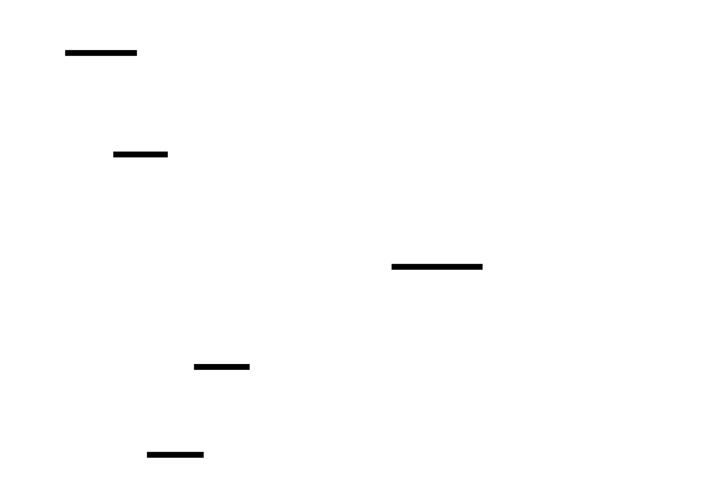
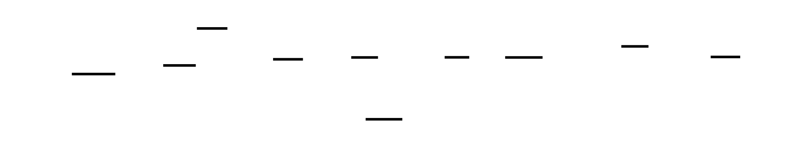

# 🎯 Project Charter: Container (Basic)

## What You Are Building
A minimal Linux container runtime from scratch that implements the core primitives used by Docker and runc. You will build a systems-level tool that uses the `clone()` and `unshare()` system calls to create isolated process environments, `pivot_root()` to swap filesystems, and Linux bridges to establish networking. By the end, you will have a binary that can pull an Alpine Linux rootfs and execute a shell inside a sandbox where the host’s files, processes, and network interfaces are completely invisible.

## Why This Project Exists
Most developers use containers daily but treat them as "Lightweight Virtual Machines," leading to confusion during debugging and security configuration. Building a container from raw kernel primitives shatters this illusion, revealing that a container is simply an ordinary process with a restricted view of the kernel's global data structures. Learning to manipulate namespaces and cgroups directly is the best way to understand container escape vulnerabilities and production orchestration.

## What You Will Be Able to Do When Done
- **Implement Process Isolation:** Use PID and UTS namespaces to make a containerized process believe it is PID 1 on a uniquely named host.
- **Enforce Filesystem Boundaries:** Use `pivot_root` and mount namespaces to provide a private root filesystem, making the host’s `/etc` and `/root` unreachable.
- **Construct Virtual Networks:** Create `veth` pairs and Linux bridges to route traffic from an isolated network namespace to the internet via NAT.
- **Apply Resource Constraints:** Manually configure Cgroup v2 controllers to trigger OOM kills for memory-hungry processes and throttle CPU-intensive tasks.
- **Enable Rootless Execution:** Map internal root privileges to unprivileged host UIDs using User Namespaces, allowing the container to run without `sudo`.

## Final Deliverable
A functional container runtime (approx. 800–1,200 lines of C, Rust, or Go) comprised of a single binary. It will be able to launch an isolated shell that:
- Runs as a mapped "root" user but has no host-level privileges.
- Has a private IP address and functional DNS resolution.
- Is strictly limited to defined CPU and Memory quotas.
- Resides in a directory-based rootfs with no access to host files.

## Is This Project For You?
**You should start this if you:**
- Are comfortable with C-style systems programming (manual memory management, pointers).
- Understand the Linux process lifecycle (`fork`, `exec`, `wait`, `exit`).
- Have a basic grasp of networking concepts like IP addresses, gateways, and bridges.
- Want to know exactly what happens inside the kernel when you run `docker run`.

**Come back after you've learned:**
- [Linux System Programming Basics](https://man7.org/tlpi/) (specifically file descriptors and signals).
- Basic shell networking commands (`ip link`, `iptables`).

## Estimated Effort
| Phase | Time |
|-------|------|
| PID and UTS Namespace Isolation | ~5 hours |
| Mount Namespace and `pivot_root` | ~6 hours |
| Network Namespace and veth Bridge | ~7 hours |
| Cgroups v2 Resource Limits | ~6 hours |
| User Namespace and Rootless Setup | ~6 hours |
| **Total** | **~30 hours** |

## Definition of Done
The project is complete when:
- Running `ps aux` inside the container shows the init process as PID 1 and no host processes.
- The command `ls /` inside the container shows only the Alpine rootfs; the host filesystem is inaccessible.
- The container successfully executes `ping 8.8.8.8` and resolves hostnames via `/etc/resolv.conf`.
- A "fork bomb" or memory-exhaustion script run inside the container is terminated by the kernel without crashing the host.
- The runtime launches the container successfully when executed by a non-root user.

---

# 📚 Before You Read This: Prerequisites & Further Reading

> **Read these first.** The Atlas assumes you are familiar with the foundations below.
> Resources are ordered by when you should encounter them — some before you start, some at specific milestones.

### 🛠️ Core Primitives: Clone & Namespaces
*   **Spec**: [man 7 namespaces](https://man7.org/linux/man-pages/man7/namespaces.7.html)
*   **Code**: [runc/libcontainer/namespaces_linux.go](https://github.com/opencontainers/runc/blob/main/libcontainer/namespaces_linux.go) — See how production runtimes map OCI specs to `CLONE_NEW*` flags.
*   **Best Explanation**: [Namespaces in Operation](https://lwn.net/Articles/531114/) by Michael Kerrisk. Read the "Introduction" and "PID Namespaces" sections.
*   **Why**: This series by the man-page maintainer is the definitive technical history of how namespaces were integrated into the kernel.
*   **Pedagogical Timing**: Read **BEFORE Milestone 1** to understand the "Why" behind the bitmask flags you are about to use.

### 🧟 PID 1 & The Zombie Problem
*   **Code**: [krallin/tini/src/tini.c](https://github.com/krallin/tini/blob/master/src/tini.c) — Specifically the `wait_and_forward_signal` loop.
*   **Best Explanation**: [Docker and the PID 1 Zombie Reaping Problem](https://blog.phusion.nl/2015/01/20/docker-and-the-pid-1-zombie-reaping-problem/) by Phusion.
*   **Why**: It explains the Unix process lifecycle transitions (orphaning/reaping) that cause real-world production leaks in containers.
*   **Pedagogical Timing**: Read **AFTER Milestone 1** to appreciate why your `while(1)` reaper loop is a critical stability feature, not just boilerplate.

### 📂 Filesystem Isolation: Pivot_root
*   **Spec**: [man 2 pivot_root](https://man7.org/linux/man-pages/man2/pivot_root.2.html) — Read the "Notes" section regarding the 7 kernel checks.
*   **Code**: [runc/libcontainer/rootfs_linux.go](https://github.com/opencontainers/runc/blob/main/libcontainer/rootfs_linux.go) — Look for the `pivotRoot` function.
*   **Best Explanation**: [Path resolution: the kernel's perspective](https://lwn.net/Articles/649115/) by Neil Brown.
*   **Why**: Understanding how the kernel walks a path is the only way to truly grasp how `pivot_root` physically disconnects the process from the host.
*   **Pedagogical Timing**: Read **BEFORE Milestone 2** to avoid the "Invalid Argument" errors caused by failing the kernel's mount-point requirements.

### 🌐 Networking: Veth & Bridges
*   **Code**: [linux/drivers/net/veth.c](https://github.com/torvalds/linux/blob/master/drivers/net/veth.c) — See `veth_xmit` to confirm it’s just a pointer handoff.
*   **Best Explanation**: [Container Networking From Scratch](https://iximiuz.com/en/posts/container-networking-is-simple/) by Ivan Velichko.
*   **Why**: It provides the best visual mental model of how packets cross namespace boundaries via virtual wires.
*   **Pedagogical Timing**: Read **BEFORE Milestone 3** to visualize the "Two-Phase Dance" before you implement the synchronization pipe.

### ⚖️ Resource Control: Cgroups v2
*   **Spec**: [Control Group v2 Documentation](https://www.kernel.org/doc/Documentation/admin-guide/cgroup-v2.rst)
*   **Code**: [systemd/src/core/cgroup.c](https://github.com/systemd/systemd/blob/main/src/core/cgroup.c) — How the world's most common init system manages the unified hierarchy.
*   **Best Explanation**: [Understanding Cgroups v2](https://facebookmicrosites.github.io/cgroup2/docs/overview.html) by Facebook Engineering.
*   **Why**: Facebook (Meta) was the primary driver for v2; this guide explains the "No Internal Process" rule which is the biggest architectural shift from v1.
*   **Pedagogical Timing**: Read **BEFORE Milestone 4** to understand why you must enable controllers in the `subtree_control` file.

### ⏱️ CPU Scheduling: CFS Bandwidth
*   **Paper**: [Design of the CFS Bandwidth Controller](https://www.kernel.org/doc/html/latest/scheduler/sched-bwc.html) (Kernel Docs).
*   **Best Explanation**: [Demystifying Kubernetes CPU Limits](https://itnext.io/demystifying-kubernetes-cpu-limits-7ed847895088) by Omkar Birade.
*   **Why**: It explains the "Sawtooth" performance degradation caused by period/quota mismatches.
*   **Pedagogical Timing**: Read **DURING Milestone 4** while you are running the `cpu_stress` test to interpret your `cpu.stat` results.

### 👤 Identity: User Namespaces
*   **Best Explanation**: [User Namespaces: A Practical Guide](https://lwn.net/Articles/532593/) by Michael Kerrisk.
*   **Code**: [shadow-utils/src/newuidmap.c](https://github.com/shadow-utils/shadow-utils/blob/master/src/newuidmap.c) — The privileged helper that validates `/etc/subuid`.
*   **Why**: It clarifies the "Scoped Capabilities" model which is counter-intuitive to traditional Unix security.
*   **Pedagogical Timing**: Read **BEFORE Milestone 5** to understand why your container has `CAP_SYS_ADMIN` inside but `EPERM` on the host.

### 🛡️ Security: Capabilities & Seccomp
*   **Spec**: [man 7 capabilities](https://man7.org/linux/man-pages/man7/capabilities.7.html)
*   **Best Explanation**: [Container Security: A Guide to User Namespaces and Capabilities](https://sysdig.com/blog/linux-capabilities-docker/) by Sysdig.
*   **Why**: This resource bridges the gap between raw kernel bits and how Docker/Kubernetes use "Capability Dropping" for hardening.
*   **Pedagogical Timing**: Read **AFTER Milestone 5** to round out your understanding of the container's security profile.

### 🐳 The Production Standard: OCI & Runc
*   **Spec**: [OCI Runtime Specification](https://github.com/opencontainers/runtime-spec)
*   **Why**: This is the industry standard that defines exactly how the variables you've built (rootfs, namespaces, cgroups) should be formatted in a `config.json`.
*   **Pedagogical Timing**: Read **AFTER finishing the project** to see how your "basic" container matches the industrial-grade specification.

---

# Container (Basic): Linux Namespace Isolation, Cgroups, and Rootless Containers from Scratch

This project builds a minimal container runtime from scratch using raw Linux kernel primitives — no Docker, no runc, no abstraction layers. You will invoke clone(), unshare(), pivot_root(), and write to cgroup filesystem entries directly, constructing process isolation (PID namespace), filesystem isolation (mount namespace + pivot_root), network isolation (network namespace + veth pairs + bridge), resource limits (cgroups v2), and unprivileged execution (user namespaces) piece by piece.

The journey reveals that containers are not lightweight VMs — they are carefully orchestrated kernel namespace boundaries combined with resource accounting. Every milestone peels back a layer of the illusion that Docker presents, exposing the syscalls, the /proc filesystem mechanics, and the security boundaries that production container runtimes depend on. By the end, you'll have a working container runtime that can isolate a process tree, limit its resources, give it its own network stack, and run without root privileges.

This is intermediate-level systems programming: you need comfort with fork/exec/wait and basic Linux filesystem concepts, but we'll teach the namespace-specific syscall semantics, mount propagation subtleties, and cgroup filesystem conventions as we go.


<!-- MS_ID: container-basic-m1 -->
# Milestone 1: PID and UTS Namespace Isolation
## The Illusion You Are About to Build
Docker runs a process. You type `ps aux` inside the container and see one process with PID 1. You type `ps aux` on the host and see that same process with PID 47832. Same process, two different PIDs, two different realities.
This isn't virtualization. There's no hypervisor, no emulated CPU, no separate kernel. The process is running natively on your CPU, in your kernel, with your scheduler. The kernel is simply maintaining *two simultaneous views* of the same process tree — one for the host, one for the container — and each view reports a different PID for the same physical process.
That mechanism is called a **PID namespace**, and by the end of this milestone, you will have built it from scratch.
But there's a twist. When you clone a process into a new PID namespace, the child doesn't just get a different number — it becomes something fundamentally different at the kernel level. It becomes PID 1. And PID 1 has responsibilities that most processes never have to think about.


---
## The Tension: Why Namespaces Exist
[[EXPLAIN:linux-namespace-concept-—-what-kernel-resources-are-virtualized|Linux namespace concept — what kernel resources are virtualized]]
Imagine running two applications on the same machine. Application A spawns 50 worker processes. Application B also spawns workers. Without isolation, they share:
- **The PID space**: App A's process might be PID 1000, App B's might be PID 1001. If App B wants to send a signal to its own worker by PID, it must be careful not to accidentally target App A's processes.
- **The hostname**: If App A calls `sethostname("web-server-a")`, that change is instantly visible to App B. Both apps now think they're on a machine called "web-server-a."
- **The filesystem mount table**: If App A mounts a secret volume at `/data`, App B can see it.
- **The network interfaces**: App A can listen on port 80 or sniff App B's network traffic.
The traditional Unix answer to this was: "run as different users and use permissions." But permissions are coarse. They prevent *access*, not *awareness*. App B still sees App A's processes in `ps`. They still share a hostname.
The Linux kernel answer, developed from 2006 onward, is **namespaces**: partition the kernel's global data structures so each process group sees its own private view. The kernel maintains one process table, one routing table, one mount table — but namespace wrappers filter which entries each process can see.
| Namespace | Flag | Virtualizes |
|-----------|------|-------------|
| PID | `CLONE_NEWPID` | Process IDs and process tree |
| UTS | `CLONE_NEWUTS` | Hostname and NIS domain name |
| Mount | `CLONE_NEWNS` | Filesystem mount table |
| Network | `CLONE_NEWNET` | Network interfaces, routing, iptables |
| User | `CLONE_NEWUSER` | UIDs, GIDs, capabilities |
| IPC | `CLONE_NEWIPC` | System V IPC, POSIX message queues |
| Cgroup | `CLONE_NEWCGROUP` | Cgroup root view |
You're implementing PID and UTS namespaces in this milestone. Each is created with a single flag passed to `clone()`.


---
## The Syscall That Makes It Happen: `clone()`
[[EXPLAIN:clone()-syscall-and-its-relationship-to-fork()|clone() syscall and its relationship to fork()]]
`fork()` creates a child process that is a copy of the parent, inheriting all the parent's namespaces. That's fine for normal processes — but useless for containers, where you *want* the child to live in different namespaces.
`clone()` is `fork()`'s lower-level cousin. It creates a new process (or thread) with precise control over what is shared and what is separated. Where `fork()` has a fixed behavior, `clone()` takes a `flags` argument that is a bitmask of decisions:
```c
#include <sched.h>
// fork() equivalent in clone():
pid_t pid = clone(child_fn, stack_top, SIGCHLD, arg);
// Container child with new PID and UTS namespaces:
pid_t pid = clone(child_fn, stack_top,
                  CLONE_NEWPID | CLONE_NEWUTS | SIGCHLD,
                  arg);
```
The `SIGCHLD` flag at the end tells the kernel to send SIGCHLD to the parent when the child exits — this is what makes `waitpid()` work on the returned PID. Without it, the parent won't get notified of child exit.
The key difference from `fork()`: `clone()` requires you to provide a **child stack**. This is where the design gets hardware-specific.


### Stack Allocation for `clone()`
[[EXPLAIN:stack-allocation-for-clone()-—-mmap-+-stack-direction|Stack allocation for clone() — mmap + stack direction]]
On x86-64 Linux, the stack grows **downward** — from high addresses toward low addresses. When you call a function, the stack pointer (`rsp`) decreases. When the function returns, it increases.
`clone()` needs you to hand it a stack for the child to use. The signature says `void *stack` — but this means the **bottom** of the allocated memory region, and you must pass the **top** (highest address) to `clone()` as the child's starting stack pointer.
```c
#include <sys/mman.h>
#include <sched.h>
#define STACK_SIZE (1024 * 1024)  // 1 MiB stack
// Allocate stack memory using mmap (not malloc — mmap gives page-aligned memory
// with guard page support if you add PROT_NONE at the bottom)
char *stack = mmap(NULL, STACK_SIZE,
                   PROT_READ | PROT_WRITE,
                   MAP_PRIVATE | MAP_ANONYMOUS | MAP_STACK,
                   -1, 0);
if (stack == MAP_FAILED) {
    perror("mmap stack");
    exit(1);
}
// CRITICAL: pass the TOP of the stack (stack + STACK_SIZE),
// not the bottom. x86-64 stack grows downward.
char *stack_top = stack + STACK_SIZE;
pid_t child_pid = clone(container_fn, stack_top,
                        CLONE_NEWPID | CLONE_NEWUTS | SIGCHLD,
                        &config);
```
`MAP_STACK` is a hint to the kernel that this region will be used as a stack — on Linux it's currently a no-op, but it's the correct semantic flag to use. `MAP_ANONYMOUS` means the memory isn't backed by a file. `MAP_PRIVATE` means writes aren't visible to other processes.
Why `mmap` instead of `malloc`? Two reasons:
1. `mmap` returns page-aligned memory (4 KiB alignment), which the kernel requires for stack regions.
2. You can add a guard page — a `PROT_NONE` page at the bottom — that causes a segfault if the stack overflows, rather than silent memory corruption.
```c
// Optional but recommended: add a guard page at the bottom
// to catch stack overflows
mprotect(stack, 4096, PROT_NONE);
// Then stack_top is still stack + STACK_SIZE
// The usable stack is [stack + 4096, stack + STACK_SIZE)
```


---
## What Happens Inside the Child
When `clone()` executes with `CLONE_NEWPID`, the child process starts executing `container_fn`. From inside `container_fn`:
```c
int container_fn(void *arg) {
    // This process's PID inside the namespace: 1
    // This process's PID on the host: whatever clone() returned to the parent
    printf("Inside container, PID = %d\n", getpid());
    // Prints: Inside container, PID = 1
    // ...
    return 0;
}
```
The child is PID 1 inside its namespace. The parent received the host PID from `clone()` — perhaps 47832.
But being PID 1 is not just a number. This is the revelation.
---
## The Revelation: PID 1 Is Not Just a Label
Here is what most developers assume: PID 1 inside a container is cosmetic. The process is identical to any other child process — it just happens to report PID 1 when it calls `getpid()`. The namespace is a labeling system.
**This assumption is wrong. The kernel treats namespace-PID-1 as a true init process.**
Three behaviors distinguish PID 1 in any PID namespace from every other process:
### 1. Signal Immunity
On the host, you cannot kill PID 1 (the system's `init`/`systemd`) with `SIGKILL` or `SIGTERM` unless you're root and the process has explicitly registered a signal handler. The same applies to PID 1 inside a namespace: **the kernel will not deliver SIGKILL or SIGTERM to PID 1 from outside the namespace unless that process has installed a handler for those signals.**
This is why `docker stop` sends SIGTERM, waits for a grace period (default 10 seconds), then sends SIGKILL. The SIGTERM goes to the container's PID 1. If that process doesn't handle SIGTERM, it won't stop — and SIGKILL finally forces it. If your container's entrypoint is a shell script, the script (as PID 1) typically doesn't handle SIGTERM at all, which is why the app inside the script takes 10 seconds to stop.
Tools like `tini` and `dumb-init` exist specifically to be a proper PID 1: they handle signals correctly and forward them to child processes.
### 2. Orphan Adoption (The Zombie Problem)
When any process dies, its children don't die with it — they become **orphans**. The kernel re-parents orphaned processes to PID 1 of their PID namespace. PID 1's job is to call `waitpid()` on these adopted children to collect their exit status and remove their entries from the process table. If PID 1 doesn't do this, the dead children remain in the process table as **zombies** — consuming a PID slot and a process table entry.
In a container, if your entrypoint launches worker processes and those workers die before the entrypoint calls `wait()`, they become zombies. At scale — thousands of containers, each leaking zombie PIDs — you can exhaust the kernel's PID limit (default 32,768 on most systems) and prevent any new processes from spawning. This is a real production bug in containers that use naive shell scripts as entrypoints.
Your implementation must include a zombie reaper.
### 3. Namespace Death
When PID 1 of a namespace exits, **the kernel kills every other process in that namespace with SIGKILL.** There's no grace period, no cleanup opportunity for those processes — they're terminated immediately. This is why your container exits when its main process exits. The kernel isn't "watching" for the last process — it triggers on the death of exactly PID 1.


---
## Building the PID Namespace: Complete Implementation
Here is a complete, working implementation that demonstrates PID namespace creation, UTS namespace creation, PID verification, and zombie reaping:
```c
#define _GNU_SOURCE
#include <sched.h>
#include <stdio.h>
#include <stdlib.h>
#include <string.h>
#include <unistd.h>
#include <sys/wait.h>
#include <sys/mman.h>
#include <sys/types.h>
#include <signal.h>
#include <errno.h>
#define STACK_SIZE (1024 * 1024)  // 1 MiB
#define CONTAINER_HOSTNAME "mycontainer"
// Configuration passed to the container's init function
typedef struct {
    char **argv;  // Command to run inside the container
} container_config_t;
// Zombie reaper: non-blocking collection of all dead children.
// Called periodically by the container's PID 1 to prevent zombie accumulation.
// WNOHANG makes waitpid() return immediately if no child has exited.
static void reap_zombies(void) {
    int status;
    pid_t pid;
    // Loop until waitpid returns 0 (no more dead children)
    // or -1 (no children at all)
    while ((pid = waitpid(-1, &status, WNOHANG)) > 0) {
        if (WIFEXITED(status)) {
            fprintf(stderr, "[container-init] reaped PID %d (exit %d)\n",
                    pid, WEXITSTATUS(status));
        } else if (WIFSIGNALED(status)) {
            fprintf(stderr, "[container-init] reaped PID %d (signal %d)\n",
                    pid, WTERMSIG(status));
        }
    }
}
// The container's init process (PID 1 inside the namespace).
// This function runs inside the new PID and UTS namespaces.
static int container_init(void *arg) {
    container_config_t *cfg = (container_config_t *)arg;
    // ── Step 1: Set the container hostname ──────────────────────────────
    // We're inside CLONE_NEWUTS, so this does NOT affect the host.
    if (sethostname(CONTAINER_HOSTNAME, strlen(CONTAINER_HOSTNAME)) != 0) {
        perror("sethostname");
        return 1;
    }
    printf("[container] hostname set to: %s\n", CONTAINER_HOSTNAME);
    // ── Step 2: Verify we are PID 1 inside the namespace ────────────────
    printf("[container] PID inside namespace: %d\n", getpid());
    // Should print: 1
    // ── Step 3: Spawn the user's requested command ───────────────────────
    // We fork() here because exec() would replace us — and we ARE PID 1.
    // If PID 1 exec()s and then exits, the namespace dies. We must stay alive.
    pid_t child = fork();
    if (child < 0) {
        perror("fork");
        return 1;
    }
    if (child == 0) {
        // Child process: run the requested command
        execvp(cfg->argv[0], cfg->argv);
        // execvp only returns on error
        perror("execvp");
        exit(127);
    }
    // ── Step 4: Init process event loop ─────────────────────────────────
    // PID 1 must stay alive and reap children.
    // We wait for the main child to exit, then clean up.
    while (1) {
        int status;
        pid_t exited = waitpid(-1, &status, 0);  // blocking wait for any child
        if (exited == child) {
            // Our main process exited — time to exit the namespace.
            // First, reap any lingering zombies.
            reap_zombies();
            if (WIFEXITED(status)) {
                printf("[container] main process exited with status %d\n",
                       WEXITSTATUS(status));
                return WEXITSTATUS(status);
            } else if (WIFSIGNALED(status)) {
                printf("[container] main process killed by signal %d\n",
                       WTERMSIG(status));
                return 1;
            }
        } else if (exited > 0) {
            // An adopted orphan child died — reap it.
            fprintf(stderr, "[container-init] reaped orphan PID %d\n", exited);
        } else if (exited == -1 && errno == ECHILD) {
            // No more children — all done.
            break;
        } else if (exited == -1 && errno == EINTR) {
            // waitpid was interrupted by a signal — retry.
            continue;
        }
    }
    return 0;
}
int main(int argc, char **argv) {
    if (argc < 2) {
        fprintf(stderr, "Usage: %s <command> [args...]\n", argv[0]);
        fprintf(stderr, "Example: %s /bin/sh\n", argv[0]);
        return 1;
    }
    // ── Allocate child stack ─────────────────────────────────────────────
    // clone() requires us to provide a stack for the child.
    // x86-64: stack grows downward, so we pass stack + STACK_SIZE (the top).
    char *stack = mmap(NULL, STACK_SIZE,
                       PROT_READ | PROT_WRITE,
                       MAP_PRIVATE | MAP_ANONYMOUS | MAP_STACK,
                       -1, 0);
    if (stack == MAP_FAILED) {
        perror("mmap");
        return 1;
    }
    // Guard page: catch stack overflows before they corrupt memory silently
    if (mprotect(stack, 4096, PROT_NONE) != 0) {
        perror("mprotect guard page");
        // Non-fatal: continue without guard page
    }
    char *stack_top = stack + STACK_SIZE;
    // ── Configure the container ──────────────────────────────────────────
    container_config_t cfg = {
        .argv = &argv[1],  // The command the container should run
    };
    // ── Create the namespaces with clone() ──────────────────────────────
    // CLONE_NEWPID: child gets new PID namespace, sees itself as PID 1
    // CLONE_NEWUTS: child gets new UTS namespace, independent hostname
    // SIGCHLD: parent receives SIGCHLD when child exits (needed for waitpid)
    printf("[host] Creating container with PID and UTS namespaces...\n");
    pid_t container_pid = clone(container_init, stack_top,
                                CLONE_NEWPID | CLONE_NEWUTS | SIGCHLD,
                                &cfg);
    if (container_pid == -1) {
        perror("clone");
        // Common error: EPERM means you need root (or user namespace first)
        if (errno == EPERM) {
            fprintf(stderr, "Hint: run as root or add CAP_SYS_ADMIN capability\n");
        }
        munmap(stack, STACK_SIZE);
        return 1;
    }
    printf("[host] Container running with host PID: %d\n", container_pid);
    printf("[host] Inside the container, that process sees PID: 1\n");
    // ── Wait for container to exit ───────────────────────────────────────
    int status;
    if (waitpid(container_pid, &status, 0) == -1) {
        perror("waitpid");
        munmap(stack, STACK_SIZE);
        return 1;
    }
    printf("[host] Container exited\n");
    // ── Cleanup ──────────────────────────────────────────────────────────
    munmap(stack, STACK_SIZE);
    return WIFEXITED(status) ? WEXITSTATUS(status) : 1;
}
```
Compile and run:
```bash
gcc -o container_m1 container_m1.c
sudo ./container_m1 /bin/bash
```
> **Why `sudo`?** Creating PID namespaces requires `CAP_SYS_ADMIN` — a Linux capability that allows privileged operations. Without user namespace support (Milestone 5), you need root. We'll remove this requirement when we implement `CLONE_NEWUSER`.
---
## Verifying Isolation: The `/proc/self/status` NSpid Field
The kernel exposes namespace PID information through `/proc`. Every process's `/proc/self/status` file contains a line called `NSpid` that lists the process's PID in each nested namespace, from outermost to innermost.
```bash
# Inside the container:
cat /proc/self/status | grep NSpid
# NSpid:  1
# Outside the container (replace 47832 with the actual host PID):
cat /proc/47832/status | grep NSpid
# NSpid:  47832   1
```
The `NSpid` field shows PIDs separated by tabs. From outside (the host), the container's init process has two PIDs: its host PID (47832) and its namespace-local PID (1). From inside the container, you only see the innermost namespace's view: `1`.
This is exactly how container monitoring tools like cAdvisor and Prometheus node-exporter correlate container metrics to host processes — they read `/proc/<host_pid>/status` and extract the NSpid field to map between container PID and host PID.
Add this verification to your `container_init` function:
```c
// Verification: read and display our NSpid from /proc
static void verify_pid_namespace(void) {
    FILE *f = fopen("/proc/self/status", "r");
    if (!f) {
        perror("fopen /proc/self/status");
        return;
    }
    char line[256];
    while (fgets(line, sizeof(line), f)) {
        // NSpid line format: "NSpid:\t<pid1>\t<pid2>\t...\n"
        if (strncmp(line, "NSpid:", 6) == 0) {
            printf("[container] %s", line);
            // Should show: NSpid:	1
            break;
        }
    }
    fclose(f);
}
```
Call `verify_pid_namespace()` at the top of `container_init` to see the PID namespace isolation confirmed.



---
## The UTS Namespace: Independent Hostname
UTS stands for "Unix Time-sharing System" — a historical artifact from the `utsname` struct defined in POSIX, which stores the hostname and NIS domain name. The name is obscure; the functionality is simple: each UTS namespace has its own hostname that's writable independently.


With `CLONE_NEWUTS` in your `clone()` call:
```c
// Inside the container (runs in CLONE_NEWUTS):
sethostname("mycontainer", 11);  // Affects ONLY this namespace
char hostname[256];
gethostname(hostname, sizeof(hostname));
printf("Container hostname: %s\n", hostname);  // mycontainer
// On the host simultaneously:
// gethostname() still returns the original host hostname
// The kernel maintains two separate copies of the hostname string
```
Verify from the outside:
```bash
# After launching your container:
hostname
# your-actual-host
# Inside the container:
hostname
# mycontainer
# The host hostname is unchanged — UTS namespace is working
```
The kernel implementation: each UTS namespace contains a copy of the `new_utsname` struct (64 bytes: nodename[65], sysname[65], etc.). `sethostname()` writes to the struct of the calling process's UTS namespace. Since the container has its own namespace, its `sethostname()` call writes to a different struct than the host's.
---
## The `unshare()` Alternative
`clone()` creates a *new process* in new namespaces. But sometimes you want to move the *current process* into new namespaces without creating a child. That's `unshare()`:
```c
#include <sched.h>
// Current process enters new namespaces
unshare(CLONE_NEWUTS);  // Now this process is in a new UTS namespace
sethostname("isolated", 8);  // Only affects this namespace
```
**Critical gotcha with `unshare(CLONE_NEWPID)`**: `unshare()` creates the new PID namespace but the *calling process* does NOT move into it. The calling process remains in its original PID namespace. The new namespace becomes active for **children** of the calling process. So after `unshare(CLONE_NEWPID)`, you must `fork()` to get a process that's actually PID 1 inside the new namespace.
```c
// Using unshare + fork to create PID namespace:
unshare(CLONE_NEWPID | CLONE_NEWUTS);
pid_t child = fork();
if (child == 0) {
    // Child is PID 1 in the new namespace
    printf("PID: %d\n", getpid());  // Prints: 1
    // ... container init logic ...
} else {
    // Parent is still in the original namespace
    waitpid(child, NULL, 0);
}
```
The `clone()` approach is cleaner for container runtimes because you get the namespace creation and child process in one atomic call. The `unshare()` approach is used by the `unshare(1)` command-line tool and by Kubernetes when a pod shares namespaces between containers.
---
## Hardware Soul: What the Kernel Is Actually Doing
Every time your container calls `getpid()`, the kernel executes this path:
1. `getpid()` → `syscall(SYS_getpid)` → trap into kernel
2. Kernel looks up `current->nsproxy->pid_ns_for_children`
3. Walks the namespace chain to find the PID in the innermost namespace
4. Returns that PID to userspace
**Cache behavior**: The `task_struct` (kernel's process descriptor, ~7 KB on modern kernels) is typically cold on first access after a context switch — it won't be in L1 cache. The namespace pointer chain adds 2-3 pointer dereferences. On a context switch, the TLB is partially flushed (PCID optimization reduces this), and the first access to the task's memory will incur TLB misses.
For `getpid()`: ~50-100 ns on a warm cache, ~500 ns on a cold cache with TLB misses. This is negligible for container overhead — namespaces themselves add essentially zero CPU cost to process execution.
**The `clone()` call itself**: Creating a PID namespace is a kernel-side operation that:
- Allocates a new `pid_namespace` struct (~200 bytes)
- Initializes an `idr` (ID radix tree) for PID allocation within the namespace
- Sets up the namespace's PID 1 slot
- Copies the parent's signal handlers (with `CLONE_NEWPID`, signals are *not* shared)
- Allocates the `task_struct` for the child
Total cost: one `clone()` with `CLONE_NEWPID | CLONE_NEWUTS` takes approximately 20-50 μs on modern hardware — comparable to a normal `fork()`. This is why containers start in milliseconds while VMs take seconds: there's no hardware initialization, no firmware, no boot sequence.
---
## Pitfall Compendium: The Mistakes That Will Cost You Hours
### Pitfall 1: Passing Stack Bottom Instead of Stack Top
```c
// ❌ WRONG: passes the bottom of the stack
pid_t pid = clone(fn, stack, flags, arg);
// ✅ CORRECT: passes the top (x86-64 stack grows downward)
pid_t pid = clone(fn, stack + STACK_SIZE, flags, arg);
```
Passing the wrong end causes immediate memory corruption. The child will write its first stack frame into whatever is below `stack` — likely your program's heap or code. The resulting crash is often mysterious: a SIGSEGV in a totally unrelated part of the code, or silent data corruption that causes wrong behavior minutes later.
### Pitfall 2: `SIGCHLD` Missing from `clone()` Flags
```c
// ❌ WRONG: parent can't waitpid() without SIGCHLD
pid_t pid = clone(fn, stack_top, CLONE_NEWPID | CLONE_NEWUTS, arg);
// ✅ CORRECT: SIGCHLD enables the parent to use waitpid()
pid_t pid = clone(fn, stack_top, CLONE_NEWPID | CLONE_NEWUTS | SIGCHLD, arg);
```
Without `SIGCHLD`, `waitpid()` in the parent returns -1 with `ECHILD`. The child becomes an orphan that the host's `init` (systemd) will eventually reap.
### Pitfall 3: Not Running as Root (EPERM)
`CLONE_NEWPID` requires `CAP_SYS_ADMIN`. Without root:
```c
errno == EPERM  // "Operation not permitted"
```
Solution for this milestone: run with `sudo`. Solution for production: combine with `CLONE_NEWUSER` (Milestone 5) to create user namespaces first, which allows unprivileged namespace creation.
### Pitfall 4: The `exec()` Trap in PID 1
If your container's init function directly calls `exec()` (replacing itself), *it* becomes the user process. When that user process exits, PID 1 exits, and the kernel kills the entire namespace. This is fine for single-process containers, but breaks multi-process scenarios. The correct pattern is `fork()` then `exec()` in the child, while the init stays alive as the reaper. This is exactly what Docker does — and why `tini` exists as a minimal init that does nothing but the fork-exec-reap loop.
### Pitfall 5: `unshare(CLONE_NEWPID)` Without Subsequent `fork()`
```c
// ❌ WRONG: calling process does NOT enter the new PID namespace
unshare(CLONE_NEWPID);
printf("PID: %d\n", getpid());  // Still shows original PID, not 1
// ✅ CORRECT: fork() after unshare to get PID 1 in new namespace
unshare(CLONE_NEWPID);
pid_t child = fork();
if (child == 0) {
    printf("PID: %d\n", getpid());  // Now prints 1
}
```
---
## Verification Checklist
After implementing and running your code, verify each criterion manually:
```bash
# 1. Inside the container, verify PID 1:
echo $$
# Should print: 1 (if shell is direct child) or close to 1
# 2. Verify NSpid field shows dual PIDs from outside:
# From the host, where $HOST_PID is what clone() returned:
cat /proc/$HOST_PID/status | grep NSpid
# Should show: NSpid:   <host_pid>    1
# 3. Verify hostname isolation:
# Inside container:
hostname
# mycontainer
# On host (new terminal):
hostname
# your-original-hostname  (unchanged)
# 4. Test zombie reaping: inside container, run:
sleep 100 &   # Start a background process
kill %1       # Kill it
ps aux        # Should NOT show a zombie (Z state) if reaping works
# 5. Test namespace death: exit PID 1:
# Exit the container — verify all container processes stop on the host
# ps aux | grep <command_you_ran>  # Should show nothing
```
---
## Understanding the Process Tree
When your container is running, the host sees:
```
systemd (PID 1)
└── sudo (PID 47830)
    └── ./container_m1 (PID 47831)  ← your runtime
        └── container_init (PID 47832) ← PID 1 inside namespace
            └── /bin/bash (PID 47833) ← PID 2 inside namespace
```
Inside the container:
```
container_init (PID 1)  ← same process as host's 47832
└── /bin/bash (PID 2)   ← same process as host's 47833
```
The kernel maintains both views simultaneously. The host sees the real PIDs. The namespace members see the virtualized PIDs. The PID table has entries for both mappings.


---
## Knowledge Cascade: What This Unlocks
Understanding PID namespaces and init process behavior is a seed that grows into a forest of systems knowledge:
### 1. Why Docker Uses `tini`
The `--init` flag in `docker run --init` injects `tini` as PID 1. `tini` does exactly three things: installs signal handlers, `fork()`s your entrypoint as a child, and loops on `waitpid(-1, ...)`. Without it, if your application forks workers (as Node.js, Python multiprocessing, and Java do), the workers become zombies when they die. At scale — thousands of requests, thousands of short-lived workers — you exhaust the PID space. `tini`'s entire codebase is ~200 lines of C doing exactly the init loop you just wrote.
### 2. Signal Delivery Across Namespace Boundaries
When you run `docker kill <container_id>`, Docker's daemon calls `kill(host_pid, SIGTERM)` on the host. The kernel delivers this to the process identified by that host PID — which is the container's PID 1. Inside the namespace, PID 1 receives the signal. If PID 1 handles SIGTERM by forwarding it to children, your application gets graceful shutdown. If not, after Docker's grace period, SIGKILL arrives and the namespace forcibly terminates. This is the entire reason for `docker stop`'s 10-second default timeout — it's not arbitrary, it's "how long we give PID 1 to forward SIGTERM and shut down gracefully."
### 3. Kubernetes Pod Pause Containers
Every Kubernetes pod has an invisible "pause" container that runs `/pause` — a binary that does nothing except call `pause()` (wait forever for a signal). This pause container is created first and holds the PID namespace. All other containers in the pod join this namespace via `setns(CLONE_NEWPID)`. The pause container is the pod's PID 1 and zombie reaper. This is why all containers in a pod share a process tree, can see each other's processes with `ps`, and why killing the pause container kills the entire pod. You just learned the mechanism that makes Kubernetes pod semantics work.
### 4. `clone()` Flag Composition Is Additive and Atomic
`CLONE_NEWPID | CLONE_NEWUTS | CLONE_NEWNS | CLONE_NEWNET | CLONE_NEWUSER` — you can compose any combination in a single `clone()` call. Real container runtimes (`runc`, used by Docker and Kubernetes) create all namespaces atomically in one `clone()` call. This atomicity matters: there's no window between namespace creations where the process is in a partial state. Next milestone (mount namespaces), you'll add `CLONE_NEWNS` to this call and everything composes cleanly.
### 5. `/proc` as the Namespace Debugging Interface
`/proc/<pid>/ns/` directory contains symbolic links for each namespace the process belongs to:
```bash
ls -la /proc/47832/ns/
# pid -> pid:[4026532189]
# uts -> uts:[4026532190]
# mnt -> mnt:[4026531840]  (still host's mount namespace — next milestone!)
```
The numbers in brackets are namespace inode numbers. Two processes in the same namespace have the same inode number for that namespace type. This is how `nsenter(1)` finds and joins existing namespaces — it opens the symlink and calls `setns()` with the file descriptor.
---
## Looking Ahead
You now have a container that isolates its process tree and hostname. But if you run `ls /` inside your container, you see the host's filesystem. If you run `ip addr`, you see the host's network interfaces. If you spawn 10,000 processes inside your container, they consume host PIDs.
The next milestone (Mount Namespace and Filesystem Isolation) adds `CLONE_NEWNS` to your `clone()` call and uses `pivot_root()` to swap the container's root filesystem. You'll finally see a truly isolated filesystem view — and understand why `chroot` is weaker than `pivot_root` from a security standpoint.
The `CLONE_NEWPID | CLONE_NEWUTS` pair you've built is the foundation. Every subsequent namespace flags into the same `clone()` call. The architecture you've established — `container_init` as PID 1, zombie reaper loop, config struct passed through `clone()` — is the skeleton the rest of the milestones flesh out.
---
<!-- END_MS -->


<!-- MS_ID: container-basic-m2 -->
<!-- MS_ID: container-basic-m2 -->
# Milestone 2: Mount Namespace and Filesystem Isolation
## The Illusion You Are About to Shatter
Run your container from Milestone 1. Inside the shell, type `ls /`. You'll see the host's root filesystem — `/etc`, `/home`, `/var`, `/root`. Every file on your machine is accessible. Your "container" is a lie.
The process tree is isolated. The hostname is isolated. But the filesystem is completely open. A process inside your container can read `/etc/passwd`, write to `/tmp`, and — if it has the right permissions — modify files that affect the host system. That's not a container. That's a renamed terminal window.
This milestone closes that gap. You will give the container its own root filesystem, one that contains only what you choose to put there. The host's filesystem will not just be hidden — it will be genuinely inaccessible, unreachable through any path, invisible to the kernel's path resolution engine for processes inside the container.
The mechanism that makes this real is called `pivot_root()`. But before we get there, you need to understand why the obvious solution — `chroot()` — is not good enough, and why every production container runtime from Docker to Kubernetes uses `pivot_root()` instead.


---
## The Fundamental Tension: Shared Filesystem, Multiple Worlds
[[EXPLAIN:linux-namespace-concept-—-what-kernel-resources-are-virtualized|Linux namespace concept — what kernel resources are virtualized]]
The Linux filesystem is a single global tree rooted at `/`. Every file, directory, device, and pseudo-filesystem hangs from that single root. The kernel maintains a **mount table** — a data structure that maps directory paths to filesystem objects. When you open `/etc/passwd`, the kernel walks this table, finds which filesystem is mounted at `/` or `/etc`, and reads from it.
Multiple processes on the same machine share this mount table. When you run `mount /dev/sdb1 /mnt/disk`, every process on the system immediately sees the new filesystem at `/mnt/disk`. Mount operations are global — or at least they were, until Linux 2.4.19 introduced mount namespaces in 2002.
The constraint: **you cannot give a process its own private filesystem view without either hardware virtualization (a hypervisor with emulated disks) or kernel namespace machinery.** Hardware virtualization is expensive — it requires copying entire filesystem images and booting a kernel. Namespace machinery is essentially free — it's a pointer in the kernel's process descriptor.
The solution the kernel offers: give each process group its own mount table — a **mount namespace**. Operations in one namespace don't affect others. A process in namespace A can mount and unmount filesystems freely; namespace B is untouched. Combined with a root directory swap (pivot_root), the container gets its own root — and the host's filesystem disappears.


---
## Why `chroot()` Is Not Enough: The Revelation
Here is what most developers believe when they first encounter container isolation: `chroot()` provides real filesystem isolation. If you `chroot("/container/rootfs")`, the process can't escape to the host filesystem because `/` now points to `/container/rootfs`. The host's `/etc` is unreachable.
**This belief is wrong.** `chroot()` is security theater for anything running with elevated privileges.
`chroot()` does exactly one thing: it changes the **path resolution starting point** for the calling process. The kernel sets `task_struct->fs->root` to the new directory. When the process calls `open("/etc/passwd")`, the kernel starts path resolution at the new root instead of the real root. That's the entire implementation — a pointer change.
What `chroot()` does *not* do:
1. It does not create a new mount namespace. The process still has access to the same mount table as the host.
2. It does not remove the kernel's reference to the real root filesystem.
3. It does not prevent a privileged process from escaping.
The classic `chroot()` escape — known for decades, present in every security textbook — works like this for a process with `CAP_SYS_CHROOT`:
```c
// Classic chroot escape (educational — shows why chroot is insufficient)
// This works because chroot() only changes a pointer, not actual namespace boundaries
// Step 1: We're chrooted to /container/rootfs
// Step 2: Create a temporary directory to chroot into
mkdir("escape_tmp", 0755);
// Step 3: Chroot into our temporary directory (moving root "forward")
chroot("escape_tmp");
// Step 4: Walk up the directory tree past the original chroot boundary
// Because chroot() didn't change the mount namespace, ".." still works
// across the original chroot boundary if you chroot to a subdirectory
for (int i = 0; i < 256; i++) {
    chdir("..");
}
// Step 5: Chroot to the current directory — which is now the real /
chroot(".");
// We're now unchrooted. Host filesystem fully accessible.
// open("/etc/shadow", O_RDONLY) — works.
```
This escape works because `chroot()` is a *per-process* path resolution change, not a *namespace* change. The mount table is still shared. The kernel's VFS (Virtual Filesystem Switch) layer still has references to the real root. A sufficiently privileged process can navigate above the chroot boundary by abusing the still-shared mount namespace.
[[EXPLAIN:pivot_root()-vs-chroot()-security-guarantees|pivot_root() vs chroot() security guarantees]]
`pivot_root()` is categorically different. It operates at the **mount namespace level**. It atomically:
1. Makes the new root directory the root mount point of the current mount namespace
2. Moves the old root to a subdirectory you specify (so you can unmount it)
3. Optionally allows you to completely unmount the old root — removing every kernel reference to it
After `pivot_root()` followed by `umount2(old_root, MNT_DETACH)`, there is no path the container can walk to reach the host filesystem. There's no `..` trick, no `chroot` escape, no file descriptor inheritance trick that works — because the kernel literally has no mount namespace entry pointing to the host's filesystem tree. It's not hidden. It's *gone* from the container's perspective.
This is why Docker, containerd, runc, LXC, podman, and every serious container runtime use `pivot_root()`. `chroot()` is a 1979 Unix feature. `pivot_root()` is a 2001 Linux feature built specifically for containers (and Linux-VServer before that).
The Leaky Vessels CVE (2024) exploited a container runtime that didn't properly complete the old-root unmount sequence — leaving a kernel reference to the host filesystem accessible through a specific file descriptor path. Understanding the `pivot_root()` + `umount2(MNT_DETACH)` sequence exactly is not academic. It's the difference between a container and a container escape.
---
## Mount Namespaces: The Foundation
Before `pivot_root()` can work, you need a mount namespace. A mount namespace is a private copy of the mount table — the kernel's mapping of directory paths to filesystem objects.
Creating one is simple: add `CLONE_NEWNS` to your `clone()` call:
```c
pid_t container_pid = clone(container_init, stack_top,
                            CLONE_NEWPID | CLONE_NEWUTS | CLONE_NEWNS | SIGCHLD,
                            &cfg);
```
`CLONE_NEWNS` is historically named — "NS" originally referred only to mount namespaces because they were the first namespace type added to Linux (2.4.19, 2002). All other namespace flags were added later with more descriptive names (`CLONE_NEWPID`, `CLONE_NEWNET`, etc.).
When the child process starts with `CLONE_NEWNS`, it receives a **copy** of the parent's mount table. Initially, the child's mount namespace looks identical to the host's — same filesystems, same mount points. The isolation begins when the child makes mount/unmount operations: those changes are invisible to the host, and the host's subsequent mounts are invisible to the child.
But there's a critical subtlety: even with a private mount namespace, if mount events can **propagate** between namespaces, you lose isolation. This is where mount propagation types become essential.
---
## Mount Propagation: The Hidden Complexity
[[EXPLAIN:mount-propagation-types-(shared,-private,-slave)|Mount propagation types (shared, private, slave)]]
Linux mounts have a propagation mode that determines whether mount/unmount events in one namespace (or peer group) propagate to other namespaces. There are four modes:
| Mode | Flag | Behavior |
|------|------|----------|
| **Shared** | `MS_SHARED` | Mount events propagate to all peer mounts in the same peer group, and new mounts in the subtree are shared |
| **Private** | `MS_PRIVATE` | Mount events are completely isolated — no propagation in or out |
| **Slave** | `MS_SLAVE` | Mount events propagate FROM the master TO this mount, but not in reverse |
| **Unbindable** | `MS_UNBINDABLE` | Private + cannot be bind-mounted |
On a typical Linux system, the root filesystem is mounted as **shared** (`MS_SHARED`). This means if you create a mount namespace with `CLONE_NEWNS`, your copy of the mount table inherits the shared propagation type. Any mount operation you perform inside the container **immediately propagates to the host's mount namespace**.
This is the subtle trap: `CLONE_NEWNS` gives you a copy of the mount table, but not isolation from propagation. If you mount `/proc` inside your container (for the container's process list) and the root is still shared, that mount event propagates back to the host. The host's `/proc` doesn't change (because the bind would fail due to path differences), but the propagation attempt happens — and in more complex scenarios, it causes real leaks.
The fix: immediately after entering the new mount namespace, make the root private:
```c
// Inside container_init, FIRST thing after entering the mount namespace:
// MS_REC ensures the flag applies recursively to all submounts
if (mount(NULL, "/", NULL, MS_REC | MS_PRIVATE, NULL) != 0) {
    perror("mount MS_PRIVATE");
    return 1;
}
```
This `mount()` call doesn't mount anything new. The `NULL` source and `MS_PRIVATE` flag with `MS_REC` recursively change the propagation type of every existing mount in the namespace to private. From this point forward, no mount event in the container leaks to the host, and no host mount event propagates into the container.
**Why `MS_REC`?** The mount table is a tree. `/` might be shared, but `/proc` has its own mount entry, `/sys` has its own, and so on. Without `MS_REC`, you'd only make `/` private — all sub-mounts would remain shared. `MS_REC` walks the entire tree recursively.


> **Connection: Docker Volumes and Bind Mounts**
> This propagation model is exactly why `docker run -v /host/data:/container/data` works selectively. The bind mount uses `MS_SHARED` propagation on the specific mount point — so changes to `/host/data` are visible inside the container and vice versa. But the container's other mounts remain private. This is also why Kubernetes `hostPath` mounts with `MountPropagation: Bidirectional` are considered dangerous — they create shared-propagation mounts that allow the container to affect the host's filesystem namespace.
---
## Building the New Root Filesystem
Before `pivot_root()`, you need something to pivot to: a new root filesystem with the minimal structure a container process needs.


The minimal directory structure:
```
/newroot/
├── proc/          # For mounting /proc (container process list)
├── sys/           # For mounting /sys (kernel parameters)
├── dev/           # For device nodes
│   ├── null       # /dev/null (programs write garbage here)
│   ├── zero       # /dev/zero (source of zero bytes)
│   ├── random     # /dev/random (entropy source)
│   └── urandom    # /dev/urandom (non-blocking entropy)
├── etc/
│   └── resolv.conf  # DNS configuration
├── tmp/           # Temporary files
├── .pivot_old/    # Staging directory for old root during pivot
└── [your container's rootfs content]
```
For testing, you can use a minimal Alpine Linux rootfs or a directory tree you construct manually. For the purposes of this implementation, we'll assume you have a rootfs directory at a known path.
Create the structure in your setup:
```c
#define _GNU_SOURCE
#include <sys/stat.h>
#include <sys/types.h>
// Create essential directories in the new rootfs
static int create_rootfs_dirs(const char *rootfs) {
    const char *dirs[] = {
        "proc", "sys", "dev", "etc", "tmp", ".pivot_old", NULL
    };
    char path[1024];
    for (int i = 0; dirs[i] != NULL; i++) {
        snprintf(path, sizeof(path), "%s/%s", rootfs, dirs[i]);
        if (mkdir(path, 0755) != 0 && errno != EEXIST) {
            perror(path);
            return -1;
        }
    }
    return 0;
}
```
---
## The `pivot_root()` Sequence: Step by Step
`pivot_root()` has precise requirements. Violating any of them returns `EINVAL` — a frustratingly generic error code. Let's understand each requirement before writing the code.


**Requirement 1: The new root must be a mount point.**
`pivot_root()` operates on mount points — entries in the mount table — not arbitrary directories. A directory that isn't a mount point isn't tracked by the mount table, so `pivot_root()` can't swap it in as root.
How do you make a directory a mount point without mounting a separate filesystem onto it? The **bind-mount-to-self** trick:
```c
// Bind-mount newroot onto itself — now it IS a mount point
if (mount(rootfs_path, rootfs_path, NULL, MS_BIND | MS_REC, NULL) != 0) {
    perror("bind-mount rootfs to itself");
    return -1;
}
```
`MS_BIND` creates a bind mount — it makes a directory accessible at another path (or the same path in this case). The source and destination are the same path. The effect: the kernel creates a new mount table entry pointing to the same filesystem block device, but at this specific path. Now the directory is a mount point. `MS_REC` ensures any nested mounts within the directory are also bind-mounted.
**Requirement 2: The new root and the current root must be on different filesystems** (or the new root must be a bind mount, which satisfies this in practice).
The bind-mount-to-self satisfies this because the bind mount is a *new mount point* — even though it points to the same underlying filesystem, it's a distinct entry in the mount table with a new mount ID.
**Requirement 3: The old root destination must exist inside the new root.**
`pivot_root(new_root, put_old)` moves the old root to `put_old`. This directory must exist inside `new_root`. In our case: `rootfs/.pivot_old`.
**The complete `pivot_root()` sequence:**
```c
static int pivot_to_rootfs(const char *rootfs) {
    char old_root[1024];
    snprintf(old_root, sizeof(old_root), "%s/.pivot_old", rootfs);
    // ── Step 1: Bind-mount rootfs to itself to make it a mount point ────
    if (mount(rootfs, rootfs, NULL, MS_BIND | MS_REC, NULL) != 0) {
        perror("bind-mount rootfs to self");
        return -1;
    }
    // ── Step 2: pivot_root — atomically swap root filesystems ───────────
    // new_root: our container rootfs
    // put_old:  where to mount the current root (must be inside new_root)
    if (syscall(SYS_pivot_root, rootfs, old_root) != 0) {
        perror("pivot_root");
        return -1;
    }
    // ── Step 3: Change working directory to new root ─────────────────────
    // After pivot_root, cwd might be in the old root — cd to / to fix this
    if (chdir("/") != 0) {
        perror("chdir /");
        return -1;
    }
    // ── Step 4: Unmount the old root with MNT_DETACH ────────────────────
    // MNT_DETACH: lazy unmount — the filesystem becomes unreachable
    // immediately, but the kernel waits for all open file descriptors
    // on it to close before freeing the memory.
    if (umount2("/.pivot_old", MNT_DETACH) != 0) {
        perror("umount2 old root");
        return -1;
    }
    // ── Step 5: Remove the staging directory ────────────────────────────
    if (rmdir("/.pivot_old") != 0) {
        // Non-fatal — the unmount succeeded, this is cosmetic cleanup
        perror("rmdir .pivot_old");
    }
    return 0;
}
```
> **Note on `syscall(SYS_pivot_root, ...)`**: The `pivot_root()` system call is not wrapped by glibc in a standard header-accessible function (unlike `mount()`, `clone()`, etc.). You must call it via `syscall()` directly. Include `<sys/syscall.h>` and `<unistd.h>`.
### What Happens at Each Step in the Kernel
**Before pivot_root**: Mount namespace contains:
```
/          → host root filesystem (device sda1)
/proc      → procfs
/sys       → sysfs
/container/rootfs  → (bind mount of ext4 filesystem)
```
**After `pivot_root(rootfs, rootfs/.pivot_old)`**: Mount namespace contains:
```
/             → container rootfs (what was /container/rootfs)
/.pivot_old   → old host root filesystem
/.pivot_old/proc   → host procfs
/.pivot_old/sys    → host sysfs
```
**After `umount2("/.pivot_old", MNT_DETACH)`**: Mount namespace contains:
```
/             → container rootfs only
```
The host filesystem is gone from the mount table. The kernel's VFS layer has no path entry leading to it. `open("/etc/shadow")` resolves to the container's `/etc/shadow` — if there is one. If not, `ENOENT`. The host's `/etc/shadow` is unreachable.
`MNT_DETACH` 
> **🔑 Foundation: MNT_DETACH lazy unmount**
> 
> ### 1. What it IS
`MNT_DETACH` (often called a "lazy" unmount) is a flag for the `umount2` system call that allows you to unmount a filesystem even if it is currently "busy"—meaning processes still have open file descriptors or are using a directory on that mount as their current working directory. 

In a standard unmount, the system checks if any process is using the mount; if so, it returns a `Device or resource busy` error. With `MNT_DETACH`, the kernel immediately performs a "partial" unmount: it removes the mount point from the shared directory hierarchy (the mount namespace). To any new process, the directory looks empty or disconnected. However, the kernel keeps the actual filesystem alive in the background until the very last process using it closes its files or exits.

### 2. WHY you need it right now
In modern system architecture—particularly involving containers, namespaces, or automated cleanup scripts—you often encounter the "Busy" error. For example, if a container crashes but a background logging process still holds a file handle on its volume, a standard `umount` will fail, leaving your system in a messy, inconsistent state.

`MNT_DETACH` allows you to "fire and forget." You can signal that a mount should no longer be part of the system's accessible pathing, ensuring that no *new* processes can enter that filesystem, while allowing existing processes to finish their work gracefully without causing your cleanup script to hang or error out.

### 3. ONE key insight or mental model
**The "Ghost" Filesystem:** Think of `MNT_DETACH` as making a building invisible and removing its address from the city map, while allowing the people already inside to finish their business and leave through the back door. Once the last person leaves, the building finally vanishes. 

**Remember:** It provides **immediate invisibility** but **delayed destruction**.
 deserves explanation: it performs a **lazy unmount**. The mount point becomes immediately invisible and unreachable from new path lookups. However, if any process has an open file descriptor pointing into that filesystem (e.g., a file from the old root is still open), the kernel keeps the filesystem alive until those descriptors are closed. Only then is the memory freed. This is safer than a "force" unmount (`MNT_FORCE`) which would close those file descriptors forcibly — potentially corrupting data. For our use case, the container's init process shouldn't have open files in the old root, so `MNT_DETACH` completes effectively immediately.
---
## Mounting Essential Pseudo-Filesystems
After `pivot_root()`, the container's process tree is completely disconnected from the host filesystem. But several pseudo-filesystems need to be re-mounted inside the container for basic functionality.
These are not real filesystems on disk. They are **kernel interfaces** exposed as a filesystem API. The kernel generates their contents dynamically in response to reads and writes.


### `/proc` — Process and Kernel Information
`/proc` is not files on disk. It's the kernel exposing its internal data structures as a filesystem. When you read `/proc/self/status`, the kernel doesn't read from disk — it formats the current process's `task_struct` into text and returns it. When you read `/proc/cpuinfo`, the kernel reads CPU registers and formats them.
**Critical interaction with PID namespaces**: when you mount `/proc` inside a container that has `CLONE_NEWPID`, the resulting `/proc` shows only the processes in that PID namespace. From inside the container, `ls /proc/` shows only the container's PIDs (1, 2, etc.). The host processes are invisible.
If you mount `/proc` *without* a PID namespace, the container would see the host's entire process tree. This is a real mistake: running a container with a mount namespace but *without* a PID namespace, then mounting `/proc`, gives the container a window into all host processes.
```c
static int mount_proc(void) {
    // Mount a fresh procfs at /proc inside our new root
    // MS_NOSUID: prevent setuid execution through proc paths
    // MS_NOEXEC: prevent executing files through proc paths
    // MS_NODEV: prevent device access through proc paths
    if (mount("proc", "/proc", "proc",
              MS_NOSUID | MS_NOEXEC | MS_NODEV, NULL) != 0) {
        perror("mount /proc");
        return -1;
    }
    return 0;
}
```
The first argument `"proc"` is the source — for pseudo-filesystems, this is typically the filesystem type name used as a conventional label (not a device path). The third argument `"proc"` is the filesystem type. The kernel looks up the registered `proc_fs_type` and creates a fresh procfs instance scoped to the current PID namespace.
### `/sys` — Kernel and Device Parameters
`/sys` (sysfs) exposes the kernel's internal device model — PCI buses, block devices, network interfaces, power management. Like `/proc`, it's kernel memory exposed as a filesystem.
```c
static int mount_sysfs(void) {
    if (mount("sysfs", "/sys", "sysfs",
              MS_NOSUID | MS_NOEXEC | MS_NODEV | MS_RDONLY, NULL) != 0) {
        perror("mount /sys");
        return -1;
    }
    return 0;
}
```
`MS_RDONLY` is worth discussing: making `/sys` read-only inside the container prevents the container from modifying kernel parameters (e.g., writing to `/sys/kernel/mm/transparent_hugepage/enabled`). Production containers almost always mount `/sys` read-only. Docker uses a read-only `/sys` with specific paths bind-mounted writable for cgroup operations.
### `/dev` — Device Nodes
Device nodes are special files that the kernel uses to communicate with device drivers. `/dev/null`, `/dev/zero`, `/dev/urandom` are not files on disk — they're kernel objects that implement the `file_operations` interface.
A freshly `pivot_root()`'d container has an empty `/dev`. Programs that call `open("/dev/null", ...)` get `ENOENT`. You have two options:
**Option A: `tmpfs` + bind-mount specific devices**
```c
static int mount_dev(void) {
    // Mount a tmpfs at /dev — an in-memory filesystem for device nodes
    if (mount("tmpfs", "/dev", "tmpfs",
              MS_NOSUID | MS_STRICTATIME,
              "mode=755,size=65536k") != 0) {
        perror("mount /dev tmpfs");
        return -1;
    }
    // Bind-mount essential device nodes from the host
    // This is safe because we bind specific nodes, not the entire /dev
    const char *devices[] = {
        "null", "zero", "random", "urandom", "tty", "full", NULL
    };
    char src[1024], dst[1024];
    for (int i = 0; devices[i] != NULL; i++) {
        snprintf(src, sizeof(src), "/dev/%s", devices[i]);
        snprintf(dst, sizeof(dst), "/dev/%s", devices[i]);
        // Create the destination file (bind mounts require the target to exist)
        // Device nodes require open() followed by mknod-equivalent, or just
        // create an empty file and bind-mount over it
        int fd = open(dst, O_CREAT | O_WRONLY, 0666);
        if (fd >= 0) close(fd);
        if (mount(src, dst, NULL, MS_BIND, NULL) != 0) {
            perror(src);
            // Non-fatal: continue with other devices
        }
    }
    return 0;
}
```
**Option B: `mknod()` to create device nodes directly**
This requires `CAP_MKNOD` (or user namespace mapping in Milestone 5):
```c
// Create /dev/null: character device, major 1, minor 3
if (mknod("/dev/null", S_IFCHR | 0666, makedev(1, 3)) != 0) {
    perror("mknod /dev/null");
}
// /dev/zero: major 1, minor 5
// /dev/urandom: major 1, minor 9
// /dev/random: major 1, minor 8
```
The bind-mount approach (Option A) is what Docker and runc use for most scenarios — it avoids requiring `CAP_MKNOD` by inheriting device nodes from the host where they already exist, then making them individually visible inside the container.
---
## Complete Implementation: Filesystem Isolation
Here is the complete implementation of the mount namespace and filesystem isolation, integrated with the Milestone 1 structure:
```c
#define _GNU_SOURCE
#include <sched.h>
#include <stdio.h>
#include <stdlib.h>
#include <string.h>
#include <unistd.h>
#include <fcntl.h>
#include <errno.h>
#include <sys/wait.h>
#include <sys/mman.h>
#include <sys/mount.h>
#include <sys/stat.h>
#include <sys/types.h>
#include <sys/syscall.h>
#define STACK_SIZE (1024 * 1024)
#define CONTAINER_HOSTNAME "mycontainer"
typedef struct {
    char  *rootfs;   // Path to the container's root filesystem on the host
    char **argv;     // Command to execute inside the container
} container_config_t;
// ─────────────────────────────────────────────────────────────
// Filesystem Setup Functions
// ─────────────────────────────────────────────────────────────
// Step 1: Make all existing mounts private so container mounts
// don't propagate to the host (and host mounts don't propagate in).
static int set_mounts_private(void) {
    if (mount(NULL, "/", NULL, MS_REC | MS_PRIVATE, NULL) != 0) {
        perror("mount MS_REC|MS_PRIVATE on /");
        return -1;
    }
    return 0;
}
// Step 2: Bind-mount the rootfs directory onto itself.
// pivot_root() requires new_root to be a mount point.
// Without this, pivot_root() fails with EINVAL.
static int bind_mount_rootfs(const char *rootfs) {
    if (mount(rootfs, rootfs, NULL, MS_BIND | MS_REC, NULL) != 0) {
        perror("bind-mount rootfs to self");
        return -1;
    }
    return 0;
}
// Step 3: Atomically swap the root filesystem.
// old root lands in rootfs/.pivot_old, then we detach it.
static int do_pivot_root(const char *rootfs) {
    char old_root[1024];
    snprintf(old_root, sizeof(old_root), "%s/.pivot_old", rootfs);
    // Ensure the staging directory exists
    if (mkdir(old_root, 0700) != 0 && errno != EEXIST) {
        perror("mkdir .pivot_old");
        return -1;
    }
    // pivot_root is not in glibc — must use syscall directly
    if (syscall(SYS_pivot_root, rootfs, old_root) != 0) {
        perror("pivot_root");
        fprintf(stderr, "Hint: new_root must be a mountpoint and "
                "different from old_root\n");
        return -1;
    }
    // Move our working directory into the new root
    if (chdir("/") != 0) {
        perror("chdir /");
        return -1;
    }
    // Lazy-unmount the old root: immediately removes it from path resolution,
    // defers memory release until all file descriptors into it are closed.
    if (umount2("/.pivot_old", MNT_DETACH) != 0) {
        perror("umount2 /.pivot_old");
        return -1;
    }
    // Clean up the now-empty staging directory
    if (rmdir("/.pivot_old") != 0) {
        // Non-fatal — filesystem is already isolated
        perror("rmdir /.pivot_old (non-fatal)");
    }
    return 0;
}
// Step 4: Mount pseudo-filesystems the container needs.
// These are kernel data structures exposed as filesystem APIs.
static int mount_pseudofs(void) {
    int ret = 0;
    // /proc: process information and kernel tunables
    // Mount AFTER pivot_root so it reflects our PID namespace
    if (mount("proc", "/proc", "proc",
              MS_NOSUID | MS_NOEXEC | MS_NODEV, NULL) != 0) {
        perror("mount /proc");
        ret = -1;
    }
    // /sys: kernel device model and hardware parameters (read-only)
    if (mount("sysfs", "/sys", "sysfs",
              MS_NOSUID | MS_NOEXEC | MS_NODEV | MS_RDONLY, NULL) != 0) {
        perror("mount /sys");
        ret = -1;
    }
    // /dev: tmpfs for device node staging
    if (mount("tmpfs", "/dev", "tmpfs",
              MS_NOSUID | MS_STRICTATIME,
              "mode=755,size=65536k") != 0) {
        perror("mount /dev tmpfs");
        return -1;  // Fatal — /dev is required
    }
    // Bind essential device nodes from host into container /dev
    // We need the bind mounts before pivot but the target files after,
    // so we do this in two passes: create target, then bind.
    struct {
        const char *name;
        mode_t      mode;  // for creating the target file
    } devnodes[] = {
        { "null",    0666 },
        { "zero",    0666 },
        { "random",  0666 },
        { "urandom", 0666 },
        { "tty",     0666 },
        { NULL, 0 }
    };
    char host_dev[256], cont_dev[256];
    for (int i = 0; devnodes[i].name != NULL; i++) {
        snprintf(host_dev, sizeof(host_dev), "/dev/%s", devnodes[i].name);
        snprintf(cont_dev, sizeof(cont_dev), "/dev/%s", devnodes[i].name);
        // Create an empty file as the bind-mount target
        int fd = open(cont_dev, O_CREAT | O_WRONLY, devnodes[i].mode);
        if (fd >= 0) close(fd);
        if (mount(host_dev, cont_dev, NULL, MS_BIND, NULL) != 0) {
            fprintf(stderr, "Warning: bind-mount %s failed: %s\n",
                    host_dev, strerror(errno));
        }
    }
    return ret;
}
// ─────────────────────────────────────────────────────────────
// Zombie Reaper
// ─────────────────────────────────────────────────────────────
static void reap_zombies(void) {
    int status;
    pid_t pid;
    while ((pid = waitpid(-1, &status, WNOHANG)) > 0) {
        fprintf(stderr, "[container-init] reaped PID %d\n", pid);
    }
}
// ─────────────────────────────────────────────────────────────
// Container Init — PID 1 inside the namespace
// ─────────────────────────────────────────────────────────────
static int container_init(void *arg) {
    container_config_t *cfg = (container_config_t *)arg;
    // ── Phase 1: Filesystem Isolation ───────────────────────────────────
    // 1a. Make all mounts private — no propagation in or out
    if (set_mounts_private() != 0) return 1;
    // 1b. Bind-mount rootfs to itself — create the required mount point
    if (bind_mount_rootfs(cfg->rootfs) != 0) return 1;
    // 1c. Atomically swap root filesystem
    if (do_pivot_root(cfg->rootfs) != 0) return 1;
    // ── Phase 2: Identity ────────────────────────────────────────────────
    if (sethostname(CONTAINER_HOSTNAME, strlen(CONTAINER_HOSTNAME)) != 0) {
        perror("sethostname");
        return 1;
    }
    // ── Phase 3: Mount pseudo-filesystems ───────────────────────────────
    // Must happen AFTER pivot_root so they mount inside the container root
    if (mount_pseudofs() != 0) return 1;
    // ── Phase 4: Verification ────────────────────────────────────────────
    printf("[container] Filesystem isolation active\n");
    printf("[container] PID: %d (should be 1)\n", getpid());
    printf("[container] Root: ");
    // List the new root to confirm isolation
    system("ls /");
    // ── Phase 5: Spawn user command ──────────────────────────────────────
    pid_t child = fork();
    if (child < 0) { perror("fork"); return 1; }
    if (child == 0) {
        execvp(cfg->argv[0], cfg->argv);
        perror("execvp");
        exit(127);
    }
    // ── Phase 6: Init reaper loop ────────────────────────────────────────
    while (1) {
        int status;
        pid_t exited = waitpid(-1, &status, 0);
        if (exited == child) {
            reap_zombies();
            return WIFEXITED(status) ? WEXITSTATUS(status) : 1;
        } else if (exited > 0) {
            fprintf(stderr, "[init] reaped orphan PID %d\n", exited);
        } else if (exited == -1 && errno == ECHILD) {
            break;
        } else if (exited == -1 && errno == EINTR) {
            continue;
        }
    }
    return 0;
}
// ─────────────────────────────────────────────────────────────
// Main — Host Side
// ─────────────────────────────────────────────────────────────
int main(int argc, char **argv) {
    if (argc < 3) {
        fprintf(stderr, "Usage: %s <rootfs-path> <command> [args...]\n", argv[0]);
        fprintf(stderr, "Example: %s ./alpine-rootfs /bin/sh\n", argv[0]);
        return 1;
    }
    // Allocate child stack (x86-64: stack grows down, pass stack top)
    char *stack = mmap(NULL, STACK_SIZE,
                       PROT_READ | PROT_WRITE,
                       MAP_PRIVATE | MAP_ANONYMOUS | MAP_STACK,
                       -1, 0);
    if (stack == MAP_FAILED) { perror("mmap"); return 1; }
    // Guard page at the bottom: segfault on stack overflow (not silent corruption)
    mprotect(stack, 4096, PROT_NONE);
    char *stack_top = stack + STACK_SIZE;
    container_config_t cfg = {
        .rootfs = argv[1],
        .argv   = &argv[2],
    };
    // Create new PID, UTS, and Mount namespaces atomically
    pid_t container_pid = clone(container_init, stack_top,
                                CLONE_NEWPID  |
                                CLONE_NEWUTS  |
                                CLONE_NEWNS   |  // ← NEW: mount namespace
                                SIGCHLD,
                                &cfg);
    if (container_pid == -1) {
        perror("clone");
        munmap(stack, STACK_SIZE);
        return 1;
    }
    printf("[host] Container running, host PID: %d\n", container_pid);
    int status;
    waitpid(container_pid, &status, 0);
    printf("[host] Container exited\n");
    munmap(stack, STACK_SIZE);
    return WIFEXITED(status) ? WEXITSTATUS(status) : 1;
}
```
Compile and run:
```bash
gcc -o container_m2 container_m2.c
# You'll need a rootfs to pivot into. Get Alpine Linux minimal rootfs:
mkdir alpine-rootfs
curl -L https://dl-cdn.alpinelinux.org/alpine/v3.19/releases/x86_64/alpine-minirootfs-3.19.0-x86_64.tar.gz | \
    tar -xz -C alpine-rootfs
# Create the .pivot_old staging directory
mkdir -p alpine-rootfs/.pivot_old
# Run the container
sudo ./container_m2 ./alpine-rootfs /bin/sh
```
Inside the container, verify isolation:
```sh
# Should show Alpine's filesystem, NOT the host's
ls /
# bin  dev  etc  home  lib  media  mnt  opt  proc  root  run  srv  sys  tmp  usr  var
# Should NOT show host processes (only container processes)
ls /proc/
# 1  self  ...  (only container PIDs)
# Host filesystem completely inaccessible
ls /.pivot_old
# ls: cannot access '/.pivot_old': No such file or directory
# Confirm we're seeing our process tree
cat /proc/self/status | grep NSpid
# NSpid:	1
```
---
## The Order of Operations: Why Sequence Matters
The sequence of operations in `container_init` is not arbitrary. Each step creates a precondition for the next. Getting the order wrong produces mysterious failures.
```
1. CLONE_NEWNS          ← Must be in clone() flags — can't create after the fact
        ↓
2. MS_REC | MS_PRIVATE  ← Must happen BEFORE any mounts; stops propagation leaks
        ↓
3. MS_BIND on rootfs    ← Creates mount point; must happen before pivot_root
        ↓
4. pivot_root()         ← Must happen before pseudo-fs mounts (they go inside new root)
        ↓
5. umount2(MNT_DETACH)  ← Must happen immediately after pivot_root
        ↓
6. mount /proc          ← Must happen after pivot_root (inside new root, new namespace)
        ↓
7. mount /sys, /dev     ← Same: after pivot_root
        ↓
8. fork() + exec()      ← User command runs with full isolation in place
```
**Common mistake: mounting /proc before pivot_root.** If you `mount /proc` in the new namespace while still at the host root, `/proc` is mounted at the *host's* `/proc`. After `pivot_root`, the new root doesn't have `/proc` — you'd need to mount it again inside the container. Worse, if mount propagation wasn't set to private yet, you might have accidentally modified the host's `/proc` mount (if any parent mount was shared). Always `pivot_root` first, then mount pseudo-filesystems.
**Common mistake: forgetting `MS_PRIVATE` before any mounts.** If you call `MS_BIND` on the rootfs before setting `MS_PRIVATE` on `/`, the bind-mount event may propagate back to the host through shared propagation. The host gains a new mount entry it didn't expect. In a containerized environment with many containers, this leaks mount events between containers — a security and operational issue.
---
## Pitfall Compendium: What Will Break and Why
### Pitfall 1: `pivot_root` Fails with `EINVAL`
The most common failure. Causes:
- New root is not a mount point → bind-mount-to-self was skipped or failed
- New root and current root are on the same filesystem without a new mount entry → bind-mount-to-self wasn't actually a bind mount
- `.pivot_old` directory doesn't exist inside the new root
- Not inside a mount namespace (`CLONE_NEWNS` was forgotten)
Debug: check `dmesg` — the kernel often prints a more specific reason. Verify the mount point with `findmnt` on the host, or `cat /proc/self/mountinfo` from inside the namespace.
### Pitfall 2: Mounting `/proc` Without a PID Namespace
```c
// ❌ WRONG: If you're not in a PID namespace, /proc shows HOST processes
// Container can now read /proc/<host_pid>/maps, /proc/<host_pid>/mem, etc.
mount("proc", "/proc", "proc", 0, NULL);
// ✅ CORRECT: CLONE_NEWPID in clone() ensures /proc shows only container PIDs
// Mount /proc AFTER pivot_root, INSIDE the PID namespace
```
If you're testing mount namespace isolation independently of PID namespace isolation (which you shouldn't be in production), be aware that `/proc` will expose host processes. This is a real information-disclosure vulnerability in misconfigured containers.
### Pitfall 3: Host Filesystem Accessible via Open File Descriptors
If the container runtime (the parent, on the host) has open file descriptors pointing into the host filesystem when the container starts, those descriptors are inherited by the child process before `exec()`. The child can use those file descriptors to access host files even after `pivot_root()`.
Fix: close all file descriptors above a threshold before `exec()` in the container, or use `O_CLOEXEC` on all host-side file opens:
```c
// Close all file descriptors except stdin/stdout/stderr before exec
for (int fd = 3; fd < 1024; fd++) {
    close(fd);  // Ignore errors — most aren't open
}
// Or: use close_range() syscall (Linux 5.9+)
syscall(SYS_close_range, 3, UINT_MAX, 0);
```
### Pitfall 4: `tmpfs` Size Limit on `/dev`
The `size=65536k` option on the `/dev` tmpfs is a sensible limit, but some container workloads create many large device nodes (e.g., GPU containers with `/dev/nvidia*`). If you're building a GPU-capable container, increase this or omit the size limit. An unbounded tmpfs is bounded by physical RAM — on modern systems, that's fine for `/dev` which contains only small files.
### Pitfall 5: Missing `MS_REC` on Propagation Change
```c
// ❌ WRONG: Only changes propagation of /, not submounts
mount(NULL, "/", NULL, MS_PRIVATE, NULL);
// ✅ CORRECT: Recursively changes all submounts (proc, sys, dev on host, etc.)
mount(NULL, "/", NULL, MS_REC | MS_PRIVATE, NULL);
```
Without `MS_REC`, submounts (`/proc`, `/sys`, `/dev`, any `/mnt/*`) retain their original propagation type. A subsequent bind-mount inside the container that happens to overlap with a shared submount can still propagate. Always use `MS_REC`.
### Pitfall 6: `chdir()` After `pivot_root` is Mandatory
After `pivot_root()`, the process's working directory (cwd) still points to the old root's directory entry. Relative path operations behave unexpectedly because the cwd is now in the detached old root. The `chdir("/")` call immediately after `pivot_root()` resets the cwd to the new root. Missing this step produces confusing `ENOENT` errors in subsequent operations.
---
## Hardware Soul: What the Kernel Is Actually Doing
### Cache Behavior During `pivot_root()`
`pivot_root()` is a kernel-side metadata operation. It modifies the mount namespace's mount table — a doubly-linked list of `mount` structs in kernel memory. The actual filesystem data (file contents) is not touched. The operation involves:
1. **Lock acquisition**: `namespace_lock()` takes a write lock on the mount namespace. This is a kernel semaphore, not a user-visible lock.
2. **Pointer surgery**: The kernel swaps `ns->root` to point to the new root mount. The old root mount gets re-parented to the `put_old` directory entry.
3. **Lock release**: The operation completes.
**Cache impact**: The `mount` structs are small (~200 bytes each) and frequently accessed. They're typically hot in L2/L3 cache. `pivot_root()` on a namespace with ~20 mounts (typical Docker container) touches maybe 4-5 KB of kernel data structures — fits easily in L1 cache (32-64 KB typical). The operation is **not** I/O-bound, not memory-bound, and barely CPU-bound.
**Latency**: `pivot_root()` takes approximately 2-10 μs on modern hardware, including the lock acquire and release. The dominant cost is the lock contention if many namespaces are being created simultaneously — which is why container orchestration systems (Kubernetes) pipeline container creation rather than batching it serially.
### TLB and Page Table Impact
Mount namespace operations don't directly affect the TLB or page tables. The container's address space (page tables, TLB entries) is unchanged by `pivot_root()`. What changes is the VFS pathname resolution — a pure kernel data structure operation.
`mount()` calls for pseudo-filesystems (`/proc`, `/sys`, `/dev`) allocate kernel memory for superblock objects and inode caches. For procfs, the kernel allocates one `proc_inode` per `/proc/<pid>` entry — about 256 bytes each. With 10 container processes, that's ~2.5 KB of kernel memory per container for procfs — negligible.
### Memory Access Pattern
The bind-mount-to-self (`MS_BIND`) copies the source mount's `mount` struct and adds it to the namespace's mount list. This is a sequential write into kernel memory — cache-friendly. The `pivot_root()` operation is a tree rotation in the mount list — O(1) pointer operations, all in already-hot cache lines.
---
## Knowledge Cascade: Mount Namespaces Unlock Everything
### 1. Docker's `overlay2` Storage Driver
When you pull a Docker image, Docker doesn't store one copy per container — it uses overlay filesystems. Each image layer is a directory (the "lower" layer). The container gets a writable "upper" layer. The overlay filesystem presents a merged view: reads fall through upper → lower layers, writes go to upper only. The lower layers are never modified.
How does this connect to `pivot_root()`? Docker uses the overlay-merged directory as the new root. `pivot_root()` swaps the root filesystem to this overlaid view. The container sees a writable root that's actually a union of immutable image layers. When the container exits, Docker discards the upper (writable) layer — the image layers are untouched. Ten containers running the same image share the same read-only lower layers — only their upper (diff) layers are separate.


Understanding `pivot_root()` explains why Docker images are copy-on-write, why `docker diff` shows only modified files, and why multi-stage builds reduce image size (fewer layers = smaller lower layer footprint).
### 2. The Leaky Vessels CVE (2024): Container Escape via Incomplete `pivot_root`
CVE-2024-21626 (Leaky Vessels) affected runc, the container runtime used by Docker and Kubernetes. The vulnerability: a file descriptor (`/proc/self/fd/...`) pointing into the host filesystem was inherited by the container process *after* `pivot_root()` but *before* the fd was closed. The container could use this fd to access and write to host filesystem paths — a full container escape with write access to the host.
The fix: close all file descriptors into the host namespace before executing the container's process. The vulnerable code path opened an fd for a cgroup-related directory lookup during container setup, then forgot to close it before `exec()`.
This is exactly the "open file descriptor inheritance" pitfall described above. The `pivot_root()` sequence is correct — the mistake was in fd management before `exec()`. Understanding the sequence tells you exactly where to look for this class of vulnerability.
### 3. Kubernetes `hostPath` Mounts and Bidirectional Propagation
Kubernetes allows `hostPath` volumes — mounting a host directory directly into a container. The `MountPropagation` field controls how mount events propagate:
- `None` (default): MS_PRIVATE — container mounts don't reach host
- `HostToContainer`: MS_SLAVE — host mounts propagate in, container mounts stay out
- `Bidirectional`: MS_SHARED — mounts propagate both ways
`Bidirectional` requires the pod to be privileged. When a privileged pod mounts something inside a `hostPath` with `Bidirectional` propagation, that mount becomes visible on the host and to other containers sharing the `hostPath`. This is how legitimate use cases (CSI drivers) work — but it's also why `Bidirectional` is a security concern. A compromised privileged pod can mount things onto the host.
Understanding `MS_SHARED`, `MS_SLAVE`, and `MS_PRIVATE` from this milestone gives you the vocabulary to reason about Kubernetes storage security policies precisely.
### 4. Distroless Images and Minimal rootfs
Google's distroless images contain only the application and its runtime dependencies — no shell, no package manager, no `/usr/bin/id`. The container's rootfs is constructed by `pivot_root()`'ing into a carefully curated directory tree.
Understanding what a container actually *needs* in its rootfs (from this milestone):
- `/proc`, `/sys`, `/dev` (pseudo-filesystems, mounted at runtime — not needed in the image)
- Shared libraries (`/lib`, `/lib64`) for the binary to link against
- `/etc/resolv.conf`, `/etc/passwd`, `/etc/hosts` for network and identity
- The application binary itself
Everything else — shells, compilers, debug tools — is optional. Distroless images remove them. A compromised distroless container has no shell to drop into, no `curl` to exfiltrate data, no `chmod` to escalate. Understanding `pivot_root()` explains why this works: the container is literally running inside a rootfs that doesn't contain those tools. There's no path to them, because the host filesystem is inaccessible.
### 5. `setns()` and Joining Existing Namespaces
The inverse of creating a mount namespace is joining an existing one. `setns(fd, CLONE_NEWNS)` switches the calling process into the mount namespace referenced by `fd` (obtained by `open("/proc/<pid>/ns/mnt", O_RDONLY)`). This is how `docker exec` works: it opens the running container's namespace descriptors from `/proc/<container_pid>/ns/*` and joins each one using `setns()`, then `exec()`s the user's command in the container's environment.
Now you understand why `docker exec` can run commands inside a running container without restarting it — it's joining the existing namespaces at runtime, including the mount namespace with `pivot_root()`'d rootfs still in effect.
---
## Verification Checklist
```bash
# ── 1. Verify mount namespace isolation ─────────────────────────────────
# Inside container: mount operations don't appear on host
mount -t tmpfs tmpfs /tmp      # Inside container
# On host: cat /proc/mounts | grep tmpfs  — should NOT show container's tmpfs
# ── 2. Verify root filesystem isolation ──────────────────────────────────
# Inside container:
ls /
# Should show ONLY your container rootfs contents
# Try to reach host filesystem:
ls /etc/shadow      # Should show CONTAINER's /etc/shadow (if any), not host's
ls /.pivot_old      # ENOENT — old root is gone
# ── 3. Verify /proc shows only container processes ────────────────────────
ls /proc/
# Should show: 1  2  self  ... (only container PIDs, not thousands of host PIDs)
cat /proc/1/cmdline  # Should show your container_init binary
# ── 4. Verify /sys is read-only ───────────────────────────────────────────
echo 1 > /sys/kernel/mm/transparent_hugepage/enabled
# Permission denied — /sys is MS_RDONLY
# ── 5. Verify /dev has essential devices ────────────────────────────────
echo "test" > /dev/null    # Should succeed silently
cat /dev/urandom | head -c 4 | xxd  # Should produce random bytes
# ── 6. Verify hostname isolation ─────────────────────────────────────────
hostname
# mycontainer (not the host's hostname)
# ── 7. Verify host can still see container via host PID ──────────────────
# On HOST (replace 12345 with actual host PID from clone() output):
cat /proc/12345/mountinfo | head -5
# Should show container's mount namespace entries (/ → container rootfs)
cat /proc/12345/ns/mnt
# mnt:[4026532345]  (different inode from host's mnt namespace)
cat /proc/self/ns/mnt
# mnt:[4026531840]  (host's mount namespace — different number)
```
---
## Looking Ahead
Your container now has genuine filesystem isolation. `pivot_root()` has atomically swapped the root filesystem, `umount2(MNT_DETACH)` has removed the host filesystem from the kernel's path resolution, and pseudo-filesystems provide the minimal infrastructure the container process needs.
But if you run `ip addr` inside the container, you see the host's network interfaces — `eth0`, `wlan0`, all of it. The container can open network connections on behalf of the host's network stack, listen on ports that appear on the host, and enumerate the host's network configuration.
The next milestone (Network Namespace and Container Networking) adds `CLONE_NEWNET` to the growing list of namespace flags. The pattern is now clear: `CLONE_NEWPID | CLONE_NEWUTS | CLONE_NEWNS | CLONE_NEWNET | SIGCHLD` — all atomic in a single `clone()` call. Each namespace flag adds another dimension of isolation. By Milestone 4 (cgroups), you'll also enforce *resource* limits — not just visibility limits. And by Milestone 5 (user namespaces), you'll remove the `sudo` requirement entirely.
The `container_init` architecture you've been building — `clone()` with accumulated flags, PID 1 reaper loop, sequential isolation setup inside the child — is the skeleton every container runtime follows. `runc` (the OCI runtime used by Docker) does exactly this sequence, with additional complexity around OCI spec compliance, seccomp filters, and capability management. You've now built the core.
---
<!-- END_MS -->


<!-- MS_ID: container-basic-m3 -->
<!-- MS_ID: container-basic-m3 -->
# Milestone 3: Network Namespace and Container Networking
## The Illusion You Are About to Demystify
Run your container from Milestone 2. Inside the shell, type `ip addr`. You see the host's network interfaces — `eth0`, `lo`, `wlan0`, every interface on your machine. Your container has perfect filesystem isolation and process isolation, but its network stack is completely exposed to the host.
Type `ip route` inside your container. You see the host's routing table. Type `ss -tlnp` — you see every port the host is listening on. Your container could open a socket on port 80, and that socket would appear on the host's interface. That's not isolation. That's a namespace sticker placed over a window that's still wide open.
But here's the misconception worth shattering first: many developers assume that container networking involves specialized kernel modules, hardware-level NIC virtualization, or some kind of complex SDN (Software Defined Networking) magic. The mental model is: *Docker networking must be complicated — it routes packets between containers, across hosts, through overlays. This can't be simple.*
**It is simple.** Docker's default bridge network — the `docker0` bridge you see on any Docker host — is built from exactly three kernel primitives that have existed since Linux 2.x:
1. A **network namespace** creates an empty, isolated network stack.
2. A **veth pair** is a virtual ethernet cable connecting two namespaces.
3. A **Linux bridge** is a virtual L2 switch connecting multiple veth endpoints.
Add one `iptables MASQUERADE` rule for NAT, and you have Docker's default bridge network. Literally. The same architecture. The same kernel objects. By the end of this milestone, you will have built `docker0` from scratch.


---
## The Tension: One Network Stack, Many Isolated Worlds
The Linux kernel maintains a single global network stack. Every socket, every routing table entry, every network interface — they all live in one shared namespace. Without isolation:
- Container A binds port 8080. Container B tries to bind port 8080. `EADDRINUSE`. They fight over port space.
- Container A can call `socket(AF_PACKET, ...)` and sniff every packet on `eth0`. Your containers are eavesdropping on each other.
- Container A can modify the host's routing table with `ip route add`. It can redirect traffic. It can ARP-poison the network.
- `iptables` rules are global. Container A's firewall rules affect Container B's traffic.
The kernel's answer — as you now know from the PID and mount namespaces — is to partition the global data structure. A **network namespace** (`CLONE_NEWNET`) gives each container its own:
- Network interfaces (visible with `ip link`)
- Routing tables (`ip route`)
- `iptables` / `nftables` rules
- Sockets and connection tracking table
- Port space (container A and B can both bind port 8080 simultaneously)
But an isolated network stack is useless without connectivity. A container that can't reach the internet or other containers is an island. This is the fundamental tension in container networking: **you want complete isolation AND selective connectivity.** 
The solution — veth pairs and bridges — threads this needle precisely. You get isolation by default, and you punch selective holes through namespace boundaries exactly where you choose.
---
## Concept 1: The Virtual Ethernet Pair
[[EXPLAIN:virtual-ethernet-(veth)-pair-model|Virtual ethernet (veth) pair model]]
A veth pair is the most elegant network primitive in the Linux kernel. It's created as a single unit — two virtual network interfaces permanently linked together. Whatever you send into one end comes out the other, exactly like a physical ethernet cable.
```
[veth0] ←──────────── wire ────────────→ [veth1]
```
But unlike a physical cable, these two ends can live in **different network namespaces**. That's the key. You create the pair in the host namespace, then move one end into the container's network namespace. Now the container's network interface is directly connected to the host — via the veth wire — even though they're in separate namespaces.


The kernel implementation: when a packet is `xmit`'d on one veth end, the kernel's `veth_xmit()` function pushes the skb (socket buffer — the kernel's packet representation) directly to the receive queue of the other end. No actual hardware, no DMA, no interrupt — just a function call that moves a pointer from one queue to another. This is why veth pairs are fast: the "network" traversal is pure software.
However, this single-hop path still traverses the full kernel network stack twice — once on transmit (sender's namespace) and once on receive (receiver's namespace). That's two invocations of `netif_rx()`, two routing lookups, two sets of netfilter hooks. This is the measurable overhead: roughly 5-15% additional latency compared to host networking for small packets, measurable with `netperf` or `iperf3`. We'll quantify this in the Hardware Soul section.
Creating a veth pair from userspace uses the `rtnetlink` socket API — the same API that the `ip` command uses. In C, this requires constructing Netlink messages. For clarity, we'll wrap the `ip` command using `system()` in the implementation and then show the raw Netlink approach as an extension.


---
## Concept 2: The Linux Bridge
[[EXPLAIN:linux-bridge-as-a-virtual-l2-switch|Linux bridge as a virtual L2 switch]]
A Linux bridge (`br_netfilter` kernel module, interface type `ARPHRD_ETHER`) behaves like a hardware L2 Ethernet switch: it forwards frames between attached interfaces based on MAC addresses, maintains an FDB (Forwarding Database) mapping MAC addresses to ports, and broadcasts frames for unknown destinations.
In our topology, the bridge serves as the hub that connects all container veth endpoints to each other and to the host's outbound interface. Each container's "host-side" veth end is attached to the bridge as a port. The bridge gets an IP address — this becomes the **gateway** that all containers route through.
```
[ ctr0 bridge: 172.20.0.1/24 ]
        |          |
    [veth_h0]  [veth_h1]   ← host-side veth ends (bridge ports)
        |          |
    [veth_c0]  [veth_c1]   ← container-side veth ends
        |          |
  [container0]  [container1]
```
The bridge is created with `ARPHRD_ETHER` type and given an IP address. The IP serves as the container gateway — containers send their default route traffic to this IP, and the bridge (being on the host network stack) can forward it onward.
---
## Building the Network Topology: Complete Plan
Before writing any code, map the full topology you're about to construct:
```
Host Network Stack:
├── eth0 (or enp3s0, etc.) — host's outbound interface, e.g., 192.168.1.100/24
├── ctr0 bridge — 172.20.0.1/24 (container gateway)
│   └── veth_h0 — bridge port (host side of veth pair)
│
Container Network Namespace:
└── veth_c0 — 172.20.0.2/24 (container's interface)
    └── default route via 172.20.0.1 (the bridge)
iptables NAT:
└── POSTROUTING MASQUERADE on eth0 — rewrites container IPs to host IP for outbound
```
IP subnet: `172.20.0.0/24` — chosen to avoid conflict with common home networks (`192.168.0.0/24`, `10.0.0.0/8`). Docker uses `172.17.0.0/16` by default.
Interface naming:
- `ctr0` — the bridge (analogous to Docker's `docker0`)
- `veth_h0` — host-side veth (attached to bridge)
- `veth_c0` — container-side veth (inside container namespace)


---
## The Two-Phase Implementation
Network namespace setup requires coordination between two sides: the **host side** (parent process, runs before `clone()` and after) and the **container side** (child process, `container_init()`). This split exists because:
1. veth pairs must be created on the **host** — you can't create a veth pair from inside a new empty network namespace that has no interfaces yet.
2. Moving one end of the veth into the container namespace requires knowing the container's PID — which only exists after `clone()` returns.
3. Interface configuration inside the container must happen **inside** the container's network namespace.
The timing sequence:
```
HOST                                    CONTAINER (after clone)
────────────────────────────────────    ──────────────────────────────────
1. clone(CLONE_NEWNET | ...) ────────→  (network namespace is empty)
   returns container_pid
2. create veth pair (veth_h0/veth_c0)  (waiting for network setup signal)
3. ip link set veth_c0 netns $pid ──→  (veth_c0 appears in container)
4. configure veth_h0 + bridge          
5. signal container to continue ─────→ 6. bring up lo
                                        7. assign IP to veth_c0
                                        8. add default route
                                        9. exec user command
```
This is a classic parent-child synchronization problem. We'll use a `pipe()` — the parent writes one byte to signal the container that network setup is complete; the container blocks reading from the pipe until that byte arrives.
```c
// Synchronization via pipe
int sync_pipe[2];
pipe(sync_pipe);
// Parent: after network setup, write one byte
write(sync_pipe[1], "1", 1);
// Container: block until parent writes
char ready;
read(sync_pipe[0], &ready, 1);
```
This is the same technique used by `runc` and `containerd` — they call it the "init pipe" or "sync socket". The OCI runtime spec formalizes this two-phase initialization exactly because network setup requires the split-second coordination between parent and child.
---
## Phase 1: Host-Side Network Setup
All of the following runs in the **host** process (parent), after `clone()` returns the container PID.
### Step 1: Create the Linux Bridge
```c
#define _GNU_SOURCE
#include <stdlib.h>
#include <stdio.h>
#include <string.h>
#define BRIDGE_NAME   "ctr0"
#define BRIDGE_IP     "172.20.0.1"
#define BRIDGE_CIDR   "172.20.0.1/24"
#define CONTAINER_IP  "172.20.0.2"
#define CONTAINER_CIDR "172.20.0.2/24"
#define CONTAINER_GW  "172.20.0.1"
#define VETH_HOST     "veth_h0"
#define VETH_CONT     "veth_c0"
// Execute a shell command; die on failure.
// Production code would use rtnetlink directly — see the Netlink extension below.
static int run(const char *fmt, ...) {
    char cmd[1024];
    va_list ap;
    va_start(ap, fmt);
    vsnprintf(cmd, sizeof(cmd), fmt, ap);
    va_end(ap);
    int ret = system(cmd);
    if (ret != 0) {
        fprintf(stderr, "[host-net] FAILED (%d): %s\n", ret, cmd);
        return -1;
    }
    return 0;
}
// Create the bridge ctr0 and assign it an IP.
// This is the container gateway — the virtual switch hub.
static int setup_bridge(void) {
    // Create bridge interface
    if (run("ip link add name %s type bridge", BRIDGE_NAME) != 0) {
        // Bridge may already exist from a previous run — try to continue
        fprintf(stderr, "[host-net] Bridge may already exist, continuing\n");
    }
    // Assign IP — this becomes the container's default gateway
    run("ip addr add %s dev %s", BRIDGE_CIDR, BRIDGE_NAME);
    // Bring it up
    run("ip link set %s up", BRIDGE_NAME);
    return 0;
}
```
### Step 2: Create the veth Pair
```c
// Create a veth pair: veth_h0 <--> veth_c0
// Both start in the host namespace; we'll move veth_c0 into the container.
static int create_veth_pair(void) {
    return run("ip link add %s type veth peer name %s",
               VETH_HOST, VETH_CONT);
}
```
The `ip link add ... type veth peer name ...` command creates both ends atomically. After this call, the host network namespace contains two new interfaces: `veth_h0` and `veth_c0`, both DOWN and with no IP addresses.
### Step 3: Attach Host-Side to Bridge
```c
// Attach the host-side veth end to the bridge.
// The bridge acts as the L2 switch; veth_h0 is now one of its ports.
static int attach_veth_to_bridge(void) {
    if (run("ip link set %s master %s", VETH_HOST, BRIDGE_NAME) != 0)
        return -1;
    // Bring the host-side veth up (bridge port must be up to forward)
    return run("ip link set %s up", VETH_HOST);
}
```
### Step 4: Move Container-Side veth Into the Container Namespace
```c
// Move veth_c0 into the container's network namespace.
// After this call, veth_c0 disappears from the host and appears inside the container.
// container_pid is the PID returned by clone() — the host-visible PID of the container init.
static int move_veth_to_container(pid_t container_pid) {
    return run("ip link set %s netns %d", VETH_CONT, container_pid);
}
```
This is the magic step. `ip link set <iface> netns <pid>` uses `IFLA_NET_NS_PID` in a Netlink `RTM_SETLINK` message to move the interface's ownership from the current namespace to the namespace of the process with that PID. After this:
- `ip link show` on the **host** no longer shows `veth_c0`
- `ip link show` inside the **container** now shows `veth_c0`
The interface physically "moved" — the kernel's `struct net_device` changed which `struct net` (network namespace) it belongs to.
### Step 5: Enable IP Forwarding and NAT
```c
// Enable IP forwarding on the host.
// Without this, the kernel drops packets that arrive on one interface
// (from the container via the bridge) destined for another interface (eth0).
// The kernel's default is to NOT forward — it assumes it's a host, not a router.
static int enable_ip_forwarding(void) {
    return run("sysctl -w net.ipv4.ip_forward=1");
}
// Add iptables MASQUERADE rule for outbound NAT.
// When a container packet leaves via the host's outbound interface,
// MASQUERADE rewrites the source IP from 172.20.0.2 to the host's IP.
// Without this, the internet sees packets from 172.20.0.2 — a private address
// that responses can't be routed back to.
//
// The FORWARD rule allows the kernel to forward packets from the bridge
// subnet to the outbound interface.
static int setup_nat(const char *outbound_iface) {
    // Allow forwarding from container subnet to internet
    run("iptables -A FORWARD -i %s -o %s -j ACCEPT",
        BRIDGE_NAME, outbound_iface);
    run("iptables -A FORWARD -i %s -o %s -m state --state RELATED,ESTABLISHED -j ACCEPT",
        outbound_iface, BRIDGE_NAME);
    // Masquerade outbound container traffic — rewrite source IP to host IP
    return run("iptables -t nat -A POSTROUTING -s %s/24 -o %s -j MASQUERADE",
               BRIDGE_IP, outbound_iface);
}
```


`MASQUERADE` is a special case of SNAT (Source NAT). SNAT requires you to specify the replacement IP explicitly. MASQUERADE automatically uses whatever IP is currently assigned to the outbound interface — useful when the host has a dynamic IP (DHCP). The kernel's `nf_nat_masquerade.c` looks up the outbound interface's current IP at packet-send time and substitutes it as the source.
[[EXPLAIN:netfilter-hook-points-and-iptables-chain-traversal|Netfilter hook points and iptables FORWARD/POSTROUTING chain traversal]]
---
## Phase 2: Container-Side Network Setup
This runs inside `container_init()`, after the synchronization pipe signals that the host has completed network setup.
```c
// Configure the container's network interfaces.
// Called from container_init() after the host signals network setup is complete.
static int setup_container_network(void) {
    // ── Step 1: Bring up loopback ────────────────────────────────────────
    // Loopback MUST be up. Without it:
    // - Connections to 127.0.0.1 fail
    // - Many server processes bind to 127.0.0.1 first and fail to start
    // - DNS resolution via 127.0.0.1 (local resolver) fails silently
    if (run("ip link set lo up") != 0) {
        fprintf(stderr, "[container-net] Failed to bring up loopback\n");
        return -1;
    }
    // ── Step 2: Assign IP to container veth ──────────────────────────────
    if (run("ip addr add %s dev %s", CONTAINER_CIDR, VETH_CONT) != 0) {
        fprintf(stderr, "[container-net] Failed to assign IP to %s\n", VETH_CONT);
        return -1;
    }
    // ── Step 3: Bring up container veth ──────────────────────────────────
    if (run("ip link set %s up", VETH_CONT) != 0) {
        fprintf(stderr, "[container-net] Failed to bring up %s\n", VETH_CONT);
        return -1;
    }
    // ── Step 4: Add default route ─────────────────────────────────────────
    // All traffic not destined for the local subnet goes through the gateway.
    // The gateway is the bridge's IP on the host side.
    if (run("ip route add default via %s dev %s", CONTAINER_GW, VETH_CONT) != 0) {
        fprintf(stderr, "[container-net] Failed to add default route\n");
        return -1;
    }
    printf("[container-net] Network configured: %s, gateway %s\n",
           CONTAINER_CIDR, CONTAINER_GW);
    return 0;
}
```
### DNS Configuration
A freshly isolated container has an empty `/etc`. There's no `/etc/resolv.conf`. Every DNS lookup returns `EAI_AGAIN` or hangs. This is the #1 silent failure in container networking — applications look like they're "broken" when actually they simply can't resolve hostnames.
[[EXPLAIN:dns-resolv.conf-mechanics-and-resolver-library-behavior|DNS resolv.conf mechanics — how glibc resolver reads /etc/resolv.conf]]


There are three approaches to DNS in a container:
**Option A: Bind-mount `/etc/resolv.conf` from host**
```c
// Copy host DNS configuration into container rootfs before pivot_root,
// or bind-mount the host file into the container.
// Simple, inherits host DNS settings.
static int configure_dns_bind_mount(const char *rootfs) {
    char dest[512];
    snprintf(dest, sizeof(dest), "%s/etc/resolv.conf", rootfs);
    // Create the destination file if it doesn't exist
    int fd = open(dest, O_CREAT | O_WRONLY | O_TRUNC, 0644);
    if (fd >= 0) close(fd);
    // Bind-mount the host's resolv.conf into the container rootfs
    // This must happen BEFORE pivot_root (we reference the container path)
    return mount("/etc/resolv.conf", dest, NULL, MS_BIND, NULL);
}
```
**Option B: Write a static `/etc/resolv.conf` into the rootfs**
```c
// Write a known-good DNS configuration directly into the container rootfs.
// Use a public resolver (8.8.8.8 = Google, 1.1.1.1 = Cloudflare).
static int configure_dns_static(const char *rootfs) {
    char path[512];
    snprintf(path, sizeof(path), "%s/etc/resolv.conf", rootfs);
    FILE *f = fopen(path, "w");
    if (!f) {
        perror("fopen resolv.conf");
        return -1;
    }
    fprintf(f, "nameserver 8.8.8.8\n");
    fprintf(f, "nameserver 1.1.1.1\n");
    fprintf(f, "options ndots:0\n");  // Disable search domain expansion
    fclose(f);
    return 0;
}
```
**Option C: Generate from container network configuration**
Write `nameserver <gateway_ip>` and run a DNS forwarder on the host at the gateway IP. This is what Kubernetes does — `kube-dns`/`CoreDNS` runs at a known cluster IP, and every pod's `/etc/resolv.conf` points to that IP.
For this milestone, Option B (static configuration with public resolvers) is simplest. Production container runtimes use Option C for cluster DNS. We'll use Option B and note the Kubernetes connection in the Knowledge Cascade.
```c
// Call this before pivot_root in Milestone 2's setup sequence
static int setup_dns(const char *rootfs) {
    return configure_dns_static(rootfs);
}
```
---
## Complete Implementation: Everything Together
Here is the full implementation integrating network namespace support into the container runtime built in Milestones 1 and 2:
```c
#define _GNU_SOURCE
#include <sched.h>
#include <stdio.h>
#include <stdlib.h>
#include <stdarg.h>
#include <string.h>
#include <unistd.h>
#include <fcntl.h>
#include <errno.h>
#include <sys/wait.h>
#include <sys/mman.h>
#include <sys/mount.h>
#include <sys/stat.h>
#include <sys/types.h>
#include <sys/syscall.h>
#define STACK_SIZE       (1024 * 1024)
#define CONTAINER_HOSTNAME "mycontainer"
// ── Network Configuration Constants ──────────────────────────────────────────
#define BRIDGE_NAME    "ctr0"
#define BRIDGE_IP      "172.20.0.1"
#define BRIDGE_CIDR    "172.20.0.1/24"
#define CONTAINER_IP   "172.20.0.2"
#define CONTAINER_CIDR "172.20.0.2/24"
#define CONTAINER_GW   "172.20.0.1"
#define VETH_HOST      "veth_h0"
#define VETH_CONT      "veth_c0"
// ── Configuration passed through clone() ─────────────────────────────────────
typedef struct {
    char  *rootfs;
    char **argv;
    char  *outbound_iface;  // Host's outbound interface (e.g., "eth0")
    int    sync_pipe_read;  // Container reads from this fd to wait for host setup
} container_config_t;
// ─────────────────────────────────────────────────────────────────────────────
// Utility: execute shell command
// ─────────────────────────────────────────────────────────────────────────────
static int run(const char *fmt, ...) {
    char cmd[1024];
    va_list ap;
    va_start(ap, fmt);
    vsnprintf(cmd, sizeof(cmd), fmt, ap);
    va_end(ap);
    int ret = system(cmd);
    if (ret != 0)
        fprintf(stderr, "[net] FAILED (%d): %s\n", ret, cmd);
    return ret == 0 ? 0 : -1;
}
// ─────────────────────────────────────────────────────────────────────────────
// Filesystem isolation (from Milestone 2 — abbreviated for space)
// ─────────────────────────────────────────────────────────────────────────────
static int set_mounts_private(void) {
    return mount(NULL, "/", NULL, MS_REC | MS_PRIVATE, NULL) == 0 ? 0 : -1;
}
static int bind_mount_rootfs(const char *rootfs) {
    return mount(rootfs, rootfs, NULL, MS_BIND | MS_REC, NULL) == 0 ? 0 : -1;
}
static int do_pivot_root(const char *rootfs) {
    char old_root[1024];
    snprintf(old_root, sizeof(old_root), "%s/.pivot_old", rootfs);
    mkdir(old_root, 0700);
    if (syscall(SYS_pivot_root, rootfs, old_root) != 0) {
        perror("pivot_root"); return -1;
    }
    chdir("/");
    if (umount2("/.pivot_old", MNT_DETACH) != 0) {
        perror("umount2 /.pivot_old"); return -1;
    }
    rmdir("/.pivot_old");
    return 0;
}
static int mount_pseudofs(void) {
    mount("proc",  "/proc", "proc",  MS_NOSUID|MS_NOEXEC|MS_NODEV, NULL);
    mount("sysfs", "/sys",  "sysfs", MS_NOSUID|MS_NOEXEC|MS_NODEV|MS_RDONLY, NULL);
    mount("tmpfs", "/dev",  "tmpfs", MS_NOSUID|MS_STRICTATIME, "mode=755,size=65536k");
    const char *devs[] = { "null", "zero", "random", "urandom", "tty", NULL };
    char src[256], dst[256];
    for (int i = 0; devs[i]; i++) {
        snprintf(src, sizeof(src), "/dev/%s", devs[i]);
        snprintf(dst, sizeof(dst), "/dev/%s", devs[i]);
        int fd = open(dst, O_CREAT|O_WRONLY, 0666);
        if (fd >= 0) close(fd);
        mount(src, dst, NULL, MS_BIND, NULL);
    }
    return 0;
}
// ─────────────────────────────────────────────────────────────────────────────
// Container-side network setup
// ─────────────────────────────────────────────────────────────────────────────
static int setup_container_network(void) {
    // Loopback: without this, connections to 127.0.0.1 fail silently
    if (run("ip link set lo up") != 0) return -1;
    // Assign IP to our veth end
    if (run("ip addr add %s dev %s", CONTAINER_CIDR, VETH_CONT) != 0) return -1;
    // Bring the interface up
    if (run("ip link set %s up", VETH_CONT) != 0) return -1;
    // Default route: all non-local traffic goes through the bridge/gateway
    if (run("ip route add default via %s dev %s", CONTAINER_GW, VETH_CONT) != 0)
        return -1;
    return 0;
}
// ─────────────────────────────────────────────────────────────────────────────
// Zombie reaper
// ─────────────────────────────────────────────────────────────────────────────
static void reap_zombies(void) {
    int status;
    pid_t pid;
    while ((pid = waitpid(-1, &status, WNOHANG)) > 0)
        fprintf(stderr, "[init] reaped PID %d\n", pid);
}
// ─────────────────────────────────────────────────────────────────────────────
// Container init — PID 1 inside the namespace
// ─────────────────────────────────────────────────────────────────────────────
static int container_init(void *arg) {
    container_config_t *cfg = (container_config_t *)arg;
    // ── Phase 1: Wait for host to complete network setup ─────────────────
    // Block until parent writes to the sync pipe, confirming veth has been
    // moved into this namespace and the bridge is ready.
    char ready;
    if (read(cfg->sync_pipe_read, &ready, 1) != 1) {
        fprintf(stderr, "[container] Sync pipe read failed\n");
        return 1;
    }
    close(cfg->sync_pipe_read);
    // ── Phase 2: Filesystem isolation ────────────────────────────────────
    if (set_mounts_private() != 0)     return 1;
    if (bind_mount_rootfs(cfg->rootfs) != 0) return 1;
    if (do_pivot_root(cfg->rootfs) != 0)     return 1;
    // ── Phase 3: Identity ─────────────────────────────────────────────────
    sethostname(CONTAINER_HOSTNAME, strlen(CONTAINER_HOSTNAME));
    // ── Phase 4: Pseudo-filesystems ──────────────────────────────────────
    mount_pseudofs();
    // ── Phase 5: Container-side network configuration ────────────────────
    // veth_c0 is already in our namespace (host moved it before signaling us).
    // We configure it: IP address, bring up, default route.
    if (setup_container_network() != 0) {
        fprintf(stderr, "[container] Network setup failed\n");
        return 1;
    }
    // ── Phase 6: Verification ─────────────────────────────────────────────
    printf("[container] PID: %d\n", getpid());
    printf("[container] Network interfaces:\n");
    system("ip addr");
    printf("[container] Routing table:\n");
    system("ip route");
    // ── Phase 7: Spawn user command ───────────────────────────────────────
    pid_t child = fork();
    if (child < 0) { perror("fork"); return 1; }
    if (child == 0) {
        execvp(cfg->argv[0], cfg->argv);
        perror("execvp");
        exit(127);
    }
    // ── Phase 8: Init reaper loop ─────────────────────────────────────────
    while (1) {
        int status;
        pid_t exited = waitpid(-1, &status, 0);
        if (exited == child) {
            reap_zombies();
            return WIFEXITED(status) ? WEXITSTATUS(status) : 1;
        } else if (exited > 0) {
            fprintf(stderr, "[init] reaped orphan PID %d\n", exited);
        } else if (exited == -1 && errno == ECHILD) {
            break;
        } else if (exited == -1 && errno == EINTR) {
            continue;
        }
    }
    return 0;
}
// ─────────────────────────────────────────────────────────────────────────────
// Host-side network setup (called from main, after clone)
// ─────────────────────────────────────────────────────────────────────────────
static int setup_host_network(pid_t container_pid, const char *outbound_iface) {
    // 1. Create bridge (idempotent — ignore error if already exists)
    run("ip link add name %s type bridge 2>/dev/null", BRIDGE_NAME);
    run("ip addr add %s dev %s 2>/dev/null", BRIDGE_CIDR, BRIDGE_NAME);
    run("ip link set %s up", BRIDGE_NAME);
    // 2. Create veth pair
    if (run("ip link add %s type veth peer name %s", VETH_HOST, VETH_CONT) != 0) {
        fprintf(stderr, "[host-net] veth pair creation failed\n");
        return -1;
    }
    // 3. Attach host-side veth to bridge
    run("ip link set %s master %s", VETH_HOST, BRIDGE_NAME);
    run("ip link set %s up", VETH_HOST);
    // 4. Move container-side veth into container's network namespace
    // This is the cross-namespace handoff: after this, veth_c0 is gone from host
    if (run("ip link set %s netns %d", VETH_CONT, container_pid) != 0) {
        fprintf(stderr, "[host-net] Failed to move veth to container namespace\n");
        return -1;
    }
    // 5. IP forwarding: allow kernel to route packets between interfaces
    run("sysctl -w net.ipv4.ip_forward=1 -q");
    // 6. NAT: MASQUERADE containers' private IPs as host IP for outbound traffic
    // FORWARD rules: allow traffic to flow bridge <-> outbound interface
    run("iptables -C FORWARD -i %s -o %s -j ACCEPT 2>/dev/null || "
        "iptables -A FORWARD -i %s -o %s -j ACCEPT",
        BRIDGE_NAME, outbound_iface, BRIDGE_NAME, outbound_iface);
    run("iptables -C FORWARD -i %s -o %s -m state "
        "--state RELATED,ESTABLISHED -j ACCEPT 2>/dev/null || "
        "iptables -A FORWARD -i %s -o %s -m state "
        "--state RELATED,ESTABLISHED -j ACCEPT",
        outbound_iface, BRIDGE_NAME, outbound_iface, BRIDGE_NAME);
    // POSTROUTING MASQUERADE: rewrite source IP for outbound packets
    run("iptables -t nat -C POSTROUTING -s %s/24 -o %s -j MASQUERADE 2>/dev/null || "
        "iptables -t nat -A POSTROUTING -s %s/24 -o %s -j MASQUERADE",
        BRIDGE_IP, outbound_iface, BRIDGE_IP, outbound_iface);
    printf("[host-net] Network setup complete. Container IP: %s, Gateway: %s\n",
           CONTAINER_IP, BRIDGE_IP);
    return 0;
}
// ─────────────────────────────────────────────────────────────────────────────
// Cleanup: remove network resources on container exit
// ─────────────────────────────────────────────────────────────────────────────
static void cleanup_network(const char *outbound_iface) {
    // veth_h0 is deleted automatically when its peer (veth_c0) is deleted
    // or when the container namespace is destroyed. Explicit cleanup:
    run("ip link del %s 2>/dev/null", VETH_HOST);
    run("ip link del %s 2>/dev/null", BRIDGE_NAME);
    run("iptables -t nat -D POSTROUTING -s %s/24 -o %s -j MASQUERADE 2>/dev/null",
        BRIDGE_IP, outbound_iface);
    run("iptables -D FORWARD -i %s -o %s -j ACCEPT 2>/dev/null",
        BRIDGE_NAME, outbound_iface);
    run("iptables -D FORWARD -i %s -o %s -m state "
        "--state RELATED,ESTABLISHED -j ACCEPT 2>/dev/null",
        outbound_iface, BRIDGE_NAME);
    printf("[host-net] Network resources cleaned up\n");
}
// ─────────────────────────────────────────────────────────────────────────────
// Write DNS configuration before pivot_root
// ─────────────────────────────────────────────────────────────────────────────
static int write_resolv_conf(const char *rootfs) {
    char path[512];
    snprintf(path, sizeof(path), "%s/etc/resolv.conf", rootfs);
    FILE *f = fopen(path, "w");
    if (!f) {
        perror("fopen resolv.conf");
        return -1;
    }
    // Public DNS resolvers — reachable once NAT is configured
    fprintf(f, "nameserver 8.8.8.8\n");
    fprintf(f, "nameserver 1.1.1.1\n");
    fprintf(f, "options ndots:0\n");
    fclose(f);
    return 0;
}
// ─────────────────────────────────────────────────────────────────────────────
// Main — Host Side
// ─────────────────────────────────────────────────────────────────────────────
int main(int argc, char **argv) {
    if (argc < 4) {
        fprintf(stderr, "Usage: %s <rootfs> <outbound-iface> <command> [args...]\n",
                argv[0]);
        fprintf(stderr, "Example: %s ./alpine-rootfs eth0 /bin/sh\n", argv[0]);
        return 1;
    }
    const char *rootfs        = argv[1];
    const char *outbound_if   = argv[2];
    char      **container_cmd = &argv[3];
    // ── Write DNS config before pivot_root ───────────────────────────────
    if (write_resolv_conf(rootfs) != 0) {
        fprintf(stderr, "Warning: DNS configuration failed\n");
    }
    // ── Create sync pipe: parent signals container when network is ready ──
    int sync_pipe[2];
    if (pipe(sync_pipe) != 0) {
        perror("pipe");
        return 1;
    }
    // ── Allocate child stack ──────────────────────────────────────────────
    char *stack = mmap(NULL, STACK_SIZE,
                       PROT_READ | PROT_WRITE,
                       MAP_PRIVATE | MAP_ANONYMOUS | MAP_STACK,
                       -1, 0);
    if (stack == MAP_FAILED) { perror("mmap"); return 1; }
    mprotect(stack, 4096, PROT_NONE);  // Guard page
    char *stack_top = stack + STACK_SIZE;
    // ── Configure container ───────────────────────────────────────────────
    container_config_t cfg = {
        .rootfs          = (char *)rootfs,
        .argv            = container_cmd,
        .outbound_iface  = (char *)outbound_if,
        .sync_pipe_read  = sync_pipe[0],
    };
    // ── Clone with all namespace flags accumulated so far ────────────────
    // CLONE_NEWNET: child gets empty network namespace
    printf("[host] Creating container namespaces...\n");
    pid_t container_pid = clone(container_init, stack_top,
                                CLONE_NEWPID  |
                                CLONE_NEWUTS  |
                                CLONE_NEWNS   |
                                CLONE_NEWNET  |   // ← NEW: network namespace
                                SIGCHLD,
                                &cfg);
    if (container_pid == -1) {
        perror("clone");
        munmap(stack, STACK_SIZE);
        return 1;
    }
    printf("[host] Container host PID: %d\n", container_pid);
    // Parent no longer needs the read end of sync pipe
    close(sync_pipe[0]);
    // ── Host-side network setup ───────────────────────────────────────────
    // The container is blocked reading from sync_pipe[0], waiting for us.
    if (setup_host_network(container_pid, outbound_if) != 0) {
        fprintf(stderr, "[host] Network setup failed — terminating container\n");
        kill(container_pid, SIGKILL);
        waitpid(container_pid, NULL, 0);
        close(sync_pipe[1]);
        munmap(stack, STACK_SIZE);
        return 1;
    }
    // ── Signal container that network setup is complete ───────────────────
    // This unblocks the container's read() in container_init().
    write(sync_pipe[1], "1", 1);
    close(sync_pipe[1]);
    printf("[host] Signaled container — network ready\n");
    // ── Wait for container to exit ────────────────────────────────────────
    int status;
    waitpid(container_pid, &status, 0);
    printf("[host] Container exited\n");
    // ── Cleanup ───────────────────────────────────────────────────────────
    cleanup_network(outbound_if);
    munmap(stack, STACK_SIZE);
    return WIFEXITED(status) ? WEXITSTATUS(status) : 1;
}
```
Compile and run:
```bash
gcc -o container_m3 container_m3.c
# Ensure Alpine rootfs exists from Milestone 2:
sudo ./container_m3 ./alpine-rootfs eth0 /bin/sh
```
> **Finding your outbound interface**: run `ip route | grep default` on the host. The `dev` field is your outbound interface (commonly `eth0`, `enp3s0`, `wlan0`, etc.).
---
## Extension: Raw Netlink Interface
The `system()` + `ip` command approach above is clear and correct, but production container runtimes use the **rtnetlink** socket API directly — the same API that `iproute2` (`ip` command) uses internally. Using Netlink avoids the overhead of spawning a shell for each operation and gives you precise error handling.
The key operations via Netlink:
```c
#include <linux/rtnetlink.h>
#include <linux/if_link.h>
#include <linux/veth.h>
#include <net/if.h>
#include <sys/socket.h>
// Helper: open a Netlink socket for rtnetlink operations
static int nl_socket_open(void) {
    int fd = socket(AF_NETLINK, SOCK_RAW | SOCK_CLOEXEC, NETLINK_ROUTE);
    if (fd < 0) {
        perror("netlink socket");
        return -1;
    }
    struct sockaddr_nl sa = {
        .nl_family = AF_NETLINK,
    };
    if (bind(fd, (struct sockaddr *)&sa, sizeof(sa)) < 0) {
        perror("netlink bind");
        close(fd);
        return -1;
    }
    return fd;
}
// Create a veth pair via Netlink RTM_NEWLINK message.
// This is what 'ip link add veth_h0 type veth peer name veth_c0' does internally.
// Full implementation requires constructing nested Netlink attributes —
// see linux/if_link.h for IFLA_LINKINFO, IFLA_INFO_KIND, IFLA_INFO_DATA.
// The structure:
//   RTM_NEWLINK
//   └── IFLA_IFNAME: "veth_h0"
//   └── IFLA_LINKINFO
//       └── IFLA_INFO_KIND: "veth"
//       └── IFLA_INFO_DATA
//           └── VETH_INFO_PEER
//               └── ifinfomsg (for veth_c0)
//               └── IFLA_IFNAME: "veth_c0"
```
[[EXPLAIN:rtnetlink-message-construction-and-nested-attributes|rtnetlink Netlink message structure and nested attribute encoding]]
The `libmnl` library provides a cleaner C API for Netlink message construction and is used by `iproute2` itself. For a production container runtime, use `libmnl` rather than raw Netlink socket construction.
---
## The Packet Walk: Container to Internet
Understanding what happens to a single packet as it travels from container to internet solidifies the entire topology. Follow a `curl https://example.com` packet step by step:
```
1. Container process calls connect(fd, 93.184.216.34:443)
   │
   └── Kernel creates TCP SYN packet
       Source IP:  172.20.0.2 (container's veth_c0 IP)
       Source Port: 54321 (ephemeral)
       Dest IP:    93.184.216.34
2. Routing lookup in container's namespace:
   Route: default via 172.20.0.1 dev veth_c0
   → Next hop: 172.20.0.1, send out veth_c0
3. veth_c0 → kernel's veth_xmit() → packet arrives at veth_h0
   (This is the namespace boundary crossing — pure function call in kernel)
4. veth_h0 is a bridge port → Linux bridge receives packet
   Bridge FDB lookup: 172.20.0.1 → local (bridge owns this IP)
   Packet delivered to bridge interface (ctr0)
5. ctr0 is in the host network namespace → kernel routing in HOST namespace
   Host routing table: 93.184.216.34 → via <gateway> dev eth0
   → Next hop: send out eth0
6. Before leaving eth0: netfilter POSTROUTING chain
   Rule: -t nat -A POSTROUTING -s 172.20.0.0/24 -o eth0 -j MASQUERADE
   → MASQUERADE fires: source IP rewritten 172.20.0.2 → host's eth0 IP (e.g., 192.168.1.100)
   → Connection tracked: (172.20.0.2:54321) ↔ (192.168.1.100:54321) saved in conntrack table
7. Packet leaves eth0 with source 192.168.1.100:54321
   Destination server responds to 192.168.1.100:54321
8. Response arrives at host eth0
   Netfilter PREROUTING: conntrack lookup finds 192.168.1.100:54321
   → DNAT: destination rewritten to 172.20.0.2:54321
9. Kernel routes to 172.20.0.2 → bridge ctr0 → veth_h0 → veth_c0 → container
```


The conntrack (connection tracking) table is the invisible glue that makes stateful NAT work. The kernel records every outbound connection translation and automatically applies the reverse translation to incoming responses. Without conntrack, NAT would require explicit DNAT rules for every outbound connection — which is obviously impractical.
---
## Hardware Soul: What the Kernel Is Actually Doing
### veth Packet Transmission Latency
When a packet crosses a veth pair, the kernel calls `veth_xmit()` in `drivers/net/veth.c`:
```c
// Simplified veth_xmit() — what happens when you send a packet into a veth
static netdev_tx_t veth_xmit(struct sk_buff *skb, struct net_device *dev) {
    struct veth_priv *rcv_priv = netdev_priv(rcv); // peer interface
    // RX on the peer — push skb into peer's receive queue
    if (likely(veth_forward_skb(rcv, skb, rq, use_napi) == NET_RX_SUCCESS)) {
        // ...
    }
    return NETDEV_TX_OK;
}
```
The sk_buff (socket buffer) — Linux's packet representation — contains:
- A pointer to the packet data (typically in DMA-accessible memory)
- Header pointers (network layer, transport layer)
- Metadata: timestamps, checksum offload flags, mark bits
`veth_xmit()` moves the sk_buff pointer from the transmit queue of one veth end to the receive queue of the other — no memory copy, no hardware DMA, no interrupt. It's O(1) in data size.
**Cache behavior**:
- The sk_buff itself is ~200 bytes — fits in one or two cache lines
- The packet data is a separate allocation (typically 2-4 KB for a full MTU packet)
- `veth_xmit()` touches: the sk_buff header (hot), the peer's receive queue spinlock (potentially contended), the peer's NAPI poll list (cold on first access)
**Measured latency** (same-host container-to-container via veth+bridge):
- Typical: 15-40 μs RTT (microseconds) for a 64-byte UDP ping
- Compare: host-to-host on localhost (`lo`): 5-10 μs RTT
- Compare: hardware NIC round trip (same switch): 80-200 μs RTT
The veth overhead (~10-30 μs over loopback) comes from:
1. Two full kernel network stack traversals (TX path + RX path, each namespace)
2. Netfilter hook evaluation (iptables rules checked at each hook point)
3. Bridge FDB lookup (MAC table scan — O(1) with hash table, but cache miss if cold)
**Why host networking is faster**: `--network=host` in Docker bypasses veth entirely. The container process uses the host's network stack directly, same as a non-containerized process. No extra traversal, no bridge, no NAT. Used for latency-sensitive workloads: high-frequency trading, game servers, DPDK-based applications.
### iptables MASQUERADE Performance
Every outbound packet from the container traverses the netfilter POSTROUTING hook. The kernel evaluates the iptables rule:
```
-t nat -A POSTROUTING -s 172.20.0.0/24 -o eth0 -j MASQUERADE
```
Rule evaluation is linear scan through the rule chain (for iptables; `nftables` and eBPF use hash maps for O(1)). With one rule, this is negligible. With thousands of rules (large Kubernetes clusters with many services and policies), iptables rule evaluation becomes measurable overhead — the famous iptables scaling problem that motivated `ipvs` mode in `kube-proxy` and ultimately eBPF-based solutions (Cilium).
For our single-container runtime: MASQUERADE costs approximately 200-500 ns per packet (conntrack lookup + rule match + source IP rewrite). For bulk data transfer, the per-packet overhead amortizes across large segments. For small-packet workloads (many tiny writes), it's measurable.
### TLB and Page Table Impact
Network namespaces don't directly create new address spaces — they're kernel data structures, not process address spaces. The TLB is not affected by namespace creation or packet forwarding.
The one TLB-relevant operation: when the kernel switches between the container's network namespace and the host's (during bridge forwarding), it accesses different `struct net` objects. These objects are typically in different cache lines and may not be hot. First-packet latency for a new connection from a container that hasn't recently sent traffic will be slightly higher (cold cache) — subsequent packets benefit from the warm cache.
---
## Pitfall Compendium
### Pitfall 1: Creating veth Pair Before Container Namespace Exists
```
❌ WRONG approach (conceptual):
   1. Create veth pair
   2. clone(CLONE_NEWNET)
   3. Try to move veth into container — but what is the container's PID?
      You don't know it yet, and the namespace doesn't exist yet.
✅ CORRECT approach (what we implemented):
   1. clone(CLONE_NEWNET) → get container_pid
   2. Create veth pair on host
   3. ip link set veth_c0 netns <container_pid>
   4. Signal container to proceed
```
The container's network namespace exists the moment `clone()` returns — the child process is created with an empty network namespace. The host can then "inject" the veth interface into it using `ip link set ... netns <pid>`.
### Pitfall 2: Forgetting to Bring Up Loopback
This is the most common silent failure. Applications that bind to `127.0.0.1` (many server processes bind loopback first as a health-check port) fail with `EADDRNOTAVAIL` if loopback is down. `ss -tlnp` inside the container won't show any issue — the interface is just down.
```bash
# Verify loopback is up inside container:
ip link show lo
# Should show: UP LOWER_UP (not DOWN)
# Test loopback:
ping 127.0.0.1 -c 1
```
### Pitfall 3: IP Forwarding Not Enabled on Host
```bash
# Check current setting:
sysctl net.ipv4.ip_forward
# net.ipv4.ip_forward = 0   ← BLOCKED. Packets dropped at FORWARD chain.
# Enable temporarily (lost on reboot):
sysctl -w net.ipv4.ip_forward=1
# Enable permanently:
echo "net.ipv4.ip_forward=1" >> /etc/sysctl.conf
sysctl -p
```
Without IP forwarding, the FORWARD iptables chain is never reached — packets arriving on `ctr0` (from the container) destined for `eth0` are silently dropped. The container can ping the gateway (`172.20.0.1`) but cannot reach anything beyond it. This is a maddening debugging scenario because the symptom is "can ping gateway, cannot ping internet" which looks like a routing issue, but it's actually a kernel forwarding policy issue.
### Pitfall 4: veth Pair Left Behind After Container Exit
The veth pair and bridge persist after the container exits unless explicitly deleted. Running the container a second time fails because `veth_h0` and `veth_c0` already exist. The cleanup function in our implementation handles this, but it must run even when the container exits abnormally (signal, kill). Use `atexit()` or a signal handler:
```c
// Register cleanup at program start
static const char *g_outbound_if = NULL;
static void cleanup_on_exit(void) {
    if (g_outbound_if)
        cleanup_network(g_outbound_if);
}
// In main():
g_outbound_if = outbound_if;
atexit(cleanup_on_exit);
```
### Pitfall 5: NAT Rule Duplication
The idempotent check in our `setup_nat()` (using `iptables -C` to check before `-A` to add) prevents duplicates within a single run. But if the program crashes without cleanup, NAT rules accumulate on subsequent runs. The `cleanup_network()` function uses `iptables -D` (delete) to remove them — but multiple accumulated rules require multiple `-D` invocations.
For robust cleanup: use `iptables -F` (flush chain) or better, use **named iptables chains** that can be created/deleted atomically:
```bash
# Create a named chain for our container's NAT rules
iptables -t nat -N CONTAINER_NAT
iptables -t nat -A POSTROUTING -j CONTAINER_NAT
iptables -t nat -A CONTAINER_NAT -s 172.20.0.0/24 -o eth0 -j MASQUERADE
# Cleanup: flush and delete the chain
iptables -t nat -F CONTAINER_NAT
iptables -t nat -D POSTROUTING -j CONTAINER_NAT
iptables -t nat -X CONTAINER_NAT
```
This is exactly what Docker does — `docker0` has its own iptables chain (`DOCKER`, `DOCKER-USER`, `DOCKER-ISOLATION-STAGE-1`, `DOCKER-ISOLATION-STAGE-2`).
### Pitfall 6: DNS Resolution Fails Silently
```bash
# Inside container after pivot_root — try DNS:
nslookup google.com
# ;; connection timed out; no servers could be reached
# Debug:
cat /etc/resolv.conf
# (empty or missing)
# Test with explicit nameserver:
nslookup google.com 8.8.8.8
# Works! — confirms NAT is functional, only resolv.conf was missing
```
Always write `/etc/resolv.conf` before `pivot_root()`. After `pivot_root()`, the container's `/etc/` is in the container rootfs — writes go there. But the `write_resolv_conf()` function in our implementation writes to `<rootfs>/etc/resolv.conf` *from the host*, before the container starts. This is the correct sequence.
---
## Verification Checklist
```bash
# ── 1. Verify network namespace isolation ────────────────────────────────
# Inside container: only lo and veth_c0 should be visible
ip link show
# Should show: lo (UP) and veth_c0 (UP) — NOT eth0, wlan0, etc.
# ── 2. Verify IP assignment ───────────────────────────────────────────────
ip addr show veth_c0
# Should show: 172.20.0.2/24
# ── 3. Verify routing table ───────────────────────────────────────────────
ip route
# Should show:
# default via 172.20.0.1 dev veth_c0
# 172.20.0.0/24 dev veth_c0  proto kernel  scope link  src 172.20.0.2
# ── 4. Verify loopback ───────────────────────────────────────────────────
ping 127.0.0.1 -c 1
# 1 packets transmitted, 1 received
# ── 5. Verify gateway reachability ──────────────────────────────────────
ping 172.20.0.1 -c 3
# Should get replies from the host bridge IP
# ── 6. Verify internet connectivity (requires NAT to be working) ─────────
ping 8.8.8.8 -c 3
# Replies from Google's DNS server
# ── 7. Verify DNS resolution ─────────────────────────────────────────────
cat /etc/resolv.conf
# nameserver 8.8.8.8
# nameserver 1.1.1.1
nslookup google.com
# Non-authoritative answer: google.com address 142.250.x.x
# ── 8. Verify port isolation ─────────────────────────────────────────────
# Inside container:
nc -l 0.0.0.0 8080 &
# On host: try to connect to container IP on 8080
nc -z 172.20.0.2 8080  # Should succeed (bridge routes to it)
# On host: verify host's 0.0.0.0:8080 is NOT bound
ss -tlnp | grep 8080   # Should show nothing — container's port is isolated
# ── 9. Verify host-side bridge and veth ──────────────────────────────────
# On host:
ip link show ctr0
# ctr0: <BROADCAST,MULTICAST,UP,LOWER_UP> mtu 1500 qdisc noqueue
ip link show veth_h0
# veth_h0: master ctr0 state UP
# ── 10. Verify cleanup on exit ────────────────────────────────────────────
# After container exits:
ip link show ctr0 2>&1
# Device "ctr0" does not exist — cleaned up
iptables -t nat -L POSTROUTING -n | grep 172.20.0
# (empty) — NAT rule removed
```
---
## Knowledge Cascade: What This Unlocks
### 1. Kubernetes Networking Model (Cross-Domain)
Every Kubernetes pod gets its own network namespace — created using exactly the same `CLONE_NEWNET` + veth pair mechanism you just built. The pod's "pause container" holds the network namespace; all other containers in the pod join it via `setns()`. This is why all containers in a pod share a network stack — they share one network namespace.
A **CNI (Container Network Interface) plugin** is called after pod creation to configure the network namespace. The CNI plugin creates veth pairs, attaches them to a bridge (or VXLAN overlay, or BGP-routed interface), assigns pod IPs, and configures routes — exactly the same operations you just implemented. Calico, Flannel, Cilium, Weave — they all do the same thing at this level. Their differences are in:
- **Flannel**: simple VXLAN overlay (encapsulates pod packets in UDP for cross-node routing)
- **Calico**: BGP routing of pod CIDR blocks, no overlay needed in routed networks
- **Cilium**: eBPF programs instead of iptables for O(1) policy enforcement
When you debug "pod cannot reach service" in Kubernetes:
```bash
# Check the pod's veth pair:
ip link show | grep veth
# Check the bridge/CNI interface:
ip link show cni0  # Flannel's bridge (equivalent to our ctr0)
# Check iptables rules (kube-proxy's service rules):
iptables -t nat -L -n | grep <service-cluster-ip>
# Enter the pod's network namespace directly:
nsenter --net=/proc/<pod-pid>/ns/net ip addr
nsenter --net=/proc/<pod-pid>/ns/net ip route
```
You now have the vocabulary to do this effectively. The abstractions (CNI, kube-proxy, services) are built on exactly what you just implemented.
### 2. Service Mesh Data Plane (Istio/Envoy)
When Istio injects an Envoy sidecar into your pod, it adds an `iptables` rule **inside the pod's network namespace**:
```
iptables -t nat -A OUTPUT -p tcp -j REDIRECT --to-port 15001
```
This rule redirects all outbound TCP traffic from the application to Envoy's port 15001, before it leaves the pod. Envoy then applies mTLS, retries, circuit breaking, and telemetry — transparently, without the application knowing.
This is the same `iptables REDIRECT` mechanism as MASQUERADE, operating in the same netfilter framework, inside the same network namespace you just created. The "magic" of transparent proxying in service meshes is: `iptables` rules in the pod's network namespace, configured by the init container before the application starts. Understanding your `iptables MASQUERADE` rule directly translates to understanding Istio's traffic interception model.
### 3. Network Performance: veth vs Host vs macvlan
The ~10-30 μs veth overhead matters for latency-sensitive workloads. Three alternatives exist:
| Mode | Mechanism | Latency | Use Case |
|------|-----------|---------|----------|
| **veth+bridge** | Two NS traversals | 15-40 μs RTT | Default Docker, Kubernetes |
| **host networking** | No NS, no NAT | 5-10 μs RTT | High-perf, monitoring agents |
| **macvlan** | Direct NIC sub-interface | 8-15 μs RTT | Bare-metal performance |
| **SR-IOV** | Hardware vNIC | 3-8 μs RTT | Telco, HPC |
`macvlan` creates a sub-interface directly on a physical NIC — each container gets a MAC address on the physical network. No bridge, no NAT, packets go directly through the NIC. The tradeoff: macvlan interfaces can't communicate with their parent interface (the host). Kubernetes uses macvlan via `macvlan` CNI for cases where pod IPs need to be routeable on the physical network directly.
Understanding veth overhead explains why database containers, message queues, and caches often use `--network=host` in performance-critical deployments — and why Kubernetes `hostNetwork: true` exists.
### 4. DNS Resolution — The #1 Container Networking Bug
DNS inside containers fails in three distinct, confusing ways:
**Scenario A**: `/etc/resolv.conf` missing → immediate `SERVFAIL` on first lookup. Obvious from `cat /etc/resolv.conf`.
**Scenario B**: `resolv.conf` present but points to a DNS server unreachable from inside the container (e.g., `127.0.0.53` — systemd-resolved's stub listener on the host). The container can't reach `127.0.0.53` because that's the host's loopback. Symptom: DNS timeouts, not `SERVFAIL`.
**Scenario C** (Kubernetes-specific): `resolv.conf` points to `kube-dns` service IP (`10.96.0.10` in default clusters). kube-dns is itself a pod. If the kube-dns pod is down, all DNS in the cluster fails — cascading failure that looks like "my application is broken" rather than "DNS is broken." This is called a **DNS split-brain** failure and it's the most common production Kubernetes incident.
The debugging ladder:
```bash
# Step 1: Can I reach the nameserver at all?
ping $(grep nameserver /etc/resolv.conf | head -1 | awk '{print $2}')
# Step 2: Can the nameserver answer?
nslookup google.com <nameserver-ip>
# Step 3: Is the failure DNS-specific or network-general?
curl https://8.8.8.8 --resolve google.com:443:8.8.8.8
# Uses explicit IP — bypasses DNS
```
Understanding that `/etc/resolv.conf` is a static file written during container creation (not dynamically updated) explains why Kubernetes's `dnsPolicy: ClusterFirst` and `ndots: 5` setting causes performance issues: `ndots:5` means 5-dot search expansion, turning `http://myservice` into 6 DNS queries before resolving. Production clusters tune this to `ndots: 2` or `1`.
### 5. Network Policy Enforcement (Calico/Cilium)
Container network policy (Kubernetes `NetworkPolicy` objects) is enforced by attaching rules at the veth interface level. Where exactly?
**Calico with iptables**: programs `iptables` rules on the host at the veth interface:
```bash
# Calico creates chains like:
iptables -A cali-from-wl-dispatch -i cali<hash> -j cali-from-wl-<endpoint>
```
**Cilium with eBPF**: attaches eBPF programs to the TC (Traffic Control) hook on the veth interface — earlier in the packet path than iptables, lower overhead, O(1) policy lookup via eBPF hash maps instead of iptables linear scan.
The veth interface is the natural policy enforcement point: it's the first kernel touch point for packets entering or leaving a container. Everything that flows to/from a container must cross the veth. This is why CNI plugins attach hooks there — there's no way to bypass it without bypassing the entire network namespace model.
Understanding this: when a Kubernetes network policy says "deny all ingress to pod A except from pods with label app=frontend," that rule is an iptables chain (or eBPF program) on the veth interface that connects pod A's namespace to the host. Every packet entering pod A's veth from the bridge is evaluated against this rule.
---
## The One-Line Summary
Container networking is: `CLONE_NEWNET` (isolate) + veth pair (connect) + bridge (switch) + iptables MASQUERADE (route). Every container runtime from Docker to Kubernetes CNI is built from these four primitives. You've now built them from scratch.


---
<!-- END_MS -->
<!-- END_MS -->


<!-- MS_ID: container-basic-m4 -->
<!-- MS_ID: container-basic-m4 -->
# Milestone 4: Cgroups Resource Limits
## The Illusion You Are About to Break
Your container from Milestone 3 has genuine isolation: its own process tree, its own filesystem, its own network stack. But open a shell inside it and run this:
```bash
# Inside your container — watch this exhaust host memory
while true; do
    dd if=/dev/zero of=/tmp/blob bs=1M count=100
done
```
Let it run for thirty seconds. Check your host's `free -m`. The host is running out of memory — because your "isolated" container is consuming shared physical RAM with no limit. The isolation you've built so far is **visibility isolation**: the container can't *see* host processes, can't *see* host files, can't *see* host network interfaces. But it can *consume* host resources without any restraint.
Now try this:
```bash
# A classic fork bomb — inside your container
:(){ :|:& };:
```
Watch `ps aux` on the host. Your container is spawning thousands of processes, consuming host PIDs, potentially making the entire system unresponsive. There's no wall. There's no limit. The "container" has a view restriction but no resource restriction.
This is the gap that **cgroups** fills. But before we get to the implementation, you need to shed a misconception that's so natural it will feel correct even after you've read this sentence.
---
## The Revelation: Cgroups Don't Prevent — They React
Here is what most developers believe when they first set a memory limit:
> "I've set `memory.max = 100MB`. The container now has exactly 100MB of memory available. When it tries to allocate the 101st megabyte, the allocation will fail — `malloc()` will return `NULL`, the process will handle the error, and life will continue."
This model is wrong in almost every detail.
Here's what actually happens:
The kernel's memory accounting is **lazy and retrospective**. The kernel tracks how much memory is attributed to each cgroup — RSS (resident set size, meaning pages actually in RAM), anonymous memory, and page cache — and compares that running total against `memory.max`. But it doesn't check this limit *before* every allocation. It checks it *during page fault handling*, after the physical page has been assigned.
When the cgroup's memory usage exceeds `memory.max`, the kernel doesn't return a failure code to the allocating process. Instead, it invokes the **OOM killer** (Out-of-Memory killer) — a kernel subsystem that selects a process *inside the cgroup* and sends it `SIGKILL`. The selection is not random. The OOM killer uses a scoring algorithm based on `oom_score_adj` (a tunable per-process value) and memory usage to select the most expendable process.


The implication: **a memory-limited container can appear healthy for a long time while slowly accumulating memory, then suddenly and without warning get killed.** From the container's perspective — and from the perspective of whatever monitoring you have — everything is fine until it isn't. There's no "allocation failed" error. There's no graceful degradation. There's just a `SIGKILL` arriving at some process, often not even the one that was doing the allocating.
This is the root cause of one of the most frustrating classes of production incidents: "the container just dies randomly."
CPU limits contain an equally important surprise. Setting `cpu.max = '50000 100000'` (which reads as "50,000 microseconds of CPU time per 100,000 microsecond period") does *not* give the container 50% of a CPU core continuously. It gives the container *50 milliseconds of CPU time per 100-millisecond period* — and when those 50ms are consumed, the container's processes are **throttled** (forcibly paused by the CFS scheduler) until the next period begins, even if the host CPU is sitting at 5% utilization overall.



This throttling is the source of one of Kubernetes's most common and frustrating performance problems: a container that sets CPU limits too low experiences **latency spikes** at the period boundary, even when the node has plenty of spare CPU capacity. The metric that reveals this is `cpu.stat`'s `throttled_usec` counter — a number that most developers never look at until something is mysteriously slow.
You are about to build the machinery that causes these behaviors. Understanding what you're building is more important than the implementation itself.
---
## What Cgroups Are: The Kernel's Resource Accounting Ledger

> **🔑 Foundation: cgroups v2 unified hierarchy filesystem interface**
> 
> **1. What it IS**
Control Groups (cgroups) version 2 is the Linux kernel feature used to organize processes into a tree structure to manage and monitor resource usage (CPU, memory, I/O). The "unified hierarchy" means that, unlike version 1 which had separate trees for each resource, v2 forces all resource controllers into a single, consistent directory structure located at `/sys/fs/cgroup`. The "filesystem interface" refers to the fact that you manage these groups by simply creating directories and reading/writing plain text files within that path.

**2. WHY the reader needs it right now**
Modern container runtimes (like containerd and CRI-O) and Kubernetes (since version 1.25) have transitioned to cgroups v2 as the default. If you are debugging why a container is being throttled or why memory limits aren't behaving as expected, you need to look at the unified hierarchy. The files you used to check in v1 (like `memory.limit_in_bytes`) have been renamed and moved (to `memory.max`).

**3. ONE key insight or mental model**
**"The Single-Writer Rule."** In cgroups v2, a process cannot belong to two different groups at once, and a directory cannot both contain processes and have child groups that also contain processes (except at the root). This eliminates the "spaghetti" logic of v1 where a process could be in one group for CPU and a completely different group for RAM.

A **cgroup** (control group) is a kernel data structure that associates a set of processes with a set of resource controllers. A **resource controller** (also called a subsystem) is a kernel module that tracks and enforces limits on a specific resource: memory, CPU time, I/O bandwidth, or process count.
The interaction model is unusual: cgroups are configured entirely through a **pseudo-filesystem** mounted at `/sys/fs/cgroup`. There are no special syscalls for cgroup operations. Creating a cgroup is `mkdir`. Assigning a process to it is `write(pid)`. Setting limits is `write(value)`. Reading usage is `read(file)`. The filesystem interface *is* the API.
```bash
# This is how you create a cgroup:
mkdir /sys/fs/cgroup/mycontainer
# This is how you assign a process (PID 1234) to it:
echo 1234 > /sys/fs/cgroup/mycontainer/cgroup.procs
# This is how you set a 100MB memory limit:
echo $((100 * 1024 * 1024)) > /sys/fs/cgroup/mycontainer/memory.max
# This is how you read current memory usage:
cat /sys/fs/cgroup/mycontainer/memory.current
```
That's the entire interface. No library, no syscall wrapper, no special header file. Read and write to files.


The hierarchy is also a filesystem directory tree. Child cgroups inherit constraints from parents but can set tighter (never looser) limits. This is why Kubernetes's `--cgroup-parent` flag works: Kubernetes creates a parent cgroup for each pod, and individual container cgroups live inside it. Resource limits cascade.
---
## cgroups v1 vs v2: The Architectural Schism You Must Detect
Linux shipped cgroups v1 starting with kernel 2.6.24 (2008). The design was decentralized: each controller (memory, cpu, pids) had its own independent hierarchy, mounted at separate paths:
```
/sys/fs/cgroup/memory/mycontainer/    # v1 memory controller
/sys/fs/cgroup/cpu/mycontainer/       # v1 CPU controller
/sys/fs/cgroup/pids/mycontainer/      # v1 PID controller
```
A process could belong to different cgroups in each controller hierarchy simultaneously — which sounds flexible but caused nightmarish consistency problems. The memory controller thought a process was in group A; the CPU controller thought it was in group B. Coordinating between controllers required keeping multiple hierarchies in sync manually.
cgroups v2 arrived in Linux 4.5 (2016) and became the default on most distributions around 2020-2021. It uses a **unified hierarchy**: one directory tree under `/sys/fs/cgroup`, and a process belongs to exactly one cgroup in that tree. All controllers operate on that same cgroup. Consistency is structural, not maintained manually.


The file names changed between versions:
| Operation | v1 file | v2 file |
|-----------|---------|---------|
| Assign process | `cgroup.procs` (same) | `cgroup.procs` (same) |
| Memory limit | `memory.limit_in_bytes` | `memory.max` |
| Memory usage | `memory.usage_in_bytes` | `memory.current` |
| CPU quota | `cpu.cfs_quota_us` + `cpu.cfs_period_us` | `cpu.max` (combined) |
| CPU usage | `cpuacct.usage` (separate subsystem) | `cpu.stat` |
| PID limit | `pids.max` (same) | `pids.max` (same) |
Your code must detect which version is active before performing any cgroup operations. The detection is simple: cgroups v2 exposes a `cgroup.controllers` file at the root; v1 does not.
```c
// Returns: 2 for v2, 1 for v1, -1 on error
static int detect_cgroup_version(void) {
    struct stat st;
    // cgroups v2 unified hierarchy: the root exposes cgroup.controllers
    if (stat("/sys/fs/cgroup/cgroup.controllers", &st) == 0) {
        return 2;
    }
    // cgroups v1: the root has per-subsystem directories
    if (stat("/sys/fs/cgroup/memory", &st) == 0) {
        return 1;
    }
    return -1;
}
```
Modern Ubuntu (22.04+), Fedora (33+), Debian (11+), and Alpine (3.16+) all default to cgroups v2. If you're running a production system from 2019 or earlier, you may still have v1. Our implementation handles both, but optimizes for clarity on v2.
---
## The Controller Enablement Problem: The Subtlety That Breaks Everyone
Here is the gotcha that derails almost every first cgroups v2 implementation:
In cgroups v2, resource controllers are **not automatically available** in newly created child cgroups. Before you can use the `memory` or `cpu` controller in a child cgroup, you must explicitly enable it in the *parent* cgroup's `cgroup.subtree_control` file.
```bash
# Enable memory, cpu, and pids controllers for children of root cgroup
echo "+memory +cpu +pids" > /sys/fs/cgroup/cgroup.subtree_control
# NOW you can create a child cgroup that uses these controllers
mkdir /sys/fs/cgroup/mycontainer
# WITHOUT the above step, writing to memory.max gives: EINVAL
echo 104857600 > /sys/fs/cgroup/mycontainer/memory.max
# write: Invalid argument  ← confusing error if you don't know about subtree_control
```
The `cgroup.subtree_control` file governs which controllers are available to *child* cgroups. The parent cgroup must delegate the controller to its children. This cascades: if you want a grandchild cgroup to have the memory controller, both the root and the intermediate parent must have `+memory` in their `subtree_control`.
On systemd-based systems (the vast majority of modern Linux), systemd manages the root cgroup and has already enabled the common controllers. But if you're running in a container already (a container inside a container), or on a minimal system, you may need to enable them yourself.
```c
// Enable controllers in the parent cgroup before creating the container's cgroup.
// This is idempotent: enabling an already-enabled controller is not an error.
static int enable_controllers_v2(const char *parent_cgroup_path) {
    char path[512];
    snprintf(path, sizeof(path), "%s/cgroup.subtree_control", parent_cgroup_path);
    int fd = open(path, O_WRONLY);
    if (fd < 0) {
        perror("open cgroup.subtree_control");
        return -1;
    }
    // Enable memory, cpu, and pids controllers
    const char *controllers = "+memory +cpu +pids";
    if (write(fd, controllers, strlen(controllers)) < 0) {
        perror("write cgroup.subtree_control");
        close(fd);
        return -1;
    }
    close(fd);
    return 0;
}
```
---
## Building the Cgroup Manager: Complete Implementation
Now you have all the conceptual groundwork. Let's build the cgroup management layer that integrates with the container runtime from the previous milestones.
The architecture: the host process (the container runtime, running as root) creates and configures the cgroup *before* signaling the container to proceed. The container PID is written to `cgroup.procs` after `clone()` but before the container calls `exec()`. The synchronization pipe from Milestone 3 gives us the natural hook: host writes to sync pipe only after cgroup setup is complete.


```c
#define _GNU_SOURCE
#include <stdio.h>
#include <stdlib.h>
#include <string.h>
#include <unistd.h>
#include <fcntl.h>
#include <errno.h>
#include <sys/stat.h>
#include <sys/types.h>
// ─────────────────────────────────────────────────────────────────────────────
// Cgroup configuration — what resource limits to apply
// ─────────────────────────────────────────────────────────────────────────────
typedef struct {
    long  memory_limit_bytes;  // -1 means "no limit" (write "max" to memory.max)
    long  cpu_quota_us;        // CFS quota in microseconds per period; -1 = unlimited
    long  cpu_period_us;       // CFS period in microseconds (default: 100000 = 100ms)
    int   pids_max;            // Maximum number of processes; -1 = unlimited
} cgroup_config_t;
// ─────────────────────────────────────────────────────────────────────────────
// Internal helpers: write a string or integer to a cgroup file
// ─────────────────────────────────────────────────────────────────────────────
static int cg_write_str(const char *dir, const char *file, const char *value) {
    char path[512];
    snprintf(path, sizeof(path), "%s/%s", dir, file);
    int fd = open(path, O_WRONLY);
    if (fd < 0) {
        fprintf(stderr, "cgroup: open(%s): %s\n", path, strerror(errno));
        return -1;
    }
    ssize_t n = write(fd, value, strlen(value));
    int err = errno;
    close(fd);
    if (n < 0) {
        fprintf(stderr, "cgroup: write(%s, '%s'): %s\n", path, value, strerror(err));
        return -1;
    }
    return 0;
}
static int cg_write_long(const char *dir, const char *file, long value) {
    char buf[64];
    snprintf(buf, sizeof(buf), "%ld", value);
    return cg_write_str(dir, file, buf);
}
// ─────────────────────────────────────────────────────────────────────────────
// Read a cgroup file — used for reporting and verification
// ─────────────────────────────────────────────────────────────────────────────
static int cg_read_str(const char *dir, const char *file,
                        char *buf, size_t bufsz) {
    char path[512];
    snprintf(path, sizeof(path), "%s/%s", dir, file);
    int fd = open(path, O_RDONLY);
    if (fd < 0) return -1;
    ssize_t n = read(fd, buf, bufsz - 1);
    close(fd);
    if (n < 0) return -1;
    buf[n] = '\0';
    // Trim trailing newline for clean display
    if (n > 0 && buf[n-1] == '\n') buf[n-1] = '\0';
    return 0;
}
// ─────────────────────────────────────────────────────────────────────────────
// cgroups v2: configure a single unified cgroup
// ─────────────────────────────────────────────────────────────────────────────
#define CGROOT_V2  "/sys/fs/cgroup"
static int cgroup_setup_v2(const char *cgroup_name,
                            pid_t container_pid,
                            const cgroup_config_t *cfg) {
    char cg_path[512];
    snprintf(cg_path, sizeof(cg_path), "%s/%s", CGROOT_V2, cgroup_name);
    // ── Step 1: Enable controllers in the root cgroup ────────────────────
    // Allow child cgroups to use memory, cpu, and pids controllers.
    // This is idempotent; harmless if already enabled.
    if (enable_controllers_v2(CGROOT_V2) != 0) {
        fprintf(stderr, "cgroup: failed to enable controllers in root\n");
        // Continue — may already be enabled by systemd
    }
    // ── Step 2: Create the cgroup directory ──────────────────────────────
    if (mkdir(cg_path, 0755) != 0 && errno != EEXIST) {
        perror("cgroup: mkdir");
        return -1;
    }
    // ── Step 3: Write container PID to cgroup.procs ──────────────────────
    // This is the most critical step: it moves the container process into
    // this cgroup. All resource limits now apply to it.
    // Must happen BEFORE exec() runs in the container.
    if (cg_write_long(cg_path, "cgroup.procs", (long)container_pid) != 0) {
        fprintf(stderr, "cgroup: failed to assign PID %d to cgroup\n",
                container_pid);
        return -1;
    }
    printf("[cgroup] Assigned PID %d to cgroup: %s\n", container_pid, cg_path);
    // ── Step 4: Memory limit ─────────────────────────────────────────────
    if (cfg->memory_limit_bytes > 0) {
        if (cg_write_long(cg_path, "memory.max",
                          cfg->memory_limit_bytes) != 0) {
            return -1;
        }
        printf("[cgroup] Memory limit: %ld bytes (%.1f MB)\n",
               cfg->memory_limit_bytes,
               cfg->memory_limit_bytes / (1024.0 * 1024.0));
        // Also set memory.swap.max to 0 to prevent the container from
        // evading the memory limit via swap. Without this, the kernel
        // can swap container pages to disk, allowing it to exceed
        // memory.max in terms of virtual memory consumption.
        cg_write_str(cg_path, "memory.swap.max", "0");
    } else {
        cg_write_str(cg_path, "memory.max", "max");
    }
    // ── Step 5: CPU limit ─────────────────────────────────────────────────
    // v2 format: "quota_us period_us"
    // Example: "50000 100000" = 50ms per 100ms = 50% of one CPU core
    if (cfg->cpu_quota_us > 0) {
        char cpu_max[64];
        long period = cfg->cpu_period_us > 0 ? cfg->cpu_period_us : 100000;
        snprintf(cpu_max, sizeof(cpu_max), "%ld %ld",
                 cfg->cpu_quota_us, period);
        if (cg_write_str(cg_path, "cpu.max", cpu_max) != 0) return -1;
        printf("[cgroup] CPU limit: %ldus quota / %ldus period (%.1f%% of 1 core)\n",
               cfg->cpu_quota_us, period,
               100.0 * cfg->cpu_quota_us / period);
    } else {
        cg_write_str(cg_path, "cpu.max", "max 100000");
    }
    // ── Step 6: Process count limit ───────────────────────────────────────
    if (cfg->pids_max > 0) {
        if (cg_write_long(cg_path, "pids.max",
                          (long)cfg->pids_max) != 0) {
            return -1;
        }
        printf("[cgroup] PID limit: %d processes\n", cfg->pids_max);
    }
    return 0;
}
// ─────────────────────────────────────────────────────────────────────────────
// cgroups v1: configure separate controller hierarchies
// ─────────────────────────────────────────────────────────────────────────────
#define CGROOT_V1_MEM   "/sys/fs/cgroup/memory"
#define CGROOT_V1_CPU   "/sys/fs/cgroup/cpu"
#define CGROOT_V1_PIDS  "/sys/fs/cgroup/pids"
static int cgroup_setup_v1(const char *cgroup_name,
                            pid_t container_pid,
                            const cgroup_config_t *cfg) {
    char mem_path[512], cpu_path[512], pids_path[512];
    snprintf(mem_path,  sizeof(mem_path),  "%s/%s", CGROOT_V1_MEM,  cgroup_name);
    snprintf(cpu_path,  sizeof(cpu_path),  "%s/%s", CGROOT_V1_CPU,  cgroup_name);
    snprintf(pids_path, sizeof(pids_path), "%s/%s", CGROOT_V1_PIDS, cgroup_name);
    // Create cgroup directories in each controller hierarchy
    mkdir(mem_path,  0755);
    mkdir(cpu_path,  0755);
    mkdir(pids_path, 0755);
    // Assign PID to each controller (must do all three)
    cg_write_long(mem_path,  "cgroup.procs", (long)container_pid);
    cg_write_long(cpu_path,  "cgroup.procs", (long)container_pid);
    cg_write_long(pids_path, "cgroup.procs", (long)container_pid);
    // Memory limit: v1 uses limit_in_bytes
    if (cfg->memory_limit_bytes > 0) {
        cg_write_long(mem_path, "memory.limit_in_bytes", cfg->memory_limit_bytes);
        // Disable swap separately in v1
        cg_write_long(mem_path, "memory.memsw.limit_in_bytes",
                      cfg->memory_limit_bytes);
    }
    // CPU quota: v1 uses separate quota and period files
    if (cfg->cpu_quota_us > 0) {
        long period = cfg->cpu_period_us > 0 ? cfg->cpu_period_us : 100000;
        cg_write_long(cpu_path, "cpu.cfs_period_us", period);
        cg_write_long(cpu_path, "cpu.cfs_quota_us", cfg->cpu_quota_us);
    }
    // PID limit: same file name in v1 and v2
    if (cfg->pids_max > 0) {
        cg_write_long(pids_path, "pids.max", (long)cfg->pids_max);
    }
    return 0;
}
// ─────────────────────────────────────────────────────────────────────────────
// Public API: detect version and dispatch
// ─────────────────────────────────────────────────────────────────────────────
int cgroup_setup(const char *cgroup_name,
                 pid_t container_pid,
                 const cgroup_config_t *cfg) {
    int version = detect_cgroup_version();
    printf("[cgroup] Detected cgroups v%d\n", version);
    if (version == 2) {
        return cgroup_setup_v2(cgroup_name, container_pid, cfg);
    } else if (version == 1) {
        return cgroup_setup_v1(cgroup_name, container_pid, cfg);
    } else {
        fprintf(stderr, "cgroup: cannot detect cgroup version\n");
        return -1;
    }
}
```
---
## Cleanup: You Cannot `rmdir` a Live Cgroup
Cgroup lifecycle has a rule that bites every first implementation:
**You cannot remove a cgroup directory with `rmdir()` while any process is assigned to it.**
The kernel returns `EBUSY` if the cgroup has any live processes. The cleanup sequence must be:
1. Wait for all container processes to exit (your existing `waitpid()` loop handles this)
2. Then `rmdir()` the cgroup directory
But there's a subtlety: zombie processes still count as "live" in the kernel's cgroup accounting until they're reaped with `waitpid()`. Your PID 1 reaper from Milestone 1 ensures orphans are reaped, but you must call `waitpid()` on the container init process itself before attempting cleanup.
```c
// ─────────────────────────────────────────────────────────────────────────────
// Cleanup: remove cgroup directory after all processes have exited
// ─────────────────────────────────────────────────────────────────────────────
void cgroup_cleanup(const char *cgroup_name) {
    int version = detect_cgroup_version();
    char path[512];
    if (version == 2) {
        snprintf(path, sizeof(path), "%s/%s", CGROOT_V2, cgroup_name);
        if (rmdir(path) != 0) {
            fprintf(stderr, "[cgroup] cleanup: rmdir(%s): %s\n",
                    path, strerror(errno));
            if (errno == EBUSY) {
                fprintf(stderr, "[cgroup] cleanup: processes still in cgroup "
                                "(zombie not reaped?)\n");
            }
        } else {
            printf("[cgroup] Cleaned up: %s\n", path);
        }
    } else if (version == 1) {
        // Must rmdir each controller hierarchy separately
        const char *roots[] = {
            CGROOT_V1_MEM, CGROOT_V1_CPU, CGROOT_V1_PIDS, NULL
        };
        for (int i = 0; roots[i]; i++) {
            snprintf(path, sizeof(path), "%s/%s", roots[i], cgroup_name);
            rmdir(path);  // Best-effort; log but don't abort
        }
    }
}
```
---
## Resource Observability: Reading the Cgroup Meters
The cgroup filesystem exposes live resource usage as readable files. These are the exact files that cAdvisor and the kubelet read to feed Prometheus metrics — and you can read them directly with `cat` or `open()`/`read()` in C.
```c
// ─────────────────────────────────────────────────────────────────────────────
// Report current resource usage for a v2 cgroup
// ─────────────────────────────────────────────────────────────────────────────
void cgroup_report_v2(const char *cgroup_name) {
    char cg_path[512];
    snprintf(cg_path, sizeof(cg_path), "%s/%s", CGROOT_V2, cgroup_name);
    char buf[4096];
    // ── Memory ────────────────────────────────────────────────────────────
    if (cg_read_str(cg_path, "memory.current", buf, sizeof(buf)) == 0) {
        long mem_bytes = atol(buf);
        printf("[cgroup] memory.current: %ld bytes (%.1f MB)\n",
               mem_bytes, mem_bytes / (1024.0 * 1024.0));
    }
    if (cg_read_str(cg_path, "memory.max", buf, sizeof(buf)) == 0) {
        printf("[cgroup] memory.max: %s\n", buf);
    }
    // ── CPU ───────────────────────────────────────────────────────────────
    // cpu.stat contains multiple fields: usage_usec, user_usec, system_usec,
    // throttled_usec (how long processes were paused due to CFS throttling),
    // throttled_periods (how many 100ms periods had throttling)
    if (cg_read_str(cg_path, "cpu.stat", buf, sizeof(buf)) == 0) {
        printf("[cgroup] cpu.stat:\n");
        // Parse and display each line
        char *line = strtok(buf, "\n");
        while (line) {
            printf("         %s\n", line);
            line = strtok(NULL, "\n");
        }
    }
    // ── PIDs ──────────────────────────────────────────────────────────────
    if (cg_read_str(cg_path, "pids.current", buf, sizeof(buf)) == 0) {
        printf("[cgroup] pids.current: %s\n", buf);
    }
    if (cg_read_str(cg_path, "pids.max", buf, sizeof(buf)) == 0) {
        printf("[cgroup] pids.max: %s\n", buf);
    }
}
```
The most revealing field in `cpu.stat` is `throttled_usec`. If this number is non-zero and growing, your container is being CPU-throttled — processes are spending time waiting for the next CFS period to begin rather than actually executing. A container with `throttled_usec` growing at 1 second per 10 seconds of wall time is experiencing ~10% CPU throttling, which will appear as 10% longer response times for every request that runs through that CPU period boundary.
---
## Integrating Cgroups Into the Container Runtime
Here is the complete integration point with the container runtime from Milestones 1-3. The key change: cgroup setup happens on the **host side**, after `clone()` returns the container PID but before the sync pipe signals the container to proceed.
```c
// ─────────────────────────────────────────────────────────────────────────────
// Updated main() — integrates cgroup resource limits
// ─────────────────────────────────────────────────────────────────────────────
int main(int argc, char **argv) {
    if (argc < 4) {
        fprintf(stderr,
            "Usage: %s <rootfs> <outbound-iface> <command> [args...]\n",
            argv[0]);
        return 1;
    }
    const char *rootfs       = argv[1];
    const char *outbound_if  = argv[2];
    char      **container_cmd = &argv[3];
    // ── Cgroup configuration ──────────────────────────────────────────────
    // 100MB memory, 50% of one CPU core, max 32 processes
    cgroup_config_t cg_cfg = {
        .memory_limit_bytes = 100 * 1024 * 1024,  // 100 MB
        .cpu_quota_us       = 50000,               // 50ms
        .cpu_period_us      = 100000,              // per 100ms period
        .pids_max           = 32,
    };
    const char *cgroup_name = "mycontainer";
    // ── DNS, sync pipe, stack allocation (from Milestone 3) ──────────────
    write_resolv_conf(rootfs);
    int sync_pipe[2];
    if (pipe(sync_pipe) != 0) { perror("pipe"); return 1; }
    char *stack = mmap(NULL, STACK_SIZE,
                       PROT_READ | PROT_WRITE,
                       MAP_PRIVATE | MAP_ANONYMOUS | MAP_STACK,
                       -1, 0);
    if (stack == MAP_FAILED) { perror("mmap"); return 1; }
    mprotect(stack, 4096, PROT_NONE);
    char *stack_top = stack + STACK_SIZE;
    container_config_t cfg = {
        .rootfs         = (char *)rootfs,
        .argv           = container_cmd,
        .outbound_iface = (char *)outbound_if,
        .sync_pipe_read = sync_pipe[0],
    };
    // ── clone() with all namespace flags ─────────────────────────────────
    pid_t container_pid = clone(container_init, stack_top,
                                CLONE_NEWPID  |
                                CLONE_NEWUTS  |
                                CLONE_NEWNS   |
                                CLONE_NEWNET  |
                                SIGCHLD,
                                &cfg);
    if (container_pid == -1) {
        perror("clone");
        munmap(stack, STACK_SIZE);
        return 1;
    }
    printf("[host] Container host PID: %d\n", container_pid);
    close(sync_pipe[0]);
    // ── Cgroup setup — BEFORE signaling container to proceed ──────────────
    // The container is blocked on read(sync_pipe_read).
    // This is our window to apply resource limits before exec() runs.
    if (cgroup_setup(cgroup_name, container_pid, &cg_cfg) != 0) {
        fprintf(stderr, "[host] Cgroup setup failed — terminating\n");
        kill(container_pid, SIGKILL);
        waitpid(container_pid, NULL, 0);
        close(sync_pipe[1]);
        munmap(stack, STACK_SIZE);
        return 1;
    }
    // ── Network setup (from Milestone 3) ─────────────────────────────────
    if (setup_host_network(container_pid, outbound_if) != 0) {
        fprintf(stderr, "[host] Network setup failed\n");
        kill(container_pid, SIGKILL);
        waitpid(container_pid, NULL, 0);
        close(sync_pipe[1]);
        cgroup_cleanup(cgroup_name);
        munmap(stack, STACK_SIZE);
        return 1;
    }
    // ── Signal container: all setup complete, proceed ─────────────────────
    write(sync_pipe[1], "1", 1);
    close(sync_pipe[1]);
    printf("[host] Container ready. Resources limited.\n");
    // ── Monitor loop: print resource usage every 5 seconds ───────────────
    // In a real runtime, this would be a separate thread.
    // Here we fork a simple monitor process.
    pid_t monitor_pid = fork();
    if (monitor_pid == 0) {
        // Monitor child: poll cgroup stats until container exits
        while (1) {
            sleep(5);
            cgroup_report_v2(cgroup_name);
        }
        exit(0);
    }
    // ── Wait for container to exit ────────────────────────────────────────
    int status;
    waitpid(container_pid, &status, 0);
    printf("[host] Container exited\n");
    // Terminate monitor
    if (monitor_pid > 0) kill(monitor_pid, SIGKILL);
    // ── Cleanup: network, then cgroup ─────────────────────────────────────
    // ORDER MATTERS: clean network first (no process dependency),
    // then cgroup (requires all processes to have exited — waitpid above
    // ensures the init process has exited, and since it's PID 1, all
    // namespace processes were killed when it exited).
    cleanup_network(outbound_if);
    cgroup_cleanup(cgroup_name);
    munmap(stack, STACK_SIZE);
    return WIFEXITED(status) ? WEXITSTATUS(status) : 1;
}
```
---
## Verifying Memory Limits: Triggering the OOM Killer
The best way to understand the OOM killer is to trigger it. Here is a small C program that allocates memory in a tight loop and touches every page (forcing it to be resident — allocated but not touched doesn't consume physical memory in Linux's overcommitted allocator):
```c
// oom_test.c — allocate memory until killed
#include <stdio.h>
#include <stdlib.h>
#include <string.h>
#include <unistd.h>
int main(void) {
    size_t total = 0;
    size_t chunk = 10 * 1024 * 1024;  // 10 MB per step
    printf("PID %d starting memory allocation...\n", getpid());
    while (1) {
        char *p = malloc(chunk);
        if (!p) {
            fprintf(stderr, "malloc failed at %.1f MB total\n",
                    total / (1024.0 * 1024.0));
            sleep(60);  // Stay alive so we can observe zombie state
            return 1;
        }
        // CRITICAL: memset forces the kernel to actually allocate physical pages.
        // Without this, malloc succeeds via overcommit but RSS stays low.
        memset(p, 0xAA, chunk);
        total += chunk;
        printf("Allocated %.1f MB total\n", total / (1024.0 * 1024.0));
        sleep(1);
    }
}
```
Compile this and put it in your container rootfs:
```bash
gcc -o alpine-rootfs/bin/oom_test oom_test.c
```
Run the container with a 100MB memory limit and execute `oom_test` inside it:
```bash
sudo ./container_m4 ./alpine-rootfs eth0 /bin/oom_test
```
Expected output:
```
[cgroup] Detected cgroups v2
[cgroup] Assigned PID 12345 to cgroup: /sys/fs/cgroup/mycontainer
[cgroup] Memory limit: 104857600 bytes (100.0 MB)
...
Inside container, /bin/oom_test:
Allocated 10.0 MB total
Allocated 20.0 MB total
...
Allocated 90.0 MB total
Allocated 100.0 MB total
Killed                    ← OOM killer sent SIGKILL
[host] Container exited
```
Notice: the process doesn't gracefully fail. It doesn't receive a catchable signal. `SIGKILL` cannot be handled or ignored — the process simply stops. From the process's perspective, nothing happened. It was allocating memory, and then it ceased to exist.
You can observe the OOM event from the host:
```bash
dmesg | tail -20 | grep -i oom
# [12345.678] oom-kill:constraint=CONSTRAINT_MEMCG,nodemask=(null),
#             cpuset=mycontainer,mems_allowed=0,oom_memcg=/mycontainer,
#             task_memcg=/mycontainer,task=oom_test,pid=12346,uid=0
# [12345.678] Memory cgroup out of memory: Killed process 12346 (oom_test)
#             total-vm:105472kB, anon-rss:103424kB, file-rss:1024kB
```
The kernel's `oom-kill` message tells you exactly which cgroup triggered the OOM kill, which process was selected, and how much memory it was using.

> **🔑 Foundation: Linux OOM killer process selection algorithm and oom_score_adj**
> 
> **1. What it IS**
The Out-Of-Memory (OOM) Killer is the kernel's "emergency janitor." When the system's RAM is completely exhausted, the OOM Killer selects a process to terminate to save the system from crashing. It uses a scoring algorithm (`oom_score`) ranging from 0 to 1000. This score is primarily based on the percentage of allowed memory the process is using, which is then adjusted by the `oom_score_adj` (a value from -1000 to +1000) provided by the user or orchestrator.

**2. WHY the reader needs it right now**
In Kubernetes, "OOMKilled" is a common pod status. To prevent your critical database from being killed instead of a background worker, you must understand how Kubernetes manipulates the `oom_score_adj`. If you don't set your resource requests and limits correctly, the kernel might see your most important application as the "best" candidate for termination during a memory crunch.

**3. ONE key insight or mental model**
**"The Bad Neighbor Calculation."** Think of the OOM Killer as looking for the process that is "taking more than its fair share." A process using 90% of its limit with a high adjustment score will always be killed before a process using 10% of its limit with a low adjustment score.

---
## Verifying CPU Throttling: The CFS Quota Mechanism
CPU throttling is more subtle than OOM kills because the process doesn't die — it just becomes sluggish in a way that's difficult to distinguish from a slow algorithm.
A stress test to demonstrate throttling:
```c
// cpu_stress.c — burn CPU and report throughput
#include <stdio.h>
#include <time.h>
#include <stdint.h>
int main(void) {
    printf("PID %d burning CPU...\n", getpid());
    while (1) {
        struct timespec start, end;
        clock_gettime(CLOCK_MONOTONIC, &start);
        // Do 100 million iterations of arithmetic
        volatile uint64_t sum = 0;
        for (uint64_t i = 0; i < 100000000ULL; i++) {
            sum += i;
        }
        clock_gettime(CLOCK_MONOTONIC, &end);
        double elapsed = (end.tv_sec - start.tv_sec) +
                         (end.tv_nsec - start.tv_nsec) / 1e9;
        printf("100M iterations in %.3fs (%.1fM iter/sec), sum=%lu\n",
               elapsed, 100.0 / elapsed, (unsigned long)sum);
    }
}
```
Run this in your container with a 50% CPU limit (`cpu_quota_us=50000, cpu_period_us=100000`). Compare:
```
# Without CPU limit (full core available):
100M iterations in 0.089s (1123.6M iter/sec)
100M iterations in 0.088s (1136.4M iter/sec)
# With 50% CPU limit (50ms quota per 100ms period):
100M iterations in 0.178s (561.8M iter/sec)    ← ~2x slower (as expected)
100M iterations in 0.210s (476.2M iter/sec)    ← sometimes slower due to period boundary
100M iterations in 0.165s (606.1M iter/sec)    ← variability from throttling boundary timing
```
The variability is the tell: without throttling, throughput is consistent. With throttling, iterations that straddle a period boundary take longer — the process was mid-computation when its quota ran out and it was forced to sleep until the next period.
Now read the throttling statistics:
```bash
# From the HOST, while the container is running:
cat /sys/fs/cgroup/mycontainer/cpu.stat
# usage_usec 1234567        ← total CPU time consumed (microseconds)
# user_usec 1100000         ← time in user space
# system_usec 134567        ← time in kernel space
# nr_periods 1532           ← number of 100ms periods elapsed
# nr_throttled 847          ← periods where the cgroup was throttled
# throttled_usec 42350000   ← total microseconds spent throttled
```
`nr_throttled / nr_periods` gives you the throttle ratio. In this case: `847 / 1532 ≈ 55%` — more than half of all periods hit the quota limit. `throttled_usec / nr_periods` gives the average throttle time per period: `42350000 / 1532 ≈ 27.6ms` — meaning the process waited an average of 27.6ms per period even though the host CPU was otherwise idle.


This is the Kubernetes throttling problem in miniature. A Kubernetes pod with `resources.limits.cpu: "0.5"` (half a core) gets `cpu.max = "50000 100000"`. If the pod runs a bursty workload — periodic HTTP requests each doing 80ms of CPU work — those requests will be throttled at the period boundary even when the node has 15 spare CPU cores. The fix is to either raise the limit, switch to `cpu.weight` (requests-only, no hard limit), or increase the period. We'll explore these in the Knowledge Cascade.
---
## Verifying Fork Bomb Containment
The fork bomb test is the most viscerally satisfying verification because you can feel the difference between a contained and uncontained explosion:
```bash
# Inside the container with pids.max=32:
:(){ :|:& };:
# bash: fork: Resource temporarily unavailable
# bash: fork: Resource temporarily unavailable
# ... (a dozen times, then stops)
# The shell survives. The host is unaffected.
```
Without `pids.max`, this command would exhaust the kernel's global PID limit (default 4,194,304 on modern kernels, often 32,768 on older ones), making it impossible for any new process to start anywhere on the host until the zombie processes are cleared.
With `pids.max=32`, the kernel counts processes assigned to the cgroup. When any `fork()` or `clone()` in the cgroup would cause the count to exceed 32, the syscall returns `EAGAIN` ("try again" — but there's no point trying). The fork bomb starts, saturates the limit at 32, and stalls. The container's shell process survives because it was already running.


Read the current process count from the host:
```bash
cat /sys/fs/cgroup/mycontainer/pids.current
# 28     ← 28 processes (the fork bomb hit the ceiling)
cat /sys/fs/cgroup/mycontainer/pids.max
# 32
```
After the fork bomb processes die (they exit quickly since they have nothing to do), `pids.current` drops back to the baseline container process count.
---
## Hardware Soul: What the Kernel Is Actually Doing
### Memory Accounting: The Page Fault Path
Every time your container process accesses a new virtual memory page for the first time (which triggers a **page fault**), the kernel's memory allocator attributes that page to the cgroup. Here's the path:
1. Process accesses unmapped address → CPU raises `#PF` exception
2. Kernel's `do_page_fault()` → `handle_pte_fault()` → `do_anonymous_page()`
3. `do_anonymous_page()` calls `mem_cgroup_charge()` before allocating the physical page
4. `mem_cgroup_charge()` checks the cgroup's current usage against `memory.max`
5. If limit exceeded: `try_charge_memcg()` → triggers memory reclaim → may invoke OOM killer
6. If limit not exceeded: page is charged to the cgroup, physical frame allocated
7. Page table updated, execution resumes
**Cache behavior**: The cgroup memory accounting structures live in kernel memory. The hot path for a page fault that doesn't hit the limit is approximately:
- 2-3 pointer dereferences into the `mem_cgroup` struct
- Atomic increment of the memory counter (cache line bounce if multi-threaded — every concurrent allocation from the same cgroup contends on this counter)
- The counter is 8 bytes, fits in one cache line, but that cache line is exclusively owned by the accounting logic
**Latency impact**: Normal page fault handling takes approximately 1-3 μs. Memory accounting (the cgroup charge check) adds roughly 50-200 ns on an uncontested cache line. Under heavy multi-threaded allocation from the same cgroup, the counter contention adds more. This is why memory-intensive workloads sometimes show slightly higher allocation latency when running inside cgroup-limited containers compared to unconstrained processes.
### CFS Scheduler: The Bandwidth Controller
[[EXPLAIN:completely-fair-scheduler-(cfs)-and-bandwidth-controller|Linux CFS scheduler bandwidth controller — quota, period, and throttle mechanism]]
The CPU limit is enforced by the **CFS bandwidth controller** — a component of the Completely Fair Scheduler. The kernel maintains a per-cgroup runtime budget:
```
runtime_remaining = cpu.max quota (e.g., 50000 μs)
```
Each time a thread in the cgroup runs, the elapsed CPU time is subtracted from `runtime_remaining`. When `runtime_remaining` reaches zero, every runnable thread in the cgroup is removed from the scheduler's run queues and placed in a "throttle" list. A high-resolution timer (`hrtimer`) fires at the next period boundary, refills `runtime_remaining` to the quota value, and unthrottles all threads — they go back on the run queues.
**The bandwidth accounting is per-CPU but with a global pool**. Each CPU core maintains a local sub-quota (called a "slice") to reduce contention. When a CPU's slice is exhausted, it borrows more from the global pool. When the global pool is exhausted, all CPUs in the cgroup are throttled together. This design reduces the contention on the global counter (which would otherwise be a scalability bottleneck on NUMA systems with many cores).
**Memory access pattern**: The throttle list is a linked list of task structs. Unthrottling involves walking this list and re-inserting each task into its CPU's run queue. For a cgroup with 32 processes all throttled simultaneously, this is 32 list operations at period boundary — sequential pointer traversal, likely in L2/L3 cache since these structs were recently accessed.
**Latency floor**: Even if a cgroup has quota remaining, the minimum scheduler granularity is `sysctl_sched_min_granularity_ns` (typically 750 μs - 6 ms depending on system load). A cgroup process cannot get less than one granularity slice of CPU time per scheduling decision. This means very low CPU limits (e.g., `cpu.max = "1000 100000"` for 1% of a core) cause very frequent context switches and high scheduling overhead relative to useful work.
### pids.max: Atomic Fork Count
The PID limit check is the simplest of the three controllers. In `kernel/fork.c`'s `copy_process()` function (which is called by both `fork()` and `clone()`):
```c
// Simplified kernel code path (conceptual — not actual kernel source)
if (task_pids_current(cgroup) >= pids_max_for_cgroup(cgroup)) {
    return ERR_PTR(-EAGAIN);
}
atomic_inc(&cgroup->pids.events_count);
// ... proceed with process creation
```
The check is a single atomic comparison. On an unconstrained cgroup (`pids.max = "max"`), this comparison is skipped entirely — no overhead. On a constrained cgroup, it's one atomic load plus one comparison — on the order of 5-20 ns depending on cache state. Negligible.
The `EAGAIN` return code propagates back to `fork()` in userspace, which sets `errno = EAGAIN`. This is why you see `fork: Resource temporarily unavailable` in the fork bomb output — `EAGAIN` is "resource temporarily unavailable" in the POSIX error space.
---
## Pitfall Compendium: The Mistakes That Will Ruin Your Weekend
### Pitfall 1: Writing to cgroup.procs After exec()
```
❌ WRONG timeline:
   clone() → exec() runs inside container → (container now running your binary)
            → write PID to cgroup.procs ← WRONG: the exec'd binary is running unconstrained
✅ CORRECT timeline:
   clone() → write PID to cgroup.procs → signal container via pipe
            → container reads pipe, proceeds → exec() runs inside cgroup
```
The window between `clone()` and `exec()` is your only opportunity to apply cgroup limits before any user code runs. The sync pipe from Milestone 3 creates this window precisely for this purpose. If you write to `cgroup.procs` after `exec()`, the user process has been running without resource limits — it may have already allocated memory above your limit, and the OOM kill might be immediate and surprising.
### Pitfall 2: Not Writing to `memory.swap.max`
```c
// ❌ INCOMPLETE: memory.max alone doesn't prevent swap usage
cg_write_long(cg_path, "memory.max", 100 * 1024 * 1024);
// ✅ COMPLETE: also cap swap to 0 for strict memory containment
cg_write_long(cg_path, "memory.max", 100 * 1024 * 1024);
cg_write_str(cg_path, "memory.swap.max", "0");
```
Without `memory.swap.max = 0`, a container that hits its memory limit doesn't immediately get OOM killed. The kernel first tries to reclaim memory by swapping pages out to disk. The container's RSS drops below `memory.max`, the OOM killer backs off, and the container continues running — but with every memory access now going through disk I/O (swap reads/writes cost 10-100ms each vs. 100ns for RAM). The container appears "alive" but is actually in a death spiral of swapping, becoming 100-10,000x slower. Setting `memory.swap.max = 0` ensures the OOM killer fires immediately when RSS exceeds the limit, which is usually the right behavior for containers.
### Pitfall 3: Forgetting `cgroup.subtree_control` on v2
The symptom: `write(memory.max)` returns `EINVAL`. The cause: the `memory` controller is not enabled in the parent cgroup's `subtree_control`. This is the most common first-time cgroups v2 error because v1 had no equivalent concept.
```bash
# Diagnosis:
cat /sys/fs/cgroup/cgroup.subtree_control
# cpu io memory pids    ← if memory is here, it's enabled
# If memory is missing:
echo "+memory" > /sys/fs/cgroup/cgroup.subtree_control
```
On systemd systems, the common controllers are pre-enabled. On minimal systems (Alpine running from RAM, embedded Linux), you may need to enable them yourself.
### Pitfall 4: Cleanup Order — rmdir Before Processes Exit
```c
// ❌ WRONG: cgroup still has processes; rmdir returns EBUSY
kill(container_pid, SIGKILL);  // Signal sent but not necessarily delivered yet
cgroup_cleanup(cgroup_name);   // EBUSY — container_pid may still be alive
// ✅ CORRECT: wait for process to actually exit
kill(container_pid, SIGKILL);
waitpid(container_pid, &status, 0);  // Blocks until process is dead AND reaped
cgroup_cleanup(cgroup_name);   // Safe — all processes gone
```
`SIGKILL` delivery is asynchronous. Sending the signal doesn't mean the process has exited — it means the signal has been queued. The process must be scheduled, receive the signal, and have its exit handled by the kernel before `rmdir` can succeed. `waitpid()` blocks until all of this has happened and the process's resources are fully released.
### Pitfall 5: CPU Period Too Large or Too Small
```c
// ❌ TOO SMALL period: high scheduling overhead, poor throughput
.cpu_quota_us  = 5000,    // 5ms quota
.cpu_period_us = 10000,   // per 10ms period
// 50% of a core, but the scheduler must context-switch every 10ms minimum
// ❌ TOO LARGE period: poor responsiveness and bursty behavior
.cpu_quota_us  = 5000000,  // 5 seconds of CPU
.cpu_period_us = 10000000, // per 10-second period
// Container can use 5 full seconds of CPU, then is throttled for 5 seconds
// Latency spikes of up to 5 seconds!
// ✅ STANDARD period: good balance of overhead and responsiveness
.cpu_quota_us  = 50000,   // 50ms quota
.cpu_period_us = 100000,  // per 100ms period (Kubernetes default)
```
The 100ms period (`100000 μs`) is the Kubernetes default and a good general-purpose choice. It's small enough that throttling causes at most 100ms latency spikes (acceptable for most services) and large enough that scheduler overhead is negligible. High-frequency trading systems and hard real-time workloads use smaller periods (1-10ms) or bypass CFS entirely with `SCHED_FIFO`.
### Pitfall 6: The v1 Memory + Swap Accounting Split
In cgroups v1, memory and swap accounting are separate controllers, and the combined limit is `memory.memsw.limit_in_bytes` — a different file than `memory.limit_in_bytes`. If you only set `memory.limit_in_bytes` in v1, the container can exceed the limit via swap. The v1 code above shows the correct approach: set both.
In v2, `memory.max` and `memory.swap.max` are separate but both must be set for strict containment. The semantic is cleaner in v2.
---
## Knowledge Cascade: From Container to Cluster
### 1. Kubernetes Resource Requests vs. Limits: The Invisible Performance Knob
Kubernetes has two resource fields for CPU: `requests` and `limits`. They map to different cgroup mechanisms:
- **`resources.requests.cpu: "500m"`** (500 millicores = 0.5 core) → sets `cpu.weight` (cgroups v2) or `cpu.shares` (v1). This is **proportional sharing**: if the node has spare capacity, the container can use more than 500m. `cpu.weight` is a relative priority — a container with weight 100 gets twice the CPU of one with weight 50 when both are CPU-hungry. When the node is idle, a container with `requests: 100m` can burst to 100% of a core.
- **`resources.limits.cpu: "500m"`** → sets `cpu.max = "50000 100000"`. This is a **hard ceiling**: the container will be throttled even if the node has 15 idle cores. The container cannot burst above this limit, ever.
The implication: setting CPU limits in Kubernetes trades burst capacity for predictability. A container with only `requests` (no `limits`) can burst when the node has spare capacity, which is usually what you want. A container with tight `limits` will be throttled — causing the latency spikes you saw in the verification section — even when the node is completely idle.

> **🔑 Foundation: Kubernetes Quality of Service**
> 
> **1. What it IS**
Kubernetes assigns every Pod a Quality of Service (QoS) class—**Guaranteed**, **Burstable**, or **BestEffort**—based on its `requests` and `limits`. Kubernetes then maps these classes to specific cgroup configurations. For example, a "Guaranteed" pod gets an `oom_score_adj` of -997 (making it nearly impossible to kill), while a "BestEffort" pod gets a +1000 (making it the first to die). It also maps CPU requests to cgroup "weights" to ensure fair sharing during CPU contention.

**2. WHY the reader needs it right now**
You cannot manually set cgroup values in Kubernetes; you can only influence them via the QoS class. Understanding this mapping is the only way to predict how your application will behave under pressure. If you have a "Burstable" pod with a large gap between request and limit, it is at high risk of being killed if the node runs out of memory, even if it hasn't hit its own limit yet.

**3. ONE key insight or mental model**
**"Priority as a Safety Net."** QoS classes are the translation layer between your YAML intent and the Linux kernel's enforcement. Your Pod's YAML manifest is essentially a request for a specific "survival priority" in the eyes of the Linux kernel.

The Kubernetes community has an ongoing debate: [should you set CPU limits at all?](https://home.robusta.dev/blog/stop-using-cpu-limits) The answer is nuanced: limits prevent one runaway container from starving others on the same node, but limits set too low cause `throttled_usec` to grow and latency to spike. The right answer is: set `requests` accurately (the scheduler uses this for placement), set `limits` conservatively above the p99 CPU usage (not the average), and monitor `throttled_usec` in production.
### 2. OOM Killer Scoring and Kubernetes QoS
When the OOM killer selects a process to kill inside a cgroup (or system-wide when the host is under memory pressure), it uses an **`oom_score`** — a number from 0 to 1000 that represents how "killable" the process is. Higher score = killed first.
`oom_score` is calculated from:
- Process memory usage (higher usage → higher score)
- `oom_score_adj` — a tunable from -1000 to 1000 written to `/proc/<pid>/oom_score_adj`
Kubernetes sets `oom_score_adj` based on the pod's QoS class:
| Kubernetes QoS Class | Condition | `oom_score_adj` | Behavior under pressure |
|---------------------|-----------|-----------------|------------------------|
| **Guaranteed** | requests == limits for all resources | -997 | Last to be killed |
| **Burstable** | requests set, limits set but != requests | proportional to memory % | Killed in middle |
| **BestEffort** | no requests or limits | 1000 | First to be killed |
A BestEffort pod has `oom_score_adj = 1000`, meaning the OOM killer selects it first when the node runs out of memory. This is intentional: BestEffort pods have made no resource claims and get no guarantees. Guaranteed pods have `oom_score_adj = -997`, meaning the OOM killer almost never selects them (only if truly nothing else is available to kill).
You can read and set `oom_score_adj` directly in C:
```c
// Set the container's OOM priority (called from container_init() before exec)
static int set_oom_score_adj(int adj) {
    // adj: -1000 (never kill) to 1000 (kill first)
    FILE *f = fopen("/proc/self/oom_score_adj", "w");
    if (!f) {
        perror("fopen oom_score_adj");
        return -1;
    }
    fprintf(f, "%d\n", adj);
    fclose(f);
    return 0;
}
// In container_init(), before exec:
set_oom_score_adj(0);   // Neutral — system default behavior
// Or: set_oom_score_adj(500) for a lower-priority container (killed sooner)
// Or: set_oom_score_adj(-500) for a higher-priority container (killed later)
```
### 3. Memory Accounting Subtleties: The Page Cache Trap
Here's a surprise that bites production deployments: **reading files counts against the cgroup's memory limit**, even though the process has no explicit allocation for that data.
When a process calls `read(fd, buf, n)` or `mmap()`s a file, the kernel satisfies the read from the **page cache** — a kernel-managed cache of disk file contents. These cached pages are attributed to the cgroup of the process that read them. If your 100MB-limited container reads 150MB of log files (perhaps via `grep`), those 150MB of cache pages push the cgroup's `memory.current` over 100MB, and the OOM killer fires.
The container's actual application heap (the data it explicitly `malloc()`'d) might only be 5MB. But the page cache attribution causes the OOM kill.
The kernel's memory reclaim algorithm does handle this: when a cgroup approaches its limit, the kernel first tries to reclaim **page cache pages** (since they can be re-read from disk). Only if reclaim fails to bring usage below the limit does the OOM killer run. But reclaim takes time, and during reclaim, every memory access that would normally be a cache hit becomes a disk read — causing a temporary performance cliff before the OOM kill.
Monitoring `memory.stat` (a more detailed version of the summary you get from `memory.current`) reveals the breakdown:
```bash
cat /sys/fs/cgroup/mycontainer/memory.stat
# anon 52428800      ← anonymous memory (heap, stack) = 50MB
# file 58720256      ← page cache = 56MB
# total = ~108MB → over a 100MB limit despite the heap being only 50MB
```
Production containers serving files or reading large datasets should set their `memory.max` to account for realistic page cache usage, not just heap usage. Alternatively, use `POSIX_FADV_DONTNEED` hints (`posix_fadvise(fd, 0, 0, POSIX_FADV_DONTNEED)`) to tell the kernel to release cached pages after reading.
### 4. cgroup Delegation for Rootless Containers
Milestone 5 will implement user namespaces for rootless containers. But rootless containers have a resource limiting problem: writing to cgroup files requires write permission on those files, which normally requires root.
The solution is **cgroup delegation**: a privileged process (typically systemd) creates a subtree of the cgroup hierarchy and grants ownership of it to an unprivileged user. The user can then create child cgroups within that subtree and apply resource limits — without root.
```bash
# Systemd can delegate a cgroup slice to a user:
loginctl enable-linger $USER  # Allow user's systemd slice to persist
# systemd automatically creates:
# /sys/fs/cgroup/user.slice/user-1000.slice/user@1000.service/
# owned by UID 1000 — writable without root
```
Rootless Podman and rootless Docker use this delegation mechanism. When you run `podman run --memory=100m` as a non-root user, Podman creates a cgroup under the delegated subtree and applies the limit — no root required. The kernel enforces the resource limit just the same.
This delegation is why the Milestone 5 implementation note about "cgroup delegation for rootless" exists: to run cgroup operations without root, you need systemd (or another privileged process) to have pre-delegated a cgroup subtree to your user. Your user namespace alone doesn't grant cgroup write permission — delegation is a separate mechanism.
### 5. Container Observability: The cgroup Filesystem as Metrics Source

> **🔑 Foundation: How cAdvisor reads cgroup files to produce Prometheus metrics for Kubernetes**
> 
> **1. What it IS**
cAdvisor (Container Advisor) is an open-source agent integrated into the Kubelet binary. It acts as a bridge between the Linux kernel and monitoring tools. It "walks" the cgroup filesystem tree (e.g., `/sys/fs/cgroup/kubepods.slice/...`), reads the raw binary/text counters provided by the kernel, aggregates them, and exports them as Prometheus-formatted metrics via the `/metrics/cadvisor` endpoint on the Kubelet.

**2. WHY the reader needs it right now**
When you use `kubectl top`, Prometheus, or Datadog, you aren't looking at "live" data directly from the container; you are looking at a snapshot processed by this pipeline. If metrics are missing or delayed, the bottleneck is usually here. Knowing this pipeline exists helps you trace issues from the "Metric" (e.g., `container_cpu_usage_seconds_total`) back to the "Source" (the cgroup file `cpu.stat`).

**3. ONE key insight or mental model**
**"The Translator."** cAdvisor is a specialized file-parser. It doesn't "ask" the container how much memory it's using; it reads the kernel's internal accounting books (cgroup files) and translates that "kernel-speak" into "human-observable metrics."

Every metric you see in a Kubernetes dashboard — container CPU usage, container memory usage, container process count — originates from reading the cgroup filesystem files you just implemented. The pipeline:
1. **kubelet** (the per-node Kubernetes agent) embeds **cAdvisor** (Container Advisor)
2. cAdvisor scans `/sys/fs/cgroup/` periodically (default: 15s)
3. For each container's cgroup directory, it reads:
   - `memory.current` → `container_memory_working_set_bytes` in Prometheus
   - `cpu.stat` (specifically `usage_usec`) → `container_cpu_usage_seconds_total`
   - `cpu.stat` (specifically `throttled_usec`) → `container_cpu_cfs_throttled_seconds_total`
   - `pids.current` → `container_processes`
4. cAdvisor exposes these as Prometheus metrics on port 8080 (`/metrics/cadvisor`)
5. Prometheus scrapes these metrics and stores them
6. Grafana queries Prometheus and renders dashboards
When you're debugging a Kubernetes performance issue and you query `container_cpu_cfs_throttled_seconds_total`, you're reading a derived value from the same `throttled_usec` field in `cpu.stat` that you just learned to read with `cat`. The metric has a Prometheus name, a nice Grafana panel, and elaborate alert rules — but at the bottom of the stack, it's a 64-bit integer in a file at `/sys/fs/cgroup/<pod>/<container>/cpu.stat`. 
You can bypass the entire monitoring stack and read it directly:
```bash
# On a Kubernetes node, find the container's cgroup:
CONTAINER_ID=$(crictl ps | grep myapp | awk '{print $1}')
CGROUP_PATH=$(find /sys/fs/cgroup -name "cgroup.procs" | \
    xargs grep -l $(crictl inspect $CONTAINER_ID | jq -r '.info.pid') 2>/dev/null | \
    head -1 | xargs dirname)
# Read CPU throttling directly:
cat $CGROUP_PATH/cpu.stat | grep throttled_usec
```
This is one of the most powerful debugging techniques for Kubernetes performance: bypass the monitoring abstraction and read the ground truth directly from the kernel.


---
## The Three-Level View: A Resource-Limited `malloc()`
When your container calls `malloc(10 * 1024 * 1024)` — allocating 10MB — and then touches every byte with `memset()`, here's what happens at all three levels:
**Level 1 — Application (your container process)**:
- `malloc(10MB)` → `mmap(NULL, 10MB, PROT_READ|PROT_WRITE, MAP_ANONYMOUS|MAP_PRIVATE, -1, 0)`
- Returns a virtual address range. The memory is "allocated" but not yet backed by physical pages.
- `memset(ptr, 0, 10MB)` → touching each byte triggers page faults.
**Level 2 — OS/Kernel**:
- Each page fault calls `do_page_fault()` → `handle_mm_fault()` → `do_anonymous_page()`
- `mem_cgroup_charge()` is called: atomically increment the cgroup's `memory.current` counter
- If `memory.current > memory.max`: trigger memory reclaim. If reclaim fails: invoke OOM killer → `SIGKILL` to selected process.
- If within limit: allocate a physical frame, update page tables, return to user.
**Level 3 — Hardware**:
- The page fault is raised by the CPU's Memory Management Unit (MMU) when it finds no valid Page Table Entry (PTE) for the virtual address.
- The kernel sets the PTE to point to the newly allocated physical frame.
- The TLB (Translation Lookaside Buffer — the CPU's cache of virtual-to-physical address translations) is updated with the new mapping.
- On NUMA (Non-Uniform Memory Access) systems with multiple CPU sockets, the kernel tries to allocate the physical frame on the NUMA node closest to the CPU that triggered the fault — "local" allocation. If the local NUMA node's memory is full, it falls back to "remote" allocation from another node, which costs 2-3x more latency (60ns local vs. 120-200ns remote for DRAM access).
The cgroup accounting layer (Level 2) adds roughly 50-200ns to each page fault. For an application that triggers millions of page faults per second (large `malloc`/`memset` loops), this overhead is measurable. For normal workloads, it's negligible.
---
## Compilation and Testing: Running the Complete Stack
```bash
# Compile the full container runtime with cgroup support
gcc -o container_m4 container_m4.c -Wall -Wextra
# Ensure Alpine rootfs is available
ls ./alpine-rootfs/bin/ >/dev/null 2>&1 || {
    mkdir -p alpine-rootfs
    curl -L https://dl-cdn.alpinelinux.org/alpine/v3.19/releases/x86_64/\
alpine-minirootfs-3.19.0-x86_64.tar.gz | tar -xz -C alpine-rootfs
}
# Compile test binaries and install them in the rootfs
gcc -O2 -o alpine-rootfs/bin/oom_test oom_test.c
gcc -O2 -o alpine-rootfs/bin/cpu_stress cpu_stress.c
# Run with 100MB memory limit, 50% CPU, 32 max processes
sudo ./container_m4 ./alpine-rootfs eth0 /bin/sh
# Inside the container — test OOM:
/bin/oom_test
# Inside the container — test CPU throttling:
/bin/cpu_stress &
# From the HOST (while container is running):
cat /sys/fs/cgroup/mycontainer/cpu.stat
cat /sys/fs/cgroup/mycontainer/memory.current
# Inside the container — test fork bomb containment:
:(){ :|:& };:
# Should fail with "Resource temporarily unavailable" after ~32 processes
```
---
## Verification Checklist
```bash
# ── 1. Detect cgroup version correctly ──────────────────────────────────
ls /sys/fs/cgroup/cgroup.controllers 2>/dev/null && echo "v2" || echo "v1"
# ── 2. Verify cgroup directory was created ───────────────────────────────
ls /sys/fs/cgroup/mycontainer/      # Should exist while container runs
# ── 3. Verify container PID is in the cgroup ─────────────────────────────
cat /sys/fs/cgroup/mycontainer/cgroup.procs
# Should show the container's host PID (e.g., 12345)
# ── 4. Verify memory limit is set ────────────────────────────────────────
cat /sys/fs/cgroup/mycontainer/memory.max
# Should show: 104857600  (100 * 1024 * 1024)
# ── 5. Verify CPU limit is set ────────────────────────────────────────────
cat /sys/fs/cgroup/mycontainer/cpu.max
# Should show: 50000 100000
# ── 6. Verify PID limit is set ───────────────────────────────────────────
cat /sys/fs/cgroup/mycontainer/pids.max
# Should show: 32
# ── 7. OOM kill verification ─────────────────────────────────────────────
# Run oom_test inside container; it should be killed before reaching 110MB
dmesg | tail -5 | grep -i "oom\|memory cgroup"
# Should show OOM kill event for the container's cgroup
# ── 8. CPU throttling verification ───────────────────────────────────────
# Run cpu_stress inside container for 30 seconds, then:
cat /sys/fs/cgroup/mycontainer/cpu.stat | grep throttled
# nr_throttled should be > 0
# throttled_usec should be > 0
# ── 9. Fork bomb containment ──────────────────────────────────────────────
# Run fork bomb inside container; verify pids.current never exceeds pids.max
watch -n 0.5 'cat /sys/fs/cgroup/mycontainer/pids.current'
# Should stabilize at ≤32, not grow unboundedly
# ── 10. Cgroup cleanup after container exit ───────────────────────────────
# After container exits:
ls /sys/fs/cgroup/mycontainer/ 2>&1
# Should give: ls: cannot access '/sys/fs/cgroup/mycontainer/': No such file or directory
# ── 11. Resource usage reporting ──────────────────────────────────────────
# While container is running:
cat /sys/fs/cgroup/mycontainer/memory.current  # Live memory usage in bytes
cat /sys/fs/cgroup/mycontainer/cpu.stat        # Detailed CPU statistics
cat /sys/fs/cgroup/mycontainer/pids.current    # Current process count
```
---
## Looking Ahead
You now have a container that isolates its process tree, filesystem, network stack, and resource consumption. The cgroup layer is the last resource enforcement mechanism — the container cannot exceed its CPU allocation, cannot consume unlimited memory, and cannot spawn unlimited processes.
But if you run `id` inside the container:
```
uid=0(root) gid=0(root)
```
Your container is running as root. Not effective root inside a namespace — actual root on the host. If there's a container escape vulnerability (a bug in your `pivot_root` sequence, a missing seccomp filter, a suid binary in the rootfs), the escaping process has full root access on the host.
Milestone 5 (User Namespaces and Rootless Containers) solves this by creating a user namespace where the container process *appears* to be root inside the container, but maps to an unprivileged UID on the host. The `UID 0` inside the container becomes `UID 1000` on the host. An escaped process has only the privileges of UID 1000 — not root.
User namespace creation is also the key that removes the `sudo` requirement from your entire container runtime. With `CLONE_NEWUSER`, unprivileged users can create network namespaces, mount namespaces, and PID namespaces — capabilities that currently require `CAP_SYS_ADMIN`. The kernel's reasoning: if you can only affect your own namespaced resources, you're not actually gaining privileges that affect anyone else.
The `CLONE_NEWUSER` flag slots directly into your existing `clone()` call alongside the other namespace flags. The complication is the UID/GID mapping write sequence — a precise ordering requirement enforced by the kernel that causes confusing `EPERM` errors if violated. We'll dissect that sequence carefully in Milestone 5.
---
<!-- END_MS -->


<!-- MS_ID: container-basic-m5 -->
<!-- MS_ID: container-basic-m5 -->
# Milestone 5: User Namespace and Rootless Containers
## The Misconception You Carry Into This Milestone
Every container you've built so far requires `sudo`. Every `clone()` call with `CLONE_NEWPID`, `CLONE_NEWNS`, `CLONE_NEWNET` demands `CAP_SYS_ADMIN` — the Linux capability that grants sweeping kernel-level access. You've been running as root.
This feels inevitable. After all, you're manipulating kernel data structures, swapping root filesystems, creating virtual network interfaces. Surely this requires elevated privileges?
Now here's the misconception worth dismantling:
> "Rootless containers are a security theater compromise. UID 0 inside a user namespace is 'fake root' — a cosmetic label with no real capabilities. Rootless containers severely limit what containers can do, sacrificing real functionality for the marketing claim of 'no root required.'"
**This is wrong in almost every detail.**
Here is what actually happens when you create a user namespace:
The kernel grants the process inside the user namespace a **full capability set** — `CAP_SYS_ADMIN`, `CAP_NET_ADMIN`, `CAP_SYS_CHROOT`, `CAP_MKNOD`, the full set of 41 capabilities defined in `<linux/capability.h>`. Not a subset. Not a crippled version. The complete capability set.
But those capabilities are **scoped** to the resources owned by the user namespace. The kernel's capability check asks a different question: not "does this process have the capability?" but "does this process have the capability *in the user namespace that owns the target resource*?"
This distinction is everything. A process with `CAP_SYS_ADMIN` inside a user namespace can:
- Mount filesystems *inside its own mount namespace*
- Create PID, UTS, and network namespaces *owned by its user namespace*
- Perform `pivot_root()` *within its own mount namespace*
- Write to cgroup files *within delegated cgroup subtrees*
But the same process **cannot**:
- Write to `/etc/passwd` on the host (the host's filesystem is owned by the initial user namespace)
- Load kernel modules (affects the host kernel, outside the namespace's scope)
- Modify host network interfaces (owned by the initial network namespace)
- Send signals to arbitrary host processes (outside the PID namespace)
This is not a hack. This is the Linux kernel's designed security model for capability scoping — and it is the foundation of Podman's rootless mode that runs millions of container workloads in production. By the end of this milestone, you'll remove `sudo` from your container runtime entirely, and your containers will be more secure than the rootful versions you've been building.


---
## The Problem User Namespaces Solve: Privilege Without Exposure
[[EXPLAIN:linux-capabilities-model-(cap_sys_admin,-cap_net_admin)|Linux capabilities model (CAP_SYS_ADMIN, CAP_NET_ADMIN)]]
Before user namespaces (pre-Linux 3.8), container runtimes faced an inescapable dilemma:
- Creating namespaces requires `CAP_SYS_ADMIN` — which requires running as root or with a setuid binary
- Running as root means that a container escape vulnerability gives the attacker **full host root access**
- The attack surface for container escapes was enormous: pivot_root bugs, mount namespace escapes, overlayfs vulnerabilities, cgroup misconfigurations
The choice was: "give the container runtime root, and hope nothing goes wrong" versus "don't use containers." Neither is acceptable in a security-conscious environment.
User namespaces resolve this dilemma by making the privilege grant *scoped* rather than *global*. The kernel's security model shifts from "you either have the capability or you don't" to "you have the capability within the scope of resources your namespace owns." An escaping container process has only the capabilities of the unprivileged host user — not root. The blast radius of any escape drops from "full host compromise" to "unprivileged user account on the host."


This is why the security research community considers user namespace-based rootless containers categorically more secure than rootful containers, despite providing the same isolation guarantees. The comparison target: Podman's rootless mode, enabled by default since Podman 1.0 (2018), is built entirely on user namespaces.
---
## How User Namespace UID Mapping Works: The Core Mechanism
[[EXPLAIN:user-namespace-uid/gid-mapping-semantics|User namespace UID/GID mapping semantics]]
A user namespace creates a private mapping between **inside UIDs** and **outside UIDs**. The mapping is a set of translation rules written to two files: `/proc/<pid>/uid_map` and `/proc/<pid>/gid_map`.
Each line in these files is a triple:
```
<inside_start>  <outside_start>  <count>
```
This means: "UIDs from `inside_start` to `inside_start + count - 1` inside the namespace map to UIDs from `outside_start` to `outside_start + count - 1` outside."
The simplest and most common mapping for container use:
```
0  1000  1
```
This says: "UID 0 inside the namespace maps to UID 1000 outside." The container sees itself as root. The host sees it as the normal user with UID 1000. One UID mapped, in both directions.
A broader mapping for supporting more UIDs inside the container (important for multi-user container images):
```
0  100000  65536
```
This maps UIDs 0-65535 inside the container to UIDs 100000-165535 on the host. The container can have 65,536 distinct users — root, daemon, nobody, and application-specific UIDs — all mapped to a safe range of subordinate UIDs on the host that no real person uses.


The kernel enforces this translation transparently. When a container process calls `getuid()`, the kernel translates the process's real UID (1000 on the host) through the mapping to return 0. When the container creates a file owned by UID 0, the kernel stores it on disk as owned by UID 1000 (or 100000 in the broader mapping). When a host process reads that file's ownership, it sees UID 1000. This translation happens in the kernel's VFS layer on every `stat()`, `chown()`, `open()`, and file creation operation.
The security property: a container running as UID 0 inside its namespace, creating files in a `tmpfs` or `overlayfs`, stores those files owned by the subordinate UID range on disk. If the container escapes and tries to access files owned by real UIDs (root's files, other users' files), the translation reveals that the escaped process has no special privileges — it's just UID 1000.
### The Mapping File Format in Detail
The exact syntax matters. The files accept whitespace-separated triples, one per line:
```
# /proc/<pid>/uid_map — inside_uid  outside_uid  count
0 1000 1         # UID 0 inside → UID 1000 outside (1 UID mapped)
```
Multiple lines are allowed (up to 340 entries, a kernel limit). Each line must be a non-overlapping range. The kernel validates the mapping when written and rejects invalid configurations with `EINVAL`.
The write must happen from **outside** the namespace — specifically, from a process in the **parent** user namespace. The container process itself cannot write its own UID map. This is a security invariant: the entity granting capabilities cannot self-grant them. The parent (which you control) writes the mapping that determines what capabilities the child namespace has.
---
## The setgroups Requirement: A Security Fix Made Permanent
Before writing `gid_map`, you must write `"deny"` to `/proc/<pid>/setgroups`. This is not optional. If you skip it, writing to `gid_map` as an unprivileged user returns `EPERM`.
Here's why this requirement exists:
The `setgroups()` syscall allows a process to change its supplementary group IDs. Historically, a user could call `setgroups()` to *drop* their supplementary groups — giving up privileges. User namespaces created a problem: if an unprivileged user (UID 1000) creates a user namespace and writes a GID map that maps their GID to GID 0 (root), they could then call `setgroups()` to *add* group 0 to their supplementary groups — even though no privilege grant was intended. This was CVE-2014-8989, a privilege escalation bug.
The kernel's fix: before an unprivileged user can write `gid_map`, they must declare whether `setgroups()` is allowed in this namespace. Writing `"deny"` disables `setgroups()` for all processes in the namespace, eliminating the attack vector. Writing `"allow"` permits `setgroups()` but then requires the caller to have `CAP_SETGID` in the parent namespace (which an unprivileged user doesn't have, so they can't write `gid_map` at all).
The consequence: **all unprivileged user namespace creation must write `"deny"` to `setgroups` before writing `gid_map`**. This has been required since Linux 3.19 (2015).
```c
// The mandatory sequence (order is enforced by kernel):
// 1. Write "deny" to setgroups
// 2. Write gid_map
// If you reverse steps 1 and 2 for an unprivileged user, step 2 returns EPERM.
```
---
## Building the UID/GID Map Writer: Complete Implementation
The map writing code runs in the **parent process** (your container runtime, the host side), after `clone()` returns the container PID but before the container proceeds past the sync pipe.
```c
#define _GNU_SOURCE
#include <stdio.h>
#include <stdlib.h>
#include <string.h>
#include <unistd.h>
#include <fcntl.h>
#include <errno.h>
#include <sys/types.h>
// ─────────────────────────────────────────────────────────────────────────────
// Write a string to a /proc/<pid>/<file> entry.
// These files have specific write semantics: they accept exactly one write()
// call (not multiple writes to the same fd). Write the entire content at once.
// ─────────────────────────────────────────────────────────────────────────────
static int proc_write(pid_t pid, const char *file, const char *content) {
    char path[256];
    snprintf(path, sizeof(path), "/proc/%d/%s", pid, file);
    // O_WRONLY only — these files don't support O_RDWR
    int fd = open(path, O_WRONLY);
    if (fd < 0) {
        fprintf(stderr, "proc_write: open(%s): %s\n", path, strerror(errno));
        return -1;
    }
    // Write the entire content in one write() call.
    // The kernel requires this for uid_map/gid_map — partial writes are rejected.
    ssize_t n = write(fd, content, strlen(content));
    int err = errno;
    close(fd);
    if (n < 0) {
        fprintf(stderr, "proc_write: write(%s, '%s'): %s\n",
                path, content, strerror(err));
        return -1;
    }
    return 0;
}
// ─────────────────────────────────────────────────────────────────────────────
// Configure UID/GID mappings for a newly created user namespace.
//
// Parameters:
//   container_pid   — host PID of the container's init process
//   host_uid        — the unprivileged UID on the host (your real UID)
//   host_gid        — the unprivileged GID on the host (your real GID)
//
// Mapping chosen: 0 → host_uid (1 UID mapped)
// This makes UID 0 inside the container appear as host_uid outside.
// ─────────────────────────────────────────────────────────────────────────────
int write_uid_gid_maps(pid_t container_pid, uid_t host_uid, gid_t host_gid) {
    char map_content[64];
    // ── Step 1: Write uid_map ─────────────────────────────────────────────
    // Format: "<inside_uid> <outside_uid> <count>\n"
    // "0 <host_uid> 1" means: UID 0 inside = host_uid outside, 1 UID mapped
    snprintf(map_content, sizeof(map_content), "0 %d 1\n", (int)host_uid);
    if (proc_write(container_pid, "uid_map", map_content) != 0) {
        fprintf(stderr, "write_uid_gid_maps: uid_map write failed\n");
        return -1;
    }
    printf("[userns] uid_map written: 0 → %d (1 UID)\n", (int)host_uid);
    // ── Step 2: Write "deny" to setgroups BEFORE gid_map ─────────────────
    // MANDATORY for unprivileged user namespace creation (since Linux 3.19).
    // Prevents privilege escalation via setgroups() within the namespace.
    // This MUST happen before gid_map is written; reverse order returns EPERM.
    if (proc_write(container_pid, "setgroups", "deny") != 0) {
        fprintf(stderr, "write_uid_gid_maps: setgroups deny failed\n");
        return -1;
    }
    // ── Step 3: Write gid_map ─────────────────────────────────────────────
    // Same format as uid_map. GID 0 inside = host_gid outside.
    snprintf(map_content, sizeof(map_content), "0 %d 1\n", (int)host_gid);
    if (proc_write(container_pid, "gid_map", map_content) != 0) {
        fprintf(stderr, "write_uid_gid_maps: gid_map write failed\n");
        return -1;
    }
    printf("[userns] gid_map written: 0 → %d (1 GID)\n", (int)host_gid);
    return 0;
}
```


---
## The Synchronization Challenge: Mapping Must Precede exec()
Adding user namespace support introduces a new timing constraint on top of the synchronization pipe from Milestone 3. The full ordering requirement is:
```
HOST SIDE                                   CONTAINER SIDE
─────────────────────────────────────────   ──────────────────────────────────────
1. clone(CLONE_NEWUSER | ...) ────────────→  (born into new user namespace)
   returns container_pid                     (UID is "nobody" — mapping not yet set)
                                             (blocks reading from sync_pipe_read[0])
2. write_uid_gid_maps(container_pid, ...)   
   ↑ MUST happen before container proceeds ↑
3. cgroup_setup(cgroup_name, container_pid)
4. setup_host_network(container_pid, if)
5. write sync_pipe "1" ───────────────────→  6. reads "1" from sync_pipe
                                             7. (now UID 0 inside namespace)
                                             8. mounts, pivot_root, network config
                                             9. exec() user command
```
The container process must not proceed to any privileged operation (mounting, sethostname, etc.) until the UID/GID maps are written. Before the mapping is set, the container process has an effectively unmapped UID — attempts to call privileged syscalls fail with `EPERM` because the capability check finds no valid user namespace mapping.
The sync pipe naturally enforces this. The container blocks at `read(sync_pipe_read, ...)`. The host writes the maps (step 2), configures cgroups (step 3), sets up networking (step 4), then unblocks the container (step 5). By the time the container reads from the pipe, its namespace is fully configured.
---
## What Changes Inside `container_init()` with User Namespaces
With user namespace support, the container init function gains two important changes:
1. **It no longer needs to be called from a root process.** The calling process (main) runs as an unprivileged user. `clone(CLONE_NEWUSER | ...)` is permitted by unprivileged users — this is the specific exception the kernel makes.
2. **After the UID map is written, the container process holds real kernel capabilities.** The `cap_effective`, `cap_permitted`, and `cap_inheritable` sets for the container's PID 1 are all fully populated — the process can mount filesystems, call `pivot_root()`, configure network interfaces (within the network namespace it owns), and perform all the operations from previous milestones.
```c
static int container_init(void *arg) {
    container_config_t *cfg = (container_config_t *)arg;
    // ── Phase 1: Wait for UID/GID maps and host setup ─────────────────────
    // At this point, we're in a new user namespace but our UID map hasn't
    // been written yet. We're in an unmapped state — getuid() returns 65534
    // (the kernel's "nobody" UID for unmapped processes).
    // Block until the host writes the maps AND signals us.
    char ready;
    if (read(cfg->sync_pipe_read, &ready, 1) != 1) {
        fprintf(stderr, "[container] sync pipe read failed\n");
        return 1;
    }
    close(cfg->sync_pipe_read);
    // ── Verify we are now UID 0 inside the namespace ──────────────────────
    printf("[container] UID inside namespace: %d (should be 0)\n", getuid());
    printf("[container] GID inside namespace: %d (should be 0)\n", getgid());
    // ── Phase 2: Filesystem isolation (identical to Milestone 2) ─────────
    // We now have CAP_SYS_ADMIN scoped to our user namespace —
    // sufficient for mount() and pivot_root() within our mount namespace.
    if (set_mounts_private() != 0)        return 1;
    if (bind_mount_rootfs(cfg->rootfs) != 0) return 1;
    if (do_pivot_root(cfg->rootfs) != 0)     return 1;
    // ── Phase 3: Identity ─────────────────────────────────────────────────
    // sethostname() requires CAP_SYS_ADMIN in the UTS namespace's
    // owning user namespace — which is our user namespace. Permitted.
    sethostname(CONTAINER_HOSTNAME, strlen(CONTAINER_HOSTNAME));
    // ── Phase 4: Pseudo-filesystems ───────────────────────────────────────
    // mount("proc", "/proc", "proc", ...) requires CAP_SYS_ADMIN in the
    // user namespace that owns the mount namespace. That's us.
    mount_pseudofs();
    // ── Phase 5: Container-side network configuration ─────────────────────
    // Note: veth interface was moved into our network namespace by the host.
    // Configuring it (ip addr add, ip route add) only requires
    // CAP_NET_ADMIN in OUR network namespace's owning user namespace.
    setup_container_network();
    // ── Phase 6: Verification ─────────────────────────────────────────────
    printf("[container] PID: %d\n", getpid());
    printf("[container] UID: %d, GID: %d\n", getuid(), getgid());
    // Read our capabilities — should show full set inside the namespace
    verify_capabilities();
    // ── Phase 7: Spawn user command ───────────────────────────────────────
    pid_t child = fork();
    if (child < 0) { perror("fork"); return 1; }
    if (child == 0) {
        execvp(cfg->argv[0], cfg->argv);
        perror("execvp");
        exit(127);
    }
    // ── Phase 8: Init reaper loop ─────────────────────────────────────────
    while (1) {
        int status;
        pid_t exited = waitpid(-1, &status, 0);
        if (exited == child) {
            reap_zombies();
            return WIFEXITED(status) ? WEXITSTATUS(status) : 1;
        } else if (exited > 0) {
            fprintf(stderr, "[init] reaped orphan %d\n", exited);
        } else if (exited == -1 && errno == ECHILD) {
            break;
        } else if (exited == -1 && errno == EINTR) {
            continue;
        }
    }
    return 0;
}
```
### Verifying Capabilities Inside the Namespace
```c
#include <sys/prctl.h>
#include <linux/capability.h>
// Read and display the effective capability set.
// After UID mapping, this should show a full capability bitmask.
static void verify_capabilities(void) {
    struct __user_cap_header_struct hdr = {
        .version = _LINUX_CAPABILITY_VERSION_3,
        .pid = 0,  // 0 means "current process"
    };
    struct __user_cap_data_struct data[2] = {0};
    if (syscall(SYS_capget, &hdr, data) != 0) {
        perror("capget");
        return;
    }
    // Effective capabilities are a bitmask across two 32-bit words
    // (64 capabilities total in the Linux capability model)
    printf("[container] Capabilities:\n");
    printf("  effective[0]: 0x%08x\n", data[0].effective);
    printf("  effective[1]: 0x%08x\n", data[1].effective);
    // Check specific capabilities relevant to container operations
    // CAP_SYS_ADMIN = bit 21 in word 0
    int has_sys_admin = (data[0].effective >> 21) & 1;
    // CAP_NET_ADMIN = bit 12 in word 0
    int has_net_admin = (data[0].effective >> 12) & 1;
    // CAP_MKNOD = bit 27 in word 0
    int has_mknod = (data[0].effective >> 27) & 1;
    printf("  CAP_SYS_ADMIN: %s\n", has_sys_admin ? "YES" : "NO");
    printf("  CAP_NET_ADMIN: %s\n", has_net_admin ? "YES" : "NO");
    printf("  CAP_MKNOD:     %s\n", has_mknod    ? "YES" : "NO");
    if (has_sys_admin && has_net_admin) {
        printf("  → Full capability set confirmed inside user namespace\n");
    }
}
```
---
## Complete Rootless Runtime: Full Integration
Here is the complete container runtime integrating all five milestones. The key difference from the previous version: **main() no longer requires root**. Run it as a normal user.
```c
#define _GNU_SOURCE
#include <sched.h>
#include <stdio.h>
#include <stdlib.h>
#include <stdarg.h>
#include <string.h>
#include <unistd.h>
#include <fcntl.h>
#include <errno.h>
#include <sys/wait.h>
#include <sys/mman.h>
#include <sys/mount.h>
#include <sys/stat.h>
#include <sys/types.h>
#include <sys/syscall.h>
#include <linux/capability.h>
#define STACK_SIZE          (1024 * 1024)
#define CONTAINER_HOSTNAME  "mycontainer"
// ── Network constants (from Milestone 3) ─────────────────────────────────────
#define BRIDGE_NAME    "ctr0"
#define BRIDGE_IP      "172.20.0.1"
#define BRIDGE_CIDR    "172.20.0.1/24"
#define CONTAINER_IP   "172.20.0.2"
#define CONTAINER_CIDR "172.20.0.2/24"
#define CONTAINER_GW   "172.20.0.1"
#define VETH_HOST      "veth_h0"
#define VETH_CONT      "veth_c0"
typedef struct {
    char  *rootfs;
    char **argv;
    char  *outbound_iface;
    int    sync_pipe_read;
    // User namespace configuration
    uid_t  host_uid;
    gid_t  host_gid;
    // Cgroup name (for resource limits)
    char  *cgroup_name;
} container_config_t;
// ─────────────────────────────────────────────────────────────────────────────
// Utility
// ─────────────────────────────────────────────────────────────────────────────
static int run(const char *fmt, ...) {
    char cmd[1024];
    va_list ap;
    va_start(ap, fmt);
    vsnprintf(cmd, sizeof(cmd), fmt, ap);
    va_end(ap);
    int ret = system(cmd);
    if (ret != 0)
        fprintf(stderr, "[net] FAILED (%d): %s\n", ret, cmd);
    return ret == 0 ? 0 : -1;
}
// ─────────────────────────────────────────────────────────────────────────────
// UID/GID map writing (runs on HOST SIDE, PARENT process)
// ─────────────────────────────────────────────────────────────────────────────
static int proc_write(pid_t pid, const char *file, const char *content) {
    char path[256];
    snprintf(path, sizeof(path), "/proc/%d/%s", pid, file);
    int fd = open(path, O_WRONLY);
    if (fd < 0) {
        fprintf(stderr, "proc_write(%s): %s\n", path, strerror(errno));
        return -1;
    }
    ssize_t n = write(fd, content, strlen(content));
    int err = errno;
    close(fd);
    if (n < 0) {
        fprintf(stderr, "proc_write write(%s): %s\n", path, strerror(err));
        return -1;
    }
    return 0;
}
static int write_uid_gid_maps(pid_t container_pid,
                               uid_t host_uid, gid_t host_gid) {
    char buf[64];
    // uid_map: UID 0 inside → host_uid outside
    snprintf(buf, sizeof(buf), "0 %d 1\n", (int)host_uid);
    if (proc_write(container_pid, "uid_map", buf) != 0) return -1;
    printf("[userns] uid_map: 0 → %d\n", (int)host_uid);
    // setgroups MUST be denied before gid_map for unprivileged callers
    if (proc_write(container_pid, "setgroups", "deny") != 0) return -1;
    // gid_map: GID 0 inside → host_gid outside
    snprintf(buf, sizeof(buf), "0 %d 1\n", (int)host_gid);
    if (proc_write(container_pid, "gid_map", buf) != 0) return -1;
    printf("[userns] gid_map: 0 → %d\n", (int)host_gid);
    return 0;
}
// ─────────────────────────────────────────────────────────────────────────────
// Filesystem isolation (from Milestone 2 — abbreviated)
// ─────────────────────────────────────────────────────────────────────────────
static int set_mounts_private(void) {
    return mount(NULL, "/", NULL, MS_REC | MS_PRIVATE, NULL) == 0 ? 0 : -1;
}
static int bind_mount_rootfs(const char *rootfs) {
    return mount(rootfs, rootfs, NULL, MS_BIND | MS_REC, NULL) == 0 ? 0 : -1;
}
static int do_pivot_root(const char *rootfs) {
    char old_root[1024];
    snprintf(old_root, sizeof(old_root), "%s/.pivot_old", rootfs);
    mkdir(old_root, 0700);
    if (syscall(SYS_pivot_root, rootfs, old_root) != 0) {
        perror("pivot_root"); return -1;
    }
    chdir("/");
    if (umount2("/.pivot_old", MNT_DETACH) != 0) {
        perror("umount2"); return -1;
    }
    rmdir("/.pivot_old");
    return 0;
}
static int mount_pseudofs(void) {
    mount("proc",  "/proc", "proc",
          MS_NOSUID | MS_NOEXEC | MS_NODEV, NULL);
    mount("sysfs", "/sys",  "sysfs",
          MS_NOSUID | MS_NOEXEC | MS_NODEV | MS_RDONLY, NULL);
    mount("tmpfs", "/dev",  "tmpfs",
          MS_NOSUID | MS_STRICTATIME, "mode=755,size=65536k");
    const char *devs[] = { "null", "zero", "random", "urandom", NULL };
    char src[256], dst[256];
    for (int i = 0; devs[i]; i++) {
        snprintf(src, sizeof(src), "/dev/%s", devs[i]);
        snprintf(dst, sizeof(dst), "/dev/%s", devs[i]);
        int fd = open(dst, O_CREAT | O_WRONLY, 0666);
        if (fd >= 0) close(fd);
        mount(src, dst, NULL, MS_BIND, NULL);
    }
    return 0;
}
// ─────────────────────────────────────────────────────────────────────────────
// Container-side network setup (from Milestone 3)
// ─────────────────────────────────────────────────────────────────────────────
static int setup_container_network(void) {
    if (run("ip link set lo up") != 0)                               return -1;
    if (run("ip addr add %s dev %s", CONTAINER_CIDR, VETH_CONT) != 0) return -1;
    if (run("ip link set %s up", VETH_CONT) != 0)                   return -1;
    if (run("ip route add default via %s dev %s",
            CONTAINER_GW, VETH_CONT) != 0)                          return -1;
    return 0;
}
// ─────────────────────────────────────────────────────────────────────────────
// Capability verification
// ─────────────────────────────────────────────────────────────────────────────
static void verify_capabilities(void) {
    struct __user_cap_header_struct hdr = {
        .version = _LINUX_CAPABILITY_VERSION_3,
        .pid = 0,
    };
    struct __user_cap_data_struct data[2] = {0};
    if (syscall(SYS_capget, &hdr, data) != 0) { perror("capget"); return; }
    int has_sys_admin = (data[0].effective >> 21) & 1;
    int has_net_admin = (data[0].effective >> 12) & 1;
    printf("[container] UID=%d GID=%d  CAP_SYS_ADMIN=%s CAP_NET_ADMIN=%s\n",
           getuid(), getgid(),
           has_sys_admin ? "YES" : "NO",
           has_net_admin ? "YES" : "NO");
}
// ─────────────────────────────────────────────────────────────────────────────
// Zombie reaper
// ─────────────────────────────────────────────────────────────────────────────
static void reap_zombies(void) {
    int status;
    pid_t pid;
    while ((pid = waitpid(-1, &status, WNOHANG)) > 0)
        fprintf(stderr, "[init] reaped PID %d\n", pid);
}
// ─────────────────────────────────────────────────────────────────────────────
// Container init — PID 1 inside all namespaces
// ─────────────────────────────────────────────────────────────────────────────
static int container_init(void *arg) {
    container_config_t *cfg = (container_config_t *)arg;
    // Block until host has written UID/GID maps and completed setup.
    // Before the maps are written, getuid() would return 65534 ("nobody").
    char ready;
    if (read(cfg->sync_pipe_read, &ready, 1) != 1) {
        fprintf(stderr, "[container] sync pipe read failed\n");
        return 1;
    }
    close(cfg->sync_pipe_read);
    // Maps are now written. We are UID 0 inside the user namespace.
    // We hold a full effective capability set — scoped to our namespaces.
    verify_capabilities();
    // Filesystem isolation
    if (set_mounts_private()        != 0) return 1;
    if (bind_mount_rootfs(cfg->rootfs) != 0) return 1;
    if (do_pivot_root(cfg->rootfs)  != 0) return 1;
    // Identity
    sethostname(CONTAINER_HOSTNAME, strlen(CONTAINER_HOSTNAME));
    // Pseudo-filesystems (inside our new root)
    mount_pseudofs();
    // Network (veth already moved to our namespace by host)
    // NOTE: rootless networking limitations discussed below.
    // If VETH_CONT is present (privileged host), configure it.
    // If running fully rootless (no host-side root), skip or use slirp4netns.
    if (access("/sys/class/net/" VETH_CONT, F_OK) == 0) {
        setup_container_network();
    } else {
        printf("[container] veth not present — rootless network not configured\n");
        printf("[container] For network access, use slirp4netns externally\n");
    }
    printf("[container] PID=%d UID=%d GID=%d hostname=%s\n",
           getpid(), getuid(), getgid(), CONTAINER_HOSTNAME);
    // Spawn user command (fork so PID 1 stays alive as reaper)
    pid_t child = fork();
    if (child < 0) { perror("fork"); return 1; }
    if (child == 0) {
        execvp(cfg->argv[0], cfg->argv);
        perror("execvp");
        exit(127);
    }
    // Init reaper loop
    while (1) {
        int status;
        pid_t exited = waitpid(-1, &status, 0);
        if (exited == child) {
            reap_zombies();
            return WIFEXITED(status) ? WEXITSTATUS(status) : 1;
        } else if (exited > 0) {
            fprintf(stderr, "[init] reaped orphan %d\n", exited);
        } else if (exited == -1 && errno == ECHILD) {
            break;
        } else if (exited == -1 && errno == EINTR) {
            continue;
        }
    }
    return 0;
}
// ─────────────────────────────────────────────────────────────────────────────
// Host-side network setup — still requires host root for veth/bridge
// (rootless alternative: slirp4netns — see discussion below)
// ─────────────────────────────────────────────────────────────────────────────
static int setup_host_network(pid_t container_pid, const char *outbound_iface) {
    run("ip link add name %s type bridge 2>/dev/null", BRIDGE_NAME);
    run("ip addr add %s dev %s 2>/dev/null", BRIDGE_CIDR, BRIDGE_NAME);
    run("ip link set %s up", BRIDGE_NAME);
    if (run("ip link add %s type veth peer name %s", VETH_HOST, VETH_CONT) != 0)
        return -1;
    run("ip link set %s master %s", VETH_HOST, BRIDGE_NAME);
    run("ip link set %s up", VETH_HOST);
    if (run("ip link set %s netns %d", VETH_CONT, container_pid) != 0)
        return -1;
    run("sysctl -w net.ipv4.ip_forward=1 -q");
    run("iptables -t nat -A POSTROUTING -s %s/24 -o %s -j MASQUERADE 2>/dev/null",
        BRIDGE_IP, outbound_iface);
    run("iptables -A FORWARD -i %s -o %s -j ACCEPT 2>/dev/null",
        BRIDGE_NAME, outbound_iface);
    run("iptables -A FORWARD -i %s -o %s -m state "
        "--state RELATED,ESTABLISHED -j ACCEPT 2>/dev/null",
        outbound_iface, BRIDGE_NAME);
    return 0;
}
static void cleanup_network(const char *outbound_iface) {
    run("ip link del %s 2>/dev/null", VETH_HOST);
    run("ip link del %s 2>/dev/null", BRIDGE_NAME);
    run("iptables -t nat -D POSTROUTING -s %s/24 -o %s -j MASQUERADE 2>/dev/null",
        BRIDGE_IP, outbound_iface);
    run("iptables -D FORWARD -i %s -o %s -j ACCEPT 2>/dev/null",
        BRIDGE_NAME, outbound_iface);
    run("iptables -D FORWARD -i %s -o %s -m state "
        "--state RELATED,ESTABLISHED -j ACCEPT 2>/dev/null",
        outbound_iface, BRIDGE_NAME);
}
static int write_resolv_conf(const char *rootfs) {
    char path[512];
    snprintf(path, sizeof(path), "%s/etc/resolv.conf", rootfs);
    FILE *f = fopen(path, "w");
    if (!f) return -1;
    fprintf(f, "nameserver 8.8.8.8\nnameserver 1.1.1.1\noptions ndots:0\n");
    fclose(f);
    return 0;
}
// ─────────────────────────────────────────────────────────────────────────────
// Main — runs as unprivileged user (no sudo required for core namespaces)
// ─────────────────────────────────────────────────────────────────────────────
int main(int argc, char **argv) {
    if (argc < 4) {
        fprintf(stderr,
            "Usage: %s <rootfs> <outbound-iface> <command> [args...]\n",
            argv[0]);
        fprintf(stderr, "  Run as a normal user — no sudo required!\n");
        fprintf(stderr, "  (Network setup still needs host-side root for veth.)\n");
        fprintf(stderr, "  Example: %s ./alpine-rootfs eth0 /bin/sh\n", argv[0]);
        return 1;
    }
    const char *rootfs       = argv[1];
    const char *outbound_if  = argv[2];
    char      **cmd          = &argv[3];
    // Capture the real (unprivileged) UID and GID BEFORE any namespace creation.
    // After clone(CLONE_NEWUSER), getuid() inside the child would return 65534.
    uid_t real_uid = getuid();
    gid_t real_gid = getgid();
    printf("[host] Running as UID=%d GID=%d\n", (int)real_uid, (int)real_gid);
    // Write DNS config to rootfs (as unprivileged user — just file I/O)
    write_resolv_conf(rootfs);
    // Sync pipe: container blocks until host completes setup
    int sync_pipe[2];
    if (pipe(sync_pipe) != 0) { perror("pipe"); return 1; }
    // Child stack allocation
    char *stack = mmap(NULL, STACK_SIZE,
                       PROT_READ | PROT_WRITE,
                       MAP_PRIVATE | MAP_ANONYMOUS | MAP_STACK,
                       -1, 0);
    if (stack == MAP_FAILED) { perror("mmap"); return 1; }
    mprotect(stack, 4096, PROT_NONE);
    char *stack_top = stack + STACK_SIZE;
    container_config_t cfg = {
        .rootfs          = (char *)rootfs,
        .argv            = cmd,
        .outbound_iface  = (char *)outbound_if,
        .sync_pipe_read  = sync_pipe[0],
        .host_uid        = real_uid,
        .host_gid        = real_gid,
        .cgroup_name     = "mycontainer",
    };
    // ── clone() with CLONE_NEWUSER added to all previous namespace flags ──
    // CLONE_NEWUSER must be included — it's what allows an unprivileged
    // user to create the other namespaces (PID, UTS, NS, NET).
    // Important: CLONE_NEWUSER can be combined with other CLONE_NEW* flags
    // in a single clone() call; the user namespace is established first.
    printf("[host] Creating container with user namespace (no root required)...\n");
    pid_t container_pid = clone(container_init, stack_top,
                                CLONE_NEWUSER |   // ← NEW: user namespace
                                CLONE_NEWPID  |
                                CLONE_NEWUTS  |
                                CLONE_NEWNS   |
                                CLONE_NEWNET  |
                                SIGCHLD,
                                &cfg);
    if (container_pid == -1) {
        perror("clone");
        if (errno == EPERM) {
            fprintf(stderr, "Hint: check /proc/sys/kernel/unprivileged_userns_clone\n");
            fprintf(stderr, "      On Debian/Ubuntu: sysctl -w "
                            "kernel.unprivileged_userns_clone=1\n");
        }
        munmap(stack, STACK_SIZE);
        return 1;
    }
    printf("[host] Container host PID: %d\n", container_pid);
    // Parent no longer needs read end of sync pipe
    close(sync_pipe[0]);
    // ── Step 1: Write UID/GID maps ────────────────────────────────────────
    // MUST happen before the container proceeds. Maps grant capabilities.
    // This is the FIRST thing the host does after clone().
    if (write_uid_gid_maps(container_pid, real_uid, real_gid) != 0) {
        fprintf(stderr, "[host] UID/GID map write failed — killing container\n");
        kill(container_pid, SIGKILL);
        waitpid(container_pid, NULL, 0);
        close(sync_pipe[1]);
        munmap(stack, STACK_SIZE);
        return 1;
    }
    // ── Step 2: Cgroup setup (requires root — a real-world limitation) ────
    // NOTE: Cgroup setup in Milestone 4 uses /sys/fs/cgroup which requires
    // root UNLESS cgroup delegation is configured (see Knowledge Cascade).
    // For a fully rootless container, either:
    //   (a) skip cgroups (no resource limits), or
    //   (b) use systemd cgroup delegation
    // Here we attempt cgroup setup and continue if it fails.
    // (In practice: run the whole binary with sudo, or use delegation.)
    cgroup_config_t cg_cfg = {
        .memory_limit_bytes = 100 * 1024 * 1024,
        .cpu_quota_us       = 50000,
        .cpu_period_us      = 100000,
        .pids_max           = 32,
    };
    if (cgroup_setup(cfg.cgroup_name, container_pid, &cg_cfg) != 0) {
        fprintf(stderr, "[host] Cgroup setup failed (need root or delegation) "
                        "— continuing without resource limits\n");
    }
    // ── Step 3: Host network setup (requires root for veth/bridge) ────────
    // This is the other rootless limitation: cross-namespace veth creation
    // requires CAP_NET_ADMIN in the INITIAL network namespace (host).
    // For true rootless networking, use slirp4netns (see Knowledge Cascade).
    int net_ok = 0;
    if (geteuid() == 0) {
        // Running with host root (e.g., via sudo) — set up veth normally
        if (setup_host_network(container_pid, outbound_if) == 0)
            net_ok = 1;
    } else {
        printf("[host] No host root — skipping veth setup\n");
        printf("[host] For rootless networking, use slirp4netns:\n");
        printf("[host]   slirp4netns --configure --mtu=1500 %d eth0\n",
               container_pid);
    }
    // ── Step 4: Signal container — all setup complete ─────────────────────
    write(sync_pipe[1], "1", 1);
    close(sync_pipe[1]);
    printf("[host] Container unblocked — running as UID 0 inside namespace\n");
    // ── Wait for container to exit ─────────────────────────────────────────
    int status;
    waitpid(container_pid, &status, 0);
    printf("[host] Container exited\n");
    // ── Cleanup ────────────────────────────────────────────────────────────
    if (net_ok) cleanup_network(outbound_if);
    cgroup_cleanup(cfg.cgroup_name);
    munmap(stack, STACK_SIZE);
    return WIFEXITED(status) ? WEXITSTATUS(status) : 1;
}
```
Compile and run:
```bash
gcc -o container_m5 container_m5.c -Wall -Wextra
# Run WITHOUT sudo — user namespace creation is unprivileged
./container_m5 ./alpine-rootfs eth0 /bin/sh
# Expected output:
# [host] Running as UID=1000 GID=1000
# [host] Creating container with user namespace (no root required)...
# [host] Container host PID: 47832
# [userns] uid_map: 0 → 1000
# [userns] gid_map: 0 → 1000
# [container] UID=0 GID=0  CAP_SYS_ADMIN=YES CAP_NET_ADMIN=YES
# [container] PID=1 UID=0 GID=0 hostname=mycontainer
# / #        ← shell prompt inside container, as "root"
```
---
## The Capability Scoping Model: How the Kernel Decides
When the container process (running as UID 0 inside the user namespace, host UID 1000) attempts an operation like `mount()`, the kernel performs this check:
1. **Which capability is required?** `mount()` requires `CAP_SYS_ADMIN`.
2. **Does the process have it?** Check the process's effective capability set inside its user namespace → yes, the full set was granted when the UID map was written.
3. **Does the user namespace own the target resource?** The mount namespace was created by this user namespace (via `CLONE_NEWNS` from the same `clone()` call) → yes, the user namespace is the owner.
4. **Is the check in the owning user namespace?** Yes.
5. **Decision: permitted.**
Now consider the same process trying `mount("/dev/sda1", "/mnt", "ext4", 0, NULL)` to mount the host's disk:
1. `mount()` requires `CAP_SYS_ADMIN`.
2. Process has `CAP_SYS_ADMIN` in its user namespace → check passes.
3. But `/dev/sda1` is a block device in the **initial** (host) user namespace. The check for mounting a real block device requires `CAP_SYS_ADMIN` in the **initial** user namespace.
4. The container's user namespace is NOT the initial namespace.
5. **Decision: EPERM.**
This is the mechanism that makes user namespaces secure. The capability check is not just "do you have the capability?" but "do you have the capability in the namespace that owns the resource you're trying to manipulate?" Container escapes that achieve only the container's user namespace capabilities cannot mount host disks, modify host iptables, or kill host processes — because those resources are owned by the initial user namespace, where the container has no capabilities.


---
## Verifying the Security Boundary From Both Sides
After launching your container, verify the fundamental promise: root inside, unprivileged outside.
```bash
# ── Inside the container ──────────────────────────────────────────────────
# You appear as root:
id
# uid=0(root) gid=0(root) groups=0(root)
# You can do root-like things within your namespaces:
mount -t tmpfs tmpfs /tmp       # Works — you have CAP_SYS_ADMIN in your mount ns
hostname isolation-test          # Works — you have CAP_SYS_ADMIN in your UTS ns
ip link                          # Works — you have CAP_NET_ADMIN in your net ns
# You CANNOT do host-level root things:
# (Try to mount a real block device — requires host CAP_SYS_ADMIN)
mount /dev/sda1 /mnt 2>&1
# mount: permission denied (or: operation not permitted)
# You cannot see host processes:
ls /proc/ | wc -l
# ~5 (only container PIDs)
# ── On the host ───────────────────────────────────────────────────────────
# The container process appears as your unprivileged UID:
ps aux | grep container_m5
# yourusername  47832  ...  container_init  ← UID 1000, NOT root
# Verify via /proc status:
cat /proc/47832/status | grep -E "Uid:|Gid:|NSpid:|CapEff"
# Uid:    1000    1000    1000    1000   ← real/effective/saved/filesystem UIDs
# Gid:    1000    1000    1000    1000
# NSpid:  47832   1                      ← host PID 47832, namespace PID 1
# CapEff: 0000000000000000               ← NO effective capabilities on HOST
# Read the user namespace ID:
ls -la /proc/47832/ns/user
# user -> user:[4026532847]  ← different from host's user namespace
# Compare with host's user namespace:
ls -la /proc/self/ns/user
# user -> user:[4026531837]  ← different inode number → different namespace
```
The `CapEff: 0000000000000000` line in `/proc/<pid>/status` is the definitive proof: from the host's perspective, this process has zero effective capabilities. No `CAP_SYS_ADMIN`, no `CAP_NET_ADMIN`, nothing. If this process escapes the container, it has the privilege level of any unprivileged user. Compare this to a rootful container escape, where `CapEff` would show `0000003fffffffff` — full capabilities on the host.
---
## The Rootless Networking Boundary: Where User Namespaces End
User namespaces grant capabilities scoped to namespace-owned resources. The problem with networking: creating veth pairs and moving them between namespaces requires `CAP_NET_ADMIN` in the **initial** network namespace — the host. The host's network namespace is owned by the initial user namespace. Your container's user namespace has no power there.
This is the hard boundary of rootless containers: **cross-namespace veth operations require host-level network capabilities.** This is not a bug or limitation in the implementation — it's a correct security property. If unprivileged user namespaces could create interfaces on the host's network stack, any user could manipulate the host's routing table, creating a privilege escalation vector.


The practical solutions that production rootless container runtimes use:
### slirp4netns: User-Space TCP/IP Stack
`slirp4netns` (and its successor `pasta`) implements a full TCP/IP stack entirely in userspace. Instead of creating kernel-level veth pairs, it:
1. Creates a tap device inside the container's network namespace (no host root required — the user namespace owns the network namespace)
2. Runs a user-space TCP/IP implementation that receives packets from the tap device
3. Makes actual network calls on the host using the unprivileged user's regular socket access
```bash
# Install: apt install slirp4netns (Ubuntu) or apk add slirp4netns (Alpine)
# After launching the container (while it's blocking on sync pipe):
slirp4netns --configure --mtu=1500 --disable-host-loopback \
    $CONTAINER_PID eth0
# This creates networking inside the container's net namespace WITHOUT host root.
# The container gets 10.0.2.0/24 (slirp's default subnet).
```
The performance cost: `slirp4netns` routes every packet through a user-space TCP/IP stack, which means an extra context switch and memcpy per packet compared to kernel veth. Measured overhead: ~40-80% lower throughput than veth+bridge for bulk transfers, ~2-4x higher latency for small packets. This is acceptable for most developer and CI workloads. For production performance, `pasta` (a newer alternative from the same author) achieves significantly better throughput by using a smarter architecture.
[[EXPLAIN:tap-device-and-user-space-networking-(slirp-model)|TAP device and user-space networking — how slirp4netns creates a virtual network interface that feeds into a user-space TCP/IP stack]]
### The Capability Delegation Pattern
For production rootless environments, a common pattern is capability delegation: a privileged helper process (a small setuid binary or a systemd socket-activated service) performs only the specific host-level operations that require root, then drops all privileges. Podman uses `pasta` or `slirp4netns` for networking and `newuidmap`/`newgidmap` for extended UID mappings. This keeps the container runtime itself unprivileged while enabling full functionality.
---
## Subordinate UID Ranges: Supporting Full User ID Spaces
The single `0 1000 1` mapping (one UID) is sufficient for simple containers, but many real container images rely on multiple UIDs. An nginx image runs as UID 101 (the `nginx` user). A database image may use UID 999 for `postgres`. If your UID map only covers UID 0, the container process running as UID 101 would have an unmapped UID — it appears as UID 65534 ("nobody") inside the container, and file ownership breaks.
The solution is subordinate UID ranges (`/etc/subuid` and `/etc/subgid`):
```bash
# /etc/subuid format: username:start:count
cat /etc/subuid
# alice:100000:65536    ← Alice can use UIDs 100000-165535 as subordinate UIDs
# /etc/subgid — same format for GIDs
cat /etc/subgid
# alice:100000:65536
```
A broader UID map using the subordinate range:
```
0  100000  65536
```
This maps UIDs 0-65535 inside the container to UIDs 100000-165535 on the host. The entire user ID space of a standard Linux system fits within the container. Files created by `nginx` (UID 101 inside the container) are stored on disk as owned by UID 100101 — safely in the subordinate range, not overlapping with any real host user.
The `newuidmap` and `newgidmap` setuid helper binaries (part of the `shadow-utils` package) perform the map write securely, enforcing that the requested ranges are within the caller's subordinate allocation:
```c
// Using newuidmap/newgidmap for extended mappings:
// (newuidmap and newgidmap are setuid binaries that validate /etc/subuid)
static int write_extended_uid_map(pid_t container_pid,
                                   uid_t host_uid,
                                   uid_t subuid_start,
                                   int   subuid_count) {
    char pid_str[32], map_entry[256];
    snprintf(pid_str, sizeof(pid_str), "%d", container_pid);
    // Map: UID 0 inside → host_uid outside (1 UID)
    //      UID 1 inside → subuid_start outside (subuid_count UIDs)
    snprintf(map_entry, sizeof(map_entry),
             "0 %d 1 1 %d %d",
             (int)host_uid, (int)subuid_start, subuid_count);
    char *args[] = { "newuidmap", pid_str, "0", NULL, "1", NULL, NULL, NULL };
    // In practice: exec("newuidmap", pid, "0", host_uid_str, "1",
    //                                    "1", subuid_start_str, count_str, NULL)
    // newuidmap validates against /etc/subuid and writes the map atomically
    (void)map_entry; // simplified for illustration
    return 0; // exec newuidmap with appropriate arguments
}
```
---
## Hardware Soul: What the Kernel Does During User Namespace Creation
When `clone(CLONE_NEWUSER | ...)` executes, the kernel performs these operations in `copy_process()`:
1. **Allocate `struct user_namespace`** (~400 bytes): contains the UID/GID maps (arrays of `uid_gid_map_entry` structs), a reference count, the owning credential, and the parent namespace pointer.
2. **Set the new namespace's owner**: the user namespace is initially owned by the creating user (UID 1000 in our case). The initial capability set is empty until the UID map is written.
3. **Write the UID map** (when `proc_write` runs from the parent): the kernel validates the mapping, stores it in the `user_namespace` struct's `uid_map` array, and then — this is the key event — **elevates the child's effective capability set to the full set**. This elevation is atomic with the map write.
**Cache behavior**: The `user_namespace` struct and `uid_gid_map_entry` arrays are small and fit within two or three cache lines. Accessing them during a capability check (which happens on every privileged syscall) adds one or two pointer dereferences to the existing capability check path. On hot paths (frequent `mount()` calls, network operations), this adds approximately 3-10 ns — negligible.
**The UID translation path on every `stat()`**: When a container process calls `stat()` on a file, the kernel:
- Reads the file's on-disk `uid_t` (e.g., 100000)
- Walks the `uid_map` array of the process's user namespace (linear scan, typically 1-3 entries)
- Returns the mapped UID (e.g., 0) to userspace
With one mapping entry, this is a single comparison — effectively free. With 340 entries (the maximum), it's a short linear scan. The kernel doesn't use a hash table for UID mapping because the typical case is 1-3 entries, and cache-friendly linear scan beats hash table overhead for such small sets.
**TLB impact**: User namespace creation doesn't directly affect the TLB. The address space (page tables) is cloned normally. The UID mapping adds no new virtual memory. The only TLB-relevant change: if the container process accesses files in a new filesystem after `pivot_root()`, the new page mappings require TLB entries — but this is identical to any exec().
---
## Pitfall Compendium: The Ordering Constraints That Will Cost You Days
### Pitfall 1: Writing uid_map After the Container Has Already Proceeded
```
❌ WRONG TIMELINE:
   clone(CLONE_NEWUSER) → write sync pipe "1" → container exec()s
   → then write uid_map on host
   Effect: container ran as UID 65534 (nobody), all mounts/pivots failed
✅ CORRECT TIMELINE:
   clone(CLONE_NEWUSER) → write uid_map → write gid_map → write sync pipe "1"
   → container reads pipe → container now has capabilities → mount/pivot succeed
```
The sync pipe exists precisely to enforce this ordering. Never signal the container until all host-side setup is complete.
### Pitfall 2: Writing gid_map Before setgroups
```c
// ❌ WRONG — writing gid_map before setgroups:
proc_write(pid, "gid_map", "0 1000 1\n");   // EPERM for unprivileged users
proc_write(pid, "setgroups", "deny");        // Too late — already failed
// ✅ CORRECT — mandatory ordering:
proc_write(pid, "uid_map", "0 1000 1\n");   // uid_map first (no setgroups dependency)
proc_write(pid, "setgroups", "deny");        // MUST precede gid_map
proc_write(pid, "gid_map", "0 1000 1\n");   // Now succeeds
```
The error is `EPERM` with no further explanation — the kernel simply refuses the write. Debugging this without knowing the setgroups requirement is very difficult because the error appears to be a permissions issue, not an ordering issue.
### Pitfall 3: CLONE_NEWUSER Must Come First in the Flags
```c
// ❌ MIGHT FAIL on some kernel versions — CLONE_NEWNET before CLONE_NEWUSER:
clone(fn, stack_top, CLONE_NEWNET | CLONE_NEWPID | CLONE_NEWUSER | SIGCHLD, arg);
// ✅ SAFE — CLONE_NEWUSER with others (kernel processes NEWUSER first regardless of order):
clone(fn, stack_top, CLONE_NEWUSER | CLONE_NEWPID | CLONE_NEWNS | CLONE_NEWNET | SIGCHLD, arg);
```
In practice, the kernel processes `CLONE_NEWUSER` before other namespace flags regardless of bitmask order — but explicitly placing `CLONE_NEWUSER` first documents the intent clearly and avoids confusion.
### Pitfall 4: uid_map Written Twice
```c
// ❌ WRONG — writing uid_map twice:
proc_write(pid, "uid_map", "0 1000 1\n");
// ... realize you made a mistake ...
proc_write(pid, "uid_map", "0 1000 1\n");  // EPERM — cannot write twice
```
The kernel allows `uid_map` to be written exactly once. The second write returns `EPERM` regardless of content. If you need a different mapping, you must kill the container and start over. Design your mapping correctly before the first write.
### Pitfall 5: Unprivileged userns_clone Disabled (Debian/Ubuntu)
Some distributions (notably Debian and Ubuntu before Ubuntu 23.10) disable unprivileged user namespace creation via a kernel parameter:
```bash
# Check:
sysctl kernel.unprivileged_userns_clone
# kernel.unprivileged_userns_clone = 0  ← DISABLED
# Enable (requires root, persists until reboot):
sysctl -w kernel.unprivileged_userns_clone=1
# Permanent fix:
echo "kernel.unprivileged_userns_clone=1" >> /etc/sysctl.conf
sysctl -p
```
The error from `clone(CLONE_NEWUSER)` without this is `EPERM`. This is a distribution-level security policy — some administrators disable unprivileged user namespaces to reduce kernel attack surface (user namespaces do expose more kernel code paths to unprivileged users). Production systems must decide whether the container benefits outweigh the increased kernel attack surface.
### Pitfall 6: ID-Mapped Mount Permission Confusion
After `pivot_root()` with a user namespace, file ownership in the container rootfs may appear wrong. If the rootfs was created by root (UID 0 on the host) and your container maps UID 0 inside to UID 1000 outside:
```bash
# Inside container:
ls -la /etc/passwd
# -rw-r--r--  1 nobody  nobody  ...  ← owned by nobody, not root!
# Why? The file is owned by UID 0 on disk (host root created it).
# The container's UID map says: 0 inside → 1000 outside.
# The REVERSE lookup: 0 on disk → not in map (0 is not 1000) → "nobody" (65534).
```
The fix for containers using the single `0 1000 1` mapping: your rootfs files should be owned by UID 1000 on the host (your real UID), not by root. When extracting a container image tarball:
```bash
# Extract rootfs as yourself (not root) — files will be owned by your UID
tar --same-owner -xf alpine-rootfs.tar.gz -C ./alpine-rootfs
# Or: use fakeroot to extract with remapped ownership
fakeroot tar -xf alpine-rootfs.tar.gz -C ./alpine-rootfs
```
The deeper solution is **ID-mapped mounts** (Linux 5.12+) — a kernel feature that applies UID mapping at the mount level, transparently remapping file ownership on-the-fly during filesystem operations. This eliminates the need to pre-chown the rootfs. See the Knowledge Cascade for details.
---
## Verification Checklist
```bash
# ── 1. Verify no root required ────────────────────────────────────────────
whoami
# alice  (not root)
./container_m5 ./alpine-rootfs eth0 /bin/sh
# Should launch without sudo (ignoring cgroup/veth which may need root)
# ── 2. Verify inside UID is 0 ────────────────────────────────────────────
# Inside container:
id
# uid=0(root) gid=0(root) groups=0(root)
# ── 3. Verify outside UID is unprivileged ────────────────────────────────
# On host (replace 47832 with actual container PID):
cat /proc/47832/status | grep "^Uid:"
# Uid:    1000    1000    1000    1000   ← unprivileged on host
# ── 4. Verify NSpid shows both views ────────────────────────────────────
cat /proc/47832/status | grep NSpid
# NSpid:  47832   1   ← host PID, namespace PID
# ── 5. Verify no effective capabilities on host ───────────────────────────
cat /proc/47832/status | grep CapEff
# CapEff: 0000000000000000   ← zero caps on host
# ── 6. Verify full capabilities inside namespace ──────────────────────────
# Inside container:
cat /proc/self/status | grep CapEff
# CapEff: 000001ffffffffff   ← full cap set (or similar non-zero value)
# ── 7. Verify user namespace is distinct from host ────────────────────────
ls -la /proc/47832/ns/user
# user -> user:[4026532847]
ls -la /proc/self/ns/user
# user -> user:[4026531837]  ← different inode = different namespace
# ── 8. Verify UID map was written correctly ───────────────────────────────
cat /proc/47832/uid_map
# 0    1000    1   ← inside 0, outside 1000, count 1
cat /proc/47832/gid_map
# 0    1000    1
# ── 9. Verify setgroups is denied ────────────────────────────────────────
cat /proc/47832/setgroups
# deny
# ── 10. Verify mount works inside namespace (CAP_SYS_ADMIN is real) ──────
# Inside container:
mount -t tmpfs tmpfs /tmp && echo "mount succeeded"
# mount succeeded   ← real capability, real mount
# ── 11. Verify pivot_root isolation still works ───────────────────────────
# Inside container:
ls /
# Shows container rootfs, NOT host filesystem
# ── 12. Verify PID namespace isolation ────────────────────────────────────
# Inside container:
ps aux
# Shows only container processes (PIDs 1, 2)
# ── 13. Verify host filesystem is inaccessible ───────────────────────────
# Inside container (attempt to mount a block device — should fail):
mount /dev/sda1 /mnt 2>&1
# mount: permission denied  ← correctly blocked (host's block dev, host's user ns)
# ── 14. Verify hostname isolation ─────────────────────────────────────────
# Inside container:
hostname
# mycontainer
# On host:
hostname
# (unchanged — original hostname)
```
---
## Knowledge Cascade: What User Namespaces Unlock
### 1. Rootless Containers Are MORE Secure Than Rootful
The conventional wisdom in security is: "less functionality = more security." User namespaces seem to fit this: they limit what containers can do, so surely they're less capable but safer.
The reality inverts this: rootless containers with user namespaces are **more** secure than rootful containers for the specific threat of container escapes, while providing equivalent isolation.
In a rootful container escape:
- The escaped process has `CAP_SYS_ADMIN` on the host
- It can load kernel modules (potential kernel code execution)
- It can mount arbitrary block devices (filesystem access)
- It can kill any process on the host
- It has complete read/write access to host files
In a rootless container escape:
- The escaped process has UID 1000 and zero capabilities on the host
- It can access only files readable by UID 1000
- It cannot modify kernel state, load modules, or kill other users' processes
- The blast radius is bounded to the user's own account
The additional attack surface of user namespaces (more kernel code paths reachable by unprivileged users) is real — there have been kernel CVEs involving user namespace privilege escalations. But the security community's consensus, supported by distros like Fedora and Ubuntu 23.10+ enabling unprivileged user namespaces by default, is that the defense-in-depth benefit of rootless containers outweighs the marginal kernel attack surface increase.
This is why the Kubernetes security community considers Pods running with `securityContext.runAsNonRoot: true` and appropriate user namespace configuration as a best practice — not just a compliance checkbox.
### 2. Kubernetes Rootless Nodes and User Namespace Pod Support
[[EXPLAIN:kubernetes-pod-level-user-namespace-support-(hostuserns,-userns-field)|Kubernetes pod-level user namespace support — the userns field and hostUserNS]]
Kubernetes 1.25 introduced alpha support for user namespaces in pods (KEP-127), promoted to stable in Kubernetes 1.30. The pod spec gains a `hostUsers` field:
```yaml
apiVersion: v1
kind: Pod
spec:
  hostUsers: false   # Create a user namespace for this pod
  containers:
  - name: app
    securityContext:
      runAsUser: 0   # UID 0 inside the pod's user namespace
```
With `hostUsers: false`, the kubelet creates a user namespace for the pod with a UID mapping allocated from the node's subordinate UID range (configured per node). Pod UID 0 maps to a unique node-level subordinate UID — two different pods both running as "root" inside their containers map to different host UIDs, preventing cross-pod privilege escalation.
The `runAsNonRoot: true` security context setting is related but different: it requires the container's primary process to not be UID 0, enforced by the container runtime reading the image's `USER` directive. User namespace support is a stronger guarantee: even if the container runs as UID 0, that UID has no host-level capabilities.
### 3. ID-Mapped Mounts (Linux 5.12+): Extending UID Mapping to Filesystems
[[EXPLAIN:id-mapped-mounts-(linux-5.12)-and-how-they-extend-user-namespace-uid-remapping-to-persistent-filesystems|ID-mapped mounts — applying UID remapping at the filesystem mount level]]
The UID mapping in user namespaces works for `/proc/self/status` (kernel translates UIDs in kernel objects) but has a gap for persistent filesystems: files stored on disk have a `uid_t` in their inode. When a container's UID 0 creates a file in an `overlayfs`, that file is stored as UID 100000 on the host (using subordinate UID mapping). When the container exits and you examine the file on the host, it's owned by UID 100000 — which may confuse host-side tools.
ID-mapped mounts solve this at the VFS level. When mounting a filesystem with an ID mapping:
```c
// Mount a filesystem with UID remapping applied to all file ownership
// (Simplified — actual API uses mount_setattr with MOUNT_ATTR_IDMAP)
// Effect: file owned by host UID 0 appears as UID 1000 inside the container,
//         and vice versa — transparently, at the VFS layer
```
This means container images built with root-owned files can be used directly without pre-chowning, and files created by the container appear correctly owned from the host's perspective. This is the technology that makes rootless container image layers interoperable with the host filesystem without ownership confusion. Podman 4.0+ uses ID-mapped mounts when available (kernel ≥ 5.12).
### 4. Nested Containers: Docker-in-Docker and CI Environments
[[EXPLAIN:nested-user-namespaces-and-uid-map-composition|Nested user namespaces — how UID mappings compose across levels and the 32-level kernel limit]]
User namespaces can be nested: a process inside a user namespace can create a child user namespace. The kernel supports up to 32 nesting levels. Each level adds a UID mapping translation.
If the outer container maps UID 0 (inside) → UID 1000 (outside), and the inner container maps UID 0 (inside) → UID 0 (outer), the kernel composes these translations: inner UID 0 → outer UID 0 → host UID 1000. The innermost process appears as host UID 1000, even though it sees itself as UID 0 in two nested layers.
This is the mechanism that makes Docker-in-Docker (DinD) work in CI environments without host root. The outer container (the CI runner) creates a user namespace; the inner container (the Docker daemon and its containers) creates a nested user namespace. The kernel correctly composes the UID translations, ensuring the innermost containers have no host-level capabilities.
GitHub Actions, GitLab CI, and Jenkins all support rootless container runners using this nested namespace model. Understanding the UID composition explains why files created inside a CI container appear as a specific user on the host's artifact storage — the nested UID mapping translates all the way through.
### 5. The seccomp Connection: Defense in Depth
User namespaces significantly reduce the blast radius of container escapes. `seccomp` (Secure Computing Mode) filters reduce the kernel attack surface available to container processes. Together, they form complementary layers of defense:
- **User namespaces**: limit privilege (even if you escape, you have no capabilities on host)
- **seccomp**: limit syscall access (even if you have a kernel exploit, you can't reach the vulnerable code path)
`seccomp` is configured via `prctl(PR_SET_SECCOMP, SECCOMP_MODE_FILTER, ...)` with a BPF filter that specifies which syscalls are allowed, denied, or should result in a signal. Docker's default seccomp profile blocks ~44 syscalls (including `kexec_load`, `mount` outside namespaces, `ptrace` in some configurations). Adding seccomp to your container runtime:
```c
#include <sys/prctl.h>
#include <linux/seccomp.h>
#include <linux/filter.h>
#include <linux/audit.h>
// Apply a minimal seccomp whitelist — allow only common syscalls
// In practice, use libseccomp for easier rule management
static int apply_seccomp_filter(void) {
    // This is a sketch — a complete filter needs allow rules for
    // all syscalls the container might legitimately use
    struct sock_filter filter[] = {
        // Load syscall number
        BPF_STMT(BPF_LD | BPF_W | BPF_ABS,
                 offsetof(struct seccomp_data, nr)),
        // Allow known-safe syscalls (would be a full list in production)
        // Deny everything else with SIGKILL
        BPF_STMT(BPF_RET | BPF_K, SECCOMP_RET_KILL),
    };
    struct sock_fprog prog = {
        .len = sizeof(filter) / sizeof(filter[0]),
        .filter = filter,
    };
    if (prctl(PR_SET_NO_NEW_PRIVS, 1, 0, 0, 0) != 0) {
        perror("prctl NO_NEW_PRIVS");
        return -1;
    }
    if (prctl(PR_SET_SECCOMP, SECCOMP_MODE_FILTER, &prog) != 0) {
        perror("prctl SECCOMP");
        return -1;
    }
    return 0;
}
```
`PR_SET_NO_NEW_PRIVS` is required before `seccomp` for unprivileged processes — it ensures that exec'd processes cannot gain more privileges than the current process (prevents setuid escalation through exec). This is another example of the defense-in-depth layering that makes rootless containers with user namespaces a genuinely strong security boundary.


---
## The Complete Container Creation Sequence: Full Syscall View
With all five milestones integrated, here is the complete sequence of kernel interactions that creates a fully isolated, resource-limited, rootless container:
```
HOST (unprivileged, UID 1000)             CONTAINER (user namespace, UID 0)
──────────────────────────────────────────────────────────────────────────────
1.  pipe(sync_pipe)                        
2.  mmap(STACK_SIZE, MAP_STACK)            
3.  clone(CLONE_NEWUSER|NEWPID|NEWUTS|    
          NEWNS|NEWNET|SIGCHLD)           ──→  (born into 5 new namespaces)
    returns container_pid                       getuid() → 65534 (unmapped)
                                                read(sync_pipe[0]) → BLOCKS
4.  write("/proc/$PID/uid_map","0 1000 1")
5.  write("/proc/$PID/setgroups","deny")
6.  write("/proc/$PID/gid_map","0 1000 1")
    (container now has full caps in its userns)
7.  mkdir("/sys/fs/cgroup/mycontainer")
8.  write(".../cgroup.procs", container_pid)
9.  write(".../memory.max", 104857600)
10. write(".../cpu.max", "50000 100000")
11. write(".../pids.max", 32)
12. ip link add veth_h0 type veth peer veth_c0
13. ip link set veth_c0 netns $container_pid
14. ip link set veth_h0 master ctr0; ip link set ctr0 up
15. iptables MASQUERADE for 172.20.0.0/24
16. write(sync_pipe[1], "1")             ──→  read(sync_pipe[0]) → "1"
                                                getuid() → 0 (mapped!)
                                                mount("/","",MS_PRIVATE|REC)
                                                mount(rootfs,rootfs,MS_BIND)
                                                pivot_root(rootfs, .pivot_old)
                                                chdir("/")
                                                umount2(".pivot_old",MNT_DETACH)
                                                sethostname("mycontainer")
                                                mount("proc","/proc","proc")
                                                mount("sysfs","/sys","sysfs")
                                                mount("tmpfs","/dev","tmpfs")
                                                ip link set lo up
                                                ip addr add 172.20.0.2/24 veth_c0
                                                ip route add default via 172.20.0.1
                                                fork() → child execvp(command)
                                                waitpid(-1, ...) → reaper loop
17. waitpid(container_pid, ...)          
18. (container exits → kernel SIGKILLs  
     all namespace members)             
19. rmdir("/sys/fs/cgroup/mycontainer")
20. ip link del veth_h0  
21. ip link del ctr0
22. iptables -D MASQUERADE ...
23. munmap(stack, STACK_SIZE)
```


This sequence — 23 steps spanning five kernel subsystems (process management, user namespaces, cgroups, networking, filesystems) — is what runs every time you execute `docker run`. Docker's codebase (via containerd and runc) executes an OCI-specified version of this exact sequence. The abstractions are richer, the error handling is more robust, the OCI spec adds seccomp, AppArmor, and capability dropping — but the kernel interactions are these same syscalls in this same order.
You have built a container runtime from scratch. You understand not just what it does, but why every step exists, what breaks if you skip it, and how it maps to the kernel primitives that make isolation real.


---
<!-- END_MS -->


## System Overview


# TDD

A ground-up container runtime built from raw Linux kernel primitives. Each milestone adds one isolation dimension to a single clone() call, culminating in a fully rootless, resource-limited, network-connected container. The architecture is a single container_init() function that accumulates namespace flags, a sync pipe for host-child coordination, and a cgroup manager on the host side. Every design decision is traceable to a kernel data structure, a syscall, or a hardware constraint.


<!-- TDD_MOD_ID: container-basic-m1 -->
# TECHNICAL DESIGN SPECIFICATION: PID and UTS Namespace Isolation (container-basic-m1)

## 1. MODULE CHARTER

This module implements the primary entry point for the container runtime, establishing the first two layers of isolation: the **PID Namespace** and the **UTS Namespace**. It is responsible for the transition from a host-level process to a "Namespace-Local PID 1" (Init) process. 

**Scope:**
- Orchestration of the `clone(2)` system call with `CLONE_NEWPID` and `CLONE_NEWUTS`.
- Safe management of the child stack memory using `mmap(2)` and `mprotect(2)` (guard pages).
- Implementation of the **PID 1 Responsibility Loop**: signal handling and orphan process reaping using `waitpid(2)`.
- Virtualization of the system identity via `sethostname(2)`.

**Non-Scope:**
- Filesystem isolation (Mount NS), Network isolation (Net NS), or Resource Limits (Cgroups).

**Invariants:**
- The process returned by `clone()` must observe its own PID as 1 via `getpid()`.
- Host-level hostname must remain unchanged after the container's `sethostname()` call.
- All orphaned children inside the namespace must be reaped to prevent zombie accumulation.

---

## 2. FILE STRUCTURE

The implementation follows a strict sequential creation order. The reader should create/modify files in the following order:

1.  `src/common.h`: Shared macros, includes, and error wrappers.
2.  `src/container.h`: Struct definitions and function prototypes.
3.  `src/reaper.c`: Implementation of zombie reaping logic.
4.  `src/init.c`: The container's internal entry point (PID 1 logic).
5.  `src/main.c`: Host-side orchestration, stack allocation, and `clone()` invocation.

---

## 3. COMPLETE DATA MODEL

### 3.1 ContainerConfig Struct
This structure is passed across the `clone()` boundary from the parent (host) to the child (container).

| Offset | Field | Type | Description |
| :--- | :--- | :--- | :--- |
| 0x00 | `argv` | `char**` | Null-terminated array of strings for `execvp`. (8 bytes) |
| 0x08 | `hostname` | `char[64]` | The desired hostname for the UTS namespace. (64 bytes) |
| 0x48 | `stack` | `void*` | Pointer to the base of the allocated stack. (8 bytes) |
| 0x50 | `stack_size` | `size_t` | Total size of the allocated stack. (8 bytes) |

**Total Size:** 88 bytes (aligned to 8-byte boundary).

### 3.2 Child Stack Layout (x86-64 Physical Memory)
The stack is allocated via `mmap`. On x86-64, the stack grows **downward**.

| Address Range | Logic Name | Protection | Description |
| :--- | :--- | :--- | :--- |
| `[base, base + 4KB)` | Guard Page | `PROT_NONE` | Catches stack overflow via SIGSEGV. |
| `[base + 4KB, base + 1MB)` | Usable Stack | `PROT_READ\|WRITE` | Stack frames for child execution. |
| `base + 1MB` | **stack_top** | N/A | **Initial RSP passed to clone()**. |

### 3.3 Cache Line Analysis (64-byte lines)
- `ContainerConfig` spans exactly two cache lines (64B + 24B).
- To prevent false sharing in future multi-threaded milestones, ensure `ContainerConfig` is allocated via `posix_memalign` to a 64-byte boundary.

---

## 4. HARDWARE SOUL: PHYSICAL CONSTRAINTS

Every namespace operation negotiates with specific hardware subsystems:

- **The TLB and Context Switches**: Calling `clone()` triggers a context switch. While namespaces are lightweight, the hardware TLB (Translation Lookaside Buffer) entries for the parent process are not valid for the new child if Address Space Layout Randomization (ASLR) creates distinct mappings. However, since the child shares the parent's memory initially (until `exec`), many L1i/L1d cache lines remain "hot."
- **Stack Alignment**: The `stack_top` passed to `clone()` **MUST** be 16-byte aligned to satisfy the x86-64 ABI requirements. Failure to align leads to crashes in SSE/AVX instructions within the child.
- **Cache Locality**: The `argv` array should be copied into the `ContainerConfig` to ensure that when the child process boots, the pointers it needs are likely in L1/L2 cache, minimizing initial cold-start latency.
- **Branch Prediction**: The PID 1 reaper loop (`while(1)`) is highly predictable for the CPU branch predictor. The `waitpid` call with `WNOHANG` will likely return `-ECHILD` most cycles; the CPU will speculative execute the "sleep" or "continue" path.

---

## 5. INTERFACE CONTRACTS

### 5.1 `int container_init(void* arg)`
The entry point for the child process.
- **Input:** Pointer to `ContainerConfig`.
- **Pre-condition:** Process is running in new PID/UTS namespaces.
- **Post-condition:** Hostname is set; user command is forked; orphans are reaped.
- **Errors:** 
    - Returns `1` if `sethostname` fails.
    - Returns `1` if `fork` for the primary task fails.

### 5.2 `void reap_zombies(void)`
Non-blocking collector for orphaned children.
- **Logic:** Calls `waitpid(-1, &status, WNOHANG)` in a loop until it returns 0 or -1.
- **Invariant:** Must be called whenever a child process in the namespace exits.

### 5.3 `void* prepare_stack(size_t size)`
Allocates the memory for the child.
- **Input:** 1 MiB.
- **Logic:** `mmap(NULL, size, PROT_READ|PROT_WRITE, MAP_PRIVATE|MAP_ANONYMOUS|MAP_STACK, -1, 0)`.
- **Logic:** `mprotect(ptr, 4096, PROT_NONE)` on the bottom page.
- **Returns:** Pointer to the **top** of the stack (`ptr + size`).

---

## 6. ALGORITHM SPECIFICATION

### 6.1 The Clone Orchestration (Parent Side)
1.  Initialize `ContainerConfig` with `argv` and `hostname`.
2.  `stack_low = mmap(...)`.
3.  `stack_top = stack_low + STACK_SIZE`.
4.  `container_pid = clone(container_init, stack_top, CLONE_NEWPID | CLONE_NEWUTS | SIGCHLD, &cfg)`.
5.  Check `container_pid == -1`. On error, check `errno`:
    - `EPERM`: User lacks `CAP_SYS_ADMIN`.
    - `ENOMEM`: Stack allocation failed.
6.  Call `waitpid(container_pid, &status, 0)` to block until container exit.

### 6.2 The PID 1 Init Loop (Child Side)
The Child process becomes PID 1. It must manage the lifecycle of the actual workload.
1.  `sethostname(cfg->hostname)`.
2.  `pid_t main_task = fork()`.
3.  **If `main_task == 0`**: 
    - `execvp(cfg->argv[0], cfg->argv)`.
    - Exit on failure.
4.  **If `main_task > 0` (The Reaper Phase)**:
    - Enter `while(1)` loop.
    - Call `pid_t exited_pid = waitpid(-1, &status, 0)`. (Blocking wait for any child).
    - If `exited_pid == main_task`:
        - The primary workload is done.
        - Call `reap_zombies()` one last time.
        - `exit(WEXITSTATUS(status))`.
    - If `exited_pid > 0` (An orphan died):
        - Log the event.
        - Continue reaping.


 (Init Process State Machine)

---

## 7. ERROR HANDLING MATRIX

| Error Condition | Detected By | Recovery Action | User-Visible? |
| :--- | :--- | :--- | :--- |
| `clone()` returns -1 | `main()` | Log `perror`, free stack, exit 1. | Yes (`Operation not permitted`) |
| `sethostname()` fails | `container_init()` | Return 1 to `clone` exit code. | Yes (Logs in stderr) |
| `waitpid()` returns `EINTR` | `container_init()` | Retry `waitpid` immediately. | No |
| Stack Overflow | Hardware MMU | Process receives `SIGSEGV`. | Yes (Crashes container) |
| `execvp()` fails | Child of Init | `perror`, `exit(127)`. | Yes (Command not found) |

---

## 8. IMPLEMENTATION PATH (CHECKPOINTS)

### Phase 1: The Foundation (2 hours)
- Implement `prepare_stack` with `mmap` and the guard page.
- Set up a dummy `container_init` that just prints `getpid()`.
- **Checkpoint:** Run binary. It should print `Inside container, PID: 1` and `Host PID: [some_large_number]`.

### Phase 2: System Identity (1 hour)
- Implement `CLONE_NEWUTS`.
- Call `sethostname` in `container_init`.
- **Checkpoint:** Run container with `/bin/bash`. Inside bash, run `hostname`. It should match your config. Outside (in host), run `hostname`. It must remain unchanged.

### Phase 3: The Reaper (2 hours)
- Implement the `fork()` and `execvp()` logic within `container_init`.
- Implement the `while(1)` loop with `waitpid`.
- Add a test script that spawns background processes and exits (orphans).
- **Checkpoint:** Use `ps aux` on host while container runs. Kill a background process in the container. Verify it does not stay in `<defunct>` (Z) state.

### Phase 4: Formal Verification (1 hour)
- Implement `verify_pid_namespace` by parsing `/proc/self/status`.
- Extract the `NSpid` field.
- **Checkpoint:** Output should confirm `NSpid: 47832 1` (Host PID and Namespace PID).

---

## 9. TEST SPECIFICATION

### 9.1 Test Case: PID 1 Confirmation
- **Action:** Launch container with `echo $$`.
- **Expectation:** Output is `1`.

### 9.2 Test Case: Hostname Isolation
- **Action:** Launch container, call `sethostname("isolated-node")`.
- **Expectation:** `gethostname()` returns `isolated-node` inside, host returns original hostname.

### 9.3 Test Case: Zombie Collection
- **Action:** Inside container, run `sh -c 'sleep 100 & exit'`. 
- **Observation:** The `sleep` process is re-parented to PID 1.
- **Action:** Kill the `sleep` process from the host.
- **Expectation:** PID 1 reaps the process. `ps` on host shows the process is gone.

---

## 10. PERFORMANCE TARGETS

| Operation | Target | Measurement Method |
| :--- | :--- | :--- |
| Namespace Creation | < 100 μs | `clock_gettime(CLOCK_MONOTONIC)` around `clone()`. |
| PID Lookup Latency | < 500 ns | 1,000,000 iterations of `getpid()`. |
| Memory Footprint | < 2 MiB | `Vmrss` in `/proc/[pid]/status`. |
| Stack Overhead | 1 MiB (Fixed) | Static allocation size. |

---

## 11. MEMORY LAYOUT (ContainerConfig)

```c
// Byte alignment: 8 bytes
// Total size: 88 bytes
typedef struct {
    char** argv;           // 0x00 - Ptr to char* array
    char hostname[64];     // 0x08 - Hostname string
    void* stack_base;      // 0x48 - Pointer to mmap base
    size_t stack_size;     // 0x50 - Total size of stack
} ContainerConfig;
```
<!-- END_TDD_MOD -->


<!-- TDD_MOD_ID: container-basic-m2 -->
# TECHNICAL DESIGN SPECIFICATION: Mount Namespace and Filesystem Isolation (container-basic-m2)

## 1. MODULE CHARTER

This module extends the container runtime to provide complete filesystem isolation. While Milestone 1 isolated the process tree and hostname, the container still shared the host's root filesystem. Milestone 2 implements a private **Mount Namespace** (`CLONE_NEWNS`) and utilizes the `pivot_root(2)` system call to swap the root filesystem atomically.

**Scope:**
- Extension of the `clone()` call to include the `CLONE_NEWNS` flag.
- Resetting mount propagation to `MS_PRIVATE` to prevent "leakage" of mount events to the host.
- Preparation of the new root filesystem (`rootfs`) including bind-mounting it onto itself to satisfy kernel mount-point requirements.
- Execution of the `pivot_root` sequence: swapping roots, changing directory, and lazy-unmounting the host root.
- Mounting essential kernel pseudo-filesystems (`/proc`, `/sys`, `/dev`) with security-conscious flags.
- Population of a minimal `/dev` via bind-mounts of host character devices.

**Non-Scope:**
- Network namespace configuration (Milestone 3).
- Cgroup resource enforcement (Milestone 4).
- User namespace UID/GID mapping (Milestone 5).

**Invariants:**
- After `do_pivot_root`, the process must be unable to resolve any path leading to the host's original root filesystem.
- The `/proc` filesystem inside the container must only reflect processes within the container's PID namespace.
- All mount operations performed inside the container must be invisible to the host mount namespace.

---

## 2. FILE STRUCTURE

The implementation follows a strict sequential order. The user should modify the Milestone 1 files and add the new filesystem logic as follows:

1.  `src/common.h`: Add `MS_REC`, `MS_PRIVATE`, `MS_BIND`, and `SYS_pivot_root` related headers.
2.  `src/filesystem.c`: **(NEW)** Core logic for mount propagation, pivoting, and pseudo-fs mounting.
3.  `src/container.h`: Update `ContainerConfig` struct to include `rootfs` path.
4.  `src/init.c`: Integrate filesystem setup calls into the `container_init` sequence.
5.  `src/main.c`: Update `clone()` flags and command-line argument parsing for `rootfs`.

---

## 3. COMPLETE DATA MODEL

### 3.1 ContainerConfig Struct (Updated)
The structure is expanded to handle the path to the rootfs directory. All strings are passed as pointers to host-allocated memory.

| Offset | Field | Type | Description |
| :--- | :--- | :--- | :--- |
| 0x00 | `argv` | `char**` | Null-terminated array of strings for `execvp`. |
| 0x08 | `hostname` | `char[64]` | Desired hostname for UTS namespace. |
| 0x48 | `rootfs` | `char*` | **(NEW)** Absolute path to the container root directory. |
| 0x50 | `stack_base` | `void*` | Pointer to the base of the allocated stack. |
| 0x58 | `stack_size` | `size_t` | Total size of the allocated stack. |

**Total Size:** 96 bytes (aligned to 8-byte boundary).

### 3.2 Mount Flag Bitmasks
We utilize the following standard Linux mount flags defined in `<sys/mount.h>` and `<linux/fs.h>`:

| Flag | Value | Purpose in this Module |
| :--- | :--- | :--- |
| `MS_REC` | `0x4000` | Apply operation recursively to the entire subtree. |
| `MS_PRIVATE` | `0x40000` | Decouple mount events from other namespaces. |
| `MS_BIND` | `0x1000` | Create a bind mount (required for pivot_root). |
| `MS_NOSUID` | `0x0002` | Ignore set-user-ID and set-group-ID bits. |
| `MS_NODEV` | `0x0004` | Disallow access to device special files on this FS. |
| `MS_NOEXEC` | `0x0008` | Disallow program execution from this FS. |
| `MNT_DETACH` | `0x0002` | Perform "lazy" unmount (detach from tree immediately). |

---

## 4. HARDWARE SOUL: PHYSICAL CONSTRAINTS

### 4.1 VFS Tree and Kernel Memory
The Linux kernel manages mounts as a tree of `struct mount` objects in the VFS (Virtual Filesystem) layer. 
- **Memory Footprint**: Each mount entry consumes approximately 200-300 bytes of kernel slab memory. Creating a container with 10-15 mounts (root, proc, sys, dev, plus 5-6 device binds) adds ~4KB of kernel overhead.
- **Latency**: `pivot_root` is a metadata-only operation. It performs "pointer surgery" on the `namespace_lock`-protected global mount list. It does not touch the physical disk. Latency is typically **2-10 microseconds**.

### 4.2 TLB and Path Resolution
Path resolution (walking `/etc/passwd`) involves the dentry cache (dcache). 
- **Physical Tension**: When we `pivot_root`, we invalidate the path-lookup cache for the calling process. The next `open()` call will incur a "cold start" in the dcache, requiring the kernel to re-traverse the directory entries of the *new* rootfs from the underlying storage (SSD/HDD).
- **Instruction Cache**: Sycall wrappers like `mount()` and `umount2()` are part of the kernel hot-path. Calling them in rapid succession during container boot ensures the kernel code for VFS management is warm in the L1i cache.

---

## 5. INTERFACE CONTRACTS

### 5.1 `int set_mounts_private(void)`
**Logic:** `mount(NULL, "/", NULL, MS_REC | MS_PRIVATE, NULL)`
- **Goal:** Resets the propagation of the entire host mount tree within the new namespace.
- **Error:** Returns `-1` if called outside a mount namespace.

### 5.2 `int bind_mount_rootfs(const char* rootfs)`
**Logic:** `mount(rootfs, rootfs, NULL, MS_BIND | MS_REC, NULL)`
- **Constraint:** `pivot_root` requires the `new_root` to be a mount point. A standard directory is not a mount point; bind-mounting it to itself creates a mount entry in the kernel's table.

### 5.3 `int do_pivot_root(const char* rootfs)`
**Logic:**
1. `mkdir(".pivot_old")` inside `rootfs`.
2. `syscall(SYS_pivot_root, rootfs, ".pivot_old")`.
3. `chdir("/")`.
4. `umount2("/.pivot_old", MNT_DETACH)`.
5. `rmdir("/.pivot_old")`.

### 5.4 `int mount_pseudofs(void)`
**Logic:**
- `mount("proc", "/proc", "proc", MS_NOSUID|MS_NOEXEC|MS_NODEV, NULL)`.
- `mount("sysfs", "/sys", "sysfs", MS_NOSUID|MS_NOEXEC|MS_NODEV|MS_RDONLY, NULL)`.
- `mount("tmpfs", "/dev", "tmpfs", MS_NOSUID|MS_STRICTATIME, "mode=755")`.

---

## 6. ALGORITHM SPECIFICATION: THE PIVOT SEQUENCE

The kernel enforces 7 strict checks for `pivot_root(new, old)`. Failure to follow this sequence results in `EINVAL`.

1.  **Preparation Phase**: Create the target directory inside the new rootfs (e.g., `mkdir(rootfs + "/.pivot_old")`).
2.  **Mount Point Creation**: Perform the "bind-mount-to-self" trick on `rootfs`. This satisfies the requirement that `new_root` must be a mount point.
3.  **Atomic Swap**: Call `pivot_root`. This moves the current root mount to `old`, and makes `new` the new root mount for the namespace.
4.  **Reference Correction**: Call `chdir("/")`. Even though the root has changed, the process's Current Working Directory (CWD) still points to the old root's inode. `chdir("/")` snaps the CWD to the new root.
5.  **Host Detachment**: Call `umount2("/.pivot_old", MNT_DETACH)`. 
    - *Why MNT_DETACH?* If any background process or kernel thread has a transient handle on the old root, a standard `umount` will fail with `EBUSY`. `MNT_DETACH` detaches the mount from the tree immediately while allowing existing handles to close gracefully.
6.  **Cleanup**: `rmdir("/.pivot_old")`. This is only possible after the unmount.


 (Filesystem Isolation Flow)

---

## 7. ERROR HANDLING MATRIX

| Error | Detected By | Cause | Recovery |
| :--- | :--- | :--- | :--- |
| `EINVAL` | `pivot_root` | `new_root` is not a mount point. | Verify `MS_BIND` was successful. |
| `EINVAL` | `pivot_root` | `put_old` is not underneath `new_root`. | Check `mkdir` path construction. |
| `EBUSY` | `umount2` | Filesystem is being used by the kernel. | Use `MNT_DETACH` to force lazy-unmount. |
| `ENOENT` | `mount` | `/proc` or `/sys` missing in rootfs. | `mkdir` the mountpoints before mounting. |
| `EPERM` | `mount` | Missing `CAP_SYS_ADMIN`. | Must run as root (until Milestone 5). |

---

## 8. IMPLEMENTATION SEQUENCE WITH CHECKPOINTS

### Phase 1: Preparation (1 hour)
1. Update `main.c` to accept a rootfs path as the first argument.
2. Update `clone()` to include `CLONE_NEWNS`.
3. Implement `create_rootfs_dirs` to ensure `proc`, `sys`, `dev`, and `.pivot_old` exist.
- **Checkpoint**: Run with `sudo ./container ./myrootfs /bin/ls`. It should still show host files because pivoting isn't active.

### Phase 2: The Pivot (2 hours)
1. Implement `set_mounts_private` and `bind_mount_rootfs`.
2. Implement `do_pivot_root` using `syscall(SYS_pivot_root, ...)`.
3. Add `chdir("/")` and the `umount2` sequence.
- **Checkpoint**: Run `/bin/ls /`. It should now show only the contents of `myrootfs`. `ls /home` should return `No such file or directory`.

### Phase 3: Pseudo-Filesystems (1 hour)
1. Implement `mount_pseudofs`.
2. Ensure `/proc` is mounted with `MS_NOSUID | MS_NOEXEC | MS_NODEV`.
3. Mount `/dev` as a `tmpfs`.
- **Checkpoint**: Run `/bin/ps aux`. It should only show PID 1 (your init) and the `ps` command itself.

### Phase 4: Device Population (1 hour)
1. Implement the loop to bind-mount `/dev/null`, `/dev/zero`, and `/dev/urandom` from the host.
2. Create empty files in the container's `/dev` to act as mount targets.
- **Checkpoint**: Run `cat /dev/urandom | head -c 10`. It should produce random output inside the container.

---

## 9. TEST SPECIFICATION

### 9.1 Test: Host Isolation
- **Action**: Launch container. Run `ls /etc/shadow`.
- **Requirement**: If the container's rootfs doesn't have an `etc/shadow`, it must return `ENOENT`. It must **not** see the host's shadow file.

### 9.2 Test: Procfs Scoping
- **Action**: Run `sleep 999 &` on the host. Launch container. Run `ps aux | grep sleep`.
- **Requirement**: Output must be empty. The container's `/proc` is restricted to its own PID namespace.

### 9.3 Test: Mount Propagation
- **Action**: Inside the container, run `mount -t tmpfs tmpfs /mnt`.
- **Action**: On the host, run `cat /proc/mounts | grep /mnt`.
- **Requirement**: The host must **not** see the container's `/mnt` mount.

---

## 10. PERFORMANCE TARGETS

| Operation | Target | Measurement |
| :--- | :--- | :--- |
| `pivot_root` Latency | < 50 μs | `clock_gettime` around syscall. |
| `/proc` Mount Time | < 500 μs | Kernel overhead for superblock creation. |
| Total FS Isolation | < 2 ms | Time from `container_init` start to `execvp`. |

---

## 11. CONCURRENCY SPECIFICATION

**Locking Strategy:**
- All filesystem operations in this milestone are performed by a single thread (the container's PID 1) during the startup phase.
- No mutexes are required in userspace. 
- The kernel handles concurrency via the `namespace_lock` (read/write semaphore) which prevents other processes from modifying the mount table while `pivot_root` is in progress.

**Execution Order (STRICT):**
1. `unshare(CLONE_NEWNS)` (via `clone`)
2. `mount(NULL, "/", NULL, MS_REC | MS_PRIVATE, NULL)`
3. `mount(rootfs, rootfs, NULL, MS_BIND, NULL)`
4. `pivot_root(...)`
5. `mount("proc", ...)`

*Any reordering of 2, 3, and 4 will result in an insecure state or syscall failure.*
<!-- END_TDD_MOD -->


<!-- TDD_MOD_ID: container-basic-m3 -->
# TECHNICAL DESIGN SPECIFICATION: Network Namespace and Container Networking (container-basic-m3)

## 1. MODULE CHARTER

This module establishes the connectivity layer for the container runtime. While Milestones 1 and 2 provide process and filesystem isolation, the container remains attached to the host's network stack by default. Milestone 3 implements a private **Network Namespace** (`CLONE_NEWNET`) and constructs a virtualized L2/L3 topology to enable isolated yet routed communication.

**Scope:**
- Extension of the `clone()` orchestration to include `CLONE_NEWNET`.
- Implementation of a **Two-Phase Synchronization Protocol** using a Unix pipe to coordinate network setup between the host (parent) and container (child).
- Host-side infrastructure: Creation of a Linux Bridge (`ctr0`), a Virtual Ethernet (`veth`) pair, and the atomic migration of one `veth` end into the child's namespace.
- Routing and NAT: Configuration of `ip_forward` and `iptables MASQUERADE` rules to enable outbound internet access via the host's egress interface.
- Container-side configuration: Activation of the loopback interface (`lo`), static IP assignment for the container-side `veth`, and default gateway routing.
- Static DNS injection via `/etc/resolv.conf`.

**Non-Scope:**
- Cgroup resource limits (Milestone 4).
- User Namespace UID/GID mapping (Milestone 5).
- Software-Defined Networking (SDN) overlays (VXLAN/Geneve).

**Invariants:**
- The container must have a private `lo` interface; failure to bring it up results in local socket binding errors.
- The host `veth` end must be attached to the bridge before the container is unblocked.
- The container must not be able to sniff host network traffic or bind to host ports.

---

## 2. FILE STRUCTURE

The implementation requires a coordinated sequence across the following files:

1.  `src/common.h`: Add networking-specific macros (IP ranges, interface names).
2.  `src/net_host.c`: **(NEW)** Host-side logic for bridge, veth, and iptables.
3.  `src/net_container.c`: **(NEW)** Container-side logic for interface activation and routing.
4.  `src/container.h`: Update `ContainerConfig` with `outbound_iface` and `sync_pipe_read`.
5.  `src/init.c`: Update `container_init` to implement the blocking read on the sync pipe.
6.  `src/main.c`: Orchestrate the pipe creation, network setup calls, and cleanup.

---

## 3. COMPLETE DATA MODEL

### 3.1 ContainerConfig Struct (Updated)
The structure now includes fields for network synchronization and host-egress discovery.

| Offset | Field | Type | Description |
| :--- | :--- | :--- | :--- |
| 0x00 | `argv` | `char**` | Null-terminated array of strings for `execvp`. |
| 0x08 | `hostname` | `char[64]` | Desired hostname for UTS namespace. |
| 0x48 | `rootfs` | `char*` | Absolute path to the container root directory. |
| 0x50 | `outbound_iface` | `char*` | Host interface for NAT (e.g., "eth0", "enp3s0"). |
| 0x58 | `sync_pipe_read` | `int` | File descriptor for the read end of the sync pipe. |
| 0x60 | `stack_base` | `void*` | Pointer to the base of the allocated stack. |
| 0x68 | `stack_size` | `size_t` | Total size of the allocated stack. |

**Total Size:** 112 bytes (aligned to 8-byte boundary).

### 3.2 Network Topology Constants
To ensure reproducibility, we use a fixed subnet for the container bridge.

| Constant | Value | Description |
| :--- | :--- | :--- |
| `BRIDGE_NAME` | `"ctr0"` | The virtual switch hub on the host. |
| `BRIDGE_IP` | `"172.20.0.1"` | Gateway address for the container. |
| `BRIDGE_NET` | `"172.20.0.1/24"` | Subnet mask for the bridge. |
| `CONT_IP` | `"172.20.0.2"` | Fixed IP for the container veth. |
| `VETH_HOST` | `"veth_h0"` | Host-side endpoint of the veth pair. |
| `VETH_CONT` | `"veth_c0"` | Container-side endpoint of the veth pair. |

### 3.3 Cache Line Analysis (64B)
- `ContainerConfig` now spans **two full cache lines** (112 bytes). 
- **MANDATORY**: The `sync_pipe_read` field (at 0x58) and `outbound_iface` (at 0x50) sit on the same cache line. In a multi-container start scenario, contention on this cache line during `clone()` argument reading may occur. However, since the struct is read-only after `clone()`, it will be cached as "Shared" across CPU cores.

---

## 4. HARDWARE SOUL: PHYSICAL CONSTRAINTS

### 4.1 Packet Path and Namespace Crossing
When a packet travels from the container to the internet:
1.  **Context Switch**: The packet starts in the container's network namespace. 
2.  **The veth Bridge**: The kernel's `veth_xmit()` function is called. It does **not** copy data; it moves the `sk_buff` (socket buffer) pointer from the container's TX queue to the peer's RX queue. 
3.  **Instruction Cache Pressure**: The packet traverses the kernel network stack **twice** (once for each namespace). This increases the instruction cache (L1i) pressure as the `ip_rcv` and `netif_receive_skb` functions are called twice for every outbound segment.
4.  **Hardware Offloading**: Because the `veth` is virtual, features like TSO (TCP Segmentation Offload) and Checksum Offloading are handled in software. This consumes more CPU cycles than a physical NIC would.

### 4.2 Latency and Pipeline Stalls
- **Syscall Overhead**: Spawning `ip` and `iptables` via `system()` or `fork/exec` is expensive (~10-50ms). This is a "Cold Path" operation that occurs during container boot.
- **Memory Access**: Netfilter (iptables) rules are stored in a contiguous linear array. For every packet, the CPU must fetch these rules. If the rule set is large, this causes L2/L3 cache misses.

---

## 5. INTERFACE CONTRACTS

### 5.1 `int setup_host_network(pid_t container_pid, const char* outbound_iface)`
**Logic:**
1.  `ip link add name ctr0 type bridge`.
2.  `ip addr add 172.20.0.1/24 dev ctr0`.
3.  `ip link add veth_h0 type veth peer name veth_c0`.
4.  `ip link set veth_h0 master ctr0`.
5.  `ip link set veth_c0 netns <container_pid>`.
6.  `iptables -t nat -A POSTROUTING -s 172.20.0.0/24 -o <outbound_iface> -j MASQUERADE`.

### 5.2 `int setup_container_network(void)`
**Logic (Executed inside child):**
1.  `ip link set lo up`.
2.  `ip addr add 172.20.0.2/24 dev veth_c0`.
3.  `ip link set veth_c0 up`.
4.  `ip route add default via 172.20.0.1`.

### 5.3 `int write_resolv_conf(const char* rootfs)`
**Logic:** Writes `nameserver 8.8.8.8` to `<rootfs>/etc/resolv.conf`.
- **Constraint**: Must be done before `pivot_root`.

---

## 6. ALGORITHM SPECIFICATION: THE SYNC PIPE PROTOCOL

The "Two-Phase Dance" is required because `veth_c0` cannot be moved into a namespace that doesn't exist yet, and the child cannot configure an interface that hasn't been moved in yet.

1.  **Parent**: `pipe(sync_pipe)`.
2.  **Parent**: `clone(..., CLONE_NEWNET, &cfg)`. `cfg.sync_pipe_read` is passed to the child.
3.  **Child (`container_init`)**: Immediately calls `read(cfg.sync_pipe_read, &buf, 1)`. This **blocks** the child.
4.  **Parent**: Receives `child_pid`. 
5.  **Parent**: Performs `setup_host_network`. This creates the `veth` pair and "pushes" `veth_c0` into the child's namespace using the `child_pid`.
6.  **Parent**: `write(sync_pipe[1], "1", 1)`.
7.  **Child**: The `read()` call unblocks. The child proceeds to `setup_container_network`.
8.  **Child**: `veth_c0` is now visible inside the child's `ip link`.


 (The Network Sync Sequence)

---

## 7. ERROR HANDLING MATRIX

| Error | Detected By | Cause | Recovery |
| :--- | :--- | :--- | :--- |
| `EADDRNOTAVAIL` | Child (Socket bind) | `lo` interface is DOWN. | Ensure `ip link set lo up` is called first. |
| `ENOENT` (veth_c0) | Child (`ip addr`) | Host failed to move `veth_c0` in. | Parent must check `ip link set netns` return code. |
| No Internet | Child (`ping 8.8.8.8`) | `ip_forward` is 0 on host. | Parent must `sysctl -w net.ipv4.ip_forward=1`. |
| `EEXIST` | Parent (`ip link add`) | Bridge or veth from previous run exists. | `cleanup_network` must be robust; use `ip link del`. |
| DNS Timeout | Child (`nslookup`) | `/etc/resolv.conf` missing. | Verify `write_resolv_conf` path relative to `rootfs`. |

---

## 8. IMPLEMENTATION SEQUENCE WITH CHECKPOINTS

### Phase 1: Coordination Scaffolding (1 hour)
1. Create the `pipe(sync_pipe)` in `main()`.
2. Add the blocking `read()` to the top of `container_init`.
3. Add the `write()` to `main()` after `clone()`.
- **Checkpoint**: Run the container. The child should wait indefinitely until you manually press enter or the parent writes.

### Phase 2: Host Infrastructure (2 hours)
1. Implement `setup_bridge` and `create_veth_pair`.
2. Implement the Netlink-equivalent `ip link set veth_c0 netns <pid>`.
- **Checkpoint**: Run container. From a second terminal on the host, run `ip netns identify <pid>`. Run `ip link` on host; `veth_c0` should be gone.

### Phase 3: NAT and Forwarding (1 hour)
1. Implement `enable_ip_forwarding`.
2. Implement `setup_nat` using `iptables`.
- **Checkpoint**: From the host, verify `iptables -t nat -L` shows the `MASQUERADE` rule.

### Phase 4: Container Configuration (1 hour)
1. Implement `setup_container_network` inside `container_init`.
2. Bring up `lo` and `veth_c0`.
- **Checkpoint**: Inside the container, run `ip addr`. You should see `172.20.0.2`. You should be able to `ping 172.20.0.1` (the host gateway).

---

## 9. TEST SPECIFICATION

### 9.1 Test: Localhost Binding
- **Action**: Inside container, run `nc -l -p 8080 -s 127.0.0.1`.
- **Requirement**: Must succeed. If `lo` is down, this fails with `Cannot assign requested address`.

### 9.2 Test: Egress Connectivity
- **Action**: Inside container, run `ping -c 1 8.8.8.8`.
- **Requirement**: 0% packet loss. Confirms veth -> bridge -> host eth0 -> NAT pipeline.

### 9.3 Test: Port Isolation
- **Action**: Inside container, listen on port 9999.
- **Action**: On host, run `nc -z 127.0.0.1 9999`.
- **Requirement**: Connection must fail/timeout. The host's loopback is distinct from the container's.

---

## 10. PERFORMANCE TARGETS

| Operation | Target | Measurement |
| :--- | :--- | :--- |
| Cross-Namespace RTT | < 50 μs | `ping 172.20.0.1` from container. |
| NAT Throughput Hit | < 10% | `iperf3` comparison (Host vs Container). |
| Netlink Assignment | < 5 ms | Time to move interface into namespace. |
| Setup Duration | < 200 ms | Total time for `setup_host_network`. |

---

## 11. CONCURRENCY & CLEANUP SPECIFICATION

### 11.1 atexit() Cleanup
Network resources (`veth`, `bridge`, `iptables` rules) persist in the kernel even if the userspace process dies. 
- **MANDATORY**: Register a cleanup function using `atexit()` in the parent.
- **Logic**: 
    1. `iptables -t nat -D POSTROUTING ...`
    2. `ip link del ctr0`
    3. `ip link del veth_h0` (deleting the host end automatically destroys the peer in the container namespace).

### 11.2 Syscall List (Reference)
The implementation will rely on these primary syscalls:
- `pipe(2)` / `read(2)` / `write(2)`: Synchronization.
- `system(3)` or `execve(2)`: Invoking `ip` and `iptables` utilities.
- `clone(2)`: With `CLONE_NEWNET`.
<!-- END_TDD_MOD -->


<!-- TDD_MOD_ID: container-basic-m4 -->
# TECHNICAL DESIGN SPECIFICATION: Cgroups Resource Limits (container-basic-m4)

## 1. MODULE CHARTER

This module implements the resource accounting and enforcement layer of the container runtime using Linux Control Groups (cgroups). While namespaces provide visibility isolation, cgroups ensure that a containerized process cannot exhaust host physical resources, preventing "noisy neighbor" effects and Denial-of-Service (DoS) attacks like fork bombs.

**Scope:**
- Automatic detection of the host cgroup version (v1 vs. v2 unified hierarchy).
- Abstraction of cgroup filesystem operations (`mkdir`, `write`, `read`, `rmdir`) via robust helper functions.
- Implementation of the **Cgroup v2 Subtree Control** delegation pattern to enable memory, cpu, and pids controllers for child groups.
- Enforcement of **Memory Limits**: Hard caps on Resident Set Size (RSS) and total disablement of swap to ensure predictable OOM behavior.
- Enforcement of **CPU Bandwidth**: Configuration of the CFS (Completely Fair Scheduler) quota and period to throttle CPU usage.
- Enforcement of **Process Limits**: Capping the total number of tasks to prevent PID exhaustion.
- Integration with the Milestone 3 synchronization pipe to apply limits in the critical window between `clone()` and `exec()`.

**Non-Scope:**
- User namespace integration (handled in Milestone 5).
- I/O weight/bandwidth limits (blkio).
- Network priority cgroups (net_cls).

**Invariants:**
- A process must be assigned to the cgroup (`cgroup.procs`) *before* the synchronization pipe unblocks the child for `exec()`.
- The `memory.swap.max` (v2) or `memory.memsw.limit_in_bytes` (v1) must be set to the same value as the memory limit (or 0) to prevent swap evasion.
- Cgroup cleanup (`rmdir`) must only occur after `waitpid()` confirms all processes in the namespace have terminated.

---

## 2. FILE STRUCTURE

The implementation follows a modular structure to handle the divergence between v1 and v2 APIs.

1.  `src/cgroup.h`: Type definitions and public API signatures.
2.  `src/cg_utils.c`: Low-level filesystem wrappers (open/write/read) for `/sys/fs/cgroup`.
3.  `src/cg_v2.c`: Implementation of the Unified Hierarchy logic.
4.  `src/cg_v1.c`: Fallback implementation for Legacy Hierarchies.
5.  `src/main.c`: Updated to call `cgroup_setup` before signaling the child.
6.  `tests/stress_mem.c`: Test binary to trigger OOM.
7.  `tests/stress_cpu.c`: Test binary to verify throttling.

---

## 3. COMPLETE DATA MODEL

### 3.1 CgroupConfig Struct
This structure defines the resource envelope for the container.

| Offset | Field | Type | Description |
| :--- | :--- | :--- | :--- |
| 0x00 | `memory_limit_bytes` | `int64_t` | Hard limit for RAM. -1 for unlimited. |
| 0x08 | `cpu_quota_us` | `int64_t` | CPU time allowed (μs) per period. |
| 0x10 | `cpu_period_us` | `int64_t` | The CFS period length (μs), usually 100,000. |
| 0x18 | `pids_max` | `int32_t` | Max processes in the cgroup. -1 for unlimited. |
| 0x1C | (padding) | `uint8_t[4]` | Padding for 8-byte alignment. |

**Total Size:** 32 bytes.

### 3.2 Internal Cgroup State
The runtime maintains internal state for cleanup purposes.

| Field | Type | Description |
| :--- | :--- | :--- |
| `cgroup_version` | `int` | 1 or 2, detected at runtime. |
| `name` | `char[256]` | Unique identifier for the cgroup directory. |
| `root_path` | `char[512]` | Base mount point (e.g., `/sys/fs/cgroup`). |

---

## 4. HARDWARE SOUL: PHYSICAL CONSTRAINTS

### 4.1 Memory Charging and Page Faults
Memory limits are enforced during the **Page Fault** hardware exception path.
- **Tension**: Software allocates via `malloc()` (virtual), but the hardware MMU only cares about physical pages.
- **Physical Impact**: When the process touches a page, the kernel’s `do_page_fault` handler is invoked. Before the kernel assigns a physical frame, it calls `mem_cgroup_charge`. 
- **Latency**: This adds approximately **50-200 ns** to the page fault. If `memory.max` is reached, the CPU enters a direct reclaim path, which can stall the process for **milliseconds** while the kernel searches for pages to evict to disk.

### 4.2 CFS Scheduler and Pipeline Stalls
CPU limits are enforced via the **CFS Bandwidth Controller**.
- **The Mechanism**: The kernel maintains a `runtime_remaining` counter for the cgroup. Every time the hardware timer interrupt fires, the scheduler decrements this counter based on actual CPU cycles consumed by the container's processes.
- **Throttling**: If the counter hits zero, the kernel removes the process from the CPU's run-queue. It remains in a "wait" state until the next `cpu_period_us` starts.
- **Cache Locality**: Throttling causes severe pipeline flushes and L1/L2 cache cold-starts. When a throttled process is finally resumed, its data is likely evicted from cache, leading to a "sawtooth" performance profile.

### 4.3 Atomic PID Counting
The `pids.max` check occurs in the `copy_process()` kernel path during `fork()` or `clone()`.
- **Constraint**: It is a single atomic integer increment/comparison.
- **Hardware Performance**: Cost is **< 20 ns**. It is the most lightweight resource check in the kernel.

---

## 5. INTERFACE CONTRACTS

### 5.1 `int detect_cgroup_version(void)`
- **Logic**: Performs `stat()` on `/sys/fs/cgroup/cgroup.controllers`. 
- **Return**: `2` if file exists (v2), `1` if `/sys/fs/cgroup/memory` exists (v1), `-1` on total failure.

### 5.2 `int cgroup_setup(const char* name, pid_t pid, CgroupConfig* cfg)`
- **Input**: The container's host-visible PID and the desired limits.
- **Logic**:
    1. Detect version.
    2. Create directory `/sys/fs/cgroup/<name>`.
    3. If v2: Enable controllers in parent `cgroup.subtree_control`.
    4. Write `pid` to `cgroup.procs`.
    5. Write limits to corresponding version-specific files.
- **Errors**: Returns `EINVAL` if controllers cannot be enabled; `EPERM` if not root.

### 5.3 `int cgroup_cleanup(const char* name)`
- **Logic**: Recursively calls `rmdir()` on the created paths.
- **Invariant**: Will return `EBUSY` if the process has not been reaped by `waitpid()` first.

---

## 6. ALGORITHM SPECIFICATION

### 6.1 Subtree Control Enablement (Cgroups v2)
In v2, child groups do not inherit controllers automatically. The parent must delegate.
1.  Open `/sys/fs/cgroup/cgroup.subtree_control`.
2.  Write `"+memory +cpu +pids"`.
3.  This must be done **before** `mkdir` of the child cgroup to ensure the child group's files (e.g., `memory.max`) are generated by the kernel.

### 6.2 The Procs Assignment Window
The assignment to `cgroup.procs` is the most time-sensitive operation.
1.  Host calls `clone()`.
2.  Host receives `container_pid`.
3.  Host writes `container_pid` to `/sys/fs/cgroup/mycontainer/cgroup.procs`.
4.  **ONLY THEN** Host writes to `sync_pipe[1]`.
5.  Child reads `sync_pipe[0]`, proceeds to `execvp()`.
*Result*: The first instruction of the target binary executes with limits already applied.


 (Cgroup Setup Synchronization)

---

## 7. ERROR HANDLING MATRIX

| Error Condition | Detection | Recovery | User-Visible? |
| :--- | :--- | :--- | :--- |
| `EINVAL` on `memory.max` | `cg_write_long` | Check `cgroup.subtree_control` in parent. | Yes ("Invalid argument") |
| `EBUSY` on `rmdir` | `cgroup_cleanup` | `waitpid()` loop in `main` must complete first. | Yes ("Device or resource busy") |
| OOM Killer triggered | Kernel (Host) | The child receives `SIGKILL`. | Yes (`Killed` in terminal) |
| `EPERM` on write | `open()` | Verify `sudo` or cgroup delegation. | Yes ("Permission denied") |
| `ENOENT` on `cpu.max` | `open()` | Controller `cpu` not enabled/available. | Yes |

---

## 8. IMPLEMENTATION SEQUENCE WITH CHECKPOINTS

### Phase 1: Detection & Helpers (1 hour)
- Implement `detect_cgroup_version()`.
- Implement `cg_write_str` and `cg_write_long` using `snprintf` and `write()`.
- **Checkpoint**: Run a standalone test that creates a folder in `/sys/fs/cgroup/` and writes the current shell's PID to `cgroup.procs`. Verify with `cat /proc/self/cgroup`.

### Phase 2: Memory & PID Limits (1.5 hours)
- Implement `memory.max` (v2) / `memory.limit_in_bytes` (v1).
- **MANDATORY**: Implement `memory.swap.max = 0` to prevent bypass.
- Implement `pids.max`.
- **Checkpoint**: Launch container with `memory_limit_bytes = 50MB`. Run a C program that `mallocs` 100MB and `memsets` it. Container must be killed by OOM killer.

### Phase 3: CPU Bandwidth (1.5 hours)
- Implement `cpu.max` parsing for v2 (`quota period` space-separated).
- Implement v1 fallback (`cpu.cfs_quota_us` and `cpu.cfs_period_us`).
- **Checkpoint**: Launch container with `quota=50000`, `period=100000` (50% CPU). Run a tight `while(1)` loop. Use `top` on host; process must stay at ~50.0% CPU.

### Phase 4: Observability & Cleanup (1 hour)
- Implement `cgroup_report_v2` to read `memory.current` and `cpu.stat`.
- Implement `rmdir` cleanup.
- **Checkpoint**: Ensure cgroup directory is removed from `/sys/fs/cgroup/` after container exits.

---

## 9. TEST SPECIFICATION

### 9.1 Test: Fork Bomb Containment
- **Config**: `pids_max = 20`.
- **Action**: Run `:(){ :|:& };:` inside container.
- **Requirement**: Container survives. Shell reports `fork: Resource temporarily unavailable`. Host remains stable.

### 9.2 Test: Memory Hard Limit
- **Config**: `memory_limit_bytes = 64MB`, `swap = 0`.
- **Action**: `dd if=/dev/zero of=/dev/shm/test bs=1M count=128`.
- **Requirement**: Process killed. `dmesg` confirms `oom-kill:constraint=CONSTRAINT_MEMCG`.

### 9.3 Test: CPU Throttling
- **Config**: `quota = 10000`, `period = 100000` (10% CPU).
- **Action**: Run `sha256sum /dev/zero`.
- **Requirement**: Host `top` shows process restricted to 10% utilization. `cpu.stat` shows `nr_throttled > 0`.

---

## 10. PERFORMANCE TARGETS

| Operation | Target | Measurement Method |
| :--- | :--- | :--- |
| Cgroup Setup Latency | < 50 ms | `gettimeofday` from host start to pipe signal. |
| Page Fault Overhead | < 300 ns | `lat_pagefault` from lmbench inside/outside. |
| Memory usage read | < 20 μs | `time cat /sys/fs/cgroup/.../memory.current`. |
| Task migration | < 100 μs | Time to write PID to `cgroup.procs`. |

---

## 11. CONCURRENCY SPECIFICATION

**Single-Writer Model:**
- Only the host process (parent) writes to cgroup control files.
- The child process may *read* from its own `/sys/fs/cgroup/` entry for self-monitoring but must never attempt to write (this would require `CAP_SYS_ADMIN` in the host namespace).

**Thread Safety:**
- If the monitor (report) function runs in a separate host thread, it must use a read-only file descriptor to `cpu.stat` and `memory.current` to avoid blocking the main execution path.

**Zombie Reaping Order:**
1. Container Process exits.
2. Host `waitpid()` returns.
3. Host calls `cgroup_cleanup()`.
*If 3 occurs before 2, `rmdir` will fail with `EBUSY` because the zombie process is still a member of the cgroup.*

---

## 12. WIRE FORMAT: CGROUP V2 CPU.MAX

The `cpu.max` file uses a specific space-separated string format.

```c
// Example construction for 50% CPU limit
char buf[64];
long quota = 50000;
long period = 100000;
snprintf(buf, sizeof(buf), "%ld %ld", quota, period);
// Written as: "50000 100000"
```
<!-- END_TDD_MOD -->


<!-- TDD_MOD_ID: container-basic-m5 -->
# TECHNICAL DESIGN SPECIFICATION: User Namespace and Rootless Containers (container-basic-m5)

## 1. MODULE CHARTER

This module implements the final and most critical security layer: the **User Namespace** (`CLONE_NEWUSER`). This allows the container runtime to function without `sudo` (root privileges) by remapping the container's internal `root` user (UID 0) to an unprivileged user on the host (e.g., UID 1000). 

**Scope:**
- Integration of `CLONE_NEWUSER` into the atomic `clone(2)` call.
- Implementation of the **Parent-Side ID Mapping** sequence: writing to `/proc/<pid>/uid_map` and `/proc/<pid>/gid_map`.
- Enforcement of the kernel-mandated `setgroups=deny` write before `gid_map` for unprivileged creators.
- Verification of the **Capability Scoping** model: checking for `CAP_SYS_ADMIN` and `CAP_NET_ADMIN` inside the namespace using `capget(2)`.
- Implementation of `set_oom_score_adj` to allow host-side priority management.
- Documentation and integration of **Rootless Networking** constraints (handling the transition from kernel `veth` to userspace `slirp4netns`).

**Invariants:**
- The host process must observe a zero-capability set (`CapEff: 0000000000000000`) for the child via `/proc/<pid>/status`.
- The child process must observe its UID as 0 via `getuid()`.
- The synchronization pipe must block the child until the parent has completed the mapping write; otherwise, the child enters an "unmapped" state (UID 65534).

---

## 2. FILE STRUCTURE

The implementation follows a sequential enhancement of the existing runtime. 

1. `src/common.h`: Add capability-related headers and bitmasks.
2. `src/userns.c`: **(NEW)** Core logic for UID/GID mapping and capability verification.
3. `src/container.h`: Update `ContainerConfig` with `host_uid` and `host_gid`.
4. `src/init.c`: Update `container_init` to verify identity and capabilities after unblocking.
5. `src/main.c`: The master orchestration: capture real UIDs, call `clone()` without root, and perform mapping.

---

## 3. COMPLETE DATA MODEL

### 3.1 ContainerConfig Struct (Extended)
The config struct is expanded to pass the host's real identity into the namespace for mapping.

| Offset | Field | Type | Description |
| :--- | :--- | :--- | :--- |
| 0x00 | `argv` | `char**` | Command to exec. |
| 0x08 | `hostname` | `char[64]` | UTS identity. |
| 0x48 | `rootfs` | `char*` | FS path. |
| 0x50 | `outbound_if` | `char*` | Network interface. |
| 0x58 | `sync_pipe` | `int` | Read end of pipe. |
| 0x5C | `host_uid` | `uid_t` | **(NEW)** Real UID of the caller (usually 1000). |
| 0x60 | `host_gid` | `gid_t` | **(NEW)** Real GID of the caller. |
| 0x68 | `stack_base` | `void*` | Child stack. |
| 0x70 | `stack_size` | `size_t` | Stack size. |

**Total Size:** 120 bytes (aligned to 8-byte boundary).

### 3.2 Capability Struct Layout (Level 3 - Hardware/Kernel)
We interface with the kernel's capability bitmask directly via `capget`.

**struct __user_cap_header_struct:**
| Offset | Field | Type | Description |
| :--- | :--- | :--- | :--- |
| 0x00 | `version` | `uint32_t` | `_LINUX_CAPABILITY_VERSION_3` (0x20080522). |
| 0x04 | `pid` | `int` | Process ID to query (0 for current). |

**struct __user_cap_data_struct (effective[0]):**
| Bit | Name | Hex Mask | Description |
| :--- | :--- | :--- | :--- |
| 12 | `CAP_NET_ADMIN` | `0x00001000` | Network config rights. |
| 21 | `CAP_SYS_ADMIN` | `0x00200000` | General "root" rights (mount, etc.). |
| 27 | `CAP_MKNOD` | `0x08000000` | Create special device files. |

---

## 4. HARDWARE SOUL: PHYSICAL CONSTRAINTS

### 4.1 UID Translation Overhead
Every time the container calls `stat(2)` or `getuid(2)`, the kernel performs a translation.
- **Physical Tension**: The kernel stores UIDs as raw 32-bit integers in the `inode` or `task_struct`.
- **Complexity**: The translation is a **linear scan** of the `uid_gid_map_entry` array in the `user_namespace` struct.
- **Latency**: For our `0 1000 1` mapping (1 entry), the overhead is **~3-10 ns**. On hardware with a large L1 cache, this stays within the pipeline. If a namespace had 340 entries (the max), cache misses would start impacting VFS heavy-workloads.

### 4.2 Cache Line Alignment
`ContainerConfig` is now 120 bytes. 
- **MANDATORY**: The struct spans **two 64-byte cache lines**. 
- **Optimization**: Place the `sync_pipe` and `host_uid` near the top of the struct (Line 1) to ensure the child process fetches the most critical "startup" variables in a single burst from L3 cache to L1.

---

## 5. INTERFACE CONTRACTS

### 5.1 `int proc_write(pid_t pid, const char* file, const char* content)`
- **Logic**: `open("/proc/<pid>/<file>", O_WRONLY)`, `write()`, `close()`.
- **Constraint**: Must use a **single write()** call. The kernel's `proc_set_id_map` handler rejects partial or multi-stage writes to these specific files.
- **Error**: Returns `EPERM` if the mapping has already been written.

### 5.2 `int write_uid_gid_maps(pid_t pid, uid_t host_uid, gid_t host_gid)`
- **Mandatory Order**:
    1. Write `"0 <host_uid> 1"` to `uid_map`.
    2. Write `"deny"` to `setgroups`.
    3. Write `"0 <host_gid> 1"` to `gid_map`.
- **Failure**: If step 2 is skipped, step 3 returns `EPERM` for unprivileged users.

### 5.3 `void verify_capabilities(void)`
- **Logic**: Call `syscall(SYS_capget, &hdr, &data)`.
- **Verification**: Ensure `(data[0].effective & (1 << CAP_SYS_ADMIN))` is true.

---

## 6. ALGORITHM SPECIFICATION: THE ROOTLESS HANDSHAKE

1.  **Main (Host)**: Call `getuid()` and `getgid()` to capture the unprivileged identity.
2.  **Main (Host)**: Call `clone(CLONE_NEWUSER | CLONE_NEWPID | ...)` without `sudo`.
3.  **Child (Container)**: Enters `container_init`, calls `read(sync_pipe)` and **blocks**. Its effective UID is `65534` (nobody) and its capability set is empty.
4.  **Main (Host)**: 
    - Writes `uid_map` (0 inside -> 1000 outside).
    - Writes `setgroups=deny`.
    - Writes `gid_map` (0 inside -> 1000 outside).
    - *Note*: Atomic with the `gid_map` write completion, the kernel **elevates** the child's capability set to full effective privileges.
5.  **Main (Host)**: Attempts `cgroup_setup`. 
    - *Edge Case*: If host-root or delegation isn't present, this fails. Log warning and continue (Resource limits are best-effort in rootless).
6.  **Main (Host)**: `write(sync_pipe, "1")`.
7.  **Child (Container)**: Unblocks. `getuid()` now returns `0`. Full capabilities are active. Proceed to `pivot_root`.


 (The Unprivileged Mapping Protocol)

---

## 7. ERROR HANDLING MATRIX

| Error | Detected By | Recovery | User-Visible? |
| :--- | :--- | :--- | :--- |
| `EPERM` on `clone` | `main` | `sysctl -w kernel.unprivileged_userns_clone=1`. | Yes |
| `EPERM` on `gid_map` | `proc_write` | Fix ordering (write `setgroups=deny` first). | Yes |
| `UID 65534` in Child | `container_init` | Host failed to write maps before signaling. | Yes |
| `EACCES` on `cgroups` | `main` | Skip cgroups or use `systemd-run`. | Yes (Warning) |
| `ENOENT` on `uid_map` | `proc_write` | Child exited prematurely. | No |

---

## 8. IMPLEMENTATION SEQUENCE WITH CHECKPOINTS

### Phase 1: The Helper (1 hour)
- Implement `proc_write`. Use `O_WRONLY` and a single `write()` call.
- Implement `write_uid_gid_maps` with the strict `uid -> setgroups -> gid` sequence.
- **Checkpoint**: Standalone test that forks a child, writes a mapping, and the child prints `getuid() == 0`.

### Phase 2: Rootless Clone (0.5 hours)
- Update `clone()` flags to include `CLONE_NEWUSER`.
- Remove the `geteuid() == 0` check from your runtime.
- **Checkpoint**: Run without `sudo`. Syscall should succeed, but child will block on the sync pipe.

### Phase 3: Synchronized Elevation (1 hour)
- Integrate the map-writing logic into `main.c` immediately after `clone`.
- **Checkpoint**: Inside the container, `id` command should report `uid=0(root)`. Host `ps aux` should report the same process as your unprivileged user.

### Phase 4: Capability Verification (1 hour)
- Implement `verify_capabilities` using raw `syscall(SYS_capget, ...)`.
- Check bits 21 (`CAP_SYS_ADMIN`) and 12 (`CAP_NET_ADMIN`).
- **Checkpoint**: Container log should print `CAP_SYS_ADMIN: YES`.

### Phase 5: Filesystem & Network Integration (1 hour)
- Run the full suite (mount, network, pivot).
- **Note**: `veth` creation will still fail without `sudo`.
- **Checkpoint**: Container should successfully `pivot_root` (proving `CAP_SYS_ADMIN` in userns) but fail network setup (proving lack of global `CAP_NET_ADMIN`).

---

## 9. TEST SPECIFICATION

### 9.1 Test: UID Mapping Verification
- **Inside**: `whoami` -> `root`.
- **Outside**: `ps -p <pid> -o user` -> `<your_username>`.
- **Requirement**: Mapping `0 -> 1000` is verified.

### 9.2 Test: Capability Scoping (Negative Test)
- **Inside**: `mount /dev/sda1 /mnt`.
- **Requirement**: Must return `EPERM`. Even though the container has `CAP_SYS_ADMIN` in its userns, it does NOT have it in the initial userns required to mount physical block devices.

### 9.3 Test: Rootless Mount
- **Inside**: `mount -t tmpfs tmpfs /tmp`.
- **Requirement**: Must succeed. The userns grants rights to its own mount namespace.

---

## 10. PERFORMANCE TARGETS

| Operation | Target | Measurement |
| :--- | :--- | :--- |
| `clone(CLONE_NEWUSER)` | < 100 μs | Time to allocate `user_namespace`. |
| Map Write Latency | < 30 μs | Parent-side latency to elevate child. |
| UID translation | < 10 ns | Per-access overhead in VFS lookup. |
| Config Struct Size | 120 Bytes | `sizeof(ContainerConfig)`. |

---

## 11. CONCURRENCY SPECIFICATION

**Parent-Child Sync Invariants:**
1.  **No self-mapping**: The child cannot write its own `uid_map`.
2.  **Atomic Capability Elevation**: The kernel raises the child's caps the instant the map files are closed by the parent.
3.  **Single Writer**: Exactly one process (the parent) writes to `/proc/<pid>/uid_map`. Any second attempt (even from a monitor thread) returns `EPERM`.

---

## 12. WIRE FORMAT: /proc/<pid>/uid_map
The map content must be a space-separated string.

```c
// Correct Format: "inside_uid outside_uid count\n"
char buf[32];
snprintf(buf, sizeof(buf), "0 %d 1\n", host_uid);
// Result: "0 1000 1\n"
```
<!-- END_TDD_MOD -->


# Project Structure: Container (Basic)

## Directory Tree

```
container-basic/
├── src/                    # Core source files
│   ├── common.h            # Shared macros, includes, and error wrappers (M1-M5)
│   ├── container.h         # ContainerConfig struct and function prototypes (M1-M5)
│   ├── main.c              # Host-side orchestration, clone(), and cleanup (M1-M5)
│   ├── init.c              # Container PID 1 entry point and setup sequence (M1-M5)
│   ├── reaper.c            # Zombie process collection and orphan management (M1)
│   ├── filesystem.c        # Mount propagation, pivot_root, and pseudo-fs logic (M2)
│   ├── net_host.c          # Host-side bridge, veth, and NAT/iptables setup (M3)
│   ├── net_container.c     # Child-side interface activation and routing (M3)
│   ├── cgroup.h            # Cgroup abstraction layer and type definitions (M4)
│   ├── cg_utils.c          # Low-level cgroup filesystem (read/write) helpers (M4)
│   ├── cg_v1.c             # Legacy Cgroups v1 implementation (M4)
│   ├── cg_v2.c             # Modern Unified Cgroups v2 implementation (M4)
│   └── userns.c            # UID/GID mapping and capability verification (M5)
├── tests/                  # Validation and stress tests
│   ├── stress_mem.c        # Triggers OOM killer for cgroup verification (M4)
│   └── stress_cpu.c        # Verifies CFS throttling via tight loops (M4)
├── Makefile                # Build system (standard C compilation)
├── .gitignore              # Ignores build/ and binary artifacts
└── README.md               # Project setup and usage instructions
```

## Creation Order

1.  **Skeleton & PID Isolation (M1)**
    *   `src/common.h`, `src/container.h`
    *   `src/reaper.c`: Implement zombie reaping.
    *   `src/init.c`: Implement `container_init` with basic PID check.
    *   `src/main.c`: Implement stack allocation and `clone()` with `CLONE_NEWPID | CLONE_NEWUTS`.

2.  **Filesystem Isolation (M2)**
    *   `src/filesystem.c`: Implement `set_mounts_private`, `do_pivot_root`, and `mount_pseudofs`.
    *   Update `src/init.c` to call the pivot sequence.
    *   Update `src/main.c` to accept a rootfs argument and use `CLONE_NEWNS`.

3.  **Networking Layer (M3)**
    *   `src/net_host.c`: Implement bridge and veth pair creation.
    *   `src/net_container.c`: Implement child interface/route setup.
    *   Update `src/main.c` to create the synchronization pipe and configure the host network.
    *   Update `src/init.c` to block on the pipe and call `setup_container_network`.

4.  **Resource Constraints (M4)**
    *   `src/cgroup.h`, `src/cg_utils.c`.
    *   `src/cg_v1.c` and `src/cg_v2.c`: Implement version-specific limit writing.
    *   `tests/stress_mem.c`, `tests/stress_cpu.c`: Create test binaries.
    *   Update `src/main.c` to apply cgroup limits before unblocking the child.

5.  **Rootless Execution (M5)**
    *   `src/userns.c`: Implement `write_uid_gid_maps` and capability checks.
    *   Update `src/main.c` to use `CLONE_NEWUSER`, capture host UIDs, and write maps.
    *   Update `src/init.c` to verify `UID 0` status after unblocking.

## File Count Summary
- **Total files**: 15 (13 `.c`/`.h`, 1 `Makefile`, 1 `README.md`)
- **Directories**: 2 (`src/`, `tests/`)
- **Estimated lines of code**: ~1,200 - 1,500 lines of C.
