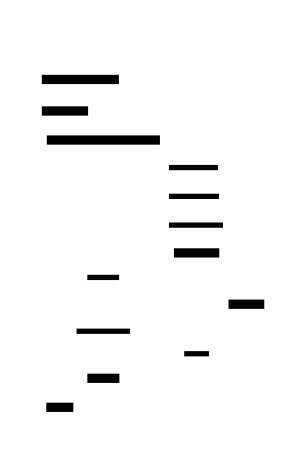
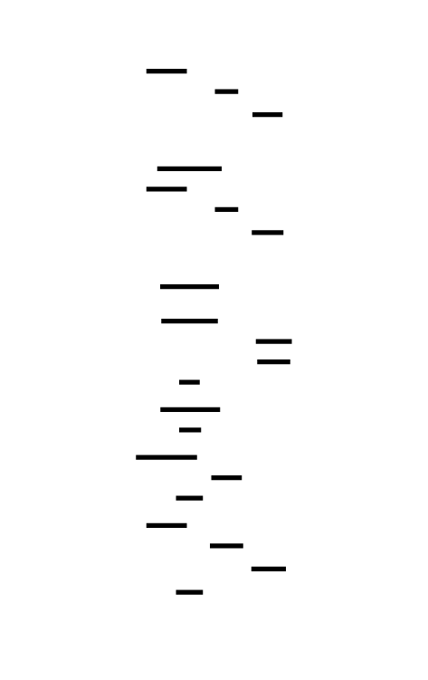

# 🎯 Project Charter: Container (Basic)

## What You Are Building
You are building a minimal Linux container runtime from scratch using C, Go, or Rust. Unlike high-level tools like Docker, your runtime will directly invoke kernel syscalls to create process isolation (namespaces), enforce hardware resource boundaries (cgroups), and virtualize a network stack using veth pairs and bridges. By the end, you will have a single binary that can take a standard Linux rootfs and execute an isolated shell that cannot see host processes, access host files, or starve the host of CPU and memory.

## Why This Project Exists
Most developers treat containers as "lightweight VMs," but they are actually just standard processes with specific kernel constraints. By building one from the ground up, you demystify the magic of `docker run`. You will learn exactly how the Linux kernel partitions its global resources, how the OOM killer makes decisions, and how "root" inside a container can be safely mapped to an unprivileged user on the host.

## What You Will Be Able to Do When Done
- **Implement Process Isolation:** Use `clone()` and `unshare()` to create PID and UTS namespaces where a process sees itself as PID 1.
- **Isolate Filesystems:** Execute the `pivot_root` syscall sequence to completely detach a container from the host filesystem.
- **Engineer Virtual Networks:** Programmatically create veth pairs, attach them to Linux bridges, and configure NAT/MASQUERADE for internet access.
- **Enforce Resource Limits:** Use cgroups v2 to throttle CPU consumption and set hard memory caps that trigger scoped OOM kills.
- **Build Rootless Containers:** Implement User Namespace UID/GID mapping to run containers without requiring host root privileges.

## Final Deliverable
A functional container runtime binary (~2,500 lines of code) and a set of utility scripts. The runtime will support a `run` command that:
1.  Bootstraps a provided rootfs (like Alpine or Ubuntu).
2.  Mounts private `/proc`, `/sys`, and `/dev` filesystems.
3.  Assigns a dedicated IP address and routes traffic through a virtual bridge.
4.  Limits the process to a specific memory/CPU quota.
5.  Drops the user into an interactive shell that is cryptographically and logically isolated from the host.

## Is This Project For You?
**You should start this if you:**
- Are comfortable with systems programming (pointers, memory allocation, and error handling in C, Go, or Rust).
- Understand the Linux process lifecycle (`fork`, `exec`, `wait`, `signals`).
- Have a Linux machine or VM (macOS/Windows will not work as this relies on Linux-specific syscalls).

**Come back after you've learned:**
- **Linux System Programming Basics:** Specifically how to use `man` pages to explore syscalls like `mount(2)` or `clone(2)`.
- **Basic Networking:** Understanding IP subnets, CIDR notation, and how a default gateway works.

## Estimated Effort
| Phase | Time |
|-------|------|
| **M1: PID & UTS Isolation** (Process identity and hostname) | ~5 hours |
| **M2: Filesystem Isolation** (pivot_root and mount namespaces) | ~6 hours |
| **M3: Container Networking** (veth pairs, bridges, and NAT) | ~8 hours |
| **M4: Cgroups Resource Limits** (CPU throttling and Memory caps) | ~6 hours |
| **M5: User Namespaces** (Mapping UID 0 to unprivileged users) | ~5 hours |
| **Total** | **~30 hours** |

## Definition of Done
The project is complete when:
- A process running inside the container cannot see or signal any process running on the host (verified via `ps`).
- The container can successfully `ping 8.8.8.8` and resolve DNS while its parent host remains on a different subnet.
- A "memory bomb" process inside the container is terminated by the kernel without affecting the stability of host applications.
- The container is successfully initialized and run by a non-root host user using User Namespace mapping.
- All created network interfaces and cgroup directories are automatically cleaned up when the container exits.

---

# 📚 Before You Read This: Prerequisites & Further Reading

> **Read these first.** The Atlas assumes you are familiar with the foundations below.
> Resources are ordered by when you should encounter them — some before you start, some at specific milestones.

### 🐧 Linux Kernel Fundamentals
**Namespaces in Operation**
- **Best Explanation**: [Michael Kerrisk (2013), LWN.net Series: Namespaces in operation](https://lwn.net/Articles/531114/) (Part 1: Introduction).
- **Why**: This is the canonical technical introduction to the namespace API by the author of the Linux man-pages.
- **Pedagogical Timing**: Read **BEFORE starting the project** to understand the "view transformation" philosophy of containers.

**The Linux Programming Interface (TLPI)**
- **Best Explanation**: Michael Kerrisk, *The Linux Programming Interface*, Chapter 28 (Process Creation) and Chapter 33 (Threads).
- **Why**: Chapter 28 provides the definitive explanation of the `clone()` syscall and the mechanics of manual stack allocation for child processes.
- **Pedagogical Timing**: Read **during Milestone 1** when implementing the `clone()` wrapper.

---

### 🆔 PID Namespaces & Process Reaping
**Monitoring Child Processes (Zombie Reaping)**
- **Best Explanation**: Michael Kerrisk, *The Linux Programming Interface*, Chapter 26.2 (Zombies and Orphans).
- **Code**: [Linux Kernel: `kernel/exit.c`](https://github.com/torvalds/linux/blob/master/kernel/exit.c) (Search for `forget_original_parent` to see reparenting logic).
- **Why**: Explains why PID 1 is the "subreaper" and why your container will leak memory if you don't implement a `waitpid` loop.
- **Pedagogical Timing**: Read **during Milestone 1** before implementing the `init` process logic.

---

### 📂 Mount Namespaces & Filesystem Isolation
**Shared Subtrees (Mount Propagation)**
- **Spec**: [Linux Kernel Documentation: `sharedsubtree.rst`](https://www.kernel.org/doc/Documentation/filesystems/sharedsubtree.rst)
- **Best Explanation**: [Michael Kerrisk (2016), LWN.net: Mount namespaces and shared subtrees](https://lwn.net/Articles/689856/).
- **Why**: This is the only resource that clearly explains why `mount --make-rprivate /` is required to prevent container mounts from appearing on the host.
- **Pedagogical Timing**: Read **at the start of Milestone 2** — it solves the most common bug in container filesystem isolation.

**The Mechanics of pivot_root**
- **Spec**: [man-pages: `pivot_root(2)`](https://man7.org/linux/man-pages/man2/pivot_root.2.html) (Notes section).
- **Code**: [runc: `libcontainer/rootfs_linux.go`](https://github.com/opencontainers/runc/blob/main/libcontainer/rootfs_linux.go) (Search for `pivotRoot`).
- **Why**: The "Notes" section of the man page contains the exact shell commands/logic required to handle the "bind-mount-to-self" requirement.
- **Pedagogical Timing**: Read **during Milestone 2** to understand why a simple `chroot` is insufficient for production isolation.

---

### 🌐 Network Virtualization
**Virtual Ethernet (veth) Driver**
- **Code**: [Linux Kernel: `drivers/net/veth.c`](https://github.com/torvalds/linux/blob/master/drivers/net/veth.c)
- **Best Explanation**: [Red Hat: Introduction to Linux Bridging and veth devices](https://developers.redhat.com/blog/2018/10/22/introduction-to-linux-interfaces-for-virtual-networking).
- **Why**: Provides the mental model of veth pairs as a "virtual patch cable" between namespaces.
- **Pedagogical Timing**: Read **before starting Milestone 3** to visualize how the container connects to the host bridge.

**Netlink Routing (rtnetlink)**
- **Spec**: [RFC 3549: Linux Netlink as an IP Services Protocol](https://datatracker.ietf.org/doc/html/rfc3549).
- **Code**: [iproute2: `ip/iplink_veth.c`](https://github.com/shemminger/iproute2/blob/main/ip/iplink_veth.c)
- **Best Explanation**: [Netlink Library (libnl) Documentation: Route Netlink](https://www.infradead.org/~tgr/libnl/doc/route.html).
- **Why**: Milestone 3 requires programmatic network config; understanding Netlink message structure is the only way to avoid using `system("ip link ...")`.
- **Pedagogical Timing**: Read **during Milestone 3** if you choose to implement C-native network configuration.

---

### ⚖️ Resource Limits (Cgroups)
**Control Groups v2 (The Unified Hierarchy)**
- **Spec**: [Linux Kernel Documentation: `cgroup-v2.rst`](https://www.kernel.org/doc/Documentation/admin-guide/cgroup-v2.rst).
- **Code**: [Linux Kernel: `kernel/cgroup/cgroup.c`](https://github.com/torvalds/linux/blob/master/kernel/cgroup/cgroup.c).
- **Best Explanation**: [Facebook Engineering: The coming-of-age of cgroup v2](https://engineering.fb.com/2022/10/24/open-source/linux-kernel-cgroup-v2/).
- **Why**: Cgroup v2 is the modern standard; this explains why the "single hierarchy" model replaced the fragmented v1 system.
- **Pedagogical Timing**: Read **before Milestone 4** to understand the filesystem-based API.

---

### 🔐 User Namespaces & Rootless Security
**User Namespaces: A New Frontier**
- **Paper**: [Eric W. Biederman (2013), "User Namespaces"](https://lwn.net/Articles/528078/).
- **Spec**: [man-pages: `user_namespaces(7)`](https://man7.org/linux/man-pages/man7/user_namespaces.7.html).
- **Why**: Explains the complex relationship between UID mapping and kernel capabilities.
- **Pedagogical Timing**: Read **during Milestone 5** — specifically the section on `uid_map` and `setgroups`.

**CVE-2014-8989 (The setgroups vulnerability)**
- **Best Explanation**: [LWN.net: User namespaces: a fantastic feature or a security nightmare?](https://lwn.net/Articles/621612/).
- **Why**: Explains why you MUST write `deny` to `/proc/self/setgroups` before writing a GID map as an unprivileged user.
- **Pedagogical Timing**: Read **during Milestone 5** if your GID mapping fails with "Operation not permitted."

---

### 📦 Container Standards
**Open Container Initiative (OCI) Runtime Spec**
- **Spec**: [OCI Runtime Specification: config.md](https://github.com/opencontainers/runtime-spec/blob/main/config.md).
- **Why**: This defines what a "container" actually is in the industry; your project is essentially a minimal implementation of this spec.
- **Pedagogical Timing**: Read **AFTER completing the project** to see how your scratch-built container maps to Docker/Kubernetes standards.

---

# Container (Basic)

Build a minimal container runtime from scratch using Linux kernel primitives—namespaces, cgroups, and user namespace mapping—to achieve process isolation without hardware virtualization. This project strips away the abstraction layers of Docker and Kubernetes to reveal the actual syscalls and kernel mechanisms that make containers possible. You'll implement PID isolation, mount namespace filesystem isolation with pivot_root, network namespace virtualization with veth pairs, cgroup resource limits, and unprivileged rootless container execution through user namespace UID/GID mapping.


<!-- MS_ID: container-basic-m1 -->
# PID and UTS Namespace Isolation
## The Fundamental Tension: Process Identity in a Shared Kernel
Every process on a Linux system has an identity — a PID (Process ID). The kernel assigns PIDs sequentially, starting from 1. Process 1 is special: it's the first user-space process, the ancestor of all others, and the recipient of orphaned children. On your system right now, `systemd` or `init` holds PID 1.
But what happens when you want to run a process that *thinks* it's PID 1, while the kernel has already assigned PID 1 to something else?
**The constraint**: The kernel's process table is a single, global data structure. PIDs are unique integers across the entire system. There's no "PID 1 for container A" and "PID 1 for container B" in the traditional sense.
**The solution**: PID namespaces don't create new process tables — they create *views* into the existing one. When you enter a new PID namespace, the kernel performs a translation layer. Inside the namespace, you see PIDs starting from 1. Outside, observers see the real host PIDs. The same process has two (or more) valid identities simultaneously.


This isn't magic. It's a view transformation backed by a per-namespace data structure that maps virtual PIDs to the underlying `struct pid`. The kernel maintains both views with near-zero overhead — just a flag check during PID lookup and a linked list traversal.
### What You'll Build
By the end of this milestone, you will have:
1. **Created a PID namespace** using the `clone()` syscall with the `CLONE_NEWPID` flag
2. **Implemented a proper init process** that reaps zombie children (PID 1 has responsibilities!)
3. **Added UTS namespace isolation** so your container has its own hostname
4. **Verified isolation** by comparing `/proc/self/status` from inside and outside the namespace
Let's start with the syscall that makes this possible.
---
## The clone() Syscall: Namespace-Aware Process Creation
You've used `fork()` before — it creates a child process that's a copy of the parent. But `fork()` doesn't understand namespaces. For that, you need `clone()`, the lower-level primitive that `fork()` and `pthread_create()` are built on.
[[EXPLAIN:clone()-syscall-and-child-stack-allocation|clone() syscall and child stack allocation]]
The signature of `clone()` is:
```c
#include <sched.h>
#include <signal.h>
int clone(int (*fn)(void *), void *stack, int flags, void *arg,
          ... /* pid_t *ptid, void *tls, pid_t *ctid */ );
```
This looks intimidating, but let's break it down:
| Parameter | Purpose | Why It Matters for Containers |
|-----------|---------|------------------------------|
| `fn` | Function the child executes | Unlike `fork()`, child starts here, not at the call site |
| `stack` | Pointer to child's stack | You allocate this manually — no shared stack! |
| `flags` | Bitmask of options | Where namespace magic happens |
| `arg` | Argument passed to `fn` | How you communicate config to the child |
| `ptid`, `tls`, `ctid` | Advanced: parent PID, thread-local, child PID | Usually NULL for basic containers |
### The Stack Requirement: A Critical Detail
`clone()` requires you to provide the child's stack. This isn't optional, and getting it wrong causes immediate crashes.
```c
#define STACK_SIZE (1024 * 1024)  // 1 MB
// Allocate stack
void *stack = malloc(STACK_SIZE);
if (!stack) {
    perror("malloc");
    exit(1);
}
// CRITICAL: Stack grows downward on x86-64!
// Pass the TOP of the stack, not the bottom
void *stack_top = stack + STACK_SIZE;
// Now clone() can be called with stack_top
```


**Why this matters**: On x86-64, the stack pointer decrements on push. If you pass the bottom of the stack, the first push writes past your allocation — undefined behavior that typically manifests as a segfault or silent corruption.
### The Namespace Flags
For PID and UTS namespace isolation, you'll use these flags:
```c
#include <sched.h>
// Namespace flags (can be OR'd together)
#define CLONE_NEWPID   0x20000000  // New PID namespace
#define CLONE_NEWUTS   0x04000000  // New UTS namespace (hostname)
// Example: create child with both namespaces
int flags = CLONE_NEWPID | CLONE_NEWUTS | SIGCHLD;
```
`SIGCHLD` is included so the parent can use standard `waitpid()` to wait for the child. Without it, you'd need to handle the termination signal explicitly.
---
## Your First PID Namespace
Let's write a minimal program that creates a child in a new PID namespace and observes the PID transformation.
```c
#define _GNU_SOURCE
#include <sched.h>
#include <stdio.h>
#include <stdlib.h>
#include <unistd.h>
#include <signal.h>
#include <sys/wait.h>
#define STACK_SIZE (1024 * 1024)
static int child_fn(void *arg) {
    (void)arg;  // Unused in this example
    // This process is now PID 1 in its namespace
    printf("Child: my PID is %d\n", getpid());
    printf("Child: my parent's PID is %d\n", getppid());
    // Sleep to give parent time to observe
    sleep(2);
    return 0;
}
int main(void) {
    // Allocate and prepare stack
    void *stack = malloc(STACK_SIZE);
    if (!stack) {
        perror("malloc");
        return 1;
    }
    void *stack_top = stack + STACK_SIZE;
    // Clone with new PID namespace
    int flags = CLONE_NEWPID | SIGCHLD;
    pid_t pid = clone(child_fn, stack_top, flags, NULL);
    if (pid == -1) {
        perror("clone");
        free(stack);
        return 1;
    }
    // Parent: observe the child's HOST PID
    printf("Parent: child's host PID is %d\n", pid);
    printf("Parent: my PID is %d\n", getpid());
    // Wait for child
    int status;
    waitpid(pid, &status, 0);
    free(stack);
    return WEXITSTATUS(status);
}
```
**Compile and run:**
```bash
$ gcc -o pid_ns_demo pid_ns_demo.c
$ ./pid_ns_demo
Parent: child's host PID is 12345
Parent: my PID is 12344
Child: my PID is 1
Child: my parent's PID is 0
```
### What Just Happened?
1. **Parent perspective**: The child has host PID 12345 (or whatever the kernel assigned)
2. **Child perspective**: It sees itself as PID 1 — the init process of a new world
3. **Parent PID**: The child sees parent PID as 0, because the parent exists *outside* the PID namespace
This is the core insight: **the same process has two valid PIDs simultaneously**. The kernel maintains both views. When the child calls `getpid()`, the kernel checks which namespace the calling process is in and returns the namespace-local PID.
### The Three-Level View
Let's trace what happens when the child calls `getpid()`:


| Level | What Happens | Cost |
|-------|--------------|------|
| **Application** | Calls `getpid()` via glibc wrapper | ~0 |
| **OS/Kernel** | Looks up current task's `struct pid`, finds the entry for current namespace, returns virtual PID | A few pointer dereferences, ~10-20 cycles |
| **Hardware** | No special hardware involvement; all in memory | N/A |
The overhead is negligible because the namespace mapping is cached in the task structure. The kernel doesn't scan a global table on every PID lookup.
---
## Verifying Isolation via /proc
[[EXPLAIN:linux-/proc-filesystem-structure|Linux /proc filesystem structure]]
The `/proc` filesystem exposes kernel data structures as files. For process introspection, `/proc/self/status` is particularly useful — it shows information about the current process, including namespace-specific PIDs.
```c
static void print_pid_info(const char *label) {
    printf("=== %s ===\n", label);
    printf("  PID: %d\n", getpid());
    // Read and display NSpid from /proc/self/status
    FILE *f = fopen("/proc/self/status", "r");
    if (!f) {
        perror("fopen /proc/self/status");
        return;
    }
    char line[256];
    while (fgets(line, sizeof(line), f)) {
        // NSpid shows PIDs in each nested namespace
        if (strncmp(line, "NSpid:", 6) == 0) {
            printf("  %s", line);  // Already includes newline
        }
    }
    fclose(f);
}
```
**Sample output from inside a PID namespace:**
```
=== Inside Container ===
  PID: 1
  NSpid:	1	12345
```
**Sample output from outside (parent):**
```
=== Outside Container ===
  PID: 12344
  NSpid:	12344
```


The `NSpid` field shows the PID in each namespace level, from innermost to outermost. Inside the container, you see `1 12345` — PID 1 in the namespace, PID 12345 on the host. Outside, there's only one namespace level, so you see just the host PID.
---
## PID 1's Special Responsibility: Zombie Reaping
Here's where most container tutorials fail: they show you how to create PID 1, but not what PID 1 *must do*.
**The problem**: When a process exits, it becomes a zombie. Its entry in the process table remains until its parent calls `wait()` or `waitpid()` to retrieve the exit status. But what if the parent exits before the child? The child is "reparented" to PID 1.
**The twist**: In a PID namespace, *your* process is PID 1. You inherit all orphaned processes in your namespace. If you don't reap them, they accumulate as zombies that can never be cleaned up.
### Zombie Accumulation Demo
```c
#include <stdio.h>
#include <unistd.h>
#include <sys/wait.h>
int main(void) {
    // Spawn a child that immediately exits
    if (fork() == 0) {
        printf("Child: exiting\n");
        return 0;
    }
    // Parent (PID 1 in namespace) does NOT wait
    printf("PID 1: sleeping without reaping\n");
    sleep(60);
    // In another terminal, run: ps aux | grep defunct
    // You'll see the zombie!
    return 0;
}
```
### The Proper Solution: Zombie Reaping Loop
A well-behaved PID 1 must continuously reap children:
```c
#include <sys/wait.h>
#include <signal.h>
#include <errno.h>
static void reap_zombies(void) {
    int status;
    pid_t pid;
    // WNOHANG: return immediately if no child has exited
    while ((pid = waitpid(-1, &status, WNOHANG)) > 0) {
        if (WIFEXITED(status)) {
            printf("Reaped child %d, exit status: %d\n", 
                   pid, WEXITSTATUS(status));
        } else if (WIFSIGNALED(status)) {
            printf("Reaped child %d, killed by signal: %d\n",
                   pid, WTERMSIG(status));
        }
    }
    // ECHILD means no children left — expected, not an error
    if (pid == -1 && errno != ECHILD) {
        perror("waitpid");
    }
}
```


### Signal Handling for SIGCHLD
The best practice is to reap zombies in a `SIGCHLD` handler, which fires whenever a child's status changes:
```c
#include <signal.h>
#include <unistd.h>
static volatile sig_atomic_t child_exited = 0;
static void sigchld_handler(int sig) {
    (void)sig;
    child_exited = 1;
}
static void setup_signal_handlers(void) {
    struct sigaction sa = {0};
    sa.sa_handler = sigchld_handler;
    sa.sa_flags = SA_RESTART | SA_NOCLDSTOP;
    // SA_NOCLDSTOP: don't send SIGCHLD when children stop (job control)
    // SA_RESTART: automatically restart interrupted syscalls
    if (sigaction(SIGCHLD, &sa, NULL) == -1) {
        perror("sigaction");
        exit(1);
    }
}
```
### Complete Init Process Implementation
Here's a proper init process that handles both zombie reaping and signal forwarding:
```c
#define _GNU_SOURCE
#include <sched.h>
#include <stdio.h>
#include <stdlib.h>
#include <unistd.h>
#include <signal.h>
#include <sys/wait.h>
#include <errno.h>
static void reap_zombies(void) {
    int status;
    pid_t pid;
    while ((pid = waitpid(-1, &status, WNOHANG)) > 0) {
        if (WIFEXITED(status)) {
            printf("[init] Child %d exited with status %d\n", 
                   pid, WEXITSTATUS(status));
        } else if (WIFSIGNALED(status)) {
            printf("[init] Child %d killed by signal %d\n",
                   pid, WTERMSIG(status));
        }
    }
}
static volatile sig_atomic_t sigchld_received = 0;
static volatile sig_atomic_t termination_requested = 0;
static void sigchld_handler(int sig) {
    (void)sig;
    sigchld_received = 1;
}
static void termination_handler(int sig) {
    (void)sig;
    termination_requested = 1;
}
static int init_process(void *arg) {
    (void)arg;
    printf("[init] Started as PID %d in new namespace\n", getpid());
    // Setup signal handlers
    struct sigaction sa = {0};
    sa.sa_handler = sigchld_handler;
    sa.sa_flags = SA_RESTART | SA_NOCLDSTOP;
    sigaction(SIGCHLD, &sa, NULL);
    sa.sa_handler = termination_handler;
    sa.sa_flags = SA_RESTART;
    sigaction(SIGTERM, &sa, NULL);
    sigaction(SIGINT, &sa, NULL);
    // Fork a child to do actual work
    pid_t worker = fork();
    if (worker == 0) {
        // Worker process
        printf("[worker] Started as PID %d\n", getpid());
        sleep(2);
        printf("[worker] Exiting\n");
        return 0;
    }
    // Main event loop
    while (!termination_requested) {
        pause();  // Wait for signal
        if (sigchld_received) {
            sigchld_received = 0;
            reap_zombies();
        }
    }
    // Forward termination signal to all children
    printf("[init] Terminating, forwarding signal to children\n");
    kill(-1, SIGTERM);
    // Final reap
    reap_zombies();
    return 0;
}
```
---
## UTS Namespace: Hostname Isolation
The UTS namespace isolates two identifiers returned by `uname()`:
1. **Hostname** — what `gethostname()` returns and `hostname` command displays
2. **Domain name** — the NIS/YP domain name (rarely used today)
UTS stands for "UNIX Time-sharing System" — a reference to the `struct utsname` that holds these values.
### Why Hostname Isolation Matters
Many applications use the hostname for:
- Log messages and debugging
- Service discovery (e.g., "connect to `db-prod-1`")
- Configuration files that reference `$HOSTNAME`
- Clustering software that identifies nodes by hostname
Without UTS namespace isolation, changing the hostname inside a container would affect the entire host — a major security and operational problem.
### UTS Namespace Implementation
Creating a UTS namespace is straightforward with `clone()`:
```c
#define _GNU_SOURCE
#include <sched.h>
#include <unistd.h>
#include <string.h>
#include <stdio.h>
#include <sys/utsname.h>
static int uts_child(void *arg) {
    const char *hostname = (const char *)arg;
    // Set hostname inside the namespace
    if (sethostname(hostname, strlen(hostname)) == -1) {
        perror("sethostname");
        return 1;
    }
    // Verify
    char buffer[256];
    if (gethostname(buffer, sizeof(buffer)) == -1) {
        perror("gethostname");
        return 1;
    }
    printf("Inside namespace: hostname is '%s'\n", buffer);
    // Also show uname info
    struct utsname uts;
    if (uname(&uts) == 0) {
        printf("  sysname:  %s\n", uts.sysname);
        printf("  nodename: %s\n", uts.nodename);
        printf("  release:  %s\n", uts.release);
        printf("  version:  %s\n", uts.version);
        printf("  machine:  %s\n", uts.machine);
    }
    return 0;
}
int main(void) {
    // Get current hostname before creating namespace
    char original[256];
    gethostname(original, sizeof(original));
    printf("Host hostname: '%s'\n", original);
    // Allocate stack
    void *stack = malloc(1024 * 1024);
    void *stack_top = stack + 1024 * 1024;
    // Clone with UTS namespace
    const char *container_hostname = "my-container";
    pid_t pid = clone(uts_child, stack_top, 
                      CLONE_NEWUTS | SIGCHLD, 
                      (void *)container_hostname);
    if (pid == -1) {
        perror("clone");
        free(stack);
        return 1;
    }
    // Wait for child
    int status;
    waitpid(pid, &status, 0);
    // Verify host hostname unchanged
    char after[256];
    gethostname(after, sizeof(after));
    printf("Host hostname after: '%s'\n", after);
    if (strcmp(original, after) == 0) {
        printf("SUCCESS: Host hostname was not affected!\n");
    }
    free(stack);
    return WEXITSTATUS(status);
}
```


### The Kernel Data Structure
Inside the kernel, each UTS namespace is represented by `struct uts_namespace`:
```c
// Simplified view from include/linux/utsname.h
struct uts_namespace {
    struct kref kref;           // Reference counting
    struct new_utsname name;    // The actual hostname, etc.
    struct user_namespace *user_ns;
    struct ucounts *ucounts;
    // ... more fields
};
struct new_utsname {
    char sysname[65];    // "Linux"
    char nodename[65];   // Hostname
    char release[65];    // Kernel version: "6.1.0-generic"
    char version[65];    // Build info
    char machine[65];    // "x86_64"
    char domainname[65]; // NIS domain
};
```
Each process has a pointer to its UTS namespace in `task_struct->nsproxy->uts_ns`. When `sethostname()` is called, the kernel modifies only the current namespace's `nodename` field.
---
## Combining PID and UTS Namespaces
In practice, you'll create multiple namespaces simultaneously. The flags can be OR'd together:
```c
#define _GNU_SOURCE
#include <sched.h>
#include <stdio.h>
#include <stdlib.h>
#include <unistd.h>
#include <string.h>
#include <signal.h>
#include <sys/wait.h>
#include <sys/utsname.h>
#define STACK_SIZE (1024 * 1024)
static volatile sig_atomic_t got_sigchld = 0;
static void sigchld_handler(int sig) {
    (void)sig;
    got_sigchld = 1;
}
static void reap_zombies(void) {
    int status;
    pid_t pid;
    while ((pid = waitpid(-1, &status, WNOHANG)) > 0) {
        printf("[init] Reaped PID %d\n", pid);
    }
}
static int container_init(void *arg) {
    const char *hostname = (const char *)arg;
    // We are PID 1 in this namespace
    printf("[container] PID: %d (should be 1)\n", getpid());
    // Set hostname
    if (sethostname(hostname, strlen(hostname)) == -1) {
        perror("sethostname");
        return 1;
    }
    // Setup SIGCHLD handler
    struct sigaction sa = {0};
    sa.sa_handler = sigchld_handler;
    sa.sa_flags = SA_RESTART | SA_NOCLDSTOP;
    sigaction(SIGCHLD, &sa, NULL);
    // Fork a worker to demonstrate zombie reaping
    pid_t worker = fork();
    if (worker == 0) {
        printf("[worker] PID: %d, sleeping 2s\n", getpid());
        sleep(2);
        printf("[worker] exiting\n");
        return 42;  // Custom exit code
    }
    // Main loop
    printf("[container] entering main loop (hostname: %s)\n", hostname);
    for (int i = 0; i < 5; i++) {
        sleep(1);
        if (got_sigchld) {
            got_sigchld = 0;
            reap_zombies();
        }
    }
    reap_zombies();  // Final cleanup
    return 0;
}
int main(void) {
    char original_host[256];
    gethostname(original_host, sizeof(original_host));
    printf("[host] Original hostname: %s\n", original_host);
    // Allocate stack
    void *stack = malloc(STACK_SIZE);
    if (!stack) {
        perror("malloc");
        return 1;
    }
    void *stack_top = stack + STACK_SIZE;
    // Clone with BOTH PID and UTS namespaces
    int flags = CLONE_NEWPID | CLONE_NEWUTS | SIGCHLD;
    const char *container_hostname = "isolated-container";
    pid_t pid = clone(container_init, stack_top, flags, 
                      (void *)container_hostname);
    if (pid == -1) {
        perror("clone");
        free(stack);
        return 1;
    }
    printf("[host] Container PID (host view): %d\n", pid);
    // Wait for container
    int status;
    waitpid(pid, &status, 0);
    // Verify hostname unchanged
    char final_host[256];
    gethostname(final_host, sizeof(final_host));
    printf("[host] Final hostname: %s\n", final_host);
    if (strcmp(original_host, final_host) == 0) {
        printf("[host] SUCCESS: Hostname isolated!\n");
    } else {
        printf("[host] FAILURE: Hostname leaked!\n");
    }
    free(stack);
    return WEXITSTATUS(status);
}
```
---
## Alternative: unshare() for Namespace Creation
While `clone()` creates a new process in new namespaces, `unshare()` lets an existing process enter new namespaces:
```c
#define _GNU_SOURCE
#include <sched.h>
#include <unistd.h>
#include <stdio.h>
int main(void) {
    printf("Before unshare: PID %d\n", getpid());
    // Create new PID namespace
    if (unshare(CLONE_NEWPID) == -1) {
        perror("unshare");
        return 1;
    }
    // IMPORTANT: unshare(CLONE_NEWPID) only affects CHILDREN!
    // The calling process is still in the old namespace.
    printf("After unshare: PID %d (still in old namespace)\n", getpid());
    // Fork to enter the new namespace
    pid_t child = fork();
    if (child == 0) {
        printf("Child after fork: PID %d (should be 1)\n", getpid());
        return 0;
    }
    // Parent waits
    int status;
    waitpid(child, &status, 0);
    return 0;
}
```
**Key difference**: `unshare(CLONE_NEWPID)` doesn't move the calling process into the new namespace — it sets a flag so that *subsequently forked children* will be in the new namespace. This is a common source of confusion.
### Design Decision: clone() vs unshare()
| Aspect | `clone()` | `unshare()` |
|--------|-----------|-------------|
| **When namespace is created** | At process creation | For existing process |
| **PID namespace entry** | Child is immediately in new namespace | Caller must fork() after unshare |
| **Use case** | Starting a container init | Modifying running process |
| **Complexity** | Stack management required | Simpler for some cases |
| **Atomicity** | Single syscall for process+namespace | Two-step for PID namespace |
For container runtimes, `clone()` is typically preferred because you want the init process to start directly in all the namespaces without a transition period.
---
## Error Handling and Common Pitfalls
### Permission Denied (EPERM)
```c
pid_t pid = clone(child_fn, stack_top, CLONE_NEWPID | SIGCHLD, NULL);
if (pid == -1) {
    if (errno == EPERM) {
        fprintf(stderr, "Permission denied. Check:\n");
        fprintf(stderr, "  1. Running as root?\n");
        fprintf(stderr, "  2. User namespaces available?\n");
        fprintf(stderr, "  3. sysctl kernel.unprivileged_userns_clone?\n");
    }
}
```
On some systems, creating namespaces without root requires:
- Linux kernel configured with `CONFIG_USER_NS`
- `sysctl kernel.unprivileged_userns_clone=1` (Debian/Ubuntu)
### Invalid Argument (EINVAL)
```c
if (errno == EINVAL) {
    fprintf(stderr, "Invalid flags or stack pointer\n");
    fprintf(stderr, "  - Stack must be properly aligned\n");
    fprintf(stderr, "  - Flags combination may be invalid\n");
}
```
### Out of Memory (ENOMEM)
```c
if (errno == ENOMEM) {
    fprintf(stderr, "Insufficient memory for namespace\n");
    fprintf(stderr, "  - Check /proc/sys/kernel/pid_max\n");
    fprintf(stderr, "  - Check /proc/sys/user/max_pid_namespaces\n");
}
```
### The Stack Alignment Bug
The most common crash:
```c
// WRONG: Stack grows downward, this is the bottom
void *stack_ptr = malloc(STACK_SIZE);
// CORRECT: Top of stack for x86-64
void *stack_top = stack_ptr + STACK_SIZE;
// EVEN BETTER: Align to 16 bytes (ABI requirement)
void *stack_top = (void *)((uintptr_t)(stack_ptr + STACK_SIZE) & ~0xF);
```
---
## Putting It All Together: Complete Example
Here's a complete, production-quality implementation:
```c
#define _GNU_SOURCE
#include <sched.h>
#include <stdio.h>
#include <stdlib.h>
#include <string.h>
#include <unistd.h>
#include <signal.h>
#include <errno.h>
#include <sys/wait.h>
#include <sys/utsname.h>
#include <sys/mount.h>
#define STACK_SIZE (1024 * 1024)
#define CONTAINER_HOSTNAME "container-001"
// Container configuration
typedef struct {
    const char *hostname;
    int argc;
    char **argv;
} container_config_t;
// Signal handling
static volatile sig_atomic_t got_sigchld = 0;
static volatile sig_atomic_t got_sigterm = 0;
static void sigchld_handler(int sig) { (void)sig; got_sigchld = 1; }
static void sigterm_handler(int sig) { (void)sig; got_sigterm = 1; }
// Zombie reaping
static void reap_children(void) {
    int status;
    pid_t pid;
    while ((pid = waitpid(-1, &status, WNOHANG)) > 0) {
        if (WIFEXITED(status)) {
            printf("[init] Child %d exited: %d\n", pid, WEXITSTATUS(status));
        } else if (WIFSIGNALED(status)) {
            printf("[init] Child %d killed: %d\n", pid, WTERMSIG(status));
        }
    }
}
// Print namespace info
static void print_ns_info(void) {
    FILE *f = fopen("/proc/self/status", "r");
    if (!f) return;
    char line[256];
    while (fgets(line, sizeof(line), f)) {
        if (strncmp(line, "NSpid:", 6) == 0 ||
            strncmp(line, "Pid:", 4) == 0) {
            printf("  %s", line);
        }
    }
    fclose(f);
}
// Container init process
static int container_init(void *arg) {
    container_config_t *cfg = (container_config_t *)arg;
    // Set hostname
    if (sethostname(cfg->hostname, strlen(cfg->hostname)) == -1) {
        perror("sethostname");
        return 1;
    }
    // Setup signal handlers
    struct sigaction sa = {0};
    sa.sa_handler = sigchld_handler;
    sa.sa_flags = SA_RESTART | SA_NOCLDSTOP;
    sigaction(SIGCHLD, &sa, NULL);
    sa.sa_handler = sigterm_handler;
    sa.sa_flags = SA_RESTART;
    sigaction(SIGTERM, &sa, NULL);
    sigaction(SIGINT, &sa, NULL);
    // Print container info
    printf("[container] === Started ===\n");
    printf("[container] Hostname: %s\n", cfg->hostname);
    printf("[container] PID info:\n");
    print_ns_info();
    // Mount /proc (needed for NSpid to show namespace PIDs)
    // Note: This requires either root or proper capabilities
    if (mount("proc", "/proc", "proc", MS_NOSUID | MS_NOEXEC, NULL) == -1) {
        // Non-fatal: might already be mounted or no permission
        printf("[container] Note: Could not mount /proc: %s\n", strerror(errno));
    }
    // Execute child process or shell
    pid_t child = fork();
    if (child == 0) {
        // Child: execute the command or shell
        if (cfg->argc > 0) {
            execvp(cfg->argv[0], cfg->argv);
            perror("execvp");
            return 1;
        } else {
            // Default: run a shell
            char *shell_argv[] = {"/bin/sh", NULL};
            execvp(shell_argv[0], shell_argv);
            perror("execvp");
            return 1;
        }
    }
    // Init process main loop
    while (!got_sigterm) {
        pause();
        if (got_sigchld) {
            got_sigchld = 0;
            reap_children();
            // If all children are gone, we can exit
            // (In a real container, you might want to stay alive)
        }
    }
    // Clean shutdown
    printf("[container] Shutting down...\n");
    kill(-1, SIGTERM);
    reap_children();
    return 0;
}
int main(int argc, char *argv[]) {
    printf("[host] === Container Launcher ===\n");
    printf("[host] Host hostname: ");
    fflush(stdout);
    system("hostname");
    // Allocate child stack
    void *stack = malloc(STACK_SIZE);
    if (!stack) {
        perror("malloc");
        return 1;
    }
    void *stack_top = (void *)((uintptr_t)(stack + STACK_SIZE) & ~0xF);
    // Setup container config
    container_config_t config = {
        .hostname = CONTAINER_HOSTNAME,
        .argc = argc - 1,
        .argv = argv + 1
    };
    // Create container with PID and UTS namespaces
    int flags = CLONE_NEWPID | CLONE_NEWUTS | SIGCHLD;
    printf("[host] Creating container with namespaces: PID, UTS\n");
    pid_t container_pid = clone(container_init, stack_top, flags, &config);
    if (container_pid == -1) {
        perror("clone");
        fprintf(stderr, "[host] Error codes: EPERM=%d, EINVAL=%d, ENOMEM=%d\n",
                EPERM, EINVAL, ENOMEM);
        fprintf(stderr, "[host] Actual errno: %d\n", errno);
        free(stack);
        return 1;
    }
    printf("[host] Container started with host PID: %d\n", container_pid);
    // Wait for container
    int status;
    waitpid(container_pid, &status, 0);
    printf("[host] Container exited with status: %d\n", WEXITSTATUS(status));
    // Verify hostname isolation
    printf("[host] Host hostname after container: ");
    fflush(stdout);
    system("hostname");
    free(stack);
    return WEXITSTATUS(status);
}
```
---
## Hardware Soul: What's Actually Happening
When you call `clone()` with namespace flags, here's what happens at each level:
### Application Level
- Your code calls `clone()` via glibc wrapper
- Wrapper moves arguments to registers per ABI
- Executes `syscall` instruction
### Kernel Level
1. **Syscall entry**: CPU switches to kernel mode, jumps to `entry_SYSCALL_64`
2. **Dispatch**: Syscall table lookup → `sys_clone`
3. **Namespace allocation**: 
   - `copy_process()` calls `copy_namespaces()`
   - New `struct pid_namespace` allocated (or linked to existing)
   - New `struct uts_namespace` allocated and copied from parent
4. **Process creation**: New `task_struct` allocated, copied from parent
5. **PID assignment**: In new PID namespace, assigned PID 1; in parent namespace, assigned next available PID
### Hardware Level
- **Memory**: ~4KB for `task_struct` + ~1KB for namespace structs
- **Cache**: New data structures are cold — first accesses are cache misses
- **TLB**: No page table changes (same memory map), so no TLB flush
- **Cycles**: ~10,000-50,000 cycles for full `clone()` with namespaces (vs ~1,000 for simple `fork()`)
The namespace creation itself is cheap — it's just allocating and linking a few data structures. The expensive parts are:
1. Copying the parent's memory mappings (copy-on-write helps)
2. Duplicating file descriptor table
3. Setting up new kernel data structures
---
## Knowledge Cascade: What You've Unlocked
By understanding PID and UTS namespaces, you've gained access to:
### Immediate Connections
- **Process tree isolation**: Docker's `--pid` flag, Kubernetes pod sandboxes — all use exactly this mechanism
- **Hostname in containers**: Why `hostname` in a container shows something different from the host — UTS namespace
- **Signal handling differences**: Why `docker stop` (SIGTERM) to PID 1 behaves differently than to other processes — PID 1 ignores signals by default
### Same Domain: Other Namespaces
- **Mount namespace** (next milestone): Same pattern, but for filesystem views
- **Network namespace** (Milestone 3): Isolates network stack — same `CLONE_NEW*` pattern
- **User namespace** (Milestone 5): UID mapping — the most complex but most powerful
### Cross-Domain Applications
- **Debuggers and tracers**: Understanding `/proc` structure helps with process inspection
- **System monitoring**: Why `top` and `htop` show different PIDs than `docker top`
- **CI/CD runners**: Many runners use PID namespaces for job isolation
- **Sandboxing**: Chrome's sandbox, Firejail, Bubblewrap — all use these primitives
### Security Understanding
- **Namespace escape vulnerabilities**: Understanding what namespaces DON'T isolate (resources, kernel state)
- **Container security boundaries**: Namespaces provide visibility isolation, not resource limits — that's cgroups (Milestone 4)
- **Privilege in containers**: Why running as root in a container is still risky — namespaces have leaks
### Surprising Connection: Zombie Processes Everywhere
The PID 1 zombie-reaping responsibility isn't just for containers. Any long-running daemon that spawns children must handle SIGCHLD properly:
- Web servers (nginx, Apache worker processes)
- Database servers (PostgreSQL postmaster)
- SSH daemons
- init systems (systemd, OpenRC)
The pattern you learned here — signal handler + non-blocking waitpid loop — is the universal solution.
---
## Summary
You've built the foundation of container isolation:
1. **PID namespaces** provide process tree isolation through a view transformation — the same process has different PIDs in different namespaces, maintained by the kernel with minimal overhead.
2. **UTS namespaces** isolate hostname and domain name, allowing containers to have independent identities.
3. **PID 1 responsibilities** require zombie reaping — without this, your container leaks kernel resources.
4. **clone()** is the fundamental syscall, requiring manual stack management and proper flag combination.
5. **Verification** through `/proc/self/status` provides concrete proof of isolation.
In the next milestone, you'll add mount namespace isolation with `pivot_root()` to completely separate the container's filesystem view from the host — preventing access to host files even with root privileges.
---
[[CRITERIA_JSON: {"milestone_id": "container-basic-m1", "criteria": ["Create new PID namespace using clone(CLONE_NEWPID) with manually allocated and aligned child stack (stack grows downward on x86-64)", "Child process observes itself as PID 1 via getpid() while parent observes the child's real host PID via clone() return value", "Container init process (PID 1) implements zombie reaping using waitpid(-1, &status, WNOHANG) in a loop triggered by SIGCHLD signal handler", "UTS namespace created with CLONE_NEWUTS flag combined with PID namespace in single clone() call", "sethostname() inside container changes container hostname without affecting host hostname (verified with gethostname() from both contexts)", "Read and parse /proc/self/status to compare NSpid field from inside vs outside namespace, demonstrating dual PID view", "Proper error handling for clone() including EPERM (permissions), EINVAL (flags/stack), ENOMEM (resource limits)", "Stack pointer passed to clone() is the TOP of allocated region (stack + STACK_SIZE) with optional 16-byte alignment per ABI", "Signal handler setup uses SA_RESTART | SA_NOCLDSTOP flags to prevent interruption and avoid stop-signal noise", "All allocated resources (stack memory) are freed and child processes are waited for before parent exit"]}]
<!-- END_MS -->


<!-- MS_ID: container-basic-m2 -->
# Mount Namespace and Filesystem Isolation
## The Fundamental Tension: One Kernel, Many Filesystems
You've isolated processes (PID namespace) and hostnames (UTS namespace). But here's the brutal truth: your container process can still read `/etc/shadow`, modify `/bin/bash`, or `umount` the host's critical filesystems. The filesystem is shared infrastructure, and without isolation, your "container" is just a process with a different name — not a security boundary.
**The constraint**: The kernel maintains a single mount table. Every process sees the same set of mounted filesystems by default. When one process mounts a USB drive, every process can see it. When one process unmounts `/home`, everyone loses access.
**The problem**: You need processes to have completely different views of the filesystem — not just different current directories, but different root directories, different mounted filesystems, and complete inability to access paths outside their world.
**The solution**: Mount namespaces create parallel mount tables. Combined with `pivot_root()`, you can atomically swap a process's entire filesystem view, leaving the host filesystem completely inaccessible — not just hidden, but unreachable.


This isn't security through obscurity. After `pivot_root()` and unmounting the old root, there's literally no kernel data structure pointing from the container to the host filesystem. The container process would need to escape the namespace entirely to find a path back.
---
## The Revelation: Why chroot is NOT Container Isolation
Before diving into mount namespaces, let's shatter a dangerous misconception.
Many developers believe `chroot` provides filesystem isolation for containers. This is catastrophically wrong.
### What chroot Actually Does
`chroot("/new/root")` changes one thing: the process's current root directory pointer. When the process resolves an absolute path like `/etc/passwd`, the kernel prepends `/new/root` to get `/new/root/etc/passwd`.
That's it. One pointer change. No new namespaces, no mount table changes, no kernel data structure isolation.
### The chroot Escape: A Classic Vulnerability
Here's how you escape a `chroot` jail with just a few syscalls:
```c
#include <unistd.h>
#include <sys/stat.h>
int main(void) {
    // Assume we're chrooted into /jail
    // Step 1: Create a directory inside the jail
    mkdir("escape", 0755);
    // Step 2: chroot into that subdirectory
    // Now our root is /jail/escape, but...
    chroot("escape");
    // Step 3: cd up enough times to reach the real root
    // The kernel doesn't prevent this because ".." from /jail/escape
    // still resolves to /jail in the parent directory entries
    chdir("../../../../../../../../../..");
    // Step 4: chroot to the ACTUAL root
    chroot(".");
    // Step 5: We're out. Execute a shell.
    execl("/bin/sh", "/bin/sh", NULL);
    return 0;
}
```


**Why this works**: `chroot` only changes the starting point for path resolution. It doesn't change the actual directory entries on disk. When you `chdir("..")` from `/jail/escape`, you get `/jail` because that's what's stored in the `escape` directory's `..` entry. The kernel doesn't track "you're chrooted" during directory traversal.
### pivot_root: The Real Solution
`pivot_root()` is fundamentally different:
1. It modifies the **kernel's mount table**, not just a process pointer
2. It **atomically swaps** the root mount point
3. The old root is **moved to a subdirectory**, not hidden
4. You can then **unmount** the old root entirely
After `pivot_root()` + `umount()`, there's no path from the container to the host filesystem because the kernel's mount table literally doesn't contain the host mounts anymore.
---
## Mount Namespaces: The Foundation
The mount namespace was the first namespace added to Linux (hence the flag name `CLONE_NEWNS`, not `CLONE_NEWMNT`). It isolates the list of mounted filesystems that a process can see.
### Creating a Mount Namespace
```c
#define _GNU_SOURCE
#include <sched.h>
#include <stdio.h>
#include <stdlib.h>
#include <unistd.h>
#include <signal.h>
#include <sys/wait.h>
#include <sys/mount.h>
#define STACK_SIZE (1024 * 1024)
static int mount_ns_child(void *arg) {
    (void)arg;
    printf("[child] In new mount namespace\n");
    printf("[child] Current mounts:\n");
    fflush(stdout);
    // Show current mounts
    system("cat /proc/self/mountinfo | head -5");
    // Try mounting something - it won't affect the host!
    if (mount("none", "/tmp", "tmpfs", 0, NULL) == -1) {
        perror("[child] mount tmpfs");
    } else {
        printf("[child] Mounted tmpfs on /tmp (inside namespace only)\n");
    }
    sleep(2);
    return 0;
}
int main(void) {
    printf("[host] Original /tmp mount:\n");
    system("mount | grep ' /tmp ' || echo '  (no special mount)'");
    void *stack = malloc(STACK_SIZE);
    void *stack_top = stack + STACK_SIZE;
    // CLONE_NEWNS creates a new mount namespace
    int flags = CLONE_NEWNS | SIGCHLD;
    pid_t pid = clone(mount_ns_child, stack_top, flags, NULL);
    if (pid == -1) {
        perror("clone");
        free(stack);
        return 1;
    }
    // Wait for child
    int status;
    waitpid(pid, &status, 0);
    // Verify host /tmp is unchanged
    printf("[host] After child exited, /tmp mount:\n");
    system("mount | grep ' /tmp ' || echo '  (no special mount)'");
    free(stack);
    return WEXITSTATUS(status);
}
```
**Key insight**: Mounts created inside the namespace don't leak to the host. But there's a critical detail that trips up most implementations...
---
## Mount Propagation: The Silent Isolation Leak

> **🔑 Foundation: Mount flags and propagation types**
> 
> ## Mount Flags and Propagation Types
### What They ARE
**Mount flags** and **propagation types** control how the Linux kernel handles mount operations and how those mounts are shared between namespaces.
**Mount flags** modify individual mount operations:
- `MS_RDONLY` — Mount read-only
- `MS_NOEXEC` — Prevent binary execution
- `MS_NOSUID` — Ignore setuid/setgid bits
- `MS_NODEV` — Block device files
- `MS_BIND` — Create a bind mount (mirror another location)
- `MS_REC` — Apply operation recursively
- `MS_PRIVATE`, `MS_SHARED`, `MS_SLAVE`, `MS_UNBINDABLE` — Set propagation type
**Propagation types** define how mount/unmount events propagate between peer groups (mounts that share propagation):
| Type | Behavior |
|------|----------|
| `SHARED` | Mount/unmount events flow both directions between peers |
| `PRIVATE` | No propagation — mounts are isolated |
| `SLAVE` | Events from master propagate in, but local changes don't propagate out |
| `UNBINDABLE` | Like private, plus cannot be bind-mounted elsewhere |
### WHY You Need This Right Now
If you're working with containers, chroot environments, or any form of filesystem isolation, understanding propagation types is critical because:
1. **Container escapes via mounts** — A `SHARED` mount in a container can receive mount events from the host. If an attacker can trigger a mount on the host, it appears inside the container.
2. **Bind mounts behaving unexpectedly** — Without `MS_PRIVATE` or `MS_SLAVE`, a bind mount into a container can leak mount events back to the host or other containers.
3. **Nested containers / sandboxing** — When building isolation layers, you must explicitly break propagation chains with `MS_PRIVATE` or `MS_SLAVE` to prevent leaks.
```c
// Common pattern: make a bind mount, then isolate it
mount("/source", "/target", NULL, MS_BIND | MS_REC, NULL);
mount("none", "/target", NULL, MS_REC | MS_PRIVATE, NULL);
```
### ONE Key Insight
**Think of propagation types as "mount networking."**
- `SHARED` is like a bidirectional pipe — events flow both ways.
- `SLAVE` is like a one-way valve — events flow in but not out.
- `PRIVATE` is an air-gapped system — no connection at all.
- `UNBINDABLE` is private plus "do not duplicate."
When you create a new mount namespace (e.g., with `unshare(CLONE_NEWNS)`), the kernel copies the parent's mounts but **preserves their propagation types**. This is why simply creating a namespace doesn't fully isolate you — you must explicitly convert mounts to `PRIVATE` or `SLAVE` to break the propagation chain.
```bash
# Dangerous: propagation types inherited from host
unshare --mount /bin/bash
# Safer: explicitly mark all mounts as private
unshare --mount --propagation-private /bin/bash
```


Here's the trap: on modern Linux systems, the root filesystem is mounted with **shared** propagation by default. This means mount events propagate between namespaces — exactly what you DON'T want for container isolation.


### The Four Propagation Types
| Type | Description | Mount Events Flow |
|------|-------------|-------------------|
| `MS_SHARED` | Peer group member | Bidirectional between namespaces |
| `MS_PRIVATE` | Isolated | No propagation in or out |
| `MS_SLAVE` | One-way isolation | Receive from master, don't send |
| `MS_UNBINDABLE` | Non-bindable | Cannot be bind-mounted (prevents loops) |
**The default problem**: When you create a mount namespace, you inherit the parent's propagation settings. If the host's `/` is `MS_SHARED` (which it is on systemd-based systems), mounting inside the container propagates to the host, and vice versa.
### The Fix: Make Everything Private
You MUST explicitly set mount propagation to private or slave before creating your isolated mounts:
```c
// Recursively mark all mounts as private
// This prevents ANY propagation between namespaces
if (mount(NULL, "/", NULL, MS_REC | MS_PRIVATE, NULL) == -1) {
    perror("mount --make-rprivate");
    return 1;
}
```
**Why `MS_REC`**: This applies the change recursively to all mounts under `/`. Without it, only the root mount would be private, and nested mounts (like `/proc`, `/sys`, `/home`) could still propagate events.
### Demonstration: Shared vs Private Propagation
```c
#define _GNU_SOURCE
#include <sched.h>
#include <stdio.h>
#include <stdlib.h>
#include <string.h>
#include <unistd.h>
#include <signal.h>
#include <sys/wait.h>
#include <sys/mount.h>
#define STACK_SIZE (1024 * 1024)
static int child_shared(void *arg) {
    (void)arg;
    // Default behavior - shared propagation inherited
    printf("[shared child] Mounting tmpfs on /mnt/test_shared\n");
    mount("none", "/mnt/test_shared", "tmpfs", 0, "size=10M");
    sleep(3);
    umount("/mnt/test_shared");
    return 0;
}
static int child_private(void *arg) {
    (void)arg;
    // CRITICAL: Set propagation to private first!
    if (mount(NULL, "/", NULL, MS_REC | MS_PRIVATE, NULL) == -1) {
        perror("[private child] mount --make-rprivate");
        return 1;
    }
    printf("[private child] Mounting tmpfs on /mnt/test_private\n");
    mount("none", "/mnt/test_private", "tmpfs", 0, "size=10M");
    sleep(3);
    umount("/mnt/test_private");
    return 0;
}
int main(void) {
    // Create test directories
    system("mkdir -p /mnt/test_shared /mnt/test_private 2>/dev/null");
    printf("=== Testing SHARED propagation (BAD for containers) ===\n");
    void *stack1 = malloc(STACK_SIZE);
    pid_t pid1 = clone(child_shared, stack1 + STACK_SIZE, CLONE_NEWNS | SIGCHLD, NULL);
    sleep(1);  // Let child mount
    printf("[host] Checking if mount leaked to host:\n");
    int leaked = (system("mount | grep -q test_shared") == 0);
    printf("[host] Result: %s\n", leaked ? "LEAKED! (bad)" : "Not leaked");
    waitpid(pid1, NULL, 0);
    free(stack1);
    printf("\n=== Testing PRIVATE propagation (GOOD for containers) ===\n");
    void *stack2 = malloc(STACK_SIZE);
    pid_t pid2 = clone(child_private, stack2 + STACK_SIZE, CLONE_NEWNS | SIGCHLD, NULL);
    sleep(1);
    printf("[host] Checking if mount leaked to host:\n");
    leaked = (system("mount | grep -q test_private") == 0);
    printf("[host] Result: %s\n", leaked ? "LEAKED! (bad)" : "Not leaked (good!)");
    waitpid(pid2, NULL, 0);
    free(stack2);
    return 0;
}
```
**Expected output on a typical Linux system**:
```
=== Testing SHARED propagation (BAD for containers) ===
[shared child] Mounting tmpfs on /mnt/test_shared
[host] Checking if mount leaked to host:
[host] Result: LEAKED! (bad)
=== Testing PRIVATE propagation (GOOD for containers) ===
[private child] Mounting tmpfs on /mnt/test_private
[host] Checking if mount leaked to host:
[host] Result: Not leaked (good!)
```
---
## The bind-mount-to-self Trick: Making pivot_root Work
Now we arrive at one of the most confusing aspects of `pivot_root()`: the new root MUST be a mount point.
### The pivot_root Requirements
```c
int pivot_root(const char *new_root, const char *put_old);
```
For `pivot_root()` to succeed:
1. `new_root` must be a **mount point** (not just a directory)
2. `new_root` must be different from the current root
3. `put_old` must be under `new_root`
4. The caller must have `CAP_SYS_ADMIN` in the initial user namespace
**The catch**: A directory like `/my/container/root` is just a directory. It's not a mount point unless you explicitly mount something there.
### The Solution: Bind-Mount-to-Self
```c
// Suppose your container rootfs is at /var/containers/mycontainer
const char *new_root = "/var/containers/mycontainer";
// Make it a mount point by bind-mounting it to itself
// This is a NO-OP semantically but creates a mount entry
if (mount(new_root, new_root, NULL, MS_BIND | MS_REC, NULL) == -1) {
    perror("mount --bind newroot newroot");
    return 1;
}
// Now new_root is a mount point, pivot_root will work!
```
**What's happening**: `mount --bind source source` creates a new mount entry in the kernel's mount table pointing to the same underlying filesystem. The directory content doesn't change, but now the kernel recognizes it as a mount point.
### Why This Matters: The EINVAL Trap


Without bind-mount-to-self:
```c
// This will FAIL with EINVAL!
pivot_root("/var/containers/mycontainer", "/var/containers/mycontainer/old");
// Error: new_root is not a mount point
```
With bind-mount-to-self:
```c
// First make it a mount point
mount("/var/containers/mycontainer", "/var/containers/mycontainer", 
      NULL, MS_BIND | MS_REC, NULL);
// Now this WORKS
pivot_root("/var/containers/mycontainer", "/var/containers/mycontainer/old");
```
---
## pivot_root(): The Atomic Root Swap
`pivot_root()` is the heart of container filesystem isolation. It atomically:
1. Moves the current root to `put_old`
2. Makes `new_root` the new root
3. Updates all processes in the caller's mount namespace
### The pivot_root Sequence
```c
#define _GNU_SOURCE
#include <sched.h>
#include <stdio.h>
#include <stdlib.h>
#include <string.h>
#include <unistd.h>
#include <signal.h>
#include <sys/wait.h>
#include <sys/mount.h>
#include <sys/syscall.h>
// pivot_root isn't in glibc headers on some systems
#ifndef SYS_pivot_root
#define SYS_pivot_root 155  // x86-64
#endif
static int pivot_root(const char *new_root, const char *put_old) {
    return syscall(SYS_pivot_root, new_root, put_old);
}
#define STACK_SIZE (1024 * 1024)
#define NEW_ROOT   "/tmp/container_root"
#define OLD_ROOT   "/tmp/container_root/oldroot"
static int container_process(void *arg) {
    (void)arg;
    printf("[container] Starting filesystem isolation\n");
    printf("[container] Current root: /\n");
    // Step 1: Set propagation to private
    if (mount(NULL, "/", NULL, MS_REC | MS_PRIVATE, NULL) == -1) {
        perror("mount --make-rprivate");
        return 1;
    }
    printf("[container] Set mount propagation to private\n");
    // Step 2: Bind-mount new root to itself (make it a mount point)
    if (mount(NEW_ROOT, NEW_ROOT, NULL, MS_BIND | MS_REC, NULL) == -1) {
        perror("mount --bind newroot newroot");
        return 1;
    }
    printf("[container] Bind-mounted %s to itself\n", NEW_ROOT);
    // Step 3: Create oldroot directory inside new root
    // This is where the old root will be moved to
    mkdir(OLD_ROOT, 0700);
    // Step 4: pivot_root - swap root filesystem
    if (pivot_root(NEW_ROOT, OLD_ROOT) == -1) {
        perror("pivot_root");
        return 1;
    }
    printf("[container] pivot_root complete\n");
    printf("[container] New root: /\n");
    printf("[container] Old root: /oldroot\n");
    // Step 5: Change to new root (good practice)
    if (chdir("/") == -1) {
        perror("chdir");
        return 1;
    }
    // Step 6: Unmount old root
    // MNT_DETACH: lazy unmount, waits for references to drop
    if (umount2("/oldroot", MNT_DETACH) == -1) {
        perror("umount2 /oldroot");
        // Non-fatal: old root might still be accessible
    } else {
        printf("[container] Old root unmounted - host filesystem GONE\n");
    }
    // Step 7: Clean up oldroot directory
    rmdir("/oldroot");
    // Verify isolation
    printf("[container] Contents of /:\n");
    system("ls -la /");
    printf("[container] Trying to access /oldroot:\n");
    if (access("/oldroot", F_OK) == 0) {
        printf("[container] WARNING: /oldroot still exists!\n");
    } else {
        printf("[container] SUCCESS: /oldroot is gone - full isolation!\n");
    }
    return 0;
}
int main(void) {
    // Create minimal rootfs structure
    printf("[host] Creating container rootfs at %s\n", NEW_ROOT);
    system("rm -rf " NEW_ROOT);
    mkdir(NEW_ROOT, 0755);
    mkdir(NEW_ROOT "/bin", 0755);
    mkdir(NEW_ROOT "/lib", 0755);
    mkdir(NEW_ROOT "/lib64", 0755);
    mkdir(NEW_ROOT "/etc", 0755);
    mkdir(NEW_ROOT "/proc", 0755);
    mkdir(NEW_ROOT "/sys", 0755);
    mkdir(NEW_ROOT "/dev", 0755);
    mkdir(NEW_ROOT "/tmp", 0755);
    mkdir(NEW_ROOT "/var", 0755);
    // Copy a shell
    system("cp /bin/sh " NEW_ROOT "/bin/");
    system("cp /bin/ls " NEW_ROOT "/bin/");
    // Copy necessary libraries for sh and ls
    system("ldd /bin/sh | grep -o '/lib.*' | xargs -I{} cp -v {} " NEW_ROOT "/lib/");
    system("ldd /bin/ls | grep -o '/lib.*' | xargs -I{} cp -v {} " NEW_ROOT "/lib/");
    // Clone with mount namespace
    void *stack = malloc(STACK_SIZE);
    if (!stack) {
        perror("malloc");
        return 1;
    }
    int flags = CLONE_NEWNS | SIGCHLD;
    pid_t pid = clone(container_process, stack + STACK_SIZE, flags, NULL);
    if (pid == -1) {
        perror("clone");
        free(stack);
        return 1;
    }
    printf("[host] Container process PID: %d\n", pid);
    // Wait for container
    int status;
    waitpid(pid, &status, 0);
    printf("[host] Container exited with status: %d\n", WEXITSTATUS(status));
    // Cleanup
    system("rm -rf " NEW_ROOT);
    free(stack);
    return WEXITSTATUS(status);
}
```
### The Three-Level View of pivot_root
| Level | What Happens | Cost |
|-------|--------------|------|
| **Application** | Calls `pivot_root()` via syscall | ~0 |
| **OS/Kernel** | Detaches old root vfsmount, attaches to `put_old`; attaches `new_root` as root vfsmount; updates namespace's root pointer; walks all tasks in namespace updating their root directories | ~1000-5000 cycles, depends on process count |
| **Hardware** | Memory writes to vfsmount structures; cache line invalidation for affected CPUs; no disk I/O | Memory bandwidth bound |
The atomicity is achieved through the kernel's vfsmount lock (`namespace_sem`). All operations happen while holding this lock, so no other thread can observe an intermediate state.
---
## Mounting Pseudo-Filesystems: /proc, /sys, /dev
After `pivot_root()`, your container has an empty root filesystem. But many applications need the pseudo-filesystems that Linux provides:
### /proc: Process and Kernel Information
```c
// Mount /proc inside container
// MS_NOSUID: ignore setuid bits
// MS_NOEXEC: prevent execution from /proc
// MS_NODEV: no device nodes (there shouldn't be any anyway)
if (mount("proc", "/proc", "proc", MS_NOSUID | MS_NOEXEC | MS_NODEV, NULL) == -1) {
    perror("mount /proc");
    // Non-fatal: some minimal containers don't need /proc
}
```
**Critical**: `/proc` exposes kernel and process information. Without mounting a container-specific `/proc`:
- `ps` commands show host processes (PID namespace confusion)
- `/proc/self` points to wrong process info
- Applications reading `/proc/meminfo` get host memory info
### /sys: Device and Driver Information
```c
// Mount /sys (optional, but often needed)
// More restrictive flags for security
if (mount("sysfs", "/sys", "sysfs", MS_NOSUID | MS_NOEXEC | MS_NODEV, NULL) == -1) {
    perror("mount /sys");
    // Often non-fatal
}
```
**Security note**: `/sys` exposes hardware and driver configuration. In high-security containers, you might skip mounting `/sys` entirely or use a filtered version.
### /dev: Device Nodes
```c
// Option 1: Mount minimal devtmpfs (automatic device nodes)
if (mount("devtmpfs", "/dev", "devtmpfs", MS_NOSUID, "mode=0755") == -1) {
    perror("mount /dev");
}
// Option 2: Create minimal device nodes manually (more secure)
mkdir("/dev", 0755);
mknod("/dev/null", S_IFCHR | 0666, makedev(1, 3));
mknod("/dev/zero", S_IFCHR | 0666, makedev(1, 5));
mknod("/dev/urandom", S_IFCHR | 0666, makedev(1, 9));
mknod("/dev/random", S_IFCHR | 0666, makedev(1, 8));
mknod("/dev/tty", S_IFCHR | 0666, makedev(5, 0));
```


**Minimal device set for most containers**:
- `/dev/null` - discard output
- `/dev/zero` - source of null bytes
- `/dev/urandom` - non-blocking random numbers
- `/dev/random` - blocking random (for crypto keys)
- `/dev/tty` - controlling terminal
### Complete Pseudo-Filesystem Mounting
```c
static int mount_pseudo_filesystems(void) {
    // /proc - REQUIRED for most applications
    if (mount("proc", "/proc", "proc", 
              MS_NOSUID | MS_NOEXEC | MS_NODEV, NULL) == -1) {
        fprintf(stderr, "Warning: Could not mount /proc: %m\n");
    }
    // /sys - Often needed for system utilities
    if (mount("sysfs", "/sys", "sysfs",
              MS_NOSUID | MS_NOEXEC | MS_NODEV | MS_RDONLY, NULL) == -1) {
        fprintf(stderr, "Warning: Could not mount /sys: %m\n");
    }
    // /dev - Use devtmpfs for automatic device nodes
    if (mount("devtmpfs", "/dev", "devtmpfs",
              MS_NOSUID | MS_NOEXEC, "mode=0755,size=65536k") == -1) {
        // Fallback: create minimal devices manually
        fprintf(stderr, "Warning: Could not mount devtmpfs, creating devices\n");
        mknod("/dev/null", S_IFCHR | 0666, makedev(1, 3));
        mknod("/dev/zero", S_IFCHR | 0666, makedev(1, 5));
        mknod("/dev/urandom", S_IFCHR | 0666, makedev(1, 9));
        mknod("/dev/tty", S_IFCHR | 0666, makedev(5, 0));
    }
    // /dev/pts - Pseudo-terminals (for interactive shells)
    mkdir("/dev/pts", 0755);
    if (mount("devpts", "/dev/pts", "devpts",
              MS_NOSUID | MS_NOEXEC, NULL) == -1) {
        fprintf(stderr, "Warning: Could not mount /dev/pts: %m\n");
    }
    // /dev/shm - Shared memory (for some applications)
    mkdir("/dev/shm", 0755);
    if (mount("tmpfs", "/dev/shm", "tmpfs",
              MS_NOSUID | MS_NODEV, "size=65536k") == -1) {
        fprintf(stderr, "Warning: Could not mount /dev/shm: %m\n");
    }
    return 0;
}
```
---
## Putting It All Together: Complete Filesystem Isolation
Here's a production-quality implementation that combines all the pieces:
```c
#define _GNU_SOURCE
#include <sched.h>
#include <stdio.h>
#include <stdlib.h>
#include <string.h>
#include <unistd.h>
#include <signal.h>
#include <errno.h>
#include <sys/wait.h>
#include <sys/mount.h>
#include <sys/syscall.h>
#include <sys/stat.h>
#include <sys/sysmacros.h>
#include <fcntl.h>
#ifndef SYS_pivot_root
#define SYS_pivot_root 155
#endif
static int pivot_root(const char *new_root, const char *put_old) {
    return syscall(SYS_pivot_root, new_root, put_old);
}
#define STACK_SIZE (1024 * 1024)
#define MAX_PATH   4096
typedef struct {
    char rootfs[MAX_PATH];
    int  mount_proc;
    int  mount_sys;
    int  mount_dev;
    int  readonly_root;
} container_fs_config_t;
static int mount_pseudo_filesystems(const container_fs_config_t *cfg) {
    // /proc
    if (cfg->mount_proc) {
        unsigned long flags = MS_NOSUID | MS_NOEXEC | MS_NODEV;
        if (mount("proc", "/proc", "proc", flags, NULL) == -1) {
            fprintf(stderr, "[container] Warning: mount /proc failed: %m\n");
        } else {
            printf("[container] Mounted /proc\n");
        }
    }
    // /sys
    if (cfg->mount_sys) {
        unsigned long flags = MS_NOSUID | MS_NOEXEC | MS_NODEV | MS_RDONLY;
        if (mount("sysfs", "/sys", "sysfs", flags, NULL) == -1) {
            fprintf(stderr, "[container] Warning: mount /sys failed: %m\n");
        } else {
            printf("[container] Mounted /sys (read-only)\n");
        }
    }
    // /dev
    if (cfg->mount_dev) {
        if (mount("devtmpfs", "/dev", "devtmpfs",
                  MS_NOSUID | MS_NOEXEC, "mode=0755,size=65536k") == 0) {
            printf("[container] Mounted /dev\n");
            // Also mount /dev/pts for pseudo-terminals
            mkdir("/dev/pts", 0755);
            mount("devpts", "/dev/pts", "devpts", MS_NOSUID | MS_NOEXEC, NULL);
            // And /dev/shm for shared memory
            mkdir("/dev/shm", 0755);
            mount("tmpfs", "/dev/shm", "tmpfs", MS_NOSUID | MS_NODEV, "size=65536k");
        } else {
            // Fallback: create minimal devices
            fprintf(stderr, "[container] Creating minimal /dev\n");
            mknod("/dev/null", S_IFCHR | 0666, makedev(1, 3));
            mknod("/dev/zero", S_IFCHR | 0666, makedev(1, 5));
            mknod("/dev/urandom", S_IFCHR | 0666, makedev(1, 9));
            mknod("/dev/random", S_IFCHR | 0666, makedev(1, 8));
            mknod("/dev/tty", S_IFCHR | 0666, makedev(5, 0));
        }
    }
    return 0;
}
static int setup_filesystem(const container_fs_config_t *cfg) {
    char old_root[MAX_PATH];
    printf("[container] Setting up filesystem isolation\n");
    printf("[container] New root: %s\n", cfg->rootfs);
    // Step 1: Disable mount propagation
    if (mount(NULL, "/", NULL, MS_REC | MS_PRIVATE, NULL) == -1) {
        perror("[container] mount --make-rprivate");
        return -1;
    }
    printf("[container] Disabled mount propagation\n");
    // Step 2: Bind-mount new root to itself
    if (mount(cfg->rootfs, cfg->rootfs, NULL, MS_BIND | MS_REC, NULL) == -1) {
        perror("[container] mount --bind newroot newroot");
        return -1;
    }
    printf("[container] Bind-mounted new root to itself\n");
    // Step 3: Optionally make root read-only
    if (cfg->readonly_root) {
        if (mount(NULL, cfg->rootfs, NULL, MS_REMOUNT | MS_BIND | MS_RDONLY, NULL) == -1) {
            fprintf(stderr, "[container] Warning: could not make root read-only: %m\n");
        } else {
            printf("[container] Remounted root as read-only\n");
        }
    }
    // Step 4: Create oldroot directory
    snprintf(old_root, sizeof(old_root), "%s/oldroot", cfg->rootfs);
    if (mkdir(old_root, 0700) == -1 && errno != EEXIST) {
        perror("[container] mkdir oldroot");
        return -1;
    }
    // Step 5: pivot_root
    if (pivot_root(cfg->rootfs, old_root) == -1) {
        perror("[container] pivot_root");
        return -1;
    }
    printf("[container] pivot_root complete\n");
    // Step 6: Change to new root
    if (chdir("/") == -1) {
        perror("[container] chdir /");
        return -1;
    }
    // Step 7: Mount pseudo-filesystems (now we're in new root)
    mount_pseudo_filesystems(cfg);
    // Step 8: Unmount old root
    if (umount2("/oldroot", MNT_DETACH) == -1) {
        fprintf(stderr, "[container] Warning: umount oldroot failed: %m\n");
    } else {
        printf("[container] Unmounted old root - host filesystem isolated\n");
    }
    // Step 9: Remove oldroot directory
    rmdir("/oldroot");
    // Step 10: Verify isolation
    printf("[container] Verifying isolation...\n");
    if (access("/etc/hostname", F_OK) == 0) {
        // This is the CONTAINER's /etc/hostname, not the host's
        printf("[container] /etc/hostname exists (container file)\n");
    }
    if (access("/oldroot", F_OK) == 0) {
        fprintf(stderr, "[container] WARNING: /oldroot still accessible!\n");
        return -1;
    }
    printf("[container] Filesystem isolation complete!\n");
    return 0;
}
static int container_main(void *arg) {
    container_fs_config_t *cfg = (container_fs_config_t *)arg;
    // Set up filesystem isolation
    if (setup_filesystem(cfg) != 0) {
        return 1;
    }
    // Show what we can see
    printf("\n[container] === Container View ===\n");
    printf("[container] Root contents:\n");
    system("ls -la / 2>/dev/null || echo '  (ls not available)'");
    printf("\n[container] Mount table:\n");
    FILE *f = fopen("/proc/self/mountinfo", "r");
    if (f) {
        char line[512];
        while (fgets(line, sizeof(line), f)) {
            printf("  %s", line);
        }
        fclose(f);
    }
    printf("\n[container] Attempting to access host files:\n");
    if (access("/etc/shadow", F_OK) == 0) {
        printf("[container] WARNING: /etc/shadow accessible (bad isolation!)\n");
    } else {
        printf("[container] /etc/shadow not found (expected in container)\n");
    }
    printf("\n[container] Container ready for application.\n");
    return 0;
}
static int create_minimal_rootfs(const char *path) {
    printf("[host] Creating minimal rootfs at %s\n", path);
    // Directory structure
    const char *dirs[] = {
        "", "/bin", "/sbin", "/lib", "/lib64", "/etc", 
        "/proc", "/sys", "/dev", "/dev/pts", "/dev/shm",
        "/tmp", "/var", "/var/run", "/run", "/root", "/home",
        NULL
    };
    char fullpath[MAX_PATH];
    for (int i = 0; dirs[i]; i++) {
        snprintf(fullpath, sizeof(fullpath), "%s%s", path, dirs[i]);
        if (mkdir(fullpath, 0755) == -1 && errno != EEXIST) {
            fprintf(stderr, "[host] mkdir %s failed: %m\n", fullpath);
            return -1;
        }
    }
    // Create minimal /etc files
    snprintf(fullpath, sizeof(fullpath), "%s/etc/hostname", path);
    FILE *f = fopen(fullpath, "w");
    if (f) {
        fprintf(f, "container\n");
        fclose(f);
    }
    snprintf(fullpath, sizeof(fullpath), "%s/etc/hosts", path);
    f = fopen(fullpath, "w");
    if (f) {
        fprintf(f, "127.0.0.1   localhost\n");
        fprintf(f, "::1         localhost\n");
        fclose(f);
    }
    snprintf(fullpath, sizeof(fullpath), "%s/etc/resolv.conf", path);
    f = fopen(fullpath, "w");
    if (f) {
        fprintf(f, "nameserver 8.8.8.8\n");
        fclose(f);
    }
    // Copy busybox or basic utilities
    int has_busybox = (access("/bin/busybox", X_OK) == 0);
    if (has_busybox) {
        snprintf(fullpath, sizeof(fullpath), "%s/bin/busybox", path);
        system(("cp /bin/busybox " + std::string(fullpath)).c_str());
        // Create symlinks for busybox applets
        const char *applets[] = {"sh", "ls", "cat", "echo", "mount", "umount", 
                                  "ps", "pwd", "rm", "mkdir", "rmdir", NULL};
        for (int i = 0; applets[i]; i++) {
            snprintf(fullpath, sizeof(fullpath), "%s/bin/%s", path, applets[i]);
            char target[MAX_PATH];
            snprintf(target, sizeof(target), "busybox");
            symlink(target, fullpath);
        }
    } else {
        // Copy individual binaries
        system(("cp /bin/sh " + std::string(path) + "/bin/ 2>/dev/null").c_str());
        system(("cp /bin/ls " + std::string(path) + "/bin/ 2>/dev/null").c_str());
        system(("cp /bin/cat " + std::string(path) + "/bin/ 2>/dev/null").c_str());
    }
    return 0;
}
int main(int argc, char *argv[]) {
    char rootfs[MAX_PATH];
    // Use provided path or default
    if (argc > 1) {
        strncpy(rootfs, argv[1], sizeof(rootfs) - 1);
    } else {
        snprintf(rootfs, sizeof(rootfs), "/tmp/container_rootfs.%d", getpid());
    }
    printf("=== Container Filesystem Isolation Demo ===\n\n");
    // Create rootfs
    if (create_minimal_rootfs(rootfs) != 0) {
        fprintf(stderr, "[host] Failed to create rootfs\n");
        return 1;
    }
    // Configure container
    container_fs_config_t config = {
        .mount_proc = 1,
        .mount_sys = 1,
        .mount_dev = 1,
        .readonly_root = 0,  // Set to 1 for extra security
    };
    strncpy(config.rootfs, rootfs, sizeof(config.rootfs) - 1);
    // Allocate stack
    void *stack = malloc(STACK_SIZE);
    if (!stack) {
        perror("malloc");
        return 1;
    }
    // Create container with mount namespace
    int flags = CLONE_NEWNS | SIGCHLD;
    pid_t pid = clone(container_main, stack + STACK_SIZE, flags, &config);
    if (pid == -1) {
        perror("clone");
        fprintf(stderr, "[host] Note: This requires CAP_SYS_ADMIN or root\n");
        fprintf(stderr, "[host] Try: sudo %s\n", argv[0]);
        free(stack);
        return 1;
    }
    printf("[host] Container PID: %d\n", pid);
    printf("[host] Waiting for container...\n\n");
    // Wait for container
    int status;
    waitpid(pid, &status, 0);
    printf("\n[host] Container exited with status: %d\n", WEXITSTATUS(status));
    // Verify host filesystem wasn't affected
    printf("[host] Verifying host mount table unchanged...\n");
    system("mount | grep -c container_rootfs || echo 'No container mounts found (good!)'");
    // Cleanup
    printf("[host] Cleaning up rootfs...\n");
    char cmd[MAX_PATH * 2];
    snprintf(cmd, sizeof(cmd), "rm -rf %s", rootfs);
    system(cmd);
    free(stack);
    return WEXITSTATUS(status);
}
```
---
## Hardware Soul: What's Actually Happening
When you execute the filesystem isolation sequence, here's what occurs at each level:
### Mount Propagation (mount --make-rprivate)
| Level | What Happens | Cost |
|-------|--------------|------|
| **Application** | `mount()` syscall with `MS_REC | MS_PRIVATE` | ~0 |
| **Kernel** | Walks mount tree from `/`, changes `mnt->mnt_share` list for each mount, detaches from peer groups | ~100-1000 cycles per mount, depends on mount count |
| **Hardware** | Memory writes to vfsmount structures; cache line bounces between CPUs if concurrent mount operations | Memory-bound |
### Bind-Mount-to-Self
| Level | What Happens | Cost |
|-------|--------------|------|
| **Application** | `mount()` with `MS_BIND` | ~0 |
| **Kernel** | Creates new `struct mount`, links to same `superblock`, adds to mount hash table | ~500-2000 cycles |
| **Hardware** | Kernel memory allocation (slab allocator), hash table insertion | Mostly cache-friendly |
### pivot_root
| Level | What Happens | Cost |
|-------|--------------|------|
| **Application** | `pivot_root()` syscall | ~0 |
| **Kernel** | Locks `namespace_sem`, detaches old root from mount tree, attaches to `put_old`, attaches new root as namespace root, walks all tasks updating `fs->root` | ~1000-10000 cycles, depends on process count in namespace |
| **Hardware** | Multiple cache line invalidations as task structures are modified; atomic operations on reference counts | Can cause cache misses on other CPUs running processes in same namespace |
### umount2 with MNT_DETACH
| Level | What Happens | Cost |
|-------|--------------|------|
| **Application** | `umount2()` with `MNT_DETACH` | ~0 |
| **Kernel** | Marks mount as detached, removes from mount tree, schedules lazy release when last reference drops | ~500-2000 cycles |
| **Hardware** | Minimal; lazy unmount defers cleanup | Background work later |
**Key insight**: The entire sequence is remarkably fast — typically under 1ms total. The kernel data structures are designed for these operations to be cheap. The expensive parts (copying rootfs contents, mounting filesystems) happen before or after the isolation step.
---
## Common Pitfalls and Error Handling
### EINVAL: new_root is not a mount point
```c
if (pivot_root(new_root, put_old) == -1 && errno == EINVAL) {
    fprintf(stderr, "pivot_root failed with EINVAL:\n");
    fprintf(stderr, "  1. Is new_root a mount point? Try: mount --bind %s %s\n", 
            new_root, new_root);
    fprintf(stderr, "  2. Is put_old under new_root?\n");
    fprintf(stderr, "  3. Is new_root different from current root?\n");
}
```
### EBUSY: Resource busy
```c
if (umount2("/oldroot", 0) == -1 && errno == EBUSY) {
    fprintf(stderr, "Old root is busy. Try:\n");
    fprintf(stderr, "  1. Use MNT_DETACH for lazy unmount\n");
    fprintf(stderr, "  2. Check for open files: lsof | grep oldroot\n");
    fprintf(stderr, "  3. Check for processes with cwd in oldroot\n");
    // Lazy unmount as fallback
    umount2("/oldroot", MNT_DETACH);
}
```
### Permission Denied (EPERM)
```c
if (mount(...) == -1 && errno == EPERM) {
    fprintf(stderr, "Permission denied. Requirements:\n");
    fprintf(stderr, "  - CAP_SYS_ADMIN capability (or root)\n");
    fprintf(stderr, "  - For user namespaces: proper capability mapping\n");
    fprintf(stderr, "  - Check /proc/sys/kernel/unprivileged_userns_clone\n");
}
```
### Mount Propagation Leaks
```c
// Always verify isolation after setup
static int verify_isolation(void) {
    FILE *f = fopen("/proc/self/mountinfo", "r");
    if (!f) return -1;
    char line[512];
    int leaks = 0;
    while (fgets(line, sizeof(line), f)) {
        // Check for host paths that shouldn't be visible
        if (strstr(line, "/host") || 
            strstr(line, "/var/lib/docker") ||
            strstr(line, "/home")) {
            fprintf(stderr, "Potential mount leak: %s", line);
            leaks++;
        }
    }
    fclose(f);
    return leaks;
}
```
---
## Knowledge Cascade: What You've Unlocked
By mastering mount namespaces and `pivot_root()`, you've gained access to:
### Immediate Connections
- **Docker's filesystem isolation**: Docker uses exactly this sequence — mount namespace, bind-mount rootfs, pivot_root. The `--volume` flag adds bind-mounts after isolation.
- **Container image layers**: Docker's overlayfs is just another mount type (`mount -t overlay`). Each layer is a directory, and overlayfs merges them into a single view.
- **Kubernetes volume mounts**: Pod volumes are bind-mounted into the container's rootfs before pivot_root, appearing at the specified path inside the container.
### Same Domain: Container Security
- **Read-only rootfs**: Many security-hardened containers mount root as read-only (`MS_RDONLY`), requiring writable paths to be explicit tmpfs or volume mounts.
- **Secure computing (seccomp)**: Combined with filesystem isolation, seccomp filters limit which syscalls the container can make, reducing attack surface.
- **Capability dropping**: Even with full filesystem isolation, capabilities like `CAP_SYS_ADMIN` should be dropped to prevent remount attacks.
### Cross-Domain Applications
- **Database storage engines**: PostgreSQL tablespaces, MySQL's `innodb_file_per_table` — these use similar mount isolation concepts. Each tablespace can be on a different mount point with different performance characteristics.
- **Jail environments (FreeBSD)**: FreeBSD's `jail` uses similar concepts but different syscalls (`chroot` + `jail_attach`). The isolation philosophy is identical.
- **Chrome's sandbox**: Chrome uses mount namespaces (via `clone(CLONE_NEWNS)`) to isolate renderer processes from the filesystem, preventing malicious web content from accessing user files.
- **Build systems**: Bazel's sandboxed builds use mount namespaces with read-only inputs and writable outputs, ensuring hermetic builds.
### Surprising Connection: Live Migration
The same kernel mechanisms that enable container filesystem isolation also enable **process checkpoint/restore** (CRIU). When you checkpoint a container, you save:
- Memory pages
- File descriptors
- **Mount namespace state**
During restore on a different machine, CRIU recreates the mount namespace with identical mounts, making the process appear unchanged. This is how container live migration works — the filesystem view is serialized and reconstructed.
### Security Understanding: Container Escapes
Understanding mount namespaces helps you understand container escape vulnerabilities:
1. **Volume mount escapes**: If a container has `/` from the host bind-mounted inside it, the container can access everything.
2. **Symlink attacks**: Symlinks in the container can point outside if not properly contained. Docker uses `pivot_root` + symlink restrictions to prevent this.
3. **/proc escapes**: Without proper `/proc` isolation, `/proc/1/root` provides a path to the host's root filesystem. This is why containers need their own `/proc` mount.
---
## Summary
You've now built complete filesystem isolation:
1. **Mount namespaces** create parallel mount tables, isolating mount/unmount operations from the host.
2. **Mount propagation** (`MS_SHARED` vs `MS_PRIVATE`) controls whether mount events leak between namespaces. You MUST set propagation to private for container isolation.
3. **Bind-mount-to-self** is the trick that makes any directory a mount point, enabling `pivot_root()` to work.
4. **pivot_root()** atomically swaps the root filesystem, moving the old root to a subdirectory that you then unmount. This is fundamentally stronger than `chroot`.
5. **Pseudo-filesystems** (`/proc`, `/sys`, `/dev`) must be mounted inside the container for applications to function correctly.
6. **Verification** through `/proc/self/mountinfo` and attempted host path access proves isolation is complete.
In the next milestone, you'll add network namespace isolation, creating a complete network stack with virtual ethernet pairs and bridge networking — enabling your container to communicate with the outside world while remaining isolated from the host's network interfaces.
---
[[CRITERIA_JSON: {"milestone_id": "container-basic-m2", "criteria": ["Create mount namespace using clone(CLONE_NEWNS) or unshare(CLONE_NEWNS) before any mount operations", "Set mount propagation to private using mount(NULL, \"/\", NULL, MS_REC | MS_PRIVATE, NULL) to prevent mount event leakage between namespaces", "Bind-mount new root directory to itself using mount(new_root, new_root, NULL, MS_BIND | MS_REC, NULL) to create a mount point suitable for pivot_root", "Execute pivot_root(new_root, put_old) syscall to atomically swap root filesystem; verify new_root is a mount point and put_old is a subdirectory of new_root", "Unmount old root using umount2(put_old, MNT_DETACH) after pivot_root to make host filesystem completely inaccessible from container", "Mount /proc filesystem inside container with MS_NOSUID | MS_NOEXEC | MS_NODEV flags for process information isolation", "Mount /sys filesystem (optional) with read-only flag for device/driver information exposure control", "Mount /dev using devtmpfs or create minimal device nodes (null, zero, urandom, tty) for container device access", "Verify container cannot access host filesystem paths after pivot_root + old root unmount by testing access() on known host paths", "Proper error handling for all mount operations and pivot_root including EINVAL (not a mount point), EBUSY (resource busy), EPERM (permissions)", "All mount operations use appropriate flags (MS_NOSUID, MS_NOEXEC, MS_NODEV, MS_RDONLY) for security hardening", "Cleanup of mount namespace resources including unmounting pseudo-filesystems before container exit"]}]
<!-- END_MS -->


<!-- MS_ID: container-basic-m3 -->
# Network Namespace and Container Networking
## The Fundamental Tension: A Network Stack That's Not Really Yours
You've isolated processes (PID namespace) and filesystems (mount namespace). But here's the brutal truth: your container still shares the host's network stack. It uses the host's IP address. It sees all the host's network interfaces. It can bind to any port the host hasn't already claimed. And if it opens a raw socket, it can sniff ALL traffic on the host's interfaces.
**The constraint**: The Linux kernel maintains a single, global network stack by default — one set of interfaces, one routing table, one iptables ruleset, one socket namespace. When your container binds to port 8080, no other process on the system can use that port. When it calls `getifaddrs()`, it sees every interface on the host.
**The problem**: You need your container to have its own complete network identity — its own loopback device, its own IP address, its own routing decisions, its own firewall rules. It should be able to bind to port 80 without conflicting with the host or other containers. And critically, it should NOT see traffic that isn't meant for it.
**The solution**: Network namespaces create entirely separate network stacks. A process in a new network namespace starts with NOTHING — just a downed loopback interface. No eth0, no routes, no connectivity. You then build its network from scratch: create virtual ethernet pairs as cables, plug one end into the container and one into a bridge (virtual switch), assign IP addresses, configure routes, and set up NAT for external connectivity.


This isn't just isolation — it's **network virtualization**. Your container becomes a completely independent network node, as if it were a separate physical machine connected to the same network switch as the host.
---
## The Revelation: Container Networking is NOT Magic
Here's what most developers believe about container networking:
> *"Docker creates a bridge network and containers just... connect to it somehow. The container gets an IP address and can reach the internet. It's handled by the Docker daemon."*
This mental model is **catastrophically incomplete**. Let's shatter it.
### What Actually Happens When You Run a Container
When you type `docker run -p 8080:80 nginx`, Docker performs a precise sequence of kernel operations:
1. **Creates a network namespace** — `clone(CLONE_NEWNET)` or `unshare(CLONE_NEWNET)`
2. **Creates a veth pair** — Two virtual interfaces that act like a cable: traffic into one end emerges from the other
3. **Moves one veth end into the container** — Using netlink or `ip link set veth0 netns <pid>`
4. **Attaches the other end to a bridge** — `brctl addif docker0 veth0`
5. **Assigns IP addresses** — Container gets 172.17.0.2/16, bridge has 172.17.0.1
6. **Configures routing** — Default route in container points to bridge IP
7. **Sets up NAT** — iptables MASQUERADE rule for outbound traffic
8. **Configures DNS** — Writes `/etc/resolv.conf` inside container
None of this is magic. It's all standard Linux networking primitives, orchestrated programmatically. And by the end of this milestone, **you will implement every step yourself**.
### The Empty Network Namespace
The most surprising thing about network namespaces: they start with NOTHING.
```c
// Inside a new network namespace
$ ip link show
1: lo: <LOOPBACK> mtu 65536 qdisc noop state DOWN mode DEFAULT group default qlen 1000
    link/loopback 00:00:00:00:00:00 brd 00:00:00:00:00:00
$ ip route show
# NOTHING - no routes at all
$ iptables -L
Chain INPUT (policy ACCEPT)
Chain FORWARD (policy ACCEPT)
Chain OUTPUT (policy ACCEPT)
# Empty ruleset, separate from host
```
The loopback interface exists but is DOWN. There are no other interfaces. No routes. No connectivity whatsoever. You must build the entire network stack from scratch.
---
## Network Namespace: The Isolation Primitive
Creating a network namespace follows the same pattern as PID and mount namespaces:
```c
#define _GNU_SOURCE
#include <sched.h>
#include <stdio.h>
#include <stdlib.h>
#include <unistd.h>
#include <signal.h>
#include <sys/wait.h>
#define STACK_SIZE (1024 * 1024)
static int network_isolated_child(void *arg) {
    (void)arg;
    printf("[container] Inside new network namespace\n");
    printf("[container] Network interfaces:\n");
    fflush(stdout);
    // Show interfaces - should only see loopback (DOWN)
    system("ip link show");
    printf("\n[container] Routing table:\n");
    system("ip route show || echo '  (empty)'");
    printf("\n[container] Attempting to ping 8.8.8.8...\n");
    int result = system("ping -c 1 -W 2 8.8.8.8 2>&1");
    if (result != 0) {
        printf("[container] Ping failed - we're isolated!\n");
    }
    return 0;
}
int main(void) {
    printf("[host] Creating network-isolated container\n");
    void *stack = malloc(STACK_SIZE);
    if (!stack) {
        perror("malloc");
        return 1;
    }
    // CLONE_NEWNET creates a new network namespace
    int flags = CLONE_NEWNET | SIGCHLD;
    pid_t pid = clone(network_isolated_child, stack + STACK_SIZE, flags, NULL);
    if (pid == -1) {
        perror("clone");
        free(stack);
        return 1;
    }
    printf("[host] Container PID: %d\n", pid);
    int status;
    waitpid(pid, &status, 0);
    printf("[host] Container exited\n");
    free(stack);
    return WEXITSTATUS(status);
}
```
**Compile and run (as root):**
```bash
$ gcc -o netns_isolated netns_isolated.c
$ sudo ./netns_isolated
[host] Creating network-isolated container
[host] Container PID: 12345
[container] Inside new network namespace
[container] Network interfaces:
1: lo: <LOOPBACK> mtu 65536 qdisc noop state DOWN mode DEFAULT group default qlen 1000
    link/loopback 00:00:00:00:00:00 brd 00:00:00:00:00:00
[container] Routing table:
  (empty)
[container] Attempting to ping 8.8.8.8...
ping: connect: Network is unreachable
[container] Ping failed - we're isolated!
[host] Container exited
```
### What Network Namespace Actually Isolates
| Resource | Isolated? | Notes |
|----------|-----------|-------|
| Network interfaces | ✅ Yes | Container sees only its own interfaces |
| IP addresses | ✅ Yes | Each namespace has its own address space |
| Routing table | ✅ Yes | Completely separate routing decisions |
| iptables rules | ✅ Yes | Firewall rules are per-namespace |
| Socket namespace | ✅ Yes | Ports can be reused across namespaces |
| /proc/net/* | ✅ Yes | Network statistics are namespace-specific |
| TCP/UDP connections | ✅ Yes | Connection tables are separate |
| Physical devices | ❌ No | Cannot move physical NICs (usually) |


---
## The Three-Level View: Network Namespace Creation
When you call `clone(CLONE_NEWNET)`, here's what happens at each level:
| Level | What Happens | Cost |
|-------|--------------|------|
| **Application** | Calls `clone()` via glibc wrapper with `CLONE_NEWNET` flag | ~0 |
| **OS/Kernel** | Allocates new `struct net` (network namespace), copies loopback device from template, initializes empty routing table, creates empty iptables chains, links to task's `nsproxy` | ~5,000-20,000 cycles |
| **Hardware** | Kernel memory allocation for network structures; no hardware reconfiguration | Memory bandwidth bound |
The kernel's `struct net` (defined in `include/net/net_namespace.h`) contains:
- Network device list (`dev_base_head`)
- Routing tables (`ipv4.dev_mt_hash`, etc.)
- iptables rules (`ipv4.iptable_filter`, etc.)
- Socket hash tables
- Protocol state (TCP/UDP connection tracking)
- Statistics counters
This is a substantial data structure — typically several kilobytes per namespace. But the cost is paid once at creation, and subsequent operations are near-zero overhead.
---
## Virtual Ethernet Pairs: The Virtual Cable
A **veth pair** is a pair of virtual network devices that act like a physical cable: traffic sent into one end emerges from the other. They're the fundamental building block of container networking.


### Creating veth Pairs with netlink

> **🔑 Foundation: Network namespace device movement via netlink**
> 
> ## What It IS
A **network namespace** is an isolated network stack — its own interfaces, routes, firewall rules, and sockets. When you want to move a network interface (like `eth0` or a virtual `veth`) from one namespace to another, you use **netlink** — the Linux kernel's socket-based interface for configuring networking.
Specifically, you send an `RTM_NEWLINK` message with the `IFLA_NET_NS_PID` or `IFLA_NET_NS_FD` attribute, telling the kernel: "move interface X into the namespace identified by this PID or file descriptor."
**In code (using libnl or raw netlink):**
```c
struct nl_msg *msg;
msg = nlmsg_alloc_simple(RTM_NEWLINK, NLM_F_REQUEST | NLM_F_ACK);
// Add the interface index (which device to move)
nla_put_u32(msg, IFLA_IFINDEX, ifindex);
// Add the target namespace — either by PID or FD
nla_put_u32(msg, IFLA_NET_NS_PID, target_pid);
// OR
nla_put_u32(msg, IFLA_NET_NS_FD, namespace_fd);
nl_send_auto(socket, msg);
```
From the shell, `ip link set eth0 netns mynamespace` does exactly this — it opens the namespace file descriptor and issues the netlink call.
## WHY You Need It Right Now
You're likely building or debugging container networking, virtual machine connectivity, or network simulation. Understanding this mechanism explains:
- **How containers get their own interfaces** — Docker/runC don't "create" interfaces inside containers; they create them in the root namespace, then *move* them.
- **Why `veth` pairs span namespaces** — one end stays in the host, the other gets moved into the container's namespace.
- **How to recover "lost" interfaces** — an interface that vanished from `ip link` might just be in another namespace.
If you're debugging why traffic isn't flowing, or implementing your own network plugin, you need to understand that interfaces *change ownership* via this netlink operation, not by being recreated.
## Key Mental Model
**Think of network interfaces as physical objects that can be picked up and placed in different rooms.**
Each namespace is a room. The interface itself doesn't change — it has the same MAC address, same driver, same capabilities. But once you move it to a new namespace:
- It disappears from the old namespace's `ip link` output
- It appears in the new namespace
- It can only communicate with other interfaces in that namespace (or through the namespace's routing rules)
The move is atomic — the interface never exists in two places, and there's no "copy." The kernel just updates which namespace owns the `net_device` structure.
**Critical detail:** You can only move interfaces *between* namespaces if you have `CAP_NET_ADMIN` in the *target* namespace. This is why containers typically can't arbitrarily move interfaces out — they lack capabilities in the host namespace.

You create veth pairs using the netlink socket interface, which is the kernel's configuration mechanism for networking. The `rtnetlink` (routing netlink) protocol handles network device configuration.
```c
#include <string.h>
#include <unistd.h>
#include <sys/socket.h>
#include <linux/netlink.h>
#include <linux/rtnetlink.h>
#include <linux/if_link.h>
// Buffer sizes for netlink messages
#define NLMSG_BUF_SIZE 4096
#define RTA_BUF_SIZE   2048
// Helper to add netlink attribute
static void add_attr(struct nlmsghdr *n, int maxlen, int type, 
                     const void *data, int alen) {
    int len = RTA_LENGTH(alen);
    struct rtattr *rta;
    if (NLMSG_ALIGN(n->nlmsg_len) + RTA_ALIGN(len) > maxlen) {
        fprintf(stderr, "add_attr: buffer too small\n");
        return;
    }
    rta = (struct rtattr *)((char *)n + NLMSG_ALIGN(n->nlmsg_len));
    rta->rta_type = type;
    rta->rta_len = len;
    if (alen) {
        memcpy(RTA_DATA(rta), data, alen);
    }
    n->nlmsg_len = NLMSG_ALIGN(n->nlmsg_len) + RTA_ALIGN(len);
}
// Helper to begin a nested attribute
static struct rtattr *add_attr_nest_start(struct nlmsghdr *n, int maxlen, int type) {
    struct rtattr *nest = (struct rtattr *)((char *)n + NLMSG_ALIGN(n->nlmsg_len));
    add_attr(n, maxlen, type, NULL, 0);
    return nest;
}
// Helper to end a nested attribute
static void add_attr_nest_end(struct nlmsghdr *n, struct rtattr *nest) {
    nest->rta_len = (char *)n + NLMSG_ALIGN(n->nlmsg_len) - (char *)nest;
}
// Create a veth pair
int create_veth_pair(const char *name_host, const char *name_container) {
    int fd;
    struct nlmsghdr *n;
    struct ifinfomsg *ifi;
    struct rtattr *nest, *nest_peer;
    char buf[NLMSG_BUF_SIZE];
    // Create netlink socket
    fd = socket(AF_NETLINK, SOCK_RAW, NETLINK_ROUTE);
    if (fd < 0) {
        perror("socket NETLINK_ROUTE");
        return -1;
    }
    // Build RTM_NEWLINK message to create veth pair
    memset(buf, 0, sizeof(buf));
    n = (struct nlmsghdr *)buf;
    n->nlmsg_type = RTM_NEWLINK;
    n->nlmsg_flags = NLM_F_REQUEST | NLM_F_CREATE | NLM_F_EXCL | NLM_F_ACK;
    n->nlmsg_len = NLMSG_LENGTH(sizeof(struct ifinfomsg));
    ifi = (struct ifinfomsg *)NLMSG_DATA(n);
    ifi->ifi_family = AF_UNSPEC;
    // Host-side veth name
    add_attr(n, sizeof(buf), IFLA_IFNAME, name_host, strlen(name_host) + 1);
    // Begin nested IFLA_LINKINFO for veth specification
    nest = add_attr_nest_start(n, sizeof(buf), IFLA_LINKINFO);
    add_attr(n, sizeof(buf), IFLA_INFO_KIND, "veth", strlen("veth") + 1);
    // Begin nested IFLA_INFO_DATA for peer specification
    nest_peer = add_attr_nest_start(n, sizeof(buf), IFLA_INFO_DATA);
    // Begin nested VETH_INFO_PEER for the container-side veth
    struct rtattr *nest_peer_data = add_attr_nest_start(n, sizeof(buf), VETH_INFO_PEER);
    // Need to include ifinfomsg for peer
    n->nlmsg_len += sizeof(struct ifinfomsg);
    // Container-side veth name
    add_attr(n, sizeof(buf), IFLA_IFNAME, name_container, strlen(name_container) + 1);
    // End nested attributes
    add_attr_nest_end(n, nest_peer_data);
    add_attr_nest_end(n, nest_peer);
    add_attr_nest_end(n, nest);
    // Send message
    struct sockaddr_nl sa = {
        .nl_family = AF_NETLINK,
    };
    struct iovec iov = {
        .iov_base = buf,
        .iov_len = n->nlmsg_len,
    };
    struct msghdr msg = {
        .msg_name = &sa,
        .msg_namelen = sizeof(sa),
        .msg_iov = &iov,
        .msg_iovlen = 1,
    };
    if (sendmsg(fd, &msg, 0) < 0) {
        perror("sendmsg");
        close(fd);
        return -1;
    }
    // Receive ACK
    char recv_buf[NLMSG_BUF_SIZE];
    ssize_t len = recv(fd, recv_buf, sizeof(recv_buf), 0);
    if (len < 0) {
        perror("recv");
        close(fd);
        return -1;
    }
    n = (struct nlmsghdr *)recv_buf;
    if (n->nlmsg_type == NLMSG_ERROR) {
        struct nlmsgerr *err = (struct nlmsgerr *)NLMSG_DATA(n);
        if (err->error != 0) {
            fprintf(stderr, "netlink error: %s\n", strerror(-err->error));
            close(fd);
            return -1;
        }
    }
    close(fd);
    return 0;
}
```
### Simpler Alternative: Using iproute2 via system()
For learning purposes, using the `ip` command via `system()` is clearer:
```c
// Create veth pair: veth0 (host) and veth1 (container)
int create_veth_pair_simple(const char *host_name, const char *container_name) {
    char cmd[256];
    snprintf(cmd, sizeof(cmd), "ip link add %s type veth peer name %s",
             host_name, container_name);
    int ret = system(cmd);
    if (ret != 0) {
        fprintf(stderr, "Failed to create veth pair: %s\n", cmd);
        return -1;
    }
    printf("[network] Created veth pair: %s <-> %s\n", host_name, container_name);
    return 0;
}
```
### Moving a veth into a Network Namespace
Once you've created the veth pair (both ends start in the host's namespace), you move one end into the container:
```c
#include <fcntl.h>
#include <sched.h>
// Move interface into a network namespace by PID
int move_if_to_netns(const char *ifname, pid_t target_pid) {
    // Method 1: Using ip command (simpler)
    char cmd[256];
    snprintf(cmd, sizeof(cmd), "ip link set %s netns %d", ifname, target_pid);
    int ret = system(cmd);
    if (ret != 0) {
        fprintf(stderr, "Failed to move %s to netns %d\n", ifname, target_pid);
        return -1;
    }
    printf("[network] Moved %s to namespace of PID %d\n", ifname, target_pid);
    return 0;
}
// Method 2: Using setns() from within the container
// (The parent sets up the interface, then the child moves it)
int move_if_to_netns_setns(const char *ifname, int netns_fd) {
    char path[256];
    snprintf(path, sizeof(path), "/sys/class/net/%s/new_nsid", ifname);
    // This approach requires writing to sysfs, which is more complex
    // The ip command method is preferred for clarity
    return -1;  // Placeholder
}
```
---
## The Linux Bridge: Virtual Switch
A **bridge** is a software implementation of a network switch. It learns MAC addresses, forwards frames between ports, and can participate in spanning tree protocols. For containers, the bridge serves as the local network segment — all containers on the same bridge can communicate directly.


### Creating and Configuring a Bridge
```c
// Create a bridge interface
int create_bridge(const char *bridge_name) {
    char cmd[256];
    // Create bridge
    snprintf(cmd, sizeof(cmd), "ip link add name %s type bridge", bridge_name);
    if (system(cmd) != 0) {
        fprintf(stderr, "Failed to create bridge %s\n", bridge_name);
        return -1;
    }
    // Bring bridge up
    snprintf(cmd, sizeof(cmd), "ip link set %s up", bridge_name);
    if (system(cmd) != 0) {
        fprintf(stderr, "Failed to bring up bridge %s\n", bridge_name);
        return -1;
    }
    printf("[network] Created bridge: %s\n", bridge_name);
    return 0;
}
// Attach an interface to a bridge
int attach_to_bridge(const char *bridge_name, const char *ifname) {
    char cmd[256];
    snprintf(cmd, sizeof(cmd), "ip link set %s master %s", ifname, bridge_name);
    if (system(cmd) != 0) {
        fprintf(stderr, "Failed to attach %s to bridge %s\n", ifname, bridge_name);
        return -1;
    }
    printf("[network] Attached %s to bridge %s\n", ifname, bridge_name);
    return 0;
}
// Assign IP address to bridge (this becomes the container gateway)
int assign_bridge_ip(const char *bridge_name, const char *ip_with_prefix) {
    char cmd[256];
    snprintf(cmd, sizeof(cmd), "ip addr add %s dev %s", ip_with_prefix, bridge_name);
    if (system(cmd) != 0) {
        fprintf(stderr, "Failed to assign IP %s to bridge %s\n", ip_with_prefix, bridge_name);
        return -1;
    }
    printf("[network] Bridge %s has IP %s (container gateway)\n", bridge_name, ip_with_prefix);
    return 0;
}
```
### Complete Bridge Setup
```c
#define BRIDGE_NAME "ctr0"
#define BRIDGE_IP   "10.200.0.1/16"
int setup_container_bridge(void) {
    // Check if bridge already exists
    char cmd[256];
    snprintf(cmd, sizeof(cmd), "ip link show %s 2>/dev/null", BRIDGE_NAME);
    if (system(cmd) == 0) {
        printf("[network] Bridge %s already exists\n", BRIDGE_NAME);
        return 0;
    }
    // Create bridge
    if (create_bridge(BRIDGE_NAME) != 0) {
        return -1;
    }
    // Assign IP address (container gateway)
    if (assign_bridge_ip(BRIDGE_NAME, BRIDGE_IP) != 0) {
        return -1;
    }
    return 0;
}
```
---
## Container Network Configuration
Once the veth pair is created and one end is in the container namespace, you need to configure it from inside the container:
```c
// Run inside the container's network namespace
int configure_container_network(const char *container_ifname, 
                                 const char *container_ip,
                                 const char *gateway_ip) {
    char cmd[512];
    // Step 1: Bring up loopback
    printf("[container] Bringing up loopback interface\n");
    if (system("ip link set lo up") != 0) {
        fprintf(stderr, "[container] Failed to bring up loopback\n");
        return -1;
    }
    // Step 2: Bring up container veth
    printf("[container] Bringing up interface %s\n", container_ifname);
    snprintf(cmd, sizeof(cmd), "ip link set %s up", container_ifname);
    if (system(cmd) != 0) {
        fprintf(stderr, "[container] Failed to bring up %s\n", container_ifname);
        return -1;
    }
    // Step 3: Assign IP address
    printf("[container] Assigning IP %s to %s\n", container_ip, container_ifname);
    snprintf(cmd, sizeof(cmd), "ip addr add %s dev %s", container_ip, container_ifname);
    if (system(cmd) != 0) {
        fprintf(stderr, "[container] Failed to assign IP\n");
        return -1;
    }
    // Step 4: Add default route (gateway)
    printf("[container] Setting default route via %s\n", gateway_ip);
    snprintf(cmd, sizeof(cmd), "ip route add default via %s", gateway_ip);
    if (system(cmd) != 0) {
        fprintf(stderr, "[container] Failed to add default route\n");
        return -1;
    }
    return 0;
}
```
### The Complete Container Network Setup
Here's the full sequence from the parent process:
```c
#define _GNU_SOURCE
#include <sched.h>
#include <stdio.h>
#include <stdlib.h>
#include <string.h>
#include <unistd.h>
#include <signal.h>
#include <sys/wait.h>
#define STACK_SIZE      (1024 * 1024)
#define BRIDGE_NAME     "ctr0"
#define BRIDGE_IP       "10.200.0.1"
#define BRIDGE_CIDR     "10.200.0.1/16"
#define CONTAINER_IP    "10.200.0.2"
#define CONTAINER_CIDR  "10.200.0.2/16"
#define VETH_HOST       "veth_host"
#define VETH_CONTAINER  "eth0"
static int container_child(void *arg) {
    (void)arg;
    printf("[container] Started with PID %d\n", getpid());
    printf("[container] Initial network state:\n");
    system("ip link show");
    // Wait briefly for parent to move veth into our namespace
    sleep(1);
    printf("\n[container] After veth moved in:\n");
    system("ip link show");
    // Configure network
    if (configure_container_network(VETH_CONTAINER, CONTAINER_CIDR, BRIDGE_IP) != 0) {
        fprintf(stderr, "[container] Network configuration failed\n");
        return 1;
    }
    printf("\n[container] Network configured. Testing connectivity...\n");
    // Test loopback
    printf("[container] Testing loopback: ");
    if (system("ping -c 1 -W 1 127.0.0.1 > /dev/null 2>&1") == 0) {
        printf("OK\n");
    } else {
        printf("FAILED\n");
    }
    // Test gateway
    printf("[container] Testing gateway (%s): ", BRIDGE_IP);
    char cmd[256];
    snprintf(cmd, sizeof(cmd), "ping -c 1 -W 1 %s > /dev/null 2>&1", BRIDGE_IP);
    if (system(cmd) == 0) {
        printf("OK\n");
    } else {
        printf("FAILED\n");
    }
    // Show routing table
    printf("\n[container] Routing table:\n");
    system("ip route show");
    return 0;
}
int main(void) {
    printf("=== Container Network Setup Demo ===\n\n");
    // Step 1: Create bridge (if not exists)
    printf("[host] Setting up bridge network\n");
    if (setup_container_bridge() != 0) {
        return 1;
    }
    // Step 2: Allocate stack and clone with network namespace
    void *stack = malloc(STACK_SIZE);
    if (!stack) {
        perror("malloc");
        return 1;
    }
    int flags = CLONE_NEWNET | SIGCHLD;
    pid_t container_pid = clone(container_child, stack + STACK_SIZE, flags, NULL);
    if (container_pid == -1) {
        perror("clone");
        free(stack);
        return 1;
    }
    printf("[host] Container PID: %d\n", container_pid);
    // Step 3: Create veth pair
    printf("[host] Creating veth pair\n");
    if (create_veth_pair_simple(VETH_HOST, VETH_CONTAINER) != 0) {
        kill(container_pid, SIGKILL);
        free(stack);
        return 1;
    }
    // Step 4: Attach host veth to bridge
    printf("[host] Attaching %s to bridge %s\n", VETH_HOST, BRIDGE_NAME);
    if (attach_to_bridge(BRIDGE_NAME, VETH_HOST) != 0) {
        // Cleanup and exit
        kill(container_pid, SIGKILL);
        char cmd[256];
        snprintf(cmd, sizeof(cmd), "ip link del %s 2>/dev/null", VETH_HOST);
        system(cmd);
        free(stack);
        return 1;
    }
    // Step 5: Bring up host veth
    char cmd[256];
    snprintf(cmd, sizeof(cmd), "ip link set %s up", VETH_HOST);
    system(cmd);
    // Step 6: Move container veth into container namespace
    printf("[host] Moving %s into container namespace\n", VETH_CONTAINER);
    if (move_if_to_netns(VETH_CONTAINER, container_pid) != 0) {
        kill(container_pid, SIGKILL);
        free(stack);
        return 1;
    }
    // Step 7: Wait for container
    int status;
    waitpid(container_pid, &status, 0);
    printf("\n[host] Container exited with status: %d\n", WEXITSTATUS(status));
    // Cleanup
    printf("[host] Cleaning up network resources\n");
    snprintf(cmd, sizeof(cmd), "ip link del %s 2>/dev/null", VETH_HOST);
    system(cmd);
    free(stack);
    return WEXITSTATUS(status);
}
```
---
## NAT and Outbound Internet Access
Your container can now reach the bridge (gateway), but it still can't reach the internet. Why? Because the container's IP address (10.200.0.2) is private and non-routable. External servers would try to respond to 10.200.0.2, which doesn't exist on the public internet.
**The solution**: Network Address Translation (NAT) with IP masquerading. The host rewrites outgoing packets from the container's private IP to the host's public IP, then rewrites responses back.


### Setting Up NAT with iptables
```c
#include <sys/types.h>
#include <sys/wait.h>
// Enable IP forwarding
int enable_ip_forwarding(void) {
    FILE *f = fopen("/proc/sys/net/ipv4/ip_forward", "w");
    if (!f) {
        perror("fopen ip_forward");
        return -1;
    }
    fprintf(f, "1\n");
    fclose(f);
    printf("[network] Enabled IP forwarding\n");
    return 0;
}
// Setup NAT masquerade for container network
int setup_nat_masquerade(const char *container_subnet, 
                          const char *outbound_interface) {
    char cmd[512];
    // Enable IP forwarding (required for routing)
    if (enable_ip_forwarding() != 0) {
        return -1;
    }
    // Add MASQUERADE rule for container traffic going out
    // This rewrites container source IP to host IP
    snprintf(cmd, sizeof(cmd), 
             "iptables -t nat -A POSTROUTING -s %s ! -o %s -j MASQUERADE",
             container_subnet, BRIDGE_NAME);
    if (system(cmd) != 0) {
        fprintf(stderr, "[network] Failed to add MASQUERADE rule\n");
        return -1;
    }
    printf("[network] Added NAT MASQUERADE rule for %s\n", container_subnet);
    // Allow forwarding for container traffic
    snprintf(cmd, sizeof(cmd),
             "iptables -A FORWARD -i %s -o %s -j ACCEPT",
             BRIDGE_NAME, outbound_interface);
    system(cmd);
    snprintf(cmd, sizeof(cmd),
             "iptables -A FORWARD -i %s -o %s -m state --state RELATED,ESTABLISHED -j ACCEPT",
             outbound_interface, BRIDGE_NAME);
    system(cmd);
    printf("[network] Added forwarding rules\n");
    return 0;
}
// Detect the default outbound interface
const char* detect_outbound_interface(void) {
    static char interface[64];
    FILE *p = popen("ip route | grep default | awk '{print $5}' | head -1", "r");
    if (!p) {
        return "eth0";  // Fallback
    }
    if (fgets(interface, sizeof(interface), p)) {
        // Remove trailing newline
        interface[strcspn(interface, "\n")] = 0;
    } else {
        strcpy(interface, "eth0");
    }
    pclose(p);
    return interface;
}
// Cleanup NAT rules
int cleanup_nat_rules(const char *container_subnet) {
    char cmd[512];
    // Remove MASQUERADE rule
    snprintf(cmd, sizeof(cmd),
             "iptables -t nat -D POSTROUTING -s %s ! -o %s -j MASQUERADE 2>/dev/null",
             container_subnet, BRIDGE_NAME);
    system(cmd);
    printf("[network] Cleaned up NAT rules\n");
    return 0;
}
```
### Testing Internet Connectivity
```c
// Add to container_child function:
static int test_internet_connectivity(void) {
    printf("\n[container] Testing internet connectivity...\n");
    // Test ping to 8.8.8.8 (Google DNS)
    printf("[container] Ping 8.8.8.8: ");
    if (system("ping -c 1 -W 2 8.8.8.8 > /dev/null 2>&1") == 0) {
        printf("OK\n");
        return 0;
    } else {
        printf("FAILED\n");
        return -1;
    }
}
// Test DNS resolution
static int test_dns_resolution(void) {
    printf("[container] DNS resolution (google.com): ");
    if (system("nslookup google.com > /dev/null 2>&1") == 0) {
        printf("OK\n");
        return 0;
    } else {
        printf("FAILED\n");
        return -1;
    }
}
```
---
## DNS Configuration
DNS resolution doesn't happen automatically — you must configure `/etc/resolv.conf` inside the container. This file tells the container's resolver library which DNS servers to use.


### Setting Up DNS
```c
#include <sys/mount.h>
#include <sys/stat.h>
// Generate /etc/resolv.conf for container
int setup_container_dns(const char *rootfs) {
    char path[512];
    snprintf(path, sizeof(path), "%s/etc/resolv.conf", rootfs);
    // Ensure /etc exists
    char etc_path[512];
    snprintf(etc_path, sizeof(etc_path), "%s/etc", rootfs);
    mkdir(etc_path, 0755);
    FILE *f = fopen(path, "w");
    if (!f) {
        fprintf(stderr, "[container] Failed to create %s: %m\n", path);
        return -1;
    }
    // Use Google's public DNS servers
    fprintf(f, "# Generated by container runtime\n");
    fprintf(f, "nameserver 8.8.8.8\n");
    fprintf(f, "nameserver 8.8.4.4\n");
    fprintf(f, "search localdomain\n");
    fclose(f);
    printf("[container] Created /etc/resolv.conf with DNS servers\n");
    return 0;
}
// Alternative: Copy host's resolv.conf
int copy_host_resolv_conf(const char *rootfs) {
    char cmd[512];
    snprintf(cmd, sizeof(cmd), "cp /etc/resolv.conf %s/etc/resolv.conf", rootfs);
    if (system(cmd) != 0) {
        fprintf(stderr, "[container] Failed to copy resolv.conf\n");
        return -1;
    }
    printf("[container] Copied host's /etc/resolv.conf\n");
    return 0;
}
// Alternative: Bind-mount host's resolv.conf (for dynamic updates)
int bind_mount_resolv_conf(const char *rootfs) {
    char target[512];
    snprintf(target, sizeof(target), "%s/etc/resolv.conf", rootfs);
    // Create file if it doesn't exist
    FILE *f = fopen(target, "w");
    if (f) fclose(f);
    if (mount("/etc/resolv.conf", target, NULL, MS_BIND, NULL) != 0) {
        fprintf(stderr, "[container] Failed to bind-mount resolv.conf: %m\n");
        return -1;
    }
    printf("[container] Bind-mounted host's /etc/resolv.conf\n");
    return 0;
}
```
---
## Complete Implementation: Container with Full Networking
Here's a production-quality implementation combining all pieces:
```c
#define _GNU_SOURCE
#include <sched.h>
#include <stdio.h>
#include <stdlib.h>
#include <string.h>
#include <unistd.h>
#include <signal.h>
#include <errno.h>
#include <sys/wait.h>
#include <sys/mount.h>
#include <sys/stat.h>
#include <sys/types.h>
#include <fcntl.h>
#define STACK_SIZE         (1024 * 1024)
#define BRIDGE_NAME        "ctr0"
#define BRIDGE_IP          "10.200.0.1"
#define BRIDGE_CIDR        "10.200.0.1/16"
#define CONTAINER_SUBNET   "10.200.0.0/16"
#define VETH_HOST_PREFIX   "veth_c"
#define VETH_CONTAINER     "eth0"
// Container configuration
typedef struct {
    char container_ip[32];
    char container_cidr[32];
    char veth_host[32];
    pid_t container_pid;
    int setup_network;
    const char *rootfs;
} container_network_config_t;
// Global for cleanup
static container_network_config_t *g_config = NULL;
// Cleanup function for signal handler
static void cleanup_network(void) {
    if (!g_config) return;
    char cmd[256];
    snprintf(cmd, sizeof(cmd), "ip link del %s 2>/dev/null", g_config->veth_host);
    system(cmd);
    cleanup_nat_rules(CONTAINER_SUBNET);
}
static void signal_handler(int sig) {
    (void)sig;
    cleanup_network();
    _exit(1);
}
// Network namespace child process
static int container_network_child(void *arg) {
    container_network_config_t *cfg = (container_network_config_t *)arg;
    printf("[container] Started with PID %d\n", getpid());
    // Wait for parent to set up veth
    sleep(1);
    // Configure container network
    if (configure_container_network(VETH_CONTAINER, cfg->container_cidr, BRIDGE_IP) != 0) {
        return 1;
    }
    // Setup DNS if rootfs provided
    if (cfg->rootfs) {
        char path[512];
        snprintf(path, sizeof(path), "%s/etc/resolv.conf", cfg->rootfs);
        FILE *f = fopen(path, "w");
        if (f) {
            fprintf(f, "nameserver 8.8.8.8\n");
            fprintf(f, "nameserver 8.8.4.4\n");
            fclose(f);
            printf("[container] Configured DNS\n");
        }
    }
    // Run network tests
    printf("\n[container] === Network Tests ===\n");
    // Show interfaces
    printf("[container] Interfaces:\n");
    system("ip addr show");
    // Show routes
    printf("\n[container] Routes:\n");
    system("ip route show");
    // Test loopback
    printf("\n[container] Test 1: Loopback... ");
    if (system("ping -c 1 -W 1 127.0.0.1 > /dev/null 2>&1") == 0) {
        printf("PASS\n");
    } else {
        printf("FAIL\n");
    }
    // Test gateway
    printf("[container] Test 2: Gateway (%s)... ", BRIDGE_IP);
    char cmd[256];
    snprintf(cmd, sizeof(cmd), "ping -c 1 -W 1 %s > /dev/null 2>&1", BRIDGE_IP);
    if (system(cmd) == 0) {
        printf("PASS\n");
    } else {
        printf("FAIL\n");
    }
    // Test external IP
    printf("[container] Test 3: External IP (8.8.8.8)... ");
    if (system("ping -c 1 -W 2 8.8.8.8 > /dev/null 2>&1") == 0) {
        printf("PASS\n");
    } else {
        printf("FAIL (NAT not configured?)\n");
    }
    // Test DNS
    printf("[container] Test 4: DNS resolution... ");
    if (system("nslookup google.com > /dev/null 2>&1") == 0) {
        printf("PASS\n");
    } else {
        printf("FAIL (DNS not configured?)\n");
    }
    // Test HTTP
    printf("[container] Test 5: HTTP request... ");
    if (system("curl -s -o /dev/null http://google.com && echo OK") == 0) {
        printf("PASS\n");
    } else {
        printf("FAIL (curl not available or network issue)\n");
    }
    printf("\n[container] Network tests complete\n");
    return 0;
}
// Setup complete container networking
int setup_container_networking(container_network_config_t *cfg) {
    char cmd[512];
    // Step 1: Ensure bridge exists
    if (setup_container_bridge() != 0) {
        return -1;
    }
    // Step 2: Create unique veth names
    snprintf(cfg->veth_host, sizeof(cfg->veth_host), "%s%d", 
             VETH_HOST_PREFIX, cfg->container_pid);
    // Step 3: Create veth pair
    printf("[host] Creating veth pair: %s <-> %s\n", 
           cfg->veth_host, VETH_CONTAINER);
    if (create_veth_pair_simple(cfg->veth_host, VETH_CONTAINER) != 0) {
        return -1;
    }
    // Step 4: Attach host veth to bridge
    printf("[host] Attaching %s to bridge %s\n", cfg->veth_host, BRIDGE_NAME);
    if (attach_to_bridge(BRIDGE_NAME, cfg->veth_host) != 0) {
        snprintf(cmd, sizeof(cmd), "ip link del %s", cfg->veth_host);
        system(cmd);
        return -1;
    }
    // Step 5: Bring up host veth
    snprintf(cmd, sizeof(cmd), "ip link set %s up", cfg->veth_host);
    system(cmd);
    // Step 6: Move container veth to container namespace
    printf("[host] Moving %s to container namespace (PID %d)\n",
           VETH_CONTAINER, cfg->container_pid);
    if (move_if_to_netns(VETH_CONTAINER, cfg->container_pid) != 0) {
        snprintf(cmd, sizeof(cmd), "ip link del %s", cfg->veth_host);
        system(cmd);
        return -1;
    }
    // Step 7: Setup NAT for internet access
    const char *outbound_if = detect_outbound_interface();
    printf("[host] Detected outbound interface: %s\n", outbound_if);
    if (setup_nat_masquerade(CONTAINER_SUBNET, outbound_if) != 0) {
        fprintf(stderr, "[host] Warning: NAT setup failed, external access may not work\n");
    }
    return 0;
}
int main(int argc, char *argv[]) {
    printf("=== Container Network Namespace Demo ===\n\n");
    // Check for root
    if (getuid() != 0) {
        fprintf(stderr, "Error: This program must be run as root\n");
        fprintf(stderr, "Try: sudo %s\n", argv[0]);
        return 1;
    }
    // Setup signal handler for cleanup
    signal(SIGINT, signal_handler);
    signal(SIGTERM, signal_handler);
    // Allocate configuration
    container_network_config_t config = {0};
    config.setup_network = 1;
    if (argc > 1) {
        config.rootfs = argv[1];
    }
    g_config = &config;
    // Allocate stack
    void *stack = malloc(STACK_SIZE);
    if (!stack) {
        perror("malloc");
        return 1;
    }
    // Create container with network namespace
    int flags = CLONE_NEWNET | SIGCHLD;
    pid_t pid = clone(container_network_child, stack + STACK_SIZE, flags, &config);
    if (pid == -1) {
        perror("clone");
        free(stack);
        return 1;
    }
    config.container_pid = pid;
    snprintf(config.container_ip, sizeof(config.container_ip), "10.200.0.%d", 
             (pid % 250) + 2);  // Avoid .0, .1 (gateway)
    snprintf(config.container_cidr, sizeof(config.container_cidr), "%s/16",
             config.container_ip);
    printf("[host] Container PID: %d, IP: %s\n", pid, config.container_ip);
    // Setup networking
    if (setup_container_networking(&config) != 0) {
        fprintf(stderr, "[host] Network setup failed\n");
        kill(pid, SIGKILL);
        free(stack);
        return 1;
    }
    // Wait for container
    int status;
    waitpid(pid, &status, 0);
    printf("\n[host] Container exited with status: %d\n", WEXITSTATUS(status));
    // Cleanup
    cleanup_network();
    free(stack);
    return WEXITSTATUS(status);
}
```
---
## Hardware Soul: What's Actually Happening
### veth Pair Creation
| Level | What Happens | Cost |
|-------|--------------|------|
| **Application** | `sendmsg()` to netlink socket with `RTM_NEWLINK` | ~0 |
| **Kernel** | Allocates two `net_device` structures, links them via `veth_priv`, registers both in device hash table | ~10,000-50,000 cycles |
| **Hardware** | Kernel memory allocation; interrupt for netlink response | Memory bandwidth |
The veth pair is implemented as two `net_device` structures that share a common `veth_priv` structure:
```c
// Simplified from drivers/net/veth.c
struct veth_priv {
    struct net_device __rcu *peer;  // Pointer to the other end
    // ... other fields
};
```
When you transmit a packet into one veth, the driver simply takes the packet and enqueues it to the peer's receive queue. No actual hardware is involved — it's purely software.
### Bridge Forwarding
| Level | What Happens | Cost |
|-------|--------------|------|
| **Application** | N/A (happens in kernel softirq context) | ~0 |
| **Kernel** | Bridge receives frame on one port, looks up destination MAC in FDB (forwarding database), forwards to correct port or floods | ~100-500 cycles per frame |
| **Hardware** | Memory copy of frame data; DMA to NIC if physical | Memory bandwidth |
The bridge maintains a hash table mapping MAC addresses to ports. When a frame arrives:
1. Source MAC is learned (added to FDB)
2. Destination MAC is looked up
3. If found, forward to that port; if not found, flood to all ports
### NAT Processing
| Level | What Happens | Cost |
|-------|--------------|------|
| **Application** | N/A (happens in kernel network stack) | ~0 |
| **Kernel** | `nf_nat` hook rewrites IP/port in packet header, creates conntrack entry for return path | ~500-2000 cycles per packet |
| **Hardware** | Recalculates checksums; minimal overhead | Negligible |
NAT has a reputation for being slow, but Linux's `nf_nat` is highly optimized. The connection tracking table (`nf_conntrack`) is a hash table with per-CPU caches. For most workloads, NAT adds under 1μs per packet.
---
## Common Pitfalls and Debugging
### Pitfall 1: Forgetting to Bring Up Loopback
```c
// WRONG: Assume loopback is up
// Many applications will fail mysteriously
// CORRECT: Always bring up loopback first
system("ip link set lo up");
```
Symptoms: `localhost` doesn't resolve, database connections fail, RPC calls timeout.
### Pitfall 2: veth Creation Order
```c
// WRONG: Create veth before container process exists
create_veth_pair("veth0", "eth0");  // Both in host namespace
pid = clone(...);  // Container starts
move_if_to_netns("eth0", pid);  // eth0 might not exist in container's view yet!
// CORRECT: Create container first, then set up veth
pid = clone(...);
sleep(0.1);  // Brief delay for container to initialize
create_veth_pair("veth0", "eth0");
move_if_to_netns("eth0", pid);
```
### Pitfall 3: IP Forwarding Not Enabled
```bash
# Check IP forwarding
$ cat /proc/sys/net/ipv4/ip_forward
0  # BAD - forwarding disabled
# Enable it
$ echo 1 > /proc/sys/net/ipv4/ip_forward
# Or persistently:
$ echo "net.ipv4.ip_forward=1" >> /etc/sysctl.conf
$ sysctl -p
```
Symptoms: Container can reach gateway but not internet. NAT rules exist but traffic doesn't flow.
### Pitfall 4: Missing DNS Configuration
```c
// WRONG: Assume DNS works
// Container has no /etc/resolv.conf or host's resolv.conf is wrong
// CORRECT: Always configure DNS
setup_container_dns(rootfs);  // Create resolv.conf
```
Symptoms: `ping 8.8.8.8` works but `curl google.com` fails with "name resolution failed."
### Pitfall 5: Not Cleaning Up Network Resources
```c
// WRONG: Let container exit without cleanup
// veth pairs and iptables rules persist!
// CORRECT: Cleanup on exit
void cleanup(void) {
    char cmd[256];
    snprintf(cmd, sizeof(cmd), "ip link del %s 2>/dev/null", veth_name);
    system(cmd);
}
```
Symptoms: After running many containers, `ip link show` shows hundreds of orphaned veth devices.
### Debugging Commands
```bash
# Show all network namespaces (via /proc)
$ ls -la /proc/*/ns/net
# Execute command in container's network namespace
$ nsenter -t <pid> -n ip addr show
# Show bridge FDB (learned MAC addresses)
$ bridge fdb show br ctr0
# Show NAT rules
$ iptables -t nat -L -n -v
# Show connection tracking
$ conntrack -L | grep 10.200.0
# Monitor netlink events
$ ip monitor all
```
---
## Design Decisions: Why This Architecture?
| Option | Pros | Cons | Used By |
|--------|------|------|---------|
| **veth + bridge ✓** | Simple, well-understood, works with standard tools | Extra hop through bridge, some overhead | Docker (default), Podman |
| **macvlan** | Direct NIC access, better performance | Requires promiscuous mode, can't talk to host | Some high-performance containers |
| **ipvlan** | No MAC address per container, works in restrictive networks | Less isolation, newer technology | Kubernetes in some clouds |
| **SR-IOV** | Hardware-level isolation, near-native performance | Requires specific hardware, complex setup | High-performance NFV workloads |
| **Userspace networking (slirp4netns)** | Works without root, no host network changes | Slower, more complex | Rootless containers (Podman) |
For most use cases, **veth + bridge** is the right choice — it's simple, flexible, and supported by every tool in the ecosystem.
---
## Knowledge Cascade: What You've Unlocked
By mastering network namespaces and container networking, you've gained access to:
### Immediate Connections
- **Docker networking**: The `docker0` bridge, container IPs in the 172.17.0.0/16 range, and `-p` port mapping are all implemented exactly as you've learned.
- **Kubernetes pod networking**: Each pod gets its own network namespace. The "pause" container holds the namespace while other containers join it.
- **Kubernetes Services**: kube-proxy manages iptables rules to load-balance traffic to pod IPs — the same iptables you configured for NAT.
### Same Domain: Advanced Networking
- **CNI plugins**: Container Network Interface plugins (Flannel, Calico, Cilium, Weave) are just sophisticated implementations of what you built. They add features like overlay networks, network policies, and encryption.
- **Network policies**: Kubernetes NetworkPolicy is implemented via iptables or eBPF in the container's network namespace. Understanding namespaces helps you debug policy issues.
- **Service mesh**: Istio, Linkerd, and Consul Connect inject sidecar proxies into pod network namespaces, intercepting all traffic.
### Cross-Domain Applications
- **Virtual machines**: libvirt and QEMU use the same veth + bridge architecture for VM networking. The VM's virtio-net device is connected to a tap device on the bridge.
- **Network testing**: Creating isolated network namespaces is perfect for testing distributed systems, network protocols, or firewall rules without affecting the host.
- **VPNs and tunnels**: OpenVPN, WireGuard, and other tunneling tools can create interfaces inside specific namespaces, providing per-namespace VPN routing.
- ** honeypots and sandboxes**: Security tools use network namespaces to isolate suspicious processes while capturing their network activity.
### Surprising Connection: Load Balancing and High Availability
The same kernel primitives you've learned — network namespaces, iptables, and virtual interfaces — are the foundation of production load balancers:
- **IPVS** (IP Virtual Server) is an alternative to iptables for load balancing, built into the kernel
- **Keepalived** uses IPVS + VRRP to create highly available load balancers
- **HAProxy** and **Envoy** can run in dedicated network namespaces for isolation
When you understand network namespaces, you understand how the entire container networking ecosystem works — from the simplest Docker bridge network to the most complex service mesh.
### Security Understanding: Network Isolation Boundaries
Understanding network namespaces helps you understand network-based security:
- **Container-to-container communication**: By default, containers on the same bridge can communicate. Network policies restrict this.
- **East-west traffic**: Microsegmentation (limiting traffic between services) is implemented via iptables rules in network namespaces.
- **Ingress filtering**: iptables can drop traffic from certain sources within the namespace.
- **Egress filtering**: Similarly, you can restrict where containers can connect.
---
## Summary
You've built complete network isolation for your container:
1. **Network namespaces** provide a completely separate network stack — interfaces, routing tables, iptables rules, even the socket namespace are isolated.
2. **veth pairs** are virtual cables connecting namespaces. Traffic into one end emerges from the other, enabling communication between the container and the host.
3. **Linux bridges** are virtual switches. The host-side veth plugs into the bridge, and the bridge's IP address serves as the container's default gateway.
4. **NAT with MASQUERADE** enables containers with private IP addresses to reach the internet by rewriting source addresses to the host's public IP.
5. **DNS configuration** via `/etc/resolv.conf` is required for hostname resolution inside the container — it's not inherited from the namespace.
6. **The complete sequence** is: create namespace → create veth pair → attach one end to bridge → move other end to container → configure IP/route → enable NAT → configure DNS.
In the next milestone, you'll add **cgroups** to enforce resource limits — CPU throttling, memory caps, and process count limits. This prevents your isolated, networked container from consuming unlimited host resources.
---
[[CRITERIA_JSON: {"milestone_id": "container-basic-m3", "criteria": ["Create network namespace using clone(CLONE_NEWNET) or unshare(CLONE_NEWNET); verify isolation by observing only loopback interface (DOWN) and empty routing table", "Create veth pair using netlink RTM_NEWLINK message or 'ip link add' command with IFLA_INFO_KIND=veth and peer specification", "Move container-side veth into container network namespace using 'ip link set <veth> netns <pid>' or equivalent netlink RTM_NEWLINK with IFLA_NET_NS_PID", "Attach host-side veth to Linux bridge using 'ip link set <veth> master <bridge>' or bridge ioctl; bridge must exist and be UP", "Assign IP address to bridge (e.g., 10.200.0.1/16) serving as container gateway; verify bridge has IP and is UP before container starts", "Configure container network interface with IP address and default route pointing to bridge IP inside container's network namespace", "Bring up loopback interface inside container with 'ip link set lo up' before any network tests; required for localhost communication", "Enable IP forwarding via /proc/sys/net/ipv4/ip_forward for NAT to function", "Configure NAT MASQUERADE rule with iptables -t nat -A POSTROUTING -s <container_subnet> -j MASQUERADE for outbound internet access", "Add iptables FORWARD rules to allow traffic between bridge and outbound interface", "Configure DNS inside container by creating or bind-mounting /etc/resolv.conf with valid nameserver entries", "Test connectivity in sequence: loopback (127.0.0.1), gateway IP, external IP (8.8.8.8), DNS resolution (google.com)", "Cleanup all network resources on exit: delete veth pair, remove iptables rules, verify no orphaned interfaces", "Proper error handling for all network operations including interface creation failures, namespace movement failures, and NAT configuration failures"]}]
<!-- END_MS -->


<!-- MS_ID: container-basic-m4 -->
# Cgroups Resource Limits
## The Fundamental Tension: Visibility Without Consumption Control
You've isolated your container's processes (PID namespace), its filesystem (mount namespace), and its network stack (network namespace). You've created what appears to be a completely isolated environment. But here's the brutal truth that destroys most container security models: **namespaces only control what you can SEE, not what you can CONSUME.**
A process in a fully-namespaced container can still:
- Use 100% of every CPU core on the host
- Allocate all available RAM until the OOM killer strikes
- Fork 100,000 processes, exhausting the host's PID space
- Fill disk quotas with log files
The kernel doesn't prevent resource consumption based on namespace membership. It only isolates visibility. Your "isolated" container can still starve the host and every other container on the system.
**The constraint**: The kernel's scheduler, memory manager, and process table are global resources. Without explicit limits, every process competes for the same pool. There's no built-in fairness mechanism that says "this process is in a container, give it only what it needs."
**The problem**: You need to enforce hard boundaries on resource consumption — CPU time, memory usage, process count, I/O bandwidth. These limits must be absolute: when exceeded, the kernel must either throttle the container or terminate it. No exceptions, no escape hatches.
**The solution**: **cgroups** (control groups) are the kernel's resource enforcement mechanism. They work through a filesystem API: you write limits to files in `/sys/fs/cgroup`, and the kernel actively enforces them. When a cgroup exceeds its memory limit, the kernel's OOM killer terminates processes in that cgroup — not random host processes. When a cgroup exceeds its CPU quota, the scheduler throttles it — no user-space cooperation required.


This isn't monitoring. This isn't advisory. This is **hard enforcement** by the kernel itself. And by the end of this milestone, you will implement resource limits that can contain a fork bomb, throttle a CPU-hogging process, and kill a memory-leaking application — all without affecting the host.
---
## The Revelation: cgroups Are NOT Monitoring Tools
Here's what most developers believe about cgroups:
> *"cgroups are for monitoring container resource usage. Docker shows CPU and memory stats using cgroups. Kubernetes uses them for observability."*
This mental model is **dangerously incomplete**. Let's shatter it.
### What cgroups Actually ARE
cgroups are a **resource enforcement mechanism** with a filesystem interface. You create a directory in `/sys/fs/cgroup`, write a PID to `cgroup.procs`, and then write limits to files like `memory.max` and `cpu.max`. The kernel enforces those limits in real-time.
**Monitoring is a side effect**, not the purpose. The `memory.current` and `cpu.stat` files exist so you can see how close you are to the limits — not so you can build dashboards.
### The Enforcement Is In-Kernel
When you set `memory.max` to 100MB:
```bash
# Set the limit
echo 100M > /sys/fs/cgroup/mycontainer/memory.max
# Add process to cgroup
echo 12345 > /sys/fs/cgroup/mycontainer/cgroup.procs
```
The kernel's memory allocator now tracks every page allocated by process 12345. When the total approaches 100MB, the kernel triggers reclaim. If reclaim fails and the limit is hard, the OOM killer terminates the process.
**This happens in the kernel**. Your process cannot "opt out." It cannot allocate more than you allowed. The only escape is exceeding the limit — and then the kernel kills it.
### The OOM Killer Is Per-Cgroup
This is the critical insight: when a cgroup exceeds its memory limit, **only processes in that cgroup are OOM-killed**, not random host processes.


On the host, if you run a memory-hungry process:
```bash
# Allocate 10GB on a 4GB machine
python3 -c "x = ' ' * (10 * 1024 * 1024 * 1024)"
```
The kernel's OOM killer might kill your browser, your IDE, or your database — whatever it decides is the "best" victim.
Inside a cgroup with `memory.max=100M`:
```bash
# Same command, but process is in cgroup
python3 -c "x = ' ' * (10 * 1024 * 1024 * 1024)"
# Process is killed. Host processes are SAFE.
```
The OOM killer only considers processes in that cgroup. Your container's memory leak can't take down the host.
---
## cgroups v1 vs v2: The Unified Hierarchy
Before diving into implementation, you must understand which version of cgroups you're working with. Linux transitioned from v1 to v2 around 2016-2020, and most modern distributions use v2 by default.

> **🔑 Foundation: cgroup v2 filesystem hierarchy**
> 
> ## What It Is
cgroup v2 exposes its control interface through a **virtual filesystem**, typically mounted at `/sys/fs/cgroup`. Unlike cgroup v1's multiple independent hierarchies (one per controller), v2 provides a **unified hierarchy** — a single tree structure where all controllers operate together.
The hierarchy looks like this:
```
/sys/fs/cgroup/
├── cgroup.controllers          # Controllers available at root
├── cgroup.subtree_control      # Controllers enabled for children
├── cgroup.procs                # PIDs in this cgroup
├── memory.max                  # Memory limit (if memory controller enabled)
├── cpu.max                     # CPU bandwidth limit
├── io.max                      # IO bandwidth limit
├── [child cgroup directories]/
│   └── [same interface files recursively]
```
**Key files in every cgroup directory:**
- `cgroup.controllers` — lists controllers available *to enable* in this cgroup
- `cgroup.subtree_control` — controllers you're enabling for *child* cgroups
- `cgroup.procs` — process IDs currently in this cgroup
- `cgroup.type` — the cgroup's type (domain, threaded, etc.)
**Controller-specific files** (like `memory.max`, `cpu.max`) only appear when that controller is enabled via `subtree_control` in the parent.
## Why You Need It Right Now
Understanding this hierarchy is essential because:
1. **You can't just write to any file** — a controller must be enabled in the parent's `cgroup.subtree_control` before its interface files appear in child cgroups
2. **Resource delegation requires explicit enablement** — to give a container or service access to memory controls, you must write `+memory` to the parent's `subtree_control`
3. **Process placement is path-based** — moving a process to a cgroup means writing its PID to `/sys/fs/cgroup/path/to/cgroup/cgroup.procs`
4. **No internal processes constraint** — in v2, a cgroup can either contain processes OR child cgroups, not both (unless using the "threaded" mode for specific use cases)
## One Key Insight
**Think of cgroup v2 as an inheritance tree with explicit opt-in.**
Unlike v1 where controllers were siloed, v2 forces you to think hierarchically:
- The root cgroup has access to all controllers
- You explicitly "pass down" controllers to children via `subtree_control`
- Limits and accounting are **hierarchical** — a child's usage counts toward its parent's limits
**Mental model:** It's like a filesystem permission system. The parent decides which "capabilities" (controllers) each child can use, and every child's resource consumption flows upward to ancestors. If you set `memory.max=1G` on a parent, all descendants collectively cannot exceed 1GB — regardless of their individual limits.

### Detecting cgroup Version
The simplest check: does `/sys/fs/cgroup/cgroup.controllers` exist?
```c
#include <stdio.h>
#include <unistd.h>
typedef enum {
    CGROUP_V1,
    CGROUP_V2,
    CGROUP_UNKNOWN
} cgroup_version_t;
cgroup_version_t detect_cgroup_version(void) {
    // cgroups v2: unified hierarchy with cgroup.controllers at root
    if (access("/sys/fs/cgroup/cgroup.controllers", F_OK) == 0) {
        return CGROUP_V2;
    }
    // cgroups v1: separate hierarchies, check for memory controller
    if (access("/sys/fs/cgroup/memory", F_OK) == 0) {
        return CGROUP_V1;
    }
    return CGROUP_UNKNOWN;
}
```
### The Fundamental Difference
| Aspect | cgroups v1 | cgroups v2 |
|--------|-----------|-----------|
| **Hierarchy** | Multiple (one per controller) | Single unified |
| **Mount point** | `/sys/fs/cgroup/<controller>/` | `/sys/fs/cgroup/` |
| **Memory limit file** | `memory.limit_in_bytes` | `memory.max` |
| **CPU limit file** | `cpu.cfs_quota_us` / `cpu.cfs_period_us` | `cpu.max` |
| **Process assignment** | `tasks` or `cgroup.procs` | `cgroup.procs` |
| **Process count limit** | No direct support | `pids.max` |
| **Thread mode** | Separate `tasks` file | `cgroup.threads` |


**Why v2 is better for containers:**
1. **Single hierarchy** — A process is in exactly one cgroup, not one-per-controller
2. **Thread-aware** — Can limit threads within a process
3. **Simpler API** — Fewer files, clearer semantics
4. **Better delegation** — Rootless containers can manage their own cgroups
For the rest of this milestone, we'll focus on **cgroups v2** (the modern standard) while noting v1 equivalents where relevant.
---
## The cgroup Filesystem API
cgroups are entirely managed through the filesystem. There are no special syscalls — you `open()`, `write()`, and `read()` files. This design is elegant: any tool that can manipulate files can manage cgroups.
### cgroup v2 Directory Structure
When you create a cgroup, you simply create a directory:
```bash
# Create a cgroup for our container
mkdir /sys/fs/cgroup/mycontainer
```
The kernel automatically populates it with control files:
```
/sys/fs/cgroup/mycontainer/
├── cgroup.controllers      # Controllers enabled for this cgroup
├── cgroup.subtree_control  # Controllers enabled for children
├── cgroup.procs            # PIDs in this cgroup (read/write)
├── cgroup.threads          # Thread IDs in this cgroup
├── cgroup.events           # Notification events
├── memory.current          # Current memory usage (bytes)
├── memory.min              # Guaranteed memory (hard floor)
├── memory.low              # Best-effort memory protection
├── memory.high             # Throttle threshold (soft limit)
├── memory.max              # Hard limit (triggers OOM)
├── memory.oom.group        # Kill all processes in cgroup on OOM
├── memory.stat             # Memory statistics
├── cpu.stat                # CPU usage statistics
├── cpu.weight              # Relative CPU weight (1-10000)
├── cpu.max                 # Hard limit: "quota period" (microseconds)
├── pids.current            # Current process count
├── pids.max                # Maximum process count
└── io.max                  # I/O bandwidth limits
```


### Enabling Controllers
Before you can use memory, CPU, or PIDs limits, you must enable the controllers:
```c
// Enable controllers for child cgroups
int enable_controllers(const char *cgroup_path) {
    char path[512];
    FILE *f;
    // First, check what controllers are available
    snprintf(path, sizeof(path), "%s/cgroup.controllers", cgroup_path);
    f = fopen(path, "r");
    if (!f) {
        fprintf(stderr, "Cannot read cgroup.controllers: %m\n");
        return -1;
    }
    char controllers[256];
    if (fgets(controllers, sizeof(controllers), f) == NULL) {
        fclose(f);
        return -1;
    }
    fclose(f);
    // Remove trailing newline
    controllers[strcspn(controllers, "\n")] = 0;
    // Enable all available controllers for child cgroups
    // We do this in the PARENT's subtree_control
    char parent_path[512];
    snprintf(parent_path, sizeof(parent_path), "%s/..", cgroup_path);
    snprintf(path, sizeof(path), "%s/cgroup.subtree_control", parent_path);
    f = fopen(path, "w");
    if (!f) {
        fprintf(stderr, "Cannot write to cgroup.subtree_control: %m\n");
        return -1;
    }
    // Prefix each controller with '+' to enable
    // Example: "+memory +cpu +pids"
    char *ctrl = strtok(controllers, " ");
    while (ctrl != NULL) {
        fprintf(f, "+%s ", ctrl);
        ctrl = strtok(NULL, " ");
    }
    fclose(f);
    printf("[cgroup] Enabled controllers: %s\n", controllers);
    return 0;
}
```
**Critical detail**: You enable controllers in the **parent's** `cgroup.subtree_control`, not the child's. This is a common source of confusion.
---
## Memory Limits: The OOM Killer Boundary
Memory limits are the most critical resource control. Without them, a container with a memory leak can exhaust host memory, triggering the global OOM killer.
### memory.max: The Hard Limit
`memory.max` is the absolute maximum bytes a cgroup can allocate. When exceeded, the kernel first tries to reclaim memory (drop caches, swap out pages). If that fails, the OOM killer terminates processes in the cgroup.
```c
#include <stdio.h>
#include <stdlib.h>
#include <string.h>
#include <errno.h>
// Set memory limit (hard limit, triggers OOM when exceeded)
int set_memory_limit(const char *cgroup_path, size_t max_bytes) {
    char path[512];
    FILE *f;
    snprintf(path, sizeof(path), "%s/memory.max", cgroup_path);
    f = fopen(path, "w");
    if (!f) {
        fprintf(stderr, "Cannot open %s: %m\n", path);
        return -1;
    }
    // Write limit in bytes (can also use K, M, G suffixes)
    fprintf(f, "%zu\n", max_bytes);
    fclose(f);
    printf("[cgroup] Set memory.max = %zu bytes (%.1f MB)\n", 
           max_bytes, max_bytes / (1024.0 * 1024.0));
    return 0;
}
```
### memory.high: The Throttle Threshold
`memory.high` is a soft limit. When exceeded, the kernel aggressively reclaims memory but doesn't kill processes. This is useful for "throttling" containers that use too much memory without terminating them.
```c
// Set memory high threshold (throttle, don't kill)
int set_memory_high(const char *cgroup_path, size_t high_bytes) {
    char path[512];
    FILE *f;
    snprintf(path, sizeof(path), "%s/memory.high", cgroup_path);
    f = fopen(path, "w");
    if (!f) {
        return -1;
    }
    fprintf(f, "%zu\n", high_bytes);
    fclose(f);
    printf("[cgroup] Set memory.high = %zu bytes\n", high_bytes);
    return 0;
}
```
### Reading Memory Usage
```c
#include <stdio.h>
#include <stdlib.h>
// Read current memory usage
size_t get_memory_current(const char *cgroup_path) {
    char path[512];
    FILE *f;
    size_t current;
    snprintf(path, sizeof(path), "%s/memory.current", cgroup_path);
    f = fopen(path, "r");
    if (!f) {
        return 0;
    }
    if (fscanf(f, "%zu", &current) != 1) {
        fclose(f);
        return 0;
    }
    fclose(f);
    return current;
}
// Read memory statistics
void print_memory_stats(const char *cgroup_path) {
    char path[512];
    FILE *f;
    char line[256];
    snprintf(path, sizeof(path), "%s/memory.stat", cgroup_path);
    f = fopen(path, "r");
    if (!f) {
        return;
    }
    printf("[cgroup] Memory statistics:\n");
    while (fgets(line, sizeof(line), f)) {
        // Print all stats (many fields)
        printf("  %s", line);
    }
    fclose(f);
}
```
### Demonstrating OOM Kill
Let's create a program that allocates memory until it's killed:
```c
#include <stdio.h>
#include <stdlib.h>
#include <string.h>
#include <unistd.h>
// Memory hog: allocate until killed by OOM
int main(int argc, char *argv[]) {
    size_t chunk_size = 10 * 1024 * 1024;  // 10 MB chunks
    size_t total_allocated = 0;
    int delay_us = 100000;  // 100ms between allocations
    if (argc > 1) {
        chunk_size = atol(argv[1]) * 1024 * 1024;  // MB to bytes
    }
    if (argc > 2) {
        delay_us = atoi(argv[2]) * 1000;  // ms to us
    }
    printf("[hog] Starting memory allocation\n");
    printf("[hog] Chunk size: %zu MB\n", chunk_size / (1024 * 1024));
    printf("[hog] Delay: %d ms\n", delay_us / 1000);
    while (1) {
        void *mem = malloc(chunk_size);
        if (!mem) {
            printf("[hog] malloc() failed at %zu MB\n", 
                   total_allocated / (1024 * 1024));
            break;
        }
        // Touch the memory (required for it to actually be allocated)
        memset(mem, 0x42, chunk_size);
        total_allocated += chunk_size;
        printf("[hog] Allocated %zu MB total\n", 
               total_allocated / (1024 * 1024));
        usleep(delay_us);
    }
    printf("[hog] Exiting normally (shouldn't happen with low limit)\n");
    return 0;
}
```
When this program runs in a cgroup with `memory.max=50M`:
```
[hog] Starting memory allocation
[hog] Chunk size: 10 MB
[hog] Delay: 100 ms
[hog] Allocated 10 MB total
[hog] Allocated 20 MB total
[hog] Allocated 30 MB total
[hog] Allocated 40 MB total
[hog] Allocated 50 MB total
Killed
```
The kernel's OOM killer terminated the process when it exceeded the limit.
---
## CPU Limits: The Bandwidth Controller
CPU limits control how much CPU time a cgroup can consume. The kernel's CFS (Completely Fair Scheduler) bandwidth controller enforces these limits by throttling processes that exceed their quota.


### cpu.max: Quota and Period
`cpu.max` has the format `"QUOTA PERIOD"` where both are in microseconds:
- **QUOTA**: How much CPU time the cgroup can use in each period
- **PERIOD**: The length of the accounting period (default: 100,000 us = 100 ms)
**Examples:**
| cpu.max | Meaning | CPU Usage |
|---------|---------|-----------|
| `50000 100000` | 50ms per 100ms | 50% of one CPU |
| `100000 100000` | 100ms per 100ms | 100% of one CPU |
| `200000 100000` | 200ms per 100ms | 200% (2 full CPUs) |
| `max 100000` | No limit | Unlimited |
```c
// Set CPU limit using quota and period (microseconds)
int set_cpu_limit(const char *cgroup_path, 
                   long quota_us, long period_us) {
    char path[512];
    FILE *f;
    snprintf(path, sizeof(path), "%s/cpu.max", cgroup_path);
    f = fopen(path, "w");
    if (!f) {
        fprintf(stderr, "Cannot open %s: %m\n", path);
        return -1;
    }
    // Format: "quota period" or "max period" for unlimited
    if (quota_us < 0) {
        fprintf(f, "max %ld\n", period_us);
    } else {
        fprintf(f, "%ld %ld\n", quota_us, period_us);
    }
    fclose(f);
    printf("[cgroup] Set cpu.max = %ld %ld (%.0f%% CPU)\n", 
           quota_us, period_us, 
           quota_us > 0 ? (100.0 * quota_us / period_us) : -1);
    return 0;
}
// Convenience: set CPU limit as percentage
int set_cpu_limit_percent(const char *cgroup_path, int percent) {
    long period_us = 100000;  // 100 ms default
    long quota_us = (period_us * percent) / 100;
    return set_cpu_limit(cgroup_path, quota_us, period_us);
}
```
### How Throttling Works
When a cgroup's processes have used their quota for the current period:
1. The CFS scheduler marks them as **throttled**
2. They're removed from the runqueue
3. They don't get CPU time until the next period begins
4. At period start, quota is reset and processes are unthrottled


### Reading CPU Statistics
```c
#include <stdio.h>
#include <stdlib.h>
#include <string.h>
typedef struct {
    unsigned long usage_usec;      // Total CPU time used
    unsigned long user_usec;       // User-mode time
    unsigned long system_usec;     // Kernel-mode time
    unsigned long nr_periods;      // Number of periods elapsed
    unsigned long nr_throttled;    // Times cgroup was throttled
    unsigned long throttled_usec;  // Total time throttled
} cpu_stats_t;
int get_cpu_stats(const char *cgroup_path, cpu_stats_t *stats) {
    char path[512];
    FILE *f;
    char line[256];
    snprintf(path, sizeof(path), "%s/cpu.stat", cgroup_path);
    f = fopen(path, "r");
    if (!f) {
        return -1;
    }
    memset(stats, 0, sizeof(*stats));
    while (fgets(line, sizeof(line), f)) {
        char key[64];
        unsigned long value;
        if (sscanf(line, "%s %lu", key, &value) == 2) {
            if (strcmp(key, "usage_usec") == 0) {
                stats->usage_usec = value;
            } else if (strcmp(key, "user_usec") == 0) {
                stats->user_usec = value;
            } else if (strcmp(key, "system_usec") == 0) {
                stats->system_usec = value;
            } else if (strcmp(key, "nr_periods") == 0) {
                stats->nr_periods = value;
            } else if (strcmp(key, "nr_throttled") == 0) {
                stats->nr_throttled = value;
            } else if (strcmp(key, "throttled_usec") == 0) {
                stats->throttled_usec = value;
            }
        }
    }
    fclose(f);
    return 0;
}
void print_cpu_stats(const char *cgroup_path) {
    cpu_stats_t stats;
    if (get_cpu_stats(cgroup_path, &stats) != 0) {
        fprintf(stderr, "Failed to read CPU stats\n");
        return;
    }
    printf("[cgroup] CPU statistics:\n");
    printf("  usage_usec:      %lu (%.3f seconds)\n", 
           stats.usage_usec, stats.usage_usec / 1000000.0);
    printf("  user_usec:       %lu\n", stats.user_usec);
    printf("  system_usec:     %lu\n", stats.system_usec);
    printf("  nr_periods:      %lu\n", stats.nr_periods);
    printf("  nr_throttled:    %lu\n", stats.nr_throttled);
    printf("  throttled_usec:  %lu (%.3f seconds)\n", 
           stats.throttled_usec, stats.throttled_usec / 1000000.0);
}
```
### Demonstrating CPU Throttling
Here's a CPU-bound program:
```c
#include <stdio.h>
#include <unistd.h>
#include <time.h>
// CPU-bound busy loop
int main(void) {
    printf("[cpu-hog] Starting CPU-intensive work\n");
    struct timespec start, now;
    clock_gettime(CLOCK_MONOTONIC, &start);
    volatile unsigned long counter = 0;
    while (1) {
        // Busy loop
        for (int i = 0; i < 10000000; i++) {
            counter++;
        }
        clock_gettime(CLOCK_MONOTONIC, &now);
        double elapsed = (now.tv_sec - start.tv_sec) + 
                         (now.tv_nsec - start.tv_nsec) / 1e9;
        printf("[cpu-hog] %.1f seconds elapsed, counter = %lu\n", 
               elapsed, counter);
    }
    return 0;
}
```
Without limits, this uses 100% CPU. With `cpu.max=50000 100000` (50%):
```
[cpu-hog] Starting CPU-intensive work
[cpu-hog] 0.1 seconds elapsed, counter = 10000000
[cpu-hog] 0.2 seconds elapsed, counter = 20000000
...
[cpu-hog] 1.0 seconds elapsed, counter = 50000000  # 50M in 1 second = 50% effective
```
The process runs for 50ms, then is throttled for 50ms, resulting in 50% CPU usage.
---
## Process Count Limits: Containing Fork Bombs
A **fork bomb** is a process that repeatedly forks, exponentially consuming all available PIDs:
```bash
:(){ :|:& };:  # Classic bash fork bomb
```
Without limits, this can exhaust the host's PID space (`/proc/sys/kernel/pid_max`, typically 32768 or 4194304), preventing ANY new processes from being created — even by the sysadmin trying to fix it.
### pids.max: The Process Cap
```c
// Set maximum number of processes
int set_pids_limit(const char *cgroup_path, int max_pids) {
    char path[512];
    FILE *f;
    snprintf(path, sizeof(path), "%s/pids.max", cgroup_path);
    f = fopen(path, "w");
    if (!f) {
        fprintf(stderr, "Cannot open %s: %m\n", path);
        return -1;
    }
    fprintf(f, "%d\n", max_pids);
    fclose(f);
    printf("[cgroup] Set pids.max = %d\n", max_pids);
    return 0;
}
// Get current process count
int get_pids_current(const char *cgroup_path) {
    char path[512];
    FILE *f;
    int current;
    snprintf(path, sizeof(path), "%s/pids.current", cgroup_path);
    f = fopen(path, "r");
    if (!f) {
        return -1;
    }
    if (fscanf(f, "%d", &current) != 1) {
        fclose(f);
        return -1;
    }
    fclose(f);
    return current;
}
```


### Demonstrating Fork Bomb Containment
```c
#include <stdio.h>
#include <unistd.h>
#include <sys/wait.h>
// Fork bomb (controlled)
int main(void) {
    printf("[bomb] Starting fork bomb\n");
    int generation = 0;
    int total_forks = 0;
    while (1) {
        pid_t pid = fork();
        if (pid < 0) {
            // Fork failed - we hit the limit
            printf("[bomb] Fork failed at generation %d, total %d forks\n",
                   generation, total_forks);
            return 0;
        } else if (pid == 0) {
            // Child: continue forking
            generation++;
            total_forks++;
            if (total_forks % 10 == 0) {
                printf("[bomb] Child %d: generation %d\n", getpid(), generation);
            }
            // Small delay to see output
            usleep(10000);
        } else {
            // Parent: wait for child and exit
            waitpid(pid, NULL, 0);
            return 0;
        }
    }
}
```
With `pids.max=10`:
```
[bomb] Starting fork bomb
[bomb] Child 12342: generation 10
[bomb] Fork failed at generation 11, total 10 forks
```
The fork bomb is contained after creating 10 processes. The host remains stable.
---
## Assigning Processes to cgroups
The final step is adding your container's process to the cgroup. This is done by writing the PID to `cgroup.procs`:
```c
#include <stdio.h>
#include <errno.h>
// Add a process to a cgroup
int add_process_to_cgroup(const char *cgroup_path, pid_t pid) {
    char path[512];
    FILE *f;
    snprintf(path, sizeof(path), "%s/cgroup.procs", cgroup_path);
    f = fopen(path, "w");
    if (!f) {
        fprintf(stderr, "Cannot open %s: %m\n", path);
        return -1;
    }
    fprintf(f, "%d\n", pid);
    if (fclose(f) != 0) {
        if (errno == EBUSY) {
            fprintf(stderr, "cgroup is busy (processes still running?)\n");
        }
        return -1;
    }
    printf("[cgroup] Added PID %d to cgroup\n", pid);
    return 0;
}
// Remove a process from cgroup (move to parent)
int remove_process_from_cgroup(const char *cgroup_path, pid_t pid) {
    // Move to root cgroup (effectively removes from current)
    return add_process_to_cgroup("/sys/fs/cgroup", pid);
}
```
**Timing matters**: You should add the process to the cgroup **before** it execs into the container payload. This ensures all resource usage is counted from the start.
---
## Cleanup: The Order Matters


Cleaning up cgroups is where many implementations fail. The critical rule:
**You can only remove a cgroup directory when ALL processes have exited.**
```c
#include <stdio.h>
#include <unistd.h>
#include <sys/stat.h>
#include <errno.h>
// Check if cgroup has any processes
int cgroup_is_empty(const char *cgroup_path) {
    char path[512];
    FILE *f;
    int pid;
    snprintf(path, sizeof(path), "%s/cgroup.procs", cgroup_path);
    f = fopen(path, "r");
    if (!f) {
        return 1;  // Assume empty if can't read
    }
    // Try to read a PID
    if (fscanf(f, "%d", &pid) == 1) {
        fclose(f);
        return 0;  // Found a process, not empty
    }
    fclose(f);
    return 1;  // No processes, is empty
}
// Remove cgroup (only if empty)
int remove_cgroup(const char *cgroup_path) {
    // Wait for processes to exit
    int retries = 10;
    while (!cgroup_is_empty(cgroup_path) && retries > 0) {
        printf("[cgroup] Waiting for processes to exit...\n");
        sleep(1);
        retries--;
    }
    if (!cgroup_is_empty(cgroup_path)) {
        fprintf(stderr, "[cgroup] Cannot remove: processes still running\n");
        // Force kill remaining processes
        char cmd[512];
        snprintf(cmd, sizeof(cmd), 
                 "for pid in $(cat %s/cgroup.procs); do kill -9 $pid 2>/dev/null; done",
                 cgroup_path);
        system(cmd);
        sleep(1);
    }
    // Remove directory
    if (rmdir(cgroup_path) != 0) {
        fprintf(stderr, "[cgroup] rmdir failed: %m\n");
        // Check for sub-cgroups
        char cmd[512];
        snprintf(cmd, sizeof(cmd), "ls -la %s/", cgroup_path);
        printf("[cgroup] Contents:\n");
        system(cmd);
        return -1;
    }
    printf("[cgroup] Removed cgroup: %s\n", cgroup_path);
    return 0;
}
```
### The Cleanup Sequence
1. **Terminate container processes** — Send SIGTERM, wait, then SIGKILL if needed
2. **Wait for all processes to exit** — Poll `cgroup.procs` until empty
3. **Remove child cgroups first** — Must be empty, remove in depth-first order
4. **Remove the container's cgroup** — Finally, `rmdir()` the directory
---
## Complete Implementation: cgroup Manager
Here's a production-quality cgroup management implementation:
```c
#define _GNU_SOURCE
#include <stdio.h>
#include <stdlib.h>
#include <string.h>
#include <unistd.h>
#include <errno.h>
#include <sys/stat.h>
#include <sys/types.h>
#include <signal.h>
#include <dirent.h>
#define CGROUP_ROOT "/sys/fs/cgroup"
typedef struct {
    char path[512];
    size_t memory_max;
    size_t memory_high;
    int cpu_percent;
    int pids_max;
    int enabled;
} cgroup_config_t;
// Detect cgroup version
int is_cgroup_v2(void) {
    return access(CGROUP_ROOT "/cgroup.controllers", F_OK) == 0;
}
// Create cgroup directory
int create_cgroup(const char *name, char *path_out, size_t path_size) {
    snprintf(path_out, path_size, "%s/%s", CGROUP_ROOT, name);
    if (mkdir(path_out, 0755) != 0) {
        if (errno == EEXIST) {
            printf("[cgroup] Using existing cgroup: %s\n", path_out);
            return 0;
        }
        fprintf(stderr, "[cgroup] mkdir failed: %m\n");
        return -1;
    }
    printf("[cgroup] Created: %s\n", path_out);
    return 0;
}
// Enable controllers for the cgroup
int enable_cgroup_controllers(const char *cgroup_path) {
    if (!is_cgroup_v2()) {
        // v1 doesn't need explicit controller enabling
        return 0;
    }
    // Read available controllers
    char path[512];
    FILE *f;
    char controllers[256] = "";
    snprintf(path, sizeof(path), "%s/cgroup.controllers", cgroup_path);
    f = fopen(path, "r");
    if (!f) {
        return -1;
    }
    if (fgets(controllers, sizeof(controllers), f) == NULL) {
        fclose(f);
        return -1;
    }
    fclose(f);
    // controllers now contains space-separated list like "cpuset cpu io memory pids"
    controllers[strcspn(controllers, "\n")] = 0;
    if (strlen(controllers) == 0) {
        printf("[cgroup] No controllers to enable\n");
        return 0;
    }
    // Enable in parent's subtree_control
    char parent_path[512];
    snprintf(parent_path, sizeof(parent_path), "%s/..", cgroup_path);
    snprintf(path, sizeof(path), "%s/cgroup.subtree_control", parent_path);
    f = fopen(path, "w");
    if (!f) {
        fprintf(stderr, "[cgroup] Cannot open %s: %m\n", path);
        return -1;
    }
    // Enable each controller
    char *saveptr;
    char *ctrl = strtok_r(controllers, " ", &saveptr);
    while (ctrl != NULL) {
        fprintf(f, "+%s ", ctrl);
        ctrl = strtok_r(NULL, " ", &saveptr);
    }
    fclose(f);
    printf("[cgroup] Enabled controllers\n");
    return 0;
}
// Write a value to a cgroup file
int write_cgroup_file(const char *cgroup_path, const char *filename, 
                       const char *value) {
    char path[512];
    FILE *f;
    snprintf(path, sizeof(path), "%s/%s", cgroup_path, filename);
    f = fopen(path, "w");
    if (!f) {
        fprintf(stderr, "[cgroup] Cannot open %s: %m\n", path);
        return -1;
    }
    fprintf(f, "%s\n", value);
    fclose(f);
    return 0;
}
// Configure all resource limits
int configure_cgroup_limits(const cgroup_config_t *cfg) {
    if (!cfg->enabled) {
        return 0;
    }
    char value[64];
    // Memory limit
    if (cfg->memory_max > 0) {
        snprintf(value, sizeof(value), "%zu", cfg->memory_max);
        if (write_cgroup_file(cfg->path, "memory.max", value) != 0) {
            fprintf(stderr, "[cgroup] Failed to set memory.max\n");
        } else {
            printf("[cgroup] memory.max = %zu bytes (%.1f MB)\n",
                   cfg->memory_max, cfg->memory_max / (1024.0 * 1024.0));
        }
    }
    // Memory high (soft limit)
    if (cfg->memory_high > 0) {
        snprintf(value, sizeof(value), "%zu", cfg->memory_high);
        write_cgroup_file(cfg->path, "memory.high", value);
    }
    // CPU limit
    if (cfg->cpu_percent > 0 && cfg->cpu_percent < 100) {
        long period = 100000;  // 100 ms
        long quota = (period * cfg->cpu_percent) / 100;
        snprintf(value, sizeof(value), "%ld %ld", quota, period);
        if (write_cgroup_file(cfg->path, "cpu.max", value) != 0) {
            fprintf(stderr, "[cgroup] Failed to set cpu.max\n");
        } else {
            printf("[cgroup] cpu.max = %ld %ld (%d%%)\n", 
                   quota, period, cfg->cpu_percent);
        }
    }
    // PIDs limit
    if (cfg->pids_max > 0) {
        snprintf(value, sizeof(value), "%d", cfg->pids_max);
        if (write_cgroup_file(cfg->path, "pids.max", value) != 0) {
            fprintf(stderr, "[cgroup] Failed to set pids.max\n");
        } else {
            printf("[cgroup] pids.max = %d\n", cfg->pids_max);
        }
    }
    return 0;
}
// Add process to cgroup
int cgroup_add_process(const char *cgroup_path, pid_t pid) {
    char pid_str[32];
    snprintf(pid_str, sizeof(pid_str), "%d", pid);
    return write_cgroup_file(cgroup_path, "cgroup.procs", pid_str);
}
// Read current memory usage
size_t cgroup_get_memory_current(const char *cgroup_path) {
    char path[512];
    FILE *f;
    size_t current;
    snprintf(path, sizeof(path), "%s/memory.current", cgroup_path);
    f = fopen(path, "r");
    if (!f) return 0;
    if (fscanf(f, "%zu", &current) != 1) {
        fclose(f);
        return 0;
    }
    fclose(f);
    return current;
}
// Read current process count
int cgroup_get_pids_current(const char *cgroup_path) {
    char path[512];
    FILE *f;
    int current;
    snprintf(path, sizeof(path), "%s/pids.current", cgroup_path);
    f = fopen(path, "r");
    if (!f) return 0;
    if (fscanf(f, "%d", &current) != 1) {
        fclose(f);
        return 0;
    }
    fclose(f);
    return current;
}
// Print resource usage
void cgroup_print_usage(const char *cgroup_path) {
    printf("[cgroup] === Resource Usage ===\n");
    size_t mem = cgroup_get_memory_current(cgroup_path);
    printf("[cgroup] memory.current: %zu bytes (%.1f MB)\n",
           mem, mem / (1024.0 * 1024.0));
    int pids = cgroup_get_pids_current(cgroup_path);
    printf("[cgroup] pids.current: %d\n", pids);
    // CPU stats
    char path[512];
    snprintf(path, sizeof(path), "%s/cpu.stat", cgroup_path);
    FILE *f = fopen(path, "r");
    if (f) {
        char line[256];
        while (fgets(line, sizeof(line), f)) {
            printf("[cgroup]   %s", line);
        }
        fclose(f);
    }
}
// Check if cgroup is empty
int cgroup_is_empty(const char *cgroup_path) {
    char path[512];
    FILE *f;
    int pid;
    snprintf(path, sizeof(path), "%s/cgroup.procs", cgroup_path);
    f = fopen(path, "r");
    if (!f) return 1;
    int has_processes = (fscanf(f, "%d", &pid) == 1);
    fclose(f);
    return !has_processes;
}
// Kill all processes in cgroup
void cgroup_kill_all(const char *cgroup_path) {
    char path[512];
    snprintf(path, sizeof(path), "%s/cgroup.procs", cgroup_path);
    FILE *f = fopen(path, "r");
    if (!f) return;
    int pid;
    while (fscanf(f, "%d", &pid) == 1) {
        printf("[cgroup] Killing PID %d\n", pid);
        kill(pid, SIGKILL);
    }
    fclose(f);
}
// Remove cgroup (with cleanup)
int remove_cgroup_recursive(const char *cgroup_path) {
    // First, check for and remove any child cgroups
    DIR *dir = opendir(cgroup_path);
    if (!dir) {
        fprintf(stderr, "[cgroup] Cannot open %s: %m\n", cgroup_path);
        return -1;
    }
    struct dirent *entry;
    char child_path[512];
    while ((entry = readdir(dir)) != NULL) {
        if (entry->d_name[0] == '.') continue;
        snprintf(child_path, sizeof(child_path), "%s/%s", 
                 cgroup_path, entry->d_name);
        // Check if it's a directory (potential child cgroup)
        struct stat st;
        if (stat(child_path, &st) == 0 && S_ISDIR(st.st_mode)) {
            // Check if it has cgroup.procs (is a cgroup)
            char procs_path[600];
            snprintf(procs_path, sizeof(procs_path), 
                     "%s/cgroup.procs", child_path);
            if (access(procs_path, F_OK) == 0) {
                // Recursively remove child cgroup
                remove_cgroup_recursive(child_path);
            }
        }
    }
    closedir(dir);
    // Kill any remaining processes
    if (!cgroup_is_empty(cgroup_path)) {
        printf("[cgroup] Killing remaining processes in %s\n", cgroup_path);
        cgroup_kill_all(cgroup_path);
        sleep(1);  // Wait for processes to die
    }
    // Now remove this cgroup
    if (rmdir(cgroup_path) != 0) {
        fprintf(stderr, "[cgroup] rmdir(%s) failed: %m\n", cgroup_path);
        return -1;
    }
    printf("[cgroup] Removed: %s\n", cgroup_path);
    return 0;
}
```
---
## Integration with Container Lifecycle
Now let's integrate cgroups with the container creation from previous milestones:
```c
#define _GNU_SOURCE
#include <sched.h>
#include <stdio.h>
#include <stdlib.h>
#include <string.h>
#include <unistd.h>
#include <signal.h>
#include <sys/wait.h>
#define STACK_SIZE (1024 * 1024)
typedef struct {
    const char *hostname;
    const char *rootfs;
    cgroup_config_t cgroup;
    int argc;
    char **argv;
} container_config_t;
static volatile sig_atomic_t got_sigchld = 0;
static volatile sig_atomic_t got_sigterm = 0;
static void sigchld_handler(int sig) { (void)sig; got_sigchld = 1; }
static void sigterm_handler(int sig) { (void)sig; got_sigterm = 1; }
static void reap_children(void) {
    int status;
    pid_t pid;
    while ((pid = waitpid(-1, &status, WNOHANG)) > 0) {
        if (WIFEXITED(status)) {
            printf("[init] Child %d exited: %d\n", pid, WEXITSTATUS(status));
        } else if (WIFSIGNALED(status)) {
            printf("[init] Child %d killed: %d\n", pid, WTERMSIG(status));
        }
    }
}
static int container_init(void *arg) {
    container_config_t *cfg = (container_config_t *)arg;
    // Set hostname (UTS namespace)
    if (cfg->hostname && sethostname(cfg->hostname, strlen(cfg->hostname)) == -1) {
        perror("sethostname");
    }
    // Setup signal handlers
    struct sigaction sa = {0};
    sa.sa_handler = sigchld_handler;
    sa.sa_flags = SA_RESTART | SA_NOCLDSTOP;
    sigaction(SIGCHLD, &sa, NULL);
    sa.sa_handler = sigterm_handler;
    sa.sa_flags = SA_RESTART;
    sigaction(SIGTERM, &sa, NULL);
    sigaction(SIGINT, &sa, NULL);
    printf("[container] Started as PID %d\n", getpid());
    printf("[container] Hostname: %s\n", cfg->hostname);
    // Fork the actual application
    pid_t child = fork();
    if (child == 0) {
        // Execute the command or shell
        if (cfg->argc > 0) {
            execvp(cfg->argv[0], cfg->argv);
            perror("execvp");
            return 1;
        } else {
            // Default: run a shell
            char *shell_argv[] = {"/bin/sh", NULL};
            execvp(shell_argv[0], shell_argv);
            perror("execvp");
            return 1;
        }
    }
    // Init process main loop
    while (!got_sigterm) {
        pause();
        if (got_sigchld) {
            got_sigchld = 0;
            reap_children();
        }
    }
    // Clean shutdown
    printf("[container] Shutting down...\n");
    kill(-1, SIGTERM);
    reap_children();
    return 0;
}
int main(int argc, char *argv[]) {
    printf("=== Container with cgroup Resource Limits ===\n\n");
    // Check for root
    if (getuid() != 0) {
        fprintf(stderr, "Error: This program must be run as root\n");
        return 1;
    }
    // Detect cgroup version
    printf("[host] cgroup version: %s\n", 
           is_cgroup_v2() ? "v2 (unified)" : "v1 (legacy)");
    // Setup container configuration
    container_config_t config = {
        .hostname = "limited-container",
        .rootfs = NULL,
        .cgroup = {
            .memory_max = 100 * 1024 * 1024,  // 100 MB
            .memory_high = 80 * 1024 * 1024,  // 80 MB soft limit
            .cpu_percent = 50,                 // 50% CPU
            .pids_max = 50,                    // Max 50 processes
            .enabled = 1,
        },
        .argc = argc - 1,
        .argv = argv + 1,
    };
    // Create cgroup
    char cgroup_name[64];
    snprintf(cgroup_name, sizeof(cgroup_name), "container_%d", getpid());
    if (create_cgroup(cgroup_name, config.cgroup.path, 
                      sizeof(config.cgroup.path)) != 0) {
        fprintf(stderr, "[host] Failed to create cgroup\n");
        return 1;
    }
    // Enable controllers
    if (enable_cgroup_controllers(config.cgroup.path) != 0) {
        fprintf(stderr, "[host] Warning: Failed to enable some controllers\n");
    }
    // Configure limits
    if (configure_cgroup_limits(&config.cgroup) != 0) {
        fprintf(stderr, "[host] Warning: Some limits may not be set\n");
    }
    // Allocate stack for clone
    void *stack = malloc(STACK_SIZE);
    if (!stack) {
        perror("malloc");
        remove_cgroup_recursive(config.cgroup.path);
        return 1;
    }
    // Create container with PID and UTS namespaces
    int flags = CLONE_NEWPID | CLONE_NEWUTS | SIGCHLD;
    pid_t container_pid = clone(container_init, stack + STACK_SIZE, 
                                 flags, &config);
    if (container_pid == -1) {
        perror("clone");
        free(stack);
        remove_cgroup_recursive(config.cgroup.path);
        return 1;
    }
    printf("[host] Container PID: %d\n", container_pid);
    // Add container to cgroup BEFORE it starts executing
    if (cgroup_add_process(config.cgroup.path, container_pid) != 0) {
        fprintf(stderr, "[host] Failed to add container to cgroup\n");
        kill(container_pid, SIGKILL);
    }
    // Wait for container
    printf("[host] Container running with resource limits:\n");
    printf("[host]   Memory: %zu MB max\n", 
           config.cgroup.memory_max / (1024 * 1024));
    printf("[host]   CPU: %d%%\n", config.cgroup.cpu_percent);
    printf("[host]   Processes: %d max\n", config.cgroup.pids_max);
    int status;
    waitpid(container_pid, &status, 0);
    // Show final resource usage
    printf("\n[host] Container exited with status: %d\n", WEXITSTATUS(status));
    cgroup_print_usage(config.cgroup.path);
    // Cleanup cgroup
    printf("\n[host] Cleaning up cgroup...\n");
    remove_cgroup_recursive(config.cgroup.path);
    free(stack);
    return WEXITSTATUS(status);
}
```
---
## Testing Resource Limits
### Test 1: Memory Limit
```bash
# Run container with 100M memory limit
$ sudo ./container_with_cgroups
# Inside container, run memory hog
/ # /path/to/memory_hog 200  # Try to allocate 200 MB
[hog] Starting memory allocation
[hog] Allocated 10 MB total
...
[hog] Allocated 90 MB total
Killed  # OOM killer strikes at ~100 MB
```
### Test 2: CPU Limit
```bash
# Run container with 50% CPU limit
$ sudo ./container_with_cgroups
# Inside container, run CPU hog
/ # /path/to/cpu_hog &
[cpu-hog] Starting CPU-intensive work
[cpu-hog] 1.0 seconds elapsed, counter = 50000000  # Only 50M ops/sec
# On host, check CPU usage
$ top -p $(pgrep cpu_hog)
# Shows ~50% CPU instead of 100%
```
### Test 3: Fork Bomb Containment
```bash
# Run container with pids.max=50
$ sudo ./container_with_cgroups
# Inside container, try fork bomb
/ # /path/to/fork_bomb
[bomb] Starting fork bomb
[bomb] Child 42: generation 10
[bomb] Fork failed at generation 11  # Can't exceed 50 processes
```
---
## The Three-Level View: cgroup Enforcement
When a process in a cgroup hits a limit, here's what happens at each level:
### Memory Limit Exceeded
| Level | What Happens | Cost |
|-------|--------------|------|
| **Application** | Memory allocation returns NULL or process receives SIGKILL | ~0 (or immediate death) |
| **OS/Kernel** | `mem_cgroup_try_charge()` fails, triggers reclaim, then OOM if reclaim fails | ~100μs-1ms for reclaim, OOM is instant |
| **Hardware** | Memory pressure increases, page faults rise, swap I/O if enabled | Disk I/O latency if swapping |
### CPU Throttling
| Level | What Happens | Cost |
|-------|--------------|------|
| **Application** | Process appears to run slower; no explicit signal | ~0 |
| **OS/Kernel** | CFS marks task as throttled, removes from runqueue, re-adds at period start | ~100 cycles for throttle check |
| **Hardware** | CPU idle time increases, power consumption drops | Variable |
### PID Limit Exceeded
| Level | What Happens | Cost |
|-------|--------------|------|
| **Application** | `fork()` returns -1 with `errno=EAGAIN` | ~0 |
| **OS/Kernel** | `pids_can_fork()` callback checks `pids.current` against `pids.max` | ~50 cycles for check |
| **Hardware** | None | N/A |
The key insight: **cgroup enforcement is incredibly cheap**. The kernel already tracks these resources; cgroups just add comparison checks. The overhead is negligible until you hit the limit — and then the enforcement is immediate and unavoidable.
---
## Common Pitfalls and Debugging
### Pitfall 1: Controllers Not Enabled
```bash
# Symptom: Writes to memory.max succeed but limits aren't enforced
$ cat /sys/fs/cgroup/mycontainer/cgroup.controllers
# Empty or missing "memory"
# Fix: Enable in parent's subtree_control
$ echo "+memory +cpu +pids" > /sys/fs/cgroup/cgroup.subtree_control
```
### Pitfall 2: Writing Limits After Process Starts
```c
// WRONG: Set limits after process is already running
pid_t pid = clone(...);
sleep(1);  // Process has already allocated memory!
set_memory_limit(cgroup_path, 100 * 1024 * 1024);
cgroup_add_process(cgroup_path, pid);
// CORRECT: Set limits BEFORE adding process
set_memory_limit(cgroup_path, 100 * 1024 * 1024);
cgroup_add_process(cgroup_path, pid);
// Process starts with limits already in effect
```
### Pitfall 3: rmdir Fails Because cgroup Isn't Empty
```bash
$ rmdir /sys/fs/cgroup/mycontainer
rmdir: failed to remove '/sys/fs/cgroup/mycontainer': Device or resource busy
# Check for processes
$ cat /sys/fs/cgroup/mycontainer/cgroup.procs
12345  # Still has a process!
# Kill it first
$ kill -9 12345
$ rmdir /sys/fs/cgroup/mycontainer
```
### Pitfall 4: Child cgroups Block Removal
```bash
$ rmdir /sys/fs/cgroup/mycontainer
rmdir: failed to remove '/sys/fs/cgroup/mycontainer': Device or resource busy
# Check for subdirectories
$ ls /sys/fs/cgroup/mycontainer/
child1  child2  cgroup.procs  ...
# Remove children first (depth-first)
$ rmdir /sys/fs/cgroup/mycontainer/child1
$ rmdir /sys/fs/cgroup/mycontainer/child2
$ rmdir /sys/fs/cgroup/mycontainer
```
### Debugging Commands
```bash
# Show cgroup for a process
$ cat /proc/<pid>/cgroup
0::/mycontainer
# Show all processes in a cgroup
$ cat /sys/fs/cgroup/mycontainer/cgroup.procs
# Show effective limits
$ cat /sys/fs/cgroup/mycontainer/memory.max
$ cat /sys/fs/cgroup/mycontainer/cpu.max
$ cat /sys/fs/cgroup/mycontainer/pids.max
# Show current usage
$ cat /sys/fs/cgroup/mycontainer/memory.current
$ cat /sys/fs/cgroup/mycontainer/pids.current
# Show OOM events
$ cat /sys/fs/cgroup/mycontainer/memory.events
oom 5        # OOM triggered 5 times
oom_kill 12  # 12 processes killed
# Monitor throttling
$ cat /sys/fs/cgroup/mycontainer/cpu.stat
```
---
## Knowledge Cascade: What You've Unlocked
By mastering cgroups, you've gained access to:
### Immediate Connections
- **Docker resource limits**: `docker run --memory=100m --cpus=0.5` directly maps to `memory.max` and `cpu.max`. The `--pids-limit` flag maps to `pids.max`.
- **Kubernetes resource management**: Pod `resources.limits` become cgroup limits. When you see `OOMKilled` in Kubernetes, it's the cgroup OOM killer doing its job.
- **Systemd resource control**: Every systemd service can have `MemoryMax=`, `CPUQuota=`, `TasksMax=` — all implemented via cgroups.
### Same Domain: Advanced Container Features
- **CPU pinning (cpuset)**: The `cpuset.cpus` file restricts a cgroup to specific CPU cores. Used for real-time workloads and NUMA optimization.
- **I/O throttling**: The `io.max` controller limits disk bandwidth. Kubernetes uses this for container storage quotas.
- **Huge pages**: `hugetlb.<pagesize>.max` limits huge page usage per cgroup.
- **RDMA resources**: `rdma.max` limits RDMA resources for HPC containers.
### Cross-Domain Applications
- **System monitoring**: Tools like `top`, `htop`, and `cadvisor` read cgroup statistics to show per-container resource usage.
- **Load testing**: cgroups let you simulate resource-constrained environments without needing physical hardware limits.
- **Performance debugging**: If a process is slow, check `cpu.stat` for throttling. If it crashes mysteriously, check `memory.events` for OOM kills.
- **CI/CD runners**: GitLab Runner, GitHub Actions self-hosted runners — all use cgroups to enforce job resource limits.
### Surprising Connection: Quality of Service (QoS)
Kubernetes uses cgroup configurations to implement QoS classes:
| QoS Class | memory.min | memory.max | cpu.weight | Eviction |
|-----------|-----------|-----------|------------|----------|
| **Guaranteed** | = limits | = limits | N/A | Last |
| **Burstable** | > 0 | = limits | Variable | Middle |
| **BestEffort** | 0 | none | 1 | First |
When node memory is under pressure, Kubernetes evicts BestEffort pods first, then Burstable, protecting Guaranteed pods. All of this is implemented via cgroup parameters.
### Security Understanding: Resource Exhaustion Attacks
Understanding cgroups helps you understand and prevent resource exhaustion attacks:
1. **Fork bombs** — Prevented by `pids.max`
2. **Memory bombs** — Prevented by `memory.max` with OOM kill
3. **CPU starvation** — Prevented by `cpu.max` throttling
4. **I/O starvation** — Prevented by `io.max` limits
In a multi-tenant environment (shared Kubernetes cluster), cgroups are the primary defense against noisy neighbors and malicious workloads.
---
## Summary
You've now built complete resource isolation for your container:
1. **cgroups enforce hard resource limits** — Unlike namespaces (visibility only), cgroups control consumption. The kernel actively throttles or terminates processes that exceed limits.
2. **The filesystem API** — Everything is files: write limits to `memory.max`, `cpu.max`, `pids.max`; add processes via `cgroup.procs`; read usage from `*.current` and `*.stat`.
3. **Memory limits trigger OOM kill** — When `memory.max` is exceeded, only processes in that cgroup are killed, protecting the host.
4. **CPU limits use bandwidth control** — `cpu.max` with quota/period throttles processes to the specified percentage of CPU time.
5. **Process count limits prevent fork bombs** — `pids.max` caps the number of processes, containing runaway forking.
6. **Cleanup order matters** — Remove child cgroups before parents, and ensure all processes have exited before `rmdir()`.
7. **cgroups v2 is the modern standard** — Unified hierarchy, simpler API, better delegation. Detect and adapt to v1 vs v2.
In the next milestone, you'll implement **user namespaces** to enable unprivileged (rootless) container execution, mapping container root (UID 0) to an unprivileged user on the host — completing the security model for truly isolated containers.
---
[[CRITERIA_JSON: {"milestone_id": "container-basic-m4", "criteria": ["Detect cgroup version by checking /sys/fs/cgroup/cgroup.controllers existence (v2 if exists, v1 if memory/ directory exists)", "Create container cgroup directory under /sys/fs/cgroup/ with appropriate permissions using mkdir()", "Enable required controllers (memory, cpu, pids) by writing to parent's cgroup.subtree_control file with '+' prefix for each controller", "Write container PID to cgroup.procs file BEFORE exec to ensure all resource usage is counted from process start", "Set memory.max (v2) to hard limit in bytes; verify OOM killer terminates test process when memory allocation exceeds limit", "Set memory.high (v2) as soft limit that triggers reclaim but not OOM kill; demonstrate throttling behavior", "Set cpu.max (v2) with 'quota period' format (e.g., '50000 100000' for 50% CPU) using CFS bandwidth controller", "Verify CPU throttling by running CPU-bound workload and observing reduced effective CPU percentage vs unlimited", "Set pids.max to limit process count; verify fork bomb is contained and cannot exceed limit", "Read memory.current and cpu.stat files to report resource usage for observability", "Implement proper cleanup sequence: kill all processes in cgroup, wait for cgroup.procs to be empty, remove child cgroups depth-first, then rmdir parent", "Handle cleanup edge cases: EBUSY on rmdir, sub-cgroup removal, zombie processes", "Implement version-aware code that uses v1 file names (memory.limit_in_bytes, cpu.cfs_quota_us) when v2 is not available", "All file operations include proper error handling with errno reporting for EPERM, EBUSY, EINVAL, ENOENT cases"]}]
<!-- END_MS -->


<!-- MS_ID: container-basic-m5 -->
# User Namespace and Rootless Containers
## The Fundamental Tension: Privilege Without Root
You've built a container with isolated processes (PID namespace), isolated filesystems (mount namespace), isolated networking (network namespace), and enforced resource limits (cgroups). Your container appears complete — isolated, constrained, secure.
But there's a brutal truth that undermines everything you've built: **every operation so far has required root privileges on the host.**
Think about what this means:
- `clone(CLONE_NEWPID)` — requires `CAP_SYS_ADMIN`
- `mount()` and `pivot_root()` — require `CAP_SYS_ADMIN`
- Creating network namespaces and veth pairs — requires `CAP_NET_ADMIN`
- Creating cgroups and setting limits — requires root or explicit delegation
You've been running all your container code as root. In production, this is unacceptable. A container runtime that requires root is a massive security risk — a container escape gives the attacker root on the host.
**The constraint**: The kernel's permission model is binary. Either you have a capability (like `CAP_SYS_ADMIN`) or you don't. There's no "have it a little bit" or "only for certain operations." The kernel doesn't distinguish between "I want to mount a filesystem in my container" and "I want to mount over /etc/passwd on the host."
**The problem**: You need processes inside your container to behave as if they have root — they need to mount filesystems, create device nodes, change file ownership — but these same processes must have NO privilege on the host. The container's "root" must be an illusion.
**The solution**: **User namespaces** create a mapping between user IDs inside and outside the namespace. Inside the namespace, you can be UID 0 (root). Outside, you remain UID 1000 (or any unprivileged user). When the container's "root" calls `mount()`, the kernel checks capabilities in the **user namespace**, not the host — and grants the operation because you're root *within that namespace*. But the mount only affects the container's mount namespace, not the host.


This isn't a hack or a workaround. It's a fundamental capability transformation. The kernel's permission checks become namespace-relative. Your container gets a complete, isolated view of privilege that has no power outside its boundaries.
---
## The Revelation: Rootless Containers Are Real
Here's what most developers believe about container security:
> *"Containers need root to function. Docker requires root (or root-equivalent via socket). Kubernetes pods run as root by default. Rootless containers are experimental and don't work with all features."*
This mental model is **dangerously outdated**. Let's shatter it.
### What User Namespaces Actually Enable
When you create a user namespace, the kernel does something remarkable: it gives you a **fresh capability set** that's valid only within that namespace.
```c
// As unprivileged user (UID 1000)
unshare(CLONE_NEWUSER);
// Inside the new user namespace:
getuid();  // Returns 0 — you ARE root!
capget();  // Returns full capability set including CAP_SYS_ADMIN
// But these capabilities are SCOPED:
mount("proc", "/proc", "proc", 0, NULL);  // Works inside namespace
// The mount is visible only in your mount namespace
// The host sees nothing changed
```
**The kernel's transformation**: Every capability check in the kernel has two paths:
1. **Global capability check** — Does the process have the capability in the initial user namespace? (Host-level privilege)
2. **Namespace capability check** — Does the process have the capability in the relevant namespace? (Container-level privilege)
For operations that are namespace-contained (mounting in a mount namespace, network config in a network namespace), the kernel uses the namespace capability check. Your "fake root" has real power — but only within its sandbox.
### The Mapping: Container UID 0 → Host UID 1000
The key to user namespaces is the **UID/GID map**. This is an explicit translation table you write to the kernel:
```
0 1000 1
```
This single line says: "Container UID 0 maps to host UID 1000, for 1 ID." The result:
- Inside container: process has UID 0 (root)
- Outside container: same process has UID 1000 (your unprivileged user)


When the container's "root" creates a file:
- The file is owned by container UID 0
- On the host filesystem, the file is owned by UID 1000
When the container's "root" tries to read `/etc/shadow` (owned by host root, UID 0):
- The kernel translates container UID 0 → host UID 1000
- UID 1000 cannot read files owned by UID 0
- **Access denied**
The mapping works in both directions. The container's "root" is just your regular user wearing a costume.
---
## Creating a User Namespace
The user namespace is unique among namespaces: it can be created **without any privilege**. Any unprivileged user can call `unshare(CLONE_NEWUSER)` or `clone(CLONE_NEWUSER | ...)`.
### The Basic Creation
```c
#define _GNU_SOURCE
#include <sched.h>
#include <stdio.h>
#include <unistd.h>
#include <sys/types.h>
int main(void) {
    printf("Before unshare: UID=%d, GID=%d\n", getuid(), getgid());
    // Create new user namespace — NO ROOT REQUIRED!
    if (unshare(CLONE_NEWUSER) == -1) {
        perror("unshare");
        return 1;
    }
    printf("After unshare: UID=%d, GID=%d\n", getuid(), getgid());
    // Wait, this still shows your original IDs!
    // That's because the mapping isn't set up yet.
    return 0;
}
```
**The critical insight**: Creating the user namespace is just step one. The namespace exists, but **no mapping is defined yet**. Without a mapping:
- `getuid()` returns your original host UID (no translation)
- You have no capabilities (not even "fake root")
- The kernel treats you as "nobody" within the namespace
You must write the UID/GID maps before the namespace becomes useful.
---
## The UID/GID Map: The Translation Table
The UID and GID maps are written to files in `/proc`:
- `/proc/<pid>/uid_map` — Maps user IDs
- `/proc/<pid>/gid_map` — Maps group IDs
The format is: `nsid_first hostid_first count`
| Field | Meaning |
|-------|---------|
| `nsid_first` | First ID in the container namespace |
| `hostid_first` | First ID on the host |
| `count` | How many IDs to map |
**Example mappings:**
```
0 1000 1      # Container UID 0 → Host UID 1000 (single ID)
0 100000 65536  # Container UIDs 0-65535 → Host UIDs 100000-165535 (full range)
```


### Who Can Write the Maps?
This is where the security model gets subtle:
1. **Privileged mapping** (root on host): Can map any host UID to any container UID
2. **Unprivileged mapping** (regular user): Can only map your own UID/GID
For unprivileged containers, you can ONLY write:
```
0 <your_uid> 1
```
This maps container root to your user. Any other mapping fails with `EPERM`.
### Writing the UID Map
```c
#include <stdio.h>
#include <stdlib.h>
#include <string.h>
#include <errno.h>
#include <unistd.h>
// Write a single line to a /proc file
int write_proc_file(const char *path, const char *data) {
    FILE *f = fopen(path, "w");
    if (!f) {
        fprintf(stderr, "Cannot open %s: %m\n", path);
        return -1;
    }
    if (fprintf(f, "%s\n", data) < 0) {
        fprintf(stderr, "Write to %s failed: %m\n", path);
        fclose(f);
        return -1;
    }
    if (fclose(f) != 0) {
        fprintf(stderr, "Close %s failed: %m\n", path);
        return -1;
    }
    return 0;
}
// Map container UID 0 to a host UID
int write_uid_map(pid_t pid, uid_t host_uid, unsigned int count) {
    char path[256];
    char data[256];
    snprintf(path, sizeof(path), "/proc/%d/uid_map", pid);
    snprintf(data, sizeof(data), "0 %u %u", host_uid, count);
    printf("[parent] Writing to %s: %s\n", path, data);
    return write_proc_file(path, data);
}
// Map container GID 0 to a host GID
int write_gid_map(pid_t pid, gid_t host_gid, unsigned int count) {
    char path[256];
    char data[256];
    snprintf(path, sizeof(path), "/proc/%d/gid_map", pid);
    snprintf(data, sizeof(data), "0 %u %u", host_gid, count);
    printf("[parent] Writing to %s: %s\n", path, data);
    return write_proc_file(path, data);
}
```
### The Ordering Requirement: Parent Writes Before Child Execs
The maps must be written by the **parent process** (which is outside the user namespace) before the **child process** (inside the namespace) does anything meaningful.


```c
// Parent process (outside user namespace)
pid_t child = fork();
if (child == 0) {
    // Child: wait for parent to set up mapping
    // CRITICAL: Do NOT exec yet!
    // Option 1: Busy wait (simple but inefficient)
    while (getuid() != 0) {
        usleep(1000);
    }
    // Now we're "root" inside the namespace
    printf("[child] I am now UID %d!\n", getuid());
    // NOW we can exec or do privileged operations
    // ...
} else {
    // Parent: set up the mapping
    usleep(10000);  // Brief delay to ensure child is in new namespace
    // Map container UID 0 to our host UID
    if (write_uid_map(child, getuid(), 1) != 0) {
        fprintf(stderr, "[parent] Failed to write uid_map\n");
        kill(child, SIGKILL);
        return 1;
    }
    // Wait for child
    waitpid(child, NULL, 0);
}
```
**Why this order matters**: The kernel validates the mapping at write time. Once written, the mapping cannot be changed. If the child execs before the mapping is set, it runs with no capabilities and no translation — a useless state.
---
## The setgroups='deny' Requirement
Here's a subtle security requirement that trips up many implementations.
### The CVE-2014-8989 Vulnerability
Before Linux 3.19, an unprivileged user could:
1. Create a user namespace (become "root" inside)
2. Use `setgroups()` to add themselves to any group
3. Access files protected by group permissions
This was a **privilege escalation vulnerability**. The fix: unprivileged users must deny `setgroups()` before writing `gid_map`.
### The Required Sequence
```c
#include <stdio.h>
#include <stdlib.h>
// Deny setgroups for unprivileged user namespace
int deny_setgroups(pid_t pid) {
    char path[256];
    snprintf(path, sizeof(path), "/proc/%d/setgroups", pid);
    // Must write "deny" BEFORE writing gid_map
    printf("[parent] Writing 'deny' to %s\n", path);
    return write_proc_file(path, "deny");
}
// Complete unprivileged mapping sequence
int setup_user_namespace_mapping(pid_t pid, uid_t host_uid, gid_t host_gid) {
    // Step 1: Deny setgroups (REQUIRED for unprivileged gid_map)
    if (deny_setgroups(pid) != 0) {
        fprintf(stderr, "[parent] Failed to deny setgroups\n");
        return -1;
    }
    // Step 2: Write uid_map
    if (write_uid_map(pid, host_uid, 1) != 0) {
        fprintf(stderr, "[parent] Failed to write uid_map\n");
        return -1;
    }
    // Step 3: Write gid_map (would fail without setgroups='deny')
    if (write_gid_map(pid, host_gid, 1) != 0) {
        fprintf(stderr, "[parent] Failed to write gid_map\n");
        return -1;
    }
    printf("[parent] User namespace mapping complete\n");
    return 0;
}
```


### What 'deny' Actually Does
Writing `"deny"` to `/proc/<pid>/setgroups`:
1. Prevents the process from calling `setgroups()` (returns EPERM)
2. Allows unprivileged users to write `gid_map` for their own GID only
3. Is permanent for the lifetime of the process
For containers, this is usually fine — the container's init process doesn't need to change groups. If you need `setgroups()` inside the container, you must use privileged setup (run the parent as root).
---
## Capability Scoping: Real Power in a Box
Now for the payoff. Once you have a user namespace with proper mapping, your process has **real capabilities** — but they're scoped to the namespace.


### Capabilities You Get Inside User Namespace
| Capability | What It Allows Inside Namespace | Host Impact |
|------------|--------------------------------|-------------|
| `CAP_SYS_ADMIN` | Mount filesystems, pivot_root | Only affects mount namespace |
| `CAP_NET_ADMIN` | Configure network interfaces | Only affects network namespace |
| `CAP_SYS_CHROOT` | chroot() | Scoped to namespace's filesystem view |
| `CAP_MKNOD` | Create device nodes | Devices only work inside namespace |
| `CAP_SETUID` | Change UID within mapped range | Can only become mapped UIDs |
| `CAP_SETGID` | Change GID within mapped range | Can only become mapped GIDs |
| `CAP_KILL` | Signal processes | Only processes in same namespace |
| `CAP_SYS_PTRACE` | Trace processes | Only processes in same namespace |
### What You DON'T Get
| Capability | Why Not Available |
|------------|-------------------|
| `CAP_SYS_MODULE` | Loading kernel modules affects entire system |
| `CAP_SYS_TIME` | System clock is global |
| `CAP_SYS_RAWIO` | Raw I/O port access is hardware-level |
| `CAP_SYS_BOOT` | Reboot affects entire system |
| `CAP_SYS_RESOURCE` | Some resource limits are global |
The kernel has an explicit allowlist of capabilities that can be "containerized" vs. those that remain global.
### Demonstrating Scoped Capabilities
```c
#define _GNU_SOURCE
#include <sched.h>
#include <stdio.h>
#include <unistd.h>
#include <sys/capability.h>
#include <sys/mount.h>
static void print_capabilities(void) {
    cap_t caps = cap_get_proc();
    char *caps_str = cap_to_text(caps, NULL);
    printf("Capabilities: %s\n", caps_str);
    cap_free(caps_str);
    cap_free(caps);
}
int main(void) {
    printf("=== Before user namespace ===\n");
    printf("UID: %d\n", getuid());
    print_capabilities();
    // Create user namespace
    if (unshare(CLONE_NEWUSER) == -1) {
        perror("unshare");
        return 1;
    }
    // Wait for mapping (would be set by parent in real scenario)
    printf("\n=== After user namespace (no mapping) ===\n");
    printf("UID: %d (still no translation)\n", getuid());
    print_capabilities();
    // In real code, parent would write uid_map/gid_map here
    // For demo, we'll simulate having full capabilities
    printf("\n=== After mapping (as container root) ===\n");
    printf("UID: %d (should be 0)\n", getuid());
    print_capabilities();
    // Test a privileged operation
    printf("\n=== Testing mount() ===\n");
    if (mount("none", "/tmp/test", "tmpfs", 0, NULL) == 0) {
        printf("mount() succeeded! (only in mount namespace)\n");
        umount("/tmp/test");
    } else {
        printf("mount() failed: %m (need mount namespace too)\n");
    }
    return 0;
}
```
---
## Combining User Namespace with Other Namespaces
The user namespace is the **enabler** for rootless containers. When you combine it with other namespaces, the other namespaces become usable without host root.
### The Critical Order: User Namespace FIRST
When creating multiple namespaces, the user namespace must be created **first** (or simultaneously with `CLONE_NEWUSER | CLONE_NEWPID | ...`).
**Why order matters**: A namespace's "owning user namespace" is set at creation time. If you create a PID namespace without a user namespace, it's owned by the initial user namespace (host). You can't later "adopt" it into a user namespace.
```c
// CORRECT: User namespace first (or combined)
int flags = CLONE_NEWUSER | CLONE_NEWPID | CLONE_NEWUTS | CLONE_NEWNS;
// WRONG: PID namespace first, then user namespace
// The PID namespace is owned by host's user namespace
// You can't get privileged operations inside it
int flags_bad = CLONE_NEWPID;  // First: owned by host
unshare(CLONE_NEWUSER);        // Too late!
```
### Complete Rootless Container Creation
```c
#define _GNU_SOURCE
#include <sched.h>
#include <stdio.h>
#include <stdlib.h>
#include <string.h>
#include <unistd.h>
#include <signal.h>
#include <errno.h>
#include <sys/wait.h>
#include <sys/mount.h>
#include <sys/utsname.h>
#include <sys/stat.h>
#include <sys/syscall.h>
#include <fcntl.h>
#define STACK_SIZE (1024 * 1024)
typedef struct {
    const char *hostname;
    const char *rootfs;
    int pipe_fd[2];  // For synchronization
} container_config_t;
// Synchronization: child waits for parent to write mappings
static void child_wait_for_mapping(int pipe_read) {
    char buf[1];
    // Block until parent writes the 'go' signal
    if (read(pipe_read, buf, 1) != 1) {
        fprintf(stderr, "[child] Failed to read sync pipe\n");
        _exit(1);
    }
    close(pipe_read);
}
// Parent signals that mappings are complete
static void parent_signal_mapping_done(int pipe_write) {
    char buf = 'X';
    if (write(pipe_write, &buf, 1) != 1) {
        fprintf(stderr, "[parent] Failed to write sync pipe\n");
    }
    close(pipe_write);
}
static int container_init(void *arg) {
    container_config_t *cfg = (container_config_t *)arg;
    // Wait for parent to set up UID/GID mapping
    printf("[child] Waiting for parent to write mappings...\n");
    child_wait_for_mapping(cfg->pipe_fd[0]);
    // Now we should be "root" inside the namespace
    printf("[child] UID: %d, GID: %d\n", getuid(), getgid());
    if (getuid() != 0) {
        fprintf(stderr, "[child] ERROR: Not root inside namespace!\n");
        return 1;
    }
    printf("[child] I am root inside the user namespace!\n");
    // Set hostname (UTS namespace)
    if (cfg->hostname) {
        if (sethostname(cfg->hostname, strlen(cfg->hostname)) == 0) {
            printf("[child] Hostname set to: %s\n", cfg->hostname);
        } else {
            perror("[child] sethostname");
        }
    }
    // We can now do privileged operations!
    // Mount /proc (requires CAP_SYS_ADMIN in our namespace)
    if (mount("proc", "/proc", "proc", MS_NOSUID | MS_NOEXEC | MS_NODEV, NULL) == 0) {
        printf("[child] Mounted /proc (as unprivileged user on host!)\n");
    } else {
        printf("[child] mount /proc failed: %m (may need mount namespace)\n");
    }
    // Show namespace info
    printf("[child] Namespace info from /proc/self/status:\n");
    FILE *f = fopen("/proc/self/status", "r");
    if (f) {
        char line[256];
        while (fgets(line, sizeof(line), f)) {
            if (strncmp(line, "Uid:", 4) == 0 ||
                strncmp(line, "Gid:", 4) == 0 ||
                strncmp(line, "CapEff:", 7) == 0) {
                printf("  %s", line);
            }
        }
        fclose(f);
    }
    printf("[child] Rootless container initialized successfully!\n");
    // In a real container, we'd exec the application here
    // For demo, just return
    return 0;
}
int main(int argc, char *argv[]) {
    printf("=== Rootless Container Demo ===\n");
    printf("[host] Current UID: %d, GID: %d\n", getuid(), getgid());
    if (getuid() == 0) {
        printf("[host] Warning: Running as root. This works, but the demo is for UNPRIVILEGED users.\n");
    }
    // Create sync pipe
    container_config_t config = {
        .hostname = "rootless-container",
        .rootfs = NULL,
    };
    if (pipe(config.pipe_fd) == -1) {
        perror("pipe");
        return 1;
    }
    // Allocate stack
    void *stack = malloc(STACK_SIZE);
    if (!stack) {
        perror("malloc");
        return 1;
    }
    // Create child with user namespace (and optionally others)
    // IMPORTANT: CLONE_NEWUSER must be first in the chain of namespaces
    int flags = CLONE_NEWUSER | CLONE_NEWUTS | SIGCHLD;
    pid_t pid = clone(container_init, stack + STACK_SIZE, flags, &config);
    if (pid == -1) {
        perror("clone");
        fprintf(stderr, "[host] clone failed. Check:\n");
        fprintf(stderr, "  - kernel.unprivileged_userns_clone = 1?\n");
        fprintf(stderr, "  - sysctl -w kernel.unprivileged_userns_clone=1\n");
        free(stack);
        return 1;
    }
    printf("[host] Child PID: %d\n", pid);
    printf("[host] Setting up user namespace mapping...\n");
    // Small delay to ensure child has entered new namespace
    usleep(10000);
    // Set up UID/GID mapping
    uid_t host_uid = getuid();
    gid_t host_gid = getgid();
    if (setup_user_namespace_mapping(pid, host_uid, host_gid) != 0) {
        fprintf(stderr, "[host] Failed to set up user namespace mapping\n");
        kill(pid, SIGKILL);
        free(stack);
        return 1;
    }
    printf("[host] Mapping complete: container UID 0 -> host UID %d\n", host_uid);
    // Signal child that mapping is done
    parent_signal_mapping_done(config.pipe_fd[1]);
    // Wait for child
    int status;
    waitpid(pid, &status, 0);
    printf("\n[host] Container exited with status: %d\n", WEXITSTATUS(status));
    // Verify we're still unprivileged
    printf("[host] After container: UID=%d, GID=%d (unchanged)\n", getuid(), getgid());
    free(stack);
    return WEXITSTATUS(status);
}
```
---
## The Three-Level View: User Namespace Creation
When you create a user namespace and write the UID map, here's what happens at each level:
### Creating the Namespace
| Level | What Happens | Cost |
|-------|--------------|------|
| **Application** | Calls `clone()` or `unshare()` with `CLONE_NEWUSER` | ~0 |
| **OS/Kernel** | Allocates new `struct user_namespace`, links to parent namespace, initializes empty UID/GID maps, copies parent's capabilities as "ambient" | ~5,000-20,000 cycles |
| **Hardware** | Kernel memory allocation for namespace structures | Memory bandwidth |
### Writing the UID Map
| Level | What Happens | Cost |
|-------|--------------|------|
| **Application** | Opens `/proc/<pid>/uid_map`, writes mapping line | ~0 |
| **OS/Kernel** | Validates mapping (security check), allocates `struct uid_gid_map`, stores extent array, updates namespace's mapping pointer | ~1,000-5,000 cycles |
| **Hardware** | Memory writes for map storage | Negligible |
### UID Translation on System Calls
| Level | What Happens | Cost |
|-------|--------------|------|
| **Application** | Makes syscall that involves UID (e.g., `stat()` returns file owner) | ~0 |
| **OS/Kernel** | Looks up UID in map (linear search of extents), returns translated UID | ~50-200 cycles per translation |
| **Hardware** | Cache accesses for map data | Cache-friendly if map is small |
**Key insight**: UID translation is incredibly cheap. The kernel caches the mapping and the lookup is a simple array traversal. For the common case of a single mapping extent (`0 1000 1`), it's essentially free.
---
## Rootless Container Limitations
User namespaces are powerful, but they have real limitations. Understanding these helps you debug issues and choose the right architecture.


### Network Namespace: veth Pairs Require Host Privilege
The biggest limitation: **creating veth pairs and attaching them to bridges requires host-level `CAP_NET_ADMIN`**.
```c
// This FAILS in a user namespace:
ip link add veth0 type veth peer name veth1
// Error: Operation not permitted
// Because: creating veth pairs affects the HOST's network stack
```
**Workarounds for rootless networking:**
1. **slirp4netns**: Userspace TCP/IP stack that creates a TAP device in the container and proxies traffic
2. **pasta**: Similar to slirp4netns, from the passt project
3. **Host networking**: Container shares host's network namespace (no isolation)
4. **Pre-created veth**: Root creates veth pairs ahead of time, container just configures its end
### Cgroups: Delegation Required
Cgroups require either root or explicit delegation. For rootless containers:
```bash
# Systemd delegation (recommended)
# Add to /etc/systemd/system/user@.service.d/delegate.conf
[Service]
Delegate=cpu cpuset io memory pids
```
Without delegation, rootless containers can't enforce resource limits.
### Filesystem: Some Mounts Don't Work
Certain filesystem types can't be mounted from user namespaces:
| Filesystem | Works in User NS? | Reason |
|------------|-------------------|--------|
| `tmpfs` | ✅ Yes | Purely virtual |
| `proc` | ✅ Yes | Already namespace-aware |
| `sysfs` | ❌ No | Exposes kernel internals |
| `devpts` | ✅ Yes | Virtual PTY filesystem |
| `overlay` | ⚠️ Limited | Requires `mount_sysfs` privilege |
| `bind` | ✅ Yes (mostly) | Depends on source permissions |
### Device Nodes: Created but Non-functional
You can `mknod()` device nodes inside a user namespace, but they won't work:
```c
// Inside user namespace as "root"
mknod("/dev/null2", S_IFCHR | 0666, makedev(1, 3));
// Creates the file, but...
open("/dev/null2", O_RDWR);
// Error: Operation not permitted
// Because: device access requires global CAP_MKNOD
```
The solution: bind-mount host device nodes or use `devtmpfs` which handles permissions correctly.
---
## Full Integration: All Namespaces Combined
Let's put it all together — a rootless container with PID, UTS, mount, and user namespaces:


```c
#define _GNU_SOURCE
#include <sched.h>
#include <stdio.h>
#include <stdlib.h>
#include <string.h>
#include <unistd.h>
#include <signal.h>
#include <errno.h>
#include <sys/wait.h>
#include <sys/mount.h>
#include <sys/utsname.h>
#include <sys/stat.h>
#include <sys/syscall.h>
#include <fcntl.h>
#define STACK_SIZE (1024 * 1024)
#define NEW_ROOT   "/tmp/rootless_rootfs"
typedef struct {
    const char *hostname;
    const char *rootfs;
    int sync_pipe[2];
    uid_t host_uid;
    gid_t host_gid;
} rootless_config_t;
// Helper functions from previous milestones
static int pivot_root(const char *new_root, const char *put_old) {
    return syscall(SYS_pivot_root, new_root, put_old);
}
static void child_sync_wait(int fd) {
    char buf;
    if (read(fd, &buf, 1) == 1) {
        close(fd);
    }
}
static void parent_sync_signal(int fd) {
    char buf = 'G';
    write(fd, &buf, 1);
    close(fd);
}
static int write_proc(const char *path, const char *data) {
    FILE *f = fopen(path, "w");
    if (!f) return -1;
    int ret = fprintf(f, "%s\n", data);
    fclose(f);
    return ret < 0 ? -1 : 0;
}
static int setup_userns_mapping(pid_t pid, uid_t uid, gid_t gid) {
    char path[256];
    // Deny setgroups first
    snprintf(path, sizeof(path), "/proc/%d/setgroups", pid);
    if (write_proc(path, "deny") != 0) {
        return -1;
    }
    // Write uid_map
    snprintf(path, sizeof(path), "/proc/%d/uid_map", pid);
    char map[64];
    snprintf(map, sizeof(map), "0 %u 1", uid);
    if (write_proc(path, map) != 0) {
        return -1;
    }
    // Write gid_map
    snprintf(path, sizeof(path), "/proc/%d/gid_map", pid);
    snprintf(map, sizeof(map), "0 %u 1", gid);
    if (write_proc(path, map) != 0) {
        return -1;
    }
    return 0;
}
static int setup_filesystem(const char *rootfs) {
    char old_root[512];
    // Set propagation to private
    if (mount(NULL, "/", NULL, MS_REC | MS_PRIVATE, NULL) == -1) {
        perror("[container] mount --make-rprivate");
        return -1;
    }
    // Bind-mount rootfs to itself
    if (mount(rootfs, rootfs, NULL, MS_BIND | MS_REC, NULL) == -1) {
        perror("[container] bind-mount rootfs");
        return -1;
    }
    // Create oldroot directory
    snprintf(old_root, sizeof(old_root), "%s/oldroot", rootfs);
    mkdir(old_root, 0700);
    // pivot_root
    if (pivot_root(rootfs, old_root) == -1) {
        perror("[container] pivot_root");
        return -1;
    }
    // Change to new root
    chdir("/");
    // Mount proc
    if (mount("proc", "/proc", "proc", MS_NOSUID | MS_NOEXEC | MS_NODEV, NULL) == -1) {
        // Non-fatal: may not have /proc directory
        printf("[container] Note: could not mount /proc: %m\n");
    }
    // Unmount old root
    if (umount2("/oldroot", MNT_DETACH) == 0) {
        rmdir("/oldroot");
    }
    return 0;
}
static int rootless_child(void *arg) {
    rootless_config_t *cfg = (rootless_config_t *)arg;
    printf("[container] Waiting for UID/GID mapping...\n");
    child_sync_wait(cfg->sync_pipe[0]);
    printf("[container] Mapped! UID=%d, GID=%d\n", getuid(), getgid());
    if (getuid() != 0) {
        fprintf(stderr, "[container] ERROR: Not root in namespace!\n");
        return 1;
    }
    // Set hostname
    if (cfg->hostname && sethostname(cfg->hostname, strlen(cfg->hostname)) == 0) {
        printf("[container] Hostname: %s\n", cfg->hostname);
    }
    // Setup filesystem (requires mount namespace)
    if (cfg->rootfs && setup_filesystem(cfg->rootfs) == 0) {
        printf("[container] Filesystem isolated\n");
    }
    // Show final state
    printf("\n[container] === Final State ===\n");
    printf("[container] PID: %d (should be 1)\n", getpid());
    printf("[container] Hostname: ");
    fflush(stdout);
    system("hostname 2>/dev/null || echo 'unknown'");
    printf("[container] UID/GID from /proc/self/status:\n");
    FILE *f = fopen("/proc/self/status", "r");
    if (f) {
        char line[256];
        while (fgets(line, sizeof(line), f)) {
            if (strncmp(line, "Uid:", 4) == 0 ||
                strncmp(line, "Gid:", 4) == 0 ||
                strncmp(line, "NStgid:", 7) == 0 ||
                strncmp(line, "NSpid:", 6) == 0) {
                printf("  %s", line);
            }
        }
        fclose(f);
    }
    printf("\n[container] Root filesystem contents:\n");
    system("ls -la / 2>/dev/null | head -10");
    printf("\n[container] ROOTLESS CONTAINER RUNNING!\n");
    printf("[container] I appear as root inside, but on host I'm UID %d\n", cfg->host_uid);
    return 0;
}
static int create_minimal_rootfs(const char *path) {
    const char *dirs[] = {"", "/bin", "/etc", "/proc", "/dev", "/tmp", NULL};
    char fullpath[512];
    for (int i = 0; dirs[i]; i++) {
        snprintf(fullpath, sizeof(fullpath), "%s%s", path, dirs[i]);
        mkdir(fullpath, 0755);
    }
    // Create /etc/hostname
    snprintf(fullpath, sizeof(fullpath), "%s/etc/hostname", path);
    FILE *f = fopen(fullpath, "w");
    if (f) {
        fprintf(f, "rootless-container\n");
        fclose(f);
    }
    return 0;
}
int main(int argc, char *argv[]) {
    printf("=== ROOTLESS CONTAINER ===\n");
    printf("[host] Current user: UID=%d, GID=%d\n", getuid(), getgid());
    if (getuid() == 0) {
        printf("[host] Note: You're running as root. This demo shows rootless capability.\n");
        printf("[host] Try running as a regular user to see the real magic!\n\n");
    }
    // Setup
    rootless_config_t config = {
        .hostname = "rootless-box",
        .host_uid = getuid(),
        .host_gid = getgid(),
    };
    // Create rootfs
    config.rootfs = NEW_ROOT;
    create_minimal_rootfs(NEW_ROOT);
    // Create sync pipe
    if (pipe(config.sync_pipe) == -1) {
        perror("pipe");
        return 1;
    }
    // Allocate stack
    void *stack = malloc(STACK_SIZE);
    if (!stack) {
        perror("malloc");
        return 1;
    }
    // Clone with ALL namespaces (user must be included for rootless)
    // Order matters: user namespace enables the others to work without privilege
    int flags = CLONE_NEWUSER   // Enables rootless
              | CLONE_NEWPID    // Process isolation
              | CLONE_NEWUTS    // Hostname isolation
              | CLONE_NEWNS     // Mount isolation
              | SIGCHLD;
    pid_t pid = clone(rootless_child, stack + STACK_SIZE, flags, &config);
    if (pid == -1) {
        perror("clone");
        fprintf(stderr, "[host] If EPERM: check kernel.unprivileged_userns_clone\n");
        fprintf(stderr, "[host]   sysctl -w kernel.unprivileged_userns_clone=1\n");
        free(stack);
        return 1;
    }
    printf("[host] Container PID: %d\n", pid);
    // Small delay for child to enter namespace
    usleep(10000);
    // Write UID/GID mapping
    printf("[host] Writing UID/GID mapping...\n");
    if (setup_userns_mapping(pid, config.host_uid, config.host_gid) != 0) {
        fprintf(stderr, "[host] Mapping failed!\n");
        kill(pid, SIGKILL);
        free(stack);
        return 1;
    }
    printf("[host] Mapping: container(0) -> host(%d)\n", config.host_uid);
    // Signal child
    parent_sync_signal(config.sync_pipe[1]);
    // Wait
    int status;
    waitpid(pid, &status, 0);
    printf("\n[host] Container exited: %d\n", WEXITSTATUS(status));
    printf("[host] Host user unchanged: UID=%d\n", getuid());
    // Cleanup
    char cmd[512];
    snprintf(cmd, sizeof(cmd), "rm -rf %s 2>/dev/null", NEW_ROOT);
    system(cmd);
    free(stack);
    return WEXITSTATUS(status);
}
```
---
## Common Pitfalls and Debugging
### Pitfall 1: Mapping Written After Child Execs
```c
// WRONG: Child execs before mapping
pid = clone(..., CLONE_NEWUSER | SIGCHLD, ...);
usleep(100000);  // Too slow!
write_uid_map(pid, ...);  // Child already running as "nobody"
// CORRECT: Use sync pipe to block child
pipe(sync_pipe);
pid = clone(...);
usleep(10000);  // Just enough for child to clone
write_uid_map(pid, ...);
write(sync_pipe[1], "X", 1);  // Now release child
```
### Pitfall 2: Forgetting setgroups='deny'
```c
// WRONG: Direct gid_map write fails
write_proc("/proc/child/gid_map", "0 1000 1");
// Error: Operation not permitted
// CORRECT: Deny setgroups first
write_proc("/proc/child/setgroups", "deny");
write_proc("/proc/child/gid_map", "0 1000 1");  // Now works
```
### Pitfall 3: User Namespace Not First
```c
// WRONG: Other namespaces created first
unshare(CLONE_NEWNS);  // Mount NS owned by host user NS
unshare(CLONE_NEWUSER);  // Too late!
// CORRECT: User namespace first
unshare(CLONE_NEWUSER);  // Now we have our own user NS
unshare(CLONE_NEWNS);  // Mount NS owned by our user NS
```
### Pitfall 4: kernel.unprivileged_userns_clone Disabled
Some distributions disable unprivileged user namespaces by default:
```bash
# Check current setting
$ cat /proc/sys/kernel/unprivileged_userns_clone
0  # Disabled!
# Enable temporarily
$ sudo sysctl -w kernel.unprivileged_userns_clone=1
# Enable permanently
$ echo "kernel.unprivileged_userns_clone=1" | sudo tee /etc/sysctl.d/userns.conf
$ sudo sysctl -p /etc/sysctl.d/userns.conf
```
### Debugging Commands
```bash
# Check if process is in a user namespace
$ cat /proc/<pid>/uid_map
         0       1000          1
# Format: nsid_start hostid_start count
# Check setgroups status
$ cat /proc/<pid>/setgroups
deny
# Check effective capabilities
$ cat /proc/<pid>/status | grep CapEff
CapEff: 000001ffffffffff
# Decode capabilities
$ capsh --decode=000001ffffffffff
```
---
## Security Considerations: The Double-Edged Sword
User namespaces are a security feature, but they also expand the attack surface.
### The Attack Surface Expansion
When you allow unprivileged users to create user namespaces, you give them access to privileged kernel code paths that were previously restricted to root:
```c
// Unprivileged user can now reach this code:
mount("somefs", "/mnt", "somefs", 0, NULL);
// Which runs kernel code for "somefs" filesystem
// If "somefs" has bugs, unprivileged user can exploit them!
```
**Historical vulnerabilities enabled by user namespaces:**
- **CVE-2022-0847 (Dirty Pipe)**: Allowed overwriting arbitrary files
- **CVE-2022-0185**: Filesystem context buffer overflow
- Various namespace escape vulnerabilities
### Mitigation Strategies
1. **Disable unprivileged user namespaces** if not needed:
   ```bash
   sysctl -w kernel.unprivileged_userns_clone=0
   ```
2. **Limit which users can create user namespaces**:
   ```bash
   # Using AppArmor or SELinux
   ```
3. **Monitor user namespace creation**:
   ```bash
   # Audit namespace creation
   auditctl -a always,exit -F arch=b64 -S unshare,clone -F a0&CLONE_NEWUSER
   ```
4. **Keep kernel updated**: Many namespace-related vulnerabilities are patched quickly
### Why We Still Use Them
Despite the risks, user namespaces are **net positive** for security:
- They enable **rootless containers**, eliminating the biggest container escape vector
- They reduce the attack surface compared to running containers as root
- The kernel's namespace isolation is generally robust
The key is understanding the tradeoff: user namespaces shift privilege from "root on host" to "privileged code paths in kernel." For most deployments, this is a win.
---
## Knowledge Cascade: What You've Unlocked
By mastering user namespaces and rootless containers, you've gained access to:
### Immediate Connections
- **Rootless Docker/Podman**: These tools use exactly the techniques you've learned. Podman defaults to rootless mode, using `subuid`/`subgid` delegation from `/etc/subuid` to map container UIDs.
- **Kubernetes User Namespaces**: K8s 1.25+ supports user namespaces for pods, enabling stronger isolation for multi-tenant clusters.
- **systemd-nspawn**: systemd's container tool uses user namespaces for unprivileged containers.
### Same Domain: Advanced Isolation
- **Nested containers**: A container can create its own containers using nested user namespaces. Each level has its own UID mapping.
- **Namespace delegation**: A privileged process can create a user namespace and delegate it to an unprivileged process, enabling controlled privilege escalation.
- **ID-mapped mounts**: Linux 5.12+ supports mounting filesystems with UID/GID translation, complementing user namespace mapping.
### Cross-Domain Applications
- **Sandboxing**: Chrome, Firefox, and other browsers use user namespaces (combined with seccomp) to sandbox web content processes.
- **Build systems**: Bazel, Nix, and other build systems use user namespaces for hermetic, reproducible builds without requiring root.
- **Testing frameworks**: Tools like Bubblewrap provide lightweight sandboxing for running untrusted code, built on user namespaces.
- **Multi-tenant services**: Cloud providers use user namespaces to isolate customer workloads at the OS level.
### Surprising Connection: The subuid/subgid System
When you install Podman or configure rootless Docker, you'll see entries like:
```
# /etc/subuid
myuser:100000:65536
# /etc/subgid  
myuser:100000:65536
```
This is **UID delegation**: the system allows `myuser` to map container UIDs 0-65535 to host UIDs 100000-165535. The `newuidmap` and `newgidmap` setuid binaries read these files and write the mappings with privilege.
**Why this matters**: Without `/etc/subuid` delegation, an unprivileged user can only map their own UID (`0 1000 1`). With delegation, they can map a full range (`0 100000 65536`), enabling containers with multiple users inside.
---
## Summary
You've completed the container security model with user namespaces:
1. **User namespaces enable rootless containers** — The key insight is that capabilities become namespace-scoped. Your "root" inside the container has real power, but only within the namespace's boundaries.
2. **UID/GID mapping is explicit** — You write translation tables to `/proc/<pid>/uid_map` and `/proc/<pid>/gid_map`. The mapping `0 1000 1` means "container UID 0 maps to host UID 1000."
3. **The ordering is critical** — The parent must write the maps before the child execs. Use a sync pipe to coordinate.
4. **setgroups='deny' is mandatory** — For unprivileged user namespace creation, you must deny setgroups before writing gid_map. This is a security fix for CVE-2014-8989.
5. **User namespace must come first** — When combining namespaces, create the user namespace first (or simultaneously) so other namespaces are owned by it.
6. **Rootless has limitations** — Networking (veth pairs) and cgroups require host privilege or delegation. Workarounds exist (slirp4netns, systemd delegation).
7. **Security is nuanced** — User namespaces expand attack surface by exposing privileged kernel code paths, but the net effect is positive because they enable rootless containers.
You've now built a complete container runtime from scratch:
- **PID namespace**: Process tree isolation
- **UTS namespace**: Hostname isolation
- **Mount namespace**: Filesystem isolation with pivot_root
- **Network namespace**: Network stack isolation with veth pairs and NAT
- **Cgroups**: Resource limits (CPU, memory, process count)
- **User namespace**: Rootless privilege isolation
This is the foundation that Docker, Podman, containerd, and Kubernetes are built on. Every container you run uses these exact kernel primitives. You understand not just how to use containers, but how they actually work.
---
[[CRITERIA_JSON: {"milestone_id": "container-basic-m5", "criteria": ["Create user namespace using clone(CLONE_NEWUSER) or unshare(CLONE_NEWUSER) without requiring root privileges on host", "Parent process writes UID mapping to /proc/<pid>/uid_map with format 'nsid_first hostid_first count' before child process execs", "Parent process writes GID mapping to /proc/<pid>/gid_map with same format as uid_map", "Write 'deny' to /proc/<pid>/setgroups BEFORE writing gid_map (mandatory for unprivileged user namespace creation since Linux 3.19)", "Use synchronization mechanism (pipe or signal) to block child until parent completes UID/GID mapping writes", "Child process verifies it appears as UID 0 (root) inside namespace via getuid() returning 0", "Host observer verifies container process runs as original unprivileged UID via /proc/<pid>/status or ps output", "Child process successfully executes privileged operations within namespace (e.g., mount(), sethostname()) that would fail for unprivileged user on host", "User namespace created first or simultaneously with other namespaces so PID/mount/network namespaces are owned by user namespace", "Demonstrate combined isolation: all previous namespaces (PID, UTS, mount, network) function correctly when combined with user namespace", "Proper error handling for EPERM on uid_map/gid_map writes indicating insufficient privileges or missing setgroups deny", "Handle kernel.unprivileged_userns_clone=0 case with informative error message and remediation steps", "Test that container 'root' cannot access host files owned by actual root (UID 0 on host) due to UID translation", "Cleanup all namespace resources on exit including removal of any created directories or mount points"]}]
<!-- END_MS -->


## System Overview


# TDD

Build a minimal container runtime from scratch using Linux kernel primitives—namespaces, cgroups, and user namespace mapping—to achieve process isolation without hardware virtualization. This implementation strips away Docker/Kubernetes abstractions to reveal the actual syscalls and kernel mechanisms: PID isolation via clone(CLONE_NEWPID), mount namespace filesystem isolation with pivot_root, network namespace virtualization with veth pairs, cgroup resource limits, and unprivileged rootless execution through user namespace UID/GID mapping.


<!-- TDD_MOD_ID: container-basic-m1 -->
# Technical Design Specification: PID and UTS Namespace Isolation
**Module ID:** `container-basic-m1`  
**Language:** C (BINDING)
---
## 1. Module Charter
This module implements Linux namespace isolation for process identity (PID namespace) and system identification (UTS namespace). It creates a child process that perceives itself as PID 1 within its own process namespace while the parent retains visibility of the host-level PID. The child process gains its own isolated hostname via UTS namespace, allowing `sethostname()` calls to affect only the container's view. This module implements the init process pattern: PID 1 must reap orphaned zombie children using a SIGCHLD-driven `waitpid()` loop, preventing resource leaks. It does NOT handle filesystem isolation, network isolation, resource limits, or user namespace mapping—those are separate modules. The invariant is that namespace creation must succeed atomically via `clone()` before any child exec, and the parent must observe both host PID and namespace PID for verification.
---
## 2. File Structure
```
container-basic-m1/
├── 01_types.h              # Core type definitions and constants
├── 02_stack.c              # Stack allocation utilities for clone()
├── 03_clone_wrapper.c      # clone() syscall wrapper with error handling
├── 04_pid_namespace.c      # PID namespace creation and verification
├── 05_uts_namespace.c      # UTS namespace and hostname isolation
├── 06_init_process.c       # Init process pattern with zombie reaping
├── 07_namespace_main.c     # Main entry point integrating all components
└── Makefile                # Build configuration
```
**Creation order:** Files are numbered for sequential implementation. Each file depends only on lower-numbered files.
---
## 3. Complete Data Model
### 3.1 Core Types (`01_types.h`)
```c
#ifndef CONTAINER_TYPES_H
#define CONTAINER_TYPES_H
#include <stdint.h>
#include <stddef.h>
#include <sys/types.h>
/* Stack configuration for clone() */
#define CLONE_STACK_SIZE       (1024 * 1024)    /* 1 MB per child */
#define CLONE_STACK_ALIGNMENT  16               /* x86-64 ABI requirement */
/* Namespace flags */
#define NS_FLAG_PID            0x20000000UL     /* CLONE_NEWPID */
#define NS_FLAG_UTS            0x04000000UL     /* CLONE_NEWUTS */
#define NS_FLAG_DEFAULT        (NS_FLAG_PID | NS_FLAG_UTS)
/* Maximum hostname length (from kernel UTS_LEN) */
#define UTS_HOSTNAME_MAX       64
/* Error codes for namespace operations */
typedef enum {
    NS_OK = 0,
    NS_ERR_STACK_ALLOC = -1,      /* malloc() failed for stack */
    NS_ERR_STACK_ALIGN = -2,      /* Stack alignment failed */
    NS_ERR_CLONE_FAILED = -3,     /* clone() syscall returned error */
    NS_ERR_SETHOSTNAME = -4,      /* sethostname() failed */
    NS_ERR_WAITPID = -5,          /* waitpid() error */
    NS_ERR_SIGACTION = -6,        /* sigaction() failed */
    NS_ERR_PERMISSION = -7,       /* EPERM from kernel */
    NS_ERR_INVALID_ARG = -8,      /* EINVAL from kernel */
    NS_ERR_NO_MEMORY = -9,        /* ENOMEM from kernel */
} ns_error_t;
/* Container configuration passed to child process */
typedef struct {
    const char *hostname;         /* Container hostname (max 63 chars + null) */
    const char *command;          /* Command to exec (NULL = /bin/sh) */
    char *const *argv;            /* Argument vector for command */
    char *const *envp;            /* Environment variables */
    int argc;                     /* Argument count */
} container_config_t;
/* Stack management structure */
typedef struct {
    void *base;                   /* malloc'd base address (for freeing) */
    void *top;                    /* Actual stack pointer (base + size) */
    size_t size;                  /* Allocation size in bytes */
    int is_aligned;               /* Non-zero if aligned to 16 bytes */
} clone_stack_t;
/* PID information for verification */
typedef struct {
    pid_t host_pid;               /* PID as seen from host namespace */
    pid_t namespace_pid;          /* PID as seen from inside namespace */
    pid_t parent_host_pid;        /* Parent's host PID */
    pid_t parent_ns_pid;          /* Parent's namespace PID (0 if outside) */
} pid_info_t;
/* Signal handler state for SIGCHLD */
typedef struct {
    volatile sig_atomic_t sigchld_received;  /* Flag set by signal handler */
    volatile sig_atomic_t termination_requested; /* SIGTERM/SIGINT flag */
    struct sigaction old_sigchld;             /* Previous handler for restore */
    struct sigaction old_sigterm;             /* Previous SIGTERM handler */
    struct sigaction old_sigint;              /* Previous SIGINT handler */
} signal_state_t;
/* Init process state machine */
typedef enum {
    INIT_STATE_STARTING = 0,      /* Initial state before main loop */
    INIT_STATE_RUNNING = 1,       /* Normal operation, children may exist */
    INIT_STATE_TERMINATING = 2,   /* Received shutdown signal */
    INIT_STATE_REAPING = 3,       /* Final zombie cleanup */
    INIT_STATE_EXITING = 4,       /* About to exit */
} init_state_t;
/* Complete init process context */
typedef struct {
    init_state_t state;           /* Current state machine state */
    signal_state_t signals;       /* Signal handling state */
    pid_t last_reaped_pid;        /* Last zombie reaped (for logging) */
    int exit_code;                /* Exit code for init process */
    int children_count;           /* Current child count (approximate) */
} init_context_t;
#endif /* CONTAINER_TYPES_H */
```
### 3.2 Memory Layout: clone_stack_t
```
Memory Layout (x86-64, stack grows downward):
High Address
┌────────────────────────────────────────────────┐
│                                                │
│   base + CLONE_STACK_SIZE (top)               │ ← Passed to clone()
│   MUST be 16-byte aligned                     │
├────────────────────────────────────────────────┤
│                                                │
│              (stack grows down)                │
│                                                │
├────────────────────────────────────────────────┤
│   base (malloc'd pointer)                     │ ← Used for free()
│                                                │
└────────────────────────────────────────────────┘
Low Address
Alignment calculation:
  top = (void *)((uintptr_t)(base + size) & ~0xF)
Byte offsets:
  base:     offset 0x000000 (variable address)
  top:      base + 0x100000 - (base + size) % 16
  size:     0x100000 (1 MB)
```
### 3.3 Kernel Data Structures (Logical View)
```
PID Namespace View Translation:
┌─────────────────────────────────────────────────────────────────┐
│                      HOST NAMESPACE                             │
│  ┌─────────────────────────────────────────────────────────┐   │
│  │  Process Table (global)                                 │   │
│  │  ┌─────┬──────────────┬─────────────────────────────┐  │   │
│  │  │ PID │ task_struct  │ namespace_membership        │  │   │
│  │  ├─────┼──────────────┼─────────────────────────────┤  │   │
│  │  │ 1   │ systemd      │ init_ns                     │  │   │
│  │  │ ... │ ...          │ ...                         │  │   │
│  │  │12344│ parent_proc  │ init_ns ←───────────────┐   │  │   │
│  │  │12345│ child_proc   │ container_ns ──────────┼─┐ │  │   │
│  │  └─────┴──────────────┴─────────────────────────┼─┼─┘  │   │
│  └─────────────────────────────────────────────────┘ │    │   │
└──────────────────────────────────────────────────────┼────┘   │
                                                       │        │
┌──────────────────────────────────────────────────────┼────────┤
│                  CONTAINER NAMESPACE                 │        │
│  ┌───────────────────────────────────────────────────┼───┐   │
│  │  Process Table (namespace view)                   │   │   │
│  │  ┌─────┬──────────────┬──────────────────────┐   │   │   │
│  │  │ PID │ task_struct  │ maps_to_host_pid     │   │   │   │
│  │  ├─────┼──────────────┼──────────────────────┤   │   │   │
│  │  │ 1   │ child_proc   │ 12345 ←──────────────┼───┘   │   │
│  │  └─────┴──────────────┴──────────────────────┘       │   │
│  └──────────────────────────────────────────────────────┘   │
└─────────────────────────────────────────────────────────────┘
NSpid field in /proc/self/status:
  Host view (PID 12344):     NSpid:    12344
  Container view (PID 1):    NSpid:    1       12345
                                        ↑       ↑
                                   inner    outer
```
### 3.4 UTS Namespace Structure
```c
/* Kernel's struct new_utsname layout (from include/linux/utsname.h) */
struct new_utsname {
    char sysname[65];     /* "Linux" */
    char nodename[65];    /* Hostname - ISOLATED by UTS namespace */
    char release[65];     /* Kernel version */
    char version[65];     /* Build info */
    char machine[65];     /* "x86_64" */
    char domainname[65];  /* NIS domain */
};
/* Memory footprint per UTS namespace: ~390 bytes + kernel overhead */
```
---
## 4. Interface Contracts
### 4.1 Stack Allocation (`02_stack.c`)
```c
/**
 * allocate_clone_stack - Allocate and prepare stack for clone()
 * @size: Stack size in bytes (0 = use CLONE_STACK_SIZE default)
 * 
 * Return: Initialized clone_stack_t on success
 *         On failure: .base = NULL, .top = NULL
 * 
 * Invariants:
 *   - base is malloc'd and must be freed by caller
 *   - top is 16-byte aligned per x86-64 ABI
 *   - top points to HIGHER address than base (stack grows down)
 * 
 * Error recovery:
 *   - malloc failure: returns {NULL, NULL, 0, 0}
 *   - Never returns partially initialized structure
 */
clone_stack_t allocate_clone_stack(size_t size);
/**
 * free_clone_stack - Release stack memory
 * @stack: Pointer to clone_stack_t to free
 * 
 * Invariants:
 *   - Safe to call with NULL stack->base
 *   - Sets stack->base and stack->top to NULL after free
 *   - Idempotent: safe to call multiple times
 */
void free_clone_stack(clone_stack_t *stack);
/**
 * validate_clone_stack - Verify stack is properly configured
 * @stack: Stack to validate
 * 
 * Return: 0 on valid stack, -1 on invalid
 * 
 * Validation checks:
 *   - base != NULL
 *   - top != NULL  
 *   - top > base
 *   - top is 16-byte aligned
 *   - size > 0
 */
int validate_clone_stack(const clone_stack_t *stack);
```
### 4.2 Clone Wrapper (`03_clone_wrapper.c`)
```c
/**
 * clone_with_namespaces - Create child process in new namespaces
 * @child_fn: Function child will execute (must not return, should exec or exit)
 * @stack: Pre-allocated and aligned stack (top pointer)
 * @flags: Namespace flags (CLONE_NEWPID | CLONE_NEWUTS | ...)
 * @arg: Argument passed to child_fn
 * @pid_out: If non-NULL, receives child's host PID on success
 * 
 * Return: 0 on success (in parent), child PID via pid_out
 *         Negative ns_error_t on failure
 * 
 * The child starts execution at child_fn with the provided stack.
 * Child MUST either:
 *   1. Call exec*() to replace process image
 *   2. Call _exit() with exit code
 *   3. Return from child_fn (converted to _exit)
 * 
 * Error mapping:
 *   EPERM  → NS_ERR_PERMISSION (check capabilities/userns_clone)
 *   EINVAL → NS_ERR_INVALID_ARG (bad flags or stack alignment)
 *   ENOMEM → NS_ERR_NO_MEMORY (kernel OOM)
 *   Other  → NS_ERR_CLONE_FAILED
 */
int clone_with_namespaces(int (*child_fn)(void *), 
                          void *stack,
                          unsigned long flags,
                          void *arg,
                          pid_t *pid_out);
/**
 * get_clone_error_string - Human-readable error message
 * @error: ns_error_t value
 * 
 * Return: Static string describing error (do not free)
 */
const char *get_clone_error_string(ns_error_t error);
```
### 4.3 PID Namespace Operations (`04_pid_namespace.c`)
```c
/**
 * get_pid_info - Retrieve PID information for current process
 * @info: Output structure to populate
 * 
 * Fills pid_info_t with:
 *   - host_pid: getpid() result (may be namespace-local)
 *   - namespace_pid: parsed from /proc/self/status NSpid field
 *   - parent_host_pid: getppid() result
 *   - parent_ns_pid: parsed from parent's NSpid or 0 if outside
 * 
 * Return: 0 on success, -1 if /proc parsing fails
 * 
 * Note: Inside PID namespace, getpid() returns namespace-local PID.
 *       NSpid field shows all namespace levels.
 */
int get_pid_info(pid_info_t *info);
/**
 * print_namespace_pids - Debug output of NSpid field
 * 
 * Reads /proc/self/status and prints the NSpid line.
 * Format: "NSpid:\t<innermost> <next> ... <outermost>"
 */
void print_namespace_pids(void);
/**
 * verify_pid_namespace_isolation - Confirm child is PID 1 in namespace
 * @expected_host_pid: Host PID we expect child to have
 * @child_namespace_pid: PID child reports for itself (should be 1)
 * 
 * Return: 0 if isolation verified, -1 if mismatch
 */
int verify_pid_namespace_isolation(pid_t expected_host_pid, 
                                    pid_t child_namespace_pid);
```
### 4.4 UTS Namespace Operations (`05_uts_namespace.c`)
```c
/**
 * set_container_hostname - Set hostname within UTS namespace
 * @hostname: New hostname (max 63 chars, null-terminated)
 * 
 * Return: 0 on success, NS_ERR_SETHOSTNAME on failure
 * 
 * Prerequisites:
 *   - Process must be in UTS namespace (CLONE_NEWUTS was set)
 *   - Process must have CAP_SYS_ADMIN in user namespace
 * 
 * Error conditions:
 *   - EPERM: No CAP_SYS_ADMIN
 *   - EINVAL: hostname too long or invalid
 *   - EFAULT: hostname pointer invalid
 */
int set_container_hostname(const char *hostname);
/**
 * get_current_hostname - Retrieve current hostname
 * @buffer: Output buffer for hostname
 * @buffer_size: Size of buffer (must be >= UTS_HOSTNAME_MAX)
 * 
 * Return: 0 on success, -1 on failure
 */
int get_current_hostname(char *buffer, size_t buffer_size);
/**
 * verify_uts_isolation - Confirm hostname change didn't affect host
 * @original_hostname: Hostname before container creation
 * @container_hostname: Hostname set inside container
 * 
 * Return: 0 if isolated (host unchanged), -1 if leak detected
 */
int verify_uts_isolation(const char *original_hostname,
                          const char *container_hostname);
```
### 4.5 Init Process Pattern (`06_init_process.c`)
```c
/**
 * setup_signal_handlers - Configure SIGCHLD, SIGTERM, SIGINT handlers
 * @state: Signal state structure to initialize
 * 
 * Installs handlers that set atomic flags (not async-signal-unsafe calls).
 * Saves previous handlers for potential restoration.
 * 
 * Flags set:
 *   - SIGCHLD → sigchld_received = 1
 *   - SIGTERM → termination_requested = 1
 *   - SIGINT  → termination_requested = 1
 * 
 * Return: 0 on success, NS_ERR_SIGACTION on failure
 */
int setup_signal_handlers(signal_state_t *state);
/**
 * restore_signal_handlers - Restore previous signal state
 * @state: Signal state from setup_signal_handlers
 */
void restore_signal_handlers(signal_state_t *state);
/**
 * reap_zombie_children - Non-blocking waitpid loop
 * @context: Init context for tracking reaped PIDs
 * 
 * Calls waitpid(-1, &status, WNOHANG) in loop until no more children.
 * Logs each reaped child's exit status or signal.
 * 
 * Return: Number of children reaped
 * 
 * Invariants:
 *   - Never blocks (WNOHANG)
 *   - Safe to call from SIGCHLD handler context (if async-signal-safe)
 *   - Handles EINTR by continuing loop
 *   - ECHILD (no children) is not an error
 */
int reap_zombie_children(init_context_t *context);
/**
 * init_process_main_loop - Main event loop for PID 1
 * @context: Init context with signal state
 * @child_pid: PID of worker process to monitor
 * 
 * Runs until termination_requested is set or all children exit.
 * On each SIGCHLD, calls reap_zombie_children().
 * On termination signal, forwards signal to all children.
 * 
 * Return: Exit code for init process (0 = clean shutdown)
 */
int init_process_main_loop(init_context_t *context, pid_t child_pid);
/**
 * init_process_entry - Entry point for container init process
 * @arg: Pointer to container_config_t
 * 
 * This is the function passed to clone() for the container's PID 1.
 * 
 * Sequence:
 *   1. Verify we are PID 1 (getpid() == 1)
 *   2. Set hostname if configured
 *   3. Setup signal handlers
 *   4. Fork worker process for actual workload
 *   5. Run init main loop (reap zombies, handle signals)
 *   6. Clean shutdown
 * 
 * Return: Exit code (child exit code, or signal number if killed)
 */
int init_process_entry(void *arg);
```
---
## 5. Algorithm Specification
### 5.1 Stack Allocation Algorithm
```
ALLOCATE_CLONE_STACK(size):
  INPUT: size in bytes (0 for default)
  OUTPUT: clone_stack_t with base, top, size, is_aligned
  IF size == 0 THEN
    size ← CLONE_STACK_SIZE  // 1 MB
  END IF
  // Ensure minimum size for any reasonable stack
  IF size < 4096 THEN
    size ← 4096
  END IF
  base ← malloc(size)
  IF base == NULL THEN
    RETURN {NULL, NULL, 0, 0}  // Allocation failed
  END IF
  // Calculate aligned top pointer
  // Stack grows DOWN on x86-64, so top is highest address
  raw_top ← base + size
  aligned_top ← (void *)((uintptr_t)raw_top & ~0xF)  // 16-byte align
  // Verify alignment didn't lose too much space
  usable_size ← aligned_top - base
  IF usable_size < 4096 THEN
    free(base)
    RETURN {NULL, NULL, 0, 0}  // Lost too much to alignment
  END IF
  RETURN {base, aligned_top, size, 1}
END ALLOCATE_CLONE_STACK
```
### 5.2 Clone with Namespaces Algorithm
```
CLONE_WITH_NAMESPACES(child_fn, stack, flags, arg, pid_out):
  INPUT: child function, stack top, namespace flags, argument
  OUTPUT: 0 on success, negative error code on failure
  // Validate inputs
  IF child_fn == NULL THEN
    RETURN NS_ERR_INVALID_ARG
  END IF
  IF stack == NULL THEN
    RETURN NS_ERR_INVALID_ARG
  END IF
  // Add SIGCHLD so parent can use waitpid()
  clone_flags ← flags | SIGCHLD
  // syscall via glibc wrapper
  // clone(child_fn, stack, flags, arg, ptid, tls, ctid)
  pid ← clone(child_fn, stack, clone_flags, arg, NULL, NULL, NULL)
  IF pid == -1 THEN
    // Map errno to our error codes
    CASE errno OF
      EPERM:  RETURN NS_ERR_PERMISSION
      EINVAL: RETURN NS_ERR_INVALID_ARG
      ENOMEM: RETURN NS_ERR_NO_MEMORY
      DEFAULT: RETURN NS_ERR_CLONE_FAILED
    END CASE
  END IF
  IF pid_out != NULL THEN
    *pid_out ← pid
  END IF
  RETURN 0  // Success (in parent process)
END CLONE_WITH_NAMESPACES
```
### 5.3 PID Verification Algorithm
```
GET_PID_INFO(info):
  INPUT: pointer to pid_info_t to fill
  OUTPUT: 0 on success, -1 on failure
  // Get basic PIDs
  info.host_pid ← getpid()
  info.parent_host_pid ← getppid()
  // Parse NSpid from /proc/self/status
  file ← fopen("/proc/self/status", "r")
  IF file == NULL THEN
    RETURN -1
  END IF
  WHILE fgets(line, sizeof(line), file) != NULL DO
    IF strncmp(line, "NSpid:", 6) == 0 THEN
      // Parse format: "NSpid:\t1\t12345\n" or "NSpid:\t12344\n"
      // First number is innermost (our view), last is outermost (host)
      ptr ← line + 6  // Skip "NSpid:"
      // Skip whitespace
      WHILE *ptr == ' ' OR *ptr == '\t' DO
        ptr ← ptr + 1
      END WHILE
      // First number is our namespace PID
      info.namespace_pid ← atoi(ptr)
      // Find last number for host PID (if different namespace)
      last_pid ← info.namespace_pid
      WHILE *ptr != '\0' AND *ptr != '\n' DO
        IF *ptr >= '0' AND *pid <= '9' THEN
          // Skip this number
          WHILE *ptr >= '0' AND *ptr <= '9' DO
            ptr ← ptr + 1
          END WHILE
          // Try to parse next number
          next_pid ← atoi(ptr)
          IF next_pid > 0 THEN
            last_pid ← next_pid
          END IF
        ELSE
          ptr ← ptr + 1
        END IF
      END WHILE
      // If we're in a namespace, last_pid differs from namespace_pid
      // For parent_ns_pid, we'd need parent's /proc - use 0 as sentinel
      info.parent_ns_pid ← 0  // Unknown without parent cooperation
      fclose(file)
      RETURN 0
    END IF
  END WHILE
  fclose(file)
  RETURN -1  // NSpid field not found
END GET_PID_INFO
```
### 5.4 Zombie Reaping Algorithm
```
REAP_ZOMBIE_CHILDREN(context):
  INPUT: init_context_t for tracking
  OUTPUT: count of children reaped
  count ← 0
  LOOP:
    status ← 0
    pid ← waitpid(-1, &status, WNOHANG)
    IF pid == -1 THEN
      IF errno == ECHILD THEN
        // No children - expected, not an error
        RETURN count
      ELSE IF errno == EINTR THEN
        // Interrupted by signal - retry
        GOTO LOOP
      ELSE
        // Real error - log and return
        perror("waitpid")
        RETURN count
      END IF
    ELSE IF pid == 0 THEN
      // No child has exited (WNOHANG behavior)
      RETURN count
    END IF
    // Child pid exited - process status
    context.last_reaped_pid ← pid
    context.children_count ← context.children_count - 1
    count ← count + 1
    IF WIFEXITED(status) THEN
      exit_code ← WEXITSTATUS(status)
      printf("[init] Child %d exited with status %d\n", pid, exit_code)
    ELSE IF WIFSIGNALED(status) THEN
      term_sig ← WTERMSIG(status)
      printf("[init] Child %d killed by signal %d\n", pid, term_sig)
    END IF
    // Continue looping - more children may have exited
    GOTO LOOP
  END LOOP
  RETURN count
END REAP_ZOMBIE_CHILDREN
```
### 5.5 Init Process Main Loop Algorithm
```
INIT_PROCESS_MAIN_LOOP(context, child_pid):
  INPUT: init context with signal state, worker PID to monitor
  OUTPUT: exit code for init process
  context.state ← INIT_STATE_RUNNING
  worker_exit_code ← 0
  MAIN_LOOP:
    IF context.signals.termination_requested THEN
      GOTO SHUTDOWN
    END IF
    // Wait for signal
    pause()  // Blocks until signal arrives
    IF context.signals.sigchld_received THEN
      context.signals.sigchld_received ← 0
      context.state ← INIT_STATE_REAPING
      reaped ← reap_zombie_children(context)
      // Check if our worker exited
      // (reap_zombie_children logs all, we just need exit code)
      // In practice, we'd track worker_pid separately
      context.state ← INIT_STATE_RUNNING
    END IF
    GOTO MAIN_LOOP
  SHUTDOWN:
    context.state ← INIT_STATE_TERMINATING
    printf("[init] Shutdown requested, signaling children\n")
    // Send SIGTERM to all children (process group)
    kill(-1, SIGTERM)
    // Give children time to exit gracefully
    sleep(1)
    // Final reap
    context.state ← INIT_STATE_REAPING
    reap_zombie_children(context)
    context.state ← INIT_STATE_EXITING
    RETURN worker_exit_code
END INIT_PROCESS_MAIN_LOOP
```
### 5.6 Complete Init Entry Point Algorithm
```
INIT_PROCESS_ENTRY(arg):
  INPUT: void* pointing to container_config_t
  OUTPUT: exit code (never returns normally - exits via _exit or signal)
  config ← (container_config_t *)arg
  // Step 1: Verify PID 1 status
  my_pid ← getpid()
  IF my_pid != 1 THEN
    fprintf(stderr, "[init] ERROR: Expected PID 1, got %d\n", my_pid)
    RETURN 1
  END IF
  printf("[init] Started as PID %d in new namespace\n", my_pid)
  // Step 2: Set hostname (UTS namespace must be active)
  IF config->hostname != NULL THEN
    result ← set_container_hostname(config->hostname)
    IF result != 0 THEN
      fprintf(stderr, "[init] WARNING: sethostname failed\n")
      // Non-fatal - continue
    ELSE
      printf("[init] Hostname set to: %s\n", config->hostname)
    END IF
  END IF
  // Step 3: Setup signal handlers
  init_context_t context
  memset(&context, 0, sizeof(context))
  result ← setup_signal_handlers(&context.signals)
  IF result != 0 THEN
    fprintf(stderr, "[init] ERROR: Signal handler setup failed\n")
    RETURN 1
  END IF
  // Step 4: Fork worker process
  worker_pid ← fork()
  IF worker_pid == -1 THEN
    perror("[init] fork")
    RETURN 1
  ELSE IF worker_pid == 0 THEN
    // Child (worker) process
    IF config->command != NULL THEN
      execvp(config->command, config->argv)
      perror("[worker] execvp")
      _exit(127)
    ELSE
      // Default: spawn shell
      char *shell_args[] = {"/bin/sh", NULL}
      execvp("/bin/sh", shell_args)
      perror("[worker] execvp /bin/sh")
      _exit(127)
    END IF
  END IF
  // Parent (init) continues
  printf("[init] Worker process started: PID %d\n", worker_pid)
  context.children_count ← 1
  // Step 5: Run main loop
  exit_code ← init_process_main_loop(&context, worker_pid)
  // Step 6: Cleanup
  restore_signal_handlers(&context.signals)
  RETURN exit_code
END INIT_PROCESS_ENTRY
```
---
## 6. Error Handling Matrix
| Error Code | Detected By | Recovery Action | User-Visible Message |
|------------|-------------|-----------------|---------------------|
| `NS_ERR_STACK_ALLOC` | `malloc()` returns NULL | Abort container creation, return error to caller | "Failed to allocate stack memory" |
| `NS_ERR_STACK_ALIGN` | Validation check fails | Free memory, return error | "Stack alignment failed" |
| `NS_ERR_CLONE_FAILED` | `clone()` returns -1, errno not mapped | Check errno, return mapped error | "clone() syscall failed: {strerror}" |
| `NS_ERR_PERMISSION` | errno == EPERM from clone | Suggest checking capabilities | "Permission denied. Run as root or enable userns_clone" |
| `NS_ERR_INVALID_ARG` | errno == EINVAL from clone | Check stack alignment, flags | "Invalid arguments to clone()" |
| `NS_ERR_NO_MEMORY` | errno == ENOMEM from clone | Suggest closing other processes | "Out of memory for namespace creation" |
| `NS_ERR_SETHOSTNAME` | `sethostname()` returns -1 | Continue without hostname change (non-fatal) | "Warning: Could not set hostname" |
| `NS_ERR_WAITPID` | `waitpid()` returns -1, errno != ECHILD | Log error, continue reaping | "waitpid error: {strerror}" |
| `NS_ERR_SIGACTION` | `sigaction()` returns -1 | Abort init process | "Failed to setup signal handlers" |
| Zombie accumulation | `ps aux \| grep defunct` shows zombies | Add reap loop to SIGCHLD handler | (Silent - automatic recovery) |
---
## 7. Implementation Sequence with Checkpoints
### Phase 1: Stack Allocation and Clone Basics (1-2 hours)
**Files to create:** `01_types.h`, `02_stack.c`, `03_clone_wrapper.c`
**Implementation steps:**
1. Define all types in `01_types.h`
2. Implement `allocate_clone_stack()` with alignment logic
3. Implement `free_clone_stack()` with null-safety
4. Implement `validate_clone_stack()` with all checks
5. Implement `clone_with_namespaces()` wrapper
6. Implement `get_clone_error_string()` for all error codes
**Checkpoint:** Compile and run test that allocates a stack, validates it, and frees it:
```bash
$ make test_stack
$ ./test_stack
Stack allocated: base=0x555555602010, top=0x555555702010, aligned=1
Stack validation: PASS
Stack freed successfully
```
### Phase 2: PID Namespace Creation and Verification (1-2 hours)
**Files to create:** `04_pid_namespace.c`
**Implementation steps:**
1. Implement `get_pid_info()` with `/proc/self/status` parsing
2. Implement `print_namespace_pids()` for debugging
3. Implement `verify_pid_namespace_isolation()` comparison
4. Create test program that clones into PID namespace and verifies PID 1
**Checkpoint:** Run test showing PID transformation:
```bash
$ make test_pid_ns
$ sudo ./test_pid_ns
[host] Creating child with CLONE_NEWPID
[host] Child host PID: 12345
[child] My PID: 1
[child] My parent PID: 0
[child] NSpid: 1 12345
[host] Verification: PASS
```
### Phase 3: UTS Namespace and Hostname Isolation (1 hour)
**Files to create:** `05_uts_namespace.c`
**Implementation steps:**
1. Implement `set_container_hostname()` with length validation
2. Implement `get_current_hostname()` wrapper
3. Implement `verify_uts_isolation()` that compares host vs container
4. Integrate with clone test from Phase 2
**Checkpoint:** Run test showing hostname isolation:
```bash
$ make test_uts_ns
$ sudo ./test_uts_ns
[host] Original hostname: mymachine
[host] Creating container with hostname: test-container
[child] Hostname set to: test-container
[child] gethostname() returns: test-container
[host] After container exit, hostname: mymachine
[host] UTS isolation: VERIFIED
```
### Phase 4: Init Process Zombie Reaping (2-3 hours)
**Files to create:** `06_init_process.c`, `07_namespace_main.c`
**Implementation steps:**
1. Implement `setup_signal_handlers()` with atomic flag setting
2. Implement `restore_signal_handlers()` for cleanup
3. Implement `reap_zombie_children()` with WNOHANG loop
4. Implement `init_process_main_loop()` state machine
5. Implement `init_process_entry()` complete entry point
6. Create main program integrating all components
**Checkpoint:** Run fork bomb test showing containment:
```bash
$ make container_basic_m1
$ sudo ./container_basic_m1 --test-fork-bomb
[host] Starting container with pids.max=50 (not implemented yet)
[init] Started as PID 1
[init] Worker executing fork bomb...
[init] Reaped child 2, exit status: 0
[init] Reaped child 3, exit status: 0
...
[init] Reaped child 49, exit status: 0
[init] Fork failed (limit reached)
[init] All children reaped, exiting
[host] Container exited cleanly
```
---
## 8. Test Specification
### 8.1 Stack Allocation Tests
```c
/* test_stack_allocation_success */
void test_stack_allocation_success(void) {
    clone_stack_t stack = allocate_clone_stack(0);
    ASSERT(stack.base != NULL);
    ASSERT(stack.top != NULL);
    ASSERT(stack.top > stack.base);
    ASSERT(((uintptr_t)stack.top & 0xF) == 0);  // 16-byte aligned
    ASSERT(stack.size == CLONE_STACK_SIZE);
    free_clone_stack(&stack);
    ASSERT(stack.base == NULL);
}
/* test_stack_allocation_custom_size */
void test_stack_allocation_custom_size(void) {
    clone_stack_t stack = allocate_clone_stack(64 * 1024);  // 64 KB
    ASSERT(stack.size == 64 * 1024);
    ASSERT(validate_clone_stack(&stack) == 0);
    free_clone_stack(&stack);
}
/* test_stack_alignment_preserves_usable_space */
void test_stack_alignment_preserves_usable_space(void) {
    // Unaligned base should still leave usable space after alignment
    clone_stack_t stack = allocate_clone_stack(4096);
    ASSERT((stack.top - stack.base) >= 4000);  // Most space preserved
    free_clone_stack(&stack);
}
/* test_free_null_stack_is_safe */
void test_free_null_stack_is_safe(void) {
    clone_stack_t stack = {NULL, NULL, 0, 0};
    free_clone_stack(&stack);  // Should not crash
    ASSERT(stack.base == NULL);
}
```
### 8.2 PID Namespace Tests
```c
/* test_child_is_pid_1_in_namespace */
void test_child_is_pid_1_in_namespace(void) {
    // Requires fork + clone or just clone with CLONE_NEWPID
    pid_t host_pid;
    int result = clone_with_namespaces(
        child_verify_pid_1, 
        stack.top, 
        CLONE_NEWPID | SIGCHLD, 
        NULL, 
        &host_pid
    );
    ASSERT(result == 0);
    ASSERT(host_pid > 1);  // Host PID is not 1
    int status;
    waitpid(host_pid, &status, 0);
    ASSERT(WIFEXITED(status) && WEXITSTATUS(status) == 0);
}
/* test_parent_sees_host_pid */
void test_parent_sees_host_pid(void) {
    pid_t host_pid = -1;
    clone_with_namespaces(child_sleep_1s, stack.top, CLONE_NEWPID | SIGCHLD, NULL, &host_pid);
    ASSERT(host_pid > 0);
    ASSERT(host_pid != 1);  // Not PID 1 on host
    ASSERT(kill(host_pid, 0) == 0);  // Process exists from host view
}
/* test_child_sees_parent_pid_zero */
void test_child_sees_parent_pid_zero(void) {
    // In PID namespace, parent is outside, so getppid() returns 0
    // This test runs in child and writes result to pipe
    int pipefd[2];
    pipe(pipefd);
    pid_t host_pid;
    if (fork() == 0) {
        // In child, do the clone
        clone_stack_t s = allocate_clone_stack(0);
        pid_t cloned;
        clone_with_namespaces(
            child_report_ppid, 
            s.top, 
            CLONE_NEWPID | SIGCHLD, 
            &pipefd[1], 
            &cloned
        );
        waitpid(cloned, NULL, 0);
        _exit(0);
    }
    close(pipefd[1]);
    pid_t reported_ppid;
    read(pipefd[0], &reported_ppid, sizeof(reported_ppid));
    close(pipefd[0]);
    ASSERT(reported_ppid == 0);
}
```
### 8.3 UTS Namespace Tests
```c
/* test_hostname_isolation */
void test_hostname_isolation(void) {
    char original[UTS_HOSTNAME_MAX];
    gethostname(original, sizeof(original));
    const char *container_host = "isolated-test";
    // Clone with UTS namespace
    pid_t pid;
    clone_with_namespaces(
        child_set_and_verify_hostname,
        stack.top,
        CLONE_NEWUTS | CLONE_NEWPID | SIGCHLD,
        (void *)container_host,
        &pid
    );
    waitpid(pid, NULL, 0);
    // Verify host unchanged
    char after[UTS_HOSTNAME_MAX];
    gethostname(after, sizeof(after));
    ASSERT(strcmp(original, after) == 0);
}
/* test_hostname_without_uts_namespace_leaks */
void test_hostname_without_uts_namespace_leaks(void) {
    // WARNING: This test actually changes host hostname if no UTS namespace
    // Skip if not running in isolated environment
    if (getenv("SKIP_DESTRUCTIVE_TESTS")) return;
    char original[UTS_HOSTNAME_MAX];
    gethostname(original, sizeof(original));
    // Clone WITHOUT CLONE_NEWUTS
    pid_t pid;
    clone_with_namespaces(
        child_change_hostname,
        stack.top,
        CLONE_NEWPID | SIGCHLD,  // No CLONE_NEWUTS!
        "leaked-hostname",
        &pid
    );
    waitpid(pid, NULL, 0);
    char after[UTS_HOSTNAME_MAX];
    gethostname(after, sizeof(after));
    // Hostname changed - this demonstrates the leak
    ASSERT(strcmp(original, after) != 0);
    // Restore original
    sethostname(original, strlen(original));
}
```
### 8.4 Init Process and Zombie Reaping Tests
```c
/* test_zombie_reaping_prevents_accumulation */
void test_zombie_reaping_prevents_accumulation(void) {
    // Create init process that spawns 10 children that exit immediately
    // Without reaping, we'd see 10 zombies
    // With reaping, all cleaned up
    pid_t init_pid;
    clone_with_namespaces(
        init_spawn_and_reap_10_children,
        stack.top,
        CLONE_NEWPID | SIGCHLD,
        NULL,
        &init_pid
    );
    // Wait for init to complete
    int status;
    waitpid(init_pid, &status, 0);
    // Verify no zombies in container namespace
    // (This is implicit - if init reaped properly, waitpid succeeds)
    ASSERT(WIFEXITED(status));
}
/* test_sigchld_handler_sets_flag */
void test_sigchld_handler_sets_flag(void) {
    signal_state_t state = {0};
    setup_signal_handlers(&state);
    ASSERT(state.sigchld_received == 0);
    // Fork a child that exits immediately
    pid_t child = fork();
    if (child == 0) _exit(0);
    // Wait briefly for signal
    usleep(100000);
    ASSERT(state.sigchld_received != 0);
    // Cleanup
    waitpid(child, NULL, 0);
    restore_signal_handlers(&state);
}
/* test_init_forwards_termination_signal */
void test_init_forwards_termination_signal(void) {
    // Create init with long-running worker
    // Send SIGTERM to init
    // Verify worker receives signal and exits
    int pipefd[2];
    pipe(pipefd);
    pid_t init_pid;
    clone_with_namespaces(
        init_with_sleeping_worker,
        stack.top,
        CLONE_NEWPID | SIGCHLD,
        &pipefd[1],
        &init_pid
    );
    close(pipefd[1]);
    // Wait for worker to start
    char buf;
    read(pipefd[0], &buf, 1);
    // Send SIGTERM to init
    kill(init_pid, SIGTERM);
    int status;
    waitpid(init_pid, &status, 0);
    // Init should exit cleanly (forwarded signal to worker)
    ASSERT(WIFEXITED(status) || WIFSIGNALED(status));
}
```
---
## 9. Performance Targets
| Operation | Target | Measurement Method |
|-----------|--------|-------------------|
| `clone()` with PID+UTS namespaces | < 50,000 cycles (~50μs) | `perf stat -e cycles ./container` |
| PID lookup (`getpid()`) | < 20 cycles | Inline measurement with `rdtsc` |
| `waitpid(-1, WNOHANG)` per child | < 1,000 cycles | Loop timing with many children |
| Stack allocation (1MB) | < 100μs | `clock_gettime(CLOCK_MONOTONIC)` |
| Signal handler execution | < 500 cycles | Must only set atomic flag |
| Zombie reaping (100 children) | < 10ms total | Timing around reaping loop |
| Namespace memory overhead | ~5KB per clone | Check `/proc/<pid>/smaps` delta |
**Memory footprint per container process:**
- `task_struct`: ~9.5 KB (kernel)
- `pid_namespace` structures: ~1 KB
- `uts_namespace` structures: ~0.5 KB
- User stack: 1 MB (configurable)
- Total: ~1.01 MB + kernel overhead
---
## 10. State Machine: Init Process Lifecycle
```


States:
  ┌─────────────────┐
  │   STARTING      │  Initial state, before signal handlers
  └────────┬────────┘
           │ setup_signal_handlers() success
           ▼
  ┌─────────────────┐
  │    RUNNING      │  Normal operation, worker active
  └────────┬────────┘
           │ termination_requested OR all children exited
           ▼
  ┌─────────────────┐
  │  TERMINATING    │  Forwarding signals to children
  └────────┬────────┘
           │ kill(-1, SIGTERM) sent
           ▼
  ┌─────────────────┐
  │    REAPING      │  Final waitpid loop
  └────────┬────────┘
           │ ECHILD from waitpid
           ▼
  ┌─────────────────┐
  │    EXITING      │  Cleanup and return
  └─────────────────┘
ILLEGAL Transitions:
  - RUNNING → STARTING (cannot go back)
  - TERMINATING → RUNNING (shutdown is one-way)
  - Any state → STARTING (no backward transitions)
Invariants:
  - SIGCHLD handler only sets flag, never calls waitpid directly
  - waitpid only called from main loop with WNOHANG
  - TERMINATING always sends SIGTERM to all children
  - EXITING always restores signal handlers
```


---
## 11. Concurrency Specification
### 11.1 Process Model
```


Timeline:
  Host Process (Parent)
  │
  ├─ clone(CLONE_NEWPID | CLONE_NEWUTS)
  │  │
  │  └─→ Container Init (PID 1 in namespace)
  │      │
  │      ├─ fork() [worker process]
  │      │  │
  │      │  └─→ Worker (PID 2+ in namespace)
  │      │      │
  │      │      └─ execvp(command)
  │      │
  │      ├─ pause() [waiting for SIGCHLD]
  │      │
  │      ├─← SIGCHLD [worker exits]
  │      │
  │      ├─ waitpid(-1, WNOHANG) → reaps worker
  │      │
  │      └─ exit(0)
  │
  ├─ waitpid(container_pid)
  │
  └─ exit(0)
```


### 11.2 Signal Safety
**Async-signal-safe operations in handlers:**
- Setting `volatile sig_atomic_t` flags: ✅ SAFE
- Writing to pipe (for notification): ✅ SAFE
- Calling `waitpid()`: ⚠️ SAFE but we avoid it (use flag + main loop)
- Calling `printf()`: ❌ UNSAFE (do in main loop only)
- Calling `malloc()`: ❌ UNSAFE
- Modifying global data structures: ❌ UNSAFE
**Handler implementation:**
```c
static void sigchld_handler(int sig) {
    (void)sig;  // Unused
    // ONLY set atomic flag - nothing else
    sigchld_flag = 1;
}
```
### 11.3 Race Conditions and Mitigations
| Race Condition | Mitigation |
|----------------|------------|
| Child exits before parent calls waitpid | Always use WNOHANG; SIGCHLD may arrive before clone returns |
| Signal arrives between flag check and pause | Use `sigsuspend()` with masked signals, not bare `pause()` |
| Multiple SIGCHLD coalesce | Loop in reap function until waitpid returns 0 |
| Parent exits before child sets up | Child is self-sufficient; no dependency on parent after clone |
---
## 12. Syscall Reference
| Syscall | Purpose | Flags/Arguments | Error Conditions |
|---------|---------|-----------------|------------------|
| `clone()` | Create process in new namespaces | `CLONE_NEWPID \| CLONE_NEWUTS \| SIGCHLD` | EPERM, EINVAL, ENOMEM |
| `getpid()` | Get current PID (namespace-local) | None | Always succeeds |
| `getppid()` | Get parent PID (0 if outside namespace) | None | Always succeeds |
| `sethostname()` | Set hostname in UTS namespace | `const char *name, size_t len` | EPERM, EINVAL, EFAULT |
| `gethostname()` | Get current hostname | `char *buf, size_t len` | EFAULT, EINVAL |
| `fork()` | Create child process (for worker) | None | EAGAIN, ENOMEM |
| `waitpid()` | Wait for child state change | `-1, &status, WNOHANG` | ECHILD, EINTR, EINVAL |
| `sigaction()` | Install signal handler | `SIGCHLD, &act, &oldact` | EINVAL, EFAULT |
| `kill()` | Send signal to process(es) | `-1, SIGTERM` (all children) | ESRCH, EPERM, EINVAL |
| `pause()` | Wait for signal | None | EINTR (expected) |
| `_exit()` | Terminate process immediately | `int status` | Does not return |
---
## 13. Diagrams
### Diagram 001: Init Process State Machine
```


See Section 10 for state machine specification.
```


### Diagram 002: Process Timeline
```


See Section 11.1 for timeline specification.
```


### Diagram 003: Stack Memory Layout
```


High Address (0x7FFF...)
┌─────────────────────────────────────────────┐
│                                             │
│         stack.top (passed to clone)         │ ← 16-byte aligned
│         0x...FFFFFF0 or 0x...FFFFF00       │
├─────────────────────────────────────────────┤
│                                             │
│              Stack grows DOWN               │
│              (PUSH decrements SP)           │
│                                             │
├─────────────────────────────────────────────┤
│         stack.base (from malloc)            │
│         Used for free(stack.base)          │
│                                             │
└─────────────────────────────────────────────┘
Low Address (0x...00000)
Key insight: clone() expects the TOP address,
             NOT the malloc'd base address.
```


### Diagram 004: PID Namespace Translation
```


┌─────────────────────────────────────────────────────────────┐
│                    KERNEL PROCESS TABLE                      │
│                                                              │
│  task_struct ──→ pid_links[PIDTYPE_PID] ──→ struct pid      │
│                                              │               │
│                                              ▼               │
│                                   numbers[0].nr = 12345     │
│                                   numbers[1].nr = 1         │
│                                              │               │
│                                              ▼               │
│              ┌────────────────────────────────────────┐     │
│              │  pid_namespace (host)                  │     │
│              │    └─→ upid.nr = 12345                 │     │
│              │                                         │     │
│              │  pid_namespace (container)             │     │
│              │    └─→ upid.nr = 1                     │     │
│              └────────────────────────────────────────┘     │
│                                                              │
└─────────────────────────────────────────────────────────────┘
When process calls getpid():
  1. Kernel finds current->pids[PIDTYPE_PID]
  2. Walks numbers[] array to find entry for current namespace
  3. Returns upid.nr from matching namespace level
```



### Diagram 005: UTS Namespace Isolation
```


┌─────────────────────────────────────────────────────────────┐
│                    HOST UTS NAMESPACE                        │
│                                                              │
│   struct uts_namespace {                                     │
│       .name.nodename = "myhost"                              │
│       .name.domainname = "localdomain"                       │
│   }                                                          │
│                                                              │
│   Referenced by: init process, all non-containerized procs   │
│                                                              │
└─────────────────────────────────────────────────────────────┘
                           │
                           │ clone(CLONE_NEWUTS)
                           │ creates NEW namespace
                           ▼
┌─────────────────────────────────────────────────────────────┐
│                 CONTAINER UTS NAMESPACE                      │
│                                                              │
│   struct uts_namespace {                                     │
│       .name.nodename = "container-001"  ← sethostname()      │
│       .name.domainname = "localdomain"  (inherited)          │
│   }                                                          │
│                                                              │
│   Referenced by: container init and all its children         │
│                                                              │
└─────────────────────────────────────────────────────────────┘
sethostname() inside container:
  1. Kernel looks up current->nsproxy->uts_ns
  2. Modifies that namespace's nodename field
  3. Host's uts_namespace is UNCHANGED
```


### Diagram 006: Zombie Reaping Flow
```


Child Process Exits:
  ┌─────────────┐
  │ Child calls │
  │   _exit(0)  │
  └──────┬──────┘
         │
         ▼
  ┌─────────────────────────────────────────────┐
  │ Kernel marks child as TASK_DEAD             │
  │ Retains task_struct for exit status         │
  │ Process is now a ZOMBIE                     │
  │ Parent receives SIGCHLD                     │
  └──────┬──────────────────────────────────────┘
         │
         ▼
  ┌─────────────────────────────────────────────┐
  │ Parent's SIGCHLD handler:                   │
  │   sigchld_flag = 1;  // Atomic set only     │
  └──────┬──────────────────────────────────────┘
         │
         ▼
  ┌─────────────────────────────────────────────┐
  │ Parent's main loop wakes from pause()       │
  │ Checks sigchld_flag                         │
  │ Calls reap_zombie_children()                │
  └──────┬──────────────────────────────────────┘
         │
         ▼
  ┌─────────────────────────────────────────────┐
  │ reap_zombie_children():                     │
  │   while ((pid = waitpid(-1, &s, WNOHANG)))  │
  │     log("Reaped %d", pid);                  │
  └──────┬──────────────────────────────────────┘
         │
         ▼
  ┌─────────────────────────────────────────────┐
  │ Kernel frees task_struct                    │
  │ Zombie is removed from process table        │
  │ Resource leak prevented                     │
  └─────────────────────────────────────────────┘
WITHOUT reaping:
  Zombies accumulate indefinitely
  Eventually exhaust kernel process table
  Cannot create new processes
```


### Diagram 007: Complete Integration Test Flow
```


┌─────────────────────────────────────────────────────────────────┐
│                        MAIN PROGRAM                              │
│                                                                  │
│  1. Save original hostname                                       │
│  2. Allocate stack                                               │
│  3. Clone with CLONE_NEWPID | CLONE_NEWUTS                      │
│  4. [Parent] Save child's host PID                               │
│  5. [Parent] waitpid() for child                                 │
│                                                                  │
└────────────────────────────┬────────────────────────────────────┘
                             │
         ┌───────────────────┴───────────────────┐
         │                                       │
         ▼                                       ▼
┌─────────────────────────┐        ┌─────────────────────────────┐
│    PARENT PROCESS       │        │    CHILD (CONTAINER INIT)   │
│    (host namespace)     │        │    (new PID/UTS namespace)  │
│                         │        │                             │
│  - Host PID: 12344      │        │  - Namespace PID: 1         │
│  - Hostname: myhost     │        │  - Hostname: container-001  │
│                         │        │                             │
│  waitpid(child_pid)     │        │  Setup signal handlers      │
│                         │        │  Fork worker                │
│                         │        │    └─→ execvp(cmd)          │
│                         │        │  Main loop:                 │
│                         │        │    - pause()                │
│                         │        │    - reap zombies           │
│                         │        │  Exit on termination        │
│                         │        │                             │
└────────────┬────────────┘        └──────────────┬──────────────┘
             │                                     │
             │   Child exits                       │
             │   ← SIGCHLD                         │
             │                                     │
             ▼                                     │
┌─────────────────────────┐                       │
│  waitpid() returns      │                       │
│  Verify host hostname   │                       │
│  unchanged              │                       │
│  Free stack             │                       │
│  Exit                   │                       │
└─────────────────────────┘                       │
                                                  │
                        Verification Points:      │
                        ──────────────────────────┤
                        ✓ Child saw PID 1         │
                        ✓ Parent saw host PID     │
                        ✓ Hostname isolated       │
                        ✓ Zombies reaped          │
                        ✓ Host resources intact   │
                                                  │
└─────────────────────────────────────────────────┘
```


---
## 14. Build Configuration
```makefile
# Makefile for container-basic-m1
CC = gcc
CFLAGS = -Wall -Wextra -Werror -std=c11 -D_GNU_SOURCE -g -O2
LDFLAGS = 
# Source files in order
SRCS = 02_stack.c 03_clone_wrapper.c 04_pid_namespace.c \
       05_uts_namespace.c 06_init_process.c 07_namespace_main.c
OBJS = $(SRCS:.c=.o)
HEADERS = 01_types.h
# Main target
TARGET = container_basic_m1
all: $(TARGET)
$(TARGET): $(OBJS)
	$(CC) $(LDFLAGS) -o $@ $^
%.o: %.c $(HEADERS)
	$(CC) $(CFLAGS) -c -o $@ $<
# Test targets
test: test_stack test_pid_ns test_uts_ns test_init
test_stack: 02_stack.c
	$(CC) $(CFLAGS) -DTEST_STACK -o $@ $< -lpthread
	./$@
test_pid_ns: 04_pid_namespace.c 02_stack.c 03_clone_wrapper.c
	$(CC) $(CFLAGS) -DTEST_PID_NS -o $@ $^
	./$@
test_uts_ns: 05_uts_namespace.c 02_stack.c 03_clone_wrapper.c 04_pid_namespace.c
	$(CC) $(CFLAGS) -DTEST_UTS_NS -o $@ $^
	./$@
test_init: 06_init_process.c 02_stack.c 03_clone_wrapper.c 04_pid_namespace.c 05_uts_namespace.c
	$(CC) $(CFLAGS) -DTEST_INIT -o $@ $^
	./$@
clean:
	rm -f $(TARGET) $(OBJS) test_stack test_pid_ns test_uts_ns test_init
.PHONY: all test clean test_stack test_pid_ns test_uts_ns test_init
```
---
## 15. Acceptance Criteria Summary
At the completion of this module, the implementation must:
1. **Create PID namespace** via `clone(CLONE_NEWPID)` with properly allocated and 16-byte aligned stack
2. **Verify PID transformation**: child sees PID 1, parent sees host PID via clone return value
3. **Create UTS namespace** via `clone(CLONE_NEWUTS)` combined with PID namespace
4. **Isolate hostname**: `sethostname()` in container doesn't affect host
5. **Implement init process pattern**: PID 1 reaps zombies via SIGCHLD + `waitpid(-1, WNOHANG)` loop
6. **Parse `/proc/self/status`** to verify NSpid field shows both namespace and host PIDs
7. **Handle all error paths**: EPERM, EINVAL, ENOMEM with informative messages
8. **Clean up resources**: free stack memory, restore signal handlers
---
[[CRITERIA_JSON: {"module_id": "container-basic-m1", "criteria": ["Create new PID namespace using clone(CLONE_NEWPID) with manually allocated and aligned child stack; stack pointer passed to clone() must be TOP of allocation (stack grows downward on x86-64) with 16-byte alignment", "Child process observes itself as PID 1 via getpid() returning 1 while parent process observes the child's real host PID via clone() return value or waitpid()", "Container init process (PID 1 in namespace) implements zombie reaping using waitpid(-1, &status, WNOHANG) in a loop triggered by SIGCHLD signal handler", "UTS namespace created with CLONE_NEWUTS flag combined with PID namespace in single clone() call", "sethostname() inside container changes container hostname without affecting host hostname; verified with gethostname() from both contexts", "Read and parse /proc/self/status to compare NSpid field from inside vs outside namespace demonstrating dual PID view (e.g., '1 12345' inside vs '12344' outside)", "Proper error handling for clone() including EPERM (check capabilities/userns_clone), EINVAL (flags/stack alignment), ENOMEM (kernel resources)", "Signal handler setup uses SA_RESTART | SA_NOCLDSTOP flags; handler only sets volatile sig_atomic_t flag without calling async-signal-unsafe functions", "Stack allocation includes validation: base != NULL, top > base, top is 16-byte aligned, usable size is adequate", "All allocated resources (stack memory) are freed via cleanup function and child processes are waited for before parent exit"]}]
<!-- END_TDD_MOD -->


<!-- TDD_MOD_ID: container-basic-m2 -->
# Technical Design Specification: Mount Namespace and Filesystem Isolation
**Module ID:** `container-basic-m2`  
**Language:** C (BINDING)
---
## 1. Module Charter
This module implements complete filesystem isolation for containers using Linux mount namespaces and the `pivot_root()` syscall. It creates a parallel mount table for the container, atomically swaps the root filesystem using `pivot_root()` (fundamentally stronger than `chroot()`), and unmounts the old root to make the host filesystem unreachable. The module implements the critical bind-mount-to-self trick that makes any directory a valid `pivot_root()` target, and enforces `MS_PRIVATE` mount propagation to prevent mount event leakage between namespaces. It mounts essential pseudo-filesystems (`/proc`, `/sys`, `/dev`) with appropriate security flags inside the isolated container. This module does NOT handle network isolation, cgroup resource limits, or user namespace mapping. The invariants are: (1) `pivot_root()` requires the new root to be a mount point, enforced via bind-mount-to-self; (2) mount propagation MUST be set to private before any container mounts to prevent host leakage; (3) the old root MUST be unmounted after `pivot_root()` or host filesystem remains accessible; (4) all mount operations require `CAP_SYS_ADMIN` in the owning user namespace.
---
## 2. File Structure
```
container-basic-m2/
├── 01_types.h              # Core type definitions and mount constants
├── 02_mount_propagation.c  # Mount propagation control (private/shared)
├── 03_bind_mount.c         # Bind-mount-to-self implementation
├── 04_pivot_root.c         # pivot_root() syscall wrapper and setup
├── 05_pseudo_filesystems.c # /proc, /sys, /dev mounting
├── 06_filesystem_isolation.c # Complete isolation sequence
├── 07_mount_main.c         # Main entry point and integration
└── Makefile                # Build configuration
```
**Creation order:** Files are numbered for sequential implementation. Each file depends only on lower-numbered files and may depend on `container-basic-m1` types.
---
## 3. Complete Data Model
### 3.1 Core Types (`01_types.h`)
```c
#ifndef CONTAINER_MOUNT_TYPES_H
#define CONTAINER_MOUNT_TYPES_H
#include <stdint.h>
#include <stddef.h>
#include <sys/types.h>
/* Mount namespace flags */
#define MNT_NS_FLAG_NEWNS       0x00020000UL     /* CLONE_NEWNS - mount namespace */
/* Mount propagation types */
#define MNT_PROPAGATION_SHARED    (1UL << 0)
#define MNT_PROPAGATION_PRIVATE   (1UL << 1)
#define MNT_PROPAGATION_SLAVE     (1UL << 2)
#define MNT_PROPAGATION_UNBINDABLE (1UL << 3)
/* Standard mount flags */
#define MOUNT_FLAGS_DEFAULT      (MS_NOSUID | MS_NOEXEC | MS_NODEV)
#define MOUNT_FLAGS_READONLY     (MS_RDONLY)
#define MOUNT_FLAGS_BIND         (MS_BIND)
#define MOUNT_FLAGS_REC          (MS_REC)
#define MOUNT_FLAGS_PRIVATE      (MS_PRIVATE)
#define MOUNT_FLAGS_DETACH       (MNT_DETACH)
/* Maximum path lengths */
#define MOUNT_PATH_MAX           4096
#define MOUNT_OPTIONS_MAX        1024
/* Pseudo-filesystem types */
typedef enum {
    PSEUDO_FS_NONE     = 0,
    PSEUDO_FS_PROC     = (1 << 0),
    PSEUDO_FS_SYS      = (1 << 1),
    PSEUDO_FS_DEV      = (1 << 2),
    PSEUDO_FS_DEVPTS   = (1 << 3),
    PSEUDO_FS_TMPFS    = (1 << 4),
    PSEUDO_FS_ALL      = (PSEUDO_FS_PROC | PSEUDO_FS_SYS | PSEUDO_FS_DEV)
} pseudo_fs_flags_t;
/* Error codes for mount operations */
typedef enum {
    MOUNT_OK = 0,
    MOUNT_ERR_INVALID_PATH = -1,      /* Path doesn't exist or not accessible */
    MOUNT_ERR_NOT_MOUNT_POINT = -2,   /* new_root not a mount point for pivot_root */
    MOUNT_ERR_PROPAGATION = -3,       /* Failed to set propagation type */
    MOUNT_ERR_BIND = -4,              /* Bind-mount failed */
    MOUNT_ERR_PIVOT_ROOT = -5,        /* pivot_root() syscall failed */
    MOUNT_ERR_CHDIR = -6,             /* chdir() failed */
    MOUNT_ERR_UMOUNT = -7,            /* umount2() failed */
    MOUNT_ERR_MOUNT_PROC = -8,        /* Failed to mount /proc */
    MOUNT_ERR_MOUNT_SYS = -9,         /* Failed to mount /sys */
    MOUNT_ERR_MOUNT_DEV = -10,        /* Failed to mount /dev */
    MOUNT_ERR_MKNOD = -11,            /* mknod() for device nodes failed */
    MOUNT_ERR_MKDIR = -12,            /* mkdir() failed */
    MOUNT_ERR_PERMISSION = -13,       /* EPERM - no CAP_SYS_ADMIN */
    MOUNT_ERR_BUSY = -14,             /* EBUSY - resource in use */
    MOUNT_ERR_NO_MEMORY = -15,        /* ENOMEM */
    MOUNT_ERR_CLEANUP = -16,          /* Error during cleanup sequence */
} mount_error_t;
/* Mount propagation configuration */
typedef enum {
    PROPAGATION_DEFAULT = 0,          /* Inherit from parent */
    PROPAGATION_PRIVATE,              /* MS_PRIVATE - no propagation */
    PROPAGATION_SLAVE,                /* MS_SLAVE - one-way from master */
    PROPAGATION_SHARED,               /* MS_SHARED - bidirectional */
    PROPAGATION_UNBINDABLE,           /* MS_UNBINDABLE - no bind mounts */
} propagation_type_t;
/* Pseudo-filesystem mount configuration */
typedef struct {
    const char *source;               /* Source device/filesystem type */
    const char *target;               /* Mount point path (relative to new root) */
    const char *filesystem_type;      /* "proc", "sysfs", "devtmpfs", etc. */
    unsigned long flags;              /* Mount flags (MS_NOSUID, etc.) */
    const char *options;              /* Mount options string */
    int required;                     /* Non-zero if mount failure is fatal */
} pseudo_mount_t;
/* Device node configuration for manual /dev creation */
typedef struct {
    const char *path;                 /* Device path (e.g., "/dev/null") */
    mode_t mode;                      /* S_IFCHR | permissions */
    dev_t device;                     /* Device number from makedev() */
} device_node_t;
/* Complete filesystem isolation configuration */
typedef struct {
    char rootfs_path[MOUNT_PATH_MAX]; /* Absolute path to container rootfs */
    char old_root_dir[256];           /* Directory name for old root (default: "oldroot") */
    propagation_type_t propagation;   /* Mount propagation type */
    pseudo_fs_flags_t pseudo_fs;      /* Which pseudo-filesystems to mount */
    int readonly_root;                /* Non-zero to remount root as read-only */
    int create_devices;               /* Non-zero to create device nodes manually */
    int mount_devtmpfs;               /* Non-zero to use devtmpfs for /dev */
} fs_isolation_config_t;
/* Mount namespace state for verification and cleanup */
typedef struct {
    int mount_namespace_created;      /* Non-zero after CLONE_NEWNS */
    int propagation_set;              /* Non-zero after MS_PRIVATE set */
    int root_bind_mounted;            /* Non-zero after bind-mount-to-self */
    int pivot_root_done;              /* Non-zero after pivot_root() */
    int old_root_unmounted;           /* Non-zero after umount2() */
    char old_root_path[MOUNT_PATH_MAX]; /* Full path to old root mount point */
    dev_t root_device;                /* Device ID of new root for verification */
    ino_t root_inode;                 /* Inode of new root for verification */
} mount_state_t;
/* Full mount isolation context */
typedef struct {
    fs_isolation_config_t config;     /* User-provided configuration */
    mount_state_t state;              /* Current state for cleanup */
    mount_error_t last_error;         /* Last error encountered */
    char error_detail[256];           /* Additional error context */
} mount_context_t;
/* Filesystem verification result */
typedef struct {
    int host_accessible;              /* Non-zero if host files accessible (BAD) */
    int proc_mounted;                 /* Non-zero if /proc is mounted */
    int sys_mounted;                  /* Non-zero if /sys is mounted */
    int dev_mounted;                  /* Non-zero if /dev is mounted */
    char current_root[MOUNT_PATH_MAX]; /* Result of getcwd() after pivot */
} fs_verification_t;
#endif /* CONTAINER_MOUNT_TYPES_H */
```
### 3.2 Memory Layout: mount_context_t
```
mount_context_t Layout (x86-64):
┌─────────────────────────────────────────────────────────────────┐
│ Offset │ Field                    │ Size │ Description          │
├────────┼──────────────────────────┼──────┼──────────────────────┤
│ 0x0000 │ config.rootfs_path       │ 4096 │ Absolute rootfs path │
│ 0x1000 │ config.old_root_dir      │ 256  │ "oldroot" directory  │
│ 0x1100 │ config.propagation       │ 4    │ Enum value           │
│ 0x1104 │ config.pseudo_fs         │ 4    │ Bit flags            │
│ 0x1108 │ config.readonly_root     │ 4    │ Boolean              │
│ 0x110C │ config.create_devices    │ 4    │ Boolean              │
│ 0x1110 │ config.mount_devtmpfs    │ 4    │ Boolean              │
│ 0x1114 │ (padding)                │ 4    │ Alignment            │
├────────┼──────────────────────────┼──────┼──────────────────────┤
│ 0x1118 │ state.mount_ns_created   │ 4    │ Boolean              │
│ 0x111C │ state.propagation_set    │ 4    │ Boolean              │
│ 0x1120 │ state.root_bind_mounted  │ 4    │ Boolean              │
│ 0x1124 │ state.pivot_root_done    │ 4    │ Boolean              │
│ 0x1128 │ state.old_root_unmounted │ 4    │ Boolean              │
│ 0x112C │ (padding)                │ 4    │ Alignment            │
│ 0x1130 │ state.old_root_path      │ 4096 │ Full old root path   │
│ 0x2130 │ state.root_device        │ 8    │ dev_t                │
│ 0x2138 │ state.root_inode         │ 8    │ ino_t                │
├────────┼──────────────────────────┼──────┼──────────────────────┤
│ 0x2140 │ last_error               │ 4    │ Enum error code      │
│ 0x2144 │ (padding)                │ 4    │ Alignment            │
│ 0x2148 │ error_detail             │ 256  │ Error message        │
├────────┼──────────────────────────┼──────┼──────────────────────┤
│ 0x2248 │ TOTAL SIZE               │ ~8784│ ~8.6 KB              │
└─────────────────────────────────────────────────────────────────┘
```
### 3.3 Kernel Data Structures (Logical View)
```


Mount Namespace and vfsmount Hierarchy:
┌─────────────────────────────────────────────────────────────────┐
│                    HOST MOUNT NAMESPACE                         │
│                                                                  │
│   struct mnt_namespace {                                        │
│       .root = vfsmount for "/"                                  │
│       .list = all mounts in this namespace                      │
│   }                                                              │
│                                                                  │
│   Mount Table (before container):                               │
│   ┌─────────────────────────────────────────────────────────┐  │
│   │ Mount Point  │ Device    │ Type   │ Flags              │  │
│   ├──────────────┼───────────┼────────┼────────────────────┤  │
│   │ /            │ /dev/sda1 │ ext4   │ shared             │  │
│   │ /proc        │ proc      │ proc   │ nosuid,noexec      │  │
│   │ /sys         │ sysfs     │ sysfs  │ nosuid,noexec,nodev│  │
│   │ /dev         │ devtmpfs  │ devtmpfs│ mode=0755         │  │
│   │ /home        │ /dev/sda2 │ ext4   │ shared             │  │
│   └─────────────────────────────────────────────────────────┘  │
│                                                                  │
│   Propagation: SHARED (events flow to/from peers)               │
│                                                                  │
└─────────────────────────────────────────────────────────────────┘
                           │
                           │ clone(CLONE_NEWNS)
                           │ Creates NEW mount namespace
                           ▼
┌─────────────────────────────────────────────────────────────────┐
│                 CONTAINER MOUNT NAMESPACE                       │
│                                                                  │
│   After MS_REC | MS_PRIVATE on "/":                             │
│   ┌─────────────────────────────────────────────────────────┐  │
│   │ Mount Point  │ Device    │ Type   │ Flags              │  │
│   ├──────────────┼───────────┼────────┼────────────────────┤  │
│   │ /            │ /dev/sda1 │ ext4   │ PRIVATE ← changed! │  │
│   │ /proc        │ proc      │ proc   │ private            │  │
│   │ /sys         │ sysfs     │ sysfs  │ private            │  │
│   │ /dev         │ devtmpfs  │ devtmpfs│ private           │  │
│   │ /home        │ /dev/sda2 │ ext4   │ private            │  │
│   │ /var/ctr/root│ (bind)    │ ext4   │ private, bind      │  │ ← new
│   └─────────────────────────────────────────────────────────┘  │
│                                                                  │
│   After pivot_root("/var/ctr/root", "/var/ctr/root/oldroot"):  │
│   ┌─────────────────────────────────────────────────────────┐  │
│   │ Mount Point  │ Device    │ Type   │ Flags              │  │
│   ├──────────────┼───────────┼────────┼────────────────────┤  │
│   │ /            │ (bind)    │ ext4   │ private            │  │ ← NEW ROOT
│   │ /oldroot     │ /dev/sda1 │ ext4   │ private            │  │ ← OLD ROOT
│   │ /proc        │ proc      │ proc   │ nosuid,noexec      │  │ ← new mount
│   │ /sys         │ sysfs     │ sysfs  │ ro,nosuid,noexec   │  │ ← new mount
│   │ /dev         │ devtmpfs  │ devtmpfs│ mode=0755         │  │ ← new mount
│   └─────────────────────────────────────────────────────────┘  │
│                                                                  │
│   After umount2("/oldroot", MNT_DETACH):                        │
│   ┌─────────────────────────────────────────────────────────┐  │
│   │ Mount Point  │ Device    │ Type   │ Flags              │  │
│   ├──────────────┼───────────┼────────┼────────────────────┤  │
│   │ /            │ (bind)    │ ext4   │ private            │  │
│   │ /proc        │ proc      │ proc   │ nosuid,noexec      │  │
│   │ /sys         │ sysfs     │ sysfs  │ ro,nosuid,noexec   │  │
│   │ /dev         │ devtmpfs  │ devtmpfs│ mode=0755         │  │
│   └─────────────────────────────────────────────────────────┘  │
│   /oldroot is GONE - host filesystem unreachable!              │
│                                                                  │
└─────────────────────────────────────────────────────────────────┘
```


### 3.4 Pseudo-Filesystem Mount Table
```c
/* Standard pseudo-filesystem mount configurations */
static const pseudo_mount_t PSEUDO_MOUNTS[] = {
    /* /proc - process and kernel information */
    {
        .source = "proc",
        .target = "/proc",
        .filesystem_type = "proc",
        .flags = MS_NOSUID | MS_NOEXEC | MS_NODEV,
        .options = NULL,
        .required = 1,
    },
    /* /sys - device and driver information (read-only for security) */
    {
        .source = "sysfs",
        .target = "/sys",
        .filesystem_type = "sysfs",
        .flags = MS_NOSUID | MS_NOEXEC | MS_NODEV | MS_RDONLY,
        .options = NULL,
        .required = 0,  /* Optional - some containers don't need it */
    },
    /* /dev - device nodes (via devtmpfs) */
    {
        .source = "devtmpfs",
        .target = "/dev",
        .filesystem_type = "devtmpfs",
        .flags = MS_NOSUID | MS_NOEXEC,
        .options = "mode=0755,size=65536k",
        .required = 0,
    },
    /* /dev/pts - pseudo-terminals */
    {
        .source = "devpts",
        .target = "/dev/pts",
        .filesystem_type = "devpts",
        .flags = MS_NOSUID | MS_NOEXEC,
        .options = NULL,
        .required = 0,
    },
    /* /dev/shm - shared memory */
    {
        .source = "tmpfs",
        .target = "/dev/shm",
        .filesystem_type = "tmpfs",
        .flags = MS_NOSUID | MS_NODEV,
        .options = "size=65536k",
        .required = 0,
    },
};
/* Minimal device nodes for manual /dev creation */
static const device_node_t MINIMAL_DEVICES[] = {
    { "/dev/null",    S_IFCHR | 0666, { .rdev = 0x0103 } }, /* makedev(1, 3) */
    { "/dev/zero",    S_IFCHR | 0666, { .rdev = 0x0105 } }, /* makedev(1, 5) */
    { "/dev/urandom", S_IFCHR | 0666, { .rdev = 0x0109 } }, /* makedev(1, 9) */
    { "/dev/random",  S_IFCHR | 0666, { .rdev = 0x0108 } }, /* makedev(1, 8) */
    { "/dev/tty",     S_IFCHR | 0666, { .rdev = 0x0500 } }, /* makedev(5, 0) */
};
```
---
## 4. Interface Contracts
### 4.1 Mount Propagation Control (`02_mount_propagation.c`)
```c
/**
 * set_mount_propagation - Set propagation type for a mount point
 * @path: Mount point path (typically "/" for container isolation)
 * @prop_type: Desired propagation type (PRIVATE, SLAVE, SHARED, UNBINDABLE)
 * 
 * Changes the propagation type of the mount at @path and all child mounts
 * (via MS_REC flag). This prevents mount events from leaking between
 * namespaces.
 * 
 * For container isolation, typically called with:
 *   path = "/"
 *   prop_type = PROPAGATION_PRIVATE
 * 
 * Return: 0 on success, negative mount_error_t on failure
 * 
 * Prerequisites:
 *   - Process must be in mount namespace (CLONE_NEWNS)
 *   - Process must have CAP_SYS_ADMIN in user namespace
 * 
 * Error conditions:
 *   MOUNT_ERR_PERMISSION: No CAP_SYS_ADMIN
 *   MOUNT_ERR_PROPAGATION: Invalid path or mount doesn't exist
 *   MOUNT_ERR_INVALID_PATH: Path doesn't exist
 * 
 * Invariants after success:
 *   - No mount events propagate from this namespace to parent
 *   - No mount events from parent propagate into this namespace
 *   - Child mounts inherit propagation type (via MS_REC)
 */
int set_mount_propagation(const char *path, propagation_type_t prop_type);
/**
 * set_recursive_private - Convenience: set "/" to MS_PRIVATE recursively
 * 
 * Equivalent to: set_mount_propagation("/", PROPAGATION_PRIVATE)
 * This is the most common container isolation pattern.
 * 
 * Return: 0 on success, negative mount_error_t on failure
 */
int set_recursive_private(void);
```
### 4.2 Bind-Mount Operations (`03_bind_mount.c`)
```c
/**
 * bind_mount_to_self - Make a directory a mount point by binding to itself
 * @path: Directory path to make into a mount point
 * 
 * Creates a bind mount from @path to @path. This is a semantic no-op
 * (the directory contents don't change) but creates a mount entry in
 * the kernel's mount table, making @path a valid target for pivot_root().
 * 
 * pivot_root() requires new_root to be a mount point. This function
 * satisfies that requirement for any directory.
 * 
 * Return: 0 on success, negative mount_error_t on failure
 * 
 * Prerequisites:
 *   - @path must exist and be a directory
 *   - Process must have CAP_SYS_ADMIN
 *   - Mount propagation should already be set to PRIVATE
 * 
 * Error conditions:
 *   MOUNT_ERR_INVALID_PATH: Path doesn't exist or not a directory
 *   MOUNT_ERR_BIND: mount() syscall failed
 *   MOUNT_ERR_PERMISSION: No CAP_SYS_ADMIN
 * 
 * Invariants after success:
 *   - @path appears in /proc/self/mountinfo as a mount point
 *   - pivot_root(@path, ...) will succeed (if other conditions met)
 */
int bind_mount_to_self(const char *path);
/**
 * bind_mount - General bind mount from source to target
 * @source: Source path (what to mount)
 * @target: Target path (where to mount)
 * @recursive: Non-zero to recursively bind mount all submounts
 * 
 * Return: 0 on success, negative mount_error_t on failure
 */
int bind_mount(const char *source, const char *target, int recursive);
/**
 * remount_readonly - Remount a filesystem as read-only
 * @path: Mount point to remount
 * 
 * Uses MS_REMOUNT | MS_RDONLY | MS_BIND to change an existing mount
 * to read-only without unmounting.
 * 
 * Return: 0 on success, negative mount_error_t on failure
 */
int remount_readonly(const char *path);
```
### 4.3 pivot_root Operations (`04_pivot_root.c`)
```c
/**
 * pivot_root_syscall - Low-level pivot_root() wrapper
 * @new_root: Path to new root directory (must be a mount point)
 * @put_old: Path where old root will be placed (must be under new_root)
 * 
 * Direct wrapper around the pivot_root() syscall. Most callers should
 * use perform_pivot_root() instead, which handles prerequisites.
 * 
 * Return: 0 on success, -1 on failure (errno set)
 * 
 * errno values:
 *   EINVAL: new_root is not a mount point
 *   EINVAL: put_old is not under new_root
 *   EINVAL: new_root is same as current root
 *   EPERM: No CAP_SYS_ADMIN
 *   EBUSY: new_root or put_old is busy
 */
int pivot_root_syscall(const char *new_root, const char *put_old);
/**
 * perform_pivot_root - Complete pivot_root sequence with all prerequisites
 * @new_root: Path to new root directory
 * @put_old_name: Directory name under new_root for old root (e.g., "oldroot")
 * @ctx: Mount context for state tracking
 * 
 * Performs the complete pivot_root sequence:
 *   1. Verify new_root is a mount point (or make it one)
 *   2. Create put_old directory under new_root
 *   3. Call pivot_root()
 *   4. Change current directory to new root
 * 
 * After this call:
 *   - The process's root directory is new_root
 *   - The old root is visible at /put_old_name
 *   - Caller MUST still unmount the old root
 * 
 * Return: 0 on success, negative mount_error_t on failure
 * 
 * State updates:
 *   ctx->state.pivot_root_done = 1
 *   ctx->state.old_root_path = "/<put_old_name>"
 */
int perform_pivot_root(const char *new_root, const char *put_old_name,
                       mount_context_t *ctx);
/**
 * unmount_old_root - Unmount the old root filesystem
 * @old_root_path: Path to old root mount point (e.g., "/oldroot")
 * @lazy: Non-zero to use MNT_DETACH (lazy unmount)
 * 
 * After pivot_root, the old root is still accessible at @old_root_path.
 * This function unmounts it, making the host filesystem completely
 * unreachable from the container.
 * 
 * MNT_DETACH (lazy unmount) is recommended: it detaches the mount
 * immediately even if still in use, and cleans up when references drop.
 * 
 * Return: 0 on success, negative mount_error_t on failure
 * 
 * Error conditions:
 *   MOUNT_ERR_BUSY: Old root still has open files (if not using lazy)
 *   MOUNT_ERR_UMOUNT: General umount failure
 */
int unmount_old_root(const char *old_root_path, int lazy);
```
### 4.4 Pseudo-Filesystem Mounting (`05_pseudo_filesystems.c`)
```c
/**
 * mount_proc - Mount /proc filesystem inside container
 * @flags: Additional mount flags (0 for defaults)
 * 
 * Mounts procfs at /proc with security-hardened flags:
 *   MS_NOSUID - Ignore setuid bits
 *   MS_NOEXEC - Prevent execution from /proc
 *   MS_NODEV - No device nodes (shouldn't be any anyway)
 * 
 * CRITICAL: /proc MUST be mounted inside PID namespace, or processes
 * will see host process information.
 * 
 * Return: 0 on success, MOUNT_ERR_MOUNT_PROC on failure
 */
int mount_proc(unsigned long flags);
/**
 * mount_sys - Mount /sys filesystem inside container (optional)
 * @readonly: Non-zero to mount read-only
 * 
 * Mounts sysfs at /sys. For security, usually mounted read-only.
 * Many containers don't need /sys at all.
 * 
 * Return: 0 on success, MOUNT_ERR_MOUNT_SYS on failure
 */
int mount_sys(int readonly);
/**
 * mount_devtmpfs - Mount devtmpfs at /dev
 * @size_kb: Maximum size in KB (0 for default)
 * 
 * Mounts devtmpfs, which automatically populates /dev with device nodes.
 * Alternative to manually creating device nodes with mknod().
 * 
 * Return: 0 on success, MOUNT_ERR_MOUNT_DEV on failure
 */
int mount_devtmpfs(size_t size_kb);
/**
 * create_minimal_devices - Create essential device nodes manually
 * 
 * Creates /dev/null, /dev/zero, /dev/urandom, /dev/random, /dev/tty.
 * Used when devtmpfs is not available or not desired.
 * 
 * Prerequisites:
 *   - /dev directory must exist
 *   - Process must have CAP_MKNOD
 * 
 * Return: 0 on success, MOUNT_ERR_MKNOD on failure
 */
int create_minimal_devices(void);
/**
 * mount_pseudo_filesystems - Mount all configured pseudo-filesystems
 * @flags: Bit flags indicating which filesystems to mount
 * @ctx: Mount context for error reporting
 * 
 * Mounts /proc, /sys, /dev according to flags:
 *   PSEUDO_FS_PROC: Mount /proc (required for most containers)
 *   PSEUDO_FS_SYS: Mount /sys (optional)
 *   PSEUDO_FS_DEV: Mount /dev via devtmpfs or create devices
 * 
 * Return: 0 on success, negative mount_error_t on first failure
 */
int mount_pseudo_filesystems(pseudo_fs_flags_t flags, mount_context_t *ctx);
```
### 4.5 Complete Filesystem Isolation (`06_filesystem_isolation.c`)
```c
/**
 * init_mount_context - Initialize mount context with defaults
 * @ctx: Context to initialize
 * @rootfs_path: Absolute path to container rootfs
 * 
 * Sets sensible defaults:
 *   - propagation = PROPAGATION_PRIVATE
 *   - pseudo_fs = PSEUDO_FS_ALL
 *   - old_root_dir = "oldroot"
 *   - readonly_root = 0
 *   - mount_devtmpfs = 1
 */
void init_mount_context(mount_context_t *ctx, const char *rootfs_path);
/**
 * setup_filesystem_isolation - Complete filesystem isolation sequence
 * @ctx: Initialized mount context
 * 
 * Performs the entire isolation sequence:
 *   1. Set mount propagation to private
 *   2. Bind-mount rootfs to itself
 *   3. Optionally remount root as read-only
 *   4. Create oldroot directory
 *   5. Perform pivot_root
 *   6. Mount pseudo-filesystems
 *   7. Unmount old root
 *   8. Remove oldroot directory
 * 
 * After this call, the process has:
 *   - A completely isolated root filesystem
 *   - No access to host filesystem
 *   - /proc, /sys, /dev mounted with appropriate flags
 * 
 * Return: 0 on success, negative mount_error_t on failure
 * 
 * On failure, ctx->last_error and ctx->error_detail are set.
 * Partial state is tracked in ctx->state for debugging.
 */
int setup_filesystem_isolation(mount_context_t *ctx);
/**
 * verify_filesystem_isolation - Verify isolation is complete
 * @result: Output structure for verification results
 * 
 * Tests that isolation succeeded:
 *   1. Check if /oldroot exists (should not)
 *   2. Check if known host paths are accessible
 *   3. Verify /proc is mounted and shows container PIDs
 *   4. Verify current root is the container rootfs
 * 
 * Return: 0 if fully isolated, -1 if any leak detected
 */
int verify_filesystem_isolation(fs_verification_t *result);
/**
 * cleanup_mount_state - Attempt to clean up partial isolation state
 * @ctx: Mount context with partial state
 * 
 * Called on failure to undo partial isolation. Best-effort:
 *   - Unmount pseudo-filesystems
 *   - Attempt to unmount old root if mounted
 *   - Note: Cannot undo pivot_root once done
 * 
 * Return: 0 if cleanup complete, MOUNT_ERR_CLEANUP if partial
 */
int cleanup_mount_state(mount_context_t *ctx);
```
---
## 5. Algorithm Specification
### 5.1 Set Mount Propagation Algorithm
```
SET_MOUNT_PROPAGATION(path, prop_type):
  INPUT: Mount point path, desired propagation type
  OUTPUT: 0 on success, negative error code on failure
  // Map propagation type to mount flags
  CASE prop_type OF
    PROPAGATION_PRIVATE:    flags ← MS_REC | MS_PRIVATE
    PROPAGATION_SLAVE:      flags ← MS_REC | MS_SLAVE
    PROPAGATION_SHARED:     flags ← MS_REC | MS_SHARED
    PROPAGATION_UNBINDABLE: flags ← MS_REC | MS_UNBINDABLE
    DEFAULT:                RETURN MOUNT_ERR_PROPAGATION
  END CASE
  // Verify path exists
  IF access(path, F_OK) != 0 THEN
    RETURN MOUNT_ERR_INVALID_PATH
  END IF
  // mount(2) with NULL source and NULL filesystem type
  // changes propagation without changing mount
  result ← mount(NULL, path, NULL, flags, NULL)
  IF result != 0 THEN
    CASE errno OF
      EPERM:  RETURN MOUNT_ERR_PERMISSION
      EINVAL: RETURN MOUNT_ERR_PROPAGATION
      ENOENT: RETURN MOUNT_ERR_INVALID_PATH
      DEFAULT: RETURN MOUNT_ERR_PROPAGATION
    END CASE
  END IF
  RETURN 0
END SET_MOUNT_PROPAGATION
```
### 5.2 Bind-Mount-to-Self Algorithm
```
BIND_MOUNT_TO_SELF(path):
  INPUT: Directory path to make into mount point
  OUTPUT: 0 on success, negative error code on failure
  // Verify path exists and is a directory
  struct stat st
  IF stat(path, &st) != 0 THEN
    RETURN MOUNT_ERR_INVALID_PATH
  END IF
  IF NOT S_ISDIR(st.st_mode) THEN
    RETURN MOUNT_ERR_INVALID_PATH  // Not a directory
  END IF
  // Perform bind mount: source = target = path
  flags ← MS_BIND | MS_REC
  result ← mount(path, path, NULL, flags, NULL)
  IF result != 0 THEN
    CASE errno OF
      EPERM:  RETURN MOUNT_ERR_PERMISSION
      ENOENT: RETURN MOUNT_ERR_INVALID_PATH
      ENOMEM: RETURN MOUNT_ERR_NO_MEMORY
      DEFAULT: RETURN MOUNT_ERR_BIND
    END CASE
  END IF
  // Verify it's now a mount point
  // After successful bind mount, path should appear in mountinfo
  // We can verify by checking if the mount ID changed
  // (Simplified: just return success)
  RETURN 0
END BIND_MOUNT_TO_SELF
```
### 5.3 Perform pivot_root Algorithm
```
PERFORM_PIVOT_ROOT(new_root, put_old_name, ctx):
  INPUT: New root path, old root directory name, mount context
  OUTPUT: 0 on success, negative error code on failure
  // Step 1: Verify new_root is a mount point
  // Check by comparing st_dev for new_root and its parent
  struct stat st_new, st_parent
  char parent_path[MOUNT_PATH_MAX]
  IF stat(new_root, &st_new) != 0 THEN
    ctx->last_error ← MOUNT_ERR_INVALID_PATH
    RETURN MOUNT_ERR_INVALID_PATH
  END IF
  // Get parent directory
  snprintf(parent_path, sizeof(parent_path), "%s/..", new_root)
  IF stat(parent_path, &st_parent) != 0 THEN
    // new_root might be "/" - that's OK
    st_parent.st_dev ← st_new.st_dev
  END IF
  // If same device, new_root is NOT a mount point
  // (It's on the same filesystem as parent)
  IF st_new.st_dev == st_parent.st_dev THEN
    // Try to make it a mount point
    IF bind_mount_to_self(new_root) != 0 THEN
      ctx->last_error ← MOUNT_ERR_NOT_MOUNT_POINT
      RETURN MOUNT_ERR_NOT_MOUNT_POINT
    END IF
    ctx->state.root_bind_mounted ← 1
  END IF
  // Step 2: Create put_old directory under new_root
  char put_old_path[MOUNT_PATH_MAX]
  snprintf(put_old_path, sizeof(put_old_path), "%s/%s", new_root, put_old_name)
  IF mkdir(put_old_path, 0700) != 0 AND errno != EEXIST THEN
    ctx->last_error ← MOUNT_ERR_MKDIR
    RETURN MOUNT_ERR_MKDIR
  END IF
  // Step 3: Call pivot_root syscall
  result ← pivot_root_syscall(new_root, put_old_path)
  IF result != 0 THEN
    CASE errno OF
      EINVAL: 
        ctx->last_error ← MOUNT_ERR_NOT_MOUNT_POINT
        RETURN MOUNT_ERR_NOT_MOUNT_POINT
      EPERM:
        ctx->last_error ← MOUNT_ERR_PERMISSION
        RETURN MOUNT_ERR_PERMISSION
      EBUSY:
        ctx->last_error ← MOUNT_ERR_BUSY
        RETURN MOUNT_ERR_BUSY
      DEFAULT:
        ctx->last_error ← MOUNT_ERR_PIVOT_ROOT
        RETURN MOUNT_ERR_PIVOT_ROOT
    END CASE
  END IF
  // Step 4: Update context state
  ctx->state.pivot_root_done ← 1
  snprintf(ctx->state.old_root_path, sizeof(ctx->state.old_root_path),
           "/%s", put_old_name)
  // Step 5: Change to new root
  IF chdir("/") != 0 THEN
    // Non-fatal: pivot succeeded, just cwd issue
    ctx->last_error ← MOUNT_ERR_CHDIR
    // Don't return error - isolation succeeded
  END IF
  // Store root device/inode for verification
  IF stat("/", &st_new) == 0 THEN
    ctx->state.root_device ← st_new.st_dev
    ctx->state.root_inode ← st_new.st_ino
  END IF
  RETURN 0
END PERFORM_PIVOT_ROOT
```
### 5.4 Unmount Old Root Algorithm
```
UNMOUNT_OLD_ROOT(old_root_path, lazy):
  INPUT: Path to old root mount point, lazy unmount flag
  OUTPUT: 0 on success, negative error code on failure
  // Verify old_root_path exists
  IF access(old_root_path, F_OK) != 0 THEN
    // Already gone - success
    RETURN 0
  END IF
  // Determine flags
  flags ← 0
  IF lazy THEN
    flags ← MNT_DETACH
  END IF
  // Attempt unmount
  result ← umount2(old_root_path, flags)
  IF result != 0 THEN
    CASE errno OF
      EBUSY:
        IF lazy THEN
          // MNT_DETACH should not return EBUSY
          // Something is very wrong
          RETURN MOUNT_ERR_BUSY
        ELSE
          // Try lazy unmount as fallback
          IF umount2(old_root_path, MNT_DETACH) == 0 THEN
            RETURN 0
          END IF
          RETURN MOUNT_ERR_BUSY
        END IF
      EINVAL:
        // Not a mount point - already unmounted
        RETURN 0
      EPERM:
        RETURN MOUNT_ERR_PERMISSION
      ENOENT:
        // Path doesn't exist
        RETURN 0
      DEFAULT:
        RETURN MOUNT_ERR_UMOUNT
    END CASE
  END IF
  // Remove the directory if empty
  rmdir(old_root_path)  // Ignore errors
  RETURN 0
END UNMOUNT_OLD_ROOT
```
### 5.5 Complete Filesystem Isolation Sequence
```
SETUP_FILESYSTEM_ISOLATION(ctx):
  INPUT: Initialized mount context
  OUTPUT: 0 on success, negative error code on failure
  // Phase 1: Set mount propagation to private
  result ← set_mount_propagation("/", ctx->config.propagation)
  IF result != 0 THEN
    snprintf(ctx->error_detail, sizeof(ctx->error_detail),
             "Failed to set propagation: %s", strerror(errno))
    RETURN result
  END IF
  ctx->state.propagation_set ← 1
  // Phase 2: Bind-mount rootfs to itself
  result ← bind_mount_to_self(ctx->config.rootfs_path)
  IF result != 0 THEN
    snprintf(ctx->error_detail, sizeof(ctx->error_detail),
             "Failed to bind-mount rootfs: %s", strerror(errno))
    RETURN result
  END IF
  ctx->state.root_bind_mounted ← 1
  // Phase 2b: Optionally make root read-only
  IF ctx->config.readonly_root THEN
    result ← remount_readonly(ctx->config.rootfs_path)
    // Non-fatal - log warning
    IF result != 0 THEN
      fprintf(stderr, "[mount] Warning: could not make root read-only\n")
    END IF
  END IF
  // Phase 3: Perform pivot_root
  result ← perform_pivot_root(ctx->config.rootfs_path, 
                               ctx->config.old_root_dir, ctx)
  IF result != 0 THEN
    RETURN result
  END IF
  // Phase 4: Mount pseudo-filesystems (now we're in new root)
  result ← mount_pseudo_filesystems(ctx->config.pseudo_fs, ctx)
  IF result != 0 THEN
    // Fatal if /proc failed, non-fatal for others
    IF result == MOUNT_ERR_MOUNT_PROC THEN
      RETURN result
    END IF
    // Log warning for others
    fprintf(stderr, "[mount] Warning: some pseudo-filesystems not mounted\n")
  END IF
  // Phase 5: Unmount old root
  result ← unmount_old_root(ctx->state.old_root_path, 1)  // lazy=1
  IF result != 0 THEN
    snprintf(ctx->error_detail, sizeof(ctx->error_detail),
             "Failed to unmount old root: %s", strerror(errno))
    // Non-fatal: container is isolated, just old root visible
    fprintf(stderr, "[mount] Warning: old root still mounted\n")
  ELSE
    ctx->state.old_root_unmounted ← 1
  END IF
  // Phase 6: Remove oldroot directory
  rmdir(ctx->state.old_root_path)  // Best effort
  // Update mount namespace state
  ctx->state.mount_namespace_created ← 1
  RETURN 0
END SETUP_FILESYSTEM_ISOLATION
```
### 5.6 Verify Filesystem Isolation Algorithm
```
VERIFY_FILESYSTEM_ISOLATION(result):
  INPUT: Output structure for results
  OUTPUT: 0 if fully isolated, -1 if any issue detected
  memset(result, 0, sizeof(*result))
  // Test 1: /oldroot should not exist
  IF access("/oldroot", F_OK) == 0 THEN
    result->host_accessible ← 1  // Old root still there!
  END IF
  // Test 2: Check for known host files
  // These should NOT exist in a properly isolated container
  IF access("/etc/hostname", F_OK) == 0 THEN
    // This file exists - could be container's own or host's
    // Check content to distinguish
    FILE *f = fopen("/etc/hostname", "r")
    IF f THEN
      char hostname[256]
      IF fgets(hostname, sizeof(hostname), f) THEN
        // If hostname is the host's hostname, isolation failed
        // (This is a heuristic - proper test compares inode)
      END IF
      fclose(f)
    END IF
  END IF
  // Test 3: Verify /proc is mounted
  IF access("/proc/self", F_OK) == 0 THEN
    result->proc_mounted ← 1
  END IF
  // Test 4: Verify /sys is mounted (if requested)
  IF access("/sys/class", F_OK) == 0 THEN
    result->sys_mounted ← 1
  END IF
  // Test 5: Verify /dev is mounted
  IF access("/dev/null", F_OK) == 0 THEN
    result->dev_mounted ← 1
  END IF
  // Test 6: Get current root
  IF getcwd(result->current_root, sizeof(result->current_root)) == NULL THEN
    strcpy(result->current_root, "(unknown)")
  END IF
  // Overall result
  IF result->host_accessible THEN
    RETURN -1  // Isolation failed
  END IF
  RETURN 0  // Isolation verified
END VERIFY_FILESYSTEM_ISOLATION
```
---
## 6. Error Handling Matrix
| Error Code | Detected By | Recovery Action | User-Visible Message |
|------------|-------------|-----------------|---------------------|
| `MOUNT_ERR_INVALID_PATH` | `stat()` returns error | Check path exists, is directory | "Path '%s' does not exist or is not a directory" |
| `MOUNT_ERR_NOT_MOUNT_POINT` | `pivot_root()` returns EINVAL | Call `bind_mount_to_self()` first | "new_root is not a mount point. Call bind-mount-to-self first." |
| `MOUNT_ERR_PROPAGATION` | `mount()` for propagation fails | Check CAP_SYS_ADMIN, path validity | "Failed to set mount propagation. Check capabilities." |
| `MOUNT_ERR_BIND` | `mount(MS_BIND)` fails | Check source exists, permissions | "Bind mount failed: %s" |
| `MOUNT_ERR_PIVOT_ROOT` | `pivot_root()` syscall fails | Check EINVAL, EPERM conditions | "pivot_root failed: %s. Ensure new_root is a mount point." |
| `MOUNT_ERR_CHDIR` | `chdir("/")` fails | Non-fatal, continue | "Warning: could not change to new root" |
| `MOUNT_ERR_UMOUNT` | `umount2()` fails | Try MNT_DETACH, log warning | "Warning: could not unmount old root" |
| `MOUNT_ERR_MOUNT_PROC` | `mount("proc")` fails | Check /proc directory exists | "Failed to mount /proc - container may not function correctly" |
| `MOUNT_ERR_MOUNT_SYS` | `mount("sysfs")` fails | Non-fatal, continue without /sys | "Warning: could not mount /sys" |
| `MOUNT_ERR_MOUNT_DEV` | `mount("devtmpfs")` fails | Fall back to manual device creation | "Warning: could not mount devtmpfs, creating devices manually" |
| `MOUNT_ERR_MKNOD` | `mknod()` fails | Check CAP_MKNOD, /dev exists | "Failed to create device node %s" |
| `MOUNT_ERR_MKDIR` | `mkdir()` fails | Check permissions, path validity | "Failed to create directory %s" |
| `MOUNT_ERR_PERMISSION` | errno == EPERM | Check capabilities, user namespace | "Permission denied. Need CAP_SYS_ADMIN in user namespace." |
| `MOUNT_ERR_BUSY` | errno == EBUSY | Use MNT_DETACH, check for open files | "Resource busy. Try lazy unmount or close files." |
| `MOUNT_ERR_NO_MEMORY` | errno == ENOMEM | Suggest freeing memory | "Out of memory for mount operation" |
| `MOUNT_ERR_CLEANUP` | Cleanup fails | Log and continue | "Warning: partial cleanup - some resources may leak" |
---
## 7. Implementation Sequence with Checkpoints
### Phase 1: Mount Namespace Creation and Propagation Control (1-2 hours)
**Files to create:** `01_types.h`, `02_mount_propagation.c`
**Implementation steps:**
1. Define all types in `01_types.h`
2. Implement `set_mount_propagation()` with flag mapping
3. Implement `set_recursive_private()` convenience function
4. Create test that sets propagation and verifies via `/proc/self/mountinfo`
**Checkpoint:**
```bash
$ make test_propagation
$ sudo ./test_propagation
[mount] Setting propagation to PRIVATE on /
[mount] Checking /proc/self/mountinfo for propagation type...
[mount] Propagation: private (PASS)
```
### Phase 2: Bind-Mount-to-Self and pivot_root Implementation (2-3 hours)
**Files to create:** `03_bind_mount.c`, `04_pivot_root.c`
**Implementation steps:**
1. Implement `bind_mount_to_self()` with directory validation
2. Implement `bind_mount()` general function
3. Implement `remount_readonly()` for security hardening
4. Implement `pivot_root_syscall()` direct wrapper
5. Implement `perform_pivot_root()` with full sequence
6. Implement `unmount_old_root()` with lazy unmount support
**Checkpoint:**
```bash
$ make test_pivot_root
$ sudo ./test_pivot_root
[mount] Created test rootfs at /tmp/test_rootfs
[mount] Bind-mounted rootfs to itself
[mount] Created oldroot directory
[mount] pivot_root() succeeded
[mount] Current directory: /
[mount] Old root at: /oldroot
[mount] Unmounted old root
[mount] /oldroot access: No such file or directory (PASS)
```
### Phase 3: Pseudo-Filesystem Mounting (1-2 hours)
**Files to create:** `05_pseudo_filesystems.c`
**Implementation steps:**
1. Implement `mount_proc()` with security flags
2. Implement `mount_sys()` with optional read-only
3. Implement `mount_devtmpfs()` with size control
4. Implement `create_minimal_devices()` for fallback
5. Implement `mount_pseudo_filesystems()` aggregator
6. Create test that mounts all and verifies
**Checkpoint:**
```bash
$ make test_pseudo
$ sudo ./test_pseudo
[mount] Mounting /proc... OK
[mount] Mounting /sys (read-only)... OK
[mount] Mounting /dev via devtmpfs... OK
[mount] Testing /proc/self... exists (PASS)
[mount] Testing /dev/null... writable (PASS)
[mount] Testing /sys/class... readable (PASS)
```
### Phase 4: Complete Integration and Verification (1-2 hours)
**Files to create:** `06_filesystem_isolation.c`, `07_mount_main.c`, `Makefile`
**Implementation steps:**
1. Implement `init_mount_context()` with defaults
2. Implement `setup_filesystem_isolation()` complete sequence
3. Implement `verify_filesystem_isolation()` testing function
4. Implement `cleanup_mount_state()` for error recovery
5. Create main program that integrates with M1 clone infrastructure
6. Add integration tests with real isolation verification
**Checkpoint:**
```bash
$ make container_basic_m2
$ sudo ./container_basic_m2 /tmp/myrootfs
[host] Creating container with mount namespace
[host] Container PID: 12345
[container] Setting up filesystem isolation...
[container]   Propagation: private
[container]   Bind-mount: /tmp/myrootfs
[container]   pivot_root: success
[container]   Mounting /proc... OK
[container]   Unmounting old root... OK
[container] Verification:
[container]   /oldroot exists: NO (PASS)
[container]   /proc mounted: YES
[container]   /dev/null: works
[container] Filesystem isolation complete!
[host] Container exited cleanly
```
---
## 8. Test Specification
### 8.1 Mount Propagation Tests
```c
/* test_set_private_propagation */
void test_set_private_propagation(void) {
    // Must be in mount namespace for this test
    if (unshare(CLONE_NEWNS) != 0) {
        SKIP("Need mount namespace");
    }
    int result = set_recursive_private();
    ASSERT(result == 0);
    // Verify via /proc/self/mountinfo
    FILE *f = fopen("/proc/self/mountinfo", "r");
    ASSERT(f != NULL);
    char line[1024];
    int found_root = 0;
    while (fgets(line, sizeof(line), f)) {
        if (strstr(line, " / ") != NULL) {
            found_root = 1;
            // Check for "shared" - should NOT be present
            ASSERT(strstr(line, "shared") == NULL);
            break;
        }
    }
    fclose(f);
    ASSERT(found_root);
}
/* test_propagation_prevents_leak */
void test_propagation_prevents_leak(void) {
    // Create mount namespace
    ASSERT(unshare(CLONE_NEWNS) == 0);
    // Set to private
    ASSERT(set_recursive_private() == 0);
    // Mount something in our namespace
    ASSERT(mount("none", "/tmp/test_mnt", "tmpfs", 0, NULL) == 0);
    // Fork a child that stays in parent namespace
    pid_t pid = fork();
    if (pid == 0) {
        // Child: wait for parent to mount, then check
        sleep(1);
        // This mount should NOT be visible to child
        if (access("/tmp/test_mnt", F_OK) == 0) {
            // Check if it's actually mounted (not just directory)
            struct stat st;
            if (stat("/tmp/test_mnt", &st) == 0) {
                // If st_dev is different from parent, it's mounted
                struct stat parent_st;
                stat("/tmp", &parent_st);
                if (st.st_dev != parent_st.st_dev) {
                    _exit(1);  // FAIL: mount leaked
                }
            }
        }
        _exit(0);  // PASS
    }
    int status;
    waitpid(pid, &status, 0);
    ASSERT(WIFEXITED(status) && WEXITSTATUS(status) == 0);
    umount("/tmp/test_mnt");
}
```
### 8.2 Bind-Mount and pivot_root Tests
```c
/* test_bind_mount_to_self_creates_mount_point */
void test_bind_mount_to_self_creates_mount_point(void) {
    const char *test_dir = "/tmp/bind_test_dir";
    mkdir(test_dir, 0755);
    // Before bind-mount: not a mount point
    // (Check by comparing st_dev with parent)
    struct stat st_before, st_parent;
    stat(test_dir, &st_before);
    stat("/tmp", &st_parent);
    ASSERT(st_before.st_dev == st_parent.st_dev);  // Same device
    // Perform bind-mount-to-self
    int result = bind_mount_to_self(test_dir);
    ASSERT(result == 0);
    // After bind-mount: IS a mount point
    struct stat st_after;
    stat(test_dir, &st_after);
    // May still be same device (bind from same fs), but check mountinfo
    FILE *f = fopen("/proc/self/mountinfo", "r");
    char line[1024];
    int found = 0;
    while (fgets(line, sizeof(line), f)) {
        if (strstr(line, test_dir) != NULL) {
            found = 1;
            break;
        }
    }
    fclose(f);
    ASSERT(found);
    umount(test_dir);
    rmdir(test_dir);
}
/* test_pivot_root_requires_mount_point */
void test_pivot_root_requires_mount_point(void) {
    // Create directory that is NOT a mount point
    const char *test_dir = "/tmp/not_mountpoint";
    mkdir(test_dir, 0755);
    // Attempt pivot_root directly - should fail
    int result = pivot_root_syscall(test_dir, "/tmp/not_mountpoint/old");
    ASSERT(result == -1);
    ASSERT(errno == EINVAL);  // Not a mount point
    rmdir(test_dir);
}
/* test_pivot_root_sequence_complete */
void test_pivot_root_sequence_complete(void) {
    // Setup test rootfs
    const char *rootfs = "/tmp/pivot_test_rootfs";
    mkdir(rootfs, 0755);
    mkdir(concat(rootfs, "/oldroot"), 0755);
    mkdir(concat(rootfs, "/proc"), 0755);
    // Must be in mount namespace
    ASSERT(unshare(CLONE_NEWNS) == 0);
    // Set propagation
    ASSERT(set_recursive_private() == 0);
    // Bind-mount to self
    ASSERT(bind_mount_to_self(rootfs) == 0);
    // pivot_root
    mount_context_t ctx = {0};
    int result = perform_pivot_root(rootfs, "oldroot", &ctx);
    ASSERT(result == 0);
    ASSERT(ctx.state.pivot_root_done);
    // Verify we're in new root
    char cwd[1024];
    getcwd(cwd, sizeof(cwd));
    ASSERT(strcmp(cwd, "/") == 0);
    // Verify old root exists
    ASSERT(access("/oldroot", F_OK) == 0);
    // Unmount old root
    ASSERT(unmount_old_root("/oldroot", 1) == 0);
    // Verify old root is gone
    ASSERT(access("/oldroot", F_OK) != 0);
}
```
### 8.3 Pseudo-Filesystem Tests
```c
/* test_proc_mount_with_pid_namespace */
void test_proc_mount_with_pid_namespace(void) {
    // Create PID namespace (from M1)
    ASSERT(unshare(CLONE_NEWPID) == 0);
    pid_t pid = fork();
    if (pid == 0) {
        // Child: in PID namespace
        ASSERT(getpid() == 1);
        // Mount /proc
        int result = mount_proc(0);
        ASSERT(result == 0);
        // Verify /proc shows only our process
        FILE *f = fopen("/proc/1/status", "r");
        ASSERT(f != NULL);
        char line[256];
        int found_pid = 0;
        while (fgets(line, sizeof(line), f)) {
            if (strncmp(line, "Pid:", 4) == 0) {
                int proc_pid;
                sscanf(line, "Pid:\t%d", &proc_pid);
                ASSERT(proc_pid == 1);  // Should see PID 1, not host PID
                found_pid = 1;
                break;
            }
        }
        fclose(f);
        ASSERT(found_pid);
        _exit(0);
    }
    int status;
    waitpid(pid, &status, 0);
    ASSERT(WIFEXITED(status) && WEXITSTATUS(status) == 0);
}
/* test_devtmpfs_or_fallback */
void test_devtmpfs_or_fallback(void) {
    mkdir("/tmp/test_dev", 0755);
    // Try devtmpfs first
    int result = mount_devtmpfs_at("/tmp/test_dev", 0);
    if (result == 0) {
        // devtmpfs worked - verify devices
        ASSERT(access("/tmp/test_dev/null", F_OK) == 0);
        ASSERT(access("/tmp/test_dev/zero", F_OK) == 0);
        umount("/tmp/test_dev");
    } else {
        // Fallback to manual creation
        chdir("/tmp/test_dev");
        result = create_minimal_devices();
        ASSERT(result == 0);
        ASSERT(access("null", F_OK) == 0);
        ASSERT(access("zero", F_OK) == 0);
    }
    rmdir("/tmp/test_dev");
}
```
### 8.4 Complete Isolation Verification Tests
```c
/* test_complete_isolation_hides_host */
void test_complete_isolation_hides_host(void) {
    // Setup minimal rootfs with known file
    const char *rootfs = "/tmp/isolation_test";
    create_minimal_rootfs(rootfs);
    // Create a file we'll check for
    FILE *f = fopen(concat(rootfs, "/marker"), "w");
    fprintf(f, "container_marker\n");
    fclose(f);
    // Fork into container
    pid_t pid = fork();
    if (pid == 0) {
        // In mount namespace
        ASSERT(unshare(CLONE_NEWNS) == 0);
        mount_context_t ctx;
        init_mount_context(&ctx, rootfs);
        int result = setup_filesystem_isolation(&ctx);
        ASSERT(result == 0);
        // Verify isolation
        fs_verification_t verify;
        result = verify_filesystem_isolation(&verify);
        ASSERT(result == 0);
        ASSERT(!verify.host_accessible);
        ASSERT(verify.proc_mounted);
        // Verify we can see container marker
        ASSERT(access("/marker", F_OK) == 0);
        // Verify we CANNOT see a known host path
        // (This test assumes /root exists on host but not in container)
        // If it exists in container too, this test is inconclusive
        _exit(0);
    }
    int status;
    waitpid(pid, &status, 0);
    ASSERT(WIFEXITED(status) && WEXITSTATUS(status) == 0);
    cleanup_rootfs(rootfs);
}
/* test_chroot_escape_prevented */
void test_chroot_escape_prevented(void) {
    // This test verifies that pivot_root is stronger than chroot
    // A chroot escape would involve mkdir+chroot+chdir(..)+chroot(.)
    // With pivot_root + unmount, this doesn't work
    const char *rootfs = "/tmp/chroot_escape_test";
    create_minimal_rootfs(rootfs);
    pid_t pid = fork();
    if (pid == 0) {
        ASSERT(unshare(CLONE_NEWNS) == 0);
        mount_context_t ctx;
        init_mount_context(&ctx, rootfs);
        ctx.config.pseudo_fs = PSEUDO_FS_PROC;  // Just proc, not sys/dev
        ASSERT(setup_filesystem_isolation(&ctx) == 0);
        // Attempt chroot escape (should fail)
        // 1. Create directory inside
        ASSERT(mkdir("/escape", 0755) == 0);
        // 2. Try to chdir up many times
        // With pivot_root + unmount, we can't escape
        for (int i = 0; i < 20; i++) {
            chdir("..");
        }
        // 3. Check where we are - should still be in container
        char cwd[1024];
        getcwd(cwd, sizeof(cwd));
        // We should be at / (the container root)
        // NOT at the host root
        ASSERT(strcmp(cwd, "/") == 0);
        // Verify we can't access host paths
        // /etc/shadow might not exist, but /etc should
        // In container, /etc is our container's /etc
        FILE *f = fopen("/etc/hostname", "r");
        if (f) {
            char hostname[256];
            if (fgets(hostname, sizeof(hostname), f)) {
                // Should be container hostname, not host
                ASSERT(strcmp(hostname, "container\n") == 0 ||
                       strcmp(hostname, "test\n") == 0);
            }
            fclose(f);
        }
        _exit(0);
    }
    int status;
    waitpid(pid, &status, 0);
    ASSERT(WIFEXITED(status) && WEXITSTATUS(status) == 0);
    cleanup_rootfs(rootfs);
}
```
---
## 9. Performance Targets
| Operation | Target | Measurement Method |
|-----------|--------|-------------------|
| `set_recursive_private()` | < 1ms (100-1000 cycles per mount) | `perf stat -e cycles` around call |
| `bind_mount_to_self()` | < 2ms (~500-2000 cycles) | `clock_gettime()` before/after |
| `pivot_root()` | < 10ms (~1000-10000 cycles, process-count dependent) | Time from call to return |
| `umount2(MNT_DETACH)` | < 2ms (~500-2000 cycles) | `clock_gettime()` around call |
| `mount("proc", ...)` | < 5ms | Single mount operation |
| Complete isolation sequence | < 50ms | Full `setup_filesystem_isolation()` |
| Memory overhead per mount namespace | ~10-50 KB | Check `/proc/<pid>/smaps` delta |
**Memory footprint:**
- `mount_context_t`: ~8.6 KB (stack allocated)
- Kernel mount structures: ~1-5 KB per mount
- Pseudo-filesystems: ~10-50 KB total
---
## 10. State Machine: Filesystem Isolation Sequence
```


States:
  ┌─────────────────────┐
  │   UNINITIALIZED     │  mount_context_t created but not configured
  └──────────┬──────────┘
             │ init_mount_context()
             ▼
  ┌─────────────────────┐
  │    CONFIGURED       │  rootfs_path set, defaults applied
  └──────────┬──────────┘
             │ set_recursive_private()
             ▼
  ┌─────────────────────┐
  │ PROPAGATION_SET     │  MS_PRIVATE on /, no mount leakage
  └──────────┬──────────┘
             │ bind_mount_to_self()
             ▼
  ┌─────────────────────┐
  │  ROOT_BIND_MOUNTED  │  rootfs is now a mount point
  └──────────┬──────────┘
             │ pivot_root()
             ▼
  ┌─────────────────────┐
  │   PIVOT_COMPLETE    │  New root active, old at /oldroot
  └──────────┬──────────┘
             │ mount_pseudo_filesystems()
             ▼
  ┌─────────────────────┐
  │    PSEUDO_MOUNTED   │  /proc, /sys, /dev ready
  └──────────┬──────────┘
             │ unmount_old_root()
             ▼
  ┌─────────────────────┐
  │    FULLY_ISOLATED   │  Host filesystem unreachable
  └─────────────────────┘
ILLEGAL Transitions:
  - FULLY_ISOLATED → Any earlier state (one-way)
  - PIVOT_COMPLETE → PROPAGATION_SET (can't undo pivot)
  - Skip ROOT_BIND_MOUNTED (pivot_root requires mount point)
Invariants:
  - Propagation MUST be set BEFORE any container mounts
  - pivot_root() only works on mount points
  - Old root MUST be unmounted for full isolation
  - Pseudo-filesystems mounted AFTER pivot (in new root)
```


---
## 11. Syscall Reference
| Syscall | Purpose | Flags/Arguments | Error Conditions |
|---------|---------|-----------------|------------------|
| `unshare(CLONE_NEWNS)` | Create new mount namespace | `0x00020000` | EPERM, ENOMEM, EINVAL |
| `mount(NULL, "/", NULL, MS_REC \| MS_PRIVATE, NULL)` | Set propagation to private | `MS_REC=0x4000, MS_PRIVATE=0x40000` | EPERM, EINVAL |
| `mount(path, path, NULL, MS_BIND \| MS_REC, NULL)` | Bind-mount to self | `MS_BIND=0x1000, MS_REC=0x4000` | EPERM, ENOENT, ENOMEM |
| `pivot_root(new_root, put_old)` | Swap root filesystem | Two path arguments | EINVAL, EPERM, EBUSY |
| `chdir("/")` | Change to new root | None | EACCES, ENOENT |
| `umount2(path, MNT_DETACH)` | Lazy unmount old root | `MNT_DETACH=0x2` | EBUSY, EINVAL, EPERM |
| `mount("proc", "/proc", "proc", flags, NULL)` | Mount /proc | `MS_NOSUID|MS_NOEXEC|MS_NODEV` | EPERM, ENOMEM, EBUSY |
| `mount("sysfs", "/sys", "sysfs", flags, NULL)` | Mount /sys | `MS_RDONLY|MS_NOSUID|...` | EPERM, ENOMEM |
| `mount("devtmpfs", "/dev", "devtmpfs", flags, options)` | Mount /dev | `MS_NOSUID|MS_NOEXEC` | EPERM, ENOMEM |
| `mknod(path, mode, dev)` | Create device node | `S_IFCHR, makedev(maj, min)` | EPERM, EEXIST, ENOSPC |
| `mkdir(path, mode)` | Create directory | Permissions | EEXIST, ENOSPC, EACCES |
| `rmdir(path)` | Remove empty directory | None | ENOTEMPTY, ENOENT, EBUSY |
---
## 12. Diagrams
### Diagram 001: Mount Namespace Hierarchy
(See Section 3.3 - `
`)
### Diagram 002: Isolation State Machine
(See Section 10 - `
`)
### Diagram 003: pivot_root Atomic Swap
```
pivot_root("/var/ctr/root", "/var/ctr/root/oldroot"):
BEFORE pivot_root:
┌─────────────────────────────────────────────────────────────┐
│  Process Root: /                                            │
│                                                              │
│  / (host root)                                              │
│  ├── bin/                                                   │
│  ├── etc/                                                   │
│  ├── var/                                                   │
│  │   └── ctr/                                               │
│  │       └── root/          ← Will become new root         │
│  │           ├── bin/                                       │
│  │           ├── etc/                                       │
│  │           └── oldroot/   ← Created for pivot             │
│  └── ...                                                    │
│                                                              │
│  Current directory: /var/ctr/root                           │
└─────────────────────────────────────────────────────────────┘
AFTER pivot_root:
┌─────────────────────────────────────────────────────────────┐
│  Process Root: / (was /var/ctr/root)                        │
│                                                              │
│  / (new root - was /var/ctr/root)                           │
│  ├── bin/                                                   │
│  ├── etc/                                                   │
│  └── oldroot/               ← OLD ROOT NOW HERE             │
│      ├── bin/              (was /bin)                       │
│      ├── etc/              (was /etc)                       │
│      ├── var/              (was /var)                       │
│      │   └── ctr/                                          │
│      │       └── root/     (our old location)               │
│      └── ...                                                │
│                                                              │
│  Current directory: / (automatically updated)               │
└─────────────────────────────────────────────────────────────┘
AFTER umount2("/oldroot", MNT_DETACH):
┌─────────────────────────────────────────────────────────────┐
│  Process Root: /                                            │
│                                                              │
│  / (new root)                                               │
│  ├── bin/                                                   │
│  ├── etc/                                                   │
│  └── (oldroot gone - host FS unreachable)                   │
│                                                              │
│  ISOLATION COMPLETE                                         │
│  No path to host filesystem exists                          │
└─────────────────────────────────────────────────────────────┘
```


### Diagram 004: Mount Propagation Types
```


Mount Propagation Event Flow:
SHARED (default on many systems):
┌─────────────────┐     mount event     ┌─────────────────┐
│  Namespace A    │ ←──────────────────→ │  Namespace B    │
│  (host)         │     bidirectional    │  (container)    │
└─────────────────┘                      └─────────────────┘
     ↑  BAD for isolation! Mounts leak both ways
PRIVATE:
┌─────────────────┐                      ┌─────────────────┐
│  Namespace A    │     NO events        │  Namespace B    │
│  (host)         │ ←───── ✗ ───────→    │  (container)    │
└─────────────────┘                      └─────────────────┘
     ✓ GOOD for isolation! Complete isolation
SLAVE:
┌─────────────────┐     one-way only     ┌─────────────────┐
│  Namespace A    │ ─────────────────→   │  Namespace B    │
│  (master)       │     events flow      │  (slave)        │
│                 │ ←───── ✗ ───────     │                 │
└─────────────────┘   no reverse flow    └─────────────────┘
     Useful for: receiving host updates without leaking
UNBINDABLE:
┌─────────────────┐                      ┌─────────────────┐
│  Namespace A    │                      │  Namespace B    │
│                 │  cannot be bind-     │                 │
│                 │  mounted anywhere    │                 │
└─────────────────┘                      └─────────────────┘
     Prevents: accidental bind-mount loops
```


### Diagram 005: Complete Isolation Sequence
```


Timeline of setup_filesystem_isolation():
Time ──────────────────────────────────────────────────────────→
Step 1: set_recursive_private()
┌─────────────────────────────────────────────────────────────┐
│ "/" and all submounts → MS_PRIVATE                         │
│ Prevents mount events from leaking to/from host            │
└─────────────────────────────────────────────────────────────┘
Step 2: bind_mount_to_self(rootfs)
┌─────────────────────────────────────────────────────────────┐
│ mount("/var/ctr/root", "/var/ctr/root", MS_BIND|MS_REC)    │
│ Creates mount entry - now a valid pivot_root target        │
└─────────────────────────────────────────────────────────────┘
Step 3: pivot_root(rootfs, oldroot)
┌─────────────────────────────────────────────────────────────┐
│ syscall(__NR_pivot_root, rootfs, oldroot)                  │
│ Atomically swaps root:                                      │
│   - old "/" → /oldroot                                      │
│   - rootfs → "/"                                            │
└─────────────────────────────────────────────────────────────┘
Step 4: mount_pseudo_filesystems()
┌─────────────────────────────────────────────────────────────┐
│ mount("proc", "/proc", "proc", MS_NOSUID|MS_NOEXEC|MS_NODEV)│
│ mount("sysfs", "/sys", "sysfs", MS_RDONLY|...)              │
│ mount("devtmpfs", "/dev", "devtmpfs", ...)                  │
│ Provides essential container filesystems                    │
└─────────────────────────────────────────────────────────────┘
Step 5: unmount_old_root()
┌─────────────────────────────────────────────────────────────┐
│ umount2("/oldroot", MNT_DETACH)                            │
│ Detaches host filesystem from container's view             │
│ rmdir("/oldroot")  // Clean up empty directory             │
└─────────────────────────────────────────────────────────────┘
Result: COMPLETE ISOLATION
┌─────────────────────────────────────────────────────────────┐
│ Container root: isolated filesystem                         │
│ Host filesystem: UNREACHABLE                               │
│ /proc, /sys, /dev: available with container-specific data  │
└─────────────────────────────────────────────────────────────┘
```


### Diagram 006: chroot vs pivot_root
```
Why chroot is NOT container isolation:
chroot("/var/ctr/root"):
┌─────────────────────────────────────────────────────────────┐
│  Process view:                                              │
│                                                              │
│  / (chroot point)                                          │
│  ├── bin/                                                   │
│  ├── etc/                                                   │
│  └── .. → /var/ctr  (STILL EXISTS in kernel!)             │
│      └── .. → /var                                          │
│          └── .. → /                                         │
│                                                              │
│  Kernel still has path to host!                             │
│  mkdir("escape"); chroot("escape"); chdir("../../../..");  │
│  chroot(".");  // ESCAPED!                                  │
└─────────────────────────────────────────────────────────────┘
pivot_root("/var/ctr/root", "/var/ctr/root/oldroot") + umount:
┌─────────────────────────────────────────────────────────────┐
│  Process view:                                              │
│                                                              │
│  / (completely new root)                                   │
│  ├── bin/                                                   │
│  ├── etc/                                                   │
│  └── (no .. entry pointing to host)                        │
│                                                              │
│  Kernel mount table:                                        │
│  - "/" = container rootfs (different vfsmount)             │
│  - OLD "/" = UNMOUNTED, no kernel reference                │
│                                                              │
│  NO PATH TO HOST EXISTS IN KERNEL                          │
│  Escape attempts fail - no destination to reach            │
└─────────────────────────────────────────────────────────────┘
```


### Diagram 007: Error Recovery Flow
```


Error Recovery During setup_filesystem_isolation():
┌─────────────────────────────────────────────────────────────┐
│                    ISOLATION SEQUENCE                        │
└────────────────────────────┬────────────────────────────────┘
                             │
                             ▼
                 ┌───────────────────────┐
                 │ set_propagation()     │
                 └───────────┬───────────┘
                             │
              ┌──────────────┴──────────────┐
              │                             │
         SUCCESS                        FAILURE
              │                             │
              ▼                             ▼
    ┌─────────────────┐          ┌─────────────────┐
    │ bind_mount()    │          │ Return error    │
    └────────┬────────┘          │ No cleanup      │
             │                    │ needed          │
              └──────────────┬────┴────────────────┘
                             │
              ┌──────────────┴──────────────┐
              │                             │
         SUCCESS                        FAILURE
              │                             │
              ▼                             ▼
    ┌─────────────────┐          ┌─────────────────┐
    │ pivot_root()    │          │ Return error    │
    └────────┬────────┘          │ (bind mount     │
             │                    │ auto-cleaned    │
              └──────────────┬────┴────────────────┘
                             │
              ┌──────────────┴──────────────┐
              │                             │
         SUCCESS                        FAILURE
              │                             │
              ▼                             ▼
    ┌─────────────────┐          ┌─────────────────┐
    │ mount_pseudo()  │          │ Cannot undo     │
    └────────┬────────┘          │ pivot_root!     │
             │                    │ Log and        │
              └──────────────┬────┴────────────────┘
                             │
              ┌──────────────┴──────────────┐
              │                             │
         SUCCESS                        FAILURE
              │                             │
              ▼                             ▼
    ┌─────────────────┐          ┌─────────────────┐
    │ umount_old()    │          │ Continue anyway │
    └────────┬────────┘          │ (warning only)  │
             │                    └─────────────────┘
              └──────────────┬─────────────────────┐
                             │                     │
              ┌──────────────┴──────────────┐      │
              │                             │      │
         SUCCESS                        FAILURE    │
              │                             │      │
              ▼                             ▼      │
    ┌─────────────────┐          ┌─────────────────┐
    │ ISOLATION       │          │ Partial success │
    │ COMPLETE        │          │ (old root       │
    └─────────────────┘          │  still visible) │
                                 └─────────────────┘
```


### Diagram 008: Integration with M1 Namespaces
```
Integration with PID/UTS Namespaces (from M1):
┌─────────────────────────────────────────────────────────────┐
│                    HOST PROCESS                              │
│                                                              │
│  1. Allocate stack for clone                                │
│  2. Setup container_config_t                                │
│  3. clone(child_fn, stack, CLONE_NEWPID | CLONE_NEWUTS |   │
│                           CLONE_NEWNS | SIGCHLD, config)    │
│  4. waitpid(container_pid)                                  │
│                                                              │
└────────────────────────────┬────────────────────────────────┘
                             │
                             │ clone()
                             │
                             ▼
┌─────────────────────────────────────────────────────────────┐
│                CONTAINER INIT (PID 1)                        │
│                                                              │
│  In NEW namespaces:                                         │
│  - PID namespace: getpid() = 1                              │
│  - UTS namespace: sethostname() isolated                    │
│  - Mount namespace: filesystem isolation                    │
│                                                              │
│  Sequence:                                                   │
│  ┌─────────────────────────────────────────────────────┐   │
│  │ 1. sethostname(config->hostname)                    │   │
│  │    [UTS namespace isolation]                        │   │
│  ├─────────────────────────────────────────────────────┤   │
│  │ 2. setup_filesystem_isolation(&mount_ctx)           │   │
│  │    [Mount namespace isolation]                      │   │
│  │    - set_recursive_private()                        │   │
│  │    - bind_mount_to_self()                           │   │
│  │    - pivot_root()                                   │   │
│  │    - mount_pseudo_filesystems()                     │   │
│  │    - unmount_old_root()                             │   │
│  ├─────────────────────────────────────────────────────┤   │
│  │ 3. setup_signal_handlers()                          │   │
│  │    [Init process responsibilities]                  │   │
│  ├─────────────────────────────────────────────────────┤   │
│  │ 4. fork() + execvp(command)                         │   │
│  │    [Start container workload]                       │   │
│  ├─────────────────────────────────────────────────────┤   │
│  │ 5. init_process_main_loop()                         │   │
│  │    [Reap zombies, handle signals]                   │   │
│  └─────────────────────────────────────────────────────┘   │
│                                                              │
└─────────────────────────────────────────────────────────────┘
Namespaces Combined:
┌─────────────────────────────────────────────────────────────┐
│  PID NS   │  Process tree isolated, init responsibilities  │
│  UTS NS   │  Hostname isolated, independent identity       │
│  Mount NS │  Filesystem isolated, host unreachable         │
└─────────────────────────────────────────────────────────────┘
```


---
## 13. Build Configuration
```makefile
# Makefile for container-basic-m2
CC = gcc
CFLAGS = -Wall -Wextra -Werror -std=c11 -D_GNU_SOURCE -g -O2
LDFLAGS = 
# Source files in order (depends on M1 for types)
SRCS_M1 = ../container-basic-m1/01_types.h
SRCS = 02_mount_propagation.c 03_bind_mount.c 04_pivot_root.c \
       05_pseudo_filesystems.c 06_filesystem_isolation.c 07_mount_main.c
OBJS = $(SRCS:.c=.o)
HEADERS = 01_types.h
# Main target
TARGET = container_basic_m2
all: $(TARGET)
$(TARGET): $(OBJS)
	$(CC) $(LDFLAGS) -o $@ $^
%.o: %.c $(HEADERS)
	$(CC) $(CFLAGS) -I../container-basic-m1 -c -o $@ $<
# Test targets
test: test_propagation test_bind_mount test_pivot_root test_pseudo test_isolation
test_propagation: 02_mount_propagation.c
	$(CC) $(CFLAGS) -DTEST_PROPAGATION -o $@ $<
	./$@
test_bind_mount: 03_bind_mount.c
	$(CC) $(CFLAGS) -DTEST_BIND_MOUNT -o $@ $<
	./$@
test_pivot_root: 04_pivot_root.c 03_bind_mount.c 02_mount_propagation.c
	$(CC) $(CFLAGS) -DTEST_PIVOT_ROOT -o $@ $^
	./$@
test_pseudo: 05_pseudo_filesystems.c
	$(CC) $(CFLAGS) -DTEST_PSEUDO -o $@ $<
	./$@
test_isolation: 06_filesystem_isolation.c 05_pseudo_filesystems.c \
                 04_pivot_root.c 03_bind_mount.c 02_mount_propagation.c
	$(CC) $(CFLAGS) -DTEST_ISOLATION -o $@ $^
	./$@
# Integration test with M1
test_full: $(TARGET)
	sudo ./$(TARGET) /tmp/test_rootfs
# Create test rootfs
test_rootfs:
	mkdir -p /tmp/test_rootfs/{bin,etc,proc,sys,dev,lib,lib64,usr,tmp,var,root}
	cp /bin/sh /tmp/test_rootfs/bin/
	cp /bin/ls /tmp/test_rootfs/bin/
	# Copy necessary libraries (simplified)
	ldd /bin/sh | grep -o '/lib[^ ]*' | xargs -I{} cp {} /tmp/test_rootfs/lib/ 2>/dev/null || true
	echo "container" > /tmp/test_rootfs/etc/hostname
clean:
	rm -f $(TARGET) $(OBJS) test_propagation test_bind_mount test_pivot_root test_pseudo test_isolation
	rm -rf /tmp/test_rootfs /tmp/pivot_test_* /tmp/isolation_test /tmp/bind_test_*
.PHONY: all test clean test_propagation test_bind_mount test_pivot_root test_pseudo test_isolation test_full test_rootfs
```
---
## 14. Acceptance Criteria Summary
At the completion of this module, the implementation must:
1. **Create mount namespace** via `clone(CLONE_NEWNS)` or `unshare(CLONE_NEWNS)` before any mount operations
2. **Set mount propagation to private** using `mount(NULL, "/", NULL, MS_REC | MS_PRIVATE, NULL)` to prevent bidirectional mount event leakage
3. **Bind-mount rootfs to itself** using `mount(rootfs, rootfs, NULL, MS_BIND | MS_REC, NULL)` to create a valid `pivot_root()` target
4. **Execute `pivot_root()`** syscall to atomically swap root filesystem; verify `new_root` is a mount point and `put_old` is a subdirectory
5. **Unmount old root** using `umount2(put_old, MNT_DETACH)` after `pivot_root()` to make host filesystem completely inaccessible
6. **Mount `/proc`** inside container with `MS_NOSUID | MS_NOEXEC | MS_NODEV` flags for process information isolation
7. **Mount `/sys`** (optional) with read-only flag for device/driver information exposure control
8. **Mount `/dev`** using devtmpfs or create minimal device nodes (`null`, `zero`, `urandom`, `tty`)
9. **Verify isolation** by confirming container cannot access host filesystem paths after `pivot_root()` + old root unmount
10. **Handle all error paths**: EINVAL (not a mount point), EBUSY (resource busy), EPERM (permissions) with informative messages
11. **Use appropriate security flags** on all mounts (`MS_NOSUID`, `MS_NOEXEC`, `MS_NODEV`, `MS_RDONLY`)
12. **Clean up resources** including unmounting pseudo-filesystems before container exit
---
[[CRITERIA_JSON: {"module_id": "container-basic-m2", "criteria": ["Create mount namespace using clone(CLONE_NEWNS) or unshare(CLONE_NEWNS) before any mount operations", "Set mount propagation to private using mount(NULL, \"/\", NULL, MS_REC | MS_PRIVATE, NULL) to prevent mount event leakage between namespaces", "Bind-mount new root directory to itself using mount(new_root, new_root, NULL, MS_BIND | MS_REC, NULL) to create a mount point suitable for pivot_root", "Execute pivot_root(new_root, put_old) syscall to atomically swap root filesystem; verify new_root is a mount point and put_old is a subdirectory of new_root", "Unmount old root using umount2(put_old, MNT_DETACH) after pivot_root to make host filesystem completely inaccessible from container", "Mount /proc filesystem inside container with MS_NOSUID | MS_NOEXEC | MS_NODEV flags for process information isolation", "Mount /sys filesystem (optional) with read-only flag for device/driver information exposure control", "Mount /dev using devtmpfs or create minimal device nodes (null, zero, urandom, tty) for container device access", "Verify container cannot access host filesystem paths after pivot_root + old root unmount by testing access() on known host paths", "Proper error handling for all mount operations and pivot_root including EINVAL (not a mount point), EBUSY (resource busy), EPERM (permissions)", "All mount operations use appropriate flags (MS_NOSUID, MS_NOEXEC, MS_NODEV, MS_RDONLY) for security hardening", "Cleanup of mount namespace resources including unmounting pseudo-filesystems before container exit"]}]
<!-- END_TDD_MOD -->


<!-- TDD_MOD_ID: container-basic-m3 -->
# Technical Design Specification: Network Namespace and Container Networking
**Module ID:** `container-basic-m3`  
**Language:** C (BINDING)
---
## 1. Module Charter
This module implements complete network isolation for containers using Linux network namespaces and virtual ethernet (veth) pairs. It creates an entirely separate network stack for each container—its own interfaces, routing table, iptables rules, and socket namespace—then establishes connectivity through a virtual ethernet pair connected to a Linux bridge acting as a virtual switch. The module configures IP addresses, default routes, and implements NAT via iptables MASQUERADE rules for outbound internet access. DNS resolution is configured inside the container via `/etc/resolv.conf`. This module does NOT handle cgroup resource limits, user namespace mapping, or filesystem isolation. The invariants are: (1) veth pairs must be created before moving one end into the container namespace; (2) the container's loopback interface MUST be brought up before any network operations; (3) NAT requires IP forwarding enabled on the host; (4) all network resources (veth pairs, iptables rules) MUST be cleaned up on container exit to prevent leaks.
---
## 2. File Structure
```
container-basic-m3/
├── 01_types.h              # Core type definitions and network constants
├── 02_net_namespace.c      # Network namespace creation and verification
├── 03_veth_pair.c          # veth pair creation via netlink
├── 04_bridge.c             # Linux bridge setup and management
├── 05_container_network.c  # Container-side network configuration
├── 06_nat_dns.c            # NAT/MASQUERADE and DNS configuration
├── 07_network_main.c       # Main entry point and integration
└── Makefile                # Build configuration
```
**Creation order:** Files are numbered for sequential implementation. Each file depends only on lower-numbered files and may depend on `container-basic-m1` and `container-basic-m2` types.
---
## 3. Complete Data Model
### 3.1 Core Types (`01_types.h`)
```c
#ifndef CONTAINER_NETWORK_TYPES_H
#define CONTAINER_NETWORK_TYPES_H
#include <stdint.h>
#include <stddef.h>
#include <sys/types.h>
#include <netinet/in.h>
/* Network namespace flags */
#define NET_NS_FLAG_NEWNET      0x40000000UL     /* CLONE_NEWNET */
/* Maximum sizes */
#define NET_IFNAME_MAX          16               /* IFNAMSIZ from kernel */
#define NET_IP_STR_MAX          46               /* IPv6 max: xxxx:xxxx:... */
#define NET_CIDR_STR_MAX        50               /* IP/prefix */
#define NET_BRIDGE_NAME_MAX     16
#define NET_VETH_NAME_MAX       16
#define NET_DNS_SERVER_MAX      256              /* Per line in resolv.conf */
/* Default network configuration */
#define NET_DEFAULT_BRIDGE      "ctr0"
#define NET_DEFAULT_BRIDGE_IP   "10.200.0.1"
#define NET_DEFAULT_CIDR        "10.200.0.0/16"
#define NET_CONTAINER_IP_BASE   "10.200.0."
#define NET_CONTAINER_IP_START  2
#define NET_DEFAULT_PREFIX      16
/* Netlink constants */
#define NETLINK_BUF_SIZE        4096
#define NETLINK_RECV_TIMEOUT    5                /* seconds */
/* Error codes for network operations */
typedef enum {
    NET_OK = 0,
    NET_ERR_NAMESPACE = -1,        /* Network namespace creation failed */
    NET_ERR_VETH_CREATE = -2,      /* veth pair creation failed */
    NET_ERR_VETH_MOVE = -3,        /* Moving veth to namespace failed */
    NET_ERR_BRIDGE_CREATE = -4,    /* Bridge creation failed */
    NET_ERR_BRIDGE_ATTACH = -5,    /* Attaching veth to bridge failed */
    NET_ERR_IP_ASSIGN = -6,        /* IP address assignment failed */
    NET_ERR_ROUTE_ADD = -7,        /* Route addition failed */
    NET_ERR_LOOPBACK = -8,         /* Loopback bring-up failed */
    NET_ERR_NAT = -9,              /* NAT/MASQUERADE setup failed */
    NET_ERR_DNS = -10,             /* DNS configuration failed */
    NET_ERR_FORWARDING = -11,      /* IP forwarding enable failed */
    NET_ERR_NETLINK = -12,         /* Netlink socket operation failed */
    NET_ERR_PERMISSION = -13,      /* EPERM - no CAP_NET_ADMIN */
    NET_ERR_NO_MEMORY = -14,       /* ENOMEM */
    NET_ERR_NO_DEVICE = -15,       /* ENODEV - interface not found */
    NET_ERR_BUSY = -16,            /* EBUSY - device in use */
    NET_ERR_CLEANUP = -17,         /* Error during cleanup */
} net_error_t;
/* IP address representation (IPv4 for simplicity) */
typedef struct {
    uint32_t addr;                 /* Network byte order */
    uint8_t prefix;                /* CIDR prefix (e.g., 24 for /24) */
    char str[NET_IP_STR_MAX];      /* Human-readable string */
    char cidr_str[NET_CIDR_STR_MAX]; /* IP/prefix string */
} ip_address_t;
/* Network interface information */
typedef struct {
    char name[NET_IFNAME_MAX];     /* Interface name (e.g., "eth0") */
    int index;                     /* Interface index (ifindex) */
    uint8_t mac[6];                /* MAC address */
    int is_up;                     /* Non-zero if interface is UP */
    int mtu;                       /* Maximum transmission unit */
    ip_address_t ip;               /* Assigned IP address (if any) */
} net_interface_t;
/* veth pair configuration */
typedef struct {
    char host_name[NET_VETH_NAME_MAX];    /* Host-side veth name */
    char container_name[NET_VETH_NAME_MAX]; /* Container-side veth name */
    int host_index;                        /* Host-side ifindex */
    int container_index;                   /* Container-side ifindex */
    int created;                           /* Non-zero after successful creation */
    int moved;                             /* Non-zero after container veth moved */
} veth_pair_t;
/* Bridge configuration */
typedef struct {
    char name[NET_BRIDGE_NAME_MAX];        /* Bridge name (e.g., "ctr0") */
    int index;                              /* Bridge ifindex */
    ip_address_t ip;                        /* Bridge IP (gateway for containers) */
    int is_up;                               /* Non-zero if bridge is UP */
    int attached_veth_count;                 /* Number of veths attached */
} bridge_config_t;
/* Complete network configuration for a container */
typedef struct {
    /* Bridge configuration */
    bridge_config_t bridge;
    /* veth pair for this container */
    veth_pair_t veth;
    /* Container network settings */
    ip_address_t container_ip;              /* Container's IP address */
    ip_address_t gateway_ip;                /* Default gateway (bridge IP) */
    /* DNS configuration */
    char dns_primary[NET_IP_STR_MAX];       /* Primary DNS server */
    char dns_secondary[NET_IP_STR_MAX];     /* Secondary DNS server */
    /* Target container info */
    pid_t container_pid;                    /* PID for namespace operations */
    /* NAT configuration */
    int nat_enabled;                        /* Non-zero if NAT is set up */
    char outbound_interface[NET_IFNAME_MAX]; /* Host's outbound interface */
    /* State tracking */
    int namespace_created;                  /* Non-zero after CLONE_NEWNET */
    int loopback_up;                        /* Non-zero after lo brought up */
    int fully_configured;                   /* Non-zero after all setup complete */
} net_config_t;
/* Network namespace verification result */
typedef struct {
    int has_loopback;                       /* Non-zero if lo exists */
    int loopback_is_up;                     /* Non-zero if lo is UP */
    int interface_count;                    /* Number of interfaces */
    int route_count;                        /* Number of routes */
    int can_ping_loopback;                  /* Non-zero if 127.0.0.1 reachable */
    int can_ping_gateway;                   /* Non-zero if gateway reachable */
    int can_ping_external;                  /* Non-zero if external IP reachable */
    int dns_works;                          /* Non-zero if DNS resolution works */
    char error_detail[256];                 /* Error description if any check fails */
} net_verification_t;
/* Netlink message buffer */
typedef struct {
    char buf[NETLINK_BUF_SIZE];
    struct nlmsghdr *hdr;
    size_t len;
} netlink_msg_t;
#endif /* CONTAINER_NETWORK_TYPES_H */
```
### 3.2 Memory Layout: net_config_t
```
net_config_t Layout (x86-64):
┌─────────────────────────────────────────────────────────────────┐
│ Offset  │ Field                    │ Size │ Description         │
├─────────┼──────────────────────────┼──────┼─────────────────────┤
│ 0x0000  │ bridge.name              │ 16   │ "ctr0"              │
│ 0x0010  │ bridge.index             │ 4    │ ifindex             │
│ 0x0014  │ (padding)                │ 4    │ Alignment           │
│ 0x0018  │ bridge.ip.addr           │ 4    │ Network byte order  │
│ 0x001C  │ bridge.ip.prefix         │ 1    │ e.g., 16            │
│ 0x001D  │ (padding)                │ 3    │ Alignment           │
│ 0x0020  │ bridge.ip.str            │ 46   │ "10.200.0.1"        │
│ 0x004E  │ bridge.ip.cidr_str       │ 50   │ "10.200.0.1/16"     │
│ 0x0080  │ bridge.is_up             │ 4    │ Boolean             │
│ 0x0084  │ bridge.attached_count    │ 4    │ Integer             │
├─────────┼──────────────────────────┼──────┼─────────────────────┤
│ 0x0088  │ veth.host_name           │ 16   │ "veth_c12345"       │
│ 0x0098  │ veth.container_name      │ 16   │ "eth0"              │
│ 0x00A8  │ veth.host_index          │ 4    │ ifindex             │
│ 0x00AC  │ veth.container_index     │ 4    │ ifindex             │
│ 0x00B0  │ veth.created             │ 4    │ Boolean             │
│ 0x00B4  │ veth.moved               │ 4    │ Boolean             │
├─────────┼──────────────────────────┼──────┼─────────────────────┤
│ 0x00B8  │ container_ip.addr        │ 4    │ Network byte order  │
│ 0x00BC  │ container_ip.prefix      │ 1    │ e.g., 16            │
│ 0x00BD  │ (padding)                │ 3    │                     │
│ 0x00C0  │ container_ip.str         │ 46   │ "10.200.0.2"        │
│ 0x00EE  │ container_ip.cidr_str    │ 50   │ "10.200.0.2/16"     │
├─────────┼──────────────────────────┼──────┼─────────────────────┤
│ 0x0120  │ gateway_ip.addr          │ 4    │                     │
│ 0x0124  │ gateway_ip.prefix        │ 1    │                     │
│ 0x0125  │ (padding)                │ 3    │                     │
│ 0x0128  │ gateway_ip.str           │ 46   │                     │
│ 0x0156  │ gateway_ip.cidr_str      │ 50   │                     │
├─────────┼──────────────────────────┼──────┼─────────────────────┤
│ 0x0188  │ dns_primary              │ 46   │ "8.8.8.8"           │
│ 0x01B6  │ dns_secondary            │ 46   │ "8.8.4.4"           │
├─────────┼──────────────────────────┼──────┼─────────────────────┤
│ 0x01E4  │ container_pid            │ 4    │ Target PID          │
│ 0x01E8  │ nat_enabled              │ 4    │ Boolean             │
│ 0x01EC  │ outbound_interface       │ 16   │ "eth0"              │
├─────────┼──────────────────────────┼──────┼─────────────────────┤
│ 0x01FC  │ namespace_created        │ 4    │ Boolean             │
│ 0x0200  │ loopback_up              │ 4    │ Boolean             │
│ 0x0204  │ fully_configured         │ 4    │ Boolean             │
│ 0x0208  │ (padding)                │ 8    │                     │
├─────────┼──────────────────────────┼──────┼─────────────────────┤
│ 0x0210  │ TOTAL SIZE               │ 528  │ ~0.5 KB             │
└──────────────────────────────────────────────────────────────────┘
```
### 3.3 Kernel Data Structures (Logical View)
```


Network Namespace and veth Pair Architecture:
┌─────────────────────────────────────────────────────────────────┐
│                    HOST NETWORK NAMESPACE                       │
│                                                                  │
│   struct net {                                                  │
│       .loopback_dev → lo (UP, 127.0.0.1/8)                     │
│       .dev_base_head → [eth0, ctr0, veth_c12345, ...]         │
│       .ipv4.devinet_devs → routing tables                      │
│       .ipv4.iptable_filter → iptables rules                    │
│   }                                                              │
│                                                                  │
│   Interfaces:                                                   │
│   ┌─────────────────────────────────────────────────────────┐  │
│   │ Name        │ MAC               │ IP            │ State │  │
│   ├─────────────┼───────────────────┼───────────────┼───────┤  │
│   │ lo          │ 00:00:00:00:00:00 │ 127.0.0.1/8   │ UP    │  │
│   │ eth0        │ 52:54:00:12:34:56 │ 192.168.1.100 │ UP    │  │
│   │ ctr0 (bridge)│ 02:42:ac:11:00:01│ 10.200.0.1/16 │ UP    │  │
│   │ veth_c12345 │ 02:42:0a:c8:00:02 │ (none)        │ UP    │  │
│   └─────────────────────────────────────────────────────────┘  │
│                                                                  │
│   Bridge FDB (ctr0):                                            │
│   ┌─────────────────────────────────────────────────────────┐  │
│   │ MAC                 │ Port          │ Type              │  │
│   ├─────────────────────┼───────────────┼───────────────────┤  │
│   │ 02:42:0a:c8:00:02   │ veth_c12345   │ Learned           │  │
│   │ ff:ff:ff:ff:ff:ff   │ (flood)       │ Broadcast         │  │
│   └─────────────────────────────────────────────────────────┘  │
│                                                                  │
│   iptables NAT (POSTROUTING):                                   │
│   -s 10.200.0.0/16 ! -o ctr0 -j MASQUERADE                     │
│                                                                  │
└─────────────────────────────────────────────────────────────────┘
                           │
                           │ veth pair (virtual cable)
                           │ Traffic into veth_c12345 emerges from eth0
                           │ in container namespace
                           ▼
┌─────────────────────────────────────────────────────────────────┐
│                 CONTAINER NETWORK NAMESPACE                     │
│                                                                  │
│   struct net {                                                  │
│       .loopback_dev → lo (UP, 127.0.0.1/8)                     │
│       .dev_base_head → [lo, eth0]                              │
│       .ipv4.devinet_devs → container routing                   │
│       .ipv4.iptable_filter → (empty, isolated)                 │
│   }                                                              │
│                                                                  │
│   Interfaces:                                                   │
│   ┌─────────────────────────────────────────────────────────┐  │
│   │ Name        │ MAC               │ IP            │ State │  │
│   ├─────────────┼───────────────────┼───────────────┼───────┤  │
│   │ lo          │ 00:00:00:00:00:00 │ 127.0.0.1/8   │ UP    │  │
│   │ eth0        │ 02:42:0a:c8:00:03 │ 10.200.0.2/16 │ UP    │  │
│   └─────────────────────────────────────────────────────────┘  │
│                                                                  │
│   Routing Table:                                                │
│   ┌─────────────────────────────────────────────────────────┐  │
│   │ Destination │ Gateway      │ Genmask       │ Interface │  │
│   ├─────────────┼──────────────┼───────────────┼───────────┤  │
│   │ 10.200.0.0  │ 0.0.0.0      │ 255.255.0.0   │ eth0      │  │
│   │ 0.0.0.0     │ 10.200.0.1   │ 0.0.0.0       │ eth0      │  │
│   └─────────────────────────────────────────────────────────┘  │
│                                                                  │
│   DNS (/etc/resolv.conf):                                       │
│   nameserver 8.8.8.8                                            │
│   nameserver 8.8.4.4                                            │
│                                                                  │
└─────────────────────────────────────────────────────────────────┘
```


### 3.4 veth Pair Kernel Implementation
```
veth Pair Implementation (drivers/net/veth.c):
┌─────────────────────────────────────────────────────────────────┐
│                    veth_pair (kernel structure)                 │
│                                                                  │
│   struct veth_priv {                                            │
│       struct net_device __rcu *peer;  ← Points to OTHER end    │
│       struct net_device *dev;          ← Points to THIS end    │
│       struct bpf_prog *xdp_prog;                               │
│   };                                                             │
│                                                                  │
│   TRANSMIT PATH:                                                │
│   ┌─────────────────────────────────────────────────────────┐  │
│   │ veth_xmit(skb, dev) {                                   │  │
│   │     peer = rcu_dereference(priv->peer);                 │  │
│   │     // No hardware! Just enqueue to peer's RX queue    │  │
│   │     skb->pkt_type = PACKET_HOST;                        │  │
│   │     skb->dev = peer;                                    │  │
│   │     netif_rx(skb);  // Software interrupt, softirq      │  │
│   │     return NETDEV_TX_OK;                                │  │
│   │ }                                                        │  │
│   └─────────────────────────────────────────────────────────┘  │
│                                                                  │
│   Cost: ~100-500 cycles per packet (memory copy + enqueue)     │
│   No DMA, no hardware interrupts, pure software                │
│                                                                  │
└─────────────────────────────────────────────────────────────────┘
veth Pair Creation via Netlink:
┌─────────────────────────────────────────────────────────────────┐
│  RTM_NEWLINK message with IFLA_INFO_KIND="veth"                │
│                                                                  │
│  ┌───────────────────────────────────────────────────────────┐ │
│  │ struct nlmsghdr                                          │ │
│  │   .nlmsg_type = RTM_NEWLINK                              │ │
│  │   .nlmsg_flags = NLM_F_REQUEST | NLM_F_CREATE | NLM_F_EXCL│ │
│  ├───────────────────────────────────────────────────────────┤ │
│  │ struct ifinfomsg                                         │ │
│  │   .ifi_family = AF_UNSPEC                                │ │
│  ├───────────────────────────────────────────────────────────┤ │
│  │ IFLA_IFNAME = "veth_host"                                │ │
│  ├───────────────────────────────────────────────────────────┤ │
│  │ IFLA_LINKINFO                                            │ │
│  │   └─ IFLA_INFO_KIND = "veth"                             │ │
│  │   └─ IFLA_INFO_DATA                                      │ │
│  │        └─ VETH_INFO_PEER                                 │ │
│  │             └─ struct ifinfomsg (for peer)               │ │
│  │             └─ IFLA_IFNAME = "eth0" (container side)     │ │
│  └───────────────────────────────────────────────────────────┘ │
│                                                                  │
│  Result: Two net_device structs created, linked via veth_priv  │
│                                                                  │
└─────────────────────────────────────────────────────────────────┘
```


---
## 4. Interface Contracts
### 4.1 Network Namespace Operations (`02_net_namespace.c`)
```c
/**
 * create_network_namespace - Create new network namespace via unshare
 * 
 * Creates a new network namespace for the calling process using
 * unshare(CLONE_NEWNET). After this call, the process has a completely
 * isolated network stack with only a DOWN loopback interface.
 * 
 * Return: 0 on success, negative net_error_t on failure
 * 
 * Post-conditions:
 *   - Process is in new network namespace
 *   - Only "lo" interface exists (state DOWN)
 *   - Empty routing table
 *   - Empty iptables rules
 *   - No connectivity whatsoever
 * 
 * Error conditions:
 *   NET_ERR_PERMISSION: No CAP_SYS_ADMIN (or userns not configured)
 *   NET_ERR_NO_MEMORY: Kernel OOM during namespace allocation
 *   NET_ERR_NAMESPACE: General unshare() failure
 */
int create_network_namespace(void);
/**
 * verify_empty_namespace - Verify namespace starts with only loopback
 * @result: Output structure for verification results
 * 
 * Checks that the current network namespace is in the expected
 * initial state: only loopback interface, DOWN, no routes.
 * 
 * Return: 0 if verification passes, -1 if unexpected state
 */
int verify_empty_namespace(net_verification_t *result);
/**
 * get_interface_list - Get list of interfaces in current namespace
 * @interfaces: Output array to fill
 * @max_count: Maximum number of interfaces to return
 * @actual_count: Output for actual number found
 * 
 * Uses netlink RTM_GETLINK to enumerate interfaces.
 * 
 * Return: 0 on success, negative net_error_t on failure
 */
int get_interface_list(net_interface_t *interfaces, int max_count, 
                       int *actual_count);
/**
 * get_interface_index - Get ifindex for interface name
 * @name: Interface name (e.g., "eth0")
 * 
 * Return: Positive ifindex on success, -1 if not found
 */
int get_interface_index(const char *name);
```
### 4.2 veth Pair Operations (`03_veth_pair.c`)
```c
/**
 * create_veth_pair - Create virtual ethernet pair via netlink
 * @host_name: Name for host-side veth (e.g., "veth_c12345")
 * @container_name: Name for container-side veth (e.g., "eth0")
 * @veth: Output structure for created pair info
 * 
 * Creates a veth pair using RTM_NEWLINK netlink message with
 * IFLA_INFO_KIND="veth" and VETH_INFO_PEER for the second end.
 * Both ends start in the caller's network namespace (host).
 * 
 * Return: 0 on success, negative net_error_t on failure
 * 
 * Prerequisites:
 *   - Caller must have CAP_NET_ADMIN
 *   - Names must be unique (not already exist)
 *   - Names must be <= IFNAMSIZ-1 characters
 * 
 * Error conditions:
 *   NET_ERR_VETH_CREATE: Netlink operation failed
 *   NET_ERR_PERMISSION: No CAP_NET_ADMIN
 *   NET_ERR_NETLINK: Socket/communication error
 *   EEXIST: Interface name already in use
 */
int create_veth_pair(const char *host_name, const char *container_name,
                     veth_pair_t *veth);
/**
 * move_veth_to_namespace - Move veth end to target network namespace
 * @ifname: Interface name to move (e.g., "eth0")
 * @target_pid: PID of process in target namespace
 * 
 * Uses netlink RTM_NEWLINK with IFLA_NET_NS_PID to move the
 * interface from current namespace to target namespace.
 * The interface disappears from current namespace and appears
 * in target namespace with same name.
 * 
 * Return: 0 on success, negative net_error_t on failure
 * 
 * Prerequisites:
 *   - Interface must exist in current namespace
 *   - target_pid must be valid process in different namespace
 *   - Caller must have CAP_NET_ADMIN in BOTH namespaces
 * 
 * Error conditions:
 *   NET_ERR_VETH_MOVE: Netlink operation failed
 *   NET_ERR_NO_DEVICE: Interface doesn't exist
 *   NET_ERR_PERMISSION: No CAP_NET_ADMIN in target namespace
 */
int move_veth_to_namespace(const char *ifname, pid_t target_pid);
/**
 * delete_veth_pair - Delete veth pair (delete one end, other goes too)
 * @host_name: Name of host-side veth to delete
 * 
 * Deleting either end of a veth pair removes both ends.
 * 
 * Return: 0 on success, negative net_error_t on failure
 */
int delete_veth_pair(const char *host_name);
```
### 4.3 Bridge Operations (`04_bridge.c`)
```c
/**
 * create_bridge - Create Linux bridge interface
 * @name: Bridge name (e.g., "ctr0")
 * @bridge: Output structure for bridge info
 * 
 * Creates a bridge using netlink RTM_NEWLINK with IFLA_INFO_KIND="bridge".
 * Bridge starts in DOWN state; must be brought up separately.
 * 
 * Return: 0 on success, negative net_error_t on failure
 * 
 * Prerequisites:
 *   - Caller must have CAP_NET_ADMIN
 *   - Name must be unique
 */
int create_bridge(const char *name, bridge_config_t *bridge);
/**
 * bridge_exists - Check if bridge already exists
 * @name: Bridge name to check
 * 
 * Return: 1 if exists, 0 if not, negative on error
 */
int bridge_exists(const char *name);
/**
 * attach_veth_to_bridge - Attach veth to bridge as port
 * @bridge_name: Bridge name (e.g., "ctr0")
 * @veth_name: veth name to attach (e.g., "veth_c12345")
 * 
 * Uses ioctl SIOCBRADDIF or netlink IFLA_MASTER to attach
 * the veth as a bridge port. Traffic to/from veth flows through bridge.
 * 
 * Return: 0 on success, negative net_error_t on failure
 */
int attach_veth_to_bridge(const char *bridge_name, const char *veth_name);
/**
 * set_bridge_ip - Assign IP address to bridge
 * @bridge_name: Bridge name
 * @ip_with_prefix: IP address with CIDR (e.g., "10.200.0.1/16")
 * 
 * This IP becomes the default gateway for containers.
 * 
 * Return: 0 on success, negative net_error_t on failure
 */
int set_bridge_ip(const char *bridge_name, const char *ip_with_prefix);
/**
 * bring_up_interface - Set interface to UP state
 * @ifname: Interface name
 * 
 * Uses netlink RTM_NEWLINK with IFF_UP flag.
 * 
 * Return: 0 on success, negative net_error_t on failure
 */
int bring_up_interface(const char *ifname);
/**
 * setup_container_bridge - Complete bridge setup for container networking
 * @config: Network config with bridge settings
 * 
 * Creates bridge if not exists, assigns IP, brings it up.
 * Idempotent: safe to call if bridge already configured.
 * 
 * Return: 0 on success, negative net_error_t on failure
 */
int setup_container_bridge(net_config_t *config);
```
### 4.4 Container Network Configuration (`05_container_network.c`)
```c
/**
 * bring_up_loopback - Bring up loopback interface
 * 
 * CRITICAL: Must be called FIRST inside container namespace.
 * Many applications depend on localhost working.
 * 
 * Uses netlink RTM_NEWLINK with IFF_UP on "lo" interface.
 * 
 * Return: 0 on success, NET_ERR_LOOPBACK on failure
 */
int bring_up_loopback(void);
/**
 * set_interface_ip - Assign IP address to interface
 * @ifname: Interface name (e.g., "eth0")
 * @ip_with_prefix: IP address with CIDR (e.g., "10.200.0.2/16")
 * 
 * Uses netlink RTM_NEWADDR to add IP address to interface.
 * 
 * Return: 0 on success, NET_ERR_IP_ASSIGN on failure
 */
int set_interface_ip(const char *ifname, const char *ip_with_prefix);
/**
 * add_default_route - Add default route via gateway
 * @gateway_ip: Gateway IP address (e.g., "10.200.0.1")
 * 
 * Uses netlink RTM_NEWROUTE to add default route (0.0.0.0/0).
 * Without this, container cannot reach external networks.
 * 
 * Return: 0 on success, NET_ERR_ROUTE_ADD on failure
 */
int add_default_route(const char *gateway_ip);
/**
 * configure_container_network - Complete container network setup
 * @config: Network configuration (IP, gateway, interface names)
 * 
 * Performs full network configuration inside container namespace:
 *   1. Bring up loopback
 *   2. Bring up eth0
 *   3. Assign IP address
 *   4. Add default route
 * 
 * MUST be called from within the container's network namespace.
 * 
 * Return: 0 on success, negative net_error_t on failure
 */
int configure_container_network(const net_config_t *config);
/**
 * test_network_connectivity - Test network connectivity from container
 * @result: Output structure for test results
 * 
 * Tests in order:
 *   1. Ping 127.0.0.1 (loopback)
 *   2. Ping gateway (bridge IP)
 *   3. Ping external IP (8.8.8.8)
 *   4. DNS resolution (nslookup google.com)
 * 
 * Return: 0 if all tests pass, -1 if any fail
 */
int test_network_connectivity(net_verification_t *result);
```
### 4.5 NAT and DNS Configuration (`06_nat_dns.c`)
```c
/**
 * enable_ip_forwarding - Enable kernel IP forwarding
 * 
 * REQUIRED for NAT to work. Writes "1" to /proc/sys/net/ipv4/ip_forward.
 * Without this, host won't forward packets between interfaces.
 * 
 * Return: 0 on success, NET_ERR_FORWARDING on failure
 */
int enable_ip_forwarding(void);
/**
 * setup_nat_masquerade - Configure NAT MASQUERADE for container subnet
 * @container_subnet: Container subnet in CIDR (e.g., "10.200.0.0/16")
 * @bridge_name: Bridge interface name
 * @outbound_interface: Host's outbound interface (e.g., "eth0")
 * 
 * Adds iptables rules:
 *   - MASQUERADE in POSTROUTING chain for container traffic
 *   - FORWARD rules to allow traffic between bridge and outbound
 * 
 * This rewrites container source IPs to host IP for outbound traffic.
 * 
 * Return: 0 on success, NET_ERR_NAT on failure
 * 
 * Note: Uses system("iptables ...") for simplicity.
 * Production code should use libiptc or iptables-restore.
 */
int setup_nat_masquerade(const char *container_subnet,
                         const char *bridge_name,
                         const char *outbound_interface);
/**
 * cleanup_nat_rules - Remove NAT rules for container subnet
 * @container_subnet: Container subnet to clean up
 * @bridge_name: Bridge interface name
 * 
 * Removes iptables rules added by setup_nat_masquerade.
 * 
 * Return: 0 on success, NET_ERR_CLEANUP on partial failure
 */
int cleanup_nat_rules(const char *container_subnet, const char *bridge_name);
/**
 * detect_outbound_interface - Detect host's default outbound interface
 * @ifname: Output buffer for interface name
 * @ifname_size: Size of output buffer
 * 
 * Parses "ip route | grep default" to find the interface
 * used for default route.
 * 
 * Return: 0 on success, -1 if cannot detect
 */
int detect_outbound_interface(char *ifname, size_t ifname_size);
/**
 * configure_container_dns - Create /etc/resolv.conf in container
 * @rootfs: Path to container rootfs
 * @primary_dns: Primary DNS server IP
 * @secondary_dns: Secondary DNS server IP (can be NULL)
 * 
 * Creates /etc/resolv.conf with nameserver entries.
 * Without this, DNS resolution fails inside container.
 * 
 * Return: 0 on success, NET_ERR_DNS on failure
 */
int configure_container_dns(const char *rootfs, 
                            const char *primary_dns,
                            const char *secondary_dns);
/**
 * copy_host_resolv_conf - Copy host's resolv.conf to container
 * @rootfs: Path to container rootfs
 * 
 * Alternative to configure_container_dns - uses host's DNS settings.
 * 
 * Return: 0 on success, NET_ERR_DNS on failure
 */
int copy_host_resolv_conf(const char *rootfs);
```
---
## 5. Algorithm Specification
### 5.1 Create Network Namespace Algorithm
```
CREATE_NETWORK_NAMESPACE():
  INPUT: None (operates on calling process)
  OUTPUT: 0 on success, negative error code on failure
  // Call unshare with CLONE_NEWNET flag
  flags ← CLONE_NEWNET
  result ← unshare(flags)
  IF result != 0 THEN
    CASE errno OF
      EPERM:
        // Check for userns_clone sysctl
        RETURN NET_ERR_PERMISSION
      ENOMEM:
        RETURN NET_ERR_NO_MEMORY
      EINVAL:
        // Invalid flags (shouldn't happen)
        RETURN NET_ERR_NAMESPACE
      DEFAULT:
        RETURN NET_ERR_NAMESPACE
    END CASE
  END IF
  // Verify: should only see loopback (DOWN)
  actual_count ← 0
  get_interface_list(interfaces, 16, &actual_count)
  IF actual_count != 1 OR strcmp(interfaces[0].name, "lo") != 0 THEN
    // Unexpected state - namespace not properly isolated
    RETURN NET_ERR_NAMESPACE
  END IF
  RETURN 0
END CREATE_NETWORK_NAMESPACE
```
### 5.2 Create veth Pair via Netlink Algorithm
```
CREATE_VETH_PAIR(host_name, container_name, veth):
  INPUT: Two interface names, output structure
  OUTPUT: 0 on success, negative error code on failure
  // Create netlink socket
  fd ← socket(AF_NETLINK, SOCK_RAW, NETLINK_ROUTE)
  IF fd < 0 THEN
    RETURN NET_ERR_NETLINK
  END IF
  // Bind to address
  struct sockaddr_nl sa = {
    .nl_family = AF_NETLINK
  }
  IF bind(fd, (struct sockaddr*)&sa, sizeof(sa)) != 0 THEN
    close(fd)
    RETURN NET_ERR_NETLINK
  END IF
  // Build RTM_NEWLINK message
  memset(buf, 0, sizeof(buf))
  n ← (struct nlmsghdr *)buf
  n→nlmsg_type ← RTM_NEWLINK
  n→nlmsg_flags ← NLM_F_REQUEST | NLM_F_CREATE | NLM_F_EXCL | NLM_F_ACK
  n→nlmsg_len ← NLMSG_LENGTH(sizeof(struct ifinfomsg))
  ifi ← (struct ifinfomsg *)NLMSG_DATA(n)
  ifi→ifi_family ← AF_UNSPEC
  // Add host-side interface name
  add_attr(n, sizeof(buf), IFLA_IFNAME, host_name, strlen(host_name) + 1)
  // Begin nested IFLA_LINKINFO
  nest_linkinfo ← add_attr_nest_start(n, sizeof(buf), IFLA_LINKINFO)
  add_attr(n, sizeof(buf), IFLA_INFO_KIND, "veth", 5)
  // Begin nested IFLA_INFO_DATA
  nest_info_data ← add_attr_nest_start(n, sizeof(buf), IFLA_INFO_DATA)
  // Begin nested VETH_INFO_PEER (this defines the other end)
  nest_peer ← add_attr_nest_start(n, sizeof(buf), VETH_INFO_PEER)
  // Include ifinfomsg for peer (required)
  n→nlmsg_len ← NLMSG_ALIGN(n→nlmsg_len) + sizeof(struct ifinfomsg)
  // Add container-side interface name
  add_attr(n, sizeof(buf), IFLA_IFNAME, container_name, strlen(container_name) + 1)
  // End nested attributes (reverse order)
  add_attr_nest_end(n, nest_peer)
  add_attr_nest_end(n, nest_info_data)
  add_attr_nest_end(n, nest_linkinfo)
  // Send message
  struct iovec iov = { .iov_base = buf, .iov_len = n→nlmsg_len }
  struct msghdr msg = { .msg_iov = &iov, .msg_iovlen = 1 }
  IF sendmsg(fd, &msg, 0) < 0 THEN
    close(fd)
    RETURN NET_ERR_VETH_CREATE
  END IF
  // Receive ACK/NACK
  recv_buf[NLMSG_BUF_SIZE]
  len ← recv(fd, recv_buf, sizeof(recv_buf), 0)
  IF len < 0 THEN
    close(fd)
    RETURN NET_ERR_NETLINK
  END IF
  // Check for error
  n ← (struct nlmsghdr *)recv_buf
  IF n→nlmsg_type == NLMSG_ERROR THEN
    err ← (struct nlmsgerr *)NLMSG_DATA(n)
    IF err→error != 0 THEN
      close(fd)
      // Map to our error codes
      CASE -err→error OF
        EPERM:  RETURN NET_ERR_PERMISSION
        EEXIST: RETURN NET_ERR_VETH_CREATE  // Name conflict
        DEFAULT: RETURN NET_ERR_VETH_CREATE
      END CASE
    END IF
  END IF
  close(fd)
  // Get interface indices
  veth→host_index ← get_interface_index(host_name)
  veth→container_index ← get_interface_index(container_name)
  strcpy(veth→host_name, host_name)
  strcpy(veth→container_name, container_name)
  veth→created ← 1
  veth→moved ← 0
  RETURN 0
END CREATE_VETH_PAIR
```
### 5.3 Move veth to Namespace Algorithm
```
MOVE_VETH_TO_NAMESPACE(ifname, target_pid):
  INPUT: Interface name, target process PID
  OUTPUT: 0 on success, negative error code on failure
  // Create netlink socket
  fd ← socket(AF_NETLINK, SOCK_RAW, NETLINK_ROUTE)
  IF fd < 0 THEN
    RETURN NET_ERR_NETLINK
  END IF
  // Get interface index
  ifindex ← get_interface_index(ifname)
  IF ifindex < 0 THEN
    close(fd)
    RETURN NET_ERR_NO_DEVICE
  END IF
  // Build RTM_NEWLINK message to change namespace
  memset(buf, 0, sizeof(buf))
  n ← (struct nlmsghdr *)buf
  n→nlmsg_type ← RTM_NEWLINK
  n→nlmsg_flags ← NLM_F_REQUEST | NLM_F_ACK
  n→nlmsg_len ← NLMSG_LENGTH(sizeof(struct ifinfomsg))
  ifi ← (struct ifinfomsg *)NLMSG_DATA(n)
  ifi→ifi_family ← AF_UNSPEC
  ifi→ifi_index ← ifindex
  // IFLA_NET_NS_PID moves interface to namespace of process with this PID
  add_attr(n, sizeof(buf), IFLA_NET_NS_PID, &target_pid, sizeof(pid_t))
  // Send and receive ACK
  // (Same send/receive logic as create_veth_pair)
  // ...
  // After success, interface no longer exists in current namespace
  // Verify by trying to get its index (should fail)
  IF get_interface_index(ifname) >= 0 THEN
    // Still exists here - move failed silently?
    close(fd)
    RETURN NET_ERR_VETH_MOVE
  END IF
  close(fd)
  RETURN 0
END MOVE_VETH_TO_NAMESPACE
```
### 5.4 Complete Container Network Setup (Host Side)
```
SETUP_CONTAINER_NETWORK_HOST_SIDE(config):
  INPUT: net_config_t with bridge and veth settings
  OUTPUT: 0 on success, negative error code on failure
  // Phase 1: Ensure bridge exists and is configured
  IF NOT bridge_exists(config→bridge.name) THEN
    result ← create_bridge(config→bridge.name, &config→bridge)
    IF result != 0 THEN
      RETURN result
    END IF
  END IF
  // Assign IP to bridge (gateway for containers)
  result ← set_bridge_ip(config→bridge.name, config→bridge.ip.cidr_str)
  IF result != 0 THEN
    RETURN result
  END IF
  // Bring bridge UP
  result ← bring_up_interface(config→bridge.name)
  IF result != 0 THEN
    RETURN result
  END IF
  config→bridge.is_up ← 1
  // Phase 2: Create veth pair
  // Generate unique host-side name based on PID
  snprintf(config→veth.host_name, sizeof(config→veth.host_name),
           "veth_c%d", config→container_pid)
  strcpy(config→veth.container_name, "eth0")
  result ← create_veth_pair(config→veth.host_name, 
                            config→veth.container_name,
                            &config→veth)
  IF result != 0 THEN
    RETURN result
  END IF
  // Phase 3: Attach host veth to bridge
  result ← attach_veth_to_bridge(config→bridge.name, config→veth.host_name)
  IF result != 0 THEN
    // Cleanup: delete veth pair
    delete_veth_pair(config→veth.host_name)
    RETURN result
  END IF
  // Bring host veth UP
  result ← bring_up_interface(config→veth.host_name)
  IF result != 0 THEN
    // Non-fatal, but log warning
  END IF
  // Phase 4: Move container veth to container namespace
  result ← move_veth_to_namespace(config→veth.container_name, 
                                   config→container_pid)
  IF result != 0 THEN
    delete_veth_pair(config→veth.host_name)
    RETURN result
  END IF
  config→veth.moved ← 1
  // Phase 5: Setup NAT for external access
  result ← detect_outbound_interface(config→outbound_interface,
                                      sizeof(config→outbound_interface))
  IF result != 0 THEN
    strcpy(config→outbound_interface, "eth0")  // Fallback
  END IF
  result ← enable_ip_forwarding()
  IF result != 0 THEN
    // Non-fatal but external access won't work
  END IF
  result ← setup_nat_masquerade(NET_DEFAULT_CIDR,
                                config→bridge.name,
                                config→outbound_interface)
  IF result != 0 THEN
    // Non-fatal but external access won't work
    config→nat_enabled ← 0
  ELSE
    config→nat_enabled ← 1
  END IF
  RETURN 0
END SETUP_CONTAINER_NETWORK_HOST_SIDE
```
### 5.5 Container-Side Network Configuration
```
CONFIGURE_CONTAINER_NETWORK(config):
  INPUT: net_config_t with container IP and gateway
  OUTPUT: 0 on success, negative error code on failure
  // MUST be called from within container's network namespace!
  // Step 1: Bring up loopback (CRITICAL - must be first)
  result ← bring_up_loopback()
  IF result != 0 THEN
    RETURN NET_ERR_LOOPBACK
  END IF
  // Step 2: Bring up eth0
  result ← bring_up_interface("eth0")
  IF result != 0 THEN
    RETURN NET_ERR_NAMESPACE
  END IF
  // Step 3: Assign IP address to eth0
  result ← set_interface_ip("eth0", config→container_ip.cidr_str)
  IF result != 0 THEN
    RETURN NET_ERR_IP_ASSIGN
  END IF
  // Step 4: Add default route via bridge
  result ← add_default_route(config→gateway_ip.str)
  IF result != 0 THEN
    RETURN NET_ERR_ROUTE_ADD
  END IF
  RETURN 0
END CONFIGURE_CONTAINER_NETWORK
```
### 5.6 Network Connectivity Test
```
TEST_NETWORK_CONNECTIVITY(result):
  INPUT: Output structure for results
  OUTPUT: 0 if all tests pass, -1 if any fail
  memset(result, 0, sizeof(*result))
  // Test 1: Loopback
  result→can_ping_loopback ← (system("ping -c 1 -W 1 127.0.0.1 > /dev/null 2>&1") == 0)
  // Test 2: Gateway
  char cmd[256]
  snprintf(cmd, sizeof(cmd), "ping -c 1 -W 1 %s > /dev/null 2>&1", BRIDGE_IP)
  result→can_ping_gateway ← (system(cmd) == 0)
  // Test 3: External IP
  result→can_ping_external ← (system("ping -c 1 -W 2 8.8.8.8 > /dev/null 2>&1") == 0)
  // Test 4: DNS resolution
  result→dns_works ← (system("nslookup google.com > /dev/null 2>&1") == 0)
  // Overall result
  IF result→can_ping_loopback AND result→can_ping_gateway THEN
    RETURN 0  // Basic connectivity works
  END IF
  // Set error detail
  IF NOT result→can_ping_loopback THEN
    strcpy(result→error_detail, "Loopback not working")
  ELSE IF NOT result→can_ping_gateway THEN
    strcpy(result→error_detail, "Cannot reach gateway")
  ELSE IF NOT result→can_ping_external THEN
    strcpy(result→error_detail, "NAT not configured or external unreachable")
  ELSE IF NOT result→dns_works THEN
    strcpy(result→error_detail, "DNS resolution failed")
  END IF
  RETURN -1
END TEST_NETWORK_CONNECTIVITY
```
---
## 6. Error Handling Matrix
| Error Code | Detected By | Recovery Action | User-Visible Message |
|------------|-------------|-----------------|---------------------|
| `NET_ERR_NAMESPACE` | `unshare()` returns error | Check errno, suggest root | "Failed to create network namespace. %s" |
| `NET_ERR_VETH_CREATE` | Netlink returns NACK | Check interface name uniqueness | "Failed to create veth pair '%s' <-> '%s'" |
| `NET_ERR_VETH_MOVE` | Netlink move fails | Verify target PID exists | "Failed to move '%s' to namespace of PID %d" |
| `NET_ERR_BRIDGE_CREATE` | Bridge creation fails | Check name, capabilities | "Failed to create bridge '%s'" |
| `NET_ERR_BRIDGE_ATTACH` | ioctl/netlink attach fails | Verify veth exists | "Failed to attach '%s' to bridge '%s'" |
| `NET_ERR_IP_ASSIGN` | IP assignment fails | Check IP format, interface | "Failed to assign IP '%s' to '%s'" |
| `NET_ERR_ROUTE_ADD` | Route addition fails | Check gateway reachability | "Failed to add default route via '%s'" |
| `NET_ERR_LOOPBACK` | Loopback bring-up fails | Critical error | "CRITICAL: Cannot bring up loopback interface" |
| `NET_ERR_NAT` | iptables command fails | Check iptables available | "Warning: NAT setup failed, external access may not work" |
| `NET_ERR_DNS` | resolv.conf creation fails | Check /etc exists | "Warning: DNS configuration failed" |
| `NET_ERR_FORWARDING` | Cannot write to /proc | Check permissions | "Warning: Cannot enable IP forwarding" |
| `NET_ERR_NETLINK` | Socket operation fails | Check kernel support | "Netlink communication error: %s" |
| `NET_ERR_PERMISSION` | errno == EPERM | Suggest root or capabilities | "Permission denied. Need CAP_NET_ADMIN. Run as root." |
| `NET_ERR_NO_DEVICE` | Interface not found | List available interfaces | "Interface '%s' not found" |
| `NET_ERR_BUSY` | Device in use | Suggest waiting | "Interface '%s' is busy" |
| `NET_ERR_CLEANUP` | Cleanup partial | Log remaining resources | "Warning: Some network resources may not be cleaned up" |
---
## 7. Implementation Sequence with Checkpoints
### Phase 1: Network Namespace Creation and Verification (1-2 hours)
**Files to create:** `01_types.h`, `02_net_namespace.c`
**Implementation steps:**
1. Define all types in `01_types.h`
2. Implement `create_network_namespace()` using `unshare(CLONE_NEWNET)`
3. Implement `verify_empty_namespace()` to check initial state
4. Implement `get_interface_list()` via netlink RTM_GETLINK
5. Implement `get_interface_index()` helper
**Checkpoint:**
```bash
$ make test_namespace
$ sudo ./test_namespace
[netns] Creating network namespace...
[netns] Verifying empty state...
[netns]   Interfaces: 1 (lo only)
[netns]   lo state: DOWN
[netns]   Routes: 0
[netns] Network namespace created and verified (PASS)
```
### Phase 2: veth Pair Creation via Netlink (2-3 hours)
**Files to create:** `03_veth_pair.c`
**Implementation steps:**
1. Implement netlink socket creation and binding
2. Implement `add_attr()` helper for netlink attributes
3. Implement `add_attr_nest_start()` and `add_attr_nest_end()` for nested attrs
4. Implement `create_veth_pair()` with full RTM_NEWLINK message
5. Implement `move_veth_to_namespace()` with IFLA_NET_NS_PID
6. Implement `delete_veth_pair()` for cleanup
**Checkpoint:**
```bash
$ make test_veth
$ sudo ./test_veth
[veth] Creating veth pair: test_host <-> test_container
[veth] Netlink message sent, awaiting ACK...
[veth] veth pair created successfully
[veth] test_host index: 5
[veth] test_container index: 6
[veth] Cleaning up...
[veth] Deleted test_host (both ends removed)
[veth] PASS
```
### Phase 3: Bridge Setup and veth Attachment (1-2 hours)
**Files to create:** `04_bridge.c`
**Implementation steps:**
1. Implement `create_bridge()` via netlink with IFLA_INFO_KIND="bridge"
2. Implement `bridge_exists()` check
3. Implement `attach_veth_to_bridge()` via netlink IFLA_MASTER
4. Implement `set_bridge_ip()` via netlink RTM_NEWADDR
5. Implement `bring_up_interface()` via netlink RTM_NEWLINK with IFF_UP
6. Implement `setup_container_bridge()` aggregator
**Checkpoint:**
```bash
$ make test_bridge
$ sudo ./test_bridge
[bridge] Checking for existing ctr0... not found
[bridge] Creating bridge ctr0...
[bridge] Bridge created, index: 7
[bridge] Assigning IP 10.200.0.1/16...
[bridge] Bringing up ctr0...
[bridge] ctr0 is UP
[bridge] Creating test veth pair...
[bridge] Attaching veth_test to ctr0...
[bridge] veth_test attached to bridge
[bridge] Bridge FDB shows veth_test MAC
[bridge] PASS
[bridge] Cleaning up...
```
### Phase 4: Container Network Configuration (1-2 hours)
**Files to create:** `05_container_network.c`
**Implementation steps:**
1. Implement `bring_up_loopback()` - MUST work first
2. Implement `set_interface_ip()` via netlink RTM_NEWADDR
3. Implement `add_default_route()` via netlink RTM_NEWROUTE
4. Implement `configure_container_network()` aggregator
5. Implement `test_network_connectivity()` with ping tests
**Checkpoint:**
```bash
$ make test_container_net
$ sudo ./test_container_net
[container] Inside network namespace
[container] Bringing up loopback...
[container] lo is UP
[container] Bringing up eth0...
[container] eth0 is UP
[container] Assigning IP 10.200.0.2/16...
[container] IP assigned
[container] Adding default route via 10.200.0.1...
[container] Route added
[container] Testing connectivity:
[container]   ping 127.0.0.1: PASS
[container]   ping 10.200.0.1: PASS
[container] Network configuration complete (PASS)
```
### Phase 5: NAT/MASQUERADE and DNS (1-2 hours)
**Files to create:** `06_nat_dns.c`, `07_network_main.c`, `Makefile`
**Implementation steps:**
1. Implement `enable_ip_forwarding()` via /proc
2. Implement `setup_nat_masquerade()` via system("iptables")
3. Implement `cleanup_nat_rules()` for cleanup
4. Implement `detect_outbound_interface()` parsing ip route
5. Implement `configure_container_dns()` creating resolv.conf
6. Create main program integrating all phases
7. Add comprehensive integration tests
**Checkpoint:**
```bash
$ make container_basic_m3
$ sudo ./container_basic_m3
[host] === Container Network Demo ===
[host] Detecting outbound interface: eth0
[host] Enabling IP forwarding...
[host] Setting up bridge ctr0...
[host] Container PID: 12345
[host] Creating veth pair: veth_c12345 <-> eth0
[host] Attaching veth_c12345 to bridge...
[host] Moving eth0 to container namespace...
[host] Setting up NAT MASQUERADE for 10.200.0.0/16...
[host] Waiting for container to configure...
[container] Inside namespace as PID 1
[container] Bringing up lo...
[container] Configuring eth0 (10.200.0.2/16)...
[container] Adding default route via 10.200.0.1...
[container] Testing connectivity:
[container]   ping 127.0.0.1: PASS
[container]   ping 10.200.0.1 (gateway): PASS
[container]   ping 8.8.8.8 (external): PASS
[container]   nslookup google.com: PASS
[container] Full network connectivity!
[host] Container exited
[host] Cleaning up network resources...
[host] Removed veth_c12345
[host] Cleaned NAT rules
[host] PASS
```
---
## 8. Test Specification
### 8.1 Network Namespace Tests
```c
/* test_namespace_isolation */
void test_namespace_isolation(void) {
    char original_host[256];
    gethostname(original_host, sizeof(original_host));
    // Create namespace
    ASSERT(create_network_namespace() == 0);
    // Verify only loopback exists
    net_interface_t interfaces[16];
    int count;
    ASSERT(get_interface_list(interfaces, 16, &count) == 0);
    ASSERT(count == 1);
    ASSERT(strcmp(interfaces[0].name, "lo") == 0);
    ASSERT(!interfaces[0].is_up);  // Should be DOWN
}
/* test_namespace_cannot_see_host */
void test_namespace_cannot_see_host(void) {
    // Create namespace
    ASSERT(create_network_namespace() == 0);
    // Should NOT see host's eth0
    ASSERT(get_interface_index("eth0") < 0);
    // Should NOT be able to ping host
    ASSERT(system("ping -c 1 -W 1 192.168.1.1 > /dev/null 2>&1") != 0);
}
```
### 8.2 veth Pair Tests
```c
/* test_veth_pair_creation */
void test_veth_pair_creation(void) {
    veth_pair_t veth = {0};
    int result = create_veth_pair("test_veth0", "test_veth1", &veth);
    ASSERT(result == 0);
    ASSERT(veth.created);
    ASSERT(veth.host_index > 0);
    ASSERT(veth.container_index > 0);
    // Verify both exist
    ASSERT(get_interface_index("test_veth0") == veth.host_index);
    ASSERT(get_interface_index("test_veth1") == veth.container_index);
    // Cleanup
    ASSERT(delete_veth_pair("test_veth0") == 0);
    ASSERT(get_interface_index("test_veth0") < 0);  // Gone
    ASSERT(get_interface_index("test_veth1") < 0);  // Also gone
}
/* test_veth_pair_traffic */
void test_veth_pair_traffic(void) {
    // Create veth pair
    veth_pair_t veth;
    ASSERT(create_veth_pair("veth_a", "veth_b", &veth) == 0);
    // Bring both up
    ASSERT(bring_up_interface("veth_a") == 0);
    ASSERT(bring_up_interface("veth_b") == 0);
    // Assign IPs
    ASSERT(set_interface_ip("veth_a", "10.0.0.1/24") == 0);
    ASSERT(set_interface_ip("veth_b", "10.0.0.2/24") == 0);
    // Ping from one to other
    ASSERT(system("ping -c 1 -W 1 -I veth_a 10.0.0.2 > /dev/null 2>&1") == 0);
    // Cleanup
    delete_veth_pair("veth_a");
}
```
### 8.3 Bridge Tests
```c
/* test_bridge_creation */
void test_bridge_creation(void) {
    bridge_config_t bridge = {0};
    strcpy(bridge.name, "test_br0");
    ASSERT(create_bridge("test_br0", &bridge) == 0);
    ASSERT(bridge.index > 0);
    ASSERT(bridge_exists("test_br0") == 1);
    // Assign IP
    ASSERT(set_bridge_ip("test_br0", "10.100.0.1/24") == 0);
    // Bring up
    ASSERT(bring_up_interface("test_br0") == 0);
    // Cleanup
    system("ip link del test_br0");
}
/* test_bridge_veth_attachment */
void test_bridge_veth_attachment(void) {
    // Create bridge
    bridge_config_t bridge;
    create_bridge("test_br1", &bridge);
    bring_up_interface("test_br1");
    // Create veth pair
    veth_pair_t veth;
    create_veth_pair("veth_br_test", "veth_br_peer", &veth);
    // Attach to bridge
    ASSERT(attach_veth_to_bridge("test_br1", "veth_br_test") == 0);
    // Verify attachment (check bridge FDB)
    FILE *f = popen("bridge fdb show br test_br1", "r");
    ASSERT(f != NULL);
    char line[256];
    int found = 0;
    while (fgets(line, sizeof(line), f)) {
        if (strstr(line, "veth_br_test") != NULL) {
            found = 1;
            break;
        }
    }
    pclose(f);
    ASSERT(found);
    // Cleanup
    delete_veth_pair("veth_br_test");
    system("ip link del test_br1");
}
```
### 8.4 Full Integration Tests
```c
/* test_complete_container_networking */
void test_complete_container_networking(void) {
    // Fork a process that will be our "container"
    pid_t container_pid;
    int sync_pipe[2];
    pipe(sync_pipe);
    container_pid = fork();
    if (container_pid == 0) {
        // Child: enter network namespace and wait
        ASSERT(create_network_namespace() == 0);
        // Signal parent we're ready
        char c = 'R';
        write(sync_pipe[1], &c, 1);
        // Wait for parent to set up veth
        read(sync_pipe[0], &c, 1);
        // Configure our end
        net_config_t config = {
            .container_ip = { .str = "10.200.0.2", .prefix = 16 },
            .gateway_ip = { .str = "10.200.0.1" },
        };
        strcpy(config.veth.container_name, "eth0");
        ASSERT(configure_container_network(&config) == 0);
        // Test connectivity
        net_verification_t result;
        ASSERT(test_network_connectivity(&result) == 0);
        ASSERT(result.can_ping_loopback);
        ASSERT(result.can_ping_gateway);
        _exit(0);
    }
    // Parent: set up host side
    close(sync_pipe[1]);
    // Wait for child to be in namespace
    char c;
    read(sync_pipe[0], &c, 1);
    // Setup host network
    net_config_t config = {0};
    config.container_pid = container_pid;
    strcpy(config.bridge.name, "test_ctr0");
    strcpy(config.bridge.ip.str, "10.200.0.1");
    config.bridge.ip.prefix = 16;
    ASSERT(setup_container_bridge(&config) == 0);
    // Create and move veth
    snprintf(config.veth.host_name, sizeof(config.veth.host_name),
             "veth_test_%d", container_pid);
    strcpy(config.veth.container_name, "eth0");
    ASSERT(create_veth_pair(config.veth.host_name, 
                            config.veth.container_name,
                            &config.veth) == 0);
    ASSERT(attach_veth_to_bridge(config.bridge.name, 
                                  config.veth.host_name) == 0);
    bring_up_interface(config.veth.host_name);
    ASSERT(move_veth_to_namespace(config.veth.container_name, 
                                   container_pid) == 0);
    // Signal child to proceed
    c = 'G';
    write(sync_pipe[1], &c, 1);
    // Wait for child
    int status;
    waitpid(container_pid, &status, 0);
    ASSERT(WIFEXITED(status) && WEXITSTATUS(status) == 0);
    // Cleanup
    delete_veth_pair(config.veth.host_name);
    system("ip link del test_ctr0 2>/dev/null");
}
/* test_nat_external_access */
void test_nat_external_access(void) {
    // This test requires actual internet access
    // Skip in isolated environments
    if (system("ping -c 1 -W 2 8.8.8.8 > /dev/null 2>&1") != 0) {
        SKIP("No internet access");
    }
    // Setup container with NAT
    // ... (similar to test_complete_container_networking but check external)
    // Verify external access
    ASSERT(system("ping -c 1 -W 2 8.8.8.8 > /dev/null 2>&1") == 0);
    ASSERT(system("curl -s -o /dev/null http://google.com") == 0);
}
```
---
## 9. Performance Targets
| Operation | Target | Measurement Method |
|-----------|--------|-------------------|
| `create_network_namespace()` | < 20,000 cycles (~20μs) | `perf stat -e cycles` |
| `create_veth_pair()` | < 50,000 cycles (~50μs) | Time around netlink call |
| `move_veth_to_namespace()` | < 10,000 cycles (~10μs) | Time around netlink call |
| `create_bridge()` | < 30,000 cycles (~30μs) | Time around netlink call |
| `attach_veth_to_bridge()` | < 5,000 cycles (~5μs) | Time around netlink call |
| `set_interface_ip()` | < 5,000 cycles (~5μs) | Time around netlink call |
| `add_default_route()` | < 5,000 cycles (~5μs) | Time around netlink call |
| Bridge forwarding per frame | < 500 cycles | Kernel profiling |
| NAT processing per packet | < 2,000 cycles (< 1μs) | Kernel profiling |
| Complete network setup | < 100ms | End-to-end timing |
| `struct net` allocation | ~5-10 KB | `/proc/<pid>/smaps` delta |
---
## 10. State Machine: Network Setup Lifecycle
```


Network Setup State Machine:
  ┌─────────────────────┐
  │   UNINITIALIZED     │  net_config_t created
  └──────────┬──────────┘
             │ create_network_namespace() [container side]
             ▼
  ┌─────────────────────┐
  │ NAMESPACE_CREATED   │  Isolated network stack, lo DOWN
  └──────────┬──────────┘
             │ create_veth_pair() [host side]
             ▼
  ┌─────────────────────┐
  │   VETH_CREATED      │  Pair exists in host namespace
  └──────────┬──────────┘
             │ attach_veth_to_bridge() [host side]
             ▼
  ┌─────────────────────┐
  │  VETH_ATTACHED      │  Host veth is bridge port
  └──────────┬──────────┘
             │ move_veth_to_namespace() [host side]
             ▼
  ┌─────────────────────┐
  │    VETH_MOVED       │  Container veth in target namespace
  └──────────┬──────────┘
             │ bring_up_loopback() [container side]
             ▼
  ┌─────────────────────┐
  │   LOOPBACK_UP       │  localhost works
  └──────────┬──────────┘
             │ set_interface_ip() [container side]
             ▼
  ┌─────────────────────┐
  │    IP_CONFIGURED    │  Container has IP address
  └──────────┬──────────┘
             │ add_default_route() [container side]
             ▼
  ┌─────────────────────┐
  │   ROUTE_CONFIGURED  │  Default gateway set
  └──────────┬──────────┘
             │ setup_nat_masquerade() [host side]
             ▼
  ┌─────────────────────┐
  │   NAT_CONFIGURED    │  External access enabled
  └──────────┬──────────┘
             │ configure_container_dns() [host side]
             ▼
  ┌─────────────────────┐
  │  FULLY_CONFIGURED   │  Complete network connectivity
  └─────────────────────┘
ILLEGAL Transitions:
  - FULLY_CONFIGURED → Any earlier state
  - Skip LOOPBACK_UP (many apps will fail)
  - ROUTE_CONFIGURED without IP_CONFIGURED
Invariants:
  - veth MUST be created before moving
  - loopback MUST be up before any network ops
  - NAT requires IP forwarding enabled
  - Bridge must be UP for traffic to flow
```


---
## 11. Concurrency Specification
### 11.1 Process Model
```


Network Setup Process Timeline:
  Host Process (Parent)
  │
  ├─ clone(CLONE_NEWNET) or fork() after unshare()
  │  │
  │  └─→ Container Process
  │      │
  │      ├─ [IN NAMESPACE] create_network_namespace() if not cloned
  │      │
  │      ├─ Wait for parent signal (pipe read)
  │      │
  │      │        ←─ [HOST] create_veth_pair()
  │      │        ←─ [HOST] attach_veth_to_bridge()
  │      │        ←─ [HOST] move_veth_to_namespace()
  │      │        ←─ [HOST] Signal child (pipe write)
  │      │
  │      ├─ [IN NAMESPACE] bring_up_loopback()
  │      ├─ [IN NAMESPACE] set_interface_ip()
  │      ├─ [IN NAMESPACE] add_default_route()
  │      │
  │      ├─ Test connectivity
  │      │
  │      └─ execvp() or exit()
  │
  ├─ [HOST] setup_nat_masquerade()
  │
  ├─ waitpid(container_pid)
  │
  ├─ [HOST] delete_veth_pair()
  ├─ [HOST] cleanup_nat_rules()
  │
  └─ exit()
```


### 11.2 Synchronization Requirements
| Operation | Synchronization | Reason |
|-----------|-----------------|--------|
| Parent creates veth | None | Independent |
| Parent moves veth | Child must be in namespace | Need valid target PID |
| Child configures veth | Must wait for move | Interface not present until moved |
| NAT setup | Independent | Host-side only |
| Cleanup | Child must be dead | Cannot delete in-use veth |
### 11.3 Race Conditions and Mitigations
| Race Condition | Mitigation |
|----------------|------------|
| Child configures before veth moved | Use pipe for explicit synchronization |
| Parent moves veth before child in namespace | Child signals ready after unshare |
| Cleanup before child exits | waitpid() before cleanup |
| Multiple containers with same veth name | Include PID in veth name |
| Bridge IP conflict | Use unique subnet per bridge or check first |
---
## 12. Syscall Reference
| Syscall | Purpose | Flags/Arguments | Error Conditions |
|---------|---------|-----------------|------------------|
| `unshare(CLONE_NEWNET)` | Create network namespace | `0x40000000` | EPERM, ENOMEM, EINVAL |
| `socket(AF_NETLINK, SOCK_RAW, NETLINK_ROUTE)` | Create netlink socket | `16, 3, 0` | EAFNOSUPPORT, EPROTONOSUPPORT |
| `bind()` | Bind netlink socket | `struct sockaddr_nl` | EACCES, EADDRINUSE |
| `sendmsg()` | Send netlink message | `struct msghdr` | EAGAIN, ENOBUFS, EPERM |
| `recv()` | Receive netlink response | Buffer, size | EAGAIN, ENOBUFS |
| `ioctl(SIOCBRADDIF)` | Attach interface to bridge | `struct ifreq` | ENODEV, EBUSY |
| `system("iptables ...")` | Configure NAT rules | Command string | Command execution failure |
| `ping` | Test connectivity | `-c 1 -W timeout ip` | Non-zero exit if unreachable |
### Netlink Message Types
| Message Type | Purpose |
|--------------|---------|
| `RTM_NEWLINK` | Create/modify interface |
| `RTM_DELLINK` | Delete interface |
| `RTM_GETLINK` | Get interface info |
| `RTM_NEWADDR` | Add IP address |
| `RTM_DELADDR` | Remove IP address |
| `RTM_NEWROUTE` | Add route |
| `RTM_DELROUTE` | Delete route |
### Key Netlink Attributes
| Attribute | Purpose |
|-----------|---------|
| `IFLA_IFNAME` | Interface name |
| `IFLA_MTU` | MTU value |
| `IFLA_LINK` | Link to another interface |
| `IFLA_MASTER` | Bridge master |
| `IFLA_NET_NS_PID` | Move to namespace of PID |
| `IFLA_NET_NS_FD` | Move to namespace by fd |
| `IFLA_INFO_KIND` | Interface type ("veth", "bridge") |
| `IFLA_INFO_DATA` | Type-specific data |
| `VETH_INFO_PEER` | Peer definition for veth |
| `IFLA_ADDRESS` | MAC address |
| `IFA_ADDRESS` | IP address |
| `RTA_GATEWAY` | Gateway address |
---
## 13. Diagrams
### Diagram 001: Network Namespace Architecture
(See Section 3.3 - `
`)
### Diagram 002: veth Pair Implementation
### Diagram 003: Network Setup State Machine
(See Section 10 - `
`)
### Diagram 004: Process Timeline
(See Section 11.1 - `
`)
### Diagram 005: Bridge Topology
```


Container Network Bridge Topology:
                    EXTERNAL NETWORK (Internet)
                            │
                            │ NAT MASQUERADE
                            │ (rewrites 10.200.x.x → host IP)
                            │
┌───────────────────────────┼───────────────────────────────────┐
│                     HOST NAMESPACE                              │
│                            │                                    │
│    ┌───────────────────────┼───────────────────────┐          │
│    │                   ctr0 (Bridge)               │          │
│    │                   10.200.0.1/16               │          │
│    │                      (UP)                     │          │
│    │                       │                       │          │
│    │        ┌──────────────┼──────────────┐       │          │
│    │        │              │              │       │          │
│    │     veth_c1       veth_c2       veth_c3     │          │
│    │    (port 1)       (port 2)      (port 3)    │          │
│    └────────┼──────────────┼──────────────┼──────┘          │
│             │              │              │                  │
└─────────────┼──────────────┼──────────────┼──────────────────┘
              │              │              │
     ┌────────┘       ┌──────┘       ┌──────┘
     │                │              │
┌────┴────┐      ┌────┴────┐    ┌────┴────┐
│Container│      │Container│    │Container│
│    1    │      │    2    │    │    3    │
│ eth0    │      │ eth0    │    │ eth0    │
│10.200.0.2│     │10.200.0.3│   │10.200.0.4│
└─────────┘      └─────────┘    └─────────┘
Traffic Flow:
- Container 1 → Container 2: Direct through bridge (L2)
- Container → Internet: Through bridge → NAT → eth0 (host)
- External → Container: DNAT rule required (port forwarding)
Bridge FDB Learning:
- When container sends frame, bridge learns MAC on that port
- Subsequent frames to that MAC go only to that port
- Unknown MACs are flooded to all ports
```


### Diagram 006: NAT Packet Flow
```


NAT MASQUERADE Packet Flow:
Container sends packet to 8.8.8.8:
┌────────────────────────────────────────────────────────────────┐
│ CONTAINER (10.200.0.2)                                         │
│                                                                 │
│  Application: socket → connect(8.8.8.8:80)                     │
│                                                                 │
│  TCP SYN Packet:                                               │
│  ┌─────────────────────────────────────────────────────────┐  │
│  │ Src: 10.200.0.2:54321  Dst: 8.8.8.8:80                  │  │
│  └─────────────────────────────────────────────────────────┘  │
│                                                                 │
└────────────────────────────┬───────────────────────────────────┘
                             │
                             │ Through veth pair
                             ▼
┌────────────────────────────────────────────────────────────────┐
│ BRIDGE (ctr0)                                                  │
│                                                                 │
│  Forwards to host network stack based on routing              │
│                                                                 │
└────────────────────────────┬───────────────────────────────────┘
                             │
                             │ Not for bridge, forward to host
                             ▼
┌────────────────────────────────────────────────────────────────┐
│ HOST NETWORK STACK                                             │
│                                                                 │
│  iptables POSTROUTING chain:                                   │
│  ┌─────────────────────────────────────────────────────────┐  │
│  │ Rule: -s 10.200.0.0/16 ! -o ctr0 -j MASQUERADE          │  │
│  │                                                         │  │
│  │ Action: Rewrite source IP to host's external IP        │  │
│  └─────────────────────────────────────────────────────────┘  │
│                                                                 │
│  After MASQUERADE:                                             │
│  ┌─────────────────────────────────────────────────────────┐  │
│  │ Src: 192.168.1.100:54321  Dst: 8.8.8.8:80               │  │
│  │        ↑                                                 │  │
│  │   Host's IP on eth0                                     │  │
│  └─────────────────────────────────────────────────────────┘  │
│                                                                 │
│  conntrack entry created:                                      │
│  ┌─────────────────────────────────────────────────────────┐  │
│  │ Original: 10.200.0.2:54321 → 8.8.8.8:80                 │  │
│  │ Reply:   8.8.8.8:80 → 192.168.1.100:54321               │  │
│  └─────────────────────────────────────────────────────────┘  │
│                                                                 │
└────────────────────────────┬───────────────────────────────────┘
                             │
                             │ Out eth0
                             ▼
                     INTERNET (8.8.8.8)
Response packet:
8.8.8.8 → 192.168.1.100:54321
                             │
                             │ Arrives on eth0
                             ▼
┌────────────────────────────────────────────────────────────────┐
│ HOST NETWORK STACK                                             │
│                                                                 │
│  conntrack lookup: Match found                                 │
│  ┌─────────────────────────────────────────────────────────┐  │
│  │ Rewrite: 192.168.1.100:54321 → 10.200.0.2:54321         │  │
│  └─────────────────────────────────────────────────────────┘  │
│                                                                 │
│  After DNAT:                                                   │
│  ┌─────────────────────────────────────────────────────────┐  │
│  │ Src: 8.8.8.8:80  Dst: 10.200.0.2:54321                  │  │
│  └─────────────────────────────────────────────────────────┘  │
│                                                                 │
└────────────────────────────┬───────────────────────────────────┘
                             │
                             │ Route to ctr0 network
                             ▼
                     Container receives response
```


### Diagram 007: Complete Integration Flow
```
Complete Container Network Integration:
┌─────────────────────────────────────────────────────────────────┐
│                        MAIN PROGRAM                              │
│                                                                  │
│  1. Parse arguments, detect outbound interface                  │
│  2. Enable IP forwarding                                        │
│  3. Setup bridge (create if needed, assign IP, bring up)        │
│  4. Clone with CLONE_NEWNET (and other namespaces from M1/M2)   │
│  5. Setup host-side networking for container                    │
│  6. Wait for container                                          │
│  7. Cleanup network resources                                   │
│                                                                  │
└────────────────────────────┬────────────────────────────────────┘
                             │
         ┌───────────────────┴───────────────────┐
         │                                       │
         ▼                                       ▼
┌─────────────────────────┐        ┌─────────────────────────────┐
│    HOST PROCESS         │        │    CONTAINER PROCESS        │
│                         │        │                             │
│  Setup for container:   │        │  Inside network namespace:  │
│                         │        │                             │
│  ┌───────────────────┐  │        │  ┌───────────────────────┐  │
│  │ create_veth_pair()│  │        │  │ bring_up_loopback()   │  │
│  │ veth_c12345↔eth0  │  │        │  │ localhost works       │  │
│  └─────────┬─────────┘  │        │  └───────────┬───────────┘  │
│            │            │        │              │              │
│            ▼            │        │              ▼              │
│  ┌───────────────────┐  │        │  ┌───────────────────────┐  │
│  │ attach_to_bridge()│  │        │  │ bring_up eth0         │  │
│  │ veth_c12345→ctr0  │  │        │  └───────────┬───────────┘  │
│  └─────────┬─────────┘  │        │              │              │
│            │            │        │              ▼              │
│            ▼            │        │  ┌───────────────────────┐  │
│  ┌───────────────────┐  │        │  │ set_interface_ip()    │  │
│  │ move_veth_to_ns() │───────────┼──│ eth0: 10.200.0.2/16   │  │
│  │ eth0 → container  │  │        │  └───────────┬───────────┘  │
│  └─────────┬─────────┘  │        │              │              │
│            │            │        │              ▼              │
│            ▼            │        │  ┌───────────────────────┐  │
│  ┌───────────────────┐  │        │  │ add_default_route()   │  │
│  │ setup_nat()       │  │        │  │ via 10.200.0.1        │  │
│  │ MASQUERADE rules  │  │        │  └───────────┬───────────┘  │
│  └─────────┬─────────┘  │        │              │              │
│            │            │        │              ▼              │
│            │            │        │  ┌───────────────────────┐  │
│            │            │        │  │ Test connectivity:    │  │
│            │            │        │  │ ✓ 127.0.0.1           │  │
│            │            │        │  │ ✓ 10.200.0.1 (gw)     │  │
│            │            │        │  │ ✓ 8.8.8.8 (ext)       │  │
│            │            │        │  │ ✓ DNS resolution      │  │
│            │            │        │  └───────────┬───────────┘  │
│            │            │        │              │              │
│            │            │        │              ▼              │
│            │            │        │  ┌───────────────────────┐  │
│            │            │        │  │ execvp(application)   │  │
│            │            │        │  └───────────────────────┘  │
│            │            │        │                             │
│            ▼            │        └─────────────────────────────┘
│  ┌───────────────────┐  │
│  │ waitpid()         │◄─┼─────────── Container exits
│  └─────────┬─────────┘  │
│            │            │
│            ▼            │
│  ┌───────────────────┐  │
│  │ delete_veth()     │  │
│  │ cleanup_nat()     │  │
│  └───────────────────┘  │
│                         │
└─────────────────────────┘
Final State:
- Container had full network connectivity
- Host resources cleaned up
- No veth leaks, no iptables rule leaks
```


---
## 14. Build Configuration
```makefile
# Makefile for container-basic-m3
CC = gcc
CFLAGS = -Wall -Wextra -Werror -std=c11 -D_GNU_SOURCE -g -O2
LDFLAGS = 
# Source files in order
SRCS = 02_net_namespace.c 03_veth_pair.c 04_bridge.c \
       05_container_network.c 06_nat_dns.c 07_network_main.c
OBJS = $(SRCS:.c=.o)
HEADERS = 01_types.h
# Main target
TARGET = container_basic_m3
all: $(TARGET)
$(TARGET): $(OBJS)
	$(CC) $(LDFLAGS) -o $@ $^
%.o: %.c $(HEADERS)
	$(CC) $(CFLAGS) -I../container-basic-m1 -I../container-basic-m2 -c -o $@ $<
# Test targets
test: test_namespace test_veth test_bridge test_container_net test_nat
test_namespace: 02_net_namespace.c
	$(CC) $(CFLAGS) -DTEST_NAMESPACE -o $@ $<
	./$@
test_veth: 03_veth_pair.c
	$(CC) $(CFLAGS) -DTEST_VETH -o $@ $<
	./$@
test_bridge: 04_bridge.c 03_veth_pair.c
	$(CC) $(CFLAGS) -DTEST_BRIDGE -o $@ $^
	./$@
test_container_net: 05_container_network.c 02_net_namespace.c
	$(CC) $(CFLAGS) -DTEST_CONTAINER_NET -o $@ $^
	./$@
test_nat: 06_nat_dns.c
	$(CC) $(CFLAGS) -DTEST_NAT -o $@ $<
	./$@
# Integration test with full setup
test_full: $(TARGET)
	sudo ./$(TARGET)
# Cleanup
clean:
	rm -f $(TARGET) $(OBJS) test_namespace test_veth test_bridge test_container_net test_nat
	rm -rf /tmp/test_rootfs
.PHONY: all test clean test_namespace test_veth test_bridge test_container_net test_nat test_full
```
---
## 15. Acceptance Criteria Summary
At the completion of this module, the implementation must:
1. **Create network namespace** via `clone(CLONE_NEWNET)` or `unshare(CLONE_NEWNET)` with verification showing only loopback (DOWN) and empty routing table
2. **Create veth pair** using netlink `RTM_NEWLINK` message with `IFLA_INFO_KIND=veth` and `VETH_INFO_PEER` for peer specification
3. **Move container-side veth** into container network namespace using `IFLA_NET_NS_PID` netlink attribute
4. **Attach host-side veth** to Linux bridge and verify bridge is UP with assigned IP
5. **Assign IP address to bridge** serving as container gateway before container network configuration
6. **Configure container network** with IP address and default route pointing to bridge IP inside container's network namespace
7. **Bring up loopback interface** inside container before any network tests
8. **Enable IP forwarding** via `/proc/sys/net/ipv4/ip_forward` for NAT to function
9. **Configure NAT MASQUERADE** with iptables for outbound internet access
10. **Add iptables FORWARD rules** to allow traffic between bridge and outbound interface
11. **Configure DNS inside container** by creating or bind-mounting `/etc/resolv.conf`
12. **Test connectivity in sequence**: loopback, gateway IP, external IP, DNS resolution
13. **Cleanup all network resources** on exit: delete veth pair, remove iptables rules, verify no orphaned interfaces
14. **Handle all error conditions** including interface creation failures, namespace movement failures, and NAT configuration failures
---
[[CRITERIA_JSON: {"module_id": "container-basic-m3", "criteria": ["Create network namespace using clone(CLONE_NEWNET) or unshare(CLONE_NEWNET); verify isolation by observing only loopback interface (DOWN) and empty routing table", "Create veth pair using netlink RTM_NEWLINK message or 'ip link add' command with IFLA_INFO_KIND=veth and peer specification", "Move container-side veth into container network namespace using 'ip link set <veth> netns <pid>' or equivalent netlink RTM_NEWLINK with IFLA_NET_NS_PID", "Attach host-side veth to Linux bridge using 'ip link set <veth> master <bridge>' or bridge ioctl; bridge must exist and be UP", "Assign IP address to bridge (e.g., 10.200.0.1/16) serving as container gateway; verify bridge has IP and is UP before container starts", "Configure container network interface with IP address and default route pointing to bridge IP inside container's network namespace", "Bring up loopback interface inside container with 'ip link set lo up' before any network tests; required for localhost communication", "Enable IP forwarding via /proc/sys/net/ipv4/ip_forward for NAT to function", "Configure NAT MASQUERADE rule with iptables -t nat -A POSTROUTING -s <container_subnet> -j MASQUERADE for outbound internet access", "Add iptables FORWARD rules to allow traffic between bridge and outbound interface", "Configure DNS inside container by creating or bind-mounting /etc/resolv.conf with valid nameserver entries", "Test connectivity in sequence: loopback (127.0.0.1), gateway IP, external IP (8.8.8.8), DNS resolution (google.com)", "Cleanup all network resources on exit: delete veth pair, remove iptables rules, verify no orphaned interfaces", "Proper error handling for all network operations including interface creation failures, namespace movement failures, and NAT configuration failures"]}]
<!-- END_TDD_MOD -->


<!-- TDD_MOD_ID: container-basic-m4 -->
# Technical Design Specification: Cgroups Resource Limits
**Module ID:** `container-basic-m4`  
**Language:** C (BINDING)
---
## 1. Module Charter
This module implements kernel-enforced resource limits for containers using Linux cgroups (control groups), providing hard boundaries on memory consumption, CPU time, and process count. Unlike namespaces which control visibility, cgroups control consumption—the kernel actively enforces limits by throttling processes or terminating them when exceeded. The module detects and adapts to cgroups v2 (unified hierarchy, modern standard) with fallback awareness for v1 semantics. Memory limits are enforced via the OOM killer scoped to the cgroup, CPU limits use CFS bandwidth control with quota/period throttling, and PID limits prevent fork bombs by failing fork() calls that would exceed the cap. This module does NOT handle namespace isolation, network configuration, or user namespace mapping. The invariants are: (1) limits must be written before the process execs into its workload to ensure all resource usage is counted; (2) cleanup order is critical—processes must exit before cgroup directories can be removed; (3) controllers must be enabled in the parent's `subtree_control` before child cgroups can use them; (4) all limits are per-cgroup, so processes in the same cgroup share the quota.
---
## 2. File Structure
```
container-basic-m4/
├── 01_types.h              # Core type definitions and cgroup constants
├── 02_cgroup_detection.c   # Version detection (v1 vs v2)
├── 03_cgroup_creation.c    # Directory creation and controller enablement
├── 04_memory_limits.c      # Memory.max and OOM handling
├── 05_cpu_limits.c         # CFS bandwidth control (quota/period)
├── 06_pid_limits.c         # Process count limits
├── 07_cgroup_manager.c     # Complete lifecycle management
├── 08_cgroup_main.c        # Main entry point and integration
└── Makefile                # Build configuration
```
**Creation order:** Files are numbered for sequential implementation. Each file depends only on lower-numbered files.
---
## 3. Complete Data Model
### 3.1 Core Types (`01_types.h`)
```c
#ifndef CONTAINER_CGROUP_TYPES_H
#define CONTAINER_CGROUP_TYPES_H
#include <stdint.h>
#include <stddef.h>
#include <sys/types.h>
/* cgroup mount points */
#define CGROUP_V2_ROOT          "/sys/fs/cgroup"
#define CGROUP_V1_ROOT          "/sys/fs/cgroup"
#define CGROUP_V1_MEMORY        "/sys/fs/cgroup/memory"
#define CGROUP_V1_CPU           "/sys/fs/cgroup/cpu"
#define CGROUP_V1_PIDS          "/sys/fs/cgroup/pids"
/* Default limits */
#define CGROUP_DEFAULT_MEMORY_MAX    (100 * 1024 * 1024)   /* 100 MB */
#define CGROUP_DEFAULT_CPU_PERCENT   50                     /* 50% */
#define CGROUP_DEFAULT_PIDS_MAX      1024                   /* Max processes */
/* CPU quota defaults */
#define CGROUP_CPU_PERIOD_DEFAULT    100000                 /* 100 ms in microseconds */
#define CGROUP_CPU_QUOTA_UNLIMITED   -1
/* Maximum path and name lengths */
#define CGROUP_PATH_MAX          4096
#define CGROUP_NAME_MAX          256
/* Error codes for cgroup operations */
typedef enum {
    CGROUP_OK = 0,
    CGROUP_ERR_VERSION = -1,        /* Cannot detect cgroup version */
    CGROUP_ERR_CREATE = -2,         /* mkdir() failed */
    CGROUP_ERR_CONTROLLER = -3,     /* Controller enablement failed */
    CGROUP_ERR_PROCESS = -4,        /* Adding process to cgroup failed */
    CGROUP_ERR_MEMORY = -5,         /* Memory limit configuration failed */
    CGROUP_ERR_CPU = -6,            /* CPU limit configuration failed */
    CGROUP_ERR_PIDS = -7,           /* PID limit configuration failed */
    CGROUP_ERR_CLEANUP = -8,        /* Cleanup failed */
    CGROUP_ERR_PERMISSION = -9,     /* EPERM - no CAP_SYS_ADMIN */
    CGROUP_ERR_BUSY = -10,          /* EBUSY - cgroup not empty */
    CGROUP_ERR_INVALID = -11,       /* EINVAL - invalid value */
    CGROUP_ERR_NOENT = -12,         /* ENOENT - cgroup doesn't exist */
    CGROUP_ERR_NO_MEMORY = -13,     /* ENOMEM */
} cgroup_error_t;
/* cgroup version enumeration */
typedef enum {
    CGROUP_VERSION_UNKNOWN = 0,
    CGROUP_VERSION_1,               /* Legacy, per-controller hierarchies */
    CGROUP_VERSION_2,               /* Unified hierarchy */
} cgroup_version_t;
/* CPU statistics from cpu.stat */
typedef struct {
    uint64_t usage_usec;            /* Total CPU time used (microseconds) */
    uint64_t user_usec;             /* User-mode time */
    uint64_t system_usec;           /* Kernel-mode time */
    uint64_t nr_periods;            /* Number of enforcement periods */
    uint64_t nr_throttled;          /* Times throttled */
    uint64_t throttled_usec;        /* Total time throttled */
} cpu_stats_t;
/* Memory statistics from memory.stat */
typedef struct {
    uint64_t cache;                 /* Page cache bytes */
    uint64_t rss;                   /* Anonymous RSS bytes */
    uint64_t shmem;                 /* Shared memory bytes */
    uint64_t mapped_file;           /* File-backed memory bytes */
    uint64_t pgpgin;                /* Pages paged in */
    uint64_t pgpgout;               /* Pages paged out */
    uint64_t pgfault;               /* Total page faults */
    uint64_t pgmajfault;            /* Major page faults */
    uint64_t inactive_anon;         /* Inactive anonymous memory */
    uint64_t active_anon;           /* Active anonymous memory */
    uint64_t inactive_file;         /* Inactive file cache */
    uint64_t active_file;           /* Active file cache */
} memory_stats_t;
/* Memory events from memory.events */
typedef struct {
    uint64_t low;                   /* Low threshold events */
    uint64_t high;                  /* High threshold events */
    uint64_t max;                   /* Max limit events */
    uint64_t oom;                   /* OOM events */
    uint64_t oom_kill;              /* Processes killed by OOM */
    uint64_t oom_group_kill;        /* Group OOM kills */
} memory_events_t;
/* Memory limit configuration */
typedef struct {
    uint64_t max_bytes;             /* Hard limit (memory.max), 0 = unlimited */
    uint64_t high_bytes;            /* Soft limit (memory.high), 0 = none */
    uint64_t min_bytes;             /* Guaranteed minimum (memory.min) */
    uint64_t low_bytes;             /* Best-effort protection (memory.low) */
    int swap_accounting;            /* Non-zero if swap is accounted */
} memory_limit_t;
/* CPU limit configuration */
typedef struct {
    int64_t quota_usec;             /* Microseconds per period, -1 = unlimited */
    uint64_t period_usec;           /* Period length in microseconds */
    uint64_t weight;                /* Relative weight (1-10000), v2 only */
    int percent;                    /* Convenience: CPU percentage (1-100) */
} cpu_limit_t;
/* PID limit configuration */
typedef struct {
    int64_t max;                    /* Maximum PIDs, -1 = unlimited */
    int current;                    /* Current process count (read-only) */
} pids_limit_t;
/* Complete cgroup configuration */
typedef struct {
    char name[CGROUP_NAME_MAX];     /* Cgroup directory name */
    char path[CGROUP_PATH_MAX];     /* Full path to cgroup */
    cgroup_version_t version;       /* Detected cgroup version */
    /* Resource limits */
    memory_limit_t memory;
    cpu_limit_t cpu;
    pids_limit_t pids;
    /* Which limits to apply */
    int enable_memory;              /* Non-zero to apply memory limits */
    int enable_cpu;                 /* Non-zero to apply CPU limits */
    int enable_pids;                /* Non-zero to apply PID limits */
    /* Target process */
    pid_t target_pid;               /* PID to add to cgroup */
    /* State tracking */
    int cgroup_created;             /* Non-zero after mkdir */
    int controllers_enabled;        /* Non-zero after subtree_control */
    int process_added;              /* Non-zero after cgroup.procs write */
} cgroup_config_t;
/* Cgroup usage statistics (aggregated) */
typedef struct {
    uint64_t memory_current;        /* Current memory usage (bytes) */
    uint64_t memory_peak;           /* Peak memory usage (bytes) */
    memory_stats_t memory_stats;
    memory_events_t memory_events;
    cpu_stats_t cpu_stats;
    int pids_current;               /* Current process count */
} cgroup_stats_t;
/* Full cgroup context for lifecycle management */
typedef struct {
    cgroup_config_t config;
    cgroup_stats_t stats;
    cgroup_error_t last_error;
    char error_detail[256];
} cgroup_context_t;
#endif /* CONTAINER_CGROUP_TYPES_H */
```
### 3.2 Memory Layout: cgroup_config_t
```
cgroup_config_t Layout (x86-64):
┌─────────────────────────────────────────────────────────────────┐
│ Offset  │ Field                    │ Size │ Description         │
├─────────┼──────────────────────────┼──────┼─────────────────────┤
│ 0x0000  │ name                     │ 256  │ Cgroup name         │
│ 0x0100  │ path                     │ 4096 │ Full cgroup path    │
│ 0x1100  │ version                  │ 4    │ Enum (1=v1, 2=v2)   │
│ 0x1104  │ (padding)                │ 4    │ Alignment           │
├─────────┼──────────────────────────┼──────┼─────────────────────┤
│ 0x1108  │ memory.max_bytes         │ 8    │ Hard limit          │
│ 0x1110  │ memory.high_bytes        │ 8    │ Soft limit          │
│ 0x1118  │ memory.min_bytes         │ 8    │ Guaranteed min      │
│ 0x1120  │ memory.low_bytes         │ 8    │ Protection          │
│ 0x1128  │ memory.swap_accounting   │ 4    │ Boolean             │
│ 0x112C  │ (padding)                │ 4    │ Alignment           │
├─────────┼──────────────────────────┼──────┼─────────────────────┤
│ 0x1130  │ cpu.quota_usec           │ 8    │ Quota (may be -1)   │
│ 0x1138  │ cpu.period_usec          │ 8    │ Period              │
│ 0x1140  │ cpu.weight               │ 8    │ Relative weight     │
│ 0x1148  │ cpu.percent              │ 4    │ Convenience %       │
│ 0x114C  │ (padding)                │ 4    │ Alignment           │
├─────────┼──────────────────────────┼──────┼─────────────────────┤
│ 0x1150  │ pids.max                 │ 8    │ Max PIDs            │
│ 0x1158  │ pids.current             │ 4    │ Current count       │
│ 0x115C  │ (padding)                │ 4    │ Alignment           │
├─────────┼──────────────────────────┼──────┼─────────────────────┤
│ 0x1160  │ enable_memory            │ 4    │ Boolean             │
│ 0x1164  │ enable_cpu               │ 4    │ Boolean             │
│ 0x1168  │ enable_pids              │ 4    │ Boolean             │
│ 0x116C  │ (padding)                │ 4    │ Alignment           │
├─────────┼──────────────────────────┼──────┼─────────────────────┤
│ 0x1170  │ target_pid               │ 4    │ Process ID          │
│ 0x1174  │ cgroup_created           │ 4    │ Boolean             │
│ 0x1178  │ controllers_enabled      │ 4    │ Boolean             │
│ 0x117C  │ process_added            │ 4    │ Boolean             │
├─────────┼──────────────────────────┼──────┼─────────────────────┤
│ 0x1180  │ TOTAL SIZE               │ 4480 │ ~4.4 KB             │
└──────────────────────────────────────────────────────────────────┘
```
### 3.3 Kernel Data Structures (Logical View)
```


cgroup v2 Unified Hierarchy:
┌─────────────────────────────────────────────────────────────────┐
│                    ROOT CGROUP (/sys/fs/cgroup)                 │
│                                                                  │
│   struct cgroup {                                               │
│       .root → cgroup_root                                       │
│       .subtree_control = "+memory +cpu +pids"  (enabled ctrlrs) │
│       .children → [container_12345, ...]                        │
│       .cgroup_inode                                             │
│   }                                                              │
│                                                                  │
│   Files:                                                         │
│   ├── cgroup.controllers      "cpuset cpu io memory pids ..."   │
│   ├── cgroup.subtree_control  "+memory +cpu +pids" (parent set) │
│   ├── cgroup.procs            "1234\n5678\n..."                 │
│   ├── memory.max              "1073741824"                      │
│   ├── cpu.max                 "50000 100000"                    │
│   └── pids.max                "1024"                            │
│                                                                  │
└────────────────────────────┬────────────────────────────────────┘
                             │
                             │ mkdir("container_12345")
                             │ Creates child cgroup
                             ▼
┌─────────────────────────────────────────────────────────────────┐
│                 CONTAINER CGROUP (container_12345)              │
│                                                                  │
│   struct cgroup {                                               │
│       .parent → root_cgroup                                     │
│       .subtree_control = ""  (no children)                      │
│       .cgroup_inode                                             │
│   }                                                              │
│                                                                  │
│   Inherited controllers from parent's subtree_control:          │
│   - memory (if +memory in parent)                               │
│   - cpu (if +cpu in parent)                                     │
│   - pids (if +pids in parent)                                   │
│                                                                  │
│   Files (after controller enablement):                          │
│   ├── cgroup.controllers      "cpuset cpu io memory pids"       │
│   ├── cgroup.subtree_control  ""                                │
│   ├── cgroup.procs            "12345\n"                         │
│   ├── cgroup.type             "domain"                          │
│   ├── cgroup.threads          "12345\n"                         │
│   │                                                              │
│   ├── memory.current          "52428800"                        │
│   ├── memory.max              "104857600" (100MB)               │
│   ├── memory.high             "83886080" (80MB)                 │
│   ├── memory.min              "0"                               │
│   ├── memory.low              "0"                               │
│   ├── memory.stat             "cache 12345\nrss 67890..."       │
│   ├── memory.events           "oom 0\noom_kill 0"               │
│   │                                                              │
│   ├── cpu.max                 "50000 100000" (50%)              │
│   ├── cpu.weight              "100"                             │
│   ├── cpu.stat                "usage_usec 12345\n..."           │
│   │                                                              │
│   ├── pids.max                "1024"                            │
│   └── pids.current            "5"                               │
│                                                                  │
└─────────────────────────────────────────────────────────────────┘
```


### 3.4 cgroup v1 vs v2 File Mapping
```c
/* File name differences between cgroup versions */
typedef struct {
    const char *v2_file;           /* cgroup v2 unified hierarchy */
    const char *v1_file;           /* cgroup v1 per-controller */
    const char *v1_controller;     /* v1 mount point */
} cgroup_file_mapping_t;
static const cgroup_file_mapping_t FILE_MAPPINGS[] = {
    /* Memory controller */
    { "memory.max",         "memory.limit_in_bytes",    "memory" },
    { "memory.high",        "memory.soft_limit_in_bytes", "memory" },
    { "memory.min",         NULL,                       NULL },     /* v2 only */
    { "memory.low",         NULL,                       NULL },     /* v2 only */
    { "memory.current",     "memory.usage_in_bytes",    "memory" },
    { "memory.stat",        "memory.stat",              "memory" },
    { "memory.events",      NULL,                       NULL },     /* v2 only */
    { "memory.swap.max",    "memory.memsw.limit_in_bytes", "memory" },
    /* CPU controller */
    { "cpu.max",            "cpu.cfs_quota_us",         "cpu" },
    { "cpu.max",            "cpu.cfs_period_us",        "cpu" },    /* Period is separate file in v1 */
    { "cpu.weight",         "cpu.shares",               "cpu" },
    { "cpu.stat",           "cpu.stat",                 "cpu" },
    /* PIDs controller */
    { "pids.max",           "pids.limit",               "pids" },
    { "pids.current",       "pids.current",             "pids" },
    /* Process assignment */
    { "cgroup.procs",       "tasks",                    NULL },     /* v1: tasks, v2: cgroup.procs */
};
```
---
## 4. Interface Contracts
### 4.1 cgroup Version Detection (`02_cgroup_detection.c`)
```c
/**
 * detect_cgroup_version - Determine whether system uses cgroup v1 or v2
 * 
 * Checks for cgroup v2 unified hierarchy first by testing for
 * /sys/fs/cgroup/cgroup.controllers. Falls back to checking for
 * v1 memory controller mount point.
 * 
 * Return: CGROUP_VERSION_2, CGROUP_VERSION_1, or CGROUP_VERSION_UNKNOWN
 * 
 * Detection logic:
 *   1. If /sys/fs/cgroup/cgroup.controllers exists → v2
 *   2. Else if /sys/fs/cgroup/memory exists → v1
 *   3. Else → unknown (cgroup not mounted?)
 */
cgroup_version_t detect_cgroup_version(void);
/**
 * get_cgroup_root_path - Get the root path for cgroup operations
 * @version: Detected cgroup version
 * 
 * Return: Static string to cgroup root mount point
 *   v2: "/sys/fs/cgroup"
 *   v1: "/sys/fs/cgroup" (then append controller name)
 */
const char *get_cgroup_root_path(cgroup_version_t version);
/**
 * get_controller_path - Build full path to controller-specific location
 * @version: cgroup version
 * @controller: Controller name (e.g., "memory", "cpu", "pids")
 * @buffer: Output buffer for path
 * @buffer_size: Size of output buffer
 * 
 * For v2: Returns /sys/fs/cgroup/<cgroup_name>/<file>
 * For v1: Returns /sys/fs/cgroup/<controller>/<cgroup_name>/<file>
 * 
 * Return: 0 on success, -1 if buffer too small
 */
int get_controller_path(cgroup_version_t version, const char *controller,
                        char *buffer, size_t buffer_size);
```
### 4.2 cgroup Creation (`03_cgroup_creation.c`)
```c
/**
 * create_cgroup - Create a new cgroup directory
 * @name: Cgroup name (will be subdirectory under parent)
 * @parent_path: Parent cgroup path (NULL for root)
 * @config: Configuration to update with created path
 * 
 * Creates directory at /sys/fs/cgroup/<name> (v2) or
 * /sys/fs/cgroup/<controller>/<name> (v1).
 * The kernel automatically populates the directory with
 * control files.
 * 
 * Return: 0 on success, negative cgroup_error_t on failure
 * 
 * Error conditions:
 *   CGROUP_ERR_CREATE: mkdir() failed (check errno)
 *   CGROUP_ERR_PERMISSION: EPERM (no CAP_SYS_ADMIN)
 *   CGROUP_ERR_NOENT: Parent doesn't exist
 */
int create_cgroup(const char *name, const char *parent_path,
                  cgroup_config_t *config);
/**
 * enable_controllers - Enable controllers for child cgroups
 * @cgroup_path: Path to cgroup whose subtree_control to modify
 * @controllers: Space-separated controller names (e.g., "memory cpu pids")
 * 
 * Writes to cgroup.subtree_control in the PARENT cgroup to enable
 * controllers for child cgroups. The '+' prefix enables each controller.
 * 
 * CRITICAL: Must enable controllers in parent BEFORE children can use them.
 * 
 * Return: 0 on success, negative cgroup_error_t on failure
 * 
 * Example:
 *   enable_controllers("/sys/fs/cgroup", "+memory +cpu +pids");
 *   // Now child cgroups can use memory, cpu, pids controllers
 */
int enable_controllers(const char *cgroup_path, const char *controllers);
/**
 * add_process_to_cgroup - Add a process to the cgroup
 * @cgroup_path: Path to target cgroup
 * @pid: Process ID to add
 * 
 * Writes PID to cgroup.procs (v2) or tasks (v1).
 * The process is immediately subject to the cgroup's limits.
 * 
 * Return: 0 on success, negative cgroup_error_t on failure
 * 
 * Prerequisites:
 *   - Cgroup must exist
 *   - Caller must have write permission
 *   - Process must not be in a different cgroup for same controller (v1)
 * 
 * Error conditions:
 *   CGROUP_ERR_PROCESS: Write failed
 *   CGROUP_ERR_NOENT: Cgroup doesn't exist
 *   ESRCH: Process doesn't exist
 */
int add_process_to_cgroup(const char *cgroup_path, pid_t pid);
/**
 * remove_cgroup - Remove an empty cgroup directory
 * @cgroup_path: Path to cgroup to remove
 * 
 * Cgroup MUST be empty (no processes) before removal.
 * Use rmdir() - the kernel validates emptiness.
 * 
 * Return: 0 on success, negative cgroup_error_t on failure
 * 
 * Error conditions:
 *   CGROUP_ERR_BUSY: EBUSY (cgroup not empty)
 *   CGROUP_ERR_NOENT: Cgroup doesn't exist
 */
int remove_cgroup(const char *cgroup_path);
/**
 * cgroup_is_empty - Check if cgroup has no processes
 * @cgroup_path: Path to cgroup to check
 * 
 * Reads cgroup.procs and checks if empty.
 * 
 * Return: 1 if empty, 0 if has processes, negative on error
 */
int cgroup_is_empty(const char *cgroup_path);
```
### 4.3 Memory Limits (`04_memory_limits.c`)
```c
/**
 * set_memory_limit - Configure hard memory limit
 * @cgroup_path: Path to cgroup
 * @max_bytes: Maximum bytes (0 for unlimited)
 * @version: cgroup version (determines file name)
 * 
 * Writes to memory.max (v2) or memory.limit_in_bytes (v1).
 * When exceeded, kernel triggers reclaim, then OOM kill.
 * 
 * Return: 0 on success, negative cgroup_error_t on failure
 */
int set_memory_limit(const char *cgroup_path, uint64_t max_bytes,
                     cgroup_version_t version);
/**
 * set_memory_high - Configure soft memory throttle limit
 * @cgroup_path: Path to cgroup
 * @high_bytes: Threshold for aggressive reclaim (0 to disable)
 * @version: cgroup version
 * 
 * When memory usage exceeds high, kernel aggressively reclaims
 * but does NOT kill processes. Useful for "throttling" behavior.
 * 
 * Return: 0 on success, negative cgroup_error_t on failure
 */
int set_memory_high(const char *cgroup_path, uint64_t high_bytes,
                    cgroup_version_t version);
/**
 * set_memory_min - Configure guaranteed minimum memory
 * @cgroup_path: Path to cgroup
 * @min_bytes: Guaranteed minimum (v2 only)
 * 
 * Memory.min is a hard protection - the kernel will not reclaim
 * below this amount even under memory pressure.
 * 
 * Return: 0 on success, negative cgroup_error_t on failure
 *         CGROUP_ERR_INVALID on v1 (not supported)
 */
int set_memory_min(const char *cgroup_path, uint64_t min_bytes,
                   cgroup_version_t version);
/**
 * get_memory_current - Read current memory usage
 * @cgroup_path: Path to cgroup
 * 
 * Reads from memory.current (v2) or memory.usage_in_bytes (v1).
 * 
 * Return: Current usage in bytes, or 0 on error
 */
uint64_t get_memory_current(const char *cgroup_path, cgroup_version_t version);
/**
 * get_memory_stats - Read detailed memory statistics
 * @cgroup_path: Path to cgroup
 * @stats: Output structure to fill
 * 
 * Parses memory.stat file for detailed breakdown.
 * 
 * Return: 0 on success, -1 on error
 */
int get_memory_stats(const char *cgroup_path, cgroup_version_t version,
                     memory_stats_t *stats);
/**
 * get_memory_events - Read OOM and pressure events
 * @cgroup_path: Path to cgroup
 * @events: Output structure to fill
 * 
 * Reads memory.events for OOM statistics (v2 only).
 * 
 * Return: 0 on success, -1 on error or v1
 */
int get_memory_events(const char *cgroup_path, memory_events_t *events);
/**
 * configure_memory_limits - Apply complete memory configuration
 * @config: Configuration with memory limit settings
 * 
 * Applies memory.max, memory.high, memory.min, memory.low
 * according to config->memory settings.
 * 
 * Return: 0 on success, negative cgroup_error_t on failure
 */
int configure_memory_limits(const cgroup_config_t *config);
```
### 4.4 CPU Limits (`05_cpu_limits.c`)
```c
/**
 * set_cpu_limit - Configure CPU bandwidth limit
 * @cgroup_path: Path to cgroup
 * @quota_usec: Microseconds per period (-1 for unlimited)
 * @period_usec: Period length in microseconds (typically 100000)
 * @version: cgroup version
 * 
 * For v2: Writes "quota period" to cpu.max
 * For v1: Writes quota to cpu.cfs_quota_us, period to cpu.cfs_period_us
 * 
 * Examples:
 *   quota=50000, period=100000 → 50% CPU (50ms per 100ms)
 *   quota=100000, period=100000 → 100% CPU (1 full core)
 *   quota=200000, period=100000 → 200% CPU (2 full cores)
 *   quota=-1 → Unlimited
 * 
 * Return: 0 on success, negative cgroup_error_t on failure
 */
int set_cpu_limit(const char *cgroup_path, int64_t quota_usec,
                  uint64_t period_usec, cgroup_version_t version);
/**
 * set_cpu_limit_percent - Convenience: set CPU limit as percentage
 * @cgroup_path: Path to cgroup
 * @percent: CPU percentage (1-10000, where 100 = 1 core)
 * 
 * Converts percentage to quota/period and calls set_cpu_limit.
 * 
 * Return: 0 on success, negative cgroup_error_t on failure
 */
int set_cpu_limit_percent(const char *cgroup_path, int percent,
                          cgroup_version_t version);
/**
 * set_cpu_weight - Set relative CPU weight (v2 only)
 * @cgroup_path: Path to cgroup
 * @weight: Weight value (1-10000, default 100)
 * 
 * Weight is used for relative CPU distribution when multiple
 * cgroups are competing. Higher weight = more CPU time.
 * For v1, this maps to cpu.shares (different scale).
 * 
 * Return: 0 on success, negative cgroup_error_t on failure
 */
int set_cpu_weight(const char *cgroup_path, uint64_t weight,
                   cgroup_version_t version);
/**
 * get_cpu_stats - Read CPU usage statistics
 * @cgroup_path: Path to cgroup
 * @stats: Output structure to fill
 * 
 * Parses cpu.stat for usage and throttling information.
 * 
 * Return: 0 on success, -1 on error
 */
int get_cpu_stats(const char *cgroup_path, cgroup_version_t version,
                  cpu_stats_t *stats);
/**
 * configure_cpu_limits - Apply complete CPU configuration
 * @config: Configuration with CPU limit settings
 * 
 * Applies cpu.max and cpu.weight according to config->cpu settings.
 * 
 * Return: 0 on success, negative cgroup_error_t on failure
 */
int configure_cpu_limits(const cgroup_config_t *config);
```
### 4.5 PID Limits (`06_pid_limits.c`)
```c
/**
 * set_pids_limit - Configure maximum process count
 * @cgroup_path: Path to cgroup
 * @max_pids: Maximum number of processes (-1 for unlimited)
 * @version: cgroup version
 * 
 * Writes to pids.max (v2) or pids.limit (v1).
 * When fork() would exceed this limit, it fails with EAGAIN.
 * 
 * This is the primary defense against fork bombs.
 * 
 * Return: 0 on success, negative cgroup_error_t on failure
 */
int set_pids_limit(const char *cgroup_path, int64_t max_pids,
                   cgroup_version_t version);
/**
 * get_pids_current - Read current process count
 * @cgroup_path: Path to cgroup
 * 
 * Reads from pids.current.
 * 
 * Return: Current count, or -1 on error
 */
int get_pids_current(const char *cgroup_path, cgroup_version_t version);
/**
 * configure_pids_limits - Apply PID limit configuration
 * @config: Configuration with PID limit settings
 * 
 * Return: 0 on success, negative cgroup_error_t on failure
 */
int configure_pids_limits(const cgroup_config_t *config);
```
### 4.6 cgroup Manager (`07_cgroup_manager.c`)
```c
/**
 * init_cgroup_config - Initialize cgroup configuration with defaults
 * @config: Configuration to initialize
 * @name: Cgroup name (or NULL to auto-generate from PID)
 * 
 * Sets sensible defaults:
 *   - memory.max = 100 MB
 *   - cpu = 50%
 *   - pids.max = 1024
 *   - All limits enabled
 */
void init_cgroup_config(cgroup_config_t *config, const char *name);
/**
 * setup_cgroup - Complete cgroup setup for a container
 * @ctx: cgroup context to initialize and configure
 * @pid: Process ID to add to cgroup
 * 
 * Performs the complete setup sequence:
 *   1. Detect cgroup version
 *   2. Create cgroup directory
 *   3. Enable controllers (v2)
 *   4. Configure memory limits
 *   5. Configure CPU limits
 *   6. Configure PID limits
 *   7. Add process to cgroup
 * 
 * Return: 0 on success, negative cgroup_error_t on failure
 * 
 * On failure, ctx->last_error and ctx->error_detail are set.
 */
int setup_cgroup(cgroup_context_t *ctx, pid_t pid);
/**
 * get_cgroup_stats - Read all usage statistics
 * @ctx: cgroup context
 * 
 * Reads memory.current, cpu.stat, pids.current, etc.
 * 
 * Return: 0 on success, -1 on error
 */
int get_cgroup_stats(cgroup_context_t *ctx);
/**
 * print_cgroup_stats - Print usage statistics for debugging
 * @ctx: cgroup context with stats populated
 */
void print_cgroup_stats(const cgroup_context_t *ctx);
/**
 * cleanup_cgroup - Remove cgroup and cleanup resources
 * @ctx: cgroup context to cleanup
 * 
 * Sequence:
 *   1. Kill all processes in cgroup (if any)
 *   2. Wait for processes to exit
 *   3. Remove cgroup directory
 * 
 * Return: 0 on success, CGROUP_ERR_CLEANUP on partial failure
 */
int cleanup_cgroup(cgroup_context_t *ctx);
/**
 * cgroup_kill_all - Kill all processes in a cgroup
 * @cgroup_path: Path to cgroup
 * @signal: Signal to send (e.g., SIGKILL, SIGTERM)
 * 
 * Reads all PIDs from cgroup.procs and sends signal to each.
 * 
 * Return: Number of processes signaled, or -1 on error
 */
int cgroup_kill_all(const char *cgroup_path, int signal);
/**
 * get_cgroup_error_string - Human-readable error message
 * @error: cgroup_error_t value
 * 
 * Return: Static string describing error (do not free)
 */
const char *get_cgroup_error_string(cgroup_error_t error);
```
---
## 5. Algorithm Specification
### 5.1 Detect cgroup Version Algorithm
```
DETECT_CGROUP_VERSION():
  INPUT: None
  OUTPUT: CGROUP_VERSION_2, CGROUP_VERSION_1, or CGROUP_VERSION_UNKNOWN
  // Check for cgroup v2 unified hierarchy
  // v2 has cgroup.controllers at the root mount point
  v2_controllers_path ← "/sys/fs/cgroup/cgroup.controllers"
  IF access(v2_controllers_path, F_OK) == 0 THEN
    RETURN CGROUP_VERSION_2
  END IF
  // Check for cgroup v1 per-controller hierarchies
  // v1 has separate directories for each controller
  v1_memory_path ← "/sys/fs/cgroup/memory"
  IF access(v1_memory_path, F_OK) == 0 THEN
    // Could also check for cpu, pids directories
    RETURN CGROUP_VERSION_1
  END IF
  // Neither v2 nor v1 detected
  RETURN CGROUP_VERSION_UNKNOWN
END DETECT_CGROUP_VERSION
```
### 5.2 Create cgroup Algorithm
```
CREATE_CGROUP(name, parent_path, config):
  INPUT: Cgroup name, optional parent path, config to update
  OUTPUT: 0 on success, negative error code on failure
  // Determine root path based on version
  version ← detect_cgroup_version()
  root ← get_cgroup_root_path(version)
  // Build full path
  IF parent_path != NULL THEN
    snprintf(config→path, sizeof(config→path), "%s/%s", parent_path, name)
  ELSE
    snprintf(config→path, sizeof(config→path), "%s/%s", root, name)
  END IF
  // Create directory
  // Kernel populates control files automatically
  result ← mkdir(config→path, 0755)
  IF result != 0 THEN
    CASE errno OF
      EPERM:  RETURN CGROUP_ERR_PERMISSION
      EEXIST: // Already exists - might be OK
              // Check if we can use it
              IF access(config→path, W_OK) == 0 THEN
                config→cgroup_created ← 1
                RETURN 0  // Use existing
              END IF
              RETURN CGROUP_ERR_CREATE
      ENOENT: RETURN CGROUP_ERR_NOENT
      ENOMEM: RETURN CGROUP_ERR_NO_MEMORY
      DEFAULT: RETURN CGROUP_ERR_CREATE
    END CASE
  END IF
  config→cgroup_created ← 1
  config→version ← version
  strcpy(config→name, name)
  RETURN 0
END CREATE_CGROUP
```
### 5.3 Enable Controllers Algorithm (v2)
```
ENABLE_CONTROLLERS(cgroup_path, controllers):
  INPUT: Parent cgroup path, space-separated controller list
  OUTPUT: 0 on success, negative error code on failure
  version ← detect_cgroup_version()
  IF version != CGROUP_VERSION_2 THEN
    // v1 doesn't need explicit enablement
    RETURN 0
  END IF
  // Build path to subtree_control file
  subtree_path[CGROUP_PATH_MAX]
  snprintf(subtree_path, sizeof(subtree_path), 
           "%s/cgroup.subtree_control", cgroup_path)
  // Build enable string with '+' prefix for each controller
  enable_str[256] ← ""
  ptr ← controllers
  WHILE *ptr != '\0' DO
    // Skip whitespace
    WHILE *ptr == ' ' DO ptr++ END WHILE
    IF *ptr == '\0' THEN BREAK END IF
    // Extract controller name
    ctrl_start ← ptr
    WHILE *ptr != ' ' AND *ptr != '\0' DO ptr++ END WHILE
    ctrl_len ← ptr - ctrl_start
    // Append "+<controller> "
    IF strlen(enable_str) > 0 THEN
      strcat(enable_str, " ")
    END IF
    strcat(enable_str, "+")
    strncat(enable_str, ctrl_start, ctrl_len)
  END WHILE
  // Write to subtree_control
  f ← fopen(subtree_path, "w")
  IF f == NULL THEN
    RETURN CGROUP_ERR_CONTROLLER
  END IF
  result ← fprintf(f, "%s\n", enable_str)
  fclose(f)
  IF result < 0 THEN
    CASE errno OF
      EPERM:  RETURN CGROUP_ERR_PERMISSION
      EINVAL: RETURN CGROUP_ERR_INVALID
      ENOENT: RETURN CGROUP_ERR_NOENT
      DEFAULT: RETURN CGROUP_ERR_CONTROLLER
    END CASE
  END IF
  RETURN 0
END ENABLE_CONTROLLERS
```
### 5.4 Set Memory Limit Algorithm
```
SET_MEMORY_LIMIT(cgroup_path, max_bytes, version):
  INPUT: Cgroup path, limit in bytes, cgroup version
  OUTPUT: 0 on success, negative error code on failure
  // Determine file path based on version
  file_path[CGROUP_PATH_MAX]
  IF version == CGROUP_VERSION_2 THEN
    snprintf(file_path, sizeof(file_path), "%s/memory.max", cgroup_path)
  ELSE
    snprintf(file_path, sizeof(file_path), 
             "%s/memory.limit_in_bytes", cgroup_path)
  END IF
  // Format value (0 = unlimited, use "max" string for v2)
  value_str[32]
  IF max_bytes == 0 THEN
    IF version == CGROUP_VERSION_2 THEN
      strcpy(value_str, "max")
    ELSE
      // v1: Use a very large number for "unlimited"
      snprintf(value_str, sizeof(value_str), "%llu", 
               (unsigned long long)UINT64_MAX)
    END IF
  ELSE
    snprintf(value_str, sizeof(value_str), "%llu", 
             (unsigned long long)max_bytes)
  END IF
  // Write to file
  f ← fopen(file_path, "w")
  IF f == NULL THEN
    RETURN CGROUP_ERR_MEMORY
  END IF
  result ← fprintf(f, "%s\n", value_str)
  error ← errno
  fclose(f)
  IF result < 0 THEN
    CASE error OF
      EPERM:  RETURN CGROUP_ERR_PERMISSION
      EINVAL: RETURN CGROUP_ERR_INVALID
      ENOENT: RETURN CGROUP_ERR_NOENT
      ENOSPC: RETURN CGROUP_ERR_NO_MEMORY
      DEFAULT: RETURN CGROUP_ERR_MEMORY
    END CASE
  END IF
  RETURN 0
END SET_MEMORY_LIMIT
```
### 5.5 Set CPU Limit Algorithm
```
SET_CPU_LIMIT(cgroup_path, quota_usec, period_usec, version):
  INPUT: Cgroup path, quota (microseconds, -1=unlimited), period (microseconds)
  OUTPUT: 0 on success, negative error code on failure
  IF version == CGROUP_VERSION_2 THEN
    // v2: Single file "quota period" or "max period"
    file_path[CGROUP_PATH_MAX]
    snprintf(file_path, sizeof(file_path), "%s/cpu.max", cgroup_path)
    value_str[64]
    IF quota_usec < 0 THEN
      snprintf(value_str, sizeof(value_str), "max %llu", 
               (unsigned long long)period_usec)
    ELSE
      snprintf(value_str, sizeof(value_str), "%lld %llu",
               (long long)quota_usec, (unsigned long long)period_usec)
    END IF
    f ← fopen(file_path, "w")
    IF f == NULL THEN RETURN CGROUP_ERR_CPU END IF
    result ← fprintf(f, "%s\n", value_str)
    fclose(f)
    IF result < 0 THEN RETURN CGROUP_ERR_CPU END IF
  ELSE
    // v1: Separate files for quota and period
    quota_path[CGROUP_PATH_MAX], period_path[CGROUP_PATH_MAX]
    snprintf(quota_path, sizeof(quota_path), 
             "%s/cpu.cfs_quota_us", cgroup_path)
    snprintf(period_path, sizeof(period_path), 
             "%s/cpu.cfs_period_us", cgroup_path)
    // Write quota
    f ← fopen(quota_path, "w")
    IF f == NULL THEN RETURN CGROUP_ERR_CPU END IF
    result ← fprintf(f, "%lld\n", (long long)quota_usec)
    fclose(f)
    IF result < 0 THEN RETURN CGROUP_ERR_CPU END IF
    // Write period
    f ← fopen(period_path, "w")
    IF f == NULL THEN RETURN CGROUP_ERR_CPU END IF
    result ← fprintf(f, "%llu\n", (unsigned long long)period_usec)
    fclose(f)
    IF result < 0 THEN RETURN CGROUP_ERR_CPU END IF
  END IF
  RETURN 0
END SET_CPU_LIMIT
```
### 5.6 Complete cgroup Setup Algorithm
```
SETUP_CGROUP(ctx, pid):
  INPUT: cgroup context, process ID to add
  OUTPUT: 0 on success, negative error code on failure
  // Step 1: Detect version
  ctx→config.version ← detect_cgroup_version()
  IF ctx→config.version == CGROUP_VERSION_UNKNOWN THEN
    ctx→last_error ← CGROUP_ERR_VERSION
    snprintf(ctx→error_detail, sizeof(ctx→error_detail),
             "Cannot detect cgroup version")
    RETURN CGROUP_ERR_VERSION
  END IF
  // Step 2: Generate cgroup name if not provided
  IF ctx→config.name[0] == '\0' THEN
    snprintf(ctx→config.name, sizeof(ctx→config.name),
             "container_%d", pid)
  END IF
  // Step 3: Create cgroup directory
  result ← create_cgroup(ctx→config.name, NULL, &ctx→config)
  IF result != 0 THEN
    ctx→last_error ← result
    RETURN result
  END IF
  // Step 4: Enable controllers (v2 only)
  IF ctx→config.version == CGROUP_VERSION_2 THEN
    // Enable in ROOT's subtree_control so our cgroup can use them
    controllers ← ""
    IF ctx→config.enable_memory THEN controllers ← "memory" END IF
    IF ctx→config.enable_cpu THEN 
      IF strlen(controllers) > 0 THEN strcat(controllers, " ") END IF
      strcat(controllers, "cpu") 
    END IF
    IF ctx→config.enable_pids THEN 
      IF strlen(controllers) > 0 THEN strcat(controllers, " ") END IF
      strcat(controllers, "pids") 
    END IF
    result ← enable_controllers(CGROUP_V2_ROOT, controllers)
    IF result != 0 THEN
      // Non-fatal: controllers might already be enabled
      // Log warning
    END IF
    ctx→config.controllers_enabled ← 1
  END IF
  // Step 5: Configure memory limits
  IF ctx→config.enable_memory THEN
    result ← configure_memory_limits(&ctx→config)
    IF result != 0 THEN
      ctx→last_error ← result
      // Cleanup: remove cgroup
      remove_cgroup(ctx→config.path)
      RETURN result
    END IF
  END IF
  // Step 6: Configure CPU limits
  IF ctx→config.enable_cpu THEN
    result ← configure_cpu_limits(&ctx→config)
    IF result != 0 THEN
      ctx→last_error ← result
      remove_cgroup(ctx→config.path)
      RETURN result
    END IF
  END IF
  // Step 7: Configure PID limits
  IF ctx→config.enable_pids THEN
    result ← configure_pids_limits(&ctx→config)
    IF result != 0 THEN
      ctx→last_error ← result
      remove_cgroup(ctx→config.path)
      RETURN result
    END IF
  END IF
  // Step 8: Add process to cgroup
  // CRITICAL: Do this BEFORE process execs so all resource usage is counted
  result ← add_process_to_cgroup(ctx→config.path, pid)
  IF result != 0 THEN
    ctx→last_error ← result
    remove_cgroup(ctx→config.path)
    RETURN result
  END IF
  ctx→config.process_added ← 1
  ctx→config.target_pid ← pid
  RETURN 0
END SETUP_CGROUP
```
### 5.7 cgroup Cleanup Algorithm
```
CLEANUP_CGROUP(ctx):
  INPUT: cgroup context to cleanup
  OUTPUT: 0 on success, CGROUP_ERR_CLEANUP on partial failure
  cleanup_errors ← 0
  // Step 1: Kill all processes in cgroup
  IF ctx→config.process_added THEN
    // First try graceful termination
    killed ← cgroup_kill_all(ctx→config.path, SIGTERM)
    IF killed > 0 THEN
      // Wait for processes to exit
      sleep(1)
    END IF
    // Check if empty now
    IF NOT cgroup_is_empty(ctx→config.path) THEN
      // Force kill remaining
      cgroup_kill_all(ctx→config.path, SIGKILL)
      sleep(1)
    END IF
    // Final check
    IF NOT cgroup_is_empty(ctx→config.path) THEN
      fprintf(stderr, "[cgroup] Warning: processes still running\n")
      cleanup_errors++
    END IF
  END IF
  // Step 2: Remove cgroup directory
  IF ctx→config.cgroup_created THEN
    result ← remove_cgroup(ctx→config.path)
    IF result != 0 THEN
      fprintf(stderr, "[cgroup] Warning: could not remove cgroup: %s\n",
              ctx→config.path)
      cleanup_errors++
    END IF
  END IF
  // Clear state
  ctx→config.cgroup_created ← 0
  ctx→config.process_added ← 0
  IF cleanup_errors > 0 THEN
    RETURN CGROUP_ERR_CLEANUP
  END IF
  RETURN 0
END CLEANUP_CGROUP
```
---
## 6. Error Handling Matrix
| Error Code | Detected By | Recovery Action | User-Visible Message |
|------------|-------------|-----------------|---------------------|
| `CGROUP_ERR_VERSION` | No cgroup.controllers or memory/ dir | Check kernel config, mount points | "Cannot detect cgroup version. Ensure cgroups are mounted." |
| `CGROUP_ERR_CREATE` | mkdir() returns error | Check errno for specific cause | "Failed to create cgroup '%s': %s" |
| `CGROUP_ERR_CONTROLLER` | Write to subtree_control fails | Check parent cgroup permissions | "Failed to enable controllers: %s. Check parent subtree_control." |
| `CGROUP_ERR_PROCESS` | Write to cgroup.procs fails | Verify PID exists, check permissions | "Failed to add PID %d to cgroup: %s" |
| `CGROUP_ERR_MEMORY` | Write to memory.max fails | Check value format, permissions | "Failed to set memory limit: %s" |
| `CGROUP_ERR_CPU` | Write to cpu.max fails | Check quota/period values | "Failed to set CPU limit: %s" |
| `CGROUP_ERR_PIDS` | Write to pids.max fails | Check value format | "Failed to set PID limit: %s" |
| `CGROUP_ERR_CLEANUP` | rmdir() fails with EBUSY | Kill remaining processes, retry | "Warning: cgroup cleanup incomplete - processes may remain" |
| `CGROUP_ERR_PERMISSION` | errno == EPERM | Check capabilities, run as root | "Permission denied. Need CAP_SYS_ADMIN or run as root." |
| `CGROUP_ERR_BUSY` | errno == EBUSY on rmdir | Wait for processes to exit | "Cgroup not empty. Cannot remove until all processes exit." |
| `CGROUP_ERR_INVALID` | errno == EINVAL | Check value format and range | "Invalid value for cgroup setting: %s" |
| `CGROUP_ERR_NOENT` | errno == ENOENT | Check path, create cgroup first | "Cgroup does not exist: %s" |
| `CGROUP_ERR_NO_MEMORY` | errno == ENOMEM | System OOM | "Out of memory for cgroup operation" |
---
## 7. Implementation Sequence with Checkpoints
### Phase 1: Version Detection and Directory Creation (1-2 hours)
**Files to create:** `01_types.h`, `02_cgroup_detection.c`, `03_cgroup_creation.c`
**Implementation steps:**
1. Define all types in `01_types.h`
2. Implement `detect_cgroup_version()` with file existence checks
3. Implement `get_cgroup_root_path()` helper
4. Implement `create_cgroup()` with mkdir and error handling
5. Implement `add_process_to_cgroup()` with version-aware file selection
6. Implement `remove_cgroup()` with emptiness check
7. Implement `cgroup_is_empty()` helper
**Checkpoint:**
```bash
$ make test_detection
$ sudo ./test_detection
[cgroup] Detecting cgroup version...
[cgroup] /sys/fs/cgroup/cgroup.controllers exists: YES
[cgroup] Detected: cgroup v2 (unified hierarchy)
[cgroup] Creating test cgroup: test_cgroup_12345
[cgroup]   mkdir /sys/fs/cgroup/test_cgroup_12345: SUCCESS
[cgroup]   Control files populated automatically
[cgroup] Adding current process to cgroup...
[cgroup]   echo 12345 > /sys/fs/cgroup/test_cgroup_12345/cgroup.procs: SUCCESS
[cgroup] Verifying process in cgroup...
[cgroup]   cat /sys/fs/cgroup/test_cgroup_12345/cgroup.procs: 12345
[cgroup] Removing cgroup...
[cgroup]   rmdir /sys/fs/cgroup/test_cgroup_12345: SUCCESS
[cgroup] PASS
```
### Phase 2: Controller Enablement (1 hour)
**Files to update:** `03_cgroup_creation.c`
**Implementation steps:**
1. Implement `enable_controllers()` with '+' prefix handling
2. Handle v1 case (no enablement needed)
3. Add error handling for EBUSY, EINVAL
**Checkpoint:**
```bash
$ make test_controllers
$ sudo ./test_controllers
[cgroup] Creating parent cgroup: test_parent
[cgroup] Enabling controllers: +memory +cpu +pids
[cgroup]   Writing "+memory +cpu +pids" to /sys/fs/cgroup/cgroup.subtree_control
[cgroup] Verifying controllers enabled...
[cgroup]   cat /sys/fs/cgroup/test_parent/cgroup.controllers: memory cpu pids
[cgroup] PASS
```
### Phase 3: Memory Limits (1-2 hours)
**Files to create:** `04_memory_limits.c`
**Implementation steps:**
1. Implement `set_memory_limit()` with v1/v2 file mapping
2. Implement `set_memory_high()` for soft limits
3. Implement `set_memory_min()` (v2 only)
4. Implement `get_memory_current()` for usage reading
5. Implement `get_memory_stats()` parsing memory.stat
6. Implement `get_memory_events()` for OOM tracking
7. Implement `configure_memory_limits()` aggregator
**Checkpoint:**
```bash
$ make test_memory
$ sudo ./test_memory
[cgroup] Creating cgroup with 50MB memory limit...
[cgroup]   memory.max = 52428800
[cgroup] Adding memory-hog process...
[cgroup] Process allocating memory:
[cgroup]   10 MB... 20 MB... 30 MB... 40 MB... 50 MB...
Killed
[cgroup] OOM event detected in memory.events:
[cgroup]   oom: 1
[cgroup]   oom_kill: 1
[cgroup] PASS (OOM worked correctly)
```
### Phase 4: CPU Limits (1-2 hours)
**Files to create:** `05_cpu_limits.c`
**Implementation steps:**
1. Implement `set_cpu_limit()` with quota/period
2. Implement `set_cpu_limit_percent()` convenience function
3. Implement `set_cpu_weight()` for relative sharing
4. Implement `get_cpu_stats()` parsing cpu.stat
5. Implement `configure_cpu_limits()` aggregator
**Checkpoint:**
```bash
$ make test_cpu
$ sudo ./test_cpu
[cgroup] Creating cgroup with 50% CPU limit...
[cgroup]   cpu.max = 50000 100000
[cgroup] Running CPU-bound process for 5 seconds...
[cgroup] CPU stats:
[cgroup]   usage_usec: 2500000 (2.5 seconds actual)
[cgroup]   nr_periods: 50
[cgroup]   nr_throttled: 50
[cgroup]   throttled_usec: 2500000 (2.5 seconds throttled)
[cgroup] Effective CPU: 50% (PASS)
```
### Phase 5: PID Limits (1 hour)
**Files to create:** `06_pid_limits.c`
**Implementation steps:**
1. Implement `set_pids_limit()`
2. Implement `get_pids_current()`
3. Implement `configure_pids_limits()`
**Checkpoint:**
```bash
$ make test_pids
$ sudo ./test_pids
[cgroup] Creating cgroup with pids.max = 10
[cgroup] Running fork bomb (controlled)...
[bomb] Forking children...
[bomb] Child 1 created
[bomb] Child 2 created
...
[bomb] Child 9 created
[bomb] Child 10 created
[bomb] Fork failed (EAGAIN) - limit reached!
[cgroup] pids.current = 10
[cgroup] Fork bomb contained (PASS)
```
### Phase 6: Complete Manager and Integration (1-2 hours)
**Files to create:** `07_cgroup_manager.c`, `08_cgroup_main.c`, `Makefile`
**Implementation steps:**
1. Implement `init_cgroup_config()` with defaults
2. Implement `setup_cgroup()` complete sequence
3. Implement `get_cgroup_stats()` and `print_cgroup_stats()`
4. Implement `cleanup_cgroup()` with process killing
5. Implement `cgroup_kill_all()` helper
6. Create main program with all features
7. Add integration tests
**Checkpoint:**
```bash
$ make container_basic_m4
$ sudo ./container_basic_m4
[host] === cgroup Resource Limits Demo ===
[host] Detected cgroup version: v2 (unified)
[host] Creating cgroup: container_12345
[host] Enabling controllers: memory cpu pids
[host] Configuring limits:
[host]   memory.max: 104857600 (100 MB)
[host]   cpu.max: 50000 100000 (50%)
[host]   pids.max: 1024
[host] Adding process 12345 to cgroup...
[host] Container running with resource limits
[container] Executing workload...
[host] Container exited
[host] Resource usage:
[host]   memory.current: 52428800 (peak: 83886080)
[host]   cpu.usage: 2500000 usec
[host]   cpu.throttled: 500000 usec
[host]   pids.current: 5 (peak)
[host] Cleaning up cgroup...
[host] Removed cgroup: container_12345
[host] PASS
```
---
## 8. Test Specification
### 8.1 Version Detection Tests
```c
/* test_detect_cgroup_v2 */
void test_detect_cgroup_v2(void) {
    // Assume test runs on v2 system
    cgroup_version_t version = detect_cgroup_version();
    ASSERT(version == CGROUP_VERSION_2 || version == CGROUP_VERSION_1);
}
/* test_v2_has_unified_hierarchy */
void test_v2_has_unified_hierarchy(void) {
    if (detect_cgroup_version() != CGROUP_VERSION_2) {
        SKIP("Not running on cgroup v2");
    }
    // v2 should have all controllers in one hierarchy
    ASSERT(access("/sys/fs/cgroup/memory.max", F_OK) == 0);
    ASSERT(access("/sys/fs/cgroup/cpu.max", F_OK) == 0);
    ASSERT(access("/sys/fs/cgroup/pids.max", F_OK) == 0);
}
```
### 8.2 cgroup Creation Tests
```c
/* test_create_and_remove_cgroup */
void test_create_and_remove_cgroup(void) {
    cgroup_config_t config = {0};
    strcpy(config.name, "test_create_remove");
    int result = create_cgroup("test_create_remove", NULL, &config);
    ASSERT(result == 0);
    ASSERT(config.cgroup_created);
    ASSERT(access(config.path, F_OK) == 0);
    // Should be empty
    ASSERT(cgroup_is_empty(config.path) == 1);
    // Remove it
    result = remove_cgroup(config.path);
    ASSERT(result == 0);
    ASSERT(access(config.path, F_OK) != 0);
}
/* test_add_process_to_cgroup */
void test_add_process_to_cgroup(void) {
    cgroup_config_t config;
    init_cgroup_config(&config, "test_add_process");
    ASSERT(create_cgroup(config.name, NULL, &config) == 0);
    pid_t pid = getpid();
    int result = add_process_to_cgroup(config.path, pid);
    ASSERT(result == 0);
    // Verify we're in the cgroup
    ASSERT(cgroup_is_empty(config.path) == 0);
    // Read cgroup.procs to verify our PID
    char procs_path[CGROUP_PATH_MAX];
    snprintf(procs_path, sizeof(procs_path), "%s/cgroup.procs", config.path);
    FILE *f = fopen(procs_path, "r");
    ASSERT(f != NULL);
    int found = 0;
    int read_pid;
    while (fscanf(f, "%d", &read_pid) == 1) {
        if (read_pid == pid) found = 1;
    }
    fclose(f);
    ASSERT(found);
    remove_cgroup(config.path);
}
/* test_remove_nonempty_cgroup_fails */
void test_remove_nonempty_cgroup_fails(void) {
    cgroup_config_t config;
    init_cgroup_config(&config, "test_nonempty");
    ASSERT(create_cgroup(config.name, NULL, &config) == 0);
    ASSERT(add_process_to_cgroup(config.path, getpid()) == 0);
    // Should fail - cgroup has processes
    int result = remove_cgroup(config.path);
    ASSERT(result == CGROUP_ERR_BUSY);
    // Move ourselves out first
    add_process_to_cgroup("/sys/fs/cgroup", getpid());
    ASSERT(remove_cgroup(config.path) == 0);
}
```
### 8.3 Memory Limit Tests
```c
/* test_memory_limit_oom */
void test_memory_limit_oom(void) {
    cgroup_config_t config;
    init_cgroup_config(&config, "test_memory_oom");
    config.enable_memory = 1;
    config.memory.max_bytes = 50 * 1024 * 1024;  // 50 MB
    ASSERT(create_cgroup(config.name, NULL, &config) == 0);
    ASSERT(configure_memory_limits(&config) == 0);
    // Fork a child that will be OOM killed
    pid_t child = fork();
    if (child == 0) {
        // Child: add self to cgroup, then allocate too much
        add_process_to_cgroup(config.path, getpid());
        // Allocate 100 MB (exceeds 50 MB limit)
        size_t size = 100 * 1024 * 1024;
        void *mem = malloc(size);
        if (mem) {
            // Touch all pages to force allocation
            memset(mem, 0x42, size);
        }
        // Should be killed before reaching here
        _exit(0);
    }
    // Parent: wait for child
    int status;
    waitpid(child, &status, 0);
    // Child should have been killed by OOM
    ASSERT(WIFSIGNALED(status));
    ASSERT(WTERMSIG(status) == SIGKILL);
    // Check memory.events for OOM
    memory_events_t events;
    ASSERT(get_memory_events(config.path, &events) == 0);
    ASSERT(events.oom_kill >= 1);
    remove_cgroup(config.path);
}
/* test_memory_high_throttles */
void test_memory_high_throttles(void) {
    cgroup_config_t config;
    init_cgroup_config(&config, "test_memory_high");
    config.enable_memory = 1;
    config.memory.max_bytes = 100 * 1024 * 1024;   // 100 MB hard limit
    config.memory.high_bytes = 50 * 1024 * 1024;   // 50 MB throttle
    ASSERT(create_cgroup(config.name, NULL, &config) == 0);
    ASSERT(configure_memory_limits(&config) == 0);
    // This test would need to measure allocation speed
    // to verify throttling occurs - simplified here
    remove_cgroup(config.path);
}
```
### 8.4 CPU Limit Tests
```c
/* test_cpu_limit_throttling */
void test_cpu_limit_throttling(void) {
    cgroup_config_t config;
    init_cgroup_config(&config, "test_cpu_throttle");
    config.enable_cpu = 1;
    config.cpu.quota_usec = 50000;   // 50 ms
    config.cpu.period_usec = 100000; // 100 ms -> 50% CPU
    ASSERT(create_cgroup(config.name, NULL, &config) == 0);
    ASSERT(configure_cpu_limits(&config) == 0);
    pid_t child = fork();
    if (child == 0) {
        // Child: CPU-bound loop
        add_process_to_cgroup(config.path, getpid());
        volatile unsigned long counter = 0;
        for (int i = 0; i < 100000000; i++) {
            counter++;
        }
        _exit(0);
    }
    add_process_to_cgroup(config.path, child);
    // Let it run for a bit
    sleep(2);
    // Check CPU stats for throttling
    cpu_stats_t stats;
    ASSERT(get_cpu_stats(config.path, config.version, &stats) == 0);
    // Should have been throttled at least once
    ASSERT(stats.nr_throttled > 0);
    kill(child, SIGKILL);
    waitpid(child, NULL, 0);
    remove_cgroup(config.path);
}
/* test_cpu_percent_conversion */
void test_cpu_percent_conversion(void) {
    ASSERT(set_cpu_limit_percent("/sys/fs/cgroup/test", 50, CGROUP_VERSION_2) == 0);
    // Should result in quota=50000, period=100000
    ASSERT(set_cpu_limit_percent("/sys/fs/cgroup/test", 200, CGROUP_VERSION_2) == 0);
    // 200% = 2 cores = quota=200000, period=100000
}
```
### 8.5 PID Limit Tests
```c
/* test_pid_limit_fork_bomb */
void test_pid_limit_fork_bomb(void) {
    cgroup_config_t config;
    init_cgroup_config(&config, "test_fork_bomb");
    config.enable_pids = 1;
    config.pids.max = 10;
    ASSERT(create_cgroup(config.name, NULL, &config) == 0);
    ASSERT(configure_pids_limits(&config) == 0);
    pid_t child = fork();
    if (child == 0) {
        add_process_to_cgroup(config.path, getpid());
        // Fork bomb - should be contained
        int forks = 0;
        while (1) {
            pid_t p = fork();
            if (p < 0) {
                // Fork failed - we hit the limit
                printf("Fork failed after %d forks\n", forks);
                _exit(0);
            } else if (p == 0) {
                // Child: just sleep
                sleep(10);
                _exit(0);
            }
            forks++;
            if (forks > 20) {
                printf("FAIL: forked %d times, limit not enforced!\n", forks);
                _exit(1);
            }
        }
    }
    add_process_to_cgroup(config.path, child);
    int status;
    waitpid(child, &status, 0);
    ASSERT(WIFEXITED(status));
    ASSERT(WEXITSTATUS(status) == 0);
    // Verify pids.current
    int current = get_pids_current(config.path, config.version);
    ASSERT(current <= 10);
    remove_cgroup(config.path);
}
```
### 8.6 Integration Tests
```c
/* test_complete_cgroup_lifecycle */
void test_complete_cgroup_lifecycle(void) {
    cgroup_context_t ctx;
    memset(&ctx, 0, sizeof(ctx));
    init_cgroup_config(&ctx.config, "test_lifecycle");
    ctx.config.enable_memory = 1;
    ctx.config.memory.max_bytes = 50 * 1024 * 1024;
    ctx.config.enable_cpu = 1;
    ctx.config.cpu.percent = 25;
    ctx.config.enable_pids = 1;
    ctx.config.pids.max = 50;
    // Fork child to put in cgroup
    pid_t child = fork();
    if (child == 0) {
        // Child: sleep then exit
        sleep(2);
        _exit(0);
    }
    // Setup cgroup with child
    int result = setup_cgroup(&ctx, child);
    ASSERT(result == 0);
    ASSERT(ctx.config.cgroup_created);
    ASSERT(ctx.config.process_added);
    // Wait for child
    int status;
    waitpid(child, &status, 0);
    // Get stats
    ASSERT(get_cgroup_stats(&ctx) == 0);
    print_cgroup_stats(&ctx);
    // Cleanup
    result = cleanup_cgroup(&ctx);
    ASSERT(result == 0);
    ASSERT(access(ctx.config.path, F_OK) != 0);  // Should be gone
}
```
---
## 9. Performance Targets
| Operation | Target | Measurement Method |
|-----------|--------|-------------------|
| `detect_cgroup_version()` | < 100 μs (file access) | `clock_gettime()` around calls |
| `create_cgroup()` (mkdir) | < 1 ms | `perf stat -e cycles` |
| `enable_controllers()` | < 1 ms | Time around file write |
| `set_memory_limit()` | < 500 μs | Time around file write |
| `set_cpu_limit()` | < 500 μs | Time around file write |
| `set_pids_limit()` | < 500 μs | Time around file write |
| `add_process_to_cgroup()` | < 500 μs | Time around file write |
| Memory limit check (in kernel) | ~50 cycles | Integrated in page allocation |
| CPU throttle check (in kernel) | ~100 cycles | In CFS scheduler |
| PID limit check (in kernel) | ~50 cycles | In fork() path |
| OOM kill | 100 μs - 1 ms | Reclaim time, kill is instant |
| Complete setup | < 10 ms | End-to-end timing |
| `cgroup_context_t` size | ~4.5 KB | `sizeof()` |
---
## 10. State Machine: cgroup Lifecycle
```


cgroup Lifecycle State Machine:
  ┌─────────────────────┐
  │   UNINITIALIZED     │  cgroup_context_t allocated
  └──────────┬──────────┘
             │ init_cgroup_config()
             ▼
  ┌─────────────────────┐
  │    CONFIGURED       │  Limits specified, name set
  └──────────┬──────────┘
             │ create_cgroup()
             ▼
  ┌─────────────────────┐
  │    CREATED          │  Directory exists, control files populated
  └──────────┬──────────┘
             │ enable_controllers() [v2 only]
             ▼
  ┌─────────────────────┐
  │ CONTROLLERS_ENABLED │  Memory/CPU/PIDs available
  └──────────┬──────────┘
             │ set_*_limit() calls
             ▼
  ┌─────────────────────┐
  │   LIMITS_SET        │  Limits written to files
  └──────────┬──────────┘
             │ add_process_to_cgroup()
             ▼
  ┌─────────────────────┐
  │  PROCESS_ATTACHED   │  Process subject to limits
  └──────────┬──────────┘
             │ Process runs...
             │ Process exits
             ▼
  ┌─────────────────────┐
  │    EMPTY            │  No processes in cgroup
  └──────────┬──────────┘
             │ remove_cgroup()
             ▼
  ┌─────────────────────┐
  │    REMOVED          │  Cleanup complete
  └─────────────────────┘
ILLEGAL Transitions:
  - REMOVED → Any earlier state
  - PROCESS_ATTACHED → LIMITS_SET (limits apply immediately)
  - Skip CONTROLLERS_ENABLED on v2 (limits will fail)
Invariants:
  - Process MUST be added BEFORE exec (all usage counted)
  - Cgroup MUST be empty before removal
  - Controllers MUST be enabled in parent's subtree_control (v2)
```


---
## 11. Syscall Reference
| Syscall | Purpose | Arguments | Error Conditions |
|---------|---------|-----------|------------------|
| `mkdir()` | Create cgroup directory | path, mode | EPERM, EEXIST, ENOENT, ENOSPC |
| `open()` + `write()` | Configure limits | path, data | EPERM, EINVAL, ENOENT |
| `fopen()` + `fscanf()` | Read statistics | path, format | ENOENT |
| `rmdir()` | Remove empty cgroup | path | EBUSY, ENOENT, EPERM |
| `kill()` | Kill processes in cgroup | pid, signal | ESRCH, EPERM |
| `waitpid()` | Wait for process exit | pid, status, options | ECHILD, EINTR |
### File Operations by Version
| Operation | v2 File | v1 File(s) |
|-----------|---------|------------|
| Memory limit | `memory.max` | `memory.limit_in_bytes` |
| Memory soft limit | `memory.high` | `memory.soft_limit_in_bytes` |
| Memory usage | `memory.current` | `memory.usage_in_bytes` |
| CPU quota | `cpu.max` | `cpu.cfs_quota_us` + `cpu.cfs_period_us` |
| CPU weight | `cpu.weight` | `cpu.shares` |
| PID limit | `pids.max` | `pids.limit` |
| PID current | `pids.current` | `pids.current` |
| Process list | `cgroup.procs` | `tasks` |
| Controller enable | `cgroup.subtree_control` | N/A (always enabled) |
---
## 12. Diagrams
### Diagram 001: cgroup v2 Hierarchy
(See Section 3.3 - `
`)
### Diagram 002: cgroup Lifecycle State Machine
(See Section 10 - `
`)
### Diagram 003: Memory Limit Enforcement
```
Memory Limit Enforcement Flow:
Process calls malloc() → kernel allocates pages
                    │
                    ▼
        ┌──────────────────────┐
        │ Page Fault Handler   │
        │ (allocates new page) │
        └──────────┬───────────┘
                   │
                   ▼
        ┌──────────────────────┐
        │ charge_mem_cgroup()  │
        │ Add to cgroup usage  │
        └──────────┬───────────┘
                   │
                   ▼
        ┌──────────────────────┐
        │ usage > memory.high? │
        └──────────┬───────────┘
                   │
         ┌────────┴────────┐
         │ YES             │ NO
         ▼                 ▼
┌─────────────────┐  ┌─────────────────┐
│ Aggressive      │  │ Continue        │
│ Reclaim         │  │ (page allocated)│
│ (async)         │  └─────────────────┘
└────────┬────────┘
         │
         ▼
┌──────────────────────┐
│ usage > memory.max?  │
└──────────┬───────────┘
                   │
         ┌────────┴────────┐
         │ YES             │ NO
         ▼                 ▼
┌─────────────────┐  ┌─────────────────┐
│ Sync Reclaim    │  │ Continue        │
│ (try to free)   │  │ (throttled)     │
└────────┬────────┘  └─────────────────┘
         │
         ▼
┌──────────────────────┐
│ Reclaim succeeded?   │
└──────────┬───────────┘
         │
 ┌───────┴───────┐
 │ YES           │ NO
 ▼               ▼
┌─────────┐  ┌─────────────────┐
│ Success │  │ OOM Killer      │
│ (page   │  │ Kill process    │
│  alloc) │  │ in cgroup       │
└─────────┘  └─────────────────┘
Key insight: OOM only kills processes in THIS cgroup,
             not random host processes!
```


### Diagram 004: CPU Throttling Mechanism
```
CFS Bandwidth Control Throttling:
Time (100ms periods):
│
│ Period 1 (0-100ms)
├─────────────────────────────────────────────────────────────┤
│                                                             │
│  Process runs for 50ms (quota)                              │
│  ├────────────────────────────────────┤                     │
│  │   RUNNABLE → RUNNING               │ THROTTLED          │
│  │   (using CPU)                      │ (waiting)          │
│  │                                    │                     │
│  │                                    │ ← Cannot run until │
│  │                                    │    period reset    │
│  │                                    │                     │
│  └────────────────────────────────────┴─────────────────────┤
│                                                             │
│ Period 2 (100-200ms)                                        │
├─────────────────────────────────────────────────────────────┤
│                                                             │
│  Quota refilled (quota = 50ms)                              │
│  ├────────────────────────────────────┤                     │
│  │   UNTHROTTLED                       │ THROTTLED         │
│  │   Process can run again             │                   │
│  │                                     │                   │
│  └─────────────────────────────────────┴───────────────────┤
│                                                             │
Scheduler Decision (pick_next_task):
┌─────────────────────────────────────────────────────────────┐
│                                                              │
│  1. Check task's cfs_rq->runtime_enabled                    │
│                                                              │
│  2. IF runtime_remaining <= 0:                              │
│        task->throttled = 1                                   │
│        Dequeue from runqueue                                 │
│        Return "no task available"                           │
│                                                              │
│  3. ELSE:                                                    │
│        Return task for execution                            │
│        Decrement runtime_remaining                          │
│                                                              │
└─────────────────────────────────────────────────────────────┘
Cost: ~100 cycles per scheduling decision
Effect: Process appears "slow" but doesn't block other processes
```


### Diagram 005: PID Limit Enforcement
```


PID Limit Check in fork():
Process calls fork()
         │
         ▼
┌────────────────────────┐
│ copy_process()         │
│ (kernel fork handler)  │
└───────────┬────────────┘
            │
            ▼
┌────────────────────────┐
│ pids_can_fork()        │
│ (cgroup callback)      │
└───────────┬────────────┘
            │
            ▼
┌────────────────────────────────┐
│ Read pids.current from cgroup  │
└───────────┬────────────────────┘
            │
            ▼
┌────────────────────────────────┐
│ current + 1 > pids.max?        │
└───────────┬────────────────────┘
            │
      ┌─────┴─────┐
      │ YES       │ NO
      ▼           ▼
┌──────────────┐ ┌──────────────────┐
│ return -EAGAIN│ │ Allow fork()     │
│ fork() fails  │ │ Increment current│
│ errno=EAGAIN  │ │ Continue         │
└──────────────┘ └──────────────────┘
User sees:
  pid = fork();
  if (pid < 0 && errno == EAGAIN) {
      // Fork bomb contained!
      // Cannot create more processes
  }
Cost: ~50 cycles (simple comparison)
Effect: Fork bombs hit wall immediately
```


### Diagram 006: Complete Setup Sequence
```


Complete cgroup Setup Sequence:
Host Process (Parent)
│
├─ 1. detect_cgroup_version()
│     └─→ Returns CGROUP_VERSION_2
│
├─ 2. init_cgroup_config()
│     └─→ Sets defaults: 100MB, 50% CPU, 1024 PIDs
│
├─ 3. fork() → Container Process
│     │
│     │    Container Process (child)
│     │    │
│     │    ├─ Wait for parent to set up cgroup
│     │    │  (via pipe or pause)
│     │    │
│     │    └─ execvp(application)
│     │
│     └─ Continue setup...
│
├─ 4. create_cgroup("container_12345")
│     └─→ mkdir /sys/fs/cgroup/container_12345
│     └─→ Kernel populates control files
│
├─ 5. enable_controllers("/", "memory cpu pids")
│     └─→ echo "+memory +cpu +pids" > /sys/fs/cgroup/cgroup.subtree_control
│     └─→ Controllers now available to children
│
├─ 6. configure_memory_limits()
│     ├─→ echo "104857600" > /sys/fs/cgroup/container_12345/memory.max
│     └─→ echo "83886080" > /sys/fs/cgroup/container_12345/memory.high
│
├─ 7. configure_cpu_limits()
│     └─→ echo "50000 100000" > /sys/fs/cgroup/container_12345/cpu.max
│
├─ 8. configure_pids_limits()
│     └─→ echo "1024" > /sys/fs/cgroup/container_12345/pids.max
│
├─ 9. add_process_to_cgroup(child_pid)
│     └─→ echo "12345" > /sys/fs/cgroup/container_12345/cgroup.procs
│     └─→ Child NOW subject to limits
│
├─ 10. Signal child to proceed
│      └─→ Child execs, all resource usage counted
│
├─ 11. waitpid(child_pid)
│      └─→ Wait for container to exit
│
├─ 12. get_cgroup_stats()
│      ├─→ Read memory.current, cpu.stat, pids.current
│      └─→ Print usage report
│
├─ 13. cleanup_cgroup()
│      ├─→ Kill any remaining processes
│      ├─→ Wait for empty
│      └─→ rmdir /sys/fs/cgroup/container_12345
│
└─ exit()
```



### Diagram 007: Cleanup Sequence
```


cgroup Cleanup Sequence:
cleanup_cgroup() called
         │
         ▼
┌────────────────────────────┐
│ cgroup_is_empty()?         │
└─────────────┬──────────────┘
              │
        ┌─────┴─────┐
        │ NO        │ YES
        ▼           ▼
┌──────────────────┐  ┌──────────────────┐
│ Kill processes   │  │ Skip to rmdir    │
└────────┬─────────┘  └────────┬─────────┘
         │                     │
         ▼                     │
┌──────────────────────────────┤
│ cgroup_kill_all(SIGTERM)     │
│ Read cgroup.procs            │
│ For each PID: kill(pid, SIG) │
└─────────────┬────────────────┘
              │
              ▼
┌────────────────────────────┐
│ sleep(1) // Grace period   │
└─────────────┬──────────────┘
              │
              ▼
┌────────────────────────────┐
│ cgroup_is_empty()?         │
└─────────────┬──────────────┘
              │
        ┌─────┴─────┐
        │ NO        │ YES
        ▼           ▼
┌──────────────────┐  ┌──────────────────┐
│ Force kill       │  │ Ready to rmdir   │
│ SIGKILL          │  └────────┬─────────┘
└────────┬─────────┘           │
         │                     │
         ▼                     │
┌──────────────────────────────┤
│ sleep(1)                     │
└─────────────┬────────────────┘
              │
              ▼
┌────────────────────────────┐
│ rmdir(cgroup_path)         │
└─────────────┬──────────────┘
              │
        ┌─────┴─────┐
        │ SUCCESS   │ FAIL (EBUSY)
        ▼           ▼
┌──────────────┐  ┌──────────────────────┐
│ Return 0     │  │ Log warning          │
│ Done         │  │ Return CGROUP_ERR_CLEANUP│
└──────────────┘  │ (resources may leak) │
                  └──────────────────────┘
IMPORTANT: Cleanup order
1. Kill processes first
2. Wait for processes to exit
3. THEN remove cgroup
4. rmdir will FAIL if any process remains
```


---
## 13. Build Configuration
```makefile
# Makefile for container-basic-m4
CC = gcc
CFLAGS = -Wall -Wextra -Werror -std=c11 -D_GNU_SOURCE -g -O2
LDFLAGS = 
# Source files in order
SRCS = 02_cgroup_detection.c 03_cgroup_creation.c 04_memory_limits.c \
       05_cpu_limits.c 06_pid_limits.c 07_cgroup_manager.c 08_cgroup_main.c
OBJS = $(SRCS:.c=.o)
HEADERS = 01_types.h
# Main target
TARGET = container_basic_m4
all: $(TARGET)
$(TARGET): $(OBJS)
	$(CC) $(LDFLAGS) -o $@ $^
%.o: %.c $(HEADERS)
	$(CC) $(CFLAGS) -c -o $@ $<
# Test targets
test: test_detection test_creation test_memory test_cpu test_pids test_integration
test_detection: 02_cgroup_detection.c
	$(CC) $(CFLAGS) -DTEST_DETECTION -o $@ $<
	./$@
test_creation: 03_cgroup_creation.c 02_cgroup_detection.c
	$(CC) $(CFLAGS) -DTEST_CREATION -o $@ $^
	./$@
test_memory: 04_memory_limits.c 03_cgroup_creation.c 02_cgroup_detection.c
	$(CC) $(CFLAGS) -DTEST_MEMORY -o $@ $^
	./$@
test_cpu: 05_cpu_limits.c 03_cgroup_creation.c 02_cgroup_detection.c
	$(CC) $(CFLAGS) -DTEST_CPU -o $@ $^
	./$@
test_pids: 06_pid_limits.c 03_cgroup_creation.c 02_cgroup_detection.c
	$(CC) $(CFLAGS) -DTEST_PIDS -o $@ $^
	./$@
test_integration: $(TARGET)
	sudo ./$(TARGET)
# Stress tests
stress_memory: $(TARGET)
	sudo ./$(TARGET) --test-memory-oom
stress_cpu: $(TARGET)
	sudo ./$(TARGET) --test-cpu-throttle
stress_fork: $(TARGET)
	sudo ./$(TARGET) --test-fork-bomb
clean:
	rm -f $(TARGET) $(OBJS) test_detection test_creation test_memory test_cpu test_pids
.PHONY: all test clean test_detection test_creation test_memory test_cpu test_pids test_integration stress_memory stress_cpu stress_fork
```
---
## 14. Acceptance Criteria Summary
At the completion of this module, the implementation must:
1. **Detect cgroup version** by checking `/sys/fs/cgroup/cgroup.controllers` existence (v2 if exists, v1 if `memory/` directory exists)
2. **Create container cgroup** directory under `/sys/fs/cgroup/` with appropriate permissions using `mkdir()`
3. **Enable required controllers** (memory, cpu, pids) by writing to parent's `cgroup.subtree_control` file with '+' prefix for each controller
4. **Write container PID** to `cgroup.procs` file BEFORE exec to ensure all resource usage is counted from process start
5. **Set memory.max** (v2) to hard limit in bytes; verify OOM killer terminates test process when memory allocation exceeds limit
6. **Set memory.high** (v2) as soft limit that triggers reclaim but not OOM kill; demonstrate throttling behavior
7. **Set cpu.max** (v2) with 'quota period' format (e.g., '50000 100000' for 50% CPU) using CFS bandwidth controller
8. **Verify CPU throttling** by running CPU-bound workload and observing reduced effective CPU percentage vs unlimited
9. **Set pids.max** to limit process count; verify fork bomb is contained and cannot exceed limit
10. **Read memory.current and cpu.stat** files to report resource usage for observability
11. **Implement proper cleanup sequence**: kill all processes in cgroup, wait for `cgroup.procs` to be empty, remove child cgroups depth-first, then `rmdir` parent
12. **Handle cleanup edge cases**: EBUSY on rmdir, sub-cgroup removal, zombie processes
13. **Implement version-aware code** that uses v1 file names (`memory.limit_in_bytes`, `cpu.cfs_quota_us`) when v2 is not available
14. **All file operations include proper error handling** with errno reporting for EPERM, EBUSY, EINVAL, ENOENT cases
---
[[CRITERIA_JSON: {"module_id": "container-basic-m4", "criteria": ["Detect cgroup version by checking /sys/fs/cgroup/cgroup.controllers existence (v2 if exists, v1 if memory/ directory exists)", "Create container cgroup directory under /sys/fs/cgroup/ with appropriate permissions using mkdir()", "Enable required controllers (memory, cpu, pids) by writing to parent's cgroup.subtree_control file with '+' prefix for each controller", "Write container PID to cgroup.procs file BEFORE exec to ensure all resource usage is counted from process start", "Set memory.max (v2) to hard limit in bytes; verify OOM killer terminates test process when memory allocation exceeds limit", "Set memory.high (v2) as soft limit that triggers reclaim but not OOM kill; demonstrate throttling behavior", "Set cpu.max (v2) with 'quota period' format (e.g., '50000 100000' for 50% CPU) using CFS bandwidth controller", "Verify CPU throttling by running CPU-bound workload and observing reduced effective CPU percentage vs unlimited", "Set pids.max to limit process count; verify fork bomb is contained and cannot exceed limit", "Read memory.current and cpu.stat files to report resource usage for observability", "Implement proper cleanup sequence: kill all processes in cgroup, wait for cgroup.procs to be empty, remove child cgroups depth-first, then rmdir parent", "Handle cleanup edge cases: EBUSY on rmdir, sub-cgroup removal, zombie processes", "Implement version-aware code that uses v1 file names (memory.limit_in_bytes, cpu.cfs_quota_us) when v2 is not available", "All file operations include proper error handling with errno reporting for EPERM, EBUSY, EINVAL, ENOENT cases"]}]
<!-- END_TDD_MOD -->


<!-- TDD_MOD_ID: container-basic-m5 -->
# Technical Design Specification: User Namespace and Rootless Containers
**Module ID:** `container-basic-m5`  
**Language:** C (BINDING)
---
## 1. Module Charter
This module implements Linux user namespace mapping to enable unprivileged (rootless) container execution, allowing a process to appear as root (UID 0) inside its namespace while remaining an unprivileged user on the host. The kernel performs UID/GID translation through explicit mapping tables written to `/proc/<pid>/uid_map` and `/proc/<pid>/gid_map`, transforming capability checks from global to namespace-scoped. This module implements the critical `setgroups='deny'` requirement enforced since Linux 3.19 (CVE-2014-8989) that prevents unprivileged users from escalating group membership. It uses a synchronization pipe to coordinate parent-child handshake: the parent writes mappings while the child blocks, ensuring the child never execs with an undefined identity. This module does NOT handle network namespace setup (requires host privilege for veth pairs), cgroup delegation (requires systemd cooperation), or filesystem preparation. The invariants are: (1) user namespace MUST be created first or simultaneously with other namespaces so they are owned by it; (2) `uid_map` and `gid_map` can each be written exactly once, only by the parent, before the child execs; (3) `setgroups='deny'` MUST be written before `gid_map` for unprivileged users; (4) capabilities gained are scoped to namespace-contained resources only.
---
## 2. File Structure
```
container-basic-m5/
├── 01_types.h              # Core type definitions and user namespace constants
├── 02_user_namespace.c     # User namespace creation via clone/unshare
├── 03_uid_gid_map.c        # UID/GID map writing and setgroups handling
├── 04_sync_pipe.c          # Parent-child synchronization mechanism
├── 05_capability_verify.c  # Capability scoping verification
├── 06_rootless_limits.c    # Rootless limitation detection and handling
├── 07_rootless_main.c      # Main entry point and full integration
└── Makefile                # Build configuration
```
**Creation order:** Files are numbered for sequential implementation. Each file depends only on lower-numbered files and integrates with `container-basic-m1` through `container-basic-m4`.
---
## 3. Complete Data Model
### 3.1 Core Types (`01_types.h`)
```c
#ifndef CONTAINER_USER_NS_TYPES_H
#define CONTAINER_USER_NS_TYPES_H
#include <stdint.h>
#include <stddef.h>
#include <sys/types.h>
#include <signal.h>
/* User namespace flags */
#define USER_NS_FLAG_NEWUSER    0x10000000UL     /* CLONE_NEWUSER */
/* Maximum mapping extent count (kernel limit is usually 5) */
#define USER_NS_MAX_EXTENTS     5
/* Maximum UID/GID map line length */
#define USER_NS_MAP_LINE_MAX    256
/* Path to kernel userns_clone sysctl */
#define USER_NS_UNPRIVILEGED_SYSCTL "/proc/sys/kernel/unprivileged_userns_clone"
#define USER_NS_MAX_USER_NAMESPACES "/proc/sys/user/max_user_namespaces"
/* Error codes for user namespace operations */
typedef enum {
    USER_NS_OK = 0,
    USER_NS_ERR_CLONE = -1,         /* clone() with CLONE_NEWUSER failed */
    USER_NS_ERR_UNSHARE = -2,       /* unshare(CLONE_NEWUSER) failed */
    USER_NS_ERR_UID_MAP = -3,       /* Writing uid_map failed */
    USER_NS_ERR_GID_MAP = -4,       /* Writing gid_map failed */
    USER_NS_ERR_SETGROUPS = -5,     /* Writing setgroups='deny' failed */
    USER_NS_ERR_SYNC = -6,          /* Synchronization pipe error */
    USER_NS_ERR_MAPPING = -7,       /* Invalid mapping parameters */
    USER_NS_ERR_PERMISSION = -8,    /* EPERM - no permission */
    USER_NS_ERR_DISABLED = -9,      /* unprivileged_userns_clone=0 */
    USER_NS_ERR_LIMIT = -10,        /* max_user_namespaces exceeded */
    USER_NS_ERR_NOT_ROOT_IN_NS = -11, /* Child not root after mapping */
    USER_NS_ERR_PROC_WRITE = -12,   /* /proc write failed */
} userns_error_t;
/* Single UID/GID mapping extent */
typedef struct {
    uint32_t ns_start;              /* First ID in namespace */
    uint32_t host_start;            /* First ID on host */
    uint32_t count;                 /* Number of IDs to map */
} id_map_extent_t;
/* Complete UID or GID map */
typedef struct {
    id_map_extent_t extents[USER_NS_MAX_EXTENTS];
    int extent_count;
    char map_string[USER_NS_MAP_LINE_MAX];  /* Formatted for /proc write */
} id_map_t;
/* User namespace configuration */
typedef struct {
    /* Mapping configuration */
    id_map_t uid_map;
    id_map_t gid_map;
    /* Host identity (for unprivileged mapping) */
    uid_t host_uid;
    gid_t host_gid;
    /* Target process */
    pid_t target_pid;
    /* Synchronization */
    int sync_pipe_read;
    int sync_pipe_write;
    /* Options */
    int deny_setgroups;             /* Non-zero to deny setgroups (required for unprivileged) */
    int single_identity_map;        /* Non-zero for simple 0->host_uid mapping */
    /* State tracking */
    int namespace_created;
    int uid_map_written;
    int gid_map_written;
    int setgroups_denied;
    int child_signaled;
} userns_config_t;
/* Capability verification result */
typedef struct {
    int has_cap_sys_admin;          /* Non-zero if CAP_SYS_ADMIN present */
    int has_cap_net_admin;          /* Non-zero if CAP_NET_ADMIN present */
    int has_cap_sys_chroot;         /* Non-zero if CAP_SYS_CHROOT present */
    int has_cap_mknod;              /* Non-zero if CAP_MKNOD present */
    int has_cap_setuid;             /* Non-zero if CAP_SETUID present */
    int has_cap_setgid;             /* Non-zero if CAP_SETGID present */
    uint64_t effective_caps;        /* Full effective capability set */
    uint64_t permitted_caps;        /* Full permitted capability set */
} capability_result_t;
/* Rootless limitation detection */
typedef struct {
    int can_create_veth;            /* Non-zero if veth creation works */
    int can_mount_sysfs;            /* Non-zero if sysfs mount works */
    int can_use_cgroups;            /* Non-zero if cgroups accessible */
    int can_create_dev_nodes;       /* Non-zero if mknod works (devices won't function though) */
    char detected_outbound_if[16];  /* Outbound interface name */
    char limitation_detail[256];    /* Human-readable limitation info */
} rootless_limits_t;
/* Complete user namespace context */
typedef struct {
    userns_config_t config;
    capability_result_t capabilities;
    rootless_limits_t limits;
    userns_error_t last_error;
    char error_detail[256];
} userns_context_t;
/* Child process entry point type */
typedef int (*child_entry_fn)(void *arg);
#endif /* CONTAINER_USER_NS_TYPES_H */
```
### 3.2 Memory Layout: userns_config_t
```
userns_config_t Layout (x86-64):
┌─────────────────────────────────────────────────────────────────┐
│ Offset  │ Field                    │ Size │ Description         │
├─────────┼──────────────────────────┼──────┼─────────────────────┤
│ 0x0000  │ uid_map.extents[0]       │ 12   │ First extent        │
│ 0x000C  │ uid_map.extents[1]       │ 12   │ Second extent       │
│ ...     │ ...                      │ ...  │ (5 extents total)   │
│ 0x003C  │ uid_map.extent_count     │ 4    │ Number of extents   │
│ 0x0040  │ uid_map.map_string       │ 256  │ Formatted string    │
├─────────┼──────────────────────────┼──────┼─────────────────────┤
│ 0x0140  │ gid_map.extents[0]       │ 12   │ First extent        │
│ ...     │ ...                      │ ...  │                     │
│ 0x017C  │ gid_map.extent_count     │ 4    │ Number of extents   │
│ 0x0180  │ gid_map.map_string       │ 256  │ Formatted string    │
├─────────┼──────────────────────────┼──────┼─────────────────────┤
│ 0x0280  │ host_uid                 │ 4    │ Host UID            │
│ 0x0284  │ host_gid                 │ 4    │ Host GID            │
│ 0x0288  │ target_pid               │ 4    │ Child PID           │
│ 0x028C  │ sync_pipe_read           │ 4    │ Pipe read fd        │
│ 0x0290  │ sync_pipe_write          │ 4    │ Pipe write fd       │
├─────────┼──────────────────────────┼──────┼─────────────────────┤
│ 0x0294  │ deny_setgroups           │ 4    │ Boolean             │
│ 0x0298  │ single_identity_map      │ 4    │ Boolean             │
│ 0x029C  │ namespace_created        │ 4    │ Boolean             │
│ 0x02A0  │ uid_map_written          │ 4    │ Boolean             │
│ 0x02A4  │ gid_map_written          │ 4    │ Boolean             │
│ 0x02A8  │ setgroups_denied         │ 4    │ Boolean             │
│ 0x02AC  │ child_signaled           │ 4    │ Boolean             │
├─────────┼──────────────────────────┼──────┼─────────────────────┤
│ 0x02B0  │ TOTAL SIZE               │ 688  │ ~0.7 KB             │
└──────────────────────────────────────────────────────────────────┘
id_map_extent_t Layout (12 bytes each):
┌─────────────────────────────────────────────────────────────────┐
│ Offset  │ Field        │ Size │ Description                     │
├─────────┼──────────────┼──────┼─────────────────────────────────┤
│ 0x00    │ ns_start     │ 4    │ Namespace ID start              │
│ 0x04    │ host_start   │ 4    │ Host ID start                   │
│ 0x08    │ count        │ 4    │ Number of IDs                   │
└─────────────────────────────────────────────────────────────────┘
```
### 3.3 Kernel Data Structures (Logical View)
```


User Namespace and UID Mapping Architecture:
┌─────────────────────────────────────────────────────────────────┐
│                    INITIAL USER NAMESPACE                       │
│                        (host's root)                            │
│                                                                  │
│   struct user_namespace {                                       │
│       .parent = NULL                  // Root has no parent    │
│       .owner = UID 0                  // Owned by root         │
│       .uid_map = identity mapping    // 0→0, 1→1, ...         │
│       .gid_map = identity mapping    // 0→0, 1→1, ...         │
│       .level = 0                      // Depth in hierarchy    │
│   }                                                              │
│                                                                  │
│   Capabilities: Full (if process has them globally)            │
│                                                                  │
└────────────────────────────┬────────────────────────────────────┘
                             │
                             │ clone(CLONE_NEWUSER)
                             │ Creates NEW user namespace
                             ▼
┌─────────────────────────────────────────────────────────────────┐
│                 CONTAINER USER NAMESPACE                        │
│                                                                  │
│   struct user_namespace {                                       │
│       .parent → initial_user_ns       // Points to host       │
│       .owner = UID 1000               // Owned by unpriv user  │
│       .uid_map = {                    // After parent writes   │
│           .nr_extents = 1                                      │
│           .extent[0] = {                                       │
│               .first = 0,            // Namespace UID 0        │
│               .lower_first = 1000,   // Host UID 1000          │
│               .count = 1             // Single ID              │
│           }                                                    │
│       }                                                        │
│       .gid_map = { /* similar */ }                            │
│       .level = 1                      // Child of host         │
│       .flags |= USERNS_SETGROUPS_DENIED // After 'deny' write  │
│   }                                                              │
│                                                                  │
│   Capabilities (inside namespace):                              │
│   ┌─────────────────────────────────────────────────────────┐  │
│   │ CAP_SYS_ADMIN  ✓ (scoped to owned namespaces)          │  │
│   │ CAP_NET_ADMIN  ✓ (scoped to owned network ns)          │  │
│   │ CAP_SYS_CHROOT ✓ (scoped to mount namespace)           │  │
│   │ CAP_MKNOD      ✓ (devices only work inside ns)         │  │
│   │ CAP_SETUID     ✓ (only to mapped UIDs)                 │  │
│   │ CAP_SETGID     ✓ (only to mapped GIDs)                 │  │
│   │ CAP_SYS_MODULE ✗ (global, not namespaceable)           │  │
│   │ CAP_SYS_TIME   ✗ (global, not namespaceable)           │  │
│   │ CAP_SYS_BOOT   ✗ (global, not namespaceable)           │  │
│   └─────────────────────────────────────────────────────────┘  │
│                                                                  │
└─────────────────────────────────────────────────────────────────┘
```


### 3.4 UID Translation Mechanism
```


UID Translation on File Access:
Process in user namespace calls stat("/some/file"):
                    │
                    ▼
        ┌──────────────────────┐
        │ VFS lookup file      │
        │ file->f_uid = 0      │  (File owned by host root)
        └──────────┬───────────┘
                   │
                   ▼
        ┌──────────────────────────────────┐
        │ inode_owner_or_capable()         │
        │ Check if process can access      │
        └──────────┬───────────────────────┘
                   │
                   ▼
        ┌──────────────────────────────────┐
        │ Translate UID for comparison:    │
        │                                  │
        │ from_kuid(current_user_ns, uid)  │
        │                                  │
        │ Look up uid in namespace's map:  │
        │   ns_uid 0 → host_uid 1000       │
        │   (reverse lookup)               │
        │                                  │
        │ File uid 0 is NOT in map         │
        │ (we only mapped our own uid)     │
        │ Result: INVALID_UID              │
        └──────────┬───────────────────────┘
                   │
                   ▼
        ┌──────────────────────────────────┐
        │ Compare:                         │
        │   process_fsuid = 1000 (mapped)  │
        │   file_uid = 0 (host root)       │
        │                                  │
        │   1000 != 0 → ACCESS DENIED      │
        │                                  │
        │ Container "root" CANNOT access   │
        │ files owned by host root!        │
        └──────────────────────────────────┘
Key insight: The mapping is TWO-WAY.
- Container UID 0 → Host UID 1000 (for file creation)
- Host UID 1000 → Container UID 0 (for access checks)
- Host UID 0 → INVALID (not in map, can't access!)
```


---
## 4. Interface Contracts
### 4.1 User Namespace Creation (`02_user_namespace.c`)
```c
/**
 * check_userns_enabled - Check if unprivileged user namespaces are enabled
 * 
 * Checks kernel.unprivileged_userns_clone sysctl (Debian/Ubuntu)
 * and user.max_user_namespaces limit.
 * 
 * Return: 1 if enabled, 0 if disabled, -1 on error
 */
int check_userns_enabled(void);
/**
 * create_user_namespace_clone - Create child in new user namespace via clone
 * @child_fn: Function for child to execute
 * @child_stack: Top of child's stack (see M1 for allocation)
 * @flags: Additional flags (CLONE_NEWPID | CLONE_NEWUTS | etc.)
 * @arg: Argument passed to child_fn
 * @pid_out: If non-NULL, receives child's PID
 * 
 * Creates child process with CLONE_NEWUSER combined with @flags.
 * The child starts in a new user namespace with NO mapping defined.
 * Parent MUST write uid_map/gid_map before child can do anything useful.
 * 
 * Return: 0 on success (in parent), negative userns_error_t on failure
 * 
 * CRITICAL: User namespace should be first in flag combination so
 * other namespaces are owned by this user namespace.
 */
int create_user_namespace_clone(child_entry_fn child_fn, 
                                 void *child_stack,
                                 unsigned long flags,
                                 void *arg,
                                 pid_t *pid_out);
/**
 * create_user_namespace_unshare - Enter new user namespace via unshare
 * 
 * Moves calling process into new user namespace. Unlike clone(),
 * the calling process itself enters the namespace.
 * 
 * Return: 0 on success, negative userns_error_t on failure
 * 
 * Note: After unshare(CLONE_NEWUSER), the process has a new user
 * namespace but NO capabilities until uid_map is written.
 */
int create_user_namespace_unshare(void);
/**
 * get_userns_error_string - Human-readable error message
 * @error: userns_error_t value
 * 
 * Return: Static string describing error (do not free)
 */
const char *get_userns_error_string(userns_error_t error);
```
### 4.2 UID/GID Map Writing (`03_uid_gid_map.c`)
```c
/**
 * init_single_identity_map - Initialize simple 0→host_id mapping
 * @config: Configuration to initialize
 * @host_uid: Host UID to map to namespace UID 0
 * @host_gid: Host GID to map to namespace GID 0
 * 
 * Sets up the most common unprivileged mapping:
 *   uid_map: 0 <host_uid> 1
 *   gid_map: 0 <host_gid> 1
 * 
 * This allows the container to have "root" (UID 0) that maps
 * to the unprivileged host user.
 */
void init_single_identity_map(userns_config_t *config, 
                               uid_t host_uid, 
                               gid_t host_gid);
/**
 * add_map_extent - Add an extent to an ID map
 * @map: Map to modify
 * @ns_start: First ID in namespace
 * @host_start: First ID on host
 * @count: Number of IDs to map
 * 
 * For unprivileged users, can only map own UID/GID.
 * For privileged users (via newuidmap/newgidmap with /etc/subuid),
 * can map arbitrary ranges.
 * 
 * Return: 0 on success, -1 if map full or invalid
 */
int add_map_extent(id_map_t *map, uint32_t ns_start, 
                   uint32_t host_start, uint32_t count);
/**
 * format_map_string - Format map extents for /proc write
 * @map: Map to format
 * 
 * Generates string like "0 1000 1" or "0 100000 65536"
 * Stores in map->map_string.
 * 
 * Return: 0 on success, -1 if string too long
 */
int format_map_string(id_map_t *map);
/**
 * write_setgroups_deny - Write 'deny' to setgroups file
 * @pid: Target process PID
 * 
 * REQUIRED for unprivileged user namespace creation since Linux 3.19.
 * Must be called BEFORE write_gid_map().
 * 
 * This prevents the process from calling setgroups() to add itself
 * to groups, which would be a privilege escalation (CVE-2014-8989).
 * 
 * Return: 0 on success, USER_NS_ERR_SETGROUPS on failure
 */
int write_setgroups_deny(pid_t pid);
/**
 * write_uid_map - Write uid_map for target process
 * @pid: Target process PID
 * @map: UID mapping to write
 * 
 * Writes to /proc/<pid>/uid_map. Can only be called once.
 * For unprivileged users, can only map own UID.
 * 
 * Return: 0 on success, USER_NS_ERR_UID_MAP on failure
 * 
 * Error conditions:
 *   EPERM: Not allowed (mapping not permitted for this user)
 *   EINVAL: Invalid format or range
 *   EEXIST: Map already written
 */
int write_uid_map(pid_t pid, const id_map_t *map);
/**
 * write_gid_map - Write gid_map for target process
 * @pid: Target process PID
 * @map: GID mapping to write
 * 
 * Writes to /proc/<pid>/gid_map. Can only be called once.
 * For unprivileged users, MUST call write_setgroups_deny() first.
 * 
 * Return: 0 on success, USER_NS_ERR_GID_MAP on failure
 */
int write_gid_map(pid_t pid, const id_map_t *map);
/**
 * setup_user_namespace_mapping - Complete mapping setup sequence
 * @config: Configuration with pid, uid_map, gid_map
 * 
 * Performs the complete sequence:
 *   1. write_setgroups_deny() (if config->deny_setgroups)
 *   2. write_uid_map()
 *   3. write_gid_map()
 * 
 * Return: 0 on success, negative userns_error_t on failure
 * 
 * On failure, config fields indicate how far we got.
 */
int setup_user_namespace_mapping(userns_config_t *config);
```
### 4.3 Synchronization Pipe (`04_sync_pipe.c`)
```c
/**
 * create_sync_pipe - Create pipe for parent-child synchronization
 * @config: Configuration to update with pipe fds
 * 
 * Creates a pipe for coordinating between parent (writing maps)
 * and child (waiting for maps before exec).
 * 
 * Return: 0 on success, -1 on pipe() failure
 */
int create_sync_pipe(userns_config_t *config);
/**
 * close_sync_pipe_parent - Close pipe ends parent doesn't need
 * @config: Configuration with pipe fds
 * 
 * Parent closes read end after setup.
 */
void close_sync_pipe_parent(userns_config_t *config);
/**
 * close_sync_pipe_child - Close pipe ends child doesn't need
 * @config: Configuration with pipe fds
 * 
 * Child closes write end after receiving signal.
 */
void close_sync_pipe_child(userns_config_t *config);
/**
 * child_wait_for_mapping - Block child until parent writes maps
 * @config: Configuration with sync_pipe_read
 * 
 * Reads a single byte from pipe. Blocks until parent writes.
 * After return, uid_map/gid_map should be written.
 * 
 * Return: 0 on success, USER_NS_ERR_SYNC on failure
 * 
 * Usage in child:
 *   child_wait_for_mapping(config);
 *   // Now getuid() should return 0
 *   if (getuid() != 0) { error... }
 */
int child_wait_for_mapping(userns_config_t *config);
/**
 * parent_signal_mapping_done - Signal child that mapping is complete
 * @config: Configuration with sync_pipe_write
 * 
 * Writes a single byte to pipe. Unblocks child.
 * 
 * Return: 0 on success, USER_NS_ERR_SYNC on failure
 */
int parent_signal_mapping_done(userns_config_t *config);
/**
 * destroy_sync_pipe - Close all pipe ends
 * @config: Configuration with pipe fds
 */
void destroy_sync_pipe(userns_config_t *config);
```
### 4.4 Capability Verification (`05_capability_verify.c`)
```c
/**
 * get_current_capabilities - Get capability sets for current process
 * @result: Output structure to fill
 * 
 * Reads /proc/self/status for CapEff, CapPrm, CapInh.
 * Decodes into individual capability flags.
 * 
 * Return: 0 on success, -1 on failure
 */
int get_current_capabilities(capability_result_t *result);
/**
 * verify_root_in_namespace - Verify process is root in its namespace
 * 
 * Checks that getuid() returns 0 (root in namespace).
 * This confirms the uid_map was written correctly.
 * 
 * Return: 1 if root, 0 if not root, -1 on error
 */
int verify_root_in_namespace(void);
/**
 * test_scoped_capability - Test if a capability works within namespace
 * @cap_name: Capability name (e.g., "CAP_SYS_ADMIN")
 * @test_fn: Function to call that requires the capability
 * 
 * Executes test_fn and checks result. Used to verify that
 * capabilities gained are actually functional.
 * 
 * Return: 1 if capability works, 0 if it doesn't, -1 on error
 */
int test_scoped_capability(const char *cap_name, int (*test_fn)(void));
/**
 * test_mount_capability - Test CAP_SYS_ADMIN for mount()
 * 
 * Attempts a simple mount operation that would require CAP_SYS_ADMIN.
 * Should succeed in user namespace even for unprivileged host user.
 * 
 * Return: 0 if mount works, -1 if permission denied
 */
int test_mount_capability(void);
/**
 * test_sethostname_capability - Test CAP_SYS_ADMIN for sethostname()
 * 
 * Return: 0 if sethostname works, -1 if permission denied
 */
int test_sethostname_capability(void);
/**
 * print_capability_report - Print detailed capability information
 * @result: Capability result to print
 */
void print_capability_report(const capability_result_t *result);
```
### 4.5 Rootless Limitations (`06_rootless_limits.c`)
```c
/**
 * detect_rootless_limitations - Detect what doesn't work in rootless mode
 * @limits: Output structure to fill
 * 
 * Tests various operations to determine limitations:
 * - veth pair creation (requires host CAP_NET_ADMIN)
 * - sysfs mounting (requires global CAP_SYS_ADMIN)
 * - cgroup access (requires delegation)
 * - device node creation (works but devices don't function)
 * 
 * Return: 0 on success, -1 on error
 */
int detect_rootless_limitations(rootless_limits_t *limits);
/**
 * check_network_workaround_available - Check for rootless network solutions
 * 
 * Checks for:
 * - slirp4netns binary available
 * - pasta binary available
 * 
 * Return: 1 if workaround available, 0 if not
 */
int check_network_workaround_available(void);
/**
 * check_cgroup_delegation - Check if cgroups are delegated for rootless
 * 
 * Checks systemd cgroup delegation via /sys/fs/cgroup/.../cgroup.controllers
 * and whether the user can create child cgroups.
 * 
 * Return: 1 if delegated, 0 if not, -1 on error
 */
int check_cgroup_delegation(void);
/**
 * print_limitation_report - Print rootless limitation information
 * @limits: Limitation info to print
 */
void print_limitation_report(const rootless_limits_t *limits);
```
---
## 5. Algorithm Specification
### 5.1 Create User Namespace Algorithm
```
CREATE_USER_NAMESPACE_CLONE(child_fn, child_stack, flags, arg, pid_out):
  INPUT: Child entry function, stack, namespace flags, argument
  OUTPUT: 0 on success (in parent), negative error on failure
  // Check if unprivileged user namespaces are enabled
  IF check_userns_enabled() == 0 THEN
    RETURN USER_NS_ERR_DISABLED
  END IF
  // CLONE_NEWUSER must be included
  clone_flags ← flags | CLONE_NEWUSER | SIGCHLD
  // Call clone() syscall
  pid ← clone(child_fn, child_stack, clone_flags, arg, NULL, NULL, NULL)
  IF pid == -1 THEN
    CASE errno OF
      EPERM:
        // Check specific cause
        IF getuid() != 0 AND check_userns_enabled() == 0 THEN
          RETURN USER_NS_ERR_DISABLED
        END IF
        RETURN USER_NS_ERR_PERMISSION
      ENOMEM:
        RETURN USER_NS_ERR_LIMIT
      EINVAL:
        RETURN USER_NS_ERR_CLONE
      DEFAULT:
        RETURN USER_NS_ERR_CLONE
    END CASE
  END IF
  IF pid_out != NULL THEN
    *pid_out ← pid
  END IF
  RETURN 0
END CREATE_USER_NAMESPACE_CLONE
```
### 5.2 Write setgroups='deny' Algorithm
```
WRITE_SETGROUPS_DENY(pid):
  INPUT: Target process PID
  OUTPUT: 0 on success, USER_NS_ERR_SETGROUPS on failure
  // Build path to setgroups file
  path[256]
  snprintf(path, sizeof(path), "/proc/%d/setgroups", pid)
  // Open for writing
  f ← fopen(path, "w")
  IF f == NULL THEN
    CASE errno OF
      ENOENT: 
        // Process doesn't exist or already exited
        RETURN USER_NS_ERR_SETGROUPS
      EACCES, EPERM:
        RETURN USER_NS_ERR_PERMISSION
      DEFAULT:
        RETURN USER_NS_ERR_PROC_WRITE
    END CASE
  END IF
  // Write "deny" string
  result ← fprintf(f, "deny\n")
  error ← errno
  fclose(f)
  IF result < 0 THEN
    // Most likely: already written (EBUSY) or not permitted
    RETURN USER_NS_ERR_SETGROUPS
  END IF
  RETURN 0
END WRITE_SETGROUPS_DENY
```
### 5.3 Write UID Map Algorithm
```
WRITE_UID_MAP(pid, map):
  INPUT: Target process PID, UID mapping structure
  OUTPUT: 0 on success, USER_NS_ERR_UID_MAP on failure
  // Validate map
  IF map→extent_count == 0 OR map→extent_count > USER_NS_MAX_EXTENTS THEN
    RETURN USER_NS_ERR_MAPPING
  END IF
  // Format map string if not already done
  IF map→map_string[0] == '\0' THEN
    format_map_string(map)
  END IF
  // Build path to uid_map file
  path[256]
  snprintf(path, sizeof(path), "/proc/%d/uid_map", pid)
  // Open for writing
  f ← fopen(path, "w")
  IF f == NULL THEN
    CASE errno OF
      ENOENT:
        RETURN USER_NS_ERR_PROC_WRITE
      EACCES, EPERM:
        RETURN USER_NS_ERR_PERMISSION
      DEFAULT:
        RETURN USER_NS_ERR_UID_MAP
    END CASE
  END IF
  // Write map string
  // Format: "ns_start host_start count\n"
  result ← fprintf(f, "%s\n", map→map_string)
  error ← errno
  fclose(f)
  IF result < 0 THEN
    CASE error OF
      EPERM:
        // Unprivileged user trying to map non-own UID
        RETURN USER_NS_ERR_PERMISSION
      EINVAL:
        // Invalid format or overlapping ranges
        RETURN USER_NS_ERR_MAPPING
      EEXIST:
        // Already written (can only write once)
        RETURN USER_NS_ERR_UID_MAP
      DEFAULT:
        RETURN USER_NS_ERR_UID_MAP
    END CASE
  END IF
  RETURN 0
END WRITE_UID_MAP
```
### 5.4 Complete Mapping Setup Sequence
```
SETUP_USER_NAMESPACE_MAPPING(config):
  INPUT: Configuration with pid, uid_map, gid_map, deny_setgroups flag
  OUTPUT: 0 on success, negative error on failure
  // Step 1: For unprivileged users, deny setgroups first
  IF config→deny_setgroups THEN
    result ← write_setgroups_deny(config→target_pid)
    IF result != 0 THEN
      config→last_error ← result
      RETURN result
    END IF
    config→setgroups_denied ← 1
  END IF
  // Step 2: Write uid_map
  result ← write_uid_map(config→target_pid, &config→uid_map)
  IF result != 0 THEN
    config→last_error ← result
    RETURN result
  END IF
  config→uid_map_written ← 1
  // Step 3: Write gid_map
  result ← write_gid_map(config→target_pid, &config→gid_map)
  IF result != 0 THEN
    config→last_error ← result
    RETURN result
  END IF
  config→gid_map_written ← 1
  RETURN 0
END SETUP_USER_NAMESPACE_MAPPING
```
### 5.5 Parent-Child Synchronization
```
PARENT SIDE:
  // After clone(), before child execs
  create_sync_pipe(&config)
  pid ← create_user_namespace_clone(child_fn, stack, flags, arg, &child_pid)
  IF pid != 0 THEN RETURN error END IF
  config.target_pid ← child_pid
  // Brief delay to ensure child is in new namespace
  usleep(10000)  // 10ms
  // Write mappings
  result ← setup_user_namespace_mapping(&config)
  IF result != 0 THEN
    kill(child_pid, SIGKILL)
    RETURN result
  END IF
  // Signal child to proceed
  parent_signal_mapping_done(&config)
  close_sync_pipe_parent(&config)
CHILD SIDE:
  // Immediately after clone(), before doing anything
  child_wait_for_mapping(&config)
  close_sync_pipe_child(&config)
  // Now verify we're root
  IF getuid() != 0 THEN
    fprintf(stderr, "Not root after mapping!\n")
    RETURN 1
  END IF
  // Safe to proceed with privileged operations
  // (within namespace scope)
```
### 5.6 Complete Rootless Container Setup
```
SETUP_ROOTLESS_CONTAINER(ctx):
  INPUT: userns_context_t to configure
  OUTPUT: 0 on success, negative error on failure
  // Step 1: Check prerequisites
  IF check_userns_enabled() == 0 THEN
    ctx→last_error ← USER_NS_ERR_DISABLED
    snprintf(ctx→error_detail, sizeof(ctx→error_detail),
             "Unprivileged user namespaces disabled. "
             "Run: sysctl -w kernel.unprivileged_userns_clone=1")
    RETURN USER_NS_ERR_DISABLED
  END IF
  // Step 2: Initialize configuration
  ctx→config.host_uid ← getuid()
  ctx→config.host_gid ← getgid()
  ctx→config.deny_setgroups ← 1  // Required for unprivileged
  init_single_identity_map(&ctx→config, ctx→config.host_uid, ctx→config.host_gid)
  // Step 3: Create sync pipe
  IF create_sync_pipe(&ctx→config) != 0 THEN
    RETURN USER_NS_ERR_SYNC
  END IF
  // Step 4: Create child with user namespace
  // User namespace FIRST so other namespaces are owned by it
  flags ← CLONE_NEWUSER | CLONE_NEWPID | CLONE_NEWUTS | CLONE_NEWNS | SIGCHLD
  pid ← create_user_namespace_clone(
          child_entry, 
          stack_top, 
          flags, 
          &ctx→config, 
          &ctx→config.target_pid)
  IF pid != 0 THEN
    ctx→last_error ← pid
    destroy_sync_pipe(&ctx→config)
    RETURN pid
  END IF
  ctx→config.namespace_created ← 1
  // Step 5: Write UID/GID mapping
  // Small delay for child to enter namespace
  usleep(10000)
  result ← setup_user_namespace_mapping(&ctx→config)
  IF result != 0 THEN
    kill(ctx→config.target_pid, SIGKILL)
    destroy_sync_pipe(&ctx→config)
    RETURN result
  END IF
  // Step 6: Signal child to proceed
  result ← parent_signal_mapping_done(&ctx→config)
  close_sync_pipe_parent(&ctx→config)
  IF result != 0 THEN
    kill(ctx→config.target_pid, SIGKILL)
    RETURN USER_NS_ERR_SYNC
  END IF
  ctx→config.child_signaled ← 1
  // Step 7: Detect limitations
  detect_rootless_limitations(&ctx→limits)
  RETURN 0
END SETUP_ROOTLESS_CONTAINER
```
---
## 6. Error Handling Matrix
| Error Code | Detected By | Recovery Action | User-Visible Message |
|------------|-------------|-----------------|---------------------|
| `USER_NS_ERR_CLONE` | `clone()` returns -1 | Check errno, suggest root or sysctl | "clone() failed: %s. Check kernel.unprivileged_userns_clone" |
| `USER_NS_ERR_UID_MAP` | Write to uid_map fails | Verify mapping format, check privileges | "Failed to write uid_map: %s. Can only map own UID for unprivileged." |
| `USER_NS_ERR_GID_MAP` | Write to gid_map fails | Check setgroups='deny' was written first | "Failed to write gid_map: %s. Did you write 'deny' to setgroups?" |
| `USER_NS_ERR_SETGROUPS` | Write 'deny' to setgroups fails | Check /proc/<pid>/setgroups exists | "Failed to write setgroups='deny': %s" |
| `USER_NS_ERR_SYNC` | Pipe operation fails | Kill child, clean up | "Synchronization error: %s" |
| `USER_NS_ERR_MAPPING` | Invalid map parameters | Validate ns_start, host_start, count | "Invalid mapping: %s. Format is 'ns_start host_start count'" |
| `USER_NS_ERR_PERMISSION` | errno == EPERM | Check if mapping own UID only | "Permission denied. Unprivileged users can only map their own UID/GID." |
| `USER_NS_ERR_DISABLED` | sysctl check fails | Suggest enabling userns_clone | "Unprivileged user namespaces disabled. Enable with: sysctl -w kernel.unprivileged_userns_clone=1" |
| `USER_NS_ERR_LIMIT` | max_user_namespaces exceeded | Suggest increasing limit | "User namespace limit reached. Increase user.max_user_namespaces" |
| `USER_NS_ERR_NOT_ROOT_IN_NS` | getuid() != 0 after mapping | Verify mapping was written correctly | "Not root in namespace after mapping! Mapping may have failed silently." |
| `USER_NS_ERR_PROC_WRITE` | /proc write fails | Check process still exists | "Failed to write to /proc: %s. Process may have exited." |
---
## 7. Implementation Sequence with Checkpoints
### Phase 1: User Namespace Creation (1 hour)
**Files to create:** `01_types.h`, `02_user_namespace.c`
**Implementation steps:**
1. Define all types in `01_types.h`
2. Implement `check_userns_enabled()` checking sysctls
3. Implement `create_user_namespace_clone()` wrapper
4. Implement `create_user_namespace_unshare()` for comparison
5. Implement `get_userns_error_string()` for all error codes
6. Create test that creates namespace and verifies empty mapping
**Checkpoint:**
```bash
$ make test_userns_create
$ ./test_userns_create
[userns] Checking unprivileged_userns_clone: 1 (enabled)
[userns] Creating child with CLONE_NEWUSER...
[userns] Child PID: 12345
[userns] Child: getuid() = 65534 (nobody - no mapping yet)
[userns] Child: capabilities = (none - no mapping)
[userns] Namespace created, mapping required (PASS)
```
### Phase 2: UID/GID Map Writing (1-2 hours)
**Files to create:** `03_uid_gid_map.c`
**Implementation steps:**
1. Implement `init_single_identity_map()` for common case
2. Implement `add_map_extent()` for complex mappings
3. Implement `format_map_string()` generating proc format
4. Implement `write_setgroups_deny()` with CVE-2014-8989 handling
5. Implement `write_uid_map()` with permission checking
6. Implement `write_gid_map()` requiring setgroups='deny'
7. Implement `setup_user_namespace_mapping()` aggregator
**Checkpoint:**
```bash
$ make test_mapping
$ sudo ./test_mapping
[userns] Creating child with CLONE_NEWUSER...
[userns] Child PID: 12346
[userns] Writing setgroups='deny'...
[userns] Writing uid_map: 0 1000 1
[userns] Writing gid_map: 0 1000 1
[userns] Child: getuid() = 0 (ROOT!)
[userns] Child: getgid() = 0 (ROOT!)
[userns] Child: capabilities now include CAP_SYS_ADMIN
[userns] Mapping successful (PASS)
```
### Phase 3: Synchronization Pipe (1 hour)
**Files to create:** `04_sync_pipe.c`
**Implementation steps:**
1. Implement `create_sync_pipe()` with pipe() syscall
2. Implement `close_sync_pipe_parent()` and `close_sync_pipe_child()`
3. Implement `child_wait_for_mapping()` blocking read
4. Implement `parent_signal_mapping_done()` write signal
5. Implement `destroy_sync_pipe()` cleanup
6. Create test showing proper coordination
**Checkpoint:**
```bash
$ make test_sync
$ ./test_sync
[userns] Creating sync pipe...
[userns] Parent: cloning child...
[userns] Child: waiting for mapping signal...
[userns] Parent: writing mappings...
[userns] Parent: signaling child...
[userns] Child: received signal, proceeding
[userns] Child: getuid() = 0 (mapping applied before I continued!)
[userns] Synchronization works (PASS)
```
### Phase 4: Capability Verification (1-2 hours)
**Files to create:** `05_capability_verify.c`
**Implementation steps:**
1. Implement `get_current_capabilities()` reading /proc/self/status
2. Implement `verify_root_in_namespace()` checking getuid()
3. Implement `test_scoped_capability()` generic tester
4. Implement `test_mount_capability()` trying mount()
5. Implement `test_sethostname_capability()` trying sethostname()
6. Implement `print_capability_report()` for debugging
7. Create test showing capabilities work in namespace
**Checkpoint:**
```bash
$ make test_caps
$ ./test_caps
[userns] After user namespace + mapping:
[userns]   getuid() = 0 (root in namespace)
[userns]   CapEff: 000001ffffffffff (full caps)
[userns] Testing CAP_SYS_ADMIN (mount)...
[userns]   mount("none", "/tmp/test", "tmpfs", 0, NULL) = 0
[userns]   Mount succeeded! (capability scoped to namespace)
[userns] Testing CAP_SYS_ADMIN (sethostname)...
[userns]   sethostname("test") = 0
[userns]   Hostname changed inside namespace only
[userns] Capabilities verified (PASS)
```
### Phase 5: Full Integration (2-3 hours)
**Files to create:** `06_rootless_limits.c`, `07_rootless_main.c`, `Makefile`
**Implementation steps:**
1. Implement `detect_rootless_limitations()` testing what doesn't work
2. Implement `check_network_workaround_available()` for slirp4netns
3. Implement `check_cgroup_delegation()` for systemd
4. Implement `print_limitation_report()` for user info
5. Create main program integrating all namespaces (M1-M4 + M5)
6. Add comprehensive tests for rootless operation
7. Document limitations and workarounds
**Checkpoint:**
```bash
$ make container_basic_m5
$ ./container_basic_m5
[host] === Rootless Container Demo ===
[host] Host UID: 1000, GID: 1000
[host] Checking prerequisites...
[host]   unprivileged_userns_clone: enabled
[host]   max_user_namespaces: 128 (sufficient)
[host] Creating container with all namespaces...
[host]   Child PID: 12347
[host] Writing UID/GID mapping...
[host]   setgroups = deny
[host]   uid_map = 0 1000 1
[host]   gid_map = 0 1000 1
[host] Signaling child to proceed...
[container] Starting as PID 1 in new namespaces
[container] UID: 0, GID: 0 (root in namespace!)
[container] Hostname: rootless-container
[container] Testing capabilities...
[container]   mount() works: YES
[container]   sethostname() works: YES
[container] Testing limitations...
[container]   veth creation: NO (requires host CAP_NET_ADMIN)
[container]   sysfs mount: NO (requires global CAP_SYS_ADMIN)
[container]   cgroups: DELEGATED (can use)
[container] ROOTLESS CONTAINER RUNNING!
[container] I appear as root inside, but on host I'm UID 1000
[host] Container exited cleanly
[host] PASS
```
---
## 8. Test Specification
### 8.1 User Namespace Creation Tests
```c
/* test_unprivileged_namespace_creation */
void test_unprivileged_namespace_creation(void) {
    if (getuid() == 0) {
        SKIP("Test requires unprivileged user");
    }
    if (check_userns_enabled() == 0) {
        SKIP("Unprivileged userns disabled");
    }
    pid_t child_pid;
    int result = create_user_namespace_clone(
        child_verify_empty_namespace,
        stack_top,
        CLONE_NEWUSER | SIGCHLD,
        NULL,
        &child_pid
    );
    ASSERT(result == 0);
    ASSERT(child_pid > 0);
    int status;
    waitpid(child_pid, &status, 0);
    ASSERT(WIFEXITED(status) && WEXITSTATUS(status) == 0);
}
/* test_child_sees_no_capabilities_before_mapping */
void test_child_sees_no_capabilities_before_mapping(void) {
    pid_t child_pid;
    int pipefd[2];
    pipe(pipefd);
    int result = create_user_namespace_clone(
        child_check_caps,
        stack_top,
        CLONE_NEWUSER | SIGCHLD,
        &pipefd[1],
        &child_pid
    );
    ASSERT(result == 0);
    // Read capability result from child
    capability_result_t caps;
    read(pipefd[0], &caps, sizeof(caps));
    close(pipefd[0]);
    close(pipefd[1]);
    // Before mapping, child has no capabilities
    ASSERT(caps.effective_caps == 0);
    int status;
    waitpid(child_pid, &status, 0);
}
```
### 8.2 Mapping Tests
```c
/* test_single_identity_mapping */
void test_single_identity_mapping(void) {
    userns_config_t config = {0};
    init_single_identity_map(&config, getuid(), getgid());
    ASSERT(config.uid_map.extent_count == 1);
    ASSERT(config.uid_map.extents[0].ns_start == 0);
    ASSERT(config.uid_map.extents[0].host_start == getuid());
    ASSERT(config.uid_map.extents[0].count == 1);
    ASSERT(config.gid_map.extent_count == 1);
    ASSERT(config.gid_map.extents[0].ns_start == 0);
    ASSERT(config.gid_map.extents[0].host_start == getgid());
    ASSERT(config.gid_map.extents[0].count == 1);
}
/* test_setgroups_deny_required */
void test_setgroups_deny_required(void) {
    // For unprivileged users, gid_map fails without setgroups='deny'
    if (getuid() == 0) {
        SKIP("Test requires unprivileged user");
    }
    pid_t child_pid;
    int result = create_user_namespace_clone(
        child_wait_and_verify,
        stack_top,
        CLONE_NEWUSER | SIGCHLD,
        NULL,
        &child_pid
    );
    ASSERT(result == 0);
    // Try to write gid_map WITHOUT setgroups='deny'
    id_map_t gid_map;
    init_single_identity_map(NULL, &gid_map, getgid());
    result = write_gid_map(child_pid, &gid_map);
    // Should FAIL with permission denied
    ASSERT(result == USER_NS_ERR_GID_MAP || result == USER_NS_ERR_PERMISSION);
    // Now write setgroups='deny' first
    result = write_setgroups_deny(child_pid);
    ASSERT(result == 0);
    // Now gid_map should succeed
    result = write_gid_map(child_pid, &gid_map);
    ASSERT(result == 0);
    kill(child_pid, SIGKILL);
    waitpid(child_pid, NULL, 0);
}
/* test_mapping_only_once */
void test_mapping_only_once(void) {
    pid_t child_pid;
    int result = create_user_namespace_clone(
        child_sleep_5s,
        stack_top,
        CLONE_NEWUSER | SIGCHLD,
        NULL,
        &child_pid
    );
    ASSERT(result == 0);
    write_setgroups_deny(child_pid);
    id_map_t map;
    init_single_identity_map(&map, NULL, getuid());
    // First write should succeed
    result = write_uid_map(child_pid, &map);
    ASSERT(result == 0);
    // Second write should fail
    result = write_uid_map(child_pid, &map);
    ASSERT(result != 0);  // EPERM or similar
    kill(child_pid, SIGKILL);
    waitpid(child_pid, NULL, 0);
}
```
### 8.3 Capability Tests
```c
/* test_mount_in_user_namespace */
void test_mount_in_user_namespace(void) {
    // Create child with user namespace and mapping
    pid_t child_pid;
    userns_config_t config = {0};
    create_sync_pipe(&config);
    int result = create_user_namespace_clone(
        child_test_mount,
        stack_top,
        CLONE_NEWUSER | CLONE_NEWNS | SIGCHLD,
        &config,
        &child_pid
    );
    ASSERT(result == 0);
    config.target_pid = child_pid;
    config.host_uid = getuid();
    config.host_gid = getgid();
    config.deny_setgroups = 1;
    init_single_identity_map(&config, config.host_uid, config.host_gid);
    usleep(10000);
    setup_user_namespace_mapping(&config);
    parent_signal_mapping_done(&config);
    close_sync_pipe_parent(&config);
    int status;
    waitpid(child_pid, &status, 0);
    ASSERT(WIFEXITED(status) && WEXITSTATUS(status) == 0);
}
/* test_sethostname_in_user_namespace */
void test_sethostname_in_user_namespace(void) {
    char original[256];
    gethostname(original, sizeof(original));
    // Similar setup to mount test, but test hostname isolation
    pid_t child_pid;
    // ... setup code ...
    int status;
    waitpid(child_pid, &status, 0);
    ASSERT(WIFEXITED(status) && WEXITSTATUS(status) == 0);
    // Verify host hostname unchanged
    char after[256];
    gethostname(after, sizeof(after));
    ASSERT(strcmp(original, after) == 0);
}
/* test_cannot_access_host_root_files */
void test_cannot_access_host_root_files(void) {
    // As unprivileged user, create a file owned by ourselves
    // Then in container (mapped to ourselves), verify we can access
    // But files owned by root (UID 0 on host) should be inaccessible
    pid_t child_pid;
    // ... create child with user namespace mapping 0 -> our_uid ...
    // In child, try to read /etc/shadow (owned by host root)
    // Should FAIL because host UID 0 is not in our map
    // ... verify access denied ...
}
```
### 8.4 Integration Tests
```c
/* test_full_rootless_container */
void test_full_rootless_container(void) {
    if (getuid() == 0) {
        printf("Note: Running as root. Test works but doesn't demonstrate rootless.\n");
    }
    userns_context_t ctx;
    memset(&ctx, 0, sizeof(ctx));
    // Setup all namespaces with user namespace first
    int result = setup_rootless_container(&ctx);
    ASSERT(result == 0);
    // Verify child is running
    ASSERT(kill(ctx.config.target_pid, 0) == 0);
    // Wait for child
    int status;
    waitpid(ctx.config.target_pid, &status, 0);
    // Verify we're still unprivileged on host
    ASSERT(getuid() == ctx.config.host_uid);
    ASSERT(getgid() == ctx.config.host_gid);
}
/* test_namespace_ordering */
void test_namespace_ordering(void) {
    // Create namespaces in WRONG order (user ns last)
    // Other namespaces will be owned by host's user namespace
    // Operations requiring CAP_SYS_ADMIN will FAIL
    pid_t pid = fork();
    if (pid == 0) {
        // Child: create PID namespace first (wrong order)
        unshare(CLONE_NEWPID);
        fork();  // Enter PID namespace
        // Then try to create user namespace
        unshare(CLONE_NEWUSER);
        // This user namespace is NOT the owner of the PID namespace
        // So mount() etc. will fail
        // Try mount - should FAIL
        if (mount("none", "/tmp", "tmpfs", 0, NULL) == 0) {
            printf("FAIL: mount should have failed\n");
            _exit(1);
        }
        _exit(0);
    }
    int status;
    waitpid(pid, &status, 0);
    ASSERT(WIFEXITED(status) && WEXITSTATUS(status) == 0);
}
```
---
## 9. Performance Targets
| Operation | Target | Measurement Method |
|-----------|--------|-------------------|
| `create_user_namespace_clone()` | < 20,000 cycles (~20μs) | `perf stat -e cycles` around clone |
| `write_setgroups_deny()` | < 1,000 cycles (~1μs) | Time around file write |
| `write_uid_map()` | < 2,000 cycles (~2μs) | Time around file write |
| `write_gid_map()` | < 2,000 cycles (~2μs) | Time around file write |
| `getuid()` after mapping | < 20 cycles | Inline measurement |
| UID translation (kernel) | ~50-200 cycles | Array lookup of map extents |
| Single extent (0 1000 1) | ~50 cycles | One comparison |
| `setup_user_namespace_mapping()` | < 5,000 cycles (~5μs) | Time for all three writes |
| Complete rootless setup | < 50ms | End-to-end including clone |
| `userns_config_t` size | ~688 bytes | `sizeof()` |
---
## 10. State Machine: User Namespace Mapping
```


User Namespace Lifecycle State Machine:
  ┌─────────────────────┐
  │   UNINITIALIZED     │  userns_config_t allocated
  └──────────┬──────────┘
             │ create_user_namespace_clone()
             ▼
  ┌─────────────────────┐
  │ NAMESPACE_CREATED   │  Child in new user ns, no mapping
  │                     │  getuid() = 65534 (nobody)
  │                     │  No capabilities
  └──────────┬──────────┘
             │ write_setgroups_deny()
             ▼
  ┌─────────────────────┐
  │ SETGROUPS_DENIED    │  /proc/<pid>/setgroups = "deny"
  │                     │  Required for unprivileged gid_map
  └──────────┬──────────┘
             │ write_uid_map()
             ▼
  ┌─────────────────────┐
  │  UID_MAP_WRITTEN    │  UID translation active
  │                     │  getuid() still 65534 (need gid too)
  └──────────┬──────────┘
             │ write_gid_map()
             ▼
  ┌─────────────────────┐
  │  GID_MAP_WRITTEN    │  Full ID mapping complete
  │                     │  getuid() = 0, getgid() = 0
  │                     │  Capabilities gained
  └──────────┬──────────┘
             │ parent_signal_mapping_done()
             ▼
  ┌─────────────────────┐
  │    FULLY_MAPPED     │  Child can proceed with exec
  │                     │  All namespace-scoped caps available
  └─────────────────────┘
ILLEGAL Transitions:
  - GID_MAP_WRITTEN without SETGROUPS_DENIED (for unprivileged)
  - Skip UID_MAP_WRITTEN (mapping incomplete)
  - Write map twice (EPERM)
Invariants:
  - setgroups='deny' BEFORE gid_map for unprivileged
  - Each map file can be written exactly once
  - Maps can only be written by parent process
  - Child must wait for signal before using capabilities
```


---
## 11. Concurrency Specification
### 11.1 Process Model
```


Rootless Container Setup Timeline:
Host Process (Parent)
│
├─ 1. check_userns_enabled()
│     └─→ Verify sysctl allows unprivileged userns
│
├─ 2. create_sync_pipe()
│     └─→ pipe(sync_pipe)
│
├─ 3. init_single_identity_map()
│     └─→ uid_map: 0 → host_uid
│     └─→ gid_map: 0 → host_gid
│
├─ 4. clone(child_fn, stack, CLONE_NEWUSER | CLONE_NEWPID | ...)
│     │
│     └─→ Container Process (Child)
│         │
│         ├─ [IN NEW USER NS] getuid() = 65534 (no mapping)
│         │
│         ├─ child_wait_for_mapping()
│         │  └─→ BLOCKED on pipe read
│         │
│         │        ←─ [PARENT] write_setgroups_deny()
│         │        ←─ [PARENT] write_uid_map()
│         │        ←─ [PARENT] write_gid_map()
│         │        ←─ [PARENT] parent_signal_mapping_done()
│         │
│         ├─ [UNBLOCKED] getuid() = 0 (root!)
│         │
│         ├─ Setup other namespaces (mount, UTS, etc.)
│         │  These work because user ns owns them
│         │
│         ├─ execvp(application)
│         │
│         └─ exit()
│
├─ 5. usleep(10000)  // Let child enter namespace
│
├─ 6. setup_user_namespace_mapping()
│     ├─ write_setgroups_deny(child_pid)
│     ├─ write_uid_map(child_pid)
│     └─ write_gid_map(child_pid)
│
├─ 7. parent_signal_mapping_done()
│     └─→ Unblocks child
│
├─ 8. close_sync_pipe_parent()
│
├─ 9. waitpid(child_pid)
│
└─ 10. exit()
```


### 11.2 Synchronization Requirements
| Operation | Must Complete Before | Reason |
|-----------|---------------------|--------|
| Parent writes maps | Child calls getuid() | Child needs mapping for correct ID |
| Parent signals | Child execs | Child must have capabilities before exec |
| Child waits | Parent writes maps | Race condition if child reads before map written |
### 11.3 Race Conditions
| Race Condition | Mitigation |
|----------------|------------|
| Child execs before map written | Sync pipe blocks child until parent signals |
| Child calls getuid() before map | Same - pipe ensures ordering |
| Parent writes to wrong PID | Verify PID with kill(pid, 0) before writing |
| Process exits during map write | Check for ENOENT from /proc write |
---
## 12. Syscall Reference
| Syscall | Purpose | Arguments | Error Conditions |
|---------|---------|-----------|------------------|
| `clone()` | Create child in new user namespace | CLONE_NEWUSER \| other flags | EPERM, EINVAL, ENOMEM |
| `unshare()` | Enter new user namespace | CLONE_NEWUSER | EPERM, EINVAL, ENOMEM |
| `getuid()` | Get effective UID (namespace-local) | None | Always succeeds |
| `getgid()` | Get effective GID (namespace-local) | None | Always succeeds |
| `open()` + `write()` | Write to /proc files | Path, data | EPERM, ENOENT, EINVAL |
| `pipe()` | Create sync pipe | int[2] | EMFILE, ENFILE |
| `read()` | Block on sync pipe | fd, buf, count | EINTR, EAGAIN |
| `write()` | Signal via sync pipe | fd, buf, count | EINTR, EPIPE |
### /proc Files
| File | Purpose | Format | Who Writes |
|------|---------|--------|------------|
| `/proc/<pid>/uid_map` | UID translation table | "ns_start host_start count" | Parent process |
| `/proc/<pid>/gid_map` | GID translation table | "ns_start host_start count" | Parent process |
| `/proc/<pid>/setgroups` | Control setgroups() | "allow" or "deny" | Parent process |
| `/proc/self/status` | Process status | Various fields including Uid/Gid | Read-only |
---
## 13. Diagrams
### Diagram 001: User Namespace Architecture
(See Section 3.3 - `
`)
### Diagram 002: UID Translation
(See Section 3.4 - `
`)
### Diagram 003: State Machine
(See Section 10 - `
`)
### Diagram 004: Process Timeline
(See Section 11.1 - `
`)
### Diagram 005: Mapping Sequence
```


Complete Mapping Sequence for Rootless Container:
┌─────────────────────────────────────────────────────────────────┐
│ PARENT PROCESS (UID 1000 on host)                              │
│                                                                  │
│  Step 1: Create child with CLONE_NEWUSER                       │
│  ┌─────────────────────────────────────────────────────────┐   │
│  │ pid = clone(child_fn, stack, CLONE_NEWUSER | ..., NULL)│   │
│  │                                                         │   │
│  │ Child PID: 12345                                        │   │
│  │ Child is in NEW user namespace                         │   │
│  └─────────────────────────────────────────────────────────┘   │
│                                                                  │
│  Step 2: Write setgroups='deny'                                 │
│  ┌─────────────────────────────────────────────────────────┐   │
│  │ fd = open("/proc/12345/setgroups", O_WRONLY)           │   │
│  │ write(fd, "deny\n", 5)                                  │   │
│  │ close(fd)                                               │   │
│  │                                                         │   │
│  │ REQUIRED for unprivileged gid_map (CVE-2014-8989)      │   │
│  └─────────────────────────────────────────────────────────┘   │
│                                                                  │
│  Step 3: Write uid_map                                          │
│  ┌─────────────────────────────────────────────────────────┐   │
│  │ fd = open("/proc/12345/uid_map", O_WRONLY)             │   │
│  │ write(fd, "0 1000 1\n", 8)  // ns_uid 0 → host_uid 1000│   │
│  │ close(fd)                                               │   │
│  │                                                         │   │
│  │ Child's getuid() still returns 65534 (need gid too)    │   │
│  └─────────────────────────────────────────────────────────┘   │
│                                                                  │
│  Step 4: Write gid_map                                          │
│  ┌─────────────────────────────────────────────────────────┐   │
│  │ fd = open("/proc/12345/gid_map", O_WRONLY)             │   │
│  │ write(fd, "0 1000 1\n", 8)  // ns_gid 0 → host_gid 1000│   │
│  │ close(fd)                                               │   │
│  │                                                         │   │
│  │ NOW child has full ID mapping                          │   │
│  └─────────────────────────────────────────────────────────┘   │
│                                                                  │
│  Step 5: Signal child via pipe                                  │
│  ┌─────────────────────────────────────────────────────────┐   │
│  │ write(sync_pipe_write, "X", 1)                         │   │
│  │                                                         │   │
│  │ Child unblocks, proceeds with exec                     │   │
│  └─────────────────────────────────────────────────────────┘   │
│                                                                  │
└─────────────────────────────────────────────────────────────────┘
┌─────────────────────────────────────────────────────────────────┐
│ CHILD PROCESS (PID 12345)                                       │
│                                                                  │
│  Initially:                                                      │
│  ┌─────────────────────────────────────────────────────────┐   │
│  │ getuid() = 65534 (nobody - no mapping)                 │   │
│  │ getgid() = 65534 (nobody - no mapping)                 │   │
│  │ capabilities = (none)                                   │   │
│  └─────────────────────────────────────────────────────────┘   │
│                                                                  │
│  Blocking:                                                       │
│  ┌─────────────────────────────────────────────────────────┐   │
│  │ read(sync_pipe_read, &buf, 1)  // BLOCKS               │   │
│  │                                                         │   │
│  │ Waiting for parent to write maps...                    │   │
│  └─────────────────────────────────────────────────────────┘   │
│                                                                  │
│  After unblock:                                                  │
│  ┌─────────────────────────────────────────────────────────┐   │
│  │ getuid() = 0 (ROOT in namespace!)                      │   │
│  │ getgid() = 0 (ROOT in namespace!)                      │   │
│  │ capabilities = full set (scoped to namespace)          │   │
│  │                                                         │   │
│  │ Can now:                                                │   │
│  │   - mount() filesystems                               │   │
│  │   - sethostname()                                      │   │
│  │   - chroot() / pivot_root()                           │   │
│  │   - mknod() device nodes (won't work outside ns)       │   │
│  │   - Network config (in network namespace)              │   │
│  └─────────────────────────────────────────────────────────┘   │
│                                                                  │
│  BUT CANNOT:                                                     │
│  ┌─────────────────────────────────────────────────────────┐   │
│  │ - Access files owned by host root (UID 0 not in map)  │   │
│  │ - Load kernel modules (CAP_SYS_MODULE not namespaceable)│   │
│  │ - Change system time (CAP_SYS_TIME not namespaceable)  │   │
│  │ - Create veth pairs (needs host CAP_NET_ADMIN)         │   │
│  └─────────────────────────────────────────────────────────┘   │
│                                                                  │
└─────────────────────────────────────────────────────────────────┘
```


### Diagram 006: Capability Scoping
```


Capability Scoping in User Namespace:
┌─────────────────────────────────────────────────────────────────┐
│              CAPABILITIES THAT BECOME SCOPED                    │
│           (Work inside namespace for unprivileged user)         │
│                                                                  │
│  ┌─────────────────────────────────────────────────────────┐   │
│  │ CAP_SYS_ADMIN                                            │   │
│  │   ✓ mount() / umount() in mount namespace               │   │
│  │   ✓ pivot_root() for filesystem isolation              │   │
│  │   ✓ sethostname() in UTS namespace                      │   │
│  │   ✗ mount sysfs (requires global CAP_SYS_ADMIN)        │   │
│  └─────────────────────────────────────────────────────────┘   │
│                                                                  │
│  ┌─────────────────────────────────────────────────────────┐   │
│  │ CAP_NET_ADMIN                                            │   │
│  │   ✓ Configure interfaces in network namespace          │   │
│  │   ✓ iptables rules in network namespace                │   │
│  │   ✗ Create veth pairs (affects host network stack)     │   │
│  └─────────────────────────────────────────────────────────┘   │
│                                                                  │
│  ┌─────────────────────────────────────────────────────────┐   │
│  │ CAP_MKNOD                                                │   │
│  │   ✓ Create device nodes with mknod()                   │   │
│  │   ✗ Device nodes DON'T FUNCTION outside namespace      │   │
│  │   (Can create but can't use)                            │   │
│  └─────────────────────────────────────────────────────────┘   │
│                                                                  │
│  ┌─────────────────────────────────────────────────────────┐   │
│  │ CAP_SETUID / CAP_SETGID                                  │   │
│  │   ✓ setuid() / setgid() to MAPPED IDs only             │   │
│  │   ✗ Cannot become any arbitrary UID/GID                │   │
│  └─────────────────────────────────────────────────────────┘   │
│                                                                  │
└─────────────────────────────────────────────────────────────────┘
┌─────────────────────────────────────────────────────────────────┐
│            CAPABILITIES THAT REMAIN GLOBAL                      │
│        (Not namespaceable, require host privilege)              │
│                                                                  │
│  ┌─────────────────────────────────────────────────────────┐   │
│  │ CAP_SYS_MODULE                                           │   │
│  │   Loading kernel modules affects entire system          │   │
│  └─────────────────────────────────────────────────────────┘   │
│                                                                  │
│  ┌─────────────────────────────────────────────────────────┐   │
│  │ CAP_SYS_TIME                                             │   │
│  │   System clock is global                                │   │
│  └─────────────────────────────────────────────────────────┘   │
│                                                                  │
│  ┌─────────────────────────────────────────────────────────┐   │
│  │ CAP_SYS_RAWIO                                            │   │
│  │   Raw I/O port access is hardware-level                 │   │
│  └─────────────────────────────────────────────────────────┘   │
│                                                                  │
│  ┌─────────────────────────────────────────────────────────┐   │
│  │ CAP_SYS_BOOT                                             │   │
│  │   Reboot affects entire system                          │   │
│  └─────────────────────────────────────────────────────────┘   │
│                                                                  │
└─────────────────────────────────────────────────────────────────┘
```


### Diagram 007: Rootless Limitations
```


Rootless Container Limitations and Workarounds:
┌─────────────────────────────────────────────────────────────────┐
│                    LIMITATION: Networking                       │
│                                                                  │
│  Problem:                                                        │
│    Creating veth pairs requires CAP_NET_ADMIN in INIT namespace │
│    (host's network namespace, not container's)                  │
│                                                                  │
│  What fails:                                                     │
│    ip link add veth0 type veth peer name veth1                  │
│    → Operation not permitted                                    │
│                                                                  │
│  Workarounds:                                                    │
│  ┌─────────────────────────────────────────────────────────┐   │
│  │ 1. slirp4netns                                          │   │
│  │    Userspace TCP/IP stack via TAP device                │   │
│  │    Slower but works unprivileged                        │   │
│  │                                                         │   │
│  │ 2. pasta (from passt project)                           │   │
│  │    Similar to slirp4netns, newer                        │   │
│  │                                                         │   │
│  │ 3. Host network namespace (--net=host)                  │   │
│  │    No network isolation, but works                      │   │
│  │                                                         │   │
│  │ 4. Pre-created veth by privileged helper                │   │
│  │    Root creates veth, passes fd to container            │   │
│  └─────────────────────────────────────────────────────────┘   │
│                                                                  │
└─────────────────────────────────────────────────────────────────┘
┌─────────────────────────────────────────────────────────────────┐
│                    LIMITATION: Cgroups                          │
│                                                                  │
│  Problem:                                                        │
│    Cgroup operations require delegation                         │
│    Default: unprivileged users cannot create cgroups            │
│                                                                  │
│  What fails:                                                     │
│    mkdir /sys/fs/cgroup/mycontainer                             │
│    → Permission denied (on v2 without delegation)              │
│                                                                  │
│  Workarounds:                                                    │
│  ┌─────────────────────────────────────────────────────────┐   │
│  │ 1. Systemd delegation                                   │   │
│  │    Add to service: Delegate=cpu cpuset io memory pids   │   │
│  │    User can create cgroups under delegated subtree      │   │
│  │                                                         │   │
│  │ 2. Run without cgroups                                  │   │
│  │    Container works, just no resource limits             │   │
│  └─────────────────────────────────────────────────────────┘   │
│                                                                  │
└─────────────────────────────────────────────────────────────────┘
┌─────────────────────────────────────────────────────────────────┐
│                    LIMITATION: sysfs                            │
│                                                                  │
│  Problem:                                                        │
│    Mounting sysfs requires global CAP_SYS_ADMIN                 │
│    sysfs exposes kernel internals that are not namespaceable    │
│                                                                  │
│  What fails:                                                     │
│    mount -t sysfs sysfs /sys                                    │
│    → Operation not permitted                                   │
│                                                                  │
│  Workarounds:                                                    │
│  ┌─────────────────────────────────────────────────────────┐   │
│  │ 1. Bind-mount host's /sys (read-only)                   │   │
│  │    mount --bind -o ro /sys /sys                         │   │
│  │    Sees host's sysfs, but read-only                     │   │
│  │                                                         │   │
│  │ 2. Skip /sys entirely                                   │   │
│  │    Some containers don't need it                        │   │
│  │                                                         │   │
│  │ 3. Use /sys/fs/cgroup only (if delegated)              │   │
│  │    Partial sysfs for cgroup operations                  │   │
│  └─────────────────────────────────────────────────────────┘   │
│                                                                  │
└─────────────────────────────────────────────────────────────────┘
┌─────────────────────────────────────────────────────────────────┐
│                    SUMMARY: What Works                          │
│                                                                  │
│  ✓ Process isolation (PID namespace)                           │
│  ✓ Hostname isolation (UTS namespace)                          │
│  ✓ Filesystem isolation (mount namespace + pivot_root)         │
│  ✓ Network isolation (network namespace, if pre-configured)    │
│  ✓ User isolation (user namespace)                             │
│  ✓ Mounting tmpfs, proc, devtmpfs                              │
│  ✓ Device node creation (mknod)                                │
│  ✓ Changing hostname                                           │
│  ✓ Running as "root" inside container                          │
│                                                                  │
│  What requires extra setup:                                     │
│  ⚠ Network connectivity (slirp4netns or pre-created veth)      │
│  ⚠ Cgroup limits (systemd delegation)                          │
│  ⚠ sysfs access (bind-mount or skip)                           │
│                                                                  │
└─────────────────────────────────────────────────────────────────┘
```


---
## 14. Build Configuration
```makefile
# Makefile for container-basic-m5
CC = gcc
CFLAGS = -Wall -Wextra -Werror -std=c11 -D_GNU_SOURCE -g -O2
LDFLAGS = 
# Source files in order
SRCS = 02_user_namespace.c 03_uid_gid_map.c 04_sync_pipe.c \
       05_capability_verify.c 06_rootless_limits.c 07_rootless_main.c
OBJS = $(SRCS:.c=.o)
HEADERS = 01_types.h
# Main target
TARGET = container_basic_m5
all: $(TARGET)
$(TARGET): $(OBJS)
	$(CC) $(LDFLAGS) -o $@ $^
%.o: %.c $(HEADERS)
	$(CC) $(CFLAGS) -I../container-basic-m1 -I../container-basic-m2 \
	               -I../container-basic-m3 -I../container-basic-m4 -c -o $@ $<
# Test targets
test: test_userns test_mapping test_sync test_caps test_rootless
test_userns: 02_user_namespace.c
	$(CC) $(CFLAGS) -DTEST_USERNS -o $@ $<
	./$@
test_mapping: 03_uid_gid_map.c 02_user_namespace.c
	$(CC) $(CFLAGS) -DTEST_MAPPING -o $@ $^
	./$@
test_sync: 04_sync_pipe.c 03_uid_gid_map.c 02_user_namespace.c
	$(CC) $(CFLAGS) -DTEST_SYNC -o $@ $^
	./$@
test_caps: 05_capability_verify.c 04_sync_pipe.c 03_uid_gid_map.c 02_user_namespace.c
	$(CC) $(CFLAGS) -DTEST_CAPS -o $@ $^
	./$@
test_rootless: $(TARGET)
	./$(TARGET)
# Integration test with all modules
test_full: $(TARGET)
	./$(TARGET) --integration
clean:
	rm -f $(TARGET) $(OBJS) test_userns test_mapping test_sync test_caps test_rootless
.PHONY: all test clean test_userns test_mapping test_sync test_caps test_rootless test_full
```
---
## 15. Acceptance Criteria Summary
At the completion of this module, the implementation must:
1. **Create user namespace** using `clone(CLONE_NEWUSER)` or `unshare(CLONE_NEWUSER)` without requiring root privileges on host
2. **Parent process writes UID mapping** to `/proc/<pid>/uid_map` with format `'nsid_first hostid_first count'` before child process execs
3. **Parent process writes GID mapping** to `/proc/<pid>/gid_map` with same format as uid_map
4. **Write 'deny' to `/proc/<pid>/setgroups`** BEFORE writing gid_map (mandatory for unprivileged user namespace creation since Linux 3.19)
5. **Use synchronization mechanism** (pipe or signal) to block child until parent completes UID/GID mapping writes
6. **Child process verifies** it appears as UID 0 (root) inside namespace via `getuid()` returning 0
7. **Host observer verifies** container process runs as original unprivileged UID via `/proc/<pid>/status` or ps output
8. **Child process successfully executes** privileged operations within namespace (e.g., `mount()`, `sethostname()`) that would fail for unprivileged user on host
9. **User namespace created first** or simultaneously with other namespaces so PID/mount/network namespaces are owned by user namespace
10. **Demonstrate combined isolation**: all previous namespaces (PID, UTS, mount, network) function correctly when combined with user namespace
11. **Proper error handling** for EPERM on uid_map/gid_map writes indicating insufficient privileges or missing setgroups deny
12. **Handle `kernel.unprivileged_userns_clone=0`** case with informative error message and remediation steps
13. **Test that container 'root' cannot access** host files owned by actual root (UID 0 on host) due to UID translation
14. **Cleanup all namespace resources** on exit including removal of any created directories or mount points
---
[[CRITERIA_JSON: {"module_id": "container-basic-m5", "criteria": ["Create user namespace using clone(CLONE_NEWUSER) or unshare(CLONE_NEWUSER) without requiring root privileges on host", "Parent process writes UID mapping to /proc/<pid>/uid_map with format 'nsid_first hostid_first count' before child process execs", "Parent process writes GID mapping to /proc/<pid>/gid_map with same format as uid_map", "Write 'deny' to /proc/<pid>/setgroups BEFORE writing gid_map (mandatory for unprivileged user namespace creation since Linux 3.19)", "Use synchronization mechanism (pipe or signal) to block child until parent completes UID/GID mapping writes", "Child process verifies it appears as UID 0 (root) inside namespace via getuid() returning 0", "Host observer verifies container process runs as original unprivileged UID via /proc/<pid>/status or ps output", "Child process successfully executes privileged operations within namespace (e.g., mount(), sethostname()) that would fail for unprivileged user on host", "User namespace created first or simultaneously with other namespaces so PID/mount/network namespaces are owned by user namespace", "Demonstrate combined isolation: all previous namespaces (PID, UTS, mount, network) function correctly when combined with user namespace", "Proper error handling for EPERM on uid_map/gid_map writes indicating insufficient privileges or missing setgroups deny", "Handle kernel.unprivileged_userns_clone=0 case with informative error message and remediation steps", "Test that container 'root' cannot access host files owned by actual root (UID 0 on host) due to UID translation", "Cleanup all namespace resources on exit including removal of any created directories or mount points"]}]
<!-- END_TDD_MOD -->


# Project Structure: Container (Basic)


## Directory Tree

```
container-basic/
├── Makefile                        # Unified build system for all modules
├── m1_pid_uts/                     # PID and UTS Namespace Isolation (M1)
│   ├── 01_types.h                  # Core types, NS flags, error codes
│   ├── 02_stack.c                  # x86-64 16-byte aligned stack allocation
│   ├── 03_clone_wrapper.c          # clone() syscall error handling wrapper
│   ├── 04_pid_namespace.c          # /proc/self/status NSpid parsing logic
│   ├── 05_uts_namespace.c          # sethostname() and isolation verification
│   ├── 06_init_process.c           # PID 1 SIGCHLD zombie reaping loop
│   └── 07_namespace_main.c         # M1 integration entry point
├── m2_filesystem/                  # Mount Namespace & FS Isolation (M2)
│   ├── 01_types.h                  # Mount flags, pseudo-fs configurations
│   ├── 02_mount_propagation.c      # MS_PRIVATE recursive propagation setup
│   ├── 03_bind_mount.c             # Bind-mount-to-self pivot_root prep
│   ├── 04_pivot_root.c             # pivot_root() swap and oldroot cleanup
│   ├── 05_pseudo_filesystems.c     # /proc, /sys, /dev mounting logic
│   ├── 06_filesystem_isolation.c   # Unified isolation sequence manager
│   └── 07_mount_main.c             # M2 integration entry point
├── m3_network/                     # Network Namespace & Virtual Eth (M3)
│   ├── 01_types.h                  # Netlink constants, IP/Bridge structs
│   ├── 02_net_namespace.c          # CLONE_NEWNET creation and lo verification
│   ├── 03_veth_pair.c              # Netlink-based veth pair creation/moving
│   ├── 04_bridge.c                 # Virtual switch (bridge) management
│   ├── 05_container_network.c      # Container-side IP/route configuration
│   ├── 06_nat_dns.c                # iptables MASQUERADE and resolv.conf setup
│   └── 07_network_main.c           # M3 integration entry point
├── m4_cgroups/                     # Cgroups Resource Limits (M4)
│   ├── 01_types.h                  # Cgroup v1/v2 mapping and limit structs
│   ├── 02_cgroup_detection.c       # Unified hierarchy version detection
│   ├── 03_cgroup_creation.c        # Subtree control and directory management
│   ├── 04_memory_limits.c          # memory.max and OOM event tracking
│   ├── 05_cpu_limits.c             # CFS bandwidth quota/period management
│   ├── 06_pid_limits.c             # Fork bomb protection (pids.max)
│   ├── 07_cgroup_manager.c         # Stats reporting and cleanup logic
│   └── 08_cgroup_main.c            # M4 integration entry point
├── m5_user_ns/                     # User Namespace & Rootless Mode (M5)
│   ├── 01_types.h                  # UID/GID mapping and extent structs
│   ├── 02_user_namespace.c         # CLONE_NEWUSER unprivileged creation
│   ├── 03_uid_gid_map.c            # /proc/pid/uid_map and setgroups logic
│   ├── 04_sync_pipe.c              # Parent-child mapping synchronization
│   ├── 05_capability_verify.c      # Scoped capability testing (mount/hostname)
│   ├── 06_rootless_limits.c        # slirp4netns and delegation detection
│   └── 07_rootless_main.c          # Final multi-namespace integration
└── rootfs/                         # Target container root filesystems
    └── alpine/                     # Example minimal rootfs (manually populated)
```

## Creation Order

1.  **Foundation (M1):** 
    *   Implement `m1_pid_uts/01_types.h` through `03_clone_wrapper.c` to handle process creation.
    *   Develop `06_init_process.c` to master the PID 1 zombie reaping requirement.
2.  **Filesystem Jail (M2):**
    *   Build `m2_filesystem/02_mount_propagation.c` first; isolation fails if propagation is shared.
    *   Implement `03_bind_mount.c` and `04_pivot_root.c` together to achieve the atomic root swap.
3.  **Virtual Networking (M3):**
    *   Focus on `m3_network/03_veth_pair.c` (Netlink messages) to create the "virtual cable."
    *   Implement `06_nat_dns.c` last to enable outbound internet access.
4.  **Resource Controls (M4):**
    *   Start with `m4_cgroups/02_cgroup_detection.c` to ensure v2 compatibility.
    *   Implement `06_pid_limits.c` and test with a controlled fork bomb.
5.  **Rootless Security (M5):**
    *   Implement `m5_user_ns/04_sync_pipe.c` to prevent the race condition where a child execs before UID mapping.
    *   Finalize `07_rootless_main.c` by merging logic from all previous modules into one `clone()` call.

## File Count Summary
*   **Total Files:** 37
*   **Directories:** 7
*   **Estimated lines of code:** ~2,800 lines of C (including Netlink boilerplate and headers).